www.nature.com/scientificreports 

## **OPEN Effect of alkali treatment on physicochemical and microstructural properties of false banana fiber** 

**Chalachew Nigussie Checol**  **& Zenamarkos Bantie Sendekie** 

**False banana fiber (FBF) has recently been the subject of much research due to its potential use as a reinforcing material in the construction industry. The surface characteristics of FBF (roughness and hydric properties) significantly affect its adhesion to a matrix due to the presence of weak components. This study aims to enhance the performance of FBF, specifically its tensile strength and water absorption, and explore the microstructural changes brought about during alkali treatment by sodium hydroxide (NaOH) at concentrations of 3, 5.5, and 8 w/v%, at temperatures of 50, 70, and 90 °C, and treatment durations of 30, 45, and 60 min. The fiber’s tensile strength and water absorption, and interactions of independent variables were analyzed using response surface methodology (RSM). Furthermore, the physicochemical and microstructural characteristics have been studied. The optimum treatment conditions were 6.3% alkali concentration, 80.6 °C, and 60 min, at which the tensile strength was improved by 26% (from 615.37 to 775.24 MPa) and the water absorption was reduced by 68% (from 209.36 to 68.67%). The cellulose content was augmented by 35%, and the hemicellulose, lignin, and extractives were meaningfully reduced by 59, 55, and 68%, respectively. Consequently, alkali treatment significantly influenced the fiber’s tensile strength and water absorption properties, suggesting its potential for enhancing the fiber’s performance. Methods of characterization like fourier transform infrared (FTIR) spectroscopy, thermogravimetric, and scanning electron microscope (SEM) analyses provided valuable insights into the structural and thermal properties of the fibers, further supporting the potential of the fiber for engineering applications.** 

**Keywords** False banana fiber, Alkali treatment, Physicochemical properties 

Today, global economic and environmental concerns are promoting research efforts to create new materials, a significant amount of which are derived from natural renewable resources to avoid further pressure on the environment[1] . . The construction industry is using a significant amount of natural fiber composite materials[2] . FBF Many scholars revealed the potential of natural fibers as reinforcement materials in bio-composites[3][,][4] ( _Ensete ventricosum_ ) is one of the fibers that is suitable and has huge potential for such applications[5] . It is mostly discarded as an agricultural waste and is available in surplus in Ethiopia. It is a by-product of processing pseudostem/leaf sheaths that is currently utilized in the production of coffee bags, ropes, ground and table mats, and reinforcement for gypsum panel and room decorations[6] . It has a high cellulose content[7] and exhibits noticeably good strength comparable to other natural fibers including abaca, banana, and sisal fibers. Its high cellulose content indicates better mechanical performance making it more suitable for manufacturing polymer matrix composites[8] . It can be utilized as a substitute natural fiber for composites in industrial applications[9] . However, FBF exhibits some limitations such as poor compatibility with the matrix during composite fabrication, high water absorption property, and reduced heat stability[10] . These drawbacks are mainly correlated with the hydrophilic nature of the fiber and the presence of weak components. Waxes and pectin in natural fiber cell walls coat the reactive functional groups, inhibiting interaction with the matrix[11] . Poor moisture resistance causes excessive water absorption, resulting in poor mechanical characteristics and dimensional stability of natural fiber-reinforced composites[12] . As a result, chemical modification of natural fibers, particularly alkali treatment, 

Chemical Engineering Program, Faculty of Chemical and Food Engineering, Bahir Dar Institute of Technology, Bahir Dar University, P.O.Box 26, Bahir Dar, Ethiopia.[] email: chalachew119@gmail.com; Chalachew.Nigussie@bdu.edu.et 

**Scientific Reports** |        (2025) 15:25446 

1 

| https://doi.org/10.1038/s41598-025-10825-1 

www.nature.com/scientificreports/ 

is usually considered as an option to solve this problem, which is widely used by scholars for surface alterations of fibers. 

Alkali treatments modify the functional and structural attributes of natural fibers[13] . Such surface modifications enhance the fibers’ suitability for reinforcing lightweight, high-performance polymer composites by improving wettability, exposing more reactive sites, and removing amorphous constituents and surface impurities[14][,][15] . For instance, alkaline solutions like potassium hydroxide (KOH) and sodium hydroxide (NaOH) have been used to treat natural fibers, resulting in improved physical, chemical, mechanical, thermal, and morphological properties[16] . These enhancements are due to the removal of hemicellulose and lignin[17][,][18] , making the fibers more effective for composite reinforcement. Additionally, the increased surface roughness of treated fibers improves texture and promotes stronger interfacial interactions with polymer matrices[19] . 

In this regard, sodium hydroxide is commonly used as it effectively removes impurities and lignin from natural fibers, enhancing their strength and absorbency. Its strong alkalinity allows for deep penetration into the fiber structure, making it the ultimate choice for improving fiber quality in treatments[20] . Alkali treatment disintegrates the bonds between the hydroxyl groups of cellulose, hemicellulose, and lignin, increasing the effective surface area due to defibrillation in treatment[21] . This process removes the most hydrophilic component of the fiber and reduces its water absorption. 

The changes in surface characteristics of fibers induced by alkaline treatment are investigated using scanning electron microscopy (SEM), fourier transform infrared spectroscopy (FTIR), fiber strength tests, Thermogravimetric Analysis (TGA), (diameter and density) measurements, along with various other analytical techniques[22][,][23] . It is reported that alkaline treatment increases the density of fiber by removing non-cellulosic components and exposes the strongest, stiff, and crystalline cellulose content[24] , resulting in good tensile strength fiber[25] . During treatment, the –OH group of the alkali interacts with alkali-sensitive hydroxyl (OH) groups on 1 the fiber forming fiber-O-Na groups, as shown in Eq. ( ) below, and eliminating contaminants from the fiber structure. 

## Fiber _−_ OH + NaOH _→_ Fiber _−_ O _−_ Na + H2O + Impurities (1) 

The main alterations resulting from alkali treatment are the removal of hydrogen bonds from the network structure for the fiber’s potential water resistance and an increase in fiber density, which is correlated with the strength of a more crystalline cellulose structure[26] . 

The optimal treatment conditions depend on the specific fiber and desired outcome. In case of false banana fiber, many researchers conducted alkali-treatment on the fiber at different treatment conditions. For example: Bekele et al., (2022) studied the effect of alkali-concentration of 5% and 10% NaOH concentration for about 2 h at room temperature[27] . This study has presented effect of concentration and obtained enhanced properties at 5% but time and temperature effects are not investigated. Getu Temesgen et al., (2014) conducted alkaline treatment at temperatures of 80–100[o] C for 30 min–1 h with 2.5%, 5%, 10% and 15% NaOH[28] . According to this study, enhanced properties were obtained at concentration ranges of 2.5-5%. Although these researchers described in the methods section to analyze the effects of temperature and time in addition to concentration, no results are found and discussed in the results and discussion section. (Teli and Terega, (2019) treated FBF by 2–15%w/v NaOH at 23 ± 2 °C for 1 h[29] . Fibers treated with alkali solutions between 2 and 10% (w/v NaOH) exhibited all round improvements. Most of the researchers focused on specific variables at one time while conducting alkali treatment. However, there are limited works reported regarding attempts to determine the main and the interaction effects between the variables and their effects on FBF properties enhancement. Hence, our experimental plan and design necessitated to fill this gap. According to above stated research works, the ranges for the interest of analysis for the variables considered are 2.5–10% alkali-concentration, from room to 100oC temperature, and treatment duration of 0.5–2 h. In this study, these ranges are used as domains to perform experimental analysis on specific treatment conditions. 

In summary, this study aims to enhance the performance characteristics of FBF through NaOH treatment. Its key contributions include a novel dual-optimization framework, systematic investigation of alkali-treatment interaction effects on FBF, and determination of optimal parameters for minimal water absorption and maximal tensile strength using RSM. Additionally, it evaluates the treated FBF’s engineering properties, physicochemical changes, and microstructure alterations. 

## **Methodology** 

## **Materials and chemicals** 

In this study, FBF sourced from Wolaita Zone, Southwest Ethiopia was used as the main raw material. Sodium hydroxide was used as a treatment chemical for the removal of hemicellulose and non-cellulose components of FBF. Acetic acid (98%) was used for neutralization of remaining sodium hydroxide on the surface of the fiber after treatment. Ethanol (70%) was used for the analysis of the extractive components of the fiber. Distilled water (for solution preparation and washing) and tap water (for washing) were also used throughout the study. 

## **Equipments** 

The universal strength testing machine (Y002) was used for tensile strength testing of FBF. The instruments such as UV/Vis spectrophotometer (Perkinelmer, Lambda 35), muffle furnace (48,000, Thermolyne), scanning electron microscopy (Jcm-6000plus), optical microscope (NLCD-120E), pycnometer, thermogravimetric analyzer (HCT-1), and fourier transform infrared (JASCO FT-IR 6600) were used to determine acid soluble lignin, ash content and volatile matter, fiber morphology, fiber diameter, fiber density, thermal property, and chemical property of the fiber, respectively. Cutter mill (D-55743), analytical balance (JA2603N), boiling flasks, 

**Scientific Reports** |        (2025) 15:25446 

2 

| https://doi.org/10.1038/s41598-025-10825-1 

www.nature.com/scientificreports/ 

crucibles, desiccator, oven (DHG-9053 A), evaporative dish, Soxhlet extractor, spatula, water bath (DK-98-II A), water distiller (DZ-20 L II), and Whatman filter paper were also used for this study. 

## **Methods** 

_FBF preparation_ The FBF was first washed with tap water to remove dust particles and sun-dried before storage for further analysis. 

## _FBF treatment_ 

Figure 1 shows the treatment process of FBF with sodium hydroxide (NaOH). The fiber was treated with a sodium hydroxide solution at different conditions. In this study, three factors were considered, including alkali concentration, treatment temperature, and time. Tensile strength and water absorption of the fiber were chosen as response variables because they are the ones highly affect by treatment conditions compared to other properties. The minimum and maximum values of factors were used to determine the number of experimental runs using the central composite design method in Design Expert software for the alkali treatment of fibers. The treatment was performed according to Temesgen[30] ; ten grams of FBF samples were soaked at various conditions, i.e., alkali concentrations of 3, 5.5, and 8 w/v%, treatment temperatures of 50, 70, and 90[o] C, and treatment durations of 30, 45, and 60 min. The material-to-liquor ratio was kept constant at 1 g to 10 ml based on[31] . Then, the FBF samples were washed thoroughly with distilled water to remove residues of alkali on the fiber’s surface. The washed fibers were neutralized with dilute acetic acid and then washed again with distilled water. Then, fiber samples were oven-dried for 1 h at 105[o] C to remove the excess water. After alkali treatment of the FBF, the tensile strength and water absorption were determined. Fourier transform infrared analysis, thermal properties, and morphological properties of alkali-treated FBF were also evaluated at the optimum treatment conditions. 

## _Fiber characterization_ 

In this study, the proximate composition (i.e., moisture, ash, volatile matter, and fixed carbon contents) and chemical composition (i.e., lignin, hemicellulose, cellulose, and extractives) of the FBF were determined and compared with previous works. Most importantly, the effects of FBF treatment on the removal of non-cellulose components were investigated. 

Density and diameter determination The diameter of both untreated and alkali-treated FBFs was measured using optical microscope. Measurements were made on 10 fibers for both raw and alkali-treated FBFs. Then, the average of thirty samples was taken as the diameter of the fiber. The density of both untreated and alkali-treated FBFs was determined by pycnometer method using distilled water as immersion liquid, performed by taking six measurements[32] . The density of the fiber was determined by the expression in Eq. (2). 

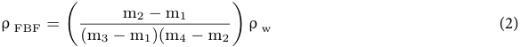

Where: where m1 is masses of the empty pycnometer (g), m2 is pycnometer filled with FBF (g), m3 is pycnometer filled with distilled water (g), m4 is pycnometer filled with both FBF and distilled water (g), ρFBF is density of FBF (g/cm[3] ), and ρw represent the density of distilled water (g/cm[3] ). 

Proximate composition determination The moisture content of the fiber was determined using the oven-drying method. The FBF sample was placed in the oven set at 105 °C and weighed using an analytical balance after drying and compared with the initial weight to determine the loss. Weighing was repeated every 2 h until the sample showed no progressive weight change (i.e., ≤ 0.05%). The moisture content was determined using the following expression: 

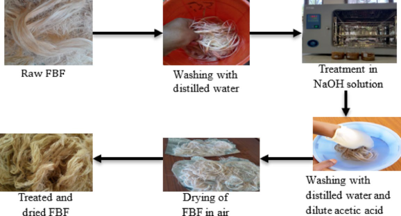

**Fig. 1** . Schematic representation of the alkali treatment process of FBF. 

**Scientific Reports** |        (2025) 15:25446 

3 

| https://doi.org/10.1038/s41598-025-10825-1 

www.nature.com/scientificreports/ 

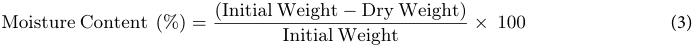

The ash content determination was performed based on ASTM D2584 and calculated by using the following expression: 

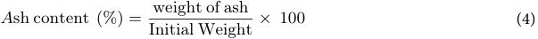

The Volatile matter was determined based on ASTM E872 method and calculated as: 

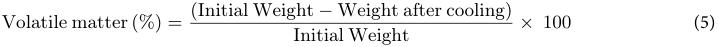

The fixed carbon content was determined based on D3172-07a ASTM method. 

Fixed Carbon (%) = 100 _−_ (% ash content + % Volatile content + %Moisture content) (6) 

Chemical composition determination Figure 2 presents the schematic of chemical composition determination of the FBF. The extractive content of FBF was investigated using the hot extraction method[33] . The extractives were determined from initial mass and the extractive-free and calculated using the expression from[34] : 

> [)] Extractive free (%) =[(][initial wei][g][ht] _[ −]_[extractive free wei][g][ht] _×_ 100 (7) initial weight 

The total amount of lignin was determined by taking the sum of the lignin that is acid-soluble and acid-insoluble. The acid-insoluble lignin (AIL) content of FBF was determined using the standard national renewable energy laboratory procedure and calculated as: 

The acid-soluble lignin (ASL) content of FBF was measured in the research-grade lab at the Bahir Dar Institute of Technology, Bahir Dar University, Ethiopia, using a UV-visible spectrophotometer. Using the hydrolysis liquor aliquot obtained in the acid-insoluble lignin step, the absorbance of the sample at an appropriate wavelength has been measured. Sulfuric acid (3%) was used to dilute the sample, and the same solvent was used as a blank. The absorbance was recorded to three decimal places, and each sample was analyzed in triplicate. The amount of acid soluble lignin was calculated on an extractives-free basis as follows: 

(UV abs _×_ volume of filtrate _×_ dilution) Acid soluble lignin (%) =[100] (9) ϵ _×_ oven dry weight sample _×_ path length _[×]_ 

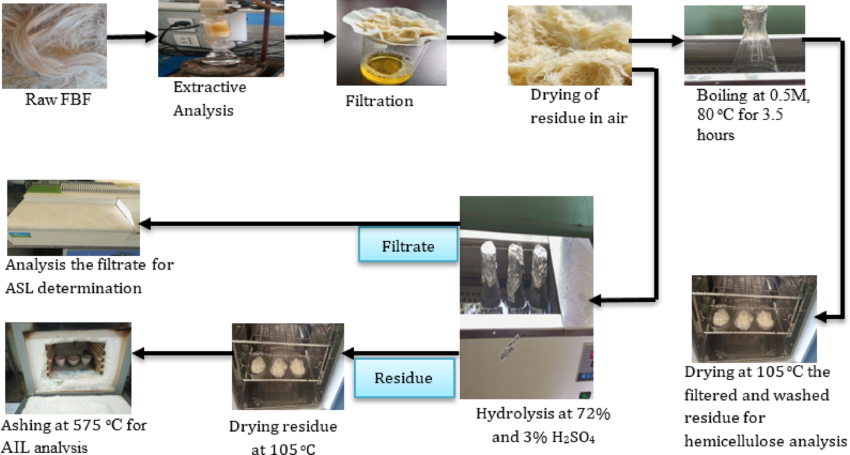

**Fig. 2** . Schematic presentation of chemical composition determination process for FBF. 

**Scientific Reports** |        (2025) 15:25446 

4 

| https://doi.org/10.1038/s41598-025-10825-1 

www.nature.com/scientificreports/ 

Where UVabs is the average UV-Vis absorbance for the sample at a wavelength of 320 nm, the volume of filtrate is the volume of hydrolysis liquor, ε is the absorptivity of the biomass at a recommended wavelength of 30 L/g cm, and the path length is the path length of the ultraviolet visual cell in 1 cm. The dilution was determined as: 

Dilution =[volume of solvent][ +][ volume of dilutin][g][ solvent] (10) volume of sample 

The hemicellulose content was determined based on the method developed by Merais et al.[35] and was calculated as follows: 

Dry weight of extractive free FBF _−_ Dry weight of FBF after treatment Hemicellulose (%) = _×_ 100 (11) ( Dry weight of extractive free FBF ) 

The cellulose content (%w/w) was calculated using Eq. (11) Assuming that cellulose, hemicellulose, extractives, and lignin are the only component of the complete FBF. Cellulose (%) = 100 _−_ [lignin (%) + hemicellulose (%) + extractive (%)] (12) 

Tensile strength The tensile strength of FBF was determined using the ES method of testing the mechanical properties of fiber material in the Ethiopian textile and fashion technology institute (EiTEX) laboratory, Bahir Dar University, Ethiopia. The test was done using a universal tensile strength testing machine with a load cell of 5000 N, a fiber length of 50 cm, and a test speed of 100 mm/min. For each run, 5 samples of fiber were measured for mechanical properties, and the average of the tests was taken for a specific sample. The tensile strength of the fiber was obtained from the ratio of maximum resistance force to denier. The tensile strength of FBF, expressed in MPa, was calculated using conversion factors in Eq. (21) from derived laboratory test values, including force, mass, and the length of the fiber. 

1g _/_ m = 9000 denier, 1 gram _−_ force/denier = 0.113 cN/tex and 1MPa = 0.111 cN/tex (13) 

Where: N = newton, g/m = gram per meter, cN/tex = centi newton per Tex, MPa = mega pascal. 

Water absorption The water absorption tests were conducted according to Yimer and Gebre[36] to find out how the alkali treatment affected the fiber’s capacity to absorb water. The water absorption percentages of the samples were calculated using Eq. (12). 

weight after immersion _−_ weight before immersion Water absorption (%) = _×_ 100 (14) ( weight before immersion ) 

FTIR spectroscopic analysis The surface functional groups of the FBFs were investigated using FTIR spectroscopy based on Lun et al.[37] . The infrared spectra of the fibers were obtained using a JASCO FT-IR 6600 spectrophotometer machine from the Bahir Dar Institute of Technology’s research grade laboratory. Spectra between 400 and 4000 cm[−1] were collected using Attenuated Total Reflectance (ATR) mode, and %T values were recorded. 

Termogravimetric analysis In this work, the thermal characteristics of FBF were tested using an HCT-1 Thermogravimetric analyzer based on Lai et al.[38] in the research-grade laboratory at Bahir Dar Institute of Technology. Before this test, the fibers were dried at 60 °C for 24 h and placed in a desiccator. The fibers were chopped into fine pieces, and a weight of around 10 mg was tested at temperatures ranging from ambient to 600 °C in an inert nitrogen environment with a flow rate of 40 ml/min and a heating rate of 15 °C/min. 

_SEM Analysis_ . 

Imaging in a SEM was performed based on Amiandamhen, et al.[39] by scanning an electron beam across the surface of a specimen. Both treated and untreated FBFs were scanned and analyzed to investigate the effect of treatment on the microstructure of the fibers. 

## **Results and discussion** 

## **Fiber density and diameter** 

The diameter and density of untreated FBF were compared with the fiber treated with NaOH at the optimum treatment conditions of 6.3 w/v%, 80.6[o] C, and 60 min. The optical microscopic images of untreated and 3 alkali-treated fibers are shown in Fig. . The diameter of untreated FBF varies from 65 μm to 312 μm and the average diameter of the thirty samples was found to be 193 ± 0.21 μm. After alkali-treatment, the diameter of the fiber varies from 51 μm to 249 μm and the average value is 165 ± 0.37 μm. The results closely conform to the results reported by Bekele et al. (2022). The reduction of fiber diameter after alkali-treatment is due to removal of impurities from the fiber surface[22] . The densities of untreated and Alkali-treated FBF were found to be 1.467 ± 0.0043 and 1.534 ± 0.0052, respectively. Increase of the density after treatment is due to the removal of the less denser components such as lignin and hemicellulose[27] . 

Many researchers have reported comparable densities for natural fibers such as kenaf, sisal, hemp, and banana. For untreated fibers, the densities were found to be 1.374–1.426 g/cm[3] (kenaf), 1.66 ± 0.128 g/cm[3] 

**Scientific Reports** |        (2025) 15:25446 

5 

| https://doi.org/10.1038/s41598-025-10825-1 

www.nature.com/scientificreports/ 

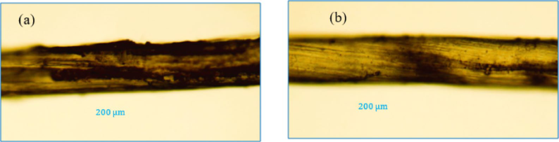

**Fig. 3** . Optical microscopic images of FBF to determine fiber diameter: ( **a** ) before treatment ( **b** ) after treatment. 

(sisal), 2.1–2.45 g/cm[3] (hemp), and 1.203–1.150 g/cm[3] (banana). After alkali treatment, the densities shifted to 1.458–1.492 g/cm[3] (kenaf), 1.532–1.788 g/cm[3] (sisal), 1.249 g/cm[3] (hemp), and 1.32–1.45 g/cm[3] (banana)[37][–][40] . 

## **Proximate composition analysis** 

The proximate compositions of untreated FBF were compared with the fiber treated with NaOH at the optimum treatment conditions of 6.3 w/v%, 80.6[o] C, and 60 min. The amount of moisture contents of the untreated and alkali-treated FBFs were determined to be 8.82 ± 0.23% and 5.46 ± 0.42%, respectively. The moisture level of the fiber after treatment is reduced due to the removal of moisture-binding components such hemicellulose. This improves the fiber’s stability and resistance to mold, mildew, and degradation. Similar results ranging from 7.20 to 12.15% have been reported by Addis et al.[40] . The moisture level of the natural fiber that can be employed as reinforcement has a significant impact on the strength properties of composite materials. When the fiber contains large amount of moisture, the mechanical properties of the composite substantially weakens. This is a result of the fiber’s frequent swelling and shrinking, which causes voids to occur and cracks to grow over time. Additionally, when more moisture is absorbed by the composite material, the rate of material breakdown is accelerated. Therefore, to maintain its moisture content at a minimum, it is essential to either choose fibers with low moisture absorption capabilities or to adopt an adequate fiber treatment plan. Based on the results of this study, alkali-treated FBF can be considered as reinforcement due to its low moisture level. 

The ash contents of the untreated and alkali-treated fibers were 3.88 ± 0.17% and 2.96 ± 0.22, respectively. Ash contents in the range of 1.00-5.66% have been reported[25][–][27] . From the results, it can be noted that alkali treatment decreases the ash content due to the removal of mineral-rich non-cellulosic components. Increased ash content slightly decreases the mechanical properties of the composite due to a tendency for shorter fiber lengths in the composite matrix. Increased ash content in natural fibers typically indicates a higher concentration of inorganic minerals and impurities. This can affect fiber properties in several ways, contributing to shorter fiber lengths. The presence of ash can disrupt the formation and integrity of the fiber’s cell wall structure. High levels of inorganic materials may interfere with cellulose and hemicellulose alignment, leading to weakened fibers that can break more easily. Ash content can make fibers more brittle. When fibers are subjected to mechanical forces, brittle fibers are more likely to fracture, resulting in shorter lengths[41] . Shorter fibers generally provide less effective reinforcement, which can lead to decreased tensile strength and stiffness of the composite. Higher ash content can also affect the bonding between the fibers and the matrix material[42] . Poor adhesion can lead to premature failure under mechanical loading, reducing the overall strength and toughness of the composite. Hence, it can be concluded that alkali-treated FBF is suitable for reinforcement for its low ash content. 

Dealing with volatile matter and fixed carbon is important in reinforcement materials, especially when considering materials that involve organic components. In construction materials, especially those exposed to heat or fire hazards, high volatile matter content can increase flammability and pose safety risks. High volatile matter can affect the mechanical properties of materials[43] . For instance, in materials like wood or certain organic composites, volatile components can contribute to dimensional instability, shrinkage, or changes in strength properties over time. In construction materials, higher fixed carbon content generally indicates better stability and resistance to thermal degradation. Fixed carbon contributes to the structural integrity and durability of materials. For instance, in carbon-based materials like carbon fiber composites or activated carbon used in filters, high fixed carbon content enhances mechanical strength and adsorption properties. Alkali-treated FBF fixed carbon content was increased from 14.46 to 18.3% due to the reduction of volatile components, leaving behind a higher proportion of carbon content relative to other elements. The reduction of volatile matter from 72.8 to 65.7% after treatment was due to the removal of excess moisture and oils, making the fibers less prone to degradation. Therefore, alkali-treated FBF shows improved fixed carbon and reduced volatile matter, and the application of the fiber can further be enhanced by completely encapsulating the fiber in the matrix reducing exposure to air and minimizing the potential for combustion. 

## **Chemical composition analysis** 

The chemical nature of natural fibers greatly determines their mechanical properties. The cellulose content . has a significant impact on the mechanical properties of plant-based fibers, such as strength and stiffness[44] Cellulose is responsible for the high tensile strength of the fiber, which allows it to tolerate mechanical loads within polymeric matrices. Moreover, it is a highly stable polymer, enabling it resist to chemical attacks. The results show that alkali treatment significantly alters the chemical composition of FBF; it increases its cellulose 

**Scientific Reports** |        (2025) 15:25446 

6 

| https://doi.org/10.1038/s41598-025-10825-1 

www.nature.com/scientificreports/ 

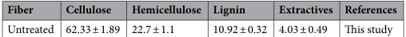

**----- Start of picture text -----** 
Fiber Cellulose Hemicellulose Lignin Extractives References Untreated 62.33 ± 1.89 22.7 ± 1.1 10.92 ± 0.32 4.03 ± 0.49 This study **----- End of picture text -----** 

|**Fiber**|**Cellulose**|**Hemicellulose**|**Lignin**|**Extractives**|**References**|
|---|---|---|---|---|---|
|Untreated|62.33 ± 1.89|22.7 ± 1.1|10.92 ± 0.32|4.03 ± 0.49|Tis study|
|Treated|84.16 ± 1.27|10.34 ± 0.71|4.56 ± 0.43|1.27 ± 0.12|Tis study|
|Untreated|80.88 ± 0.09|10.90 ± 0.09|10.43 ± 0.05|5.13 ± 0.09|27|
|Treated|82.97 ± 0.28|6.33 ± 0.08|3.00 ± 0.01|1.80 ± 0.69|27|
|Bamboo|26–43|20.5–30|21–31|–|46|
|Banana|57.6–62.5|19–29.1|5–13.3|–|40|
|Sisal|47.6–78|10–17|10–14|–|47|
|Jute|61–71|14–20|12–13|1.7|48|
|Hemp|68–81|2–22.4|3.5–10|–|49|
|Flax|71–75.2|8.6–20.6|2.2–4.8|3.5-4|50|
|Kenaf|53.5–72|2.1–20.3|9–17|1.4|51|

**Table 1** . Comparison of the chemical compositions of untreated and alkali-treated FBF (at 6.3 w/v%, 80.6[o] C, and 60 min) with other natural fibers. 

|**Fiber**|**Tensile strength (MPa)**|**Reference**|
|---|---|---|
|FBF|232.81-725.24|Tis study|
|Bamboo|411.7|46|
|Sisal|400–700|47|
|Jute|393–723|45|
|Hemp|580–1110|45,52|
|Flax|345–1500||
|Kenaf|930||
|Enset|67–923|52|
|banana|180–914|44|

**Table 2** . Comparison of tensile strength of untreated FBF with other natural fibers. 

content while reducing hemicellulose, lignin, and extractives. The chemical compositions of untreated FBF were also compared with the fiber treated with NaOH at the treatment conditions of 6.3 w/v%, 80.6[o] C, and 60 min. This increase in cellulose content after treatment is due to the removal of non-cellulosic components through the alkali treatment process. These changes improve the fiber’s suitability for applications requiring high cellulose content, such as in composite materials. The amount of extractives in the fiber is relatively low. 

As shown in Table 1, untreated and treated FBFs have high cellulose content, but the lignin content accounts only 10.92 ± 0.3% (7.85 ± 0.15% acid insoluble and 3.07 ± 0.168% acid soluble) and 4.56% ( 3.41 ± 0.43% acid insoluble and 1.87 ± 0.02% acid soluble), respectively. Similar results have been reported by other researchers[25][,][26] . This treatment enhances the purity of cellulose by breaking down the non-cellulosic components, leading to higher cellulose content in the treated fibers. Since cellulose gives structural strength for both the fibers and the composite materials manufactured from it, it can be concluded that FBF is one of the possible potentials to be employed for the production of composites where strength is the primary consideration. 

As it can be seen from Table 1, FBF shows comparable cellulose content to other natural plant fibers. The cellulose polymer chains separate from one another because the hemicellulose in the fiber forms a barrier between them. Consequently, strain forms and persists in the chains of cellulose polymers. This effectively results in high elongation at break and tensile strength for the fibers[10] . Like kenaf, flax, and jute fibers, the FBF also has a low . extractive content. High extractive concentrations in the biomass affect processing and composite strength[45] 

## **Effect of treatment on properties of FBF** 

The tensile strength of untreated FBF ranges from 232.81 MPa to 725.24 MPa, with an average strength of 615.37 MPa. Table 2 compares the physical and mechanical properties of false banana fiber with those of other natural fibers. The data shows that false banana fiber has comparable physical and mechanical properties. Its tensile strength is comparable to or superior some of the natural fibers listed in the table. The FBFs high cellulose content and favorable crystallite orientation are responsible for their noticeably good tensile qualities[53] . The results of the alkali treatment of FBF for the tensile strength and water absorption properties are presented in Table 3. According to the response surface method, the maximum tensile strengths of alkali-treated FBF were also found to be 786.91 MPa, enhanced by about 28%. The corresponding water absorptions of the untreated and alkali-treated fibers were 209.36% and 81.74%, respectively. The maximum tensile strength was obtained with the fiber treated at an alkali concentration of 5.5 w/v%, a temperature of 70[o] C, and treatment times of 45 min. 

These optimized conditions promote chemical reactions, ensure the formation of stable phases, develop a desirable microstructure, and maintain the physical integrity of the material. However, the minimum water absorption (62.22%), reduced by 70.28%, was obtained at conditions of alkali concentration of 8 w/v%, a 

**Scientific Reports** |        (2025) 15:25446 

7 

| https://doi.org/10.1038/s41598-025-10825-1 

www.nature.com/scientificreports/ 

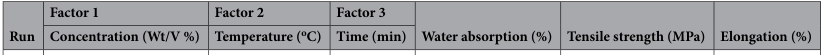

**----- Start of picture text -----** 
Factor 1 Factor 2 Factor 3 Run Concentration (Wt/V %) Temperature ( [o] C) Time (min) Water absorption (%) Tensile strength (MPa) Elongation (%) **----- End of picture text -----** 

|**Run**|**Factor 1**|**Factor 2**|**Factor 3**|**Water absorption (%)**|**Tensile strength (MPa)**|**Elongation (%)**|
|---|---|---|---|---|---|---|
||**Concentration (Wt/V %)**|**Temperature (oC)**|**Time (min)**||||
||||||||
|1|5.5|70|60|74.75|779.27|2.96|
|2|5.5|70|45|80.61|781.75|2.82|
|3|8|90|60|62.22|725.28|3.41|
|4|5.5|70|45|81.45|781.24|2.84|
|5|5.5|50|45|90.05|741.15|3.22|
|6|5.5|70|45|79.23|778.12|2.89|
|7|8|50|30|92.58|730.57|3.32|
|8|3|70|45|89.66|734.17|3.25|
|9|8|70|45|75.68|75 1.29|3.11|
|10|5.5|70|45|81.7 4|786.91|1.96|
|11|3|90|60|74.15|718.54|3.18|
|12|5.5|90|45|75.33|748.83|3.20|
|13|3|50|60|91.04|674.33|4.08|
|14|5.5|70|30|88.68|765.82|3.07|
|15|8|90|30|72.61|683.68|3.69|
|16|3|50|30|101.75|661.84|4.11|
|17|3|90|30|91.04|678.56|3.78|
|18|8|50|60|73.64|699.26|3.58|

**Table 3** . Tensile strength, water absorption, and elongation results of alkali treated FBF. 

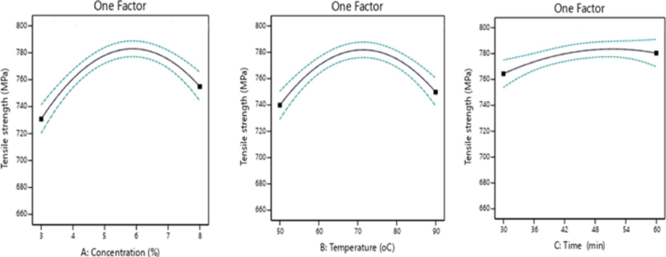

**Fig. 4** . The effects of factors on tensile strength of false banana fibers: ( **a** ) alkali concentration, ( **b** ) treatment temperature, ( **c** ) treatment time. 

temperature of 90[o] C, and immersion duration of 60 min. It can be noted that strong treatment conditions (high alkali concentration, long treatment time, and high temperature) significantly reduces the water absorption capacity of the fiber. Alkali-treated FBF exhibits reduced moisture absorption compared to untreated fiber because of the removal of hydrophilic components like hemicellulose and lignin, increased cellulose crystallinity, potential introduction of hydrophobic properties[54] , and overall improved structural stability. These factors collectively contribute to the enhanced moisture resistance of alkali-treated fibers, making them advantageous for applications where moisture absorption is a concern. 

## _Tensile strength_ 

Figure 4 shows the effects of the factors on the tensile strength of alkali-treated FBF. By increasing the alkali concentration from 3 to 5.5%, the tensile strength of the fiber increased from 661.84 to 786.91 MPa, by 19%. Alkali treatment modifies the surface of FBF by removing non-cellulosic components like lignin, hemicellulose, and extractives exposing more cellulose, which is the primary load-bearing component in fibers[55] . A higher concentration of alkali (5.5%) likely results in more effective removal of impurities and better exposure of cellulose, thereby enhancing the bonding capability of the fibers in the composite matrix. However, further increasing the concentration resulted in a decrease in strength because of the deformation of individual . microfibrils by breaking interlocking hydrogen bonds and removing cellulose from the fiber[56] 

**Scientific Reports** |        (2025) 15:25446 

8 

| https://doi.org/10.1038/s41598-025-10825-1 

www.nature.com/scientificreports/ 

The defibrillation of fiber clusters results in a decrease in the fiber diameter increasing the strength. The removal of hemicelluloses and non-cellulosic material also allows the cellulose chains to align toward loading, thus increasing the fineness and strength of the fiber[57] . Chemically modified FBFs at high NaOH concentrations indicated a significant loss in tensile strength, which was attributed to significant delignification and breakdown of cellulose chains. Strong alkaline treatments have been observed to reduce fiber strength by breaking down the bond structure and disintegrating non-cellulosic materials[58] . 

Considering the effect of temperature, the maximum strength was achieved at a temperature of 70[o] C. The increase in fiber strength with increasing treatment temperature from 50 to 70 °C is primarily due to enhanced chemical reactions, improved molecular mobility, higher crystallinity, optimal removal of impurities, and considerations of thermal stability. These factors collectively contribute to strengthening the fiber structure, making it more resilient to tensile forces and improving its mechanical performance. Further increases in temperature resulted in a reduction in tensile strength due to structural damage and thermal degradation. The elongation processes are impacted by high-temperature stress, which reduces fiber homogeneity and shortens . fiber length[59] 

Tensile strength of FBF increases with increasing time due to the creation of a better reaction environment. The minimum strength observed at lower treatment times is primarily due to incomplete chemical reactions, insufficient penetration of treatment solutions, and limited structural changes within the fibers. Further increasing the treatment time results in minor reduction in the tensile strength of the fiber because prolonged treatment causes atmospheric oxidative degradation of FBF. Furthermore, penetration of alkali solution into the fiber structure or cavity may result in mineralization and volumetric expansion of the fiber, which reduces its mechanical properties. Prolonged treatment could cause increased penetration and crystallization of the alkaline in the fibrous structure increasing the mineralization and consequently reducing the mechanical performance of the fibers. Some researchers reported that natural fibers treated with alkaline for a prolonged time exhibited significant weight gain due to penetration of water and alkaline defibrillating the fibers, consequently reducing the strength. 

Figure 5 demonstrates the interaction effects of factors on the tensile strength of the alkali-treated FBF. The model equation developed to predict the tensile strength under alkali treatment conditions is: 

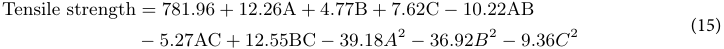

Where A is alkali concentration, B is temperature, and C is time. 

Tensile strength increases with an increase in all the factors up to the center point, while further increases cause a reduction in tensile strength as discussed above. A maximum tensile strength of 786.91 MPa was obtained at the center point of the analysis. 

## _Water absorption_ 

Figure 6 shows the effect of factors on the water absorption of alkali-treated false banana fiber. The decrease in water absorption from 101.75 to 62.22% as alkali concentration increases from 3 to 8% is primarily attributed to the combined effects of reduced hydroxyl group availability (due to the removal of hemicellulose and lignin), increased crystallinity of cellulose, and alterations in surface chemistry. 

The chemical treatment alters the surface chemistry of the fibers, potentially introducing more hydrophobic characteristics due to changes in functional groups or the presence of alkali-insoluble residues. These changes further reduce the fiber’s affinity to water. Crystalline regions of cellulose have fewer accessible hydroxyl groups and are less prone to swelling or absorbing water compared to amorphous regions[60] . As the temperature increases, the water absorption decreases and the minimum water absorption was achieved at a temperature of 90[o] C. High temperatures promote the removal of hemicellulose and non-cellulosic materials from the fiber. Water absorption decreases with increasing time for the better removal of lignin, hemicellulose, and extractive . components from the fiber[61] 

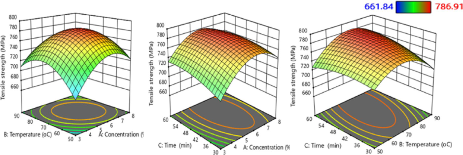

**Fig. 5** . interaction effects of factors on tensile strength of false banana fibers. 

**Scientific Reports** |        (2025) 15:25446 

9 

| https://doi.org/10.1038/s41598-025-10825-1 

www.nature.com/scientificreports/ 

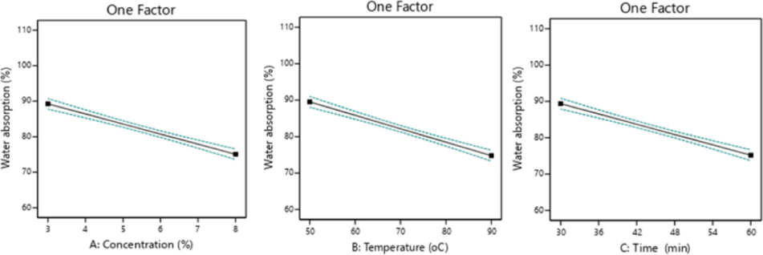

**Fig. 6** . The effect of factors on water absorption of false banana fibers. 

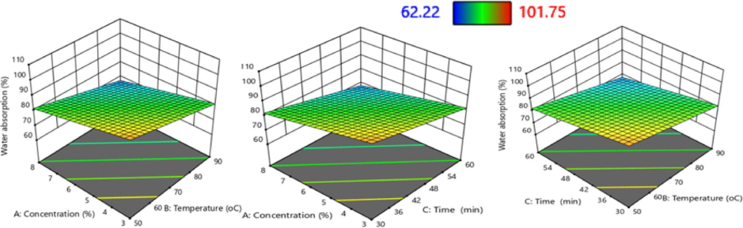

**Fig. 7** . interaction effects of factors on water absorption of false banana fibers. 

Figure 7 shows the interaction effects of factors on the water absorption of the alkali-treated FBF; and all interaction combinations result in a decrease in water absorption. The removal of hydrophilic chemical compounds, such as hemicelluloses and lignin, by surface alkali treatment results in a change in the morphology . of the fibers, which in turn reduces the fibers’ capacity to absorb water[62] 

Additionally, the shift in the flexible links between cellulose and hemicellulose caused by stiffer cellulosecellulose bonds make the fibers more hydrophobic, which promote a reduction in the fiber water intake capacity. The model equation developed to predict the water absorption from the alkali treatment conditions is: 

Water absorption = 82 _._ 01 _−_ 7 _._ 09 A _−_ 7 _._ 37 B _−_ 7 _._ 09 C (16) 

The linear relationship between treatment conditions and water absorption is often observed due to the additive and proportional nature of their effects on material properties. For instance, higher treatment temperatures or longer treatment times can lead to more efficient removal of non-cellulosic components (such as lignin or hemicellulose) from cellulose-based materials. According to this study, design expert software anticipated the optimum treatment conditions with reduced water absorption and enhanced tensile strength at 6.3 w/v%, 80.6[o] C, and 60 min. The water absorption and tensile strength of the fiber at these treatment conditions were obtained to be 68.67% and 775.24 MPa, respectively. 

## _Thermal property_ 

It is necessary to study the degradation kinetics and thermal performance of natural fibers at different temperatures, as it affects the durability when applied as reinforcements. Figure 8 shows the analysis of the thermal properties of both untreated and treated FBFs. Water evaporation caused weight loss in the first stage, which is not significant for both untreated and treated FBFs. The untreated fiber maintains its thermal stability between room temperature and 264.3[o] C, and when treated, its thermal property improves up to 298.6[o] C, up to which the fibers can be processed without experiencing any thermal degradation. 

Similar results were reported by Addis et al.[40] for untreated fiber. The fibers exhibit significant weight losses in the second stage between temperatures of 264.3 and 395.2 °C for untreated fibers and between 298.6 and 416.4 °C for alkali-treated fibers. The DTGA curves show that a maximum weight loss rate occurred at 378.5 and 401.4 °C for untreated and treated fibers, respectively. 

**Scientific Reports** |        (2025) 15:25446 

10 

| https://doi.org/10.1038/s41598-025-10825-1 

www.nature.com/scientificreports/ 

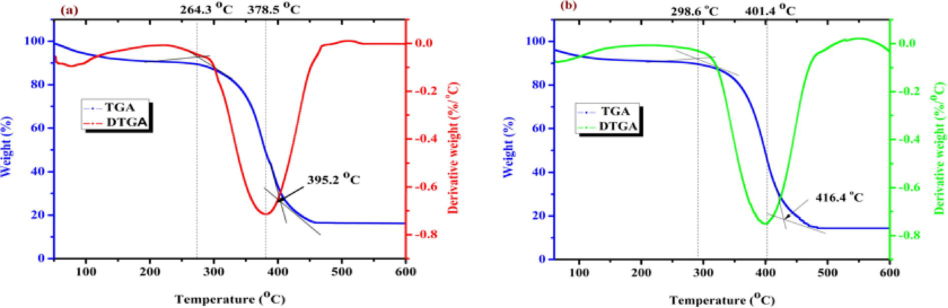

**Fig. 8** . Thermal property analysis curves obtained in Nitrogen atmosphere of FBF ( **a** ) before treatment ( **b** ) after treatment. 

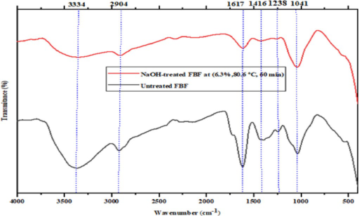

**Fig. 9** . FTIR analysis curves of raw and treated FBF. 

These significant weight losses were mostly caused by the degradation of cellulose and hemicellulose components of fiber polymers for untreated and cellulose components for alkali-treated fibers. Degradation of the lignin components occurs above 395.2 °C for untreated fibers. 

As we can see from the result, the weight loss of alkali-treated fibers is reduced for many reasons. Alkali treatment removes impurities such as hemicellulose and extractives from the fibers. These impurities are less thermally stable than cellulose, which is the main component of fibers. Removing the impurities increases the overall thermal stability of the fibers. Alkali treatment also increases the crystallinity of cellulose fibers. Crystalline regions of cellulose are more thermally stable than the amorphous regions, so an increase in crystallinity enhances the thermal stability of the fibers. Alkali treatment can modify the surface morphology of fibers, making them more uniform and reducing the presence of defects. This improved morphology can enhance the thermal stability of the fibers. Furthermore, alkali treatment can lead to chemical modifications of the cellulose fibers, such as the introduction of carboxylate groups, which can alter the thermal degradation . behavior of the fibers, sometimes leading to increased thermal stability[63] 

## _Effect of treatment on chemical properties of fibers_ 

As any lignocellulosic biomass, FBF consists of cellulose, hemicellulose, lignin, wax, and other ingredients. The 9 effect of alkali treatment on fiber chemical properties (surface characteristics) was analyzed using FTIR. Figure shows that the FTIR spectra of raw and treated FBFs recorded in the range from 4000 to 500 cm[− 1] demonstrated distinct peaks. The peaks in the bands of 3334 cm[− 1] exhibited hydrogen-bonded hydroxyl groups for untreated and treated FBFs of the lignin, hemicellulose, and cellulose components in their structure, respectively. In the alkali-treated fibers, the appearance of this peak attributed to the existence of hydrogen bonded hydroxyl groups in their cellulose structure. 

Similar observation was made by Teli and Terega[53] ). Similarly, the peaks at 2904 cm[− 1] are associated with the C-H stretching in the methyl and methylene groups of cellulose and hemicellulose for untreated fiber[64] . The reduction of the intensity of peaks at this band for alkali-treated fibers is an indication of hemicellulose removal. The appearance of peaks at 1617 cm[− 1] is attributed to C = O and C = C stretching in carbonyl and alkene from hemicellulose for untreated false banana fiber[65] . In the case of NaOH treatment, the decreased intensity of those peaks proves that hemicellulose is reduced by NaOH treatment. The peaks with frequencies of 1416 cm[− 1] 

**Scientific Reports** |        (2025) 15:25446 

11 

| https://doi.org/10.1038/s41598-025-10825-1 

www.nature.com/scientificreports/ 

**----- Start of picture text -----** 
Band position (cm [−1] ) Functional group Polymer 3334 hydrogen-bonded hydroxyl groups Lignin, hemicellulose **----- End of picture text -----** 

|**Band position (cm−1)**|**Functional group**|**Polymer**|
|---|---|---|
|3334|hydrogen-bonded hydroxyl groups|Lignin, hemicellulose|
|2904|C-H stretching in the methyl and methylene groups|Cellulose and hemicellulose|
|1617|C = O and C = C stretching in carbonyl and alkene|Cellulose|
|1416|scissoring of CH2groups|Cellulose, hemicellulose, and lignin|
|1238|C-O stretching vibration|Lignin|
|1041|C-C-O stretching glycosidic linkage|Cellulose|

**Table 4** . Assignments FTIR bands for FBF. 

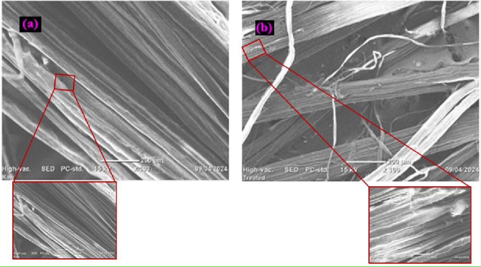

**Fig. 10** . SEM image of FBF ( **a** ) before treatment ( **b** ) after treatment. 

are also attributed to the characteristic scissoring of CH2 groups in cellulose, hemicellulose, and lignin in untreated[66] . Significant decrement in the intensity of these peaks proves that there is a removal of both lignin and hemicellulose due to alkali treatment. However, the existence of a small peak at this band indicates the presence of cellulose. For untreated FBF, a peak around 1238 cm[− 1] was observed corresponding to the C-O stretching vibration of lignin constituents; this peak disappeared for alkali-treated fiber due to the removal of lignin[67] . The appearance of broad bands at 1041 cm[− 1] in both untreated and treated FBF indicates the presence of C-C-O stretching in the glycosidic linkage of the cellulose[68] . Generally, those compounds do not exist on treated fibers, indicating that treatment does remove those compounds from the fibers. In general, FTIR analysis shows that alkali treatment at optimum conditions removes hemicellulose, lignin, and other weak components without damaging the cellulose components of FBF. The identified functional groups along with their corresponding wavenumbers and assignments of FTIR analyses are summarized in (Table 4). 

## _Effect of treatment on morphology of fibers_ 

In this study, scanning electron microscope (SEM) was used to analyze the microstructures of both alkalitreated and raw FBFs. As shown in Fig. 10b, the alkali-treated fibers exhibited a cleaner and rougher surface 10 structure compared to untreated fibers in Fig. a. the inset SEM images indicate the fiber structure at 10X higher magnifications for the untreated and treated fibers. 

This indicates that the alkali treatment effectively removed impurities and altered the fiber surface. The . roughness observed can be attributed to the degradation of the amorphous regions within the fiber structure[69] Hemicellulose, which is hydrophilic and contributes to the amorphous nature of fibers, degrades to different degrees when exposed to alkali treatment stripping-off of more cellulose microfibrils and increasing the surface roughness of the fibers[62] . 10b clearly demonstrates that the non-cellulosic or amorphous components have been effectively removed and the cellulose structure is maintained at the optimum alkali treatment of the fiber, which significantly improves the mechanical performance of the fibers. 

**Scientific Reports** |        (2025) 15:25446 

12 

| https://doi.org/10.1038/s41598-025-10825-1 

www.nature.com/scientificreports/ 

## **Conclusion** 

This study demonstrates the performance of FBF by modifying its properties through alkali treatment. Response surface methodology central composite method was used to evaluate the effect of three independent variables (NaOH concentration, soaking duration, and treatment temperature) on the properties of FBFs. Optimal tensile strength and water absorption were attained at optimal treatment conditions of 80.6[o] C, 6.3wt/v% alkali concentration, and soaking duration of 60 min. At those treatment conditions, fiber thermal properties, morphology, functional group identification, fiber density and fiber diameter were explored and showed improved tensile strength and reduced water absorption, enhancing its suitability for composite materials due to the removal of impurities and non-cellulose components like hemicellulose and lignin, resulting in a rearrangement and increased crystallinity of the fiber. Through comprehensive analyses of proximate and chemical compositions, it was determined that FBF possesses suitable properties for reinforcement applications. The alkali treatment process increased the cellulose content from 62.33 ± 1.89% to 84.16 ± 1.27%. However, the study showed that, excessive alkali treatment or harsh conditions can lead to a decrease in tensile strength by causing degradation or weakening of the fiber structure. Since cellulose gives structural strength for natural fibers and the composite materials manufactured from the fiber, it can be concluded that FBF is one of the possible potentials to be employed for the production of composites where strength is the primary consideration. However, alkaline treatment of natural fibers causes additional production costs when considering for different applications, such as in geopolymeric concretes. Furthermore, the treatment process is not yet standardized and makes it difficult to use the fibers at commercial scale. On the other hand, natural fibers are highly abundant in nature as raw and waste materials and some have been studied to show superior strength and adhesion characteristics with matrices compared to synthetic fibers. Moreover, the use of natural fibers brings sustainability and reliability with reduced environmental impact. Hence, it can be concluded that, with continued research and development, natural fibers such as FBF can offer a sustainable and viable alternative to synthetic fibers as reinforcement in building and construction materials in the near future. 

## **Data availability** 

All the necessary data generated or analyzed during this study are included in this article. 

Received: 12 June 2025; Accepted: 7 July 2025 

## **References** 

1. Jaiswal, K. K. et al. Renewable and sustainable clean energy development and impact on social, economic, and environmental health. _Energy Nexus_ **7** 100118. https://doi.org/10.1016/j.nexus.2022.100118 (2022). 

2. Naik, V., Kumar, M. & Kaup, V. A review on natural fiber composite materials in automotive applications. 1–10. (2022). 

3. Geremew, A., De Winne, P., Demissie, T. A. & De Backer, H. Surface modification of bamboo fibers through alkaline treatment: morphological and physical characterization for composite reinforcement. _J. Eng. Fibers Fabr._ **19** h t t p s : / / d o i . o r g / 1 0 . 1 1 7 7 / 1 5 5 8 9 2 5 0 2 4 1 2 4 8 7 6 4 (2024). 

4. Eyupoglu, S., Eyupoglu, C. & Merdan, N. Characterization of a novel natural plant-based fiber from reddish shell bean as a potential reinforcement in bio-composites. _Biomass Convers. Biorefinery_ 4259–4268. https://doi.org/10.1007/s13399-024-05269-y (2024). 

5. Mizera, C., Herak, D., Hrabe, P. & Muller, M. Mechanical behavior of Ensete ventricosum fiber under tension loading mechanical behavior of Ensete ventricosum fiber under tension. _J. Nat. Fibers_ . **00** (00), 1–10. https://doi.org/10.1080/15440478.2016.1206500 (2016). 

6. Blomme, G. et al. Assessing Enset fibre yield and quality for a wide range of Enset [Ensete ventricosum (Welw.) Cheesman] landraces in Ethiopia. _Fruits_ **73** (6), 328–341. https://doi.org/10.17660/th2018/73.6 (2018). 

7. Seid, N., Griesheimer, P. & Neumann, A. Investigating the processing potential of Ethiopian agricultural residue enset/ensete ventricosum for Biobutanol production. _Bioengineering_ **9** (4), 1–14. https://doi.org/10.3390/bioengineering9040133 (2022). 

8. Sathishkumar, T. P. et al. Characterization of new cellulose fiber extracted from second generation bitter Albizia tree. _Sci. Rep._ **14** (1), 1–12. https://doi.org/10.1038/s41598-024-51719-y (2024). 

9. Balcha, D. T., Kulig, B., Hensel, O. & Woldesenbet, E. Mechanical properties of Enset fibers obtained from different breeds of Enset plant. _World Acad. Sci. Eng. Technol. Int. J. Aerosp. Mech. Eng._ **15** (1), 7–14 (2021). 

10. Dejene, B. K. & Geletaw, T. M. A review on false banana (Enset Ventricosum) Fiber reinforced green composite and its applications. _J. Nat. Fibers_ **20** (2). https://doi.org/10.1080/15440478.2023.2244163 (2023). 

11. Nurazzi, N. M. et al. Thermogravimetric analysis properties of cellulosic natural fiber polymer composites: A review on influence of chemical treatments. _Polymers_ **13** (16). https://doi.org/10.3390/polym13162710 (2021). 

12. Hashim, M. Y. et al. The effect of alkali treatment under various conditions on physical properties of kenaf fiber. _J. Phys.  Conf. Ser._ **914** (1) https://doi.org/10.1088/1742-6596/914/1/012030 (2017). 

13. Eyupoglu, S., Eyupoglu, C. & Merdan, N. Investigation of the effect of enzymatic and alkali treatments on the physico-chemical properties of Sambucus ebulus L. plant fiber. _Int. J. Biol. Macromol._ **266** , 130968. https://doi.org/10.1016/j.ijbiomac.2024.130968 (2024b). 

14. Tengsuthiwat, J. et al. Thermo-mechanical characterization of new natural cellulose Fiber from zmioculus Zamiifolia. _J. Polym. Environ._ **30** https://doi.org/10.1007/s10924-021-02284-2 (2022). 

15. Singh, J. K. & Rout, A. K. Characterization of Raw and alkali-treated cellulosic fibers extracted from Borassus flabellifer L. _Biomass Convers. Biorefinery_ **14** (10), 11633–11646. https://doi.org/10.1007/s13399-022-03238-x (2024). 

16. Andoko, A. et al. Walikukun fiber as lightweight polymer reinforcement: physical, chemical, mechanical, thermal, and morphological properties. _Biomass Convers. Biorefinery_ **15** (1), 1269–1281. https://doi.org/10.1007/s13399-023-05203-8 (2025). 

17. Kar, A. et al. Effect of alkali treatment under ambient and heated conditions on the physicochemical, structural, morphological, and thermal properties of Calamus tenuis cane fibers. _Fibers_ **11** (11). https://doi.org/10.3390/fib11110092 (2023). 

18. Kar, A., Saikia, D. & Pandiarajan, N. Characterization of alkali-treated cellulosic fibers derived from Calamus tenuis canes as a potential reinforcement for polymer composites. _Biomass Convers. Biorefinery_ **15** (5), 7881–7899.  h t t p s : / / d o i . o r g / 1 0 . 1 0 0 7 / s 1 3 3 9 9 - 0 2 4 - 0 5 5 6 0 - y (2025). 

19. Arun Ramnath, R., Senthamaraikannan, P., Gautham, V., Indran, S. & Gapsari, F. Characterization of alkali treated and untreated Abutilon indicum FIBERS. _Ind. Crops Prod._ **222** , 119719. https://doi.org/10.1016/j.indcrop.2024.119719 (2024). 

**Scientific Reports** |        (2025) 15:25446 

13 

| https://doi.org/10.1038/s41598-025-10825-1 

www.nature.com/scientificreports/ 

20. Nasidi, I. N., Ismail, L. H. & Samsudin, E. M. Effect of sodium hydroxide (NAOH) treatment on coconut Coir fibre and its effectiveness on enhancing sound absorption properties. _Pertanika J. Sci. Technol._ **29** (1), 693–706.  h t t p s : / / d o i . o r g / 1 0 . 4 7 8 3 6 / p j s t . 2 9 . 1 . 3 7 (2021). 

21. Kindole, C. F. & Bigambo, P. N. Effect of alkali treatment on the chemical composition and dyeability of sisal fibers. **50** (3), 639–649. (2024). 

22. Hindi, J., Bhat, K. M., Ibrahim, K. S. B. M. G. & A., & Y M, S Physical, morphological, tensile, and thermal stability characteristics of novel Tinospora cordifolia natural Fiber. _J. Nat. Fibers_ . **22** (1), 1–12. https://doi.org/10.1080/15440478.2024.2437539 (2025). 

23. Eyupoglu, S., Eyupoglu, C. & Merdan, N. Extraction and characterization of novel cellulosic fiber from Phytolacca americana plant stem. _Biomass Convers. Biorefinery_ 0123456789 https://doi.org/10.1007/s13399-025-06748-6 (2025). 

24. Kumar, R., Rakesh, P. K., Sreehari, D., Kumar, D. & Naik, T. P. Experimental investigations on material properties of alkali retted Pinus Roxburghii fiber. _Biomass Convers. Biorefinery_ . **14** (17), 21345–21361  https://doi.org/10.1007/s13399-023-04245-2 (2024). 

25. Shahril, S. M. et al. Alkali treatment influence on cellulosic fiber from Furcraea foetida leaves as potential reinforcement of polymeric composites. _J. Mater. Res. Technol._ **19** , 2567–2583. https://doi.org/10.1016/j.jmrt.2022.06.002 (2022). 

26. Bekele, A. E., Lemu, H. G. & Jiru, M. G. Study of the effects of alkali treatment and Fiber orientation on mechanical properties of enset/sisal polymer hybrid composite. _J. Compos. Sci._ **7** (1), 1–11. https://doi.org/10.3390/jcs7010037 (2023). 

27. Bekele, A. E., Lemu, H. G. & Jiru, M. G. Experimental study of physical, chemical and mechanical properties of enset and sisal fibers. _Polymer Testing_ **106** , 107453   h t t p s : / / d o i . o r g / 1 0 . 1 0 1 6 / j . p o l y m e r t e s t i n g . 2 0 2 1 . 1 0 7 4 5 3 (2022). 

28. Temesgen, A. G. False banana fiber process ability enhancement for composite and industrial process ability enhancement of false banana fiber alhayat getu institute of technology for textile. _Garment Fashion Design_ https://doi.org/10.13140/RG.2.2.35250.66243 (2019). 

29. Teli, M. D. & Terega, J. M. Effects of alkalization on the properties of Ensete ventricosum plant fibre. _J. Text. Inst._ **110** (4), 496–507. https://doi.org/10.1080/00405000.2018.1492321 (2019). 

30. Temesgen, A. G. False banana fiber process ability enhancement for composite and industrial process ability enhancement of false banana fiber alhayat getu institute of technology for textile. _Garment Fashion Design_ https://doi.org/10.13140/RG.2.2.35250.66243 (2019). 

31. Lakshmanan, A., Ghosh, R. K., Dasgupta, S., Chakraborty, S. & Ganguly, P. K. Optimization of alkali treatment condition on jute fabric for the development of rigid biocomposite. _J. Ind. Text._ **47** (5), 640–655. https://doi.org/10.1177/1528083716667259 (2018). 

32. Dawit, J. B., Regassa, Y. & Lemu, H. G. Property characterization of acacia tortilis for natural fiber reinforced polymer composite. _Results Mater._ 100054. https://doi.org/10.1016/j.rinma.2019.100054 (2019). 

33. Asmare, F. W. et al. Investigation and application of different extraction techniques for the production of finer bamboo fibres. _Adv. Bamboo Sci._ **7** 100070. https://doi.org/10.1016/j.bamboo.2024.100070 (2024). 

34. Sluiter, A., Ruiz, R., Scarlata, C., Sluiter, J. & Templeton, D. A., Determination of extractives in biomass: Laboratory analytical procedure (LAP). _Tech. Rep._ 1–9  http://www.nrel.gov/biomass/pdfs/42619 (2008). 

35. Merais, M. S. et al. Preparation and characterization of cellulose nanofibers from banana pseudostem by acid hydrolysis: Physicochemical and thermal properties. _Membranes_ **12** (5). https://doi.org/10.3390/membranes12050451 (2022). 

36. Yimer, T. & Gebre, A. Effect of fiber treatments on the mechanical properties of sisal fiber-reinforced concrete composites. _Adv. Civil Eng._ https://doi.org/10.1155/2023/2293857 (2023). 

37. Lun, L. W., Gunny, A. A. N., Kasim, F. H. & Arbain, D. Fourier transform infrared spectroscopy (FTIR) analysis of paddy straw pulp treated using deep eutectic solvent. _AIP Conference Proceedings_ , **1835** https://doi.org/10.1063/1.4981871 (2017). 

38. Lai, T. S. M., Jayamani, E. & Soon, K. H. Comparative study on thermogravimetric analysis of banana fibers treated with chemicals. _Mater. Today: Proc._ **78** (April), 458–461. https://doi.org/10.1016/j.matpr.2022.10.267 (2023). 

39. Amiandamhen, S. O., Meincken, M. & Tyhoda, L. Natural fibre modification and its influence on fibre-matrix interfacial properties in biocomposite materials. _Fibers Polym._ **21** (4), 677–689. https://doi.org/10.1007/s12221-020-9362-5 (2020). 

40. Addis, L. B. et al. Characterization of false banana Fiber as a potential reinforcement material for geopolymer composites. _Green. Energy Technol._ 49–63. https://doi.org/10.1007/978-3-031-33610-2_3 (2023). 

41. Li, J. et al. Research progresses of fibers in asphalt and cement materials: A review. _J. Road. Eng._ **3** (1), 35–70.  h t t p s : / / d o i . o r g / 1 0 . 1 0 1 6 / j . j r e n g . 2 0 2 2 . 0 9 . 0 0 2 (2023). 

42. Zhao, X. et al. Impact of biomass Ash content on biocomposite properties. _Compos. Part. C: Open. Access_ **9** h t t p s : / / d o i . o r g / 1 0 . 1 0 1 6 / j . j c o m c . 2 0 2 2 . 1 0 0 3 1 9 (2022). 

43. Shanmugam, V. et al. A review on combustion and mechanical behaviour of pyrolysis Biochar. _Mater. Today Commun._ **31** h t t p s : / / d o i . o r g / 1 0 . 1 0 1 6 / j . m t c o m m . 2 0 2 2 . 1 0 3 6 2 9 (2022). 

44. Djafari Petroudy, S. R. Physical and mechanical properties of natural fibers. In _Advanced High Strength Natural Fibre Composites in Construction_ https://doi.org/10.1016/B978-0-08-100411-1.00003-0 (Elsevier Ltd., 2017). 

45. Kumar, A. & Srivastava, A. Preparation and mechanical properties of jute fiber reinforced epoxy composites. _Ind. Eng. Manag._ **06** (04). https://doi.org/10.4172/2169-0316.1000234 (2017). 

46. Ebissa, D. T., Tesfaye, T., Worku, D. & Wood, D. Bamboo fiber properties: case study of Ethiopia species. _SN Appl. Sci._ h t t p s : / / d o i . o r g / 1 0 . 1 0 0 7 / s 4 2 4 5 2 - 0 2 2 - 0 4 9 6 5 - 6 (2022). 

47. Naveen, J., Jawaid, M., Amuthakkannan, P. & Chandrasekar, M. Mechanical and physical properties of Sisal and hybrid Sisal fiber-reinforced polymer composites. In _Mechanical and Physical Testing of Biocomposites, Fibre-Reinforced Composites and Hybrid Composites_ https://doi.org/10.1016/B978-0-08-102292-4.00021-7 (Elsevier Ltd., 2018). 

48. Wang, W. M., Cai, Z. S. & Yu, J. Y. Study on the chemical modification process of jute fiber. _Tappi J._ **9** (2), 23–29.  h t t p s : / / d o i . o r g / 1 0 . 3 2 9 6 4 / t j 9 . 2 . 2 3 (2010). 

49. Liu, M., Thygesen, A., Summerscales, J. & Meyer, A. S. Targeted pre-treatment of hemp Bast fibres for optimal performance in biocomposite materials: A review. _Ind. Crops Prod._ **108** , 660–683. https://doi.org/10.1016/j.indcrop.2017.07.027 (2017). 

50. Huo, S., Ulven, C. A., Wang, H. & Wang, X. Chemical and mechanical properties studies of Chinese linen flax and its composites. _Polym. Polym. Compos._ **21** (5), 275–286. https://doi.org/10.1177/096739111302100502 (2013). 

51. Lolo, J. A., Nikmatin, S., Alatas, H., Prastyo, D. D. & Syafiuddin, A. Fabrication of biocomposites reinforced with natural fibers and evaluation of their physio-chemical properties. _Biointerface Res. Appl. Chem._ **10** (4), 5803–5808.  h t t p s : / / d o i . o r g / 1 0 . 3 3 2 6 3 / B R I A C 1 0 4 . 8 0 3 8 0 8 (2020). 

52. Abdela, A., Versteyhe, M. & Taddese, F. Characterization of single Enset Fiber tensile properties using optimal experimental design and digital image correlation technique. _Int. J. Mech. Eng. Appl._ **8** (1), 8. https://doi.org/10.11648/j.ijmea.20200801.12 (2020). 

53. Teli, M. D. & Terega, J. M. Chemical, physical and thermal characterization of ensete ventricosum plant fibre. _Int. Res. J. Eng. Technol._ **04** (12), 67–75 (2017). 

54. Dejene, B. K. False banana (Enset Ventricosum) fibers: an emerging natural Fiber with distinct properties, promising potentials, challenges and future Prospects—A critical review. _J. Nat. Fibers_ **21** (1). https://doi.org/10.1080/15440478.2024.2311303 (2024). 

55. Ren, Z. et al. Effect of alkali treatment on interfacial and mechanical properties of Kenaf fibre reinforced epoxy unidirectional composites. _Sains Malaysiana_ **48** (1), 173–181. https://doi.org/10.17576/jsm-2019-4801-20 (2019). 

56. Gomes, A., Matsuo, T., Goda, K. & Ohgi, J. Development and effect of alkali treatment on tensile properties of Curaua fiber green composites. _Compos. Part A: Appl. Sci. Manufac._ **38** (8), 1811–1820. https://doi.org/10.1016/j.compositesa.2007.04.010 (2007). 

57. Chen, J. H., Wang, K., Xu, F. & Sun, R. C. Effect of hemicellulose removal on the structural and mechanical properties of regenerated fibers from bamboo. _Cellulose_ **22** (1), 63–72. https://doi.org/10.1007/s10570-014-0488-8 (2015). 

**Scientific Reports** |        (2025) 15:25446 

14 

| https://doi.org/10.1038/s41598-025-10825-1 

www.nature.com/scientificreports/ 

58. Sawpan, M. A., Pickering, K. L. & Fernyhough, A. Effect of various chemical treatments on the fibre structure and tensile properties of industrial hemp fibres. _Compos. Part A: Appl. Sci. Manufac._ **42** (8), 888–895. https://doi.org/10.1016/j.compositesa.2011.03.008 (2011). 

59. Gupta, V. K. & Bairwa, S. S. Effect of alkali treatment on physical properties of 100% polyester fabrics. _Melliand Int._ **26** (4), 188–189 (2020). 

60. Mohammed, M. et al. Surface treatment to improve water repellence and compatibility of natural fiber with polymer matrix: recent advancement. _Polym. Test._ **115** , 107707.  h t t p s : / / d o i . o r g / 1 0 . 1 0 1 6 / j . p o l y m e r t e s t i n g . 2 0 2 2 . 1 0 7 7 0 7 (2022). 

61. Pejic, B. M., Kostic, M. M., Skundric, P. D. & Praskalo, J. Z. The effects of hemicelluloses and lignin removal on water uptake behavior of hemp fibers. _Bioresour. Technol._ **99** (15), 7152–7159. https://doi.org/10.1016/j.biortech.2007.12.073 (2008). 

62. Mohammed, M. et al. Challenges and advancement in water absorption of natural fiber-reinforced polymer composites. _Polym. Test._ **124** (June), 108083.  h t t p s : / / d o i . o r g / 1 0 . 1 0 1 6 / j . p o l y m e r t e s t i n g . 2 0 2 3 . 1 0 8 0 8 3 (2023). 

63. Bernardes, G. P., de Prá Andrade, M. & Poletto, M. Effect of alkaline treatment on the thermal stability, degradation kinetics, and thermodynamic parameters of pineapple crown fibres. _J. Mater. Res. Technol._ **23** , 64–76. https://doi.org/10.1016/j.jmrt.2022.12.179 (2023). 

64. Hanna, B., Lemma, Z., Kiflie, S., Feleke & A. Y Chemical and morphological analysis of Enset. _(Ensete Lignocellulose_ . **5** (2), 139–151 https://www.researchgate.net/publication/334284412 (2016). 

65. Temesgen, A. G., Turşucular, Ö. F., Eren, R. & Aykut, Y. Potential of Ethiopian enset fiber for textile application. _Int. Fiber Polym. Res. Symp._ **218** , 63–66 (2020). 

66. Parre, A., Karthikeyan, B., Balaji, A. & Udhayasankar, R. Investigation of chemical, thermal and morphological properties of untreated and NaOH treated banana fiber. _Mater. Today: Proc._ **22** , 347–352. https://doi.org/10.1016/j.matpr.2019.06.655 (2020). 

67. Rout, A. K., Kar, J., Jesthi, D. K. & Sutar, A. K. Effect of surface treatment on the physical, chemical, and mechanical properties of palm tree leaf stalk fibers. _BioResources_ **11** (2), 4432–4445 (2016). 

68. Gabriel, T., Wondu, K. & Dilebo, J. Valorization of Khat (Catha edulis) waste for the production of cellulose fibers and nanocrystals. _PLoS One_ **16** , 1–20. https://doi.org/10.1371/journal.pone.0246794 (2021). 

69. Elenga, R. G. et al. Effects of alkali treatment on the microstructure, composition, and properties of the Raffia textilis fiber. _BioResources_ **8** (2), 2934–2949. https://doi.org/10.15376/biores.8.2.2934-2949 (2013). 

## **Author contributions** 

Chalachew Nigussie Checol contributed to the original draft writing, methodology, formal analysis, and data curation. Zenamarkos Bante Sendeke was involved in writing reviews and editing, validation, supervision, methodology, data curation, and conceptualization. Both authors reviewed the manuscript and played significant roles in the research and manuscript development. 

## **Declarations** 

## **Competing interests** 

The authors declare no competing interests. 

## **Additional information** 

**Correspondence** and requests for materials should be addressed to C.N.C. 

**Reprints and permissions information** is available at www.nature.com/reprints. 

**Publisher’s note** Springer Nature remains neutral with regard to jurisdictional claims in published maps and institutional affiliations. 

**Open Access** This article is licensed under a Creative Commons Attribution-NonCommercial-NoDerivatives 4.0 International License, which permits any non-commercial use, sharing, distribution and reproduction in any medium or format, as long as you give appropriate credit to the original author(s) and the source, provide a link to the Creative Commons licence, and indicate if you modified the licensed material. You do not have permission under this licence to share adapted material derived from this article or parts of it. The images or other third party material in this article are included in the article’s Creative Commons licence, unless indicated otherwise in a credit line to the material. If material is not included in the article’s Creative Commons licence and your intended use is not permitted by statutory regulation or exceeds the permitted use, you will need to obtain permission directly from the copyright holder. To view a copy of this licence, visit  h t t p : / / c r e a t i v e c o m m o n s . o r g / l i c e n s e s / b y - n c - n d / 4 . 0 / . 

© The Author(s) 2025 

**Scientific Reports** |        (2025) 15:25446 

15 

| https://doi.org/10.1038/s41598-025-10825-1 

