## _Article_ 

## **Multi-Objective Optimization and Analysis of Mechanical Properties of Coir Fiber from Coconut Forest Waste** 

**Shaofeng Ru , Can Zhao and Songmei Yang *** 

Mechanical and Electrical Engineering College, Hainan University, Haikou 570228, China 

***** Correspondence: yangsongmei@hainanu.edu.cn 

**Citation:** Ru, S.; Zhao, C.; Yang, S. Multi-Objective Optimization and Analysis of Mechanical Properties of Coir Fiber from Coconut Forest Waste. _Forests_ **2022** , _13_ , 2033. https://doi.org/10.3390/f13122033 

Academic Editors: Tomasz Krystofiak and Pavlo Bekhta 

> **Abstract:** As a type of natural fiber with excellent elongation, coir fiber has been applied in a wide range of fields. To ensure superb performance, coir fiber is usually treated with alkali before being applied. Previous studies paid little attention to the multiple alkali treatment of coir fiber; however, this study focuses on its influence on the mechanical properties of coir fiber and conducts multiobjective optimization and analysis of the tensile strength, elastic modulus and elongation of coir fiber. Our objective is the comprehensive enhancement of the mechanical properties of coir fiber. In this study, the experimental design is based on the Box-Behnken design method, and three treatment parameters were selected for the study, namely NaOH concentration, treatment time and treatment temperature. Analysis of variance (ANOVA) was adopted to analyze the experimental data, and response surface methodology (RSM) was used to investigate how the treatment factors interact with each other and affect the responses values. To improve the tensile strength, elastic modulus and elongation of coir fiber simultaneously, the experimental parameters were optimized. The results showed that the optimal values of NaOH concentration, treatment time and treatment temperature were 4.12%, 15.08 h and 34.21 _[◦]_ C, respectively. Under these conditions, the tensile strength of coir fiber was 97.14 MPa, the elastic modulus was 2.98 GPa and the elongation was 29.35%, which were 38.28%, 39.91% and 25.59% higher than that of untreated coir fiber, respectively. Furthermore, scanning electron microscopy (SEM), thermogravimetric analysis (TGA-DTG), Fourier-transform infrared spectroscopy (FTIR) and X-ray diffraction (XRD) were used to analyze the changes in surface, weight loss, composition and crystallinity of coir fiber treated with alkali under optimum conditions compared with untreated coir fiber to obtain a deeper insight into the influential mechanisms of alkali treatment. 

**Keywords:** coir fiber; alkali treatment; parameter optimization; mechanical properties 

Received: 30 October 2022 Accepted: 29 November 2022 Published: 30 November 2022 

**Publisher’s Note:** MDPI stays neutral with regard to jurisdictional claims in published maps and institutional affiliations. 

**Copyright:** © 2022 by the authors. Licensee MDPI, Basel, Switzerland. This article is an open access article distributed under the terms and conditions of the Creative Commons Attribution (CC BY) license (https:// creativecommons.org/licenses/by/ 4.0/). 

## **1. Introduction** 

As people’s awareness of environmental protection increases, synthetic fibers with a negative impact on the ecological environment are phased out. In development models prioritizing a green environment, people are looking for alternatives to synthetic fibers and are looking to natural fibers as options [1]. Natural fibers are attracting attention because of their environmental friendliness and renewable nature, as well as their low cost and good mechanical properties, accounting for their wide application [2]. Earlier studies on natural fibers were mostly in the textile field [1,3–5]; recently, there have been more studies on natural fiber composites [6,7]. Saikrishnan et al. studied the mechanical properties, including tensile strength and flexural strength, of ramie/kenaf fiber composites [8]. Sumesh et al. studied the friction and wear properties of sisal/pineapple fiber composites [9]. Natural fiber composites are advocated in the automotive and construction industries because of their environmental friendliness and superb mechanical properties. It is expected that the demand for natural fibers will increase in the future, involving more fields [10,11]. 

There are many natural fibers that are frequently used at present, such as the flax fiber, banana fiber and coir fiber, which is a kind of fiber obtained from waste coconut shells. 

_Forests_ **2022** , _13_ , 2033. https://doi.org/10.3390/f13122033 

https://www.mdpi.com/journal/forests 

2 of 21 

_Forests_ **2022** , _13_ , 2033 

About 650,000 tons of waste coconut shells are produced globally every year. Extracting coir fiber for applications also makes use of waste coconut shells. Coir fiber is mainly composed of cellulose, hemicellulose, lignin and pectin, among other substances [12]. Among them, cellulose and lignin account for a large proportion. Cellulose is the most crucial component of coir fiber and positively affects its elongation, while excessively high content of lignin will damage the toughness of the fiber. In addition, cellulose is hydrophilic, and its hydroxyl groups facilitate the bonding of fibers with the matrix when composites are produced. Pectin and other impurities attached to the fiber surface will hinder the bonding of the fiber with the matrix, making it easy to fall off. Therefore, the purpose of coir fiber treatment is to remove pectin and other impurities and to partially remove lignin, hemicellulose and other non-cellulose substances to improve the properties of the fiber and the interfacial bonding of the fiber and the matrix [13,14]. Conventional methods to treat natural fibers include alkali treatment, radiation treatment, acid anhydride treatment, coupling agent treatment, and others. Many natural fiber treatments have been studied by researchers. Hestiawan et al. compared the effects of alkali treatment, silane treatment and alkali-silane treatment on the tensile properties and interfacial shear strength of fan palm fibers. The results showed that the tensile strength of alkali–treated and alkali-silane– treated fibers increased compared with untreated fibers, while that of silane–treated fibers decreased in comparison. In addition, the interfacial shear strength of the fibers treated in the above three ways rose compared with untreated ones [15]. Loong et al. treated flax fiber with acetic anhydride to investigate the effect on the properties of flax fiber epoxy composites. They found significant differences between the tensile strength and modulus of the composites and the untreated samples and reported that treatment of flax fiber can enhance interfacial adhesion of the flax fiber composites [16]. Using sodium chlorite solution, Ma et al. removed lignin from corn stalk fibers to enhance the friction wear properties and interfacial bonding of resin-based friction materials [17]. Alkali treatment is the most frequently used treatment for natural fibers, with the advantages of low cost and easy operation. In addition, alkali treatment can effectively improve the surface roughness of natural fibers, allowing closer combination with the matrix materials. This is an important reason for its selection. There are different requirements for conditions to treat different fibers, such as alkali concentration, treatment time and treatment temperature. Different treatment conditions will exert different effects on the same fiber. Valášek et al. explored the changes in the mechanical properties and surface microstructure of coir and abaca fibers after immersion in NaOH solution for different periods of time [18]. Fr ˛acz et al. used 2%, 5% and 10% NaOH solutions for surface modification of flax and hemp fibers, respectively, exploring their effects on the properties of the composites. It was shown that most of the properties of the hemp fiber composites were improved as concentration of the alkali solution increased. On the other hand, treatment of the flax fiber composites with a higher concentration of NaOH solution deteriorated most of their properties [19]. As mentioned earlier, alkali treatment conditions are closely related to the properties of the treated fiber, and unreasonable treatment conditions will degrade their properties. The purpose of fiber treatment is to ensure the optimal performance of the fiber, which requires accurately selecting factors influencing the alkali treatment. 

Coir fiber possesses good mechanical properties, making it an object of great interest to researchers [20]. Although the strength of coir fiber is not dominant compared with other hemp fibers, it has the highest elongation compared with any known natural fiber [21,22]. As elongation is an advantageous property of coir fiber, the study of elongation is essential. Previous studies on the alkali treatment of natural fibers showed that the required alkali treatment conditions for optimum tensile strength, optimum elastic modulus, and optimum elongation are not identical [18]. Previous research on alkali treatment of natural fibers failed to focus on this aspect, and the mechanical properties of fibers obtained by the alkali treatment of fibers under non-optimized treatment conditions may not be improved in a holistic way. If a certain mechanical property of the fiber is not significantly improved after alkali treatment, there will be shortcomings in this aspect of the fiber. As a result, it 

3 of 21 

_Forests_ **2022** , _13_ , 2033 

is of great importance to improve the comprehensive mechanical properties of the fiber. The present study differs from other studies on coir fiber alkali treatment in that the tensile strength, elastic modulus and elongation are optimized and analyzed to obtain the treatment conditions under which these properties are optimally improved simultaneously. The tensile strength, elastic modulus and elongation of coir fiber can be improved more effectively by alkali treatment under the optimized NaOH concentration, treatment time and treatment temperature, so that the mechanical properties of coir fiber can be comprehensively improved in comparison with those before the treatment. The optimization of alkali treatment conditions is necessary. The experiment involves a multi-objective simultaneous optimization technology whose design is based on Box-Behnken. The data are derived from the tensile strength, elastic modulus and elongation of coir fibers treated under different NaOH concentrations, times and temperatures. Design-Expert software 11 was used to analyze and obtain the regression equation and obtain the optimization results. Finally, the properties of coir fiber under the optimal conditions were compared with untreated samples. The mechanism of its influence on coir fiber was analyzed with a scanning electron microscopy, thermogravimetric analysis, Fourier-transform infrared spectroscopy and X-ray diffraction. 

## **2. Materials and Methods** 

## _2.1. Materials_ 

The waste coconut shells used in the experiments were collected from mature coconuts grown in Hainan Province, China. The coir fiber was extracted from the waste in the coconut forest. Figure 1 shows the coconut forest, waste coconut shell and coir fiber. The chemical used to treat the coir fibers was sodium hydroxide (NaOH) solution, which was purchased from Phygene Biotechnology, Fuzhou. 

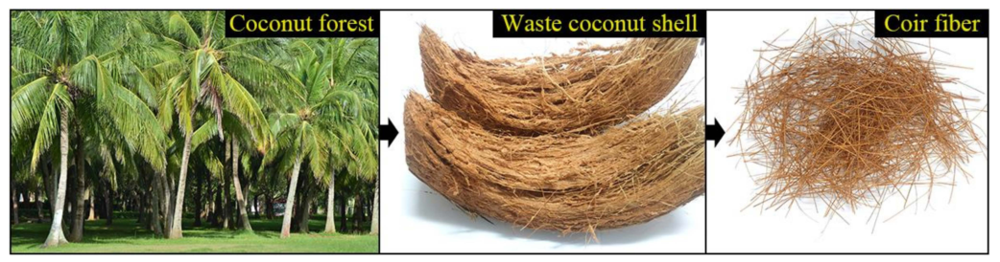

**Figure 1.** Coconut forest, waste coconut shell and coir fibers. 

## _2.2. Preparation of Coir Fibers_ 

The coir fibers for experimental use were selected by hand to ensure that they were similar in shape and diameter. Prior to alkali treatment, coir fibers were cleaned with distilled water to remove impurities attached to the surface; they were then were cut into 50 mm after drying. The coir fibers were divided into 17 groups, each undergoing the treatment illustrated in Figure 2 under different treatment conditions. The coir fibers were immersed in a beaker containing the specified concentration of NaOH solution, and the beaker was placed in a multi-purpose incubator at a required temperature and for a required period for alkali treatment of the fibers. After the treatment, the fibers were immersed in distilled water for 2 h, followed by repeated washing with distilled water until all NaOH was removed from their surface. Finally, the coir fibers were dried at 60 _[◦]_ C for 3 h and stored in sealed bags for subsequent analyses. 

4 of 21 

_Forests_ **2022** , _13_ , 2033 

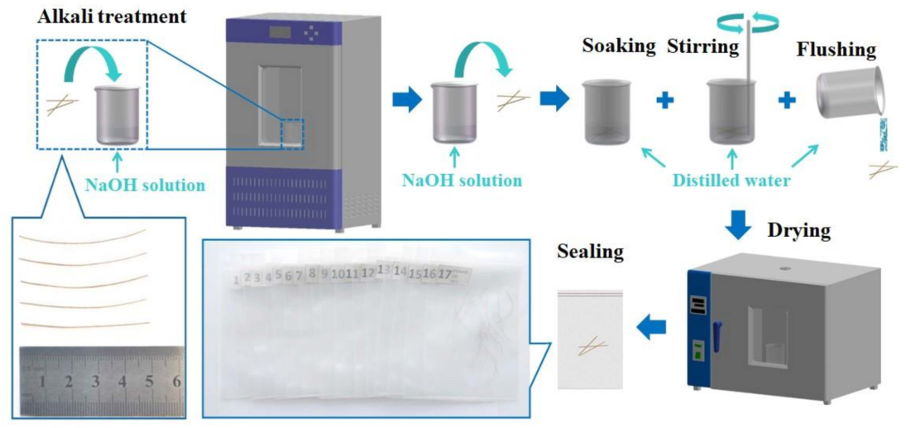

**Figure 2.** Preparation process of coir fiber samples. 

## _2.3. Experimental Design_ 

Response surface methodology (RSM) is a mathematical and statistical technique used to analyze experimental data for response optimization. RSM is one of the most frequently used optimization tools in experimental design. According to the impact of treatment conditions on alkali treatment, NaOH concentration, treatment time and treatment temperature were selected as variables in the study [11,14,18], and the experimental scheme was selected using a three-factor Box-Behnken design using three levels. The factors and levels are shown in Table 1. The diameter and post-break length of each fiber were measured with the stereomicroscope to obtain accurate experimental data, such as tensile strength and elongation. Each fiber was measured once in both mutually perpendicular directions to take the average value as the diameter. Then, Design-Expert software 11 was employed to analyze the experimental data and optimize the alkali treatment conditions, including NaOH concentration, time and temperature. This method can analyze the influential trend of alkali treatment on the tensile strength, elastic modulus and elongation of coir fiber through the response surface to obtain the best conditions for alkali treatment in combination with regression equations. 

**Table 1.** Factors and levels of experiments. 

|**Levels**|**Factors**|
|---|---|
||**NaOH Concentration (%)** **Time (h)** **Temperature (**_◦_**C)**|
||**A** **B** **C**|
|_−_1 0 1|2 2 20 6 12 40 10 22 60|

## _2.4. Testing of Coir Fiber_ 

## 2.4.1. Tensile Test 

Tensile tests were conducted on coir fiber using an Electronic Universal Testing Machine (3343, INSTRON, Boston, MA, USA) with a crosshead speed of 3 mm/min to compare and analyze the changes in mechanical properties of coir fibers in 17 groups treated under different conditions. The mechanical properties tested in this experiment included tensile 

5 of 21 

_Forests_ **2022** , _13_ , 2033 

strength, elastic modulus and elongation. Specifically, the coir fiber sample needed to be fixed on the upper and lower collets of the instrument through a special fixture. The fiber sample was kept at the centerline of the collet and clamped to avoid fiber slip. The test was repeated five times for each group of fiber samples to obtain the average value as the test result. 

## 2.4.2. Scanning Electron Microscopy 

The morphologies of the untreated and treated coir fibers were investigated with a scanning electron microscopy (SEM) (Verios G4 UC, Thermoscientific, Waltham, MA, USA). To make it conductive, the sample of coir fiber was sprayed with gold to make its surface a thin gold palladium layer. Surface and cross-sections of the fibers were observed and analyzed at a voltage of 5 kV to understand microscopic changes. 

## 2.4.3. Thermogravimetric Analysis 

The weight changes of untreated and treated coir fiber specimens were studied with the thermogravimetric analyzer (Q600, TA, New Castle, DE, USA). The coir fibers were cut into 1 mm segments before the test, and their specimens were put into the crucible. The test studied the changes in weight loss and derivative weight of coir fibers in testing temperature ranging from 30 _[◦]_ C to 500 _[◦]_ C. The whole test was conducted in nitrogen, and the heating rate was maintained at 10 _[◦]_ C/min. 

## 2.4.4. Fourier-Transform Infrared Spectroscopy 

The untreated and treated samples of coir fiber were studied and analyzed with the Fourier-Transform Infrared Spectrometer (FTIR) (T27, Bruker, Billerica, Germany). An appropriate amount of coir fiber powder was mixed and ground with potassium bromide (KBr). The test samples were prepared by the tablet pressing method. The data were recorded in the wave numbers ranging from 400 to 4000 cm _[−]_[1] at a resolution of 4 cm _[−]_[1] . The infrared spectra of each sample could be obtained after scanning. 

## 2.4.5. X-ray Diffraction 

The crystallinity index of untreated and treated samples of coir fiber was measured by an X-ray Diffractometer (XRD) (Smart Lab, Rigaku, Tokyo, Japan). Before the determination, the coir fiber was broken with a pulverizer to prepare powder samples, all of which were scanned in the range 2θ of 5 _[◦]_ –60 _[◦]_ at the scanning speed of 5 _[◦]_ /min. The relative crystallinity index of each fiber sample was calculated according to the obtained spectral data and the Segal empirical method [23]. 

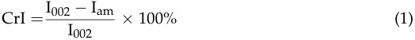

where CrI is crystallinity index, I002 is the maximum intensity of 002 lattice diffraction plane at a 2θ close to 22 _[◦]_ and Iam is the intensity diffraction of amorphous materials at a 2θ close to 18 _[◦]_ . 

## **3. Results and Discussion** 

## _3.1. Tensile Test Results and Analysis_ 

## 3.1.1. Model Fitting and Analysis of Variance 

According to the Box-Behnken design principle, 17 groups of tests were carried out. The testing scheme and result of each group are shown in Table 2, including tensile strength, elastic modulus and elongation in the model. The test data were imported into the software Design-Expert 11 for analysis. The regression models of tensile strength Y1, elastic modulus Y2 and elongation Y3 on the independent variables NaOH concentration A, time B and temperature C were established. The alkali treatment results were further investigated using analysis of variance (ANOVA) to determine which factors significantly affect the mechanical properties of coir fiber [24–26]. Tables 3–5 show the ANOVA results. 

6 of 21 

_Forests_ **2022** , _13_ , 2033 

**Table 2.** 

|**Std**|**Run**|**NaOH Concentration** **A (%)**|**Time** **B (Hours)**|**Temperature** **C (**_◦_**C)**|**Tensile Strength** **Y1 (MPa)**|**Elastic Modulus** **Y2 (GPa)**|**Elongation** **Y3 (%)**|
|---|---|---|---|---|---|---|---|
|12|1|6|22|60|75.56|2.60|23.36|
|13|2|6|12|40|96.12|2.94|28.87|
|7|3|2|12|60|84.57|2.44|24.69|
|9|4|6|2|20|74.16|2.68|23.03|
|2|5|10|2|40|62.88|2.32|22.40|
|14|6|6|12|40|93.89|2.94|28.72|
|5|7|2|12|20|93.71|2.62|28.34|
|16|8|6|12|40|90.91|3.03|29.13|
|6|9|10|12|20|78.30|2.45|20.43|
|10|10|6|22|20|91.01|2.79|25.46|
|8|11|10|12|60|67.97|2.20|22.04|
|17|12|6|12|40|95.10|3.02|28.32|
|1|13|2|2|40|81.71|2.68|25.12|
|3|14|2|22|40|94.21|2.74|28.82|
|4|15|10|22|40|71.06|2.59|20.62|
|11|16|6|2|60|73.51|2.36|24.72|
|15|17|6|12|40|91.38|2.97|28.50|

**Table 3.** ANOVA for coir fiber tensile strength. 

|**Source**|**Sum of Squares**|**df**|**Mean Square**|**F-Value**|**_p_-Value**||
|---|---|---|---|---|---|---|
|Model|1855.98|7|265.14|59.60|<0.0001 **|highly signifcant|
|A-NaOH concentration|684.32|1|684.32|153.83|<0.0001 **||
|B-Time|195.82|1|195.82|44.02|<0.0001 **||
|C-Temperature|158.15|1|158.15|35.55|0.0002 **||
|BC|54.76|1|54.76|12.31|0.0066 **||
|A2|190.07|1|190.07|42.73|0.0001 **||
|B2|363.87|1|363.87|81.80|<0.0001 **||
|C2|133.16|1|133.16|29.93|0.0004 **||
|Residual|40.04|9|4.45||||
|Lack of Fit|19.26|5|3.85|0.7416|0.6313|not signifcant|
|Pure Error|20.78|4|5.19||||
|Cor Total|1896.01|16|||||
||_R_2 = 0.9789|||Adjusted_R_2 = 0.9625|||
|Predicted_R_2 = 0.9365|||Adequate Precision = 21.8151||||

Note: _p_ -value < 0.01 (highly significant, **). 

**Table 4.** 

|**Source**|**Sum of Squares**|**df**|**Mean Square**|**F-Value**|**_p_-Value**||
|---|---|---|---|---|---|---|
|Model|1.05|7|0.1496|90.05|<0.0001 **|highly signifcant|
|A-NaOH concentration|0.1058|1|0.1058|63.69|<0.0001 **||
|B-Time|0.0578|1|0.0578|34.80|0.0002 **||
|C-Temperature|0.1105|1|0.1105|66.49|<0.0001 **||
|AB|0.0110|1|0.0110|6.64|0.0299 *||
|A2|0.3511|1|0.3511|211.34|<0.0001 **||
|B2|0.0498|1|0.0498|29.98|0.0004 **||
|C2|0.2929|1|0.2929|176.33|<0.0001 **||
|Residual|0.0150|9|0.0017||||
|Lack of Fit|0.0076|5|0.0015|0.8162|0.5945|not signifcant|
|Pure Error|0.0074|4|0.0018||||
|Cor Total|1.06|16|||||
||_R_2 = 0.9859|||Adjusted_R_2 = 0.9750|||
|Predicted_R_2 = 0.9533|||Adequate Precision = 28.0769||||

Note: _p_ -value < 0.01 (highly significant, **); _p_ -value < 0.05 (significant, *). 

7 of 21 

_Forests_ **2022** , _13_ , 2033 

**Table 5.** ANOVA for coir fiber elongation. 

|**Source**|**Sum of Squares**|**df**|**Mean Square**|**F-Value**|**_p_-Value**||
|---|---|---|---|---|---|---|
|Model|153.25|9|17.03|142.42|<0.0001 **|highly signifcant|
|A-NaOH concentration|57.67|1|57.67|482.39|<0.0001 **||
|B-Time|1.12|1|1.12|9.35|0.0184 *||
|C-Temperature|0.7503|1|0.7503|6.28|0.0407 *||
|AB|7.51|1|7.51|62.79|<0.0001 **||
|AC|6.92|1|6.92|57.85|0.0001 **||
|BC|3.59|1|3.59|30.04|0.0009 **||
|A2|23.61|1|23.61|197.44|<0.0001 **||
|B2|18.57|1|18.57|155.35|<0.0001 **||
|C2|25.59|1|25.59|214.03|<0.0001 **||
|Residual|0.8369|7|0.1196||||
|Lack of Fit|0.4386|3|0.1462|1.47|0.3497|not signifcant|
|Pure Error|0.3983|4|0.0996||||
|Cor Total|154.08|16|||||
||_R_2 = 0.9946|||Adjusted_R_2 = 0.9876|||
|Predicted_R_2 = 0.9504|||Adequate Precision = 32.1528||||

Note: _p_ -value < 0.01 (highly significant, **); _p_ -value < 0.05 (significant, *). 

The significance of variables in the regression model is related to _p_ -value, and it is considered to be significant when the _p_ -value is less than 0.05. Table 3 shows the ANOVA results of tensile strength. It can be seen that variables A, B, C, BC, A[2] , B[2] and C[2] exert a significant impact on tensile strength Y1. To optimize model Y1, insignificant model terms were eliminated. The regression model is shown in Equation (2). The model of tensile strength Y1 is highly significant ( _p_ < 0.01), and the lack-of-fit value is not significant ( _p_ > 0.05), suggesting a good fitting relationship between the regression model and the actual situation. The regression coefficient _R_[2] is 0.9789, indicating that the data can properly express the model. The table also shows that the predicted _R_[2] is 0.9365 and the adjusted _R_[2] is 0.9625; the difference is less than 0.2. Furthermore, the adequate precision measures the signal to noise ratio. When the ratio is greater than 4, it is desirable. This ratio in the model is 21.8151, indicating that the signal is sufficient and that the model can be used in the navigation design space [24,27]. 

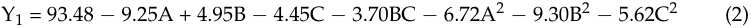

Table 4 shows the ANOVA results of elastic modulus. The _p_ -values corresponding to each variable are compared, and it is shown that the variables A, B, C, AB, A[2] , B[2] and C[2] have a significant impact on elastic modulus Y2. After the insignificant model terms in the model were eliminated, the regression model is obtained, as shown in Equation (3). The model of elastic modulus Y2 was highly significant, while the lack-of-fit value was not, which shows that the fitting degree between the regression model and the actual situation was good within the testing range. In addition, the regression coefficient _R_[2] is 0.9859 in the regression model of elastic modulus Y2, and the predicted _R_[2] of 0.9533 is in reasonable agreement with the adjusted _R_[2] of 0.9750. It can be found that they show a significant relationship. Adequate precision measures the signal to noise ratio, which in this model is 28.0769, satisfying the requirements of the navigation design space with an adequate signal [24,27]. 

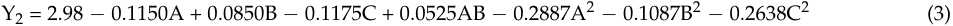

Table 5 shows the ANOVA results for elongation. The _p_ -value of the elongation regression equation model is less than 0.0001, indicating that the model is highly significant, while the lack-of-fit value is insignificant. Therefore, it can be concluded that the model is suitable. The regression model is shown in Equation (4). Among them, variables A, B, C, AB, AC, BC, A[2] , B[2] and C[2] have a significant impact on elongation Y3. The same table also 

8 of 21 

_Forests_ **2022** , _13_ , 2033 

shows that the regression coefficient _R_[2] , the predicted _R_[2] and the adjusted _R_[2] are 0.9946, 0.9504 and 0.9876, respectively. The predicted value is highly correlated with the actual value, suggesting that the empirical model is significantly reliable. The adequate precision ratio of the model is 32.1528, indicating that the model can be used to navigate the design space [24,27]. 

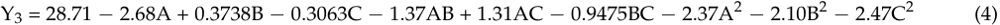

To gain deeper insight into the testing results, the perturbation plots in Figure 3 show the effect of the treatment conditions on tensile strength, elastic modulus and elongation. Conclusions can also be drawn by analyzing the F-value of each treatment condition in Tables 3–5. The influential order for tensile strength is NaOH concentration, time and temperature from the largest to the smallest; that for elastic modulus is temperature, NaOH concentration and time; and that for elongation is NaOH concentration, time and temperature. In addition, NaOH concentration has the greatest effect on the tensile strength, while the time and temperature have relatively little effect on the tensile strength. Compared with the time, NaOH concentration and temperature exert slightly greater impact on elastic modulus. The effect of NaOH concentration on elongation is greater than that of time and temperature. Similar results indicating that the NaOH concentration of alkali treatment has a greater impact on the mechanical properties of natural fibers have been reported elsewhere [26]. 

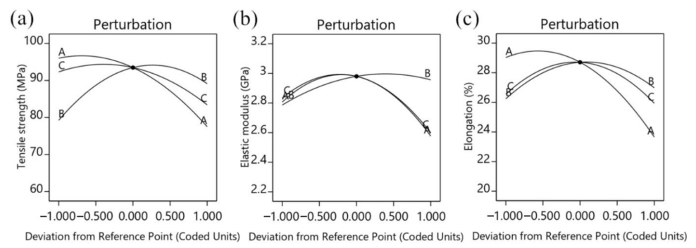

**Figure 3.** Perturbation plots: ( **a** ) Effect of factors on tensile strength, ( **b** ) effect of factors on elastic modulus, ( **c** ) effect of factors on elongation. 

## 3.1.2. Effect of Interactive Factors on Tensile Strength 

The tensile strength of coir fiber should be enhanced to optimize its own properties, as it is significant for coir fiber–reinforced composites. The three-dimensional surface plot and the contour plot shown in Figure 4 illustrate the interactive effect of time and temperature on tensile strength. From the overall three-dimensional surface plot, it can be determined that the tensile strength of coir fiber has changed significantly under the interactive effect of time and temperature. When the NaOH concentration of alkali treatment is fixed at the level of 0 (A = 6%), the temperature rise affects the tensile strength of coir fiber positively when the treatment time remains constant. This effect is clearly seen in the contour plot, where the tensile strength reached the maximum at close to 30 _[◦]_ C and then showed a declining trend as the treatment temperature rose. This is due to the fact that excessively high treatment temperatures can damage the coir fibers, leading to a deterioration of the tensile strength. On the other hand, the tensile strength of coir fiber increases as the treatment time is prolonged and the treatment temperature remains constant. However, excessive soaking time can have a negative effect. Initially, materials attached to the fiber surface will be gradually removed as the alkali treatment proceeds. However, a substantial amount of 

9 of 21 

_Forests_ **2022** , _13_ , 2033 

lignin, whose functions are support and bonding, is dissolved after a long period of time, resulting in the decrease of tensile strength. Jiang et al. also reported that unreasonable alkali treatment conditions would adversely affect the tensile strength of fibers in their research on the effects of alkali treatment on palm fibers [28]. 

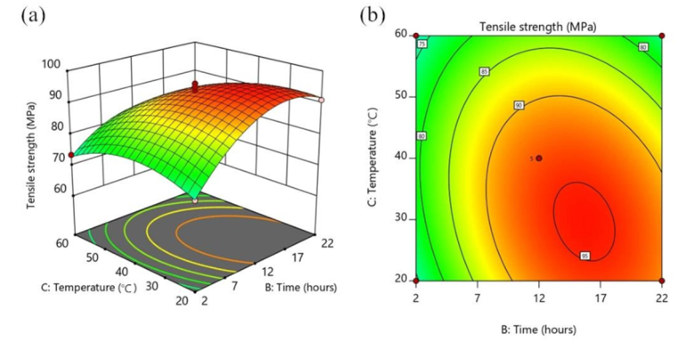

**Figure 4.** Effect of time and temperature on the tensile strength of coir fiber at a NaOH concentration of 6%: ( **a** ) three-dimensional surface plot; ( **b** ) contour plot. 

## 3.1.3. Effect of Interaction Factors on Elastic Modulus 

Elastic modulus is one of the most important properties of coir fiber. The interaction of NaOH concentration and time has a significant impact on the elastic modulus of coir fiber. Its three-dimensional surface plot and the contour plot are shown in Figure 5. According to the analysis of the three-dimensional surface plot in Figure 5a, the elastic modulus of coir fiber tends to increase and then decrease as treatment time lengthens in the same NaOH concentration, when the temperature of alkali treatment was fixed at the level of 0 (C = 40 _[◦]_ C), and the trend is the same as NaOH concentration increases when the treatment time remains unchanged. In addition, as shown in the contour plot in Figure 5b, the elastic modulus changes rapidly along the NaOH concentration direction and slowly along the time direction. It is worth noting that excessively high NaOH concentration or excessively long treatment time will cause damage to coir fiber [18]. When the elastic modulus reaches the maximum, any further increase in NaOH concentration and treatment time will reduce 

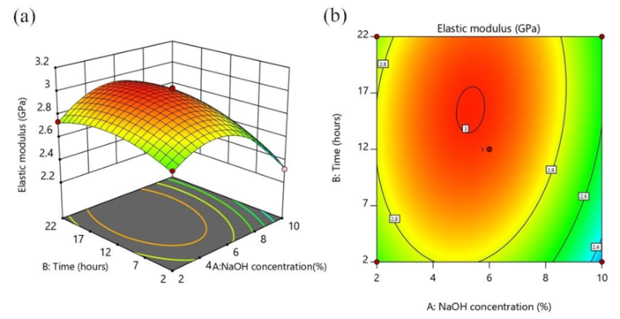

**Figure 5.** Effect of NaOH concentration and time on elastic modulus of coir fiber at a temperature of 40 _[◦]_ C: ( **a** ) three-dimensional surface plot; ( **b** ) contour plot. 

10 of 21 

_Forests_ **2022** , _13_ , 2033 

## 3.1.4. Effect of Interaction Factors on Elongation 

The elongation of coir fiber is more outstanding compared with most other natural fibers, and it has one of the highest elongations among average natural fibers. In addition, appropriate alkali treatment will further increase the elongation of coir fiber, which will make the fiber more flexible. It can be seen that the bending properties of composites made of coir fiber are also improved. At the same time, it is of great significance for 

The interactive effects of NaOH concentration A, time B and temperature C on the elongation of coir fiber are shown in Figure 6. As the pictures show, one factor at the 0 level is fixed, and the influence of the other two factors on the elongation is analyzed. Combined with the F-value of each interactive factor in Table 5, the most significant effect on the elongation of coir fiber is the interaction between NaOH concentration A and time B, followed by that between NaOH concentration A and temperature C, and then between time B and temperature C. The three-dimensional surface plot and the contour plot in Figure 6a,b show the effect of the interaction of NaOH concentration and time on elongation. When the temperature of alkali treatment was fixed at the level of 0 (C = 40 _[◦]_ C), under the same NaOH concentration, the elongation tends to rise with the increase of treatment time and fall slightly after reaching the maximum. In addition, during the same treatment time, the elongation first increases slightly and then decreases as the NaOH concentration rises. The interactive effect of NaOH concentration and temperature on the elongation is shown in Figure 6c,d. When the time of alkali treatment remains fixed at the level of 0 (B = 12 h), the interactive effect of NaOH concentration and temperature on elongation can be clearly seen from the three-dimensional surface plot and contour plot. Among them, the elongation of coir fiber reaches the maximum when the NaOH concentration is about 4% and the treatment temperature is about 35 _[◦]_ C. Then, when the NaOH concentration or temperature exceeds this value, the elongation of coir fiber will decrease. When the NaOH concentration of alkali treatment is fixed at the level of 0 (A = 6%), the interactive effect of time and temperature on elongation is expressed in Figure 6e,f. It is very intuitive to see from the three-dimensional surface plot that the trend of elongation based on temperature during the same treatment time and the trend of elongation based on time at the same treatment temperature both increase and then decrease. At the same time, the maximum elongation can be obtained in the middle of the contour plot. 

Jiang et al. and Valášek et al. also studied the effect of alkali treatment on the elongation of natural fibers [18,28]. Reasons for these changes were obtained from the principle analysis. Alkali treatment can remove impurities and some lignin from the surface of coir fiber. Because lignin is easier to degrade than cellulose in alkali solution, the relative content of cellulose increases after alkali treatment. This is conducive to the increase of elongation of coir fiber, whose increase or decrease is inseparable from the main treatment conditions. Excessively small NaOH concentration will not achieve the expected effect of alkali treatment, and excessively short treatment time and low temperature will make the reaction insufficient. On the contrary, excessively large NaOH concentration will damage the fiber structure, and excessively long treatment time and high temperature will dissolve a large amount of lignin, leading to degraded performance. Therefore, large elongation will be obtained by alkali treatment of coir fiber under appropriate NaOH concentration, time and temperature. 

11 of 21 

_Forests_ **2022** , _13_ , 2033 

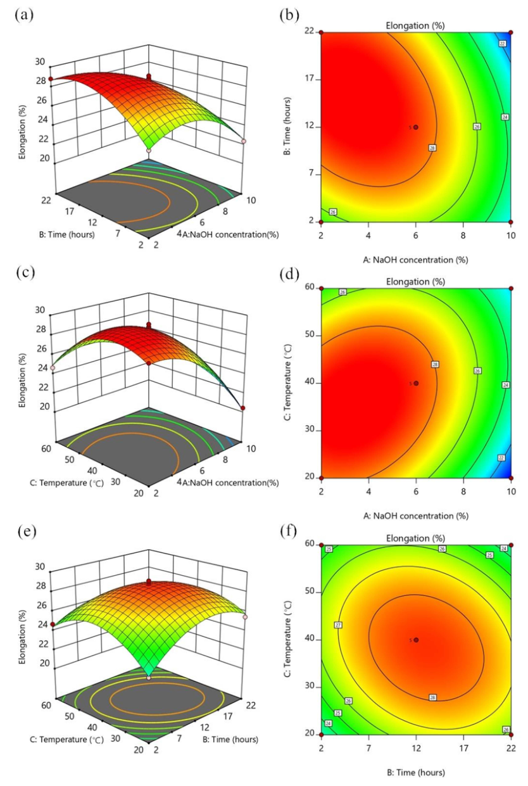

**Figure 6.** Effect of NaOH concentration and time on elongation of coir fiber at a temperature of 40 _[◦]_ C: ( **a** ) three-dimensional surface plot; ( **b** ) contour plot. Effect of NaOH concentration and temperature on elongation of coir fiber at a time of 12 h: ( **c** ) three-dimensional surface plot; ( **d** ) contour plot. Effect of time and temperature on elongation of coir fiber at a NaOH concentration of 6%: ( **e** ) three-dimensional surface plot; ( **f** ) contour plot. 

12 of 21 

_Forests_ **2022** , _13_ , 2033 

## 3.1.5. Optimization of Treatment Conditions 

Figure 7a–c show the relationship between the actual and predicted values of tensile strength, elastic modulus and elongation, respectively. All points in the figures are distributed near the diagonal line, indicating a high correlation between the actual and predicted values. They also reflect that the model is highly accurate. It can be seen that these selected models are adequate [24,26]. 

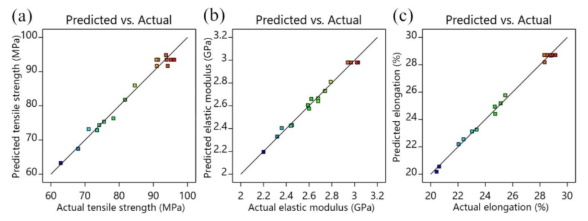

**Figure 7.** Linear plots: ( **a** ) predicted and actual values of tensile strength, ( **b** ) predicted and actual values of elastic modulus and ( **c** ) predicted and actual values of elongation. 

To obtain better properties of coir fibers, suitable alkali treatment conditions are essential. Therefore, the tensile strength, elastic modulus, and elongation exhibited by coir fibers are taken as optimization objectives. In this study, multi-objective optimization is required to optimize the combination of parameters that satisfy several indicators; thus, the NaOH concentration, time, and temperature of the alkali treatment are optimized. The mathematical model is obtained by building a parametric optimization model and analyzing the regression equation as shown in Equation (5). 

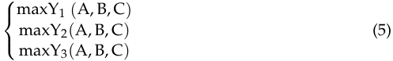

The model is optimized and analyzed by Design-Expert software 11, and a sufficient range is set for the parameters to ensure that the optimization results appear in the given range. As can be observed from Figure 8, the optimal operating conditions for alkali treatment are 4.12% NaOH concentration, 15.08 h of treatment time and a treatment temperature of 34.21 _[◦]_ C. Under these treatment conditions, the tensile strength is 98.13 MPa, elastic modulus is 2.99 GPa and elongation is 29.71%. 

## 3.1.6. 

To confirm the accuracy of the model prediction, validation tests were performed under the optimized conditions. Five samples were tested, and the average values of tensile strength, elastic modulus and elongation were obtained as 97.14 MPa, 2.98 GPa and 29.35%, respectively. Table 6 shows the comparison between the measured value and the predicted value, from which it can be seen that the errors of tensile strength, elastic modulus and elongation are 1.01%, 0.33% and 1.21%, respectively, indicating that the parameter optimization model is reliable. 

13 of 21 

_Forests_ **2022** , _13_ , 2033 

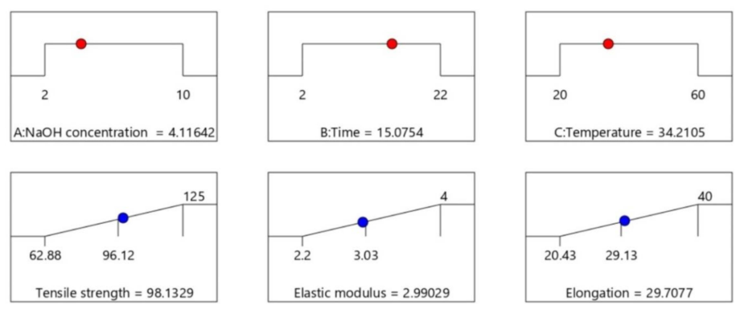

**Figure 8.** Optimal results. 

**Table 6.** Validation testing results. 

|**Contrast Items**|**Tensile Strength (MPa)**|**Elastic Modulus (GPa)**|**Elongation (%)**|
|---|---|---|---|
|Measured value|97.14|2.98|29.35|
|Predicted value|98.13|2.99|29.71|
|Error (%)|1.01|0.33|1.21|

Figure 9 compares the changes in mechanical properties of untreated coir fibers (UCF) and treated coir fibers under optimal conditions (OCF). The mechanical properties of UCF also come from the average value of five samples. Combined with the pictures, it can be seen that after being treated under optimal conditions, the tensile strength of coir fiber changes from 70.25 MPa to 97.14 MPa, an increase of 38.28%; the elastic modulus from 2.13 GPa to 2.98 GPa, an increase of 39.91%; and the elongation from 23.37% to 29.35%, an increase of 25.59%. The changes exhibited by the test are consistent with the test principle. Silva et al. also reported that the mechanical properties of coir fibers were improved after alkali treatment [21]. However, the conditions of alkali treatment were optimized by targeting tensile strength, elastic modulus and elongation at the same time in this experiment, resulting in a more balanced enhancement of the mechanical properties of 

## _3.2. Scanning Electron Microscopy Observation and Analysis_ 

SEM can observe the microscopic changes in the surface morphology of coir fiber before and after the treatment. SEM micrographs of UCF and OCF surfaces are shown in Figure 10. From the overall view, the surface of UCF is tightly wrapped by a large amount of pectin, wax and other impurities, and this feature is reflected in Figure 10a. Due to the wrapping of these substances, the surface of UCF has no obvious bulges and grooves, only impurities attached to the surface of coir fiber. Figure 10b provides SEM micrographs of the UCF surface at higher magnification. It can be observed from the magnified picture that the impurities are flaky and their structure is loose. When UCF is bonded to the matrix material, the existence of these substances between the fibers and the matrix makes it easy for their connection to debond [29,30]. On the contrary, it can be seen from Figure 10c that the surface of OCF is relatively rough, which is due to the removal of some hemicellulose, lignin, pectin and other materials in coir fiber after alkali treatment. As a result, there are many clear bulges and grooves. This structure can be clearly seen in the high magnification SEM micrograph (Figure 10d) of the OCF surface. Other studies also reported the micro changes of the fiber surface after alkali treatment [15,31], which are conducive to improving the interfacial adhesion between coir fiber and the polymer matrix. When the composites are produced, the fluid-like matrix material can enter the bumpy surface structure, and 

14 of 21 

_Forests_ **2022** , _13_ , 2033 

mechanical interlocking between the coir fiber and the polymer matrix can be produced after solidification, thus effectively improving the interfacial bonding performance between them [32,33]. This further proves the effect of alkali treatment under appropriate conditions. 

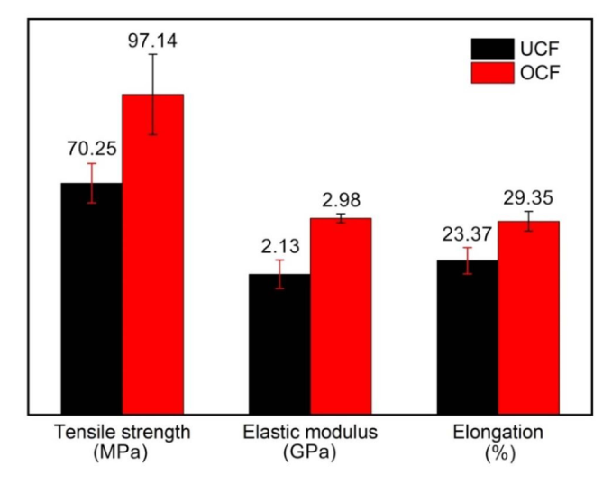

**Figure 9.** Mechanical properties of untreated and treated coir fibers under optimal conditions. 

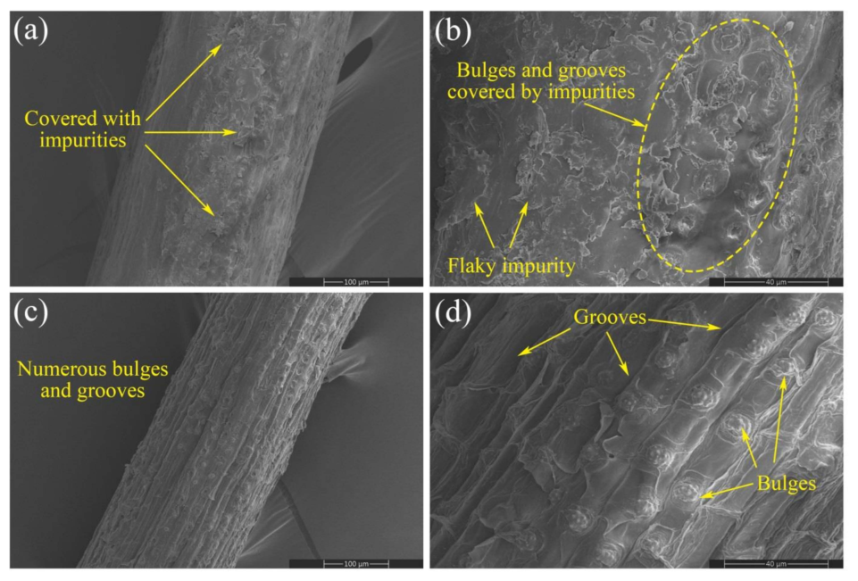

**Figure 10.** SEM micrographs of coir fiber surfaces: ( **a** ) untreated fiber (200 _×_ ), ( **b** ) untreated fiber (800 _×_ ), ( **c** ) treated fiber under optimal conditions (200 _×_ ) and ( **d** ) treated fiber under optimal conditions (800 _×_ ). 

15 of 21 

_Forests_ **2022** , _13_ , 2033 

Figure 11a,b shows SEM micrographs of UCF cross-sections at different magnifications. Figure 11c,d show SEM micrographs of OCF cross-sections at different magnifications. When the micrographs of UCF and OCF are compared, some differences can be found. It is more obvious that the cross-section of UCF is relatively flat, while that of OCF shows a fine burr-like appearance, due to the erosion by alkali treatment. After the treatment, the non-cellulosic substances in the pores are removed, the coir fiber becomes soft, and a large number of fiber cells contained in them are partially deformed. Additionally, more gaps are observed inside the OCF cross-section compared with UCF, attributable to the network-like association between the deformed fiber cells. These changes improve the elongation of coir fiber [18]. Thus, it can be seen that alkali treatment under appropriate conditions can make the advantageous properties of coir fibers more prominent. 

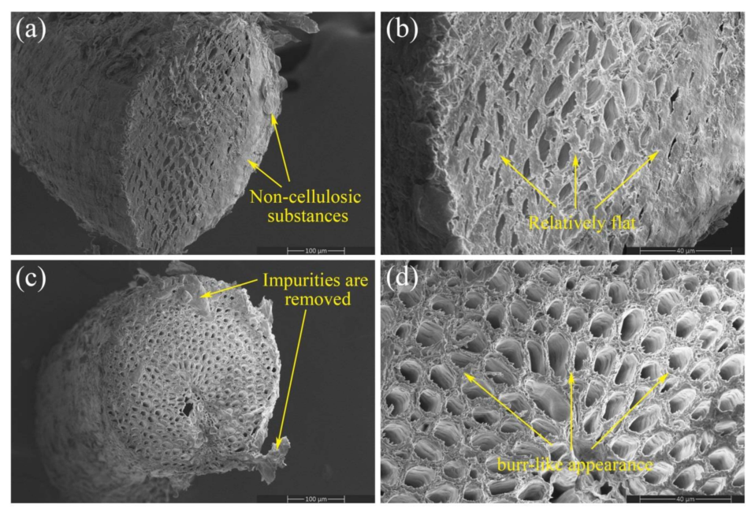

**Figure 11.** SEM micrographs of coir fiber cross-sections: ( **a** ) untreated fiber (200 _×_ ), ( **b** ) untreated fiber (800 _×_ ), ( **c** ) treated fiber under optimal conditions (200 _×_ ) and ( **d** ) treated fiber under optimal conditions (800 _×_ ). 

## _3.3. Thermogravimetric Analysis Results_ 

The thermogravimetric analysis (TGA) curves and the derivative of thermogravimetric (DTG) curves for UCF and OCF are presented in Figure 12. The thermal decomposition of natural fibers is shown in three phases. The first phase is the evaporation of water, the second is the decomposition of hemicellulose, pectin and part of cellulose, and the third is the decomposition of cellulose. It is more difficult for lignin to decompose, and its decomposition is usually considered as part of the whole process. The final residue of the test is ash, and the ash residue of coir fiber after alkali treatment increases from 25.54% to 37.41% at 500 _[◦]_ C. The DTG curve of UCF has three distinct peaks at 47.84 _[◦]_ C, 297.45 _[◦]_ C and 366.68 _[◦]_ C, corresponding to three weight losses in the TGA curve of UCF, which are 6.74%, 24.11% and 34.94%, respectively. The DTG curve of OCF has two distinct peaks at 53.63 _[◦]_ C and 322.58 _[◦]_ C, corresponding to two weight losses in the TGA curve of OCF, which are 4.70% and 45.47%, respectively. The comparison reveals that OCF is missing the second phase of fiber thermal decomposition due to the removal of hemicellulose, lignin 

16 of 21 

_Forests_ **2022** , _13_ , 2033 

and pectin from coir fiber after alkali treatment [28], which is consistent with the results of SEM. 

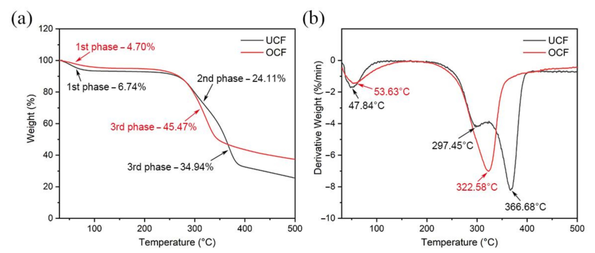

**Figure 12.** ( **a** ) The TGA curves of untreated (black) and treated (red) coir fibers under optimal conditions. ( **b** ) The DTG curves of untreated (black) and treated (red) coir fibers under optimal conditions. 

## _3.4. Fourier-Transform Infrared Spectroscopy Analysis_ 

Both UCF and OCF samples were analyzed using FTIR. Figure 13a shows the FTIR spectra of coir fiber samples from 400 cm _[−]_[1] to 4000 cm _[−]_[1] . It can be seen that the alkali treatment performed under optimal conditions has a significant effect on the FTIR spectra of coir fiber. After these results are analyzed, it is clear that some peaks have changed. These regions are magnified for easy observation and analysis, as shown in Figure 13b. The positions of these absorption peaks and the functional groups to which they belong are listed in Table 7. The intensity of the absorption peak located at 897 cm _[−]_[1] is enhanced, and this is related to the C-H rocking vibration in the cellulose. This indicates that the percentage of cellulose in the samples increases after the removal of some non-cellulosic substances from the OCF [12]. The intensity of the absorption peak at 1248 cm _[−]_[1] decreases obviously, and its shape changes. The absorption peak is related to the C-O-C stretching in lignin, indicating that most of the lignin is removed from the OCF obtained after treatment compared with the UCF [31,34]. The intensity of the absorption peak at 1376 cm _[−]_[1] decreases slightly, and its change is caused by C-H bending vibration, which can be ascribed to the removal of lignin from OCF [35]. The intensity of the absorption peak at 1608 cm _[−]_[1] is slightly weakened, related to the C=C stretching vibration in aromatic lignin. This further explains the decrease of the lignin component content in OCF [7]. In addition, the absorption peak at 1734 cm _[−]_[1] disappears, which is related to the C=O stretching vibration in hemicellulose. This indicates that most of the hemicellulose in coir fibers is degraded after alkali treatment under optimal conditions [36]. From the above changes in FTIR spectra characteristics, it can be concluded that coir fiber alkali treatment has a positive effect on the removal of hemicellulose and lignin. 

17 of 21 

_Forests_ **2022** , _13_ , 2033 

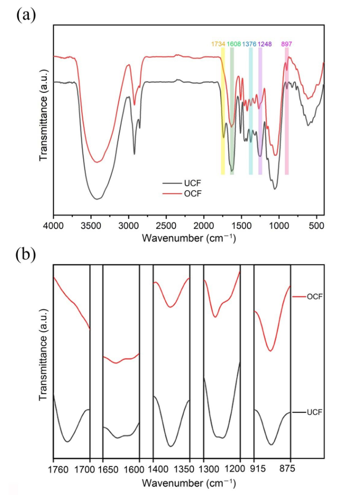

**Figure 13.** ( **a** ) FTIR spectra of untreated (black) and treated (red) coir fibers under optimal conditions. ( **b** ) Enlarged view of labeled regions in FTIR spectra. 

**Table 7.** Peak value of change in FTIR spectrum. 

||**Wavenumbers (cm**_−_**1)**|||
|---|---|---|---|
|**UCF**||**OCF**|**Functional Groups**|
|1737||/|C=O|
|1608||1608|C=C|
|1376||1376|C-H|
|1248||1248|C-O-C|
|897||897|C-H|

18 of 21 

_Forests_ **2022** , _13_ , 2033 

## _3.5. X-ray Diffraction Analysis_ 

To investigate changes in coir fiber after treatment, XRD analysis was performed on both samples. Their X-ray diffractograms are shown in Figure 14. It can be seen from the figure that the shapes of the XRD spectra of the two samples are almost the same, with obvious peaks near 16 _[◦]_ , 22 _[◦]_ and 35 _[◦]_ . The peak located around 16 _[◦]_ is related to the overlap of the 101 plane and 101 plane of cellulose, the one located around 22 _[◦]_ is mainly related to the 002 plane, and the one located around 35 _[◦]_ is related to the 040 plane. This indicates that the cellulose I crystalline structure of coir fiber did not change after alkali treatment. These phenomena were also mentioned by Ma et al. and Wu et al. in the study on alkali treatment of natural fibers [12,17]. In addition, some information can be obtained by comparing the two curves in the diffractograms. The peak of the XRD spectrum of OCF is more obvious, which shows that the crystallinity index of OCF is higher than that of UCF [28]. To verify this conclusion, the crystallinity indexes of the two samples were calculated based on the Segal empirical method. The crystallinity indexes of UCF and OCF are shown in Table 8, which are 35.85% and 40.40%, respectively. This change may be attributed to the large presence of lignin and hemicellulose in UCF and the removal of some amorphous components in OCF, such as hemicellulose and lignin. This increases the relative content of crystalline cellulose, resulting in cellulose crystal to accumulate and cellulose molecules to rearrange [28,37,38]. Therefore, OCF exhibits a higher crystallinity index than UCF, which also suggests that OCF has better mechanical properties than UCF. 

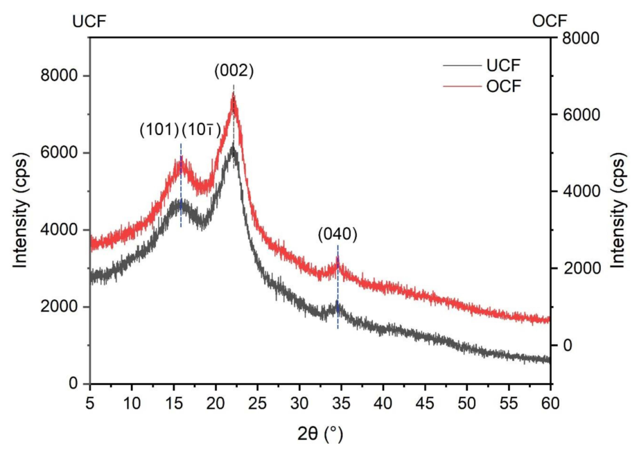

**Figure 14.** XRD spectra of untreated (black) and treated (red) coir fibers under optimal conditions. **Table 8.** Crystallinity index values of coir fibers. 

||**Crystallinity Index (%)**||
|---|---|---|
|UCF||OCF|
|35.85||40.40|

19 of 21 

_Forests_ **2022** , _13_ , 2033 

## **4. Conclusions** 

In this study, the effects of NaOH concentration, time and temperature of alkali treatment on the tensile strength, elastic modulus and elongation of coir fibers were explored based on a research protocol developed by the Box-Behnken design method, and the multiobjective optimization and analysis of the tensile strength, elastic modulus and elongation of coir fiber were completed. As a result, the mechanical properties of coir fiber were comprehensively improved. The necessity of optimization of alkali treatment conditions was proved, which provided a reference for the selection of alkali treatment conditions of coir fiber. The following conclusions are drawn from the study. 

Three factors, NaOH concentration, treatment time and treatment temperature, have a significant effect on the mechanical properties of coir fibers. No matter whether the factors are too large or too small, they will be detrimental to the performance of coir fibers. 

The optimal alkali treatment conditions are obtained by software analysis at a 4.12% NaOH concentration, 15.08 h of treatment time, and a treatment temperature at 34.21 _[◦]_ C. Under these optimal conditions, the tensile test results of coir fiber show that the tensile strength is 97.14 MPa, the elastic modulus is 2.98 GPa and the elongation is 29.35%, which are consistent with the predicted values. 

Compared with the untreated fiber, the coir fiber treated under the best conditions has better tensile strength, elastic modulus and elongation. This is consistent with the analysis results of TGA-DTG, the removal of non-cellulosic substances shown by FTIR and the improvement of crystallinity shown by XRD. 

The changes in fiber surface before and after treatment as shown by SEM indicate that appropriate alkali treatment can enhance the bonding between materials. 

The optimized combination of this study can be applied to fiber products that require both strength and toughness. In future research, the fibers treated under the optimal conditions are added to the composites instead of other fibers to further improve both strength and toughness of the composites, which is vital to study fiber-reinforced composites. 

**Author Contributions:** Conceptualization, S.R. and C.Z.; methodology, C.Z.; formal analysis, C.Z. and S.Y.; investigation, S.R. and C.Z.; resources, S.R. and S.Y.; writing—original draft preparation, C.Z.; writing—review and editing, S.R. and S.Y.; supervision, S.Y.; project administration, S.R. All authors have read and agreed to the published version of the manuscript. 

**Funding:** This research was funded by the Hainan Provincial Natural Science Foundation of China (521RC494, 521QN0869 and 520RC536). 

## **Data Availability Statement:** Not applicable. 

**Acknowledgments:** The authors acknowledge the Hainan Provincial Natural Science Foundation of China for supporting this study. 

## **References** 

1. Mishra, L.; Basu, G.; Samanta, A.K. Effect of chemical softening of coconut fibres on structure and properties of its blended yarn with jute. _Fibers Polym._ **2017** , _18_ , 357–368. [CrossRef] 

2. Haque, M.M.; Hasan, M.; Islam, M.S.; Ali, M.E. Physico-mechanical properties of chemically treated palm and coir fiber reinforced polypropylene composites. _Bioresour. Technol._ **2009** , _100_ , 4903–4906. [CrossRef] [PubMed] 

3. Rocky, B.P.; Thompson, A.J. Production and modification of natural bamboo fibers from four bamboo species, and their prospects in textile manufacturing. _Fibers Polym._ **2020** , _21_ , 2740–2752. [CrossRef] 

4. Chonsakorn, S.; Srivorradatpaisan, S.; Mongkholrattanasit, R. Effects of different extraction methods on some properties of water hyacinth fiber. _J. Nat. Fibers_ **2019** , _16_ , 1015–1025. [CrossRef] 

5. Moria, S.; Charcaa, S.; Floresa, E.; Savastano, H., Jr. Physical and Thermal Properties of Novel Native Andean Natural Fibers. _J. Nat. Fibers_ **2019** , _18_ , 475–491. [CrossRef] 

6. Santos, J.C.D.; Siqueira, R.L.; Vieira, L.M.G.; Freire, R.T.S.; Mano, V.; Panzera, T.H. Effects of sodium carbonate on the performance of epoxy and polyester coir-reinforced composites. _Polym. Test._ **2018** , _67_ , 533–544. [CrossRef] 

20 of 21 

_Forests_ **2022** , _13_ , 2033 

7. Hasan, K.M.F.; Horváth, P.G.; Kóczán, Z.; Le, D.H.A.; Bak, M.; Bejó, L.; Alpár, T. Novel insulation panels development from multilayered coir short and long fiber reinforced phenol formaldehyde polymeric biocomposites. _J. Polym. Res._ **2021** , _28_ , 467. [CrossRef] 

8. Saikrishnan, G.; Sumesh, K.R.; Vijayanand, P.; Madhu, S.; Nagarajan, S.; Suganya, P.G. Investigation on the mechanical properties of ramie/kenaf fibers under various parameters using GRA and TOPSIS methods. _Polym. Compos._ **2022** , _43_ , 130–143. 

9. Sumesh, K.R.; Kavimani, V.; Gopal, P.M.; Petr, S.; Ajithram, A.; Suganya, P.G. The effect of various composite and operating parameters in wear properties of epoxy-based natural fiber composites. _J. Mater. Cycles Waste_ **2022** , _24_ , 667–679. 

10. Ma, Y.; Wu, S.; Zhuang, J.; Tong, J.; Qi, H. Tribological and physio-mechanical characterization of cow dung fibers reinforced friction composites: An effective utilization of cow dung waste. _Tribol. Int._ **2019** , _131_ , 200–211. [CrossRef] 

11. Yan, L.; Chouw, N.; Huang, L.; Kasal, B. Effect of alkali treatment on microstructure and mechanical properties of coir fibres, coir fibre reinforced-polymer composites and reinforced-cementitious composites. _Constr. Build. Mater._ **2016** , _112_ , 168–182. [CrossRef] 

12. Wu, J.; Du, X.; Yin, Z.; Xu, S.; Xu, S.; Zhang, Y. Preparation and characterization of cellulose nanofibrils from coconut coir fibers and their reinforcements in biodegradable composite films. _Carbohyd. Polym._ **2019** , _211_ , 49–56. [CrossRef] 

13. Zaman, H.U.; Beg, M.D.H. Preparation, structure, and properties of the coir fiber/polypropylene composites. _J. Compos. Mater._ **2014** , _48_ , 3293–3301. [CrossRef] 

14. Wang, F.; Lu, M.; Zhou, S.; Lu, Z.; Ran, S. Effect of fiber surface modification on the interfacial adhesion and thermo-mechanical performance of unidirectional epoxy-based composites reinforced with bamboo fibers. _Molecules_ **2019** , _24_ , 2682. [CrossRef] 

15. Hestiawan, H.; Jamasri; Kusmono. Effect of chemical treatments on tensile properties and interfacial shear strength of unsaturated polyester/fan palm fibers. _J. Nat. Fibers_ **2018** , _15_ , 762–775. [CrossRef] 

16. Loong, M.L.; Cree, D. Enhancement of mechanical properties of bio-resin epoxy/flax fiber composites using acetic anhydride. _J. Polym. Environ._ **2018** , _26_ , 224–234. [CrossRef] 

17. Ma, Y.; Wu, S.; Zhuang, J.; Tian, Y.; Tong, J. The effect of lignin on the physicomechanical, tribological, and morphological performance indicators of corn stalk fiber-reinforced friction materials. _Mater. Res. Express_ **2019** , _6_ , 105325. [CrossRef] 

18. Valášek, P.; Müller, M.; Šleger, V.; Koláˇr, V.; Hromasová, M.; D’Amato, R.; Ruggiero, A. Influence of alkali treatment on the microstructure and mechanical properties of coir and abaca fibers. _Materials_ **2021** , _14_ , 2636. [CrossRef] 

19. Fr ˛acz, W.; Janowski, G.; B ˛ak, Ł. Influence of the alkali treatment of flax and hemp fibers on the properties of PHBV based biocomposites. _Polymers_ **2021** , _13_ , 1965. [CrossRef] 

20. Bensalah, H.; Raji, M.; Abdellaoui, H.; Essabir, H.; Bouhfid, R. Thermo-mechanical properties of low-cost “green” phenolic resin composites reinforced with surface modified coir fiber. _Int. J. Adv. Manuf. Technol._ **2021** , _112_ , 1917–1930. [CrossRef] 

21. Silva, G.G.; Souza, D.A.D.; Machado, J.C.; Hourston, D.J. Mechanical and thermal characterization of native Brazilian coir fiber. _J. Appl. Polym. Sci._ **2000** , _76_ , 1197–1206. [CrossRef] 

22. Verma, S.; Midha, V.K.; Choudhary, A.K. Multi-objective optimization of process parameters for lignin removal of coir using TOPSIS. _J. Nat. Fibers_ **2020** , _19_ , 256–268. [CrossRef] 

23. Segal, L.; Creely, J.J.; Martin, A.E.; Conrad, C.M. An empirical method for estimating the degree of crystallinity of native cellulose using the X-ray diffractometer. _Text. Res. J._ **1959** , _29_ , 786–794. [CrossRef] 

24. Hassan, M.Z.; Sapuan, S.M.; Roslan, S.A.; Aziz, S.A.; Sarip, S. Optimization of tensile behavior of banana pseudo-stem (Musa acuminate) fiber reinforced epoxy composites using response surface methodology. _J. Mater. Res. Technol._ **2019** , _8_ , 3517–3528. [CrossRef] 

25. Pandit, P.; Samanta, K.K.; Teli, M.D. Optimization of atmospheric plasma treatment parameters for hydrophobic finishing of silk using Box Behnken design. _J. Nat. Fibers_ **2020** , _19_ , 463–474. [CrossRef] 

26. Aly, M.; Hashmi, M.S.J.; Olabi, A.G.; Benyounis, K.Y.; Messeiry, M.; Hussain, A.I.; Abadir, E.F. Optimization of alkaline treatment conditions of flax fiber using Box–Behnken method. _J. Nat. Fibers_ **2012** , _9_ , 256–276. [CrossRef] 

27. Manzato, L.; Takeno, M.L.; Pessoa-Junior, W.A.G.; Mariuba, L.A.M.; Simonsen, J. Optimization of Cellulose Extraction from Jute Fiber by Box-behnken Design. _Fiber. Polym._ **2018** , _19_ , 289–296. [CrossRef] 

28. Jiang, Y.; Deng, P.; Jing, L.; Zhang, T. Tensile properties and structure characterization of palm fibers by alkali treatment. _Fibers. Polym._ **2019** , _20_ , 1029–1035. [CrossRef] 

29. Shrivastava, R.; Parashar, V. Effect of alkali treatment on tensile strength of epoxy composite reinforced with coir fiber. _Polym. Bull._ **2022** , _1_ , 1–13. [CrossRef] 

30. Ru, S.; Zhao, C.; Yang, S.; Liang, D. Effect of coir fiber surface treatment on interfacial properties of reinforced epoxy resin composites. _Polymers_ **2022** , _14_ , 3488. [CrossRef] 

31. Pereira, J.F.; Ferreira, D.P.; Bessa, J.; Matos, J.; Cunha, F.; Araújo, I.; Silva, L.F.; Pinho, E.; Fangueiro, R. Mechanical performance of thermoplastic olefin composites reinforced with coir and sisal natural fibers: Influence of surface pretreatment. _Polym. Compos._ **2019** , _40_ , 3472–3481. [CrossRef] 

32. Manjula, R.; Raju, N.V.; Chakradhar, R.P.S.; Johns, J. Effect of thermal aging and chemical treatment on tensile properties of coir fiber. _J. Nat. Fibers_ **2018** , _15_ , 112–121. [CrossRef] 

33. Freitas, R.R.M.D.; Carmo, K.P.D.; Rodrigues, J.D.S.; Lima, V.H.D.; Silva, J.O.D.; Botaro, V.R. Influence of alkaline treatment on sisal fibre applied as reinforcement agent in composites of corn starch and cellulose acetate matrices. _Plast. Rubber Compos._ **2021** , _50_ , 9–17. [CrossRef] 

21 of 21 

_Forests_ **2022** , _13_ , 2033 

34. Arrakhiz, F.Z.; El Achaby, M.; Kakou, A.C.; Vaudreuil, S.; Benmoussa, K.; Bouhfid, R.; Fassi-Fehri, O.; Qaiss, A. Mechanical properties of high density polyethylene reinforced with chemically modified coir fibers: Impact of chemical treatments. _Mater. Design_ **2012** , _37_ , 379–383. [CrossRef] 

35. Ridzuan, M.J.M.; Majid, M.S.A.; Afendi, M.; Kanafiah, S.N.A.; Zahri, J.M.; Gibson, A.G. Characterisation of natural cellulosic fibre from pennisetum purpureum stem as potential reinforcement of polymer composites. _Mater. Design_ **2016** , _89_ , 839–847. [CrossRef] 

36. Farias, J.G.G.D.; Cavalcante, R.C.; Canabarro, B.R.; Viana, H.M.; Scholz, S.; Simão, R.A. Surface lignin removal on coir fibers by plasma treatment for improved adhesion in thermoplastic starch composites. _Carbohyd. Polym._ **2017** , _165_ , 429–436. [CrossRef] 

37. Reddy, K.O.; Reddy, K.R.N.; Zhang, J.; Zhang, J.; Rajulu, A.V. Effect of alkali treatment on the properties of century fiber. _J. Nat. Fibers_ **2013** , _10_ , 282–296. [CrossRef] 

38. Sangian, H.F.; Widjaja, A. The effect of alkaline concentration on coconut husk crystallinity and the yield of sugars released. In Proceedings of the IOP Conference Series: Materials Science and Engineering, Manado, Indonesia, 25–26 October 2018; Volume 306, p. 012046. 

