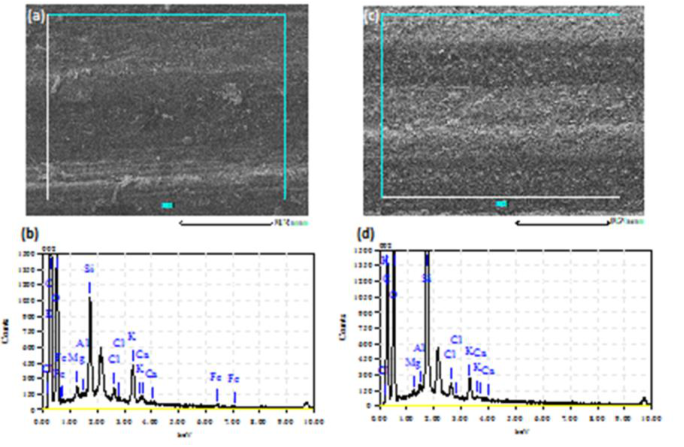
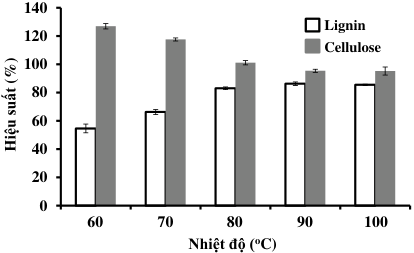
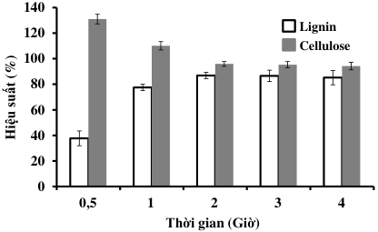
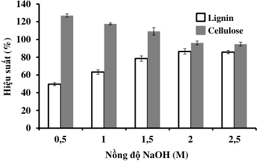
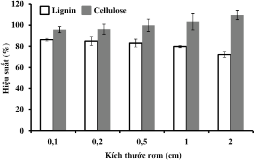
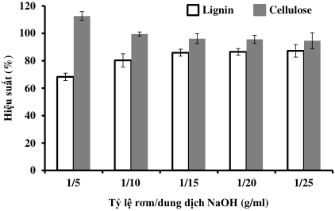

_Tạp chí phân tích Hóa, Lý và Sinh học - Tập 22/ số 1 (Đặc biệt)/ 2017_ 

**SỰ ẢNH HƯỞNG CỦA CÁC YẾU TỐ TỚI QUÁ TRÌNH  TÁCH CELLULOSE VÀ LIGNIN TỪ RƠM RẠ BẰNG PHƯƠNG PHÁP KIỀM** 

_Đến tòa soạn 05/12/2016_ 

**Vũ Đình Ngọ,  Trần Thị Hằng, Vũ Đức Cường** _Khoa Công nghệ Hóa học, Trường Đại học Công nghiệp Việt Trì_ 

## **SUMMARY** 

## **INFLUENCE OF FACTORS ON CELLULOSE AND LIGNIN EXTRACTION PROCEDURE FROM RICE STRAW BY ALKALINE METHOD** 

_Cellulose and lignin in rice straw are the potential environmental materials. Cellulose and lignin could be extracted in a single process in almost pure form that suitable for many environmental and industrial purposes. Rice straw was treated with sodium hydroxide at various conditions such as temperature of 90[o] C, extraction time of 2 h, sodium hydroxide concentration of 2 M, the size of rice straw of 0.1 cm, solid/liquid ratio of 1/15 g/ml. The yield of lignin and cellulose which were extracted from rice straw was found as 85.9% and 96.2%, respectively._ 

_**Keywords:** Cellulose, lignin, rice straw, alkaline extraction_ 

## 1. MỞ ĐẦU 

Vấn đề nóng bỏng khi biến đổi khí hậu toàn cầu hiện nay được coi như là một mối đe dọa đối với sự phát triển. Làm thế nào để xử lý chất thải trong đó có rơm rạ - nguyên nhân làm tăng ô nhiễm không khí, ảnh hưởng đến y tế cộng đồng [1], đang được các nhà khoa học trên thế giới quan tâm nghiên cứu để đưa ra các giải pháp. Rơm rạ là một trong những nguyên liệu dồi dào lignocellulose nhất trên thế giới. Trong rơm rạ chứa ba thành phần chính là cellulose (gần 40%), hemicellulose (trên 30%) và lignin (gần 20%), đây là những 

polyme sinh học, có khả năng thay thế những vật liệu có nguồn gốc từ dầu mỏ, góp phần giảm thiểu ô nhiễm môi trường. Đến nay có nhiều công trình công bố về phương pháp tách lignin từ rơm rạ lúa mì [2-6], nhưng ít đề cập tới cellulose, và công bố tách lignin từ rơm rạ lúa gạo còn khá khiêm tốn. Đặc biệt, đến nay có công trình công bố tách cellulose từ rơm rạ lúa gạo ứng dụng sản xuất bioetanol [7], nhưng lại không đề cập đến thu hồi lignin. Năm 1989, B. J. McCoy cùng cộng sự đã công bố quy trình tách lignin từ cây thông sử dụng _t_ -butanol và isopropanol [8]. 

38 

Nhóm nghiên cứu cũng công bố hiệu suất tách lignin phụ thuộc nhiều vào nhiệt độ, nhiệt độ càng tăng thì hiệu suất tách lignin càng tăng. Tuy nhiên kỹ thuật này phải sử dụng nhiệt độ khá lớn lên tới 275[o] C, nhưng hiệu suất tách lignin chỉ đạt lớn nhất là 56%. Bjorkman cùng các cộng sự đã tách thành công lignin từ cây thân gỗ sử dụng dung môi trung tính, nhưng khi áp dụng kỹ thuật này đối với cây cỏ, lúa mì thì lại không thành công [9]. Năm 2002, R. C. Sun cùng cộng sự đã so sánh lignin được tách từ cây lúa mì bằng kiềm có hoặc không có sự hỗ trợ của sóng siêu âm [2]. Khi không có sự hỗ trợ của sóng siêu âm, sử dụng KOH 0,5 M ở 35[o] C trong 2,5 giờ, nhưng hiệu suất tách lignin chỉ đạt 62,8%. Khi có hỗ trợ sóng siêu âm thì hiệu suất tách cao hơn. Tuy nhiên sẽ khó khi áp dụng trong công nghiệp. B. Xiaoa cùng các cộng sự đã công bố công trình tách lignin từ rơm rạ bằng dung dịch NaOH 1M ở 30[o] C trong 18 giờ [3]. Thời gian tách dài mà hiệu suất chỉ đạt 68,3%. Trong bài báo này khảo sát các yếu tố ảnh hưởng và đưa ra điều kiện phù hợp cho tách cellulose và lignin từ rơm rạ Việt Nam trong môi trường kiềm, từ đó đề xuất phương pháp tách phù hợp, có khả năng ứng dụng trong công nghiệp. 

## 2. THỰC NGHIỆM 

## **2.1. Nguyên liệu và hóa chất** 

Rơm lúa Khang dân (qua máy suốt lúa) được cung cấp bởi các hộ nông dân xã Tiên Kiên, huyện Lâm Thao, tỉnh Phú Thọ. NaOH, HCl, etanol 99,5% và etanol 

70% (Trung Quốc) được sử dụng không qua tinh chế lại. 

## **2.2. Thiết bị** 

Hình thái bề mặt và hàm lượng các nguyên tố mặt trong và ngoài của sợi rơm được phân tích trên kính hiển vị điện tử quét  kết hợp phổ tán sắc năng lượng tia X (SEM/EDX, Jeol JMS 6490, Jeol, Nhật Bản). 

## **2.3. Khảo sát các yếu tố ảnh hưởng tới quá trình tách lignin và sợi cellulose bằng phương pháp kiềm** 

Rơm sau khi rửa sạch, sấy khô ở 50[o] C trong 24 giờ, được đem đi cắt nhỏ với các kích thước nhất định (sử dụng sàng để đồng nhất kích thước). Cân 100 g rơm rạ đã cắt cho vào bình phản ứng dung tích 3000 ml chứa dung dịch NaOH với lượng và nồng độ nhất định. Sau đó gia nhiệt với thời gian nhất định. Tiếp theo, lọc và rửa bã bằng 200 ml dung dịch NaOH 0,1 M, rửa tiếp bằng 200 ml HCl 0,1M. Tách dịch lọc, bã tiếp tục được rửa bằng 200 ml nước cất, đem đi sấy ở 50[o] C trong 24 giờ. Dịch lọc được cô đặc còn khoảng 1/2 thể tích, điều chỉnh pH về 5,5 bằng dung dịch HCl. Bổ sung etanol 95% (tỷ lệ thể tích etanol/dịch lọc = 3/1) để yên khoảng 6 giờ, lọc kết tủa hemicellulose và rửa bằng 100 ml etanol 70%. Sau khi dịch lọc được chưng cất thu hồi etanol, điều chỉnh pH về 1,5 bằng dung dịch HCl. Lọc và rửa kết tủa bằng dung dịch HCl (pH 2), sau đó sấy khô. Cellulose và lignin thu được cân, tính hiệu suất tách dựa trên hàm lượng cellulose và lignin chứa trong rơm rạ đã 

39 

được xác định lần lượt theo tiêu chuẩn TAPPI T 17wd - 70 và TAPPI T222 om - 98. Điều kiện khảo sát: Nhiệt độ: 60; 70; 80; 90; 100[o] C, thời gian gia nhiệt: 0,5; 1; 2; 3; 4 giờ, nồng độ NaOH: 0,5; 1; 1,5; 2; 2,5 M, kích thước: 0,1; 0,2; 0,5; 1; 2 cm; tỷ lệ rơm/dung dịch NaOH: 1/5; 1/10; 1/15; 1/20; 1/25 g/ml. Kết quả thí nghiệm là trung bình của hai lần thí nghiệm. 

## 3. KẾT QUẢ VÀ THẢO LUẬN 

## **3.1. Thành phần rơm rạ** 

Trong các công trình đã công bố, chủ yếu đề cập đến thành phần chung trong một sợi rơm rạ. Theo tác giả Saha và cộng sự đã công bố thành phần nguyên tố của rơm rạ là C khoảng 44%, O khoảng 49%, H 

khoảng 5%, N khoảng 0,92% và các thành phần khác có hàm lượng nhỏ [10]. Trong nghiên cứu này, phân tích hàm lượng mặt ngoài và mặt trong của rơm cho thấy sự khác nhau về hình thái bề mặt (Hình 1a và d) và hàm lượng các nguyên tố (Hình 1b, d và Bảng 1). Ta thấy mặt trong của rơm rạ nhẵn hơn so với mặt ngoài. Hàm lượng O và Cl không thay đổi nhiều giữa hai mặt. Tuy nhiên, đối với hàm lượng nguyên tố C, Mg và Ca của mặt trong lớn hơn mặt ngoài. Còn lại các nguyên tố khác có hàm lượng mặt ngoài lớn hơn mặt trong, đặc biệt Si thể hiện rất rõ sự khác nhau. Sự khác nhau này có thể là do tiếp xúc môi trường khác nhau. Áp dụng các phương pháp xác định hàm 

**----- Start of picture text -----** 
(a) (c) (a) 002 002 0.2 mm0.2 mm 0.2 mm0.2 mm 1500 (b)  002 1500 (d)  002 1350 Si 1350 K 1200 C 1200 C Si 1050 O 1050 O 900 K 900 750600450300 Cl FeFeMgAl ClCl KKCa Ca Fe Fe 750600450300 Cl MgAl ClCl KKCa Ca 150 150 0 0 0.00 1.00 2.00 3.00 4.00 5.00 6.00 7.00 8.00 9.00 10.00 0.00 1.00 2.00 3.00 4.00 5.00 6.00 7.00 8.00 9.00 10.00 keV keV Counts Counts **----- End of picture text -----** 

_Hình 1. Ảnh SEM (a và c) và phổ đồ EDX (b và d) của mặt trong (a và b) và  mặt ngoài (c và d) của rơm_ 

_Bảng 1. Thành phần nguyên tố ở mặt trong và mặt ngoài của rơm_ 

|**Mẫu**|**Hàm lượng (%)**|**Hàm lượng (%)**|**Hàm lượng (%)**|**Hàm lượng (%)**|**Hàm lượng (%)**|**Hàm lượng (%)**|**Hàm lượng (%)**|
|---|---|---|---|---|---|---|---|
||**C**|**O**|**Mg**|**Al** |**Si** **Cl**|**K**|**Ca**|
|Mặt ngoài|36,88±1,195 4|6,52±0,849|0,16±0,014|0,22±0,021 13,92|±0,537 0,715±0,092|1,43±0,106|0,17±0,035|
|Mặt trong|44,75±0,919 4|5,99±2,666|0,60±0,092|0,09±0,077 4,78±|1,259 0,65±0,014|2,67±0,608|0,28±0,007|

40 

lượng lignin và cellulose trong rơm của nghiên cứu này lần lượt là 19,02 và 39,2% rơm khô. 

## **3.2 Các yếu tố ảnh hưởng tới hiệu suất** 

## **tách lignin và sợi cellulose** _Ảnh hưởng của nhiệt độ tách_ 

Nhiệt độ và thời gian có liên quan mật thiết với nhau, thông thường nhiệt độ cao thì thời gian chiết ngắn. Trong nghiên cứu này khảo sát sự ảnh hưởng của nhiệt độ trong khoảng 60 - 100[o] C, với nồng độ NaOH 2 M, thời gian gia nhiệt là 3 giờ, kích thước nguyên liệu là 0,1 cm, tỷ lệ rơm/dung dịch NaOH là 1/20 g/ml. Với điều kiện này kết quả thu được thể hiện ở Hình 2. Ta thấy hiệu suất tách lignin tăng mạnh từ 60 đến 80[o] C sau đó tăng nhẹ ở 90[o] C và gần như đạt trạng thái cân bằng ở 100[o] C. Tuy nhiên, hiệu suất của cellulose lại giảm, và ở 60, 70 và 80[o] C lại vượt trên 100[o] C. Vì ở nhiệt độ thấp lignin và hemicellulose không tách ra được hoàn toàn, vẫn còn bám trên sợi cellulose. Hơn nữa, cellulose không hòa tan trong kiềm nên theo lý thuyết là sẽ thu hồi hoàn toàn. Tuy nhiên, ở 90[o] C, sợi cellulose có màu vàng nhạt, đây có thể là do còn một lượng nhỏ lignin nhưng hiệu suất nhỏ hơn 100% là do tổn thất trong quá trình thực hiện. Như vậy, nhiệt độ tách là 90[o] C được chọn cho các thí nghiệm sau. 

## _Ảnh hưởng của thời gian tách_ 

Cố định nhiệt độ tách là 90[o] C, nồng độ NaOH là 2 M, kích thước nguyên liệu là 0,1 cm, tỷ lệ rơm/dung dịch NaOH là 1/15 g/ml, thời gian gia nhiệt dao động trong 

khoảng từ 0,5 đến 4 giờ, kết quả tách lignin và cellulose biểu diễn ở Hình 3. Đúng như dự đoán, hiệu suất tách tăng mạnh từ 0,5 giờ đến 1 giờ và tăng nhẹ ở 2 giờ, sau đó hầu như không tăng mà còn có chiều hướng giảm nhỏ. Đây có thể là do thời gian dài, nhiệt độ và nồng độ NaOH cao có khả năng gây phân hủy một phần nhỏ lignin, dẫn đến việc thu hồi khó khăn. 

**----- Start of picture text -----** 
140 Lignin 120 Cellulose 100 80 60 40 20 0 601 702 803 904 1005 Nhiệt độ ( [o] C) Hiệu suất (%) **----- End of picture text -----** 

_Hình 2. Ảnh hưởng của nhiệt độ đến hiệu suất tách lignin và cellulose_ 

## _Ảnh hưởng của nồng độ NaOH_ 

Xử lý kiềm sẽ làm phá vỡ thành tế bào bởi vì kiềm hòa tan hemicellulose, lignin và silica, phân hủy liên kết este của acid uronic và acetic, làm trương cellulose, làm giảm độ kết tinh của cellulose [11]. Hơn nữa, kiềm phá vỡ liên kết  -ete giữa lignin và hemicellulose, liên kết este giữa lignin và/hoặc hemicellulose và các acid 

**----- Start of picture text -----** 
140 120 Lignin Cellulose 100 80 60 40 20 0 0,51 12 23 34 45 Thời gian (Giờ) Hiệu suất (%) **----- End of picture text -----** 

_Hình 3. Ảnh hưởng của thời gian  đến hiệu suất tách lignin và cellulose_ 

41 

hydroxycinnamic như acid p-coumaric, acid ferulic [12]. Do đó, nồng độ NaOH là một trong những yếu tố khá quan trọng ảnh hưởng đến hiệu suất tách lignin và cellulose. Trong nghiên cứu này thực hiện ở các điều kiện nhiệt độ tách là 90[o] C, kích thước nguyên liệu là 0,1 cm, rơm/dung dịch NaOH là 1/20 g/ml, thời gian gia nhiệt là 2 giờ và nồng độ NaOH dao động từ 0,5 đến 2,5 M. Với điều kiện này, hiệu suất tách lignin tăng khi nồng độ NaOH tăng, từ 54,2% đến 85,7%, cellulose giảm từ 125,7% đến 95,6%. Khi nồng độ NaOH trên 2 M, hiệu suất tách được cải thiện không đáng kể. Do vậy, nồng độ NaOH sử dụng cho tách lignin và cellulose được áp dụng cho thí nghiệm tiếp theo là 2 M. 

**----- Start of picture text -----** 
140 120 Lignin Cellulose 100 80 60 40 20 0 0,5 1 1 2 1,5 3 2 4 2,5 5 Nồng độ NaOH (M) Hiệu suất (%) **----- End of picture text -----** 

_Hình 4. Ảnh hưởng của nồng độ NaOH đến hiệu suất tách lignin và cellulose_ 

## _Ảnh hưởng của kích thước nguyên liệu_ 

Theo như dự đoán, kích thước càng nhỏ thì diện tích tiếp xúc với dung dịch tách càng lớn, hiệu suất tách càng cao. Tuy nhiên, kích thước quá nhỏ, dẫn đến quá trình thu hồi gặp khó khăn. Hơn nữa, tùy theo mục dích sử dụng mà chọn kích thước phù hợp. Trong nghiên cứu này, 

khảo sát sự ảnh hưởng của kích thước trong khoảng từ 0,1 đến 2 cm, với tỷ lệ rơm/dung dịch NaOH là 1/20 g/ml và các điều kiện đã tìm được ở trên. Kết quả được thể hiện ở Hình 5. Đúng như dự đoán với điều kiện thí nghiệm, kích thước nguyên liệu càng nhỏ thì hiệu suất tách càng cao, với kích thước rơm là 0,1 cm, thì lignin thu được là 86,3%, cellulose thu được là 95,7%. 

**----- Start of picture text -----** 
120 Lignin Cellulose 100 80 60 40 20 0 0,1 1 0,2 2 0,5 3 1 4 2 5 Kích thước rơm (cm) Hiệu suất (%) **----- End of picture text -----** 

_Hình 5. Ảnh hưởng của kích thước rơm đến hiệu suất tách lignin và cellulose_ 

_Ảnh hưởng của tỷ lệ rơm/dung dịch NaOH_ 

Lượng dung môi cũng là một trong những yếu tố quan trọng ảnh hưởng tới hiệu suất tách vì nó tác động đến lượng hòa tan cũng như sự cân bằng nồng độ trong và ngoài nguyên liệu của chất tan. Trong nghiên cứu này, khảo sát tỷ lệ rơm/dung dịch NaOH là 1/5; 1/10; 1/15; 1/20; 1/25 g/ml với các điều kiện tách phù hợp đã đưa ra ở trên. Kết quả tách được biểu thị ở Hình 6. Hiệu suất tách tăng mạnh khi tỷ lệ rơm/dung dịch NaOH giảm từ 1/5 đến 1/15 sau đó tăng rất ít. Khi tăng tỷ lệ này đồng nghĩa với việc tinh chế lignin cũng như xử lý môi trường cần lượng dung môi, 

42 

hóa chất, điện năng... lớn, dẫn đến hiệu quả kinh tế không cao. Do đó, trong nghiên cứu này chọn tỷ lệ rơm/dung dịch NaOH là 1/15 g/ml cho hiệu suất tách lignin là 85,9% và cellulose là 96,2%. 

**----- Start of picture text -----** 
120 Lignin Cellulose 100 80 60 40 20 0 1/5 1 1/10 2 1/15 3 1/20 4 1/25 5 Tỷlệ rơm/dung dịch NaOH (g/ml) Hiệu suất (%) **----- End of picture text -----** 

_Hình 6. Ảnh hưởng của tỷ lệ rơm/dung dịch NaOH đến hiệu suất tách lignin và cellulose_ 

## 4. KẾT LUẬN 

Nghiên cứu đã cho thấy hàm lượng các nguyên tố ở mặt trong và mặt ngoài của một sợi rơm phân bố không đồng đều. Điều kiện thích hợp để tách lignin và cellulose bằng phương pháp kiềm đã được đề xuất, cụ thể: 

Nhiệt độ tách: 90[o] C 

Thời gian tách: 2 giờ Nồng độ NaOH: 2 M 

Kích thước rơm: 0,1 cm 

Tỷ lệ rơm/dung dịch NaOH: 1/15 ml Với điều kiện này, hiệu suất tách lignin đạt 85,9%, cellulose đạt 96,2%. 

_**Lời cảm ơn:** Nghiên cứu này được thực hiện bởi sự hỗ trợ kinh phí của đề tài độc lập cấp Nhà nước, mã số: ĐTĐL.CN – 07/15._ 

1. S. I. Musatto, I. C. Roberto, “Alternatives for detoxification of diluted acid lignocellulosic hydrolyzates for use in fermentative processes”, _A review_ , _Biosource Technology_ , 93, 1-10 (2004). 

2. R. C. Sun, J. Tomkinson, “Comparative study of lignins isolated by alkali and ultrasound-assisted alkali extractions from wheat straw”, _Ultrasonics Sonochemistry_ , 9, 85-93 (2002). 

R. Sun, J. M. Lawther, W. B. Banks, B. Xiao, “Effect of extraction procedure on the molecular weight of wheat straw lignin”, _Industrial Crops and Products_ , _6_ , 97-106 (1997). 

4. F. Monteil-Rivera, G. H. Huang, L. Paquet, S. Deschamps, C. Beaulieu, J. Hawari, “Microwave-assisted extraction of lignin from triticale straw: Optimization and microwave effects”, _Bioresource Technology_ , 104, 775-782 (2012). 

5. N. Durot, F. Gaudard, B. Kurek, “The unmasking of lignin structures in wheat straw by alkali”, _Phytochemistry,_ 63, 617623 (2003). 

6. M. A. T. Hansen, J. B. Kristensen, C. Felby, H. Jorgensen, “Pretreatment and enzymatic hydrolysis of wheat straw (Triticum aestivum L.) -The impact of lignin relocation and plant tissues on enzymatic accessibility”, _Bioresource Technology_ , 102, 2804-2811 (2011). 

7. Trần Đình Toại, Phạm Hồng Hải, Nguyễn Bá Kiên, Hoàng Thị Bích, Đỗ Trung Sỹ, “Nghiên cứu tối ưu hóa quá trình thủy phân cellulose tách từ rơm rạ 

## TÀI LIỆU THAM KHẢO 

43 

thành đường tan của nấm mốc _Aspergillus terries_ để sản xuất etanol - nhiên liệu sinh học”, _Tạp chí Khoa học và Công nghệ_ , 49(6), 83-92 (2011). 

8. T. Reyes, S. S. Bandyopadhyay, B. J. McCoy, “Extraction of Lignin from Wood with Supercritical Alcohols”, _The Journal of Supercritical Fluids_ , _2_ , 80-84 (1989). 

_7._ A. Bjorkman, “Studies on finely divided wood. 3. Extraction of lignincarbohydrate complexes with neutral solvents”, _Svensk Papperstidnin_ , _60_ , 243-251 (1957). 9. B. C. Saha, M. A. Cotta, “Ethanol production from alkaline peroxide 

pretreated enzymatically saccharified wheat straw”, _Biotechnol. Prog.,_ 22, 449453(2006). 

10. M. G. Jackson, “ The alkali treatment of straws”, _Anim. Feed Sci. Technol._ 2, 105-130 (1977). 

11. R. R. Spencer, D. E. Aikin, “Rumen microbial degradation of potassium hydroxide treated coastal Bermudagrass leaf blades examined by electron microscopy”, _J. Anim. Sci.,_ 51, 1189-l196 (1980). 

44 

