Catalysis Today 418 (2023) 114067 

Contents lists available at ScienceDirect 

## Catalysis Today 

journal homepage: www.elsevier.com/locate/cattod 

N-doped carbon xerogels from urea-resorcinol-formaldehyde as carbon matrix for Fe-N-C catalysts for oxygen reduction in fuel cells 

Laura Alvarez-Manuel , Cinthia Alegre[´][*] , David Sebastian , Alberto Eizaguerri , Pedro F. Napal , ´ María J. Lazaro´[* ] 

_Instituto de Carboquímica, CSIC, C/Miguel Luesma Castan 4, 50018 Zaragoza, Spain_ ´ 

|A R T I C L E I N F O  _Keywords:_ Fe-N-C catalysts N-doped carbon xerogels Urea Hierarchical porosity Oxygen reduction reaction Fuel cells|A B S T R A C T|
|---|---|
||Platinum group metal-free catalysts have been intensively investigated in the last decades as an alternative to platinum with the aim of lowering the cost of polymer electrolyte fuel cells. In particular, iron-nitrogen-carbon (Fe-N-C) has proved to be the most active towards the oxygen reduction reaction. For practical application, a hierarchical pore structure is required, with micropores favouring the creation of active sites and larger pores (meso- and macropores) facilitating the mass transport. In this work, carbon xerogels are investigated to hosting iron and nitrogen species obtained by a template-free method. The introduction of nitrogen in a one-step polymerization of urea with resorcinol and formaldehyde is investigated for the frst time in this feld by varying the relative content of reactants. The urea/resorcinol ratio greatly infuences the pore structure of the Fe- N-C catalyst and the ORR electrocatalytic activity thereof. The ORR activity is favored for a balanced urea/ resorcinol ratio where porosity is well developed and relatively high iron and nitrogen contents are incorporated to the carbon xerogel. In acid (0.5 M H2SO4), the onset potential is 0.82 V vs. RHE, with a number of exchanged electrons very close to 4 (i.e. full conversion to water) and low Tafel slope of 71 mV dec−1, for the most active catalyst of the series, possessing the best compromise of iron and nitrogen active sites. Fuel cell tests corroborate that the catalyst with the most developed porous structure shows the best performance.|

## **1. Introduction** 

The efficient conversion and storage of green energy is today perceived as one of the main challenges of our society, in pursue of the UN Sustainable Development Goals. In this context, electrochemical energy conversion devices, like polymer electrolyte fuel cells (PEFC), are postulated as a promising non-polluting option in a hydrogen economy. PEFCs are highly efficient, produce only water and are characterized by a good power density and fast response. However, one of the main issues in achieving widespread commercialization of these devices is their high cost, since PEFC catalysts are based on noble metals of the platinum group [1–4]. In order to reduce PEFC cost, current fuel cell research is mainly focused on completely replacing platinum or platinum group metals (PGM) with cheaper and more abundant non-precious metal catalysts to catalyze the oxygen reduction reaction (ORR), the most sluggish reaction in PEFC [5–9]. 

It is widely acknowledged that catalysts based on nitrogen-doped carbon combined with third-row transition metals (e.g. Fe or Co) 

present interesting activities for the ORR [10–13]. In this regard, iron-containing nitrogen-doped carbons, Fe-N-C, exhibit an outstanding ORR activity [14]. Common synthesis strategies for Fe-N-C catalysts regard metal-organic frameworks [15,16], sacrificial templates [17,18] or nitrogen-doped precursors [19,20]. One promising strategy is the direct utilization of carbon materials as a matrix for hosting iron-nitrogen active sites in the preparation of Fe-N-C catalysts. This corresponds to a template-free synthesis procedure with important advantages, since there is no need of a template removal step during the preparation process [21–23]. Several carbon sources have been investigated in the last decades, either synthetic or from natural resources [24,25]. On one hand, it is fundamental that carbon materials contain micropores, since it is known that Fe-Nx-C active sites are formed within them [26,27]. However, a remarkable activity of a catalyst in three-electrode systems does not necessarily imply a good performance when tested at the electrode of fuel cells [28–31]. This discrepancy in activity is usually attributed to diffusional problems arising from the narrow microporosity, hindering the diffusion of reagents and products 

- Corresponding authors. 

_E-mail addresses:_ cinthia@icb.csic.es (C. Alegre), mlazaro@icb.csic.es (M.J. Lazaro).  ´ 

https://doi.org/10.1016/j.cattod.2023.114067 Received 2 December 2022; Received in revised form 10 February 2023; Accepted 26 February 2023 

Available online 27 February 2023 

0920-5861/© 2023 The Authors. Published by Elsevier B.V. This is an open access article under the CC BY-NC-ND license (http://creativecommons.org/licenses/bync-nd/4.0/). 

_Catalysis Today 418 (2023) 114067_ 

_L. Alvarez-Manuel et al._[´] 

to/from active sites [32–34]. In the design of this kind of catalysts, it is then important to consider a hierarchical pore structure of the carbon phase, with an adequate balance in terms of micro-, meso- and macroporosity [35,36]. Several studies have tried to accomplish the design of materials with different pore sizes but at the expense of a high cost or by following multiple synthesis steps, e.g. sacrificial method from templates [29]. Simple synthesis methods to obtain highly porous materials are then desirable in order to simplify the synthesis of these catalysts. 

Among the wide variety of synthetic carbon materials, carbon gels produced from the sol-gel method have an outstanding spectrum of texture properties, which are tuneable by selecting adequate conditions in either the gelification, curation and drying processes. This fact permits obtaining carbon materials with the desired pore structure [37–39]. Some recent works have studied carbon aerogels as carbon matrix for Fe-N-C catalysts [40,41]. However, still expensive supercritical conditions or expensive precursors are needed to obtain carbon aerogels. On the other hand, carbon xerogels, obtained by sub-critical drying, present a lower cost, and their porosity can be precisely controlled under appropriate synthesis conditions such as the pH of the sol-gel solution or reactant ratios, being easily scaled-up [38,42]. 

The sol-gel process allows doping these carbon structures in a singlestep with different heteroatoms (N, S, P, B, etc.) [43,44]. Nitrogen is fundamental to create the Fe-N-C active sites, and several precursors have been investigated to introduce nitrogen species in carbon gels, for instance: melamine, ammonia, 3-hydroxy aniline, etc. [45–47]. The introduction of a nitrogen precursor during the synthesis process can significantly influence the pore structure of carbon. Some authors have investigated the use of urea as nitrogen precursor for N-doped carbon xerogels [46,48,49]. However, to the authors knowledge, the effect of the urea amount on the textural features of the carbon material has not been paid attention. Besides, it is not well known how urea, resorcinol and formaldehyde interact to form the polymer skeleton that then gives rise to a porous nitrogen doped material. 

In the present work, nitrogen-doped carbon xerogels (N-CXGs) obtained from resorcinol-urea-formaldehyde mixtures, are studied as carbon matrix to investigate the activity of Fe-N-CXG catalysts. The main novelty is the development of a template-free synthesis procedure with direct addition of nitrogen precursor during the carbon matrix production, investigated here for the first time for this fuel cell catalyst appli- 

cation. Urea was chosen as nitrogen precursor due to its abundance, negligible toxicity and low cost. The ratio of urea to resorcinol was investigated, aimed to optimize the amount of nitrogen in the carbon matrix and to obtain highly porous carbon with the proper combination of micropores and mesopores. The mechanism of the polymerization of urea-resorcinol and formaldehyde was investigated. The oxygen reduction activity of Fe-N-CXG in acidic medium both in half-cell and full cell configurations, is analysed and correlated to the physical and chemical properties of the N-doped carbon host. The use of a low-cost nitrogen precursor to obtain an easily tunable carbon material, along with its use as carbon matrix for Fe-N-C constitutes a novelty within this field. 

## **2. Experimental** 

## _2.1. Carbon xerogels synthesis_ 

N-doped carbon xerogels were synthesized via a sol-gel method [47, 50] at pH 7 and different urea (U) to resorcinol (R) ratios (U/R: 0.5, 1 and 1.3). For comparison, a CXG was prepared without urea. The stoichiometric molar ratio of resorcinol to formaldehyde (F) was kept constant at R/F = 0.5. Briefly, a mixture containing resorcinol and urea in water was adjusted to pH 5.5 by NaOH addition. Afterwards the solution was heated at 90[◦] C to obtain a yellow solution, that was cooled down before the addition of formaldehyde. This R-U-F solution was stirred for another 30 min, and then the pH was adjusted to 7 with some more drops of NaOH. The final solution was casted into glass vials (15 mm internal diameter, 250 mm length) to proceed with curing and gelation 

in an oven, as in previous reports [46,47]. Once obtained, organic gels were immersed in ethanol for three days to preserve their porous structure. Subsequently, organic gels were pestled in an agate mortar and then sub-critically dried in an oven at 65[◦] C for 300 min, followed by 300 min at 108[◦] C. Prior to pyrolysis, the organic xerogels were further grinded in a planetary mill for 90 min at 150 r.p.m by placing them in an agate vase. Pyrolysis was carried out at 800[◦] C for 2 h in N2 atmosphere as in previous reports [47] to obtain a carbon-powdered material. Samples were named as N-OXG or N-CXG (OXG stands for the organic dried-gel, prior to carbonization, and CXG for the carbon xerogel), followed by the U/R ratio, e.g. N-CXG-1.3, is a nitrogen doped carbon xerogel obtained with a U/R ratio of 1.3. 

## _2.2. Fe-N-CXG synthesis_ 

For the synthesis of the Fe-N-CXG catalysts, 63 mg of iron acetate (FeAc, 95% Sigma-Aldrich) was dispersed in 5 mL of a mixture of ethanol (96% analytical grade, Labkem) and deionized water. Subsequently 2 g of the previously prepared N-CXG (powder form) was dispersed in 30 mL of water and sonicated for 10 min. Both solutions were then mixed and magnetically stirred for 1 h. The amount of FeAc was calculated to reach a nominal loading of Fe equivalent to 1 wt%. The obtained solution was vacuum dried and the resulting powder was placed in a zirconium oxide vial (in a N2-filled glove box) with 7 balls of 1.5 cm diameter and into a planetary mill, for 3 h at 400 r.p.m. The ballto-powder ratio (mass) was ca. 40:1 [51]. The obtained powder was pyrolysed in N2 atmosphere for 1 h at 1050[◦] C. After 1 h at 1050[◦] C, the reactor is withdrawn from the oven to obtain a fast cooling (quenching) of the sample under inert atmosphere [11,52,53]. Subsequently, in order to eliminate inactive and unstable iron particles, Fe-N-CXGs catalysts were leached with a 0.1 M HClO4 aqueous solution (heated at 60[◦] C and for 15 min) and after washing with water and drying, the catalyst was again pyrolysed in N2 atmosphere at 950[◦] C for 1 h [41]. The latter acid washing process followed by thermal treatment was repeated and the catalysts are labeled as TT1, TT2 or TT3 depending on the total number of acid leaching/thermal treatment cycles. 

## _2.3. Physical-chemical characterization_ 

Carbon xerogels and Fe-N-CXG catalysts were investigated by means of nitrogen physisorption and helium picnometry to determine their textural properties and their density. Nitrogen isotherms were carried out at − 196[◦] C in a Micromeritics ASAP 2020, whereas helium picnometry was performed in a ACCUPYC II also from Micromeritics. Total surface area was determined by BET model (SBET), external (Sext) and micropore surface areas (Sµpore) were calculated by t-plot method, total pore volume (Vpore) was calculated at P/P[0 ] = 0.99, micropore volume (Vµpore) was determined by Dubinin-Astakhov equation. Porosity was calculated considering the real density obtained from helium picnometry and the pore volume. Hg porosimetry was also carried out to complete the textural characterization, in a AUTOPORE V from Micromeritics. The chemical composition was assessed by elemental analysis with a Thermo Flash 1112 analyzer and atomic emission spectrometry with inductive coupling plasma (ICP-AES) in a Xpectroblue-EOP-TI FMT26 (Spectro). X-ray photoelectron spectroscopy (XPS) was carried out in a ESCA Plus Omicron spectrometer equipped with an Al (1486.7 eV) anode, 225 W (15 mA, 15 kV) power. The treatment of results and deconvolution of N1s spectra was carried out with CasaXPS software, considering 30% Gaussian and 70% Lorentzian peak shape and Shirley background. The morphology was evaluated by scanning electron microscopy (SEM) in a SEM Hitachi 3400 N microscope. 

## _2.4. Electrochemical characterization_ 

The activity of the Fe-N-CXG catalysts towards the oxygen reduction reaction was evaluated in a rotating disk electrode (RDE). The RDE 

2 

_Catalysis Today 418 (2023) 114067_ 

_L. Alvarez-Manuel et al._[´] 

consisted of a glassy carbon disk of 5 mm diameter. A rotating ring-disk electrode (RRDE) with 5 mm glassy carbon disk and Pt ring was used to determine the formation of hydrogen peroxide for the most active catalyst. The catalyst was deposited on the disk by adding an aliquot of 29.5 μL of an ink, composed of ca. 7 mg of catalyst, 300 μL of a mixture of isopropanol and water (1:3 vol.) and 15 μL of a 10 wt% Nafion perfluorinated resin dispersion (representing 15 wt% of the total catalyst layer on the electrode). The loading of Fe-N-CXG catalyst was 600 μg cm[−][2] . For the sake of comparison, a commercial 40% Pt/C catalyst (HiSPEC 4000, Alfa Aesar) with a loading of 50 μgPt cm[−][2 ] was also assessed and used as benchmark and internal reference. The ORR measurements were performed at room temperature in a three-electrode cell and a 0.5 M H2SO4 electrolyte solution. A reversible hydrogen electrode (RHE) was used as reference, and a high surface carbon rod was used as counter electrode. The linear sweep voltammograms were recorded at 2 mV s[−][1 ] with a microAutolab potentiostat/galvanostat (Metrohm) in O2saturated electrolyte. 

The Koutecky-Levich method was used to determine the number of exchanged electrons by considering the following formula: 

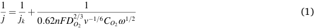

where _j_ and _jk_ stand for the absolute value of current density and kinetic current density, respectively, and _n_ , _F_ , _DO2_ , _ν_ , _CO2_ and _ω_ refer to: the number of electrons transferred in ORR, the Faraday’s constant (96,485 C mol[−][1] ), the diffusion coefficient of oxygen in the electrolyte (1.5⋅10[−][5 ] cm[2 ] s[−][1] ), the kinematic viscosity of the electrolyte (0.01 cm[2 ] s[−][1] ), the concentration of oxygen (in mol cm[−][3] ) and the rotation rate of 

the electrode (rad s[−][1] ). The calculation of hydrogen peroxide in the RRDE equipment was carried out using the following equation: 

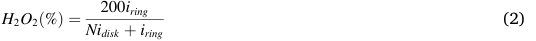

where _iring_ and _idisk_ are the absolute values of the measured current at the ring and disk, respectively, and N is the collection efficiency for the RRDE electrode (0.249). 

## _2.5. Fuel cell tests_ 

Fuel cell experiments were carried out in a 5 cm[2 ] single cell, with serpentine flow channels at both sides, in a Fuel Cell Technologies Inc. station. Cell temperature was maintained with external heating at 80[◦] C as measured at the cathode side, close to the flow channel. Fully humidified hydrogen and oxygen, pre-heated to 85[◦] C, were fed to the cell, at flow rates corresponding to 1.3 and 1.5 the stoichiometric value, respectively (minimum flow of 50 Ncm[3 ] min[−][1] ). A backpressure of 150 kPa gauge in the cathode and 130 kPa gauge in the anode was used in all experiments. Membrane-electrode assemblies (MEAs) were prepared by hot-pressing cathode (Fe-N-C catalyst, 4 mg cm[−][2] , 45 wt% Nafion®, accounting for an ionomer to catalyst ratio of 0.82) and anode (commercial Pt/C, 0.2 mgPt cm[−][2] , 33 wt% Nafion®) with Nafion®212 R membrane). The electrodes were prepared by spraying the catalyst on a GDL-39 BC (Sigracet) gas diffusion layer. The ink was prepared by dispersing the catalyst and the ionomer in isopropyl alcohol. 

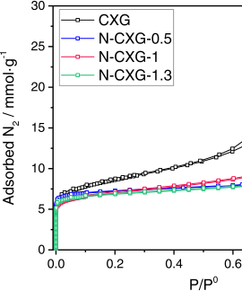

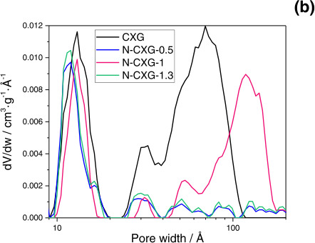

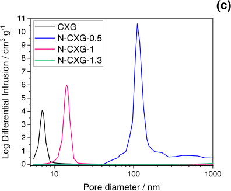

**Fig. 1.** (a) Nitrogen adsorption/desorption isotherms. (b) pore size distribution calculated from NLDFT and (c) pore size distribution obtained from Hg-porosimetry for CXG and N-CXGs. 

3 

_Catalysis Today 418 (2023) 114067_ 

_L. Alvarez-Manuel et al._[´] 

## **3. Results and discussion** 

## _3.1. Textural properties of nitrogen doped carbon xerogels and Fe-N-CXG catalysts_ 

In order to individuate the porous characteristics of the carbon matrixes before iron incorporation, nitrogen physisorption isotherms were carried out on the carbon xerogel materials. As stated before, porosity is of paramount importance in the creation of active sites and the mass transport phenomena occurring in the fuel cell electrode. Fig. 1a shows the nitrogen adsorption-desorption isotherms for the un-doped CXG and N-CXGs obtained at variable U/R ratios. CXG and N-CXG present type IV isotherms, typical of micro-mesoporous carbons, with different types of hysteresis loops. The un-doped CXG presents an H2 type hysteresis loop, that has been usually ascribed to systems with wide pore size distributions and interconnected pore networks, typical of carbon xerogels. On the other hand, N-CXG-1 shows an H1 type hysteresis loop associated with porous materials made from uniform spheres with narrow pore-size distribution in the range of mesopores [54]. Finally, both N-CXG-0.5 and N-CXG-1.3 (low and high amount of urea) present isotherms with a type H3 loop, typical of aggregates of plate-like particles forming slit-shaped pores and/or pore networks with macropores that are not completely filled upon condensation. The latter could be the case for N-CXG-0.5 as corroborated by pore size distribution obtained from N2 physisorption (Fig. 1b, calculated from non-local density functional theory approach (NLDFT)) and Hg-porosimetry (Fig. 1c). CXG and N-CXGs present a narrow distribution of micropores of around 1.2 nm size and a contribution of small mesopores of 3 nm size, in line with the structure of similar carbon xerogels doped by following different strategies [45,46]. Larger mesopores are present upon doping with nitrogen, with the main contribution shifting from 7 nm to 12 nm size (Fig. 1b). These results agree with the pore distribution obtained from Hg-porosimetry, with CXG and N-CXG-1 showing pore diameters centered at 10 nm. N-CXG-0.5 and N-CXG-1.3 show different Hg-porosimetry profiles, even though possessing very similar physisorption isotherms. N-CXG-0.5 presents a contribution at wider pores, around 100 nm. However, this is not the case for N-CXG-1.3, not presenting a proper curve in the Hg-porosimetry graphs. It has been reported that carbon xerogels may suffer pore collapse upon Hg intrusion [55]. This could be the case for N-CXG-1.3, with a porous structure more prone to collapse, due to a lower mechanical resistance, as will be discussed later. 

Table 1 provides the quantitative results derived from the analysis of nitrogen adsorption/desorption isotherms. The un-doped CXG presents a high specific surface area value (SBET), of almost 700 m[2 ] g[−][1] , and a pore volume of 0.81 cm[3 ] g[−][1] . Upon N-doping, both surface area and pore volume experience a significant decrease in general terms, what has been previously reported in literature, due to a lower mechanical resistance of N-doped xerogels, being more fragile and prone to pore collapse than their non-doped counterparts. This is also ascertained from the variation of the percentage of porosity, shown in Table 1 [45–47]. However, upon a correct selection of the reagents concentration, using a certain U/R ratio (i.e. U/R = 1), it is possible to obtain N-CXGs with a high porosity coming from a high pore volume. 

## **Table 1** 

Textural properties determined from nitrogen physisorption isotherms and helium picnometry. 

||SBET m2g−1|Sext m2g−1|Sµpore m2g−1|Vpore cm3g−1|Vµpore cm3g−1|Porositya %|
|---|---|---|---|---|---|---|
|**CXG**|696.2|403.7|292.5|0.81|0.32|60.1|
|**N-CXG-0.5**|633.4|70.1|563.4|0.54|0.25|46.6|
|**N-CXG-1**|584.4|196.2|388.2|0.86|0.24|60.6|
|**N-CXG-1.3**|593.8|81.3|512.5|0.66|0.23|53.2|

> a Calculated from the density of materials determined by He picnometry and the total pore volume from nitrogen physisorption. 

As previously described by Gorgulho et al. [50], and based on the works by Pizzi and collaborators [56–58], urea is hydroxymethylolated by the addition of formaldehyde to the amino groups, due to a series of reactions that lead to the formation of mono- and di-methylolureas. On the other hand, resorcinol is also hydroxymethylolated in the presence of formaldehyde. Both structures (U-F and R-F) possess functional groups that can condensate by means of methylene or ether bridges, giving rise to a highly crosslinked structure as shown by Pushkar et al. [59]. There are very few studies on R-U-F mixtures, and only a few report textural properties. Yu et al. obtained ordered mesoporous carbons from urea-resorcinol-formaldehyde mixtures by soft-templating, obtaining N-doped-carbons with high surface area [60], in the same range as the ones obtained in this work. In their case, they fixed the U/R ratio and changed the carbonization temperature, also influencing the textural properties of the carbon material. According to their study, R-U-F resins have a faster polymerization rate than R-F resins. This means that many monomers of R-F and U-F are formed. It is widely acknowledged that the formation of these monomers (R-F and U-F) is favored at basic pH [38,61]. Since our synthesis is carried out at pH 7, the formation of both R-F and U-F is assured. However, it must be taken into account that resorcinol does not react with urea in our synthesis conditions (low temperature), so urea and resorcinol compete for the addition of formaldehyde. Pizzi et al. investigated the gelation properties of urea-formaldehyde resins upon the variation of U/F ratio [56]. According to their study, the higher the U/F ratio, the faster the condensation, since larger amounts of urea provide more amine groups to react with formaldehyde. Also the curing time is faster for higher U/F. In our case, U/F ratios vary between 0.30 and 0.67. The condensation process might be hindered due to different effects. A low amount of urea (N-CXG-0.5) would present a slow condensation, which generally means a carbon material with small pore volume [39]. On the other hand, a high amount of urea should produce a highly condensed gel (higher pore volume). However, N-CXG-1.3 presents a similar pore volume than N-CXG-0.5. The excess of urea on N-CXG-1.3 is most probably decomposed unreacted on the carbonization process. For this reason, an intermediate amount of urea like in U/R = 1, allows the formation of both kinds of U-F and R-F monomers, forming a crosslinked R-U-F gel, with a higher pore volume, given its faster condensation rate. 

N-doped CXGs were also investigated by means of scanning electron microscopy. Fig. 2a–d show the acquired micrographs. The un-doped CXG shows a homogeneous and rough surface. On the other hand, upon U/R increase, small spherical particles, typical of microporous xerogels, are more clearly distinguished. 

Iron was incorporated to the doped and un-doped carbon xerogels using iron acetate [11,62]. As mentioned above, in this kind of Fe-N-C catalysts, the microporosity of the carbon matrix is essential to create the Fe-Nx-C active site (with x = 2, 4) [26,63]. On the other hand, mesoporosity is fundamental for the proper diffusion of reagents in the catalytic layer of the electrode [35], an often neglected parameter when designing Fe-N-C catalysts. Thus, the variation of U/R ratio leading to modified mesoporosity will allow the investigation of both nitrogen doping and mesoporous structure on ORR activity. Fig. 3 includes the N2 adsorption/desorption isotherms upon incorporation of iron (Fe-N-CXG), in comparison to the metal-free carbon materials (CXG and N-CXG). The quantitative results derived from the nitrogen physisorption isotherms are reported in Table 2. Firstly, Fig. 3a shows how the pore texture of the carbon material changes upon N-doping and upon the incorporation of iron (in the case of U/R = 1.3 as an example). Fe-N-CXG-1.3 presents a lower amount of micropores in comparison to the N-CXG in terms of surface (Sµpore decreases from 512 to 236 m[2 ] g[−][1] ) and pore volume (Vµpore from 0.23 to 0.12 cm[3 ] g[−][1] ). This variation suggests that iron is mainly blocking the microporosity, which could contribute to the creation of active sites. Total pore volume and porosity remain similar after the incorporation of Fe. The shape of the isotherm upon iron incorporation is similar to the one of the N-CXG, with a H3 type hysteresis loop that might indicate the presence of 

4 

_Catalysis Today 418 (2023) 114067_ 

_L. Alvarez-Manuel et al._[´] 

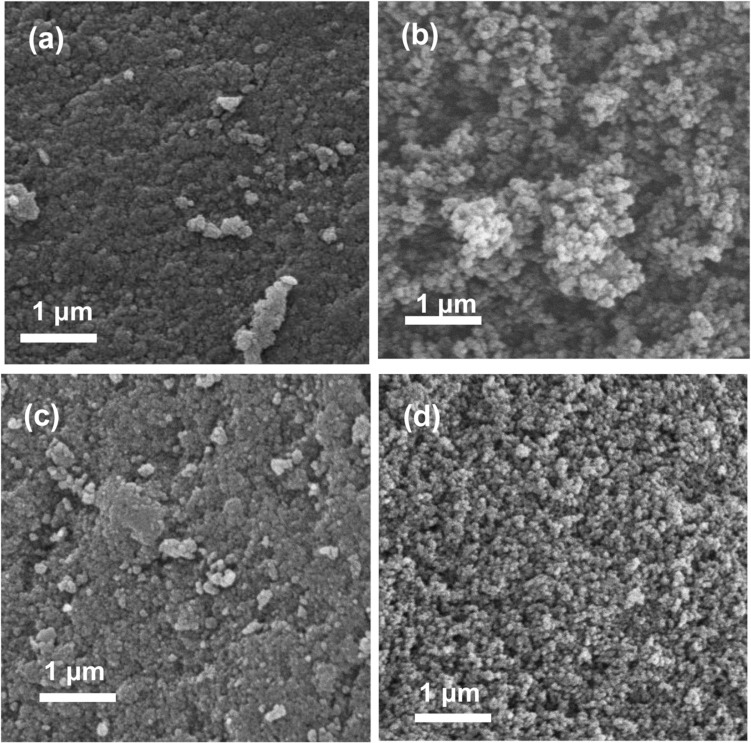

**Fig. 2.** SEM micrographs at 20,000 magnification for (a) CXG, (b) N-CXG-0.5, (c) N-CXG-1, (d) N-CXG-1.3. 

meso/macropores. This could not be corroborated with Hg-porosimetry (Fig. 3c), since as previously explained, some carbon xerogels can suffer pore collapse upon Hg intrusion [55]. 

Fig. 3b includes the isotherms relative to the different Fe-N-CXG catalysts obtained from N-CXGs synthesized with variable U/R ratios. Textural properties are presented in Table 2. The differences encountered with varying U/R follow a similar tendency as the one previously shown in Fig. 1b. Among nitrogen containing materials, Fe-N-CXG-1 is the one with the largest surface area and pore volume. This resembles the porosity trend observed for N-CXGs, since N-CXG-1 was the N-doped carbon material with the most developed pore structure. Fig. 3c shows the pore size distribution obtained from Hg-porosimetry for N-CXGs and Fe-N-CXGs with variable U/R ratio. Also in this case, Fe-N-CXGs catalysts show the same trend as the nitrogen-doped carbon material, with Fe-N-CXG-0.5 showing a pore size distribution (PSD) centered around 40 nm, with respect to N-CXG-0.5 with a PSD centered around 100 nm. This indicates that, upon iron doping, wide mesopores and macropores get partially blocked. 

Aimed to increase the electrocatalytic activity, Fe-N-CXG catalysts are leached in acid in order to remove inactive Fe particles, followed by a thermal treatment at high temperature to promote the activation of the catalyst. These treatments slightly modify the pore texture of the catalysts as can be seen in Fig. 3d and in Table 2. Upon successive treatments, the catalysts present a higher amount of micropores, most probably coming from the voids that inactive Fe particles leave after being leached from the carbon matrix [41] as well as the removal of iron particles blocking both micro and meso/macropores [64]. Fig. 3e shows the PSD obtained from Hg-porosimetry for N-CXG-1.3, Fe-N-CXG-1.3 

and Fe-N-CXG-1.3-TT3 (i.e. submitted to 3 cycles of acid leaching/thermal treatment). Fe-N-CXG-1.3-TT3 shows a clear PSD centered at 120 nm, revealing that part of the Fe particles not forming the active sites in the micropores of the carbon matrix, can block the macropores. This highlights the importance of the acid leaching/thermal treatments. 

## _3.2. Chemical composition of N-CXGs and Fe-N-CXG catalysts_ 

The concentration and speciation of nitrogen groups in both organic and carbon xerogels were determined for the materials prepared at different U/R ratios. Organic xerogel (OXG) stands for the polymeric material before carbonization. Table 3 shows the nitrogen percentage determined from elemental analyses and XPS. The amount of nitrogen determined by elemental analysis (EA) in the OXGs ranges between 7 and 8 wt%. and with the highest value found for U/R = 1. The higher amount of urea on the initial mixture, leads to a higher amount of nitrogen in the organic gel up to U/R = 1, but upon higher amounts of urea (U/R = 1.3), there is no significant increase in the amount of N. Since urea and resorcinol compete for the addition of formaldehyde, when too much urea is added, there is not enough formaldehyde to react with both resorcinol and urea, and the unreacted urea is most probably decomposed upon carbonization, what would explain the lower amount of nitrogen on N-CXG-1.3. 

– The amount of N determined by XPS is around 6 7 at%. N-doped carbon xerogels are usually enriched in nitrogen in the surface, since ammonia groups present in urea, tend to arrange in the aqueous media towards the external region of the precursor R-U-F solution. Upon gelation and pyrolysis, these groups remain in the surface of the 

5 

_Catalysis Today 418 (2023) 114067_ 

_L. Alvarez-Manuel et al._[´] 

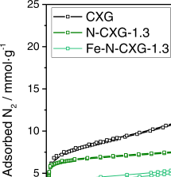

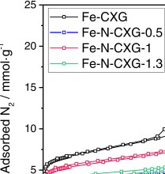

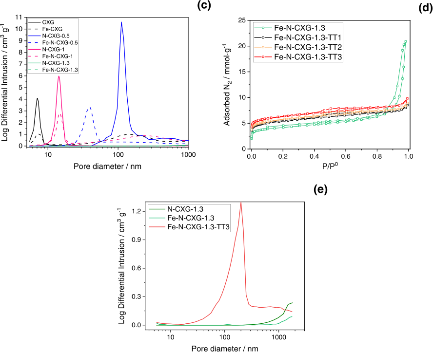

**Fig. 3.** N2-adsorption/desorption isotherms for (a) CXG, N-CXG-1.3 and Fe-N-CXG-1.3 (b) Fe-N-CXGs catalysts obtained at variable U/R ratio, (c) pore size distribution obtained from Hg-porosimetry for N-CXGs and Fe-N-CXGs catalysts obtained at variable U/R ratio (d) N2-adsorption/desorption isotherms for Fe-N-CXG-1.3 subjected to successive acid leaching/thermal treatments and, (e) pore size distribution obtained from Hg-porosimetry for N-CXG-1.3, Fe-N-CXG-1.3 and Fe-N-CXG1.3-TT3. 

material, in agreement with previous studies [45,47]. During the carbonization at 800[◦] C, some nitrogen groups like amines decompose and N-doped carbon xerogels (N-CXGs) present lower nitrogen contents – than their OXG counterparts, with around 2 3 wt% (determined by AE) and 1–2 at% (determined by XPS). After the incorporation of Fe, N content slightly decreases, being around 1 wt% for Fe-N-CXG-0.5 and Fe-N-CXG-1.3. Fe-N-CXG-1 presents a higher amount of nitrogen, 1.8 wt % and, a higher amount of Fe (0.87 wt% with respect to the other cat– alysts, presenting around 0.6 0.7 wt% Fe). This is also reflected in the N/C ratio, also presented in Table 3 and Fig. 4. Upon acid leaching, the 

amount of Fe decreases with increasing cycles of acid leaching/thermal treatments, so the Fe-N-CXG-1.3-TTn present Fe contents ranging from 0.19 to 0.28 wt%. 

The effect of the relative nitrogen content on the iron concentration can be more clearly seen in Fig. 4 where the Fe content is represented as a function of the N/C ratio for Fe-N-CXG catalysts (before leaching). In this way, it is more clearly observed that the amount of Fe in the catalyst increases as the amount of nitrogen in the carbon material increases, being maximum for the carbon xerogel derived from U/R = 1. High resolution N1s orbital investigated by XPS for N-CXGs at 

6 

_Catalysis Today 418 (2023) 114067_ 

_L. Alvarez-Manuel et al._[´] 

## **Table 2** 

Textural properties determined from nitrogen physisorption isotherms and helium picnometry. 

||SBET|Sext|Sµpore|Vpore|Vµpore|Porositya|
|---|---|---|---|---|---|---|
||m2/g|m2/g|m2/g|cm3/g|cm3/g|%|
|**Fe-CXG**|594|196|398|0.63|0.23|56.9|
|**Fe-N-CXG-0.5**|313|87|226|0.59|0.13|54.8|
|**Fe-N-CXG-1**|479|249|229|0.82|0.18|62.6|
|**Fe-N-CXG-1.3**|347|111|236|0.72|0.12|59.4|
|**Fe-N-CXG-1.3-TT1** **Fe-N-CXG-1.3-TT2** **Fe-N-CXG-1.3-TT3**|449 473 528|66 67 69|383 406 459|0.30 0.31 0.34|0.17 0.18 0.21|n.d. n.d. n.d.|

> a Calculated from the density of materials determined by He picnometry and the total pore volume from nitrogen physisorption. n.d. = not determined. 

variable U/R ratio was deconvoluted in four different peaks, attributed to pyridinic, pyrrolic/pyridonic, graphitic/quaternary nitrogen and nitrogen oxides. Fig. 5 shows the deconvolution for both N-OXG-1.3 and N-CXG-1.3 and the corresponding Fe-N-CXG catalysts. The organic xerogel is mainly composed of pyrrolic/pyridonic nitrogen (Fig. 5a). Upon carbonization (N-CXG-1.3), pyrrolic groups are decomposed and transformed in the carbon material into pyridinic nitrogen, and pyridonic N, since pyrrolic nitrogen is decomposed beyond 600[◦] C, being these the main components. Graphitic and oxidized nitrogen are also encountered in the N-CXG-1.3. It has been reported that pyridinic nitrogen is gradually converted to graphitic/quarternary nitrogen at carbonization temperatures above 450[◦] C [43]. On the other hand, Fe-N-CXG (Fig. 5b) are mainly composed of graphitic and pyrrolic/pyridonic nitrogen, along with nitrogen bonded to metal (Nx-Me). Further details on the chemical composition of N-CXGs obtained at different U/R ratios can be found in Fig. S1 of the Supplementary Information. 

Table 4 shows the chemical speciation for the N1s orbital for all the N-CXGs at variable U/R ratios and for Fe-N-CXG-1-TT2 and Fe-N-CXG1.3-TT2. Further details on deconvolution of the N1s orbital can be found in Fig. S1 of the Supplementary Information. Regardless the U/R ratio, nitrogen in N-CXGs is mostly present as graphitic N (ca. 50%) and pyridinic N (ca. 35%). There are some differences on the amount of oxidized nitrogen (being particularly high in the N-CXG-1.3, that could come from unreacted monomers, either urea or resorcinol) and in the pyrrolic/pyridonic nitrogen, with N-CXG-0.5 showing the highest amount of this type of nitrogen. The atomic percentage of N of the catalysts Fe-N-CXG-1-TT2 and Fe-N-CXG-1.3-TT2 was also calculated by XPS corresponding to 1.51 and 1.13, respectively. Besides, Fe-N-CXGs catalysts presented a peak associated to nitrogen bonded to a metal (Nx-M), being higher in the case of the Fe-N-CXG-1-TT2 sample. On the other hand, although the N-Pyridinic percentages are very similar in 

both catalysts, the Fe-N-CXG-1.3-TT2 catalyst has a higher NPyridinic/ N-yrrolic/pyridonic ratio. It has been reported that this ratio is related to the catalytic activity, since a larger amount of Npyridinic and a lower quantity of Npyrrolic results in a better ORR, as N-Pyridinic catalyzes the formation of water from H2O2 [65,66]. 

## _3.3. Activity towards the oxygen reduction reaction in acidic medium_ 

The catalysts activity towards the oxygen reduction reaction (ORR) was evaluated in a three-electrode cell in acidic medium (0.5 M H2SO4) and compared to a commercial Pt/C catalyst, benchmark for this reaction. Fig. 6a shows the linear sweep voltammetry (LSV) curves for the Fe-N-CXG catalysts prepared with variable U/R ratios. In this comparison, all the catalysts shown were subjected to one cycle of acid leaching treatment, followed by a thermal treatment in inert atmosphere (indicated as TT1). The most active catalyst is Fe-N-CXG-1-TT1, that is the one presenting the highest amount of Fe and N. 

Fig. 6b and c show the effect of the acid leaching and thermal treatment in the activity of the catalysts Fe-N-CXG-1.3-TT1 and Fe-NCXG-1-TT1 respectively. First, there is a significant improvement of activity upon a first cycle process (acid leaching/thermal treatment), by comparing Fe-N-CXG-1.3 and Fe-N-CXG-1.3-TT1, accounting for 

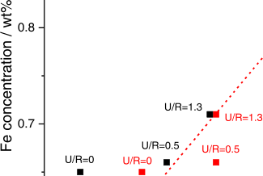

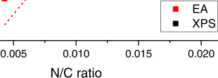

**Fig. 4.** Iron concentration from ICP against N/C ratio calculated from elemental analysis (EA) and XPS for Fe-N-CXGs obtained varying the urea to resorcinol (U/R) ratio. 

**Table 3** 

Chemical composition determined by elemental analysis, XPS and ICP for both organic (OXG), carbon xerogels (CXG) and Fe-N-CXG catalysts. 

||Elemental analysis (wt%) N O C H N/C|XPS (at%) N O C N/C|ICP (wt%) Fe|
|---|---|---|---|
|**OXG** **N-OXG-0.5** **N-OXG-1** **N-OXG-1.3** **CXG** **N-CXG-0.5** **N-CXG-1** **N-CXG-1.3** **Fe-CXG** **Fe-N-CXG-0.5** **Fe-N-CXG-1** **Fe-N-CXG-1.3** **Fe-N-CXG-1.3-TT1** **Fe-N-CXG-1.3-TT2** **Fe-N-CXG-1.3-TT3**|0 36.0 59.6 4.4 0.00 7.6 29.7 57.6 5.1 0.11 8.3 30.1 56.7 4.9 0.13 7.8 29.6 57.8 4.8 0.12 0.0 9.1 89.8 0.9 0.00 1.7 4.8 92.4 1.0 0.02 2.9 7.7 88.3 1.1 0.03 1.7 1.7 96.1 0.5 0.02 0.0 6.0 92.6 0.3 0.00 1.1 5.3 92.8 0.2 0.01 1.8 4.8 92.1 0.4 0.02 0.9 12.3 85.6 0.4 0.01 0.9 1.1 97.8 0.2 0.01 0.9 4.0 94.7 0.4 0.01 0.9 1.6 97.3 0.2 0.01|- - - 6.1 17.2 76.7 0.08 6.7 16.9 76.3 0.09 6.0 16.4 77.6 0.08 0.0 2.4 97.6 0.000 1.3 2.6 96.1 0.01 2.0 4.1 93.9 0.02 1.4 3.5 95.1 0.01 0.0 2.9 97.1 0.000 0.6 1.8 97.6 0.01 0.6 10.7 88.7 0.01 0.9 1.1 98.0 0.01 0.7 5.4 93.9 0.01 1.1 6.1 92.8 0.01 1.2 3.2 95.6 0.01|- - - - - - - - 0.65 0.66 0.87 0.71 0.28 0.20 0.19|

7 

_Catalysis Today 418 (2023) 114067_ 

_L. Alvarez-Manuel et al._[´] 

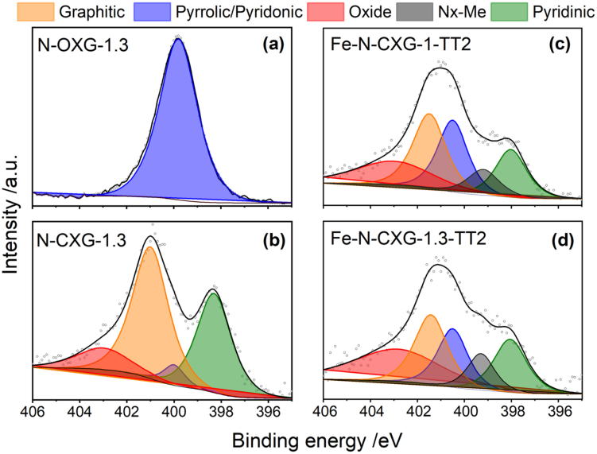

**Fig. 5.** XPS high resolution N1s spectra for (a) N-OXG and (b) N-CXG obtained with U/R = 1.3, (c) Fe-N-CXG-1-TT2 and (d) Fe-N-CXG-1.3-TT2. 

**Table 4** 

Chemical speciation (percentage) of the N1s orbital for N-CXGs, and Fe-N-CXGs catalysts (Fe-N-CXG-1-TT2 and Fe-N-CXG-1.3-TT2). 

|N-species / Binding Energy (eV)|N- CXG-|N- CXG-1|N- CXG-|Fe-N- CXG-1-|Fe-N- CXG-1.3-|
|---|---|---|---|---|---|
|**N-Pyridinic** (398.3–398.6)|0.5 35.5|39.1|1.3 35.1|TT2 17.0|TT2 18.0|
|**Nx-M**(399–399.8)|-|-|-|24.5|18.1|
|**N-Pyrrolic/Pyridonic**|6.8|4.6|4.4|9.4|10.2|
|(400–400.5)||||||
|**N-Graphitic** (401–402) **N-Oxide**(403–405)|52.1 5.6|52.8 3.6|48.6 11.9|27.9 21.3|23.7 29.9|
|**Ratio N-Pyridinic/N-**|5.2|8.6|8.0|0.7|1.0|
|**Pyrrolic**||||||

150 mV higher half-wave potential. This is commonly associated to the removal of inactive metal species and the creation of new active sites [29,41,67]. Regarding the effect of consecutive treatments, as ascertained from the voltammetries, the onset potential increases about 20 mV after each treatment but the limiting current density decreases upon the third cycle (TT3). A decrease of the limiting current density may be ascribed to a lower number of electrons, according to the Levich equation. This means that, overall, the activity of the catalysts increases when subjected up to two acid leaching/thermal treatments, meaning that inactive particles are being effectively removed. However no additional improvement is generated with more treatments, most probably due to the excessive removal of iron. This is the reason for selecting a number of two treatments for the Fe-N-CXG catalysts for further investigation. 

Table 5 provides the main electrochemical parameters obtained from the LSVs in Fig. 6, i.e _._ , the onset potential (Eonset) recorded at − 0.1 mA cm[−][2] , the half-wave potential (E1/2) and the limiting current density (jd). 

Fe-N-CXG-1-TT2 presents the highest onset potential, 0.82 V vs. RHE. As previously mentioned, upon two cycles of acid leaching/ 

thermal treatments, the activity of the catalysts improves, in terms of higher Eonset, E1/2 and jd. 

Fig. 7a and b show the Koutecky-Levich (KL) and Tafel plots, respectively, for the two most active catalysts (Fe-N-CXG-1-TT2 and FeN-CXG-1.3-TT2). KL plot evidences a different number of electrons related to the U/R ratio. Fe-N-CXG-1-TT2 exchanges 3.3 electrons during the ORR, meaning that this catalyst presents a mixture of active sites, some of them performing the ORR through a 4 e[- ] mechanism (or 2 × 2 e[-] ) and some other sites (lower relative amount) proceeding through 2 e[- ] pathway. Whereas, Fe-N-CXG-1.3-TT2 exchanges 3.95 e[-] , a value very close to ideally full conversion of oxygen to water. These values are in agreement with the XPS results, since Fe-N-CXG-1.3-TT2 possesses a larger Npyridinic/Npyrrolic-pyridonic ratio, favoring the full conversion of oxygen to water. To better individuate this aspect, rotating-ring disk experiments were carried out to monitor the eventual production of – hydrogen peroxide for the Fe-N-CXG-7 1-TT2 catalyst. The percentage of H2O2 was found between 11% and 14%, which corresponds to an equivalent number of electrons between 3.72 and 3.78, which is higher than the value determined from the KL method (3.3). With regard to the Tafel slope, there are slight differences between the Fe-N-CXG catalysts, with lower Tafel slope of 71 mV dec[−][1 ] for the catalyst with the best activity (Fe-N-CXG-1-TT2), very close to that obtained for Pt/C of 61 mV dec[−][1] . 

The proper combination of N speciation (high amount of pyridinic versus pyridonic nitrogen), proper concentration of Fe and balanced textural properties (mesoporosity/microporosity) is fundamental for the enhanced catalytic activity of Fe-N-C catalysts based on N-doped carbon xerogels. The correct selection of the synthesis parameters of the N- doped carbon xerogel (i.e. appropriate U/R ratio) is fundamental to obtain a carbon material with the desired properties as carbon matrix for Fe-N-CXG. 

## _3.4. Fuel cell tests_ 

The activity and durability of the two most active Fe-N-CXG catalysts were also studied at the cathode of a single cell. Fig. 8 shows the 

8 

_Catalysis Today 418 (2023) 114067_ 

_L. Alvarez-Manuel et al._[´] 

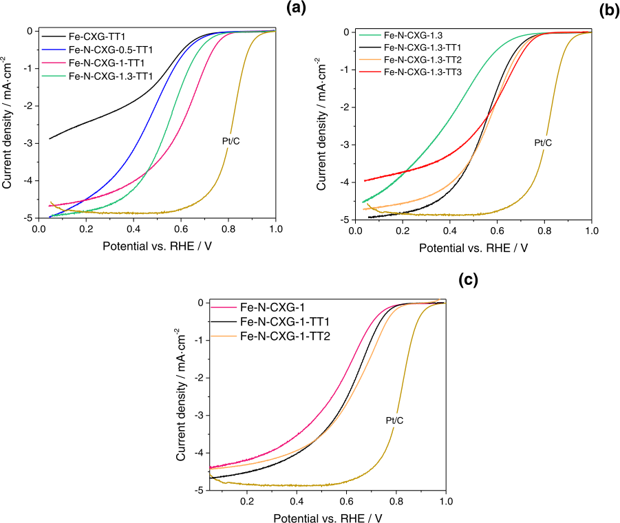

**Fig. 6.** (a) LSVs recorded during the ORR at 1600 rpm for Fe-N-CXG catalysts. All the catalysts shown were subjected to one acid leaching treatment, followed by a thermal treatment in inert atmosphere; (b) and (c) LSVs recorded during the ORR at 1600 rpm for catalysts Fe-N-CXG-1.3 and Fe-N-CXG-1 subjected to successive acid leaching-thermal treatments indicated as TT _n_ ( _n_ is the number of treatments). 

**Table 5** 

Electrochemical parameters for the Fe-N-CXG catalysts. Potentials are referred versus the reversible hydrogen electrode (RHE). 

|Catalyst|Eonset VRHE|E1/2 VRHE|jd mA|cm−2|
|---|---|---|---|---|
|**Fe-CXG-TT1** **Fe-N-CXG-0.5-TT1** **Fe-N-CXG-1-TT1**|0.70 0.72 0.79|0.49 0.46 0.61|-2.9 -5.0 -4.7|   |
|**Fe-N-CXG-1-TT2**|0.82|0.64|-4.4||
|**Fe-N-CXG-1.3-TT1**|0.76|0.55|-4.9||
|**Fe-N-CXG-1.3-TT2**|0.76|0.56|-4.7||
|**Fe-N-CXG-1.3-TT3**|0.77|0.58|-4.0||

polarization curves at the beginning (BoT) and at the end (EoT) of a durability test consisting of 20 h operation at 0.5 V, while the power density curves are included in Fig. S2 of the Supporting Information. At the beginning of test, the Fe-N-CXG-1-TT2 catalyst exhibits an open circuit voltage of 0.85 V, about 100 mV higher than Fe-N-CXG-1.3-TT2. This result is in line with the 3-electrode RDE cell results, where the difference between these two catalysts was found to be about 60 mV in terms of onset potential and 80 mV in terms of half-wave potential. This voltage difference between the two catalysts is even exacerbated up to 200 mV when a current density is demanded to the cell. As a result, the maximum power density, 155 mW cm[−][2 ] is achieved by the MEA composed of Fe-N-CXG-1-TT2 catalysts, which is about 150% higher if compared to Fe-N-CXG-1.3-TT2. The performance here determined can 

be further increased by optimizing the ink formulation for the preparation of electrodes. Wang and co-workers have recently found the relevance of adapting the ink formulation for catalysts based on similar carbon aerogel structures [68]. They observed a significant increase of performance from 60 mW cm[−][2 ] to 120 mW cm[−][2 ] by increasing the ionomer/catalyst ratio from 0.47 to 1 and increasing the amount of water in the ethanol/water solvent used for the dispersion of catalyst [41]. In our work, we used an ionomer/catalyst ratio of 0.82 upon dispersion of the catalyst in isopropyl alcohol for spraying. 

On the other hand, after voltage holding for 20 h, the Fe-N-CXG-1TT2 catalyst suffers a greater degradation, compared to Fe-N-CXG-1.3TT2. Fig. S3 shows the variation of current density with time during the potential holding test. The current retained for the most active catalyst (Fe-N-CXG-1-TT2) is 57% after the test, while this value represents 74% for the Fe-N-CXG-1.3-TT2 catalyst. Most of the current decrease in the chronoamperometric experiment at constant voltage comes from irreversible losses, as deduced from the current variation in the polarization curves, with a retention of 49% and 75%, respectively, at 0.5 V (Fig. 8). Current retention values of about 50% have been reported for carbon-derived Fe-N-C catalysts upon 100 h voltage holding at 0.5 V [8]. However, there are several different sources of degradation of fuel cell performance in accelerated stress tests [69], which makes it difficult to elucidate a proper comparison with the published literature since the operating conditions differ sufficiently with each other. In any case, one of the most important causes for degradation, together with demetalation, is carbon electro-oxidation at potentials occurring at the 

9 

_Catalysis Today 418 (2023) 114067_ 

_L. Alvarez-Manuel et al._[´] 

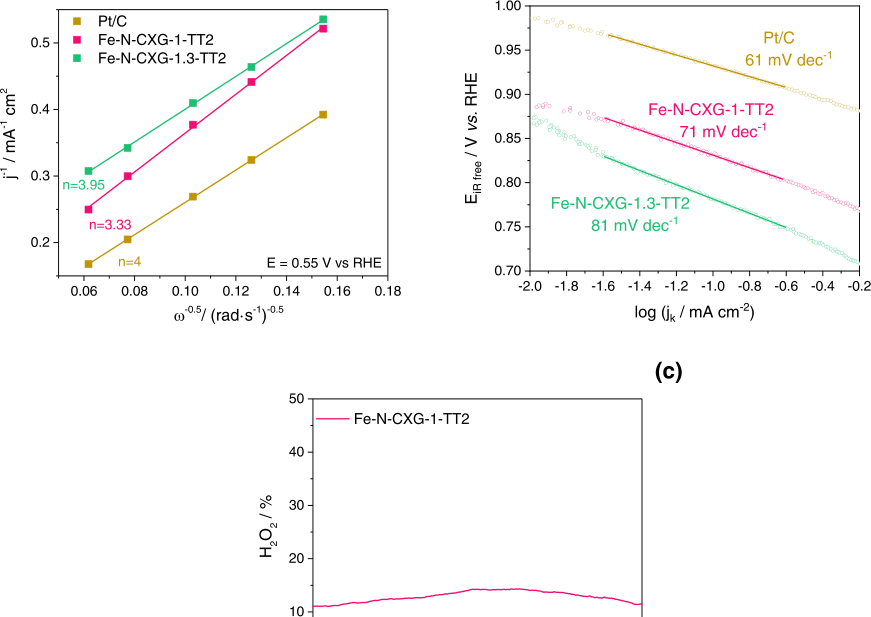

**Fig. 7.** (a) Koutecky-Levich diagrams obtained at 0.55 V vs. RHE; (b) Tafel plot from LSV at 1600 rpm for the ORR for Fe-N-CXG-1-TT2 and Fe-N-CXG-1.3-TT2 compared to a commercial Pt/C catalyst; (c) Hydrogen peroxide formation for Fe-N-CXG-1-TT2 at 1600 rpm in a RRDE electrode with the platinum ring signal at fixed potential of 1.2 V vs. RHE. 

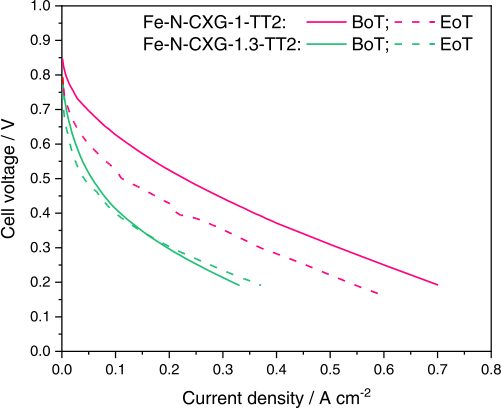

**Fig. 8.** Polarization curves for MEAs comprising cathodes made with Fe-N-CXG catalysts (4 mg cm[−][2] ), Nafion® NR212 membrane, and Pt40%/C (0.2 mgPt cm[−][2] ) at the anode; before (BoT) and at the end (EoT) of a 20 h operation test at 0.5 V. Operating conditions: 80[◦] C; H2/O2 at λ = 1.3/1.5, 100% RH, and back pressure of 1.5 bar-gauge. 

cathode side or carbon corrosion [9]. In our work, the larger surface area of N-CXG-1 (about 100 m[2 ] g[−][1 ] higher), and in consequence of the Fe-N-CXG-1 catalyst and derivatives, could be responsible for the higher degradation rate, as previously established by Alegre et al. [70]. Carbon xerogels, and in general, carbon materials, with a larger surface area are more prone to electrochemical oxidation than carbon materials with a less developed porosity, as is the case of Fe-N-CXG-1.3, which may explain the better retention of current density of the latter during the voltage holding test. 

## **4. Conclusions** 

N-doped xerogels, obtained from low-cost urea as nitrogen precursor, are presented as an interesting carbon matrix for Fe-N-C catalysts. Herein, the incorporation of urea during the gelation process is investigated as a simple procedure to dope carbon with nitrogen. Microporosity and mesoporosity of the carbon matrix relies on the formation of monomers, where urea and resorcinol compete to react with formaldehyde. A balanced urea amount, in our case a urea/resorcinol ratio of 1, leads to proper porosity including both micro- and mesopores. This has been demonstrated to positively influence the catalytic activity towards the ORR. Besides, by modificating the relative amount of urea, nitrogen is found in the form of pyridinic nitrogen and the relative content of pyrrolic/pyridonic nitrogen is minimized. Iron incorporation appears to be favored also by a larger concentration of nitrogen. These two aspects point to an increased ORR activity. Further investigation is required to further increase the concentration of iron active species, which may be 

10 

_Catalysis Today 418 (2023) 114067_ 

_L. Alvarez-Manuel et al._[´] 

achieved by alternative nitrogen doping techniques. Fuel cell tests corroborate the RDE findings, being the most active catalyst the one with the largest porosity, optimal amount of iron, nitrogen bonded to metal and high content of pyridinic nitrogen. However, the durability of the most active catalyst is affected by its large porosity, making the catalyst more prone to corrosion than the less porous counterpart. The present study reveals the importance of fine tuning both the porosity and the active sites of Fe-N-C catalysts to maximize their activity and durability in a fuel cell device. 

## **CRediT authorship contribution statement** 

**Laura Alvarez-Manuel:**[´] Conceptualization, Investigation, Methodology, Data curation, Formal analysis, Writing – original draft. **Cinthia Alegre:** Conceptualization, Methodology, Supervision, Formal analysis, Writing – original draft. **Alberto Eizaguerri:** Investigation, Data curation. **David Sebastian:** ´ Supervision, Validation, Project administration, Writing – review & editing. **Pedro F. Napal:** Investigation, Formal analysis. **María J. Lazaro:** ´ Supervision, Project administration, Funding acquisition, Writing – review & editing. 

## **Declaration of Competing Interest** 

The authors declare that they have no known competing financial interests or personal relationships that could have appeared to influence the work reported in this paper. 

## **Data availability** 

Data will be made available on request. 

## **Acknowledgments** 

The authors wish to acknowledge the grant PID2020-115848RB-C21 funded by MCIN/AEI/10.13039/501100011033. Authors also acknowledge _Grupo de ConversiGobierno de Aragon de Combustibles_ ´ ´ _on_ (DGA) for the financial support to (T06_20R). L. Alvarez acknowledges[´] also DGA for her pre-doctoral contract. 

## **Appendix A. Supplementary material** 

Supplementary data associated with this article can be found in the online version at doi:10.1016/j.cattod.2023.114067. 

## **References** 

- [1] Y. Wang, H. Yuan, A. Martinez, P. Hong, H. Xu, F.R. Bockmiller, Polymer electrolyte membrane fuel cell and hydrogen station networks for automobiles: Status, technology, and perspectives, Adv. Appl. Energy 2 (2021), 100011, https:// doi.org/10.1016/J.ADAPEN.2021.100011. 

- [2] G. Wang, Y. Yu, H. Liu, C. Gong, S. Wen, X. Wang, Z. Tu, Progress on design and development of polymer electrolyte membrane fuel cell systems for vehicle applications: a review, Fuel Process. Technol. 179 (2018) 203–228, https://doi. org/10.1016/J.FUPROC.2018.06.013. 

- [3] I. Katsounaros, S. Cherevko, A.R. Zeradjanin, K.J.J. Mayrhofer, Oxygen electrochemistry as a cornerstone for sustainable energy conversion, Angew. Chem. Int. Ed. 53 (2014) 102–121, https://doi.org/10.1002/anie.201306588. 

- [4] H.M. Barkholtz, D.-J. Liu, Advancements in rationally designed PGM-free fuel cell catalysts derived from metal–organic frameworks, Mater. Horiz. 4 (2017) 20–37, https://doi.org/10.1039/C6MH00344C. 

- [5] S. Ratso, M. K¨a¨arik, M. Kook, P. Paiste, J. Aruv¨ali, S. Vlassov, V. Kisand, J. Leis, A. M. Kannan, K. Tammeveski, High performance catalysts based on Fe/N co-doped carbide-derived carbon and carbon nanotube composites for oxygen reduction reaction in acid media, Int. J. Hydrog. Energy 44 (2019) 12636–12648, https:// doi.org/10.1016/j.ijhydene.2018.11.080. 

- [6] G. Balkourani, A. Brouzgou, C. Lo Vecchio, A.S. Arico, V. Baglio, P. Tsiakaras, ` Selective electro-oxidation of dopamine on Co or Fe supported onto N-doped ketjenblack, Electrochim. Acta 409 (2022), https://doi.org/10.1016/J. ELECTACTA.2022.139943. 

- [7] C. Lo Vecchio, A. Serov, M. Dicome, B. Zulevi, A.S. Arico, V. Baglio, Investigating ` the durability of a direct methanol fuel cell equipped with commercial platinum 

group metal-free cathodic electro-catalysts, Electrochim. Acta 394 (2021), https:// doi.org/10.1016/J.ELECTACTA.2021.139108. 

- [8] L. Osmieri, J. Park, D.A. Cullen, P. Zelenay, D.J. Myers, K.C. Neyerlin, Status and challenges for the application of platinum group metal-free catalysts in protonexchange membrane fuel cells, Curr. Opin. Electrochem. 25 (2021), 100627, https://doi.org/10.1016/J.COELEC.2020.08.009. 

- [9] U. Martinez, S. Komini Babu, E.F. Holby, H.T. Chung, X. Yin, P. Zelenay, Progress in the development of Fe-based PGM-Free electrocatalysts for the oxygen reduction reaction, Adv. Mater. 31 (2019) 1806545, https://doi.org/10.1002/ adma.201806545. 

- [10] R. Jasinski, Cobalt phthalocyanine as a fuel cell cathode, J. Electrochem. Soc. 112 (1965) 526–528, https://doi.org/10.1149/1.2423590. 

- [11] E. Proietti, F. Jaouen, M. Lef`evre, N. Larouche, J. Tian, J. Herranz, J.P. Dodelet, Iron-based cathode catalyst with enhanced power density in polymer electrolyte membrane fuel cells, Nat. Commun. 2 (2011) 416, https://doi.org/10.1038/ ncomms1427. 

- [12] J.Y. Cheon, T. Kim, Y. Choi, H.Y. Jeong, M.G. Kim, Y.J. Sa, J. Kim, Z. Lee, T.H. Yang, K. Kwon, O. Terasaki, G.-G. Park, R.R. Adzic, S.H. Joo, Ordered mesoporous porphyrinic carbons with very high electrocatalytic activity for the oxygen reduction reaction, Sci. Rep. 3 (2013), https://doi.org/10.1038/ srep02715. 

- [13] J. Liang, R.F. Zhou, X.M. Chen, Y.H. Tang, S.Z. Qiao, Fe-N decorated hybrids of CNTs grown on hierarchically porous carbon for high-performance oxygen reduction, Adv. Mater. 26 (2014) 6074–6079, https://doi.org/10.1002/ adma.201401848. 

- [14] A. Serov, M.H. Robson, B. Halevi, K. Artyushkova, P. Atanassov, Highly active and durable templated non-PGM cathode catalysts derived from iron and aminoantipyrine, Electrochem. Commun. 22 (2012) 53–56, https://doi.org/ 10.1016/j.elecom.2012.04.029. 

- [15] D. Zhao, J.L. Shui, L.R. Grabstanowicz, C. Chen, S.M. Commet, T. Xu, J. Lu, D. J. Liu, Highly efficient non-precious metal electrocatalysts prepared from one-pot synthesized zeolitic imidazolate frameworks, Adv. Mater. 26 (2014) 1093–1097, https://doi.org/10.1002/ADMA.201304238. 

- [16] L. Yang, N. Larouche, R. Chenitz, G. Zhang, M. Lef`evre, J.P. Dodelet, Activity, performance, and durability for the reduction of oxygen in PEM fuel cells, of Fe/N/ C electrocatalysts obtained from the pyrolysis of metal-organic-framework and iron porphyrin precursors, Electrochim. Acta 159 (2015) 184–197, https://doi.org/ 10.1016/J.ELECTACTA.2015.01.201. 

- [17] A. Serov, K. Artyushkova, N.I. Andersen, S. Stariha, P. Atanassov, Original mechanochemical synthesis of non-platinum group metals oxygen reduction reaction catalysts assisted by sacrificial support method, Electrochim. Acta 179 (2015) 154–160, https://doi.org/10.1016/j.electacta.2015.02.108. 

- [18] R. Gokhale, Y. Chen, A. Serov, K. Artyushkova, P. Atanassov, Novel dual templating approach for preparation of highly active Fe-N-C electrocatalyst for oxygen reduction, Electrochim. Acta 224 (2017) 49–55, https://doi.org/10.1016/ J.ELECTACTA.2016.12.052. 

- [19] Y. Zhou, G. Chen, Q. Wang, D. Wang, X. Tao, T. Zhang, X. Feng, K. Müllen, Fe-N-C electrocatalysts with densely accessible Fe-N4 sites for efficient oxygen reduction reaction, Adv. Funct. Mater. 31 (2021) 2102420, https://doi.org/10.1002/ adfm.202102420. 

- [20] S. Gupta, S. Zhao, O. Ogoke, Y. Lin, H. Xu, G. Wu, Engineering favorable morphology and structure of Fe-N-C oxygen-reduction catalysts through tuning of nitrogen/carbon precursors, ChemSusChem 10 (2017) 774–785, https://doi.org/ 10.1002/CSSC.201601397. 

- [21] L. Osmieri, Transition metal–nitrogen–carbon (M–N–C) catalysts for oxygen reduction reaction. Insights on synthesis and performance in polymer electrolyte fuel cells, ChemEngineering 3 (2019) 1–32, https://doi.org/10.3390/ chemengineering3010016. 

- [22] X. Xu, C. Xu, J. Liu, R. Jin, X. Luo, C. Shu, H. Chen, C. Guo, L. Xu, Y. Si, The synergistic effect of “soft-hard template” to in situ regulate mass transfer and defective sites of doped-carbon nanostructures for catalysis of oxygen reduction, J. Alloy. Compd. 939 (2023), 168782, https://doi.org/10.1016/J. JALLCOM.2023.168782. 

- [23] Y. Mun, M.J. Kim, S.A. Park, E. Lee, Y. Ye, S. Lee, Y.T. Kim, S. Kim, O.H. Kim, Y. H. Cho, Y.E. Sung, J. Lee, Soft-template synthesis of mesoporous non-precious metal catalyst with Fe-Nx/C active sites for oxygen reduction reaction in fuel cells, Appl. Catal. B Environ. 222 (2018) 191–199, https://doi.org/10.1016/J. APCATB.2017.10.015. 

- [24] S. Zago, M. Bartoli, M. Muhyuddin, G.M. Vanacore, P. Jagdale, A. Tagliaferro, C. Santoro, S. Specchia, Engineered biochar derived from pyrolyzed waste tea as a carbon support for Fe-N-C electrocatalysts for the oxygen reduction reaction, Electrochim. Acta 412 (2022), 140128, https://doi.org/10.1016/J. ELECTACTA.2022.140128. 

- [25] M. Muhyuddin, N. Zocche, R. Lorenzi, C. Ferrara, F. Poli, F. Soavi, C. Santoro, Valorization of the inedible pistachio shells into nanoscale transition metal and nitrogen codoped carbon-based electrocatalysts for hydrogen evolution reaction and oxygen reduction reaction, Mater. Renew. Sustain. Energy 11 (2022) 131–141, https://doi.org/10.1007/S40243-022-00212-5. 

- [26] J.H. Zagal, S. Specchia, P. Atanassov, Mapping transition metal-MN4 macrocyclic complex catalysts performance for the critical reactivity descriptors, Curr. Opin. Electrochem. 27 (2021), 100683, https://doi.org/10.1016/J. COELEC.2020.100683. 

- [27] S. Specchia, P. Atanassov, J.H. Zagal, Mapping transition metal–nitrogen–carbon catalyst performance on the critical descriptor diagram, Curr. Opin. Electrochem. 27 (2021), 100687, https://doi.org/10.1016/J.COELEC.2021.100687. 

11 

_Catalysis Today 418 (2023) 114067_ 

_L._[´] 

- [28] K. Artyushkova, S. Rojas-Carbonell, C. Santoro, E. Weiler, A. Serov, R. Awais, R. R. Gokhale, P. Atanassov, Correlations between synthesis and performance of Febased PGM-free catalysts in acidic and alkaline media: evolution of surface chemistry and morphology, ACS Appl. Energy Mater. 2 (2019) 5406–5418, https:// doi.org/10.1021/acsaem.9b00331. 

- [29] L. Osmieri, L. Pezzolato, S. Specchia, Recent trends on the application of PGM-free catalysts at the cathode of anion exchange membrane fuel cells, Curr. Opin. Electrochem. 9 (2018) 240–256, https://doi.org/10.1016/J.COELEC.2018.05.011. 

- [30] H. Zhang, L. Osmieri, J.H. Park, H.T. Chung, D.A. Cullen, K.C. Neyerlin, D.J. Myers, P. Zelenay, Standardized protocols for evaluating platinum group metal-free oxygen reduction reaction electrocatalysts in polymer electrolyte fuel cells, Nat. Catal. 55 (5) (2022) 455–462, https://doi.org/10.1038/s41929-022-00778-3. 

- [31] L. Osmieri, Q. Meyer, Recent advances in integrating platinum group metal-free catalysts in proton exchange membrane fuel cells, Curr. Opin. Electrochem. 31 (2022), 100847, https://doi.org/10.1016/J.COELEC.2021.100847. 

- [32] K. Ehelebe, N. Schmitt, G. Sievers, A.W. Jensen, A. HrnjiP. Kaiser, M. Geuß, Y.P. Ku, P. Jovanoviˇc, K.J.J. Mayrhofer, B. Etzold, N. Hodnik, ´c, P. Collantes Jim´enez, M. Escudero-Escribano, M. Arenz, S. Cherevko, Benchmarking fuel cell electrocatalysts using gas diffusion electrodes: inter-lab comparison and best practices, ACS Energy Lett. 7 (2022) 816–826, https://doi.org/10.1021/ ACSENERGYLETT.1C02659. 

- [33] D. Banham, S. Ye, Current status and future development of catalyst materials and catalyst layers for proton exchange membrane fuel cells: an industrial perspective, ACS Energy Lett. 2 (2017) 629–638, https://doi.org/10.1021/ acsenergylett.6b00644. 

- [34] V. Yarlagadda, M.K. Carpenter, T.E. Moylan, R.S. Kukreja, R. Koestner, W. Gu, L. Thompson, A. Kongkanand, Boosting fuel cell performance with accessible carbon mesopores, ACS Energy Lett. 3 (2018) 618–621, https://doi.org/10.1021/ ACSENERGYLETT.8B00186. 

- [35] G.A. Ferrero, K. Preuss, A.B. Fuertes, M. Sevilla, M.-M. Titirici, The influence of pore size distribution on the oxygen reduction reaction performance in nitrogen doped carbon microspheres, J. Mater. Chem. A 4 (2016) 2581–2589, https://doi. org/10.1039/C5TA10063A. 

- [36] S. Akula, M. Mooste, B. Zulevi, S. McKinney, A. Kikas, H.M. Piirsoo, M. R¨ahn, A. Tamm, V. Kisand, A. Serov, E.B. Creel, D.A. Cullen, K.C. Neyerlin, H. Wang, M. Odgaard, T. Reshetenko, K. Tammeveski, Mesoporous textured Fe-N-C electrocatalysts as highly efficient cathodes for proton exchange membrane fuel cells, J. Power Sources 520 (2022), 230819, https://doi.org/10.1016/J. JPOWSOUR.2021.230819. 

- [37] S.A. Al-Muhtaseb, J.A.J.A. Ritter, Preparation and properties of resorcinolformaldehyde organic and carbon gels, Adv. Mater. 15 (2003) 101–114, https:// doi.org/10.1002/adma.200390020. 

- [38] N. Job, A. Th´ery, R. Pirard, J. Marien, L. Kocon, J.-N. Rouzaud, F. B´eguin, J.P. Pirard, Carbon aerogels, cryogels and xerogels: influence of the drying method on the textural properties of porous carbon materials, Carbon 43 (2005) 2481–2494, https://doi.org/10.1016/j.carbon.2005.04.031. 

- [39] C. Alegre, D. Sebasti´an, E. Baquedano, M.E. G´alvez, R. Moliner, M. L´azaro, Tailoring synthesis conditions of carbon xerogels towards their utilization as Ptcatalyst supports for oxygen reduction reaction (ORR), Catalysts 2 (2012) 466–489, https://doi.org/10.3390/catal2040466. 

- [40] N. Zion, D.A. Cullen, P. Zelenay, L. Elbaz, Heat-treated aerogel as a catalyst for the oxygen reduction reaction, Angew. Chem. Int. Ed. 59 (2020) 2483–2489, https:// doi.org/10.1002/ANIE.201913521. 

- [41] Y. Wang, M.J. Larsen, S. Rojas, M.T. Sougrati, F. Jaouen, P. Ferrer, D. Gianolio, S. Berthon-Fabry, Influence of the synthesis parameters on the proton exchange membrane fuel cells performance of Fe–N–C aerogel catalysts, J. Power Sources 514 (2021), 230561, https://doi.org/10.1016/j.jpowsour.2021.230561. 

- [42] C. Alegre, E. Baquedano, M.E. Galvez, R. Moliner, M.J. Lazaro, Tailoring carbon xerogels’ properties to enhance catalytic activity of Pt catalysts towards methanol oxidation, Int. J. Hydrog. Energy (2015) 14736–14745, https://doi.org/10.1016/j. ijhydene.2015.05.169. 

- [43] H.F. Gorgulho, F. Gonçalves, M.F.R. Pereira, J.L. Figueiredo, Synthesis and characterization of nitrogen-doped carbon xerogels, Carbon 47 (2009) 2032–2039, https://doi.org/10.1016/j.carbon.2009.03.050. 

- [44] C. Alegre, D. Sebasti´an, M.E. G´alvez, R. Moliner, M.J. L´azaro, Sulfurized carbon xerogels as Pt support with enhanced activity for fuel cell applications, Appl. Catal. B Environ. 192 (2016) 260–267, https://doi.org/10.1016/j.apcatb.2016.03.070. 

- [45] M. P´erez-Cadenas, C. Moreno-Castilla, F. Carrasco-Marín, A.F. P´erez-Cadenas, Surface chemistry, porous texture, and morphology of N-doped carbon xerogels, Langmuir 25 (2009) 466–470, https://doi.org/10.1021/la8027786. 

- [46] M.B. Barbosa, J.P. Nascimento, P.B. Martelli, C.A. Furtado, N.D.S. Mohallem, H. F. Gorgulho, Electrochemical properties of carbon xerogel containing nitrogen in a carbon matrix, Microporous Mesoporous Mater. 162 (2012) 24–30, https://doi. org/10.1016/j.micromeso.2012.02.005. 

- [47] C. Alegre, D. SebastiV. Baglio, M.J. Lazaro, N-Doped carbon xerogels as Pt support for the electro- ´ ´an, M.E. G´alvez, E. Baquedano, R. Moliner, A.S. Arico, ` reduction of oxygen, Materials 10 (9) (2017), 1092, https://doi.org/10.3390/ ma10091092. 

- [48] M. Canal-Rodríguez, N. Rey-Raap, J.A. Men[´] ´endez, M.A. Montes-Moran, J. ´ L. Figueiredo, M.F.R. Pereira, A. Arenillas, Effect of porous structure on doping and the catalytic performance of carbon xerogels towards the oxygen reduction reaction, Microporous Mesoporous Mater. 293 (2020), 109811, https://doi.org/ 10.1016/j.micromeso.2019.109811. 

- [49] C. Moreno-Castilla, M.B. Dawidziuk, F. Carrasco-Marín, E. Morallon, ´ Electrochemical performance of carbon gels with variable surface chemistry and physics, Carbon 50 (2012) 3324–3332, https://doi.org/10.1016/j. carbon.2011.12.047. 

- [50] H.F. Gorgulho, F. Gonçalves, M.F.R. Pereira, J.L. Figueiredo, Synthesis and characterization of nitrogen-doped carbon xerogels, Carbon 47 (2009) 2032–2039, https://doi.org/10.1016/j.carbon.2009.03.050. 

- [51] F. Jaouen, V. Goellner, M. Lef`evre, J. Herranz, E. Proietti, J.P. Dodelet, Oxygen reduction activities compared in rotating-disk electrode and proton exchange membrane fuel cells for highly active FeNC catalysts, Electrochim. Acta 87 (2013) 619–628, https://doi.org/10.1016/J.ELECTACTA.2012.09.057. 

- [52] N. Larouche, R. Chenitz, M. Lef`evre, E. Proietti, J.P. Dodelet, Activity and stability in proton exchange membrane fuel cells of iron-based cathode catalysts synthesized with addition of carbon fibers, Electrochim. Acta 115 (2014) 170–182, https://doi.org/10.1016/J.ELECTACTA.2013.10.102. 

- [53] F. Jaouen, M. Lef`evre, J.P. Dodelet, M. Cai, Heat-treated Fe/N/C catalysts for O2 electroreduction: are active sites hosted in micropores? J. Phys. Chem. B 110 (2006) 5553–5558, https://doi.org/10.1021/jp057135h. 

- [54] M. Thommes, K. Kaneko, A.V. Neimark, J.P. Olivier, F. Rodriguez-Reinoso, J. Rouquerol, K.S.W. Sing, Physisorption of gases, with special reference to the evaluation of surface area and pore size distribution (IUPAC technical report), Pure Appl. Chem. 87 (2015) 1051–1069, https://doi.org/10.1515/PAC-2014-1117. 

- [55] N. Job, R. Pirard, J.P. Pirard, C. Ali´e, Non intrusive mercury porosimetry: pyrolysis of resorcinol-formaldehyde xerogels, Part. Part. Syst. Charact. 23 (2006) 72–81, https://doi.org/10.1002/PPSC.200601011. 

- [56] M. Khonakdar Dazmiri, M. Valizadeh Kiamahalleh, A. Dorieh, A. Pizzi, Effect of the initial F/U molar ratio in urea-formaldehyde resins synthesis and its influence on the performance of medium density fiberboard bonded with them, Int. J. Adhes. Adhes. 95 (2019), 102440, https://doi.org/10.1016/J.IJADHADH.2019.102440. 

- [57] A. Pizzi, K. Mittal, Handbook of Adhesive Technology, Revised and Expanded, CRC Press, 2003, https://doi.org/10.1201/9780203912225. 

- [58] L.F. Lorenz, A.H. Conner, A.W. Christiansen, The effect of soy protein additions on the reactivity and formaldehyde emissions of urea-formaldehyde adhesive resins, For. Prod. J. 49 (1999) 73–78. 

- [59] P. Pushkar, A.K. Mungray, Synthesis of 3-dimensional resorcinol-ureaformaldehyde carbon xerogel electrode and its application in benthic microbial fuel cell, Electrochim. Acta 317 (2019) 281–288, https://doi.org/10.1016/J. ELECTACTA.2019.05.151. 

- [60] J. Yu, M. Guo, F. Muhammad, A. Wang, F. Zhang, Q. Li, G. Zhu, One-pot synthesis of highly ordered nitrogen-containing mesoporous carbon with resorcinol–urea–formaldehyde resin for CO2 capture, Carbon 69 (2014) 502–514, https://doi.org/10.1016/J.CARBON.2013.12.058. 

- [61] P. Pei, K. Wang, Z. Ma, Technologies for extending zinc–air battery’s cyclelife: a review, Appl. Energy 128 (2014) 315–324, https://doi.org/10.1016/J. APENERGY.2014.04.095. 

- [62] F. Jaouen, M. Lef`evre, J.P. Dodelet, M. Cai, Heat-treated Fe/N/C catalysts for O2 electroreduction: Are active sites hosted in micropores? J. Phys. Chem. B 110 (2006) 5553–5558, https://doi.org/10.1021/JP057135H. 

- [63] Q. Jia, N. Ramaswamy, U. Tylus, K. Strickland, J. Li, A. Serov, K. Artyushkova, P. Atanassov, J. Anibal, C. Gumeci, S.C. Barton, M.T. Sougrati, F. Jaouen, B. Halevi, S. Mukerjee, Spectroscopic insights into the nature of active sites in iron–nitrogen–carbon electrocatalysts for oxygen reduction in acid, Nano Energy 29 (2016) 65–82, https://doi.org/10.1016/J.NANOEN.2016.03.025. 

- [64] L. Osmieri, A.H.A. Monteverde Videla, M. Armandi, S. Specchia, Influence of different transition metals on the properties of Me–N–C (Me = Fe, Co, Cu, Zn) catalysts synthesized using SBA-15 as tubular nano-silica reactor for oxygen reduction reaction, Int. J. Hydrog. Energy 41 (2016) 22570–22588, https://doi. org/10.1016/j.ijhydene.2016.05.223. 

- [65] T. Mineva, I. Matanovic, P. Atanassov, M.T. Sougrati, L. Stievano, M. Cl´emancey, A. Kochem, J.M. Latour, F. Jaouen, Understanding active sites in pyrolyzed Fe-N-C catalysts for fuel cell cathodes by bridging density functional theory calculations and 57Fe Mossbauer spectroscopy, ACS Catal. 9 (2019) 9359¨ –9371, https://doi. org/10.1021/acscatal.9b02586. 

- [66] K. Artyushkova, A. Serov, S. Rojas-Carbonell, P. Atanassov, Chemistry of multitudinous active sites for oxygen reduction reaction in transition metalnitrogen-carbon electrocatalysts, J. Phys. Chem. C 119 (2015) 25917–25928, https://doi.org/10.1021/acs.jpcc.5b07653. 

- [67] L. Osmieri, R. Escudero-Cid, M. Armandi, A.H.A. Monteverde Videla, J.L. García Fierro, P. Ocon, S. Specchia, Fe-N/C catalysts for oxygen reduction reaction ´ supported on different carbonaceous materials. Performance in acidic and alkaline direct alcohol fuel cells, Appl. Catal. B Environ. 205 (2017) 637–653, https://doi. org/10.1016/j.apcatb.2017.01.003. 

- [68] G. Chon, M. Suk, F. Jaouen, M.W. Chung, C.H. Choi, Deactivation of Fe-N-C catalysts during catalyst ink preparation process, Catal. Today 359 (2021) 9–15, https://doi.org/10.1016/J.CATTOD.2019.03.067. 

- [69] L. Osmieri, D.A. Cullen, H.T. Chung, R.K. Ahluwalia, K.C. Neyerlin, Durability evaluation of a Fe–N–C catalyst in polymer electrolyte fuel cell environment via accelerated stress tests, Nano Energy 78 (2020), 105209, https://doi.org/10.1016/ J.NANOEN.2020.105209. 

- [70] C. Alegre, D. Sebasti´an, M.J.M.J. L´azaro, Carbon xerogels electrochemical oxidation and correlation with their physico-chemical properties, Carbon 144 (2019) 382–394, https://doi.org/10.1016/j.carbon.2018.12.065. 

12 

