Article 

pubs.acs.org/IECR 

## Nitrogen-Doped Carbon Aerogels Prepared by Direct Pyrolysis of − Cellulose Aerogels Derived from Coir Fibers Using an Ammonia Urea System and Their Electrocatalytic Performance toward the Oxygen Reduction Reaction 

Mar’atul Fauziyah, Widiyastuti Widiyastuti, and Heru Setyawan* 

Cite This: https://dx.doi.org/10.1021/acs.iecr.0c03771 Read Online 

ACCESS Metrics & More Article Recommendations 

ABSTRACT: In this paper, a new method using an ammonia− urea system was proposed to prepare cellulose aerogels from coir fibers as the starting material for non-ordered porous nitrogendoped carbon aerogels. Direct pyrolysis of the as-prepared carbon aerogels has successfully produced nitrogen-doped carbon aerogels using the cellulose aerogel derived from the nitrogen-rich coir fibers. The as-prepared carbon aerogel inherits the three-dimensional nonordered porous network of the cellulose aerogel, maintaining its high specific surface area (SSA) and the large pore volume. In addition, the honeycomb-like structure of internal pores in individual fibers could also be maintained, and the pores are even larger than those of the corresponding cellulose aerogel. In the ammonia−urea system, ammonia not only served as an agent 

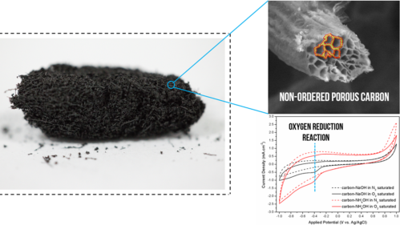

to assist the cellulose dissolution but also played an important role in exfoliating the carbon aerogel to form defects that cause a few layer disorders. The defects caused the SSA and the pore volume of the aerogel to increase significantly after carbonization. The surface area increased from approximately 70 to 3730 m[2] /g and the pore volume from 0.54 to 4.20 cm[3] /g. The porous nitrogendoped carbon aerogel showed excellent electrocatalytic activity toward the oxygen reduction reaction (ORR) in alkaline media following a two-electron-transfer mechanism. 

## 1. INTRODUCTION 

The main obstacle in the development of metal−air battery and fuel cell technologies is related to the air electrode that involves a sluggish oxygen reduction reaction (ORR) in a three-phase reaction zone.[1] The reaction requires the assistance of a highly active electrocatalyst hosted in a highly porous material to overcome the resistance of air diffusion. In addition to the common noble-metal-based electrocatalysts, biomass-derived nitrogen-doped carbons have shown high stability and excellent activity for the ORR.[2][,][3] It has been demonstrated that direct pyrolysis of biomass typically rich in nitrogen can produce nitrogen-doped carbon without additional nitrogen sources.[2][,][4] The nitrogen-doped carbon materials are promising alternatives to noble metals for the ORR because of their low cost, environment-friendliness, and abundant reserves.[3][,][5] 

Many efforts have been carried out to find substitute materials for noble-metal-based electrocatalysts, such as organometallics, transition-metal oxides, organic−inorganic composites, and carbonaceous materials.[6][−][8] Carbonaceous materials seem to be the most attractive and inexpensive 

alternative because of their ability to serve both as the catalyst support and the active electrocatalyst.[7] In addition, they have shown better electrocatalytic performance for the ORR compared to that of commercial noble metals.[9][−][13] The presence of nitrogen doped into the carbon structure highly improves the active site area of the carbon material and enhances the oxygen adsorption activity, resulting in good electrocatalytic performance. 

Carbon aerogels, one of the most attractive carbon-based nanomaterials, have very high specific surface area (SSA), very large pore volume, outstanding electrical conductivity, and excellent chemical and thermal stabilities. These properties make carbon aerogels suitable for various applications including sorbents for environmental conservation and electro- 

Received: July 30, 2020 Revised: November 12, 2020 Accepted: November 13, 2020 

https://dx.doi.org/10.1021/acs.iecr.0c03771 Ind. Eng. Chem. Res. XXXX, XXX, XXX−XXX 

© XXXX American Chemical Society 

A 

Industrial & Engineering Chemistry Research 

pubs.acs.org/IECR 

Article 

des for electrochemical energy storage and conversion such as fuel cells, batteries, and supercapacitors.[14][−][21] The interest in carbon aerogels may be motivated by the fact that it can be derived from cellulose biomass, the most abundant and sustainable source of biopolymers in nature.[4] Indonesia, as a tropical country, has a huge amount of agricultural wastes, which are environmentally benign, biodegradable, and the most abundant part being lignocellulose biomass. 

In our previous study, nitrogen-doped carbon aerogels have been successfully prepared from coir fibers, an abundantly available form of agricultural waste rich in cellulose.[4] Carbon aerogels were obtained by direct pyrolysis of the cellulose − aerogel prepared from coir fibers using a NaOH urea system.[5] However, the high-temperature pyrolysis caused the internal pores of the cellulose aerogel not able to be maintained resulting in a significant decrease in the SSA of the carbon aerogel produced. On the other hand, when NaOH was replaced with NH4OH during the dissolution−coagulation step in the preparation of cellulose aerogel, the internal pores of the individual fiber could be maintained during pyrolysis to form a honeycomb-like shape, resulting in a very high surface area of carbon aerogels. 

The one-step synthesis of nitrogen-doped carbon aerogels by pyrolyzing nitrogen-rich biomass appears to be a promising alternative for the common two-step method by nitriding carbon materials such as heating in an ammonia gas at high temperatures,[14][,][19][,][22] chemical vapor deposition,[23] solvothermal synthesis,[24] and microwave irradiation.[25] In addition, the use of biomass-based porous cellulose aerogels as a precursor to prepare carbon aerogels also avoids any template that was typically used to prepare ordered porous carbon such as ordered mesoporous silica,[26][−][30] polystyrene latex,[31][−][33] and poly(methyl methacrylate).[34] In a process that uses a template, template removal is a crucial step where it must be removed as completely as possible while preserving the templated carbon structure.[35][,][36] The process is typically energy-intensive and/or requires hazardous toxic chemicals. 

In the present work, we report on the preparation of a nonordered porous nitrogen-doped carbon aerogel by pyrolyzing the cellulose aerogel prepared from coir fibers using an ammonia−urea route, followed by freeze-drying. The influence of ammonia on the formation of cellulose aerogels, and in turn, on the structure of carbon aerogels produced is investigated. The electrocatalyst activity of the nitrogen-doped carbon aerogel toward ORR is examined. 

## 2. EXPERIMENTAL SECTION 

2.1. Preparation of Carbon Aerogels. Carbon aerogels were prepared by direct pyrolysis of cellulose aerogels made of coir fibers following our previous method except that alkali was replaced by ammonia here.[4][,][5] The proximate composition of coir fibers was 8.74% moisture, 4.65% ash, 50.74% volatile matter, and 35.87% fixed carbon. Briefly, the coir fibers were ground, sieved to 125 μm, and digested in 6% sodium hydroxide (NaOH; Merck; reagent grade) solution under atmospheric reflux for 4 h. The concentration of coir fibers was 5 g/100 mL of NaOH solution. The resultant pulp was washed with deionized water to remove the sodium−lignin byproduct, dispersed in an aqueous NH4OH−urea solution, and ultrasonicated for 30 min to dissolve the cellulose. The NH4OH− urea solution comprised of NH4OH (ammonia 25%; Merck; reagent grade), whose volume varied from 5 to 14 mL and 4 g of urea (CON2H4; PT. Petrokimia Gresik, Indonesia) 

dissolved in 5 mL of deionized water. The mixture was placed in a refrigerator for 24 h to form a gel. The gel was thawed at room temperature, immersed in ethanol (C2H5OH 98%; Merck; reagent grade) for coagulation, and soaked in deionized water to exchange ethanol with water. The cellulose aerogel was obtained by freezing the hydrogel at −20 °C for 12 h, followed by vacuuming to a pressure of 20 Pa at a temperature of −40 °C in a freeze dryer (EYELA FDU-1200). 

For comparison, the cellulose aerogel employed as the precursor of carbon aerogel was prepared using the same procedure as described above, but NH4OH was replaced with NaOH.[5] The concentration of OH[−] for both cases was kept the same at 2.5 M. 

The cellulose aerogel was pyrolyzed in a tubular furnace at 700 °C for 2 h under flowing nitrogen. Prior to the pyrolysis, oxygen in the tube was purged; the moisture content and volatile matter in the cellulose aerogel were removed; and cellulose and lignin compounds were decomposed. The purging was carried out using nitrogen gas at a rate of 150 mL/min for 15 min. The moisture and volatile matter were removed by heating the aerogel at 150 °C for 30 min under flowing nitrogen at 100 mL/min. The decomposition of cellulose and lignin was conducted at 400 °C for 30 min. 

2.2. Characterization. The carbon aerogel morphology was observed using a scanning electron microscope (FEI − Inspect S 50) and a transmission electron microscope (JEOL JEM-1400). The thermal behavior of the prepared aerogel was investigated by thermogravimetry/differential thermal analysis (TG/DTA; Shimadzu 50/50H). The analysis was conducted under a nitrogen atmosphere with a heating rate of 5 °C/min from room temperature up to 1000 °C. The crystalline phase was identified by X-ray diffraction (XRD; PANalytical, X’Pert Pro) performed over an angle range of 10−80°. Fouriertransform infrared spectroscopy (FTIR spectroscopy; Shimadzu IRTracer-100) was used to identify the chemical functional group of carbon aerogel samples. The chemical structure was also further investigated using X-ray photoelectron spectroscopy (XPS; ThermoFisher Scientific ESCALAB-220iXL) with an Al Kα radiation source. Raman spectra were measured using a Raman spectrometer (Micro Confocal Modular Raman spectrometer; HORIBA) with an ion laser excitation at 532 nm. The SSA and pore characteristics were quantitatively determined by a N2 adsorption−desorption instrument (Nova 1200, Quantachrome). The samples were degassed at 300 °C for 3 h prior to the measurements. The SSA was calculated using the Bruanuer−Emmet−Teller (BET) method at a relative pressure (P/P0) of <0.3. The total pore volume was calculated from the volume of nitrogen absorbed at a relative pressure approaching 1.0. The pore size distribution was determined using the Barrett−Joyner−Halenda method in the desorption region. 

The electrocatalytic activity of the as-prepared carbon aerogels toward the ORR was investigated using a rotating disc electrode (RDE) with a three-electrode setup in an oxygen-saturated 0.1 potassium hydroxide (KOH; Merck) solution. The three-electrodes, namely, Pt as the counter electrode, Ag/AgCl as the reference electrode, and carbon aerogel as the working electrode, were connected to a potentiostat/galvanostat instrument (Autolab PGSTAT 302N, Metrohm) to perform cyclic voltammetry (CV) and linear sweep voltammetry (LSV). The working electrode was prepared by dispersing 10 mg of carbon aerogel in 300 μL of 1- methyl-2-pyrrolidinone (Sigma-Aldrich Pte. Ltd., Singapore) as 

B 

https://dx.doi.org/10.1021/acs.iecr.0c03771 Ind. Eng. Chem. Res. XXXX, XXX, XXX−XXX 

Industrial & Engineering Chemistry Research 

pubs.acs.org/IECR 

Article 

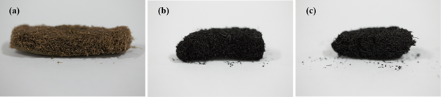

Figure 1. Photographs of (a) cellulose aerogel, (b) carbon−NaOH aerogel, and (c) carbon−NH4OH aerogel. 

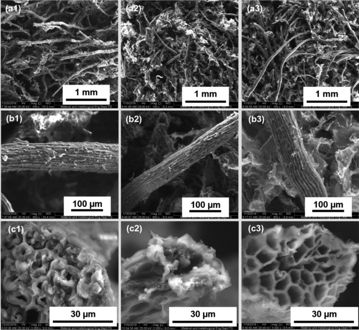

Figure 2. SEM images of the cellulose aerogel and the corresponding carbon aerogel prepared by NaOH−urea and NH4OH−urea systems: (a1− c1) cellulose aerogel; (a2−c2) carbon−NaOH aerogel; and (a3−c3) carbon−NH4OH aerogel. 

the solvent and 1 mg of poly(vinylidene fluoride) (Aldrich, Sigma-Aldrich Pte. Ltd., Singapore) as the binder. The carbon ink was then sonicated for 60 min. 10 μL of carbon ink was transferred onto a polished glassy carbon disk (Ø = 3 mm, geometric area = 0.071 cm[2] ) and dried in an oven at 50 °C to form a thin carbon layer. 

The CV measurements were performed by scanning the potential between −1.0 and 1.0 V at a sweep rate of 50 mV s[−][1] . For comparison, the measurements in both nitrogen- and oxygen-saturated 0.1 M KOH solutions were also carried out. LSV was performed with a rotation speed varying from 400 to 3600 rpm. The potential was scanned from −0.8 to 0.0 V with a sweep rate of 10 mV s[−][1] . The number of transferred electrons and the kinetic current density were estimated from the Koutecky−Levich (K−L) equation. 

The electrical conductivity of the carbon aerogel was calculated using 

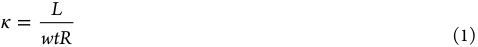

where κ is the conductivity (S/cm), L is the distance between two probes (cm), w is the width of the sample (cm), t is the thickness of the sample (cm), and R is the resistance of the sample (Ω). The resistance was measured by a two-point probe using a multimeter.[37] 

## 3. RESULTS AND DISCUSSION 

## 3.1. Role of Ammonia in the Formation of Carbon 

Aerogels. Figure 1 shows the photographs of (a) cellulose aerogel, (b) carbon aerogel prepared using the NaOH−urea system, and (c) carbon aerogel prepared using the NH4OH− urea system. It can be seen that the as-prepared cellulose aerogel has a brown color because of the remaining lignin after the mechanical and chemical treatments of coir fibers. The color of aerogels prepared by both the NaOH−urea and NH4OH−urea systems became black after the cellulose was pyrolyzed. The black color indicates that the cellulose has been successfully converted into carbon. However, the pyrolysis process at high temperatures caused a shrinkage in the volume of aerogels. The shrinkage is also followed by a slight increase in the bulk density of carbon aerogels. Initially, the cellulose 

C 

https://dx.doi.org/10.1021/acs.iecr.0c03771 Ind. Eng. Chem. Res. XXXX, XXX, XXX−XXX 

Article 

## Industrial & Engineering Chemistry Research 

aerogel has a bulk density of approximately 0.04 g/cm[3] . It increased to 0.07 g/cm[3] and 0.05 g/cm[3] for carbon−NaOH and carbon−NH4OH aerogels, respectively. The slight shrinkage of the aerogel volume after pyrolysis indicated that the carbon aerogels have still inherited the porous structure of the cellulose aerogel. Moreover, the mechanical properties of the aerogel also changed significantly. The cellulose aerogel is soft and it can return to its initial shape after little deformation. On the contrary, the carbon aerogels are hard and stiff and tend to maintain their structure even after mechanical impact. The microstructures of porous aerogels were further investigated by SEM. 

Figure 2 shows the SEM images of cellulose aerogels prepared using the NaOH and NH4OH system and the corresponding carbon aerogels. Carbon aerogels prepared using the NaOH and NH4OH system will be hereafter referred to as carbon−NaOH and carbon−NH4OH, respectively. It can be observed that both cellulose aerogels and carbon aerogels have a porous structure and are composed of a threedimensional network of interconnected fibers. For cellulose aerogels, the pores have an average size of approximately 200 μm, which can be categorized as macropores according to the IUPAC classification. The average size of macropores reduced to 150 and 176 μm after pyrolysis of carbon−NaOH and carbon−NH4OH aerogels, respectively. It could also be seen that some fibers were broken into small pieces, which filled in the pores of the aerogel. 

Observing the individual fibers of cellulose aerogels and the corresponding carbon aerogels after pyrolysis, as shown in Figure 2b1−b3, one can say that the carbon fibers have a smaller size. The size of cellulose fibers is approximately 55 μm. It reduced to 38.6 and 50 μm for the fibers of carbon− NaOH and carbon−NH4OH aerogels, respectively. It can also be seen that the line pattern on the fiber surface becomes thinner after pyrolysis for both fibers of carbon−NaOH and carbon−NH4OH aerogels. The shrinkage of fibers can also be observed from the cross-sectional view of fibers [Figure 2c1− c3]. Cellulose fibers have many internal pores of cylindrical shape with an average size of approximately 3 μm and a wall thickness of approximately 3.2 μm. During heat treatment, the internal structure of the carbon−NaOH aerogel collapsed, resulting in a large single internal pore with a broken wall. Surprisingly, different phenomena were observed for the case of carbon−NH4OH aerogel, in which the internal pores become larger than those of the corresponding cellulose aerogel. They have an average diameter of approximately 7.2 μm, which is 2-fold of those of cellulose fibers and a thinner pore wall of 1.4 μm. These may explain why the carbon− NH4OH aerogel had a smaller bulk density due to the higher porosity. 

Figure 3 shows TEM images of carbon aerogels prepared by NaOH and NH4OH that consist of a network structure with a random pattern. For the case of carbon−NaOH (Figure 3a1), many pores can be observed inside the network with an average diameter of approximately 534 nm. Hence, the aerogel can be classified as macroporous materials according to the IUPAC classification. At higher magnifications, as shown in Figure 3a2, a small amount of spherical particles can be observed on the wall of the fiber. The particles are unevenly distributed throughout the fiber and only concentrated on some places. On the other hand, for the carbon−NH4OH fiber, the spherical particles are uniformly distributed throughout the wall of the fiber. The presence of spherical particles on the 

**----- Start of picture text -----** 
pubs.acs.org/IECR **----- End of picture text -----** 

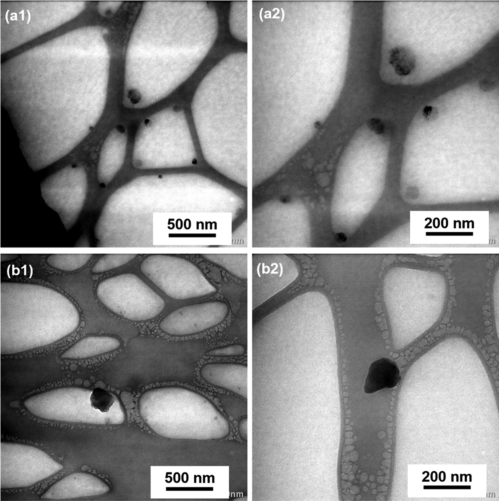

Figure 3. TEM images of the prepared (a1,a2) carbon−NaOH and (b1,b2) carbon−NH4OH fibers. 

fiber wall might improve the strength of the fiber that could maintain the internal structure of the fiber and prevent it from collapsing during heat treatment. Therefore, a honeycomb-like structure in the internal pore fiber can be maintained as discussed above. 

The NH4OH−urea system present a different physical appearance and morphology than that of the obtained carbon aerogel. It seems that NH4OH plays an important role in the structure of aerogel formed. Therefore, it is necessary to investigate further the effect of base used to dissolve cellulose on the cellulose structure. Figure 4 shows the XRD patterns of cellulose pulp after delignification (a) and cellulose aerogels prepared by (b) NaOH−urea and (c) NH4OH−urea systems. The pulp (Figure 4a) has a profound diffraction peak at 2θ of 22.23°, which can be attributed to the (200) plane. In addition, a broader peak at 16.08° can also be observed, which can be attributed to the overlapping of (110) and (110) planes. These 

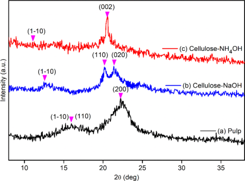

Figure 4. XRD patterns of (a) cellulose pulp, (b) cellulose−NaOH aerogel, and (c) cellulose−NH4OH aerogel. 

D 

https://dx.doi.org/10.1021/acs.iecr.0c03771 Ind. Eng. Chem. Res. XXXX, XXX, XXX−XXX 

Industrial & Engineering Chemistry Research 

pubs.acs.org/IECR 

Article 

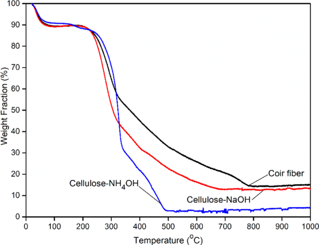

Figure 5. Thermogravimetric analysis of coir fibers, cellulose−NaOH aerogel, and cellulose−NH4OH aerogel. 

diffraction peaks are the characteristic planes of cellulose I.[5][,][38][−][41] On the other hand, the diffraction pattern of cellulose−NaOH (Figure 4b) has three characteristic peaks at 12.73° (110), 20.28° (110), and 21.38° (020), which belong to cellulose II. It is apparent that the dissolution and reprecipitation of cellulose in the NaOH−urea system at low temperatures transform cellulose I into cellulose II.[17][,][41][−][43] Different phases of cellulose were observed for the cellulose− NH4OH system (Figure 4c). The diffraction pattern has a high peak at 2θ of 20.5° (002) and a low peak at 11.6° (110), which matched the characteristic peaks of cellulose III.[44] It seems that dispersing cellulose into the NH4OH−urea system changes the cellulose phase from cellulose I to cellulose III, which is probably via an ammonia−cellulose complex pathway.[44][,][45] It is well known that cellulose III has higher crystallinity and good thermal stability.[46][,][47] It may be the reason why the carbon− NH4OH system can maintain the internal structure of pores during carbonization at high temperatures, as discussed above. 

To get a better insight into the role of NH4OH in carbon aerogel formation, the thermal analysis of coir fibers and cellulose−NaOH and cellulose−NH4OH aerogels was conducted. The results are presented in Figure 5. It can be found that the three samples exhibit the first weight reduction from room temperature to 100 °C because of the loss of physically adsorbed water. The next weight reduction occurs at 250−330 °C, which may be caused by the decomposition of cellulose and lignin and the devolatilization process.[48] For both cellulose aerogels with a relatively low lignin content, the cellulose decomposes very quickly, and the products are released intensively within a short time.[49] This is different from coir fibers with a relatively high lignin content where they deliberately decompose. The final weight loss is detected in a temperature range of 330−780 °C for coir fibers, 330−675 °C for the cellulose−NaOH aerogel, and 330−490 °C for the cellulose−NH4OH aerogel. The weight loss in these temperature ranges is slower that may be caused by the slower devolatilization process.[48] Decomposition of coir fibers and cellulose−NaOH occurred at similar temperatures and produced similar char yields, which were 15 and 14% for 

coir fibers and cellulose−NaOH, respectively. In contrast, decomposition of cellulose−NH4OH occurred at lower temperatures, and the char yield decreased significantly to 3%. This may be the reason why the internal pores of the resultant carbon fiber become larger and have a honeycomblike morphology, as shown by the SEM images. 

It has been well known that NaOH−urea solution is an excellent cellulose solvent in the aerogel formation.[5][,][50][,][51] However, the obtained bonding between the aerogel is typically not strong enough to maintain the pore structure during pyrolysis at high temperatures. Hence, NH4OH was used instead of NaOH to improve the cellulose structure to avoid the collapse of the fiber structure during pyrolysis. Crosslinking of cellulose fibers was initiated by the formation of sodium hydrate and ammonium hydrate in both NaOH−urea and NH4OH−urea systems, along with the urea hydrate.[46][,][47] The free water and hydrates would make cellulose fibers swell and absorb all the hydrates, resulting in a cellulose fiber overcoated by those hydrates.[38] As the hydrates imbibed into the cellulose fibers, the Na−cellulose and ammonia−cellulose complexes could be formed. Those hydrates and free water were removed by sublimation into the gas phase during the freeze-drying process introducing the cellulose aerogel. Cellulose which formed the Na−cellulose complex would − become cellulose II, while the one that formed the ammonia cellulose complex would be cellulose III with higher crystallinity. Cellulose with higher crystallinity could easily decompose and remove all the volatile matter, so the carbonization would be achieved faster. This phenomenon resulted in an intact pore structure instead of the broken one, and hence could maintain the internal pore of the cellulose fiber becoming a honeycomb-like structure. 

3.2. Properties of Carbon Aerogels. Figure 6 shows the FTIR spectra of carbon aerogels prepared by (a) NaOH−urea and (b) NH4OH−urea systems. Carbon−NaOH had a band at a wavenumber of 3670 cm[−][1] , which is an intramolecular hydrogen bond. While for carbon−NH4OH, it was observed at a lower wavenumber of 3610 cm[−][1] . For both cases, the bands corresponding to typical carbon could be observed at 1587, 

E 

https://dx.doi.org/10.1021/acs.iecr.0c03771 Ind. Eng. Chem. Res. XXXX, XXX, XXX−XXX 

Industrial & Engineering Chemistry Research 

pubs.acs.org/IECR 

Article 

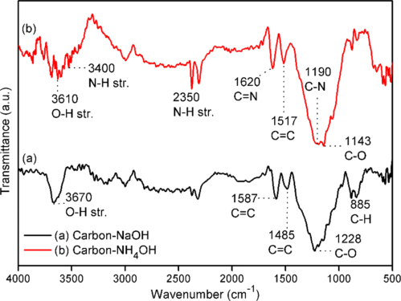

Figure 6. FTIR spectra of (a) carbon−NaOH aerogel and (b) carbon−NH4OH aerogel. 

1485, 1228, and 885 cm[−][1] , which was attributed to the CC stretching of aromatic rings and C−O and C−H deformations, respectively.[52][,][53] The carbon−NH4OH aerogel displayed the carbon characteristic at wavenumbers of 1517 and 1143 cm[−][1] which were the CC aromatic ring and C−O stretching, respectively. The significant difference in carbon−NH4OH was the appearance of N−H, CN, and C−N functional groups at wavenumbers 2350, 1620, and 1190 cm[−][1] , respectively.[54] In addition, there was also a band at 3400 cm[−][1] , which was attributed to N−H vibration.[55] The functional groups which contained nitrogen atoms also explained that NH4OH solution had successfully doped nitrogen into the carbon aerogel structure. 

To get a better insight into the chemical structure of the prepared carbon aerogel, XPS spectra were recorded, and the 

results are presented in Figure 7. It can be observed in Figure 7a that both carbon−NaOH and carbon−NH4OH are mainly composed of carbon and oxygen. The main difference for both carbons is the presence of Na that can only be observed in carbon−NaOH and the N-bond that can only be observed for carbon−NH4OH. The fine spectra of N 1s depicted in Figure 7b confirm the absence of nitrogen pattern in carbon−NaOH. On the other hand, carbon−NH4OH contains pyridinic N (398.03 eV) and graphitic N (400.49 eV) with the compositions of 54.1 and 45.9%, respectively. Pyridinic N comes from the sp[2] hybridized N atom with two sp[2] hybridized C located at the defects or edges of the carbon structure. Graphitic N is from sp[2] hybridized N atoms with three sp[2] hybridized C, in which N takes a substitute for a carbon atom in the hexagonal ring.[14][,][56][,][57] There is no typical pyrrolic N- bonding in the N 1s spectra, which might decompose at high temperatures to become pyridinic N. The pyrrolic N is an N atom which is incorporated into a five-membered heterocyclic ring introduces sp[3] hybridization and doping defects. It is the most unstable species compared to the pyridinic and graphitic bonds, which largely decompose due to heat treatment transforming into pyridinic N.[10][,][58] Further observation in the  C 1s spectra [Figure 7c] reveals the presence of C C bonding (284.4 eV) in both carbon−NaOH and carbon−NH4OH spectra. The C 1s spectra of carbon−NH4OH show a wider − peak compared to that of carbon NaOH, which indicated the presence of nitrogen atoms in the carbon structure.[10] A slight peak around 285.3 eV corresponds to the CN bonding, which was attributed to either pyridinic or graphitic N-bonding configuration.[57] Accordingly, the XPS spectra supported the aforementioned FTIR spectra that the proposed NH4OH− urea system had successfully doped nitrogen into the carbon aerogel structure. 

Figure 8 shows the Raman spectra of (a) carbon−NaOH and (b) carbon−NH4OH aerogels. For both cases, there are 

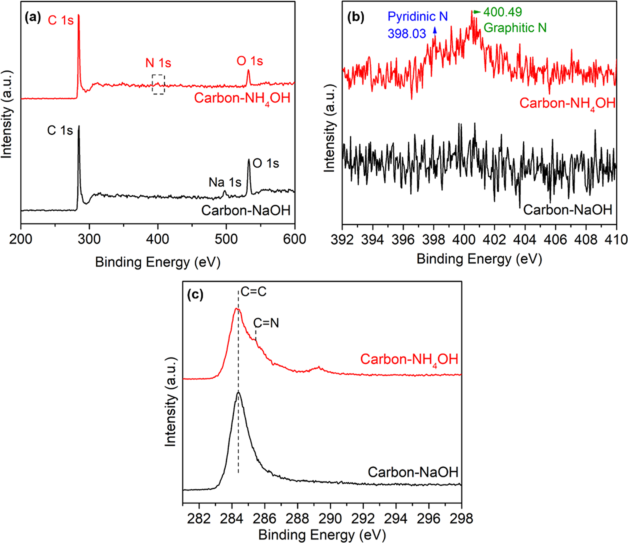

Figure 7. (a) XPS spectra of carbon−NaOH and carbon−NH4OH aerogels; XPS fine spectra of (b) N 1s and (c) C 1s for carbon−NaOH and carbon−NH4OH aerogels. 

F 

https://dx.doi.org/10.1021/acs.iecr.0c03771 Ind. Eng. Chem. Res. XXXX, XXX, XXX−XXX 

Industrial & Engineering Chemistry Research 

pubs.acs.org/IECR 

Article 

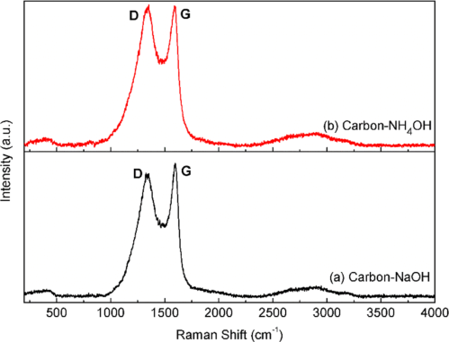

Figure 8. Raman spectra of (a) carbon−NaOH aerogel and (b) carbon−NH4OH aerogel. 

two intensive bands at 1350 and 1590 cm[−][1] that can be assigned to the D and G bands. The D band reflects the defects and disorders of carbon material, and the G band can be associated with the two-dimensional hexagonal lattice carbon, namely, the stretching of CC bonds, and also the crystallinity of the sample.[59][,][60] The intensity of D band for carbon−NH4OH is higher than that of the carbon−NaOH aerogel. This indicated that carbon−NH4OH had more defects and disorders in its structure. This signal suggested that the presence of ammonia during pyrolysis of cellulose could exfoliate the carbon structure of the aerogel to produce defects and a few layer disorders in the carbon. The intensity ratios of the D band and the G band (ID/IG) of carbon−NaOH and carbon−NH4OH were 0.93 and 1.01, respectively. The ID/IG reflected that the degree of long-range-ordered crystalline carbon and the higher ratio resulted in more defect in the carbon structure.[60] The increase in the ID/IG ratio of carbon− NH4OH also implied the presence of nitrogen doping into carbon.[23] These observations confirm that the carbon in carbon−NH4OH was exfoliated, had many defects and disorders, and hence could enable a chance for nitrogen to be doped into the carbon structure. 

Figure 9 shows the XRD patterns of carbon−NaOH and carbon−NH4OH aerogels at several different OH[−] concentrations, which are 5, 8, 11, and 14 N. The XRD pattern of carbon−NaOH aerogel had two broad diffraction peaks at 24° (002) and 44° (101), which could be indexed to amorphous carbon. While for the carbon−NH4OH aerogels, the diffraction peak of the (002) plane became broader and slightly shifted to ° the right to 26.4 . The shift of the diffraction peak indicated that carbon had experienced an exfoliation into the monolayer or few layers and long-range disorders.[42] The exfoliation might cause nitrogen doping into the carbon structure, which resulted in CN functional groups, as aforementioned in the discussion on FTIR spectra. The (101) plane of all carbon−NH4OH aerogels appeared to be less developed than carbon−NaOH, which explained the distortion of crystalline regularity due to the presence of C−N bonding.[61] The concentration of NH4OH solution slightly had an impact on the crystallinity of the prepared carbon−NH4OH, whose (002) peak intensity increased at higher concentrations but decreased at 14 N carbon. It showed that the presence of nitrogen might 

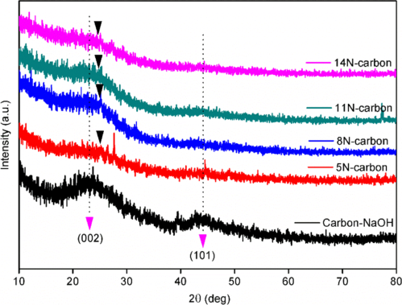

Figure 9. XRD patterns of prepared carbon aerogels. 

increase the defect and exfoliation, and too much of defect might cause the reduction of crystallinity. These XRD patterns, which comprised (002) and (101) planes, also confirmed that pyrolysis at 700 °C successfully carbonized the cellulose aerogel resulting in the carbon aerogel, which is corroborated by the color change in their physical appearance. 

Figure 10a shows the adsorption−desorption isotherm of the as-prepared carbon aerogels. It presents that carbon aerogels had a type-IV IUPAC classification curve, with a hysteresis presented on the curve. The hysteresis explained the presence of a mesoporous structure in carbon aerogels. Table 1 presents the BET SSA and the pore volume of the prepared cellulose and carbon aerogels. The cellulose aerogel from coir fibers had a surface area of 69.92 m[2] /g and a pore volume of 0.078 cm[3] /g. The pyrolysis treatment had significantly increased both the surface area and pore volume of the prepared carbon aerogels, more than 3 times higher. It corroborated the morphology of the aerogels, in which the pore walls of the carbon fibers shrank after pyrolysis, thereby becoming thinner than the cellulose fibers. The thinner pore walls would make the larger pore volume and higher surface area. As expected, the SSA of carbon−NH4OH was higher than that of carbon−NaOH, which was caused by the honeycomb-like structure of the carbon−NH4OH fibers. The concentration of NH4OH also induced a proportional effect on the SSA and pore volume of the carbon aerogel, in which both increased as the concentration increased. The proportional effect reached a maximum at a concentration of 11 N and decreased at 14 N, similar to the crystallinity, as mentioned above. The pore size distribution of carbon aerogels is depicted in Figure 10b. It shows that the carbon aerogels had a mesoporous structure, as shown by the presence of a hysteresis loop on the adsorption−desorption profile. The pore size slightly decreased as the NH4OH concentration increased. The pore size distribution of carbon−NaOH was centered at 3.2 nm, followed by carbon-5, 8, 11, and 14 N centered at 4.8, 4.2, 3.35, and 4.2 nm, respectively. The smaller pore size, which was followed by the higher fraction volume resulted in a higher SSA. Hence, carbon-11 N with the highest volume fraction and a narrower profile compared to the others led to the largest surface area of 3733.10 m[2] /g and pore volume of 4.199 cm[3] /g. As discussed above, the presence of nitrogen physically maintained the structure of carbon fibers during pyrolysis, 

G 

https://dx.doi.org/10.1021/acs.iecr.0c03771 Ind. Eng. Chem. Res. XXXX, XXX, XXX−XXX 

Industrial & Engineering Chemistry Research pubs.acs.org/IECR Article 

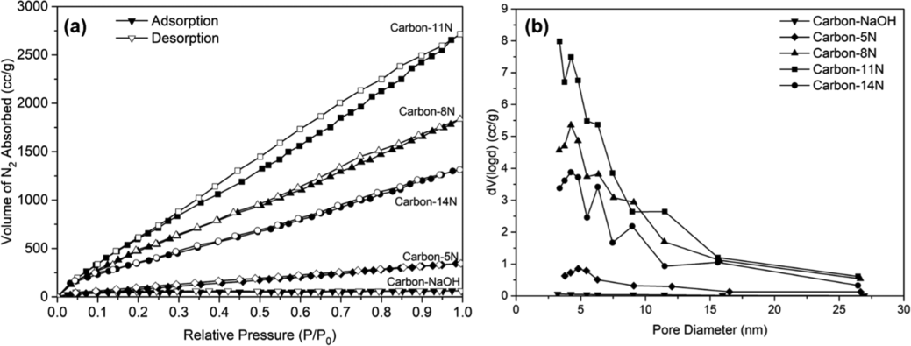

Figure 10. (a) Adsorption−desorption isotherm profile and (b) pore size distribution of the as-prepared carbon aerogels. 

Table 1. Specific Surface Area and Total Pore Volume of Cellulose and Carbon Aerogels 

|solvent system cellulose aerogel carbon−NaOH carbon−NH4OH (5 N) carbon−NH4OH (8 N) carbon−NH4OH (11 N)|SSA (m2/g) 69.92 150.85 491.61 2630.07 3733.10|total pore volume (cm3/g) 0.078 0.097 0.535 2.842 4.199|
|---|---|---|
|carbon−NH4OH (14 N)|1696.70|2.032|

chemically creating exfoliation and defects on the carbon structure, and simultaneously improving the surface area. Nitrogen doping into the carbon structure preserved the mesostructure of the carbon aerogel, along with the abundant formation of mesopores, and the macroporous structure significantly improved the SSA.[58][,][62] 

3.3. Electrocatalytic Properties of Carbon Aerogels. The electrochemical properties of carbon aerogels were studied for their use as an electrocatalyst for the ORR. Figure 11 shows the CV curves of carbon aerogels in O2- and N2-saturated 0.1 M KOH solutions at a scan rate of 50 mV/s. A reduction peak appears at −0.39 V (vs Ag/AgCl) in the CV curves of both carbon aerogels in the O2-saturated 0.1 KOH solution (full lines). On the contrary, no reduction peak appears in the CV curves of both carbon aerogels in the N2-saturarted 0.1 KOH solution (dashed lines). These indicated that the peaks appearing in the O2-saturated KOH solution could surely be attributed to the ORR. The current densities at the reduction peak for both carbon aerogels were quite different. It took the value of approximately 1.05 mA/cm[2] for carbon−NH4OH, which was 2 times higher than that of carbon−NaOH. It is apparent that the carbon−NH4OH aerogel could serve as an active electrocatalyst for the ORR with better performance. 

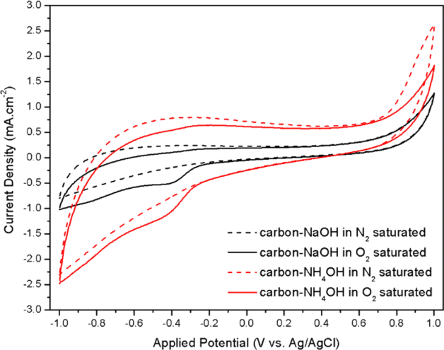

Figure 11. Cyclic voltammograms of the prepared carbon aerogels. 

H 

https://dx.doi.org/10.1021/acs.iecr.0c03771 Ind. Eng. Chem. Res. XXXX, XXX, XXX−XXX 

Industrial & Engineering Chemistry Research pubs.acs.org/IECR Article 

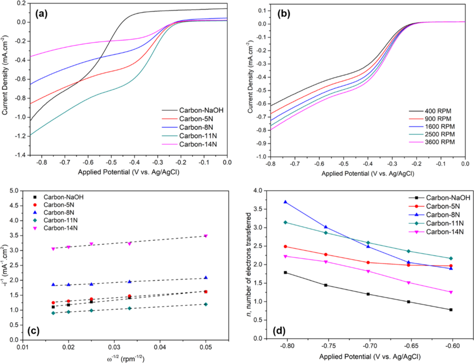

Figure 12. (a) Linear sweep voltammograms of the prepared carbon aerogels at a rotation speed of 3600 rpm; (b) linear sweep voltammograms of carbon-5 N with the rotation speed ranging from 400 to 3600 rpm; (c) K−L plots of the prepared carbon aerogels at −0.8 V versus Ag/AgCl; and (d) the number of electrons transferred during ORR at different potentials based on K−L plots. 

Further examination on the kinetics of the ORR over the carbon aerogels as an electrocatalyst was performed by LSV in an RDE. The LSV curves were recorded in an O2-saturated 0.1 KOH solution at a scan rate of 10 mV/s. The hydrodynamic linear sweep voltammograms of the carbon aerogel catalyst at various rotation speeds, and the corresponding K−L plots are presented in Figure 12. Figure 12a presents the LSV curves of carbon aerogels at a rotation speed of 3600 rpm. Concerning the limiting current density, carbon-11 N reached the highest value, followed by carbon-5, 8, and 11 N. Carbon−NaOH had a high enough current density, but it has a different onset potential of ORR, which was −0.4 V versus Ag/AgCl, while carbon−NH4OH had an onset potential of −0.2 V. Figure 12b shows the LSV curves of carbon-5 N with a rotation speed ranging between 400 and 3600 rpm. The diffusion-limiting current densities increased with the rotation speed, which was caused by the enhanced oxygen flux to the carbon surface. 

The corresponding ORR performance of the carbon aerogel would be further evaluated using K−L plots. Figure 12c,d shows the K−L plots for the prepared carbon aerogels at an applied voltage of −0.8 V versus Ag/AgCl. It could be seen in the figures that the relationship between ω[−][1/2] and −i[−][1] was linear. The slope was used to determine the number of electrons, n, involved in ORR according to the K−L equation[63] 

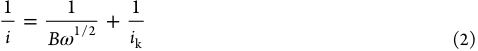

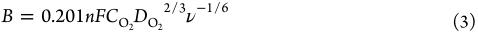

In eqs 2 and 3, i is the measured current density (mA/cm[2] ), ω is the angular velocity of the disk (rpm), ik is the kinetic current density (mA/cm[2] ), n is the number of electrons transferred per oxygen molecule in the ORR, F is the Faraday constant, DO2 is the diffusion coefficient of O2 molecules in 0.1 M KOH electrolyte solution (1.9 × 10[−][5] cm[2] /s), and ν is the kinematic viscosity of the electrolyte solution (8.73 × 10[−][3] cm[2] /s). The oxygen concentration, CO2, was calculated as[64] 

From the slope of the K−L plots and the parameters, the number of electrons transferred for the prepared carbon aerogels at different applied potentials was calculated and presented in Figure 12d. The carbon−H4OH aerogel could transfer higher number of electrons than that of carbon− NaOH. The number of electrons transferred during ORR for the carbon-5, 8, 11, and 14 N was 2.49, 3.69, 3.14, and 2.23, respectively. Whereas the calculated number of electrons for carbon−NaOH was 1.78, which was too low for performing ORR. The electron numbers, n ≈ 2, suggests that the ORR 

I 

https://dx.doi.org/10.1021/acs.iecr.0c03771 Ind. Eng. Chem. Res. XXXX, XXX, XXX−XXX 

Industrial & Engineering Chemistry Research 

pubs.acs.org/IECR 

Article 

mechanism of carbon aerogel in alkaline media follows the following reactions 

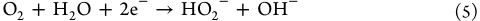

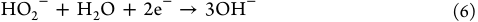

Equation 5 represents the reduction of an O2 molecule to hydrogen peroxide ions through the two-electron pathway. Then, the hydrogen peroxide ions are further electrochemically reduced to hydroxide ions involving two electrons that follows eq 6. It has been demonstrated that the carbon−NH4OH aerogel follows the two-electron ORR mechanism, which is catalytically active toward peroxide decomposition. In terms of catalytic performance during ORR, which was determined by the value of the obtained current density and the number of electrons transferred, it seemed that the presence of nitrogen significantly improved the performance. Meanwhile, the higher concentration of NH4OH used did not exert a proportional effect on the electrical performance. Nitrogen greatly increased the surface area and pore volume, which provided more active site to the carbon catalyst to perform ORR. However, the current density and the number of electrons transferred did not proportionally increase as the NH4OH concentration rises. It seemed that the amount of nitrogen contained in the carbon structure neither contributed much to the catalytic activity nor played an important role in the ORR mechanism. Simultaneous formation of several nitrogen species raised another challenge to clarify the specific active site because of the difficulty in controlling nitrogen precisely.[65][−][68] These results suggest that the carbon−NH4OH aerogel synthesized from the cellulose aerogel using the NH4OH−urea system without additional NH3 activation is promising for its use as an active catalyst for ORR. 

Figure 13 presents the electrical conductivity of the prepared carbon aerogels. Carbon−NaOH had the lowest conductivity 

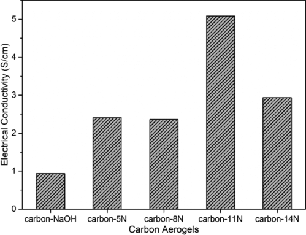

Figure 13. Electrical conductivity of the prepared carbon aerogels. 

of 0.93 S/cm. The conductivity increased with the increase of nitrogen amount with the highest value of approximately 5.08 S/cm for carbon-11 N and then decreased again for carbon-14 N. As discussed previously, the use of excess NH4O causes more defect in the carbon structure resulting in a lower crystallinity. The excess oxygen atom in NH4OH might also contribute to the degradation of carbon structure leading to a 

lower crystallinity and, in turn, a lower electrical conductivity.[69] 

## 4. CONCLUSIONS 

A non-ordered porous nitrogen-doped carbon aerogel has been successfully prepared by pyrolysis of the cellulose aerogel derived from coir fibers using NH4OH−urea as the solvent. Ammonia, in this case, not only serves as the solvent but also has an important role in exfoliating the carbon aerogel to form defects that cause a few layer disorders. The defects improve the properties of carbon aerogels such as increasing the SSA and pore volume by maintaining the internal pore morphology of the fiber and the aerogel structure during carbonization. The obtained non-ordered porous carbon aerogel reveals a larger surface area and a higher pore volume. In addition, the direct pyrolysis of the cellulose aerogel produced nitrogen-doped carbon that enabled the carbon aerogel to have excellent performance toward the ORR. The number of transferred electrons involved in ORR for the carbon aerogel is 2.06, corresponding to the two-electron ORR mechanism. These results suggest that the non-ordered porous nitrogen-doped carbon aerogel prepared by direct pyrolysis of the cellulose aerogel derived from nitrogen-rich coir fibers using the NH4OH−urea system is promising to be used as an active catalyst for ORR through the two-electron pathway. 

## ■[AUTHOR][INFORMATION] 

## Corresponding Author 

- Heru Setyawan − Department of Chemical Engineering, Faculty of Industrial Technology, Sepuluh Nopember Institute of Technology, Surabaya 60111, Indonesia; orcid.org/ 0000-0002-2158-6819; Phone: +62 31 5946240; Email: sheru@chem-eng.its.ac.id 

## Authors 

- Mar’atul Fauziyah − Department of Chemical Engineering, Faculty of Industrial Technology, Sepuluh Nopember Institute of Technology, Surabaya 60111, Indonesia; orcid.org/0000-0003-3522-3629 

- Widiyastuti Widiyastuti − Department of Chemical Engineering, Faculty of Industrial Technology, Sepuluh Nopember Institute of Technology, Surabaya 60111, Indonesia; orcid.org/0000-0002-2805-2836 

Complete contact information is available at: https://pubs.acs.org/10.1021/acs.iecr.0c03771 

## Notes 

The authors declare no competing financial interest. 

## ■[ACKNOWLEDGMENTS] 

This work was supported by the Ministry of Research and Technology of Indonesia through Fundamental Research grants (no. 1108/PKS/ITS/2020). One of the authors (M.F.) would like to thank the Ministry of Research, Technology and Higher Education of Indonesia for a doctoral scholarship through the PMDSU program. The authors also thank Annie Mufyda Rahmatika for TGA analysis and Tomoyuki Hirano for XPS analysis. 

## ■[REFERENCES] 

(1) Han, X.; Li, X.; White, J.; Zhong, C.; Deng, Y.; Hu, W.; Ma, T. Metal−Air Batteries: From Static to Flow System. Adv. Energy Mater. 2018, 8, 1801396. 

J 

https://dx.doi.org/10.1021/acs.iecr.0c03771 Ind. Eng. Chem. Res. XXXX, XXX, XXX−XXX 

Industrial & Engineering Chemistry Research 

pubs.acs.org/IECR 

Article 

(2) Lin, G.; Ma, R.; Zhou, Y.; Liu, Q.; Dong, X.; Wang, J. KOH Activation of Biomass-Derived Nitrogen-Doped Carbons for Supercapacitor and Electrocatalytic Oxygen Reduction. Electrochim. Acta 2018, 261, 49−57. 

(3) Lv, Q.; Si, W.; He, J.; Sun, L.; Zhang, C.; Wang, N.; Yang, Z.; Li, X.; Wang, X.; Deng, W.; Long, Y.; Huang, C.; Li, Y. Selectively Nitrogen-Doped Carbon Materials as Superior Metal-Free Catalysts for Oxygen Reduction. Nat. Commun. 2018, 9, 3376. 

(4) Fauziyah, M. a.; Widiyastuti, W.; Setyawan, H. Sulfonated Carbon Aerogel Derived from Coir Fiber as High Performance Solid Acid Catalyst for Esterification. Adv. Powder Technol. 2020, 31, 1412− 1419. 

(5) Fauziyah, M. a.; Widiyastuti, W.; Balgis, R.; Setyawan, H. Production of Cellulose Aerogels from Coir Fibers via an Alkali−urea Method for Sorption Applications. Cellulose 2019, 26, 9583−9598. (6) Wang, B. Recent Development of Non-Platinum Catalysts for Oxygen Reduction Reaction. J. Power Sources 2005, 152, 1−15. 

(7) Cheng, F.; Chen, J. Metal-Air Batteries: From Oxygen Reduction Electrochemistry to Cathode Catalysts. Chem. Soc. Rev. 2012, 41, 2172−2192. 

(8) Morozan, A.; Jousselme, B.; Palacin, S. Low-Platinum and Platinum-Free Catalysts for the Oxygen Reduction Reaction at Fuel Cell Cathodes. Energy Environ. Sci. 2011, 4, 1238−1254. 

(9) Matter, P. H.; Wang, E.; Arias, M.; Biddinger, E. J.; Ozkan, U. S. Oxygen Reduction Reaction Activity and Surface Properties of Nanostructured Nitrogen-Containing Carbon. J. Mol. Catal. A: Chem. 2007, 264, 73−81. 

(10) Matter, P.; Zhang, L.; Ozkan, U. The Role of Nanostructure in Nitrogen-Containing Carbon Catalysts for the Oxygen Reduction Reaction. J. Catal. 2006, 239, 83−96. 

(11) Lin, Z.; Waller, G. H.; Liu, Y.; Liu, M.; Wong, C.-p. 3D Nitrogen-Doped Graphene Prepared by Pyrolysis of Graphene Oxide with Polypyrrole for Electrocatalysis of Oxygen Reduction Reaction. Nano Energy 2013, 2, 241−248. 

(12) Kim, H.; Lee, K.; Woo, S. I.; Jung, Y. On the Mechanism of Enhanced Oxygen Reduction Reaction in Nitrogen-Doped Graphene Nanoribbons. Phys. Chem. Chem. Phys. 2011, 13, 17505−17510. 

(13) Wang, S.; Yu, D.; Dai, L.; Chang, D. W.; Baek, J.-B. Polyelectrolyte-Functionalized Graphene as Metal-Free Electrocatalysts for Oxygen Reduction. ACS Nano 2011, 5, 6202−6209. 

(14) Meng, F.; Li, L.; Wu, Z.; Zhong, H.; Li, J.; Yan, J. Facile Preparation of N-Doped Carbon Nanofiber Aerogels from Bacterial Cellulose as an Efficient Oxygen Reduction Reaction Electrocatalyst. Chin. J. Catal. 2014, 35, 877−883. 

(15) Yu, M.; Han, Y.; Li, J.; Wang, L. Magnetic N-Doped Carbon Aerogel from Sodium Carboxymethyl Cellulose/Collagen Composite Aerogel for Dye Adsorption and Electrochemical Supercapacitor. Int. J. Biol. Macromol. 2018, 115, 185−193. 

(16) Yu, M.; Han, Y.; Li, J.; Wang, L. One-Step Synthesis of Sodium Carboxymethyl Cellulose-Derived Carbon Aerogel/Nickel Oxide Composites for Energy Storage. Chem. Eng. J. 2017, 324, 287−295. 

(17) Yu, M.; Li, J.; Wang, L. KOH-Activated Carbon Aerogels Derived from Sodium Carboxymethyl Cellulose for High-Performance Supercapacitors and Dye Adsorption. Chem. Eng. J. 2017, 310, 300−306. 

(18) Han, S.; Sun, Q.; Zheng, H.; Li, J.; Jin, C. Green and Facile Fabrication of Carbon Aerogels from Cellulose-Based Waste Newspaper for Solving Organic Pollution. Carbohydr. Polym. 2016, 136, 95−100. 

(19) Liang, H.-W.; Wu, Z.-Y.; Chen, L.-F.; Li, C.; Yu, S.-H. Bacterial Cellulose Derived Nitrogen-Doped Carbon Nano Fiber Aerogel: An Efficient Metal-Free Oxygen Reduction Electrocatalyst for Zinc-Air Battery. Nano Energy 2015, 11, 366−376. 

(20) Hao, P.; Zhao, Z.; Tian, J.; Li, H.; Sang, Y.; Yu, G.; Cai, H.; Liu, H.; Wong, C. P.; Umar, A. Hierarchical Porous Carbon Aerogel Derived from Bagasse for High Performance Supercapacitor Electrode. Nanoscale 2014, 6, 12120−12129. 

(21) Seo, J.; Park, H.; Shin, K.; Baeck, S. H.; Rhym, Y.; Shim, S. E. Lignin-Derived Macroporous Carbon Foams Prepared by Using 

Poly(Methyl Methacrylate) Particles as the Template. Carbon 2014, 76, 357−367. 

(22) Wang, X.; Li, X.; Zhang, L.; Yoon, Y.; Weber, P. K.; Wang, H.; Guo, J.; Dai, H. N-Doping of Graphene through Electrothermal Reactions with Ammonia. Science 2009, 324, 768−771. 

(23) Liu, H.; Zhang, Y.; Li, R.; Sun, X.; Desilets, S.; Abou-Rachid, H.; Jaidann, M.; Lussier, L.-S. Structural and Morphological Control of Aligned Nitrogen-Doped Carbon Nanotubes. Carbon 2010, 48, 1498−1507. 

(24) Geng, D.; Hu, Y.; Li, Y.; Li, R.; Sun, X. One-Pot Solvothermal Synthesis of Doped Graphene with the Designed Nitrogen Type Used as a Pt Support for Fuel Cells. Electrochem. Commun. 2012, 22, 65− 68. 

(25) Sridhar, V.; Lee, I.; Chun, H.-H.; Park, H. Microwave Synthesis of Nitrogen-Doped Carbon Nanotubes Anchored on Graphene Substrates. Carbon 2015, 87, 186−192. 

(26) Liu, R.; Wang, X.; Zhao, X.; Feng, P. Sulfonated Ordered Mesoporous Carbon for Catalytic Preparation of Biodiesel. Carbon 2008, 46, 1664−1669. 

(27) Janaun, J.; Ellis, N. Role of Silica Template in the Preparation of Sulfonated Mesoporous Carbon Catalysts. Appl. Catal., A 2011, 394, 25−31. 

(28) Xing, R.; Liu, Y.; Wang, Y.; Chen, L.; Wu, H.; Jiang, Y.; He, M.; Wu, P. Active Solid Acid Catalysts Prepared by Sulfonation of Carbonization-Controlled Mesoporous Carbon Materials. Microporous Mesoporous Mater. 2007, 105, 41−48. 

(29) Wang, X.; Liu, R.; Waje, M. M.; Chen, Z.; Yan, Y.; Bozhilov, K. N.; Feng, P. Sulfonated Ordered Mesoporous Carbon as a Stable and Highly Active Protonic Acid Catalyst. Chem. Mater. 2007, 19, 2395− 2397. 

(30) Mo, X.; Lopez, D.; Suwannakarn, K.; Liu, Y.; Lotero, E.; Goodwinjr, J., Jr.; Lu, C. Activation and Deactivation Characteristics of Sulfonated Carbon Catalysts. J. Catal. 2008, 254, 332−338. 

(31) Balgis, R.; Sago, S.; Anilkumar, G. M.; Ogi, T.; Okuyama, K. Self-Organized Macroporous Carbon Structure Derived from Phenolic Resin via Spray Pyrolysis for High-Performance Electrocatalyst. ACS Appl. Mater. Interfaces 2013, 5, 11944−11950. 

(32) Balgis, R.; Ogi, T.; Wang, W.-N.; Anilkumar, G. M.; Sago, S.; Okuyama, K. Aerosol Synthesis of Self-Organized Nanostructured Hollow and Porous Carbon Particles Using a Dual Polymer System. Langmuir 2014, 30, 11257−11262. 

(33) Arif, A. F.; Balgis, R.; Ogi, T.; Mori, T.; Okuyama, K. Experimental and Theoretical Approach to Evaluation of Nanostructured Carbon Particles Derived from Phenolic Resin via Spray Pyrolysis. Chem. Eng. J. 2015, 271, 79−86. 

(34) Rahmatika, A. M.; Yuan, W.; Arif, A. F.; Balgis, R.; Miyajima, K.; Anilkumar, G. M.; Okuyama, K.; Ogi, T. Energy-Efficient Templating Method for the Industrial Production of Porous Carbon Particles by a Spray Pyrolysis Process Using Poly(Methyl Methacrylate). Ind. Eng. Chem. Res. 2018, 57, 11335−11341. 

(35) Setyawan, H.; Yuwana, M.; Balgis, R. PEG-Templated Mesoporous Silicas Using Silicate Precursor and Their Applications in Desiccant Dehumidification Cooling Systems. Microporous Mesoporous Mater. 2015, 218, 95−100. 

(36) Setyawan, H.; Balgis, R. Mesoporous Silicas Prepared from Sodium Silicate Using Gelatin Templating. Asia-Pac. J. Chem. Eng. 2012, 7, 448−454. 

(37) Dallmeyer, I.; Lin, L. T.; Li, Y.; Ko, F.; Kadla, J. F. Preparation and Characterization of Interconnected, Kraft Lignin-Based Carbon Fibrous Materials by Electrospinning. Macromol. Mater. Eng. 2014, 299, 540−551. 

(38) Cai, J.; Zhang, L. Rapid Dissolution of Cellulose in LiOH/Urea and NaOH/Urea Aqueous Solutions. Macromol. Biosci. 2005, 5, 539− 548. 

(39) French, A. D. Idealized Powder Diffraction Patterns for Cellulose Polymorphs. Cellulose 2014, 21, 885−896. 

(40) Li, Y.; Li, Z.; Shen, G.; Zhan, Y. Paper Conservation with an Aqueous NaOH/Urea Cellulose Solution. Cellulose 2019, 26, 4589− 4599. 

K 

https://dx.doi.org/10.1021/acs.iecr.0c03771 Ind. Eng. Chem. Res. XXXX, XXX, XXX−XXX 

Industrial & Engineering Chemistry Research 

pubs.acs.org/IECR 

Article 

(41) Wan, C.; Jiao, Y.; Wei, S.; Zhang, L.; Wu, Y.; Li, J. Functional Nanocomposites from Sustainable Regenerated Cellulose Aerogels: A Review. Chem. Eng. J. 2019, 359, 459−475. 

(42) Wan, C.; Li, J. Incorporation of Graphene Nanosheets into Cellulose Aerogels : Enhanced Mechanical , Thermal , and Oil Adsorption Properties. Appl. Phys. A: Mater. Sci. Process. 2016, 122, 1−7. 

(43) Chen, X.; Chen, J.; You, T.; Wang, K.; Xu, F. Effects of Polymorphs on Dissolution of Cellulose in NaOH/Urea Aqueous Solution. Carbohydr. Polym. 2015, 125, 85−91. 

(44) Yatsu, L. Y.; Calamari, T. A.; Benerito, R. R. Conversion of Cellulose I to Stable Cellulose III. Text. Res. J. 1986, 56, 419−424. 

(45) Igarashi, K.; Wada, M.; Samejima, M. Activation of Crystalline Cellulose to Cellulose IIII Results in Efficient Hydrolysis by Cellobiohydrolase. FEBS J. 2007, 274, 1785−1792. 

(46) Lewin, M.; Roldan, L. G. The Effect of Liquid Anhydrous Ammonia in the Structure and Morphology of Cotton Cellulose. J. Polym. Sci., Part C: Polym. Symp. 1971, 229, 213−229. 

(47) Mittal, A.; Katahira, R.; Himmel, M. E.; Johnson, D. K. Effects of Alkaline or Liquid-Ammonia Treatment on Crystalline Cellulose: Changes in Crystalline Structure and Effects on Enzymatic Digestibility. Biotechnol. Biofuels 2011, 4, 41. 

(48) Jakab, E.; Liu, K.; Meuzelaar, H. L. C. Thermal Decomposition of Wood and Cellulose in the Presence of Solvent Vapors. Ind. Eng. Chem. Res. 1997, 36, 2087−2095. 

(49) Shen, D. K.; Gu, S. The Mechanism for Thermal Decomposition of Cellulose and Its Main Products. Bioresour. Technol. 2009, 100, 6496−6504. 

(50) Nguyen, S. T.; Feng, J.; Le, N. T.; Le, A. T. T.; Hoang, N.; Tan, V. B. C.; Duong, H. M. Cellulose Aerogel from Paper Waste for Crude Oil Spill Cleaning. Ind. Eng. Chem. Res. 2013, 52, 18386− 18391. 

(61) Lim, S.; Yoon, S.-H.; Mochida, I.; Jung, D.-H. Direct Synthesis and Structural Analysis of Nitrogen-Doped Carbon Nanofibers. Langmuir 2009, 25, 8268−8273. 

(62) Kichambare, P.; Kumar, J.; Rodrigues, S.; Kumar, B. Electrochemical Performance of Highly Mesoporous Nitrogen Doped Carbon Cathode in Lithium-Oxygen Batteries. J. Power Sources 2011, 196, 3310−3316. 

(63) Xing, W. E. I.; Yin, G.; Zhang, J. Rotating Electrode Methods and Oxygen Reduction Electrocatalysts; Elsevier B.V.: Amsterdam, The Netherlands, 2014. 

(64) Davis, R. E.; Horvath, G. L.; Tobias, C. W. The Solubility and Diffusion Coefficient of Oxygen in Potassium Hydroxide Solutions. Electrochim. Acta 1967, 12, 287−297. 

(65) Lai, L.; Potts, J. R.; Zhan, D.; Wang, L.; Poh, C. K.; Tang, C.; Gong, H.; Shen, Z.; Lin, J.; Ruoff, R. S. Exploration of the Active Center Structure of Nitrogen-Doped Graphene-Based Catalysts for Oxygen Reduction Reaction. Energy Environ. Sci. 2012, 5, 7936−7942. 

(66) Ma, R.; Lin, G.; Zhou, Y.; Liu, Q.; Zhang, T.; Shan, G.; Yang, M.; Wang, J. A Review of Oxygen Reduction Mechanisms for MetalFree Carbon-Based Electrocatalysts. npj Comput. Mater. 2019, 5, 78. 

(67) Ma, R.; Lin, G.; Ju, Q.; Tang, W.; Chen, G.; Chen, Z.; Liu, Q.; Yang, M.; Lu, Y.; Wang, J. Edge-Sited Fe-N4 Atomic Species Improve Oxygen Reduction Activity via Boosting O2 Dissociation. Appl. Catal., B 2020, 265, 118593. 

(68) Ma, R.; Zhou, Y.; Bi, H.; Yang, M.; Wang, J.; Liu, Q.; Huang, F. Multidimensional Graphene Structures and beyond: Unique Properties, Syntheses and Applications. Prog. Mater. Sci. 2020, 113, 100665. 

(69) Wang, C.; Li, Y.-S.; Jiang, J.; Chiang, W.-H. Controllable Tailoring Graphene Nanoribbons with Tunable Surface Functionalities : An Effective Strategy toward High-Performance Lithium-Ion Batteries. ACS Appl. Mater. Interfaces 2015, 7, 17441−17449. 

(51) Nguyen, S. T.; Feng, J.; Ng, S. K.; Wong, J. P. W.; Tan, V. B. C.; Duong, H. M. Advanced Thermal Insulation and Absorption Properties of Recycled Cellulose Aerogels. Colloids Surf., A 2014, 445, 128−134. 

(52) Mistry, B. D. A Handbook of Spectroscopic Data Chemistry; Oxford Book Company: Jaipur, 2009. 

(53) Arif, A. F.; Kobayashi, Y.; Balgis, R.; Ogi, T.; Iwasaki, H.; Okuyama, K. Rapid Microwave-Assisted Synthesis of NitrogenFunctionalized Hollow Carbon Spheres with High Monodispersity. Carbon 2016, 107, 11−19. 

(54) Lady, J. H.; Adams, R. E.; Kesse, I. A Study of Thermal Degradation and Oxidation of Polymers by Infrared Spectroscopy. Part I. Experimental Technique and Butylated Melamine Formaldehyde and Urea Formaldehyde. J. Appl. Polym. Sci. 1960, 3, 65−70. 

(55) Merline, D. J.; Vukusic, S.; Abdala, A. A. Melamine Formaldehyde: Curing Studies and Reaction Mechanism. Polym. J. 2013, 45, 413−419. 

(56) Xu, Y.; Mo, Y.; Tian, J.; Wang, P.; Yu, H.; Yu, J. The Synergistic Effect of Graphitic N and Pyrrolic N for the Enhanced Photocatalytic Performance of Nitrogen-Doped Graphene/TiO2 Nanocomposites. Appl. Catal., B 2016, 181, 810−817. 

(57) Li, J.; Li, X.; Zhao, P.; Lei, D. Y.; Li, W.; Bai, J.; Ren, Z.; Xu, X. Searching for Magnetism in Pyrrolic N-Doped Graphene Synthesized via Hydrothermal Reaction. Carbon 2015, 84, 460−468. 

(58) Ma, R.; Ren, X.; Xia, B. Y.; Zhou, Y.; Sun, C.; Liu, Q.; Liu, J.; Wang, J. Novel Synthesis of N-Doped Graphene as an Efficient Electrocatalyst towards Oxygen Reduction. Nano Res. 2016, 9, 808− 819. 

(59) Su, F.; Zhao, X. S.; Wang, Y.; Zeng, J.; Zhou, Z.; Lee, J. Y. Synthesis of Graphitic Ordered Macroporous Carbon with a ThreeDimensional Interconnected Pore Structure for Electrochemical Applications. J. Phys. Chem. B 2005, 109, 20200−20206. 

(60) Li, Y.; Wang, J.; Li, X.; Liu, J.; Geng, D.; Yang, J.; Li, R.; Sun, X. Nitrogen-Doped Carbon Nanotubes as Cathode for Lithium-Air Batteries. Electrochem. Commun. 2011, 13, 668−672. 

L 

https://dx.doi.org/10.1021/acs.iecr.0c03771 Ind. Eng. Chem. Res. XXXX, XXX, XXX−XXX 

