**ReseaRch aRticle** 

**www.advmatinterfaces.de** 

## **Pd-Doped Cellulose Carbon Aerogels for Energy Storage Applications** 

_Nathalia Ramirez, Dániel Zámbó, Fabiana Sardella, Patrick A. Kißling, Anja Schlosser, Rebecca T. Graf, Denis Pluta, Cristina Deiana, and Nadja C. Bigall*_ 

such as high specific surface areas (SSA), ultra low density, and electric conductivity. Additionally, the synthesis of these materials allows the control over the morphology and gives the possibility of building up hybrid materials. These features make them promising materials in emergent fields of applications, such as energy storage,[[1,2]] electrocatalysis,[[3]] desalination,[[4]] bio-sensing,[[5]] and gasification gas cleaning.[[6]] 

**In order to implement a sustainable approach in the development of carbonaceous materials with improved capacitive properties, the development of Pddoped cellulose carbon aerogels (CA-PdX) is presented. Upon introducing Pd nanoparticles to the carbonaceous matrix prior to the gel formation, carbon aerogels with various Pd content are prepared. Physicochemical properties (such as texture, morphology, crystal structure, and surface chemistry) of CA-PdX are revealed. Additionally, a comparative analysis in their electrochemical properties is performed to shed light on the effect of Pd incorporated into the matrices. It is found that Pd-doping leads to the significant enhancement of power and energy densities (2.9-fold and 55-fold, respectively) compared to those of carbon aerogel without doping (CA-Blank). The straightforward preparation method as well as the powerful control over the structure and composition pave the way toward the utilization of these hybrid materials in energy storage applications.** 

Synthesis of carbon aerogel from biopolymers (e.g., cellulose) offers important advantages, since biomasses are inexpensive, biocompatible, abundant, and rich in functional groups (e.g., -OH,-C(O) OH, -NH2). Furthermore, by means of its synthesis process (dissolution, gelation, and subsequent carbonization), carbon materials with a good balance in its electrochemical properties (i.e., energy and power density) can be achieved.[[7]] Another important advantage of carbon aerogels is their doping capacity. Carbon aerogels doped with various materials such as heteroatoms, nanocarbon, transition metals, and noble metals have been reported to extend their potential in different electrochemical applications.[[5,8,9]] 

## **1. Introduction** 

Carbon aerogels (CAs) are 3D nanoporous carbon materials obtained from the carbonization of organic aerogels (or cryogels), which are prepared by the sol–gel polycondensation, either from organic monomers (e.g., melamine, resorcinol, formaldehyde), or from biomass-derived precursors (e.g., polysaccharides, proteins, sugars). The development of these materials has had a growing interest because they have special properties, 

Metal-doped organic or carbon aerogels can easily be prepared via the addition of the metal precursor to the initial mixture, ion-exchange, or reduction of the metal precursor on the organic or the carbon aerogel. However, the retention of the textural properties, the homogeneous distribution, and the anchoring of the metallic domains are still challenging.[[9,10]] 

N. Ramirez, Dr. D. Zámbó, P. A. Kißling, A. Schlosser, R. T. Graf, D. Pluta, Prof. N.C. Bigall Institute of Physical Chemistry and Electrochemistry Leibniz Universität Hannover 30167 Hannover, Germany E-mail: nadja.bigall@pci.uni-hannover.de 

Noble metals in carbon-based materials have been intensively investigated and found to be promising additives of electrode materials for supercapacitors. They can improve the specific capacitance, conductivity, as well as the chemical and thermal stability of the electrode materials.[[11]] Several carbon materials, such as single walled carbon nanotube,[[12]] graphene hydrogel,[[13]] carbon nano-onions,[[14]] multi-walled carbon nanotube (MWCNT),[[15]] and reduced graphene oxide[[16]] have shown an enhancement between 200% and 600% in their specific capacitances by means of doping with Ag, Au, or Pt. Palladium is of great interest as dopant due to its high affinity for hydrogen and catalytic activity,[[17]] besides it is the most abundant noble metal on the Earth and therefore the least expensive among them. Consequently, it has been widely evaluated as an additive in carbonaceous materials[[18]] for catalysis[[19–23]] and hydrogen storage.[[24]] Pd nanoparticles (PdNPs) have also been assessed as active catalyst material in LiO2 batteries, 

N. Ramirez, Dr. F. Sardella, C. Deiana Institute of Chemical Engineering Universidad Nacional de San Juan Av. Lib. San Martín Oeste 1109, San Juan J5400ARL, Argentina Prof. N.C. Bigall Cluster of Excellence PhoenixD (Photonics, Optics, and Engineering – Innovation Across Disciplines) 30167 Hannover, Germany 

The ORCID identification number(s) for the author(s) of this article can be found under https://doi.org/10.1002/admi.202100310. 

© 2021 The Authors. Advanced Materials Interfaces published by Wiley-VCH GmbH. This is an open access article under the terms of the Creative Commons Attribution-NonCommercial License, which permits use, distribution and reproduction in any medium, provided the original work is properly cited and is not used for commercial purposes. 

## **DOI: 10.1002/admi.202100310** 

**2100310 (1 of 12)** 

© 2021 The Authors. Advanced Materials Interfaces published by Wiley-VCH GmbH 

_Adv. Mater. Interfaces_ **2021** , _8_ , 2100310 

**----- Start of picture text -----** 
www.advancedsciencenews.com **----- End of picture text -----** 

**----- Start of picture text -----** 
www.advmatinterfaces.de **----- End of picture text -----** 

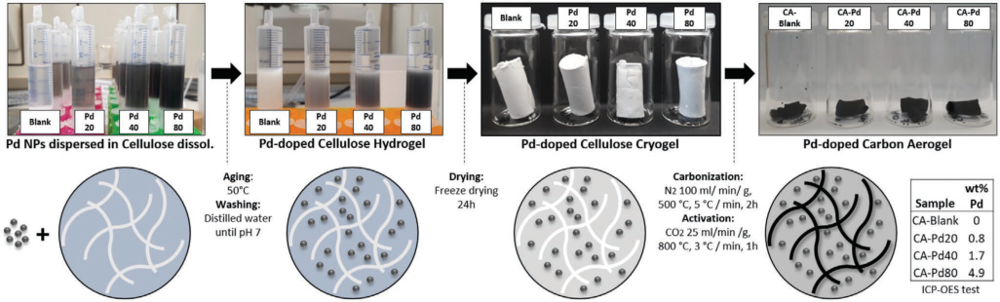

**Figure 1.** Diagram of the synthesis process of Pd-doped cellulose carbon aerogels. 

demonstrating exceptional round-trip efficiency, specific capacity, and cycling stability.[[25]] Furthermore, carbon-based materials decorated with PdNPs do not show pseudocapacitive effect, however, the addition of PdNPs facilitates an enhancement in the electrical double layer capacitance by providing larger electrochemically active surface areas for ions adsorption.[[26,27]] Additionally, Pd decorated conductive polymers have exhibited improvements related to cycle stability and rate capability.[[28,29]] 

Due to the scarcity and high cost of noble metals, their integration with other sustainable and cheap materials is considered as one of the most attractive ways to optimize their properties and minimize their consumption. In this way, some materials based on this green approach have been studied and applied in different areas, such as cellulose-silver nanocomposites with high antimicrobial activity for the application in the biomedical field,[[30]] magnetic Ag-Fe3O4 nanoparticles supported on cellulose microspheres for nanocatalytic applications,[[31]] silver nanoparticles immobilized on nanofibers of chitin,[[32]] silver nanoparticles-doped cellulose microgels for catalyzing and product separation,[[33]] polyaniline/silver cellulose nanofibrils aerogel for supercapacitors,[[34]] and cellulose nanofiber biotemplated palladium composite aerogels.[[35]] 

However, to the best of our knowledge, there are solely few reports demonstrating the use of PdNPs in supercapacitors applications,[[26–29]] and there are no reports about using cellulose as organic, cheap, and abundant precursor of Pd decorated carbon aerogels. Therefore, the present paper analyzes the electrochemical and physicochemical properties of Pd-doped cellulose carbon aerogels as a novel carbon-metal hybrid material obtained through cryogelation, which is a versatile tool for preparing aerogels from different colloidal nanoparticles.[[17,36–39]] In this work, a different strategy compared to other previously reported syntheses of metal-doped carbon aerogels is used,[[9]] via dispersing the previously synthesized PdNPs in the cellulose solution, which is further processed to obtain Pd-doped carbon aerogels. Thus, Pd nanoparticles are synthesized and then they are dispersed in the cellulose dissolution prior to the cross-linking and carbonization process. The synthesized CAs were characterized by their physicochemical properties through nitrogen adsorption isotherms, scanning electron microscopy (SEM), transmission electron microscopy (TEM), XRD, Raman, and Fourier-transform infrared spectroscopy (FTIR). Furthermore, using a three electrode cell, electrochemical measurements 

were performed, in particular cyclic voltammetry (CV), galvanostatic charge/discharge (GCD), and electrochemical impedance spectroscopy (EIS). From these measurements, the capacitive behavior is characterized and a comparative analysis to evaluate the impact of Pd content on the physicochemical and electrochemical properties of the CAs is reported. 

## **2. Results and Discussion** 

## **2.1. Physicochemical Characterization of Pd-Doped Carbon Aerogel** 

## _2.1.1. Pd-Doped Carbon Aerogel Synthesis_ 

**Figure 1** schematically represents the synthesis process of Pd-doped cellulose carbon aerogels and its essential parameters. The retention of the textural properties, the homogeneous distribution of the metallic domains and the anchoring of the metal particles in the carbonaceous matrix are some of the challenges that have arisen in the development of this type of hybrid materials. 

In our method, Pd nanoparticles are synthesized and then dispersed in cellulose dissolution in order to exploit the advantage of the large specific surface area, strong polarity, and abundance of hydroxyl groups in the diluted cellulose.[[31,33]] This facilitates the immobilization of Pd NPs in the hydrogel network and then in the cellulose cryogel. Additionally, the incorporation and anchoring of the Pd particles prior to the thermal process lead to the retention of the textural properties (avoiding pores blocking). Furthermore, stability of Pd particles in the carbon matrix by means of the heteroatom functionalities derived from cellulose carbonization can be achieved.[[10]] In this way, Pd-doped cellulose carbon aerogels with well-dispersed metal domains in the carbon matrix are obtained to improve the capacitive properties of the cellulose carbon aerogel for its application in energy storage. The physicochemical and electrochemical properties of the materials are discussed in detail in the following sections. DLS size distribution, zeta potential distribution, and TEM images of the synthesized Pd particles are also provided (see Figure S1, Supporting Information). 

This synthetic pathway essentially differs from the previously reported methodologies, where metal-doped organic aerogels were prepared following three main strategies: i) addition of 

**2100310 (2 of 12)** 

© 2021 The Authors. Advanced Materials Interfaces published by Wiley-VCH GmbH 

_Adv. Mater. Interfaces_ **2021** , _8_ , 2100310 

**www.advancedsciencenews.com** 

**----- Start of picture text -----** 
www.advmatinterfaces.de **----- End of picture text -----** 

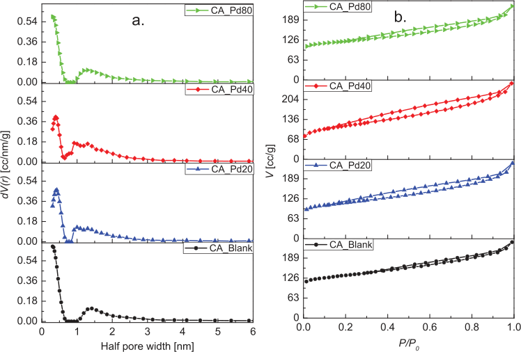

**Figure 2.** a) Pore size distributions and b) isotherms of CAs with different Pd contents. 

the metal precursor to the initial mixture; ii) by ion-exchange; iii) by deposition of the metal precursor on the organic or the carbon aerogel (by incipient wetness, adsorption, sublimation, or supercritical deposition).[[9]] 

## _2.1.2. Morphology and Textural Properties of the Aerogels_ 

**Figure 2** a,b illustrates the pore size distribution (PSD) and N2 adsorption isotherms of the analyzed CAs, respectively. The pore size distribution and pore radius were determined using the quenched solid density functional theory (slit pore, QSDFT equilibrium model). Textural parameters obtained from N2 adsorption assays are summarized in **Table 1** . As isotherms show, nitrogen is adsorbed throughout the whole range of relative pressures, furthermore hysteresis loops are identified, which suggest that all the CAs developed a hierarchical pore structure with micro-, meso-, and macropores. Thus, the samples exhibit pseudo-type II isotherm with H3-type hysteresis loop according to the IUPAC classification. This type of isotherm is a composite of type II and type I isotherms, which is associated with the metastability of the adsorbed multilayer 

(and delayed capillary condensation) and is due to the low degree of pore curvature and non-rigidity of the structure.[[40]] 

The obtained pore structures is the result not only of the 3D network characteristic of carbon aerogel from cellulose,[[1]] but also the physical activation with CO2.[[20]] This hierarchical pore structure is highly efficient for ions diffusion, since micropores offer a large surface area, mesopores provide low resistant pathways for the ions transport through the porous network, and macropores serve as ion-buffering reservoirs.[[41]] 

Regarding the Pd content in CA-PdX (X according  to the Pd content, see table embedded in Figure 1), a low impact on the textural properties is observed. The specific surface area ( _S_ BET) of the sample CA-Blank is between 8% and 16% higher compared to the CA-PdX, while the _S_ BET of the CA-PdX differ within the range of measurement error (±5%). CA-Blank and CA-Pd80 samples had the maximum N2 adsorption in the ultramicropore range and nearly the same total pore volume, suggesting that Pd particles have no negative effect over porosity development and pores size distribution. Ultramicropores are those pores whose diameters are smaller than 0.7 nm and they are especially important in carbonaceous materials applied to supercapacitor electrodes due to their ability to trap ions.[[42,43]] Samples 

**Table 1.** Textural parameters of CAs with different Pd contents. 

|Parameter||CA-Pd80|CA-Pd40|CA-Pd20|CA-Blank|
|---|---|---|---|---|---|
|_S_BET[m2g−1]±5%||450|412|409|491|
|_V_Pore[cc g−1]|Total|0.330|0.367|0.337|0.339|
||Micro|0.185|0.169|0.170|0.203|
||Meso|0.185|0.232|0.201|0.189|
|_V_Micro/_V_Tota_l_[%]||0.561|0.461|0.504|0.599|
|Half pore width [nm]||0.307|0.392|0.426|0.307|

**2100310 (3 of 12)** 

© 2021 The Authors. Advanced Materials Interfaces published by Wiley-VCH GmbH 

_Adv. Mater. Interfaces_ **2021** , _8_ , 2100310 

**www.advancedsciencenews.com** 

**----- Start of picture text -----** 
www.advmatinterfaces.de **----- End of picture text -----** 

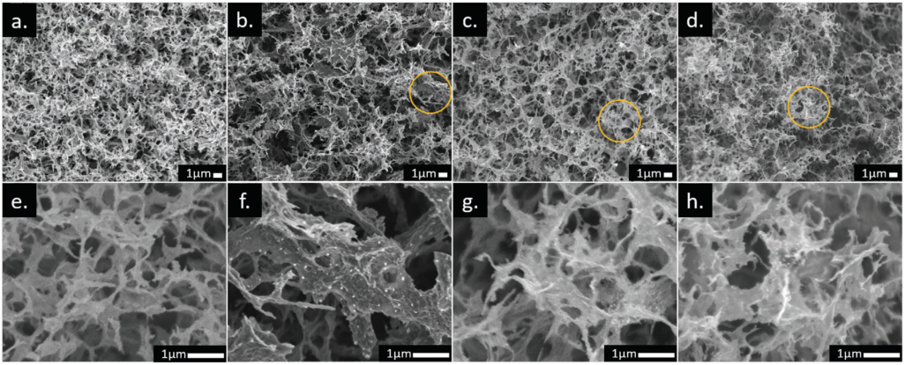

**Figure 3.** SEM images of a,e) CA-Blank, b,f) CA-Pd20, c,g) CA-Pd40, and d,h) CA-Pd80. The bottom row images correspond to the magnification of the region marked with a yellow circle in the top images. 

containing Pd (CA-PdX) exhibit no prominent changes in the mesopore volumes, for this reason the PSD remains almost unchanged as seen in Figure 2a. Pore size distributions of the CA-based sample was also analyzed by Barrett–Joyner–Halenda (BJH) indicating the presence of meso- and macropores as well (Figure S2, Supporting Information). 

SEM images of the analyzed samples are presented in **Figure 3** . At the micro-scale level, all the CAs show well developed porous structures with 3D network of interconnected sheets. This morphology is typical of carbonaceous materials derived from cellulose aerogels, since they inherit the interconnected architecture of their precursors,[[1]] which originates by dissolution and subsequent crosslinking of the cellulose in 

the sol–gel method.[[44]] As observed, CA-Blank presents open hierarchical porous structure highly meso/macroporous with pores in a wide range of sizes from 0.1 – 1 μm. The samples CA-PdX exhibit this same distinctive feature even at the higher Pd content, which confirms that Pd particles have no remarkable effect on the microstructure of carbon aerogels. Additionally, the images with higher resolution (Figure 3f–h) display uniform distribution of Pd particles embedded in the carbonaceous matrix. Distribution of Pd, C, and O in CA-PdX was evaluated by SEM-EDX mapping, the analyzed samples show that Pd particles are homogeneously distributed in the whole carbon matrix (see **Figure 4** ). Additionally, inductively coupled plasma optical emission spectrometry (ICP-OES) measurements were 

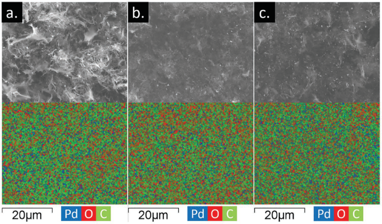

**Figure 4.** SEM-EDX elemental mapping of a) CA-Pd20, b) CA-Pd40, and c) CA-Pd80. The upper row images correspond to the scanned surface to obtain the shown maps. 

**2100310 (4 of 12)** 

© 2021 The Authors. Advanced Materials Interfaces published by Wiley-VCH GmbH 

_Adv. Mater. Interfaces_ **2021** , _8_ , 2100310 

**www.advmatinterfaces.de** 

**www.advancedsciencenews.com** 

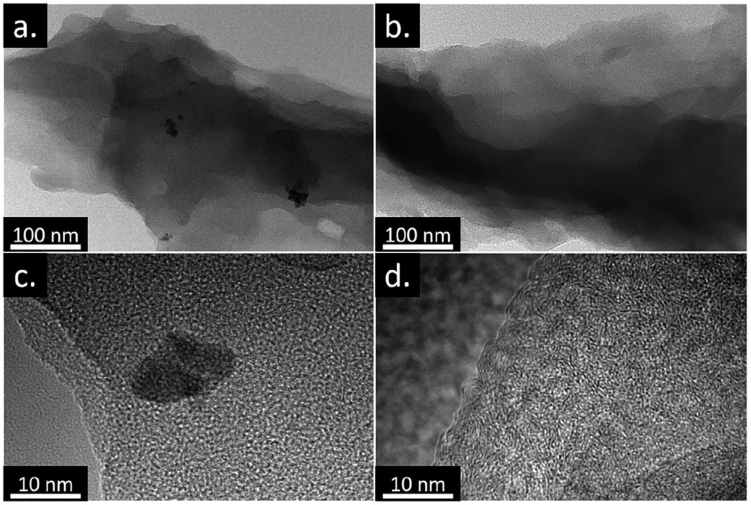

**Figure 5.** TEM and high-resolution TEM images of a,c) CA-Pd80 and b,d) CA-Blank . 

performed to determine the Pd loading in the aerogels, which were found to be 0.84 (± 0.01) wt%, 1.67 (± 0.02) wt%, and 4.89 (± 0.05) wt% for the samples CA-Pd20, CA-Pd40, and CA-Pd80, respectively (see also as a table in Figure 1). 

TEM and high-resolution TEM of the samples CA-Pd80 and CA-Blank are shown in **Figure 5** . Both samples exhibit amorphous carbon nanostructures with distributed graphitic islands, however, CA-Blank shows better growth and ordering of the graphite structure (Figure 5d). In contrast, the Pd-doped sample shows shorter and disordered graphite nanocrystals (Figure 5c), which suggest an effect of Pd particles on nanostructure of the carbon scaffold. Additionally, larger Pd domains can be observed, which might be the result of the activation process (see further TEM images in Figures S3 and S4, Supporting Information). 

## _2.1.3. XRD Patterns and Raman Spectra_ 

The X-ray diffraction patterns of the analyzed CAs are shown in **Figure 6** a. The samples CA-PdX (X = 20, 40, 80) display four sharp reflections located at ≈ 40°, 46°, 68°, and 82°, which are attributed to {111}, {200}, {220}, and {311} crystalline planes of Pd.[[25]] The average sizes of the Pd particles in the doped aerogels were calculated from those reflections by using the Scherrer equation, and the values obtained are: 9.6, 9.7, and 7.0 nm for CA-Pd20, CA-Pd40, and CA-Pd80, respectively (see reflections parameters in Table S1, Supporting Information). Additionally, two broad reflections were identified in the 2θ ranges of 25°–35° and 40°–45°, which were also recognized in the profile of the cellulose cryogel precursor (see Figure S5, Supporting Information). These could be attributed to a well-dispersed product remaining from the cellulose dissolution-crosslinking process with NaOH-urea solution, which is not degraded at the 

temperature of the thermal process. Consequently, it is not possible to draw a conclusion about the graphitic structure of the CAs from the X-ray diffraction, since the reflections of {002} and {100} planes of carbon matrix also appear in these same 2θ ranges. 

A third broad reflection can be observed around 15° which has already been identified in carbon aerogels from cellulose and it is related to the precursor.[[6]] This band has also been attributed to aliphatic chains bound to the edges of basal planes of the crystal structure.[[45–47]] A decrease in the intensity of this band is observed when the Pd content increases, suggesting the influence of the metal on the decomposition of the aliphatic chains. 

Raman spectroscopy is a powerful tool for characterizing the crystal structure of carbon materials and we utilized it to shed light on the ordering of the carbon aerogels (Figure 6b). Two intense bands attributed to vibrational modes involving sp[2] - bonded carbon atoms belonging to disordered microcrystalline domains are identified: the so-called graphite band (G band) around 1580 cm[−][1] and the so-called disorder-induced band (D band) around 1350 cm[−][1] .[[48]] The G band is ascribed to the Raman active _E_ 2g in-plane vibration mode, while the D band to the _A_ 1g mode, similar to an in-plane breathing mode.[[49]] 

Some features of the Raman spectra can be used as direct markers the structural changes or graphitization degree of carbon materials, such as the wavenumber of the G band, the band width of the G and D bands, and the D/G intensities ratio ( _R_ ). For instance, progressive carbon graphitization is accompanied by the displacement of the G band from 1600 to 1580 cm[−][1] .[[50]] The broadening of the G band is related to the disorder within the carbon sheet.[[51]] While the broadening of the D band correlates to a distribution of clusters with different orders and dimensions, the information about disorder can be extracted from the intensity of the peak.[[52]] The correlation 

**2100310 (5 of 12)** 

© 2021 The Authors. Advanced Materials Interfaces published by Wiley-VCH GmbH 

_Adv. Mater. Interfaces_ **2021** , _8_ , 2100310 

**www.advancedsciencenews.com** 

**www.advmatinterfaces.de** 

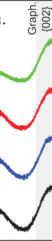

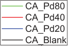

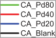

crystallite size along graphite basal planes (1/ _La_ ) provide a first approximation of _La_ .[[53,54]] It means that _R_ is increasing with decay of size of the perfect graphene units, as the disorder is growing and the D-mode is becoming more active. The Raman spectra of CAs were deconvoluted to G and D bands by using two Lorentzians on top of a linear background. The parameters obtained are summarized in Table S2, Supporting Information. The full width at half maximum (FWHM) of the G bands ranges from 81 to 85 cm[−][1] . These values are higher than one reported for highly oriented pyrolytic graphite (15 – 23 cm[−][1] ), which indicates a low degree of crystalline order in the studied samples, especially in samples decorated with Pd. Additionally, from the obtained _R_ values, an important structural change can be identified in the analyzed samples. The lateral sizes obtained from the Raman spectra reflect a decrease with increasing Pd content indicating that the growth of the sp[2] carbon domains of the CA-PdX is affected by the metal content. Other, previously reported Pd decorated carbonaceous materials have shown the same trend in _R_ . These found that the addition of nanometals within the carbon matrix decreases the degree of graphitization, since the graphitiferous carbon atoms used their π electrons to coordinate the nanometals.[[18,20,25]] 

From the Raman analysis, it can be concluded that doping with Pd facilitates changes in the carbonaceous structure and decreases the degree of graphitization due to the reduction in the size of the graphite islands, which is in agreement with the TEM results. 

## _2.1.4. FTIR Analysis_ 

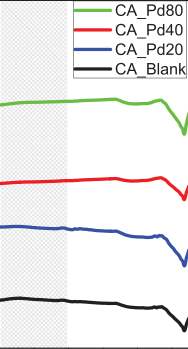

**Figure 6.** a) XRD, b) Raman, and c) FTIR spectra of CAs with different Pd contents. 

_R_ = 1/ _La_ between the ratio of intensities of the two main bands in the Raman spectrum ( _R_ = _I_ D/ _I_ G) and the reciprocal of the 

The FTIR spectra of the analyzed CAs and their corresponding cellulose aerogel precursors are presented in Figure 6c and Figure S6, Supporting Information, respectively. The thermal treatment that transforms cellulose aerogel into carbon aerogel alters the surface chemistry significantly. The disappearance of the broad band at 3000 – 3500 cm[−][1] is attributed to dehydration during the carbonization process.[[55]] Degradation of the oxygen functionalities is also observed, and the presence of the remaining oxygen groups is suggested by the broad band from 1000 to 1300 cm[−][1] , which is ascribed to (O-H) bending vibrations and (C-O) stretching vibrations in hydroxyl, ester or ether.[[56,57]] Nevertheless, this broad band can also be associated with the (C-C) skeleton collective modes. The absorption band centred at 1580 cm[−][1] is due to the (C=C) vibrations of carbon atoms belonging to the sp[2] rings, while the bands in the 875 – 750 cm[−][1] region are assigned to aromatic (C-H) outof-plane bending vibrations. The band at 1700 cm[−][1] reflects the = (C O) modes of carboxyl groups.[[48]] The CAs spectra exhibited differences related to the Pd content. A notable reduction in IR signals is observed; the decrease of aromatic (C-H) out= of-plane bending vibrations and the loss of (C O) modes suggests increasing aromaticity.[[47,58]] The bands related to oxygen groups become less prominent at higher Pd content, which suggests interactions between these groups and the Pd particles. The presence of oxygenated groups on the surface of the carbonaceous material, either from the oxygen-rich precursor (cellulose) or obtained during the oxidative thermal processes (activation), are essential in the immobilization of 

**2100310 (6 of 12)** 

© 2021 The Authors. Advanced Materials Interfaces published by Wiley-VCH GmbH 

_Adv. Mater. Interfaces_ **2021** , _8_ , 2100310 

**----- Start of picture text -----** 
www.advancedsciencenews.com **----- End of picture text -----** 

**----- Start of picture text -----** 
www.advmatinterfaces.de **----- End of picture text -----** 

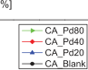

**Figure 7.** CVs curves of carbon aerogel cells at different scan rates a) CA-Pd80, b) CA-Pd40, d) CA-Pd20, e) CA-Blank, c) specific capacitances from CVs areas, and f) cyclic stability of CA cells at 200 mV s[−][1] . 

the metallic domains in the carbon aerogels. This immobilization occurs via coordinate bonds between the oxygenated groups (generally -OH or -COOH) and Pd.[[10,20]] In this way, the size decreasing of graphite crystals upon Pd particles loading is attributed to these coordinate bonds, which prevent the growth of rigid sheets of connected aromatic rings through aromatic condensation.[[18]] The coordinate binding of the metal complexes was also evidenced by Raman spectroscopy (see Figure 6b). Thus, the increase in the _I_ D/ _I_ G intensity ratio of the Pd-doped samples indicates a change in the hexagonal lattice structure of the carbon material by the Pd doping.[[59]] 

The Pd contents in the CA-PdX samples were determined via ICP-OES. The Pd content, expressed as mass percentage, reached after thermal process are: 0.8, 1.7, and 4.9, for the samples CA-Pd20, CA-Pd40, and CA-Pd80, respectively, that prove the preservation of the added Pd content throughout the preparation process. Additional information is provided in Table S3, Supporting Information. 

## **2.2. Electrochemical Characterization of Pd-Doped Carbon Aerogels** 

## _2.2.1. Cyclic Voltammetry_ 

In order to study the potential of the Pd decorated CA as active material for electric double-layer capacitors (EDLC), cyclic voltammetry measurements were performed. From CV curves, numerous electrochemical properties, such as specific capacitance ( _C_ s), rate capability, and cycle stability were extracted. 

**Figure 7** a,b,d,e, presents the CV curves at different scan rates ( _s_ ) for CA-Pd80, CA-Pd40, CA-Pd20, and CA-Blank, respectively. All the cells exhibit rectangular CV curves, especially at low _s_ , which is typical for EDLCs. Importantly, there is a prominent increase in the voltammogram areas upon increasing Pd content. This suggests an enhancement in the electrical double layer capacitance, which can be attributed to the increase of electrochemically active surface areas for the ions adsorption provided by the Pd.[[26,27]] The Pd particles increase the conductivity of the carbon network enhancing the ion diffusion toward the ultramicropores. These pores are the most active in the charge storage, however, its exploitation depends on the conductivity of the carbon matrix.[[43]] Consequently, the specific capacitance can be increased by the maximal utilization of the accessible area. 

Figure 7c shows the variation of _C_ s related to the Pd content and scan rate indicating the improvement in capacitance, as well as in the rate capability. In all cells, the _C_ s decreases as _s_ increases, since at low _s_ electrolyte ions are able to diffuse toward the active sites of the electrode. Hence, higher _s_ generates ohmic resistance and the electrolyte ions cannot diffuse completely. This effect is more remarkable in the cell without Pd, as shown the rate capability values of 14% , 30% , 40%, and 66% for the samples CA-Blank, CA-Pd20, CA-Pd40, and CA-Pd80, respectively, calculated using the _C_ s at 5 and 50 mV s[−][1] . This directly implies that the Pd particles help reduce the ion diffusion resistance at high _s_ allowing higher capacitance retention, which have a positive effect in the EDLC power density. 

Figure 7f shows the evolution of _Cs_ of the carbon aerogel electrodes through 1000 cycles. The specific capacitance of CA-Pd40 and CA-Pd80 cells still remains at 93% and 87%, respectively after 1000 cycles at 200 mV s[−][1] , indicating high cyclic stability. 

**2100310 (7 of 12)** 

© 2021 The Authors. Advanced Materials Interfaces published by Wiley-VCH GmbH 

_Adv. Mater. Interfaces_ **2021** , _8_ , 2100310 

**----- Start of picture text -----** 
www.advancedsciencenews.com www.advmatinterfaces.de **----- End of picture text -----** 

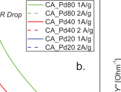

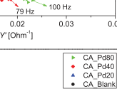

**Figure 8.** GCD curves of a) CA cells at 1 A g[−][1] and b) CA-PdX cells at 1 and 2 A g[−][1] . c) Admittance, d,e) Nyquist plots, and f) specific capacitance from EIS measurements of CA cells. 

## _2.2.2. Galvanostatic Charge/Discharge_ 

**Figure 8** a shows the GCD curves at 1 A g[−][1] for the evaluated carbon aerogels. It is clearly visible, that all the CA cells show linear and symmetrical curves, characteristic of EDLC. CA-Pd80 and CA-Pd40 exhibit longer charge and discharge time than CA-Pd20 and CA-Blank implying higher capacitance. Evolution of voltage drop shows interesting behavior upon increasing Pd content. In particular, the CA-Blank cell exhibits the sharpest voltage drop at the beginning of the discharge, which is the result of the limited mobility of the electrolyte ions in the electrode pores due to a lower diffusion. In contrast, CA-Pd80 shows the smallest voltage drop and the most symmetrical GCD curve, which agrees with the findings described in the previous section. In Figure 8b, a smaller decrease in discharge times and a smaller increase in voltage drop can be observed for the Pd-doped samples, when a discharge current at 1 and 2 A g[−][1] is applied. This indicates a significantly positive effect of Pd on power density, as well as the energy density: CA-Pd80 

aerogel exhibits 369 W kg[−][1] power density and 8.2 Wh kg[−][1] energy density, which are 2.9-fold and 55-fold higher compared to those of the blank carbon aerogel. 

**Table 2** summarizes the parameters obtained from GCD: Δ _t_ (discharge time, s), Δ _V_ (potential window subtracting _iR_ drop, V), _iR_ drop (voltage drop, V), _C_ s (specific capacitance, F g[−][1] ), _E_ (energy density, Wh kg[−][1] ), and _P_ (power density, W kg[−][1] ). 

## _2.2.3. Electrochemical Impedance Spectroscopy_ 

The frequency response of the studied CA cells was characterized by means of EIS. Figure 8d,e shows the Nyquist plots obtained from the EIS experimental data. The obtained Nyquist diagrams exhibit the typical curve of an EDLC, which is characterized by a semicircle in the high frequency region and a straight-line in the low frequency region. 

Two resistances ( _R_ s and _R_ ct) can be extracted from Nyquist plots. _R_ s can be described as the bulk solution resistance and 

**Table 2.** GCD parameters of CAs obtained at 1 A g[−][1] . 

|Parameter|Units|CA-Pd80|CA-Pd40|CA-Pd20|CA-Blank|
|---|---|---|---|---|---|
|Δ _t_|s|79.9|70.4|15.7|4.2|
|Δ _V_a)|V|0.74|0.67|0.55|0.26|
|_iR_drop|V|0.06|0.13|0.25|0.54|
|_C_s|F g−1|108.2|104.9|28.8|16.2|
|_E_|Wh kg−1|8.20|6.56|1.19|0.15|
|_P_|W kg−1|369.3|335.5|272.8|129.3|

a)Measured potential resolution: 300 nV (gain 1000) 

_Adv. Mater. Interfaces_ **2021** , _8_ , 2100310 **2100310 (8 of 12)** 

© 2021 The Authors. Advanced Materials Interfaces published by Wiley-VCH GmbH 

## **www.advancedsciencenews.com** 

**www.advmatinterfaces.de** 

_R_ ct as the charge transfer resistance, which in EDLC corresponds to the sum of the electrolyte resistance in the porous structure of the electrode, the electrode resistance, and the contact resistance between the electrode and the current collector.[[60]] The obtained _R_ s have similar values in all the studied cells, while _R_ ct (equivalent to the semicircle diameter) shows prominent dependency on Pd content. Due to the increased carbon network conductivity upon increasing Pd content, CA-Pd80 cell exhibited the smallest _R_ ct value. The straight line of the Nyquist plot in the low frequency region is an indication of the diffusive resistance behavior of the electrolyte in the electrode pores. A vertical line corresponds to an ideal EDLC behavior, therefore, the steeper the slope of the straight line, the better capacitive behavior. From the slopes of the straight lines of the Nyquist plots, a better capacitive behavior is observed in the samples decorated with Pd, since a more pronounced slope can be observed upon increasing Pd content. 

Another important parameter can be analyzed from the EIS data: this is the knee frequency ( _f_ k), which is the highest frequency at which the stored charge can be accessed. This corresponds to the transition point between the two semi-circles in the admittance plot (Figure 8c), and it is an indicator of the power capability of the cell.[[61]] The obtained _f_ k for the samples CA-Blank, CA-Pd20, CA-Pd40, and CA-Pd80 are: 32, 40, 79, and 100 Hz, respectively. In Figure 8f, the specific capacitance from EIS measurements is plotted as function of the frequency. Higher _C_ s values can be observed for a given frequency at higher Pd content, which also highlights the positive effect of Pd on the electrochemical properties of the developed carbon aerogels from cellulose. 

As a summary of this section, Pd plays a key role in the use of the available electrochemically active surface in the carbon aerogel. The interactions between the Pd domains and the carbon network modify the electrical properties of the support, improving the ion diffusion toward the smaller pores (ultramicropores). These pores (with diameters diameters < 0.7 nm) are the most active sites in the charge storage; however, they are difficult to access. In this way, the increase in the global conductivity of the support by the Pd domains, leads to the effective use of these valuable sites. Thus, Pd doping of cellulose-based carbon aerogels shows manifold advantages, not solely due to the improvement of the specific capacitance, but also due to the increase in the power and energy densities via generating lower resistance charge transport pathways. It offers a novel material class (cellulose carbon aerogel) beside other Pd hybrid materials reported in the literature, such as MWCNTs/palladium-doped polyaniline,[[29]] nitrogen-doped graphene/palladium nanoparticles/porous polyaniline,[[28]] Pd plasma surface functionalized carbon nanofibers,[[26]] and palladium nanoparticle–graphene.[[27]] Table S4, Supporting Information summarizes the main characteristics of some carbon-noble metal hybrid materials applied in supercapacitors, while the comparison between the blank porous carbons can be seen in Table S5, Supporting Information. 

## **3. Conclusions** 

Pd-doped cellulose carbon aerogels were synthesized with various Pd loading. By means of the implemented synthesis 

methodology, carbon aerogels with Pd domains homogeneously distributed throughout the carbonaceous matrix were obtained. From the evaluation of the physicochemical properties of these materials, it was found that the advantageous morphological properties of CA (high _S_ BET, hierarchical pore structure) can be retained upon introducing Pd nanoparticles into the carbon network. It implies that Pd particles do not block the pores on the carbon backbone, and therefore do not hinder the transport in the hybrid carbon aerogels. The presence of oxygenated groups on the surface of the carbonaceous material, were essential in the immobilization of the metallic domains in the carbon aerogels. This immobilization occurs through coordination bonds between the oxygenated groups and Pd, which prevented the growth of rigid sheets of connected aromatic rings. Thus, the crystalline properties of the carbon aerogel exhibited modification by Pd addition, since Pd particles facilitated the size decreasing of the graphite crystals and promoted structural disorder. 

Beside the preservation of the advantageous textural properties, Pd-loading remarkably improved the electrical properties of the hybrid material. In this way, great enhancement in the specific capacitance, rate capability, and energy and power densities were observed. This is due to the improvement in the global conductivity of the carbon network upon increasing Pd load, which leads that the electrochemically active surface area can be utilized in an enhanced manner and a large decrease in the charge diffusion resistance. That makes this hybrid material a promising candidate for energy storage applications. 

## **4. Experimental Section** 

_Synthesis of Pd Nanoparticles_ : Pd nanoparticles solution were synthesized following a previously reported method,[[36,37]] in which 0.051 g palladium (II) chloride (Sigma Aldrich, 99.999%) was dissolved in 10 mL 37 wt% hydrochloric acid (Sigma Aldrich, reagent grade) with a molar ratio equal to 1:2 and heated until the solution is clear. Afterward it was diluted in boiling ultrapure water (18 MΩ cm) to reach a total volume of 500 mL. Then, keeping this solution at 80 °C and under continuous stirring, 11.6 mL of a 1 wt% trisodium citrate dihydrate solution was added. After 30 s, 5.5 mL of a 0.076 wt% icecold sodium borohydride solution was quickly added, and stirred for another 10 min. In order to obtain a Pd nanoparticles concentrated solution of 50 μg/μL, the previously obtained Pd NPs solution was ultrafiltered and subsequently centrifuged. 

_Synthesis of Pd-Doped Cellulose Aerogels_ : Pd-doped cellulose aerogels (CellA-PdX) were obtained following previously reported sol–gel method,[[44]] which was slightly modified, and subsequent freeze drying process. In this methodology, an aqueous solution of 7 wt% NaOH and 12 wt% Urea was prepared. Then, microcrystalline cellulose was added into the solvent system to 4 wt% cellulose concentration. This mixture was cooled down to −20°C and vigorously stirred to obtain a transparent cellulose solution. Afterward, under strong stirring 20, 40, and 80 μL of the PdNP concentrated solution (50 μg/μL) were injected in different cellulose batches (20 g each one) in order to prepare three Pd/cellulose dispersions with different Pd content. The Pd/cellulose dispersions were placed on plastic containers followed by the complete gelation in an oven at 50 °C. Then, the obtained Pd/cellulose hydrogels were washed with distilled water until reaching neutral pH. Finally, the washed hydrogels were frozen in a liquid nitrogen bath and freeze-dried during 24 h to obtain CellA-PdX, with X: 20, 40, and 80 according to the amount of Pd concentrated solution previously injected. Drying was carried out with a lyophilizer Christ Alpha LD 1-2 Plus at −50 °C under vacuum pressure of 0.05 mbar. 

**2100310 (9 of 12)** 

© 2021 The Authors. Advanced Materials Interfaces published by Wiley-VCH GmbH 

_Adv. Mater. Interfaces_ **2021** , _8_ , 2100310 

## **www.advancedsciencenews.com** 

**www.advmatinterfaces.de** 

_Synthesis of Pd-Doped Cellulose Carbon Aerogels_ : To obtain CA-PdX, CellA-PdX were carbonized and subsequently subjected to physical activation. CellA-PdX were carbonized in a tube furnace under N2 atmosphere with a heating rate of 5 °C min[−][1] up to 500 °C, which temperature was kept during the treatment (120 min). Afterward, the carbonized samples were subjected to a second thermal process under CO2 atmosphere (25 mL min[−][1] g[−][1] sample) with a heating rate of 3 °C min[−][1] up to 800 °C, keeping the temperature constant for 60 min. This samples were identified as CA-PdX with X: 20, 40, and 80 according to the CellA-PdX precursors. In order to study the Pd particles effect on the physicochemical and electrochemical properties of CAs, a sample without Pd NPs was prepared following the same procedure; this was identified as CA-Blank. A diagram of the synthesis process of cellulose carbon aerogels with different Pd contents is shown in Figure 1. 

_Physisorption Measurements_ : N2 adsorption measurements were performed with a Quantachrome Nova 3200e. Before the measurement, the monolithic CAs samples were degassed under vacuum for 24 h at 200 °C. The N2 isotherms were used to estimate the textural properties by the software Quantachrome NovaWin. The specific surface areas were determined applying Brunauer Emmett Teller model, the total pore volumes were obtained by the Gurvich’s rule at _P_ / _P_ 0= 0.99 and the meso- and micropore volumes by means of BJH and Horvath Kawazoe (HK), respectively. The pore size distributions and pore radius were determined using the quenched solid density functional theory (slit pore, QSDFT equilibrium model). 

_Scanning Electron Microscopy_ : The morphology of the CAs were studied by SEM using a JEOL JSM-6700F instrument equipped with a cold field emission gun electron source (operated at 2 kV for imaging and 10 kV for EDX). The elemental components of the Pd-doped carbon aerogels were analyzed by energy-dispersive X-ray spectroscopy (EDXS) with the software Oxford Instruments INCA 300. SEM samples were prepared by immobilizing pieces of CAs on conductive carbon tapes. 

_Transmission Electron Microscopy_ : The nanostructure of the CAs was studied by TEM and HRTEM with a FEI Tecnai G2 F20 TMP (operated at 200 kV). TEM samples were prepared by brushing gently carbon coated copper grid (Quantifoil) on the surface of the CAs. 

_X-Ray Diffraction_ : X-ray diffraction patterns of the samples were obtained by means of Bruker AXS/D8 Advance diffractometer, it was operated at 20 °C, 40 kV, and 40 mA using CuKα radiation (λ = 0.15418 nm). Each measurement was done in a 2θ range from 10° and 90°, with a step size of 0.01°, and 12 s per step. For the analysis of the CAs, the monolithic samples were placed on X-ray amorphous PVC holders. The average Pd particle diameter ( _D_ ) of the CA-PdX samples were calculated from {111}, {200}, {220}, and {311} reflections applying the DebyeScherrer equation,[[62]] 

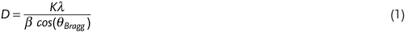

where _K_ is the shape factor (fixed to 0.9 according to the literature regarding Pd nanoparticles), λ is the wavelength of the radiation, b is the full width at half maximum (FWHM) calculated from the radian of the reflections, and θ is the corresponding reflection positions in radians. OriginPro 8.5 software was used for deconvolution of the diffractograms. Gaussian fitting was performed to find the reflection parameters (FWHM, reflection positions 2θ). 

_Raman Spectroscopy_ : Raman spectra were recorded using a Bruker Senterra Raman spectrometer equipped with an Olympus LMPIanFl N 50x lens with the FlexFocusTM system for confocal depth profiling and an ANDOR DU420-OE CCD camera with a thermoelectric cooling system. The green laser (λ _L_ = 532 nm) is operated with a total power of 2 mW at a spectral resolution of 3 cm[−][1] to 5 cm[−][1] . To analyze the CAs a small piece of monolith was deposited on a glass substrate. The spectra of CAs were deconvoluted to D and G bands by using two Lorentzians on top of linear background. The ratio of intensities of the D and G bands ( _R_ = _ID_ / _IG_ ), their positions and FWHM, and the lateral size of the graphite crystallites ( _La_ ) were reported. This last was estimated 

according to the so-called Knight formula,[[51]] considering a wavelength dependency of C, where _C_ 0 and _C_ 1 are: -126 Å and 0.033,[[53]] respectively 

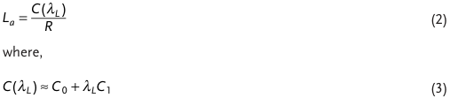

_FTIR Spectroscopy_ : ATR-FTIR spectra of cellulose aerogels (CellAs) and CAs were recorded to characterize the surface chemistry. Powder samples were analyzed at room temperature using a Agilent Cary 630 FTIR spectrometer equipped with a diamond attenuated total reflectance (ATR) sampling accessory between 4000 and 630 cm[−][1] at a resolution of 2 cm[−][1] . 

_ICP-OES Analysis_ : The measurement of the Pd content in CA-PdX samples was done with a ICP-OES O-IDC 6057 Vista AXCOD from varian on the element specific wavelengths, standard deviations are listed in the Table S4, Supporting Information. The calibration was done with a set of solutions having 0 – 4.0 mg L[−][1] concentrations in 0.5 mg L[−][1] steps. 

_Preparation of Coated Electrodes_ : Conductive indium tin oxide coated glass slides (ITO glass) were used as substrates of the CAs working electrodes. CAs were immobilized on them by dropcasting a slurry of each CAs (CA-Blank, CA-Pd20, CA-Pd40, and CA-Pd80) and polyvinylidene fluoride in dimethyl sulfoxide (PVDF/DMSO) and drying it overnight at 80 °C and 20 mbar in a vacuum oven. The slurry was prepared by crushing CAs in a mortar and then mixing with PVDF/ DMSO, the ratio of CAs and PVDF in the slurry was 1:0.05. A self-built three electrode cell,[[63]] was used to evaluate the capacitive behavior of the CAs. A platinum wire, a Ag/AgCl electrode (3 m NaCl, purchased from BASi), the CAs coated electrode, and KOH (6 m) were used as counter, reference, working electrode, and electrolyte, respectively. 

_Cyclic Voltammetry_ : CV was performed with a Potentiostat/ Galvanostat Metrohm Autolab PGSTA T204. CV curves were measured in a potential window between −1.0 and −0.2 V (vs Ag/AgCl) with a scan rate of 1, 5, 50, 100, or 200 mV s[−][1] . The specific capacitance obtained from CV ( _C_ s _cv_ , F g[−][1] ) was calculated from the integrated area under the CV curve (∫ _Idv_ , A V), the voltage window (Δ _V_ , V), the scan rate ( _s_ , V s[−][1] ), and the mass of the electroactive materials in the electrode ( _m_ , g) as follows,[[27,28]] 

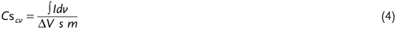

_Galvanostatic Charge/Discharge_ : The GCD measurements were performed with a discharge current of 1 and 2 A g[−][1] . The specific capacitances obtained from GCD data ( _C_ s, F g[−][1] ) of the analyzed samples were calculated from the discharge current _I_ (A), the discharge time Δ _t_ (s), the mass of the electroactive materials in the electrodes _m_ (g), and the potential window Δ _V_ (V) subtracting _iR_ drop, as follows,[[27]] 

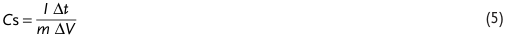

Additionally, energy density ( _E_ , Wh kg[−][1] ), and power density ( _P_ , W kg[−][1] ) of the characterized CAs cells were calculated as shown below,[[27,29]] 

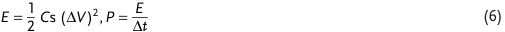

_Electrochemical Impedance Spectroscopy_ : EIS was done with a Modulab XM ECS potentiostat from Solatron. The measurements were performed by applying an amplitude of 10 mV in the frequency range from 0.1 Hz to 100 kHz. For the analysis of EIS data, the admittance were calculated as follows,[[61,64]] 

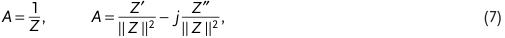

**2100310 (10 of 12)** 

© 2021 The Authors. Advanced Materials Interfaces published by Wiley-VCH GmbH 

_Adv. Mater. Interfaces_ **2021** , _8_ , 2100310 

## **www.advancedsciencenews.com** 

## **www.advmatinterfaces.de** 

where _Z_ ′ is the real impedance, _Z_ ″ is the imaginary impedance, and ‖ _Z_ ‖ is the impedance module. In addition, the corresponding real and imaginary admittances were calculated as _Z_ ′/‖ _Z_ ‖[2] = _Y_ ′ and − _Z_ ″/‖ _Z_ ‖[2] = _Y_ ″. The specific capacitance from EIS data was determined as follows,[[65]] 

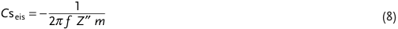

where _f_ is the frequency (Hz) and _m_ is the mass of the electroactive materials in the electrodes (g). 

- [5] C. Rajkumar, P. Veerakumar, S.-M. Chen, B. Thirumalraj, S.-B. Liu, _Nanoscale_ **2017** , _9_ , 6486. 

- [6] O. Gómez-Cápiro, A. Hinkle, A. M. Delgado, C. Fernández, R. Jiménez, L. E. Arteaga-Pérez, _Catalysts_ **2018** , _8_ , 347. 

- [7] R. J. White, N. Brun, V. L. Budarin, J. H. Clark, M.-M. Titirici, _ChemSusChem_ **2014** , _7_ , 670. 

- [8] Z. Zhang, L. Li, Y. Qing, X. Lu, Y. Wu, N. Yan, W. Yang, _J. Phys. Chem. C_ **2018** , _122_ , 23852. 

- [9] C. Moreno-Castilla, F. Maldonado-Hódar, _Carbon_ **2005** , _43_ , 455. 

- [10] I. C. Gerber, P. Serp, _Chem. Rev._ **2019** , _120_ , 1250. 

- [11] Y. Yan, T. Wang, X. Li, H. Pang, H. Xue, _Inorg. Chem. Front._ **2017** , _4_ , 33. 

## **Supporting Information** 

Supporting Information is available from the Wiley Online Library or from the author. 

- [12] G. Wee, W. F. Mak, N. Phonthammachai, A. Kiebele, M. Reddy, B. V. Chowdari, G. Gruner, M. Srinivasan, S. G. Mhaisalkar, _J. Electrochem. Soc._ **2010** , _157_ , A179. 

- [13] K. Yang, K. Cho, D. S. Yoon, S. Kim, _Sci. Rep._ **2017** , _7_ , 40163. 

- [14] S. R. Suryawanshi, V. Kaware, D. Chakravarty, P. S. Walke, M. A. More, K. Joshi, C. S. Rout, D. J. Late, _RSC Adv._ **2015** , _5_ , 80990. 

## **Acknowledgements** 

The authors acknowledge the funding from the European Research Council (ERC) under the European Union’s Horizon 2020 Research and Innovation Program (grant no. 714429). This work was also financed by the German Research Foundation (Deutsche Forschungsgemeinschaft, DFG) under Germany’s excellence strategy within the cluster of excellence PhoenixD (EXC 2122, project ID 390833453) and the grant BI 1708/4-1. A.S. and R.T.G. are thankful to the Hannover School for Nanotechnology (hsn) for financial support. The authors are thankful to Prof. Jürgen Caro and Prof. Armin Feldhoff for providing the SEM and XRD facility, and with the Laboratory of Nano and Quantum Engineering (LNQE) for providing the TEM. The authors moreover thank Prof. Denis Gebauer and Kirsten Eiben for providing the ICP-OES facility at the Institute of Inorganic Chemistry (LUH) and for the technical assistance. Open access funding enabled and organized by Projekt DEAL. 

- [15] K. N. Chaudhari, S. Chaudhari, J.-S. Yu, _J. Electroanal. Chem._ **2016** , _761_ , 98. 

- [16] K. S. Lau, S. T. Tan, R. T. Ginting, P. S. Khiew, S. X. Chin, C. H. Chia, _New J. Chem._ **2020** , _44_ , 1439. 

- [17] D. Müller, D. Zámbó, D. Dorfs, N. C. Bigal, _Small_ **2021** , 2007908. 

- [18] J.-G. Li, C.-Y. Tsai, S.-W. Kuo, _Polymers_ **2014** , _6_ , 1794. 

- [19] H. W. Park, U. G. Hong, Y. J. Lee, I. K. Song, _Appl. Catal., A_ **2011** , _409_ , 167. 

- [20] P. Veerakumar, I. P. Muthuselvam, P. Thanasekaran, K.-C. Lin, _Inorg. Chem. Front._ **2018** , _5_ , 354. 

- [21] Z. Li, R. Lin, Z. Liu, D. Li, H. Wang, Q. Li, _Electrochim. Acta_ **2016** , _191_ , 606. 

- [22] J. Tang, T. Wang, V. Malgras, J. H. Kim, Y. Yamauchi, J. He, _Electrochim. Acta_ **2015** , _183_ , 112. 

- [23] P. Veerakumar, K. Salamalai, N. Dhenadhayalan, K. Lin, _Chem. Asian J._ **2019** , _14_ , 2662. 

- [24] W. Zhao, V. Fierro, C. Zlotea, M. Izquierdo, C. Chevalier-César, M. Latroche, A. Celzard, _Int. J. Hydrogen Energy_ **2012** , _37_ , 5072. 

## **Conflict of Interest** 

The authors declare no conflict of interest. 

## **Data Availability Statement** 

Research data are not shared. 

- [25] J. Wang, L. Liu, S. Chou, H. Liu, J. Wang, _J. Mater. Chem. A_ **2017** , _5_ , 1462. 

- [26] Z. Li, S. Qi, Y. Liang, Z. Zhang, X. Li, H. Dong, _Micromachines_ **2019** , _10_ , 2. 

- [27] R. A. Dar, L. Giri, S. P. Karna, A. K. Srivastava, _Electrochim. Acta_ **2016** , _196_ , 547. 

- [28] P. K. Kalambate, C. R. Rawool, S. P. Karna, A. K. Srivastava, _Mater. Sci. Energy Technol._ **2019** , _2_ , 246. 

- [29] S. Giri, D. Ghosh, A. Malas, C. K. Das, _J. Electron. Mater._ **2013** , _42_ , 2595. 

## **Keywords** 

carbon aerogel, cellulose, electric double-layer capacitors, Pd particles 

Received: February 25, 2021 Revised: April 1, 2021 Published online: May 25, 2021 

   - [30] S.-M. Li, N. Jia, M.-G. Ma, Z. Zhang, Q.-H. Liu, R.-C. Sun, _Carbohydr. Polym._ **2011** , _86_ , 441. 

   - [31] G. Wang, F. Li, L. Li, J. Zhao, X. Ruan, W. Ding, J. Cai, A. Lu, Y. Pei, _ACS Omega_ **2020** , _5_ , 8839. 

   - [32] L. Guo, B. Duan, L. Zhang, _Nano Res._ **2016** , _9_ , 2149. 

   - [33] Y. Han, X. Wu, X. Zhang, Z. Zhou, C. Lu, _ACS Sustainable Chem. Eng._ **2016** , _4_ , 6322. 

   - [34] X. Zhang, Z. Lin, B. Chen, W. Zhang, S. Sharma, W. Gu, Y. Deng, _J. Power Sources_ **2014** , _246_ , 283. 

- [1] H. Zhuo, Y. Hu, X. Tong, L. Zhong, X. Peng, R. Sun, _Ind. Crops Prod._ **2016** , _87_ , 229. 

- [2] F. Li, L. Xie, G. Sun, Q. Kong, F. Su, Y. Cao, J. Wei, A. Ahmad, X. Guo, C.-M. Chen, _Microporous Mesoporous Mater._ **2019** , _279_ , 293. 

- [3] A. Abdelwahab, J. Castelo-Quibén, J. F. Vivo-Vilches, M. Pérez-Cadenas, F. J. Maldonado-Hódar, F. Carrasco-Marín, A. F. Pérez-Cadenas, _Nanomaterials_ **2018** , _8_ , 266. 

- [4] C. Zhang, X. Wang, H. Wang, X. Wu, J. Shen, _Desalination_ **2019** , _458_ , 45. 

- [35] F. J. Burpo, A. N. Mitropoulos, E. A. Nagelli, J. L. Palmer, L. A. Morris, M. Y. Ryu, J. K. Wickiser, _Molecules_ **2018** , _23_ , 1405. 

- [36] A. Freytag, S. Sánchez-Paradinas, S. Naskar, N. Wendt, M. Colombo, G. Pugliese, J. Poppe, C. Demirci, I. Kretschmer, D. W. Bahnemann, P. Behrens, N. C. Bigall, _Angew. Chem. Int. Ed._ **2016** , _55_ , 1200. 

- [37] A. Freytag, M. Colombo, N. C. Bigall, _Z. Phys. Chem._ **2017** , _231_ , 63. 

- [38] A. Freytag, C. Günnemann, S. Naskar, S. Hamid, F. Lübkemann, D. Bahnemann, N. C. Bigall, _ACS Appl. Nano Mater._ **2018** , _1_ , 6123. 

**2100310 (11 of 12)** 

© 2021 The Authors. Advanced Materials Interfaces published by Wiley-VCH GmbH 

_Adv. Mater. Interfaces_ **2021** , _8_ , 2100310 

## **www.advancedsciencenews.com** 

## **www.advmatinterfaces.de** 

- [39] P. Rusch, D. Zámbó, N. C. Bigall, _Acc. Chem. Res._ **2020** , _53_ , 2414. 

- [40] K. S. Sing, R. T. Williams, _Adsorpt. Sci. Technol._ **2004** , _22_ , 773. 

- [41] H. Zhang, M. Lu, H. Wang, Y. Lyu, D. Li, S. Sun, J. Shi, W. Liu, _Sustainable Energy Fuels_ **2018** , _2_ , 2314. 

- [42] E. Frackowiak, _Phys. Chem. Chem. Phys._ **2007** , _9_ , 1774. 

- [43] M. Seredych, M. Koscinski, M. Sliwinska-Bartkowiak, T. J. Bandosz, _J. Power Sources_ **2012** , _220_ , 243. 

- [44] J. Cai, S. Kimura, M. Wada, S. Kuga, L. Zhang, _ChemSusChem_ **2008** , _1_ , 149. 

- [45] C. Sisu, R. Iordanescu, V. Stanciu, I. Stefanescu, A. Vlaicu, V. Grecu, _Dig. J. Nanomater. Bios_ **2016** , _11_ , 435. 

- [46] O. O. Sonibare, T. Haeger, S. F. Foley, _Energy_ **2010** , _35_ , 5347. 

- [47] X. Zhang, Q. Yan, W. Leng, J. Li, J. Zhang, Z. Cai, E. B. Hassan, _Materials_ **2017** , _10_ , 975. 

- [48] A. Lazzarini, A. Piovano, R. Pellegrini, G. Leofanti, G. Agostini, S. Rudić, M. R. Chierotti, R. Gobetto, A. Battiato, G. Spoto, _Catal. Sci. Technol._ **2016** , _6_ , 4910. 

- [49] N. Shimodaira, A. Masui, _J. Appl. Phys._ **2002** , _92_ , 902. 

- [50] P. Lespade, A. Marchand, M. Couzi, F. Cruege, _Carbon_ **1984** , _22_ , 375. 

- [51] D. S. Knight, W. B. White, _J. Mater. Res._ **1989** , _4_ , 385. 

- [52] A. C. Ferrari, J. Robertson, _Phys. Rev. B_ **2000** , _61_ , 14095. 

- [53] M. Matthews, M. Pimenta, G. Dresselhaus, M. Dresselhaus, M. Endo, _Phys. Rev. B_ **1999** , _59_ , R6585. 

- [54] A. Cuesta, P. Dhamelincourt, J. Laureyns, A. Martinez-Alonso, J. M. Tascon, _J. Mater. Chem._ **1998** , _8_ , 2875. 

- [55] A. G. Dumanli, A. H. Windle, _J. Mater. Sci._ **2012** , _47_ , 4236. 

- [56] B. Grzyb, C. Hildenbrand, S. Berthon-Fabry, D. Bégin, N. Job, A. Rigacci, P. Achard, _Carbon_ **2010** , _48_ , 2297. 

- [57] M. Sevilla, A. B. Fuertes, _Carbon_ **2009** , _47_ , 2281. 

- [58] L. A. Pyle, W. C. Hockaday, T. Boutton, K. Zygourakis, T. J. Kinney, C. A. Masiello, _Environ. Sci. Technol._ **2015** , _49_ , 14057. 

- [59] M. R. Axet, O. Dechy-Cabaret, J. Durand, M. Gouygou, P. Serp, _Coord. Chem. Rev._ **2016** , _308_ , 236. 

- [60] B.-A. Mei, O. Munteshari, J. Lau, B. Dunn, L. Pilon, _J. Phys. Chem. C_ **2018** , _122_ , 194. 

- [61] H. S. Kim, M. A. Abbas, M. S. Kang, H. Kyung, J. H. Bang, W. C. Yoo, _Electrochim. Acta_ **2019** , _304_ , 210. 

- [62] R. Pellegrini, G. Agostini, E. Groppo, A. Piovano, G. Leofanti, C. Lamberti, _J. Catal._ **2011** , _280_ , 150. 

- [63] J. F. Miethe, F. Lübkemann, J. Poppe, F. Steinbach, D. Dorfs, N. C. Bigall, _ChemElectroChem_ **2018** , _5_ , 175. 

- [64] N. Ramirez, F. Sardella, C. Deiana, A. Schlosser, D. Müller, P. A. Kißling, L. F. Klepzig, N. C. Bigall, _RSC Adv._ **2020** , _10_ 38097. 

- [65] A. Fuertes, G. Lota, T. Centeno, E. Frackowiak, _Electrochim. Acta_ **2005** , _50_ , 2799. 

**2100310 (12 of 12)** 

© 2021 The Authors. Advanced Materials Interfaces published by Wiley-VCH GmbH 

_Adv. Mater. Interfaces_ **2021** , _8_ , 2100310 

