Review 

pubs.acs.org/cm 

## Carbon Aerogels and Monoliths: Control of Porosity and − Nanoarchitecture via Sol Gel routes 

## Markus Antonietti,* Nina Fechler, and Tim-Patrick Fellinger 

Department of Colloid Chemistry, Max-Planck-Institute of Colloids and Interfaces, Am Muhlenberg 1, 14424 Potsdam-Golm, Germany 

ABSTRACT: The synthesis of carbon aerogels by sol−gel like processes, i.e., hard templating, phase demixing, hydrothermal carbonization techniques, as well as by ionothermal syntheses are reviewed. In all these techniques, we start with a liquid reaction solution, wherecontrolled by experimental parameters and structuredirecting additivesa porous carbon material with high conductivity, high pore volume, and high specific surface area is obtained. Many of these synthesis approaches give the resulting material in simple, rather sustainable processes, and the structures can be employed directly after isolation without further activation processes. The article will discuss also some applications, such as battery and electrode materials as well as catalyst supports. 

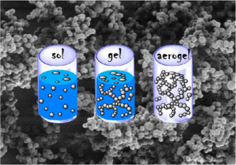

KEYWORDS: carbon aerogels, sol−gel chemistry of carbon, hydrothermal carbonization, salt templating 

## ■[INTRODUCTION] 

Porous materials have become indispensable in everyday life; however, when compared to other classes of porous materials such as zeolites, porous silica, MOFs, and many others, carbons are rather competitive. This is because carbon materials are light in weight while at the same time they possess an extraordinary chemical, mechanical, and thermal stability and tunable electrical properties.[1] 

To introduce an adequate porosity, especially for systems with ultrahigh specific surface areas (apparent surface area beyond 2000 m[2] g[−][1] ), activation methods are still the most widely applied techniques.[2,3] Yet, the additional postactivation step is not only time and energy consuming but the pores are etched into the carbon material, and pore formation has to be accompanied by significant mass loss, resulting in overall low yield. Especially in the case of functionalized carbon materials, i.e., the broad range of heteroatom-containing carbons, activation techniques changes gravely the chemical composition and counteract the original intended functionalization.[4] This is why bottom-up, rational chemical design or synthesis techniques for such porous carbon which make activation obsolete have been developed. Nowadays, a very lively approach to address this problem is the “brick and mortar-approach” where carbon aerogels are assembled of preformed carbon nanostructures, such as graphene, nanotubes or fibers, which are then connected to the final structures.[5][−][7] This, however, is such a broad activity that it is simply for volume reasons out of the scope of the present review. Instead, we want to focus on sol−gel techniques where we start from a liquid solution (“sol”), intermediately form a sol, and end up with nanostructured material (“gel”), all that to finally generate porous (monolithic) aerogels. Both aerogels and xerogels are materials of monolithic character, i.e., they are constituted of a single piece. In general, monoliths are not necessarily porous; however, in the case of 

aero- and xerogels, the materials comprise a continuous phase − formed through, for example, a sol gel process. Here, depending on the degree of condensation and crystallinity, the networklike structures contain free space and thus varying porosities. Whether a material becomes one or the other is determined by the drying history. Aerogels are commonly prepared via a colloidal gel and subsequent extraction of pore solvent or template, in many cases, for example, by a supercritical fluid (e.g., CO2) where structure collapse can be avoided because of low surface tension. In contrast, xerogels are obtained after drying under ambient conditions, which leads to dramatic structural changes. Therefore, low-density aerogels feature porosities up to 90−98 vol %, whereas xerogels show only 50 vol %. Aerogels present desirable physical properties such as excellent mass transfer properties, low density, thermal conductivity, speed of sound, and dielectric permittivity.[8][−][10] Carbonaceous aerogels, either as powders or monoliths, are lightweight, nanostructured materials with wide potential applications in sorption, catalysis, in membranes and coatings, as acoustic and thermal insulators, and electrode materials.[11][−][18] Since the first reports on silica aerogels in 1931,[2] aerogels have been prepared from many materials, such as metal oxides, alumina, or metal chalcogenides.[3,9,17][−][25] In 1989, the first organic aerogels were reported by Pekala et al., which were formed by the condensation of resorcinol-formaldehyde (RF) in the presence of acid or base catalysts.[12] The resulting aerogels still contain abundant oxygen functionalities and are 

Special Issue: Celebrating Twenty-Five Years of Chemistry of Materials 

Received: July 6, 2013 Revised: September 4, 2013 Published: September 6, 2013 

196 

© 2013 American Chemical Society 

dx.doi.org/10.1021/cm402239e | Chem. Mater. 2014, 26, 196−210 

Chemistry of Materials 

Review 

therefore classified as organic aerogels, yet they may be converted into carbon aerogels via pyrolysis.[2,6] Furthermore, the addition of, for example, melamine into the RF-system was presented as a suitable method to synthesize nitrogen-doped aerogels.[26,27] Because of the similar physical principles between silica and carbon synthesis and the equivalence of the resulting structures, we can call such approaches “sol−gel-like” syntheses of carbons. 

Carbon aerogel preparation from inexpensive biomassderived precursors has recently complemented the RF-approach due to economic, process and chemistry advantages[28] Recently, our group found that the hydrothermal carbonization (HTC) of saccharides allows carbonaceous material synthesis in a sol− gel type process,[29] which means that methods for structuring of inorganic solids (e.g., silica) can potentially be transferred to sustainable carbon material preparation. For example, early reports have described the preparation of functional micrometersized carbonaceous spheres from glucose in a Stober-like process.[30] This HTC is a process that can simplistically be described as the technical acceleration of natural biomass coalification down to the time scale of hours and days rather than millions of years. Importantly, cheap and readily available precursors, e.g., simple carbohydrates or even biowaste, can be turned into valuable carbonaceous materials using HTC.[1,31] Using the more general principles of sol−gel chemistry, HTC can therefore also be applied to turn carbohydrates into carbon aerogels. 

Another important aspect to be covered in the field of porous materials is the generation of hierarchical pore systems.[23,32,33] Such hierarchical structures are characterized by the presence of macropores (>50 nm) along with micro- and/or mesopores. The presence of macropores is desirable as these bigger pores can act as a transport system for liquids and gases, thus increasing the accessibility of the smaller pores. Hierarchical pores have been successfully established in silica gels using spinodal phase separation between poly(ethylene glycol) and silica oligomers.[21] This process leads to the development of well-defined mesoporosity and a bicontinuous macropore network, which has already been exploited for the fabrication of chromatographic devices exhibiting superior performance, as evidenced by simultaneous high plate numbers and short separation times.[22] It is clear that carbon aerogels should favorably possess exactly such a hierarchical porosity to optimize transport behavior and overall specific surface effects at the same time.[34] 

This review will focus on summarizing the diverse approaches toward making such carbon aerogels, however with some focus on the modern sol−gel chemistrylike alternative approaches and sustainable routes. We will also discuss some potential applications of the resulting systems, as application requirements can be considered in synthesis design. 

The Early Experiments: Carbon Monoliths Synthesis Using Silica Hard Templating. The most traditional bottomup synthesis of porous carbons is presumably via the use of templates as “spaceholders” for pores. In the case of “hard templating”, a porous inorganic template (usually porous silica) is soaked with a carbon precursor such as furfuryl alcohol. After carbonization, the template is removed by dissolution, and porous carbon with a controllable pore size is obtained. This was pioneered by Ryoo et al. who could fill periodic mesoporous silica with carbon precursors and turned them into inverted carbon structures with regular mesoporosity.[35,36] This approach is demanding; however, porous carbons with very 

developed surface area useful for many applications can be achieved. Meanwhile, many structurally diverse silicas have been replicated, and we can point to recommendable reviews, e.g., that by Lu and Schuth.[37] 

On the high end side of those techniques, especially for the preparation of carbons with super high surface areas, one finds templating of zeolites, with apparent Brunauer−Emmett− Teller (BET) surface areas of up to 2000−3800 m[2] g[−][1] .[38] 

At present, most of the carbon materials reported made by hard templating were obtained as powders with still rather high structural density. The synthesis of very large porous carbon monoliths by silica nanocasting is more challenging. Such porous carbon monoliths can be directly used as catalyst supports and electrodes in electrochemical devices. The synthesis of carbon monoliths made of mesophase pitch as a conductive carbon source, using silica monoliths as a template for nanocasting, was described in ref 34 (Figure 1).[44] The parental monoliths are easily accessible by the Nakanishi process[21] and are widely used for high-performance liquid chromatography (HPLC). The successfully obtained hierarchically porous carbon monoliths have different shapes such as long rods with diameters of ∼4 mm and lengths of ∼70 mm (Figure 1a) or larger tablets, here with diameters of ∼27 mm and thicknesses of ∼5 mm (Figure 1b). The shapes and the dimensions of the carbon monolith resemble those of the silica templates. These micro- and nanostructure of the synthesized carbon monolith is depicted in a magnified series of both, scanning electron microscopy (SEM) and transmission electron microscopy (TEM) images to illustrate structural control over the micrometer and the nanometer range (Figure 1c−f). An SEM image of the silica template is also shown for comparison (Figure 1c). One can clearly observe the framework structure of carbon, obtained by replication of the corresponding silica system, and the micrometer-sized transport pores which later ensure optimal accessibility of the functional structure. 

The connecting carbon bridges are, however, nanoporous themselves, as evidenced by TEM imaging (Figure 1d). Nitrogen-sorption data of the synthesized carbon monolith revealed an average mesopore diameter of 7.3 nm (as evaluated by nonlocal density functional theory (NLDFT) model) and a specific BET surface area of about 330 m[2] g[−][1] . For the given sample, the volume ratio of meso- to micropores is about 10:1, exhibiting very low micropore content. It is rather unusual for thermally treated nongraphitic carbons to be practically free of micropores, and this turned out to be very beneficial for the lithium-insertion/intercalation behavior, in lithium-ion batteries as will be discussed in the application part of this review. Another approach toward such hierarchical, but ordered mesoporous carbons was described by Stein and co-workers in their so-called “3dom” (for 3-dim ordered mesoporous)technology.[39] Here, first an opal-type structure of ordered silica spheres (with rather flexible sizes) is prepared, which is then filled with the carbon precursor mixture. After carbonization and removal of the opal template, the spherical pores constitute the organized transport system, wheras the carbon formed in the interstitial framework can be made micro- and mesoporous as such (Figure 2.) 

Despite the beauty of the 3dom-approach, a restriction for the generation of monoliths is that the opal templates are best produced as rather flat specimens only. This of course is a demanded morphology in many electrochemical applications. 

Carbon Monoliths Using Soft Templates and Spinodal 

Decomposition. Soft templates areby the involved 

197 

dx.doi.org/10.1021/cm402239e | Chem. Mater. 2014, 26, 196−210 

Chemistry of Materials 

Review 

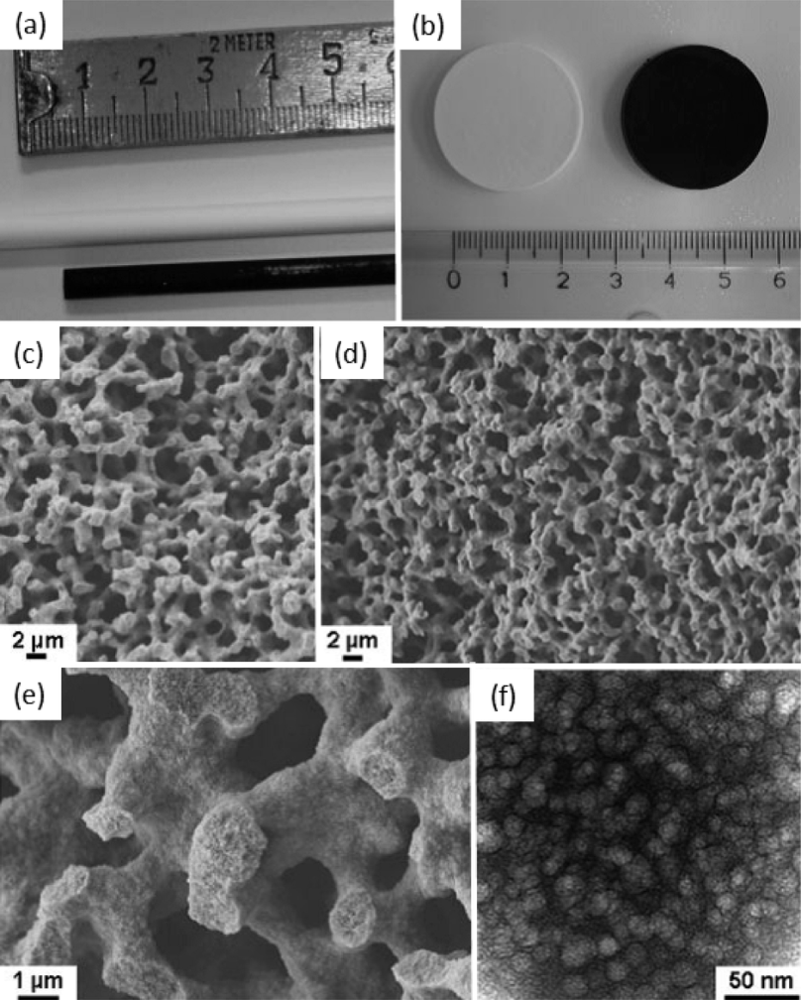

Figure 1. (a, b) Photographs representing silica monoliths used as a mold (white) and nanocasting carbon (carbonized at 700 °C) replica (black). (c) SEM image of silica template at a lower magnification, (d) SEM images of nanocasting carbon (carbonized at 700 °C) replica at a lower magnification, (e) at a higher magnification, and (f) TEM image of nanocasting carbon replica. Pictures used with permission from ref 34. Copyright 2007 Wiley. 

physicochemical principlesmore complicated to apply, but extend hard templates in aspects of regularity, size and morphology control, and of course by the simplicity of the process. 

Recently, Zhao et al. reported the formation of ordered mesoporous carbon structures by the condensation of phenolic precursors around micelles followed by subsequent transformation into the porous material by simple heat treatment.[40] These carbons are obtained as zeolite-like crystalline powders, with still rather high structural density, and carbon aerogels are difficult to make. Another challenge for such templating approaches is the choice of the precursor; the commonly used ones (sucrose, furfuryl alcohol, or phenolic resins) have to be sufficiently polar to enable good compatibility with the 

template, but are not optimal with regards to transformation into highly conductive carbon because of insufficiently extended aromatic rings. However, a major challenge in the fabrication of tailored mesoporous carbon is to achieve good conductivity (i.e., extended graphene units) and mesoporosity at the same time. In general, high conductivity in carbon is obtained by high-temperature heat treatment; however, such treatment destroys the mesoporous structure because of pore collapse arising from changes in the structure toward graphene units.[41] 

Adelhelm et al. presented a soft-templating-based methodology to synthesize carbons with meso- and macroporosity in a one-step process, taking advantage of the phase separation 

198 

dx.doi.org/10.1021/cm402239e | Chem. Mater. 2014, 26, 196−210 

Chemistry of Materials 

Review 

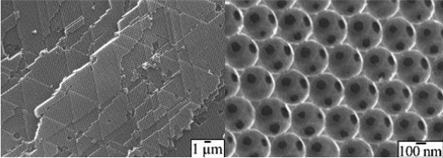

Figure 2. SEM of 3dom hard carbons; (a) low magnification illustrates the long-range order of the opals; (b) high magnification the local perfection, including the cubic interlinks between macropores. Pictures used with permission from ref 39. Copyright 2005 Wiley. 

(spinodal decomposition) of mesophase pitch (MP) as the carbon precursor and an organic polymer as a template.[42] In general, MP is a known, highly suitable carbon precursor for electrochemical applications because it consists of extended, condensed polyaromatic moieties, thus exhibiting significantly improved carbonization behavior as compared to sugarbased precursors or phenolic resins. The approach starts from generating a homogeneous solution of MP and an appropriate noncarbonizable polymer (e.g., polystyrene (PS) or poly(methyl methacrylate (PMMA) The polymers have been selected for compatibility with MP in a volatile solvent, such as chloroform. After the formation of a homogeneous solution, a catalyst like FeCl3 is added to spur the carbonization process. The main idea behind this approach is to induce continuously increasing incompatibility between MP and the polymer during the evaporation of the solvent and the subsequent carbonization step. Here, the induced incompatibility as to be moderated to allow for controlled spinodal phase separation of the polymerrich and MP-rich domains on both the micrometer and nanometer scale. In the spinodal case, the microphase separation of MP and the polymer results in the formation of a bicontinuous, sponge-like structure, as pioneered by Nakanishi et al. for silica.[21] Also, similar to the Nakanishi process, meso- and macroscale phase separations have been further controlled by carefully chosen heat-treatment protocols at about 250−300 °C, i.e., below the decomposition temperature of the polymer. Annealing stabilizes the mesostructure by establishing a network of connected MP species, thus improving the mechanical stability of the material and enabling the structures to avoid pore collapse after removal of the polymer template during carbonization at 600 °C under a nitrogen atmosphere. In this respect, polymers such as PMMA and PS are particularly beneficial, as they predominantly decompose/depolymerize into volatile fragments under the applied conditions, thereby generating the pore structure. The polymer-based process also allows for the generation of films and monolithic carbon structures with dimensions of up to several centimeters using appropriate scaffolds (Figure 3a). 

Carbon Synthesis by HTC Using Albumin As a Moderator. It was already stated above that HTC can be understood as a sol−gel chemistry of carbon nanostructures, with carbohydrates acting as the soluble starting monomer in a water based synthesis. In fact, hydrothermal carbonization is reminiscent of the famous bottom-up approach to synthesize micrometer-sized carbonaceous materials: the polycondensation of RF mixtures 

toward the respective resins with subsequent carbonization.[43] The two main reaction steps, namely (1) building a reactive precursor followed by (2) polymerization, and the comparable particle morphology generated in water as solvent, indicate mechanistic similarities for the respective material formation (Figure 4). Importantly, as already indicated by the dark brown color, the materials after hydrothermal carbonization already contain conjugated aromatic moieties, increasing the graphitizability of HTC as compared to carbohydrates. 

Titirici et al developed a reaction system on the basis of water, glucose, and albumin mixed in a ratio of 9: 1: 0.15 (w/w/w).[44,45] Albumin herein acts as both the nitrogen source and the phase demixing stabilizer, essentially defining the elaborated nanostructure in a dynamically controlled fashion. After supercritical (sc) CO2 drying low density, hierarchically structured N-doped monolithic carbon aerogels could be obtained. It is to be emphasized that in the closed system the absolute material porosity is predetermined by the H2O to biomolecules ratio, where about 50% of the added biomass were recovered as hydrothermal carbon. The given recipe therefore generates carbon aerogels with 95 vol% porosity, but in general leads to stable gels with up to 97 vol% porosity can be obtained. Structural details, including X-ray photoelectron spectroscopy (XPS), solid-state nuclear magnetic resonance (ssNMR) and Fourier transformation infrared (FTIR) of the as made carbons are analyzed in detail in the original paper.[44] 

Thermally treated Carbogels (900 °C) maintain the parental morphology of a continuous hierarchical nanonetwork (Figure 5C). A combination of SEM and high-resolution (HR)TEM images of heat-treated Carbogels nicely demonstrates the unusual coral-like continuous carbonaceous nanoarchitecture (Figure 5). The hyperbranched network has walls of disordered graphitic-like sheets of ca. 10−15 nm thickness composed of ∼2−3 short carbon layers with only local stacking order. It must be emphasized that the resulting structures are in the size range of disordered multiwalled carbon nanotubes, but are derived from biomolecules in a simple process, only. 

Given the structural similarities to corresponding monolithic silica (2) a similar underlying formation mechanism was assumed: After sugar dehydration, carbon precursors demix from the aqueous phase in a spinodal fashion, which in this case is stopped from further ripening toward larger droplets by an early and efficient reaction with the water-based proteins and coupled structural cross-linking. 

199 

dx.doi.org/10.1021/cm402239e | Chem. Mater. 2014, 26, 196−210 

Chemistry of Materials 

Review 

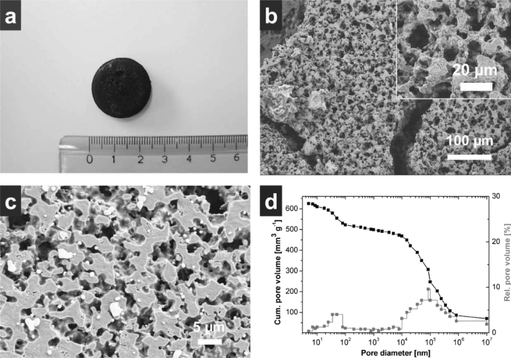

Figure 3. (a) Photograph of a polystyrene-templated monolith. Scanning electron microscopy images showing the macroporous structure of a sample carbonized at (b) 340 °C (33 wt % PS) and (c) 600 °C (66 wt % PS). (d) Hg porosimetry measurements of a sample carbonized at 340 °C (33 wt % PS). Pictures used with permission from ref 42. Copyright 2007 Wiley. 

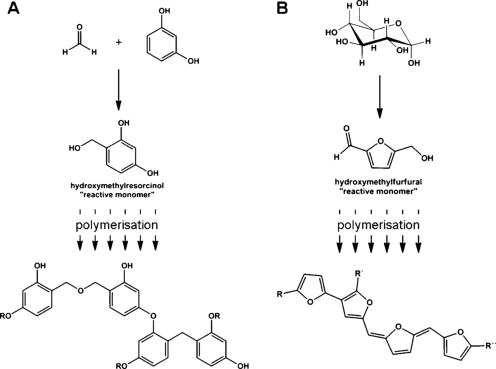

Figure 4. Two-step reaction as precondition for resinification chemistry in (A) “classical” RF system and (B) schematic HTC system. 

The homogeneous solution character at the beginning of the HTC sol−gel synthesis allows for chemical manipulation on a molecular scale. This option is attractive for the achievement of homogeneously doped carbons in contrast to “only” surfacedoped carbons, which can be obtained by postmodification. In a successful approach to obtain nitrogen and sulfur codoped carbons S-(2-thienyl)-L-cysteine (TC) or 2-thiophene carboxaldehyde (TCA) where added to the original hydrothermal carbonization recipe. Interestingly, the use of TCA additives did not alter the reactivity of the rather sensitive system in the sense that aerogel formation could be achieved in exactly the 

same manner.[46] After carbonization at 900 °C, the obtained materials showed reduced pore volumes, but similar specific surface areas and importantly additional abundance of structurally integrated sulfur. This example is illustrating the general advantage of a bottom-up approach to generate porous carbons with distinctly altered physical as well as chemical properties. 

Carbon Synthesis by HTC Using Borax-Mediated Process. In another set of experiments following the teaching of RF systems, albumine could be replaced by simple, inorganic salts that interact with the carbohydrate and the carbon surface in an appropriate fashion, namely borax or borate salts.[47,48] In the RF system reactions free of catalyst lead to precipitation of micrometer sized particles,[49] while aerogels composed of interconnected nanoparticles can be achieved either by acid or base catalysis. The molar ratio of resorcinol to catalyst allows the control of the final particle size, basically by adjusting the number of “seeds”.[50] In the borax-mediated aerogel formation from glucose, the particle size and hence surface area are controlled by the amount of borax added to the initial reaction mixture. The more borax is added, the smaller the seed particles and hence the higher the surface area. A proposed mechanistic explanation was given elsewhere.[47] Briefly, borax was assumed to increase the overall reactivity between HTC intermediates due to a secondary catalytic effect. According to the LaMer model, this accelerated reaction rate rapidly results in a critical supersaturation of small hydrothermal carbon and hence a nucleation burst.[51] The large number of seeds results in smaller particles in the growth phase. The small particles together with the additional gelating effect of borax give rise to the aerogel morphology by aggregation and covalent cross-linking among 

200 

dx.doi.org/10.1021/cm402239e | Chem. Mater. 2014, 26, 196−210 

Chemistry of Materials 

Review 

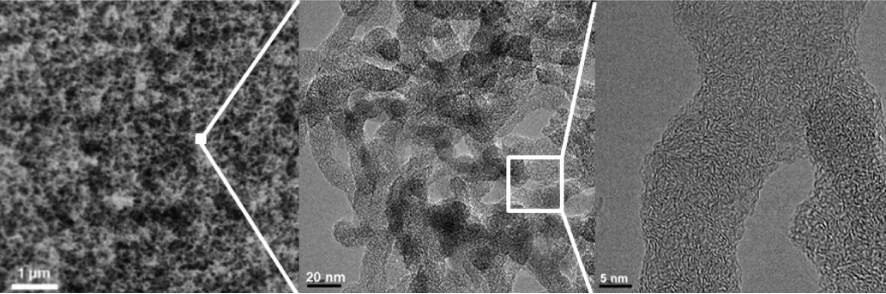

Figure 5. (a) Low-magnification SEM image of monolithic “Carbogel” materials after ScCO2 drying; after carbonization at T = 550 ◦C; (b, c) HR-TEM images of Carbogels prepared at 900 °C in differet magnifications. Pictures used with permission from ref 44. Copyright 2011 Royal Society of Chemistry. 

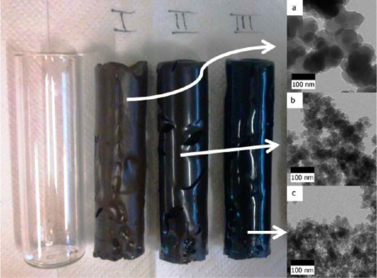

Figure 6. Borax mediated HTC aerogel monoliths and TEM images of monoliths with (a) 150, (b) 300, and (c) 600 mg borax in the recipe. 

each other, finally giving mechanically very robust monoliths. (Figure 6.) 

Again taking advantage of the homogeneous bottom-up process, coaddition of 2-pyrrol-carboxaldehyde (PCA) was used to enable simultaneous nitrogen-doping of the carbon aerogels. It could be shown that both the particle size (and hence surface area) and the nitrogen content could be tuned independently by varying the amounts of borax or PCA used. Pyrolysis at 900 °C of the organic aerogels rendered the 

resulting carbon aerogels electrically highly conducting. In a typical experiment, 0.8 g of PCA, 6.0 g of glucose, and 14.0 g of water were used, i.e., the whole recipe was made to address an overall porosity of the carbon aerogels of about 90 vol %. This indeed could be confirmed by the analytical data. 

The TEM images (Figure 6, right) show the typical boraxmediated aerogel morphology, i.e., a matrix comprising − interconnected particles. The comparison of Figure 7a c nicely demonstrates the decrease in particle size with increasing borax amount, going from an average diameter of 75 nm, to 23 nm and finally to 15.7 nm. This nicely corresponds to the typical size range of silica aerogels. The addition of PCA as a nitrogen donor in a wider range does not change this architecture and particle size. These results indicated a similar reactivity of PCA as compared to HMF and a low sensitivity of the borax system toward functionalization. 

The primary aerogels obtained after HTC at 180 °C contained around 65 wt % carbon and can therefore be classified as “organic” aerogels. In order to obtain carbon aerogels with an increased conductivity and material stability, postcarbonization at 900 °C was carried out. These carbon aerogels contained around 90 wt % carbon and have retained their relative heteroatom content after pyrolysis. The electronic conductivity of all those samples was rather high, while the conductivity increases with increasing particle size. Their use in electrocatalytic applications is discussed below in the application paragraph. 

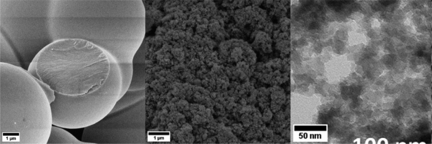

Figure 7. SEM micrographs of carbonaceous materials obtained from reaction mixtures of glucose, water, and zinc chloride using highly diluted (left) and hypersaline (right) conditions. (c) TEM picture of a hypersaline sample, illustrating the primary particle structure. 

201 

dx.doi.org/10.1021/cm402239e | Chem. Mater. 2014, 26, 196−210 

Chemistry of Materials 

Review 

Carbon Monolith Synthesis with HTC under Hypersaline Conditions Using Phase Separation. The up to now final simplification of carbon aerogel synthesis was accomplished by the application of hypersaline conditions, i.e., aqueous salt solutions close to the saturation limit. Using very hydrophilic ions at the same time lowers the partial pressure of water and changes its structure so that gel formation can be performed under less extreme conditions, gaining salt concentration and salt type as additional parameters of structure control. Recycling of the reaction medium in all these cases is very simple: the salt is washed away with water, filtered, and can be reused after evaporation of the water. 

In ref 52, water-containing salt melts (i.e., ZnCl2 or eutectic mixtures of LiCl/ZnCl2 (Li−Zn−x/y), NaCl/ZnCl2 (Na−Zn− x/y), and KCl/ZnCl2 (K−Zn−x/y), where x/y denotes the mass ratio of the salts) were used as a reaction medium for the hydrothermal carbonization of glucose.[52] In the presence of ZnCl2, and only a little amount of water, porous carbonaceous structures with a typical “aerogel” structure and surface areas of 400−650 m[2] /g were obtained. It is to be underlined that the samples could be purified by simple washing with water and ordinary drying, i.e., no supercritical CO2 drying was necessary to prevent collapse of the nanostructured carbonaceous aerogels due to capillary forces. This means that the as formed still organic structures were unusually robust as well as highly cross-linked. It was shown that both the particle size and hence the specific surface area as well as the nitrogen content could be varied by the starting products and the salt mixtures used. 

In a mechanistic discussion, obviously also hypersaline conditions offer the possibility to stabilize the surface of as formed primary nanoparticles to avoid excessive Ostwald ripening or particle growth. These primary particles at sufficiently high concentration then turn collectively unstable, undergo spinodal phase separation and cross-linking toward the final porous carbon gels. At intermediate concentrations, porous “soots” are obtained which are composed of interconnected particles, but are still dispersible as such. The more salt is added, the smaller the primary particles are and hence the higher is the surface area. Again, the absolute porosity is controlled- by the relative amount of glucose and salt that it is directly in the hand of the scientist. 

On the one hand, it was also found that neither water-free salts nor “hard salts”, e.g. NaCl, show a beneficial influence on the sample morphology. On the other hand, surface area could be successfully introduced into the carbon materials when the used salts were rather hygroscopic. At the same time, the salt mixtures had to contain at least some water, both to ensure a liquid reaction medium, but also to enhance surface stabilization which is most probably indirectly provided via the hydration water. In contrast, highly diluted media do not result in any porous materials, thus confirming the prerequisite of hypersaline environment as advantageous reaction medium to form monolithic, aerogel-like carbons (Figure 7). 

Here, it is also to mention that the carbonaceous materials obtained from hypersaline conditions reveal a darker color whereas the materials from highly diluted reaction mixtures are light brown. This, together with an increased carbon content of around 70 wt % for hypersaline conditions, indicates an increased degree of aromatization in the presence of salt. Representative SEM and TEM micrographs of the resulting samples prepared from the salt mixtures under hypersaline conditions are shown in images b and c in Figure 7. The material is composed of primary rough carbon frazzles in the 

10 nm range, which are interconnected to give the porous aerogel structure with extended pore transport systems. This fine particle morphology already indicates a very effective surface stabilization of the material throughout the synthesis in hypersaline conditions. Note that the hydrothermal carbonization of glucose without the presence of a salt agent generally results in carbonaceous particles that are several orders of magnitude larger than observed here (approximately 200 nm and larger, comparable to the default sample in Figure 7 a.[1] 

Compared to the work discussed above in the previous paragraphs, these samples are constituted of smaller particles than the albumin-derived aerogels and are comparable to the very best borax-mediated aerogel samples. Again, it is to emphasize that the carbons could be recovered from simple washing with water instead of elaborated supercritical CO2 drying, a behavior, even hardly found for silica aerogels which are also preferentially dried in a supercritical fashion or after solvent exchange. Nitrogen sorption measurements were carried out for detailed porosity analysis (Figure 8). 

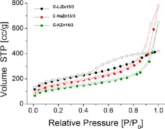

Figure 8. Nitrogen sorption isotherms of three carbon aerogels synthesized with Li−Zn 15/3 (black), Na−Zn13/3 (red), and K−Zn14/3 (green) eutectic salt mixtures. For details, see ref 52. 

All three isotherms are characterized by the typical surface nitrogen sorption, with the interstitial pores between the particles just starting to be visible in the higher pressure range. he medium pressure range is similar for all three samples and due to surface adsorption onto very small nanoparticles, supporting the observations by electron microscopy. Interestingly and very unusual for low temperature hydrothermal carbons, we also find a distinct microporosity which is most pronounced for the ZnCl2/LiCl salt. This observation points toward an additional imprinting of simple salts in the particles, presumably zinc and lithium entities. It is an exciting question if this imprinted salt would also be recognized in a later rebinding event, but this was not analyzed. The as obtained crude hydrophilic carbonaceous material could further be transferred into the corresponding rather hydrophobic carbons by postcalcination at elevated temperatures, also leading to a significantly enhanced surface area as a result of further water elimination.[53,54] 

Carbon Aerogel Synthesis Using Salt Melts: Salt As a Solvent and “Molecular” Template. After exploration of hypersaline conditions, it is a natural next step to explore the same sol−gel reactivity schemes in molten salt systems, now without water. It is an exciting question if sol−gel chemistry also exists in those solvents and in that intermediary temperature the same operative physicochemical principles can be found and applied under ionothermal conditions, too. This technique is now called “salt templating”.[55] Here, a noncarbonizable inorganic 

202 

dx.doi.org/10.1021/cm402239e | Chem. Mater. 2014, 26, 196−210 

Chemistry of Materials 

Review 

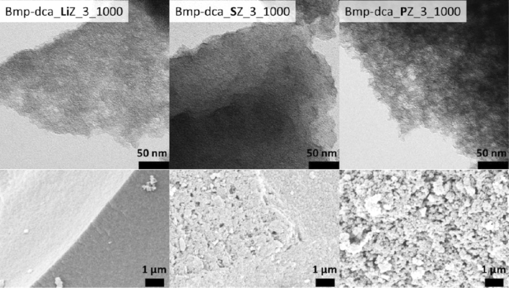

Figure 9. TEM (upper row) and SEM pictures (lower row) of N-dCs using Bmp-dca as precursor templated with LiCl/ZnCl2 (LiZ, left), NaCl/ ZnCl2 (SZ, middle), and KCl/ZnCl2 (PZ, right) at equal mass ratios synthesized at 1000 °C. In SEM, the monolithic aerogel character is clearly revealed. Used with permission from ref 55. Copyright 2013 Wiley. 

salt is mixed with a carbon precursor which is condensed a nd scaffolded in the presence of the molten salt at elevated temperatures. If −by appropriate choice of the reagentmiscibility between the salt melt and the carbonizing material is kept over a main part of the reaction pathway, the resulting carbon shows a high specific surface area with the pore size corresponding to ion pairs, salt clusters and their percolation structures. As for the carbonaceous materials obtained from hypersaline conditions described in the previous section, the salt phase is easily removed by simple washing with water, whereas the carbon is not etched as such. Simple closed-loop processes including salt recycling are conceivable which result in the demanded high surface area carbons in high yields with structural and chemical functionality. 

It is important to note thatin spite of similar notations this “salt templating” is different from the synthesis of macroporous polymers, where freshly ground salt crystals (crystallite size 0.2 to 500 μm) in a nonsolvent are used as template.[56,57] This solvent casting/particle leaching method is rather based on the formation of the respective material around macroscopic irregular crystals than porosity generation due to “molecularly” dissolved ions and phase separation. The synthesis of low surface area inorganic scaffolds via saltinclusion was also reported.[58] However, this is not to be mixed up with the approach discussed here, where a salt melt enables the generation of a factor of 1000 smaller pores and correspondingly higher surface areas. In “molecular” sol−gel salttemplating, the appropriate choice of cation size and counterion controls the minimal pore size as well as miscibility with the reaction medium via adjustment of the polarizability. 

A convenient choice for carbon precursors are ionic liquids (IL), being miscible with the salt template and unreactive until elevated temperatures.[59][−][62] In ref 55, the ILs were chosen to contain nitrogen (N) and boron (B) because these atoms are capable of adding favorable properties to carbon networks when structurally incorporated.[55,63][−][66] By employing different eutectic salt mixtures that possess low melting points and are homogeneously miscible with diverse ILs, carbon aerogels with 

unusually high apparent surface areas could be synthesized. Depending on the salt nature and amount, micro- to mesoporous materials with apparent surface areas up to 2000 m[2] g[−][1] are obtained in one step, while preserving the targeted chemical functionality brought in by the monomer composition. At the same time, the product yield increased and did not depend on the amount of salt. This is believed to result from increased electrostatic interactions of the precursor molecules and/or further intermediates and the template salt. With regard to literature, the increased carbon yield obtained with ZnCl2 containing eutectic salt mixtures is a rather surprising effect, because ZnCl2 was mostly described as an activation agent.[67,68] Previously observed high carbon yields in this case could be explained by the dehydrating effect of ZnCl2.[69] 

In ref 55, it was shown that the salt templating approach is a combination of templating (of ion pairs and small salt clusters) and phase separation, but shows no indications for an activation process. This was also supported by the fact that a high heteroatom-doping level could be maintained even in the high surface area materials using a high amount of salt. Bulk elemental analysis, XPS and some other structural analytical data have been reported in the original paper. 

TEM and SEM pictures of the washed products reveal the morphology of the materials to be dependent on the nature of the eutectic porogen which is exemplarily shown for carbon aerogels based on N-butyl-3-methylimidazolium-dicyandiamide (Bmp-dca, Figure 9). 

The TEM and SEM pictures already show that the surface roughness of the carbons increases from the lithium over the sodium to the potassium eutectic, indicating the presence of large mesopores or small macropores. Furthermore, in the potassium chloride case, fluffy spherical carbon globular aggregates are observed to constitute the materials, where homogeneous carbon aerogels are found to constitute all other samples. These aerogels are cohesive and withstand even the removal of salt and the washing with water. Also the utilization of alternative ionic liquids, revealed the same trend of morphology of the carbon materials. This supports the strong 

203 

dx.doi.org/10.1021/cm402239e | Chem. Mater. 2014, 26, 196−210 

Chemistry of Materials 

Review 

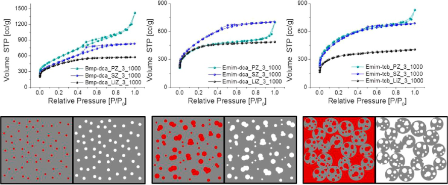

Figure 10. Upper row: Nitrogen sorption isotherms of Bmp-dca (left), Emim-dca (middle), and Emim-tcb (right) derived carbons templated with Li−Zn, Na−Zn, and K−Zn at equal mass ratios. Lower row: Schematic representation of pore formation for carbons templated with Li−Zn (left), Na−Zn (middle), and K−Zn (right) at similar mass ratios. Each left image depicts the carbon (gray)/salt (red) composite and each right side the carbon aerogel structure after washing. Taken with permission from ref 55. Copyright 2010 Wiley. 

dependence of the morphology only on the nature of the porogen salt, whereas the nature of the IL plays a minor role, thus a main part of the pore formation indeed results from a templating mechanism by the salt. 

The actual apparent surface areas and pore size distributions were determined by nitrogen sorption measurements (Figure 10) by applying the BET model and the NLDFT equilibrium model method for slit pores, respectively. 

In all cases, a high nitrogen uptake is observed and, compared to the carbons derived from the pure ILs, the apparent surface areas significantly increase due to salt templating, ranging from 1100 m[2] g[−][1] up to 2000 m[2] g[−][1] . In accordance to the TEM and SEM images the materials templated with the same salt mixture also show a comparable shape of the isotherms independent of the nature of the IL used as precursor. In more detail, by the addition of the Li−Zn salt melt, the isotherms are of type I, which implies a solely microporous structure of the carbons, i.e., the salt acts as a ”molecular template”, either forming ion pairs or little salt clusters of minimal free energy (Figure 10 lower left). For carbons − templated with Na Zn, the sorption isotherms of the materials show a further uptake of N2 in the medium relative pressure region as well as a small hysteresis, reflecting a substantial contribution of additional supermicropores and small mesopores. Finally, for materials templated with K−Zn, which has the lowest melting point of the used eutectics, an additional uptake in the high relative pressure region is observed. This is typical for macropores and is here in accordance to the formation of spherical particles of the carbon phase and their interstitial pores, as observed in SEM. As in classical sol−gel chemistry, this is obviously due to the onset of demixing in even earlier phases of the structure formation which results in a continuous, demixed salt phase (Figure 10, lower right). It must be emphasized that an apparent specific surface area of 2000 m[2] g[−][1] is much higher than of any zeolite, in the range of activated carbons and even approaching the theoretical value of singlelayer graphene.[70] In spite of the simplicity of the applied onestep salt sol−gel synthesis and the aerogel character, this is a notable result. Besides the salt nature, also the salt amount has a significant influence on the carbon properties. With increasing salt amounts, for Li−Zn and Na−Zn the pore size and volume 

of the final products increase up to 12 nm in diameter and 2.75 mL g[−][1] , respectively. In the case of K−Zn, the porosity parameters are relatively constant while the secondary particle size and connectivity of the aerogel can be influenced through the amount of salt. Also this behavior is comparable to classical sol−gel chemistry of silica or RF-resins and supports the fact that sol−gel chemistry can also be performed under ionothermal conditions above 300 °C 

## ■[APPLICATIONS] 

Battery Electrodes. Interestingly, carbon aerogels were discussed very favorably for a number of applications, e.g. for the electrochemical storage of energy in a supercapacitor,[12,14,71] as a membrane and electrode in fuel cells,[72] as catalysts supports in both catalysis and electrocatalysis,[73,74] as electrodes for Li-batteries,[39] as giant stroke artificial muscles,[75] as fast sorption materials[76] for oil spills, or for capacitive deionization.[77] Already the sheer listing of those properties of course explains the excitement of material chemist for the generation and compositional and structural control of those carbon aerogels. In the following, we will go through some illustrative examples of those applications where optimized transport properties through the macropore system in combination with a high specific surface area nanostructure play a crucial role. 

The use of nanostructured carbon as anodes in the lithiumion battery is presumably one of the catchiest applications. Indeed, already in 2007, J. Maier et al. were able to show that carbon aerogels made from silica replication can store extraordinary amounts of metallic lithium in their structure.[34] In Figure 11, it is seen that the material can store up to 800 mA h/g of energy, whereas the theoretical limit for graphene is only 372 mA h/g. This clearly points to secondary storage mechanisms for metallic lithium besides the traditional intercalation between graphene layers. This secondary mechanism, however, is still sensitive toward fading. 

Supercapacitors. A similar carbon aerogel was later explored as an electrode in a supercapacitor.[78] In those experiments, part of the surface and the mesopore system were employed to deposit a second phase of a redox active polymer, i.e., polyaniline (PANI). The carbon aerogel with its high conductivity is herein used as a current collector, whereas the 

204 

dx.doi.org/10.1021/cm402239e | Chem. Mater. 2014, 26, 196−210 

Chemistry of Materials 

Review 

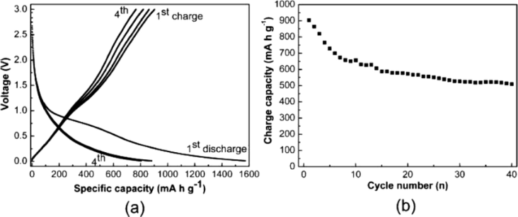

Figure 11. Galvanostatic discharge (Li insertion, voltage decreases)/charge (Li extraction, voltage increases) curves of carbon aerogels carbonized at 700 °C, cycled at a rate of C/5, and (b) cycling performance of carbon sample carbonized at 700 °C cycled at a rate of C/5. Used with permission from ref 37. Copyright 2006 Wiley. 

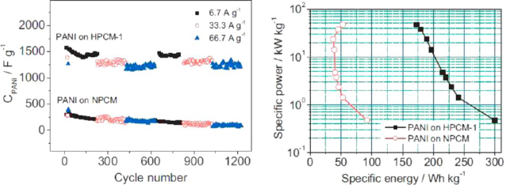

Figure 12. (a) As-determined supercapacitance of a PANI/carbon aerogel hybrid in direct comparison with a corresponding carbon nanotube reinforced sample, (b) Ragone plot of the specific power/specific energy performance of the same samples. Used with permission from ref 78. Copyright 2007 Wiley. 

remaining hierarchical meso/macropore system is used for the liquid contacting of the overall system. Unexpectedly, very high and practically rate-independent capacities of 1200−1400 F/g were found (Figure 12a), which in addition turned out to be rather stable in multiple cycling. A corresponding PANI/ nanotube sample prepared in an otherwise similar fashion gave a lower performance by a factor of 5, with much lower cycling performance. The Ragone-plot of the same data (Figure 12b) revealed a specific energy of about 200 Wh/kg at a specific power of 10 kW/kg, i.e., a performance which is already in the highly useful region. Also those capacities are even slightly above the theoretical value for PANI, i.e., it is obvious that additional charges can be stored in the carbon/PANI heterojunction. 

Capacitive Desalination. Supercapacitive activity is closely related to capacitive desalination, in the latter case, the cell is just a flow-through device operative with slightly saline aqueous solutions. Here, as an example, we refer to one of the very classic papers[77] as follow-up work describing technical improvements rather than novel, better performing carbons is indeed very broad. 

Figure 13a shows the desalination kinetics of a model NaCl solution at such a capacitive desalination stack at a flow rate of 1 l/min and a “binding voltage” of 1.2 V, i.e., slightly below water electrolysis. Water is desalinated in about 10 min, with more than 90% of the ions bound to the electrodes (Figure 13b). Back-flushing the device without applied voltage allows reconstituting for the ion of the original material. 

Besides treatment of slightly brackish waters and industrial waste, this of course also allows for the enrichment of charged 

organic products from the water stream, as it occurs in many fermentation operations. 

Current systems shows overall capacities of around 15 mg salt/g carbon, but we are allowed to expect a multiplication of capacities with the introduction of redox active binding layers.[110] 

Chemical Catalysis and Supports. Also as a support for chemical catalysts, such carbon aerogels can show extraordinary performance. In our opinion, the presumably most spectacular experiments were presented by Palkovits and Schuth.[79] In an attempt to heterogenize the Periana reaction (the monooxidation of methane with oxygen), they used an N-doped carbon aerogel made by hydrothermal carbonization from a lobster shell as a support for ordinary platinum atoms. 

The support not only survived the extreme reaction conditions (boiling sulfuric acid at a high oxygen pressure), but the resulting catalytic system also outperformed the classical homogeneous system as well as the previous triazine-framework immobilized catalyst (Table 1).[80] This is attributed to the better accessibility of the catalytic sites and the concurrently high site density in the carbon aerogel sample. 

Following a similar strategy, the team of Wang and Li et al. immobilized nanoscopic CuO layers onto the surface of an N-doped carbon aerogel.[81] 

Also in this system, a very good reactivity and catalyst stability was found, in this case for the heterogeneous C−C, C−N, C−O, and C−S Ullmann coupling. Table 2 summarizes some of the corresponding catalytic data. 

Electrocatalysis. A highly attractive application of carbon aerogels is in electrocatalysis, either in fuel cells, electrolyzers, 

205 

dx.doi.org/10.1021/cm402239e | Chem. Mater. 2014, 26, 196−210 

Chemistry of Materials 

Review 

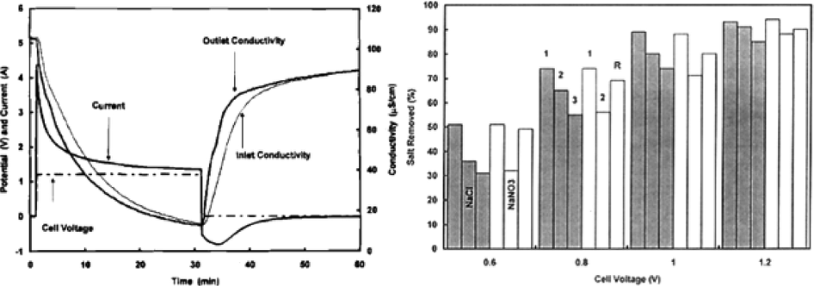

Figure 13. Left: Deionization of a fixed volume of 100 μS/cm NaCl solution. Complete recycle of 4 L at a rate of 1 L/min. The apparatus included 192 aged electrode pairs operated at a cell voltage of 1.2 V. Right: Data for both NaCl and NaNO3 solutions showing the effect of aging on the electrosorption capacity of carbon aerogel electrodes. Salt removal a cell voltages ranging from 0.6 to 1.2 V. Complete recycle of a 4 l volume of a solution at a rate of 1 l/min. Data for new electrodes are represented by (1); data for electrodes cycled for several weeks are represented by (2); and data for aged electrodes that have been cycled for several month are represented by (3). Note that represents aged electrodes that have been regenerated by potential reversal. Used with permission from ref 77. Copyright 1996 The Electrochemical Society. 

Table 1. Conversion, Yields, and Selectivities to Methanol and Catalytic Activities (determined in 2 different fashions) in a Periana Reaction[a] 

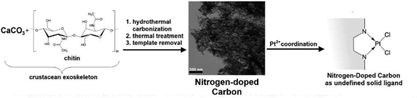

|entity|catalyst|X (%)|Y (%)|S (%)|TOFb (h−1)|TOFc(h−1)|
|---|---|---|---|---|---|---|
|1|Pt@CTF|7.0|6.0|85.4|174|233|
|2|Pt(bpym)Cl2|17.9|17.2|96.3|912|779|
|3|Pt@ExLOB-900 (frst run)|33.8|31.7|94.0|2074|1227|
|4|Pt@ExLOB-900 (second run)|18.5|17.6|95.2|1938|1516|
|5|Pt@ExLOB-900 (third run)|6.0|5.6|91.6|1826|1802|

> aEntry 1: previous heterogenized catalyst. Entry 2: homogeneous catalyst. Entry 3−5: three repeats with an aerogel supported sample. For details, see original publication.[80] Table and picture used with permission from ref 80. Copyright 2009 Wiley.[b] Determined Emm a pressure drop from 69 to 67.5 bar (ESI).[c] Determined from the amount of methanol produced within 30 min. 

or “just” for the controlled conversion of chemicals. Conductive carbon aerogels have for instance been used as supports for noble[82][−][85] as well as non-noble metal[86,87] catalysts in the oxygen reduction reaction (ORR). In 2009, Gong et al. reported the first efficient metal-free catalyst for the oxygen reduction reaction (ORR), based on nitrogen-doped carbon nanotube arrays.[88] Since then, efforts have been increased to find metal-free alternatives to conventional platinum catalysts, for which heteroatom doped carbon materials have proven to be high potential candidates. This is due to their high conductivity, their chemical stability, and their functional patterns.[89][−][97] Most examples involve nitrogen doped carbon materials, but boron[94] as well as sulfur[93,95,98] have also been reported to enhance electrocatalytic activity of the material. Jin et al. reported on RF-based nitrogen-doped xerogels synthesized using ammonia as nitrogen source and cobalt nitrate as catalyst. The xerogels exhibited high ORR electrocatalytic activity and good stability in acidic media.[99] The sol−gel routes presented herein allow for gradual change of the chemical composition and/or morphology. This opens the door for structure−property relation studies, which are highly interesting 

in the field of electrocatalysis to get a deeper understanding of how to potentially substitute noble metal catalysts by carbon. 

− The hierarchical pore structure of sol gel synthesized carbon aerogels is expected to optimize mass transport, which is often a limiting factor for electrocatalysis. Conventional catalysts are particles dispersed on catalytically inactive supports; therefore the surface concentration of active sites is rather low. The heteroatom containing carbon aerogels are support and catalyst at once, causing high concentration of catalytically active sites, which could reduce kinetic limitations. 

Exemplarily, we present linear sweep voltammetry (LSV, Figure 1 left) using a rotating disk electrode (RDE) in 0.1 M KOH on albumine derived carbogels codoped with nitrogen and sulfur.[46] Featureless voltammetric curves were observed for all samples in N2-saturated solution. A strong cathodic peak is seen upon saturating the solution with O2, showing the catalytic effect of the aerogels toward oxygen reduction. The linear sweep voltammograms corresponding to the cathodic currents due to oxygen reduction show an interesting co-operative effect of the nitrogen and sulfur doping. Both aerogels are more active catalysts as compared to the reference Vulcan carbon, but still 

206 

dx.doi.org/10.1021/cm402239e | Chem. Mater. 2014, 26, 196−210 

Chemistry of Materials 

Review 

Table 2. Cu-Catalyzed Ullmann Type O-, N- and S-Arylatition with Arylhalides[a] 

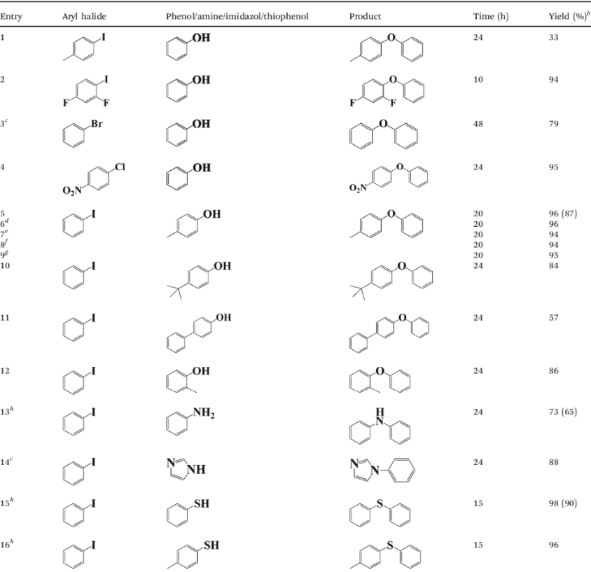

> aTable taken with permission from ref 87. bReaction onditions: Ary] halide (1 mmol), phenol/amine/imidazol/thiophenol (L5 mmol), Cul (0.15 mmol), Meso−N-C-1 (50 ing), KOH [3 nnol), DMSO [4 mL), 100 °C.[c] GC yield with biphenyl as internal standard (isolated yield in parentheses).[d] Reaction temperature: 125 °C.[e] Second run to test the reusability of catalyst.[f] Third Tun to test the reusability of the catalyst.[g] Fourth run to test the reusability of the atalyst.[h] Fifth run to test the reusability of the catalyst.h.[i] In Ar atmosphere. 

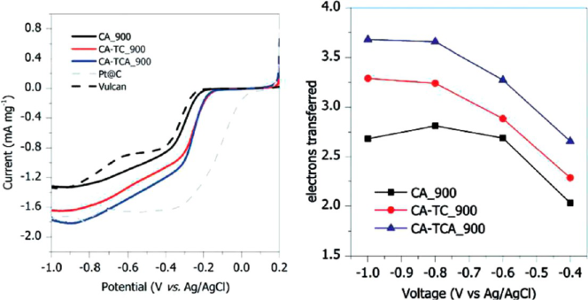

Figure 14. Left: RDE polarization curves at 1600 rpm of doped carbon aerogels compared to 20 wt % Pt@C and Vulcan in 0.1 M KOH. Right: Electron transfer numbers at various voltages. 

not competitive with commercial platinum catalyst. However, a clear positive shift in the onset potential can be stated for the 

optimized samples. At higher overpotentials, the best samples also give higher current densities as compared to platinum, 

207 

dx.doi.org/10.1021/cm402239e | Chem. Mater. 2014, 26, 196−210 

Chemistry of Materials 

Review 

supporting our view of an improved catalytic site density within the carbon aerogels. The improved electrocatalytic activity of nitrogen and sulfur-co-doped carbon is also reflected in the reaction mechanism. Koutecky−Levich analysis unfolds higher electron transfer numbers at different potentials (Figure 14 right) as compared to the purely nitrogen-doped carbon aerogel. 

In borax-mediated aerogels described above, a more detailed analysis of different factors such as chemical structure and morphology on the electrocatalytic performance has been performed.[100] Here, the effect of surface area and of nitrogen content was analyzed independently at samples pyrolized at 900 °C. Analysis of the role of the specific surface area/particle size reveals a direct correlation of surface area, onset potential and maximum current density. This clearly indicated the homogeneous distribution of catalytic sites on the material surface. Analysis of impact of the dopant concentration showed that the overall catalytic performance also increases with the dopant concentration; however, only up to a certain limit, as very high loads of nitrification agents negatively influenced the aerogel formation. 

The aerogel that was engineered to maximize catalytic performance showed drastically improved plateau current densities compared to a platinum catalyst (but lower onset potential), excellent long-term stability, as well as an ideal 4-electron process. As all carbon catalysts, the system turned out completely insensitive against fuel spillover, a known weakness of the traditional Pt-catalysts. Importantly, this approach offered the first carbohydrate-derived, nonmetal electrocatalyst, synthesized via a fully sustainable hydrothermal carbonization (HTC) technique, which partially even outperformed noble metal platinum catalysts. 

## ■[CONCLUSIONS] 

This review described some recent developments in materials chemistry where carbon aerogels, including monolithic species, − are synthesized via typical processes well-known from the sol gel synthesis of silica. All these processes start with soluble, molecular precursors (in many cases ,sustainable carbohydrates), which throughout a condensation process turn into a final, nanostructured gel. Nanoscale architecture, the coupled high specific surface area, as well as the secondary transport structure within those gels are controlled by surface thermodynamics, additives, and demixing and cross-linking kinetics, i.e., the processes can be seriously understood as a sol−gel chemistry of carbon. 

As the enormous importance of porous materials has led to the development of several synthetic approaches which cannot be described simply by classical terms anymore, it becomes meaningful to reconsider the classical distinction between methods for the introduction of porosity. These are: 

- (1) Templating 

   - a. Hard templating: utilization of hard and thermally stable materials such as silica or zeolites, which need to be dissolved after the synthesis.[38,101,102] 

   - b. Soft templating; utilization of soft and thermally fragile molecules and their aggregates, such as polymers or surfactants, which can be removed by thermal decomposition or extraction.[103][−][105] 

   - c. Molecular imprinting: utilization of molecules as template. 

   - d. Phase separation toward bicontinuous structures: utilization of additives such as polymers or salts, which cause spinodal decomposition throughout the material condensation step.[106] 

- (2) Activation 

   - a. Utilization of etching and/or oxidizing agents (powders, solutions) such as alkali hydroxides.[75,107,108] 

   - b. Utilization of oxidizing gases such as CO2 or H2O.[109] 

In this article, we presented cases for all categories of templating of carbon structures, i.e., we reported on methods that direct the pore formation in a constructive fashion. We differentiated that from methods that are used to introduce pores by degradation after the material synthesis, which simply have the disadvantage of counteracting some of the rational synthetic efforts for functionalization and the establishment of electric conductivity pathways by materials erosion. In addition, any etching process reduced the mass yield, i.e., is less efficient and sustainable. 

Throughout our work, however, we found out that some of the agents classically considered as “activation agents” are rather templating agents or moderators in templating, for instance ZnCl2, the use of which was not found to be accompanied by mass loss. This observation allowsbesides rather traditional soft and hard templatingthe novel techniques of sol−gel chemistry under hypersaline conditions and finally sol−gel chemistry in salt melts. The final “salt templating” represents a new technique for the preparation of functional carbons with very high apparent surface areas of up to 2000 m[2] g[−][1] , higher than for any zeolite and approaching the value of single-layer graphene. In salt templating, the pore morphology was shown to solely depend on the nature of the templating salt. This offers the opportunity of tuning the morphologies of the materials from micro- to mesoporous with very high apparent specific surface areas. 

A big pull toward such conductive, oxidation stable carbon aerogels comes from the application side. We presented in an illustrative fashion some selected cases as electrodes in lithium batteries, in supercapacitors, in capacitive desalination, as active catalytic supports, and in electrocatalysis. In all those relevant applications, carbon aerogels have the chance to, or already do, outperform classical material systems, which makes this area a rather hot actual focal point of research. 

Thus, the “sol−-gel approach” toward carbon aerogels opens the door to sustainable future chemistry and materials design that enables custom-made synthesis of materials, optimizing their performance by rational bottom-up design. 

## ■[AUTHOR][INFORMATION] 

## Corresponding Author 

*E-mail: markus.antonietti@mpikg.mpg.de. 

Notes 

The authors declare no competing financial interest. 

## ■[REFERENCES] 

- (1) Titirici, M.-M.; Antonietti, M. Chem. Soc. Rev. 2010, 39, 103−116. 

(2) Kistler, S. S. Nature 1931, 127, 714−741. 

- (3) Mohanan, J. L.; Arachige, I. U.; Brock, S. L. Science 2005, 307, 

- 397−400. 

(4) Sevilla, M.; Yu, L.; Fellinger, T. P.; Fuertes, A. B.; Titirici, M.-M. RSC Adv. 2013, 3, 9904−9910. 

208 

dx.doi.org/10.1021/cm402239e | Chem. Mater. 2014, 26, 196−210 

Chemistry of Materials 

Review 

- (5) Li, X.-H.; Antonietti, M. Angew. Chem. 2013, 125, 4670−4674. (6) Worsley, M. A.; Pauzauskie, P. J.; Olson, T. Y.; Biener, J.; Satcher, 

- J. H.; Baumann, T. F. J. Am. Chem. Soc. 2010, 132, 14067−14069. (7) Wu, Z.-S.; Yang, S.; Sun, Y.; Parvez, K.; Feng, X.; Mullen, K. J. 

- Am. Chem. Soc. 2012, 134, 9082−9085. 

- (8) Rolison, D. R. Science 2003, 299, 1698−1701. 

- (9) Pierre, A. C.; Pajonk, G. M. Chem. Rev. 2002, 102, 4243−4266. 

- (10) Bonnet, M.; Schmid, L.; Baiker, A.; Diederich, F. Adv. Funct. 

- Mater. 2002, 12, 39−42. 

- (11) Kabbour, H.; Baumann, T. F.; Satcher, J. H.; Saulnier, A.; Ahn, 

- C. C. Chem. Mater. 2006, 18, 6085−6087. 

- (12) Pekala, R. W.; Farmer, J. C.; Alviso, C. T.; Tran, T. D.; Mayer, S. 

- T.; Miller, J. M.; Dunn, B. J. Non-Cryst. Solids 1998, 225, 74−80. 

- (13) Miller, J. M.; Dunn, B. Langmuir 1999, 15, 799−806. 

- (14) Frackowiak, E.; Beguin, F. Carbon 2001, 39, 937−950. 

- (15) Long, J. W.; Dunn, B.; Rolison, D. R.; White, H. S. Chem. Rev. 

- 2004, 104, 4463−4492. 

- (16) Rolison, D. R.; Dunn, B. J. Mater. Chem. 2001, 11, 963−980. 

- (17) Li, W.; Reichenauer, G.; Fricke, J. Carbon 2002, 40, 2955−2959. 

- (18) Marie, J.; Berthon-Fabry, S.; Achard, P.; Chatenet, M.; 

- Pradourat, A.; Chainet, E. J. Non-Cryst. Solids 2004, 350, 88−96. (19) Shi, Y.; Wan, Y.; Zhao, D. Chem. Soc. Rev. 2011, 40, 3854−3878. 

- (20) Fan, H.; Bentley, H. R.; Kathan, K. R.; Clem, P.; Lu, Y.; Brinker, 

- C. J. J. Non-Cryst. Solids 2001, 285, 79−83. 

- (21) Nakanishi, K.; Soga, N. J. Am. Ceram. Soc. 1991, 74, 2518−2530. 

- (22) Minakuchi, H.; Nakanishi, K.; Soga, N.; Ishizuka, N.; Tanaka, N. 

- Anal. Chem. 1996, 68, 3498−3501. 

- (23) Nakanishi, K.; Tanaka, N. Acc. Chem. Res. 2007, 40, 863−873. 

- (24) Kitada, A.; Hasegawa, G.; Kobayashi, Y.; Kanamori, K.; 

- Nakanishi, K.; Kageyama, H. J. Am. Chem. Soc. 2012, 134, 10894− 10898. 

- (25) Hasegawa, G.; Ishihara, Y.; Kanamori, K.; Miyazaki, K.; Yamada, 

- Y.; Nakanishi, K.; Abe, T. Chem. Mater. 2011, 23, 5208−5216. 

- (26) Long, D.; Zhang, J.; Yang, J.; Hu, Z.; Cheng, G.; Liu, X.; Zhang, 

- R.; Zhan, L.; Qiao, W.; Ling, L. Carbon 2008, 46, 1259−1262. (27) Ruben, G. C.; Pekala, R. W. J. Non-Cryst. Solids 1995, 186, 219− 

- 231. 

- (28) White, R. J.; Antonio, C.; Budarin, V. L.; Bergstrom, E.; 

- Thomas-Oates, J.; Clark, J. H. Adv. Funct. Mater. 2010, 20, 1834− 1841. 

- (29) White, R. J.; Budarin, V. L.; Clark, J. H. Chem.Eur. J. 2010, 16, 

- 1326−1335. 

- (30) Antonietti, M.; Titirici, M. M. C. R. Chim. 2010, 13, 167−173. 

- (31) Titirici, M. M.; Antonietti, M.; Baccile, N. Green Chem. 2008, 

- 10, 1204−1212. Hu, B.; Wang, K.; Wu, L. H.; Yu, S. H.; Antonietti, M.; Titirici, M. M. Adv. Mater. 2010, 22, 813−828. 

- (32) Pauly, T. R.; Liu, Y.; Pinnavaia, T. J.; Billinge, S. J. L.; Rieker, T. 

- P. J. Am. Chem. Soc. 1999, 121, 8835−8842. 

- (33) Chiu, J. J.; Pine, D. J.; Bishop, S. T.; Chmelka, B. F. J. Catal. 

- 2004, 221, 400−412. 

- (34) Fan, L. Z.; Hu, Y. S.; Maier, J.; Adelhelm, P.; Smarsly, B.; 

- Antonietti, M. Adv. Funct. Mater. 2007, 17, 3083−3087. 

- (35) Ryoo, R.; Joo, S. H.; Jun, S. J. Phys. Chem. B 1999, 103, 7743− 

- 41−7746. 

- (36) Jun, S.; Joo, S. H.; Ryoo, R.; Kruk, M.; Jaroniec, M.; Liu, Z.; 

- Ohsuna, T.; Terasaki, O. J. Am. Chem. Soc. 2000, 122, 10712−10713. (37) Lu, A. H.; Schuth, F. Adv. Mater. 2006, 18, 1793−1805. (38) Wang, L.; Yang, R. T. Carbon 2012, 50, 3134−3140. 

- (39) Lee, K. T.; Lytle, J. C.; Ergang, N. S.; Oh, S. M.; Stein, A. Adv. 

- Funct. Mater. 2005, 15, 547−556. 

- (40) Yang, H.; Shi, Q.; Liu, X.; Xie, S.; Jiang, D.; Zhang, F.; Yu, C.; 

- Tu, B.; Zhao, D. Chem. Commun. 2002, 0, 2842−2843. 

- (41) Ruland, W.; Smarsly, B. J. Appl. Crystallogr. 2002, 35, 624−633. 

- (42) Adelhelm, P.; Hu, Y. S.; Chuenchom, L.; Antonietti, M.; 

- Smarsly, B. M.; Maier, J. Adv. Mater. 2007, 19, 4012. 

- (43) Knop, A.; Scheib, W., Chemistry and Application of Phenolic 

- Resins; Springer Verlag: Berlin, 1979; Vol. 55. 

- (44) White, R. J.; Yoshizawa, N.; Antonietti, M.; Titirici, M.-M. Green 

- Chem. 2011, 13, 57. 

- (45) Baccile, N.; Antonietti, M.; Titirici, M.-M. ChemSusChem 2010, 

- 3, 246−253. 

- (46) Wohlgemuth, S.-A.; Vilela, F.; Titirici, M.-M.; Antonietti, M. 

- Green Chem. 2012, 14, 741−749. 

- (47) Fellinger, T. P.; White, R. J.; Titirici, M. M.; Antonietti, M. Adv. 

- Funct. Mater. 2012, 22, 3254−3260. 

(48) EP 2520544 (A1), 2012. 

- (49) Petricevic, R.; Reichenauer, G.; Bock, V.; Emmerling, A.; Fricke, 

J. J. Non-Cryst. Solids 1998, 225, 41−45. 

- (50) Serp, P. F.; Luís, J. Carbon Materials for Catalysis; John Wiley & 

- Sons: New York, 2009. 

- (51) Lamer, V. K.; Dinegar, R. H. J. Am. Chem. Soc. 1950, 72, 4847− 

- 4854. 

- (52) Fechler, N.; Wohlgemuth, S.-A.; Jaker, P.; and Antonietti, M. J. 

- Mater. Chem. A, 2013. 

(53) Zhu, X.; Hillesheim, P. C.; Mahurin, S. M.; Wang, C.; Tian, C.; Brown, S.; Luo, H.; Veith, G. M.; Han, K. S.; Hagaman, E. W.; Liu, H.; Dai, S. ChemSusChem 2012, 5, 1912−1917. 

- (54) Das, N.; Pattanaik, P.; Das, R. J. Colloid Interface Sci. 2005, 292, 

- 1−10. 

- (55) Fechler, N.; Fellinger, T.-P.; Antonietti, M. Adv. Mater. 2013, 

- 25, 75−79. 

- (56) Lu, A.-H.; Li, W.-C.; Schmidt, W.; Schuth, F. Microporous 

- Mesoporous Mater. 2006, 95, 187−192. 

- (57) Liao, C.-J.; Chen, C.-F.; Chen, J.-H.; Chiang, S.-F.; Lin, Y.-J.; 

- Chang, K.-Y. J. Biomed. Mater. Res. 2002, 59, 676−681. (58) Queen, W. L.; Hwu, S.-J.; Reighard, S. Inorg. Chem. 2010, 49, 

- 1316−1318. 

- (59) Paraknowitsch, J. P.; Zhang, J.; Su, D.; Thomas, A.; Antonietti, 

- M. Adv. Mater. 2010, 22, 87−92. 

- (60) Wang, X.; Lee, J. S.; Tsouris, C.; DePaoli, D. W.; Dai, S. J. Mater. 

- Chem. 2010, 20, 4602−4608. 

- (61) Lee, J. S.; Wang, X.; Luo, H.; Dai, S. Adv. Mater. 2010, 22, 

- 1004−1007. 

- (62) Lee, J. S.; Wang, X.; Luo, H.; Baker, G. A.; Dai, S. J. Am. Chem. 

- Soc. 2009, 131, 4596−4597. 

- (63) Wu, Z.-S.; Winter, A.; Chen, L.; Sun, Y.; Turchanin, A.; Feng, 

- X.; Mullen, K. Adv. Mater. 2012, 24, 5130−5135. 

- (64) Jeong, H. M.; Lee, J. W.; Shin, W. H.; Choi, Y. J.; Shin, H. J.; 

- Kang, J. K.; Choi, J. W. Nano Lett. 2011, 11, 2472−2477. 

- (65) Zhao, L.; Crombez, R.; Caballero, F. P.; Antonietti, M.; Texter, 

- J.; Titirici, M.-M. Polymer 2010, 51, 4540−4546. 

- (66) Zhao, L.; Hu, Y.-S.; Li, H.; Wang, Z.; Chen, L. Adv. Mater. 2011, 

- 23, 1385−1388. 

- (67) Ahmadpour, A.; Do, D. D. Carbon 1997, 35, 1723−1732. 

- (68) Azevedo, D. C. S.; Araujo, J. C. S.; Bastos-Neto, M.; Torres, A. 

- E. B.; Jaguaribe, E. F.; Cavalcante, C. L. Microporous Mesoporous Mater. 2007, 100, 361−364. 

- (69) Hu, Z.; Srinivasan, M. P.; Ni, Y. Carbon 2001, 39, 877−886. 

- (70) Rao, C. N. R.; Sood, A. K.; Subrahmanyam, K. S.; Govindaraj, A. 

- Angew. Chem., Int. Ed. 2009, 48, 7752−7777. 

- (71) Fischer, U.; Saliger, R.; Bock, V.; Petricevic, R.; Fricke, J. J. 

- Porous Mater. 1997, 4, 281−285. 

- (72) Dicks, A. L. J. Power Sources 2006, 156, 128−141. 

- (73) Antolini, E. Appl. Catal., B 2009, 88, 1−24. 

- (74) Moreno-Castilla, C.; Maldonado-Hodar, F. J. Carbon 2005, 43, 

- 455−465. 

- (75) Aliev, A. E.; Oh, J.; Kozlov, M. E.; Kuznetsov, A. A.; Fang, S.; 

- Fonseca, A. F.; Ovalle, R.; Lima, M. D.; Haque, M. H.; Gartstein, Y. N.; Zhang, M.; Zakhidov, A. A.; Baughman, R. H. Science 2009, 323, 1575−1578. 

- (76) Adebajo, M. O.; Frost, R. L.; Kloprogge, J. T.; Carmody, O.; 

- Kokot, S. J. Porous Mater. 2003, 10, 159−170. 

- (77) Farmer, J. C.; Fix, D. V.; Mack, G. V.; Pekala, R. W.; Poco, J. F. J. 

- Electrochem. Soc. 1996, 143, 159−169. 

- (78) Hu, Y. S.; Adelhelm, P.; Smarsly, B. M.; Hore, S.; Antonietti, M.; 

- Maier, J. Adv. Funct. Mater. 2007, 17, 1873−1878. 

209 

dx.doi.org/10.1021/cm402239e | Chem. Mater. 2014, 26, 196−210 

Chemistry of Materials 

Review 

(79) Soorholtz, M.; White, R. J.; Zimmermann, T.; Titirici, M.-M.; Antonietti, M.; Palkovits, R.; Schuth, F. Chem. Commun. 2013, 49, 240−242. 

(80) Palkovits, R.; Antonietti, M.; Kuhn, P.; Thomas, A.; Schuth, F. Angew. Chem., Int. Ed. 2009, 48, 6909−6912. 

(81) Zhang, P.; Yuan, J.; Li, H.; Liu, X.; Xu, X.; Antonietti, M.; Wang, Y. RSC Adv. 2013, 3, 1890−1895. 

(82) Baker, W. S.; Long, J. W.; Stroud, R. M.; Rolison, D. R. J. NonCryst. Solids 2004, 350, 80−87. 

(83) Guilminot, E.; Fischer, F.; Chatenet, M.; Rigacci, A.; BerthonFabry, S.; Achard, P.; Chainet, E. J. Power Sources 2007, 166, 104−111. 

(84) Job, N.; Maillard, F.; Marie, J.; Berthon-Fabry, S.; Pirard, J.-P.; Chatenet, M. J. Mater. Sci. 2009, 44, 6591−6600. 

(85) Marie, J.; Berthon-Fabry, S.; Chatenet, M.; Chainet, E.; Pirard, 

R.; Cornet, N.; Achard, P. J. Appl. Electrochem. 2007, 37, 147−153. 

(86) Ye, S. Y.; Vijh, A. J. Solid State Electrochem. 2005, 9, 146−153. 

(87) Ye, S. Y.; Vijh, A. K. Int. J. Hydrogen Energy 2005, 30, 1011− 1015. 

(88) Gong, K. P.; Du, F.; Xia, Z. H.; Durstock, M.; Dai, L. M. Science 2009, 323, 760−764. 

(89) Liu, G.; Li, X.; Lee, J.-W.; Popov, B. N. Catal. Sci. Technol. 2011, 1, 207−217. 

(90) 

(91) Qu, L. T.; Liu, Y.; Baek, J. B.; Dai, L. M. ACS Nano 2010, 4, 1321−1326. 

(92) Liu, R. L.; Wu, D. Q.; Feng, X. L.; Mullen, K. Angew. Chem., Int. Ed. 2010, 49, 2565−2569. 

(93) Yang, Z.; Yao, Z.; Li, G.; Fang, G.; Nie, H.; Liu, Z.; Zhou, X.; Chen, X. a.; Huang, S. ACS Nano 2011, 6, 205−211. 

(94) Yang, L.; Jiang, S.; Zhao, Y.; Zhu, L.; Chen, S.; Wang, X.; Wu, 

Q.; Ma, J.; Ma, Y.; Hu, Z. Angew. Chem., Int. Ed. 2011, 50, 7132−7135. (95) Choi, C. H.; Park, S. H.; Woo, S. I. Green Chem. 2011, 13, 406− 412. 

(96) Fellinger, T.-P.; Hasche, F.; Strasser, P.; Antonietti, M. J. Am. Chem. Soc. 2012, 134, 4072−4075. 

(97) Yang, W.; Fellinger, T.-P.; Antonietti, M. J. Am. Chem. Soc. 2011, 133, 206−209. 

(98) Wohlgemuth, S.-A.; White, R. J.; Titirici, M. M.; Willinger, M.; Antonietti, M. Green Chem. 2012, 14, 1515−1523. 

(99) Jin, H.; Zhang, H.; Zhong, H.; Zhang, J. Energy Environ. Sci. 2011, 4, 3389−3394. 

(100) Wohlgemuth, S. A.; Fellinger, T. P.; Jaker, P.; Antonietti, M. J. Mater. Chem. A 2013, 1, 4002−4009. 

(101) Dai, L.; Chang, D. W.; Baek, J.-B.; Lu, W. Small 2012, 8, 1130−1166. 

(102) Knox, J. H.; Kaur, B.; Millward, G. R. J. Chromatogr., A 1986, 352, 3−56. 

(103) Liang, C.; Li, Z.; Dai, S. Angew. Chem., Int. Ed. 2008, 47, 3696− 58−3717. 

(104) Zhao, D.; Huo, Q.; Feng, J.; Chmelka, B. F.; Stucky, G. D. J. Am. Chem. Soc. 1998, 120, 6024−6036. 

(105) Chuenchom, L.; Kraehnert, R.; Smarsly, B. M. Soft Matter 2012, 8, 10801−10812. 

(106) Tanaka, N.; Kobayashi, H.; Ishizuka, N.; Minakuchi, H.; Nakanishi, K.; Hosoya, K.; Ikegami, T. J. Chromatogr., A 2002, 965, 35−49. 

(107) Otowa, T.; Nojima, Y.; Miyazaki, T. Carbon 1997, 35, 1315− 1319. 

(108) Molina-Sabio, M.; Rodriguez-Reinoso, F.; Caturla, F.; Selles, M. J. Carbon 1995, 33, 1105−1113. 

(109) Barton, T. J.; Bull, L. M.; Klemperer, W. G.; Loy, D. A.; McEnaney, B.; Misono, M.; Monson, P. A.; Pez, G.; Scherer, G. W.; Vartuli, J. C.; Yaghi, O. M. Chem. Mater. 1999, 11, 2633−2656. 

(110) Tsouris, C.; Mayes, R.; Kiggans, J.; Sharma, K.; Yiacoumi, S.; DePaoli, D.; Dai, S. Environ. Sci. Technol. 2011, 45, 10243−10249. 

210 

dx.doi.org/10.1021/cm402239e | Chem. Mater. 2014, 26, 196−210 

