_**Tạp chí Phát triển Khoa học và Công nghệ – Khoa học Tự nhiên, 5(4):1605-1617**_ **Open Access Full Text Article** 

_**Bài nghiên cứu**_ 

## **Điều chếnanocomposite Ag/Fe** 3 **O** 4 **/Nano tinh thểcellulose bằng phương pháp thủy nhiệt hướng đến ứng dụng trong xửlý phẩm nhuộm methylene blue** 

## **Vũ Năng An[*] , Nguyễn Lê Tấn Huy, TừThịKim Phụng, Nguyễn Thái Ngọc Uyên, Trần ThịThanh Vân, Lê Văn Hiếu** 

Use your smartphone to scan this QR code and download this article 

## **TÓM TẮT** 

Việc điều chế các vật liệu có khả năng tái sử dụng và thân thiện với môi trường từ các nguồn sinh khối tái tạo như cellulose là một lựa chọn tất yếu trong quá trình phát triển bền vững. Trong bài báo này, nanocomposite Ag/Fe3O4/nano tinh thể cellulose (CNC) đã được tổng hợp và khảo sát ứng dụng của vật liệu trong việc loại bỏ methylene blue (MB). Về mặt quy trình, CNC được cô lập từ nguồn phụ phẩm xơ dừa (CCH) của Việt Nam thông qua quá trình xử lý formic acid/peroxyformic acid và thủy phân bằng chlohydric acid. CNC được sử dụng làm giá mang để điều chế Ag/Fe3O4 cấu trúc nano bằng phương pháp thủy nhiệt đơn giản và thân thiện với môi trường. Vật liệu nanocomposite được khảo sát bằng các phương pháp như nhiễu xạ tia X (XRD), kính hiển vi điện tử quét (SEM), phổ tán sắc năng lượng tia X (EDX), phân tích nhiệt-khối lượng (TGA) và tính chất từ thông qua phân tích từ kế mẫu rung (VSM). Kết quả cho thấy Ag/Fe3O4 được hình thành với cấu trúc dạng hạt cầu và phân tán đồng đều trên bề mặt CNC. Tất cả các mẫu đều có từ tính và từ hóa bão hòa (Ms) của hỗn hợp Ag/Fe3O4 đã giảm từ 48 xuống 12 emu/g khi có thêm CNC. Nanocomposite từ tính Ag/Fe3O4/CNC có khả năng hấp phụ tốt dung dịch thuốc nhuộm MB và thể hiện vai trò xúc tác trong phản ứng khử MB nhanh sau khi xử lý bằng NaBH4. Kết quả trên cho thấy các ứng dụng tiềm năng của vật liệu này trong xử lý nước. 

**Từ khoá:** composite Ag/Fe3O4, nano tinh thể cellulose, nanocomposite từ tính, phản ứng xúc tác khử phẩm nhuộm, xơ dừa, xử lý nước 

_Trường Đại học Khoa học Tựnhiên, ĐHQG-HCM, Việt Nam_ 

## **Liên hệ** 

**Vũ Năng An** , Trường Đại học Khoa học Tự nhiên, ĐHQG-HCM, Việt Nam Email: vnan@hcmus.edu.vn 

## **Lịch sử** 

- Ngày nhận: 23-7-2020 

- Ngày chấp nhận: 08-10-2021 

- Ngày đăng: 06-11-2021 

**DOI : 10.32508/stdjns.v5i4.930** 

## **Bản quyền** 

© ĐHQG Tp.HCM. Đây là bài báo công bố mởđược phát hành theo các điều khoản của the Creative Commons Attribution 4.0 International license. 

## **MỞĐẦU** 

các hóa chất độc hại này là vô cùng cần thiết, cần có những giải pháp hiệu quảvà nhanh chóng[3][,][6] . Một trong sốnhững hệlụy từviệc gia tăng dân sốcùng Trong vài thập kỷqua, một sốphương pháp vật lý, hóa các hoạt động công nghiệp của con người đó chính là vấn nạn ô nhiễm môi trường, nhất là ô nhiễm môi học và sinh học đã được phát triển đểloại bỏthuốc trường nước. Nguồn nước bịô nhiễm xuất phát từ nhuộm được thải ra môi trường nước, như phương pháp hấp phụ[7] , phân hủy sinh học[8] , keo tụ[9][,][10] , thẩm nhiều nguyên nhân khác nhau. Một trong sốnguyên nhân chính là lượng chất thải phẩm nhuộm và chất thấu ngược[11] , quá trình oxy hóa do nhiệt trong điều kiện không khí ẩm[12] và siêu lọc[13] . Tuy nhiên, các màu hữu cơ bắt nguồn từcác ngành công nghiệp in ấn, dệt, sơn, thực phẩm và mỹphẩm[1][,][2] . Ước tính phương pháp trên vẫn còn tồn tại một sốhạn chế, như quá trình phân hủy sinh học không phù hợp để hàng năm, một lượng lớn xấp xỉ50.000 tấn của hơn 10.000 loại thuốc nhuộm tổng hợp được thải ra môi xửlý hóa chất công nghiệp do sẽgây ngộđộc nguồn trường, hòa lẫn vào trong các hồchứa nước ngọt[3][,][4] . sinh khối. Quá trình oxy hóa do nhiệt trong điều kiện Điều đáng báo động là trong sốcác phẩm nhuộm này, không khí ẩm, khi xảy ra ởnhu cầu oxy hóa học > 100 phẩm nhuộm azo chiếm khoảng 50%. Đây là loại g/L sẽsinh ra các sản phẩm phụđộc hại có nồng độ phẩm nhuộm gây ra rất nhiều loại bệnh nguy hiểm cao như dioxin và furan[14] . Phương pháp hóa lý (như cho con người. Thí dụkhi tiếp xúc, phơi nhiễm với hấp phụ, keo tụvà thẩm thấu ngược) thường đòi hỏi methylene blue (MB), một loại phẩm nhuộm azo gốc thêm các quy trình xửlý tiếp theo đểngăn ngừa các cation, sẽbịbỏng mắt, khó thở, buồn nôn, ói mửa, nguồn ô nhiễm thứcấp phát sinh. Quan trọng hơn, đổmồhôi trộm, rối loạn tâm thần cùng các bệnh giá thành của các thiết bịmàng lọc có hiệu năng tốt lý vềthần kinh khác[5] . Không những gây hại cho khá cao, một sốcông nghệchếtạo phức tạp và không con người, thuốc nhuộm cation còn gây nguy hiểm thân thiện với môi trường nên do đó không phù hợp cho môi trường sống của các loài thủy sản và nhiều đểứng dụng trên quy mô công nghiệp. Ngoài ra, một chủng loại thủy sinh khác. Do đó, việc xửlý và loại bỏ sốchất hấp phụchỉcó thểhấp phụchọn lọc một số 

**Trích dẫn bài báo này:** An V N, Huy N L T, Phụng T T K, Uyên N T N, Vân T T T, Hiếu L V. **Điều chếnanocomposite Ag/Fe** 3 **O** 4 **/Nano tinh thểcellulose bằng phương pháp thủy nhiệt hướng đến ứng dụng trong xửlý phẩm nhuộm methylene blue** . _Sci. Tech. Dev. J. - Nat. Sci.;_ 5(4):1605-1617. 

**1605** 

_**Tạp chí Phát triển Khoa học và Công nghệ – Khoa học Tự nhiên, 5(4):1605-1617**_ 

thuốc nhuộm cụthể[15] . Gần đây, các kim loại quý cho hiệu quảcao trong lĩnh vực xúc tác được sửdụng rộng rãi trong các phản ứng phân hủy các loại phẩm nhuộm độc hại trong nước. Trong sốnày, hạt nano Ag (Ag NPs) với các đặc tính độc đáo như chi phí sản xuất thấp, cấu trúc chặt chẽvới các mặt tinh thể khác nhau và tỷlệgiữa bềmặt và thểtích lớn được sửdụng rộng rãi làm chất xúc tác cho các ứng dụng công nghiệp. Tuy nhiên, do bản chất không bền về mặt nhiệt động học nên Ag NPs có xu hướng tái tụ tập lại, dẫn đến việc phục hồi khó khăn làm giảm khả năng tái sửdụng trong các ứng dụng xửlý nước thải có quy mô lớn. Do đó, việc sửdụng giá mang tốt sẽ hỗtrợcho Ag NPs khắc phục các vấn đềnày, hơn nữa còn hiệu quảvềmặt kinh tế[16][–][18] . Tuy nhiên, việc cố định trực tiếp Ag NPs trên các vật liệu hoạt tính khác như Fe3O4 ngoài việc thu được cấu trúc lý tưởng đểsử dụng làm chất xúc tác còn có nhược điểm là làm phát sinh lực đẩy giữa hai hợp phần trên, khiến chúng trở nên kém ổn định. Đểgiải quyết trường hợp này, một giá mang hữu cơ được đưa thêm vào không những hạn chếđược tương tác đẩy mà còn tạo hiệu ứng đồng vận tốt trong cấu trúc lai hóa giúp cho hoạt tính xúc tác hiệu quả[19][–][22] . 

Trong những năm gần đây, sinh khối đang thu hút được rất nhiều sựquan tâm trong việc sửdụng làm giá mang cho các xúc tác cấu trúc nano dựa trên cấu trúc xốp và sốlượng lớn các tâm hoạt tính đểcốđịnh các hạt nano kim loại[23][–][26] . Đặc biệt, cellulose là sinh khối dồi dào nhất đang được nghiên cứu nhiều đểổn định các hạt xúc tác kim loại[27][–][31] . Li và các cộng sự[27] đã chức năng hóa polydopamine các vi hạt cellulose acetate xốp đểlàm giá mang tổng hợp các hạt nano Ag-Fe3O4. Xúc tác nano với hợp kim của Fe-Cu được cốđịnh trên cellulose vi tinh thểđã được tổng hợp. Vật liệu được sửdụng kết hợp với NaBH4 trong phản ứng khửcác dẫn xuất của nitroaren thành arylamine trong nước. Phản ứng xảy ra nhanh trong vòng 5 _–_ 14 phút và có hiệu suất tốt[32] . Hơn nữa, cellulose có thể được chuyển đổi trực tiếp thành các dạng thù hình khác khi sửdụng hỗn hợp thân thiện môi trường là NaOH/Urea[33][–][35] và có thể, thông qua phản ứng thủy phân bằng acid, loại bỏcác vùng vô định hình trong cấu trúc đểthu được nano tinh thểcellulose (CNC) có tính năng cơ lý cao. 

Trong nghiên cứu này, nanocomposite Ag/Fe3O4/CNC được tổng hợp bằng phương pháp thủy nhiệt đơn giản và thân thiện với môi trường. Cấu trúc pha, hình thái, tính chất từ và sựổn định nhiệt của vật liệu nanocomposite Ag/Fe3O4/CNC được khảo sát. Ngoài ra, CNC, tổng hợp bằng phản ứng thủy phân acid cellulose, được cô lập từnguồn phụphẩm xơ dừa. Đây là một trong 

những hướng tiếp cận nhằm tận dụng các nguồn phụ phẩm nông nghiệp, vốn rất dồi dào tại Việt Nam, để tạo ra các vật liệu có giá trịkinh tế. Kết quảcho thấy nanocomposite Ag/Fe3O4/CNC được tổng hợp có khảnăng hấp phụtốt thuốc nhuộm methylene blue. Ngoài ra khi có sựhiện diện của NaBH4, vật liệu có khảnăng phân hủy methylene blue nhanh, hiệu suất đạt được khoảng gần 90% chỉtrong khoảng 2 phút. Nanocomposite Ag/Fe3O4/CNC hứa hẹn tiềm năng ứng dụng rất lớn trong lãnh vực xửlý nước thải phẩm nhuộm. 

## **VẬT LIỆU VÀ PHƯƠNG PHÁP** 

## **Vật liệu** 

Nguồn nguyên liệu xơ dừa được thu gom từvùng trồng dừa huyện MỏCày Nam, tỉnh Bến Tre. Sản phẩm quảdừa sau thu hoạch được bóc vỏngoài, lớp vỏnày được đập dập, đem phơi khô, sau đó loại bỏ các phần tơi xốp của vỏdừa và tách sợi xơ dừa ra. Sợi xơ dừa dài 10–20 cm, màu vàng nâu, cuộn xoắn vào nhau. Sợi xơ dừa này được nghiền thành bột mịn. NaOH, HCOOH, H2O2, HCl, (NH2)2CO, ethylene glycol (EG), ethanol cùng hai tiền chất của Fe và Ag là FeCl3.6H2O và AgNO3 đều là dạng thương mại có xuất xứtừcông ty Xilong Scientific Co., Ltd. (Trung Quốc) và được sửdụng mà không qua bất kỳquá trình tinh chếnào. 

## **Phương pháp nghiên cứu** 

PhổFT-IR được đo trên thiết bịquang phổ EQUINOX 55 (Bruker, Đức). Quá trình phân tích được thực hiện với mẫu dạng bột trong vùng sốsóng từ4000–400 cm _[−]_[1] , độphân giải 4 cm _[−]_[1] . Các mẫu trước khi phân tích FT-IR được nghiền mịn và sấy ở 80 _[◦]_ C trong 24 giờ. Sau đó một lượng nhỏmẫu (2 _–_ 3 mg) được ép viên với KBr ởlực nén 250 kN theo tỷlệ khối lượng mẫu và KBr là 1:100. 

Giản đồXRD được đo trên thiết bịD2 PHARSER (Bruker, Đức). Quá trình phân tích được thực hiện với mẫu dạng bột với góc 2θ trong khoảng từ10–80 _[◦]_ và bước chuyển 0,02 _[◦]_ /phút. Độkết tinh được xác định theo công thức bán thực nghiệm của Segal: CrI (%) = (1 – I _am_ /I _200_ ) x 100 (1) 

Với I _200_ là cường độđỉnh nhiễu xạởgóc 2θ _≈_ 22,5 _[◦]_ của mặt phẳng (200) và I _am_ là cường độtán xạcủa mẫu ởgóc nhiễu xạ2θ _≈_ 18 _[◦]_[36] . 

Phương pháp phân tích FE-SEM được dùng đểđánh giá hình thái bềmặt vật liệu và được thực hiện trên thiết bịS-4800 với thếgia tốc 5 kV và 10 kV. Hàm lượng nguyên tốhiện diện trên bềmặt được xác định thông qua phổEDX, sửdụng hệEmax Energy kết hợp trên thiết bịS-4800. Độbền nhiệt của vật liệu 

**1606** 

_**Tạp chí Phát triển Khoa học và Công nghệ – Khoa học Tự nhiên, 5(4):1605-1617**_ 

được phân tích bằng phương pháp nhiệt – khối lượng (TGA). Các mẫu TGA dạng bột được phân tích trên máy TGA Q500 của Mỹ, mẫu được khảo sát trong vùng nhiệt độtừ30–800 _[◦]_ C trong môi trường khí nitrogen, tốc độgia nhiệt là 10 _[◦]_ C/phút. 

Tính chất từcủa vật liệu được khảo sát bằng phương pháp từkếmẫu rung (VSM): Đường cong từhóa được phân tích trên máy đo từkếmẫu rung System ID: EV11, SN: 20100622. 

PhổUV-Vis được đo bằng máy Jasco UV-Vis V-670 (Nhật), trong vùng bước sóng từ200–800 nm, với tốc độ400 nm/phút. 

## **Cô lập cellulose từxơ dừa và thủy phân tạo CNC** 

Quá trình cô lập cellulose từxơ dừa được thực hiện bằng quy trình formic/peroxyformic acid theo một nghiên cứu đã được công bốcủa nhóm[37] . Cellulose được cô lập bằng quy trình bao gồm ba bước chính: xửlý bằng formic (HCOOH), xửlý hỗn hợp bằng PFA (hỗn hợp dung dịch HCOOH + H2O2 + H2O) và tẩy trắng bằng hỗn hợp dung dịch NaOH và H2O2. Đầu tiên, bột xơ dừa được khuấy tại 90 _[◦]_ C trong 2 giờ với nước cất theo tỉlệ1:20 (khối lượng xơ dừa/thể tích nước). Tiếp đến, sản phẩm được lọc, rửa lại với nước và sấy khô ở60 _[◦]_ C. Bước tiếp theo xơ dừa được khuấy hoàn lưu tại 90 _[◦]_ C trong 2 giờtrong dung dịch HCOOH 90%, tỷlệgiữa khối lượng xơ dừa và thểtích HCOOH là 1:10. Hỗn hợp sau khi xửlý được lọc, rửa với nước cất đểloại hết acid dư. Sản phẩm được sấy khô ở60 _[◦]_ C. Xơ dừa được tiếp tục xửlý với hỗn hợp PFA theo tỉlệ1:20 (khối lượng/thểtích) và hỗn hợp PFA bao gồm 90% dung dịch HCOOH 90%, 4% dung dịch H2O2 30% và 6% nước cất. Hệđược khuấy hoàn lưu trong 2 giờở100 _[o]_ C. Bước cuối cùng là giai đoạn tẩy trắng xơ dừa đểthu được cellulose tinh khiết. Trong một bình cầu 3 cổ500 mL, cho vào xơ dừa sau khi xửlý PFA (6,0 g), 180 mL nước cất và 12 mL dung dịch NaOH 1M. Hệthống được gia nhiệt đến 70 _[◦]_ C. Tiếp theo, cho từtừ16 mL dung dịch H2O2 30% vào hệvà bắt đầu tính thời gian trong 1 giờ(dung dịch H2O2 được cho vào hết trong vòng 15 phút). Hệđược giữnhiệt ổn định ở80 _[◦]_ C. Hỗn hợp sau khi xửlý được lọc bằng hệlọc chân không và rửa với nước cất. Sản phẩm cellulose được sấy khô ở80 _[◦]_ C. Sợi cellulose là một dạng polymer bán kết tinh mà tại đó các vùng tinh thểliên kết với nhau thông qua vùng vô định hình. Nhằm loại bỏvùng vô định hình, giai đoạn cuối cùng là thủy phân bằng acid. Trong quá trình thủy phân, acid ưu tiên tấn công vào vùng vô định hình, còn các vùng có cấu trúc tinh thểsẽkhông bịacid tác kích do mức độtrật tựcao. Chức năng chủyếu của 

các acid là cắt đứt các liên kết glycoside và ether trong chuỗi phân tửcellulose của vùng vô định hình. Mẫu được thủy phân với dung dịch HCl 6M theo tỉlệ 1:25 (khối lượng/thểtích). Hệđược khuấy trong 3 giờ ởnhiệt độổn định 90 _[◦]_ C. Kết thúc phản ứng, hỗn hợp được cho vào bercher chứa sẵn 1000 mL nước cất và thu được huyền phù. Huyền phù được đểlắng, thay nước vài lần rồi ly tâm ởtốc độ6.000 vòng/phút trong 10 phút, sau đó được sấy khô ở80 _[◦]_ C. Sản phẩm thu được chính là CNC. 

## **Chếtạo hạt nano Fe** 3 **O** 4 **bằng phương pháp nhiệt dung môi** 

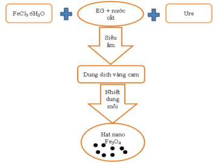

**Hình 1** : Quy trình tổng hợp hạt nano Fe3O4 bằng phương pháp nhiệt dung môi 

Hạt nano Fe3O4 được tổng hợp bằng phương pháp nhiệt dung môi theo quy trình được mô tảtrên Hình 1. FeCl3.6H2O (0,43 g) và (NH2)2CO (0,90 g) được cho vào EG (42 mL) và nước cất (1,5 mL) rồi đánh siêu âm trong 30 phút đểtạo thành dung dịch trong suốt màu cam. Sau đó chuyển hỗn hợp dung dịch vào bình Teflon và tiến hành quá trình nhiệt dung môi ở220 _[o]_ C trong 6 giờ. Kết thúc quá trình nhiệt dung môi thu được kết tủa đen Fe3O4, ly tâm rửa mẫu bằng ethanol 5-6 lần. Hạt Fe3O4 thu được sau khi rửa được sấy chân không ởnhiệt độ60 _[o]_ C trong 9 giờ. 

## **Chếtạo Ag/Fe** 3 **O** 4 **/CNC bằng phương pháp thủy nhiệt** 

Đánh siêu âm hỗn hợp gồm 10 mL CNC (10 mg/mL), 10 mL Fe3O4 (2 mg/mL) và 10 mL AgNO3 (17 mg/mL) trong 30 phút. Sau đó chuyển hỗn hợp trên vào bình Teflon và tiến hành thủy nhiệt ở180 _[o]_ C trong 5 giờ. Kết thúc quá trình thủy nhiệt, thu được dung dịch chứa Ag/Fe3O4/CNC. Ly tâm, rửa mẫu bằng nước DI nhiều lần và 3 lần với ethanol. Mẫu sau khi rửa được sấy ở70 _[o]_ C trong 3 giờ. 

**1607** 

_**Tạp chí Phát triển Khoa học và Công nghệ – Khoa học Tự nhiên, 5(4):1605-1617**_ 

## **Khảo sát hoạt tính hấp phụvà xúc tác** 

Ag/Fe3O4/CNC (15 mg) được cho vào becher chứa sẵn 30 mL methylene blue (MB) nồng độ10 ppm. Hệ được khuấy ngoài sáng tựnhiên tại nhiệt độphòng ở tốc độkhuấy 300 vòng/phút. Ly tâm, thu dung dịch MB tại mỗi thời điểm khảo sát và đo nồng độMB còn lại bằng máy đo UV-Vis với bước sóng trong vùng từ 400-800 nm. Một hệtương tựcũng được thực hiện đểkhảo sát khảnăng phân hủy MB khi có mặt của NaBH4, bằng cách thêm vào hỗn hợp 3 mL dung dịch NaBH4 0,1M. 

## **KẾT QUẢTHẢO LUẬN** 

## **Phổhồng ngoại biến đổi Fourier** _**(FT-IR)**_ 

Nguồn phụphẩm xơ dừa thô ban đầu được xửlý sơ bộvới nước cất nhằm loại bỏcác thành phần mùn và một sốtạp chất bẩn khác bám bên ngoài. Tiếp đến, xơ dừa được xửlý trong môi trường acid với mục đích để một phần hemicellulose, sáp, pectin… được hòa tan. Phần còn lại và lignin sẽtrương lên và di chuyển ra bên ngoài bềmặt, tạo điều kiện cho quá trình xửlý bằng PFA. Giai đoạn PFA sẽlàm mềm sợi, tiếp tục loại bỏphần lớn hemicellulose và một phần lignin nhờvào sựcó mặt của chất oxy hóa H2O2. Sau giai đoạn này, phần lớn hemicellulose, sáp, pectin trong xơ dừa đã được loại bỏ. Tuy nhiên, thành phần lignin vẫn còn bám bên ngoài sợi. Do đó cần phải tiếp tục thực hiện quá trình tẩy trắng đểloại bỏhoàn toàn lignin và thu được cellulose tinh khiết. Sựthay đổi thành phần, cấu trúc hóa học của sợi xơ dừa từgiai đoạn xửlý thô đến quá trình thủy phân bằng HCl được khảo sát bằng phương pháp phổFT-IR. Hình 2 là phổFT-IR của mẫu xơ dừa thô, mẫu xửlý PFA, mẫu tẩy trắng và mẫu thủy phân. Kết quảFT-IR của các mẫu đều xuất hiện một mũi hấp thu rộng trong vùng sốsóng 35003300 cm _[−]_[1] , là vùng dao động kéo giãn của liên kết O- H, cho thấy sựtồn tại của nhiều nhóm chức hydroxyl hoặc mạng lưới các liên kết hydrogen nội và liên phân tử, đặc trưng cho cellulose[38] . Dao động của nhóm O- H xuất hiện ởmẫu xơ dừa thô là do ởvách tếbào thực vật, hemicellulose, pectin và một lượng nhỏnước sẽ lấp đầy các khoảng trống giữa các phân tửcellulose[39] . Mũi phổtại sốsóng 1730 cm _[−]_[1] quan sát được đối với mẫu thô đặc trưng cho dao động kéo giãn C=O của nhóm acetyl hoặc nhóm ester có trong thành phần hemicellulose hoặc đặc trưng cho liên kết ester trong nhóm carboxyl của ferulic acid và _p_ -coumeric acid trong thành phần lignin[38] . Vùng phổtiêu biểu cho sốsóng tại 2900 cm _[−]_[1] là dao động kéo giãn của liên kết C–H hiện diện trong hầu hết các thành phần hữu cơ bao gồm cả α-cellulose, hemicellulose và lignin[40] . Mũi hấp thu tại 1513 cm _[−]_[1] là dao động kéo giãn của 

liên kết C=C của các vòng thơm trên lignin và mũi phổtại sốsóng 1253 cm _[−]_[1] là dao động kéo giãn của liên kết C-O từnhóm aryl có trong lignin[41] . Ởcác quá trình xửlý tiếp theo, từbước xửlý acid đến tẩy trắng, lượng lớn hemicellulose, pectin và các tạp chất khác bịtách bỏvà phân hủy. 

Kết quảphân tích FT-IR của mẫu tẩy trắng cho thấy mũi 1730 cm _[−]_[1] đã không còn trong phổ, như vậy quá trình tẩy trắng đã loại bỏhiệu quảhemicellulose và lignin. Cảhai phổcủa mẫu tẩy trắng và mẫu thủy _-_ phân đều xuất hiện mũi tại vùng sốsóng khoảng 1640 1650 cm _[−]_[1] , mũi này được cho là có liên quan đến sự hấp thụhơi ẩm tạo liên kết hydrogen liên phân tửcủa O _–_ H đặc trưng trên các thành phần của sợi thực vật với các phân tửnước trong không khí. Cường độmũi 890 cm _[−]_[1] trong phổFT-IR của mẫu qua từng bước xửlý ngày càng hiện rõ, đây chính là mũi đặc trưng cho cấu trúc của cellulose. Mũi này nhỏvà nhọn đặc trưng cho dao động biến dạng C1-H kết hợp với dao động uốn của O-H trong liên kết β-glycoside[40] . 

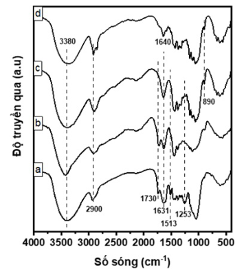

**Hình 2** : PhổFT-IR của (a) mẫu thô, (b) mẫu xửlý PFA, (c) mẫu tẩy trắng và (d) mẫu CNC 

## **Nhiễu xạtia X (XRD)** 

Giản đồXRD của các mẫu xơ dừa thô, mẫu đã tẩy trắng và mẫu sau khi thủy phân bằng HCl được thể hiện trên Hình 3. Kết quảcho thấy quá trình tẩy trắng và thủy phân đã thu được cellulose tinh thểcó các đỉnh nhiễu xạtại các vịtrí 2θ lần lượt là 16,0 _[o]_ ; 22,6 _[o]_ và 34,6 _[o]_ ứng với các mặt phẳng (110), (200) và (400) đặc trưng cho cellulose loại I[36] . Thêm nữa, không có sựdịch chuyển các đỉnh nhiễu xạnhưng cường độ của các đỉnh thay đổi nhiều từmẫu thô ban đầu đến 

**1608** 

_**Tạp chí Phát triển Khoa học và Công nghệ – Khoa học Tự nhiên, 5(4):1605-1617**_ 

mẫu tẩy trắng. Như vậy cho thấy, trải qua các quá trình xửlý hóa học, các thành phần vô định hình như hemicelulose, lignin trong cấu trúc xơ dừa đã được loại bỏ, chỉcòn thành phần cellulose tinh khiết với tính chất của một polysaccharide bán kết tinh. Sựloại bỏcác thành phần vô định hình bao bọc bên ngoài cấu trúc cellulose làm cho độkết tinh của mẫu tăng lên, làm cho cường độđỉnh nhiễu xạtăng. Sợi cellulose là một dạng polymer bán kết tinh mà tại đó các vùng tinh thểliên kết với nhau thông qua vùng vô định hình. Nhằm loại bỏvùng vô định hình, cần thủy phân acid. Trong quá trình thủy phân, acid ưu tiên tấn công vào vùng vô định hình trong khi các vùng có cấu trúc tinh thểkhông bịacid tấn công do mức độtrật tựcao. Chức năng chủyếu của các acid đểcắt đứt các liên kết glycoside và ether trong chuỗi phân tửcellulose của vùng vô định hình, giúp cho hàm lượng kết tinh của mẫu tăng lên. Từcông thức Segal (1), giá trịtính toán được cho thấy từmẫu xơ dừa thô ban đầu đến mẫu xửlý PFA và mẫu sau khi đã tẩy trắng, là cellulose, độkết tinh tăng từ53,1% đến 91,4% và 95,1%. Tuy nhiên, độkết tinh của mẫu thủy phân là 84,8%, nhỏhơn so với mẫu tẩy trắng. Có thểgiải thích là do khi thủy phân sợi xơ dừa trong thời gian dài và ởnhiệt độcao, sau khi loại bỏvùng vô định hình, acid sẽtiếp tục tấn công và phá hủy vùng tinh thể. Chính điều này sẽlàm cho hàm lượng tinh thể của mẫu thủy phân sẽgiảm so với mẫu tẩy trắng[38][,][42] . 

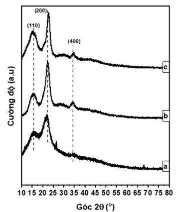

**Hình 3** : Giản đồXRD của (a) mẫu thô, (b) mẫu tẩy trắng và (c) mẫu CNC 

Giản đồXRD của Fe3O4 được tổng hợp bằng phương pháp nhiệt dung môi cũng như Ag/Fe3O4 

và Ag/Fe3O4/CNC được tạo bằng phương pháp thủy nhiệt được thểhiện trên Hình 4. Các đỉnh ở2θ = 30,1 _[◦]_ ; 35,5 _[◦]_ ; 43,1 _[◦]_ ; 56,9 _[◦]_ và 62,6 _[◦]_ tương ứng với các mặt mạng (220), (311), (400), (511) và (440) đặc trưng cho cấu trúc lập phương tâm mặt của Fe3O4. Các đỉnh tại giá trị2θ = 38,2 _[◦]_ ; 44,6 _[◦]_ ; 64,5 _[◦]_ và 77,5 _[◦]_ tương ứng với các mặt mạng (111), (200), (220) và (311) đặc trưng cho cấu trúc tinh thểcủa nano bạc[43][,][44] . Các đỉnh đặc trưng trong từng thành phần của vật liệu Ag/Fe3O4 đều có trên giản đồXRD, chứng tỏđã tổng hợp thành công vật liệu Ag/Fe3O4. Đối với vật liệu Ag/Fe3O4/CNC, các đỉnh đặc trưng cho cấu trúc lập phương tâm mặt của Fe3O4 đều có trên giản đồXRD, bao gồm các vịtrí 2θ = 30,0 _[o]_ ; 35,3 _[o]_ ; 43,0 _[o]_ ; 56,8 _[o]_ và 62,4 _[o]_ ứng với các mặt mạng (220), (311), (400), (511) và (440) (JCPDS no. 87-2334). Các đỉnh đặc trưng cho cấu trúc lập phương tâm mặt của nano bạc bao gồm các vịtrí 2θ = 38,0 _[o]_ ; 44,2 _[o]_ và 64,3 _[o]_ ứng với các mặt mạng (111), (200) và (220) (JCPDS no. 87-0720) và các đỉnh đặc trưng cho cấu trúc tinh thểcellulose loại I bao gồm các vịtrí 2θ = 16,0 _[o]_ và 22,6 _[o]_ ứng với mặt mạng (110) và (200) đều xuất hiện trên giản đồ XRD của Ag/Fe3O4/CNC. 

Kết quảXRD của Ag/Fe3O4/CNC cũng cho thấy hầu như không có sựdịch chuyển các đỉnh nhiễu xạso với mẫu Ag/Fe3O4, tuy nhiên cường độđỉnh thấp và có hình dạng bất đối xứng so với đỉnh nhiễu xạcó phân bốGauss lý tưởng. Điều này là do sựxen kẽhoặc xếp chồng lên nhau giữa ba hợp phần trong quá trình thủy nhiệt. Chúng có thểliên kết với nhau thông qua lực liên kết hydrogen, các tương tác tĩnh điện cũng như tương tác Van der Waals làm cho cấu trúc tinh thểkhông còn hoàn hảo như lúc đầu[45] . 

## **Phân tích nhiệt - khối lượng TGA** 

Nhìn chung, có ba vùng đặc trưng trong quá trình phân hủy nhiệt của sợi tựnhiên theo phân tích TGA. Ởvùng đầu tiên (khu vực 0 < 200 _[◦]_ C), sựmất khối lượng xảy ra do loại bỏlượng hơi ẩm có trong mẫu. Thứhai là vùng xảy ra quá trình oxy hóa và các chất dễbay hơi khác được loại bỏ(khu vực I). Sựphân hủy các vòng thơm dẫn đến hình thành lượng tro còn lại xảy ra tại vùng thứba (khu vực II)[46] . Phân tích giản đồTGA trên Hình 5 cho thấy sựmất khối lượng nhiều nhất xảy ra trong khu vực I, nơi diễn ra quá trình phân hủy của các thành phần hemicellulose, cellulose và một phần lignin có trong sợi. Nhiệt độphân hủy của cellulose, bắt đầu từsựcắt đứt các mạch trong các đại phân tửcó khối lượng lớn đểtạo ra các đơn vịglucose có khối lượng nhỏ, được xác định bởi Alvarez và Vázquez (2004) là gần 360 _[◦]_ C[47] . 

Sợi thực vật có cấu trúc bao gồm phần lõi là cellulose được bao bọc bởi hemicellulose đặt trong lớp nền 

**1609** 

_**Tạp chí Phát triển Khoa học và Công nghệ – Khoa học Tự nhiên, 5(4):1605-1617**_ 

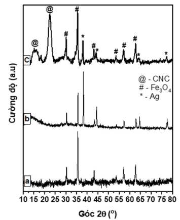

**Hình 4** : Giản đồXRD của (a) Fe3O4, (b) Ag/Fe3O4 và (c) Ag/Fe3O4/CNC 

lignin. Vì vậy dưới tác động của nhiệt độ, trong khu vực I, lignin bịphân hủy nhiệt đầu tiên và đến hemicellulose, cuối cùng là cellulose. Giản đồHình 5 cho thấy nhiệt độbắt đầu phân hủy mẫu ngày càng tăng từ 277 _[o]_ C lên 380 _[o]_ C chứng tỏqua từng bước xửlý mẫu thô, việc loại bỏhemicellulose và lignin đạt hiệu quả cao. 

Giản đồDTG, cho thấy CNC có nhiệt độphân hủy cao nhất ở357,02 _[o]_ C, nhiệt độbắt đầu phân hủy tương đối cao (315,03 _[o]_ C). Nguyên nhân là do khi thủy phân bằng HCl, trên bềmặt cellulose chủyếu chứa các nhóm hydroxyl, chính các nhóm này có xu hướng tương tác với nhau tạo nên mạng lưới liên kết hydrogen dày đặc quanh cellulose tinh thểgiúp CNC có nhiệt độphân hủy cao hơn so với CNC thủy phân bằng H2SO4 hoặc H3PO4[38] . Mặt khác, lượng tro còn lại của mẫu thủy phân thấp hơn nhiều so với mẫu thô. Điều này được giải thích là do mẫu thô có một lượng lớn lignin, hemicellulose và các tạp chất khác bao quanh sợi, sau khi các thành phần này phân hủy nhiệt sẽtạo thành lớp tro bao bọc và ngăn cản quá trình tiếp xúc với nhiệt của sợi cellulose. Trên cơ sởđó, có thểthấy lượng lignin và hemicellulose ngày càng giảm qua từng giai đoạn xửlý, đặc biệt là ởmẫu thủy phân, lượng tro còn lại là rất ít chứng tỏcellulose tổng hợp được có độtinh khiết cao. 

Giản đồTGA ởHình 6 cho thấy, sau khi gắn Ag và Fe3O4 lên CNC, mẫu bắt đầu phân hủy ởnhiệt độ khoảng 284 _[o]_ C và đạt cực đại ở297,08 _[o]_ C. Điều này có thểgiải thích là do khi gắn kim loại và oxide kim 

loại lên CNC, tính dẫn nhiệt cao của kim loại và oxit kim loại khiến mẫu có hiện tượng phân hủy sớm hơn so với CNC ban đầu. Mẫu Ag/Fe3O4/CNC bắt đầu phân hủy nhiều ở343 _[o]_ C, nhiệt độphân hủy cực đại là 364,68 _[o]_ C. Đây là vùng cellulose bịphân hủy, độmất khối lượng tương đối lớn, lượng tro còn lại nhiều hơn so với mẫu CNC ban đầu (13,67%). Đối với mẫu Ag/Fe3O4/CNC, do các kim loại và oxide kim loại có khảnăng chịu nhiệt cao, sau khi cellulose phân hủy hết các nano kim loại và oxide kim loại này vẫn còn tồn tại giúp mẫu bền nhiệt hơn. Do đó mẫu Ag/Fe3O4/CNC có tốc độphân hủy nhiệt chậm hơn và lượng tro còn lại cao hơn so với mẫu CNC ban đầu. 

## **Ảnh hiển vi điện tửquét (SEM)** 

Kết quảảnh SEM của mẫu CNC (Hình 7a) cho thấy cellulose tinh thểthu được sau quá trình thủy phân có dạng hình que hoặc sợi dài. Bềmặt của sợi gồghềdo ảnh hưởng của các giai đoạn xửlý bằng hóa chất từ nguồn nguyên liệu xơ dừa thô ban đầu. CNC sau khi tổng hợp và tồn tại ởdạng nhũ tương thì có kích thước nano tương tựnhư kết quảđã được công bốtrước đây của nhóm chúng tôi[37] . Nhưng ởnghiên cứu này, sau khi được cô lập và sấy khô, các vi sợi cellulose gắn kết với nhau nhờmạng lưới liên kết hydrogel nội phân tử và liên phân tửdày đặc, được tạo nên bởi các nhóm hydroxyl trên bềmặt và cảtương tác Van der Waals. Các liên kết này hình thành nên các bó sợi có kích thước micromet như trên Hình 7a. Quá trình nhiệt dung môi đã tạo ra các hạt Fe3O4 hình cầu có đường kính trung bình dao động trong khoảng 150 _–_ 180 nm (Hình 7b). Tiếp đến các hạt Fe3O4 được ngâm trong dung dịch AgNO3, khi đó ion Ag[+] sẽđược hấp phụ trên bềmặt Fe3O4. Hỗn hợp được tiến hành thủy nhiệt trong 5 giờở180 _[o]_ C, trong giai đoạn này sẽxảy ra quá trình tạo mầm kết tinh và phát triển hạt nano Ag trên bềmặt Fe3O4. Sựxuất hiện của Ag trong cấu trúc Ag/Fe3O4 được xác minh thông qua phổEDX (Hình 7e). Tuy nhiên, quá trình hình thành của các hạt nano Ag đã khiến cho Fe3O4 không còn giữđược hình dạng hạt cầu như ban đầu. Thay vào đó, vật liệu Ag/Fe3O4 có dạng hạt với kích thước không đồng đều, các hạt có xu hướng kết tụlại thành những khối hạt lớn (Hình 7c). 

Phân tích phổEDX tại Hình 7f, kết hợp với giản đồ XRD tại Hình 4c, đã xác minh sựhiện diện của cả ba thành phần là CNC, Fe3O4 và Ag trong vật liệu Ag/Fe3O4/CNC thông qua sựcó mặt của các nguyên tốlà C, Fe, O và Ag. Hình thái của vật liệu nanocomposite thu được qua phân tích ảnh SEM tại Hình 7d cho thấy đa sốAg/Fe3O4 tạo thành có dạng hạt được gắn kết, phân tán trên bềmặt CNC. Như vậy, trong 

**1610** 

_**Tạp chí Phát triển Khoa học và Công nghệ – Khoa học Tự nhiên, 5(4):1605-1617**_ 

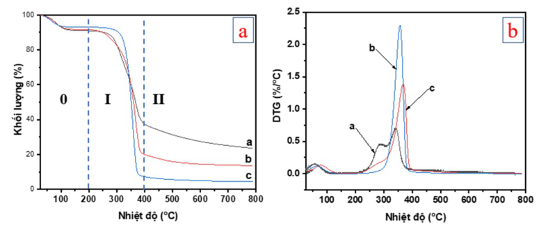

**Hình 5** : Giản đồTGA và DTG của a) mẫu thô, b) mẫu tẩy trắng và c) CNC 

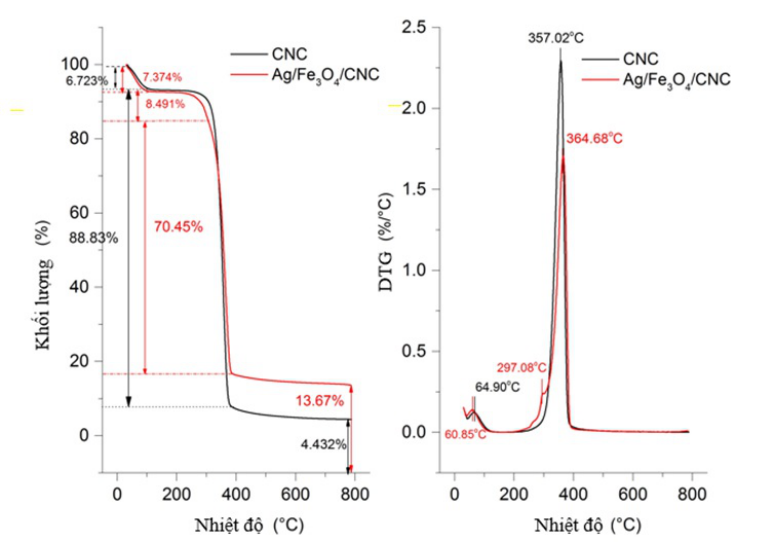

**Hình 6** : Giản đồTGA và DTG của CNC và Ag/Fe3O4/CNC 

quá trình thủy nhiệt tạo Ag/Fe3O4, khi sửdụng thêm CNC thì CNC sẽđóng vai trò là giá mang giúp cốđịnh và phân tán các hạt Ag/Fe3O4 trên bềmặt. CNC sẽ giúp ngăn cản sựkết tụvà hình thành những khối hạt lớn của Ag/Fe3O4 như đã được quan sát trong Hình 7c. Điều này có thểsẽđóng vai trò gia tăng diện tích bềmặt hiệu dụng của vật liệu. Tuy nhiên, có thể do hàm lượng của các tác chất sửdụng đểtạo Fe3O4 và Ag cao hơn nhiều so với lượng cellulose sửdụng, nên có một sốhạt nano không bám dính trên bềmặt 

sợi mà nằm phân bốbên ngoài như Hình 7c. 

## **Từtính của vật liệu** 

Từtính của vật liệu được phân tích bằng phương pháp đo từkếmẫu rung (VSM). Hình 8 thểhiện chu trình từtrễcủa các mẫu Fe3O4, Ag/Fe3O4 và Ag/Fe3O4/CNC. Giá trịtừđộbão hòa (M _S_ ) của các mẫu được xác định có giá trịlần lượt là: Fe3O4 (80 emu/g), Ag/Fe3O4 (48 emu/g) và Ag/Fe3O4/CNC (12 emu/g). Như vậy giá trịM _S_ của các mẫu giảm dần từ 

**1611** 

_**Tạp chí Phát triển Khoa học và Công nghệ – Khoa học Tự nhiên, 5(4):1605-1617**_ 

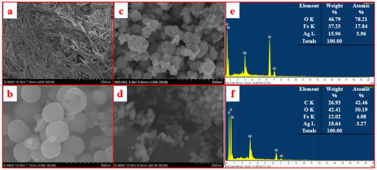

**Hình 7** : Ảnh SEM của (a) CNC, (b) Fe3O4, (c) Ag/Fe3O4 và (d) Ag/Fe3O4/CNC cùng phổEDX của (e) Ag/Fe3O4 và (f) Ag/Fe3O4/CNC 

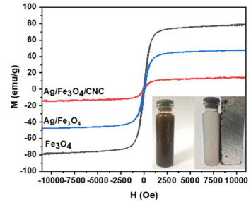

**Hình 8** : Đường cong từhóa của Fe3O4, Ag/Fe3O4 và Ag/Fe3O4/CNC. Hình ảnh chèn bên góc phải là quá trình thu hồi Ag/Fe3O4/CNC bằng nam châm. 

Fe3O4 đến Ag/Fe3O4 và cuối cùng là Ag/Fe3O4/CNC. Giá trịtừđộbão hòa của Fe3O4 giảm khi có các hạt nano Ag bám lên bềmặt Fe3O4 và càng giảm hơn nữa khi gắn thêm CNC, nguyên nhân do sựphân bốcác hạt nano Ag lên bềmặt Fe3O4 và CNC làm cản trởtính chất từcủa vật liệu. Kết quảnày phù hợp với các công bốtrước đây[48][–][50] . Mặc dù từtính giảm nhiều so với Fe3O4, nhưng nhìn chung vật liệu Ag/Fe3O4/CNC tổng hợp bằng phương pháp thủy nhiệt vẫn còn giữđược từtính (hình chèn nhỏbên góc phải Hình 8), vẫn có thểđược tách ra từdung dịch dưới sựảnh hưởng của từtrường bên ngoài. 

## **Đánh giá khảnăng hấp phụvà hoạt tính xúc tác của vật liệu** 

Quá trình khảo sát khảnăng hấp phụmethylene blue (MB) của CNC, Ag/Fe3O4 và Ag/Fe3O4/CNC được thực hiện tại nhiệt độphòng. Mỗi loại vật liệu (15 mg) được cho vào becher chứa sẵn 30 mL dung dịch methylene blue (MB) nồng độ10 ppm. Hỗn hợp được khuấy ởtốc độ300 vòng/phút. Các quá trình này được đánh giá bằng cách đo độhấp thu của dung dịch MB sau khoảng thời gian nhất định, sau đó dựa vào đường chuẩn MB đểxác định nồng độMB. Khảnăng loại bỏMB được tính theo công thức (2): _Khảnăng loại bỏ_ = _C[C] o[t][×]_[100][(][2][)] Trong đó C _t_ và C _o_ lần lượt là nồng độtại thời điểm t và nồng độban đầu của MB. 

Hình 9 là phổUV-Vis xác định hàm lượng MB còn lại theo thời gian khi sửdụng chất hấp phụlà CNC, Ag/Fe3O4 và Ag/Fe3O4/CNC _**.**_ Nhìn chung tất cảcác mẫu đều có khảnăng hấp phụMB và quá trình hấp phụnhanh chóng đạt cân bằng chỉtrong khoảng hơn 10 phút đầu. CNC cho thấy khảnăng hấp phụMB tốt nhờvào tương tác tĩnh điện của các nhóm hydroxyl tích điện âm trên bềmặt CNC và phẩm nhuộm cation MB mang điện tích dương. Sau thời gian 30 phút, lượng MB còn lại sau khi đã hấp phụtrên CNC là 20,5%. Khảnăng hấp phụcủa Ag/Fe3O4 thấp hơn khá nhiều so với CNC. Sau 30 phút hấp phụ, nồng độ MB còn lại của Ag/Fe3O4 là 48,3%. Khi Ag/Fe3O4 được gắn trên nền CNC thì khảnăng hấp phụcủa vật liệu tăng lên rất nhiều so với Ag/Fe3O4. Dựa vào phổ UV-Vis có thểthấy rằng mẫu Ag/Fe3O4/CNC có kết quảhấp phụtốt nhất. Nồng độMB còn lại sau thời gian hấp phụ30 phút là 10,5%. Kết quảnày có được 

**1612** 

_**Tạp chí Phát triển Khoa học và Công nghệ – Khoa học Tự nhiên, 5(4):1605-1617**_ 

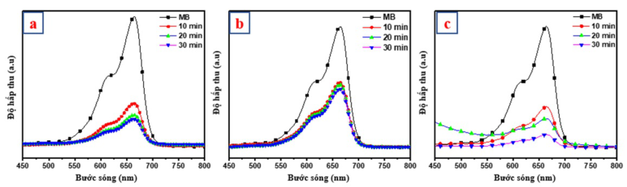

**Hình 9** : PhổUV-Vis khảo sát khảnăng hấp phụMB theo thời gian của các mẫu CNC, Ag/Fe3O4 và Ag/Fe3O4/CNC 

là do CNC đã giúp cho Ag/Fe3O4 phân tán một cách đồng đều và tạo ra nhiều khoảng trống đểMB có thể đi sâu vô trong cấu trúc vật liệu giúp tăng diện tích bề mặt tiếp xúc giữa Ag/Fe3O4/CNC và MB. Trên cơ sởkhảnăng hấp phụtốt của Ag/Fe3O4/CNC, khảo sát khảnăng xúc tác của vật liệu khi có mặt của lượng dư NaBH4, kết quảcho thấy độhấp thu đặc trưng tại bước sóng λ = 664 nm của MB giảm nhanh và rõ rệt trong thời gian ngắn (Hình 10). 

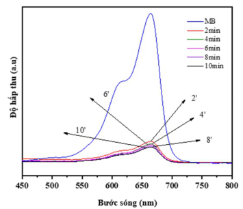

**Hình 10** : PhổUV-Vis khảo sát khảnăng phân hủy MB theo thời gian của chất xúc tác Ag/Fe3O4/CNC khi có sựhiện diện của NaBH4 

Dựa trên công thức (2) khảnăng loại bỏMB của các loại vật liệu được xác định và kết quảđược thểhiện trên Hình 11. Kết quảcho thấy khi sửdụng CNC làm giá mang đểtổng hợp Ag/Fe3O4 bằng phương pháp thủy nhiệt, nanocomposite Ag/Fe3O4/CNC không những cải thiện được khảnăng hấp phụMB của Ag/Fe3O4 mà cùng với sựhỗtrợcủa NaBH4, vật liệu này có thểlàm xúc tác khửMB với vận tốc rất nhanh, MB bịphân hủy tới hơn 80% chỉsau thời gian 2 phút. Khảnăng khửMB nhanh của nanocomposite Ag/Fe3O4/CNC khi có sựhỗtrợcủa NaBH4 có thể 

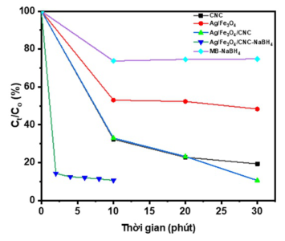

**Hình 11** : Khảnăng loại bỏMB của các loại vật liệu khác nhau theo thời gian. 

được giải thích thông qua một cơ chếcó hai giai đoạn, như được đềnghịvà minh họa trên Hình 12. 

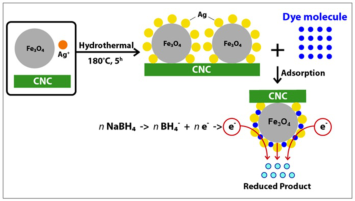

**Hình 12** : Cơ chếhình thành và khửMB của Ag/Fe3O4/CNC khi có sựhiện diện của NaBH4 

Ban đầu, như kết quảảnh SEM, quá trình tổng hợp Ag/Fe3O4 trên giá mang CNC bằng phương pháp thủy nhiệt giúp tạo ra các hạt cầu Ag/Fe3O4 có kích thước nhỏvà phân tán đồng đều trên bềmặt CNC. Điều này giúp cho vật liệu có diện tích bềmặt lớn, nên dễdàng hấp phụlượng lớn MB trên bềmặt nhờ tương tác tĩnh điện. Tiếp đến, MB sẽbịkhửkhi nhận 

**1613** 

_**Tạp chí Phát triển Khoa học và Công nghệ – Khoa học Tự nhiên, 5(4):1605-1617**_ 

electron từAg NPs với sựhỗtrợcủa NaBH4. Trên cơ sởcác nghiên cứu trước đây[51][,][52] , ởdạng dung dịch, ion BH4 _[−]_ trong NaBH4 là một tác nhân thân hạch, BH4 _[−]_ sẽđồng thời bám trên bềmặt và chuyển electron sang Ag NPs. Ag NPs đóng vai trò làm trung gian đểchuyển electron đến chất nhận là MB. Khi đó, quá trình khửMB xảy ra và MB bịphân hủy. 

## **KẾT LUẬN** 

Từnguyên liệu là nguồn phụphẩm xơ dừa Việt Nam, đã cô lập được cellulose bằng phương pháp hóa học và thủy phân trong môi trường HCl 6M đểtạo được CNC. CNC thu được có dạng sợi, được sửdụng làm giá mang đểtổng hợp Ag/Fe3O4 cấu trúc nano bằng phương pháp thủy nhiệt. Hình thái của vật liệu nanocomposite thu được qua phân tích ảnh SEM cho thấy Ag/Fe3O4 tạo thành có dạng hạt cầu được gắn đồng đều trên bềmặt CNC. Phân tích VSM cho thấy khi gắn Ag NPs lên Fe3O4 và tiếp đến là trên giá mang CNC thì từtính của mẫu giảm. Giá trịtừ độbão hòa (M _S_ ) của các mẫu đã giảm từFe3O4 (80 emu/g) xuống Ag/Fe3O4 (48 emu/g) và cuối cùng là Ag/Fe3O4/CNC (12 emu/g). Mặc dù có từtính thấp, vật liệu Ag/Fe3O4/CNC vẫn có thểđược tách ra khỏi dung dịch dưới ảnh hưởng của từtrường ngoài. Kết quảkhảo sát cho thấy khảnăng hấp phụcủa vật liệu Ag/Fe3O4/CNC cao hơn rất nhiều so với Ag/Fe3O4. Sau thời gian bịhấp phụ30 phút, nồng độMB còn lại chỉkhoảng 10,5%. Ngoài ra khi có sựhiện diện của NaBH4, vật liệu Ag/Fe3O4/CNC có khảnăng xúc tác nhanh cho quá trình khửMB, sau 2 phút, lượng MB đã bịphân hủy đến 85%. Kết quảcho thấy vật liệu này hứa hẹn tiềm năng ứng dụng trong lãnh vực xửlý nước thải dệt nhuộm. 

## **LỜI CẢM ƠN** 

Tác giảxin gửi lời cám ơn chân thành đến Phòng thí nghiệm Vật liệu đa chức năng, Khoa Khoa học và Công nghệVật liệu, Trường Đại học Khoa học Tự nhiên, Đại học Quốc gia TP.HCM vì đã tạo điều kiện đểthực hiện nghiên cứu này. 

## **DANH MỤC TỪVIẾT TẮT** 

_CNC: Nano tinh thểcellulose CCH: X ơ dừa FT-IR: FT-IR MB: Methylene Blue PFA: Acid Peroxyformic SEM: Kính hiển vi điện tửquét TGA: Phương pháp phân tích nhiệt – khối lượng UV-Vis: Phổtửngoại khảkiến VSM: Từkếmẫu rung XRD: Nhiễu xạtia X_ 

## **XUNG ĐỘT LỢI ÍCH** 

Nhóm tác giảcam kết không có xung đột lợi ích 

## **ĐÓNG GÓP CỦA CÁC TÁC GIẢ** 

Nguyễn Lê Tấn Huy, TừThịKim Phụng, Nguyễn Thái Ngọc Uyên: thực nghiệm 

Vũ Năng An, Trần ThịThanh Vân, Lê Văn Hiếu: định hướng nghiên cứu, chuẩn bịbản thảo và chỉnh sửa/phản hồi phản biện, hoàn chỉnh bản thảo. 

## **TÀI LIỆU THAM KHẢO** 

1. Wu J-M, Wen W. Catalyzed Degradation of Azo Dyes under Ambient Conditions. Environmental Science & Technology. 2010;44(23):9123-7;PMID: 21049925. Available from: https: //doi.org/10.1021/es1027234. 

2. Forgacs E, Cserháti T, Oros G. Removal of synthetic dyes from wastewaters: a review. Environment International. 2004;30(7):953-71;PMID: 15196844. Available from: https:// doi.org/10.1016/j.envint.2004.02.001. 

3. Iram M, Guo C, Guan Y, Ishfaq A, Liu H. Adsorption and magnetic removal of neutral red dye from aqueous solution using Fe3O4 hollow nanospheres. J Hazard Mater. 2010;181(13):1039-50;PMID: 20566240. Available from: https://doi.org/ 10.1016/j.jhazmat.2010.05.119. 

4. Gholivand M, Yamini Y, Dayeni M, Seidi S, Tahmasebi E. Adsorptive removal of Alizarin Red-S and alizarin yellow GG from aqueous solutions using polypyrrole-coated magnetic nanoparticles. Journal of Environmental Chemical Engineering. 2015;3;Available from: https://doi.org/10.1016/j.jece.2015. 01.011. 

5. Batmaz R, Mohammed N, Zaman M, Minhas G, Berry RM, Tam KC. Cellulose nanocrystals as promising adsorbents for the removal of cationic dyes. Cellulose. 2014;21(3):165565;Available from: https://doi.org/10.1007/s10570-014-01688. 

6. Yagub MT, Sen TK, Afroze S, Ang HM. Dye and its removal from aqueous solution by adsorption: a review. Adv Colloid Interface Sci. 2014;209:172-84;PMID: 24780401. Available from: https://doi.org/10.1016/j.cis.2014.04.002. 

7. Yagub MT, Sen TK, Afroze S, Ang HM. Dye and its removal from aqueous solution by adsorption: a review. Adv Colloid Interface Sci. 2014;209:172-84;PMID: 24780401. Available from: https://doi.org/10.1016/j.cis.2014.04.002. 

8. Jadhav JP, Parshetti GK, Kalme SD, Govindwar SP. Decolourization of azo dye methyl red by Saccharomyces cerevisiae MTCC 463. Chemosphere. 2007;68(2):394-400;PMID: 17292452. Available from: https://doi.org/10.1016/j.chemosphere.2006.12.087. 

9. Lee CS, Robinson J, Chong MF. A review on application of flocculants in wastewater treatment. Process Safety and Environmental Protection. 2014;92(6):489-508;Available from: https: //doi.org/10.1016/j.psep.2014.04.010. 

10. Renault F, Sancey B, Badot PM, Crini G. Chitosan for coagulation/flocculation processes - An eco-friendly approach. European Polymer Journal. 2009;45(5):1337-48;Available from: https://doi.org/10.1016/j.eurpolymj.2008.12.027. 

11. Uzal N, Yilmaz L, Yetis U. Nanofiltration and reverse osmosis for reuse of indigo dye rinsing waters. Separation Science and Technology. 2010;45(3):331-8;Available from: https://doi.org/ 10.1080/01496390903484818. 

12. Kim KH, Ihm SK. Heterogeneous catalytic wet air oxidation of refractory organic pollutants in industrial wastewaters: a review. J Hazard Mater. 2011;186(1):16-34;PMID: 21122984. Available from: https://doi.org/10.1016/j.jhazmat.2010.11.011. 

**1614** 

_**Tạp chí Phát triển Khoa học và Công nghệ – Khoa học Tự nhiên, 5(4):1605-1617**_ 

13. Alventosa-deLara E, Barredo-Damas S, Alcaina-Miranda MI, Iborra-Clar MI. Ultrafiltration technology with a ceramic membrane for reactive dye removal: optimization of membrane performance. J Hazard Mater. 2012;209-210:492-500;PMID: 22326247. Available from: https://doi.org/10.1016/j.jhazmat. 2012.01.065. 

14. Tuppurainen K, Asikainen A, Ruokojärvi P, Ruuskanen J. Perspectives on the formation of polychlorinated dibenzop-dioxins and dibenzofurans during municipal solid waste (MSW) incineration and other combustion processes. Accounts of Chemical Research. 2003;36(9):652-8;PMID: 12974648. Available from: https://doi.org/10.1021/ar020104+. 

15. Qureshi UA, Khatri Z, Ahmed F, Ibupoto AS, Khatri M, Mahar FK. Highly efficient and robust electrospun nanofibers for selective removal of acid dye. Journal of Molecular Liquids. 2017;244:478-88;Available from: https://doi.org/10.1016/ j.molliq.2017.08.129. 

16. Djellabi R, Yang B, Adeel Sharif HM, Zhang J, Ali J, Zhao X. Sustainable and easy recoverable magnetic TiO2-Lignocellulosic Biomass@Fe3O4 for solar photocatalytic water remediation. Journal of Cleaner Production. 2019;233:841-7;Available from: https://doi.org/10.1016/j.jclepro.2019.06.125. 

17. Chen Y, Zhang Y, Kou Q, Liu Y, Han D, Wang D.. Enhanced catalytic reduction of 4-nitrophenol driven by Fe3O4-Au magnetic nanocomposite interface engineering: From facile preparation to recyclable application. Nanomaterials (Basel). 2018;8(5):353;PMID: 29789457. Available from: https://doi. org/10.3390/nano8050353. 

18. Chen L, Liu M, Zhao Y, Kou Q, Wang Y, Liu Y.. Enhanced catalyst activity by decorating of Au on Ag@Cu2O nanoshell. Applied Surface Science. 2018;435:72-8;Available from: https:// doi.org/10.1016/j.apsusc.2017.11.082. 

19. Warner CL, Addleman RS, Cinson AD, Droubay TC, Engelhard MH, Nash MA. High-performance, superparamagnetic, nanoparticle-based heavy metal sorbents for removal of contaminants from natural waters. ChemSusChem. 2010;3(6):749-57;PMID: 20468024. Available from: https://doi. org/10.1002/cssc.201000027. 

20. Liu Y, Chen J-F, Bao J, Zhang Y. Manganese-modified Fe3O4 microsphere catalyst with effective active phase of forming light olefins from syngas. ACS Catalysis. 2015;5(6):39059;Available from: https://doi.org/10.1021/acscatal.5b00492. 

21. Das R, Sypu V, Kamdem Paumo H, Bhaumik M, Maharaj V, Maity A. Silver decorated magnetic nanocomposite (Fe3O4 @PPy-MAA/Ag) as highly active catalyst towards reduction of 4-nitrophenol and toxic organic dyes. Applied Catalysis B: Environmental. 2018;244;Available from: https://doi.org/10. 1016/j.apcatb.2018.11.073. 

22. Liu Y, Zhang YY, Kou QW, Wang DD, Han DL, Lu ZY. Fe3O4 /Au binary nanocrystals: Facile synthesis with diverse structure evolution and highly efficient catalytic reduction with cyclability characteristics in 4-nitrophenol. Powder Technology. 2018;338:26-35;Available from: https://doi.org/10.1016/j. powtec.2018.06.037. 

23. Yılmaz Baran N, Baran T, Menteş A. Production of novel palladium nanocatalyst stabilized with sustainable chitosan/cellulose composite and its catalytic performance in Suzuki-Miyaura coupling reactions. Carbohydrate Polymer. 2018;181:596-604;PMID: 29254012. Available from: https://doi.org/10.1016/j.carbpol.2017.11.107. 

24. Wang G, Chen Y, Xu G, Pei Y. Effective removing of methylene blue from aqueous solution by tannins immobilized on cellulose microfibers. Int J Biol Macromol. 2019;129:198-206;PMID: 30738902. Available from: https://doi.org/10.1016/j.ijbiomac. 2019.02.039. 

25. Ibnu Abdulwahab M, Khamkeaw A, Jongsomjit B, Phisalaphong M. Bacterial cellulose supported alumina catalyst for ethanol dehydration. Catalysis Letters. 2017;147(9):2462-72;Available from: https://doi.org/10.1007/ s10562-017-2145-y. 

26. Rodrigues DM, Hunter LG, Bernard FL, Rojas MF, Vecchia FD, Einloft S. Harnessing CO2 into carbonates using heteroge- 

neous waste derivative cellulose-based poly(ionic liquids) as catalysts. Catalysis Letters. 2018;149:733-43;Available from: https://doi.org/10.1007/s10562-018-2637-4. 

27. Peng S, Gao F, Zeng D, Peng C, Chen Y, Li M. Synthesis of AgFe3O4 nanoparticles supported on polydopamine-functionalized porous cellulose acetate microspheres: catalytic and antibacterial applications. Cellulose. 2018;25(8):4771-82;Available from: https://doi.org/10.1007/s10570-018-1886-0. 

28. Guo L, Duan B, Zhang L. Construction of controllable size silver nanoparticles immobilized on nanofibers of chitin microspheres via green pathway. Nano Research. 2016;9(7):214961;Available from: https://doi.org/10.1007/s12274-016-1104-z. 

29. Maleki A, Movahed H, Ravaghi P. Magnetic cellulose/Ag as a novel eco-friendly nanobiocomposite to catalyze synthesis of chromene-linked nicotinonitriles. Carbohydrate Polymers. 2016;156;PMID: 27842821. Available from: https://doi.org/10. 1016/j.carbpol.2016.09.002. 

30. Shojaei S, Ghasemi Z, Shahrisa A. Cu(I)@Fe3O4 nanoparticles supported on imidazolium-based ionic liquidgrafted cellulose: Green and efficient nanocatalyst for multicomponent synthesis of N-sulfonylamidines and N-sulfonylacrylamidines. Applied Organometallic Chemistry. 2017;31(11):e3788;Available from: https://doi.org/10.1002/aoc.3788. 

31. Pei Y, Zhao J, Shi R, Wang X, Li Z, Ren J. Hierarchical porous carbon-supported copper nanoparticles as an efficient catalyst for the dimethyl carbonate synthesis. Catalysis Letters. 2019;149(11):3184-93;Available from: https://doi.org/10.1007/ s10562-019-02884-7. 

32. Karami S, Zeynizadeh B, Shokri Z. Cellulose supported bimetallic F… Cu nanoparticles: a magnetically recoverable nanocatalyst for quick reduction of nitroarenes to amines in water. Cellulose. 2018;25:3295-305;Available from: https: //doi.org/10.1007/s10570-018-1809-0. 

33. Cai J, Liu Y, Zhang L. Dilute solution properties of cellulose in LiOH/urea aqueous system. Journal of Polymer Science Part B: Polymer Physics. 2006;44(21):3093-101;Available from: https: //doi.org/10.1002/polb.20938. 

34. Wang G. Selective hydrothermal degradation of cellulose to formic acid in alkaline solutions. Cellulose. 2018;v. 25(no. 10):pp. 5659-68-2018 v.25 no.10;Available from: https://doi. org/10.1007/s10570-018-1979-9. 

35. Luo X, Liu S, Zhou J, Zhang L. In situ synthesis of Fe3O4/cellulose microspheres with magnetic-induced protein delivery. Journal of Materials Chemistry. 2009;19(21):3538-45;Available from: https://doi.org/10. 1039/b900103d. 

36. Sankhla S, Sardar HH, Neogi S. Greener extraction of highly crystalline and thermally stable cellulose micro-fibers from sugarcane bagasse for cellulose nano-fibrils preparation. Carbohydrate Polymers. 2021;251:117030;PMID: 33142589. Available from: https://doi.org/10.1016/j.carbpol.2020.117030. 

37. Nang An V, Chi Nhan HT, Tap TD, Van TTT, Van Viet P, Van Hieu L. Extraction of High Crystalline Nanocellulose from biorenewable sources of Vietnamese agricultural wastes. Journal of Polymers and the Environment. 2020;28(5):1465-74;Available from: https://doi.org/10.1007/s10924-020-01695-x. 

38. Kargarzadeh H, Ishak b, Ahmad I, Abdullah I, Dufresne A, Siti b. Effects of hydrolysis conditions on the morphology, crystallinity, and thermal stability of cellulose nanocrystals extracted from kenaf bast fibers. Cellulose. 2012;19:85566;Available from: https://doi.org/10.1007/s10570-012-96846. 

39. Uzman A. Molecular biology of the cell (4th ed.): Alberts, B., Johnson, A., Lewis, J., Raff, M., Roberts, K., and Walter, P. Biochemistry and Molecular Biology Education. 2003;31(4):212-4;Available from: https://doi.org/10.1002/bmb. 2003.494031049999. 

40. Ng H-M, Sin LT, Tee T-T, Bee S-T, Hui D, Low C-Y, et al. Extraction of cellulose nanocrystals from plant sources for application as 

**1615** 

_**Tạp chí Phát triển Khoa học và Công nghệ – Khoa học Tự nhiên, 5(4):1605-1617**_ 

reinforcing agent in polymers. Composites Part B: Engineering. 2015;75:176–200;Available from: https://doi.org/10.1016/ j.compositesb.2015.01.008. 

41. Wulandari WT, Rochliadi A, Arcana IM. Nanocellulose prepared by acid hydrolysis of isolated cellulose from sugarcane bagasse. IOP Conference Series: Materials Science and Engineering. 2016;107:012045;Available from: https://doi.org/10. 1088/1757-899X/107/1/012045. 

42. Razali N, Hossain M, Taiwo O, Ibrahim M, Wahidah N, Nadzri M. Influence of acid hydrolysis reaction time on the isolation of cellulose nanowhiskers from oil palm empty fruit bunch microcrystalline cellulose. Bioresources. 2017;12:677388;Available from: https://doi.org/10.15376/biores.12.3.67736788. 

43. Zhang X, Sun H, Tan S, Gao J, Fu Y, Liu Z. Hydrothermal synthesis of Ag nanoparticles on the nanocellulose and their antibacterial study. Inorganic Chemistry Communications. 2019;100:44-50;Available from: https://doi.org/10.1016/ j.inoche.2018.12.012. 

44. Pal S, Nisi R, Stoppa M, Licciulli A. Silver-functionalized bacterial cellulose as antibacterial membrane for wound-healing applications. ACS Omega. 2017;2(7):3632-9;PMID: 30023700. Available from: https://doi.org/10.1021/acsomega.7b00442. 

45. Dong Y-Y, Liu S, Liu Y-J, Meng L-Y, Ma M-G. Ag@ Fe3O4@ cellulose nanocrystals nanocomposites: microwave-assisted hydrothermal synthesis, antimicrobial properties, and good adsorption of dye solution. Journal of Materials Science. 2017;52(13):8219-30;Available from: https://doi.org/10.1007/ s10853-017-1038-1. 

46. Jahan MS, Saeed A, He Z, Ni Y. Jute as raw material for the preparation of microcrystalline cellulose. Cellulose. 2011;18(2):451-9;Available from: 

## https://doi.org/10.1007/s10570-010-9481-z. 

47. Alvarez VA, Vázquez A. Thermal degradation of cellulose derivatives/starch blends and sisal fibre biocomposites. Polymer Degradation and Stability. 2004;84(1):13-21;Available from: https://doi.org/10.1016/j.polymdegradstab.2003.09.003. 

48. Khan FSA, Mubarak NM, Khalid M, Walvekar R, Abdullah EC, Mazari SA, et al. Magnetic nanoadsorbents’ potential route for heavy metals removal-a review. Environmental Science and Pollution Research. 2020;27(19):24342-56;PMID: 32306264. Available from: https://doi.org/10.1007/s11356-020-08711-6. 

49. Wang G, Li F, Li L, Zhao J, Ruan X, Ding W, et al. In Situ Synthesis of Ag-Fe3O4 Nanoparticles Immobilized on Pure Cellulose Microspheres as Recyclable and Biodegradable Catalysts. ACS Omega. 2020;5(15):8839-46;PMID: 32337446. Available from: https://doi.org/10.1021/acsomega.0c00437. 

50. Babu AT, Sebastian M, Manaf O, Antony R. Heterostructured Nanocomposites of Ag Doped Fe3O4 Embedded in ZnO for Antibacterial Applications and Catalytic Conversion of Hazardous Wastes. Journal of Inorganic and Organometallic Polymers and Materials. 2019;Available from: https://doi.org/10. 1007/s10904-019-01366-y. 

51. Jiang Z-J, Liu C-Y, Sun L-W. Catalytic Properties of Silver Nanoparticles Supported on Silica Spheres. The Journal of Physical Chemistry B. 2005;109(5):1730-5;PMID: 16851151. Available from: https://doi.org/10.1021/jp046032g. 

52. Zhang Y, Zhu P, Chen L, Li G, Zhou F, Lu D, et al. Hierarchical architectures of monodisperse porous Cu microspheres: synthesis, growth mechanism, high-efficiency and recyclable catalytic performance. Journal of Materials Chemistry A. 2014;2(30):11966-73;Available from: https://doi.org/ 10.1039/C4TA01920B. 

**1616** 

_**Science & Technology Development Journal – Natural Sciences, 5(4):1605-1617**_ 

_**Research Article**_ 

**Open Access Full Text Article** 

## **Hydrothermal preparation of Ag/Fe** 3 **O** 4 **/Cellulose nanocrystals nanocomposite and its application in methylene blue removal** 

## **Vu Nang An[*] , Nguyen Le Tan Huy, Tu Thi Kim Phung, Nguyen Thai Ngoc Uyen, Tran Thi Thanh Van, Le Van Hieu** 

Use your smartphone to scan this QR code and download this article 

## **ABSTRACT** 

The preparation of reusable and eco-friendly materials from renewable biomass resources such as cellulose is an inevitable choice for the sustainable development. In this paper, Ag/Fe3O4/cellulose nanocrystals (CNC) nanocomposite was prepared and investigated its application in methylene blue (MB) removal. In the procedure, CNC was isolated from Vietnamese coconut husk fibers (CCH) biomass via a formic/peroxyformic acid process treatment and hydrochloric acid hydrolysis. The obtained CNC was used as a starting material to prepare Ag/Fe3O4 nanostructure by facile and green hydrothermal method. The nanocomposite was characterized by X-ray powder diffraction (XRD), scanning electron microscopy (SEM), energy-dispersive X-ray spectroscopy (EDX), thermogravimetricanalysis(TGA),andmagneticpropertiesviavibratingsamplemagnetometer(VSM)analysis. The results showed that Ag/Fe3O4 was formed with a particle structure and dispersed on the CNC surface. All samples exhibited magnetic properties and the saturation magnetization (Ms) of Ag/Fe3O4 composite was reduced from 48 to 12 emu/g with adding CNC. Ag/Fe3O4/CNC magnetic nanocomposite demonstrated good adsorption of MB solution and exhibited a fast catalytic reduction of MB after immersion treatment by NaBH4, which showed potential applications in water treatment. 

**Key words:** Ag/Fe3O4 composite, catalytic dye reduction, cellulose nanocrystals, coconut husk fibers, magnetic nanocomposite, wastewater treatment 

## _University of Science, VNU-HCM_ 

## **Correspondence** 

**Vu Nang An** , University of Science, VNU-HCM Email: vnan@hcmus.edu.vn 

## **History** 

- Received: 23-7-2020 

- Accepted: 08-10-2021 

- Published: 06-11-2021 

**DOI : 10.32508/stdjns.v5i4.930** 

## **Copyright** 

© VNU-HCM Press. This is an openaccess article distributed under the terms of the Creative Commons Attribution 4.0 International license. 

**Cite this article :** An V N, Huy N L T, Phung T T K, Uyen N T N, Van T T T, Hieu L V. **Hydrothermal preparation of Ag/Fe** 3 **O** 4 **/Cellulose nanocrystals nanocomposite and its application in methylene blue removal** . _Sci. Tech. Dev. J. - Nat. Sci.;_ 5(4):1605-1617. 

**1617** 

