This is an open access article published under a Creative Commons Attribution (CC-BY) License, which permits unrestricted use, distribution and reproduction in any medium, provided the author and source are cited. 

www.acsami.org 

Research Article 

## Multifunctional Carbon Aerogels with Hierarchical Anisotropic Structure Derived from Lignin and Cellulose Nanofibers for CO2 Capture and Energy Storage 

Shiyu Geng,* Jiayuan Wei, Simon Jonasson, Jonas Hedlund, and Kristiina Oksman* 

Cite This: ACS Appl. Mater. Interfaces 2020, 12, 7432−7441 Read Online 

ACCESS Metrics & More Article Recommendations *sı Supporting Information 

ABSTRACT: In current times, CO2 capture and lightweight energy storage are receiving significant attention and will be vital functions in next-generation materials. Porous carbonaceous materials have great potential in these areas, whereas most of the developed carbon materials still have significant limitations, such as nonrenewable resources, complex and costly processing, or the absence of tailorable structure. In this study, a new strategy is developed for using the currently underutilized lignin and cellulose nanofibers, which can be extracted from renewable resources to produce high-performance multifunctional carbon aerogels with a tailorable, anisotropic pore structure. Both the macro- and microstructure of the carbon aerogels can be simultaneously controlled by carefully tuning the weight ratio of lignin to cellulose nanofibers in the precursors, which considerably influences their final porosity and surface area. The designed carbon aerogels demonstrate excellent performance in both CO2 capture and capacitive energy storage, and the best results exhibit a CO2 adsorption capacity of 5.23 mmol g[−][1] at 273 K and 100 kPa and a specific electrical double-layer capacitance of 124 F g[−][1] at a current density of 0.2 A g[−][1] , indicating that they have great future potential in the relevant applications. 

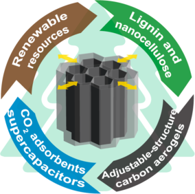

KEYWORDS: carbon aerogels, lignin, cellulose nanofibers, CO2 capture, supercapacitors 

## ■[INTRODUCTION] 

In the recent decades, carbonaceous porous materials have received great research interest because of their large surface area, high porosity, low density, and sufficient electrical conductivity.[1] The large amount of active sites on the surface and open three-dimensional (3D) porous structure of carbonaceous materials enable the efficient adsorption and diffusion of molecules as well as the stable transport of electrons and electrolyte ions. Therefore, carbonaceous porous materials have great potential in both gas capture and energy storage.[2][,][3] Activated carbon, one of the most developed carbonaceous porous materials, has been widely used for gas and liquid purification since the beginning of the 20th century.[4] More recently, studies have focused on investigating the CO2 adsorption behavior of activated carbon and other porous carbonaceous materials derived from nitrogen-rich synthetic polymers, such as lysine-catalyzed resorcinol−formaldehyde (RF) and polypyrrole.[5][−][7] Meanwhile, because of the burgeoning demand for lightweight energy storage devices, the electrochemical properties of different carbonaceous aerogels as electrodes in such devices have been investigated over the past decade.[8][−][15] Aerogel electrodes can be carbonized from various precursors, including RF,[8] melamine sponges,[11] watermelon,[9] bacterial cellulose,[10] and regenerated cellulose.[12][,][13] Many functional nanomaterials have also been added to the electrodes to improve their performance, such 

as graphene,[8][,][15] carbon nanotubes,[14][,][15] and metal oxide nanoparticles.[9] 

Although these previous studies were innovative and some of them achieved great results, including a CO2 adsorption capacity of 6.2 mmol g[−][1] (273 K, 1 atm) or a specific electrical double-layer (EDL) capacitance of 122 F g[−][1] (two-electrode cell, 50 mA g[−][1] ),[7][,][8] there are still many limitations of these carbonaceous aerogels. The precursors for carbonization are commonly obtained from nonrenewable resources, and the manufacturing processes of the functional nanomaterials are often complex and costly. While some porous carbon materials have been directly produced from different types of biomass, such as watermelon,[9] coconut shells, and olive husks,[16] their final structure is severely restricted by the structure of the original biomass, which lacks the possibility to be controlled or optimized. For the carbon materials derived from cellulose, their quality is considerably limited by the relatively low carbon content and absence of aromatic structures in the precursor. Therefore, it is highly desired to develop new precursors for carbonaceous aerogels from renewable and 

Received: November 4, 2019 Accepted: January 21, 2020 Published: January 21, 2020 

https://dx.doi.org/10.1021/acsami.9b19955 ACS Appl. Mater. Interfaces 2020, 12, 7432−7441 

© 2020 American Chemical Society 

7432 

ACS Applied Materials & Interfaces www.acsami.org Research Article 

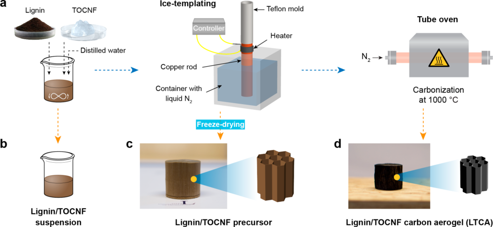

Figure 1. (a) LTCAs production process and illustrations of the products generated from each step, including (b) lignin/TOCNF suspensions, (c) lignin/TOCNF precursors, and (d) LTCAs. 

environmentally sustainable resources with an adjustable structure and outstanding performance. 

Lignin, an abundant biopolymer that can be extracted from various plants, is a primary byproduct of the pulp and paper industry and has been severely underutilized.[17] As it contains a high number of aromatic structures, lignin is an appealing raw material for producing high-quality carbon with considerable yields.[18][,][19] Recent studies reported that lignin has been successfully utilized in the production of structural carbon fibers and electrospun carbon mats,[20][−][22] which have great potential in structural and electrical applications. Ligninderived activated carbon has also been reported to have a comparable specific surface area and pore volume to its commercial counterparts.[23] As another key component of plants, cellulose can be fibrillated to cellulose nanofibers (CNFs) through 2,2,6,6-tetramethylpiperidine-1-oxyl radical (TEMPO)-mediated oxidation, resulting in TEMPO-oxidized CNFs (TOCNFs) with very small width (≤3 nm) and large aspect ratio (>100).[24] By combining lignin with a small amount of TOCNFs, it is believed that the TOCNFs of large aspect ratio can generate networks which help the formation of integrated aerogel precursors, and their thin fiber width enables the generation of additional meso- and micropores during carbonization, resulting in large specific surface area of the final carbon aerogels, which is advantageous for both gas capturing and energy storage applications. To our best knowledge, the idea of combining lignin and TOCNFs as precursors in preparation of porous carbon aerogels has not yet been reported in the literature. 

Furthermore, using the water-soluble kraft lignin together with the aqueous TOCNF suspension allows to perform the ice-templating process, in which the growth of unidirectional ice crystals in the suspension can bring anisotropic macroporous structure to the aerogel precursors after freeze-drying.[25] This unique structure is expected to be remained in the derived carbon aerogels after carbonization, leading to the formation of hierarchical porous structure including pores at all length scales, i.e., macro-, meso-, and micropores. This facilitates rapid mass transport, large surface area, and high porosity at the 

same time, which are significantly beneficial for achieving highperformance gas capturing and energy storage functions.[26][,][27] Other investigated techniques to produce hierarchical porous carbon materials are usually based on sol−gel process and template replication,[28][−][30] which need multiple complex procedures making them non-environmentally friendly, timeconsuming, and expensive. 

In this study, we describe a new type of carbon aerogel with hierarchical anisotropic porous structure derived from kraft lignin/TOCNF precursors and synthesized by ice-templating and carbonization. We further demonstrate that the prepared carbon aerogels can achieve multiple functions, including CO2 capture and capacitive energy storage, with excellent properties. By varying the TOCNF content, the surface area of the carbon aerogels can be easily adjusted, which affects their final CO2 adsorption capacity and EDL capacitance. This strategy offers new possibilities for the development of porous carbonaceous materials from renewable carbon resources with adjustable structure that are environmentally sustainable with remarkable performance in the relevant applications. 

## ■[RESULTS][AND][DISCUSSION] 

The preparation process of the lignin/TOCNF-derived carbon aerogels (LTCAs) studied in this work is summarized in Figure 1a. The kraft lignin and TOCNF suspension were mixed with distilled water to generate lignin/TOCNF suspensions (Figure 1b) with various TOCNF concentrations (8, 10, and 12 wt % of the total dry weight). The suspensions were then icetemplated and freeze-dried to form lignin/TOCNF precursors (Figure 1c) and carbonized at 1000 °C to generate different LTCAs (Figure 1d, denoted as LTCA8, LTCA10, and LTCA12 according to the TOCNF content). The LTCAs show a volume shrinkage of 70% compared to their corresponding precursors due to the degradation of both lignin and TOCNFs during carbonization. The porosity of the LTCAs is increased from 91.6% to 93.4% with increasing TOCNF content, while the density decreased from 0.18 to 0.14 g cm[−][3] (Table S1). Additionally, the LTCAs exhibited a certain hydrophobicity, as shown in Figure S1, because most of 

7433 

https://dx.doi.org/10.1021/acsami.9b19955 ACS Appl. Mater. Interfaces 2020, 12, 7432−7441 

**----- Start of picture text -----** 
ACS Applied Materials & Interfaces www.acsami.org Research Article **----- End of picture text -----** 

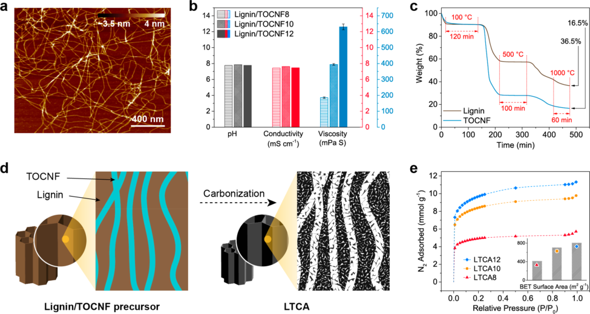

Figure 2. (a) AFM height image of the TOCNFs. (b) pH, conductivity, and viscosity of the aqueous lignin/TOCNF suspensions with different TOCNF contents at ∼22 °C. (c) Thermal degradation behavior of lignin and TOCNF against the processing time during the same heating process as the carbonization procedure used in this work. (d) Schematic of the expected microstructure of the lignin/TOCNF aerogel before and after carbonization. (e) N2 adsorption isotherms of LTCA8, LTCA10, and LTCA12 recorded at 77 K and their corresponding BET surface area. 

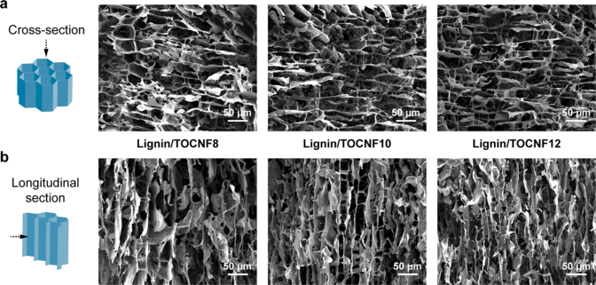

Figure 3. SEM images of the (a) cross section and (b) longitudinal section of the lignin/TOCNF precursors with different TOCNF contents. 

the oxygen and hydrogen in the samples were eliminated by carbonization. 

The TOCNFs used in this study were directly extracted from softwood powder, and their morphology, which was characterized by using atomic force microscopy (AFM), is shown in Figure 2a. The average fiber width was 1.7 ± 0.4 nm (Figure S2) according to the AFM height images, and the fiber length reached several micrometers. The pH and conductivity of all lignin/TOCNF suspensions were similar (Figure 2b), · while their viscosity increased drastically from 186 to 630 mPa s as the TOCNF content increased from 8 to 12 wt %. This was attributed to the extremely large aspect ratio of the TOCNFs and their negative surface charge (degree of carboxylation of 0.72 ± 0.13 mmol g[−][1] , measured by conductometric titration). 

To individually investigate the transition of each component in the lignin/TOCNF precursors during carbonization, the thermal degradation behavior of lignin and TOCNF under the 

simulated carbonization conditions was examined by thermogravimetric analysis (TGA; Figure 2c). Both components were substantially degraded in the temperature range 200−400 °C (Figures S3 and S4), which was likely caused by dehydration and chain scission.[31] However, the lignin residue content was 58% in the isothermal step at 500 °C, which was much higher than that of TOCNF (28%). Degradation continued until the end of the carbonization process, and the lignin and TOCNF residue contents reached 36.5% and 16.5%, respectively. The simulated carbonization results indicate that TOCNFs can act as a sacrificial template during carbonization and generate a higher pore volume than lignin after conversion to carbon due to the lower residue content, as illustrated in Figure 2d. Furthermore, as the width of the TOCNFs was very small (1.7 nm), the generation of homogeneously distributed meso- and micropores in the LTCAs can be expected. Figure 2e shows the N2 adsorption isotherms of the LTCAs and the corresponding Brunauer−Emmett−Teller (BET) surface 

7434 

https://dx.doi.org/10.1021/acsami.9b19955 ACS Appl. Mater. Interfaces 2020, 12, 7432−7441 

ACS Applied Materials & Interfaces 

Research Article 

**----- Start of picture text -----** 
www.acsami.org **----- End of picture text -----** 

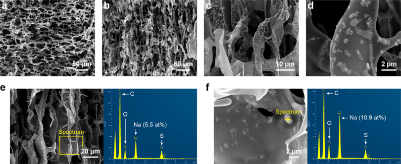

Figure 4. SEM images of LTCA12 from the (a) cross section, (b) longitudinal section, and (c, d) magnified views. SEM-EDX spectra of LTCA12 collected from (e) a certain area and (f) a certain point located on a surface particle. 

Table 1. Elemental Composition (in at. %) of the Lignin/TOCNF Precursors and the LTCAs before and after Washing According to the SEM-EDX 

||precursor|carbon aerogel before washing|carbon aerogel after washing|
|---|---|---|---|
|sample|C O Na S|C O Na S|C O Na S|
|lignin/TOCNF8 lignin/TOCNF10 lignin/TOCNF12|62.5 26.8 7.0 3.7 61.2 28.0 6.9 3.9 60.6 28.9 6.5 4.0|83.4 8.7 5.8 2.1 82.6 9.4 5.4 2.6 82.0 9.4 5.2 3.4|90.2 6.7 2.7 0.4 87.9 8.1 2.7 1.3 88.0 6.5 3.2 2.3|

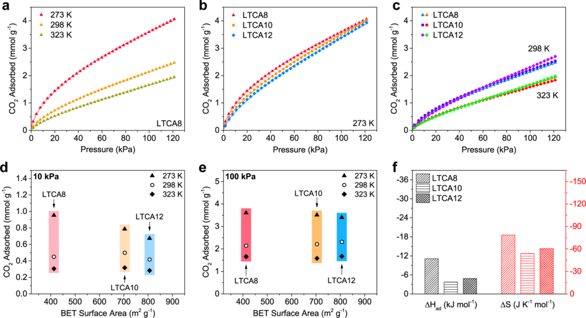

Figure 5. CO2 capture analysis for the LTCAs before washing. (a) CO2 adsorption isotherms of LTCA8 at different temperatures, and the isotherms of LTCA8, LTCA10, and LTCA12 at (b) 273 K and (c) 298 and 323 K. (d, e) CO2 adsorption capacity of the LTCAs at different temperatures against their BET surface area under 10 and 100 kPa according to the related adsorption isotherms. (f) Enthalpy (ΔHad) and entropy (ΔS) of CO2 adsorption by the LTCAs calculated by using the Langmuir adsorption model and van’t Hoff equation. 

areas. LTCA12 exhibited a higher BET surface area of 806 m[2] g[−][1] than that of LTCA10 (704 m[2] g[−][1] ) and LTCA8 (413 m[2] g[−][1] ), which is consistent with the TGA results. In addition, the pore size distribution of the LTCAs is demonstrated in Figure S5a, which indicates that micropores and small mesopores (2− 4 nm) dominated in all LTCAs and significantly contributed to the pore volume. Interestingly, a peak at a pore size of 2.6 nm 

appeared in all curves, and its relative intensity increased with increasing TOCNF content in the LTCAs. This could imply that these pores were generated due to the sacrifice of the TOCNFs, which further confirms the mechanism shown in Figure 2d. 

The morphology of the lignin/TOCNF precursors was studied by scanning electron microscopy (SEM), and the 

7435 

https://dx.doi.org/10.1021/acsami.9b19955 ACS Appl. Mater. Interfaces 2020, 12, 7432−7441 

ACS Applied Materials & Interfaces www.acsami.org 

Research Article 

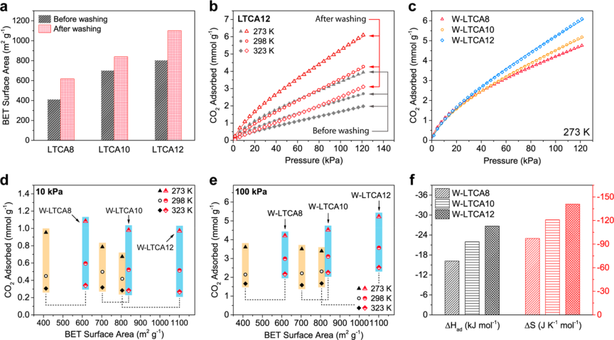

Figure 6. CO2 capture analysis for the LTCAs after washing. (a) BET surface area of the LTCAs before and after washing. (b) CO2 adsorption isotherms of LTCA12 at different temperatures before and after washing and (c) of the W-LTCAs at 273 K. (d, e) CO2 adsorption capacity of the unwashed LTCAs (black points with yellow background) and the W-LTCAs at different temperatures against their BET surface area under 10 and 100 kPa. (f) CO2 adsorption enthalpy and entropy of the W-LTCAs. 

results are shown in Figure 3. All precursors exhibited a significant anisotropic macroporous structure generated by the ice-templating process, which provides rapid mass or energy transfer in the longitudinal direction and is beneficial for many applications such as gas or liquid adsorption and thermal insulation.[26][,][32] Moreover, the size of the macropores decreased with increasing TOCNF content, which is likely due to the increased viscosity of the lignin/TOCNF suspensions, which hindered the horizontal expansion of the ice crystals during icetemplating, providing the lignin/TOCNF precursors with narrower macropores after freeze-drying, as exhibited in Figure 3b. Similar results were reported by Pan et al.[33] Therefore, the improved surface area of the LTCAs with higher TOCNF contents can be attributed to the smaller macropores and the higher number of meso- and micropores generated by the carbonization of TOCNFs. 

The structures of LTCA8, LTCA10, and LTCA12 after carbonization are illustrated in Figure S6, Figure S7, and Figure 4, respectively. The anisotropic porous structure of the LTCAs remained intact (Figure 4a,b), although the cell walls are slightly wrinkled due to the shrinkage that occurred during the carbonization. The energy dispersive spectroscopy (SEMEDX) data (Table 1) indicate that the carbon content of all samples was increased by carbonization, while the oxygen content was decreased dramatically. The contents of sodium and sulfur originating from the kraft lignin were also reduced due to the formation of their volatile compounds. The SEM images of LTCA12 recorded at higher magnification (Figure 4c,d) show that there were particles on the surface of the carbon sample, which were not observed on the precursor, and similar particles were also observed in LTCA8 and LTCA10. To characterize these particles, localized EDX spectra were collected from LTCA12 and are illustrated in Figure 4e,f. Figure 4e shows a spectrum collected from an area indicated on the left on the SEM image, and the obtained elemental composition was similar to the average data presented in Table 

1. However, the spectrum recorded from a certain particle on the surface indicates a much higher sodium content (10.9 at. %) at this point, as shown in Figure 4f. This suggests that the particles could contain sodium salts, such as sodium carbonate and sodium sulfate, which were likely formed by the migration of sodium from the inner area to the surface of the cell walls during carbonization. A similar phenomenon was observed and explored in our previous study, which showed consistent results with those of this work.[22] 

To investigate the CO2 adsorption behavior of the LTCAs, their CO2 adsorption isotherms were recorded at 273, 298, and 323 K in the pressure range of 0−120 kPa (Figure 5). As the temperature increased, the slope of the adsorption isotherms was reduced, as shown in Figure 5a and Figures S8 and S9, because adsorption is an exothermic process. At 273 K, LTCA8 outperformed the other two samples with higher TOCNF contents, particularly in the low-pressure range (Figure 5b). This is in contrast to the changes in their BET surface area measured by using N2 under cryogenic condition (Figure 2e). At 298 and 323 K, the adsorption isotherms of the three LTCAs were similar (Figure 5c). The adsorption capacities of the samples under pressures of 10 kPa, which is similar to the partial pressure of CO2 in flue gas, and 100 kPa, which is atmospheric pressure, are summarized as a function of their BET surface area, as shown in Figure 5d,e. At 10 kPa and 273 K, the capacity reached 0.95 mmol g[−][1] for LTCA8 but decreased to 0.79 and 0.67 mmol g[−][1] for LTCA10 and LTCA12, respectively. This could be because LTCA8 contained the highest number of accessible ultramicropores, which can significantly contribute to the CO2 adsorption capacity under low pressure but cannot be properly detected by cryogenic N2.[3][,][34][,][35] The lower accessibility in the LTCAs with a higher TOCNF content is likely due to the more severe blocking effect of the sodium salts present on the surface of the sample, as illustrated in Figure 4d. As the sodium contents of all three samples were similar (Table 1), while LTCA10 and 

7436 

https://dx.doi.org/10.1021/acsami.9b19955 ACS Appl. Mater. Interfaces 2020, 12, 7432−7441 

ACS Applied Materials & Interfaces www.acsami.org Research Article 

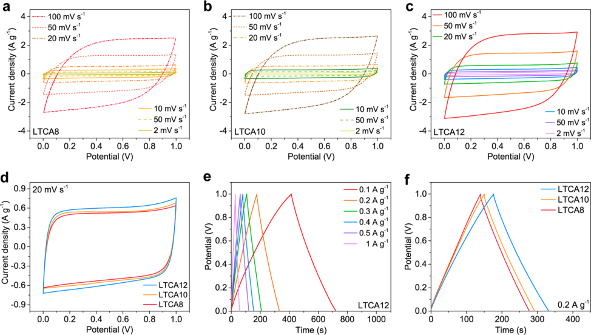

− Figure 7. (a c) CV curves of SCs with LTCA8, LTCA10, and LTCA12 electrodes at different scan rates. (d) Comparison of the CV curves of the LTCA-SCs at a scan rate of 20 mV s[−][1] . (e) GCD curves of LTCA12-SC at various current densities. (f) Comparison of the GCD curves of the LTCA-SCs at a current density of 0.2 A g[−][1] . 

LTCA12 had a greater specific surface area, the likelihood of sodium salts appearing on the surfaces of the materials and blocking pores was higher. At 100 kPa, the CO2 adsorption capacity of the LTCAs reached approximately 3.6 mmol g[−][1] at 273 K and 2.3 mmol g[−][1] at 298 K, which is comparable to those of activated carbon from different resources, such as anthracite, olive stones, and almond shells.[36][−][38] Furthermore, the CO2 adsorption enthalpy (ΔHad) of the LTCAs was calculated by using the isotherm data collected at 273, 298, and 323 K (Figure 5f). The absolute value of ΔHad of LTCA8 (11.12 kJ mol[−][1] ) was greater than that of the other two samples, indicating that stronger affinity between CO2 and the adsorbent was achieved due to the higher number of ultramicropores. 

To better understand the effects of the sodium salts present in the LTCAs, all samples were washed with distilled water to partially remove the salts on the surface, and the samples after washing were denoted as W-LTCA8, W-LTCA10, and W- LTCA12. The SEM-EDX data in Table 1 show that the washed carbon aerogels (W-LTCAs) had a higher carbon content and lower sodium and sulfur content than those before washing, indicating that some of the sodium salts were successfully removed by washing. As shown in Figure 6a and Table S2, the BET surface area of all samples was significantly improved after washing, which is attributed to the removal of sodium salts, thereby exposing the meso- and micropores that were previously blocked. Similar to LTCA12, W-LTCA12 exhibited the highest specific surface area of 1101 m[2] g[−][1] among the W-LTCAs as it contained the largest amount of TOCNFs in its precursor, which acted as a sacrificial template in the carbonization process. Figure S5b shows that the W- LTCAs had a similar pore size distribution to the LTCAs, but the differential pore volume at different pore size was higher 

and the peak at 2.6 nm became more distinct, which is consistent with the BET surface area results. 

Owing to the considerably increased surface area and pore volume, the CO2 adsorption capacity of the LTCAs was drastically enhanced after washing at all temperatures, as illustrated in Figure 6b as well as Figures S10 and S11. Figure 6c compares the CO2 adsorption capacity of the W-LTCAs at 273 K, and all W-LTCAs similarly behaved under a lowpressure range (<30 kPa). However, at a relatively highpressure range (30−120 kPa), the capacity increased as the TOCNF content increased, suggesting that the difference in the number of ultramicropores in the LTCAs was minimized by washing. The adsorption capacities of both the LTCAs and W-LTCAs under 10 and 100 kPa at different temperatures are summarized against their BET surface area in Figure 6d,e. At 10 kPa, the capacity of the W-LTCAs reached approximately 1 mmol g[−][1] at 273 K and 0.55 mmol g[−][1] at 298 K, which are superior to those of the unwashed LTCAs, while the capacity of the carbon aerogels remained at the same level before and after washing at 323 K. The adsorption capacity of the W- LTCAs at 100 kPa increased significantly with increasing TOCNF content at all the temperatures, and it reached 5.23 mmol g[−][1] at 273 K for W-LTCA12, which outperformed that of all the LTCAs. The ΔHad results (Figure 6f) also show that the W-LTCAs have a stronger affinity for CO2 molecules than the LTCAs due to the reduction of the salt blocking effect. Moreover, the absolute value of ΔHad of W-LTCA12 (26.70 kJ mol[−][1] ) was higher than that of W-LTCA10 (21.99 kJ mol[−][1] ) and W-LTCA8 (16.18 kJ mol[−][1] ), which is attributed to the increase in the number of exposed ultramicropores and the larger specific surface area. 

The electrochemical properties of the LTCAs as electrodes in supercapacitors (SCs) were also studied and are presented here to evaluate their ability to store energy. A two-electrode 

7437 

https://dx.doi.org/10.1021/acsami.9b19955 ACS Appl. Mater. Interfaces 2020, 12, 7432−7441 

ACS Applied Materials & Interfaces www.acsami.org 

Research Article 

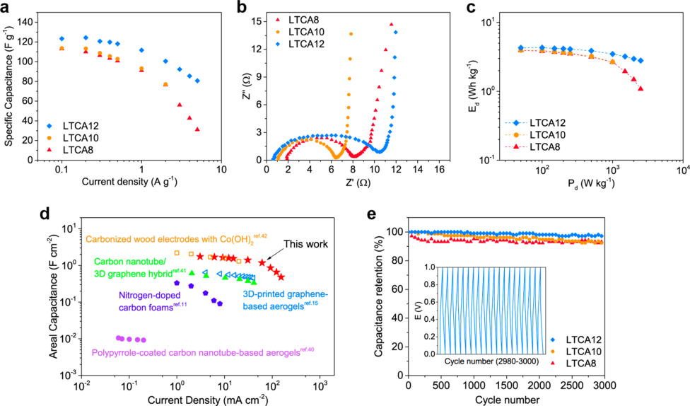

Figure 8. (a) Specific gravimetric capacitance of LTCA8, LTCA10, and LTCA12 at various current densities. (b) Nyquist plots of the LTCA-SCs. (c) Ragone plots of the LTCA-SCs. (d) Comparison of the areal capacitance of LTCA8 and other carbonaceous electrodes reported in the literature. (e) Cycle life of the LTCA-SCs. Inset: GCD curves of cycles 2980−3000 of LTCA12-SC at a current density of 5 A g[−][1] . 

setup was constructed, as shown in Figure S12, and the samples were tested in an aqueous 6 M KOH electrolyte. All samples were soaked in the electrolyte for 3 h before testing, and fresh electrolyte was used when conducting the electrochemical tests. Therefore, the influence of the sodium salts present in the LTCAs can be minimized. The cyclic voltammetry (CV) curves of the SCs tested at different scan rates are presented in Figure 7a−c, which exhibit an almost rectangular shape for all LTCA electrodes, suggesting that the LTCAs have low contact resistance and an excellent capacitive ability that allows rapid electron and ion transfer.[39] Figure 7d compares the CV curves of the LTCAs at 20 mV s[−][1] and shows that the integrated area became larger as the specific surface area of the electrodes increased, suggesting that their specific − capacitance was improved. The galvanostatic charge discharge (GCD) profiles of the SCs at current densities ranging from 0.1 to 1 A g[−][1] are illustrated in Figure 7e,f and Figure S13. Similar to the CV curves, the SC with LTCA12 electrodes exhibited the highest discharging time in the GCD tests at a certain current density (Figure 7f), indicating that LTCA12 had a higher specific capacitance than the other LTCAs, which is attributed to its large accessible surface area. 

The specific gravimetric capacitance of the LTCAs calculated from their GCD profiles is shown in Figure 8a and Table S3. The capacitance of LTCA12 was significantly greater than that of LTCA8 and LTCA10 within the full − current density range (0.1 5 A g[−][1] ), which reached 124 F g[−][1] at 0.2 A g[−][1] and remained at 81 F g[−][1] at 5 A g[−][1] . The Nyquist plots obtained from electrochemical impedance spectroscopy (EIS) show that all LTCAs exhibited a very low equivalent series resistance (<2 Ω), and that of LTCA12 was the lowest (0.6 Ω), as shown in Figure 8b. However, the LTCA-SCs had a relatively high charge transfer resistance (5.4−9.9 Ω), which is 

likely due to the hydrophobicity of the electrodes. The Ragone plots in Figure 8c indicate that energy densities (Ed) of 4.3 and 2.8 Wh kg[−][1] at power densities (Pd) of 0.1 and 2.5 kW kg[−][1] were achieved for the SC with LTCA12, respectively, which outperformed those with the LTCA8 and LTCA10 electrodes. The areal capacitance of the LTCAs prepared in this work was also calculated and compared with those of other porous carbonaceous electrodes described in the literature (Figure 8d and Table S3),[11][,][15][,][40][−][42] showing that the lignin/nanocellulose-derived carbon aerogels could achieve comparable or superior electrochemical performances to those of many state-of-the-art carbonaceous materials. Furthermore, the cycle stability of the LTCA-SCs was tested under a current density of 5 A g[−][1] , and the results are shown in Figure 8e. Despite the initial slight drop of the capacitance in LTCA8, all LTCA-SCs demonstrated a stable cycle behavior, in which more than 92% of the original capacitance was retained after 3000 charge− discharge cycles.[43] This further confirms that the LTCAs can be an excellent candidate for electrodes of supercapacitors. 

## ■[CONCLUSIONS] 

This work demonstrates the possibility of using lignin and TOCNFs, which can be extracted from various renewable resources, to prepare multifunctional carbon aerogels. By carefully adjusting the weight ratio of lignin to TOCNF in the precursors, LTCAs with a tailorable structure and surface area can be produced. The CO2 capture and capacitive energy storage abilities of the LTCAs were systematically investigated, and the results indicated that a proper structural design and carefully selected processing methods could achieve excellent performance. The LTCA with 12 wt % of TOCNFs in its precursor had a specific surface area of 806 m[2] g[−][1] and CO2 adsorption capacity of 3.39 mmol g[−][1] at 273 K and 100 kPa, 

7438 

https://dx.doi.org/10.1021/acsami.9b19955 ACS Appl. Mater. Interfaces 2020, 12, 7432−7441 

Research Article 

www.acsami.org 

## ACS Applied Materials & Interfaces 

which could be further improved to 1101 m[2] g[−][1] and 5.23 mmol g[−][1] by washing. When assembled as electrodes in a supercapacitor, the LTCAs could achieve a specific gravimetric capacitance of 124 F g[−][1] at 0.2 A g[−][1] and an areal capacitance of 1.55 F cm[−][2] at 15 mA cm[−][2] , transcending many other types of porous carbon materials reported in the literature.[8][,][11][,][15][,][40][−][42] The sustainable resource-derived carbon aerogels with a controllable structure developed in this work have great potential for use in a wide range of next-generation, ecologically sustainable applications. 

## ■[EXPERIMENTAL][SECTION] 

Materials. Kraft lignin (low sulfonate content, Mw of ∼10000), acetone (99.5%), methanol (99.9%), glacial acetic acid (100%), sodium hypochlorite (NaClO, 6−14% active chlorine), TEMPO (99%), and potassium hydroxide (KOH, pellets, ≥85%) were purchased from Sigma-Aldrich, Sweden AB. 95% sulfuric acid and sodium hydroxide (NaOH, pure pellets) were purchased from Merck KGaA, Germany. Sodium chlorite (NaClO2, high purity, chlorite content of 77.5%−82.5%), a 0.1 M standardized NaOH solution, and a 0.5 M standardized hydrochloric acid (HCl) solution were purchased from VWR, Sweden. All chemicals were used without any further purification. 

Preparation of TOCNFs. Softwood powder (30 g) from a commercial source was first dewaxed by using an acetone/methanol mixture (2:1) in a Soxhlet extractor. The extracted powder was then treated with NaOH (2 wt %) for 4 h at 60 °C, followed by bleaching using acidified chlorite.[44] NaClO2 and acetic acid were added with 2 h intervals to achieve sufficient delignification. The pulp was then filtered and dispersed in an aqueous suspension with a solid content of 1−2 wt %, followed by TEMPO-catalyzed oxidation using NaClO2 as the primary oxidant according to an established method.[45] The oxidation was processed at 60 °C with 2.1 g (58 mmol g[−][1] cellulose) of NaClO2 for each gram of the initial wood powder, with a total treatment time of 24 h. This method was used in favor of the TEMPO/NaBr/NaClO system as it could retain nanofibers with a higher aspect ratio and less oxidative stress.[46] After filtering the swollen cellulose, it was disintegrated once in a high-shear fluid homogenizer (LM10 Microfluidizer, Microfluidics. USA) at 1000 bar to obtain the final highly viscous TOCNF suspension with a solid content of 1 wt % for further manufacturing. 

The degree of carboxylation of the TOCNFs was quantified by conductometric titration.[47] Approximately 50 mL of the TOCNF suspension was diluted in 0.05 M HCl. Titration with 0.01 M NaOH was then conducted to determine the amount of weak acid groups (mmol g[−][1] ) present on the surface of the nanofibers. The titration was conducted three times, and the average value was reported. 

Preparation of LTCAs. Lignin powder, the aqueous TOCNF suspension (1 wt %), and distilled water were mechanically mixed to generate a lignin/TOCNF suspension with a solid content of 6 wt %, the TOCNF content of which was 8, 10, or 12 wt %. Then, 20 g of the mixed suspension was frozen unidirectionally by an ice-templating setup with a freezing rate of 10 °C/min. As shown in Figure 1a, the ice-templating setup used in this study consists of a copper rod whose bottom immersed in liquid nitrogen and top connected with a Teflon mold where the lignin/TOCNF suspension was added to be frozen. The freezing rate was controlled by a heater attached to the copper rod. Afterward, the frozen sample was freeze-dried by using an Alpha 1-2 LD plus freeze-dryer (Martin Christ GmbH, Germany) to generate the lignin/TOCNF precursor. The precursor was then carbonized in a Nabertherm RHTC-230/15 tube furnace (Nabertherm GmbH, Lilienthal, Germany) under a nitrogen atmosphere with the following heating procedure: (i) room temperature−100 °C, heating rate of 5 °C/min, isothermal for 120 min to remove the possibly present moisture; (ii) 100−500 °C, heating rate of 5 °C/min, isothermal for 100 min to enable the cross-linking of lignin to avoid possible sample collapse; and (iii) 500−1000 °C, heating rate of 5 °C/min, isothermal for 60 min to further remove the present non- 

carbon elements. The sample was later cooled to room temperature to obtain the LTCA. 

To prepare the W-LTCAs, the LTCAs were rinsed and soaked in distilled water for 30 min. The water was then replaced with clean water. This procedure was repeated five times to sufficiently remove the sodium salts present in the LTCAs. The washed samples were then dried in an oven at 80 °C overnight. 

Characterizations. The topography of the TOCNFs was investigated by using an AFM under the tapping mode with a Veeco MultiMode scanning probe (Santa Barbara, CA) and Bruker TESPA tips (Camarillo, USA). The AFM sample was obtained by depositing one droplet of a diluted TOCNF suspension (0.001 wt %) on a freshly cleaved mica and then dried in a vacuum oven (60 °C). The width of the TOCNFs was determined from the captured AFM height images, and over 100 nanofibers were analyzed to obtain the average value. The pH, conductivity, and viscosity of the lignin/ TOCNF suspensions were measured with a pH 21 pH meter (Hanna Instruments, Woonsocket, RI), an S30 SevenEasy conductivity meter (Mettler Toledo, Schwerzenbach, Switzerland), and an SV-10 Vibro viscometer (A&D Company, Tokyo, Japan), respectively. TGA measurements were conducted using a TA Q500 thermogravimetric analyzer (TA Instruments, New Castle, DE) under simulated carbonization conditions. The porosity of the LTCAs was determined to be 

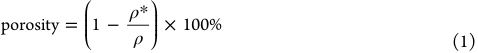

where ρ* is the bulk density of the LTCAs, calculated by dividing the weight by the volume, and ρ is the density of the solid carbon material (2.1 g cm[−][3] for amorphous carbon).[48] The BET surface area of the LTCAs and W-LTCAs was determined by conducting a N2 adsorption test at 77 K using a Gemini VII 2390a analyzer (Micromeritics Instrument Corp., Norcross, GA) after 3 h of degassing at 300 °C, and the pore size distribution of the samples was collected by using an ASAP 2020 Plus BET analyzer (Micromeritics Instrument Corp.) under the same conditions. The morphology of the lignin/TOCNF precursors coated with platinum (EM ACE200 sputter, Leica, Wetzlar, Germany) and LTCAs was investigated by SEM (JEOL JSM 6460LV, JEOL Ltd., Tokyo, Japan), and elemental analysis was conducted by SEM-EDX using an equipped silicon drift detector (Oxford X-MaxN 50 mm[2] , Oxford Instrument, UK). 

The CO2 adsorption isotherms of the LTCAs and W-LTCAs were obtained by using the ASAP 2020 Plus BET analyzer with a pressure range of 0−120 kPa at 273, 298, and 323 K after degassing at 300 °C for 4 h. The CO2 adsorption enthalpy (ΔHad) and entropy (ΔS) were calculated according to the adsorption isotherms using the Langmuir adsorption model and van’t Hoff equation: 

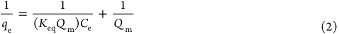

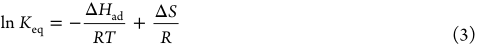

where qe and Ce denote the amount of adsorbed CO2 and pressure at equilibrium from the isotherms, respectively, Keq is the equilibrium constant, R is the Avogadro constant, and T is the temperature. 

Electrochemical measurements of the LTCAs were conducted using a two-electrode configuration with Inconel 600 superalloy collectors and a Whatman filter paper as separator (Grade 1, GE Healthcare, Belgium). A Princeton Applied Research VersaSTAT 3 potentiostat/galvanostat (AMETEK Scientific Instruments, Wokingham, UK) was used to characterize the CV, GCD, and EIS profiles of the samples with a 6 M KOH electrolyte. The weight of one electrode was approximately 2.5 mg, and its area and thickness were approximately 20 mm[2] and 2 mm, respectively. The specific gravimetric capacitance (Cg) of the LTCAs was calculated from the GCD curves: 

7439 

https://dx.doi.org/10.1021/acsami.9b19955 ACS Appl. Mater. Interfaces 2020, 12, 7432−7441 

Research Article 

www.acsami.org 

## ACS Applied Materials & Interfaces 

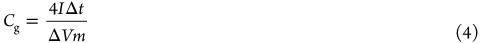

where I is the discharging current, ΔV is the scanned potential window, Δt is the discharging time, and m is the total mass of both electrodes. Similarly, the areal capacitance of the LTCAs, Ca, was determined as follows: 

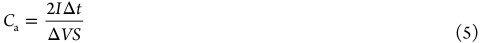

where S represents the effective area of the related SCs. Consequently, the gravimetric energy density (Ed) and power density (Pd) of the SCs can be calculated as 

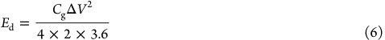

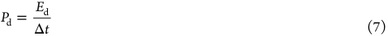

The cycle stability tests of the LTCAs were performed using a lowvolume three-electrode cell kit (Pine Research Instrumentation, Durham, NC) connected to the Princeton Applied Research VersaSTAT 3 potentiostat/galvanostat. A platinum electrode was used as a counter electrode and a Ag/AgCl electrode worked as a reference electrode, and 0.5 M H2SO4 was used as the electrolyte. 

## ■[ASSOCIATED][CONTENT] 

## *sı Supporting Information 

The Supporting Information is available free of charge at https://pubs.acs.org/doi/10.1021/acsami.9b19955. 

- Porosity and density of LTCAs; hydrophobicity demonstration of LTCA12; width distribution of the TOCNFs; TGA curves vs temperature of lignin and TOCNF; pore size distribution of LTCAs; SEM images of LTCA8 and LTCA10; CO2 adsorption isotherms of LTCA10, LTCA12, W-LTCA8, and WLTCA10; BET surface analysis data; schematic of the two-electrode setup; GCD curves of LTCA8-SC and LTCA10-SC; electrochemical properties of all SCs (PDF) 

## ■[AUTHOR][INFORMATION] 

## Corresponding Authors 

- Shiyu Geng − Division of Materials Science, Department of Engineering Sciences and Mathematics, Luleå University of Technology, SE-971 87 Luleå, Sweden; orcid.org/00000003-1776-2725; Email: shiyu.geng@ltu.se 

- Kristiina Oksman − Division of Materials Science, Department of Engineering Sciences and Mathematics, Luleå University of Technology, SE-971 87 Luleå, Sweden; Fibre and Particle Engineering, University of Oulu, FI-90014 Oulu, Finland; Mechanical & Industrial Engineering (MIE), University of Toronto, Toronto, Canada M5S 3G8; orcid.org/00000003-4762-2854; Email: kristiina.oksman@ltu.se 

## Authors 

- Jiayuan Wei − Division of Materials Science, Department of Engineering Sciences and Mathematics, Luleå University of Technology, SE-971 87 Luleå, Sweden 

- Simon Jonasson − Division of Materials Science, Department of Engineering Sciences and Mathematics, Luleå University of Technology, SE-971 87 Luleå, Sweden 

- Jonas Hedlund − Chemical Technology, Department of Civil, Environmental and Natural Resources Engineering, Luleå University of Technology, SE-97 187 Luleå, Sweden 

Complete contact information is available at: https://pubs.acs.org/10.1021/acsami.9b19955 

## Funding 

Swedish Strategic Research Program Bio4Energy, Swedish Research Council (Vetenskapsrådet, Carbon Lignin 201704240) and FORMAS within the Nanowood project (9422016-10). 

## Notes 

The authors declare no competing financial interest. 

## ■[ACKNOWLEDGMENTS] 

The authors appreciatively acknowledge Bio4Energy, Swedish Research Council, and FORMAS for financial supporting this research and Dr. Liang Yu and Mojtaba Nobandegani for their technical support regarding the CO2 adsorption measurements. 

## ■[REFERENCES] 

(1) Wu, X.-L.; Xu, A.-W. Carbonaceous Hydrogels and Aerogels for Supercapacitors. J. Mater. Chem. A 2014, 2 (14), 4852−4864. 

(2) Zhang, L. L.; Zhao, X. Carbon-Based Materials as Supercapacitor Electrodes. Chem. Soc. Rev. 2009, 38 (9), 2520−2531. 

(3) Zhao, Y.; Liu, X.; Han, Y. Microporous Carbonaceous Adsorbents for CO2 Separation Via Selective Adsorption. RSC Adv. 2015, 5 (38), 30310−30330. 

(4) Chaney, N.; Ray, A. B.; John, A. S. The Properties of Activated Carbon Which Determine Its Industrial Applications. Ind. Eng. Chem. 1923, 15 (12), 1244−1255. 

(5) Siriwardane, R. V.; Shen, M.-S.; Fisher, E. P.; Poston, J. A. Adsorption of CO2 on Molecular Sieves and Activated Carbon. Energy Fuels 2001, 15 (2), 279−284. 

(6) Hao, G. P.; Li, W. C.; Qian, D.; Lu, A. H. Rapid Synthesis of Nitrogen-Doped Porous Carbon Monolith for CO2 Capture. Adv. Mater. 2010, 22 (7), 853−857. 

(7) Sevilla, M.; Valle - Vigon, P.; Fuertes, A. B. N-Doped Polypyrrole-Based Porous Carbons for CO2 Capture. Adv. Funct. Mater. 2011, 21 (14), 2781−2787. 

(8) Meng, F.; Zhang, X.; Xu, B.; Yue, S.; Guo, H.; Luo, Y. AlkaliTreated Graphene Oxide as a Solid Base Catalyst: Synthesis and Electrochemical Capacitance of Graphene/Carbon Composite Aerogels. J. Mater. Chem. 2011, 21 (46), 18537−18539. 

(9) Wu, X.-L.; Wen, T.; Guo, H.-L.; Yang, S.; Wang, X.; Xu, A.-W. Biomass-Derived Sponge-Like Carbonaceous Hydrogels and Aerogels for Supercapacitors. ACS Nano 2013, 7 (4), 3589−3597. 

(10) Xu, X.; Zhou, J.; Nagaraju, D. H.; Jiang, L.; Marinov, V. R.; Lubineau, G.; Alshareef, H. N.; Oh, M. Flexible, Highly Graphitized Carbon Aerogels Based on Bacterial Cellulose/Lignin: Catalyst-Free Synthesis and Its Application in Energy Storage Devices. Adv. Funct. Mater. 2015, 25 (21), 3193−3202. 

(11) Xiao, K.; Ding, L. X.; Liu, G.; Chen, H.; Wang, S.; Wang, H. Freestanding, Hydrophilic Nitrogen-Doped Carbon Foams for Highly Compressible All Solid-State Supercapacitors. Adv. Mater. 2016, 28 (28), 5997−6002. 

(12) Hu, Y.; Tong, X.; Zhuo, H.; Zhong, L.; Peng, X.; Wang, S.; Sun, R. 3D Hierarchical Porous N-Doped Carbon Aerogel from Renewable Cellulose: An Attractive Carbon for High-Performance Supercapacitor Electrodes and CO2 Adsorption. RSC Adv. 2016, 6 (19), 15788−15795. 

(13) Zu, G.; Shen, J.; Zou, L.; Wang, F.; Wang, X.; Zhang, Y.; Yao, X. Nanocellulose-Derived Highly Porous Carbon Aerogels for Supercapacitors. Carbon 2016, 99, 203−211. 

(14) Li, X.; Shao, J.; Kim, S.-K.; Yao, C.; Wang, J.; Miao, Y.-R.; Zheng, Q.; Sun, P.; Zhang, R.; Braun, P. V. High Energy Flexible Supercapacitors Formed via Bottom-up Infilling of Gel Electrolytes into Thick Porous Electrodes. Nat. Commun. 2018, 9 (1), 2578. 

7440 

https://dx.doi.org/10.1021/acsami.9b19955 ACS Appl. Mater. Interfaces 2020, 12, 7432−7441 

Research Article 

www.acsami.org 

## ACS Applied Materials & Interfaces 

(15) Tang, X.; Zhou, H.; Cai, Z.; Cheng, D.; He, P.; Xie, P.; Zhang, D.; Fan, T. Generalized 3D Printing of Graphene-Based MixedDimensional Hybrid Aerogels. ACS Nano 2018, 12 (4), 3502−3511. 

(16) Ioannidou, O.; Zabaniotou, A. Agricultural Residues as Precursors for Activated Carbon Production - a Review. Renewable Sustainable Energy Rev. 2007, 11 (9), 1966−2005. 

(17) Norgren, M.; Edlund, H. Lignin: Recent Advances and Emerging Applications. Curr. Opin. Colloid Interface Sci. 2014, 19 (5), 409−416. 

(18) Kadla, J.; Kubo, S.; Venditti, R.; Gilbert, R.; Compere, A.; Griffith, W. Lignin-Based Carbon Fibers for Composite Fiber Applications. Carbon 2002, 40 (15), 2913−2920. 

(19) Baker, D. A.; Rials, T. G. Recent Advances in Low-Cost Carbon Fiber Manufacture from Lignin. J. Appl. Polym. Sci. 2013, 130 (2), 713−728. 

(20) Wang, S.-X.; Yang, L.; Stubbs, L. P.; Li, X.; He, C. LigninDerived Fused Electrospun Carbon Fibrous Mats as High Performance Anode Materials for Lithium Ion Batteries. ACS Appl. Mater. Interfaces 2013, 5 (23), 12275−12282. 

(21) Lai, C.; Zhou, Z.; Zhang, L.; Wang, X.; Zhou, Q.; Zhao, Y.; Wang, Y.; Wu, X.-F.; Zhu, Z.; Fong, H. Free-Standing and Mechanically Flexible Mats Consisting of Electrospun Carbon Nanofibers Made from a Natural Product of Alkali Lignin as Binder-Free Electrodes for High-Performance Supercapacitors. J. Power Sources 2014, 247, 134−141. 

(22) Wei, J.; Geng, S.; Kumar, M.; Pitkanen, O.; Hietala, M.; Oksman, K. Investigation of Structure and Chemical Composition of Carbon Nanofibers Developed from Renewable Precursor. Front. Mater. 2019, 6, 334. 

(23) Carrott, P.; Carrott, M. R. Lignin-from Natural Adsorbent to Activated Carbon: A Review. Bioresour. Technol. 2007, 98 (12), 2301−2312. 

(24) Isogai, A.; Saito, T.; Fukuzumi, H. TEMPO-Oxidized Cellulose Nanofibers. Nanoscale 2011, 3 (1), 71−85. 

(25) Deville, S.; Saiz, E.; Nalla, R. K.; Tomsia, A. P. Freezing as a Path to Build Complex Composites. Science 2006, 311 (5760), 515− 518. 

(26) Ojuva, A.; Akhtar, F.; Tomsia, A. P.; Bergstrom, L. Laminated Adsorbents with Very Rapid CO2 Uptake by Freeze-Casting of Zeolites. ACS Appl. Mater. Interfaces 2013, 5 (7), 2669−2676. 

(27) Estevez, L.; Dua, R.; Bhandari, N.; Ramanujapuram, A.; Wang, P.; Giannelis, E. P. A Facile Approach for the Synthesis of Monolithic Hierarchical Porous Carbons−High Performance Materials for Amine Based CO2 Capture and Supercapacitor Electrode. Energy Environ. Sci. 2013, 6 (6), 1785−1790. 

(28) Chai, G. S.; Shin, I.; Yu, J. S. Synthesis of Ordered, Uniform, Macroporous Carbons with Mesoporous Walls Templated by Aggregates of Polystyrene Spheres and Silica Particles for Use as Catalyst Supports in Direct Methanol Fuel Cells. Adv. Mater. 2004, 16 (22), 2057−2061. 

(29) Zhang, S.; Chen, L.; Zhou, S.; Zhao, D.; Wu, L. Facile Synthesis of Hierarchically Ordered Porous Carbon via In Situ Self-Assembly of Colloidal Polymer and Silica Spheres and Its Use as a Catalyst Support. Chem. Mater. 2010, 22 (11), 3433−3440. 

(34) Wei, H.; Deng, S.; Hu, B.; Chen, Z.; Wang, B.; Huang, J.; Yu, G. Granular Bamboo-Derived Activated Carbon for High CO2 Adsorption: The Dominant Role of Narrow Micropores. ChemSusChem 2012, 5 (12), 2354−2360. 

(35) Dantas, S.; Struckhoff, K. C.; Thommes, M.; Neimark, A. V. Phase Behavior and Capillary Condensation Hysteresis of Carbon Dioxide in Mesopores. Langmuir 2019, 35 (35), 11291−11298. 

(36) Maroto-Valer, M. M.; Tang, Z.; Zhang, Y. CO2 Capture by Activated and Impregnated Anthracites. Fuel Process. Technol. 2005, 86 (14−15), 1487−1502. 

(37) Plaza, M.; Pevida, C.; Arias, B.; Fermoso, J.; Casal, M.; Martín, C.; Rubiera, F.; Pis, J. Development of Low-Cost Biomass-Based Adsorbents for Postcombustion CO2 Capture. Fuel 2009, 88 (12), 2442−2447. 

(38) Plaza, M.; Pevida, C.; Martín, C. F.; Fermoso, J.; Pis, J.; Rubiera, F. Developing Almond Shell-Derived Activated Carbons as CO2 Adsorbents. Sep. Purif. Technol. 2010, 71 (1), 102−106. 

(39) Bose, S.; Kuila, T.; Mishra, A. K.; Rajasekar, R.; Kim, N. H.; Lee, J. H. Carbon-Based Nanostructured Materials and Their Composites as Supercapacitor Electrodes. J. Mater. Chem. 2012, 22 (3), 767−784. 

(40) Yang, X.; Shi, K.; Zhitomirsky, I.; Cranston, E. D. Cellulose Nanocrystal Aerogels as Universal 3D Lightweight Substrates for Supercapacitor Materials. Adv. Mater. 2015, 27 (40), 6104−6109. 

(41) Pan, Z.; Liu, M.; Yang, J.; Qiu, Y.; Li, W.; Xu, Y.; Zhang, X.; Zhang, Y. High Electroactive Material Loading on a Carbon Nanotube@3D Graphene Aerogel for High-Performance Flexible All-Solid-State Asymmetric Supercapacitors. Adv. Funct. Mater. 2017, 27 (27), 1701122. 

(42) Wang, Y.; Lin, X.; Liu, T.; Chen, H.; Chen, S.; Jiang, Z.; Liu, J.; Huang, J.; Liu, M. Wood-Derived Hierarchically Porous Electrodes for High-Performance All-Solid-State Supercapacitors. Adv. Funct. Mater. 2018, 28 (52), 1806207. 

(43) Yan, Y.; Cheng, Q.; Wang, G.; Li, C. Growth of Polyaniline Nanowhiskers on Mesoporous Carbon for Supercapacitor Application. J. Power Sources 2011, 196 (18), 7835−7840. 

(44) Wise, L. E. Chlorite Holocellulose, Its Fractionation and Bearing on Summative Wood Analysis and on Studies on the Hemicelluloses. Paper Trade 1946, 122, 35−43. 

(45) Saito, T.; Hirota, M.; Tamura, N.; Kimura, S.; Fukuzumi, H.; Heux, L.; Isogai, A. Individualization of Nano-Sized Plant Cellulose Fibrils by Direct Surface Carboxylation Using TEMPO Catalyst under Neutral Conditions. Biomacromolecules 2009, 10 (7), 1992−1996. 

(46) Saito, T.; Nishiyama, Y.; Putaux, J.-L.; Vignon, M.; Isogai, A. Homogeneous Suspensions of Individualized Microfibrils from TEMPO-Catalyzed Oxidation of Native Cellulose. Biomacromolecules 2006, 7 (6), 1687−1691. 

(47) da Silva Perez, D.; Montanari, S.; Vignon, M. R. TEMPOMediated Oxidation of Cellulose Iii. Biomacromolecules 2003, 4 (5), 1417−1425. 

(48) Lide, D. R. CRC Handbook of Chemistry and Physics; CRC Press: 2004; Vol. 85. 

(30) Biener, J.; Stadermann, M.; Suss, M.; Worsley, M. A.; Biener, M. M.; Rose, K. A.; Baumann, T. F. Advanced Carbon Aerogels for Energy Applications. Energy Environ. Sci. 2011, 4 (3), 656−667. 

(31) Pielichowski, K.; Njuguna, J. Thermal Degradation of Polymeric Materials; Smithers Rapra Publishing: 2005. 

(32) Wicklein, B.; Kocjan, A.; Salazar-Alvarez, G.; Carosio, F.; Camino, G.; Antonietti, M.; Bergstrom, L. Thermally Insulating and Fire-Retardant Lightweight Anisotropic Foams Based on Nanocellulose and Graphene Oxide. Nat. Nanotechnol. 2015, 10 (3), 277. 

(33) Pan, Z.-Z.; Nishihara, H.; Iwamura, S.; Sekiguchi, T.; Sato, A.; Isogai, A.; Kang, F.; Kyotani, T.; Yang, Q.-H. Cellulose Nanofiber as a Distinct Structure-Directing Agent for Xylem-Like Microhoneycomb Monoliths by Unidirectional Freeze-Drying. ACS Nano 2016, 10 (12), 10689−10697. 

7441 

https://dx.doi.org/10.1021/acsami.9b19955 ACS Appl. Mater. Interfaces 2020, 12, 7432−7441 

