JCIS Open 19 (2025) 100147 

Contents lists available at ScienceDirect 

## JCIS Open 

journal homepage: www.journals.elsevier.com/jcis-open 

## Porous hard carbon derived from coconut biomass waste as electrode material for supercapacitor 

Muhammadin Hamid[a][,][*] , Indri Dayana[b] , Habib Satria[b] , Dadan Ramdan[b] , Junaidi[c] , Muhammad Fadlan Siregar[b] , Dewi Sholeha[d] , Juliaster Marbun[e] , Hadi Wijoyo[a] 

a _Department of Physics, Universitas Sumatera Utara, Medan, 20155, Indonesia_ 

b _Engineering Faculty, Universitas Medan Area, Medan, 20223, Sumatera Utara, Indonesia_ 

c _Mechanical Engineering Faculty, Universitas Harapan, Medan, 20216, Sumatera Utara, Indonesia_ 

d _Department of Electro, Engineering Faculty, Universitas Darma Agung, Medan, 20153, Sumatera Utara, Indonesia_ 

e _Physics Education, HKBP Nommensen University, Indonesia_ 

A R T I C L E I N F O A B S T R A C T 

> Handling Editor: Kevin Roger The synthesis of porous hard carbon from coconut biomass waste using physical activation through pyrolysis and chemical activation with orange juice as an organic activator at varying temperatures, including 500[◦] C, 600[◦] C, 

> _Keywords:_ and 700[◦] C, has been carried out. The purpose of this research is to develop materials for faradaic-type super- 

> Faradaic-type capacitor electrodes based on these temperature variations. Characterization and testing methods used include X- 

> Orange juice ray diffraction (XRD), scanning electron microscopy (SEM), Brunauer-Emmett-Teller (BET), cyclic voltammetry Organic activator Porous hard carbonPyrolysis (CV), and electrochemical impedance spectroscopy (EIS). BET analysis showed that the PHC-700 sample exhibited a relatively high specific surface area with porous characteristics and a narrow pore size distribution around 17– 18 nm. The PHC-700 sample also exhibited the best electrochemical performance with a specific capacitance of 485.23 F/g and a total resistance of 24.29 Ω. GCD measurements revealed stable triangular curves, indicating good charge-discharge reversibility and confirming the superior capacitive behavior of PHC700. The study confirmed that the higher the temperature used, the better the supercapacitor electrode obtained. This is evidenced by the pores on the surface that help improve the quality of the electrode and the XRD test results which are directly proportional to the increase in temperature. It is hoped that this research can enhance understanding of supercapacitor electrode applications. 

## **1. Introduction** 

The rapid development of the global economy and shifts in energy consumption patterns are posing a significant challenge to environmental sustainability [1]. In an international context, the increasing energy demand is driven by rapid urbanization, industrialization, and the growing use of electronic devices in almost all aspects of human life. On the other hand, the supply of fossil fuels, the primary source of traditional energy, is dwindling and becoming increasingly limited. This not only impacts energy security but also contributes to accelerated global climate change, which is primarily caused by greenhouse gas emissions resulting from the burning of fossil fuels. In light of these concerns, the search for more environmentally friendly and sustainable solutions to meet the world’s energy needs has become increasingly urgent. One of the alternatives that has garnered significant attention is 

renewable energy, particularly solar and wind energy. These two energy sources are considered a promising solution because they are environmentally friendly and do not produce carbon emissions, which is crucial in mitigating the impact of global climate change. 

Solar energy, obtained through solar panels, and wind energy, obtained through wind turbines, are abundant and renewable natural resources. The main advantages of these energies are their unlimited availability and their ability to reduce dependence on fossil fuels. In addition, these two sources of energy play a crucial role in creating a more decentralized energy model, where each individual or community can produce and manage their energy. However, despite their great potential, the use of renewable energy such as solar and wind also comes with significant challenges. One of them is the dependence on external factors that are difficult to control, namely the weather. Solar energy can only be generated when the weather is clear, while wind energy can only 

- Corresponding author. 

_E-mail address:_ muhammadin.hamid@usu.ac.id (M. Hamid). 

https://doi.org/10.1016/j.jciso.2025.100147 

Received 8 April 2025; Received in revised form 24 July 2025; Accepted 20 August 2025 Available online 20 August 2025 

2666-934X/© 2025 The Authors. Published by Elsevier B.V. This is an open access article under the CC BY-NC-ND license ( http://creativecommons.org/licenses/bync-nd/4.0/ ). 

_JCIS Open 19 (2025) 100147_ 

_M. Hamid et al.                                                                                                                                                                                                                                 JCIS_ 

be utilized when there is sufficient wind. This leads to instability in the energy supply, which, in turn, risks disrupting a stable electricity supply. To address this issue, it is crucial to develop efficient energy storage systems. Energy storage technologies such as batteries and hydrogenbased energy storage systems can be an essential solution in addressing fluctuations in renewable energy availability. With the ability to store energy generated during peak periods (for example, during sunny days or in strong winds), it can be used during times of high demand or when the weather is unfavorable. This innovation in energy storage technology is key to creating a more reliable and sustainable renewable energy system. Energy storage has become one of the primary focuses in 21st-century technological innovation, given the global challenges posed by growing energy needs and the worsening environmental crisis. The decreasing supply of fossil fuels, the need to reduce carbon emissions, and the increasing reliance on volatile renewable energies, such as solar and wind power, further emphasize the urgency to develop efficient and environmentally friendly energy storage technologies. One technology that is emerging as an efficient alternative for energy storage is the supercapacitor (SC). SCs offer significant advantages over conventional batteries as they can handle much higher power levels and can charge and discharge energy quickly without requiring prior charging [2]. 

Unlike batteries that rely on electrochemical processes to store and release energy, SCs store energy through electrostatic mechanisms, which allows for much faster and longer-lasting charge and discharge cycles. Although SC have a lower energy density compared to batteries, their advantage lies in their ability to operate more efficiently in situations that require sudden power surges, such as in electric vehicles, portable electronic devices, and renewable energy systems. Much of the rechargeable energy storage industry is currently focused on developing electrochemical energy storage systems that combine power, energy density, and lower cost per unit of storage capacity. Innovations continue to enhance the performance of SC, particularly in terms of energy density and manufacturing cost, which is expected to make this technology more competitive and relevant in meeting future energy demands, as well as providing more sustainable long-term solutions to global energy challenges [3]. The three most common types of SCs are known as electric double layer capacitors (EDLC; non-Faradaic), pseudo-capacitors (Faradaic), and composite SCs. EDLCs are notable for having a low specific energy density and requiring charge deposition at the electrode electrolyte interface. Pseudo-capacitors can achieve high specific capacitance through fast and reversible redox reactions; however, this comes at the expense of decreased cycle stability. Thus, due to its superiority in research using the pseudo-capacitor (Faradaic) type, SC’ s low specific energy value prevents it from being used in various contexts despite its outstanding characteristics. Therefore, developing new cathode materials for SCs that maintain low cost, high specific power, and long life is a significant focus in this research field [4]. 

One very promising electrode material for use in supercapacitors is porous hard carbon. This material has a highly porous structure, which allows for an increase in electrode surface area, thereby increasing energy storage capacity. Porous hard carbon is formed through the process of carbonizing organic matter at high temperatures, resulting in a material with a dense and stable pore network. This porous structure enables electrolyte ions to move more freely and efficiently during energy charge and discharge cycles, directly improving the performance of supercapacitors, particularly in terms of power and cycle stability. In addition, porous hard carbon exhibits good electrical conductivity, which is crucial for accelerating the energy charge and discharge processes, making it highly efficient in applications that require rapid response. Another advantage is its stability at high temperatures, as well as its resistance to corrosion and degradation during extended periods. Therefore, the use of porous hard carbon as an electrode material is expected to enhance the performance of supercapacitors in industrial and consumer applications, such as renewable energy storage, electric vehicles, and portable electronic devices, making it a highly relevant 

material choice for future innovations in energy storage technologies [5]. 

To develop porous hard carbon with optimal performance, utilizing biomass-based activators is a promising alternative. One potential source of biomass is orange juice waste, which contains various organic acids, such as citric acid, ascorbic acid, and malic acid [6]. The primary advantage of this content is its ability to induce pore formation during the carbonization process through the mechanism of thermal decomposition and the formation of pore-building gases, including CO2 and water vapor. Additionally, these compounds play a role in dissolving the amorphous part of the carbon, resulting in a porous structure with a larger surface area. Not only that, but the presence of metal ions and minerals in orange juice, such as potassium (K), calcium (Ca), and magnesium (Mg), can also act as catalysts that promote the development of micro- and mesopores. With these advantages, the utilization of orange juice as an activator not only improves the ion storage capacity and conductivity of the electrode but also supports the concept of circular economy by processing waste into valuable materials in sustainable energy technology. 

Based on the background above, the researcher took the initiative to create a faradaic supercapacitor electrode material made of porous hard carbon synthesized from coconut biomass waste. In the method of making porous hard carbon, physical activation is carried out through pyrolysis and chemical activation using organic activator orange juice. Then characterization is carried out using X-ray diffraction (XRD), scanning electron microscopy (SEM), Brunauer-Emmett-Teller (BET), Cyclic voltammetry (CV) and Electrochemical impedance Spectroscopy (EIS) to determine the properties of this material. It is hoped that this research can fulfill SDGs (Sustainable Development Goals) number 7 related to Clean and Affordable Energy. 

## **2. Materials and methods** 

## _2.1. Materials_ 

The coconut biomass waste and orange juice were obtained from Langkat, Indonesia. Ethanol and distilled water were bought from CV. Rudang Jaya, Indonesia [45]. Vacuum oven, pyrolysis equipment and other supporting equipment using basic Physics laboratory facilities from the Universitas Sumatera Utara [7]. 

## _2.2. Preparation of porous hard carbon (PHC)_ 

The preparation of porous hard carbon from coconut biomass waste is achieved through chemical and physical activation methods. First, the coconut biomass waste was broken into small pieces and then washed with distilled water and ethanol to remove impurities present in the raw material, then the water content in the coconut biomass waste was dried in a vacuum oven at 100[◦] C for 12 h. Then the carbon powder obtained is chemically activated, which is a process carried out by mixing the sample powder with an activator substance, namely 200 mL of orange juice, which is then stirred with a magnetic stirrer at a speed of 15.000 rpm, and then processed using the maceration or soaking method for 1 day. After that, the carbon was washed until the pH was neutral and filtered. Then, physical activation using the pyrolysis method was carried out at 500[◦] C, 600[◦] C, and 700[◦] C, each for 2 h. The resulting hard carbon was labeled PHC-500, PHC-600, and PHC-700. further grinding and ball mill processes were carried out to obtain a smaller size. And finally the PHC is ready to be tested [8]. 

## _2.3. Fabrication of electrodes_ 

The working electrode was made by mixing the sample with PVDF as a binder, acetylene black for a conducting agent, and a weight ratio of 80:15:5. The mixed material was added to the NMP solution to create a slurry. As a current collector, aluminum foil was used to cover the slurry, 

2 

> _M. Hamid et al.                                                                                                                                                                                                                                 JCIS Open 19 (2025) 100147_ 

and it was dried at 80[◦] C for 12 h. 1 cm[2 ] is the coated electrode area, while 3 mg is the mass loading. Electrochemical testing uses 2 electrodes using a Swagelok cell. The Separator employs a microfibre filter made by Whatman. KOH, 6 M, is the electrolyte in use. Using Corrtest, the following tests were performed: Cyclic voltammetry (CV, EBC-A10H) was conducted on an electrochemical workstation between 0 and 3 V at a scan rate of 2 mV/s. CV testing was carried out to determine the specific capacitance of the electrode. Electrochemical impedance Spectroscopy (EIS, PARSTAT 2273) was obtained on a potentiostat with the frequency ranged from 1 Hz to 100 kHz and an amplitude of 5 mV. EIS testing was carried out to determine the resistance and resistivity of the fabricated electrodes [9]. The scheme of Porous Hard Carbon shown in Fig. 1. 

## _2.4. Characterization_ 

X-ray diffraction (XRD, Shimadzu) was also carried out in a 2θ range between 10[◦] and 90[◦] (voltage: 40 kV; current: 40 mV; wavelength: 0.154 nm; step size: 6[◦] min[−][1] ; integration time: 790 s. XRD to determine the crystal structure of porous hard carbon. Scanning electron microscopy (SEM, JEOL JED-2300) operates at 15 kV [10]. SEM testing serves to determine the morphological characteristics that exist in porous hard carbon samples. Brunauer-Emmett-Teller (BET, Quantachrome TouchWin v1.11) to determine the specific surface area [11]. 

## **3. Results and discussions** 

## _3.1. SEM analysis_ 

Based on Fig. 2, we can see the morphological differences between the pores in Porous Hard Carbon with different temperatures of 500[◦] C, 600[◦] C, and 700[◦] C. The figure illustrates changes resulting from temperature differences, where more pores appear at high temperatures than at low temperatures [12]. This is because the carbon pores at low temperatures are still mostly covered by hydrogen, impurities formed on the carbon surface, and other organic compounds, while after increasing the temperature, the formation of many pores is due to the presence of hydrocarbon bonds or oxidation of surface molecules so that carbon undergoes physical changes, namely the number of pores formed and a large surface area as shown Fig. 2(a,b,c). In addition, the results of SEM characterization were analyzed using ImageJ software with a magnification of 10.000 times, which aims to determine the pore diameter value. From the results of the pore diameter analysis on Porous Hard Carbon with temperature differences of 500[◦] C, 600[◦] C, and 700[◦] C, they 

are 17.76 μm, 20.58 μm, and 20.61 μm, respectively as shown Fig. 2(d,e, f) [13]. According to the results of this analysis, Porous Hard Carbon with a temperature of 700[◦] C exhibits a reasonably large pore diameter [14]. After physical activation, many impurities in the charcoal evaporate, resulting in the formation of numerous pores and leading to changes in the pore structure. So, it can be concluded that Porous Hard Carbon with temperature variations of 500[◦] C, 600[◦] C, and 700[◦] C from coconut shell has a pore size that is included in the mesopore category (2 μm–50 μm) [15]. 

## _3.2. XRD analysis_ 

The Structural properties of the porous hard carbon with temperature variations of 500[◦] C, 600[◦] C, and 700[◦] C coconut biomass waste was further analyzed by XRD as shown in Fig. 4(d) [16]. Two broad peaks can be observed at about 25[◦] and 45[◦] in the XRD pattern, corresponding to the (002) and (100) crystallographic planes, respectively. With an increase in carbonization temperature, the intensity of the peaks increases, indicating an improvement in the structural arrangement. Meanwhile, the (002) peak gradually shifts to a larger angle as the temperature increases. The interplanar distances d002 of PHC-500, PHC-600, and PHC-700 were calculated as 3.76, 3.75, and 3.53 Å, respectively, based on the Bragg equation, which is similar to Eq. (1): 

N λ = 2d Sin θ (1) 

Where n is a positive integer, λ is the wavelength of incident X-rays (λ = 1.54 Å), and θ is the angle of the plane. The interplanar distance calculated from carbon is found in the C (002) plane. From the XRD data analysis, it is clear that as the transformation temperature increases, the 2θ, FWHM, and d-spacing values of porous hard carbon gradually approach those of porous hard carbon. 

The arrangement of the atomic structure helps in the orientation and growth of the carbon layer. As the carbon layers grow and become more organized with increasing temperature, the d-spacing decreases. Another effect that cannot be ignored here is the effect of heteroatoms. The presence of heteroatoms increases the distance between layers, creating stress on the lattice. Thus, when heteroatoms are removed from the carbon, the stress and d-spacing will decrease. We can see from the morphological analysis that the number of heteroatoms decreases with increasing temperature. So, the trend of reducing d-spacing with temperature can be attributed to the structural orientation of carbon atoms and the removal of heteroatoms from porous hard carbon. When heteroatoms are removed through thermal or chemical treatment, the carbon structure becomes more ordered and the layers move closer 

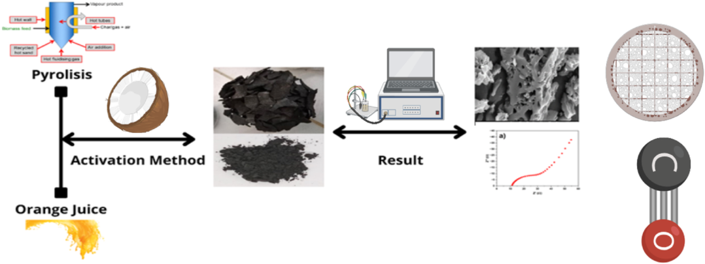

**Fig. 1.** The scheme of Porous Hard Carbon. 

3 

_JCIS Open 19 (2025) 100147_ 

_M. Hamid et al.                                                                                                                                                                                                                                 JCIS_ 

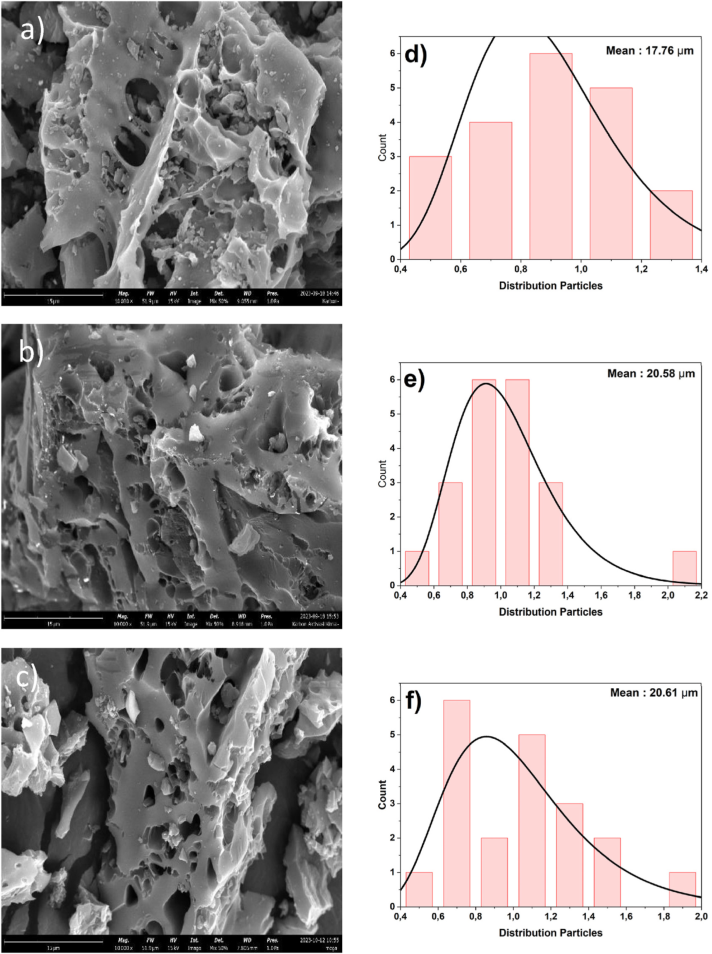

**Fig. 2.** SEM images of porous hard carbon at temperatures of 500[◦] C (a), 600[◦] C (b), and 700[◦] C (c), then particle distribution at temperatures of 500[◦] C (d), 600[◦] C (e), and 700[◦] C (f). 

together, thereby enhancing π–π interactions between the layers and expanding the pathways for electron transport. Consequently, the removal of heteroatoms not only improves the crystallinity of the carbon structure but also directly increases electron mobility and the electrical conductivity of the carbon material [17]. 

The crystallite size (D), micro strain (ε), and dislocation density (δ) were calculated using Eqs. (2)–(4), based on the Williamson-Hall method and Scherrer equation (Eqs. (2)–(4)): 

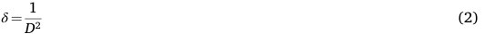

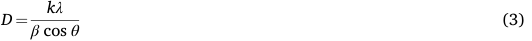

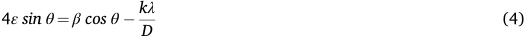

Where D is the crystallite size (nm), δ is the dislocation density (n/m[2] ), β 

is the full width at half maximum (FWHM), ε is the micro strain, and k is the Scherrer constant (typically 0.9) [18]. Crystallite size is a prominent structural property of carbon materials that indicates the degree of crystallinity of carbon materials [19]. Table 1 shows the decreasing trend of crystallite size of porous hard carbon. Based on the results obtained, the crystallite size of PHC-500, PHC-600, and PHC-700 are 0.78 nm, 0.68 nm, and 049 nm [20]. With increasing temperature, the 

**Table 1** 

Results of XRD. 

|Sample|crystallite size|Dislocation (nm|Micro|Inter planner|
|---|---|---|---|---|
||(nm)|−2)|strain|distance (Å)|
|PHC-|0.78|1613.81×10−3|215.40×|3.76|
|500|||10−6||
|PHC-|0.68|2138.18×10−3|247.10×|3.75|
|600|||10−6||
|PHC-|0.49|4058.99×10−3|320.07×|3.53|
|700|||10−6||

4 

_JCIS Open 19 (2025) 100147_ 

_M. Hamid et al.                                                                                                                                                                                                                                 JCIS_ 

crystallite size decreases due to severe deformation. Cold welding and subsequent particle fracture will result in an increase in dislocation density and a rise in powder surface temperature. The micro strains and dislocations, determined using the Scherrer method, are given in Table 1. Dislocation stacking and the formation of new grain boundaries will occur based on Orowan’s theory. 

The enhancement in capacitance with increasing temperature can be attributed to improved ion mobility, thermally activated functional groups, and the emergence of additional electrochemically active sites associated with the reduction in crystallite size. Rather than acting as a limiting factor, the decrease in crystallite size may synergistically contribute to the superior electrochemical performance of the electrode under elevated thermal conditions [21]. The micro strain and induced dislocations vary, namely PHC-500, which is 215.40 × 10[−][6 ] and 1613.81 × 10[−][3 ] nm[−][2] . Then, PHC-600 is 247.10 × 10[−][6 ] and 2138.18 × 10[−][3 ] nm[−][2] . Finally, PHC-600 is 320.07 × 10[−][6 ] and 4058.99 × 10[−][3 ] nm[−][2 ] [22]. The microstrain formed due to asynchronous volume changes during ion release processes can significantly affect the electrochemical properties of the material. This strain induces non-uniform internal stress within the particles, particularly at grain boundaries, which can progressively initiate microcracks or even intergranular fractures. Such structural degradation disrupts ion and electron transport pathways and increases internal resistance, ultimately leading to a substantial reduction in electrochemical performance, such as capacity. However, a stable surface was achieved, effectively preventing the formation of large pores that are susceptible to cracking. As a result, the capacitance increased with rising temperature, indicating improved electrochemical performance under thermal enhancement [23]. 

## _3.3. BET analysis_ 

The BET analysis was conducted to determine the specific surface area of the materials, as shown in Fig. 4(e and f). The Brunauer Emmett [24]Teller (BET) surface area values obtained from the samples are listed in Table 2. The nitrogen adsorption desorption isotherms exhibit a Type IV hysteresis loop, indicative of a mesoporous structure, as defined by IUPAC [24]. The analysis also revealed a narrow pore size distribution in the range of approximately 17–18 nm. While the BET surface area is not the sole determining factor for capacitance, a general trend was observed in which higher BET surface areas correspond to increased 25 specific capacitance [ ]. The enhancement in pore structure significantly influences the electrochemical performance, particularly the specific capacitance, although further investigation is required to fully understand and optimize the electrode material’s potential which remains a central objective of this study. Among the three PHC variations, an increasing trend in pore size was observed in the order of PHC-500 _<_ PHC-600 _<_ PHC-700. This suggests a strong correlation between increased pore size and enhanced specific capacitance. Notably, PHC-700 demonstrates an optimal diffusion pathway and template framework, as evidenced by its larger pore size, which contributes positively to ion transport and electrochemical performance [26]. 

## _3.4. CV analysis_ 

CV curves with relatively ideal elongated shapes indicating typical faradaic normal behavior. Samples PHC-500, PHC-600, and PHC-700 were used to display the curves, which confirmed the faradaic dominated associated with the presence of pores in the elemental distribution 

**Table 2** 

Results of BET. 

|**Table 2** Results of BET.|||
|---|---|---|
|Samples|BET surface area (m2/g)|Pore size (nm)|
|PHC-500|22.85|17.50|
|PHC-600 PHC-700|48.69 89.79|18.08 18.70|

of the samples. In addition, the peaks on the CV curves significantly strengthened with an increase in the physical activation temperature from 500[◦] C to 700[◦] C, due to an increase in the pore distribution, thus leading to an increase in the pseudo-capacitance properties [27]. Based on the scan rate at the test time, which is 100 mV/s. Sample PHC-500 shows an anodic peak value (voltage of 0.33 V and current of 0.0059 − A), a cathodic peak value (voltage of 0.12 V and current of 0.0057 A), and an area value of 0.0035 mA. Then, sample PHC-600 shows the anodic peak value (voltage of 0.12 V and current of 0.0024 A), cathodic − peak value (voltage of 0.004 V and current of 0.0043 A), and area value of 0.0037 mA. And finally, sample PHC-700 shows an anodic peak value (voltage of 0.58 V and current of 0.008 A), cathodic peak value (voltage of − 0.047 V and current of − 0.006 A), and area value of 0.0081 mA. 

Furthermore, based on Fig. 3(a,b,c), the specific capacitance results of PHC-500, PHC-600, and PHC-700 are 439.97 F/g, 463.20 F/g, and 1012.27 F/g, respectively. This substantial increase in specific capacitance is due to the increased area accessible to electrolyte ions with vapor activation. As a result, the specific capacitance of PHCs is not much different. However PHC-700, which exhibited the largest specific surface area, was confirmed to also exhibit the largest specific capacitance [28]. The charge storage mechanism of the PHC electrode is described using power law analysis of electrochemical kinetics as Eq. 5, 6: 

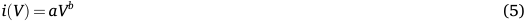

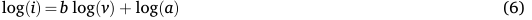

It is known that _i_ represents the maximum current density, _v_ is the scan rate, and _a_ and _b_ are constants. Specifically, when _b_ equals 1, the charge storage is predominantly governed by a capacitive process, whereas _b_ value of 0.5 indicates that the process is mainly diffusioncontrolled. According to the Dunn method, the total charge storage at a given scan rate results from a combination of capacitive and diffusioncontrolled processes. Therefore, the total stored charge at a specific scan rate can be estimated as the sum of the capacitive contribution, or EDLC (where _I_ ∝ _v_ ), and the diffusion-controlled contribution, or pseudocapacitance (where _I_ ∝ _v_[1] ᐟ[2] ) [29]. The charge storage mechanism appears to result from a combination of capacitive and diffusion-controlled processes [30]. Furthermore, the quantitative contributions of PHC electrode governed by these mechanisms were estimated using Eq. (7). 

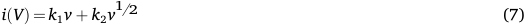

Where, _i_ represents the total current, _k_ 1 _v_ and _k_ 2 _v_[1] 2 correspond to the capacitive and diffusion-controlled contributions, respectively, and k1 and k2 are constants. Fig. 3(d,e,f) illustrates the total charge storage of PHC at various scan rates, which is governed by both capacitive and diffusion-controlled mechanisms. The results reveal that the PHC-500 and PHC-700 electrodes primarily store charge through a diffusioncontrolled mechanism. In contrast, the PHC-600 electrode stores charge mainly via a capacitive mechanism, although not overwhelmingly dominant, contributing approximately 80 % of the total charge storage at a scan rate of 10 mV/s. The remaining 20 % is attributed to diffusion processes, as depicted in Fig. 3(g,h,i) At the same scan rate, the capacitive process accounts for around 57.92 % of the total charge storage, while the remaining 42.08 % originates from diffusioncontrolled contributions. A quantitative evaluation of the charge storage contributions is essential for developing materials with higher specific capacitance and for designing strategies to optimize the involvement of both mechanisms. 

The addition of orange juice activator to coconut biomass waste increases the specific capacitance significantly, this is due to changes in the physical properties of the sample to the addition of orange juice activator, as presented in the morphological structure analysis. Based on previous research, it is confirmed that the addition of orange juice 

5 

_JCIS Open 19 (2025) 100147_ 

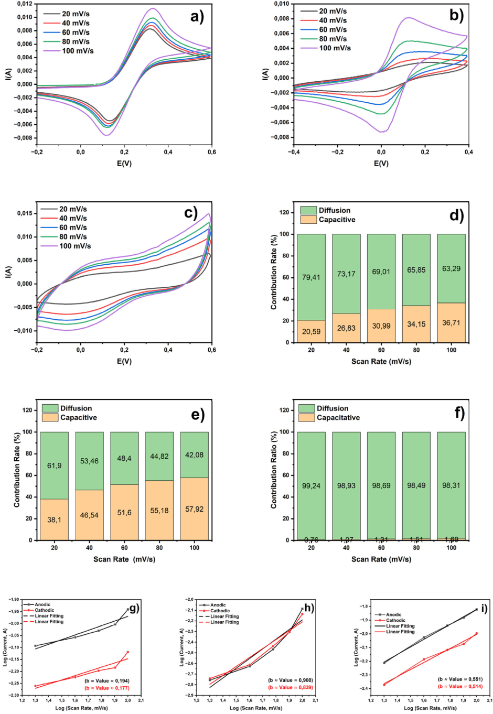

**Fig. 3.** CV curve of sample PHC-500 (a), PHC-600 (b), PHC-700 (c), diffusion and capacitive method contributions of sample PHC-500 (d), PHC-600 (e), PHC-700 (f), b-value computation of sample PHC-500 (g), PHC-600 (h), PHC-700 (i). 

6 

> _M. Hamid et al.                                                                                                                                                                                                                                 JCIS Open 19 (2025) 100147_ 

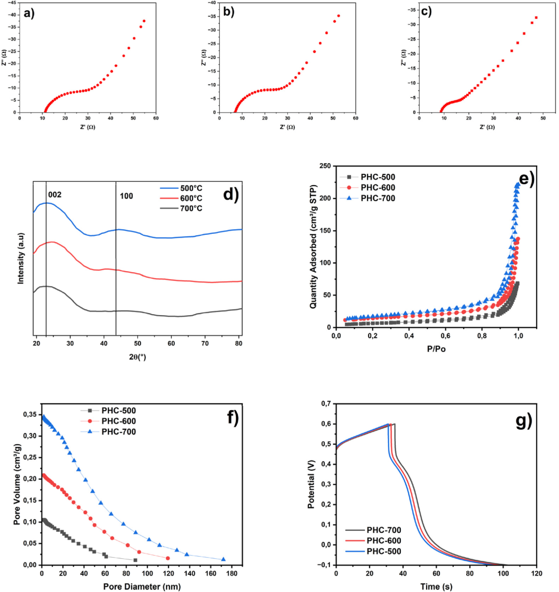

– **Fig. 4.** Nyquist plots of sample PHC-500 (a), PHC-600 (b), and PHC-700 (c), XRD graph (d), N2 adsorption desorption isotherms (e), BJH pore-size distribution curve (f), and GCD Curve on current density 1 A/g (g). 

activator makes the surface morphological structure porous and hierarchically connected to each other to improve the status of carbon elements and heteroatom decomposition. These characteristics help to provide more contact areas of ions and electrodes, thus improving the performance of electrode materials. Furthermore, increasing the physical activation temperature from 500[◦] C to 700[◦] C dramatically increases the specific capacitance. This indicates that the physical activation temperature also affects the electrochemical properties of supercapacitors. The increase in physical activation temperature from PHC- 

500 to PHC-700 samples significantly shows a change in the more developed pore structure, which directly contributes in improving the performance of the material [31]. At higher temperatures, there is expansion and interconnection of the pores, thus creating more efficient ion transfer pathways. This allows for faster diffusion of ions and reduced transport barriers, which is crucial in applications such as energy storage or adsorption. In addition, increasing the temperature can also increase the specific surface area and the number of available active sites, thereby increasing reaction capacity and efficiency [32]. With 

7 

> _M. Hamid et al.                                                                                                                                                                                                                                 JCIS Open 19 (2025) 100147_ 

shorter ion transfer paths and faster flow rates, these materials have great potential in a variety of applications, such as supercapacitors, batteries and environmental purification [33]. 

## _3.5. EIS analysis_ 

The EIS test was used to determine the capability of the electrochemical process in the resistance field, as shown in Fig. 4, which illustrates the Nyquist plot. The resistance process is virtually indicated by a straight vertical line on the Nyquist plot when ion transport is low. With a well-fitted equivalent circuit, all circuit parameter values are recorded in Table 3, including solution resistance (Rs) and charge transfer resistance (Rct). To evaluate the electrochemical kinetics, the equivalent conductivity was obtained through eq. (8) as below: 

σ = L / (R A S)                                                                              (8)[ˆ] 

Where σ is equal to the total conductivity, L represents the thickness of the electrode. A represents the area of the electrode. R represents the impedance, and S represents the cross-sectional area of the electrode material. The results of conductivity calculations are also shown in Table 1 and plotted in Fig. 4 [34] **.** As shown in Fig. 4(a,b,c), PHC-500, PHC-600, and PHC-700 show enhanced electrical conductivity. However, the inequality in pore distribution among samples leads to significantly different σ values. The numerous and more expansive pores of PHC-700 showed much higher ion conductivity than the other samples. Thus, PHC-700 provides optimal electronic and ionic diffusion dynamics. 

The Nyquist plot also shows the value of Rs. The Rs values obtained from the Nyquist plots for PHC-500, PHC-600, and PHC-700 electrodes were 11.34 Ω, 6.83 Ω, and 8.67 Ω, respectively. Based on the Rs results, a lower Rs value indicates good electrical conductivity of the material and suitable attachment of the active material to the current collector. This result may be due to the easier activation of Porous hard carbon during the activation process. Therefore, the PHC-700 sample may provide more defects to produce abundant pores, ensuring complete infiltration of electrolyte ions into the tailor-made composite, which is in agreement with XRD [35]. In the Nyquist plot, the absence of a semicircle in the high frequency region or a smaller Rct value is due to the high conductivity of the electrode during the reaction with the electrolyte. If the Warburg angle is greater than 45[◦] in the low-frequency region, it indicates that the ion diffusion process, which powerfully controls the electrode, is occurring. Therefore, all these results suggest that PHC-600 and PHC-700 samples with lower Rs values can be suitable as electrode materials for supercapacitors [36]. 

Then, PC-700 has a much higher areal capacitance than PC-500 and PC-600, indicating that it can deliver high power rapidly with greater energy capacity. It is also reported that the large specific surface area is conducive to obtaining high capacitance, promising excellent energy performance [37]. The charge transfer resistivity of the PHC-500, PHC-600, and PHC-700 samples was found to be 243.06 Ω cm, 212.52 Ω cm, and 145.74 Ω cm, respectively. It is known that charge transfer resistivity ( _**ρ**_ ct) in supercapacitor electrodes significantly affects electrochemical performance, especially in terms of charge transfer efficiency during the energy storage and release process. A lower ρct 

**Table 3** 

Results of EIS test analysis. 

|Sample|Rs|Rct|Rtotal|**_ρ_**ct (Ω|**_σ_**(S/cm)|D (cm2/s)|
|---|---|---|---|---|---|---|
||(Ω)|(Ω)|(Ω)|cm)|||
|PHC-|11.34|29.17|40.51|243.06|8.81×|2.68×|
|500|||||10−4|10−13|
|PHC-|6.83|28.59|35.42|212.52|2.43×|3.13×|
|600|||||10−3|10−13|
|PHC-|8.67|15.62|24.29|145.74|1.91×|3.85×|
|700|||||10−3|10−13|

value indicates that electrons or ions can move more easily within the electrode material and through the electrode-electrolyte interface, which reduces energy loss due to resistance. With small charge transfer resistivity, supercapacitors can achieve faster electrochemical response, increase power density, and improve energy storage efficiency. To further understand the ion transport mechanism in the synthesized electrode material, Electrochemical Impedance Spectroscopy (EIS) analysis was conducted with a focus on the low-frequency region to obtain the Warburg coefficient or diffusion coefficient (σ). Based on Table 3, the results indicate that sample S3 exhibits the highest ion diffusion capability, suggesting a more open ion transport pathway or a pore structure that better facilitates electrolyte ion movement [38]. 

## _3.6. GCD analysis_ 

Subsequently, GCD testing was conducted to evaluate the charge and discharge capabilities of the sample. Several necessary equations are as follows: 

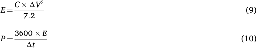

Where, C: Specific capacitance of the button cell (F/g), ΔV: Voltage window (V); E: energy density (Wh/kg); P: power density (W/kg), and Δt-discharge time (s) [39]. 

Fig. 4(g) illustrates the evolution of the GCD curves for the PHC-500, PHC-600, and PHC-700 samples that underwent carbonization, resulting in specific capacitances based on GCD measurements of 91.21 F/g, 93.86 F/g, and 110 F/g, respectively. A clear trend is observed, indicating that the specific capacitance progressively increases with higher carbonization temperatures. High temperatures are known to damage the integrity of oxygen functional groups but not carbon groups, and also alter the morphological architecture of the material using the equations provided in Eq. (9) and Eq. (10), the energy and power densities were carefully calculated. Impressive energy density values of 10.52 Wh/kg, 10.85 Wh/kg, and 11.24 Wh/kg were obtained for the PHC-500, PHC-600, and PHC-700 samples, respectively. Interestingly, even at a relatively high power density of 600 W/kg, the energy density remained at a commendable level between 10 and 11 Wh/kg [40]. 

Based on the results in Table 4, the capacitance obtained in the study is not worse than the results of carbo-based electrode research in general and previous research so that the results of this study can be recommended for further development. 

**Table 4** 

Comparative investigations of this work with carbon-based electrodes from previous studies. 

||No|Material|Electrodes|Electrolytes|Capacitance|Ref.|
|---|---|---|---|---|---|---|
||||||(F/g)||
||1 2|Natural asphal Gelatin|Hard carbon Porous|KOH and Na2SO4 ZnSO4|325.820 383.000|[25] [41]|
||||Carbon||||
||3|lignocellulosic|porous bio-|H2SO4|248.800|[42]|
|||biomass|carbon||||
||4|coconut shell|copper|KOH|81.726|[43]|
||||cobaltite||||
||||with||||
||||activated||||
||||carbon||||
||5|_Phyllanthus_|activated|Na2SO4|250.000|[44]|
|||_emblica_leaves|carbon||||
||6|Coconut|Porous Hard|KOH|1012.270|**This**|
|||Biomass Waste|Carbon|||**work**|

8 

> _M. Hamid et al.                                                                                                                                                                                                                                 JCIS Open 19 (2025) 100147_ 

## **4. Conclusion** 

This study successfully synthesized porous hard carbon (PHC) materials via carbonization at 500[◦] C, 600[◦] C, and 700[◦] C using a combined approach of physical activation (pyrolysis) and chemical activation with orange juice waste as an organic activator. SEM analysis revealed a wide-open pore structure with an average particle size ranging from 2 to 50 μm, which became more developed at higher carbonization temperatures. XRD analysis confirmed two broad diffraction peaks at approximately 25[◦] and 45[◦] , corresponding to the (002) and (100) planes, indicative of an amorphous hard carbon structure that favors electrical conductivity. BET analysis showed that PHC-700 (carbonized at 700[◦] C) had the highest surface area and a mesoporous structure with – pore sizes around 17 18 nm, characterized by a type IV isotherm curve. These features enhanced ion transport pathways, leading to improved electrochemical performance. Electrochemical testing demonstrated that PHC-700 delivered the best results, achieving a specific capacitance of 485.23 F/g with a total resistance of 24.29 Ω. GCD analysis further – confirmed excellent charge discharge reversibility and stable energy retention, even at higher current densities. Compared to typical carbonbased electrode materials such as commercial activated carbon (usually 100–250 F/g) or other reported synthesis methods (approximately 300– 400 F/g), the specific capacitance of 485.23 F/g achieved in this study is significantly higher. While some advanced carbon materials prepared through aggressive chemical activation have reported values exceeding 500 F/g, the performance obtained here is competitive and achieved through an environmentally friendly route using orange juice waste. Overall, increasing the carbonization temperature and introducing organic activators were effective strategies for enhancing pore structure, increasing surface area, and optimizing ion diffusion pathways, making these PHC materials promising candidates for highperformance and sustainable supercapacitor electrodes. 

## **CRediT authorship contribution statement** 

**Muhammadin Hamid:** Conceptualization. **Indri Dayana:** Visualization, Validation, Supervision. **Habib Satria:** Visualization, Validation, Supervision. **Dadan Ramdan:** Writing – original draft, Visualization, Validation. **Junaidi:** Visualization, Validation. **Muhammad Fadlan Siregar:** Visualization, Validation, Supervision. **Dewi Sholeha:** Writing – review & editing, Writing – original draft. **Juliaster Marbun:** Writing – review & editing, Writing – original draft. **Hadi Wijoyo:** Writing – review & editing, Writing – original draft. 

## **Declaration of competing interest** 

The authors declare the following financial interests/personal relationships which may be considered as potential competing interests: Muhammadin Hamid reports was provided by Universitas Sumatera Utara. Muhammadin Hamid reports a relationship with Universitas Sumatera Utara that includes: employment. If there are other authors, they declare that they have no known competing financial interests or personal relationships that could have appeared to influence the work reported in this paper. 

## **Data availability** 

Data will be made available on request. 

## **References** 

- [1] A. Abdisattar, M. Yeleuov, C. Daulbayev, K. Askaruly, A. Tolynbekov, A. Taurbekov, N. Prikhodko, Recent advances and challenges of current collectors for supercapacitors, Electrochem. Commun. 142 (2022) 107373, https://doi.org/ 10.1016/J.ELECOM.2022.107373. 

- [2] A.I. Abdel-Salam, S.Y. Attia, S.G. Mohamed, F.I. El-Hosiny, M.A. Sadek, M. 

   - M. Rashad, Designing a hierarchical structure of nickel-cobalt-sulfide decorated on 

electrospun N-doped carbon nanofiber as an efficient electrode material for hybrid supercapacitors, Int. J. Hydrogen Energy 48 (2023) 5463–5477, https://doi.org/ 10.1016/J.IJHYDENE.2022.11.134. 

- [3] F. Ahmad, M. Zahid, H. Jamil, M.A. Khan, S. Atiq, M. Bibi, K. Shahbaz, M. Adnan, M. Danish, F. Rasheed, H. Tahseen, M.J. Shabbir, M. Bilal, A. Samreen, Advances in graphene-based electrode materials for high-performance supercapacitors: a review, J. Energy Storage 72 (2023) 108731, https://doi.org/10.1016/J. EST.2023.108731. 

- [4] B. Ding, X. Wu, Transition metal oxides anchored on graphene/carbon nanotubes conductive network as both the negative and positive electrodes for asymmetric supercapacitor, J. Alloys Compd. 842 (2020) 155838, https://doi.org/10.1016/J. JALLCOM.2020.155838. 

- [5] H. Li, Y. Ma, Y. Wang, C. Li, Q. Bai, Y. Shen, H. Uyama, Nitrogen enriched high specific surface area biomass porous carbon: a promising electrode material for supercapacitors, Renew. Energy 224 (2024) 120144, https://doi.org/10.1016/J. RENENE.2024.120144. 

- [6] B. Satari, K. Karimi, Citrus processing wastes: environmental impacts, recent advances, and future perspectives in total valorization, Resour. Conserv. Recycl. 129 (2018) 153–167, https://doi.org/10.1016/J.RESCONREC.2017.10.032. 

- [7] S. Humaidi, M. Hamid, H. Wijoyo, Study and characterization of BaFe12O19/PVDF composites as electrode materials for supercapacitors, Biosens. Bioelectron. X 19 (2024) 100507, https://doi.org/10.1016/j.biosx.2024.100507. 

- [8] M. Hamid, S. Humaidi, I.R. Saragi, C. Simanjuntak, I. Isnaeni, Azizah, H. Wijoyo, The effectiveness of activated carbon from nutmeg shell in reducing ammonia (NH3) levels in fish pond water, Carbon Trends 14 (2024) 100324, https://doi.org/ 10.1016/j.cartre.2024.100324. 

- [9] M. Hamid, N. Haida Mohd Kaus, S. Humaidi, I. Isnaeni, A. Daulay, I. Revita Saragi, Activated carbon from biomass waste candlenut shells (Aleurites moluccana) doped ZIF-67/Fe3O4 as advanced materials for supercapacitor, Mater. Sci. Energy Technol. 7 (2024) 381–390, https://doi.org/10.1016/j.mset.2024.07.004. 

- [10] L. Chabib, A. Nurbillah, A.A. Lubis, A.W. Batubara, E. Purwanti, N. Armi, H. Wijoyo, M. Hamid, Nursal, assessment of stream quality and health risks in Indonesian river systems: a social analysis and water quality index approach, Case Stud. Chem. Environ. Eng. 11 (2025) 101200, https://doi.org/10.1016/J. CSCEE.2025.101200. 

- [11] L. Chabib, Nursal, M. Miskam, N.H. Mohd Kaus, M.H. Shafie, M. Hamid, I.R. Saragi, I. Isnaeni, D. Amilia, I.B. Dalimunthe, H. Wijoyo, Optimization of g-C3N4 nanoparticles on structural, morphological, and optical properties as organic pollutants adsorbent in glycerin, Case Stud. Chem. Environ. Eng. 11 (2025) 101057, https://doi.org/10.1016/J.CSCEE.2024.101057. 

- [12] Y. Cong, Y. Wu, C. Zhai, Y. Sun, Z. Cheng, Mechanism of pore water phase change, freezing expansion, and pore enlargement of coal samples under low-temperature liquid nitrogen action, Case Stud. Therm. Eng. 61 (2024) 105036, https://doi.org/ 10.1016/J.CSITE.2024.105036. 

- [13] M. Li, Z. Li, H. Song, N. Harudin, M.Z. Kufian, H.J. Woo, Z. Osman, Understanding the regulation of sulfur on surface-dominated hard carbon anode for sodium ion batteries, J. Power Sources 625 (2025) 235685, https://doi.org/10.1016/J. JPOWSOUR.2024.235685. 

- [14] Y. Liu, J. Yin, R. Wu, H. Zhang, R. Zhang, R. Huo, J. Zhao, K.Y. Zhang, J. Yin, X. L. Wu, H. Zhu, Molecular engineering of pore structure/interfacial functional groups toward hard carbon anode in sodium-ion batteries, Energy Storage Mater. 75 (2025) 104008, https://doi.org/10.1016/J.ENSM.2025.104008. 

- [15] L.Y. Zhou, Z.Q. Luo, J. Wang, T. Peng, Y. Li, Z.Y. Wei, Z.W. Zhang, T. Zou, Preparation of chitin-derived hierarchical porous materials and their application and mechanism in adsorption of mycotoxins, Int. J. Biol. Macromol. 291 (2025) 139139, https://doi.org/10.1016/J.IJBIOMAC.2024.139139. 

- [16] Y. Zhao, H. Cui, J. Xu, N. Yan, R. Yan, H. Guo, J. Shi, Preparation of N-doped hierarchically porous carbon from chitosan using molten salt method for efficient CO2 adsorption, J. Alloys Compd. 1012 (2025) 178539, https://doi.org/10.1016/ J.JALLCOM.2025.178539. 

- [17] M. Sevilla, R. Mokaya, Energy storage applications of activated carbons: supercapacitors and hydrogen storage, in: Energy Environ Sci, Royal Society of Chemistry, 2014, pp. 1250–1280, https://doi.org/10.1039/c3ee43525c. 

- [18] R. Krishna, J. Wade, A.N. Jones, M. Lasithiotakis, P.M. Mummery, B.J. Marsden, An understanding of lattice strain, defects and disorder in nuclear graphite, Carbon N Y 124 (2017) 314–333, https://doi.org/10.1016/J.CARBON.2017.08.070. 

- [19] M. Sarkar, R. Hossain, V. Sahajwalla, Unravelling the properties of microzonal carbon from waste hard rubber by selective thermal transformation via conventional heating and microwave irradiation, Carbon N Y 213 (2023) 118274, https://doi.org/10.1016/J.CARBON.2023.118274. 

- [20] J. Peng, H. Tan, Y. Tang, J. Yang, P. Liu, J. Liu, K. Zhou, P. Zeng, L. He, X. Wang, The induced formation and regulation of closed-pore structure for biomass hard carbon as anode in sodium-ion batteries, J. Energy Storage 101 (2024) 113864, https://doi.org/10.1016/J.EST.2024.113864. 

- [21] B. Kurc, M. Pigłowska, An influence of temperature on the lithium ions behavior for starch-based carbon compared to graphene anode for LIBs by the electrochemical impedance spectroscopy (EIS), J. Power Sources 485 (2021) 229323, https://doi.org/10.1016/J.JPOWSOUR.2020.229323. 

- [22] N. Sadeghi, H. Aghajani, M.R. Akbarpour, Microstructure and tribological properties of in-situ TiC-C/Cu nanocomposites synthesized using different carbon sources (graphite, carbon nanotube and graphene) in the Cu-Ti-C system, Ceram. Int. 44 (2018) 22059–22067, https://doi.org/10.1016/J.CERAMINT.2018.08.316. 

- [23] C. Busa, M. Belekoukia, M.J. Loveridge, The effects of ambient storage conditions ` on the structural and electrochemical properties of NMC-811 cathodes for Li-ion batteries, Electrochim. Acta 366 (2021) 137358, https://doi.org/10.1016/J. ELECTACTA.2020.137358. 

9 

_JCIS Open 19 (2025) 100147_ 

- [24] B. Gnana Sundara Raj, A.M. Asiri, A.H. Qusti, J.J. Wu, S. Anandan, Sonochemically synthesized MnO2 nanoparticles as electrode material for supercapacitors, Ultrason. Sonochem. 21 (2014) 1933–1938, https://doi.org/10.1016/J. ULTSONCH.2013.11.018. 

- [25] H. Chu, Z. Lu, M. Man, S. Song, H. Zhang, J. Cheng, X. Zhao, J. Duan, X. Chen, Y. Zhu, Hard carbon-based electrode boosts the performance of a solid-state symmetric supercapacitor, J. Energy Storage 76 (2024) 109660, https://doi.org/ 10.1016/J.EST.2023.109660. 

- [26] M.A. Villan, D. Thacharakkal, S. Chandramouli, Interplay of physical and textural properties in porous, nanostructured hard-carbons as electrode materials for NonFaradic energy storage devices, J. Energy Storage 99 (2024) 113415, https://doi. org/10.1016/J.EST.2024.113415. 

- [27] S. Ghosh, S. Barg, S.M. Jeong, K. Ostrikov, Heteroatom-doped and oxygenfunctionalized nanocarbons for high-performance supercapacitors, Adv. Energy Mater. 10 (2020), https://doi.org/10.1002/aenm.202001239. 

- [28] Y.R. Son, S.J. Park, Preparation and characterization of mesoporous activated carbons from nonporous hard carbon via enhanced steam activation strategy, Mater. Chem. Phys. 242 (2020) 122454, https://doi.org/10.1016/J. MATCHEMPHYS.2019.122454. 

- [29] M. Mumtaz, A. Mumtaz, Approaching capacity limit: a comprehensive structural and electrochemical study of capacity enhancement in Co3O4 nanoparticles, Mater. Sci. Eng., B 314 (2025) 117988, https://doi.org/10.1016/J. MSEB.2025.117988. 

- [30] A.J. Khan, L. Gao, M. Sajjad, S. Khan, A. Mateen, A. Ghaffar, I.A. Malik, X. Liao, G. Zhao, Synthesis of heterostructured ZnO-CeO2 nanocomposite for supercapacitor applications, Inorg. Chem. Commun. 159 (2024) 111794, https:// doi.org/10.1016/J.INOCHE.2023.111794. 

- [31] M. Hamid, Susilawati, S.A. Amaturrahim, I.B. Dalimunthe, A. Daulay, Synthesis of magnetic activated carbon-supported cobalt(II) chloride derived from pecan shell (Aleurites moluccana) with co-precipitation method as the electrode in supercapacitors, Mater. Sci. Energy Technol. 6 (2023) 429–436, https://doi.org/ 10.1016/j.mset.2023.04.004. 

- [32] A. Apriwandi, E. Taer, R. Farma, R.N. Setiadi, E. Amiruddin, A facile approach of micro-mesopores structure binder-free coin/monolith solid design activated carbon for electrode supercapacitor, J. Energy Storage 40 (2021) 102823, https://doi.org/ 10.1016/J.EST.2021.102823. 

- [33] R. Tri Yulianti, F. Destyorini, Y. Irmawati, A. Ali Umar, V. Fauzia, R. Yudianti, Heteroatom SiO2-N/S co-dopant on hierarchical meso/macroporous palm empty fruit bunches carbon for flexible solid-state supercapacitors, Mater. Sci. Eng., B 303 (2024) 117282, https://doi.org/10.1016/J.MSEB.2024.117282. 

- [34] Y. Liu, Q. Ru, Y. Gao, Q. An, F. Chen, Z. Shi, M. Zheng, Z. Pan, Constructing volcanic-like mesoporous hard carbon with fast electrochemical kinetics for potassium-ion batteries and hybrid capacitors, Appl. Surf. Sci. 525 (2020) 146563, https://doi.org/10.1016/J.APSUSC.2020.146563. 

      - supercapacitor electrodes, J. Power Sources 381 (2018) 116–126, https://doi.org/ 10.1016/J.JPOWSOUR.2018.02.014. 

   - [36] O.C. Pore, A.V. Fulari, N.B. Velha, V.G. Parale, H.H. Park, R.V. Shejwal, V.J. Fulari, G.M. Lohar, Hydrothermally synthesized urchinlike NiO nanostructures for supercapacitor and nonenzymatic glucose biosensing application, Mater. Sci. Semicond. Process. 134 (2021) 105980, https://doi.org/10.1016/J. MSSP.2021.105980. 

   - [37] W. Tian, H. Zhang, H. Sun, M.O. Tad´e, S. Wang, Template-free synthesis of N- doped carbon with pillared-layered pores as bifunctional materials for supercapacitor and environmental applications, Carbon N Y 118 (2017) 98–105, https://doi.org/10.1016/J.CARBON.2017.03.027. 

   - [38] K. Bhawana, M. Gautam, G.K. Mishra, N. Chakrabarty, S. Wajhal, D. Kumar, D. P. Dutta, S. Mitra, Endorsing Na+ storage mechanism in low tortuosity, high plateau capacity hard carbon towards development of high-performance sodiumion pouch cells, Carbon N Y 214 (2023) 118319, https://doi.org/10.1016/J. CARBON.2023.118319. 

   - [39] K. Mahankali, N.K. Thangavel, Y. Ding, S.K. Putatunda, L.M.R. Arava, Interfacial behavior of water-in-salt electrolytes at porous electrodes and its effect on supercapacitor performance, Electrochim. Acta 326 (2019) 134989, https://doi. org/10.1016/J.ELECTACTA.2019.134989. 

   - [40] L. Zhang, H. Wang, Z. Cai, F. Zhu, B. Huang, Q.L. Lu, N, P Co-doped hierarchical porous carbon regulated by carboxylated nanocellulose for supercapacitor, Ind. Crops Prod. 232 (2025) 121273, https://doi.org/10.1016/J. INDCROP.2025.121273. 

   - [41] J. Liu, Y. Ding, F. Wang, J. Ran, H. Zhang, H. Xie, Y. Pi, L. Ma, Enhancing the supercapacitive performance of a carbon-based electrode through a balanced strategy for porous structure, graphitization degree and N,B co-doping, J. Colloid Interface Sci. 668 (2024) 213–222, https://doi.org/10.1016/J.JCIS.2024.04.154. 

   - [42] M. Xu, X. Zhu, Y. Lai, A. Xia, Y. Huang, X. Zhu, Q. Liao, Production of hierarchical porous bio-carbon based on deep eutectic solvent fractionated lignin nanoparticles for high-performance supercapacitor, Appl. Energy 353 (2024) 122095, https:// doi.org/10.1016/J.APENERGY.2023.122095. 

   - [43] J. Bosco Franklin, S. Sachin, S. John Sundaram, G. Theophil Anand, A. Dhayal Raj, K. Kaviyarasu, Investigation on copper cobaltite (CuCo2O4) and its composite with activated carbon (AC) for supercapacitor applications, Mater. Sci. Energy Technol. 7 (2024) 91–98, https://doi.org/10.1016/J.MSET.2023.07.006. 

   - [44] A. Agrawal, A. Gaur, A. Kumar, Fabrication of Phyllanthus emblica leaves derived high-performance activated carbon-based symmetric supercapacitor with excellent cyclic stability, J. Energy Storage 66 (2023) 107395, https://doi.org/10.1016/J. EST.2023.107395. 

   - [45] M. Hamid, T.I. Nasution, R. Elfinita, H. Wijoyo, I. Isnaeni, Reducing ammonia (NH3) levels in fish cage water using activated carbon adsorbent derived from purple corn cob, Sci. Technol. Indones. 9 (2024) 669–681, https://doi.org/ 10.26554/sti.2024.9.3.669-681. 

- [35] S. Liu, Y. Zhao, B. Zhang, H. Xia, J. Zhou, W. Xie, H. Li, Nano-micro carbon spheres anchored on porous carbon derived from dual-biomass as high rate performance 

10 

