Northeast Petroleum University 

Northeast Petroleum University 

Northeast Petroleum University 

Northeast Petroleum University 

 

Northeast Petroleum University 

Biomass, Porous carbon, KOH activation, Coconut shell carbon, Supercapacitor 

August 2nd, 2022 

https://doi.org/10.21203/rs.3.rs-1895857/v1 

  This work is licensed under a Creative Commons Attribution 4.0 International License. Read Full License 

Page 1/22 

Here we report an effective and facile method for preparing porous carbons (CSCK-T-x) with highly developed hierarchical porosity for high-performance supercapacitor by one-step KOH activation of coconut shell carbon. The effects of carbonization temperature (T,[o] C) and KOH/C ratio (x) on the structure and electrochemical properties were studied systematically. The as-prepared CSCK-800-2 displayed two concentrated mesopores at 4 nm and 14 nm. The unique hierarchical structure of CSCK800-2 enables it to have low ion transport resistance and high ion-accessible surface area, which contributes to outstanding electrochemical performance. Furthermore, it possessed the highest BET speci�c surface area of 2143.6 m[2] ·g[− 1] with a pore volume of 1.34 cm[3] ·g[− 1] among the CSCK-T-x. In a three-electrode test system, CSCK-800-2 exhibits a high speci�c capacitance of 317 F·g[− 1] at a current density of 0.5 A·g[− 1] and considerable rate retention of 68% at 20 A·g[− 1] . The symmetrical supercapacitor that was based on CSCK-800-2 showed a maximum energy density of 13.5 Wh·kg[− 1] at 0.5 A·g[− 1] in 6M KOH electrolyte. Besides, it also exhibited a superior cycling stability with 99.7% of the capacitance retention after 10000 cycles at 5 A·g[− 1] . 

With the increasing demand for energy from transportation electri�cation and smart grids, as well as the gradual depletion of fossil fuels, it is signi�cant to develop e�cient, low cost, eco-friendly and highperformance energy storage equipments [1]. Supercapacitors (SCs) have received extensive attention for their excellent cycling stability and high power density. [2]. However, its low energy density has become a key factor restricting its wider development. Therefore, it is necessary to improve the energy density of SCs to satisfy urgent demand for uninterruptible power supplies. The charge storage mechanisms of SCs can be divided into the electric double-layer capacitors (EDLC) which rely on electrostatic attractions between ions and charged electrode surface, such as carbon materials [3]; and pseudo capacitance based on the highly reversible redox reactions on the surface or in the bulk phase of the electrode materials, such as transition metal oxides [4], transition metal hydroxides [5] and conductive polymers [6]. 

Many factors contribute to the performance of SCs, such as the electrochemical performance of electrode materials, electrolyte selection and potential window of the electrode, etc. Among these factors, the performance of electrode material is the most important factors affecting its electrochemical performance. In EDLC phenomenon, ion interaction between electrode/electrolyte interfaces is essential for e�cient charge-discharge process. The electrode material needs to have large speci�c surface area and reasonable pore structure to maximize the charge storage density of SCs Some advanced materials including metal oxides [6], conductive polymers [4, 5], and carbon-based materials are reported [7–10]. Among these materials, carbon-based materials have attracted widespread attention for their large speci�c surface area, low cost, wide sources, non-toxic and high electrical conductivity [11, 12]. However, their theoretical capacity and energy density have not reached a satisfactory level. An effective way to solve the above problem is to construct hierarchical porous structure which is bene�cial to high-density 

Page 2/22 

charge storage. [13–15]. Micropores (< 2 nm) can enhance surface area to ensure high energy storage capacity, small mesopores (between 4 and 6 nm) increase ion-accessible surface area with a lower iontransport resistance, large mesopores (between 10 and 50 nm) and macropores (> 50 nm) act as ion buffering reservoir to shorten ion-transport pathway and reduce the resistance of electron transport [16– 18]. In conclusion, those carbon-based electrode materials with suitable hierarchical porous structure and high surface areas are ideal for EDLCs. However, some micropores whose sizes do not match the size of electrolyte ion or too much large mesopores, which usually lead to poor capacity and relatively low speci�c surface area [19, 20]. 

A variety of methods, including physical and chemical activation, have been tried to obtain the ideal porous structure. Chemical activation creates pores by etching or reacting with carbon and is more e�ciently than physical activation [21]. In general, chemicals such as KOH, K2CO3, KCl, and ZnCl2, etc. are mixed with biochar or carbon materials for high-temperatures pyrolysis under inert atmosphere [22–24]. At high temperatures, a varity of chemical and physical reactions take place to produce porous structures through etching and gasi�cation effect [25]. KOH activation is considered to be the most effective chemical activation method. In addition, carbon source is also a critical factor restricting industrial application. Recently, the carbon nanotubes, graphene, carbon aerogels and porous carbons are widely used as high-performance supercapacitor electrodes [14, 26, 27]. Among these materials, the nanoporous carbon electrodes obtained from natural biomass are more eco-friendly, cost-effective and renewable. For example, Yin et al. [28] synthesized porous carbon electrode from coconut shell by using carbon dioxide and potassium hydroxide as physical activator and chemical activator. The materials exhibited a high speci�c capacitance of 266 F·g[− 1] at 0.1 A·g[− 1] with a speci�c surface area of 2898 m[2] ·g[− 1] . Bai et al. [29] fabricated N/O co-doped activated carbon from glucose as raw materials without using any toxic reagents. Its energy density was 17.1 Wh·kg[− 1] , and the cyclic stability reached 88.1% after 10000 cycles. Wang et al. [30] prepared rod-like activated carbon by KOH activation using aniline-modi�ed lignin. The materials showed high speci�c surface area with connected cavities, which lead to the speci�c capacitance of 336 F·g[− 1] and good electrochemical performance. 

Coconut shell is mainly consists of cellulose, lignin and pentosan. It is a low-cost and renewable agricultural waste, which is widely distributed on the earth. For these reasons, coconut shell is a promising candidate for preparing porous carbon precursors [31]. The coconut shell-based activated carbons have been widely used as adsorbents for water and air treatments [32, 33], reduced graphenes [34], and electrodes [35]. Compared to other agricultural waste materials used as electrodes for supercapacitors, this activated carbon has large surface area, hierarchical porosity, as well as high conductivity [36–39]. Herein, a simple and effective method for preparing porous carbon with high hierarchical porosity by one-step activation of coconut shell carbon with KOH is proposed. The activated carbon exhibits a high speci�c surface area up to 2143.6 m[2] ·g[− 1] with a unique hierarchical porous structure, a remarkable electrochemical performance with extraordinary cycling stability, showing that our work provides a sustainable and facile strategy for preparing porous carbon materials with promising applications in SCs. 

Page 3/22 

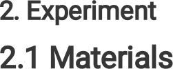

Coconut shell carbon was purchased from Wenxian Boyuan activated carbon factory. Potassium hydroxide (KOH), muriatic acid (HCl) and N-Methyl-2-pyrrolidinone (NMP) were purchased from Tianjin Damao Chemical Reagent Factory. Poly (vinylidene �uoride) (PVDF) was purchased from Aladdin Reagent Co., Ltd. Carbon black were acquired by Cabot Investment Co., Ltd. The carbon cloth (WOS 1009, CC) was purchased from the Taiwan carbon energy corporation. 

The coconut shell carbon was ultrasonically cleaned with distilled water for 10 min, �ltered and dried at 80[o] C for 24h to obtain the pre-treated coconut shell carbon (CSC). Afterwards, the obtained black powder was added into KOH solution at a KOH/C ratio of x (x = 0.5, 1, 2, or 3; w/w). Then, the black paste was dried at 80[o] C for 12h to remove redundant water and further grounded to ensure KOH was mixed evenly. Subsequently, the resultant mixture was placed in a nickel crucible and carbonized at different temperature (700, 800 and 900°C) for 2 h under N2 atmosphere and cooled down to room temperature. After that, the samples were cleaned by 1M HCl and deionized water several times until the �ltrate was neutral. Lastly, the synthesized coconut shell carbon was dried at 80 ℃ for over 12 h. The dried materials were labeled as CSCK-T-x (T = �nal activation temperature, x = weight ratio of KOH and C). 

A scanning electron microscope (SEM) with energy disperse spectroscopy (EDS) mapping was performed by SIGMA scanning electron microscope from Carl Zeiss AG, Germany, and the sample was magni�ed to 2000-10,000 times. The X-ray diffraction (XRD) analysis was recorded on a D/max2200PC-X-ray diffractomerter using Cu kα radiation. The speci�c surface area was measured by Brunauer-Emmett-Teller (BET) method, and the pore size distribution was calculated by classic Barrett-Joyner-Halenda (BJH) model. The characteristic peaks of carbon samples were identi�ed by XploRA Plus (Jobionyvon Technology) for Raman spectra. X-ray photoelectron spectroscopy (XPS) was used for chemical element analysis and obtained by ESCALAB MKII spectrometer equipped with a hemispherical analyzer under vacuum conditions using the Mg radiation (E = 1253.6 eV). 

The electrochemical test was carried out at the electrochemical workstation (Chenhua CHI660E, Shanghai) with 6M KOH as electrolyte. In the three electrode system, Pt sheet were used as the counter electrode and Hg/Hg2Cl2 as the reference electrode. The working electrode was fabricated as follows. Mix the active materials, polyvinylidene �uoride (PVDF), and carbon black in the mass ratio of 8: 1: 1, and added an appropriate amount of N-methylpyrrolidone (NMP) to form a uniform slurry. Then the sticky slurry was coated onto 1 cm[2] carbon cloth and dried at 80 ℃ in oven for 12h. Cyclic voltammetry (CV) 

Page 4/22 

test was carried out in the potential range of -1-0 V at a series of scan rates from 5 to 200 mV s[− 1] . The galvanostatic charge–discharge (GCD) measurement was operated at different current density from 0.5 to 20 A g[− 1] with a potential window of -1-0 V. Electrochemical impedance spectroscopy (EIS) was conducted in a frequency range from 10[− 1] to 10[5] Hz with an amplitude of 5 mV. In addition, the electrochemical measurement of symmetrical SCs was carried out by using a two-electrode system. The gravimetric speci�c capacitance (C, F·g[− 1] ) of the electrode composites based on the three-electrode system and symmetric supercapacitors were calculated from galvanostatic charge-discharge (GCD) curve pro�les according to the following eqation: 

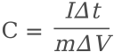

1 

Where I (A), Δt (s), ΔV (V) and m (g) refers to the discharge current, discharge time, potential change within Δt, and mass of the active material loaded in the working electrode, respectively. 

Gravimetric energy density (E) in two-electrode system was evaluated through the equation below. 

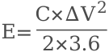

2 

Gravimetric power density (P) in two-electrode system was evaluated through the equation below: 

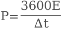

3 

Where C represents the speci�c capacitance, ΔV refers to working potential, and t is the discharge time of symmetric supercapacitors. 

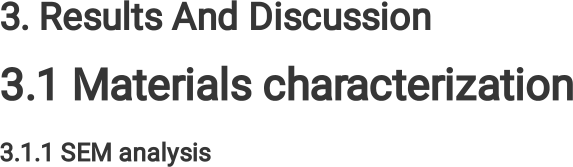

Figure 1 shows the microstructural properties of the carbon samples. It can be observed from Fig. 1(a) and 1(b) that CSC is composed of numerous irregularly shaped objects with rough surface and no obvious pores. However, the obtained CSCK-800-2 presents a 3D structure with rich connected holes and thin hole walls (Fig. 1(c) and 1(d)). The differences in the micromorphology and microstructure of CSC 

Page 5/22 

and CSCK-2-800 materials possibly because KOH can better enter the inner part of activated carbon to expand the pores and etch the material through oxidizing part of carbon into carbonate and oxycarbide at high temperature. It is bene�cial to obtain better pore size distribution and more reasonable rational pore structure, which is conducive to providing more ion adsorption sites and reducing diffusion resistance [40]. In addition, the EDS spectrum (Fig. 1(e)) and element mapping showed that the C (Fig. 1(f)) and O (Fig. 1(g)) atoms are uniformly distributed. 

Figure 2 shows the XRD patterns of all samples. Two evident diffraction peaks at around 21° and 43° belong to the (002) and (100) planes of the graphitic structure, respectively. [41]. The broader peak around 21° indicates a certain degree of graphitization structure [42, 43]. At the activation temperature of 800 ℃, the peak of the samples becomes mild with the increase of KOH/C ratio. This shows that during the treatment of KOH activation, the activated carbon is continuously etched and the amorphous degree of CSCK-800-x continuously increased. This induces a better electrostatic adsorption and desorption of electrolyte ions in materials, and their electrochemical performance becomes more excellent. The weak peak at 2θ = 43° suggests that the existence of graphitic-type carbon frameworks in as-prepared CSCK-Tx. The peak intensity at 43° is gradually increased with the increase of activation temperature from 700 oC to 900 oC, demonstrating that the graphitization of CSCK-T-2 can be effectively improved by high activation temperature [44, 45]. 

Figure 3 displays the Raman spectra of all samples. Two obvious peaks in the spectra were found at 1360 cm[− 1] and 1610 cm[− 1] , respectively, corresponding to the D band and G band [46]. The D band re�ected the degree of disorder with substantial defects, and the G band revealed the E2g vibration mode of graphitizaion carbon [47, 48]. The intensity ratio of D and G bands (ID/IG) re�ects the graphitization degree of carbon materials, and the corresponding values are shown in Table 1. It appears that the ID/IG value of CSC was 0.91, which is lower than all the KOH activated samples. The lower ID/IG value of CSC is attributed to its underdeveloped porous structure. As we know, the lower the ID/IG value, the higher the graphitization degree, and the less disordered carbon [49, 50]. With the increase of KOH/C ratio, the ID/IG value of CSCK-800-x samples increased, demonstrating the more disordered carbon. Among CSCK-T-2, the CSCK-800-2 possessed the highest ID/IG value of 1.07,indicating that CSCK-800-2 would possess highest defect degree and more active sites which contributes to high energy storage [46]. 

Figure 4 shows the N2 adsorption − desorption isotherms and pore size distributions of all samples. The samples after KOH activation are shown as type I and IV with the H4 hoop, which demonstrates the presence of hierarchical micro- and mesopore architecture (Fig. 4(a) and 4(c)) [51, 52]. Such hierarchical pore structure provides large surface area of the electrode/electrolyte interface for ions adsorption and 

Page 6/22 

transport [53, 54]. However, CSC only shows a type-III adsorption isotherm with rapid adsorption under high relative pressure (P/P0 > 0.8), indicating that CSC mainly has macroporous structure and a limited number of mesopores [55]. 

The pore size distribution curves of carbon samples shown in Fig. 4(b) and 4(d) are consistent with the N2 adsorption/desorption analysis. It can be seen that in all CSCK-T-x samples, micropores are still the major part coexisting with a few of small mesopores (4 nm). However, with increasing the KOH/C ratio to > 2 large mesopores with size of 14 nm are gradually created. Importantly, the small mesopores ensure a high surface area and enough active sites to establish countless double electric layers, thus improving the charge storage capacity of supercapacitors [20].The mesopores with diameters between 10 and 50 nm provide shorter ion-transport channels with a minimized inner-pore resistance [18]. The presence of double mesopores could result in high retention capability, since they could serve as both electrolyte reservoirs and highways for e�cient electrolyte transport, which contributes to improved rate performance. 

Based on the above analysis, the process of the porous carbon formation was proposed as follows. The carbon was activated with KOH at high temperature, and a series of redox reactions take place to etch the carbon frame and generate H2, CO2 and CO which were occupied by the resultant potassium compounds and then washed with distilled water and diluted HCl and boost number of micropores and small mesopores effectively. The activation mechanism was based on the following equations [21]. 

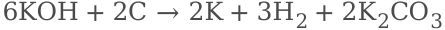

1 

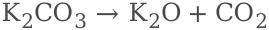

2 

3 

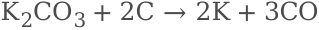

4 

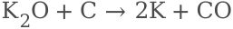

5 

The speci�c surface area (SBET) and total pore volume (Vtotal) parameters of all samples were summarized in Table 1. The CSC exhibits a low surface area (SBET=340.4m[2] �g[− 1] ), whereas the CSCK-T-x samples exhibit much higher surface areas (865.3∼2143.6 m[2] �g[− 1] ), which con�rms that KOH makes a 

Page 7/22 

vital contribution to the formation of the pore structure. As the KOH/C ratio and activation temperature increases, the SBET and Vtotal rapidly increases and then decreases, reaches a maximum (2143.6 m[2] �g[− 1] and 1.34 cm[3] �g[− 1] ) at 800[o] C with a KOH/C ratio of 2. In addition, the change of micropores area (Smicro) of CSCK-T-x showed peaklike shape, increasing rapidly from 669.1 m[2] �g[− 1] at 700[o] C to 1299.2 m[2] �g[− 1] at 800 ℃, and then decreased to 1067.4 m[2] �g[− 1] at 900 ℃. As we know, micropores play a key role in the formation of a double layer of activated carbon. The decrease in micropores area at 900[o] C indicated that some of micropores were transformed into mesopores and macropores at higher activation temperature [56]. 

Table 1 Summary of the structure parameters for all samples 

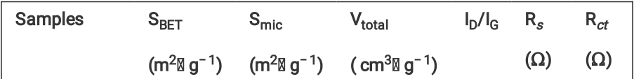

|||(m 2 � g − 1 )|(m 2 � g − 1 )|( cm 3 � g −|1 )|( Ω )|( Ω )||
|---|---|---|---|---|---|---|---|---|
||CSC|340.4|56.7|1.22|0.91|1.20|0.38||
||CSCK-700-2|865.3|669.1|0.53|0.94|0.92|0.18||
||CSCK-800-0.5|1324.5|787.6|0.88|1.04|1.12|0.19||
||CSCK-800-1|1794.2|1171.9|1.07|1.05|1.05|0.12||
||CSCK-800-2|2143.6|1299.2|1.34|1.07|0.81|0.11||
||CSCK-800-3|1928.8|1244.4|1.44|1.11|1.10|0.18||
||CSCK-900-2|1634.7|1067.4|0.97|0.97|1.07|0.17||

The surface elements of CSCK-800-2 are measured by XPS, corresponding test results as shown in Fig. 5. As can be seen from the XPS full scan spectrum (Fig. 5(a)) there are two peaks at around 284 and 532 eV that correspond to the C 1s peak of sp[2] carbon and the O 1s spectrum. As shown in Fig. 5(b) detailed bonding con�gurations of carbon atoms can be obtained from the high resolution C 1s spectra. The C 1s shows three peaks of C–C (285 eV), C–O (285.9 eV), O = C–O (288.4 eV) [57], which indicates the presence of functional carbon in the sample [58]. While, the O1s (Fig. 5(c)) consists of two peaks, which can be attributed to C = O (531.2eV) and C–O (532.7eV) [57]. These chemical bonds can improve the wettability of electrode materials surface, reduce the charge transfer resistance and may afford stable pseudo-capacitance via faradic reactions [57, 59]. 

The electrochemical performances of CSC and CSCK-T-x samples were characterized by CV, GCD, and EIS in 6M KOH aqueous electrolyte using a three-electrode system. Figure 6(a) and 6(b) exhibits the CV curves of all samples at the scan rate of 50 mV·s[− 1] . All of CV curves reveals the typical rectangular 

Page 8/22 

shape, which can be attributed to the EDLC behavior [60]. The area enclosed by the CV curves represents capacitance [61]. The area of CSCK-800-2 is the largest, indicating the best speci�c capacitance. Figure 6(e) shows the CV curves of CSCK-800-2 at various scan rates in detail, and the CV curves of other samples at different scan rates from 5 to 200 mV·s[− 1] were also presented in Fig. S1. It can be observed that the CV curves of CSCK-800-2 remained a rectangle-like shape within the scanning rate (5-200 mV·s[− ] 1) without distinct deformation even at 200 mV·s− 1, suggesting the rapid transfer of charge with good rate capability [62]. 

Figure 6(c) and 6(d) illustrates the GCD curves of all samples at the current density of 0.5 A·g[− 1] . The curves show a triangular shape, which re�ect the excellent electrochemical reversibility of the electrode. CSCK-800-2 shows the longest discharge time among all samples, demonstrating that CSCK-800-2 can adsorb/desorb more electrolyte ions in the charging and discharging process with outstanding capacitance performance [63]. This is due to the etching of KOH, many micropores and mesopores are increased on the surface of the pristine CSC, which can not only improve the speci�c surface area of the material, but also conducive to the diffusion and penetration of electrolyte ions and charge transmission, which plays a positive role in improving the electrochemical performance of SCs. It can be seen from Fig. 6(c) that the speci�c capacitance increases with the increase of KOH/C ratio. When the ratio of KOH/C is 2:1, the capacitance reaches the maximum value. Further increasing the amount of KOH will not increase the capacitance. The trend of speci�c capacitance is consistent with that of speci�c surface area. It is noteworthy that of all the CSCK-T-2 samples, CSCK-700-2 shows the lowest speci�c surface area, but its speci�c capacitance was higher than CSCK-900-2, which can be interpreted that the capacitance performance depends not only on the speci�c surface area but also on the reasonable pore size distribution. The capacitance performance of the CSCK-800-2 at the different current density was further evaluated by GCD test, and the corresponding curves were shown in Fig. 6(f) and the GCD curves for other samples are shown in Fig. S2. In particular, all GCD curves exhibit symmetrical triangles even at 20 A·g[− 1] , demonstrating the excellent electrochemical performance [64]. Figure 6(g) shows the effect of the current density on gravimetric speci�c capacitance of the CSC and CSCK-800-2 samples calculated from the GCD curves. In detail, the speci�c capacitance of CSC maintains 150.3 and 75.6 F g[− 1] at 0.5 A·g[− 1] and 20 A·g[− 1] with capacitance retention of 50.3%. In contrast, good rate capability is observed in CSCK800-2. It displays gravimetric speci�c capacitance of 317.0 and 216.0 F·g[− 1] at 0.5 and 20 A·g[− 1] with capacitance retention of 68.1%, respectively. The speci�c capacitance is 2.1 times higher than that of pristine coconut shell based commercial activated carbon at 0.5A·g[− 1] , which attributed to the presence of double mesopores(4 and 14 nm), as they could serve both as electrolyte reservoirs and as highways for e�cient electrolyte transport, contributing to improved rate performance. The supercapacitor performance of CSCK-800-2 is superior to that of biomass-derived materials reported in literature (Table 2). Therefore, coconut shell-derived hierarchical porous carbon is an ideal electrode material with potential application prospect in SCs. 

Figure 6(h) exhibits the Nyquist plots of all samples. In the low frequency region, all the samples showed nearly vertical lines, demonstrating ideal capacitive behavior. The equivalent series resistance (Rs) is 

Page 9/22 

in�uenced by the contact resistance between the active material and current collector and the overall electrolyte resistance in solution [65]. It can be seen that the Rs of the CSC was about 1.2 Ω, which is 1.5 times that of CSCK-800-2 (0.8Ω). The localized graphitized structure of CSCK-800-2 contributes to the lower Rs. The charge-transfer resistance (Rct) mainly comes from the faradaic reaction between the interfaces of electrode and electrolyte [30, 66]. As can be observed from Table 1, all the CSCK-T-x samples show low Rct value (0.11∼0.19 Ω) than that of CSC (0.38 Ω), demonstrating small internal resistance, low ions transfer resistance, and excellent electrical conductivity [67, 68]. High speci�c surface area can intensify the charge transfer within the microporous of CSCK-T-x electrodes and lead to low Rct values. 

Table 2 Comparision of elctrochemical performance of biomass-derived carbon materials. 

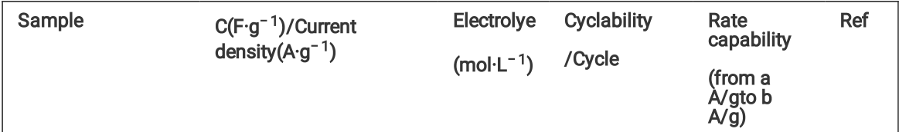

||g  density(A·g − 1 )|(mol·L − 1 )|/Cycle|capability (from a A/gto b A/g)||
|---|---|---|---|---|---|
|Shiitake|306/1|6M KOH|95.7%/15000|77%(1–30)|[69]|
|mushrooms||||||
|Glucose|289/1|6MKOH|119.5%/5000|> 51.9(1 to 10)|[70]|
|Pomelo mesocarps|245/0.5|2M KOH|96.5%/10000|72%(0.5– 20)|[71]|
|Borassus �abellier|238/1|1M KOH|90.2%/1000|98.4(1 to 5)|[72]|
|Lignin|268/0.5|6M KOH|93%/10000||[73]|
|Eggshell membranes|247.1/0.2|6M KOH|100%/10000|75.2%(0.2– 10)|[74]|
|Cotton derived- carbon|180/0.5|6M KOH|95%/5000|92%(0.5– 10)|[75]|
|Willow catkin|298/0.5|6M KOH|98%10000|78.2%(0.5– 50)|[76]|
|Glucose with waste water|275/0.5|6M KOH||65.4%(0.5– 20)|[77]|
|Coconut shell carbon|317/0.5|6M KOH|99.7%/10000|68%(0.5 to 20)|This work|

A symmetrical two-electrodes SC was assembled by CSCK-800-2 and the capacitive performance was measured in 6 M KOH (Fig. 7). As can be seen from Fig. 7(a), the nearly ideal rectangular shape of CV 

Page 10/22 

curves demonstrates a typical EDLCs behavior. The CV curves retain quasi-rectangular shape without distinct deformation even at a high scan rate of 200 mV·s[− 1] , suggesting its high reversibility and fast transportation of charge [78]. As shown in Fig. 7(b), all GCD curves exhibit similar equilateral triangle shape and the deformation can be ignored even at 20 A·g[− 1] , also indicating its good electrochemical performance. The speci�c capacitance was calculated to be 97.8 F·g[− 1] at 0.5 A·g[− 1] . It is observed from Fig. 7(c), the energy density was 13.6 Wh·kg[− 1] at a high power density of 250 W·kg[− 1] . When the power density was increased to 10 kW·kg[− 1] , the energy density decreased to 8.6 Wh·kg[− 1] . This performance is signi�cantly better than those reported carbon materials (Fig. 7(c)) [35, 55, 79–82]. Moreover, 99.7% of the initial capacitance can still be maintained at 5 A·g[− 1] after 10000 cycles of the CSCK-800-2-based symmetrical SC demonstrates that it has the potential of practical application with outstanding cycling stability (Fig. 7(d)). All in all, the coconut shell-derived porous carbon is an excellent and potential alternative electrode material with desirable electrochemical performance for SCs. 

In summary, a simple one-step KOH activation approach to prepare a cost-effective coconut shell-derived hierarchical porous carbon for high-performance supercapacitor was described. The effects of carbonization temperature and KOH/C ratio on the structure and electrochemical properties were studied systematically, with the aim to design a low-cost biomass carbon material for e�cient supercapacitor. It is proved that the KOH activation can generate mesopores mainly at 4 nm and a small amount near 14 nm. The synthesized CSCK-800-2, which possessed unique hierarchical porous with an ultra-high surface of 2143.6 m[2] ·g[− 1] , exhibited the best supercapacitor performance because of the four characteristics (micipores could increase surface area to ensure high energy storage capacity, small mesopores for fast ion transfer, large mesopores shorten ion-transport channels with a minimized inner-pore resistance, and localized graphitic structure can enhance conductivity). It delivers high speci�c capacitances up to 317 F·g[− 1] at a current density of 0.5 A·g[− 1] , and maintains high capacitance retention of 68.1% at 20 A·g[− 1] . The energy density of 13.5 Wh·kg[− 1] at a power density of 250 W·kg[− 1] can be achieved. Moreover, the capacitance loss is kept below 0.3% after 10000 charge − discharge cycles at 5 A g[− 1] . The coconut shellderived porous carbon is proved to be a promising, low cost and attractive electrochemical material. 

Yutong Zhao: Conceptualization, Methodology, Writing – original draft, Formal analysis, Validation, Project administration. Yuanyuan Wang: Validation, Investigation. Yanxiu Liu: Formal analysis.  Huan Wang: Funding acquisition. Hua Song: Writing review & editing, Supervision, Project administration, Funding acquisition. 

Page 11/22 

The authors have no relevant �nancial or non-�nancial interests to disclose. 

The authors did not receive support from any organization for the submitted work. 

All data generated or analysed during this study are included in this published article [and its supplementary information �les]. 

We are grateful for �nancial support from National Natural Science Foundation of China (22008134). 

1. J. Deng, M.M. Li, Y. Wang, Green Chem. 18, 18 (2016). http://dx.doi.org/10.1039/c6gc01172a 

2. L. Wei, G. Yushin, Nano Energy 1, 4 (2012). http://dx.doi.org/10.1016/j.nanoen.2012.05.002 

3. L. Zhou, H. Cao, S.Q. Zhu, L.R. Hou, C.Z. Yuan, Green Chem. 17, 4 (2015). http://dx.doi.org/10.1039/c4gc02032d 

4. S.H. Yue, H. Tong, L. Lu, W.W. Tang, W.L. Bai, F.Q. Jin, Q.W. Han, J.P. He, J. Liu, X.G. Zhang, J. Mater. Chem. A 5, 2 (2017). http://dx.doi.org/10.1039/c6ta09128h 

5. J. Yan, W. Sun, T. Wei, Q. Zhang, Z.J. Fan, F. Wei, J. Mater. Chem. 22, 23 (2012). http://dx.doi.org/10.1039/c2jm30221g 

- �. L.M. Santino, Y. Lu, S. Acharya, L. Bloom, D. Cotton, A. Wayne, J.M. D'Arcy, ACS Appl. Mater. Interfaces 8, 43 (2016). http://dx.doi.org/10.1021/acsami.6b09779 

7. X. Tian, H.R. Ma, Z. Li, S.C. Yan, L. Ma, F. Yu, G. Wang, X.H. Guo, Y.Q. Ma, C.P. Wong, J. Power Sources 359, (2017). http://dx.doi.org/10.1016/j.jpowsour.2017.05.054 

- �. J. Du, L. Liu, Z.P. Hu, Y.F. Yu, Y. Zhang, S.L. Hou, A.B. Chen, ACS Sustainable Chem. Eng. 6, 3 (2018). http://dx.doi.org/10.1021/acssuschemeng.7b04396 

9. L. Zhang, Q.Q. Xu, X. Wang, Q. Sun, F. He, W.D. Pan, H.B. Xie, RSC Adv 10, 68 (2020). http://dx.doi.org/10.1039/d0ra06780f 

10. T.N.J.I. Edison, R. Atchudan, N. Karthik, P. Chandrasekaran, S. Perumal, P. Arunachalam, P.B. Raja, M.G. Sethuraman, Y.R. Lee , Surf. Coat. Technol. 416, 25 (2021). http://dx.doi.org/10.1016/j.surfcoat.2021.127150 

11. Z.Q. Tong, Y.N. Yang, J.Y. Wang, J.P. Zhao, B.L. Su, Y. Li, J. Mater. Chem. A 2, 13 (2014). http://dx.doi.org/10.1039/c3ta14671e 

Page 12/22 

12. J. Ryu, C.B. Park, Angew. Chem., Int. Ed. Engl. 48, 26 (2009). http://dx.doi.org/10.1002/anie.200900668 

13. G.X. Huang, W.W. Kang, B.L. Xing, L.J. Chen, C.X Zhang, Fuel Process. Technol. 142, (2016). http://dx.doi.org/10.1016/j.fuproc.2015.09.025 

14. J. Li, W.L. Liu, D. Xiao, X.H. Wang, Appl. Surf. Sci. 416, 15 (2017). http://dx.doi.org/10.1016/j.apsusc.2017.04.162 

15. C. Liang, J.P. Bao, C.G. Li, H. Huang, C.L. Chen, Y. Lou, H.Y. Lu, H.B. Lin, Z. Shi, S.H. Feng, Microporous Mesoporous Mater. 251, (2017). http://dx.doi.org/10.1016/j.micromeso.2017.05.044 

- 1�. Q. Zhang, K.H. Han, S.J. Li, M. Li, J.X. Li, K. Ren, Nanoscale 10, 5 (2018). http://dx.doi.org/10.1039/c7nr07158b 

17. H.L. Jin, X. Feng, J. Li, M. Li, Y.Z. Xia, Y.F. Yuan, C. Yang, B. Dai, Z.Q. Lin, J.C. Wang, J. Lu, S. Wang, Angew. Chem., Int. Ed. Engl. 58, 8 (2019). http://dx.doi.org/10.1002/anie.201813686 

- 1�. D.W. Wang, F. Li, M. Liu, G.Q. Lu, H.M. Cheng, Angew. Chem., Int. Ed. Engl. 47, 2 (2008). http://dx.doi.org/10.1002/anie.200702721 

19. H.J. Liu, J. Wang, C.X. Wang, Y.Y. Xia, Adv. Energy Mater. 1, 6 (2011). http://dx.doi.org/10.1002/aenm.201100255 

20. G.L. Zhang, T.T. Guan, N. Wang, J.C. Wu, J.L. Wang, J.L. Qiao, K.X. Li, Chem. Eng. J. 399, 1 (2020). http://dx.doi.org/10.1016/j.cej.2020.125818 

21. J.C. Wang, S. Kaskel, J. Mater. Chem. 22, 45 (2012). http://dx.doi.org/10.1039/c2jm34066f 

22. H. Zhang, G.P. Cao, Y.S. Yang, Z.N. Gu, Carbon 46, 1 (2008). 

   - http://dx.doi.org/10.1016/j.carbon.2007.10.023 

23. Y. Huang, J.J. Liang, Y.S. Chen, Small 8, 12 (2012). http://dx.doi.org/10.1002/smll.201102635 

24. J. Wei, D.D. Zhou, Z.K. Sun, Y.H. Deng, Y.Y. Xia, D.Y. Zhao, Adv. Funct. Mater. 23, 18 (2013). http://dx.doi.org/10.1002/adfm.201202764 

25. O. Ioannidou, A. Zabaniotou, Renewable Sustainable Energy Rev. 11, 9 (2007). http://dx.doi.org/10.1016/j.rser.2006.03.013 

- 2�. Z.Q. Hao, J.P. Cao, Y. Wu, X.Y. Zhao, Q.Q. Zhuang, X.Y. Wang, X.Y. Wei, J. Power Sources 361, 1 (2017). http://dx.doi.org/10.1016/j.jpowsour.2017.06.086 

27. H.B. Li, S. Liang, J. Li, L.J. He, J. Mater. Chem. A 1, 21 (2013). http://dx.doi.org/10.1039/c3ta10681k 

- 2�. L.H. Yin, Y. Chen, D. Li, X.Q. Zhao, B. Hou, B.K. Cao, Mater. Des. 111, 5 (2016). http://dx.doi.org/10.1016/j.matdes.2016.08.070 

29. C.D. Ma, J. Gong, S. Zhao, X.G. Liu, X.Y. Mu, Y.H. Wang, X.C. Chen, T. Tang, Green Energy Environ. 7, 4 (2022). http://dx.doi.org/10.1016/j.gee.2020.12.004 

30. K.L. Wang, Y.H. Cao, X.M. Wang, M.A. Castro, B. Luo, Z.R. Gu, J. Liu, J.D. Hoefelmeyer, Q.H. Fan, J. Power Sources 307, 1 (2016). http://dx.doi.org/10.1016/j.jpowsour.2016.01.008 

31. V. Dhyani, T. Bhaskar, Renewable Energy 129, (2018). http://dx.doi.org/10.1016/j.renene.2017.04.035 

Page 13/22 

32. C.W. Song, S.H. Wu, M.R. Cheng, P. Tao, M.H. Shao, G.R. Gao, Sustainability 6, 1 (2013). http://dx.doi.org/10.3390/su6010086 

33. L. Li, S.Q. Liu, J.X. Liu, J. Hazard. Mater. 192, 2 (2011). 

   - http://dx.doi.org/10.1016/j.jhazmat.2011.05.069 

34. K.W. Mas’udah, I.M.A. Nugraha, S. Abidin, A. Mu�d, F. Astuti, Darminto, Am. Inst. Phys. 1725,1 (2016). http://dx.doi.org/10.1063/1.4945499 

35. A. Jain, S.K. Tripathi, J. Renewable Sustainable Energy 6, 1 (2014). http://dx.doi.org/10.1063/1.4861889 

- 3�. K. Mensah-Darkwa, C. Zequine, P. Kahol, R. Gupta, Sustainability 11, 2 (2019). http://dx.doi.org/10.3390/su11020414 

37. Q.T. Jiang, D.D. Liu, B. Liu, T. Zhou, J. Zhou, Molecules 24, 24 (2019). http://dx.doi.org/10.3390/molecules24244625 

- 3�. W. Xiong, M.X. Liu, L.H. Gan, Y.K. Lv, Y. Li, L. Yang, Z.J. Xu, Z.X. Hao, H.L. Liu, L.W. Chen, J. Power Sources 196, 23 (2011). http://dx.doi.org/10.1016/j.jpowsour.2011.07.083 

39. K. Kuratani, K. Okuno, T. Iwaki, M. Kato, N. Takeichi, T. Miyuki, T. Awazu, M. Majima, T. Sakai, J. of Power Sources 196, 24 (2011). http://dx.doi.org/10.1016/j.jpowsour.2011.09.001 

40. X.C. Jiang, F.Q. Guo, X.P. Jia, Y.B. Zhan, H.M. Zhou, L. Qian, J. Energy Storage 30, (2020). http://dx.doi.org/10.1016/j.est.2020.101451 

41. S.W. Woo, K. Dokko, H. Nakano, K. Kanamura, J. Mater. Chem. 18, 14 (2008). http://dx.doi.org/10.1039/b717996k 

42. W.J. Qian, F.X. Sun, Y.H. Xu, L.H. Qiu, C.H. Liu, S.D. Wang, F. Yan, Energy Environ. Sci. 7, 1 (2014). http://dx.doi.org/10.1039/c3ee43111h 

43. T.Y. Wei, X.L. Wei, L.W. Yang, H.P. Xiao, Y. Gao, H.M. Li, J. Power Sources 331, 1 (2016). http://dx.doi.org/10.1016/j.jpowsour.2016.09.053 

44. Y.W. Zhu, S. Murali, M.D. Stoller, K.J. Ganesh, W.W. Cai, P.J. Ferreira, A. Pirkle, R.M. Wallace, K.A. Cychosz, M. Thommes, D. Su, E.A. Stach, R.S. Ruoff, Science 332, 6037 (2011). http://dx.doi.org/10.1126/science.1200770 

45. V. Sahu, S. Grover, B. Tulachan, M. Sharma, G. Srivastava, M. Roy, M. Saxena, N. Sethy, K. Bhargava, D. Philip, H. Kim, G. Singh, S.K. Singh, M. Das, R.K. Sharma, Electrochim. Acta 160, 1 (2015). http://dx.doi.org/10.1016/j.electacta.2015.02.019 

- 4�. X.J. Wei, J.S. Wei, Y.B. Li, H.L. Zou, J. Power Sources 414, 28 (2019). http://dx.doi.org/10.1016/j.jpowsour.2018.12.064 

47. A. Bello, F. Barzegar, D. Momodu, J. Dangbegnon, F. Taghizadeh, N. Manyala, Electrochim. Acta 151, 1 (2015). http://dx.doi.org/10.1016/j.electacta.2014.11.051 

- 4�. J.S. Zhou, J. Lian, L. Hou, J.C. Zhang, H.Y. Gou, M.R. Xia, Y.F. Zhao, T.A.Strobel, L. Tao, F.M. Gao, Nat. Commun. 6, 8503 (2015). http://dx.doi.org/10.1038/ncomms9503 

Page 14/22 

49. L.F. Chen, Z.H. Huang, H.W. Liang, W.T. Yao, Z.Y. Yu, S.H. Yu, Energy Environ. Sci. 6, 11 (2013). http://dx.doi.org/10.1039/c3ee42366b 

50. S. Shanmugam, T. Osaka, Chem. Commun. 47, 15 (2011). http://dx.doi.org/10.1039/c1cc10361j 

51. Y. Chen, M. Wang, M. Tian, Y.Z. Zhu, X.J. Wei, T. Jiang, S.Y. Gao, Nano Energy 42, (2017). http://dx.doi.org/10.1016/j.nanoen.2017.10.060 

52. M. Tian, Y.Z. Zhu, D.L. Zhang, M. Wang, Y. Chen, Y.J. Yang, S.Y. Gao, Nano Energy 64, (2019). http://dx.doi.org/10.1016/j.nanoen.2019.103940 

53. M. Sevilla, R. Mokaya, Energy Environ. Sci. 7, 4 (2014). http://dx.doi.org/10.1039/c3ee43525c 

54. Y. Zhai, Y. Dou, D. Zhao, P. F. Fulvio, R. T. Mayes, S. Dai, Adv. Mater. 23, 42 (2011). http://dx.doi.org/10.1002/adma.201100984 

55. W.X. Wang, H.Y. Quan, W.M. Gao, R. Zou, D.Z. Chen, Y.H. Dong, L. Guo, RSC Adv. 7, 27 (2017). http://dx.doi.org/10.1039/c7ra01043e 

- 5�. W.L. Zhang, M.Z. Zhao, R.Y. Liu, X.F. Wang, H.B. Lin, Colloids Surf., A 484, 5 (2015). http://dx.doi.org/10.1016/j.colsurfa.2015.08.030 

57. B.J. Yu, Z.Z. Chang , C.Y. Wang, Mater. Chem. Phys. 181, 15 (2016). http://dx.doi.org/10.1016/j.matchemphys.2016.06.048 

- 5�. L. Wei, K. Tian, Y.Y. Jin, X.Y. Zhang, X. Guo, Microporous Mesoporous Mater. 227, (2016). http://dx.doi.org/10.1016/j.micromeso.2016.03.015 

59. B.L. Xing, G.X. Huang, L.J. Chen, H. Guo, C.X. Zhang, W. Xie, Z.F. Chen, J. Porous Mater. 23, 1 (2015). http://dx.doi.org/10.1007/s10934-015-0056-0 

- �0. D. Hulicova-Jurcakova, M. Seredych, G.Q. Lu, T.J. Bandosz, Adv. Funct. Mater. 19, 3 (2009). http://dx.doi.org/10.1002/adfm.200801236 

- �1. F. Xu, R.J. Cai, Q.C. Zeng, C. Zou, D.C. Wu, F. Li, X. Lu, Y.R. Liang, R.W. Fu, J. Mater. Chem. 21, 6 (2011). http://dx.doi.org/10.1039/c0jm02044c 

- �2. J.T. Jin, X.C. Qiao, F. Zhou, Z.S. Wu, L.F. Cui, H.B. Fan, ACS Appl. Mater. Interfaces 9, 20 (2017). http://dx.doi.org/10.1021/acsami.7b00617 

- �3. X.L. Gao, W. Xing, J. Zhou, G.Q. Wang, S.P. Zhuo, Z. Liu, Q.Z. Xue, Z.F. Yan, Electrochim. Acta 133, 1 (2014). http://dx.doi.org/10.1016/j.electacta.2014.04.101 

- �4. Y. Liu, L.J. Cao, J. Luo, Y.Y. Peng, Q. Ji, J.Y. Dai, J. Zhu, X.Q. Liu, ACS Sustainable Chem. Eng. 7, 2 (2018). http://dx.doi.org/10.1021/acssuschemeng.8b05947 

- �5. D. Puthusseri, V. Aravindan, S. Madhavi, S. Ogale, Energy Environ. Sci. 7, 2 (2014). http://dx.doi.org/10.1039/c3ee42551g 

- ��. K.L. Sun, S.H. Yu, Z.L. Hu, Z.H. Li, G.T. Lei, Q.Z. Xiao, Y.H. Ding, Electrochim. Acta 231, 20 (2017). http://dx.doi.org/10.1016/j.electacta.2017.02.078 

- �7. J.L. Chang, Z.Y. Gao, X.R. Wang, D.P. Wu, F. Xu, X. Wang, Y. Guo, K. Jiang, Electrochim. Acta 157, 1 (2015). http://dx.doi.org/10.1016/j.electacta.2014.12.169 

Page 15/22 

- ��. B.Y. Guan, Y. Lu, Y. Wang, M.H. Wu, X.W. Lou, Adv. Funct. Mater. 28, 10 (2018). http://dx.doi.org/10.1002/adfm.201706738 

- �9. P. Cheng, S.Y. Gao, P.Y. Zang, X.F. Yang, Y.L Bai, H. Xu, Z.H Liu, Z.B. Lei, Carbon 93, (2015). http://dx.doi.org/10.1016/j.carbon.2015.05.056 

70. Z.J. Zhang, Q. Wang, Y.Q. Zhu, X.Y. Chen, Carbon 100, (2016). http://dx.doi.org/10.1016/j.carbon.2016.01.046 

71. H. Peng, G.F. Ma, K.J. Sun, Z.G. Zhang, Q. Yang, Z.Q. Lei, Electrochim. Acta 190, 1 (2016). http://dx.doi.org/10.1016/j.electacta.2015.12.195 

72. M. Sivachidambaram, J.J. Vijaya, L.J. Kennedy, R. Jothiramalingam, H. Al-Lohedan, M.A. Munusamy, E. Elanthamilan, J.P. Merlin, New J. Chem. 41, 10 (2017). http://dx.doi.org/10.1039/c6nj03867k 

73. Z.Z. Chang, B.J. Yu, C.Y. Wang, J. Solid State Electrochem. 20, 5 (2016). http://dx.doi.org/10.1007/s10008-016-3146-2 

74. M. Karuppannan, Y. Kim, Y.E. Sung, O.J. Kwon, J. Appl. Electrochem. 49, 1 (2018). http://dx.doi.org/10.1007/s10800-018-1276-1 

75. L. Chen, T. Ji, L.W. Mu, J.H. Zhu, Carbon 111, (2017). http://dx.doi.org/10.1016/j.carbon.2016.10.054 

- 7�. Y.J. Li, G.L. Wang, T. Wei, Z.J. Fan, P. Yan, Nano Energy 19, (2016). http://dx.doi.org/10.1016/j.nanoen.2015.10.038 

77. Y.N. Lin, H. Chen, Y.L. Shi, G. Wang, L. Chen, F. Wang, S.Q. Li, F. Yu, L.L. Zhang, Glob. Chall. 3, 11 (2019). http://dx.doi.org/10.1002/gch2.201900043 

- 7�. M. Chen, Z.F. Zhou, L. Zhao, M. Lin, Q.N. Guo, M.W. Li, Water 10, 6 (2018). http://dx.doi.org/10.3390/w10060779 

79. S.Y. Bai, G.Q. Tan, X.Q. Li, Q. Zhao, Y. Meng, Y.J. Wang, Y.Z. Zhang, D. Xiao, Chem. - Asian J. 11, 12 (2016). http://dx.doi.org/10.1002/asia.201600303 

- �0. J. Yang, Y.F. Liu, X.M. Chen, Z.H. Hu, G.H. Zhao, Acta Phys.-Chim. Sin. 24, 1 (2008). http://dx.doi.org/10.1016/s1872-1508(08)60002-9 

- �1. Z. Ling, Z.Y. Wang, M.D. Zhang, C. Yu, G. Wang, Y.F. Dong, S.H. Liu, Y.W. Wang, J.S. Qiu, Adv. Funct. Mater. 26, 1 (2016). http://dx.doi.org/10.1002/adfm.201504004 

- �2. M.h. Jiang, X.F. Yu, R.R. Gao, T. Yang, Z.X. Xu, L.H. Cao, Nano 15, 07 (2020). http://dx.doi.org/10.1142/s1793292020500964 

Scheme 1 is available in Supplementary Files section. 

Page 16/22 

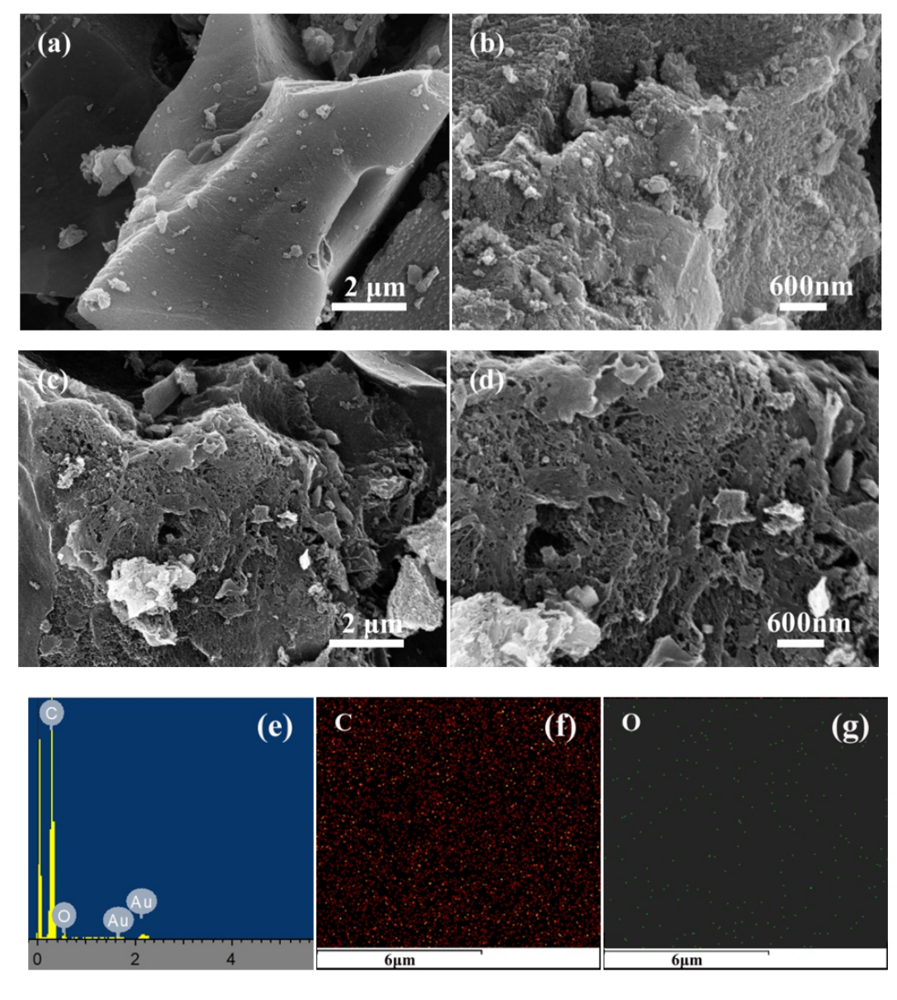

SEM images of CSC, CSCK-800-2, EDX spectrum and element mapping analyses of CSCK800-2 

Page 17/22 

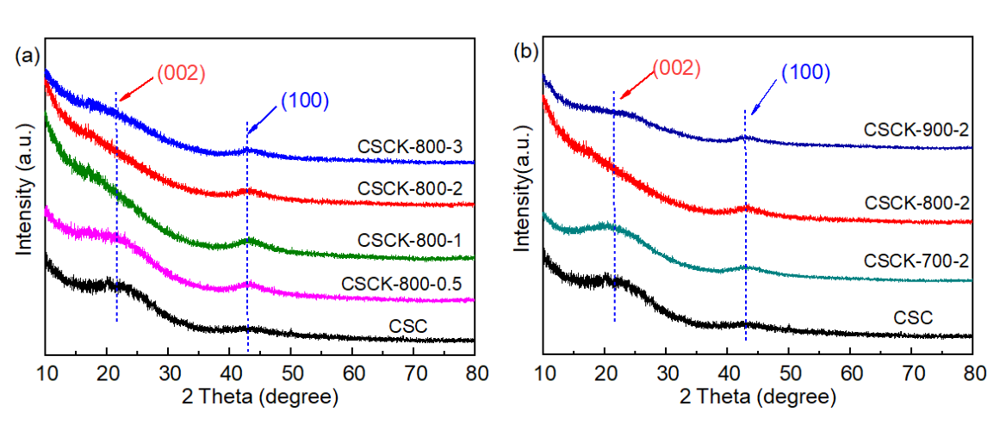

XRD curves of pristine CSC and CSCK-800-x, CSC and CSCK-T-2 

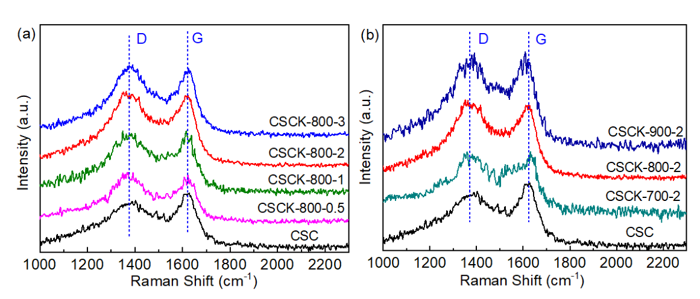

Raman curves of pristine CSC and CSCK-800-x, CSC and CSCK-T-2 

Page 18/22 

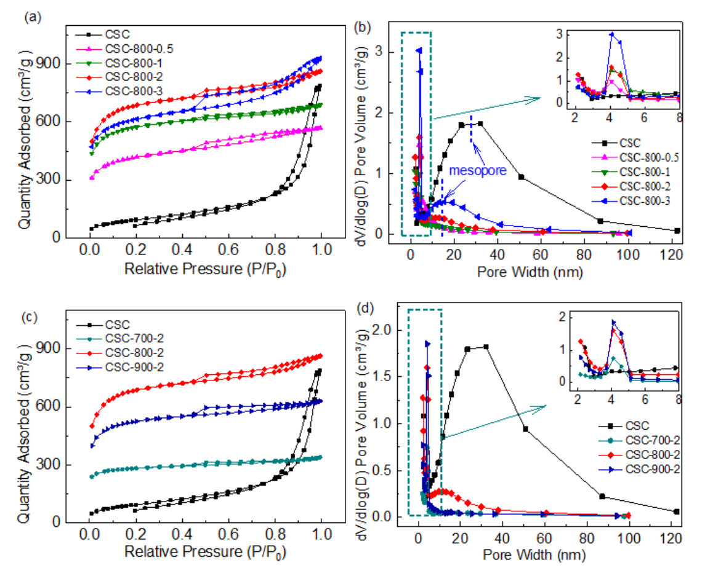

and Nitrogen adsorption/desorption isotherms, and pore size distributions of all samples 

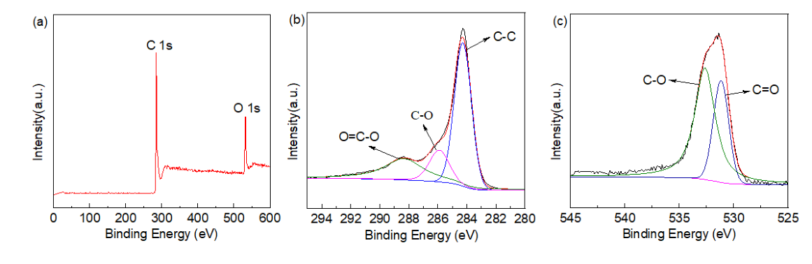

Page 19/22 

XPS survey spectra of CSCK-800-2, C 1s spectrum and O 1s spectrum 

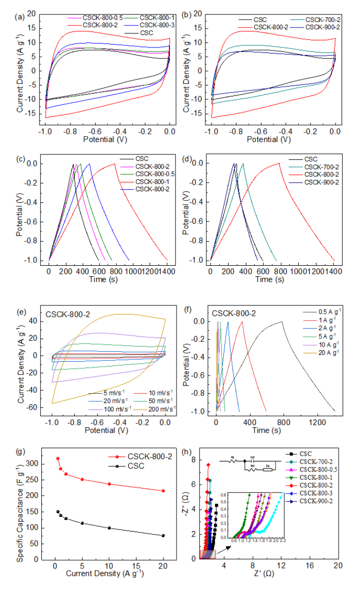

Page 20/22 

Electrochemical performance of all samples in a three-electrode system: CV curves at 50 mV·s[-1] , GCD curves at a current density of 0.5 A·g[-1] , CV curves of CSCK-800-2 at different scan rates, GCD curves of CSCK-800-2 at different current density, variation of speci�c capacitance with current density of CSC and CSCK-800-2, Nyquist plots 

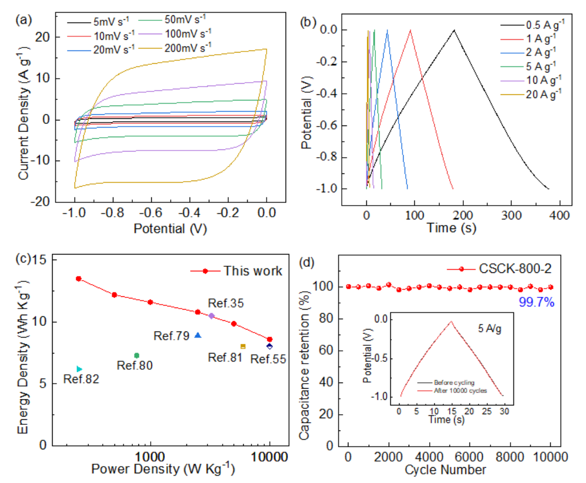

Electrochemical performances of a symmetric supercapacitor prepared by CSCK-800-2 in 6 M KOH electrolyte. CV curves at 5~200 mV s[-1] scan rates, GCD curves at 5~20A·g[-1] current densities, Comparison of Ragone plots of the CSCK-800-2 with other work, The capacitance retention ratio of CSCK-800-2-based SC after 10000 charge−discharge cycles at 5 A·g[-1] 

Page 21/22 

This is a list of supplementary �les associated with this preprint. Click to download. 

- SupplementaryInformation.docx 

- Scheme1.png 

Page 22/22 

