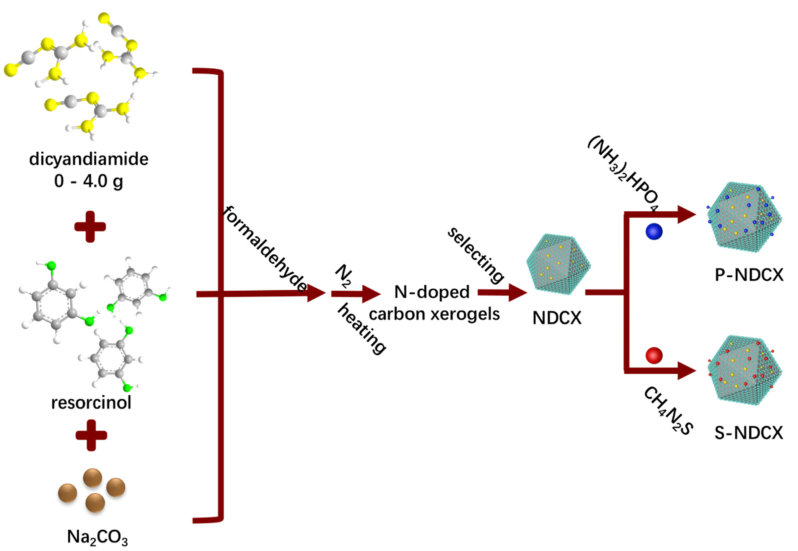
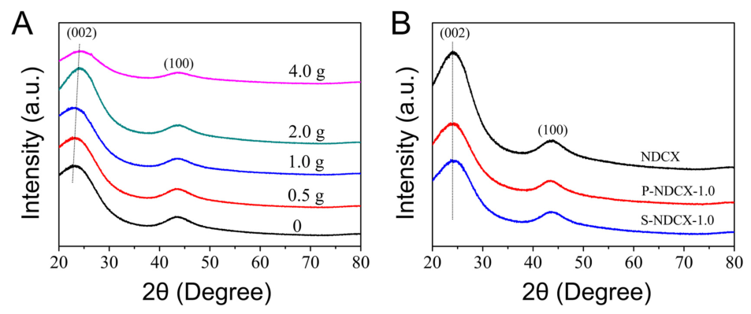
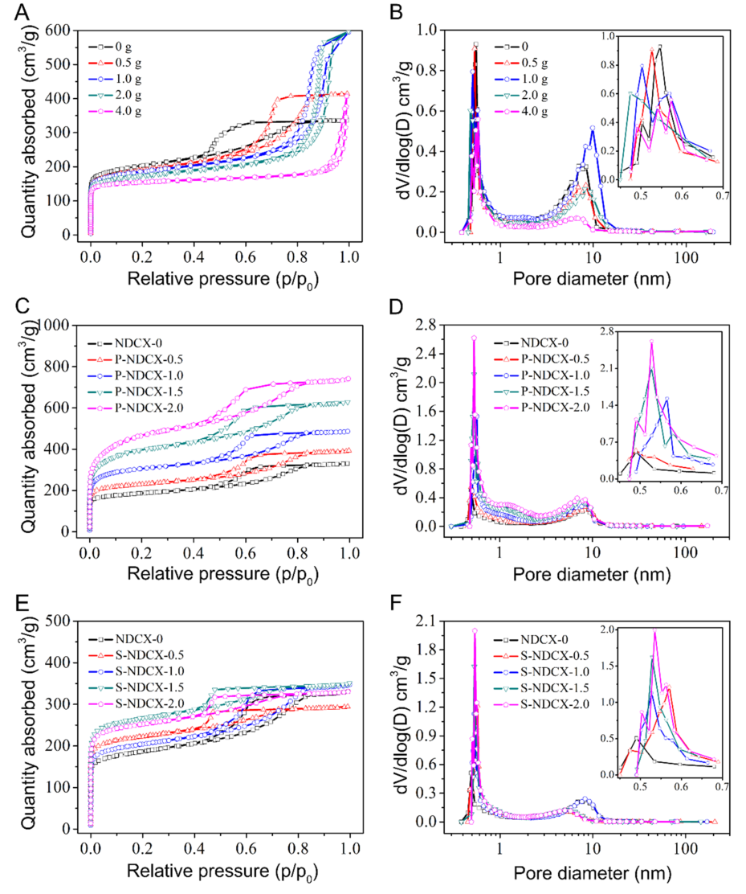
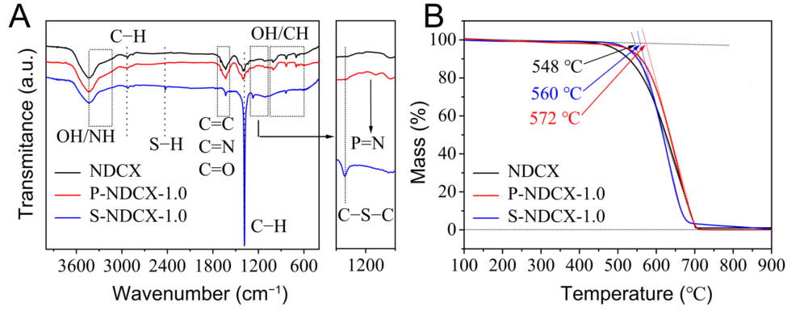
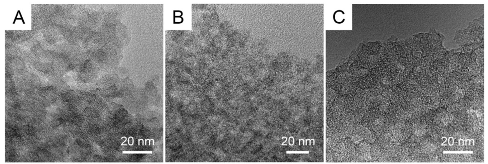
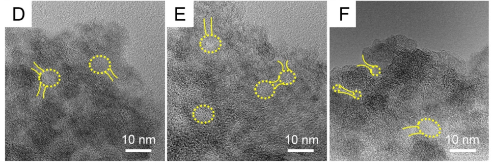
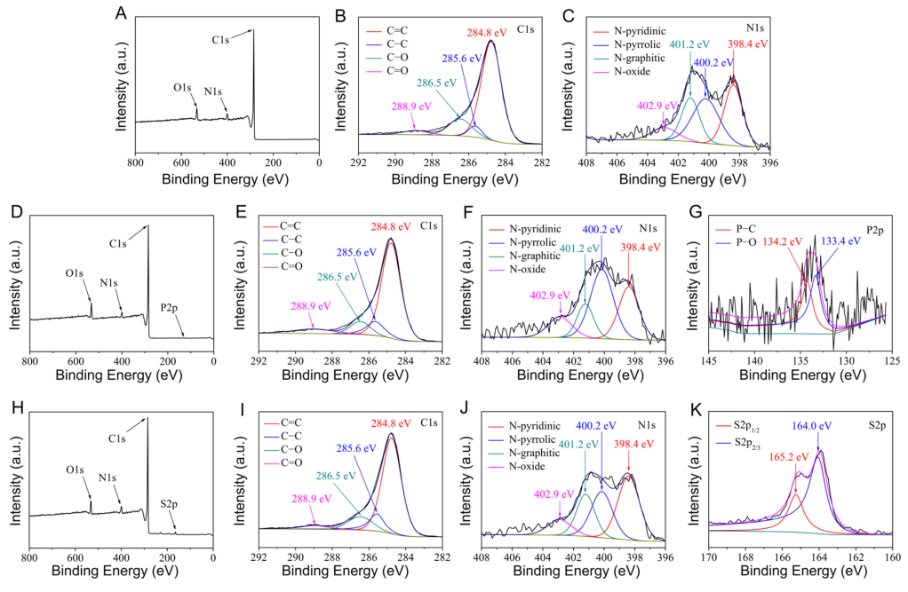
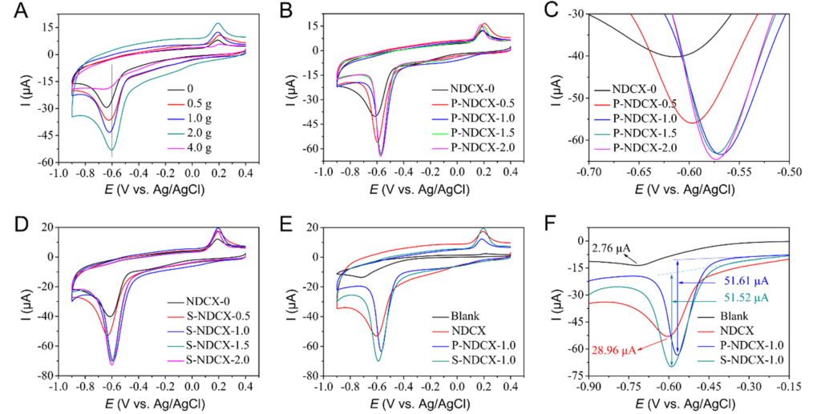
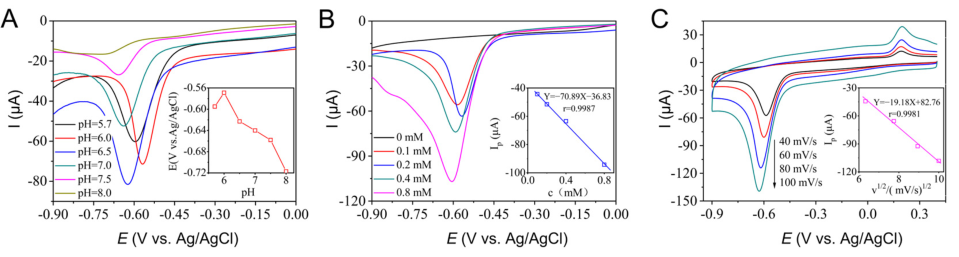
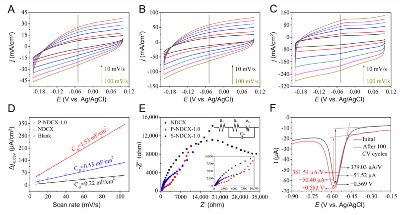

International Journal of _**Molecular Sciences**_ 

## _Article_ 

## **Synthesis of Nitrogen and Phosphorus/Sulfur Co-Doped Carbon Xerogels for the Efficient Electrocatalytic Reduction of p-Nitrophenol** 

## **Chaolong Wang, Dengxia Zhu, Huiting Bi *, Zheng Zhang and Junjiang Zhu *** 

Hubei Key Laboratory of Biomass Fibers and Eco-Dyeing & Finishing, College of Chemistry and Chemical Engineering, Wuhan Textile University, Wuhan 430200, China 

***** Correspondence: htbi@wtu.edu.cn (H.B.); jjzhu@wtu.edu.cn (J.Z.) 

**Abstract:** Carbon xerogels co-doped with nitrogen (N) and phosphorus (P) or sulfur (S) were synthesized and employed as catalysts for the electrocatalytic reduction of p-nitrophenol (p-NP). The materials were prepared by first synthesizing N-doped carbon xerogels (NDCX) via the pyrolysis of organic gels, and then introducing P or S atoms to the NDCX by a vapor deposition method. The materials were characterized by various measurements including X-ray diffraction, N2 physisorption, Transmission electron microscopy, Fourier Infrared spectrometer, and X-ray photoelectron spectra, which showed that N atoms were successfully doped to the carbon xerogels, and the co-doping of P or S atoms affected the existing status of N atoms. Cyclic voltammetry (CV) scanning manifested that the N and P co-doped materials, i.e., P-NDCX-1.0, was the most suitable catalyst for the reaction, showing an overpotential of _−_ 0.569 V (vs. Ag/AgCl) and a peak slop of 695.90 µA/V. The material was also stable in the reaction and only a 14 mV shift in the reduction peak overpotential was observed after running for 100 cycles. 

**Keywords:** p-nitrophenol; carbon xerogels; synergistic co-doping; electrocatalytic reduction 

**Citation:** Wang, C.; Zhu, D.; Bi, H.; Zhang, Z.; Zhu, J. Synthesis of Nitrogen and Phosphorus/Sulfur Co-Doped Carbon Xerogels for the Efficient Electrocatalytic Reduction of p-Nitrophenol. _Int. J. Mol. Sci._ **2023** , _24_ , 2432. https://doi.org/10.3390/ ijms24032432 

Academic Editor: Marta Fernández-García 

Received: 23 December 2022 Revised: 16 January 2023 Accepted: 18 January 2023 Published: 26 January 2023 

**Copyright:** © 2023 by the authors. Licensee MDPI, Basel, Switzerland. This article is an open access article distributed under the terms and conditions of the Creative Commons Attribution (CC BY) license (https:// creativecommons.org/licenses/by/ 4.0/). 

## **1. Introduction** 

Nitrophenol (p-NP) is an important industrial raw material and has been widely used in the synthesis of pesticides, medicines, synthetic dyes, and so on [1–3]. Meanwhile, it is also a severe environmental pollutant discharged in wastewater, posing a threat to rivers, soil, and groundwater [4–6], and to the human nervous and blood systems by hindering the formation of methemoglobinemia [6,7]. Indeed, p-NP has been listed as one of the 129 priory control pollutants by the USA Environmental Protection Agency due to its severe threats to human health. The severe toxicity, high stability, and large solubility in water make the removal of p-NP in wastewater a challenging topic in the field of environmental protection. 

Physical absorption, biodegradation, and chemical degradation are three primary approaches for the treatment of p-NP in wastewater [8–11], and the chemical approaches, e.g., Fenton oxidation [12,13], ozone oxidation [14], photochemical degradation [15], and chemical reduction [16], are of special interest, as they can completely degrade the p-NP into CO2 and H2O compared to the physical adsorption and they are more facilitating and cheap compared to biodegradation. However, the chemical operation requires the use of powerful and costly oxidants, and the process produces large amounts of residual contaminants [16–19], causing secondary pollution. For these reasons, electrochemical reduction has been considered as an alternative technology for the removal of p-NP owing to its high sensitivity, simple equipment, convenient operation, and environmentally friendly process [17]. Moreover, the toxicity of the reduction product, p-hydroxyaminophenol, is 1/500 less than that of p-NP [20–22]. 

_Int. J. Mol. Sci._ **2023** , _24_ , 2432. https://doi.org/10.3390/ijms24032432 

https://www.mdpi.com/journal/ijms 

_Int. J. Mol. Sci._ **2023** , _24_ , 2432 

2 of 15 

Metal-free carbon materials, e.g., carbon fiber, carbon nanotube, carbon xerogels, and graphene have received great attention in electrocatalysis owning to their low price, high stability, large surface area, various pore architectures, abundant functional groups, and good recyclability [23–27]. Among them, carbon xerogel has attracted special interest due to its outstanding performance, including: (1) the large surface area contributing to more active sites for the electrocatalytic reduction of p-NP; (2) the controllable structure and tunable surface properties which can adjust the ion transport rate in accordance with the requirements; (3) compared with other carbon materials, carbon xerogel has remarkable electrochemical stability and conductivity [28–30]. It has also been suggested that the electrical conductivity, wettability, and interface compatibility of carbon-based materials could be improved by doping heteroatoms, benefiting the contact between the electrolyte and the electrode [31–36]. Moreover, because of the covalent structure, carbon can accommodate numerous non-metallic atoms such as N, P, S, O, etc., in the matrix through a simple carbonization or vapor deposition process, adjusting the electronic and geometric properties and exposing more active sites on the surface. For example, synergistic effects can be produced by uniting two or more heteroatoms (N/P, N/S, or N/P/S) with different electronegativities, contributing to the electrocatalytic activity [37–42]. 

Herein, we report the synthesis of intelligent and heteroatomic-doped 2D carbon xerogels, with N as the primary dopant, and P or S as the secondary elements. It can increase the number of active sites of N-doped carbons xerogels and accomplish the “synergistic coupling”, enhancing the electrocatalytic activities of carbons xerogels. The evaluation of the systematic promotional effects induced by N,P- and N,S- co-doped carbon xerogels were investigated by a series of characterizations and electrocatalytic experiments. Firstly, the amounts of N atoms doped in carbon xerogels were optimized via a measurement of the electrocatalytic p-nitrophenol reduction reaction. Secondly, the applicable P or S doping based on the above N-doped carbon xerogels was explored. The results revealed the optimal doping of N, P, and S and the most appropriate couple (N,P- or N,S-) of carbon xerogels was elected for the electrocatalytic reduction of p-NP. 

## **2. Results and Discussion** 

## _2.1. Characterization of the Samples_ 

The synthetic process of N,P- or N,S- co-doped carbon xerogels is shown in Scheme 1. In the procedure, the resorcinol and formaldehyde undergo polymerization and crosslinking reactions, and the Na2CO3 promotes the reaction of resorcinol and formaldehyde by accelerating the deprotonation of resorcinol [43]. The mass of dicyandiamide added in the synthesis process determines the quantity of N doped in the carbon xerogels. The CVD process introduces P/S atoms to the surface of NDCX. Meanwhile, the NH3, NO2, SO2, H2S, CO2, and other gases released from the precursors during the heating treatment, generate micropores and improve the porosity and surface area of the doped carbon xerogels [44]. 

XRD patterns showed that all samples exhibited two large and broad diffraction peaks at 2θ _≈_ 23 _[◦]_ and 44 _[◦]_ , as shown in Figure 1, which are attributed to the (002) and (100) lattice plane of amorphous carbon with low crystallinity [44,45]. For N-doped carbon xerogels, as shown in Figure 1A, the peak position of the (002) plane was red-shifted with the increase in the amount of dicyandiamide, accompanied by a decrease in peak intensity, which can be ascribed to the narrow C-C(N) distance caused by the doping of N atoms with a smaller atomic radius [46]. This proves that N atoms were successfully doped in the carbon skeleton. For P-NDCX-1.0 and S-NDCX-1.0, as shown in Figure 1B, the peak position remained after the co-doping of P or S, indicating that no change in the matrix of NDCX occurred, since their doping occurred mainly on the surface of NDCX. 

_Int. J. Mol. Sci._ **2023** , _24_ , 2432 

3 of 15 

**Scheme 1.** Fabrication of the N-, N,P-, and N,S-doped carbon xerogels. 

**Figure 1.** XRD patterns of ( **A** ) N-doped carbon xerogels prepared with 0–4.0 g of dicyandiamide and ( **B** ) NDCX, P-NDCX-1.0, and S-NDCX-1.0. 

To evaluate the surface area and pore size distribution of the N, N,P-, and N,S-doped carbon xerogels, N2 physisorption measurements were performed. For carbon xerogels doped with different amounts of N atoms, the abrupt increase in the N2 adsorption quantity at _p_ / _p_ 0 < 0.05 and the obvious hysteresis loop observed in the curves indicate that both micropores and mesopores were present in the materials, as shown in Figure 2A. However, it was noted that the dicyandiamide amount significantly affected the shape of isotherms, in that the hysteresis loop moved to a high _p_ / _p_ 0 with the increase in dicyandiamide, which suggests that more of the large mesopores were produced, similar to what has been observed elsewhere [47]. The movement of the hysteresis loop and the change of isothermal shape verifies that different amounts of N atoms were doped to the carbon matrix and changed the textural structure. Note that for sample prepared with excess amounts of dicyandiamide (e.g., 4.0 g), the pore volume and pore size significantly decreased, as shown in Figure 2B, which may have been due to the excess amount of N atoms doped into the 

_Int. J. Mol. Sci._ **2023** , _24_ , 2432 

4 of 15 

carbon framework, altering the original matrix structure. Considering the large changes in the textural structure, and together with the catalytic activity tested in the following experiments, we selected the carbon xerogels doped with 2.0 g dicyandiamide, i.e., NDCX, for further investigation. 

**Figure 2.** N2 sorption isotherms ( **A** , **C** , **E** ) and pore distributions ( **B** , **D** , **F** ) of carbon xerogels with different amounts of dicyandiamide, P-NDCX-m, and S-NDCX-m. 

After the co-doping of P and S atoms on NDCX, the position and shape of the hysteresis were restored to that of the materials with low N doping, as shown in Figure 2C,E. This may be attributed to high temperature NDCX reprocessing, which removes excess N atoms 

_Int. J. Mol. Sci._ **2023** , _24_ , 2432 

5 of 15 

from the matrix. To support this assumption, we re-heated the NDCX in N2 atmosphere without presenting the (NH3)2HPO4 or CH4N2S precursor, and found that the re-heated sample, defined as NDCX-0, indeed showed a restored position and shape for the hysteresis loops. Hence, it is suggested that the doping of N atoms on the carbon framework should be optimized to maintain the matrix structure. Because of the release of excess N atoms, both the pore volume and pore size of the P-NDCX-1.0 or S-NDCX-1.0 increased, compared with those of the NDCX, as shown in Figure 2D,F and Table 1. 

**Table 1.** Textural properties of NDCX, S-NDCX-1.0, and P-NDCX-m obtained from the N2 physisorption isotherms. 

||**SBET (m2/g)**|**Vmic (m3/g)**|**Vful (m3/g)**|**Dmic (nm)**|**Dmes (nm)**|
|---|---|---|---|---|---|
|0|655.9|0.30|0.59|0.54|7.73|
|0.5 g|612.8|0.28|0.51|0.53|7.71|
|1.0 g|585.6|0.30|0.72|0.50|9.84|
|NDCX|554.0|0.22|0.44|0.47|8.10|
|4.0 g|476.8|0.19|0.28|0.57|6.54|
|NDCX-0|594.2|0.29|0.51|0.49|8.27|
|P-NDCX-0.5|731.0|0.35|0.60|0.49|8.23|
|P-NDCX-1.0|989.3|0.47|0.75|0.57|8.31|
|P-NDCX-1.5|1277.7|0.61|0.97|0.53|7.83|
|P-NDCX-2.0|1522.1|0.72|1.14|0.53|6.84|
|S-NDCX-0.5|695.1|0.34|0.46|0.57|5.00|
|S-NDCX-1.0|644.6|0.32|0.53|0.53|8.27|
|S-NDCX-1.5|832.2|0.41|0.53|0.53|5.02|
|S-NDCX-2.0|788.5|0.39|0.51|0.54|5.00|

SBET—BET surface area; Vmic—micropore volume; Vful—total pore volume; Dmic—micropore diameter; Dmes—mesoporous diameter. 

While the process of doping either P or S atoms restored the matrix structure of NDCX, changes in the surface area, pore volume, and pore diameter were different. For example, we selected P-NDCX-1.0 and S-NDCX-1.0 with good catalytic performance for p-NP electroreduction (see below) for comparison. P-NDCX-1.0 showed a larger surface area (989.3 m[2] /g), pore volume (0.75 m[3] /g), and mesopore size (8.31 nm) than S-NDCX-1.0, indicating that the doping of P atoms had a greater effect than that of the S atoms. In fact, doping a larger number of P atoms may enhance the textural properties of NDCX. For example, the P-NDCX-2.0, prepared by addition of 2.0 g (NH3)2HPO4 to NDCX, exhibited a surface area of up to 1522.1 m[2] /g and a pore volume of 1.14 m[3] /g, as shown in Table 1. 

FT-IR spectra of the three selected samples, NDCX, P-NDCX-1.0, and S-NDCX-1.0, are illustrated in Figure 3A. According to the literature [48–50], the peaks at 3145–3429 cm _[−]_[1] are assigned to the -OH and N-H absorption band; the peaks at 2921 cm _[−]_[1] and 1400 cm _[−]_[1] are assigned to the stretching vibration of C-H bond; the peaks at 1635–1700 cm _[−]_[1] are assigned to the vibration of the double bond of C=C/C=N/C=O groups; and the peaks at 1000 cm _[−]_[1] are assigned to the vibration of -OH and C-H bond. These results suggest that N atoms were spiked to the carbon framework, accompanied with the formation of some surface groups. In addition, because of the co-doping of P or S atoms, an additional peak at 1150 cm _[−]_[1] , attributed to the stretching vibration of P=N bond, was observed for P-NDCX-1.0, and two extra peaks at 1390 cm _[−]_[1] and 2422 cm _[−]_[1] , attributed to the vibration of C-S-C and S-H bond, were observed for S-NDCX-1.0. This shows that P or S were successfully integrated into the NDCX framework. 

The TGA profiles (Figure 3B) show that the materials started to burn at temperatures above 450 _[◦]_ C and were finished at 700 _[◦]_ C. The burning temperature of NDCX was slightly lower than that of P-NDCX-1.0 and S-NDCX-1.0, indicating that the doping of P or S improved the stability of NDCX, which could be due to the change in textural structure, as discussed above. For all the samples, no residue was detected after 700 _[◦]_ C, suggesting that they were completely oxidized and released as gases. 

_Int. J. Mol. Sci._ **2023** , _24_ , 2432 

6 of 15 

**Figure 3.** ( **A** ) FT-IR spectra and ( **B** ) TGA profiles of the NDCX, P-NDCX-1.0 and S-NDCX-1.0. 

The different magnification TEM images show that the materials had microporous structures (the micropores are marked in yellow), which were more pronounced for P- NDCX-1.0 and S-NDCX-1.0, as shown in Figure 4. The presence of micropores guaranteed the increase in surface area, which is a crucial factor affecting the efficient contact between the catalyst and the electrolyte, and hence the electron transporting rate between them. 

**Figure 4.** TEM images of ( **A** , **D** ) NDCX, ( **B** , **E** ) P-NDCX-1.0, and ( **C** , **F** ) S-NDCX-1.0 with different magnification. 

XPS measurements were conducted to detect the surface element composition and valence state of the materials, as shown in Figure 5. For NDCX, the whole spectrum showed the presence of C, N, and O atoms on the surface (Figure 5A), which was in line with the results of FTIR spectra. The C1s spectrum could be fitted to four peaks that could 

_Int. J. Mol. Sci._ **2023** , _24_ , 2432 

7 of 15 

be attributed to carbon in C=C (284.8 eV), C _−_ C (285.6 eV), C _−_ O (286.5 eV) and C=O (288.9 eV) [37,39,51], respectively, as shown in Figure 5B,E,I. It is worth noting that the main peak of C negligibly shifted among them, as the amount of P or S doped in the material was lower and hardly affected the binding energy of carbon. The N1s spectrum could also be deconvoluted into four peaks, with the binding energy at 398.4 eV, 400.2 eV, 398.4 eV, and 402.9 eV attributed to N-pyridinic, N-pyrrolic, N-graphitic, and pyridine N-oxide [47,52,53], respectively, as shown in Figure 5C. 

**Figure 5.** ( **A** ) the whole XPS surveys, ( **B** ) C1s, and ( **C** ) N1s spectrum of NDCX; ( **D** ) the whole XPS surveys, ( **E** ) C1s, ( **F** ) N1s, and ( **G** ) P2p spectrum of P-NDCX-1.0; ( **H** ) the whole XPS surveys, ( **I** ) C1s, ( **J** ) N1s, and ( **K** ) S2p spectrum of S-NDCX-1.0. 

For P-NDCX-1.0, the whole XPS spectrum showed the signal of P atom as desired, in addition to that of the C, N, and O atoms, as shown in Figure 5D. By comparison, it was found that the co-doping of P and N increased the proportion of N-oxide and N- pyrrolic, which are general defect sites in the carbon skeleton and beneficial to electron transport [44], as shown in Figure 5F. Deconvolution on the P2p spectrum showed two peaks at a binding energy of 134.2 eV and 133.4 eV, which can be assigned to P _−_ C and P _−_ O [37], respectively, as shown in Figure 5G. In addition, the peak area of P _−_ C was almost _−_ equal to that of the P O, which indicated that a portion of P atoms were incorporated into the carbon framework [54]. 

Similarly, the whole spectrum of S-NDCX-1.0 showed the existence of C, N, O, and S atoms, Figure 5G. The co-doping of S and N significantly increased the percentage of surface N atoms, as shown in Figure 5H and Table 2. The two fitted peaks of S2p at a binding energy of 164.0 eV and 165.2 eV were assigned to S2p3/2 and S2p1/2, respectively, as shown in Figure 5I, which implied the existence of the C-S bond [55] in the material. The results confirmed the successful doping of NDCX. 

_Int. J. Mol. Sci._ **2023** , _24_ , 2432 

8 of 15 

**Table 2.** Surface element percentage of NDCX, P-NDCX-1.0, and S-NDCX-1.0, detected from the XPS measurements. 

||**C (at. %)**|**O (at. %)**|**N (at. %)**|**P (at. %)**|**S (at. %)**|
|---|---|---|---|---|---|
|NDCX|89.74|5.69|4.57|-|-|
|P-NDCX-1.0|89.12|6.37|4.50|0.02|-|
|S-NDCX-1.0|87.57|5.46|5.78|-|1.19|

## _2.2. Electrocatalytic Activity_ 

Figure 6A presents the CV curves of N-doped carbon xerogels, prepared with different amounts of dicyandiamide, for the electrocatalytic reduction of p-NP. The results show that the material prepared with the addition of 2.0 g dicyandiamide, defined as NDCX, exhibited the lowest overpotential ( _−_ 0.605 V vs. Ag/AgCl) and the largest reduction current compared with other samples (see line “d” in the picture). This indicates that the doping of appropriate nitrogen can enhance the catalytic ability of carbon xerogel by altering its electronic properties (nitrogen has one more electron than carbon) and textural structures (e.g., formation of more mesopores), as discussed above. When few dicyandiamides were added, the effect of N doping on the electronic properties and textural structures of carbon xerogels was slight, leading to a lower contribution to catalytic activity, while the addition of excess dicyandiamide would result in dicyandiamide polycondensation, pore collapse, and a reduction in the surface area of carbon xerogels, and finally lower the catalytic activity. As a result, the NDCX was selected for a more in-depth investigation in the following. 

**Figure 6.** CV curves of ( **A** ) N-doped carbon xerogels prepared with 0–4.0 g of dicyandiamide, ( **B** , **C** ) P-NDCX-m prepared with 0.5–4.0 g of (NH3)2HPO4, ( **D** ) S-NDCX-m prepared with 0.5–2.0 g of CH4N2S, and ( **E** , **F** ) Blank GCE, NDCX, P-NDCX-1.0 and S-NDCX-1.0. 

It has been reported that the doping of P or S is efficient to improve the catalytic performances of carbon materials [56–58]. For this reason, the doping of P or S onto the NDCX was conducted. Figure 6B,C shows that the doping of P improved not only the overpotential but also the current intensity, suggesting that the P doping generated more active sites and they had a stronger reactivity. The optimal catalyst was obtained at P- NDCX-1.0, which exhibited an overpotential of _−_ 0.569 V (vs. Ag/AgCl) and a reduction current of 51.61 µA. In addition, P-NDCX-1.5 and P-NDCX-2.0 were similar to that of 

_Int. J. Mol. Sci._ **2023** , _24_ , 2432 

9 of 15 

P-NDCX-1.0, indicating that the addition of a 1.0 g (NH3)2HPO4 precursor was sufficient to enhance the catalytic performances of NDCX in the current study. Although the doping of S atoms also strengthened the current of NDCX for p-NP reduction, the decrease in overpotential was less, as shown in Figure 6D. 

The contrasting experiments (Figure 6E,F) show that the blank GCE only exhibited a small reduction peak with a high overpotential ( _−_ 0.7 V vs. Ag/AgCl), indicating that the direct reduction of p-NP is hard if no catalyst is present. Hence, the reduction peak observed in the presence of catalyst was caused by a catalytic process. The CV curve of P-NDCX-1.0 showed the largest reduction peak and the lowest overpotential, which indicates a larger reduction peak slop and hence a faster reaction rate. From Table 3, which summarizes the electrocatalytic parameters obtained from the CV curves, it can be inferred that the electrocatalytic ability of the materials for p-NP reduction followed the order of P-NDCX-1.0 > S-NDCX-1.0 > NDCX. 

**Table 3.** The overpotential, peak current, and peak slope of blank GCE, NDCX, P-NDCX-1.0, and S-NDCX-1.0, obtained from the CV curves. 

|**Catalyst**|**Peak Potential** **(V vs. Ag/AgCl)**|**Peak Current** **(µA)**|**Peak Slope** **(µA/V)**|
|---|---|---|---|
|Blank GCE|_−_0.717|2.76|48.39|
|NDCX|_−_0.605|28.96|346.15|
|P-NDCX-1.0|_−_0.569|51.61|695.90|
|S-NDCX-1.0|_−_0.590|51.52|509.84|

The superiority of P-NDCX-1.0 for the electrocatalytic reduction of p-NP was further illuminated by a comparison with other materials reported in the literature, as listed in Table 4. The results show the P-NDCX-1.0 exhibited a small overpotential for the reaction compared with other carbon-based catalysts reported in the literature, showing that P- NDCX-1.0 is a potential catalyst for the electrocatalytic reduction of p-NP. 

**Table 4.** Comparison of the activity of P-NDCX-1.0 for the electro-reduction of p-NP with other materials reported in the literature. 

|**Catalyst**|**NP Conc.**|**Scan Rate** **(mV/s)**|**Peak Potential** **(V vs. Ag/AgCl)**|**Peak Current** **(µA)**|**Ref.**|
|---|---|---|---|---|---|
|CuPd/C|10 mM|50|_−_0.94|127|[59]|
|FeOx/TiO2@mC|0.1 mM|50|_−_0.67|19.3|[60]|
|hollow globe WC|10 mM|50|_−_0.605|16.37|[61]|
|RGO/GCE|0.1 mM|50|_−_0.571|89.4|[4]|
|P-NDCX-1.0|0.2 mM|20|_−_0.569|51.61|This work|

To investigate the role of protons in the electrocatalytic reduction of p-NP, the reduction peaks of P-NDCX-1.0 in PBS were measured with 0.2 mM p-NP at different pH values (5.7~8.0), as shown in Figure 7A. The results show that at pH = 6.0, the P-NDCX-1.0 exhibited the lowest overpotential in the CV curve, suggesting that the pH of 6.0 is the best environment for p-NP reduction. With the further increase in pH, the number of protons decreased and the overpotential shifted to negative position, which indicates that protons were involved in the process of electrocatalytic reduction of p-NP. Inversely, at a lower pH (5.7), the overpotential rose due to the agglomeration of catalysts [4] and hence led to insufficient protons on the surface of the catalyst utilized for the reduction of p-NP. 

The reduction peaks of P-NDCX-1.0 in PBS with different p-NP concentrations (0~0.8 mM) were measured at pH = 6.0. Figure 7B shows that the reduction peak current linearly decreased with the p-NP concentration, suggesting that the reduction of p-NP under this condition is a mass transfer-controlled process. In addition, it was found that the reduction peak of P-NDCX-1.0 shifted to a negative position with the increase in scanning rate (40, 60, 80, 100 mV/s), and the peak current was linear to the square root of scanning rate, as 

_Int. J. Mol. Sci._ **2023** , _24_ , 2432 

10 of 15 

~~shown in Figure 7C. This again confrms that the electrocatalytic p-NP reduction is a mass~~ transfer-controlled process. 

**Figure 7.** Reduction peak curves at different pH ( **A** ), p-NP concentration ( **B** ), and scanning rate ( **C** ) of P-NDCX-1.0/GCE. 

Electrochemically active surface area (ECSA) represents the active site or area that accounts for the Faradaic current transfer during the electrocatalytic process [62]. The ECSA can be calculated from the electric double layer capacitance ( _Cdl_ ). First, the CV scanning was conducted at different scanning rates (10, 20, 40, 60, 80, and 100 mV/s) in the _−_ potential range of 0.1~ 0.2 V (vs. Ag/AgCl, without any Faradaic current). After that, the charge–discharge current density difference at _−_ 0.05 V vs. Ag/AgCl (∆ _j−_ 0.05V = _ja − jc_ ) was plotted as a function of the scanning rate, and the slope was calculated by linear fitting according to the equation: “ _ic = v·Cdl_ ”. Finally, the _Cdl_ was converted to ECSA according to the equation: ECSA = _Cdl_ / _Cs_ [62–64]. The _Cdl_ of blank GCE, NDCX, and P-NDCX-1.0 thus obtained was 0.22, 0.53, and 1.53 mF/cm[2] , respectively, as shown in Figure 8A–D, which shows that the ECSA of P-NDCX-1.0 was about 7 times larger than that of the blank GCE. This could be a reason why the P-NDCX-1.0 sample exhibited a high performance for the reaction. 

**Figure 8.** CV curves of ( **A** ) blank GCE, ( **B** ) NDCX, and ( **C** ) P-NDCX-1.0 at different scanning rates in the non-Faradic interval; ( **D** ) _Cdl_ of P-NDCX-1.0 ( _R_[2] = 0.9992), NDCX ( _R_[2] = 0.9982), and blank GCE ( _R_[2] = 0.9975); ( **E** ) Nyquist plots of NDCX, P-NDCX-1.0, and S-NDCX-1.0; ( **F** ) The reduction peak curves of P-NDCX-1.0 before and after 100 CV cycles. 

Electrochemical impedance spectrum (EIS) can reflect the contact and charge-transfer impedance during the reduction process of p-NP, conforming to a better electrochemical activity with a smaller impedance. The electrochemical processes of NDCX, P-NDCX-1.0, 

_Int. J. Mol. Sci._ **2023** , _24_ , 2432 

11 of 15 

and S-NDCX-1.0 contained the kinetic diffusion process in the high frequency region and the Warburg diffusion control process in the low frequency region. After doping with P, P-NDCX-1.0 had a smaller radius in the high frequency region and a shorter line in the low frequency region, as shown in Figure 8E. This indicates that the charge transfer resistance (Rct) and Warburg impedance were smaller. The results reveal that P-NDCX-1.0 had a better charge transfer rate than that of NDCX and S-NDCX-1.0. 

The stability of P-NDCX-1.0/GCE in the reaction was evaluated by comparing the reduction overpotentials detected at the initial CV cycle and after 100 CV cycles, as shown in Figure 8F. The reduction overpotential detected after 100 CV cycles was _−_ 0.583 V vs. Ag/AgCl, which was only shifted by 14 mV compared with that detected at the initial CV cycle ( _−_ 0.569 V vs. Ag/AgCl). Further analysis of the peak current and peak slope also demonstrated negligible changes between them (see the data presented in the picture). That is, the P-NDCX-1.0/GCE had good stability in the electrocatalytic reduction of p-NP. 

## **3. Materials and Methods** 

## _3.1. Synthesis of Materials_ 

_Synthesis of N-doped carbon xerogels._ The N-doped carbon xerogels were prepared according to previous reports [43,52,65]. Briefly, 9.09 g resorcinol, 0–4.0 g dicyandiamide, and 0.025 g Na2CO3 were added to 18 mL distilled water and heated to 90 _[◦]_ C with stirring, until the solids were completely dissolved. Then, the obtained solution was cooled to room temperature, and 12.4 mL formaldehyde was added dropwise. Thereafter, the mixture was aged at 85 _[◦]_ C for 72 h, yielding a solid gel, which was crushed and dried in an air oven at 100 _[◦]_ C for another 72 h. Finally, the material was heated in a N2 atmosphere with the following program: 150 _[◦]_ C for 75 min, 300 _[◦]_ C for 75 min, 600 _[◦]_ C for 150 min, and 800 _[◦]_ C for 100 min. The ramping rate between each temperature stage was 2 _[◦]_ C/min. For convenience, the N-doped carbon xerogel, prepared with addition of 2.0 g dicyandiamide, was named as NDCX. 

_Synthesis of P or S doped NDCX._ A total of 0.2 g NDCX and 0.5–2.0 g diammonium hydrogen phosphate [(NH3)2HPO4] or 0.5–2.0 g thiourea (CH4N2S) were uniformly mixed and heated at 850 _[◦]_ C in a N2 atmosphere for 2 h, with a N2 flow rate of 50 mL/min. Based on the amount of (NH3)2HPO4 or CH4N2S added, the products were denoted accordingly as P-NDCX-m or S-NDCX-m, where “m” means the amount of [(NH3)2HPO4] or (CH4N2S) added. 

## _3.2. Sample Characterization_ 

Powder X-ray diffraction (XRD) measurements were determined on a Rigaku D/max TTR-III diffractometer in the 2θ range from 20 _[◦]_ to 80 _[◦]_ , using Cu Ka radiation (λ = 0.15405 nm). Fourier-transform Infrared (FTIR) spectra were obtained on a Vertex Perkin-Elmer 580B IR spectrophotometer (Bruker) with the KBr pellet technique. Transmission electron microscopy (TEM) images were collected on a FEI Tecnai TF30 apparatus. The powder was ultrasonically dispersed in ethanol before being deposited on the carbon-coated copper grid for observation. N2 physisorption isotherms were obtained on a BeiShiDe 3H-2000PS2 apparatus. The sample was degassed in vacuum at 300 _[◦]_ C for 5 h before measurement. The surface area was calculated with the Brunauer–Emmett–Teller (BET) method and the pore size distribution was calculated by the Nonlocal density functional theory (NLDFT) method. X-ray photoelectron spectra (XPS) were recorded on a VG ESCALAB MK II apparatus using Mg KR (1253.6 eV) as the X-ray excitation source. The binding energy was calibrated using the C1s signal of adventitious carbon at 284.6 eV. 

## _3.3. Electrochemical Test_ 

The electrocatalytic reduction of p-NP was carried out on a Shanghai Chenhua CHI636e electrochemical workstation with a standard three-electrode system, including a glassy carbon working electrode (GCE, L-type _−_ 3 mm), an Ag/AgCl reference electrode, and a platinum wire counter electrode. The reaction solution was composed of 0.2 mM 

_Int. J. Mol. Sci._ **2023** , _24_ , 2432 

12 of 15 

p-NP in 0.2 M phosphate buffer solution (PBS, pH = 6.0). The working electrode was prepared as following: 4 mg of the acquired catalyst, 460 µL of isopropanol, and 40 µL of 0.3 wt% nafion solution were added to a 1 mL centrifuge tube and then ultrasonicated for 20 min to obtain a uniformly dispersed ink solution. Finally, 3 µL of the ink solution was dripped onto the GCE and dried in air at room temperature. 

Cyclic voltammetry (CV) measurements were performed with a scanning rate of 20 mV/s between 0.4 V~ and 0.9 V. The catalyst was activated before reaction to ensure that there were no impurities on the electrode surface, and it could be fully exposed to the electrolyte, guaranteeing the accuracy of the catalytic tests [66]. 

Electrochemical impedance spectroscopy (EIS) measurements of NDCX, P-NDCX-1.0, and S-NDCX-1.0 were taken using the controlled current method of the DH7000D electrochemical workstation. The frequency range was selected from 10[5] to 0.01 Hz, the DC current was set to _−_ 0.0706 mA, and the amplitude was set to 0.007 mA, similar to the current during the test, corresponding to a current density of 1 mA/cm[2] . 

For the stability test, the catalyst was continuously scanned for 100 cycles in the same potential range, with a scanning rate of 100 mV/s. The reduction peak potentials, before and after scanning, were compared to estimate the stability. 

## **4. Conclusions** 

In summary, we reported the preparation of N,P-, and N,S- co-doped carbon xerogels with different dopings via the in situ vapor deposition method and used them as catalysts for the electrocatalytic reduction of p-NP. Among them, the sample P-NDCX-1.0 exhibited the best activity and excellent stability for the reduction reaction. Served as the precursor of the N atom, dicyandiamide possesses rich pyridine nitrogen offering abundant reactive sites for the reaction by donating electrons to the reactant. Because of the co-doping of these elements, the carbon xerogels have a suitable pore size and an applicable surface area, exposing a large number of active sites which can accelerate the rate the electrocatalytic reaction. These results demonstrated that the N and P co-doped carbon xerogels prepared by the current method could be promising catalysts for the electrocatalytic reduction of p-NP, with a low overpotential and favorable stability. 

**Author Contributions:** Conceptualization, C.W. and J.Z.; methodology, D.Z. and H.B.; software, C.W. and H.B.; validation, H.B., Z.Z. and J.Z.; formal analysis, C.W.; investigation, D.Z.; resources, J.Z.; data curation, C.W. and D.Z. writing—original draft preparation, C.W.; writing—review and editing, H.B., Z.Z. and J.Z.; visualization, C.W.; supervision, J.Z.; project administration, J.Z.; funding acquisition, H.B. and J.Z. All authors have read and agreed to the published version of the manuscript. 

**Funding:** Financial support provided by the National Natural Science Foundation of China (21976141, 52002292, 42277485), the Department of Science and Technology of Hubei Province (2021CFA034), the Department of Education of Hubei Province (T2020011, Q20221704) and the Opening Project of Hubei Key Laboratory of Biomass Fibers and Eco-Dyeing & Finishing (STRZ202202, STRZ202102) is gratefully acknowledged. 

**Institutional Review Board Statement:** Not applicable. 

**Informed Consent Statement:** Not applicable. 

**Data Availability Statement:** Not applicable to this article. 

## **References** 

> 1. Wang, K.; Wu, C.; Wang, F.; Jiang, G. MOF-Derived CoPx Nanoparticles Embedded in Nitrogen-Doped Porous Carbon Polyhedrons for Nanomolar Sensing of p-Nitrophenol. _ACS Appl. Nano Mater._ **2018** , _1_ , 5843–5853. [CrossRef] 

2. Xiao, P.; Wang, S.; Xu, X.; Zhu, J. In-situ template formation method to synthesize hierarchically porous carbon for electrocatalytic reduction of 4-nitrophenol. _Carbon_ **2021** , _184_ , 596–608. [CrossRef] 

_Int. J. Mol. Sci._ **2023** , _24_ , 2432 

13 of 15 

3. Mei, X.; Liu, J.; Guo, Z.; Li, P.; Bi, S.; Wang, Y.; Yang, Y.; Shen, W.; Wang, Y.; Xiao, Y.; et al. Simultaneous p-nitrophenol and nitrogen removal in PNP wastewater treatment: Comparison of two integrated membrane-aerated bioreactor systems. _J. Hazard. Mater._ **2019** , _363_ , 99–108. [CrossRef] 

4. Shi, Q.; Chen, M.; Diao, G. Electrocatalytical reduction of m-nitrophenol on reduced graphene oxide modified glassy carbon electrode. _Electrochim. Acta_ **2013** , _114_ , 693–699. [CrossRef] 

5. Shi, Q.; Diao, G. The electrocatalytical reduction of m-nitrophenol on palladium nanoparticles modified glassy carbon electrodes. _Electrochim. Acta_ **2011** , _58_ , 399–405. [CrossRef] 

6. Li, Y.; Ma, Y.; Lichtfouse, E.; Song, J.; Gong, R.; Zhang, J.; Wang, S.; Xiao, L. In situ electrochemical synthesis of graphene-poly (arginine) composite for p-nitrophenol monitoring. _J. Hazard. Mater._ **2022** , _421_ , 126718. [CrossRef] 

7. Chinnapaiyan, S.; Chen, T.W.; Chen, S.M.; Abdullah Alothman, Z.; Ajmal Ali, M.; Wabaidur, S.M.; Al-Hemaid, F.; Lee, S.Y.; Chang, W.H. Ultrasonic-assisted preparation and characterization of magnetic ZnFe2O4/g-C3N4 nanomaterial and their applications towards electrocatalytic reduction of 4-nitrophenol. _Ultrason. Sonochem._ **2020** , _68_ , 105071. [CrossRef] 

8. Zhang, H.; Hu, X. Preparation of Fe3O4-rGO via a covalent chemical combination method and its catalytic performance on p-NP bioreduction. _J. Environ. Chem. Eng._ **2017** , _5_ , 3348–3353. [CrossRef] 

9. Shao, L.; Huang, J. Controllable synthesis of N-vinylimidazole-modified hyper-cross-linked resins and their efficient adsorption of p-nitrophenol and o-nitrophenol. _J. Colloid Interface Sci._ **2017** , _507_ , 42–50. [CrossRef] 

10. Das, T.K.; Das, N.C. Advances on catalytic reduction of 4-nitrophenol by nanostructured materials as benchmark reaction. _Int. Nano Lett._ **2022** , _12_ , 223–242. [CrossRef] 

11. Das, T.K.; Remanan, S.; Ghosh, S.; Das, N.C. An environment friendly free-standing cellulose membrane derived for catalytic reduction of 4-nitrophenol: A sustainable approach. _J. Environ. Chem. Eng._ **2021** , _9_ , 104596. [CrossRef] 

12. Meijide, J.; Rosales, E.; Pazos, M.; Sanroman, M.A. p-Nitrophenol degradation by electro-Fenton process: Pathway, kinetic model and optimization using central composite design. _Chemosphere_ **2017** , _185_ , 726–736. [CrossRef] 

13. Yang, Y.; Gu, Y.; Lin, H.; Jie, B.; Zheng, Z.; Zhang, X. Bicarbonate-enhanced iron-based Prussian blue analogs catalyze the Fenton-like degradation of p-nitrophenol. _J. Colloid Interface Sci._ **2022** , _608 Pt 3_ , 2884–2895. [CrossRef] 

14. Afzal, S.; Quan, X.; Lu, S. Catalytic performance and an insight into the mechanism of CeO2 nanocrystals with different exposed facets in catalytic ozonation of p-nitrophenol. _Appl. Catal. B Environ._ **2019** , _248_ , 526–537. [CrossRef] 

15. Wang, N.; Lv, G.; He, L.; Sun, X. New insight into photodegradation mechanisms, kinetics and health effects of p-nitrophenol by ozonation in polluted water. _J. Hazard. Mater._ **2021** , _403_ , 123805. [CrossRef] 

16. Fan, P.; Zhang, X.; Deng, H.; Guan, X. Enhanced reduction of p-nitrophenol by zerovalent iron modified with carbon quantum dots. _Appl. Catal. B Environ._ **2021** , _285_ , 119829. [CrossRef] 

17. Zhang, J.; Cui, S.; Ding, Y.; Yang, X.; Guo, K.; Zhao, J.T. Two-dimensional mesoporous ZnCo2O4 nanosheets as a novel electrocatalyst for detection of o-nitrophenol and p-nitrophenol. _Biosens. Bioelectron._ **2018** , _112_ , 177–185. [CrossRef] 

18. Herves, P.; Perez-Lorenzo, M.; Liz-Marzan, L.M.; Dzubiella, J.; Lu, Y.; Ballauff, M. Catalysis by metallic nanoparticles in aqueous solution: Model reactions. _Chem. Soc. Rev._ **2012** , _41_ , 5577–5587. [CrossRef] 

19. Zhang, J.; Zhang, N.; Tack, F.M.G.; Sato, S.; Alessi, D.S.; Oleszczuk, P.; Wang, H.; Wang, X.; Wang, S. Modification of ordered mesoporous carbon for removal of environmental contaminants from aqueous phase: A review. _J. Hazard. Mater._ **2021** , _418_ , 126266. [CrossRef] 

20. Dinesh, B.; Saraswathi, R. Electrochemical synthesis of nanostructured copper-curcumin complex and its electrocatalytic application towards reduction of 4-nitrophenol. _Sens. Actuators B Chem._ **2017** , _253_ , 502–512. [CrossRef] 

21. Donlon, B.A.; Razo-Flores, E.; Lettinga, G.; Field, J.A. Continuous detoxification, transformation, and degradation of nitrophenols in upflow anaerobic sludge blanket (UASB) reactors. _Biotechnol. Bioeng._ **1996** , _51_ , 439–449. [CrossRef] 

22. Hunge, Y.M.; Yadav, A.A.; Kang, S.W.; Kim, H.; Fujishima, A.; Terashima, C. Nanoflakes-like nickel cobaltite as active electrode material for 4-nitrophenol reduction and supercapacitor applications. _J. Hazard. Mater._ **2021** , _419_ , 126453. [CrossRef] [PubMed] 

23. Gang, D.; Uddin Ahmad, Z.; Lian, Q.; Yao, L.; Zappi, M.E. A review of adsorptive remediation of environmental pollutants from aqueous phase by ordered mesoporous carbon. _Chem. Eng. J._ **2021** , _403_ , 126286. [CrossRef] 

24. Shaheen, S.M.; Niazi, N.K.; Hassan, N.E.E.; Bibi, I.; Wang, H.; Tsang, D.C.W.; Ok, Y.S.; Bolan, N.; Rinklebe, J. Wood-based biochar for the removal of potentially toxic elements in water and wastewater: A critical review. _Int. Mater. Rev._ **2018** , _64_ , 216–247. [CrossRef] 

25. Ahmad, M.; Silva, S.R.P. Low temperature growth of carbon nanotubes—A review. _Carbon_ **2020** , _158_ , 24–44. [CrossRef] 

26. Kostoglou, N.; Koczwara, C.; Stock, S.; Tampaxis, C.; Charalambopoulou, G.; Steriotis, T.; Paris, O.; Rebholz, C.; Mitterer, C. Nanoporous polymer-derived activated carbon for hydrogen adsorption and electrochemical energy storage. _Chem. Eng. J._ **2022** , _427_ , 131730. [CrossRef] 

27. Begum, H.; Ahmed, M.S.; Jung, S. Hollow Carbon Nanoballs on Graphene as Metal-Free Catalyst for Overall Electrochemical Water Splitting. _Adv. Mater. Interfaces_ **2021** , _8_ , 2101265. [CrossRef] 

28. Jin, H.; Luo, Y.; Zhou, L.; Xiao, Z.; Zhang, F.; Huang, P.; Liu, C. Enhanced electrocatalytic performance of N-doped carbon xerogels obtained through dual nitrogen doping for the oxygen reduction reaction. _RSC Adv._ **2022** , _12_ , 13440–13447. [CrossRef] 

29. Morawa Eblagon, K.; Pereira, M.F.R.; Figueiredo, J.L. One-pot oxidation of cellobiose to gluconic acid. Unprecedented high selectivity on bifunctional gold catalysts over mesoporous carbon by integrated texture and surface chemistry optimization. _Appl. Catal. B Environ._ **2016** , _184_ , 381–396. [CrossRef] 

_Int. J. Mol. Sci._ **2023** , _24_ , 2432 

14 of 15 

30. Zainul Abidin, A.F.; Loh, K.S.; Wong, W.Y.; Mohamad, A.B. Nitrogen-doped carbon xerogels catalyst for oxygen reduction reaction: Improved structural and catalytic activity by enhancing nitrogen species and cobalt insertion. _Int. J. Hydrog. Energy_ **2019** , _44_ , 28789–28802. [CrossRef] 

31. Li, Q.; Cao, R.; Cho, J.; Wu, G. Nanocarbon Electrocatalysts for Oxygen Reduction in Alkaline Media for Advanced Energy Conversion and Storage. _Adv. Energy Mater._ **2014** , _4_ , 1301415. [CrossRef] 

32. Nasini, U.B.; Gopal Bairi, V.; Kumar Ramasahayam, S.; Bourdo, S.E.; Viswanathan, T.; Shaikh, A.U. Oxygen Reduction Reaction Studies of Phosphorus and Nitrogen Co-Doped Mesoporous Carbon Synthesized via Microwave Technique. _ChemElectroChem_ **2014** , _1_ , 573–579. [CrossRef] 

33. Sun, T.; Wang, J.; Qiu, C.; Ling, X.; Tian, B.; Chen, W.; Su, C. B, N Codoped and Defect-Rich Nanocarbon Material as a Metal-Free Bifunctional Electrocatalyst for Oxygen Reduction and Evolution Reactions. _Adv. Sci._ **2018** , _5_ , 1800036. [CrossRef] 

34. Xue, X.; Yang, H.; Yang, T.; Yuan, P.; Li, Q.; Mu, S.; Zheng, X.; Chi, L.; Zhu, J.; Li, Y.; et al. N,P-coordinated fullerene-like carbon nanostructures with dual active centers toward highly-efficient multi-functional electrocatalysis for CO2RR, ORR and Zn-air battery. _J. Mater. Chem. A_ **2019** , _7_ , 15271–15277. [CrossRef] 

35. Ma, X.; Song, X.; Yu, Z.; Li, S.; Wang, X.; Zhao, L.; Zhao, L.; Xiao, Z.; Qi, C.; Ning, G.; et al. S-doping coupled with pore-structure modulation to conducting carbon black: Toward high mass loading electrical double-layer capacitor. _Carbon_ **2019** , _149_ , 646–654. [CrossRef] 

36. Zhou, Z.; Miao, L.; Duan, H.; Wang, Z.; Lv, Y.; Xiong, W.; Zhu, D.; Li, L.; Liu, M.; Gan, L. Highly active N, O-doped hierarchical porous carbons for high-energy supercapacitors. _Chin. Chem. Lett._ **2020** , _31_ , 1226–1230. [CrossRef] 

37. Tong, J.; Ma, W.; Wang, W.; Ma, J.; Li, W.; Bo, L.; Fan, H. Nitrogen/phosphorus dual-doped hierarchically porous graphitic biocarbon with greatly improved performance on oxygen reduction reaction in alkaline media. _J. Electroanal. Chem._ **2018** , _809_ , 163–170. [CrossRef] 

38. Zhang, Y.; Sun, J.; Tan, J.; Ma, C.; Luo, S.; Li, W.; Liu, S. Multi-walled carbon nanotubes/carbon foam nanocomposites derived from biomass for CO2 capture and supercapacitor applications. _Fuel_ **2021** , _305_ , 121622. [CrossRef] 

39. Ganiyu, S.O.; de Araújo, M.J.G.; de Araújo Costa, E.C.T.; Santos, J.E.L.; dos Santos, E.V.; Martínez-Huitle, C.A.; Pergher, S.B.C. Design of highly efficient porous carbon foam cathode for electro-Fenton degradation of antimicrobial sulfanilamide. _Appl. Catal. B Environ._ **2021** , _283_ , 119652. [CrossRef] 

40. Lv, D.; Zhang, T.; Wang, D.; Li, J.; Wang, L. One-pot synthesis of nitrogen-doped carbon aerogels derived from sodium lignosulfonate embedded in carrageenan for supercapacitor electrode materials. _Ind. Crops Prod._ **2021** , _170_ , 113750. [CrossRef] 

41. Yang, L.; Shui, J.; Du, L.; Shao, Y.; Liu, J.; Dai, L.; Hu, Z. Carbon-Based Metal-Free ORR Electrocatalysts for Fuel Cells: Past, Present, and Future. _Adv. Mater._ **2019** , _31_ , 1804799. [CrossRef] [PubMed] 

42. Komen, P.; Ngamwongwan, L.; Jungthawan, S.; Junkaew, A.; Suthirakun, S. Promoting Electrochemical Performance of Ti3C2O2 MXene-Based Electrodes of Alkali-Ion Batteries via S Doping: Theoretical Insight. _ACS Appl. Mater. Interfaces_ **2021** , _13_ , 57306–57316. [CrossRef] [PubMed] 

43. Anna-liisa, P.; Mai, U.; Jekaterina, K. Carbon xerogel from 5-methylresorcinol-formaldehyde gel: The controllability of str,turalproperties. _Carbon Trends_ **2021** , _3_ , 100037. 

44. Xie, Y.-L.; Guo, Q.-N. Improved electrochemical performance of mesoporous carbon via N/S doping. _J. Solid State Electrochem._ **2022** , _26_ , 1013–1020. [CrossRef] 

45. Khan, M.; Ahmad, N.; Lu, K.; Sun, Z.; Wei, C.; Zheng, X.; Yang, R. Nitrogen-doped carbon derived from onion waste as anode material for high performance sodium-ion battery. _Solid State Ion._ **2020** , _346_ , 115223. [CrossRef] 

46. Thakur, A.K.; Kurtyka, K.; Majumder, M.; Yang, X.; Ta, H.Q.; Bachmatiuk, A.; Liu, L.; Trzebicka, B.; Rummeli, M.H. Recent Advances in Boron- and Nitrogen-Doped Carbon-Based Materials and Their Various Applications. _Adv. Mater. Int._ **2022** , _9_ , 1806296. [CrossRef] 

47. Borghei, M.; Laocharoen, N.; Kibena-Põldsepp, E.; Johansson, L.-S.; Campbell, J.; Kauppinen, E.; Tammeveski, K.; Rojas, O.J. Porous N,P-doped carbon from coconut shells with high electrocatalytic activity for oxygen reduction: Alternative to Pt-C for alkaline fuel cells. _Appl. Catal. B Environ._ **2017** , _204_ , 394–402. [CrossRef] 

48. Wang, K.; Zhang, Z.; Sun, Q.; Wang, P.; Li, Y. Durian shell-derived N, O, P-doped activated porous carbon materials and their electrochemical performance in supercapacitor. _J. Mater. Sci._ **2020** , _55_ , 10142–10154. [CrossRef] 

49. Teymoorian, T.; Hashemi, N.; Mousazadeh, M.H.; Entezarian, Z. N, S doped carbon quantum dots inside mesoporous silica for effective adsorption of methylene blue dye. _SN Appl. Sci._ **2021** , _3_ , 305. [CrossRef] 

50. Zhou, H.; Dong, H.; Wang, J.; Chen, Y. Cobalt anchored on porous N, P, S-doping core-shell with generating/activating dual reaction sites in heterogeneous electro-Fenton process. _Chem. Eng. J._ **2021** , _406_ , 125990. [CrossRef] 

51. Le, T.X.H.; Bechelany, M.; Lacour, S.; Oturan, N.; Oturan, M.A.; Cretin, M. High removal efficiency of dye pollutants by electron-Fenton process using a graphene based cathode. _Carbon_ **2015** , _94_ , 1003–1011. [CrossRef] 

52. Tang, D.; Sun, X.; Zhao, D.; Zhu, J.; Zhang, W.; Xu, X.; Zhao, Z. Nitrogen-Doped Carbon Xerogels Supporting Palladium Nanoparticles for Selective Hydrogenation Reactions: The Role of Pyridine Nitrogen Species. _ChemCatChem_ **2018** , _10_ , 1291–1299. [CrossRef] 

53. Liu, N.; Hu, Q.; Wang, C.; Tong, L.; Weng, C.H.; Ding, L. Hexachloroethane dechlorination in sulfide-containing aqueous solutions catalyzed by nitrogen-doped carbon materials. _Environ. Pollut._ **2021** , _281_ , 116915. [CrossRef] 

_Int. J. Mol. Sci._ **2023** , _24_ , 2432 

15 of 15 

54. Qu, K.; Zheng, Y.; Zhang, X.; Davey, K.; Dai, S.; Qiao, S.Z. Promotion of Electrocatalytic Hydrogen Evolution Reaction on Nitrogen-Doped Carbon Nanosheets with Secondary Heteroatoms. _ACS Nano_ **2017** , _11_ , 7293–7300. [CrossRef] 

55. Zhang, F.; Liu, X.; Yang, M.; Cao, X.; Huang, X.; Tian, Y.; Zhang, F.; Li, H. Novel S-doped ordered mesoporous carbon nanospheres toward advanced lithium metal anodes. _Nano Energy_ **2020** , _69_ , 104443. [CrossRef] 

56. Li, T.; Yin, J.; Li, Y.; Tian, Z.; Zhang, Y.; Xu, L.; Li, Y.; Tang, Y.; Pang, H.; Yang, J. Confinement of sulfur-doped NiO nanoparticles into N-doped carbon nanotube/nanofiber-coupled hierarchical branched superstructures: Electronic modulation by anion doping boosts oxygen evolution electrocatalysis. _J. Energy Chem._ **2021** , _63_ , 585–593. [CrossRef] 

57. Chen, T.; Chi, Y.; Liu, X.; Xia, X.; Chen, Y.; Xu, J.; Song, Y. A Simple Method for Preparation of Highly Conductive Nitrogen/Phosphorus-Doped Carbon Nanofiber Films. _Materials_ **2022** , _15_ , 5955. [CrossRef] 

58. Jo, S.C.; Hong, J.W.; Choi, I.H.; Kim, M.J.; Kim, B.G.; Lee, Y.J.; Choi, H.Y.; Kim, D.; Kim, T.; Baeg, K.J.; et al. Multimodal Capturing of Polysulfides by Phosphorus-Doped Carbon Composites for Flexible High-Energy-Density Lithium-Sulfur Batteries. _Small_ **2022** , _18_ , 2200326. [CrossRef] 

59. Yang, L.; Zhang, H.; Yu, S.; Ding, Y.; Cao, Y.; Yang, F.; Zhang, X.; Li, S. Carbon supported CuPd nanoparticles for sensitive detection and electrocatalytic reduction of m-nitrophenol. _J. Electrochem. Soc._ **2016** , _163_ , 188–191. [CrossRef] 

60. Wang, M.; Liu, Y.; Yang, L.; Tian, K.; He, L.; Zhang, Z.; Jia, Q.; Song, Y.; Fang, S. Bimetallic metal–organic framework derived FeOx/TiO2 embedded in mesoporous carbon nanocomposite for the sensitive electrochemical detection of 4-nitrophenol. _Sens. Actuators B Chem._ **2019** , _281_ , 1063–1072. [CrossRef] 

61. Li, G.; Ma, C.; Tang, J.; Sheng, J. Preparation and electrocatalytic property of WC/carbon nanotube composite. _Electrochem. Acta_ **2007** , _52_ , 2018–2023. [CrossRef] 

62. Zheng, W.; Liu, M.; Lee, L.Y.S. Best Practices in Using Foam-Type Electrodes for Electrocatalytic Performance Benchmark. _ACS Energy Lett._ **2020** , _5_ , 3260–3264. [CrossRef] 

63. Kim, M.; Yang, Z.; Park, J.H.; Yoon, S.M.; Grzybowski, B.A. Nanostructured Rhenium–Carbon Composites as Hydrogen-Evolving Catalysts Effective over the Entire pH Range. _ACS Appl. Nano Mater._ **2019** , _2_ , 2725–2733. [CrossRef] 

64. Cai, J.; Zhang, X.; Pan, Y.; Kong, Y.; Lin, S. MoS2||CoP heterostructure loaded on N, P-doped carbon as an efficient trifunctional catalyst for oxygen reduction, oxygen evolution, and hydrogen evolution reaction. _Int. J. Hydrog. Energy_ **2021** , _46_ , 34252–34263. [CrossRef] 

65. Zapata-Benabithe, Z.; Carrasco-Marin, F.; de Vicente, J.; Moreno-Castilla, C. Carbon xerogel microspheres and monoliths from resorcinol-formaldehyde mixtures with varying dilution ratios: Preparation, surface characteristics, and electrochemical double-layer capacitances. _Langmuir_ **2013** , _29_ , 6166–6173. [CrossRef] 

66. Wei, C.; Rao, R.R.; Peng, J.; Huang, B.; Stephens, I.E.L.; Risch, M.; Xu, Z.J.; Shao-Horn, Y. Recommended Practices and Benchmark Activity for Hydrogen and Oxygen Electrocatalysis in Water Splitting and Fuel Cells. _Adv. Mater._ **2019** , _31_ , 1806296. [CrossRef] 

**Disclaimer/Publisher’s Note:** The statements, opinions and data contained in all publications are solely those of the individual author(s) and contributor(s) and not of MDPI and/or the editor(s). MDPI and/or the editor(s) disclaim responsibility for any injury to people or property resulting from any ideas, methods, instructions or products referred to in the content. 

