Subscriber access provided by UZH Hauptbibliothek / Zentralbibliothek Zuerich 

## Article 

## **Cellulose-Hemicellulose, Cellulose-Lignin Interactions during Fast Pyrolysis** Brent H. Shanks 

_ACS Sustainable Chem. Eng._ , **Just Accepted Manuscript** • DOI: 10.1021/sc500664h • Publication Date (Web): 23 Dec 2014 **Downloaded from http://pubs.acs.org on December 31, 2014** 

## **Just Accepted** 

“Just Accepted” manuscripts have been peer-reviewed and accepted for publication. They are posted online prior to technical editing, formatting for publication and author proofing. The American Chemical Society provides “Just Accepted” as a free service to the research community to expedite the dissemination of scientific material as soon as possible after acceptance. “Just Accepted” manuscripts appear in full in PDF format accompanied by an HTML abstract. “Just Accepted” manuscripts have been fully peer reviewed, but should not be considered the official version of record. They are accessible to all readers and citable by the Digital Object Identifier (DOI®). “Just Accepted” is an optional service offered to authors. Therefore, the “Just Accepted” Web site may not include all articles that will be published in the journal. After a manuscript is technically edited and formatted, it will be removed from the “Just Accepted” Web site and published as an ASAP article. Note that technical editing may introduce minor changes to the manuscript text and/or graphics which could affect content, and all legal disclaimers and ethical guidelines that apply to the journal pertain. ACS cannot be held responsible for errors or consequences arising from the use of information contained in these “Just Accepted” manuscripts. 

ACS Sustainable Chemistry & Engineering is published by the American Chemical Society. 1155 Sixteenth Street N.W., Washington, DC 20036 Published by American Chemical Society. Copyright © American Chemical Society. However, no copyright claim is made to original U.S. Government works, or works produced by employees of any Commonwealth realm Crown government in the course of their duties. 

**ACS Sustainable Chemistry & Engineering** 

This document is confidential and is proprietary to the American Chemical Society and its authors. Do not copy or disclose without written permission. If you have received this item in error, notify the sender and delete all copies. 

## **Cellulose-Hemicellulose, Cellulose-Lignin Interactions during Fast Pyrolysis** 

|Journal:|_ACS Sustainable Chemistry & Engineering_|
|---|---|
|||
|Manuscript ID:|sc-2014-00664h.R1|
|||
|Manuscript Type:|Article|
|||
|Date Submitted by the Author:|09-Dec-2014|
|||
|Complete List of Authors:|Zhang, Jing; Iowa State University, Choi, Yong; Iowa State University, Yoo, Chang; University of Wisconsin Madison, Biological Systems Eng. Kim, Tae Hyun; Kongju National University , Department of Environmental Engineering Brown, Robert; Iowa State University, Shanks, Brent; Iowa State University, Chemical & Biological Engineering Department|
|||
|||

**ACS Paragon Plus Environment** 

**ACS Sustainable Chemistry & Engineering** 

**Page 1 of 32** 

1 

1 2 3 4 5 6 7 8 9 10 11 12 13 14 15 16 17 18 19 20 21 22 23 24 25 26 27 28 29 30 31 32 33 34 35 36 37 38 39 40 41 42 43 44 45 46 47 48 49 50 51 52 53 54 55 56 57 58 59 60 

## Cellulose-hemicellulose, cellulose-lignin interactions during fast pyrolysis 

Jing Zhang[a] , Yong S. Choi[a] , Chang G. Yoo[b] , Tae H. Kim[b] , Robert C. Brown[c] , Brent H. Shanks[a,][∗] 

_aDepartment of Chemical and Biological Engineering, Iowa State University, Ames, IA 50011, USA bAgricultural and Biosystems Engineering, Iowa State University, Ames, IA, 50011, USA_ 

_cCenter for Sustainable and Environmental Technologies, Iowa State University, Ames, IA 50011, USA_ 

## **Abstract** 

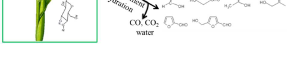

Previously the primary product distribution resulting from fast pyrolysis of cellulose, hemicellulose and lignin was quantified. This study extends the analysis to the examination of interactions between cellulose-hemicellulose and cellulose-lignin, which were determined by comparing the pyrolysis products from their native mixture, physical mixture and superposition of individual components. Negligible interaction was found for either binary physical mixture. For the native cellulose-hemicellulose mixture no significant interaction was identified either. In the case of the native cellulose-lignin mixture, herbaceous biomass exhibited an apparent interaction, represented by diminished yield of levoglucosan and enhanced yield of low molecular weight compounds and furans. 

> ∗ Corresponding author. Address: Department of Chemical and Biological Engineering, Iowa State University, Ames, IA 50011, USA. Tel.: +1 515 294 1895. E-mail address: bshanks@iastate.edu (B.H. Shanks). 

**ACS Paragon Plus Environment** 

**ACS Sustainable Chemistry & Engineering** 

**Page 2 of 32** 

2 

1 2 3 4 5 6 7 8 9 10 11 12 13 14 15 16 17 18 19 20 21 22 23 24 25 26 27 28 29 30 31 32 33 34 35 36 37 38 39 40 41 42 43 44 45 46 47 48 49 50 51 52 53 54 55 56 57 58 59 60 

However, such interaction was not found for woody biomass. It is speculated that these results are due to different amounts of covalent linkages in these biomass samples. This study provides insight into the chemistry involved during the pyrolysis of multi-component biomass, which can facilitate building a model for bio-oil composition prediction. 

## **Keywords** 

Cellulose, Fast pyrolysis, Hemicellulose, Interaction, Lignin 

## **Introduction** 

Fast pyrolysis can be used to convert naturally abundant biomass into a liquid product, called bio-oil.[1,2] Given the volatility of nonrenewable crude oil, bio-oil has been identified as a potential substitution candidate. Considering the intrinsic complex chemical composition of bio-oil, in order to create a basis for bio-oil to become a feasible replacement for crude oil either through optimizing the fast pyrolysis reactions conditions or catalytically upgrading the bio-oil product, a more fundamental understanding of the biomass pyrolysis mechanism and chemical composition of bio-oil is needed. Previously, we reported on pyrolytic mechanism of the individual constituents of biomass (cellulose, hemicellulose and lignin) as well as the catalytic effects of minerals present during pyrolysis through the use of a micropyrolyzer system, which allowed access to the primary reactions occurring in pyrolysis without convolution from secondary reactions.[3-6] In this paper, we focus on the possibility of binary interactions between cellulose-lignin and cellulose-hemicellulose during fast pyrolysis by comparing the pyrolytic product distributions from the native and physical mixed biopolymers and comparing this result with the known results for the individual pure biopolymers. The hemicellulose-lignin 

**ACS Paragon Plus Environment** 

**ACS Sustainable Chemistry & Engineering** 

**Page 3 of 32** 

3 

1 2 3 4 5 6 7 8 9 10 11 12 13 14 15 16 17 18 19 20 21 22 23 24 25 26 27 28 29 30 31 32 33 34 35 36 37 38 39 40 41 42 43 44 45 46 47 48 49 50 51 52 53 54 55 56 57 58 59 60 

binary system was not included in the current study due to the difficulty in obtaining a hemicellulose-lignin native mixture. 

In the sense of physical structure, the lignin is located in the outer cell wall of biomass. In general, cellulose is located within a lignin shell while the hemicellulose, with a random and amorphous structure, is located within the cellulose and between the cellulose and lignin. From a chemical perspective, hydrogen bonding exists between cellulose and lignin as well as cellulose and hemicellulose. Additionally, covalent linkages, mainly ether bonds, have been proposed to be present between cellulose and lignin.[7-9] Therefore, the possible chemical linkage within cellulose-lignin and cellulose-hemicellulose, as well as their physical arrangement within the biomass structure may play a role in influencing the product distribution resulting from pyrolysis, which would result in the pyrolysis behavior of the binary system not being captured by the simple addition of its individual components. Additionally, the potential reactive species released during fast pyrolysis of the individual biopolymers might interact differently when two different biopolymers are simultaneously pyrolyzed leading to a product distribution from the binary system that would not be the same as a mere superposition of pyrolysis products from the individual components. 

Whether interactions between the pyrolysis products of the three biopolymers lead to different final chemical product distributions has been the subject of conflicting reports in the literature. A number of studies have proposed that there is negligible interaction among cellulose-hemicellulose-lignin during pyrolysis.[10-13] In contrast, some researchers have reported that interactions among cellulose, hemicellulose and lignin do exist. Hosoya et al. stated that the pyrolytic behavior of cedar wood (hydrolysable sugar content and 

**ACS Paragon Plus Environment** 

**ACS Sustainable Chemistry & Engineering** 

**Page 4 of 32** 

4 

1 2 3 4 5 6 7 8 9 10 11 12 13 14 15 16 17 18 19 20 21 22 23 24 25 26 27 28 29 30 31 32 33 34 35 36 37 38 39 40 41 42 43 44 45 46 47 48 49 50 51 52 53 54 55 56 57 58 59 60 

molecular weight of water-soluble bio-oil) could not be explained merely in terms of the combined pyrolysis of cellulose, hemicellulose, and lignin even after demineralization.[14] They also concluded that there were apparent interactions between cellulose and lignin while negligible interactions between cellulose and hemicellulose during pyrolysis.[15] Sagehashi et al. reported that during the gasification of biomass, the yield of phenol and guaiacol surpassed their superposition yield from the gasification of the individual cellulose, xylan, and lignin.[16] More recently, Fushimi et al. reported that lignin could suppress the volatilization of bio-oil species from cellulose while xylan could enhance the decomposition of bio-oil into gases.[19] 

Previous work on interaction effects in the pyrolysis of biomass and its constitute components had four common areas of concern. First, most of the experiments were performed either by using thermogravimetric analyzers (TGA) or batch reactors. The former are not capable of providing adequate heating rates[17] to allow the volatile products, once generated, to readily escape from the heated zone to ensure exploration of primary reactions. The later result in a long residence time relative to fast pyrolysis, so secondary vapor phase reactions and condensation reactions likely occurred. Second, these studies were mainly based on the weight loss of biomass or simply defining the condensable products as water-soluble and water-insoluble products, from which information on specific chemical species cannot be inferred. Third, birch wood xylan obtained from Sigma-Aldrich was generally used as the biopolymer representing hemicellulose. While xylan is the primary component of hemicellulose, it is not the only carbohydrate species present in real hemicelluloses. Additionally, the xylan from Sigma-Aldrich has an extremely high content of alkali and alkaline earth metals, making its complete demineralization quite 

**ACS Paragon Plus Environment** 

**ACS Sustainable Chemistry & Engineering** 

**Page 5 of 32** 

5 

1 2 3 4 5 6 7 8 9 10 11 12 13 14 15 16 17 18 19 20 21 22 23 24 25 26 27 28 29 30 31 32 33 34 35 36 37 38 39 40 41 42 43 44 45 46 47 48 49 50 51 52 53 54 55 56 57 58 59 60 

challenging.[5] Fourth, previous studies disregarded the potential importance of intrinsic structure difference between physical mixtures of cellulose-hemicellulose-lignin and real biomass, as the physical and chemical interactions within cellulose-hemicellulose-lignin in real biomass could create different local reaction conditions than would be present in a simple physical mixture of the individual components. It is possible that such a discrepancy could affect the final pyrolysis product distribution. 

It has been verified that the primary product distributions of any cellulose samples are very similar under fast pyrolysis conditions as long as they are demineralized.[20] Given the complexity of the structure within lignin-carbohydrate complexes as well as the convoluted chemical speciation generated during fast pyrolysis, consistent types of hemicellulose and lignin and representative fast pyrolysis conditions need to be applied,[18] combined with well-developed analytical techniques in order to uncover the possible underlying pyrolytic interaction effects. In this work, representative fast pyrolysis conditions were obtained using a micropyrolyzer. Using a combination of several analytical techniques including nearly complete chemical speciation and product distributions were determined. Further, the source of interaction effects within binary cellulose-lignin and cellulose-hemicellulose system was interpreted from the aspect of both a physical mixture and a native combination. 

## **Materials and Methods** 

## **Materials** 

For the individual components used in this study, cellulose was purchased from Sigma-Aldrich, cornstover lignin, isolated using the Organosolv process, was provided by 

**ACS Paragon Plus Environment** 

**ACS Sustainable Chemistry & Engineering** 

**Page 6 of 32** 

6 

1 2 3 4 5 6 7 8 9 10 11 12 13 14 15 16 17 18 19 20 21 22 23 24 25 26 27 28 29 30 31 32 33 34 35 36 37 38 39 40 41 42 43 44 45 46 47 48 49 50 51 52 53 54 55 56 57 58 59 60 

Archer Daniels Midland (ADM), and hemicellulose was isolated from cornstover using the method described in the experimental section. The binary native mixture of cellulose-lignin was obtained by selectively removing hemicellulose from the original biomass and the binary native mixture of cellulose-hemicellulose was obtained after delignification of cornstover. The details for these methods are provided in the following experimental section. 

## **Biomass sample pretreatment** 

Hemicellulose was extracted from cornstover by an aqueous ammonia treatment followed by hot water treatment.[21] Cornstover, which was procured from the Agronomy Farm at Iowa State University, was ground and screened to a nominal size of 9–35 mesh. The sieved cornstover was first acid washed to remove inorganic salts as described previously.[6] After acid washing, the cornstover was exposed to a 15 wt% aqueous ammonia solution in a flow-through column reactor pressurized to 2.3 Mpa. The reactor was placed overnight in an oven set to a temperature of 170 °C to selectively cleave the ether bonds in lignin for delignification. Exhaustive washing with DI water was performed after the aqueous ammonia treatment. Then, the treated cornstover was firmly packed into a flowthrough column reactor, which had temperature and pressure control. A 0.07 wt% sulfuric acid aqueous solution was passed through the reactor with flow rate of 5 ml min[-1] at 180 °C under a pressure of 2.5 MPa. During the hot water treatment, the hydronium cation could initiate hemicellulose depolymerization and cleave acetyl groups with the latter acting as a catalyst for further depolymerization of hemicellulose. The depolymerized hemicellulose would enter the aqueous phase thus being separated from the treated cornstover. The passed through solution was collected and dried in vacuum at 50 °C, to obtain solid particles. The 

**ACS Paragon Plus Environment** 

**ACS Sustainable Chemistry & Engineering** 

**Page 7 of 32** 

7 

1 2 3 4 5 6 7 8 9 10 11 12 13 14 15 16 17 18 19 20 21 22 23 24 25 26 27 28 29 30 31 32 33 34 35 36 37 38 39 40 41 42 43 44 45 46 47 48 49 50 51 52 53 54 55 56 57 58 59 60 

solid was then acid washed with the same condition as previously and ground into a fine powder. 

The native binary mixtures from cornstover were prepared by selectively removing one component, either hemicellulose or lignin, from the original biomass. The native cellulose-lignin sample was obtained by hot water treatment using the same conditions given above. After hot water treatment, the residue solid inside of the flow-through column reactor was dried and ground into a fine powder using a ball mill. The native cellulosehemicellulose mixture was obtained by delignification, using sodium chlorite and glacial acetic acid. Approximately 10 grams of cornstover was immersed in 320 ml DI water with an internal stir bar and with the Erlenmeyer flask then heated to 70 °C in a water bath. 1 ml acetic acid and 3 g sodium chlorite were added into the flask hourly over a three hour period. During the process the Erlenmeyer flask was capped to maintain the generated chlorine and chlorine dioxide within the flask. The lignin was oxidized and depolymerized by the strong oxidant so that it became soluble in water. After 3 hours, the solution was cooled to room temperature and filtered. The leftover solid (known as holocellulose) was then acid washed three times to remove alkaline and alkaline earth metal ions. The acid washed holocellulose was ground into a fine powder using a ball mill. 

## **Biomass sample characterization** 

Carbohydrate and lignin content in the biomass samples was analyzed following the protocol from the NREL Chemical Analysis and Testing Stardard Procedures: NREL LAP, TP-510-42618. Before quantification, biomass samples underwent two-stage acid hydrolysis: 1) 72 wt% sulfuric acid for 1 h at 30 °C; 2) 4 wt% sulfuric acid for 1 h inside of an autoclave with the temperature held at 120 °C. Solid residues after the two-stage 

**ACS Paragon Plus Environment** 

**ACS Sustainable Chemistry & Engineering** 

**Page 8 of 32** 

8 

1 2 3 4 5 6 7 8 9 10 11 12 13 14 15 16 17 18 19 20 21 22 23 24 25 26 27 28 29 30 31 32 33 34 35 36 37 38 39 40 41 42 43 44 45 46 47 48 49 50 51 52 53 54 55 56 57 58 59 60 

hydrolysis were deemed acid insoluble lignin (AIL). Saccharides, which were in the liquid phase after hydrolysis, were quantified using a HPLC with a Bio-Rad Aminex HPX-87P column (Bio-Rad Laboratories, Hercules, CA) equipped with a refractive index detector. The acid soluble lignin (ASL) was quantified by measuring its absorbance at 320 nm in a UV-Visible spectrophotometer. Ash content in biomass was determined by oxidizing sample at 575 °C for 6 h inside of a thermogravimetric analyzer (Mettler-Toledo Analytical). 

## **Pyrolyzer-GC-MS/FID experiments** 

The pyrolysis experiments were performed in a single-shot micopyrolyzer (Model 2020 iS, Frontier Laboratories, Japan). Before pyrolysis, approximately 500 µg biomass was added to a deactivated stainless steel sample cup. The loaded sample cup was then dropped gravitationally into a quartz pyrolysis tube. The pyrolysis temperature, which was 500 °C in the present work, was maintained by a tubular furnace surrounding the quartz reaction tube. During the experiment, the generated volatile products were swept by the helium gas into a Bruker 430-GC through a deactivated needle. A capillary GC column, ZB-1701 (Phenomenex) was used for separation of the volatile products. The column was either connected to a mass spectrometer (MS, Saturn 2000) for product identification or to a flame ionization detector (FID) for product quantification. Details for product identification are given in the Supplementary materials. 

## **Results and Discussion** 

## **Sample characterization** 

The compositions of the samples used in the study as well as their ash content are 

**ACS Paragon Plus Environment** 

**ACS Sustainable Chemistry & Engineering** 

**Page 9 of 32** 

9 

1 2 3 4 5 6 7 8 9 10 11 12 13 14 15 16 17 18 19 20 21 22 23 24 25 26 27 28 29 30 31 32 33 34 35 36 37 38 39 40 41 42 43 44 45 46 47 48 49 50 51 52 53 54 55 56 57 58 59 60 

listed in Table 1, Table 2, and Table S1 (all data are average values from duplicate analysis and are based on dry biomass). It should be noted that the residual lignin content in the isolated hemicellulose was still about 21 wt%, which was due to the mild ammonia delignification treatment. Since polysaccharide pyrolysis behavior is highly sensitive to alkaline and alkaline earth metal ions, the extracted hemicellulose needed to be nearly free of these ions before testing. Given this constraint, the optimal removal method used ammonia and hot water treatment rather than alkaline delignification and extraction, even though the latter could yield lower lignin content in the hemicellulose. For the hemicellulose and holocellulose samples, the unaccounted for mass was likely due to residual extractives or proteins. 

Previous work has shown that even small amounts of alkaline and alkaline earth metal ions within polysaccharides will dramatically alter the final product distribution from pyrolysis.[3] Therefore, the biomass samples used in the current was analyzed in duplicate for metal ion content using inductively coupled plasma mass spectrometry (ICP-MS). Table S2 shows the ICP-MS results for the pretreated cornstover hemicellulose, native cellulosehemicellulose from cornstover and native cellulose-lignin samples from different biomass sources demonstrate that sufficiently low levels of the key metal ions were achieved 

through the sample preparation (the Si abundance has been proven to not be a problem as it is inert during fast pyrolysis). 

## **Quantification for cellulose-hemicellulose binary system** 

The chromatograms resulting from the pyrolysis of the cellulose, hemicellulose (this is the demineralized hemicellulose with residual lignin given in Table S1) and their physical and native binary mixtures are shown in Fig. S1 in the Supplementary materials. 

**ACS Paragon Plus Environment** 

**ACS Sustainable Chemistry & Engineering** 

**Page 10 of 32** 

10 

1 2 3 4 5 6 7 8 9 10 11 12 13 14 15 16 17 18 19 20 21 22 23 24 25 26 27 28 29 30 31 32 33 34 35 36 37 38 39 40 41 42 43 44 45 46 47 48 49 50 51 52 53 54 55 56 57 58 59 60 

The species associated with the number in the chromatograms can be found in Table S4. Qualitative comparison of the products from individual components (cellulose and hemicellulose) with those from either the physical cellulose-hemicellulose mixture or the native cellulose-hemicellulose mixture showed that essentially only negligible amounts of new compounds were generated during primary pyrolysis. 

The quantitative product distribution for pyrolysis of the hemicellulose sample is shown in Table S3. The product yield values given in the table were normalized based on the carbohydrate content in the extracted hemicellulose thereby removing the contribution from the residual lignin. Also, the yield of products that could be generated from both hemicellulose and lignin, such as CO, CO2, char etc., were corrected by assuming the portion produced from the residual lignin had the product distribution determined for pure lignin.[6] The water content in the product was determined by calculating the stoichiometric amount of water that would need to be released to form the dehydrated species such as 2- furaldehyde, DAXP, 5-(hydroxymethyl)-2-furancarboxaldehyde (HMF), dianhydro glucopyranose and char. The char was assumed to be pure carbon since the elemental analysis on cellulose and hemicellulose derived char shows an approximate molecular formula of CH0.22O0.09. Using the component analysis shown in Table S1, an elemental balance was calculated for the carbon, hydrogen and oxygen in the products. This balance was compared to the values for the hemicellulose sample and it was found 9.73 wt% carbon, 1.52 wt% hydrogen and 7.50 wt% oxygen were unaccounted for in the products, which was why 81.25 wt% closure was achieved. The unaccounted for mass in the elemental balance was likely caused by a combination of minor product condensation in the transfer line between the pyrolysis reactor and the GC column, non-quantified minor peaks 

**ACS Paragon Plus Environment** 

**ACS Sustainable Chemistry & Engineering** 

**Page 11 of 32** 

11 

1 2 3 4 5 6 7 8 9 10 11 12 13 14 15 16 17 18 19 20 21 22 23 24 25 26 27 28 29 30 31 32 33 34 35 36 37 38 39 40 41 42 43 44 45 46 47 48 49 50 51 52 53 54 55 56 57 58 59 60 

in the chromatograph, and non-detectable gases such as hydrogen and light hydrocarbons. This overall closure was slightly better than we had reported in a previous study with hemicellulose pyrolysis.[5 ] 

Table 3 shows the pyrolysis product distribution for the native sample, physical mixture and superposition of the pure cellulose-hemicellulose samples. The pyrolysis product distribution of cellulose was reported in a previous study, which was used to calculate the superposition results in the current study.[4] Both the physical mixture and superposition values were weighted to the cellulose/hemicellulose ratio in the native sample. The values in the “Difference” column in Table 3 represent the discrepancy between the native mixture and superposition in terms of product yield. The “Std. Dev.” Column gives the value of one standard deviation resulting from triplicate runs of the native mixture, the value of which is representative for this data series. Similarly, all product yields were normalized based on carbohydrate content in the original biomass. Overall mass balances of 89.69 wt%, 86.24 wt% and 87.23 wt% were achieved for the native sample, physical mixture and pure biopolymer superposition, respectively. An elemental balance for the native sample products showed that 6.78 wt% carbon, 1.37 wt% hydrogen, and 2.17 wt% oxygen were the differences between starting material and the products. 

As shown in Table 3, the yields of the pyrolysis products for the physical mixture matched well with that obtained via superposition of cellulose and hemicellulose. Overall, the results for these two cases strongly suggested that no chemical interactions occurred when cellulose and hemicellulose were pyrolyzed simultaneously. The lack of interaction effects demonstrated that although product concentrations in the gas phase would be changed when pyrolyzing the physical mixture compared to those resulting from the 

**ACS Paragon Plus Environment** 

**ACS Sustainable Chemistry & Engineering** 

**Page 12 of 32** 

12 

1 2 3 4 5 6 7 8 9 10 11 12 13 14 15 16 17 18 19 20 21 22 23 24 25 26 27 28 29 30 31 32 33 34 35 36 37 38 39 40 41 42 43 44 45 46 47 48 49 50 51 52 53 54 55 56 57 58 59 60 

respective single biopolymers, it did not lead to a change in gas phase reactions within the constraints of the helium dilution and short residence time for pyrolysis in the micropyrolyzer. 

Table 3 also compares the product yields for the native cellulose-hemicellulose sample with the superposition values. Based on the formation pathways, the products could be broken down into six categories: 1) levoglucosan, 2) gases, 3) low molecular weight products, 4) DAXP and AXP, 5) char, and 6) HMF and dianhydro glucopyranose. It was clear from the results that similar levoglucosan yield were realized for both the native sample and pure component superposition, implying that any hydrogen bonding or morphology of intertwined cellulose and hemicellulose did not influence levoglucosan evolution. The Tukey honest significant difference (HSD) test was used to further verify whether there was a significant difference in the yield of levoglucosan and levoglucosanfuranose between the native mixture, physical mixture and superposition. The results in Table S7 confirmed the lack of significant interactions for these samples. A difference was observed for the yields of some other products. More CO2 and acetic acid were generated from the native sample, which might be related to residual acetic acid from the pretreatment procedure. When heated to 440 °C, pure acetic acid begins to partly decomposed, so during pyrolysis the residual acetic acid could either be volatilized and exit the reaction zone or decompose into CO2 and methane, leading to increases in their yield. For most of the other major low molecular weight products, their yield from the native sample was slightly lower than found from superposition as was also the case for the C5 pyrans, such as DAXP and AXP. These differences might have been due to differences in the degree of polymerization for the hemicellulose in the native sample versus the extracted hemicellulose, since during 

**ACS Paragon Plus Environment** 

**ACS Sustainable Chemistry & Engineering** 

**Page 13 of 32** 

13 

1 2 3 4 5 6 7 8 9 10 11 12 13 14 15 16 17 18 19 20 21 22 23 24 25 26 27 28 29 30 31 32 33 34 35 36 37 38 39 40 41 42 43 44 45 46 47 48 49 50 51 52 53 54 55 56 57 58 59 60 

hemicelluloses extraction it was depolymerized to the extent of being soluble in the aqueous phase. As such, the extracted hemicellulose likely had a lower degree of polymerization compared to the hemicellulose in the native sample. The dianhydro glucopyranose and HMF, which can only be derived from C6 saccharides, their yield was marginally higher in the product distribution for the native sample. This difference might have been due to a different sugar composition in the native and extracted hemicellulose. Table S1 and Table 2 show that the extracted hemicellulose has less six carbon carbohydrates compared to the native one. The resulting different ratio of five to six carbon carbohydrates between the native sample and the superposition would be expected to impact the relative yields for the C5 and C6 carbohydrate-derived products. 

In summary, under fast pyrolysis conditions the product distributions for the physical mixture was reproduced by the calculated superposition yield. While minor differences were observed when comparing the fast pyrolysis of the native sample with the pure component superposition, the results indicated no significant interaction effects with the native sample. When taken together, our results strongly suggested that no interactions will occur between the cellulose and hemicellulose fractions when biomass is pyrolyzed. 

## **Quantification for cellulose-lignin binary system** 

The pyrolysis chromatograms for cellulose, lignin and their physical and native mixtures are shown in Fig. S2. Again, the compound names corresponding to the numbered peaks can be found in Table S4. As with the cellulose-hemicellulose case, the product distributions from the individual components (cellulose and lignin) had essentially the same range of compounds as were generated during the pyrolysis of either the physical celluloselignin mixture or the native cellulose-lignin sample. 

**ACS Paragon Plus Environment** 

**ACS Sustainable Chemistry & Engineering** 

**Page 14 of 32** 

14 

1 2 3 4 5 6 7 8 9 10 11 12 13 14 15 16 17 18 19 20 21 22 23 24 25 26 27 28 29 30 31 32 33 34 35 36 37 38 39 40 41 42 43 44 45 46 47 48 49 50 51 52 53 54 55 56 57 58 59 60 

Table 4 shows the quantified product yields from fast pyrolysis of a cellulose-lignin physical mixture and a cellulose-lignin native sample from cornstover, respectively (including CO, CO2 and char yields). Superposition yields of pyrolytic products were calculated by weighted addition of the pyrolytic product yields for the individual pure biopolymers. The pyrolysis product distribution of the cornstover lignin was reported in a previous study, which was used to calculate the superposition results in the current study.[6] The “Difference” column in Table 4 represents the product yield difference between the native sample and the superposition calculation and the “Std. Dev.” Column gives one standard deviation resulting from triplicate runs of the native sample. As with the cellulosehemicellulose experiments, the reported water yield was calculated by determining the stoichiometric amount of water that would need to be produced to obtain the measured dehydration products, 2-furaldehyde, DAXP 2, other DAXP 2, HMF, dianhydro glucopyranose and char. Using this calculated water yield, the measured char, gas and GC detected compounds, overall mass balances of 80.2 wt%, 83.75 wt% and 83.60 wt% were determined for the native cellulose-lignin sample, physical cellulose-lignin mixture and the individual biopolymer superposition yield respectively. To perform an overall elemental balance for comparing the native cellulose-lignin sample and its pyrolysis products an empirical formula for cornstover lignin, C10.2H12.2O3.8N0.2, was used.[6] Based on the overall product yields listed in Table 4, an elemental balance for carbon, hydrogen and oxygen indicated that a difference between the native sample and the product values corresponded 10.36 wt% C, 1.77 wt% H and 6.20 wt% O (consistent with a “molecular formula” of C10H18.8O4.1). The elemental balance differences might be attributed to condensation of oligomers along the reactor to GC transfer line as well as hydrogen and light alkane 

**ACS Paragon Plus Environment** 

**ACS Sustainable Chemistry & Engineering** 

**Page 15 of 32** 

15 

1 2 3 4 5 6 7 8 9 10 11 12 13 14 15 16 17 18 19 20 21 22 23 24 25 26 27 28 29 30 31 32 33 34 35 36 37 38 39 40 41 42 43 44 45 46 47 48 49 50 51 52 53 54 55 56 57 58 59 60 

production (such as CH4, C2H6 and C3H8), which could not be quantified by the gas analyzer system used in this study. The condensation of pyrolytic lignin oligomers might have been the primary cause since there was a consistency between the difference “molecular formula” from the elemental balance and the molecular formula of cornstover lignin. Additionally, there was small number of unidentified products in chromatograph that were only present at low levels. Comparison of the product yields for the physical mixture and the biopolymer superposition revealed no significant differences leading to the conclusion that no interaction effects existed in the physical mixture of cellulose and lignin under the fast pyrolysis conditions. However, an apparent change in product distribution was observed when comparing the physical mixture to the native sample. Statistical analysis using the HSD test (see Table S8) validated the product distribution similarities and differences for the cellulose-lignin binary systems. 

On the basis of molecular weight and similarity in functional group the cellulosederived pyrolytic products (excluding char, gases and water) from the binary mixture of cellulose-lignin could be subdivided into three categories: 1) low molecular weight compounds with a carbon number from 1 to 3 (such as glycolaldehyde, methyl glyoxal, acetol, etc.), 2) furan derivatives with a carbon number from 4 to 6 (such as 2(5H)furanone, 2-furaldehyde, HMF etc.), and 3) dehydrated sugars with a carbon number of 5 or 6 (such as DAXP, levoglucosan etc.). As shown in Table 4, the differences in product distribution between the native cellulose-lignin sample and the physical mixture of cellulose-lignin (or superposition of the individual components) had trends within each of the three categories. For the native cellulose-lignin, the total yields of C1 to C3 product compounds increased by 11.38 wt%, which was mainly attributed to a 7.23 wt% increase in 

**ACS Paragon Plus Environment** 

**ACS Sustainable Chemistry & Engineering** 

**Page 16 of 32** 

16 

1 2 3 4 5 6 7 8 9 10 11 12 13 14 15 16 17 18 19 20 21 22 23 24 25 26 27 28 29 30 31 32 33 34 35 36 37 38 39 40 41 42 43 44 45 46 47 48 49 50 51 52 53 54 55 56 57 58 59 60 

glycolaldehyde. While not as significantly, more furans were produced from the pyrolysis of the native cellulose-lignin sample (with a total yield increasing by 1.45 wt%, of which more than half was attributed to HMF). Offsetting these increases in yields of the low molecular weight compounds and furan derivatives was lower yields of the pyrans, primarily attributed to a 10.28 wt% decrease in the levoglucosan yield. These results were consistent with the pyrolysis mechanism proposed previously in which competitive glycosidic bond and C-C bond breaking are the primary reactions for cellulose thermal deconstruction.[3, 4, 22] For “clean” cellulose, Vinu and Broadbelt have demonstrated that a concerted reaction involving breaking the glycosidic bond is favored, in which a levoglucosyl end-group is formed.[22] Subsequent glycosidic bond cleavage moving up the chain from the levoglucosyl end-group would generate one molecule of levoglucosan and another levoglucosyl end-group for each cleavage event. Competing with this reaction is a second set of reaction pathways that can produce furan derivatives and low molecular weight species.  A number of reactions are possible in this set of competitive pathways.[23-27] Given the diminishment of the levoglucosan and enhancement of the low molecular weight compounds and the furan derivatives it appeared that the native cellulose-lignin experienced a relative enhancement of this second set of reactions. 

As discussed above, the major difference between the native cellulose-lignin sample and the physical cellulose-lignin mixture was how these two components were chemically or physically intertwined with each other. To evaluate whether the biomass pre-treatment itself could cause the difference in the pyrolysis product distribution, a control experiment was performed by using the hot water treatment on the physical cellulose-lignin mixture. Pyrolysis of the treated and unteated physical mixture gave nearly the same product 

**ACS Paragon Plus Environment** 

**ACS Sustainable Chemistry & Engineering** 

**Page 17 of 32** 

17 

1 2 3 4 5 6 7 8 9 10 11 12 13 14 15 16 17 18 19 20 21 22 23 24 25 26 27 28 29 30 31 32 33 34 35 36 37 38 39 40 41 42 43 44 45 46 47 48 49 50 51 52 53 54 55 56 57 58 59 60 

distributions. Some researchers have proposed that covalent bonds, most likely ether bonds, exist between cellulose and lignin within lignocellulosic biomass.[7-9] For example, Jin et al. applied a carboxymethylation method on a native cellulose-lignin sample and then measured the yield of cellulose in the extracted water-soluble phase.[7] They observed what appeared to be the existence of covalent linkages between cellulose and lignin in woody biomass. Zhou et al. used isotopic oxygen to prove the existence of oxygen containing covalent bonds between cellulose and lignin in a material isolated from Zea Mays leaves.[28] By methylating the native cellulose-lignin sample and detecting the methylated position on cellulose, several studies have suggested that these ether bonds occur through the oxygen at C6 position on glucosyl ring in the cellulose chain.[28-32] Houminer et al. demonstrated that the hydroxyl group at the C6 position in the glucosyl ring had the highest activity when a kinetic model for the polymerization of levoglucosan was developed.[33] This study would infer that the C6 hydroxyl is kinetically more favored to covalent bond with lignin if such a covalent bond does exist. Unfortunately, to date it has not been possible to use NMR characterization to accurately quantify such covalent linkages due to the limited access of 13C-uniformly labelled plants making identification of the desired signals in the lignocellulose complex difficult. 

The existence of covalent bonding between lignin and the oxygen at the C6 position of glucosyl rings in cellulose would be consistent with the decreased yield of levoglucosan observed in the pyrolysis of the native cellulose-lignin sample. We have shown previously that polysaccharides with 1,6-glycosidic linkages resulted in the formation of considerably less levoglucosan upon pyrolysis relative to polysaccharides with 1,4- (either α or β) or 1,3glycosdic linkages.[4] For the 1, 6-glycosidic linked polysaccharides, glycosidic bond 

**ACS Paragon Plus Environment** 

**ACS Sustainable Chemistry & Engineering** 

**Page 18 of 32** 

18 

1 2 3 4 5 6 7 8 9 10 11 12 13 14 15 16 17 18 19 20 21 22 23 24 25 26 27 28 29 30 31 32 33 34 35 36 37 38 39 40 41 42 43 44 45 46 47 48 49 50 51 52 53 54 55 56 57 58 59 60 

cleavage could not readily form a levoglucosyl end-group since the oxygen atom at the C6 position on the end unit of the generated chain would be connected to the neighbouring glucose unit by the glycosidic bond making it unavailable. Similarly, once the glucose unit in cellulose is covalently bonded (possibly by an ether linkage) with lignin through the oxygen at the C6 position, it would be difficult to form a levoglucosyl-end group after glycosidic bond cleavage since the oxygen at the C6 position would be connected to the lignin thereby preventing the anhydro-ring closure necessary for levoglucosan formation (Fig. 1). Such an impediment to the formation of levoglucosyl-end group would facilitate competing reactions, such as the formation of furans and C1 to C3 low molecular weight products thereby leading to higher yields of these compounds at the expense of levoglucosan. 

As seen from the data in Table 4, the formation of many of the lignin-derived phenols was slightly enhanced during the pyrolysis of the native cellulose-lignin. Relative to the physical mixture, a 1.75 wt% increase in the total amount of phenols was observed, accompanied with a 0.81 wt% decrease in CO2 yield. Additionally, the char yield for the native cellulose-lignin was decreased by 5.79 wt% relative to the physical mixture. It is important to note that cornstover lignin prepared using the Organosolv process was used in the physical mixture of cellulose and lignin. Therefore, a possible explanation for the small differences in products might be due to differences in chemical structure between native and Organosolv lignin. Native lignin was likely to have a higher degree of polymerization compared with Organosolv lignin, which was isolated by hydrolytic cleavage of ether bonds from lignocellulosic cornstover. Due to this hydrolytic cleavage, the Organosolv process was likely to created more hydroxyl groups.[34] These hydroxyl groups formed in 

**ACS Paragon Plus Environment** 

**ACS Sustainable Chemistry & Engineering** 

**Page 19 of 32** 

19 

1 2 3 4 5 6 7 8 9 10 11 12 13 14 15 16 17 18 19 20 21 22 23 24 25 26 27 28 29 30 31 32 33 34 35 36 37 38 39 40 41 42 43 44 45 46 47 48 49 50 51 52 53 54 55 56 57 58 59 60 

Organosolv lignin extraction would tend to decrease the volatility of its pyrolytic products, which could facilitate char formation. Furthermore, as opposed to the hydrolytic cleavage in the Organosolv process, the pyrolytic cleavage of ether bonds in the native lignin would form phenols with unsaturated bonds at the cleaving end, which could lead to higher yield of phenols with an unsaturated end (shown in Table 4.). 

## **Cellulose-lignin interaction effects in different feedstocks** 

The previous section shows that interaction effects had been observed during primary pyrolysis of native cornstover cellulose-lignin. When pyrolyzing the native mixture, levoglucosan yield became smaller than from either the physical mixture or superposition the pure biopolymers while yields of furans and low molecular weight products showed the opposite trend. To explore this interaction effect more extensively additional biomass sources were examined. It has been proposed that the relative abundance of covalent linkages between cellulose and lignin is non-uniform for different types of biomass. As mentioned previously, Jin et al. performed a carboxymethylation experiment to verify the existence of covalent bonds between cellulose and lignin in both hardwood and softwood and concluded that such linkages are more abundant in softwood than hardwood.[7] Unfortunately, this method was more qualitative than quantitative as even one covalent linkage between cellulose and lignin would prevent the entire cellulose chain from dissolving into the aqueous phase. Zhou et al. developed an isotopic method that used the _O[18] /O[16]_ ratio to quantify the oxygen containing covalent linkages between cellulose and lignin in cornstover and _A. cunninghamii_ wood.[28] Their results suggested more extensive covalent bonds between cellulose and lignin in cornstover than in _A. cunninghamii_ . If as suggested by these reports the number of covalent linkages between cellulose and lignin 

**ACS Paragon Plus Environment** 

**ACS Sustainable Chemistry & Engineering** 

**Page 20 of 32** 

20 

1 2 3 4 5 6 7 8 9 10 11 12 13 14 15 16 17 18 19 20 21 22 23 24 25 26 27 28 29 30 31 32 33 34 35 36 37 38 39 40 41 42 43 44 45 46 47 48 49 50 51 52 53 54 55 56 57 58 59 60 

varies for different types of biomass, the pyrolysis products resulting from native celluloselignin samples relative to their physical mixture should be dependent on the type of biomass used. 

To explore this possibility, three additional types of biomass, pine, red oak and switchgrass, which are also popular feedstocks, were selected for further study. Pine is a typical softwood and red oak is a typical hardwood, while switchgrass represented another type of herbaceous biomass. All three biomass types were pretreated to remove their hemicellulose component using the same method as used for cornstover hemicellulose removal. Results for the sample composition analysis after the hemicelluloses removal are listed in Table 1.  As can be seen, the hemicelluloses were successfully removed in all of the samples. 

The product distributions resulting from the pyrolysis of the native cellulose-lignin samples obtained from pine and red oak are shown in Table S5 in the Supplementary materials. As the lignin composition in these biomass sources would not be the same, the interaction effects can be examined most clearly by comparing the products that were only or primarily derived from cellulose. This comparison was performed by selecting the yields of the cellulose-derived species and dividing these values by the corresponding cellulose weight content in the native mixtures. The values for the normalized yields are listed in Table S5 in the column named “Normalized yield on cellulose composition” and the normalized yield can be compared with the standard yield expected for cellulose given in the last column. 

Unlike the result with the cornstover-derived cellulose-lignin sample, the levoglucosan yield for each of the wood native samples was not diminished compared to 

**ACS Paragon Plus Environment** 

**ACS Sustainable Chemistry & Engineering** 

**Page 21 of 32** 

21 

1 2 3 4 5 6 7 8 9 10 11 12 13 14 15 16 17 18 19 20 21 22 23 24 25 26 27 28 29 30 31 32 33 34 35 36 37 38 39 40 41 42 43 44 45 46 47 48 49 50 51 52 53 54 55 56 57 58 59 60 

the standard yield from pure cellulose. There were two possible reasons for the intact levoglucosan yield. One possibility was that the number of such covalent bonds in pine and red oak was significantly fewer than the number of such bonds in cornstover. Another reason might be that fewer covalent linkages within the cellulose-lignin in red oak or pine are located in the oxygen at the C6 position. As discussed above, previous studies[28-32] have shown that the oxygen at the C6 position on glucosyl ring is the most likely bond location between cellulose and lignin for woody biomass, so it is probable that there are fewer covalent bonds. 

Table S6 in the Supplementary materials shows the pyrolytic product distribution for the switchgrass cellulose-lignin sample. As with the wood-derived samples, the normalized yields of the cellulose-derived products were compared with the ones from pure cellulose pyrolysis. It was clear from these results that the levoglucosan yield was diminished accompanied by increased yields for the furans and low molecular weight compounds suggesting an interaction effect within the switchgrass cellulose-lignin sample. This interaction behavior matched well with that observed for the cornstover celluloselignin sample both qualitatively and quantitatively. For the switchgrass cellulose-lignin sample, the levoglucosan yield based on cellulose composition was 41.33 wt% and for the cornstover cellulose-lignin sample, the levoglucosan yield was 25.34 wt% (Table 4), which would correspond to 39.60 wt% after normalization on its cellulose composition. For the other cellulose-derived products, similar yield results were also observed for both of the herbaceous biomass sources. The HSD test for the yield of levoglucosan and its furanose isomer from different feedstocks are shown in Table S9. 

In summary, the interaction effects between the cellulose and lignin in the native 

**ACS Paragon Plus Environment** 

**ACS Sustainable Chemistry & Engineering** 

**Page 22 of 32** 

22 

1 2 3 4 5 6 7 8 9 10 11 12 13 14 15 16 17 18 19 20 21 22 23 24 25 26 27 28 29 30 31 32 33 34 35 36 37 38 39 40 41 42 43 44 45 46 47 48 49 50 51 52 53 54 55 56 57 58 59 60 

samples were apparent for herbaceous biomass, leading to the depressed formation of levoglucosan and enhanced formation of low molecular weight compounds and furans. However, the interaction effects were much weaker or negligible in the case of woody biomass. Considering that these interaction effects were most likely due to covalent linkages between cellulose and lignin, it might be suggested that herbaceous biomass has more cellulose-lignin covalent linkages than woody biomass. This conclusion would be completely consistent with the results from Zhou et al.[28] 

## **Conclusions** 

Under primary reaction regime in fast pyrolysis, negligible interactions were found for physical mixture of either cellulose-hemicellulose or cellulose-lignin. No significant interaction was identified for native cellulose-hemicellulose mixture either. For herbaceous native cellulose-lignin mixture, apparent interaction was found as levoglucosan yield was diminished and yield of low molecular weight compounds and furans increased. However, woody native cellulose-lignin samples did not show the interaction effects. It is speculated that this could be due to higher degree of covalent bonding between cellulose and lignin in the herbaceous biomass than woody biomass, which leads to levoglucosan having a greater difficulty to be formed. In the current study, demineralization was performed for all biomass samples as to exclude their catalytic effects. This work, combined with previous pyrolysis studies with single biopolymer components and the catalytic effect of inorganic salts, can help provide the basis to develop models that can be used to predict bio-oil compositions resulting from the primary reactions in the fast pyrolysis of different biomass types. 

**ACS Paragon Plus Environment** 

**ACS Sustainable Chemistry & Engineering** 

**Page 23 of 32** 

23 

1 2 3 4 5 6 7 8 9 10 11 12 13 14 15 16 17 18 19 20 21 22 23 24 25 26 27 28 29 30 31 32 33 34 35 36 37 38 39 40 41 42 43 44 45 46 47 48 49 50 51 52 53 54 55 56 57 58 59 60 

## **Acknowledgements** 

The author would like to acknowledge the funding support from the National Advanced Biofuels Consortium. We are also thankful to Chris Ebert for his assistance with the ICP-MS analysis. 

## **Supporting Information Available** 

The supplementary information includes details in pyrolyzer-GC-MS/FID experiments, ICP-MS analysis, and results for Tukey honest significant different test. Also included are biomass component analysis of the extracted hemicellulose, mineral content for pretreated biomass samples, GC chromatographs for native mixture and physical mixture, pyrolysis product distribution of the extracted hemicellulose, and pyrolysis product distribution from native cellulose-lignin from switchgrass, pine and red oak. This information is available 

free of charge via the internet at http://pubs.acs.org/. 

## **References** 

(1) Huber, G. W.; Iborra, S.; Corma, A. Synthesis of transportation fuels from biomass: Chemistry, catalysts, and engineering. _Chem. Rev._ **2006** , 106, 4044-4098. 

(2) Mohan, D.; Pittman, C. U.; Steele, P. H. Pyrolysis of wood/biomass for bio-oil: A critical review. _Energy Fuels_ **2006** , 20, 848-889. 

(3) Patwardhan, P. R.; Satrio, J. A.; Brown, R. C.; Shanks, B. H. Influence of inorganic salts on the primary pyrolysis products of cellulose. _Bioresour. Technol._ **2010** , 101, 46464655. 

(4) Patwardhan, P. R.; Satrio, J. A.; Brown, R. C.; Shanks, B. H. Product distribution from fast pyrolysis of glucose-based carbohydrates. _J. Anal. Appl. Pyrol._ **2009** , 86, 323-330. (5) Patwardhan, P. R.; Brown, R. C.; Shanks, B. H. Product Distribution from the Fast Pyrolysis of Hemicellulose. _Chemsuschem_ **2011** , 4, 636-643. 

(6) Patwardhan, P. R.; Brown, R. C.; Shanks, B. H. Understanding the Fast Pyrolysis of Lignin. _Chemsuschem_ **2011** , 4, 1629-1636. 

(7) Jin, Z.; Katsumata, K. S.; Lam, T. B. T.; Iiyama, K. Covalent linkages between cellulose and lignin in cell walls of coniferous and nonconiferous woods. _Biopolymers_ **2006** , 83, 103-110. 

**ACS Paragon Plus Environment** 

**ACS Sustainable Chemistry & Engineering** 

**Page 24 of 32** 

24 

1 2 3 4 5 6 7 8 9 10 11 12 13 14 15 16 17 18 19 20 21 22 23 24 25 26 27 28 29 30 31 32 33 34 35 36 37 38 39 40 41 42 43 44 45 46 47 48 49 50 51 52 53 54 55 56 57 58 59 60 

(8) Eriksson, O.; Goring, D. A. I.; Lindgren, B. O. Structural studies on the chemcial-bonds between lignins and carbohydrates in spruce wood. _Wood Sci. Technol._ **1980** , 14, 267-279. (9) Kosikova, B.; Ebringerova, A. Lignin-carbohydrate bonds in a residual soda spruce pulp lignin. _Wood Sci. Technol._ **1994** , 28, 291-296. 

(10) Miller, R. S.; Bellan, J. A generalized biomass pyrolysis model based on superimposed cellulose, hemicellulose and lignin kinetics. _Combust. Sci. Technol._ **1997** , 126, 97-137. (11) Manya, J. J.; Velo, E.; Puigjaner, L. Kinetics of biomass pyrolysis: A reformulated three-parallel-reactions model. _Ind. Eng. Chem. Res._ **2003** , 42, 434-441. 

(12) Gomez, C. J.; Manya, J. J.; Velo, E.; Puigjaner, L. Further applications of a revisited summative model for kinetics of biomass pyrolysis. _Ind. Eng. Chem. Res._ **2004** , 43, 901906. 

(13) Svenson, J.; Pettersson, J. B. C.; Davidsson, K. O. Fast pyrolysis of the main components of birch wood. _Combust. Sci. Technol._ **2004** , 176, 977-990. 

(14) Hosoya, T.; Kawamoto, H.; Saka, S. Influence of inorganic matter on wood pyrolysis at gasification temperature. _J. Wood Sci._ **2007** , 53, 351-357. 

(15) Hosoya, T.; Kawamoto, H.; Saka, S. Cellulose-hemicellulose and cellulose-lignin interactions in wood pyrolysis at gasification temperature. _J. Anal. Appl. Pyrol._ **2007** , 80, 118-125. 

(16) Sagehashi, M.; Miyasaka, N.; Shishido, H.; Sakoda, A. Superheated steam pyrolysis of biomass elemental components and Sugi (Japanese cedar) for fuels and chemicals. _Bior. Technol._ **2006** , 97, 1272-1283. 

(17) Milosavljevic, I.; Oja, V.; Suuberg, E. M. Thermal effects in cellulose pyrolysis: Relationship to char formation processes. _Ind. Eng. Chem. Res._ **1996** , 35, 653-662. 

(18) Obst, J. R. Analytical pyrolysis of hardwood and softwood lignins and its use in lignintype determination of hardwood vessel elements. _J. Wood Chem. Technol._ **1983** , 3, 377397. 

(19) Fushimi, C.; Katayama, S.; Tsutsumi, A. Elucidation of interaction among cellulose, lignin and xylan during tar and gas evolution in steam gasification. _J. Anal. Appl. Pyrol._ **2009** , 86, 82-89. 

(20) Zhang, J.; Nolte, M.W.; Shanks, B.H. Investigation of primary reactions and secondary effects from the pyrolysis of different celluloses. Submitted to _ACS Sustainable Chem. Eng_ . (21) Kim, T. H.; Lee, Y. Y. Fractionation of corn stover by hot-water and aqueous ammonia treatment. _Bioresour. Technol._ **2006** , 97, 224-232. 

(22) Vinu, R.; Broadbelt, L. J. A mechanistic model of fast pyrolysis of glucose-based carbohydrates to predict bio-oil composition. _Energy & Environmental Science_ **2012** , 5, 9808-9826. 

(23) Yang, C. Y.; Lu, X. S.; Lin, W. G.; Yang, X. M.; Yao, J. Z. TG-FTIR study on corn straw pyrolysis-influence of minerals. _Chem. Res. Chin. Univ._ **2006** , 22, 524-532. (24) Paine, J. B.; Pithawalla, Y. B.; Naworal, J. D.; Thomas, C. E. Carbohydrate pyrolysis mechanisms from isotopic labeling. Part 1: The pyrolysis of glycerin: Discovery of competing fragmentation mechanisms affording acetaldehyde and formaldehyde and the implications for carbohydrate pyrolysis. _J. Anal. Appl. Pyrol._ **2007** , 80, 297-311. 

(25) Paine, J. B.; Pithawalla, Y. B.; Naworal, J. D. Carbohydrate pyrolysis mechanisms from isotopic labeling. Part 2. The pyrolysis of D-glucose: General disconnective analysis 

**ACS Paragon Plus Environment** 

**ACS Sustainable Chemistry & Engineering** 

**Page 25 of 32** 

25 

1 2 3 4 5 6 7 

8 

9 10 11 12 13 14 15 16 17 18 19 20 21 22 23 24 25 26 27 28 29 30 31 32 33 34 35 36 37 38 39 40 41 42 43 44 45 46 47 48 49 50 51 52 53 54 55 56 57 58 59 60 

and the formation of C-1 and C-2 carbonyl compounds by electrocyclic fragmentation mechanisms. _J. Anal. Appl. Pyrol._ **2008** , 82, 10-41. 

(26) Paine, J. B.; Pithawalla, Y. B.; Naworal, J. D. Carbohydrate pyrolysis mechanisms from isotopic labeling. Part 3. The Pyrolysis of D-glucose: Formation of C-3 and C-4 carbonyl compounds and a cyclopentenedione isomer by electrocyclic fragmentation mechanisms. _J Anal. Appl. Pyrol._ **2008** , 82, 42-69. 

(27) Paine, J. B., III; Pithawalla, Y. B.; Naworal, J. D. Carbohydrate pyrolysis mechanisms from isotopic labeling Part 4. The pyrolysis Of D-glucose: The formation of furans. _J. Anal. Appl. Pyrol._ **2008** , 83, 37-63. 

(28) Zhou, Y.; Stuart-Williams, H.; Farquhar, G. D.; Hocart, C. H. The use of natural abundance stable isotopic ratios to indicate the presence of oxygen-containing chemical linkages between cellulose and lignin in plant cell walls. _Phytochemistry_ **2010** , 71, 982993. 

(29) Kosikova, B.; Ebringerova, A. Structural characteristics of the lignin-carbohydrate complex of spruce soda pulp. _Cellul. Chem. Technol._ **1999** , 33, 445-454. 

(30) Iiyama, K.; Lam, T. B. T.; Stone, B. A. Phenolic-acid bridges between polysaccharides and lignin in wheat internodes. _Phytochemistry_ **1990** , 29, 733-737. 

(31) Minor, J. L. Chemical linkage of pine polysaccharides to lignin. _J. Wood Chem. Technol._ **1982** , 2, 1-16. 

(32) Minor, J. L. Chemical linkage of polysaccarides to residual lignin in loblolly-pine kraft pulps. _J. Wood Chem. Technol._ **1986** , 6, 185-201. 

(33) Houminer, Y.; Patai, S. Thermal polymerization of levoglucosan. _J. Polym. Sci. Part a-1-Polym. Chem._ **1969** , 7, 3005-3014. 

(34) N, K. T. Organosolv pulping and recovery process. US Patents: **1971** . 

**ACS Paragon Plus Environment** 

**ACS Sustainable Chemistry & Engineering** 

**Page 26 of 32** 

26 

1 

2 3 4 5 6 7 8 9 10 11 12 13 14 15 16 17 18 19 20 21 22 23 24 25 26 27 28 29 30 31 32 33 34 35 36 37 38 39 40 41 42 43 44 45 46 47 48 49 50 51 52 53 54 55 56 57 58 59 60 

## **Table 1** 

Component analysis of native cellulose-lignin samples from different feedstocks[a] 

|Components|Cornstover Pine Red Oak Switchgrass|
|---|---|
||Untreated Pretreated Untreated Pretreated Untreated Pretreated Untreated Pretreated|
|Glucan Xylan Galactan Arabinan Mannan Lignin Protein Sucrose Ash Extractives nb Total|35.3 64.0 35.8 42.9 40.7 52.7 36.2 63.8 23.0 4.5 8.2 0.0 17.9 0.0 24.3 1.5 1.9 0.0 3.7 0.0 2.4 0.0 0.8 0.0 4.0 0.0 2.7 0.0 0.8 0.0 3.0 0.2 - - 8.4 0.0 1.7 0.0 0.9 0.9 19.9 25.7 39.1 56.1 33.3 47.5 22.3 32.3 4.8 - - - - - - - 0.6 - - - - - - - 4.6 4.4 0.7 - 0.4 - 0.2 0.2 6.6 - - - - - - - 2 2 2 2 2 2 2 2 100.7 98.6 98.6 99.0 97.2 100.2 87.7 98.9|

a All numbers are in wt%; b number of analysis. 

**ACS Paragon Plus Environment** 

**ACS Sustainable Chemistry & Engineering** 

**Page 27 of 32** 

27 

1 2 3 4 5 6 7 8 9 10 11 12 13 14 15 16 17 18 19 20 21 22 23 24 25 26 27 28 29 30 31 32 33 34 35 36 37 38 39 40 41 42 43 44 45 46 47 48 49 50 51 52 53 54 55 56 57 58 59 60 

## **Table 2** 

Component analysis of cornstover cellulose-hemicellulose native sample[a] 

|Components|Holocellulose composition|
|---|---|
|Glucan|45.8|
|Xylan|27.6|
|Galactan|2.6|
|Arabinan|5.0|
|Mannan|1.1|
|Lignin|3.0|
|Ash|3.6|
|Total|88.7|

a All numbers are in wt%. 

**ACS Paragon Plus Environment** 

**ACS Sustainable Chemistry & Engineering** 

**Page 28 of 32** 

28 

1 2 

3 4 5 6 7 8 9 10 11 12 13 14 15 16 17 18 19 20 21 22 23 24 25 26 27 28 29 30 31 32 33 34 35 36 37 38 39 40 41 42 43 44 45 46 47 48 49 50 51 52 53 54 55 56 57 58 59 60 

## **Table 3** 

Comparison of pyrolysis product distribution among the native sample, physical mixture and superposition of cellulose-hemicellulose[a] 

|and superposition of cellulose-|hemicellul|osea||||
|---|---|---|---|---|---|
|Compound|Native|Physical|Superposition|Difference|Std. Dev.|
||sample|mixture||||
|Formaldehyde|0.22|0.19|0.21|0.01|0.02|
|Acetaldehyde|0.91|0.78|0.83|0.08|0.04|
|Furan|0.14|0.08|0.08|0.06|0.00|
|Acetone|0.14|0.08|0.08|0.06|0.01|
|Methyl glyoxal|0.60|1.99|2.02|-1.42|0.13|
|2-methyl furan|0.08|0.07|0.06|0.02|0.00|
|Glycolaldehyde|2.94|9.74|9.63|-6.69|0.75|
|Acetic acid|5.09|0.15|0.18|4.91|0.03|
|Acetol|0.33|0.74|0.72|-0.39|0.04|
|2-furaldehyde|1.38|1.23|1.14|0.24|0.05|
|2-furan methanol|0.13|0.19|0.17|-0.04|0.00|
|3-furan methanol|0.11|0.11|0.10|0.01|0.00|
|Other DAXP 1|0.42|0.28|0.21|0.21|0.00|
|5-methyl furfural|0.15|0.34|0.31|-0.16|0.01|
|DAXP 1|1.19|1.44|1.23|-0.04|0.03|
|2(5H)-furanone|0.36|0.32|0.27|0.09|0.03|
|DAXP 2|1.26|6.28|6.06|-4.80|0.09|
|2-hydroxy-3-methyl-2-|0.17|0.22|0.13|0.04|0.03|
|cyclopenten-1-one||||||
|Other DAXP 2|0.20|0.60|0.52|-0.32|0.01|
|AXP|0.86|0.00|0.00|0.86|0.10|
|5-(hydroxymethyl)-2-|1.27|0.75|0.64|0.63|0.02|
|furaldehyde||||||
|Dianhydro glucopyranose|1.65|1.26|1.46|0.19|0.11|
|Other AXP|1.52|3.40|3.34|-1.82|0.23|
|Levoglucosan|30.87|29.56|31.74|-0.87|1.78|
|Levoglucosan-furanose|2.65|1.95|2.23|0.42|0.36|
|Char|9.18|6.17|6.42|2.76|0.45|
|CO|2.11|1.95|1.72|0.39|0.10|
|CO2|10.94|6.61|5.87|5.07|0.71|
|Water (calculated)|12.82|9.74|9.88|2.94|-|
|Total|89.69|86.24|87.23|2.46|2.73|

a All numbers are in wt%. 

**ACS Paragon Plus Environment** 

**ACS Sustainable Chemistry & Engineering** 

**Page 29 of 32** 

29 

1 2 3 4 5 6 7 8 9 10 11 12 13 14 15 16 17 18 19 20 21 22 23 24 25 26 27 28 29 30 31 32 33 34 35 36 37 38 39 40 41 42 43 44 45 46 47 48 49 50 51 52 53 54 55 56 57 58 59 60 

## **Table 4** 

Comparison on pyrolysis product distribution among the native sample, physical mixture and superposition of cellulose and lignin for cornstover[a] 

|and superposition of cellulose and lignin|for corns|tovera||||
|---|---|---|---|---|---|
|Compound|Native| Physical| Superposition|Difference|Std.|
||sample|mixture|||Dev.|
|Formaldehyde|0.28|0.13|0.13|0.15|0.01|
|Acetaldehyde|1.11|0.70|0.67|0.44|0.03|
|Methanol|0.56|0.48|0.48|0.08|0.03|
|Furan|0.07|0.07|0.07|0.00|0.00|
|Acetone|0.12|0.09|0.09|0.03|0.00|
|Methyl glyoxal|2.22|0.75|0.74|1.48|0.04|
|2-methyl furan|0.09|0.05|0.05|0.04|0.01|
|Glycolaldehyde|12.26|5.01|5.03|7.23|0.40|
|Acetic acid|2.41|1.86|1.84|0.57|0.22|
|Acetol|1.70|0.31|0.30|1.40|0.21|
|2-furaldehyde|0.42|0.31|0.31|0.11|0.05|
|2-furan methanol|0.13|0.06|0.06|0.07|0.04|
|3-furan methanol|0.13|0.03|0.03|0.10|0.04|
|5-methyl furfural|0.10|0.04|0.04|0.06|0.02|
|2(5H)-furanone|0.29|0.10|0.09|0.20|0.01|
|DAXP 2|0.67|0.72|0.75|-0.08|0.02|
|2-hydroxy-3-methyl-2-cyclopenten-1-|0.29|0.08|0.08|0.21|0.03|
|one||||||
|Phenol|0.14|0.24|0.23|-0.09|0.00|
|2-methoxy phenol|0.46|0.23|0.23|0.23|0.03|
|2-methyl phenol|0.03|0.03|0.03|0.00|0.00|
|4-methyl phenol|0.15|0.13|0.13|0.02|0.06|
|2-methoxy-4-methyl phenol|0.23|0.20|0.20|0.03|0.02|
|3-ethyl phenol|0.08|0.16|0.16|-0.08|0.02|
|4-ethyl-2-methoxy phenol|0.76|0.08|0.08|0.68|0.01|
|4-vinyl phenol|1.49|1.14|1.11|0.38|0.10|
|2-methoxy-4-vinyl phenol|0.70|0.35|0.34|0.36|0.02|
|Eugenol|0.06|0.44|0.42|-0.36|0.01|
|5-(hydroxymethyl)-2-|1.55|0.64|0.64|0.91|0.20|
|furancarboxaldehyde||||||
|2,6-dimethoxy phenol|0.32|0.27|0.26|0.06|0.02|
|Dianhydro glucopyranose|1.09|1.70|1.65|-0.56|0.07|
|other AXP (hemicellulose)|0.19|0.35|0.37|-0.18|0.02|
|Iso-eugenol|0.32|0.08|0.08|0.24|0.02|
|4-methyl-2,6-dimethoxyphenol|0.30|0.20|0.19|0.11|0.00|
|3',4'-dimethoxy acetophenone|0.18|0.06|0.06|0.12|0.00|
|4-allyl-2,6-dimethoxyphenol|0.11|0.06|0.06|0.05|0.01|
|Levoglucosan|25.34|35.80|35.62|-10.28|0.80|

**ACS Paragon Plus Environment** 

**ACS Sustainable Chemistry & Engineering** 

**Page 30 of 32** 

30 

1 2 3 4 5 6 7 8 9 10 11 12 13 14 15 16 17 18 19 20 21 22 23 24 25 26 27 28 29 30 31 32 33 34 35 36 37 38 39 40 41 42 43 44 45 46 47 48 49 50 51 52 53 54 55 56 57 58 59 60 

|3,5-dimethoxy-4-hydroxy benzaldehyde|0.20|0.02|0.02|0.18|0.03|
|---|---|---|---|---|---|
|3’,5’-dimethoxy-4’-hydroxy|0.09|0.05|0.05|0.04|0.00|
|acetophenone||||||
|Levoglucosan-furanose|0.99|2.50|2.46|-1.47|0.13|
|MW280|0.00|0.13|0.13|-0.13|0.00|
|CO|1.58|1.65|1.67|-0.09|0.26|
|CO2|7.37|8.10|8.18|-0.81|1.20|
|Char|6.18|11.85|11.97|-5.79|1.09|
|Ash|4.36|-|-|-|-|
|Water (calculated)|3.08|6.50|6.50|-3.42|-|
|Total|80.21|83.75|83.60|-3.39|1.84|

a All numbers are in wt%. 

**ACS Paragon Plus Environment** 

**ACS Sustainable Chemistry & Engineering** 

**Page 31 of 32** 

31 

1 2 3 4 5 6 7 8 9 10 11 12 13 14 15 16 17 18 19 20 21 22 23 24 25 26 27 28 29 30 31 32 33 34 35 36 37 38 39 40 41 42 43 44 45 46 47 48 49 50 51 52 53 54 55 56 57 58 59 60 

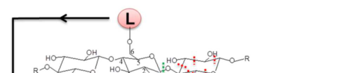

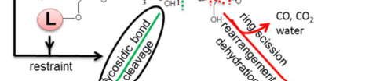

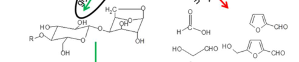

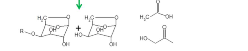

**Fig. 1.** Postulated pyrolysis mechanisms of cellulose covalently linked with lignin. (L: lignin) 

Color reproduction (above) on the Web and in black-and-white (below) in print 

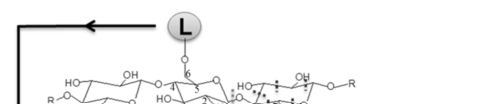

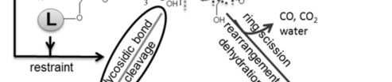

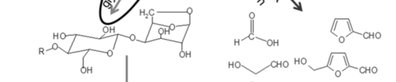

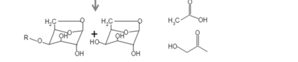

**Fig. 1.** Postulated pyrolysis mechanisms of cellulose covalently linked with lignin. (L: lignin) 

**ACS Paragon Plus Environment** 

**ACS Sustainable Chemistry & Engineering** 

**Page 32 of 32** 

32 

1 2 3 4 5 6 7 

## **For Table of Contents Use Only** 

8 

9 10 11 12 13 14 15 16 17 18 19 20 21 22 23 24 25 26 27 28 29 30 31 32 33 34 35 36 37 38 39 40 41 42 43 44 45 46 47 48 49 50 51 52 53 54 55 56 57 58 59 60 

## Cellulose-hemicellulose, cellulose-lignin interactions during fast pyrolysis 

Jing Zhang, Yong S. Choi, Chang G. Yoo, Tae H. Kim, Robert C. Brown, Brent H. Shanks 

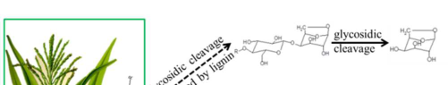

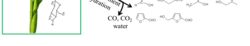

## **Synopsis** 

Cellulose in herbaceous biomass exhibited an apparent interaction with lignin during fast pyrolysis, leading to diminished levoglucosan yield and increased yield for furans and low molecular weight compounds. 

**ACS Paragon Plus Environment** 

