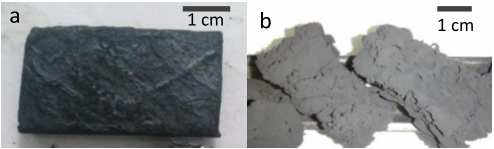
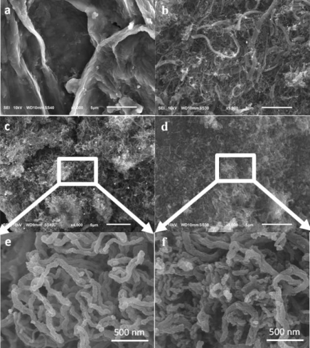
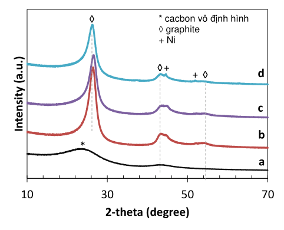
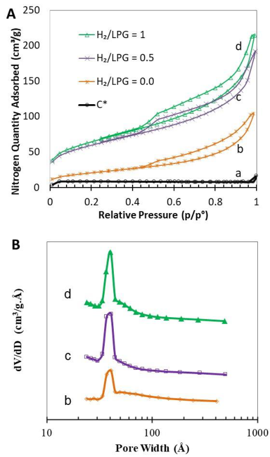

ISSN 1859-1531 - TẠP CHÍ KHOA HỌC VÀ CÔNG NGHỆ - ĐẠI HỌC ĐÀ NẴNG, VOL. 21, NO. 8.2, 2023 

155 

**TỔNG HỢP VẬT LIỆU CARBON NANO SỢI TRÊN NỀN THAN XỐP TỪ SỌ DỪA** SYNTHESIS OF CARBON NANOFIBERS ON POROUS COAL FROM COCONUT SHELL 

**Nguyễn Đình Minh Tuấn*, Biện Quốc Đạo, Lê Phước Hải, Trương Hữu Trì, Nguyễn Đình Lâm** _Trường Đại học Bách khoa - Đại học Đà Nẵng, Việt Nam[1]_ 

*Tác giả liên hệ / Corresponding author: ndmtuan@dut.udn.vn 

(Nhận bài / Received: 14/6/2023; Sửa bài / Revised: 11/7/2023; Chấp nhận đăng / Accepted: 8/8/2023) 

**Tóm tắt -** Vật liệu carbon nano sợi được tổng hợp trên xúc tác Ni phủ lên bề mặt tấm than xốp (C*) từ sọ dừa thải bằng phương pháp kết tụ hóa học từ pha hơi sử dụng khí dầu mỏ LPG làm nguồn carbon và hydro làm chất khử và chất pha loãng. Trong phương pháp này, than tổng hợp từ sọ dừa phế thải và dùng làm chất mang để phủ muối Ni[2+] rồi nung và khử trong dòng khí H2 ở 450⁰C để tạo xúc tác Ni. Tính chất hóa lý của vật liệu như hình thái, cấu trúc và bề mặt riêng, phân bố lỗ xốp được xác định bằng các phương pháp như nhiễu xạ tia X (XRD), kính hiển vi điện tử quét (SEM) và hấp phụ - giải hấp đẳng nhiệt nitơ. Vật liệu CNF tạo thành có đường kính đồng đều từ 50 – 80 nm, bề mặt riêng và thể tích xốp cao (207 – 224 m[2] /g và 0,25 – 0,29 cm[3] /g), có khối lượng từ 1,6 – 2,7 gram tính trên 1 gram tấm than xốp khi thay đổi tỉ lệ mol H2/LPG từ 0,5 đến 1,0. 

**Từ khóa -** carbon nano sợi; CNF; sọ dừa; xúc tác niken; kết tụ hóa học từ pha hơi 

**Abstract -** Carbon nanofibers (CNFs) materials are prepared via chemical vapor deposition (CVD) on Ni catalyst deposited on porous coal plates (C*), which were previously synthesized by the carbonization of coconut shells. The coal plates are used as support for preparing Ni/C* catalyst via three steps: impregnation of Ni[2+] , annealing, and reduction in a hydrogen flow. Morphology, structure, BET surface area, and porosity distribution of the CNF materials are characterized by X-ray Diffraction, Scanning Electron Microscope, and nitrogen isothermal adsorption-desorption. The produced CNFs material has homogeneous diameters (50 – 80 nm), a high surface area (207 – 224 m[2] /g), a pore volume (0.25 – 0.29 cm[3] /g), and a mass of 1.6 – 2.7 grams calculated by 1 gram of C* when the molar ratio of H2/LPG varied from 0.5 to 1.0. 

**Key words -** Carbon nanofibers; CNF; coconut shell; Nickel catalyst; chemical vapor deposition 

## **1. Đặt vấn đề** 

Vật liệu carbon nano sợi CNFs ( _Carbon Nanofibers_ ) đã thu hút được sự quan tâm của cộng đồng các nhà khoa học trong những thập niên vừa qua nhờ những đặc tính đặc biệt như độ bền cơ, dẫn điện tốt, diện tích bề mặt khá cao. Điều này làm cho CNFs có tiềm năng ứng dụng trong nhiều lĩnh vực như làm vật liệu hấp phụ, chất mang trong tổng hợp xúc tác, lưu trữ năng lượng, hay vật liệu composite cấu trúc nano ( _nanocomposite_ ) [1]. Kết tụ hóa học trong pha pha hơi là phương pháp thường được sử dụng để tổng hợp sợi CNFs với sự có mặt của xúc tác kim loại chuyển tiếp như Ni, Co Fe, phương pháp này có khả năng tạo ra CNFs cấu trúc nano chất lượng cao và có thể triển khai ở quy mô lớn [2]. Tuy nhiên, sản phẩm CNFs thu được từ phương pháp này ở dạng bột, có kích thước rất nhỏ. Điều này làm tăng trở lực khi CNFs được sử dụng làm vật liệu hấp phụ hoặc xúc tác trong các thiết bị phản ứng hoặc gây khó khăn trong việc phân tách sản phẩm khi dùng làm chất hấp phụ [3]. Để khắc phục nhược điểm vừa nêu, CNFs thường được tổng hợp và bám trên bề mặt các chất mang có cấu trúc macro như carbon felt, đá xốp monolith, foam SiC [3]–[5]. Nhưng bề mặt riêng của các loại chất mang này rất thấp làm giảm khả năng hấp phụ của sản phẩm cuối. 

Việt Nam là một quốc gia có diện tích trồng dừa lớn (>150 ngàn hecta), sản lượng dừa hằng năm hơn 1,5 triệu tấn [6]. Sọ dừa là vật liệu thải phổ biến, giá thành thấp và có hàm lượng carbon cao. Vì vậy, việc nghiên cứu sử dụng sọ dừa thải làm nguồn carbon trong tổng hợp vật liệu 

carbon có bề mặt riêng cao như than hoạt tính đã được quan tâm nghiên cứu bởi một số nhà khoa học [7], [8]. Hơn nữa, việc sử dụng sọ dừa, một loại vật liệu có thể tái sinh, làm nguồn carbon trong tổng hợp các hợp chất có giá trị cao hơn như than hoạt tính không chỉ mang lại lợi ích về kinh tế mà còn giúp giảm thiểu việc xử lý chất thải, thúc đẩy sự phát triển bền vững. 

Qua phân tích vừa nêu, nghiên cứu này trình bày kết quả nghiên cứu tổng hợp CNFs bám trên bề mặt than xốp có cấu trúc 3D được tổng hợp từ sọ dừa thải. Quá trình tổng hợp được thực hiện theo ba giai đoạn chính. Ở giai đoạn đầu, sọ dừa được cắt và xử lý để thu được vật liệu có hình theo mong muốn và tiến hành than hóa nhằm thu nhận than xốp có cấu trúc 3D (sản phẩm thu nhận được ký hiệu C*). Giai đoạn tiếp theo, than xốp C* được sử dụng làm chất mang cho xúc tác Ni/C*. Giai đoạn cuối là tổng hợp vật liệu CNFs bám trên bề mặt xúc tác Ni/C* bằng phương pháp kết tụ hóa học trong pha hơi, sử dụng khí dầu mỏ hóa lỏng làm nguồn carbon. Sản phẩm được ký hiệu CNF-C*. 

## **2. Thực nghiệm** 

## _**2.1. Nguyên vật liệu và hóa chất**_ 

Khí dầu mỏ hóa lỏng LPG ( _Liquefied Petroleum Gas_ ) được mua từ công ty cổ phần kinh doanh khí miền Bắc, đây là nguồn carbon rẻ tiền, dễ kiếm có thành phần chủ yếu là các hydrocarbon nhẹ propan (C3) và butan (C4). Muối Ni(NO3)2.6H2O (>98,5%, Xilong, Trung Quốc). Bình khí H2 có độ tinh khiết 99,99% được mua từ công ty Việt 

1 The University of Danang – University of Science and Technology, Vietnam (Nguyen Dinh Minh Tuan, Bien Quoc Dao, Le Phuoc Hai, Truong Huu Tri, Nguyen Dinh Lam) 

Nguyễn Đình Minh Tuấn, Biện Quốc Đạo, Lê Phước Hải, Trương Hữu Trì, Nguyễn Đình Lâm 

156 

Nguyễn, khí H2 được sử dụng trong quá trình tổng hợp xúc tác Ni/C* và trong giai đoạn tổng hợp CNFs nhằm làm giảm nồng độ của khí LPG trong môi trường phản ứng. Bình khí N2 và Ar có độ tinh khiết 99,9% từ nhà máy khí Dagasco Đà Nẵng. 

Sọ dừa thải được phơi khô, làm sạch và cắt gọt tạo thành các mẫu hình chữ nhật với kích thước 2 cm × 4 cm. Các mẫu này được đưa vào lò nung ở 300[o] C để sấy khô và phân hủy các hợp chất hữu cơ. Quá trình than hóa được thực hiện trong lò ống với môi trường khí trơ Ar ở nhiệt độ 750[o] C, tốc độ gia nhiệt là 10[o] C/phút và thời gian than hóa là 3 giờ. 

## _**2.2. Tổng hợp tiền chất xúc tác Ni trên chất mang C***_ 

Quá trình đưa pha hoạt tính Ni trên chất mang C* được thực hiện bằng phương pháp tẩm dung dịch chứa tiền chất muối niken nitrate trên nền than xốp C* thu được từ quá trình than hóa sọ dừa. Cụ thể, một lượng muối Ni(NO3)2.6H2O được hòa tan vào 3 mL nước tạo ra dung dịch. Lượng muối được tính toán sao cho đạt được 2%wt Ni trên chất mang C*. Quá trình tẩm được thực hiện nhiều lần cho đến khi hết lượng dung dịch muối Ni(NO3)2 bằng cách luân phiên hai thao tác (i) nhỏ giọt dung dịch muối nitrate đến thấm ướt đều chất mang, (ii) sấy ở 110°C trong 2 giờ. Mẫu xốp C* đã tẩm dung dịch muối được sấy ở 110[o] C trong 12 giờ để đuổi hết dung môi. Sau quá trình sấy, mẫu được nung ở 350[o] C trong 2 giờ trong lò nung Naberthem nhằm mục đích phân hủy muối nitrate thành NiO. Quá trình khử NiO về kim loại tương ứng sẽ được thực hiện trong lò phản ứng tổng hợp CNFs. 

## _**2.3. Tổng hợp CNF**_ 

Để tổng hợp CNFs, mẫu sau quá trình nung được lấy ra, đưa vào thuyền sứ và đặt vào giữa ống phản ứng bằng thạch anh có đường kính 42 mm, chiều dài 1600 mm. Hệ thống thiết bị được gia nhiệt đến 450[o] C và dòng khí H2 có lưu lượng 100 mL/phút được dẫn qua mẫu, quá trình khử được thực hiện trong 1 giờ. Ngay sau quá trình khử ở 450°C, nhiệt độ của hệ phản ứng được nâng lên đến 710[o] C. Sau đó, dòng khí H2 được thay thế bằng dòng khí chứa LPG và H2 có lưu lượng 100 mL/phút và tỷ lệ H2/LPG lần lượt là 0; 0,5 và 1,0 Các mẫu được ký hiệu lần lượt là CNF0, CNF0.5 và CNF1.0 tương ứng với tỉ lệ H2/LPG bằng 0; 0,5 và 1,0. Khối lượng CNFs tạo thành được tính trên 1 gram M2 NiO/C* sử dụng theo công thức m = M1 (1) 

Trong đó: M1 và M2 là khối lượng của NiO/C* và sản phẩm CNF-C*. 

## _**2.4. Xác định các tính chất hóa lý**_ 

Tính chất hóa lý như thành phần pha và hình thái bề mặt của các mẫu than xốp C* và CNF-C* được xác định bằng thiết bị hiện đại như nhiễu xạ tia X (Smartlab – Rigaku, nguồn Cu Kα, bước song λ = 1.54178 Å, 40kV và 30 mA) và kính hiển vi điện tử (SEM, 6020-LV Jeol). Bề mặt riêng và phân bố lỗ xốp được tính toán thông qua các mô hình BET ( _Brunauer, Emmett, Teller_ ) và BJH ( _Barrett, Joyner, Halenda_ ) từ số liệu hấp phụ giải hấp thu được từ phương pháp hấp phụ đẳng nhiệt nitơ ở -196 ⁰C thực hiện trên máy ASAP 2020 (Micromeritics). Trước khi thực hiện quá trình hấp phụ, các mẫu được loại bỏ khí hấp phụ ( _degas_ ) trong chân không ở 150°C trong 2 giờ. 

## **3. Kết quả và thảo luận** 

Sau khi than hóa ở 750°C trong môi trường khí Ar, sọ dừa đã chuyển thành than C* có màu đen như Hình 1a. Hình 1b là sản phẩm CNF-C* thu được sau quá trình tổng hợp. Màu sắc của mẫu nhạt hơn so với mẫu trước tổng hợp. Khối sản phẩm tạo thành được tính toán theo công thức (1), kết quả được trình bày trong Bảng 1. 

_**Bảng 1.** Một số thông số và tính chất của sản phẩm_ 

||Mẫu C* CNF0 CNF0.5 CNF1.0|Tỷ lệ H2/LPG - 0,0 0,5 1,0|m (g) - 3,1 2,7 1,6|Dc (nm)1 3,8 3,7 3,3|SBET (m2/g) 25 75 207 224|Vp (cm3/g) 0,01 0,16 0,25 0,29|dp (nm) 4 4 4|
|---|---|---|---|---|---|---|---|

_1 Dc: Kích thước tinh thể tính theo công thức Scherrer tại pic 2θ=26.5°; SBET: Diện tích bề mặt riêng; Vp: Thể tích xốp; dp: đường kính mao quản_ 

Từ kết quả Bảng 1 cho thấy, khi tăng tỷ lệ H2/LPG thì sản phẩm CNFs tạo thành giảm. Điều này có thể giải thích là do khi tăng tỷ lệ H2/LPG, nồng độ của LPG hay carbon trong môi trường phản ứng giảm, làm giảm sự hình thành sản phẩm trên bề mặt than xốp C*. 

**----- Start of picture text -----** 
a 1 cm b 1 cm **----- End of picture text -----** 

_**Hình 1.** Ảnh mẫu a) than xốp C* và b) sản phẩm sau tổng hợp_ 

## _**3.1. Hình thái vi cấu trúc**_ 

Để chứng minh sự tồn tại của các sợi CNFs, mẫu được phân tích bằng kính hiển vi điện tử quét SEM. Ảnh chụp được trình bày trên Hình 2. 

_**Hình 2.** Ảnh SEM của các mẫu a) than xốp; và sợi CNFs tổng hợp với tỉ lệ H2/LPG bằng: b, e) 0; c) 0,5; và d, f) 1,0_ 

ISSN 1859-1531 - TẠP CHÍ KHOA HỌC VÀ CÔNG NGHỆ - ĐẠI HỌC ĐÀ NẴNG, VOL. 21, NO. 8.2, 2023 

157 

Hình 2a là ảnh SEM của bề mặt than xốp. Hình 2b, 2c và 2d lần lượt là ảnh SEM của vật liệu sau tổng hợp với tỷ lệ H2/LPG bằng 0; 0,5, và 1,0. Từ các ảnh chụp được ta có thể thấy, bề mặt của mẫu sau tổng hợp có nhiều vật liệu dạng sợi. Điều này khác hoàn toàn so với vật liệu trước tổng hợp. Quan sát kỹ cho thấy mẫu tổng hợp khi không có mặt khí H2, bề mặt mẫu CNF0 có nhiều sợi với kích thước không đồng đều (Hình 2b). Ngược lại, khi có mặt khí H2 trong môi trường phản ứng với tỉ lệ H2/LPG là 0,5 và 1,0, các sợi có kích thước khá đồng đều (Hình 2c, 2d). Từ kết quả ảnh SEM với độ phóng đại lớn hơn được trình bày trên Hình 2e, 2f, ta có thể khẳng định rằng vật liệu được tổng hợp có kích thước đồng đều khi có mặt H2 và nằm trong khoảng 50 - 80 nm và không có sự khác nhau nhiều về kích thước khi tỷ lệ H2/LPG thay đổi. Kết quả này khá tương đồng với kết quả được thu được của cùng nhóm tác giả khi nghiên cứu tổng hợp CNFs bám trên bề mặt vật liệu felt carbon [3], [9]. 

## _**3.2. Cấu trúc của vật liệu**_ 

Hình 3 biểu diễn giản đồ XRD của các mẫu vật liệu than xốp từ sọ dừa và CNFs tổng hợp với tỉ lệ H2/LPG khác nhau. Giản đồ XRD của mẫu than hoạt tính gồm một pic rất rộng có đỉnh ở 23,3° và trải dài từ 14,4° cho đến hơn 30° và một pic nhỏ ở 2θ bằng 43,5° (đường a). Pic đầu tiên tại 23,3° đặc trưng cho sự tồn tại của carbon ở dạng vô định hình trong khi đó pic thứ hai thể hiện sự có mặt của tinh thể graphite [10], [11]. Khi tổng hợp CNF theo các tỷ lệ H2/LPG bằng 0; 0,5 và 1,0, các giản đồ XRD có sự xuất hiện của các pic đặc trưng cho graphite tại 2θ bằng 26,5°, 43,5° và 54,3° (ICDD-PDF#056-0160) và của một pic đặc trưng cho xúc tác Ni tại 2θ bằng 44,8° (ICDDPDF#071-4655). Khi tăng tỷ lệ H2/LPG, cường độ pic của graphite giảm nhẹ. Kích thước tinh thể Dc của graphite của CNF được tính theo công thức Scherrer tại pic 2θ=26,5°, kết quả được cho trong Bảng 1. Giá trị Dc giảm nhẹ từ 3,8 nm về 3,3 nm. 

**----- Start of picture text -----** 
◊ * cacbon vô định hình ◊graphite + Ni ◊+ + ◊ d c b * a 10 30 50 70 2-theta (degree) Intensity (a.u.) **----- End of picture text -----** 

_**Hình 3.** Giản đồ nhiễu xạ tia X của các mẫu vật liệu a) than xốp; và sợi CNFs tổng hợp với tỉ lệ H2/LPG bằng: b) 0; c) 0,5; và d) 1,0_ 

## _**3.3. Tính chất kết cấu xốp của vật liệu**_ 

Hình 4A biểu diễn đường đẳng nhiệt hấp phụ và giải hấp phụ của các mẫu CNF-C* đo ở nhiệt độ 77K. Vòng trễ 

tạo ra giữa đường hấp phụ và giải hấp trên các mẫu khá rõ và phân bố từ P/Pᴼ 0,45 đến 1,0. Theo phân loại của UIPAC, vòng trễ này cho biết vật liệu thuộc loại mao quản trung bình loại IV, đặc trưng lỗ xốp loại H3 có dạng hình tấm [12]. Trong khi đó vòng trễ rất nhỏ của than hoạt tính cho thấy vật liệu này gần thuộc loại I với các vi xốp có đường kính nhỏ hơn 1 nm. Diện tích bề mặt riêng tính theo phương pháp BET được cho trong Bảng 1. Chúng ta có thể thấy vật liệu CNF-C* được tổng hợp có bề mặt riêng khoảng 207 - 224 m[2] /g khi tổng hợp với tỉ lệ H2/LPG từ 0,5 đến 1,0. Giá trị này lớn hơn trong trường hợp không có hydro trong môi trường phản ứng. Kết quả này phù hợp với hình thái SEM của sợi CNFs, sợi nhỏ có diện tích bề mặt riêng lớn hơn. Hình 4B biểu diễn phân bố kích thước lỗ xốp của vật liệu CNF phân bố từ 3 đến 5 nm. 

_**Hình 4.** A) Đường đẳng nhiệt hấp phụ - giải hấp ở 77 K; và B) phân bố kích thước mao quản thu được của các mẫu vật liệu a) than xốp; và sợi CNFs tổng hợp với tỉ lệ H2/LPG bằng: b) 0; c) 0,5; và d) 1,0_ 

## **4. Kết luận** 

Nghiên cứu này đã thành công trong việc tổng hợp than xốp carbon từ sọ dừa thải, rồi sử dụng chúng để làm chất mang cho vật liệu carbon nano sợi. Sản phẩm CNF-C* thu được có bề mặt riêng lớn, bề mặt riêng này khá cao so với tấm than xốp từ sọ dừa (25 m[2] /g). Như vậy, vật liệu này khá phù hợp để làm chất hấp phụ trong xử lý khí, nước ô nhiễm hoặc có thể làm chất mang trong các phản ứng hóa 

Nguyễn Đình Minh Tuấn, Biện Quốc Đạo, Lê Phước Hải, Trương Hữu Trì, Nguyễn Đình Lâm 

158 

học. Kết quả cho thấy tính khả thi của việc sử dụng vỏ dừa thải cho quá trình tổng hợp CNFs, nhấn mạnh tiềm năng phát triển các phương pháp bền vững và hiệu quả về chi phí cho tổng hợp các vật liệu nano. 

## **TÀI LIỆU THAM KHẢO** 

- [1] L. Feng, N, Xie, and J Zhong. “Carbon Nanofibers and Their Composites: A Review of Synthesizing, Properties and Applications”, _Materials_ , vol. 7, no. 5, pp. 3919–45, 2014. 

- [2] J. C. Ruiz-Cornejo, D. Sebastián, and M. J. Lázaro “Synthesis and Applications of Carbon Nanofibers: A Review”, _Reviews in Chemical Engineering_ , vol. 36, no. 4, pp. 493–511, 2020, https://doi.org/10.1515/revce-2018-0021. 

- [3] L. Truong-Phuoc _et al.,_ “Silicon Carbide Foam Decorated with Carbon Nanofibers as Catalytic Stirrer in Liquid-Phase Hydrogenation Reactions”, _Applied Catalysis A: General_ , vol. 469, pp. 81–88, 2014, https://doi.org/10.1016/j.apcata.2013.09.032. 

- [4] N. A. Jarrah, O. J. G, and L. Lefferts “Growing a Carbon Nano-Fiber Layer on a Monolith Support; Effect of Nickel Loading and Growth Conditions”, _Journal of Materials Chemistry_ , vol. 14, no. 10, p. 1590-1597, 2004, https://doi.org/10.1039/b314585a. 

- [5] Trì, Trương Hữu, et al. “ Synthesis Carbon Nano Fiber on Carbon felt’s Surface Using LPG”. _The University of Danang - Journal of Science and Technology,_ vol. 17, no. 5, pp. 63–67, 2019. 

- [6] Ben Tre Coconut Association, “Vietnam: Coconut area and output by 2020”, Ben Tre Department of Industry and Trade, 01/12/202, [Online]. Availabe: http://congthuongbentre.gov.vn/viet-nam-dien- 

   - tich-va-san-luong-dua-den-nam-2020.html, [Accessed 10/06/2023]. 

- [7] M. K. B. Gratuito, T. Panyathanmaporn, R-A Chumnanklang, N. Sirinuntawittaya, A. Dutta, “Production of Activated Carbon from Coconut Shell: Optimization Using Response Surface Methodology”, _Bioresource Technology_ , vol. 99, no. 11, pp. 4887– 95, 2008, https://doi.org/10.1016/j.biortech.2007.09.042. 

- [8] Z.Hu and M.P Srinivasan. “Preparation of High-Surface-Area Activated Carbons from Coconut Shell”, _Microporous and Mesoporous Materials_ , vol. 27, no. 1, pp. 11–18, 1999, https://doi.org/10.1016/S1387-1811(98)00183-8. 

- [9] D. T.Hy, L. D. Nguu, P. H. Linh, N. D. Lam and T. H. Tri. “ Study on the effect of porous carbon surface functionalization of product performance and properties in the synthesis of C-CNF composite nanocompounds”, _Chemistry Journal_ , vol. 57, no. 61E1,2, 2019, pp. 151–157. 

- [10] M. Okamura, A. Takagaki, M. Toda, and Junko N Kondo, “AcidCatalyzed Reactions on Flexible Polycyclic Aromatic Carbon in Amorphous Carbon”, _Chemistry of Materials_ , vol. 18, no. 13, pp. 3039–45, 2006, https://doi.org/10.1021/cm0605623. 

- [11] M. Zięzio, B. Charmas, K. Jedynak, M. Hawryluk, and Karolina Kucio “Preparation and Characterization of Activated Carbons Obtained from the Waste Materials Impregnated with Phosphoric Acid(V)”, _Applied Nanoscience_ , vol. 10, no. 12, pp. 4703–16, 2020, https://doi.org/10.1007/s13204-020-01419-6. 

- [12] S. Fu _et al.,_ “Accurate Characterization of Full Pore Size Distribution of Tight Sandstones by Low‐temperature Nitrogen Gas Adsorption and High‐pressure Mercury Intrusion Combination Method”, _Energy Science & Engineering_ , vol. 9, no. 1, pp. 80–100, 2021, https://doi.org/10.1002/ese3.817. 

