_**micromachines**_ 

## _Review_ 

## **Biomass-Derived Carbon-Based Electrodes for Electrochemical Sensing: A Review** 

**Christian Onfray * and Abdoulaye Thiam *** 

Programa Institucional de Fomento a la Investigación, Desarrollo e Innovación, Universidad Tecnológica Metropolitana, Santiago 8940577, Chile 

***** Correspondence: confrayc@utem.cl (C.O.); athiam@utem.cl (A.T.); Tel.: +56-2-2787-7906 (A.T.) 

**Abstract:** The diverse composition of biomass waste, with its varied chemical compounds of origin, holds substantial potential in developing low-cost carbon-based materials for electrochemical sensing applications across a wide range of compounds, including pharmaceuticals, dyes, and heavy metals. This review highlights the latest developments and explores the potential of these sustainable electrodes in electrochemical sensing. Using biomass sources, these electrodes offer a renewable and cost-effective route to fabricate carbon-based sensors. The carbonization process yields highly porous materials with large surface areas, providing a wide variety of functional groups and abundant active sites for analyte adsorption, thereby enhancing sensor sensitivity. The review classifies, summarizes, and analyses different treatments and synthesis of biomass-derived carbon materials from different sources, such as herbaceous, wood, animal and human wastes, and aquatic and industrial waste, used for the construction of electrochemical sensors over the last five years. Moreover, this review highlights various aspects including the source, synthesis parameters, strategies for improving their sensing activity, morphology, structure, and functional group contributions. Overall, this comprehensive review sheds light on the immense potential of biomass-derived carbon-based electrodes, encouraging further research to optimize their properties and advance their integration into practical electrochemical sensing devices. 

**Keywords:** biomass waste; carbon-based electrode; circular economy; green synthesis; low-cost catalyst 

**Citation:** Onfray, C.; Thiam, A. Biomass-Derived Carbon-Based Electrodes for Electrochemical Sensing: A Review. _Micromachines_ **2023** , _14_ , 1688. https://doi.org/ 10.3390/mi14091688 

Academic Editor: James F. Rusling 

Received: 1 August 2023 Revised: 22 August 2023 Accepted: 27 August 2023 Published: 29 August 2023 

**Copyright:** © 2023 by the authors. Licensee MDPI, Basel, Switzerland. This article is an open access article distributed under the terms and conditions of the Creative Commons Attribution (CC BY) license (https:// creativecommons.org/licenses/by/ 4.0/). 

## **1. Introduction** 

Biomass (BM) refers to a diverse range of biogenic organic and inorganic solid products formed through natural and anthropogenic processes. It includes natural constituents originating from land and water vegetation, as well as from waste materials resulting from animal and human food digestion. Additionally, BM includes technogenic by-products derived from processing various natural resources. With the global population’s everincreasing demand for food, technology, energy, and essential resources, coupled with the intensification of agricultural, industrial, and forestry activities, vast quantities of biomass wastes are generated annually. 

Biomass, as a renewable resource, exhibits remarkable potential in the development of cost-effective materials with high activity for various applications, including energy production, energy storage, H2 storage, catalysis, adsorption, wastewater treatment, CO2 capture, solar cells, drug delivery, and sensing [1–4]. Generally, biomass comprises three major components: hemicellulose, cellulose, and lignin. However, the chemical composition of biomass varies significantly due to its wide variety and quantity, primarily influenced by the source and treatment methods employed for its conversion. The classification most used for sorting biomass waste is related to their origin in nature, such as (i) herbaceous biomass, (ii) woody biomass, (iii) animal and human waste, (iv) aquatic biomass, (v) fungi-derived biomass, and (vi) industrial waste, all of which can also be divided into several subgroups. The chemical compositions of the main groups are tabulated in Table 1. 

_Micromachines_ **2023** , _14_ , 1688. https://doi.org/10.3390/mi14091688 

https://www.mdpi.com/journal/micromachines 

_Micromachines_ **2023** , _14_ , 1688 

2 of 26 

**Table 1.** Range of chemical composition of different biomass classifications [5]. 

|**Biomass Group**|**C %**|**O %**|**H %**|**S %**|**N %**|**Volatile Matter %**|**Fixed Carbon %**|**Moisture %**|**Ash %**|
|---|---|---|---|---|---|---|---|---|---|
|Herbaceous biomass|42–58|34–49|3–9|<1–1|<1–3|41–77|9–35|4–48|1–19|
|Woody biomass|49–57|32–45|5–10|<1–1|<1–1|30–80|6–25|5–63|1–8|
|Animal and human waste|57–61|21–25|7–8|1–2|6–12|43–62|12–13|3–9|23–34|
|Aquatic biomass|27–43|34–46|4–6|1–3|1–3|42–53|22–33|8–14|11–38|

The composition of naturally derived biomass is intricately influenced by various factors, including the species and specific part of the trees or plants, their growing conditions (such as sunlight, geographic location, climate, seasons, soil types, water availability, pH, and nutrient content), and potential contamination from pollution, fertilizer, and pesticide usage, harvesting time, and collection technique, among many others [6]. Besides the significant presence of C, H, and O, biomass residues also contain smaller concentrations of elements such as S and N. Additionally, trace amounts of Al, Mn, Na, Si, Ca, Cl, Fe, K, Mg, and P have been detected in biomass residues. 

In general, naturally derived biomass has been highlighted due to its excellent properties, such as thermal stability, mechanical strength, crystallinity, and surface modifiability, which allows the modulation of the properties according to the application of interest [3]. In contrast to the uniform and well-controlled structure commonly observed in traditional materials, biomass materials are conformed by natural uniformed structures, which reach down to the nanoscale. These inherent characteristics confer interesting properties to the prepared materials, including good mechanical and electrochemical properties. Notably, a strong relationship between the structure of porous carbon materials and their electrochemical properties has been established. The porous structure usually goes hand-in-hand with a large surface area, which allows the proper diffusion of the analyte molecules to and from pores over the whole surface, considerably improving the performance of the electrochemical sensor. This relation empowers the rational design of new biomass-derived porous carbon materials for electrochemical applications, including their applications in supercapacitors, batteries, and electrochemical sensors [5]. 

Several materials, such as metallic materials (Hg, Pt, Au, Ag, stainless steel), metal oxides (iron oxides, manganese oxide, titanium oxide, cobalt oxide), carbon-based (glassy carbon, graphite, carbon black, fullerenes, carbon nanotubes, graphene-related materials), hybrid materials, metal–organic frameworks (MOFs), organic polymers, and different nanomaterials, have been studied over the last decades to prepare electrochemical sensors with good detection performance. Regarding this, carbon-based materials have become popular because they have been shown to be good candidates for electrochemical sensing. Carbon-based materials have relatively inert electrochemistry and high electrochemical activity for many redox reactions, their surface can be easily modified, and they are relatively cheap. In this context, biomass-derived carbon-based materials have become more popular over recent years due to their abundant precursors in the natural environment and the easier synthesis methods, which considerably reduce the cost of fabrication of novel electrochemical sensors. Furthermore, the use of biomass-derived carbon-based materials for electrochemical applications not only allows the possibility of fabricating rapid, sensitive, and robust sensors, but also allows the reuse of the wastes generated by the world’s needs and the evolution of technology. This permits sustainable practice in sensing and developing a circular economy. 

Biomass-derived carbon materials have been synthesized for many applications in different dimensions and sizes, which, together with some other features such as surface area, porosity, conductivity, and stability, determine the sensor performance. The most 

- Zero-dimensional (0D): These are monodispersed spherical nanoparticles with an average size of less than 10 nm, composed of a carbon-based core with several functional groups attached to the surface (such as hydroxyl, carboxyl, and amino groups [7]. 

_Micromachines_ **2023** , _14_ , 1688 

3 of 26 

Moreover, 0D carbons, such as carbon quantum dots and fullerenes, have been studied 

- One-dimensional (1D): This category includes 1D biomass materials with a fibrous or tubular structure. 

- Two-dimensional (2D): These carbonaceous materials exhibit sp[2] hybridization, offering high energy storage and conversion potential due to their abundant active surface edges and strong in-plane covalent bonding. 

- Three-dimensional (3D): Biomass structures in 3D form possess well-connected and large pores, facilitating a continuous electron channel for efficient electrical contact, thereby accelerating the ion transfer. 

The following review classifies, summarizes, and analyses different research made over the last 5 years, including the main methodologies for the development of new carbonbased materials for electrochemical sensing using biomass and biomass-derived wastes as precursors. The review also highlights the different sources, such as herbaceous, wood, animal and human wastes, aquatic, and industrial waste, along with several strategies made for the modulation of their physicochemical properties to enhance their sensing performance. A discussion of several analytical parameters using different materials is also presented. 

## **2. Synthesis Methods** 

Biomass-derived carbon materials can be prepared using various methods depending on the desired application and the type of biomass required; however, the most commonly employed techniques for electrochemical applications are described below and illustrated in Figure 1. The synthesis method and associated parameters, such as temperature, pressure, residence time, pH, gas atmosphere, solvent, and substrate concentration, play a pivotal role in determining the structure and activity of the resulting material. Carefully controlling these synthesis parameters is crucial in tailoring the carbon material’s properties to meet specific electrochemical requirements [8,9]. 

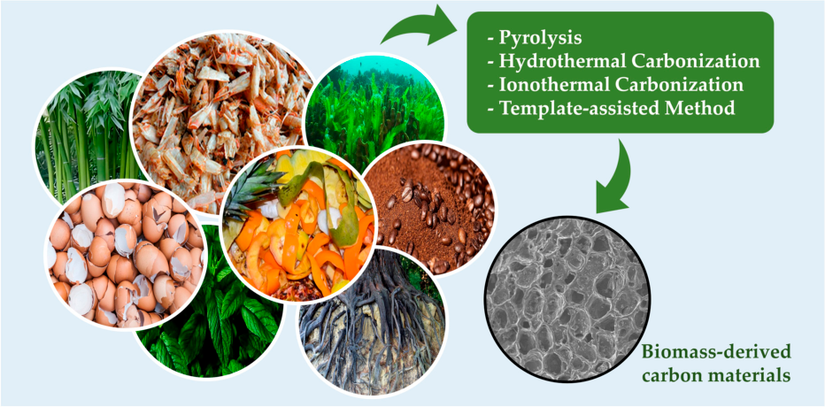

**Figure 1.** Main synthesis methods for preparing biomass-derived carbon materials for sensing applications. 

## _2.1. Pyrolysis of Biomass_ 

The method most commonly employed for obtaining carbon materials from biomass is pyrolysis. In this process, carbon materials are heated at high temperatures in the presence of an inert atmosphere, leading to the formation of liquid (bio-oil), solid (which is frequently known as charcoal or char), and gaseous (combustible gas) products. During pyrolysis, 

_Micromachines_ **2023** , _14_ , 1688 

4 of 26 

when samples are heated, the moisture becomes volatilized, eliminating gases like CO2, CH4, and CO. Subsequently, hemicellulose undergoes degradation at temperatures ranging from 220 to 315 _[◦]_ C, followed by the pyrolysis of the cellulose and lignin at higher temperatures. This process generates single and multi-phenolic molecules, which then polymerize and recondense. The structure rearranges through cross-linking, leading to turbostratic graphene sheets [10]. By carefully adjusting the temperature and atmosphere and incorporating different catalysts, the morphology and physicochemical properties of the pyrolyzed materials can be effectively modulated. [11]. 

## _2.2. Hydrothermal Carbonization_ 

Hydrothermal carbonization (HTC) is a widely utilized thermochemical method for synthesizing porous carbon materials. It finds broad applications with carbohydrates, agricultural waste, forest by-products, and crude plant materials. In this process, precursors are heated at lower temperatures than pyrolysis (180–250 _[◦]_ C) under autogenous pressure maintained for a specific time. When the temperature is increased (>374 _[◦]_ C), the hydrogen bonds of water are weakened, generating its dissociation into acidic hydronium ions (H3O[+] ) and basic hydroxide ions ( _[−]_ OH). The generation of hydronium ions leads to acidcatalyzed reactions of organic compounds, generating diverse reactions, such as hydrolysis, dehydration, decarboxylation, polymerization, and aromatization. In this treatment, the hydrolysis process is followed by polymerization and the formation of spherical particles. HTC is categorized into four main groups based on operating conditions: High-temperature HTC, Low-temperature HTC, Microwave-assisted HTC, and Additive-assisted HTC [8,12]. Each variant offers unique advantages, making HTC a versatile and valuable technique for producing various porous carbon materials. 

## _2.3. Ionothermal Carbonization_ 

This method utilizes ionic liquids as crucial components, owing to their exceptional thermal stability, low solvent volatility, and high solubility with biomass. In this method, the ionic liquid is used for the solvent and template, which ideally eliminates the competition between solvent–catalyst and template–catalyst. This technique yields porous carbon materials with noteworthy attributes, including high surface area, excellent heteroatom doping, well-defined micro- and mesoporous distribution, and high carbonization yields. These characteristics contribute to improved ion transport and more active sites, making ITC a promising approach for synthesizing advanced porous carbon materials [13]. 

## _2.4. Template-Assisted Method_ 

This method is one of the most effective approaches for crafting porous carbonaceous materials with a precisely controlled structure and morphology. Utilizing templates guides the material’s growth during the process, enabling the creation of hollow microporous structures that offer a multitude of active sites and a high surface area, enhancing the physicochemical properties and yielding materials with higher electrochemical activity. Template-assisted methods can be classified into two groups: hard template-assisted synthesis and soft template synthesis. In the former, the hard template is challenging to remove; instead, in the soft template synthesis, the template can be easily removed after the carbonization step [14]. 

The advantages and disadvantages of the different methods are summarized in Table 2. While all of the mentioned methods have been employed, pyrolysis and hydrothermal carbonization stand out as the most widely used techniques for synthesizing biomassderived carbon materials in developing electrochemical sensors. A notable drawback of the pyrolysis method is the limited variety of functional groups on the material’s surface. However, to enhance the electrocatalytic properties, porosity, and specific structural features of the prepared materials, researchers have implemented various experimental strategies, as discussed in the following section. 

_Micromachines_ **2023** , _14_ , 1688 

5 of 26 

**Table 2.** Advantages and disadvantages of different methods used for the synthesis of BM-derived carbon materials. 

|**Method**|**Advantages**|**Disadvantages**|
|---|---|---|
|||Slow rate of production|
|Pyrolysis|Tunable properties User friendly|Signifcant air pollution Diffcult to know the mechanism Low variety of functional groups on the|
|||surface material|
|Hydrothermal carbonization|Less toxicity Tunable morphology Abundant heteroatoms can be doped|Large size of carbon particles Sealed vessel required|
||No need for the utilization of high temperatures and||
|Ionothermal carbonization|sealed vessels Abundant heteroatoms can be doped|Expensive|
||IL can be recovered and reused||
|||Diffcult to remove the template|
|Template-assisted method|Highly porous material|Low stability of the template at high temperatures Multi-step process|
|||More expensive|

## **3. Activity Enhancement Strategies** 

In the last decade, different attempts have been made to enhance the electrocatalytic activity of the existing biomass-derived carbon-based materials, leading to the exploration of various methods. The main strategies for this enhancement aim to increase the surface area by creating a surface with higher porosity, higher pore volume, and a higher number of active sites, along with doping with different features into the carbon-based structure. These modifications provide a higher electrocatalytic activity and adsorption capacity to the biomass-derived carbon-based catalyst. The following section discusses the most used strategies. 

## _3.1. Activation Process_ 

The most commonly used strategy to enhance the activity of carbon-based materials is the activation process, which involves physical, chemical, and/or microbial treatments. This process aims to optimize the material’s porous structure and modify the functional groups on the catalyst surface. Within the activation process, several methods stand out and are described below. The surface oxidation method utilizes temperature (>400 _[◦]_ C) and oxidants, such as HNO3, H2O2, KMnO4, H2SO4, and H3PO4, capable of hydrolyzing the carbon-based materials (Figure 2) and modifying the functional groups of its surface, achieving abundant oxygen-containing acid functional groups (e.g., carbonyl, carboxyl, ester, cyano groups) [15]. The surface can also be modified using temperature (>400 _[◦]_ C) and reducing agents, such as N2, H2, NH3, and some alkali salts, such as NaOH and KOH, achieving a surface with alkaline functional groups and with an increased nonpolarity [16–20]. Some other salts, such as ZnCl2, FeCl3, and K2CO3, have also been used. These treatments are usually performed to activate biomass materials containing cellulose, such as wood, sawdust, and fruit pits. Some operational variables that affect the characteristics and properties of the final product are the activator agent used, the amount of impregnation, the ratio, and the heating temperature. The main disadvantage of this method is the long washing step to remove the activator agent from the final mixture at the end of the activation process, besides the contaminated wastewater produced during this washing step [21]. 

_Micromachines_ **2023** , _14_ , 1688 

6 of 26 

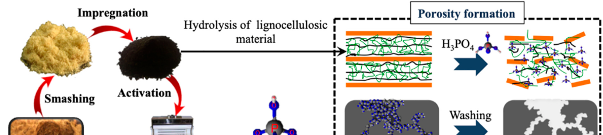

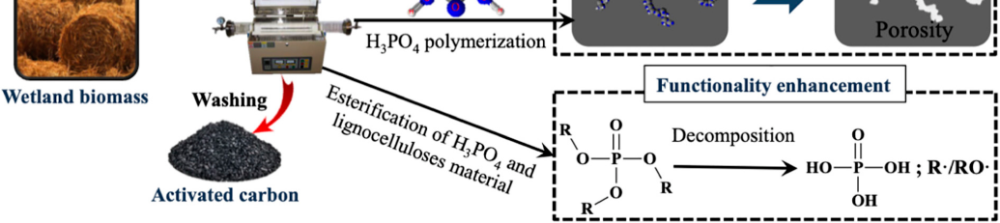

**Figure 2.** Scheme of activated carbon production from wetland biomass with conventional H3PO4 activation [20]. 

## _3.2. Heteroatom Doping_ 

Biomass-derived carbon materials are commonly doped with heteroatoms like B, N, P, and S. These heteroatoms are introduced into the carbon network of different molecules (Figure 3a) when the precursors are heated, developing a catalyst with a synergic effect on the carbon materials. This doping enhances their chemical and physicochemical properties, improving electrochemical sensing capabilities [22]. 

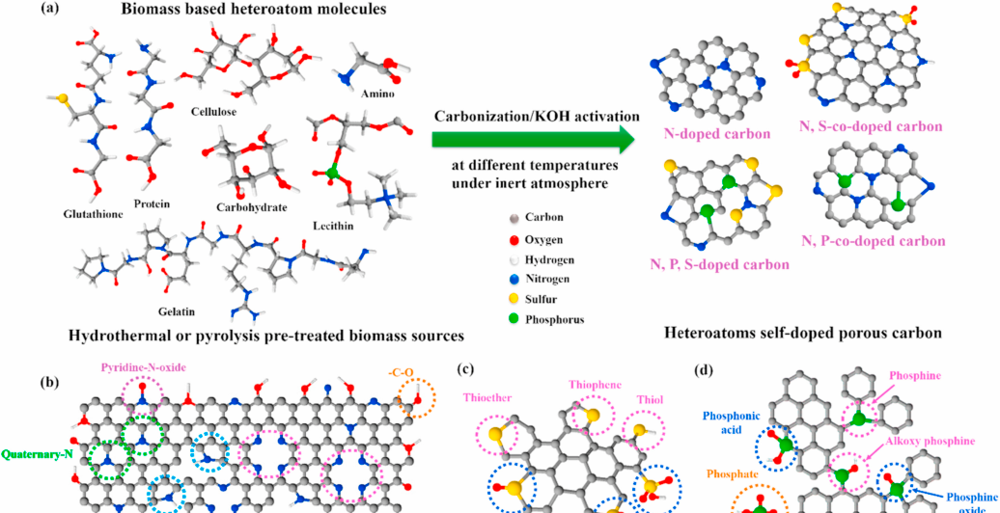

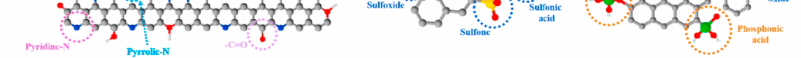

**Figure 3.** ( **a** ) Schematic illustration of heteroatoms self-doped porous carbon derived from biomass sources; types of ( **b** ) nitrogen, ( **c** ) sulfur, and ( **d** ) phosphorous [23]. 

_Micromachines_ **2023** , _14_ , 1688 

7 of 26 

Nitrogen is the most common heteroatom used due many reasons, mainly due to he following reasons: (a) its number of electrons can be easily tuned with C when doping; (b) N acts as an electron donor, giving more electrons to the delocalized carbon network, leading to an increase in electric conductivity; (c) the atomic radius of N is similar to C, which reduces the lattice mismatching. When N bonds to the sp[2] carbon network, different N-sites are formed, such as N-pyridine, N-pyrrolic, N-graphitic, and N-oxidized pyridine (Figure 3b), which all possess different activities. Sulfur has similar functional groups to oxygen (thiols, sulfides, disulfides). However, when S is introduced into the carbon network, its larger radius results in the disruption of the planar structure, creating defects that act as active sites for different redox reactions, and different sites such as thiophene, thioether, sulfoxide, sulfone, and sulfonic acid are formed (Figure 3c). Besides this, sulfur enhances the capacitive performance of the carbon framework due to the location of higher electron density at the surface of C due to its synergistic activation with the electron-rich sulfur. Phosphorus is an n-dopant element, which possesses the same doping characteristics of N, but possesses a larger radius of 0.110 nm than N (0.070 nm) and S (0.104 nm), resulting in a larger interlayer spacing. Moreover, P atoms regularly exhibit an sp[3] configuration, which causes distortions and an open-edge morphology of the carbon network, providing more active sites. Furthermore, P-doping introduces many P-O groups (Figure 3d), such as phosphate, phosphine, and phosphine oxide, on the carbon surface, improving its electrochemical properties. 

## _3.3. Other Activity Enhancement Strategies_ 

Along with the activation of the surface and the heteroatom doping, introducing other features into the carbon network has shown to improve the activity of the material. On the one hand, the introduction of metal sulfide into the carbonaceous materials enhances their affinity for target molecules due to the strong metal sulfide bond, facilitating binding interactions. This strategy also increases the effective surface area, creating more active sites and promoting electrolyte penetration and ion diffusion within the porous structure [24]. On the other hand, the introduction of metal, metal alloy, and metal oxide nanoparticles into the carbon structure has demonstrated superior catalytic performance, rapid mass transport, a high electroactive area, improved electrode–electrolyte interface, and enhanced electron transfer kinetics [25]. 

## **4. Classification and Applications** 

## _4.1. Herbaceous Biomass and Derivates_ 

Herbaceous biomass comprises a variety of plant forms, including grasses, flowers, stems, grains, seeds, leaves, roots, and fruit wastes. A significant amount of this waste comes from agricultural activities and by-products from the food, fiber, and agro-industries. Due to its abundance, cost-effectiveness, and ease of processing, herbaceous biomass and its derivatives are widely used for various applications [26]. 

## 4.1.1. Fruit-Derived Biomass 

Numerous fruit wastes, such as peels and husks from fruits like apples, bananas, oranges, pomelo, and dragon fruit, have been extensively studied for their potential to develop highly active electrochemical sensors [27–38]. In a study by Zhang et al. [39], an electrochemical catalyst was fabricated to simultaneously detect ascorbic acid, dopamine, and uric acid using differential pulse voltammetry (DPV) analysis. The authors prepared the catalyst by combining kiwi skin and zinc chloride nanoparticles (used as an activator) and subjected the mixture to pyrolysis treatment at 800 _[◦]_ C under an argon atmosphere. The catalyst exhibited a regular, uniformly distributed nanoporous structure with a high Brunauer, Emmett, Teller (BET) surface area ~1226 m[2] /g) and high pore volume (1.14296 cm[3] /g). The resulting sensor platform was created by modifying glassy carbon electrodes through drop-coating with the prepared catalyst (Figure 4). The constructed electrode showed a high surface area with micro and mesoporous structures and abundant edges and defects, 

_Micromachines_ **2023** , _14_ , 1688 

8 of 26 

which significantly enhanced contact with the active sites and facilitated redox reactions. Under optimized conditions, the system demonstrated remarkable sensitivity and selective response in the coexistence of ascorbic acid, dopamine, and uric acid. It achieved linear response ranges of 0.05–200 µM, 2–2000 µM, and 1–2500 µM, respectively, and detection limits (LODs) of 0.02 µM, 0.16 µM, and 0.11 µM, respectively. The excellent sensing performance was attributed to the abundant edges and defects of the surface of the prepared catalyst, which facilitate the electrolyte penetration and transportation, and to the high contact probability between the reactant molecules and the active sites. 

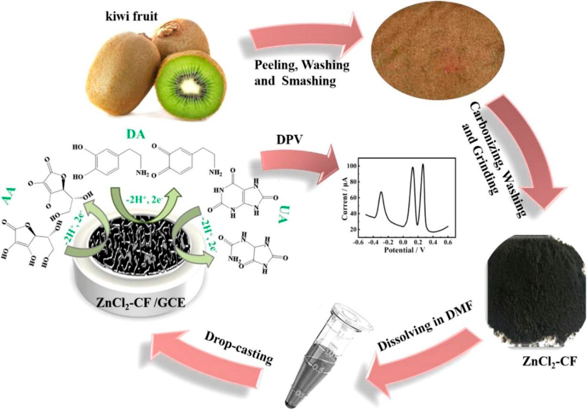

**Figure 4.** Schematic methodology for preparing the electrochemical sensor using kiwi peel [39]. 

Recently, El Hamdouni et al. [40] developed an eco-friendly walnut shell biochar for the electrochemical simultaneous detection of different heavy metal ions (Cd[2+] , Pb[2+] , Cu[2+] , Hg[2+] ) in water and soil by square-wave voltammetry (SWV). The catalyst was prepared by pyrolysis of walnut shell at 600 _[◦]_ C for 2 h under vacuum. Subsequently, the carbon paste electrode was prepared by mixing the walnut shell biochar with graphite, which was then covered on the surface with poly-tyrosine by electrodeposition. The covering introduced many -OH and -COOH groups to the surface, constituting the possible binding sites for positively charged analytes. Electrochemical characterization demonstrated that the prepared electrode exhibited a synergistic effect between p-tyrosine and biochar, resulting in an increased electroactive surface area and improved electrical properties of the electrode. Consequently, the sensor displayed excellent sensitivity towards heavy metal ions, achieving low LODs close to 0.0001, 0.0002, 0.0002, and 0.0004 µM for Cd[2+] , Pb[2+] , Cu[2+] , and Hg[2+] , respectively. The development of this eco-friendly sensor using walnut shell biochar demonstrates its potential as a cost-effective and efficient material for the electrochemical detection of heavy metal ions in environmental samples. 

_Micromachines_ **2023** , _14_ , 1688 

9 of 26 

## 4.1.2. Plant- and Leaf-Derived Biomass 

The unique chemical composition and three-dimensional structures of plant- and leafderived biomass provide ample opportunities for engineering novel electrode materials with tailored properties. These properties include large surface areas, hierarchical porous structures, and the ability to capture and interact with analytes of interest, resulting in improved electrochemical sensing performance [41–50]. Manickaraj et al. [51] successfully developed a highly porous houseplant ( _Sansevieria trifasciata)_ biomass-derived activated carbon using a supercritical CO2 route. The catalyst was fabricated for Metol electrochemical sensing, utilizing a modified screen-printed carbon electrode by DPV analysis. The fabrication of the SC-ST-AC catalyst involved a thermal and activation process. The biomass was pre-carbonized at 400 _[◦]_ C for 4 h under an N2 atmosphere, followed by a chemical activation process using a 3 M KOH solution for 12 h. Subsequently, the sample was subjected to the CO2 process and was further heated at 600 _[◦]_ C for 2 h under a N2 atmosphere. The prepared catalyst exhibited higher porous architecture and superior phase purity with an amorphous nature compared to the catalyst obtained for a conventional method. Moreover, the process not only facilitated the porous nature, but also enhanced the activation reaction kinetics, contributing to its enhanced electrochemical performance. The presence of the porous nature on the carbon surface was attributed to the reaction of K[+] from KOH with the carbon on the biomass-derived surface (1)–(6). 

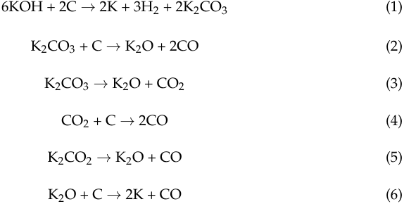

Furthermore, the optimized catalyst exhibited a superior detection limit (0.005 µM L _[−]_[1] ) and sensitivity (0.854 µA µM _[−]_[1] cm _[−]_[2] ), which were attributed to the higher porous, active sites, and charge transfer efficiency of the prepared catalyst. The development of this highly porous biomass-derived activated carbon presents a promising approach for efficient electrochemical sensing applications, with potential implications in various analytical and environmental monitoring systems. Similarly, a cost-effective, green, and environmentally friendly phosphorous-doped nitrogenous porous carbon material was fabricated by Huang et al. [52] using lotus leaves for the electrochemical and simultaneous sensing of ascorbic acid, dopamine, and uric acid. The prepared catalyst showed a high BET surface area and mesoporous structure, facilitating low resistance channels and providing more active sites, thereby enhancing the electrochemical sensing performance. Electrochemical characterization revealed that the phosphorous-doped nitrogenous porous carbon material-modified glassy carbon electrode improved the conductivity and promoted electron transmission compared to the bare glassy carbon electrode (Figure 5A). Moreover, the prepared electrode demonstrated distinct and higher oxidation peak currents for ascorbic acid, DA, and UA using cyclic voltammetry (Figure 5B) and DPV (Figure 5C) compared with the bare glassy carbon electrode. The authors attributed this improvement to two potential factors: (i) the formation of hydrogen bonds between the three molecules and the nitrogen atom in the phosphorous-doped nitrogenous porous carbon material surface and (ii) the high surface area of the phosphorous-doped nitrogenous porous carbon material, which promotes the electrochemical signals. The effect of the pH was also studied (Figure 5D), revealing a shift of the oxidation peak potentials toward more negative values when the pH increases, indicating that a proton transfer accompanies the oxidation of 

_Micromachines_ **2023** , _14_ , 1688 

10 of 26 

the analytes. The optimization of the sensor design resulted in linear response ranges of 20–250 µM for ascorbic acid, 10–480 µM for DA, and 25–2500 µM for UA, with LODs of 4.25 µM, 0.86 µM, and 0.20 µM, respectively. 

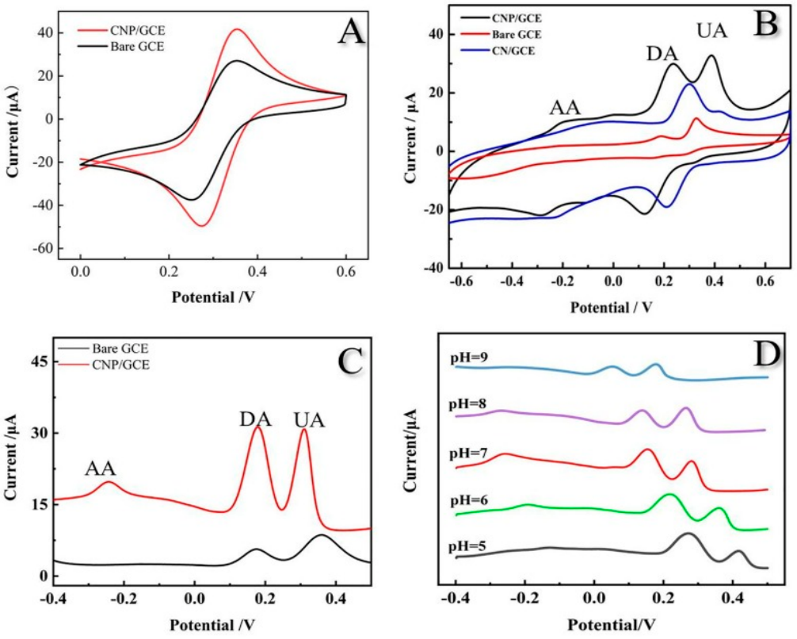

**Figure 5.** ( **A** ) Cyclic voltammogram of different electrodes in a solution of 0.1 M KCl containing 5.0 mM Fe(CN)6[3] _[−]_ /[4] _[−]_ ; ( **B** ) cyclic voltammogram of bare glassy carbon electrode, CN-modified glassy carbon electrode, and phosphorous-doped nitrogenous porous carbon material modified glassy carbon electrode in 0.1 M phosphate buffer solution (pH 7.0) with 0.2 mM ascorbic acid, DA, and UA; ( **C** ) DPV phosphorous-doped nitrogenous porous carbon material-modified glassy carbon electrode, and bare glassy carbon electrode in 0.1 M phosphate buffer solution (pH 7.0) with 0.2 mM ascorbic acid, DA, and UA; ( **D** ) effect of pH value [52]. 

## 4.1.3. Grain-Derived Biomass 

Grains, such as rice, wheat, corn, and barley, are rich in carbohydrates and other organic compounds, making them suitable for developing electrodes and sensing platforms. Grain-derived biomass can be processed and treated to create carbon-based materials with desirable electrochemical properties [53–56]. Gissawong et al. [57] developed a novel, highly sensitive sensor for the antibiotic ciprofloxacin using DPV analysis. The glassy carbon electrode was modified by preparing a mixture of gold nanoparticles with waste coffee ground activated carbon and combined with the supramolecular solvent, which increased the electrochemical response of the nanoparticles. The calibration plot of the antibiotic exhibited a linear response in the range of 0.0005–0.025 µM with an impressive detection limit of 0.0002 µM. The sensor’s heightened sensitivity was attributed to the significantly increased electroactive area and conductivity resulting from the combination 

_Micromachines_ **2023** , _14_ , 1688 

11 of 26 

of waste coffee ground activated carbon and gold nanoparticles. The prepared sensor was successfully applied to determine ciprofloxacin in milk samples, achieving satisfactory recoveries ranging from 78.6 to 110.2%. On the other hand, Dinh Luyen et al. [58] synthesized a composite made of zeolite imidazolate framework-11 (ZIF-11) and activated carbon derived from rice husks and drop-casted it on the glassy carbon surface for sensing the biocide triclosan. The active carbon was prepared by carbonizing rice husk at 400 _[◦]_ C for 4 h; then, it was activated with activated carbon, KOH, and water under sonication conditions. Finally, the mixture was pyrolyzed at 750 _[◦]_ C for 1 h under a nitrogen atmosphere. The catalyst showed a high and homogeneous surface area and a high activity towards triclosan sensing. A linear range between 0.1–8 µM and an LOD of 0.076 µM were achieved. 

## 4.1.4. Seed-Derived Biomass 

Seed-derived biomass-based electrochemical sensors have shown promising results in various applications. They have been utilized to detect environmental pollutants, making them relevant in environmental monitoring [59–64]. Regarding this, Sha et al. [65] presented a highly sensitive and selective sensor based on carbon quantum dots for the electrochemical determination of hydrazine. The catalyst was fabricated using chia seed as a natural and cost-effective precursor through a single-step pyrolysis process and subsequently employed for the modification of glassy carbon electrodes by drop-casting. The synthesized carbon quantum dots displayed a quasi-spherical morphology with a size distribution ranging from 2 to 6 nm and numerous surface functional groups. Amperometric measurements of the carbon quantum dot-based electrode showed a fast response towards hydrazine oxidation in the 125–1125 µM range at the potential 0.65 V under hydrodynamic conditions (Figure 6a). A good linearity between the concentration and the recorded current was observed (Figure 6b), resulting in a sensitivity of 151.5 µA mM _[−]_[1] cm _[−]_[2] and an LOD of 39.7 µM. Utilizing chia-seed-derived carbon quantum dots as the catalyst material offers an environmentally friendly and economical approach for the sensitive detection of hydrazine. 

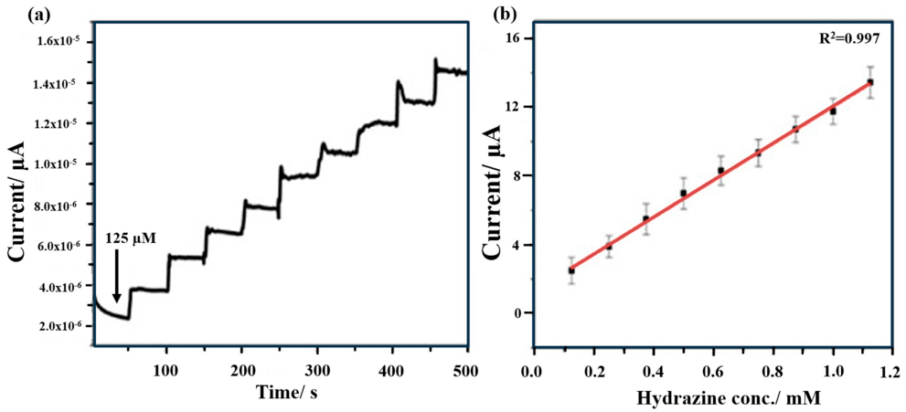

**Figure 6.** ( **a** ) Amperometric response of the carbon quantum dot-modified glassy carbon electrode towards sequential addition of hydrazine at 0.65 V vs. Ag/AgCl in 0.1 M phosphate buffer solution; ( **b** ) calibration curve representing the response of electrodes (N = 3) [65]. 

Likewise, an efficient electrochemical sensor for 4-nitrophenol utilizing a combination of gold nanoparticles/reduced graphene oxide with date-seed-derived biomass-derived activated carbon was successfully developed by Harraz et al. [66]. The synthesized catalyst demonstrated abundant active centers with enhanced electrochemical reductive activity, promoting the adsorption and diffusion of 4-nitrophenol molecules onto the active 

_Micromachines_ **2023** , _14_ , 1688 

12 of 26 

surface of the electrode. This facilitated superior electrochemical sensing capabilities. Notably, the sensor exhibited a remarkably low LOD of 0.36 µM and a high sensitivity of 0.03436 µA µM _[−]_[1] within a wide linear dynamic range of 18–592 µM. Moreover, the modified electrode exhibited excellent selectivity in the presence of various common interfering compounds, such as ascorbic acid, UA, urea, glucose, and fructose, among many others (Figure 7). A list with more recent studies of herbaceous biomass and derivates for electrochemical sensing is listed in Table 3. As can be seen, different biomass-derived materials, such as fruit peels and seeds, have been used for sensing several groups of analytes, including heavy metals, dyes, and pharmaceutical-related compounds. Furthermore, techniques such as DPV, anodic stripping differential-pulse voltammetry (ASDPV), amperometry (Amp), and differential-pulse adsorptive stripping voltammetry (DPAdSV) are the most employed for sensing using biomass-derived carbon-based materials. 

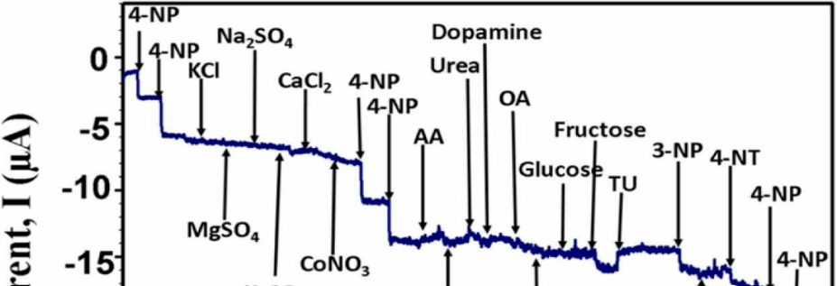

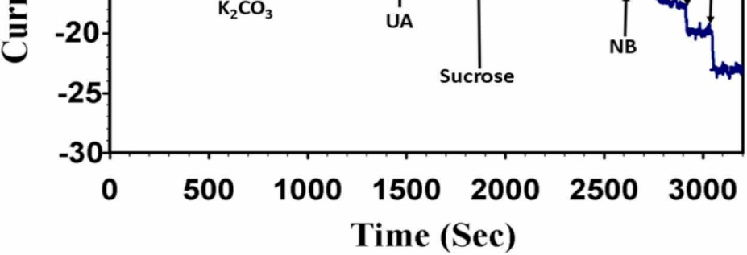

**Figure 7.** Selectivity study of glassy carbon electrode modified with gold nanoparticles/reduced graphene oxide with date-seed-derived biomass-derived activated carbon upon the injection of 100 µM 4-nitrophenol and five times (500 µM) higher concentrations of KCl, MgSO4, Na2SO4, K2CO3, CaCl2, CoNO3, urea, oxalic acid (OA), galactose, glucose, sucrose, and fructose, and three times (300 µM) higher concentrations of ascorbic acid, and dopamine, and similar (100 µM) concentrations of uric acid, thiourea (TU), 3-nitrophenol (3-NP), nitrobenzene (NB), and 4-nitrotoluene (4-NT) interfering chemicals in 0.1 M phosphate buffer solution (pH = 7.0) at a working potential of _−_ 0.6 V [66]. 

_Micromachines_ **2023** , _14_ , 1688 

13 of 26 

**Table 3.** List of recent research on biomass-derived carbon-based materials for electrochemical sensing. 

|**Sensing Platform**|**Biomass-Derived**|**Analyte**|**Technique**|**LR (µM)**|**LOD (µM)**|**Ref.**|
|---|---|---|---|---|---|---|
||||||1.82 (Cd2+),||
|HVE-Na2CO3/CPE|_Hordeum vulgare_dust|Cd2+, Pb2+ and Hg2+|ASDPV|-|0.000691 (Pb2+) and|[67]|
||||||0.000237 (Hg2+)||
|BPBC- MWCNT/GCE|Banana peel|Baicalein|DPV|0.0040–100.0|0.00133|[68]|
|CNANAs/GCE|Shaddock peel waste|H2O2|Amp|5–1760|3.53|[69]|
|N,P-MMC|Okra|H2O2|Amp|100–10,000 and 20,000–200,000|6.8|[70]|
|N-NPC-Nafon/GCE|Almond shells|Pb(II)|ASDPV|0.0097–0.5797|0.0034|[71]|
|CDs- Cu2O/CuOGCE|Reeds|Hydrazine|Amp|0.99µM to 5903|0.024|[72]|
|CP-OM-COOH|Grapefruit peel|Cu(II)|DPV|0.2362–1.0236|0.0394|[73]|
|CDs/SPCE|Orange peel waste|Nitrobenzene|DPV|0.1–2000|0.013|[74]|
|CPME-ACfB 300|Spent coffee grounds|Pb(II)|DPAdSV|0.128–2.44|0.0045|[75]|
|CH-CPE|Coffee husks|Methylene Blue|SWV|1–125|3|[76]|
|CuCo2O4@BC|_Lactuca sativa_L. _var. Ramosa_|Tryptophan|DPV|0.01–1 and 1–40|0.003|[77]|
|PC900/GCE|_Liquidambar formosana_ tree leaves|3-nitroaniline and 4-nitroaniline|DPV|0.2–115.6 (3-nitroaniline) 0.5–120 (4-nitroaniline)|0.0551 (3-nitroaniline) and 0.0326 (4-nitroaniline)|[78]|
|CDs/GCE|_Eclipta Alba_leaves|Morin|DPV|50–350|1.42_×_10_−_7|[79]|
|N,P-CQD|_Banana fower bract_ _(Musa acuminata)_|Dopamine|DPV|6–100|_∼_0.0005|[30]|
|BG-CNPs/GC|Cherry (_Physalis)_ _peruviana_) husks|H2O2|Amp|10–220|1.6|[80]|
|BC/Co3O4/ FeCo2O4/GCE|Pinecones|Dopamine, acetaminophen, and xanthine|DPV|0.1–250 (Dopamine) 0.1–220 (Acetaminophen), and 0.5–280 (Xantine)|0.04587 (Dopamine), 0.02886 (Ac- etaminophen), and 0.1209 (Xantine)|[81]|
|PANI/MWCNT/ Cotton Yarns|Cotton yarns|Urea|Amp|0.001–1000|0.001|[82]|
|NSPAC/GCE|Chinese fr sawdust|Dopamine and uric acid|DPV|0.2–100.0 (Dopamine), 0.2–50.0 (Uric acid)|0.1 (for Dopamine and Uric acid)|[83]|
|GrRAC-70%|Cork powder|Caffeine|DPV|2.5–1000|2.94|[84]|
|OMCNs|Crab shell|Malachite green|DPV|0.1–22.1|0.05|[85]|
|ESM-AC|Egg shell membrane|Dopamine|DPV|100–10,000|0.26|[86]|
|GCE/NHAPP0.5- CA-β-CD|Bovine bones|Pb(II)|DPASV|0.02–0.20|0.000506|[87]|
|Fe-BCs|Pig blood|H2O2|Amp|0.1–2000|0.046|[88]|
|r-rGO/GCE|Waste from powder juice industry|Paracetamol|DPV|60–500|0.28|[89]|

_Micromachines_ **2023** , _14_ , 1688 

14 of 26 

## _4.2. Woody Biomass and Derivates_ 

Lignocellulosic-derived materials represent an abundant and cost-effective source of waste generated from agricultural, forestry, and industrial activities. This diverse group of materials comprises various components, such as coniferous or deciduous stems, branches, foliage, bark, chips, lumps, pellets, briquettes, sawdust, and sawmill, which possess distinct proportions of cellulose, hemicellulose, and lignin. These lignocellulosic materials have garnered attention for effectively removing contaminants and immobilizing heavy metals, owing to their interesting sorption properties and great cation exchange capacity. Despite these advantageous characteristics, these materials have not been extensively explored as potential electrode modifiers in electrochemical applications, despite their abundance and excellent properties. In light of the sustainable and renewable nature of lignocellulosicderived materials, further research and investigation into their potential as electrode modifiers are warranted [90–93]. Similarly, a biosourced composite for the electrochemical sensing of the pesticide carbendazim was prepared by Fozing Mekeuo et al. [94] using _Ayous_ ( _Triphochiton Scheroxylon_ ) sawdust, an abundant waste from the wood industry, grafted by maleic anhydride. The resulting material was then mixed with carbon nanotubes and utilized for modifying glassy carbon electrodes by drop-coating. The effect of the amount of _Ayous_ sawdust in the composite on the electrochemical sensing of carbendazim was evaluated. It was observed that increasing the percentage of modified lignocellulosic materials in the composite improved the sensor’s response by up to 4.8%. However, subsequent increases in the amount of _Ayous_ sawdust beyond this point resulted in a progressive decrease in current intensities (ranging from 9 to 20%). This decrease was attributed to the insulating nature of _Ayous_ sawdust, which hindered the electron transfer on the electrode. Under the optimized conditions, the developed sensor exhibited a sensitivity of 2.62 _±_ 0.08 µA M _[−]_[1] and a detection limit of 0.04 µM. On the other hand, Lu et al. [95] prepared an N and P double-doped biomass pyrolytic carbon material for the electrochemical sensing of the flavonoids baicalein and luteolin. The authors designed the catalyst by pyrolyzing lotus roots as a source of biomass, KOH, as an activator, and ammonium polyphosphate, as a source of N and P. The mixtures were heated at 800 _[◦]_ C for 2 h in a N2 atmosphere. The amount of APP was systematically tested, and the resulting catalyst (N&P/LRPC-800-1) was compared with the materials obtained without APP and with a lower amount of ammonium polyphosphate (LRPC-800 and N&P/LRPC800-2, respectively). Scanning electron microscopy analysis (Figure 8A–C) revealed that N&P/LRPC-800-1 possessed a more porous structure, which was further supported by the transmission electron microscopy analysis (Figure 8D–F) showing a more developed pore structure inside. This confirms that an appropriate amount of ammonium polyphosphate doping effectively improves the specific area of the carbon materials, while an excess of ammonium polyphosphate content could sharply reduce it. Under the optimal conditions, the system achieved an LOD of 0.0078 µM and 0.0076 µM for BA and LU, respectively. Both studies highlight the potential of utilizing biomass-derived materials for developing efficient and sensitive electrochemical sensors, providing valuable insights for further advancements in the field of electrochemical sensing. 

A low-cost carbon paste electrode modified with an aminoalcohol-functionalized palm oil fiber for 2-nitrophenol electrochemical sensing was prepared by Deussi Ngaha et al. [96]. The catalyst was prepared by the chemical grafting of triethanolamine onto the surface of an alkali material. The constructed electrode demonstrated high sensitivity for 2-nitrophenol electrochemical detection, covering a wide linear range of 4–50 µM and exhibiting an LOD of 1.26 µM. Additionally, the prepared electrode showed excellent reproducibility and stability, with standard deviations of 2.277% (N = 5) and 5.268% (N = 5), respectively. The practical application of the sensor was evaluated by detecting 2-nitrophenol in lake, spring, and tap water samples using the standard addition method. Analysis observed recovery rates of 99.02%, 99.52%, and 99.95%, respectively, signifying the successful application of the proposed method for determining this compound in real environmental samples. Using aminoalcohol-functionalized palm oil fiber as the electrode modifier offers a promising 

_Micromachines_ **2023** , _14_ , 1688 

15 of 26 

approach for sensitive and reliable electrochemical sensing of 2-nitrophenol. Several recent studies of woody biomass and derivates for electrochemical sensing are listed in Table 3. As can be seen, several catalysts have been developed using woody-derived materials, which have been mainly used for the electrochemical sensing of organic compounds. 

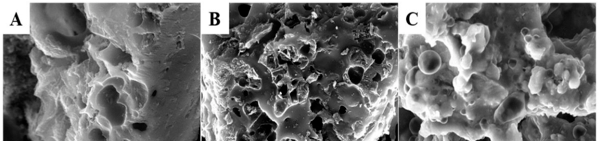

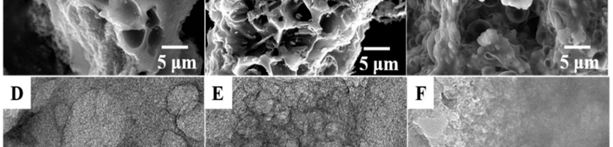

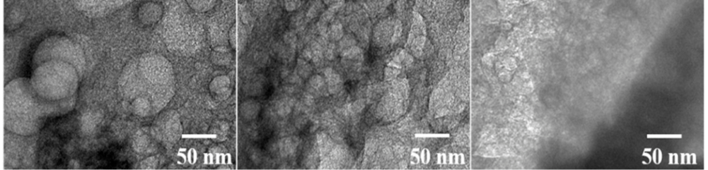

**Figure 8.** Scanning electron microscope images ( **A** – **C** ) and transmission electron microscopy images ( **D** – **F** ) of LRPC-800, N&P/LRPC-800-1, and N&P/LRPC-800-2, respectively [95]. 

## _4.3. Animal and Human Waste_ 

Animal and human wastes are predominantly sourced from bones, meat meals, certain manures, and human dung. In the past, these wastes were widely employed as fertilizers; however, their utilization has gradually diminished over time due to agricultural and environmental regulations concerning pollution, health, odor, and other concerns. The use of animal and human waste as biomass for electrochemical sensing has gained attention as a sustainable and eco-friendly approach in recent years. These waste materials, traditionally considered by-products or pollutants, possess unique chemical compositions and properties that make them potential candidates for developing low-cost and efficient electrochemical sensors [97–103]. 

## 4.3.1. Animal-Derived Waste 

Animal-derived waste represents a valuable and often overlooked resource for developing eco-friendly and cost-effective electrochemical sensors. Razmi et al. [104] developed a cost-effective and sensitive sensor to detect vitamin C by DPV. The authors used the yellow membrane of chicken feet as the base for the sensor. This membrane is a natural and porous substance composed of carbohydrates and a mix of specific amino acids, such as glycine and arginine. It also contains several functional groups such as -OH, -COOH, -C=O, and -NH2, which make it suitable for adsorbent and preconcentration. The authors 

_Micromachines_ **2023** , _14_ , 1688 

16 of 26 

demonstrated that the over-oxidized carbon paste electrode modified with the membrane (Figure 9) exhibited a remarkable improvement in the electron transfer kinetics for Vitamin C by lowering the anodic over-potential and increasing the anodic peak current. The sensor performance achieved a low LOD of 5.96 µM, a wide linear range of 9.9–280.5 µM, and a good sensitivity of 2.1969 µA/µmol dm _[−]_[3] . 

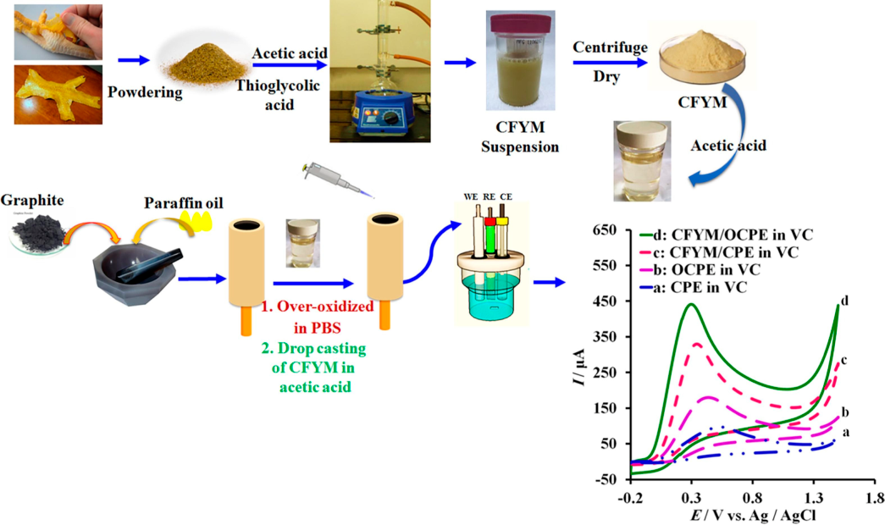

**Figure 9.** Schematic methodology for the determination of Vitamin C using a yellow membrane of chicken feet-derived waste [104]. 

Yang et al. [85] demonstrated the utilization of a natural crab shell as a template to synthesize ordered mesoporous carbon nanofiber arrays to prepare an electrochemical sensor for the dye malachite green by DPV. Crab shell has been used as a biological template for generating hierarchical structures, allowing the recycling of environmental waste to produce value-added materials. Moreover, the cost of the obtained materials is considerably lower than that of others from commercial sources. The synthesized material presented ordered mesoporous carbon arrays with a high BET surface of 1200 m[2] g _[−]_[1] , which provides a high surface area. The electrochemical characterization (Figure 10a) showed that the synthesized ordered mesoporous carbon nanofiber arrays presented reversible redox peaks for the malachite green process, with a difference between the anodic peak and the cathodic peak of only 40 mV, attributed to the good electrochemical properties of the catalyst. The analysis of electrochemical impedance spectroscopy (Figure 10b) confirmed the rapid electron transfer of the prepared material compared to the bare glassy carbon electrode. The sensor showed a good response for the dye sensing, showing a wide linear range from 0.1 to 22.1 µM and a low detection limit of 0.05 µM. This outstanding performance makes the prepared catalyst a promising candidate for the sensitive and efficient detection of malachite green in various environmental and analytical applications. 

~~_Micromachines_~~ ~~**2023** ,~~ ~~_14_ , 1688~~ 

~~17 of 26~~ 

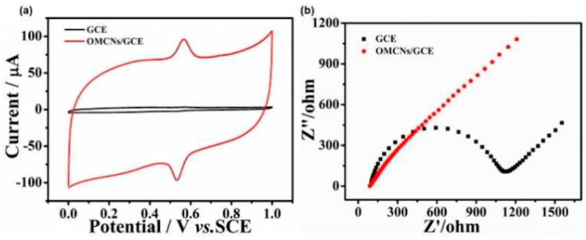

**Figure 10.** ( **a** ) Cyclic voltammograms of 25 µM malachite green in 0.05 M H2SO4 on the ordered mesoporous carbon nanofiber arrays on glassy carbon (red line) and glassy carbon (black line), with the scan rate = 100 mVs _[−]_[1] and ( **b** ) Nyquist plots corresponding to the glassy carbon and ordered mesoporous carbon nanofiber arrays on glassy carbon surface in 5 mM Fe(CN) _[−]_[3] / _[−]_[4] +0.1 M KCl [85]. 

## 4.3.2. Human-Derived Waste 

Human-derived waste-based electrochemical sensors have the potential to revolutionize healthcare and environmental monitoring by offering non-invasive, real-time, and cost-effective solutions. Bilge et al. [105] prepared a carbon material from human hair waste by hydrothermal carbonization and KOH activation. Human hair has attracted much attention due to its potential to obtain heteroatom-doped and porous carbon materials due to hair fibers’ hierarchical structures with rich nitrogen and sulfur content. The authors mixed the prepared hair with amine-functionalized multi-walled carbon nanotubes and supported it on a glassy carbon electrode for deoxyribonucleic acid (DNA) biosensor experiments (Figure 11). The prepared biosensor was utilized to study the dsDNA–Palbociclib (PLB) interaction to assess the possibility that PLB produces conformational changes in DNA structure and/or oxidative damage. The glassy carbon modified with hair with amine-functionalized multi-walled carbon nanotubes was an efficient biosensing platform for dsDNA immobilization and nanobiosensor fabrication due to the sensitivity being significantly increased compared to bare glassy carbon electrode. A linear dependence was obtained in the 0.4–10 µM range. 

A list with more recent studies of animal and human waste for electrochemical sensing is listed in Table 3. Bovine bones, crab-derived waste, eggshell membrane, and pig blood have been used to develop a wide variety of target molecules, including H2O2, heavy metals, and organic compounds. 

## _4.4. Other Biomass Sources_ 

## 4.4.1. Fungi 

Yin et al. [106] modified a glassy carbon electrode with a composite made of sulfurdoped graphene (SG), carboxylated carbon nanotube (COOH-CNT), and yeast for the electrochemical detection of lead ions. The composite was prepared using a simple hydrothermal method. Yeast is one of the most-studied eukaryotic microorganisms for removing large numbers of heavy metals from environmental samples. This microorganism, when treated under alkali hydrothermal conditions, modifies cells with functional groups such as amines, hydroxyl, and carboxylate groups, which are available to interact with other molecules of interest and construct different architectures. The prepared composite exhibited a very high response at detecting low concentrations of lead ions, achieving a linear range between 4.9 _×_ 10 _[−]_[9] and 4.910 _[−]_[17] µM and an LOD of 2.61 _×_ 10 _[−]_[17] µM, being capable of detecting Pb[2+] levels in blood with a satisfactory recovery rate. The authors attributed the high sensing performance to the double-layer carbon structure formed by the combination of sulfur-doped graphene and carboxylated carbon nanotubes. 

_Micromachines_ **2023** , _14_ , 1688 

18 of 26 

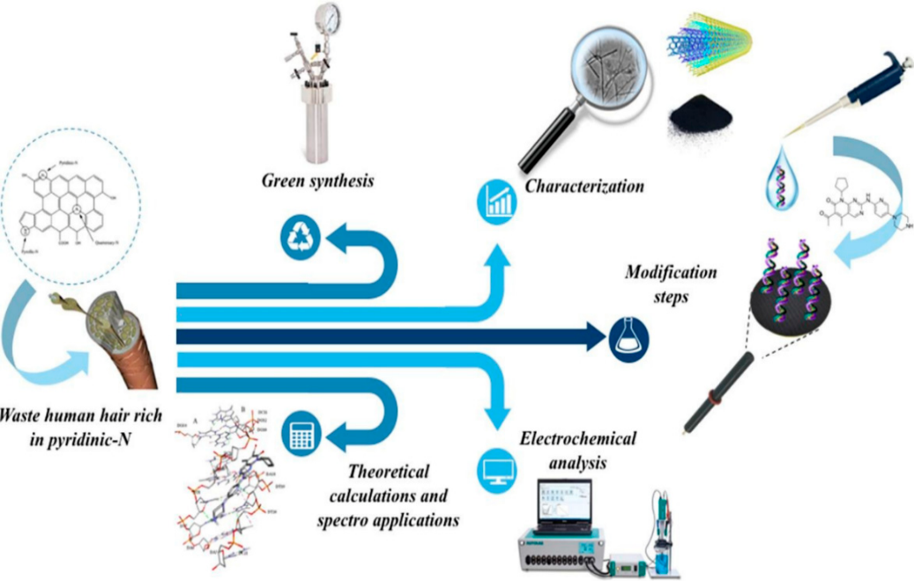

**Figure 11.** Schematic methodology to electrochemical monitoring of Palbociclib–DNA interaction using human hair waste [105]. 

## 4.4.2. Aquatic Biomass 

Aquatic biomass represents a promising and versatile material for biosensor development, offering a sustainable and cost-effective solution for various sensing applications in environmental, biomedical, and industrial fields [16,107,108]. Kim et al. [16] reported a novel two-step activation of biomass-derived carbon for the electrochemical sensing of acetaminophen, using kelp powder activated using (i) ZnCl2, (ii) KOH, and (iii) double-step activation using both as activator agents. Kelp, a seaweed and natural source of glutamate, is also frequently used in East Asian nations as a food additive. Moreover, being abundant in the ocean around the world and the relatively small human consumption leaves an abundant amount of unused seaweed, which decreases the costs for its use as a material. The characterization of activated materials showed that the activation increases the BET surface area, pore volume, and Barrett, Joyner, Halenda (BJH) pore size, achieving higher values using consecutive activations. The determination of acetaminophen was studied by DPV using a glassy carbon modified with the catalyst obtained with consecutive activations (Figure 12a,b). A linear response of the current with the CA concentration from 0.01 to 20 µM was observed; no changes were observed when the analysis was performed in the presence of interferents such as ascorbic acid and dopamine (Figure 12c,d). The LOD of the prepared sensor was 0.005 µM. 

_Micromachines_ **2023** , _14_ , 1688 

19 of 26 

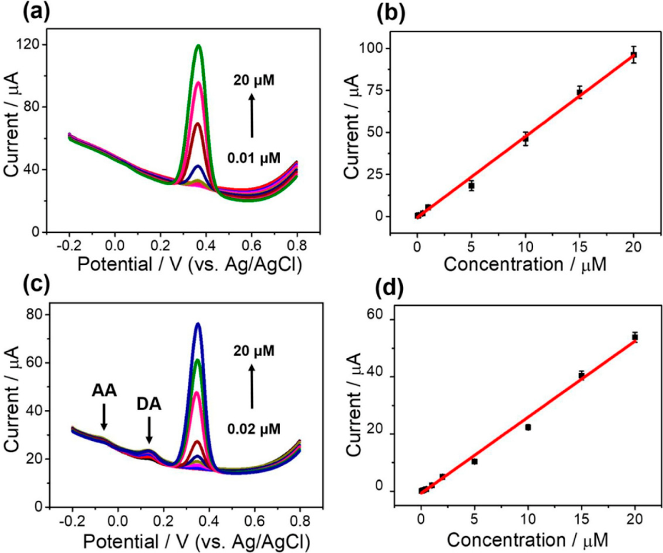

**Figure 12.** Determination of AC in 0.1 M phosphate buffer solution (pH = 7.4) using glassy carbon modified with the catalyst obtained with consecutive activations. ( **a** ) DPV plots and ( **b** ) corresponding linear calibration plots of the result. The range of concentration of acetaminophen was from 0.01 µM to 20 µM. The determination of acetaminophen in 0.1 M phosphate buffer solution (pH = 7.4) using glassy carbon modified with the catalyst obtained with consecutive activations with 100 µM of ascorbic acid and 1 µM of dopamine. ( **c** ) DPV plots and ( **d** ) corresponding linear calibration plots of the result. The range of concentration of AC was from 0.02 µM to 20 µM [16]. 

## 4.4.3. Industrial Biomass Wastes (Semi-Biomass) 

The recycling of carbonaceous materials obtained from different industrial wastes has received increasing attention for its use in many areas. In particular, the similarities between some treated recycled carbonaceous materials with carbon black, such as amorphous carbon, containing minimal amounts of oxygen, nitrogen, and hydrogen, represent a low-cost alternative to other carbon-based materials in electrochemical sensing and energetics. In this context, Sfragano et al. [109] proposed an innovative carbon paste electrode composed of biochar derived from biological sludge from municipal and industrial wastewater treatment plants for sensing phenolic compounds. The catalyst was prepared via the pyrolysis of a mixture of waste woody biomass and biological sludge under a N2 atmosphere at 850 _[◦]_ C for 60 min. The electrode for the sensing was prepared by mixing the obtained product after the pyrolysis with graphite powder and mineral oil. The catalyst obtained possesses a mesoporous structure. DPV scans of different polyphenolic compounds were performed using the fabricated sensor (Figure 13). The results showed that the electrode was able to distinguish among different phenol structures and from various concentrations, achieving linear behavior in the range of 10–150 µM. 

_Micromachines_ **2023** , _14_ , 1688 

20 of 26 

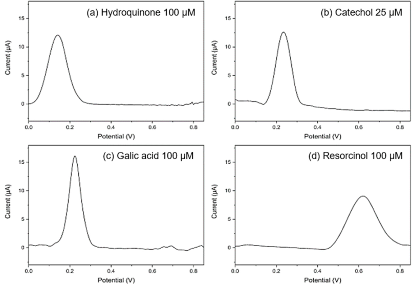

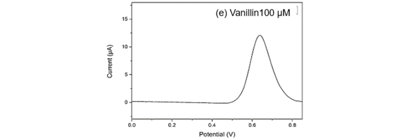

**Figure 13.** Differential pulse voltammograms recorded in 0.1 M acetic buffer pH 4.75 at the prepared catalyst for ( **a** ) 0.1 mM hydroquinone; ( **b** ) 0.025 mM catechol; ( **c** ) 0.1 mM gallic acid; ( **d** ) 0.1 mM resorcinol; ( **e** ) 0.1 mM vanillin; pulse amplitude 90 mV, pulse width 60 ms, and scan rate 30 mVs _[−]_[1] [109]. 

Given these results and those shown in Table 3, there is no doubt that new approaches will be studied using industrial wastes. 

## **5. Conclusions and Perspectives** 

This article offers a brief overview of the recent developments in using biomass-based carbon materials for the electrochemical sensing of different substances. The article discusses the methods used in creating these materials and some modifications to improve their structure, enhancing their ability to sense electrochemical reactions. Additionally, the article touches on various characterization techniques, focusing on the crucial electrochemical parameters essential in creating highly active and stable sensors. 

The presence of specific functional groups on the surface of the treated material plays a crucial role in determining its affinity towards the targeted molecule of interest. The synthesis procedure offers an opportunity to deliberately modulate the presence of these functional groups, allowing for the development of intelligent and tailored structures to suit specific sensing requirements. While material stability can sometimes pose a limitation for real-world, large-scale implementation, the advantages of using low-cost and abundant materials can outweigh concerns about stability. Moreover, some synthesis procedures are 

_Micromachines_ **2023** , _14_ , 1688 

21 of 26 

straightforward and do not require significant financial investment, making them accessible for broader adoption. 

Reducing industrial waste and implementing recycling practices are crucial steps in fostering a more sustainable environment. By minimizing waste generation, we contribute to environmental preservation and realize cost reductions in obtaining materials. In line with this goal, the concept of a circular economy emerges as a promising approach, advocating for using biomass-derived materials across various applications, including the development of carbon-based electrodes. Their versatility and adaptability make them attractive candidates for multiple purposes, particularly in designing efficient and cost-effective carbon-based electrodes. Integrating biomass-derived materials in electrode development and other innovative solutions holds great promise for advancing sustainable practices, reducing waste, and fostering a greener future. By aligning our efforts with this paradigm, we can make significant strides toward a more environmentally conscious and resource-efficient society. 

**Author Contributions:** Conceptualization, A.T. and C.O.; validation, A.T. and C.O.; formal analysis, A.T. and C.O.; resources, A.T. and C.O.; data curation, A.T. and C.O.; writing—original draft preparation, A.T. and C.O.; writing—review and editing, A.T. and C.O.; All authors have read and agreed to the published version of the manuscript. 

**Funding:** This work was funded by ANID/FONDECYT (Chile) under FONDECYT Regular Project N _[◦]_ 1210343 and Postdoctoral Project N _[◦]_ . 3220510. 

**Data Availability Statement:** Data are contained within the article. 

**Conflicts of Interest:** The authors declare no conflict of interest. The funders had no role in the design of the study; in the collection, analyses, or interpretation of data; in the writing of the manuscript; or in the decision to publish the results. 

## **References** 

1. Benny, L.; John, A.; Varghese, A.; Hegde, G.; George, L. Waste Elimination to Porous Carbonaceous Materials for the Application of Electrochemical Sensors: Recent Developments. _J. Clean. Prod._ **2021** , _290_ , 125759. [CrossRef] 

2. Iannazzo, D.; Celesti, C.; Espro, C.; Ferlazzo, A.; Giofrè, S.V.; Scuderi, M.; Scalese, S.; Gabriele, B.; Mancuso, R.; Ziccarelli, I.; et al. Orange-Peel-Derived Nanobiochar for Targeted Cancer Therapy. _Pharmaceutics_ **2022** , _14_ , 2249. [CrossRef] 

3. Liu, A.; Wu, H.; Naeem, A.; Du, Q.; Ni, B.; Liu, H.; Li, Z.; Ming, L. Cellulose Nanocrystalline from Biomass Wastes: An Overview of Extraction, Functionalization and Applications in Drug Delivery. _Int. J. Biol. Macromol._ **2023** , _241_ , 124557. [CrossRef] [PubMed] 

4. Shankar, R.; Nayak, S.; Singh, S.; Sen, A.; Kumar, N.; Bhushan, R.; Aggarwal, M.; Das, P. Simultaneous Sustained Drug Delivery, Tracking, and On-Demand Photoactivation of DNA-Hydrogel Formulated from a Biomass-Derived DNA Nanoparticle. _ACS Appl. Bio. Mater._ **2023** , _6_ , 1556–1565. [CrossRef] 

5. Tursi, A. A Review on Biomass: Importance, Chemistry, Classification, and Conversion. _Biofuel Res. J._ **2019** , _6_ , 962–979. [CrossRef] 

6. Vassilev, S.V.; Baxter, D.; Andersen, L.K.; Vassileva, C.G. An Overview of the Chemical Composition of Biomass. _Fuel_ **2010** , _89_ , 913–933. [CrossRef] 

7. Fan, J.; Kang, L.; Cheng, X.; Liu, D.; Zhang, S. Biomass-Derived Carbon Dots and Their Sensing Applications. _Nanomaterials_ **2022** , _12_ , 4473. [CrossRef] [PubMed] 

8. Wang, T.; Zhai, Y.; Zhu, Y.; Li, C.; Zeng, G. A Review of the Hydrothermal Carbonization of Biomass Waste for Hydrochar Formation: Process Conditions, Fundamentals, and Physicochemical Properties. _Renew. Sustain. Energy Rev._ **2018** , _90_ , 223–247. [CrossRef] 

9. Cho, E.J.; Trinh, L.T.P.; Song, Y.; Lee, Y.G.; Bae, H.J. Bioconversion of Biomass Waste into High Value Chemicals. _Bioresour. Technol._ **2020** , _298_ , 122386. [CrossRef] 

10. Rodríguez Correa, C.; Stollovsky, M.; Hehr, T.; Rauscher, Y.; Rolli, B.; Kruse, A. Influence of the Carbonization Process on Activated Carbon Properties from Lignin and Lignin-Rich Biomasses. _ACS Sustain. Chem. Eng._ **2017** , _5_ , 8222–8233. [CrossRef] 

11. Cagnon, B.; Py, X.; Guillot, A.; Stoeckli, F.; Chambat, G. Contributions of Hemicellulose, Cellulose and Lignin to the Mass and the Porous Properties of Chars and Steam Activated Carbons from Various Lignocellulosic Precursors. _Bioresour. Technol._ **2009** , _100_ , 292–298. [CrossRef] [PubMed] 

12. Funke, A.; Ziegler, F. Hydrothermal Carbonization of Biomass: A Summary and Discussion of Chemical Mechanisms for Process Engineering. _Biofuels Bioprod. Biorefining_ **2010** , _4_ , 160–177. [CrossRef] 

13. Zhang, P.; Gong, Y.; Wei, Z.; Wang, J.; Zhang, Z.; Li, H.; Dai, S.; Wang, Y. Updating Biomass into Functional Carbon Material in Ionothermal Manner. _ACS Appl. Mater. Interfaces_ **2014** , _6_ , 12515–12522. [CrossRef] 

_Micromachines_ **2023** , _14_ , 1688 

22 of 26 

14. Malode, S.J.; Shanbhag, M.M.; Kumari, R.; Dkhar, D.S.; Chandra, P.; Shetti, N.P. Biomass-Derived Carbon Nanomaterials for Sensor Applications. _J. Pharm. Biomed. Anal._ **2023** , _222_ , 115102. [CrossRef] [PubMed] 

15. Hu, S.C.; Chen, Y.C.; Lin, X.Z.; Shiue, A.; Huang, P.H.; Chen, Y.C.; Chang, S.M.; Tseng, C.H.; Zhou, B. Characterization and Adsorption Capacity of Potassium Permanganate Used to Modify Activated Carbon Filter Media for Indoor Formaldehyde Removal. _Environ. Sci. Pollut. Res._ **2018** , _25_ , 28525–28545. [CrossRef] [PubMed] 

16. Kim, D.; Kim, J.M.; Jeon, Y.; Lee, J.; Oh, J.; Hooch Antink, W.; Kim, D.; Piao, Y. Novel Two-Step Activation of Biomass-Derived Carbon for Highly Sensitive Electrochemical Determination of Acetaminophen. _Sens. Actuators B Chem._ **2018** , _259_ , 50–58. [CrossRef] 

17. Lee, D.W.; Jin, M.H.; Oh, D.; Lee, S.W.; Park, J.S. Straightforward Synthesis of Hierarchically Porous Nitrogen-Doped Carbon via Pyrolysis of Chitosan/Urea/KOH Mixtures and Its Application as a Support for Formic Acid Dehydrogenation Catalysts. _ACS Sustain. Chem. Eng._ **2017** , _5_ , 9935–9944. [CrossRef] 

18. Cao, W.; Wang, B.; Xia, Y.; Zhou, W.; Zhang, J.; Wen, R.; Jia, Y.; Liu, Q. Preparation of Highly-Active Oxygen Reduction Reaction Catalyst by Direct Co-Pyrolysis of Biomass with KOH. _Int. J. Electrochem. Sci._ **2019** , _14_ , 250–261. [CrossRef] 

19. Peng, C.; Yan, X.B.; Wang, R.T.; Lang, J.W.; Ou, Y.J.; Xue, Q.J. Promising Activated Carbons Derived from Waste Tea-Leaves and Their Application in High Performance Supercapacitors Electrodes. _Electrochim. Acta_ **2013** , _87_ , 401–408. [CrossRef] 

20. Liu, H.; Cheng, C.; Wu, H. Sustainable Utilization of Wetland Biomass for Activated Carbon Production: A Review on Recent Advances in Modification and Activation Methods. _Sci. Total Environ._ **2021** , _790_ , 148214. [CrossRef] 

21. Heidarinejad, Z.; Dehghani, M.H.; Heidari, M.; Javedan, G.; Ali, I.; Sillanpää, M. Methods for Preparation and Activation of Activated Carbon: A Review. _Env. Environ. Chem. Lett._ **2020** , _18_ , 393–415. [CrossRef] 

22. Ling, Z.; Wang, Z.; Zhang, M.; Yu, C.; Wang, G.; Dong, Y.; Liu, S.; Wang, Y.; Qiu, J. Sustainable Synthesis and Assembly of Biomass-Derived B/N Co-Doped Carbon Nanosheets with Ultrahigh Aspect Ratio for High-Performance Supercapacitors. _Adv. Funct. Mater._ **2016** , _26_ , 111–119. [CrossRef] 

23. Gopalakrishnan, A.; Badhulika, S. Effect of Self-Doped Heteroatoms on the Performance of Biomass-Derived Carbon for Supercapacitor Applications. _J. Power Sources_ **2020** , _480_ , 228830. [CrossRef] 

24. Qu, P.; Gong, Z.; Cheng, H.; Xiong, W.; Wu, X.; Pei, P.; Zhao, R.; Zeng, Y.; Zhu, Z. Nanoflower-like CoS-Decorated 3D Porous Carbon Skeleton Derived from Rose for a High Performance Nonenzymatic Glucose Sensor. _RSC Adv._ **2015** , _5_ , 106661–106667. [CrossRef] 

25. Shabani-Nooshabadi, M.; Karimi-Maleh, H.; Tahernejad-Javazmi, F. Fabrication of an Electroanalytical Sensor for Determination of Deoxyepinephrine in the Presence of Uric Acid Using CuFe2O4 Nanoparticle/Ionic Liquid Amplified Sensor. _J. Electrochem. Soc._ **2019** , _166_ , H218–H223. [CrossRef] 

26. Gopalakrishnan, A.; Badhulika, S. Sulfonated Porous Carbon Nanosheets Derived from Oak Nutshell Based High-Performance Supercapacitor for Powering Electronic Devices. _Renew. Energy_ **2020** , _161_ , 173–183. [CrossRef] 

27. Veerakumar, P.; Sangili, A.; Chen, S.M.; Pandikumar, A.; Lin, K.C. Fabrication of Platinum-Rhenium Nanoparticle-Decorated Porous Carbons: Voltammetric Sensing of Furazolidone. _ACS Sustain. Chem. Eng._ **2020** , _8_ , 3591–3605. [CrossRef] 

28. Raghu, M.S.; Parashuram, L.; Kumar, K.Y.; Prasanna, B.P.; Rao, S.; Krishnaiah, P.; Prashanth, K.N.; Kumar, C.B.P.; Alrobei, H. Facile Green Synthesis of Boroncarbonitride Using Orange Peel; Its Application in High-Performance Supercapacitors and Detection of Levodopa in Real Samples. _Mater. Today Commun._ **2020** , _24_ , 101033. [CrossRef] 

29. Sha, T.; Liu, J.; Sun, M.; Li, L.; Bai, J.; Hu, Z.; Zhou, M. Green and Low-Cost Synthesis of Nitrogen-Doped Graphene-like Mesoporous Nanosheets from the Biomass Waste of Okara for the Amperometric Detection of Vitamin C in Real Samples. _Talanta_ **2019** , _200_ , 300–306. [CrossRef] 

30. KB, A.; Bhat, V.S.; Varghese, A.; George, L.; Hegde, G. Non-Enzymatic Electrochemical Determination of Progesterone Using Carbon Nanospheres from Onion Peels Coated on Carbon Fiber Paper. _J. Electrochem. Soc._ **2019** , _166_ , B1097–B1106. [CrossRef] 

31. Asad, M.; Zulfiqar, A.; Raza, R.; Yang, M.; Hayat, A.; Akhtar, N. Orange Peel Derived C-Dots Decorated CuO Nanorods for the Selective Monitoring of Dopamine from Deboned Chicken. _Electroanalysis_ **2020** , _32_ , 11–18. [CrossRef] 

32. Espro, C.; Satira, A.; Mauriello, F.; Anajafi, Z.; Moulaee, K.; Iannazzo, D.; Neri, G. Orange Peels-Derived Hydrochar for Chemical Sensing Applications. _Sens. Actuators B Chem._ **2021** , _341_ , 130016. [CrossRef] 

33. Zhang, X.; Cao, Q.; Guo, Z.; Zhang, M.; Zhou, M.; Zhai, Z.; Xu, Y. Self-Assembly of MoS2 Nanosheet on Functionalized Pomelo Peel Derived Carbon and Its Electrochemical Sensor Behavior toward Taxifolin. _Inorg. Chem. Commun._ **2021** , _129_ , 108631. [CrossRef] 

34. Wang, J.; Zhang, H.; Zhao, J.; Zhang, R.; Zhao, N.; Ren, H.; Li, Y. Simultaneous Determination of Paracetamol and P-Aminophenol Using Glassy Carbon Electrode Modified with Nitrogen- and Sulfur- Co-Doped Carbon Dots. _Microchim. Acta_ **2019** , _186_ , 733. [CrossRef] 

35. Pandey, U.; Rani, M.U.; Deshpande, A.S.; Singh, S.G.; Agrawal, A. Sweetcorn Husk Derived Porous Carbon with Inherent Silica for Ultrasensitive Detection of Ovarian Cancer in Blood Plasma. _Electrochim. Acta_ **2021** , _397_ , 139258. [CrossRef] 

36. Bi, Y.; Hei, Y.; Wang, N.; Liu, J.; Ma, C.B. Synthesis of a Clustered Carbon Aerogel Interconnected by Carbon Balls from the Biomass of Taros for Construction of a Multi-Functional Electrochemical Sensor. _Anal. Chim. Acta_ **2021** , _1164_ , 338514. [CrossRef] [PubMed] 

_Micromachines_ **2023** , _14_ , 1688 

23 of 26 

37. Lee, T.W.; Tsai, I.C.; Liu, Y.F.; Chen, C. Upcycling Fruit Peel Waste into a Green Reductant to Reduce Graphene Oxide for Fabricating an Electrochemical Sensing Platform for Sulfamethoxazole Determination in Aquatic Environments. _Sci. Total Environ._ **2022** , _812_ , 152273. [CrossRef] [PubMed] 

38. Allende, S.; Liu, Y.; Zafar, M.A.; Jacob, M.V. Nitrite Sensor Using Activated Biochar Synthesised by Microwave-Assisted Pyrolysis. _Waste Dispos. Sustain. Energy_ **2023** , _5_ , 1–11. [CrossRef] 

39. Zhang, W.; Liu, L.; Li, Y.; Wang, D.; Ma, H.; Ren, H.; Shi, Y.; Han, Y.; Ye, B.C. Electrochemical Sensing Platform Based on the Biomass-Derived Microporous Carbons for Simultaneous Determination of Ascorbic Acid, Dopamine, and Uric Acid. _Biosens. Bioelectron._ **2018** , _121_ , 96–103. [CrossRef] 

40. El Hamdouni, Y.; El Hajjaji, S.; Szabó, T.; Trif, L.; Felh˝osi, I.; Abbi, K.; Labjar, N.; Harmouche, L.; Shaban, A. Biomass Valorization of Walnut Shell into Biochar as a Resource for Electrochemical Simultaneous Detection of Heavy Metal Ions in Water and Soil Samples: Preparation, Characterization, and Applications. _Arab. J. Chem._ **2022** , _15_ , 104252. [CrossRef] 

41. Chen, Y.; Tao, B.; Deng, X.; Wang, X.; Zhang, M.; Cao, Y.; Wei, Z.; Sun, S. A Novel Electrochemical Sensor Based on N, S Co-Doped Liquorice Carbon/Functionalized MWCNTs Nanocomposites for Simultaneous Detection of Licochalcone A and Liquiritin. _Talanta_ **2023** , _252_ , 123869. [CrossRef] [PubMed] 

42. Incebay, H.; Aktepe, L.; Leblebici, Z. An Electrochemical Sensor Based on Green Tea Extract for Detection of Cd(II) Ions by Differential Pulse Anodic Stripping Voltammetry. _Surf. Interfaces_ **2020** , _21_ , 100726. [CrossRef] 

43. Dash, S.R.; Bag, S.S.; Golder, A.K. Carbon Dots Derived from Waste Psidium Guajava Leaves for Electrocatalytic Sensing of Chlorpyrifos. _Electroanalysis_ **2022** , _34_ , 1141–1149. [CrossRef] 

44. Tran, H.V.; Tran, M.T.; van Phi, T. Glassy Carbon Electrode Modified with Luteolin Extracted from Myoporum Bontioides: A New Approach for Development of the Electrochemical Cu[2+] Sensor. _Multifunct. Mater._ **2021** , _4_ , 035004. [CrossRef] 

45. Haque, M.A.; Akanda, M.R.; Hossain, D.; Haque, M.A.; Buliyaminu, I.A.; Basha, S.I.; Oyama, M.; Aziz, M.A. Preparation and Characterization of Bhant Leaves-Derived Nitrogen-Doped Carbon and Its Use as an Electrocatalyst for Detecting Ketoconazole. _Electroanalysis_ **2020** , _32_ , 528–535. [CrossRef] 

46. Niu, X.; Huang, Y.; Zhang, W.; Yan, L.; Wang, L.; Li, Z.; Sun, W. Synthesis of Gold Nanoflakes Decorated Biomass-Derived Porous Carbon and Its Application in Electrochemical Sensing of Luteolin. _J. Electroanal. Chem._ **2021** , _880_ , 114832. [CrossRef] 

47. Wang, Y.; Xu, Y.; Zhao, G.; Zheng, Y.; Han, Q.; Xu, X.; Ying, M.; Wang, G.; Hu, Z.; Xu, H. Utilization of Nitrogen Self-Doped Biocarbon Derived from Soybean Nodule in Electrochemically Sensing Ascorbic Acid and Dopamine. _J. Porous Mater._ **2021** , _28_ , 529–541. [CrossRef] 

48. Liu, Q.; Gao, X.; Liu, Z.; Gai, L.; Yue, Y.; Ma, H. Sensitive and Selective Electrochemical Detection of Lead(II) Based on Waste-Biomass-Derived Carbon Quantum Dots@Zeolitic Imidazolate Framework-8. _Materials_ **2023** , _16_ , 3378. [CrossRef] 

49. Ferlazzo, A.; Bressi, V.; Espro, C.; Iannazzo, D.; Piperopoulos, E.; Neri, G. Electrochemical Determination of Nitrites and Sulfites by Using Waste-Derived Nanobiochar. _J. Electroanal. Chem._ **2023** , _928_ , 117071. [CrossRef] 

50. Padmapriya, A.; Thiyagarajan, P.; Devendiran, M.; Kalaivani, R.A.; Shanmugharaj, A.M. Electrochemical Sensor Based on N,P–Doped Carbon Quantum Dots Derived from the Banana Flower Bract (Musa Acuminata) Biomass Extract for Selective and Picomolar Detection of Dopamine. _J. Electroanal. Chem._ **2023** , _943_ , 117609. [CrossRef] 

51. Manickaraj, S.S.M.; Pandiyarajan, S.; Liao, A.H.; Ramachandran, A.; Huang, S.T.; Natarajan, P.; Chuang, H.C. Sansevieria Trifasciata Biomass-Derived Activated Carbon by Supercritical-CO2 Route: Electrochemical Detection towards Carcinogenic Organic Pollutant and Energy Storage Application. _Electrochim. Acta_ **2022** , _424_ , 140672. [CrossRef] 

52. Huang, Y.; Zang, Y.; Ruan, S.; Zhang, Y.; Gao, P.; Yin, W.; Hou, C.; Huo, D.; Yang, M.; Fa, H. bao A High Efficiency N, P Doped Porous Carbon Nanoparticles Derived from Lotus Leaves for Simultaneous Electrochemical Determination of Ascorbic Acid, Dopamine, and Uric Acid. _Microchem. J._ **2021** , _165_ , 106152. [CrossRef] 

53. Wannasri, N.; Uppachai, P.; Butwong, N.; Jantrasee, S.; Isa, I.M.; Loiha, S.; Srijaranai, S.; Mukdasai, S. A Facile Nonenzymatic Electrochemical Sensor Based on Copper Oxide Nanoparticles Deposited on Activated Carbon for the Highly Sensitive Detection of Methyl Parathion. _J. Appl. Electrochem._ **2022** , _52_ , 595–606. [CrossRef] 

54. Estrada-Aldrete, J.; Hernández-López, J.M.; García-León, A.M.; Peralta-Hernández, J.M.; Cerino-Córdova, F.J. Electroanalytical Determination of Heavy Metals in Aqueous Solutions by Using a Carbon Paste Electrode Modified with Spent Coffee Grounds. _J. Electroanal. Chem._ **2020** , _857_ , 113663. [CrossRef] 

55. Binh, N.T.; Dung, N.N.; Thanh, N.M.; Nhiem, D.N.; Dung, D.M.; Son, L.L.; Quyen, N.D.V.; Tuyen, T.N.; Tuan, N.H.; Khieu, D.Q. Electrochemical Determination of Methylparaben with Manganese Ferrite/Activated Carbon-Modified Electrode. _J. Mater. Sci. Mater. Electron._ **2022** , _33_ , 20884–20899. [CrossRef] 

56. Haque, M.A.; Hasan, M.M.; Islam, T.; Razzak, M.A.; Alharthi, N.H.; Sindan, A.; Karim, M.R.; Basha, S.I.; Aziz, M.A.; Ahammad, A.J.S. Hollow Reticular Shaped Highly Ordered Rice Husk Carbon for the Simultaneous Determination of Dopamine and Uric Acid. _Electroanalysis_ **2020** , _32_ , 1957–1970. [CrossRef] 

57. Gissawong, N.; Srijaranai, S.; Boonchiangma, S.; Uppachai, P.; Seehamart, K.; Jantrasee, S.; Moore, E.; Mukdasai, S. An Electrochemical Sensor for Voltammetric Detection of Ciprofloxacin Using a Glassy Carbon Electrode Modified with Activated Carbon, Gold Nanoparticles and Supramolecular Solvent. _Microchim. Acta_ **2021** , _188_ , 208. [CrossRef] 

58. Luyen, N.D.; Toan, T.T.T.; Trang, H.T.; Nguyen, V.T.; Son, L.V.T.; Thanh, T.S.; Thanh, N.M.; Quy, P.T.; Khieu, D.Q. Electrochemical Determination of Triclosan Using ZIF-11/Activated Carbon Derived from the Rice Husk Modified Electrode. _J. Nanomater._ **2021** , _2021_ , 1–14. [CrossRef] 

_Micromachines_ **2023** , _14_ , 1688 

24 of 26 

59. Wu, T.; Li, L.; Song, G.; Ran, M.; Lu, X.; Liu, X. An Ultrasensitive Electrochemical Sensor Based on Cotton Carbon Fiber Composites for the Determination of Superoxide Anion Release from Cells. _Microchim. Acta_ **2019** , _186_ , 198. [CrossRef] 

60. Wu, T.; Li, L.; Jiang, X.; Liu, F.; Liu, Q.; Liu, X. Construction of Silver-Cotton Carbon Fiber Sensing Interface and Study on the Protective Effect of Antioxidants on Hypoxia-Induced Cell Damage. _Microchem. J._ **2020** , _159_ , 105345. [CrossRef] 

61. Bala, K.; Suriyaprakash, J.; Singh, P.; Chauhan, K.; Villa, A.; Gupta, N. Copper and Cobalt Nanoparticles Embedded in Naturally Derived Graphite Electrodes for the Sensing of the Neurotransmitter Epinephrine. _New J. Chem._ **2018** , _42_ , 6604–6608. [CrossRef] 

62. Yallappa, S.; Shivakumar, M.; Nagashree, K.L.; Dharmaprakash, M.S.; Vinu, A.; Hegde, G. Electrochemical Determination of Nitrite Using Catalyst Free Mesoporous Carbon Nanoparticles from Bio Renewable Areca Nut Seeds. _J. Electrochem. Soc._ **2018** , _165_ , H614–H619. [CrossRef] 

63. Li, K.; Xu, J.; Arsalan, M.; Cheng, N.; Sheng, Q.; Zheng, J.; Cao, W.; Yue, T. Nitrogen Doped Carbon Dots Derived from Natural Seeds and Their Application for Electrochemical Sensing. _J. Electrochem. Soc._ **2019** , _166_ , B56–B62. [CrossRef] 

64. Zhu, X.; Liu, B.; Chen, S.; Wu, L.; Yang, J.; Liang, S.; Xiao, K.; Hu, J.; Hou, H. Ultrasensitive and Simultaneous Electrochemical Determination of Pb[2+] and Cd[2+] Based on Biomass Derived Lotus Root-Like Hierarchical Porous Carbon/Bismuth Composite. _J. Electrochem. Soc._ **2020** , _167_ , 087505. [CrossRef] 

65. Sha, R.; Jones, S.S.; Vishnu, N.; Soundiraraju, B.; Badhulika, S. A Novel Biomass Derived Carbon Quantum Dots for Highly Sensitive and Selective Detection of Hydrazine. _Electroanalysis_ **2018** , _30_ , 2228–2232. [CrossRef] 

66. Harraz, F.A.; Rashed, M.A.; Faisal, M.; Alsaiari, M.; Alsareii, S.A. Sensitive and Selective Electrochemical Sensor for Detecting 4-Nitrophenole Using Novel Gold Nanoparticles/Reduced Graphene Oxide/Activated Carbon Nanocomposite. _Colloids Surf. A Physicochem. Eng. Asp._ **2022** , _654_ , 130068. [CrossRef] 

67. Djemmoe, L.G.; Njanja, E.; Tchieno, F.M.M.; Ndinteh, D.T.; Ndungu, P.G.; Tonle, I.K. Activated Hordeum Vulgare L. Dust as Carbon Paste Electrode Modifier for the Sensitive Electrochemical Detection of Cd[2+] , Pb[2+] and Hg[2+] ions. _Int. J. Env. Environ. Anal. Chem._ **2020** , _100_ , 1429–1445. [CrossRef] 

68. Ai, Y.; Liu, J.; Yan, L.; Li, G.; Wang, X.; Sun, W. Banana Peel Derived Biomass Carbon: Multi-Walled Carbon Nanotube Composite Modified Electrode for Sensitive Voltammetric Detection of Baicalein. _J. Chin. Chem. Soc._ **2022** , _69_ , 359–365. [CrossRef] 

69. Sha, T.; Li, X.; Liu, J.; Sun, M.; Wang, N.; Bo, X.; Guo, Y.; Hu, Z.; Zhou, M. Biomass Waste Derived Carbon Nanoballs Aggregation Networks-Based Aerogels as Electrode Material for Electrochemical Sensing. _Sens. Actuators B Chem._ **2018** , _277_ , 195–204. [CrossRef] 

70. Liu, S.; Han, T.; Wang, Z.; Fei, T.; Zhang, T. Biomass-Derived Nitrogen and Phosphorus Co-Doped Hierarchical Micro/Mesoporous Carbon Materials for High-Performance Non-Enzymatic H2O2 Sensing. _Electroanalysis_ **2019** , _31_ , 527–534. [CrossRef] 

71. Baikeli, Y.; Mamat, X.; Yalikun, N.; Wang, Y.; Qiao, M.; Li, Y.; Hu, G. Differential Pulse Voltammetry Detection of Pb(Ii) Using Nitrogen-Doped Activated Nanoporous Carbon from Almond Shells. _RSC Adv._ **2019** , _9_ , 23678–23685. [CrossRef] 

72. Wei, G.; Wang, L.; Huo, L.; Zhang, Y. Economical, Green and Rapid Synthesis of CDs-Cu2O/CuO Nanotube from the Biomass Waste Reed as Sensitive Sensing Platform for the Electrochemical Detection of Hydrazine. _Talanta_ **2020** , _209_ , 120431. [CrossRef] [PubMed] 

73. Romero-Cano, L.A.; Zárate-Guzmán, A.I.; Carrasco-Marín, F.; González-Gutiérrez, L.V. Electrochemical Detection of Copper in Water Using Carbon Paste Electrodes Prepared from Bio-Template (Grapefruit Peels) Functionalized with Carboxyl Groups. _J. Electroanal. Chem._ **2019** , _837_ , 22–29. [CrossRef] 

74. Bressi, V.; Chiarotto, I.; Ferlazzo, A.; Celesti, C.; Michenzi, C.; Len, T.; Iannazzo, D.; Neri, G.; Espro, C. Voltammetric Sensor Based on Waste-Derived Carbon Nanodots for Enhanced Detection of Nitrobenzene. _ChemElectroChem_ **2023** , _10_ , e202300004. [CrossRef] 

75. Oliveira, G.A.; Gevaerd, A.; Mangrich, A.S.; Marcolino-Junior, L.H.; Bergamini, M.F. Biochar Obtained from Spent Coffee Grounds: Evaluation of Adsorption Properties and Its Application in a Voltammetric Sensor for Lead (II) Ions. _Microchem. J._ **2021** , _165_ , 106114. [CrossRef] 

76. Njanja, E.; Mbokou, S.F.; Pontie, M.; Nacef, M.; Tonle, I.K. Comparative Assessment of Methylene Blue Biosorption Using Coffee Husks and Corn Cobs: Towards the Elaboration of a Lignocellulosic-Based Amperometric Sensor. _SN Appl. Sci._ **2019** , _1_ , 513. [CrossRef] 

77. Chen, B.; Xie, Q.; Zhang, S.; Lin, L.; Zhang, Y.; Zhang, L.; Jiang, Y.; Zhao, M. A Novel Electrochemical Molecularly Imprinted Senor Based on CuCo2O4@ Biomass Derived Carbon for Sensitive Detection of Tryptophan. _J. Electroanal. Chem._ **2021** , _901_ , 115680. [CrossRef] 

78. Manavalan, S.; Veerakumar, P.; Chen, S.M.; Murugan, K.; Lin, K.C. Binder-Free Modification of a Glassy Carbon Electrode by Using Porous Carbon for Voltammetric Determination of Nitro Isomers. _ACS Omega_ **2019** , _4_ , 8907–8918. [CrossRef] 

79. Mathew, S.; Mathew, B. Biomass-Derived Carbon Dots as a Nanoswitch, Logic Gate Operation, and Electrochemical Sensor for Flavonoids. _New J. Chem._ **2023** , _47_ , 2383–2395. [CrossRef] 

80. Li, X.; Li, H.; Liu, T.; Hei, Y.; Hassan, M.; Zhang, S.; Lin, J.; Wang, T.; Bo, X.; Wang, H.L.; et al. The Biomass of Ground Cherry Husks Derived Carbon Nanoplates for Electrochemical Sensing. _Sens. Actuators B Chem._ **2018** , _255_ , 3248–3256. [CrossRef] 

81. Lu, Z.; Zhong, J.; Zhang, Y.; Sun, M.; Zou, P.; Du, H.; Wang, X.; Rao, H.; Wang, Y. MOF-Derived Co3O4/FeCo2O4 Incorporated Porous Biomass Carbon: Simultaneous Electrochemical Determination of Dopamine, Acetaminophen and Xanthine. _J. Alloys Compd._ **2021** , _858_ , 157701. [CrossRef] 

82. Wang, Y.; Zhang, Y.; Wang, Y.; Zhu, R.; Chen, Y.; Liu, X.; Xu, J.; Li, M.; Wang, D. Urea Detection of Electrochemical Transistor Sensors Based on Polyanline (PANI)/MWCNT/Cotton Yarns. _Electroanalysis_ **2021** , _33_ , 2406–2416. [CrossRef] 

_Micromachines_ **2023** , _14_ , 1688 

25 of 26 

83. Yang, X.; He, C.; Qiu, Y.; Bao, J.; Li, P.; Chen, Y.; Zhou, X.; Huang, B.; Zheng, X. Electrochemical Sensing Based on Biomass-Derived, Hierarchical, Porous Carbon for Simultaneous Detection of Dopamine and Uric Acid. _Mater. Chem. Phys._ **2022** , _292_ , 126825. [CrossRef] 

84. Monteiro, M.K.S.; Paiva, S.S.M.; da Silva, D.R.; Vilar, V.J.P.; Martínez-Huitle, C.A.; dos Santos, E.V. Novel Cork-Graphite Electrochemical Sensor for Voltammetric Determination of Caffeine. _J. Electroanal. Chem._ **2019** , _839_ , 283–289. [CrossRef] 

85. Yang, B.; Bin, D.; Tian, T.; Liu, Y.; Liu, B. An Ordered Mesoporous Carbon Nanofiber Array for the Sensitive Electrochemical Detection of Malachite Green. _ChemElectroChem_ **2020** , _7_ , 659–664. [CrossRef] 

86. Liu, Q.; Chen, X.; Kang, Z.W.; Zheng, C.; Yang, D.P. Facile Synthesis of Eggshell Membrane-Templated Au/CeO2 3D Nanocomposite Networks for Nonenzymatic Electrochemical Dopamine Sensor. _Nanoscale Res. Lett._ **2020** , _15_ , 24–100. [CrossRef] 

87. Tchoffo, R.; Ngassa, G.B.P.; Doungmo, G.; Kamdem, A.T.; Tonlé, I.K.; Ngameni, E. Surface Functionalization of Natural Hydroxyapatite by Polymerization of β-Cyclodextrin: Application as Electrode Material for the Electrochemical Detection of Pb(II). _Environ. Sci. Pollut. Res._ **2021** , _29_ , 222–235. [CrossRef] 

88. Liu, G.; Li, X.; Wang, Q.; Sun, K.; Lee, C.; Cao, Y.; Si, W.; Wei, H.; Li, Z.; Wang, F. The Biomass of Pig-Blood-Derived Carbon as a Novel Electrode Material for Hydrogen Peroxide Electrochemical Sensing. _Catalysts_ **2022** , _12_ , 1438. [CrossRef] 

89. Melo, J.F.; Junior, J.H.S.; Freire, T.B. de M.; Rigoti, E.; Pergher, S.B.C.; Martínez-Huitle, C.A.; Castro, P.S. Industrial Waste Reuse: An Alternative Source to Reduced Graphene Oxide for Preparing Electrochemical Sensors. _Electrochim. Acta_ **2023** , _454_ , 142382. [CrossRef] 

90. Lu, Z.; Wang, Y.; Hasebe, Y.; Zhang, Z. Electrochemical Sensing Platform Based on Lotus Stem-Derived Porous Carbon for the Simultaneous Determination of Hydroquinone, Catechol and Nitrite. _Electroanalysis_ **2021** , _33_ , 956–963. [CrossRef] 

91. Ngana, B.N.; Seumo, P.M.T.; Sambang, L.M.; Dedzo, G.K.; Nanseu-Njiki, C.P.; Ngameni, E. Grafting of Reactive Dyes onto Lignocellulosic Material: Application for Pb(II) Adsorption and Electrochemical Detection in Aqueous Solution. _J. Env. Environ. Chem. Eng._ **2021** , _9_ , 104984. [CrossRef] 

92. Sebastian, M.; Aravind, A.; Mathew, B. Green Silver Nanoparticles Based Multi-Technique Sensor for Environmental Hazardous Cu(II) Ion. _Bionanoscience_ **2019** , _9_ , 373–385. [CrossRef] 

93. Yalikun, N.; Mamat, X.; Li, Y.; Hu, X.; Wang, P.; Hu, G. N, S, P-Triple Doped Porous Carbon as an Improved Electrochemical Sensor for Metronidazole Determination. _J. Electrochem. Soc._ **2019** , _166_ , B1131–B1137. [CrossRef] 

94. Fozing Mekeuo, G.A.; Despas, C.; Péguy Nanseu-Njiki, C.; Walcarius, A.; Ngameni, E. Preparation of Functionalized Ayous Sawdust-Carbon Nanotubes Composite for the Electrochemical Determination of Carbendazim Pesticide. _Electroanalysis_ **2022** , _34_ , 667–676. [CrossRef] 

95. Lu, Y.; Mu, X.; Liu, Y.; Gao, Y.; Shi, Z.; Zheng, Y.; Huang, W. The N&P Co-Doped Lotus Root Derived Carbon Materials for Highly Sensitive Electrochemical Analysis of Baicalein and Luteolin. _Electroanalysis_ **2023** , _35_ , e202200129. [CrossRef] 

96. Deussi Ngaha, M.C.; Kougoum Tchieda, V.; Kamdem Tamo, A.; Doungmo, G.; Njanja, E.; Kenfack Tonle, I. AminoalcoholFunctionalization of Alkali Palm Oil Fiber and Application as Electrochemical Sensor for 2-Nitrophenol Determination. _Electroanalysis_ **2022** , _34_ , 1789–1801. [CrossRef] 

97. Bilge, S.; Karadurmus, L.; Atici, E.B.; Sına˘g, A.; Ozkan, S.A. A Novel Electrochemical Sensor Based on Magnetic Co3O4 Nanoparticles/Carbon Recycled from Waste Sponges for Sensitive Determination of Anticancer Drug Ruxolitinib. _Sens. Actuators B Chem._ **2022** , _367_ , 132127. [CrossRef] 

98. Li, X.; Liu, J.; Sun, M.; Sha, T.; Bo, X.; Zhou, M. Amperometric Sensing of Ascorbic Acid by Using a Glassy Carbon Electrode Modified with Mesoporous Carbon Nanorods. _Microchim. Acta_ **2018** , _185_ , 474. [CrossRef] 

99. Qin, X.; Dong, Y.; Wang, M.; Zhu, Z.; Li, M.; Chen, X.; Yang, D.; Shao, Y. C-Dots Assisted Synthesis of Gold Nanoparticles as Labels to Catalyze Copper Deposition for Ultrasensitive Electrochemical Sensing of Proteins. _Sci. China Chem._ **2018** , _61_ , 476–482. [CrossRef] 

100. Ding, Q.; Kang, Z.; Cao, L.; Lin, M.; Lin, H.; Yang, D.P. Conversion of Waste Eggshell into Difunctional Au/CaCO3 Nanocomposite for 4-Nitrophenol Electrochemical Detection and Catalytic Reduction. _Appl. Surf. Sci._ **2020** , _510_ , 145526. [CrossRef] 

101. van Staden, J. (Koos) F.; Nuta, R.-G.; Tatu (Arnold), G.-L. Determination of Nitrite from Water Catchment Areas Using Graphite Based Electrodes. _J. Electrochem. Soc._ **2018** , _165_ , B565–B570. [CrossRef] 

102. Ganesan, S.; Sivam, S.; Elancheziyan, M.; Senthilkumar, S.; Ramakrishan, S.G.; Soundappan, T.; Ponnusamy, V.K. Novel Delipidated Chicken Feather Waste-Derived Carbon-Based Molybdenum Oxide Nanocomposite as Efficient Electrocatalyst for Rapid Detection of Hydroquinone and Catechol in Environmental Waters. _Environ. Pollut._ **2022** , _293_ , 118556. [CrossRef] 

103. Cao, L.; Kang, Z.W.; Ding, Q.; Zhang, X.; Lin, H.; Lin, M.; Yang, D.P. Rapid Pyrolysis of Cu[2+] -Polluted Eggshell Membrane into a Functional Cu[2+] -Cu[+] /Biochar for Ultrasensitive Electrochemical Detection of Nitrite in Water. _Sci. Total Environ._ **2020** , _723_ , 138008. [CrossRef] [PubMed] 

104. Razmi, H.; Bahadori, Y. Chicken Feet Yellow Membrane/over-Oxidized Carbon Paste Electrodes: A Novel Electrochemical Platform for Determination of Vitamin C. _Microchem. J._ **2021** , _168_ , 106442. [CrossRef] 

105. Bilge, S.; Dogan Topal, B.; Caglayan, M.G.; Unal, M.A.; Nazır, H.; Atici, E.B.; Sına˘g, A.; Ozkan, S.A. Human Hair Rich in Pyridinic Nitrogen-Base DNA Biosensor for Direct Electrochemical Monitoring of Palbociclib-DNA Interaction. _Bioelectrochemistry_ **2022** , _148_ , 108264. [CrossRef] [PubMed] 

_Micromachines_ **2023** , _14_ , 1688 

26 of 26 

106. Yin, M.; Pu, H.; Zhang, Y.; Gao, P.; Sun, Q.; Yin, W.; Fa, H. Electrochemical Sensor Based on Biomass Yeast Integrated Sulfur-Doped Graphene and Carboxylated Carbon Nanotubes/MoS2 for Highly-Sensitive Detection of Pb[2+] . _Electroanalysis_ **2023** , _35_ , e202200163. [CrossRef] 

107. Hei, Y.; Li, X.; Zhou, X.; Liu, J.; Sun, M.; Sha, T.; Xu, C.; Xue, W.; Bo, X.; Zhou, M. Electrochemical Sensing Platform Based on Kelp-Derived Hierarchical Meso-Macroporous Carbons. _Anal. Chim. Acta_ **2018** , _1003_ , 16–25. [CrossRef] 

108. Lima, D.; Calaça, G.N.; Viana, A.G.; Pessôa, C.A. Porphyran-Capped Gold Nanoparticles Modified Carbon Paste Electrode: A Simple and Efficient Electrochemical Sensor for the Sensitive Determination of 5-Fluorouracil. _Appl. Surf. Sci._ **2018** , _427_ , 742–753. [CrossRef] 

109. Sfragano, P.S.; Laschi, S.; Renai, L.; Fichera, M.; Del Bubba, M.; Palchetti, I. Electrochemical Sensors Based on Sewage Sludge–Derived Biochar for the Analysis of Anthocyanins in Berry Fruits. _Anal. Bioanal. Chem._ **2022** , _414_ , 6295–6307. [CrossRef] 

**Disclaimer/Publisher’s Note:** The statements, opinions and data contained in all publications are solely those of the individual author(s) and contributor(s) and not of MDPI and/or the editor(s). MDPI and/or the editor(s) disclaim responsibility for any injury to people or property resulting from any ideas, methods, instructions or products referred to in the content. 

