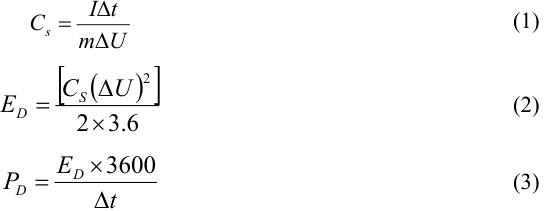
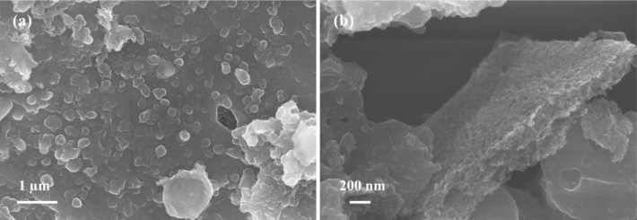
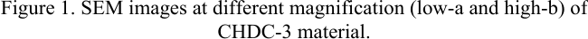
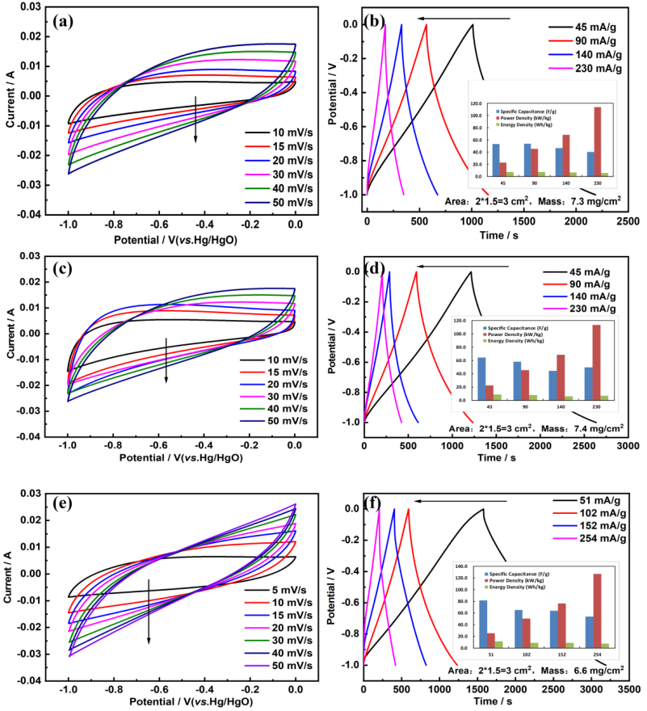
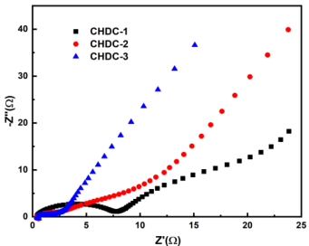

Journal of Physics: Conference Series 

## **PAPER • OPEN ACCESS** 

## A carbonized coconut husk for supercapacitor electrode 

To cite this article: Ruixia Chu et al 2023 J. Phys.: Conf. Ser. 2563 012031 

## You may also like 

- Relating Precursor Pyrolysis Conditions and Aqueous Electrolyte Capacitive Energy Storage Properties for Activated Carbons Derived from Anhydrous Glucose-d 

- Sang-Eun Chun, Yoosuf N. Picard and J. F. Whitacre 

- - 

- Carrier transport of all carbonized glucosic eco-materials Eunju Lim, So Yeon Ahn and Young Seok Song 

View the article online for updates and enhancements. 

- Effect of Microstructure and Morphology of Electrospun Ultra-Small Carbon Nanofibers on Anode Performances for Lithium Ion Batteries 

- Yi-Te Peng and Chieh-Tsung Lo 

This content was downloaded from IP address 216.109.167.55 on 19/08/2023 at 01:32 

IOP Publishing 

NEMD-2023 Journal of Physics: Conference Series 

**2563** (2023) 012031 doi:10.1088/1742-6596/2563/1/012031 

# **A carbonized coconut husk for supercapacitor electrode** 

**Ruixia Chu[1,2,3,4] , Shiwei Tan[1] , Yi Qiao[1,2,3,4] , Wenjun Fu[2,3,4] , Kesong Zhang[1,2,3,4] , Peidong Zhu[1] , Dongying Liu[1] , Wanyou Huang[1,2,3,4,] *,** 

1 Departments of Energy and Power Engineering, Shandong Jiaotong University, Jinan 250357, China 

2 Key Laboratory of Transportation Industry for Transport Vehicle Detection, Diagnosis and Maintenance Technology, Jinan 250357, China 

3 Intelligent Testing and High-End Equipment of Automotive Power Systems Shandong Province Engineering Research Center, Jinan 250357, China 

4 High-end equipment for automotive power unit detection Jinan Engineering Research Center, Jinan 250357, China 

* Correspondence: churx_xmu@163.com or huangwanyou2005@163.com 

**Abstract.** As a new environment-friendly green device for energy storage, supercapacitor has been favored for its advantages of long service life and huge power density. As the material produced electrode of double-layer supercapacitors, much attention are given arise to carbon materials owning to their wide source, low price, environmental protection and other characteristics, especially biomass-based carbon materials. In this paper, coconut husk was used as raw material, which was carbonized by common hydrothermal pre-treatment and hightemperature pyrolysis carbonization. The materials obtained under different reaction conditions were tested in three-electrode system. The electrochemical tests implied that the carbonized coconut husk has the best energy storage characteristics when the pre-treatment time was 24 h and the activator was KOH. This study explored a carbon electrode derived by a new raw biomass material for energy storage in supercapacitors. 

## **1. Introduction** 

As China continues to strengthen the deployment of new green development strategies, the concept of "Green and Low-carbon" development has continued to penetrate into all walks of life. In the electric energy storage filed, a wide variety of new green energy storage devices that are emerging[[1-2]] . Supercapacitors are characterized by high power density and long service life, they are widely used in electric vehicle, energy storage, power generation and intelligent distributed grid system, et al[[3-4]] . In particular, the flexible supercapacitors have attracted much more attentions due to the recent rapid development of emerging technology products[[5]] . 

As a kind of supercapacitors, electrochemical double-layer capacitors (EDLC) are charged and discharged by physical adsorption and desorption process on the electrode surface, and it often uses carbon materials as electrodes[[2]] . Carbon materials come from a wide range of sources. Biomass materials, especially plants, can be carbonized under a certain condition to obtain carbon materials with various morphology and higher specific surface, which can be used as electrode materials for EDLC, and have received widespread attention[[3,6]] . A mesoporous carbon material with the mass specific surface area of about 1450 m[2] ꞏg[-1] and large mesoporosity of 99.0% was prepared in one-step 

Content from this work may be used under the terms of the ~~Creative Commons Attribution 3.0 licence~~ . Any further distribution of this work must maintain attribution to the author(s) and the title of the work, journal citation and DOI. Published under licence by IOP Publishing Ltd 1 

IOP Publishing 

NEMD-2023 Journal of Physics: Conference Series 

**2563** (2023) 012031 doi:10.1088/1742-6596/2563/1/012031 

calcination method under microwave-assisted heating condition with the activation of ZnCl2 using rice husk as raw material by Xiaojun He and his group[[7]] . In the 6 M KOH aqueous solution electrolyte, the as-obtained mesoporous carbon material displayed good rate capability and higher energy density at higher current density. Xiao-Li Su and the co-workers[[8]] have composed a 3D activated carbon (SAC) material constructed with hierarchical pores using luffa pulp as raw material in a facial two step calcination method with activation of KOH. After optimization experiments and electrochemical tests, the results showed that the optimum performance of final SAC was obtained when the mass ratio of KOH and first calculated luffa pulp was 4:1. In a KOH aqueous electrolyte with 6 M for threeelectrode system, the specific capacitance was up to 309.6 Fꞏg[-1] at the current density of 1 Aꞏg[-1] . Shuijin Lei’s group[[9]] have synthesized porous carbon material with multi-element (N-S-O) doped and honeycomb structure taking bristlegrass seeds as carbon source. The three-dimensional network porous structure of green bristlegrass-derived carbon material was constructed under the action of KOH gelatinization at high temperature, which was conducive to the adsorption of ions in the electrolyte during the discharge process. Fuming Wu et al[[10]] have prepared a micron rod-like carbon materials with abundant hierarchical pores and large specific surface area from albizia flower via pyrolysis and medium-temperature carbonization methods. The properties as electrode materials for supercapacitors were tested in different KOH and Na2SO4 electrolytes. A large number of multistage pore structure in carbon materials has more full contact with the electrolyte during charge-discharge process. The power and energy density of the assembled symmetrical supercapacitor can reach 8100 Wꞏkg[-1] and 15.8 Whꞏkg[-1] . Biomass-based carbon source are abundant and easily available in nature, which can not only realize waste recycling, but also reduce production costs, gradually become a research hotspot. 

In this paper, coconut husk derived carbon (CHDC) was prepared from waste coconut husk by hydrothermal pre-carbonization (12 h and 24 h) and high-temperature carbonization with activator (ZnCl2 and KOH). The electrochemical characteristics were checked on the electrochemical workstation in a three-electrode system. The prepared carbon material has rich nano-porous structure. The pre-carbonization time and the type of activator have certain effects on the electrochemical characteristics of the obtained carbon materials. This study explored a carbon electrode derived by a new raw biomass material for energy storage in supercapacitors. 

## **2. Experimental section** 

## _2.1. Materials Preparation_ 

The coconut husk were obtained from the fruit shop for free. The zinc chloride (ZnCl2), sodium hydroxide (NaOH), hydrochloric acid (HCl) and absolute alcohol were purchased from Sinopharm Chemical Reagent Co., Ltd, which were used in analytical grade. In a typical preparation process, put a certain amount of coconut husk into a planetary ball mill to crush with the speed of 330 rpm for 6 h. After ball milling, the materialis were dispersed into deionized water and dumped into a 50 mL Teflon-lined reactor. The sealed reactor was then put in an oven to pre-carbonized at 200 ℃ for 12 h. The obtained pre-carbonized materials were dried in electric thermostatic drying oven at 120 ℃ for 12 h. Subsequently, the pre-carbonized coconut husk was mixed with KOH solution in a ratio of precarbonized coconut husk : KOH = 1:1 (wt%) under ultrasonic treatment for 3 h, followed by an evaporation process in air. Finally, the mixture obtained in the previous step was heated in 5 ℃ꞏmin[-1] to 800 ℃ with N2 filled about 2 h in a tubular furnace to conduct pyrolysis activation and carbonization. After being washed with HCl, deionized water and absolute alcohol in turn, the asprepared sample was drying under vacuum at 100 ℃ over 12 h. For comparison, three different samples were synthesized under different pre-carbonization time and activator conditions, which were recorded as CHDC-1 (24 h, ZnCl2), CHDC-2 (12 h, KOH) and CHDC-3 (24 h, KOH). 

2 

IOP Publishing 

NEMD-2023 Journal of Physics: Conference Series 

**2563** (2023) 012031 doi:10.1088/1742-6596/2563/1/012031 

## _2.2. Materials characterization_ 

The morphology of the as-prepared material was detected on the Scanning Electron Microscopy (SEM) Zeiss Supra55 microscope. 

## _2.3. Electrochemical measurements_ 

The electrochemical measurements were tested in three-electrode system, that were carried on a Model CHI660D device. The work electrode was made as follows. The as-obtained samples, Super P and polyvinylidene difluoride (PVDF) were mixed in the mass ratio of 80:10:10 with absolute alcohol to a homogeneous slurry with certain fluidity. Then, coat the mixing slurry onto the cleaned nickel foam (1.5 × 2 = 3 cm[2] ) with a glass rod, followed drying in vacuum drying oven at 80 ℃ for 6 h. The thickness of the slurry was about 100 μm. Took the prepared electrode, Pt plate and Hg/HgO electrode respectively acting as the work, counter and reference electrode. The aqueous solution KOH with molar concentration of 1 M was regarded as the testing solution. The voltage range of cyclic voltammetry (CV) and galvanostatic charge-discharge (GCD) tests was -1.0-0 V, and the scan rates of CV tests were 10, 15, 20, 30, 40, 50 mVꞏs[-1] , respectively. Set the frequency and amplitude of electrochemical impedance spectroscopy (EIS) measurements to 0.01 Hz -100 kHz and 10 mV. The calculation formula of specific capacitance, energy density and power density are as the following equations: 

Where, _I_ (A) is the current of discharge,  _t_ (s) is the the discharge time, _m_ (g) is the mass of the CHDC material,  _U_ (V) is the voltage range, _CS_ (Fꞏg[-1] ) is the specific capacitance, _ED_ (Whꞏkg[-1] ) is the energy density, _PD_ (Wꞏkg[-1] ) is the power density. 

## **3. Experimental results** 

**----- Start of picture text -----** 
Figure 1. SEM images at different magnification (low-a and high-b) of CHDC-3 material. **----- End of picture text -----** 

The SEM images of the CHDC-3 material at different magnification are shown in figure 1. It is obvious that the flaky substrate material is covered with small particles, which have a large number of nanoscale pore structures inside. This nano-porous structure and small particle size can help the adsorption and desorption of the double electric layer in supercapacitor. 

Figure 2 displays the CV and GCD results of all the received carbon samples. The GCD curves are with values of _CS, PD, ED_ under different current densities inserted. All the CV curves show a nearrectangle shape, indicating the obtained materials have typical double electric layer capacitance energy 

3 

IOP Publishing 

NEMD-2023 

Journal of Physics: Conference Series 

**2563** (2023) 012031 

doi:10.1088/1742-6596/2563/1/012031 

storage characteristics. With the increase of scanning rate, the rectangle deformed gradually, which is because the material cannot absorb the charge in time. Extraordinary, CHDC-3 shows the largest current change at the same scanning rate. 

Figure 2. Electrochemical tests results of different samples: (a), (c), (e) CV curves and (b), (d), (f) GCD curves of CHDC-1, CHDC-2, and CHDC-3, respectively. 

The GCD curves of all samples show an obvious isosceles triangle, which shows good double electrical layer capacitance characteristics and reversibility. Meanwhile, the discharge time decreases to varying degrees with the increase of current density. Compared with CHDC-1 and CHDC-2, CHDC-3 shows longer discharge time at higher current density, indicating the largest specific capacitance of CHDC-3. Especially when the energy density is 254 mAꞏg[-1] , the specific capacitance is 54.1 Fꞏg[-1] , and the corresponding energy and power density respectively are 7.5 Whꞏkg[-1] and 127 Wꞏkg[-1] . Compared with ZnCl2, the KOH immersed in the pre-treated coconut husk materials can better remove the non-carbon elements at high temperature and form nano-porous structure through activation etching, which is conducive to the adsorption and desorption, indicating better electrochemical performance. 

In order to further analyze the electrochemical characteristics, EIS tests were carried out on three samples, and the results are shown in figure 3. It can be clearly seen that the Nyquist curve consists of a semicircle and a sloping straight line. The smaller semicircle of CHDC-3 in high frequency indicates 

4 

IOP Publishingg 

NEMD-2023 IOP Publishingg Journal of Physics: Conference Series **2563** (2023) 012031 doi:10.1088/1742-6596/2563/1/012031 

the minimum interface impedance, while the slope of CHDC-1 in the low frequency indicates the maximum diffusion impedance. This is also consistent with the results of GCD tests, indicating that the activity of KOH and longer hydrothermal pre-carbonization time are beneficial to the energy storage of the material. 

**Figure 3.** Nyquist plots for CHDC-1, CHDC-2, and CHDC-3. 

## **4. Conclusion** 

In summary, a new raw biomass material of waste coconut husk for energy storage was proposed. The experimental comparison revealed that the hydrothermal pre-carbonization time and the type of activator affected the electrochemical properties of the materials. The activation of KOH was more effective, and the samples treated for a longer time showed better impedance characteristics. It provides a new possibility for the source of carbon materials 

## **Acknowledgments** 

This research was supported by the Doctoral Research Initiation Funding Project of Shandong Jiaotong University (BS2020001, BS201902005), the Natural Science Foundation of Shandong Province (ZR2022ME096, ZR2021QB181, ZR2020ME126, ZR2021MB027), the Transportation Department Foundation of Shandong Province (2020B94) and the Shandong Jiaotong University Fund Project. 

## **References** 

[1] Zaghib K, Mauger A, Groult H, Goodenough J B and Julien C M 2013 _Materials_ **6** 1028-49 

- [2] Wang Y, Zhang L, Hou H, Xu W, Duan1 G, He S, Liu K and Jiang S 2021 _Journal of Materials Science_ **56** 173-200 

[3] Li T, Ma R, Lin J, Hu Y, Zhang P, Sun S and Fang L 2019 _Int J Energy Res_ **44** 1-29 

[4] WangY, Hu Y J, Hao X and Peng Pai 2020 _Advanced Composites and Hybrid Materials_ **3** 267-84 

[5] Wang Y, Wu X, Han Y and Li T 2021 _Journal of Energy Storage_ **42** 103053 

[6] Zhou M, Pu F, Wang Z and Guan S 2014 _Carbon_ **68** 185-194 

[7] He X, Ling P, Yu M, Wang X, Zhang X and Zheng X 2013 _Electrochimica Acta_ **105** 635-41 

[8] Su X L, Chen J R, Zheng G P, Yang J H, Guan X X, Liu P and Zheng X C 2018 _Applied Surface Science_ **436** 327-36 

[9] Zhou W, Lei S, Sun S, Ou X, Fu Q, Xu Y, Xiao Y and Cheng B 2018 _Journal of Power Sources_ **402** 203-12 

[10] Wu F, Gao J, Zhai X, Xie M, Sun Y, Kang H, Tian Q and Qiu H 2019 _Carbon_ **147** 242-51 

5 

