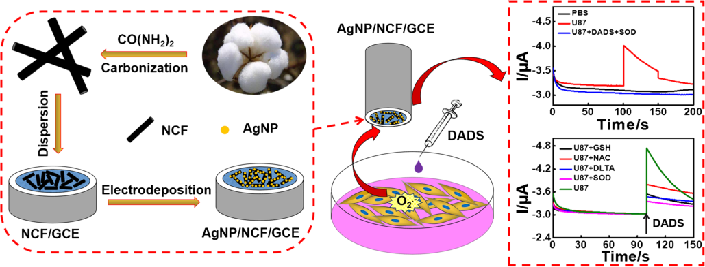
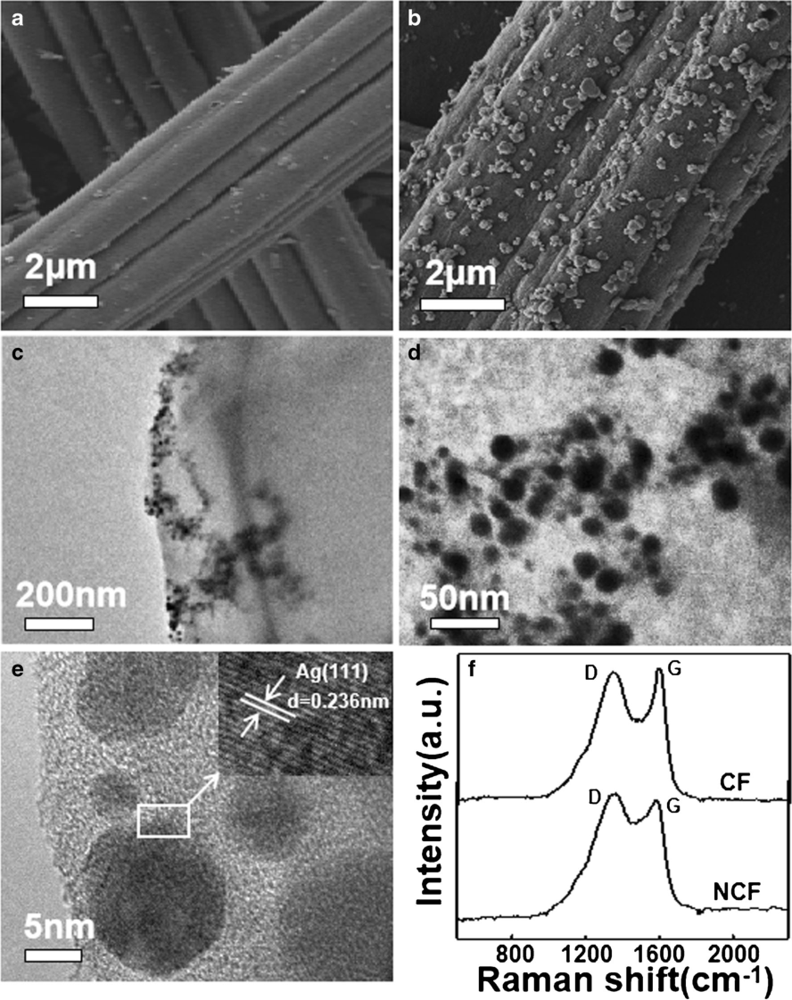
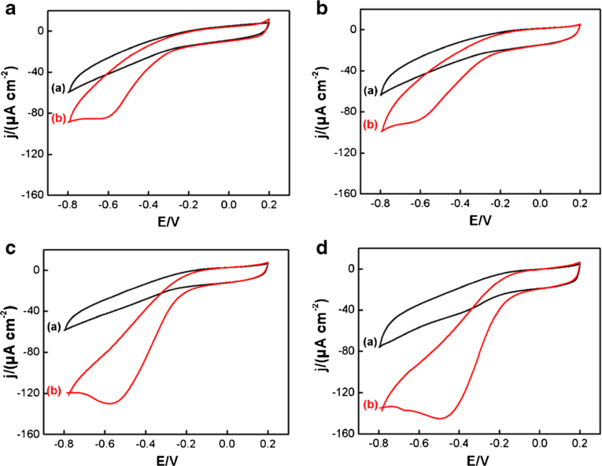
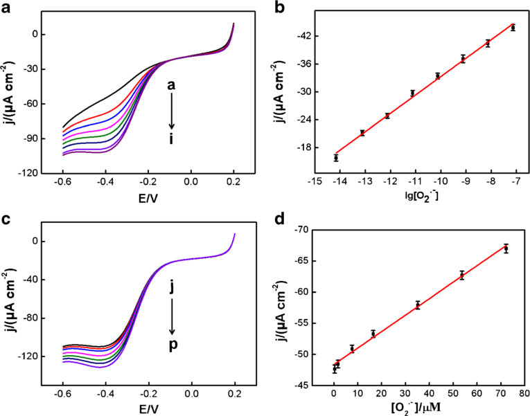
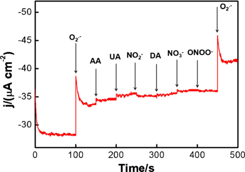
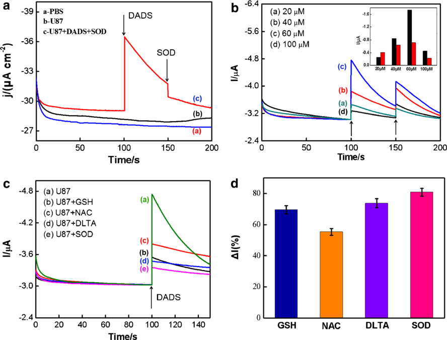

Microchimica Acta https://doi.org/10.1007/s00604-019-3304-1 

ORIGINAL PAPER 

# An ultrasensitive electrochemical sensor based on cotton carbon fiber composites for the determination of superoxide anion release from cells 

Tiaodi Wu[1] & Lin Li[1] & Guangjie Song[1] & Miaomiao Ran[1] & Xiaoquan Lu[1] & Xiuhui Liu[1] 

Received: 18 November 2018 /Accepted: 3 February 2019 # Springer-Verlag GmbH Austria, part of Springer Nature 2019 

## Abstract 

˙[−] A sensor is described for determination of superoxide anion (O2 ). The electrode consists of nitrogen-doped cotton carbon fiber (NCFs) modified with silver nanoparticles (AgNPs) which have excellent catalytic capability. The resulting sensor, best operated at working potentials around −0.5 V (vs. SCE), can detect O2˙[−] over an extraordinarily wide range that covers 10 orders of ˙[−] magnitude, and the detection limit is 2.32 ± 0.07 fM. The electrode enables the release of O2 from living cells under normal or under oxidative stress conditions to be determined. The ability to scavenge the superoxide anions of antioxidants was also investigated. In the authors’ perception, the method represents a viable tool for studying diseases related to oxidative stress. 

Keywords Cottoncarbonfiber[.] Silvernanoparticles[.] Superoxideanion[.] Electrochemicalsensor[.] Antioxidant[.] Oxidativestress[.] Cancer cell 

## Introduction 

Oxidative stress is an important carcinogenic factor because it produces of high levels of reactive oxygen species (ROS) that overwhelm cellular repairing systems [1]. Those high levels of ROS species cause damage to DNA and proteins, and promote genomic instability. Therefore, ROS species are becoming increasingly important as risk markers [2, 3]. It is also a challenge to develop effect analytical methods for monitoring the production of ROS under physiological conditions [4]. As one •− of the most active ROS, the superoxide anion (O2 ) involves in many physiological and pathological processes [5]. Over the last decades, a variety of techniques have been developed for reliable detection of O2•− including electron spin resonance trapping, fluorescence, spectrophotometry, chromatograph, and chemiluminescence [6, 7]. In comparison to indirect 

Electronic supplementary material The online version of this article (https://doi.org/10.1007/s00604-019-3304-1) contains supplementary material, which is available to authorized users. 

- Xiuhui Liu liuxiuhui1008@163.com; liuxh@nwnu.edu.cn 

- 1 Key Laboratory of Bioelectrochemistry & Environmental Analysis of Gansu Province, College of Chemistry & Chemical Engineering, Northwest Normal University, Lanzhou 730070, China 

measurements, electrochemical method is the most promising method for O2•− detection due to its advantages of simplicity, low instrument cost, and feasibility for in-situ monitoring [8]. Presently, it is reported that some nanomaterials (such as Co3O4, Co3(PO4)2, ZnO, MoS2, Mn3(PO4)2, AuNPs, carbon nanotubes, and graphene) are used to the design of novel interfaces because of their outstanding superoxide dismutase activity and high conductivity [9, 10]. However, they are usually synthesized by chemical method, which is generally complex, time-consuming and environment unfriendly process. 

In recent years, conforming to green economy and sustainable development of society, biomass-derived carbon fiber (CFs) has received considerable attention. Compared to inorganic and synthetic organic products, natural products are abundant, renewable, biodegradable, low in cost, and suitable for large-scale production and practical applications [11]. Notably, biomass-derived carbon fiber has its advantages in the development of electrochemical sensors, such as good adsorption performance, large specific surface area, and no agglomeration [12, 13]. However, CFs usually needs special activation and modification to achieve high performance in sensors. So far, many efforts have been made to enhance the performance through modifying the surface property. One efficient way is chemical activation by KOH, ZnCl2, and K2CO3 [14–16]. Another is doping hetero atoms or introducing surface functional groups. Among them, nitrogen doping 

Page 2 of 9 

Microchim Acta 

has been widely studied to modify the surface property of CFs [17, 18]. 

In this article, we report the successful preparation of nitrogendoped cotton carbon fiber (NCF) through carbon thermal reduction method. Then, the Ag nanoparticles (NPs) were loaded on NCF by electrodepositing. To the best of our knowledge, little attention has been paid to the application of cotton carbon fiber on electrochemical sensors (superoxide anion sensors). The developed AgNP/NCF/GCE exhibited outstanding performance towards O2•− with wide linear range and super low detection limit. More importantly, the constructed electrode was further employed for in situ monitoring of O2•− released from Glioma cells (U87) in different conditions. The details of the strategy are displayed in Scheme 1. 

## Material and methods 

## Apparatus 

A scanning electron microscope (SEM, Zeiss, Oberkochen, Germany) was utilized to characterize the surface morphology of AgNP/NCF composite. The transmission electron microscopy (TEM) images were obtained from JEM-3010 transmission electron microscope (JEOL Co., Ltd., Japan), and Raman spectra were gotten by an InVia Reflex Raman microscope (excitation-beam wavelength = 632.8 nm). Ultraviolet-visible (UV-vis) spectrometer in the range of 220–400 nm was used for UV-vis absorption studies. All electrochemical experiments in this work were carried out at room temperature on a CHI660D workstation (Austin, TX, USA), which equipped with a conventional three-electrode system consisting of a working electrode, a counter electrode, and a reference electrode. Here, the working electrode is a bare glassy carbon electrode or a modified electrode. The auxiliary electrode is 

a platinum electrode and a saturated calomel electrode (SCE) as the reference electrode. 

## Reagents 

The degreasing cotton was obtained from Henan Piaoan Group Co., Ltd. (https://www.piaoan.com). Urea was provided by Sinopharm Chemical Reagent Co., Ltd. (https:// www.sinoreagent.com); KO2, diallyl disulfide (DADS) and N-acetyl-L-Cysteine (NAC) were purchased from Aladdin reagent(https://www.aladdin-e.com). DL-Thioctic acid (DLTA), reduced glutathione (GSH) and superoxide dismutase (SOD) were provided by Shanghai yuanye BioTechnology Co., Ltd. (https://www.shyuanye.com). DMSO, 18-crown-6, and 4 Å molecular sieves were purchased from Beijing Chemical Works (https://www.beijingchemworks. com). AgNO3 and KNO3 came from Tianjin Guangfu Fine Chemical Research Institute (https://www.guangfu-chem. com). Phosphate buffer solution (PBS, pH 7.0) was prepared by mixing suitable amounts of 0.2 M NaH2PO4, Na2HPO4. A physiological PBS solution was prepared for washing U87 cells mainly using KH2PO4 (1.76 mM), Na2HPO4 (10. 14 mM), NaCl (136.75 mM) and KCl (2.28 mM). All other chemicals were of analytical grade and the solutions used were all prepared by double distilled water. 

## Preparation of nitrogen-doped cotton carbon fiber (NCFs) composites 

NCFs were synthesized by a two-step process. In the first step, 1.0 g of cotton was torn into pieces and soaked in 50 mL ultrapure water containing 6.0 g of urea. Then the cotton was sonicated for approximately 3 h to allow the cotton to disperse evenly in the urea solution. Finally, the cotton was dried in a vacuum oven at 80 °C for 24 h. In the second step, 

Scheme 1 Schematic illustration of the procedure for the preparation of the NCF-based electrochemical sensor and application for detection of superoxide anion released from cells 

Page 3 of 9 

Microchim Acta 

the vacuum-dried cotton was directly carbonized at 800 °C with a heating rate of 2 °C min[−][1] for 2 h under a nitrogen atmosphere, and formed nitrogen-doped cotton carbon fiber (NCFs). (The sufficiently detailed preparation of nitrogendoped cotton carbon fiber (NCF) composites is shown in supporting information). 

of the superoxide anion reached a stable level, diallyl disulfide (DADS) was injected as a stimulant into the cell suspension to induce the U87 cells to produce O2•−. In addition, DADS was added to the phosphate buffer in the absence of U87 cells and the measured current response was used for comparison with previous experiments. 

## Preparation of the O2•− sensor 

## Results and discussion 

A bare glassy carbon electrode (GCE) was first polished with 0.3 and 0.05 μm alumina slurry to a mirror-like, respectively. Next NCF aqueous solution (7.0 μL) was dispensed onto the surface of GCE and dried to obtain NCF/GCE. Then, the modified electrode was used as a working electrode for electrodepositing silver, which expressed as AgNP/NCF/GCE electrode. The electrodeposition conditions of silver nanoparticles are as follows: time of AgNP electrodeposition (240 s); potential of AgNP electrodeposition (0.0 V) and AgNO3 concentration (1.0 mM). 

## Synthesis of superoxide anion solutions 

•− The chemical generation of O2 was performed according to the ref. [19]. The dimethyl sulfoxide (DMSO) solution was dehydrated first with 4 Å molecular sieves. Then KO2 and 18crown-6 were dissolved above DMSO solution. And next the solution was sonicated for 10 min to obtain the superoxide anion aqueous solution. Finally, based on the molar absorptivity of O2•− in DMSO (2006 M−1 cm−1 at 271 nm), we estimated the concentration of O2•− by UV-Vis spectrometer. 

## Culture of glioma cells 

Glioma cells (U87) came from Chinese Academy of Medical Sciences (Institute of Hematology). They were cultured in DMEM supplemented containing 10% fetal bovine serum (FBS), penicillin (100 U mL[−][1] ), and streptomycin (100 U mL[−][1] ) in a humidified atmosphere containing CO2 (5%) at 37 °C. Penicillin and streptomycin were obtained from Sigma (USA). 

## Electrochemical detection of superoxide anion released from cells 

Glioma cells (U87) were seeded in a 6-well plate (1.5 × 10[5] cells per well) for 24 h and used for electrochemical experiments. Prior to each electrochemical experiment, the cell nutrient solution was removed by pipetting and then washed twice with the pretreated physiological PBS solution (pH 7.4). Finally, 3.0 mL of phosphate buffer was added to each well for experimental measurements. The current response of O2•− released from U87 cells was detected using AgNP/NCF/GCE as working electrode. When the response 

## Morphological characterization of AgNP/NCF/GCE 

Scanning electron microscopy (SEM), transmission electron microscopy (TEM) and Raman spectra characterization are conducted for studying the unique morphology of the as-prepared AgNP/NCF and comparison samples (NCF). As shown in Fig. 1a, the surface of nitrogen-doped cotton carbon fiber is slightly smooth, and the longitudinal distribution of the surface has obviously trench, and the diameter of cotton carbon fiber is about 5~8 μm. The energy dispersive X-ray spectroscopy (EDX) of NCF/GCE can be seen in Fig. S1. The strong peaks for C, N and O demonstrate that NCF composites have been synthesized. Furthermore, when AgNP electrodeposited on NCF composites (Fig. 1b), one can see that high density AgNP are disorderly loaded on the surface of NCF. Fig. 1c and d are the TEM images, where a large number of small-sized AgNP are uniformly distributed on NCF with average size of 15~20 nm. The AgNP on the surface of NCF is further confirmed by high-resolution transmission electron microscopy (HRTEM) (Fig. 1e). The measured fringe lattice of AgNP corresponding to the Ag (111) plane is found to be 0.236 nm, and the particle size is in agree with the Fig. 1c and d. The Raman spectrum of the CFs and NCF can be seen from Fig. 1f. The broad peaks located at about 1354 cm[−][1] and 1595 cm[−][1] are assigned to the D band (disordered carbon) and G band (graphitic carbon) of carbon materials, respectively. The intensity ratio of the two peaks (ID/IG) is used to evaluate the disorder degree of carbon materials. Compared with CFs (ID/ IG = 0.95), NCFs have a higher ID/IG intensity ratio (ID/IG = 1.11), confirming more defects on the nitrogen doped cotton carbon fiber. 

Additionally, electrochemical characterization of AgNP/NCF/GCE is performed as shown in Fig. S2 and Fig. S3. The experimental results confirmed that NCF composites are fit for effective load silver nanoparticles, and accelerate the electron transfer of [Fe (CN)6][3][−][/4-] . 

## Electrochemical response of superoxide anion at AgNP/NCF/GCE 

Fig. 2 shows the cyclic voltammetry experiment of different •− electrodes in the absence and in the presence of 1.0 mM O2 in N2-saturated 0.2 M PBS solution (pH 7.0) at a scan rate of 100 mV s[−][1] . Obviously, the well-defined characteristic peaks 

Page 4 of 9 

Microchim Acta 

Fig. 1 SEM images of various modified GCE substrates: a NCF/GCE, b AgNP/NCF/GCE; TEM images of AgNP/NCF/GCE c and d; e HRTEM image of AgNP/NCF/GCE; f Raman spectra of CFs and NCF 

of O2•− reduction are observed in each figure, and the responses in curve (b) increased greatly than in curve (a), showing that superoxide anion (O2•−) had good electrochemical responses in the four electrodes. From curve (b) of Fig. 2a and b, small and broad O2•− reduction peaks appeared on the GCE and NCF/GCE. However, the greater peak currents appeared at the AgNP/GCE and AgNP/NCF/GCE, suggesting 

that silver nanoparticles have excellent catalytic activity for reduction of O2•−. Comparatively, the response in Fig. 2d is the biggest among the four CV pictures, which is approximately 3.34 times higher than the bare GCE. The excellent current is ascribed to the synergistic amplification effect of the two kinds of AgNP and NCF. Moreover, compared to GCE, NCF/GCE and AgNP/GCE, the peak potential of O2•− 

Page 5 of 9 

Microchim Acta 

Fig. 2 CVs of different electrodes in the absence (presence of 1.0 mM Oa) and the2•− (b) in N2-saturated 0.2 M PBS (pH 7.0): a bare GCE, b NCF/GCE, c AgNP/GCE and d AgNP/NCF/ GCE, at 100 mV/s 

reduction on the AgNP/NCF/GCE is shifted to more positive, and the result further illustrates that AgNP/NCF/GCE shows excellent catalytic ability toward O2•− [20]. 

Moreover, we calculated the average electroactive surface areas of bare GCE and NCF/GCE shown in Fig. S4. The area of NCF/GCE (0.1158 cm[2] ) is 1.45 times larger than bare GCE (0.0801 cm[2] ), further suggesting that NCF composites have larger effective area to load AgNP greatly. 

## Optimization of experimental variables 

We optimized the experimental variables to get the best performance of the sensor. The electrochemical experimental results are shown in Fig. S5. One can see that the as-prepared sensor had the best responses for O2•− under the following conditions: mass ratio of Urea and Cotton (5:1); NCF volume (7.0 μL); NCF concentration (0.5 mg mL[−][1] ); time of AgNP electrodeposition (240 s); potential of AgNP electrodeposition (0.0 V) and AgNO3 concentration (1.0 mM). 

increased along with the concentrations of O2•− in the ranges from 6.96 × 10[−][15] to 7.22 × 10[−][5] M shown in Fig. S6. Fig. 3b and d are the corresponding calibration plots, and their linear regression equations are Ip(μA) = 3.9568 g lg[O2•−] (μM) + 49.132 (R2 = 0.9943) (6.96 × 10[−][15] ~ 7.37 × 10[−][8] M), and Ip(μA) = 0.2649 [O2•−] (μM) + 48.368 (R2 = 0.9932) (3.57 × 10[−][7] ~ 7.22 × 10[−][5] M), respectively. The limit of detection (LOD) is 2.32 × 10[−][15] M at a signal to noise ratio of 3. Such •− extraordinary performance towards O2 is ascribed to the good conductivity of NCF composites and its being used as effective load matrix for the deposition of AgNP. As a control experiment, the LSV responses of the AgNP/GCE towards the O2•− were shown in Fig. S7, and the linear range is 5 orders of magnitude (4.99 × 10[−][10] ~ 1.75 × 10[−][8] M, 5.64 × 10[−][7] ~ 1.72 × 10[−][5] M) with a limit of detection (LOD) of 1.66 × 10[−][10] M. Thus, NCF also play an indispensable role in the construction of electrochemical sensor in this paper. 

Furthermore, compared to the literatures in Table 1, it is clear that the performance of our sensor is superior to other electrochemical sensors reported previously. 

## Calibration plots of superoxide anion on the AgNP/NCF/GCE 

Under above optimal conditions, linear sweep voltammetry •− (LSV) is used for measurement of O2 concentration quantitatively. Fig. 3a and c are the typical LSV curves for O2•− responses on the AgNP/NCF/GCE. One can see that the current responses 

## •− Selectivity, stability and reproducibility of the O2 sensor 

In order to evaluate the selectivity of the constructed electrochemical sensor, various related interfering species in biological system were tested as control experiments including 

Page 6 of 9 

Microchim Acta 

Fig. 3 LSV curves obtained at AgNP/NCF/GCE for the analysisof different concentrations of O2•− in N2-saturated 0.2 M PBS (pH 7.0) under continuous stirring. Fig.responses of O 3a and c are current2•− in the lowconcentration (from (a) to (i): 0, 6.96 × 10[−][15] , 7.60 × 10[−][14] , 7.62 × 10[−][13] , 7.57 × 10[−][12] , 7.52 × 10[−][11] , 7.66 × 10[−][10] , 7.42 × 10[−][9] , 7.37 × 10[−][8] M) and the highconcentration (from (j) to (p): 3.57 × 10[−][7] , 1.75 × 10[−][6] , 7.63 × 10[−][6] , 1.65 × 10[−][5] , 3.52 × 10[−][5] , 5.37 × 10[−][5] , 7.22 × 10[−][5] M), respectively; Fig. 3b and d show the corresponding calibration plots of current response between•− the logarithm of the O2 concentration and the concentration of O2•−. Each point is expressed as mean ± standard deviation (n = 3), at 100 mV/s 

0.5 mM ascorbic acid (AA), uric acid (UA), dopamine (DA), NO2−, NO3− and ONOO−. Fig. 4 showed the current responses of interfering species on AgNP/NCF/GCE. Compared to the significant current of O2•−, these electrochemical responses of the potentially interfering substances can be negligible, confirming that AgNP/NCF/GCE per•− formed superior selectivity toward O2 and had potential ca•− pacity for O2 detection in complex biological environments. 

The reproducibility of five identically fabricated AgNP/NCF/GCE is determined by analyzing its amperometric responses to 1 × 10[−][5] M O2•− under the identical conditions. The corresponding performance demonstrates the relative standard deviation (RSD) of 3.23% (Fig. S8a). Moreover, we also tested the stability of the modified electrode and the 

result is obtained from a continuous CV scan for asconstructed AgNP/NCF/GCE in the N2-saturated 0.2 M PBS (pH 7.0). One can see that current still remained 96.6% of the original response in Fig. S8b. These results revealed that the as-prepared AgNP/NCF/GCE exhibited good reproducibility, stability and selectivity for the O2•− detection. 

## Investigation the ability to scavenge superoxide anions of antioxidants 

As well known, superoxide anions is one of the most vital biomolecules and a potential marker for tumor cells [28]. Thus, it is meaningful that electrochemical testing O2•− from cancer cells for the real-time with the as-constructed electrode 

Table 1 Comparison of various O2•− sensor 

|Electrode materials|Detection potential(V)|Linear range (nM)|LOD (nM)|Ref.|
|---|---|---|---|---|
|FITC@mSiO2@hmSiO2@HE||200~2 × 104|80|[21]|
|Mn-MPSA-MWCNTs/SPCE|0.7|0~1.817× 103|127|[22]|
|SOD/CNT/PEDOT/GCE|−0.3|2.0× 104~3.0× 106|1000|[23]|
|SOD/porousPt–Pd/SPCG|−0.1|1.60× 104~1.54× 106|130|[24]|
|PDDA/MWCNTs-Pt/GCE|−0.5|0.70× 103~3.00× 106|100|[25]|
|Co3(PO4)2NRs/GCE|0.7|5.76 ~5.39× 103|2.25|[26]|
|AgNPs/Cys-MWCNTs/GCE|−0.6|0.07~7.41 × 104|2.33× 10−2|[27]|
|AgNP/NCF/GCE|−0.5|6.96 × 10−6 ~ 73.7|2.32 × 10−6|This work|
|||357~ 7.22 × 104|||

Page 7 of 9 

Microchim Acta 

andof various species (0.5 mM each of AA, UA, DA, NOFig. 4twiceAmperometric i-t response of AgNP/NCF/GCE upon the additionaddition of 1 × 10[−][5] M O2•− in 0.2 M PBS2−(pH, NO7.0)3−, ONOOunder−a) stirring condition, at −0.50 V 

in this work. Here, Glioma cells (U87) is employed as a kind of model cancer cell, and Diallyl disulfide (DADS) is chosen 

as a stimulant agent to induce cells producing superoxide anions. 

Firstly, we studied the electrochemical responses obtained at the AgNP/NCF/GCE in different conditions. As shown in Fig. 5a, it is clearly that the current of curve (b) will increase with time after 170 s. The result shows that the U87 cells slowly release ROS by themselves, and it can be tested by the sensor described here. As DADS is added the cell solution at about 100 s, the current in curve c increased greatly. To demonstrate whether the increased current signal is caused by the stimulated cells, SOD (300 U/mL) is added to U87 cells at the time of 150 s, which is the most powerful antioxidant against ROS in cell [29]. We found the current decreased •− immediately because of the decomposition of O2 (c). Above experiment results are agree with the other reports. 

Secondly, we also studied the influence of DADS dose on the amount of O2•− producing by U87 cells in Fig. 5b. The current response increased along with the concentrations of DADS (20, 40, 60, 100 μM) and reached a maximum at 60 μM. When DADS were added at 150 s again, the similar 

Fig. 5 a Time course of the blank PBS (a), the U87 cells (b), U87 cells uponAmperometricthe additionresponsesof 40of μOM2•−DADSreleasedandfrom300U87U/mLcells inducedSOD (cwith); b differentcorresponding current changes;concentrations of DADS. c Current responses of OInset is a columnar2•−comparisonreleased fromof U87 cells in the absence of antioxidants (a) and presence of antioxidants: 

(b) 4 mM reduced glutathione (GSH), (c) 4 mM N-acetyl-L-cysteine (NAC), (d) 4 mM DL-Thioctic acid (DLTA), (e) 300 U/mL SOD, at −O0.50 V;2•− released d The percentage decrease of the current response derived fromby the U87 cells in the presence of different antioxidants compared to the absence of antioxidants 

Page 8 of 9 

Microchim Acta 

responses were also observed. In order to compare the responses obtained from stimulus at 100 and 150 s, a histogram is made as shown in the insert of Fig. 5b. Black column and red column represent current responses at 100 and 150 s, respectively. It’s worth noting that the current change is the biggest at 60 μM, and then decreased greatly at 150 s. The possible reason is due to produce excess O2•− from U87 cells in the first stimulus, which may cause oxidative damage or even kill cells. The electrochemical experimental results will also be proved again by bright-field microscopy images of U87 cells (Fig. S9c). Furthermore, we also evaluated the release amount of O2•− from the U87 cells. In Fig. 5b, the peak value of current signal (1.734 μA) in curve c indicated the maximum O2•− efflux, which corresponds to about 9.79 × 10[−][15] M O2•− obtained from the linear regression equation. Then, the O2•− released from each cell is calculated about 1.31 × 10[−][20] mol·cell[−][1] ·s[−][1] , which is smaller than the earlier reports [30]. Here, it should be noted that the electrochemical response obtained at the AgNP/NCF/ GCE is the average value of ROS release from living cells in per well (1.5 × 10[5] cells). It is not the instantaneous value of ROS release from living cells because we cannot control the distance between the electrode and the cells, which is a major limitations of this work. 

In order to prevent oxidative stress caused by excess superoxide anion, we further investigated the ability to scavenge superoxide anion of antioxidants. As well known, reduced glutathione (GSH) [31], N-acetyl-L-cysteine (NAC) [32, 33], and DL-Thioctic acid (DLTA) [34] are excellent drug antioxidants. From Fig. 5c, when U87 cells were induced directly with 60 μM DADS, a strong current response is observed in curve (a). In contrast, when above different antioxidants and SOD (300 U/mL) were added to the U87 cells in advance and then 60 μM DADS is added to stimulate the U87 cells, it is clearly that these current responses ((b)-(e)) were significantly lower than that of curve (a). Further data analysis is shown in Fig. 5d, compared with curve a, the current re•− sponses of the O2 were distinct decreases by 69.6%, 55.3%, 73.8% and 80.8% in curve (b), (c), (d) and (e), respectively, revealing that all these antioxidants have strong ability to •− scavenge O2 . Especially, the scavenging capacity of DLTA is basically comparable to the SOD. 

As well known, SOD enzyme is the most powerful antioxidant against ROS in cell, and it is indispensable to protect body cells from excessive oxygen radicals and free radicals. However, the levels of SODs will decline with age, whereas free radical formation increases, which may promote aging or cause cell death. Our study finding indicated that in the cell system, the scavenging capacity of some drug antioxidants (GSH, DLTA) is basically comparable to the SOD enzyme, which can counteract the cytotoxicity of ROS in cells via scav•− enging O2 . Thus, proper daily drug antioxidants supplementation will protect the immune system, reduce one’s chances of diseases significantly and ultimately slow down aging process. 

## Conclusions 

In summary, we synthesized a new type of electrode material from natural products, cotton carbon fiber. The rationally designed AgNP/NCF sensing platform exhibited outstanding electro catalytic activity to the superoxide anion. It offered a linear range of 10 orders of magnitude and a super low detection limit of 2.32 ± 0.07 fM, electrochemical sensitivity was 3.9568 μA·μM[−][1] ·cm[−][2] . Due to its outperformed analytical characteristics, the sensor is successfully adapted to detection of O2•− released from living cells directly. Moreover, the scavenging capacity of 3 drug antioxidants was also studied by electrochemical method. Based on the relationship among ROS, oxidative stress, and related diseases, these results suggested antioxidants can protect the cells against oxidative stress. Our work provides a new strategy to fabricate highly sensitive ROS sensors and to prevention of oxidative stress related diseases. 

Acknowledgments This work was supported by the National Natural Science Foundation of China (No. 21565021), and Program for Chang Jiang Scholars and Innovative Research Team, Ministry of Education, China (Grant no. IRT1283). 

Compliance with ethical standards The authors declare that they have no competing interests. 

Publisher’s note Springer Nature remains neutral with regard to jurisdictional claims in published maps and institutional affiliations. 

## References 

1. Wang L, Fan F, Cao W, Xu H (2015) Ultrasensitive ROSresponsive Coassemblies of tellurium-containing molecules and phospholipids. ACS Appl Mater Interfaces 7(29):16054–16060. https://doi.org/10.1021/acsami.5b04419 

2. Qu LL, Li DW, Qin LX, Mu J, Fossey JS, Long YT (2013) Selective and sensitive detection of intracellular O2.using au NPs/cytochrome c as SERS nanosensors. Anal Chem 85(20): 9549–9555. https://doi.org/10.1021/ac401644n 

3. Yuan L, Liu S, Tu W, Zhang Z, Bao J, Dai Z (2014) Biomimetic superoxide dismutase stabilized by photopolymerization for superoxide anions biosensing and cell monitoring. Anal Chem 86(10): 4783–4790. https://doi.org/10.1021/ac403920q 

4. Yun L, Keke H, Yun Y, Rotenberg SA (2017) Direct electrochemical measurements of reactive oxygen and nitrogen species in nontransformed and metastatic human breast cells. J Am Chem Soc 139(37):13055–13062. https://doi.org/10.1021/jacs.7b06476 

5. Liu H, Weng L, Chi Y (2017) A review on nanomaterial-based electrochemical sensors for H2O2, H2S and NO inside cells or released by cells. Microchim Acta 184(5):1267–1283. https://doi.org/ 10.1016/j.bios.2017.04.013 

6. Zhang W, Wang X, Li P, Xiao H, Zhang W, Wang H, Tang B (2017) Illuminating superoxide anion and pH enhancements in apoptosis of breast cancer cells induced by mitochondrial hyperfusion using a new two-photon fluorescence probe. Anal Chem 89(12):6840– 6845. https://doi.org/10.1021/acs.analchem.7b01290 

Page 9 of 9 

Microchim Acta 

7. Takeshita K, Okazaki S, Itoda A (2013) Nitroxyl radicals remarkably enhanced the superoxide anion radical-induced chemilumines– 

cence of Cypridina luciferin analogues. Anal Chem 85(14):6833 6839. https://doi.org/10.1021/ac401002v 

8. Liu Z, Nemec-Bakk A, Khaper N (2017) Sensitive electrochemical detection of nitric oxide release from cardiac and cancer cells via a hierarchical nanoporous gold microelectrode. Anal Chem 89(15): 8036–8043. https://doi.org/10.1021/acs.analchem.7b01430 

9. Wang Y, Wang MQ, Lei LL, Chen ZY, Liu YS, Bao SJ (2018) FePO4 embedded in nanofibers consisting of amorphous carbon and reduced graphene oxide as an enzyme mimetic for monitoring superoxide anions released by living cells. Microchim Acta 185(2): 140. https://doi.org/10.1007/s00604-018-2691-z 

10. Wang, M. Q. , Ye, C. , Bao, S. J. , & Xu, M. W. . (2017). Controlled synthesis of Mn3(PO4)2 hollow spheres as biomimetic enzymes for selective detection of superoxide anions released by living cells. Microchim Acta: 1–8. https://doi.org/10.1007/s00604-017-2112-8, 184, 1184 

11. Du J, Liu L, Hu Z, Yu Y, Zhang Y, Hou S, Chen A (2018) Rawcotton-derived N-doped carbon fiber aerogel as an efficient electrode for electrochemical capacitors. ACS Sustain Chem Eng 6(3): 4008–4015. https://doi.org/10.1021/acssuschemeng.7b04396 

12. Wang B, Karthikeyan R, Lu X-Y, Xuan J, Leung MKH (2013) Hollow carbon fibers derived from natural cotton as effective sorbents for oil spill cleanup. Ind Eng Chem Res 52(51):18251–18261. https://doi.org/10.1021/ie402371n 

13. Zhou X, Wang P, Zhang Y, Zhang X, Jiang Y (2016) From waste cotton linter: a renewable environment-friendly biomass based carbon fibers preparation. ACS Sustain Chem Eng 4(10):5585–5593. https://doi.org/10.1021/acssuschemeng.6b01408 

14. Niu J, Shao R, Liang J, Dou M, Li Z, Huang Y, Wang F (2017) Biomass-derived mesopore-dominant porous carbons with large specific surface area and high defect density as high performance electrode materials for Li-ion batteries and supercapacitors. Nano Energy 36:322–330. https://doi.org/10.1016/j.nanoen.2017.04.042 

15. Lin G, Ma R, Zhou Y, Liu Q, Dong X, Wang J (2018) KOH activation of biomass-derived nitrogen-doped carbons for supercapacitor and electrocatalytic oxygen reduction. Electrochim Acta 261:49–57. https://doi.org/10.1016/j.electacta.2017.12.107 

16. Wang H, Yi H, Zhu C, Wang X, Jin Fan H (2015) Functionalized highly porous graphitic carbon fibers for high-rate supercapacitive electrodes. Nano Energy 13:658–669. https://doi.org/10.1016/j. nanoen.2015.03.033 

17. Sun J, Niu J, Liu M, Ji J, Dou M, Wang F (2018) Biomass-derived nitrogen-doped porous carbons with tailored hierarchical porosity and high specific surface area for high energy and power density supercapacitors. Appl Surf Sci 427:807–813. https://doi.org/10. 1016/j.apsusc.2017.07.220 

18. Li L, Zhong Q, Kim ND, Ruan G, Yang Y, Gao C, Fei H, Li Y, Ji Y, Tour JM (2016) Nitrogen-doped carbonized cotton for highly flexible supercapacitors. Carbon 105:260–267. https://doi.org/10.1016/ j.carbon.2016.04.031 

19. Hayyan M, Hashim MA, AlNashef IM (2016) Superoxide ion: generation and chemical implications. Chem Rev 116(5):3029– 3085. https://doi.org/10.1021/acs.chemrev.5b00407 

20. Li X, Liu Y, Zheng L, Dong M, Xue Z, Lu X, Liu X (2013) A novel nonenzymatic hydrogen peroxide sensor based on silver nanoparticles and ionic liquid functionalized multiwalled carbon nanotube composite modified electrode. Electrochim Acta 113:170–175. https://doi.org/10.1016/j.electacta.2013.09.049 

21. Zhou Y, Ding J, Liang T, Abdel-Halim ES, Jiang L, Zhu JJ (2016) FITC doped rattle-type silica colloidal particle-based ratiometric 

fluorescent sensor for biosensing and imaging of superoxide anion. ACS Appl Mater Interfaces 8(10):6423–6430. https://doi.org/10. 1021/acsami.6b01031 

22. Cai X, Shi L, Sun W, Zhao H, Li H, He H, Lan M (2018) A facile way to fabricate manganese phosphate self-assembled carbon networks as efficient electrochemical catalysts for real-time monitoring of superoxide anions released from HepG2 cells. Biosens Bioelectron 102:171–178. https://doi.org/10.1016/j.bios.2017.11. 020 

23. Zhu X, Liu T, Zhao H, Shi L, Li X, Lan M (2016) Ultrasensitive detection of superoxide anion released from living cells using a porous Pt–Pd decorated enzymatic sensor. Biosens Bioelectron 79:449–456. https://doi.org/10.1016/j.bios.2015.12.061 

24. Braik M, Barsan MM, Dridi C, Ben Ali M, Brett CMA (2016) Highly sensitive amperometric enzyme biosensor for detection of superoxide based on conducting polymer/CNT modified electrodes and superoxide dismutase. Sensors Actuators B Chem 236:574– 582. https://doi.org/10.1016/j.snb.2016.06.032 

25. Kim SK, Kim D, You J-M, Han HS, Jeon S (2012) Non-enzymatic superoxide anion radical sensor based on Pt nanoparticles covalently bonded to thiolated MWCNTs. Electrochim Acta 81:31–36. https://doi.org/10.1016/j.electacta.2012.07.070 

26. Wang MQ, Ye C, Bao SJ, Xu MW, Zhang Y, Wang L, Ma XQ, Guo J, Li CM (2017) Nanostructured cobalt phosphates as excellent biomimetic enzymes to sensitively detect superoxide anions released from living cells. Biosens Bioelectron 87:998–1004. https://doi.org/10.1016/j.bios.2016.09.066 

27. Liu Y, Liu X, Liu Y, Liu G, Ding L, Lu X (2017) Construction of a highly sensitive non-enzymatic sensor for superoxide anion radical detection from living cells. Biosens Bioelectron 90:39–45. https:// doi.org/10.1016/j.bios.2016.11.015 

28. Zhang Z, Fan J, Zhao Y, Kang Y, Du J, Peng X (2018) Mitochondria-accessing ratiometric fluorescent probe for imaging endogenous superoxide anion in live cells and daphnia magna. ACS sensors 3(3):735–741. https://doi.org/10.1021/acssensors. 8b00082 

29. Sheng Y, Abreu IA, Cabelli DE, Maroney MJ, Miller AF (2014) Teixeira, M., Valentine, J.S., Superoxide dismutases and superoxide reductases. Chem Rev 114(7):3854–3918. https://doi.org/10.1021/ cr4005296 

30. Liu X, Ramsey MM, Chen X, Koley D, Whiteley M, Bard AJ (2011) Real-time mapping of a hydrogen peroxide concentration profile across a polymicrobial bacterial biofilm using scanning elec– 

trochemical microscopy. Proc Natl Acad Sci U S A 108(7):2668 2673. https://doi.org/10.1073/pnas.1018391108 

31. Backos DS, Franklin CC, Reigan P (2012) The role of glutathione in brain tumor drug resistance. Biochem Pharmacol 83(8):1005– 1012. https://doi.org/10.1016/j.bcp.2011.11.016 

32. Dhanda S, Kaur S, Sandhir R (2013) Preventive effect of N-acetylL-cysteine on oxidative stress and cognitive impairment in hepatic encephalopathy following bile duct ligation. Free Radic Biol Med 56:204–215. https://doi.org/10.1016/j.freeradbiomed.2012.09.017 

33. Grosicka-Maciag E, Kurpios-Piec D, Szumilo M, Grzela T, Rahden-Staron I (2011) Protective effect of N-acetyl-L cysteine against maneb induced oxidative and apoptotic injury in Chinese hamster V79 cells. Food Chem Toxicol 49(4):1020–1025. https:// doi.org/10.1016/j.fct.2011.01.009 

34. Pande M, Flora SJS (2002) Lead induced oxidative damage and its response to combined administration of α-lipoic acid and succimers in rats. Toxicology 177(2–3):187–196. https://doi.org/10.1016/ s0300-483x(02)00223-8 

