## Page 1

© 2025 The Author(s). Published by the Royal Society of Chemistry
Mater. Adv., 2025, 6, 7153–7206 |  7153
Cite this: Mater. Adv., 2025,
6, 7153
Carbon gel materials: synthesis, structural design,
and emerging applications in energy and
environmental technologies
Md Shariful Islam,
†a Shreyase Kundu,
†a Mst Samsunnahar,†a
Tasmina Khandaker,
b Ahmed B. M. Ibrahim,
cd Md Al Amin Mia Anik,a
Md. Kamrul Hasan
a and Muhammad Sarwar Hossain
*a
Carbon-based gel materials have become a flexible class of porous materials with great promise for
sustainable
material
innovations,
energy
storage,
and
environmental
remediation.
The
synthesis
methods, structural categories, and multipurpose uses of carbon gels, such as aerogels, xerogels,
cryogels, and hydrogels, are all well covered in this review. These materials are appropriate for a variety
of applications due to their special qualities, which include high surface area, hierarchical porosity,
electrical conductivity, and mechanical tunability. Recent developments in green synthesis techniques
employing precursors generated from biomass are highlighted, including the creation of hybrid systems
that combine metal oxides, graphene, and carbon nanotubes to improve mechanical strength,
conductivity, and catalytic activity. A critical analysis of how different drying and carbonization methods
affect pore structure, stability, and performance is conducted. Carbon gels’ uses in fuel cells, lithium-
ion/sodium-ion batteries, supercapacitors, and water treatment are discussed, with an emphasis on how
their structural characteristics affect their adsorption and electrochemical properties. The analysis also
examines the increasing interest in hydrogels based on graphene and gels made from biomass as
environmentally friendly and sustainable substitutes for energy systems. Despite impressive advance-
ments, problems with mechanical robustness, pore structure management, and cost-effective large-
scale production still exist. In order to create next-generation carbon gel materials for worldwide energy
and environmental solutions, future prospects are examined with a focus on combining green
chemistry, functionalization methods, and innovative composite designs.
1. Introduction
Industrialization and rapid technological advancement have
significantly raised human living standards, but they have also
made global problems like water scarcity, pollution, and energy
shortages worse. These issues are interrelated because water
treatment uses a lot of energy and energy production uses a lot
of water resources.1 With over 1.6 billion people without access
to clean water and over 1.3 billion without power, the situation
is expected to get worse as a result of industrialization,
urbanization, and climate change.2 In addition, conversion
inefficiencies result in the loss of over half of the energy
generated, and industrial and agricultural water pollution
exacerbates environmental and health issues.3 To address these
pressing issues, there is a growing need for integrated, sustain-
able solutions. Although renewable energy sources like solar,
wind, and biomass have potential, the creation of effective
energy storage technologies is necessary for them to succeed.
Likewise, access to clean water, especially in areas with water
scarcity, depends on sophisticated water purification systems.
In this regard, materials based on multifunctional carbon have
drawn interest due to their excellent conductivity, chemical
stability, and adaptability. Applications of materials like gra-
phene, fullerenes, carbon nanotubes, and activated carbon in
energy storage, catalysis, and water treatment are being inves-
tigated more and more, despite obstacles including high pro-
duction costs and environmental concerns.4–6 Because of these
drawbacks, scientists are working harder to create more afford-
able, sustainable, and scalable carbon-based materials. Carbon-
a Chemistry Discipline, Khulna University, Khulna-9208, Bangladesh.
E-mail: sarwar@chem.ku.ac.bd
b Department of Chemistry, Khulna Khan Bahadur Ahsanullah University, Khulna-
9100, Bangladesh
c Department of Chemistry, College of Science, Imam Mohammad Ibn Saud Islamic
University (IMSIU), Riyadh 11623, Saudi Arabia
d Department of Chemistry, Faculty of Science, Assiut University, Assiut 71516,
Egypt
† These authors contributed equally to this work.
Received 21st July 2025,
Accepted 20th August 2025
DOI: 10.1039/d5ma00786k
rsc.li/materials-advances
Materials
Advances
REVIEW
Open Access Article. Published on 21 August 2025. Downloaded on 1/8/2026 4:37:10 PM. 
This article is licensed under a Creative Commons Attribution-NonCommercial 3.0 Unported Licence.
View Article Online
View Journal | View Issue

## Page 2

7154 |  Mater. Adv., 2025, 6, 7153–7206
© 2025 The Author(s). Published by the Royal Society of Chemistry
based gel materials, such as hydrogels, xerogels, carbon aero-
gels, and cryogels, have shown great promise.7 The enormous
specific surface areas, three-dimensional porous networks, and
adaptability of these gels in terms of both chemical and
physical properties for a variety of uses are what define them.
Carbon gels, particularly carbon aerogels, have received a lot of
attention due to their extremely high porosity (often exceeding
90–99%), high electrical conductivity, and lightweight struc-
ture. Because of these properties, they are suitable for high-
performance applications such as environmental remediation,
energy storage devices, sensors, electromagnetic shielding, and
catalysis.8
Sol–gel methods, which involve the polymerization of
organic precursors such as resorcinol and formaldehyde or
other phenolic chemicals, are commonly used to create carbon
gels.9 A stiff carbon framework is produced by drying and
carbonizing the resultant organic gel. The unique benefit of
this synthesis method is that it gives precise control over the
textural and structural properties of the final product. Variables
including the carbonization temperature, solvent type, catalyst
content, pH, drying conditions, and precursor concentration
can all be changed to alter the distribution of pore sizes,
surface area, and electrical conductivity. Aerogels, cryogels,
and xerogels are among the several gel morphologies that can
be produced by the drying methods that are employed, such as
ambient drying, freeze-drying, or supercritical drying. Among
these, carbon aerogels are notable for their exceptional porosity
and low density, which are achieved by preserving the original
nanostructure of the wet gel.10 Historically, Pekala and associ-
ates created carbon aerogels in the late 1980s by carbonizing
organic resorcinol–formaldehyde gels.11 Numerous precursor
systems and synthesis techniques have since been investigated.
The use of sustainable and renewable precursors to make
carbon gels, like lignin, cellulose, tannins, and other com-
pounds derived from biomass, has grown in importance in
recent years. These biomass-based carbon gels help achieve the
broader goals of sustainable material development by offering a
sustainable alternative to petroleum-based resins. Additionally,
the addition of nanostructured carbon additives like graphene
oxide (GO), reduced graphene oxide (rGO), and carbon nano-
tubes (CNTs) to gel matrices has opened up new possibilities
for producing hybrid carbon gels with enhanced mechanical,
electrical, and electrochemical properties.12
Carbon-based gels are increasingly being used as electrodes
for fuel cells, lithium-ion batteries (LIBs), sodium-ion batteries,
and supercapacitors in the field of energy conversion and
storage.13 Their high surface area and conductive framework
allow for rapid electron and ion transport, even though the
open pore structure provides ample space for electrolyte access
and ion diffusion. Carbon aerogels have been shown to be
effective electrodes for electric double-layer capacitors due to
their remarkable cycle stability and high capacitance. They can
also be utilized as catalyst supports in fuel cells and as active
materials in hybrid capacitors due to their ability to contain
metal oxides or nanoparticles. By removing organic contami-
nants, heavy metals, and colors from water by adsorption and
catalytic degradation, carbon gels have proven effective in
environmental applications. Their robustness ensures mechan-
ical and chemical durability under a variety of treatment
conditions, and their high surface area and adjustable surface
functions enable the selective collection of contaminants.14
Carbon gels have also been studied as efficient adsorbents for
cleaning up oil spills due to their inherent oleophilicity and
hydrophobicity. They are able to absorb hydrocarbons from
aqueous solutions in a selective manner as a result.
Materials made of carbon gels are sufficiently adaptable to
be used in sensors and analytical instruments. Because of their
high conductivity and surface reactivity, carbon gels can be
used in electrochemical sensors to detect gases, biomolecules,
and pollutants. Their porosity network enables rapid signal
transduction and analyte diffusion, increasing sensitivity and
response time. Additionally, advancements in functionalization
of carbon gels have opened the door to their use in biosensors
and wearable electronics. Despite their promising characteris-
tics, a number of barriers currently prevent carbon-based gel
materials from being widely used. Among the primary obstacles
are the need for environmentally friendly and scalable produc-
tion techniques, the high expense and time commitment of
supercritical drying procedures, and the difficulty of precisely
controlling pore structure during synthesis. To solve these
problems, a multidisciplinary approach involving materials
science, chemical engineering, and environmental science is
required. Future research should focus on developing sustain-
able synthesis processes, constructing hybrid systems that
integrate carbon gels with other functional materials, and
producing bio-based precursors.
The overarching aim of the present work is to provide a
comprehensive and critical review of carbon-based gel materi-
als, with particular focus on their synthesis, structural tuning,
functionalization, and application potential across diverse
fields such as energy storage, catalysis, gas separation, environ-
mental remediation, and biomedicine. Unlike earlier reviews
that primarily focused on the general properties or isolated
applications of aerogels, xerogels, or hydrogels, this work
emphasizes the integrative perspective linking their fundamen-
tal structure–property relationships with practical performance
outcomes. Special attention is given to their role in super-
capacitive energy storage, where recent advancements in novel
electrolyte materials are discussed in parallel with electrode
design strategies to underline the interdependent nature of
device performance. Furthermore, this review extends its scope
to include hybrid and composite systems, particularly those
integrating 2D frameworks such as MXenes, COFs, MOFs,
HOFs, and Prussian blue analogues, which are increasingly
explored
for
next-generation
energy
and
environmental
technologies.15–20 By consolidating state-of-the-art findings,
identifying current limitations, and projecting future research
needs, this work aims to serve as both a reference and a
roadmap for researchers and engineers, ultimately guiding
the translation of carbon-based gels from laboratory research
to scalable, sustainable, and industrially relevant applications.
The growing research interest in carbon-based gel materials is
Review
Materials Advances
Open Access Article. Published on 21 August 2025. Downloaded on 1/8/2026 4:37:10 PM. 
This article is licensed under a Creative Commons Attribution-NonCommercial 3.0 Unported Licence.
View Article Online

## Page 3

© 2025 The Author(s). Published by the Royal Society of Chemistry
Mater. Adv., 2025, 6, 7153–7206 |  7155
evident from the increasing number of publications over the
last decade. As shown in Fig. 1, studies in this field have risen
steadily from fewer than 15 articles in 2015 to nearly 70 in 2024,
highlighting their expanding role in energy and environmental
applications. This sharp upward trend underscores the time-
liness and relevance of the present review.
2. Classification of carbon-based gels
Carbon gels are porous materials typically synthesized through
sol–gel polymerization of organic monomers (e.g., resorcinol-
formaldehyde) or renewable biomass precursors, followed by
drying and carbonization. Their classification is largely deter-
mined by the drying method and resulting structural charac-
teristics. Carbon aerogels, produced via supercritical or freeze-
drying, retain an open, highly porous network that supports
rapid mass and charge transfer ideal for high-performance
electrochemical devices. Xerogels, obtained by ambient drying,
often suffer pore collapse from capillary forces, lowering sur-
face area and porosity, but remain useful in applications where
ultra-low density is unnecessary. Cryogels, generated by freeze-
drying aqueous gels, possess interconnected macropores that
promote fluid transport and thermal insulation.21 The catalyst
ratio (resorcinol-to-catalyst, R/C) governs gelation kinetics and
network density: higher ratios accelerate crosslinking, yielding
denser microporous frameworks that boost electric double-
layer capacitance but restrict large-molecule diffusion; lower
ratios slow gelation, producing larger meso/macropores that
enhance adsorption of bulky species yet reduce volumetric
capacitance. Biomass type also shapes pore architecture.
Cellulose-rich feedstocks favor mesoporosity for fast ion
transport in supercapacitors, whereas lignin-rich sources pro-
mote microporosity for gas storage and selective adsorption.
Biomass materials with inherent minerals can serve as in situ
templates, modifying pore geometry without external additives.
Drying techniques critically influence structural preservation.
Freeze-drying maintains mesoporosity by avoiding capillary
collapse; supercritical CO2 drying produces interconnected
micro-mesoporous networks with exceptionally high surface
area; ambient drying, while cost-effective, risks shrinkage and
reduced conductivity. These structure–property links are cen-
tral to optimizing carbon gels for targeted adsorption and
electrochemical applications.
A hallmark of carbon gels is their hierarchical porosity,
combining micropores (o2 nm), mesopores (2–50 nm), and
macropores (450 nm), enabling efficient adsorption and ion
diffusion. These features, however, are highly sensitive to
synthesis parameters. This multiscale porosity enhances the
efficiency of carbon gels in adsorption-based applications such
as gas storage and water purification by encouraging the transit
of molecules into the material’s interior. Additionally, by
promoting efficient charge storage and quick ion transit,
hierarchical porosity raises power and energy densities in
electrochemical devices like batteries and supercapacitors.22
Another significant characteristic of carbon gels is their mod-
ifiable surface chemistry. Functional groups like hydroxyl,
carboxyl, and carbonyl groups are added during synthesis or
post-synthetic modification to increase adsorption selectivity.
Specific interactions with target molecules are made possible
by these groups. Furthermore, doping carbon gels with het-
eroatoms such as phosphorus, nitrogen, sulfur, or boron can
significantly enhance their electrical structure, conductivity,
and catalytic activity. For instance, because nitrogen-doped
Fig. 1
Publication trend (2015–2024) in the field of carbon-based gel materials. Data retrieved from Google Scholar (search keywords: ‘‘carbon based
gel’’; accessed 15th August).
Materials Advances
Review
Open Access Article. Published on 21 August 2025. Downloaded on 1/8/2026 4:37:10 PM. 
This article is licensed under a Creative Commons Attribution-NonCommercial 3.0 Unported Licence.
View Article Online

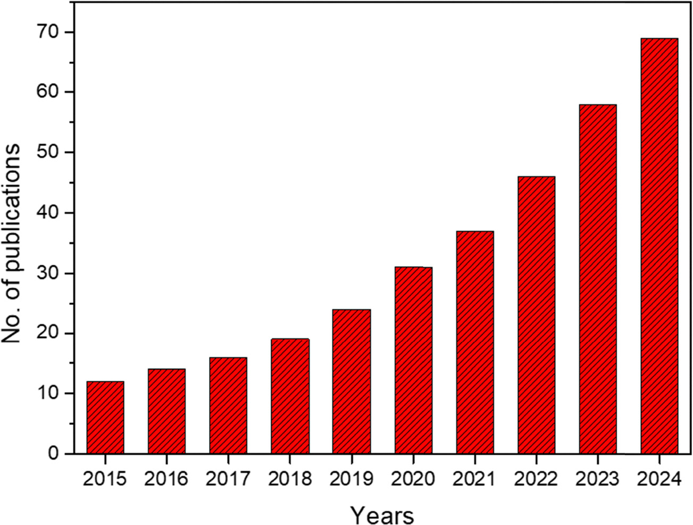

## Page 4

7156 |  Mater. Adv., 2025, 6, 7153–7206
© 2025 The Author(s). Published by the Royal Society of Chemistry
carbon gels enhance electron mobility and generate new active
sites, they have shown remarkable performance in supercapa-
citors and oxygen reduction reactions (ORRs).23 Carbon-based
gels can be broadly classified into three types: aerogels,
xerogels, and cryogels, depending on the drying technique
employed. Fig. 2 shows the distinct surface area and porosity
characteristics of each variation, which influence their applica-
tions in energy storage, environmental remediation, and
catalysis.
2.1.
Aerogels
Aerogels are extremely porous materials created by substituting
a gaseous phase for the water portion of hydrogels or compar-
able
wet
gels
while
maintaining
their
fine,
linked
microstructures.24 This process results in an ultralight struc-
ture where 90% to 99% of the volume is air, giving aerogels
their remarkably low densities, ranging from 1000 kg m3
down to as little as 1 kg m3, in some cases even lesser than
the density of air.25 These structural characteristics lead to
unique physical properties such as ultralow thermal conductiv-
ity, low sound velocity, and a minimal dielectric constant, along
with high specific surface areas and tunable density and
refractive index.26,27 These characteristics make aerogels appro-
priate for a wide range of uses, including as thermal insulators,
chemical sensors, catalytic supports, and even space technology
components.
Aerogels
are
also
well-known
for
having
nanometer-sized pores, high porosity, and superior light trans-
mittance, which make them perfect for usage in transparent
materials and sound insulation. The two primary processes in
the traditional synthesis of aerogels are the gelation stage, in
which a solvent penetrates the gel network, and the drying
stage, in which the solvent is eliminated without causing the
structure to collapse. Recent developments concentrate on
producing more robust aerogels using affordable techniques
like freeze-drying, despite the fact that early techniques relied
on supercritical drying, which uses a lot of energy and produces
aerogels with low mechanical strength. These newer aerogels
are developed using materials such as carbon nanofibers,28
graphene, nanocellulose,29 and epoxy-clay.30 Aerogels can be
broadly categorized into four principal types based on their
chemical composition: inorganic aerogels (such as silica and
alumina), organic aerogels, carbon-based aerogels, and hybrid
aerogels.31 Their combination of low density (0.004–0.500 g
cm3), large pore volumes, and high surface areas makes them
promising
materials
in
supercapacitors,32,33
stretchable
electronics,34 lithium-ion batteries,35 and artificial muscles.36
Although the internal structure of aerogels rather than parti-
cular chemical components defines them, they can be created
from a variety of precursor materials, such as organic, mineral,
and composite sources.37 The structure and density of aerogels
are influenced by the precursor’s molecular weight, molecular
structure, and concentration. Low precursor concentrations
often yield fragile networks prone to volumetric shrinkage
during solvent exchange or supercritical drying, whereas higher
concentrations produce denser, more interconnected frame-
works, altering porosity and surface area.38 Different H2O/
Na2SiO3 molar ratios ranging from 83.3 to 333.3 were investi-
gated, and it was found that lower silicate concentrations
prolonged gelation (1 min to 6 h) due to reduced particle
collision frequency. Increasing the ratio to 166.6 enlarged
colloidal particles, increasing the pore size and reducing
shrinkage, though excessive dilution again raised bulk density
resulting from network collapse.
2.1.1
Inorganic aerogels. Silica gels represent the first class
of mineral gels to be synthesized via acid-catalyzed processes.
Increasing the concentration of acid catalysts accelerates hydro-
lysis and condensation reactions during gel synthesis, produ-
cing smaller pores and a more compact network structure. Such
modifications in pore architecture can significantly alter the
aerogel’s adsorption characteristics and impact its electroche-
mical behavior. Catalysts are commonly used to control the
hydrolysis and condensation reaction rate, which leads to
Fig. 2
Classification of carbon-based gel materials based on structure and composition.
Review
Materials Advances
Open Access Article. Published on 21 August 2025. Downloaded on 1/8/2026 4:37:10 PM. 
This article is licensed under a Creative Commons Attribution-NonCommercial 3.0 Unported Licence.
View Article Online

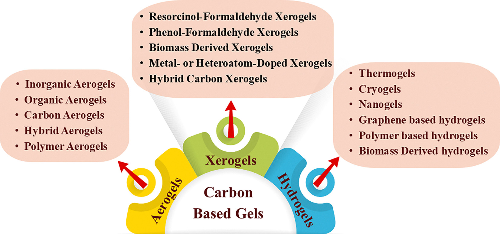

## Page 5

© 2025 The Author(s). Published by the Royal Society of Chemistry
Mater. Adv., 2025, 6, 7153–7206 |  7157
different microstructures. During the preparation of inorganic
aerogels, the hydrolysis reaction kinetics can be accelerated by
adding an acid or a base catalyst, and the condensation reac-
tion kinetics can be accelerated by adding a base catalyst.39
Indeed, the ultimate structure of hydrolyzed silica is influenced
by the pH level of the solution. Silica particles rearrange into a
linear chain structure with limited crosslinking when the pH is
low. This gives rise to a highly porous and weak gel structure
and may result in redispersion in the solution. At higher pH
values, crosslinking between the chains increases, and the
network becomes more branched, which leads to a higher
density and stronger gel structure. Although naturally occur-
ring organic gels are now more commonly found, the sol–gel
technique enables the transformation of almost any metal or
semiconductor oxide into a gel. The most researched mineral
aerogels are silica-based ones, which are followed by titanium,
zirconium, tin, aluminum, vanadium, chromium, iron, tanta-
lum, molybdenum, and niobium-based ones. Furthermore,
binary or ternary oxide aerogels can be created. However, these
kinds of aerogels are typically quite delicate because of their
ceramic composition.40 The goal of ongoing research is to
improve the mechanical stability, especially by creating com-
posites of these materials. Recent research emphasizes signifi-
cant
progress
in
carbon
nanostructure-silica
aerogel
composites and their incorporation as three-dimensional nano-
porous fillers within polymer-based nanocomposites.
2.1.2
Organic aerogels. Organic aerogels are synthesized
from organic raw materials that form robust polymeric net-
works through covalent carbon–carbon (C–C) bonds. Among
the most widely used organic systems for producing these
aerogels are resorcinol-formaldehyde and melamine-formal-
dehyde compounds. These organic compounds are usually
condensed in an alkaline aqueous environment as part of the
synthesis process. Sodium hydrogen carbonate serves as a
catalyst to speed up the reaction, whereas sodium hydroxide
is frequently used as the basic medium.41 The melamine-
formaldehyde reaction route is depicted in Fig. 3 and affects
the final aerogel’s density. The synthesis of aerogels is not
directly related to all of the other investigations, even if they all
add
to
our
understanding
of
materials
chemistry
and
applications.42,43
2.1.3
Carbon aerogels. A gas phase usually fills the interior
spaces of carbon aerogels, which are made of nanostructured
porous carbon. The pyrolysis of organic aerogels at tempera-
tures higher than 500 1C is a commonly used synthesis
technique. The organic aerogel is converted into a conductive
carbon aerogel by this high-temperature process, but its surface
area and pore structure are preserved.45 Carbon aerogels, owing
to their distinctive properties of high porosity, thermal and
structural stability, and intrinsic electrical conductivity, are
well-suited for diverse applications such as catalyst supports,
adsorption of oils and organic solvents, and energy storage
devices.46 Notably, carbon aerogels are among the lightest
materials available, exhibiting densities as low as 0.16 mg
cm3.47 Because carbon aerogels are porous and lightweight,
they may also be made to be electrically conductive, which
makes them perfect for use in electrical and electrochemical
devices including supercapacitors, batteries, and conductive
catalyst supports. Carbonizing organic gels in a non-oxidizing
environment, like nitrogen or argon, is the conventional
method for creating these materials. Precursors generated from
biomass, such as proteins, sugars, or polysaccharides, are used
in more contemporary techniques under aqueous gelation and
self-assembly conditions. The ultralow density and remarkable
conductivity of emerging carbon aerogels based on cutting-
edge materials like graphene or CNTs further expand the
possible uses of aerogel technologies.
2.1.4
Hybrid aerogels. By combining both organic and
inorganic (mineral) components, hybrid aerogels significantly
expand the functional range of conventional aerogels. By add-
ing organic materials to the silica surface, hybrid aerogels boost
their hydrophobicity, which improves their resistance to water
absorption. Additionally, the elasticity of the material is
increased by the addition of organic components, making it
more flexible and resistant to mechanical stress. Hybrid aero-
gels are frequently created via the sol–gel technique, which
turns a precursor gel into a solid network. This technique gives
precise control over the properties of the material, including
pore architecture and surface modifications. Hybrid aerogels
are more useful for applications needing a balance between
strength and flexibility since they are less brittle than tradi-
tional inorganic aerogels. Because of these properties, hybrid
aerogels can be used in a number of applications, including
sensors, insulation, and better composites.48
2.1.5
Polymer aerogels. Due to their higher mechanical
durability and environmental stability compared to silica aero-
gels, polymer aerogels are beneficial for a wide range of
applications, particularly in demanding settings like aerospace.
Polymer aerogels are robust and stable even under more
demanding conditions than silica aerogels, which are brittle
Fig. 3
Melamine-formaldehyde aerogels synthesized via a polycondensation reaction, enabling tunable density. Reproduced from ref. 44 with
permission from Elsevier, copyright 2017.
Materials Advances
Review
Open Access Article. Published on 21 August 2025. Downloaded on 1/8/2026 4:37:10 PM. 
This article is licensed under a Creative Commons Attribution-NonCommercial 3.0 Unported Licence.
View Article Online

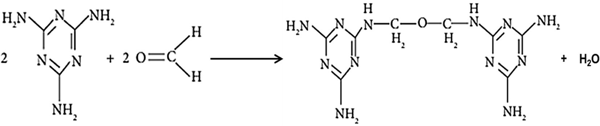

## Page 6

7158 |  Mater. Adv., 2025, 6, 7153–7206
© 2025 The Author(s). Published by the Royal Society of Chemistry
and hygroscopic. The thermal conductivities and low volu-
metric shrinkage of these organic aerogels during processing
are comparable to those of silica aerogels with comparable
densities (about 14 mW m1 K1 for aerogels with a density of
0.1 g cm3). Their mechanical properties are far better than
those of silica aerogels, with compressive moduli ranging from
1 to 5 MPa.49
Polymer-based aerogels come in a wide range of materials,
including cellulose, resin, polyimide, and PVA. The structural
and functional properties of these aerogels are greatly influ-
enced by the kind of polymer utilized and the specific manu-
facturing conditions. Their structures include assemblies of
colloidal nanoparticles, networks of nanofibrils or microfibrils,
and even frameworks that resemble sheets. Furthermore, sig-
nificant structural characteristics like pore size, morphology,
and degree of ordering have a big impact on these materials’
bulk performance. The structural diversity of polymer aerogels
allows them to be tailored for specific applications, improving
their performance and versatility.
2.2
Xerogels
2.2.1
Resorcinol-formaldehyde
(RF)
carbon
xerogels.
Among the most studied carbon xerogels are resorcinol-
formaldehyde (RF) carbon xerogels, which are created when
resorcinol and formaldehyde polycondensate in an alcoholic or
aqueous medium. They are attractive due to their large surface
area, structural tunability, and simplicity of synthesis. Less
branched structures are obtained at low pH values, which
results in larger polymer particles. On the other hand, at higher
pH values, highly crosslinked and branched structures are
obtained, which causes a more interconnected network with
smaller polymer particles. Moreover, as a consequence of
smaller particles and interconnected networks, the specific
surface area of the aerogel increases. The carbon xerogel is
created by pyrolyzing and drying the gel at temperatures ran-
ging from 700 to 1000 1C in an inert environment, usually N2 or
Ar. Usually, the polymerization is catalyzed by a base, such as
sodium carbonate. One of the characteristics that sets RF-based
carbon xerogels apart is their changeable porosity. The micro-
structure can be modified by adjusting the resorcinol-to-
catalyst (R/C) ratio, solvent content, pH, and aging time.
Higher R/C ratios provide finer, microporous networks,
whereas lower ratios usually result in greater pore sizes and
lower surface areas. Surface areas that are frequently cited vary
from 400 to over 1000 m2 g1. They typically have disorganized
graphitic domains and amorphous carbon. Catalysis, super-
capacitors, and adsorption (especially for CO2 and metal ions)
are just a few of the many uses for RF-derived xerogels. They are
suitable for electrochemical devices due to their conductivity
and stability at high temperatures, and they are ideal for
aqueous-phase adsorption due to their hydrophilic nature
and tunable pore network. One major advantage is that they
can be further altered. RF xerogels can be doped with metals,
nitrogen, or sulfur during or after production to alter their
electrical and chemical properties, enhancing performance in
specific applications such as oxygen reduction reactions or
energy storage devices.50,51
2.2.2
Phenol-formaldehyde (PF) carbon xerogels. Although
they
employ
phenol
rather
than
resorcinol,
phenol-
formaldehyde (PF) based xerogels are structurally and synthe-
tically comparable to RF xerogels. PF xerogels are appealing for
large-scale applications because phenol is more affordable and
accessible than resorcinol, despite being marginally less reac-
tive. After condensation reactions catalyzed by bases or acids,
PF xerogels undergo aging, drying, and pyrolysis. Depending on
the synthesis conditions, the resultant carbon xerogels exhibit a
varied pore network that ranges from microporous to meso-
porous, as well as good thermal and chemical stability. PF
xerogels have the advantage of having a more hydrophobic
surface, which makes them ideal for applications like gas
adsorption
and
organic
contamination
remediation
that
require less water affinity as well as for eliminating non-polar
contaminants. Similar to RF xerogels, PF xerogels have disor-
dered carbon domains and are physically amorphous; but,
because of variations in crosslinking density and polymeriza-
tion kinetics, they may exhibit somewhat smaller surface areas
(usually 300–800 m2 g1).52,53
The characteristics of PF xerogels can be greatly improved by
activation or doping modifications. Chemical activation with
substances like KOH or H3PO4 can increase surface area and
produce ultra-micropores, which are beneficial for supercapa-
citor or hydrogen storage applications. Because of their adjus-
table electrical characteristics, PF xerogels have also been used
in sensors and photocatalysis (when hybridized with metal
oxides).54 RF and PF xerogels differ from one another in their
environmental effects. Because it is more harmful, phenol
requires safer handling and consideration of the environment.
However,
advances
in
green
chemistry
approaches
are
addressing these limitations by using bio-derived phenolic
compounds.
2.2.3
Biomass-derived carbon xerogels. The term biomass
refers to a diverse range of materials originating from plants,
animals, and marine organisms, all of which hold considerable
promise as renewable and cost-effective carbon precursors.
Plant-derived biomass primarily consists of carbohydrate poly-
mers such as cellulose, hemicellulose, and lignin, whereas
animal-derived biomass predominantly contains proteins and
lipids.55,56 Carbon fibers and lignin-derived materials, sourced
from abundant biomass, present significant potential for the
sustainable fabrication of high-performance redox flow battery
(RFB) electrodes. Advancing carbon materials for RFBs is
essential, as they offer high electrical conductivity, excellent
chemical stability, and cost-effectiveness. RFBs represent a
relatively emerging large-scale energy storage technology,
well-suited for addressing the variability and intermittency
inherent to renewable energy generation sources such as wind
and solar power.57 Similarly, lignocellulosic biomass (LCB),
composed primarily of cellulose, hemicellulose, and lignin, is
considered particularly advantageous owing to its favorable
structural and biochemical characteristics.58 Because of their
low cost, environmentally benign synthesis methods, and
Review
Materials Advances
Open Access Article. Published on 21 August 2025. Downloaded on 1/8/2026 4:37:10 PM. 
This article is licensed under a Creative Commons Attribution-NonCommercial 3.0 Unported Licence.
View Article Online

## Page 7

© 2025 The Author(s). Published by the Royal Society of Chemistry
Mater. Adv., 2025, 6, 7153–7206 |  7159
renewable nature, biomass-derived carbon xerogels are also
receiving a lot of interest. Carbon-rich polymers like cellulose,
lignin, chitosan, starch, and alginates – which include intrinsic
functions like –OH, –NH2, or –COOH that can be maintained or
altered in the final carbon material – are commonly used to
create these xerogels. Sol–gel polymerization, ambient or
freeze-drying, and carbonization under inert circumstances
are all part of the basic procedure. The green synthesis of
biomass-derived xerogels and the possibility of customizing
surface chemistry through precursor selection are what make
them appealing.59 For example, chitosan-based xerogels are
perfect for CO2 collection and electrocatalysis since they natu-
rally have nitrogen functionalities. Similarly, because of their
aromatic component, lignin-derived xerogels can help with
mesoporosity and high carbon yields.
The pore architectures of these xerogels vary, ranging from
microporous to hierarchical porous networks, contingent on
the
post-treatment
procedures
and
the
gelling
behavior
of the biopolymer. Porosity can be further enhanced by addi-
tional
activation
stages,
and
their
surface
areas
can
vary from 200 to 800 m2 g1. The main benefit is the sustain-
ability and abundance of biomass, which complement waste
valorization and the circular economy. Heavy metal adsorption,
gas
separation,
supercapacitor
electrodes,
and
electro-
catalysis are some of the uses.60 Additionally, certain studies
emphasize its application in biosensing and medication deliv-
ery, especially when the final xerogel retains the biopolymer
structure.
2.2.4
Metal or heteroatom-doped carbon xerogels. Doping
carbon xerogels with metals (like Fe, Ni, and Co) or hetero-
atoms (like N, S, P, and B) greatly improves their physicochem-
ical characteristics, making them suitable for use in energy
conversion, environmental remediation, and catalysis. Doping
can be accomplished via post-synthetic modification techni-
ques such as pyrolysis or impregnation with dopant precursors,
or it can be accomplished during the sol–gel synthesis. Because
of their improved surface basicity, electrical conductivity, and
active sites, heteroatom-doped xerogels, especially N-doped
varieties, are widely used.61 In the graphitic structure, nitrogen
atoms can take the place of carbon atoms to generate graphitic,
pyridinic, or pyrrolic nitrogen functionalities that enhance
electrocatalytic activity, particularly in the ORR. Likewise, sul-
fur doping increases chemical reactivity and adds electron-
donating characteristics. Doping with phosphorus and boron
can alter the electron density and enhance energy storage
performance. Because of the creation of active redox centers,
metal-doped xerogels, such as those containing Fe, Ni, and Co,
perform very well in Fenton-like catalysis, battery anodes, and
supercapacitors.62
The structure and porosity of the xerogels can also be
influenced by the dopants; metal catalysts can occasionally
enable graphitization at lower carbonization temperatures.
The surface areas of xerogels, which normally range from 400
to 1200 m2 g1, vary greatly based on doping concentrations
and activation techniques. Li-ion batteries, fuel cells, super-
capacitors, electrocatalysis, and pollutant degradation are a few
examples of applications.63 Doped xerogels are very appealing
for cutting-edge technologies because of the multifunctionality
made possible by the synergy between dopants and carbon
frameworks.
2.2.5
Hybrid carbon xerogels. Composites known as hybrid
carbon xerogels mix organic carbon matrices with inorganic or
other nanomaterials to improve structural, electrical, or cataly-
tic capabilities in a complementary way. Carbon–metal oxide,
carbon–silica, carbon–graphene, and carbon–polymer compo-
sites are examples of common hybrid systems. Prior to drying
and pyrolysis, they are usually created by co-gelling or in situ
incorporating secondary phases into a matrix obtained from
biomass or resorcinol-formaldehyde. Metal oxides (such as
TiO2, ZnO, and FeO4) can be added to improve electrical
conductivity, magnetic responsiveness, or photocatalytic activ-
ity. For instance, TiO2-carbon xerogel hybrids, which take
advantage of both the surface area and the optical activity of
the xerogel of TiO2, are efficient in the photodegradation of
dyes and contaminants. Silica-carbon composites are utilized
for adsorption and separation and retain their structural integ-
rity in challenging environments. In contrast, hybrids based on
graphene or CNTs provide better electron transport and greater
mechanical strength, which are advantageous for energy sto-
rage and sensing applications.63,64
High surface areas (500–1500 m2 g1) are usually retained by
hybrid xerogels, which also show enhanced stability, hierarch-
ical porosity, and multifunctionality. Depending on the embed-
ding phase, the design flexibility enables customization of
adsorption capacity, electrochemical activity, and thermal con-
ductivity. Hybrid xerogels are used in gas storage and separa-
tion, magnetic separation, photo- and electro-catalysis, and
electrochemical capacitors. Their adaptability results from the
special blend of qualities that the organic–inorganic architec-
ture bestows.
2.3
Hydrogels
Hydrogels are three-dimensional networks made of polymers
that are linked together by physical or chemical bonds, allow-
ing them to hold a lot of water inside. Owing to their distinctive
physicochemical
properties,
hydrogels
have
found
broad
applicability across a wide range of fields,65 including drug
carriers,66 electrode materials,67 actuators,68 sensors,69 and
adsorbents.70 Hydrogels can be categorized based on a number
of factors, such as their network structure (affine or phantom
models), cross-linking type (covalent or non-covalent interac-
tions), and provenance (natural or synthetic).71 The mechanical
strength and stability of conventional hydrogels, which are
often cross-linked using organic polymers, are frequently
restricted, which limits their usefulness. But new developments
have made it possible to create sophisticated hydrogels and
hybrid systems with far better qualities. These next-generation
hydrogels improve mechanical, electrical, and functional per-
formance by including cutting-edge elements like carbon nano-
tubes, graphene, biomass-derived components, or functional
nanoparticles,33 graphene-poly(N,N-dimethylacrylamide) com-
posite hydrogels,65 graphene hydrogels, and polymer-clay
Materials Advances
Review
Open Access Article. Published on 21 August 2025. Downloaded on 1/8/2026 4:37:10 PM. 
This article is licensed under a Creative Commons Attribution-NonCommercial 3.0 Unported Licence.
View Article Online

## Page 8

7160 |  Mater. Adv., 2025, 6, 7153–7206
© 2025 The Author(s). Published by the Royal Society of Chemistry
nanosheet
composite
hydrogels.
Carbonaceous
nanofiber-
based
multifunctional
hydrogels,
for
instance,
exhibit
increased functionality and better mechanical robustness.
Because hybrid hydrogel structures exhibit noticeably improved
mechanical qualities, their potential for a wide range of appli-
cations is increased. Hydrogels, also known as aqua gels, are
networks of three-dimensional polymers that are insoluble in
water but have a great capacity to absorb water, giving them a
flexibility similar to that of natural tissues.72 These materials
have several uses in industries including medication delivery
systems, wastewater treatment, and scaffolds for tissue engi-
neering. They can be made from natural or synthetic polymers.
Hydrogels are ideal for a variety of biological and environmen-
tal applications due to their remarkable ability to absorb large
volumes of water.
2.3.1
Thermogels. A unique class of hydrogels known as
thermogels behave in a temperature-responsive manner, going
through a sol–gel transition at a particular temperature. Ther-
mogels change between sol and gel phases in reaction to
temperature changes, unlike non-thermoresponsive hydrogels,
where gelation is mostly reliant on polymer concentration. This
characteristic results from the polymer architecture’s inclusion
of both hydrophilic and hydrophobic regions, which have a
significant impact on the gelation process. The kinetics of the
sol–gel transition are strongly influenced by the temperature
and molecular weight of these segments. As a result, the
transition is controlled by both the inherent molecular proper-
ties of the polymer components and external heat stimuli. The
capacity of temperature-sensitive hydrogels to form gels in situ
at physiological temperatures has generated a lot of interest in
biomedical applications, especially in controlled drug delivery
systems and other therapeutic approaches.73 The formation
and cross-linking mechanism of a representative thermogel is
illustrated in Fig. 4(a).74
2.3.2
Nanogels. Nanogels are three-dimensional hydrogel
structures formed from networks of cross-linked polymers and
they can expand and hold large volumes of water without
disintegrating
in
the
surrounding
aquatic
environment.
Because they can be made from natural or synthetic polymers,
or their combinations, they provide a great deal of flexibility in
customizing their characteristics for particular uses. Nanogels
can have a range of characteristics, including varied softness,
size, amphiphilicity, charge, degradability, and porosity, by
modifying their chemical makeup. This enables the behavior
of the gels to be fine-tuned in various settings. Although
most nanogels are spherical, new synthetic techniques have
made it possible to create nanogels in a variety of different
shapes, increasing their usefulness for a range of appli-
cations. These innovations are evident in the work of Rolland
et al., who demonstrated the fabrication of shape-specific
nanobiomaterials,76 and Tagliazucchi et al., who explored how
the aspect ratio and deformability of nanoparticles influence their
ability to extravasate through nanoscopic pores.77 An example of a
PEGylated nanogel incorporating gold nanoparticles is depicted
in Fig. 4(b).78
2.3.3
Cryogels. The main components of conventional
hydrogels are networks of hydrophilic polymers that have
swelled with water; nevertheless, these materials frequently
lack crucial characteristics like linked macroporosity and
enough elasticity, which are necessary for particular biomedical
applications. Cryogels, a special class of hydrogels, have been
created to get around these restrictions. Cryogels are created by
a freeze–thaw process at extremely low temperatures, which
results in the creation of intricately linked supermacroporous
structures. Due to its ability to promote cell proliferation and
provide effective nutrition and waste exchange, this unique
architecture offers substantial advantages, especially in tissue
engineering scaffolds. Cryogels are successfully used in wound
healing, cell immobilization, purification systems, controlled
drug delivery, biosensors, and bioseparation technologies in
addition to tissue engineering. Fig. 5 presents the formation
mechanism of cryogels. The production of cryogels involves
freezing the liquid within the wet gel and then drying it by
sublimation under low pressure, a process that produces
materials with high porosity, typically around 80%. Compared
to aerogels, cryogels have a more macroporous structure and
experience greater shrinkage. While aerogels dried using super-
critical CO2 show a more uniform structure with higher surface
areas (as measured by BET), cryogels generally exhibit narrower
pore size distributions, smaller BET values, and less shrinkage
Fig. 4
(a) Illustration of the thermogel formation and cross-linking mechanism. (b) Diagram of a PEGylated nanogel encapsulating gold nanoparticles.
Reproduced from ref. 75 with permission from Elsevier, copyright 2023.
Review
Materials Advances
Open Access Article. Published on 21 August 2025. Downloaded on 1/8/2026 4:37:10 PM. 
This article is licensed under a Creative Commons Attribution-NonCommercial 3.0 Unported Licence.
View Article Online

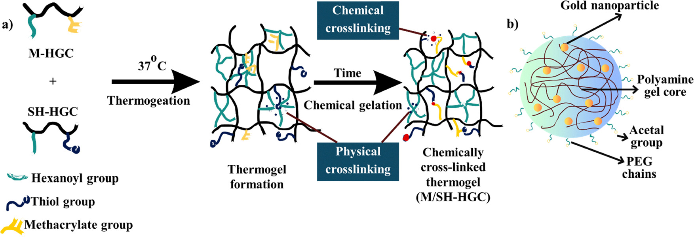

## Page 9

© 2025 The Author(s). Published by the Royal Society of Chemistry
Mater. Adv., 2025, 6, 7153–7206 |  7161
when compared to those produced by hot or vacuum drying
techniques.79
2.3.4
Graphene-based hydrogels. Graphene and its deriva-
tives exhibit exceptional flexibility, electrical conductivity, and
mechanical strength, making them highly suitable for diverse
technological applications. Their outstanding chemical adsorp-
tion capacity, thermal stability, and superior electrical proper-
ties further enhance their utility. In the field of energy storage,
engineers
and
researchers
are
particularly
interested
in
graphene-based supercapacitors due to their remarkable dur-
ability, high power density, and ability to endure numerous
charge–discharge cycles. The combination of high electrical
conductivity of graphene, extensive specific surface area, ther-
mal stability, and excellent mechanical and chemical resilience
significantly improves the performance and reliability of
supercapacitors.81,82 Moreover, graphene is a cutting-edge
nanomaterial with a distinct two-dimensional layered struc-
ture, endowing it with exceptional mechanical, electrical,
and thermal properties. These characteristics make it an
ideal filler for enhancing the performance of polymer-based
nanocomposites.83 Given its remarkable properties, graphene
has been extensively studied for its potential to enhance the
Fig. 5
(i) Schematic of the cryogel formation process. (ii) (a) Photographs of the carbon cryogel (CC), graphene/carbon cryogel (GCC), and Ni-doped
graphene/carbon cryogel (NGCC), each weighing 90 mg, supporting a 200 g load (inset: a 140 mg NGCC monolith supporting a 500 g weight). (b) and (c)
SEM images and (d) and (e) TEM images of the Ni-doped graphene/carbon cryogel are also shown. Reproduced from ref. 75 and 80 with permission from
Elsevier & ACS, copyright 2023 & 2013.
Materials Advances
Review
Open Access Article. Published on 21 August 2025. Downloaded on 1/8/2026 4:37:10 PM. 
This article is licensed under a Creative Commons Attribution-NonCommercial 3.0 Unported Licence.
View Article Online

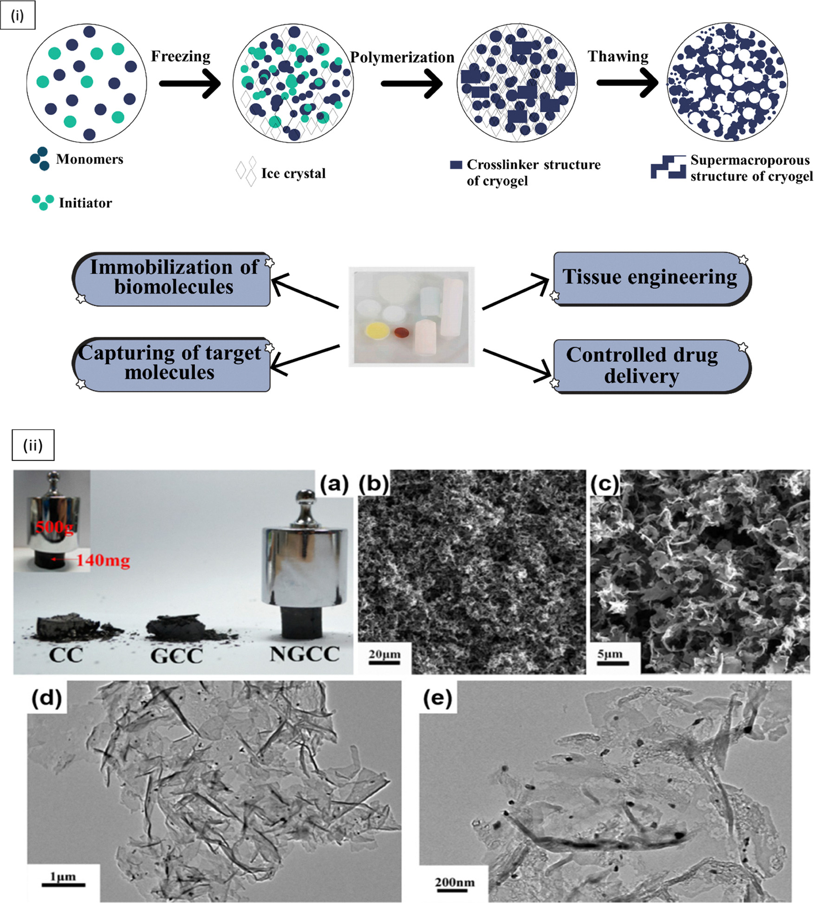

## Page 10

7162 |  Mater. Adv., 2025, 6, 7153–7206
© 2025 The Author(s). Published by the Royal Society of Chemistry
performance of various materials, particularly in the develop-
ment of nanocomposites. In contrast, hydrogels are polymeric
networks characterized by moderate cross-linking and branch-
ing, forming three-dimensional structures capable of absorbing
substantial amounts of water. These materials swell rapidly and
exhibit soft, elastic, and biologically compatible properties.84
When graphene is incorporated into hydrogels, it plays a dual
role: acting as a gelator to help self-assemble the hydrogel
structure, and as a filler to enhance the functionality of the
hydrogel by blending with small molecules and macromole-
cules. These graphene-based hydrogels (GBHs) are designed to
have multifunctional properties, which have been extensively
studied for various applications.
Typically, two-dimensional materials such as graphene and
graphene oxide are functionalized with hydroxyl, carboxyl, and
epoxide moieties to create graphene-based hydrogels. These
functional groups facilitate the incorporation of additional
materials, such as metals, metal oxides, or heteroatoms (e.g.,
oxygen, nitrogen, and boron), through electrostatic interactions
and hydrogen bonding.85 The hierarchical three-dimensional
structure of graphene hydrogels offers superior mechanical,
electrical, and thermal properties compared to their 2-D forms,
with better porosity and the ability to prevent agglomeration, a
common challenge in utilizing two-dimensional graphene
sheets.86 The stability of the three-dimensional structure of
these hydrogels is maintained by various forces, including p–p
stacking interactions, van der Waals forces, and hydrogen
bonding, which prevent agglomeration, enhancing the overall
performance of the material.87
The synthesis of graphene-based hydrogels is predominantly
classified into three main approaches: hydrothermal and sol-
vothermal reactions, gel formation via cross-linking polymers,
and template-based synthesis methods.88,89 Additionally, gra-
phene hydrogels can be functionalized with noble metals to
further enhance their properties, expanding their potential for
use in diverse applications.90
2.3.5
Polymer-based hydrogels. Polymers are macromole-
cules consisting of repeating subunits, playing a crucial role in
numerous aspects of human life due to their versatility and
wide range of applications. Among the various types of hydro-
gels, water-swollen polymer networks stand out due to their
unique properties.91,92 These hydrogels can be synthesized
from both
synthetic
and natural polymers
and can be
further enhanced by incorporating various functional materials
into the polymer backbone, thereby imparting additional
properties. Hydrogels can be classified based on their composi-
tion and the functionalities introduced within the polymer
network.
These
classifications
include
non-conducting
polymer hydrogels, which are primarily valued for their ability
to absorb and retain large volumes of water; conducting poly-
mer hydrogels, which incorporate conductive polymers for
applications in bioelectronics and sensors; quantum-dot incor-
porated polymer hydrogels, offering distinctive optical proper-
ties suitable for imaging and diagnostics; and nanoparticle-
polymer hydrogels, which combine the unique benefits of
nanoparticles and polymers to create versatile materials with
enhanced properties for applications in drug delivery, tissue
engineering, and more.92
2.3.6.
Biomass-derived hydrogels. The use of biomass as a
sustainable raw material for the development of advanced
materials has garnered significant attention in scientific
research. Numerous studies have highlighted the effectiveness
of biomass in hydrogel synthesis. A notable example is pro-
vided by Wu et al., who synthesized spongy hydrogels from
watermelon biomass composed of carbon nanospheres and
nanofibers. Watermelon biomass, especially the rind, can be
converted into activated carbon with a well-developed porous
architecture, which plays a crucial role in its adsorption and
electrochemical characteristics. The pore size and distribution,
governed by processing techniques such as alkali activation or
plasma treatment, critically determine the material’s efficiency
in pollutant removal and its capacity for energy storage. In their
approach, the soft segments of watermelon were subjected
directly to hydrothermal treatment, during which the inherent
carbohydrates underwent polymerization to form nanostruc-
tured materials. The resulting solid carbonaceous blocks exhib-
ited interconnected networks of carbon nanospheres and
nanofibers, with the monolith size controllable by adjusting
the dimensions of the watermelon pieces (Fig. 6a and b).93 A
one-step synthesis approach was used to create conducting
polymer hydrogels with 2D structures, employing oxidative
polymerization and non-covalent interactions. These hydrogels
display reversible gel–sol transitions in response to external
redox stimuli, particularly chemicals with electrode potentials
above 0.8 V, highlighting their potential in electro-responsive
applications (Fig. 6c).94 Fig. 6d shows a schematic representa-
tion of a three-dimensional porous composite electrode con-
sisting of silicon nanoparticles (Si NPs) embedded within a
conductive polymer hydrogel. Each Si NP is individually coated
with a conductive polyaniline layer and integrated into a porous
hydrogel matrix. The polymer coating forms uniformly on the Si
NPs through interactions between hydroxyl groups on the
nanoparticle surface and phosphonic acid groups from the
phytic acid cross-linker.
Cheng et al. reported the synthesis of carbon fiber hydrogels
and aerogels derived from cotton, achieving an exceptionally
high specific surface area of up to 2436 m2 g1.95 Cotton,
composed predominantly of cellulose and possessing an intrin-
sic fibrous, hollow morphology, is a promising precursor for
porous carbon materials with hierarchical pore architectures.
Structural modification through activation – either chemical
(e.g., KOH and ZnCl2) or physical (e.g., steam and CO2) –
significantly influences functional performance: micropores
contribute to elevated surface area, enhancing adsorption
capacity and electric double-layer formation, whereas meso-
and macropores promote efficient ion and molecule transport,
thereby improving both electrochemical energy storage and
pollutant removal efficiency. The cotton fibers were first carbo-
nized to obtain carbon fiber (CF), which was then soaked in 2 M
KOH. During high-temperature treatment, the KOH reacted
with carbon, creating vacancies and enhancing porosity. This
method preserved the original porous and flexible nature of the
Review
Materials Advances
Open Access Article. Published on 21 August 2025. Downloaded on 1/8/2026 4:37:10 PM. 
This article is licensed under a Creative Commons Attribution-NonCommercial 3.0 Unported Licence.
View Article Online

## Page 11

© 2025 The Author(s). Published by the Royal Society of Chemistry
Mater. Adv., 2025, 6, 7153–7206 |  7163
cotton while converting it into a conductive fibrous aerogel
(Fig. 6e). Additionally, biopolymers such as bacterial cellulose
and agarose have proven to be cost-effective and abundant
biomass sources for hydrogel production.96–98 Liang et al.
prepared aerogels from bacterial cellulose (BC) synthesized by
Acetobacter xylinum in a culture containing sucrose and
coconut milk.99 The wet bacterial cellulose (BC) pellicles were
cryogenically sectioned using a frozen blade at 196 1C, fol-
lowed by freeze-drying at 50 1C under a pressure of 0.04 mbar.
Subsequently, the samples were pyrolyzed at 800 1C in a
nitrogen
atmosphere
and
further
subjected
to
nitrogen
doping through a secondary heat treatment under an ammonia
flow at 700–900 1C, resulting in aerogels with enhanced
functionalities.100
3. Preparation of carbon gels
The preparation of carbon gels involves three key stages:
polymerization, drying, and carbonization. In the polymeriza-
tion step, network formation is strongly dependent on the
precursor composition and catalyst concentration. A higher
catalyst ratio promotes faster gelation and smaller pore for-
mation,
advantageous
for
high-capacitance
applications,
Fig. 6
(a) Photographs of carbonaceous hydrogel monoliths in various volumes and the resulting carbonaceous aerogel block. (b) SEM image of the
carbonaceous gels. (c) Schematic representation of the synthesis of conducting polymer hydrogels: a 3,4-ethylenedioxythiophene sulfonate (EDOT-S)
colloidal solution containing spherical micelles transforms into a poly(3,4-ethylenedioxythiophene) sulfonate (PEDOT-S) hydrogel with sheet-like
structures upon addition of an oxidant (APS, FeCl3, or a combination) to initiate polymerization. (d) Illustration of a 3D porous SiNP/conductive polymer
hydrogel composite electrode. (e) and (a) SEM image of carbon foam (CF). (b) Digital image of aCF-6 before and after manual compression. (c)–(e) SEM
images of aCF-6 at various magnifications. (f) Electrical conductivity measurements of CF and aCF using a standard four-probe method. Reproduced
from ref. 100 and 101 with permission from Royal Society of Chemistry & Materials Research Society, copyright 2019 & 2015.
Materials Advances
Review
Open Access Article. Published on 21 August 2025. Downloaded on 1/8/2026 4:37:10 PM. 
This article is licensed under a Creative Commons Attribution-NonCommercial 3.0 Unported Licence.
View Article Online

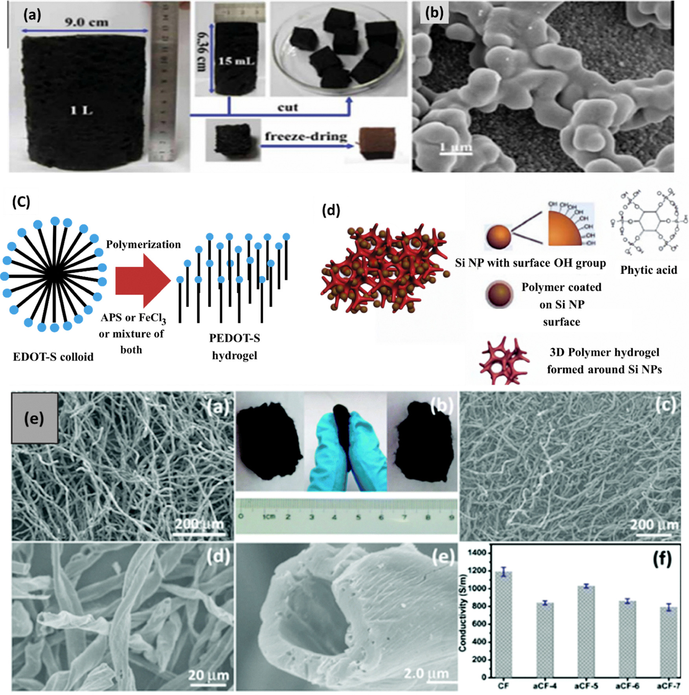

## Page 12

7164 |  Mater. Adv., 2025, 6, 7153–7206
© 2025 The Author(s). Published by the Royal Society of Chemistry
whereas a lower catalyst ratio creates looser networks with
larger pores, improving mass transfer for adsorption of bulky
contaminants. The selection of biomass type influences pore
development during carbonization. Cellulose-derived gels gen-
erally yield a balanced micro-mesoporous network, beneficial
for supercapacitors, while lignin-based gels favor micropores
for gas storage and selective adsorption. Intrinsic minerals in
certain biomass feedstocks can act as pore-forming agents,
eliminating the need for external templating. The drying pro-
cess determines how well the pore structure survives after
gelation. Freeze-drying and supercritical drying preserve the
open pore network, maintaining high surface area and con-
nectivity, which is crucial for rapid ion transport. In contrast,
ambient drying, though more cost-effective, can induce struc-
tural collapse due to capillary forces, reducing accessible sur-
face area and lowering electrochemical performance.102
Carbonization, typically under inert atmospheres, further
develops the pore network while removing volatile components.
Optimization of carbonization temperature is essential – mod-
erate temperatures (700–1000 1C) enhance microporosity and
surface area, while excessively high temperatures (42000 1C)
promote graphitization, improving conductivity but often at the
expense of surface area. From an efficiency and applicability
standpoint, industrial-scale synthesis benefits from precursor
systems requiring minimal pre-treatment, catalyst ratios that
balance pore structure control with cost, drying methods that
preserve structure without excessive energy demand, and car-
bonization protocols tuned for the intended application
(adsorption vs. electrochemistry).
The synthesized hydrogel undergoes curing in a controlled
environment at temperatures between 60 1C and 80 1C to
promote particle aggregation and strengthen internal bonding.
Following this, solvent exchange is performed to remove resi-
dual water from within the material. The dried hydrogel is then
subjected to carbonization at temperatures ranging from 300 1C
to 2500 1C. This process removes remaining oxides and
hydrogen-containing groups, converting the organic hydrogel
into a carbon gel with a highly porous structure. The increase in
carbonization temperature enhances the formation of meso-
pores and micropores, thereby boosting the specific surface
area and total pore volume of the carbon gel. However, at
temperatures above 1000 1C, the pore volume begins to decline
due to the structural collapse of the porous framework. To
further functionalize the carbon gel, an oxidation step is
introduced. Physical oxidation in air produces phenolic and
carbonyl groups on the surface, while chemical oxidation using
nitric acid generates carboxylic groups.103 Physical oxidation
typically occurs at higher temperatures than chemical methods
and does not require a washing step. The entire synthesis
process is visually summarized in Fig. 7.
3.1.
Preparation of aerogels
3.1.1
Gelation of precursors. The synthesis of carbon gels
generally comprises three principal stages: polymerization,
drying, and carbonization. During the polymerization phase,
hydrogels are generated through molecular polymerization and
crosslinking, involving three successive chemical transforma-
tions. Initially, hydroxymethyl groups (–CH2OH) are introduced
via addition reactions between aldehyde and hydroxyl func-
tional groups. Following this, condensation reactions of hydro-
xymethylated resorcinol result in the formation of methylene
(–CH2–) and methylene ether (–CH2OCH2–) linkages. The final
step encompasses extensive crosslinking and aggregation, cul-
minating in the establishment of a three-dimensional hydrogel
framework (Fig. 4). Basic catalysts, including sodium hydroxide
(NaOH), sodium carbonate (Na2CO3), potassium carbonate
(K2CO3), and calcium hydroxide (Ca(OH)2), are commonly
utilized to promote the addition step by producing resorcinol
Fig. 7
Process flow for carbon gel synthesis.
Review
Materials Advances
Open Access Article. Published on 21 August 2025. Downloaded on 1/8/2026 4:37:10 PM. 
This article is licensed under a Creative Commons Attribution-NonCommercial 3.0 Unported Licence.
View Article Online

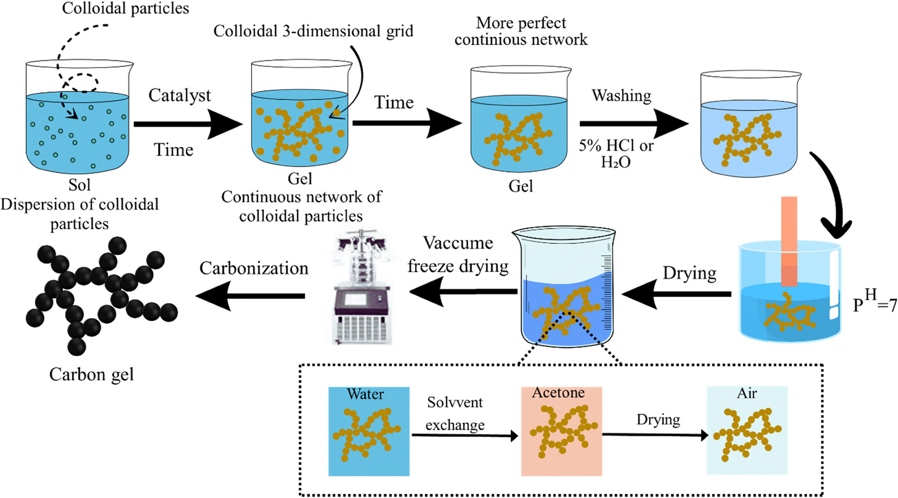

## Page 13

© 2025 The Author(s). Published by the Royal Society of Chemistry
Mater. Adv., 2025, 6, 7153–7206 |  7165
anions with enhanced nucleophilic reactivity. In contrast,
recent research has explored the use of acid catalysts to facil-
itate electrophilic addition reactions between formaldehyde
and resorcinol.104 Traditionally, organic carbon aerogels have
been produced through the polymerization of resorcinol and
formaldehyde in the presence of different catalysts.105 In addi-
tion to the resorcinol–formaldehyde system, other aromatic-
aldehyde combinations, including melamine–formaldehyde,
phenol–formaldehyde, phenol–furfural, and cresol–formalde-
hyde, have been employed for the synthesis of organic
aerogels. To aid in the fabrication of templated carbon aero-
gels, various templates – such as polymers, inorganic salts, and
ceramic nanoparticles- have been incorporated during the
polymerization
process.
The
resulting
aerogels
typically
exhibit well-defined pore size distributions, highly ordered
porous architectures, and enhanced mechanical flexibility.106
More recently, alternative precursors such as graphene, carbon
nanotubes (CNTs), and biomass have been explored, providing
more straightforward synthesis routes compared to traditional
polymer-based methods.93,107 Various approaches, such as sol–
gel processing, template-assisted methods, spacer-supported
techniques, self-supporting strategies, and substrate-based fab-
rication, have been utilized to produce graphene aerogels.108
CNT-derived aerogels hold great potential as electrically con-
ductive materials due to their ability to crosslink via van der
Waals forces, facilitating the formation of aerogels. However,
the direct synthesis of CNT aerogels faces considerable chal-
lenges, such as the development of poorly structured 3D frame-
works, mechanical instability, and restricted elasticity.109 To
address these issues, the incorporation of surfactants to reduce
CNT surface activity, along with the addition of polymer
additives to strengthen the network, has been suggested.110
Biomass serves as a promising precursor for carbon aerogels
owing to its affordability, wide availability, and environmen-
tally sustainable characteristics.111 Moreover, hydrated bio-
mass
precursors,
including
watermelons
and
bacterial
cellulose,
eliminate
the
need
for
additional
gelation
steps.112,113 These hydrated biomass materials, containing
more than 80 wt% water, facilitate the creation of porous 3D
structures through the straightforward sublimation of water
during the preparation process.
3.1.2
Drying. The drying method employed significantly
influences the textural properties of carbon aerogels. During
drying, the solvent within the hydrogel is removed, leaving the
solid matrix intact. To maintain the integrity of the porous
structure essential for optimal performance drying must be
carried out in a manner that prevents structural collapse.
Common drying techniques for carbon aerogels include freeze
drying, supercritical drying, and ambient drying, producing
cryogels, aerogels, and xerogels, respectively. Although these
methods yield distinct materials, the term ’aerogels’ is often
used broadly in the scientific literature to describe all such
dried gel forms shown in Fig. 8.114
3.1.2.1 Supercritical drying. In the supercritical state, the
boundary between liquid and vapor phases vanishes, resulting
in the elimination of surface tension at the solid–liquid–gas
interface. This absence of surface tension prevents pore col-
lapse
during
drying,
thus
maintaining the
gel’s
porous
architecture.115 Among various drying techniques, supercritical
Fig. 8
Schematic diagram showing the drying-based synthesis routes for aerogels and xerogels. Reproduced from ref. 114 with permission from Wiley,
copyright 2014.
Materials Advances
Review
Open Access Article. Published on 21 August 2025. Downloaded on 1/8/2026 4:37:10 PM. 
This article is licensed under a Creative Commons Attribution-NonCommercial 3.0 Unported Licence.
View Article Online

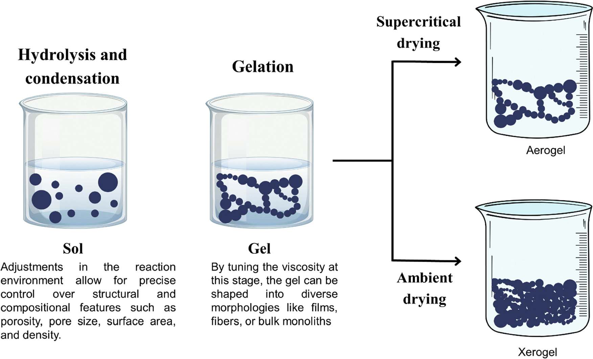

## Page 14

7166 |  Mater. Adv., 2025, 6, 7153–7206
© 2025 The Author(s). Published by the Royal Society of Chemistry
drying is particularly effective in producing aerogels with highly
porous and uniform microstructures.116 This method main-
tains the nanoscale pore structure of aerogels by removing the
solvent under supercritical conditions, thus preventing pore
collapse from capillary forces. Consequently, it produces mate-
rials with high porosity, uniform pore size distribution, and a
well-connected mesoporous network with minimal structural
shrinkage. Aerogels prepared via supercritical drying exhibit
improved electrochemical properties due to their enlarged
surface area and enhanced ion transport, along with superior
adsorption performance arising from preserved active site
accessibility and efficient diffusion channels. However, its
practical application is constrained by various factors, includ-
ing the necessity for complete solvent exchange prior to drying.
Incomplete replacement of the original solvent can negatively
impact the final material’s performance. Additionally, the
supercritical drying process is complex and time-intensive,
generates substantial solvent waste, and incurs high opera-
tional costs, which limit its feasibility for large-scale commer-
cial production.
Barim et al. provided a representative example of this
approach by synthesizing carbon aerogels through the poly-
merization of resorcinol and formaldehyde, subsequently dried
under
supercritical
conditions
to
preserve
the
porous
network.117 Following the primary gelation stage, the hydrogel
underwent successive solvent exchange steps using acetone.
This was followed by supercritical extraction using carbon
dioxide under conditions of 138 bar pressure and 323 K tem-
perature. The resulting carbon aerogels exhibited high pore
volumes and retained well-defined porous structures, free from
collapse. Additionally, the robust and uniform pore architec-
ture facilitated the formation of homogeneously distributed
metal nanoparticles within the carbon matrix.
3.1.2.2 Freeze-drying. Freeze-drying is commonly utilized in
the fabrication of porous carbon aerogels owing to its opera-
tional
simplicity,
low
cost,
and
environmentally
benign
nature.118 This technique involves initially freezing the solvent
contained within the hydrogel, followed by its removal via
sublimation under reduced pressure, thereby eliminating the
liquid-vapor interface that might otherwise compromise the gel
structure. The textural characteristics of the resulting aerogel,
particularly its porosity, are significantly governed by the freez-
ing kinetics and the concentration of precursors. Faster freez-
ing rates result in the development of smaller ice crystals,
yielding finer pore structures and enhancing the specific sur-
face area of the material. In contrast, lower precursor concen-
trations tend to favor the development of larger ice crystals,
thereby affecting the overall pore morphology of the aerogel.
Vazhayal et al. showcased the utility of this method by
fabricating carbon aerogels from waste tissue paper (WTP)
and poly(vinyl alcohol) (PVA), targeting applications in CO2
capture and electromagnetic interference (EMI) shielding.119
Polymerization of waste tissue paper (WTP) and poly(vinyl
alcohol) (PVA) was carried out under ambient conditions using
hydrochloric acid as a catalytic agent. Post-molding, the
hydrogel samples were extensively rinsed with deionized water
and subjected to freeze-drying at 193 K under a vacuum below
1  105 bar. The resulting WTP-PVA-derived carbon aerogels
exhibited a robust three-dimensional porous architecture, as
evidenced by SEM imaging, and demonstrated significant
microporosity,
as
verified
through
nitrogen
adsorption–
desorption isotherms.
3.1.2.3 Ambient pressure drying. Ambient drying is increas-
ingly recognized as a promising technique for the scalable
fabrication of carbon aerogels, owing to its operational safety,
procedural simplicity, and cost-effectiveness.108 Despite these
advantages, a major challenge associated with this method is
the generation of significant capillary tension at the solid–
liquid–vapor interface during the drying process. This capillary
stress often results in structural shrinkage, which compromises
the mechanical integrity of the final product. To mitigate this
issue and maintain structural stability under ambient condi-
tions, two principal strategies have been proposed.120 The
initial approach aims to lower solvent surface tension to reduce
capillary-induced stress during drying, commonly achieved via
solvent exchange. Acetone is frequently employed in this pro-
cess, which is typically conducted at 323 K for a period ranging
from one to six days. Selecting an appropriate solvent is critical
to ensuring minimal structural deformation and maintaining
the integrity of the porous network.121 The second approach
aims to improve the mechanical robustness of the gel frame-
work, allowing it to better resist the capillary forces encoun-
tered during the drying process. Feng et al. employed this
strategy in the synthesis of resorcinol–formaldehyde (RF) aero-
gels dried under ambient conditions, as shown in Fig. 7.122 In
their study, poly(acrylonitrile) (PAN)/RF hydrogel composites
were subjected to ethanol-based solvent exchange for seven
days, followed by sequential oven drying – first at 323 K for
three days and then at 373 K for one day. The resulting PAN/RF
aerogels displayed more than 10% structural shrinkage and
exhibited a relatively low micropore volume, highlighting the
limitations of ambient drying despite its practical benefits.
3.1.3
Carbonization. Subsequent to drying, carbon aero-
gels generally undergo pyrolysis under an inert atmosphere
typically nitrogen (N2) or argon (Ar) at elevated temperatures
between 773 and 2773 K, a process that significantly improves
their mechanical stability.123 Throughout the pyrolysis process,
functional groups containing hydrogen and oxygen decompose
into volatile species, thereby facilitating the development of a
porous, carbon-enriched three-dimensional framework.124 The
microporous characteristics of the final aerogel are mainly
governed by the conditions of the carbonization step, while
mesoporous and macroporous features are largely determined
by the initial synthesis and drying procedures.125 The carboni-
zation temperature significantly influences the physical and
structural properties of the aerogels. For instance, when pyr-
olysis is performed at temperatures exceeding 1473 K, excessive
densification of the carbon framework can occur, which mark-
edly reduces the specific surface area.126 At even higher tem-
peratures, above 2273 K, complete graphitization of the carbon
Review
Materials Advances
Open Access Article. Published on 21 August 2025. Downloaded on 1/8/2026 4:37:10 PM. 
This article is licensed under a Creative Commons Attribution-NonCommercial 3.0 Unported Licence.
View Article Online

## Page 15

© 2025 The Author(s). Published by the Royal Society of Chemistry
Mater. Adv., 2025, 6, 7153–7206 |  7167
structure is achieved, leading to a substantial improvement in
electrical conductivity.127 Therefore, for applications such as
electrochemical devices, it is essential to carefully optimize the
carbonization temperature to balance the requirements for
both high specific surface area and electrical conductivity.128
Pyrolysis is typically redundant for inherently graphitic materi-
als like graphene- or carbon nanotube (CNT)-based aerogels. To
optimize their textural characteristics, carbon aerogels may
undergo physical or chemical activation using agents such as
potassium hydroxide (KOH), sodium hydroxide (NaOH), carbon
dioxide (CO2), or steam (H2O), which promote the development
of surface area and porosity.129 The essential methodology for
synthesizing carbon aerogels is presented in Fig. 9. Activation
treatments are employed to enhance microporosity, resulting in
a marked increase in specific surface area. Additionally, these
treatments allow for fine-tuning of the surface characteristics,
including pore volume and pore size distribution, thereby
enabling the customization of carbon aerogels for targeted
applications.130
3.2
Preparation of xerogels
An organic xerogel was prepared via the aqueous sol–gel poly-
merization of resorcinol and formaldehyde, catalyzed by
sodium carbonate under basic conditions, based on the syn-
thetic approach initially developed by Pekala et al.11 The
synthesis employed specific molar ratios of resorcinol to
catalyst (R/C = 1000 mol mol1) and resorcinol to formaldehyde
(R/F = 0.5 mol mol1), with resorcinol concentration main-
tained at 0.5 g mL1. The components were thoroughly blended
using magnetic stirring and subjected to a two-step thermal
treatment. Initially, the mixture was kept at 30 1C for 26 hours
to promote polymer formation, followed by a 48-hour curing
phase at 85 1C in an electric oven to facilitate complete gelation
and network development. The resulting gel was dried at 150 1C
for 24 hours to form the organic xerogel. For carbonization, the
xerogel was transferred to a quartz tube reactor (50 mm inner
diameter, 1000 mm length) within a vertically aligned electric
tube furnace (ARF-30K, Asahi Rika Co., Ltd, Japan). Under a
continuous nitrogen stream (100 cm3 min1), the sample was
initially heated from ambient temperature to 250 1C at a rate of
3.75 1C min1 and held for 2 hours, and then further ramped to
800 1C at 4.17 1C min1 with an additional 2-hour dwell. Post-
carbonization, the product was stored in a vacuum desiccator
(VOS-210C, Tokyo Rikakikai Co., Ltd) until further utilization.
To
generate
mesoporous
carbon
materials,
the
OTA
(oxidation-thermal treatment-activation) method was applied
to the carbon gel.132 First, oxidation was carried out by heating
the carbon gel in a quartz reactor under an air flow (50 cm3
min1) from room temperature to 350 1C, maintaining this
temperature for 6 hours to introduce oxygen-containing func-
tional groups. This was followed by thermal treatment at
1000 1C for 1 hour under a nitrogen atmosphere (50 cm3
min1), which removed the oxygen functionalities and gener-
ated unpaired electrons by disrupting chemical bonds, thereby
enhancing surface reactivity.
Burn-off ð%Þ ¼ Wi  Wf
Wi
 100
(1)
Finally, the sample was activated at 1000 1C for 1 hour in a
carbon
dioxide
stream
(50
cm3
min1),
promoting
the
Fig. 9
Core synthesis approach for carbon aerogels. Reproduced from ref. 131 with permission from Elsevier, copyright 2016.
Materials Advances
Review
Open Access Article. Published on 21 August 2025. Downloaded on 1/8/2026 4:37:10 PM. 
This article is licensed under a Creative Commons Attribution-NonCommercial 3.0 Unported Licence.
View Article Online

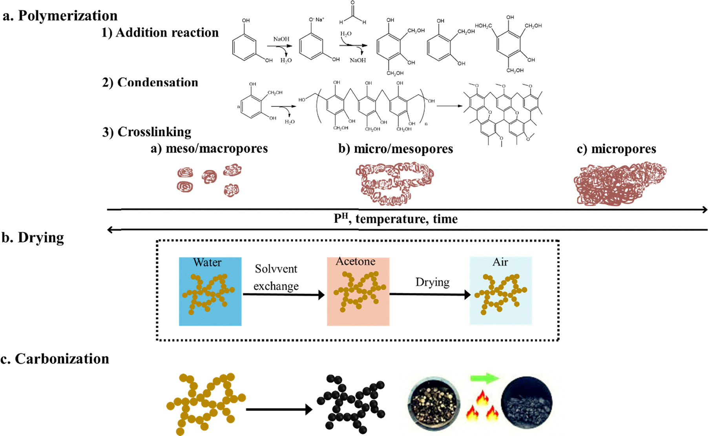

## Page 16

7168 |  Mater. Adv., 2025, 6, 7153–7206
© 2025 The Author(s). Published by the Royal Society of Chemistry
formation of abundant mesopores and micropores in the gel
matrix. The activated carbon produced using the OTA method
was labeled as CG OTAx, where ‘‘CG’’ denotes the carbon gel
and ‘‘x’’ indicates the activation time ranging from 1 to 3 hours.
In contrast, samples activated by the conventional CO2 method
were labeled ACx, with ‘‘AC’’ representing activated carbon
obtained at 1000 1C and ‘‘x’’ corresponding to activation times
from 1 to 4 hours. The carbon burn-offduring activation was
quantified using eqn (1), where Wi and Wf represent the weights
of the carbon gel before and after activation, respectively.133
3.3
Preparation of hydrogels
Hydrogels are three-dimensional polymeric structures charac-
terized by their hydrophilic nature. Although they are com-
monly synthesized using hydrophilic monomers, hydrophobic
monomers are occasionally incorporated to modulate specific
physicochemical properties tailored to particular applications.
These materials can be derived from both natural and synthetic
polymers. Synthetic polymers, being inherently hydrophobic,
exhibit greater chemical stability and mechanical strength
compared to natural counterparts. While enhanced mechanical
integrity contributes to increased durability, it also leads to a
reduced degradation rate. As such, a careful balance between
these opposing features is essential for optimal material
performance.134 Natural polymer-based hydrogels can also be
engineered, provided the base polymers inherently contain
suitable reactive functionalities or are chemically modified to
include radically polymerizable groups.
Hydrogels
are
essentially
three-dimensional
networks
formed by cross-linked hydrophilic polymers, characterized by
their elasticity and capacity for substantial water uptake. The
formation of these networks is commonly achieved through
polymer cross-linking techniques, with one widely adopted
approach being free-radical copolymerization or cross-linking
polymerization. In this method, hydrophilic monomers interact
with multifunctional cross-linking agents to establish the gel
framework. Hydrogels may also be produced by cross-linking
water-soluble linear polymers, originating from either synthetic
or natural sources, through a variety of mechanisms, such as:
(i) covalent bonding via chemical cross-linking reactions; (ii)
irradiation-induced generation of polymer radicals that lead to
inter-chain cross-linking; and (iii) physical interactions, includ-
ing chain entanglements, electrostatic attraction, and crystal-
lization phenomena.135
A wide range of polymerization techniques, such as bulk,
solution, and suspension polymerization, can be employed for
the fabrication of hydrogels. These approaches allow for flex-
ibility in designing hydrogels with specific forms and proper-
ties suitable for various applications. The hydrogel synthesis
process fundamentally relies on three essential components:
the monomer, the initiator, and the cross-linking agent. Proper
management of these elements is crucial for controlling the
exothermic nature of the polymerization reaction and for tun-
ing the final characteristics of the hydrogel. Diluents, such as
water or other aqueous solutions, are commonly used during
the synthesis of hydrogels. Following polymerization, it is
essential to thoroughly wash the resulting hydrogel matrix to
eliminate residual impurities. These include unreacted mono-
mers, initiators, cross-linking agents, and by-products formed
through side reactions (Fig. 10).
Hydrogels composed of acrylamide, acrylic acid, and their
salts have been produced through methods such as inverse-
suspension polymerization and diluted solution polymeriza-
tion, as detailed in prior studies.137 In contrast, there has been
limited research on the use of highly concentrated solution
polymerization for acrylic monomers, with this method being
mainly discussed in the patent literature.138 Notably, an acrylic
acid–sodium acrylate superabsorbent hydrogel was successfully
synthesized by Chen139 through concentrated solution poly-
merization (43.6 wt%) using potassium persulfate as a thermal
initiator. Hydrogels are generally prepared from polar mono-
mers and, depending on their source materials, can be classi-
fied into three categories: those derived from natural polymers,
synthetic polymers, or hybrid systems that combine both. From
a preparative standpoint, hydrogels can be synthesized using
several methods, including graft polymerization, cross-linking
polymerization, network formation from water-soluble poly-
mers, and radiation-induced cross-linking. A variety of hydrogel
types are available, with many being lightly cross-linked copo-
lymers of acrylate and acrylic acid, or grafted starch-acrylic acid
polymers. These hydrogels are typically produced using techni-
ques such as inverse-suspension, emulsion, or solution poly-
merization, which are explained in further detail below.
Hydrogels are characterized by their high-water absorption,
enabled by hydrophilic moieties within their polymer networks.
While increased water content enhances swelling capacity, it
often reduces mechanical strength. Mechanical properties can
be tuned by adjusting the degree of cross-linking: higher cross-
linking improves strength but decreases elongation, making
the gel more brittle. Copolymerization with hydrophobic mono-
mers to form interpenetrating polymer networks (IPNs) or
grafting
to
hydrophobic
substrates
can
further
enhance
mechanical performance. Hydrogels can be engineered to
Fig. 10
Schematic representation of the hydrogel synthesis process.
Reproduced from ref. 136 with permission from the Asian Pacific Journal
of Nursing and Health Sciences, copyright 2021.
Review
Materials Advances
Open Access Article. Published on 21 August 2025. Downloaded on 1/8/2026 4:37:10 PM. 
This article is licensed under a Creative Commons Attribution-NonCommercial 3.0 Unported Licence.
View Article Online

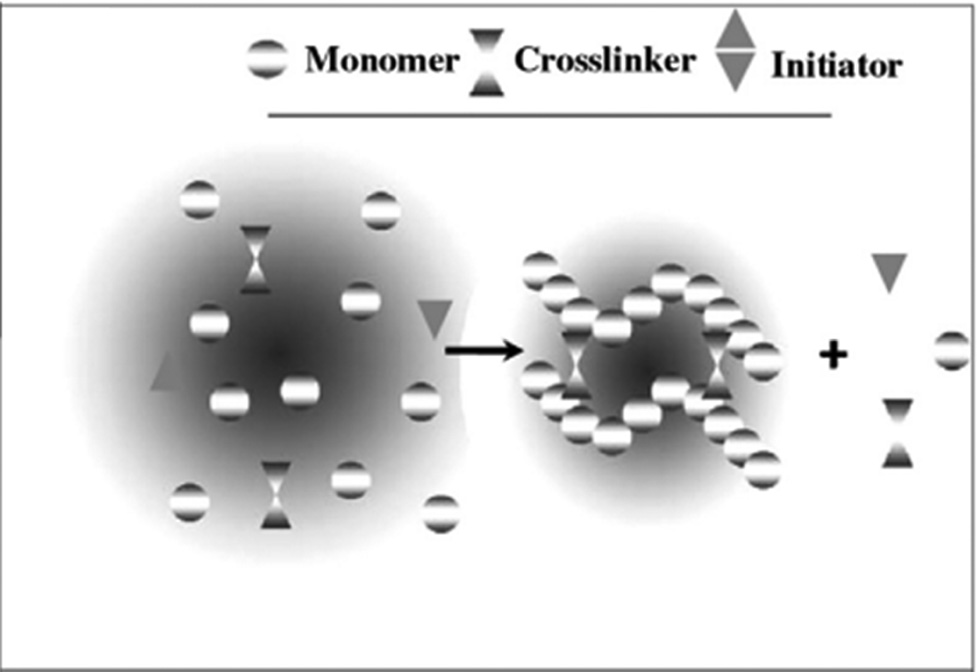

## Page 17

© 2025 The Author(s). Published by the Royal Society of Chemistry
Mater. Adv., 2025, 6, 7153–7206 |  7169
mimic the transport and mechanical properties of natural soft
tissues. For example, PET fibers incorporated into PHEMA/PCL
semi-IPN hydrogels have been proposed for intervertebral disc
prostheses, while PHEMA has been tested for fixing prostheses
in the intramedullary cavity. Titanium dental implants have
also been coated with poly(ethylene glycol diacrylate) hydrogels.
Most hydrogels are unstable in both dried and swollen
states; drying often induces cracks. This can be mitigated by
incorporating hygroscopic salts or encapsulating the hydrogel
in elastomeric layers. Recently, a double-hydrophobic coating
comprising a hydrophobic polymer and viscous oil applied via
quenching has been developed, forming a B200 mm surface
layer
that
effectively
resists
both
swelling
and
drying
damage.140
3.3.1.
Bulk polymerization. Bulk polymerization is one of
the most straightforward techniques for synthesizing hydro-
gels, generally involving only the monomer and an initiator that
is soluble within the monomer. The high concentration of
monomer in this process accelerates both the polymerization
rate and the degree of polymerization. However, the increased
monomer concentration leads to a rise in viscosity as the
reaction advances, along with significant heat generation. To
manage these issues, the polymerization is often kept at
relatively low monomer conversion rates, which helps to main-
tain thermal control and stability throughout the process.141
Bulk polymerization of monomers produces a uniform, glassy,
and transparent hydrogel matrix that is initially rigid. When
this matrix is immersed in water, it absorbs the water, causing
it to swell and transition into a soft, flexible hydrogel.
3.3.2.
Solution polymerization/cross-linking. In solution
copolymerization or cross-linking, ionic or neutral monomers
are mixed with a multifunctional cross-linker in the presence of
a solvent. The polymerization process is often initiated via
thermal methods, UV light, or redox systems. A significant
advantage of solution polymerization, compared to bulk poly-
merization, is the solvent’s ability to act as a heat sink. This
helps dissipate the heat produced during the reaction, provid-
ing better control over temperature. After polymerization, the
hydrogels are thoroughly washed with distilled water to elim-
inate unreacted monomers, oligomers, cross-linkers, initiators,
extractable polymers, and any other remaining impurities. If
the water content during the polymerization process surpasses
the hydrogel’s capacity for equilibrium swelling, phase separa-
tion may occur, resulting in a non-uniform structure. Common
solvents used in solution polymerization for hydrogels are
water, ethanol, water–ethanol mixtures, and benzyl alcohol.
After the gel forms, the solvent can be eliminated by immersing
the hydrogel in water, which aids in swelling and cleaning
the gel.
3.3.3.
Suspension polymerization or inverse-suspension
polymerization. Inverse suspension polymerization offers a
practical approach for synthesizing hydrogel microspheres or
powders, thus removing the necessity for mechanical size
reduction post-synthesis. This method operates on a water-in-
oil (W/O) emulsion system, distinguishing it from conventional
suspension techniques that typically employ oil-in-water (O/W)
dispersions. During inverse suspension polymerization, mono-
mers and initiators are evenly distributed within a hydrocarbon
phase to create a uniform dispersion. The characteristics such
as the size and shape of the resulting hydrogel beads are largely
governed by variables including the monomer solution’s visc-
osity, agitation speed and style, rotor design, and the nature of
the dispersing agent employed.142 Comprehensive discussions
regarding the mechanisms and characteristics of hetero-phase
polymerizations can be found in the prior literature.143 Because
of the dispersion’s thermodynamic instability, constant agita-
tion is required to preserve uniformity. Additionally, a suspend-
ing agent with a low hydrophilic–lipophilic balance (HLB) is
introduced to minimize the risk of phase separation and help
stabilize the emulsion system.
3.4
Grafting to a support
Hydrogels synthesized via bulk polymerization often exhibit
limited mechanical strength due to their inherently weak
structural framework. To enhance their mechanical perfor-
mance, a common strategy involves grafting the hydrogel onto
a more robust supporting surface. The direct polymerization of
monomers onto the activated surface is made possible by this
method, which starts the production of free radicals on the
substrate surface. This procedure creates a hydrogel composite
with improved mechanical reinforcement by chemically bond-
ing the resultant polymer chains to the support. Grafting-based
hydrogel synthesis has made use of a variety of polymeric
supports, which significantly improves the material’s structural
stability and resilience.144 The production of hydrogels from
unsaturated monomers has been effectively initiated by high-
energy ionizing radiations, such as electron beams145 and
gamma rays.146 Free radicals are created directly on the back-
bones of polymers when aqueous polymer solutions are
exposed to radiation. Furthermore, hydroxyl radicals are pro-
duced when water is radiolyzed, and these radicals then inter-
act with the polymers to form macro-radicals.
Following
their
recombination
across
several
chains,
these reactive species can create covalent connections that
create a three-dimensional, cross-linked hydrogel network. This
method is frequently used to modify polymers such as
poly(acrylic acid), poly(ethylene glycol), and poly(vinyl alcohol).
Radiation-induced cross-linking has the important advantage
of producing high-purity hydrogels without the need for
chemical
initiators,
which
lowers
the
possibility
of
contamination.
3.5
Contribution of carbon materials to the mechanical
reinforcement of hydrogels
Three-dimensional networks of polymers called hydrogels are
well-known for their tremendous capacity to absorb water;
nevertheless, their use is often limited by their low structural
rigidity and poor mechanical resilience. Carbon-based com-
pounds have become successful additions that greatly improve
the mechanical performance of hydrogels in order to overcome
this constraint.147 One important way that carbon-based com-
pounds improve the mechanical performance of hydrogels is by
Materials Advances
Review
Open Access Article. Published on 21 August 2025. Downloaded on 1/8/2026 4:37:10 PM. 
This article is licensed under a Creative Commons Attribution-NonCommercial 3.0 Unported Licence.
View Article Online

## Page 18

7170 |  Mater. Adv., 2025, 6, 7153–7206
© 2025 The Author(s). Published by the Royal Society of Chemistry
serving as reinforcing agents. High tensile strength and stiff-
ness are just two of the remarkable mechanical properties of
nanostructured carbons including graphene, carbon nano-
tubes, and carbon nanofibers. These materials provide struc-
tural reinforcement to the matrix when embedded in hydrogel
networks, improving its tensile strength, elasticity, and resis-
tance to deformation. The strong covalent bonds that charac-
terize the structure of the carbon nanostructures are primarily
responsible for these improvements.148
Furthermore, the increased cross-linking hydrogel network
is facilitated by carbon-based elements. They increase the
structural stability of the hydrogel by adding more crosslink
sites through chemical or physical interactions with the poly-
mer chains. This cross-linking improves the mechanical robust-
ness of gel under a range of stress settings by increasing its
resistance to compressive and shear pressures.100,149 Another
process that contributes to improved mechanical behavior is
the modification of the internal gel network. By causing struc-
tural reorganizations at the nanoscale, the addition of gra-
phene sheets or CNTs creates a network that is more
organized and interconnected. By promoting more effective
load transfer and consistent stress distribution, this structural
improvement improves the stiffness, toughness, and resilience
of the gel.150,151
Additionally, carbon-based fillers increase hardness and
energy dissipation. Because of their rigidity, mechanical forces
may be distributed throughout the hydrogel matrix in an
efficient manner, minimizing localized stress concentrations
and lowering the chance of structural failure. The hydrogels
are
therefore
able
to
withstand
higher
strains
without
suffering catastrophic damage and exhibit enhanced fracture
toughness.152,153 The electrical conductivity of hydrogels can be
significantly increased by using conductive carbon-based ele-
ments such as graphene and CNTs in addition to mechanical
support. The range of applications of composite hydrogels is
expanded by this functional enhancement, which makes them
perfect for next-generation technologies like tissue engineering
scaffolds, soft actuators, and biosensing devices, fields where a
blend of electrical sensitivity and mechanical robustness is
essential.154–156 As a result of a variety of effects, such as
mechanical
reinforcement,
more
cross-linking,
structural
refinement, greater toughness, effective energy dissipation,
and increased electrical conductivity, carbon-based additions
help to improve the mechanical properties of hydrogels. These
enhancements enable hydrogels to exhibit superior strength,
stiffness, and durability, broadening their applicability in fields
requiring robust mechanical performance.156 Fig. 11 depicts
how the incorporation of carbon-based nanomaterials and
additional reinforcing agents contributes to the improved
mechanical performance of hydrogels.
3.6
Some other porous materials
In addition to carbon gels, several other advanced porous
materials, including activated carbons, metal–organic frame-
works (MOFs), and functionalized nanomaterials, have been
extensively explored for applications in energy storage, cataly-
sis, and environmental remediation. Each of these materials
offers distinct advantages and limitations, and a comparative
understanding can guide material selection for specific perfor-
mance targets. Activated carbons remain the most commer-
cially established option due to their low cost, abundant
precursors, and high surface areas (often 41000 m2 g1).158
They are highly effective in adsorption-based water purification
and as electrode materials for supercapacitors. However, their
pore structure is predominantly microporous, which can hin-
der electrolyte ion diffusion in high-power devices. Addition-
ally, tailoring their surface chemistry often requires chemical
activation or post-functionalization steps, which may increase
environmental footprint.
MOFs are crystalline hybrid materials composed of metal
nodes connected by organic linkers, offering precise control
over pore size, topology, and chemical functionality. This
tunability enables exceptional selectivity in gas separation,
CO2 capture, and catalysis. Nonetheless, their high synthesis
Fig. 11
(a) and (b) Mechanical properties of gel materials. (c) Enhancement of hydrogel mechanical strength via incorporation of carbon-based
nanomaterials and other reinforcing agents. Reproduced from ref. 75 and 157 with permission from Elsevier & Royal Society of Chemistry, copyright 2023
and 2025.
Review
Materials Advances
Open Access Article. Published on 21 August 2025. Downloaded on 1/8/2026 4:37:10 PM. 
This article is licensed under a Creative Commons Attribution-NonCommercial 3.0 Unported Licence.
View Article Online

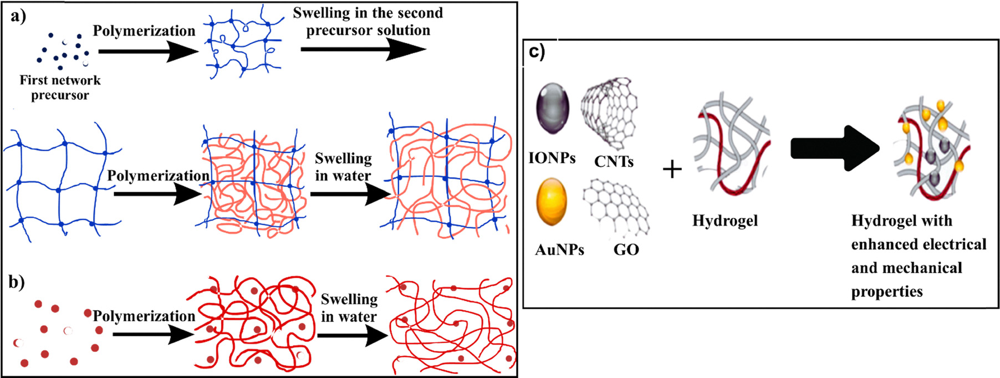

## Page 19

© 2025 The Author(s). Published by the Royal Society of Chemistry
Mater. Adv., 2025, 6, 7153–7206 |  7171
cost, complex processing, and limited thermal/chemical stabi-
lity restrict their scalability for bulk applications. Furthermore,
most MOFs have relatively low electrical conductivity, limiting
their direct use in electrochemical devices without conductive
additives. Functionalized nanomaterials, such as doped car-
bons,
graphene
derivatives,
and
surface-modified
nano-
particles,
allow
for
highly
tailored
surface
chemistry
to
promote
specific
reactions
or
contaminant
interactions.
Nitrogen-, sulfur-, or phosphorus-doping, for instance, can
enhance catalytic activity and conductivity in electrochemical
applications. Despite their outstanding performance in tar-
geted tasks, their synthesis often involves costly reagents,
precise control over functionalization steps, and scalability
challenges, making them more suited to high-value niche
applications.
Carbon gels, by contrast, combine several advantages of
these material classes. Their hierarchical pore structures com-
prising interconnected micro-, meso-, and macropores enable
both high surface area and efficient mass transport, overcom-
ing the diffusional limitations of microporous activated car-
bons. They can be synthesized from renewable biomass or
synthetic monomers, offering flexibility in cost and sustain-
ability. The surface chemistry of carbon gels can be readily
tuned during synthesis or post-treatment, enabling tailored
adsorption selectivity or enhanced electrochemical perfor-
mance. While the production cost of carbon gels may exceed
that of conventional activated carbon, their structural versati-
lity, superior rate capability, and potential for sustainable, low-
impact synthesis often justify their use in advanced applica-
tions such as high-rate supercapacitors, selective pollutant
removal, and catalytic supports. Overall, the choice between
carbon gels, activated carbons, MOFs, and functionalized
nanomaterials depends on the desired balance between cost,
structural properties, performance, and scalability, with carbon
gels occupying a unique position where multifunctionality
meets tunable design.
3.6.1
Scalable and energy-efficient fabrication methods.
Recent advances in fabrication technologies have introduced
energy-efficient and scalable approaches for producing porous
carbon materials, including carbon gels, with improved control
over porosity and reduced production costs. Among these,
microwave-assisted activation, ultrasonic drying, and molten
salt templating have attracted significant attention for their
potential to enhance performance while lowering energy
consumption.159 Microwave-assisted activation offers rapid
and uniform heating by directly coupling microwave energy
with the carbon precursor or activating agent. This method
significantly shortens activation times, often from several
hours to minutes, while enabling precise temperature control
and uniform pore development. In addition to lowering energy
use, microwave activation can produce well-distributed micro-
and mesopores, enhancing adsorption kinetics and electroche-
mical accessibility in supercapacitors and capacitive deioniza-
tion systems.
Ultrasonic drying is another energy-efficient technique that
utilizes high-frequency sound waves to promote rapid solvent
removal from wet gels. The acoustic cavitation effect disrupts
capillary forces during drying, helping to preserve the gel’s
porous structure without the need for energy-intensive freeze-
drying or supercritical drying. Ultrasonic drying can also be
scaled for continuous production, making it particularly attrac-
tive for industrial applications where drying steps often repre-
sent a major cost factor. Molten salt templating uses salts such
as NaCl, KCl, or eutectic mixtures as both heat transfer media
and structural templates. During carbonization, the molten salt
provides uniform thermal distribution and prevents pore col-
lapse, while also creating interconnected meso- and macro-
pores. After synthesis, the salts can be washed out with water,
allowing for easy recovery and reuse, further reducing opera-
tional costs. This method is particularly effective for producing
highly conductive, large-pore carbons for fast ion transport in
electrochemical devices and high-throughput adsorption pro-
cesses. The integration of these advanced methods into carbon
gel fabrication provides several practical advantages: reduced
processing time, lower energy requirements, tunable pore
structures,
and
potential
compatibility
with
low-cost
or
biomass-derived precursors. Moreover, these methods can be
adapted to continuous or semi-continuous production lines,
facilitating scalability without compromising structural quality.
By incorporating such emerging, energy-efficient techniques
into fabrication strategies, the pathway toward sustainable,
large-scale production of high-performance porous carbons
for energy storage, catalysis, and environmental remediation
becomes more feasible and economically viable.
4. Applications
Carbon gels are utilized in energy storage and conversion
technologies such as supercapacitors, lithium batteries, and
fuel cells due to their high surface area and conductivity. They
also serve as gas diffusion electrodes and catalyst supports in
electrochemical devices. In environmental and industrial appli-
cations, carbon gels are employed as filters, molecular sieves,
and activated carbon for adsorption and separation processes.
Their mechanical strength and thermal stability enable usage
in insulation, structural materials, and metal casting. These
broad
application
areas
underline
the
significance
of
carbon gels as versatile materials in both energy-related and
structural functionalities. This schematic diagram (Fig. 12)
highlights the diverse applications of carbon gels, emphasizing
their multifunctional role in advanced materials and energy
systems.
4.1
Supercapacitors
Supercapacitors, also known as ultracapacitors, represent a
promising category of energy storage devices characterized by
their exceptionally high power density, rapid charge–discharge
capabilities, straightforward energy storage mechanisms, and
extended operational lifespans.160,161 Supercapacitors are pri-
marily classified into two types based on their charge storage
mechanisms: EDLCs, which store energy through electrostatic
Materials Advances
Review
Open Access Article. Published on 21 August 2025. Downloaded on 1/8/2026 4:37:10 PM. 
This article is licensed under a Creative Commons Attribution-NonCommercial 3.0 Unported Licence.
View Article Online

## Page 20

7172 |  Mater. Adv., 2025, 6, 7153–7206
© 2025 The Author(s). Published by the Royal Society of Chemistry
separation of charge at the electrode–electrolyte interface, and
pseudocapacitors, which rely on rapid, reversible redox reac-
tions
at
or
near
the
electrode
surface
to
store
charge
(Fig. 13a).116,162 Carbon-based materials are widely used as
electrodes in EDLCs due to their high surface area and excellent
conductivity. In contrast, pseudocapacitors typically employ
transition metal oxides such as manganese, nickel, cobalt,
vanadium, and iron oxides or conductive polymers like polyani-
line and polypyrrole, which serve as effective electron donors or
acceptors and facilitate rapid redox reactions for charge
storage.163
4.1.1
Carbonaceous gels for supercapacitors. Significant
research has been conducted in the last few decades to develop
carbon-based hydrogels and aerogels for usage in supercapaci-
tors. Based on where they come from, these materials can be
broadly divided into four types: aerogels made from synthetic
polymers, aerogels made from carbon nanotubes, hydrogels
and aerogels that contain graphene, and those made from
precursors generated from biomass. Recent developments have
concentrated on making these materials lightweight, flexible,
and extremely effective in storing energy. Scientists are devel-
oping composite materials with even greater energy storage
capacities by adding redox-active substances like conducting
polymers and metal oxides to their structure to improve their
performance even further.
4.1.1.1 Biomass-derived hydrogels and aerogels for supercapa-
citors. Carbon products made from biomass are becoming more
and more popular because of their low cost, accessibility, and
environmentally benign provenance. Because of their intercon-
nected three-dimensional porous structures, which provide a
large surface area and adaptable physical and chemical proper-
ties, hydrogels and aerogels stand out within this group.
Biomass-derived gels are ideal for electrochemical applications,
especially in supercapacitors, because of these structural ben-
efits. Hydrogels made from biomass are mostly used as gel
electrolytes because they allow for effective ion transport while
preserving mechanical stability. Additionally, they act as
binders in composite electrodes, improving the electrode mate-
rials’ structural integrity and stickiness. Aerogels made from
biomass, on the other hand, are mostly used as electrode
materials because of their exceptional electrochemical perfor-
mance, high conductivity, and lightweight composition. The
synthesis of biomass-derived carbonaceous hydrogels is typi-
cally achieved through hydrothermal treatment, a process that
converts raw biomass into a well-structured gel network while
preserving essential functional groups. By fine-tuning synthesis
conditions and integrating functional additives, scientists are
actively
improving
the
electrochemical
performance
of
biomass-derived carbon materials. With the growing global
need for eco-friendly energy storage technologies, these sus-
tainable carbon materials are proving to be strong contenders
for the development of next-generation supercapacitors.165 Due
to their synergistic attributes, namely excellent biocompatibil-
ity, distinctive porous architecture, and robust mechanical
integrity, biomass-derived hydrogels exhibit significant pro-
mise for use in supercapacitors, particularly as power sources
for
implantable
biomedical
devices.
Furthermore,
these
carbon-rich hydrogels are frequently employed as solid electro-
lytes, thanks to their three-dimensional polymeric networks
that can effectively absorb and retain water. For instance,
Choudhury et al. demonstrated the feasibility of using a
gelatin-based hydrogel, a natural material, as a solid-state
electrolyte in supercapacitor applications.166 The supercapaci-
tor exhibited a maximum specific capacitance of 81 F g1. In a
related study, Yamazaki and colleagues developed innovative
composite hydrogels composed of two natural biopolymers,
cellulose and chitin, along with a dual ionic liquid system,
aiming to enhance both ionic conductivity and environmental
compatibility.167 Biomass-derived carbonaceous hydrogels and
aerogels have garnered significant attention as electrode mate-
rials for supercapacitors, thanks to the synergistic advantages
of combining low-cost, sustainable biomass with the unique
structural, large surface area, and strong mechanical properties
of the hydrogels and aerogels. In a recent study, we fabricated
carbonaceous gels using watermelon as a crude biomass
source. The resulting carbonaceous hydrogels and aerogels
exhibited an interconnected microscopic structure with an
average pore diameter of approximately 45.8 nm. We then
functionalized the 3D network of the aerogels by incorporating
Fe3O4 nanoparticles, transforming them into magnetic carbon
aerogels through pyrolysis. These magnetic carbon aerogels
demonstrated a lightweight structure, an impressive capaci-
tance of 333.1 F g1, and exceptional cycling stability, making
them highly promising for use in supercapacitors.93 Collec-
tively,
literature
findings
confirm
that
biomass-derived
hydrogels and aerogels combine structural tunability, sustain-
able sourcing, and strong electrochemical performance, mak-
ing them ideal for next-generation supercapacitors. Their
versatility as both electrolytes and electrode materials, along-
side recent advances in functionalization, positions them as
competitive alternatives to conventional carbon-based systems
in terms of both energy storage efficiency and environmental
compatibility.
Fig. 12
Prospective technological applications of carbon gels across
diverse fields.
Review
Materials Advances
Open Access Article. Published on 21 August 2025. Downloaded on 1/8/2026 4:37:10 PM. 
This article is licensed under a Creative Commons Attribution-NonCommercial 3.0 Unported Licence.
View Article Online

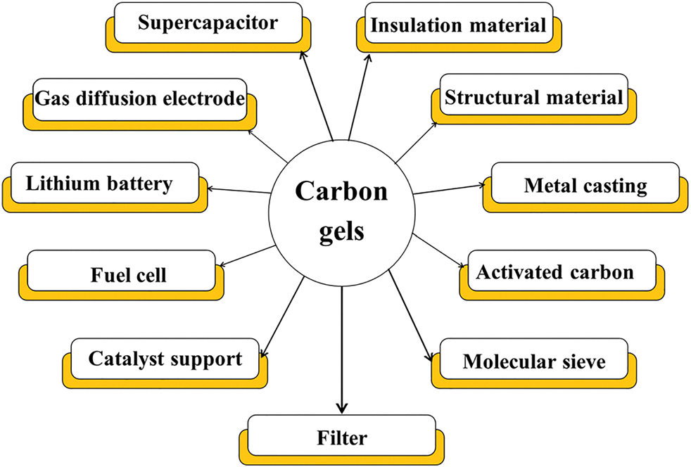

## Page 21

© 2025 The Author(s). Published by the Royal Society of Chemistry
Mater. Adv., 2025, 6, 7153–7206 |  7173
4.1.1.2 Graphene based hydrogels and aerogels for supercapa-
citors.
The
remarkable
properties
of
graphene,
a
two-
dimensional carbon material made up of a single atomic layer,
such as its high charge carrier mobility, remarkable flexibility,
strong mechanical structure, and better thermal conductivity,
have attracted a lot of interest. According to Zhu et al.,
graphene’s inherent capacitance is 21 mF cm2. Graphene is
a very appropriate material for energy storage applications due
to its large theoretical specific surface area (2630 m2 g1), good
conductivity, and chemical stability. For example, Zhu et al.
created activated GO and achieved improved electrical conduc-
tivity combined with an outstanding surface area of up to
Fig. 13
(a) Schematic illustration of charge accumulation and release mechanisms in an electric double-layer capacitor (EDLC). (b) Digital images
demonstrating the compressive behavior of carbonaceous hydrogels and aerogels, along with charge–discharge curves of a magnetic carbon aerogel-
based electrode at varying current densities. (i) Visual comparison of graphene oxide (GO) suspension before and after hydrothermal treatment. (ii)
Photographs highlighting the mechanical robustness and load-bearing capacity of the synthesized graphene hydrogel. (iii)–(v) SEM images revealing the
porous network structure of the graphene hydrogel. (vi) Current–voltage (I–V) curve illustrating the electrical conductivity of the hydrogel. Reproduced
from ref. 164 with permission from Royal Society of Chemistry, copyright 2014.
Materials Advances
Review
Open Access Article. Published on 21 August 2025. Downloaded on 1/8/2026 4:37:10 PM. 
This article is licensed under a Creative Commons Attribution-NonCommercial 3.0 Unported Licence.
View Article Online

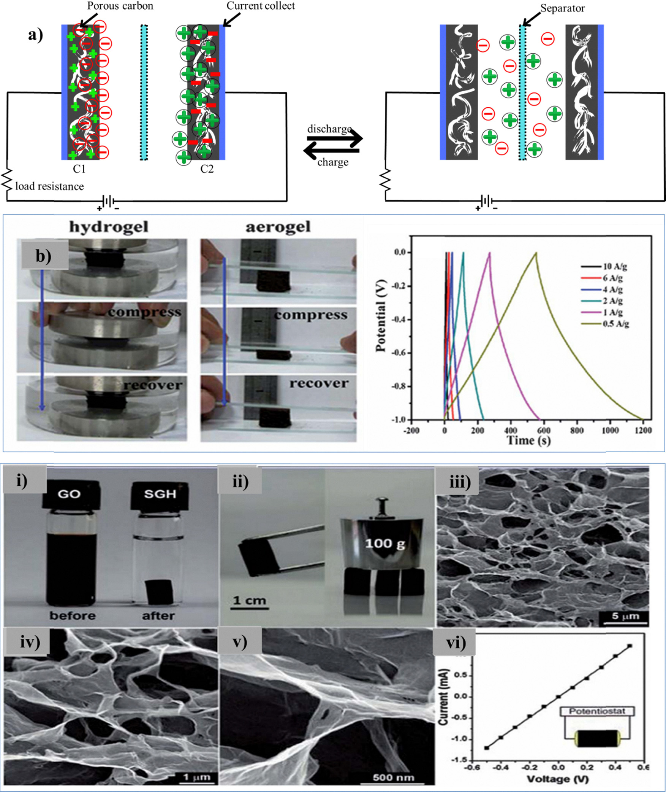

## Page 22

7174 |  Mater. Adv., 2025, 6, 7153–7206
© 2025 The Author(s). Published by the Royal Society of Chemistry
3100 m2 g1. Particularly in ionic liquid electrolytes, this
activated GO demonstrated a remarkable energy density of
roughly 70 Wh kg1 and a specific capacitance of 166 F g1
when utilized as an electrode material in supercapacitors.168 The
unique properties of graphene, a one-atom-thick 2D carbon
material, such as its remarkable mechanical strength and flex-
ibility, high charge carrier mobility, and superior thermal con-
ductivity, have led to extensive research in a number of sectors.
Zhu et al. stated that the intrinsic capacitance of graphene is
21 mF cm2. More importantly, graphene offers a great deal of
potential for capacitance-related applications due to its high
conductivity, distinct chemical stability, and enormous theoretical
specific surface area (2630 m2 g1). Zhu et al., for example,
synthesized activated GO with a remarkable high surface area of
up to 3100 m2 g1 and strong electrical conductivity. The activated
GO showed a high specific capacitance of 166 F g1 when tested
as an electrode material for supercapacitors.
4.1.1.2.1 Graphene
based
hydrogels
for
supercapacitors.
Hydrogels based on graphene have garnered a lot of attention
lately because of their possible uses in supercapacitors. GO is
frequently used as the main component in the production of
these hydrogels. For GO, a number of gelation methods have
been investigated, such as chemical cross-linking by covalent
bonding,169 ion or polymer-induced gelation,170 and self-
assembly via hydrothermal processes.169 For use in supercapa-
citors, graphene hydrogels produced by hydrothermally treat-
ing GO suspensions have been thoroughly investigated. By
using this technique, graphene hydrogels were generated, as
reported by Xu et al. (Fig. 13b(i–vi)).171 These hydrogels showed
good electrical conductivity, excellent mechanical characteris-
tics, and a specific capacitance of roughly 175 F g1. Along
similar lines, further research has reported self-assembled
graphene hydrogels made by hydrothermal processes that dis-
play particular capacitance values between 186 and 308 F g1.
Graphene hydrogels can be produced under mild conditions
using small molecules as reducing agents. One effective
approach
involves
the
chemical
reduction
of
graphene
oxide (GO) with L-glutathione, resulting in the successful synth-
esis of self-assembled graphene hydrogels172 and sodium
ascorbate.173 The resulting graphene-based materials show
promising electrochemical performance. For example, an asym-
metric supercapacitor utilizing L-glutathione-reduced graphene
hydrogels combined with nanostructured MnO2 achieved a
specific capacitance of 157.7 F g1 at a current density of 1 A
g1. In comparison, a sodium ascorbate-reduced graphene
hydrogel electrode demonstrated an even higher specific capa-
citance of 240 F g1 at a current density of 1.2 A g1. Yang
et al.174 introduced an innovative approach for developing a
densely packed graphene hydrogel film by utilizing a capillary
compression method. This breakthrough demonstrated that
the flexible graphene hydrogel films exhibit remarkable proper-
ties, including low ion transport resistance and a highly acces-
sible surface area for ions. These structural characteristics
notably improve the electrochemical performance of the mate-
rial in supercapacitor applications, yielding high specific
capacitances of 261.3 F cm3 in organic electrolytes and
255.5 F cm3 in aqueous electrolytes when tested at a current
density of 0.1 A g1. Its compatibility with traditional paper-
making processes makes large-scale production feasible, mak-
ing this method particularly exciting. With its scalable nature
and outstanding electrochemical performance, this advance-
ment paves the way for real-world applications of graphene
hydrogel films in energy storage systems. The porous structure
of graphene hydrogels enables the incorporation of additional
nanomaterials into their three-dimensional networks, forming
graphene hydrogel-based composite materials. These compo-
sites, consisting of graphene hydrogels combined with con-
ducting
polymers,175
metal
oxides,176
and
CNTs,
have
demonstrated exceptional performance in supercapacitors
due to their synergetic effects. For instance, Zhou et al.176
fabricated a hybrid hydrogel composed of graphene and
poly(3,4-ethylenedioxythiophene) (PEDOT). The hybrid hydro-
gel demonstrated remarkable mechanical robustness, a notable
specific capacitance of 174.4 F g1, and an electrical conduc-
tivity of 0.73 S cm1. These enhanced properties are primarily
due to the synergistic interplay between the high electrical
conductivity and mechanical integrity of graphene and the
pseudocapacitive behavior of PEDOT.
Further advancements in graphene hydrogel functionaliza-
tion have led to remarkable improvements in capacitance. Xu
et al.177 engineered a functionalized graphene hydrogel by
introducing hydroquinone, resulting in a notable specific capa-
citance of 441 F g1 at a current density of 1 A g1. In recent
developments, composite hydrogels combining graphene with
Ni(OH)2 have been effectively fabricated and utilized as three-
dimensional
electrode
materials
for
supercapacitor
applications.178 These hybrid hydrogels exhibited an excep-
tional specific capacitance of 1247 F g1 at a scan rate of
5 mV s1, along with outstanding cycling stability. Additionally,
graphene hydrogels have been successfully integrated with
three-dimensional nickel foam frameworks to form composite
electrodes for supercapacitor applications.179 These composite
electrode materials demonstrate excellent capacitive perfor-
mance, primarily due to the synergistic interaction between
the high electrical conductivity and electrochemical stability of
graphene hydrogels, and the efficient charge transfer enabled
by the minimal distance between the hydrogel matrix and the
current collector (Table 1).
4.1.1.2.2 Graphene based aerogels for supercapacitors. Substi-
tuting the aqueous phase within graphene hydrogels with air,
while maintaining the integrity of the three-dimensional
porous framework, results in the formation of graphene aero-
gels. These structures are generally produced through super-
critical drying or freeze-drying methods applied to graphene-
based wet gels. For instance, Chen et al. synthesized rGO
aerogels by initiating gelation of rGO sheets in an aqueous
medium, followed by freeze-drying to preserve the porous
architecture.192 The resulting rGO aerogels possess a robust
three-dimensional porous architecture with notable mechan-
ical strength. In recent years, there has been a surge of interest
Review
Materials Advances
Open Access Article. Published on 21 August 2025. Downloaded on 1/8/2026 4:37:10 PM. 
This article is licensed under a Creative Commons Attribution-NonCommercial 3.0 Unported Licence.
View Article Online

## Page 23

© 2025 The Author(s). Published by the Royal Society of Chemistry
Mater. Adv., 2025, 6, 7153–7206 |  7175
in the application of graphene aerogels for supercapacitors,
largely due to their extensive 3D interconnected networks,
continuous porosity, and high specific surface area. These
structural features facilitate efficient ion transport and electro-
lyte access, enhancing charge storage capabilities. Conse-
quently, rGO aerogels have been actively investigated and
successfully employed as promising electrode materials in
supercapacitor devices. Reduced graphene oxide (rGO) aerogels
can be synthesized through various reduction methods, such as
thermal reduction193 or hydrogen (H2) reduction194 of graphene
oxide (GO) aerogels. Alternatively, GO can be pre-reduced in its
wet gel state, followed by freeze-drying or supercritical drying
processes.
Reducing
agents
like
mercaptoacetic
acid,195
L-ascorbic acid173 and hypophosphorous acid194 are commonly
used to promote the gelation and reduction of GO. Liu et al.
used thermally reduced graphene oxide (GO) aerogels to create
a flexible, folded structured graphene paper.196 They showed
that the electrodes made of graphene exhibited superior capa-
citive performance compared to the carbon materials that are
currently accessible (Table 2).
Additionally, these electrodes are more flexible, freestand-
ing, binder-free, and mass-producible. Extensive efforts have
been focused on developing graphene aerogel-based compo-
sites for supercapacitor applications. For example, Wu et al.
prepared nitrogen and boron co-doped graphene aerogels by
adding ammonia boron trifluoride to wet gels, followed by
freeze-drying. These doped graphene aerogels were then used
as electrode materials in an all-solid-state supercapacitor with a
PVA-H2SO4 gel electrolyte. The supercapacitors demonstrated a
specific capacitance of approximately 62 F g1, an energy
density
of
about
1600
W
kg1,
and
excellent
cycling
stability.197 Beyond elemental doping, organic molecules and
polymers have been widely explored for modifying graphene
aerogels. The synthesis of hybrid graphene-based aerogels
using carbohydrates such as glucose, b-cyclodextrin, and chit-
osan has improved electrochemical performance with robust
and stable capacitance retention.198 In order to further enhance
the electrochemical characteristics of graphene aerogel net-
works, the addition of metal oxides has also been studied. By
adding metal oxides like CoO4 and RuO2 to the network
structure, Wu et al. created graphene-based composite aerogels.
These composite aerogels demonstrated remarkable cycle sta-
bility, high-rate capabilities, and an excellent specific capaci-
tance
of
226
F
g1.
The
synergistic
impacts
of
the
pseudocapacitive metal oxides and the intrinsic qualities of
the graphene aerogels, such as their high surface area, superior
electrical conductivity, and electrochemical stability, were
responsible for the improved electrochemical performance.199
Furthermore, Meng and colleagues developed graphene/carbon
composite aerogels by embedding graphene into a carbon
aerogel precursor (resorcinol–formaldehyde). These composite
aerogels demonstrated a commendable specific capacitance of
Table 1
Key performance characteristics of graphene hydrogel-based supercapacitors
Method
Testing conditions
Modification
Electrolyte
Surface area
(m2 g1)
Pore
size (nm)
Capacitance
Ref.
Hydrothermal
Two-electrode
Hydroquinones
1 M H2SO4
297
2–70
441 F g1 (1 A g1)
180
Hydrothermal
Three-electrode
Ni(OH)2
6 M KOH
92
—
1247 F g1 (5 mV s1)
178
Hydrothermal
Two-electrode
CNTs
30% KOH
237
—
318 F g1 (0.1 A g1)
181
Hydrothermal
Three-electrode
Co3O4
6 M KOH
—
—
757.5 F g1 (0.5 A g1)
182
Chemical reduction
Two-electrode
Ethylene diamine
2 M KOH
745
47
232 F g1 (1 A g1)
169
Hydrothermal
Three-electrode
Urea
6 M KOH
41300
1.7–4.3
308 F g1 (3 A g1)
183
Hydrothermal
Two-electrode
Hydroxyl amine
25% KOH
—
—
205 F g1 (1 mV s1)
184
Hydrothermal
Two-electrode
—
5 M KOH
—
—
175 F g1 (1 A g1)
171
Hydrothermal
Two-electrode
Organic amine
5 M KOH
—
—
190.1 F g1 (10 A g1)
185
Chemical reduction
Two-electrode
L-Glutathione
0.5 M Na2SO4
315.2
2–10
157.7 F g1 (1 A g1)
172
Filtration
Two-electrode
—
1 M H2SO4
—
—
255.5 F cm3 (0.1 A g1)
174
Deposition
Two-electrode
Nickel foam
5 M KOH
1260–1725
—
45.6 mF cm2 (0.67 mA cm2)
179
Hydrothermal
Two-electrode
—
5 M KOH
951
—
220 F g1 (1 A g1)
186
Chemical reduction
Three-electrode
Sodium ascorbate
1 M H2SO4
—
—
240 F g1 (1.2 A g1)
187
Hydrothermal
Three-electrode
PPy
3 M NaClO4
463
—
330 F g1 (1.5 A g1)
188
Chemical reduction
Three-electrode
PANI
6 M KOH
—
—
334 F g1 (2 A g1)
189
Polymer cross-linking
Two-electrode
PEDOT
1 M Na2SO4
—
—
104 F g1 (0.5 A g1)
190
Hydrothermal
Two-electrode
—
H2SO4–PVA gel
414
2–70
186 F g1 (1 A g1)
191
Table 2
Overview of recent progress in graphene aerogel-based supercapacitors, detailing synthesis techniques and capacitance performance
Methods
Modification
Electrolyte
Testing conditions
Surface area and pore size
Capacitance
Ref.
Pyrolization
Carbon
6 M KOH
0.05 A g1, two-electrode
361–763 m2 g1, 10–50 nm
122 F g1
200
Freeze-drying
Carbohydrates
Na2SO4
0.5 A g1, three-electrode
12.5–364.6 m2 g1, —
161.6 F g1
198
Supercritical-drying
Hypophosphorous acid
1 M H2SO4
0.2 A g1, three-electrode
830 m2 g1, 4 nm
278.6 F g1
194
Supercritical-drying
—
Ionic liquid
0.1 A g1, three-electrode
870 m2 g1, 2–50 nm
153 F g1
201
Freeze-drying
Metal oxides
1 M H2SO4
1 mV s1, three-electrode
350 m2 g1, 2–3.5 nm
226 F g1
199
Freeze-drying
Nitrogen and boron co-doping
H2SO4-PVA
5 mV s1, three-electrode
249 m2 g1
62 F g1
197
Freeze-drying
L-Ascorbic acid
6 M KOH
0.05 A g1, two-electrode
512 m2 g1, 1.5–55 nm
128 F g1
201
Freeze-drying
—
1 M H2SO4
1 A g1, two-electrode
—
172 F g1
196
Materials Advances
Review
Open Access Article. Published on 21 August 2025. Downloaded on 1/8/2026 4:37:10 PM. 
This article is licensed under a Creative Commons Attribution-NonCommercial 3.0 Unported Licence.
View Article Online

## Page 24

7176 |  Mater. Adv., 2025, 6, 7153–7206
© 2025 The Author(s). Published by the Royal Society of Chemistry
122 F g1 at a current density of 50 mA g1, along with
impressive rate performance.200
Shabangoli et al. and Sun et al. have demonstrated innova-
tive approaches for enhancing supercapacitor performance
using advanced graphene-based aerogels. Shabangoli et al.
introduced a thionine-functionalized 3D graphene aerogel
(Th-GA),
which
exhibited
improved
capacitance
due
to
enhanced redox kinetics and increased active site accessibility,
supported by its porous, sponge-like structure shown in
Fig. 14a–c. Their device achieved a specific capacitance of
Fig. 14
(a) Schematic illustration of the functionalization process of a 3D graphene aerogel with thionine. (b) Electrochemical performance comparison
among a stainless steel (SS) substrate, pure thionine (Th), graphene aerogel (GA), and thionine-functionalized graphene aerogel (Th–GA) at a scan rate of
50 mV s1 in 1 M H2SO4 electrolyte. (c) Experimental setup of an asymmetric Th-GA solar-powered device, demonstrating its ability to power a red LED
for over 5 minutes. (d) (i) SEM images displaying the oriented growth of V2O5 nanowire arrays on a 3D nitrogen-doped graphene aerogel (N-GA@V2O5).
(ii) Galvanostatic charge–discharge profiles for various samples. (f) Specific capacitance values of GA@V2O5 and N-GA@V2O5 mesoporous wide arrays
(MWAs) at multiple current densities. Reproduced from ref. 202 and 203 with permission from Wiley & Royal Society of Chemistry, copyright 2018.
Review
Materials Advances
Open Access Article. Published on 21 August 2025. Downloaded on 1/8/2026 4:37:10 PM. 
This article is licensed under a Creative Commons Attribution-NonCommercial 3.0 Unported Licence.
View Article Online

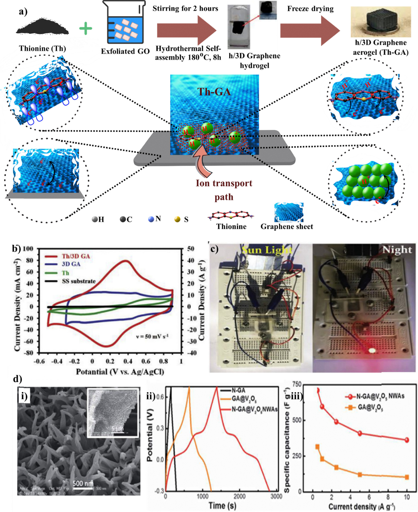

## Page 25

© 2025 The Author(s). Published by the Royal Society of Chemistry
Mater. Adv., 2025, 6, 7153–7206 |  7177
384 F g1, with energy and power densities of 32.6 Wh kg1 and
12.8 kW kg1, respectively. In a related study, Sun et al.
synthesized
a
nitrogen-doped
graphene
aerogel-vanadium
pentoxide (NGA@V2O5) nanocomposite through the direct
growth of V2O5 nanowires on the N-GA framework. The
resulting structure showed excellent alignment and electroche-
mical performance, delivering a high specific capacitance of
711 F g1, along with an energy density of 98.6 Wh kg1 and a
power density of 250 W kg1, as shown in Fig. 14d(i–iii). These
findings highlight the potential of functionalized graphene
aerogels as high-performance materials for next-generation
energy storage devices.202,203 Overall, literature evidence shows
that graphene-based aerogels, whether in pure, doped, or
composite form, deliver exceptional capacitive performance
due to their hierarchical porosity, high conductivity, and struc-
tural robustness. Functionalization strategies, particularly het-
eroatom
doping
and
incorporation
of
pseudocapacitive
components, further enhance their energy and power densities,
confirming their strong potential for next-generation super-
capacitors (Table 3).
4.1.1.3 Carbon nanotube-based aerogels for supercapacitors.
CNT
aerogels
are
three-dimensional
porous
structures
composed of CNTs as the primary building blocks. A variety
of fabrication methods have been developed to produce CNT-
based
aerogels,
including
freeze-drying,205
critical-point
drying,206,207 and chemical vapor deposition (CVD).205 For
instance, Zou et al.208 synthesized a MWCNT aerogel using a
freeze-drying method. In their approach, pristine MWCNTs
were first dispersed in chloroform via sonication, with poly(3-
hexylthiophene)-b-poly(3-(trimethoxysilyl)propyl methacrylate)
(P3HT-b-PTMSPMA) acting as both a surfactant and a cross-
linking agent to facilitate the gelation process. This method
enabled the formation of a well-structured MWCNT aerogel
with enhanced properties suitable for various applications.
Following polymer cross-linking, a wet gel was formed, which
was subsequently converted into an aerogel via freeze-drying.
The resulting MWCNT aerogel demonstrated a low mass den-
sity of 4 mg cm3, an impressive electrical conductivity of 3.2 
102 S cm1, and a significant surface area of 580 m2 g1
(Fig. 15). Furthermore, it demonstrated excellent mechanical
resilience, showing minimal thickness reduction even after
1000 compression-recovery cycles.
Recent studies have increasingly focused on hybrid and
composite CNT aerogels for diverse applications. Qi et al.209
developed cellulose-CNT hybrid aerogels through freeze-drying
wet-gel precursors. These aerogels exhibited excellent mechan-
ical properties, thermal stability, and high sensitivity to ambi-
ent
pressure,
making
them
promising
candidates
for
applications in gas and volatile organic compound sensing.
Similarly, Sun et al.47 fabricated ultralight CNT-graphene com-
posite aerogels by freeze-drying a CNT-graphene aqueous sus-
pension. The aerogels’ unique three-dimensional structure,
featuring graphene walls and CNT ribs, endowed them with
remarkable elasticity, low density (around 0.16 mg cm3),
excellent thermal stability, good electrical conductivity, and
high adsorption capacities for organic compounds. A novel
self-crosslinking approach has been introduced for the hydro-
thermal synthesis of PVA aerogels, facilitated by MWCNTs
reported by Chong-Bo Ma.210 PVA, a widely available and cost-
effective polymer, simplifies the fabrication process while pre-
serving its environmentally friendly nature by eliminating the
need for additional organic crosslinkers. The tunability of
crosslink density and other material properties is achieved by
varying the concentration of PVA precursors. During hydrother-
mal treatment, dehydration between hydroxyl groups induces a
transition in wettability from hydrophilic to hydrophobic,
enabling the aerogel to efficiently absorb organic solvents such
as bean oil and crude oil, with uptake values ranging from 10 to
52 times its initial weight. Moreover, cytotoxicity tests verify low
toxicity, which qualifies these aerogels for use in environmental
bioengineering. Furthermore, by undergoing in situ hybridiza-
tion with polypyrrole, these aerogels can be converted into
conductive materials with a conductivity of 0.16 S m1. The
aerogels’ many hydroxyl groups also make it possible for
additional chemical alterations, increasing their functional
adaptability for a variety of cutting-edge uses.
Wanquing Wang has created a new ambient-dried technique
that uses CNTs and cellulose nanofibrils (CNFs) to create
functional
aerogels
without
the
need
for
chemical
crosslinking.211 This method creates aerogels with mechani-
cally strong pore walls by crosslinking CNFs and CNTs using a
freeze–thaw cycling procedure. Hybrid networks of hydrophilic
Table 3
Overview of advanced carbon aerogel materials utilized in energy storage applications
Materials
Key features
Energy density
Power density
Specific capacitance
Ref.
Thionine-
functionalized 3D
graphene aerogel
(ThGA)
Flexible, metal-free supercapacitor – synergistic
capacitance enhancement – sponge-like struc-
ture for electrolyte ion access
32.6 Wh kg1
12.8 kW kg1
384 F g1 (1 A g1)
202
N-doped graphene
aerogel-vanadium
pentoxide (N-
GA@V2O5)
Direct growth of V2O5 nanowires on the N-GA
backbone – well-aligned nanowires observed in
SEM – enhanced electrochemical properties
98.6 Wh kg1
250 W kg1
711 F g1 (0.5 A g1)
203
N-self-doped carbon
nanofiber aerogel
(NCNF)
In situ synthesis of ZIF-8 on a bacterial cellulose
– 3D conductive network for efficient electron
transport – silk cocoon-like nodes for large
electrochemical surface area
31.0 Wh kg1
250 W kg1
224 F g1 (0.5 A g1)
612 mF cm2
(1.37 mA cm2)
204
Materials Advances
Review
Open Access Article. Published on 21 August 2025. Downloaded on 1/8/2026 4:37:10 PM. 
This article is licensed under a Creative Commons Attribution-NonCommercial 3.0 Unported Licence.
View Article Online

## Page 26

7178 |  Mater. Adv., 2025, 6, 7153–7206
© 2025 The Author(s). Published by the Royal Society of Chemistry
and hydrophobic nanofibers are effectively created by utilizing
a special dual-network interpenetrating structure made possi-
ble by the tubular dispersion of CNFs and CNTs. The resultant
aerogels had a high specific surface area (157.24 m2 g1),
outstanding electrical conductivity (30.95 S cm1), and tunable
densities (as low as 0.0519 g cm3). Furthermore, these aerogels
are more recyclable due to the lack of chemical crosslinkers.
With diameters up to 8.68 cm, their structure and shape can be
altered using mold-based or 3D printing methods, enabling
scalable production. These aerogels show remarkable electro-
magnetic shielding performance (440.9 dB cm3 g1) as shown
in Fig. 16a. They also function as effective freestanding electro-
des for loading of active materials, like MnO2, resulting in
remarkable energy storage capacities (551 F g1). In addition,
the technique can be applied to various nanofiber systems,
including polyimide (PI) and aramid nanofibers (ANF), opening
the door to a wide variety of structural and functional uses.
Large graphene walls and CNT ribs combine to form the 3D
networks of CNT–graphene composite aerogels, which provide
an amazing array of characteristics. Excellent elasticity, great
thermal stability, outstanding electrical conductivity, ultralow
density (r o 0.16 mg cm3), and a notable capacity for organic
chemical adsorption are all displayed by these aerogels. The
CNT-based aerogels combine the special qualities of aerogels,
such as their 3D porous structure, low mass density, contin-
uous porosity, and high surface area, with the advantages
of CNTs, such as their high electrical conductivity, mechanical
resilience,
and
thermal
conductivity.
Because
of
these
characteristics, CNT aerogels are excellent choices for polariz-
able electrodes in supercapacitors. Moreover, the intercon-
nected 3D networks with multiple pores in the aerogels
provide
a
perfect
platform
for
incorporating
various
electrode materials, such as activated carbon, metal oxides,
and conducting polymers, thereby increasing their capacitive
performance.
Research
on
CNT-based
supercapacitors
has
greatly
increased during the last few decades. The initial use of CNTs
as electrode materials in supercapacitors was reported by Niu
et al.212 in 1997. Their study demonstrated that nitric acid-
treated CNT electrodes achieved a high surface area of
430 m2 g1 and a specific capacitance of 102 F g1. More
recently, CNT aerogels have been explored as advanced elec-
trode materials due to their unique structural and functional
attributes. Li et al.213 developed a CNT sponge (or aerogel)
using the CVD technique, resulting in a three-dimensional
conductive network with excellent compressibility and shape
recovery. Electrochemical analysis revealed that the specific
capacitance of CNT sponge-based electrodes remained above
90% even under 50% compressive strain and retained over 70%
of capacitance under 80% strain. Such results indicate that
these compressible and deformation-resistant electrodes hold
promise for flexible supercapacitor applications. Additionally,
CNT aerogels have been modified with conducting polymers to
improve their electrochemical performance. For instance,
Lee et al.213 developed a transparent and flexible hybrid nano-
membrane by coating CNT aerogel sheets with poly(3,4-
ethylenedioxythiophene), which enhanced mechanical strength
and flexibility. Supercapacitors utilizing these hybrid electrodes
demonstrated a volumetric capacitance of about 40 F cm3 at
100 V s1, an energy density of approximately 70 Wh cm3,
and a power density of around 7910 W cm3. Similarly,
Zhong et al.214 synthesized polyaniline-coated CNT sponge
composites,
which
exhibited
excellent
areal
capacitance
(1.62–1.85 F cm2) alongside good cycling stability and high-
rate capability. Furthermore, researchers have explored the
creation of CNT composite aerogels by integrating CNTs with
other carbon-based materials, such as cellulose nanofibers and
mesoporous carbon, to further enhance their performance for
supercapacitor applications.
Pore formation and heteroatom doping are key factors for
improving the power and energy densities of nanostructured
carbon electrodes. Chao Yang et al.215 introduced an innovative
method for fabricating bamboo-like nitrogen and sulfur co-
doped carbon nanotube aerogels (NS-CNAs) using a straightfor-
ward process that includes MnO2-templated polymerization,
freeze-drying, and subsequent calcination. The cryptomelane-
type MnO2 nanowires act as self-sacrificing templates and
oxidative initiators for pyrrole polymerization in an acidic
medium. X-ray photoelectron spectroscopy (XPS) analysis
reveals nitrogen and sulfur contents of 4.09% and 0.66%,
Fig. 15
(a) Photographs showing the step-by-step fabrication process of MWCNT aerogels. (b) Image of an ultralight multiwalled carbon nanotube
aerogel. Reprinted from ref. 208 with permission from ACS, copyright 2010.
Review
Materials Advances
Open Access Article. Published on 21 August 2025. Downloaded on 1/8/2026 4:37:10 PM. 
This article is licensed under a Creative Commons Attribution-NonCommercial 3.0 Unported Licence.
View Article Online

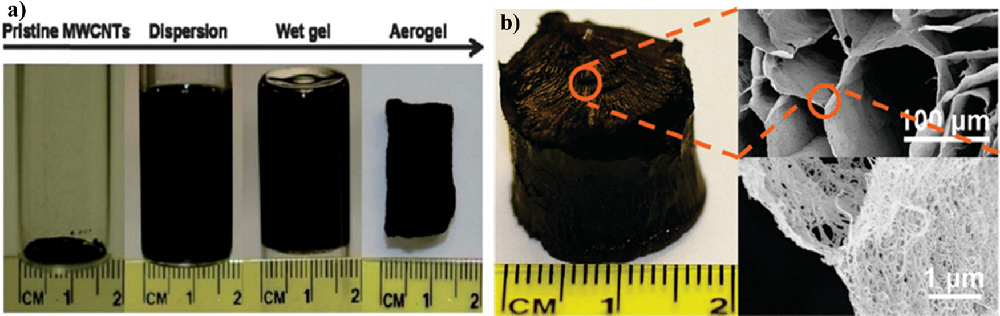

## Page 27

© 2025 The Author(s). Published by the Royal Society of Chemistry
Mater. Adv., 2025, 6, 7153–7206 |  7179
respectively, with nitrogen primarily sourced from the pyrrole
polymer backbone and sulfur from poly(styrenesulfonate) (PSS)
with sulfonic acid groups. Due to their distinctive porous
structure and N/S co-doping, NS-CNA-based supercapacitors
(SCs)
deliver
exceptional
electrochemical
performance
(Fig. 16b and c) achieving a specific capacitance of 328 F g1
at 1 A g1, a rate capability of 66.5% (from 1 A g1 to 10 A g1),
an energy density of 45.6 Wh kg1 at 0.5 kW kg1, and an
impressive capacity retention of 97.4% after 10 000 cycles.
Literature studies confirm that CNT-based aerogels combine
the inherent conductivity and mechanical robustness
of
nanotubes with the high surface area and tunable porosity of
aerogels, resulting in excellent performance as supercapacitor
electrodes. Functionalization, composite formation, and het-
eroatom doping consistently improve their capacitance, rate
capability, and cycling stability, underscoring their potential for
flexible
and
high-energy-density
energy
storage
devices
(Table 4).
4.1.1.4 Other porous materials for supercapacitors. In addi-
tion to carbon gels, several other porous materials have been
widely investigated for supercapacitor electrodes due to their
Table 4
Characteristics of various CNT aerogel-based supercapacitors
Method
Modification
Electrolyte
Testing conditions
Surface area and pore size
Capacitance
Ref.
CVD
Carbon aerogel
5 M KOH
1 mA, three-electrode
670–710 m2 g1, —
524 F g1
216
Freeze-drying
Mesoporous carbon
1 M KOH
10 mV s1, three-electrode
871 m2 g1, 1.3–50 nm
214 F g1
217
Supercritical drying
Cellulose nanofibers
H2SO4–PVA gel
5 mV s1, two-electrode
871 m2 g1, 1.3–50 nm
178 F g1
218
CVD
Microfibrous carbon
5 M KOH
—, —
1059 m2 g1, 1.41 nm
524 F g1
219
Fig. 16
(a) Schematic illustration of the synthesis process for nitrogen and sulfur co-doped carbon nanotube aerogels (NS-CNAs) involving MnO2-
templated polymerization, freeze-drying, and calcination. Insets show photographs of MnO2 nanowires and PPyNHs, along with a structural model of
graphitized N/S-co-doped carbon. (b) Electrochemical performance of NS-CNA supercapacitors at different current densities. (c) Gravimetric specific
capacitance measurements. Reprinted from ref. 215 with permission from Elsevier, copyright 2021.
Materials Advances
Review
Open Access Article. Published on 21 August 2025. Downloaded on 1/8/2026 4:37:10 PM. 
This article is licensed under a Creative Commons Attribution-NonCommercial 3.0 Unported Licence.
View Article Online

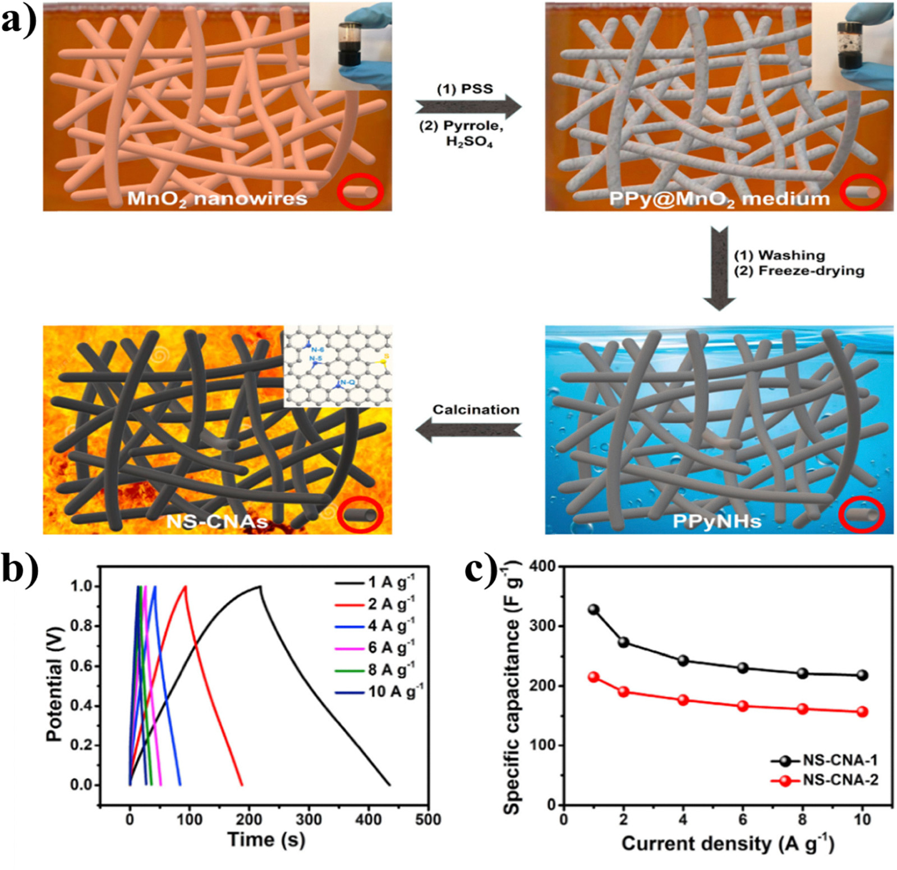

## Page 28

7180 |  Mater. Adv., 2025, 6, 7153–7206
© 2025 The Author(s). Published by the Royal Society of Chemistry
high surface areas, tunable pore structures, and electrochemical
stability. Activated carbons are the most commercially estab-
lished, offering surface areas often exceeding 2000 m2 g1, cost-
effective large-scale production, and chemical stability in various
electrolytes. However, their predominantly microporous struc-
tures can restrict ion transport at high charge–discharge rates,
limiting power density. MOFs and their derivatives, particularly
MOF-derived carbons, have attracted attention because of their
controllable pore sizes, high porosity, and ability to incorporate
heteroatoms, thereby improving conductivity and pseudocapaci-
tive behavior. Nevertheless, MOFs face challenges in cost, stability,
and scalability for industrial applications. Functionalized nano-
materials, such as heteroatom-doped graphene, CNTs, and hybrid
composites, combine high electrical conductivity with tunable
surface chemistry to enhance charge storage mechanisms. Nitro-
gen, sulfur, or phosphorus doping can increase wettability, active
site density, and faradaic activity, while composite architectures,
such as CNT/graphene hybrids, improve mechanical integrity and
ion transport pathways. Additionally, porous transition metal
compounds (oxides, hydroxides, and sulfides) and conducting
polymers can contribute pseudocapacitance, significantly boost-
ing energy density, though they often suffer from cycling stability
issues. Hybridizing these materials with porous carbons can
mitigate such drawbacks by enhancing structural support and
electrical connectivity. Compared to these alternatives, carbon
gels offer a unique balance of hierarchical porosity, tunable
surface chemistry, and precursor flexibility, enabling fast ion
transport and high capacitance while allowing sustainable synth-
esis routes from biomass. This positions carbon gels alongside
activated carbons, MOF-derived carbons, and functionalized
nanocarbons as leading candidates for next-generation super-
capacitor electrodes, with material choice dictated by the target
balance between energy density, power density, cycle life, and
production cost.220
4.1.2
Advances in materials and design strategies for next-
generation supercapacitors. Supercapacitors (SCs) have gained
considerable attention for their ability to deliver high power
density, long cycle life, and rapid charge–discharge capability,
making them ideal for applications ranging from portable
electronics to grid-level energy storage. The performance of
SCs is largely determined by the properties of the electrode
materials, which govern energy storage mechanisms, ion trans-
port, and cycling stability. Conventional carbon-based electro-
des, including carbon gels, offer high surface areas and tunable
pore structures, supporting rapid EDLCs. However, to achieve
higher energy densities while maintaining power performance,
recent research has explored integrating advanced nanostruc-
tured materials and surface engineering techniques. MXenes,
particularly M5X4 phases (where M is an early transition metal
and X is C or N), have emerged as promising candidates due to
their metallic conductivity, hydrophilic nature, and interlayer
tunability.221–224
Surface
engineering
of
MXenes
through
heteroatom doping, defect modulation, or functional group
grafting can expand interlayer spacing, increase accessible
active sites, and improve electrolyte wettability, thereby enhan-
cing capacitance and rate capability.224 Transition metal
dichalcogenides (TMDs), such as MoS2 and WS2, are also
gaining attention as pseudocapacitive materials due to their
layered structures and redox-active sites. Recent advances focus
on hybridizing TMDs with conductive carbons (graphene,
CNTs, and carbon gels) to mitigate their poor intrinsic con-
ductivity and structural degradation during cycling. These
composites can synergistically combine the fast ion transport
of porous carbons with the high capacitance of TMD layers,
yielding devices with improved areal and volumetric energy
densities.225
Black phosphorus (BP) has emerged as another multifunc-
tional electrode material, offering a tunable bandgap, high
carrier mobility, and abundant redox-active sites. In super-
capacitor applications, BP can contribute to both EDLC and
pseudocapacitance, while also enabling flexible and wearable
device architectures. However, BP’s environmental instability
remains a challenge; encapsulation, surface passivation, and
hybridization with porous carbon matrices have proven effec-
tive in improving its durability and electrochemical stability.226
Integrating these advanced materials with carbon gels offers a
pathway to high-performance, next-generation supercapacitors
that combine the hierarchical porosity, conductivity, and struc-
tural stability of carbon gels with the high-capacitance proper-
ties of pseudocapacitive nanomaterials. Such hybrid systems
hold significant promise for bridging the gap between batteries
and traditional SCs, enabling devices with both high energy
and power densities. Carbon-based materials continue to serve
as the foundational framework for high-performance super-
capacitor electrodes due to their high electrical conductivity,
chemical stability, and controllable porous architectures. They
function not only as active charge storage media through
electric double-layer capacitance but also as robust conductive
skeletons for supporting pseudocapacitive materials, improv-
ing both mechanical integrity and electron transport. Recent
reviews have highlighted the strategic design of carbon archi-
tectures ranging from activated carbons to advanced carbons
such as graphene, carbon nanotubes, and carbon gels as a
critical factor in achieving a balance between high energy and
power densities.227,228 The integration of hierarchical porosity
(micro-, meso-, and macropores) ensures rapid ion transport,
maximized accessible surface area, and enhanced electrolyte
penetration, while surface functionalization offers additional
routes for improving wettability and interfacial charge transfer.
Furthermore, combining carbon-based scaffolds with emerging
high-capacitance materials such as MXenes, transition metal
dichalcogenides, and black phosphorus creates hybrid systems
that leverage the conductivity and structural stability of carbons
with the redox activity of pseudocapacitive components. Such
composite strategies are proving to be vital in bridging the
performance
gap
between
supercapacitors
and
batteries,
enabling next-generation devices with enhanced energy den-
sity, rate capability, and long-term cycling stability.
4.2
Fuel cells
Fuel cells have drawn interest from the scientific community
globally as viable power sources for portable devices and
Review
Materials Advances
Open Access Article. Published on 21 August 2025. Downloaded on 1/8/2026 4:37:10 PM. 
This article is licensed under a Creative Commons Attribution-NonCommercial 3.0 Unported Licence.
View Article Online

## Page 29

© 2025 The Author(s). Published by the Royal Society of Chemistry
Mater. Adv., 2025, 6, 7153–7206 |  7181
environmentally friendly electric cars. Fuel cells come in var-
ious types, each depending on factors such as the fuel used, the
type of membrane, and the operating conditions. Among these,
the most extensively researched are hydrogen-based fuel cells,
direct methanol fuel cells (DMFCs), direct ethanol fuel cells
(DEFCs), and microbial fuel cells (MFCs).229 Below is a sche-
matic diagram illustrating the general working principle of a
fuel cell (Fig. 17a). In all fuel cell types, oxidation takes place at
the anode: in hydrogen-based fuel cells, hydrogen undergoes
oxidation, while in DEFCs and DMFCs, ethanol or methanol is
oxidized to carbon dioxide. At the cathode, oxygen or air is
reduced, resulting in the production of water, electricity, and
heat as by-products.157,230 In MFCs, the electrochemical activity
of bacteria facilitates electron exchange, converting chemical
energy into electrical energy. This section explores recent
advancements in the use of hydrogels in various fuel cell
applications.
Du et al.231 employed carbon aerogels as a catalyst support
for loading Pt–Ru bimetallic nanoparticles, aiming to optimize
both the Pt–Ru composition and the operating temperature for
DMFC anodes configured with membrane electrode assem-
blies. The carbon aerogels, characterized by a high BET surface
area of 576 m2 g1, facilitated efficient mass transport of
methanol fuel and CO2 exhaust, thereby improving catalytic
performance while minimizing the required amounts of Pt–Ru
and reducing system costs. This porous aerogel structure
proved especially advantageous for low-temperature DMFCs
by supporting effective two-phase flow. Additionally, reduced
Ru content was shown to be more beneficial under low-
temperature conditions. Additionally, a Pt NPs/graphene hydro-
gel was deposited in the micropores of Ni foam for DMFC
anodes, significantly improving electrocatalytic activity com-
pared to Pt/reduced G.O catalysts. The three-dimensional Ni
foam structure ensures the availability of small Pt NPs (4–
6 nm), enhancing activity by 2.6 times and the methanol
oxidation rate by 27 times relative to Pt/reduced G.O. The
graphene component reduces Pt usage while improving cataly-
tic performance, allowing binder-free electrode application.
The high conductivity and porous network enable efficient
transport of methanol molecules, ions, and electrons. Optimal
Pt precursor concentration is essential to prevent agglomera-
tion and ensure homogeneous Pt distribution, while oxygen
functionalities at graphene edges aid in Pt NP anchoring.232
Kakaei et al.233 synthesized Pd nanoparticles with an average
size of approximately 3 nm, uniformly embedded within a
nitrogen-doped graphene hydrogel matrix using a polyol
Fig. 17
(a) Diagram of a basic fuel cell. (b) Schematic of a typical lithium-ion battery featuring a graphite anode and a LiCoO2 cathode. (c) Illustration of
lithium-ion and electron transport routes during the battery discharge process. Reproduced from ref. 100 with permission from Royal Society of
Chemistry, copyright 2019.
Materials Advances
Review
Open Access Article. Published on 21 August 2025. Downloaded on 1/8/2026 4:37:10 PM. 
This article is licensed under a Creative Commons Attribution-NonCommercial 3.0 Unported Licence.
View Article Online

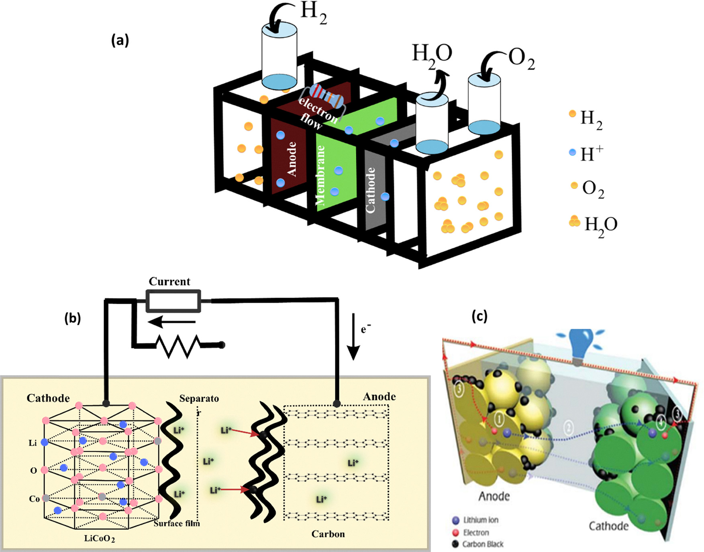

## Page 30

7182 |  Mater. Adv., 2025, 6, 7153–7206
© 2025 The Author(s). Published by the Royal Society of Chemistry
reduction
method.
The
resulting
composite
exhibited
enhanced electrocatalytic activity, attributed to the strong
synergistic effect between the conductive graphene network
and the Pd nanoparticles. Similarly, hydrogels have been inves-
tigated
as
electrode
platforms
for
DEFCs.
For
example,
cyclodextrin-functionalized Pd nanoparticle hydrogels demon-
strated significantly improved ethanol oxidation performance.
This enhancement is primarily due to host–guest interactions
between cyclodextrin and ethanol molecules, promoting more
efficient catalytic activity compared to conventional Pd-based
systems. Zhu et al.96 implemented an in situ reduction strategy
using sodium borohydride (NaBH4) to simultaneously initiate
gelation and reduce metal precursors, with reaction kinetics
modulated by temperature. Notably, they pioneered the devel-
opment of bimetallic hydrogel/aerogel composites incorporat-
ing non-noble metals, achieving rapid synthesis without the
need for capping agents. By varying the ratios of binary metallic
systems such as PdCu, PtCu, and AgCu they effectively opti-
mized electrocatalytic activity. This approach represents a cost-
efficient pathway for fabricating high-performance catalysts. In
a subsequent study,234 a self-supporting trimetallic hydrogel
composed of Ni:PdxPty (where x and y vary from 0 to 1) was
synthesized. This architecture exhibited significantly enhanced
electrocatalytic efficiency for ethanol oxidation, benefiting from
the
corrosion
resistance
of
the
freestanding
structure,
improved electron transfer through the metallic backbone,
and efficient mass transport within the 3D carbon framework.
The combined shape and compositional control of the Ni:PdPt
nanoclusters
contributed
to
their
superior
catalytic
performance.
To overcome the inherent brittleness of carbon aerogels,
which often compromises structural integrity during tradi-
tional
electrode
fabrication,
a
versatile
in
situ
silicone-
confined gelation technique was introduced. This method
enables the direct integration of metal aerogels such as PtPd,
PtAg, PdAg, and AuAg onto robust macroporous substrates like
carbon cloth, carbon fiber foam, and nickel foam. The resulting
composite structures exhibit superior mechanical flexibility
and retain the native 3D architecture of metal aerogels. This
innovative strategy promotes enhanced electron conductivity
and rapid mass diffusion, while also mitigating issues like
Ostwald ripening and nanoparticle aggregation. In contrast to
conventional ink-drop coating, which often compresses and
damages aerogel structures, the silicone-confined gelation
technique significantly improves both the electrocatalytic per-
formance
and
operational
stability
of
the
resulting
electrodes.234 Because hydrogel-based electrodes can overcome
important constraints in bioelectrochemical systems, especially
those related to electron transfer efficiency and biocompatibil-
ity, they have demonstrated significant promise in MFC appli-
cations. For example, a carbon paper anode coated with a CNT-
chitosan hydrogel showed increased electrocatalytic activity,
which was explained by the combined effects of chitosan’s
oxygen-containing functional groups and high electrical con-
ductivity of CNTs.96 Effective microbial electron transfer, a
frequently
limiting
step
in
MFC
efficiency,
was
further
encouraged by the support of the hydrogel matrix for the
development of a strong, multi-layered biofilm. Furthermore,
the quinone-rich surface of CNTs enhanced charge transport
between microorganisms and the electrode by acting as an
inherent redox mediator. In a different method, a high-
performance bioanode was a bacterial cellulose (BC) hydrogel
coated with polypyrrole (PPy). The conductivity and electroca-
talytic capabilities of PPy were combined with the biocompat-
ibility and high-water retention of BC in this composite
structure. A stable design that withstood microbial degrada-
tion, improved power and current densities, and a well-adhered
microbial layer were the outcomes. Additionally, the BC surfa-
ce’s conductive polymer-coated fibers facilitated quick charge
transfer, surpassing both untreated BC and traditional graphite
anodes. The use of this hydrogel-based material is a promising
method for creating sustainable energy solutions because of its
biocompatibility and capacity to promote biofilm development
by effectively delivering water-soluble nutrients to bacteria. The
performance of hydrogel-based electrodes in fuel cells is deter-
mined by a number of important factors. One important
metric, the ratio of forward to backward anodic peak current
density (Ix/Ib), indicates effective alcohol oxidation while redu-
cing the buildup of carbonaceous species. These results
demonstrate how hydrogel-based materials can be used to
develop energy conversion systems. Overall, the literature
indicates that integrating hydrogels and aerogels into fuel cell
electrodes significantly enhances catalytic activity, durability,
and mass transport properties. Tailoring composition, struc-
ture, and support materials has been shown to optimize
efficiency across DMFCs, DEFCs, and MFCs, highlighting these
materials’ strong potential in advancing sustainable and high-
performance fuel cell technologies (Table 5).
4.3
Gels for lithium-ion batteries
Though LIBs have been the dominant energy storage technol-
ogy since the 1990s, continuing to evolve over the decades, LIBs
face limitations such as low rate capabilities due to sluggish
diffusion kinetics and reduced cycle life caused by electrode
material expansion during the lithiation-de-lithiation process
despite their widespread use.172,239 These issues hinder their
applications in fields such as electric vehicles, which are very
demanding. These figures illustrate the mechanism of LIBs.
Given the extensive literature on electrochemical energy sto-
rage, this discussion focuses on fundamental mechanisms and
recent advancements in hydrogel-based electrode materials.
Typical anode materials in LIBs encompass carbonaceous
substances such as graphene and carbon nanotubes, along with
transition metal oxides like TiO2 (Fig. 16b and c). Recent
studies highlight silicon (Si) anodes as a promising alternative
due to their higher theoretical capacity.240,241 Although tradi-
tional carbon-based materials exhibit good conductivity and
minimal structural changes during cycling, their low lithiation
potential raises safety concerns. To address performance lim-
itations,
researchers
have
explored
conversion
materials
(MaOb, where M = Cu, Mn, Fe, Ni, Co, etc.) and alloy-based
materials (LixM, where M = Sn, Si, etc.) as high-performance
Review
Materials Advances
Open Access Article. Published on 21 August 2025. Downloaded on 1/8/2026 4:37:10 PM. 
This article is licensed under a Creative Commons Attribution-NonCommercial 3.0 Unported Licence.
View Article Online

## Page 31

© 2025 The Author(s). Published by the Royal Society of Chemistry
Mater. Adv., 2025, 6, 7153–7206 |  7183
anodes.242,243 Hybrid hydrogels have been introduced as an
innovative class of electrode materials to overcome these chal-
lenges. Wu et al. developed a composite anode by integrating
silicon (Si) nanoparticles into a polyaniline (PANI)-based con-
ductive polymer hydrogel through an in situ polymerization
approach.244 This architecture delivered a specific capacity of
1100 mA h g1 at a current density of 3 A g1 and maintained
550 mAh g1 even after 5000 cycles at 6 A g1. The superior
electrochemical performance was largely due to the continuous
conductive network provided by PANI and strong electrostatic
interactions between the Si oxide surface layer and the posi-
tively charged polymer matrix. Phytic acid functioned both as a
dopant and gelator, enhancing cross-linking via hydrogen
bonding and facilitating a robust three-dimensional structure
capable of buffering Si volume fluctuations during cycling. In
another study, Bai et al. incorporated Si nanoparticles with an
ultrathin silicon oxide (SiOx) coating into a graphene hydrogel
matrix. The SiOx layer, generated through ozone treatment,
mitigated particle agglomeration and ensured uniform disper-
sion within the conductive network, achieving a capacity of
1020 mAh g1 at 4 A g1.245 Hydrogel frameworks have also
been applied to TiO2-based anodes, often in synergy with
graphene or conductive polymers. Although TiO2 typically
offers lower capacity compared to Si and other transition metal
oxide anodes such as MnO2, CoO, and Fe3O4, it provides
superior mechanical stability during cycling.246 For instance,
a TiO2-conducting polymer-carbon nanotube (PEDOT:PSS/CNT)
composite delivered 76 mAh g1 at 50 mV s1, while an
N-doped MnO2/graphene hydrogel exhibited a capacity of
1003 mAh g1 at 100 mA g1.247 A composite material compris-
ing
carbon-coated
manganese
monoxide
quantum
dots
(C@MnO QDs) anchored on a graphene aerogel (GA) was
synthesized through an in situ gelation of manganese oxide
on GA, followed by supercritical drying and subsequent carbo-
nization. This strategy led to a uniform dispersion of nanoscale
MnO QDs within a three-dimensional porous and conductive
GA network. The nanosized MnO QDs facilitate efficient accom-
modation of volume changes and minimize ion diffusion
distances, thereby enhancing electrochemical kinetics. Concur-
rently, the interconnected GA framework provides efficient
pathways for electron transport and Li+ diffusion. As an anode
material for lithium-ion batteries, the C@MnO QDs/GA com-
posite demonstrated exceptional electrochemical characteris-
tics, including a high discharge capacity, robust cycling
performance, and impressive rate capability. Notably, a specific
capacity of 1698 mAh g1 was achieved after 100 cycles at
200 mA g1, and a capacity of 702 mAh g1 was retained even
under a high current density of 2000 mA g1. These findings
highlight
the
promise
of
C@MnO
QDs/GA
as
a
high-
performance anode and underscore its relevance for advancing
oxide-based electrodes in next-generation alkali metal-ion
batteries.
A new category of metal dichalcogenide-graphene hybrid
hydrogels have gained attention for energy storage applica-
tions. Lingappan et al. synthesized a MoS2-graphene composite
hydrogel by integrating MoS2 nanosheets into a graphene
Table 5
Hydrogels based on carbon for use in fuel cells
Type of hydrogel
Main material constituents
Main electrocatalytic features
Ref.
Metal particle-
carbon based
hydrogel
Bimetallic Pt–Ru loaded on
carbon aerogels (Pt : Ru
ratio varied as 1 : 1, 2 : 1
and 3 : 1)
50 at% Ru content is the appropriate catalyst composition for
high temperature direct methanol fuel cells (DMFCs), but at a
temperature lower than 40 1C, a lower Ru content is better and
with only two-thirds of noble metal being used, the membrane
electrode assembly (MEA) prepared by PtRu/CA can reach the
same power density of a commercial catalyst in a single DMFC
test
96
Metal NP-graphene
based hydrogel
Pt/PdCu nanoboxes in a
3D-graphene matrix
Peak current density is 183 mA cm2, a single-cell for (direct
ethanol fuel cell) DEFC gives a maximum power density of
40 mW cm2, for Pt/PdCu/3DGF, almost two times that of Pt/C
(21 mW cm2)
235
Ternary
Pt36Pd41Cu23
nanowire-based
hydrogel
Pt, Pd, and Cu nanowires
synthesized via a
surfactant-free, acid-etched
method, integrated into a
hydrogel matrix
Exhibit an ultrathin (B5 nm) nanowire structure with an optimal
Pt : Pd : Cu ratio of 36 : 41 : 23. These nanowires demonstrate
significantly enhanced electrocatalytic performance, achieving
4.38 mA cm2 for the EOR (19.8 higher than that of Pt/C) and
1.16 mA cm2 for the ORR (5.7 higher than that of Pt/C). When
used in a DEFC, they deliver a power density of 21.7 mW cm2 at
80 1C with a Pt loading of 1.2 mgPt cm2, representing a 3.9
improvement over conventional Pt/C catalysts. The superior
performance is attributed to the synergistic interaction of Pt, Pd,
and Cu, which enhances CO tolerance, promotes C–C bond
cleavage, and improves durability by preventing Ostwald ripening
and aggregation
236
Metal NP-graphene
based hydrogel
Pd NPs in an N-doped
reduced graphene matrix
synthesised via polyol-
assisted reduction
Methanol oxidation catalyst, the ECSA of the PdNPs/RDNG is
55.8 m2 g1, If 1
4 2.71 A mg1 Pd, electrocatalytic activity of
2.71 A mg1 Pd and good cycle life (66.5% forward peak current
retention after 1000 cycles), If/Ib 1
4 5
237
Noble metal NP-
graphene based
hydrogel
Pt NPs in a graphene
hydrogel matrix, deposited
on Ni foam
Methanol oxidation catalyst, (If) increases with Pt loading (mPt),
highest at 139.0 mA cm2, onset potentials (Eonset) 1
4 0.42 to
0.45 V, electrocatalytic activity (If/mPt) 1
4 481.5 mA mg1, highest
If/Ib 1
4 18.2, showing high CO poison tolerance
238
Materials Advances
Review
Open Access Article. Published on 21 August 2025. Downloaded on 1/8/2026 4:37:10 PM. 
This article is licensed under a Creative Commons Attribution-NonCommercial 3.0 Unported Licence.
View Article Online

## Page 32

7184 |  Mater. Adv., 2025, 6, 7153–7206
© 2025 The Author(s). Published by the Royal Society of Chemistry
framework through a two-step hydrothermal process, achieving
an impressive energy density of 890 Wh kg1 at a power density
of 130 W kg1.248 The incorporation of nitrogen dopants
further enhanced the material’s electrochemical properties. In
addition to graphene and conducting polymer-based hydrogels,
Shi et al. introduced a carbon framework derived from a
chitosan-glutaraldehyde hydrogel, which was used to host a
tin–iron (Sn–Fe) alloy.247 While Sn-based alloys offer signifi-
cantly higher specific capacities compared to conventional
graphite anodes, they are often limited by severe volume
expansion during cycling, which can result in mechanical fail-
ure and capacity fading. The developed hydrogel featured a
double-network structure, reducing particle agglomeration and
ensuring uniform volume variations. This framework resulted
in a capacity of 491 mAh g1 at 1 A g1. Hydrogels have also
been employed in solid polymer electrolyte systems. Bae et al.
used a 3D Li0.35La0.55TiO3 (LLTO) hydrogel framework as a
nanofiller in composite polymer electrolytes, achieving a high
Li-ion conductivity of B104 S cm1.249 The LLTO framework
facilitated percolation behavior, preventing agglomeration and
improving ion transport. V2O5-based hydrogels were among the
earliest reported examples. Coustier et al. (1998) synthesized a
V2O5
hydrogel
via
protonation
of
sodium
metavanadate
solution, yielding an aerogel electrode with a capacity of
310 mAh g1 at 2.9 mA cm2.250 While most hydrogel-based
LIB studies focus on anode materials, some extend to cathodes
and hydrogel-derived electrolytes, demonstrating their broad
applicability. In summary, hydrogel-based LIBs consistently
demonstrate that tailored gel architectures can effectively
address key limitations of conventional electrodes by enhan-
cing structural stability, mitigating volume expansion, and
improving ion/electron transport. These advances highlight
the versatility of hydrogels in both electrode and electrolyte
design, underscoring their potential to enable next-generation
LIB
systems
with
superior
performance
and
durability
(Table 6).
4.4
Carbon based gels as adsorbents for water purification
Huang et al. reported a straightforward approach for fabricat-
ing graphene-based hydrogels utilizing agarose (AG) as both a
stabilizing and reducing agent. In this synthesis, AG molecules
interact with GO surfaces via strong hydrogen bonding and
hydrophobic interactions with functional groups such as car-
boxyl, hydroxyl, and epoxide. These interactions promote the
crosslinking of AG chains, resulting in the formation of a three-
dimensional interconnected network. Structural characteriza-
tion using SEM and FT-IR confirmed this architecture. More-
over, the presence of cracks and pores within the hydrogel
matrix suggested the development of a loosely organized,
porous structure stemming from the synergistic interaction
between AG and graphene nanosheets. The AG hydrogels were
subsequently investigated for their dye adsorption capabilities,
capitalizing on the high surface area of graphene and the
porous architecture of the hydrogel matrix. A popular triphe-
nylmethane color called malachite green (MG) was employed as
a model contaminant to assess the effectiveness of the
Table 6
Hydrogels for lithium-ion battery applications
Type of hydrogel
Main material constituents
Electrode
type
Initial capacity
Capacity after cycling
Other features
Ref.
Metal oxide-based hydrogel
V2O5
Cathode
310 mAh g1 at 2.9 mA cm2
0.5% capacity loss after 100 cycles
at 2.9 mA cm2
Organic solvent-exchange method prevents
gel-structure collapse
250
Conducting polymer-based
hydrogel
Si NPs coated with PANI,
doped with phytic acid
Anode
1100 mAh g1 at 3 A g1
B550 mAh g1 at 6 A g1 after
5000 cycles
Free spaces for Si expansion in a conductive
PANI matrix
244
Graphene-based hydrogel
N-doped graphene/Fe3O4
Anode
1014 mAh g1 at 100 mA g1
1130 mAh g1 after 200 cycles
(NA rate)
Spacious matrix accommodates volume
changes
251
Conducting polymer
hydrogel
(a) TiO2-CNT-PEDOT:PSS,
(b) Si NPs-CNT-PEDOT:PSS
Anode
(a) 76 mAh g1 at 50 mV s1, (b)
2.2 mAh cm2 (max)
NA
Highly flexible battery electrodes
252
Graphene-based hydrogel
TiO2 nanocrystals in a gra-
phene matrix
Anode
B250 mAh g1 at 0.1 A g1
200 mAh g1 at 0.1 A g1 after 50
cycles
Multifunctional material for photocatalysis
and batteries
253
Graphene-based hydrogel
CoO NPs in a graphene
matrix
Anode
890.2 mAh g1 at 200 mA g1
1025.8 mAh g1 at 100 mA g1 after
82 cycles
Uniformly dispersed NPs in a hydrogel matrix 254
Graphene-based hydrogel
MnO2 in an N-doped gra-
phene matrix
Anode
1003 mAh g1 at 100 mA g1
909 mAh g1 at 400 mA g1 after
200 cycles
Facile synthesis using KMnO4 and graphene
redox reaction
255
Graphene-based hydrogel
Si@SiOx–graphene matrix
Anode
1020 mAh g1 at 4 A g1
1640 mAh g1 at 0.1 A g1 after
140 cycles
SiOx coating reduces Si NP agglomeration
245
Graphene-based hydrogel
MoS2 nanosheets in an N-
doped graphene matrix
Anode
1140 mAh g1 at 100 mA g1
94% retention at 100 mA g1 after
130 cycles
Optimum nitrogen doping, transition metal
dichalcogenide use
248
Non-conducting polymer-
based hydrogel
Sn–Fe alloy in a carbon
network from chitosan-
glutaraldehyde
Anode
491 mAh g1 at 1 A g1
516 mAh g1 at 0.1 A g1 after
500 cycles
3D structure mitigates Sn–Fe volume changes
during cycling
247
Review
Materials Advances
Open Access Article. Published on 21 August 2025. Downloaded on 1/8/2026 4:37:10 PM. 
This article is licensed under a Creative Commons Attribution-NonCommercial 3.0 Unported Licence.
View Article Online

## Page 33

© 2025 The Author(s). Published by the Royal Society of Chemistry
Mater. Adv., 2025, 6, 7153–7206 |  7185
adsorption process. The potential of graphene-AG hydrogels in
environmental remediation applications was illustrated in this
study, specifically with regard to the elimination of organic
pollutants from aqueous solutions. Over 50% of MG was
eliminated in 12 hours, according to UV-vis spectroscopy, and
after seven days, adsorption reached 90%. These results
demonstrate
that
graphene-AG
hydrogels
have
a
better
capacity for adsorbing dyes than pure AG hydrogels, which
makes them potentially useful materials for water purification
applications.256
A durable GO-CS composite hydrogel was presented by Bai
et al. as a novel material for water purification applications. GO
sheets and CS chains self-assembled to create the GO-CS
hydrogels, which are shown in Fig. 18(a) as a loosely connected
3D network structure. According to SEM examination, the
composite hydrogel was made up of GO sheets that had been
crosslinked by CS, creating an extremely porous structure. This
porous structure was essential in increasing the hydrogel
matrix’s total adsorption capacity by promoting the diffusion
of adsorbates within it. Excellent adsorption capabilities for a
range of organic dyes and heavy metal ions were demonstrated
by the GO-CS hydrogels that were produced. To evaluate the
adsorption effectiveness of the GO-CS composite hydrogel, MB
and eosin Y were selected as model dyes. It was discovered that
the composition of the hydrogel affected the adsorption capa-
city. In particular, a larger CS concentration boosted the
adsorption of eosin Y, whereas a higher GO level increased
the ability of the hydrogel to adsorb MB. The unique interac-
tions between the dye molecules and the constituents of
hydrogel were responsible for this selective adsorption activity.
In addition to its ability to remove dye, the GO-CS composite
hydrogel showed a strong adsorption capacity for certain heavy
metal ions, such as Cu(II) and Pb(II). Effective metal ion binding
was made possible by the coordination interactions between
GO, CS, and the metal ions, which were responsible for the
better adsorption performance. According to these results, GO-
CS hydrogels have a lot of promise for use in water purification
applications since they provide an effective and eco-friendly
method of eliminating both organic and inorganic contami-
nants from aqueous systems. Further studies could explore
optimizing the hydrogel composition, evaluating its reusability,
and assessing its performance under real-world water treat-
ment conditions.257
A polydopamine-modified graphene hydrogel (PDA-GH) was
created by Duan et al. in a single process.259 This method used
graphene nanosheets’ self-assembly and dopamine’s sponta-
neous polymerization to create a porous hydrogel structure.
Dopamine enhanced the stability and adsorption capacity of
the hydrogel by acting as a reducing and surface functionaliza-
tion agent. In order to create a homogenous mixture, dopamine
was added to the GO aqueous dispersion after GO was prepared
using a modified method of Hummers, Fig. 18b.260 This was
the first step in the synthesis of PDA-GH. PDA-GH was formed
as a result of the reaction, which was carried out at 60 1C under
static circumstances. In contrast, a GO dispersion was hydro-
thermally treated at 180 1C for 12 hours in an autoclave walled
with Teflon to create hydrothermally synthesized HT-GH. Fol-
lowing treatment, the autoclave spontaneously cooled to ambi-
ent temperature, yielding the HT-GH product. Techniques like
SEM, AFM, and XPS were used to describe the structural and
compositional characteristics of hydrogels. PDA-GH and HT-
GH’s capacity to eliminate impurities such as Cd(II), Pb(II),
Fig. 18
(a) Graphene-agarose (AG) hydrogel synthesis pathways diagram, displaying agarose structure and SEM images of GO-AG and RGO-AG
microstructures. (b) Graphene hydrogel microstructure and adsorption illustration, featuring images of the GO-dopamine combination and the resultant
PDA-GH. (c) Schematic of the desalination process using CX sheet electrodes made from nanocarbon xerogels. Reproduced from ref. 100 and 258 with
permission from Royal Society of Chemistry and MDPI, copyright 2019 and 2021.
Materials Advances
Review
Open Access Article. Published on 21 August 2025. Downloaded on 1/8/2026 4:37:10 PM. 
This article is licensed under a Creative Commons Attribution-NonCommercial 3.0 Unported Licence.
View Article Online

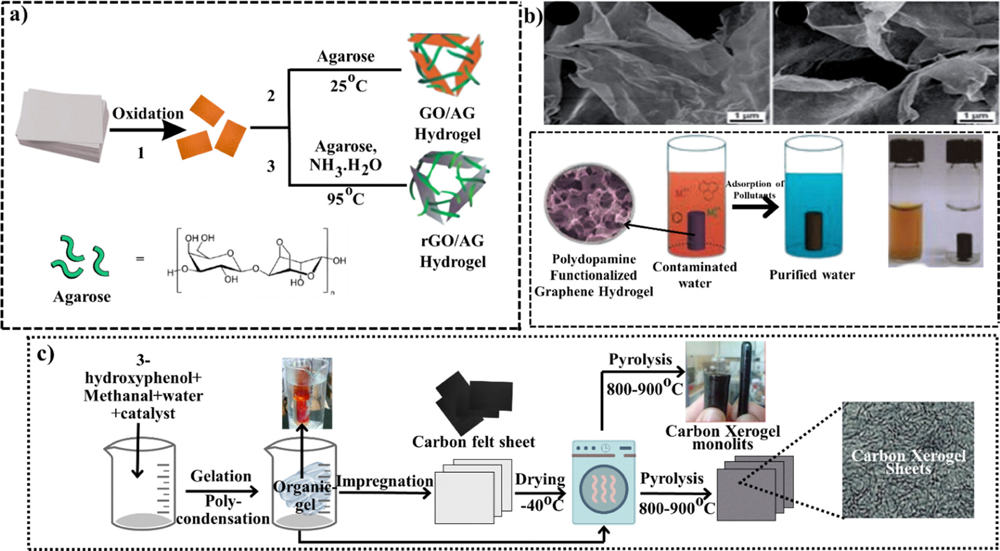

## Page 34

7186 |  Mater. Adv., 2025, 6, 7153–7206
© 2025 The Author(s). Published by the Royal Society of Chemistry
rhodamine B, and p-nitrophenol from aqueous solutions was
evaluated by adsorption assays. The findings showed that both
PDA-GH and HT-GH outperformed traditional carbon nanoma-
terials commonly employed in water filtration, exhibiting
noticeably enhanced adsorption capabilities for a variety of
contaminants. These graphene-based hydrogels solved a num-
ber of issues with existing carbon-based polymers, including
their difficult recovery procedures, low adsorption capability,
and residue persistence. Interestingly, even after several cycles
of adsorption and desorption, the hydrogels maintained their
high adsorption efficiency, and their regeneration was made
simple by readily available chemicals. These results highlight
the potential of HT-GH and PDA-GH as affordable, reusable
adsorbents for use in water purification.259
Using a freeze-drying technique, Liu et al. created Ni-doped
graphene/carbon cryogels (NGCC) by adding formaldehyde and
resorcinol to a graphene oxide (GO) suspension to create a
hydrogel precursor.80 Following a carbonization process, the
Ni-doped graphene/resorcinol-formaldehyde cryogel (NGRC)
was converted to NGCC. Using SEM, TEM, FT-IR, and XRD,
structural and morphological characterisation was carried out.
Even after being compressed over 4000 times its own weight,
the resulting cryogel showed exceptional mechanical qualities
and retained its original shape. The removal of methylene blue
(MB) dye, oil, and organic solvents was assessed using adsorp-
tion capabilities of NGCC. Because of its superwetting char-
acteristics, which allowed for the quick absorption of oils and
organic solvents, the results showed that the cryogel finished
the adsorption process in less than a minute. Additionally, after
seven adsorption–desorption cycles, the NGCC retained more
than 90% of its adsorption capacity, demonstrating exceptional
recyclability. According to the adsorption capacity–time pro-
files, equilibrium was reached quickly. The addition of gra-
phene, which changed the shape of the cryogel to increase its
surface area and porosity, was responsible for this quick
adsorption process. The NGCC produced with a GO content
of 6 mg mL1 demonstrated the highest MB adsorption cap-
ability among the different samples evaluated. Adsorption is
one of the simplest and most efficient methods for removing
contaminants from water, and it continues to be a major area of
scientific interest. Many graphene-based hydrogels have been
investigated for their potential to adsorb common water pollu-
tants, such as organic solvents, heavy metal ions, oils, and
colors. The adsorption efficacy and capacity of graphene-based
hydrogels are considerably enhanced by the addition of func-
tional ingredients including agarose, chitosan, and Ni-doped
cryogels, as demonstrated in earlier research. Furthermore,
experimental results indicate that even after multiple reuse
cycles,
these
materials
maintain
their
high
adsorption
effectiveness.261
The long-term adsorption effectiveness of these hydrogels
across prolonged reuse cycles could be further improved in
future studies, or their performance should be improved by
adding more functional components. The advancement of
water treatment technologies and the resolution of environ-
mental pollution issues will depend heavily on the creation of
graphene-based hydrogels that are more robust, economical,
and highly effective. Although it is still difficult, the creation of
sophisticated materials with adjustable wettability is essential
for effective oil–water separation. Recent work has shown that
controlled wettability and long-term hydrolytic stability are
made
possible
by
postcoordination
modification
of
Mg2(dobpdc) frameworks with monoamines of different alkyl
chain lengths. The octylamine-functionalized framework (OctA)
showed noteworthy efficacy in oil–water separation, and its
incorporation into an aerogel form with decreased graphene
oxide further improved organic solvent absorption and reusa-
bility. In parallel, sustainable adsorbents such as cotton-
derived
porous
carbon
(CDPC)
and
its
oxidized
variant
(CDPCO) were synthesized via alkaline etching, showing excel-
lent removal capabilities for both organic pollutants and heavy
metals like Cd(II) and Co(II). These mechanisms were influ-
enced by molecular size and electrostatic interactions. Further-
more, a low-cost carbon microbelt (CMB) aerogel fabricated
from waste paper displayed exceptional absorption capacities
up to 188 times its own weight for oils and could be regenerated
effectively. Given the environmental burden of municipal solid
waste, particularly waste paper, these materials offer promis-
ing, eco-friendly solutions for wastewater treatment and pollu-
tant
removal.
Overall,
literature
reports
confirm
that
functionalized
carbon-based
gels,
particularly
graphene-
derived hydrogels and cryogels, offer high adsorption capaci-
ties, tunable selectivity, and excellent reusability, making them
versatile candidates for removing diverse organic and inorganic
pollutants from water. The incorporation of additional func-
tional components further expands their applicability, provid-
ing a promising pathway toward next-generation, sustainable
water purification technologies (Fig. 19).
4.5
Gas storage and separation using carbon gels
Carbon aerogels have demonstrated significant potential in gas
storage and separation due to their uniform pore size distribu-
tion and high surface area, which enhance gas adsorption and
selectivity.263 The small size of gas molecules allows them to
interact effectively with the well-controlled micropores in car-
bon aerogels, making these materials particularly suitable for
applications in gas storage. The presence of uniform micro-
pores in carbon aerogels enhances the physisorption of gas
molecules due to their small kinetic diameters and favorable
interactions as described by the Lennard-Jones potential.
Furthermore, the incorporation of metal atoms or heteroatoms
into the carbon aerogel structure further increases gas adsorp-
tion capacities by facilitating stronger interactions between the
adsorbent surface and the gas molecules, primarily through
chemisorption.264 Functionalization strategies, such as nitro-
gen doping, have been widely employed to enhance the affinity
of carbon aerogels for CO2 molecules, thereby increasing their
gas capture efficiency.265,266 These characteristics make carbon
aerogels highly promising for gas storage applications, as their
porous structures and surface chemistry can be precisely engi-
neered
at
the
molecular
level
to
optimize
performance
(Table 7).180,267,268
Review
Materials Advances
Open Access Article. Published on 21 August 2025. Downloaded on 1/8/2026 4:37:10 PM. 
This article is licensed under a Creative Commons Attribution-NonCommercial 3.0 Unported Licence.
View Article Online

## Page 35

© 2025 The Author(s). Published by the Royal Society of Chemistry
Mater. Adv., 2025, 6, 7153–7206 |  7187
Li et al. synthesized a nitrogen-doped carbon aerogel (NCA)
by using a porous organic polymer aerogel, which was prepared
through a Schiffbase reaction.269 The nitrogen-doped carbon
aerogel (NCA) displayed exceptional textural properties, includ-
ing a high specific surface area of 2356 m2 g1, a large pore
volume of 1.12 cm3 g1, high bulk porosity (70%), and an ultra-
low
density
of
5
mg
cm3.
These
structural
attributes
contributed to its impressive CO2 adsorption capacities of
6.1 mmol g1 at 273 K (1 bar) and 3.4 mmol g1 at 298 K
(1 bar). The study highlighted that the micropore volume
Fig. 19
(a) Fabrication of OctA/rGA composites for oil–water separation. (b) Synthesis of cotton-derived porous carbon oxide for selective dye
adsorption. (c) Sorption capacities for organic pollutants and metal ions. (d) Preparation of a wastepaper-derived carbon microbelt aerogel with
wettability demonstration.
Table 7
Overview of carbon aerogel materials utilized in water purification and treatment applications
Material
Key features
Adsorption capacity
Recyclability
Ref.
Octylamine-functionalized
MOF (OctA) hybridized with
the rGO aerogel (OctA/rGA)
Hydrophobic modification for water stability, high
porosity enhances oil and organic solvent separation,
effective for oil–water separation and dye removal
Enhanced compared to pristine
OctA
Retained 85%
adsorption capa-
city after 10 cycles
204
Cotton-derived porous carbon
oxide (CDPCO) aerogel
Derived from biomass for low-cost, eco-friendly
applications, high specific surface area
(1160 m2 g1), efficient adsorption of organic solvents
and heavy metals
Organic solvents: 354–1519 mg
g1,
heavy metals: Co(II) 71.4 mg g1,
Cd(II) 40.2 mg g1, Pb(II) 111.
1 mg g1, Sr(II) 33.3 mg g1
Not specified
262
Carbon microbelt aerogel
(CMB) derived from
wastepaper
Low density (5.8 mg cm3), hydrophobic with high
sorption capacity for organic pollutants, tested for oil
and solvent absorption
56–188 mg g1
Evaluated using
squeezing and dis-
tillation methods
262
Materials Advances
Review
Open Access Article. Published on 21 August 2025. Downloaded on 1/8/2026 4:37:10 PM. 
This article is licensed under a Creative Commons Attribution-NonCommercial 3.0 Unported Licence.
View Article Online

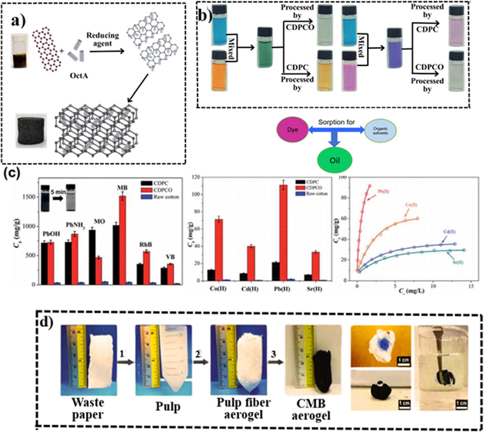

## Page 36

7188 |  Mater. Adv., 2025, 6, 7153–7206
© 2025 The Author(s). Published by the Royal Society of Chemistry
fraction and nitrogen content played crucial roles in enhancing
both CO2 uptake and CO2/N2 selectivity. The optimized NCA
sample exhibited a selectivity of 47.8 for CO2 over N2 at 298 K
and 1 bar, as determined using the ideal adsorption solution
theory (IAST) (Fig. 20a–d).
Oh et al. synthesized a carbon nitride-functionalized porous
reduced graphene oxide aerogel (CNA) to develop a highly
selective and regenerable CO2 adsorbent.269 While strong inter-
actions between gas molecules and adsorbent surfaces can lead
to low reproducibility, the CNA material was engineered to
Fig. 20
(a) and (b) Synthesis and N2 sorption isotherms of nitrogen-doped carbon aerogels (NCAs). (c) and (d) CO2 uptake and CO2/N2 selectivity of
NCAs. (e) and (f) Synthesis of the carbon nitride aerogel (CNA) and mechanism of selective CO2 adsorption. (g)–(i) CO2/N2 adsorption behavior and
recyclability of CNA. Reproduced from ref. 205 with permission from Elsevier, copyright 2020.
Review
Materials Advances
Open Access Article. Published on 21 August 2025. Downloaded on 1/8/2026 4:37:10 PM. 
This article is licensed under a Creative Commons Attribution-NonCommercial 3.0 Unported Licence.
View Article Online

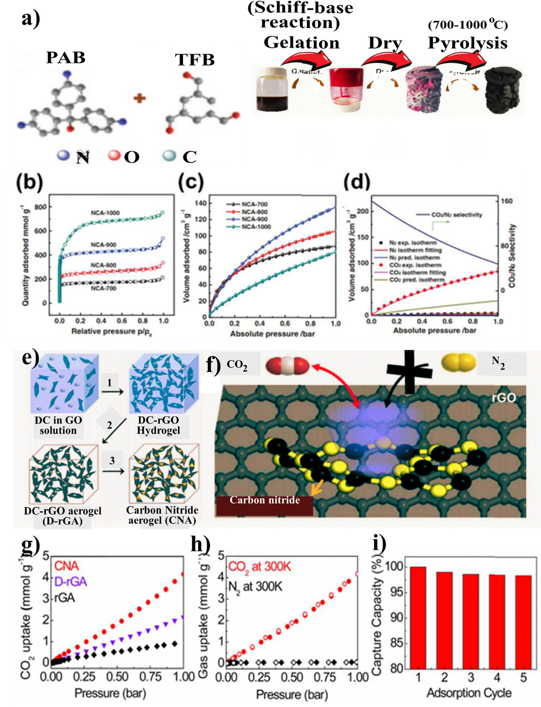

## Page 37

© 2025 The Author(s). Published by the Royal Society of Chemistry
Mater. Adv., 2025, 6, 7153–7206 |  7189
achieve a balance between adsorption energy and regeneration
efficiency.270,271 The synthesized CNA exhibited a specific sur-
face area of 450 m2 g1 and a total pore volume of 1.5 cm3 g1.
Its CO2 uptake reached 4.2 mmol g1 at 300 K (1 bar), with an
impressive retention of 97.6% of its initial adsorption capacity
after five regeneration cycles. Additionally, the selectivity of the
CNA for CO2 over N2 was recorded at 113 at a gas composition
of 10% CO2/90% N2 (v/v) at 300 K and 1 bar as shown in
Fig. 20(e–i). Liu et al. synthesized a three-dimensional glucose/
graphene-based aerogel (G/GAs) for the adsorption of various
target gases, including CO2, CH4, and H2.272 The fabrication
process utilized glucose as a binder to create a hierarchical
graphene
oxide
matrix
with
enhanced
gas
adsorption
properties. The resultant aerogel exhibited a large surface area
(763 m2 g1) and a high total pore volume (3.06 cm3 g1). Its
CO2 and CH4 adsorption capacities at 298 K and 1 bar were
recorded at 1.7 mmol g1 and 1.1 mmol g1 (1.7 wt%),
respectively. Additionally, its H2 uptake at 77 K and 1 bar was
measured at 6.1 mmol g1 (1.2 wt%) (Fig. 21(a–e)). Jeon et al.
investigated the effect of nitrogen doping on the CO2 adsorp-
tion capacity of carbon aerogels by synthesizing nitrogen-doped
carbon aerogels (CAs) with varying resorcinol/melamine (R/M)
ratios.272 The study found that, although the specific surface
area was relatively low, increasing the nitrogen content signifi-
cantly improved CO2 adsorption. The highest CO2 uptake of
2.7 mmol g1 at 298 K and 1 bar was achieved with an
Fig. 21
(a) Synthesis of 3D glucose/graphene aerogels (G/GAs). (b)–(e) Gas adsorption behavior of G/GAs for N2, H2, CO2, and CH4. (f)–(h) Fabrication
and SEM analysis of nitrogen-doped carbon aerogels, with adsorption profiles influenced by precursor ratios. (i), (j) N2 adsorption–desorption isotherms
and pore size distribution curves of nitrogen-doped carbon aerogels, respectively. Reproduced from ref. 205 with permission from Elsevier, copyright
2020.
Materials Advances
Review
Open Access Article. Published on 21 August 2025. Downloaded on 1/8/2026 4:37:10 PM. 
This article is licensed under a Creative Commons Attribution-NonCommercial 3.0 Unported Licence.
View Article Online

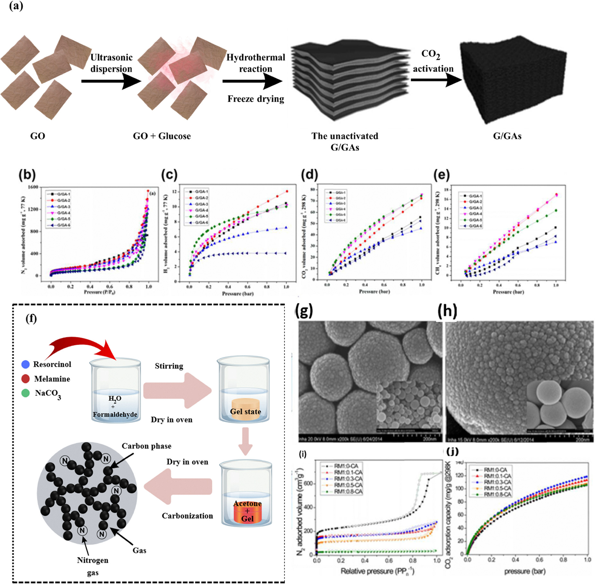

## Page 38

7190 |  Mater. Adv., 2025, 6, 7153–7206
© 2025 The Author(s). Published by the Royal Society of Chemistry
optimized resorcinol/melamine (R/M) ratio of 1 : 0.3, highlight-
ing the crucial role of nitrogen-doped sites in enhancing CO2
affinity (Fig. 21f–j). Overall, these studies consistently demon-
strate that tailoring the pore structure, surface area, and
heteroatom
doping
in
carbon
aerogels
can
substantially
enhance gas uptake and selectivity. The reported works high-
light nitrogen doping, hierarchical porosity, and balanced
adsorption–desorption energetics as key strategies for achiev-
ing high CO2 capture efficiency and regeneration stability.
4.6
Metal-doped carbon-based gels as catalysts
The textural characteristics of the synthesized samples are
detailed in Table 8, and their pore size distributions are visually
represented in Fig. 22. These metal-doped carbon aerogels
share similar features with the undoped carbon aerogel used
for comparison, which primarily exhibited macroporous struc-
tures. Mesopores were observed only in the tungsten-doped
catalysts, and even then, their presence was minimal. The
macropore volume followed the order ACr500 o AMo500 o
AW500, but decreased as the carbonization temperature
increased, as seen in the case of AW1000. In contrast, the
PSD showed an inverse trend. The sample ACr500 exhibited the
largest macropores, with diameters exceeding 2000 nm. AMo-
500 showed a monomodal pore size distribution centered
around 1500 nm, whereas AW-500 displayed a bimodal dis-
tribution with peaks near 180 nm and 1500 nm. The study
found that as carbonization temperature increased, smaller
macropores decreased in size, and larger macropores increased
in volume. The undoped reference sample showed a uniform
macropore size of around 130 nm, indicating a less porous
structure and a higher density compared to the others. Follow-
ing pretreatment in a helium flow, the supported A1000-5W
catalyst showed a slight reduction in the specific surface area
compared to the A1000 support. This decrease is attributed to
partial pore blockage caused by the deposited metal phase;
however, the overall macroporous structure appeared to remain
unaffected.
Microporosity (W0), and consequently the surface area,
followed the same trend as macroporosity, but both increased
with higher carbonization temperatures. Among the catalysts,
AMo-500 exhibited the largest micropores (L0). The overall
porous structure of the carbon aerogels was a consequence of
the conditions in four essential phases of their synthesis:
gelation, drying, carbonization, and activation. Since the initial
development of carbon gels, numerous studies have focused on
how adjusting these conditions can effectively control aerogel
Table 8
Structural characteristics of carbon aerogels doped with metal components
Sample
Metal (%)
p (g cm3)
SN2 (m2 g1)
V3
V2
W0
L0 (nm) (cm3 g1)
Ref.
ACr500
3.6
0.56
397
0.99
0.00
0.17
1.03
283
AMo500
1.9
0.50
481
1.40
0.00
0.18
1.12
284
AW500
1.4
0.43
528
1.53
0.05
0.20
1.06
276
AW1000
2.1
0.54
610
1.32
0.01
0.26
1.06
277
A1000
—
0.72
470
0.63
0.00
0.27
1.08
273
A1000–5 W (He/500 1C/2 h)
5
0.72
410
0.61
0.00
—
—
284
Fig. 22
(a) Carbon gels formed in various shapes. (b) Pore size distribution of metal-doped carbon aerogels via mercury porosimetry. (c) SEM images
revealing surface morphology of ACr500 and AW500 samples. Reproduced from ref. 278 and 279 with permission from Elsevier, copyright 2013 and
2011.
Review
Materials Advances
Open Access Article. Published on 21 August 2025. Downloaded on 1/8/2026 4:37:10 PM. 
This article is licensed under a Creative Commons Attribution-NonCommercial 3.0 Unported Licence.
View Article Online

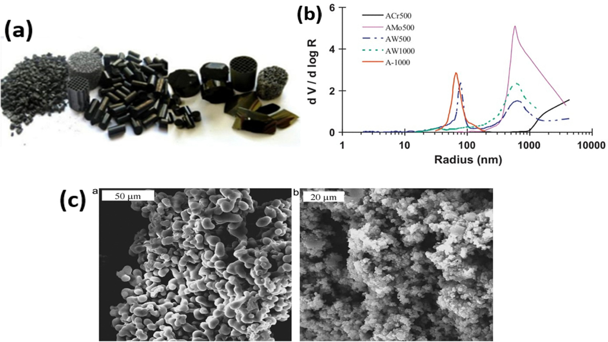

## Page 39

© 2025 The Author(s). Published by the Royal Society of Chemistry
Mater. Adv., 2025, 6, 7153–7206 |  7191
porosity.273 SEM images illustrating the sample surfaces are
presented in Fig. 22. These images reveal structures made up of
fused microbead particles, whose sizes were significantly influ-
enced by the specific metal used. The textural characteristics of
the aerogels appear to be linked to the size of these micro-
particles – smaller particles tend to produce a pore network
with reduced interparticle voids, spanning macro- to mesopore
ranges. The findings suggest that both morphology and pore
structure were dependent on the type of metal salt used during
synthesis.273–277 Microporosity within individual particles is
primarily developed during the carbonization stage. Accord-
ingly, the observed increase in W0 and L0 at higher carboniza-
tion temperatures is probably attributable to the significant
amount of material lost during the carbonization process.
To determine the chemical identity and how the metals were
distributed, XRD and TEM were employed. The XRD analysis
did not reveal any distinct diffraction patterns associated with
the metal components, suggesting excellent metal dispersion,
findings consistent with previous studies.280 Prior XPS data
indicated partial reduction of Cr(VI) to Cr(III) and Mo(VI) to
Mo(V), while tungsten retained its W(VI) state after carboniza-
tion at 500 1C. As illustrated in Fig. 3, all metal-doped
catalysts demonstrated effective metal dispersion. The gelation
process facilitated the incorporation of metal species into the
organic gel network, followed by metal particle formation
during carbonization. Consequently, strong interactions are
established between the organic and inorganic components.
The scanning electron microscopy (SEM) images provide evi-
dence that metal nanoparticles, exhibiting a range of sizes and
shapes, are evenly distributed throughout the carbon matrix.
The specific characteristics of these nanoparticles are deter-
mined by the type of metal used and the thermal treatment
process.280,281 These observations also suggest that the doped-
metal catalysts exhibit notable resistance to sintering, despite
undergoing intense thermal processing. However, the particle
sizes, although relatively large, still do not generate XRD
diffraction peaks, implying that the metal phases possess an
amorphous structure.
The conversion of feedstocks derived from biomass into
chemicals and fuels presents considerable potential for enhan-
cing carbon-supported catalysts. A prime illustration of this is
the selective catalytic oxidation of glycerol, which is a byproduct
generated from the production of biodiesel, to synthesize high-
value fine chemicals like glyceric acid. Various carbon materi-
als, including CNTs, activated carbons, and carbon xerogels,
were employed as supports for gold nanoparticles. It was
observed that surface oxygen negatively impacted catalytic
activity, whereas the existence of narrow pores increased the
selectivity for glyceric acid. The best selectivity (75%) was
attained with gold supported on activated carbon.282 These
studies collectively indicate that the type of metal dopant,
synthesis conditions, and resulting pore architecture play deci-
sive roles in determining catalyst morphology, porosity, and
metal dispersion. Reported findings emphasize that optimized
macropore-micropore balance, strong metal–support interac-
tions, and controlled nanoparticle formation are key to
enhancing catalytic performance in biomass-derived feedstock
conversions.
4.7
Other porous materials for energy and environmental
technologies
Beyond carbon gels, a wide range of porous materials, includ-
ing activated carbons, MOFs, COFs, porous polymers, and
functionalized nanomaterials, have emerged as promising
candidates
for
energy
and
environmental
applications.
Activated carbons remain the most industrially adopted option
due to their low cost, scalability, and high surface areas
(41000 m2 g1), making them ideal for adsorption-based water
purification, gas storage, and supercapacitor electrodes. How-
ever, their predominantly microporous structure can limit ion
transport in high-power energy storage systems. In contrast,
MOFs offer crystalline, highly ordered pore structures with
tunable chemistry, enabling exceptional selectivity for CO2
capture, gas separation, and catalytic conversions. Despite
these advantages, the high synthesis cost, moderate stability,
and often low conductivity of MOFs restrict large-scale deploy-
ment, particularly in electrochemical systems. Functionalized
nanomaterials, such as doped graphene, CNTs, and hybrid
composites, provide high electrical conductivity, structural
integrity, and tunable surface chemistry for targeted applica-
tions. Heteroatom doping (N, S, P, or B) can enhance wett-
ability, catalytic activity, and charge storage capacity, while
hybrid structures improve mass transport pathways. In envir-
onmental remediation, these materials can be functionalized to
selectively adsorb heavy metals, dyes, or emerging contami-
nants,
although
synthesis
complexity
and
cost
remain
challenges.
Porous transition metal compounds (oxides, hydroxides,
and sulfides) and conducting polymers also contribute signifi-
cantly to energy and environmental technologies. Transition
metal oxides (e.g., MnO2 and Fe2O3) and hydroxides offer high
pseudocapacitance and catalytic activity for water splitting,
while conducting polymers such as polyaniline and polypyrrole
show promise for capacitive deionization and electrocatalysis.
However, these materials often suffer from limited cycling
stability or structural degradation, issues that can be mitigated
through composite formation with porous carbons. Compared
to these materials, carbon gels occupy a distinctive position due
to their hierarchical porosity, adjustable surface chemistry, and
flexibility in precursor selection from synthetic monomers to
renewable biomass. This allows optimization for both high-rate
ion transport in supercapacitors and broad-spectrum adsorp-
tion in environmental applications. Although the fabrication
cost of carbon gels may exceed that of conventional activated
carbon, their superior rate performance, tunable structure, and
potential for green synthesis make them competitive for spe-
cialized, high-value applications in both sectors. Ultimately, the
choice among porous materials depends on balancing perfor-
mance metrics (surface area, conductivity, selectivity, and sta-
bility) with production cost and scalability, positioning carbon
gels alongside activated carbons, MOFs, and functionalized
Materials Advances
Review
Open Access Article. Published on 21 August 2025. Downloaded on 1/8/2026 4:37:10 PM. 
This article is licensed under a Creative Commons Attribution-NonCommercial 3.0 Unported Licence.
View Article Online

## Page 40

7192 |  Mater. Adv., 2025, 6, 7153–7206
© 2025 The Author(s). Published by the Royal Society of Chemistry
nanomaterials as key players in the future of sustainable energy
and environmental technologies.
4.8
Applications of carbon gels in catalysis
4.8.1
Carbon gels as catalyst supports. The tunable poros-
ity of carbon gels makes them superior catalyst supports for
fuel cell applications compared to conventional carbon black,
as this feature allows for the minimization of mass transfer
limitations in the catalytic layer.285 Additionally, the type and
quantity of surface functional groups present in carbon gels
significantly influence the metal phase’s loading, dispersion,
oxidation state, and stability-factors that directly impact
catalyst performance.286
In terms of textural characteristics, carbon gels provide
notable advantages over activated carbon supports, particularly
regarding pore size and shape. The mesoporous, tubular struc-
ture of carbon gels provides an advantage over the micro-
porous, slit-shaped structure of activated carbons in achieving
catalyst selectivity. In the hydrogenation of cinnamaldehyde to
cinnamyl alcohol, for example, monometallic Pt catalysts strug-
gle with selectivity due to preferential CQC bond adsorption.
Bimetallic PtSn catalysts supported on mesoporous carbon
gels, however, can enhance selectivity by favoring CQO bond
adsorption (‘‘head-on’’, Fig. 23a). This ‘‘head-on’’ adsorption is
facilitated by the mesoporous structure of carbon gels, unlike
the slit-shaped pores of activated carbons, which force ‘‘side-
ways’’ adsorption that favors the hydrogenation of the CQC
bond.287 The trimetallic PtFeZn catalyst supported on the
carbon xerogel achieved exceptional selectivity even with high
reactant conversion.288 More recently, the exceptional selectiv-
ity observed for a bifunctional catalyst, consisting of gold
supported on a carbon xerogel that had been modified with
acidic sites, in the oxidation of cellobiose to gluconic acid was
explained by a change in the shape of the reactant within the
large pores of the carbon gel. This conformational change
made the glycosidic bond more accessible for hydrolysis.289
These reported studies highlight that the unique mesoporous
architecture and adjustable surface chemistry of carbon gels
enable superior control over reactant adsorption modes, lead-
ing to enhanced catalytic activity and selectivity. The literature
demonstrates that tailoring pore geometry and introducing
specific metal or acidic functionalities are key strategies for
optimizing catalyst performance in diverse reactions.
4.8.2
Carbon gel catalysts. The catalytic capabilities of
carbon-based materials have been demonstrated across a wide
variety of reactions, including both acid–base and oxidation–
reduction mechanisms.291 The ability to synthesize carbon gels
without metallic impurities and the ease with which their
surface properties can be adjusted make them ideal model
systems for metal-free catalysis. Active catalytic sites can then
be engineered by incorporating specific surface functional
groups and heteroatoms. For example, the esterification reac-
tion between acetic acid and ethanol can be catalyzed by carbon
xerogels that have been modified to include sulfonic acid
groups.292
Meanwhile,
the
basic
surface
properties
of
nitrogen-doped carbon xerogels make them effective catalysts
for the oxidation of NO and the breakdown of organic con-
taminants using advanced oxidation techniques.293 Addition-
ally, oxidized carbon xerogel materials have been identified as
effective catalysts for the process of oxidative dehydrogenation,
where isobutane is converted to isobutene. In this process,
carbonyl (quinone) groups act as active sites, whereas car-
boxylic groups negatively impact catalytic performance by
reducing electron density at these sites, thereby lowering
activity.294 The reaction mechanism proposed for hydrocarbon
oxidative dehydrogenation is illustrated in Fig. 22(b). This
quinone–hydroquinone cycle might represent a general path-
way for various oxidation reactions catalyzed by carbon-
containing materials.
4.9
Applications in responsive drug delivery
Carbon-based hybrid nanogels have emerged as promising
candidates for highly efficient stimuli-responsive drug delivery
systems. Their suitability is attributed to the inherent porous
structure, high surface area, and favorable drug-nanocarbon
interactions, which collectively enable exceptionally high drug
loading capacities. Additionally, these nanogels exhibit excel-
lent colloidal stability in aqueous solutions. To date, both
endogenous and exogenous stimuli have been extensively
employed to regulate the controlled release of therapeutic
Fig. 23
(a) Illustration of cinnamaldehyde molecules adsorbing in a ’head-on’ orientation onto a PtSn bimetallic catalyst. (b) Proposed catalytic cycle for
hydrocarbon oxidative dehydrogenation on carbon-based materials. Reproduced from ref. 290 with permission from Elsevier, copyright 2005.
Review
Materials Advances
Open Access Article. Published on 21 August 2025. Downloaded on 1/8/2026 4:37:10 PM. 
This article is licensed under a Creative Commons Attribution-NonCommercial 3.0 Unported Licence.
View Article Online

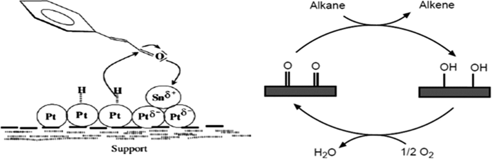

## Page 41

© 2025 The Author(s). Published by the Royal Society of Chemistry
Mater. Adv., 2025, 6, 7153–7206 |  7193
agents in vivo, thereby enhancing the efficacy of disease
treatment.295
4.9.1
Endogenous
activation-responsive
drug
delivery.
Endogenous activation is typically achieved through variations
in specific physicochemical characteristics of the pathological
microenvironment, such as pH, temperature, and the presence
of certain biomolecules.296 Several carbon-based hybrid nano-
gels have been developed to facilitate responsive drug delivery.
For instance, Majumdar et al. synthesized an alginate–carbon
dot (CD) hybrid nanogel designed for pH-responsive drug
release, wherein the drug release rate is modulated by the
concentration of methicillin-resistant Staphylococcus aureus
(MRSA) at the target site.297 Notably, the incorporation of CDs
into alginate nanogels significantly enhances the drug loading
capacity, increasing it from 19% to 78% for a garlic extract
model drug containing allicin. These alginate-CD hybrid nano-
gels exhibit pH-dependent controlled drug release, thereby
improving therapeutic efficacy. Importantly, the system not
only responds to stimuli but also enables controlled drug
release based on pathogen concentration. Specifically, the
presence of Staphylococcus aureus (MRSA) leads to cell division
and the production of acidic secondary metabolites, resulting
in a local decrease in pH. This pH drop subsequently triggers
drug release from the nanogels, effectively inducing MRSA cell
death. In a separate study, Bardajee et al. developed a new class
of thermo- and pH-dual-responsive biodegradable hybrid nano-
gels through the copolymerization and crosslinking of N-
isopropylacrylamide (NIPAM) and acrylic acid (AA) monomers
in
the
presence
of
salep-modified
GO.298
The
resulting
P(NIPAM-AA)-salep-GO hybrid nanogels demonstrated a high
loading capacity for the anticancer drug doxorubicin (DOX),
along with thermo- and pH-responsive drug release behavior.
Specifically, the system exhibited minimal drug release at
neutral pH and lower temperatures, while a significantly
enhanced release was observed under acidic conditions and
at elevated temperatures - without any initial burst release.
Moreover, the GO-based hybrid nanogels showed no cytotoxi-
city within the tested concentration range of up to 410 mg mL1.
However, the dual-responsive and sustained release of DOX
from the hybrid nanogels led to a marked increase in cytotoxi-
city against HeLa cells compared to the equivalent concen-
tration of free DOX, indicating improved therapeutic efficacy.
Kim et al. reported the rational design of therapeutic contact
lenses by incorporating nanodiamonds (NDs) into enzyme-
responsive nanogel matrices, demonstrating their potential as
effective platforms for ocular drug delivery shown in Fig. 24a.299
The timolol maleate-loaded nanodiamond-polyethylenimine-
chitosan (ND-PEI-chitosan) hybrid nanogel was successfully
embedded within a hydrogel matrix and cast into contact lenses.
This hybrid nanogel retains timolol through short-range chemical
Fig. 24
(a) Synthesis of drug-loaded ND-PEI-chitosan nanogels and their integration into lysozyme-responsive contact lenses. (b)–(d) DOX-loaded CS/
PNIPAM@CNT nanogels: stimuli-responsive drug release triggered by pH, temperature, and NIR light. Reproduced from ref. 301 with permission from
Royal Society of Chemistry, copyright 2015.
Materials Advances
Review
Open Access Article. Published on 21 August 2025. Downloaded on 1/8/2026 4:37:10 PM. 
This article is licensed under a Creative Commons Attribution-NonCommercial 3.0 Unported Licence.
View Article Online

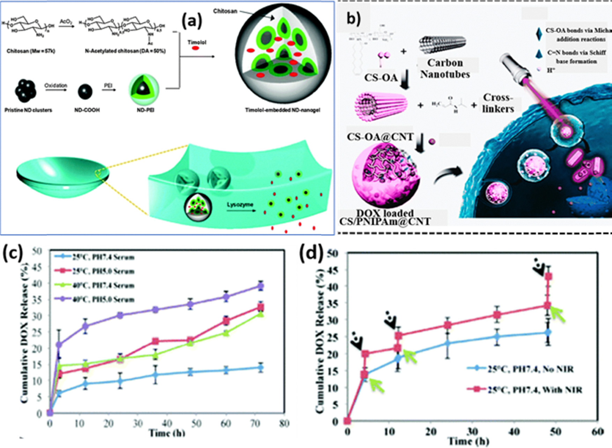

## Page 42

7194 |  Mater. Adv., 2025, 6, 7153–7206
© 2025 The Author(s). Published by the Royal Society of Chemistry
interactions, effectively preventing premature drug elution while
preserving its bioactivity for subsequent release.300 Drug release is
triggered by the enzymatic degradation of the chitosan-based
nanogel via lysozyme cleavage. Beyond enabling controlled drug
delivery, the incorporation of a small amount of nanodiamonds
into the lens matrix significantly improved the mechanical prop-
erties by enhancing tensile strength and increasing the elastic
modulus through polymer matrix reinforcement. The resulting
contact lenses exhibited excellent water and oxygen permeability,
optical transparency, and mechanical robustness, along with
sustained drug release in response to lysozyme activation.
This
innovative
ND-based
system
represents
a
promising
platform for the development of advanced enzyme-responsive
drug delivery devices tailored for sustained ocular therapy. These
studies demonstrate that integrating carbon-based nanomaterials
into hybrid nanogels enables precise, stimuli-responsive drug
release tailored to pathological conditions. Reported findings
emphasize that pH, temperature, and enzyme triggers, combined
with high drug-loading capacity and biocompatibility, can signifi-
cantly enhance therapeutic efficacy while minimizing premature
release.
4.9.2
Exogenous activation-responsive drug delivery. Exo-
genous activation of drug release has garnered significant
attention, as it eliminates the need for modifying the physical
or chemical properties of the biological environment, an
advantage that helps avoid the potential adverse effects on
healthy cells and tissues often associated with the harsh con-
ditions
required
for
endogenous
activation
in
in
vivo
applications.302,303 A promising strategy for exogenous activa-
tion involves the application of external stimuli such as electric
fields, magnetic fields, or near-infrared (NIR) light. These
triggers
can
initiate
drug
release
from
hybrid
nanogel
carriers with precise spatial and temporal control, thereby
enhancing site-specific drug accumulation. Such control is
particularly advantageous in cancer therapy, where localized
treatment can significantly improve therapeutic efficacy while
minimizing systemic side effects. For example, Lu et al. inte-
grated reduced rGO nanosheets into a thermosensitive poly(N-
isopropylacrylamide) (PNIPAM) nanogel, resulting in a dual-
responsive drug delivery system responsive to both light and
temperature.304 The rGO content within the hybrid nanogels
plays a crucial role in modulating both thermal and photic
sensitivity. At lower rGO concentrations (o47.5 wt%), the rGO-
PNIPAM hybrid nanogels exhibit temperature-responsive drug
release, with an increased release rate as the temperature rises.
In contrast, when the rGO content exceeds 64.5 wt%, the
nanogels lose their thermoresponsive behavior and instead
display photo-responsive drug release. In a separate study,
Spizzirri et al. developed a biocompatible gelatin-CNT hybrid
nanogel, which demonstrated electric field-responsive drug
release.305 The application of an electric field (9 V) to the hybrid
nanogel system resulted in a 20% increase in drug release.
Hybrid nanogels with higher concentrations of CNTs exhibited
a greater release of drug molecules in response to the same
electric field strength. These electro-responsive CNT-based
hybrid nanogels could be integrated into a suitable topical
drug delivery device, enabling controlled release of therapeutics
upon the application of an external voltage.
4.9.3
Combined
endogenous/exogenous
activation-
responsive drug delivery. The combination of both endogenous
and exogenous activation-responsive drug delivery presents a
promising approach to enhance the therapeutic efficacy of
cancer treatment in a synergistic manner.306 Such combined
therapy is expected to reduce the required drug dosage while
still achieving comparable cytotoxicity to the equivalent dose of
the drug without exogenous activation, thereby minimizing the
systemic side effects commonly associated with chemothera-
peutic agents. For instance, Xu et al. developed a GO-hybridized
biodegradable alginate nanogel that demonstrates combined
anticancer effects through both endogenous and exogenous
activation
mechanisms.307
The
doxorubicin
(DOX)-
encapsulated AGD hybrid nanogels exhibited limited drug
release under normal physiological conditions but demon-
strated accelerated DOX release under acidic and reducible
conditions, which simulate the extracellular tumor microenvir-
onment and intracellular compartments. The dual-stimuli
responsive release properties of the GO-based hybrid nanogels
facilitate effective anticancer drug delivery to tumor cells,
leading to high intracellular drug accumulation over an
extended period and resulting in significant antitumor cyto-
toxicity. This effect can be further enhanced when coupled with
NIR laser photothermal treatment. These GO-based hybrid
nanogels present promising potential for the development of
novel combinatory anticancer therapies. In a separate study, pH
and
NIR
light-responsive
hyaluronic
acid-(2-aminoethyl)-
carbamate
(HA-EDA-PHEA-DVS-GO)
double-network
hybrid
nanogels were also designed to integrate both endogenous
and exogenous activation for responsive drug delivery, specifi-
cally targeting the treatment of colorectal carcinoma cells.308
The large aromatic surface area of GO enables the hybrid
nanogels to load significant amounts of poorly water-soluble
anticancer drugs, such as irinotecan (33.0 wt%). Both the pH of
the external medium and near-infrared (NIR) irradiation can
effectively control the release of this antitumor drug. The
irinotecan-loaded GO-based hybrid nanogels are readily inter-
nalized by cancer cells and can synergistically enhance the
hyperthermic and drug cytotoxic effects upon NIR irradiation,
resulting in high therapeutic efficacy through the combined
photothermal and chemotherapeutic approaches. In a separate
study, Qin et al. developed a carbon-based CS/PNIPAM@CNT
hybrid nanogel, wherein chitosan-coated CNTs were randomly
embedded within poly(N-isopropylacrylamide) (PNIPAM)-PEG
nanogels. This system also integrates both endogenous and
exogenous activation-responsive drug release, thereby improv-
ing the anti-cancer therapeutic efficacy.309 The pH/thermo dual-
responsive CS/PNIPAm@CNT hybrid nanogels demonstrated a
faster release of doxorubicin (DOX) at 40 1C compared to 25 1C,
when maintained at the same pH values. Similarly, the release
rate of DOX was higher at pH 5.0 than at pH 7.4, under identical
temperature conditions (Fig. 24b–d). Furthermore, the DOX-
loaded CS/PNIPAm@CNT hybrid nanogels exhibited signifi-
cantly greater cytotoxicity in HeLa cells upon near-infrared
Review
Materials Advances
Open Access Article. Published on 21 August 2025. Downloaded on 1/8/2026 4:37:10 PM. 
This article is licensed under a Creative Commons Attribution-NonCommercial 3.0 Unported Licence.
View Article Online

## Page 43

© 2025 The Author(s). Published by the Royal Society of Chemistry
Mater. Adv., 2025, 6, 7153–7206 |  7195
(NIR) irradiation, attributed to the NIR-triggered increase in
temperature, which facilitated enhanced DOX release. These
findings collectively show that integrating both endogenous
and exogenous triggers within carbon-based hybrid nanogels
enables synergistic control over drug release, improving ther-
apeutic efficacy while reducing systemic toxicity. Literature
reports highlight that combining pH, thermal, or redox sensi-
tivity with photothermal or other external stimuli can signifi-
cantly enhance cancer cell targeting and treatment outcomes.
5. Challenges and future perspectives
Despite the remarkable potential of carbon-based gel materials,
including aerogels, xerogels, and hydrogels, in diverse applica-
tions such as energy storage, environmental remediation, and
biomedical systems, several critical challenges hinder their
broader commercialization. Foremost among these are the
complexity and cost of synthesis, particularly for aerogels.
Supercritical drying methods, though effective in preserving
pore structure, are energy-intensive, time-consuming, and eco-
nomically unsustainable for large-scale production. Alterna-
tives
like
freeze-drying
and
ambient
drying
offer
cost
advantages but may compromise mechanical strength or por-
osity. Furthermore, scalability and environmental sustainabil-
ity remain concerns, as most conventional carbon gels still rely
on petrochemical-derived precursors such as resorcinol and
formaldehyde. Biomass-derived precursors, lignin, cellulose,
agricultural residues, present a sustainable alternative, yet
require optimization to ensure batch-to-batch consistency, high
yield, and reproducible performance.
Tunable structure–property relationships are another criti-
cal area for development. Precisely controlling porosity, surface
chemistry, and electrical conductivity during scale-up is chal-
lenging, hindering reliable tailoring for specific functions such
as supercapacitor electrodes or selective adsorption mem-
branes. This challenge is not unique to carbon gels; similar
issues are encountered in other advanced porous materials like
MXenes,
Prussian
Blue
frameworks,
COFs,
MOFs,
and
hydrogen-bonded organic frameworks (HOFs). For example,
in-plane ordered MXenes have been shown to address limita-
tions in biosensor applications through enhanced conductivity
and surface tunability, while MXene–COF hybrids leverage
complementary properties to improve mechanical robustness
and chemical stability. Likewise, MOF–MXene composites have
achieved outstanding electrochemical performance in super-
capacitors by combining the high surface area and tunable
porosity of MOFs with the conductive layers of MXenes. HOF-
derived materials also offer promising structural stability and
ion diffusion pathways for supercapacitors, and Prussian Blue
frameworks have emerged as sustainable cathode materials in
sodium-
and
potassium-ion
batteries,
offering
scalability
potential that parallels carbon gel development goals (Fig. 25).
Mechanical fragility remains a limitation for high-porosity
aerogels, necessitating hybridization or polymer reinforcement.
Such approaches have parallels in MXene–polymer composites
and
COF-MOF
hybrids,
where
synergistic
reinforcement
enhances structural integrity without sacrificing functionality.
On the application side, integration into devices such as
electrodes, filtration membranes, and wearable electronics
demands multifunctionality, high surface area, mechanical
durability, biocompatibility, and electrical conductivity proper-
ties also being engineered in next-generation 2D and frame-
work materials.
Future progress will rely on green and scalable synthesis
strategies, including solvent-free processing, ambient drying,
and waste-derived feedstocks. Template-assisted assembly and
self-organization techniques, inspired by advances in MOF,
COF, and MXene fabrication, could offer precise control over
pore architecture and chemical functionality. Furthermore,
coupling carbon gels with emerging high-performance frame-
works such as MXenes for conductivity enhancement, MOFs/
COFs for selective adsorption, and HOFs for lightweight energy
storage may yield multifunctional hybrid systems with unpre-
cedented performance. Machine learning and AI-guided mate-
rials discovery can accelerate optimization by predicting
structure–property relationships, while standardized perfor-
mance metrics across material classes will improve compar-
ability
and
facilitate
commercialization.
Ultimately,
interdisciplinary
collaboration
among
materials
science,
chemical engineering, and device manufacturing, paralleling
strategies used to transition MXene and MOF technologies
from lab to market, will be essential to fully exploit the
potential of carbon-based gels in next-generation sustainable
technologies.
6. Techno-economic outlook on
application prospects
The successful commercialization of carbon-based gel materi-
als hinges on their ability to deliver high performance while
remaining cost-competitive and scalable. From a techno-
economic perspective, current synthesis routes, particularly
Fig. 25
Schematic representation of the key challenges and future pro-
spects of carbon-based gels.
Materials Advances
Review
Open Access Article. Published on 21 August 2025. Downloaded on 1/8/2026 4:37:10 PM. 
This article is licensed under a Creative Commons Attribution-NonCommercial 3.0 Unported Licence.
View Article Online

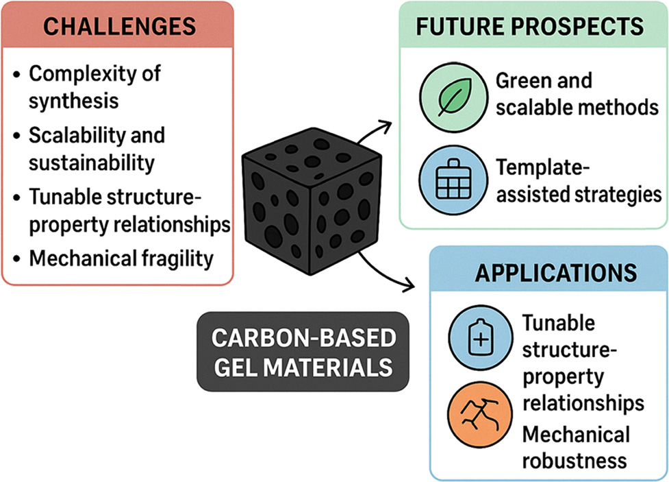

## Page 44

7196 |  Mater. Adv., 2025, 6, 7153–7206
© 2025 The Author(s). Published by the Royal Society of Chemistry
supercritical and freeze-drying methods, pose cost barriers due
to high energy consumption, long processing times, and spe-
cialized equipment requirements. Emerging alternatives, such
as
ambient
pressure
drying,
solvent-free
synthesis,
and
biomass-derived precursors, present opportunities to signifi-
cantly reduce production costs and environmental impact. For
instance, utilizing low-cost feedstocks like agricultural waste or
lignocellulosic biomass not only lowers material costs but also
aligns with circular economy principles. On the application
side, carbon gels are already proving viable in high-value
markets such as supercapacitors, CO2 capture, water purifica-
tion, and biomedical devices, where performance advantages
can justify higher initial costs. However, broader adoption in
large-scale energy storage or industrial environmental remedia-
tion will require further reduction in production costs to
achieve competitive $$ per kg pricing relative to activated
carbon and conventional electrode materials. Economic mod-
eling suggests that integrating carbon gel production into
biorefinery or waste valorization facilities could enhance profit-
ability through resource sharing and co-product generation.
Additionally,
modular,
continuous-flow
synthesis
systems
could
streamline
manufacturing
and
reduce
operational
expenses. The techno-economic feasibility is further strength-
ened by the multifunctionality of carbon gels, offering high
surface area, tunable porosity, and adaptability to various
functionalizations, which enables their deployment across
diverse sectors without extensive re-engineering. Future market
competitiveness will depend on balancing performance opti-
mization with cost minimization through process intensifica-
tion, automation, and green chemistry innovations. Strategic
partnerships between academia, industry, and policymakers
will be essential to accelerate technology transfer, standardize
quality benchmarks, and create favorable regulatory environ-
ments that support the large-scale commercialization of
carbon-based gels.
7. Conclusions
To sum up, carbon-based gels have developed into a flexible
class of materials with enormous potential for improving
sensor, energy storage, and environmental remediation tech-
nologies. From conventional sol–gel processes to innovative,
environmentally friendly techniques using biomass-derived
precursors, this study has clarified state-of-the-art synthesis
pathways that provide fine control of pore design, chemical
functionality, and mechanical resilience. These gels’ inherent
electrical conductivity and catalytic qualities have been further
improved by the addition of nanostructured materials like
graphene and carbon nanotubes, expanding their range of
potential uses in high-performance supercapacitors, batteries,
and fuel cells. Notwithstanding these noteworthy develop-
ments, a number of issues still exist, such as the requirement
for cost-effective and scalable production methods, enhanced
process repeatability, and long-term material stability under
operational stress. In order to maximize material performance
at the nanoscale, future research should focus on developing
novel templating techniques and sustainable synthesis strate-
gies that utilize green chemistry principles along with cutting-
edge computational and in situ characterization capabilities.
The commercialization of these innovations also depends on
closing the gap between laboratory-scale success and practical
industrial use. The discipline is positioned to produce ground-
breaking discoveries that can solve important worldwide
issues in energy and environmental sustainability by combin-
ing multidisciplinary insights from materials science, chemical
engineering, and environmental technology. In the end,
advancements in carbon-based gels not only demonstrate their
present significance but also lay out a clear path for upcoming
developments meant to bring about a more technologically
sophisticated and sustainable future.
Ethical approval
This article does not contain any studies with human partici-
pants or animals performed by any of the authors. As a review
manuscript, it synthesizes existing research and does not
involve new data collection requiring ethical approval.
Author contributions
Md Shariful Islam, Shreyase Kundu, Mst Samsunnahar: writing
original draft; Tasmina Khandaker, Ahmed B. M. Ibrahim:
writing and editing; Md Al-Amin Mia Anik, Md. Kamrul Hasan:
proof reading and editing; Muhammad Sarwar Hossain: meth-
odology,
resources,
validation,
writing
and
editing,
and
supervision.
Conflicts of interest
The authors declare that they have no known financial or
personal conflicts of interest that could have influenced the
work reported in this paper.
Data availability
The data supporting the findings of this study can be obtained
from the corresponding author upon request. Due to privacy
concerns and other restrictions, the data are not publicly
accessible.
Acknowledgements
The authors gratefully acknowledge the Deanship of Research
and Graduate Studies at King Khalid University for supporting
this work through the large group project under grant number
(RGP2/33/46). The authors also extend their sincere thanks to
the Chemistry Discipline at Khulna University, Bangladesh,
for providing a supportive research environment and essential
facilities.
Review
Materials Advances
Open Access Article. Published on 21 August 2025. Downloaded on 1/8/2026 4:37:10 PM. 
This article is licensed under a Creative Commons Attribution-NonCommercial 3.0 Unported Licence.
View Article Online

## Page 45

© 2025 The Author(s). Published by the Royal Society of Chemistry
Mater. Adv., 2025, 6, 7153–7206 |  7197
References
1 C. M. Chini, L. E. Excell and A. S. Stillwell, A review of
energy-for-water data in energy-water nexus publications,
Environ. Res. Lett., 2021, 15(12), 123011.
2 G. Olsson, Water and energy: threats and opportunities, IWA
publishing, 2015.
3 S. Mukherjee and T. Pradeep, Nanomaterials-enabled tech-
nologies for clean water and their sustainability aspects,
Industrial applications of nanoparticles, CRC Press, 2023,
pp. 16–31.
4 A. K. Worku and D. W. Ayele, Recent advances of graphene-
based materials for emerging technologies, Results Chem.,
2023, 5, 100971.
5 S. Nardecchia, et al., Three dimensional macroporous
architectures and aerogels built of carbon nanotubes
and/or graphene: synthesis and applications, Chem. Soc.
Rev., 2013, 42(2), 794–830.
6 S. Afreen, et al., Carbon-based nanostructured materials
for energy and environmental remediation applications,
Approaches in bioremediation: The new era of environmental
microbiology and nanobiotechnology, 2018, pp. 369–392.
7 A. Priya, M. Muruganandam and S. Suresh, Bio-derived
carbon-based materials for sustainable environmental
remediation
and
wastewater
treatment,
Chemosphere,
2024, 142731.
8 M. S. Reza, et al., Advanced applications of carbonaceous
materials in sustainable water treatment, energy storage,
and CO2 capture: a comprehensive review, Sustainability,
2023, 15(11), 8815.
9 W. Ren, et al., Advanced gel polymer electrolytes for safe
and durable lithium metal batteries: Challenges, strate-
gies, and perspectives, Energy Storage Mater., 2021, 34,
515–535.
10 S. Mehdipour-Ataei and E. J. C. Aram, Mesoporous carbon-
based materials: A review of synthesis, modification, and
applications, Catalysts, 2022, 13(1), 2.
11 R. W. Pekala, Organic aerogels from the polycondensation
of resorcinol with formaldehyde, J. Mater. Sci., 1989, 24,
3221–3227.
12 M. Inagaki, K. Kaneko and T. Nishizawa, Nanocarbons––
recent
research
in
Japan,
Carbon,
2004,
42(8–9),
1401–1417.
13 Y. Chen, et al., Carbons as low-platinum catalyst supports
and non-noble catalysts for polymer electrolyte fuel cells,
Progress
in
Energy
and
Combustion
Science,
2023,
98, 101101.
14 M. Canal-Rodrı´guez, et al., Carbon xerogels graphitized by
microwave heating as anode materials in lithium-ion
batteries, Carbon, 2018, 137, 384–394.
15 Y. A. Kumar, et al., A review on in-plane ordered MXenes-
based materials in addressing challenges faced by biosen-
sor applications, J. Energy Storage, 2025, 121, 116507.
16 T. Ramachandran, et al., Multifunctional covalent-organic
frameworks (COFs)-2D MXenes composites for diverse
applications, J. Energy Storage, 2023, 73, 109299.
17 K. V. C. Mouli, et al., Cutting-edge advancements in HOFs-
derived materials for energy storage supercapacitor appli-
cation, Int. J. Hydrogen Energy, 2024, 90, 1–24.
18 Y. A. Kumar, et al., Supercharging the future: MOF-2D
MXenes supercapacitors for sustainable energy storage,
J. Energy Storage, 2024, 80, 110303.
19 Y. A. Kumar, et al., From lab to field: Prussian blue
frameworks as sustainable cathode materials, Dalton
Trans., 2024, 53(26), 10770–10804.
20 M. S. Alam, et al., Advances of MAX phases: Synthesis,
characterizations
and
challenges,
Eng.
Rep.,
2024,
6(8), e12911.
21 C. E. I. Torres, et al., Carbon-based aerogels and xerogels:
Synthesis, properties, oil sorption capacities, and DFT
simulations, J. Environ. Chem. Eng., 2021, 9(1), 104886.
22 M. Girirajan, et al., An insight into the nanoarchitecture of
electrode materials on the performance of supercapacitors,
Coord. Chem. Rev., 2024, 518, 216080.
23 Q. Jiang, et al., Nitrogen-doped carbon materials as super-
capacitor electrodes: a mini review, Energy Fuels, 2024,
38(12), 10542–10559.
24 H. Liu, et al., Multifunctional aerogel: A unique and
advanced biomaterial for tissue regeneration and repair,
Mater. Des., 2024, 243, 113091.
25 A. C. Pierre and G. M. Pajonk, Chemistry of aerogels and
their applications, Chem. Rev., 2002, 102(11), 4243–4266.
26 A. B. Rashid, et al., Silica aerogel: Synthesis, characteriza-
tion, applications, and recent advancements, Part. Part.
Syst. Charact., 2023, 40(6), 2200186.
27 Z. Song, et al., Self-cleaning, energy-saving aerogel compo-
sites possessed sandwich structure: Improving indoor
comfort with excellent thermal insulation and acoustic
performance, Energy Build., 2024, 310, 114098.
28 L. Qi, et al., Coupled electron delocalization and multi-
dimensional porosity engineering in TiO2 hollow spheres-
embedded carbon nanofiber aerogels for efficient photo-
catalytic aniline degradation, Chem. Eng. J., 2025, 163690.
29 X. Wang, et al., Synthesis of flashed graphene nanocellu-
lose
aerogel
for
microplastic
adsorption
in
aquatic
environment, J. Environ. Chem. Eng., 2025, 117530.
30 O. A. Madyan, et al., Enhancing mechanical properties of
clay aerogel composites: An overview, Composites, Part B,
2016, 98, 314–329.
31 R. Abdusalamov, et al., Modeling and simulation of the
aggregation and the structural and mechanical properties
of silica aerogels, J. Phys. Chem. B, 2021, 125(7), 1944–1950.
32 B. C. Hu, et al., Robust carbonaceous nanofiber aerogels
from all biomass precursors, Adv. Funct. Mater., 2023,
33(1), 2207532.
33 Z. Y. Wu, et al., Emerging carbon-nanofiber aerogels:
chemosynthesis versus biosynthesis, Angew. Chem., Int.
Ed., 2018, 57(48), 15646–15662.
34 L. dos Santos-Go´mez, et al., Ultralight-weight graphene
aerogels with extremely high electrical conductivity, Small,
2021, 17(41), 2103407.
Materials Advances
Review
Open Access Article. Published on 21 August 2025. Downloaded on 1/8/2026 4:37:10 PM. 
This article is licensed under a Creative Commons Attribution-NonCommercial 3.0 Unported Licence.
View Article Online

## Page 46

7198 |  Mater. Adv., 2025, 6, 7153–7206
© 2025 The Author(s). Published by the Royal Society of Chemistry
35 W. Chen, et al., Self-assembly and embedding of nano-
particles by in situ reduced graphene for preparation of a
3D graphene/nanoparticle aerogel, Adv. Mater., 2011,
23(47), 5679–5683.
36 J. Mu, et al., Sheath-run artificial muscles, Science, 2019,
365(6449), 150–155.
37 H. Wang, et al., Porous two-dimensional materials for
photocatalytic and electrocatalytic applications, Matter,
2020, 2(6), 1377–1413.
38 O. Payanda Konuk, et al., The effect of synthesis conditions
and process parameters on aerogel properties, Front.
Chem., 2023, 11, 1294520.
39 Z. Ulker and C. Erkey, An emerging platform for drug
delivery: Aerogel based systems, J. Controlled Release,
2014, 177, 51–63.
40 S. Jadhav and P. Sarawade, Recent advances and prospec-
tive of reinforced silica aerogel Nanocomposites and their
applications, Eur. Polym. J., 2024, 206, 112766.
41 Y. Luo, et al., Rapid synthesis and characterization of
ambient pressure dried monolithic silica aerogels in etha-
nol/water co-solvent system, J. Non-Cryst. Solids, 2019, 503,
214–223.
42 J. M. Baker, J. P. Nederveen and G. Parise, Aerobic exercise
in humans mobilizes HSCs in an intensity-dependent
manner, J. Appl. Physiol., 2017, 122(1), 182–190.
43 M. N. Shalaby and M. A. Fadl, Relative Indicators and
Predicative Ability of Some Biological Variables on Cardiac
Neural Activity for Volleyball Players, Syst. Rev. Pharm.,
2020, 11(9), 834–840.
44 X. Cheng, et al., Rapid synthesis of ambient pressure dried
monolithic silica aerogels using water as the only solvent,
Mater. Lett., 2017, 204, 157–160.
45 E. Cuce, et al., Toward aerogel based thermal superinsula-
tion in buildings: A comprehensive review, Renewable
Sustainable Energy Rev., 2014, 34, 273–299.
46 J.-H. Lee and S.-J. J. C. Park, Recent advances in prepara-
tions and applications of carbon aerogels: A review, Car-
bon, 2020, 163, 1–18.
47 H. Sun, Z. Xu and C. Gao, Multifunctional, ultra-flyweight,
synergistically assembled carbon aerogels, Adv. Mater.,
2013, 25(18), 2554–2560.
48 E. B. Chemere, et al., A comprehensive review of types,
synthesis strategies, advanced designing and applications
of aerogels, R. Soc. Open Sci., 2025, 12(5), 241975.
49 S. Ghaffari-Mosanenzadeh, et al., Recent advances in tai-
loring and improving the properties of polyimide aerogels
and their application, Adv. Colloid Interface Sci., 2022,
304, 102646.
50 G. B. Veselov and A. A. J. M. Vedyagin, Resorcinol–
Formaldehyde-Derived
Carbon
Xerogels:
Preparation,
Functionalization, and Application Aspects, Materials,
2023, 16(19), 6566.
51 N. Job, et al., Porous carbon xerogels with texture tailored
by pH control during sol–gel process, Carbon, 2004, 42(3),
619–628.
52 N. G. Gonza´lez, et al., Towards the valorisation of glycerol
by designing the surface chemistry of carbon xerogels by
doping and oxygen functionalization, Environ. Res., 2024,
256, 119190.
53 Z. Wang, Design, fabrication, and testing of nanostructured
carbons and composites, University of Minnesota, 2008.
54 A. N. Mohd Faizal and M. A. J. T. R. Ahmad Zaini, Dyes
adsorption
properties
of
KOH-activated
resorcinol-
formaldehyde carbon gels-kinetic, isotherm and dynamic
studies, Toxin Rev., 2022, 41(1), 186–197.
55 N. Roy, et al., Biomass-derived nanostructures and hydro-
thermal carbon spheres: A review of electrochemical appli-
cations in redox flow battery, J. Ind. Eng. Chem., 2025, 144,
228–254.
56 T. Khandaker, et al., Biomass-derived carbon materials for
sustainable energy applications: a comprehensive review,
Sustainable Energy Fuels, 2025, 9(3), 693–723.
57 T. Ramachandran, et al., Sustainable carbon electrode
materials from biomass for redox flow batteries, Biomass
Bioenergy, 2025, 198, 107846.
58 Y. Zhao, et al., Unlocking the potential of vanadium redox
flow batteries: Recent advances in biomass lignin-based
carbon fibers and future outlook, Biomass Bioenergy, 2025,
200, 108052.
59 Y. Wang, et al., Biomass derived carbon as binder-free
electrode materials for supercapacitors, Carbon, 2019, 155,
706–726.
60 M. Jiang, et al., An N, P, O-doped porous carbon electrode
material derived from a lignin-modified chitosan xerogel
for
a
supercapacitor,
Mater.
Today
Sustain.,
2023,
22, 100372.
61 J. Liang, et al., Sulfur and nitrogen dual-doped meso-
porous graphene electrocatalyst for oxygen reduction with
synergistically
enhanced
performance,
Angew.
Chem.,
2012, 124(46), 11664–11668.
62 A. F. Z. Abidin, et al., Nitrogen-doped carbon xerogels
catalyst for oxygen reduction reaction: Improved structural
and catalytic activity by enhancing nitrogen species and
cobalt insertion, Int. J. Hydrogen Energy, 2019, 44(54),
28789–28802.
63 Y. Shen and J. J. G. C. Yang, Progress in the synthesis of
carbon aerogels for advanced energy storage applications,
Green Chem., 2024, 26(16), 8969–9004.
64 O. E. Medina Erazo, Development of Multifunctional
Nanomaterials for the co-Production of Upgraded Heavy
Crude Oil and Hydrogen at Different Pressures and Tem-
peratures, University repository, 2023.
65 H. Zhang, et al., A graphene hybrid supramolecular hydro-
gel with high stretchability, self-healable and photother-
mally responsive properties for wound healing, RSC Adv.,
2021, 11(11), 6367–6373.
66 B. V. Slaughter, et al., Hydrogels in regenerative medicine,
Adv. Mater., 2009, 21(32–33), 3307–3329.
67 H. Zhang, et al., A chemical blowing strategy to fabricate
biomass-derived
carbon-aerogels
with
graphene-like
Review
Materials Advances
Open Access Article. Published on 21 August 2025. Downloaded on 1/8/2026 4:37:10 PM. 
This article is licensed under a Creative Commons Attribution-NonCommercial 3.0 Unported Licence.
View Article Online

## Page 47

© 2025 The Author(s). Published by the Royal Society of Chemistry
Mater. Adv., 2025, 6, 7153–7206 |  7199
nanosheet structures for high-performance supercapaci-
tors, ChemSusChem, 2019, 12(11), 2462–2470.
68 M. Hauck, et al., Overcoming water diffusion limitations in
hydrogels via microtubular graphene networks for soft
actuators, Adv. Mater., 2023, 35(41), 2302816.
69 Z. Zhu, et al., An aptamer cross-linked hydrogel as a
colorimetric platform for visual detection, Angew. Chem.,
Int. Ed., 2010, 49(6), 1052–1056.
70 Q.-Y. Cheng, et al., Supramolecular self-assembly induced
graphene oxide based hydrogels and organogels, Langmuir,
2012, 28(5), 3005–3010.
71 R. Narayanaswamy and V. P. Torchilin, Hydrogels and
their applications in targeted drug delivery, Molecules,
2019, 24(3), 603.
72 M. Hua, et al., Strong tough hydrogels via the synergy of
freeze-casting and salting out, Nature, 2021, 590(7847),
594–599.
73 R. Fan, et al., Thermosensitive hydrogels and advances in
their application in disease therapy, Polymers, 2022,
14(12), 2379.
74 H. M. Oh, et al., Preparation and characterization of an
in situ crosslinkable glycol chitosan thermogel for biome-
dical applications, J. Ind. Eng. Chem., 2019, 80, 820–828.
75 S. Hussain and S. S. Maktedar, Structural, functional and
mechanical performance of advanced Graphene-based
composite hydrogels, Results Chem., 2023, 6, 101029.
76 J. P. Rolland, et al., Direct fabrication and harvesting of
monodisperse, shape-specific nanobiomaterials, J. Am.
Chem. Soc., 2005, 127(28), 10096–10100.
77 M. Tagliazucchi, K. Huang and I. Szleifer, Routes for
nanoparticle
translocation
through
polymer-brush-
modified nanopores, J. Phys.: Condens. Matter, 2018,
30(27), 274006.
78 H. Zhang, et al., New progress and prospects: The applica-
tion of nanogel in drug delivery, Mater. Sci. Eng. Carbon,
2016, 60, 560–568.
79 A. A. Firoozi, et al., Enhanced perspectives on silica aero-
gels: Novel synthesis methods and emerging engineering
applications, Results Eng., 2025, 25, 103615.
80 G. Wei, et al., Ni-doped graphene/carbon cryogels and their
applications as versatile sorbents for water purification,
ACS Appl. Mater. Interfaces, 2013, 5(15), 7584–7591.
81 T. Ramachandran, et al., From graphene aerogels to effi-
cient energy storage: current developments and future
prospects, J. Alloys Compd., 2025, 1010, 177248.
82 B. Chaitanya, et al., Trends in solar powered water desalina-
tion using hydrogels: a short review, 2023 Advances in Science
and
Engineering
Technology
International
Conferences
(ASET), IEEE, 2023.
83 M. Zafar, et al., Graphene-based polymer nanocomposites
for energy applications: Recent advancements and future
prospects, Results Phys., 2024, 60, 107655.
84 H. Arakawa, et al., Self-assembly and hydrogel formation
ability
of
Fmoc-dipeptides
comprising
a-methyl-L-
phenylalanine, Polym. J., 2020, 52(8), 923–930.
85 A. Santhiran, et al., Graphene synthesis and its recent
advances in applications—a review, C, 2021, 7(4), 76.
86 E. S. Agudosi, et al., A review of the graphene synthesis
routes and its applications in electrochemical energy sto-
rage, Crit. Rev. Solid State Mater. Sci., 2020, 45(5), 339–377.
87 Y. Qu, et al., Hierarchical-graphene-coupled polyaniline
aerogels
for
electrochemical
energy
storage,
Carbon,
2018, 127, 77–84.
88 S. Hussain and S. S. Maktedar, Structural, functional and
mechanical performance of advanced Graphene-based
composite hydrogels, Results Chem., 2023, 6, 101029.
89 M. Formanek, et al., Gel formation in reversibly cross-linking
polymers, Macromolecules, 2021, 54(14), 6613–6627.
90 H. Zhang, et al., Hybridized graphene for supercapacitors:
Beyond the limitation of pure graphene, Small, 2021,
17(12), 2007311.
91 F. Karchoubi, et al., New insights into nanocomposite
hydrogels; a review on recent advances in characteristics
and applications, Adv. Ind. Eng. Polym. Res., 2024, 7(1),
54–78.
92 S. T. Stealey, A. K. Gaharwar and S. P. J. P. Zustiak,
Laponite-based nanocomposite hydrogels for drug delivery
applications, Pharmaceuticals, 2023, 16(6), 821.
93 X.-L. Wu, et al., Biomass-derived sponge-like carbonaceous
hydrogels and aerogels for supercapacitors, ACS Nano,
2013, 7(4), 3589–3597.
94 R. Du, et al., Synthesis of conducting polymer hydrogels with
2D building blocks and their potential-dependent gel–sol
transitions, Chem. Commun., 2011, 47(22), 6287–6289.
95 P. Cheng, et al., Biomass-derived carbon fiber aerogel as a
binder-free electrode for high-rate supercapacitors, J. Phys.
Chem. C, 2016, 120(4), 2079–2086.
96 M. Mashkour, et al., Application of wet nanostructured
bacterial cellulose as a novel hydrogel bioanode for micro-
bial fuel cells, ChemElectroChem, 2017, 4(3), 648–654.
97 H.-W. Liang, et al., Bacterial cellulose derived nitrogen-
doped carbon nanofiber aerogel: An efficient metal-free
oxygen reduction electrocatalyst for zinc-air battery, Nano
Energy, 2015, 11, 366–376.
98 X. Zheng, A. M. Zuria and M. Mohamedi, Free-Standing
Tunnel-Structured MnO2 Nanorods-Doped with Nickel
and Cobalt Cations as Bifunctional Electrocatalysts for
Zn–Air Batteries, Adv. Mater. Technol., 2023, 8(24), 2301142.
99 M. Mooste, et al., Bifunctional oxygen electrocatalyst based
on Fe, Co, and nitrogen co-doped graphene-coated alu-
mina nanofibers for Zn-air battery air electrode, Appl. Surf.
Sci., 2024, 660, 160024.
100 J. Anjali, V. K. Jose and J.-M. Lee, Carbon-based hydrogels:
synthesis and their recent energy applications, J. Mater.
Chem. A, 2019, 7(26), 15491–15518.
101 M. A. Firestone, S. C. Hayden and D. L. Huber, Greater
than the sum: Synergy and emergent properties in nano-
particle–polymer
composites,
MRS
Bull.,
2015,
40(9),
760–767.
Materials Advances
Review
Open Access Article. Published on 21 August 2025. Downloaded on 1/8/2026 4:37:10 PM. 
This article is licensed under a Creative Commons Attribution-NonCommercial 3.0 Unported Licence.
View Article Online

## Page 48

7200 |  Mater. Adv., 2025, 6, 7153–7206
© 2025 The Author(s). Published by the Royal Society of Chemistry
102 Y. A. Kumar, et al., Advancements in novel electrolyte
materials: Pioneering the future of supercapacitive energy
storage, J. Ind. Eng. Chem., 2025, 145, 191–215.
103 M. A. A. Zaini, et al., Preliminary evaluation of resorcinol-
formaldehyde carbon gels for water pollutants removal,
Acta Chim. Slovacas, 2017, 10(1), 54.
104 T. Li, et al., Mechanism of base-catalyzed resorcinol-
formaldehyde and phenol-resorcinol-formaldehyde con-
densation reactions: A theoretical study, Polymers, 2017,
9(9), 426.
105 H. Zhang, et al., Controlling the microstructure of resorcinol–
furfural aerogels and derived carbon aerogels via the salt
templating approach, RSC Adv., 2019, 9(11), 5967–5977.
106 M. Salihovic, et al., Carbon aerogels with improved flex-
ibility by sphere templating, RSC Adv., 2018, 8(48),
27326–27331.
107 P. Neema, S. K. Verma and M. A. Shaz, Physically activated
resorcinol-formaldehyde
derived
carbon
aerogels
for
enhanced hydrogen storage, Int. J. Hydrogen Energy, 2024,
141(13).
108 R. U. Soni, et al., Preparation of carbon aerogels from
polymer-cross-linked xerogel powders without supercriti-
cal fluid drying and their application in highly selective
CO2, Adsorption, 2022, 34(11), 4828–4847.
109 M. Canal-Rodrı´guez, et al., Graphene-doped carbon xerogel
combining high electrical conductivity and surface area for
optimized aqueous supercapacitors, Carbon, 2017, 118,
291–298.
110 Q. Zhang, et al., Mechanically robust honeycomb graphene
aerogel
multifunctional
polymer
composites,
Carbon,
2015, 93, 659–670.
111 S. Sen, et al., Recent developments in biomass derived
cellulose aerogel materials for thermal insulation applica-
tion: a review, Cellulose, 2022, 29(9), 4805–4833.
112 G. Wu, et al., Three-dimensional directional cellulose-
based carbon aerogels composite phase change materials
with enhanced broadband absorption for light-thermal-
electric
conversion,
Energy
Convers.
Manage.,
2022,
256, 115361.
113 Y. H. Gad and S. M. Nasef, Radiation synthesis of graphene
oxide/composite hydrogels and their ability for potential
dye adsorption from wastewater, J. Appl. Polym. Sci., 2021,
138(41), 51220.
114 R. J. White, et al., Always look on the ‘‘light’’ side of life:
sustainable carbon aerogels, ChemSusChem, 2014, 7(3),
670–689.
115 M. J. Crane, et al., Rapid synthesis of transition metal
dichalcogenide–carbon aerogel composites for supercapa-
citor electrodes, Microsyst. Nanoeng., 2017, 3(1), 1–9.
116 Y. Shen and J. Yang, Progress in the synthesis of carbon
aerogels for advanced energy storage applications, Green
Chem., 2024, 26(16), 8969–9004.
117 S- . B. Barım, et al., Control of average particle size of carbon
aerogel supported platinum nanoparticles by supercritical
deposition, Microporous Mesoporous Mater., 2017, 245,
94–103.
118 S. Zhang, et al., Role of freeze-drying in cellulose-based
aerogels: Freezing optimization strategies and diverse
water
treatment
applications,
Drying
Technol.,
2024,
42(7), 1119–1137.
119 L. Vazhayal, P. Wilson and K. Prabhakaran, Waste to
wealth: Lightweight, mechanically strong and conductive
carbon aerogels from waste tissue paper for electromag-
netic shielding and CO2 adsorption, Chem. Eng. J., 2020,
381, 122628.
120 X. Du, et al., Heterogeneous photoelectro-Fenton catalyzed
by FeCu@ PC for efficient degradation of sulfamethazine,
Electrochim. Acta, 2022, 412, 140122.
121 M. Anas, et al., Thermodynamics of adsorption of carbon
dioxide on various aerogels, J. CO2 Util., 2017, 21, 82–88.
122 J. Feng, et al., Carbon aerogel composites prepared by
ambient drying and using oxidized polyacrylonitrile fibers
as reinforcements, ACS Appl. Mater. Interfaces, 2011, 3(12),
4796–4803.
123 Y. Zhou, et al., Controlled preparation of nitrogen-doped
hierarchical carbon cryogels derived from Phenolic-Based
resin and their CO2 adsorption properties, Energy, 2022,
246, 123367.
124 F. Zhang, et al., The potassium hydroxide-urea synergy in
improving the capacitive energy-storage performance of
agar-derived carbon aerogels, Carbon, 2019, 147, 451–459.
125 Y. Hanzawa, et al., Structural changes in carbon aerogels
with high temperature treatment, Carbon, 2002, 40(4),
575–581.
126 A. Gutie´rrez-Pardo, et al., Effect of catalytic graphitization
on the electrochemical behavior of wood derived carbons
for use in supercapacitors, J. Power Sources, 2015, 278,
18–26.
127 L. Paliotta, et al., Highly conductive multilayer-graphene
paper as a flexible lightweight electromagnetic shield,
Carbon, 2015, 89, 260–271.
128 M. Canal-Rodrı´guez, et al., Carbon xerogels graphitized by
microwave heating as anode materials in lithium-ion
batteries, Carbon, 2018, 137, 384–394.
129 X. Hou, et al., Activated carbon aerogel supported copper
catalysts for the hydrogenation of methyl acetate to etha-
nol: effect of KOH activation, New J. Chem., 2019, 43(24),
9430–9438.
130 E. Bailo´n-Garcı´a, et al., Development of carbon xerogels as
alternative Pt-supports for the selective hydrogenation of
citral, Catal. Commun., 2015, 58, 64–69.
131 M. Enterrı´a and J. Figueiredo, Nanostructured mesoporous
carbons: Tuning texture and surface chemistry, Carbon,
2016, 108, 79–102.
132 P. Lawtae and C. Tangsathitkulchai, A new approach for
controlling mesoporosity in activated carbon by the con-
secutive process of air oxidation, thermal destruction of
surface functional groups, and carbon activation (the OTA
method), Molecules, 2021, 26(9), 2758.
133 P. Lawtae, et al., Improving porous properties of activated
carbon from carbon gel by the OTA method, RSC Adv.,
2023, 13(21), 14065–14077.
Review
Materials Advances
Open Access Article. Published on 21 August 2025. Downloaded on 1/8/2026 4:37:10 PM. 
This article is licensed under a Creative Commons Attribution-NonCommercial 3.0 Unported Licence.
View Article Online

## Page 49

© 2025 The Author(s). Published by the Royal Society of Chemistry
Mater. Adv., 2025, 6, 7153–7206 |  7201
134 Y. Tabata, Biomaterial technology for tissue engineering
applications, J. R. Soc. Interface, 2009, 6(3), S311–S324.
135 K. Shantha and D. Harding, Synthesis and evaluation of
sucrose-containing polymeric hydrogels for oral drug deliv-
ery, J. Appl. Polym. Sci., 2002, 84(14), 2597–2604.
136 N. Sahu, D. Gupta and U. Nautiyal, Hydrogel: preparation,
characterization and applications, Asian Pac. J. Nurs. and
Health Sci., 2020, 3(1), 1–11.
137 S. Mishra, et al., Applications of biopolymeric gels in
agricultural sector. Polymer Gels: Perspectives and Appli-
cations, Polymer Gels, 2018, 185–228.
138 K. Kabiri and M. M. Zohourian, Superabsorbent hydrogels
from concentrated solution terpolymerization, Iran. Polym.
J., 2004, 13(5), 423–430.
139 J. Chen and Y. Zhao, Relationship between water absor-
bency and reaction conditions in aqueous solution poly-
merization of polyacrylate superabsorbents, J. Appl. Polym.
Sci., 2000, 75(6), 808–814.
140 U. S. Madduma-Bandarage and S. V. Madihally, Synthetic
hydrogels: Synthesis, novel trends, and applications,
J. Appl. Polym. Sci., 2021, 138(19), 50376.
141 S. Kiatkamjornwong, Superabsorbent polymers and super-
absorbent polymer composites, ScienceAsia, 2007, 33(1),
39–43.
142 C. Mierke and D. Biology, Viscoelasticity, like forces, plays
a role in mechanotransduction, Front. Cell Dev. Biol., 2022,
10, 789841.
143 J. S. Gharat and Y. V. Dalvi, Compressive review on hydro-
gel, Asian J. Pharm. Tech., 2018, 8(3), 172–181.
144 S. Debrie, et al., A model-based protocol to quantify
scission-crosslinking competition and gelation from mole-
cular to material level for grafting-based reactive extrusion
of poly (lactic acid), Chem. Eng. J., 2025, 507, 160744.
145 M. Demeter, A. Sca˘ris-oreanu and I. Ca˘lina, State of the art
of hydrogel wound dressings developed by ionizing radia-
tion, Gels, 2023, 9(1), 55.
146 S. Sinha, Biodegradable superabsorbents: methods of pre-
paration and application—a review, Fundam. Biomater.:Po-
lym., 2018, 307–322.
147 H. Liu, et al., Carbon-based nanomaterials for bone and
cartilage regeneration: a review, ACS Biomater. Sci. Eng.,
2021, 7(10), 4718–4735.
148 A. Bratovcic, Nanocomposite hydrogels reinforced by car-
bon nanotubes, Int. J. Eng. Res. Ind. Appl., 2020, 10(5),
30–41.
149 D. Ye, C. Chang and L. Zhang, High-strength and tough
cellulose hydrogels chemically dual cross-linked by using
low-and high-molecular-weight cross-linkers, Biomacromo-
lecules, 2019, 20(5), 1989–1995.
150 A. T. Gubaidullin, et al., Modulation of molecular structure
and mechanical properties of k-carrageenan-gelatin hydro-
gel with multi-walled carbon nanotubes, Polymers, 2022,
14(12), 2346.
151 J. Nanda, et al., Formation of hybrid hydrogels consisting
of tripeptide and different silver nanoparticle-capped
ligands: modulation of the mechanical strength of gel
phase
materials,
J.
Phys.
Chem.
B,
2012,
116(40),
12235–12244.
152 F. Lin, et al., A bioinspired hydrogen bond crosslink
strategy toward toughening ultrastrong and multifunc-
tional nanocomposite hydrogels, J. Mater. Chem. B, 2020,
8(18), 4002–4015.
153 X. Lin, et al., Stimuli-responsive toughening of hydrogels,
Chem. Mater., 2021, 33(19), 7633–7656.
154 E. K. Gebeyehu, et al., Cellulosic-based conductive hydro-
gels for electro-active tissues: A review summary, Gels,
2022, 8(3), 140.
155 J.-F. Guillet, et al., Electrical properties of double-wall
carbon
nanotubes
nanocomposite
hydrogels,
Carbon,
2019, 146, 542–548.
156 B. Pournemati, et al., Injectable conductive nanocomposite
hydrogels for cardiac tissue engineering: Focusing on
carbon and metal-based nanostructures, Eur. Polym. J.,
2022, 174, 111336.
157 T. Khandaker, et al., Recent progress in gel catalysts:
boosting efficiency for sustainable energy applications,
Catal. Sci. Technol., 2025, 15, 1357–1389.
158 N. T. Tonu, et al., Fabrication of waste biomass-derived
KOH activated carbon for enhanced CO 2 capture, New
J. Chem., 2024, 48(48), 20212–20224.
159 S. Ruan, et al., Innovative approaches of porous carbon
materials derived from energy waste and their electroche-
mical properties, Energy Mater., 2025, 5(7), N/A–N/A.
160 J. Wang, et al., Electrochemical energy storage perfor-
mance of 2D nanoarchitectured hybrid materials, Nat.
Commun., 2021, 12(1), 3563.
161 Q. Zhou and H. Yao, Recent development of carbon
electrode materials for electrochemical supercapacitors,
Energy Rep., 2022, 8, 656–661.
162 N. Kumar, et al., Recent advancements in zero-to three-
dimensional carbon networks with a two-dimensional
electrode material for high-performance supercapacitors,
Nanoscale Adv., 2023, 5(12), 3146–3176.
163 W. Dong, et al., Materials design and preparation for high
energy density and high power density electrochemical
supercapacitors, Mater. Sci. Eng., R, 2023, 152, 100713.
164 X.-L. Wu and A.-W. Xu, Carbonaceous hydrogels and
aerogels for supercapacitors, J. Mater. Chem. A, 2014,
2(14), 4852–4864.
165 A. Muzaffar, et al., Green supercapacitors: Latest develop-
ments and perspectives in the pursuit of sustainability,
Renewable Sustainable Energy Rev., 2024, 195, 114324.
166 N. A. Choudhury, S. Sampath and A. Shukla, Gelatin
hydrogel electrolytes and their application to electrochemical
supercapacitors, J. Electrochem. Soc., 2007, 155(1), A74.
167 S. Yamazaki, et al., An acidic cellulose–chitin hybrid gel as
novel electrolyte for an electric double layer capacitor,
Electrochem. Commun., 2009, 11(1), 68–70.
168 Y. Zhu, et al., Carbon-based supercapacitors produced by
activation of graphene, Science, 2011, 332(6037), 1537–1541.
Materials Advances
Review
Open Access Article. Published on 21 August 2025. Downloaded on 1/8/2026 4:37:10 PM. 
This article is licensed under a Creative Commons Attribution-NonCommercial 3.0 Unported Licence.
View Article Online

## Page 50

7202 |  Mater. Adv., 2025, 6, 7153–7206
© 2025 The Author(s). Published by the Royal Society of Chemistry
169 H. N. Tien, et al., Synthesis of a highly conductive and large
surface area graphene oxide hydrogel and its use in a
supercapacitor, J. Mater. Chem. A, 2013, 1(2), 208–211.
170 G. Liao, et al., Preparation, properties, and applications of
graphene-based hydrogels, Front. Chem., 2018, 6, 450.
171 Y. Xu, et al., Self-assembled graphene hydrogel via a one-step
hydrothermal process, ACS Nano, 2010, 4(7), 4324–4330.
172 H. Gao, et al., High-performance asymmetric supercapaci-
tor based on graphene hydrogel and nanostructured
MnO2, ACS Appl. Mater. Interfaces, 2012, 4(5), 2801–2810.
173 X.-N.
Tang,
et
al.,
Graphene
aerogel
derived
by
purification-free graphite oxide for high performance
supercapacitor electrodes, Carbon, 2019, 146, 147–154.
174 X. Yang, et al., Liquid-mediated dense integration of
graphene materials for compact capacitive energy storage,
Science, 2013, 341(6145), 534–537.
175 M. Bigdeloo, et al., Recent advances in utilizing graphene-
based materials for flexible supercapacitor electrodes,
J. Energy Storage, 2024, 80, 110242.
176 Y. Zhang, et al., High-performance supercapacitors based
on compact graphene composite hydrogels, Electrochim.
Acta, 2024, 476, 143699.
177 Y. Xu, et al., Functionalized graphene hydrogel-based high-
performance supercapacitors, Adv. Mater., 2013, 25(40),
5779–5784.
178 Y. Xu, et al., One-step strategy to graphene/Ni (OH) 2
composite
hydrogels
as
advanced
three-dimensional
supercapacitor electrode materials, Nano Res., 2013, 6,
65–76.
179 J. Chen, et al., Graphene hydrogels deposited in nickel
foams
for
high-rate
electrochemical
capacitors,
Adv.
Mater., 2012, 24(33), 4569–4573.
180 A. A. Alhwaige, et al., Biobased chitosan hybrid aerogels
with superior adsorption: Role of graphene oxide in CO 2
capture, RSC Adv., 2013, 3(36), 16011–16020.
181 Y. Wang, et al., Preventing graphene sheets from restack-
ing for high-capacitance performance, J. Phys. Chem. C,
2011, 115(46), 23192–23197.
182 J. Yuan, et al., Graphene-based 3D composite hydrogel by
anchoring Co 3 O 4 nanoparticles with enhanced electro-
chemical properties, Phys. Chem. Chem. Phys., 2013, 15(31),
12940–12945.
183 H.-L. Guo, et al., Synthesis and characterization of
nitrogen-doped graphene hydrogels by hydrothermal route
with urea as reducing-doping agents, J. Mater. Chem. A,
2013, 1(6), 2248–2255.
184 Y. Chang, et al., Larger-scale fabrication of N-doped
graphene-fiber mats used in high-performance energy
storage, J. Power Sources, 2014, 252, 113–121.
185 P. Chen, et al., Hydrothermal synthesis of macroscopic
nitrogen-doped graphene hydrogels for ultrafast superca-
pacitor, Nano Energy, 2013, 2(2), 249–256.
186 L. Zhang and G. Shi, Preparation of highly conductive
graphene hydrogels for fabricating supercapacitors with
high rate capability, J. Phys. Chem. C, 2011, 115(34),
17206–17212.
187 K.-x Sheng, et al., High-performance self-assembled gra-
phene hydrogels prepared by chemical reduction of gra-
phene oxide, New Carbon Mater., 2011, 26(1), 9–15.
188 Y. Zhao, et al., Highly compression-tolerant supercapacitor
based on polypyrrole-mediated graphene foam electrodes,
Adv. Mater., 2012, 25(4), 591–595.
189 Z. Tai, X. Yan and Q. Xue, Three-dimensional graphene/
polyaniline composite hydrogel as supercapacitor elec-
trode, J. Electrochem. Soc., 2012, 159(10), A1702.
190 H. Zhou, et al., Graphene/poly (3, 4-ethylenedioxythiophene)
hydrogel with excellent mechanical performance and high
conductivity, Carbon, 2013, 59, 495–502.
191 Y. Xu, et al., Flexible solid-state supercapacitors based on
three-dimensional graphene hydrogel films, ACS Nano,
2013, 7(5), 4042–4049.
192 M. Chen, et al., A one-step method for reduction and self-
assembling of graphene oxide into reduced graphene oxide
aerogels, J. Mater. Chem. A, 2013, 1(8), 2869–2877.
193 R. Karthick and F. Chen, Free-standing graphene paper for
energy application: Progress and future scenarios, Carbon,
2019, 150, 292–310.
194 W. Si, et al., Reduced graphene oxide aerogel with high-
rate supercapacitive performance in aqueous electrolytes,
Nanoscale Res. Lett., 2013, 8, 1–8.
195 P. Zhang, et al., Reduced graphene oxide composite aero-
gel prepared by europium-assisting radiation reduction as
a
broad-spectrum
adsorbent
for
organic
pollutants,
J. Mater. Chem. A, 2023, 11(6), 2804–2813.
196 F. Liu, et al., Folded structured graphene paper for high
performance electrode materials, Adv. Mater., 2012, 24(8),
1089–1094.
197 Z.-S. Wu, et al., Three-dimensional nitrogen and boron co-
doped
graphene
for
high-performance
all-solid-state
supercapacitors, Adv. Mater., 2012, 24(37), 5130–5135.
198 C.-C. Ji, et al., Self-assembly of three-dimensional inter-
connected graphene-based aerogels and its application in
supercapacitors,
J.
Colloid
Interface
Sci.,
2013,
407,
416–424.
199 Z.-S. Wu, et al., Three-dimensional graphene-based macro-
and mesoporous frameworks for high-performance elec-
trochemical capacitive energy storage, J. Am. Chem. Soc.,
2012, 134(48), 19532–19535.
200 F. Meng, et al., Alkali-treated graphene oxide as a solid
base catalyst: synthesis and electrochemical capacitance of
graphene/carbon composite aerogels, J. Mater. Chem.,
2011, 21(46), 18537–18539.
201 X. Zhang, et al., Mechanically strong and highly conductive
graphene aerogel and its use as electrodes for electroche-
mical power sources, J. Mater. Chem., 2011, 21(18),
6494–6497.
202 Y. Shabangoli, et al., Thionine functionalized 3D graphene
aerogel: combining simplicity and efficiency in fabrication
of a metal-free redox supercapacitor, Adv. Energy Mater.,
2018, 8(34), 1802869.
203 W. Sun, et al., A facile strategy for fabricating hierarchical
nanocomposites of V 2 O 5 nanowire arrays on a three-
Review
Materials Advances
Open Access Article. Published on 21 August 2025. Downloaded on 1/8/2026 4:37:10 PM. 
This article is licensed under a Creative Commons Attribution-NonCommercial 3.0 Unported Licence.
View Article Online

## Page 51

© 2025 The Author(s). Published by the Royal Society of Chemistry
Mater. Adv., 2025, 6, 7153–7206 |  7203
dimensional N-doped graphene aerogel with a synergistic
effect for supercapacitors, J. Mater. Chem. A, 2018, 6(21),
9938–9947.
204 H. Chen, et al., Free-standing N-self-doped carbon nanofi-
ber aerogels for high-performance all-solid-state superca-
pacitors, Nano Energy, 2019, 63, 103836.
205 J.-H. Lee and S.-J. Park, Recent advances in preparations
and applications of carbon aerogels: A review, Carbon,
2020, 163, 1–18.
206 B.-W. Liu, et al., Multifunctional protective aerogel with
superelasticity over 196 to 500 1C, Nano Res., 2022, 15(9),
7797–7805.
207 K. Chhetri, et al., A review on nanofiber reinforced aerogels
for energy storage and conversion applications, J. Energy
Storage, 2022, 46, 103927.
208 J. Zou, et al., Ultralight multiwalled carbon nanotube
aerogel, ACS Nano, 2010, 4(12), 7293–7302.
209 H. Qi, E. Ma¨der and J. Liu, Electrically conductive aerogels
composed of cellulose and carbon nanotubes, J. Mater.
Chem. A, 2013, 1(34), 9714–9720.
210 C. B. Ma, B. Du and E. Wang, Self-crosslink method for a
straightforward synthesis of poly (vinyl alcohol)-based
aerogel assisted by carbon nanotube, Adv. Funct. Mater.,
2017, 27(10), 1604423.
211 Z. Huang, et al., Large-scale preparation of electrically
conducting cellulose nanofiber/carbon nanotube aerogels:
Ambient-dried, recyclable, and 3D-Printable, Carbon, 2022,
194, 23–33.
212 C. Niu, et al., High power electrochemical capacitors based
on carbon nanotube electrodes, Appl. Phys. Lett., 1997,
70(11), 1480–1482.
213 P. Li, et al., Highly deformation-tolerant carbon nanotube
sponges as supercapacitor electrodes, Nanoscale, 2013,
5(18), 8472–8479.
214 J. Zhong, et al., Carbon nanotube sponges as conductive
networks for supercapacitor devices, Nano Energy, 2013,
2(5), 1025–1030.
215 C. Yang, et al., Bamboo-like N/S-codoped carbon nanotube
aerogels for high-power and high-energy supercapacitors,
J. Alloys Compd., 2021, 861, 157946.
216 T. Bordjiba and M. Mohamedi, Molding versus dispersion:
effect of the preparation procedure on the capacitive and
cycle life of carbon nanotubes aerogel composites, J. Solid
State Electrochem., 2011, 15, 765–771.
217 T. Tao, et al., Functional mesoporous carbon-coated CNT
network
for
high-performance
supercapacitors,
New
J. Chem., 2013, 37(5), 1294–1297.
218 K. Gao, et al., Cellulose nanofibers/multi-walled carbon
nanotube nanohybrid aerogel for all-solid-state flexible
supercapacitors, RSC Adv., 2013, 3(35), 15058–15064.
219 T. Bordjiba, M. Mohamedi and L. H. Dao, New class of
carbon-nanotube aerogel electrodes for electrochemical
power sources, Adv. Mater., 2008, 20(4), 815–819.
220 K. Zhou, et al., Fluorination effect for stabilizing cationic
and anionic redox activities in cation-disordered cathode
materials, Energy Storage Mater., 2020, 32, 234–243.
221 M. S. Alam, et al., Advancements in MAX phase materials:
structure, properties, and novel applications, RSC Adv.,
2024, 14(37), 26995–27041.
222 M. S. Alam, et al., Self-generated B-MAX phase composites:
The effect of sintering temperature on surface morphology
and phase composition, Mater. Lett., 2025, 378, 137568.
223 M. S. Alam, et al., Tailoring the thermal and thermome-
chanical characteristics of novel MAX phase boron com-
posites in high-temperature applications, Nanoscale Adv.,
2025, 7(10), 3077–3087.
224 R. Mangiri, et al., Surface engineering of M5X4 MXenes for
next-gen energy solutions. Materials Today, Chemistry,
2025, 48, 102864.
225 R. Khan, et al., Transition metal dichalcogenides for next-
generation supercapacitors: recent advances, challenges,
and future perspectives, J. Alloys Compd., 2025, 182874.
226 T. Ramachandran, et al., Black Phosphorus as a Multi-
functional Electrode
Material for all Energy Storage
Devices, J. Alloys Compd., 2025, 182500.
227 Y. A. Kumar, et al., The landscape of energy storage:
Insights into carbon electrode materials and future direc-
tions, J. Energy Storage, 2024, 86, 111119.
228 Y. Anil Kumar, et al., Carbon materials as a conductive
skeleton
for
supercapacitor
electrode
applications:
a
review, Nanomaterials, 2023, 13(6), 1049.
229 L. Souza, et al., Lignin-incorporated bacterial nanocellu-
lose for proton exchange membranes in microbial fuel
cells, Mater. Chem. Phys., 2023, 293, 126963.
230 A. Narimani-Qurtlar, et al., Investigating the environmen-
tal impacts of lithium-oxygen battery cathode production:
A comprehensive assessment of the effects associated with
oxygen cathode manufacturing, J. Cleaner Prod., 2024,
482, 144199.
231 H. Du, et al., Carbon aerogel supported Pt–Ru catalysts for
using as the anode of direct methanol fuel cells, Carbon,
2007, 45(2), 429–435.
232 F. Zhan, et al., Recent advances on support materials for
enhanced
Pt-based
catalysts:
applications
in
oxygen
reduction reactions for electrochemical energy storage,
J. Mater. Sci., 2025, 60, 2199–2223.
233 K. Kakaei and M. J. R. E. Rahnavardi, Synthesis of nitrogen-
doped reduced graphene oxide and its decoration with
high efficiency palladium nanoparticles for direct ethanol
fuel cell, Renewable Energy, 2021, 163, 1277–1286.
234 B. Cai, et al., Multimetallic hierarchical aerogels: shape
engineering of the building blocks for efficient electroca-
talysis, Adv. Mater., 2017, 29(11), 1605254.
235 W. Liu, et al., High-performance electrocatalysis on palla-
dium aerogels, Angew. Chem., Int. Ed., 2012, 51(23),
5743–5747.
236 K. Wang, et al., Surface-tailored PtPdCu ultrathin nano-
wires as advanced electrocatalysts for ethanol oxidation
and oxygen reduction reaction in direct ethanol fuel cell,
J. Energy Chem., 2021, 52, 251–261.
237 L. Chao, et al., Robust three dimensional N-doped
graphene
supported
Pd
nanocomposite
as
efficient
Materials Advances
Review
Open Access Article. Published on 21 August 2025. Downloaded on 1/8/2026 4:37:10 PM. 
This article is licensed under a Creative Commons Attribution-NonCommercial 3.0 Unported Licence.
View Article Online

## Page 52

7204 |  Mater. Adv., 2025, 6, 7153–7206
© 2025 The Author(s). Published by the Royal Society of Chemistry
electrocatalyst for methanol oxidation in alkaline medium,
Int. J. Hydrogen Energy, 2017, 42(22), 15107–15114.
238 X. Wang, C. Li and G. Shi, A high-performance platinum
electrocatalyst loaded on a graphene hydrogel for high-rate
methanol oxidation, Phys. Chem. Chem. Phys., 2014, 16(21),
10142–10148.
239 Y. Tan, et al., Porous nanocomposites by cotton-derived
carbon/NiO with high performance for lithium-ion sto-
rage, J. Alloys Compd., 2021, 874, 159788.
240 A. A. Feidenhans’l, et al., Precious metal free hydrogen
evolution catalyst design and application, Chem. Rev.,
2024, 124(9), 5617–5667.
241 R. Kumari, et al., Emerging 3D nanomaterials as electro-
catalysts for water splitting reactions, Int. J. Hydrogen
Energy, 2024, 74, 214–231.
242 L. Zhao, et al., 1 T-rich MoS2/nitrogen-doped graphene
composites: Advanced anode materials to improve the
performance of lithium-ion batteries, J. Energy Storage,
2024, 102, 113970.
243 R. Wang, et al., ‘‘Fast-charging’’ anode materials for
lithium-ion batteries from perspective of ion diffusion in
crystal
structure,
Adv.
Funct.
Mater.,
2024,
18(4),
2611–2648.
244 H. Wu, et al., Stable Li-ion battery anodes by in-situ
polymerization of conducting hydrogel to conformally coat
silicon nanoparticles, Nat. Commun.s, 2013, 4(1), 1943.
245 X. Bai, et al., Si@ SiOx/graphene hydrogel composite anode
for lithium-ion battery, J. Power Sources, 2016, 306, 42–48.
246 S. Fang, D. Bresser and S. J. Passerini, Transition metal
oxide
anodes
for
electrochemical
energy
storage
in
lithium-and sodium-ion batteries, Adv. Energy Mater.,
2022, 55–99.
247 H. Shi, et al., Double-network nanostructured hydrogel-
derived ultrafine Sn–Fe alloy in three-dimensional carbon
framework for enhanced lithium storage, Nano Lett., 2018,
18(5), 3193–3198.
248 N. Lingappan and D. J. Kang, Molybdenum disulfide
nanosheets interconnected nitrogen-doped reduced gra-
phene oxide hydrogel: a high-performance heterostructure
for lithium-ion batteries, Electrochim. Acta, 2016, 193,
128–136.
249 J. Bae, et al., Cover Picture: A 3D Nanostructured Hydrogel-
Framework-Derived High-Performance Composite Poly-
mer Lithium-Ion Electrolyte, Angew. Chem., Int. Ed., 2018,
57(8), 2007.
250 F. Coustier, S. Passerini and W. Smyrl, A 400 mAh/g
Aerogel–like V 2 O 5 Cathode for Rechargeable Lithium
Batteries, J. Electrochem. Soc., 1998, 145(5), L73.
251 Y. Chang, et al., Synthesis of 3D nitrogen-doped graphene/
Fe 3 O 4 by a metal ion induced self-assembly process for
high-performance Li-ion batteries, J. Mater. Chem. A, 2013,
1(46), 14658–14665.
252 Z. Chen, et al., A three-dimensionally interconnected car-
bon nanotube–conducting polymer hydrogel network for
high-performance flexible battery electrodes, Adv. Energy
Mater., 2014, 4(12), 1400207.
253 B. Qiu, M. Xing and J. Zhang, Mesoporous TiO2 nanocrys-
tals grown in situ on graphene aerogels for high photo-
catalysis and lithium-ion batteries, J. Am. Chem. Soc., 2014,
136(16), 5852–5855.
254 M. Zhang, Y. Wang and M. Jia, Three-dimensional reduced
graphene oxides hydrogel anchored with ultrafine CoO
nanoparticles as anode for lithium ion batteries, Electro-
chim. Acta, 2014, 129, 425–432.
255 Z.-Y. Sui, et al., Manganese dioxide-anchored three-
dimensional nitrogen-doped graphene hybrid aerogels as
excellent
anode
materials
for
lithium
ion
batteries,
J. Mater. Chem. A, 2015, 3(19), 10403–10412.
256 Y. Wang, et al., A facile and green method to fabricate
graphene-based multifunctional hydrogels for miniature-
scale water purification, RSC Adv., 2013, 3(24), 9240–9246.
257 Y. Chen, et al., Graphene oxide–chitosan composite hydro-
gels as broad-spectrum adsorbents for water purification,
J. Mater. Chem. A, 2013, 1(6), 1992–2001.
258 G. Hristea, M. Iordoc and A. Culcea, Nanocarbon Type
Xerogel Materials Designed for Water Desalination, Mate-
rials, 2021, 14(17), 4932.
259 H. Gao, et al., Mussel-inspired synthesis of polydopamine-
functionalized graphene hydrogel as reusable adsorbents
for water purification, ACS Appl. Mater. Interfaces, 2013,
5(2), 425–432.
260 H.-P. Cong, et al., Macroscopic multifunctional graphene-
based hydrogels and aerogels by a metal ion induced self-
assembly process, ACS Nano, 2012, 6(3), 2693–2703.
261 E. Yilmaz and M. Sezgin, Enhancement of the activity and
enantioselectivity of lipase by sol–gel encapsulation immo-
bilization onto b-cyclodextrin-based polymer, Appl. Bio-
chem. Biotechnol., 2012, 166, 1927–1940.
262 H. Chen, et al., Cotton derived carbonaceous aerogels for
the efficient removal of organic pollutants and heavy metal
ions, J. Mater. Chem. A, 2015, 3(11), 6073–6081.
263 L. Zhang, et al., Carbon material-based aerogels for gas
adsorption: fabrication, structure design, functional tailor-
ing, and applications, Nanomaterials, 2022, 12(18), 3172.
264 P. Wu, Y. Wang and Y. J. C. E. J. Liu, Recent advances in
heteroatom-doped porous carbon for adsorption of gas-
eous pollutants, Chem. Eng. J., 2024, 491, 152142.
265 W. Wang, et al., 2D/3D assemblies of amine-functionalized
graphene silica (templated) aerogel for enhanced CO2
sorption,
ACS
Appl.
Mater.
Interfaces,
2019,
11(33),
30391–30400.
266 Y. Kong, et al., Development of monolithic adsorbent via
polymeric sol–gel process for low-concentration CO2 cap-
ture, Appl. Energy, 2015, 147, 308–317.
267 A. A. Alhwaige, H. Ishida and S. Qutubuddin, Carbon
aerogels with excellent CO2 adsorption capacity synthe-
sized from clay-reinforced biobased chitosan-polyben-
zoxazine nanocomposites, ACS Sustainable Chem. Eng.,
2016, 4(3), 1286–1295.
268 C.-W. Moon, et al., Effect of Activation temperature on CO
2 capture behaviors of resorcinol-based carbon aerogels,
Bull. Korean Chem. Soc., 2014, 35(1), 57–61.
Review
Materials Advances
Open Access Article. Published on 21 August 2025. Downloaded on 1/8/2026 4:37:10 PM. 
This article is licensed under a Creative Commons Attribution-NonCommercial 3.0 Unported Licence.
View Article Online

## Page 53

© 2025 The Author(s). Published by the Royal Society of Chemistry
Mater. Adv., 2025, 6, 7153–7206 |  7205
269 H. Li, et al., Ultra-high surface area nitrogen-doped carbon
aerogels derived from a Schiff-base porous organic poly-
mer aerogel for CO2 storage and supercapacitors, Adv.
Funct. Mater., 2019, 29(40), 1904785.
270 Y. Kong, et al., Amine hybrid aerogel for high-efficiency
CO2 capture: Effect of amine loading and CO2 concen-
tration, Chem. Eng. J., 2016, 306, 362–368.
271 Y. Kong, et al., A new aerogel based CO 2 adsorbent developed
using a simple sol–gel method along with supercritical drying,
Chem. Commun., 2014, 50(81), 12158–12161.
272 K.-K. Liu, B. Jin and L.-Y. Meng, Glucose/graphene-based
aerogels for gas adsorption and electric double layer
capacitors, Polymers, 2018, 11(1), 40.
273 S. Morales-Torres, et al., Design of low-temperature Pt-
carbon
combustion
catalysts
for
VOC’s
treatments,
J. Hazard. Mater., 2010, 183(1–3), 814–822.
274 N. A. Fathy, et al., Free-and Ni-doped carbon xerogels
catalysts for wet peroxide oxidation of methyl orange,
J. Water Process Eng.s, 2017, 16, 21–27.
275 C. Scherdel and G. Reichenauer, Microporous and meso-
porous carbon xerogel having a characteristic mesopore size
and precursors thereof and also a process for producing these
and their use, Google Pat., n.d. AU2009265685A1, 2012.
276 F. Duarte, et al., Fenton-like degradation of azo-dye Orange
II catalyzed by transition metals on carbon aerogels, Appl.
Catal., B, 2009, 85(3–4), 139–147.
277 R. Catalao, et al., Reduction of NO with metal-doped
carbon aerogels, Appl. Catal., B, 2009, 88(1–2), 135–141.
278 F. J. Maldonado-Hodar, Advances in the development of
nanostructured catalysts based on carbon gels, Catal.
Today, 2013, 218, 43–50.
279 F. Maldonado-Ho´dar, Metal-doped carbon aerogels as
catalysts for the aromatization of n-hexane, Appl. Catal.,
A, 2011, 408(1–2), 156–162.
280 C. Moreno-Castilla and F. Maldonado-Ho´dar, Carbon aero-
gels for catalysis applications: An overview, Carbon, 2005,
43(3), 455–465.
281 T. Briz-Amate, et al., Growing Tungsten Nanophases on
Carbon Spheres Doped with Nitrogen. Behaviour as
Electro-Catalysts for Oxygen Reduction Reaction, Materi-
als, 2021, 14(24), 7716.
282 Y.-H. Ke, et al., Heterogeneous catalytic oxidation of gly-
cerol over a UiO-66-derived ZrO 2@ C supported Au
catalyst at room temperature, RSC Adv., 2023, 13(39),
27054–27065.
283 C. Moreno-Castilla, et al., Group 6 metal oxide-carbon
aerogels. Their synthesis, characterization and catalytic
activity in the skeletal isomerization of 1-butene, Appl.
Catal., A, 1999, 183(2), 345–356.
284 F. J. Maldonado-Ho´dar, C. Moreno-Castilla and J. Rivera-
Utrilla, Synthesis, pore texture and surface acid–base char-
acter of TiO2/carbon composite xerogels and aerogels and
their carbonized derivatives, Appl. Catal., A, 2000, 203(1),
151–159.
285 J. L. Figueiredo, Carbon gels with tuned properties for
catalysis and energy storage, J. Sol-Gel Sci. Technol., 2019,
89, 12–20.
286 C. Alegre, et al., Sulfurized carbon xerogels as Pt support
with enhanced activity for fuel cell applications, Appl.
Catal., B, 2016, 192, 260–267.
287 A. Garcı´a-Zaragoza, et al., Boosting the catalytic perfor-
mance of graphene-supported Pt nanoparticles via dec-
orating with–SnBu n: an efficient approach for aqueous
hydrogenation of biomass-derived compounds, Nanoscale,
2023, 15(29), 12319–12332.
288 L. Wang, et al., Spatial location and microenvironment
engineering of Pt-CeO2 nanoreactors for selective hydro-
genation of cinnamaldehyde to cinnamyl alcohol. The,
J. Phys. Chem. C, 2021, 125(41), 22603–22610.
289 Q. Zhang, et al., Sustainable production of high-value
gluconic acid and glucaric acid through oxidation of
biomass-derived glucose: A critical review, J. Cleaner Prod.,
2021, 312, 127745.
290 P. V. Samant, M. F. Pereira and J. L. Figueiredo, Mesoporous
carbon supported Pt and Pt–Sn catalysts for hydrogenation of
cinnamaldehyde, Catal. Today, 2005, 102, 183–188.
291 H. Xu, et al., Carbon-based bifunctional electrocatalysts for
oxygen reduction and oxygen evolution reactions: Optimi-
zation strategies and mechanistic analysis, J. Energy Chem.,
2022, 71, 234–265.
292 R. P. Rocha, M. F. Pereira and J. L. Figueiredo, Carbon as a
catalyst: Esterification of acetic acid with ethanol, Catal.
Today, 2013, 218, 51–56.
293 R. Rocha, et al., Nitrogen-doped carbon xerogels as cata-
lysts for advanced oxidation processes, Catal. Today, 2015,
241, 73–79.
294 I. Pelech, et al., Oxidative dehydrogenation of isobutane on
carbon xerogel catalysts, Catal. Today, 2015, 249, 176–183.
295 P. Vinchhi, S. U. Rawal and M. M. Patel, External stimuli-
responsive drug delivery systems, Drug Delivery Devices and
Therapeutic Systems, Elsevier, 2021, pp. 267–288.
296 H. Chen, D. Liu and Z. Guo, Endogenous stimuli-
responsive nanocarriers for drug delivery, Chem. Lett.,
2016, 45(3), 242–249.
297 S. Majumdar, et al., Carbon-dot-coated alginate beads as a
smart stimuli-responsive drug delivery system, ACS Appl.
Mater. Interfaces, 2016, 8(50), 34179–34184.
298 G. R. Bardajee, et al., Synthesis of a novel thermo/pH
sensitive nanogel based on salep modified graphene oxide
for drug release, Mater. Sci. Eng. Carbon, 2017, 72, 558–565.
299 H.-J. Kim, et al., Diamond nanogel-embedded contact
lenses mediate lysozyme-dependent therapeutic release,
ACS Nano, 2014, 8(3), 2998–3005.
300 K. Zhang, Lysozyme-triggered nanodiamond contact lens for
glaucoma treatment & phenotypically-based combinatorial
drug optimization for multiple myeloma treatment, UCLA,
2015.
301 M. Molina, et al., Stimuli-responsive nanogel composites
and their application in nanomedicine, Chem. Soc. Rev.,
2015, 44(17), 6161–6186.
Materials Advances
Review
Open Access Article. Published on 21 August 2025. Downloaded on 1/8/2026 4:37:10 PM. 
This article is licensed under a Creative Commons Attribution-NonCommercial 3.0 Unported Licence.
View Article Online

## Page 54

7206 |  Mater. Adv., 2025, 6, 7153–7206
© 2025 The Author(s). Published by the Royal Society of Chemistry
302 Z. Mazidi, et al., Smart stimuli-responsive implantable
drug delivery systems for programmed and on-demand
cancer treatment: An overview on the emerging materials,
Chem. Eng. J., 2022, 433, 134569.
303 Y. Shi, et al., The potential of drug delivery nanosystems
for sepsis treatment, J. Inflammation Res., 2021, 7065–7077.
304 N. Lu, et al., Tunable dual-stimuli response of a microgel
composite consisting of reduced graphene oxide nano-
particles and poly (N-isopropylacrylamide) hydrogel micro-
spheres, J. Mater. Chem. B, 2014, 2(24), 3791–3798.
305 U. G. Spizzirri, et al., Spherical gelatin/CNTs hybrid micro-
gels as electro-responsive drug delivery systems, Int.
J. Pharm., 2013, 448(1), 115–122.
306 H. Hatakeyama, Recent advances in endogenous and exogen-
ous stimuli-responsive nanocarriers for drug delivery and
therapeutics, Chem. Pharm. Bull., 2017, 65(7), 612–617.
307 X. Xu, et al., Formation of graphene oxide-hybridized
nanogels for combinative anticancer therapy, Nanomedi-
cine, 2018, 14(7), 2387–2395.
308 C. Fiorica, et al., Double-network-structured graphene
oxide-containing nanogels as photothermal agents for
the treatment of colorectal cancer, Biomacromolecules,
2017, 18(3), 1010–1018.
309 Y. Qin, et al., Near-infrared light remote-controlled intra-
cellular anti-cancer drug delivery using thermo/pH sensi-
tive nanovehicle, Acta Biomater., 2015, 17, 201–209.
Review
Materials Advances
Open Access Article. Published on 21 August 2025. Downloaded on 1/8/2026 4:37:10 PM. 
This article is licensed under a Creative Commons Attribution-NonCommercial 3.0 Unported Licence.
View Article Online

