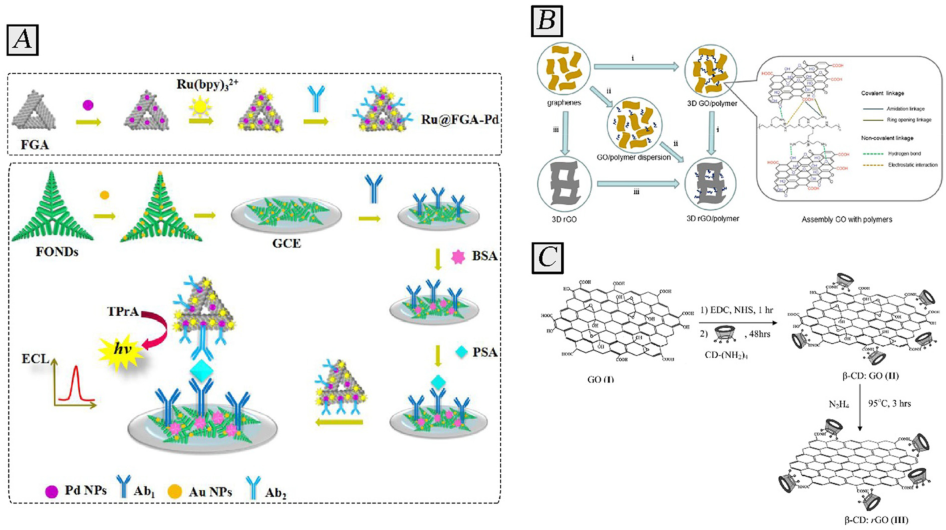
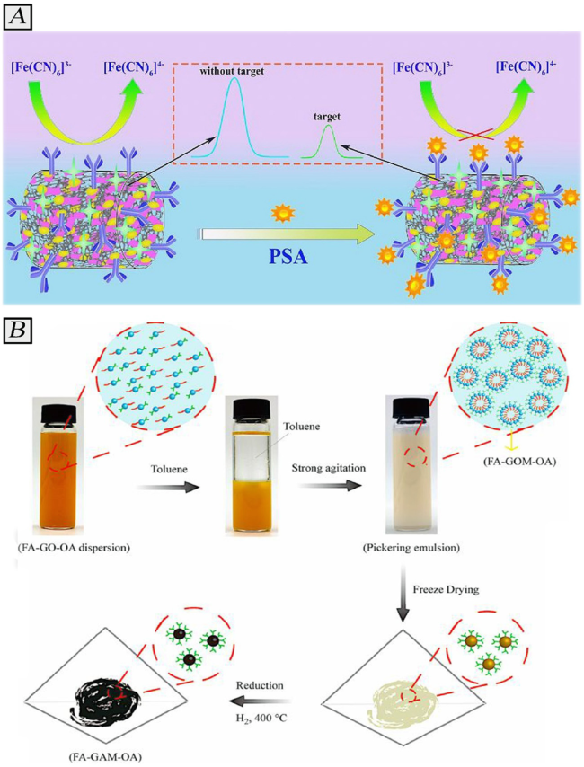
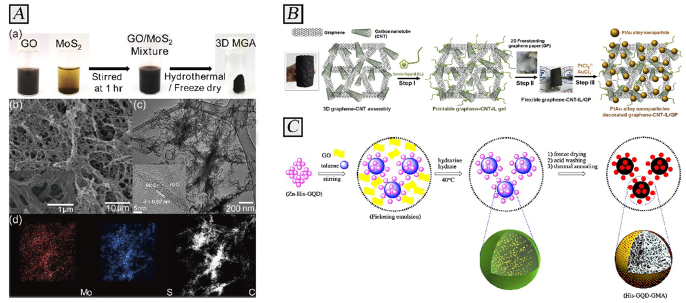
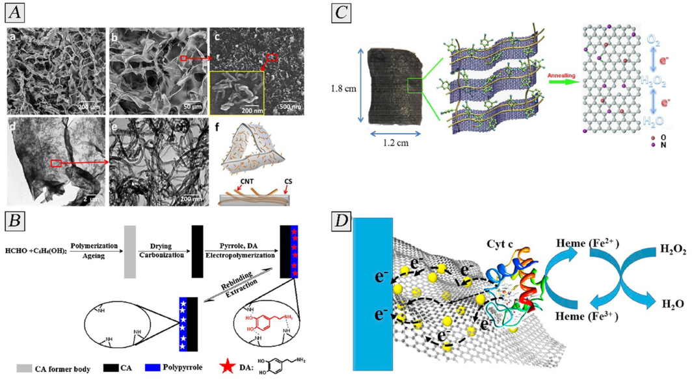
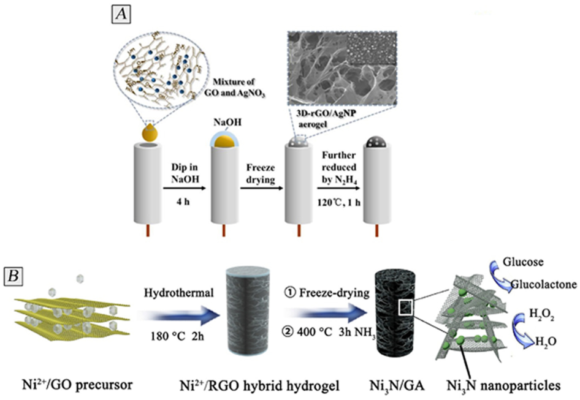
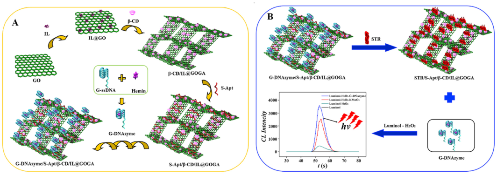
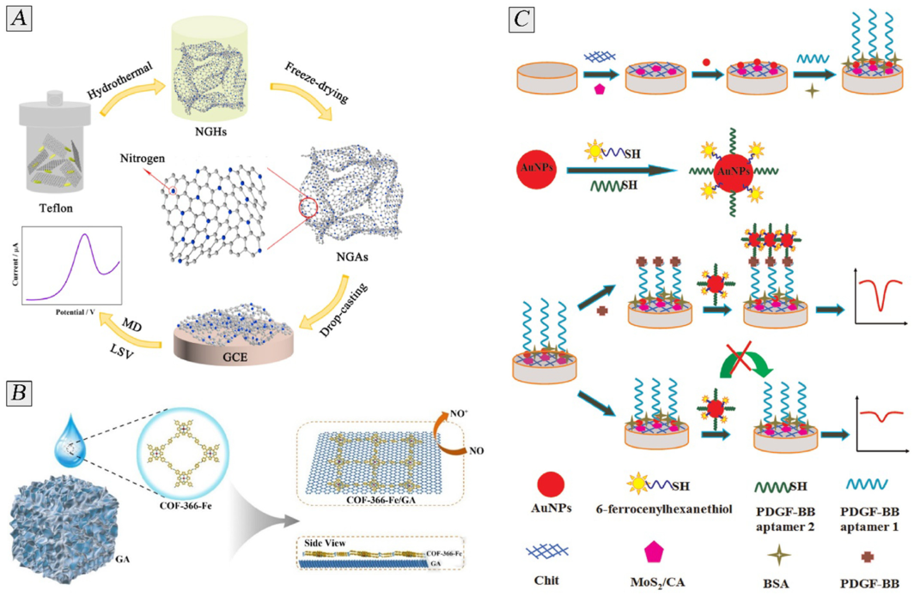

Advances in Colloid and Interface Science 298 (2021) 102550 

Contents lists available at ScienceDirect 

## Advances in Colloid and Interface Science 

journal homepage: www.elsevier.com/locate/cis 

## Historical Perspective 

## Carbon-based aerogels for biomedical sensing: Advances toward designing the ideal sensor 

Mansour Mahmoudpour[a][,][b] , Jafar Ezzati-Nazhad Dolatabadi[c] , Mohammad Hasanzadeh[a][,][d] , Jafar Soleymani[a][,][* ] 

a _Pharmaceutical Analysis Research Center, Tabriz University of Medical Sciences, Tabriz, Iran_ 

b _Food and Drug Safety Research Center, Tabriz University of Medical Sciences, Tabriz, Iran_ 

c _Drug Applied Research Center, Tabriz University of Medical Sciences, Tabriz, Iran_ 

d _Liver and Gastrointestinal Diseases Research Center, Tabriz University of Medical Sciences, Tabriz, Iran_ 

A R T I C L E I N F O A B S T R A C T 

> _Keywords:_ Carbon based aerogels are special solid-state materials comprised of interconnected networks of 3D nano- 

> Aerogels structures with high amount of air-filled nanoporous. They expand the structural properties along with physi- 

> Biosensor cochemical characteristics of nanoscale construction blocks to macroscale, and incorporate distinctive attributes Biomedical analysis of aerogels, like large surface area, high porosity, and low density, with particular features of the different Biotechnology Biomedicine constituents. These features impart aerogels with rapid response signal, high selectivity, and ultra-sensitivity for Carbon sensing diverse targets in biomedical media. This has prompted researchers to develop a variety of aerogel-based sensors with encouraging achievements. Hence, this work outlines sensing applications of aerogel-based sensors with a comprehensive overview on the carbon aerogel hybrid materials and their analytical performances. Authors tried to list advantages and limitations of the developed approach and introduced more potent research for possible devices designing. We also point out some challenges and future perspectives related to the improvement of high-efficiency aerogel-based sensors. 

## **1. Introduction** 

## _1.1. Aerogels_ 

Aerogels (AGs) are ultra-porous three-dimensional (3D) materials which have been used for different applications. AGs provide superior features of low specific weight (3 kg/m[3] ), large surface area-to-volume ratio (500–1200 m[3] /g), large porosity (between 90 and 99%) and pore volume (1.5 cm[3] /g). Also, AGs show ultra-high thermal insulation (0.014 W/mK) and thermal stability capacities to be used in the construction of given devices [1,2]. These characteristics make them promising materials for diverse applications like piezoelectrics [3], thermal insulators [4], energy storage and conversion [5,6], catalysis [7], and sensors [8,9]. The first silica aerogel materials were prepared in 1931 by Kistler [10] and then advanced in the 1970s. Thereafter, intense research had been suggested to reduce the preparation processes, particularly drying method, for the cost-effective and facile aerogels preparation. Hence, AGs are a wide range of materials, nor a specific group, with 3D structure and high-ordered network [11–13]. 

Carbon aerogels (CAs) as types of AGs received consideration attention in the 1990s, after being designed from organic aerogels with resorcinol and formaldehyde as precursors [12]. Nowadays, the CAs can be constructed with carbon nanomaterials and nanopores, which in turn – represent materials with a high porosity (90 99%), high active surface area (usually, 500–800 m[2] /g, but can reach 2500 m[2] /g), ultralow density, and exceptional chemical, thermal and mechanical stabilities [14,15]. Indeed, CAs as a biocompatible and porous materials, can be regulated by the physical and chemical properties of the constituent’s precursors [16]. 

## _1.2. Graphene and carbon nanotube aerogels as new forms of carbon gels_ 

In summary, the fabrication of CAs comprises a series of steps: i) gelation stage is synthesized via sol-gel and aging procedures through the polymerization of hydroxybenzenes and aldehydes; it should be noted that the aging process was considered as one step of the gelation stage, ii) drying, obtaining aerogels by drying them in freezing, ambient or supercritical conditions, iii) carbonization, the formation of carbon 

- Corresponding author. 

_E-mail address:_ soleymanij@tbzmed.ac.ir (J. Soleymani). 

https://doi.org/10.1016/j.cis.2021.102550 Received in revised form 21 September 2021; Available online 19 October 2021 0001-8686/© 2021 Elsevier B.V. All rights reserved. 

_Advances in Colloid and Interface Science 298 (2021) 102550_ 

_M. Mahmoudpour et al._ 

aerogel under a nitrogen atmosphere with the following heating procedure [17]. Indeed, in a typical sol-gel method, sol is a solution contains colloidal particles and gelation process is a phase change from sol to solid (gel) state [18]. The polymerization stage which includes 3 distinct chemical reactions leads to hydrogel forms by crosslinking and polymerization of molecules; i) the first chemical reaction for polymerization is an addition reaction that leads to the introduction of aldehyde/hydroxyl derived hydroxymethyl groups by hydrogen abstraction. For starting the addition reaction alkali catalysts including calcium hydroxide, potassium carbonate, sodium carbonate, and sodium hydroxide have been applied. For catalyzing the electrophilic addition, acidic conditions have been required while for nucleophilic addition reaction, alkaline catalysts have been employed [19]. The preparation condition delimits the sol-gel transformation period in both the acid and alkaline media. As the operating parameters have a large influence on either polymerization or aging process, a controllable porous structure for organic gels could be designed. Using proper drying and carbonization process have enabled the transformation of the hydrogel with customized texture to the final carbon material. ii) Condensation is the other reaction with hydroxymethyl resorcinol that generates the bridge of methylene-ether and methylene. iii) The agglomeration and crosslinking process is the last reaction that leads to the construction of a 3D hydrogel structure. During the polymerization process, a robust polymeric network has been constructed from linear resin. Carbon aerogels have been conventionally formed via polymerization process of formaldehyde and resorcinol using different catalysts [20]. Furthermore, organic aerogels could be prepared using other pairs of aldehydearomatic like formaldehyde-cresol, furfural-phenol, formaldehydephenol, and formaldehyde-melamine. Templated carbon aerogels could be synthesized by the assist of ceramic nanoparticles, inorganic salts, or polymers as a template in the course of the polymerization process. Templated carbon aerogels could offer high mechanical flexibility, ordered porous structure, and narrow pore size distributions [21,22]. In these case, the gel phase is formed due to the self-assembling of nanostructures in aqueous solution, which leads to exceptional materials with controlled mesoporosis and very low density. Actually, these highly desirable nanomaterials can be achieved by i) appropriate dispersion of the carbon nanotubes and graphene sheets, ii) gelling the dispersion by chemical or physical nanostructures assembly and iii) drying the gained gel. 

The graphene sheets, carbon nanotubes (CNTs) and natural biomass have recently been proposed as precursors with simpler preparation than conventional polymers [23,24]. Numerous approaches have been applied to formulate graphene aerogels, such as spacer support, sol-gel, self-support, template, and substrate-based techniques [25–27]. CNTbased aerogels are ideal candidates as electrically conductive materials [28]. Indeed, the carbon nanotube units have tendency to attach each other via Van der Waals forces and produce aerogels. Nevertheless, the direct CNT aerogels formation has major disadvantage like mechanical instability, poorly formed 3D frameworks, and limited elasticity [29]. CNTs are inherently hydrophobic, so oxidation or the using of surfactants will be helpful to facilitate their dispersion and overcome these challenges [30]. Therefore, extremely dispersed CNTs suspensions will be obtained by sodium dodecyl benzene sulfonate or poly( _p_ -phenyleneethynylene) s as surfactants [28,31]. The dispersed nanotubes were able to self-assemble and render a 3D gel construction either by chemical or physical actions [32]. Thereby, the crosslinking of the carbon nanotube units will be increased by declining the concentration of solvent or by using of chemical binders. The development of selfassembled graphene nanostructures will also be feasible following the same overall process that mentioned above. In summary, the 3D porous constructions can be achieved by cross-linking graphene sheets through controllable reduction of graphene oxide dispersions. 

Cheng and colleagues [33] investigated the effect of various reduction agents like Na2S, NaHSO2, hydrazine and Vitamin C on the 3D graphene structure, and indicated that the reaction time required for gel 

formation varies as function of the selected reductant. Hence fast gelation times can be achieved with Vitamin C and Na2S, however no 3D constructions created with hydrazine. Besides, Zhang et al. [34] introduced a fabrication technique based on hydrothermal reduction of a combined CNTs/graphene oxide suspension for the carbon gels formation without any reducing agent. A hydrothermal treatment leads to the interconnection of the sheets by the carboxylic and hydroxyl groups condensation, which are present at the edges or on the defects of the graphene lattice. Indeed, by regulating the time of hydrothermal treatment, the amount of gelation could differ and diverse textures have also been attained in the final carbon materials. The total graphene aerogels texture has intensely depended on the binding conditions and the assembly procedure. In sum up, the textural wet gels characteristics rely on the evaporation conditions (physical gelation), the initial concentration of building units, the proportion and nature of binder (chemical nanotubes gelation) or the concentration and nature of reducing agent (chemical graphene oxide gelation). 

The drying step is also importance for maintaining of the porosity produced during tridimensional gel formation. The inert nature of the used “building blocks” (either graphene or CNTs) decreases the interconnection of the constructions as regards conventional aerogels which are expected to collapse. Thereby, both freeze drying and supercritical drying are mainly utilized to stabilize carbon nanotube or graphene gels [35,36]. A proper selection of the binding and gelling conditions along with careful drying, permits the synthesis of ultra-low density carbon gels with controllable porosity and very ordered carbon walls. 

Nowadays, various types of CAs are commercially accessible that can be categorized by their structures, compositions, characteristics, and even applications and used in real scenarios. Herein, according to their compositions, various scaffold has been designed based on the graphene carbon aerogels (GCAs), polymer carbon aerogels (PCAs), carbon nanotube carbon aerogels (CNCAs), composite carbon aerogels (CCAs), and biomass carbon aerogels (BCAs). On this ground, the next section accentuates current progress in CAs-based nanoprobes for sensing of biomarkers, glucose, neurotransmitters, hydrogen peroxide, pharmaceuticals and DNA segments. 

## _1.3. Why are aerogel-based sensors superior?_ 

Recently, tremendous studies on industrialization and application of the aerogels, especially CAs sprang up, indicating high application potential of them. Among the various fields, sensors which are crucial in industry, public safety, health care, and environmental monitoring, have drawn further attention, and CAs can be one of the superb nanomaterials for the sensors [37]. 

When talking about CAs as sensing materials, usually, the high specific surface area and extremely interconnected porous construction of CAs (generally all AGs) can provide high accessible sites to be functionalized, inhibit aggregation of sensing materials, increase the electron transfer, and supply suitable channels for the adsorption and transport of target analytes, thus providing the sensing probes with high sensitivity and fast response rate. Besides, antifouling ability of CAs, provides interfering platforms for sensing and thus enhancing the specificity [38–40]. 

In the past few years, more and more efforts have been concentrated on the developing of high-performance aerogel-based sensors, and many hopeful accomplishments have been realized. Even though, nanostructured materials like graphene based aerogel for stretchable and flexible physical and gas biosensors have been discussed [41–43], the more in-depth study on the CAs based sensors is still missing. Herein, this study will focus on the most recent progresses of the carbon-based aerogels in bio-sensing and their applications in biomedical media. Carbon-based hydrogels with biocompatible nature were applied in biosensing of cancer markers, glucose, neurotransmitters, hydrogen peroxide, pharmaceuticals and DNA segments. We tried to report all biomedical related agents to provide a comprehensive reference for 

2 

_Advances in Colloid and Interface Science 298 (2021) 102550_ 

_M. Mahmoudpour et al._ 

future aerogel based studies. The sensing mechanism of the reported works were explored and their analytical performances and superior material feature were highlighted. In addition, the most potent approaches for future sensor deign application was emphasized. Moreover, the challenges and perspectives on the designing of carbon aerogelbased sensors are also explored. 

## **2. Carbon based aerogels for biomedical sensing** 

## _2.1. Cancer biomarkers sensing_ 

Nowadays, cancer biomarkers have significant roles in the screening, early diagnosis, monitoring of diverse cancers and subsequent treatment [44]. For example, prostate specific antigen (PSA) is an accepted worldwide biomarker for clinical follow-up of prostatic cancer. The PSA concentration in blood serum can offer importance information from early detection of prostate cancer and predicting recurrence of them after curative surgery [45]. Till now, lots of approaches were used to PSA determination in human serum such as electrochemical sensor [46], photoelectrochemical immunoassay [47], enzyme-linked immunosorbent assay [48], fluoroimmunoassay [49], and so forth. 

Owing to the exceptional specificity, high sensitivity, low background noise and fast dynamic concentration response, different electrochemiluminescence (ECL) analysis have been broadly established, even some ECL systems are commercialized in clinical analysis [50]. As well known, the analytical performance of the biosensors is intensely based on the engagement of advanced nanomaterials, which in turn can promote the charge transfer and increase the active chip area for attaching biomolecules. 

In this regard, the graphene aerogel (GA) and GA-based nanomaterials can be used as electrocatalytic support in ECL systems owing to their high porosity, promising electrical conductivity and high surface area [51,52]. Indeed, GA with 3D porous construction can enhance the accessibility of catalytic active sites and accelerate the mass transfer rate to an upper level. After electrodes modification using these nanomaterials and immersion in the electrolyte solution, the mass transfer 

would be facilitated between surface and coreactant, which is favorable to the redox between coreactants and luminophores for stronger emission of ECL. In the light of that, a sandwich-type method was described by Yang et al. [53], who utilized palladium (Pd) modified GA for detection of PSA with a detection limit (DL) of 0.056 pg/mL. The developed ECL based immunosensor was fabricated using Pd NPs for functionalization of GA supported by Fe3O4 (FGA–Pd) and then assembling of antibody (Ab1) 1, while Ab2 was attached on the surface of gold nanoparticles (Au NPs) improved Fe2O3 nanodendrites (AuFONDs) structures. Ru(bpy)3[2][+] was added as luminophore to enhance the ECL signal. The dynamic range of this sensor was reported as 0.0001–50 ng/mL which mainly caused by favorable electrical conductivity of AuNPs (Fig. 1A). 

Recently, incorporation of graphene with polymers to create 3D porous graphene-polymer composites (3DGPCs) has appealed significant attention for both fundamental studies and technological applications. In general, the composite gels are commonly formed via assembling of GO sheets with polymers as the cross-linker, which depend on the cross-linking effect between GO sheets and polymer chains by covalent or noncovalent interactions. As shown in Fig. 1B, the synthetic approaches of 3D graphene-polymer composites with GO as the precursor can be summarized into three main categories: (i) the direct integration of polymers during the GO sheets reduction selfassembly procedure; (ii) the assembly of GO sheets by polymers as the cross-linker; (iii) the polymers integration into the pre-synthesized 3D graphene structures [54]. 

The integration of GO with cyclodextrins as polymers displayed anticorrosion and self-healing properties when exposed to external stimulilike temperature, moisture and light as a result of the covalent interactions, leading to mechanical strength, higher impermeability, excellent electrical conductivity with higher selectivity and sensitivity (Fig. 1C) [55]. For instance, Jia et al. [56] introduced an aerogel-based immunosensor that comprises of capture antibody immobilized onto the β-cyclodextrin (β-CD) polymer modified surface of GA. β-CD polymer/ GAs based immunosensor was applied to detect carbohydrate antigen 15–3 (CA15–3) from 0.1 mU/mL to 100 U/mL with a limit of detection 

**Fig. 1.** (A) The preparation mechanism of the suggested ECL immunosensor, (B) Schematic drawing of the construction methods for 3DGPCs started from GO precursor. (C) Schematic illustration of the β-cyclodextrin-reduced graphene oxide. (Reprinted (adapted) with permission from ([53], [54] and [55]). Copyright (2021) American Chemical Society.”) 

3 

_Advances in Colloid and Interface Science 298 (2021) 102550_ 

of 0.03 mU/mL. Unlike sandwich-type immunoassays, these type immunosensors involve capture antibody and there is no need to the secondary antibodies. Generally, these type of immunosensor can provide fast and high-efficiency detection of analytes, however, the selectivity of the sandwich type assays are high. 

The poly(3,4-ethylenedioxythiophene) (PEDOT) and its nanocomposites can be considered as one of the most hopeful conducting materials for the designing of electrochemical sensors owing to their high electrical performance and superb chemical and physical stability [57,58]. The PEDOT-GA nanoprobe show synergistic characteristics such as good dispersibility and conductivity and high electroactivity to target molecule. In this regard, Jia et al. [59] introduced an electrochemical immunosensing assay to precisely detection of PSA in biofluids sample. They immobilized capture antibodies on 3D Au NPs/nanoPEDOT-GA nanocomposite to improve the DL of PSA recognition to 0.03 pg/mL (Fig. 2A). The linear range of this method was reported from 0.0001 to 50 ng/mL in which can detect PSA in serum samples without interfering effect from the possible coexistences. As authors declared the reported nanoprobe can detect PSA in clinical sample with relatively high reproducibility. 

Although immunosensor-based approaches are extremely specific but their experimental detection steps are high-cost, slow and also more 

complicated condition are needed for the sensor components storage. However, targeted chemical detection approaches provide more simple, cheap and fast detection of the analytes. Cell surface receptors are the surface anchored protein which are required for cell growth and developments. Folate receptor (FR) is overexpressed on the surface of about all cancer cells which was utilized for various purposes [60–66 

High affinity between FR and folate functionalized materials supplies ultra-high interactions. In this regard, Ruiyi et al. applied FA and octadecylamine (OA)-assembled GA (FA-GA-OA) for the detection of HepG2 live cancer cells (Fig. 2B). According to this report, the electrochemical signal of FA-GA-OA based probe was decreased as the cancer cells presented and attached to the FAs. The decreased electrochemical current was linear from 5 to 105 cell/mL with the DL of 5 cells/mL. High specificity of receptor based approaches was achieved even in the presence of FR-negative cells as nonspecific interfering cells. This FAGA-OA based electrochemical sensor associates favorably feature to the immunosensors [67]. 

In summary, while recent studies have focused almost exclusively on enhancing detection 

sensitivity and specificity, it’s important to understand that the effective sensing of cancer biomarkers in order to suitable analysis goes beyond singular diagnostic events. Typically, relative concentration 

**Fig. 2.** (A) Schematic illustration of D AuNPs/nano-PEDOT-graphene aerogel nanocomposite immunosensor for PSA, (B) Diagram procedure for the preparation of FA-GAM-OA. ((A) Reprinted from [59] with permission license of 5037421225179 and (B)) reprinted from [67] with permission license of 5037421318841). 

4 

_Advances in Colloid and Interface Science 298 (2021) 102550_ 

_M. Mahmoudpour et al._ 

variations should be monitored in real time and compared against numerous types of the biomarker or in parallel with other biomarkers, in return for identifying the sole biomarker concentration. To satisfy this requirement, carbon based aerogels sensors and other aerogels-based techniques need to undergo additional works to analysis of multiple or an ensemble of measurement signals. 

## _2.2. Glucose sensing_ 

Continuous and rapid monitoring of glucose is an indispensable part of diabetes management, and glucose control with efficient manner is imperative for long-term health outcomes. In the past decade, comprehensive efforts have led to important scientific and technological innovations toward glucose recognition [68]. 

To date, the electrochemical biosensors has attracted enormous attention in terms of glucose sensing because they can be amalgamated into portable electronic tools like smart phones, allowing users to access them for real-time sensing [69]. To reach this outlook, the probe performances must be further enhanced in terms of response time, sensitivity and selectivity. Glucose probes utilize aerogels as the basic materials for developing and designing of various types of sensors because of their favorable features like high and tunable porosity, high pore volumes and surface area. These properties can result in sensing novel probes with high sensitivity and lower background signal from interfering agents. For example, Jeong et al. [70] established an electrochemical approach to determine glucose using graphene and 2DMoS2 nanocomposite to provide a 3D aerogel. This platform was utilized toward enzymatic recognition of glucose. High specific area of the aerogel aids opportunity to capture high level of glucose oxidase (GOx) on the porous pore of the gel. The developed flow-injection-based electrochemical sensor can measure glucose from 2 to 20 mM with a low DL of about 0.29 mM. As reported, the developed method was free from inferences effects because of the fact that the constructed electrode pro− vides operating potential of 0.45 V. The typical process for 3D MGA preparation was characterized by SEM, TEM, and Electron mapping images (Fig. 3A). CV and EIS techniques are usually employed to evaluate the electrochemical behaviors of sensor. In order to fabricate more 

sensitive detection system for glucose, Wang and colleagues [71] used graphene/AuNPs hybrid aerogel in a similar approach reported by Jeong et al. In this case, AuNPs stabilized on the structure of AGs and enhanced the electrical conductivity of the electrode and thus improved the DL to about 0.597 μM which the sensitivity was enhanced about 10 orders of magnitude. High surface area of AuNPs is another factor that enhanced the sensitivity of the probe. In a similar investigation, Sun et al. [72] used polyethyleneimine (PEI)-assisted hydrothermal‑tungsten oxide nanocomposite aerogel which was functionalized with glucose specific enzyme. The DL of the enzyme sensor was10 μM. It is noteworthy that the most reported approaches for glucose detection was based on enzymatic reactions. However, owing to some disadvantages of the glucose oxidase based nanoprobe such as cumbersome processes for enzyme anchoring, sensitivity to the environmental conditions and high cost [73], the enzyme-free glucose probes has drawn remarkable academic and commercial attention. Recently, metal oxides like Co3O4, CuO, Fe2O3, NiO, and WO3, have been suggested to design of these type nanoprobes [74,75]. As a kind of p-type transition metal oxides with a narrow band gap of 1.2 eV, CuO has been extensively applied as electrode materials in electrochemical sensors [76], batteries [77], and supercapacitors [78]. Nevertheless, these material are simply oxidized or aggregated in the ambient atmosphere and have restricted catalytic activities, which significantly lower the analytical performance of the sensor. As paradigm, Yang and coworkers [79] was developed enzyme-free based sensor using CuO NPs functionalized N-graphene aerogel (N-GA). The developed amperometric probe can detect glucose in serum samples from 0.01 to 6.75 mM with a DL of 2.7 μM. The synergistic effect of CuO NPs and N-GA enhances considerably the electrical activity of the as-synthesized NGACuO probe, which aids high specificity, sensitivity, and reproducibility. In order to enhance the sensitivity and stability of glucose detection, Gao et al. [80] modified the glassy carbon electrode (GCE) with Cu@Cu2O aerogels. Porous nature of the aerogel makes promising effect on the analytical performance of the probe, in addition, large surface area of the produced aerogel can promote the electrocatalytic activity of the modified electrode. Generally, metal collaborated aerogels are especially favorable in the electrochemical sensor designing because of their 

**Fig. 3.** (A) Schematic procedure for the 3D MGA preparation and TEM, SEM images are also presented, (B) fabrication method for PtAu NPs coupled onto the graphene-CNT-IL/GP. Step I: Grinding 3D graphene-CNT assembly with IL to form printable graphene-CNT-IL gel; Step II: Printing graphene-CNT-IL gel on GP; Step III: Ultrasonic-electrodepositing PtAu alloy nanoparticles on graphene-CNT-IL-GP electrode, (C) Diagram illustration for the construction of His-GQD-GMA. ((A) Reprinted from [70] with permission license of 5037050638289, (B) reprinted from [81] with permission license of 5037421420273 and (C) reprinted from [86] with permission license of 5037421502305). 

5 

_M. Mahmoudpour et al.                                                                                                                                                                                                                       Advances in Colloid and Interface Science 298 (2021) 102550_ 

marvelous features such as high electrical conductivity, high surface area, high porosity and adaptable structure. 

Likewise, He et al. [81] took advantages of chemical approaches to detect glucose in an electrochemical probe. They casted rGO/CNT/ionic liquid (IL) aerogel on a graphene paper (as a flexible electrode) and then Au and Pt NPs loaded onto the paper. As presented in Fig. 3B the CNT and graphene nanosheets are simultaneously assembled in a 3D porous CNT/graphene cylinder aerogel. In fact, the CNTs integration into graphene matrix not only successfully prevents the reassembling of graphene sheets into tightly packed layered constructions, but also enhances its mechanical robustness and electronic conductivity. Owing to the cation-π interaction between the π-bonded surface and the imidazolium ring of IL, the CNT /graphene nanohybrid mixes with IL binder to form viscous fluid, which in turn can be applied as a conductive ink for printing on graphene paper. Thereby, in order to improve the electrocatalytic activity toward the direct oxidation of glucose, Pt Au alloy nanoparticles were decorated into 3D porous aerogel. The developed approach provides dynamic range and DL of 0.1 mM to 11.6 mM and 8 μM, respectively. High selectivity for glucose was found even in the presence of 5 mM of coexisting molecules, such as dopamine, uric acid (UA) and ascorbic acid (AA). High specificity of the developed sensor is mainly as a result of GO and CNTs sheets which limit the interfering agent to reach and subsequently destroy the surface on the electrode [82]. The future investigation on aerogels-based sensors is also estimated to continue toward determining infinitesimally glucose concentrations through various bodily fluids and in designing scaffold that can be coupled into portable, subcutaneous, and miniaturized implantable tools. 

## _2.3. Neurotransmitters sensing_ 

Aerogels based sensors have also been utilized for the determination of neurotransmitters. In the aerogel-based platforms, the functionalizable sites are increased upon through the boosted specific surface area of porous aerogel compared to other advanced materials. For example, Zhang et al. [40] detected dopamine through an electrochemical strategy using Fe2O3/graphene/polyimide (PI) carbon aerogel. The asconstructed Fe2O3/graphene-PI carbon aerogel probe determined dopamine molecules with a DL of 0.109 μM and wide dynamic range of 5–500 μM. The enhanced properties of probe are mainly caused by synergetic effect of high electron conductivity of carbon aerogels and electrocatalytic activity of Fe2O3 NPs. While, porosity of aerogel added to the properties, a highly potential sensor could be fabricated which can be a candidate for specific and sensitive detection of DA in biomedical media. Dopamine was determined using another mesoporous GA in which the graphene substrate was modified by palladium, gold, nitrogen and sulphur to provide a multiple component composite of Pd@Au/N,SGA. The Pd@Au/N,S-GA provides a distinct 3D mesoporous structures. Electrocatalytic behavior Pd@Au NPs and N,S-GA on the structure of sensor brought about ultra-high sensitivity which can detect dopamine from 1.0 nM to 40.0 μM with a DL of 0.36 nM [83]. 

Chemical heteroatom doping in graphene can lead to a local change in the initial graphene composition, and optimize the electronic properties and surface structure of graphene [84]. Nitrogen is extensively applied to dope the graphene-based materials. Since, nitrogen-doped graphene (NG) has been stands out due to their good chemical stability and high electrical conductivity, it can be predicted that the integration of nitrogen element with graphene aerogels (N-GA) could adjust the electrical property and chemical nature, leading to the enhancement in N-GA performance. In light of that, Wang et al. [85] were applied N- GA to fabricate an electrochemical amperometric probe. As reported, the developed probe is specific toward dopamine molecules with DL of 0.1 μm and dynamic range of 1–200 μm in the presence of various interfering agents. The question of how such a specificity is obtained remains unclear. However, the 3D structure of aerogels may be effectively decrease the immigration of the interfering agents to the surface of 

## the electrochemical electrode. 

Interestingly, GA-based probe where the transduction was carried out through voltammetric method for the recognition of dopamine. The GA was modified with histidine-functionalized graphene quantum dots (GQDs) through thermal pyrolysis of histidine and citric acid coupled with Zn ions to create ZnHis-GQD complex (Fig. 3C). Then, this complex has been utilized as a solid surfactant for stabilizing of toluene-in-GO aqueous dispersion emulsion. Indeed, GO in the emulsion was gradually reduced by hydrazine addition until graphene micro-gel designed. The hybrid His-GQD-graphene micro-aerogel obtained after freezedrying, acid washing and thermal annealing. The prepared hybrid renders a 3D framework with well-defined nanoporous constructions, where in the His-GQDs have well dispersed and anchored on the graphene sheets. The final hybrid material offers superb electro-catalytic activity, electron/ion conductivity, and mechanical stability. The sensor was utilized to determine dopamine molecules in rat brain tissue samples from 0.001 to 80 μM with a DL of 0.29 nM. The sensitivity of the sensor is mainly contributed to high surface area to volume ratio and mechanical strength of GA [86]. 

Like GA, CAGs have 3D structure with fascinating sensing capabilities. CAGs have high electrical conductivity which provide sensors with high sensitivity. Also porous nature of CAGs can increase their specific surface area, providing more site for the secondary surface modifications [87]. The nanocomposite aerogel consisting of CNTs and phragmoid chitosan has been prepared using ice-templating technique, and displayed excellent flexibility, catalysis and absorption capacities. This biosensor can detect dopamine with broad dynamic range from 17 nM to 30 μM and DL of 0.3 nM. The influence of UA and AA as interfering agents on the electrochemical response was studied and obtained results showed that the amperometric current did not considerably alter upon exposure to the equal concentration of dopamine. The interconnected, porous, incorporated 3D framework with crinkly, multiform nanosheets as walls has been characterized by SEM and TEM images (Fig. 4A) [88]. Also, Rajkumar and colleagues [89] modified CAGs with Pd metal ions to develop the electrocatalytic activity of CAGs. The Pd-doped carbon aerogel was designed through mixing the resorcinol-formaldehyde gel gained from sol-gel procedure with the Pd precursor, followed by a carbonization in nitrogen atmosphere. Then, the ink of the Pd-doped carbon aerogel has been dropped on the electrode surface to get a nanoprobe after drying. This sensor was used for simulations detection of dopamine and melatonin where the dynamic ranges were 0.01–100 μM, 0.02–500 μM with DL of 2.6 and 7.1 nM for dopamine and melatonin, respectively. What the influence of the Pd is to accelerate the electron conductivity and subsequently to enhance the sensitivity of the probe. To improve the selectivity of the dopamine probes, Yang et al. [90] functionalized the CAGs with molecularly imprinted polymers (MIP). As a result of use of MIPs, the DL has been reduced at concentration as low as 0.4 nM where the electrochemical response of the sensor was linear from 7 nM to 35 μM. Compared with the Pd, MIP based CAG was more influenced the sensitivity and selectivity, proposing the detection dopamine in urine and serum samples at even 7 nM levels. Fig. 4B represents the sensor preparation steps for simultaneous detection of dopamine and melatonin. 

Recently, significant efforts have been imparted to design the CAs which are derived from the biomass wastes [91]. These type of CAs not only have the benefits of high specific surface area, high porosity, and good chemical stability, but also possess the specific sustainable, costeffective and ecofriendly characteristics. These specificities make the biomass wastes derived CAs desirable for a diverse range like electrode materials for electrochemical energy storage [92]. In this prospect, Sha et al. [93] synthesized hierarchical carbon nanoballs based aerogel with superior specific area (446.39 m[2] /g) to determine dopamine in urine and serum samples. Despite the high surface area, the developed electrochemical sensor is able to detect dopamine concentrations from 5 to 1760 μM with a low DL of 3.53 μM. As an advantage, aerogel was basically produced from waste biomass. 

6 

_M. Mahmoudpour et al.                                                                                                                                                                                                                       Advances in Colloid and Interface Science 298 (2021) 102550_ 

**Fig. 4.** (A) Microscopic constructions of the 3D CCA, SEM images of the CCA with diverse magnification and TEM images of the soft nanosheets, (B) Schematic representation for the fabrication of the MIPPy/CA electrode, (C) Diagram procedure for the construction and electrocatalysis processes for 3D-NGA, (D) scaffold for 3DGA-AuNPs/Cyt c/GCE with 2 mM H2O2. ((A) Reprinted from [88] with permission license of 5037430060507, (B) reprinted from [90] with permission license of 5037430149898, (C) reprinted from [99] with permission license of 5037430236035 and (D) reprinted from [102] with permission license of 5037430307193). 

Hierarchical materials are well-organized structure substances with high porosity. Taking several advantages of hierarchical materials, Weng and coworker [94] fabricated a sensing probe using nafion modified CAs to the specific detection of dopamine inhuman serum samples. In the system, the Nafion addition improved the mechanical strength of NECAGs and successful control of the cellular morphology and pore size has also been realized. This probe can determine dopamine from 0.1 to 10 μM in the presence of AA and UA as possible interfering agents. The same materials i.e. GO, nafion and MWNTs, with different approach, was reported by Ding et al. [95] as a sensing platform with mean size about 10–20 μM for dopamine detection. The developed electrochemical system detects dopamine concentrations as low as 30 nM in serum real samples. Beyond utilizing nanoparticles, macro-sized materials could also provide sensitive detection approaches. 

Although important successes were made on the aerogels materials construction and sensor demonstration, there are still some challenges to actual monitoring of neurotransmitters in biological fluids like analysis of multiple target with efficient spatiotemporal resolution in real-time continuous, durable stability of sensing material, fouling problems and lower DL with high selectivity, and reproducibility. Likewise, the aerogels-based sensors have increasingly been used to detect dopamine, but, we expect that further efforts to develop aerogels-based nanoprobes could offer a hopeful perspective for monitoring of various neurotransmitters with enhanced sensitives and cost of benefit in the near future. 

## _2.4. Hydrogen peroxide sensing_ 

Reactive oxygen species (ROS) has been considered as an imperative intracellular signaling molecules that could control the DNA damage, protein synthesis, cell apoptosis, and other living activities. It also participates in numerous physiology actions like immunity activity and signal transition [96]. Nevertheless, the excessive amount of ROS in cells can disturb the intracellular activity and cause oxidative stress. 

Hydrogen peroxide (H2O2) as a member of ROS, is excreted from mitochondria due to the enzyme actions. Hydrogen peroxide is a highly reactive agent and the extreme amount of hydrogen peroxide could be resulted in deformation in biological molecules [97]. Since high concentration of hydrogen peroxide is an inductive of various cell dysfunction [98], therefore, its sensitive and specific detection possesses excessive importance. Porous 3D graphene materials have presented a thriving progress owing to their excellent properties like large active surface area, unhindered substance diffusion and multiple electron transfer channels, which can facilitate the electro transfer between analyte and the electrodes. As paradigm, Wang et al. [99] designed highperformance non-enzymatic platform toward H2O2 detection using 3D nitrogen (N) doped graphene aerogel. Such novel fabrication 

approaches of graphene electrode could well maintain the 3D configuration and corresponding characteristics, presenting interesting potentials in sensing (Fig. 4C). Likewise, Lu et al. [100] reported the direct application of AuNPs modified reduced graphene (AuNPs/rGO) aerogels film as non-enzymatic sensor for the detection of H2O2 concentration through an electrochemical method. The AuNPs/rGO electrode used to detection of H2O2 in a wide range of 0.056–0.105 mM with a DL of 0.17 μM. Importantly, an increase in the electron transfer capacitance was provided due to use of the highly-channeled graphene based aerogels. The same materials have also utilized with different synthesis approach. However, the obtained analytical performance of the developed sensor was not favorable (i.e. dynamic range of 1.5 to 7.6 Mm and DL of 19 μM). The sensitivity of this platform is not likely to be satisfactory for the monitoring of H2O2 in biological media. Despite the not good sensitivity of the probe, its specificity was acceptable [98]. 

Interestingly, Peng et al. [101] modified carbon aerogels with AuNPs, IL and hemoglobin to electrodeposit on the surface of carbon paste electrode. Porosity of the produced aerogel not only enhance the sensitivity of the probe but also can enhance the stability of hemoglobin, amplifying the electron conductivity. This sensor is able to detect H2O2 

7 

_Advances in Colloid and Interface Science 298 (2021) 102550_ 

_M. Mahmoudpour et al._ 

as low as 2.0 μM (dynamic range 5.0 to 950 μM). Moreover, Zhao and collaborators [102] utilized another biomolecule i.e. cytochrome _c_ (Cyt c, as an electron transfer protein) to improve the surface of GCE to determine H2O2 released from live cells and serum samples (Fig. 4D). They decorated AuNPs on the surface of GAs and the Cyt c macromolecules immobilized to fabricate an enzyme-based electrochemical sensor (GA/AuNPs/Cyt c/GCE). As prepared electrode with Cyt c component is familiar to catalyze redox pair of Fe[+][2] /Fe[+][3 ] which showed an electrocatalytic activity toward H2O2 from 10 μM to 740 μM with a DL of 1.1 μM. Xu et al. [103]functionalized GAs with PtNPs and Cyt c to construct an enzyme based sensor (GAs/PtNPs/nafion/Cyt c) to enhance the sensitivity of H2O2 detection as low as 1.67 μM. Wide dynamic range of the sensor from 5 to 1175 μM can relatively cover higher biological concentration of hydrogen peroxide. It is noteworthy that Cyt c not only serves as specific agent for hydrogen peroxide detection but also can catalyze the electrochemical reduction of hydrogen peroxide. 

In recent years, hybrid nanomaterials have been increasingly utilized in the electrochemical recognition of various analytes. Especially, noble metals i.e. Ag, Pt and Au are frequently applied in combination with other nanoparticles, proposing tunable properties upon changes on their composition, size and shape. The 3D-rGO/AgNPs composite coated on the GCE electrode by an in-situ method and directly used as a biosensor. This platform has excellent 

sensing performance than the Ag/graphene sheet for the electrochemical determination of H2O2 (Fig. 5A), indicating the superiority of the 3D highly porous building [104]. Likewise, Yang et al. [105] have been used the Ag nanowires to modify carbon fiber paper as sensing electrode for a microfluidic chip H2O2 at DL of 2.1 μM (dynamic range, 0–0.8 mM) though an electrochemical approach. Indeed, Ag NPs can enhance the catalytic activity of the modified electrodes toward target due to its high electrical conductivity. 

Numerous efforts have been done to use of easy accessible and cheap 

elements such as Ni, Fe, Cu, to fabricate various enzyme-free sensing probe. However, Ni-based hybrid materials are widely applied in sensing. For example, Yin et al. [106] functionalized GAs with nickel nitride (Ni3N) NPs to determine H2O2 using hydrothermal process cum freeze-drying and calcination in NH3 atmosphere (Fig. 5B). In this report, the effect of structural features on the sensing performance of Ni3N/GA nanocomposite has been successfully investigated. Indeed, 3D aerogel offers multifunctional ionic or electronic pathways through their interconnected macroporous configuration and facilitate electrons and ions transportation. Moreover, the aerogels can impede the aggregation of Ni3N and enhance the active sites for electrocatalysis. In sum up, the results proved that the designed probe with an effective conductive nature is appropriate for charge transfer and agglomeration problems, which is an enormous profit for non-enzymatic electrocatalytic application. The electrochemical sensor response was linear from 5 μM to 75.13 mM with a DL of 1.8 μM. High ratio of Ni on the aerogel composite provides relatively high sensitivity for the H2O2 detection. 

Despite considerable development has been made in designing and applying carbon based aerogels for electrocatalytic H2O2 detection, the expansion of newfangled methods for synthesizing aerogel -based electrocatalysts with new construction and exceptional activity is still imperative and need continuous studying. We hope that the use of multicomponent carbon based aerogels in biosensing will open a new horizon for direct detection of small molecules such as H2O2. 

## _2.5. Pharmaceutical monitoring_ 

Abuse of pharmaceutical drugs have different unwanted side effects to the human body organs. Thus, the monitoring of drugs is essential to adjust the proper concentration of drugs to control possible side effects. The main problem on the detection of pharmaceutical drugs in biological media is the spectral inferences of the coexisting agents. This 

**Fig. 5.** (A) Drawing of the preparation procedure for the fabrication of a GCE modified by 3D-rGO/AgNPs aerogel, (B) Illustration of the preparation of Ni3N/GA samples. ((A) Reprinted from [104] with permission license of 5037430387925, and (B) reprinted from [106] with permission license of 5037431476887). 

8 

_Advances in Colloid and Interface Science 298 (2021) 102550_ 

_M. Mahmoudpour et al._ 

problem is more obvious in optical based approach in which various pretreatment approaches such as protein precipitation and extraction methods are needed to delete or decrease the effect of the coexisting agents on the signal. As clear, the pretreatment approaches are usually resulted in the loss of the analyte [107]. 

Aerogels with their 3D structure, as potent advanced materials, could considerably prevent the interfering effect of the coexisting biomolecules. For example, Sun et al. [108] introduced an ECL aptamer based probe toward streptomycin detection. They anchored aptamer and G-DNAzyme on the surface of β-cyclodextrins and ionic liquids functionalized GO aerogel (Fig. 6A). The ECL analytical signal of the probe increased linearly from 1.4 pM to 2.8 nM with a DL of 9.2 pM, confirming the enhanced sensitivity of specificity of the probe using aerogel (Fig. 6B). Although, aptamers can considerably increase the specificity, GO aerogels are doubly enhanced the interference filtering of the fabricate nanomaterial. While QDs are famous for favorable optical properties but QDs have also been utilized in the designing of electrochemical sensing probes. Beyond using QDs as fluorophore, Ruiyi groups functionalized GAs with carbon quantum dots (CQDs) to achieve a trace level of acetaminophen in pharmaceutical tablets. This system i.e. GA@CQDs is able to quantify acetaminophen from 1 nM to 10 μM with a low DL of 0.38 nM [109]. 

Niu et al. [110] were used reduced graphene oxide aerogels to synthesize 3D-rGA via a one-step 

hydrothermal process for quantification of quercetin. The rGA modified electrode is determined quercetin from 0.1 μM to 100 μM. The specific nature of the probe is mainly endowed by 3D structure of rGA. An electrochemical sensor based on rGO microaerogels have excellent performance and sensitivity for sensing of diverse target in respect of graphene and GO aerogel. This is because these rGO micro-aerogels were synthesized using a multiple emulsion as a soft template and thus presented well-defined porous construction, specific surface of 1253 m[2] /g, and an electrical conductivity of 3250 S m[−][1 ] [111]. The N- doped GAs were synthesized through an on-pot thermal procedure. The produced N-GAs has prominent sensing performance toward midecamycin determine in urine sample (Fig. 7A). As the other developed probes, in this system, the porosity and large surface area of the aerogels paly main role in enhancement and specificity of the developed method. The fabricated probe can detect midecamycin as low as 10 nM with dynamic range of 20 nM-21 μM [112]. 

Based on the aforementioned, nanocomposites comprised of carbon aerogels and other nanomaterials like functionalized nanostructures, metal nanoparticles and polymers, have a hopeful trend to further improve the DL and sensitivity for target analytes through synergistic 

effects. Indeed, descriptions of approaches based on the aerogel based sensors, which are tuned for particular targets, aim to offer scientists and readers with a comprehensive toolbox for the identification of a varied array of pharmaceuticals. 

## _2.6. DNA monitoring_ 

Divers studies have proved that there is an enormous type of DNA including double-stranded (dsDNA) and cell-free DNA (cfDNA) in blood in the tumor necrosis development [113]. At present, the improvement of a specific, sensitive and cost-effective DNA/RNA sensing technique is highly demand for the early stage identification of genetic diseases. Likewise, specific and sensitive recognition of DNAs is an important issue in many fields of science (such as pathology, food safety, etc.) [114]. 

To date, the construction of DNA based biosensors become a practical research topic and numerous methods were engaged for DNA analysis [115,116]. Nowadays, electrochemical technique is a popular one owing to its fully compatible with nanoelectronics and appropriate for miniaturization. More importantly, the surface modification of the electrodes with multiple GA and nanoparticles play essential roles in designing of DNAs sensing probe. In light of that, Ruiyi and coworker [117] used gold nanostars (AuNSs) to functionalize N-doped GAs to fabricate an electrochemical sensing platform. The reported system determined circulating free DNA in the range of 1.0 × 10[−][6 ] fg/mL to 0.1 –3/− 4 fg/mL in the presence of Fe(CN)6 as a redox pair. The DL was highly promising with a value of 1.0 × 10[−][7 ] fg/mL. This is the lowest DL realized and was as a result of the important synergy between AuNSs, nitrogen-doped multiple GA, and dsDNA. The same group functionalized multiple GAs with thionin and AuNSs to determine circulating free dsDNA of serum samples. This method has better electrochemical performance regarded to the classical GA. The performance could be further enhanced via increasing amount of the GA gelation cycles. The pore size control during the fabrication of GAs was imperative for producing high surface area and open pore constructions for GA interfaces. The synthesized thionin/GAs/AuNSs was utilized to modify the surface of GCE electrode for the direct determination of dsDNA. The specific electrochemical response best at a working voltage of − 228 mv has obtained via thionin and dsDNA interaction. The developed platform is able to detect dsDNA from 100 fg/mL to 10 ng/mL with a DL of 39 fg/mL [118]. The reported two works by Ruiyi et al. obviously show the influence of the proper selection of redox pair, where, upon using the same materials and sensing approaches. These results propose that there is significant affect in using the appropriate redox pair in the sensing. Ferro/ferric 

**Fig. 6.** (A) Preparing process of β-CD/IL@GOGA nanocomposites, (B) and construction principle drawing of CL sensor. (Reprinted from [108] with permission license of 5037440078296). 

9 

_M. Mahmoudpour et al.                                                                                                                                                                                                                       Advances in Colloid and Interface Science 298 (2021) 102550_ 

**Fig. 7.** (A) Diagram illustration the sensing process of MD based on NGAs/GCE substrate, (B) Schematic showing of the synthesis method using COF-366-Fe/GA as sensing element for determination of NO molecules, Schematic of (C) sensing preparation process of AuNPs and MoS2/CA signal enhancement for the detection of PDGF-BB. ((A) Reprinted (adapted) with permission from ([111]). Copyright (2021) American Chemical Society.”, (B) reprinted from [122] with permission license of 5037440272739, and (C) reprinted from [124] with permission license of 5037440344103). 

cyanide pair can enhance the sensitivity about 100 billion orders on magnitude. Such a high sensitivity was provided not only using the proper redox pair but also the GAs structure, providing infinite sites for further functionalization. A brief list of such commonly aerogel-based biosensors and their performance in biomedical media has been selected and summarized in Table 1. 

## _2.7. Other biomolecules sensing_ 

Fluorescent aerogels are secondary functionalized advanced materials which have been used for various applications [119,120]. Structurally, fluorescent aerogels are hybrid materials with fluorescent agents assembled on their highly porous structure. In this prospect, Wu et al. [121] introduced fluorescent aerogels with CDs and CNF that could be further applied as a gas biosensor for nitric oxide (NOx) identification since the fluorescence can be rapidly and entirely quenched via NOx. CDs bonded on the surface of CNFs which further aids as a stabilizer to provide shape recovery properties of the produced fluorescent aerogel in water. The fluorescence quenching can be attributed to the inhibition of radiative rebinding of electrons from NOx and CDs interaction. Again, the porous building of aerogel assists the trapping and adsorption of gas molecules. This system was successfully utilized for the determination of glutaraldehyde with high sensitivity. Aerogels have also been utilized in the fabrication of a sensing probe for endogenous nitric oxide (NO) released from cells. Zhu et al. [122] developed a high performance electrochemical nanoprobe via integration of COF-366-Fe as a greatly specific electrocatalysis with the 3D GAs network (Fig. 7B). The extremely interconnected flexible network of graphene in COF-366-Fe/ 

GA provides excellent inherent conductivity for fast electron transport, macroporous channel network toward smooth electrolyte diffusion and gas liberation and large surface area for enhancing reaction interface. Indeed, this platform can successfully improve the electrochemical catalytic ability, rendering a practicable tactic for the development of real-time NO monitoring tools with respect to the wide linear range from 0.18 to 400 μM in HUWEC live cells and high sensitivity. 

CAs was produced using facial tissue paper to develop an electrochemical probe for detection of ascorbic acid (AA). This sensor offered a significant response to the AA with dynamic range and DL of 1–2500 μM and 0.91 μM, respectively. CAs/GCE based sensor showed a favorable performance to determine AA in various media including vitamin C pills, orange juice, urine and pharmaceutical injections. As advantages, the sensor is produced from wastes within a green approach and AA molecules were detected in different media through a platform [123]. Platelet derived growth factor (PDGF) is an important agent in the division and growth of cells with three isoforms of PDGF-AB, PDGF-BB and PDGF-AA. PDGF-BB isoform has a close relation with cancers and renal function in diabetics’ persons. Thus, sensitive and accurate detection of PDGF-BB is essential. Fang et al. developed a dual aptamer based electrochemical sensor to quantify PDGF-BB markers. Fig. 7C represents sensing approach of PDGF-BB in human serum samples by proposed platform. This system detects PDGF-BB in a relatively wide range of 0.001–10 nM with limit of detection of 0.3 pM. The developed probe is based on MoS2/CA composites which subsequently modified AuNPs and aptamer 1 to specify the modified GCE to the PDGF-BB molecules. Then, the sandwich-type was constructed by assembling of PDGF-BB, AuNPs/ aptamer 2 and 6-ferrocenyl hexanethiol (Fc). Fc facilities the electron 

10 

_M. Mahmoudpour et al.                                                                                                                                                                                                                       Advances in Colloid and Interface Science 298 (2021) 102550_ 

## **Table 1** 

Overview of different aerogel-based biosensors and their performance. 

|Read-out sensor|Sensing scheme|Analyte|Analytical|Anti-interference ability|Reference|
|---|---|---|---|---|---|
||||characteristics|||
|ECL|Pd NPs-functionalized graphene-|PSA|DL= 0.056 pg/mL|No signifcant interference by the CEA, AFP and|[53]|
||aerogel-supported Fe3O4.||LR= 0.0001–50|BSA||
||||ng/mL|||
|Electrochemical|graphene aerogel was loaded with|CA 15–3|DL= 0.03 mU/mL|without interferents by the PSA, BSA, Glu, AFP,|[126]|
|detection (CV and EIS) Electrochemical|β-cyclodextrin polymer to serve as an effcient platform. A sensitive platform using 3D|PSA|LR= 0.1–100 U/ mL DL= 0.03 pg/mL|and AA No signifcant interference by the AFP, BSA, Glu|[59]|
|detection (CV and|graphene aerogel (GA) supported||LR= 0.0001–50|and AA||
|DPV)|worm-like PEDOT nanoparticles.||ng/mL|||
|Electrochemical|This scaffold was developed using folic|HepG2|DL= 5 cells/ mL|–|[67]|
|detection (CV and|acid and octadecylamine||LR= 5–105cell/|||
|DPV)|functionalized graphene aerogel.||mL|||
|Electrochemical|3D aerogel composed of|glucose|DL= 0.29 mM|The interference response from AA, UA and DP is|[70]|
|detection (CV and EIS)|interconnected 2D MoS2and graphene||LR= 2 to 20 mM|negligible||
||sheet have been used|||||
|Electrochemical|The graphene aerogel/gold|glucose|DL= 0.597μM|Neither UA nor AA interfered with the response|[71]|
|detection (CV and EIS)|nanoparticle hybrid materials with 3D||LR=50 to 450 mM|current for 1 mM glucose. Besides, the response||
||interconnected pores were fabricated|||current unchanged in the DA presence.||
|Electrochemical|CuO nanoparticles decorated N-doped|glucose|DL= 2.7μM|Negligible interference by AA, UA, DP and chloride|[79]|
|detection (EIS)|graphene aerogel was prepared by a||LR= 0.01 to 6.75|ions||
||facile solvothermal technique||mM|||
|Electrochemical|Self-assembly of carbon nanotubes|glucose|DL= 8μM|the changes of the amperometric response of|[82]|
|detection (CV and|and graphene nanosheets into 3D||LR= 0.1 mM to|glucose are less than 10% with the addition of||
|CHA)|porous nanohybrid material||11.6 mM|different concentrations of DA, AA, UA and NaCl.||
|Electrochemical|As-constructed Fe2O3/graphene-PI|dopamine|DL= 0.109μM|The interference of UA and AA is negligible|[40]|
|detection (CV and|carbon aerogel probe determined||LR= 5–500μM|||
|DPV)|dopamine|||||
|Electrochemical|Platform were designed using Pd@A/|dopamine|DL= 0.36 nM|Negligible interference in Ca2+, Mg2+, Na+, K+,|[83]|
|detection (DPV)|nitrogen and sulphur-functionalized||LR= 1.0 nM to|Cl−, CO3 2+, PO4 3−or SO4 2−, Cu2+, Fe3+, Zn2+,||
||multiple graphene aerogel||40.0μM|urea, and AA; average recovery of 96.0% to||
|||||100.9% in serum and brain tissue.||
|Electrochemical detection (CV DPV and|The platform was designed with histidine-functionalized graphene|dopamine|DL= 0.29 nM LR= 0.001 to 80|No signifcant effect on the detection of 1.0×10−5 M of dopamine in the presence of Ca2+, Mg2+, Na+,|[86]|
|EIS)|quantum dots (GQDs)||μM|CI−, CO3 2−, PO4 3−or SO4 2−, AA, and urea||
|Electrochemical|3D chitosan/carbon nanotubes|dopamine|DL= 0.3 nM|The interference of UA and AA is negligible|[88]|
|detection (CV)|aerogel has been synthesized through||LR= 17 nM to 30|||
|Electrochemical detection (CV and|an ice-template technique. CAGs was modifed with Pd metal ions to develop the electrocatalytic activity|dopamine and melatonin|μM DL= 2.6 and 7.1 nM|No signifcant interference by the Ca2+, Mg2+, Na+, CI−, CO3 2−, PO4 3−or SO4 2−, AA, and urea, an|[89]|
|DPV)|of CAGs||LR= 0.01–100μM|average recovery of ranging from 98.6–99.6%||
||||and 0.02–500μM|||
|Electrochemical|Functionalized the CAGs with|dopamine|DL= 0.4 nM|No discernible interference of 20μM DA response|[90]|
|detection (DPV)|molecularly imprinted polymers (MIP)||LR= 7 nM to 35|by NE, EP, AA and UA||
||||μM|||
|Electrochemical|Nanocomposite was based on carbon|dopamine|DL= 3.53μM|It was found that DA, UA, AA, CA, GLU and APAP|[93]|
|detection (CV and|nanoballs aggregation networks-based||LR= 5 to 1760μM|did not give obvious interferences||
|DPV)|aerogels|||||
|Electrochemical detection (CV and|fabricated a sensing probe using nafon modifed CAs|dopamine|LR= 0.1 to 10μM|The interference of UA and AA is negligible|[94]|
|DPV)||||||
|Electrochemical|A novel 3D nitrogen (N) doped|H2O2|DL= 0.05 mM|No signifcant interference by the AA, DA, UA and|[99]|
|detection (CV)|graphene aerogel has been applied as a||LR=0.2 to 35 mM|glucose||
||direct electrode for electrochemical|||||
||sensing|||||
|Electrochemical|Graphene-based aerogel decorated|H2O2|DL= 0.17μM|–|[100]|
|detection (CV)|with Au NPs||LR= 0.056–0.105|||
||||mM|||
|Electrochemical|carbon aerogels modifed with AuNPs,|H2O2|DL= 2.0μM|No signifcant effect on the detection of 20 M H2O2|[101]|
|detection (CV and EIS)|IL and hemoglobin to||LR=5.0 to 950μM|in the presence of AA, DA, and glucose||
|Electrochemical|The 3DGA-AuNPs/cytc/GCE has been|H2O2|DL= 1.1μM|–|[102]|
|detection (CV and EIS)|successfully developed||LR= 10μM to 740|||
||||μM|||
|Electrochemical detection (CV and EIS) Electrochemical|Ag nanowires were used to modify carbon fber paper as sensing electrode Nanoprobe designed based on 3D|H2O2 H2O2|DL= 2.1μM LR= 0–0.8 mM DL= 1.8μM|– There are no signifcant current changes after|[105] [106]|
|detection (CV)|interconnection networks of Ni3N/GA||LR=5μM to 75.13|addition of AA, UA, DA and KCl||
|chemiluminescence|composites. Aptamer and G-quadruplex DNAzyme modifed 3D graphene|streptomycin|mM DL= 9.2×10−14 M LR=1.4×10−12to|No signifcant interference by the TC, CHL, Adr, BSA, Hb, L-Cys, L-Try, Cl−, SO4 2−, K+ and Na+|[108]|
||||2.8×10−9M|||
||GAs have been functionalized with|acetaminophen||There are no signifcant interference by caffeine,|[109]|
||carbon quantum dots (CQDs)|||codeine phosphate, phenacetin and diloxanide||
|||||(_continued on next page_)||

11 

_Advances in Colloid and Interface Science 298 (2021) 102550_ 

_M. Mahmoudpour et al._ 

**Table 1** ( _continued_ ) 

|**Table 1**(_continued_)||||||
|---|---|---|---|---|---|
|Read-out sensor|Sensing scheme|Analyte|Analytical|Anti-interference ability|Reference|
||||characteristics|||
|Electrochemical|||DL= 0.38 nM|||
|detection (CV and|||LR= 1 nM to 10|||
|DPV) Electrochemical|The N-doped GAs were synthesized|midecamycin|μM DL= 10 nM|No signifcant effect on the detection of 10μM of|[112]|
|detection (CV)|through an on-pot thermal procedure||LR=20 nM-21μM|midecamycin||
|Electrochemical|The substrate was prepared via|DNA|DL= 1.0×10−7|–|[117]|
|detection (CV and|nitrogen-doped multiple graphene||fg/mL|||
|DPV)|aerogel/gold nanostar.||LR= 1.0× 10−6-|||
||||0.1 fg/mL|||
|Electrochemical|The synthesized thionin/GAs/AuNSs|dsDNA|DL= 39 fg/mL|DPV shown a small decrease in the peak current|[118]|
|detection (CV and|was utilized to modify the surface of||LR= 100 fg/mL to|after addition of 1μg/mL of BSA.||
|DPV)|GCE electrode||10 ng/mL|||

exchange between GCE and the coted substrate. AuNPs were not only applied as immobilization particles but also enhance electro conductivity of aptasensor [124]. 

Protease acts as a dressing agents in wounds which its high concentration has bad effect of the wound healing. Thus, sensitive and specific detection of protease is essential to determine the protease concentration. Edwards et al. [125] have been designed a protease sensor for its point of care detection in wounds. They applied nanocellulose aerogel (NA) to fabricate, showing high sensitivity (0.13 U/ mL) in compared with cellulosic filter paper (CFP) based protease sensor (0.25 U/mL). However, its sensitivity is lower than cellulose nanocrystals with 0.05 U/mL. Peptide-Cellulose conjugates other electroactive species such as anodic interferences dopamine and cathodic interference oxygen (O2), uric acid and ascorbic acid, avoided interference signals and presented satisfied performance like low detection limit, high sensitivity, as well as fast response time in real-time determination of H2o2 secreted from cancer cells. 

## **3. Conclusion and future prospects** 

mechanical features; iii) Precise control of aerogel construction like the pore building, and morphology, crystallinity, size, defect, composition, and doping of the aerogel backbone has a significant influence on their sensing performance. 

In sum up, as the micromation trend of devices, the multifunctional nanoprobes have attracted tremendous attention in recent years, and presented hopeful prospect in the wearable tools. Since the compound design and flexible configuration can be simply achieved for the aerogel material, it is possible to incorporate the multi-characteristics into one aerogel and thus render the resultant aerogel-based sensors with multifunction. We envision that aerogel material with the multidisciplinary benefits will be further advanced via unremitting efforts of scientific researchers and can be used in the actual biomedical applications in the near future. 

## **Declaration of Competing Interest** 

The authors declare no conflict of interest. 

This review aims to give the reader a timely overview of graphene and carbon nanotube aerogels, their synthesis processes, and the achieved recent development on aerogel-based sensors for biomedical applications. The aerogels were demonstrated to be the ideal candidates for the high-performance sensors with low detection limit, high sensitivity, rapid response and recovery rate, and some other superb properties, owing to their highly porous construction, high specific surface area, and unique feature assisted via interconnected network structure 3-D aerogel. Hence, we can draw a conclusion that the incorporation of active building blocks in low dimensional with 3D porous configuration can provide the resultant aerogel with interesting features, thus an acceptable performance in the application for sensors. Although important successes have been realized in laboratory research, aerogelbased sensors still face some challenges that have been addressed as follow: 

i) The large-scale and low-cost production of the high-quality aerogels has not yet been fully resolved. Nevertheless, the described studies show the superiority of aerogel-based sensors over powder materials based sensors, thus the high-quality aerogel with almost no structural variation through the drying procedure must own even exceptional characteristics; ii) preserving porous building of aerogels, particularly the macroporous construction during the sensors designing is an important issue. Typically, the aerogels have been dispersed in a solvent to find a uniform ink and coated on a platform to designed the aerogelbased sensors. Macroporous aerogel structures can be damaged during the ink preparation process, which in turn reduces mass transfer in filmlike nanoprobe. Indeed, the introduction of the thin aerogel films as sensing substrates can somewhat prevent this damage and the well mechanical aerogels property is precondition for the thin aerogel films preparation. As well known, application of the supporting nanomaterials into the aerogels is an effective method to enhance their 

## **Acknowledgments** 

We gratefully acknowledge the financial support by Pharmaceutical Analysis Reseach Center, Tabriz University of Medical Sciences, Tabriz, Iran. 

## **References** 

- [1] Gesser H, Goswami P. Aerogels and related porous materials. Chem Rev 1989;89 (4):765–88. 

- [2] Pierre AC, Pajonk GM. Chemistry of aerogels and their applications. Chem Rev 2002;102(11):4243–66. 

- [3] Shi K, Huang X, Sun B, Wu Z, He J, Jiang P. Cellulose/BaTiO3 aerogel paper based flexible piezoelectric nanogenerators and the electric coupling with triboelectricity. Nano Energy 2019;57:450–8. 

- [4] Xu X, Zhang Q, Hao M, Hu Y, Lin Z, Peng L, et al. Double-negative-index ceramic aerogels for thermal superinsulation. Science 2019;363(6428):723–7. 

- [5] Yang J, Zhang E, Li X, Zhang Y, Qu J, Yu Z-Z. Cellulose/graphene aerogel supported phase change composites with high thermal conductivity and good shape stability for thermal energy storage. Carbon 2016;98:50–7. 

- [6] Sun H, Mei L, Liang J, Zhao Z, Lee C, Fei H, et al. Three-dimensional holeygraphene/niobia composite architectures for ultrahigh-rate energy storage. Science 2017;356(6338):599–604. 

- [7] Fu G, Yan X, Chen Y, Xu L, Sun D, Lee JM, et al. Boosting bifunctional oxygen electrocatalysis with 3D graphene aerogel-supported Ni/MnO particles. Adv Mater 2018;30(5):1704609. 

- [8] Si Y, Wang X, Yan C, Yang L, Yu J, Ding B. Ultralight biomass-derived carbonaceous nanofibrous aerogels with superelasticity and high pressuresensitivity. Adv Mater 2016;28(43):9512–8. 

- [9] Zhuo H, Hu Y, Tong X, Chen Z, Zhong L, Lai H, et al. A supercompressible, elastic, and bendable carbon aerogel with ultrasensitive detection limits for compression strain, pressure, and bending angle. Adv Mater 2018;30(18):1706705. 

- [10] Kistler SS. Coherent expanded aerogels and jellies. Nature 1931;127(3211):741 [11] Leventis N, Sotiriou-Leventis C, Mulik S, Dass A, Schnobrich J, Hobbs A, et al. Polymer nanoencapsulated mesoporous vanadia with unusual ductility at cryogenic temperatures. J Mater Chem 2008;18(21):2475–82. 

- [12] Pekala R. Organic aerogels from the polycondensation of resorcinol with formaldehyde. J Mater Sci 1989;24(9):3221–7. 

12 

_Advances in Colloid and Interface Science 298 (2021) 102550_ 

_M. Mahmoudpour et al._ 

- [13] Vareda JP, Lamy-Mendes A, Dur˜aes L. A reconsideration on the definition of the term aerogel based on current drying trends. Microporous Mesoporous Mater 2018;258:211–6. 

- [14] Yang J, Li X, Han S, Yang R, Min P, Yu Z-Z. High-quality graphene aerogels for thermally conductive phase change composites with excellent shape stability. 

- [15] J Mater Chem A 2018;6(14):5880Lamy-Mendes A, Silva RF, Dur˜aes L. Advances in carbon nanostructure–6. –silica aerogel composites: a review. J Mater Chem A 2018;6(4):1340–69. 

- [16] Tao Y, Endo M, Kaneko K. Hydrophilicity-controlled carbon aerogels with high mesoporosity. J Am Chem Soc 2009;131(3):904–5. 

- [17] Enterría M, Figueiredo J. Nanostructured mesoporous carbons: Tuning texture and surface chemistry. Carbon 2016;108:79–102. 

- [18] Araby S, Qiu A, Wang R, Zhao Z, Wang C-H, Ma J. Aerogels based on carbon nanomaterials. J Mater Sci 2016;51(20):9157–89. 

- [19] Li T, Cao M, Liang J, Xie X, Du G. Mechanism of base-catalyzed resorcinolformaldehyde and phenol-resorcinol-formaldehyde condensation reactions: a theoretical study. Polymers 2017;9(9):426. 

- [20] Zhang H, Feng J, Li L, Jiang Y, Feng J. Controlling the microstructure of resorcinol–furfural aerogels and derived carbon aerogels via the salt templating approach. RSC Adv 2019;9(11):5967–77. 

- [21] He T, Zhang Y, Chen Y, Zhang Z, Wang H, Hu Y, et al. Single iron atoms stabilized by microporous defects of biomass-derived carbon aerogels as high-performance cathode electrocatalysts for aluminum–air batteries. J Mater Chem A 2019;7(36): 20840–6. 

- [22] Salihovic M, Hüsing N, Bernardi J, Presser V, Elsaesser MS. Carbon aerogels with improved flexibility by sphere templating. RSC Adv 2018;8(48):27326–31. 

- [23] Wu X-L, Wen T, Guo H-L, Yang S, Wang X, Xu A-W. Biomass-derived sponge-like carbonaceous hydrogels and aerogels for supercapacitors. ACS Nano 2013;7(4): 3589–97. 

- [24] Singh SK, Rhee KY, Lee S-Y, Park S-J. Facile fabrication of Poly (vinyl alcohol)/ Silica composites for removal of Hg (II) from water. Macromol Res 2015;23(1): 21–9. 

- [25] Guo L-P, Li W-C, Qiu B, Ren Z-X, Du J, Lu A-H. Interfacial assembled preparation of porous carbon composites for selective CO 2 capture at elevated temperatures. J Mater Chem A 2019;7(10):5402–8. 

- [26] Wang S, Xu Y, Yan M, Zhang L, Liu Z. The effect of surfactants on carbon xerogel structure and CO2 capture. J Non Cryst Solids 2018;499:101–6. 

- [27] Zeng F-Y, Sui Z-Y, Liu S, Liang H-P, Zhan H-H, Han B-H. Nitrogen-doped carbon aerogels with high surface area for supercapacitors and gas adsorption. Mater Today Commun 2018;16:1–7. 

- [28] Bryning MB, Milkie DE, Islam MF, Hough LA, Kikkawa JM, Yodh AG. Carbon nanotube aerogels. Adv Mater 2007;19(5):661–4. 

- [29] Canal-Rodríguez M, Arenillas A, Rey-Raap N, Ramos-FernGullon I, Men´ ´endez JA. Graphene-doped carbon xerogel combining high ´andez G, Martínelectrical conductivity and surface area for optimized aqueous supercapacitors. Carbon 2017;118:291–8. 

- [30] Zhang Q, Xu X, Li H, Xiong G, Hu H, Fisher TS. Mechanically robust honeycomb graphene aerogel multifunctional polymer composites. Carbon 2015;93:659–70. 

- [31] Chen J, Xue C, Ramasubramaniam R, Liu H. A new method for the preparation of stable carbon nanotube organogels. Carbon 2006;44(11):2142–6. 

- [32] Zou J, Liu J, Karakoti AS, Kumar A, Joung D, Li Q, et al. Ultralight multiwalled carbon nanotube aerogel. ACS Nano 2010;4(12):7293–302. 

- [33] Chen W, Yan L. In situ self-assembly of mild chemical reduction graphene for three-dimensional architectures. Nanoscale 2011;3(8):3132–7. 

- [34] Zhang F, Tang J, Wang Z, Qin L-C. Graphene–carbon nanotube composite aerogel for selective detection of uric acid. Chem Phys Lett 2013;590:121–5. 

- [35] Kohlmeyer RR, Lor M, Deng J, Liu H, Chen J. Preparation of stable carbon nanotube aerogels with high electrical conductivity and porosity. Carbon 2011;49 (7):2352–61. 

- [36] Kwon S-M, Kim H-S, Jin H-J. Multiwalled carbon nanotube cryogels with aligned and non-aligned porous structures. Polymer 2009;50(13):2786–92. 

- [37] Huang J, Zeng J, Liang B, Wu J, Li T, Li Q, et al. Multi-arch-structured all-carbon aerogels with superelasticity and high fatigue resistance as wearable sensors. ACS Appl Mater Interfaces 2020;12(14):16822–30. 

- [38] Ling P, Zhang Q, Cao T, Gao F. Versatile three-dimensional porous Cu@ Cu2O aerogel networks as electrocatalysts and mimicking peroxidases. Angew Chem 2018;130(23):6935–40. 

- [39] Long H, Harley-Trochimczyk A, Pham T, Tang Z, Shi T, Zettl A, et al. High surface area MoS2/graphene hybrid aerogel for ultrasensitive NO2 detection. Adv Funct Mater 2016;26(28):5158–65. 

- [40] Zhang Y, Gao W, Zuo L, Zhang L, Huang Y, Lu H, et al. In Situ growth of Fe2O3 nanoparticles on highly porous graphene/polyimide-based carbon aerogel nanocomposites for effectively selective detection of dopamine. Adv Mater Interfaces 2016;3(15):1600137. 

- [41] Zhang J, Liu X, Neri G, Pinna N. Nanostructured materials for room-temperature gas sensors. Adv Mater 2016;28(5):795–831. 

- [42] Nag A, Mitra A, Mukhopadhyay SC. Graphene and its sensor-based applications: a review. Sensors Actuators A Phys 2018;270:177–94. 

- [43] Wang Y-H, Huang K-J, Wu X. Recent advances in transition-metal dichalcogenides based electrochemical biosensors: A review. Biosens Bioelectron 2017;97:305–16. 

- [44] Jayanthi VSA, Das AB, Saxena U. Recent advances in biosensor development for the detection of cancer biomarkers. Biosens Bioelectron 2017;91:15–23. 

- [45] Wei B, Mao K, Liu N, Zhang M, Yang Z. Graphene nanocomposites modified electrochemical aptamer sensor for rapid and highly sensitive detection of prostate specific antigen. Biosens Bioelectron 2018;121:41–6. 

- [46] Ghorbani F, Abbaszadeh H, Dolatabadi JEN, Aghebati-Maleki L, Yousefi M. Application of various optical and electrochemical aptasensors for detection of human prostate specific antigen: a review. Biosens Bioelectron 2019;142:111484. 

- [47] Sun X, Li C, Zhu Q, Chen J, Li J, Ding H, et al. A novel ultrasensitive sandwichtype photoelectrochemical immunoassay for PSA detection based on dual inhibition effect of Au/MWCNTs nanohybrids on N-GQDs/CdS QDs dual sensitized urchin-like TiO2. Electrochim Acta 2020;333:135480. 

- [48] Lang Q, Wang F, Yin L, Liu M, Petrenko VA, Liu A. Specific probe selection from landscape phage display library and its application in enzyme-linked immunosorbent assay of free prostate-specific antigen. Anal Chem 2014;86(5): 2767–74. 

- [49] Zhou B, Zhang J, Lv Z, Fan J, Zhang Y, Huang B. Simultaneous determination of free and total prostate-specific antigen by a magnetic particle-based time-resolved fluoroimmunoassay. J Clin Lab Anal 2017;31(6):e22137. 

- [50] Dong Y-P, Zhou Y, Wang J, Zhu J-J. Electrogenerated chemiluminescence resonance energy transfer between Ru (bpy) 32+ electrogenerated chemiluminescence and gold nanoparticles/graphene oxide nanocomposites with graphene oxide as coreactant and its sensing application. Anal Chem 2016;88 (10):5469–75. 

[51] Fu X, Choi J-Y, Zamani P, Jiang G, Hoque MA, Hassan FM, et al. Co–N decorated hierarchically porous graphene aerogel for efficient oxygen reduction reaction in acid. ACS Appl Mater Interfaces 2016;8(10):6488–95. [52] Lin H, Chu L, Wang X, Yao Z, Liu F, Ai Y, et al. Boron, nitrogen, and phosphorous ternary doped graphene aerogel with hierarchically porous structures as highly efficient electrocatalysts for oxygen reduction reaction. New J Chem 2016;40(7): 6022–9. 

[53] Yang L, Li Y, Zhang Y, Fan D, Pang X, Wei Q, et al. 3D nanostructured palladiumfunctionalized graphene-aerogel-supported Fe3O4 for enhanced Ru (bpy) 32+based electrochemiluminescent immunosensing of prostate specific antigen. ACS Appl Mater Interfaces 2017;9(40):35260–7. [54] Wang M, Duan X, Xu Y, Duan X. Functional three-dimensional graphene/polymer composites. ACS Nano 2016;10(8):7231–47. 

- [55] Konkena B, Vasudevan S. Covalently linked, water-dispersible, cyclodextrin: reduced-graphene oxide sheets. Langmuir 2012;28(34):12432–7. 

- [56] Jia H, Tian Q, Xu J, Lu L, Ma X, Yu Y. Aerogels prepared from polymeric β-cyclodextrin and graphene aerogels as a novel host-guest system for immobilization of antibodies: a voltammetric immunosensor for the tumor marker CA 15–3. Microchim Acta 2018;185(11):517. 

[57] Cui M, Song Z, Wu Y, Guo B, Fan X, Luo X. A highly sensitive biosensor for tumor maker alpha fetoprotein based on poly (ethylene glycol) doped conducting polymer PEDOT. Biosens Bioelectron 2016;79:736–41. 

- [58] Cheng Y-H, Kung C-W, Chou L-Y, Vittal R, Ho K-C. Poly (3, 4-ethylenedioxythiophene)(PEDOT) hollow microflowers and their application for nitrite sensing. Sens Actuators B 2014;192:762–8. 

- [59] Jia H, Xu J, Lu L, Yu Y, Zuo Y, Tian Q, et al. Three-dimensional Au nanoparticles/ nano-poly (3, 4-ethylene dioxythiophene)-graphene aerogel nanocomposite: a high-performance electrochemical immunosensing platform for prostate specific antigen detection. Sens Actuators B 2018;260:990–7. 

- [60] Lu Y, Low PS. Folate-mediated delivery of macromolecular anticancer therapeutic agents. Adv Drug Deliv Rev 2002;54(5):675–93. 

- [61] Soleymani J, Hasanzadeh M, Somi MH, Shadjou N, Jouyban A. Probing the specific binding of folic acid to folate receptor using amino-functionalized mesoporous silica nanoparticles for differentiation of MCF 7 tumoral cells from MCF 10A. Biosens Bioelectron 2018;115:61–9. 

- [62] Soleymani J, Hasanzadeh M, Somi MH, Jouyban A. Differentiation and targeting of HT 29 cancer cells based on folate bioreceptor using cysteamine functionalized gold nano-leaf. Mater Sci Eng C 2020;107:110320. 

- [63] Soleymani J, Hasanzadeh M, Somi MH, Jouyban A. The role of nanomaterials on the cancer cells sensing based on folate receptor: analytical approach. TrAC Trends Anal Chem 2020;125:115834. 

- [64] Soleymani J, Hasanzadeh M, Shadjou N, Somi MH, Jouyban A. Spectrofluorimetric cytosensing of colorectal cancer cells using terbium-doped dendritic fibrous nano-silica functionalized by folic acid: a novel optical cytosensor for cancer detection. J Pharm Biomed Anal 2020;180:113077. 

- [65] Soleymani J, Hasanzadeh M, Somi MH, Ozkan SA, Jouyban A. Targeting and sensing of some cancer cells using folate bioreceptor functionalized nitrogendoped graphene quantum dots. Int J Biol Macromol 2018;118:1021–34. 

- [66] Soleymani J, Hasanzadeh M, Somi MH, Shadjou N, Jouyban A. Highly sensitive and specific cytosensing of HT 29 colorectal cancer cells using folic acid functionalized-KCC-1 nanoparticles. Biosens Bioelectron 2019;132:122–31. 

- [67] Ruiyi L, Fangchao C, Haiyan Z, Xiulan S, Zaijun L. Electrochemical sensor for detection of cancer cell based on folic acid and octadecylamine-functionalized graphene aerogel microspheres. Biosens Bioelectron 2018;119:156–62. 

- [68] Teymourian H, Barfidokht A, Wang J. Electrochemical glucose sensors in diabetes management: an updated review (2010–2020). Chem Soc Rev 2020;49: 7671–709. 

- [69] Seh ZW, Li W, Cha JJ, Zheng G, Yang Y, McDowell MT, et al. Sulphur–TiO 2 yolk–shell nanoarchitecture with internal void space for long-cycle lithium–sulphur batteries. Nat Commun 2013;4(1):1–6. 

- [70] Jeong J-M, Yang M, Kim DS, Lee TJ, Choi BG. High performance electrochemical glucose sensor based on three-dimensional MoS2/graphene aerogel. J Colloid Interface Sci 2017;506:379–85. 

- [71] Wang B, Yan S, Shi Y. Direct electrochemical analysis of glucose oxidase on a graphene aerogel/gold nanoparticle hybrid for glucose biosensing. J Solid State Electrochem 2015;19(1):307–14. 

13 

_Advances in Colloid and Interface Science 298 (2021) 102550_ 

_M. Mahmoudpour et al._ 

## [72] Sun Q-Q, Xu M, Bao S-J, Li CM. pH-controllable synthesis of unique 

   - nanostructured tungsten oxide aerogel and its sensitive glucose biosensor. Nanotechnology 2015;26(11):115602. 

- [73] Zhu J, Jiang J, Liu J, Ding R, Li Y, Ding H, et al. CNT-network modified Ni nanostructured arrays for high performance non-enzymatic glucose sensors. RSC Adv 2011;1(6):1020–5. 

- [74] Ding Y, Wang Y, Su L, Bellagamba M, Zhang H, Lei Y. Electrospun Co3O4 nanofibers for sensitive and selective glucose detection. Biosens Bioelectron 2010; 26(2):542–8. 

- [75] Cao X, Wang N. A novel non-enzymatic glucose sensor modified with Fe2O3 nanowire arrays. Analyst 2011;136(20):4241–6. 

- [76] Guo Z, Seol M-L, Kim M-S, Ahn J-H, Choi Y-K, Liu J-H, et al. Hollow CuO nanospheres uniformly anchored on porous Si nanowires: preparation and their potential use as electrochemical sensors. Nanoscale 2012;4(23):7525–31. 

- [77] Yuan S, Huang XL, Ma DL, Wang HG, Meng FZ, Zhang XB. Engraving copper foil to give large-scale binder-free porous CuO arrays for a high-performance sodiumion battery anode. Adv Mater 2014;26(14):2273–9. 

- [78] Shaikh J, Pawar R, Moholkar A, Kim J, Patil P. CuO–PAA hybrid films: chemical synthesis and supercapacitor behavior. Appl Surf Sci 2011;257(9):4389–97. 

- [79] Yang J, Tan W, Chen C, Tao Y, Qin Y, Kong Y. Nonenzymatic glucose sensing by CuO nanoparticles decorated nitrogen-doped graphene aerogel. Mater Sci Eng C 2017;78:210–7. 

- [80] Gao Y, Yang F, Yu Q, Fan R, Yang M, Rao S, et al. Three-dimensional porous Cu@ Cu 2 O aerogels for direct voltammetric sensing of glucose. Microchim Acta 2019; 186(3):1–9. 

- [81] Sun Y, Cheng Y, He K, Zhou A, Duan H. One-step synthesis of three-dimensional porous ionic liquid–carbon nanotube–graphene gel and MnO 2–graphene gel as freestanding electrodes for asymmetric supercapacitors. RSC Adv 2015;5(14): 10178–86. 

- [82] He W, Sun Y, Xi J, Abdurhman AAM, Ren J, Duan H. Printing graphene-carbon nanotube-ionic liquid gel on graphene paper: towards flexible electrodes with efficient loading of PtAu alloy nanoparticles for electrochemical sensing of blood glucose. Anal Chim Acta 2016;903:61–8. 

- [83] Li R, Yang T, Li Z, Gu Z, Wang G, Liu J. Synthesis of palladium@ gold nanoalloys/ nitrogen and sulphur-functionalized multiple graphene aerogel for electrochemical detection of dopamine. Anal Chim Acta 2017;954:43–51. 

- [84] Singh R, Kumar M, Khajuria H, Sharma S, Sheikh HN. Studies on hydrothermal synthesis of photolumniscent rare earth (Eu3+ & Tb3+) doped NG@ FeMoO4 for enhanced visible light photodegradation of methylene blue dye. Solid State Sci 2018;76:38–47. 

- [85] Nemade K, Dudhe P, Tekade P. Enhancement of photovoltaic performance of polyaniline/graphene composite-based dye-sensitized solar cells by adding TiO2 nanoparticles. Solid State Sci 2018;83:99–106. 

- [86] Ruiyi L, Sili Q, Zhangyi L, Ling L, Zaijun L. Histidine-functionalized graphene quantum dot-graphene micro-aerogel based voltammetric sensing of dopamine. Sens Actuators B 2017;250:372–82. 

- [87] Long S, Feng Y, He F, He S, Hong H, Yang X, et al. An ultralight, supercompressible, superhydrophobic and multifunctional carbon aerogel with a specially designed structure. Carbon 2020;158:137–45. 

- [88] Li Y, Zhao M, Chen J, Fan S, Liang J, Ding L, et al. Flexible chitosan/carbon nanotubes aerogel, a robust matrix for in-situ growth and non-enzymatic biosensing applications. Sens Actuators B 2016;232:750–7. 

- [89] Rajkumar C, Veerakumar P, Chen S-M, Thirumalraj B, Liu S-B. Facile and novel synthesis of palladium nanoparticles supported on a carbon aerogel for ultrasensitive electrochemical sensing of biomolecules. Nanoscale 2017;9(19): 6486–96. 

- [90] Yang Z, Liu X, Wu Y, Zhang C. Modification of carbon aerogel electrode with molecularly imprinted polypyrrole for electrochemical determination of dopamine. Sens Actuators B 2015;212:457–63. 

- [91] Asim N, Badiei M, Alghoul MA, Mohammad M, Fudholi A, Akhtaruzzaman M, et al. Biomass and industrial wastes as resource materials for aerogel preparation: opportunities, challenges, and research directions. Ind Eng Chem Res 2019;58 (38):17621–45. 

- [92] Zhang Z, Yang S, Li H, Zan Y, Li X, Zhu Y, et al. Sustainable carbonaceous materials derived from biomass as metal-free electrocatalysts. Adv Mater 2019;31 (13):1805718. 

- [93] Sha T, Li X, Liu J, Sun M, Wang N, Bo X, et al. Biomass waste derived carbon nanoballs aggregation networks-based aerogels as electrode material for electrochemical sensing. Sens Actuators B 2018;277:195–204. 

- [94] Weng B, Ding A, Liu Y, Diao J, Razal J, Lau KT, et al. Hierarchical Nafion enhanced carbon aerogels for sensing applications. Nanoscale 2016;8(6): 3416–24. 

- [95] Ding A, Wang B, Zheng J, Weng B, Li C. Sensitive dopamine sensor based on three dimensional and macroporous carbon aerogel microelectrode. Int J Electrochem Sci 2018;13:4379–89. 

- [96] Zhang Y, Bai X, Wang X, Shiu K-K, Zhu Y, Jiang H. Highly sensitive graphene–Pt nanocomposites amperometric biosensor and its application in living cell H2O2 detection. Anal Chem 2014;86(19):9459–65. 

- [97] Giorgio M, Trinei M, Migliaccio E, Pelicci PG. Hydrogen peroxide: a metabolic byproduct or a common mediator of ageing signals? Nat Rev Mol Cell Biol 2007;8 (9):722–8. 

- [98] Liu X, Shen T, Zhao Z, Qin Y, Zhang P, Luo H, et al. Graphene/gold nanoparticle aerogel electrode for electrochemical sensing of hydrogen peroxide. Mater Lett 2018;229:368–71. 

- [99] Cai Z-X, Song X-H, Chen Y-Y, Wang Y-R, Chen X. 3D nitrogen-doped graphene aerogel: a low-cost, facile prepared direct electrode for H2O2 sensing. Sens Actuators B 2016;222:567–73. 

- [100] Lu X, Liu X, Shen T, Qin Y, Zhang P, Luo H, et al. Convenient fabrication of graphene/gold nanoparticle aerogel as direct electrode for H2O2 sensing. Mater Lett 2017;207:49–52. 

- [101] Peng L, Dong S, Li N, Suo G, Huang T. Construction of a biocompatible system of hemoglobin based on AuNPs-carbon aerogel and ionic liquid for amperometric biosensor. Sens Actuators B 2015;210:418–24. 

- [102] Zhao Y, Hu Y, Hou J, Jia Z, Zhong D, Zhou S, et al. Electrochemical biointerface based on electrodeposition AuNPs on 3D graphene aerogel: direct electron transfer of Cytochrome c and hydrogen peroxide sensing. J Electroanal Chem 2019;842:16–23. 

- [103] Xu X, Yan S, Wang B, Qu P, Wang J, Wu J. Graphene aerogel/platinum nanoparticle nanocomposites for direct electrochemistry of cytochrome c and hydrogen peroxide sensing. J Nanosci Nanotechnol 2016;16(12):12299–306. 

- [104] Lou X, Zhu C, Pan H, Ma J, Zhu S, Zhang D, et al. Cost-effective three-dimensional graphene/Ag aerogel composite for high-performance sensing. Electrochim Acta 2016;205:70–6. 

- [105] Yang Y, Zhang H, Wang J, Yang S, Liu T, Tao K, et al. A silver wire aerogel promotes hydrogen peroxide reduction for fuel cells and electrochemical sensors. J Mater Chem A 2019;7(18):11497–505. 

- [106] Yin D, Bo X, Liu J, Guo L. A novel enzyme-free glucose and H2O2 sensor based on 3D graphene aerogels decorated with Ni3N nanoparticles. Anal Chim Acta 2018; 1038:11–20. 

[107] Qian L, Durairaj S, Prins S, Chen A. Nanomaterial-based electrochemical sensors and biosensors for the detection of pharmaceutical compounds. Biosens Bioelectron 2021;175:112836. 

- [108] Sun Y, Han R, Dai Y, Zhu X, Liu H, Gao D, et al. Highly selective and sensitive streptomycin chemiluminescence sensor based on aptamer and G-quadruplex DNAzyme modified three-dimensional graphene composite. Sens Actuators B 2019;301:127122. 

- [109] Ruiyi L, Haiyan Z, Zaijun L, Junkang L. Electrochemical determination of acetaminophen using a glassy carbon electrode modified with a hybrid material consisting of graphene aerogel and octadecylamine-functionalized carbon quantum dots. Microchim Acta 2018;185(2):1–9. 

- [110] Niu X, Li X, Chen W, Li X, Weng W, Yin C, et al. Three-dimensional reduced graphene oxide aerogel modified electrode for the sensitive quercetin sensing and its application. Mater Sci Eng C 2018;89:230–6. 

- [111] Zhang Y, Wan Q, Yang N. Recent advances of porous graphene: synthesis, functionalization, and electrochemical applications. Small 2019;15(48):1903780. 

- [112] Xie Y, Ma X, Yu Y, Zhou P, Lu L, Peng G, et al. Three-dimensional nitrogen-doped graphene aerogel as an excellent electrode material for highly sensitive determination of midecamycin. Int J Electrochem Sci 2018;13:9618–29. 

- [113] Niazi SK, Bhatti FA, Salamat N, Ghani E, Tayyab M. Impact of nucleic acid amplification test on screening of blood donors in Northern Pakistan. Transfusion 2015;55(7):1803–11. 

- [114] Sullivan I, Salazar J, Majem M, Pallar´es C, Del Río E, P´aez D, et al. Pharmacogenetics of the DNA repair pathways in advanced non-small cell lung cancer patients treated with platinum-based chemotherapy. Cancer Lett 2014;353 (2):160–6. 

- [115] Xia D, Yan J, Hou S. Fabrication of nanofluidic biochips with nanochannels for applications in DNA analysis. Small 2012;8(18):2787–801. 

[116] Zhang Y, Zheng B, Zhu C, Zhang X, Tan C, Li H, et al. Single-layer transition metal dichalcogenide nanosheet-based nanosensors for rapid, sensitive, and multiplexed detection of DNA. Adv Mater 2015;27(5):935–9. 

- [117] Ruiyi L, Ling L, Hongxia B, Zaijun L. Nitrogen-doped multiple graphene aerogel/ gold nanostar as the electrochemical sensing platform for ultrasensitive detection of circulating free DNA in human serum. Biosens Bioelectron 2016;79:457–66. 

- [118] Ruiyi L, Jiajia W, Ling L, Zaijun L. Ultrasensitive direct detection of dsDNA using a glassy carbon electrode modified with thionin-functionalized multiple graphene aerogel and gold nanostars. Microchim Acta 2016;183(5):1641–9. 

- [119] Wang R, Li G, Dong Y, Chi Y, Chen G. Carbon quantum dot-functionalized aerogels for NO2 gas sensing. Anal Chem 2013;85(17):8065–9. 

- [120] Yuan J, Wen D, Gaponik N, Eychmüller A. Enzyme-encapsulating quantum dot hydrogels and xerogels as biosensors: multifunctional platforms for both 

   - biocatalysis and fluorescent probing. Angew Chem Int Ed 2013;52(3):976–9. 

[121] Wu B, Zhu G, Dufresne A, Lin N. Fluorescent aerogels based on chemical crosslinking between nanocellulose and carbon dots for optical sensor. ACS Appl Mater Interfaces 2019;11(17):16048–58. 

[122] Zhu P, Li S, Zhou S, Ren N, Ge S, Zhang Y, et al. In situ grown COFs on 3D strutted graphene aerogel for electrochemical detection of NO released from living cells. Chem Eng J 2020;127559. 

- [123] Gu Y, Liu J, Zhou M. Amperometric ascorbic acid sensor based on disposable facial tissues derived carbon aerogels. Chem Res Chin Univ 2020;36(1):139–44. 

- [124] Fang L-X, Huang K-J, Liu Y. Novel electrochemical dual-aptamer-based sandwich biosensor using molybdenum disulfide/carbon aerogel composites and Au nanoparticles for signal amplification. Biosens Bioelectron 2015;71:171–8. 

- [125] Edwards JV, Fontenot KR, Liebner F, Condon BD. Peptide-cellulose conjugates on cotton-based materials have protease sensor/sequestrant activity. Sensors 2018; 18(7):2334. 

- [126] Jia H, Tian Q, Xu J, Lu L, Ma X, Yu Y. Aerogels prepared from polymeric β-cyclodextrin and graphene aerogels as a novel host-guest system for immobilization of antibodies: a voltammetric immunosensor for the tumor marker CA 15–3. Microchim Acta 2018;185(11):1–7. 

14 

