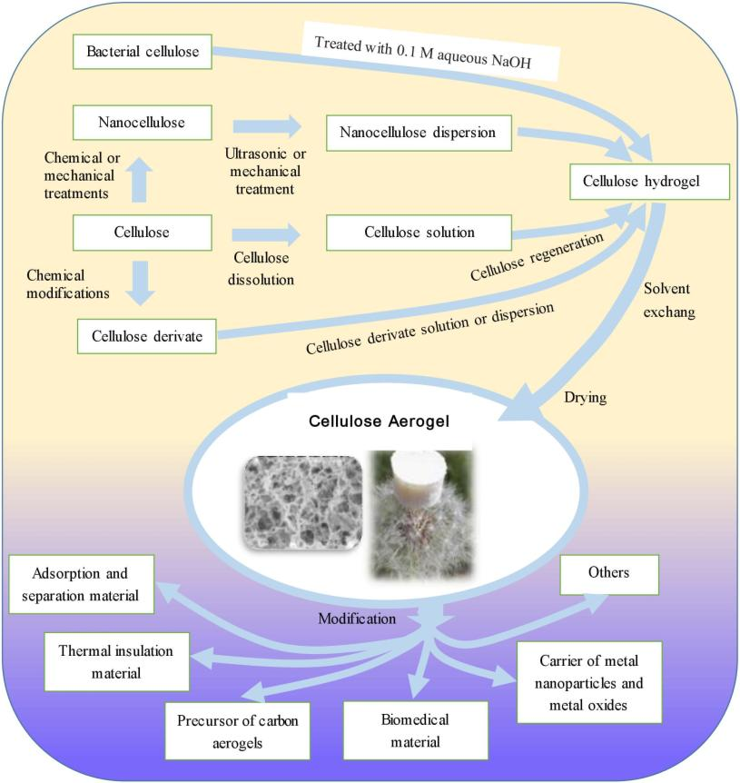

## Page 1

polymers
Review
Cellulose Aerogels: Synthesis, Applications,
and Prospects
Lin-Yu Long 1, Yun-Xuan Weng 1,2,* ID and Yu-Zhong Wang 3,*
1
School of Materials and Mechanical Engineering, Beijing Technology& Business University,
Beijing 100048, China; 15652591908@163.com
2
Beijing Key Laboratory of Quality Evaluation Technology for Hygiene and Safety of Plastics,
Beijing Technology and Business University, Beijing 100048, China
3
Center for Degradable and Flame-Retardant Polymeric Materials, College of Chemistry,
Sichuan University, Chengdu 610064, China
*
Correspondence: wyxuan@th.btbu.edu.cn (Y.-X.W.); yzwang@scu.edu.cn (Y.-Z.W.)
Received: 14 May 2018; Accepted: 2 June 2018; Published: 6 June 2018


Abstract: Due to its excellent performance, aerogel is considered to be an especially promising new
material. Cellulose is a renewable and biodegradable natural polymer. Aerogel prepared using
cellulose has the renewability, biocompatibility, and biodegradability of cellulose, while also having
other advantages, such as low density, high porosity, and a large specific surface area. Thus, it can be
applied for many purposes in the areas of adsorption and oil/water separation, thermal insulation,
and biomedical applications, as well as many other fields. There are three types of cellulose aerogels:
natural cellulose aerogels (nanocellulose aerogels and bacterial cellulose aerogels), regenerated
cellulose aerogels, and aerogels made from cellulose derivatives. In this paper, more than 200 articles
were reviewed to summarize the properties of these three types of cellulose aerogels, as well as the
technologies used in their preparation, such as the sol–gel process and gel drying. In addition, the
applications of different types of cellulose aerogels were also introduced.
Keywords: aerogels; cellulose; sol-gel process; preparation; application
1. Introduction
In today’s world, due to the increasing scarcity of oil resources and serious environmental
pollution problems caused by petroleum-based polymers, biodegradable, inexpensive, and non-toxic
natural polymer materials have attracted considerable attention from researchers, corporations,
and governments.
Cellulose is the most abundant natural polymer on Earth. In terms of structure, it is a linear
polymer formed by the linkage of D-glucose with 1,4-β-glycosidic bonds [1]. The length of its molecular
chain depends on the source and extraction process of cellulose [2]. Cellulose has many properties
that are different from those of petroleum-based polymers, such as biocompatibility, biodegradability,
thermal stability, chemical stability, and low cost [3,4]. Its industrial applications, such as in paper,
cardboard, fabric, and building materials, can be traced back thousands of years, although only the
multi-layer structure and hardness of cellulose have been exploited in these materials, and they cannot
meet the requirements for new materials in the 21st century in terms of functionality, durability,
and homogeneity. With advancing research on the physical and chemical properties of cellulose,
environmentally-friendly functional cellulose-based materials, such as cellulose fibers, cellulose films,
cellulose hydrogels, cellulose aerogels, and cellulose-based composites, have been developed [5].
In particular, cellulose aerogels have the renewability, biocompatibility, and biodegradability of
Polymers 2018, 10, 623; doi:10.3390/polym10060623
www.mdpi.com/journal/polymers

### Page Images

---

## Page 2

Polymers 2018, 10, 623
2 of 28
cellulose, while also having additional advantages such as low density, high porosity, and a large
specific surface area, making it one of the most promising materials in the 21st century.
In the early 1930s, Kistler developed an aerogel for the first time by removing the liquid in a
wet gel using supercritical drying [6,7]. However, the complicated multistage preparation process
hindered the development of aerogels. In the past few decades, different types of aerogels, such as
inorganic aerogels (i.e., SiO2, TiO2, SnO2, V2O5, and Al2O3) [8–12], synthetic polymer-based aerogels,
(i.e., resorcinol–formaldehyde, polyvinylchloride, polypropylene, and polyimide) [13–16], natural
macromolecule-based aerogels (i.e., alginate, protein, chitosan, and hemicellulose) [17–21] and carbon
aerogels (i.e., carbon, carbon nanotubes, and graphene) [22–24], have been developed due to progress
in the technologies used for the synthesis and drying of aerogels.
Aerogel is a type of special porous material with excellent physical and chemical properties,
such as low density (0.003–0.500 g·cm−3), high porosity (80~99.8%), large specific surface area
(100~1600 m2/g), and adequate surface chemical activities. Technologies with the potential to be
improved by aerogel include those used in the areas of optoelectronics, adsorption catalysis, sound
insulation, medical materials, aerospace materials, and many other fields [25–30]. However, the
mechanical properties of silica aerogels are poor [31], and the precursors of synthetic polymer-based
aerogels are toxic and non-degradable. Coupled with their high cost of preparation, these factors have
significantly restricted the application of aerogels.
Cellulose aerogel is a porous solid material. Cellulose aerogel is generally prepared in three
steps: dissolving/dispersing cellulose or cellulose derivatives, forming cellulose gel by the sol–gel
process, and drying cellulose gel while basically retaining its 3D porous structure. Figure 1 shows the
preparation process of cellulose aerogels and their applications.
 
Figure 1. Schematic of the preparation and application of cellulose aerogels.
The specific surface area (10–975 m2/g), porosity (84.0–99.9%), and density (0.0005–0.35 g·cm−3)
of cellulose aerogels are comparable to those of traditional silica aerogels and synthetic polymer
aerogels, but cellulose aerogels have a higher compressive strength (5.2 kPa–16.67 MPa) and
better biodegradability. Therefore, cellulose aerogels are a type of environmentally-friendly and
multi-functional new material that has great potential in the application of adsorption and oil/water

### Page Images

---

## Page 3

Polymers 2018, 10, 623
3 of 28
separation, heat insulation, biomedical materials, metal nanoparticle/metal oxide carriers, the
preparation of carbon aerogels, and many other areas. However, as far as we know, few reviews and
books have covered the preparation and application of cellulose aerogels, and only a few reviews
and some book chapters have mentioned cellulose aerogels [5,32–35] or a particular type of cellulose
aerogels [36,37]. Based on the recent literature regarding cellulose aerogels, this article reviewed
research progress in the preparation of cellulose aerogel and its applications.
2. Preparation of Cellulose Aerogel
Cellulose can be extracted from a wide range of different sources [33,38,39], which mainly include
plants and plant-based materials such as rice straw [40], cannabis [41], cotton [42], wood [43,44],
potato tubers [45], and bagasse [46]. The performance characteristics of cellulose, such as its molecular
chain length (degree of polymerization, DP), size, degree of crystallinity, and thermal stability [47,48],
are determined by the species of plant from which it is derived, as well as the extraction processes
used in its production, including the pretreatment, post-treatment, and disintegration processes;
therefore, the structure and performance of cellulose aerogels are influenced by the plant source from
which their cellulose is derived [49,50]. Cellulose can also be synthesized by the static culturing
of Acetobacter xylinum and other bacteria. However, although the chemical structure of cellulose
obtained from bacteria culture is the same as that of plant cellulose, the former has a higher degree
of crystallinity (>80%). In addition, bacterial cellulose does not contain impurities such as lignin
and hemicellulose, and its physical and biological characteristics are also better than those of plant
cellulose [51–53]. Furthermore, cellulose with a low molecular weight can be synthesized in vitro
through cellulase catalysis or ring-opening polymerization [54]. To the best of our knowledge, no
available literature has discussed cellulose aerogels prepared from synthetic cellulose, although
synthetic cellulose typically has high purity and a short production cycle, and its molecular weight is
easily controlled [54]. These characteristics of synthetic cellulose make it an ideal raw material for the
preparation of cellulose aerogels. It is worth mentioning that each of the glucose units in the cellulose
chain has three hydroxyl groups (two secondary alcohols located in C2 and C3, respectively, and one
primary alcohol located in C6) with high chemical reactivity. Therefore, cellulose derivatives such as
carboxymethylcellulose, cellulose ester, and cellulose ether can be obtained by grafting, sulfonation and
2,2,6,6-tetramethylpiperidine-1-oxyl (TEMPO)-mediated oxidation [55,56]. At present, there are a large
number of reviews on the structure, properties, and applications of cellulose and its derivatives [57–60].
In order to avoid redundancy, we will not repeat the contents of those reports in this article.
Cellulose and its derivatives can enhance the mechanical properties and moisture affinity of
aerogel materials [61–63]. In addition, the following advantages can be obtained by using cellulose
as the precursor for the preparation of aerogels. (1) First, the reserve of cellulose raw material
is inexhaustible and renewable; (2) Second, the cellulose chain is rich in hydroxyl groups, so no
cross-linking agent is needed in the aerogel preparation process. A stable three-dimensional (3D)
network structure can be obtained by intramolecular and intermolecular physical cross-linking of
hydrogen bonds, thus making the aerogel preparation process quite simple; (3) Third, the chemical
modification of cellulose to improve the mechanical strength and structural characteristics of cellulose
aerogels is relatively easy to accomplish.
The preparation method and structural properties of cellulose aerogels are largely dependent on
the performance of cellulose and its concentration. Therefore, cellulose aerogels are divided into three
categories based on their raw materials: natural cellulose aerogels (nanocellulose aerogels, bacterial
cellulose aerogels), regenerated cellulose aerogels, and cellulose derivate aerogels. The preparation of
these three types of aerogels and differences in their performance are discussed below.
2.1. Sol–Gel Process
In a sol, colloidal particles with diameters ranging from 1 nm to 1000 nm are dispersed in a liquid.
A gel consists of a sponge-like, three-dimensional solid network whose clusters are filled with another

---

## Page 4

Polymers 2018, 10, 623
4 of 28
substance (usually a liquid) [64]. The sol–gel reaction is a process in which the material transforms
from the liquid sol phase to the solid gel phase. The sol–gel reaction is the most critical step in the
formation of a 3D porous network structure in an aerogel. At present, almost all of the aerogels are
obtained by a wet chemical synthesis: the sol–gel method [64–66].
The cellulose solution or suspension can lead to a gel by agglomeration of polymers or by a phase
separation process when coagulative regeneration is used. The exchange of solvent with non-solvent
(regeneration) leads to a desolvation of the cellulose molecules and to the supposed reformation of
the intramolecular and intermolecular hydrogen bonds. The gelation of cellulose from, for instance,
N-methylmorpholine-N-oxide (NMMO) solutions using water as the coagulation system results from
a phase separation process that forms polymer-rich and polymer-poor phases [67]. Typically, two
mechanisms of phase separation can take place during liquid–liquid demixing of polymer solutions;
either nucleation/growth (i.e., the nuclei of one phase grows in the mixture), or spinodal decomposition
(i.e., a periodic variation of concentration leads to the final phase separation) [68].
In general, by adding chemical crosslinking agents such as epichlorohydrin (ECH) and
N,N′-methylenebisacrylamide (MBA) to the liquid sol or changing physical conditions (temperature,
pH, ultrasonic treatment, etc.), colloidal particle aggregation can be induced to form a 3D
interconnected network structure, thus converting the material into a solid gel [69,70].
Physical gels are cross-linked by physical interactions such as van der Waals forces, hydrogen
bonds, hydrophobic or electronic associations, and chain entanglements. Usually, the gelation speed of
physical gels mainly relies on the concentration of cellulose solution or dispersion and the temperature.
The stable structure and effective swelling of cellulose gels are usually achieved by the use of chemical
cross-linkers, which can form covalent bonds between polymer chains during gelation. In contrast to
the covalent bond in chemical gels, the binding energy of cross-links in physical gels is of the order of
thermal energy, so that the network junctions can be created and destroyed by the thermal motion
of polymers, thus leading to unique properties of physical gels. In addition, the degree and speed of
phase separation depend on the species or concentration of the anti-solvent and temperature.
In general, the gelation speed achieved by chemical cross-linking is faster than that achieved by
physical gelation, and a more stable gel structure can be formed in this way. In addition, electrolytes
such as calcium chloride can change the charge distribution in the solution and promote the physical
gelation process [71,72]. Graphene oxide (GO) can form hydrogen bonds with cellulose, so it can also
accelerate the process of physical gelation [73].
The formation of a gel can be determined by the following methods: (1) the gel will not flow
when the mold is tilted by 70◦or inverted; (2) the storage modulus (G′) is equal to the loss modulus
(G”) [67,74].
The sol–gel process varies based on the particular type of cellulose aerogel desired. For example,
because the molecular chains of cellulose derivatives have a reduced number of hydroxyl groups,
a cross-linking agent is generally needed to obtain a stable gel structure. Regenerated cellulose gel
is prepared by the regeneration of cellulose solutions, whereas nanocellulose gel is made from a
nanocellulose suspension.
2.1.1. Natural Cellulose Aerogels
Since there is a broad range of different hydrogen bond connection networks and changes of
molecular direction in cellulose, cellulose is associated with a variety of different crystalline structures,
which depend on the source of cellulose, extraction method, and post-treatment processes. There
are six known cellulose crystal structures: I, II, III1, III2, IV1, and IV2. The crystalline structure of
natural cellulose is cellulose I, which has two sub-forms: Iα and Iβ [75,76]. The crystalline structure of
bacterial cellulose is usually cellulose Iα, whereas plant cellulose can have both Iα and Iβ structures [3].
Table 1 summarizes the current literature related to natural cellulose aerogels, including nanocellulose
aerogels and bacterial cellulose aerogels. This table describes the drying methods, density, porosity,
specific surface area, and modulus of natural cellulose aerogels.

---

## Page 5

Polymers 2018, 10, 623
5 of 28
Table 1. Properties of natural cellulose aerogels.
Materials
Drying Method
Density (g·cm−3)
Porosity (%)
Specific Surface Area (m2·g−1)
Compression Modulus (kPa)
Ref.
Bleached cellulose fibers, CNC, TEMPO-NCF
Freeze dried
-
-
143–162
13–176
[62]
Cellulose whisker, clay, PVA
Freeze dried
0.01–0.101
-
-
18–788
[77]
CNC
Freeze dried
-
-
91.47–93.89
-
[78]
BC
ScCO2 dried
0.008
-
200
-
[79]
CNC
Freeze dried
0.02–0.03
95–98.7
20–66
200–240
[80]
NCF
Freeze dried
0.003
-
20.09
37
[81]
CNC
ScCO2 dried
-
-
260–353
-
[72]
CNC
ScCO2 dried
0.078–0.155
91–95
216–605
-
[82]
NCF
Freeze dried
0.0005–0.01
99.38–99.97
-
0.2–5.2
[83]
NCF, Kymene
Freeze dried
0.0018–0.005
-
389
-
[84]
BC, GO
Freeze dried
-
99.84–99.92
-
-
[85]
BC, silica
Freeze dried
0.007–0.229
89–99.6
129–541.1
270–16670
[86]
NCF
Freeze dried
0.02
98.6
-
-
[87]
NCF
Freeze dried
0.0053–0.03
98.2–99.7
11–15
-
[88]
NCF, SiO2
Freeze dried
0.055–0.295
85.15–96.46
11.3–700.1
1740–5930
[89]
BC
Freeze dried
0.009–0.01
-
-
-
[90]
NCF
Freeze dried
0.025
97.8
-
-
[91]
NCF
Freeze dried
0.02
-
-
-
[92]
CNC, SiO2
Ambient pressure drying
0.137–0.151
-
620–688
-
[93]
CNC, cellulose nanocrystals; TEMPO-NCF, 2,2,6,6-tetramethylpiperidine-1-oxyl (TEMPO)-mediated nanofibrillated cellulose (NCF); PVA, poly(vinyl alcohol); CNC, cellulose nanocrystals;
BC, bacterial cellulose; GO, graphene oxide.

---

## Page 6

Polymers 2018, 10, 623
6 of 28
Nanocellulose Aerogels
Nanocellulose fibers have a diameter of less than 100 nm [94,95] and are separated from pure
cellulose using mechanical [45,96–100] or chemical [101,102] approaches. According to differences
in separation methods, nanocellulose can be divided into two categories: (i) cellulose nanocrystals
(CNC) or cellulose whiskers, and (ii) cellulose nanofibers (CNF), which are also known as nanofibrillar
cellulose (NFC) or microfibrillated cellulose (MFC) [32]. Detailed information regarding differences in
the extraction methods and the average size for the various types of nanocellulose can be found in
Klemm’s review [60].
Nanocellulose aerogels are prepared by dispersing nanocellulose in water using ultrasonic or
mechanical methods, followed by subsequent drying with or without solvent exchange. In comparison
with other types of cellulose, nanocellulose has a higher degree of crystallinity and a larger aspect
ratio. Therefore, compared with other cellulose aerogels, the shrinkage rate of nanocellulose aerogels
is very low (<7%), and their modulus can be as high as 5.93 MPa [89].
The skeletal structures of nanocellulose aerogels consist of randomly connected bundled
nanofibers, thus resulting in no optical transparency and no linear elasticity, and much lower surface
areas than expected. In addition, large amounts of chemical reagents and a significant amount of
energy are required during the chemical separation of nanocellulose, thus increasing its cost and
hindering the development of nanocellulose aerogels.
Bacterial Cellulose Aerogels
Bacterial cellulose is collected from static bacterial cultures and has a natural 3D network gel
structure [51]. After the removal of bacteria and other impurities and subsequent drying, cellulose
aerogels can be obtained. Although the chemical structure of bacterial cellulose is similar to that
of plant cellulose [103], bacterial cellulose does not contain organic impurities such as lignin and
hemicellulose, and thus has certain advantages such as high purity, a high degree of polymerization,
and a high degree of crystallinity [104]. Therefore, bacterial cellulose aerogels are associated with the
highest modulus among cellulose aerogels [86], as well as high porosity and a high specific surface area.
On the other hand, the production of bacterial cellulose is challenged by a long production cycle
(30 d), low yield, and high cost, thus reducing its attraction among academic researchers.
2.1.2. Regenerated Cellulose Aerogels
Among all types of cellulose, cellulose I is not associated with the most stable crystalline structure.
In fact, it is possible to obtain cellulose II, which is more stable thermodynamically, by dissolution and
regeneration or mercerization treatment [75,76]. Regenerated cellulose aerogels are currently studied
very extensively. The preparation of regenerated cellulose aerogels has four main steps: cellulose
dissolution, cellulose regeneration, solvent exchange, and drying. Table 2 summarizes the current
literature on regenerated cellulose aerogels and describes cellulose solvents, drying methods, and the
properties of regenerated cellulose aerogels.

---

## Page 7

Polymers 2018, 10, 623
7 of 28
Table 2. Properties of regenerated cellulose aerogels.
Materials
Solvent
Drying Method
Density (g·cm−3)
Porosity (%)
Specific Surface Area (m2·g−1)
Compression Modulus (kPa)
Ref.
Wood pulp
ILs
scCO2 dried
0.058
94–96
315
-
[4]
Cellulose powder/GO
NaOH/thiourea
Freeze dried
-
-
-
870–1130
[73]
MCC/lignin
8% NaOH
scCO2 dried
0.1–0.135
-
200
-
[74]
MCC
8% NaOH
scCO2 dried
0.06–0.3
91–96
200–300
-
[67]
Cotton linter
NMMO
Ca(SCN)2/LiCl
TBAF/DMSO
[EMIm][OAc]/DMSO
scCO2 dried
0.03–0.067
95.5–98.1
190–328
22–240
[105]
Wood pulp
NMMO
scCO2 dried
0.014–0.5
-
50–420
-
[106]
Cellulose powder
Ca(SCN)2
scCO2 dried
0.009–0.137
91–99
120–230
1400–16200
[107]
Cellulose powder
Ca(SCN)2
Freeze dried
-
-
160–190
-
[108]
Cotton linter
NaOH/thiourea
Freeze dried
0.2–0.4
<84.88
-
5700–8200
[109]
Paper pulp
Alkali/urea
scCO2 dried
0.03–0.14
89.7–97
291–485
-
[110]
MCC
ZnCl2
scCO2 dried
0.082–0.245
212–864
800
[111]
Wood
ILs
scCO2 dried
0.06–0.2
-
150–200
1000–10000
[112]
MCC
LiCl/DMAc
Freeze dried
0.12–0.35
-
-
-
[113]
Bagasse
LiCl/DMSO
Freeze dried
0.088–0.236
84.4–94.2
119–185
-
[114]
MCC
LiCl/DMSO
Freeze dried
0.068–0.137
-
185–213
-
[115]
Cellulose fibers
Ca(SCN)2
Freeze dried or scCO2 dried
0.01–0.06
-
80–250
2000
[116]
Wood
ILs
scCO2 dried
0.141–0.157
97
-
-
[117]
Wood
ILs
scCO2 dried
0.095–0.143
-
2–80.7
-
[118]
Cellulose
NMMO
scCO2 dried
0.05–0.26
-
172–284
-
[119]
Paper pulp
LiOH/urea
scCO2 dried
0.12–0.17
95
363–406
-
[120]
MCC
ILs
Freeze dried
-
-
-
-
[121]
Cotton linter
NaOH/urea
Freeze dried
0.027–0.056
96.3–98.2
-
-
[122]
Waste newspaper
ILs
Freeze dried
0.017–0.029
98.2–98.9
296–412
-
[123]
Recycled cellulose
NaOH/urea
Freeze dried
0.04
94.8
-
11
[124]
Waste newspaper
ILs
Freeze dried
0.02–0.029
96.8
-
[125]
Recycled cellulose
NaOH/urea
Freeze dried
0.04
97.3
-
-
[126]
Cotton linter
NaOH/urea
Freeze dried
0.0196
98.7
-
-
[127]
Wood pulp
ILs
Freeze dried
<0.034
>98.5
-
-
[128]
Wheat straw
NaOH/PEG
Freeze dried
0.04
-
36.46–101.13
-
[129]
Plant
NaOH/PEG
Freeze dried
0.053–0.092
-
63–152.5
-
[130]
Cellulose/SiO2
Alkali/urea
scCO2 dried
0.14–0.58
70–92
356–652
7900–12000
[131]
Cellulose/SiO2
ILs/DMSO
scCO2 dried
0.125–0.225
87–94
290–975
-
[132]
Cellulose/SiO2
Ca(SCN)2
scCO2 dried
0.041–0.163
-
-
1500–4200
[133]
Cellulose: lignin, xylan
ILs
scCO2 dried
0.025–0.114
-
108–539
-
[134]
GO, graphene oxide; MCC, microcrystalline cellulose; ILs, ionic liquids; NMMO, N-methylmorpholine-N-oxide; TBAF, tetrabutylammonium fluoride; DMSO, dimethyl sulfoxide;
[EMIm][OAc], 1-Ethyl-3-methyl-1Himidazolium acetate; DMAc, dimethylacetamide; PEG, polyethylene glycol.

---

## Page 8

Polymers 2018, 10, 623
8 of 28
Due to the complex intramolecular and intermolecular hydrogen bond network in cellulose, it
is not soluble in water and other typical organic solvents such as ethanol [135]. On the other hand,
cellulose macromolecules are amphiphilic. Therefore, cellulose solvents must eliminate hydrogen bond
networks and hydrophobic interactions [136]. Conventional cellulose solvents such as carbon disulfide
are environmental pollutants, but environmentally-friendly cellulose solvents such as alkali (NaOH or
LiOH) solution systems (alkali/water [137], alkali/water/urea or thiourea, and polyethylene glycol
(PEG) [138–140]), LiCl/DMSO [141,142], LiCl/dimethylacetamide (DMAc) [143,144], and ionic liquids
(ILs) [145] are currently used in the preparation of regenerated cellulose aerogels (see Table 2). Cellulose
solvent systems can affect the performance of regenerated cellulose [146]. Therefore, aerogels prepared
using different cellulose solvent systems may have different properties [105], and the selection of
cellulose solvent systems during the preparation of regenerated cellulose aerogels is very important.
The preparation of regenerated cellulose aerogels requires dissolution–regeneration and multiple
steps of solvent exchange, which are time-consuming. The rate of shrinkage of regenerated cellulose
aerogels is generally >30%. Thus, regenerated cellulose aerogels are denser than natural cellulose
aerogels and have a larger mean pore size. On the other hand, since the production process of
regenerated cellulose aerogels is simple and low-cost, it has been studied most extensively.
2.1.3. Cellulose Derivative Aerogels
Chemical modifications that can change the physical and chemical properties of cellulose
are an important way to functionalize cellulose aerogels.
Some cellulose derivatives are
soluble in water and typical organic solvents. For example, carboxymethylcellulose (CMC) and
hydroxypropyl methylcellulose (HPMC) are soluble in water, triacetyl cellulose (TAC) is soluble
in dioxane/isopropanol, ethyl cellulose (EC) is soluble in dichloromethane, and cellulose acetate
(CA) is soluble in acetone. Since acetone and some other organic solvents are soluble in ScCO2, the
time-consuming solvent exchange process can be omitted [147], thus improving the efficiency of
aerogel synthesis. On the other hand, because the molecular chains of cellulose derivatives have a
reduced number of hydroxyl groups, a cross-linking agent is generally required during the gelation of
the solution [148,149]. Due to the uneven distribution of the substituent groups, the effect of different
degrees of substitution of cellulose derivatives on the performance of cellulose aerogels remains
unclear. With respect to published research results, the degree of substitution has shown no significant
effect on the density or compressive modulus of cellulose aerogels [150,151], but a high degree of
substitution can reduce the hygroscopicity [151].
The process of preparing nanocellulose derivative aerogels is the same as that of nanocellulose
aerogels (Section “Nanocellulose Aerogels”). At present, the most common types of nanocellulose
derivative aerogels are nanocellulose aerogels oxidized by 2,2,6,6-tetramethylpiperidine-1-oxyl
radicals (TEMPO) and nanocellulose aerogels with functionalized surfaces. TEMPO can selectively
oxidize the primary alcohols on the molecular chain of cellulose and introduce negatively
charged groups (such as carboxyl groups) into cellulose fibers to increase the separation of
nanocellulose and produce more homogeneous suspensions [32].
Therefore, compared with
nanocellulose aerogels, TEMPO–nanocellulose aerogels have a higher specific surface area and greater
density. Surface-functionalized nanocellulose includes maleic acid-grafted CNF (CNF-MA) [152],
bifunctional (aldehyde and carboxyl) nanocellulose (BMCC), and cross-linked carboxymethyl chitosan
(CMCT) [153], as shown in Table 3. Table 3 summarizes the literature related to cellulose derivate
aerogels and nanocellulose derivate aerogels, and lists their respective properties.

---

## Page 9

Polymers 2018, 10, 623
9 of 28
Table 3. Properties of cellulose derivative aerogels.
Materials
Solvent
Drying
Method
Density
(g·cm−3)
Porosity (%)
Specific Surface
Area (m2·g−1)
Compression
Modulus (kPa)
Ref.
Cellulose derivative aerogels
TAC
Dioxane/Isopropanol
scCO2 dried
0.005–0.05
96.1–99.6
229–958
-
[147]
CA
Acetone
scCO2 dried
0.25–0.85
-
140–250
-
[148]
CMC
Water
Freeze dried
-
-
-
-
[149]
CMC
Water
Freeze dried
0.062–0.12
-
-
830–3442
[150]
HPMC
Water
Freeze dried
0.018–0.023
-
-
111–133
[151]
CA
Acetone
scCO2 dried
0.16
-
-
-
[154]
EC
Dichloromethane
Freeze dried
-
-
-
-
[155]
CMC/CNF
Water
Freeze dried
0.05–0.109
93.19–96.84
-
1000–8700
[156]
Nanocellulose derivative aerogels
CNF-MA
-
Freeze dried
0.0112–0.0315
-
19.5
120–411
[152]
BMCC/CMCT
-
Freeze dried
-
98.8
-
-
[153]
TEMPO-CNF
-
Freeze dried
0.008–0.187
98.8–99.5
12.72–117.8
-
[157]
TEMPO-CNF
-
Freeze dried
0.014–0.105
92.8–99
153–284
34.9–2800
[158]
TEMPO-CNF
-
Freeze dried
-
-
94–319
-
[159]
TEMPO-CNF
-
Freeze dried
0.0069–0.0083
123–209
94–209
[160]
TEMPO-CNF/PVA
-
Freeze dried
0.0047–0.0165
98.7–99.7
35.1–117
-
[161]
TEMPO-CNF
-
Freeze dried
0.0017–0.0081
99.5–99.9
10.9
54.5–25.3
[162]
Hydrophobic CNF
-
Freeze dried
0.0232
98.5
18.4
-
[163]
TEMPO-CNF/Eumelanin
-
Freeze dried
0.04
97.5
-
-
[164]
TAC, triacetyl cellulose;
CA, cellulose acetate;
CMC, carboxymethylcellulose;
HPMC, hydroxypropyl
methylcellulose; EC, ethyl cellulose; CNF, cellulose nanofibers; CNF-MA, maleic acid-grafted CNF; BMCC,
bifunctional (aldehyde and carboxyl) nanocellulose; CMCT, cross-linked carboxymethyl chitosan; TEMPO,
2,2,6,6-tetramethylpiperidine-1-oxyl; PVA, poly(vinyl alcohol).
2.2. Gel Drying
Drying is the most critical step in the preparation of aerogels. The morphology of cellulose
aerogels strongly depends on the method of drying. When conventional drying methods are used, the
capillary pressure induced by the bending of the air–liquid interface can cause the gel pore structure to
collapse and crack. Therefore, supercritical drying (using i.e., alcohol, acetone, or CO2) and vacuum
freeze-drying are generally utilized in current methods of cellulose aerogel preparation. Freeze-drying
is a sublimation of the solid, usually frozen water, from the pores of a wet precursor. In supercritical
(sc) conditions, the liquid/gas surface tension is zero, because there is no longer liquid/gas meniscus.
Aerogels prepared by drying with scCO2 usually present a cauliflower-like arrangement of cellulose:
an agglomeration of small shaggy beads. However, freeze-drying leads to a sheet-like cellulose network
with large and interconnected pores that are several micrometers in diameter due to ice growth during
water freezing [165].
2.2.1. Supercritical Carbon Dioxide Drying
Since CO2 has a suitable critical point (304 K, 7.4 MPa) and the advantages of low cost and high
safety, it is a kind of fluid that is most commonly used for the process of drying cellulose aerogels.
Supercritical drying involves a two-way mass transfer of scCO2 and gel solvent to and from the
pores of the wet gel [17]. Firstly, the drying is predominantly influenced by a high dissolution of
scCO2 in the liquid gel solvent, leading to an expanded liquid and the spillage of the excess liquid
volume out of the gel network. Secondly, the CO2 content in the pore gel liquid increases with time
until supercritical conditions are attained for the fluid mixture in the pores, without any previous
intermediate vapor–liquid transition. Finally, the presence of supercritical fluid mixtures in the
pores with no liquid phases leads to the absence of surface tension, thus avoiding the pore collapse
phenomenon in the gel structure (i.e., changes in the macroscopic level) during solvent elimination [17].
The water that has high surface tension may damage the fragile and highly porous structure of
the cellulose network, which is initially formed after the drying process. The reasons why it happens
are the formation of inward forces alongside the capillary walls adjacent to the solvent menisci and
arise from differences of the specific energies of the solid–liquid and liquid–gas phase transitions. So,
it is necessary to completely replace the water that has high surface tension [79]. For example, when

---

## Page 10

Polymers 2018, 10, 623
10 of 28
regenerated cellulose aerogels are prepared in an NMMO solvent system, the cellulose gel should be
re-primed with water, followed by ethanol and acetone exchange or acetone exchange alone [105,118].
When an ionic liquid is used as the solvent system, the cellulose gel must be re-primed with water
first, followed by multiple acetone exchange [166]. Natural cellulose aerogels are generally subject to
ethanol exchange [71,82].
The residue of cellulose solvents can reduce the drying performance [106]. In addition, the surface
tension of different liquids and shaking during the process of re-priming and solvent exchange may
damage the gel structure of cellulose [106,111]. The solvent exchange process is very slow, and
generally takes 2–3 d. In summary, supercritical drying by scCO2 can help to avoid damage to the
gel 3D network caused by capillary pressure inside the pores, which allows the production of aerogel
materials with a more uniform structure. However, this process involves expensive equipment, because
it needs a high-pressure vessel.
2.2.2. Vacuum Freeze-Drying
Vacuum freeze-drying is a simple and environment-friendly drying approach to produce cellulose
aerogels. During the freeze-drying process, the gel is first frozen at a temperature below the freezing
point of the liquid medium (usually water), after which the liquid is mainly eliminated by sublimation,
which is a key factor in preventing structural collapse and limiting shrinkage. Therefore, liquid
crystallization and growth behavior, which depend on the cooling rate and temperature, play an
important role in the pore structure (pore morphology and pore distribution) of porous aerogels.
The rate of sublimation is also influenced by many factors (i.e., the concentration of cellulose, the size
and shape of gel, temperature), and is often slow.
Aerogels made from nanocellulose and its derivatives are generally freeze-dried, but the
self-agglomeration of nanocellulose can lower their specific surface area. tert-butyl alcohol has low
interfacial tension and contains only one hydroxyl group that can form a hydrogen bond with the
hydroxyl or carboxyl group on the surface of nanocellulose and its derivatives. At the same time,
the steric hindrance induced by a large number of butyl groups can prevent the agglomeration of
nanocellulose. Therefore, the use of tert-butyl alcohol in solvent exchange can better protect the gel
structure of nanocellulose and its derivatives as compared to water, thus more effectively preventing
the cellulose aerogel structure from collapsing [72,108,157,167].
When thermal conductivity is increased using liquid nitrogen or liquid propane, cellulose gel can
be rapidly cooled, which further inhibits the agglomeration of cellulose and the growth of ice crystal,
thus increasing aerogel porosity. Zhang et al. studied three cooling rates provided by liquid nitrogen
(−196 ◦C, 30 min), an ultralow temperature freezer (−80 ◦C, 12 h), and a conventional refrigerator
(−20 ◦C, 24 h). They found that liquid nitrogen induced the rapid formation of ice crystals, which
effectively inhibited the self-agglomeration of cellulose and produced a more uniform and smooth
surface structure [83]. Anti-freezing agents [168] and spray freeze-drying techniques [84,169] also
rely on an accelerated freezing rate to produce aerogels with a uniform structure. However, there are
similar freezing rate and local temperature gradients ahead of the moving solid–liquid interface, such
as when freeze-drying thin samples in a fridge while also cooling a big sample.
The drying technology that is used to produce a particular type of cellulose aerogel greatly
influences its specific surface area and pore size distribution [71,119]. Usually, due to the growth of
ice crystals and the high interfacial tension of water, freeze-drying produces cracks in the aerogel
material. Other drawbacks of freeze-drying include its long processing times and high electric energy
consumption. On the other hand, drying by scCO2 can better protect the gel structure of cellulose
and produce aerogels with a low rate of shrinkage, a smaller pore size, and a higher specific surface
area [82,110,116,170].

---

## Page 11

Polymers 2018, 10, 623
11 of 28
3. Applications of Cellulose-Based Aerogels
Due to cellulose’s high chemical reactivity, the large number of different derivatives with different
functions, flexible preparation process, and numerous methods of modification, cellulose aerogels are
generally multi-functional. There are three main ways to modify cellulose aerogels:
(1)
Add other components in the solution/suspension of cellulose. For example, Gawryla et al.
added a montmorillonite suspension dropwise into a suspension of nanocellulose and subjected
the mixture to freeze-drying after it was mixed evenly. Using this method, they obtained an
aerogel with a nanoscale wattle and daub structure and high modulus [77].
(2)
Coat or apply other substances, such as SiO2, onto the surface of cellulose gel using a sol–gel
method (see Section 3.2).
(3)
There are many techniques available to achieve the surface modification of cellulose aerogels,
including modification by a silane coupling agent and atomic layer deposition.
Cellulose aerogels are ultra-light 3D porous materials. Currently, they are mainly used in
adsorption and separation, insulation, and biomedical applications.
They are also used in the
preparation of carbon aerogels and to carry metal nanoparticles/metal oxides.
3.1. Adsorption and Separation Materials
Frequent oil spill incidents and the discharge of oil-containing industrial wastewater during
crude oil extraction and transport can cause significant economic losses and damage to aquatic
ecological environments. Traditional adsorbent materials, including polypropylene (PP), zeolite,
and activated carbon, are often used in the treatment of these accidents, but they suffer from
disadvantages such as poor reusability, insufficiently selective oil adsorption capacity, and a lack
of biodegradability [35,171–173].
Although natural adsorption materials made of kapok fiber,
bagasse, raw cotton fiber, and coconut shell [174–177] have appropriate adsorption properties and
biodegradability, they also have shortcomings such as a low selective adsorption capacity, weak
buoyancy, and poor water resistance [35,173,178].
Therefore, cellulose aerogels, with their porous structure, large specific surface area, and light
density are highly adsorptive for water, oil, and organic solvents [121,179,180]. The adsorption capacity
of cellulose aerogels is one order of magnitude higher than that of natural adsorbents and several
times that of commercial PP adsorbents. In addition, cellulose aerogels can adsorb dyes such as Congo
red and methylene blue from water [151,153,164,181,182], and are biodegradable. Therefore, cellulose
aerogels have received increasing attention in recent years.
The oil adsorption performance of cellulose aerogels is related to the density, viscosity, and
surface tension of oily liquids, and is also dependent on capillary effects, van der Waals forces, and
hydrophobic interactions, as well as density and morphological characteristics of cellulose aerogels
such as their surface wettability, total pore volume, and pore structure. The adsorption performance of
cellulose aerogels is affected by liquid viscosity in two ways. First, a liquid of lower viscosity tends to
penetrate into the porous network of aerogels, but this property limits the adhesion between the liquid
and the pore walls [125,126,183]. Cellulose aerogels with low density, high porosity, and a large pore
volume tend to have a large internal free volume and high adsorption capacity [127,128,183].
On the other hand, there are a large number of hydroxyl groups on the surface of cellulose
aerogels that are amphiphilic and associated with poor oil/water selective adsorption capacity [85,162].
By increasing the surface roughness of cellulose aerogels or introducing substances with low surface
energy, the hydrophobicity and lipophilicity of cellulose aerogels can be improved, thus significantly
enhancing the oil/water selective adsorption capacity of the aerogels. The surface modification
methods and post-modification adsorption performance of different cellulose aerogels are shown in
Table 4.

---

## Page 12

Polymers 2018, 10, 623
12 of 28
Table 4. Hydrophobic treatments and absorption capacity of cellulose aerogels. GO: graphene oxide.
Classification
Hydrophobic Treatment
WCA (◦)
Porosity (%)
Specific Surface
Area (m2/g)
Absorption
Capacity (g/g)
Ref.
Natural cellulose aerogel
CVD of TMCS
135
-
20.09
52
[81]
GO/natural cellulose aerogel
-
-
99.86, 99.84
-
135–150
[85]
Regenerated cellulose aerogel
CVD of MTCS
141
98.0
-.
40.16–59.32
[122]
Regenerated cellulose aerogel
CVD of TMCS
135
98.2
405
26–45
[123]
Regenerated cellulose aerogel
Water repellent spry or
CVD of MTMS
130.7, 135.2
94.8
-
18–20
[124]
Regenerated cellulose aerogel
CVD of MTCS
136
96.8
-
12–22
[125]
Regenerated cellulose aerogel
CVD of MTMS
145
97.3
-
18.4–20.5
[126]
Regenerated cellulose aerogel
Cold plasma technology
150
98.7
-
34.5
[127]
Regenerated cellulose aerogel
Plasma treatment and
subsequent silane modification
>156
>98.5
-
14–42
[128]
Regenerated cellulose aerogel
CVD of TMCS
138
-
36.46–101
16.8–18.7
[129]
Regenerated cellulose aerogel
CVD of MTCS
-
-
63.3–152.5
13.5–20.6
[130]
Cellulose derivate aerogel
Cross-linking with diisocyanate
-
-
216–228
42.4–54.47
[160]
Cellulose derivate aerogel
microsphere
CVD of MTCS
-
98.7–99.7
35.1–117
54–140
[161]
Cellulose derivate aerogel
Vapor deposition with
triethoxyl(octyl) silane
-
99.5–99.9
10.9
139–375
[162]
Cellulose derivate aerogel
Polymerization with a monomer
dropwise-feeding method
-
98.5
18.4
29.9–46.6
[163]
Natural cellulose aerogel
CVD of MTMS
150.8–153.5
97.2–99.4
-
40.4–95
[183]
Natural cellulose aerogel
CVD of MTMS
142.8
99.43–99.66
-
40–100
[184]
GO/natural cellulose aerogel
CVD of DDTS
150.3
-
47.3
80–197
[185]
CVD, chemical vapor deposition;
TMCS, trimethylchlorosilane;
MTMS, methyltrimethoxysilane;
MTCS,
methyltrichlorosilane; DDTS, n-dodecyltriethoxysilane.
As shown in Table 4, commonly used methods for hydrophobizing cellulose aerogels include
chemical vapor deposition (CVD) using coupling agents such as trimethylchlorosilane (TMCS),
methyltrimethoxysilane (MTMS), methyltrichlorosilane (MTCS), and octadecyltrimethoxysilane
(OTMS), n-dodecyltriethoxysilane (DDTS), atomic layer deposition, cold plasma treatment,
hydrophobic modification using isocyanate cross-linking [160], surface fluorination [87,88] or
esterification [186,187], and alkyl ketene dimer (AKD) modification [188].
After hydrophobic
modification of cellulose aerogels, their water contact angle (WCA) is usually >135◦, and their
adsorption performance regarding oil and organic solvents is generally in the range of 10–400 g·g−1;
these characteristics indicate a performance equivalent to that of carbon aerogels and polymer-based
aerogels [189,190].
Oil and water separation can also be achieved by creating a hydrophilic rough surface on the
aerogels. Peng et al. have prepared a superhydrophilic cellulose aerogel by mixing cellulose and
chitosan solutions. After immersing the aerogel into water, its rough surface formed a thin layer of
water film, and thus possessed an ultraoleophobic capability underwater. The aerogel was used to
effectively separate oil–water mixtures through filtration [191], although its reusability was limited.
Modification by a silane coupling agent is currently the most important way to hydrophobically
modify cellulose aerogels. Aerogels modified in this way have excellent selective oil adsorption
capacity. However, the cost of the silane coupling agent is high. In addition, the porous structure of
cellulose aerogels is fragile. After the adsorption–desorption cycle, the internal structure of the cellulose
aerogel is damaged, which decreases its adsorption performance, thus limiting its actual applications.
3.2. Thermal Insulation Material
Thermal conduction by aerogels is generally categorized as solid-state thermal conduction,
gas-phase thermal conduction in an open pore structure, and radiation thermal conduction. According
to the Knudsen effect, when the pore size in a porous material is close to the average free path (70 nm
when ventilated) of the gas, the thermal conductivity of the material will be reduced because the pores
will restrict gas movement and inhibit convection.

---

## Page 13

Polymers 2018, 10, 623
13 of 28
The thermal conductivity of mesoporous cellulose aerogels is mainly determined by their solid
state thermal conduction and gas phase thermal conduction, which are in turn closely related to
the aerogel density (determined by the initial concentration of cellulose), pore size distribution,
and surface structures.
Table 5 describes the density, pore size, and thermal conductivity of
cellulose aerogels and corresponding measurement techniques. As shown in Table 5 [192], the
thermal conductivity of cellulose aerogels is between 0.018–0.075 W·m−1·K−1 and is typically less
than 0.045 W·m−1·K−1, which is between that of modified silica aerogels (0.041 W·m−1·K−1) [31]
and common commercial insulating materials such as polyurethane foams (0.026 W·m−1·K−1),
mineral wool (0.03–0.05 W·m−1·K−1), glass fiber (0.04 W·m−1·K−1), and polypropylene foam
(0.030 W·m−1·K−1) [64,193–195].
Table 5. Thermal conductivity of cellulose aerogels.
Classification
Density
(g·cm−3)
Pore Size (nm)
Technique
Conductivity
(W·m−1·K−1)
Ref.
Natural cellulose aerogel
-
5–13
Hot filament
0.023–0.028
[62]
Natural cellulose aerogel, SiO2
0.007–0.229
-
Transient plate method
0.0295–0.0369
[86]
Natural cellulose aerogel, SiO2
0.055–0.295
-
Double plate method
0.0226
[87]
Regenerated cellulose aerogel
0.009–0.137
10–100
Transient plane source
0.04–0.075
[107]
Regenerated cellulose aerogel
0.2–0.4
-
Conductometer
0.029–0.046
[109]
Regenerated cellulose aerogel
0.095–0.143
10.5–28.9
Model digital thermal
diffusivity instrument
0.03–0.137
[118]
Regenerated cellulose aerogel
0.04
-
Transient plate method
0.029, 0.032
[124]
Regenerated cellulose aerogel, SiO2
0.14–0.58
3–20
-
0.025–0.045
[131]
Regenerated cellulose aerogel, SiO2
0.125–0.225
-
Steady state method
0.026–0.033
[132]
Regenerated cellulose aerogel, SiO2
0.041–0.103
-
HotDisk™
0.04–0.052
[133]
Cellulose derivate aerogel
0.25–0.85
13–25
Hot-wire method
0.029
[148]
Cellulose derivate aerogel
0.05–0.109
5000–40,000
Transient plane source method
0.040–0.0532
[156]
Cellulose derivate aerogel
0.012–0.033
10–100
Hot strip
0.018–0.028
[169]
Natural cellulose aerogel, SiO2
0.007–0.201
-
Transient plate method
0.029–0.037
[192]
In the porous structure of regenerated cellulose aerogels, the proportion of large pores is higher
than that of other types of cellulose aerogels. Since large pores enhance gas transmission, they also
increase thermal conductivity. Karakagli et al. prepared bulk cellulose aerogels with a pore size
of 10–100 nm by dissolving microcrystalline cellulose (MCC) in an aqueous calcium thiocyanate
solution and subjecting the mixture to ethanol exchange and supercritical drying.
Due to the
presence of large pores in the gel structure and test errors, its thermal conductivity was as high as
0.04 W·m−1·K−1 [107]. They also found that the thermal conductivity of the aerogel was proportional
to the MCC concentration [107], which was consistent with the findings of the Seantier group [169].
However, Lu et al. argued that the structure of 3% cellulose aerogels was better than the structure of 2%
cellulose aerogels. Since the 3% cellulose aerogels had lower density and higher porosity in comparison
with the 2% cellulose aerogels, their thermal conductivity (0.029 W·m−1·K−1) was lower [109]. The
Seantier group has reduced some of the large pores (120–300 µm) in bleached cellulose fibers (BCF) to
the nanoscale by adding CNC, thereby reducing gas phase thermal conductivity. The overall thermal
conductivity of the modified aerogel was decreased from 0.028 W·m−1·K−1 to 0.023 W·m−1·K−1 [62].
In addition, silanization can also reduce the average pore size in cellulose aerogels and thus decrease
their thermal conductivity [124,196].
SiO2 aerogels are a common type of ultra-adiabatic material, but their poor mechanical strength
greatly limits their practical applications. Cellulose–SiO2 aerogels can be synthesized using the sol–gel
method, direct embedment, or a forced flow impregnation process. These methods can be used to
produce ultra-adiabatic aerogels with good mechanical strength, low cost, and low hydrophilicity. SiO2
can be embedded in the large pores of cellulose aerogels to reduce their average pore size and enhance
the Knudsen effect, thereby reducing the gas phase thermal conductivity [132,133]. In addition, Fu et al.
found that the silica particles attached to the nanocellulosic scaffold could promote the thermal stability
of the cellulose matrix [197]. GO can also enhance the thermal stabilities of cellulose, because of the
formation of an extensive H-bonded network between the GO and the cellulose [198]. However, as

---

## Page 14

Polymers 2018, 10, 623
14 of 28
the content of SiO2 increases, the specific surface area and density of the aerogels increase, and the
aerogels may even rupture. In addition, their solid-state thermal conductivity also increases, thus
increasing the thermal conductivity of the composite aerogels [86,89,131,192].
Cellulose aerogels have low thermal conductivity and relatively strong mechanical strength,
which suggests that they have great potential in thermal insulation applications. However, because
the pore size and density of cellulose aerogels are larger than that of other conventional aerogels such
as silica aerogel and resorcinol/formaldehyde (RF) carbon aerogel, and the cellulose matrix also has
a larger thermal conductivity, cellulose aerogels have a higher thermal conductivity compared with
conventional aerogels. Additionally, the maximum working temperature of cellulose aerogels is less
than 300 ◦C, which limits the development of thermal insulation applications.
3.3. Precursor of Carbon Aerogels
Porous carbon aerogels are often used in adsorption, capacitance deionization, catalysis, and
supercapacitors due to their large specific surface area, low density, high conductivity, excellent
stability, low cost, and long service life [199,200].
The preparation of traditional carbon aerogel involves pyrolyzing the high carbon-content
template (resorcinol/formaldehyde aerogel) under high temperature (normally 800~1200 ◦C), ambient
pressure, and an inert atmosphere [201]. The specific surface area of carbon aerogels prepared by
resorcinol/formaldehyde (RF) is 706 m2/g, while their average pore size is 10.9 nm, and their specific
capacitance is 81 F/g [202] in a 1-M H2SO4 electrolyte solution with a scanning rate of 10 mV/s.
Recently, the use of renewable biomass resources, such as starch, alginate, chitosan, and cellulose
as raw materials in the preparation of carbon aerogels has attracted great interest [203–205]. Porous
cellulose aerogels prepared using cellulose may be a candidate for making carbon aerogels.
Carbon aerogels are obtained through the carbonization of cellulose aerogels in a nitrogen or
argon atmosphere by heating the aerogels to 500–1000 ◦C at a specific rate. The performance of
carbon aerogels is related to the performance of cellulose aerogels, the rate of heating, gas atmosphere,
carbonization temperature, and post-processing treatment. Table 6 [206–214] summarizes the current
literature on carbon aerogels derived from cellulose aerogels, and shows the specific surface area,
average pore size, specific capacitance, and adsorption performance of carbon aerogels. As shown
in Table 6, the specific surface area and average pore size of carbon aerogels derived from cellulose
aerogels are 100–1364 m2·g−1 and 2–100 nm, respectively, which are values comparable to those of
RF–carbon aerogels. Therefore, carbon aerogels derived from cellulose aerogels also have excellent
performance in terms of hydrophobicity, flame retardancy, high conductivity, and specific capacity, as
well as strong adsorption capacity [90–92,203,215,216].
The specific surface area of carbon aerogels obtained by the direct pyrolysis of bamboo fibers
is only 26.2 m2/g, and their maximum adsorption capacity for oil and organic solvents is only
51 g/g [204]. Therefore, the unique high 3D porosity and large specific surface area of the cellulose
aerogel structure are key considerations in the quest to obtain carbon aerogels with good performance.
The carbonization of cellulose aerogel causes significant decreases in the volume and mass, because
of the removal of O and H atoms [217]. In addition, the activation process can increase the specific
surface area of carbon aerogels and improve their pore structure. At present, carbon aerogels derived
from cellulose aerogels can be activated in two ways. In one procedure, carbon aerogels are mixed
with KOH at a 1:3 mass ratio, followed by 1–3 h of activation after heating the aerogels to 900 ◦C at
a rate of 10 ◦C/min in a nitrogen atmosphere [149]. In the other procedure, cellulose aerogels are
pyrolyzed in a CO2 atmosphere, in which the C in the aerogels is oxidized to CO by the presence of
CO2, while the C=C and oxygen groups on the surface of lignocellulose are eliminated to enhance the
surface chemical stability of the final carbon aerogels [154].

---

## Page 15

Polymers 2018, 10, 623
15 of 28
Table 6. Properties of carbon aerogels derived from cellulose aerogels.
Cellulose Aerogel Precursor
Specific Surface
Area (m2·g−1)
Mean Pore
Diameter (nm)
Specific
Capacitance (F/g)
Adsorption Capacity
Ref.
Natural cellulose aerogel
-
10–20
-
Organic solvents and oils: 106 to
312 times its own weight
[90]
Natural cellulose aerogel
145–521
10–20
Oil: 55.8–86.6 g/g
[91]
Natural cellulose aerogel
-
-
-
Oil: 67.26–94.18
[92]
Cellulose derivate aerogel
230–428
2.81–4.25
92.34–152.6
Methylene blue: 249.6 mg/g
Malachite green: 245.3 mg/g
[149]
Cellulose derivate aerogel
400–450
-
-
-
[154]
Regenerated cellulose aerogel
113
7.2
-
-
[203]
Regenerated cellulose aerogel
859–1364
-
328
CO2: 3.01–3.42 mmol/g
[206]
Regenerated cellulose aerogel
496–615
2–3
225
CO2: 4.99 mmol/g
[207]
GO/Regenerated cellulose aerogel
-
-
-
-
[208]
Regenerated cellulose aerogel
-
-
-
-
[209]
Regenerated cellulose aerogel
450–853
20–100
129–193
-
[210]
Regenerated cellulose aerogel
170.05
3.44–4.52
73.18–294.01
-
[211]
GO/Natural cellulose aerogel
110.4
-
-
Organic solvents and oils:
393–1002 g/g
[212]
Cellulose derivate aerogel
742.34
2–75
-
-
[213]
Cellulose derivate aerogel
185
2–259
-
Organic solvents and oil: 20 g/g
[214]
Carbon aerogels have an excellent ability to capture CO2. Under a carbon dioxide atmosphere,
Zhuo et al. have carbonized activated cellulose aerogels to develop a layered and porous carbon
aerogel with an excellent CO2 absorption capacity (3.42 nmol/g) [206]. In order to improve the
absorption capacity of CO2, Hu et al. have carbonized cellulose aerogels under a NH3 atmosphere and
embedded CO2-philic nitrogen-containing groups in carbon aerogels to increase their CO2 absorption
capacity to 4.99 nmol/g [207]. In another method to prepare N-doped carbon aerogels, urea or other
nitrogen-containing substances are added into cellulose aerogels, which then undergo pyrolysis in an
inert gas to reach a nitrogen content as high as 7.64% [210].
The preparation of cellulose aerogels is a flexible process that provides many convenient
opportunities for functionalizing carbon aerogels.
For example, the Li group at Northeast
Forestry University used cellulose aerogels as precursors to synthesize GO/carbon aerogels and
goethite (α-FeOOH)/carbon aerogels with excellent performance in terms of protection against
electromagnetic interference. In addition, they have also synthesized NiO/carbon aerogels with
excellent electrochemical performance [208,209,211]. The Chen group subjected GO/bacterial cellulose
(BC) aerogels to carbonization to develop a carbon aerogel with an adsorption capacity as high as
1002 g/g [212].
Cellulose aerogels provide carbon aerogels with a rich carbon source, a large specific surface
area, and mesoporous structures. However, because the porous structure of the physically linked
network is fragile during the high temperature pyrolysis process, the modification of cellulose is
usually needed [218]. In addition, the solvent exchange and drying processes of cellulose aerogels
are time-consuming, while the large-scale production of large cellulose aerogels is difficult, and these
factors limit the practical application of cellulose aerogels. Besides, the oxygen in the ring and the OH
groups in the cellulose chain make pyrolysis tricky.
3.4. Biomedical Materials
Cellulose aerogels are an ultra-light biocompatible material with a 3D network structure associated
with high porosity and a high specific surface area. They can be used in drug transport, cell culture,
biosensors, and many other biomedical applications.
The 3D cell culture is an important method used in cell biology, regenerative medicine, cell
therapy, and drug development. Natural, non-toxic, and biocompatible cellulose aerogels with an
interconnected structure of high porosity are ideal scaffolds for 3D cell cultures. Cai et al. have
cultured NIH 3T3 cells (mouse embryonic fibroblast cell line) for two weeks on nanocellulose aerogel
microspheres cross-linked by Kymene, and found that the number of cells continuously increased,
indicating that the cellulose aerogel microspheres could be used as scaffolds for 3D cell culture [84].

---

## Page 16

Polymers 2018, 10, 623
16 of 28
Zhang et al. have cultured 3T3 NIH cells on poly(vinyl alcohol)/CNF composite aerogel microspheres
and reached the same conclusion [219].
Bacterial adsorption or bacterial growth inhibition can be achieved by fixing antibacterial
substances on the surface of cellulose aerogels. Henschen et al. have used a layer-by-layer (LbL)
self-assembly technology to adsorb polyvinylamine and polyacrylic acid onto the surface of cellulose
aerogels and produced an antibacterial cellulose-based aerogel with contact activity. This material
was able to adsorb more than 99.9% of the live bacteria from a bacterial suspension [220]. Uymin et al.
have prepared a nanocellulose derivate aerogel with a bacterial inhibition rate of >99.99% by loading
lysozymes and silver nanoparticles on the surface of a cationic CNF aerogel [221].
Ethyl cellulose is a water-soluble cellulose derivative that is often used to make vehicles for
controlled drug release [222,223].
Choy et al.
have used a precision particle fabrication (PPF)
technology to produce ethyl cellulose aerogel microspheres under sound and hydrodynamic forces.
Such microspheres can provide encapsulation efficiencies of 6.4–51% and 63–80%, respectively, for
piroxicam and rhodamine, and near zero-order drug release was observed at 24 h [155]. In addition,
pH-controlled or temperature-controlled drug delivery vehicles can be synthesized by modifying
cellulose derivate aerogels using cellulose grafting or compounding methods [224,225].
Cellulose aerogels have a connected porous structure and high specific surface areas, so they can
be used in biosensors. Edwards et al. used a method based on polypeptide chemistry to graft tripeptide
molecules onto a nanocellulose aerogel under the protection of fluorenylmethoxycarbonyl to obtain a
polypeptide–nanocellulose aerogel (PepNA). The detection sensitivity of PepNA for human neutrophil
elastase is 0.13 U/mL, so it can be used to monitor the level of protease in chronic wounds [226].
Cellular aerogels with biomedical functions can be obtained by surface modification or grafting
molecules with specific biological functions onto the molecular chain of cellulose. Due to the organic
solvents that are usually used to dissolve cellulose, purifications to avoid toxicity are always needed.
Furthermore, the performance stability and reusability of cellular aerogels are currently insufficient for
many biomedical applications.
3.5. Carrier of Metal Nanoparticles and Metal Oxides
The electronic and chemical properties of metal nanoparticles make them useful for a wide range
of applications in electronic devices, optical materials, sensors, and catalysts [227–229]. However,
the difficulty of immobilizing metal nanoparticles on solid substrates and carrying out separation and
processing limits the development and application of metal nanoparticles.
The key problem in the synthesis of metal nanoparticles is to prevent their agglomeration,
which can be accomplished by ensuring that cellulose gels have an appropriate nanostructure [120].
In addition, the polar surface of cellulose aerogels is rich in oxygen-containing groups (hydroxyl,
carboxyl, and ester groups), which can promote dense nucleation and provide a large number of
stable attachment points for metal nanoparticles [230,231]. Therefore, cellulose aerogels with high
porosity, a large specific surface area, and good mechanical strength are ideal media for the synthesis
and loading of metal nanoparticles.
At present, the metal salt in the nanostructure of cellulose gels is reduced by a hydrothermal
method or NaBH4 reduction method. In this way, cellulose aerogels loaded with metal nanoparticles
can be obtained after drying. The diameter of these metal nanoparticles is typically <100 nm, and
their number and size can be determined by controlling the metal salt concentration, temperature, and
reaction time.
Metal nanoparticles can provide cellulose aerogels with excellent performance. In addition, the
unique 3D network structure of aerogels can also strengthen the catalytic and conductive capabilities of
metal particles. Keshipour and Khezerloo deposited gold nanoparticles onto the surface of regenerated
aerogels to obtain a catalyst that efficiently catalyzed styrene epoxidation (96%, 1 h) [232]. Then,
they prepared a new cellulose derivative aerogel by modifying cellulose aerogel with chloroacetic
acid, dimercaprol, and Au(III) to get an efficient heterogeneous catalyst in the oxidation reactions of

---

## Page 17

Polymers 2018, 10, 623
17 of 28
aliphatic, benzyl alcohol, and ethylbenzene [233]. Thiruvengadam and Vitta prepared a Ni–BC aerogel
nanocomposite with thermally sensitive magnetic behavior [234]. The Yao group developed an aerogel
consisting of pressure-sensitive conductive material Ag/CNF by combining a silver mirror reaction
with ultrasonic treatment [235]. The Zhang group prepared a polyaniline (PANI)/Ag/CNF elastic
supercapacitor (176 mF/cm2 at 10 mV·s−1) by electroplating a layer of PANI on the surface of an
Ag/CNF aerogel [236].
Unlike metal nanoparticles, metal oxides are typically deposited on the surface of aerogels
by chemical vapor deposition or in situ precipitation. For example, the Kettunen and Korhonen
groups coated a uniform thin layer of 7-nm titanium dioxide (TiO2) on the surface of aerogels using a
chemical vapor deposition method and an atomic layer deposition method, respectively, and obtained
TiO2-cellulose aerogels with strong light-controlled water absorption capacity or strong oil adsorption
capacity [237,238].
In
addition,
metal
(metal
oxide)
aerogels
may
also
be
prepared
by
immersing
nanoparticle–cellulose aerogels in cellulose solvents or by pyrolyzing the aerogels in oxygen
to remove the cellulose [239,240]. Although the performance of metal (metal oxide) aerogels obtained
this way is better than those obtained through other means, the time required to produce such aerogels
is several fold greater.
3.6. Other Applications
The low ionic conductivity of PP separators has greatly limited their application in lithium ion
batteries. Liao et al. used ice-separation induced self-assembly to coat a hydroxyethyl cellulose aerogel
on a commercial PP separator and greatly improved the size stability of the PP separator, as well as the
adsorption and retention rate of electrolytes, thus increasing the ionic conductivity and reusability of
the PP separator [241].
In actual applications, phase-change composite materials must have high thermal conductivity, a
high latent heat of melting, and good structural stability. Yang et al. impregnated polyethylene
glycol (PEG) onto the surface of a cellulose/graphite nanoplatelet (GNP) aerogel to prepare a
phase-change composite material with high thermal conductivity (1.35 W·m−1·K−1) and high latent
heat of melting (156.1 J·g−1) [242]. This type of surface impregnation method is often used in
the functionalization of cellulose aerogels.
Pääkkö et al.
impregnated a conductive polymer,
polyaniline-sodium dodecylbenzenesulfonate, on the surface of a natural cellulose aerogel to confer
high conductivity (approximately 1 × 10−2 S·cm−1) [80].
In addition, the nanoscale and connected nature of the porous networks in cellulose aerogels, as
well as high specific surface areas, confer an excellent filtration performance and provide a large number
of contactable sites, making them ideal materials for producing air filters and sensors [58,243,244].
4. Conclusions and Prospect
Cellulose aerogels have the environmentally-friendly renewability, biocompatibility, and
biodegradability of cellulose, but also have excellent properties such as low density, high porosity,
and a high specific surface area. Cellulose aerogels are particularly well suited for applications in the
areas of adsorption and separation of biomedical and thermal insulation materials, as well as many
other fields.
However, there are still some issues regarding the preparation and modification of cellulose
aerogels. (1) First, the cost of nanocellulose and bacterial cellulose is high, and nanocellulose is prone
to self-agglomeration during the drying process. In addition, it is difficult to recover cellulose solvents
during the preparation of regenerated cellulose aerogels, and the solvent exchange process tends
to be very time-consuming; (2) Second, some modification methods for cellulose aerogels, such as
modification by a silane coupling agent, are complex and have a relatively high cost; (3) The structural
strength and stability performance (such as thermal stability and capability for repeated adsorption) of
cellulose aerogels still cannot meet the requirements of many actual applications.

---

## Page 18

Polymers 2018, 10, 623
18 of 28
Therefore, the following problems should be addressed by the future research and development
of cellulose aerogels. Efficient, inexpensive, environmentally-friendly and non-toxic cellulose solvent
systems are necessary to improve the dissolution efficiency of cellulose. In addition, the sol–gel and
solvent exchange processes must be expedited to shorten the production cycle. Low-cost equipment, as
well as easy and safe gel drying methods, should be explored. Finally, the potential for the performance
and stability of cellulose aerogels to be improved by physical mixing or chemical modifications should
be assessed.
Author Contributions: Conceptualization, Y.-Z.W. and Y.-X.W.; Investigation, L.-Y.L.; Resources, Y.-X.W.;
Writing-Original Draft Preparation, L.-Y.L.; Writing-Review & Editing, Y.-Z.W. and Y.-X.W.; Visualization, L.-Y.L.;
Supervision, Y.-Z.W. and Y.-X.W.; Project Administration, Y.-Z.W.; Funding Acquisition, Y.-X.W.
Funding: This research was funded by the National Science Found (Project No. 51773005, 51473006, 51173005).
Acknowledgments: The authors gratefully acknowledge the Science and Technology Innovation Team of BTBU
for biobased green food packing.
Conflicts of Interest: The authors declare no conflict of interest.
References
1.
Sticklen, M.B. Plant genetic engineering for biofuel production: Towards affordable cellulosic ethanol.
Nat. Rev. Genet. 2008, 9, 433–443. [CrossRef] [PubMed]
2.
Klemm, D.; Heublein, B.; Fink, H.P.; Bohn, A. Cellulose: Fascinating biopolymer and sustainable raw
material. Angew. Chem. Int. Ed. 2005, 44, 3358–3393. [CrossRef] [PubMed]
3.
Habibi, Y.; Lucia, L.A.; Rojas, O.J. Cellulose nanocrystals: Chemistry, self-assembly, and applications.
Chem. Rev. 2010, 110, 3479–3500. [CrossRef] [PubMed]
4.
Tsioptsias, C.; Stefopoulos, A.; Kokkinomalis, I.; Papadopoulou, L.; Panayiotou, C. Development of micro-
and nano-porous composite materials by processing cellulose with ionic liquids and supercritical CO2.
Green Chem. 2008, 10, 965–971. [CrossRef]
5.
Wang, S.; Lu, A.; Zhang, L. Recent advances in regenerated cellulose materials. Prog. Polym. Sci. 2016, 53,
169–206. [CrossRef]
6.
Kistler, S.S. Coherent expanded aerogels and jellies. Nature 1931, 127, 741. [CrossRef]
7.
Kistler, S.S. Coherent Expanded Aerogels. Rubber Chem. Technol. 1932, 5, 600–603. [CrossRef]
8.
Leventis, N.; Sotiriou-Leventis, C.; Zhang, G.; Rawashdeh, A.M.M. Nanoengineering Strong Silica Aerogels.
Nano Lett. 2002, 2, 957–960. [CrossRef]
9.
Masson, O.; Rieux, V.; Guinebretière, R.; Dauger, A. Size and shape characterization of TiO2aerogel
nanocrystals. Nanostruct. Mater. 1996, 7, 725–731. [CrossRef]
10.
Baumann, T.F.; Kucheyev, S.O.; Gash, A.E.; Satcher, J.H. Facile synthesis of a crystalline, high-surface-area
SnO2 aerogel. Adv. Mater. 2005, 17, 1546–1548. [CrossRef]
11.
Le, D.B. High Surface Area V2O5 Aerogel Intercalation Electrodes. J. Electrochem. Soc. 1996, 143, 2099–2104.
[CrossRef]
12.
Corrias, A.; Casula, M.F.; Falqui, A.; Paschina, G. Preparation and Characterization of FeCo-Al2O3 and
Al2O3 Aerogels. J. Sol-Gel Sci. Technol. 2004, 31, 83–86. [CrossRef]
13.
Al-Muhtaseb, S.A.; Ritter, J.A. Preparation and properties of resorcinol-formaldehyde organic and carbon
gels. Adv. Mater. 2003, 15, 101–114. [CrossRef]
14.
Yamashita, J.; Ojima, T.; Shioya, M.; Hatori, H.; Yamada, Y. Organic and carbon aerogels derived from
poly(vinyl chloride). Carbon N. Y. 2003, 41, 285–294. [CrossRef]
15.
Daniel, C.; Sannino, D.; Guerra, G. Syndiotactic polystyrene aerogels: Adsorption in amorphous pores and
absorption in crystalline nanocavities. Chem. Mater. 2008, 20, 577–582. [CrossRef]
16.
Guo, H.; Meador, M.A.B.; McCorkle, L.; Quade, D.J.; Guo, J.; Hamilton, B.; Cakmak, M. Tailoring properties
of cross-linked polyimide aerogels for better moisture resistance, flexibility, and strength. ACS Appl. Mater.
Interfaces 2012, 4, 5422–5429. [CrossRef] [PubMed]
17.
García-González, C.A.; Alnaief, M.; Smirnova, I. Polysaccharide-based aerogels—Promising biodegradable
carriers for drug delivery systems. Carbohydr. Polym. 2011, 86, 1425–1438. [CrossRef]

---

## Page 19

Polymers 2018, 10, 623
19 of 28
18.
Deze, E.G.; Papageorgiou, S.K.; Favvas, E.P.; Katsaros, F.K. Porous alginate aerogel beads for effective and
rapid heavy metal sorption from aqueous solutions: Effect of porosity in Cu2+ and Cd2+ ion sorption. Chem.
Eng. J. 2012, 209, 537–546. [CrossRef]
19.
Betz, M.; García-González, C.A.; Subrahmanyam, R.P.; Smirnova, I.; Kulozik, U. Preparation of novel whey
protein-based aerogels as drug carriers for life science applications. J. Supercrit. Fluids 2012, 72, 111–119.
[CrossRef]
20.
Chang, X.; Chen, D.; Jiap, X. Chitosan-based aerogels with high adsorption performance. J. Phys. Chem. B
2008, 112, 7721–7725. [CrossRef] [PubMed]
21.
Salam, A.; Venditti, R.A.; Pawlak, J.J.; El-Tahlawy, K. Crosslinked hemicellulose citrate-chitosan aerogel
foams. Carbohydr. Polym. 2011, 84, 1221–1229. [CrossRef]
22.
Fairén-Jiménez, D.; Carrasco-Marín, F.; Moreno-Castilla, C. Porosity and surface area of monolithic carbon
aerogels prepared using alkaline carbonates and organic acids as polymerization catalysts. Carbon N. Y. 2006,
44, 2301–2307. [CrossRef]
23.
Aliev, A.E.; Oh, J.; Kozlov, M.E.; Kuznetsov, A.A.; Fang, S.; Fonseca, A.F.; Ovalle, R.; Lima, M.D.; Haque, M.H.;
Gartstein, Y.N.; et al. Giant-Stroke, Superelastic Carbon Nanotube Aerogel Muscles. Science 2009, 323,
1575–1578. [CrossRef] [PubMed]
24.
Worsley, M.A.; Pauzauskie, P.J.; Olson, T.Y.; Biener, J.; Satcher, J.H., Jr.; Baumann, T.F. Synthesis of graphene
aerogel with high electrical conductivity. J. Am. Chem. Soc. 2010, 132, 14067–14069. [CrossRef] [PubMed]
25.
Maleki, H. Recent advances in aerogels for environmental remediation applications: A review. Chem. Eng. J.
2016, 300, 98–118. [CrossRef]
26.
Hrubesh, L.W. Aerogel applications. J. Non-Cryst. Solids 1998, 225, 335–342. [CrossRef]
27.
Bheekhun, N.; Abu Talib, A.R.; Hassan, M.R. Aerogels in aerospace: An overview. Adv. Mater. Sci. Eng. 2013,
2013. [CrossRef]
28.
Vareda, J.P.;
Valente, A.J.M.;
Durães, L. Heavy metals in Iberian soils:
Removal by current
adsorbents/amendments and prospective for aerogels. Adv. Colloid Interface Sci. 2016, 237, 28–42. [CrossRef]
[PubMed]
29.
Stergar, J.; Maver, U. Review of aerogel-based materials in biomedical applications. J. Sol-Gel Sci. Technol.
2016, 77, 738–752. [CrossRef]
30.
Maleki, H.; Durães, L. An overview on silica aerogels synthesis and different mechanical reinforcing
strategies. J. Non-Cryst. Solids 2014, 385, 55–74. [CrossRef]
31.
Katti, A.; Shimpi, N.; Roy, S.; Lu, H.; Fabrizio, E.F.; Dass, A.; Capadona, L.A.; Leventis, N. Chemical, physical,
and mechanical characterization of isocyanate cross-Linked amine-modified silica aerogels. Chem. Mater.
2006, 18, 285–296. [CrossRef]
32.
Nechyporchuk, O.; Belgacem, M.N.; Bras, J. Production of cellulose nanofibrils: A review of recent advances.
Ind. Crops Prod. 2015, 93, 2–25. [CrossRef]
33.
Moon, R.J.; Martini, A.; Nairn, J.; Simonsen, J.; Youngblood, J. Cellulose nanomaterials review: Structure,
properties and nanocomposites. Chem. Soc. Rev. 2011, 40, 3941–3994. [CrossRef] [PubMed]
34.
Aegerter, M.; Leventis, N.; Koebel, M. Aerogels Handbook (Advances in Sol-Gel Derived Materials and
Technologies); Springer: New York, NY, USA, 2011; pp. 173–214. ISBN 9781441974778.
35.
Zhao, S.; Malfait, W.J.; Guerrero Alburquerque, N.; Koebel, M.M.; Nyström, G. Biopolymer Aerogels:
Chemistry, Properties and Applications. Angew. Chem. Int. Ed. 2018. [CrossRef] [PubMed]
36.
Liu, H.; Geng, B.; Chen, Y.; Wang, H. Review on the Aerogel-Type Oil Sorbents Derived from Nanocellulose.
ACS Sustain. Chem. Eng. 2017, 5, 49–66. [CrossRef]
37.
De France, K.J.; Hoare, T.; Cranston, E.D. Review of Hydrogels and Aerogels Containing Nanocellulose.
Chem. Mater. 2017, 29, 4609–4631. [CrossRef]
38.
Fernandes, E.M.; Pires, R.A.; Mano, J.F.; Reis, R.L. Bionanocomposites from lignocellulosic resources:
Properties, applications and future trends for their use in the biomedical field. Prog. Polym. Sci. 2013,
38, 1415–1441. [CrossRef]
39.
Eichhorn, S.J.; Dufresne, A.; Aranguren, M.; Marcovich, N.E.; Capadona, J.R.; Rowan, S.J.; Weder, C.;
Thielemans, W.; Roman, M.; Renneckar, S.; et al. Review: Current international research into cellulose
nanofibres and nanocomposites. J. Mater. Sci. 2010, 45, 1–33. [CrossRef]
40.
Jianan, C.; Shaoqiong, Y.; Jinyue, R. A study on the preparation, structure, and properties of microcrystalline
cellulose. J. Macromol. Sci. Part A Pure Appl. Chem. 1996, 33, 1851–1862. [CrossRef]

---

## Page 20

Polymers 2018, 10, 623
20 of 28
41.
Virtanen, T.; Svedström, K.; Andersson, S.; Tervala, L.; Torkkeli, M.; Knaapila, M.; Kotelnikova, N.;
Maunu, S.L.; Serimaa, R. A physico-chemical characterisation of new raw materials for microcrystalline
cellulose manufacturing. Cellulose 2012, 19, 219–235. [CrossRef]
42.
Reddy, N.; Yang, Y. Properties and potential applications of natural cellulose fibers from the bark of cotton
stalks. Bioresour. Technol. 2009, 100, 3563–3569. [CrossRef] [PubMed]
43.
Wang, X.;
Li, H.;
Cao, Y.;
Tang, Q. Cellulose extraction from wood chip in an ionic liquid
1-allyl-3-methylimidazolium chloride (AmimCl). Bioresour. Technol. 2011, 102, 7959–7965. [CrossRef]
[PubMed]
44.
Cara, C.; Ruiz, E.; Ballesteros, I.; Negro, M.J.; Castro, E. Enhanced enzymatic hydrolysis of olive tree wood
by steam explosion and alkaline peroxide delignification. Process Biochem. 2006, 41, 423–429. [CrossRef]
45.
Abe, K.; Yano, H. Comparison of the characteristics of cellulose microfibril aggregates of wood, rice straw
and potato tuber. Cellulose 2009, 16, 1017–1023. [CrossRef]
46.
Sun, J.X.; Sun, X.F.; Zhao, H.; Sun, R.C. Isolation and characterization of cellulose from sugarcane bagasse.
Polym. Degrad. Stab. 2004, 84, 331–339. [CrossRef]
47.
Trache, D.; Hussin, M.H.; Hui Chuin, C.T.; Sabar, S.; Fazita, M.R.N.; Taiwo, O.F.A.; Hassan, T.M.;
Haafiz, M.K.M. Microcrystalline cellulose: Isolation, characterization and bio-composites application—A
review. Int. J. Biol. Macromol. 2016, 93, 789–804. [CrossRef] [PubMed]
48.
Siqueira, G.; Bras, J.; Dufresne, A. Cellulosic bionanocomposites: A review of preparation, properties and
applications. Polymers 2010, 2, 728–765. [CrossRef]
49.
Lee, S.; Jeong, M.-J.; Kang, K.-Y. Preparation of cellulose aerogels as a nano-biomaterial from lignocellulosic
biomass. J. Korean Phys. Soc. 2015, 67, 738–741. [CrossRef]
50.
Jeong, M.-J.; Lee, S.; Kang, K.-Y.; Potthast, A. Changes in the structure of cellulose aerogels with
depolymerization. J. Korean Phys. Soc. 2015, 67, 742–745. [CrossRef]
51.
De Oliveira Barud, H.G.; da Silva, R.R.; da Silva Barud, H.; Tercjak, A.; Gutierrez, J.; Lustri, W.R.;
de Oliveira, O.B.; Ribeiro, S.J.L. A multipurpose natural and renewable polymer in medical applications:
Bacterial cellulose. Carbohydr. Polym. 2016, 153, 406–420. [CrossRef] [PubMed]
52.
Ullah, H.; Santos, H.A.; Khan, T. Applications of bacterial cellulose in food, cosmetics and drug delivery.
Cellulose 2016, 23, 2291–2314. [CrossRef]
53.
Foresti, M.L.; Vázquez, A.; Boury, B. Applications of bacterial cellulose as precursor of carbon and composites
with metal oxide, metal sulfide and metal nanoparticles: A review of recent advances. Carbohydr. Polym.
2017, 157, 447–467. [CrossRef] [PubMed]
54.
Kobayashi, S.; Sakamoto, J.; Kimura, S. In vitro synthesis of cellulose and related polysaccharides. Prog. Polym.
Sci. 2001, 26, 1525–1560. [CrossRef]
55.
Habibi, Y. Key advances in the chemical modification of nanocelluloses. Chem. Soc. Rev. 2014, 43, 1519–1542.
[CrossRef] [PubMed]
56.
Roy, D.; Semsarilar, M.; Guthrie, J.T.; Perrier, S. Cellulose modification by polymer grafting: A review.
Chem. Soc. Rev. 2009, 38, 2046–2064. [CrossRef] [PubMed]
57.
Abdul Khalil, H.P.S.; Bhat, A.H.; Yusra, A.F.I. Green composites from sustainable cellulose nanofibrils: A
review. Carbohydr. Polym. 2012, 87, 963–979. [CrossRef]
58.
Brinchi, L.; Cotana, F.; Fortunati, E.; Kenny, J.M. Production of nanocrystalline cellulose from lignocellulosic
biomass: Technology and applications. Carbohydr. Polym. 2013, 94, 154–169. [CrossRef] [PubMed]
59.
Kim, J.H.; Shim, B.S.; Kim, H.S.; Lee, Y.J.; Min, S.K.; Jang, D.; Abas, Z.; Kim, J. Review of nanocellulose for
sustainable future materials. Int. J. Precis. Eng. Manuf. Green Technol. 2015, 2, 197–213. [CrossRef]
60.
Klemm, D.; Kramer, F.; Moritz, S.; Lindström, T.; Ankerfors, M.; Gray, D.; Dorris, A. Nanocelluloses: A new
family of nature-based materials. Angew. Chem. Int. Ed. 2011, 50, 5438–5466. [CrossRef] [PubMed]
61.
Ahmadi, M.; Madadlou, A.; Saboury, A.A. Whey protein aerogel as blended with cellulose crystalline
particles or loaded with fish oil. Food Chem. 2016, 196, 1016–1022. [CrossRef] [PubMed]
62.
Seantier, B.; Bendahou, D.; Bendahou, A.; Grohens, Y.; Kaddami, H. Multi-scale cellulose based new
bio-aerogel composites with thermal super-insulating and tunable mechanical properties. Carbohydr. Polym.
2016, 138, 335–348. [CrossRef] [PubMed]
63.
Nguyen, B.N.; Cudjoe, E.; Douglas, A.; Scheiman, D.; McCorkle, L.; Meador, M.A.B.; Rowan, S.J. Polyimide
Cellulose Nanocrystal Composite Aerogels. Macromolecules 2016, 49, 1692–1703. [CrossRef]

---

## Page 21

Polymers 2018, 10, 623
21 of 28
64.
Hüsing, N.; Schubert, U. Aerogels—Airy Materials: Chemistry, Structure, and Properties. Angew. Chem. Int.
Ed. 1998, 37, 22–45. [CrossRef]
65.
Gesser, H.D.; Goswami, P.C. Aerogels and Related Porous Materials. Chem. Rev. 1989, 89, 765–788. [CrossRef]
66.
Gurav, J.L.; Jung, I.; Park, H.; Kang, E.S.; Nadargi, D.Y. Silica Aerogel: Synthesis and Applications.
J. Nanomater. 2010, 2010, 1–11. [CrossRef]
67.
Gavillon, R.; Budtova, T. Aerocellulose: New highly porous cellulose prepared from cellulose-NaOH aqueous
solutions. Biomacromolecules 2008, 9, 269–277. [CrossRef] [PubMed]
68.
Biganska, O.; Navard, P. Morphology of cellulose objects regenerated from cellulose-N-methylmorpholine
N-oxide-water solutions. Cellulose 2009, 16, 179–188. [CrossRef]
69.
Shen, X.; Shamshina, J.L.; Berton, P.; Gurau, G.; Rogers, R.D. Hydrogels based on cellulose and chitin:
Fabrication, properties, and applications. Green Chem. 2016, 18, 53–75. [CrossRef]
70.
Sannino, A.; Demitri, C.; Madaghiele, M. Biodegradable cellulose-based hydrogels: Design and applications.
Materials 2009, 2, 353–373. [CrossRef]
71.
Wang, X.; Zhang, Y.; Jiang, H.; Song, Y.; Zhou, Z.; Zhao, H. Fabrication and characterization of nano-cellulose
aerogels via supercritical CO2 drying technology. Mater. Lett. 2016, 183, 179–182. [CrossRef]
72.
Wang, X.; Zhang, Y.; Jiang, H.; Song, Y.; Zhou, Z.; Zhao, H. Tert-butyl alcohol used to fabricate nano-cellulose
aerogels via freeze-drying technology. Mater. Res. Express 2017, 4. [CrossRef]
73.
Zhang, J.; Cao, Y.; Feng, J.; Wu, P. Graphene Oxide Sheet Induced Gelation of Cellulose and Promoted
Mechanical Properties of Composite Aerogels, SI. J. Phys. Chem. C 2012, 116, 8063–8068. [CrossRef]
74.
Sescousse, R.; Smacchia, A.; Budtova, T. Influence of lignin on cellulose-NaOH-water mixtures properties
and on Aerocellulose morphology. Cellulose 2010, 17, 1137–1146. [CrossRef]
75.
Zugenmaier, P. Comformation and packing of various crystalline cellulose fibers. Prog. Polym. Sci. 2001, 26,
1341–1417. [CrossRef]
76.
OSullivan, A.C. Cellulose: The structure slowly unravels. Cellulose 1997, 4, 173–207. [CrossRef]
77.
Gawryla, M.D.; van den Berg, O.; Weder, C.; Schiraldi, D.A. Clay aerogel/cellulose whisker nanocomposites:
A nanoscale wattle and daub. J. Mater. Chem. 2009, 19, 2118–2124. [CrossRef]
78.
Rahbar Shamskar, K.; Heidari, H.; Rashidi, A. Preparation and evaluation of nanocrystalline cellulose
aerogels from raw cotton and cotton stalk. Ind. Crops Prod. 2016, 93, 203–211. [CrossRef]
79.
Liebner, F.; Haimer, E.; Wendland, M.; Neouze, M.A.; Schlufter, K.; Miethe, P.; Heinze, T.; Potthast, A.;
Rosenau, T. Aerogels from unaltered bacterial cellulose: Application of scCO2 drying for the preparation of
shaped, ultra-lightweight cellulosic aerogels. Macromol. Biosci. 2010, 10, 349–352. [CrossRef] [PubMed]
80.
Pääkkö, M.; Vapaavuori, J.; Silvennoinen, R.; Kosonen, H.; Ankerfors, M.; Lindström, T.; Berglund, L.A.;
Ikkala, O. Long and entangled native cellulose I nanofibers allow flexible aerogels and hierarchically porous
templates for functionalities. Soft Matter 2008, 4, 2492–2499. [CrossRef]
81.
Xiao, S.; Gao, R.; Lu, Y.; Li, J.; Sun, Q. Fabrication and characterization of nanofibrillated cellulose and its
aerogels from natural pine needles. Carbohydr. Polym. 2015, 119, 202–209. [CrossRef] [PubMed]
82.
Heath, L.; Thielemans, W. Cellulose nanowhisker aerogels. Green Chem. 2010, 12, 1448–1453. [CrossRef]
83.
Zhang, X.; Yu, Y.; Jiang, Z.; Wang, H. The effect of freezing speed and hydrogel concentration on the
microstructure and compressive performance of bamboo-based cellulose aerogel. J. Wood Sci. 2015, 61,
595–601. [CrossRef]
84.
Cai, H.; Sharma, S.; Liu, W.; Mu, W.; Liu, W.; Zhang, X.; Deng, Y. Aerogel microspheres from natural cellulose
nanofibrils and their application as cell culture scaffold. Biomacromolecules 2014, 15, 2540–2547. [CrossRef]
[PubMed]
85.
Wang, Y.; Yadav, S.; Heinlein, T.; Konjik, V.; Breitzke, H.; Buntkowsky, G.; Schneider, J.J.; Zhang, K. Ultra-light
nanocomposite aerogels of bacterial cellulose and reduced graphene oxide for specific absorption and
separation of organic liquids. RSC Adv. 2014, 4, 21553–21558. [CrossRef]
86.
Sai, H.; Xing, L.; Xiang, J.; Cui, L.; Jiao, J.; Zhao, C.; Li, Z.; Li, F.; Zhang, T. Flexible aerogels with
interpenetrating network structure of bacterial cellulose-silica composite from sodium silicate precursor via
freeze drying process. RSC Adv. 2014, 4, 30453–30461. [CrossRef]
87.
Jin, H.; Kettunen, M.; Laiho, A.; Pynnönen, H.; Paltakari, J.; Marmur, A.; Ikkala, O.; Ras, R.H.A.
Superhydrophobic and superoleophobic nanocellulose aerogel membranes as bioinspired cargo carriers on
water and oil. Langmuir 2011, 27, 1930–1934. [CrossRef] [PubMed]

---

## Page 22

Polymers 2018, 10, 623
22 of 28
88.
Aulin, C.; Netrval, J.; Wågberg, L.; Lindström, T. Aerogels from nanofibrillated cellulose with tunable
oleophobicity. Soft Matter 2010, 6, 3298–3305. [CrossRef]
89.
Fu, J.; Wang, S.; He, C.; Lu, Z.; Huang, J.; Chen, Z. Facilitated fabrication of high strength silica aerogels
using cellulose nanofibrils as scaffold. Carbohydr. Polym. 2016, 147, 89–96. [CrossRef] [PubMed]
90.
Wu, Z.Y.; Li, C.; Liang, H.W.; Chen, J.F.; Yu, S.H. Ultralight, flexible, and fire-resistant carbon nanofiber
aerogels from bacterial cellulose. Angew. Chem. Int. Ed. 2013, 52, 2925–2929. [CrossRef] [PubMed]
91.
Meng, Y.; Young, T.M.; Liu, P.; Contescu, C.I.; Huang, B.; Wang, S. Ultralight carbon aerogel from
nanocellulose as a highly selective oil absorption material. Cellulose 2015, 22, 435–447. [CrossRef]
92.
Meng, Y.; Wang, X.; Wu, Z.; Wang, S.; Young, T.M. Optimization of cellulose nanofibrils carbon aerogel
fabrication using response surface methodology. Eur. Polym. J. 2015, 73, 137–148. [CrossRef]
93.
Li, M.; Jiang, H.; Xu, D.; Yang, Y. A facile method to prepare cellulose whiskers–silica aerogel composites.
J. Sol-Gel Sci. Technol. 2017, 83, 72–80. [CrossRef]
94.
Mondal, S. Preparation, properties and applications of nanocellulosic materials. Carbohydr. Polym. 2017, 163,
301–316. [CrossRef] [PubMed]
95.
Abdul Khalil, H.P.S.; Davoudpour, Y.; Islam, M.N.; Mustapha, A.; Sudesh, K.; Dungani, R.; Jawaid, M.
Production and modification of nanofibrillated cellulose using various mechanical processes: A review.
Carbohydr. Polym. 2014, 99, 649–665. [CrossRef] [PubMed]
96.
Iwamoto, S.; Nakagaito, A.N.; Yano, H.; Nogi, M. Optically transparent composites reinforced with plant
fiber-based nanofibers. Appl. Phys. A Mater. Sci. Process. 2005, 81, 1109–1112. [CrossRef]
97.
Bhatnagar, A.; Sain, M. Processing of Cellulose Nanofiber-reinforced Composites. J. Reinf. Plast. Compos.
2005, 24, 1259–1268. [CrossRef]
98.
Wang, S.; Cheng, Q. A novel process to isolate fibrils from cellulose fibers by high-intensity ultrasonication,
Part 1: Process optimization. J. Appl. Polym. Sci. 2009, 13, 1270–1275. [CrossRef]
99.
Janardhnan, S.; Sain, M.M. Isolation of Cellulose Microfibrils—An Enzymatic Approach. Cellul. Microfibril
Isol. Bioresour. 2006, 1, 176–188.
100. Chen, W.; Yu, H.; Liu, Y.; Chen, P.; Zhang, M.; Hai, Y. Individualization of cellulose nanofibers from wood
using high-intensity ultrasonication combined with chemical pretreatments. Carbohydr. Polym. 2011, 83,
1804–1811. [CrossRef]
101. Qua, E.H.; Hornsby, P.R.; Sharma, H.S.S.; Lyons, G. Preparation and characterisation of cellulose nanofibres.
J. Mater. Sci. 2011, 46, 6029–6045. [CrossRef]
102. Zimmermann, T.; Pöhler, E.; Geiger, T. Cellulose fibrils for polymer reinforcement. Adv. Eng. Mater. 2004, 6,
754–761. [CrossRef]
103. Qiu, K.; Netravali, A.N. A Review of Fabrication and Applications of Bacterial Cellulose Based
Nanocomposites. Polym. Rev. 2014, 54, 598–626. [CrossRef]
104. Chawla, P.R.; Bajaj, I.B.; Survase, S.A.; Singhal, R.S. Microbial cellulose: Fermentative production and
applications (Review). Food Technol. Biotechnol. 2009, 47, 107–124.
105. Pircher, N.; Carbajal, L.; Schimper, C.; Bacher, M.; Rennhofer, H.; Nedelec, J.M.; Lichtenegger, H.C.;
Rosenau, T.; Liebner, F. Impact of selected solvent systems on the pore and solid structure of cellulose
aerogels. Cellulose 2016, 23, 1949–1966. [CrossRef] [PubMed]
106. Innerlohinger, J.; Weber, H.K.; Kraft, G. Aerocellulose: Aerogels and aerogel-like materials made from
cellulose. Macromol. Symp. 2006, 244, 126–135. [CrossRef]
107. Karadagli, I.; Schulz, B.; Schestakow, M.; Milow, B.; Gries, T.; Ratke, L. Production of porous cellulose aerogel
fibers by an extrusion process. J. Supercrit. Fluids 2015, 106, 105–114. [CrossRef]
108. Jin, H.; Nishiyama, Y.; Wada, M.; Kuga, S. Nanofibrillar cellulose aerogels. Colloids Surf. A Physicochem. Eng.
Asp. 2004, 240, 63–67. [CrossRef]
109. Shi, J.; Lu, L.; Guo, W.; Liu, M.; Cao, Y. On preparation, structure and performance of high porosity bulk
cellulose aerogel. Plast. Rubber Compos. 2015, 44, 26–32. [CrossRef]
110. Cai, J.; Kimura, S.; Wada, M.; Kuga, S.; Zhang, L. Cellulose aerogels from aqueous alkali hydroxide-urea
solution. ChemSusChem 2008, 1, 149–154. [CrossRef] [PubMed]
111. Schestakow, M.; Karadagli, I.; Ratke, L. Cellulose aerogels prepared from an aqueous zinc chloride salt
hydrate melt. Carbohydr. Polym. 2016, 137, 642–649. [CrossRef] [PubMed]
112. Chen, C.; Li, J. Preparation of Lignocellulose Aerogel from Wood-Ionic Liquid Solution. Adv. Mater. Res.
2011, 280, 191–195. [CrossRef]

---

## Page 23

Polymers 2018, 10, 623
23 of 28
113. Duchemin, B.J.C.; Staiger, M.P.; Tucker, N.; Newman, R.H. Aerocellulose based on all-cellulose composites.
J. Appl. Polym. Sci. 2010, 115, 216–221. [CrossRef]
114. Chen, M.; Zhang, X.; Zhang, A.; Liu, C.; Sun, R. Direct preparation of green and renewable aerogel materials
from crude bagasse. Cellulose 2016, 23, 1325–1334. [CrossRef]
115. Wang, Z.; Liu, S.; Matsumoto, Y.; Kuga, S. Cellulose gel and aerogel from LiCl/DMSO solution. Cellulose
2012, 19, 393–399. [CrossRef]
116. Hoepfner, S.; Ratke, L.; Milow, B. Synthesis and characterisation of nanofibrillar cellulose aerogels. Cellulose
2008, 15, 121–129. [CrossRef]
117. Li, J.; Lu, Y.; Yang, D.; Sun, Q.; Liu, Y.; Zhao, H. Lignocellulose aerogel from wood-ionic liquid solution
(1-allyl-3-methylimidazolium chloride) under freezing and thawing conditions. Biomacromolecules 2011, 12,
1860–1867. [CrossRef] [PubMed]
118. Lu, Y.; Sun, Q.; Yang, D.; She, X.; Yao, X.; Zhu, G.; Liu, Y.; Zhao, H.; Li, J. Fabrication of mesoporous
lignocellulose aerogels from wood via cyclic liquid nitrogen freezing–thawing in ionic liquid solution.
J. Mater. Chem. 2012, 22, 13548–13557. [CrossRef]
119. Liebner, F.; Potthast, A.; Rosenau, T.; Haimer, E.; Wendland, M. Cellulose aerogels: Highly porous,
ultra-lightweight materials. Holzforschung 2008, 62, 129–135. [CrossRef]
120. Cai, J.;
Kimura, S.;
Wada, M.;
Kuga, S. Nanoporous cellulose as metal nanoparticles support.
Biomacromolecules 2009, 10, 87–94. [CrossRef] [PubMed]
121. Bao, M.X.; Xu, S.; Wang, X.; Sun, R. Porous cellulose aerogels with high mechanical performance and their
absorption behaviors. BioResources 2016, 11, 8–20.
122. Liao, Q.; Su, X.; Zhu, W.; Hua, W.; Qian, Z.; Liu, L.; Yao, J. Flexible and durable cellulose aerogels for highly
effective oil/water separation. RSC Adv. 2016, 6, 63773–63781. [CrossRef]
123. Fan, P.; Yuan, Y.; Ren, J.; Yuan, B.; He, Q.; Xia, G.; Chen, F.; Song, R. Facile and green fabrication of cellulosed
based aerogels for lampblack filtration from waste newspaper. Carbohydr. Polym. 2017, 162, 108–114.
[CrossRef] [PubMed]
124. Nguyen, S.T.; Feng, J.; Ng, S.K.; Wong, J.P.W.; Tan, V.B.C.; Duong, H.M. Advanced thermal insulation and
absorption properties of recycled cellulose aerogels. Colloids Surf. A Physicochem. Eng. Asp. 2014, 445,
128–134. [CrossRef]
125. Jin, C.; Han, S.; Li, J.; Sun, Q. Fabrication of cellulose-based aerogels from waste newspaper without any
pretreatment and their use for absorbents. Carbohydr. Polym. 2015, 123, 150–156. [CrossRef] [PubMed]
126. Nguyen, S.T.; Feng, J.; Le, N.T.; Le, A.T.T.; Hoang, N.; Tan, V.B.C.; Duong, H.M. Cellulose aerogel from paper
waste for crude oil spill cleaning. Ind. Eng. Chem. Res. 2013, 52, 18386–18391. [CrossRef]
127. Lin, R.; Li, A.; Zheng, T.; Lu, L.; Cao, Y. Hydrophobic and flexible cellulose aerogel as an efficient, green and
reusable oil sorbent. RSC Adv. 2015, 5, 82027–82033. [CrossRef]
128. Zhang, H.; Li, Y.; Xu, Y.; Lu, Z.; Chen, L.; Huang, L.; Fan, M. Versatile fabrication of a superhydrophobic and
ultralight cellulose-based aerogel for oil spillage clean-up. Phys. Chem. Chem. Phys. 2016, 18, 28297–28306.
[CrossRef] [PubMed]
129. Jian, L.I.; Caichao, W.A.N.; Yun, L.U.; Qingfeng, S.U.N. Fabrication of cellulose aerogel from wheat straw
with strong absorptive capacity. Front. Agric. Sci. Eng. 2014, 1, 46–52. [CrossRef]
130. Wan, C.; Lu, Y.; Cao, J.; Sun, Q.; Li, J. Preparation, characterization and oil adsorption properties of cellulose
aerogels from four kinds of plant materials via a NAOH/PEG aqueous solution. Fibers Polym. 2015, 16,
302–307. [CrossRef]
131. Cai, J.; Liu, S.; Feng, J.; Kimura, S.; Wada, M.; Kuga, S.; Zhang, L. Cellulose-silica nanocomposite aerogels by
in-situ formation of silica in cellulose gel. Angew. Chem. Int. Ed. 2012, 51, 2076–2079. [CrossRef] [PubMed]
132. Demilecamps, A.; Beauger, C.; Hildenbrand, C.; Rigacci, A.; Budtova, T. Cellulose-silica aerogels.
Carbohydr. Polym. 2015, 122, 293–300. [CrossRef] [PubMed]
133. Laskowski, J.; Milow, B.; Ratke, L. The effect of embedding highly insulating granular aerogel in cellulosic
aerogel. J. Supercrit. Fluids 2015, 106, 93–99. [CrossRef]
134. Aaltonen, O.; Jauhiainen, O. The preparation of lignocellulosic aerogels from ionic liquid solutions.
Carbohydr. Polym. 2009, 75, 125–129. [CrossRef]
135. Lindman, B.; Karlström, G.; Stigsson, L. On the mechanism of dissolution of cellulose. J. Mol. Liq. 2010, 156,
76–81. [CrossRef]

---

## Page 24

Polymers 2018, 10, 623
24 of 28
136. Medronho, B.; Lindman, B. Brief overview on cellulose dissolution/regeneration interactions and
mechanisms. Adv. Colloid Interface Sci. 2015, 222, 502–508. [CrossRef] [PubMed]
137. Medronho, B.; Lindman, B. Competing forces during cellulose dissolution: From solvents to mechanisms.
Curr. Opin. Colloid Interface Sci. 2014, 19, 32–40. [CrossRef]
138. Xiong, B.; Zhao, P.; Hu, K.; Zhang, L.; Cheng, G. Dissolution of cellulose in aqueous NaOH/urea solution:
Role of urea. Cellulose 2014, 21, 1183–1192. [CrossRef]
139. Yan, L.; Gao, Z. Dissolving of cellulose in PEG/NaOH aqueous solution. Cellulose 2008, 15, 789–796.
[CrossRef]
140. Zhang, L.; Ruan, D.; Gao, S. Dissolution and regeneration of cellulose in NaOH/Thiourea aqueous solution.
J. Polym. Sci. Part B Polym. Phys. 2002, 40, 1521–1529. [CrossRef]
141. Wang, Z.G.; Yokoyama, T.; Matsumoto, Y. Dissolution of Ethylenediamine Pretreated Pulp with High Lignin
Content in LiCl/DMSO without Milling. J. Wood Chem. Technol. 2010, 30, 219–229. [CrossRef]
142. Wang, Z.; Yokoyamaj, T.; Chang, H.M.; Matsumoto, Y. Dissolution of beech and spruce milled woods in
LiCI/DMSO. J. Agric. Food Chem. 2009, 57, 6167–6170. [CrossRef] [PubMed]
143. Ishii, D.; Tatsumi, D.; Matsumoto, T.; Murata, K.; Hayashi, H.; Yoshitani, H. Investigation of the structure of
cellulose in LiCl/DMAc solution and its gelation behavior by small-angle X-ray scattering measurements.
Macromol. Biosci. 2006, 6, 293–300. [CrossRef] [PubMed]
144. Nishio, Y.; Hirose, N. Cellulose/poly(2-hydroxyethyl methacrylate) composites prepared via solution
coagulation and subsequent bulk polymerization. Polymer (Guildf.) 1992, 33, 1519–1524. [CrossRef]
145. Zhu, S.; Wu, Y.; Chen, Q.; Yu, Z.; Wang, C.; Jin, S.; Ding, Y.; Wu, G. Dissolution of cellulose with ionic liquids
and its application: A mini-review. Green Chem. 2006, 8, 325–327. [CrossRef]
146. EI-Wakil, N.A.; Hassan, M.L. Structural Changes of Regenerated Cellulose Dissolved in FeTNa,
NaOH/thiourea, and NMMO Systems. J. Appl. Polym. Sci. 2008, 109, 2862–2871. [CrossRef]
147. Fang, Y.; Chen, S.; Luo, X.; Wang, C.; Yang, R.; Zhang, Q.; Huang, C.; Shao, T. Synthesis and characterization
of cellulose triacetate aerogels with ultralow densities. RSC Adv. 2016, 6, 54054–54059. [CrossRef]
148. Fischer, F.; Rigacci, A.; Pirard, R.; Berthon-Fabry, S.; Achard, P. Cellulose-based aerogels. Polymer 2006, 47,
7636–7645. [CrossRef]
149. Yu, M.; Li, J.; Wang, L. KOH-activated carbon aerogels derived from sodium carboxymethyl cellulose for
high-performance supercapacitors and dye adsorption. Chem. Eng. J. 2017, 310, 300–306. [CrossRef]
150. Surapolchai, W.; Schiraldi, D.A. The effects of physical and chemical interactions in the formation of cellulose
aerogels. Polym. Bull. 2010, 65, 951–960. [CrossRef]
151. Martins, B.F.; de Toledo, P.V.O.; Petri, D.F.S. Hydroxypropyl methylcellulose based aerogels: Synthesis,
characterization and application as adsorbents for wastewater pollutants. Carbohydr. Polym. 2017, 155,
173–181. [CrossRef] [PubMed]
152. Kim, C.H.; Youn, H.J.; Lee, H.L. Preparation of cross-linked cellulose nanofibril aerogel with water absorbency
and shape recovery. Cellulose 2015, 22, 3715–3724. [CrossRef]
153. Yang, H.; Sheikhi, A.; Van De Ven, T.G.M. Reusable Green Aerogels from Cross-Linked Hairy Nanocrystalline
Cellulose and Modified Chitosan for Dye Removal. Langmuir 2016, 32, 11771–11779. [CrossRef] [PubMed]
154. Guilminot, E.; Fischer, F.; Chatenet, M.; Rigacci, A.; Berthon-Fabry, S.; Achard, P.; Chainet, E. Use
of cellulose-based carbon aerogels as catalyst support for PEM fuel cell electrodes: Electrochemical
characterization. J. Power Sources 2007, 166, 104–111. [CrossRef]
155. Choy, Y.B.; Choi, H.; Kim, K. Uniform Ethyl Cellulose Microspheres of Controlled Sizes and Polymer
Viscosities and Their Drug-Release Profiles. J. Appl. Polym. Sci. 2009, 112, 850–857. [CrossRef]
156. Chen, B.; Zheng, Q.; Zhu, J.; Li, J.; Cai, Z.; Chen, L.; Gong, S. Mechanically strong fully biobased anisotropic
cellulose aerogels. RSC Adv. 2016, 6, 96518–96526. [CrossRef]
157. Jiang, F.;
Hsieh, Y.-L. Super water absorbing and shape memory nanocellulose aerogels from
TEMPO-oxidized cellulose nanofibrils via cyclic freezing–thawing. J. Mater. Chem. A 2014, 2, 350–359.
[CrossRef]
158. Sehaqui, H.; Zhou, Q.; Berglund, L.A. High-porosity aerogels of high specific surface area prepared from
nanofibrillated cellulose (NFC). Compos. Sci. Technol. 2011, 71, 1593–1599. [CrossRef]
159. Nemoto, J.;
Saito, T.;
Isogai, A. Simple Freeze-Drying Procedure for Producing Nanocellulose
Aerogel-Containing, High-Performance Air Filters. ACS Appl. Mater. Interfaces 2015, 7, 19809–19815.
[CrossRef] [PubMed]

---

## Page 25

Polymers 2018, 10, 623
25 of 28
160. Jiang, F.; Hsieh, Y. Lo Cellulose nanofibril aerogels: Synergistic improvement of hydrophobicity, strength,
and thermal stability via cross-linking with diisocyanate. ACS Appl. Mater. Interfaces 2017, 9, 2825–2834.
[CrossRef] [PubMed]
161. Zhai, T.; Zheng, Q.; Cai, Z.; Xia, H.; Gong, S. Synthesis of polyvinyl alcohol/cellulose nanofibril hybrid
aerogel microspheres and their use as oil/solvent superabsorbents. Carbohydr. Polym. 2016, 148, 300–308.
[CrossRef] [PubMed]
162. Jiang, F.; Hsieh, Y.-L. Amphiphilic superabsorbent cellulose nanofibril aerogels. J. Mater. Chem. A 2014, 2,
6337–6342. [CrossRef]
163. Mulyadi, A.; Zhang, Z.; Deng, Y. Fluorine-Free Oil Absorbents Made from Cellulose Nanofibril Aerogels.
ACS Appl. Mater. Interfaces 2016, 8, 2732–2740. [CrossRef] [PubMed]
164. Panzella, L.; Melone, L.; Pezzella, A.; Rossi, B.; Pastori, N.; Perfetti, M.; D’Errico, G.; Punta, C.;
D’Ischia, M. Surface-Functionalization of Nanostructured Cellulose Aerogels by Solid State Eumelanin
Coating. Biomacromolecules 2016, 17, 564–571. [CrossRef] [PubMed]
165. Buchtová, N.; Budtova, T. Cellulose aero-, cryo- and xerogels: Towards understanding of morphology
control. Cellulose 2016, 23, 2585–2595. [CrossRef]
166. Sescousse, R.; Gavillon, R.; Budtova, T. Aerocellulose from cellulose-ionic liquid solutions: Preparation,
properties and comparison with cellulose-NaOH and cellulose-NMMO routes. Carbohydr. Polym. 2011, 83,
1766–1774. [CrossRef]
167. Pons, A.; Casas, L.; Estop, E.; Molins, E.; Harris, K.D.M.; Xu, M. A new route to aerogels: Monolithic silica
cryogels. J. Non-Cryst. Solids 2012, 358, 461–469. [CrossRef]
168. Nakagaito, A.; Kondo, H.; Takagi, H. Cellulose nanofiber aerogel production and applications. J. Reinf. Plast.
Compos. 2013, 32, 1547–1552. [CrossRef]
169. Jiménez-Saelices, C.; Seantier, B.; Cathala, B.; Grohens, Y. Spray freeze-dried nanofibrillated cellulose aerogels
with thermal superinsulating properties. Carbohydr. Polym. 2017, 157, 105–113. [CrossRef] [PubMed]
170. Beaumont, M.; Kondor, A.; Plappert, S.; Mitterer, C.; Opietnik, M.; Potthast, A.; Rosenau, T. Surface properties
and porosity of highly porous, nanostructured cellulose II particles. Cellulose 2016, 24, 1–6. [CrossRef]
171. Toyoda, M.; Inagaki, M. Sorption and recovery of heavy oils by using exfoliated graphite. Spill Sci. Technol.
Bull. 2003, 8, 467–474. [CrossRef]
172. Teas, C.; Kalligeros, S.; Zanikos, F.; Stournas, S.; Lois, E.; Anastopoulos, G. Investigation of the effectiveness
of absorbent materials in oil spills clean up. Desalination 2001, 140, 259–264. [CrossRef]
173. Adebajo, M.O.; Frost, R.L.; Kloprogge, J.T.; Carmody, O.; Kokot, S. Porous Materials for Oil Spill Cleanup: A
Review of Synthesis. J. Porous Mater. 2003, 10, 159–170. [CrossRef]
174. Wang, J.; Zheng, Y.; Wang, A. Effect of kapok fiber treated with various solvents on oil absorbency. Ind. Crops
Prod. 2012, 40, 178–184. [CrossRef]
175. Ali, N.; El-Harbawi, M.; Jabal, A.A.; Yin, C.Y. Characteristics and oil sorption effectiveness of kapok fibre,
sugarcane bagasse and rice husks: Oil removal suitability matrix. Environ. Technol. 2012, 33, 481–486.
[CrossRef] [PubMed]
176. Hussein, M.; Amer, A.A.; Sawsan, I.I. Heavy oil spill cleanup using law grade raw cotton fibers: Trial for
practical application. J. Pet. Technol. 2011, 2, 132–140.
177. Khan, E.; Virojnagud, W.; Ratpukdi, T. Use of biomass sorbents for oil removal from gas station runoff.
Chemosphere 2004, 57, 681–689. [CrossRef] [PubMed]
178. Likon, M.; Remškar, M.; Ducman, V.; Švegl, F. Populus seed fibers as a natural source for production of oil
super absorbents. J. Environ. Manag. 2013, 114, 158–167. [CrossRef] [PubMed]
179. Kaya, M. Super absorbent, light, and highly flame retardant cellulose-based aerogel crosslinked with citric
acid. J. Appl. Polym. Sci. 2017, 134, 1–9. [CrossRef]
180. Yang, X.; Cranston, E.D. Chemically cross-linked cellulose nanocrystal aerogels with shape recovery and
superabsorbent properties. Chem. Mater. 2014, 26, 6016–6025. [CrossRef]
181. Chong, K.Y.; Chia, C.H.; Zakaria, S.; Sajab, M.S.; Chook, S.W.; Khiew, P.S. CaCO3-decorated cellulose aerogel
for removal of Congo Red from aqueous solution. Cellulose 2015, 22, 2683–2691. [CrossRef]
182. Wei, X.; Huang, T.; Yang, J.H.; Zhang, N.; Wang, Y.; Zhou, Z.W. Green synthesis of hybrid graphene
oxide/microcrystalline cellulose aerogels and their use as superabsorbents. J. Hazard. Mater. 2017, 335, 28–38.
[CrossRef] [PubMed]

---

## Page 26

Polymers 2018, 10, 623
26 of 28
183. Feng, J.; Nguyen, S.T.; Fan, Z.; Duong, H.M. Advanced fabrication and oil absorption properties of
super-hydrophobic recycled cellulose aerogels. Chem. Eng. J. 2015, 270, 168–175. [CrossRef]
184. Cheng, H.; Gu, B.; Pennefather, M.P.; Nguyen, T.X.; Phan-Thien, N.; Duong, H.M. Cotton aerogels and
cotton-cellulose aerogels from environmental waste for oil spillage cleanup. Mater. Des. 2017, 130, 452–458.
[CrossRef]
185. Mi, H.Y.; Jing, X.; Politowicz, A.L.; Chen, E.; Huang, H.X.; Turng, L.S. Highly compressible ultra-light
anisotropic cellulose/graphene aerogel fabricated by bidirectional freeze drying for selective oil absorption.
Carbon N. Y. 2018, 132, 199–209. [CrossRef]
186. Fumagalli, M.; Ouhab, D.; Boisseau, S.M.; Heux, L. Versatile gas-phase reactions for surface to bulk
esterification of cellulose microfibrils aerogels. Biomacromolecules 2013, 14, 3246–3255. [CrossRef] [PubMed]
187. Granström, M.; née Pääkkö, M.K.; Jin, H.; Kolehmainen, E.; Kilpeläinen, I.; Ikkala, O. Highly water repellent
aerogels based on cellulose stearoyl esters. Polym. Chem. 2011, 2, 1789–1796. [CrossRef]
188. Russler, A.; Wieland, M.; Bacher, M.; Henniges, U.; Miethe, P.; Liebner, F.; Potthast, A.; Rosenau, T.
AKD-Modification of bacterial cellulose aerogels in supercritical CO2.
Cellulose 2012, 19, 1337–1349.
[CrossRef]
189. Ge, J.; Zhao, H.Y.; Zhu, H.W.; Huang, J.; Shi, L.A.; Yu, S.H. Advanced Sorbents for Oil-Spill Cleanup: Recent
Advances and Future Perspectives. Adv. Mater. 2016, 28, 10459–10490. [CrossRef] [PubMed]
190. Ma, Q.; Cheng, H.; Fane, A.G.; Wang, R.; Zhang, H. Recent Development of Advanced Materials with Special
Wettability for Selective Oil/Water Separation. Small 2016, 12, 2186–2202. [CrossRef] [PubMed]
191. Peng, H.; Wu, J.; Wang, Y.; Wang, H.; Liu, Z.; Shi, Y.; Guo, X. A facile approach for preparation of underwater
superoleophobicity cellulose/chitosan composite aerogel for oil/water separation. Appl. Phys. A Mater. Sci.
Process. 2016, 122. [CrossRef]
192. Sai, H.; Xing, L.; Xiang, J.; Cui, L.; Jiao, J.; Zhao, C.; Li, Z.; Li, F. Flexible aerogels based on an interpenetrating
network of bacterial cellulose and silica by a non-supercritical drying process. J. Mater. Chem. A 2013, 1,
7963–7970. [CrossRef]
193. Pierre, A.C.; Pajonk, G.M. Chemistry of aerogels and their applications. Chem. Rev. 2002, 102, 4243–4265.
[CrossRef] [PubMed]
194. Koebel, M.; Rigacci, A.; Achard, P. Aerogel-based thermal superinsulation: An overview. J. Sol-Gel Sci.
Technol. 2012, 63, 315–339. [CrossRef]
195. Sequeira, S.; Evtuguin, D.V.; Portugal, I. Preparation and properties of cellulose/silica hybrid composites.
Polym. Compos. 2009, 30, 1275–1282. [CrossRef]
196. Sedighi Gilani, M.; Boone, M.N.; Fife, J.L.; Zhao, S.; Koebel, M.M.; Zimmermann, T.; Tingaut, P. Structure of
cellulose-silica hybrid aerogel at sub-micron scale, studied by synchrotron X-ray tomographic microscopy.
Compos. Sci. Technol. 2016, 124, 71–80. [CrossRef]
197. Fu, J.; He, C.; Wang, S.; Chen, Y. A thermally stable and hydrophobic composite aerogel made from cellulose
nanofibril aerogel impregnated with silica particles. J. Mater. Sci. 2018, 53, 7072–7082. [CrossRef]
198. Zhou, S.; Zhou, L.; Li, Y.; Xie, F.; Li, H.; Yang, H.; Li, W.; Snyders, R. Preparation of cellulose-graphene oxide
aerogels with N-methyl morpholine-N-oxide as a solvent. J. Appl. Polym. Sci. 2018, 135, 46152. [CrossRef]
199. Hu, P.; Tan, B.; Long, M. Advanced nanoarchitectures of carbon aerogels for multifunctional environmental
applications. Nanotechnol. Rev. 2016, 5, 23–39. [CrossRef]
200. Thamilselvan, A.; Nesaraj, A.S.; Noel, M. Review on carbon-based electrode materials for application in
capacitive deionization process. Int. J. Environ. Sci. Technol. 2016, 13, 2961–2976. [CrossRef]
201. Du, A.; Zhou, B.; Zhang, Z.; Shen, J. A special material or a new state of matter: A review and reconsideration
of the aerogel. Materials 2013, 6, 941–968. [CrossRef] [PubMed]
202. Lee, Y.J.; Jung, J.C.; Yi, J.; Baeck, S.H.; Yoon, J.R.; Song, I.K. Preparation of carbon aerogel in ambient
conditions for electrical double-layer capacitor. Curr. Appl. Phys. 2010, 10, 682–686. [CrossRef]
203. Wan, C.; Lu, Y.; Jiao, Y.; Jin, C.; Sun, Q.; Li, J. Fabrication of hydrophobic, electrically conductive and
flame-resistant carbon aerogels by pyrolysis of regenerated cellulose aerogels. Carbohydr. Polym. 2015, 118,
115–118. [CrossRef] [PubMed]
204. Jiao, Y.; Wan, C.; Li, J. Synthesis of carbon fiber aerogel from natural bamboo fiber and its application as a
green high-efficiency and recyclable adsorbent. Mater. Des. 2016, 107, 26–32. [CrossRef]
205. White, R.J.; Brun, N.; Budarin, V.L.; Clark, J.H.; Titirici, M.M. Always look on the “light” side of life:
Sustainable carbon aerogels. ChemSusChem 2014, 7, 670–689. [CrossRef] [PubMed]

---

## Page 27

Polymers 2018, 10, 623
27 of 28
206. Zhuo, H.; Hu, Y.; Tong, X.; Zhong, L.; Peng, X.; Sun, R. Sustainable hierarchical porous carbon aerogel
from cellulose for high-performance supercapacitor and CO2 capture. Ind. Crops Prod. 2016, 87, 229–235.
[CrossRef]
207. Hu, Y.J.; Tong, X.; Zhuo, H.; Zhong, L.X.; Peng, X.W.; Wang, S.; Sun, R.C. 3D hierarchical porous N-doped
carbon aerogel from renewable cellulose: An attractive carbon for high-performance supercapacitor
electrodes and CO2 adsorption. RSC Adv. 2016, 6, 15788–15795. [CrossRef]
208. Wan, C.; Li, J. Graphene oxide/cellulose aerogels nanocomposite: Preparation, pyrolysis, and application for
electromagnetic interference shielding. Carbohydr. Polym. 2016, 150, 172–179. [CrossRef] [PubMed]
209. Wan, C.; Jiao, Y.; Qiang, T.; Li, J. Cellulose-derived carbon aerogels supported goethite (α-FeOOH)
nanoneedles and nanoflowers for electromagnetic interference shielding. Carbohydr. Polym. 2017, 156,
427–434. [CrossRef] [PubMed]
210. Chen, Z.; Peng, X.; Zhang, X.; Jing, S.; Zhong, L.; Sun, R. Facile synthesis of cellulose-based carbon with
tunable N content for potential supercapacitor application. Carbohydr. Polym. 2017, 170, 107–116. [CrossRef]
[PubMed]
211. Yu, M.; Han, Y.; Li, J.; Wang, L. One-step synthesis of sodium carboxymethyl cellulose-derived carbon
aerogel/nickel oxide composites for energy storage. Chem. Eng. J. 2017, 324, 287–295. [CrossRef]
212. Li, C.; Wu, Z.Y.; Liang, H.W.; Chen, J.F.; Yu, S.H. Ultralight Multifunctional Carbon-Based Aerogels by
Combining Graphene Oxide and Bacterial Cellulose. Small 2017, 13, 1–8. [CrossRef] [PubMed]
213. Yu, M.; Li, J.; Wang, L. Preparation and characterization of magnetic carbon aerogel from pyrolysis of
sodium carboxymethyl cellulose aerogel crosslinked by iron trichloride. J. Porous Mater. 2016, 23, 997–1003.
[CrossRef]
214. Yu, M.; Han, Y.; Li, J.; Wang, L. Magnetic carbon aerogel pyrolysis from sodium carboxymethyl
cellulose/sodium montmorillonite composite aerogel for removal of organic contamination. J. Porous
Mater. 2017, 25, 1–8. [CrossRef]
215. Tian, X.; Zhu, S.; Peng, J.; Zuo, Y.; Wang, G.; Guo, X.; Zhao, N.; Ma, Y.; Ma, L. Synthesis of micro- and
meso-porous carbon derived from cellulose as an electrode material for supercapacitors. Electrochim. Acta
2017, 241, 170–178. [CrossRef]
216. Yang, X.; Fei, B.; Ma, J.; Liu, X.; Yang, S.; Tian, G.; Jiang, Z. Porous nanoplatelets wrapped carbon aerogels by
pyrolysis of regenerated bamboo cellulose aerogels as supercapacitor electrodes. Carbohydr. Polym. 2018, 180,
385–392. [CrossRef] [PubMed]
217. Wang, Y.; Wang, Y.; Jiang, L. Freestanding carbon aerogels produced from bacterial cellulose and its
Ni/MnO2/Ni(OH)2 decoration for supercapacitor electrodes. J. Appl. Electrochem. 2018, 48, 495–507.
[CrossRef]
218. Zhang, S.; Feng, J.; Feng, J.; Jiang, Y.; Ding, F. Carbon aerogels by pyrolysis of TEMPO-oxidized cellulose.
Appl. Surf. Sci. 2018, 440, 873–879. [CrossRef]
219. Zhang, C.; Zhai, T.; Turng, L.S. Aerogel microspheres based on cellulose nanofibrils as potential cell culture
scaffolds. Cellulose 2017, 24, 2791–2799. [CrossRef]
220. Henschen, J.; Illergård, J.; Larsson, P.A.; Ek, M.; Wågberg, L. Contact-active antibacterial aerogels from
cellulose nanofibrils. Colloids Surf. B Biointerfaces 2016, 146, 415–422. [CrossRef] [PubMed]
221. Uddin, K.M.A.; Orelma, H.; Mohammadi, P.; Borghei, M.; Laine, J.; Linder, M.; Rojas, O.J. Retention of
lysozyme activity by physical immobilization in nanocellulose aerogels and antibacterial effects. Cellulose
2017, 24, 2837–2848. [CrossRef]
222. Abu-Izza, K.; Tambrallo, L.; Lu, D.R. In Vivo Evaluation of Zidovudine (AZT)-Loaded Ethylcellulose
Microspheres after Oral Administration in Beagle Dogs. Society 1997, 86. [CrossRef] [PubMed]
223. Shen, Z.; Mitragotri, S. Intestinal patches for oral drug delivery. Pharm. Res. 2002, 19, 391–395. [CrossRef]
[PubMed]
224. Zhao, J.; Lu, C.; He, X.; Zhang, X.; Zhang, W.; Zhang, X. Polyethylenimine-grafted cellulose nanofibril
aerogels as versatile vehicles for drug delivery. ACS Appl. Mater. Interfaces 2015, 7, 2607–2615. [CrossRef]
[PubMed]
225. Wang, R.; Shou, D.; Lv, O.; Kong, Y.; Deng, L.; Shen, J. pH-Controlled drug delivery with hybrid aerogel of
chitosan, carboxymethyl cellulose and graphene oxide as the carrier. Int. J. Biol. Macromol. 2017, 103, 248–253.
[CrossRef] [PubMed]

---

## Page 28

Polymers 2018, 10, 623
28 of 28
226. Vincent Edwards, J.; Fontenot, K.R.; Prevost, N.T.; Pircher, N.; Liebner, F.; Condon, B.D. Preparation,
characterization and activity of a peptide-cellulosic aerogel protease sensor from cotton. Sensors 2016, 16,
1–19.
227. Park, J.E.; Kim, K.; Jung, Y.; Kim, J.H.; Nam, J.M. Metal Nanoparticles for Virus Detection. ChemNanoMat
2016, 2, 927–936. [CrossRef]
228. Crooks, R.M.; Zhao, M.; Sun, L.; Chechik, V.; Yeung, L.K. Dendrimer-encapsulated metal nanoparticles:
Synthesis, characterization, and applications to catalysis. Acc. Chem. Res. 2001, 34, 181–190. [CrossRef]
[PubMed]
229. Kamat, P.V. Photophysical, photochemical and photocatalytic aspects of metal nanoparticles. J. Phys. Chem.
B 2002, 106, 7729–7744. [CrossRef]
230. Luong, N.D.; Lee, Y.; Nam, J. Do Highly-loaded silver nanoparticles in ultrafine cellulose acetate nanofibrillar
aerogel. Eur. Polym. J. 2008, 44, 3116–3121. [CrossRef]
231. Schestakow, M.; Muench, F.; Reimuth, C.; Ratke, L.; Ensinger, W. Electroless synthesis of cellulose-metal
aerogel composites. Appl. Phys. Lett. 2016, 108, 10–14. [CrossRef]
232. Keshipour, S.; Khezerloo, M. Gold nanoparticles supported on cellulose aerogel as a new efficient catalyst
for epoxidation of styrene. J. Iran. Chem. Soc. 2017, 14, 1107–1112. [CrossRef]
233. Keshipour, S.; Khezerloo, M. Au-dimercaprol functionalized cellulose aerogel: Synthesis, characterization
and catalytic application. Appl. Organomet. Chem. 2018, 32, 1–8. [CrossRef]
234. Thiruvengadam, V.; Vitta, S. Interparticle interactions mediated superspin glass to superferromagnetic
transition in Ni-bacterial cellulose aerogel nanocomposites. J. Appl. Phys. 2016, 119. [CrossRef]
235. Yao, Q.; Fan, B.; Xiong, Y.; Wang, C.; Wang, H.; Jin, C.; Sun, Q. Stress sensitive electricity based on
Ag/cellulose nanofiber aerogel for self-reporting. Carbohydr. Polym. 2017, 168, 265–273. [CrossRef] [PubMed]
236. Zhang, X.; Lin, Z.; Chen, B.; Zhang, W.; Sharma, S.; Gu, W.; Deng, Y. Solid-state flexible polyaniline/silver
cellulose nanofibrils aerogel supercapacitors. J. Power Sources 2014, 246, 283–289. [CrossRef]
237. Kettunen, M.; Silvennoinen, R.J.; Houbenov, N.; Nykänen, A.; Ruokolainen, J.; Sainio, J.; Pore, V.; Kemell, M.;
Ankerfors, M.; Lindström, T.; et al. Photoswitchable superabsorbency based on nanocellulose aerogels.
Adv. Funct. Mater. 2011, 21, 510–517. [CrossRef]
238. Korhonen, J.T.; Kettunen, M.; Ras, R.H.A.; Ikkala, O. Hydrophobic nanocellulose aerogels as floating,
sustainable, reusable, and recyclable oil absorbents. ACS Appl. Mater. Interfaces 2011, 3, 1813–1816. [CrossRef]
[PubMed]
239. Liu, Z.; Wu, P.; Yang, S.; Wang, H.; Jin, C. Synthesis and Characterization of Uniform Spherical Nanoporous
TiO2 Aerogel Templated by Cellulose Alcohol-Gel with Enhanced Photocatalytic Activity. Int. J. Polym. Sci.
2016, 2016. [CrossRef]
240. Zhao, H.B.; Zhou, X.C.; Fu, Z.B.; Mi, R.; Wang, C.Y. Freestanding monolithic Ni aerogel with large surface
areas from cellulose aerogel templates. Mater. Lett. 2017, 196, 296–299. [CrossRef]
241. Liao, H.; Zhang, H.; Hong, H.; Li, Z.; Qin, G.; Zhu, H.; Lin, Y. Novel cellulose aerogel coated on polypropylene
separators as gel polymer electrolyte with high ionic conductivity for lithium-ion batteries. J. Membr. Sci.
2016, 514, 332–339. [CrossRef]
242. Yang, J.; Zhang, E.; Li, X.; Zhang, Y.; Qu, J.; Yu, Z.Z. Cellulose/graphene aerogel supported phase change
composites with high thermal conductivity and good shape stability for thermal energy storage. Carbon N. Y.
2016, 98, 50–57. [CrossRef]
243. Qin, J.; Chen, L.; Zhao, C.; Lin, Q.; Chen, S. Cellulose nanofiber/cationic conjugated polymer hybrid aerogel
sensor for nitroaromatic vapors detection. J. Mater. Sci. 2017, 52, 8455–8464. [CrossRef]
244. Kobayashi, Y.; Saito, T.; Isogai, A. Angewandte Aerogels with 3D Ordered Nanofiber Skeletons of
Liquid-Crystalline Nanocellulose Derivatives as Tough and Transparent Insulators **. Angew. Chem. Int. Ed.
2014, 53, 10394–10397. [CrossRef] [PubMed]
© 2018 by the authors. Licensee MDPI, Basel, Switzerland. This article is an open access
article distributed under the terms and conditions of the Creative Commons Attribution
(CC BY) license (http://creativecommons.org/licenses/by/4.0/).

### Page Images

---

