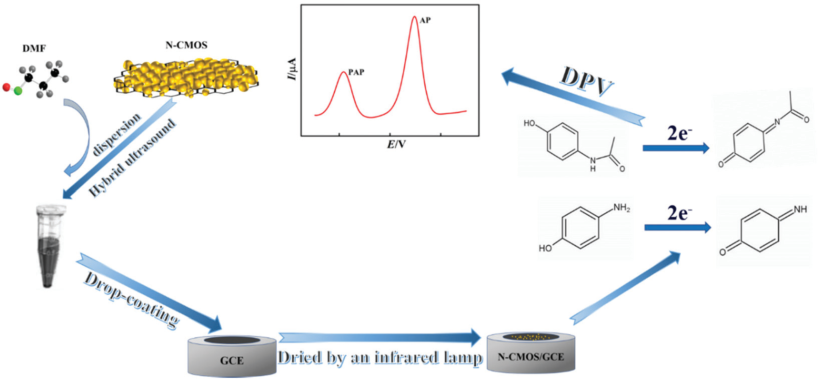
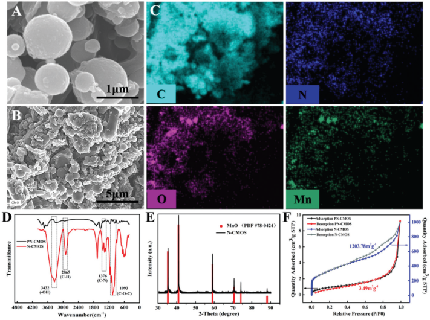
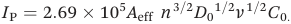
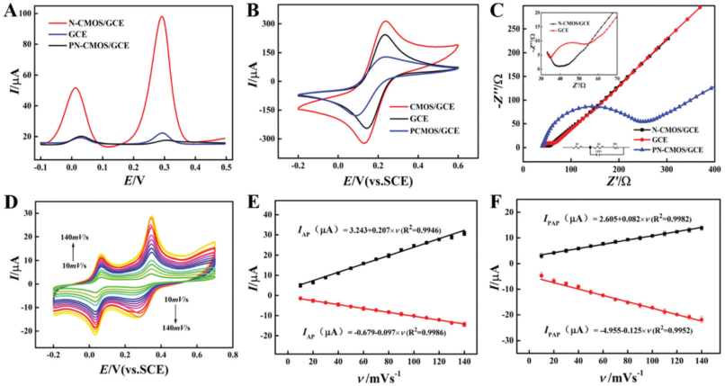
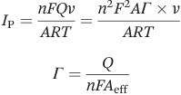
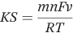
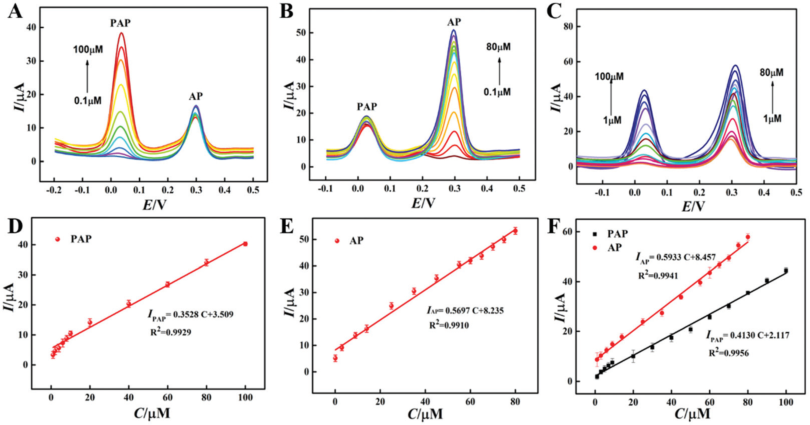
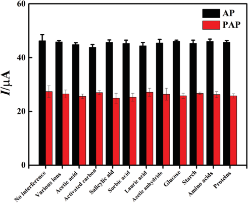

## Analyst 

Cite this: Analyst, 2021, 146, 5135 

## Electrochemical sensor based on N-doped carbon dots decorated with manganese oxide nanospheres for simultaneous detection of p-aminophenol and paracetamol† 

Yifan Feng,[a] Yangguang Li,[a] Shiyi Yu,[b] Qiaoran Yang,[b] Yanbin Tong[a] and Bang-Ce Ye *[a,c] 

Received 1st June 2021, Accepted 8th July 2021 DOI: 10.1039/d1an00966d rsc.li/analyst 

Nitrogen doped carbon dots were synthesized using the hydrothermal reaction of cellulose and urea, and then carbonized in a N2 atmosphere at a high temperature to prepare N-doped carbon dots decorated with manganese oxide nanospheres (N-CMOS) formed using cetyltrimethylammonium bromide (CTAB) and MnO. The introduction of N-CMOS resulted in a large specific surface area, abundant pores, favourable conductivity and an excellent electrocatalytic performance. A glassy carbon electrode modified with N-CMOS was used for the simultaneous identification of paracetamol (AP) and p-aminophenol (PAP) utilising differential pulse voltammetry. Under optimum conditions, the electrical sensor showed a wide linear range of 0.1–100 μM for PAP and 0.1–80 μM for AP, with detection limits of 0.0456 and 0.0303 μM (S/N = 3), respectively. The sensitivities for detecting PAP and AP were calculated as 1.615 and 1.971 μA μM[−][1] cm[−][2] , respectively. The sensitivity and limit of detection (LOD) meet the requirements of detection of drug impurity limits in tablets. In addition, the sensor has been successfully applied to detect PAP and AP in paracetamol tablets. The constructed sensor not only possesses a superior repeatability, reproducibility and stability, but a relatively wide linear range, and a superior detection limit and sensitivity. 

## Introduction 

Paracetamol (AP) has been the most popular nonprescription drug on the market for a long time. It can be used for the treatment of fevers, coughs and colds, mild to moderate pain, including tension and general pain, headaches, joint pain, toothache, and so on.[1,2] During the synthesis or storage of paracetamol, it is easy to produce hydrolytic degradation byproducts. P-Aminophenol (PAP) is one of the main impurities and is difficult to remove.[3,4] PAP can lead to various diseases, including skin problems, eye irritation, liver and kidney poisoning, and can affect the blood and respiratory system.[5] The Chinese food and drug administration (CFDA), the European Drug Administration (EMEA) and the US Food and Drug 

> aKey Laboratory for Green Processing of Chemical Engineering of Xinjiang Bingtuan, School of Chemistry and Chemical Engineering, Shihezi University, Shihezi, China. E-mail: bcye@ecust.edu.cn; Fax: +86-021-64252094; Tel: +86-021-64252094 bKey Laboratory of Xinjiang Phytomedicine Resources for Ministry of Education, School of Pharmacy, Shihezi University, Shihezi, 832000, China cInstitute of Engineering Biology and Health, Collaborative Innovation Center of Yangtze River Delta Region Green Pharmaceuticals, College of Pharmaceutical Sciences, Zhejiang University of Technology, Hangzhou, 310014 Zhejiang, China 

> † Electronic supplementary information (ESI) available. See DOI: 10.1039/ d1an00966d 

Administration (FDA) stipulate a permissible upper limit of PAP in AP of 50 ppm (0.005% ω/w (ref. 6)). Therefore, it is extremely important to rapidly and accurately monitor the presence of PAP in drugs. 

Various analytical methods have been reported, including spectrophotometry, chemiluminescence, high performance liquid chromatography and high-performance capillary electrophoresis.[7][–][9] However, these techniques require demanding laboratory conditions and time-consuming detection. Therefore, the development of a simple and sensitive method for PAP detection is still urgently needed. 

Electrochemical methods have become research hot topics, owing to their a high sensitivity, low cost, fast determination and easy accessibility.[10] However, when using a bare glassy carbon electrode (GCE) to detect AP and PAP, their redox peak potentials can be obscured by mutual interference. In addition, it is difficult to detect the accurate concentration of PAP in paracetamol due to the low response value.[11] At present, several electrochemical sensors involving AP detection have been reported, involving various nanomaterials to enhance the sensing performance, catalytic and imprinted composite membrane based electrochemical sensors,[12] as well as molecular imprinting techniques[13][–][15] and the use of MXene modified screen printed electrode voltammetry for AP detec- 

Analyst, 2021, 146, 5135–5142 | 5135 

This journal is © The Royal Society of Chemistry 2021 

**View Article Online** 

Analyst 

## Paper 

tion. These materials include porous carbon dots, graphene, metal derivatives, COF materials containing N and S and their composites.[16][–][20] Previous reports have demonstrated the criteria needed to select suitable materials, but there are still many problems in terms of the narrow detection range, complex manufacturing processes, environmental risk and high cost. In order to improve the performance of the electrochemical sensors, researchers still need to continue the search for novel, green, and affordable nanomaterials. 

The oxides of transition metals used to form metal-reduced graphene oxide hybrid materials have been studied widely in the field of supercapacitors. For instance, hybrid materials doped with manganese oxide are attractive materials owing to their high capacity, good rate capabilities and cycling stability, and are used to improve the electrochemical performance of electrode materials.[21] It is worth noting that the d-band filled state of the transition metal becomes narrower, and the unfilled state becomes wider after doping with nitrogen. Therefore, transition metals doped with nitrogen have a higher catalytic activity than their parent metal or the corresponding transition metal oxide, attributed to reactions involving the donation of bonding electrons.[22] Carbon dots have an ability to confine the transition metal oxide nanoparticles, which can effectively prevent material passivation.[23] In addition, the nanoscale particle size can prominently expand the surface area, and then increase the number of accessible catalytic sites.[24] The high surface area and reasonable electrical conductivity are the prerequisites of a serviceable electrocatalyst. Therefore, we have synthesized N-doped carbon dots decorated with manganese oxide nanospheres to obtain a good electrical conductivity, electrocatalytic activity and stability. 

In the present study, we report a two-step method for growing MnO nanospheres on N-doped carbon dots to fabricate a hybrid material consisting of carbon dots decorated with manganese oxide nanospheres (N-CMOS). Until recently, a scarce amount of research has focused on the synthesis and electrocatalytic performance of the N-CMOS materials. Based on the good conductivity and electrocatalytic properties of the material, a novel electrochemical sensor was prepared for the simultaneous detection of AP and PAP. Finally, the parameters affecting the performance of the sensor were carefully optimized to accurately detect AP and PAP in paracetamol tablets. 

## Experimental 

## Instruments and reagents 

Paracetamol, PAP, nickel acetate urea, manganese chloride (MnCl2) and cetyltrimethylammonium bromide (CTAB) were purchased from Aladdin Co. Ltd (Shanghai, China; http://www. aladdin-e.com). N,N-Dimethylformamide (DMF) was purchased from Sigma-Aldrich (Shanghai, China, http://www.sigmaaldrich.com). Other reagents and chemicals, such as K3[Fe (CN)6], K4[Fe (CN)6], KNO3, KCl, cellulose, HCl, NaOH and ethanol, were obtained from Titan Science Co. Ltd (Shanghai, China; http://www.tansoole.com). Phosphate buffer (PB, 0.1 M) 

was prepared by mixing 0.1 M KH2PO4 with 0.1 M K2HPO4. The pH value of PB was adjusted by adding HCl or NaOH. All solutions were prepared with ultrapure water. 

A CHI660e electrochemical workstation (Chenhua Instrument Co. Ltd Shanghai, China; http://www.chinstr.com) was employed to perform the electrochemical experiments, which used a classical three electrode system, including a bare or modified GCE as the working electrode (diameter 3 mm), a saturated calomel electrode (SCE) as the reference electrode and a platinum wire as the auxiliary electrode (diameter 0.5 mm, length 34 mm). 

The surface morphology of the obtained materials was observed using scanning electron microscopy (SEM, Zeiss supra55vp, Germany; http://www.bruker.com). Fourier transform infrared (FTIR) spectroscopy was performed to analyse the phase structure on a Nicolet iS50 spectrometer (USA). The composition of the materials was determined using energy dispersive X-ray spectroscopy (EDS, Bruker XFlash 5010, Germany; http://www. bruker.com). The specific surface area of N-CMOS was measured using Brunauer–Emmett–Teller analysis (BET, quanta chrome Nov a 1000). The size and morphology of N-CMOS were observed using transmission electron microscopy (TEM, JEM-1200EX) at 120 kV. A Bruker D8 advanced X-ray diffractometer (Cu-Kα, λ = 1.5418 Å, Bruker xflash-sdd-5010, Germany) was used to perform X-ray diffraction (XRD) analysis. X-ray photoelectron spectroscopy (XPS) was studied by using an Al 18 Kα X-ray source (Escalab 250, Thermo Fisher Scientific, USA). 

## Fabrication of the electrode modified materials 

Urea, 100 mg, and 0.8 g cetyltrimethylammonium bromide (CTAB) were first added into 100 mL of ultrapure water, which was stirred using ultrasound until clear. Then, 1.8 g of manganese chloride was added, the pH value of the above solution was adjusted to 8 using 25% ammonia water, followed by magnetic stirring for 90 min. Finally, 100 mL of the above solution was added to 60 mL of DMF, which was transferred to a 200 mL stainless steel autoclave and heated at 200 °C for 12 h. After rapidly cooling down to room temperature, the product precursor was obtained by centrifugation at 9000 rpm for 10 min. The synthesized precursors of the N-doped carbon dots decorated with manganese oxide nanospheres (PN-CMOS) were washed several times with DMF and distilled water and dried under a vacuum at 60 °C for 24 h. The synthesized PN-CMOS was ground to a powder in a mortar and transferred to a porcelain boat and heated to 900 °C under a N2 atmosphere at a heating rate of 2 °C min[−][1] for 5 h. After cooling to room temperature, the N-CMOS microspheres were obtained. 

## Fabrication of the N-CMOS/GCE 

The bare GCE was polished repeatedly with 0.3 mm alumina powder, then thoroughly cleaned with ultrapure water and ethanol. Next, N-CMOS were uniformly dispersed in DMF. After sonicating the dispersion in a concentration of 1 mg mL[−][1] N-CMOS for 35 min, 8.0 μL of the N-CMOS suspension was dropped onto the surface of the GCE in the working chamber and dried using an infrared lamp. The schematic 

5136 | Analyst, 2021, 146, 5135–5142 

This journal is © The Royal Society of Chemistry 2021 

**View Article Online** 

Analyst 

Paper 

Fig. 1 Schematic representation of N-CMOS/GCE preparation. 

diagram for the electrochemical detection process is presented in Fig. 1. 

## Electrochemical measurements 

The detection of AP and PAP was performed in 0.1 M PB (pH 7.0) at room temperature. Firstly, standard solutions of AP and PAP at different concentrations were prepared by dissolving AP and PAP in 0.1 M PB (pH 7.0). Subsequently, the three-electrode system was placed in a 25 mL 0.1 M PB (pH 7.0) cell. The peak current intensity values of AP and PAP on the different electrodes were recorded using cyclic voltammetry (CV) and differential pulse voltammetry (DPV). CV and DPV were performed in the potential ranges from −0.2 V to +0.6 V and from −0.1 V to +0.5 V, respectively. In a solution containing 5 mM [Fe (CN)6][3][−][/4][−] and 0.1 M KCl, electrochemical impedance spectroscopy (EIS) was performed in a frequency range from 0.01 Hz to 100 kHz. 

## Detection of AP and PAP in real samples 

Five paracetamol tablets (0.6 g tablets containing 500 mg AP) were ground separately to a fine powder, and the AP tablet powder, with a relative labelling value of 3 g, was accurately weighed. After stirring in 50 mL of ethanol, the compound was centrifuged at 5000 rpm for 10 min, and the filtrate was gathered to obtain a stock solution with a concentration of 0.33 M. In addition, 0.003 g PAP (0.1% impurity limit in tablets) dissolved in 50 mL ethanol was added to obtain the PAP mother liquor with a concentration of 549.6 μM. Finally, specific amounts of the above two solutions were mixed and diluted with PB for subsequent content determination. 

## Results and discussion 

## Morphology and constituent characterization of the electrode 

The morphologies of N-CMOS and PN-CMOS were characterized using SEM and TEM analysis (Fig. S1†). Fig. S1E† shows 

that the PN-CMOS presents a sheet morphology, however, the pore structure is undeveloped, compared with N-CMOS. As shown in Fig. 2A and B, N-CMOS exhibits a well-developed pore structure and penetrates into the interior, with intensive aggregated spherical nanoparticles. EDS element mapping images of N-CMOS further demonstrate the porous architecture and illustrate that the Mn, N, O and C elements are uniformly distributed (Fig. 2C). The FTIR spectra for PN-CMOS and N-CMOS can be observed in Fig. 2D using the KBr pellet method. The characteristic peaks of PN-CMOS and N-CMOS at 3432 and 1093 cm[−][1] belong to the tensile vibration of O–H and C–O–C, respectively. After high-temperature carbonization, the intensity peak attributed to PN-CMOS at 1376 cm[−][1] shows a drastic elevation, suggesting the number of C–N bonds have increased significantly. The above functional groups afford N-CMOS with a good hydrophilicity.[25] The elemental composition and chemical properties of PN-CMOS and N-CMOS were further determined from the XPS spectra exhibited in Fig. S2A and B.† The different peaks for PN-CMOS and N-CMOS at 283.08 (C 1s), 397.08 (N 1s), 529.08 (O 1s), 642.07 (Mn 2p3/2), and 653.08 eV (Mn 2p1/2) were analysed, which indicates the C-to-O atomic ratios before and after carbonization were significantly different, in accordance with the FTIR results. The consistent results of the FTIR, EDS and XPS prove that the N element and MnO were successfully doped, which illustrates that PN-CMOS and N-CMOS were successfully synthesized. The XRD analysis shown in Fig. 2E reveals that the obvious diffraction peaks of N-CMOS appear at 35.03°, 40.71°, 58.84°, 70.34°, 74.10° and 87.92°, which correspond to the planes of MnO (PDF#78-0424), respectively. To study the specific surface area and pore size distribution of PN-CMOS and N-CMOS, Fig. 2F clearly displays an obvious hysteresis loop, with a wide relative pressure (0.4–0.9P/P0). The N2 adsorption–desorption curve suggests the presence of an abundant mesopore. The specific surface areas of PN-CMOS and N-CMOS have been measured and were found to be 3.49 and 1203.78 m[2] g[−][1] , respectively. Fig. S2C† shows the average pore diameter of 

Analyst, 2021, 146, 5135–5142 | 5137 

This journal is © The Royal Society of Chemistry 2021 

**View Article Online** 

Analyst 

Paper 

Fig. 2 (A) and (B) SEM images of N-CMOS, (C) EDS element mapping of N-CMOS, (D) FTIR spectra of N-CMOS and PN-CMOS, (E) XRD patterns of N-CMOS and (F) N2 adsorption desorption curves of N-CMOS and PN-CMOS. 

PN-CMOS is 6.784 nm, and that of N-CMOS is 4.089 nm. N-CMOS can not only provide a large specific surface area enabling a high charge transfer rate, but also possesses an abundant amount of pores, which increases the electrochemical active sites. Based on the aforementioned results, N-CMOS can be reasonably demonstrated to be an excellent electrocatalysis agent, which possesses a favourable morphology and structure, and excellent electrochemical properties. 

## Electrochemical characterization 

Herein, we investigated the electrochemical behaviour of the modified electrodes using EIS and CV measurements in a 5 mM [Fe (CN)6][3][−][/4][−] redox probe solution. As shown in Fig. 3B, the order of the electrode redox peak current is IN-CMOS/GCE > IGCE > IPN-CMOS/GCE, indicating that N-CMOS can effectively improve the conductivity and increase the electron transfer rate. In order to further explore the interface characteristics, the construction process for the step-by-step sensor was investigated using EIS. EIS consists of a low-frequency linear part and a high-frequency semi-circular part, representing the diffusion and electron transfer process, respectively. In order to calculate the charge transfer resistance, Z-View software was used to fit the semicircle diameter in the EIS Nyquist diagram. As shown in Fig. 3C, the Rct of the bare GCE is 31.9 Ω. After modification with PN-CMOS, the Rct value increases to 240.4 Ω. Then, Rct is reduced to 14.3 Ω after annealing in PN-CMOS, which is attributed to the good electron transport capabilities of N-CMOS. The EIS results prove that N-CMOS further enhances the conductivity and increases the electron transfer rate, which is consistent with the CV data. 

The electrocatalytic properties of GCE, N-CMOS/GCE and PN-CMOS/GCE were studied using DPV in 0.1 M PB (pH 7.0) containing 150 μM AP and 150 μM PAP. As shown in Fig. 3A, the oxidation peaks of AP and PAP are independent and the interval between the two analytes is approximately 148 mV, suggesting that there is hardly any mutual interference between the electrochemical signals of AP and PAP. In addition, when used to detect AP and PAP, the oxidation peaks of N-CMOS/GCE were observed at 18.5 and 299 mV, respectively. Compared with the bare GCE, the current responses of N-CMOS/GCE were 5.87 times and 6.96 times higher than those of the GCE, respectively, indicating the N-CMOS possesses a satisfactory electrocatalytic oxidation effect on AP and PAP. 

The effective specific surface area (Aeff ) values of these three working electrodes were estimated using the Randles–Sevcik equation as follows: 

In which IP represents the anodic peak current (A), Aeff is the effective specific surface area of the different working electrodes (cm[2] ), n refers to the number of electrons participating in the redox reaction, D0 is the diffusion coefficient of a 5 mM [Fe (CN)6][−][3/][−][4] solution containing 0.1 M KCl (0.673 × 10[−][5] cm[2] s[−][1] ), ν is the scanning rate (mV s[−][1] ), and C0 is the concentration of the redox probe (mol cm[−][3] ). The effective surface area of the bare GCE, N-CMOS/GCE and PN-CMOS/GCE were calculated as 0.218, 0.288, and 0.116 cm[2] , and the corresponding current densities were 102.03, 114.28, and 99.84 μA cm[−][2] , respectively. The surface average (Γ, in mol cm[−][2] ) of 

5138 | Analyst, 2021, 146, 5135–5142 

This journal is © The Royal Society of Chemistry 2021 

**View Article Online** 

Analyst 

Paper 

Fig. 3 (A) DPV curves of N-CMOS/GCE, GCE and PN-CMOS/GCE in 0.1 M PB (pH 7.0) containing 150 μM AP and PAP, (B) CV curves and (C) EIS curves of GCE, N-CMOS/GCE and PN-CMOS/GCE in 5.0 mM [Fe (CN)6][3][−][/4][−] containing 0.1 M KCl. EIS conditions: frequency range of 0.01 Hz–100 kHz, scan rate of 100 mV s[−][1] . (D) CV curves of N-CMOS/GCE in 150 μM PB (pH 7.0) containing 0.1 mM AP and PAP at different scan rates (10–140 mV s[−][1] ). Relationship between the redox peak current and ν for (E) AP, and (F) PAP. Black line: oxidation peak. Red line: reduction peak. 

N-CMOS immobilized on the N-CMOS/GCE was calculated using the following equation. 

In which Q is the charge consumed in the CV spectra and n is the electron transfer number (n = 1). F is the Faraday constant (F = 96 493C mol[−][1] ) and Aeff is the effective area of the electrode. The values of Γ for GCE and N-CMOS/GCE were calculated as 5.96 × 10[−][9] and 6.84 × 10[−][9] mol cm[−][2] , which indicated that the N-CMOS/GCE nanocomposites increased the fixed amount of AP and PAP. Therefore, the nanostructure of N-CMOS increases the effective surface area for enrichment of the tested substances, and provides a good conductivity to improve the electron transfer. We can conclude that the N-CMOS nanocomposites fruitfully improved the electrochemical performance of the detected electrode. 

## Optimization of the synthesis conditions of materials 

A suitable carbonization annealing temperature and the ratio conditions of the synthesis material are of great significance as they can substantially influence the amount of coating that can occur. As shown in Fig. S3A,† the oxidation peak current of AP and PAP increases with temperature (500 to 1000 °C) and reaches a maximum value at 900 °C. When the temperature is higher or lower than 900 °C, the structure of the material cannot be appropriately formed. Fig. S3B† shows the current response of the electrocatalysis performed at different proportions in 0.1 M PB (pH 7.0) containing 150 μM AP and 150 μM PAP. Other ratios lead to a decrease in the current 

response. Fig. S3C† displays the effect on the detection of AP and PAP in different volume of N-CMOS (5 to 8 μL). When the volume changes from 5 to 8 μL, the current response increases correspondingly, and then decreases when the volume is larger than 8 μL. Under optimal synthesis conditions, N-CMOS can form a porous structure, which enlarges the effective sensing area, amplifies the electrical signal of the detected substances, and thus improves the sensitivity. Therefore, the optimum temperature and volume for N-CMOS are 900 °C and 8 μL, respectively. The best ratio for electrocatalysis was found to be 100 mg urea, 0.8 g CTAB, and 1.8 g MnCl2. 

## Influence of the pH and scan rate 

To further explore the reaction mechanism of AP and PAP with a modified electrode, the effect of the pH value and scan rate on the simultaneous detection of PAP and AP using N-CMOS/ GCE was studied, respectively. As shown in Fig. S5D,† the anode peak current reaches a maximum value at pH 7.0. The relationships between the pH and peak potentials are EPAP(V) = −0.0546 pH + 0.412 (R[2] = 0.99419) and EAP (V) = −0.0589 pH + 0.684 (R[2] = 0.99898) (Fig. S5E†). Furthermore, the slopes of the two linear equations are close to the Nernst theoretical value of 59 mV/pH, which indicates that the number for both the proton coupling and electron transfer is two (m = 2, n = 2) in the reaction of AP and PAP on the N-CMOS/GCE.[26] 

The absolute values of the redox peak currents of AP and PAP gradually increased and are linearly related to the increase – in the scanning rate (10 to 140 mV s[−][1] ) (Fig. 3D F), which indicates that the electrochemical processes of the two analytes on the N-CMOS/GCE electrode proceed via surface-control processes. At a scan rate of 140 mV s[−][1] , ΔEP = 33 mV and nΔEP < 200 mV, the electron transfer coefficient can be estimated as 

Analyst, 2021, 146, 5135–5142 | 5139 

This journal is © The Royal Society of Chemistry 2021 

**View Article Online** 

Analyst 

Paper 

0.5 according to Laviron theory.[27] As a quasi-reversible surfacecontrolled electrochemical process, the electron-transfer rate constant (KS) is determined using Laviron theory:[27] 

In which R is the gas constant (R = 8.314 J mol[−][1] K[−][1] ), T is the temperature in Kelvin (T = 298 K) and m is a constant, which relates to ΔEP. The KS AP is calculated as 14.54 s[−][1] , and KS PAP was calculated as 6.61 s[−][1] , which are satisfactory results. 

## Individual and simultaneous detection of AP and PAP content in mixed solutions 

In real samples, individual and accurate detection of PAP and AP is very important. Therefore, N-CMOS/GCE were used to detect PAP and AP in a mixed solution. Under optimal conditions, in the presence of 10 μM AP, the peak current PAP value was linearly correlated with the concentration (1 to 100 μM). In addition, the peak current of AP is almost constant, as shown in Fig. 4A. Similarly, Fig. 4B shows that, in the presence of 30 μM PAP, the peak current of AP is basically 

unchanged and is also linearly related to the concentration (0.1 to 80 μM), in which the detection limits of PAP and AP are 0.0456 μM and 0.0303 μM at S/N = 3, respectively. Fig. 4D and F show the linear regression equations of PAP and AP are I (μA) = 0.352 CPAP (μM) + 3.509 (R[2] = 0.99286) and I (μA) = 0.569 CAP (μM) + 8.235 (R[2] = 0.99098), with sensitivity values for PAP and AP of 1.615 and 1.971 μA μM[−][1] cm[−][2] , respectively (S/N = 3). 

As shown in Fig. 4C, N-CMOS/GCE were used for the simultaneous detection of PAP and AP in mixed solutions. PAP and AP peak currents increase proportionally upon increasing the corresponding concentrations without resulting in interference with each other. The corresponding linear regression equations of PAP and AP are I (μA) = 0.413 C (μM) + 2.117 (R[2] = 0.997) and I (μA) = 0.593 CAP (μM) + 8.457 (the sensitivity for PAP and AP is calculated as = 0.994) using a concentration range from 0.1 to 100 μM. Subsequently, the results were compared with previously reported electrochemical sensors for the detection of PAP and AP (Table 1), and it can be concluded that the constructed sensor has a superior sensitivity and lower detection limit. 

Fig. 4 Differential pulse voltammograms at N-CMOS/GCE in 0.1 M PB (pH 7.0) containing (A) 10 μM AP, and different concentrations of PAP from 0.1 to 100 μM, (B) 30 μM PAP and different concentrations of AP from 0.1 to 100 μM. (C) DPV curves of N-CMOS/GCE in 0.1 M PB (pH 7.0) containing different concentrations of PAP (0.1–100 μM) and AP (0.1–80 μM). The corresponding calibration plots between the DPV response and (D) PAP and (E) AP concentrations. (F) Calibration graphs for simultaneous determination of AP and PAP (S/N = 3). 

Table 1 Comparison of N-CMOS/GCE with other reported electrochemical sensors for PAP and AP detection 

|Electrodes|AP (μM) Linear range LOD|PAP (μM) Methods Ref. Linear range LOD|
|---|---|---|
|Graphene/GCE PEDOTa/GCE P-RGOb/GCE Hollow manganese silicate/GCE f-MWCNTc/GCE N-CMOS/GCE|0.1–20 0.032 1–100 0.4 1.5–120 0.36 — — 3–200 0.6 0.1–80 0.0303|— — SWV 28 4–320 1.2 DPV 29 — — DPV 30 0.1–55 0.011 DPV 31 — — DPV 32 0.1–100 0.046 DPV This work|

a PEDOT: poly(3,4-ethylenedioxythiophene). b P-RGO: phosphorus-doped graphene. c f-MWCNT: functionalized multi-wall carbon nanotubes. 

5140 | Analyst, 2021, 146, 5135–5142 

This journal is © The Royal Society of Chemistry 2021 

**View Article Online** 

Analyst 

Paper 

## Selectivity, repeatability, reproducibility and stability of N-CMOS/GCE 

To assess the selectivity, N-CMOS/GCE was used to detect PAP and AP in a mixture of potential interferents that may exist in paracetamol tablets. The interferents selected represented various ions and organic compounds (Fe[2+] , Cu[2+] , Mn[2+] , Ca[2+] , SO[4][−] , K[+] , Cl[−] , Na[+] , NO[3][−] , acetic anhydride, activated carbon, acetic acid, salicylic acid, sorbic acid, lauric acid, starch, tryptophan, glutamic acid, aspartic acid, leucine, glucose, and α-amylase at a concentration of 0.5 mM). As shown in Fig. 5, there was no significant difference observed for the detection of 50 μM PAP and AP in the presence or absence of the interfering substances, using a significance level of 0.05. In addition, the relative change in signal was less than 5%. These results suggest that N-CMOS/GCE is not affected by interferents and has an excellent selectivity and practicability. In order to investigate the stability, the same N-CMOS/GCE sensor was used daily to detect PAP and AP for 14 d. It is worth noting that after storing in air at room temperature for a 14-d period, N-CMOS/GCE retained 96.33% and 96.67% of the initial current value. Five independent N-CMOS/GCE electrodes were fabricated to evaluate the reproducibility. The relative standard deviation of the peak current was found to be 4.32% for PAP and 4.11% for AP. These results strongly indicate that N-CMOS/GCE exhibits a good repeatability, reproducibility and stability. 

## Determination of AP and PAP in real samples 

In order to verify the practical accuracy and precision of the fabricated sensor in actual sample analysis, the N-CMOS/GCE sensor was used to simultaneously detect AP and PAP in paracetamol tablets. As shown in Table S1,† the recovery range of the sensor was 101.01–103.43% for AP and 96.36–103.3% for 

Fig. 5 Sensing responses towards AP and PAP in the presence of decuple concentrations of interfering substances using N-CMOS/GCE. 

PAP, which indicates the reliable performance of the fabricated sensor for analysing AP and PAP in tablets. 

## Conclusions 

In this study, we successfully assembled nitrogen doped carbon dots and manganese oxide nanospheres to design a novel electrochemical sensor. For the first time, an electrochemical sensor based on N-CMOS was adopted for the simultaneous detection of AP and PAP. The newly developed sensor not only has a high sensitivity and good selectivity for AP and PAP, but also exhibits a good practicability during actual sample measurements. In addition, the electrochemical signals of AP and PAP in Acetaminophen tablets on the constructed electrode do not experience interference in the presence of various interferents and can be detected accurately and sensitively. The doping of N reduces the charge transfer resistance and increases the number of electrochemical active sites, which is beneficial to the sensing performance of the constructed sensor. It should be noted that one natural disadvantage is the presence of electrode fouling in the system. Future work is in progress to reduce the impact of fouling, and our research will concentrate on the identification of an appropriate anti-electrode passivation substance. In conclusion, this convenient, economical and reliable sensor has promising practical applications in the field of pharmaceutical analysis. 

## Author contributions 

The manuscript was written through contributions from all authors. All authors have given approval to the final version of the manuscript. Yifan Feng: conceptualization, methodology, software, data curation, writing original draft, writing-reviewing and editing. Yangguang Li: formal analysis. Shiyi Yu: resources. Qiaoran Yang: data curation. Yanbin Tong: writingreviewing and editing. Bang-Ce Ye: project administration, writing-reviewing and editing, supervision. 

## Con icts of interest 

The authors declare that they have no known competing financial interests or personal relationships that could have appeared to influence the work reported in this paper. 

## Acknowledgements 

This work was supported by the National Natural Science Foundation of China (Grants 31730004). 

Analyst, 2021, 146, 5135–5142 | 5141 

This journal is © The Royal Society of Chemistry 2021 

**View Article Online** 

Analyst 

Paper 

## References 

- 1 R. N. Goyal, V. K. Gupta, M. Oyama and N. Bachheti, Electrochem. Commun., 2005, 7, 803–807. 

- 2 W. Martindale, A. Wade and J. J. E. P. I. S. C. Reynolds, Extra pharmacopoeia. Incorporating Squire's Companion, 1972. 

- 3 S. Aitipamula, A. B. H. Wong, P. S. Chow and R. B. H. Tan, RSC Adv., 2016, 6, 34110–34119. 

- 4 K. Suresh and A. Nangia, Cryst. Growth Des., 2014, 14, 2945–2953. 

- 5 Y. Li, C. M. Bentzley and J. B. Tarloff, Toxicology, 2005, 209, 69–76. 

- 6 D. J. Snodin and S. D. McCrossen, Regul. Toxicol. Pharmacol., 2012, 63, 298–312. 

- 7 N. J. J. o. P. Erk, Analysis, 1999, 21, 429–437. 

- 8 W. Ruengsitagoon, S. Liawruangrath and 

- A. J. T. Townshend, Talanta, 2006, 69, 976–983. 

- 9 E. A. Abdelaleem, E. S. Hassan, I. A. Naguib, W. J. J. o. P. Ali and B. Nouruddin, Biomedical Analysis: An International Journal on All Drug-Related Topics in Pharmaceutical and C, J. Pharm. Biomed. Anal., 2015, 114, 22–27. 

- 10 Z. Hong, L. Zhou, J. Li and J. Tang, Electrochim. Acta, 2013, 109, 671–677. 

- 11 J. Wang, H. Zhang, J. Zhao, R. Zhang, N. Zhao, H. Ren and Y. Li, Microchim. Acta, 2019, 186, 733. 

- 12 Y. Teng, L. Fan, Y. Dai, M. Zhong, X. Lu and X. Kan, Biosens. Bioelectron., 2015, 71, 137–142. 

- 13 L. Yuan, Z. Lu, Z. Na, Y. Han and Y. C. J. A. Li, Analyst, 2017, 142, 1091. 

- 14 Q. Zhao, X. Zheng, L. Xing, Y. Tang and Z. J. J. o. H. M. Yan, J. Hazard. Mater., 2021, 409, 125019. 

- 15 A. Yl, Z. B. Lu, A. Yd, D. Zc, E. Rz, B. Yl and C. J. B. Bcya, Bioelectronics, 2019, 127, 207–214. 

- 16 X. Song, F. Ju, J. Wang, C. Li and Z. J. M. A. Liu, Microchim. Acta, 2018, 185, 369. 

- 17 K. Movlaee, H. Beitollahi, M. R. Ganjali and P. J. M. A. Norouzi, Microchim. Acta, 2017, 184, 3281–3289. 

- 18 L. Fu, A. Wang, G. Lai, C. T. Lin, J. Yu, A. Yu, Z. Liu, K. Xie and W. J. M. A. Su, Microchim. Acta, 2018, 185, 87. 

- 19 T. Nahid, S. Nasrin, S.-F. Faezeh, R. Mahbobeh and S. J. M. Hossein, Microchim. Acta, 2019, 186, 413. 

- 20 L. Wang, Y. Yang, H. Liang, N. Wu, X. P. eng, L. Wang and Y. J. J. o. H. M. Song, J. Hazard. Mater., 2020, 409. 

- 21 H. Wang, L. F. Cui, Y. Yuan, H. S. Casalongue and H. D. J. J. o. t. A. C. Society, J. Am. Chem. Soc., 2010, 132, 13978–13980. 

- 22 A. G. Stepanov, Encyclopedia of Catalysis, 2010. 

- 23 Y. Tian, C. Yang, W. Que, X. Liu, X. Yin and L. B. J. J. o. P. S. Kong, J. Power Sources, 2017, 359, 332–339. 

- 24 M. S. Balogun, Y. Huang, W. Qiu, Y. Hao, H. Ji and Y. J. M. T. Tong, Mater. Today, 2017, 20, 425–451. 

- 25 M. Yang, X. Meng, B. Li, S. Ge and Y. J. J. o. N. R. Lu, J. Nanopart. Res., 2017, 19, 217. 

- 26 J. B. Wan, M. Ladan, M. Shalauddin, M. S. J. S. Mehmood and A. B. Chemical, Sens. Actuators, B, 2018, 266, 375– 383. 

- 27 E. Laviron, J. Electroanal. Chem. Interfacial Electrochem., 1979. 

- 28 X. Kang, J. Wang, W. Hong, J. Liu, I. A. Aksay and Y. J. T. Lin, Talanta, 2010, 81, 754–759. 

- 29 S. Mehretie, S. Admassie, T. Hunde, M. Tessema and T. J. T. Solomon, Talanta, 2011, 85, 1376–1382. 

- 30 X. Zhang, K.-P. Wang, L.-N. Zhang, Y.-C. Zhang and L. Shen, Anal. Chim. Acta, 2018, 1036, 26–32. 

- 31 J. Sun, Z. Shi, J. Li, B. Liu and T. J. E. Gan, Electroanalysis, 2016, 28, 111–118. 

- 32 A. Zeid, N. Alothman, S. Bukhari, W. Mohammad and 

   - H. Sajjad, Sens. Actuators, B, 2010, 146, 314–320. 

5142 | Analyst, 2021, 146, 5135–5142 

This journal is © The Royal Society of Chemistry 2021 

