## Sensors & Diagnostics 

## CRITICAL REVIEW 

## **View Journal** 

Cite this: DOI: 10.1039/d5sd00100e 

## Emerging trends in aerogel technology for sensing and biosensing applications 

Aneesh Koyappayil,[a] Gopi Karuppaiah,[a] Sachin Ganpat Chavan,[a] Anna Go,[a] Hyung Chul Kim[*][b] and Min-Ho Lee *[a] 

Received 20th June 2025, Accepted 31st October 2025 DOI: 10.1039/d5sd00100e rsc.li/sensors 

Aerogels have gained attention for their unique physicochemical attributes, including their lightweight structure, adjustable porosity, expansive surface area with customizable functionalities, and notable biocompatibilities. A crucial factor in employing aerogels within biosensors is the improvement in sensitivity, selectivity, and response speed due to their effective interactions with biological targets. Recent advancements in aerogel synthesis, particularly with the incorporation of 0D, 1D, and 2D materials, have significantly enhanced the performance of aerogel-based sensors through a synergistic effect. An increasing array of aerogels has been documented for biosensing purposes and as electrode materials in smart sensors that aim to detect biomolecules for biomedical applications. Various synthesis techniques for aerogels and their composites have emerged. Aerogel composites that feature nanoparticles and 2D/3D materials are noted for their relevance in sensing applications. Discussions surrounding these materials often focus on their use in biosensors, smart sensors, microfluidics, and innovative devices. This review seeks to underline new trends in aerogel technology for biosensing applications, concentrating on advancements in synthesis methods, the creation of novel aerogel composites, and aerogel-based sensors aimed at biosensing, biomarker detection, smart sensors, wearable technology, and microfluidic devices as well as the biocompatibility and sustainability of aerogels and their composites. The review also highlights how aerogels enhance the selectivity, sensitivity, and efficiency of biosensors. The latest developments in smart aerogels are opening opportunities for real-time biomolecule monitoring. Additionally, their integration with microfluidic devices has led to the creation of portable, cost-effective lab-on-a-chip devices, which support rapid diagnostics in cutting-edge biosensing technologies. 

## 1. Introduction 

Aerogels have captivated the scientific community due to their remarkable physical properties and are often referred to as ‘frozen smoke’ because of their composition and lightweight appearance. In recent years, there has been an increasing trend in aerogel-based research, as evidenced by the exponential growth in the number of publications (Fig. 1A). The density of aerogels can be as low as 3 kg m[−][3] ,[1] and their thermal conductivity is the lowest of any solids (0.014 W m[−][1] K[−][1] at room temperature).[2] Aerogel synthesis was first reported by Samuel Stevens Kistler in 1931, where silica aerogel was synthesized from silica jelly.[3] Kistler's studies established aerogel as a potential catalyst and insulator. The initial synthesis routes to aerogels were tedious and time-consuming until Teichner et al. proposed a relatively quicker synthesis 

> a School of Integrative Engineering, Chung-Ang University, 84 Heuseok-ro, DongjakGu, Seoul 06974, Republic of Korea. E-mail: mhlee7@cau.ac.kr 

> b Department of Future Science and Technology Business, Korea University, Seoul 02841, Republic of Korea 

route using tetramethyl orthosilicate as a precursor by employing a sol–gel process.[4] In the early 1940s, Monsanto Corporation commercialized silica aerogel under the brand name Santocel.[5] However, the high production cost largely inhibited widespread industrial applications. The late 1960s and early 1970s saw a resurgence in aerogel research, leading to faster synthesis routes that simplified the sol–gel process.[6] Porous alumina aerogels were introduced in the 1970s.[7] In the 1980s, the supercritical drying process using liquid carbon dioxide was introduced for safer and less energy-intensive aerogel synthesis.[8] This method was adopted for the synthesis of organic aerogels, and the term ‘carbogels’ was coined for CO2-dried organic aerogels.[9] Due to the low refractive index, aerogel was used for the detection of Cherenkov radiation.[10] The 1990s experienced a broad expansion in the types and applications of aerogels. Titania aerogels were introduced, and the sol–gel process was refined with polyethoxydisiloxane and tetraethoxysilane.[11] Small-angle scattering techniques advanced the understanding of aerogel structure. In the early 2000s, the Glenn Research Center of NASA developed polymer-reinforced silica aerogels with enhanced strength and translucency.[12] 

© 2025 The Author(s). Published by the Royal Society of Chemistry 

Sens. Diagn. 

**View Article Online** 

Critical review 

Sensors & Diagnostics 

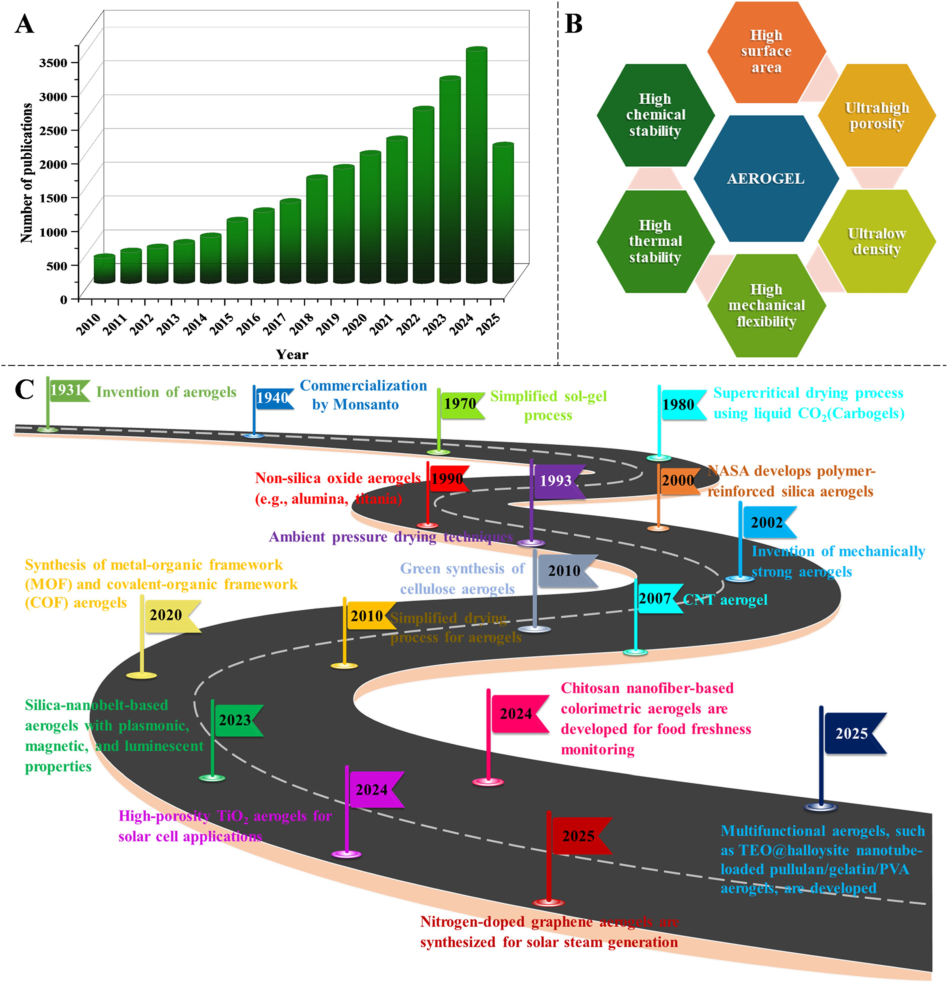

Fig. 1 (A) Year-wise number of publications from 2010 to 2025 based on the Scopus database using the search term ‘aerogel’(accessed on 11th June 2025). (B) Advantages of aerogels over conventional sensing materials. (C) Roadmap of the advancements in aerogel technology. 

These aerogels were successfully used as insulating materials in Mars rovers. The 2000s saw a growing interest in aerogel research for environmental applications, such as pollutant removal. In the 2010s, green synthesis was reported for cellulose aerogels, significantly reducing the cost of aerogel synthesis. The period from 2010 is regarded as the age of multifunctional aerogels. Aerogels such as MOF aerogels,[13][–][15] MXene aerogels,[16][–][18] graphene/graphene oxide aerogels,[19][–][22] heteroatom-doped aerogels,[23][–][25] and nanoparticle-incorporated aerogels[26][–][28] have been synthesized and applied to diverse applications. Recently, the focus of aerogel-based research has shifted towards composite,[29] sustainable,[30] and biodegradable aerogels.[31] Aerogels have been utilized in smart devices for 

healthcare[32] and environmental remediation.[33] Studies have concentrated on one-pot and green synthesis of aerogels for convenience and reduced environmental impact.[34][–][36] 

Being a distinguished category of aerogels, noble metalbased aerogels[37] outperform traditional aerogels like silica, carbon, and metal oxide-based materials by combining the natural catalytic and electronic properties of noble metals with high surface area and porosity. Noble metal aerogels demonstrate high atomic efficiency and have several advantages, such as hierarchical porosity, ultralow mass density, good conductivity, and chemical properties that enhance interactions with biomolecules and support natural enzymes.[38] These aerogels have been applied as supports for 

© 2025 The Author(s). Published by the Royal Society of Chemistry 

Sens. Diagn. 

**View Article Online** 

Critical review 

## Sensors & Diagnostics 

natural enzymes and as nanozymes in biosensors and also find applications in advanced catalysis,[39] energy storage,[40] and biomedical fields,[41] although their high cost remains a limiting factor. For biosensing, the plasmonic and electrical features of noble metals enable highly sensitive detection of analyte molecules. Their high conductivity and porosity improve sensor performance, making them ideal for electrode materials. The biocompatibility of these aerogels supports biomedical applications, such as drug delivery and tissue engineering. Additionally, their optical properties are employed in photonics and surface-enhanced Raman spectroscopy. The corrosion resistance and chemical stability of noble metal-based aerogels ensure reliable performance in harsh environments. Furthermore, their tunable, self-supporting structure eliminates the need for additional support materials, thereby reducing material losses. However, current research primarily focuses on Au, Ag, Pt, and Pd as single-metal noble aerogels for biosensing, with other noble metals, such as ruthenium (Ru) and iridium (Ir), being rarely studied. 

Aerogels possess several advantages over conventional sensing materials (Fig. 1B). In this context, this review discusses the emerging trends in aerogel synthesis, biosensing applications, smart sensing, environmental impact, and futuristic aspects of aerogels. The significant achievements in this field are illustrated in Fig. 1C. 

## 2. Classification and properties of aerogels 

Aerogels are classified based on origin, appearance, synthesis, microstructure, and drying process (Fig. 2). They are primarily categorized according to their composition, 

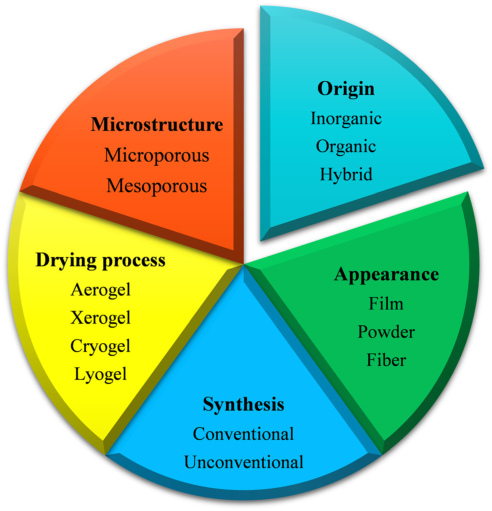

Fig. 2 Classification of aerogels based on origin, synthesis, microstructure, appearance, and drying process. 

which includes three main categories: organic aerogels, inorganic aerogels, and hybrid aerogels. Each type of these aerogels is characterized by distinct materials and properties, making them suitable for various applications. Organic aerogels are made from carbon-based materials, inorganic aerogels consist of metal oxides or other inorganic compounds, and hybrid aerogels combine both organic and inorganic components to leverage the benefits of each material. Organic aerogels are considered to be among the first types of aerogels ever created. The pioneering work in organic aerogel production was conducted by Samuel Kistler in 1932, when he successfully prepared aerogel using pectin as the primary material. The structure of organic aerogels consists of a three-dimensional framework predominantly composed of organic polymers, which bestow them with their unique properties. Based on the synthesis route, aerogels are classified into conventional and unconventional aerogels. The microstructure-based classification of aerogels, viz., microporous and macroporous, is particularly useful in sensing applications. The classification based on appearance is film, powder, and fiber, whereas, based on the drying process, aerogels are further classified as aerogel, xerogel, cryogel, and lyogel.[42] 

Over the years, a variety of aerogels and their composites have been synthesized and reported in scientific literature. Each of these aerogels offers distinct characteristics, making them suitable for diverse applications in fields such as insulation, filtration, energy storage, and sensors. The continuous development of new aerogels has expanded the potential of this class of materials in both industrial and scientific research. 

## 3. Nanostructured aerogels for biosensing 

The advent of nanostructured aerogels has paved the way for new biosensing opportunities. By integrating nanoparticles such as gold, silver, carbon nanotubes, and graphene into these aerogels, researchers enhance the material's electrical, optical, and thermal properties. These advanced aerogels achieve exceptional success in detecting a range of biomolecules, such as proteins, nucleic acids, and toxins. For instance, gold nanoparticle-enhanced aerogels have proven effective in surface plasmon resonance biosensors, where the biomolecule's interaction with the sensor surface induces a measurable change in the refractive index. Similarly, graphene-based aerogels, renowned for their exceptional conductivity, are being explored for electrochemical biosensing applications, which rely on electron transfer between the analyte and the electrode surface. Aerogel-based electrochemical biosensors exhibit high sensitivity due to their capability to detect slight variations in analyte concentration. This increased sensitivity stems from the porous nature of aerogels, which possess a large surface area. The tunable porosity of these aerogels facilitates the immobilization of biological recognition elements, such as 

© 2025 The Author(s). Published by the Royal Society of Chemistry 

Sens. Diagn. 

**View Article Online** 

Sensors & Diagnostics 

## Critical review 

antibodies, enzymes, cells, and nucleic acids. Additionally, the porous structure of aerogels promotes efficient diffusion of analytes, enhancing electron transfer. Functionalization with nanoparticles further boosts the sensitivity of aerogelbased sensors. For instance, the incorporation of Au nanoparticles into aerogels enhances their sensitivity by increasing the electrochemical surface area and improving signal transduction. The selectivity of a sensor refers to its ability to differentiate between interfering ions and molecules. The functionalities of aerogels can be tailored to enhance selectivity. By modifying the aerogel pores with specific chemical functionalities, such as amino, thiol, or carboxyl groups, selectivity can be achieved for biomolecules or pathogens. Furthermore, aerogels can be combined with 2D MOFs, graphene, or MXenes to elevate both selectivity and sensitivity. 

## 4. Aerogel-based biosensors 

Biosensors are devices that convert biological signals into measurable outputs, allowing for easy communication and interpretation of the data. These sensors have found widespread applications in the medical and healthcare industries, where they play a crucial role in diagnostics and monitoring. Detecting ultralow concentrations of analytes presents a significant challenge in analytical chemistry, as conventional methods lack sufficient sensitivity at these levels.[43] Addressing this issue requires the development of highly sensitive detection platforms that can maximize analyte interaction despite low concentrations. Platforms with a high surface area-to-volume ratio are essential because they provide an expanded interface for analyte interaction, thereby enhancing detection sensitivity. Aerogels, due to their unique interconnected porous structure, are particularly well suited for biosensing applications. This structure facilitates efficient adsorption of analytes and supports rapid mass and electron transport, both of which are essential for accurate and timely biosensing. The capacity of aerogels to adsorb and interact with trace analyte concentrations, combined with their lightweight and customizable properties, positions them as advanced tools in biomedical applications. As a result, aerogels are increasingly being explored and utilized in the development of advanced biosensor technologies[44] (Table 1). Aerogels have been extensively studied for the detection of glucose[45][–][54] and hydrogen peroxide.[55][–][62] Additionally, biomolecules such as uric acid,[63][–][66] dopamine,[60,67,68] ascorbic acid,[66,69] tyrosine,[70] insulin,[71] DNA,[72] melatonin,[73] 8-hydroxyguanine, guanine, adenine, thymine, and cytosine[74] are also detected using aerogel-based sensing platforms. 

## 4.1. Hydrogen peroxide detection on aerogel-based sensors 

Hydrogen peroxide is a versatile biomolecule with biological significance and diverse applications.[75,76] Accurate determination of hydrogen peroxide is crucial for understanding various biological signaling pathways,[77,78] 

medical diagnostics,[79] and environmental monitoring. Kim et al.[62] reported a noble metal aerogel based on Pd nanoparticles embedded in polyethyleneimine-reduced graphene oxide aerogel for the electrochemical detection of hydrogen peroxide. Here, palladium in the Pd[0] and Pd[2+] oxidation states contributed to the electrocatalytic activity through the redox reaction to Pd[2+] and Pd[4+] states (Fig. 3A). The hierarchical structure, featuring nanoscale and microscale porosity of the aerogel, improved surface area and pore connectivity. This structure facilitated the rapid diffusion of H2O2 to the electrode surface. Additionally, the synergistic effect of the materials, namely, Pd for catalysis, graphene oxide for conductivity, and PEI for interaction with the analytes, enhanced the overall electrochemical response. The aerogel-modified screen-printed electrode exhibited a low detection limit of 16.2 nM for H2O2. Onepot hydrothermal synthesis of carbon–graphene aerogel for the electrochemical detection of hydrogen peroxide was reported by Dong et al.[60] In this work, amorphous carbon incorporation into graphene prevented the agglomeration of graphene sheets and endowed the resultant hybrid aerogel with a large conductive surface area, beneficial for electron transport. Consequently, the composite enhanced the electrocatalytic reduction of H2O2 (Fig. 3B). Pan et al.[59] reported a one-step gelation process for the synthesis of Pt– Pd bimetallic aerogel (Fig. 3C). This aerogel was successfully applied as an electrocatalyst for the detection of hydrogen peroxide. The composition of Pd and Pt in the aerogel was optimized, and it was found that the Pt50Pd50 aerogel exhibited the highest sensitivity towards hydrogen peroxide reduction. Kim et al.[61] reported a composite aerogel composed of reduced graphene oxide and conductive polyterthiophene for the electrochemical reduction of hydrogen peroxide (Fig. 3D). In this paper, the porous nature of the aerogel contributed to a large surface area and electron transport capabilities for the electroreduction of hydrogen peroxide. Besides, the conductive polyterthiophene improved the stability of the aerogel through anchoring of the amino groups and reduced the interference from positively charged species. 

## 4.2. Glucose detection on aerogel-based sensors 

Monitoring blood glucose is crucial for managing diabetes and maintaining a healthy lifestyle.[80,81] To alleviate the discomfort associated with invasive blood glucose monitoring, recent studies have focused on the sensitive determination of ultralow concentrations of glucose from body fluids such as sweat and saliva.[82] Detection of low concentrations of glucose from these body fluids requires a sensing platform with a large surface area-to-volume ratio. Aerogels emerged as a suitable sensing platform for the sensing of ultralow glucose concentrations. Wu et al.[50] described an interesting dual-mode detection of glucose based on iron and nitrogen-doped carbon aerogels. The carbon aerogel was synthesized by controlled pyrolysis of 

© 2025 The Author(s). Published by the Royal Society of Chemistry 

Sens. Diagn. 

**View Article Online** 

Critical review 

Sensors & Diagnostics 

Table 1 Literature reports on aerogel-based biosensors 

|||||Detection|||
|---|---|---|---|---|---|---|
|Type of aerogel|Sensor composition|Target analyte|Sensing mechanism|range|LOD|Ref.|
|Graphene aerogel|Graphene aerogel, gold|Hydrogen|Electrochemical detection|10–9740μM|1.1μM|55|
||nanoparticles, cytochrome c|peroxide|viadirect electron transfer||||
||(Cytc)||between Cytcand the||||
||||electrode for H2O2reduction||||
||||(amperometry)||||
|Graphene aerogel|3D graphene aerogel@GOx|Glucose|Electrochemical detectionvia|1000–18 000μM|870μM|45|
||microfluidic biosensor||amperometric measurement of||||
||||H2O2||||
|Graphene aerogel|3D MoS2/graphene aerogel|Glucose|Enzyme-based oxidation|2000–20 000μM|290μM|46|
||(MGA), glucose oxidase||of glucose by GOx,||||
||||generating H2O2, measured||||
||||by amperometry||||
|Graphene aerogel|Graphene aerogel, gold|Glucose|Glucose oxidation by GOD|50 000–450 000|0.597μM|54|
||nanoparticles, glucose||generates H2O2, which is|μM|||
||oxidase||monitored by current–time||||
||||(I–t) curves||||
|Graphene aerogel|N-doped graphene|Double-stranded|Electrochemical detection|100 fg ml−1–10|39 fg ml−1|72|
||aerogel/gold nanostar|DNA|viaDPV|ng ml−1|||
|Nanosilica-functionalized|Insulin aptamer (IGA3),|Insulin|Chemiluminescence:|7.5×10−6–0.005|1.6×|71|
|graphene oxide aerogel|oligonucleotide-functionalized||insulin binds to the IGA3|μM|10−6 μM||
||gold nanoparticles||aptamer, releasing||||
||(ssDNA-AuNPs), and||ssDNA-AuNPs, which catalyze||||
||SiO2@GOAG.||the luminol–H2O2||||
||||chemiluminescent reaction||||
|UiO-66-NH2aerogel|TCPP(Fe)@UiO-66-NH2|Glucose|Colorimetric sensing through|10–800μM|0.0003μM|47|
||aerogel immobilized with||a cascade reaction involving||||
||glucose oxidase||GOx and iron porphyrin||||
|Poly(vinyl alcohol) aerogel|Glucose oxidase and hemin|Glucose|Colorimetric detection based|0–1600 μM|11.4μM|48|
||immobilized in amphiphilic||on the oxidation of TMB,||||
||PVA aerogel||catalyzed by GOx and hemin||||
|Carbon aerogel|CAs doped with iron and|Dopamine|Electrochemical sensingvia|0.01–200μM|0.0033μM|68|
||iron carbide (Fe/FeC),||electro-oxidation of DA, with||||
||derived from algae residue,||the current–time (I–t) response,||||
||modified GCE||enhanced electron transfer||||
||||using CAs-Fe/GCE||||
|Co3O4/rGO aerogel|Co3O4/3D MX-rGO modified|Dopamine|Electrochemical detectionvia|0.1–300μM|0.04μM|67|
||GCE||differential pulse||||
||||voltammogram||||
|Mo–W–O/graphene|Mo–W–O/GA modified GCE|Tyrosine|Electrochemical detectionvia|0.001–478μM|0.0014μM|70|
|aerogel||Dopamine|differential pulse|0.001–448μM|0.0008μM||
||||voltammogram||||
|Core–shell AgNWs@PB|Ag nanowires (AgNWs),|Uric acid|PB nanoparticles catalyze|10–3000μM|0.050μM|63|
|aerogel|Prussian blue (PB), uricase,||H2O2oxidation from the||||
||BSA, glutaraldehyde||uricase reaction and||||
||||chronoamperometry (CA)||||
||||measured at 0.3 V||||
|Ni–Co and Pd–Co aerogel|Urate oxidase|Uric acid|Amperometric determination|0–250 μM|5.4 ± 0.3|65|
||enzyme-immobilized Ni–Co||of uric acid on||μM||
||and Pd–Co aerogel||enzyme-incorporated aerogel||||
||||electrode||||
|Graphene oxide aerogel|Pd–Fe|Ascorbic acid|Electrochemical detectionvia|5.0–1750μM|0.5537μM|74|
||nanoparticle-decorated 3D|Dopamine|differential pulse|0.25–100μM|0.0018μM||
||graphene oxide aerogel|Uric acid|voltammogram|0.5–500μM|0.0696μM||
|||8-Hydroxyguanine||0.5–375μM|0.0432μM||
|||Guanine||0.5–500μM|0.0429μM||
|||Adenine||0.5–500μM|0.0723μM||
|||Thymine||5.0–1500μM|0.0572μM||
|||Cytosine||5.0–1500μM|0.3184μM||
|Carbon aerogel|Pd nanoparticle-supported|Dopamine|Electrochemical detection|0.01–100μM|0.0026μM|73|
||carbon aerogel|Melatonin|viadifferential pulse|0.02–500μM|0.0071μM||
||||voltammogram||||

biomass precursors and applied for the fluorescence and nonenzymatic electrochemical determination of glucose 

(Fig. 4A). The dual-mode detection mode of this sensor enhanced the versatility and reliability of glucose detection. 

© 2025 The Author(s). Published by the Royal Society of Chemistry 

Sens. Diagn. 

**View Article Online** 

Critical review 

Sensors & Diagnostics 

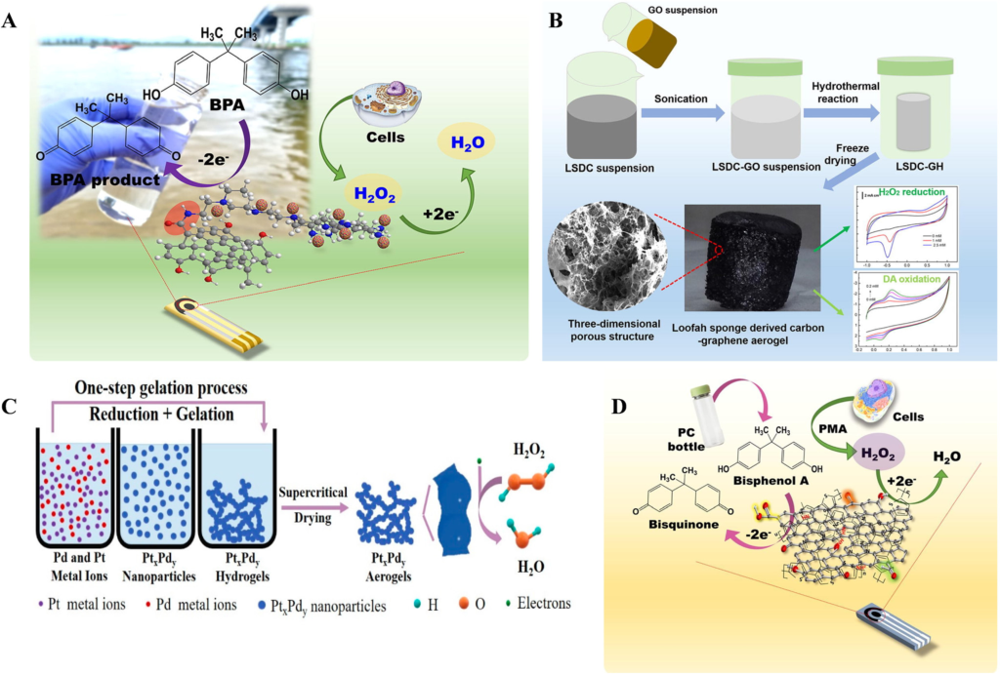

Fig. 3 (A) Schematic representation of the electrochemical detection of hydrogen peroxide on a screen-printed carbon electrode modified with Pd nanoparticle-embedded polyethyleneimine–reduced graphene oxide aerogel. Reproduced with permission from ref. 62. Copyright 2022, Elsevier. (B) One-pot synthesis of carbon–graphene aerogel for the electrochemical detection of hydrogen peroxide and dopamine. Reprinted with permission from ref. 60.Copyright 2022, Elsevier. (C) One-step synthesis of Pt–Pd bimetallic aerogel for the nonenzymatic detection of hydrogen peroxide. Reproduced from ref. 59. (D) Schematic representation of the electrochemical determination of hydrogen peroxide and bisphenol A on reduced graphene oxide anchored polyterthiophene conductive aerogel modified electrodes. Reprinted with permission from ref. 61. Copyright 2022, Elsevier. 

Additionally, nitrogen doping significantly improved the properties of the carbon-based aerogel, boosting its conductivity and electrocatalytic performance while maintaining cost-effectiveness and scalability for large-scale manufacturing. The sensor was able to detect 3.1 μM of glucose fluorometrically and 0.5 μM electrochemically. Yue et al.[83] achieved fast direct electron transfer of glucose oxidase from carbon nanofiber aerogels (Fig. 4B). Here, the aerogel was synthesized from a coconut matrix, adding sustainability to the synthesis route. In addition, the aerogel possessed ultralight low density, high porosity, and high specific surface area. Song et al.[51] reported atomically dispersed cobalt on nitrogen-doped carbon aerogels. The 3D framework of the aerogel efficiently dispersed the Co atoms, and the single cobalt atom sites were then applied for nonenzymatic electrochemical oxidation of glucose (Fig. 4C). The sensor reported a detection limit of 0.1 μM and was applied for the detection of glucose from saliva and serum samples. Synergistic effects of Pd and Cu for glucose oxidation were reported by Li et al.[53] on Pd–Cu bimetallic 

aerogels (Fig. 4D). The bimetallic aerogel was synthesized using a simple self-assembly reduction technique and was able to oxidize glucose at a low potential (0 V vs. Ag/AgCl) and neutral pH. 

Dong et al.[52] reported a heterojunction interface of metal–organic framework (Co-MOF) and gold, which promoted electron transfer and increased conductivity for enhanced glucose detection (Fig. 4E). Here, the Co-MOF aerogel was synthesized by a hydrothermal method, and gold nanoparticles were in situ loaded on it. The CoMOF/Au-modified glassy carbon electrode was able to detect glucose with high sensitivity (206 μA cm[2] mM[−][1] ) and a low limit of detection (10 nM). Another compelling application of noble metal-based aerogels for glucose detection was described by Fang et al.[49] Here, a low-cost bismuth-anchored Au aerogel was synthesized by simple precipitation followed by supercritical CO2 drying. The Au–Bi aerogels greatly enhanced glucose oxidation owing to the synergistic effect between gold and bismuth (Fig. 4F) 

© 2025 The Author(s). Published by the Royal Society of Chemistry 

Sens. Diagn. 

**View Article Online** 

Critical review 

## Sensors & Diagnostics 

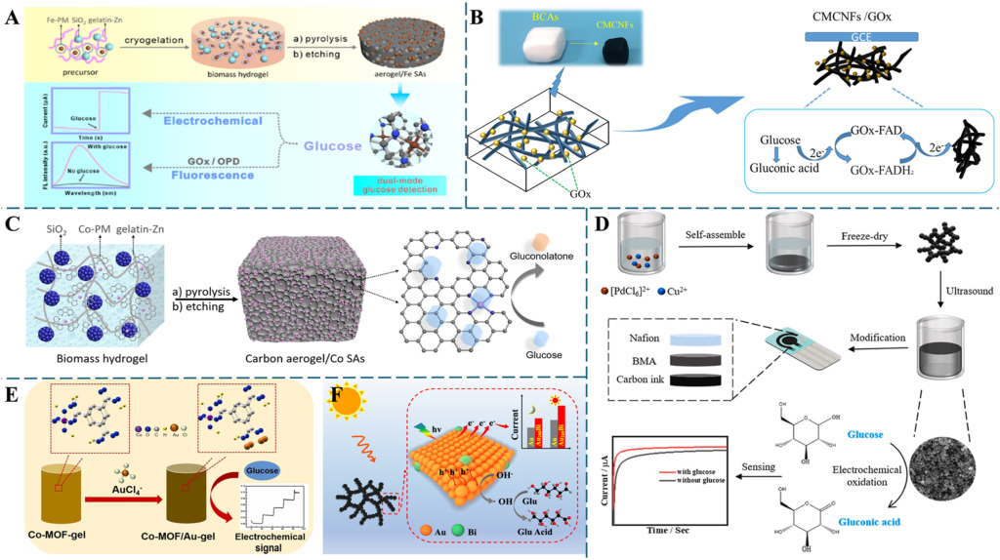

Fig. 4 (A) Fabrication of biomass-derived iron and nitrogen-doped carbon aerogels for the dual-mode detection of glucose. Reproduced with permission from ref. 50. Copyright 2021, American Chemical Society. (B) Electrochemical detection of glucose on carbon nanofiber aerogels. Reproduced with permission from ref. 83. Copyright 2021, Elsevier. (C) Schematic representation of the synthesis of nitrogen-doped carbon aerogel embedded with CoNx sites for electrochemical detection of glucose. Reproduced with permission from ref. 51. Copyright 2022, Elsevier. (D) Schematic representation of the synthesis of Pd–Cu bimetallic aerogels for nonenzymatic electrochemical determination of glucose. Reproduced with permission from ref. 53. Copyright 2025, Elsevier. (E) Co-MOF/Au aerogel for the nonenzymatic electrochemical determination of glucose. Reproduced with permission from ref. 52. Copyright 2025, Elsevier. (F) Bismuth-incorporated Au aerogels for nonenzymatic electrochemical determination of glucose. Reproduced with permission from ref. 49. Copyright 2022, American Chemical Society. 

## 4.3. Dopamine detection on aerogel-based sensors 

Monitoring the accurate concentration of neurotransmitters is essential for understanding brain function and diagnosing various mental disorders.[84][–][86] Several aerogels have been reported for the sensitive determination of the monoamine neurotransmitter dopamine. The secretion of dopamine from living cells is instantaneous, necessitating sensors with high sensitivity and fast response times for monitoring. Zou et al.[87] reported nitrogen-doped graphene aerogel/Co3O4 composite-modified electrodes for the sensitive real-time monitoring of dopamine secreted from living cells under K[+] stimulation (Fig. 5A). The aerogel-modified electrode benefits from the high surface area, conductivity, and catalytic activity, showing a wide linear range for dopamine detection. Incorporating nitrogen-doped graphene aerogels with cobalt oxide (Co3O4) nanoparticles enhances the sensor's electrocatalytic activity, sensitivity, and selectivity for dopamine detection. This advancement has significant implications for neurological diagnostics and neurobiological research. Potential applications include personalized medicine for Parkinson's disease and advanced neurochemistry studies, marking a major step forward in tracking neurotransmitter dynamics in living systems. Qi et al.[67] reported a MXene-based aerogel for the sensitive 

detection of dopamine (Fig. 5B). In this research, Co3O4/ MXene-rGO aerogel was synthesized as the electrode material. Within the composite, the MXene-rGO aerogel prevented the aggregation of Co3O4 particles and provided abundant active sites, resulting in enhanced electrocatalytic activity towards dopamine. The sensor could detect dopamine in the range of 0.1–300 μM with a detection limit of 40 nM. Mariyappan et al.[70] reported the synthesis of Mo– W–O nanowire intercalated graphene aerogels through hydrothermal and freeze-drying methods as an electrode material for the simultaneous determination of dopamine and tyrosine (Fig. 5C). The Mo–W–O/GA-modified GCE was applied for the rapid determination of dopamine and tyrosine in the presence of other interfering molecules. The reported sensor parameters were 0.001–448.0 μM and LOD of 0.8 nM for dopamine as well as 0.001–478.0 μM and LOD of 1.4 nM for tyrosine. Another interesting aerogel-based dopamine sensor was reported by Feng et al.[66] In this work, the simultaneous determination of dopamine (DA), ascorbic acid (AA), and uric acid (UA) was achieved on holey nitrogendoped graphene aerogel (Fig. 5D). This aerogel significantly reduced the overpotential for the electro-oxidation of DA, AA, and UA, contributing to increased current density and a significantly large peak potential difference (Fig. 5E). 

© 2025 The Author(s). Published by the Royal Society of Chemistry 

Sens. Diagn. 

**View Article Online** 

Critical review 

Sensors & Diagnostics 

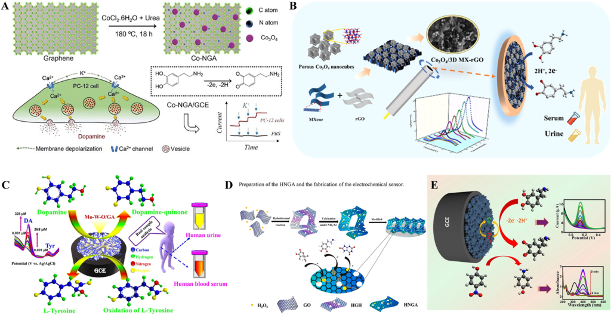

Fig. 5 (A) Nitrogen-doped graphene aerogel/Co3O4-modified electrode for the sensitive monitoring of dopamine from living cells. Reproduced with permission from ref. 87. Copyright 2022, Elsevier. (B) Electrochemical detection of dopamine on glassy carbon electrodes modified with porous Co3O4 nanocubes/3D MXene-reduced graphene oxide aerogel. Reproduced with permission from ref. 67. Copyright 2025, Elsevier. (C) Mo–W–O/graphene aerogel-modified glassy carbon electrode for the electrochemical detection of dopamine and tyrosine. Reproduced with permission from ref. 70. Copyright 2021, Elsevier. (D) Simultaneous electrochemical determination of dopamine, ascorbic acid, and uric acid on holey nitrogen-doped graphene aerogel-modified glassy carbon electrode. Reproduced with permission from ref. 66. Copyright 2021, Elsevier. (E) Electrochemical determination of dopamine and 4-nitrophenol on a glassy carbon electrode modified with copper aerogel. Reproduced with permission from ref. 88. Copyright 2025, Elsevier. 

## 4.4. Aerogel-based detection of other biomolecules 

Ascorbic acid or vitamin C acts as a potent antioxidant and protects cells from free radical damage.[89] It is also crucial for various bodily functions, such as wound healing, immune system support, collagen formation, and iron absorption.[90,91] Wang et al.[92] synthesized carbon nanorod-assembled meso– macroporous carbon aerogels from apple fruit and applied them for the amperometric determination of ascorbic acid and hydrogen peroxide (Fig. 6A). The carbon biomass derived from apples was characterized by a high density of defective edge sites and a large surface area, which greatly enhanced the electron transfer between analytes and the electrode surface. This study presents a significant advancement in sustainable electrochemical sensing by introducing an ecofriendly and cost-effective method to synthesize functional carbon aerogels from natural biomass. This technique avoids the use of toxic precursors and intricate templating processes. The resulting carbon aerogels feature a hierarchical mesoporous and macroporous structure made of interconnected carbon nanorods, which offer a high surface area, improved electrical conductivity, and efficient ion diffusion pathways. These structural characteristics lead to superior electrochemical performance, enabling highly sensitive and selective detection of ascorbic acid and hydrogen peroxide. The findings highlight a direct link between green chemistry principles and the development of 

functional materials. Ferrag et al.[74] reported the simultaneous detection of eight biomolecules on Pd–Fe nanoparticle-decorated graphene oxide aerogel. In this research, the bimetallic aerogel was immobilized on a glassy carbon electrode and used for the simultaneous voltammetric determination of ascorbic acid, cytosine, 8-hydroxyguanine, guanine, dopamine, uric acid, adenine, and thymine (Fig. 6B). Interestingly, this was the first simultaneous determination of eight biomolecules on a single electrode. The electrode was also tested for recovery studies from real samples, yielding satisfactory results. The hormone melatonin influences the body's internal clock and plays a crucial role in regulating sleep.[93] It also impacts other bodily functions such as mood disorders, puberty timing, immune regulation, and transplantation.[94] Rajkumar et al.[73] synthesized a palladium-supported carbon aerogel for the electrochemical determination of melatonin and dopamine (Fig. 6C). Here, a simple microwave reduction route is used for the synthesis of Pd/carbon aerogel composite with a large surface area and pore volume. The Pd/carbon aerogelmodified electrode was applied for the individual and simultaneous determination of melatonin and dopamine with a wide linear range (0.01–100 μM and 0.02–500 μM) and a low detection limit of 0.0026 and 0.0071 μM for dopamine and melatonin, respectively. Uric acid is linked to several health conditions, such as hyperuricemia, cardiovascular 

© 2025 The Author(s). Published by the Royal Society of Chemistry 

Sens. Diagn. 

**View Article Online** 

Critical review 

## Sensors & Diagnostics 

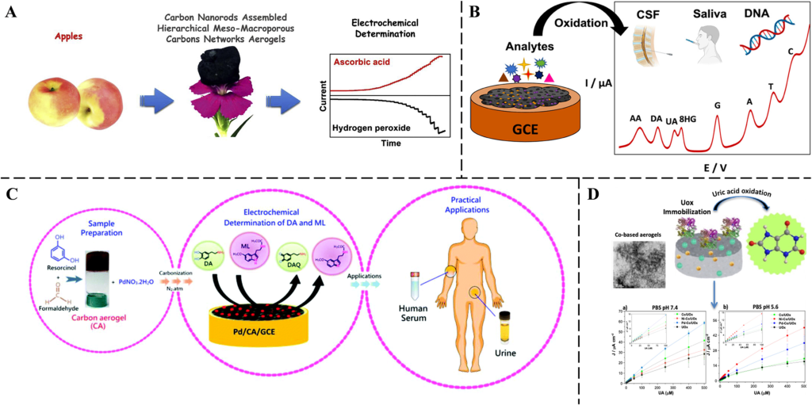

Fig. 6 (A) Apple-derived carbon nanorod-assembled meso–macroporous carbon aerogel for the electrochemical determination of ascorbic acid and hydrogen peroxide. Reproduced with permission from ref. 92. Copyright 2019, Elsevier. (B) Schematic representation of Pd–Fe nanoparticledecorated graphene oxide aerogel for the electrochemical detection of ascorbic acid, dopamine, uric acid, 8-hydroxyguanine, guanine, adenine, thymine, and cytosine. Reproduced with permission from ref. 74. Copyright 2023, American Chemical Society. (C) Schematic illustration of the fabrication of palladium nanoparticle-supported carbon aerogel nanocomposite for the electrochemical detection of melatonin and dopamine. Reproduced with permission from ref. 73. Copyright 2017, the Royal Society of Chemistry. (D) Schematic illustration of urate oxidase enzymeimmobilized Ni–Co and Pd–Co aerogels for the electrochemical determination of uric acid. Calibration curves of Co/UOx, Ni-Co/UOx, Pd-Co/UOx, and UOx in a) PBS 7.4 containing 0–500 μM uric acid, and b) pH 5.6 containing 0–500 μM uric acid. Reproduced with permission from ref. 65. Copyright 2025, Elsevier. 

problems, hypercholesterolemia, hypertension, Lesch–Nyhan syndrome, and renal dysfunction.[95] At physiological pH, biomolecules exist in their functional state, and the determination of biomolecules at physiological pH is considered advantageous. Ruiz-Guerrero et al.[65] reported the physiological pH electrochemical determination of uric acid on urate oxidase enzyme-immobilized Ni-Co and Pd–Co aerogels (Fig. 6D). The aerogel-modified electrodes exhibited improved performance compared to the electrodes modified with the urate oxidase enzyme. 

## 4.5. Aerogel-based sensors for other prognostic biomarkers 

Biomarker detection requires sensitive detection platforms due to the low concentrations of these biomolecules.[96] Electrochemical techniques are often acknowledged as cutting-edge technology, and the heightened sensitivity provided by aerogel-based sensing platforms is often preferred for biomarker detection (Fig. 7). Aerogels with high porosity and surface area enhance the interaction between the biomolecules and the sensing materials, resulting in sensitive and selective detection of the biomarkers. Biomarkers such as carcinoembryonic antigen (CEA),[97][–][100] tumor-derived exosomes,[99] prostate-specific antigen (PSA),[101,102] carbohydrate antigen 15-3 (CA 15-3),[103] alphafetoprotein (AFP),[97,99] human interleukin-6 (IL-6),[104] ATP5O, 

CANX genes,[105] human neutrophil elastase (HNE),[106] immunoglobulin G (IgG),[107] and platelet-derived growth factor-BB (PDGF-BB),[108] have been analyzed using aerogelbased sensing platforms (Table 2). 

Carcinoembryonic antigens are a serum biomarker that is elevated in many types of malignancies, including mucinous ovarian cancer, thyroid cancer, colorectal cancer, and breast cancer.[109] CEA biomarker detection is used as an auxiliary tool, combined with pathology and imaging techniques for cancer diagnosis. Majeed et al.[98] described reduced graphene oxide, terbium@amine-functionalized fibrous silica (Tb@FNS-NH2), and β-cyclodextrin-modified screen-printed carbon electrodes for the detection of CEA (Fig. 7C). This study addresses the persistent challenge of biofouling in clinical sensing by developing a nanocomposite interface with low biofouling properties. The integration of terbium ions enables a ratiometric electrochemical detection approach, which provides internal calibration to minimize background interference. The design involving the carboxylic groups in β-CD-COOH, rGO aerogel and Tb@FNS-NH2 achieves high surface area, efficient electron transport, and enhanced antibody immobilization, resulting in improved sensitivity, selectivity, and stability for carcinoembryonic antigen (CEA) detection. The immunosensor reported a wide dynamic range (10 fg ml[−][1] to 1.0 ng ml[−][1] ) and a low limit of detection (6.0 fg ml[−][1] ) for CEA. Prostate-specific antigen 

© 2025 The Author(s). Published by the Royal Society of Chemistry 

Sens. Diagn. 

**View Article Online** 

Sensors & Diagnostics 

## Critical review 

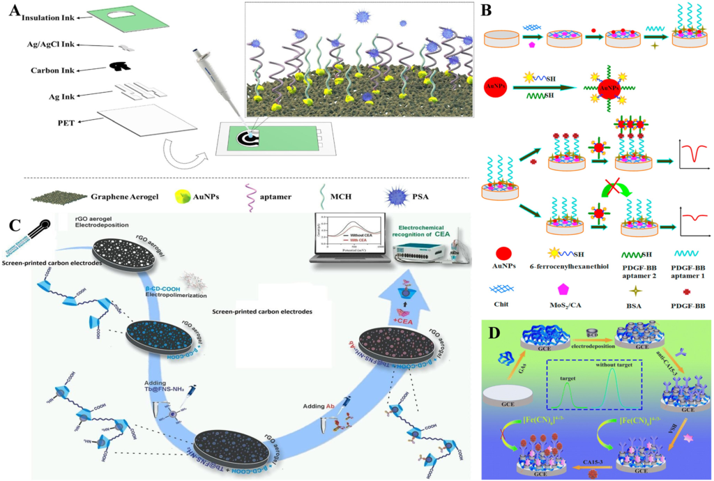

Fig. 7 (A) Schematic representation of graphene aerogel-based aptasensors for prostate-specific antigen detection. Reproduced with permission from ref. 101. Copyright 2023, Elsevier. (B) Molybdenum disulfide/carbon aerogel composite-based electrochemical detection of platelet-derived growth factor BB (PDGF-BB). Reproduced with permission from ref. 108. Copyright 2015, Elsevier. (C) Schematic representation of the CEA immunosensor based on a screen-printed carbon electrode modified Ab/Tb@FNS-NH2/β-CD-COOH/rGO aerogel. Reproduced with permission from ref. 98. Copyright 2025, Elsevier. (D) Polymeric β-cyclodextrin/graphene aerogel-modified anti-CA15-3 for the detection of breast cancer biomarker CA 15-3. Reproduced with permission from ref. 103. Copyright 2018, Springer. 

(PSA) is a protein biomarker secreted by the epithelial cells of the prostate.[110] A high PSA level may indicate prostate cancer, and PSA has been widely utilized for the detection and diagnosis of prostate cancer.[111] Hu et al.[101] reported an aptamer-based electrochemical PSA detection platform using 3D graphene aerogels (Fig. 7A). In this work, Au nanoparticles were introduced into the aerogels to improve the sensitivity of detection. Impedance spectroscopy was then used as an electrochemical technique for the sensitive detection of PSA in the dynamic range of 0.05 to 50 ng ml[−][1] with a limit of detection of 0.0306 ng ml[−][1] . Carbohydrate antigen 15-3 (CA 15-3) is often used as a biomarker for estimating the progression of breast cancer.[112] Jia et al.[103] immobilized CA15-3 antibody on graphene aerogel and polymeric β-cyclodextrin-modified electrode for the voltammetric determination of CA 15-3 (Fig. 7D). In this work, the large effective surface area and high electrical conductivity of graphene aerogel resulted in high antibody loading and strong voltammetric response for CA 15-3. The immune sensor achieved a linear response range of 0.1 mU ml[−][1] to 100 U ml[−][1] and a lower detection limit of 0.03 mU 

ml[−][1] . Serum platelet-derived growth factor BB (PDGF-BB) is applied as a potential biomarker for the assessment of liver fibrosis in hepatitis B patients,[113] for differentiating bipolar disorders,[114] identifying oxidative stress in inflammatory bowel disease,[115] and fulminant hepatic failure,[116] whereas urine PDGF-BB may be applied for the early diagnosis of prostate cancer.[117] Fang et al.[108] described a sandwich electrode based on a dual aptamer-modified MoS2/carbon aerogel electrode for the detection of PDGF-BB (Fig. 7B). 

## 4.6. Aerogel-based wearable and smart biosensors 

Wearable biosensors address the limitations of conventional biosensors and demonstrate significant potential for the personalized treatment of physical conditions.[119,120] Electrochemical techniques are valued for their high selectivity,[121] simplicity,[122] and sensitivity,[123] making them popular in the development of wearable sensors.[124] Aerogelbased non-invasive wearable sensors have garnered attention due to the inherent benefits of aerogels along with their ability to minimize the discomfort associated with invasive 

© 2025 The Author(s). Published by the Royal Society of Chemistry 

Sens. Diagn. 

**View Article Online** 

Critical review 

## Sensors & Diagnostics 

Table 2 Recent reports on aerogels for biomarker detection 

|Type of|||||||
|---|---|---|---|---|---|---|
|aerogel|Sensor composition|Target analyte|Sensing mechanism|Detection range|LOD|Ref.|
|Graphene|3D graphene–Au aerogels|Carcinoembryonic|Electrochemical detection using|0.5 pg ml−1 to|0.15 pg ml−1|100|
|aerogel|on glassy carbon electrode|antigen|H2O2 reduction with CZTS NCs,|20 ng ml−1|||
||(GCE); Ab1 antibody; CZTS||measured by amperometry||||
||NCs as the label||||||
|Graphene|Nano-PEDOT-graphene|Prostate-specific|Electrochemical Immunosensor:|0.0001 to|0.03 pg ml−1|118|
|aerogel|aerogel composite with|antigen|DPV is used for detection, with|50 ng ml−1|||
||AuNPs, GCE||[Fe(CN)6]3−/4−as the redox||||
|Graphene|Pβ-CD/graphene aerogel|Carbohydrate|Electrochemical immunosensor:|0.1 mU ml−1 to|0.03 mU|103|
|aerogel|nanocomposite and|antigen 15-3|DPV is used for detection, with|100 U ml−1|ml−1||
||anti-CA 15-3 antibody||[Fe(CN)6]3−/4−as the redox||||
|Graphene|Graphene aerogel|Alpha-fetoprotein,|Electrochemical immunosensor:|AFP: 7.9 pg ml−1|AFP: 7.9 pg|99|
|aerogel|functionalized with specific|carcinoembryonic|electrochemical impedance|to 10μg ml−1,|ml−1, CEA:||
||antibodies in ITO|antigen, tumor|spectroscopy (EIS) is used for|CEA: 7.9 pg ml−1|6.2 pg ml−1,||
|||cell-derived|detection, with [Fe(CN)6]3−/4−as|to 500 ng ml−1,|exosomes:||
|||exosomes|the redox|exosomes: 10 to|10 particles||
|||||106 particles per|perμL||
|||||μL|||
|Graphene|Graphene|Prostate-specific|Electrochemical immunosensor:|0.05 to|0.0306 ng|101|
|aerogel|aerogel/AuNPs/Nafion-modified|antigen|EIS is used for detection, with|50 ng ml−1|ml−1||
||SPE with aptamers||K3[Fe(CN)6]/K4[Fe(CN)6] as the||||
||||redox||||
|Graphene|rGO-carboxymethyl|Carcinoembryonic|Electrochemical detection using|10 fg ml−1 to 1.0|6.0 fg ml−1|98|
|aerogel|β-cyclodextrin|antigen|[Fe(CN)6]3−/4−as a redox probe|ng ml−1|||
||(β-CD-COOH) and||in SWV||||
||Tb@FNS-NH2composite||||||
|Graphene|Pd NP-functionalized|Prostate-specific|Ru@FGA-Pd enhances|0.0001 to|0.056 pg|102|
|aerogel|Fe3O4-supported GA (FGA-Pd),|antigen|electrochemiluminescence (ECL)|50 ng ml−1|ml−1||
||Ru(bpy)3 2+, Au-FONDs||efficiencyvia electrostatic||||
||||interaction, with Pd NPs||||
||||boosting electron transfer for||||
||||signal amplification||||
|Silica aerogel|Amino silica aerogel and|Human|Sandwich immunoassay-based|0.00001 to|10 fg ml−1|104|
||aminoalkylsilane|interleukin-6 (IL-6)|fluorescence detection|10 000 ng ml−1|||
||||(Cy5-labeled secondary antibody)||||
|Silica aerogel|Tetraethyl orthosilicate,|DNA (ATP5O,|Fluorescence detection after|0.00001 to|0.00001 ng|105|
||ionic liquid,|CANX genes)|DNA probe immobilization on|10 000 ng ml−1|ml−1||
||3-glycidoxypropyltrimethoxysilane,||the aerogel surface||||
||mesoporous silica aerogel||||||
|Nanocellulose|Greige cotton, calcium|Human neutrophil|Enzyme activity detection|0.02 to 0.1 U ml−1|0.13 units|106|
|aerogels|thiocyanate, lithium chloride,|elastase|through fluorescence emitted||per ml||
||fluorescent peptide substrate||after peptide cleavage||||
|Cellulose|CNF aerogel integrated into the|Immunoglobulin|Lateral flow immunoassay|0.17 to 100 ng|0.01 ng ml−1|107|
|nanofiber|lateral flow immunoassay strip|G (IgG)||ml−1 (buffer) and,|(buffer),||
|aerogel|between the conjugate pad and|||4.6 to 100 ng ml−1|0.72 ng ml−1||
||the nitrocellulose strip|||(serum)|(serum)||
|Carbon|MoS2/CA, AuNPs, Apt1, Apt2,|Platelet-derived|Differential pulse voltammetry|0.001 to 10 nM|0.3 pM|108|
|aerogel|Fc-AuNPs|growth factor BB|(DPV) is employed to detect the||||
|||(PDGF-BB)|electrochemical signal from the||||
||||Fc-labelled AuNPs||||
|Carbon|Ethylenediamine-MWCNT|Alpha-fetoprotein,|Square wave voltammetry (SWV):|0.005 to|AFP: 0.0015|97|
|nanotube|aerogels, AuNPs, thionine (Thi),|carcinoembryonic|using Thi and SfO as|1.0 ng ml−1|ng ml−1,||
|aerogel|safranine O (SfO), capture|antigen|distinguishable signal labels|for both AFP|CEA: 0.0010||
||antibodies (Cp-Ab1), SPCE|||and CEA|ng ml−1||

body fluid monitoring. Chen et al.[64] reported N-doped reduced graphene oxide/Au-based dual-aerogel as an electrode material for a wearable uric acid sensor that utilizes sweat (Fig. 8A). This study represents a significant advancement in continuous wearable biosensing technology for personalized healthcare. The synthesized 3D aerogel provided a large electroactive surface area and efficient electron transfer pathways. The electrode showcased direct 

electrooxidation of uric acid. The three-dimensional porous aerogel consisting of gold nanowires and N-doped graphene nanosheets (designated as N-rGO/Au DAs) offers rapid electron transfer, a large active surface, and ample access to the target. As a result, direct uric acid electro-oxidation occurs at the N-rGO/Au DAs with significantly greater activity than that of the individual gels (i.e., Au and N-rGO). Furthermore, the resulting sensing chip demonstrated high 

© 2025 The Author(s). Published by the Royal Society of Chemistry 

Sens. Diagn. 

**View Article Online** 

Critical review 

Sensors & Diagnostics 

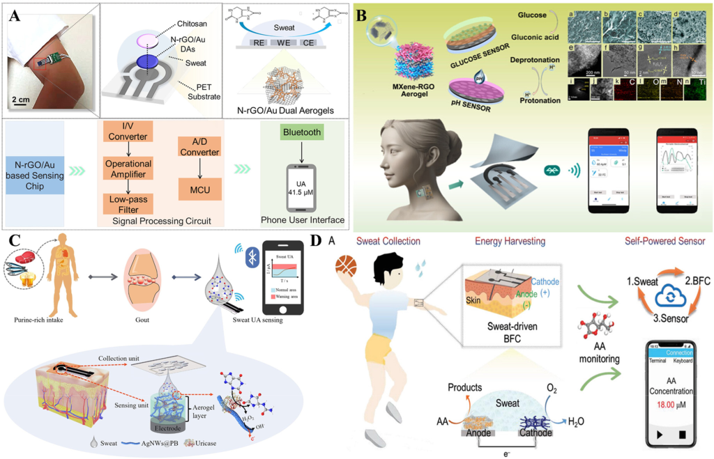

Fig. 8 (A) Schematics and working principle of N-doped reduced graphene oxide/Au aerogel-based nonenzymatic wearable uric acid sensor. Reproduced with permission from ref. 64. Copyright 2023, American Chemical Society. (B) Schematic illustration of the construction and working principle of the 3D graphene MXene aerogel-based integrated sweat glucose monitoring sensor. Reproduced with permission from ref. 125. Copyright 2024, American Chemical Society. (C) Illustration of wearable non-invasive dynamic monitoring of sweat uric acid based on silver nanowires@Prussian blue aerogel. Reproduced with permission from ref. 63. Copyright 2024, Elsevier. (D) Illustration of metal aerogel-based wearable biofuel cells for energy harvesting, sweat collection, and biosensor. Reproduced with permission from ref. 127. Copyright 2024, Wiley-VCH GmbH. 

performance, excellent anti-interference capabilities, longterm stability, and remarkable flexibility for uric acid detection. With the addition of a wireless circuit, this wearable sensor is effectively utilized for the detection of uric acid from human skin. The results obtained are comparable to those assessed by high-performance liquid chromatography. This nonenzymatic aerogel biosensing platform shows great promise for the reliable monitoring of sweat metabolites and paves the way for metal-based aerogels to be used as flexible electrodes in wearable sensing. 

Smart sensors capable of continuously monitoring glucose levels without restricting the user's mobility are crucial for diabetes management. Chen et al.[125] synthesized a 3D porous aerogel from Ti3C2Tx MXene and reduced graphene oxide as electrode material for the smart sensing of glucose from human sweat (Fig. 8B). The porous aerogel, which firmly anchored the glucose oxidase enzyme, reduced the electron transfer distance between the electrode surface and the enzyme's redox center. The sensor could detect pH and adjust to the pH fluctuations in sweat, thereby increasing the sensitivity of the dynamic glucose monitoring 

by providing real-time pH calibration. The smart sensing platform holds promises for personalized fitness applications and health tracking. Jiang et al.[63] achieved Ag nanowires (AgNWs) and Prussian blue (PB) aerogel-based smart sensor for the detection of uric acid from sweat (Fig. 8C). Uric acid is produced in the human body through the metabolism of purine and is widely distributed throughout the body. Fluids such as blood, sweat, saliva, and urine contain varying amounts of uric acid. Since the human body cannot metabolize uric acid, it must be excreted through the kidneys, and the concentration of uric acid is closely related to potential diseases such as hypertension, kidney damage, gouty arthritis, and hyperuricemia.[126] The concentration of uric acid in sweat is extremely low and requires highly sensitive sensing platforms for the detection of uric acid from sweat. The aerogel-based smart sensor exhibited a wide linear range and high sensitivity for uric acid detection. The porous structure of the aerogel, along with a large active surface area and ample electron transfer pathways, facilitated the efficient diffusion of uric acid molecules and electrolytes, 

© 2025 The Author(s). Published by the Royal Society of Chemistry 

Sens. Diagn. 

**View Article Online** 

Critical review 

## Sensors & Diagnostics 

achieving high sensitivity and a wide linear range. A futuristic biosensing platform capable of continuous monitoring of sweat biomarkers while simultaneously harvesting energy directly from human sweat was designed by Chen et al.[127] using metal hydrogels. In this study, the metal hydrogels exhibited superior electrocatalytic capability towards the electrooxidation of ascorbic acid at the anode and reduction of oxygen at the cathode (Fig. 8D). The biofuel cell provided a stable power output for detecting ultralow concentrations of ascorbic acid over 30 days. A recent article by Chen-Xin Wang et al.[128] discusses the fabrication of a reliable pH sensor based on aerogel, capable of operating under extreme conditions, such as high-impact environments, where normal wearable sensors often fail due to mechanical stress. The sensor utilizes a porous, lightweight tungsten oxide aerogel for its structural integrity, high surface area, and pH sensitivity (−63.70 mV pH[−][1] ), allowing for stable pH detection across a wide range (3–8). The wearable sensor, which exhibited remarkable structural integrity after high impact (118.38 kPa), enabled real-time pH monitoring with a minimal relative deviation of 1.91% and good selectivity against common interfering ions such as NH4+, K+, Na+, and Ca2+. 

## 5. Integration of aerogels with microfluidics 

Microfluidic devices are suitable for the miniaturization of devices, enabling the manipulation of low volumes for rapid chemical and biological analysis.[129] The microfluidic devices reduce the cost and size of the detection system, thereby making them an attractive option for point-of-care and diagnostic applications.[130,131] Integrating aerogels with microfluidic devices represents a promising advancement that can enhance biosensing platform sensitivity, selectivity, and multifunctionality. The combination often results in the development of cost-effective, portable, and efficient biosensing platforms. Aerogels, with their inherently high surface-area-to-volume ratio, tunable porosity, and low thermal conductivity, offer a unique advantage for portable analytical systems.[44,132] Microfluidic platforms enable the controlled fabrication of aerogel structures such as microparticles and thin films by manipulating droplet formation and sol–gel transitions, allowing for precise tuning of size, morphology, and porosity.[133] Silica-based aerogels are commonly used due to their ultralow thermal conductivity and large internal surface area.[134] These aerogels have been successfully integrated into microfluidic chips for applications including surface modification, optical sensing, and catalytic reactions.[135] However, structural instability during the drying phase, such as cracking and shrinkage, remains a challenge. To address this, sol–gel methods combined with additives like polyethylene glycol (PEG) have been employed to reinforce mechanical strength and preserve porosity.[136] Functionalization with hydrophobic agents such as hexamethyldisilazane (HMDS) has further improved 

aerogel stability within microfluidic channels.[135] In addition to silica, biopolymer-based aerogels derived from materials such as chitosan, alginate, and cellulose exhibit excellent biocompatibility and have been explored for biomedical microfluidic applications. These organic aerogels are particularly valuable for biosensing in organ-on-a-chip models and in vitro diagnostics, where compatibility with biological samples is essential.[137] 

Aerogels also serve as effective substrates for biomolecule immobilization in microfluidic biosensors. Graphene-based aerogels, for example, provide conductive 3D scaffolds that enhance enzyme loading and facilitate electron transfer, improving electrochemical sensing performance.[45] Similarly, cellulose-based aerogels act as hydrophilic supports in disposable chips, promoting consistent fluid flow and prolonged enzyme activity.[138] Furthermore, aerogels with tunable hydrophobicity or hydrophilicity enable passive fluid control within microfluidic systems, eliminating the need for external pumps or valves. This feature is particularly useful for portable or field-deployable biosensing devices, where system simplicity is crucial.[44] Despite their potential, several integration challenges persist. The fragility of aerogels complicates their compatibility with traditional lithography-based microfabrication, necessitating hybrid approaches such as soft lithography or 3D printing.[139] Scalability and reproducibility of aerogel synthesis at the microscale also require further optimization to support commercial lab-on-a-chip development. The integration of aerogels with microfluidic devices provides a versatile, high-performance material class for enhancing biosensors. This holds significant promise for next-generation diagnostics, offering advantages such as minimal reagent use, enhanced sensitivity, rapid response times, and material tunability tailored to specific sensing environments. 

Yuan et al.[140] designed a membrane-based microfluidic chip integrated with an electrode for the voltammetric determination of tetracycline (Fig. 9A). In this research, inspired by the surface structure of leaves, copper alginateCNT/copper sulfide–graphene oxide aerogels were synthesized (Fig. 9B). The tetracycline antibiotics were adsorbed onto the aerogel membranes through π–π EDA interactions, facilitating the efficient adsorption of antibiotics on the aerogel. This efficient adsorption resulted in a selective sensor with negligible interference from inorganic and organic matter as well as other classes of antibiotics. Non-invasive sensors generated public interest due to their ability to alleviate the discomfort associated with invasive sensing techniques. This article represents a significant advancement in microfluidics, biosensing, environmental monitoring, and bioinspired design. The bionic leaf design replicates both the structure and the function of natural leaves. Incorporating a specialized membrane material enhances flexibility, permeability, and passive transport, thereby reducing system complexity and energy consumption. The application of a targeted gel membrane for adsorption enables highly selective, sensitive, and real-time detection, addressing a critical challenge in water quality monitoring. 

© 2025 The Author(s). Published by the Royal Society of Chemistry 

Sens. Diagn. 

**View Article Online** 

Critical review 

Sensors & Diagnostics 

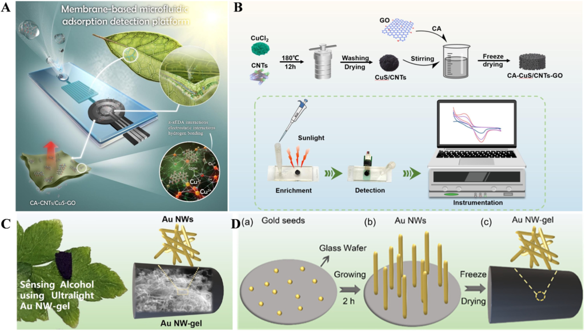

Fig. 9 (A) Schematic illustration of the membrane-based microfluidic adsorption detection platform for the determination of tetracyclic antibiotics. (B) Flow chart depicting the preparation of aerogel and the detection process. Reproduced with permission from ref. 140. Copyright 2024, Elsevier. (C) Schematic illustrations of the electrochemical ethanol detection from sweat using a gold nanowire aerogel-based biosensor. (D) Synthesis of gold nanowire aerogel, demonstrating (a) gold seed formation, (b) growth of the gold nanowire aerogel, and (c) the synthesis of gold nanowire aerogel. Reproduced with permission from ref. 141. Copyright 2022, American Chemical Society. 

Guan et al.[141] demonstrated an intriguing non-invasive aerogel-based biosensing platform for the determination of sweat ethanol (Fig. 9C and D). In this instance, a substrateassisted growth method was adopted for the synthesis of gold nanowire aerogel (Au NW-gel). The gel possessed an ultralow density, and the high gold content decreased the internal resistance of the electrode. The Au NW-gel-based bioelectrode exhibited a wide linear range for ethanol determination and retained 83% of its capacity while determining ethanol from simulated sweat. 

## 6. Futuristic devices and applications 

Aerogel-based futuristic devices are reported for temperature sensing in firefighting clothes,[142] pressure sensing,[143,144] speech recognition,[144] strain sensing,[145] health monitoring,[32,146] motion monitoring,[147] electronic skins,[32] information acquisition,[148] electromagnetic wave absorption,[149] boosting the energy efficiency in glazing windows,[150] human–computer interaction,[151] and fire alarms.[142,152] Nearly 40% of the global energy generated is consumed by buildings to maintain indoor conditions comfortable.[150] In this context, Abraham et al.[150] achieved simultaneous thermal insulation and high transparency on glazing windows using silanized cellulose aerogels (Fig. 10A). The aerogels with lower thermal conductivity and better light 

transmission contributed to enhanced energy efficiency by insulating the glass windows. Designing an efficient and accurate human–computer interface requires highly efficient pressure sensitivity, cycling stability, and a wide detection range for optimal performance. Hong et al.[151] reported a MXene/bacterial cellulose-based aerogel as a flexible pressure sensor for human–computer interface applications. The aerogel was characterized by a fast response time, mechanical durability up to 5000 cycles, a low detection limit, and high sensitivity. It was successfully integrated into a smart glove for human–computer interaction (Fig. 10B). This study advances the fields of flexible electronics, biosensors, materials science, and human–machine interfaces. The biomimetic honeycomb structure imparts lightweight, durable, and high-surface-area characteristics. Its design improves mechanical responsiveness and pressure sensitivity, thereby increasing sensor accuracy and efficiency. The structure facilitates effective stress distribution and rapid response to mechanical deformation, both of which are critical for real-time pressure sensing. Besides, the integration of Ti3C2Tx MXene, which exhibits high electrical conductivity, with bacterial cellulose (BC), a biocompatible and flexible polymer, results in enhanced material performance. 

The fragility and poor processability of aerogels significantly limit their application for thermal insulations. 

© 2025 The Author(s). Published by the Royal Society of Chemistry 

Sens. Diagn. 

**View Article Online** 

Critical review 

## Sensors & Diagnostics 

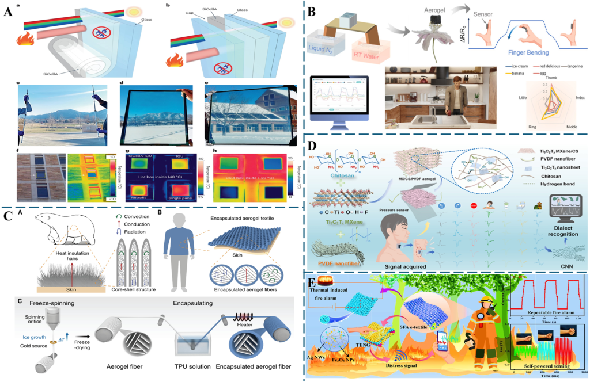

Fig. 10 (A) Schematic representation of silanized cellulose aerogels for enhancing the energy efficiency of glazing windows in buildings. Reproduced from ref. 150. (B) Illustration of MXene/bacterial cellulose aerogel for human–computer interaction. Reproduced with permission from ref. 151. Copyright 2025, American Chemical Society. (C) Design, fabrication, and thermal insulation properties of encapsulated aerogel fiber. Reproduced from ref. 153. (D) MXene composite aerogel-based pressure sensors for speech recognition and deep learning. Reproduced from ref. 144. (E) Schematic representation of the applications of self-powered e-textile fire alarms in energy harvesting, smart firefighting, location sharing, and real-time fire warning. Reproduced with permission from ref. 142. Copyright 2022, American Chemical Society. 

To overcome this challenge, Wu et al.[153] encapsulated aerogel fiber in a stretchable layer to create a core–shell aerogel structure. The resulting fiber was stretchable up to 1000% strain despite having an internal porosity of over 90%. The fiber was mechanically robust and retained thermal insulation properties even after 10 000 stretching cycles (Fig. 10C). Speech recognition can help overcome language barriers and assist human–computer interactions. Xiao et al.[144] reported a MXene/chitosan/polyvinylidene difluoride aerogel-based pressure sensor with a rapid response and low hysteresis for speech recognition through throat muscle vibrations. The device was able to detect six dialects and seven different words in a significant step towards human– computer interaction and speech recognition (Fig. 10D). A conductive aerogel comprising magnetite nanoparticles, calcium alginate, and silver nanowires was reported for the fabrication of a self-powered fire alarm e-textile. The e-textile was able to sense a wide range of temperatures, ranging from 100 to 400 °C, and send accurate geo-location to a nearby device, aiding in rescuing trapped firefighters (Fig. 10E). Wearable electronic devices convert physical signals such as strain, pressure, temperature, and acoustic signals into 

electrical signals based on capacitive, resistive, piezoelectric, or triboelectric principles.[154,155] Liu et al.[32] described a cellulose aerogel-based e-skin for personal healthcare applications. The e-skin realized a multifunctional wearable device for hyperthermia therapy, intelligent electronic masks, and dual-modal sensing. 

## 7. Environmental monitoring 

An interesting recent trend in aerogel technology is its application in environmental monitoring.[156][–][159] Aerogelbased sensors have been reported for detecting pesticides,[160][–][162] volatile organic compounds (VOCs),[163,164] heavy metals,[165] bisphenols,[61,62,166] glyphosate,[160] and pathogens in air and water. The porous structure and high surface area of aerogels are ideal for the adsorption and detection of trace amounts of pollutants and pathogens, resulting in sensitive environmental sensors. Aerogel-based sensors are also reported for detecting toxic gases such as nitrogen oxides,[167][–][169] sulfur oxides,[170] carbon dioxide,[171] formaldehyde,[172] and ammonia.[173] The working principle of these sensors involves trapping molecules inside the porous 

© 2025 The Author(s). Published by the Royal Society of Chemistry 

Sens. Diagn. 

**View Article Online** 

Sensors & Diagnostics 

## Critical review 

network of aerogels, leading to a measurable output signal such as a change in color, fluorescence, or conductivity. Zhang et al.[160] reported a photoelectrochemical phenylethynylcopper/N-doped graphene aerogel incorporated with magnetite nanoparticles as a nanozyme for the detection of glyphosate (Fig. 11A). This research combines analytical chemistry, environmental sensing, nanomaterials, and agricultural safety monitoring. The versatile hybrid sensing platform combines biocatalysis with the durability of nanomaterials, effectively addressing enzyme instability in environmental sensors. The 3D aerogel composite enhanced 

the transfer of the photogenerated electrons, providing high signal output and sensitivity. Furthermore, the peroxidase mimic, instead of the natural peroxidase enzyme, improved the stability of the sensor. The sensor reportedly provided a linear detection range for glyphosate detection from 5 × 10[−][10] to 1 × 10[−][4] M. 

In another study, melamine-doped rGO/MXene aerogel was employed as an electrode material for the electrochemical detection of heavy metal ions Zn[2+] , Cd[2+] , and Pb[2+] .[165] In this case, the composite material significantly enhanced the conductivity of the electrode, while the 

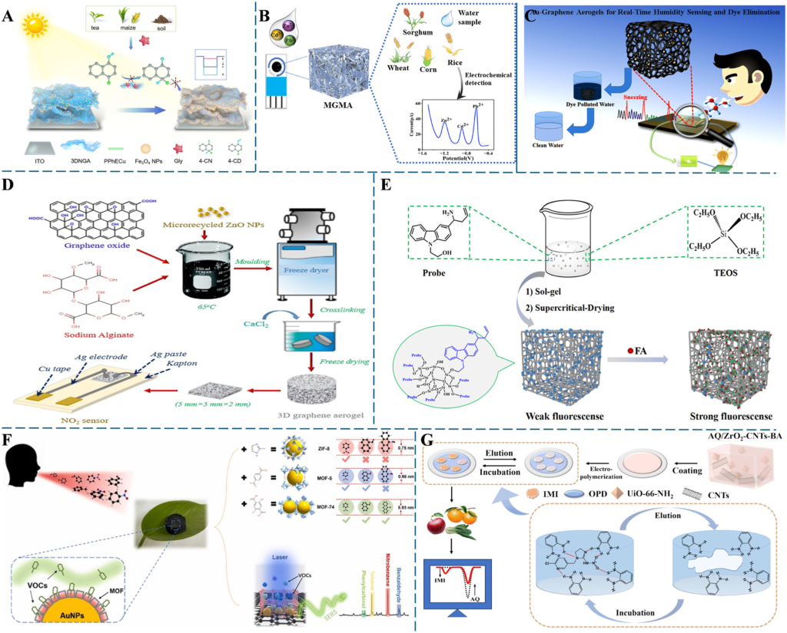

Fig. 11 (A) Schematic illustration of the photoelectrochemical detection of glyphosate on phenylethynylcopper/nitrogen-doped graphene aerogel electrode. Reproduced with permission from ref. 160. Copyright 2024, Elsevier. (B) Melamine-doped rGO/MXene aerogel-modified electrodes for the detection of heavy metals Zn[2+] , Cd[2+] , and Pb[2+] . Reproduced with permission from ref. 165. Copyright 2023, Elsevier. (C) Representation of the Au NP–graphene aerogels for toxic dye elimination and humidity monitoring. Reproduced with permission from ref. 174. Copyright 2021, Springer Nature. (D) Schematic representation of the synthesis of zinc oxide nanoparticle-incorporated graphene aerogel for the electrochemical determination of NO2. Reproduced with permission from ref. 167. Copyright 2021, Elsevier. (E) Schematic representation of the fluorescent determination of formaldehyde gas on silica aerogel. Reproduced with permission from ref. 172. Copyright 2021, Elsevier. (F) Schematic representation of the multiplexed detection of volatile organic compounds (VOCs) at graphene/AuNPs@ZIF-8 aerogel. Reproduced with permission from ref. 175. Copyright 2024, Elsevier. (G) Schematic representation of the voltammetric determination of imidacloprid pesticide on an anthraquinone/CNT/biomass-derived aerogel-modified glassy carbon electrode. Reproduced with permission from ref. 162. Copyright 2024, Elsevier. 

© 2025 The Author(s). Published by the Royal Society of Chemistry 

Sens. Diagn. 

**View Article Online** 

Critical review 

## Sensors & Diagnostics 

melamine-doped MXene served as recognition sites for the metal ions (Fig. 11B). A novel environmental remediation through toxic dye removal was reported by Ali et al.[174] In this report, graphene aerogels embedded with gold nanoparticles were synthesized using an in situ reduction method. The aerogel composite successfully removed methylene blue from an aqueous solution up to an extent of 90% (Fig. 11C). Graphene aerogel with embedded ZnO nanoparticles was reported for the detection of NO2 gas at room temperature.[167] In this research, an eco-friendly synthesis approach was adopted, with a zinc–carbon battery recovering the ZnO nanoparticles (Fig. 11D). The macroporous structure of the composite contributes to a higher response rate. The NO2sensing properties were reportedly attributed to the porous nature, high conductivity, and the interaction between p-type graphene and n-type ZnO. Zheng et al.[172] reported an aerogelbased fluorescent sensor for detecting formaldehyde gas. In this report, a fluorescent probe sensitive to formaldehyde gas was synthesized and covalently attached to the silica aerogel (Fig. 11E). The aerogel exhibited a detection limit of 110 ppm for formaldehyde gas. Sensitive identification of volatile organic compounds (VOCs) at the ppm level is crucial for environmental safety. Liu et al. reported the sensitive multiplexed detection of VOCs on a plasmonic aerogel (graphene/AuNPs@ZIF-8) with tunable pores.[175] In this research, the macro- and mesopores of graphene aerogel, along with the micropores of ZIF-8 metal–organic 

frameworks, enhanced the concentration of volatile organic compounds. The sensor identified multiple VOCs, including toluene, benzaldehyde, nitrobenzene, and benzyl alcohol, with high sensitivity (Fig. 11F). Ratiometric sensors are preferred for sensing applications due to their highly reliable signal output. Li et al.[162] reported an intriguing electrochemical ratiometric sensor for the insecticide imidacloprid using a lotus root powder-derived biomass aerogel (Fig. 11G). In this work, the authors synthesized carbon nanotubes and UiO-66-NH2-doped lotus root powder. The aerogel was immobilized with anthraquinone to produce one of the ratiometric signals. 

## 8. Aerogel-based optical sensors 

The colorimetric sensing applications of aerogels are significantly influenced by their high surface area, porous structure, chemical tunability, structural tunability, stability, and, in some cases, optical transparency. In most aerogelbased colorimetric sensors, the optical probes are immobilized within the aerogel pores. The large surface area and tunable properties enhance the optical signals, leading to improved detection. In some instances, the aerogel material itself catalyzes the colorimetric reaction. For instance, Yan et al.[176] reported a Pt–Bi aerogel colorimetric sensor for the discrimination of antioxidants. Here, antioxidants inhibit the intrinsic peroxidase-like activity of 

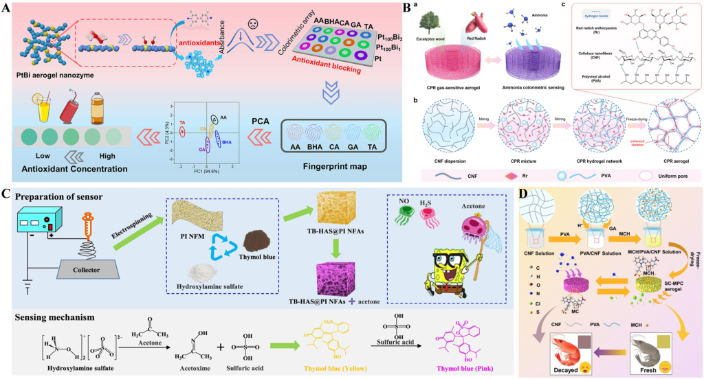

Fig. 12 (A) Schematic representation of the Pt–Bi aerogel-based colorimetric sensor array for the discrimination of antioxidants. Reproduced with permission from ref. 176. Copyright 2025, Elsevier. (B) Synthesis of poly(vinyl alcohol) and nanocellulose-based bio-aerogel for the colorimetric determination of ammonia. Reproduced with permission from ref. 177. Copyright 2024, American Chemical Society. (C) Development of 3D polyimide aerogel for the colorimetric detection of breath acetone. Reproduced with permission from ref. 178. Copyright 2024, Elsevier. (D) Schematic representation of the synthesis of sulfonated spirocyclic pyran aerogel for the visual detection of ammonia. Reproduced with permission from ref. 173. Copyright 2025, Elsevier. 

© 2025 The Author(s). Published by the Royal Society of Chemistry 

Sens. Diagn. 

**View Article Online** 

Sensors & Diagnostics 

## Critical review 

the Pt–Bi aerogel and prevent the oxidation of tetramethylbenzidine (Fig. 12A). Depending on the inhibitory effect of antioxidants, the color intensity varies, paving the way for the discrimination of antioxidants. Most nanozymebased sensors depend on activation mechanisms, such as catalytic enhancement. This article presents an inhibition effect-based sensing model, where antioxidants suppress the catalytic activity of Pt–Bi aerogel nanozymes. The inhibition effect changes the colorimetric response, enabling quantitative and selective detection. This shift in detection strategy broadens the applications of nanozymes and improves the ability to distinguish similar analytes, like structurally related antioxidants. 

Pan et al.[177] reported an environmentally friendly biobased aerogel for the colorimetric detection of ammonia. In this work, poly(vinyl alcohol) and pH- 

responsive radish anthocyanins were introduced into cellulose nanofibers to construct the colorimetric aerogel. The anthocyanins changed the color of the aerogel upon exposure to ammonia, and the aerogel successfully detected ammonia in the concentration range of 10–100 ppm (Fig. 12B). Cao et al.[178] demonstrated a colorimetric sensor for breath acetone based on polyimide nanofiber aerogels incorporated with hydroxylamine sulfate and thymol blue. The sensor principle involved the conversion of hydroxylamine sulfate to acetoxime and sulfuric acid in the presence of acetone. The sulfuric acid then reacted with thymol blue to produce pink-colored thymol blue (Fig. 12C). Liu et al.[173] reported a cost-effective ammoniasensitive aerogel based on sulfonic acid-functionalized spiropyran (Fig. 12D). The sensor operates on a straightforward mechanism of ammonia-mediated proton 

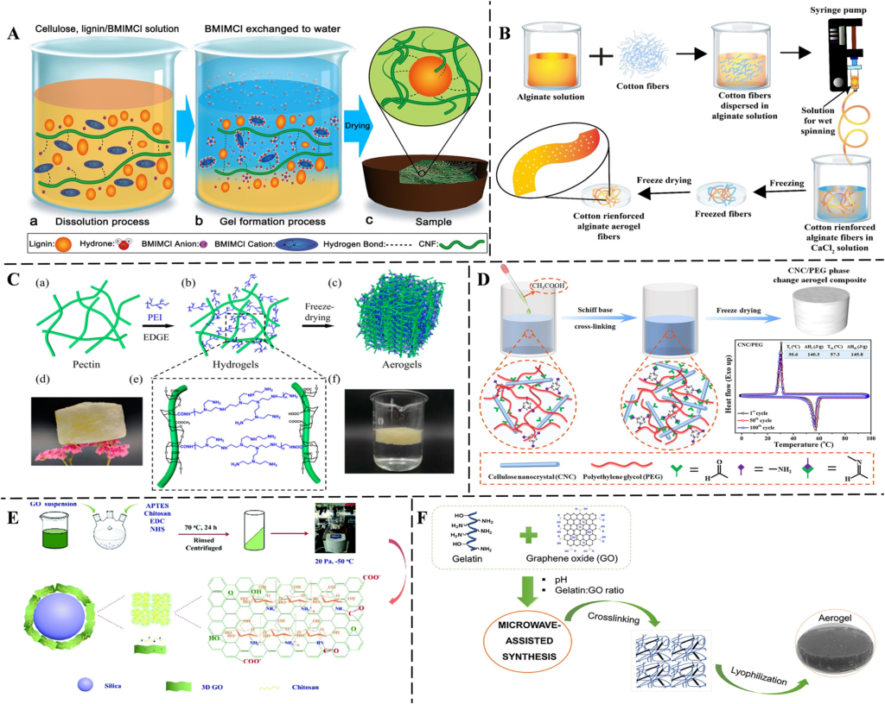

Fig. 13 (A) Schematic representation of the synthesis of nanostructured cellulose lignin aerogel. Reproduced from ref. 179. (B) Schematic representation of the synthesis of cotton-reinforced alginate aerogels. Reproduced with permission from ref. 182. Copyright 2024, Springer. (C) Illustration of the preparation and chemical structure of pectin aerogels. Reproduced from ref. 185. (D) One-step green synthesis of cellulose aerogel (the inset shows the cyclic DSC curves of cellulose nanocrystals/polyethylene glycol). Reproduced with permission from ref. 188. Copyright 2022, Elsevier. (E) Illustration of the synthesis of chitosan graphene oxide aerogel. Reproduced with permission from ref. 198. Copyright 2020, Royal Society of Chemistry. (F) Microwaveassisted synthesis of gelatin graphene oxide aerogel. Reproduced with permission from ref. 192. Copyright 2020, Elsevier. 

© 2025 The Author(s). Published by the Royal Society of Chemistry 

Sens. Diagn. 

**View Article Online** 

Critical review 

Sensors & Diagnostics 

transfer from sulfonic acid-functionalized spiropyran, accompanied by a color change. 

## 9. Biocompatibility and sustainability 

Recently, aligning with the growing trend in green chemistry, there has been a noticeable trend toward eco-friendly aerogels, particularly for medical and environmental applications, due to the growing demand for sustainable and environmentally friendly materials. Biodegradable and renewable materials such as lignin,[179] alginate,[180][–][183] pectin,[184,185] cellulose,[186][–][188] chitosan,[189,190] and gelatin[191,192] have been used to synthesize aerogels. Eco-friendly aerogels are extensively synthesized and applied for their reduced environmental impact. 

Lignin is a class of organic polymers that provides structural support for most plants. Wang et al.[179] reported cellulose as an adhesion agent and 1-butyl-3methylimidazolium chloride as a solvent for synthesizing lignin aerogels with high porosity through the solution– gelation approach (Fig. 13A). The resulting aerogels were characterized by low density and strong mechanical properties. Alginate aerogels are recognized for their high porosity, biocompatibility, and biodegradability.[183] Azam et al.[182] synthesized an alginate aerogel reinforced with cotton for environmental remediation (Fig. 13B). The synthesis process involved a simple wet spinning technique followed by freeze-drying. The oleophobic surface of the resulting aerogel fibers was effective for separating oil/water mixtures. The alginate–cotton blended aerogel fibers represent a significant advancement in environmental remediation, sustainable materials science, and textile engineering. These aerogel fibers are biodegradable, nontoxic, readily available, and cost-effective. In contrast to conventional aerogels, which are typically fragile and brittle monoliths, the present study produces aerogels in fiber form, resulting in enhanced flexibility. Fiber-based aerogels offer greater practicality for applications including filtration mats, separation filters, wearable textiles, and oil–water separation. 

Pectins are a class of heteropolysaccharides found in the cell walls of terrestrial plants.[193] They are widely used in the food and pharmaceutical industries as gelling, emulsifying, and thickening agents.[194] Wang et al.[185] reported the synthesis of a porous pectin-based aerogel by using polyethyleneimine and ethylene glycol diglycidyl ether as a cross-linker (Fig. 13C). The aerogel contained –NH2 and oxygen functionalities, offering advantages such as easy recyclability and high mechanical strength. The synthesized aerogel was successfully applied to remove Pb[2+] ions from aqueous solutions. Cellulose has gained attention due to its biocompatible and renewable properties.[195] Additionally, cellulose has ultralow density, making it suitable for the synthesis of aerogels.[196] Cheng et al.[188] reported the one-step green synthesis of cellulose aerogels with enhanced mechanical properties (Fig. 13D). In this process, polyethylene glycol was slowly added to the aldehyde- 

modified cellulose nanocrystal, followed by the subsequent addition of acetic acid. The gel was then freeze-dried to obtain the aerogel. Chitosan is a biocompatible natural polysaccharide produced by the deacetylation of chitin.[197] The properties of chitosan are often influenced by the level of deacetylation and the degree of polymerization. Wu et al.[198] described an amidation reaction for the immobilization of chitosan and graphene oxide on a silica surface, followed by freeze-drying to produce a chitosan/ graphene oxide aerogel (Fig. 13E). The reported aerogel was successfully used for extracting herbicides from vegetables. Gelatin aerogels utilize gelatin, a protein derived from collagen, as their main component.[199] The low cost, sustainability, and biocompatibility make gelatin a suitable material for aerogel synthesis.[200] Borges-Vilches et al.[192] reported microwave-assisted synthesis of gelatin/graphene oxide aerogels (Fig. 13F). This microwave-assisted method significantly reduced the reaction time compared to traditional methods, and the aerogel proved suitable for wound dressing applications. 

## 10. Future prospects and conclusion 

Aerogels are rapidly advancing technologies with significant potential for various sensing applications. Continuous improvements in aerogel synthesis, functionalization, and their integration with technologies like microfluidics and nanomaterials are expanding the horizons of biosensing, paving the way for groundbreaking innovations in medical diagnostics and environmental monitoring. The unique structural, physicochemical, and functional properties of aerogels are crucial for developing high-performance biosensing platforms. This review presents an extensive overview of the applications of different aerogels, including those made from silica, cellulose, carbon, graphene, and hybrid composites, in sensing tasks. Their notable attributes are high porosity, extensive surface area, customizable nanoarchitecture-enhanced analyte accessibility, biorecognition component immobilization, and signal amplification. These characteristics are vital for the sensitive and selective detection of biomolecules like glucose, DNA, proteins, antigens, and pathogens. A primary advantage of aerogel materials in biosensing is their biocompatibility. Organic or biopolymer-based aerogels, such as those derived from cellulose, alginate, and chitosan, demonstrate excellent cytocompatibility, low immunogenicity, and minimal toxicity, making them apt for both in vitro diagnostics and in vivo biosensing platforms. Consequently, biocompatible aerogels allow direct interaction with biological systems, enable realtime monitoring of physiological parameters, and facilitate the integration of biosensors into wearable or implantable devices without adverse reactions. Additionally, the inherent hydrophilicity of many biopolymer-based aerogels fosters analyte diffusion and enhances interactions with target biomolecules under sensing conditions. In the context of biological molecule sensing, aerogels provide a robust 

© 2025 The Author(s). Published by the Royal Society of Chemistry 

Sens. Diagn. 

**View Article Online** 

Sensors & Diagnostics 

## Critical review 

framework for immobilizing a wide variety of biorecognition elements. Their hierarchical porosity significantly aids in the entrapment or covalent attachment of enzymes, antibodies, DNA probes, and aptamers, conserving their native activity and ensuring high sensitivity at low detection limits. For example, aerogels modified with enzymes have displayed remarkable catalytic performance and signal responsiveness in glucose sensors, while carbon aerogel-based immunosensors excel in detecting viral and bacterial antigens. Furthermore, molecular imprinting within aerogel matrices is emerging as a popular technique for creating artificial recognition sites for small biomolecules, offering an alternative to conventional bio-receptors. 

Aerogels possess properties that enable advanced sensing capabilities, surpassing the limitations of conventional sensing materials. Conventional sensing materials generally exhibit lower surface-to-volume ratios, slower analyte diffusion, and reduced flexibility, which limits their suitability for applications demanding high sensitivity, rapid response, or integration into portable and wearable devices. In contrast, the extensive surface area and porous structure of aerogels provide numerous active sites for analyte adsorption, supporting detection at ultralow concentrations. This sensitivity often eliminates the need for signal amplification that traditional sensors require. The interconnected nanopores in aerogels facilitate efficient analyte diffusion, resulting in response and recovery times ranging from seconds to minutes. These rapid dynamics enable real-time sensing in applications such as wearable health monitoring, where conventional sensors may fail to detect transient events. Chemical modification of aerogels allows the incorporation of specific binding sites, thereby enhancing selectivity for target analytes and reducing interference. Additionally, aerogels exhibit elasticity and compressibility, enabling them to withstand significant deformation and supporting the development of piezoresistive sensors capable of detecting strains or pressures. These characteristics facilitate the creation of wearable technologies, including motion trackers that monitor wrist pulses, vocal-cord vibrations, or facial expressions in real time. Superhydrophobic aerogel variants maintain stable performance in humid or perspiring conditions, expanding their applicability in outdoor and biomedical environments. The low density of aerogels enables the fabrication of ultralight sensors suitable for portable applications, whereas bulky traditional setups are often impractical. Furthermore, durability, mechanical stability, and tunable hydrophobicity ensure reliable sensing in extreme environments, including high humidity and wide temperature ranges. These attributes enable aerogels to outperform conventional materials that may degrade or lose accuracy under such conditions. 

Despite these advancements, several substantial limitations and technical challenges remain that must be overcome to fully harness the potential of aerogel-based biosensors. Traditional aerogels, particularly those made 

from silica, often have mechanical fragility, restricting their application in dynamic or flexible environments. Moreover, their sensitivity to external factors, such as high humidity or extreme temperatures, can degrade sensor performance over time. Batch-to-batch variability and complexities in sensor fabrication further hinder scalability and reproducibility, posing significant barriers to commercial viability. Additionally, biosensing platforms confront fundamental issues related to long-term sensor operation due to biofouling. Aerogels themselves can act as antifouling coatings for biosensors. Their high porosity and customizable surface properties enable selective analyte access while inhibiting the adhesion of non-specific biomolecules or microbes. To enhance this capability, surface functionalization with hydrophilic or zwitterionic groups, along with the use of cellulose and alginate-based biopolymer aerogels, can produce antifouling coatings that maintain sensor functionality over time. This characteristic is particularly advantageous for wearable and implantable biosensors, where biofouling poses a continuous challenge. Another promising yet underexplored area is the integration of aerogels with microfluidic systems, which are increasingly essential in the development of miniaturized, point-of-care biosensing platforms. Thanks to their porous structure and surface functionalization options, aerogels can serve effectively as both support matrices and reaction chambers in microfluidic settings. Notably, when aerogels are combined with lab-on-a-chip devices, they facilitate localized biomolecule detection, efficient fluid management, and improved analyte capture through enhanced surface contact. Nevertheless, ensuring that aerogel production aligns with microfluidic device assembly techniques like photolithography or soft lithography remains a challenge. Thus, future research should aim at developing flexible aerogel composites that are both mechanically robust and suitable for microscale fabrication processes. Looking ahead, certain promising research avenues merit attention, particularly the development of hybrid aerogels comprising organic and inorganic materials or nanomaterials such as metal nanoparticles, carbon nanotubes, or quantum dots, which could address existing material limitations and enhance optical, electrical, and catalytic properties. These hybrid systems may significantly boost sensor performance, particularly in multiplexed or multi-analyte detection formats. Equally significant is the potential for smart aerogels that respond to stimuli like pH, temperature, light, or magnetic fields, paving the way for dynamic biosensors capable of real-time adaptation to biological changes. 

Alongside these developments, the emergence of wearable and implantable aerogel-based biosensors is anticipated, particularly those utilizing flexible aerogel films or coatings. These innovations could transform personalized healthcare by enabling continuous monitoring of physiological factors, such as glucose levels, electrolyte balance, and infection indicators in sweat, blood, or interstitial fluids. Combined with advancements in materials science, the integration of 

© 2025 The Author(s). Published by the Royal Society of Chemistry 

Sens. Diagn. 

**View Article Online** 

Critical review 

## Sensors & Diagnostics 

biosensor platforms with digital and AI-driven solutions introduces novel possibilities. By merging aerogel-based biosensors with wireless connectivity, cloud storage, and machine learning algorithms, researchers can facilitate advanced pattern identification, anomaly detection, and tailored health analyses. Ultimately, this synergy of material innovation and computational abilities is expected to reshape the diagnostic landscape and expedite the creation of intelligent diagnostic systems. From an environmental and industrial perspective, the eco-friendly synthesis of aerogels from biobased precursors and solvent-free or low-energy methodologies is gaining traction. As environmental regulations become stricter and sustainability gains prominence, exploring green aerogel fabrication technologies will not only reduce production costs but also enhance the eco-friendliness of the final products. Finally, successful clinical and commercial adoption will require collaborative efforts focused on standardization, regulatory compliance, and market-driven design. Key considerations include device packaging, user interfaces, cost efficiency, and validation in real-world settings. In summary, aerogels offer a transformative foundation for biosensing applications, merging expertise in material science with innovations in biomedical fields. With ongoing research directed towards optimizing materials, ensuring biocompatibility, enhancing integration with microfluidics and electronics, and promoting sustainable manufacturing, aerogelbased biosensors are well positioned to become essential elements in future diagnostic and monitoring systems across healthcare, environmental, and industrial sectors. 

## Conflicts of interest 

There are no conflicts to declare. 

## Data availability 

No primary research results, software or code have been included and no new data were generated or analysed as part of this review. 

## Acknowledgements 

This research was supported by the Basic Science Research Program through the National Research Foundation of Korea (NRF) (RS-2023-00243390). This work was supported by an NRF grant funded by the Korea government (MSIT) (No. 2020R1A5A1018052). This research was supported by the Chung-Ang University research grant in 2025. 

## References 

- 1 L. Kocon, F. Despetis and J. Phalippou, Ultralow density silica aerogels by alcohol supercritical drying, J. Non-Cryst. Solids, 1998, 225, 96–100. 

- 2 S. B. Riffat and G. Qiu, A review of state-of-the-art aerogel applications in buildings, Int. J. Low-Carbon Technol., 2013, 8(1), 1–6. 

- 3 S. S. Kistler, Coherent expanded aerogels and jellies, Nature, 1931, 127(3211), 741–741. 

- 4 A. C. Pierre, History of aerogels, Aerogels Handbook, Springer, 2011, pp. 3–18. 

- 5 R. Ciriminna, A. Fidalgo, V. Pandarus, F. Beland, L. M. Ilharco and M. Pagliaro, The sol–gel route to advanced silica-based materials and recent applications, Chem. Rev., 2013, 113(8), 6592–6620. 

- 6 M. M. Koebel, A. Rigacci and P. Achard, Aerogels for superinsulation: a synoptic view, Aerogels handbook, Springer, 2011, pp. 607–633. 

- 7 B. E. Yoldas, Alumina gels that form porous transparent Al2O3, J. Mater. Sci., 1975, 10(11), 1856–1860. 

- 8 M. Dowson, M. Grogan, T. Birks, D. Harrison and S. Craig, Streamlined life cycle assessment of transparent silica aerogel made by supercritical drying, Appl. Energy, 2012, 97, 396–404. 

- 9 J. A. Kenar, Porous structures from bio-based polymers via supercritical drying, Porous lightweight composites reinforced with fibrous structures, 2017, pp. 207–243. 

- 10 I. Adachi, T. Sumiyoshi, K. Hayashi, N. Iida, R. Enomoto, K. Tsukada, R. Suda, S. Matsumoto, K. Natori and M. Yokoyama, Study of a threshold Cherenkov counter based on silica aerogels with low refractive indices, Nucl. Instrum. Methods Phys. Res., Sect. A, 1995, 355(2–3), 390–398. 

- 11 M. Schneider and A. Baiker, Titania-based aerogels, Catal. Today, 1997, 35(3), 339–365. 

- 12 M. A. B. Meador, S. L. Vivod, L. McCorkle, D. Quade, R. M. Sullivan, L. J. Ghosn, N. Clark and L. A. Capadona, Reinforcing polymer cross-linked aerogels with carbon nanofibers, J. Mater. Chem., 2008, 18(16), 1843–1852. 

- 13 T. Guo, H. Mashhadimoslem, L. Choopani, M. M. Salehi, A. Maleki, A. Elkamel, A. Yu, Q. Zhang, J. Song and Y. Jin, Recent Progress in MOF-Aerogel Fabrication and Applications, Small, 2024, 20(43), 2402942. 

- 14 L. Wang, H. Xu, J. Gao, J. Yao and Q. Zhang, Recent progress in metal-organic frameworks-based hydrogels and aerogels and their applications, Coord. Chem. Rev., 2019, 398, 213016. 

- 15 C. Wang, J. Kim, J. Tang, J. Na, Y. M. Kang, M. Kim, H. Lim, Y. Bando, J. Li and Y. Yamauchi, Large-scale synthesis of MOF-derived superporous carbon aerogels with extraordinary adsorption capacity for organic solvents, Angew. Chem., 2020, 132(5), 2082–2086. 

- 16 C. Wei, Q. Zhang, Z. Wang, W. Yang, H. Lu, Z. Huang, W. Yang and J. Zhu, Recent advances in MXene-based aerogels: fabrication, performance and application, Adv. Funct. Mater., 2023, 33(9), 2211889. 

- 17 J. Zhou, Y. Sui, N. Wu, M. Han, J. Liu, W. Liu, Z. Zeng and J. Liu, Recent Advances in MXene-Based Aerogels for Electromagnetic Wave Absorption, Small, 2024, 20(49), 2405968. 

- 18 R. Bian, G. He, W. Zhi, S. Xiang, T. Wang and D. Cai, Ultralight MXene-based aerogels with high electromagnetic interference shielding performance, J. Mater. Chem. C, 2019, 7(3), 474–478. 

© 2025 The Author(s). Published by the Royal Society of Chemistry 

Sens. Diagn. 

**View Article Online** 

Critical review 

Sensors & Diagnostics 

- 19 G. Gorgolis and C. Galiotis, Graphene aerogels: a review, 2D Mater., 2017, 4(3), 032001. 

- 20 G. Nassar, E. Daou, R. Najjar, M. Bassil and R. Habchi, A review on the current research on graphene-based aerogels and their applications, Carbon Trends, 2021, 4, 100065. 

- 21 B. Gao, X. Feng, Y. Zhang, Z. Zhou, J. Wei, R. Qiao, F. Bi, N. Liu and X. Zhang, Graphene-based aerogels in water and air treatment: a review, Chem. Eng. J., 2024, 484, 149604. 

- 22 S. Korkmaz and İ. A. Kariper, Graphene and graphene oxide based aerogels: Synthesis, characteristics and supercapacitor applications, J. Energy Storage, 2020, 27, 101038. 

- 23 R. J. White, N. Yoshizawa, M. Antonietti and M.-M. Titirici, A sustainable synthesis of nitrogen-doped carbon aerogels, Green Chem., 2011, 13(9), 2428–2434. 

- 24 Y. Jiang, S. Chowdhury and R. Balasubramanian, Nitrogen and sulfur codoped graphene aerogels as absorbents and visible light-active photocatalysts for environmental remediation applications, Environ. Pollut., 2019, 251, 344–353. 

- 25 B. Zhang, F. Yang, X. Liu, N. Wu, S. Che and Y. Li, Phosphorus doped nickel-molybdenum aerogel for efficient overall water splitting, Appl. Catal., B, 2021, 298, 120494. 

- 26 A. Harley-Trochimczyk, T. Pham, J. Chang, E. Chen, M. A. Worsley, A. Zettl, W. Mickelson and R. Maboudian, Platinum nanoparticle loading of boron nitride aerogel and its use as a novel material for low-power catalytic gas sensing, Adv. Funct. Mater., 2016, 26(3), 433–439. 

- 27 X. Cao, S. Yan, F. Hu, J. Wang, Y. Wan, B. Sun and Z. Xiao, Reduced graphene oxide/gold nanoparticle aerogel for catalytic reduction of 4-nitrophenol, RSC Adv., 2016, 6(68), 64028–64038. 

- 28 S. P. Dubey, A. D. Dwivedi, I.-C. Kim, M. Sillanpaa, Y.-N. Kwon and C. Lee, Synthesis of graphene–carbon sphere hybrid aerogel with silver nanoparticles and its catalytic and adsorption applications, Chem. Eng. J., 2014, 244, 160–167. 

- 29 M. Li, T. Wu, Z. Zhao, L. Li, T. Shan, H. Wu, R. Zboray, F. Bernasconi, Y. Cui and P. Hu, Multiscale manufacturing of recyclable polyimide composite aerogels, Adv. Mater., 2025, 37(5), 2411599. 

- 30 L. Yang, H. Lu, H. Qiao, Z. Hao, Y. Yin, F. Guo, J. Wu, Y. Wang and W. Wang, Green and sustainable aerogel from chitosan and Caragana biochar for efficient, continuous and large-scale separation of complex emulsion, Sep. Purif. Technol., 2025, 362(1), 131731. 

- 31 Z. Tuo, Y. Pan and P. Cai, Facile and green fabrication of biodegradable aerogel from chitosan derivatives/modified gelatin as absorbent for oil removal, Int. J. Biol. Macromol., 2025, 298, 139949. 

- 32 S. Liu, W. Li, X. Wang, L. Lu, Y. Yao, S. Lai, Y. Xu, J. Yang, Z. Hu, X. Gong, K. C.-F. Leung and S. Xuan, Permeable, Stretchable, and Recyclable Cellulose Aerogel On-Skin Electronics for Dual-Modal Sensing and Personal Healthcare, ACS Nano, 2025, 19(3), 3531–3548. 

- 33 S. Mukhtar, A. Ali, S. Aryan, S. Shahid, M. N. Akhtar, J. S. Hidalg, M. Umar, A. M. El-Khawaga and M. S. Khan, Carbon-Based Smart Sensors for Environmental Pollution Detection, Smart Nanosensors, Springer, 2025, pp. 143–163. 

- 34 J. Li, L. Yang, S. Chen and G. Sun, Sustainable biomass aerogel with enhanced thermal and mechanical properties by industrial waste fly ash: A simple route for the green synthesis, eXPRESS Polym. Lett., 2025, 19(1), 47–59. 

- 35 Q. Zhang, X. Wang, X. Hu, D. Yang, H. Wei, X. Cao, Y. Hou and J. Wang, Green Synthesis of Fluorine-Containing Polyimide Aerogels toward Passive Daytime Radiative Cooling for Energy Saving, Compos. Commun., 2025, 57, 102450. 

- 36 F. Lu, J. Xu, Z. Li, X. Wang, J. Zhou, Y. Wang and F. Tan, Self-synthesized carbon nanotubes exhibiting temperatureresponsive effects to “modify” honeycomb lignin-based carbon aerogels for supercapacitor applications, J. Energy Storage, 2025, 110, 115348. 

- 37 H. Wang, Q. Fang, W. Gu, D. Du, Y. Lin and C. Zhu, Noble metal aerogels, ACS Appl. Mater. Interfaces, 2020, 12(47), 52234–52250. 

- 38 W. Gao and D. Wen, Recent advances of noble metal aerogels in biosensing, View, 2021, 2(3), 20200124. 

- 39 R. Du, X. Jin, R. Hübner, X. Fan, Y. Hu and A. Eychmüller, Engineering self-supported noble metal foams toward electrocatalysis and beyond, Adv. Energy Mater., 2020, 10(11), 1901945. 

- 40 F. J. Burpo, Noble Metal Aerogels, Springer Handbook of Aerogels, 2023, pp. 1089–1127. 

- 41 S. Ali, A. S. Sharma, W. Ahmad, M. Zareef, M. M. Hassan, A. Viswadevarayalu, T. Jiao, H. Li and Q. Chen, Noble metals based bimetallic and trimetallic nanoparticles: controlled synthesis, antimicrobial and anticancer applications, Crit. Rev. Anal. Chem., 2021, 51(5), 454–481. 

- 42 J. L. Gurav, I.-K. Jung, H.-H. Park, E. S. Kang and D. Y. Nadargi, Silica aerogel: synthesis and applications, J. Nanomater., 2010, 2010(1), 409310. 

- 43 S. G. Lemay and T. Moazzenzade, Single-Entity Electrochemistry for Digital Biosensing at Ultralow Concentrations, Anal. Chem., 2021, 93(26), 9023–9031. 

- 44 J. Yang, Y. Li, Y. Zheng, Y. Xu, Z. Zheng, X. Chen and W. Liu, Versatile Aerogels for Sensors, Small, 2019, 15(41), 1902826. 

- 45 J. Xu, K. Xu, Y. Han, D. Wang, X. Li, T. Hu, H. Yi and Z. Ni, A 3D porous graphene aerogel@GOx based microfluidic biosensor for electrochemical glucose detection, Analyst, 2020, 145(15), 5141–5147. 

- 46 J.-M. Jeong, M. Yang, D. S. Kim, T. J. Lee, B. G. Choi and D. H. Kim, High performance electrochemical glucose sensor based on three-dimensional MoS2/graphene aerogel, J. Colloid Interface Sci., 2017, 506, 379–385. 

- 47 Y. Wang, L. Lu, R. Tu, Y. Wang, X. Guo, C. Hou and Z. Wang, Introduction of Cascade Biocatalysis Systems into Metal–Organic Aerogel Nanostructures for Colorimetric Sensing of Glucose, ACS Appl. Nano Mater., 2022, 5(6), 8154–8160. 

© 2025 The Author(s). Published by the Royal Society of Chemistry 

Sens. Diagn. 

**View Article Online** 

Critical review 

## Sensors & Diagnostics 

- 48 C.-B. Ma, Y. Zhang, Q. Liu, Y. Du and E. Wang, Enhanced Stability of Enzyme Immobilized in Rationally Designed Amphiphilic Aerogel and Its Application for Sensitive Glucose Detection, Anal. Chem., 2020, 92(7), 5319–5328. 

- 49 Q. Fang, Y. Qin, H. Wang, W. Xu, H. Yan, L. Jiao, X. Wei, J. Li, X. Luo, M. Liu, L. Hu, W. Gu and C. Zhu, Ultra-Low Content Bismuth-Anchored Gold Aerogels with Plasmon Property for Enhanced Nonenzymatic Electrochemical Glucose Sensing, Anal. Chem., 2022, 94(31), 11030–11037. 

- 50 X. Wu, Y. Sun, T. He, Y. Zhang, G.-J. Zhang, Q. Liu and S. Chen, Iron, Nitrogen-Doped Carbon Aerogels for Fluorescent and Electrochemical Dual-Mode Detection of Glucose, Langmuir, 2021, 37(38), 11309–11315. 

- 51 Y. Song, T. He, Y. Zhang, C. Yin, Y. Chen, Q. Liu, Y. Zhang and S. Chen, Cobalt single atom sites in carbon aerogels for ultrasensitive enzyme-free electrochemical detection of glucose, J. Electroanal. Chem., 2022, 906, 116024. 

- 52 S. Dong, X. Yuan, Y. Chen, B. Liu, R. Dai, F. Dai, M. Xiang and Z. Yang, Assembling of self-supported metal−organic framework aerogel heterojunction for enhancing glucose sensing, J. Environ. Chem. Eng., 2025, 13(2), 116041. 

- 53 Z. Li, M. Jiang, D. Lu, Y. Wang, H. Li, W. Sun, J. Long, I. Jeerapan, J. L. Marty and Z. Zhu, Nonenzymatic glucose electrochemical sensor based on Pd–Cu bimetallic aerogels, Talanta, 2025, 287, 127641. 

- 54 B. Wang, S. Yan and Y. Shi, Direct electrochemical analysis of glucose oxidase on a graphene aerogel/gold nanoparticle hybrid for glucose biosensing, J. Solid State Electrochem., 2015, 19(1), 307–314. 

- 55 Y. Zhao, Y. Hu, J. Hou, Z. Jia, D. Zhong, S. Zhou, D. Huo, M. Yang and C. Hou, Electrochemical biointerface based on electrodeposition AuNPs on 3D graphene aerogel: Direct electron transfer of Cytochrome c and hydrogen peroxide sensing, J. Electroanal. Chem., 2019, 842, 16–23. 

- 56 X. Liu, T. Shen, Z. Zhao, Y. Qin, P. Zhang, H. Luo and Z.-X. Guo, Graphene/gold nanoparticle aerogel electrode for electrochemical sensing of hydrogen peroxide, Mater. Lett., 2018, 229, 368–371. 

- 57 Y. Yang, H. Zhang, J. Wang, S. Yang, T. Liu, K. Tao and H. Chang, A silver wire aerogel promotes hydrogen peroxide reduction for fuel cells and electrochemical sensors, J. Mater. Chem. A, 2019, 7(18), 11497–11505. 

- 58 Y. Zhu, B. Wang, W. Li and Y. Gao, Electrochemical Determination of Hydrogen Peroxide Based on the Synergistic Effect of Nitrogen-Doped Porous Carbon/Carbon Nanohybrid Aerogel, NANO, 2021, 16(12), 2150136. 

- 59 C. Pan, Y. Zheng, J. Yang, D. Lou, J. Li, Y. Sun and W. Liu, Pt–Pd Bimetallic Aerogel as High-Performance Electrocatalyst for Nonenzymatic Detection of Hydrogen Peroxide, Catalysts, 2022, 12(5), 528. 

- 60 S. Dong, L. Guo, Y. Chen, Z. Zhang, Z. Yang and M. Xiang, Three-dimensional loofah sponge derived amorphous carbon-graphene aerogel via one-pot synthesis for highperformance electrochemical sensor for hydrogen peroxide and dopamine, J. Electroanal. Chem., 2022, 911, 116236. 

- 61 M.-Y. Kim, K.-D. Seo, H. Park, R. G. Mahmudunnabi, K. Hwan Lee and Y.-B. Shim, Graphene-anchored conductive polymer aerogel composite for the electrocatalytic detection of hydrogen peroxide and bisphenol A, Appl. Surf. Sci., 2022, 604, 154430. 

- 62 M.-Y. Kim, H. Park, J.-Y. Lee, D. J. Park, J.-Y. Lee, N. V. Myung and K. H. Lee, Hierarchically palladium nanoparticles embedded polyethyleneimine–reduced graphene oxide aerogel (RGA–PEI–Pd) porous electrodes for electrochemical detection of bisphenol a and H2O2, Chem. Eng. J., 2022, 431, 134250. 

- 63 D. Jiang, Y. Zhu, Z. Sun, Z. Zhu, Q. He, X. Huang, Y. Yang, Y. Ge, Q. Zhang and Y. Wang, A silver nanowires@Prussian blue composite aerogel-based wearable sensor for noninvasive and dynamic monitoring of sweat uric acid, Chem. Eng. J., 2024, 486, 150220. 

- 64 Y. Chen, G. Li, W. Mu, X. Wan, D. Lu, J. Gao and D. Wen, Nonenzymatic Sweat Wearable Uric Acid Sensor Based on N-Doped Reduced Graphene Oxide/Au Dual Aerogels, Anal. Chem., 2023, 95(7), 3864–3872. 

- 65 C. D. Ruiz-Guerrero, D. V. Estrada-Osorio, A. Gutiérrez, F. I. Espinosa-Lagunes, R. A. Escalona-Villalpando, G. LunaBárcenas, A. Molina, A. Arenillas, L. G. Arriaga and J. Ledesma-García, Novel cobalt-based aerogels for uric acid detection in fluids at physiological pH, Biosens. Bioelectron., 2025, 267, 116850. 

- 66 S. Feng, L. Yu, M. Yan, J. Ye, J. Huang and X. Yang, Holey nitrogen-doped graphene aerogel for simultaneously electrochemical determination of ascorbic acid, dopamine and uric acid, Talanta, 2021, 224, 121851. 

- 67 X. Qi, H. Gao, L. Wu, Y. Zhou, H. Zhang, D. Chang and H. Pan, Enhanced electrochemical sensing platform based on porous Co3O4 nanocubes/3D MX-rGO aerogel for sensitive detection of dopamine, Electrochim. Acta, 2025, 524, 146040. 

- 68 H. Wu, Q. Wen, X. Luan, W. Yang, L. Guo and G. Wei, Facile Synthesis of Fe-Doped, Algae Residue-Derived Carbon Aerogels for Electrochemical Dopamine Biosensors, Sensors, 2024, 24(9), 2787. 

- 69 L. Mao, W. Bi, J. Ye, X. Wan, Y. Tang, Y. Chen, W. Liu and D. Wen, A smartphone-integrated CuFe aerogel nanozyme for rapid and visual detection of ascorbic acid in real samples, Talanta, 2025, 293, 128169. 

- 70 V. Mariyappan, T. Jeyapragasam, S.-M. Chen and K. Murugan, Mo-W-O nanowire intercalated graphene aerogel nanocomposite for the simultaneous determination of dopamine and tyrosine in human urine and blood serum sample, J. Electroanal. Chem., 2021, 895, 115391. 

- 71 Y. Sun, Y. Lin, W. Sun, R. Han, C. Luo, X. Wang and Q. Wei, A highly selective and sensitive detection of insulin with chemiluminescence biosensor based on aptamer and oligonucleotide-AuNPs functionalized nanosilica @ graphene oxide aerogel, Anal. Chim. Acta, 2019, 1089, 152–164. 

- 72 L. Ruiyi, W. Jiajia, L. Ling and L. Zaijun, Ultrasensitive direct detection of dsDNA using a glassy carbon electrode 

© 2025 The Author(s). Published by the Royal Society of Chemistry 

Sens. Diagn. 

**View Article Online** 

Sensors & Diagnostics 

## Critical review 

modified with thionin-functionalized multiple graphene aerogel and gold nanostars, Microchim. Acta, 2016, 183(5), 1641–1649. 

- 73 C. Rajkumar, P. Veerakumar, S.-M. Chen, B. Thirumalraj and S.-B. Liu, Facile and novel synthesis of palladium nanoparticles supported on a carbon aerogel for ultrasensitive electrochemical sensing of biomolecules, Nanoscale, 2017, 9(19), 6486–6496. 

- 74 C. Ferrag, M. Noroozifar and K. Kerman, Ultralight 3D Graphene Oxide Aerogel Decorated with Pd–Fe Nanoparticles for the Simultaneous Detection of Eight Biomolecules, ACS Appl. Mater. Interfaces, 2023, 15(23), 27502–27514. 

- 75 A. Koyappayil, C. S. R. Vusa and S. Berchmans, Enhanced peroxidase-like activity of CuWO4 nanoparticles for the detection of NADH and hydrogen peroxide, Sens. Actuators, B, 2017, 253, 723–730. 

- 76 A. Koyappayil, S. Berchmans and M.-H. Lee, Dual enzymelike properties of silver nanoparticles decorated Ag2WO4 nanorods and its application for H2O2 and glucose sensing, Colloids Surf., B, 2020, 189, 110840. 

- 77 E. A. Veal and P. Kritsiligkou, How are hydrogen peroxide messages relayed to affect cell signalling?, Curr. Opin. Chem. Biol., 2024, 81, 102496. 

- 78 M. Fransen and C. Lismont, Peroxisomal hydrogen peroxide signaling: A new chapter in intracellular communication research, Curr. Opin. Chem. Biol., 2024, 78, 102426. 

- 79 K. Theyagarajan, B. A. Lakshmi and Y.-J. Kim, Enzymeless detection and real-time analysis of intracellular hydrogen peroxide released from cancer cells using gold nanoparticles embedded bimetallic metal organic framework, Colloids Surf., B, 2025, 245, 114209. 

- 80 A. Koyappayil, S.-h. Yeon, S. G. Chavan, L. Jin, A. Go and M.-H. Lee, Efficient and rapid synthesis of ultrathin nickel-metal organic framework nanosheets for the sensitive determination of glucose, Microchem. J., 2022, 179, 107462. 

- 81 S. S. Menon, S. V. Chandran, A. Koyappayil and S. Berchmans, Copper- Based Metal-Organic Frameworks as Peroxidase Mimics Leading to Sensitive H2O2 and Glucose Detection, ChemistrySelect, 2018, 3(28), 8319–8324. 

- 82 M. Zhao and P. S. Leung, Revisiting the use of biological fluids for noninvasive glucose detection, Future Med. Chem., 2020, 12(8), 645–647. 

- 83 X. Yue, J. Feng, H. Li, Z. Xiao, Y. Qiu, X. Yu and J. Xiang, Novel synthesis of carbon nanofiber aerogels from coconut matrix for the electrochemical detection of glucose, Diamond Relat. Mater., 2021, 111, 108180. 

- 84 C. S. Rao Vusa, V. Manju, K. Aneesh, S. Berchmans and A. Palaniappan, Tailored interfacial architecture of chitosan modified glassy carbon electrodes facilitating selective, nanomolar detection of dopamine, RSC Adv., 2016, 6(6), 4818–4825. 

- 85 K. Aneesh and S. Berchmans, Highly selective sensing of dopamine using carbon nanotube ink doped with anionic 

   - surfactant modified disposable paper electrode, J. Solid State Electrochem., 2017, 21(5), 1263–1271. 

- 86 S. G. Chavan, P. R. Rathod, A. Koyappayil, A. Go and M.-H. Lee, “Two-step” signal amplification for ultrasensitive detection of dopamine in human serum sample using Ti3C2Tx-MXene, Sens. Actuators, B, 2024, 404, 135308. 

- 87 X. Zou, Y. Chen, Z. Zheng, M. Sun, X. Song, P. Lin, J. Tao and P. Zhao, The sensitive monitoring of living cell-secreted dopamine based on the electrochemical biosensor modified with nitrogen-doped graphene aerogel/Co3O4 nanoparticles, Microchem. J., 2022, 183, 107957. 

- 88 R. Ramkumar, P. Veerakumar, S. Rajendrachari, G. Dhakal, J. Yun, J.-J. Shim and W. K. Kim, Copper aerogel frameworks—Electrochemical detection of dopamine and catalytic reduction of 4-nitrophenol, Microchem. J., 2025, 208, 112486. 

- 89 F. E. Pehlivan, Vitamin C: An antioxidant agent, Vitamin C, 2017, 2, 23–35. 

- 90 A. C. Carr and S. Maggini, Vitamin C and immune function, Nutrients, 2017, 9(11), 1211. 

- 91 H. R. Bhoot, U. M. Zamwar, S. Chakole, A. Anjankar and H. Bhoot, Dietary sources, bioavailability, and functions of ascorbic acid (vitamin C) and its role in the common cold, tissue healing, and iron metabolism, Cureus, 2023, 15(11), e49308. 

- 92 N. Wang, Y. Hei, J. Liu, M. Sun, T. Sha, M. Hassan, X. Bo, Y. Guo and M. Zhou, Low-cost and environment-friendly synthesis of carbon nanorods assembled hierarchical mesomacroporous carbons networks aerogels from natural apples for the electrochemical determination of ascorbic acid and hydrogen peroxide, Anal. Chim. Acta, 2019, 1047, 36–44. 

- 93 N. Zisapel, New perspectives on the role of melatonin in human sleep, circadian rhythms and their regulation, Br. J. Pharmacol., 2018, 175(16), 3190–3199. 

- 94 S. B. Ahmad, A. Ali, M. Bilal, S. M. Rashid, A. B. Wani, R. R. Bhat and M. U. Rehman, Melatonin and Health: Insights of Melatonin Action, Biological Functions, and Associated Disorders, Cell. Mol. Neurobiol., 2023, 43(6), 2437–2458. 

- 95 D. Lakshmi, M. J. Whitcombe, F. Davis, P. S. Sharma and B. B. Prasad, Electrochemical detection of uric acid in mixed and clinical samples: a review, Electroanalysis, 2011, 23(2), 305–320. 

- 96 A. Koyappayil, A. K. Yagati and M.-H. Lee, Recent Trends in Metal Nanoparticles Decorated 2D Materials for Electrochemical Biomarker Detection, Biosensors, 2023, 13(1), 91. 

- 97 H. Filik, A. A. Avan, N. Altaş Puntar, M. Özyürek, Z. B. Güngör, M. Kucur, H. Kamış and D. A. Dicle, Ethylenediamine grafted carbon nanotube aerogels modified screen-printed electrode for simultaneous electrochemical immunoassay of multiple tumor markers, J. Electroanal. Chem., 2021, 900, 115700. 

- 98 A. A. Majeed, I. S. Gataa, Z. A. Ibadi Alaridhee, M. B. Alqaraguly, S. K. Ibrahim, S. Formanova, H. H. Abbas AlAnbari, M. S. Jabir, H. Majdi, Y. Y. Zaki Fareed, M. Kariem 

© 2025 The Author(s). Published by the Royal Society of Chemistry 

Sens. Diagn. 

**View Article Online** 

Critical review 

## Sensors & Diagnostics 

   - and M. M. Abomughaid, A low-fouling electrochemical immunosensor based on reduced graphene oxide and terbium@amine-functionalized fibrous silica-modified screen-printed carbon electrodes for ratiometric detection of carcinoembryonic antigen (CEA) in serum samples, Microchem. J., 2025, 210, 112928. 

- 99 T. Hu, Z. Wu, W. Sang, B. Ding, K. Chen, X. Li, Y. Shen and Z. Ni, A sensitive electrochemical platform integrated with a 3D graphene aerogel for point-of-care testing for tumor markers, J. Mater. Chem. B, 2022, 10(36), 6928–6938. 

- 100 L. Liu, R. Du, Y. Zhang and X. Yu, A novel sandwich-type immunosensor based on three-dimensional graphene–Au aerogels and quaternary chalcogenide nanocrystals for the detection of carcino embryonic antigen, New J. Chem., 2017, 41(17), 9008–9013. 

- 101 T. Hu, Z. Bai, D. Wang, Y. Bai, X. Li and Z. Ni, Electrochemical aptasensor based on 3D graphene aerogel for prostate specific antigen detection, Microchem. J., 2023, 195, 109436. 

- 102 L. Yang, Y. Li, Y. Zhang, D. Fan, X. Pang, Q. Wei and B. Du, 3D Nanostructured Palladium-Functionalized GrapheneAerogel-Supported Fe3O4 for Enhanced Ru(bpy)32+-Based Electrochemiluminescent Immunosensing of Prostate Specific Antigen, ACS Appl. Mater. Interfaces, 2017, 9(40), 35260–35267. 

- 103 H. Jia, Q. Tian, J. Xu, L. Lu, X. Ma and Y. Yu, Aerogels prepared from polymeric β-cyclodextrin and graphene aerogels as a novel host-guest system for immobilization of antibodies: a voltammetric immunosensor for the tumor marker CA 15–3, Microchim. Acta, 2018, 185(11), 517. 

- 104 Y. K. Li, Y.-C. Chen, K.-J. Jiang, J.-c. Wu and Y. W. ChenYang, Three-dimensional arrayed amino aerogel biochips for molecular recognition of antigens, Biomater., 2011, 32(30), 7347–7354. 

- 105 Y. K. Li, D.-K. Yang, Y.-C. Chen, H.-J. Su, J.-C. Wu and Y. W. Chen-Yang, A novel three-dimensional aerogel biochip for molecular recognition of nucleotide acids, Acta Biomater., 2010, 6(4), 1462–1470. 

- 106 J. V. Edwards, K. R. Fontenot, N. T. Prevost, N. Pircher, F. Liebner and B. D. Condon, Preparation, Characterization and Activity of a Peptide-Cellulosic Aerogel Protease Sensor from Cotton, Sensors, 2016, 16(11), 1789. 

- 107 Y. Tang, H. Gao, F. Kurth, L. Burr, K. Petropoulos, D. Migliorelli, O. T. Guenat and S. Generelli, Nanocellulose aerogel inserts for quantitative lateral flow immunoassays, Biosens. Bioelectron., 2021, 192, 113491. 

- 108 L.-X. Fang, K.-J. Huang and Y. Liu, Novel electrochemical dual-aptamer-based sandwich biosensor using molybdenum disulfide/carbon aerogel composites and Au nanoparticles for signal amplification, Biosens. Bioelectron., 2015, 71, 171–178. 

- 109 V. Kankanala, M. Zubair and S. K. Mukkamalla, Carcinoembryonic antigen, StatPearls, StatPearls Publishing, 2025, Available from: https://www.ncbi.nlm.nih. gov/books/NBK578172/. 

- 110 A. Moradi, S. Srinivasan, J. Clements and J. Batra, Beyond the biomarker role: prostate-specific antigen (PSA) in the prostate cancer microenvironment, Cancer Metastasis Rev., 2019, 38(3), 333–346. 

- 111 M. B. Gretzer and A. W. Partin, PSA markers in prostate cancer detection, Urol. Clin. North Am., 2003, 30(4), 677–686. 

- 112 M. Uehara, T. Kinoshita, T. Hojo, S. Akashi-Tanaka, E. Iwamoto and T. Fukutomi, Long-term prognostic study of carcinoembryonic antigen (CEA) and carbohydrate antigen 15-3 (CA 15-3) in breast cancer, Int. J. Clin. Oncol., 2008, 13, 447–451. 

- 113 J. Zhou, Y. Deng, L. Yan, H. Zhao and G. Wang, Serum platelet-derived growth factor BB levels: a potential biomarker for the assessment of liver fibrosis in patients with chronic hepatitis B, Int. J. Infect. Dis., 2016, 49, 94–99. 

- 114 K. Idemoto, T. Ishima, T. Niitsu, T. Hata, S. Yoshida, K. Hattori, T. Horai, I. Otsuka, H. Yamamori and S. Toda, Platelet-derived growth factor BB: A potential diagnostic blood biomarker for differentiating bipolar disorder from major depressive disorder, J. Psychiatr. Res., 2021, 134, 48–56. 

- 115 M. Krzystek-Korpacka, K. Neubauer and M. Matusiewicz, Platelet-derived growth factor-BB reflects clinical, inflammatory and angiogenic disease activity and oxidative stress in inflammatory bowel disease, Clin. Biochem., 2009, 42(16), 1602–1609. 

- 116 H. Takayama, Y. Miyake, K. Nouso, F. Ikeda, H. Shiraha, A. Takaki, H. Kobashi and K. Yamamoto, Serum levels of platelet-derived growth factor-BB and vascular endothelial growth factor as prognostic factors for patients with fulminant hepatic failure, J. Gastroenterol. Hepatol., 2011, 26(1), 116–121. 

- 117 A. Skarmoutsos, I. Skarmoutsos, I. Katafigiotis, E. Tataki, A. Giagini, C. Alamanis, I. Anastasiou, A. Angelou, M. Duvdevani and N. Sitaras, Detecting Novel Urine Biomarkers for the Early Diagnosis of Prostate Cancer: Platelet Derived Growth Factor-BB as a Possible New Target, Curr. Urol., 2018, 12(1), 13–19. 

- 118 H. Jia, J. Xu, L. Lu, Y. Yu, Y. Zuo, Q. Tian and P. Li, Threedimensional Au nanoparticles/nano-poly(3,4-ethylene dioxythiophene)- graphene aerogel nanocomposite: A highperformance electrochemical immunosensing platform for prostate specific antigen detection, Sens. Actuators, B, 2018, 260, 990–997. 

- 119 M.-M. Chen, S.-B. Cheng, K. Ji, J. Gao, Y.-L. Liu, W. Wen, X. Zhang, S. Wang and W.-H. Huang, Construction of a flexible electrochemiluminescence platform for sweat detection, Chem. Sci., 2019, 10(25), 6295–6303. 

- 120 L. Yin, M. Cao, K. N. Kim, M. Lin, J.-M. Moon, J. R. Sempionatto, J. Yu, R. Liu, C. Wicker and A. Trifonov, A stretchable epidermal sweat sensing platform with an integrated printed battery and electrochromic display, Nat. Electron., 2022, 5(10), 694–705. 

- 121 M. Venkatesan, C. S. R. Vusa, A. Koyappayil, S. G. Chavan and M.-H. Lee, Biological recognition element 

© 2025 The Author(s). Published by the Royal Society of Chemistry 

Sens. Diagn. 

**View Article Online** 

Sensors & Diagnostics 

## Critical review 

anchored 2D graphene materials for the electrochemical detection of hazardous pollutants, Electrochim. Acta, 2024, 494, 144413. 

- 122 B. J. Privett, J. H. Shin and M. H. Schoenfisch, Electrochemical sensors, Anal. Chem., 2008, 80(12), 4499–4517. 

- 123 G. Karuppaiah, A. Koyappayil, A. Go and M.-H. Lee, Ratiometric electrochemical detection of kojic acid based on glassy carbon modified MXene nanocomposite, RSC Adv., 2023, 13(50), 35766–35772. 

- 124 H. Li, H. Qi, J. Chang, P. Gai and F. Li, Recent progress in homogeneous electrochemical sensors and their designs and applications, TrAC, Trends Anal. Chem., 2022, 156, 116712. 

- 125 Y. Chen, H. Xiao, Q. Fan, W. Tu, S. Zhang, X. Li and T. Hu, Fully Integrated Biosensing System for Dynamic Monitoring of Sweat Glucose and Real-Time pH Adjustment Based on 3D Graphene MXene Aerogel, ACS Appl. Mater. Interfaces, 2024, 16(41), 55155–55165. 

- 126 R. Yu, Z. Deng, P. E. Sharel, L. Meng, R. Wang, Y. Wang, H. Li, X. Wang, K. Zhou, L. Ma and Q. Wei, Highly specific and sensitive quantification of uric acid in sweat using a dual boron-doped diamond electrode, Sens. Actuators, B, 2025, 426, 137031. 

- 127 Y. Chen, X. Wan, G. Li, J. Ye, J. Gao and D. Wen, Metal Hydrogel-Based Integrated Wearable Biofuel Cell for SelfPowered Epidermal Sweat Biomarker Monitoring, Adv. Funct. Mater., 2024, 34(42), 2404329. 

- 128 C.-X. Wang, G.-L. Li, Y. Hang, D.-F. Lu, J.-Q. Ye, H. Su, B. Hou, T. Suo and D. Wen, Shock-resistant wearable pH sensor based on tungsten oxide aerogel, Chin. Chem. Lett., 2025, 36(7), 110502. 

- 129 S. Vyawahare, A. D. Griffiths and C. A. Merten, Miniaturization and parallelization of biological and chemical assays in microfluidic devices, Chem. Biol., 2010, 17(10), 1052–1065. 

- 130 F. B. Myers and L. P. Lee, Innovations in optical microfluidic technologies for point-of-care diagnostics, Lab Chip, 2008, 8(12), 2015–2031. 

- 131 J. R. Mejia-Salazar, K. Rodrigues Cruz, E. M. Materon Vasques and O. Novais de Oliveira Jr., Microfluidic point-ofcare devices: New trends and future prospects for ehealth diagnostics, Sensors, 2020, 20(7), 1951. 

- 132 C. M. R. Almeida, B. Merillas and A. D. Pontinha, Trends on Aerogel-Based Biosensors for Medical Applications: An Overview, Int. J. Mol. Sci., 2024, 25(2), 1309. 

- 133 S. Karamikamkar, E. P. Yalcintas, R. Haghniaz, N. R. de Barros, M. Mecwan, R. Nasiri, E. Davoodi, F. Nasrollahi, A. Erdem, H. Kang, J. Lee, Y. Zhu, S. Ahadian, V. Jucaud, H. Maleki, M. R. Dokmeci, H.-J. Kim and A. Khademhosseini, Aerogel-Based Biomaterials for Biomedical Applications: From Fabrication Methods to Disease-Targeting Applications, Adv. Sci., 2023, 10(23), 2204681. 

- 134 A. L. Silveira Fiates, R. S. M. Almeida, M. Wilhelm, K. Rezwan and M. J. Vellekoop, Silica Aerogel in Microfluidic Channels: Synthesis, Chip Integration, Mechanical 

Reinforcement, and Characterization, ACS Omega, 2024, 9(40), 41480–41490. 

- 135 R. Nasiri, A. Shamloo, S. Ahadian, L. Amirifar, J. Akbari, M. J. Goudie, K. Lee, N. Ashammakhi, M. R. Dokmeci, D. Di Carlo and A. Khademhosseini, Microfluidic-Based Approaches in Targeted Cell/Particle Separation Based on Physical Properties: Fundamentals and Applications, Small, 2020, 16(29), 2000171. 

- 136 S. Reede, F. Bunge and M. J. Vellekoop, Integration of Silica Aerogels in Microfluidic Chips, Proceedings, 2017, 1(4), 298. 

- 137 Y. Jeong, R. Patel and M. Patel, Biopolymer-Based Biomimetic Aerogel for Biomedical Applications, Biomimetics, 2024, 9(7), 397. 

- 138 K. M. A. Uddin, V. Jokinen, F. Jahangiri, S. Franssila, O. J. Rojas and S. Tuukkanen, Disposable Microfluidic Sensor Based on Nanocellulose for Glucose Detection, GloB. Chall., 2019, 3(2), 1800079. 

- 139 J. Xu, M. Harasek and M. Gföhler, From Soft Lithography to 3D Printing: Current Status and Future of Microfluidic Device Fabrication, Polymer, 2025, 17(4), 455. 

- 140 Y. Yuan, X. Zhu, Y. Liu, Z. An, H. Jia and J. Wang, Design of membrane-based microfluidic chip device based on bionic leaf and adsorption detection of tetracycline antibiotics by specific gel membrane, Chem. Eng. J., 2024, 495, 153394. 

- 141 S. Guan, B. Xu, Y. Yang, X. Zhu, R. Chen, D. Ye and Q. Liao, Gold Nanowire Aerogel-Based Biosensor for Highly Sensitive Ethanol Detection in Simulated Sweat, ACS Appl. Nano Mater., 2022, 5(8), 11091–11099. 

- 142 H. He, J. Liu, Y. Wang, Y. Zhao, Y. Qin, Z. Zhu, Z. Yu and J. Wang, An Ultralight Self-Powered Fire Alarm e-Textile Based on Conductive Aerogel Fiber with Repeatable Temperature Monitoring Performance Used in Firefighting Clothing, ACS Nano, 2022, 16(2), 2953–2967. 

- 143 C. Chen, N. Zheng, W. Wu, M. Tang, W. Feng, W. Zhang, X. Li, Y. Jiang, J. Pang, D. Min and L. Fu, Self-Adhesive and Conductive Dual-Network Polyacrylamide Hydrogels Reinforced by Aminated Lignin, Dopamine, and Biomass Carbon Aerogel for Ultrasensitive Pressure Sensor, ACS Appl. Mater. Interfaces, 2022, 14(48), 54127–54140. 

- 144 Y. Xiao, H. Li, T. Gu, X. Jia, S. Sun, Y. Liu, B. Wang, H. Tian, P. Sun, F. Liu and G. Lu, Ti3C2Tx Composite Aerogels Enable Pressure Sensors for Dialect Speech Recognition Assisted by Deep Learning, Nano-Micro Lett., 2024, 17(1), 101. 

- 145 Y. Huang, P. Zhou and X. Zhang, Green synthesis of Agdoped cellulose aerogel for highly sensitive, flame retardant strain sensors, Cellulose, 2022, 29(16), 8719–8731. 

- 146 Y. Fu, Y. Cheng, Q. Wei, Y. Zhao, W. Zhang, Y. Yang and D. Li, Multifunctional biomass composite aerogel co-modified by MXene and Ag nanowires for health monitoring and synergistic antibacterial applications, Appl. Surf. Sci., 2022, 598, 153783. 

- 147 J. Lin, J. Li, W. Li, S. Chen, Y. Lu, L. Ma, X. He and Q. Zhao, Multifunctional polyimide nanofibrous aerogel sensor for motion monitoring and airflow perception, Composites, Part A, 2024, 178, 108003. 

© 2025 The Author(s). Published by the Royal Society of Chemistry 

Sens. Diagn. 

**View Article Online** 

Critical review 

## Sensors & Diagnostics 

- 148 Z. Lu, Z. Guo, J. Zhang, F. Jia, J. Dong and Y. Liu, Polyimide/Carboxylated Multi-walled Carbon Nanotube Hybrid Aerogel Fibers for Fabric Sensors: Implications for Information Acquisition and Joule Heating in Harsh Environments, ACS Appl. Nano Mater., 2023, 6(9), 7593–7604. 

- 149 X. Guan, S. Tan, L. Wang, Y. Zhao and G. Ji, Electronic Modulation Strategy for Mass-Producible Ultrastrong Multifunctional Biomass-Based Fiber Aerogel Devices: Interfacial Bridging, ACS Nano, 2023, 17(20), 20525–20536. 

- 150 E. Abraham, V. Cherpak, B. Senyuk, J. B. ten Hove, T. Lee, Q. Liu and I. I. Smalyukh, Highly transparent silanized cellulose aerogels for boosting energy efficiency of glazing in buildings, Nat. Energy, 2023, 8(4), 381–396. 

- 151 X. Hong, Z. Du, L. Li, K. Jiang, D. Chen and G. Shen, Biomimetic Honeycomb-like Ti3C2Tx MXene/Bacterial Cellulose Aerogel-Based Flexible Pressure Sensor for the Human–Computer Interface, ACS Sens., 2025, 10(1), 417–426. 

- 152 H. He, Y. Qin, Z. Zhu, Q. Jiang, S. Ouyang, Y. Wan, X. Qu, J. Xu and Z. Yu, Temperature-Arousing Self-Powered Fire Warning E-Textile Based on p–n Segment Coaxial Aerogel Fibers for Active Fire Protection in Firefighting Clothing, Nano-Micro Lett., 2023, 15(1), 226. 

- 153 M. Wu, Z. Shao, N. Zhao, R. Zhang, G. Yuan, L. Tian, Z. Zhang, W. Gao and H. Bai, Biomimetic, knittable aerogel fiber for thermal insulation textile, Science, 2023, 382(6677), 1379–1383. 

- 154 B. Wu, T. Jiang, Z. Yu, Q. Zhou, J. Jiao and M. L. Jin, Proximity sensing electronic skin: principles, characteristics, and applications, Adv. Sci., 2024, 11(13), 2308560. 

- 155 Y. Shen, Q. Jia, S. Xu, J. Yu, C. Huang, C. Wang, C. Lu, Q. Yong, J. Wang and F. Chu, Fast-Photocurable, Mechanically Robust, and Malleable Cellulosic Bio-Thermosets Based on Hindered Urea Bond for Multifunctional Electronics, Adv. Funct. Mater., 2024, 34(7), 2310599. 

- 156 A. Ashori, E. Chiani, S. Shokrollahzadeh, M. Madadi, F. Sun and X. Zhang, Cellulose-Based aerogels for sustainable dye removal: advances and prospects, J. Polym. Environ., 2024, 32(12), 6149–6181. 

- 157 Y. Verma, G. Sharma, A. Kumar, P. Dhiman and F. J. Stadler, Present state in the development of aerogel and xerogel and their applications for wastewater treatment: A review, Curr. Green Chem., 2024, 11(3), 236–271. 

- 158 J. Wang, Z. Shi, J. Gong, X. Zhou, J. Li and Z. Lyu, 3D printing of graphene-based aerogels and their applications, FlatChem, 2024, 47, 100731. 

- 159 V. K. Tripathi, M. Shrivastava, J. Dwivedi, R. K. Gupta, L. K. Jangir and K. M. Tripathi, Biomass-based graphene aerogel for the removal of emerging pollutants from wastewater, React. Chem. Eng., 2024, 9(4), 753–776. 

- 160 N. Zhang, S. Guo, Y. Wang, C. Zhu, P. Hu and H. Yang, Three-dimensional polymer phenylethnylcopper/nitrogen doped graphene aerogel electrode coupled with Fe3O4 NPs nanozyme: Toward sensitive and robust 

   - photoelectrochemical detection of glyphosate in agricultural matrix, Anal. Chim. Acta, 2024, 1308, 342647. 

- 161 G. Yi, Z. Tao, W. Fan, H. Zhou, Q. Zhuang and Y. Wang, Copper ion-induced self-assembled aerogels of carbon dots as peroxidase-mimicking nanozymes for colorimetric biosensing of organophosphorus pesticide, ACS Sustainable Chem. Eng., 2024, 12(4), 1378–1387. 

- 162 T. Li, X. Zhang, Y. Liu, Q. Ding, F. Zhao and B. Zeng, Development of ratiometric molecularly imprinted electrochemical sensor based on biomass aerogel derived from UiO-66-NH2 and CNTs doped lotus root powder for the effective detection of imidacloprid, Microchem. J., 2024, 204, 111094. 

- 163 W. Wei, S. Song, C. Meng, R. Li, Y. Feng, X. Chen, J. Chang, B. Fei, W. Yang and J. Li, Bacterial cellulose/polyethylene glycol composite aerogel with incorporated graphene and metal oxides for VOCs detection, Chem. Eng. J., 2024, 499, 156510. 

- 164 C. Cheng, H. Jing, H. Ji, Y. Li, L. Ma and J. Hao, Bioderived carbon aerogels loaded with g-C3N4 and their high Efficacy removing volatile organic compounds (VOCs), J. Colloid Interface Sci., 2025, 678, 1112–1121. 

- 165 Y. Chen, P. Zhao, Y. Liang, Y. Ma, Y. Liu, J. Zhao, J. Hou, C. Hou and D. Huo, A sensitive electrochemical sensor based on 3D porous melamine-doped rGO/MXene composite aerogel for the detection of heavy metal ions in the environment, Talanta, 2023, 256, 124294. 

- 166 Z. Fang, J. Wang, Y. Xue, M. Khorasani Motlagh, M. Noroozifar and H.-B. Kraatz, Palladium–Copper Bimetallic Aerogel as New Modifier for Highly Sensitive Determination of Bisphenol A in Real Samples, Materials, 2023, 16(18), 6081. 

- 167 K. Hassan, R. Hossain and V. Sahajwalla, Novel microrecycled ZnO nanoparticles decorated macroporous 3D graphene hybrid aerogel for efficient detection of NO2 at room temperature, Sens. Actuators, B, 2021, 330, 129278. 

- 168 P. Zhu, S. Li, S. Zhou, N. Ren, S. Ge, Y. Zhang, Y. Wang and J. Yu, In situ grown COFs on 3D strutted graphene aerogel for electrochemical detection of NO released from living cells, Chem. Eng. J., 2021, 420, 127559. 

- 169 M. Yuan, C. Peng, J. Fu, X. Liu, Z. Wang, S. Xu and S. Cui, High surface area ZnO/rGO aerogel for sensitive and selective NO2 detection at room temperature, J. Alloys Compd., 2022, 908, 164567. 

- 170 X. You, J. Wu and Y. Chi, Superhydrophobic silica aerogels encapsulated fluorescent perovskite quantum dots for reversible sensing of SO2 in a 3D-printed gas cell, Anal. Chem., 2019, 91(8), 5058–5066. 

- 171 N. Sahiner, Conductive polymer containing graphene aerogel composites as sensor for CO2, Polym. Compos., 2019, 40(S2), E1208–E1218. 

- 172 Q. Zheng, H. Zhang, J. Liu, L. Xiao, Y. Ao and M. Li, High porosity fluorescent aerogel with new molecular probes for formaldehyde gas sensors, Microporous Mesoporous Mater., 2021, 325, 111208. 

© 2025 The Author(s). Published by the Royal Society of Chemistry 

Sens. Diagn. 

**View Article Online** 

Sensors & Diagnostics 

## Critical review 

- 173 Y. Liu, H. Zhang, Y. Jiang, S. Zhang, Y. Li, D. Yu and W. Wang, Sulfonic acid-functionalized spiropyran colorimetric gas-sensitive aerogel for real-time visual ammonia sensing, Chem. Eng. J., 2025, 511, 162160. 

- 174 I. Ali, R. Hussain, H. Louis, S. W. Bokhari and M. Z. Iqabl, In situ reduced graphene-based aerogels embedded with gold nanoparticles for real-time humidity sensing and toxic dyes elimination, Microchim. Acta, 2021, 188(1), 10. 

- 175 X. Liu, T. Li, Y. Liu, Y. Sun, Y. Han, T. C. Lee, A. Zada, Z. Yuan, F. Ye, J. Chen and A. Dang, Hybrid plasmonic aerogel with tunable hierarchical pores for size-selective multiplexed detection of VOCs with ultrahigh sensitivity, J. Hazard. Mater., 2024, 469, 133893. 

- 176 D. Yan, C. Wang, X. Jia, C. Chen, L. Hu, Y. Zhai, P. E. Strizhak, J. Tang, L. Jiao and Z. Zhu, Inhibition effectinvolved colorimetric sensor array based on PtBi aerogel nanozymes for discrimination of antioxidants, Food Chem., 2025, 478, 143729. 

- 177 X. Pan, W. Song, H. Qian, G. Zhang, R. Liu, X. Wang, F. Chen, M. Gao and Z. Zhang, Pore-Refined Biobased Aerogel for Gas-Sensitive Intelligent Colorimetric Tags, ACS Mater. Lett., 2024, 6(10), 4775–4782. 

- 178 J. Cao, Y. Chen, H. Nie and H. Yan, Development of polyimide nanofiber aerogels with a 3D multi-level pore structure: A new sensor for colorimetric detection of breath acetone, Chem. Eng. J., 2024, 496, 154229. 

- 179 C. Wang, Y. Xiong, B. Fan, Q. Yao, H. Wang, C. Jin and Q. Sun, Cellulose as an adhesion agent for the synthesis of lignin aerogel with strong mechanical performance, Soundabsorption and thermal Insulation, Sci. Rep., 2016, 6(1), 32383. 

- 180 L. Xiang, S. Zheng, J. Lei, D. Pan, S. Li, J. Wang, Y. Wang and C. Liu, Research progress on preparation and application of sodium alginate aerogel, ES Mater. Manuf., 2024, 25, 1215. 

- 181 R. R. Mallepally, I. Bernard, M. A. Marin, K. R. Ward and M. A. McHugh, Superabsorbent alginate aerogels, J. Supercrit. Fluids, 2013, 79, 202–208. 

- 182 F. Azam, F. Ahmad, S. Ahmad, M. S. Zafar and Z. Ulker, Alginate-cotton blended aerogel fibers: synthesis, characterization, and oil/water separation, Int. J. Environ. Sci. Technol., 2024, 21(5), 5065–5078. 

- 183 M. Alnaief, M. A. Alzaitoun, C. A. García-González and I. Smirnova, Preparation of biodegradable nanoporous microspherical aerogel based on alginate, Carbohydr. Polym., 2011, 84(3), 1011–1018. 

- 184 H.-B. Chen, B.-S. Chiou, Y.-Z. Wang and D. A. Schiraldi, Biodegradable pectin/clay aerogels, ACS Appl. Mater. Interfaces, 2013, 5(5), 1715–1721. 

- 185 R. Wang, Y. Li, X. Shuai, J. Chen, R. Liang and C. Liu, Development of Pectin-Based Aerogels with Several Excellent Properties for the Adsorption of Pb[2+] , Foods, 2021, 10(12), 3127. 

- 186 L. Berglund, T. Nissila, D. Sivaraman, S. Komulainen, V.-V. Telkki and K. Oksman, Seaweed-derived alginate–cellulose 

   - nanofiber aerogel for insulation applications, ACS Appl. Mater. Interfaces, 2021, 13(29), 34899–34909. 

- 187 C. Zhang, H. Wang, Y. Gao and C. Wan, Cellulose-derived carbon aerogels: A novel porous platform for supercapacitor electrodes, Mater. Des., 2022, 219, 110778. 

- 188 M. Cheng, J. Hu, J. Xia, Q. Liu, T. Wei, Y. Ling, W. Li and B. Liu, One-step in-situ green synthesis of cellulose nanocrystal aerogel based shape stable phase change material, Chem. Eng. J., 2022, 431, 133935. 

- 189 X. Chen, M. Zhou, Y. Zhao, W. Gu, Y. Wu, S. Tang and G. Ji, Morphology control of eco-friendly chitosan-derived carbon aerogels for efficient microwave absorption at thin thickness and thermal stealth, Green Chem., 2022, 24(13), 5280–5290. 

- 190 S. Takeshita, S. Zhao, W. J. Malfait and M. M. Koebel, Chemistry of chitosan aerogels: three-dimensional pore control for tailored applications, Angew. Chem., Int. Ed., 2021, 60(18), 9828–9851. 

- 191 Z. Yang, C. Shen, J. Rao, J. Li, X. Yang, H. Zhang, J. Li, O. A. Fawole, D. Wu and K. Chen, Biodegradable gelatin/pullulan aerogel modified by a green strategy: Characterization and antimicrobial activity, Food Packag. Shelf Life, 2022, 34, 100957. 

- 192 J. Borges-Vilches, T. Figueroa, S. Guajardo, M. Meléndrez and K. Fernández, Development of gelatin aerogels reinforced with graphene oxide by microwave-assisted synthesis: Influence of the synthesis conditions on their physicochemical properties, Polymer, 2020, 208, 122951. 

- 193 K. H. Caffall and D. Mohnen, The structure, function, and biosynthesis of plant cell wall pectic polysaccharides, Carbohydr. Res., 2009, 344(14), 1879–1900. 

- 194 S. Suttiruengwong, S. Konthong, S. Pivsa-Art, P. Plukchaihan, P. Meesuwan, M. Wanthong, N. Panpradist, R. A. Kurien, P. Pakawanit and P. Sriamornsak, Fabrication and characterization of porous pectin-based aerogels for drug delivery, Carbohydr. Polym. Technol. Appl., 2024, 7, 100499. 

- 195 L.-Y. Long, Y.-X. Weng and Y.-Z. Wang, Cellulose aerogels: Synthesis, applications, and prospects, Polymer, 2018, 10(6), 623. 

- 196 P. Gupta, B. Singh, A. K. Agrawal and P. K. Maji, Low density and high strength nanofibrillated cellulose aerogel for thermal insulation application, Mater. Des., 2018, 158, 224–236. 

- 197 K. Aneesh, G. Ravikumar and S. Berchmans, Preparation of electrocatalytically active chitosan biopolymer films by solvent-dependant electrophoretic deposition, J. Appl. Electrochem., 2014, 44(8), 927–934. 

- 198 Q. Wu, W. Wu, X. Zhan and X. Hou, Three-dimensional chitosan/graphene oxide aerogel for high-efficiency solidphase extraction of acidic herbicides in vegetables, New J. Chem., 2020, 44(25), 10654–10661. 

- 199 M. C. Gómez-Guillén, B. Giménez, M. E. A. López-Caballero and M. P. Montero, Functional and bioactive properties of collagen and gelatin from alternative sources: A review, Food Hydrocolloids, 2011, 25(8), 1813–1827. 

© 2025 The Author(s). Published by the Royal Society of Chemistry 

Sens. Diagn. 

**View Article Online** 

Critical review 

Sensors & Diagnostics 

200 J. Jiang, Q. Zhang, X. Zhan and F. Chen, A multifunctional gelatin-based aerogel with superior pollutants adsorption, 

oil/water separation and photocatalytic properties, Chem. Eng. J., 2019, 358, 1539–1551. 

© 2025 The Author(s). Published by the Royal Society of Chemistry 

Sens. Diagn. 

