## Page 1

Citation: Chen, Y.; Jiang, H.; Liu, X.;
Wang, X. Engineered
Electrochemiluminescence Biosensors
for Monitoring Heavy Metal Ions:
Current Status and Prospects.
Biosensors 2024, 14, 9. https://
doi.org/10.3390/bios14010009
Received: 4 November 2023
Revised: 14 December 2023
Accepted: 20 December 2023
Published: 22 December 2023
Copyright: © 2023 by the authors.
Licensee MDPI, Basel, Switzerland.
This article is an open access article
distributed
under
the
terms
and
conditions of the Creative Commons
Attribution (CC BY) license (https://
creativecommons.org/licenses/by/
4.0/).
biosensors
Review
Engineered Electrochemiluminescence Biosensors for
Monitoring Heavy Metal Ions: Current Status and Prospects
Yuanyuan Chen, Hui Jiang
, Xiaohui Liu and Xuemei Wang *
State Key Laboratory of Digital Medical Engineering, School of Biological Science and Medical Engineering,
Southeast University, Nanjing 210096, China; 230239535@seu.edu.cn (Y.C.); sungi@seu.edu.cn (H.J.);
101013182@seu.edu.cn (X.L.)
* Correspondence: xuewang@seu.edu.cn
Abstract: Metal ion contamination has serious impacts on environmental and biological health, so it is
crucial to effectively monitor the levels of these metal ions. With the continuous progression of opto-
electronic nanotechnology and biometrics, the emerging electrochemiluminescence (ECL) biosensing
technology has not only proven its simplicity, but also showcased its utility and remarkable sensitivity
in engineered monitoring of residual heavy metal contaminants. This comprehensive review begins
by introducing the composition, advantages, and detection principles of ECL biosensors, and delving
into the engineered aspects. Furthermore, it explores two signal amplification methods: biometric
element-based strategies (e.g., HCR, RCA, EDC, and CRISPR/Cas) and nanomaterial (NM)-based
amplification, including quantum dots, metal nanoclusters, carbon-based nanomaterials, and porous
nanomaterials. Ultimately, this review envisions future research trends and engineered technological
enhancements of ECL biosensors to meet the surging demand for metal ion monitoring.
Keywords: electrochemiluminescence; metal ions monitoring; nanomaterials; biosensors
1. Introduction
Over the past few years, the environmental crisis caused by heavy metal ion pollution
has reached a critical juncture [1], driven primarily by the rapid development of industries
such as mineral extraction, metal smelting, and industrial manufacturing [2]. Continuous
releases
of
heavy
metal
ions
into
the
environment
have
resulted
in
widespread contamination of soils and water bodies globally [3,4]. These pollutants exhibit
a ubiquitous distribution and high toxicity, increasingly impacting the integrity of soils
and water bodies. Simultaneously, with the rise in the use of fertilizers, feed additives, and
cultivation periods, there is a significant upward trend in the concentrations of heavy metal
pollution in soils and water bodies, posing severe threats to the livestock industry [5]. Metal
ions are not easily degraded by nature and accumulate through the food chain, so they not
only pose a long-term threat to the environment, but also play a vital role in organisms
(Table 1). Copper (Cu), zinc (Zn), cobalt (Co), and iron (Fe) are considered essential trace
elements for human health [6]. However, when they accumulate in the body beyond certain
levels, these common heavy metal ions can exhibit pathogenic effects [7]. Specifically, exces-
sive copper intake may lead to Wilson’s disease, characterized by liver abnormalities and
neurological issues; prolonged high-dose zinc intake can cause copper deficiency, resulting
in anemia, immune system problems, and neurological disorders; excessive cobalt intake
may be associated with cardiac problems, affecting the cardiovascular system and other
aspects of health; and overconsumption of iron may lead to hemochromatosis, causing
damage to the liver, heart, and pancreas, manifested by symptoms such as fatigue and
abdominal pain. Copper, as an example, is one of the common elements in the Earth’s crust,
found in natural minerals, and extensively used in power transmission, pipeline manufac-
turing, and automotive components [8,9]. In organisms, copper ions are also coenzymes
of some important enzymes, which are involved in a variety of redox reactions. However,
Biosensors 2024, 14, 9. https://doi.org/10.3390/bios14010009
https://www.mdpi.com/journal/biosensors

### Page Images

---

## Page 2

Biosensors 2024, 14, 9
2 of 24
when copper ions are ingested or absorbed in excess, it may lead to acute or chronic copper
poisoning, and excessive copper ions may also lead to neurological problems, such as
anxiety, depression, neuropathy, and cognitive dysfunction [10–12]. In addition, certain
heavy metals such as mercury (Hg) [13–15], cadmium (Cd) [16], lead (Pb) [17,18], and the
metalloid arsenic (As) [19–21] have significant biotoxicity, and are considered toxic and
harmful at low concentrations.
A variety of detection techniques have been developed, such as atomic absorption
spectroscopy (AAS) [22], X-ray fluorescence spectroscopy (XRF) [23], inductively coupled
plasma mass spectrometry (ICP-MS) [24], and ultraviolet-visible (UV) spectroscopy [25],
which have been widely used to detect low-concentration metal ions at the nanogram
and picogram levels [26]. While these methods offer outstanding sensitivity in metal ion
detection, they come with the drawback of involving complex operational procedures
and the need for costly specialized equipment. Furthermore, their bulkiness makes them
unsuitable for on-site detection.
Compared with other methods, electrochemiluminescence (ECL) has unique advan-
tages, including high sensitivity, low cost, and easy operation [27,28]. In particular, the
emergence of ECL biosensors based on nucleic acids, antigens/antibodies, and microor-
ganisms has provided new hope for the detection of metal ions [29], based on the fact that
the ECL biosensor can be biodegradable, highly selective, and the analytical equipment is
miniaturized [30]. It has been reported that many ECL biosensors have been identified and
used for the detection of metal ions such as Pb2+, Cu2+, Hg2+, and Cr3+. In addition, the de-
velopment and improvement of nanotechnology have provided more attractive advantages
for ECL technology, that is, the high specific surface area, conductivity, biocompatibility,
and flexibility of nanomaterials. The integration of nanomaterials and biomaterials in ECL
biosensors leverages the exceptional attributes of nanomaterials and the binding capabili-
ties of biomaterials. This combination renders ECL biosensors a prime candidate to fulfill
the requirements of metal ion analysis [31].
Given the engineered potential of ECL biosensors in heavy metal ion monitoring (as
depicted in Scheme 1), this paper systematically assesses the advancements in ECL biosen-
sors for monitoring heavy metal ions. It encompasses an analysis of signal amplification
strategies centered on engineered biorecognition elements and nanomaterials. The review
also highlights recent advancements in ECL biosensing, encompassing dual-mode detec-
tion, engineered paper-based microfluidics, and the simultaneous detection of multiple
ions. Furthermore, the article outlines the engineered future research trends and technolog-
ical enhancements in ECL biosensing. The primary objective of this paper is to establish
the theoretical framework for a compact, high-yield, and highly selective engineered ECL
instant detector, enabling efficient, reliable, and sensitive monitoring of heavy metal ions.
Table 1. Heavy metals and health-related concentrations.
Heavy Metal
Maximum Acceptable
Concentration (mg/L) (WHO)
Toxic Effects and Health Hazards
References
Lead (Pb)
0.01
Lead contamination can lead to nervous system damage,
especially harmful to children’s brain development. It may also
cause anemia, kidney damage, and digestive system problems.
[32]
Mercury (Hg)
0.001
Mercury poisoning can cause neurotoxicity, leading to brain and
nervous system damage, reproductive problems, cardiovascular
problems, and kidney damage. Mercury can enter the food chain
and pose a risk to wildlife and humans.
[33]
Cadmium (Cd)
0.003
Poisoning may cause bone problems, kidney damage, and lung
cancer. It is particularly harmful to children and may lead to
mental impairment.
[34]
Chromium (Cr)
0.05
Chromium poisoning may cause respiratory problems, skin
problems, and increase the risk of lung cancer.
[35]
Nickel (Ni)
0.02
Nickel poisoning may lead to allergies, heart and kidney disease,
pulmonary fibrosis, lung cancer, and nasal cancer.
[36]

---

## Page 3

Biosensors 2024, 14, 9
3 of 24
Table 1. Cont.
Heavy Metal
Maximum Acceptable
Concentration (mg/L) (WHO)
Toxic Effects and Health Hazards
References
Copper (Cu)
2
Copper toxicity can lead to gastrointestinal problems, headaches,
and liver damage; copper deficiency may lead to decreased
immune system function and sluggish metabolism.
[37]
Zinc (Zn)
3
Zinc toxicity may cause gastrointestinal problems, poor healing,
and even suppression of the immune system; zinc deficiency may
lead to anemia, decreased immune system function, and
growth retardation.
[38]
Iron (Fe)
0.3–1.0
Excessive iron intake may lead to gastrointestinal problems, while
iron deficiency may lead to anemia.
[39]
Arsenic (As)
0.01
Long-term intake of high levels of arsenic may lead to skin
damage, cardiovascular disease, lung cancer, and
urinary problems.
[40]
Scheme 1. ECL biosensors engineered to monitor heavy metal ions originating from diverse sources.

### Page Images

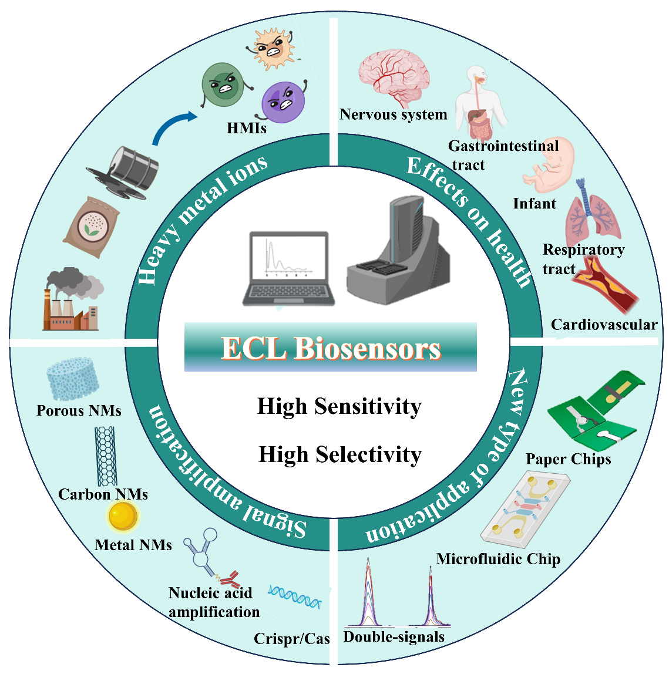

---

## Page 4

Biosensors 2024, 14, 9
4 of 24
2. Recent Progress of Engineered ECL Biosensors
Electrochemiluminescence (ECL) is a technique for generating light signals by elec-
trochemical means. The ECL sensor consists of an electrochemical workstation and a
photomultiplier [41]. It is based on a redox reaction in an electrochemical process that
produces a detectable light signal under potential control through a chemiluminescent sub-
stance on the surface of the electrode. ECL typically entails the utilization of an electrolyte
solution, an electrode material, and a luminescent marker to attain remarkably sensitive
molecule detection.
In the past few years, there has been a notable surge in interest in the advancement
of ECL biosensors. They are commonly used to detect and measure the concentration
of proteins [42], nucleic acids, metabolites, and cancer markers [43] with high sensitivity
and specificity [44]. The core of an engineered ECL biosensor is its biological recognition
element, which usually uses high-specific biomolecules such as single/double-stranded
DNA, aptamers, antibodies, and antigens to specifically interact with the molecules to be
tested. An example is an engineered ECL nucleic acid sensor based on pyridine ruthenium
polymer [Ru(bpy)32+] labeling, whose detection mechanism is based on the recognition of
specific nucleic acid targets [45]. First, the aptamer specifically binds to the target nucleic
acid sequence, and then, under electrochemical excitation, the [Ru(bpy)32+] marker pro-
duces an electrochemiluminescence signal. Its intensity is proportional to the concentration
of the target nucleic acid, achieving highly sensitive and selective nucleic acid detection.
Compared with traditional optical or electrochemical detection methods, ECL biosen-
sors have significant advantages, including excellent detection sensitivity and high biolog-
ical specificity. For instance, in traditional fluorescence labeling techniques, background
fluorescence often interferes with the signal, and ECL can greatly reduce background
interference by detecting the time characteristics of the optical signal, such as luminescence
at a specific potential, thereby improving the accuracy of the detection [46]. Additionally,
ECL technology does not require an external light source, which simplifies the detection
equipment and makes it easier to construct miniaturized instruments. Compared with elec-
trochemical techniques, ECL also has excellent linear response range and high selectivity,
so it is a powerful tool for biosensors and chemical analysis.
In the detection of heavy metal ions, engineered ECL biosensors usually use specific
substances as recognition elements, combined with electrochemical signal converters, to
convert biological signals acting on heavy metal ions into identifiable electrical signals [47].
Using electrochemiluminescence signal amplification to achieve extremely low concentra-
tion detection, through the selective recognition of biological recognition elements, the
detection accuracy is improved. This approach has real-time monitoring capability and
is suitable for online environmental monitoring. At the same time, combined with the
application of miniaturization and nanotechnology, engineered ECL biosensors are devel-
oping towards the trend of diversification of detection methods, portability and real-time
monitoring technology, and interdisciplinary cooperation, providing innovative solutions
for environmental monitoring, biological research, and medical diagnosis [48].
3. Engineered ECL Biosensors on Metal Ion Detection
The core components of ECL biological systems can be divided into two categories:
recognition elements and signal converters. The main function of the identification element
is to detect the presence and concentration of the substance to be measured. The signal
converter is responsible for converting the information sensed by the recognition element
into observable and recorded signals, such as current intensity or ECL intensity. These
two parts work together to form the key function of the ECL biological system. The signal
amplification strategy, on the one hand, includes the efficient identification and signal
transduction of the target, and, on the other hand, includes the amplification output of
the transduction signal. Specifically, it includes signal amplification based on biological
recognition elements and signal amplification based on nanomaterials.

---

## Page 5

Biosensors 2024, 14, 9
5 of 24
3.1. Signal Amplification Strategy Based on Biometric Components
DNA biosensors utilize DNA as a biomolecular recognition element for the detection
and measurement of specific molecules or analytical targets. Aptamers are highly specific
molecules, usually oligonucleotides or their analogs, and DNA aptamer-based biosensors
usually fall into a special category of DNA biosensors. They interact with the target
molecule through a three-dimensional structure, similar to the matching of a lock and
key. Due to this specific binding, aptamers are widely used for molecular recognition and
capture in medical diagnostics, drug analysis, and environmental monitoring.
Upon binding with a specific metal ion, the aptamer can trigger the cleavage of the
DNA strand it interacts with or the formation of a DNA-metal ion complex. This alteration
in the DNA structure subsequently leads to changes in the ECL luminescence properties,
enabling the detection of metal ions [49]. As everyone knows, the detection of Pb2+ de-
pends on the specific base sequence in the aptamer (usually guanine-rich nucleotide G) that
can form a stable G-quadruplex structure with Pb2+ [50] (Figure 1). The thymidine-rich
nucleotide (T) sequence within the aptamer has the capacity to form a T-Hg2+-T complex
with Hg2+. This interaction induces changes in the ECL signal, facilitating the detection
of Hg2+. For the detection of Cd2+, non-repetitive ssDNA sequences rich in thymidine (T)
and guanine (G) are employed to capture Cd2+. Building upon this principle, Liu et al.
successfully designed an aptamer electrochemical biosensor utilizing the thymine-Hg2+-
thymine (T-Hg2+-T) structure for the assessment of mercury ions in tap water samples [51].
Hg2+ recognition by the aptamer leads to the formation of a hairpin structure, resulting in
an electrochemical signal near the sensor’s surface and ultimately generating an electro-
chemical response. Experimental outcomes demonstrate that the sensor exhibits a strong
linear correlation within the concentration range of mercury ions from 0.01 to 500 nM
(R2 = 0.9994), with an impressively low detection limit of 0.005 nM. Meanwhile, Lin et al.
utilized G-quadruplexes based on iridium (III) complexes for As (III) determination [52].
The principle of this method is that the G-rich sequence is initially combined with the As
(III) aptamer in the hairpin structure of the aptamer region by introducing a DNA sequence
with two loops, including the As (III) aptamer sequence. Upon the introduction of As
(III), the formation of the As–aptamer complex leads to the release of the complementary
DNA sequence. Subsequently, the released G-quadruplex sequence adopts a G-quadruplex
structure, which is selectively recognized by the iridium (III) complex, resulting in lumines-
cence enhancement signals. This method offers a remarkable sensitivity, with a minimum
detectable concentration as low as 7.6 nM.
The programmability of DNA molecules endows them with diverse self-assembly
capabilities to form different structures. This feature allows us to accurately control the
DNA circuit through target induction to achieve signal amplification, thereby improving
the performance of the aptamer biosensor. At the same time, it is always associated with
hybridization chain reaction (HCR), rolling circle amplification (RCA), entropy-driven
catalysis (EDC), and clustered regularly interspaced short palindromic repeats (CRISPR)
technology [53] to enhance the detection signal and thereby obtain clear and accurate
detection results. By designing aptamers that specifically recognize the target analyte, the
biosensor can selectively capture and detect the required metal ions in the presence of
interfering substances. In this paper, several advanced DNA signal amplification strategies
for metal ion detection will be presented.
3.1.1. HCR Amplification Strategy
The hybridization chain reaction (HCR) is a DNA self-assembly process used to
amplify signals from target molecules. Typically, HCR contains two or more DNA hairpins.
When the target molecule is present, these trigger DNA hairpins will start alternately and
self-assemble one after another to form an incision double-stranded DNA nanostructure
containing a large number of repeating units, thereby achieving a significant enhancement
of the signal for detection of the target molecule [54].

---

## Page 6

Biosensors 2024, 14, 9
6 of 24
Figure 1. (A) Construction of aptamer sensor/DenAu/Au electrochemical biosensor platform;
(B) SEM images of Aptasensor/DenAu and energy dispersive X-ray elemental maps of Au, S, and
P elements; (C) detection time and (D) the effect of the pH value of the detection solution on the
response of the sensor; (E) calibration curve of logarithm of Pb2+ concentration in PBS (pH 7.4)
solution; and (F) selectivity of 1.0 µM interfering ions. Reprinted with permission from Ref. [50].
The HCR reaction possesses significant advantages. HCR functions under mild condi-
tions, eliminating the necessity for costly equipment or intricate procedures. Its straightfor-
ward operating principle makes it highly adaptable for integration with other reactions or
substances, while also being less susceptible to signal interference in reporting methods. Ad-
ditionally, HCR is an enzyme-free amplification technique. The DNA self-polymerization
process, initiated by the initiator, results in the formation of an elongated double-stranded
DNA polymer. This facilitates the embedding of a greater quantity of ECL reagents, such
as [Ru(phen)3]2+, into the double-stranded DNA or enhances the binding of DNA labeled
with ECL reagents. Consequently, this process leads to a substantial enhancement in
electrochemiluminescence (ECL) [55]. For instance, Wang and his team have created an
electrochemiluminescence aptamer sensor using HCR and DNA-QD nanostructures. The
sensor uses an HCR amplification strategy to create a new DNA-QD nanostructure by
combining cadmium sulfide (CdS) quantum dots with streptavidin. This structure enables
highly specific recognition of Cd2+ and significantly enhances the ECL signal [56]. Xie
and colleagues developed a label-free biosensor for the highly sensitive electrochemical
detection of lead ions (Pb2+) [57]. This sensor relies on the effective decomposition of
branched DNA polymers and repetitive amplification of target migration. As shown in
Figure 2, to begin, they immobilize the branched DNA polymer created through HCR
on the electrode, which serves as a carrier enriched with silver nanoparticles (Ag NPs),
generating a robust initial current signal. Subsequently, the molecular triggers T1 and T2,
produced through the target migration cycle amplification, break down the branched DNA
polymer, leading to a substantial reduction in the current. This process enables highly
sensitive detection of Pb2+. In comparison to conventional approaches, this method exhibits
superior decomposition efficiency. Experimental results demonstrate that the detection
limit for Pb2+ with this biosensor has been lowered to an impressive 0.24 pM, showcasing
outstanding performance.

### Page Images

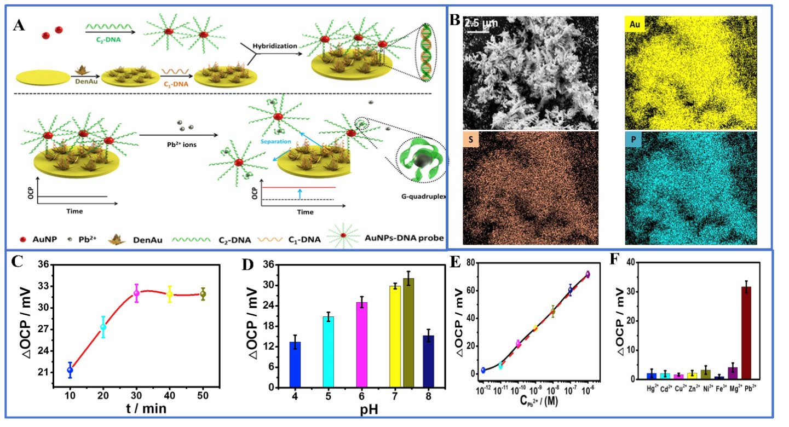

---

## Page 7

Biosensors 2024, 14, 9
7 of 24
Figure 2. (A) Synthesis of DNA triggers (T1 and T2); (B) trigger-induced decomposition of branched
DNA polymers for ultrasensitive determination of Pb2+; (C) linear sweep voltammetry reactions of
four different dissociation methods; (D) biosensor detection of Pb2+ series concentrations; error lines
indicate the standard deviation of three individual determinations (n = 3). Reprinted with permission
from Ref. [57].
3.1.2. RCA Amplification Strategy
RCA is an excellent nucleic acid amplification strategy. The mild isothermal reaction
conditions of HCR provide excellent stability and efficiency, even in complex environments.
This method necessitates only a small quantity of circular DNA template and employs phi29
DNA polymerase to catalyze the extension and replication of the DNA chain, leading to an
expansion of the complementary strand of the DNA template by hundreds of times. The
core principle of RCA involves a circular template that guides the generation of multiple
repetitive sequences, leading to the synthesis of ultra-long single-stranded DNA, and the
enhancement of the ECL signal based on its loaded RCA product or based on the rich in
situ form in the ECL luminophore. For example, Pang et al. developed a highly sensitive
biosensor for the quantitative detection of Pb2+ [58]. This biosensor employed a unique
combination of RCA and hemin amplification strategies. Under optimized conditions,
the biosensor achieved an impressively low detection limit of 3.3 pM, with a linear range
spanning from 10 pM to 1000 nM. Zhou et al. developed a novel Hg2+ ECL sensor strategy
by specifically recognizing and reacting to T-Hg2+-T biomimetic structures using Bst DNA
polymerase [59]. In this approach (Figure 3), they designed primers labeled with magnetic
beads that are complementary to the circular padlock probe region. However, these primers
were intentionally created with two T-T mismatches at the 3′ end. Bst DNA polymerase was
unable to extend the mismatch primers when no Hg2+ was present. However, once Hg2+ is
present, a stable T-Hg2+-T structure can be formed, which induces the DNA polymerase to
employ the RCA mechanism for extension and amplification reactions. Subsequently, the
resulting RCA product hybridizes to a tris(bipyridyl)ruthenium (TBR)-labeled probe and is
detected by an ECL platform. Currently, this method has demonstrated a sub-nanomolar
level detection limit and excellent selectivity for the detection of a wide range of interfering
metal ions in the assay.

### Page Images

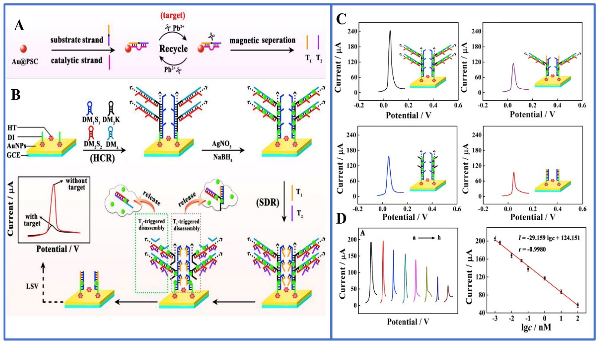

---

## Page 8

Biosensors 2024, 14, 9
8 of 24
Figure 3. (A) Schematic diagram of a magnetic bead-based Hg2+ mediated rolled-ring amplification-
electrochemiluminescence sensor for Hg2+ detection in aqueous solution; (B) the curve of ECL
intensity of Hg2+ with time; (C) the verification of RCA product in 1% agarose gel electrophoresis,
and the ECL intensity corresponding to 1 µM Hg2+ (no target control); (D) a schematic diagram of
the sensitivity of the sensor to detect Hg2+. Illustration: calibration curve of 0.1 to 1000 nM Hg2+.
(E) Selectivity test with all competing metal ions tested at 1 µM (gray) and 100 µM (blue). Reprinted
with permission from Ref. [59].
3.1.3. EDC Amplification Strategy
DNA engineering is distinguished by its molecular programmability and design flexi-
bility. When integrated with the entropy-driven process of DNA hybridization, it allows
for the construction of enzyme-free signal cascade amplification circuits and sensors. The
driving force behind this approach stems from the natural tendency of the reaction system
to undergo spontaneous amplification without the need for costly enzymes and antibodies.
The entropy-driven ECL biosensor uses the entropy change caused by the combination
of metal ions and aptamers to detect the presence and concentration of metal ions, and
achieves highly sensitive metal ion detection by monitoring the change of the luminescence
signal. For example, Yu’s research team developed an electrochemiluminescence biosensor
that relies on the entropy-driven strand displacement reaction (ETSD) and tetrahedral
DNA nanostructure (TDN) to achieve signal amplification. This innovative approach was
used for the detection of biomarkers associated with acute myocardial infarction, demon-
strating outstanding specificity [60]. Kim and colleagues designed a DNA nanomachine
capable of converting protein signals into nucleic acid output, enabling real-time analysis
and swift response detection in whole blood and plasma samples [61]. In addition, Zhu
and colleagues ingeniously combined a potent Catalytic Hairpin Assembly (CHA) with
a cascade amplification system and an electrochemical analysis technique to engineer a
highly sensitive biosensor platform utilizing DNA as the detection model. This engineered
platform successfully enabled the sensitive detection of aptamer substrates (kanamycin)
and certain metal ions (Hg2+) [62]. As shown in Figure 4, this approach represents an
innovative engineering paradigm for creating cascade systems, leveraging isothermal,
enzyme-free signal amplification technology. It introduces a pioneering strategy for design-
ing highly efficient, versatile, and environmentally friendly cascade reaction circuits. The
detection methodology involves harnessing target DNA as the trigger for Catalytic Hairpin
Assembly (CHA) and encoding the catalytic sequence of exonuclease III (EDC) within
the exposed sequence of the CHA product double-stranded DNA (dsDNA). This leads to
the development of a target-triggered CHA–EDC cascade system. The products of this
cascade circuit can engage in a chain displacement reaction with the signaling probe on the
electrode surface, ensuring the highly sensitive detection of the target. Furthermore, an en-

### Page Images

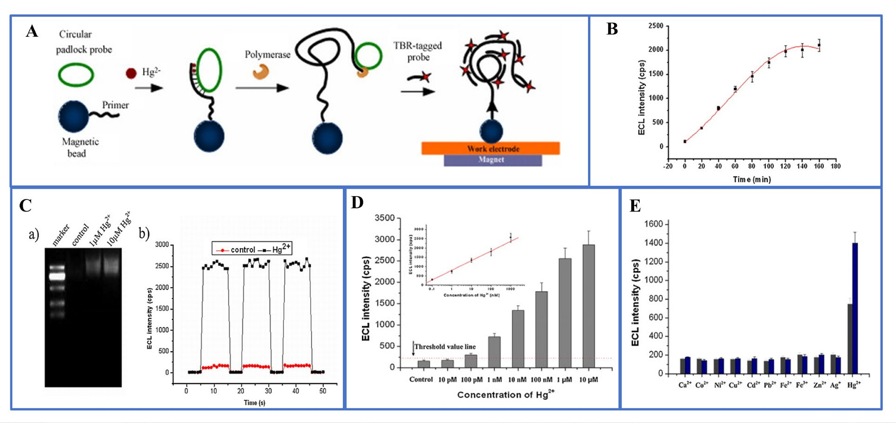

---

## Page 9

Biosensors 2024, 14, 9
9 of 24
gineered proportional biosensor platform was established by capitalizing on the by-product
chain generated in the EDC reaction, thereby enhancing the detection reproducibility and
system stability.
Figure 4. (A) A versatile electrochemical biosensor platform using the CHA-EDC cascade amplifi-
cation circuit; (B) kanamycin and (C) Hg2+ activation within the CHA–EDC circuit (the logarithm
of concentration between 0.1 pg/mL and 10 ng/mL); (D) electrochemical responses to varying
kanamycin concentrations and (E) to Hg2+ (the range of 0.5 pM-50 nM). Reprinted with permission
from Ref. [62].
In general, these DNA amplification strategies have brought significant breakthroughs
in the field of metal ion detection, making up for the shortcomings of traditional detection
methods in terms of sensitivity and specificity. The innovation of these strategies is that
they all use DNA molecules as the basis for detection, fully utilizing the self-assembly and
complementarity of DNA. Not only that, they have excellent metal ion specificity, allowing
highly selective detection in complex sample matrices. DNA-based sensing technologies
also show great potential in practical applications. For example, in the environment and in
the medical field, they can be used to monitor heavy metals, and thereby detect and solve
problems in time [63]. In addition, they provide powerful tools in the fields of food safety,
pharmaceutical analysis [64], and materials science [65].
3.1.4. CRISPR/Cas Amplification Strategy
Lately, CRISPR, along with its companion Cas protease, has emerged as a compelling
choice for precise and effective genome editing [66,67]. Furthermore, modified versions
such as Cas12, Cas13 [68,69], and Cas14 [70] have garnered attention due to their remark-
able ability to execute side-branch cleavage, allowing for the precise and efficient cutting of
RNA or DNA molecules. When the Cas protein/guide RNA complex identifies a target
nucleic acid, it can cleave single-stranded reporter genes without the need for specific
incisions. Cas12 and Cas14 are primarily engineered for DNA targeting, whereas Cas13 is
specifically designed for RNA targeting [71]. A diverse range of CRISPR-based assays has
been formulated through the integration of nucleic acid amplification techniques such as
PCR and RCA. These methodologies harness the power of the CRISPR/Cas system, deliv-
ering swift response times, user-friendly operation, remarkable specificity, and heightened
sensitivity. Crucially, they do not hinge on costly laboratory apparatus, establishing them
as a celebrated advancement in the domain of molecular detection technology.

### Page Images

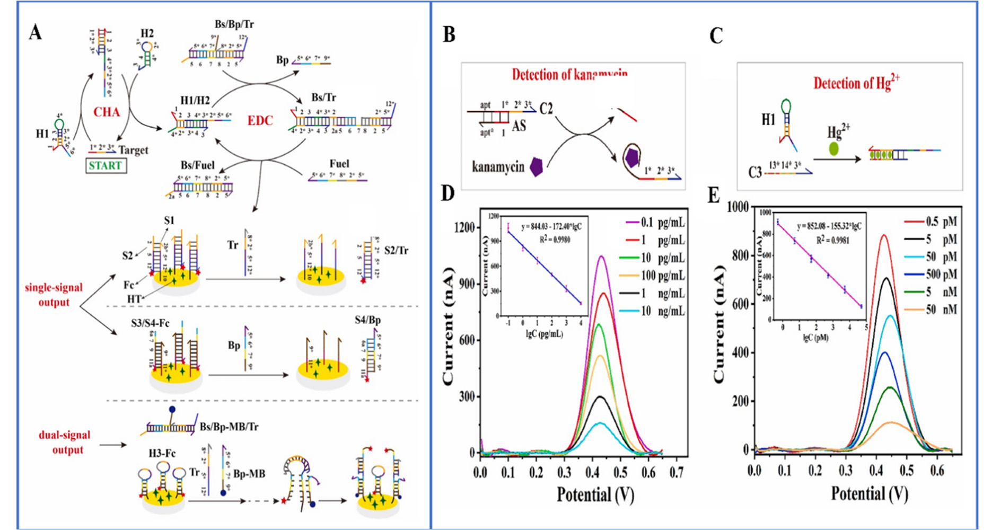

---

## Page 10

Biosensors 2024, 14, 9
10 of 24
For example, the lateral flow assay using CRISPR-Cas12 is employed for the rapid
(less than 12 min), accurate detection of the SARS-CoV-2 virus in respiratory swab RNA
extracts [72]. Taking advantage of the unique combination of Cas12a and electrochemilu-
minescence (ECL) technology, Liu et al. proposed a novel electrochemical luminescence
biosensing platform based on Cas12a for the detection of human papillomavirus subtype
(HPV-16) DNA without the need for target amplification [73]. Cas12a utilizes its dual-
recognizing mechanism to enhance specificity and cis-cleavage capability, resulting in
signal amplification, with a detection limit of 0.48 pM. Similarly, DNAzymes, which are
catalytically active DNA molecules, possess the capability to selectively bind to metal ions
and convert metal ion recognition events into nucleic acid sequence data. Consequently,
the fusion of the CRISPR/Cas system with DNAzymes holds the potential to streamline
the detection of metal ions. Li and colleagues harnessed precise signal transduction involv-
ing aptamers and DNAzymes to identify sodium ions (Na) within the CRISPR/Cas12a
biological framework. This innovative approach yielded highly sensitive and remarkably
specific Na+ detection, achieving detection thresholds as low as 4.3 nM. Yue et al. have
pioneered the development of an electrochemical biosensor known as E-CRISPR, which is
based on CRISPR/Cas12a technology, demonstrating remarkable specificity in detecting
Pb2+ (as depicted in Figure 5). In this approach, the GR-5 DNAzyme plays an intermediary
role, facilitating the conversion of Pb2+ nucleic acid signals into single-stranded DNA,
thereby initiating strand displacement amplification (SDA) reactions. The exceptional
sensitivity achieved in this method can be attributed to a triple-cycle amplification process,
including the dual cycle formed by SDA itself and the inherent signal-enhancing properties
of CRISPR/Cas12a. As a result, the SM-E-CRISPR detection platform achieves a sensitivity
level in the picomolar (pM) range [74]. This provides a straightforward, highly sensitive,
and real-time method for detecting various other heavy metal ions.
Figure 5. (A) Schematic diagram of the SM-E-CRISPR biosensor for the detection of lead ions, and
the detailed workflow of DNA sequences in the SDA cycle; (B) TEM image and elemental mapping
diagram of ZrO2/CeO2 nanorods; (C) CV response of different modified electrodes, DPV response
after incubation without and with Pb2+. Reprinted with permission from Ref [73].
3.2. Signal Amplification Strategy Based on Nanomaterials
The rapid development and improvement of nanotechnology provide a wide range
of possibilities for the assembly of biosensors. Nanomaterials play an important role in

### Page Images

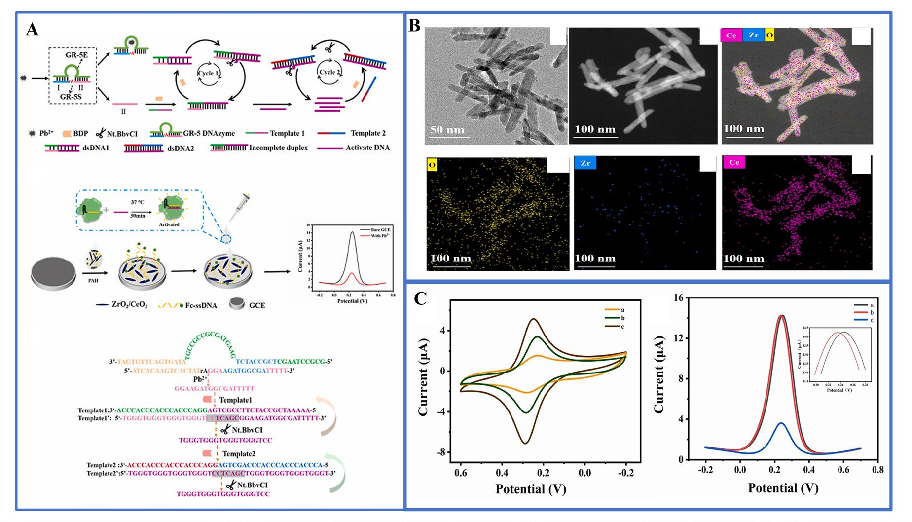

---

## Page 11

Biosensors 2024, 14, 9
11 of 24
the composition of ECL biosensors [75,76]. On the one hand, the unique surface effect
and quantum effect of nanomaterials give them significant luminescence intensity and
excellent stability. They have gradually replaced traditional luminescent markers (such
as luminol and [Ru(bpy)3]2+) and become the first choice of luminescent materials for
a new generation of biosensors [77]. On the other hand, the microscopic tunability of
nanomaterials enables them to change the chemical state of the electrode surface at the
molecular level, increasing key parameters such as specific surface area, number of active
sites, and conductivity, thereby enhancing the signal amplification of the ECL sensor.
Therefore, the signal amplification strategy of ECL systems based on nanomaterials is
usually a special modification of the working electrode surface. The generation efficiency of
ECL signals can be improved by introducing efficient ECL luminescent groups (such as gold
nanoparticles or organic small molecule markers), thereby further improving the detection
sensitivity. Furthermore, by using the surface enhancement effect of nanomaterials, the
biorecognition elements are fixed on the surface of nanostructures, which can improve the
detection sensitivity and selectivity of ECL signals.
3.2.1. Quantum Dots
Quantum dots (QDs), semiconductor nanocrystals, typically consist of compounds
from II-VI, III-V, and IV-VI group elements [78]. In contrast to traditional ECL reagents
such as bipyridine ruthenium and luminal, quantum dots employed as ECL reagents offer
distinctive features: (1) their emission wavelength can be precisely tuned by adjusting
their size; (2) quantum dots exhibit broad absorption spectra across various energy levels;
(3) they provide high luminescence efficiency and demonstrate robust stability; (4) they
can serve as both donors and acceptors in luminescence resonance energy transfer (RET)
processes, enhancing their versatility in applications; and (5) they have strong aptamer
adsorption ability. In the ECL sensor, quantum dots act as emitters, and when the target
metal ions bind to the biorecognition element, they induce an electrochemiluminescence
process. Through electrochemical excitation, the quantum dots enter the excited state and
release energy when returning to the ground state to generate a luminescence signal. This
method has high sensitivity and accuracy, and is suitable for environmental monitoring,
biomedical research, and other fields [79].
A variety of quantum dots are widely employed in ECL sensors, including sulfur
metalized quantum dots, carbon nanodots (CQDs) [80], graphene quantum dots (GQDs),
silicon quantum dots [81], carbon nitride quantum dots (CNQDs), and doped quantum
dots [82]. They can serve as luminophores, co-reactants, or donors/acceptors for energy
transfer for the detection of metal ions. For example, graphene quantum dots (GQDs),
as a zero-dimensional graphene structures, exhibit excellent luminescence properties. In
this context, Anusuya and his research team designed an ECL aptasensor using high-
brightness GQDs as luminescent materials for extremely sensitive detection of Hg2+, Cd2+,
and Pb2+ [83]. Li et al. built a highly sensitive ECL sensor for detecting trace amounts of
Hg2+ in water by combining CdSe quantum dots, graphene oxide, and double-stranded
DNA (Figure 6) [84]. Although quantum dots have potential applications in biological
systems, there are inevitably some problems such as cytotoxicity and instability. To ad-
dress these challenges, Li et al. utilized SiO2 nanoparticles (NPs) to encapsulate carbon
nitride quantum dots (CNQDs), enhancing their stability and minimizing external environ-
mental interference. CNQDs are known for their low toxicity, excellent biocompatibility,
and stability. As shown in Figure 7, Li et al. introduced a novel self-enhanced electro-
chemiluminescence (ECL) emitter (Ru-QDs) by combining [Ru(bpy)3]2+ with CNQDs [85].
Furthermore, they encapsulated Ru-QDs within SiO2 nanoparticles, successfully establish-
ing a label-free self-enhanced ECL biosensor approach for highly sensitive and selective
detection of Hg2+. This was achieved by leveraging the differential adsorption capacity
of Ru-QDs@SiO2 nanoparticles for single-stranded DNA (ssDNA) containing thymidine
(T) and double-stranded DNA (dsDNA) induced by Hg2+. This method allows for the

---

## Page 12

Biosensors 2024, 14, 9
12 of 24
measurement of Hg2+ in the concentration range of 0.1 nM to 10 µM, with an impressively
low detection limit of 33 pM.
Figure 6. (A) DNA ECL biosensor and its detection of Hg2+; (B) EIS and (C) CV measurements; (D) CV
measurement of GO; inset is an SEM image of ERGO; (E) ECL intensity of different concentrations of
mercury (the measurement of Hg2+ was conducted on an MPI-A ECL analyzer with a potential range
of −1.5~0 V at a scan rate of 100 mV/s); (F) the relationship between ECL intensity of the sensor and
the concentration of mercury. Reprinted with permission from Ref [84].
Figure 7. (A) Synthesis of the Ru-QDs self-enhanced ECL reagent and Ru-QDs@SiO2 ECL mate-
rial; (B) construction of label-free ECL biosensor; (C) Hg2+ was detected by the developed sensing
strategy; (D) an illustrative diagram depicting the self-enhanced ECL process occurring within SiO2
nanoparticles. Reprinted with permission from Ref [85].

### Page Images

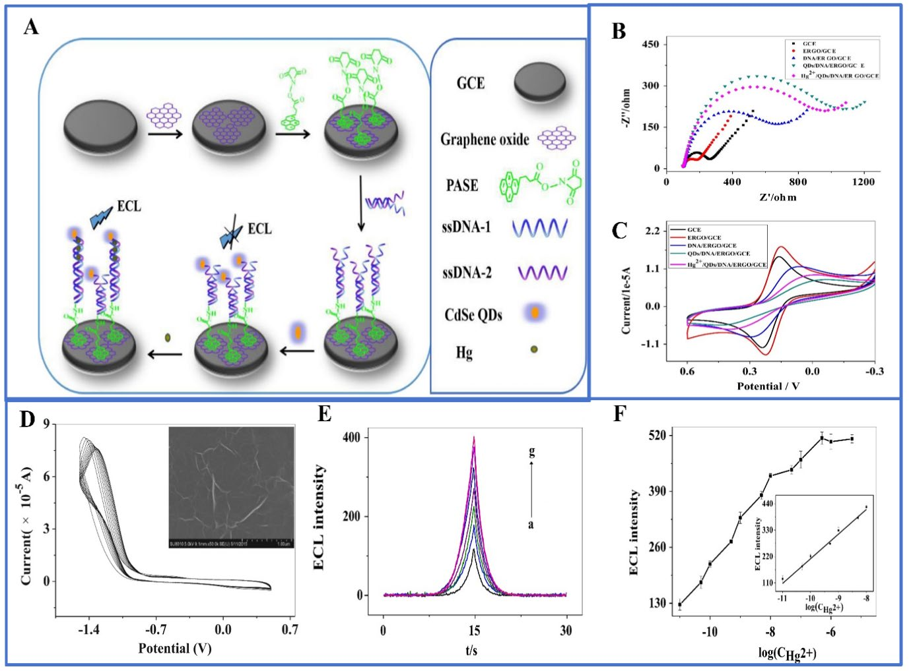

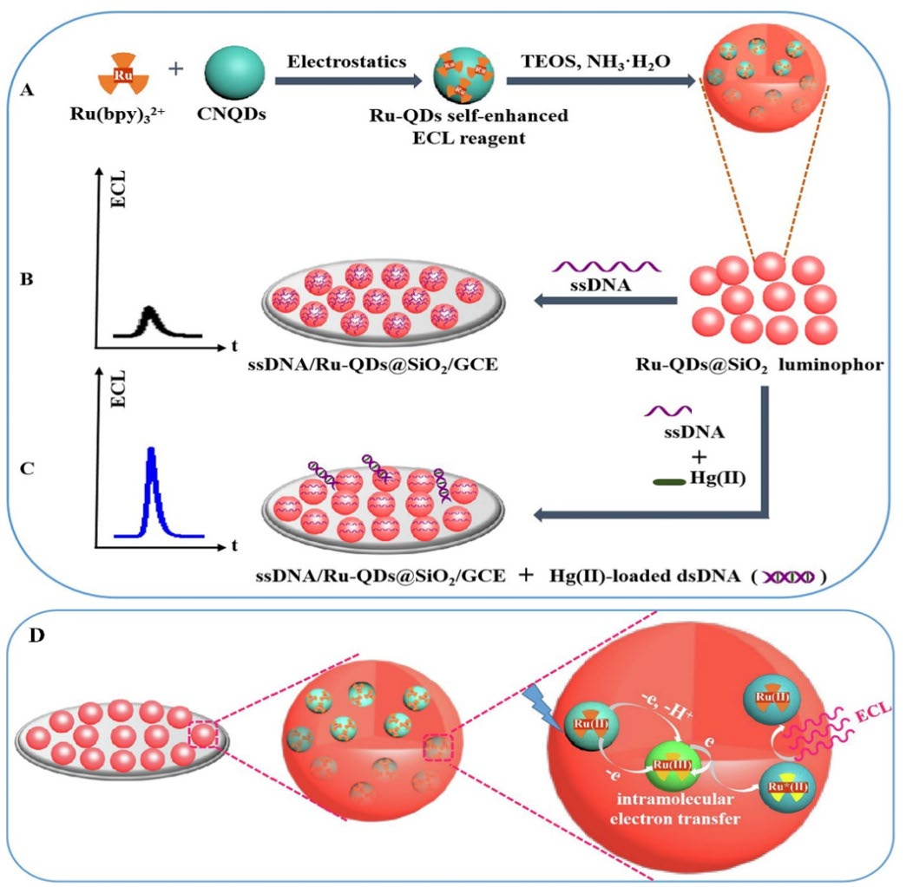

---

## Page 13

Biosensors 2024, 14, 9
13 of 24
3.2.2. Metal Nanoclusters
In general, the sensitivity of ECL biosensors to detect metal ions is improved mainly
through the following two strategies: (1) increasing the load of signal tags or recognition
elements using nanomaterials with high specific surface area; and (2) the introduction of
nanomaterials with catalytic activity to enhance the signal. Commonly used nanomaterials
include metal nanomaterials, carbon-based nanomaterials, and magnetic nanomaterial.
The unique properties of these materials make them widely used in many fields such as
environmental protection and biological health monitoring.
Metal nanoclusters are micro-nano clusters composed of a few to hundreds of metal
atoms [86]. They usually have special electronic structures and optical properties, which
are different from those of large-sized metal particles or bulk materials. Metal nanoclusters
are highly regarded for their unique electrical, magnetic, and optical properties. There-
fore, by adjusting the size and shape of Au NPs, different biosensing requirements can be
met. For example, Dong et al. studied the effect of different sizes (6, 16, 25, 38, 68, and
87 nm) of gold NPs on the ECL of luminol, and found that the 16 nm Au NP-modified
electrode had the greatest catalytic activity. Recently, Yuan and colleagues engineered an
electrochemiluminescence resonance energy transfer (ECL-RET) system to achieve adap-
tive and proportional detection of Pb2+. This innovative system involved the application
of gold nanoparticles functionalized with fullerene nanocomposites (AuNPs@nano-C60)
onto a glassy carbon electrode (GCE). The detection limit of the ECL sensing platform is
3.5 × 10−13 M. Moreover, Zhou and collaborators devised an exceptionally sensitive and
selective electrochemical biosensor tailored for the detection of lead ions (Pb2+) in envi-
ronmental water samples [87]. The sensor’s operational concept relies on the cooperative
catalytic action of porous Au-Pd bimetallic nanoparticles and DNA enzymes. In their
investigation, Au-Pd bimetallic nanoparticles were employed to enhance the surface cover-
age of nanostructures, consequently boosting the labeling density of G-DNA molecules.
The experimental outcomes demonstrated the exceptional Pb2+ detection capability of the
sensing platform across a range from 1.0 pM to 100 nM, with a low detection limit (LOD)
of 0.34 pM.
3.2.3. Carbon-Based Nanomaterials
Carbon-based nanomaterials, including carbon nanotubes and graphene, stand out as
optimal options for both heavy metal ion detection and removal. This is attributed to their
outstanding electrical conductivity and chemical reactivity [88,89]. As an illustration, Tang
et al. crafted DNA-S1-modified poly(5-formylindole)/reduced graphene oxide nanocom-
posites to attain remarkably selective detection of Hg2+. In spite of the use of nanomaterials,
suitable sensing strategies are crucial for performance enhancement. ECL resonance energy
transfer (ECL-RET), which emphasizes the overlap between the ECL spectrum of the donor
and the absorption spectrum of the acceptor, is a promising strategy [90].
Graphitic carbon nitride (CN), consisting of sp2 bonded carbon and nitrogen, has
important potential for applications in photocatalysis and electrocatalysis, etc. Peng et al.
designed a sensor for ultra-sensitive lead detection through ECL-RET involving graphitic
carbon nitride nanofibers (CNNFs) and Ru(phen)32+ [91]. Utilizing the amplification and
stabilization of carbon nanotubes and gold nanoparticles, ECL-RET underwent triple
amplification from CNNFs to Ru(phen)32+ (Figure 8), as well as nucleic acid exonuclease-
assisted target recovery for detection. These combined amplification approaches yielded an
exceptionally sensitive aptamer sensor for Pb determination, achieving an impressively low
detection limit of 0.04 pM. The probe was successfully applied to analyze environmental
samples, producing satisfactory results.
3.2.4. Porous Nanomaterials
In addition, porous nanomaterials, such as mesoporous silica, possess unique proper-
ties such as extended π-conjugated backbones, large surface areas, and specialized porous
structures [92]. Zhang et al. prepared Fe3O4 @SiO2 composites via core-shell technology, in

---

## Page 14

Biosensors 2024, 14, 9
14 of 24
which superparamagnetic Fe3O4 nanoparticles are the core [93]. The silica layer used to
capture heavy metal ions was synthesized by the sol–gel method. The proposed analysis
method can be used to detect a variety of heavy metal ions in milk with high sensitivity.
Figure 8. (A) Two-step preparation strategy of CNNF (B) and the fabricated Pb2+ aptamer sensor;
(C) ECL response of the sensor in the existence of different concentrations of CEA; (D) calibration
curve for Pb2+ determination; (E) selectivity of the sensor for Pb2+ (the ∆IECL value was compared
in the presence of Pb2+ and ten other different metal ions, all at the same concentration of 1.0 nM);
(F) stability test of the sensor in the presence of 1 nM Pb2+. Reprinted with permission from Ref [91].
Metal-organic framework (MOF) is a composite material self-assembled by organic
ligands and metal ions through coordination bonds, with an internal microporous structure.
It can take advantage of the electrochemiluminescence activity of the organic ligand itself,
and can also be combined with the electrochemiluminescence active substance to enhance
its luminescence performance [94]. Liu and his group synthesized Ag-MOF as an electro-
chemiluminescence luminophore for the detection of mercury ions in water samples [95].
To improve the ECL signal stability, chitosan (CS) and gold nanoparticles (Au NPs) were
introduced for modification. A biosensor for the specific detection of mercury ions was
established by constructing mercury ion aptamers and the spatial site-blocking effect of
streptavidin. Upon the introduction of mercury ions, the nucleic acid aptamer detached
from the electrode surface, causing a decrease in the quantity of streptavidin. This led to
a gradual increase in the intensity of the electrochemiluminescence (ECL) signal. Conse-
quently, the concentration of mercury ions in the sample can be precisely measured based
on the variations in ECL signal intensity.
One of the future development directions of ECL is to develop new near-infrared
(NIR) luminescent materials that are efficient and free from interference, which will lead to
major breakthroughs and innovations in the field of analysis [96]. Because the interference
in the NIR region is relatively small, this creates important opportunities for improving
contrast, signal-to-noise ratio, and ECL efficiency. Porphyrins are renowned for their out-
standing characteristics, including high absorbance of visible light, a tunable band gap, and
favorable optical and redox properties. Furthermore, the majority of porphyrins exhibit
deep-penetrating red or near-infrared fluorescence (FL) emissions [97]. In Yu’s research, as
an illustration, they effectively created luminescent MOFs based on porphyrins (pMOFs)
and achieved a consistent improvement in electrochemiluminescence (ECL) signals [98].
In addition, inspired by the excellent performance and quantum size advantages of por-
phyrin materials, Zhang’s team successfully prepared three kinds of extremely small and
uniform porphyrin dots using the exfoliation method, which are TCPP dots, ZnTCPP dots,

### Page Images

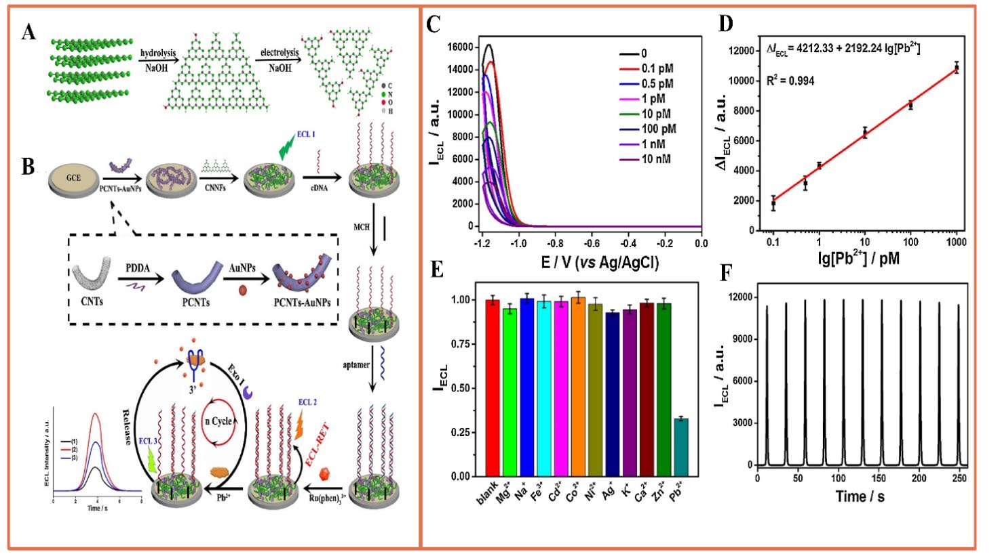

---

## Page 15

Biosensors 2024, 14, 9
15 of 24
and pMOF dots [99]. All of them demonstrate consistent and potent near-infrared ECL
capabilities. By leveraging the advancement of tetra(4-carboxyphenyl) porphyrin (TCPP)
dots, in conjunction with lead-dependent DNAzyme and hybridization chain reaction
amplification, a label-free ECL biosensor was designed for the detection of trace amounts
of lead. The outcomes revealed an exceptionally low detection limit for Pb2+ at 1.2 pico-
moles per liter (p mol·L−1) within a range spanning from 10 pmoL·L−1 to 1 µmol·L−1. In
addition, compared with the standard system of Ru(bpy)32+, the three porphyrin points in
S2O82−increased the ECL efficiency by 56, 44, and 39 times in the cathode system, respec-
tively. This research offers novel design and synthesis approaches for ECL luminescent
materials with high performance, while also laying the foundation for the creation of ECL
sensors characterized by straightforward fabrication, minimal background signals, and
exceptional sensitivity.
4. New Technologies of Engineered ECL Biosensors
Although the current ECL sensors have shown satisfactory selectivity and sensitivity
in the detection of metal ions, they are usually only suitable for laboratory environments
and struggle to meet the actual needs of on-site analysis and environmental monitor-
ing. Therefore, in order to overcome these limitations, this section introduces a series
of novel methods, such as innovative solutions that rely on intelligent systems and mi-
crofluidic technology, including dual-modal detection based on the ECL method combined
with other methods, portable paper-based detection, and simultaneous detection of mul-
tiple ions [100,101]. These new methods are expected to achieve more convenient, rapid,
and multifunctional metal ion analysis to meet the urgent needs of environmental and
health monitoring.
4.1. Dual-Mode Analysis
It is well known that ECL technology, as a powerful analytical tool, has the charac-
teristics of high sensitivity, excellent controllability, and low background. Therefore, the
accuracy of monitoring can be effectively improved when a dual-modal analysis platform
for metal ions is constructed based on ECL sensing [92,102]. Thanks to its integrated
cross-reference correction feature, it has the capability to minimize the occurrence of false
positive outcomes when dealing with samples containing intricate components in chal-
lenging environments. For example, Hao et al. proposed a dual-mode aptamer sensor
based on a multi-functional multi-in-one probe (Fe3O4@Au-ssDNA&Ru-NH2) for ECL
and fast scanning voltammetry (FSV), which achieved highly selective detection of sub-
nanomolar Pb2+ [103]. Fu and colleagues devised a dual-mode sensing platform for Hg2+
detection that harnesses the remarkable catalytic activity of 3,3′,5,5′-tetramethylbenzidine
(TMB) and the robust photocurrent polarity conversion property of the split G-quadruplex-
heme complex on the SnS2 photoanode. This platform features the assistance of magnetic
NiCo2O4@SiO2-NH2 spheres and supports both colorimetric and photoelectrochemical
(PEC) detection [104]. As shown in Figure 9A–C, the LOD based on colorimetric deter-
mination was 3.8 pM. At the same time, the LOD of photoelectrochemical determination
based on the superior photocurrent polarity of heme was 2.3 pM. In this regard, Ma et al.
developed a novel ECL and colorimetric dual-modal analysis platform for portable and
visual analysis of Hg2+ in water samples based on smartphones (Figure 9D–F) [105]. In
order to achieve this goal, first, a thymine (T)-rich DNA probe was used to capture Hg2+, in
which the DNA probe was ligated to magnetic beads (MBs-DNA) and alkaline phosphatase-
labeled DNA (ALP-DNA2) to form a T-Hg2+-T structure complex. Subsequently, following
magnetic separation, alkaline phosphatase (ALP) initiated the hydrolysis of ascorbic acid-2-
phosphatase (AAP) that was added, generating ascorbic acid (AA). AA could react with
Ru(dubpy)32+ and co-reactant S2O82−, causing a reduction in the cathodic electrochemi-
luminescence (ECL) emission signal on the surface of the glassy carbon electrode (GCE),
enabling the ECL detection of mercury. In addition, AA could also reduce silver nitrate and
deposit it onto gold nanorods, resulting in a blue shift in the localized surface plasmon reso-

---

## Page 16

Biosensors 2024, 14, 9
16 of 24
nance (LSPR) peak of the gold nanorods. This color change allowed the visual colorimetric
determination of mercury. Under the optimized conditions, the LODs of the dual-mode
mercury determination were 0.32 pM and 0.57 pM, respectively, which were higher than
those of the single method. Significantly, the addition of smartphones significantly cuts
inspection costs, simplifies the process, and enables rapid on-site testing without the need
for additional equipment.
Figure 9. (A) Preparation of NiCo2O4@SiO2-NH2@S1-S2 and schematic diagram of colorimetric and
PEC dual-modal detection of Hg2+; (B) photocurrent response of different concentrations of Hg2+
(from a–i: 0~500,000 pM); (C) UV-visible spectra of different concentrations of Hg2+ of UV-Vis spectra
(a–h: 0~10,000 pM) [104]; (D) preparation of bimodal ECL and multicolorimetric assay based on ECL
response; (E) ECL response and (F) UV-Vis spectral response of different concentrations of Hg2+ (a–l:
0~500 nmol L−1). Reprinted with permission from Ref [105].
4.2. Paper-Based Microfluidic Detection
The combination of microfluidics and smartphones for immediate detection (POCT)
has emerged as a rapid and convenient detection method, enabling highly integrated
and intelligent detection systems with the advantages of low reagent consumption, high
automation, and miniaturization [106,107]. These new ways are expected to enable faster
and more efficient analysis of metal ions to meet the needs of environmental monitoring
and practical applications. Ma’s research group designed a portable microfluidic sensing
platform that can be controlled via a smartphone and relies on thermal capillary convection
for the detection of the hazardous substance Pb2+ [108]. It exhibited a wide range of
0.01 µg/L~2100 µg/L and a low detection limit of 0.005 µg/L when analyzing river water,
fish, and human serum samples.
Laboratory-on-Paper (LOP) is of great interest for immediate diagnosis and environ-
mental testing. Inspired by this, Zhu et al. developed a paper-based ECL Pb2+ detection
platform by introducing plastic encapsulation technology into LOP devices [109]. As shown

### Page Images

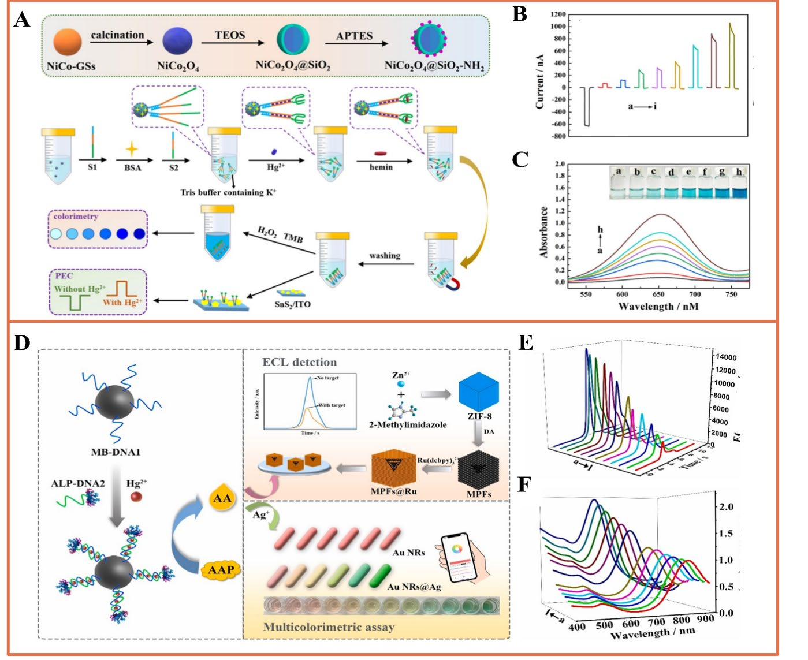

---

## Page 17

Biosensors 2024, 14, 9
17 of 24
in Figure 10, oligonucleotide probes functionalized with red myristoylated Pt nanomaterials
(MPNs) were used for electrode modification, and the combination of paper electrodes with
functional regions separated by multilayers of waxed paper enhanced the utility of rapid
detection. The integrated platform achieves a wide linear range of 0.01 nM to 0.05 µM, with
Pb2+ detection down to a detection limit of 0.004 nM. In summary, the on-site ECL sensing
platform based on paper is known for its reliability, stability, and accuracy when monitoring
heavy metal ions in various matrices, particularly in environmental applications. This is
attributed to its ease of use, portability, straightforward operation, and cost efficiency.
 
Figure 10. Design and manufacture of laboratory equipment on fully sealed paper: (a) image showing
the wax pattern on the integrated paper-based platform after the baking process; (b) folding process
of the LOP ECL device and (c) assembly process; (d) assembly diagram; (e) the schematic diagram of
fully sealed ECL paper-based platform for Pb2+ detection. Reprinted with permission from Ref [109].
4.3. Detection of Various Metal Ions
In the environment, the presence of metal ions spans air, water, soil, food, and even
biological systems. Therefore, there is a demand for research and development of sensors
capable of detecting two or more metal ions simultaneously. Separating the working area
based on a microfluidic device enables simultaneous detection of multiple metal ions. For
example, Zhang et al. fabricated a three-dimensional (3D) microfluidic-based analytical
device for simultaneous ECL detection of Pb2+ and Hg2+ [110]. The silica nanoparticles of
Ru(bpy)32+ AuNP aggregates (Ru@AuNPs) and carbon nanocrystals (CNCs) (Si@CNCs)
were used as terminal ECL tags and labeled with aptamers, respectively (Figure 11A).
By leveraging the distinct reaction potentials of Si@CNCs and Ru@AuNPs, it becomes
feasible to simultaneously detect Pb2+ and Hg2+ with impressive detection limits of 10 pM
and 0.2 nM, respectively. Ultimately, this straightforward and cost-effective detection
technique has been effectively utilized for the detection of Pb2+ and Hg2+ in lake water
and human serum samples. This device provides the potential for high-throughput and

### Page Images

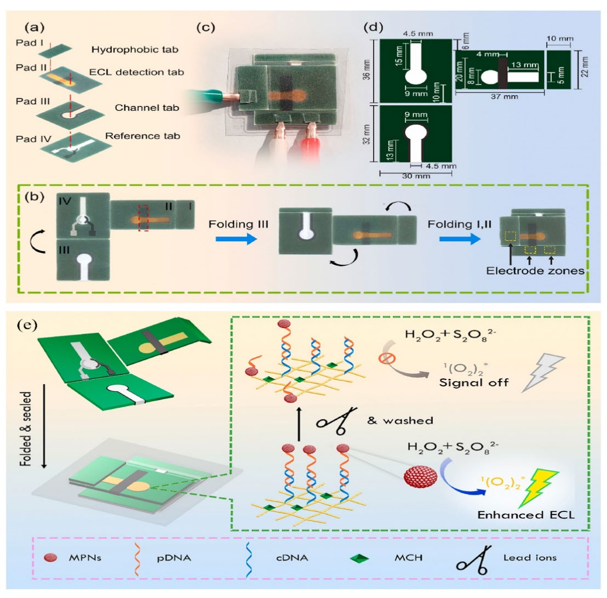

---

## Page 18

Biosensors 2024, 14, 9
18 of 24
rapid detection of metal ions. This is illustrated in Figure 11B. Yu et al. have innovatively
integrated multiple fluidic channels and hollow structures on a paper substrate to realize
the construction of an ECL biosensor, which is equipped with two working electrodes for
signal acquisition, as well as effective cleaning to achieve highly sensitive detection of
Ni2+ and Hg2+ [111]. This study dramatically reduced the testing time and provided new
perspectives for the design of future paper-based metal ion diagnostic devices.
At the same time, functionalized nanomaterials and specific aptamers can also be
used for highly selective detection of multiple metal ions. The team led by Hang created
metal nanoclusters (NCs) using various biological macromolecules (such as proteins and
DNA), thiol ligands, and polymers, resulting in NCs with diverse photoluminescence (PL)
characteristics. They conducted research on the utilization of these NCs for the selective
detection of heavy metal ions in water samples [112]. Feng et al. prepared a novel ECL
sensor for multiple determination of Hg2+ and Pb2+ by using a metal nanoparticle-labeled
T-rich aptamer and G-rich aptamer (Figure 11C) [113]. The detection mechanism is as
follows: The prepared MIL-53 (Al)@CdTe QD composite is used as an ECL tag, and one end
of the complementary chain chitosan hybridizes with the nucleic acid aptamer 1-PtNPs,
and the other end hybridizes with the aptamer 2-AuNPs. Aptamer 1 binds with Pb2+ to
create a nucleic acid aptamer that adopts a G-quadruplex structure. Aptamer 2 can establish
a sandwich structure involving T-Hg, allowing the simultaneous detection of both ions
by observing alterations in ECL intensity. The limit of detection (LOD) for Hg2+ is 4.1 pM,
while that for Pb2+ is 24 pM.
Figure 11. (A) Three-dimensional foldable fabrication procedure and detection of self-cleaning paper-
based ECL biosensors [110]; (B) fabrication of MIL-53(Al)@CdTe-PEI fast sensor and detection of Hg2+
and Pb2+ [111]; (C) illustration depicting the 3D paper-based ECL device designed for the detection
of Pb2+ and Hg2+. The back side of the paper is the waxed patterned paper work area:
1⃝spotting of
the paper with NaIO4; 2⃝immobilization of Hg2+ with DNA strands labeled with Ru@AuNPs and
Pb2+ with DNA strands labeled with Si@CNCs; and 3⃝trapping with Pb2+ and Hg2+. Reprinted with
permission from Ref [113].

### Page Images

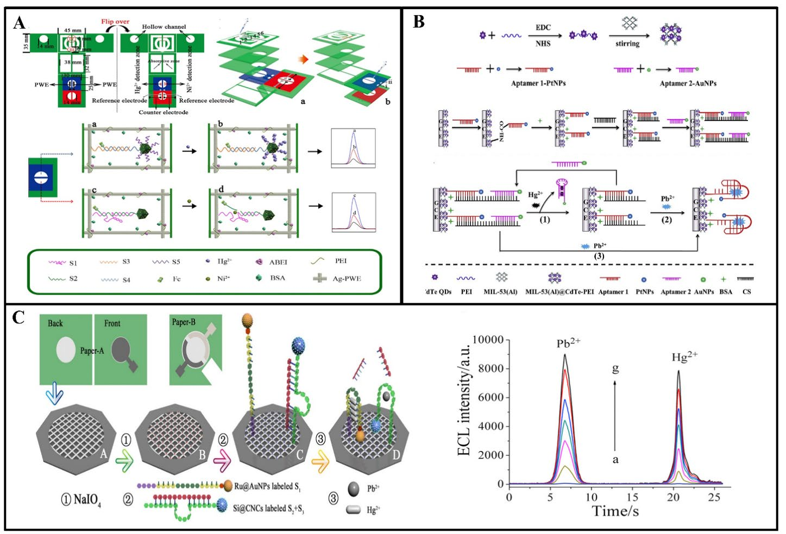

---

## Page 19

Biosensors 2024, 14, 9
19 of 24
5. Conclusions and Perspectives
Electrochemiluminescence (ECL) biosensing technology holds great promise in the
field of heavy metal ion detection. This review extensively explores the composition
and detection principles of ECL luminescent biosensors, emphasizing the crucial role
of engineered ECL technology in achieving highly sensitive detection of heavy metals.
Additionally, engineered ECL biosensors based on nanomaterial signal amplification are
introduced as important tools for quantifying trace amounts of heavy metal and metal-like
ions in various environmental and biological samples. Leveraging the programmability of
DNA molecules, this review combines hybridization chain reaction (HCR), rolling circle am-
plification (RCA), entropy-driven catalysis (EDC), and clustered regularly interspaced short
palindromic repeat (CRISPR) technologies as signal amplification strategies for heavy metal
ion detection. Both nanomaterial-based and bioelement-based signal amplification strate-
gies enhance sensor performance and reliability, better meeting monitoring requirements.
Furthermore, emerging signal amplification technologies, such as dual-mode detection,
paper-based microfluidic devices, and the use of smart materials for simultaneous detection
of multiple ions, present broad prospects for future research and applications [114].
In the future, research in the field of ECL (electrochemiluminescence) bio-sensing
based on heavy metal ions may need to address several challenges and potential limitations
to ensure accurate identification and measurement of target ions in practical applica-
tions. The design and construction of engineered ECL biosensors should focus on the
following aspects:
(1) Multi-ion detection: Expanding the application of engineered ECL biosensors to
multi-ion detection, which is not limited to one or two heavy metal ions. Future research
should be devoted to the design of multiplexed sensor arrays for the simultaneous mon-
itoring of many different types of heavy metal ions. This will enhance the versatility of
the sensor, especially for the analysis of environmental and biological samples, in order to
more fully understand the presence and concentration of heavy metal ions.
(2) Portability and miniaturization: Although many ECL biosensors already have
a certain degree of portability, the volume and weight of the supporting equipment may
restrict their practical application. Future work can focus on designing more compact and
miniaturized support devices to facilitate field testing and real-time monitoring. This will
help to expand the applicability of engineered ECL biosensors and enable more people to
use the technology easily.
(3) Introducing new technologies: For example, combining CRISPR/Cas gene editing
technology with engineered ECL sensors for more accurate heavy metal ion detection and
signal amplification. This combination will help to improve the specificity and accuracy of
the sensor for better environmental and public health.
(4) Cost effectiveness: Reducing the preparation and application costs of engineered
electrochemiluminescence biosensors to make them more economical and effective for
wider promotion and use.
These improvements will contribute to the wider application of engineered ECL
biosensors, address the challenges of heavy metal ion monitoring, and maintain the en-
vironment and public health. At the same time, electrochemical luminescence biosensor
technology will be commercially applied in more social fields to ensure its reliable role in
social health and environmental protection.
Funding: This work was supported by the National Natural Science Foundation of China (82061148012,
82027806, 21974019, 82372220), Primary Research & Development Plan of Jiangsu Province (BE2019716).
Conflicts of Interest: The authors declare no conflict of interest.

---

## Page 20

Biosensors 2024, 14, 9
20 of 24
References
1.
Rai, P.K.; Lee, S.S.; Zhang, M.; Tsang, Y.F.; Kim, K.H. Heavy metals in food crops: Health risks, fate, mechanisms, and management.
Environ. Int. 2019, 125, 365–385. [CrossRef] [PubMed]
2.
Li, L.; Zhao, W.; Wang, Y.; Liu, X.; Jiang, P.; Luo, L.; Bi, X.; Meng, X.; Niu, Q.; Wu, X.; et al. Gold nanocluster-confined
covalent organic frameworks as bifunctional probes for electrochemiluminescence and colorimetric dual-response sensing of
Pb2+. J. Hazard. Mater. 2023, 457, 131558. [CrossRef] [PubMed]
3.
Li, Z.; Liang, Y.; Hu, H.; Shaheen, S.M.; Zhong, H.; Tack, F.M.; Wu, M.; Li, Y.-F.; Gao, Y.; Rinklebe, J.; et al. Speciation, transportation,
and pathways of cadmium in soil-rice systems: A review on the environmental implications and remediation approaches for
food safety. Environ. Int. 2021, 156, 106749. [CrossRef] [PubMed]
4.
Tepanosyan, G.; Sahakyan, L.; Belyaeva, O.; Asmaryan, S.; Saghatelyan, A. Continuous impact of mining activities on soil heavy
metals levels and human health. Sci. Total Environ. 2018, 639, 900–909. [CrossRef] [PubMed]
5.
Zhou, L.; Li, S.; Li, F. Damage and elimination of soil and water antibiotic and heavy metal pollution caused by livestock
husbandry. Environ. Res. 2022, 215, 114188. [CrossRef] [PubMed]
6.
Nan, X.; Huyan, Y.; Li, H.; Sun, S.; Xu, Y. Reaction-based fluorescent probes for Hg2+, Cu2+ and Fe3+/Fe2+. Coord. Chem. Rev.
2021, 426, 213580. [CrossRef]
7.
Mulenos, M.; Liu, J.; Lujan, H.; Guo, B.; Lichtfouse, E.; Sharma, V.; Sayes, C. Copper, silver, and titania nanoparticles do not
release ions under anoxic conditions and release only minute ion levels under oxic conditions in water: Evidence for the low
toxicity of nanoparticles. Environ. Chem. Lett. 2020, 18, 1319–1328. [CrossRef]
8.
LHe, L.; Zhong, H.; Liu, G.; Dai, Z.; Brookes, P.C.; Xu, J. Remediation of heavy metal contaminated soils by biochar: Mechanisms,
potential risks and applications in China. Environ. Pollut. 2019, 252, 846–855.
9.
Zhang, M.; Ye, J.; Li, C.; Xia, Y.; Wang, Z.; Feng, J.; Zhang, X. Cytomembrane-Mediated Transport of Metal Ions with Biological
Specificity. Adv. Sci. 2019, 6, 1900835. [CrossRef]
10.
Medici, S.; Peana, M.; Pelucelli, A.; Zoroddu, M.A. An updated overview on metal nanoparticles toxicity. Semin. Cancer Biol. 2021,
76, 17–26. [CrossRef]
11.
Letchumanan, D.; Sok, S.P.M.; Ibrahim, S.; Nagoor, N.H.; Arshad, N.M. Plant-Based Biosynthesis of Copper/Copper Oxide
Nanoparticles: An Update on Their Applications in Biomedicine, Mechanisms, and Toxicity. Biomolecules 2021, 11, 564. [CrossRef]
[PubMed]
12.
Soares, E.; Soares, H. Harmful effects of metal(loid) oxide nanoparticles. Appl. Microbiol. Biotechnol. 2021, 105, 1379–1394.
[CrossRef] [PubMed]
13.
Boonta, W.; Talodthaisong, C.; Sattayaporn, S.; Chaicham, C.; Chaicham, A.; Sahasithiwat, S.; Kangkaew, L.; Kulchat, S. The
synthesis of nitrogen and sulfur co-doped graphene quantum dots for fluorescence detection of cobalt(ii) ions in water. Mater.
Chem. Front. 2020, 4, 507–516. [CrossRef]
14.
Wang, W.; Lu, Y.-C.; Huang, H.; Wang, A.-J.; Chen, J.-R.; Feng, J.-J. Solvent-free synthesis of sulfur-and nitrogen-co-doped
fluorescent carbon nanoparticles from glutathione for highly selective and sensitive detection of mercury(II) ions. Sens. Actuators
B Chem. 2014, 202, 741–747. [CrossRef]
15.
Wang, Y.; Kim, S.-H.; Feng, L. Highly luminescent N, S- Co-doped carbon dots and their direct use as mercury(II) sensor. Anal.
Chim. Acta 2015, 890, 134–142. [CrossRef] [PubMed]
16.
Awual, R.; Khraisheh, M.; Alharthi, N.H.; Luqman, M.; Islam, A.; Karim, M.R.; Rahman, M.M.; Khaleque, A. Efficient detection
and adsorption of cadmium(II) ions using innovative nano-composite materials. Chem. Eng. J. 2018, 343, 118–127. [CrossRef]
17.
Chen, S.-Y.; Li, Z.; Li, K.; Yu, X.-Q. Small molecular fluorescent probes for the detection of lead, cadmium and mercury ions.
Coord. Chem. Rev. 2021, 429, 213691. [CrossRef]
18.
Domaille, D.W.; Que, E.L.; Chang, C.J. Synthetic fluorescent sensors for studying the cell biology of metals. Nat. Chem. Biol. 2008,
4, 168–175. [CrossRef]
19.
Zhao, G.; Liu, G. Electrochemical Deposition of Gold Nanoparticles on Reduced Graphene Oxide by Fast Scan Cyclic Voltammetry
for the Sensitive Determination of As(III). Nanomaterials 2019, 9, 41. [CrossRef]
20.
Dalal, A.; Bebarta, A.; Paul, A.; Barman, R.; Nunzi, J.-M.; Tameev, A.; Mahapatra, R.; Mondal, A. Ion-Sensitive Three-Terminal
Device as a Universal Hybrid Platform With TiO2 Nanowires on the Channel. IEEE Sens. J. 2023, 23, 1917–1924. [CrossRef]
21.
Thakkar, S.; Dumée, L.F.; Gupta, M.; Singh, B.R.; Yang, W. Nano-Enabled sensors for detection of arsenic in water. Water Res. 2021,
188, 116538. [CrossRef] [PubMed]
22.
Pereira, L.; Gonçalves, I.; da Silva, J. Development of methodologies to determine aluminum, cadmium, chromium and lead in
drinking water by ET AAS using permanent modifiers. Talanta 2004, 64, 395–400. [CrossRef] [PubMed]
23.
Byers, H.L.; McHenry, L.J.; Grundl, T.J. XRF techniques to quantify heavy metals in vegetables at low detection limits. Food Chem.
X 2019, 1, 100001. [CrossRef]
24.
Zhang, N.; Suleiman, J.S.; He, M.; Hu, B. Chromium(III)-imprinted silica gel for speciation analysis of chromium in environmental
water samples with ICP-MS detection. Talanta 2008, 75, 536–543. [CrossRef] [PubMed]
25.
Lai, S.; Jin, Y.; Shi, L.; Zhou, R.; Li, Y. Fluorescence Sensing Mechanisms of Versatile Graphene Quantum Dots toward Commonly
Encountered Heavy Metal Ions. ACS Sens. 2023, 10, 3812–3823. [CrossRef] [PubMed]

---

## Page 21

Biosensors 2024, 14, 9
21 of 24
26.
Thirumalai, M.; Kumar, S.; Prabhakaran, D.; Sivaraman, N.; Maheswari, M. Dynamically modified C18 silica monolithic column
for the rapid determinations of lead, cadmium and mercury ions by reversed-phase high-performance liquid chromatography. J.
Chromatogr. A 2018, 1569, 62–69. [CrossRef] [PubMed]
27.
Li, Y.; Liu, M.-L.; Liang, W.-B.; Zhuo, Y.; He, X.-J. Spherical nucleic acid enzyme programmed network to accelerate CRISPR
assays for electrochemiluminescence biosensing applications. Biosens. Bioelectron. 2023, 238, 115589. [CrossRef]
28.
Kumar, A.; Jain, D.; Bahuguna, J.; Bhaiyya, M.; Dubey, S.K.; Javed, A.; Goel, S. Machine learning assisted and smartphone
integrated homogeneous electrochemiluminescence biosensor platform for sample to answer detection of various human
metabolites. Biosens. Bioelectron. 2023, 238, 115582. [CrossRef]
29.
Liu, Y.; Cai, Z.; Sheng, L.; Ma, M.; Wang, X. A magnetic relaxation switching and visual dual-mode sensor for selective detection
of Hg2+ based on aptamers modified Au@Fe3O4 nanoparticles. J. Hazard. Mater. 2020, 388, 121728. [CrossRef]
30.
Qin, X.; Zhang, X.; Wang, M.; Dong, Y.; Liu, J.; Zhu, Z.; Li, M.; Yang, D.; Shao, Y. Fabrication of Tris(bipyridine)ruthenium(II)-
Functionalized Metal-Organic Framework Thin Films by Electrochemically Assisted Self-Assembly Technique for Electrochemilu-
minescent Immunoassay. Anal. Chem. 2018, 90, 11622–11628. [CrossRef]
31.
Li, J.; Jia, H.; Ren, X.; Li, Y.; Liu, L.; Feng, R.; Ma, H.; Wei, Q. Dumbbell Plate-Shaped AIEgen-Based Luminescent MOF with High
Quantum Yield as Self-Enhanced ECL Tags: Mechanism Insights and Biosensing Application. Small 2022, 18, 2106567. [CrossRef]
[PubMed]
32.
Palaniappan, P.; Krishnakumar, N.; Vadivelu, M. Bioaccumulation of lead and the influence of chelating agents in Catla catla
fingerlings. Environ. Chem. Lett. 2009, 7, 51–54. [CrossRef]
33.
Kim, H.K.; Nguyen, P.T.; Kim, M.I.; Kim, B.C. Aptamer-functionalized and silver-coated polydopamine-copper hybrid nanoflower
adsorbent embedded with magnetic nanoparticles for efficient mercury removal. Chemosphere 2022, 288, 132584. [CrossRef]
[PubMed]
34.
Chen, Y.; Zhao, P.; Hu, Z.; Liang, Y.; Han, H.; Yang, M.; Luo, X.; Hou, C.; Huo, D. Amino-functionalized multilayer Ti3C2Tx
enabled electrochemical sensor for simultaneous determination of Cd2+and Pb2+ in food samples. Food Chem. 2023, 402, 134269.
[CrossRef] [PubMed]
35.
Liu, M.; Hong, Y.; Duan, X.; Zhou, Q.; Chen, J.; Liu, S.; Su, J.; Han, L.; Zhang, J.; Niu, B. Unveiling the metal mutation nexus:
Exploring the genomic impacts of heavy metal exposure in lung adenocarcinoma and colorectal cancer. J. Hazard. Mater. 2023,
461, 132590. [CrossRef] [PubMed]
36.
Ren, W.; Huang, P.-J.; de Rochambeau, D.; Moon, W.; Zhang, J.; Lyu, M.; Wang, S.; Sleiman, H.; Liu, J. Selection of a metal ligand
modified DNAzyme for detecting Ni2+. Biosens. Bioelectron. 2020, 165, 112285. [CrossRef]
37.
Falcone, E.; Okafor, M.; Vitale, N.; Raibaut, L.; Sour, A.; Faller, P. Extracellular Cu2+ pools and their detection: From current
knowledge to next-generation probes. Coord. Chem. Rev. 2021, 433, 213727. [CrossRef]
38.
Chen, Y.; Zhao, P.; Liang, Y.; Liu, Y.; Zhao, J.; Hou, J.; Hou, C.; Huo, D. A sensitive electrochemical sensor based on 3D porous
melamine-doped rGO/MXene composite aerogel for the detection of heavy metal ions in the environment. Talanta 2023, 256,
124294. [CrossRef]
39.
Yu, D.; Li, R.; Rong, K.; Fang, Y.; Liu, L.; Yu, H.; Dong, S. A novel, environmentally friendly dual-signal water toxicity biosensor
developed through the continuous release of Fe3+. Biosens. Bioelectron. 2023, 220, 114864. [CrossRef]
40.
Ali, H.; Khan, E. Bioaccumulation of non-essential hazardous heavy metals and metalloids in freshwater fish. Risk to human
health. Environ. Chem. Lett. 2018, 16, 903–917. [CrossRef]
41.
Li, X.; Tan, X.; Yan, J.; Hu, Q.; Wu, J.; Zhang, H.; Chen, X. A sensitive electrochemiluminescence folic acid sensor based on a 3D
graphene/CdSeTe/Ru(bpy)32+-doped silica nanocomposite modified electrode. Electrochim. Acta 2016, 187, 433–441. [CrossRef]
42.
Wang, C.; Zhang, N.; Wei, D.; Feng, R.; Fan, D.; Hu, L.; Wei, Q.; Ju, H. Double electrochemiluminescence quenching effects
of Fe3O4@PDA-CuxO towards self-enhanced Ru(bpy)32+ functionalized MOFs with hollow structure and it application to
procalcitonin immunosensing. Biosens. Bioelectron. 2019, 142, 111521. [CrossRef] [PubMed]
43.
Bhardwaj, J.; Chaudhary, N.; Kim, H.; Jang, J. Subtyping of influenza A H1N1 virus using a label-free electrochemical biosensor
based on the DNA aptamer targeting the stem region of HA protein. Anal. Chim. Acta 2019, 1064, 94–103. [CrossRef] [PubMed]
44.
Wang, Y.; Zhao, G.; Li, X.; Liu, L.; Cao, W.; Wei, Q. Electrochemiluminescent competitive immunosensor based on
polyethyleneimine capped SiO2 nanomaterials as labels to release Ru(bpy)32+ fixed in 3D Cu/Ni oxalate for the detection of
aflatoxin B1. Biosens. Bioelectron. 2018, 101, 290–296. [CrossRef] [PubMed]
45.
Liu, H.; Chen, C.; Chen, H.; Mo, L.; Guo, Z.; Ye, B.; Liu, Z. 2D-PROTACs with augmented protein degradation for super-resolution
photothermal optical coherence tomography guided momentary multimodal therapy. Chem. Eng. J. 2022, 446, 137039. [CrossRef]
46.
Xiong, C.; Wang, H.; Liang, W.; Yuan, Y.; Yuan, R.; Chai, Y. Luminescence-Functionalized Metal-Organic Frameworks Based on a
Ruthenium(II) Complex: A Signal Amplification Strategy for Electrogenerated Chemiluminescence Immunosensors. Chem. A Eur.
J. 2015, 21, 9825–9832. [CrossRef] [PubMed]
47.
Zhao, J.; Jing, P.; Xue, S.; Xu, W. Dendritic structure DNA for specific metal ion biosensor based on catalytic hairpin assembly and
a sensitive synergistic amplification strategy. Biosens. Bioelectron. 2017, 87, 157–163. [CrossRef] [PubMed]
48.
Liu, H.; Mo, L.; Chen, H.; Chen, C.; Wu, J.; Tang, Z.; Guo, Z.; Hu, C.; Liu, Z. Carbon Dots with Intrinsic Bioactivities for
Photothermal Optical Coherence Tomography, Tumor-Specific Therapy and Postoperative Wound Management. Adv. Healthc.
Mater. 2022, 11, 2101448. [CrossRef]

---

## Page 22

Biosensors 2024, 14, 9
22 of 24
49.
Zhang, B.; Wei, C. Highly sensitive and selective detection of Pb2+ using a turn-on fluorescent aptamer DNA silver nanoclusters
sensor. Talanta 2018, 182, 125–130. [CrossRef]
50.
Tang, W.; Yu, J.; Wang, Z.; Jeerapan, I.; Yin, L.; Zhang, F.; He, P. Label-free potentiometric aptasensing platform for the detection of
Pb2+ based on guanine quadruplex structure. Anal. Chim. Acta 2019, 1078, 53–59. [CrossRef]
51.
Liu, Y.; Deng, Y.; Li, T.; Chen, Z.; Chen, H.; Li, S.; Liu, H. Aptamer-Based Electrochemical Biosensor for Mercury Ions Detection
Using AuNPs-Modified Glass Carbon Electrode. J. Biomed. Nanotechnol. 2018, 14, 2156–2161. [CrossRef] [PubMed]
52.
Lin, S.; Wang, W.; Hu, C.; Yang, G.; Ko, C.-N.; Ren, K.; Leung, C.-H.; Ma, D.-L. The application of a G-quadruplex based assay
with an iridium(III) complex to arsenic ion detection and its utilization in a microfluidic chip. J. Mater. Chem. B 2017, 5, 479–484.
[CrossRef] [PubMed]
53.
Chen, W.; Ma, J.; Wu, Z.; Wang, Z.; Zhang, H.; Fu, W.; Pan, D.; Shi, J.; Ji, Q. Cas12n nucleases, early evolutionary intermediates of
type V CRISPR, comprise a distinct family of miniature genome editors. Mol. Cell 2023, 83, 2768–2780.e6. [CrossRef] [PubMed]
54.
Liu, L.; Liu, J.-W.; Wu, H.; Wang, X.-N.; Yu, R.-Q.; Jiang, J.-H. Branched Hybridization Chain Reaction Circuit for Ultrasensitive
Localizable Imaging of mRNA in Living Cells. Anal. Chem. 2018, 90, 1502–1505. [CrossRef] [PubMed]
55.
Mo, L.; He, W.; Li, Z.; Liang, D.; Qin, R.; Mo, M.; Yang, C.; Lin, W. Recent progress in the development of DNA-based biosensors
integrated with hybridization chain reaction or catalytic hairpin assembly. Front. Chem. 2023, 11, 1134863. [CrossRef] [PubMed]
56.
Wang, R.; Zhao, Y.; Jie, G. A novel DNA-quantum dot nanostructure electrochemiluminescence aptamer sensor by chain reaction
amplification for rapid detection of trace Cd2+. Analyst 2023, 148, 4844–4849. [CrossRef] [PubMed]
57.
Xie, X.; Chai, Y.; Yuan, Y.; Yuan, R. Dual triggers induced disassembly of DNA polymer decorated silver nanoparticle for
ultrasensitive electrochemical Pb2+ detection. Anal. Chim. Acta 2018, 1034, 56–62. [CrossRef]
58.
Wang, Y.; Xiao, J.; Lin, X.; Waheed, A.; Ravikumar, A.; Zhang, Z.; Zou, Y.; Chen, C. A Self-Assembled G-Quadruplex/Hemin
DNAzyme-Driven DNA Walker Strategy for Sensitive and Rapid Detection of Lead Ions Based on Rolling Circle Amplification.
Biosensors 2023, 13, 761. [CrossRef]
59.
Zhou, X.; Su, Q.; Xing, D. An electrochemiluminescent assay for high sensitive detection of mercury (II) based on isothermal
rolling circular amplification. Anal. Chim. Acta 2012, 713, 45–49. [CrossRef]
60.
Yu, L.; Zhu, L.; Yan, M.; Feng, S.; Huang, J.; Yang, X. Electrochemiluminescence Biosensor Based on Entropy-Driven Amplification
and a Tetrahedral DNA Nanostructure for miRNA-133a Detection. Anal. Chem. 2021, 93, 11809–11815. [CrossRef]
61.
Kim, D.; Garner, O.B.; Ozcan, A.; Di Carlo, D. Homogeneous Entropy-Driven Amplified Detection of Biomolecular Interactions.
ACS Nano 2016, 10, 7467–7475. [CrossRef]
62.
Zhu, L.; Zhu, L.; Zhang, X.; Yang, L.; Liu, G.; Xiong, X. Programmable electrochemical biosensing platform based on catalytic
hairpin assembly and entropy-driven catalytic cascade amplification circuit. Anal. Chim. Acta 2023, 1278, 341715. [CrossRef]
63.
Li, J.; Wang, Y.; Wang, B.; Lou, J.; Ni, P.; Jin, Y.; Chen, S.; Duan, G.; Zhang, R. Application of CRISPR/Cas Systems in the Nucleic
Acid Detection of Infectious Diseases. Diagnostics 2022, 12, 2455. [CrossRef]
64.
Yao, C.; Ou, J.; Tang, J.; Yang, D. DNA Supramolecular Assembly on Micro/Nanointerfaces for Bioanalysis. Accounts Chem. Res.
2022, 55, 2043–2054. [CrossRef]
65.
Xu, Y.; Lv, Z.; Yao, C.; Yang, D. Construction of rolling circle amplification-based DNA nanostructures for biomedical applications.
Biomater. Sci. 2022, 10, 3054–3061. [CrossRef]
66.
Talwar, C.S.; Park, K.-H.; Ahn, W.-C.; Kim, Y.-S.; Kwon, O.S.; Yong, D.; Kang, T.; Woo, E. Detection of Infectious Viruses Using
CRISPR-Cas12-Based Assay. Biosensors 2021, 11, 301. [CrossRef]
67.
Broughton, J.P.; Deng, X.; Yu, G.; Fasching, C.L.; Singh, J.; Streithorst, J.; Granados, A.; Sotomayor-Gonzalez, A.; Zorn, K.; Gopez,
A.; et al. Rapid Detection of 2019 Novel Coronavirus SARS-CoV-2 Using a CRISPR-based DETECTR Lateral Flow Assay. MedRxiv
Prepr. Serv. Health Sci. 2020. [CrossRef]
68.
Wang, B.; Zhang, T.; Yin, J.; Yu, Y.; Xu, W.; Ding, J.; Patel, D.J.; Yang, H. Structural basis for self-cleavage prevention by tag:anti-tag
pairing complementarity in type VI Cas13 CRISPR systems. Mol. Cell 2021, 81, 1100–1115.e5. [CrossRef]
69.
Li, Z.; Li, Z.; Cheng, X.; Wang, S.; Wang, X.; Ma, S.; Lu, Z.; Zhang, H.; Zhao, W.; Chen, Z.; et al. Intrinsic targeting of host RNA by
Cas13 constrains its utility. Nat. Biomed. Eng. 2023. [CrossRef]
70.
Luo, M.L.; Mullis, A.S.; Leenay, R.T.; Beisel, C.L. Repurposing endogenous type I CRISPR-Cas systems for programmable gene
repression. Nucleic Acids Res. 2015, 43, 674–681. [CrossRef]
71.
Hoberecht, L.; Perampalam, P.; Lun, A.; Fortin, J.-P. A comprehensive Bioconductor ecosystem for the design of CRISPR guide
RNAs across nucleases and technologies. Nat. Commun. 2022, 13, 6568. [CrossRef] [PubMed]
72.
Broughton, J.; Deng, X.; Yu, G.; Fasching, C.; Servellita, V.; Singh, J.; Miao, X.; Streithorst, J.; Granados, A.; Sotomayor-Gonzalez,
A.; et al. CRISPR-Cas12-based detection of SARS-CoV-2. Nat. Biotechnol. 2020, 38, 870–874. [CrossRef] [PubMed]
73.
Liu, P.-F.; Zhao, K.-R.; Liu, Z.-J.; Wang, L.; Ye, S.-Y.; Liang, G.-X. Cas12a-based electrochemiluminescence biosensor for target
amplification-free DNA detection. Biosens. Bioelectron. 2021, 176, 112954. [CrossRef] [PubMed]
74.
Yue, Y.; Wang, S.; Jin, Q.; An, N.; Wu, L.; Huang, H. A triple amplification strategy using GR-5 DNAzyme as a signal medium for
ultrasensitive detection of trace Pb2+based on CRISPR/Cas12a empowered electrochemical biosensor. Anal. Chim. Acta 2023,
1263, 341241. [CrossRef] [PubMed]
75.
Nikolaou, P.; Valenti, G.; Paolucci, F. Nano-structured materials for the electrochemiluminescence signal enhancement. Electrochim.
Acta 2021, 388, 138586. [CrossRef]

---

## Page 23

Biosensors 2024, 14, 9
23 of 24
76.
Liang, W.-B.; Zhuo, Y.; Zheng, Y.-N.; Xiong, C.-Y.; Chai, Y.-Q.; Yuan, R. Electrochemiluminescent Pb2+-Driven Circular Etching
Sensor Coupled to a DNA Micronet-Carrier. Acs Appl. Mater. Interfaces 2017, 9, 39812–39820. [CrossRef]
77.
Kesarkar, S.; Rampazzo, E.; Zanut, A.; Palomba, F.; Marcaccio, M.; Valenti, G.; Prodi, L.; Paolucci, F. Dye-doped nanomaterials:
Strategic design and role in electrochemiluminescence. Curr. Opin. Electrochem. 2018, 7, 130–137. [CrossRef]
78.
Yu, S.; Du, Y.; Niu, X.; Li, G.; Zhu, D.; Yu, Q.; Zou, G.; Ju, H. Arginine-modified black phosphorus quantum dots with dual excited
states for enhanced electrochemiluminescence in bioanalysis. Nat. Commun. 2022, 13, 7302. [CrossRef]
79.
Yang, L.; Li, J. Recent Advances in Electrochemiluminescence Emitters for Biosensing and Imaging of Protein Biomarkers.
Chemosensors 2023, 11, 432. [CrossRef]
80.
Wang, R.; Wu, H.; Chen, R.; Chi, Y. Strong Electrochemiluminescence Emission from Oxidized Multiwalled Carbon Nanotubes.
Small 2019, 15, 1901550. [CrossRef]
81.
Tsai, Y.-J.; Kuo, C.-L. The effect of N-doping on the electronic structure property and the li and Na storage capacity of graphene
nanomaterials: A first-principles study. Electrochim. Acta 2022, 403, 139719. [CrossRef]
82.
Li, Q.-L.; Ding, S.-N. Multicolor electrochemiluminescence of core-shell CdSe@ZnS quantum dots based on the size effect. Sci.
China-Chem. 2016, 59, 1508–1512. [CrossRef]
83.
Anusuya, T.; Kumar, V.; Kumar, V. Hydrophilic graphene quantum dots as turn-off fluorescent nanoprobes for toxic heavy metal
ions detection in aqueous media. Chemosphere 2021, 282, 131019. [CrossRef] [PubMed]
84.
Li, J.; Lu, L.; Kang, T.; Cheng, S. Intense charge transfer surface based on graphene and thymine-Hg (II)-thymine base pairs for
detection of Hg2+. Biosens. Bioelectron. 2016, 77, 740–745. [CrossRef]
85.
Li, L.; Zhao, W.; Zhang, J.; Luo, L.; Liu, X.; Li, X.; You, T.; Zhao, C. Label-free Hg(II) electrochemiluminescence sensor based on
silica nanoparticles doped with a self-enhanced Ru(bpy)32+-carbon nitride quantum dot luminophore. J. Colloid Interface Sci. 2022,
608, 1151–1161. [CrossRef]
86.
Weng, Z.; Zhang, Y.; Zhang, M.; Huang, Z.; Chen, W.; Peng, H. Gold Nanocluster Probe-Based Electron-Transfer-Mediated
Electrochemiluminescence Sensing Strategy for an Ultrasensitive Copper Ion Detection. Anal. Chem. 2022, 94, 15896–15901.
[CrossRef]
87.
QZhou, Q.; Lin, Y.; Lin, Y.; Wei, Q.; Chen, G.; Tang, D. Highly sensitive electrochemical sensing platform for lead ion based on
synergetic catalysis of DNAzyme and Au-Pd porous bimetallic nanostructures. Biosens. Bioelectron. 2016, 78, 236–243.
88.
Liu, F.; Du, F.; Yuan, F.; Quan, S.; Guan, Y.; Xu, G. Electrochemiluminescence bioassays based on carbon nitride nanomaterials and
2D transition metal carbides. Curr. Opin. Electrochem. 2022, 34, 100981. [CrossRef]
89.
Meskher, H.; Achi, F. Electrochemical Sensing Systems for the Analysis of Catechol and Hydroquinone in the Aquatic Environ-
ments: A Critical Review. Crit. Rev. Anal. Chem. 2022. [CrossRef]
90.
Eivazzadeh-Keihan, R.; Noruzi, E.B.; Chidar, E.; Jafari, M.; Davoodi, F.; Kashtiaray, A.; Gorab, M.G.; Hashemi, S.M.; Javanshir,
S.; Cohan, R.A.; et al. Applications of carbon-based conductive nanomaterials in biosensors. Chem. Eng. J. 2022, 442, 136183.
[CrossRef]
91.
Peng, Y.; Li, Y.; Li, L.; Zhu, J.-J. A label-free aptasensor for ultrasensitive Pb2+ detection based on electrochemiluminescence
resonance energy transfer between carbon nitride nanofibers and Ru(phen)32+. J. Hazard. Mater. 2018, 359, 121–128. [CrossRef]
[PubMed]
92.
Mo, L.; Liu, H.; Liu, Z.; Xu, X.; Lei, B.; Zhuang, J.; Liu, Y.; Hu, C. Cascade Resonance Energy Transfer for the Construction of
Nanoparticles with Multicolor Long Afterglow in Aqueous Solutions for Information Encryption and Bioimaging. Adv. Opt.
Mater. 2022, 10, 2102666. [CrossRef]
93.
Zhang, M.; Guo, W. Simultaneous electrochemical detection of multiple heavy metal ions in milk based on silica-modified
magnetic nanoparticles. Food Chem. 2023, 406, 135034. [CrossRef] [PubMed]
94.
Wang, B.; Zhao, L.; Li, Y.; Liu, X.; Fan, D.; Wu, D.; Wei, Q. Porphyrin-based metal-organic frameworks enhanced electrochemilu-
minescence (ECL) by overcoming aggregation-caused quenching: A new ECL emitter for the detection of trenbolone. Anal. Chim.
Acta 2023, 1276, 341616. [CrossRef] [PubMed]
95.
Liu, S.-Q.; Chen, J.-S.; Liu, X.-P.; Mao, C.-J.; Jin, B.-K. An electrochemiluminescence aptasensor based on highly luminescent
silver-based MOF and biotin-streptavidin system for mercury ion detection. Anal. 2023, 148, 772–779. [CrossRef] [PubMed]
96.
Chen, S.; Ma, H.; Padelford, J.; Qinchen, W.; Yu, W.; Wang, S.; Zhu, M.; Wang, G. Near Infrared Electrochemiluminescence of
Rod-Shape 25-Atom AuAg Nanoclusters That Is Hundreds-Fold Stronger Than That of Ru(bpy)3 Standard. J. Am. Chem. Soc.
2019, 141, 9603–9609. [CrossRef] [PubMed]
97.
D’Alton, L.; Nguyen, P.; Carrara, S.; Hogan, C.F. Intense near-infrared electrochemiluminescence facilitated by energy transfer in
bimetallic Ir-Ru metallopolymers. Electrochim. Acta 2021, 379, 138117. [CrossRef]
98.
Zhou, Y.; He, J.; Zhang, C.; Li, J.; Fu, X.; Mao, W.; Li, W.; Yu, C. Novel Ce(III)-Metal Organic Framework with a Luminescent
Property To Fabricate an Electrochemiluminescence Immunosensor. ACS Appl. Mater. Interfaces 2020, 12, 338–346. [CrossRef]
99.
Han, Q.; Wang, C.; Liu, P.; Zhang, G.; Song, L.; Fu, Y. Three kinds of porphyrin dots as near-infrared electrochemiluminescence
luminophores: Facile synthesis and biosensing. Chem. Eng. J. 2021, 421, 129761. [CrossRef]
100. Song, X.; Ren, X.; Zhao, W.; Zhao, L.; Wang, S.; Luo, C.; Li, Y.; Wei, Q. A Portable Microfluidic-Based Electrochemiluminescence
Sensor for Trace Detection of Trenbolone in Natural Water. Anal. Chem. 2022, 94, 12531–12537. [CrossRef]
101. Lin, Y.; Gritsenko, D.; Feng, S.; Teh, Y.C.; Lu, X.; Xu, J. Detection of heavy metal by paper-based microfluidics. Biosens. Bioelectron.
2016, 83, 256–266. [CrossRef] [PubMed]

---

## Page 24

Biosensors 2024, 14, 9
24 of 24
102. Li, Y.; Gao, X.; Fang, Y.; Cui, B.; Shen, Y. Nanomaterials-driven innovative electrochemiluminescence aptasensors in reporting
food pollutants. Co-ord. Chem. Rev. 2023, 485, 215136. [CrossRef]
103. Hao, T.; Zhang, C.; Lin, H.; Wei, W.; Yang, F.; Wu, Y.; Niu, L.; Kang, W.; Guo, Z. A One-Step Dual-Mode Aptasensor for
Subnanomolar Detection of Lead Ions Based on Electrochemiluminescence and Fast Scan Voltammetry. J. Electrochem. Soc. 2020,
167, 126506. [CrossRef]
104. Fu, Y.; Du, C.; Zhang, Q.; Xiao, K.; Zhang, X.; Chen, J. Colorimetric and Photocurrent-Polarity-Switching Photoelectrochemical
Dual-Mode Sensing Platform for Highly Selective Detection of Mercury Ions Based on the Split G-Quadruplex-Hemin Complex.
Anal. Chem. 2022, 94, 15040–15047. [CrossRef] [PubMed]
105. Ma, Y.; Yu, Y.; Mu, X.; Yu, C.; Zhou, Y.; Chen, J.; Zheng, S.; He, J. Enzyme-induced multicolor colorimetric and electrochemilumi-
nescence sensor with a smartphone for visual and selective detection of Hg2+. J. Hazard. Mater. 2021, 415, 125538. [CrossRef]
[PubMed]
106. Maharjan, S.; Cecen, B.; Zhang, Y. 3D Immunocompetent Organ-on-a-Chip Models. Small Methods 2020, 4, 2000235. [CrossRef]
[PubMed]
107. Wang, Z.; Pan, J.; Li, Q.; Zhou, Y.; Yang, S.; Xu, J.; Hua, D. Improved AIE-Active Probe with High Sensitivity for Accurate Uranyl
Ion Monitoring in the Wild Using Portable Electrochemiluminescence System for Environmental Applications. Adv. Funct. Mater.
2020, 30, 2000220. [CrossRef]
108. Ma, S.; Zhao, W.; Zhang, Q.; Zhang, K.; Liang, C.; Wang, D.; Liu, X.; Zhan, X. A portable microfluidic electrochemical sensing
platform for rapid detection of hazardous metal Pb2+ based on thermocapillary convection using 3D Ag-rGO-f-Ni(OH)2/NF as a
signal amplifying element. J. Hazard. Mater. 2023, 448, 130923. [CrossRef]
109. Zhu, L.; Lv, X.; Li, Z.; Shi, H.; Zhang, Y.; Zhang, L.; Yu, J. All-sealed paper-based electrochemiluminescence platform for on-site
determination of lead ions. Biosens. Bioelectron. 2021, 192, 113524. [CrossRef]
110. Zhang, M.; Ge, L.; Ge, S.; Yan, M.; Yu, J.; Huang, J.; Liu, S. Three-dimensional paper-based electrochemiluminescence device for
simultaneous detection of Pb2+ and Hg2+ based on potential-control technique. Biosens. Bioelectron. 2013, 41, 544–550. [CrossRef]
111. Huang, Y.; Li, L.; Zhang, Y.; Zhang, L.; Ge, S.; Yu, J. Auto-cleaning paper-based electrochemiluminescence biosensor coupled with
binary catalysis of cubic Cu2O-Au and polyethyleneimine for quantification of Ni2+ and Hg2+. Biosens. Bioelectron. 2019, 126,
339–345. [CrossRef] [PubMed]
112. Nain, A.; Tseng, Y.-T.; Lin, Y.-S.; Wei, S.-C.; Mandal, R.P.; Unnikrishnan, B.; Huang, C.-C.; Tseng, F.-G.; Chang, H.-T. Tuning the
photoluminescence of metal nanoclusters for selective detection of multiple heavy metal ions. Sens. Actuators B Chem. 2020,
321, 128539. [CrossRef]
113. Feng, D.; Li, P.; Tan, X.; Yeyu, W.; Wei, F.; Du, F.; Ai, C.; Luo, Y.; Chen, Q.; Han, H. Electrochemiluminescence aptasensor for
multiple determination of Hg2+ and Pb2+ ions by using the MIL-53(Al)@CdTe-PEI modified electrode. Anal. Chim. Acta 2020,
1100, 232–239. [CrossRef] [PubMed]
114. Liu, H.; Liu, Z.; Wang, Y.; Xiao, J.; Liu, X.; Jiang, H.; Wang, X. Intracellular Liquid-Liquid Phase Separation Induces Tunable
Anisotropic Nanocrystal Growth for Multidimensional Analysis. Adv. Funct. Mater. 2023, 33, 2302136. [CrossRef]
Disclaimer/Publisher’s Note: The statements, opinions and data contained in all publications are solely those of the individual
author(s) and contributor(s) and not of MDPI and/or the editor(s). MDPI and/or the editor(s) disclaim responsibility for any injury to
people or property resulting from any ideas, methods, instructions or products referred to in the content.

---

