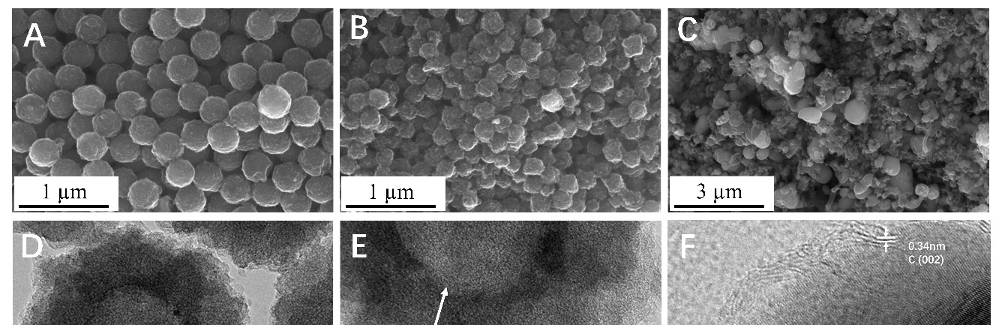
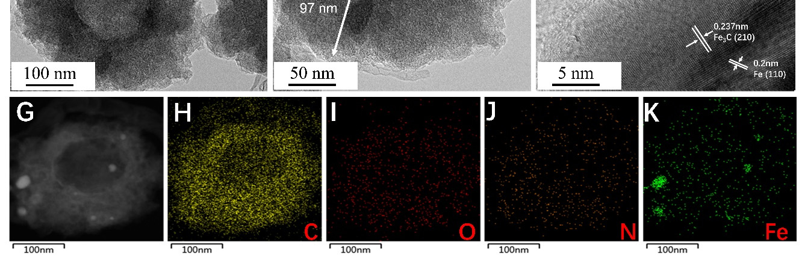
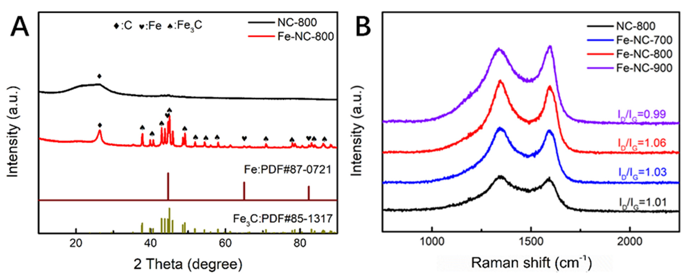
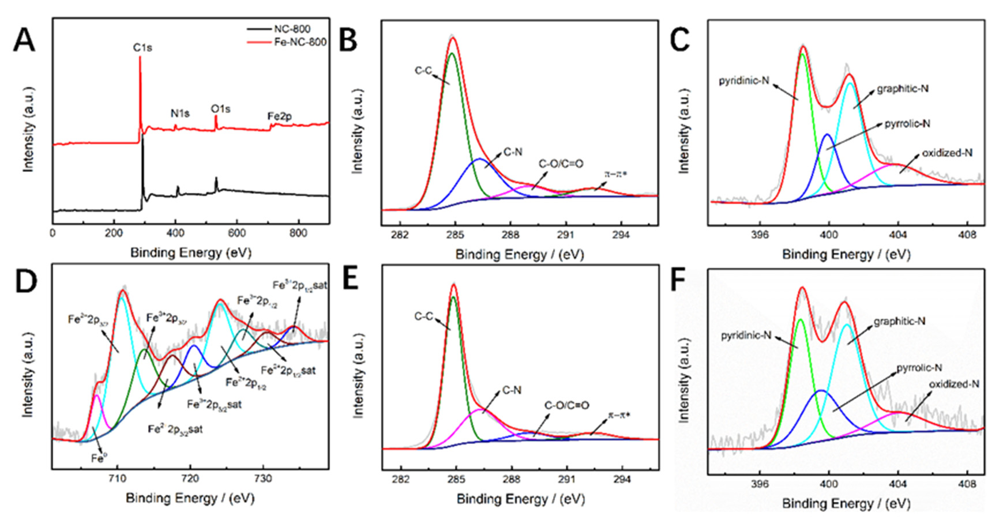
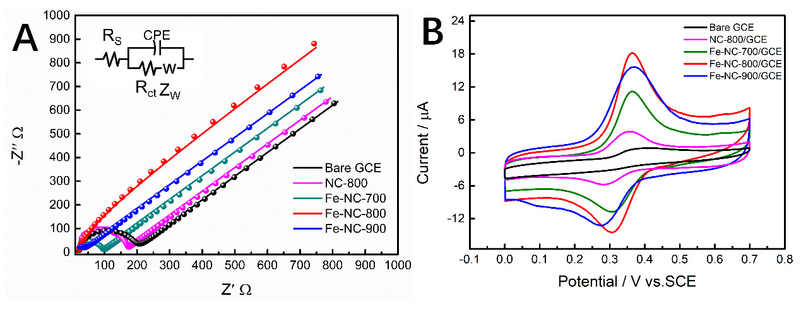
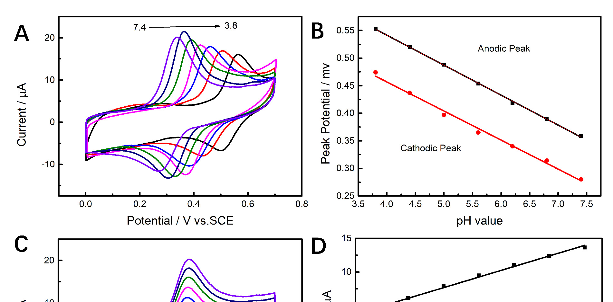
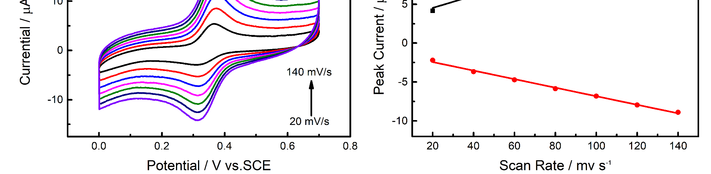
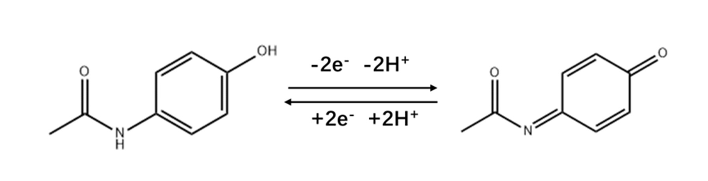
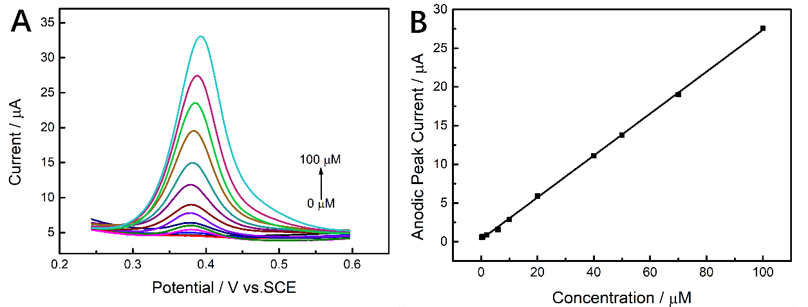
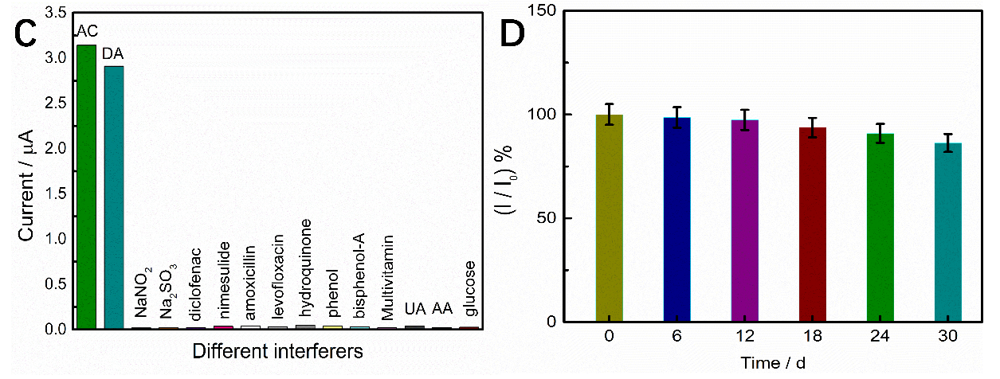

## Page 1

Citation: Zhao, X.; Zhang, L.; Chu, Z.;
Wang, Q.; Cao, Y.; Cao, J.; Li, J.; Lei,
W.; Zhang, B.; Si, W. Fe–Decorated
Nitrogen–Doped Carbon Nanospheres
as an Electrochemical Sensing
Platform for the Detection of
Acetaminophen. Molecules 2023, 28,
3006. https://doi.org/10.3390/
molecules28073006
Academic Editors: Javier
Hernández-Borges and Javier
González-Sálamo
Received: 7 February 2023
Revised: 17 March 2023
Accepted: 18 March 2023
Published: 28 March 2023
Copyright:
© 2023 by the authors.
Licensee MDPI, Basel, Switzerland.
This article is an open access article
distributed
under
the
terms
and
conditions of the Creative Commons
Attribution (CC BY) license (https://
creativecommons.org/licenses/by/
4.0/).
molecules
Article
Fe–Decorated Nitrogen–Doped Carbon Nanospheres as an
Electrochemical Sensing Platform for the Detection
of Acetaminophen
Xiangchuan Zhao 1,2, Liping Zhang 1, Zhaoyun Chu 1
, Qing Wang 1, Yue Cao 1
, Jun Cao 1, Jiao Li 1, Wu Lei 3,
Boming Zhang 2 and Weimeng Si 1,*
1
School of Materials Science and Engineering, Shandong University of Technology, Xincunxi Road 266th,
Zibo 255000, China
2
Institute of Advanced Materials, Shandong Institutes of Industrial Technology, Jinan 250000, China
3
School of Chemistry and Chemical Engineering, Nanjing University of Science and Technology,
Xiaolingwei 200th, Nanjing 210094, China
*
Correspondence: siweimeng@foxmail.com
Abstract: In this work, Fe–decorated nitrogen–doped carbon nanospheres are prepared for electro-
chemical monitoring of acetaminophen. Via a direct pyrolysis of the melamine–formaldehyde resin
spheres, the well–distributed Fe–NC spheres were obtained. The as–prepared Fe–NC possesses
enhanced catalysis towards the redox of acetaminophen for abundant active sites and high–speed
charge transfer. The effect of loading Fe species on the electrochemical sensing of acetaminophen
is investigated in detail. The synergistic effect of nitrogen doping along with the above–mentioned
properties is taken advantage of in the fabrication of electrochemical sensors for the acetaminophen
determination. Based on the calibration plot, the limits of detection (LOD) were calculated to be
0.026 µM with a linear range from 0–100 µM. Additionally satisfactory repeatability, stability, and
selectivity are obtained.
Keywords: electrochemical sensor; melamine–formaldehyde resin; acetaminophen; Fe–decorated
nitrogen–doped carbon nanospheres
1. Introduction
Acetaminophen (AC), also known as paracetamol, is clinically used to relieve fever,
colds, and a variety of pain, such as headache, and toothache, which is an alternative to
aspirin [1,2]. However, using AC in excess of the prescribed dose can cause side effects.
Therefore, it is essential to develop a sensitive, quick, and easy AC concentration detection
method. Currently, many methods have been developed for the detection of AC, such
as spectrophotometry [3], high–performance liquid chromatography [4], chemilumines-
cence [5], fluorescence spectroscopy [6], capillary electrophoresis [7], etc. However, the
above methods usually require complex preprocessing, which is time–consuming, expen-
sive, and requires professionals, so it is difficult to achieve large–scale applications [8]. The
electrochemical approach has the benefits of being affordable, portable, highly sensitive,
and exceptionally stable, as well as having excellent reproducibility and a quick turnaround
time for analysis [9,10]. Therefore, the electrochemical detection method of paracetamol
has been attracting increasing attention in recent years [11,12].
Carbon materials have the advantages of rich content, low price, and good chemical
stability, which are subject to many research fields [13,14]. However, its catalytic activity
has difficulty meeting the needs of sensors. The modification of carbon materials can
endow them with new physical and chemical properties and improve their catalytic ability.
Therefore, in recent years, transition metal and nitrogen co–doped carbon materials (M–NC)
have attracted wide attention. Among them, Fe–NC materials are favored by researchers
Molecules 2023, 28, 3006. https://doi.org/10.3390/molecules28073006
https://www.mdpi.com/journal/molecules

### Page Images

---

## Page 2

Molecules 2023, 28, 3006
2 of 16
due to iron reserves, low prices, and low biological toxicity. As far as we know, the study of
Fe–NC materials as electrochemical sensors for detecting AC is limited. In addition, there
are some reports that Fe/Fe3C nanoparticles can provide more electrons for the active sites
of Fe–Nx to enhance its catalytic activity [15–17]. Inspired by this, we hope to prepare a
Fe–N–C material containing both Fe and Fe3C for the detection of AC.
Because raw materials are cheap, melamine–formaldehyde (MF) resin is considered to
be the dominant precursor for the synthesis of nitrogen–doped carbon materials compared
to other polymers such as polydopamine and polypyrrole with higher nitrogen content
and rich amino groups [18]. In the pyrolysis process, a large number of triazines in MF
can be stabilized in the polymer skeleton to reduce the loss of nitrogen. Herein, we
report a method to synthesize Fe–NC materials using MF resin as the carbon and nitrogen
sources and ferric chloride as the iron source. Using nitrogen in MF resin as the anchor
point for iron atoms, a large number of triazine groups in MF can provide abundant
nitrogen through pyrolysis to form Fe–Nx. Meanwhile, graphitic carbon–encapsulated
Fe–/Fe3C nanoparticles are formed, which helps to enhance the stability of the material.
We demonstrated the formation of Fe–Nx active sites and Fe/Fe3C nanoparticles by a series
of characterization methods, and the composite modified electrode was successfully used
for electrochemical detection of AC.
2. Results and Discussion
2.1. Structure and Morphology Studies
Firstly, melamine and formaldehyde were polymerized under a low temperature
water bath to produce an MF resin prepolymer, then ferric chloride was added for further
polymerization to obtain an Fe–doped MF resin, and PVA was used as dispersant to
prevent MF resin aggregation. The as–synthesized MF resin (Figure S1A) was spherical
with a rough surface and a diameter of approximately 700 nm. The morphology after
carbonization is shown in Figure 1. The spherical structure of the MF resin is retained,
but the diameter is significantly reduced. It indicates that the volume of the MF resin
shrinks during the pyrolysis process, and the shrinkage rate can be up to 50%. With
NC–800 (Figure S1B) and Fe–NC–800 (Figure 1B), the doping of Fe makes the surface
of the samples rougher. This rough surface helps to increase the specific surface area of
the material and increases the contact area between the material and the substance to be
tested. By comparing the morphologies of Fe–NC–700 (Figure 1A), Fe–NC–800 (Figure 1B),
and Fe–NC–900 (Figure 1C), it can be seen that the diameter gradually increases, and
the spherical shape becomes more and more irregular with the increase in the pyrolysis
temperature, until the pyrolysis temperature reached 900 ◦C and the spherical structure
was destroyed.
TEM images (Figure 1D–F) show the microstructure of Fe–NC–800; it is a carbon sphere
with a diameter of approximately 300 nm, with nanoparticles dispersed or embedded on the
surface or inside of the carbon sphere. The thickness of the carbon layer is approximately
97 nm. HRTEM shows that the lattice spacing of 0.2 nm and 0.237 nm correspond to the
(110) crystal plane of Fe and the (210) crystal plane of Fe3C, respectively [19]. The (002)
crystal plane of graphite carbon corresponds to a lattice spacing of 0.34 nm [20]. This
indicates that the nanoparticles are composed of Fe and Fe3C, and the structure of the
nanoparticles wrapped by the graphite carbon layer can not only avoid contact between
the active center and the reaction medium, but also improve the stability of the material.
Additionally, the wrapped nanoparticles can encourage the transport of electrons from Fe3C
to the outermost layer of graphite carbon, increasing the material’s catalytic activity [21].
The successful doping of Fe is demonstrated by the uniform distribution of C, N, O, and Fe
elements on the mapped image surface in Figure 1G–K.

---

## Page 3

Molecules 2023, 28, 3006
3 of 16
 
Figure 1. SEM images of Fe–NC–700 (A), Fe–NC–800 (B), Fe–NC–900 (C); TEM images of Fe–NC–800
(D–F), the arrow in (E) represents the thickness of the graphite carbon layer of the carbon sphere;
EDS mapping images of Fe–NC–800 (G–K).
By using XRD, the material’s crystal phase was examined (Figure 2A). The graphite
carbon (002) crystal plane is indicated from diffraction peaks on NC–800 and Fe–NC–800
at 26.4◦(PDF#26–1080). The fact that Fe can accelerate the graphitization of carbon is
demonstrated by the fact that the diffraction peak intensity of Fe–NC–800 is higher than
that of NC–800 and the peak width is narrower [22]. The lattice spacing in HRTEM linking
with the diffraction peaks at 37.8◦and 44.6◦, which is assigned to the (210) plane of Fe3C
and (110) plane of Fe, respectively (PDF#85–1317, PDF#87–0721), demonstrates that the
nanoparticles are made of Fe and Fe3C.
Figure 2. (A) the XRD of NC–800, Fe–NC–800; (B) the Raman spectrum of NC–800, Fe–NC–700,
Fe–NC–800, Fe–NC–900.

### Page Images

---

## Page 4

Molecules 2023, 28, 3006
4 of 16
Figure 2B depicts the Raman spectra of NC–800, Fe–NC–700, Fe–NC–800, and Fe–NC–900.
At 1351 cm−1 and 1582 cm−1, respectively, typical disordered carbon (D–band) and graphite
carbon (G–band) structures were seen. The degree of graphitization of carbon materials
can be determined by the intensity ratio of ID/IG [22]. The ID/IG value of Fe–NC–800 (1.06)
is higher than that of NC–800 (1.01) at the same pyrolysis temperature, demonstrating
that Fe–doping causes carbon materials to have higher defect levels. Fe–NC–800 has the
highest ID/IG value because the surface of spherical particles becomes rougher as the
pyrolysis temperature increases from 700 ◦C to 800 ◦C, increasing specific surface area and
strengthening the D band. When the temperature rises from 800 ◦C to 900 ◦C, the spherical
structure is destroyed, and the volatilization of nitrogen at high temperature leads to the
decrease in defect degree [23].
By using X–ray photoelectron spectroscopy (XPS), the elemental composition of the
NC–800 and Fe–NC–800 were examined (Figure 3A), demonstrating the successful incor-
poration of Fe. Fe–NC–800 has the following atomic percentages: C (88.61%), O (5.33%),
N (4.02%), and Fe (2.04%). The C–C (284.8 eV), C–N (286.28 eV), C–O/C=O (288.99 eV), and
π–π* transition (292.42 eV) transitions can be distinguished in the C1s spectra of NC–800
and Fe–NC–800, respectively (Figure 3B,E) [24]. Because C–N was next to Fe–Nx and the
C–N bond preferentially fractured, the quantity of C–N species in Fe–NC–800 reduced
when compared to NC–800, which improved the catalytic performance [25]. The fact that
the iron–doped material forms Fe–Nx active sites can be inferred from the N1s spectrum
in Figure 3F, which can be divided into pyridinic–N (398.1 eV), pyrrolic–N (399.5 eV),
graphitic–N (401.6 eV), and oxynitride (403.9 eV) [26]. The characteristic peak of pyrrole N
of Fe–NC–800 is shifted in position compared to NC–800, indicating that the addition of Fe
has changed the coordination environment of nitrogen, which may be caused by the coordi-
nation of pyrrole N with Fe to form Fe–Nx sites [27]. The two main configurations of N1s of
Fe–NC–800 are pyridine nitrogen and graphite nitrogen. By increasing the electron density
and other doping factors, pyridine nitrogen can enhance the catalytic activity of electrode
materials, while graphite nitrogen is thought to improve the electron transfer ability of
carbon–based materials [28,29]. Meanwhile, pyrrole nitrogen is believed to enhance the
catalytic activity by reducing the carbon band gap energy, as it usually shows fast charge
mobility [30]. Nitrogen content falls when pyrolysis temperature rises (Table S1), which
is caused by the material’s structure being destroyed and nitrogen atoms escaping as N2,
HCN, NH3, or other gases [31]. The Fe2p XPS spectra of Fe–NC–800 is shown in Figure 3D.
The peaks at 710.91 eV, 722.78 eV, 717.56 eV, and 732.47 eV correspond to Fe2+, and the
peaks at 714.65 eV, 726.69 eV, 720.94 eV, and 734.83 eV correspond to Fe3+ [21]. The high
resolution Fe2p spectrum of Fe–NC–800 shows a weak signal of Fe0 (Fe3C) at 707.72 eV,
which may be due to the encapsulation of nanoparticles by the graphite carbon layer [32].
2.2. Electrochemical Behavior of Fe–NC/GCE
The cyclic voltammetry (CV) curve in the 5.0 mM K3[Fe(CN)6 standard solution
containing 0.1 M KCl is shown in Figure S2A. As can be seen, Fe–NC–800 has a much higher
current response than bare GCE, NC–800/GCE, Fe–NC–700/GCE, and Fe–NC–900/GCE.
Additionally, the peak potential difference is the smallest, indicating that Fe–NC–800 has
the fastest electron transfer [33]. Combined with the XRD, TEM, and Raman test results
mentioned previously, it can be inferred that the doping of Fe and the formation of Fe/Fe3C
nanoparticles can promote the charge transfer ability of the nitrogen–doped carbon material,
which contributes to the electrocatalytic performance of the modified electrode.
The electrochemical impedance (EIS) fitted circuit uses a Randles–Warburg circuit
[Rs(CPE[RctZW])] fitted with a constant phase element (Figure 4A), where Rs is the solution
resistance, Rct is the charge transfer resistance, CPE is the constant phase element, and ZW is
the Warburg impedance. Here, the CPE is used instead of the capacitance Q to describe the
non–ideal behavior of the system caused by the rough or porous surface of the material, and
the specific expression for the CPE is ZCPE = ((jω)aY0)−1, a constant phase element index, in
the range from 0~1, Y0 = capacitance. The value of CPE–P for Fe–NC–800/GCE was found

---

## Page 5

Molecules 2023, 28, 3006
5 of 16
to be 0.87 after fitting, which is between 0.5 and 1. This indicates that there is a dispersion
effect on the electrode surface. The capacitive resistance arc of the bilayer appears in the
high frequency part, while the Warburg impedance appears in the low frequency part,
indicating that the diffusion control exceeds the electrochemical control. The fitted data
yielded charge transfer resistances (Rct) of 187.4 Ω, 164.9 Ω, 105.4 Ω, 10.6 Ω, and 34.7 Ω
for Bare GCE, NC–800/GCE, Fe–NC–700/GCE, Fe–NC–800/GCE, and Fe–NC–900/GCE,
respectively. The charge transfer resistance is inversely proportional to the capacitance [34].
The value of Rct confirms the conductive nature of Fe–NC–800, which promotes a faster
electron transfer [35], in agreement with the CV data in Figure S2A.
 
Figure 3. XPS survey spectra of prepared samples (A); C1s spectra of NC–800 (B) and Fe–NC–
800 (E); N1s spectra of NC–800 (C) and Fe–NC–800 (F); Fe2p spectrum of Fe–NC–800 (D), in (B,D),
* represents bonding π electron transitions to π* orbitals.
Figure 4. (A) Electrochemical impedance maps (EIS) of electrodes modified with different materials;
(B) CV plots of electrodes modified with different materials in 0.1M CPB solution (pH = 6.8) containing
50 µM acetaminophen, scan rate 100 mV/s.

### Page Images

---

## Page 6

Molecules 2023, 28, 3006
6 of 16
Figure S2B shows CVs of various electrodes in 0.1 M KCl containing 5.0 mM K3[Fe (CN)6].
It is clear that the oxidation peak charge of Fe–NC–800/GCE is linearly related to the square
root of the scan rate, according to the Randles–Sevcik equation [36]:
Ip = 2.69 × 105 n3/2AD1/2Cv1/2
(1)
where A is the effective surface area, n is the number of electrons transferred (n = 2), D is
the diffusion coefficient of K3[Fe(CN6)] (7.6 × 10−6 cm2/s), and C is the bulk concentration
of K3[Fe(CN6)]. The effective surface area of Fe–NC–800/GCE can be calculated to be
0.285 cm2, which is much higher than that of bare GCE (0.023 cm2), NC–800/GCE (0.068 cm2),
Fe–NC–700/GCE (0.143 cm2), and Fe–NC–900/GCE (0.201 cm2). Combined with Raman
results, it can be seen that Fe–NC–800 has the highest defect degree, thus, exposing more
active sites, so it has the largest effective surface area.
The electrochemical behavior of AC at bare GCE, NC–800/GCE, Fe–NC–700/GCE,
Fe–NC–800/GCE, and Fe–NC–900/GCE were investigated by CV (Figure 4B). In 0.1 M
CPB (pH = 6.8) containing 50 µM AC (scan rate 100 mV/s), only a weak oxidation peak
(0.416 V) was observed on bare GCE, indicating that the redox of AC on bare GCE is
irreversible. NC–800/GCE showed only a pair of weak redox peaks, indicating that the
MF resin–derived nitrogen–doped carbon is not sufficient for the catalytic ability of AC.
A pair of obvious oxidation peaks (0.364 V) and reduction peaks (0.308 V) appeared on
Fe–NC–800/GCE. This indicates that the higher effective active area and increased reactive
sites of the material due to Fe–doping can promote the catalytic ability of nitrogen–doped
carbon for AC. We speculated that AC was oxidized to N–acetyl–4–benzoquinone imine
at the oxidation peak. The redox peak current of Fe–NC–800 is approximately four times
that of NC–800, and the peak potential difference (58 mV) of NC–700 is greater than that of
Fe–NC–800 (56 mV), indicating that Fe–doping can improve the electron transfer rate of
materials and provide more active sites. The peak potential difference between Fe–NC–800
and Fe–NC–700 was almost the same, but when the pyrolysis temperature reached 900 ◦C,
the peak potential difference increased to 63 mV. This was because the temperature is too
high, resulting in the destruction of the material structure and the decrease in the defect
degree, resulting in the reduction of the exposed active sites. In general, the reason why
Fe–NC–800 has the best catalytic activity can be explained as follows: (1) Fe–doping forms
Fe–Nx active sites and Fe/Fe3C nanoparticles in the material, which improves the electron
transfer efficiency of the material; (2) appropriate pyrolysis temperature makes the material
have a high defect degree and exposes more active sites.
When it comes to the working electrode and the sensing of the target, the supportive
electrolyte’s pH has a considerable impact. Therefore, CV was used to analyze the effects
of pH on the peak current and potential of oxidation of AC (50 µM), with 0.1 M CPB and
a constant scan rate of 100 mV/s, the pH value was in the range from 3.8–7.4. As can be
seen from Figure 5A, as the pH value rises from 3.8 to 7.4, the redox peak potential of AC
shifts in the opposite direction, indicating that protons are involved in the redox reaction of
AC [37]. This effect might be caused by the –NHCOCH3 and –OH groups of AC molecules
changing structurally in various pH solutions [38]. Additionally, pH = 6.8 was found to
produce the strongest electrochemical signal, thus, it was decided that this was the best
pH for detecting AC in following studies. Figure 5B illustrates the good linear relationship
between the oxidation and reduction peak potentials and pH. The linear regression and
correlation coefficient equations derived from the linear plots of redox peak potential and
pH are obtained as follows:
Epa = −0.05435 pH + 0.7589 (Epa: V, R2 = 0.9993)
(2)
Epc = −0.05268 pH + 0.6674 (Epc: V, R2 = 0.9922)
(3)

---

## Page 7

Molecules 2023, 28, 3006
7 of 16
 
Figure 5. CVs of Fe–NC–800/GCE in 0.1 mol/L CPB with 50 µM AC (scan rate 100 mV/s) of different
pH (A); effect of pH value on the oxidation peak potential (B); CV of Fe–NC–800/GCE in 0.1 mol/L
CPB (pH = 6.8) with 50µM AC at different scan rates (20–140 mV/s) (C); the linear dependence plot
of scan rate on peak currents (D), the black line represents the oxidation peak current and the red line
represents the reduction peak current.
It is possible to determine the link between Epa and Epc and pH value; the slopes
are 54.4 mV pH−1 and 52.7 mV pH−1, respectively. These values are both quite close to
59 mV pH−1. This suggests that both protons and electrons are present in equal amounts
during the reaction [11]. The proton number (m) was calculated to be 2 using Equation (4) [39]:
dEp/dpH = 2.303 mRT/2F
(4)
where T is the temperature, m is the number of protons, R is the ideal gas constant, and F is
the Faraday constant. Therefore, it may be concluded that the redox reaction between AC
and Fe–NC/GCE involves two electrons and two protons. In other words, AC is oxidized
to N–acetyl–4–benzoquinoneimine at the oxidation peak, and N–acetyl–4–benzoquinone
imine is reduced to AC at the reduction peak, and so on repeatedly to form a catalytic cycle,
as shown in Scheme 1.
Scheme 1. Mechanisms of AC Electrochemical Reactions.

### Page Images

---

## Page 8

Molecules 2023, 28, 3006
8 of 16
We used CV to examine the impact of scan rate on oxidation current in order to
better understand the kinetic of AC oxidation on Fe–NC–800 electrodes. Scan rates varied
between 20 and 140 mV/s when 50 µM AC was present in CPB (pH = 6.8). The oxidation
peak current (Ipa) and the reduction peak current (Ipc), which are both depicted in Figure 5C,
both gradually rise with an increase in scan rate. The correlation between Ipa, Ipc, and scan
rate is depicted in Figure 5D. They all have a good linear relationship, as can be seen:
Ipa = 0.07868 v + 2.947 (R2 = 0.9969)
(5)
Ipc = −0.05487 v −1.3384 (R2= 0.9981)
(6)
The linear correlation between current and scan rate suggests, in accordance with
Equations (5) and (6), that the redox reaction of AC on Fe–NC–800/GCE is a surface–controlled
process as opposed to a diffusion–controlled activity [40].
Figure S3A shows the change trend in AC oxidation peak current with different vol-
umes of ink composed of 2 mg Fe–NC–800, 1 mL water, and 5 µL 5 wt% Nafion solution.
The oxidation peak current increases with the increase in the volume of dripping ink
from 1 µL to 5 µL. This result may be due to the gradual increase in Fe–NC–800 content
on the surface of the modified electrode as the volume of the dropwise added material
increases from 1 µL to 5 µL, which will provide more active catalytic sites and, therefore,
the catalytic performance of the electrode is gradually enhanced, and the response cur-
rent is gradually increased. The oxidation peak current decreases gradually when the
volume exceeds 5 µL. Speculatively, the phenomenon observed could be attributed to
the abundant accumulation of Fe–NC–800 on the electrode surface. This build–up may
excessively raise the contact resistance, thereby reducing the electrode’s current response.
The reason for this phenomenon, we speculate that it is due to the accumulation of too
much Fe–NC–800 on the electrode surface, which instead leads to some catalytically active
sites being covered, making the modified electrode less catalytically active. Therefore, the
optimized ink volume is 5 µL. Because the kinetic process of the electrochemical reaction
of AC on Fe–NC–800/GCE is controlled by adsorption, the effect of the enrichment time
needs to be considered. The effect of Fe–NC–800/GCE on the peak oxidation current of
50 µM AC (scan rate 100 mV/s) at different enrichment times was investigated by DPV
(Figure S3B). The oxidation peak current gradually increased by increasing the enrichment
time from 0 s to 180 s, reaching the maximum value at 180 s. Further extension of the
enrichment time resulted in essentially no change in the oxidation peak current, which
indicates that AC basically reached saturation at the Fe–NC–800/GCE surface at 180 s.
Therefore, an enrichment time of 180 s was used in the subsequent experiments.
Differential pulse voltammetry (DPV) has high sensitivity, making it possible to
detect even low concentrations of analytes [40]. DPV is capable of providing better res-
olution compared to other voltammetric techniques, as it minimizes the impact of the
background noise on the signal [41]. We, therefore, utilized DPV to quantitatively de-
tect AC in 0.1 M CPB. The pulse width of DPV is 0.2 s, the pulse period is 0.5 s, the
potential increment is 4 mV, and the voltage range is from 0.2–0.6 V [42]. As shown in
Figure 6A, when AC concentration rises, a distinct increase in peak DPV current can be
seen. As depicted in Figure 6B, a good linear correlation between peak current and con-
centration was obtained in the range from 0–100 µM. The linear regression equation was
I (µA) = 0.27076 c (µM) + 0.30269 (R2 = 0.9997). The LOD was calculated to be 0.026 µM
via 3σ/S, where 3 represents the confidence factor and σ is the standard deviation of
the blank sample, we measured 20 times to obtain the average value as σ, and S is the
slope of the fitted straight line [43]. We used the same method to perform DPV tests on
bare GCE, NC–800/GCE, Fe–NC–700/GCE, and Fe–NC–900/GCE, and the results are
shown in Figure S5 and Table S2. It can be seen that the sensitivity and detection limits of
Fe–NC–800/GCE are better than those of bare GCE, NC–800/GCE, Fe–NC–700/GCE, and
Fe–NC–900/GCE.

---

## Page 9

Molecules 2023, 28, 3006
9 of 16
Figure 6. (A) DPV curves of Fe–NC–800/GCE with different concentrations of AC (0–100 µM) in
0.1 mol/L CPB (pH = 6.8), different color lines in the graph represent the DPV curves with different
concentrations of AC added. (B) The corresponding calibration curve of AC concentration and
current. (C) Response currents of Fe–NC–800/GCE in 0.1 mol/L CPB (pH = 6.8) to 10µM AC and
ten times the concentration of interferents (uric acid (UA), glucose, dopamine (DA), ascorbic acid
(AA), sodium nitrite, sodium sulfite, diclofenac, nimesulide, amoxicillin, levofloxacin, hydroquinone,
bisphenol A, phenol, multivitamin tablets), different color columns represent the response current
of Fe–NC–800/GCE to AC and different interferents (D) Long–term stability experiment of AC
sensor based on Fe–NC–800 (0–30 d), the different color columns represent the response current of
Fe–NC–800/GCE to the same con-centration of AC after the current number of days of placement.
It can be seen that the LOD of Fe–NC–800/GCE for AC is lower than many non–noble
metal catalysts in recent years, which is close to the report of some noble metal catalysts
(Table 1). The factors listed below may be responsible for the good electrochemical per-
formance: (1) the aromatic conjugated electron cloud of carbon and the aromatic electron
cloud of acetaminophen interact to give the outer carbon a strong adsorption capacity for
AC [44]; (2) the formation of Fe/Fe3C nanoparticles can promote the catalytic activity of
Fe–Nx, improve the material’s efficiency at transferring electrons, and shorten the electron
transfer path of the redox reaction of AC on Fe–NC–800/GCE; (3) Fe–doping enhances the
carbon material matrix’s degree of defect and exposes additional active sites. The outcomes
demonstrate the reliability of the Fe–NC–800/GCE, presented in this paper, for detecting
AC current.

### Page Images

---

## Page 10

Molecules 2023, 28, 3006
10 of 16
Table 1. Comparison of LOD of various AC electrochemical sensor.
Materials (Method)
Linear Range
LoD
Analytical Methods
Ref.
P–NC a/GCE
3–110 µM
0.5 µM
DPV
[1]
PPy/PPa–PGE b
0.2–500 µM
0.89 µM
DPV
[45]
N,S–doped C@Pd nanorods
0.033–120 µM
0.011 µM
DPV
[46]
ILC–CPE c
0–120 µM
2.8 µM
DPV
[47]
IL–NH2–Fe3O4NP–MWCNT d–GCE
0–0.7 µM
0.4 µM
DPV
[48]
MoS2–TiO2/rGO/SPE
0.1–125 µM
0.046 µM
DPV
[49]
Pd–SB/GCE
0–50 µM
0.067 µM
CV
[50]
TFPB–BD–COF/caCTF–1–700/COOH–
MWCNT/GCE e
0.6–150 µM
0.053 µM
DPV
[51]
Au–PEDOT f/rGO/GCE
0.001–8000 µM
0.001 µM
i–t g
[52]
Fe–NC–800/GCE
0–100 µM
0.026 µM
DPV
This work
a, P–NC: nitrogen–rich porous carbon.
b, PPy/PPa: polypyrrole/polypyrrole–3–carboxylic acid copolymer;
PGE: pencil graphite electrode.
c, ILC: ionic liquid crystal; CPE: carbon paste electrode.
d, IL: 1–ethyl–3–
methylimidazolium tetrafluoroborate ionic liquid; NH2–Fe3O4NP: amino group functionalized magnetite nanopar-
ticles; MWCNT: multi–walled carbon nanotubes. e, TFPB–BD–COF/caCTF–1–700/COOH–MWCNT: Covalent
Organic Frameworks and Covalent Triazine Frameworks Binding via Carboxylated Multiwalled Carbon Nan-
otubes. f, PEDOT: poly(3,4–ethylenedioxythiophene). g, i–t: chronoamperometry.
2.3. Repeatability, Stability, and Selectivity
Selectivity is an important parameter for evaluating the sensor performance. To
assess the selectivity of Fe–NC–800/GCE, we tested anti–interference substances with
DPV (Figure 6C), with the methods refering to the relevant literature [53]. We used uric
acid (UA), glucose, dopamine (DA), ascorbic acid (AA), sodium nitrite, sodium sulfite,
diclofenac, nimesulide, amoxicillin, levofloxacin, hydroquinone, bisphenol–A, phenol, and
multivitamin tablets as interfering substances. The above interfering substances were tested
with DPV. After testing, Fe–NC–800/GCE was found to have no significant current response
to UA, AA, glucose, sodium nitrite, sodium sulfite, diclofenac, nimesulide, amoxicillin,
levofloxacin, hydroquinone, bisphenol A, phenol, and multivitamins. Although it reacted
to DA, the oxidation peak potentials of AC and DA were far apart as seen by the DPV
curve (Figure S6), and the presence of DA had almost no effect on the reaction current of
AC, which indicates that the sensor has a good selectivity for the detection of AC.
We adopted DPV to detect the reproducibility of Fe–NC–800/GCE, fabricated five
different samples of Fe–NC–800/GCE to detect AC in 0.1 M CPB (pH = 6.8) and ob-
served that the current responses of the modified electrodes were almost the same for five
times (Figure S8A,B). We continuously measured the same Fe–NC–800/GCE five times
(Figure S8C) and found that the response current did not change significantly, indicating
that Fe–NC–800/GCE had good repeatability. The single electrode was stored for 30 days,
and the same concentration of AC was detected every 6 days. After 30 days, the electro-
chemical sensor showed acceptable stability, with a peak current retention of approximately
86.3% (Figure 6D). This structure of nanoparticles wrapped by a graphitic carbon layer
avoids the direct contact between the active center and the reaction medium, which greatly
reduces the carbon corrosion and iron loss in the Fe–NC–800 catalyst and improves the
stability of the material.
2.4. Real Sample Studies
We tested the AC concentration in commercially available drugs using a standard
addition method to verify the practical application of the sensor, the methodology with
reference to the relevant literature [33]. Commercially available tablets were ground in a
mortar and pestle, dissolved in 10 mL of ethanol, centrifuged, and the supernatant diluted
to 250 mL with 0.1 M CPB (pH = 6.8) solution. Then, 1 mL of the solution (acetaminophen
tablet solution) and 9 mL of 0.1 M CPB (pH = 6.8) solution were used to form the solution
to be tested. The AC in the solution to be measured was measured to be 12.7 µM. A
standard solution of known concentration of AC was then added to it and the feasibility of

---

## Page 11

Molecules 2023, 28, 3006
11 of 16
the proposed sensor was assessed by calculating the recovery. The results are shown in
Table 2. The recoveries of all spiked samples ranged from 96.1% to 102.2%, indicating that
Fe–NC–800/GCE is an efficient and reliable sensing platform for the detection of AC in
real samples.
Table 2. Determination of paracetamol in pharmaceutical samples.
Sample
Detected (µM)
Spiked (µM)
Found (µM)
Recovery (%)
Paracetamol
Tablet
(500 mg/tablet)
12.7
10
23.2
102.2
30
41.8
97.9
50
60.3
96.1
3. Experimental
3.1. Reagents
Acetaminophen was from Sinopharm Shanghai, China. Melamine (99%), formalde-
hyde (37%), citric acid (99%), disodium hydrogen phosphate (99%), ferric chloride hexahy-
drate (99%), polyvinyl alcohol (98 %, Mw~47,000), uric acid (UA) (99%), glucose (99%),
dopamine (DA) (98%), ascorbic acid (AA) (99%), diclofenac (98%), hydroquinone (99%), and
bisphenol A (99%) were from Macklin Biochemical Technology Co., Ltd. (Shanghai, China).
All reagents were used without further purification. Citrate phosphate buffer (CPB), which
served as a supporting electrolyte, was made from a solution of citric acid (0.1 M) and
sodium phosphate (0.2 M).
Acetaminophen tablets (500 mg/tablet) were from Sino–American Tianjin SmithK-
line and French Lab., Ltd. (Tianjin, China). Nimesulide (100 mg/tablet) was from Bei-
jing Yongzheng Pharmaceutical Co., Ltd. (Beijing, China). Amoxicillin (250 mg/tablet)
was from Cspc Heibei Zhongrun Pharmaceutiacl Co., Ltd. (Hebei, China). Levofloxacin
(100 mg/tablet) was from Shandong Lukang Group Saite Co., Ltd. (Xintai, China). Mul-
tivitamin tablets (Vitamin B6 0.25 mg/tablet and Vitamin B1 2.5 mg/tablet) were from
Hangzhou Minsheng Healthcare Co., Ltd. (Zhejiang, China).
3.2. Synthesis of Fe–NC
The experimental procedure is shown in Scheme 2, to create Solution A, 90 mL of water
was used to dissolve 0.6 g of polyvinyl alcohol (PVA) (solid, 98%, Mw~47,000). Solution B
was created by thoroughly stirring 3.78 g of melamine into 30 mL of water, then adding
10 mL of formaldehyde (37%). Solution B was heated in a 65 ◦C water bath until it was
clear and achromic. After adding 1 g of FeCl3·6H2O (solid, 99%), solution B was heated in
a 65 ◦C water bath for another 30 min. Next, solution A was added. The mixture was then
reacted for another 30 min, then centrifuged and dried to produce the polymer powder.
The samples were then pyrolyzed for 2 h at 800 ◦C with a heating rate of 5 ◦C min−1 in a
nitrogen atmosphere, and then washed with 500 mL of 0.5 mol/L 0.5 M H2SO4 to remove
any remaining residue. The finished product was then labeled as iron/nitrogen–doped
carbon after being neutralized with deionized water (Fe–NC–800). The same procedure
was used to create samples with pyrolysis temperatures of 700 ◦C and 900 ◦C, which
were referred to as Fe–NC–700 and Fe–NC–900, respectively. Additionally, using the
same manufacturing method, nitrogen–doped carbon without Fe was also produced, this
material is known as NC–800.

---

## Page 12

Molecules 2023, 28, 3006
12 of 16
 
Scheme 2.
The preparation process of Fe–NC and its schematic diagram for the detection
of acetaminophen.
3.3. Characterizations
A Quanta250 (Thermo Fisher Scientific Co., Ltd., USA) field emission environmental
scanning electron microscope was used to capture images of the samples under a scanning
electron microscope (SEM). Using an FEI Tecnai G2T20 (Thermo Fisher Scientific Co., Ltd.,
USA), 200 kV measurements were made on the sample’s transmission electron microscopy
(TEM) pictures. The sample’s Raman spectrum was captured by the WJGS–034 Micro
Raman Spectrometer at a wavelength of 532 nm(Horiba(China)Trading Co., Ltd., France).
Thermo Scientific K–Alpha+ was used to conduct X–ray Photoelectron Spectroscopy (XPS)
(Thermo Fisher Scientific Co., Ltd., USA). The X–ray diffraction patterns (XRD) of the
samples were obtained by a Rigaku Ultima IV X–ray diffractometer (Rigraku Co., Ltd.,
Japan). The deposition thickness of samples on glassy carbon electrodes were determined
using a 37XC–PC inverted microscope.
A CHI660E electrochemical workstation (Shanghai Chenhua Instrument Co., Ltd.,
Shanghai, China) was used in this work coupled with a Three–Electrode System. Pt
and saturated calomel electrodes served as the counter and reference electrodes (SCE),
respectively. GCE (d = 3 mm) or Fe–NC composite–modified GCE was used as the working
electrode. Prior to the modification process, the GCE was sequentially polished with 1 mm,
0.3 mm, and 0.05 m alumina/water slurry. Additionally, homogeneous ink containing 2 mg
Fe–NC, 1 mL water, and 5 µLNafion (5 wt%) was obtained via a subsequent ultra–sonication
treatment of 30 min. An Fe–NC modified electrode was prepared via drop casting method
with 5µL of ink. The electrode was stored under N2 atmosphere at room temperature
(~25 ◦C). All electrochemical tests were carried out at a constant temperature (25 ◦C). The
thickness of the Fe–NC–800 layer deposited on GCE was measured to be 38.2 µm.
4. Conclusions
In this report, Fe–NC nanomaterials were prepared by one–step in situ pyrolysis using
MF as raw material. The relationship between pyrolysis temperature, microstructure, and
electrochemical performance was analyzed, and it was successfully used for electrochemical
detection of AC. During the pyrolysis process, a large number of triazine groups in MF
provide abundant nitrogen as the anchor site for Fe, forming the Fe–Nx active center. Part
of Fe–Nx was reduced to Fe3C during the pyrolysis process. Fe–NC–800 has the best
analytical performance for AC due to the high catalytic activity of Fe–Nx sites formed in the

### Page Images

---

## Page 13

Molecules 2023, 28, 3006
13 of 16
material, the promotion of Fe/Fe3C on Fe–Nx, the highest defect degree, and the excellent
stability and selectivity of Fe/Fe3C structure wrapped by graphite carbon. With these
excellent characteristics, the designed electrode can be recommended for future analytical
applications to detect AC. Despite some limitations, our research offers insights into the
use of the Fe3C/Fe–Nx composite as an electrode material for electrochemical sensing and
catalysis. To further enhance our understanding, we plan to investigate the impact of the
coordination state of Fe species on electrochemical properties, and to develop an effective
masking method to differentiate Fe3C from Fe–Nx and elucidate their cooperative action.
Moreover, we aim to extend our application scope beyond acetaminophen by exploring
the simultaneous detection of multiple analytes, such as dopamine and acetaminophen,
to expand the versatility and utility of our sensing platform. These efforts will augment
our fundamental knowledge and practical application of the Fe3C/Fe–Nx composite in
electrochemical sensing and catalysis.
Supplementary Materials: The following supporting information can be downloaded at: https:
//www.mdpi.com/article/10.3390/molecules28073006/s1, Reagent safety and toxicity analysis.
Figure S1. SEM image of MF resin (A) and NC–800 (B). Figure S2. (A) CV curves of 5.0 mM [Fe(CN)6]
solution in the presence of 0.1 M KCl; (B) Fe–NC–800/GCE, (C) bare GCE, (D) NC–800/GCE, (E) Fe–
NC–700/GCE, (F) Fe–NC–900/GCE in the presence of 0.1 M KCl 5.0 mM [Fe(CN)6] CV curves at
different scan rates in solution. Figure S3. Effect of dropwise material volume (A) and enrichment
time (B) on AC oxidation peak current (Folding Line Chart). Figure S4. Effect of dropwise material
volume (A) and enrichment time (B) on AC oxidation peak current. Figure S5. Bare GCE (A,B),
NC–800/GCE (C,D), Fe–NC–700/GCE (E,F), Fe–NC–900/GCE (G,H) under the same conditions
for DPV testing. Figure S6. Interference experiment of the Fe–NC–800 measured with AC and
interferents(uric acid(UA), glucose, dopamine(DA), ascorbic acid(AA), sodium nitrite, sodium sulfite,
diclofenac, nimesulide, amoxicillin, levofloxacin, hydroquinone, bisphenol–A, phenol, mul-tivitamin)
in 0.1 mol/L CPB (pH = 6.8). Figure S7. Long–term stability experiment of AC sensor based on
Fe–NC–800/GCE (0–30 days). Figure. S8 Different Fe–NC–800/GCE to detect the current response of
AC (50µM) in 0.1 M CPB (pH = 6.8), (A) DPV; (B) Response current histogram; (C) Five measurements
of the same electrode in 0.1M CPB (pH = 6.8). Figure S9. The DPV curve of paracetamol in the drug
was determined in 0.1 MCPB (pH = 6.8). Figure S10 The thickness of the Fe–NC–800 layer deposited
on GCE. Table S1. C, N and Fe contents of Fe–NC group calculated from XPS results. Table S2.
Com-parison of sensitivity and detection limits of electrodes modified with different materials.
Author Contributions: Methodology, X.Z.; Software, L.Z. and Z.C.; Formal analysis, Y.C.; Investi-
gation, X.Z and Q.W.; Resources, Y.C.; Data curation, X.Z.; Writing original draft, X.Z.; Writing review
& editing, J.C.; Visualization, W.L.; Supervision, J.L.; Project administration, W.S.; Funding acquisition,
B.Z. and W.S. All authors have read and agreed to the published version of the manuscript.
Funding: This work was supported by the National Natural Science Foundation of China (21706148),
the Natural Science Foundation of Shandong Province (ZR2020ME041, ZR2022QB173), Joint Zibo–SDUT
Fund (2019ZBXC358), and the Foundation of State Key Laboratory of Biobased Material and Green
Papermaking, Qilu University of Technology, Shandong Academy of Sciences (KF2019–06).
Institutional Review Board Statement: Not applicable.
Informed Consent Statement: Not applicable.
Data Availability Statement: Data are contained within the article or Supplementary Materials.
The data sets generated during and/or analyzed during the current study are available from the
corresponding author upon rea-sonable request.
Conflicts of Interest: The authors declare no competing interests.

---

## Page 14

Molecules 2023, 28, 3006
14 of 16
References
1.
Liang, W.; Liu, L.; Li, Y.; Ren, H.; Zhu, T.; Xu, Y.; Ye, B.-C. Nitrogen–rich porous carbon modified electrochemical sensor for the
detection of acetaminophen. J. Electroanal. Chem. 2019, 855, 113496. [CrossRef]
2.
Anuar, N.S.; Basirun, W.J.; Ladan, M.; Shalauddin; Mehmood, M.S. Fabrication of platinum nitrogen–doped graphene nanocom-
posite modified electrode for the electrochemical detection of acetaminophen. Sens. Actuators B Chem. 2018, 266, 375–383.
[CrossRef]
3.
Glavanovi´c, S.; Glavanovi´c, M.; Tomiši´c, V. Simultaneous quantitative determination of paracetamol and tramadol in tablet
formulation using UV spectrophotometry and chemometric methods. Spectrochim. Acta Part A Mol. Biomol. Spectrosc. 2016,
157, 258–264. [CrossRef]
4.
Campos, A.M.; Raymundo-Pereira, P.A.; Mendonça, C.D.; Calegaro, M.L.; Machado, S.A.S.; Oliveira, J.O.N. Size Control of
Carbon Spherical Shells for Sensitive Detection of Paracetamol in Sweat, Saliva, and Urine. ACS Appl. Nano Mater. 2018, 1, 654–661.
[CrossRef]
5.
Balram, D.; Lian, K.-Y.; Sebastian, N.; Rasana, N. Surface functionalization of CNTs with amine group and decoration of
begonia–like ZnO for detection of antipyretic drug acetaminophen. Appl. Surf. Sci. 2021, 559, 149981. [CrossRef]
6.
Liu, X.; Na, W.; Liu, H.; Su, X. Fluorescence turn–off–on probe based on polypyrrole/graphene quantum composites for selective
and sensitive detection of paracetamol and ascorbic acid. Biosens. Bioelectron. 2017, 98, 222–226. [CrossRef] [PubMed]
7.
Montaseri, H.; Forbes, P.B. Analytical techniques for the determination of acetaminophen: A review. TrAC Trends Anal. Chem.
2018, 108, 122–134. [CrossRef]
8.
Kang, X.; Wang, J.; Wu, H.; Liu, J.; Aksay, I.A.; Lin, Y. A graphene–based electrochemical sensor for sensitive detection of
paracetamol. Talanta 2010, 81, 754–759. [CrossRef]
9.
Campos, A.M.; Raymundo-Pereira, P.A.; Cincotto, F.H.; Canevari, T.C.; Machado, S.A. Sensitive determination of the endocrine
disruptor bisphenol A at ultrathin film based on nanostructured hybrid material SiO2/GO/AgNP. J. Solid State Electrochem. 2015,
20, 2503–2507. [CrossRef]
10.
Raymundo-Pereira, P.A.; Campos, A.M.; Vicentini, F.C.; Janegitz, B.C.; Mendonça, C.D.; Furini, L.N.; Boas, N.V.; Calegaro, M.L.;
Constantino, C.J.; Machado, S.A.; et al. Sensitive detection of estriol hormone in creek water using a sensor platform based on
carbon black and silver nanoparticles. Talanta 2017, 174, 652–659. [CrossRef]
11.
Guo, L.; Hao, L.; Zhang, Y.; Yang, X.; Wang, Q.; Wang, Z.; Wang, C. Metal–organic framework precursors derived Ni–doping
porous carbon spheres for sensitive electrochemical detection of acetaminophen. Talanta 2021, 228, 122228. [CrossRef] [PubMed]
12.
Wang, K.; Wu, C.; Wang, F.; Jing, N.; Jiang, G. Co/Co3O4 Nanoparticles Coupled with Hollow Nanoporous Carbon Polyhedrons
for the Enhanced Electro–chemical Sensing of Acetaminophen. ACS Sustain. Chem. Eng. 2019, 7, 18582–18592. [CrossRef]
13.
Quintero-Jaime, A.F.; Quílez-Bermejo, J.; Cazorla-Amorós, D.; Morallón, E. Metal free electrochemical glucose biosensor based on
N–doped porous carbon material. Electrochim. Acta 2020, 367, 137434. [CrossRef]
14.
Wang, Y.; Chen, J.; Ihara, H.; Guan, M.; Qiu, H. Preparation of porous carbon nanomaterials and their application in sample
preparation: A review. TrAC Trends Anal. Chem. 2021, 143, 116421. [CrossRef]
15.
Xing, Y.; Yao, Z.; Li, W.; Wu, W.; Lu, X.; Tian, J.; Li, Z.; Hu, H.; Wu, M. Fe/Fe3 C Boosts H2O2 Utilization for Methane Conversion
Overwhelming O2 Generation. Angew. Chem. Int. Ed. Engl. 2021, 60, 8889–8895. [CrossRef] [PubMed]
16.
Wu, G.; Shao, C.; Cui, B.; Chu, H.; Qiu, S.; Zou, Y.; Xu, F.; Sun, L. Honeycomb–like Fe/Fe3C–doped porous carbon with more
Fe–Nx active sites for promoting the electrocatalytic activity of oxygen reduction. Sustain. Energy Fuels 2021, 5, 5295–5304.
[CrossRef]
17.
Zhang, Y.-J.; Qu, J.; Ji, Q.-Y.; Zhang, T.-T.; Chang, W.; Hao, S.-M.; Yu, Z.-Z. Freestanding cellulose paper–derived carbon/Fe/Fe3C
with enhanced electrochemical kinetics for high–performance lithium–sulfur batteries. Carbon 2019, 155, 353–360. [CrossRef]
18.
Zhang, B.; Le, M.; Chen, J.; Guo, H.; Wu, J.; Wang, L. Enhancing Defects of N–Doped Carbon Nanospheres Via Ultralow Co Atom
Loading Engineering for a High–Efficiency Oxygen Reduction Reaction. ACS Appl. Energy Mater. 2021, 4, 3439–3447. [CrossRef]
19.
Wang, H.; Yin, F.X.; Liu, N.; Kou, R.H.; He, X.B.; Sun, C.J.; Chen, B.H.; Liu, D.J.; Yin, H.Q. Engineering Fe–Fe3C@Fe–N–C Active
Sites and Hybrid Structures from Dual Metal–Organic Frameworks for Oxygen Reduction Reaction in H2O2 Fuel Cell and
LiO2 Battery. Adv. Funct. Mater. 2019, 29, 1901531. [CrossRef]
20.
Zhou, F.; Yu, P.; Sun, F.; Zhang, G.; Liu, X.; Wang, L. The cooperation of Fe3C nanoparticles with isolated single iron atoms to
boost the oxygen reduction reaction for Zn–air batteries. J. Mater. Chem. A 2021, 9, 6831–6840. [CrossRef]
21.
Ma, R.; Zhou, Y.; Hu, C.; Yang, M.; Wang, F.; Yan, K.; Liu, Q.; Wang, J. Post iron–doping of activated nitrogen–doped carbon
spheres as a high–activity oxygen reduction electrocatalyst. Energy Storage Mater. 2018, 13, 142–150. [CrossRef]
22.
Xu, C.; Chen, L.; Wen, Y.; Qin, S.; Li, H.; Hou, Z.; Huang, Z.; Zhou, H.; Kuang, Y. A co-operative protection strategy to synthesize
highly active and durable Fe/N co–doped carbon towards oxygen reduction reaction in Zn–air batteries. Mater. Today Energy
2021, 21, 100721. [CrossRef]
23.
Fu, N.; Wei, H.M.; Lin, H.L.; Li, L.; Ji, C.H.; Yu, N.B.; Chen, H.J.; Han, S.; Xiao, G.Y. Iron Nanoclusters as Template/Activator
for the Synthesis of Nitrogen Doped Porous Carbon and Its CO2 Ad–sorption Application. ACS Appl. Mater. Interfaces 2017,
9, 9955–9963. [CrossRef] [PubMed]
24.
Huang, S.; Hu, B.; Zhao, S.; Zhang, S.; Wang, M.; Jia, Q.; He, L.; Zhang, Z.; Du, M. Multiple catalytic sites of Fe–N and Fe–N–C
single atoms embedded N–doped carbon heterostructures for high–efficiency removal of malachite green. Chem. Eng. J. 2021,
430, 132933. [CrossRef]

---

## Page 15

Molecules 2023, 28, 3006
15 of 16
25.
Liu, W.; Chu, L.; Zhang, C.; Ni, P.; Jiang, Y.; Wang, B.; Lu, Y.; Chen, C. Hemin–assisted synthesis of peroxidase–like Fe–N–C
nanozymes for detection of ascorbic acid–generating bio–enzymes. Chem. Eng. J. 2021, 415, 128876. [CrossRef]
26.
He, C.; Zhang, T.; Sun, F.; Li, C.; Lin, Y. Fe/N co–doped mesoporous carbon nanomaterial as an efficient electrocatalyst for oxygen
reduction reaction. Electrochim. Acta 2017, 231, 549–556. [CrossRef]
27.
Zheng, W.; Chen, F.; Zeng, Q.; Li, Z.; Yang, B.; Lei, L.; Zhang, Q.; He, F.; Wu, X.; Hou, Y. A Universal Principle to Accurately
Synthesize Atomically Dispersed Metal–N4 Sites for CO2 Electroreduction. Nano-Micro Lett. 2020, 12, 108.
28.
Naveen, M.H.; Shim, K.; Hossain, S.A.; Kim, J.H.; Shim, Y.-B. Template Free Preparation of Heteroatoms Doped Carbon Spheres
with Trace Fe for Efficient Oxygen Reduction Reaction and Supercapacitor. Adv. Energy Mater. 2016, 7, 1602002. [CrossRef]
29.
Qi, Y.; Cao, Y.; Meng, X.; Cao, J.; Li, X.; Hao, Q.; Lei, W.; Li, Q.; Li, J.; Si, W. Facile synthesis of 3D sulfur/nitrogen co–doped
graphene derived from graphene oxide hydrogel and the simul–taneous determination of hydroquinone and catechol. Sens.
Actuators B Chem. 2019, 279, 170–176. [CrossRef]
30.
Ren, G.; Lu, X.; Li, Y.; Zhu, Y.; Dai, L.; Jiang, L. Porous Core–Shell Fe3C Embedded N–doped Carbon Nanofibers as an Effective
Electrocatalysts for Oxygen Reduction Reaction. ACS Appl. Mater. Interfaces 2016, 8, 4118–4125. [CrossRef]
31.
Wabo, S.G.; Klepel, O. Nitrogen release and pore formation through KOH activation of nitrogen–doped carbon materials: An
evaluation of the literature. Carbon Lett. 2021, 31, 581–592. [CrossRef]
32.
Wei, X.; Song, S.; Song, W.; Xu, W.; Jiao, L.; Luo, X.; Wu, N.; Yan, H.; Wang, X.; Gu, W.; et al. Fe3C–Assisted Single Atomic Fe Sites
for Sensitive Electrochemical Biosensing. Anal. Chem. 2021, 93, 5334–5342. [PubMed]
33.
Tang, J.; Hui, Z.-Z.; Hu, T.; Cheng, X.; Guo, J.-H.; Li, Z.-R.; Yu, H. A sensitive acetaminophen sensor based on Co metal–organic
framework (ZIF–67) and macroporous carbon composite. Rare Met. 2021, 41, 189–198. [CrossRef]
34.
Ahmed, M.J.; Perveen, S.; Hussain, S.G.; Khan, A.A.; Ejaz, S.M.W.; Rizvi, S.M.A. Design of a facile, green and efficient graphene
oxide–based electrochemical sensor for analysis of aceta–minophen drug. Chem. Pap. 2022, 77, 2275–2294. [CrossRef] [PubMed]
35.
Raymundo-Pereira, P.A.; Campos, A.M.; Mendonça, C.D.; Calegaro, M.L.; Machado, S.A.S.; Oliveira, O.N. Printex 6L Carbon
Nanoballs used in Electrochemical Sensors for Simultaneous Detection of Emerging Pollutants Hydroquinone and Paracetamol.
Sens. Actuators B Chem. 2017, 252, 165–174. [CrossRef]
36.
Wang, M.; Zhong, L.; Cui, M.; Liu, W.; Liu, X. Nanomolar Level Acetaminophen Sensor Based on Novel Polypyrrole Hydrogel
Derived N-doped Porous Carbon. Electroanalysis 2019, 31, 711–717. [CrossRef]
37.
Mao, A.; Li, H.; Jin, D.; Yu, L.; Hu, X. Fabrication of electrochemical sensor for paracetamol based on multi–walled carbon
nanotubes and chi–tosan–copper complex by self–assembly technique. Talanta 2015, 144, 252–257. [CrossRef]
38.
Chen, F.; Fang, B.; Wang, S. A Fast and Validated HPLC Method for Simultaneous Determination of Dopamine, Dobutamine,
Phentolamine, Furosemide, and Aminophylline in Infusion Samples and Injection Formulations. J. Anal. Methods Chem. 2021,
2021, 8821126. [CrossRef]
39.
Afkhami, A.; Nematollahi, D.; Khalafi, L.; Rafiee, M. Kinetic study of the oxidation of some catecholamines by digital simulation
of cyclic voltammograms. Int. J. Chem. Kinet. 2004, 37, 17–24. [CrossRef]
40.
Dorraji, P.S.; Jalali, F. Novel sensitive electrochemical sensor for simultaneous determination of epinephrine and uric acid by
using a nanocomposite of MWCNTs–chitosan and gold nanoparticles attached to thioglycolic acid. Sens. Actuators B: Chem. 2014,
200, 251–258. [CrossRef]
41.
Wiench, P.; González, Z.; Menéndez, R.; Grzyb, B.; Gryglewicz, G. Beneficial impact of oxygen on the electrochemical performance
of dopamine sensors based on N–doped reduced graphene oxides. Sens. Actuators B Chem. 2017, 257, 143–153. [CrossRef]
42.
Adhikari, B.-R.; Govindhan, M.; Chen, A. Sensitive Detection of Acetaminophen with Graphene–Based Electrochemical Sensor.
Electrochim. Acta 2015, 162, 198–204. [CrossRef]
43.
Shetti, N.P.; Malode, S.J.; Nayak, D.S.; Reddy, K.R.; Reddy, C.V.; Ravindranadh, K. Silica gel–modified electrode as an electro-
chemical sensor for the detection of acetaminophen. Microchem. J. 2019, 150, 104206. [CrossRef]
44.
Qin, Y.; Hang, C.; Huang, L.; Cheng, H.; Hu, J.; Li, W.; Wu, J. An electrochemical biosensor of Sn@C derived from ZnSn(OH)6 for
sensitive determination of acetaminophen. Microchem. J. 2022, 175, 107128. [CrossRef]
45.
Kuralay, F.; Ça˘glayan, T.; Ilhan, H.; Dumangöz, M.; Çelebi, M.S. Fabrication of self-functionalized polymeric surfaces and their
application in electrochemical acetaminophen detection. J. Appl. Polym. Sci. 2020, 137, 49572. [CrossRef]
46.
Wang, L.; Yang, Y.; Liang, H.; Wu, N.; Peng, X.; Wang, L.; Song, Y. A novel N,S–rich COF and its derived hollow N,S–doped
carbon@Pd nanorods for electrochemical detection of Hg(2+) and paracetamol. J. Hazard. Mater. 2021, 409, 124528. [CrossRef]
[PubMed]
47.
Mangaiyarkarasi, R.; Premlatha, S.; Khan, R.; Pratibha, R.; Umadevi, S. Electrochemical performance of a new imidazolium ionic
liquid crystal and carbon paste composite electrode for the sensitive detection of paracetamol. J. Mol. Liq. 2020, 319, 114255.
[CrossRef]
48.
Chokkareddy, R.; Thondavada, N.; Bhajanthri, N.K.; Redhi, G.G. An amino functionalized magnetite nanoparticle and ionic
liquid based electrochemical sensor for the detection of acetaminophen. Anal. Methods 2019, 11, 6204–6212. [CrossRef]
49.
Demir, N.; Atacan, K.; Ozmen, M.; Bas, S.Z. Design of a new electrochemical sensing system based on MoS2–TiO2/reduced
graphene oxide nanocomposite for the detection of paracetamol. N. J. Chem. 2020, 44, 11759–11767. [CrossRef]
50.
Hefnawy, M.A.; Medany, S.S.; Fadlallah, S.A.; El-Sherif, R.M.; Hassan, S.S. Novel Self–assembly Pd(II)–Schiff Base Complex
Modified Glassy Carbon Electrode for Electrochemical Detection of Paracetamol. Electrocatalysis 2022, 13, 598–610. [CrossRef]

---

## Page 16

Molecules 2023, 28, 3006
16 of 16
51.
Sun, L.; Yang, M.; Guo, H.; Zhang, T.; Wu, N.; Wang, M.; Yang, F.; Zhang, J.; Yang, W. COOH–MWCNT connected COF
and chemical activated CTF as a novel electrochemical sensing platform for simultaneous detection of acetaminophen and
p–aminophenol. Colloids Surf. A Physicochem. Eng. Asp. 2022, 647, 129092. [CrossRef]
52.
Tao, T.; Gao, N.; He, H.; Zhou, R.; Tu, B.; Cai, Z.; Chang, G.; He, Y.; Ji, X. Au–PEDOT/rGO nanocomposites functionalized
graphene electrochemical transistor for ultra–sensitive detection of acetaminophen in human urine. Anal. Chim. Acta 2022,
1191, 339306. [CrossRef] [PubMed]
53.
Xie, X.; Wang, D.P.; Guo, C.; Liu, Y.; Rao, Q.; Lou, F.; Li, Q.; Dong, Y.; Li, Q.; Bin Yang, H.; et al. Single–Atom Ruthenium
Biomimetic Enzyme for Simultaneous Electrochemical Detection of Dopamine and Uric Acid. Anal. Chem. 2021, 93, 4916–4923.
[CrossRef] [PubMed]
Disclaimer/Publisher’s Note: The statements, opinions and data contained in all publications are solely those of the individual
author(s) and contributor(s) and not of MDPI and/or the editor(s). MDPI and/or the editor(s) disclaim responsibility for any injury to
people or property resulting from any ideas, methods, instructions or products referred to in the content.

---

