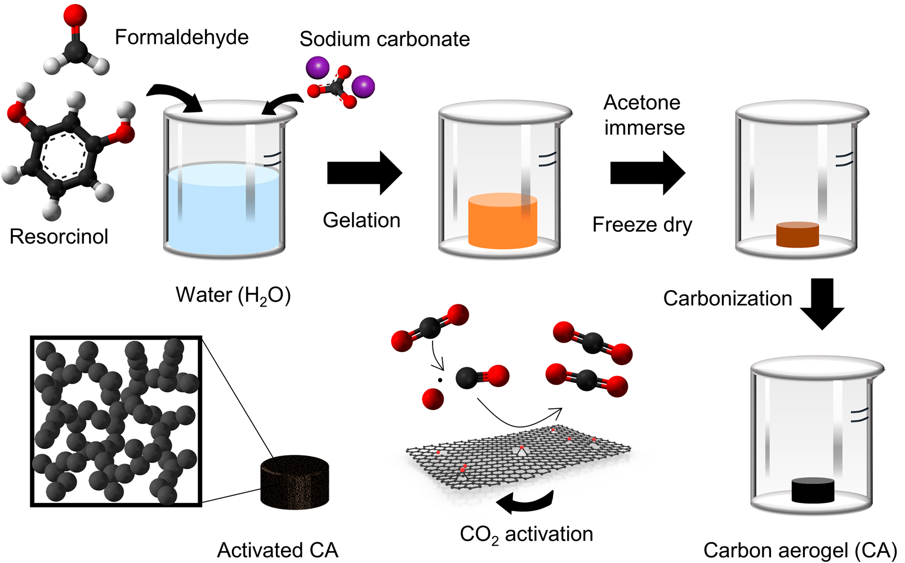
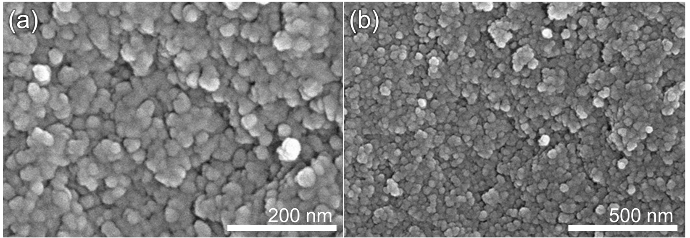
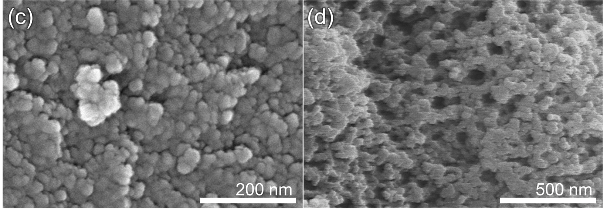
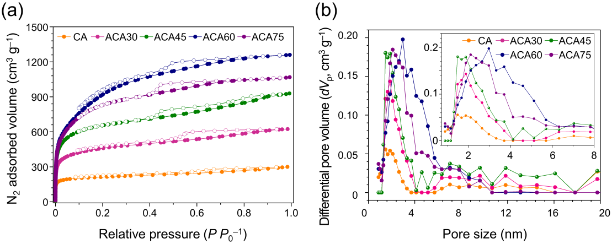
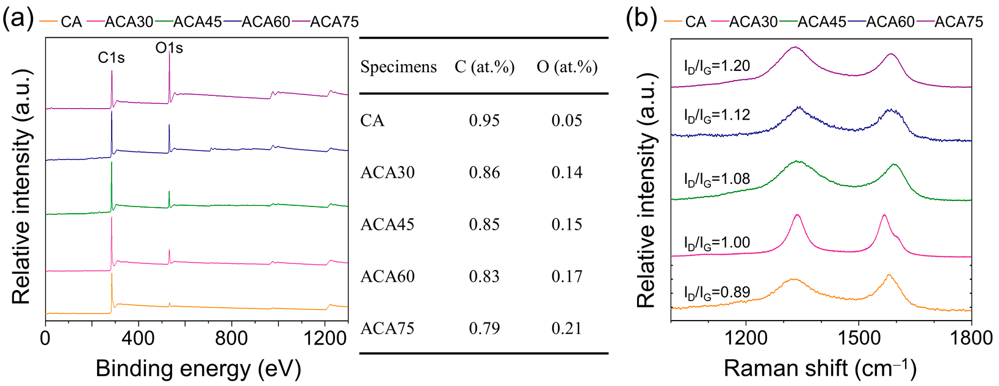
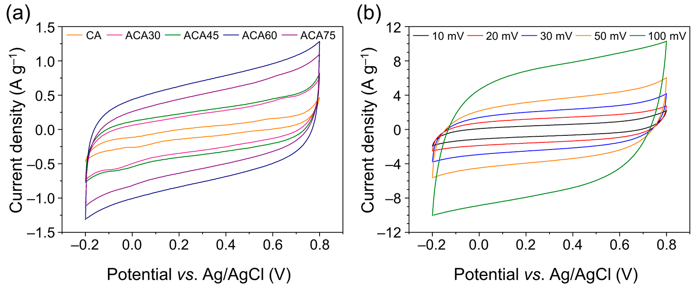
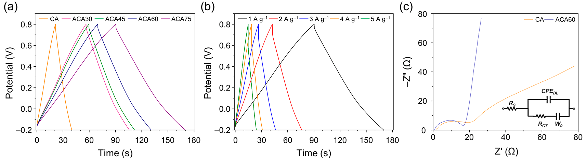
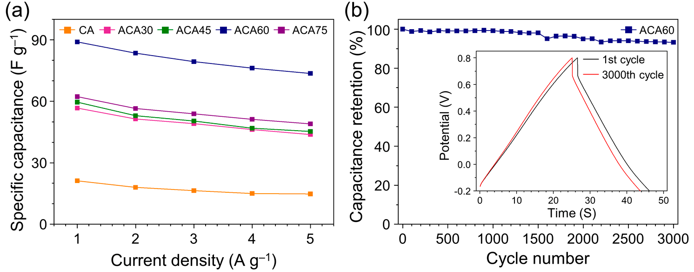

## Page 1

Citation: Lee, J.-H.; Lee, S.-Y.;
Park, S.-J. Highly Porous Carbon
Aerogels for High-Performance
Supercapacitor Electrodes.
Nanomaterials 2023, 13, 817.
https://doi.org/10.3390/
nano13050817
Academic Editor: Fabrizio Pirri
Received: 13 January 2023
Revised: 17 February 2023
Accepted: 20 February 2023
Published: 23 February 2023
Copyright:
© 2023 by the authors.
Licensee MDPI, Basel, Switzerland.
This article is an open access article
distributed
under
the
terms
and
conditions of the Creative Commons
Attribution (CC BY) license (https://
creativecommons.org/licenses/by/
4.0/).
nanomaterials
Article
Highly Porous Carbon Aerogels for High-Performance
Supercapacitor Electrodes
Jong-Hoon Lee, Seul-Yi Lee * and Soo-Jin Park *
Department of Chemistry, Inha University, Incheon 22212, Republic of Korea
* Correspondence: leesy1019@inha.ac.kr (S.-Y.L.); sjpark@inha.ac.kr (S.-J.P.);
Tel.: +82-32-876-7234 (S.-Y.L. & S.-J.P.)
Abstract: In recent years, porous carbon materials with high specific surface area and porosity have
been developed to meet the commercial demands of supercapacitor applications. Carbon aero-
gels (CAs) with three-dimensional porous networks are promising materials for electrochemical
energy storage applications. Physical activation using gaseous reagents provides controllable and
eco-friendly processes due to homogeneous gas phase reaction and removal of unnecessary residue,
whereas chemical activation produced wastes. In this work, we have prepared porous CAs activated
by gaseous carbon dioxide, with efficient collisions between the carbon surface and the activating
agent. Prepared CAs display botryoidal shapes resulting from aggregation of spherical carbon
particles, whereas activated CAs (ACAs) display hollow space and irregular particles from activa-
tion reactions. ACAs have high specific surface areas (2503 m2 g−1) and large total pore volumes
(1.604 cm3 g−1), which are key factors for achieving a high electrical double-layer capacitance. The
present ACAs achieved a specific gravimetric capacitance of up to 89.1 F g−1 at a current density of
1 A g−1, along with a high capacitance retention of 93.2% after 3000 cycles.
Keywords: carbon aerogel; supercapacitor; sol–gel polymerization; electric double-layer capacitors;
physical activation
1. Introduction
With the continuously increasing industrial development, energy shortage and global
warming have become serious issues; in this context, the identification of clean energy
sources and efficient energy storage technologies for low-carbon and sustainable economic
development has become an important task [1–3]. A supercapacitor is a more effective type
of energy storage device compared with traditional physical capacitors and batteries [4,5].
In comparison with conventional capacitors, supercapacitors use materials with a higher
specific surface area as electrodes, as well as thinner dielectrics, resulting in a greater
specific capacitance and energy density. Furthermore, compared with batteries, the charge
storage mechanism of supercapacitors is based on the surface reactions of the electrode
material, and no diffusion of ions takes place inside the material; therefore, supercapacitors
provide higher power densities within the same volume [6,7]. Supercapacitors are generally
classified into two categories depending on the energy storage mechanisms as electric
double-layer capacitors (EDLCs) and pseudocapacitors [8–11]. EDLCs are based on the
confrontation of charges at the electrode/solution interface by the alignment of electrons or
ions. For an electrode/solution system, a double layer is formed at the interface between
the electrically conductive electrodes and the ion-conductive electrolyte solution. When
an electric field is applied to the two electrodes, the anions in the solution migrate to
the positive and negative electrodes, forming a double layer on their surfaces [12]. After
removing the electric field, the positive and negative charges on the electrodes attract
the oppositely charged ions in the solution, which produce a relatively stable potential
difference between the positive and negative electrodes [13]. For each electrode, a specific
Nanomaterials 2023, 13, 817. https://doi.org/10.3390/nano13050817
https://www.mdpi.com/journal/nanomaterials

### Page Images

---

## Page 2

Nanomaterials 2023, 13, 817
2 of 13
amount of heterogeneous ionic charge equal to the charge on the electrode will be generated
within a certain distance (dispersion layer) to keep the electrical neutrality. When the two
electrodes are connected to an external circuit, the charges on the electrodes migrate
to generate a current in the external circuit, and the ions in the solution migrate to the
electrode surface, which becomes electrically neutral; therefore, enhanced accessibility to
large electrolyte ions associated with a high specific surface area is required to achieve
high-performance EDLCs [14–16].
Therefore, many researchers have focused on the adsorption process using various
porous materials, such as activated carbons, zeolites, metal–organic frameworks (MOFs),
and porous polymers [17–21]. Carbonaceous materials have many advantages, such as a
relatively low cost, thermal/chemical stability, and tunable pore characteristics to meet
application-specific requirements [22–24]. In particular, carbon aerogels (CAs) are synthetic
porous gel-type materials, in which voids occupy over 90% of the entire volume. This
structure remains a three-dimensional and highly porous skeleton without structural col-
lapse [25]. The highly porosity of CAs endows them with diverse unique characteristics,
such as ultralow density, low thermal conductivity, and large specific surface area. These
remarkable properties provide various applications of CAs, such as adsorbents, catalytic
supports, and energy storage materials. The highly porous structure of CAs and their broad
pore size distribution, ranging from micropores to mesopores, are suitable for electronic
and energy storage applications. Micropores (<2 nm) generally provide abundant adsorp-
tion sites for ions providing high specific capacitance of electrodes, whereas mesopores
(2–50 nm) enable the rapid diffusion of electrolyte ions which correlate with rate capability
and cycling stability of electrodes [26,27]. Fierro et al. reported distribution of mesopores
to fast ion diffusion. From comparison with mesopore-dominant and micropore-dominant
species, mesoporous carbons represent 75% rate capability whereas microporous carbons
show 50% rate capability. This result represents wide porous structure providing easy ion
mobility and lower diffusion resistance [28]; therefore, well-developed CAs with both mi-
cropores and mesopores provide high specific surface areas, leading to high ion adsorption
capacities and easily accessible pathways for electrolyte ions [29].
To improve the porosity of carbonaceous materials, many studies have recently at-
tempted to increase the specific surface area and pore volume of the adsorbents via acti-
vation processes [30–33]. Two methods have been suggested for this purpose: chemical
and physical activation, both of which develop the porosity of carbon materials by forming
micropores and narrow-size mesopores. In chemical activation approaches, carbonaceous
materials are mixed with chemical agents, such as alkali salts (sodium hydroxide (NaOH),
potassium hydroxide (KOH), and zinc chloride (ZnCl2)) [34–39]. Chemical activation
exhibits excellent performance in terms of porosity development, owing to the deep pene-
tration of the activating reagents into the carbon lattice during the activation process [40].
Nevertheless, chemical activation not only causes environmental pollution and incurs high
costs, associated with the removal of the remaining residue after activation, but also renders
it difficult to control the degree of activation. On the other hand, in physical activation, suit-
able oxidizing gas-phase agents (oxygen (O2), carbon dioxide (CO2), and steam (H2O)) are
employed to produce porosity, typically at a high temperature [41,42]. Physical activation
is environmentally friendly and renders it easy to control the degree of activation, because
the residue removal process is not needed and the activating reagent is a homogeneous
gas phase.
On the other hand, supercapacitors are classified according to the structure such as
1D yarn-, 2D sheet-, and 3D thick structured types. A thick electrodes supercapacitor
provides higher energy density compared with a thin film type supercapacitor, because
bulk species can increase the loading of the active materials providing higher ion storage
sites for charge; however, the augmentation of electrode thickness may pose challenges
in terms of transporting electrons and ions in the direction of the electrode thickness and
separator. Consequently, practical applications of thick electrode devices are confronted
with difficulties and complexities in both transmission and manufacturing. In this regard,

---

## Page 3

Nanomaterials 2023, 13, 817
3 of 13
introducing large pore for fast ion diffusion is one of strategy to overcome the challenges of
thick electrodes [43–45].
In this work, activated CA (ACA) supercapacitor electrodes were fabricated by poly-
merization and physical activation processes. CAs were physically activated by pressure-
assisted CO2 to produce well-developed pore structures and, ultimately, increase the
electrochemical capacitances. The ACA electrodes exhibited higher specific capacitances
compared with CA electrodes, owing to their higher porosity that facilitated ion accumula-
tion and electrostatic adsorption of electrolytic ions. Furthermore, the mesopores formed
by pore expansion upon a further activation process provided efficient electron pathways,
resulting in a higher rate capability and cycling stability. ACA activated under 60 min
exhibited the highest specific capacitance, a rate capability under 1–5 A g−1, and cycling
stability after 3000 cycles of 89.1 F g−1, 82.6%, and 93.2%, respectively.
2. Materials and Methods
2.1. Materials
Resorcinol (7.5 g, >99%, Sigma-Aldrich, St. Louis, MO, USA), formaldehyde solution
(37 wt.% in H2O with 10% methanol stabilizer, Sigma-Aldrich, St. Louis, MO, USA), acetone
(>99.8%, Daejung Chemicals, Siheung-si, Republic of Korea), sodium carbonate (>99.5%,
Sigma-Aldrich, St. Louis, MO, USA), carbon black (Ketjenblack, EC-600JD, AkzoNobel, Am-
sterdam, The Netherlands), polyvinylidene fluoride (PVDF, MW~534,000, Sigma-Aldrich,
St. Louis, MO, USA), sulfuric acid (>95%, H2SO4, Sigma-Aldrich, St. Louis, MO, USA), and
1-methyl-2-pyrrolidone (NMP, >99%, Sigma-Aldrich, St. Louis, MO, USA).
2.2. Synthesis of Carbon Aerogels
The CAs were prepared by sol–gel polymerization of resorcinol and formaldehyde.
Resorcinol (7.5 g) was dissolved in distilled water (75 mL) and formaldehyde solution
(25 g). Sodium carbonate, used as a base catalyst, was subsequently added to the solution
and stirred for 3 h. The obtained mixture was dried for 3 h at room temperature. After
that, the wet gel was dried at 80 ◦C for 48 h and then immersed in acetone solution for
24 h without stirring. The aerogels were obtained after freeze-drying and carbonized in a
furnace with a heating rate of 2 ◦C min−1 under N2 gas atmosphere. The obtained CAs
were subsequently activated at 900 ◦C in a furnace under CO2 gas flow (heating rate 5 ◦C
min−1, flow rate 100 mL min−1) for 30, 45, 60, and 75 min, with the corresponding products
denoted as ACA30, ACA45, ACA60, and ACA75, respectively. The obtained ACAs were
washed with distilled water until neutral pH and dried in an oven at 80 ◦C for 24 h.
2.3. Characterizations
Surface morphology images were obtained by scanning electron microscope (SEM)
using an SU-8010 instrument (Hitachi Co., Tokyo, Japan). To investigate the porous prop-
erties of the samples, N2/77 K adsorption–desorption isotherms were measured using a
BELSORP–Max instrument (BEL Japan, Inc., Tokyo, Japan). The samples were degassed at
473 K for 6 h to reduce the residual pressure below 10−6 bar. Specific surface areas (SBET)
were calculated using the Brunauer–Emmett–Teller (BET) equation. Pore size distribu-
tions were obtained using non-local density functional theory (NLDFT) for modeling the
N2/77 K adsorption with a slit pore kernel. X-ray photoelectron spectroscopy (XPS) and
Raman spectroscopy were investigated by Kα (Thermo Fisher Scientific Inc., Waltham, NJ,
USA) with a monochromatic Al Kα X-ray source and LabRAm HR Evolution (Horiba, Ltd.,
Tokyo, Japan), respectively.
2.4. Electrochemical Performance of Samples
The electrochemical performances of the prepared samples were characterized by
cyclic voltammetry (CV) and galvanostatic charge/discharge (GCD) measurements using
an IviumStat electrochemical workstation (Ivium Technologies, The Netherlands). All
electrochemical properties were investigated using 1 M H2SO4 as electrolyte in a three-

---

## Page 4

Nanomaterials 2023, 13, 817
4 of 13
electrode system, with a platinum coil as the counter electrode and Ag/AgCl as the
reference electrode. The working electrode consisted of 80 wt.% active material (ACA),
10 wt.% conductive material (carbon black), 10 wt.% binder (PVDF), and solvent (NMP).
After stirring for 12 h, the product of 0.4 g was pressed onto a nickel foil of 1 cm × 4 cm
size. The prepared electrodes were dried at 60 ◦C in air for 12 h to remove the NMP solvent.
The CV curves of the working electrode were obtained at scan rates of 10, 20, 30, 50, and
100 mV s−1 in the voltage range from −0.2 to 0.8 V. GCD curves were obtained from −0.2
to 0.8 V at current densities of 1, 2, 3, 4, and 5 A g−1.
3. Results and Discussion
Figure 1 shows a schematic diagram of the fabrication of the ACAs. In the gelation
step during the carbon aerogel synthesis, a hydrogel was formed by polymerization and
crosslinking between resorcinol and formaldehyde, with sodium carbonate as base catalyst.
The resorcinol anions, which are capable of strong nucleophilic addition, are formed during
the gelation process under basic conditions [46]; therefore, resorcinol was chemically
crosslinked with formaldehyde in the presence of the base catalyst [47]. The drying process
significantly influenced the final carbon aerogel products. The highly porous structure
of the aerogels mostly collapsed during the drying process, due to surface tension and
capillary forces [48]. Freeze-drying is an efficient method to minimize these destructive
forces during solvent evaporation, in which the solvent is removed via sublimation at
low pressure, without the formation of a gas–liquid interface. The mechanically stabilized
aerogel obtained after the freeze-drying process was subsequently carbonized under an
inert N2 atmosphere. To maximize the porosity and introduce micropores, the obtained
CAs were physically activated using CO2 as activating reagents.
Figure 1. Schematic illustration of the preparation of activated carbon aerogel (ACA) samples.
Figure 2 shows SEM images of pristine CA and ACA samples. A botryoidal shape
was observed for pristine CA, owing to the aggregation of spherical carbon particles via
polymerization and crosslinking. The surface morphology changed after the CO2 activation
process, with the appearance of hollow spaces and irregular particles due to the reaction of
carbon with CO2 during the activation process; moreover, we observed a decrease in the
number of relatively large interparticle voids, together with a preference for the formation
of smaller pores.

### Page Images

---

## Page 5

Nanomaterials 2023, 13, 817
5 of 13
 
Figure 2. SEM images of CA and ACA samples: (a,b) high- and low-magnification images of CA and
(c,d) high- and low-magnification images of ACA60.
Figure 3 displays N2 adsorption–desorption isotherms and pore size distributions.
The increased initial adsorption with increasing activation time reflected the higher number
of micropores resulting from the activation process. The ACA samples exhibited type IV
isotherms according to the IUPAC classification, with typical hysteresis loops at relative
pressures above 0.4 [49]. These features were attributed to the capillary condensation of
the nitrogen molecules within the mesopores. The adsorbed volume increased with in-
creasing relative pressure, because of the monolayer/multilayer adsorption of the nitrogen
molecules on both the mesopores and macropores. The adsorption capacity of ACA60
increased rapidly at relative pressures above 0.4, because of its large mesopore content.
After an activation time of 60 min, as in the case of ACA75, the adsorbed N2 amount
decreased compared with that of ACA60, due to the collapse of the porous structure upon
excessive activation. Based on the pore size distribution calculated by the NLDFT model,
pore size expansion occurred with increasing activation time. The pore size distribution of
ACA75 showed a decreased number of larger pores compared with ACA60, reflecting the
collapse of large pores under excessive activation conditions.

### Page Images

---

## Page 6

Nanomaterials 2023, 13, 817
6 of 13
Figure 3. (a) N2 adsorption–desorption isotherms at 77 K (filled circles: adsorption and open circles:
desorption) and (b) pore size distributions of prepared samples (inset: magnification between pore
size of 0.7 and 8 nm).
Table 1 lists the textural properties of the prepared samples, as obtained from the N2
adsorption–desorption isotherms. The micropore volumes of the prepared samples were
estimated by the Dubinin–Radushkevich (D–R) model (Equation (1)) [50]:
W = W0exp
"
−B
 T
β
2
log2
 P0
P
#
(1)
where W indicates the volume of the liquid adsorbed at P P0–1, W0 is the total volume of
the adsorbates in the micropores, while B and β are the adsorbent and adsorbate constants,
respectively.
Table 1. Textural properties of prepared samples.
Specimen
SBET a
(m2 g–1)
Vtotal b
(cm3 g–1)
Vmicro c
(cm3 g–1)
Vmeso d
(cm3 g–1)
Fmicro e
(%)
CA
704
0.381
0.306
0.075
80.3
ACA30
1436
0.794
0.596
0.198
75.1
ACA45
2094
1.182
0.862
0.320
72.9
ACA60
2503
1.604
1.132
0.472
70.6
ACA75
2403
1.359
0.968
0.391
71.2
a SBET:
specific surface area calculated using BET equation in a relative pressure range of 1·10–4–0.05.
b Vtotal: total pore volume estimated at a relative pressure P P0–1 = 0.99. c Vmicro: micropore volume deter-
mined from the D–R equation. d Vmeso: mesopore volume determined by subtracting Vmicro from the total pore
volume. e Fmicro: fraction of micropore volume, calculated as (micropore volume/total pore volume) × 100.
The as-received ACA had a high specific surface area (2503 m2 g−1) and total pore
volume (1.604 cm3 g−1). After activation, the specific surface area and micropore volume
generally increased with increasing the activation time, up to 60 min (ACA60). These results
indicate that the CO2 activation of ACA led to the development of microporosity. Activation
times over 60 min resulted in a decrease of the specific surface area and total pore volume,
due to the excessive activation leading to the collapse of the porous structure (ACA75).
The fraction of micropore volume of all samples gradually decreased until the ac-
tivation time reached 60 min. This is because, as shown in Equations (2)–(6), CO2 gas
molecules intercalated into the carbon lattice, causing the expansion of the existing microp-
ores into mesopores during activation [51]; thus, ACA60 had the highest specific surface
area (2503 m2 g−1) and micropore volume (1.604 cm3 g−1). On the other hand, ACA75

### Page Images

---

## Page 7

Nanomaterials 2023, 13, 817
7 of 13
showed a decreased micropore volume and consisted almost entirely of micropores, which
led to a higher micropore volume fraction, owing to the excessive activation with CO2.
C + CO2 →2CO ∆H = +173 kJ−1mol
(2)
C∗+ CO2 →C∗(CO2)
(3)
C∗+ (CO2) ⇌C∗(O) + CO
(4)
C∗(O) ⇌CO
(5)
CO + C∗(O) ⇌C∗(CO2)
(6)
The chemical properties of samples are shown in Figure 4. The elemental compositions
by XPS measurement represent increasing oxygen component as 0.05 to 0.21 at.%, which
represent oxygen functionalization via activation reaction progress. Raman spectroscopy
exhibited two characteristic peaks of 1340 and 1579 cm−1 attributed to the D-band and G-
band, respectively. The G-band indicates in-plane (E2g) stretching of sp2 graphitic structure,
whereas D-band is associated with the defect of graphitic structure. The intensity ratio of
D- and G-band (ID/IG) are calculated to evaluate the degree of defects in carbon surfaces.
The ID/IG ratios for CA, ACA30, ACA45, ACA60, and ACA75 are 0.89, 1.00, 1.08, 1.12, and
1.20, respectively. The calculated values represent high defects attributed to progression of
activation reaction.
 
Figure 4. (a) XPS graphs with elemental composition (evaluated by XPS measurement) of samples
and (b) Raman spectrum of samples with ID/IG ratio.
The electrochemical properties of the ACA series for electrochemical capacitor appli-
cations were investigated using a three-electrode system. Figure 5a shows the CV curves of
the as-prepared samples, obtained in the potential window between −0.2 and 0.8 V at a scan
rate of 10 mV s−1. The CV curves of the ACAs presented a nearly regular rectangular shape
without obvious redox peaks, representing an electrical double-layer capacitive behavior.
The imperfect rectangular shapes of CV curves result from oxygen moieties by activation
process which was identified in Figure 4. The areas of the CV curves of the ACAs were
larger than those of the pristine CAs, indicating that the specific capacitance of the ACAs
was substantially increased compared with that of the less porous CAs. Figure 5b shows
the CV curves of the as-prepared samples at different voltage scan rates. The CV curve
collected at a high scan rate retained its rectangular shape compared to those obtained at
lower scan rates, indicating the sustained reversible adsorption of electrolyte ions at the
electrode–electrolyte interface.

### Page Images

---

## Page 8

Nanomaterials 2023, 13, 817
8 of 13
 
Figure 5. (a) CV curves of CA and ACA electrodes collected at a scan rate of 10 mV s−1 and (b) CV
curves of ACA60 electrode at different scan rates.
Figure 6a shows the GCD curves of the ACA series at a current density of 1 A g−1.
The curves exhibit symmetric triangular shapes, which indicate an ideal supercapacitor
behavior attributed to non-faradaic reactions. The GCD curves measured for the ACA60
electrode showed a decreasing trend with increasing discharge current density because
it was hard for the electrolyte ions to penetrate the interior of the active material at high
current density, owing to the slow ion diffusion kinetics (Figure 6b). The specific capacitance
of the as-prepared samples was calculated according to Equation (7) [52,53]:
Cm =
I × t
∆V × m
(7)
where Cm is the specific capacitance (F g−1), I is the charge/discharge current, t is the
charge/discharge time, ∆V is the potential window, and m is the mass of active material.
The highest specific capacitance, obtained for ACA60, was 89.1 F g−1 at 1 A g−1. This
excellent performance resulted from the appropriate combination of ACA60. Figure 6c
represents the Nyquist plot of CA and ACA60 for electrochemical impedance analysis.
An ideal supercapacitor exhibits a small series resistance and a charge-transfer resistance,
representing a high-frequency semicircle followed by a sloped line at a low frequency. The
behavior of ion diffusion is observed in the form of a straight line in the low frequency
region, and a more vertical line indicates better double-layer behavior. A larger semi-arc
radius indicates a greater charge-transfer resistance, while a smaller radius suggests a
lower charge-transfer resistance. Moreover, the intrinsic resistance of the electrode can
be estimated by the x-intercept of the curve on the high-frequency region representing
the smaller the x-intercept at the smaller intrinsic resistance. This can be attributed to the
presence of Warburg impedance and diffusive resistance, which is primarily caused by
ion transport onto the electrode surface. In addition, the visible high-frequency semicircle
observed for all samples is likely a result of charge-transfer resistance at the electrode
surface [54,55]. ACA60 represents smaller intercept indicating low intrinsic resistance
compared with CA. This was attributed to the significant improvement in highly porous
structure for fast ion diffusion and hydrophilicity of CA after activation, which led to a
smaller charge-transfer resistance in the ACA electrode. In addition, the ACA60 exhibited
more vertical straight line in the low frequency region compared with CA representing
better double-layer behavior.

### Page Images

---

## Page 9

Nanomaterials 2023, 13, 817
9 of 13
 
Figure 6. (a) GCD curves of CA and ACA electrodes obtained at a current density of 1 A g−1,
(b) GCD curves of ACA60 electrode obtained at different current densities (1–5 A g−1), and
(c) Nyquist plots of CA and ACA60.
The specific capacitances obtained in this work and in other studies reported in the
literature are compared in Tables 2 and 3 [56–59]. Commercial porous carbon-based (YP-50F,
Kuraray) represented specific capacitance of 64 F g−1 using 1M TEABF4/PC electrolyte at
potential window of 0–2.5 V and scan rate of 1 A g−1. Carbon aerogels of other reports
represented specific capacitance of 43–108 F g−1. Even though large potential window and
using organic and high concentration electrolyte, H3PO4-modified carbon aerogels and
cellulose fibrous aerogels achieved specific capacitance of 103 and 108 F g−1, respectively,
which differed little from this work.
Table 2. Specific capacitances of samples (F g−1).
Specimen
1 A g−1
2 A g−1
3 A g−1
4 A g−1
5 A g−1
CA
21.2
18.0
16.4
15.0
14.8
ACA30
56.7
51.4
49.1
46.2
42.8
ACA45
59.6
53.0
50.4
46.9
45.3
ACA60
89.1
83.5
79.4
76.3
73.6
ACA75
62.3
56.5
53.9
51.2
49.1
Table 3. Comparison of the specific capacitance with other literatures.
Materials a
Electrolyte b
Potential
Window
(V)
Current
Density/Scan
Rate
Specific
Capacitance
(F g−1)
References
YP-50F
1M
TEABF4/PC
0–2.5
1 A g−1
64
[56]
H3PO4-modified carbon
aerogels
1M
TEABF4/PC
0–2.5
1 A g−1
108
[56]
Cellulose fibrous aerogels
6M KOH
0–1
10 mV s−1
103
[57]
Steam-activated hard
carbons
6M KOH
−0.3–0.7
1 A g−1
68
[58]
WS2 (TMD)-loaded
carbon aerogels
1M Na2SO4
0.1–0.9
1 A g−1
43
[59]
Steam-activated carbon
aerogel (ACA60)
1M H2SO4
−0.2–0.8
1 A g−1
89
This work
a TMD: transition metal dichalcogenide. b TEABF4: tetra ethyl ammonium tetrafluoroborate, PC: polycarbonate.
Figure 6b shows the GCD curve of the ACA electrode at various current densities (1 to
5 A g−1), showing that the specific capacitance of the electrode decreased with increasing
discharge current density. This is mainly because of the electrolyte ions diffuse slowly at
high current densities and cannot penetrate the active material to a sufficient extent.
The rate capability of the prepared electrodes was determined by measuring the
capacitance at different current densities (Figure 7a). The specific capacitance retention
was evaluated at applied current densities increasing from 1 to 5 A g−1. The specific

### Page Images

---

## Page 10

Nanomaterials 2023, 13, 817
10 of 13
capacitances of the CA, ACA30, ACA45, ACA60, and ACA75 samples decreased from 21.2,
56.7, 59.6, 89.1, and 62.3 to 14.8, 43.8, 45.3, 73.6, and 49.1 F g–1, indicating retentions of 69.8,
75.5, 76.0, 82.6, and 78.8%, respectively. The higher rate capability of ACA60 was attributed
to the facile ion diffusion pathway associated with the large mesopores. The cycling stability
of electrode materials is important for their practical application in energy storage devices.
The cycling performance of electrodes consisting of ACA60 was investigated by charging
and discharging the capacitor 3000 times at a current density of 3 A g−1. ACA60 retained
93.2% of its initial specific capacitance value (Figure 7b).
Figure 7. (a) Comparison of specific capacitances of CA and ACA samples and (b) cycle performance
of ACA60 electrode at a current density of 3 A g−1 over 3000 cycles (inset: GCD curves for 1st and
3000th cycle).
4. Conclusions
In this work, carbon aerogel-based porous supercapacitors electrodes were fabricated
by polymerization and physical activation processes. The ACA electrodes exhibited higher
specific capacitances, owing to the micro- and meso-porous 3D structure of ACA, which
provided a higher porosity facilitating the ion accumulation and electrostatic adsorption
of electrolytic ions; furthermore, the mesopores formed by pore expansion upon a further
activation process provided a facile electron pathway, resulting in a higher rate capability
and cycling stability. The ACA electrodes achieved a specific capacitance, rate capabil-
ity under 1–5 A g−1, and cycling stability after 3000 cycles of 89.1 F g−1, 82.6%, and
93.2%, respectively.
Author Contributions: Conceptualization, J.-H.L., S.-Y.L. and S.-J.P.; methodology, J.-H.L.; validation,
J.-H.L.; investigation, J.-H.L.; writing—original draft preparation, J.-H.L.; writing—review and
editing, J.-H.L., S.-Y.L. and S.-J.P.; visualization, J.-H.L.; supervision, S.-J.P. All authors have read and
agreed to the published version of the manuscript.
Funding: This research was supported by the National Research Foundation of Korea (NRF) grant
funded by the Korea government (MSIT) (No. 2022M3J7A1062940). This research was also supported
by Korea Electric Power Corporation (Grant number: R21XO01-5).
Data Availability Statement: The data presented in this study are available on request from the
corresponding author.
Conflicts of Interest: The authors declare no conflict of interest.
References
1.
Simon, P.; Gogotsi, Y. Perspectives for electrochemical capacitors and related devices. Nat. Mater. 2020, 19, 1151–1163. [CrossRef]
[PubMed]
2.
Shao, H.; Wu, Y.C.; Lin, Z.F.; Taberna, P.L.; Simon, P. Nanoporous carbon for electrochemical capacitive energy storage. Chem. Soc.
Rev. 2020, 49, 3005–3039. [CrossRef] [PubMed]
3.
Jayaraman, S.; Rawson, T.J.; Belyustina, M.A. Designing supercapacitor electrolyte via ion counting. Energy Environ. Sci. 2022, 15,
2948–2957. [CrossRef]

### Page Images

---

## Page 11

Nanomaterials 2023, 13, 817
11 of 13
4.
Gou, Q.Z.; Zhao, S.; Wang, J.C.; Li, M.; Xue, J.M. Recent Advances on Boosting the Cell Voltage of Aqueous Supercapacitors.
Nano-Micro Lett. 2020, 12, 98. [CrossRef]
5.
Lee, J.H.; Yang, G.; Kim, C.H.; Mahajan, R.L.; Lee, S.Y.; Park, S.J. Flexible solid-state hybrid supercapacitors for the internet of
everything (IoE). Energy Environ. Sci. 2022, 15, 2233–2258. [CrossRef]
6.
Xiao, J.; Han, J.W.; Zhang, C.; Ling, G.W.; Kang, F.Y.; Yang, Q.H. Dimensionality, Function and Performance of Carbon Materials
in Energy Storage Devices. Adv. Energy Mater. 2022, 12, 2100775. [CrossRef]
7.
Liu, T.Y.; Serrano, J.; Elliott, J.; Yang, X.Z.; Cathcart, W.; Wang, Z.X.; He, Z.; Liu, G.L. Exceptional capacitive deionization rate and
capacity by block copolymer-based porous carbon fibers. Sci. Adv. 2020, 6, eaaz0906. [CrossRef]
8.
Kumar, N.; Kim, S.B.; Lee, S.Y.; Park, S.J. Recent Advanced Supercapacitor: A Review of Storage Mechanisms, Electrode Materials,
Modification, and Perspectives. Nanomaterials 2022, 12, 3708. [CrossRef]
9.
Zhang, Y.; Park, M.; Kim, H.Y.; Park, S.J. Moderated surface defects of Ni particles encapsulated with NiO nanofibers as
supercapacitor with high capacitance and energy density. J. Colloid Interf. Sci. 2017, 500, 155–163. [CrossRef]
10.
Wang, Y.F.; Zhang, L.; Hou, H.Q.; Xu, W.H.; Duan, G.G.; He, S.J.; Liu, K.M.; Jiang, S.H. Recent progress in carbon-based materials
for supercapacitor electrodes: A review. J. Mater. Sci. 2021, 56, 173–200. [CrossRef]
11.
Li, H.L.; Cao, L.H.; Zhang, H.J.; Tian, Z.W.; Zhang, Q.; Yang, F.; Yang, H.Q.; He, S.J.; Jiang, S.H. Intertwined carbon networks
derived from Polyimide/Cellulose composite as porous electrode for symmetrical supercapacitor. J. Colloid. Interf. Sci. 2022, 609,
179–187. [CrossRef] [PubMed]
12.
Krishnan, K.; Jayaraman, P.; Balasubramanian, S.; Mani, U. Nanoionic transport and electric double layer formation at the
electrode/polymer interface for high-performance supercapacitors. J. Mater. Chem. A 2018, 6, 23650–23658. [CrossRef]
13.
Martin-Illan, J.A.; Sierra, L.; Ocon, P.; Zamora, F. Electrochemical Double-Layer Capacitor based on Carbon@ Covalent Organic
Framework Aerogels. Angew Chem. Int. Ed. 2022, 61, e202213106. [CrossRef] [PubMed]
14.
Dong, Y.; Zhang, S.; Du, X.; Hong, S.; Zhao, S.N.; Chen, Y.X.; Chen, X.H.; Song, H.H. Boosting the Electrical Double-Layer
Capacitance of Graphene by Self-Doped Defects through Ball-Milling. Adv. Funct. Mater. 2019, 29, 1901127. [CrossRef]
15.
Son, Y.R.; Park, S.J. Effect of graphene oxide/carbon nanotube ratio on electrochemical behaviors of spongy bone-like reduced
graphene oxide/carbon nanotube foam prepared by simple and green approach. Chem. Eng. J. 2019, 373, 1020–1029. [CrossRef]
16.
Li, H.L.; Cao, L.H.; Wang, F.; Duan, G.G.; Xu, W.H.; Mei, C.T.; Zhang, G.Y.; Liu, K.M.; Yang, M.; Jiang, S.H. Fatsia Japonica-Derived
Hierarchical Porous Carbon for Supercapacitors With High Energy Density and Long Cycle Life. Front. Chem. 2020, 8, 89.
[CrossRef]
17.
Ding, M.L.; Flaig, R.W.; Jiang, H.L.; Yaghi, O.M. Carbon capture and conversion using metal-organic frameworks and MOF-based
materials. Chem. Soc. Rev. 2019, 48, 2783–2828. [CrossRef]
18.
Park, S.J.; Kim, Y.M. Adsorption behaviors of heavy metal ions onto electrochemically oxidized activated carbon fibers. Mat. Sci.
Eng. A-Struct. 2005, 391, 121–123. [CrossRef]
19.
Chi, X.W.; Li, M.L.; Di, J.C.; Bai, P.; Song, L.N.; Wang, X.X.; Li, F.; Liang, S.; Xu, J.J.; Yu, J.H. A highly stable and flexible zeolite
electrolyte solid-state Li-air battery. Nature 2021, 592, 551–557. [CrossRef]
20.
Kim, K.S.; Park, S.J. Influence of multi-walled carbon nanotubes on the electrochemical performance of graphene nanocomposites
for supercapacitor electrodes. Electrochim. Acta 2011, 56, 1629–1635. [CrossRef]
21.
Zheng, J.J.; He, W.W.; Hang, T.Y.; Sun, Z.X.; Li, Z.H.; Jiang, S.H.; Li, X.P.; Shiju, E.; Chen, Y.M. Flower-like bimetal-organic
framework derived composites with tunable structures for high-efficiency electromagnetic wave absorption. J. Colloid. Interf. Sci.
2022, 628, 261–270. [CrossRef]
22.
Sun, Y.; Shi, X.L.; Yang, Y.L.; Suo, G.Q.; Zhang, L.; Lu, S.Y.; Chen, Z.G. Biomass-Derived Carbon for High-Performance Batteries:
From Structure to Properties. Adv. Funct. Mater. 2022, 32, 2201584. [CrossRef]
23.
Lee, J.H.; Kim, Y.S.; Ru, H.J.; Lee, S.Y.; Park, S.J. Highly Flexible Fabrics/Epoxy Composites with Hybrid Carbon Nanofillers for
Absorption-Dominated Electromagnetic Interference Shielding. Nano-Micro Lett. 2022, 14, 188. [CrossRef] [PubMed]
24.
Cao, L.H.; Li, H.L.; Liu, X.L.; Liu, S.W.; Zhang, L.; Xu, W.H.; Yang, H.Q.; Hou, H.Q.; He, S.J.; Zhao, Y.; et al. Nitrogen, sulfur co-
doped hierarchical carbon encapsulated in graphene with "sphere-in-layer" interconnection for high-performance supercapacitor.
J. Colloid. Interf. Sci. 2021, 599, 443–452. [CrossRef]
25.
Lee, J.H.; Park, S.J. Recent advances in preparations and applications of carbon aerogels: A review. Carbon 2020, 163, 1–18.
[CrossRef]
26.
Zhang, S.T.; Zheng, M.B.; Tang, Y.J.; Zang, R.; Zhang, X.Y.; Huang, X.; Chen, Y.; Yamauchi, Y.; Kaskel, S.; Pang, H. Understanding
Synthesis-Structure-Performance Correlations of Nanoarchitectured Activated Carbons for Electrochemical Applications and
Carbon Capture. Adv. Funct. Mater. 2022, 32, 2204714. [CrossRef]
27.
Fang, Y.Y.; Zhang, Q.Y.; Cui, L.F. Recent progress of mesoporous materials for high performance supercapacitors. Micropor.
Mesopor. Mat. 2021, 314, 110870. [CrossRef]
28.
Castro-Gutierrez, J.; Diez, N.; Sevilla, M.; Izquierdo, M.T.; Ghanbaja, J.; Celzard, A.; Fierro, V. High-Rate Capability of Supercapac-
itors Based on Tannin-Derived Ordered Mesoporous Carbons. ACS Sustain. Chem. Eng. 2019, 7, 17627–17635. [CrossRef]
29.
Katsuyama, Y.; Haba, N.; Kobayashi, H.; Iwase, K.; Kudo, A.; Honma, I.; Kaner, R.B. Macro- and Nano-Porous 3D-Hierarchical
Carbon Lattices for Extraordinarily High Capacitance Supercapacitors. Adv. Funct. Mater. 2022, 32, 2201544. [CrossRef]
30.
Liu, Z.D.; Duan, C.P.; Dou, S.M.; Yuan, Q.Y.; Xu, J.; Liu, W.D.; Chen, Y.N. Ultrafast Porous Carbon Activation Promises
High-Energy Density Supercapacitors. Small 2022, 18, 2200954. [CrossRef]

---

## Page 12

Nanomaterials 2023, 13, 817
12 of 13
31.
Gomez, I.C.; Cruz, O.F.; Silvestre-Albero, J.; Rambo, C.R.; Escandell, M.M. Role of KCl in activation mechanisms of KOH-
chemically activated high surface area carbons. J. CO2 Util. 2022, 66, 102258. [CrossRef]
32.
Jing, X.X.; Wang, L.; Qu, K.G.; Li, R.; Kang, W.J.; Li, H.B.; Xiong, S.L. KOH Chemical-Activated Porous Carbon Sponges for
Monolithic Supercapacitor Electrodes. ACS Appl. Energy Mater. 2021, 4, 6768–6776. [CrossRef]
33.
Wang, Y.F.; Li, H.L.; Yang, W.S.; Jian, S.J.; Zhang, C.M.; Duan, G.G. One step activation by ammonium chloride toward N-doped
porous carbon from camellia oleifera for supercapacitor with high specific capacitance and rate capability. Diam. Relat. Mater.
2022, 130, 109526. [CrossRef]
34.
Shang, Z.; An, X.Y.; Zhang, H.; Shen, M.X.; Baker, F.; Liu, Y.X.; Liu, L.Q.; Yang, J.; Cao, H.B.; Xu, Q.L.; et al. Houttuynia-derived
nitrogen-doped hierarchically porous carbon for high-performance supercapacitor. Carbon 2020, 161, 62–70. [CrossRef]
35.
Zheng, S.; Zhang, J.; Deng, H.; Du, Y.; Shi, X. Chitin derived nitrogen-doped porous carbons with ultrahigh specific surface area
and tailored hierarchical porosity for high performance supercapacitors. J. Bioresour. Bioprod. 2021, 6, 142–151. [CrossRef]
36.
Duan, G.G.; Zhao, L.Y.; Chen, L.; Wang, F.; He, S.J.; Jiang, S.H.; Zhang, Q. ZnCl2 regulated flax-based porous carbon fibers for
supercapacitors with good cycling stability. New J. Chem. 2021, 45, 22602–22609. [CrossRef]
37.
Duan, G.G.; Zhao, L.Y.; Zhang, C.M.; Chen, L.; Zhang, Q.; Liu, K.M.; Wang, F. Pyrolysis of zinc salt-treated flax fiber: Hierarchically
porous carbon electrode for supercapacitor. Diam. Relat. Mater. 2022, 129, 109339. [CrossRef]
38.
Wang, F.; Chen, L.; Li, H.L.; Duan, G.G.; He, S.J.; Zhang, L.; Zhang, G.Y.; Zhou, Z.P.; Jiang, S.H. N-doped honeycomb-like porous
carbon towards high-performance supercapacitor. Chin. Chem. Lett. 2020, 31, 1986–1990. [CrossRef]
39.
Guo, W.C.; Guo, X.T.; Yang, L.; Wang, T.Y.; Zhang, M.H.; Duan, G.G.; Liu, X.H.; Li, Y.W. Synthetic melanin facilitates MnO
supercapacitors with high specific capacitance and wide operation potential window. Polymer 2021, 235, 124276. [CrossRef]
40.
Gao, Y.; Yue, Q.Y.; Gao, B.Y.; Li, A.M. Insight into activated carbon from different kinds of chemical activating agents: A review.
Sci. Total Env. 2020, 746. [CrossRef]
41.
Schlee, P.; Hosseinaei, O.; Baker, D.; Landmer, A.; Tomani, P.; Mostazo-Lopez, M.J.; Cazorla-Amoros, D.; Herou, S.; Titirici, M.M.
From Waste to Wealth: From Kraft Lignin to Free-standing Supercapacitors. Carbon 2019, 145, 470–480. [CrossRef]
42.
Zhang, Y.; Park, S.J. Incorporation of RuO2 into charcoal-derived carbon with controllable microporosity by CO2 activation for
high-performance supercapacitor. Carbon 2017, 122, 287–297. [CrossRef]
43.
Xiao, J.; Li, H.; Zhang, H.; He, S.; Zhang, Q.; Liu, K.; Jiang, S.; Duan, G.; Zhang, K. Nanocellulose and its derived composite
electrodes toward supercapacitors: Fabrication, properties, and challenges. J. Bioresour. Bioprod. 2022, 7, 245–269. [CrossRef]
44.
Han, X.T.; Xiao, G.C.; Wang, Y.C.; Chen, X.N.; Duan, G.G.; Wu, Y.Z.; Gong, X.; Wang, H.X. Design and fabrication of conductive
polymer hydrogels and their applications in flexible supercapacitors. J. Mater. Chem. A 2020, 8, 23059–23095. [CrossRef]
45.
Yang, J.J.; Li, H.L.; He, S.J.; Du, H.J.; Liu, K.M.; Zhang, C.M.; Jiang, S.H. Facile Electrodeposition of NiCo2O4 Nanosheets on
Porous Carbonized Wood for Wood-Derived Asymmetric Supercapacitors. Polymers 2022, 14, 2521. [CrossRef]
46.
Shiraishi, Y.; Takii, T.; Hagi, T.; Mori, S.; Kofuji, Y.; Kitagawa, Y.; Tanaka, S.; Ichikawa, S.; Hirai, T. Resorcinol-formaldehyde resins
as metal-free semiconductor photocatalysts for solar-to-hydrogen peroxide energy conversion. Nat. Mater. 2019, 18, 985–993.
[CrossRef]
47.
Abbas, Q.; Mirzaeian, M.; Abdelkareem, M.A.; Al Makky, A.; Yadav, A.; Olabi, A.G. Structural tuneability and electrochemical
energy storage applications of resorcinol-formaldehyde-based carbon aerogels. Int. J. Energy Res. 2022, 46, 5478–5502. [CrossRef]
48.
Guo, S.Q.; Li, H.C.; Zhang, X.; Nawaz, H.; Chen, S.; Zhang, X.M.; Xu, F. Lignin carbon aerogel/nickel binary network for cubic
supercapacitor electrodes with ultra-high areal capacitance. Carbon 2021, 174, 500–508. [CrossRef]
49.
Thommes, M.; Kaneko, K.; Neimark, A.V.; Olivier, J.P.; Rodriguez-Reinoso, F.; Rouquerol, J.; Sing, K.S.W. Physisorption of gases,
with special reference to the evaluation of surface area and pore size distribution (IUPAC Technical Report). Pure Appl. Chem.
2015, 87, 1051–1069. [CrossRef]
50.
Bering, B.; Dubinin, M.; Serpinsky, V. Theory of volume filling for vapor adsorption. J. Colloid Interf. Sci. 1966, 21, 378–393.
[CrossRef]
51.
Lan, X.Z.; Jiang, X.; Song, Y.H.; Jing, X.P.; Xing, X.D. The effect of activation temperature on structure and properties of blue
coke-based activated carbon by CO2 activation. Green Process. Synth. 2019, 8, 837–845. [CrossRef]
52.
Farbod, F.; Mazloum-Ardakani, M.; Abdollahi-Alibeik, M.; Mirvakili, A.; Ramazani, Z. Boosted 2D graphene nanosheets by
organic-inorganic hybrid cross-linker for an efficient and stable supercapacitor. Int. J. Hydrogen Energy 2022, 47, 9864–9875.
[CrossRef]
53.
Wang, T.; Wang, Y.N.; Zhang, D.; Hu, X.M.; Zhang, L.P.; Zhao, C.; He, Y.S.; Zhang, W.M.; Yang, N.T.; Ma, Z.F. Structural Tuning of a
Flexible and Porous Polypyrrole Film by a Template-Assisted Method for Enhanced Capacitance for Supercapacitor Applications.
ACS Appl. Mater. Inter. 2021, 13, 17726–17735. [CrossRef] [PubMed]
54.
Son, Y.R.; Park, S.J. Influence of carboxymethyl cellulose content on structures and electrochemical behaviors of reduced graphene
oxide films. Electrochim. Acta 2020, 330, 135219. [CrossRef]
55.
Wang, W.; Li, K.R.; Song, G.; Zhou, M.H.; Tan, P. Activated Carbon Aerogel as an Electrode with High Specific Capacitance for
Capacitive Deionization. Processes 2022, 10, 2330. [CrossRef]
56.
Li, F.; Ahmad, A.; Xie, L.J.; Sun, G.H.; Kong, Q.Q.; Su, F.Y.; Ma, Y.Y.; Chao, Y.G.; Guo, X.Y.; Wei, X.X.; et al. Phosphorus-modified
porous carbon aerogel microspheres as high volumetric energy density electrode for supercapacitor. Electrochim. Acta 2019, 318,
151–160. [CrossRef]

---

## Page 13

Nanomaterials 2023, 13, 817
13 of 13
57.
Jiang, F.; Hsieh, Y.L. Dual Wet and Dry Resilient Cellulose II Fibrous Aerogel for Hydrocarbon-Water Separation and Energy
Storage Applications. ACS Omega 2018, 3, 3530–3539. [CrossRef]
58.
Son, Y.R.; Park, S.J. Preparation and characterization of mesoporous activated carbons from nonporous hard carbon via enhanced
steam activation strategy. Mater. Chem. Phys. 2020, 242, 122454. [CrossRef]
59.
Crane, M.J.; Lim, M.B.; Zhou, X.Z.; Pauzauskie, P.J. Rapid synthesis of transition metal dichalcogenide-carbon aerogel composites
for supercapacitor electrodes. Microsyst. Nanoeng. 2017, 3, 17032. [CrossRef]
Disclaimer/Publisher’s Note: The statements, opinions and data contained in all publications are solely those of the individual
author(s) and contributor(s) and not of MDPI and/or the editor(s). MDPI and/or the editor(s) disclaim responsibility for any injury to
people or property resulting from any ideas, methods, instructions or products referred to in the content.

---

