## Page 1

 
Gels 2015, 1, 291-313; doi:10.3390/gels1020291 
 
gels 
ISSN 2310-2861 
www.mdpi.com/journal/gels 
Article 
On the Road to Biopolymer Aerogels—Dealing with the Solvent 
Raman Subrahmanyam *, Pavel Gurikov, Paul Dieringer, Miaotian Sun and Irina Smirnova 
Institute of Thermal Separation Processes, Hamburg University of Technology, Eißendorfer Straße 38, 
21073 Hamburg, Germany; E-Mails: pavel.gurikov@tuhh.de (P.G.); dieringer.paul@gmail.com (P.D.); 
miaotian.sun@tuhh.de (M.S.); irina.smirnova@tuhh.de (I.S.) 
* Author to whom correspondence should be addressed; E-Mail: raman.subrahmanyam@tuhh.de;  
Tel.: +49-40-42878-4167; Fax: +49-40-42878-4072. 
Academic Editor: Francoise Quignard 
Received: 25 October 2015 / Accepted: 8 December 2015 / Published: 21 December 2015 
 
Abstract: Aerogels are three-dimensional ultra-light porous structures whose characteristics 
make them exciting candidates for research, development and commercialization leading to 
a broad scope of applications ranging from insulation and catalysis to regenerative medicine 
and pharmaceuticals. Biopolymers have recently entered the aerogel foray. In order to fully 
realize their potential, progressive strategies dealing with production times and costs 
reduction must be put in place to facilitate the scale up of aerogel production from lab to 
commercial scale. The necessity of studying solvent/matrix interactions during solvent 
exchange and supercritical CO2 drying is presented in this study using calcium alginate as a 
model system. Four frameworks, namely (a) solvent selection methodology based on 
solvent/polymer interaction; (b) concentration gradient influence during solvent exchange; 
(c) solvent exchange kinetics based on pseudo second order model; and (d) minimum solvent 
concentration requirements for supercritical CO2 drying, are suggested that could help assess 
the role of the solvent in biopolymer aerogel production. 
Keywords: hydrogel; aerogel; alginate; biopolymers; solvent exchange; pseudo second 
order kinetics; solubility parameters; shrinkage; supercritical drying 
 
 
 
OPEN ACCESS

---

## Page 2

Gels 2015, 1 
292 
 
 
1. Introduction 
Aerogels are three dimensional ultra-light porous structures whose high surface area (200–1200 m2/g) 
and mesoporous (2–50 nm) pore size distributions along with specific material characteristics (of 
inorganic, organic or hybrid nature) make them exciting candidates for research, development and 
commercialization catering to a broad scope of applications ranging from insulation and catalysis to 
regenerative medicine and pharmaceuticals [1]. 
In the last decade, biopolymers have entered the aerogel foray. The twofold advantage of biopolymer 
aerogels is presented by both the properties of the aerogel material such as pore characteristics and material 
properties of the biopolymer itself. For example, the thermal superinsulation properties of biopolymer 
aerogels such as alginate [2,3] and pectin [4] are not only comparable to silica [1] and more recently 
developed polyurea aerogels [5] but also (i) the viscoplastic properties of the biopolymer aerogels stand in 
stark contrast to the brittle nature of silica aerogels and (ii) the natural availability of the material could 
provide a strong case in reducing the future carbon foot-print compared to crude oil derived precursors. 
Apart from the conventional comparison of thermal insulation properties with its inorganic and organic 
counterparts, biopolymer aerogels have also been investigated for pharmaceutical [6], neutraceutical [7], 
tissue engineering and regenerative medicine [8,9], and for absorption [10], adsorption [11] and catalytic 
applications [12]. Therefore, biopolymer aerogels present a case for the next generation high performance 
material development for multiple applications [3]. 
In order to fully realize the potential of biopolymer aerogels, progressive strategies must be put in 
place to facilitate the scale up of aerogel production from lab to commercial scale. This aspect mainly 
deals with the reduction of production times and costs. Many studies have been conducted in the last 
two decades to understand the supercritical CO2 drying process. Diffusion based models have been 
recently established which could evaluate the drying times required for aerogel production with a fair 
degree of accuracy [13–16]. In addition, optimized plant setups which could reduce the production times 
and costs of supercritical drying have also been envisaged [17]. Even though a reasonable degree of 
progress had been achieved with regard with the supercritical CO2 drying process, the same cannot be 
said with regard to solvent exchange process for aerogel production which still remains at its infancy. 
The art of employing solvent exchange for aerogel production is documented from as early as 
Kistler’s original works [18] on inorganic and organic aerogels in the 1930’s. In fact, many gelation 
reactions occur in water medium. Some of these include gelation of sodium silicate and ionic, thermal 
and pH induced gelation of various biopolymers. As water possesses very high critical conditions  
(373 °C and 220 bar) and becomes a very powerful solvent under these conditions [19], the liquid water 
in the gel system was replaced with another solvent with lower critical point, and chemical activity, 
namely ethanol (241 °C and 63 bar). Unfortunately, the high processing temperatures (Tc > 200 °C) 
employed during the direct supercritical (hypercritical) drying for the following 50 years limited the 
scope to chemically stable oxide-based aerogels and their applications such as insulation [20]. Also, the 
need of handling flammable and toxic organic solvents at high temperatures still poses additional safety 
concerns. The advent of indirect or low temperature supercritical drying using carbon dioxide(Tc = 31 
°C and Pc = 74 bar) in 1980’s [21] not only provided a more benign methodology for producing aerogels 
but once more opened the aerogel boundaries to organic gel systems. The first reinvigorated organic 
aerogel system, resorcinol-formaldehyde [22,23], was also prepared in water (hydrogel), then solvent 

---

## Page 3

Gels 2015, 1 
293 
 
 
exchanged to ethanol (organogel) but supercritically dried with CO2 at milder operating conditions (35–
40 °C instead of >200 °C). 
The fact that supercritical CO2 can be used to produce aerogels prompts investigation into solvents 
that show complete miscibility in it. This can be an arduous task as there is an exhaustive list of solvents 
which show complete or significant miscibility in high pressure CO2 [24,25]. In cases where hydrogels 
are required to be converted to aerogels, solvents showing complete miscibility in both water and 
supercritical CO2 are required. Even though the number of solvents is now greatly reduced, there are 
still many solvents in consideration. Mutual miscibility sets forth the minimum requirement, but the 
compatibility between solvent and hydrogel should also be considered. This includes shrinkage of the 
hydrogel as the water content decreases. The problem of shrinkage represents an unexplored step of the 
overall process. For the commercial scale feasibility, other factors such as mass availability, price, 
solvent handling, recycling and disposal also enters the fray [26]. These factors limit solvent choices to 
a few empirically established ones that are available on a large scale such as low carbon chain alcohols, 
ketones and few others. 
In this screening process, production times play as much a crucial role as the solvent costs. As solvent 
exchange and supercritical drying are fluid transport driven processes, kinetics of both processes are of 
keen interest. It would therefore be immensely beneficial to establish evaluation frameworks to 
quantitatively and qualitatively assess the versatile role of solvent in biopolymer aerogel production 
from hydrogels. This task is undertaken in this study and exemplified by the transformation of calcium 
alginate hydrogels into aerogels. 
2. Results and Discussion 
2.1. Role of Solvent-matrix Interactions during the Solvent Exchange Process 
To reveal the influence of solvent nature on the shrinkage of alginate hydrogel (0.5 wt %, Q1;  
see Section 4 for details), one step solvent exchange was performed with 15 different solvents.  
One step procedure is known to cause considerable shrinkage [6] and was used in this study intentionally 
to simulate the worst-case scenario and to potentially discriminate between the solvents. The final 
solvent concentration for this procedure was >95 wt %. Appearance of the original hydrogel and the gel 
subjected to solvent exchange is shown in Figure 1. 
To quantify the effect of the solvent, volumetric shrinkage was calculated (Figure 2, see Section 4.8, 
Equation (12)). Only six of the 15 solvents were able to retain gels with volume shrinkage less than 90%. 
They are methanol, DMSO, glycerol, propylene glycol, ethylene glycol and DMF. It is interesting to 
note that ethanol does not make this list even though it is the solvent of choice for solvent exchange and 
supercritical drying [6,23]. The reason lies in the fact that only stepwise solvent exchange with ethanol 
leads to volume shrinkage at a more acceptable level [3,6]. Much lower volumetric shrinkages for all 
other solvents can be expected when a stepwise solvent exchange procedure is used. In addition to 
volume shrinkage, the solvents also cause the change of other properties of the gels during shrinking, 
such as the shape, texture style, strength, transparency and even the color. The gels which showed 
extreme shrinkage, i.e., in MEK, IPA, 1-butanol, 1,4-dioxane, propylene carbonate, furfuryl alcohol and 
acetonitrile, changed into hard rubber-like texture. The gels immersed in ethylene glycol became 

---

## Page 4

Gels 2015, 1 
294 
 
 
extremely brittle and broke despite the low volume shrinkage, and the ones immersed in glycerol had 
significant deformation. The appearance and texture of gels immersed in pure methanol, DMSO, propylene 
glycol and DMF could be inferred as the best out of all the cases. 
 
Figure 1. Pictures of shrunk gels compared to an original hydrogel. The hydrogels are placed 
on the left in each picture, and on the right are the gels once soaked in (a) methyl ethyl ketone 
(MEK); (b) isopropanol (IPA); (c) acetone; (d) 1-butanol; (e) methanol (MeOH); (f) 
dimethyl sulfoxide (DMSO); (g) glycerol; (h) propylene glycol; (i) ethylene glycol; (j) 
ethanol; (k) 1,4-dioxane; (l) propylene carbonate; (m) furfuryl alcohol; (n) N,N-
dimethylformamide (DMF) and (o) acetonitrile. 
 
Figure 2. Volumetric shrinkage (S1) of gels in different solvents after one step solvent 
exchange. The horizontal labels are the names of solvents, in which hydrogels were 
immersed. Error bars represent standard deviation of three parallel measurements. 

### Page Images

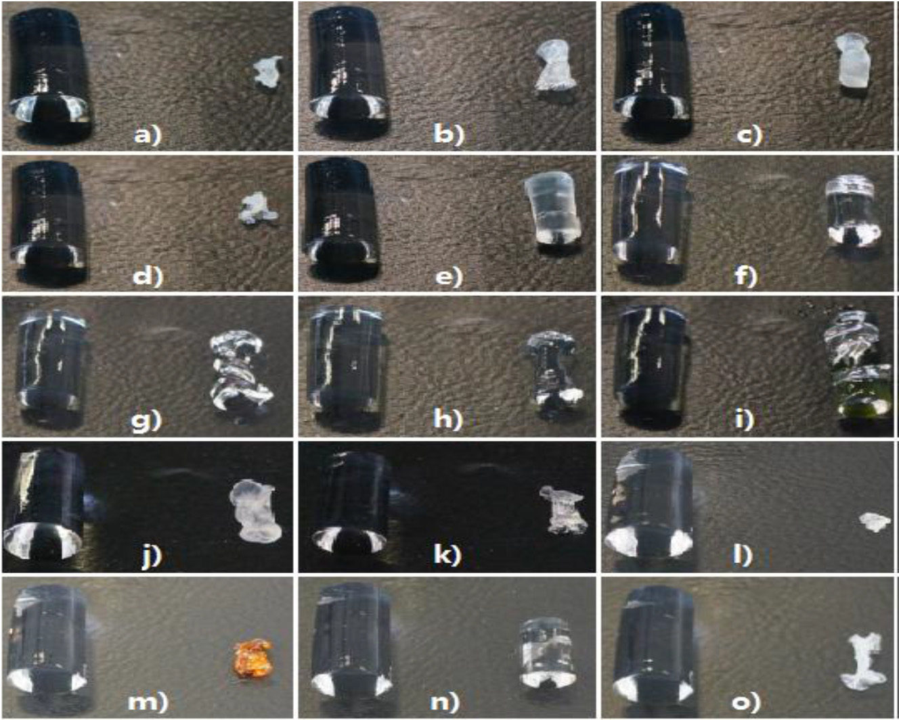

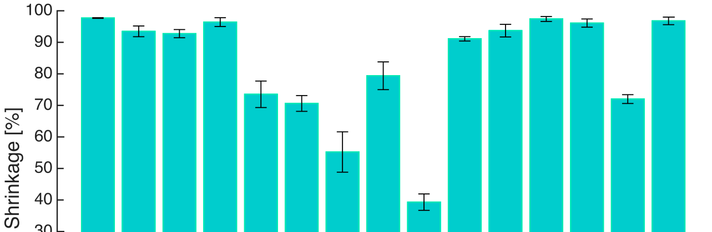

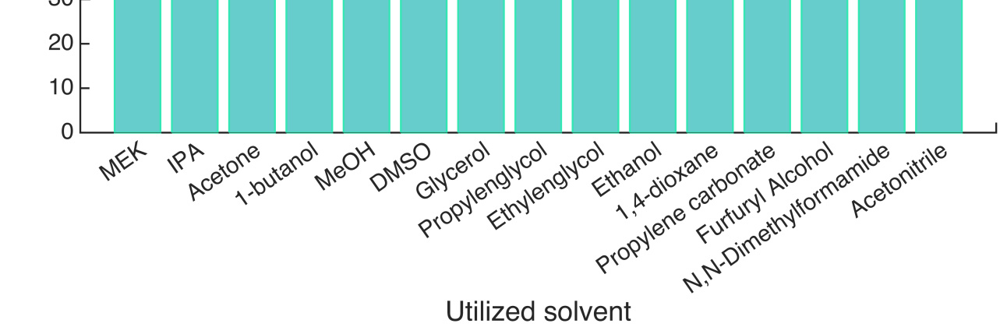

---

## Page 5

Gels 2015, 1 
295 
 
 
Solvent/biopolymer interactions and the matrix shrinkage during solvent exchange can be further 
understood and related to each other through solubility parameters [27]. Solubility parameters are widely 
used not only to predict solubility, but also to predict the compatibility of polymers and affinities to 
surfaces to improve dispersion and adhesion [28]. Even for insoluble polymers the solubility parameters 
can be correlated with swelling. Hansen solubility parameters are one such parameter usually used to 
predict the polymer solubility. It takes into consideration three major types of interaction between 
molecules: dispersion (d), dipole-dipole (p) and the hydrogen bonding (h) interactions. The basic 
Equation (1) which governs the assignment of Hansen parameter is that the total cohesion energy E 
equals the sum of the individual energies 
E = Ed + Ep + Eh 
(1)
Dividing this by the molar volume of the solvent gives the square of the total solubility parameter 
which is the sum of the squares of the Hansen d, p and h components, Equation (2). The total solubility 
parameter δt is also the so-called Hildebrand solubility parameter. 
δt2 = δd2 + δp2 + δh2 
(2)
The d, p and h components of the Hildebrand parameter for each individual solvent were taken  
from [28] and listed Table 1. The volumetric yield ܻ௩,ଵ  of all gels after the one step solvent exchange 
was plotted against the total solubility parameter δt of the respective solvents (Figure 3). The volumetric 
yield is a measure of remaining volume relative to initial volume (see Equation (13)). 
Table 1. The Hansen solubility parameters of solvents and experimentally measured 
volumetric yields after one step solvent exchange. 
Solvents 
δd MPa0.5 
δp MPa0.5 
δh MPa0.5 
δt MPa0.5 
Volumetric Yield ܇࢜,૚, % 
Water 
15.6 
16.0 
42.3 
47.8 
100 
MEK 
16.0 
9.0 
5.1 
19.0 
2.30 ± 0.11 
IPA 
15.8 
6.1 
16.4 
23.5 
6.5 ± 1.7 
Acetone 
15.5 
10.4 
7.0 
20.0 
7.3 ± 1.3 
1-butanol 
16.0 
5.7 
15.8 
23.1 
3.6 ± 1.4 
Methanol 
15.1 
12.3 
22.3 
29.6 
26.4 ± 4.2 
DMSO 
18.4 
16.4 
10.2 
26.7 
29.4 ± 2.5 
Glycerol 
17.4 
12.1 
29.3 
36.1 
44.8 ± 6.4 
Propylene glycol 
16.8 
9.4 
23.3 
30.2 
20.6 ± 4.4 
Ethylene glycol 
17.0 
11.0 
26.0 
32.9 
60.7 ± 2.6 
Ethanol 
15.8 
8.8 
19.4 
26.5 
8.94 ± 0.71 
1,4-dioxane 
19.0 
1.8 
7.4 
20.5 
6.3 ± 2.0 
Propylene carbonate 
20.0 
18.0 
4.1 
27.3 
2.60 ± 0.78 
Furfuryl alcohol 
17.4 
7.6 
15.1 
24.3 
3.9 ± 1.3 
DMF 
17.4 
13.7 
11.3 
24.8 
28.0 ± 1.4 
Acetonitrile 
15.3 
18.0 
6.1 
24.3 
3.2 ± 1.2 
As shown in Figure 3, although the data points are rather scattered, a clear trend is observed that the 
alginate gels shrank less in the solvents with higher solubility parameters. The volumetric yield of gels 
immersed in the solvents, which have total solubility parameter below 25 MPa0.5, stays at a low level 

---

## Page 6

Gels 2015, 1 
296 
 
 
and does not increase as solubility parameter increases (red points in Figure 3). On the other hand, the 
volumetric yield of gels in solvent with solubility parameter higher than 25 MPa0.5 has an increasing 
trend with increasing solubility parameter (blue points in Figure 3). Since the total solubility parameter 
(δt) is composed of three individual components, the volumetric yield could be influenced by a single 
dominant parameter rather than all the three together. To determine this, the individual Hansen d, p and 
h components (δd, δp, δh) were also plotted against the volumetric yields (ܻ௩,ଵ). There was no clear trend 
observed according to d and p components (data not shown); however, a relation between relative 
volume and Hansen h component δh was observed similar to the trend between relative volume and total 
Hansen parameter δt (Figure 4). 
 
Figure 3. Relation between the volumetric yields (ܻ௩,ଵ) of gels after solvent exchange and 
the total solubility parameter (δt) of the respective solvents. Blue points refer to solvents with 
total solubility parameter above 25 MPa0.5, and red points refer to solvents with total 
solubility parameter below 25 MPa0.5. 
 
Figure 4. Relation between the volumetric yields (ܻ௩,ଵ) of gels after solvent exchange and 
Hansen h component (δh) of the respective solvents. Blue points refer to solvents with total 
solubility parameter above 25 MPa0.5, and red points refer to solvents with total solubility 
parameter below 25 MPa0.5. 

### Page Images

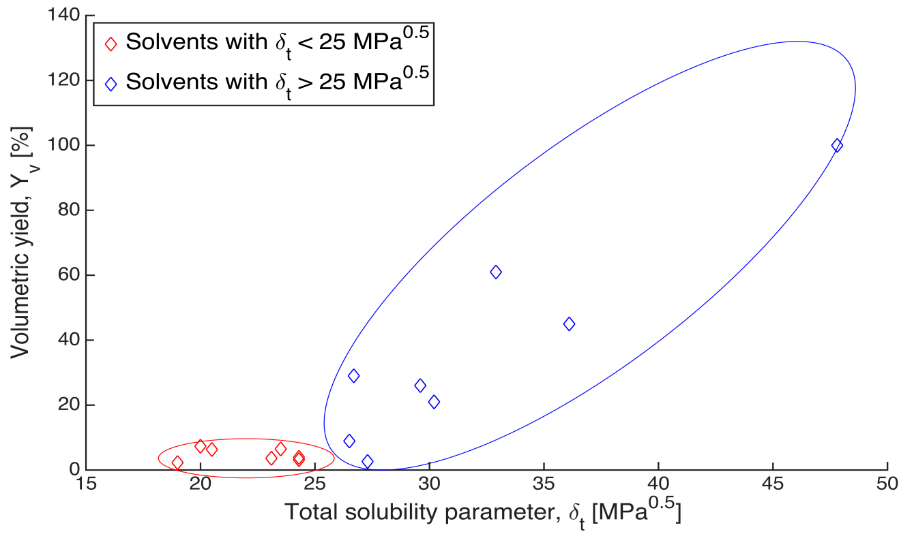

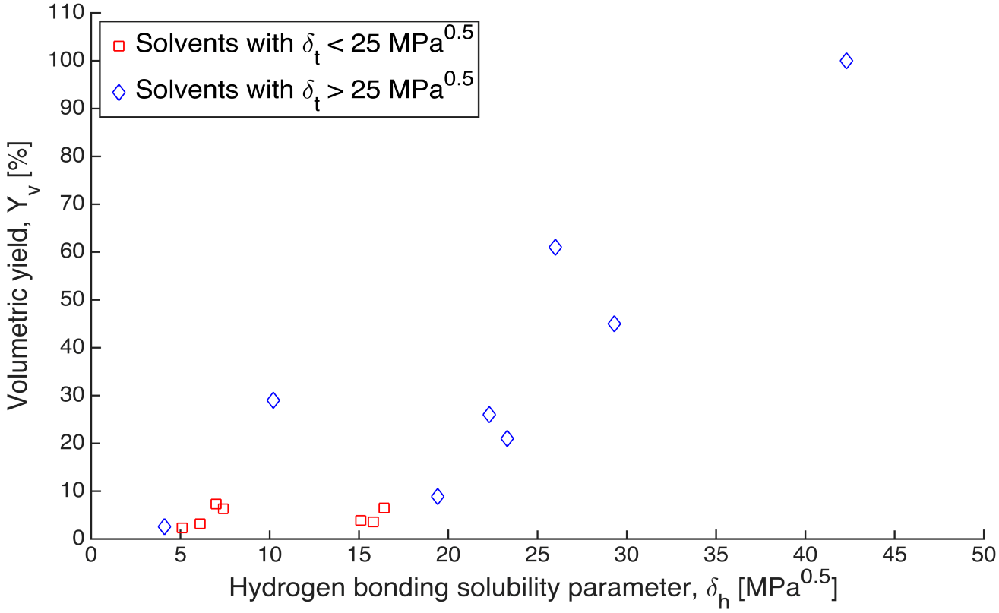

---

## Page 7

Gels 2015, 1 
297 
 
 
Although the data points in Figure 4 are also rather scattered, a clear trend can be seen that the 
volumetric yields of alginate gels were higher in solvents with higher δh components. It is highly likely 
that conformations of alginate chains are strongly affected by the solvent. Solvents with less capability 
of forming hydrogen bonds may cause partial folding of the polymer coil. The effect of hydrogen 
bonding has been clearly exemplified by Antoniou et al., (2010) [29]: the coil radius of dextran 
molecules when dissolved in four solvents increases with increase of the h component, δh, whereas δd 
and δp show no correlation. This indicates that hydrogen bonding is the most important contributor to 
the solubility of dextran in the examined solvents. As alginate chains possess ionizable COOH groups, 
the effect of hydrogen bonding is expected be more pronounced. 
Two remarks should be made. First, the above-described analysis is a first attempt to quantify the role 
the solvent can play in alginate hydrogel shrinkage during solvent exchange. They can be further 
developed to serve as a general framework. The first apparent extension is to evaluate solvent affinity to 
biopolymer. This is achieved by calculating the ”solubility distance” Ra between a solvent and  
a biopolymer based on the partial solubility parameter components using the following equation [28,30]: 
Ra2 = 4(δd,S − δd,P)2 + (δp,S − δp,P)2 + (δh,S − δh,P)2 
(3)
Here δX,S are Hansen component parameters for the solvent, and δX,P are Hansen component 
parameters for the biopolymer. To the best of our knowledge, there has been only one rough estimation 
of the total solubility parameter (δt) for sodium alginate (37 MPa0.5) [31] and no estimations for the 
individual Hansen parameters δd, δp, δh. In addition, ionic strength, cation concentration and the pH play 
a prominent role in the swelling and shrinkage behavior of biopolymer [32]. Even though the system 
considered here is calcium alginate, some of the better solvents (methanol, glycerol, ethylene and 
propylene glycol)—which show higher volumetric yields (26%–61%) during the one step solvent 
exchange—possess total solubility parameters (29.6–36.1 MPa0.5) close to the values reported for 
sodium alginate. However, solubility parameters only provide a direction for solvent selection [33] and 
the possibility of no alginate shrinkage or even some swelling for solvents δt > 37 MPa0.5 remains  
an open question. Nevertheless, one could also estimate the Hansen parameters of biopolymers using 
numerical methods and experimentally validate them [34]. Once obtained, parameters δd,P, δp,P, δh,P can 
then be used to calculate the distance according to Equation (3). This distance is expected to serve as  
a reliable measure of the similarity between a biopolymer and a solvent [28]. In addition, the solubility 
distance Ra could help in comparing across biopolymers and possibly their hybrids. 
Second, the calcium alginate hydrogel under consideration for solvent exchange is already in  
a solvent, namely water. Therefore the solvent exchange process cannot be purely ascertained by 
considering individual solvent/polymer interactions. A framework addressing the matrix changes and 
resistance during the solvent transfer needs to be developed. Recently, methodologies for correlating gel 
forming capabilities using solvents and solvent blends on a three dimensional Hansen space have been 
reported [35]. This method would directly be applicable to evaluate the recently reported formation of 
polysaccharide gels in solvents [36]. Further, this methodology can also be extended to solvent exchange 
process; replacing gel forming capability with volume shrinkage and studying the effects of solvent, 
solvent mixtures and polymer blends on a three dimensional Hansen space. Such an endeavor is part of 
our future work. 
 
 

---

## Page 8

Gels 2015, 1 
298 
 
 
2.2. Concentration Gradient as a Control Parameter to Reduce Shrinkage during the Solvent Exchange 
In the previous section, it was demonstrated that immersing an alginate hydrogel in pure ethanol can 
result in more than 90% shrinkage. Despite this, ethanol remains one of the best solvents to yield aerogels 
due to different reasons, a case which will also be supported during the course of this discussion. The 
large shrinkage during solvent exchange can be overcome by performing a stepwise solvent exchange 
instead of a one-step immersion [6]. In brief, when an alginate hydrogel is immersed in pure ethanol, the 
gel is subjected to an initial concentration gradient of 100% resulting in a huge driving force. At 
macroscopic level a severe shrinkage of the gel network is observed. However, when the gradient is 
reduced by using ethanol/water mixtures with increasing concentration instead of pure ethanol, the 
driving force is reduced along with the shrinkage. The provision of lower concentration gradients 
increases however the overall duration of the solvent exchange process. As processing time reduction is 
the prime focus for aerogel production, an optimization problem is presented balancing aerogel 
properties such as density and surface area with production times. 
To understand the role of gel composition (alginate concentration and the crosslinking degree) in the 
solvent exchange process, hydrogels of three different concentrations and two crosslinking degrees were 
prepared by CO2 induced gelation. Then they were subjected to the solvent exchange wherein two 
solvents, ethanol and DMSO, were used at two initial concentration gradients, 30 and 50 wt %. Figure 5a,b 
illustrate the calculated volumetric yields for all six gel compositions, treated with an initial 
concentration gradient of 30 wt % and 50 wt % ethanol respectively. 
Figure 5. Volumetric yields after gelation, swelling, each process step for solvent exchange 
with ethanol and supercritical CO2 drying; for (a) Δc = 30 wt % and (b) Δc = 50 wt %. 
Numerical data for each solvent composition are given in supplementary materials 
associated with this paper (Tables S1 and S2). 

### Page Images

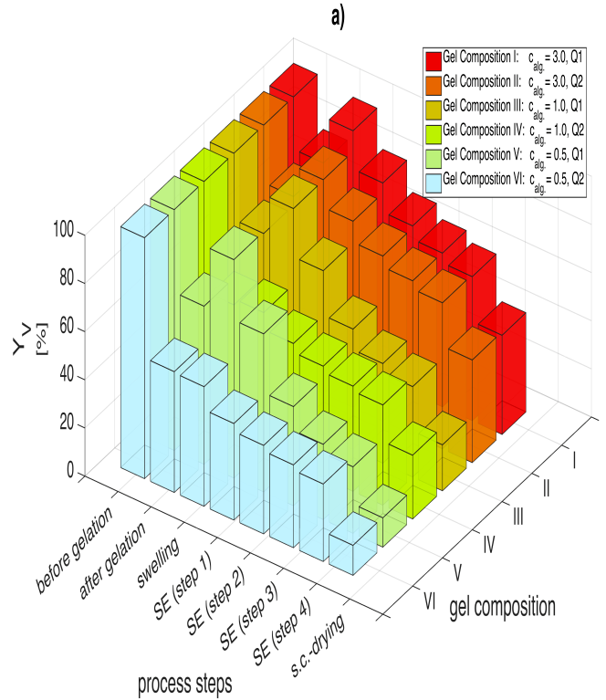

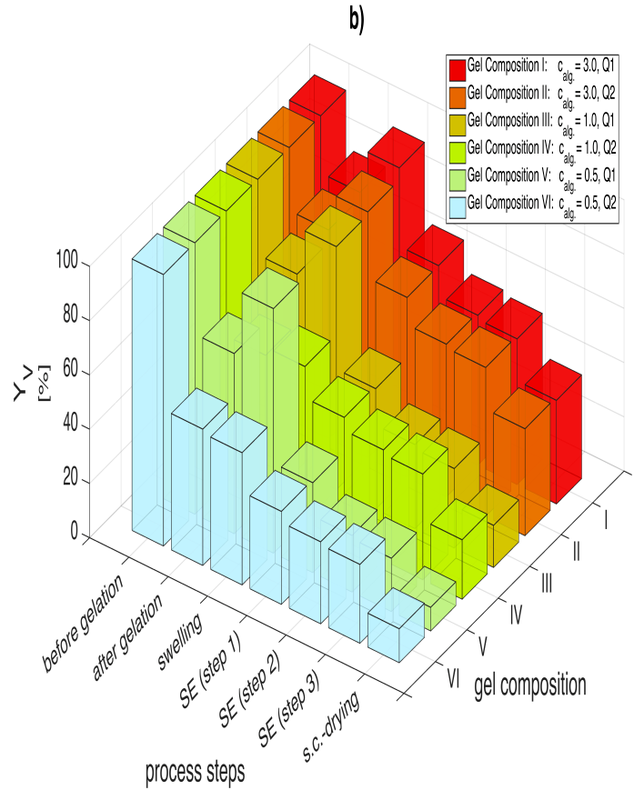

---

## Page 9

Gels 2015, 1 
299 
 
 
Generally, four phenomena are observed during biopolymer aerogel transformation: (1) volume loss 
during CO2 induced gelation (syneresis); (2) swelling of the freshly prepared hydrogels in water;  
(3) shrinkage in solvent/water mixtures and (4) shrinkage during supercritical CO2 drying. The first 
observation is that the gel’s loss of volume after CO2 induced gelation is strongly dependent on the 
crosslinking degree at given alginate concentration. For soft gels derived from 0.5 wt % and 1 wt % 
alginate solution, syneresis is more pronounced for Q2 than for Q1. Previous studies investigating the 
syneresis [2,3] interpreted it as a release of water by the gel, resulting in a condensing and strengthening 
of the gel matrix facilitated by the presence of more crosslinking ions (higher crosslinking degree, Q2). 
Reasons for this syneresis could be explained by the lateral chain associations of alginate at higher 
calcium ion concentrations [37]. Also, pressurized CO2 could favor inter-chain interactions [8]. Swelling 
is also strongly dependent on the cross linking degree where weakly crosslinked gels swell between 16% 
and 24% However, syneresis and swelling tendencies diminish with higher alginate concentrations (3 
wt %) and cross linking degree in these cases is observed to have a low influence. 
Analyzing gel volumes during solvent exchange with a solvent concentration gradient of 30 wt % 
(Figure 5a) shows that high alginate concentration gels exhibit higher volumetric yields (gel composition 
II: Yv,4 = 60.6%, gel composition V: Yv,4 = 27.6%) after solvent exchange (steps 1 to 4). Lower 
crosslinking degree results in very high shrinkage during solvent exchange (gel composition V: ΔYv 
(swelling → step 4) = 63.1%, gel composition VI: ΔYv (swelling → step 4) = 17.5%). It is also observed 
that the shrinkage is most severe during the early steps of the solvent exchange (70%–80% of the total 
shrinkage occurs in the first two solvent exchange steps). 
The influence of the initial concentration gradient on shrinkage can be obtained by comparing  
Figure 5a,b. As samples were prepared using the same procedure for both measurement sets, shrinkage 
after CO2 induced gelation and swelling in water are identical but start to deviate when considering the 
solvent exchange. When comparing gel volumes, it can be said that the volumetric yields of the solvent 
exchange with Δc = 30 wt % are higher after each respective step compared to the Δc = 50 wt % case. 
For example, the softest gel (gel composition V) after solvent exchange showed a 30% volumetric yield 
deterioration, when the concentration gradient was increased to Δc = 50 wt % (Yv,3 = 19.6%) from Δc = 
30 wt % (Yv,4 = 27.6%). These observations are in line with previous studies analyzing this topic [6]. 
While lower concentration gradients lead to a slower and gentler exchange between water and solvent 
molecules within the gel, an increase in the initial concentration accelerates the solvent exchange 
increasing the stresses on the gel backbone. Consequently, higher volumetric yields can be achieved 
when small concentration gradients are applied. Higher crosslinking degree can also mitigate the 
shrinkage to some extent. 
DMSO is a much better solvent for solvent exchange of alginate than ethanol. When comparing 
solvent exchange performance of ethanol and DMSO (Yv,4) for a constant concentration gradient  
Δc = 30 wt % (Figures 5a and 6a), a 20%–60% improvement in the volumetric yield across all gel 
compositions is observed for DMSO. This increase in the volumetric yield is even higher for  
Δc = 50 wt % (Figures 5b and 6b) especially for soft gels (gels III and V), where 60%–100% 
improvement in the volumetric yield is observed. The superiority of DMSO over ethanol regarding 
shrinkage during solvent exchange can most likely be attributed to a higher affinity of alginate molecules 
towards DMSO and thus a replacement of structural water by solvent molecules instead of an extraction 
of water from the gel matrix. Most likely, methanol, propylene glycol and DMF (as discussed in the 

---

## Page 10

Gels 2015, 1 
300 
 
 
previous section) would also show similar low shrinkage behavior during solvent exchange like DMSO. 
However, the use of solvents is application specific: methanol and DMF are toxic solvents and may not 
be suitable for certain food and pharmaceutical applications. 
Figure 6. Volumetric yields after gelation, swelling, each process step for solvent exchange 
with DMSO and supercritical CO2 drying; for (a) Δc = 30 wt % and (b) Δc = 50 wt %. 
Numerical data for each solvent composition are given in supplementary materials 
associated with this paper (Tables S3 and S4). 
2.3. Shrinkage during Sc-Drying and Minimum Concentration Requirements for Drying 
In the previous section, it was shown that DMSO is much better solvent for solvent exchange in terms 
of the overall shrinkage as compared to ethanol. However, it is observed that the final volumetric yields 
of the aerogels obtained after supercritical drying are similar regardless of the solvent used. Table 2 
summarizes the shrinkages after complete solvent exchange (suspension → organogel), during 
supercritical drying (organogel → aerogel) and the overall volumetric shrinkage (suspension → aerogel). 
Data shows that the shrinkage during drying is much higher for DMSO compared to ethanol even though 
both solvents are miscible in supercritical CO2 at operating conditions (p = 120 bar,  
40 °C) [25]. One plausible reason could be that the affinity of DMSO to the alginate matrix causes 
scaffold collapse during extraction with CO2 and thereby a higher shrinkage. Here one caveat can be 
established. Miscible solvents that are gentle for solvent exchange may be harsh on the matrix during 
supercritical CO2 drying as observed in the case of DMSO. This scenario can be tackled by using solvent 
combinations instead of a single solvent alone. For example in case of alginate, combination of DMSO 
(mild for solvent exchange) and ethanol (mild during supercritical drying) can be used. The use of two 
complete solvent exchange procedures (DMSO exchange first and then to ethanol before supercritical 
CO2 drying), or DMSO/ethanol solvent mixture compositions for solvent exchange and supercritical 
drying are in the scope of our ongoing work. 
 
 

### Page Images

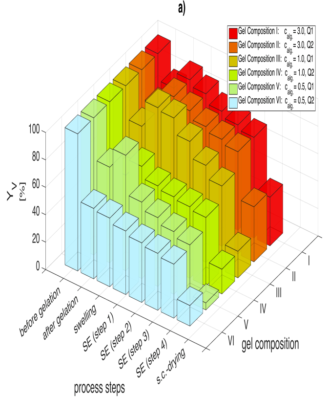

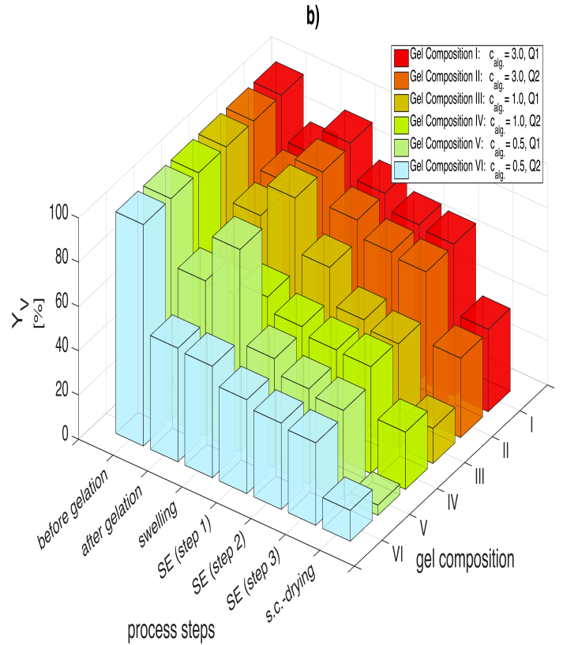

---

## Page 11

Gels 2015, 1 
301 
 
 
Table 2. Shrinkage during complete transformation from suspension to aerogel; solvent 
concentration gradient ΔC = 50%. 
Composition 
Shrinkage, ΔYv, % 
Suspension → Organogel * 
Organogel * → Aerogel
Suspension → Aerogel 
Ethanol 
DMSO 
Ethanol 
DMSO 
Ethanol 
DMSO 
I (3.0% Q1) 
46 
32 
16 
31 
62 
63 
II (3.0% Q2) 
45 
32 
16 
32 
61 
64 
III (1.0% Q1) 
71 
53 
14 
31 
85 
84 
IV (1.0% Q2) 
61 
52 
17 
22 
78 
74 
V (0.5% Q1) 
80 
60 
11 
35 
91 
95 
VI (0.5% Q2) 
71 
63 
17 
23 
88 
86 
* Organogel refers to the gel obtained after complete solvent exchange. 
As for other solvents, propylene glycol with limited solubility in supercritical CO2 is not a suitable 
solvent for aerogel production as it would then require longer processing times and harsher processing 
conditions (higher operating pressures). Methanol is an excellent solvent for both solvent exchange as 
determined in this study and supercritical drying as demonstrated in literature with TMOS based silica 
aerogels. It is also considered a green solvent similar to ethanol [26]. However, in view of methanol 
anticipated toxicity related issues for food and pharmaceutical applications, ethanol was considered to 
be the best green solvent for biopolymer aerogels and thereby chosen for further kinetic evaluation of 
alginate aerogels. DMF solvent exchange and supercritical drying performance is expected to be 
comparable to DMSO, however it is also toxic and thereby excluded from further analysis.  
It should nevertheless be noted that drying with supercritical CO2 allows to extract even residuals of 
low-molecular weight compounds such as highly cytotoxic glutaraldehyde from chitosan aerogels [38]. 
Thus, more work should be done to draw firm conclusions on applicability of a particular solvent. 
An important question that arises during solvent exchange is the extent of solvent exchange required 
prior to supercritical CO2 drying. This is an important aspect when considering solvent recycling in a 
production setup. For example, ethanol forms an azeotrope with water at 96 wt %. In case higher solvent 
concentrations inside the gel are required, alternative solvent recovery solutions such as azeotropic or 
pressure swing distillation, membrane separation or molecular sieving techniques should be considered 
instead of simple distillation. Surface area measurement can provide a sensitive assessment of aerogel 
quality to varying operating conditions. Insufficient solvent concentration inside the gel results in 
shrinkage and deformation but this information can be more precisely captured by measuring the drop 
in surface area due to pore collapse than the quantification of gel shrinkage. A plot of surface area against 
solvent concentration at which supercritical drying commenced is indicated in Figure 7 for two solvents, 
ethanol and DMSO. The experiments were performed on 1 wt % calcium alginate with higher 
crosslinking degree (Q2). 

---

## Page 12

Gels 2015, 1 
302 
 
 
 
Figure 7. Surface area as a function of solvent concentration achieved before supercritical 
CO2 drying onset; gel composition: 1 wt % calcium alginate, Q2. 
The plot shows that supercritical CO2 drying of alginate can proceed at ethanol concentrations as low 
as 93 wt % without any drop in surface area. Concentrations lower than 93 wt % result in first,  
a slow drop in the surface area till 90 wt % where ca. 90% of the total surface area is still retained.  
A further 3% lower concentration (87%) results in a steep drop where only 5% of the maximum 
achievable surface area is obtained. The behavior is completely different for DMSO gels where solvent 
concentrations higher than 98 wt % are required prior to the commencement of supercritical drying to 
achieve the maximum surface area. It is interesting at this juncture to point out that even in the pioneering 
works of Kistler [18], minimum ethanol concentrations required prior to supercritical drying was 
presented (95%) although, the process under consideration was the direct supercritical drying of silica 
aerogels. The reason for this lower solvent concentration sufficiency could be attributed to strong water-
matrix interactions (hydrogen bonding or covalent bonding) which do not allow formation of the liquid 
phase after complete extraction of ethanol. This water may be adsorbed on the aerogel backbone and can 
only be removed at higher temperatures. However this hypothesis requires further verification and is a 
part of our ongoing work. 
2.4. Pseudo Second Order Kinetics to Evaluate Solvent Exchange Process 
The question of how fast hydrogel-solvent system attains concentration equilibrium is important to 
ascertain process times required during production cycles. The solvent/matrix interactions play  
a crucial role in the solvent exchange process. However, the quantification of the solvent exchange 
kinetics still remains a challenge. In literature, there are two typical methods to evaluate the kinetics of 
a sorption process [39]. The first method is the mass transfer method which involves the evaluation of 
film diffusion, surface diffusion, pore diffusion or their combination by setting up a set of partial differential 
equations and numerically solving them to yield solutions matching the experimental data [40,41].  
The diffusion and mass transfer coefficients thus obtained are very useful and directly applicable in the 
process design and scale up. However, setting up equations catering to a real system taking the actual 
components such as shapes, size, and morphology into account (without simplification) and obtaining a 

### Page Images

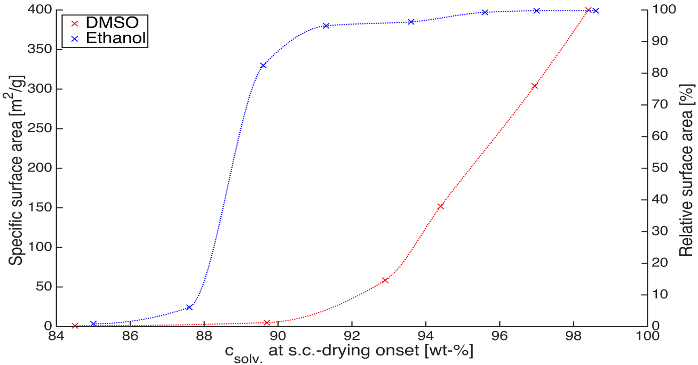

---

## Page 13

Gels 2015, 1 
303 
 
 
robust solution might be a challenge, especially due to volume shrinkage associated with the solvent 
exchange. The other method is the reaction method [39], which uses simple kinetic models such as 
pseudo-first order, Langmuir or pseudo second order kinetic models [42]. The kinetic parameters are 
obtained by fitting the experimental data to the kinetic models but these parameters are not directly 
applicable in process design. However, when used under controlled experimental conditions, they can 
provide a quantitative assessment for example, when comparing solvents regarding their exchange 
kinetics. Moreover, simplified methods using kinetic parameters from batch adsorption data to calculate 
the film mass transfer and surface diffusion coefficients have recently been developed [39]. 
The kinetics calculation procedure employed in this study is as follows. First the variation in ethanol 
concentration vs. time for various alginate concentrations and crosslinking degree were measured at  
given initial concentration gradients. Figure 8a shows the concentration drop during the first step of the 
solvent exchange process with an initial concentration gradient of 30 wt % (Step 1), when a hydrogel (0 
wt % ethanol) is placed in a 30 wt % ethanol water mixture (gel-to-solvent mass ratio 1:5). 
 
Figure 8. Concentration drop vs. time (a) and t/qt vs. time (b) when a hydrogel (0 wt % 
ethanol) of a given alginate concentration and crosslinking degree is placed in a 30 wt % 
ethanol/water mixture (step 1); 1:5 gel-to solvent ratio, w/w. Similar plots were determined 
for subsequent higher concentration steps (with constant concentration gradient). 
A typical pseudo second-order equation based on adsorption equilibrium capacity can be expressed 
in the form [42]: 
dݍ୲
dݐ= ݇ଶ(ݍୣ−ݍ୲)ଶ 
(4)
Which upon integration can be linearized into the following equation 
ݐ
ݍ௧
=
1
݇ଶݍୣଶ+ 1
ݍୣ
ݐ 
(5)
The ethanol uptake  (ݍ௧) is defined as the mass of ethanol (Q෡୲) absorbed/adsorbed till time t per unit 
mass of gel  (݉୥ୣ୪). Here it is necessary to indicate that the mass of the gel varies due to the gel shrinkage 
during solvent exchange; therefore, an approximate mass of the gel (݉௚௘௟(ݐ)) was estimated for time t 

### Page Images

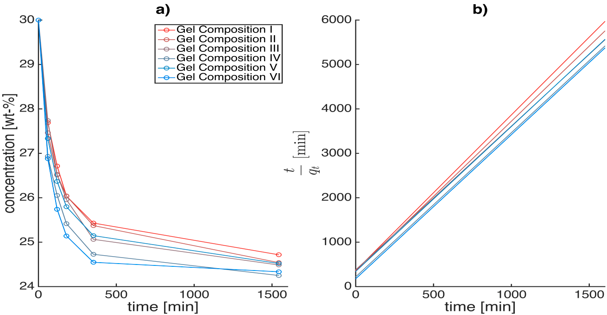

---

## Page 14

Gels 2015, 1 
304 
 
 
with the assumption that the mass loss of the gel varies linearly with the concentration drop. However, 
the total mass of the system is fixed during a solvent exchange step. 
݉୥ୣ୪(ݐ) + ݉ୱ୭୪(ݐ) = constant 
(6)
݉୥ୣ୪(ݐ) = ݉୥ୣ୪,௜−ቀܿୱ୭୪,௜−ܿୱ୭୪(ݐ)ቁ݉୥ୣ୪,௜−݉୥ୣ୪,௙
ܿୱ୭୪,௜−ܿୱ୭୪,௙
 
(7)
Q෡୲= ݉ୱ୭୪,௜ܿୱ୭୪,௜−݉ୱ୭୪(ݐ) ܿୱ୭୪(ݐ)) 
(8)
where ܿୱ୭୪,௜ , ܿୱ୭୪,௙, ݉୥ୣ୪,௜ and ݉୥ୣ୪,௙ are the concentration of the solution and mass of the gel before and 
after the solvent exchange step. 
The solvent uptake is calculated as 
ݍ௧=
Q෡୲
݉୥ୣ୪(ݐ) 
(9)
In this study, pseudo second order model (Figure 8b) was best to fit the experimental data (R2 > 0.99). 
It is interesting to note that the swelling behavior of alginate also follows the second order kinetics [43]. 
The solvent replacement inside the hydrogels could be imagined as a simultaneous adsorption and 
permeation process, where the solvent not only (1) adsorbs onto the hydrogel matrix, similar to the 
adsorption of phenol from aqueous solution on activated carbon [41] but also (2) the solvent can 
permeate into and through the hydrogel matrix scaffold depending on the solvent affinity to the matrix 
and the crosslinking degree similar to water uptake during the alginate swelling process [43]. 
There are three parameters that can be derived from the pseudo second order equation: first, the 
equilibrium uptake qe (gsolv/ggel), which is dependent on both the concentration gradient and the solvent 
amount and provides information regarding the maximum solvent the hydrogel can take in after infinite 
exposure time. In our case, we assume that the equilibrium is attained after 24 h. Second, the kinetic 
coefficient k2 (ggel/gsolv·min−1) which is indicative of how fast the equilibrium uptake qe is reached. The 
sorption capacity and thereby the kinetic parameters are dependent on the initial adsorbate concentration, 
temperature, pH, adsorbent size and nature of the solute [42]. Thereby, to compare across solvents, the 
concentration gradient (ΔC) and the solvent amount (݉ୱ୭୪,௜) (initial adsorbate amount) were fixed prior 
to experiment and analysis. The last parameter, the initial sorption rate h (gsolv/ggel·min−1) is derived from 
the y-intercept reciprocal (݇ଶݍୣ
ଶ) and is a better parameter for comparison as k2 is strong function of qe. 
When the concentration gradient and solvent amount is fixed, the initial sorption rate (h) should indicate 
the solvent affinity to the gel matrix. 
2.5. Physical Interpretation of Solvent Exchange Process Derived from the Fitting Parameters of the 
Pseudo Second Order Model and Volumetric Shrinkage 
The first conclusion that could be drawn is that the solvent exchange process is also dependent on the 
alginate composition and crosslinking degree. The equilibrium uptake qe (Figure 9a) for step 1 of the 
solvent exchange is constant across alginate composition. However, based on the initial sorption rates 
(h) for step 1 (Figure 9b), the solvent exchange is fastest for highly crosslinked soft gels (gel VI). When 
comparing across the highly crosslinked gels (II, IV and VI), it is observed that the initial sorption rates 
decreases with increasing alginate concentration. Calcium alginate hydrogel consists of a fibrillar matrix 

---

## Page 15

Gels 2015, 1 
305 
 
 
(Figure 10) with water trapped in its pores. With increasing biopolymer concentration,  
the tortuosity increases and also there might be additional resistances in the form of surface adsorption, 
hydrogen bonding or water dissolution in the matrix resulting in decrease in the sorption rates. 
 
Figure 9. Comparison of equilibrium uptake (qe) and initial sorption rates (h) for ethanol 
((a) and (b)) and DMSO ((c) and (d)) for various alginate concentration and crosslinking 
degree. The applied concentration gradient is 30 wt %. Please refer the supplementary tables 
(Tables S5 to S10) for qe, k2 and h values. 
 
Figure 10. Alginate aerogel microstructure (gel VI: concentration 0.5 wt %, Q2). 
The initial sorption rates (h) are lower for low crosslinked alginate hydrogels when compared to high 
crosslinked hydrogels (Figure 9b). It is also very interesting to observe that during subsequent solvent 
exchange steps (step 2 and step 3) in Figure 9a, the equilibrium uptake (qe) drops substantially for the 

### Page Images

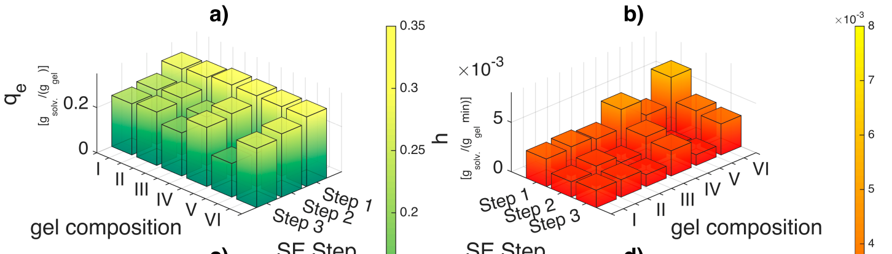

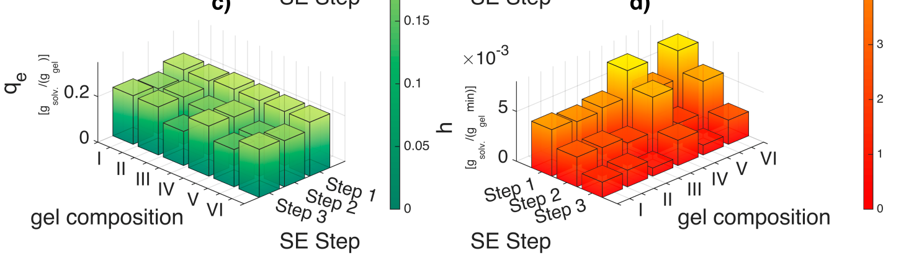

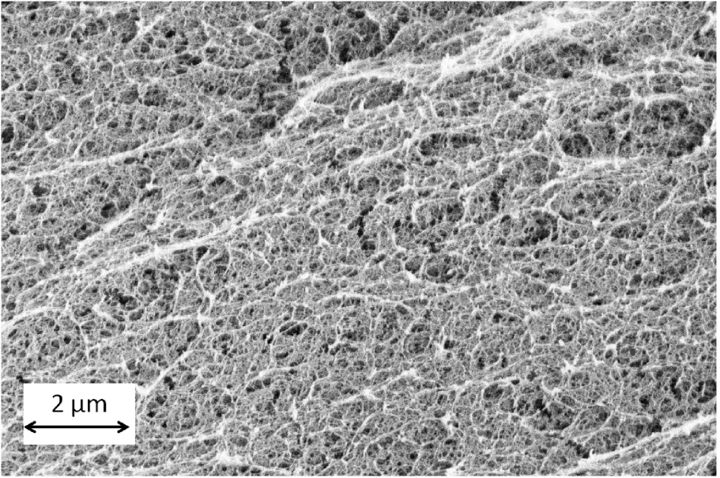

---

## Page 16

Gels 2015, 1 
306 
 
 
low crosslinked soft gels (III, V) but slightly for high crosslinked soft gels (IV, VI) with increasing 
ethanol concentration. This implies presence of solvent–water–matrix interactions as the concentration 
gradient and the solvent to gel ratio is maintained constant. The drop in the equilibrium uptake for the 
high crosslinked alginate gels with increasing ethanol concentration can be explained by strong bonding 
of water molecules to the hydrophilic gel matrix. This implies that the driving force due to ethanol 
concentration gradient progressively decreases in its capacity to remove the water from the matrix with 
increasing solvent concentration. This is probably also the reason why supercritical CO2 drying can 
proceed at a lower ethanol concentration instead of pure solvent since water is an integral part of the gel 
matrix and can neither be extracted by the solvent during solvent exchange nor the CO2 during 
supercritical drying. However, this reasoning is not sufficient to explain the steep drop in equilibrium 
uptake for low crosslinked alginate gels. 
A closer inspection of the volumetric shrinkage for low crosslinked gels (gels I, III, V) shows that, 
with lowering of alginate concentration from 3 to 0.5 wt %, the water holding capacity increases from 
33 to 180 grams water per gram alginate. The ionic crosslinking of alginate can be explained through 
the “egg box model” [44] in which, lower calcium ion concentration leads to open positions where the 
water can enter resulting in swelling. The water amount held within the fibrillar matrix can be as much 
as 85% of the total water the pores themselves can hold (as calculated for 0.5 wt % alginate gels by the 
mass ratio between the low and high crosslinked hydrogels after the swelling step). This number 
decreases with increasing alginate concentration (57% for 1 wt % alginate and 10% for 3 wt % alginate). 
When fresh solvent is added, the ethanol not only enters the pore of the hydrogel matrix but also 
permeates into the fibrillar matrix through these positions. This permeation process is probably slow and 
thereby decreases the initial sorption rates (h) when compared to the highly crosslinked gels. The ionic 
interactions of calcium ions with water changes due to the presence of an organic moeity resulting in 
shrinking of the fibrillar matrix and ejection of the water. This is probably the reason why large shrinkage 
is observed in the initial steps of the solvent exchange (Figure 5). But during this process, ethanol is 
probably also embedded in the matrix on the inside in addition to adsorbing onto it from the pores on 
the outside which hinders or reduces matrix affinity to further solvent exchange. Thereby, both the 
solvent uptake and initial sorption rates decrease with increasing ethanol concentration for low 
concentration soft gels. 
The decrease in the uptake behavior (qe) and initial sorption rates (h) with increasing solvent 
concentration is also observed during solvent exchange with DMSO (Figure 9c,d) for low crosslinked 
alginate gels. However, the initial sorption rates (h) of DMSO when compared to ethanol during the first 
solvent exchange step are 30%–60% higher for high crosslinked gels and 50%–80% higher for the low 
crosslinked gels (also refer Tables S5–S10 in supplementary materials). This highlights not only the 
affinity of DMSO to enter the pores of the biopolymer matrix but also an affinity to enter the fibrillar 
matrix of the biopolymer. In addition, the 50%–100% improvement in the volumetric yields for low 
crosslinked soft gels (gels III and V) after solvent exchange process for DMSO compared to ethanol 
indicates that DMSO stiffens the hydrophilic fibrillar matrix of the alginate during the solvent exchange 
process; thus making it more resistant to collapse due to the driving forces during solvent exchange. 
During supercritical drying, the CO2 extracts DMSO not only from the pores but also from alginate’s 
fibrillar matrix scaffold. This process is probably strenuous on the fibrillar structure leading to collapse 
of the alginate organogel resulting in shrinkage and final aerogel volumetric yields comparable to 

---

## Page 17

Gels 2015, 1 
307 
 
 
ethanol. As DMSO actively interacts with the matrix, supercritical drying onset cannot proceed at lower 
DMSO concentrations as compared to ethanol. Thereby, solvents considered to be good for solvent 
exchange might have adverse effects on the matrix during supercritical drying though miscible in 
supercritical CO2. 
3. Conclusions 
The necessity of studying solvent gel interactions during solvent exchange and supercritical drying is 
presented in this study using calcium alginate hydrogel to aerogel transformation as a model system. 
Four frameworks that could help assess of the role of the solvent in biopolymer aerogel production from 
hydrogels are suggested. Solvent selection methodology based on solvent polymer interaction is 
presented and evaluation parameters which help identify the right solvent choice highlighted.  
Solvents deemed inappropriate for solvent exchange can still be used by adjusting the concentration 
gradient during solvent exchange. Pseudo second order kinetics, normally used for explanation of 
swelling kinetics can also be used to explain solvent exchange kinetics indicating solvent exchange 
process to be a simultaneous adsorption and permeation process. Solvent/matrix interactions can also be 
deduced using the kinetic parameters of the pseudo second order model and volumetric shrinkage under 
controlled experimental conditions. Finally, minimum solvent concentration requirements for 
supercritical CO2 drying are also strongly influenced by solvent/matrix interactions. 
4. Materials and Methods 
4.1. Reagents 
Sodium alginate powder (lot number: 71238) was purchased from Sigma Aldrich (Steinheim, 
Germany). Fine calcium carbonate powder (Ph. Eur. grade) was acquired from Magnesia GmbH 
(Lüneburg, Germany). CO2 was supplied by AGA Gas GmbH (Hamburg, Germany). Ethanol, IPA, 
DMF, acetonitrile and propylene carbonate purchased from Carl Roth GmbH (Karlsruhe, Germany); 
glycerol from Merck (Darmstadt, Germany); acetone, MEK, DEK from Bernd Kraft (Duisburg, 
Germany); and 1-butanol, DMSO, furfuryl alcohol, ethylene glycol, propylene glycol and 1,4-dioxane 
were purchased from Sigma Aldrich (Steinheim, Germany). The water used throughout the study was 
deionized (pH 6.5–7.0). 
4.2. Preparation of Hydrogels 
3 wt % alginate stock solution was prepared by dissolving sodium alginate in deionized water, using 
an Ultra-Turrax shear mixer (Janke and Kunkel, Staufen, Germany). Before gelation, respective amounts 
of calcium carbonate were directly added to the stock solution to obtain gels of two different cross-
linking degrees. A ratio of 0.1825:1 mass of calcium carbonate to mass of dry alginate is defined as cross 
linking degree one (Q1), whereas twice this ratio (0.3650:1, w/w) is regarded as crosslinking degree two 
(Q2). After adding the required amount of CaCO3, the mixture was homogeneously dispersed using the 
shear mixer. Dispersions of lower alginate concentration (calg = 1%, 0.5%) were obtained by adding the 
respective amount of deionized water to the dispersions of higher alginate concentration followed by 
mixing. Subsequently, dispersions of six different compositions were obtained. To prepare samples for 

---

## Page 18

Gels 2015, 1 
308 
 
 
kinetic study measurements, constant amounts (10 g ± 0.1 g) of the prepared dispersions were then filled 
into cylindrical cups of uniform dimensions. Table 3 shows a list of all the prepared gel compositions. 
For studying the influence of solvents on alginate matrix, dispersions of 0.5 wt % alginate (Q1) was 
filled into a standard 48 multiwell plate (BD Biosciences, Franklin Lakes, NJ, USA). 
Table 3. Compositions of the gels used throughout the study. 
Gel Composition 
Alginate Concentration (wt %) 
Cross Linking Degree 
I 
3.0 
Q1 
II 
3.0 
Q2 
III 
1.0 
Q1 
IV 
1.0 
Q2 
V 
0.5 
Q1 
VI 
0.5 
Q2 
In order to obtain homogeneous gels, gelation was performed using the CO2 induced gelation method. 
Carbon dioxide’s property to act as a weak acid under certain conditions (p = 3–5 MPa,  
T = 295 K) was used to lower the pH value (pH = 3) and thus initiate the release of calcium ions from 
CaCO3 resulting in the gelation [2,3]. The prepared dispersions were placed in the setup depicted in 
Figure 11a. After sealing the autoclave, it was pressurized with carbon dioxide and the operating pressure 
of 5 MPa at ambient temperature (T = 293 K) was kept constant for 24 h. Then the pressure was released 
steadily over one hour (approximately 0.08 MPa·min−1). After depressurization, the samples were 
removed from the autoclave and weighed. In order to further analyze the swelling behavior after gelation, 
the gels (Figure 11b) were placed in cups containing sufficient amounts of deionized water, so that the 
gels were completely covered with water for approximately 24 h and weighed afterwards. 
 
Figure 11. Cont. 

### Page Images

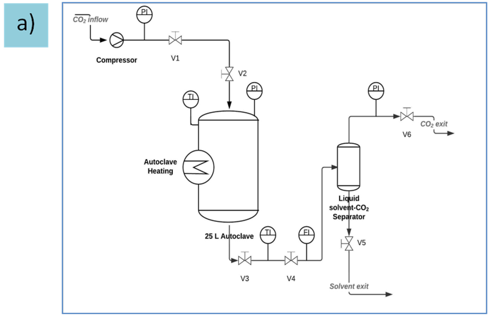

---

## Page 19

Gels 2015, 1 
309 
 
 
Figure 11. (a) Flow scheme for high pressure autoclave system (b) Resulting hydrogel. 
4.3. Density-concentration Calibration 
To determine the solvent uptake of the gel over time it was necessary to record the change in 
concentration of the surrounding solution over time. The concentration of the solution was determined 
via density measurements conducted with the density meter DMA 4500 (Anton Paar, Austria).  
The measuring instrument was able to convert the measured density directly into ethanol weight 
concentration (OIML-ITS-90). For DMSO, such direct conversion from density into weight 
concentration was not possible therefore calibration graphs were determined. After the preparation of 
DMSO/water solutions of different weight concentrations, the densities of the solutions of known 
compositions were determined using the density meter. The measured densities were then plotted against 
the weight concentration. It became clear that in fact the density of the binary system increases slightly 
between 76 and 88 wt %, reaches a maximum density at approximately 88 wt %, and then decreases 
between 88 and 100 wt %. This behavior is also reported in literature [45]. Empirical polynomial functions 
connecting the density of the DMSO/water mixture, ρ, to the weight concentration, c(ρ), was determined 
using MATLAB (R2014b, The Mathworks):  
c(ρ) = a6 · ρ6 + a5 · ρ5 + a4 · ρ4 + a3 · ρ3 + a2 · ρ2 + a1 · ρ + a0,   for c < 82 % (R2 = 0.9990) 
(10) 
where 
a6 
1.255055740242850 × 109 
a5 
−7.879390173815560 × 109 
a4 
2.06071729327642 × 1010 
a3 
−2.87375597190484 × 1010 
a2 
2.25377368737041 × 1010 
a1 
−9.42486927160501 × 109 
a0 
1.64185361883457 × 109 
c(ρ) = b3· ρ3 + b2· ρ2 + b1· ρ + b0,    for c ≥ 88% (R2 = 0.9694) 
(11) 
where 
b3 
−8.79975201417487 × 108 
b2 
2.90837735148691 × 109 
b1 
−3.20412910529304 × 109 
b0 
1.17665251692243 × 109 
For the calibration plot readers are referred to the supplementary materials (Figure S1) associated 
with the paper. 
4.4. Solvent Exchange—Shrinkage in One Step Process 
In order to observe the impact of solvent on the shrinkage, one piece (approx. 1.5 g) of calcium 
alginate hydrogel (0.5 wt %, Q1) was added into a falcon tube with 30 g of a specific solvent.  

### Page Images

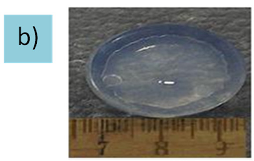

---

## Page 20

Gels 2015, 1 
310 
 
 
The falcon tube was then sealed and kept onto a sample rotator to keep solvent homogenous at room 
temperature for 48 h. The volume of the gels was measured before and after solvent exchange for 
shrinkage calculations. The shrinkage was expressed as the volumetric yield ܻ௩,ଵ (see below). Three 
parallel experiments were carried out for each solvent. Fifteen different solvents were tested, which 
include methanol, ethanol, isopropanol (IPA), 1-butanol, furfuryl alcohol, acetone, methyl ethyl ketone 
(MEK), acetonitrile, dimethyl sulfoxide (DMSO), propylene carbonate, glycerol, propylene glycol, 
ethylene glycol, 1,4-dioxane, and N,N-dimethylformamide (DMF). 
4.5. Solvent Exchange—Kinetic Study at Ambient Conditions 
The solvent exchange procedure consists of stepwise immersion of the initial hydrogels in 
water/solvent solutions with increasing solvent concentration. The solvent exchange studies were 
conducted at two different initial concentration gradients for each gel composition, 30 and 50 wt %. This 
means that at the beginning of each solvent exchange step the concentration of the surrounding solution was 
30 wt % (respectively 50 wt %) higher than the concentration inside the gel. In order to obtain 
comparable results a ratio of 5:1, (solution-to-gel weight ratio) was fixed for every solvent exchange 
step and gel composition. To monitor kinetics the density of the surrounding solution was measured as 
a function of time using the density meter DMA 4500. After 24 h, the final concentration of the solution as 
well as the gel mass was measured. It was found in preliminary experiments that equilibrium is reached 
after 24 h. Moreover, preliminary study revealed no specific adsorption of the solvent by the gel, i.e., 
the composition of the bulk phase and inside the gel was considered to be identical. Based on this 
consideration the stock solutions of the next step were prepared. Four and three steps of the solvent 
exchange were performed for the samples being subjected to an initial concentration gradient of 30 and 
50 wt %, respectively. Three parallel measurements for each gel composition from Table 1 were 
performed. Finally the samples were prepared for supercritical drying by placing them into pure solvent 
for 24 h to ensure that the concentration inside the gels was larger than 98%. 
4.6. Drying with Supercritical CO2 
The organogels obtained via solvent exchange were wrapped in filter paper and placed in the same 
autoclave used for gelation (Figure 11a). A small amount of solvent was added into the autoclave to 
avoid evaporation of the solvent from the gels. Thereafter CO2, used as extraction medium, was pumped 
into the preheated autoclave (333–338 K) until a pressure of 12 MPa was reached. When the operating 
pressure was reached, the autoclave was flushed with one residence volume of CO2, resulting in the 
extraction of solvent from the autoclave. This process was repeated 5–6 times over a timespan of 
approximately 24 h to ensure complete drying. Depressurization took place over the period of 
approximately 1 h (approx. 0.2 MPa·min−1). 
4.7. Characterization 
The BET specific area and BJH specific pore volume were measured by Nova 4000e equipment 
(Quantachrome GmbH and Co. KG, Odelzhausen, Germany). The samples were degassed at 75 °C under 
vacuum overnight before measurements. The SEM pictures of alginate gels were taken by Leo (Zeiss) 1530. 

---

## Page 21

Gels 2015, 1 
311 
 
 
4.8. Volumetric Shrinkage and Yield Calculation 
The volumetric shrinkage, ܵ௡, after step ݊ is calculated by the following relation 
ܵ௡ % = ൫ܸୢ୧ୱ୮ୣ୰ୱ୧୭୬−ܸ୥ୣ୪ୟ୲ୱ୲ୣ୮௡൯
ܸୢ୧ୱ୮ୣ୰ୱ୧୭୬
× 100% 
(11)
Alternatively the volumetric yield ܻ௩,௡ at step ݊ can also be calculated which directly presents the 
fraction of initial volume present at any given stage. 
ܻ௩,௡ % = ܸ୥ୣ୪ୟ୲ୱ୲ୣ୮௡
ܸୢ୧ୱ୮ୣ୰ୱ୧୭୬
× 100 = (100 −ܵ௡) 
(12)
The stagewise shrinkage is calculated by the following relation 
Δܻ௩(݊, ݉)% = ܻ௩,௡−ܻ௩,௠ 
(13)
Acknowledgments 
The authors are thankful to Marianne Kammlott for her help with the nitrogen adsorption 
measurements. Financial support from DFG (project SM 82/13-1) is gratefully acknowledged. 
Author Contributions 
Raman Subrahmanyam and Pavel Gurikov conceived and designed the experiments. Paul Dieringer 
and Miaotian Sun performed the experiments. All authors were involved in the data analysis and writing 
of the paper. 
Conflicts of Interest 
The authors declare no conflict of interest. 
References 
1. 
Aegerter, M.A.; Leventis, N.; Koebel, M.M. (Eds.) Aerogels Handbook; Springer New York: New 
York, NY, USA, 2011. 
2. 
Gurikov, P.; Raman, S.P.; Weinrich, D.; Fricke, M.; Smirnova, I. A novel approach to alginate 
aerogels: Carbon dioxide induced gelation. RSC Adv. 2015, 5, 7812–7818. 
3. 
Raman, S.P.; Gurikov, P.; Smirnova, I. Hybrid alginate based aerogels by carbon dioxide induced 
gelation: Novel technique for multiple applications. J. Supercrit. Fluids 2015, 106, 23–33. 
4. 
Rudaz, C.; Courson, R.; Bonnet, L.; Calas-Etienne, S.; Sallée, H.; Budtova, T. Aeropectin: Fully 
Biomass-Based Mechanically Strong and Thermal Superinsulating Aerogel. Biomacromolecules 
2014, 15, 2188–2195. 
5. 
Lee, J.K.; Gould, G.L.; Rhine, W. Polyurea based aerogel for a high performance thermal insulation 
material. J. Sol-Gel Sci. Technol. 2009, 49, 209–220. 
6. 
García-González, C.A.; Alnaief, M.; Smirnova, I. Polysaccharide-based aerogels—Promising 
biodegradable carriers for drug delivery systems. Carbohydr. Polym. 2011, 86, 1425–1438. 
7. 
Comin, L.M.; Temelli, F.; Saldaña, M.D. A. Barley β-glucan aerogels as a carrier for flax oil via 
supercritical CO2. J. Food Eng. 2012, 111, 625–631. 

---

## Page 22

Gels 2015, 1 
312 
 
 
8. 
Quraishi, S.; Martins, M.; Barros, A.A.; Gurikov, P.; Raman, S.P.; Smirnova, I.; Duarte, A.R.C.; 
Reis, R.L. Novel non-cytotoxic alginate–lignin hybrid aerogels as scaffolds for tissue engineering. 
J. Supercrit. Fluids 2015, 105, 1–8. 
9. 
Martins, M.; Barros, A.A.; Quraishi, S.; Gurikov, P.; Raman, S.P.; Smirnova, I.; Duarte, A.R.C.; 
Reis, R.L. Preparation of macroporous alginate-based aerogels for biomedical applications.  
J. Supercrit. Fluids 2015, 106, 152–159. 
10. Mallepally, R.R.; Bernard, I.; Marin, M.A.; Ward, K.R.; McHugh, M.A. Superabsorbent alginate 
aerogels. J. Supercrit. Fluids 2013, 79, 202–208. 
11. Escudero, R.R.; Robitzer, M.; di Renzo, F.; Quignard, F. Alginate aerogels as adsorbents of polar 
molecules from liquid hydrocarbons: Hexanol as probe molecule. Carbohydr. Polym. 2009, 75,  
52–57. 
12. Agulhon, P.; Constant, S.; Chiche, B.; Lartigue, L.; Larionova, J.; di Renzo, F.; Quignard, F. 
Controlled synthesis from alginate gels of cobalt–manganese mixed oxide nanocrystals with 
peculiar magnetic properties. Catal. Today 2012, 189, 49–54. 
13. Mukhopadhyay, M.; Rao, B.S. Modeling of supercritical drying of ethanol-soaked silica aerogels 
with carbon dioxide. J. Chem. Technol. Biotechnol. 2008, 83, 1101–1109. 
14. García-González, C.A.; Camino-Rey, M.C.; Alnaief, M.; Zetzl, C.; Smirnova, I. Supercritical 
drying of aerogels using CO2: Effect of extraction time on the end material textural properties.  
J. Supercrit. Fluids 2012, 66, 297–306. 
15. Griffin, J.S.; Mills, D.H.; Cleary, M.; Nelson, R.; Manno, V.P.; Hodes, M. Continuous extraction 
rate measurements during supercritical CO2 drying of silica alcogel. J. Supercrit. Fluids 2014, 94, 
38–47. 
16. Özbakır, Y.; Erkey, C. Experimental and theoretical investigation of supercritical drying of silica 
alcogels. J. Supercrit. Fluids 2015, 98, 153–166. 
17. Van Bommel, M.J.; de Haan, A.B. Drying of silica gels with supercritical carbon dioxide.  
J. Mater. Sci. 1994, 29, 943–948. 
18. Kistler, S.S. Coherent expanded-aerogels. J. Phys. Chem. 1932, 36, 52–64. 
19. Tester, J.W.; Marrone, P.A.; Di Pippo, M.M.; Sako, K.; Reagan, M.T.; Arias, T.; Peters, W.A. 
Chemical reactions and phase equilibria of model halocarbons and salts in sub-and supercritical 
water (200–300 bar, 100–600 C). J. Supercrit. Fluids 1998, 13, 225–240. 
20. Gesser, H.D.; Goswami, P.C. Aerogels and related porous materials. Chem. Rev. 1989, 89, 765–788. 
21. Tewari, P.H.; Hunt, A.J.; Lofftus, K.D. Ambient-temperature supercritical drying of transparent 
silica aerogels. Mater. Lett. 1985, 3, 363–367. 
22. Lu, X.; Arduini-Schuster, M.C.; Kuhn, J.; Nilsson, O.; Fricke, J.; Pekala, R.W.  
Thermal conductivity of monolithic organic aerogels. Science 1992, 255, 971–972. 
23. Pierre, A.C.; Pajonk, G.M. Chemistry of Aerogels and Their Applications. Chem. Rev. 2002, 102, 
4243–4266. 
24. Day, C.-Y.; Chang, C.J.; Chen, C.-Y. Phase equilibrium of ethanol + CO2 and acetone + CO2 at 
elevated pressures. J. Chem. Eng. Data 1996, 41, 839–843. 
25. Kordikowski, A.; Schenk, A.P.; van Nielen, R.M.; Peters, C.J. Volume expansions and  
vapor-liquid equilibria of binary mixtures of a variety of polar solvents and certain near-critical 
solvents. J. Supercrit. Fluids 1995, 8, 205–216. 
26. Capello, C.; Fischer, U.; Hungerbühler, K. What is a green solvent? A comprehensive framework 
for the environmental assessment of solvents. Green Chem. 2007, 9, 927–934. 
27. Errede, L.A. Polymer swelling. 5. Correlation of relative swelling of poly (styrene-co-divinylbenzene) 
with the Hildebrand solubility parameter of the swelling liquid. Macromolecules 1986, 19,  
1522–1525. 

---

## Page 23

Gels 2015, 1 
313 
 
 
28. Hansen, C.M. Hansen Solubility Parameters: A User’s Handbook; CRC Press: Boca Raton, FL, 
USA, 2007. 
29. Antoniou, E.; Buitrago, C.F.; Tsianou, M.; Alexandridis, P. Solvent effects on polysaccharide 
conformation. Carbohydr. Polym. 2010, 79, 380–390. 
30. Howell, J.S.; Stephens, B.O.; Boucher, D.S. Convex solubility parameters for polymers. J. Polym. 
Sci. B Polym. Phys. 2015, 53, 1089–1097. 
31. Richardson, J.C.; Dettmar, P.W.; Hampson, F.C.; Melia, C.D. Oesophageal bioadhesion of sodium 
alginate suspensions: Particle swelling and mucosal retention. Eur. J. Pharm. Sci. 2004, 23, 49–56. 
32. Moe, S.T.; Skjaak-Braek, G.; Elgsaeter, A.; Smidsroed, O. Swelling of covalently crosslinked alginate 
gels: Influence of ionic solutes and nonpolar solvents. Macromolecules 1993, 26, 3589–3597. 
33. Hansen, C.M. The universality of the solubility parameter. Ind. Eng. Chem. Prod. Res. Dev. 1969, 
8, 2–11. 
34. Ravindra, R.; Krovvidi, K.R.; Khan, A.A. Solubility parameter of chitin and chitosan.  
Carbohydr. Polym. 1998, 36, 121–127. 
35. Diehn, K.K.; Oh, H.; Hashemipour, R.; Weiss, R.G.; Raghavan, S.R. Insights into organogelation 
and its kinetics from Hansen solubility parameters. Toward a priori predictions of molecular 
gelation. Soft Matter 2014, 10, 2632; doi:10.1039/C3SM52297K. 
36. Tkalec, G.; Knez, Ž.; Novak, Z. Formation of polysaccharide aerogels in ethanol. RSC Adv. 2015, 
5, 77362–77371. 
37. Jørgensen, T.E.; Sletmoen, M.; Draget, K.I.; Stokke, B.T. Influence of Oligoguluronates on 
Alginate Gelation, Kinetics, and Polymer Organization. Biomacromolecules 2007, 8, 2388–2397. 
38. Baldino, L.; Concilio, S.; Cardea, S.; de Marco, I.; Reverchon, E. Complete glutaraldehyde elimination 
during chitosan hydrogel drying by SC-CO2 processing. J. Supercrit. Fluids 2015, 103, 70–76. 
39. Yao, C.; Chen, T. A new simplified method for estimating film mass transfer and surface diffusion 
coefficients from batch adsorption kinetic data. Chem. Eng. J. 2015, 265, 93–99. 
40. Ocampo-Pérez, R.; Leyva-Ramos, R.; Sanchez-Polo, M.; Rivera-Utrilla, J. Role of pore volume and 
surface diffusion in the adsorption of aromatic compounds on activated carbon. Adsorption 2013, 
19, 945–957. 
41. Ocampo-Perez, R.; Leyva-Ramos, R.; Mendoza-Barron, J.; Guerrero-Coronado, R.M.  
Adsorption rate of phenol from aqueous solution onto organobentonite: Surface diffusion and 
kinetic models. J. Colloid Interface Sci. 2011, 364, 195–204. 
42. Ho, Y.-S. Review of second-order models for adsorption systems. J. Hazard. Mater. 2006, 136, 
681–689. 
43. Davidovich-Pinhas, M.; Bianco-Peled, H. A quantitative analysis of alginate swelling.  
Carbohydr. Polym. 2010, 79, 1020–1027. 
44. Li, L.; Fang, Y.; Vreeker, R.; Appelqvist, I.; Mendes, E. Reexamining the Egg-Box Model in 
Calcium–Alginate Gels with X-ray Diffraction. Biomacromolecules 2007, 8, 464–468. 
45. LeBel, R.G.; Goring, D.A.I. Density, Viscosity, Refractive Index, and Hygroscopicity of Mixtures 
of Water and Dimethyl Sulfoxide. J. Chem. Eng. Data 1962, 7, 100–101. 
© 2015 by the authors; licensee MDPI, Basel, Switzerland. This article is an open access article 
distributed under the terms and conditions of the Creative Commons Attribution license 
(http://creativecommons.org/licenses/by/4.0/). 

---

