View Article Online View Journal 

## Nanoscale 

## Accepted Manuscript 

This article can be cited before page numbers have been issued, to do this please use:  D. Tyagi, H. Wang, W. Huang, L. Hu, Y. Tang, Z. Guo, Z. Ouyang and H. Zhang _, Nanoscale_ , 2020, DOI: 10.1039/C9NR10178K. 

**----- Start of picture text -----** 
Volume 10 Number 4 28 January 2018 Pages 1549-2172 **----- End of picture text -----** 

**----- Start of picture text -----** 
 Nanoscale **----- End of picture text -----** 

**----- Start of picture text -----** 
rsc.li/nanoscale ISSN 2040-3372 PAPERShuping Xu, Chongyang Liang Organelle-targeting surface-enhanced Raman scattering (SERS) nanosensors for subcellular pH sensing  et al. **----- End of picture text -----** 

This is an Accepted Manuscript, which has been through the Royal Society of Chemistry peer review process and has been accepted for publication. 

Accepted Manuscripts are published online shortly after acceptance, before technical editing, formatting and proof reading. Using this free service, authors can make their results available to the community, in citable form, before we publish the edited article. We will replace this Accepted Manuscript with the edited and formatted Advance Article as soon as it is available. 

You can find more information about Accepted Manuscripts in the Information for Authors. 

Please note that technical editing may introduce minor changes to the text and/or graphics, which may alter content. The journal’s standard Terms & Conditions and the Ethical guidelines still apply. In no event shall the Royal Society of Chemistry be held responsible for any errors or omissions in this Accepted Manuscript or any consequences arising from the use of any information it contains. 

rsc.li/nanoscale 

Page 1 of 26 Please do not adjust margins Nanoscale 

View Article Online 

DOI: 10.1039/C9NR10178K 

## REVIEW 

## **Recent Advances in Two-Dimensional Materials based Sensing Technology towards Health and Environmental Applications** 

Received 00th January 20xx, Accepted 00th January 20xx DOI: 10.1039/x0xx00000x 

Deepika Tyagi,†[a,c] Huide Wang,†[a] Weichun Huang,[b] Lanping Hu,[b] Yanfeng Tang,[b] Zhinan Guo,[a] Zhengbiao Ouyang,[c] and Han Zhang*[a] 

Monitoring the harmful and toxic chemicals, gases, micro-organisms and radiation has been the challenge for scientific society for the betterment of human health and environment. Two-dimensional (2D) material based sensors are highly efficient and compatible with modern fabrication technology, which produces data that can be proficiently used for health and environment monitoring. Graphene and its oxides, black phosphorus (BP), transition metal chalcogenides (TMDCs), metal oxides and other 2D nanomaterials have demonstrated prosperities to be alluring for the manufacture of highly sensitive sensor due to their unique material properties which arises from their inherentstructure. This review summarizes the properties of 2D nanomaterials which can provide a platform to develop high performance sensors. In this review, we have also discussed the advances made in the field of infrared photodetectors and electrochemical sensors and how structural properties of 2D nanomaterials affect their sensitivity and performance. This review also highlights the 2D nanomaterial-based electrochemical sensors to check the contaminations like heavy metals, organic/inorganic compounds, poisonous gases, pesticides, bacteria, antibiotics, _etc._ , in water or air, which are severe risk to human well being and environment. Moreover, the limitations, future prospects and challenges for the development of sensors based on 2D materials are also discussed for the future advancements. 

## **1. Introduction** 

The primary concern relating our safe and constructive existence on this planet requires environmental monitoring for the safety of human health, a check on chemical processing, controlling for quality of air and water, detection for gas, infrared radiation. Contaminants like heavy metals, organic/inorganic compounds, poisonous gases, pesticides, bacteria, antibiotics, _etc._ , in water or air, are severe risk to human well being and environment.[1] The presence of  noise in the ambient, which interferes with signal demand higher sensitivity of devices as the signal to noise ratio decreases drastically. The ability of any sensors to resolve a signal and process it with accuracy greatly depends on the properties of constituting material and advanced degree of manufacturing technique. The preconditions for industrial scale production of these devices are safety for the users and commercial benefit to the enterprise. Along with this, the processing speed for the manufacturing needs to match up with the requirements of the ever-growing market. The technology pertaining photon detection has progressed from noisy photomultiplier tubes to single photon detectors. This has been achieved by competitive and complimenting research between different fields, mainly constituting material research (microscopic) and manufacturing technique (macroscopic). Sensing devices are required to be portable, durable and easy to operate because they are often used in complex environments. 

Many sensing techniques have been developed so far such as surface-enhanced raman scattering,[2] plasma mass spectrometry, electrochemistry,[3] chemiluminescence,[4] fluorescence,[5, 6] and many more. Although  most of the techniques are have the advantages of high precision and reliable repeatability, the main disadvantages with these techniques are high cost of 

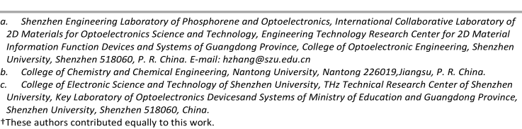

Please do not adjust margins 

Please do not adjust margins Nanoscale 

Page 2 of 26 

**Journal Name** 

## **ARTICLE** 

fabrication, complex sample preparation and difficult operation, which severely limit the practical applications. View Article Online[7, 8] of these devices.  Conventional semiconductor based sensors have been investigated and researched  to achieve the performance goal DOI: 10.1039/C9NR10178K for a very long time. However, the efficiency of these devices were often limited by their operating conditions, such as high operating temperature (200°C to 500°C) and variation in the performance and accuracy with humidity and longer operating time. Therefore, the development of sensing materials with excellent comprehensive performance rather than relying on the progress of preparation technology is expected to be the most effective way for the growth of the next age of detection technology. Generally, reduction in the order of dimensionality  of the sensing material accompanied with the scale-up production allows the natural amplification in their response, be it either optical, electrical or chemical properties or all at once. The system of ordered assembly of low dimensional material in layer-by-layer sequence or array has been studied for their sensing capabilities in terms of their physical and chemical properties. Zero dimensional structures are mainly particles of spherical geometry ranging from nanometers to angstrom. Quantum dots are the most common zero dimension material and can be assembled in the form of layered structures by employing various deposition mechanism. Metallic nanoparticles occupy the shelf of quantum dot material whereas, some organic materials uniquely make their way to the top. Fullerene or more commonly known as bucky ball form a spherical structure of 60 carbon atoms, is another allotrope of carbon, satisfying conditions for being a 0D material. Many artificial allotropes follow the footsteps of fabrication of C60 and are like their predecessor in their behaviour and properties most common examples are C70 and C540.[9] Formation of layered structures require detailed studies of these properties, molecular beam epitaxy (MBE)and organic molecular beam deposition (OMBD) are the most common method to form thin films to be employed in organic hybrid solar cells and sensing devices. Metal quantum dots, Janu’s particles and hetrostructures of metal-metal or metal-non-metal are also fundamental building blocks towards sensing applications.[10] 

One dimensional (1D) nanomaterials were suitable for detection capability because they have a large surface to volume ration as well as unique physiochemical and optical properties. 1D materials such as nanowires (NW)[11] and carbon nanotubes (CNTs)[12, 13] have shown great performances for sensing techniques due to their compactness, low power consumption, high sensitivity and fast response. CNT are inherently considered as 1D structure although it has a coiled surface, where movement of charges and concentration of the electron density near the surface is considerably larger in comparison to 0D materials due to sheer size effects. The aspect ratio of such structures allow many nanorods and nanotubes fabricated from metals like Ag, Au etc. or from non-metals like Si, TiO2 etc., to be treated as structures of 1D.[14] The simplified constraint to render these rod like structures as 1D material is that, the extent of longitudinal growth is considerably larger than the diameter of the base. TiO 2 nanorods have shown excellent applications in water splitting to be used as photochemical sensors[15] and Si nanorods have been applied as antireflecting coating in the form of accessory in selectively sensing devices.[16] 

In 2004, the first two dimensional (2D) material, graphene sheet was successfully isolated from highly oriented prolytic graphite by micromechanical exfoliation, which led to a revolution in the research spanning in both theoretical and experimental aspects.[17, 18] Separate groups working in physics, chemistry, material sciences and many other inter-disciplinary studies can see have been utilizing the extent of this discovery with an overlapping and complimenting field of interest. Other 2D nanomaterials like topological insulator (TI),[19-21] black phosphorus (BP),[22-27] transition metal dichalcogenides (TMDCs),[28-31] _etc._ , which have unique structural,[32, 33] mechanical,[34] electrical, optical, catalytic[29, 35] and sensing properties,[36, 37] are also showing promising applications in various fields, such as optical devices,[21, 38-43] optoelectronic devices,[26, 44, 45] batteries,[46] sensors,[47-52] biomedicine.[27, ] 28, 53-57 Table 1 gives the interesting highlights of different materials of various dimensionalities (0D, 1D, 2D and 3D) with regards to potential utility in detecting. 

**2** | _J. Name_ ., 2019, **00** , 1-3 

This journal is © The Royal Society of Chemistry 20xx 

Please do not adjust margins 

> Page 3 of 26 Please do not adjust margins Nanoscale 

**ARTICLE** 

## **Journal Name** 

Table 1 Highlights of different materials of various dimensionalities (0D, 1D, 2D and 3D) with regards to potential utility in detecting. 

View Article Online DOI: 10.1039/C9NR10178K 

|||| DOI: 10.1039/C9NR10178K|
|---|---|---|---|
|Dimension|Typical structures|Advantages|Disadvantages|
|0D||Region and stereo selective functionalization58|Low conductivity|
|||Atomic control of structure property|Difficulty with device integration|
|||relationship|Limited stability of devices|
|||Large area to volume ratio|Potential toxicity63|
|||Single molecular electronic based sensing59||
|||Tunable size and shape60-62||
|1D||High surface to volume ratio64|Required chemical modification to enhance|
|||High aspect ratio|selectivity|
|||Excellent stability|Difficulty in establishing reliable electrical|
|2D 3D||High density of reactive sites Good thermal stability Compatible with device miniaturization65-67 Wide tenability of conductivity Large surface to volume ratio Thickness depending electronic properties Good optical transparency Excellent mechanical flexibility Good functionalization ability Potential for good processibility Compatible with ultra-thin silicon channel technology67-70 Good mechanical strength Good thermal stability Easy to interface with solid state device Good design ability to improve selectivity Strong analyte binding71|contacts Difficult purification Limited structure and precision control66 Lack of mass production of material with large area, high and uniform quality. Lack of facile, effective and reliable strategies for device integration Limited stability of dome forms at ambient conditions69, 70 Low surface area Difficulty with miniaturization Slow dynamic of analyte transport71|

2D materials have a large surface to volume ratio as compared to 0D, 1D and 3D materials.[72] A large surface to volume ratio provides huge surface area for the interaction between 2D material and analyte which in turn makes 2D materials more suitable for sensor applications. Such sensors can be used to detect low concentration analytes.[73] 2D materials have wide range of conductivity as compared to their counterpart 1D, 2D and 3D materials. A fine tuning in the configuration of the 2D nanomaterial leads to the variation in their band gap and as well as conductivity (Fig.3).[74] Moreover, the tuning the morphological properties of 2D materials enhances their electrical properties and make them more efficient towards signal transduction due to the molecular binding event.[30] Rich surface chemistry of 2D nanomaterials and the conductive properties that change with the external environment make them very suitable for health and environmental monitoring, biomedicine and other applications.[75, ] 76 Their atomic size thickness plays an important role to vary the inherent properties for example, fluorescence, conductivity, magnetic permeability and reactivity. 2D nanomaterials cover a broad range of conductivity depending on their application. In comparison to other dimensional materials, 2D materials have better compatibility with metal electrodes because of their large lateral sizes.[77] It is highly required for materials to be compatible with standard thin film fabricating techniques, 2D materials show excellent compatibility with ultra-thin silicon channel technology[67-70] whereas, 0D materials face difficulty with device integration, 1D materials have difficulties in establishing electrical contacts and 3D materials still have challenges of device miniaturization to overcome.[78] Hence, 2D materials are best suited for compact designed sensors. Some 2D materials exhibit excellent mechanical strength and remarkable optical transparency which are not possessed by 0D, 1D and 3D materials.. Furthermore, fine tuning of structure properties, , defects engineering, doping, etc., have been achieved with the help of advanced technologies in preparatory methods.[69] These modification shave helped in achieving precision in desired physicochemical properties. The understanding of relation between properties and structure of 2D materials is made possible by advancements in characterization and integration methods, which allows probing of structural and compositional features of 2D 

_J. Name_ ., 2019, **00** , 1-3 | **3** 

This journal is © The Royal Society of Chemistry 20xx 

Please do not adjust margins 

Please do not adjust margins Nanoscale 

Page 4 of 26 

**Journal Name** 

## **ARTICLE** 

materials. In this survey, we focus on reviewing the on going advances of 2D nanomaterials in ecological and health monitoring. View Article Online We specifically survey the improvement of 2D materials and their utilization in sensors for infrared radiations, heavy particles, DOI: 10.1039/C9NR10178K natural mixes, pesticides, antibiotics and microbes dependent on 2D nanomaterials along with various detection technologies. 

## **2 .Unique Features of Two-Dimensional Materials in Sensing** 

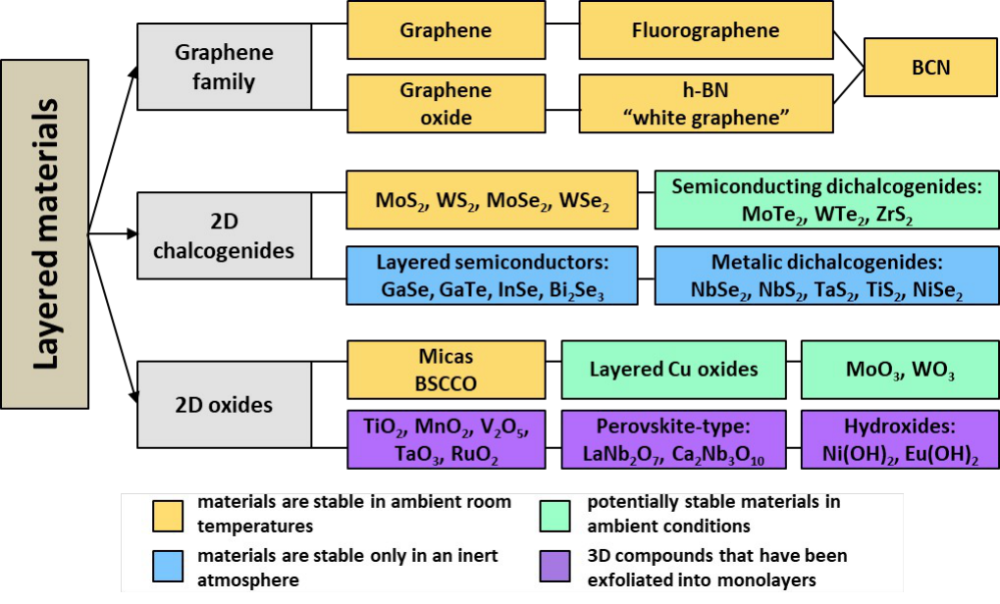

Fig. 1 The classification of layered materials on the basis of stability. 

2D materials have striking remarkable material properties with promising efficacy in detection strategies.[79] The assembly of these 2D materials over a large scale with a faithful reproduction in their properties plays a key role in the device manufacturing. These 2D materials exhibit variation in the thickness ranging from atomic layer length scale to a few microns and lateral 

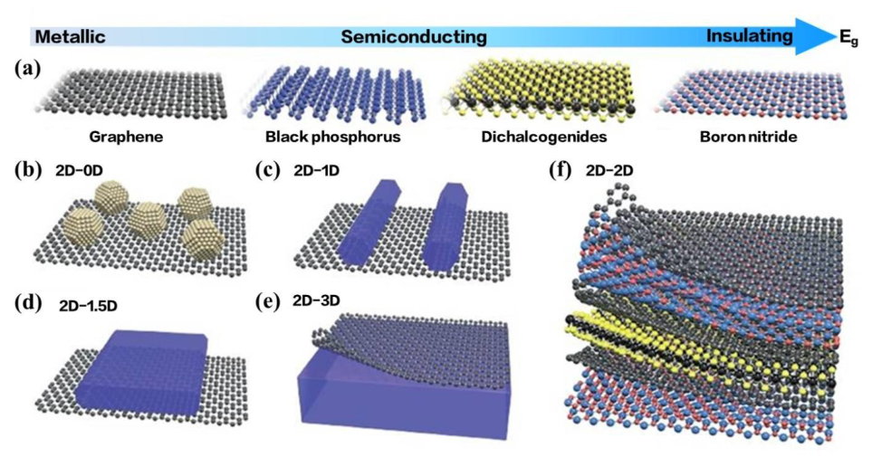

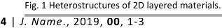

**----- Start of picture text -----** 
Fig. 1 Heterostructures of 2D layered materials. 4  |  J. Name ., 2019,  00 , 1-3 **----- End of picture text -----** 

This journal is © The Royal Society of Chemistry 20xx 

Please do not adjust margins 

> Page 5 of 26 Please do not adjust margins Nanoscale 

**ARTICLE** 

## **Journal Name** 

dimension of few centimetres.[80] Because of its one of a kind physical, chemical, optoelectronic, thermal, and mechanical View Article Online properties, graphene has been proved to be suitable for applications in electronic devices, photonic devices, energy conversion DOI: 10.1039/C9NR10178K and storage and sensing.[81-83] The assorted variety of 2D materials (Fig. 1) has grown significantly and include black phosphorus[84] , hexagonal boron nitride (h-BN)[85] , transition metal dichalcogenides (TMDCs),[86] layered metal oxides,[87] metal−organic frameworks (MOFs),[88] covalent organic frameworks (COFs),[89] and other 2D compounds[69] . 

High surface to volume ratio of monolayers 2D materials enables them to be more chemically reactive than their bulk form, in they are being inert.[72] . The conductivity of 2D material varies from insulator to a metal depending on their band gaps and can be changed by number of methods such as producing defects within structure, by doping or fictionalizations or by changing the number of layers (Fig. 2).[70, 90] A fine tuning in the configuration of the 2D nanomaterial leads to the variation in their band gap and as well as conductivity (Fig. 3).[74] 

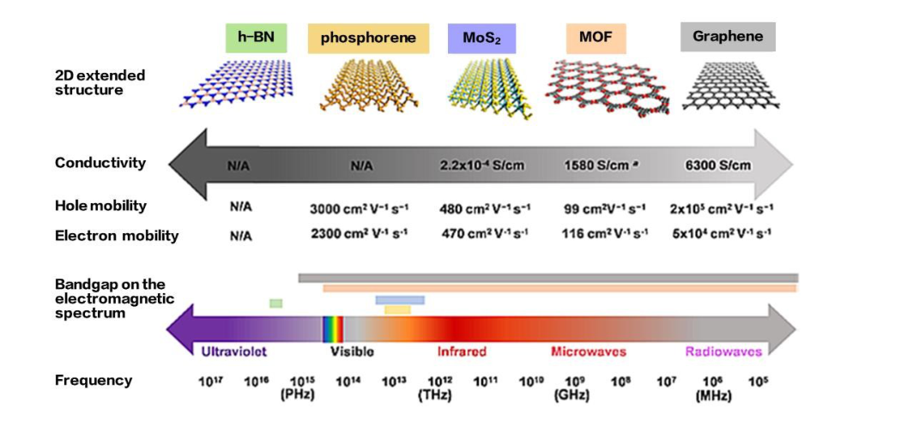

Fig. 2 Conductivity, electron and hole mobility, bandgap on the EM spectrum for different layered material. 

Band gap alteration of Molybdenum Disulphide monolayer can be achieved by applying  mechanical force or an electric field. This makes them efficient to signal transduction and more suitable for detectors. Variation in geometry and size alter the ratio between bulk and edge structure, which can lead in spatial confinement in specific dimension and hence change in electrical and mechanical behaviour. 2D materials have high lateral size than their counterpart 1D materials, which enables them to maintain a good electrical contact.[30, 77] Due to the atomic size thickness they demonstrate exceptional compatibility with thin film techniques. High tensile strength and flexibility is required for materials to be used in sensing equipment.[91] Exceptionally high tensile strength along the flexibility at atomic size thickness allow grapheme to be incorporated into thin film growth mechanism using direct transfer. This outstanding mechanical strength and flexibility of graphene makes them compatible with electronic wearable devices. Quantitatively graphene has an ability to withstand lateral variations  under lengthwise compression as it has high young’s modulus (1000GPa) and high strain limit (~25%). the optical conductivity of graphene is linear with electromagnetic field in the zero frequency limit, which gives graphene a very high optical transparency (>90%).[92] All these remarkable optical, physical, chemical and thermal properties enable 2D nanomaterial a promising candidate for sensing devices. 

## **3. Two-Dimensional Materials used for Sensing** 

**3.1 Graphene.** 

_J. Name_ ., 2019, **00** , 1-3 | **5** 

This journal is © The Royal Society of Chemistry 20xx 

Please do not adjust margins 

Please do not adjust margins Nanoscale 

Page 6 of 26 

**Journal Name** 

## **ARTICLE** 

Graphene sheets has hexagonal lattice structure, which is a monolayer of sp[2] -hybridized carbon atoms covalently bound View Article Online together (Fig. 4). Graphite (3D), carbon nanotubes (CNTs, 1D), and fullerenes (0D) are carbon-based allotropes. DOI: 10.1039/C9NR10178K[81] A sole sheet of graphene has lattice constant nearly 1.42 Å. Van der Waals interactions hold individual layer together to form bulk (3D)graphite; with adjacent layer distance of 3.35 Å . In 2004, Andre Geim and Konstatin Novoselov obtained monolayer graphene from bulk graphite by mechanical exfoliation method.[79] Graphene became wonder material with lot of applications in material sciences because of its astonishing physical and chemical properties.[12, 69] The conductivity of graphene was reported to be 15,000 cm[2] /(Vs) at RT, where the hole and electron mobility are nearly equal.Direct and zero band gap make graphene most desirable 2D nanomaterial of all  where conductivity and band gap depend on stacking of layers of graphene.[12] Theoretical obtained specific surface area (2630 m[2] g[−1] ) of graphene is twice of CNTs.[93] As reported, graphene is 100 times stronger than the film of same thickness of steel and can withstand stress better than any other 2D nanomaterial.[94] Scotch tape,[79] solution-phase exfoliation,[95] chemical vapor deposition (CVD),[96] and organic synthesis[97] techniques are be used to preparation of graphene. Scotch tape or drawing method, offers the least amount of morphological defects hence produce best quality grapheme.[98] Epitaxial growth of graphene using CVD is  done by raising temperature (>1100 ° C) of Silicon carbide (SiC) and lowering the 

Fig. 4 Graphene (2D) has hexagonal lattice structure, which is a monolayer of sp2-hybridized carbon atoms covalently bound together. Fullerenes, CNT and Graphite are carbon based allotropes with 0D, 1D and 3D respectively. 

pressure (10[-6] torr) and also in the presence of source of carbon i.e. hydrocarbon vapors[99] . However,  the main challenge using CVD is to produce a consistent monolayer of graphene sheet, which requires further advances.[80] 

Solution-phase exfoliation method basically is the formation of graphene oxide (GO), achieved by oxidation of graphite under strongly acidic conditions[69] . Graphene morphology can be reversed from GO by treating it thermally, electrically or chemically.[100] High conductivity,  sufficiently high specific surface area, high tensile strength, and ease of fabrication make graphene an excellent material for sensing application.[101] The perturbation in electronic properties of graphene occurs due to the interaction or transfer of surface electron of graphene with analyte .[102] Studies indicate that the electrical conductivity can be modulated through changes in doping state on adsorption of diverse gas molecules by grapheme.[103] The  transport of charge through graphene is highly responsive to its surrounding due to its atomic size thickness.[82] Due to unique and rich surface chemistry of its crystal lattice, graphene has intrinsically low electrical noise, enable it to test charge fluctuation.[79, 104] Changing an electron in bulk of graphene can alter resistance in step-wise way, resulting in sensitivity for single molecule[105] . Due to outstanding mechanical strength and flexibility of graphene, makes it compatible with electronic wearable devices.[104, 106, 107] Doped graphene based sensors have shown better sensitivity towards gas molecules than pristine graphene. Many other complicated methods are being used to modify morphology of graphene to utilize to its maximum potential in sensors likeadding other functional nanostructures, organic receptors, polymers, proteins, or nucleic acids[108-110] . A deep understanding of the surface science, changed surface characteristics, crystal defects, electronic properties, and so on ought to be considered while applying graphene for sensing applications. 

## **3.2 Black Phosphorus (BP).** 

**6** | _J. Name_ ., 2019, **00** , 1-3 

This journal is © The Royal Society of Chemistry 20xx 

Please do not adjust margins 

Page 7 of 26 

Please do not adjust margins Nanoscale 

**ARTICLE** 

## **Journal Name** 

View Article Online DOI: 10.1039/C9NR10178K 

Fig. 5 (a) Layers of phosphorene stacked together to form BP. (b)Schematic diagram of single-layered phosphorene. 

In 1914, Bridgman synthesized the a stable allotrope of phosphorus adding another element to the application based artificial element i.e. black phosphorus(BP). This was achieved by exposing the allotrope of phosphorus (white phosphorus) to elevated temperature and pressure (200 °C and 1.2 GP).[111] Few decades later, Ye group isolated single atomic layers of 2D black phosphorus using mechanical exfoliation method. The band-gap in the resulting 2D material is a layer dependent having in the Hinge-like structures giving anisotropy to these structures.[112] These structures behave as a quasi-one-dimensional excitonic nature, which gives the monolayer of the BP its unique characteristics. 2D BP composed of sp[3] hybridized phosphorus atoms is present as a single−elemental layered crystalline material organized in a layered orthorhombic crystal structure (Fig. 5).[113, 114] It makes a honeycomb lattice structure with note-worthy non-planarity in the form of structural edges.[115] 

Van der Waal interactions are responsible for stacking of multiple 2D layered BP to form multilayers with an interlayer distance of 5.5 Å. The triangular pyramidal structure of the P atoms arises due to the covalently bonded phosphorus atoms with lone pair of electron. Layer multiplicity makes the tunable direct band gap of BP modulate in the order of 1.51eV for a single layer to 0.59eV for a five-layer system.[116] Layering structure of the BP monolayer from bottom-to-top approach leads to further modulation in the band-gap, though the deviation in the band-gap becomes lesser and lesser as the stacking is increased. High drain current and carrier mobility is observed for multilayer of BP[111] . Direction of the edges and functional group allow further adjustment in the BP band-gap. 

BP's narrow band gap and anisotropic conductance make it suitable for application in electrical sensing technologies.[22] BP has high chemical adsorption energy, as a result of its wrinkled surface structure, which offers a plenty of accessible adsorption sites for interactions with analytes. Introduction of structural ripples along with a finite quantity of dopants on the surface[117] of BP, improves charge transfer and sensitivity towards analytes. Further improvements in techniques to control the orientation within fabricated layers of BP as its  edge plane sites have more electron transfer rate than basal planes, makes it suitable for sensing devices.[22] Phosphoric acid species formed in the occurrence of humidity is the main challenge to overcome in the process of device manufacturing and its applicability.[118] Incorporation of protective coatings, nano materials or ionic liquids are well-known method to overcome stability challenge of BP against deprivation under ambient conditions.[119] 

## **3.3 Transition Metal Dichalcogenides.** 

2D materials exhibit similar properties as graphene in terms of their large structural variations, as they demonstrate a variety the possible structure. These structures exhibit a variety of structures such as  closed or open ended nanorods, flakes or sheets hexagonal platelets, plate-like crystallites, trigonal sheets and many more. The nearest contender to exhibit similar properties in terms of the exfoliation is a group of material called Transition Metal Dichalcogenides (TMDCs). These are inorganic compounds having X-M-X covalent bonds, having M as the transition metal and X standing for chalcogen series (S, Se and Te).[120] The symmetry of the MX2 can either be trigonalprismatic (D3h) or anti-prismatic (D3d) with a coordination number of 6 as shown in Fig. 6.Vander Waals interactions make TMDCs a unique material for interlayer diffusion susceptible for high charge mobility. These TMDCs can form monolayers and when stacked together a multilayer held only by Vander Wall interactions thus making 121, 122 them highly suitable for friction reduction purposes. In 1986, monolayers of MoS2 were first prepared through lithium intercalation by solution-suspended method.[123] The main challenge regarding the exfoliation technique to produce single layers of TMDCs is their inapplicability to form large area monolayers for significant amplification.[124] These materials can also be utilized in the energy conversion and energy storage devices. The resistance of the compounds formed with different 

_J. Name_ ., 2019, **00** , 1-3 | **7** 

This journal is © The Royal Society of Chemistry 20xx 

Please do not adjust margins 

Please do not adjust margins Nanoscale 

Page 8 of 26 

**Journal Name** 

## **ARTICLE** 

combinations of the transition metal and chalcogenides varies throughout the range from non-metallic to metallic. Metallic View Article Online resistance is shown by NbS2 and TaS2 and the other range of spectrum is shown by HfS2, which are essentially non-metallic. The DOI: 10.1039/C9NR10178K most interesting resistive range that has intrigued us for the device application is the semiconductor range shown particularly by MoS2, WS2, WTe2 and TiSe2.[120] The stoichiometry of the compound formed by the transition metal group elements and the chalcogen depends upon the method of preparation and strategy followed. Bottom-up and top-down strategy have their own pros and cons regarding the quality of the end product.[125, 126] Bottom-up strategy requires a strict control over the elemental composition formed during the proceeding reaction. These methods also require control chamber and higher temperature furnaces to produce these materials. The bottom-up strategy provides one unique advantage that introduction of small dopant at the interstitial locations may lead to drastic change in physical and chemical properties.[127] The electronic and physical properties of the monolayer or a few layers of the TMDCs are inherently different from their bulk counter-part, which already has been established and discussed in the same context of grapheme.[128] Additionally the thermal and chemical stability of TMDCs are relatively high, rendering these materials as shows potential for gas sensors and future sensing devices.[129] Top-down strategy of the preparation requires bulk forms of TMDCs which are either exfoliated of sonicated in the presence of small and highly mobile ions to separate sheets in the form of monolayer. Transfer of this monolayer from either scotch tape or from the suspension to a suitable substrate is also a challenging task for the device application. As the exfoliated single layer with basal plane and prismatic edge allows structural variations when associated with a compound which determines the assembly properties.[120] These structural variations in turn affect the electrical and chemical properties in the single layer itself and these variations get amplified when these monolayer are assembled to form a device. One of the most evident variations in the chemical property of the monolayer is the widening of the band gap due to disrupted s-pz orbital interactions in-between the atoms of the layers at the nearest neighbour distance. High level of atomic control makes the reactivity and electronic properties of 2D TMDC nanosheets extremely adjustable.[128] In spite of adjusting compositional features, a wide range of synthetic options to develop TMDCs must be taken into account. Both the previously mentioned aspects play a vital role in the sensitivity toward 

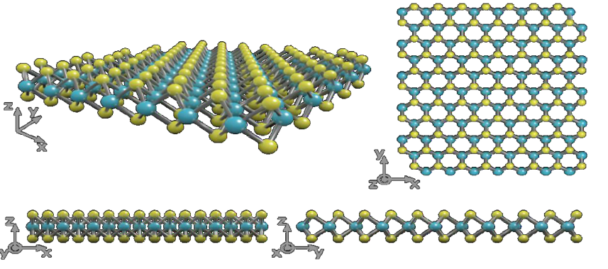

Fig.6 The crystal structure of monolayer MoS2 showing a layer of molybdenum atoms (blue) sandwiched between two layers of sulfur atoms (yellow). a) 3d view of the monolayer MoS2, b) planar view from z axis, c) planar view from y axis, d) planar view from x axis. 

various analytes. 

## **3.4 Metal Oxides.** 

Metal Oxides (MO) comprise a standout amongst the most different classes of solids, showing an assortment of structural properties.[130] Depending upon the presence or absence of Vander Waals layered structure in the mass, metal oxides are sorted into two class: 2D layered MO, e.g., MoO3 (Fig. 7), WO3, and 2D non-layered MO (e.g., ZnO and SnO2 nanosheet).[131, 132] To get nanosheets, the weak attraction between layers are ideal for liquid or gas stage techniques which requires exfoliation of layer from bulk material.[133] High stability under air and water can be acquired by removing the basal surfaces of layered MO using oxygen molecules. Top-down methodologies cannot be used for those metal oxides, which do not possesses intrinsic layered structure. This is caused due to the presence of strong chemical bond  but by adjusting morphological feature of such metal oxide atomically thick sheet can be obtained.[134] The major aspects  that decide the surface characteristics of the metal oxides are the number of oxygen particles and ionic character of the metal-oxygen bond[135] . Oxygen trapped at the surface is quintessential for atomic adsorption, charge exchange, and reactant performance.[135] High polarizability of O[2−] empowering 2D MO to exhibit large, nonlinear, and uneven distribution of charge in cross sections. This  causes built-up of an electrostatic shielding zone (1−100 nm in thickness) that in turn results  in the extraordinary local and interfacial properties.[136] The surfaces of 2D MO can  be electronically enacted because of the solid ionic character of transition metal oxides. Raising the temperature(T > 250 °C) in the ambient conditions but keeping it below their melting point, the conductivity gets improved further as metal oxides show semi 

**8** | _J. Name_ ., 2019, **00** , 1-3 

This journal is © The Royal Society of Chemistry 20xx 

Please do not adjust margins 

> Page 9 of 26 Please do not adjust margins Nanoscale 

**ARTICLE** 

## **Journal Name** 

conductive behavior.[64] , this property allows MO to be widely implemented in the gas sensor technologies. Fabrication cost of View Article Online MO is less, compared to other sensing devices as they intrinsically have 2Dscale arrangement.[137] They are chemically inert at DOI: 10.1039/C9NR10178K high temperature and moisture.[138] Hence, the use of metal oxides toward versatile and scaled down detecting stages requires raised working temperatures. This shortcoming demands  intensive research contrasted with sensors operations at RT.[139] The 2D 

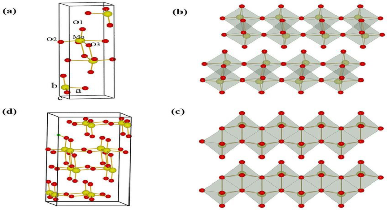

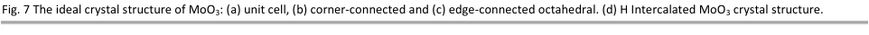

**----- Start of picture text -----** 
Fig. 7 The ideal crystal structure of MoO3: (a) unit cell, (b) corner-connected and (c) edge-connected octahedral. (d) H Intercalated MoO3 crystal structure. **----- End of picture text -----** 

sub-family of metal oxides is the key in overcoming the disadvantages of working temperature for detecting of vaporous analytes.[68] 

## **3.5 Metal−Organic Frameworks.** 

Metal−organic frameworks (MOFs) are porous hybrid materials in their crystalline form which are fashioned via self assembly of molecules of inorganic metallic nodes with organic ligands such as carboxylate, hydroxyl and thiol.[140] MOFs also exhibit a large variety of crystalline structures in all forms of linear assembly, single layer and bulk depending upon the linker and metallic node interaction, adhering to different space groups.[141] Yashi and his group were first to report the concept of Metal organic Framework.[142] In 1995, MOF-5 based on Zn was reported by them with 2900m[2] g[-1] specific surface area and 60% of porosity.[143] Luminiscent property of MOF have helped researchers to use it for chemical sensors (in aqueous solution) as a sensing element.[144] Ru-MOFs was developed by Chi Group to detect Hg[2+] in water as it releases fluorescence and electrocluminiescene signals when Hg[2+] ions decompose Ru-MOFs.[145] MOFs have high Langmuir surface area (> 10,000 m[2] g[−1] ) which makes it highly adsorbent towards analytes.[146] 2D sheets of MOFs can a be formed via top-down and bottom-up techniques. The layered bulk MOFs is exfoliated through sonication in top-down technique, which occurs due to the breaking of van der waals or hydrogen bonding between the stacks. In bottom-up synthesis process, the growth of 2D MOF is allowed only in the direction towards the basal plane while constraining vertical growth. The low electrical conductivity of the MOFs limits their application in electrically transduced sensors and have been improved over the time.[71, 147] There have been numerous reports on the integration and immobilization of the charge by using molecular cages and scaffold.[71] The coordination symmetry shown by the late transition metal ions are generally planar and  electrical conductivity of MOFs prepared with the aromatic ligands consisting hetero donor atoms such as O, S or NH are comparatively high. 

Different packing modes of 2D MOFs depend upon the linker or metal ion properties, these modes can either be staggered, eclipsed or slipped parallel influencing the mobility of charges across the layers of stacking.[88] Band-gap can be engineered with the choice of the ligand, oxide ion state and structural motifs. These structural modifications give rise to electrical conductivity in the range of 10[-6 ] S cm[-1] to 2500 S cm[-1] at room temperature.[88, 148] The presence of imperfections, edges, and forever caught adsorbents obscure the chemical condition of the MOF top surface. Most of the announced MOFs are topologically nonconducting. Planar and whole conjugated ligands have offered to ascend to MOFs which consolidate common MOF in terms of porosity, huge surface area, and adjustability. The combination of these properties provides elevated responses in gas sensing in the full range of operating temperature and ambient conditions. The drawback that needs to overcome in the full applicability of the MOFs in the sensing technology is the abundance of metals and their corresponding dopant along with the device longevity. 

## **3.6 Other 2D Materials.** 

Synthesizing and finding applications of the planer geometry materials has been the bread and butter for many researchers in the scientific community whereas, some materials have found their ways to the sensing technology purely by accident. This section deals with all the candidates and contenders standing in the queue extending from the most abundant carbon based 

_J. Name_ ., 2019, **00** , 1-3 | **9** 

This journal is © The Royal Society of Chemistry 20xx 

Please do not adjust margins 

Please do not adjust margins Nanoscale 

Page 10 of 26 

**Journal Name** 

## **ARTICLE** 

material to the precious element based materials. Other 2D nanomaterials, such as carbon nitride, MXenes, and layered Group View Article Online III−IV semiconductors, show immense potential in sensor and detector applications. Xenes belongs to IVA gropup elements, DOI: 10.1039/C9NR10178K which also include Silicene, Germanene, and Stanene.[67, 70] Silicene has weak π- bond as it has large bond length ( ∼ 2.28Å). Their hexagonal arrangement is stabilized by bringing Si atoms closer enough to facilitate a stronger overlap of their pz orbital, hence a mixed sp[2] −sp[3] orbital is acquired. Xenes degrades and oxidizes faster in ambient but are highly reactive towards stabilization in other forms this property can only be exploited once but this can provide faster sensing preventing disasters where response time is more critical than the long-term utilization of the sensor. Depending on the substrate properties their electrical conductivity ranges from insulator to semi-metallic for these materials. 

Metals are principal material that is utilized and  explored for sensing and industrial applications.[149, 150] Their most common crystalline form which are BCC (body centered cubic), FCC (face-centered cubic), and HCP (hexagonal close packed) are acquired at the lower level of dimentionality.[151, 152] As the thickness of the metal layer decreases, contribution from the electrons situated close to the surface to the total conductivity of the material increases .Metal nanoplates and nanosheets have also shown some exclusive sensitivity towards analytes in comparison to nanostructures with other shapes[153] Bottom-up method is used to prepare thin metal sheets  from  salts of metal or metal nanoparticles along with top-down approach using Electron beam nanolithography, nano-imprint lithography, and hole mask colloidal lithography have been developed for the same purpose.[150] Metals such as iron, zinc, and copper get oxidized in the presence of moisture whereas, nanosheets of metals like palladium, platinum and gold can be developed as they are inert hence, they provide a unique chance to sense traces of molecules in the oxygen rich environment. Thin metallic structures with an excess of unsaturated-atoms are complicated to make them stable and their production remains a daunting task as atoms are closely packed in metals. 

h-BN i.e. Hexagonal Boron Nitride which is also known as “White Graphene”, shows periodic structures same as graphene with a different stack ordering[154] . h-BN in its bulk form has an interlayer separation of 3.30 ± 0.03 Å, behaves as an insulator with a band-gap of 5.2eV. The thermal conductivity show a huge disparity in the experimentally obtained vale of 380 Wm[−1] K[−1] compared to the theoretically calculated value of 2000 Wm[−1] K[−1] . The dielectric properties and resistance against oxidation at high temperature are unique features of the stacked h-BN.[133, 155] . The doped h-BN nanosheet has excellent response towards gas molecules.[154] 

g-C3N4 i.e. Graphite Carbon Nitride is another material that shows layering structure same as graphene with the carbon and nitrogen atoms present in sp[2] hybridization.[156] Diverse structural models for the geometry of g-C3N4 are explained as Triazine and Heptazine.[157] The bad-gap (2.5-2.8eV) of g-C3N4 results in poor electrical conductivity, whereas the surface behavior of g- C3N4 arises from the terminal hydrogen and the nitrogen, having large affinity towards many analytes. The band-gap can be turned and tailored with the presence of homogeneously dispersed carbon and nitrogen atoms, this also leads to a better thermal stability and enhanced performance for device applications. 

Selective etching of a particular element fromMn+1AXn phases, where M refers to a transition metal, A represents a group III A and IV A element, X can either be C and/or N, with n = 1, 2, or 3 to form MXenes. The resulting material from this selective etching is 2D transition metal carbide. During the chemical etching process, functional groups i.e. Fluorine and Hydroxide (OH) are usually establish on the surfaces of etched MXenes[158] . These surface termination are the controller of the surface activation properties and as predicted by the DFT theories. Single layers of MXenes are metallic in nature with a high electron density lying near the Fermi level.[159] 

Similar to the TMDCs there exists another group of material having almost similar properties are Metal Chalogenides (MX) where metal can be either In or Ga and X can either be S, Se or Te. In the bulk form two layers of chalcogen form the structure X−M−M−X, where individual layer can be recognized as a double Galium or Indium layer intercalated. Vander Waals interactions are as responsible here to keep the layers stacked at an interlayer distance of ∼ 8 Å. The atomic layer thickness of the thin films made from these elements in the form of layered semiconductor exhibit low stability in ambient conditions. The single pair of Se atoms are sitting on the top of valance band in InSe, which allows the surface to be reactive towards oxygen and water.[160] 

## **4. Applications** 

## **4.1 Infrared Photodetection.** 

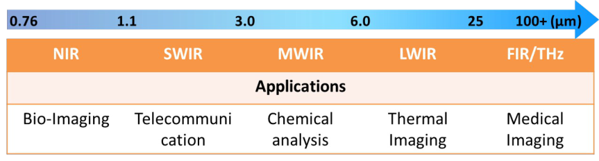

**10** | _J. Name_ ., 2019, **00** , 1-3 

This journal is © The Royal Society of Chemistry 20xx 

Please do not adjust margins 

> Page 11 of 26 Please do not adjust margins Nanoscale 

**ARTICLE** 

## **Journal Name** 

Fig. 8 Main applications of IR-photodetectors with different wavebands. 

~~View Article Online~~ DOI: 10.1039/C9NR10178K 

The environmental aspect of infrared detection requires an ability of the detector to sense temperature gradients and minute fluctuations at scales and time scale. These are vital for the ocean and atmospheric studies along with application in agricultural field. Detection of the properties associated with the IR-radiations as the polarization and temperature source nature detection is also a unique requirement for environmental and biological application. Infrared photodetectors are gaining extraordinary attention as they have extensive application in civil and military fields in contrast to large scale deployment of instruments like LIDAR.[161] Low-dimensional materials are extensively used in UV to infrared light detection. They exhibit extraordinary performance in device manufacturing for sensing applications. The properties that are responsible for this compatibility are subwavelength photon confinement, small response time and applicability in combination with plasmonic nanostructures, heterostructures and waveguide.[162-165] Various fundamental phenomenon and foundation of optoelectronic started with the understanding of interaction of light with matter. When extended with the study of band gap in different materials, elements and their doped counterparts from the periodic table showed phenomenol variations and properties. Semiconductor based photo-detectors in the IR range are used for various applications in telecommunication, astronomy, surveillance, motion detection,[161] and detection of the harmful gases in the atmosphere. Fig. 8 shows some applications of IR-photodetectors. 

In the past few years, scientific studies and development have been focused at the nano-scale light-material interactions giving edge to researchers in developing extremely capable photo detectors (PD) having a selective response towards a particular frequency of electromagnetic (EM) spectrum.[166, 167] compact  geometry and small,  response time up to ~picoseconds resulted in manufacture of high-performance PD for optoelectronic communication and cameras of high frame rates.[166] For infrared photo detectors (IRPDs), lead sulfide (PbS) nano-crystal are relatively substantive materials and the Lead Sulphide (PbS) based photo detectors are beneficial in a variety of applications because of their low manufacturing cost, sensitivity towards a large band of spectrum, and compatibility of the PbS material fabrication over a variety of substrate. Low dimensional nano-structured materials coupled with p-n or schottky junction one can achieve the low-leakage current system along with the sensitivity towards color and polarization of the IR.[168] . The response time for the detection is reduced drastically along with the operational temperature for such nano-structure loaded devices. Region specific highly sensitive light detectors and imaging devices can be developed by dubbing material with black silicon (BS) at low cost. The fine-tuned and narrow band gap of these nanostructures allow high absorbance in the range of 90% over the spectral range of 250nm to 2500nm.[169] Additionally, practical device application are possible because of  the high photo-conductive gain and responsivity (0.57 A/W atλ = 1050 nm).[170] Improvement in the functionality of the nano-devices requires a crucial input in terms of the novelty in the research of the material and implications of variation in the dimensionality, architecture and size. . Lately, GaN NW-based photo detectors were reported with high photocurrent gain at room temperature. Furthermore, core shell NWs based photo detectors were reported with high speed photoresponse (~ps) and mobility in MIR range at RT. These core-shell NWs are made from InGaN, InAs/InP, and InAs/InAsSb based material, a schematic of such device is shown in Fig. 9a where the Cr/Au based Ohmic-Ohmic contact was manufactured. Corresponding I vs V characteristics for these devices are shown for different wavelength (refer Fig. 9b and Fig. 9c, 9d shows the light and dark current response for the Schottky-Ohmic combination.[171, 172] In addition, 2D materials and their heterojunctions have broad application prospects in the field of flexible infrared optoelectronic detection in the future.[173] 

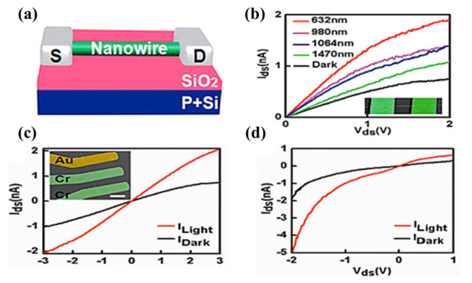

Fig. 9 Schematic illustration of InAs nanowire based photodetector and photoresponse analysis of the devices. 

_J. Name_ ., 2019, **00** , 1-3 | **11** 

This journal is © The Royal Society of Chemistry 20xx 

Please do not adjust margins 

Please do not adjust margins Nanoscale 

Page 12 of 26 

## **ARTICLE** 

## **Journal Name** 

Table 2 The list of low dimensional materials and their values in wavelength, resonsivity, detectivity and speed parameters for IR detectors. 

View Article Online ~~DOI: 10.1039/C9N~~ R10178K 

|||,|,|||. View Arti ~~DOI: 10.1039/C9N~~|
|---|---|---|---|---|---|---|
|Category|Materials|Wavelength|Responsivity|Detectivity|Speed|References|
|||(µm)|(AW-1)|(Jones)|||
|EpitaxiallyGrown QDs|InGaAs/GaAs/AlGaAs|17|0.15|1.0×107|-|174|
||GaSb/AlSb|3.0|-|1.8×1011|-|175|
||GaAs/AlGaAs|8.0|0.044|4.5×1011|-|176|
||InGaAs/GaAs|10.2|2.16|1.0×1011|-|177|
|Quantum Wells|InGaAs/InP|8.0|7.0|7.4×1010|-|178|
|ColloidalsWells|HgTeQDs|2-65|-|-|-|179|
||HgTeQDs|2.0|-|2×1010|2KHz|180|
||HgTeQDs|4.2-9|0.145|-|-|181|
||PbSQDs|1.3|1.0×103|1.8×1013|18Hz|182|
|Nanowires|InP|0.83|2.8×105|9.1×101|139ms|183|
||InAs|1.5|5.3×103|-|-|171|
|Hybrid Heterostructures|InAs PbS QDs/Gr PbS QDs/Gr B-Si QDs/Gr Perovskite/TiO2/Si|2-3 0.895 0.6-1.4 0.4-4 1.1|4.0-0.6 1.0×107 5×107-5×105 ~1012 0.87|2.0×1012 - 7.0×1013 ~1013 6×1012|~0.1ms 0.3-1.7s - - -|184 185 186 187 188|

## **4.1.1 Black Phosphorus, Graphene, and Heterostructure (2D material) for Infrared Detector.** 

The recent 2D materials such as graphene and BP are gaining rigorous consideration in IR sensing devices.[189, 190] Field effects and strains tune the electronic properties of 2D materials making them the building blocks in flexible and foldable electronics having excellent tolerance against fracture under external strains.[191][191] Graphene and BP are mostly explored for infrared photodetection, because of their ability to absorb a large range of photons of low energy in IR region. Graphene absorbs 2.3% of incident photons irrespective of wavelength at atomic layer thickness and absorption efficiency can be improved by changing the stacking sequence or by incorporating graphene into other nanostructures.[192] Graphene-based photodetectors have an operational domain extending up to extremely high frequency of 500 GHz.[193] Graphene/metal junction, tunneling barrier junctions, and graphene stacking are various methods which have been in use for efficient partition of the photon-excited carrier at such short time scales.[190] The separation of carriers excited by photons at peco-second frequency rates can be achieved by either metal-graphene or tunneling-barrier junctions when stacked in the form of ordered multilayer using different deposition techniques. By incorporating graphene and CQD into a single device one may achieve an ultra-high gain in photocurrent.[194] Ina hybrid heterostructure based photodetector the charege-carriers generated due to photon excitations get separetaed at the interface. The implementatiaon of dyes of organic nature facilitates the formation of nanostructures of high-extinctin coefficients, one of the many examples is optical sensitization.[195] Recently, photodetectors  on PbS CQDs and graphene hybrid hetero structure based with a significant photo-responsivity of 107 AW[-1] in the Near IR region were also reported.[186] The light absorption and the transportation of carrier taking place in the PbS CQD layer and graphene layer is shown in Fig. 10a. Band 

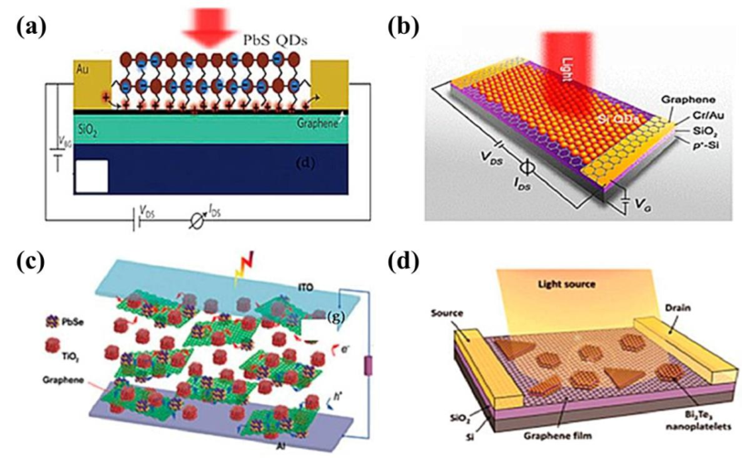

Fig. 10 (a) Structure of PbS CQDs/graphene PD (b) Representation of intense near field absorption using B-doped Si QD/graphene composite based PD (c) Schematic illustration of multi interface hetero-structure using B-doped Si QDs PbS/TiO2/graphene based PD (d) Schematic representation of heterostructure based PD using Bi2Te3 nanoplatelets/graphene nanocomposites. 

**12** | _J. Name_ ., 2019, **00** , 1-3 

This journal is © The Royal Society of Chemistry 20xx 

Please do not adjust margins 

> Page 13 of 26 Please do not adjust margins Nanoscale 

**ARTICLE** 

## **Journal Name** 

misalignment gives rise to the movement of the photogenerated carriers and separate out at the graphene/QCD layer interface, View Article Online while retaining the electrons and holes in the CQD and graphene layer respectively. A variety of doping sequence and choice of DOI: 10.1039/C9NR10178K dopant can be used to engineer the band-gap and  electrical conductance achieved by this method is sufficiently high. B-doped (Si:B) QDs are shown in Fig. 10b has been fabricated to achieve MWIR band photo-detection with ultra-sensitivity.[187] Tuning the morphology, structural phase and surface chemistry of the Si:B QDs conjugated graphene device allows the photodetection in the UV-MIR range with a sensitivity of 109 AW[-1] with a gain of ~10[12] and detectivity of ~10[13] Jones. Different hybrid heterojunctions of Ge and graphene, PbSe and MoS2 and HgTe and MoS2 exhibit detection and high spectral response extending from visible to IR. Particularly enhanced detectivity and responsivity in the narrow bands of NIR spectrum was achieved by employing heterostructures with multiple interfaces instead of single heterojunction structure (Fig. 10c and 10d).[172, 188] The study of selectively engineered heterojunction in terms of their optical and electrical properties depending upon the morphological properties would provide considerable leap in the detection efficiency and performance selective to bands of IR. 

## **4.2 Electrochemical Sensor.** 

Substantial metals, inorganic-natural mixes, harmful gases, pesticides, anti-infection agents, microscopic organisms and so on are considered as a worldwide ecological contamination issue having significantly contributed by the people as a side effect of the modern development. This toxicity has been available since the modern upheaval and their accumulation in nature has been expanding since. These toxic substances are their unconsciously been dumped into the water bodies or disposed of with carelessness. The cost to be paid by the future age will significantly rely on the present procedures of evacuation and detection of these harmful substances to treat foe the best of nature and mankind. Electrochemistry, fluorescence, chemiluminescence, surface-enhanced Raman scattering,[196] plasma mass spectrometry are distinctive measurement techniques, which have been used for observing ecological contamination from collected samples. Metal NPs, MOs, CNTs, silicon NWs, and graphene have been presented in building electrochemical sensors for contaminations detection. Electrochemical sensors are widely used for chemical sensing as they have the ability to produce selective and quantitative data from the specific system.[197] The data or the information from the electrochemical sensors is collected in the form of accumulation of charges, current signal, potential change or change in impedance of the medium between the electrode.[198] Depending on the type of data collected electrochemical sensors is categorized.  There are four main types of electrochemical sensors: potentiometric, voltammetric, amperometric and EIS (Electrochemical Impedance Spectroscopy) sensor. Simplified design of two electrode based potentiometric sensor’s working mechanism and analysis at thermal equilibrium allowing chemical reaction to occur without applying any potential make electrochemical sensor suitable for chemical sensing at large scale.[199,200] The activity of the targeted ions is referred as the input signal and the transducers are used to convert those ions into electrons which produces an electric potential as output of the sensor.[201] the simple design is the main advantage of potentiometric sensor. Secondly, the analysis of the sample is done under thermal equilibrium condition which ensures no other chemical reaction to take place. As there is no oxidation reduction reaction is taking place, potentiometric sensor is able to detect redox-inert species.  Higher amount of ions other than targeted analytes can alter the results and have been improved over the time. 

Second and third type of electrochemical sensors that measures the change in current arising due to the electron transfer under applied potential are voltammetric and amperometric sensors.[102, 197, 198, 202] There are various type of voltammmetric sensors such as Linear Sweep voltammetry, Staircase voltammetry, Square wave voltammetry, Cyclic Voltammetry, etc. A voltammetric technique in which potential is sweeping linearly with time between working electrodes and reference electrode, and current is being measured at working electrode.[203] Linear sweep voltammetry is more useful in cases where the reaction is irreversible such as, it was used to examine direct methane production via a biocathode.[204] The derivative of Linear sweep voltammetry results into staircase voltammetry in which oxidation or reduction from chemical reaction is noted as crust or trough in the current signal.[205] Square wave voltammetry (SWV) is the superposition of staircase and square wave potential which can be seen as modified staircase voltammetry and current is being measured at working electrode.[206] It is easy to monitor the molecule concentration as current magnitude varies proportionally to the reduced or oxidized molecules.[207] ,[208] In cyclic voltametry, the potential at working electrode is ramping linearly with time and the biasing can be reversed after completing one cycle  and current is measured.[207] Cyclic voltammetry is mostly used for electrochemical sensors to determine diffusion coefficients ad concentration of ion through redox reaction.[209] To further enhance the sensitivity of the sensing devices other techniques of voltammetry have been used such as Normal Pulse Voltammetry (NPV), Anodic stripping voltammetry (ASV), Cathodic stripping Voltammetry (CSV) and Differential Pulse Voltammetry (DPV).[197, 210, 211] The benefit of using voltammetry is that both negative and positive biasing can be used to study the redox profile of chemical. Amperometry sensors  allow potential to be fixed and current is measured at the working electrode. The advantage of amperometry sensors is that any perturbation or disturbance doesn’t effect the performance of the sensor, which makes them suitable for monitoring the environment and wearable sensors Fourth and last electrochemical sensor which has the ability to study the relaxation parameter for a range of frequencies is impedance sensor.[212] They are there electrode system like amperometry and voltammetry but instead of steady potential or no potential it uses an AC signal across electrodes and measures the change in current.[213] EIS (Electrochemical Impedance Sensor) are used for 2D materials to probe the properties for specified sensing technique. Characterization such as rate constant, 

_J. Name_ ., 2019, **00** , 1-3 | **13** 

This journal is © The Royal Society of Chemistry 20xx 

Please do not adjust margins 

Please do not adjust margins Nanoscale 

Page 14 of 26 

**Journal Name** 

## **ARTICLE** 

conductive junction between electrode and 2D material, diffusion coefficient, which are necessary for fabricating a sensor, can View Article Online be done using EIS technique.[214] These techniques are expected to used for applications such as wearable sensors or monitoring DOI: 10.1039/C9NR10178K of environment. 

## **4.2.1 Heavy metal ion detection.** 

Many metal particles released into the surrounding lay undecomposed or stay for all time as complex compounds and this has expanded multifold with modern development.. World Health Organization (WHO) has declared rules for estimations of various metal particles for drinking water. Thus, it is crucial to develop a high-speed, responsive, and basic demonstrative technique for the sensing and observing  metal particles toxins in water and soil. 

Anodic stripping voltammetry (ASV) methods used to distinguish the majority of the toxic metals. Lamentably, the poor response, poor limit of detection, and high reduction potential has restricted the application in the substantial metal particles detection. To overcome the problem with conventional ASV the graphene and other 2D materials have been brought into developed electrochemical sensors. These days, ultra-sensitive2D nanomaterials-based tailored terminals are utilized all the while and exclusively detect metals like Mercury (Hg(II)), Lead (Pb(II)), Cadmium (Cd(II)), Copper (Cu(II)), Zinc (Zn(II)), and Iron (Fe(III)) with good accuracy[215, 216] . For example, Wang's and group utilized the ASV system to delicately and specifically identify Hg(II) by embedding Cu7S4-Au nanoparticle with MoS2nanocomposite. They found the critical impacts of both Au structural Chemistry and rich surface chemistry of monolayer MoS2 to be the reason for the good performance of ASV to detect Hg(II)[217] . A SnO2/rGO-based electrochemical sensor was created by Huang and collaborators, which could at the same time and specifically distinguish four metal particles including Cadmium (II), lead (II), Copper (II) and Mercury (II). Likewise, a graphene-based electrochemical sensor was built by Chaiyo et al. for the identification of zinc, cadmium, and lead utilizing screen-printed carbon. In Fig. 11a, by utilizing square wave ASV, it was exhibited that the functionalized graphene nanocomposite based tailored cathode has better results in detection of Zinc (II), Cadmium (II) and lead (II) in contrast with the original terminal. Mao's group distinguished mercury particle (Hg2þ) by using cysteamine-functionalized graphene oxide. Motivated by the energizing technique, a few fascinating identification procedures were produced for Hg2þ detection (Fig. 11b), for example, the interaction between thymine-Hg2þ - thymine (T-Hg2þ - T) and polypyrrole-Hg2þ coordination enriches the surface chemistry and eventually shown better performance.[218] 

In view of T-Hg2þ - T coordination science, Zhang and associates developed an ultra-delicate electrochemical component based device to check the presence of Hg2þ. The data obtained from the electrochemical sensor based on graphene for detection of three distinct samples from the environment was found to be comparable with an atomic fluorescence spectrometry result[219] . Utilizing a similar association, three-dimensional rGO, and chitosan particles, Zhou's gathering built up a label free detecting methodology for Hg2þ detection in water (CS@3DrGO, Fig.11c). Best condition given, the acquired biosensor displayed a small 

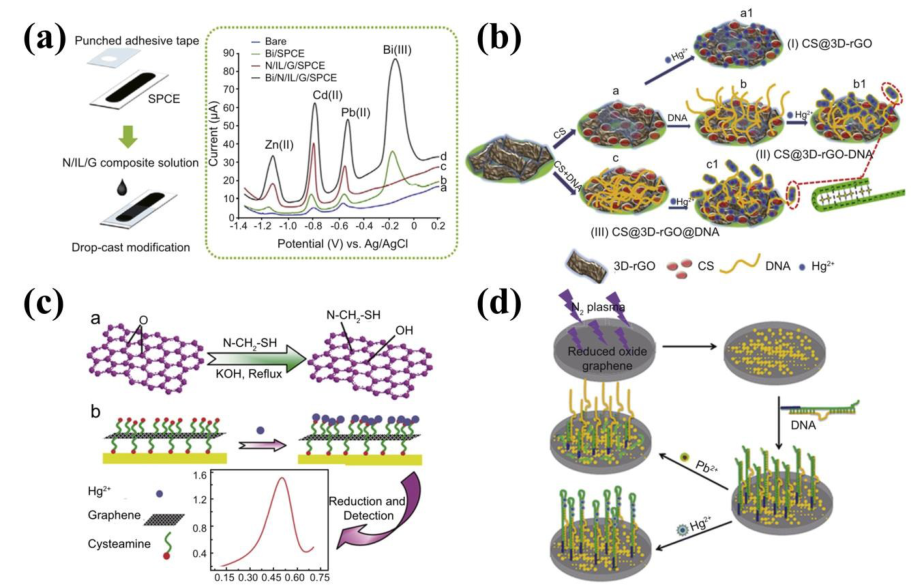

Fig. 11 (a) Diagram representation of graphene-based tailored electrode for Zn(II), Cd(II) and Pd(II) detection. (b) Schematic representation of the reaction events for Hg2þ detection. (c) Schematic illustration of Hg2þ detection using the CS@3D-rGO@DNA nano-composite based electrochemical biosensor.(d) Schematic representation of Pb2þ and Hg2þ detection. 

**14** | _J. Name_ ., 2019, **00** , 1-3 

This journal is © The Royal Society of Chemistry 20xx 

Please do not adjust margins 

> Page 15 of 26 Please do not adjust margins Nanoscale 

**ARTICLE** 

## **Journal Name** 

recognition limit with high repeatability and selectivity, which could decide Hg2þ in tap water and other water samples. View Article Online[49] In Fig. 11d, Zhang's group immobilized both particle explicit DNA and DNAzyme on amino-functionalized rGO tailored cathode to DOI: 10.1039/C9NR10178K specifically distinguish Lead (II) and Mercury (II).[220] Life threatening condition such as heart and kidney failure can be the result of lopsidedness of ionic electrolyte in the body as they are essential for cell signaling and cell functioning. Hence, it is subsequently important for electrochemical sensors to check the required electrolytic concentration in biological samples to maintain the balance. The proposed 2D nanomaterial based electrochemical sensors are capable of tracing metal ions in soil and drinking water with better sensitivity and selectivity. 

## **4.2.2 Detection of organic compounds.** 

The expanding issues in the previous decades are the release of natural mixes from the mechanical waste and degradation of concoction based household waste. For instance, CC (1,2-dihydroxybenzene, Catechol) is a phenolic compound having high lethality and low degradability which is broadly utilized in color, oil processing plant, plastic, cancer prevention agent, beauty care products, medical drugs, pesticides, and photography. Expanded amassing of CC is responsible for eczematous dermatitis, the depletion of the focal sensory system (CNS)and delayed ascent of circulatory strain. 2D materials, e.g. graphene and MoS 2 are broadly utilized to build electrochemical sensors for natural compounds detection.[221] Wang's group utilized diverse metal nanoparticles-upheld MoS2nano-composites as a detecting stage for CC detection towards an objective to improve sensitivity towards toxic organic compounds.  Fig. 12a shows the synergistic impact, the sensing performance of modified electrode using gold-platinum nanoparticles on MoS2nanosheet (MoS2-Au@Pt) was found to be superior than pristine MoS2nanosheet based electrode. The contamination of CC in river water and tap water could be identified with the MoS2-Au@Pt based tailored electrode.[222] Reduced graphene oxide (rGO), Ag NP/polydopamine graphene, Au NP/graphene, and so forth are numerous graphenes based nonmaterial, which were utilized to detect CC with high affectability. It ought to be noticed that catechol and hydroquinone (HQ) regularly exist together in light of the fact that they are two dihydroxybenzene isomers, because of their overlap peak at the ordinary anode; it is hard to detect CC and HQ separately. Accordingly, Hg2þ 2D nanomaterials-based electrode space an approach to distinguish them at the same time. By utilizing the cyclic voltammetric (CV) strategy, Ma et al. built up a Au/graphene nanocomposite tailored electrode to distinguish CC and HQ(Fig. 12b).[223] 

_J. Name_ ., 2019, **00** , 1-3 | **15** 

This journal is © The Royal Society of Chemistry 20xx 

Please do not adjust margins 

Please do not adjust margins Nanoscale 

Page 16 of 26 

## **ARTICLE** 

## **Journal Name** 

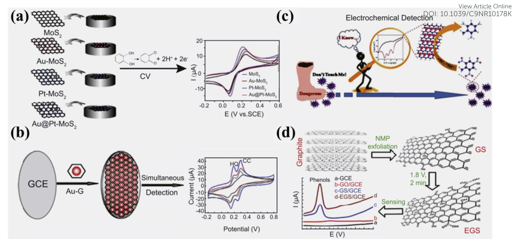

**----- Start of picture text -----** 
View Article Online DOI: 10.1039/C9NR10178K **----- End of picture text -----** 

Fig. 12 (a) Schematic representation of electrochemical sensors based on MoS2 for CC detection. (b) Representation of graphene based electrochemical sensors for detection of CC and HQ simultaneously. (c) Schematic of graphene NR supported PtPd concave nano-cub. 

2D nanomaterial-based electrochemical sensors are also used to identify nitroaromatic compounds. Chen's group found that PtPd with grapheme nanocomposite based modified electrode cathode had a higher current signal for 2,4,6-trinitrotoluene (TNT) identification than pristine graphene-based electrode (Fig. 12c). Wang's, Pumera's, Yang's and Xia's group likewise utilized comparative sensing technique for TNT detection. 

As referenced above, the presence of various sort of explosives as 2,4-dinitrotoluene (2,4-DNT), 1,3-dinitrobenzene (1,3-DNB), and 1,3,5-trinitrobenzene (TNB) can be controlled by utilizing graphene or graphene-based nano-composites tailored electrode, Guo et. al., utilized porphyrin functionalized graphene-adjusted terminal to screen nitroaromatic explosives, which could identify as low as 1 ppb of 2,4-DNT, 0.5 ppb of TNT, 1 ppb of TNB and 2 ppb of 1,3-DNB, respectively.[224] Other natural mixes have likewise been identified by 2Dnanomaterials-based electrochemical sensors, for example, p-dihydroxybenzene, nitromethane, 4- chlorophenol, 4-nitrophenol, honokiol, bisphenol-A and so on. As described in Fig.12d, one-advance N-methyl-2-pyrrolidone (NMP) peeled grapheme nanosheets as sensing stage for phenols discovery, including hydroquinone, catechol, 4-chlorophenol, and 4-nitrophenol was utilized by Wu et al., utilizing multistep substance oxidation, NMP-shed grapheme nanosheets demonstrated better electrocatalytic movement toward the oxidation of phenols.[220, 225] Layered MoS2 and graphene composite as a detecting stage was utilized for acetaminophen recognition, created by Huang and specialist. Fantastic recognition execution of the created sensor was ascribed to the vigorous composite structure and the synergistic impact of MoS2 and grapheme.[226] Different nanocomposite based modified electrodes have been reported to be used for electrochemical sensors to maximize or improve their selectivity and responsivity. 2D nanocomposite based electrochemical sensors have proven to be better sensors than conventional sensors in terms of distinguishing various organic compounds present in environment or human body. It is also been shown that pristine nanomaterial based electrode are lesser effective than blended nanocomposites based modified electrodes for the detection of different organic compounds. Further development and improvements can be foreseen useful in commercialization and serve the purpose of health and environment monitoring. 

## **4.2.3 Detection of pesticides.** 

**16** | _J. Name_ ., 2019, **00** , 1-3 

This journal is © The Royal Society of Chemistry 20xx 

Please do not adjust margins 

> Page 17 of 26 Please do not adjust margins Nanoscale 

**ARTICLE** 

## **Journal Name** 

Contamination brought about by pesticides, mainly organo-phosphorus pesticides, is gravely destructive to human and animal View Article Online wellbeing. Pesticides effectively gather on leaves of vegetables and organic products, prompting possibly unsafe to buyers since DOI: 10.1039/C9NR10178K they cause an unfriendly impact on the capacity of the human body and even passing by means of the hindrance of acetylcholinesterase (AChE) action. Electrochemical sensors for pesticides detection have had a decent amount of utilizing low 

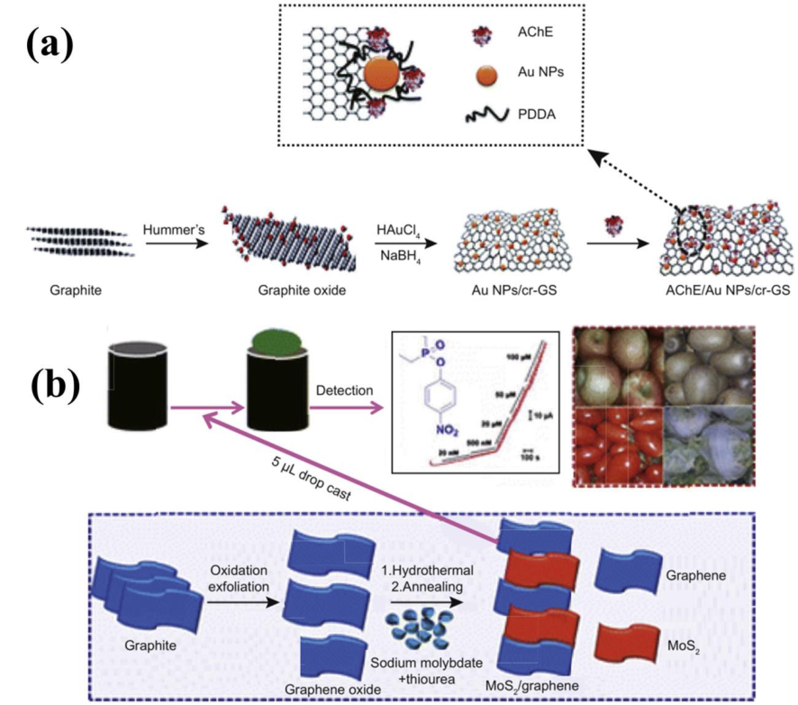

Fig. 13 (a) Representation of AChE/AuNPs/cr-Gs assembly for pesticide detection using PDDA. (b) A dependable and strong methylparathion sensor using heterostructured MoS2/graphene nanocomposite assembly. 

dimensional material and their device congregations.[227] As shown in Fig.13a, AChE on gold nanoparticles and graphene oxides a nanosheet (AChE/AuNPs/cr-Gs) was developed by Lin and co-worker to sense the presence of organophosphate pesticide. They also used graphene-based nanocomposite to detect paraoxon-ethyl, which was exceptionally delicate and rapid.[228] In 2016, Moga et al. detected chlorpyrifos by immobilizing AChE in zirconium oxide and rGO nanohybrid.[229] Numerous pesticides, for example, dichlorvos, methyl parathion, carbofuran, triazophos have been distinguished by utilizing the equivalent electrochemical sensors. Wang and collaborators built up a non-enzymatic electrochemical sensor for carbofuran (CBF) and carbaryl (CBR) detection using (rGO /CoO) nanocomposite to diminish the negative impact of Ache. The non-enzymatic Ache based electrochemical sensor could at the same time show the presence of CBF and CBR with high affectability, selectivity, and steadiness. Significantly, the results from the 2d based electrochemical sensor showed equally good outcome as reported for High-performance fluid chromatography (HPLC).[152] MoS2-graphene nanocomposite based non-enzymatic electrochemical sensor for organophosphate pesticides was developed by Chen's group (Fig. 13b).[220] The non-enzymatic sensor indicated recuperations of MP discovery in homogenized fruits like kiwi, apple, tomato, and cabbage samples.[230] Similarly, non-enzymatic electrochemical sensors using graphene effectively detected isoproturon (CH18N2O, urea), carbendazim (C9H9N3O2), methyl parathion (Azophos, C8H10NO15HP), fenitrothion (C9H12NO5PS) , and paraoxon (C10H14NO6P).[231] Detecting the presence of harmful and toxic pesticides in the food products using 2D based electroche, mical sensors have been reported by many research group as the result from 2D based electrochemical sensor showed equally good outcome as reported for High-performance fluid chromatography (HPLC). The detection limits have also been improved and lowered using 2D nanomaterials. These sensors can help the organizations to limit the usage of pesticides on plants and food products as they can lead severe health issues. 

_J. Name_ ., 2019, **00** , 1-3 | **17** 

This journal is © The Royal Society of Chemistry 20xx 

Please do not adjust margins 

Please do not adjust margins Nanoscale 

Page 18 of 26 

**Journal Name** 

**ARTICLE** 

## **4.2.4 Detection of antibiotic.** 

View Article Online 

Antibiotic is considered as a sort of serious contamination because of its over abused use in human and animals at the same DOI: 10.1039/C9NR10178K time. As we are probably aware, antibiotics are frequently utilized to treat illnesses but over the time hearing misfortune, poisonous quality to kidneys and poor reaction to illness treatment are are occurring common  medical problems due to steadily buildup in sustenance items. Hints of a few anti-infection agents, like metronidazole, chloramphenicol,[232] midecamycin,[233] azithromycin,[234] penicillin,[235] linezolid,[236] antibiotic medication,[237] levofloxacin,[238] and ofloxacin[239] were distinguished by the electrochemical method. Zhang and his group identified metronidazole using electrochemical sensor based on petal-like decorated silver on graphene (Fig. 14a). Besides, they additionally talked about the process of electron transfer in the electrochemical sensor[239] . MoS2/polyaniline nanocomposite, as an electrochemical detecting material was utilized by Chen et al. to sense chloramphenicol. Pei and collaborators manufactured an electrochemical apta-sensors for kanamycin anti-microbial recognition by utilizing thionine-improved graphene and PtCu alloy (Fig. 14b). 

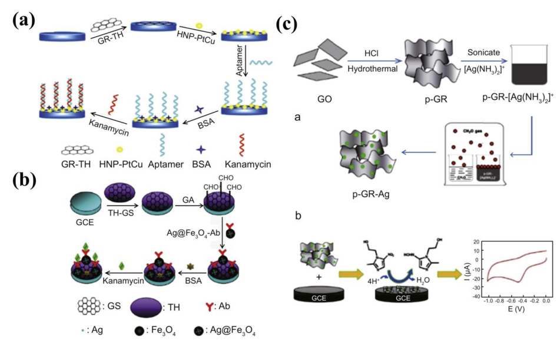

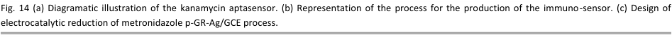

**----- Start of picture text -----** 
Fig. 14 (a) Diagramatic illustration of the kanamycin aptasensor. (b) Representation of the process for the production of the immuno-sensor. (c) Design of electrocatalytic reduction of metronidazole p-GR-Ag/GCE process. **----- End of picture text -----** 

The developed aptasensor demonstrated a wide direct range and low identification limit with great selectivity and sensitivity.[240] Thus, Guo and colleagues utilized graphene based nanocomposites to develop electrochemical apta-sensors for the identification of penicillin.[241] Other than apta-sensor, Wei et al. built up an immune-sensor for the label free presence of kanamycin based on graphene sheet/Nafion/thionine/Ptnano-particles composite (GS-Nf/TH/Pt). The great electron exchange capacity of graphene and Pt NPs extraordinarily increased the peak current of TH, prompting the great performance of the structured immunosensor for kanamycin-sensing. In the sequential year, Wei's gathering build graphene based immunosensor to check the presence of kanamycin (Fig. 14c).[220] They found the built immunosensor could proficiently show the presence of kanamycin in meat because of its high affectability, selectivity, and short examination time (3 min).[242] Though antibiotics are used to treat illness but if the dose is higher than required than it can eliminate the micro-organisms which are beneficiary for human or animal bodily function. Hence, checking on the dose or content of the antibiotic is equally important. 2D based electrochemical sensors serves the purpose of detecting it with good selectivity and responsivity. 

## **4.2.5 Detection of bacteria.** 

Microbiological contamination, particularly bacterial contamination, has pulled in increasingly more consideration since it can source of food and water-borne illnesses. Staphylococcus aureus (S. aureus) is a gram-positive bacterium, which is disseminated in air, drinking water, and transitory sustenance. As shown in Fig.15a, based on aptamer and graphene, Lian et al. built up a rapid electrochemical sensor for S. aureus presence in food items and its detection in low detection limit in milk.[51] . So also, using gold nanoparticles embellished graphene oxide (GO-Au/NPs), Wang's group built an impedimetric aptasensor for S. aureus.[243] A label free impedimetric invulnerable sensor for Escherichia coli O157: H7 utilizing gold nanoparticles bolstered graphene paper 

**18** | _J. Name_ ., 2019, **00** , 1-3 

This journal is © The Royal Society of Chemistry 20xx 

Please do not adjust margins 

> Page 19 of 26 Please do not adjust margins Nanoscale 

**ARTICLE** 

## **Journal Name** 

(AuNPs-GP) was created by Ying's group. Signal amplification and particular signal slicing techniques were slowly utilized to View Article Online improve micro organisms detection execution. Sulfonated graphene-based brightened gold nanoparticles, Wang and his group DOI: 10.1039/C9NR10178K built up an electrochemical immune sensor to break down for E. coli O157: H7. As appeared in Fig. 15b, a traditional sandwichtype immune sensor shaped within the sight of E. coli O157:H7. 

Other than S. aureus and E. coli, other microscopic organisms, for example, Genus shewanella,[244] Staphylococcus arlettae,[245] 

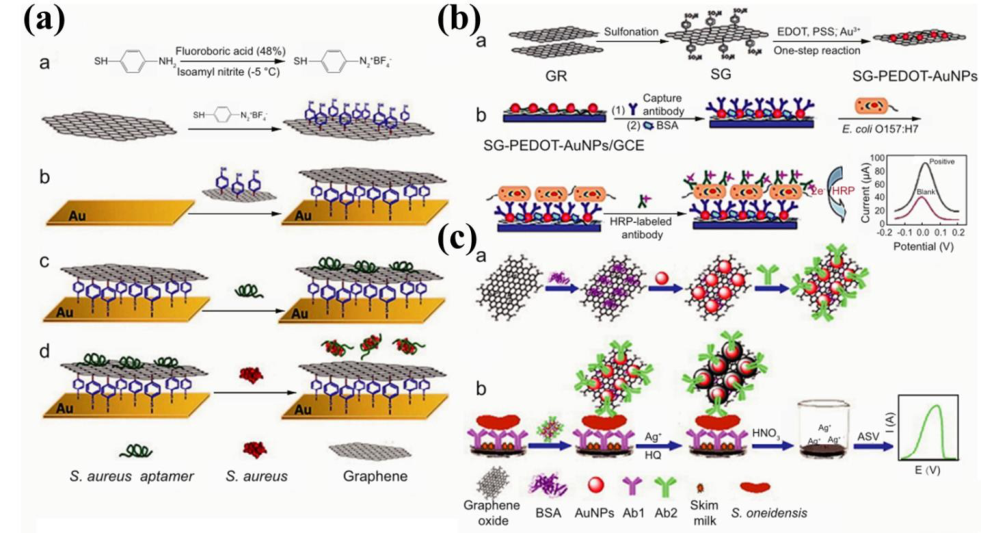

Fig. 15 (a) Illustration of electrochemical sensor mechanism for S. aureus detection. (b) Diagram of mechanism involved for tailored electrode using sulfonated graphene-poly-(3,4-ethylenedioxythiophene)-gold nanoparticles (SG-PEDOT-AuNPs) detection of E. coli O157:H7. (c) Illustration of the procedure of the electrochemical sensor for detection of Shewanella oneidensis. 

Salmonella pullorum,[246] Enterobactersakazakii,[247] Salmonella,[248] Mycobacterium tuberculosis,[249] etc, were additionally delicately and specifically controlled by 2D materials based electrochemical sensors. As appeared in Fig. 15c, established sandwich-type based graphene-based nano-enhancer was developed by Wen et al. to recognize Shewanella oneidensis with ultra sensitivity.[220] Techniques that allows the precise tuning of size, shape, morphology and structure of 2D nanomaterials may facilitate their incorporation into integral electrochemical immune sensors and would provide the favorable conditions for sensing bacteria in the environment. Implanting gold, platinum, aluminum and other nanoparticles on 2D nanomaterials can enhance their detection limit by increasing their reactivity towards biological samples. 

## **5. Future perspectives** 

Graphene, Graphene derivatives (graphene oxide, reduced graphene oxide) and other 2D materials (black phosphorus, TMDCs, h-BN, _etc_ .) exhibit exclusive material properties. The suffieciently large  surface to volume ratio which enabled these nanomaterials to be used in broad range of applications such as  storage and conversion of energy, health and environmental monitoring, photodetectors, medicines, _etc_ . Tuningtheir morphological structure and the morphology of their assembly, not only provides greater opportunity to understand the basic phenomenon in physics but also enhances their performance in every application. 

In future, we need to focus on overcoming the challenges of lower detection limit, selectivity, instability of some materials, and elimination of undesired contamination affecting performances of the sensor. Sensors based on 2D nanomaterial have detection limit parts per billion and can be lowered to parts per trillion by incorporating UV light in sensors or by purifying the gases as they can in-situ clean the sensing material.[250] Adding dopants or defects can also improve the detection limit as it facilitates better interaction between modified 2D material and gases due to effective charge transfer.[251] A major aspect still overlooked by the researches and the industries is their biocompatibility and their effect on the environment once they run out of their lifetime. Selectivity challenge, _i.e._ , the inability of the sensor to distinguish detected particle can be solved by methods like controlling temperature, using filters and manipulation of electronic noise. Doping 2D material with metal, MOs and polymer is another approach to enhance the selectivity performance as they alter the interaction process between 2D material and particles/gases. The stability of materials used for sensing is a prerequisite for their practical applications. These materials that are unstable in the environment, such as BP, can be treated by means of polymer coating,[252] surface functionalization[55] and doping of other elements,[2] which can greatly improve their stability. The challenge for 2D materials based sensors in biomedical areas is 

_J. Name_ ., 2019, **00** , 1-3 | **19** 

This journal is © The Royal Society of Chemistry 20xx 

Please do not adjust margins 

Please do not adjust margins Nanoscale 

Page 20 of 26 

**Journal Name** 

## **ARTICLE** 

environmental stability. The interactions of 2D materials with complex biological environment cause degradation in performance of View Article Online sensors.[75] The environmental stability limits the application of 2D material in biosensors and needed to be overcome without affecting the DOI: 10.1039/C9NR10178K sensitivity and selectivity of the device which leads to detailed study of 2D materials stability and coating mechanisms. Biofouling is a condition where microorganisms, plants, algae, etc accumulate on any surface that has moisture or water, which in turn affects sensors performance. Polymer coating has been able to control biofouling to some extent.[253, 254] Graphene have been used by Han’s group as antifouling material and could treat saline water. Also, Feng Li’s group could show that layered materials properties have tremendous effect on permeability and anti fouling performance of hierarchal membrane. Applications like water filtration, water desalination, emulsified oil/water separation, etc have used antifouling properties of 2D materials[255, 256] and can be useful in addressing the problem of biofouling as well as degradation of stability. Elimination of unwanted contamination in the sensor is also highly required. Methods like annealing of sensor under vacuum are used to remove the contaminations which are induced in the sensorduring lithography or etching process. Understanding of interaction mechanisms between particles causing environmental pollution and 2Dmaterial is the key to maximize the performance of 2D material based sensors. Future progress in this area also needs to understand the intrinsic properties of 2D layered materials and the effect of molecules of specified samples on their properties, as well as the corresponding sensing mechanism. 

## **Conclusions** 

In this survey, we portrayed latest progress in the improvement in the field of sensors depending on the 2D materials to give a review of developments in the area extending from morphological features, device engineering, and so on. We likewise showed how structural and compositional highlights, just as surface science of 2D nanostructures, direct their electrical properties, eventually permitting captivating applications in the advancement of sensors. Explicit advances in the use of 2D nanomaterials in detecting were outlined with regards to five noteworthy group of analytes, including heavy metal particle, microorganisms, infrared, pesticides, and biomolecules, and talked about from both a recorded and logical point of view. Tuning over morphology, including dimension, thickness, crystallinity, designed deformities, by adding dopants, _etc._ , has been accomplished with late headways in the preliminary strategies for 2Dnanomaterials. Surface functionalization with added particles like nanoparticles, metal oxides or polymers caused improvement in sensing technology, for example, selectivity and affectability as they can be promptly possible by manufactured strategies 2D nanomaterials have nuclear thicknesses. A significant improvement in sensitivity is brought about by minimization of the thickness of the 2Dlayer which upgrades the surface-to-volume proportion. This must be improved with a better assembly of 2D nanoparticles for fabrication purposes. Structural deformities arise while synthesizing 2D materials can impact the electronic properties and therefore have an impact on sensing performance and these impacts need a more profound understanding as they may have both positive and negative response. Detecting advances and their relevance in the exponentially developing interest requires further development, research, and improvement for the large scale manufacturing of ultra-dainty epitaxially situated 2D materials with the desired structure in a very controllable way remains an agitated test in this field. To address these difficulties, thorough computational demonstrating together with an investigative evaluation of structural property via in situ transmission electron microscopy and other spectroscopic methods, in 2D materials are required. Structural disfigurements, material decay, and thermal hazards may happen to 2D nanostructures as they experience oxidation in surrounding conditions, thus restricting their application in commercialization. To stabilize these nanomaterials during the synthesis process is equally important as storing them. These difficulties might be overcome by the development of novel nanomaterials. 

The improvement of these detecting advances may prompt noteworthy advances in systematic advances, as far as ease of fabrication, low cost, and prevalent detecting performance. Although the investigation of new 2D nanostructures is still in the early periods of research, the extraordinary assorted variety of these materials that emerge from their interesting physical and compound structures is probably going to additionally combine their situation in the field of nanoscience, and it is likely that the business and modern advances will fuse them into across the board use in the coming many years **.** 

## **Conflicts of interest** 

There are no conflicts to declare. 

## **Acknowledgements** 

The research was partially supported by the Financial supports from the Science and Technology Development Fund (Nos. 007/2017/A1 and 132/2017/A3), Macao Special Administration Region (SAR), China, and National Natural Science Fund (Grant Nos. 61875138, 61435010, and 6181101252), and Science and Technology Innovation Commission of Shenzhen (KQTD2015032416270385 ， JCYJ20150625103619275, and JCYJ20170811093453105). Authors also acknowledge the support from Instrumental Analysis Center of Shenzhen University (Xili Campus). 

**20** | _J. Name_ ., 2019, **00** , 1-3 

This journal is © The Royal Society of Chemistry 20xx 

Please do not adjust margins 

> Page 21 of 26 Please do not adjust margins Nanoscale 

**ARTICLE** 

## **Journal Name** 

## **Notes and references** 

View Article Online DOI: 10.1039/C9NR10178K 

1. S. Su, W. Wu, J. Gao, J. Lu and C. Fan, _Journal of Materials Chemistry_ , 2012, **22** , 18101-18110. 

|1.|S. Su, W. Wu, J. Gao, J. Lu and C. Fan,_Journal of Materials Chemistry_, 2012,**22**, 18101-18110.|
|---|---|
|2.|Y. Ge, S. Chen, Y. Xu, Z. He, Z. Liang, Y. Chen, Y. Song, D. Fan, K. Zhang and H. Zhang,_Journal of Materials Chemistry C_, 2017,**5**,|
||6129-6135.|
|3.|Y. Zhao, F. Chen, Q. Zhang, Y. Zhao, X. Zuo and C. Fan,_NPG Asia Materials_, 2014,**6**, e131.|
|4.|Y. Tian, Y. Wang, Y. Xu, Y. Liu, D. Li and C. Fan,_Science China Chemistry_, 2015,**58**, 514-518.|
|5.|P. Wang, Y. Wan, A. Ali, S. Deng, Y. Su, C. Fan and S. Yang,_Science China Chemistry_, 2016,**59**, 237-242.|
|6.|H. Xu, P. Xu, S. Gao, S. Zhang, X. Zhao, C. Fan and X. Zuo,_Biosensors and Bioelectronics_, 2013,**47**, 520-523.|
|7.|M. Labib, E. H. Sargent and S. O. Kelley,_Chemical reviews_, 2016,**116**, 9001-9090.|
|8.|Y. Wan, Y. Su, X. Zhu, G. Liu and C. Fan,_Biosensors and Bioelectronics_, 2013,**47**, 1-11.|
|9.|K. Ueno, K. Sasaki, K. Saiki and A. Koma,_Japanese journal of applied physics_, 1999,**38**, 511.|
|10.|S. Yang, F. Guo, B. Kiraly, X. Mao, M. Lu, K. W. Leong and T. J. Huang,_Lab on a Chip_, 2012,**12**, 2097-2102.|
|11.|S. Su, Y. He, M. Zhang, K. Yang, S. Song, X. Zhang, C. Fan and S.-T. Lee,_Applied Physics Letters_, 2008,**93**, 023113.|
|12.|J.-H. Chen, C. Jang, S. Xiao, M. Ishigami and M. S. Fuhrer,_Nature nanotechnology_, 2008,**3**, 206.|
|13. 14. 15. 16. 17. 18. 19. 20. 21. 22. 23. 24. 25. 26. 27. 28. 29. 30. 31. 32. 33. 34. 35. 36.|Y. Dou, Z. Jiang, W. Deng, J. Su, S. Chen, H. Song, A. Aldalbahi, X. Zuo, S. Song and J. Shi,_Journal of Electroanalytical Chemistry_, 2016,**781**, 339-344. P. Kvasnička and J. Homola,_Biointerphases_, 2008,**3**, FD4-FD11. A. A. Ismail and D. W. Bahnemann,_Solar Energy Materials and Solar Cells_, 2014,**128**, 85-101. J.-Q. Xi, J. K. Kim and E. F. Schubert,_Nano Letters_, 2005,**5**, 1385-1387. H. Chang and H. Wu,_Energy & Environmental Science_, 2013,**6**, 3483-3507. F. Perreault, A. F. De Faria and M. Elimelech,_Chemical Society Reviews_, 2015,**44**, 5861-5896. Y. Chen, C. Zhao, S. Chen, J. Du, P. Tang, G. Jiang, H. Zhang, S. Wen and D. Tang,_Ieee Journal Of Selected Topics In Quantum_ _Electronics_, 2014,**21**, 116-122. H. Mu, Z. Wang, J. Yuan, S. Xiao, C. Chen, Y. Chen, Y. Chen, J. Song, Y. Wang, Y. Xue, H. Zhang and Q. Bao,_ACS Photonics_, 2015,**2**, 832-841. Q. Wang, Y. Chen, L. Miao, G. Jiang, S. Chen, J. Liu, X. Fu, C. Zhao and H. Zhang,_Optics Express_, 2015,**23**, 7681-7693. A. N. Abbas, B. Liu, L.  hen,  . Ma, S.  ong, N. Aroonyadet, M. K pf,  . Nilges and  .  hou,_ACS Nano_, 2015,**9**, 5618-5624. J. Bullock, M. Amani, J. Cho, Y.-Z. Chen, G. H. Ahn, V. Adinolfi, V. R. Shrestha, Y. Gao, K. B. Crozier and Y.-L. Chueh,_Nature_ _Photonics_, 2018,**12**, 601. M. Buscema, D. J. Groenendijk, S. I. Blanter, G. A. Steele, H. S. J. van der Zant and A. Castellanos-Gomez,_Nano Letters_, 2014,**14**, 3347-3352. Q. Guo, A. Pospischil, M. Bhuiyan, H. Jiang, H. Tian, D. Farmer, B. Deng, C. Li, S.-J. Han, H. Wang, Q. Xia, T.-P. Ma, T. Mueller and F. Xia,_Nano Letters_, 2016,**16**, 4648-4655. Z. Guo, S. Chen, Z. Wang, Z. Yang, F. Liu, Y. Xu, J. Wang, Y. Yi, H. Zhang, L. Liao, P. K. Chu and X.-F. Yu,_Advanced Materials_, 2017, **29**, 1703811. M. Qiu, D. Wang, W. Liang, L. Liu, Y. Zhang, X. Chen, D. K. Sang, C. Xing, Z. Li, B. Dong, F. Xing, D. Fan, S. Bao, H. Zhang and Y. Cao, _Proceedings Of the National Academy Of Sciences Of the United States Of America_, 2018,**115**, 501-506. X. Gan, H. Zhao and X. Quan,_Biosensors & Bioelectronics_, 2017,**89**, 56-71. W. Han, C. Zang, Z. Huang, H. Zhang, L. Ren, X. Qi and J. Zhong,_International Journal Of Hydrogen Energy_, 2014,**39**, 19502-19512. D. J. Late, Y.-K. Huang, B. Liu, J. Acharya, S. N. Shirodkar, J. Luo, A. Yan, D. Charles, U. V. Waghmare and V. P. Dravid,_ACS Nano_, 2013,**7**, 4879-4891. J. Zhao, N. Li, H. Yu, Z. Wei, M. Liao, P. Chen, S. Wang, D. Shi, Q. Sun and G. Zhang,_Advanced Materials_, 2017,**29**, 1702076. J. Lu, K. Zhang, X. F. Liu, H. Zhang, T. C. Sum, A. H. Castro Neto and K. P. Loh,_Nature Communications_, 2013,**4**, 2681. T. T. Lv, Y. X. Li, H. F. Ma, Z. Zhu, Z. P. Li, C. Y. Guan, J. H. Shi, H. Zhang and T. J. Cui,_Scientific Reports_, 2016,**6**, 23186. Z. Zhang, Y. Liu, L. Ren, H. Zhang, Z. Huang, X. Qi, X. Wei and J. Zhong,_Electrochimica Acta_, 2016,**200**, 142-151. X. Ren, J. Zhou, X. Qi, Y. Liu, Z. Huang, Z. Li, Y. Ge, S. C. Dhanabalan, J. S. Ponraj, S. Wang, J. Zhong and H. Zhang,_Advanced Energy_ _Materials_, 2017,**7**, 1700396. S. J. Kim, H.-J. Koh, C. E. Ren, O. Kwon, K. Maleski, S.-Y. Cho, B. Anasori, C.-K. Kim, Y.-K. Choi, J. Kim, Y. Gogotsi and H.-T. Jung,_Acs_ _Nano_, 2018,**12**, 986-993.|
|37.|Y. Cai, J. Shen, G. Ge, Y. Zhang, W. Jin, W. Huang, J. Shao, J. Yang and X. Dong,_Acs Nano_, 2018,**12**, 56-62.|
|38.|X. Jiang, S. Liu, W. Liang, S. Luo, Z. He, Y. Ge, H. Wang, R. Cao, F. Zhang, Q. Wen, J. Li, Q. Bao, D. Fan and H. Zhang,_Laser &_|
||_Photonics Reviews_, 2018,**12**, 1700229.|
|39.|P. Yan, R. Lin, H. Chen, H. Zhang, A. Liu, H. Yang and S. Ruan,_Ieee Photonics Technology Letters_, 2015,**27**, 264-267.|
|40.|L. Lu, Z. Liang, L. Wu, Y. Chen, Y. Song, S. C. Dhanabalan, J. S. Ponraj, B. Dong, Y. Xiang, F. Xing, D. Fan and H. Zhang,_Laser &_|
||_Photonics Reviews_, 2018,**12**, 1700221.|
|41.|L. Lu, X. Tang, R. Cao, L. Wu, Z. Li, G. Jing, B. Dong, S. Lu, Y. Li, Y. Xiang, J. Li, D. Fan and H. Zhang,_Advanced Optical Materials_,|
||2017,**5**, 1700301.|
|42.|Y. Jiang, L. Miao, G. Jiang, Y. Chen, X. Qi, X.-f. Jiang, H. Zhang and S. Wen,_Scientific Reports_, 2015,**5**, 16372.|
|43.|Z. Guo, H. Zhang, S. Lu, Z. Wang, S. Tang, J. Shao, Z. Sun, H. Xie, H. Wang, X.-F. Yu and P. K. Chu,_Advanced Functional Materials_,|
||2015,**25**, 6996-7002.|
|44.|S. C. Dhanabalan, J. S. Ponraj, Z. Guo, S. Li, Q. Bao and H. Zhang,_Advanced Science_, 2017,**4**, 1600305.|

_J. Name_ ., 2019, **00** , 1-3 | **21** 

This journal is © The Royal Society of Chemistry 20xx 

Please do not adjust margins 

Please do not adjust margins Nanoscale 

Page 22 of 26 

## **ARTICLE** 

**Journal Name** 

|45.|X. Ren, Z. Li, Z. Huang, D. Sang, H. Qiao, X. Qi, J. Li, J. Zhong and H. Zhang,_Advanced Functional Materials_, 2017,**27**, 1606834. View Article Online|
|---|---|
|46.|R. Wang, X. Li, Z. Wang and H. Zhang,_Nano Energy_, 2017,**34**, 131-140. DOI: 10.1039/C9NR10178K|
|47.|P. Wan, X. Wen, C. Sun, B. K. Chandran, H. Zhang, X. Sun and X. Chen,_Small_, 2015,**11**, 5409-5415.|
|48.|T. Wang, Y. Guo, P. Wan, H. Zhang, X. Chen and X. Sun,_Small_, 2016,**12**, 3748-3756.|
|49.|S. Yang, Y. Liu, W. Chen, W. Jin, J. Zhou, H. Zhang and G. S. Zakharova,_Sensors And Actuators B-Chemical_, 2016,**226**, 478-485.|
|50.|J. Shao, L. Tong, S. Tang, Z. Guo, H. Zhang, P. Li, H. Wang, C. Du and X.-F. Yu,_Acs Applied Materials & Interfaces_, 2015,**7**, 5391-|
||5399.|
|51.|S. Bai, C. Sun, H. Yan, X. Sun, H. Zhang, L. Luo, X. Lei, P. Wan and X. Chen,_Small_, 2015,**11**, 5807-5813.|
|52.|H.-D. Wang, D. K. Sang, Z.-N. Guo, R. Cao, J.-L. Zhao, M. N. U. Shah, T.-J. Fan, D.-Y. Fan and H. Zhang,_Chinese Physics B_, 2018,**27**,|
||087308.|
|53.|W. Tao, X. Ji, X. Xu, M. A. Islam, Z. Li, S. Chen, P. E. Saw, H. Zhang, Z. Bharwani, Z. Guo, J. Shi and O. C. Farokhzad,_Angewandte_|
||_Chemie-International Edition_, 2017,**56**, 11896-11900.|
|54.|H. Xie, Z. Li, Z. Sun, J. Shao, X.-F. Yu, Z. Guo, J. Wang, Q. Xiao, H. Wang, Q.-Q. Wang, H. Zhang and P. K. Chu,_Small_, 2016,**12**, 4136-|
||4145.|
|55.|Z. Sun, Y. Zhao, Z. Li, H. Cui, Y. Zhou, W. Li, W. Tao, H. Zhang, H. Wang, P. K. Chu and X.-F. Yu,_Small_, 2017,**13**, 1602896.|
|56. 57. 58. 59. 60. 61. 62. 63. 64. 65. 66. 67. 68. 69. 70. 71. 72. 73. 74. 75. 76. 77. 78. 79. 80. 81. 82. 83.|C. Xing, G. Jing, X. Liang, M. Qiu, Z. Li, R. Cao, X. Li, D. Fan and H. Zhang,_Nanoscale_, 2017,**9**, 8096-8101. C. Zhu, D. Du and Y. Lin,_Biosensors & Bioelectronics_, 2017,**89**, 43-55. A. Hirsch and F. Hauke,_Angewandte Chemie International Edition_, 2018,**57**, 4338-4354. D. Xiang, X. Wang, C. Jia, T. Lee and X. Guo,_Chemical Reviews_, 2016,**116**, 4318-4440. C.-H. M.  huang, P. R. Brown, V. Bulovid and M. G. Bawendi,_Nature materials_, 2014,**13**, 796. S. Pedireddy, H. K. Lee, W. W. Tjiu, I. Y. Phang, H. R. Tan, S. Q. Chua, C. Troadec and X. Y. Ling,_Nature communications_, 2014,**5**, 4947. Z. Yue, F. Lisdat, W. J. Parak, S. G. Hickey, L. Tu, N. Sabir, D. Dorfs and N. C. Bigall,_ACS applied materials & interfaces_, 2013,**5**, 2800-2814. L. Yildirimer, N. T. Thanh, M. Loizidou and A. M. Seifalian,_Nano today_, 2011,**6**, 585-607. E. Comini and G. Sberveglieri,_Materials Today_, 2010,**13**, 36-44. X. Zhao, B. Cai, Q. Tang, Y. Tong and Y. Liu,_Sensors_, 2014,**14**, 13999-14020. K. J. Choi and H. W. Jang,_Sensors_, 2010,**10**, 4083-4099. X. Liu, T. Ma, N. Pinna and J. Zhang,_Advanced Functional Materials_, 2017,**27**, 1702168. G. Neri,_Chemosensors_, 2017,**5**, 21. C. Tan, X. Cao, X.-J. Wu, Q. He, J. Yang, X. Zhang, J. Chen, W. Zhao, S. Han and G.-H. Nam,_Chemical reviews_, 2017,**117**, 6225- 6331. S. Varghese, S. Varghese, S. Swaminathan, K. Singh and V. Mittal,_Electronics_, 2015,**4**, 651-687. L. E. Kreno, K. Leong, O. K. Farha, M. Allendorf, R. P. Van Duyne and J. T. Hupp,_Chemical reviews_, 2011,**112**, 1105-1125. C. e. N. e. R. Rao, A. e. K. Sood, K. e. S. Subrahmanyam and A. Govindaraj,_Angewandte Chemie International Edition_, 2009,**48**, 7752-7777. Y. Sun, F. Lei, S. Gao, B. Pan, J. Zhou and Y. Xie,_Angewandte Chemie International Edition_, 2013,**52**, 10569-10572. F. Xia, H. Wang, D. Xiao, M. Dubey and A. Ramasubramaniam,_Nature Photonics_, 2014,**8**, 899. R. Kurapati, K. Kostarelos, M. Prato and A. Bianco,_Advanced Materials_, 2016,**28**, 6052-6074. X. Cao, A. Halder, Y. Tang, C. Hou, H. Wang, J. O. Duus and Q. Chi,_Materials Chemistry Frontiers_, 2018,**2**, 1944-1986. M. Zeng, Y. Xiao, J. Liu, K. Yang and L. Fu,_Chemical reviews_, 2018,**118**, 6236-6296. S. Xu, Z. Yan, K.-I. Jang, W. Huang, H. Fu, J. Kim, Z. Wei, M. Flavin, J. McCracken and R. Wang,_Science_, 2015,**347**, 154-159. K. S. Novoselov, A. K. Geim, S. V. Morozov, D. Jiang, Y. Zhang, S. V. Dubonos, I. V. Grigorieva and A. A. Firsov,_science_, 2004,**306**, 666-669. I. V. Vlassiouk, Y. Stehle, P. R. Pudasaini, R. R. Unocic, P. D. Rack, A. P. Baddorf, I. N. Ivanov, N. V. Lavrik, F. List and N. Gupta, _Nature materials_, 2018, 17, 318 A. C. Neto, F. Guinea, N. M. Peres, K. S. Novoselov and A. K. Geim,_Reviews of modern physics_, 2009,**81**, 109. M. Pumera, A. Ambrosi, A. Bonanni, E. L. K. Chng and H. L. Poh,_TrAC Trends in Analytical Chemistry_, 2010,**29**, 954-965. J. Zhu, D. Yang, Z. Yin, Q. Yan and H. Zhang,_Small_, 2014,**10**, 3480-3498.|
|84.|A. Khandelwal, K. Mani, M. H. Karigerasi and I. Lahiri,_Materials Science and Engineering: B_, 2017,**221**, 17-34.|
|85.|Y. Lin, T. V. Williams and J. W. Connell,_The Journal of Physical Chemistry Letters_, 2009,**1**, 277-283.|
|86.|C. Tan and H. Zhang,_Chemical Society Reviews_, 2015,**44**, 2713-2731.|
|87.|S. Balendhran, S. Walia, H. Nili, J. Z. Ou, S. Zhuiykov, R. B. Kaner, S. Sriram, M. Bhaskaran and K. Kalantar‐zadeh,_Advanced_|
||_Functional Materials_, 2013,**23**, 3946-3946.|
|88.|M. Ko, L. Mendecki and K. A. Mirica,_Chemical Communications_, 2018,**54**, 7873-7891.|
|89.|E. Jin, M. Asada, Q. Xu, S. Dalapati, M. A. Addicoat, M. A. Brady, H. Xu, T. Nakamura, T. Heine and Q. Chen,_Science_, 2017,**357**,|
||673-676.|
|90.|Y. Liu, N. O. Weiss, X. Duan, H.-C. Cheng, Y. Huang and X. Duan,_Nature Reviews Materials_, 2016,**1**, 16042.|
|91.|L. Gao,_Small_, 2017,**13**, 1603994.|
|92.|A. J. Bandodkar, I. Jeerapan and J. Wang,_Acs Sensors_, 2016,**1**, 464-482.|
|93.|F. Bonaccorso, L. Colombo, G. Yu, M. Stoller, V. Tozzini, A. C. Ferrari, R. S. Ruoff and V. Pellegrini,_Science_, 2015,**347**, 1246501.|
|94.|C. Lee, X. Wei, J. W. Kysar and J. Hone,_science_, 2008,**321**, 385-388.|

**22** | _J. Name_ ., 2019, **00** , 1-3 

This journal is © The Royal Society of Chemistry 20xx 

Please do not adjust margins 

> Page 23 of 26 Please do not adjust margins Nanoscale 

**ARTICLE** 

## **Journal Name** 

95. M. Lotya, Y. Hernandez, P. J. King, R. J. Smith, V. Nicolosi, L. S. Karlsson, F. M. Blighe, S. De, Z. Wang and I. McGovern, View Article Online _Journal of the American Chemical Society_ , 2009, **131** , 3611-3620. DOI: 10.1039/C9NR10178K 

96. K. S. Kim, Y. Zhao, H. Jang, S. Y. Lee, J. M. Kim, K. S. Kim, J.-H. Ahn, P. Kim, J.-Y. Choi and B. H. Hong, _nature_ , 2009, **457** , 706. 

97. A.-F. Tran-Van and H. A. Wegner, in _Polyarenes I_ , Springer, 2013, pp. 121-157. 

98. J. Wu, W. Pisula and K. Müllen, _Chemical reviews_ , 2007, **107** , 718-747. 

99. Y. Zhang, L. Zhang and C. Zhou, _Accounts of chemical research_ , 2013, **46** , 2329-2339. 

100. M. J. Allen, V. C. Tung and R. B. Kaner, _Chemical reviews_ , 2009, **110** , 132-145. 

101. Q. He, S. Wu, Z. Yin and H. Zhang, _Chemical Science_ , 2012, **3** , 1764-1772. 

102. Y. Liu, X. Dong and P. Chen, _Chemical Society Reviews_ , 2012, **41** , 2283-2307. 

103. S. Tang and Z. Cao, _The Journal of chemical physics_ , 2011, **134** , 044710. 

104. Y.-M. Lin and P. Avouris, _Nano letters_ , 2008, **8** , 2119-2125. 

105. F. Schedin, A. Geim, S. Morozov, E. Hill, P. Blake, M. Katsnelson and K. Novoselov, _Nature materials_ , 2007, **6** , 652. 

106. L. Kou, C. Chen and S. C. Smith, _Journal Of Physical Chemistry Letters_ , 2015, **6** , 2794-2805. 

107. E. Singh, M. Meyyappan and H. S. Nalwa, _ACS applied materials & interfaces_ , 2017, **9** , 34544-34586. 

108. T. Hussain, P. Panigrahi and R. Ahuja, _Physical Chemistry Chemical Physics_ , 2014, **16** , 8100-8105. 

109. X.-L. Wei, Y.-P. Chen, W.-L. Liu and J.-X. Zhong, _Physics Letters A_ , 2012, **376** , 559-562. 

110. Y.-H. Zhang, Y.-B. Chen, K.-G. Zhou, C.-H. Liu, J. Zeng, H.-L. Zhang and Y. Peng, _Nanotechnology_ , 2009, **20** , 185504. 

111. P. Bridgman, _Journal of the American Chemical Society_ , 1914, **36** , 1344-1363. 

112. H. Liu, A. T. Neal, Z. Zhu, Z. Luo, X. Xu, D. Tománek and P. D. Ye, _ACS nano_ , 2014, **8** , 4033-4041. 

113. H. Du, X. Lin, Z. Xu and D. Chu, _Journal of Materials Chemistry C_ , 2015, **3** , 8760-8775. 

114. R. Gusmao, Z. Sofer and M. Pumera, _Angewandte Chemie International Edition_ , 2017, **56** , 8052-8072. 

115. L. Cartz, S. Srinivasa, R. Riedner, J. Jorgensen and T. Worlton, _The Journal of Chemical Physics_ , 1979, **71** , 1718-1721. 

116. V. Tran, R. Soklaski, Y. Liang and L. Yang, _Physical Review B_ , 2014, **89** , 235319. 

117. A. A. Kistanov, Y. Cai, K. Zhou, S. V. Dmitriev and Y.-W. Zhang, _The Journal of Physical Chemistry C_ , 2016, **120** , 6876-6884. 

118. S. Kuriakose, T. Ahmed, S. Balendhran, V. Bansal, S. Sriram, M. Bhaskaran and S. Walia, _2D Materials_ , 2018, **5** , 032001. 119. G. Abell n, S. Wild, V. Lloret, N. Scheuschner, R. Gillen, U. Mundloch, J. Maultzsch, M. Varela, F. Hauke and A. Hirsch, _Journal of the American Chemical Society_ , 2017, **139** , 10432-10440. 

120. Q. H. Wang, K. Kalantar-Zadeh, A. Kis, J. N. Coleman and M. S. Strano, _Nature nanotechnology_ , 2012, **7** , 699. 

121. P. Kumar, F.-Y. Wu, T. Chou and L.-H. Hu, _Journal of Alloys and Compounds_ , 2015, **632** , 126-132. 

122. S. Wang, S. Li, Y. Sun, X. Feng and C. Chen, _Energy & Environmental Science_ , 2011, **4** , 2854-2857. 123. P. Joensen, R. Frindt and S. R. Morrison, _Materials research bulletin_ , 1986, **21** , 457-461. 124. J. A. Wilson and A. Yoffe, _Advances in Physics_ , 1969, **18** , 193-335. 

125. H. S. Lee, S.-W. Min, Y.-G. Chang, M. K. Park, T. Nam, H. Kim, J. H. Kim, S. Ryu and S. Im, _Nano letters_ , 2012, **12** , 3695-3700. 

126. K.-K. Liu, W. Zhang, Y.-H. Lee, Y.-C. Lin, M.-T. Chang, C.-Y. Su, C.-S. Chang, H. Li, Y. Shi and H. Zhang, _Nano letters_ , 2012, **12** , 15381544. 

127. M. Chhowalla, H. S. Shin, G. Eda, L.-J. Li, K. P. Loh and H. Zhang, _Nature chemistry_ , 2013, **5** , 263. 128. Z. Hu, Z. Wu, C. Han, J. He, Z. Ni and W. Chen, _Chemical Society Reviews_ , 2018, **47** , 3100-3128. 129. J. V. Lauritsen, J. Kibsgaard, S. Helveg, H. Topsøe, B. S. Clausen, E. Lægsgaard and F. Besenbacher, _Nature nanotechnology_ , 2007, **2** , 53. 

130. C. N. R. Rao, _Annual Review of Physical Chemistry_ , 1989, **40** , 291-326. 131. P.-R. Huang, Y. He, C. Cao and Z.-H. Lu, _Scientific reports_ , 2014, **4** , 7131. 132. K. Kalantar-zadeh, J. Z. Ou, T. Daeneke, A. Mitchell, T. Sasaki and M. S. Fuhrer, _Applied Materials Today_ , 2016, **5** , 73-89. 133. K. Kalantar-Zadeh, J. Tang, M. Wang, K. L. Wang, A. Shailos, K. Galatsis, R. Kojima, V. Strong, A. Lech and W. Wlodarski, _Nanoscale_ , 2010, **2** , 429-433. 

134. J. E. ten Elshof, H. Yuan and P. Gonzalez Rodriguez, _Advanced energy materials_ , 2016, **6** , 1600355. 135. J. Mannhart and D. Schlom, _Science_ , 2010, **327** , 1607-1611. 136. M. Helander, Z. Wang, J. Qiu and Z. Lu, _Applied Physics Letters_ , 2008, **93** , 412. 137. S. Kanan, O. El-Kadri, I. Abu-Yousef and M. Kanan, _Sensors_ , 2009, **9** , 8158-8196. 138. C. Xing, Z. Xie, Z. Liang, W. Liang, T. Fan, J. S. Ponraj, S. C. Dhanabalan, D. Fan and H. Zhang, _Advanced Optical Materials_ , 2017, **5** . 139. C. Wang, L. Yin, L. Zhang, D. Xiang and R. Gao, _Sensors_ , 2010, **10** , 2088-2106. 140. O. Yaghi and H. Li, _Journal of the American Chemical Society_ , 1995, **117** , 10401-10402. 141. S. R. Batten, N. R. Champness, X.-M. Chen, J. Garcia-Martinez, S. Kitagawa, L. Öhrstr m, M. O’Keeffe, M. P. Suh and J. Reedijk, _Pure and Applied Chemistry_ , 2013, **85** , 1715-1724. 

142. O. M. Yaghi, G. Li and H. Li, _Nature_ , 1995, **378** , 703. 143. H. Li, M. Eddaoudi, M. O'Keeffe and O. M. Yaghi, _nature_ , 1999, **402** , 276. 144. W. P. Lustig, S. Mukherjee, N. D. Rudd, A. V. Desai, J. Li and S. K. Ghosh, _Chemical Society Reviews_ , 2017, **46** , 3242-3285. 145. V. Kumar, K.-H. Kim, P. Kumar, B.-H. Jeon and J.-C. Kim, _Coordination Chemistry Reviews_ , 2017, **342** , 80-105. 146. X. Lin, F. Luo, L. Zheng, G. Gao and Y. Chi, _Analytical chemistry_ , 2015, **87** , 4864-4870. 147. O. K. Farha, I. Eryazici, N. C. Jeong, B. G. Hauser,  . E. Wilmer, A. A. Sarjeant, R. Q. Snurr, S.  . Nguyen, A. O. z. r.  azaydın and J.  . Hupp, _Journal of the American Chemical Society_ , 2012, **134** , 15016-15021. 

148. . H. Hendon, A. J. Rieth, M.  . Korzyoski and M.  inc , _ACS central science_ , 2017, **3** , 554-563. 149. M.-C. Daniel and D. Astruc, _Chemical reviews_ , 2004, **104** , 293-346. 

_J. Name_ ., 2019, **00** , 1-3 | **23** 

This journal is © The Royal Society of Chemistry 20xx 

Please do not adjust margins 

Please do not adjust margins Nanoscale 

Page 24 of 26 

**Journal Name** 

## **ARTICLE** 

|150.|Z. Fan, X. Huang, C. Tan and H. Zhang,_Chemical science_, 2015,**6**, 95-111. View Article Online|
|---|---|
|151.|J. Niu, D. Wang, H. Qin, X. Xiong, P. Tan, Y. Li, R. Liu, X. Lu, J. Wu and T. Zhang,_Nature communications_, 2014,**5**, 3313. DOI: 10.1039/C9NR10178K|
|152.|L. Wang, Y. Zhu, J.-Q. Wang, F. Liu, J. Huang, X. Meng, J.-M. Basset, Y. Han and F.-S. Xiao,_Nature communications_, 2015,**6**, 6957.|
|153.|X. Huang, S. Tang, X. Mu, Y. Dai, G. Chen, Z. Zhou, F. Ruan, Z. Yang and N. Zheng,_Nature nanotechnology_, 2011,**6**, 28.|
|154.|K. Zhang, Y. Feng, F. Wang, Z. Yang and J. Wang,_Journal of Materials Chemistry C_, 2017,**5**, 11992-12022.|
|155.|C. R. Dean, A. F. Young, I. Meric, C. Lee, L. Wang, S. Sorgenfrei, K. Watanabe, T. Taniguchi, P. Kim and K. L. Shepard,_Nature_|
||_nanotechnology_, 2010,**5**, 722.|
|156.|T. Miller, A. B. Jorge, T. Suter, A. Sella, F. Cora and P. McMillan,_Physical Chemistry Chemical Physics_, 2017,**19**, 15613-15638.|
|157.|E. Kroke and M. Schwarz,_Coordination Chemistry Reviews_, 2004,**248**, 493-532.|
|158.|V. M. H. Ng, H. Huang, K. Zhou, P. S. Lee, W. Que, Z. J. Xu and L. B. Kong,_Journal of Materials Chemistry A_, 2017,**5**, 8769-8769.|
|159.|M. Naguib, M. Kurtoglu, V. Presser, J. Lu, J. Niu, M. Heon, L. Hultman, Y. Gogotsi and M. W. Barsoum,_Advanced Materials_, 2011,|
||**23**, 4248-4253.|
|160.|Z. Chen, J. Biscaras and A. Shukla,_Nanoscale_, 2015,**7**, 5981-5986.|
|161.|G. Konstantatos and E. H. Sargent,_Nat. Nanotechnol._, 2010,**5**, 391.|
|162.|R. Cao, H. D. Wang, Z. N. Guo, D. K. Sang, L. Y. Zhang, Q. L. Xiao, Y. P. Zhang, D. Y. Fan, J. Q. Li and H. Zhang,_Advanced Optical_|
|163. 164. 165. 166. 167. 168. 169. 170. 171. 172. 173. 174. 175. 176. 177. 178. 179. 180. 181. 182. 183. 184. 185. 186. 187. 188. 189. 190.|_Materials_, 2019, 1900020. C. Cheng, J. Li and X. Cheng,_Journal of Luminescence_, 2017,**188**, 252-257. I. Moreels, K. Lambert, D. Smeets, D. De Muynck, T. Nollet, J. C. Martins, F. Vanhaecke, A. Vantomme, C. Delerue and G. Allan, _ACS nano_, 2009,**3**, 3023-3030. T. Inoshita and H. Sakaki,_Physica B: Condensed Matter_, 1996,**227**, 373-377. R. Saran and R. J. Curry,_Nature Photonics_, 2016,**10**, 81. F. Lefèvre and F. Forget,_Nature_, 2009,**460**, 720. M. D. Thompson, A. Alhodaib, A. P. Craig, A. Robson, A. Aziz, A. Krier, J. Svensson, L.-E. Wernersson, A. M. Sanchez and A. R. Marshall,_Nano letters_, 2015,**16**, 182-187. C. H. Crouch, J. Carey, M. Shen, E. Mazur and F. Genin,_Applied Physics A_, 2004,**79**, 1635-1641. H. Zhong, A. Guo, G. Guo, W. Li and Y. Jiang,_Nanoscale research letters_, 2016,**11**, 322. J. Miao, W. Hu, N. Guo, Z. Lu, X. Zou, L. Liao, S. Shi, P. Chen, Z. Fan and J. C. Ho,_ACS nano_, 2014,**8**, 3628-3635. N. Ilyas, D. Li, Y. Song, H. Zhong, Y. Jiang and W. Li,_Sensors_, 2018,**18**, 4163. G. Konstantatos,_Nature Communications_, 2018,**9**, 5266. G. Ariyawansa, A. Perera, X. Su, S. Chakrabarti and P. Bhattacharya,_Infrared Physics & Technology_, 2007,**50**, 156-161. Z.-B. Tian, T. Schuler-Sandy and S. Krishna,_Applied Physics Letters_, 2013,**103**, 083501. L. Gendron, C. Koeniguer, V. Berger and X. Marcadet,_Applied Physics Letters_, 2005,**86**, 121116. S. Chakrabarti, S. Adhikary, N. Halder, Y. Aytac and A. Perera,_Applied Physics Letters_, 2011,**99**, 181102. W. Wu, A. Bonakdar and H. Mohseni,_Applied physics letters_, 2010,**96**, 161107. N. Goubet, A. Jagtap, C. Livache, B. Martinez, H. Portalès, X. Z. Xu, R. P. Lobo, B. Dubertret and E. Lhuillier,_Journal of the American_ _Chemical Society_, 2018,**140**, 5033-5036. M. Chen, H. Lu, N. M. Abdelazim, Y. Zhu, Z. Wang, W. Ren, S. V. Kershaw, A. L. Rogach and N. Zhao,_ACS nano_, 2017,**11**, 5614- 5622. X. Tang, G. fu Wu and K. W. C. Lai,_Journal of Materials Chemistry C_, 2017,**5**, 362-369. G. Konstantatos, I. Howard, A. Fischer, S. Hoogland, J. Clifford, E. Klem, L. Levina and E. H. Sargent,_Nature_, 2006,**442**, 180. D. Zheng, J. Wang, W. Hu, L. Liao, H. Fang, N. Guo, P. Wang, F. Gong, X. Wang and Z. Fan,_Nano letters_, 2016,**16**, 2548-2555. H. Fang, W. Hu, P. Wang, N. Guo, W. Luo, D. Zheng, F. Gong, M. Luo, H. Tian and X. Zhang,_Nano letters_, 2016,**16**, 6416-6424. Z. Sun, Z. Liu, J. Li, G. a. Tai, S. P. Lau and F. Yan,_Advanced materials_, 2012,**24**, 5878-5883. G. Konstantatos, M. Badioli, L. Gaudreau, J. Osmond, M. Bernechea, F. P. G. De Arquer, F. Gatti and F. H. Koppens,_Nat._ _Nanotechnol._, 2012,**7**, 363. Z. Ni, L. Ma, S. Du, Y. Xu, M. Yuan, H. Fang, Z. Wang, M. Xu, D. Li and J. Yang,_ACS nano_, 2017,**11**, 9854-9862. F. Cao, Q. Liao, K. Deng, L. Chen, L. Li and Y. Zhang,_Nano Research_, 2018,**11**, 1722-1730. M. Hafeez, L. Gan, H. Li, Y. Ma and T. Zhai,_Advanced Functional Materials_, 2016,**26**, 4551-4560. F. Koppens, T. Mueller, P. Avouris, A. Ferrari, M. Vitiello and M. Polini,_Nature nanotechnology_, 2014,**9**, 780.|
|191.|A. Rodin, A. Carvalho and A. C. Neto,_Physical review letters_, 2014,**112**, 176801.|
|192.|Y.-H. Lee, L. Yu, H. Wang, W. Fang, X. Ling, Y. Shi, C.-T. Lin, J.-K. Huang, M.-T. Chang and C.-S. Chang,_Nano letters_, 2013,**13**, 1852-|
||1857.|
|193.|F. Xia and T. Mueller,_Nat. Nanotechnol_, 2009,**4**, 839.|
|194.|S. Buckley, J. Chiles, A. N. McCaughan, G. Moody, K. L. Silverman, M. J. Stevens, R. P. Mirin, S. W. Nam and J. M. Shainline,_Applied_|
||_Physics Letters_, 2017,**111**, 141101.|
|195.|K. K. Manga, J. Wang, M. Lin, J. Zhang, M. Nesladek, V. Nalla, W. Ji and K. P. Loh,_Advanced materials_, 2012,**24**, 1697-1702.|
|196.|S. Chen, Z. Guo, D. K. Sang, H. Wang, Y. Xu, S. Tang, Q. Luo, R. Cao, X. Wang and L. Zhang,_Journal of Raman Spectroscopy_, 2019,|
||**50**, 26-33.|
|197.|X. Zhang, H. Ju and J. Wang,_Electrochemical sensors, biosensors and their biomedical applications_, Academic Press, 2011.|
|198.|E. Bakker and M. Telting-Diaz,_Analytical chemistry_, 2002,**74**, 2781-2800.|
|199.|E. Bakker, P. Bühlmann and E. Pretsch,_Chemical Reviews_, 1997,**97**, 3083-3132.|
|200.|J. Bobacka, A. Ivaska and A. Lewenstam,_Chemical reviews_, 2008,**108**, 329-351.|

**24** | _J. Name_ ., 2019, **00** , 1-3 

This journal is © The Royal Society of Chemistry 20xx 

Please do not adjust margins 

> Page 25 of 26 Please do not adjust margins Nanoscale 

**ARTICLE** 

## **Journal Name** 

201. J. Hu, A. Stein and P. Bühlmann, _TrAC Trends in Analytical Chemistry_ , 2016, **76** , 102-114. 202. A. P. Turner, _Chemical Society Reviews_ , 2013, **42** , 3184-3196. 203. D. A. Skoog, F. J. Holler and S. R. Crouch, _Principles of instrumental analysis_ , Cengage learning, 2017. 204. S. Cheng, D. Xing, D. F. Call and B. E. Logan, _Environmental science & technology_ , 2009, **43** , 3953-3958. 205. J. H. Christie and P. J. Lingane, _Journal of Electroanalytical Chemistry (1959)_ , 1965, **10** , 176-182. 206. L. Ramaley and M. S. Krause, _Analytical Chemistry_ , 1969, **41** , 1362-1365. 

View Article Online DOI: 10.1039/C9NR10178K 

207. A. J. Bard, L. R. Faulkner, J. Leddy and C. G. Zoski, _Electrochemical methods: fundamentals and applications_ , wiley New York, 1980, **2** , 231. 

208. M. Campredon, R. Guglielmetti, A. Samat, G. Gronchi and A. Alberti, _Research on chemical intermediates_ , 1993, **19** , 307-318. 

209. R. S. Nicholson, _Analytical chemistry_ , 1965, **37** , 1351-1355. 

210. D. W. Kimmel, G. LeBlanc, M. E. Meschievitz and D. E. Cliffel, _Analytical chemistry_ , 2011, **84** , 685-707. 211. Y. Shao, J. Wang, H. Wu, J. Liu, I. A. Aksay and Y. Lin, _Electroanalysis: An International Journal Devoted to Fundamental and Practical Aspects of Electroanalysis_ , 2010, **22** , 1027-1036. 

212. V. F. Lvovich, _Impedance spectroscopy: applications to electrochemical and dielectric phenomena_ , John Wiley & Sons, 2012. 

213. E. Barsoukov and J. R. Macdonald, _Impedance spectroscopy: theory, experiment, and applications_ , John Wiley & Sons, 2018. 

214. M. A. Bissett, S. D. Worrall, I. A. Kinloch and R. A. Dryfe, _Electrochimica Acta_ , 2016, **201** , 30-37. 

215. J. Wang, X. Chen, K. Wu, M. Zhang and W. Huang, _Electroanalysis_ , 2016, **28** , 63-68. 216. P. Sahoo, B. Panigrahy, S. Sahoo, A. Satpati, D. Li and D. Bahadur, _Biosensors and Bioelectronics_ , 2013, **43** , 293-296. 217. J. Cui, S. Xu and L. Wang, _Science China Materials_ , 2017, **60** , 352-360. 

218. Z.-Q. Zhao, X. Chen, Q. Yang, J.-H. Liu and X.-J. Huang, _Chemical Communications_ , 2012, **48** , 2180-2182. 

219. Y. Zhang, G. M. Zeng, L. Tang, J. Chen, Y. Zhu, X. X. He and Y. He, _Analytical chemistry_ , 2015, **87** , 989-996. 220. S. Su, S. Chen and C. Fan, _Green Energy & Environment_ , 2018, **3** , 97-106. 221. K.-J. Huang, L. Wang, Y.-J. Liu, T. Gan, Y.-M. Liu, L.-L. Wang and Y. Fan, _Electrochimica Acta_ , 2013, **107** , 379-387. 222. S. Su, W. Cao, C. Zhang, X. Han, H. Yu, D. Zhu, J. Chao, C. Fan and L. Wang, _RSC Advances_ , 2016, **6** , 76614-76620. 223. X. Ma, Z. Liu, C. Qiu, T. Chen and H. Ma, _Microchimica Acta_ , 2013, **180** , 461-468. 224. C. X. Guo, Y. Lei and C. M. Li, _Electroanalysis_ , 2011, **23** , 885-893. 225. C. Wu, Q. Cheng and K. Wu, _Analytical chemistry_ , 2015, **87** , 3294-3299. 226. K.-J. Huang, L. Wang, J. Li and Y.-M. Liu, _Sensors and Actuators B: Chemical_ , 2013, **178** , 671-677. 227. H. Chen, X. Zuo, S. Su, Z. Tang, A. Wu, S. Song, D. Zhang and C. Fan, _Analyst_ , 2008, **133** , 1182-1186. 228. Y. Yang, A. M. Asiri, D. Du and Y. Lin, _Analyst_ , 2014, **139** , 3055-3060. 229. N. K. Mogha, V. Sahu, M. Sharma, R. K. Sharma and D. T. Masram, _Materials & Design_ , 2016, **111** , 312-320. 230. J. Gong, X. Miao, T. Zhou and L. Zhang, _Talanta_ , 2011, **85** , 1344-1349. 231. X. Xue, Q. Wei, D. Wu, H. Li, Y. Zhang, R. Feng and B. Du, _Electrochimica Acta_ , 2014, **116** , 366-371. 232. R. Karthik, J. Vinoth Kumar, S.-M. Chen, C. Karuppiah, Y.-H. Cheng and V. Muthuraj, _ACS applied materials & interfaces_ , 2017, **9** , 6547-6559. 

233. X. Xi and L. Ming, _Analytical Methods_ , 2012, **4** , 3013-3018. 234. J. Y. Peng, C. T. Hou, X. X. Liu, H. B. Li and X. Y. Hu, _Talanta_ , 2011, **86** , 227-232. 235. Y. Wu, L. Tang, L. Huang, Z. Han, J. Wang and H. Pan, _Materials Science and Engineering: C_ , 2014, **39** , 92-99. 236. S. Prashanth, N. L. Teradal, J. Seetharamappa, A. K. Satpati and A. Reddy, _Electrochimica Acta_ , 2014, **133** , 49-56. 237. Y. Xu, M. Gao, G. Zhang, X. Wang, J. Li, S. Wang and Y. Sang, _Chinese Journal of Catalysis_ , 2015, **36** , 1936-1942. 238. F. Wang, L. Zhu and J. Zhang, _Sensors and Actuators B: Chemical_ , 2014, **192** , 642-647. 239. A. Wong, T. A. Silva, F. C. Vicentini and O. Fatibello-Filho, _Talanta_ , 2016, **161** , 333-341. 240. X. Qin, Y. Yin, H. Yu, W. Guo and M. Pei, _Biosensors and Bioelectronics_ , 2016, **77** , 752-758. 241. J. Zhao, W. Guo, M. Pei and F. Ding, _Analytical Methods_ , 2016, **8** , 4391-4397. 242. S. Yu, Q. Wei, B. Du, D. Wu, H. Li, L. Yan, H. Ma and Y. Zhang, _Biosensors and Bioelectronics_ , 2013, **48** , 224-229. 243. F. Jia, N. Duan, S. Wu, X. Ma, Y. Xia, Z. Wang and X. Wei, _Microchimica Acta_ , 2014, **181** , 967-974. 244. J. Wen, S. Zhou and Y. Yuan, _Biosensors and Bioelectronics_ , 2014, **52** , 44-49. 245. N. Bhardwaj, S. K. Bhardwaj, J. Mehta, G. C. Mohanta and A. Deep, _Analytical biochemistry_ , 2016, **505** , 18-25. 246. Y. Wan, Z. Lin, D. Zhang, Y. Wang and B. Hou, _Biosensors and Bioelectronics_ , 2011, **26** , 1959-1964. 247. J. Fei, W. Dou and G. Zhao, _Microchimica Acta_ , 2016, **183** , 757-764. 248. X. Hu, W. Dou, L. Fu and G. Zhao, _Analytical biochemistry_ , 2013, **434** , 218-220. 249. X. Ma, Y. Jiang, F. Jia, Y. Yu, J. Chen and Z. Wang, _Journal of microbiological methods_ , 2014, **98** , 94-98. 250. S. Yang, C. Jiang and S.-h. Wei, _Applied Physics Reviews_ , 2017, **4** , 021304. 251. S. W. Lee, W. Lee, Y. Hong, G. Lee and D. S. Yoon, _Sensors and Actuators B: Chemical_ , 2018, **255** , 1788-1804. 252. Y. Xu, W. Wang, Y. Ge, H. Guo, X. Zhang, S. Chen, Y. Deng, Z. Lu and H. Zhang, _Advanced Functional Materials_ , 2017, **27** , 1702437. 253. C. Yoshikawa, B. Delalat, F. Huang, S. Braun, N. Nishijima, N. H. Voelcker, P. Kingshott and H. Thissen, _Journal of Materials Chemistry B_ , 2019, **7** , 3520-3527. 

254. Z. Wang, G. Fei, H. Xia and H. Zuilhof, _Journal of Materials Chemistry B_ , 2018, **6** , 6930-6935. 255. D. H. Seo, S. Pineda, Y. C. Woo, M. Xie, A. T. Murdock, E. Y. Ang, Y. Jiao, M. J. Park, S. I. Lim and M. Lawn, _Nature communications_ , 2018, **9** , 683. 

256. F. Li, R. Gao, T. Wu and Y. Li, _Journal of Membrane Science_ , 2017, **543** , 163-171. 

_J. Name_ ., 2019, **00** , 1-3 | **25** 

This journal is © The Royal Society of Chemistry 20xx 

Please do not adjust margins 

Page 26 of 26 

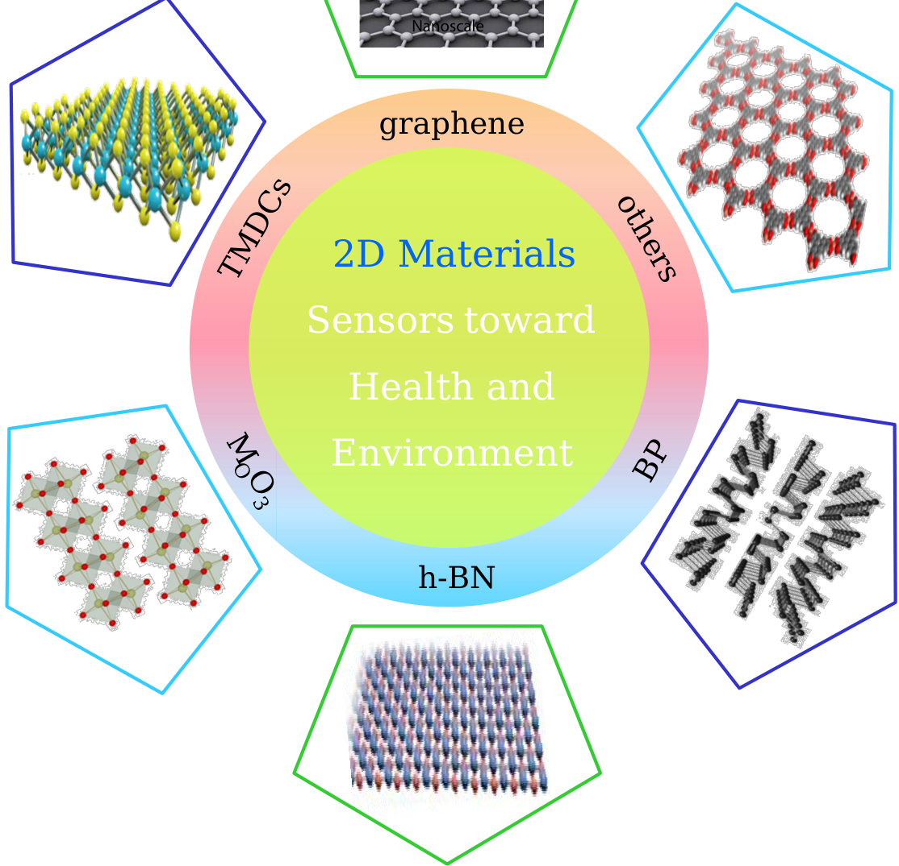

**----- Start of picture text -----** 
Nanoscale graphene 2D￿Materials Sensors￿toward￿ Health￿and￿ Environment h-BN TMDCs others M O BP O 3 **----- End of picture text -----** 

