## Page 1

Vol.:(0123456789)
Advanced Composites and Hybrid Materials            (2025) 8:30  
https://doi.org/10.1007/s42114-024-01078-z
REVIEW
Recent progress in the development of cellulose‑derived 
organic‑nanopolymer and coordination network platforms 
for application as optical chemosensors
Ratish R. Nair1 · Joo Hee Hyun2 · Jahyun Kim3 · Kyung Oh Jung4 · Dokyoung Kim1,2,3,5,6
Received: 11 August 2024 / Revised: 12 October 2024 / Accepted: 21 November 2024 
© The Author(s) 2024
Abstract
Cellulosic materials are attractive hybrid combinations that avail an array of hitherto unachievable properties by conjugating 
with organic, inorganic,and nano- and polymeric compounds. Cellulose-based materials have established great potential in 
several fields, such as air purification, water remediation, adsorbents, gas storage, biomedicine and optical chemosensing. 
Cellulose is among the cheapest materials available and is easily modifiable into different materials. The review summa-
rises the chemical modification of cellulose materials and their applications in optical chemosensing. The review briefs the 
utilization of cellulose in fabrication, doping, and modification with organic, nano and polymeric chromo and fluorophores. 
Cellulose-fabricated materials like films, fibres, crystals, hydrogel and coordination networks are accurately highlighted. 
Discussion on the applicability of cellulosic hybrids for the detection of toxic metal ions, anions, aromatic vapours, explo-
sives, pH, bioimaging, 3D-printing, coating and anti-counterfeiting by utilizing optical sensing approaches such as UV and 
fluorescence spectroscopy is pursued. Finally, the elaboration of upcoming investigations, challenges and opinions observed 
in utilising cellulose hybrid materials for optical chemosensing applications are discussed. We believe that this review will 
drive more and more curiosity and attention from the scientific community, industries and laboratories working with the 
synthesis of cellulose-based hybrid materials for widespread optical chemosensing applications.
Keywords  Hybrid material · Chemosensor · Coordination platform · Cellulose-based materials · Optical sensing
1  Introduction
Globally, the demand for products generated from renew-
able and sustainable resources that possess qualities of 
biodegradability, carbon neutral, non-petroleum based and 
have low environmental, biological health and safety risks 
is progressively gaining popularity. Cellulose, starch and 
lignin fall under the class of excellent and low-cost biopoly-
mers derived from natural resources, which can generate 
an array of eco-friendly, cheap and sustainable functional 
materials. Cellulose is a biomolecule found and produced 
in abundance with an exceptional annual production rate of 
1.5 × ­1012 tons [1]. For thousands of years, different forms 
of natural cellulose-based materials (wood, hemp, cotton, 
 *	 Ratish R. Nair 
	
ratish222@gmail.com
 *	 Kyung Oh Jung 
	
kojung@cau.ac.kr
 *	 Dokyoung Kim 
	
dkim@khu.ac.kr
1	
Medical Research Center for Bioreaction to Reactive Oxygen 
Species and Biomedical Science Institute, Core Research 
Institute (CRI), Kyung Hee University, Seoul 02447, 
Republic of Korea
2	
Department of Biomedical Science, Graduate School, Kyung 
Hee University, Seoul 02447, Republic of Korea
3	
Department of Precision Medicine, Graduate School, Kyung 
Hee University, Seoul 02447, Republic of Korea
4	
Department of Anatomy, College of Medicine, Chung-Ang 
University, Seoul 06974, Republic of Korea
5	
Department of Anatomy and Neurobiology, College 
of Medicine, Kyung Hee University, Seoul 02447, 
Republic of Korea
6	
KHU‑KIST Department of Converging Science 
and Technology, Kyung Hee University, Seoul 02447, 
Republic of Korea

## Page 2

	
Advanced Composites and Hybrid Materials            (2025) 8:30 
   30  
Page 2 of 90
linen, etc.) have been used by human societies as engineer-
ing solutions accounting in high economic gains [2]. Natural 
products when reinforced into cellulose gain high-end physi-
cal properties like elasticity along with flexibility, excellent 
functionality including high tensile and mechanical strength/
weight, aiding in the transformation of hierarchical struc-
ture design that ranges from nanoscale to supramolecular 
and macroscopic dimensions. However, traditional cel-
lulosic materials also have disadvantages like durability, 
functionality and uniformity, which are essential properties 
for the construction of next-generation efficient engineer-
ing materials [2]. Hence, it is important to imbibe modern 
technology and generate high-end solutions for producing 
cellulosic materials with highly applicable properties. Cel-
lulose is used as precursor in the production of a wide range 
of materials like nanomaterials, polymers and organic and 
inorganic chemicals.
Cellulose is a natural polymer constituting d-glucose 
monomers, which is obtained by processing of natural raw 
materials like algae, wood, plants, tunicate and bacteria. 
Cellulose as substrate yields composite materials which 
include organic, inorganic and nano- and polymers. Appli-
cations of cellulose have been pursued in a wide range of 
environmental (adsorption of metals [3], water treatment [4], 
self-decontaminated textiles [5], defence from dangerous 
ultraviolet radiation [6], food-safe paper [7] and antifouling 
membranes[8]), energy-based (electronics [9], supercapaci-
tors [10], fuel cells [11], flexible devices [12], triboelectric 
nanogenerators [13] and thermal insulators [14]) and bio-
medical applications (antifouling [15], drug delivery [16], 
antibacterial [17], tissue engineering [18] and wound healing 
vascular grafts [19], bone repair materials [20], sensing in 
cells [21] and bioimaging [22]).
Cellulose possesses excellent chemical, physical and 
mechanical properties (Fig. 1), such as high tensile strength, 
chirality, high stability under acidic conditions, good elastic 
modulus (130–150 GPa), low density (1.6 g/cm3), high wet-
tability and high biodegradability [23]. Owing to the notable 
features of cellulose has been used extensively in biomedical 
applications (Fig. 1a–d) like diagnostics and theranostics 
[24–29]. Moreover, the size compatibility of cellulose allows 
it to be used in the development of materials with various 
sizes ranging from nano to supramolecular or macromol-
ecules and also comes with the potential to be spun into 
wearable devices. Cellulose with varied sizes can be gener-
ated by using different procedures like chemical treatment, 
mechanical treatment (milling processes, valorisation) and 
enzymatic treatment. Figure 2 illustrates various methods 
involved in the extraction of cellulose from mediums like 
biomass, bacteria and food waste, resulting in different nano 
and polymeric cellulose products. The extracted or synthe-
sised cellulose materials have also found deep applications 
in the development of various sensors (Table 1).
In the current scenario, higher attention is paid on the 
development of sensors with fast response, high sensitivity, 
long-term stability and many more characteristics for the 
monitoring of environmentally and biologically important 
and hazardous analytes. Sensors which include strain sensors 
[166], tactile sensors [167], skin and sweat monitoring [168, 
169], non-contact switches [170], plant growth monitor-
ing [171], baby diapers [172], humidity sensors [173] and, 
most importantly, optical chemosensors [174]. Moreover, 
cellulose-derived materials are also utilised in the separa-
tion of enantiomeric molecules [175] and the immobilization 
of proteins [176] and peptides [177] (including antibodies 
[178] and enzymes [179]). Furthermore, the reinforcing 
ability and strength of cellulose matrix permit its usage as 
a composite in combination with synthetic polymers and 
biopolymers as a support medium for several applications 
in sensing and biosensing devices [180–182]. In the nano-
cellulose scenario, the cellulose nanofibres have entangled 
network structures with a high aspect ratio, which allows 
contact, penetration and concentration of the target mol-
ecules, facilitating in proving the specificity and sensitivity 
of sensing materials [183]. Also, nanostructures encom-
pass inherent chiral assembly and dielectric characteristics 
[184]. Bacterial cellulose is widely used in the development 
of polymeric materials, a result of its high degree of poly-
merisation (up to 8000) and exceptional mechanical strength 
along with 3D network structure [185]. The intrinsic physi-
cal and chemical properties of cellulose aids its modifica-
tion into hydrogels, aerogels, papers, films and membranes 
[186]. Considering organic materials, cellulose constitutes 
linear β−1, 4-linked d-glucose units with abundant hydroxyl 
(–OH) active groups. The free hydroxyl groups in cellulose 
allow it to form bonds with different optical materials, aiding 
its applicability in chemosensors. Moreover, high crystal-
linity, robustness, large surface area, high aspect ratio and 
high thermal resistance make cellulose an ideal substrate for 
sensing devices [187].
To date, there are several reviews that focus on putting 
together different aspects and applications of cellulose [23, 
174, 182, 188–201]. However, only a few reviews focus 
on discussions related to cellulose application in sensing 
platforms [174, 182, 189–196]. Nevertheless, these reviews 
discuss a small portion of the scope of cellulose-derived 
materials and their applications. Table 2 depicts the contents 
and limitations of prior reviews related to the topic of cur-
rent review.
In the current review, we have first illustrated and sum-
marised the basic structure and synthetic routes for different 
cellulose-derived materials consisting of organic, inorganic 
and nano and polymers. Further, proper evaluation of the 
application of the developed cellulose-derived materials 
in optical chemosensing via colourimetric and fluorimet-
ric techniques is performed. Finally, the advantages and 

## Page 3

Advanced Composites and Hybrid Materials            (2025) 8:30 	
Page 3 of 90 
   30 
concerns faced by the employment of cellulose-derived 
materials in optical chemosensing will be summarised. The 
review will be concluded on the note of challenges and pros-
pects in the area of cellulosic materials and their applications 
in the development of optical chemosensors.
2  Cellulose‑derived organic materials 
(Cello‑Org)
In the past few decades, optical chemosensors with organic 
profiles have shown great potential for monitoring envi-
ronmentally and biologically important and hazardous 
materials [202–223]. Substantial research endeavours are 
channelled into the progression of sophisticated sensing 
mechanisms for the recognition of different analyte spe-
cies [202–224]. Organic molecules are well-used in both 
colourimetric and fluorimetric techniques of optical che-
mosensing. Organic molecules constitute different heter-
oatoms that act as binding sites for various analytes, along 
with a colourimetric or fluorimetric unit and a mechanism 
for communication between these two sites [205]. As dis-
cussed in the Sect. 1, the abundant hydroxyl (–OH) active 
groups in cellulose allow organic molecules to bind with 
cellulose forming excellent templates for applications in 
chemosensing. Cellulose substrates like methyl cellulose, 
ethyl cellulose, hydroxyethyl methylcellulose, hydroxy-
propyl cellulose and carboxymethyl cellulose are great 
Fig. 1   Schematic representa-
tion of a cellulose structure and 
substrates, b different cellulose 
products, c application of 
cellulose-derived materials and 
d different optical chemosens-
ing platforms

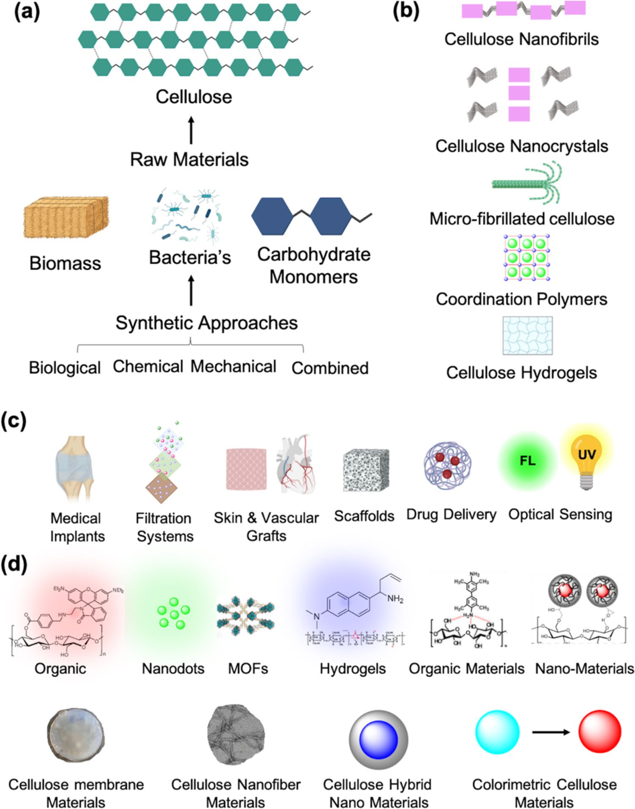

## Page 4

	
Advanced Composites and Hybrid Materials            (2025) 8:30 
   30  
Page 4 of 90
substituents for binding with organic molecules. Moreover, 
cellulose papers are used as adsorbents for fluorescent and 
colourimetric materials utilised for the purpose of optical 
and naked eye chemosensing. In this review, we will not 
go into the details of such adsorbent materials but instead 
focus on reaction-based cellulose materials. However, it 
will not be justified if we do not attribute some of the 
notable cellulose paper-based dye-adsorbent chemosensors 
reported every year starting from ‘2012 to 2024’. In 2012, 
Das and their team utilised an azo dye–based compound 
for the dual recognition of ­Hg2+ and ­Cr3+ ions. The highly 
selective azo dye–derived molecular probe was adsorbed 
on the surface of cellulose paper for the selective naked-
eye visualization of ­Hg2+ and ­Cr3+ [225]. Guo and co-
workers employed a rhodamine-derived molecular fluo-
rescent probe for selective colourimetric and fluorimetric 
detection of ­Hg2+ ions. Cellulose paper was modified by 
adsorbing rhodamine molecules and, in turn, used for the 
real-time detection of ­Hg2+ ions [226]. In 2014, Rurack 
and their group developed a BODIPY-linked hydrogen-
bonding receptor for the fluorometric detection of fluo-
ride ions in aqueous media. A test strip–based device of a 
BODIPY-based probe for fluoride ions was prepared and 
used for real-time monitoring of ­F− ions [227]. Li and 
co-workers developed a relay strategy based on AIEgen for 
probing ­Hg2+ in aqueous media. Test strips based on cel-
lulose were appended with the AIEgen dye and applied for 
the real-time monitoring of ­Hg2+ [228]. In 2016, Zhao and 
their group reported dimethyl yellow-based colourimetric 
chemosensors for the detection of ­Cr3+ in aqueous media. 
The dimethyl yellow–based receptor was suspended on 
cellulose paper for the naked eye colourimetric detection 
of ­Cr3+ [229]. Chatterjee and co-workers developed a rho-
damine-based molecular probe capable of chelating ­Cu2+. 
The rhodamine-based chemosensor was adsorbed on the 
surface of the paper and used for the naked-eye real-time 
colourimetric and fluorimetric detection of ­Cu2+ [230]. In 
2018, Niamnont et al. introduced three salicylidene fluo-
rophores capable of detecting volatile organic compounds 
(VOCs). The salicylidene probes were modified on cel-
lulose paper by using an adsorption technique and further 
utilised in the naked eye detection of VOCs [231]. Pandya 
et al. reported a luminescent pyrene-allied calix [4] arene-
based molecular probe for the determination of ­Zn2+, ­Hg2+ 
and ­I− ions. Further, the Calix-arene probe was appended 
on cellulose paper for the easy visualization of ­Zn2+, 
­Hg2+ and ­I− ions [232]. Later, in 2021, Kumaresan and 
co-workers utilised a coumarin-based chemosensor for the 
Fig. 2   Schematic illustration of synthetic strategies for extraction and production of cellulose materials, cellulosic products, different techniques 
and functionalised materials

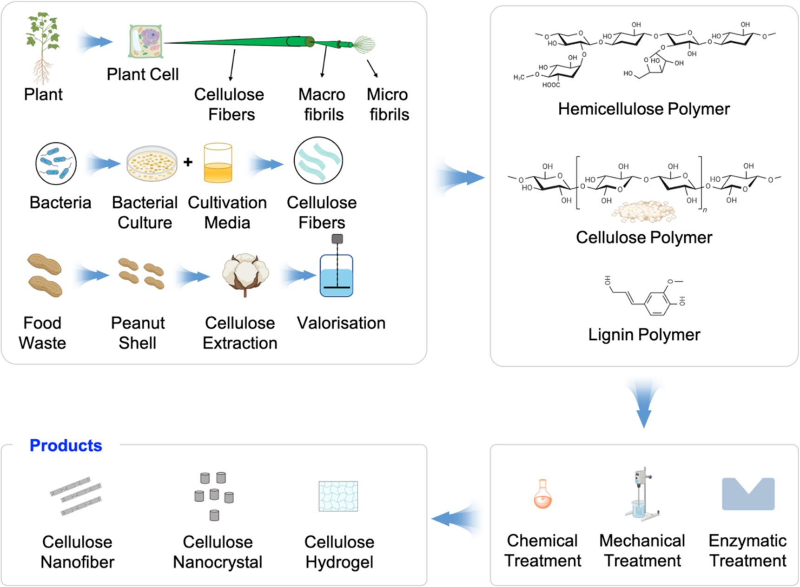

## Page 5

Advanced Composites and Hybrid Materials            (2025) 8:30 	
Page 5 of 90 
   30 
Table 1   Source of cellulose 
materials used in the 
development of sensors used in 
the current review
Probe
Source of cellulose
Material used in application
Reference
1
Bacterial cellulose
Cotton gauze wound dressing
[30]
3
Bacterial cellulose
BC filter paper
[31]
5
Wood pulp
Whatman 42 filter paper
[32]
7
High alpha wood cellulose
Hydroxyethyl cellulose
[33]
8
Waste cellulose papers
Activated cellulose papers
[34]
10
Wood pulp
Cellulose paper strip
[35]
13
Purified cellulose from wood pulp
Cellulose acetate
[36]
14
Cellulose powder from wood pulp
Cellulose filter paper
[37]
16
Biomass
Cellulose filter paper
[38]
17
Cotton pulp
Cellulose fibres
[39]
18
Cellulose from cotton pulp
α-cellulose
[40]
19
Purified cellulose from wood pulp
Cellulose acetate fibres
[41]
22
Wood pulp
Whatman 42 filter paper
[42]
24
Cotton pulp
Cellulose textiles
[43]
26
Biomass
Cellulose nanofibres
[44]
30
Wood pulp
High-purity cellulose membranes
[45]
36
Biocomposites
Semi-crystalline cellulose
[46]
37
Cotton pulp
Modified cellulose paper
[47]
38
Renewable wood pulp
Lignin nanoparticles
[48]
39
Cotton pulp
Cellulose filter papers
[49]
40
Wood/cotton pulp/biomass
Carboxymethyl cellulose
[50]
41
Wood/cotton pulp/biomass
Carboxymethyl cellulose
[51]
42
Wood/cotton pulp
Cellulose paper microzone plate
[52]
43
Wood/cotton pulp
Cellulose paper strips
[53]
45
Bacterial cellulose
Cellulose nanofibril
[54]
46
Bacterial cellulose
Quaternised cellulose
[55]
48
Natural plant fibre
Cellulose nanofibril
[56]
49
Wood/cotton pulp
Cellulose papers
[57]
50
Cotton pulp
Modified cellulose paper
[58]
51
Cotton pulp
Cellulose nanocrystal
[59]
53
Cellulose from wood/cotton pulp
Carboxylethyl quaternised cellulose
[60]
54
Bacterial cellulose
Cellulose nanopaper
[61]
55–57
Softwood pulp
Mixed cellulose ester paper
[62]
58
Wood/cotton pulp
Cellulose papers
[63]
59
Wood/cotton pulp
Modified cellulose membrane
[64]
60
Bacterial cellulose
Cellulose nanofibres
[65]
62
Wood/cotton pulp
Cellulose papers
[66]
63
Wood/cotton pulp
Cellulose nanowhiskers
[67]
64
Natural plant fibre
Cellulose fibre strip
[68]
66
Wood/cotton pulp
Cellulose nanocrystals
[69]
67
Cotton pulp
Modified cellulose fibres
[70]
68
Wood/cotton pulp
Cellulose nanocrystals
[71]
69
Wood/cotton pulp
Cellulose nanocrystals
[72]
70
Bacterial cellulose
Cellulose nanofibres
[73]
72
Wood/cotton pulp
Cellulose nanocrystals
[74]
73
Wood/cotton pulp
Cellulose nanocrystals
[75]
74
Wood/cotton pulp
Cellulose nanocrystals
[76]
75
Bacterial cellulose
Cellulose acetate nanofibres
[77]
76
Wood/cotton pulp
Cellulose nanocrystals
[78]
78
Wood/cotton pulp
Cellulose nanocrystals
[79]
79
Bacterial cellulose
Cellulose nanofibres
[80]

## Page 6

	
Advanced Composites and Hybrid Materials            (2025) 8:30 
   30  
Page 6 of 90
Table 1   (continued)
Probe
Source of cellulose
Material used in application
Reference
80
Wood/cotton pulp
Cellulose nanocrystals
[81]
81
Wheat straw
Cellulose nanofibres
[82]
83
Cotton pulp
Microcrystal cellulose
[83]
84
Wood/cotton pulp
Cellulose nanocrystals
[84]
85
Microcrystalline cellulose
Cellulose nanocrystals
[85]
87
Natural plant fibre
Cellulose nanofibres
[86]
88
Algae
Cellulose nanocrystals
[87]
89
Biomass
Spherical nanocellulose
[88]
90
Bacterial cellulose
Cellulose paper
[89]
91
Bacterial cellulose
Cellulose paper
[90]
92
Biomass
Cellulose paper
[91]
93
Bacterial cellulose
Cellulose nanofibres
[92]
94
Wood pulp
Microcrystalline cellulose
[93]
95
Bacterial cellulose
Cellulose nanofibres
[94]
96
Wood pulp
Modified cellulose paper
[95]
97
Bacterial cellulose
Cellulose membranes
[96]
98
Biomass
Cellulose-based biowaste
[97]
99
Bacterial cellulose
Nano cellulose
[98]
100
Cellulose nanofibres from cotton
Aerogel
[99]
101
Carboxymethyl cellulose
Cellulose sponge
[100]
103
Wood pulp
Whatman cellulose filter paper
[101]
105
Softwood pulp
Oxidised cellulose
[102]
106
Wood pulp
Sodium carboxymethyl cellulose
[103]
108
Discarded cigarette filters
Cellulose diacetate
[104]
110
Bacterial cellulose
Cellulose nanofibres
[105]
111
Cellulose endonuclease
Nano fibrillated cellulose
[106]
114
Bacterial cellulose
Cellulose nanocrystal
[107]
116
Carboxymethyl cellulose
Cellulose polymer dots
[108]
117
Cellulose nanocrystal
Cholesteric nanocellulose film
[109]
118
Bacterial cellulose
Cellulose nanofibres
[110]
119
Wood/cotton pulp
Cellulose paper
[111]
120
Biomass
Lignin
[112]
122
Wood pulp
Cellulose nanocrystals
[113]
123–125
Wood pulp
Cellulose nanocrystals
[114]
126
Microcrystalline cellulose
Nanocellulose
[115]
127
Biomass
Cellulose nanofibres
[116]
128
Microcrystalline cellulose
Nanocellulose
[117]
129
Carboxymethyl cellulose
Oxidised carboxymethyl cellulose
[118]
130
Wood pulp
Sodium carboxymethyl cellulose
[119]
131
Carboxymethyl cellulose
Oxidised carboxymethyl cellulose
[120]
132
Biomass
Cellulose nanofibres
[121]
133
Wood pulp
Cellulose nanocrystals
[122]
134
Cotton pulp
Cotton cellulose
[123]
135
Biomass
Cellulose gel
[124]
136
Biomass
Cellulose nanofibres
[125]
137
Microcrystalline cellulose
Cellulose hydrogel
[126]
138
Cotton pulp
Oxidised cellulose nanofibril
[127]
141
Wood/cotton pulp
Cellulose nanofibres/nanocrystals
[128]
142
Biomass
Cellulose nanofibres
[129]
143
Cotton pulp
Cellulose fibre
[130]
144
Cotton pulp
Immobilised cellulose
[131]

## Page 7

Advanced Composites and Hybrid Materials            (2025) 8:30 	
Page 7 of 90 
   30 
detection of cyanide anions via nucleophilic addition in a 
pure aqueous environment. Further, the coumarin probe 
was adsorbed on the surface of cellulose paper applicable 
for naked-eye detection of cyanide [233]. Kim et al. intro-
duced a pentafluorobenzene functionalised AIEgen dye for 
the detection of gold ions. The naked-eye detection of gold 
ions was achieved by adsorbing AIEgen dye on the surface 
of cellulose paper [234]. Later, Kim and co-workers devel-
oped a single-benzene–based ratiometric fluorescent probe 
for recognition of hydrazine. The probe was converted into 
a dip-in-naked-eye sensor by appending it on cellulose 
paper [235]. In this part, the review will concentrate on 
organic molecules functionalised on cellulose surfaces and 
their application in optical chemosensing (colourimetric 
and fluorimetric).
2.1  Fluorescence‑based organic material
Organic materials are used as an excellent precursor for 
application in fluorescence-based chemosensing. Cellu-
lose-bound organic fluorophores are used as solutions for 
real-time sensing of various environmental and biologi-
cal analytes. Bioactive surfaces are extensively applied in 
biomedical applications as they are capable of detecting 
pathogens and endogenous enzymes. Cotton cellulose is 
extensively used to prepare such bioactive surfaces. How-
ever, such bioactive materials suffer following irregularities 
in the release of chromo and fluorophores. To address this 
challenge, Brumer and their group (2016) devised a reverse-
substrate approach, wherein the chromogenic or fluorophore 
moiety, rather than the biomolecular component, is attached 
Table 1   (continued)
Probe
Source of cellulose
Material used in application
Reference
146
Cellulose nanofibre
Nanocellulose film
[132]
147
Bacterial cellulose
Cellulose nanofibre
[133]
149
Wood pulp
Cellulose nanocrystals
[134]
150
Bacterial cellulose
Cellulose nanofibre
[135]
152
Wood pulp
Cellulose
[136]
153
Natural plant pulp
Nanofibrillated cellulose
[137]
155
Cotton pulp
Modified cellulose
[138]
156–161
Natural plant pulp
Allyl cellulose
[139]
162
Cotton pulp
Cellulose fibres
[140]
164
Wood pulp
Cellulose acetate
[141]
166
Cotton pulp
Cellulose strips
[142]
167
Wood pulp
Cellulose acetate
[143]
168
Cellulose pulp powder
Cellulose
[144]
174
Wood pulp
Microcrystalline cellulose
[145]
175
Microcrystalline cellulose
Dialdehyde cellulose
[146]
180
Wood pulp
Carboxymethyl cellulose
[147]
181
Wood pulp
Cellulose acetate
[148]
182
Cellulose pulp powder
Cellulose
[149]
183
Wood pulp
Cellulose polymer chain
[150]
184
Microcrystalline cellulose
Dialdehyde cellulose
[151]
185
Wood pulp
Cellulose acetate
[152]
186
Wood pulp
Cellulose acetate
[153]
187
Wood pulp
Ethyl cellulose
[154]
188
Microcrystalline cellulose
Chlorocellulose
[155]
193
Wood pulp
Cellulose powder
[156]
194
Microcrystalline cellulose
Chlorocellulose
[157]
196
Microcrystalline cellulose
Acetoacetate cellulose
[158]
198
Wood pulp
Cellulose nanocrystals
[159]
199
Wood pulp
Cellulose microcrystals
[160]
200
Cotton pulp
Cellulose strips
[161]
201
Biomass
Dialdehyde cellulose
[162]
202
Biomass
Cellulose membranes
[163]
203
Waste paper
Cellulose-based composite
[164]
204
Microcrystalline cellulose
Acetoacetate cellulose
[165]

## Page 8

	
Advanced Composites and Hybrid Materials            (2025) 8:30 
   30  
Page 8 of 90
Table 2   Contents and limitations of reported reviews on cellulose materials and their applications in sensing
Reference
Contents
Limitations
[23]
Development of nanocellulose in
1.—Antibacterial agents
2.—Antifouling agents
3.—Wound healing
4.—Gene and drug delivery
5.—Tissue engineering
1.—Only covers biomedical application
2.—No mention of sensors
3.—Only covers literature reports until 2022
[174]
Preparation, properties and application of cellulose materials in
1.—Biosensing
2.—Electrochemical sensing
3.—Immunoassays
1.—Organic molecular probes are not covered
2.—Only covers literature reports until 2022
[182]
Application of nanocellulose in sensing and biosensing like
1.—Optical biosensing
2.—Electrical biosensing
3.—Bioimaging
- Only covers application of nanocellulose in limited areas
- Other fields of cellulose derived sensors not mentioned
- Only covers literature reports until 2017
[189]
Features, preparation and application of cellulose in
1.—Wearable sensors
2.—Health monitoring
1.—Only covers fabricated and wearable devices
2.—Does not cover sensors applicable in environmental monitor-
ing
3.—Only covers literature reports until 2021
[190]
1.—Cellulose powder-based sensors
2.—Cellulose nanocrystal-based sensors
3.—Cellulose fibre-based sensors
4.—Carbon dot-based sensors
5. – Nanocomplex-based sensors
6. – Paper-based sensors
1. Only mentions sensors for the selective detection of metal ions
2. Does not cover polymeric materials
3. Only covers literature reports until 2020
[191]
Preparation and properties of cellulose-based MOFS and appli-
cations in
1.—Water treatment
2.—Air purification
3.—Biomedical application
4.—Sensing and biosensing application
1.—The authors have specifically attributed the review to 
cellulose-based MOF materials
2.—Only covers literature reports until 2022
[192]
Features, preparation and application of cellulose in
1.—Sensor arrays
2.—Intelligent films
3.—Paper platforms
4.—Dual sensors
5.—PADs and µPADs
1.—Application of cellulose materials in development of gas sen-
sors is only covered
[193]
Preparation and alignment of cellulose nanocrystal and applica-
tion of aligned material in
- Sensing applications
1.—Only covers specific modules of cellulose nanocrystal appli-
cation
2.—Does not cover organic, inorganic and hybrid nano and 
polymeric materials
3.—Only covers literature reports until 2020
[194]
Preparation and properties of cellulose-based MOFS and appli-
cations in
1.—Water remediation
2.—Air purification
3.—Energy storage and conversion devices
4.—Biomedical applications
1.—The authors have specifically attributed the review to cel-
lulose based MOF materials
2.—Does not cover all the fields of sensing
3.—Only covers literature reports until 2022
[195]
Features, preparation and application of cellulose in
1.—Humidity sensors
1.—The title of the review is its limitation as it only covers 
humidity sensors
[196]
Cellulose based fluorescent materials for
1.—Cations detection
2.—Anions detection
3.—Nitroaromatic detection
4.—pH sensors
5.—Hydrogels and aerogels
1.—The authors have not mentioned polymeric cellulose materi-
als
2.—Only covers literature reports until 2020

## Page 9

Advanced Composites and Hybrid Materials            (2025) 8:30 	
Page 9 of 90 
   30 
to the insoluble cellulosic substrate (obtained from bacte-
rial cellulose (Table 1)). The methodology was illustrated 
by the detection of an important enzyme esterase. For this 
purpose, the fluorogenic selected was fluorescein (Fig. 3a). 
The mentioned approach completely relies on the intrinsi-
cally strong binding interaction between the plant cell wall 
matrix polysaccharide xyloglucan (XyG) and cellulose. 
Cellulosic material 1 is generated by the enzymatic click 
reaction between the cellulosic template and fluorophore. 
The cellulosic material 1 shows ‘turn-on’ emission in the 
presence of enzyme esterase. Simplifying, in the presence 
of enzyme esterase, the biomolecule tag linked with fluo-
rophore cellulose unit is cleaved resulting in the ‘turn-on’ 
emission of the cellulosic material 1.
Figure 3 b depicts the use of cellulose pad 2 for the effi-
cient detection of esterase in the naked eye under a UV lamp. 
Utilizing the approach employed in the report, future-devel-
oped materials can overcome problems like signal attenua-
tion and probable toxicity caused by the diffusion of chromo 
and fluorophore after substrate cleavage [30]. Transition 
metal ions are vital for the sustenance of living organisms. 
Copper ions are critical for human beings as they play the 
role of catalytic cofactor for a variety of metalloenzymes, 
which include cytochrome c oxidase, tyrosinase and super-
oxide dismutase. However, copper toxicity is related to many 
neurodegenerative diseases such as Alzheimer’s and Wil-
son’s diseases [236]. Hence, it is very important to monitor 
levels of copper in foods and the human body. In early 2018, 
Pisitak and his group utilised the spirolactam ring open-
ing mechanism of rhodamine to develop a rhodamine-based 
fluorimetric and colourimetric molecular probe 3 for the 
target-specific detection of ­Cu2+ ions (Fig. 3c). The authors 
have asserted the importance of naked eye detection in the 
manuscript. In the presence of ­Cu2+ ions, the spirolactam 
ring in rhodamine dye opens, resulting in the formation of 
a highly emissive fluorescent copper complex. The authors 
have fabricated probe 3 on the surface of bacterial cellulose 
for the selective detection of ­Cu2+. Figure 3 d depicts the 
fluorescence selectivity profile of 3 in the presence of dif-
ferent cations. The naked eye detection of ­Cu2+ by cellulose 
(Table 1) fabricated probe 3 can be viewed in Fig. 3e. The 
interaction between hydroxyl groups of cellulose and probe 
molecule does not result in the reduction of the detection 
profile of the optical probe, proving the utility and efficacy 
of cellulose-based optical probes [31].
The detection and quantification of anions are challeng-
ing because of their complex geometries, strong hydration 
energy and pH dependence. Sulfur dioxide ­(SO2) is one 
such air pollutant prevalent in the atmosphere, resulting 
from extensive combustion of fossil fuels. The actual toxic-
ity of sulfur dioxide is attributed to its derivatives like sul-
phite ­(SO3
2−) and bisulphite ­(HSO3
−). In 2018, Das and co-
workers introduced a water-soluble fluorogenic probe 5 for 
the ratiometric detection of ­SO3
2−·. Figure 3 f illustrates the 
detection mechanism of probe 5 for ­SO3
2−. In brief, 5 under-
goes nucleophilic attack at cite C4 from ­SO3
2−, resulting in 
the formation of 5-SO3
2− adduct as represented in Fig. 3f. 
Probe 5, when doped on polystyrene-coated cellulose paper, 
can be used for the real-time detection of ­SO3
2−. As depicted 
in Fig. 3g, polystyrene-coated cellulose paper–doped 5 
changes glow from orange to blue under a UV lamp in the 
presence of ­SO3
2−. The different regions of 5 doped poly-
styrene-coated cellulose paper (µPAD) are demonstrated in 
Fig. 3h. The limit of detection of 5 for ­SO3
2− is estimated as 
8.45 ppb. The 5 doped µPAD shows the change in fluores-
cence in the presence of ­SO3
2− (Fig. 3i). The authors have 
also tested the biological potential of targeting mitochondria 
by using probe 5 in the detection of ­SO3
2− using HeLa cells 
(Fig. 3j). The different hydrogen bonding functionalities in 
cellulose µPAD do not interfere in the detection mechanism 
of 5 towards ­SO3
2−. All mechanisms, be chemical, biologi-
cal or biochemical processes, are dependent on pH. The 
detection of pH is very important to monitor the chemical, 
biological or biochemical changes taking place in the sur-
roundings. Most used pH detection devices revolve around 
paper strips and thin films [32].
Aqueous solution of cellulose can be a template for 
nature-friendly inks. In 2019, Li and the group illustrated 
a combination of aqueous hydroxyethyl cellulose (ink) 
and 1,3,6,8-pyrene sulfonic acid sodium salt (PTSA) as a 
Table 2   (continued)
Reference
Contents
Limitations
[200]
Features, preparation and application of cellulose in
1.—Composite films
2.—Hydrogels
3.—Photonic films
4.—Nanofibre films
5.—Flexible sensors
6.—Aerogel
7.—Electronic skins
1.—The review only covers physical sensors
2.—Only covers literature reports until 2022
[201]
Features, preparation and application of cellulose nanocrystals in
- Sensing applications
1.—Only covers cellulose nanocrystal materials and its applica-
tion in sensing

## Page 10

	
Advanced Composites and Hybrid Materials            (2025) 8:30 
   30  
Page 10 of 90
water-soluble fluorescent dye utilised as a promising candi-
date for anti-counterfeiting applications (Fig. 4a).
The report depicts an excellent example of simple meth-
ods for the incorporation of fluorescent dyes into cellulose 
scaffolds and their exceptional application. Sulphonation 
reaction between pyrene-1-sulfonic acid sodium salt (PyS) 
and oleum produced 7. Red, blue and green colours were 
achieved by using a combination of different pigments 
with 7. Excellent thixotropic and rheological properties 
were noticed for 7 (Fig. 4b). Further, cellulose paper was 
immobilised with 7 by using inkjet and screen-printing tech-
niques. The main advantage of cellulose ink 7 is the fact that 
it is highly water soluble and hence can be erased easily after 
use. The authors claim that cellulosic ink 7 can be used to 
detect counterfeiting and, hence, can be used indirectly to 
control duplicating and counterfeiting (Fig. 4c) [33].
As discussed earlier, rhodamine molecules, when bound 
with cellulose, do not lose their spirolactam ring opening 
property. Hence, Pulpoka and group utilised rhodamine as a 
fluorophore unit and fabricated it onto a cellulose matrix for 
Fig. 3   a Detection mechanism of esterase utilised by 1. b UV light 
detection of esterase immobilised on cellulose paper. (Refer to the 
web version of this article for the legend colour). Reproduced from 
Ref. 30 with permission of ACS. c Detection profile of 3 towards 
­Cu2+ ion. d Selectivity plot of 3 for ­Cu2+ ions in the presence of dif-
ferent counter cations. e Naked eye detection of ­Cu2+ ions using 3 
modified cellulose paper. (Refer to the web version of this article for 
the legend colour). Reproduced from Ref. 31 with permission of Else-
vier. f Schematic representation of ­SO3
2− detection by 5. g, h, i Naked 
eye detection of ­SO3
2− using 5 modified cellulose papers. j Detection 
of ­SO3
2− using 5 treated HeLa cells. (Refer to the web version of this 
article for the legend colour). Reproduced from Ref. 32 with permis-
sion of RSC

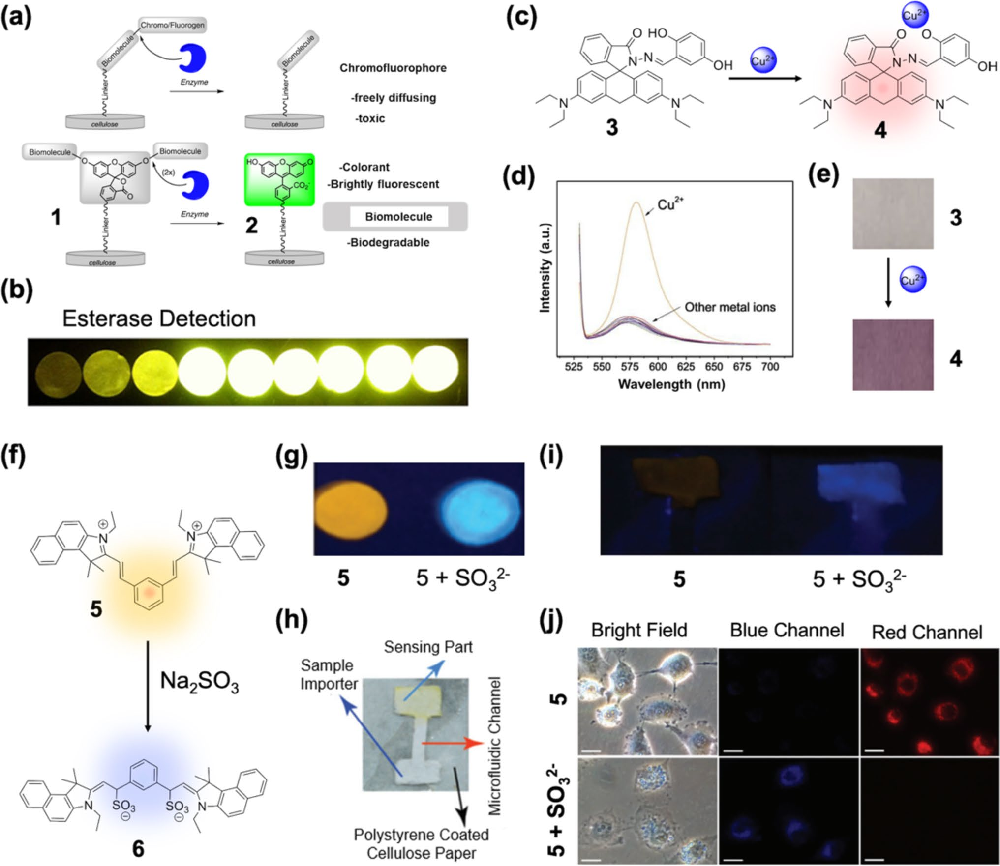

## Page 11

Advanced Composites and Hybrid Materials            (2025) 8:30 	
Page 11 of 90 
   30 
the early-stage determination of biological and environmen-
tal pH. Rhodamine-derived fluorophore was dropped on the 
surface of cellulose paper forming material 8. The mechanis-
tic approach of 8 for changing pH is represented in Fig. 5a. 
In acidic conditions, the spirolactam ring of rhodamine in 
8 is opened resulting in both colourimetric and fluorimetric 
changes. The fluorimetric changes of material 8 in the pres-
ence of different pH are illustrated in Fig. 5b. Cellulose-
cast probe 8 showed a rapid response in the pH range 1–8 
through colour and fluorescence changes. This report opens 
a wide applicability of rhodamine-cellulose combination for 
the real-time visualization of pH changes system [34].
Transition metal zinc is known to be the second most 
abundant metal ion in the human body and plays crucial 
roles in various bodily functions. However, excess zinc in the 
human body and metabolism can lead to different diseases 
such as human ischemic stroke, Alzheimer’s and epilepsy. 
Similarly, inorganic phosphates are also crucial biological 
molecules. However, the excess of inorganic phosphates 
such as dihydrogen phosphate ­(H2PO4
−) decreases the levels 
of dissolved oxygen which is a cause of several bodily prob-
lems. It is well known that the binding affinity of metal ion 
zinc towards phosphates is very high. Utilizing this knowl-
edge, Kumar and his group introduced a quinoline derivative 
10 for selective relay detection of ­Zn2+ and ­H2PO4
− (Fig. 5c). 
Probe 10 forms a complex with ­Zn2+ (11), resulting in turn-
on emission (Fig. 5d, e). The interaction between quinoline 
nitrogen, amide group nitrogen and diethyl amine nitrogen 
with ­Zn2+ results in the formation of turn-on coordination 
complex 11. Further, complex 11 confronts ­H2PO4
− causing 
the regeneration of 10. Probe 11 shows selective turn off in 
the presence of ­H2PO4
− (Fig. 5d, e). The estimated LOD of 
10 and 11 for ­Zn2+ and ­H2PO4
− are 8 nM and 55 nM, respec-
tively. As illustrated in Fig. 5f, merging 10 with cellulose 
paper aided in the formation of dipstick technology for the 
real-time detection of ­Zn2+ and ­H2PO4
−. In this paper, the 
authors demonstrated that cellulose-fabricated probes can be 
used for complexation with metals and secondary detection 
of anions [35].
Later, Zhang and co-workers developed a phenanthro-
line-conjugated cellulose system for the visual and versa-
tile detection of different amines and anions. The cellulose 
chain was used as a skeleton for the generation of molecular 
probe 13 (Fig. 5g). As depicted in Fig. 5h, probe 13 shows 
an exceptional detection for different anions. The detection 
of amines and anions is credited to the amplification effect 
of cellulose polymer chain (purified cellulose generated 
from wood pulp (Table 1)) and the differentiated interac-
tions between the sensor and analytes. Moreover, Fig. 5i 
demonstrates the application of cellulosic material 13 for 
the detection of amines. The authors claim that probe 13 is 
capable of multi-responsive and chromogenic detection of 
amines and anions [36].
Another important metal is ­Fe3+, which plays a vital role 
in the creation of haemoglobin and in the transport and stor-
age of oxygen to tissues. Iron also plays a substantial role 
in fermentation processes and metabolism by enduring as 
a stabiliser, enzyme activator and functional component of 
proteins. However, high concentrations of iron in the blood 
can result in various health conditions like depression, coma, 
respiratory problems and cardiac arrest. In 2020, Yilmaz and 
his team developed a paper-based BODIPY probe to produce 
a low-cost and environmentally sensitive material for the 
removal and detection of ­Fe3+ ions. To achieve material 14, 
Fig. 4   a Chemical structure and 
ingredients of the developed 
cellulose ink 7. b Different 
anti-counterfeiting patterns 
using inkjet printing on a non-
background paper, under (top) 
white light and (bottom) 365 nm 
UV light. c RGB colour pat-
terns by screen printing using 
multi-colour inks. (Refer to the 
web version of this article for 
the legend colour). Reproduced 
from Ref. 33 with permission 
of RSC

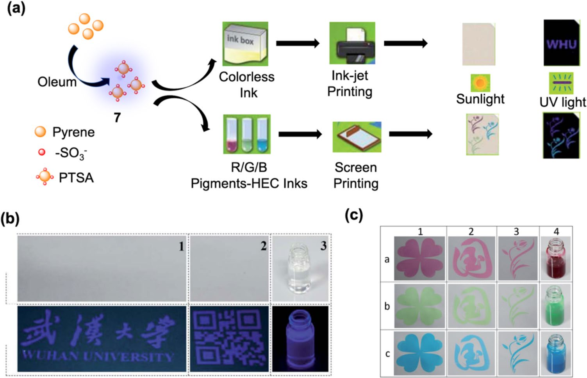

## Page 12

	
Advanced Composites and Hybrid Materials            (2025) 8:30 
   30  
Page 12 of 90
raw cellulose powder (Table 1) was fabricated by immo-
bilizing hexamethylene diisocyanate and modification with 
BODIPY. The mechanism of 14 for the detection of ­Fe3+ is 
represented in Fig. 6a. The observed quenching effect in 14 
on addition of ­Fe3+ is attributed to the interaction of para-
magnetic ­Fe3+ ions with the donor O and N atoms of 14. 
Cellulosic material 14 shows selective detection for ­Fe3+ 
(15). Figure 6 b illustrates the naked eye detection profile of 
cellulose material 14 in the presence of ­Fe3+. The authors 
claim that organic conjugate 14 is capable of the selective 
detection and removal of ­Fe3+. In this report, the authors 
have proved the easy and efficient binding of BODIPY dye 
on cellulose surfaces and its competent use in the detec-
tion of ­Fe3+ ions [37]. Cellulose-based materials have also 
found applications in the estimation of toxic and explosive 
materials like picric acid and many others. Picric acid is a 
highly water-soluble chemical species and has a wide range 
of utility in the manufacturing of explosives, pharmaceu-
tics, leather and fireworks industries. Picric acid in contact 
with the human body can cause dermatitis, bronchial issues, 
Fig. 5   a Mechanism of estimating pH using rhodamine probe 8. b 
Visual colour changes of 8 coated test strips with varying pH. (Refer 
to the web version of this article for the legend colour). Reproduced 
from Ref. 34 with permission of Wiley. c Reversible detection mecha-
nism of 10 for ­Zn2+ and ­H2PO4
−. d Selectivity profile towards ­Zn2+ 
by 10. e Naked eye detection of ­Zn2+ and ­H2PO4
− by probe 10 under 
a 365-nm UV lamp. f Visual detection of ­Zn2+ and ­H2PO4
− by 10 
doped cellulose paper. (Refer to the web version of this article for the 
legend colour). Reproduced from Ref. 35 with permission of Elsevier. 
g Chemical structure of anion and amine detecting probe 13. h Naked 
eye detection of anions under UV lamp 365 nm. i Detection of amines 
by 13 doped cellulose paper. (Refer to the web version of this article 
for the legend colour). Reproduced from Ref. 36 with permission of 
Elsevier

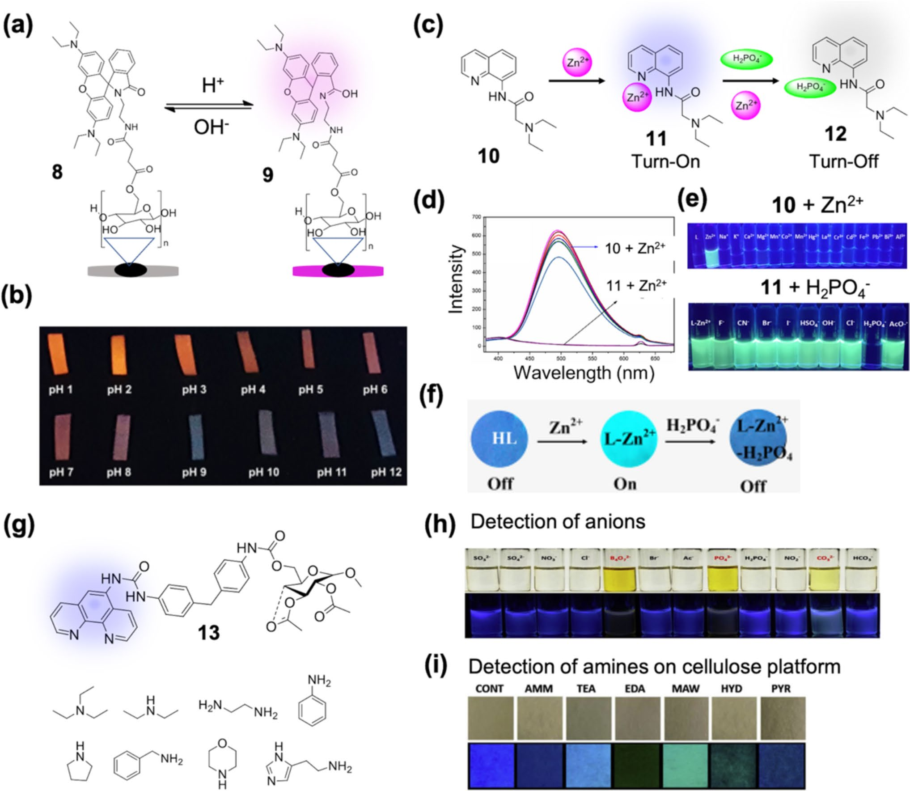

## Page 13

Advanced Composites and Hybrid Materials            (2025) 8:30 	
Page 13 of 90 
   30 
heart failure and many other serious disorders. Huang and 
co-workers introduced an indole-derived fluorescent sen-
sor composited with cellulose paper 16 (Fig. 6c) for the 
detection of picric acid in food and environmental samples. 
The indole cellulose composite 16 exhibited turn-off-based 
selectivity for picric acid with a fast reaction rate (< 30 s), 
unique specificity, excellent selectivity and high sensitivity. 
The electrostatic interaction between 16 and picric acid is 
attributed for the fluorescence quenching of 16. The titration 
profile of 16 with varying solvent ratios between ­H2O-EtOH 
is depicted in Fig. 6d. The limit of detection of 16 for picric 
acid is estimated at 34 nM. The efficacy of 16 was tested in 
biological samples (Fig. 6e) like sheep blood (Fig. 6f) and 
zebrafish samples. In Fig. 6g, the authors have demonstrated 
the complete operation procedure of composite 16 for deter-
mining colourimetric changes under different conditions by 
virtue of smartphone. The authors claim that composite 16 is 
an intelligent platform for the selective monitoring of picric 
acid levels in biological and environmental samples [38].
In 2023, Dashti and co-workers reported photolumines-
cent nanoparticles for applications in organic light-emitting 
diodes, anti-counterfeiting, information encryption and opti-
cal detection of scratch. Amide-functionalised copolymer 
nanoparticles with particle sizes 42–139 nm were obtained 
Fig. 6   a Detection mechanism of ­Fe3+ by BODIPY-based probe 14. 
b Visual detection of ­Fe3+ by 14 doped cellulose strips. (Refer to the 
web version of this article for the legend colour). Reproduced from 
Ref. 37 with permission of Elsevier. c Chemical structure of probe 
16. d Fluorescence emission spectra of 16 with varying ratios of 
EtOH–water. e Schematic depiction of operation procedure at neutral 
conditions. f Haemolysis test evaluation of 16 using sheep blood. g 
Schematic representation of 16 doped cellulose paper making and 
colourimetric changes. (Refer to the web version of this article for the 
legend colour). Reproduced from Ref. 38 with permission of Elsevier

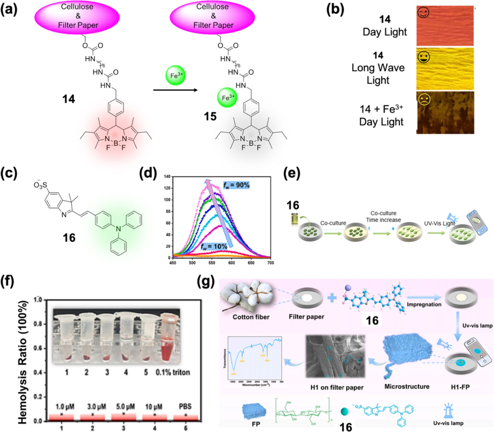

## Page 14

	
Advanced Composites and Hybrid Materials            (2025) 8:30 
   30  
Page 14 of 90
by the successful emulsion copolymerization of methylmeth-
acrylate (MMA) and methacrylamide (MAAm). Further, 
material 17 was formed by the oxazolidine modification on 
surface of the amide-functionalised copolymer nanoparti-
cles (Fig. 7a). When applied on polar substrates like cel-
lulose paper and polymer sheets, nanomaterial 17 displayed 
remarkable stability. Owing to these properties, the nanoma-
terials 17 were utilised for the development of water-based 
anti-counterfeiting inks, OLEDs and photo-detection of 
scratches (Fig. 7b) [39].
2.2  Colourimetric‑based organic material
Colourimetric materials used as optical molecular chem-
osensors are related to high sensitivity and good selectiv-
ity. Colourimetric organic probes have the added benefit of 
being used as naked eye chemosensors in real-time detection 
of various environmental analytes. Colourimetric molecu-
lar probes have been widely used for the rapid detection 
of analytes like proteins, DNA, metallic cations, viruses, 
small molecules and others. Cellulosic materials have been 
extensively employed as support materials with organic mol-
ecules for the formation of real-time usable sensors [237]. In 
this section, reports related to cellulose-supported organic 
molecular colourimetric probes are reviewed. Recently, 
tetrahedral oxyanion hydrogen sulphate has got profound 
notice from the scientific community. Excess ingestion of 
hydrogen sulphate can cause kidney malfunction. Hence, it 
is vital to estimate the concentration of hydrogen sulphate 
in food products [238]. Felpin and co-workers (2016) uti-
lised the hydrogen bonding–based spirolactam ring opening 
phenomenon of rhodamine chromophore and modified it on 
cellulose paper for application as a smart sensor device for 
colourimetric and optical detection of hydrogen sulphate 
in water. Figure 8a represents the structure of material 18 
formed by linking rhodamine with cellulose using a ben-
zaldehyde linker. Probe 18 showed high selectivity with 
colour change from colourless to pink in the presence of 
­HSO4
− anion (Fig. 8b). The hydrogen bonding phenomenon 
between 18 and ­HSO4
− is responsible for the colourimetric 
and fluorescence turn-on emission profile. The lower hydro-
gen donor properties of ­HPO4
2− results in lower interference 
and higher selectivity of ­HSO4
− by 18. The estimated limit 
of detection of 18 for ­HSO4
− is 120 µmol. As depicted in 
Fig. 8c, the cellulosic material 18 is also reusable even after 
two successive reuses. The naked eye selectivity and titra-
tion profile of 18 for ­HSO4
− even in the presence of other 
amphiphilic anions is demonstrated in Fig. 8d. The authors 
claim that the cellulosic device will hold an important place 
in the detection of ­HSO4
− in analytical and environmental 
samples [40].
In another interesting report, Kamel and his group intro-
duced a cellulose-derived halochromic test strip for the opti-
cal detection of gaseous and aqueous analytes. The authors 
have used pH-triggered chemosensor based on a push-휋 
conjugation-pull system, consisting of a tricyanofuran moi-
ety (19) as an electron-withdrawing unit and a hydrazine 
moiety that works as an electron-donor unit upon deprotona-
tion (Fig. 8e). Tricyanofuran (19) is embedded on the sur-
face of halochromic polyester cellulose-acetate (19) and is 
further utilised for colourimetric sensing of alkaline vapours 
and analytes. Variations in pH environments of 21 are illus-
trated in Fig. 8f, g. The representation of gas phase detection 
(ammonia gas) by 21 is demonstrated in Fig. 8h. The authors 
Fig. 7   a Schematic synthetic procedure of amide functionalised 
copolymer nanoparticles and modification with OXOH forming 17. b 
Fluorescence and colour-based profile of developed photoluminescent 
copolymer nanoparticles and representative photoluminescence cel-
lulose papers. (Refer to the web version of this article for the legend 
colour). Reproduced from Ref. 39 with permission of Elsevier

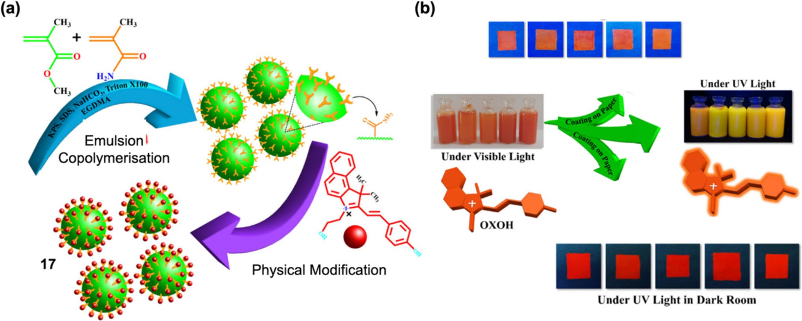

## Page 15

Advanced Composites and Hybrid Materials            (2025) 8:30 	
Page 15 of 90 
   30 
claim that the colourimetric probe 21 can be used as an effi-
cient tool for the detection of bacteria, infectious diseases 
and bacterial contamination in food packaging, protective 
dressings and wound healing probes [41].
In 2019, Patil and his team developed a phthalimide-
based chemosensor 22 for selective spectrophotometric 
detection of ­Cu2+ ions (Fig. 9a) in aqueous medium. The 
phthalimide material 22 was supported by cellulose paper 
for real-time detection of ­Cu2+ in aqueous samples. Even 
in the presence of various cations, 22 can only selectively 
detect ­Cu2+ ions. Cellulosic material 22 is engaged in 1:1 
stoichiometric interaction with ­Cu2+ ions resulting in the 
formation of ­Cu2+ complex with specific colour change. 
Probe 22 can detect ­Cu2+ ions as low as 1.65 µM. On dip-
ping the 22 doped cellulosic paper in ­Cu2+ contaminated 
solution, the colour of the strip changed from colourless to 
yellow (Fig. 9b) [42]. Later in the same year, Said and co-
workers utilised an azo-dye conjugated cellulosic material 
for the selective and specific detection of ­Cu2+ ions (Fig. 9c). 
Cellulose-supported azo dye 24 is capable of discriminating 
­Cu2+ with a colour change from pink-to orange (Fig. 9d), 
even in the presence of various counter analytes. Cellulosic 
material 24 forms a complex with copper in 2:1 stoichiomet-
ric ratio with subsequent colour change. As a colourimetric 
sensor, probe 24 can detect 4.3 × ­10–6 mol L (LOD) of ­Cu2+ 
in aqueous solution. The authors claim that cellulosic mate-
rial 24 is cheap and can be utilised for the detection of ­Cu2+ 
in real samples [43].
In a different work (2022), Lee and his group conjugated 
azo dye with cellulose nanofibres (CNFs) (Fig. 10a) to gen-
erate CNF-azo films (26) and utilised it for the selective col-
ourimetric detection of nerve agent diethyl chlorophosphate 
Fig. 8   a Chemical structure of cellulose based probe 18 used for the 
detection of ­HSO4
−. b Absorbance-based selectivity profile of 18 for 
­HSO4
− in the presence of different counter anions ­(OH−, ­NO3
−, ­I−, 
­Br−, ­Cl−, ­F−, ­CN−, ­ClO4
−, ­HPO4
2− and ­AcO− at 30 mM). c pH-based 
variation in colour of 18 doped test strips. d Visual eye selectivity 
and titration profile of 18 for ­HSO4
−. (Refer to the web version of this 
article for the legend colour). Reproduced from Ref. 40 with permis-
sion of RSC. e Working mechanism of 19 for the detection of ammo-
nia gas. f Changes in the absorbance profile of 19 with variation in 
the pH. g Naked eye colour change in the aqueous sample of 19 with 
pH. h Naked eye colour change on irradiation with ammonia gas on 
19 doped cellulose paper. (Refer to the web version of this article for 
the legend colour). Reproduced from Ref. 41 with permission of Else-
vier

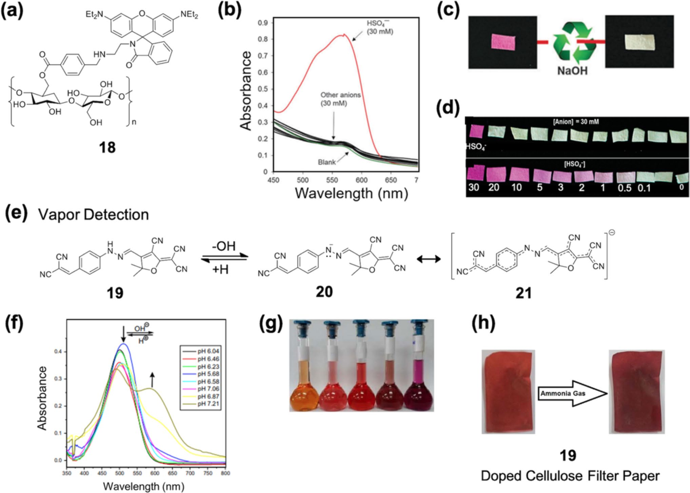

## Page 16

	
Advanced Composites and Hybrid Materials            (2025) 8:30 
   30  
Page 16 of 90
(DCP). The colourimetric change in the profile of 26 in the 
presence of DCP is shown in Fig. 10b. Probe 26 is highly 
selective for DCP even with the addition of different counter-
nerve agents. The selectivity profile of cellulosic material 26 
for DCP is depicted in Fig. 10c, d. On addition of DCP solu-
tion to 26, the hydroxyl oxime group of 26 disappears, facili-
tating intramolecular charge transfer mechanism, resulting 
in the colour change from yellow to pink. The authors have 
also focussed on the promising advantages of 26 for DCP in 
real-time samples [44]. Finally, in 2023, Luo and co-workers 
introduced 3,3′,5,5′-tetramethylbenzidine functionalised cel-
lulosic material 30 for selective detection of ­Ag+ and ­Hg2+. 
Figure 10 e depicts the complete synthetic and selectivity 
mechanism of 30 for the detection of ­Ag+ and ­Hg2+. In the 
presence of ­Ag+ and ­Hg2+ (strong oxidising agents), 30 
is oxidised aiding in the change in colour from colourless 
to blue. The experimental results showed that visually, 30 
can detect 10 µM levels of ­Ag+ and ­Hg2+. Cellulosic mate-
rial 30 shows good stability and reusability (Fig. 10f). The 
authors recognise the conjugation of cellulose forming 30 
as responsible for uniform colour development and stable 
colour, which effectively increased the colourimetric sensing 
response and stability [45].
In the case of clinical, biological and environmental 
applications, cellulose-based solid matrices are used in 
the development of optical chemosensors for on-site direct 
detection of analytes. In laboratory testing, aqueous matrices 
are used for the direct sample testing.
3  Cellulose‑derived nanomaterials 
(Cello‑Nano)
For decades, cellulose has been marketed in different forms, 
which include bacterial cellulose, microcrystalline cellulose 
(MCC), microfibrillated cellulose (MFC), microfibrils, cel-
lulose nanofibres (CNF) and cellulose nanocrystals (CNCs). 
The size ranges of cellulose are like nano, micro and poly-
meric forms, which aids in the formation of different cel-
lulosic materials. Reports have estimated the size of cellu-
lose variants as CNCs: 10–100 nm, microfibrils: 2–20 nm, 
microfibril cellulose: 10–15 nm, bacterial cellulose (BC): 
10–75 nm, microcrystalline cellulose (MCC): > 1000 nm. 
They also home different functional groups such as OH, 
­OSO3H, COOH and CHO. Different methods employed for 
the modification of nanocellulose surface include covalent 
bond formation, chemical modification, surface function-
alization and adsorption [239]. Cellulose colloids have high 
charge coefficient which ensures high stability avoiding 
nanoparticle aggregation. However, nanoparticles, when 
appended on the surface of cellulose paper, can also be used 
in bioassays. Moreover, the cellulose-modified nanoparti-
cle materials act as a high-capillary-action matrix to retain 
small-volume materials and also carry out biochemical reac-
tions [240]. In this section, there is a discussion related to 
different variants and applications of nanoparticles like cel-
lulose-modified nanohybrids, cellulose-nanocrystals nanofi-
bres and cellulose-modified nanodots. Recent technological 
advancements and high-end nanoarchitecture strategies have 
intrigued the interests of several scientific groups in improv-
ing the scope of optical chemosensing.
3.1  Hybrid nanomaterials
Nanohybrids are very important materials in all aspects 
as they are the combination of different nanoelements in 
a single packet. Diverse nanohybrid structures, such as 
yolk-hell, core–shell, heterodimer, Janus, nano branches, 
dot-on-nanorod and dot-in-nanotube, are designed and pre-
pared for performing several applications. A great num-
ber of combinations are employed, such as magnetic and 
luminescent particles, magnetic and catalytic particles and 
plasmonic and catalytic for achieving different physical 
properties, increasing the library of nanohybrid materials. 
Fig. 9   a Chemical structure and 
detection mechanism of 22 for 
­Cu2+. b Colour change from 
colourless to yellow on dipping 
22 doped test strips ­Cu2+ into 
solution. (Refer to the web ver-
sion of this article for the legend 
colour). Reproduced from Ref. 
42 with permission of Elsevier. 
c Chemical structure and detec-
tion mechanism of 24 for ­Cu2+. 
d Visual selectivity profile of 
24 for ­Cu2+ in the presence 
of different counter cations. 
(Refer to the web version of this 
article for the legend colour). 
Reproduced from Ref. 43 with 
permission of Springer

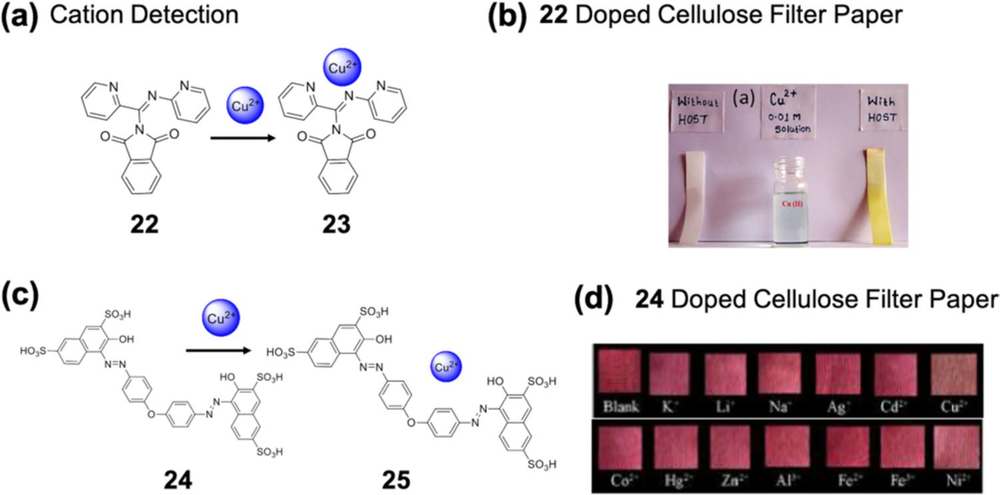

## Page 17

Advanced Composites and Hybrid Materials            (2025) 8:30 	
Page 17 of 90 
   30 
Nanohybrids with cellulose conjugation can be extensively 
used in different applications as they are bound by strong 
hydrogen bonding. Cellulose nanohybrids have outstand-
ing mechanical, chemical and physical properties, which 
aid in their utilization as high-end materials. Here, the 
different combinations of cellulose and nanohybrids will 
be discussed.
3.1.1  Fluorescence‑based hybrid nanomaterials
Nanohybrids have improved the prospects of application in 
fluorescent chemosensing technology. The inherent proper-
ties of nanohybrids, when combined with cellulose, improve 
the flexibility, stability and utility of the developed materi-
als. Fluorescent tools have launched great insights into the 
Fig. 10   a Schematic representation of detection mechanism of 26 for 
DCP. b Selectivity profile of 26 for DCP in the presence of different 
reagents. c, d Visual eye colourimetric changes in test strips doped 
with 26 in the presence of DCP. (Refer to the web version of this arti-
cle for the legend colour). Reproduced from Ref. 44 with permission 
of Elsevier. e Chemical structure and estimation mechanism of ­Ag+ 
and ­Hg2+ by 30. f Scheme showing the reversible detection of ­Ag+ 
and ­Hg2+ by 30. (Refer to the web version of this article for the leg-
end colour). Reproduced from Ref. 45 with permission of Elsevier

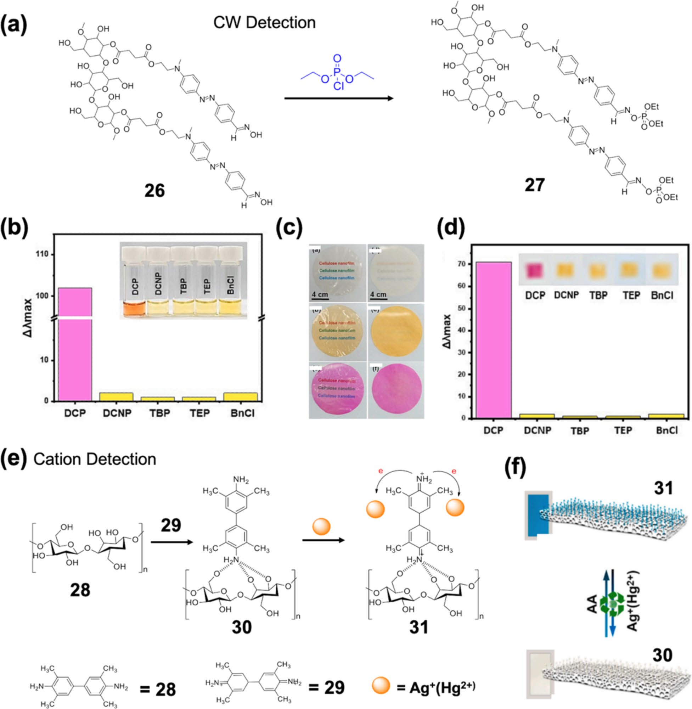

## Page 18

	
Advanced Composites and Hybrid Materials            (2025) 8:30 
   30  
Page 18 of 90
understanding of cellular mechanisms and dynamics at the 
single-cell level. Fluorescent labels permit target-specific 
imaging in living cells. Nanohybrids are an excellent solu-
tion for molecule-specific imaging in cell line.
In 2015, Siegwart and his team used a new charge transfer 
(CT) nanoparticle 32 and derivatives utilizing a bio-inspired 
cellulose template. Pyrene-modified 2,3-di-O-methyl cellu-
lose formed charge transfer complexes with 7,7,8,8-tetracy-
anoquino-dimethane (TCNQ), 1,2,4,5-tetracyano-benzene 
(TCNB) and tetracyanoethylene (TCNE) and exhibited 
aggregation-induced emission (AIE) in aqueous medium on 
the formation of nanoparticles (Fig. 11a). Lower concentra-
tions of TCNQ, TCNB and TCNE in reaction caused the 
formation of linear 33 complexes (34), and higher concen-
trations yielded crosslinked CT complex 36. The cellulose 
backbone in 33 and derivatives enabled the control of orien-
tation along with the environment of the donor and accep-
tor molecules of the new charge transfer particles (33 and 
derivatives). Probe 34 and derivatives showed multicoloured 
fluorescence excimer state emission at 370–400 nm, 602 and 
777 nm when excited at 330, 485 and 620 nm. The biologi-
cal application of the charge transfer nanoparticle (Fig. 11b, 
c) was evaluated using in vitro analysis using HeLa cells. In 
this work, the authors have presented an excellent illustration 
of the charge transfer mechanism utilizing nanohybrids on 
cellulose templates [46].
In another work, Qu and co-workers (2015) developed an 
upconversion nanoparticle (UCNP) modified cellulose paper 
assay 37 for the specific detection of telomerase activity. 
In this process, UCNPs are conjugated with the telomerase 
reaction products (TRPs) and then appended on cellulose 
paper. The authors report that compared with many solu-
tion phase systems, the cellulose-based solid-state platforms 
are highly stable and can be easily stored. Cellulose matrix 
serves as a high capillary action unit which helps in the stor-
age and distribution of 37 for the detection of telomerase.
As depicted in Fig. 12a, the interaction between telom-
erase and cellulose template nanoprobe 37 results in green 
emission. Figure 12 b–d represent the detection profile of 
37 in different telomerase variants. The assay shows lower 
bio-background interference and higher photostability owing 
to the presence of UCNPs in 37. The authors confirm that 
the fluorescent telomerase detection assay 37 has the poten-
tial to be used as testing materials in point-of-care clinical 
approaches [47]. In 2016, Chu and co-workers developed 
a fluorescent renewable lignin-derived nanoparticle func-
tionalised using pyrene (38) and studied their photochemi-
cal properties. The lignin nanoparticles were reacted with 
3-aminopropyl triethoxysilane (APTES) to garner the lignin 
nanoparticles with the amino group. The surface function-
alization of amino-lignin nanoparticles with pyrene mol-
ecules is depicted in Fig. 12e. The excimer emission profile 
of 38 on excitation at 345 nm is presented in Fig. 12f. The 
authors claim that the lignin nanomaterial 38 can be used 
in the future as nanosensors. However, the authors did not 
report any screening tests to confirm the usability of 38 as a 
Fig. 11   a Synthetic mechanism of material 35 and 36. b Cellu-
lar uptake of TCNQ-CT-cellulose NPs 33 into HeLa cells in  vitro. 
Scale bar = 20 mm. c Imaging of TCNQ-CT-cellulose NPs 33 in vivo 
in mice bearing RPMI-7951 melanoma xenograft tumour models. 
Arrows indicate regions of concentrated NPs. Scale bar = 20  mm. 
(Refer to the web version of this article for the legend colour). Repro-
duced from Ref. 46 with permission of RSC

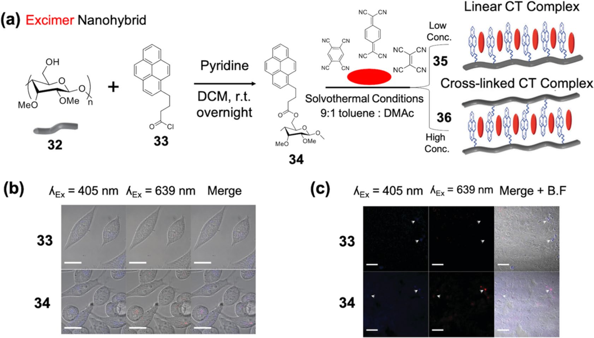

## Page 19

Advanced Composites and Hybrid Materials            (2025) 8:30 	
Page 19 of 90 
   30 
nanosensor [48]. Sahoo and co-workers developed pyridoxal 
conjugated red fluorescent gold nanoclusters and chemically 
embedded them on the surface of cellulose strips (Fig. 12g) 
forming 39 and utilised it as a chemosensor for the detection 
of ­Hg2+ ions. The gold nanoclusters were synthesised using 
bovine serum albumin in a one-pot approach. Further, vita-
min B6 cofactor pyridoxal was conjugated with the fluores-
cent gold nanoclusters. The fluorescence of 39 got quenched 
in the presence of ­Hg2+ even in the presence of different 
counter analytes (Fig. 12h). Upon addition of ­Hg2+ to 39, 
the colour change can be noticed in Fig. 12i. The chelation 
of ­Hg2+ with 39 facilitates the change in surface state of 39, 
resulting in fluorescence colour change. The detection limit 
of 39 for ­Hg2+ was estimated as 1 nM. The authors have 
employed cellulosic nanohybrid 39 for determining ­Hg2+ 
levels in fish, river water and tap water [49].
Liu and co-workers reported carboxymethyl cellulose 
supported gold nanoparticles for the fluorescent-sensitive 
detection of ­Hg2+. The nanohybrid 40 is formed by utilising 
carboxymethyl cellulose as a capping and reducing agent in 
the synthesis. The average particle size of carboxymethyl 
cellulose (CMC)-capped gold nanoparticles 40 is 20.3 nm, 
confirmed by high transmission electron microscopy, 
energy-dispersive X-ray spectroscopy, dynamic light scat-
tering and area electron diffraction pattern. The synthesised 
nanohybrid 40 has an SPR absorption band of 522 nm and 
Fig. 12   a Schematic illustration of visual assay 37 designed on paper 
for testing telomerase activity coupled with TC-modified UCNPs. b 
Naked eye upconversion luminescence of the paper substrates (bot-
tom) substrate incubated with the test solution (top) compared with 
the blank solution; c the fluorescence intensity of telomerase-incu-
bated substrates: normal cell extract, heat-treated telomerase, dNTPs 
and TS. d The photos of A to E are in sequence. (Refer to the web 
version of this article for the legend colour). Reproduced from Ref. 
47 with permission of RSC. e Construction of the lignin nanohy-
brid 38. f Emission spectra of 38 in presence of different substrates 
in THF. (Refer to the web version of this article for the legend col-
our). Reproduced from Ref. 48 with permission of Elsevier. g Syn-
thetic scheme for gold nanohybrid 39. h Selectivity profile of 39 for 
the detection of ­Hg2+ in the presence of different counter cations. i 
Naked eye titration profile of 39 for ­Hg2+. (Refer to the web version 
of this article for the legend colour). Reproduced from Ref. 49 with 
permission of Elsevier

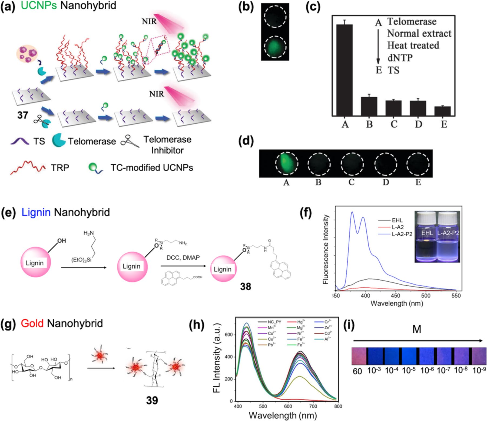

## Page 20

	
Advanced Composites and Hybrid Materials            (2025) 8:30 
   30  
Page 20 of 90
was employed as a fluorescent probe for the selective detec-
tion of ­Hg2+ ions.
Figure 13 a and b depict the selective detection mecha-
nism and profile of 40 for ­Hg2+. On interaction with ­Hg2+ 
ions, silver nanocluster 40 gets aggregated aiding in the 
quenching of fluorescence. The estimated limit of detection 
(LOD) of 40 for ­Hg2+ is 3.6 nM. This report is the first time 
that a cellulose-derived molecule was used as a reducing 
agent for the formation of gold nanohybrid [50]. Similar to 
other heavy metals, ­Mn2+ is also an important cation, the 
excess of which can inflict neuro damages leading to disor-
ders such as Alzheimer’s and Parkinson’s diseases. Hence, 
it is necessary to monitor the concentrations of ­Mn2+ in 
industrial effluents and drinking water. Xiong and his team 
developed a rapid, highly selective and sensitive fluorescent 
probe 41 for the detection of ­Mn2+ formed by the interac-
tion of carboxymethyl cellulose (CMC) with ­Tb3+. Probe 41 
shows a turn-off detection in the presence of ­Mn2+. The fluo-
rescence quenching of 41 in presence of ions is attributed 
both to static quenching by the reaction of quenchers with 
a ground-state fluorescein and the dynamic quenching by 
the reaction of quenchers with the excited-state fluorescein. 
Figure 13 c represents the quenching titration profile of 41 
in the presence of increasing levels of ­Mn2+. Probe 41 can 
detect ­Mn2+ as low as 0.046 µM with a fluorescence emis-
sion intensity of 544 nm. The authors have used 61 for the 
determination of ­Mn2+ in real samples like tap water [51].
In another illustration of up-converting fluorescence 
material, Zhu and co-workers developed a portable cel-
lulose paper substrate 42 for the detection of cancer 
biomarker telomerase. Cellulose-supported microzone 
plate 42 can be used for the dual-mode colourimetric and 
up-conversion-based detection of telomerase. Probe 42 
was generated by the functionalization of cellulose paper 
with telomerase substrate oligonucleotide (telomerase 
capturing unit). The telomerase substrate oligonucleo-
tide was labelled with methylene blue or up-converting 
nanoparticles (UCNPs) and was further employed as the 
colourimetric or up-conversion fluorescence reporting 
nano labels (Fig. 14a). The experimental results for the 
prepared paper microzone plate 42 with the blank solution 
and test solution (HeLa cells extraction) are illustrated 
in Fig. 14b. The authors consider the cellulose-supported 
microzone plate material assay 42 as capable of detecting 
telomerase and applications in point-of-care and medical 
diagnostic devices [52]. Sahoo and co-workers developed 
a glutathione-stabilised fluorescent copper nanocluster 
loaded with pyridoxamine (vitamin B6) 43 for the surface 
of nanocellulose forming 43 and used for the real-time 
detection of picric acid. Using Stern Volmer equation, 
the authors elucidated that static quenching phenomenon 
is involved in the detection of picric acid by 43. In the 
presence of picric acid, the fluorescence of 43 at 410 and 
625 nm was selectively quenched because of the resonance 
energy transfer and the photo-induced electron transfer 
mechanisms. The authors claim that probe 63 can detect 
27.4 × ­10−7 M levels of picric acid without any interfer-
ence from other tested nitro-aromatic compounds. The 
cellulose-modified nanohybrids 43 can be used to visualise 
picric acid as low as 1 µM [53].
Fig. 13   a Schematic illustra-
tion of mechanism of 40 for the 
detection of ­Hg2+. b Selectivity 
profile of 40 for in the presence 
of different counter cations. 
(Refer to the web version of this 
article for the legend colour). 
Reproduced from Ref. 50 
with permission of Springer. c 
Chemical structure and fluores-
cence selectivity profile of 41 
for ­Mn2+. (Refer to the web ver-
sion of this article for the legend 
colour). Reproduced from Ref. 
51 with permission of Elsevier

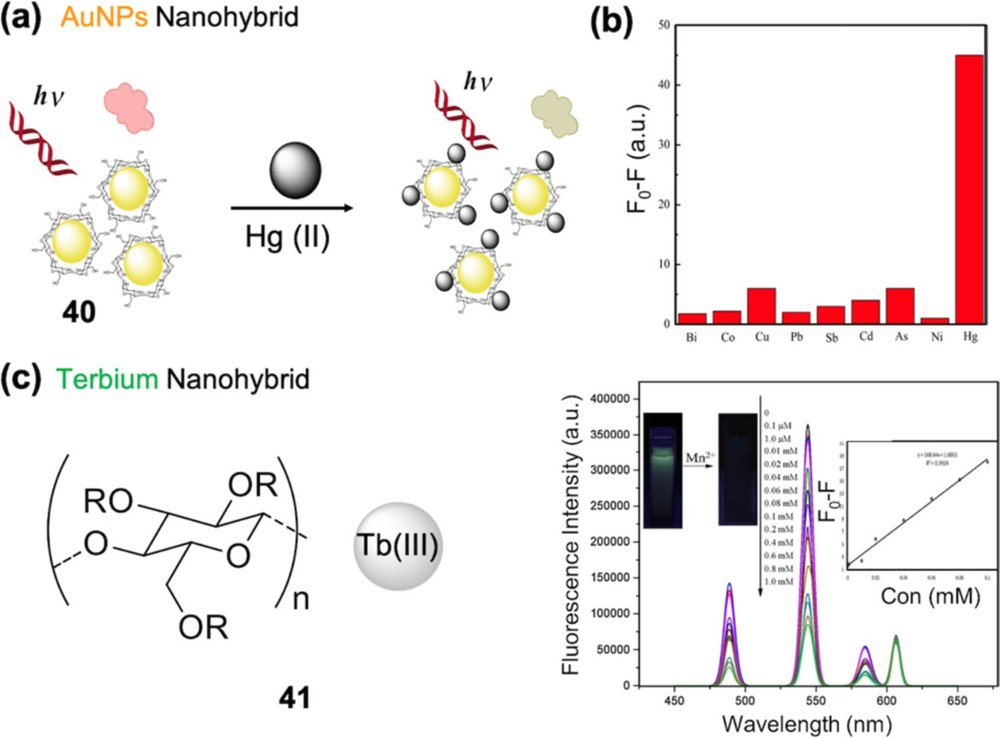

## Page 21

Advanced Composites and Hybrid Materials            (2025) 8:30 	
Page 21 of 90 
   30 
Feng et al. developed g-C3N4@TCNF nanoconjugates 
by chemically coupling tunicate cellulose nanofibrils con-
taining –COOH groups with –NH2/–NH– functionalised 
g-C3N4 nanosheets in the presence of EDC/NHS. Further, 
g-C3N4@TCNF hybrid nanopaper 45 was achieved by 
employing pressure extrusion technique (Fig. 15a). The 
so-developed nanopaper reflected qualitative properties 
like luminescence, transparency, high thermal stability and 
Fig. 14   a Schematic depiction of telomerase-cellulose material 42. 
b Study of 42 in HeLa cells and water. (Refer to the web version of 
this article for the legend colour). Reproduced from Ref. 52 with per-
mission of Elsevier. c Schematic representation of ­Cu2+-based nano-
hybrid 43 for the detection of picric acid. d Detection mechanism 
involved in the detection of picric acid by 43. (Refer to the web ver-
sion of this article for the legend colour). Reproduced from Ref. 53 
with permission of Elsevier

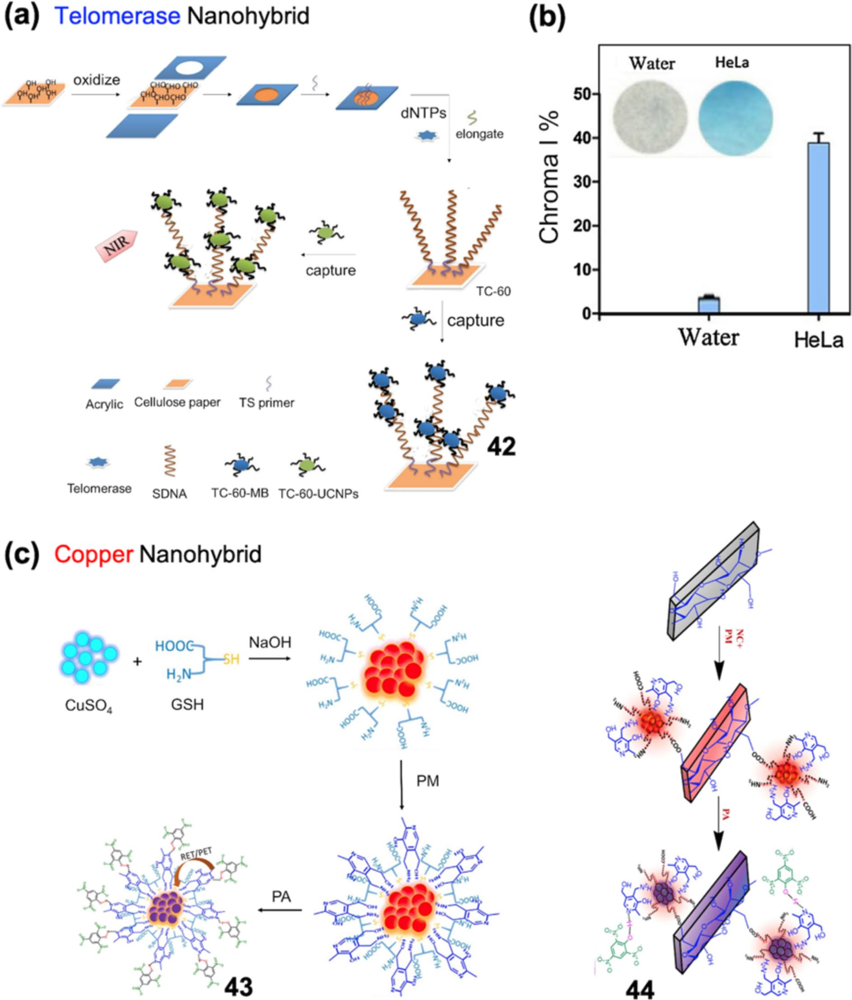

## Page 22

	
Advanced Composites and Hybrid Materials            (2025) 8:30 
   30  
Page 22 of 90
mechanical flexibility (credited to the addition of tunicate 
cellulose nanofibrils) (Fig. 15b). When combined with 
water, 45 was applied as ink for estimating banknote secu-
rity and information encryption. Visibility of encrypted 45 
can only be noticed under UV lamp proving its capability in 
anti-counterfeiting applications. Moreover, the nanopaper 
shows good UV shielding performance, thermal stability and 
mechanical properties [54]. In 2019, Zhou and his group 
introduced a fluorescent chemosensor based on aggregation-
induced emission (AIE) for the selective detection of ­Fe3+ 
ions. The ­Fe3+ chelating probe 46 was formed by fabricating 
1,1,2-triphenyl-2-[4- (3-sulfonatopropoxyl)-phenyl]-ethene 
sodium salt (SPOTPE) on quaternised cellulose (QC) via 
electrostatic interaction (Fig. 16a). The characterization of 
nanohybrid 46 was performed using transmission electron 
microscopy (TEM), spectrofluorophotometry and dynamic 
laser light scattering techniques. Figure 16 b depicts the 
change in intensity of nanohybrid 46 by varying the levels 
of quaternised cellulose. In the presence of ­Fe3+, on exciting 
nanohybrid 46 (336 nm), the enhanced blue emission was 
quenched and observed at 472 nm. The authors observed 
that the cellulosic part in 46 formed more compact com-
posites with ­Fe3+ over other metal ions. The strong elec-
trostatic binding between AIE fluorophore and cellulose 
terminal aided in the formation of a stable complex with 
­Fe3+, resulting in the aggregation and quenching profile 
of 46. The nanohybrid 46 is highly stable over a wide pH 
range of 5.0–10.0. The cellulose-modified nanohybrid 46 is 
capable of the real-time detection of ­Fe3+ in aqueous solu-
tion [55]. In early 2020, Liu and co-workers utilised a green 
and transparent cellulose nanofibre substrate supported by 
luminescent gold nanoparticles for the stable and sensitive 
solid-state sensing membrane for ­Hg2+ detection. A trans-
parent cellulose nanofibre obtained from natural wood was 
combined with gold nanoparticles (Fig. 16c) to form 48. The 
solid-state membrane 48 showed selective red fluorescence 
(Fig. 16c, d) in the presence of ­Hg2+ ions. The red fluores-
cence emission is attributed to the high-affinity metallophilic 
­Hg2+–Au(I) interaction. The authors consider probe 48 can 
be extended to detect ­Hg2+ and broader application in envi-
ronmental sampling and monitoring. Another toxic heavy 
metal that has accumulated a lot of attention is ­Pb2+. The 
toxic effect of heavy metal ­Pb2+ can cause a humongous 
impact on the nervous system and reproductive systems. It 
is vital to control levels of ­Pb2+ in drinking water. Hence, 
fluorescent and colourimetric materials are crucial for the 
monitoring of ­Pb2+ concentrations in real samples [56].
In 2020, Mahdavian and their team combined 7-acry-
loxycoumarin (7-AC) with methyl methacrylate and gly-
cidyl methacrylate via copolymerization and emulsion 
Fig. 15   a Schematic depiction of preparation of cellulose paper 45. 
b Utility of 45 on banknote under UV lamp. c Coating mechanism of 
45 and d detection patterns in 45 doped cellulose papers. (Refer to the 
web version of this article for the legend colour). Reproduced from 
Ref. 54 with permission of RSC

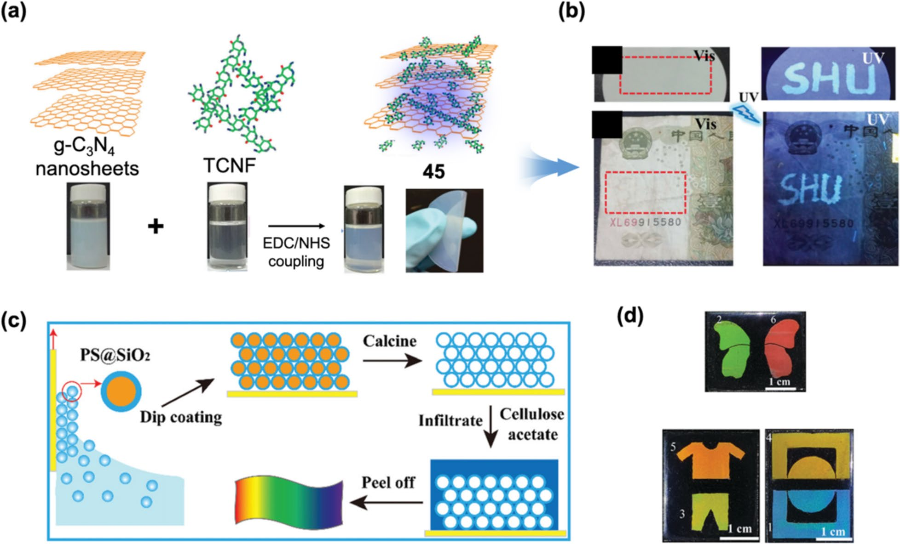

## Page 23

Advanced Composites and Hybrid Materials            (2025) 8:30 	
Page 23 of 90 
   30 
polymerization to generate epoxy-functionalised fluorescent 
polymer nanoparticles (Fig. 17). The so-developed spherical 
polymeric nanoparticles were integrated into cellulose pulp 
papers (49) via smart and efficient chemical modification. 
Enhanced fluorescence intensity for 49 was achieved as a 
result of the immobilization of 7-AC into the hydrophobic 
acrylic copolymer substrate. The authors consider cellulosic 
material 49 for potential application in the development of 
anti-counterfeiting inks and security documents [57]. Park 
and his team generated amino acid and peptide-stabilised 
gold nanoclusters and chemically modified them on the sur-
face of cellulose paper for measurement of lead in plasma 
samples. The gold nanocluster 50 was produced (Fig. 17c) 
using a single-pot approach, wherein histidine and glu-
tathione were used as reducing and protecting agents. The 
synthesised nanohybrid 50 exhibits bright green emission 
at 502 nm with an excitation at 420 nm. The nanohybrid 
50 shows selective quenching (Fig. 17d) in emission for 
­Pb2+ even in the presence of other counter analytes. In 50, 
GSH is bound to the Histidine-Au nanocluster surface via 
Au–S bond, enabling one amine and two carboxylic groups 
to freely bind with ­Pb2+ ions. The oxyphilic nature of ­Pb2+ 
ions promotes its selective binding with 50. Probe 50 can 
detect ­Pb2+ at nanomolar levels (1.0 nM). The quantum yield 
of the nanohybrid is estimated at 7.5%. Image (Fig. 17e) 
displays the quenching profile of 50 with increasing levels 
of ­Pb2+. The authors prefer to use the 50 modified cellulose 
paper for real-time detection of ­Pb2+ in environmental con-
taminants [58].
Reactive oxygen species (ROSs) are formed by the single-
electron reduction of oxygen. There are a variety of ROS 
species which include superoxide anion radicals (·O2
−), 
hydroxyl radical (•OH), hydrogen peroxide ­(H2O2), perox-
ynitrite ­(ONOO−) and hypochlorite radical ­(ClO−). Highly 
reactive oxygen species (hROS) (•OH, ­ONOO−, ­ClO−) 
show higher reactivity than ROS and can directly cause 
the oxidation of nucleic acids, proteins and lipids. Exces-
sive accumulation of hROS species in the human body can 
Fig. 16   a Schematic illustration of detection mechanism of cellulose 
linked AIE material 46 for detection of ­Fe3+. b Titration profile of 
46 in the presence of varying amounts of ­Fe3+. (Refer to the web ver-
sion of this article for the legend colour). Reproduced from Ref. 55 
with permission of MDPI. c Schematic representation on preparation 
of AuNP nanohybrid paper 48 utilised for the detection ­Hg2+. d Vis-
ual detection of ­Hg2+ by using 48 doped membranes under UV lamp. 
(Refer to the web version of this article for the legend colour). Repro-
duced from Ref. 56 with permission of Elsevier

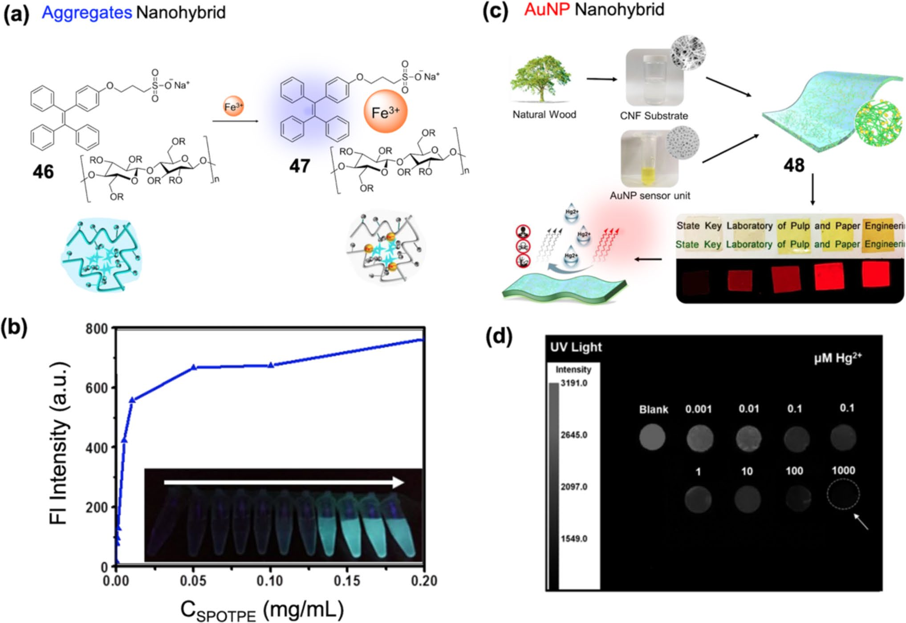

## Page 24

	
Advanced Composites and Hybrid Materials            (2025) 8:30 
   30  
Page 24 of 90
induce oxidative stress, resulting in a variety of diseases, 
including liver injury, inflammation, tumours and septicae-
mia. In early 2022, He and co-workers developed a bioin-
spired ratiometric fluorescence probe 51 based on cellulose 
nanocrystal-stabilised gold nanoclusters for the live-cell 
and zebrafish imaging of highly reactive oxygen species. 
Probe 51 utilises a combination of cellulose nanocrystals 
(CNCs) as carriers and stabilisers of gold nanoclusters and 
o-phenylenediamine (Fig. 18a) as an anti-interference inter-
nal standard for ROSs. In this work, the authors have used 
CNCs gained from biocompatible biomass which consist of 
high carboxyl density and needle-shaped and rod-like struc-
tures which resist the easy aggregation and instability of 
gold nanoclusters. The so-prepared ratiometric fluorescent 
nanohybrid 51 was inspired by the natural form of a chame-
leon changing (Fig. 18b) its colour in the presence of envi-
ronmental stimuli. On the addition of hROS species to 51, 
the fluorescence of the nanohybrid changes from blue to yel-
low. The selectivity profile of 51 in the presence of hROS at 
emission intensities of 488 and 580 nm is shown in Fig. 18b. 
The applicability of cellulosic material 51 for hROS was 
determined using biological samples like living cells and 
zebrafish (Fig. 18c). The authors consider 51 to have high 
efficacy for practical application in biological systems [59].
Other than ROS species, catecholamines are crucial hor-
mones in the peripheral endocrine and central nervous sys-
tems. Catecholamines like dopamine are produced in nerves 
both in cellular bodies and at the terminals. Catecholamines 
Fig. 17   a Fluorescence enhancement mechanism of cellulose poly-
meric nanohybrid 49. b Reversible detection fluorescence turn on and 
off phenomenon in 49. (Refer to the web version of this article for the 
legend colour). Reproduced from Ref. 57 with permission of Elsevier. 
c Preparation of gold nanohybrid material 50. d Quenching-based 
selectivity profile of 50 for ­Pb2+ in the presence of other counter cati-
ons. e Naked eye titration profile of 50 doped cellulose papers with 
increasing concentrations of ­Pb2+. (Refer to the web version of this 
article for the legend colour). Reproduced from Ref. 58 with permis-
sion of Elsevier

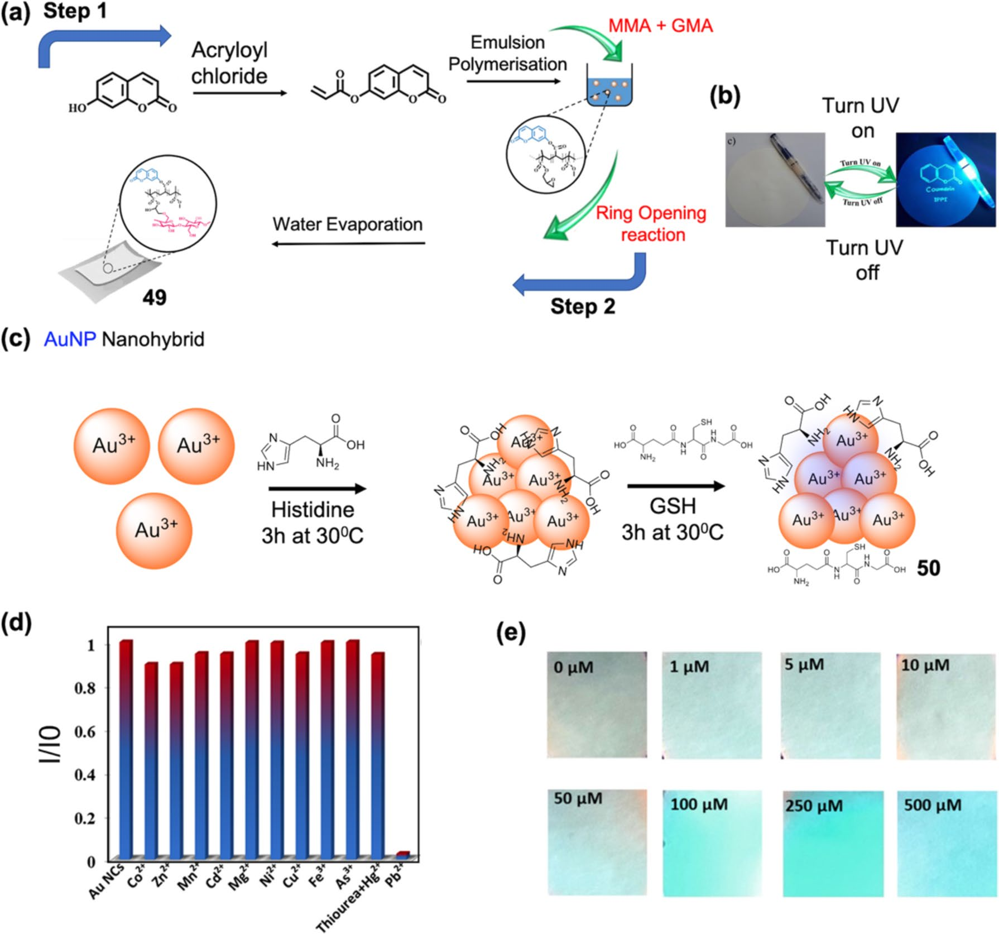

## Page 25

Advanced Composites and Hybrid Materials            (2025) 8:30 	
Page 25 of 90 
   30 
are important brain neurotransmitters and can act as bio-
markers for neurodisorders like Alzheimer’s and Parkinson’s 
diseases. In the first half of 2023, Nabavi and co-workers 
accomplished bacterial cellulose-incorporated europium 
nanohybrid 53 for smartphone-based detection of levodopa 
and dopamine and its application in point-of-care diagnosis 
of Parkinson’s disease. As depicted in Fig. 19a, the nano-
hybrid consists of europium, lithium and strontium metals 
as the main unit. Figure 19 b demonstrates the quenching of 
fluorescence and high selectivity profile of 53 for dopamine 
and levodopa. Nanohybrid material 53 was 3D-printed on 
a bacterial cellulose PAD platform and used for the detec-
tion of dopamine and levodopa (Fig. 19b). The authors con-
sider the smartphone-based unit of 53 capable of real-time 
monitoring of dopamine and levodopa in biological samples 
(Fig. 19c) [60].
3.1.2  Colourimetric‑based hybrid nanomaterials
Colourimetric nanohybrids are promising and important 
in both environmental and diagnostic applications. Col-
ourimetry allows better visualization of analytes and hence 
can be used for real-time monitoring of different hazard-
ous analytes. In 2013, Kondo and his group developed gold 
nanoparticle templated cellulose polyampholyte (carboxy-
ethyl quaternised cellulose (CEQC)) for the colourimetric 
off–on detection of environmentally hazardous ­Hg2+ ions 
and biologically essential cysteine. Here, gold nanoparti-
cles are stabilised using CEQC forming 54. The addition of 
Cys to 54 causes aggregation, resulting in a colour change 
from pink to black (Fig. 19d). Further, a redispersion of 54 
takes place with the addition of ­Hg2+ to 54 + Cys solution, as 
­Hg2+ is known to have more affinity for thiols than AuNCs 
(Fig. 19d). The cellulose-stabilised assay 54 can detect very 
low levels of Cys and ­Hg2+ (20 and 40 nM). The naked eye 
detection ability of Cys and ­Hg2+ by 54 gives it an upper 
edge for real-time applicability [61].
Other than cations and amino acids, dihydronicotinamide 
adenine dinucleotide (NADH) and its oxidised form, nicoti-
namide adenine dinucleotide ­(NAD+), are prevalent biomol-
ecules that are associated with cellular energy metabolism, 
both in prokaryotic and eukaryotic organisms. NADH and 
­NAD+ couples are considered as indispensable cofactor for 
more than 300 dehydrogenase enzymes. Several reports 
claim the involvement of increased activity dehydrogenases 
and aldehyde dehydrogenase in human cancers [241]. Hence, 
monitoring the functions related to NADH/NAD+ can help 
in identifying and treating cancers at an early stage. Xiao 
and his group described a paper-based device that enabled 
sensitive room-temperature and rapid detection of NADH 
through a colourimetric readout, demonstrating its value for 
monitoring ­NAD+-driven enzymatic reactions. The paper-
based device consists of a gold nanoparticle-cetyltrimethyl-
ammonium bromide solution.
As shown in Fig. 20a, the ­Au3+-CTAB combination 
without the addition of NADH causes complete dissolution; 
low NADH relates to partial dissolution and high NADH 
causes no dissolution forming 55, 56 and 57, respectively. 
Figure 20 b depicts the strategy employed in the prepara-
tion of a paper-based device. The paper-based device was 
Fig. 18   a Scheme for the preparation of gold cellulose nanohybrid 51 
utilised for the detection of hROS species. b Selectivity profile of 51 
for different hROS species. c Utilisation of 51 for detection of hROS 
species in fish samples. (Refer to the web version of this article for 
the legend colour). Reproduced from Ref. 59 with permission of Else-
vier

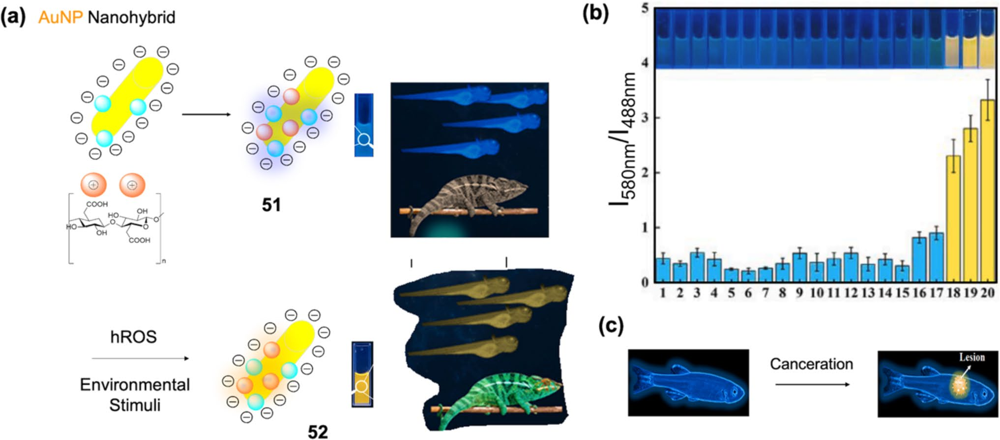

## Page 26

	
Advanced Composites and Hybrid Materials            (2025) 8:30 
   30  
Page 26 of 90
fabricated using cellulose ester paper featuring a wax-encir-
cled, gold nanoparticle–coated film atop a cotton absorbent 
layer, sandwiched between two plastic cover layers. On add-
ing NADH, the ­Au3+ complex is quickly reduced to ­Au+, 
resulting in the dissolution forming 56 and 57. The increase 
in the concentration of NADH results in complete reduc-
tion and dissolution (Fig. 20b). The authors believe that the 
developed paper-based device can be applicable for moni-
toring ­NAD+-associated enzymatic reactions and screening 
for dehydrogenase inhibitors in a variety of testing contexts 
with the reduction in cost and high-value addition [62]. Like 
metal ions, anions, ROS species and explosives pesticides 
are also a cause of serious threat to the world. Among dif-
ferent pesticides, organophosphorous (OPs) pesticides are 
Fig. 19   a Scheme for the preparation of europium nanohybrid 53. 
b Selectivity profile of 53 for L-dopa and dopamine in the presence 
of other neurotransmitters. c Visual detection of neurotransmitters in 
mobile phone using cellulose papers. (Refer to the web version of this 
article for the legend colour). Reproduced from Ref. 60 with permis-
sion of RSC. d Scheme for the preparation of cyclodextrin nanohy-
brid 54 capable of reversible detection of Cys and ­Hg2+, naked eye 
selectivity profile of 54 for (top) Cys and bottom ­(Hg2+). (Refer to the 
web version of this article for the legend colour). Reproduced from 
Ref. 61 with permission of ACS

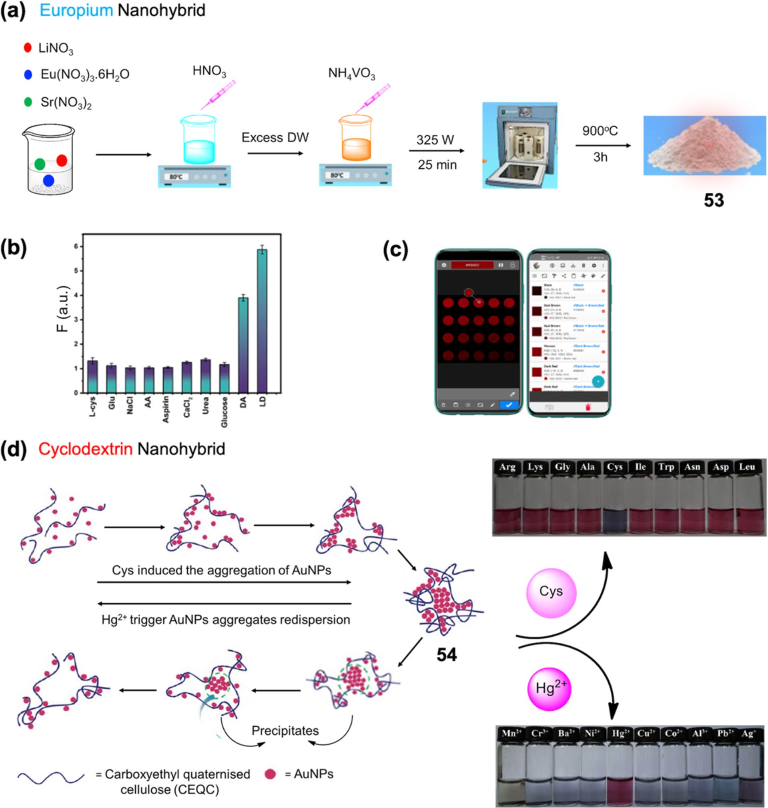

## Page 27

Advanced Composites and Hybrid Materials            (2025) 8:30 	
Page 27 of 90 
   30 
considered to have wide usage in agriculture. Moreover, 
organophosphorous pesticides also have a relatively long 
half-life time. Hence, residues of OPs can create serious 
water and environmental pollution problems.
Wang and co-workers introduced another colourimetric 
­Au3+-CTAB-based colourimetric device 58 for the selective 
determination of organophosphorous pesticides (OPs). Here, 
58 is also a dissolution-based colourimetric semi-quantita-
tive assay for OPs. Nanohybrid 58 is incomplete (Fig. 21a) 
without the addition of enzymatic hydrolysis product thio-
choline (TCh). As depicted in Fig. 21a, in the absence of 
OPs, TCh consumes almost all ­Au3+ and prevents the colour 
change of 58. However, in the presence of OPs, the enzy-
matic TCh is not enough to consume all the ­Au3+, and the 
residual ­Au3+ dissolves 58. Figure 21 b illustrates the prepa-
ration of a 58-based paper device and its colour change in 
the presence of varying concentrations of parathion. Such 
paper-based devices make it easy for the real-time moni-
toring of pesticide-contaminated environments and reduce 
the cost burden [63]. Later, Zhou and his team developed 
a colourimetric sensor 59 based on an indicator displace-
ment mechanism for the detection of trace amounts of ­Ni2+ 
ions. The nanohybrid 59 consists of organometallic reagent 
zinc incorporated into ­ZnSiO3 nanospheres and ­Na2-EDTA 
as a masking agent (Co-ionophore) (Fig. 21c). On interac-
tion with ­Ni2+, the blue colouration of 59 fades (Fig. 21d). 
On increasing the concentration of ­Ni2+, the competition is 
amplified, resulting in the displacement of ­Zn2+ ions. The 
paper-based assay 59 can detect ­Ni2+ ions as low as 83 nM. 
The paper-based assay enables the naked-eye differentiation 
of nickel ions down to 0.1 µM (Fig. 21e). The paper-based 
nanohybrid 59 an estimate levels of ­Ni2+ ions in real envi-
ronmental samples [64].
Separation and recognition of enantiomers are requisite 
in many diverse areas, such as biology, chemistry, health 
science and pharmaceutics. Chromatography is the major 
technique employed for the detection and separation of 
enantiomers. However, fluorescent and chromophore indi-
cators can be more sustainable and cheap techniques for the 
determination of enantiomers. Individual researcher Zor 
describes silver nanoparticle-embedded nanopaper as a col-
ourimetric platform for the enantioselective recognition of 
chiral analytes. The paper was prepared utilizing bacterial 
cellulose (Table 1), and silver nanoparticles were embed-
ded on their surface, generating 60 (Fig. 22a). The authors 
have tested the ability of 60 for the enantioselective chi-
ral detection of d-cysteine in both solution and nanopaper 
phases. The colourimetric changes of 60 in the presence of 
d-cysteine are represented in Fig. 22b, c. Nanohybrid 60 
showed a discriminative sensing response towards d-cysteine 
with a LOD value of 4.88 µM. Here, the inherently chiral 
AgNPs (60) undergo aggregation on reacting with enanti-
omers displaying a significant colour change from yellow 
to purple, brown in both aqueous phase and nanopaper. For 
Fig. 20   a Scheme representa-
tion of different mechanism for 
preparation of 55, 56 and 57. b 
Coating of 55, 56 and 57 on cel-
lulose surface (left) and titration 
profile of 55–57 in the presence 
of NADH. (Refer to the web 
version of this article for the 
legend colour). Reproduced 
from Ref. 62 with permission 
of ACS

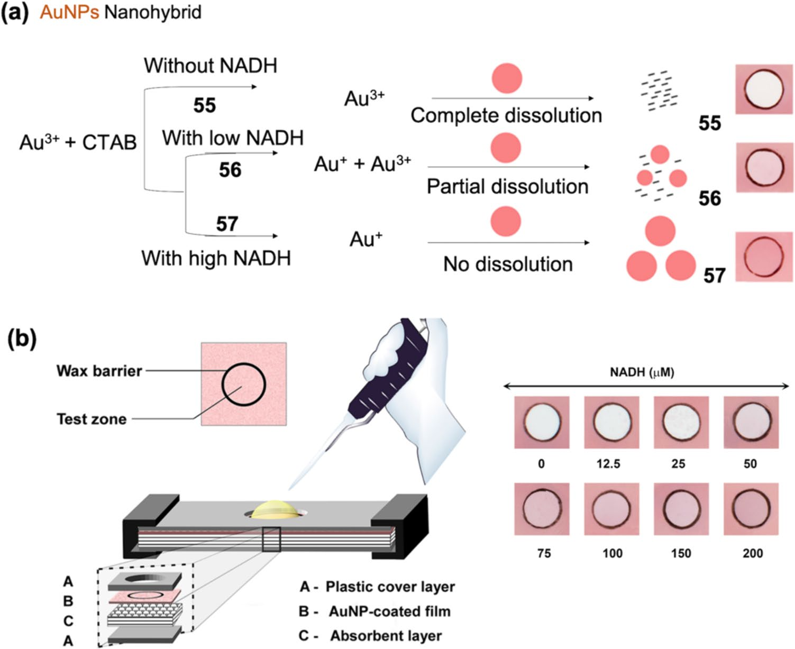

## Page 28

	
Advanced Composites and Hybrid Materials            (2025) 8:30 
   30  
Page 28 of 90
practical use, the plasmonic nanopaper 60 was punched into 
circular pieces and inserted into a wax-printed PET film to 
produce a disposable 2D cuvette, which can be applied in an 
ordinary spectrophotometer.
The report is a first on the utility of cellulose material 
in the detection of enantioselective chiral molecules [65]. 
Saraji and his team reported a gold nanoparticle–embedded 
paper-based colourimetric assay for the selective determina-
tion of selenium (Se(IV)). Headspace single-drop microex-
traction utilizing a microdrop containing unmodified gold 
nanoparticles (AuNPs) was used as both the extractant and 
the colourimetric unit for the sensitive and selective estima-
tion of Se(IV). Figure 22 d depicts a complete synthetic track 
for the synthesis of gold nanohybrid 62. Nanohybrid 62 was 
spotted on cellulose paper and was used for the detection of 
Se(IV). The cellulosic nanohybrid 62 paper showed excel-
lent selectivity for Se(IV) in the presence of different coun-
tercations. The colour change of 62 was attributed to the 
adsorption of in situ-generated hydrogen selenide on the sur-
face of AuNPs. The limit of quantification of 62 for Se(IV) 
was reported as 12 µg ­L−1. The repeatability of the method 
of cellulosic paper 62 in the presence of was studied by the 
calculation of intraday and interday precision of standard 
solutions at concentrations of 20 and 70 µg ­L−1. The authors 
consider that cellulosic nanohybrid material 62 can be used 
for the determination of Se(IV) in real samples [66].
In the same year, Correa and co-workers utilised a com-
bination of silver nanoparticles and cellulose nanowhisk-
ers for the selective detection of hydrogen peroxide ­(H2O2). 
Nanohybrid material 63 was formed by the combination 
Fig. 21   a Scheme depicting the preparation and mechanism of gold 
nanohybrid 58. b Casting of 58 on cellulose surface to form a paper-
based device (top), Colourimetric changes on interaction with differ-
ent levels of parathion (bottom). (Refer to the web version of this arti-
cle for the legend colour). Reproduced from Ref. 63 with permission 
of Springer. c Schematic illustration of preparation of zincon nano-
hybrid 59. d Colourimetric selectivity profile of 59 for detection of 
­Ni2+. e Naked eye titration of 59 coated cellulose with varying con-
centrations of ­Ni2+. (Refer to the web version of this article for the 
legend colour). Reproduced from Ref. 64 with permission of Elsevier

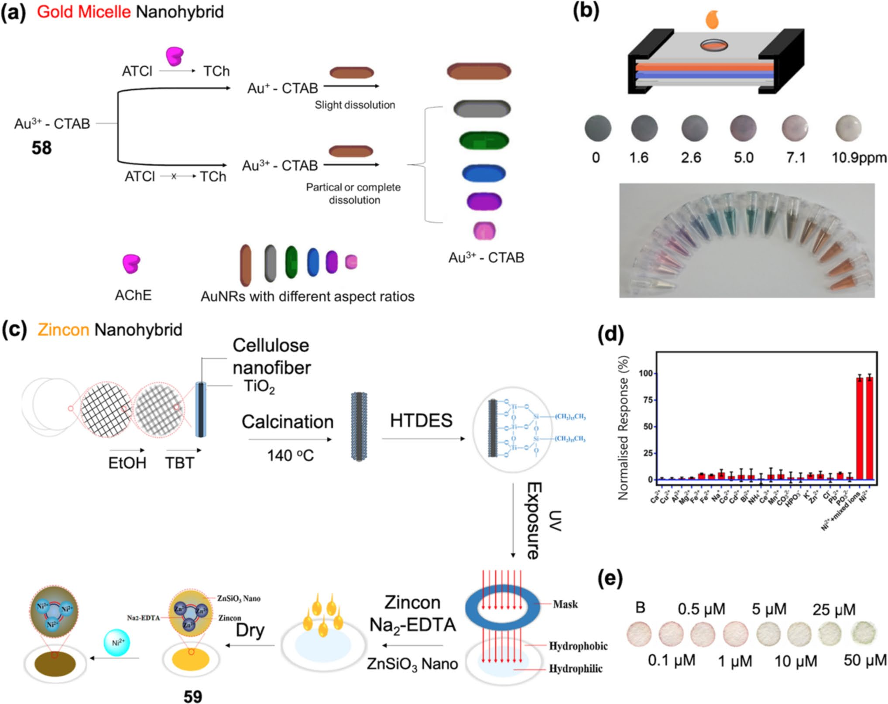

## Page 29

Advanced Composites and Hybrid Materials            (2025) 8:30 	
Page 29 of 90 
   30 
of silver nanoparticles and nanostructured polysaccharide 
(cellulose nanowhiskers). When exposed to ­H2O2, the sil-
ver nanoparticles undergo catalytic decomposition, result-
ing in the decrease of the AgNP absorption band at 410 nm 
in relation to ­H2O2 concentrations (Fig. 23). The LOD of 
cellulosic-silver-nanohybrid 63 for ­H2O2 was estimated 
0.014 and 112 µM. The authors confirm that material 63 
is easy to interpret and can also be used for the real-time 
analysis of ­H2O2 in real samples, even in the presence of 
other interfering substances [67].
Fig. 22   a Preparatory procedure for the synthesis of silver nanohy-
brid 60 and 61. b, c Colourimetric detection and titration profile 60 
and 61 for cysteine. (Refer to the web version of this article for the 
legend colour). Reproduced from Ref. 65 with permission of Elsevier. 
d Complete preparation of 62 and detection mechanism for Se(IV). 
(Refer to the web version of this article for the legend colour). Repro-
duced from Ref. 66 with permission of Springer

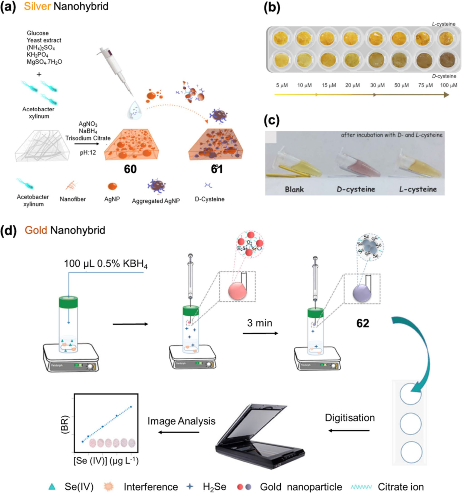

## Page 30

	
Advanced Composites and Hybrid Materials            (2025) 8:30 
   30  
Page 30 of 90
In the first report, Choi and co-workers utilised citrate-
capped Pt nanoparticles (PtNPs) and doped them with cellu-
lose paper for selective colourimetric detection of uric acids 
in real samples. The citric acid-capped Pt nanoparticles 
came with a particle size of 8–10 nm. The cellulose paper 
strip used in this work was prepared by pretreatment with 
PVA, TMB + ­H2O2 and PtNPs respectively (Fig. 24). Here, 
PtNPs functioned as enzyme catalytic activity. TMB was the 
Fig. 23   Synthesis of silver 
nanohybrid, coating on cel-
lulose, detection and selectivity 
profile of 63 for ­H2O2. (Refer 
to the web version of this 
article for the legend colour). 
Reproduced from Ref. 67 with 
permission of Elsevier
Fig. 24   Illustration of uric acid 
detection by 64 and protocol 
for doping on cellulose surface. 
(Refer to the web version of this 
article for the legend colour). 
Reproduced from Ref. 68 with 
permission of RSC

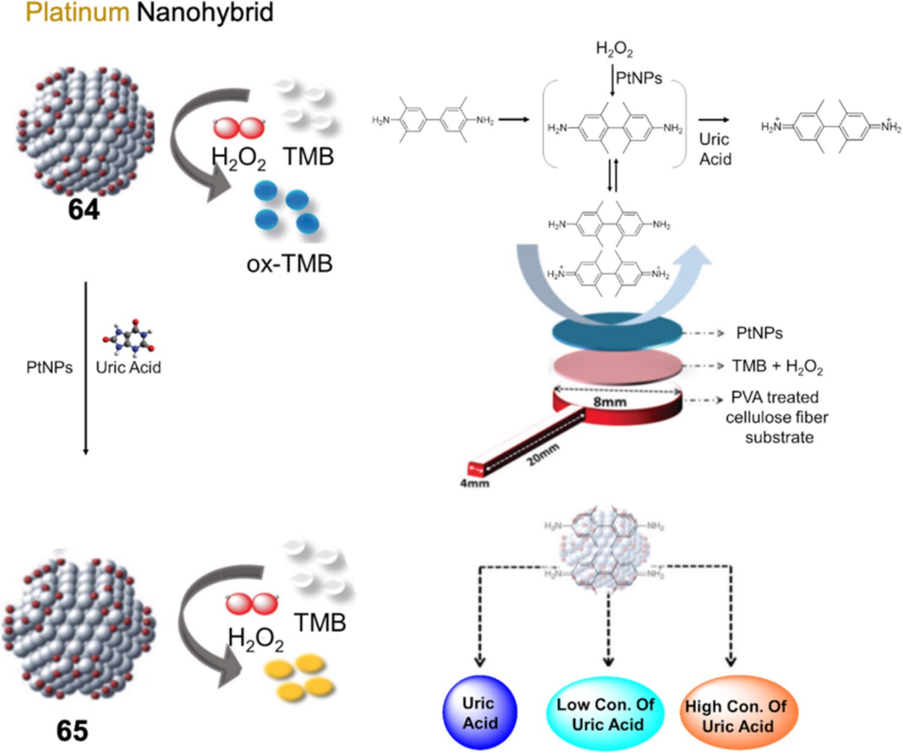

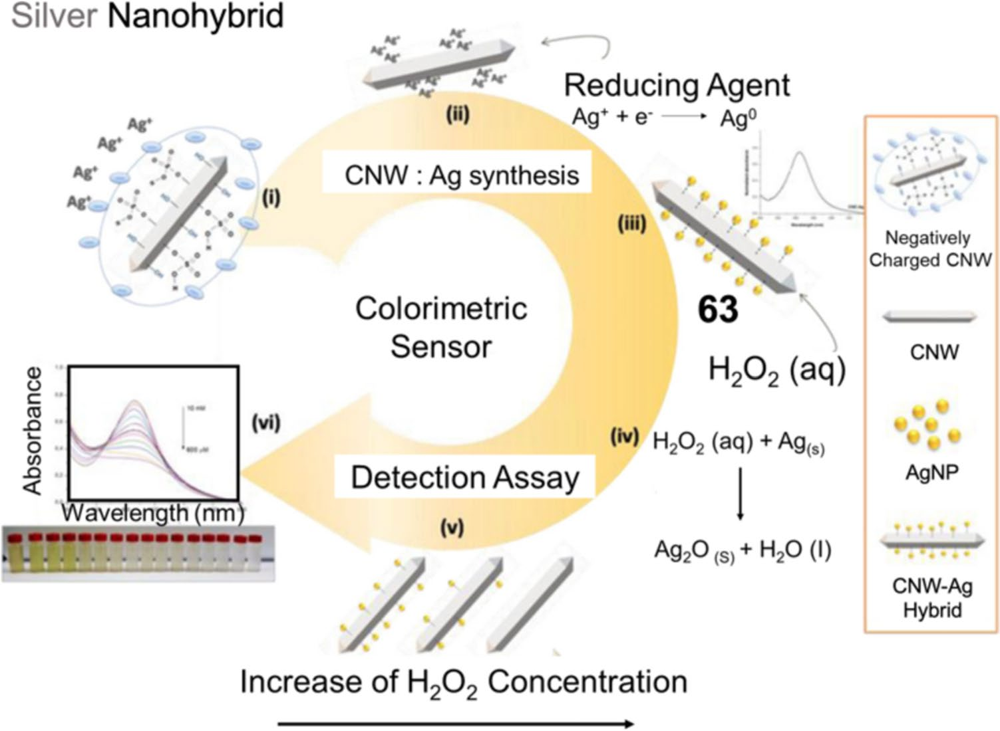

## Page 31

Advanced Composites and Hybrid Materials            (2025) 8:30 	
Page 31 of 90 
   30 
hydrogen donor group inducing the reduction of ­H2O2. A 
calculated LOD of 4.2 µM and a linear range of 7 mM was 
achieved on engaging uric acid with the cellulosic nanohy-
brid material 64. The authors confirm the use of 64 as a tool 
for the quantitative detection of uric acid in the physiologi-
cal range in urine samples. This report is a good illustration 
which shows that not only gold, silver or copper but transi-
tion heavy metals such as platinum-based nanomaterials can 
also be easily doped on cellulose surfaces [68].
In 2021, Lim and his group developed 2,2,6,6-tetrameth-
ylpiperidin-1-piperidinyloxy (TEMPO)-oxidised cellulose 
nanocrystal (TEMPO-CNC) capped gold nanoparticles 
(AuNPs) 66 for the colourimetric detection of unamplified 
pathogenic DNA oligomers of methicillin-resistant Staphy-
lococcus aureus (Fig. 25a). The authors have characterised 
the nanohybrid 66 by using transmission electron micros-
copy, UV–visible spectroscopy, dynamic light scattering 
and atomic force microscopy. The average diameter of gold 
nanoparticles used in the generation of 66 is approximately 
30 nm. Under ionic conditions, 66 undergoes a red-to-blue 
(Fig. 25b) colour transformation in the presence of the target 
DNA. On the addition of DNA to 66, aggregation of AuNPS 
results in the colour change from red to blue. Nanohybrid 
molecule 66 demonstrated a colourimetric detection limit 
of 20 fM for pathogenic DNA. The authors consider nano-
hybrid 66 as an efficient and straightforward solution as a 
biosensor [69].
Recently, Mahdavian and co-workers (2024) reported spi-
ropyran and leuco-dye doped nanocapsules and embedded 
them on the surface of dual-chromic cellulose paper for the 
colourimetric detection of heavy metal cations. Figure 26 a 
depicts the synthetic approach for the generation of nanohy-
brid 67. Cellulosic nanohybrid 67 is capable of colourimetri-
cally detecting ­Fe2+, ­Pb2+ and ­Sn2+ ions. The selectivity pro-
file of cellulosic-nanohybrid material 67 for reported heavy 
metals is represented in Fig. 26b, c. Opto-chemical results 
indicated that the LODs of nanohybrid 67 for ­Fe2+, ­Pb2+ 
and ­Sn2+ ions are 0.0013 µM, 0.0023 µM and 0.0028 µM, 
respectively. The authors confirm the applicability of nano-
hybrid 67 for the detection of reported heavy metal ions with 
high sensitivity, instant responsivity, wide linear detection 
range and low detection limit in real samples [70].
3.2  Cellulose nanofibres and nanocrystals
As discussed in Sect. 1, cellulose is found to be the most 
abundant bio-based green polymer. The structure of cel-
lulose is found in the form of a lignocellulosic natural 
Fig. 25   a, b Depiction of the 
proposed mechanism of the 
interaction between target 
(upper panel) and non-target 
(lower panel) generating 
TEMPO-CNC-stabilised AuNPs 
(TC-AuNPs) 66 under ionic 
conditions for the sequence-
specific detection of pathogenic 
DNA. (Refer to the web version 
of this article for the legend 
colour). Reproduced from Ref. 
69 with permission of ACS

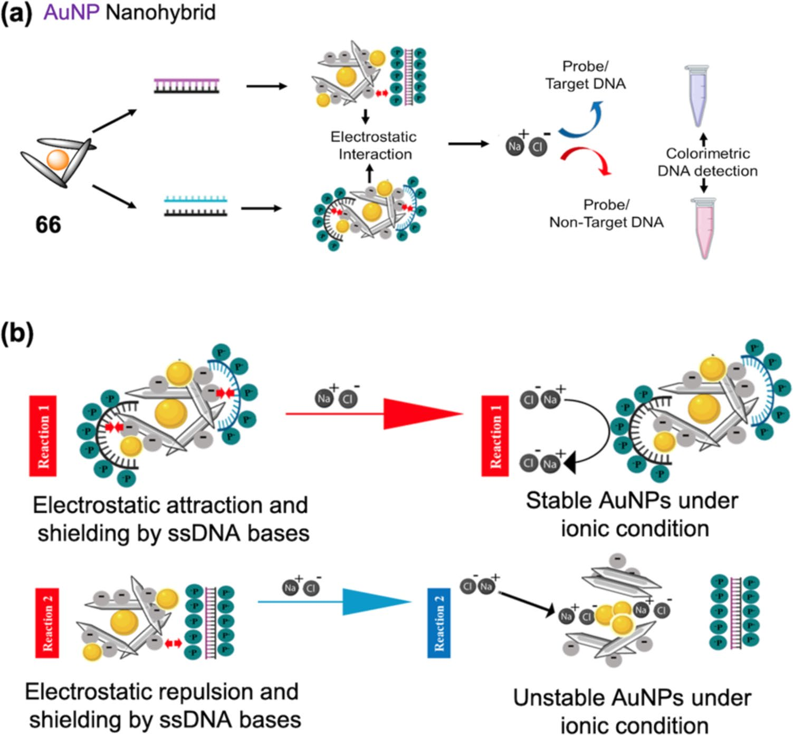

## Page 32

	
Advanced Composites and Hybrid Materials            (2025) 8:30 
   30  
Page 32 of 90
fibre, and its microstructure consists of five main compo-
nents: amorphous (hemicellulose), crystalline nature of 
α-cellulose, aromatic (lignin), wax and pectin [242]. In the 
past few decades, many cellulose-based materials in nano-
form have replaced their counterparts. Cellulose nanoma-
terials have excellent benefits like high sustainability and 
biodegradability, low production cost, better interfacial area, 
high strength and modulus, high aspect ratio and low den-
sity [243]. Nanocellulose materials are classified into two 
main categories which are cellulose nanocrystals (CNCs) 
and cellulose nanofibres (CNFs). The properties of the cel-
lulose nanomaterials (CNMs) are highly dependent on the 
cellulosic substrates and their processing conditions. As 
depicted in Fig. 2, nanocellulose materials are formed from 
raw cellulose via chemical, mechanical and enzymatic treat-
ments. In this section, fluorescent and colourimetric opti-
cal chemosensors based on CNCs and cellulose nanofibres 
(CNFs) will be discussed.
3.2.1  Fluorescence‑based nanofibres and nanocrystals
In 2015, Wilkins and co-workers utilised Alexa Fluor for 
labelling cellulose nanocrystals, producing 68 and appli-
cation in bioimaging. In the first approach, the cellulose 
surface was modified with aldehyde groups by reaction with 
limiting amounts of sodium periodate. Further, reductive 
amination reactions were applied to bind Alexa Fluor dyes 
with terminal amino groups on the linker cellulose nanocrys-
tals, generating 68. In the other approach, Alexa Fluor dye 
was modified to conjugate chloro-substituted triazine ring 
at the end of the linker section and was further reacted with 
cellulose nanocrystals at high temperature, producing 68. 
The chemical structure of Alexa Fluor–modified cellulose 
nanocrystal is represented in Fig. 27a. As shown in Fig. 27b, 
material 68 was applied for bioimaging in the pore throat 
of a pore network micromodel. The authors anticipate that 
cellulosic crystal material can be useful in evaluating how 
candidates of mixed microbial communities associate with 
solid cellulose deposits [71].
In another work, Huang and his group utilised cellulose 
nanocrystals with an amino acid spacer and grafted it with 
pH-sensitive fluorescein moiety forming 69. Figure 27 c 
illustrates the structure of nanocellulose-modified mate-
rial 69. The conjugation of cellulose nanocrystals with 
fluorescein was achieved using l-Leucine amino acid as a 
spacer linker. CNC material 69 was designed for sensitive 
sensing of pH. The naked eye fluorescence changes of 69 
for pH sensing are depicted in Fig. 27c. The authors have 
Fig. 26   a Structures of dyes for doping 67. Preparation of dual-stim-
uli responsive latex nanocapsules via mini-emulsion polymerization. 
b Visible images of 67 in the presence of different anions and metal 
cations (50 µM) in 4/1 (V/V) ethanol/H2O solutions and the corre-
sponding visual colour changes. (Refer to the web version of this arti-
cle for the legend colour). Reproduced from Ref. 70 with permission 
of Elsevier

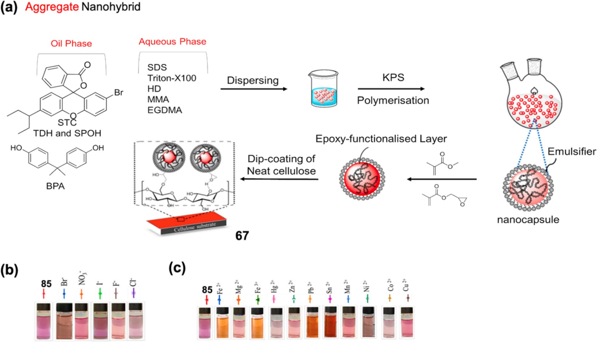

## Page 33

Advanced Composites and Hybrid Materials            (2025) 8:30 	
Page 33 of 90 
   30 
estimated that the fluorescence intensity of 69 increases 
with pH of the buffer from 2.28 to 12.66. The authors 
confirm that CNC material 69 is an excellent candidate 
for the estimation of pH with high biocompatibility and 
biological activity [72]. In 2017, Li and his team intro-
duced a cellulose-anchored carbon nanotube and doped 
it with 1,4-dihydroxyanthraquinone as a fluorophore unit 
for the efficient detection of ­Cu2+ and ­Cr3+ ions in the 
aqueous solution (Fig. 28a, b). Probe 70 has excellent 
metal sorption capacity supporting the selective quench-
ing of fluorescence in presence of ­Cu2+. Further, when 
­Cu2+-contaminated 70 is treated with ­Cr3+, replacement 
Fig. 27   a Chemical structure of cellulose-based imaging agent 68. 
(Refer to the web version of this article for the legend colour). Repro-
duced from Ref. 71 with permission of ACS. b Chemical structure of 
cellulose-derived fluorescent agent 69. c Illuminated suspension of 68 
under UV lamp. (Refer to the web version of this article for the leg-
end colour). Reproduced from Ref. 72 with permission of ACS
Fig. 28   a Schematic depiction of 70 and 71 with detection mecha-
nism. b Selectivity profile of 70 and 71 for ­Cu2+. (Refer to the web 
version of this article for the legend colour). Reproduced from Ref. 
73 with permission of RSC. c Chemical structure of 72 and mecha-
nism involved. d Selectivity profile of 72 for ­Hg2+. (Refer to the web 
version of this article for the legend colour). Reproduced from Ref. 
74 with permission of RSC

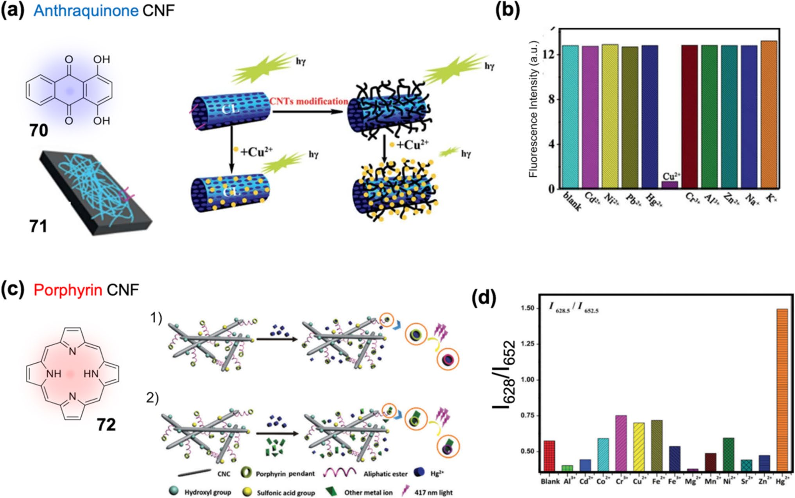

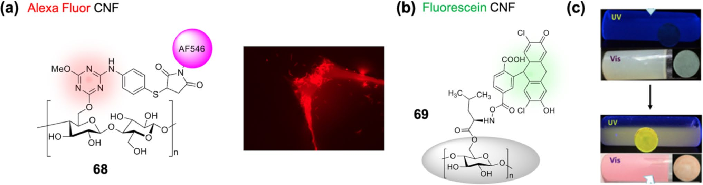

## Page 34

	
Advanced Composites and Hybrid Materials            (2025) 8:30 
   30  
Page 34 of 90
phenomenon takes place, leading to the recovery of fluo-
rescence for 70. The authors claim their designed material 
70 is a reusable, highly sensitive and selective probe for 
the detection of important heavy metal ions like ­Cu2+ and 
­Cr3+ ions [73].
Later, in 2017, Li and co-workers strategised a fluorescent 
nanoprobe 72 based on cellulose nanocrystals with pendant 
porphyrin molecules for the selective and quantitative detec-
tion of trace amounts of ­Hg2+. As depicted in Fig. 28c, the 
nanoprobe 72 consists of CNC, porphyrin pendant, aliphatic 
ester group, hydroxyl group and sulfonic acid group. Nano-
probe 72 shows ratiometric turn-on detection of ­Hg2+ even 
in the presence of different counter analytes at an emission 
intensity of 628 and 652 nm (Fig. 28d). The detection limit 
of ­Hg2+ by nanomaterial 72 is estimated as 50 nM. Accord-
ing to the authors, the good dispersion of CNCs and the high 
selectivity of porphyrin pendants resulted in the efficient and 
selective detection of ­Hg2+ in water [74].
Haung and his group applied a chemical modification 
technique for the fabrication of CNCs with fluorescent cou-
marin moiety for the formation of 73 and later employed it 
for the selective detection of ­Cu2+ ions (Fig. 29a). At first, 
the CNC surface was modified with ethylenediaminetet-
raacetic dianhydride (EDTAD) which aided in achieving 
a high degree of carboxylation, crystalline structure and 
surface integration utilizing the TEMPO oxidation method. 
Further, the modified CNCs were doped with fluorescent 
7-amino-4-methylcoumarin (AMC) to generate 73. Cellu-
lose material 73 is capable of selectively detecting ­Cu2+ with 
turn-off emission. Probe 73 showed good chelating property 
for ­Cu2+ ions. However, the quenching profile achieved is 
quite weak and so lags behind other reported probes in the 
field. The fluorescence quenching phenomenon of 73 in the 
presence of ­Cu2+ was estimated at 390 versus 440 nm. Probe 
73 can detect ­Cu2+ as low as 0.5 ppm. The authors think that 
the proposed strategy of material 73 for ­Cu2+ is applicable 
Fig. 29   a Chemical structure of cellulosic probe 73 and thereby vis-
ible detection of ­Cu2+. (Refer to the web version of this article for 
the legend colour). Reproduced from Ref. 75 with permission of 
Springer. b Method for the preparation of 74. c Fluorescence selectiv-
ity profile of 74 for ­Fe3+. (Refer to the web version of this article for 
the legend colour). Reproduced from Ref. 76 with permission of Else-
vier. d, e Preparation and utility of 75 for detection of ­Hg2+. (Refer 
to the web version of this article for the legend colour). Reproduced 
from Ref. 77 with permission of Elsevier

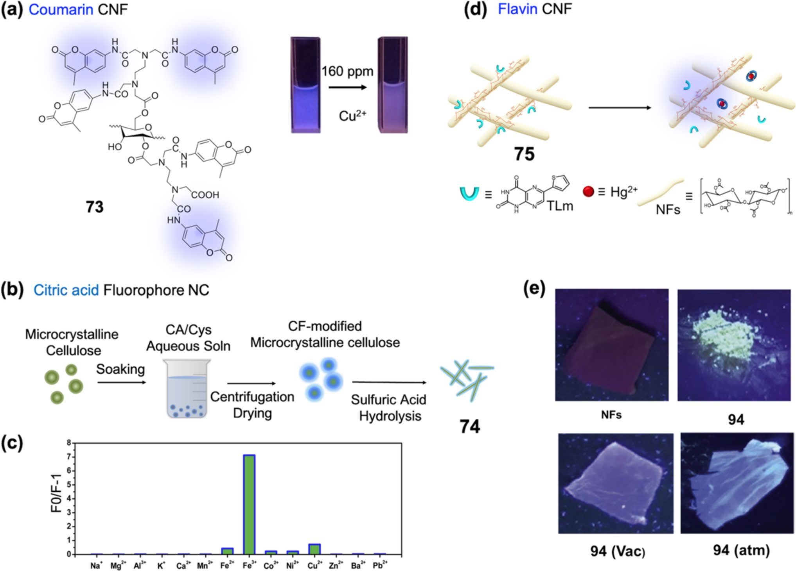

## Page 35

Advanced Composites and Hybrid Materials            (2025) 8:30 	
Page 35 of 90 
   30 
for optical imaging and real-time sensing of the important 
analyte [75]. In 2019, Xu and his team utilised fluorophore-
modified CNCs 74 as a biocompatible fluorescent probe 
for the detection of ferric ions and intracellular imaging. 
As depicted in Fig. 29b, the citrate-derived fluorophore 
modified on CNC 74 was prepared by using sulphuric acid 
hydrolysis of citric acid/cysteine-treated microcrystalline 
celluloses. The CNC 74 had a rod-like structure having an 
average length of 156 nm and width of 7.9 nm. The conju-
gation of citric-fluorophores aided in typical fluorescence 
characteristics of CNC material 74. Probe 74 showed fluo-
rescence emission at 435 nm on exciting at 350 nm. Probe 
74 displayed good photostability and high quantum yields 
of 83%. Figure 29 c shows the selective quenching profile 
of 74 for ­Fe3+ ions, even in the presence of different cations. 
The free carboxylic groups in 74 aid in the selective chela-
tion of ­Fe3+ ions, instantly leading to fluorescence quench-
ing of 74. CNC material 74 exhibits negligible cytotoxicity 
and is easily internalised by cells. Hence, CNC material 
74 can be applied for the detection of ­Fe3+ ions in living 
cells [76]. Saleh and co-workers introduced 6-thienylluma-
zine (TLm) fluorophores into cellulose acetate nanofibres 
(CNFs) to produce 75 and used them for the detection of 
mercuric acetate salts (Fig. 29d, e). In the solution state, 
the excited-state proton transfer (ESPT) from TLm to water 
molecules was tested in the pH range 2–12. Probe 75 was 
used for the detection of mercury acetate in the solid state. 
In the presence of mercury acetate, the solid-state emission 
of 75 is quenched. Moreover, the quenching phenomenon of 
75 was also observed for ­Hg2+ ions in aqueous media. The 
coordination of ­Hg2+ ions with sulphur, oxygen and nitro-
gen atoms in 75 with a stoichiometry of 2:1 ligand to metal 
is responsible for the fluorescence quenching phenomenon. 
The nanofabricated sensor 75 can detect mercuric ions at a 
concentration of 50 pM. The interaction between CNF mate-
rial 75 and mercuric ions creates a non-fluorescent ground 
state complex. The authors consider CNF material 75 for the 
real-time application of mercury ions [77].
Gao and his group developed a chiral photonic crystal 
membrane 76 based on CNCs by molecular assembly for the 
detection of formaldehyde (HCHO). As depicted in Fig. 30a, 
CNC material 76 constitutes 77 and a PEG 2000 moiety. 
CNC material 76 forms a hypersensitive fluorescent off–on 
switch, well characterised by changes in the UV–Vis spec-
trum and the texture of the liquid crystal. As the concentra-
tion of HCHO increases, a significant red shift in the reflec-
tance peak of the membrane is noticed from 498 to 736 nm. 
Moreover, the changes in colour and fluorescence of 76 in 
the presence of HCHO can be observed by the naked eye. 
Photo-induced electron transfer (PET) is observed between 
hydrazine moiety and the naphthalimide fluorophore in 76. 
The addition of formaldehyde to 76 causes the inhibition of 
PET mechanism, causing turn on in the emission profile of 
76.The detection mechanism and naked eye changes of 76 
in HCHO are shown in Fig. 30b [78].
Another interesting illustration of a cellulose nanocrystal-
based ­Hg2+ sensor was provided by Zhou and co-workers. 
In their work, Zhou and his group labelled CNCs with 
rhodamine and applied it as a selective colourimetric and 
fluorescence sensor for ­Hg2+ in an aqueous solution. The 
average dimension of 78 was about 18–20 nm in width and 
160–180 nm in length. The detection mechanism of probe 
78 for ­Hg2+ is depicted in Fig. 31a. Briefly, Rhodamine 
B-CNC (78) has a closed spirolactam ring responsible for 
colourless and quenched nature of probe 78. The chelation 
of ­Hg2+ ions with 78 leads to the spirolactam ring opening 
phenomenon aiding in pink colouration and fluorescence 
turn-on profile of 78. Moreover, probe 78 shows a selective 
turn-on (Fig. 31b) profile towards ­Hg2+ even in the presence 
of various counter analytes. CNC material 78 is capable of 
detecting ­Hg2+ in the pH range of 3–12. The fluorescent 
and colourimetric detection limits for 78 towards ­Hg2+ 
were determined as 232 nM and 746 nM, respectively. The 
authors assume that CNC 78 can be used for chemosensing, 
bioimaging and sewage treatment–based applications [79]. 
Fox and his group utilised another fluorescent dye, BODIPY, 
to label cellulose nanofibres to create 79 for the determina-
tion of environmental health and safety. The authors aimed 
to synthesise chemically and enzymatically stable BODIPY-
labelled CNF 79 for imaging in biological systems such as 
the gastrointestinal tract system (Fig. 31c). CNF 79 can show 
fluorescence in a wide pH range between 2 and 10. The tox-
icity of 79 was tested in in vitro small intestinal epithelial 
models and in vivo zebrafish (Fig. 31d) experiments [80].
In a similar report, by Zhu and co-workers, an AIE lumi-
nogen was labelled with cellulose nanocrystals (CNCs) 
for the rapid detection of ­Fe3+ in aqueous solutions. Here, 
the authors have modified CNCs with tetraphenylethylene 
(TPE)-based AIE active fluorophore to form CNC mate-
rial 80 (Fig. 31e). CNC 80 has high selectivity (quench-
ing) (Fig. 31f) and sensitivity for ­Fe3+ in the pH window 4 
to 10. The ‘O’ and ‘N’ groups in 80 are attributed for the 
selective complexation of ­Fe3+. However, ­Fe3+ is known 
to be a paramagnetic quencher with unfilled d-shell. These 
unfilled d-shell in ­Fe3+ engage in energy or electron trans-
fer mechanism with the fluorophore (TPE), resulting in the 
fluorescence quenching of 80. The limit of detection of 80 
for ­Fe3+ was determined as 264 nM. The authors predict 
that CNC material 80 can be utilised for the visual detec-
tion of ­Fe3+ in drinking water quality. However, CNC 80 
is a quenching probe and hence applicability is doubtful 
[81]. Kaushik and her team (2022) decorated fluoranthene 
with cellulose nanofibres, producing 81 (Fig. 31g) appli-
cable for the ultra-trace level detection and annihilation of 
Arsenic(III) (Fig. 31h). The fluorescence response of 81 is 
accredited to the metal chelation and simultaneous inhibition 

## Page 36

	
Advanced Composites and Hybrid Materials            (2025) 8:30 
   30  
Page 36 of 90
of PET phenomenon of 81 in the presence of Arsenic(III). 
The cellulose nanofibres used in this work were sourced 
from biomass wheat straw. The morphological and thermal 
properties of 81 were confirmed using FTIR, TGA, XRD, 
FESEM, EDS and TEM. The LOD for metal ion chelation 
(Arsenic (III)) by 81 was estimated as 2.8 ng ­L−1. The CNF 
material 81 showed excellent stability and reusability. How-
ever, the authors do not mention the real-time applicability 
of material 81 [82].
In 2021, Cai and their team utilised functionalised 
nanocrystal cellulose with a ‘rigidity-tensile’ joint approach, 
for generating acicular geometry and high crystallinity of 
formed heterogeneous nuclei–based polyurethane crystals 
82 and 83. Use of functionalised nanocrystal cellulose is 
credited for the improved tensile strength and Young’s 
modulus of 82 and 83. As represented in Fig. 32a, the dual 
network structure of 82 and 83 consists of three different 
components such as a functionalised nanocrystal cellulose 
unit, a polyurethane moiety, and fluorescent agents. The 
so-developed cellulosic materials 82 and 83 depict revers-
ible shape memory characteristics and diverse on and off 
display patterns under UV light (Fig. 32b). Therefore, the 
authors see a potential for the application of 82 and 83 in 
anti-counterfeiting applications [83]. As mentioned several 
times in this review, the abundance of hydroxyl groups on 
the surface of CNC allows it to hybridise with multiple 
optically active components. Taking the mentioned fact 
into consideration, Zhang et al. developed a multimodal 
switchable chiral optical platform 84 by adhering fluorescent 
lanthanide complexes on the surface on CNC and further 
utilizing it for anti-counterfeiting applications (Fig. 32c). 
The so-developed CNC material 84 displayed a full-colour 
appearance and bright photoluminescence with a genuine 
fluorescent lifetime of 510 µs accompanied by a quantum 
yield of 66.7%. Moreover, the developed 84 films exhibit 
a rare right-handed circular polarisation emission with an 
Fig. 30   a Procedure for the 
synthesis of 76 used for the 
detection of HCHO. b Detection 
mechanism of 77 for HCHO and 
its visual detection. (Refer to the 
web version of this article for 
the legend colour). Reproduced 
from Ref. 78 with permission 
of ACS

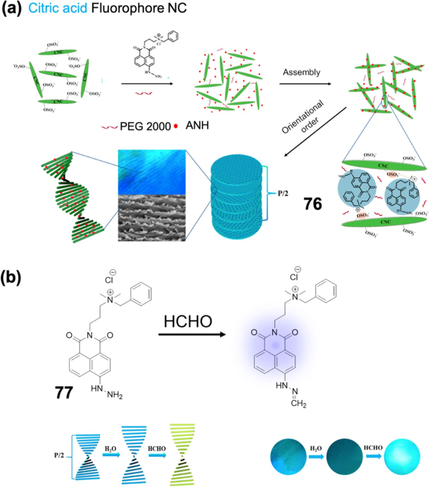

## Page 37

Advanced Composites and Hybrid Materials            (2025) 8:30 	
Page 37 of 90 
   30 
elevated asymmetry factor of − 0.36. Moreover, the film 84 
also displayed dynamic polarisation-sensitive colour switch-
ing. In the current work, the authors have integrated different 
features like chiral optical properties, structural colour, fluo-
rescent colour and circularly polarised luminescence (CPL) 
into a single composite 84 with the logical and autonomous 
encoding of each optical state (Fig. 32d). The authors con-
sider 84 to have great potential for utility as a multi-modal 
anti-counterfeiting label on model banknotes and other prac-
tical applications [84].
From earlier reports, it can be concluded that CNCs have 
distinct chiral nematic structures which help in enhancing 
Fig. 31   a Chemical structure and detection mechanism of 78 for 
­Hg2+. b Fluorescence selectivity profile of 78 for ­Hg2+. (Refer to 
the web version of this article for the legend colour). Reproduced 
from Ref. 79 with permission of Springer. c Chemical structure of 
BODIPY CNF molecule 79 for application in imaging. d 79 labelled 
in vitro study for estimation of toxicity. (Refer to the web version of 
this article for the legend colour). Reproduced from Ref. 80 with per-
mission of MDPI. e Chemical structure of CNC molecule 80. f Utili-
sation of 80 for the fluorescence quenching–based selectivity of ­Fe3+. 
(Refer to the web version of this article for the legend colour). Repro-
duced from Ref. 81 with permission of RSC. g Chemical structure 
of CNF-based probe 81. h Fluorescence selectivity of As(III) by 81. 
(Refer to the web version of this article for the legend colour). Repro-
duced from Ref. 82 with permission of Elsevier

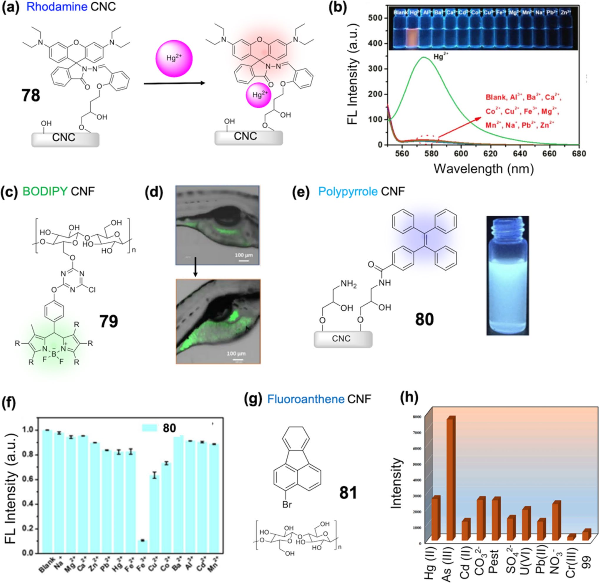

## Page 38

	
Advanced Composites and Hybrid Materials            (2025) 8:30 
   30  
Page 38 of 90
the optical properties of materials. However, CNCs lack 
in mechanical performance and have poor hydrophobicity 
resulting in lower practicality. In 2022, Yuan and cowork-
ers developed chiral nematic composite films 85 and 86 by 
incorporating polyethylenimine (PEI) in the prolonged CNC 
film matrix (Fig. 33c, d). The so-developed CNC films 85 
and 86 exhibited improvement in physical qualities like 
toughness and strain accompanied with extremely high fold-
ing resistance. Moreover, CNC films 85 and 86 displayed 
superior cryptographic properties with excellent optical 
responding capability. Moreover, to create a 3D crosslinked 
network, a water-soluble substrate polyethylene glycol dia-
crylate (PEGDA) was introduced into 85 and 86 by UV 
curing technique. Moreover, the crosslinking network in 
Fig. 32   a Method and mechanism involved in the preparation of 82 
and 83 accompanied by utility in anti-counterfeiting. b Mechanism of 
application of 83 in anti-counterfeiting applications by developing a 
device. (Refer to the web version of this article for the legend col-
our). Reproduced from Ref. 83 with permission of Elsevier. c Com-
plete illustration of generation and working mechanism of 84. d Chiro 
optical characterisation performed for 84. (Refer to the web version 
of this article for the legend colour). Reproduced from Ref. 84 with 
permission of Wiley

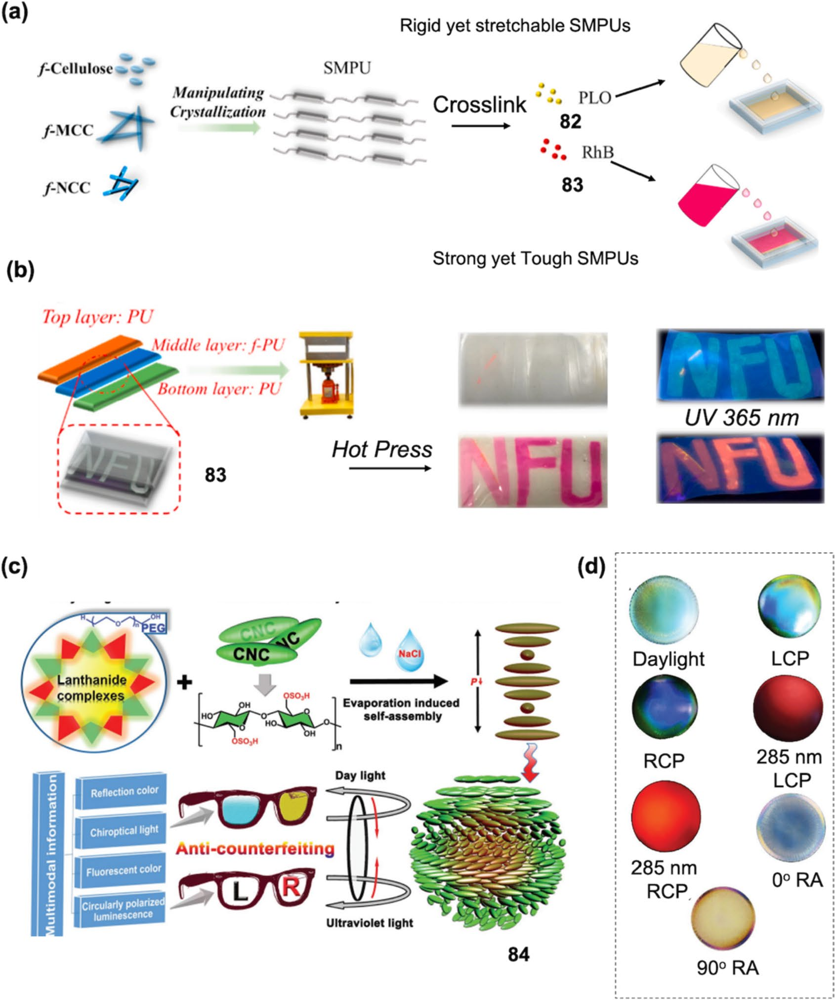

## Page 39

Advanced Composites and Hybrid Materials            (2025) 8:30 	
Page 39 of 90 
   30 
85 and 86 aided in improving its water resistance capabili-
ties (Fig. 33e). In these works, variant crosslinking degree 
materials of 85 and 86 are formed, which ultimately aided 
in improving the practical applicability and cyclic stability 
as anti-counterfeiting labels [85].
3.2.2  Colourimetric‑based nanofibres and nanocrystals
In early 2016, Shankaran and co-workers developed 
curcumin-loaded biocompatible nanofibres (CNFs) 87 
(Fig. 34a) for ­Pb2+ ion detection. The ­Pb2+ probe 87 was syn-
thesised by combining cellulose acetate nanofibres with cur-
cumin. The average diameter of the optimised CNF material 
87 was determined as 104 nm. CNF material 87 showed high 
selectivity with naked-eye colourimetric change (Fig. 34b) 
for ­Pb2+ in the presence of other counter cations. In the pres-
ence of ­Pb2+, curcumin-Pb2+ complex is formed that allows 
the colourimetric changes in 87. CNF material 87 can detect 
very low levels of ­Pb2+ (20 µM) in the aqueous solution. The 
authors claim that 87 was the first reported material for ­Pb2+ 
detection based on curcumin nanofibres. They also confirm 
that CNF material 87 shows promising effects if used for the 
development of low-cost disposable sensors for rapid and 
real-time applications [86]. Later in 2018, Lee and his group 
introduced cellulose nanocrystal-derived coloured thin films 
for the colourimetric detection of aldehyde gases. The CNC 
film 88 was created by dip-and-pull process by aiding the 
close packing of CNC on a solid surface by utilizing ionic-
liquid (1-butyl-3-methylimidazolium) molecules which also 
helps in screening the repelling electrostatic charges between 
CNCs. The thickness of the film was controlled between 
100 to 300 nm. The CNC film 88 was surface-modified with 
amine functionalities using APTES (Fig. 34c, d). The amine 
groups aided the binding of aldehyde moieties to 88, which 
caused colourimetric changes to the film (Fig. 34e). The 
authors expect that this approach (i.e., 88) will enable rapid 
and inexpensive colourimetric detection of volatile organic 
compounds and also on-site monitoring capabilities [87].
Chauhan and his team developed a spherical nanocel-
lulose-based material 89 for the efficient and rapid multi-
functional naked-eye detection of Cr(VI). In the presence of 
Cr(VI), selective colourimetric change in 89 was observed 
from colourless to orange (Fig. 35a). The efficient absorption 
Cr(VI) of onto 89 is attributed to the selective colour change 
of 89. The spherical nano cellulose 89 can detect Cr(VI) as 
low as 30 ppb at naked eyes. The mild antimicrobial activity 
of 89 was also tested [88]. In another work, Khayatian and 
co-workers (2019) reported a nanocellulose-based colouri-
metric assay kit for efficient smartphone sensing of ­Fe3+ and 
­Fe3+-chelating deferoxamine drug in biofluids. The colouri-
metric assay kit 90 was produced by embedding curcumin in 
transparent bacterial cellulose (BC) nanopaper (Fig. 35b). In 
the presence of ­Fe3+ and ­Fe3+-chelating deferoxamine drugs, 
the absorbance/colour intensity of 90 is decreased (Fig. 35c). 
The formation of ­Fe3+-curcumin complex decreases the col-
our intensity of curcumin embedded on bacterial cellulose 
nanopaper surface (Table 1) of 90. Further, owing to the 
stronger chelation property of deferoxamine for ­Fe3+, the 
­Fe3+-curcumin complex disrupts, resulting in recovery of the 
colour intensity of 90. Material 90 was utilised for detection 
of ­Fe3+ and ­Fe3+-chelating deferoxamine drug concentra-
tions in biofluid samples like human serum blood samples, 
revealing the clinical applicability of the developed assay 
kit. The authors consider that cellulosic material 90 can be 
applicable for the sensitive, selective and easy diagnosis of 
iron-related diseases [89]. In the same year, Maghsoudi and 
his group developed a curcumin-fabricated bacterial nano-
cellulose material as an assay kit 91 for albumin (Fig. 35d). 
The authors claim that 91 has excellent optical transparency, 
porosity, high flexibility, biodegradability and printability. 
For the attachment of albumin onto 91, the hydrophilic zones 
Fig. 33   a Schematic diagram depicting the fabrication of chi-
ral nematic 85 and 86 composite films. b Example of the possible 
mechanism involved in chiral photonic films 85 and 86. c Reversible 
fluorescence emission of the snake-patterned film, which is quenched 
by addition of 0.01  mol ­L−1 HCl solution and then recovered by 
0.01 mol ­L−1 ammonia solution. (Refer to the web version of this arti-
cle for the legend colour). Reproduced from Ref. 85 with permission 
of Elsevier

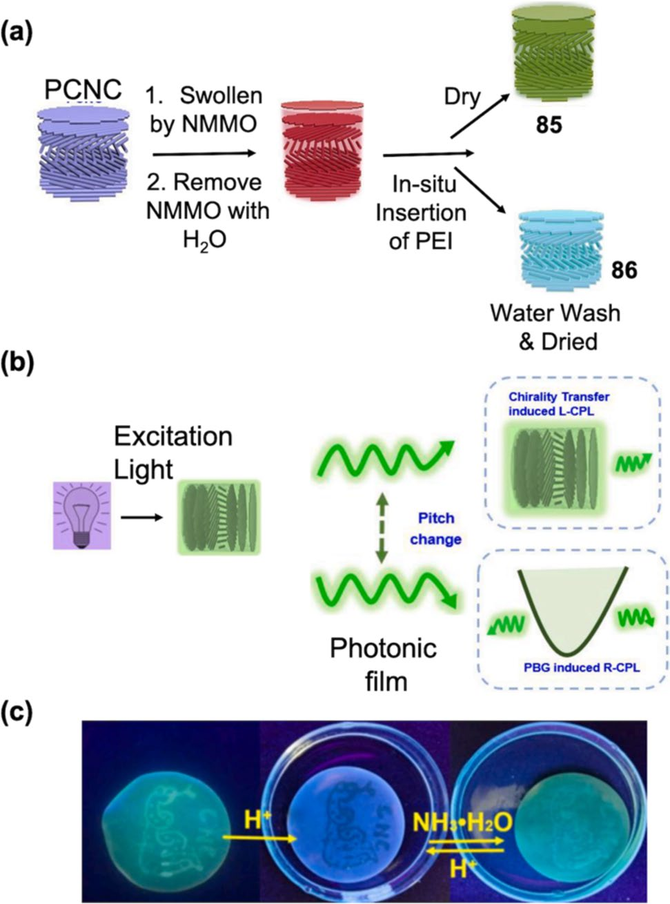

## Page 40

	
Advanced Composites and Hybrid Materials            (2025) 8:30 
   30  
Page 40 of 90
are created on the fabricated bioplatform by creating hydro-
phobic walls utilising laser printing technology (Fig. 35e). 
The colour change of 91 is accredited to the inhibitory effect 
of HSA on the curcumin degradation in alkaline solutions. 
Cellulosic material 91 can be applied for the visual detection 
of human serum albumin (HSA) in the concentration range 
10–300 µM and 25–400 µM. The authors predict the appli-
cability of cellulosic assay 91 for HSA for the development 
of next-generation optical biosensing platforms [90].
3.3  Cellulose nanodots
Carbon or quantum dots are generally defined as an interest-
ing class of carbon nanoparticles that majorly consists of 
carbons with sizes of approximately 10 nm [244]. Carbon 
and quantum dots show strong fluorescent and colourimet-
ric properties due to their strong quantum confinement with 
tunable optoelectronic and photoluminescence [245]. Car-
bon and quantum dots are widely used in many fields like 
in vivo imaging [246], cell imaging [247], drug delivery 
[248], photocatalysis [249], fluorescence sensing [250], mul-
ticolour light-emitting diodes (LEDs) [251], energy conver-
sion and storage [252]. Carbon and quantum dots are syn-
thesised using top-down (electrochemical oxidation [253], 
arc discharge [254] and laser ablation [255]) and bottom-up 
approaches (pyrolysis [256], micro-wave assisted method 
[257], ultrasonic method [258] and solvothermal method 
[259]). The raw materials for the synthesis of carbon and 
quantum dots are classified as organic and inorganic carbon 
sources. However, in practice, organic carbon sources such 
as organic natural products and biomass waste (cellulose 
comes under this category) and organic compounds are 
extensively utilised in the preparation of carbon and quan-
tum dots [260]. In this section, carbon and quantum nano-
dots either generated from cellulose substrates or modified 
on cellulose molecules and their application in the develop-
ment of fluorescent chemosensors will be discussed.
Zhang and co-workers implemented a hydrothermal strat-
egy for the synthesis of water-stable fluorescent carbon dots 
(CDs) as nanosensors for monitoring pH and temperature. 
The carbon dots 92 was achieved by the hydrothermal treat-
ment of glucose (GLC) in the presence of glutathione (GSH) 
(Fig. 36a). The hydrothermal method of synthesis aids the 
simultaneous formation and surface passivation of CDs. 
Reaction temperature, feed ratio (GSH/GLC) and reaction 
time influence the photoluminescence properties of CDs. 
Figure 36 b and c depict the utility of 92 in the detection 
of pH. Probe 92 has a pronounced temperature dependence 
and underwent temperature and pH-induced aggregation. 
The authors claim that CDs 92 if combined with cellulose 
Fig. 34   a Chemical structure of curcumin-CNF material 87. b Visual 
eye selectivity profile of 87 for ­Pb2+. (Refer to the web version of this 
article for the legend colour). Reproduced from Ref. 86 with permis-
sion of Elsevier. c Schematic depicting the complete fabrication and 
preparation of 88. d Schematic illustration of the optical measure-
ment setup. e Principal component analysis (PCA) plot of the col-
our shifts of both aldehyde (black, red) and other nonaldehyde gases 
(magenta, blue, green) showing the selectivity profile of the colour 
film sensor 88. (Refer to the web version of this article for the legend 
colour). Reproduced from Ref. 87 with permission of ACS

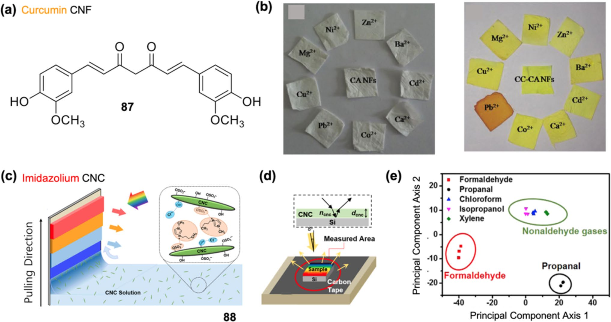

## Page 41

Advanced Composites and Hybrid Materials            (2025) 8:30 	
Page 41 of 90 
   30 
Fig. 35   a Chemical structure and mechanism for the development of 
89 (top) with visible colourimetric change in the presence of Cr(VI) 
(bottom). (Refer to the web version of this article for the legend col-
our). Reproduced from Ref. 88 with permission of Elsevier. b Chemi-
cal structure of the deferoxamine nanocrystal. c Colourimetric naked 
eye changes occurring in 90 after addition of varied concentrations 
of ­Fe3+. (Refer to the web version of this article for the legend col-
our). Reproduced from Ref. 89 with permission of Elsevier. d Struc-
tural components in nanopaper 91. e Visible detection of HSA by 91. 
(Refer to the web version of this article for the legend colour). Repro-
duced from Ref. 90 with permission of Elsevier
Fig. 36   a Synthetic method for the formation of 92. b Photophysical 
property of 92 at variant wavelengths. c Visible fluorescence changes 
in the profile of 92 with varying pH. (Refer to the web version of this 
article for the legend colour). Reproduced from Ref. 91 with permis-
sion of Elsevier. d Synthetic procedure for the preparation of CdTe 
QDs/BC nanocomposite 93. e Quenching-based selectivity profile of 
93 for ­Cu2+ in the presence of other counter analytes. f 93 doped cel-
lulose paper for the visual detection of ­Cu2+. (Refer to the web ver-
sion of this article for the legend colour). Reproduced from Ref. 92 
with permission of RSC

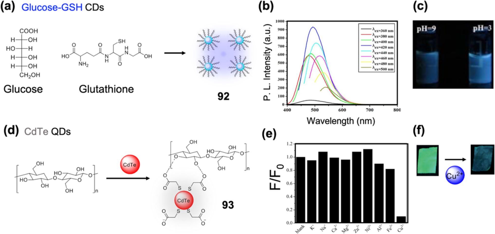

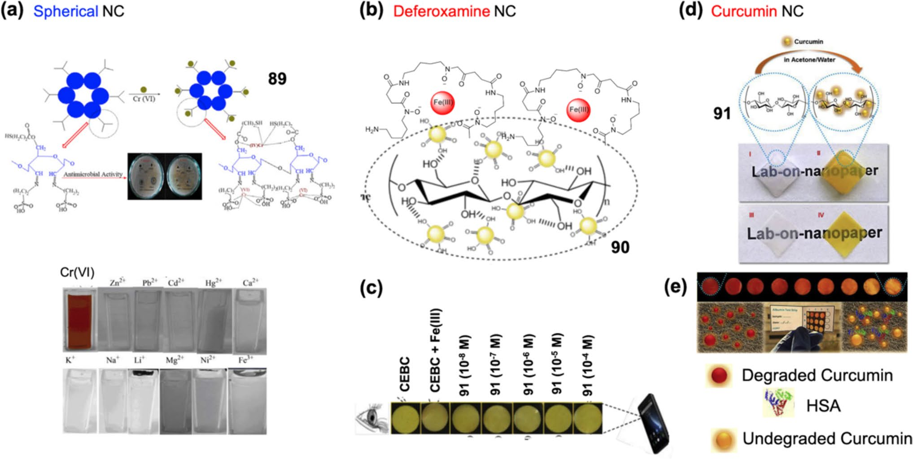

## Page 42

	
Advanced Composites and Hybrid Materials            (2025) 8:30 
   30  
Page 42 of 90
paper can be used for the real-time monitoring of pH and 
temperature in real samples [91].
In the same year, Wang and his group utilised a different 
strategy for the development of colour-tunable luminescent 
CdTe quantum dots (QDs). In the report, CdTe-derived 
QDs were transformed into sensor membranes by fabricat-
ing with bacterial cellulose (BC) forming 93 (Fig. 36d). In 
the synthesis of CdTe, no N2 protection, special ligand or a 
particular treatment was required. Cellulosic Qd material 93 
showed selective quenching (Exi = 370 nm) for ­Cu2+ even 
in the presence of different counter metal ions (Fig. 36e, f). 
Surface defects are generated on the quantum dots when 
combined with ­Cu2+ ions to a non-radiative recombination 
of the excitons followed by fluorescence quenching. Cellu-
losic QD material 93 can detect ­Cu2+ as low as 0.016 mM. 
The CdTe QDs on BC membranes 93 show high detect-
ability and applicability for the detection of ­Cu2+ in real 
samples. However, the efficacy of 93 for Cu.2+ is doubtful 
owing to the quenching profile [92]
Later, Zhuo and co-workers introduced CDs as versa-
tile carbon-based nanomaterials developed using acidic 
ionic liquid as catalysts. As depicted in Fig. 37a, the CDs 
94 were prepared from microcrystalline cellulose (MCC) 
using 1-butyl-3-methylimidazolium chloride ([Bmim]Cl) 
as a solvent and ­SO3H-functionalised acidic ionic liquid 
­(SO3H-IL) as a catalyst. The cellulosic QDs 94 show excel-
lent water solubility and photostability. In the presence 
of ­Hg2+, the photoluminescence profile of cellulosic QDs 
94 was quenched (turn-off) with excitation wavelength at 
360 nm and emission at 450 nm (Fig. 37a, b). 94 can detect 
­Hg2+ in the concentration range of 6 to 80 µM (Fig. 37c). 
The authors assume that the carboxylic and hydroxyl groups 
in 94 are favourable for ­Hg2+ over other metal ions. The 
authors confirm that 94 can be utilised for the detection of 
inorganic ­Hg2+ in drugs, biological products and fish sam-
ples [93]. In 2016, Tang and his team reported acidophilic 
S-doped carbon quantum dots (CQDs) 95 synthesised from 
cellulose fibres capable of detecting metal ions in extremely 
strong acid environments. The CQDs 95 was synthesised 
from widely available cellulose fibres. The cellulose fibres 
act as carbon precursors and sulphuric acid was utilised as 
the carbonization agent and dopant in the formation of 95 
(Fig. 37d). The CQD material 95 demonstrated extremely 
acidophilic high luminescence and high quantum yields of 
32% in strong acid solutions. Cellulosic CQDs 95 exhibited 
a very high selectivity accompanied by fluorescence quench-
ing for ­Fe3+ ions. The high selectivity is attributed to the 
rapid electron transfer between ­Fe3+ ions and the surface of 
electron-rich oxygen containing CQDs. The detection limit 
of 95 for ­Fe3+ was estimated as 0.96 µM. The cellulosic 
CQDs 95 exhibited excellent selectivity and sensitivity for 
the detection of ­Fe3+ at very acidic pH (Fig. 37e, f). The 
limit of detection of 95 for ­Fe3+ at pH 0 is estimated as 
0.96 µM. The authors claim that 95 CQDs lay the foundation 
for the detection of metal ions at acidic pH [94].
Krull and co-workers, in 2017, employed aptamer-linked 
QD 96 and fabricated it on cellulose paper for the detec-
tion of cancer biomarker protein. Cellulose-modified QD 
96 showed FRET-based detection of epithelial cell adhe-
sion molecule (EpCAM) (Fig. 38a). Probe 96 constitutes 
aptamer-linked QDs and Cy3 labelled complementary DNA 
(cDNA), which act as a donor and acceptor, respectively. 
Competitive binding of EpCAM with cDNA present in 96 
results in the reduction of FRET emission. The paper-based 
bioassay 96 was able to detect cancer biomarker protein 
EpCAM in buffer solution as well as in 10% bovine serum 
solution. Paper-based bioassay 96 showed a limit of detec-
tion 250 pM in the dynamic range 1–100 nM (Fig. 38b, c) 
for cancer biomarker protein EpCAM [95]. In the same 
year (2017), Wei and his group utilised the self-assembly of 
nitrogen-doped carbon dots (CDs) and anchored it on bacte-
rial cellulose (BC) forming 97 (Fig. 38d) and applied it for 
the detection of ­Fe3+ ions. The nitrogen-doped carbon dots 
were synthesised utilizing citric acid and ethylenediamine 
in a facile hydrothermal technique. In the presence of ­Fe3+, 
the fluorescence intensity of 97 on excitation at 350 nm is 
quenched (Fig. 38e). The (–NH2, –COOH, –OH) groups in 
97 are capable of selectively chelating ­Fe3+ forming sta-
ble ­Fe3+-97 complexes. The formation of this complexes 
leads to the electron transfer from the surface of 97 causing 
fluorescence quenching phenomenon. The detection limit of 
cellulose-modified 97 for ­Fe3+ was estimated as 84 nM. The 
authors predict that material 97 can be used for the detection 
of ­Fe3+ ions in real-time analysis [96].
In a similar work, Wu and co-workers sourced cellulose 
from biowaste for the preparation of nitrogen and sulfur co-
doped CDs 98 (Fig. 39a). The heteroatom-doped CDs come 
with a high quantum yield of 13.3%. The nitrogen and sul-
fur functional groups in 98 were achieved by the burning 
of urea and sulphuric acid. The cellulose-derived CD 98 
were further used for the selective detection of ­Fe3+ ions 
(Fig. 39b, c) in biological samples. Electron transfer mecha-
nism between the surface of 98 and ­Fe3+ ions is accredited 
for the fluorescence quenching phenomenon. CD 98 have a 
diameter of 7.3 nm and demonstrated superior photostability, 
pH stability and low cytotoxicity. The authors have tested 
the ­Fe3+ detection efficacy of CD 98 in intracellular samples 
[97]. Later, Wei and co-workers built a 3D network structure 
of BC made by layer-by-layer in situ cultivation containing 
nitrogen-doped graphene oxide quantum dot 99 (Fig. 39d). 
The QDs were homogeneously distributed in the bacterial 
cellulose mats via hydrogen bonding to form 99 (Fig. 39e). 
The bacterial cellulose QDs 99 showed a quenching effect 
when in contact with ­Fe3+. The strong coordination between 
­Fe3+ ions and (–NH2 and –OH) groups in 99 is held respon-
sible for the selective quenching of fluorescence. The LOD 

## Page 43

Advanced Composites and Hybrid Materials            (2025) 8:30 	
Page 43 of 90 
   30 
of 99 for ­Fe3+ was determined as 69 nM. Probe 99 was uti-
lised for the detection of ­Fe3+ in water samples [98].
In a separate effort, Lin and co-workers developed 
fluorescent aerogels based on the chemical crosslink-
ing between nanocellulose and carbon dots for advanced 
optical sensing applications. Nanocellulose-based aero-
gels mentioned in this work are known for their features 
like sustainability, lightweight, available surface reactiv-
ity, high porosity and specific surface area. The aerogel 
100 revealed in the report is attained by the crosslink-
ing of naturally obtained cellulose nanofibre and amine-
functionalised CDs (Fig. 40a). Cellulose-aerogel 100 was 
utilised for the sensitive and selective recognition of ­NOx 
and aldehyde species. The fluorescence selection patterns 
Fig. 37   a Synthetic track for the preparation of 94. b Photophysi-
cal profile for 94. c Selectivity profile of 94 for ­Hg2+ in the presence 
of different counter cations. (Refer to the web version of this article 
for the legend colour). Reproduced from Ref. 93 with permission of 
Springer. d Complete synthesis mechanism for 95. e Selectivity pro-
file of 95 for ­Fe3+ in the presence of various counter cations. f Naked 
eye selectivity images of 95 for ­Fe3+. (Refer to the web version of this 
article for the legend colour). Reproduced from Ref. 94 with permis-
sion of RSC

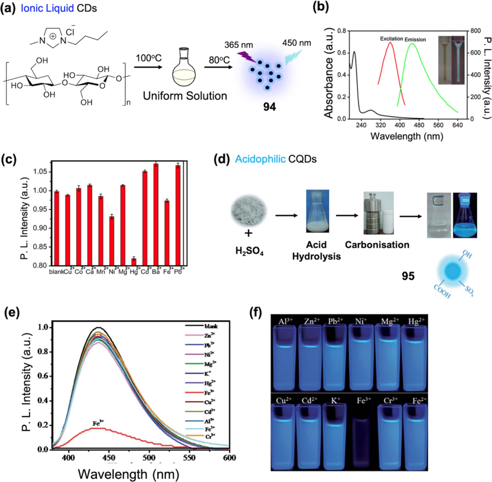

## Page 44

	
Advanced Composites and Hybrid Materials            (2025) 8:30 
   30  
Page 44 of 90
of 100 were quenched in the presence of specific gase-
ous and liquid molecules. The adsorption and trapping 
of ­NOx inside the porous holes of 100 leads to the pre-
vention of radiative recombination of electrons generated 
from the interaction between the electron-donating group 
of 100 and electron withdrawing group of ­NOx, result-
ing in the fluorescence quenching. On the other hand, in 
the case of aldehyde detection, the covalent interactions 
between the aldehyde-groups and free amino groups in 
100 are held responsible for the fluorescence quenching 
in aqueous medium. Moreover, for glutaraldehyde (GA) 
the cellulose-derived aerogel displayed high sensitivity to 
trap the GA molecules at ppm concentrations [99]. Later, 
Minami and his team designed and prepared a fluorescent 
spherical sponge cellulose sensor 101 for the selective and 
semi-quantitative visual detection of ­Hg2+ and ­Cu2+. The 
spherical sponge 101 constituted of cellulose as base mate-
rial and CDs generated from nitrogen-doping reagent and 
citric acid as an external carbon source (Fig. 40b). The 
microwave technique was used for the synthesis of 101. 
The porous structure of fluorescent cellulose sponge 101 
gave it the capability to adsorb and detect ­Hg2+ and ­Cu2+ 
ions. Figure 38 c depicts the selectivity mechanism and 
detection profile of 101 towards ­Hg2+ and ­Cu2+. The detec-
tion limit of probe 101 is estimated as 26 nM and 20 µM 
respectively. According to the authors, the fluorescent cel-
lulose sponge 101 aided in the protection of probes from 
environmental interference and comes with a recyclability 
of 22 cycles when exposed to ethylenediaminetetraacetic 
acid (EDTA) [100].
In 2020, Ji et al. applied fluorescent cellulose paper–based 
chemosensor 103 loaded with CDs for the detection of folic 
acid. The fluorescent paper platform 103 was constructed 
on a hybrid polydimethylsiloxane (PDMS)/paper platform 
where cellulose papers fabricated with CDs as luminophores 
by Schiff base chemistry were laden on the grooves array 
of designed PDMS plate (Fig. 41a). Under optimal condi-
tions, fluorescent paper platform 103 enabled a rapid fluo-
rescence quenching response towards folic acid through an 
inner filter effect in a wide range of 1–300 µmol/L−1. The 
authors expect that 103 will have paramount importance for 
practical applications in biosensing and clinical diagnostics 
[101]. In another work, Sun and coworkers designed and 
developed a strategy for the preparation of nitrogen-doped 
fluorescent CD 105 by utilising oxidised cellulose by hydro-
thermal treatment (Fig. 41b). The cellulose-derived CD 105 
are monodispersed and spherical with a mean diameter of 
1.86 nm. The produced CD 105 demonstrated improved 
quantum yields of 16.1 and 30.3% with an oxidation treat-
ment. CD 105 showed a selective fluorescence turn-off pro-
file in the presence of ­Fe3+ ions (Fig. 39c). Cellulosic mate-
rial 105 is rich in amino and hydroxyl groups, which strongly 
coordinates with ­Fe3+ forming 105-Fe3+ complex, aiding 
in the electron transfer mechanism, leading to fluorescence 
Fig. 38   a Procedure for the 
generation of 96. b Red (R) 
and green (G) channels of 
digital fluorescence images and 
c FRET ratio measured from 
different sources using 96. 
(Refer to the web version of this 
article for the legend colour). 
Reproduced from Ref. 95 with 
permission of RSC. d Chemical 
structure of cellulosic mate-
rial 97. e Naked eye detection 
images of 97 for ­Fe3+ under 
UV lamp 365 nm. (Refer to the 
web version of this article for 
the legend colour). Reproduced 
from Ref. 96 with permission of 
Elsevier

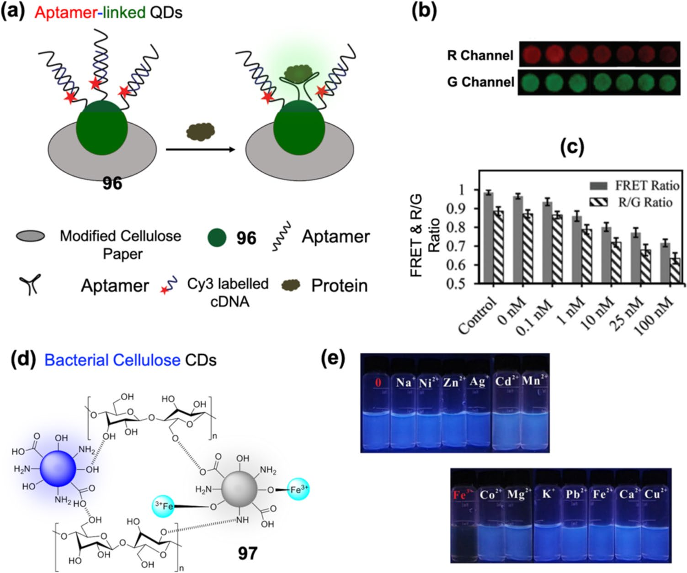

## Page 45

Advanced Composites and Hybrid Materials            (2025) 8:30 	
Page 45 of 90 
   30 
quenching. 105 was capable of detecting ­Fe3+ as low as 
1.14 µM. The bioimaging applicability of 105 towards ­Fe3+ 
detection was tested in Vero cells (Fig. 41d). The authors 
confirm that 105 can be used for potential applications in 
sensor, biomedical and bioimaging techniques [102]. In the 
case of CDs, their aggregation properties limit their wide 
applications.
To overcome this, Zhang and co-workers synthesised two 
cellulosic derivatives, 106 and 107, constituting positive and 
negative charges. The cellulose derivatives in 106 and 107 
act as a protective shell for CDs via electrostatic interactions 
(Fig. 42a). The embedding of CDs onto the surface of cellu-
losic matrix (106 and 107) prevents the aggregation of CDs, 
hence improving the retention of its luminescence. Moreo-
ver, the use of cellulose in 106 and 107 eases the formation 
of films (Fig. 42b), inks (Fig. 42c), coatings (Fig. 42d) and 
many more anti-counterfeiting applicable products. Also, 
the authors consider 106 and 107 capable of applicability 
in information encryption [103]. In an approach to reduce 
waste generation, Sun et al. extracted cellulose diacetate 
(CDA) from wastes like discarded cigarette filters and used 
it as a precursor for preparing N-doped carbon dots (N-CDs). 
The N-CD 108 were prepared by a one-pot hydrothermal 
carbonization in aqueous solution using a low-cost ammo-
nium hydroxide (passivation agent) (Fig. 42e). The so-devel-
oped 108 exhibited an overall quantum yield of 22.4% upon 
excitation at 320 nm with emission at 415 nm. The authors 
also found an excellent application for the green material 
by explicitly using it for the detection of tetracycline. The 
cellulosic N-CD 108 is capable of detecting tetracycline as 
Fig. 39   a Procedure for the synthesis of 98. b Interference-based 
selectivity study of 98 for ­Fe3+. c Visual eye titration profile for 98 
with varying ­Fe3+ concentrations. (Refer to the web version of this 
article for the legend colour). Reproduced from Ref. 97 with permis-
sion of Elsevier. d Chemical structure and complete detection mecha-
nism of 99 for ­Fe3+. e Chemical synthesis and formation of 99 films. 
(Refer to the web version of this article for the legend colour). Repro-
duced from Ref. 98 with permission of Springer

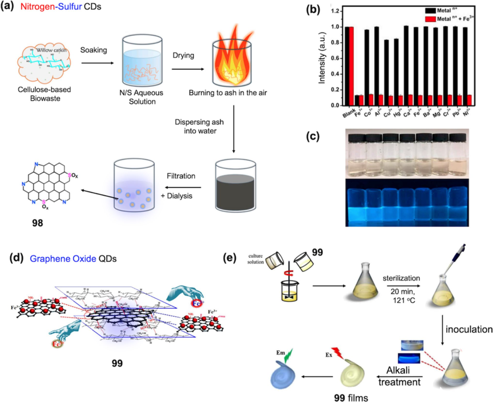

## Page 46

	
Advanced Composites and Hybrid Materials            (2025) 8:30 
   30  
Page 46 of 90
low as 0.06 µM. The authors also consider the probability 
of 108 for applicability in fluorescent inks for anti-forgery 
(Fig. 42f) [104].
Later in the same year (2020), Li and co-workers brought 
back the combination of quantum dots (QDs) with tunicate 
cellulose nanofibrils to create a nanohybrid platform 110 
for application as 1D ink and 2D film. The synthesis of 
110 was achieved by the technique shown in Fig. 43a. The 
QD factions in 110 are obtained from the CdSe/CdS core/
shell, which is further homogenously blended with tunicate 
cellulose nanofibrils. The so-formed cellulosic nanohybrid 
110 exhibits excellent writing fidelity when consumed as a 
1D ink. Moreover, 110 displayed properties like good pro-
cessability during generation, good flexibility and transpar-
ency (Fig. 43b). Due to such fantastic qualities of 110, the 
authors recommend its utility in anti-counterfeiting tech-
nologies [105]. Nanofibrillated cellulose (NFC) is consid-
ered to possess excellent anti-counterfeiting properties like 
renewability, biocompatibility and easy modifiability. In 
2020, Chen and their group used Yb and Er-doped CQDs 
Fig. 40   a Complete chemical procedure and mechanism for the con-
struction of nanocellulose QD 100. (Refer to the web version of this 
article for the legend colour). Reproduced from Ref. 99 with permis-
sion of ACS. b Chemical structure and detection mechanism of 101 
for ­Hg2+. c Selectivity profile of 101 for ­Hg2+ in the presence of vari-
ous other counter cations. (Refer to the web version of this article for 
the legend colour). Reproduced from Ref. 100 with permission of 
ACS

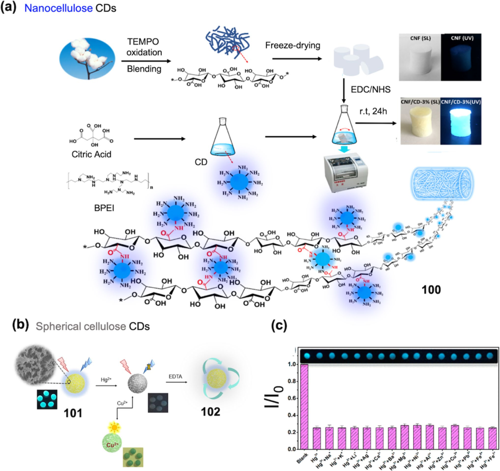

## Page 47

Advanced Composites and Hybrid Materials            (2025) 8:30 	
Page 47 of 90 
   30 
for grafting onto dialdehyde NFC forming 111 applicable in 
anti-counterfeiting technology (Fig. 43c).
The developed material NFC displayed excellent rheo-
logical properties and indeed aided in the formation of a 
waterborne fluorescent dual anti-counterfeiting ink 111. The 
presence of Yb and Er doping in CQDs enabled dual photo-
physical properties of photoluminescence and up-conversion 
luminescence (Fig. 43d). The authors consider 111 to be 
productive in the generation of exceptional materials for the 
printing and packaging industries [106].
In 2021, Ekgasit and co-workers developed a fluorescent 
nanohybrid 113 constituting of ZnO QDs and cellulose 
nanocrystals for application as anti-counterfeiting ink. In 
113 ZnO QDs, bacterial cellulose nanocrystals were com-
bined by electrostatic self-assembly for improving solvent 
resistance and message encryption process (Fig. 44a). When 
investigated on printed areas, 113 can slightly enter into the 
paper fibres and form a thin layer on the top of paper sub-
strates, conferring a heightened print permanence against 
wetting conditions while remaining unobservable to the 
naked eye in under visible light and maintaining lumines-
cent stability. The cellulose based in 113 is water resist-
ant enabling it to develop a higher security level that the 
print can be submerged in ­CuCl2 aqueous solution result-
ing in quenching of luminescence (Fig. 44b). The authors 
consider that the cellulosic-ink 113 shows potential for use 
in security devices of anti-counterfeiting [107]. Yang and 
his group designed and developed a facile strategy for the 
preparation of carboxymethylcellulose-derived polymer dots 
(CPDs) 116 and utilised it for the detection of tetracyclines 
(Fig. 44c). Here, CMC and citric acid are used as precur-
sors for synthesizing 116. The CPDs 116 have a spherical 
shape, are water soluble and show blue-green emission. The 
average diameter of generated CPDs 116 is approximately 
11.3 nm. The so-developed CPDs 116 show high selectivity 
for tetracycline (Fig. 40d). The CPDs 116 were capable of 
detecting tetracycline using an inner filter effect. The CPDs 
116 can detect tetracycline with estimated detection limits 
of 4.1 × ­10−9 M. The authors have utilised the developed 
CPD 116 for the detection of tetracyclines in real samples, 
including tap water, milk and river water [108].
In another illustration of multi-modal anti-counterfeiting 
labels, Li et al. developed 117 prepared by utilising a sol-
vothermal technique for the preparation of ­NaGdF4:Yb3+, 
­Er3+@CD nanoparticles and dispersed them in hexane 
solution. The so-dispersed CDs exhibited visible light 
green emission under NIR light source of 980 nm and 
light blue–coloured emission while kept under 365-nm UV 
lamp. Final touches in the formation of 117 were added 
by painting the dispersed CD on the surface of cholesteric 
Fig. 41   a Complete chemical synthetic route for development of 
nitrogen doped CD 104. (Refer to the web version of this article for 
the legend colour). Reproduced from Ref. 101 with permission of 
Springer. b Synthesis procedure for 105. c Selectivity profile of 105 
for ­Cu2+ and ­Fe3+. (d) Visualisation in HeLa cells. (Refer to the web 
version of this article for the legend colour). Reproduced from Ref. 
102 with permission of Elsevier

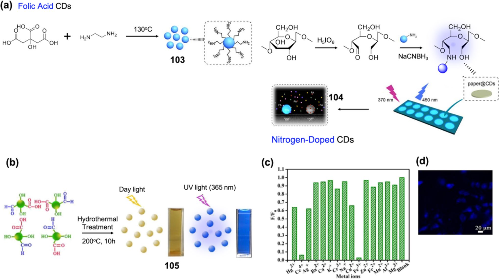

## Page 48

	
Advanced Composites and Hybrid Materials            (2025) 8:30 
   30  
Page 48 of 90
Fig. 42   a Complete synthetic procedure for the development of 106 
and 107. b Colour changes on 106 and 107 test strips. c, d Screen 
printing of 106 and 107 on different patterns like letters and flower. 
(Refer to the web version of this article for the legend colour). Repro-
duced from Ref. 103 with permission of ACS. e Synthetic route for 
108. f Utilisation of 108 ink in encoding and anti-counterfeiting. 
(Refer to the web version of this article for the legend colour). Repro-
duced from Ref. 104 with permission of Elsevier

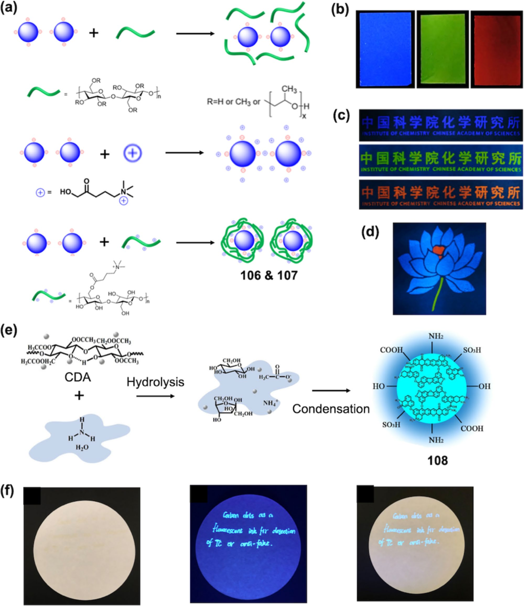

## Page 49

Advanced Composites and Hybrid Materials            (2025) 8:30 	
Page 49 of 90 
   30 
nanocellulose film. The cholesteric nanocellulose film in 117 
imparted properties which can be applied as a multimodal 
anti-counterfeiting label (Fig. 45a). The cellulosic label 117 
has sharp circular polarisation luminescence properties. Car-
bon dots (CDs) coating in 117 imparts hydrophobicity to the 
ink which improves the hydrophobic character resulting in 
water resistance. The authors used 117 for printing differ-
ent patterns, QR codes and fonts via manual input, painting 
and printing (Fig. 45b). Hence, 117 can exhibit three-mode 
optical properties when observed under natural light, UV 
light (365 nm) and IR light (980 nm). Additionally, the fluo-
rescent cholesteric nanocellulose film 117 can be adhesively 
applied to various substrates for anti-counterfeiting applica-
tions [109].
In the same year, 2021, Enomae and co-workers utilised a 
microwave-assisted method for the synthesis of fluorescent 
CD 118 from precursor nanocellulose for the detection of 
dual metal ions like ­Fe3+ and ­Mn2+ (Fig. 46a, b). The mate-
rial 118 constitutes of 2,2,6,6-tetramethylpiperidine-1-oxyl 
radical-mediated-oxidised cellulose nanofibre (TEMPO-
CNF) and 4,7,10-trioxa-1,13-tridecanediamine. The aver-
age diameter of the developed CDs 118 was 7.86 nm. The 
excitation and emission wavelengths of 118 were 390 and 
449 nm, respectively. The fluorescence properties of 118 
were quenched in the presence of ­Fe3+ and ­Mn2+ within a 
few seconds and 10 min, respectively (Fig. 46c). The com-
plexation of ­Fe3+ and ­Mn2+ with 118 helps in the electron 
transfer to the half-filled 3d orbitals of the respective ions. 
Hence, this electron transfer mechanism is responsible for 
the fluorescence quenching of 118 in the presence of ­Fe3+ 
and ­Mn2+ ions. The authors claim that this work is the first 
report of CD-related literature used for the quantitative 
detection of ­Fe3+ and ­Mn2+ [110]. Later, in 2022, Satnami 
and his group developed alkaline phosphatase immobilised 
CdTe/ZnS QD 119 for the dual-purpose fluorescent and 
electrochemical detection of methyl paraoxon (Fig. 46d). 
The hydrolytic activity of alkaline phosphatase (ALP) with 
methyl paraoxon generated p-nitrophenol in the presence of 
QDs 119. Here, the fluorescence quenching mechanism is 
attributed to the electron transfer mechanism between 119 
and the generated p-nitrophenol moiety. A cellulose paper-
based chip sensor was developed by the deposition of CdTe/
ZnS material 119 (Fig. 46e). The electrochemical detection 
of methyl paraoxon by 119 was credited to the linear rela-
tionship between oxidation and reduction peak currents 
against the concentrations of methyl paraoxon. The LOD 
of 119 for methyl paraoxon was calculated as 0.65 nM and 
1.72 nM using fluorescence and paper-based methods and 
cyclic voltammetry, respectively. The authors believe that 
probe 119 can present a new insight for the rapid, conveni-
ent and trace amount detection of methyl paraoxon [111].
Lin and co-workers reported a solvent-free pyrolysis 
technique for the preparation of biomass CD 120 and 121 
for the selective detection of ­Fe3+ ions. The biomass CDs 
120 and 121 were produced from the pyrolysis of two dif-
ferent natural components (cellulose and lignin) (Fig. 47a). 
Both the cellulose and lignin CDs 120 and 121 were pre-
pared at 300 °C and 350 °C, respectively. CD 120 and 121 
exhibited high quantum yields of 11.7% and 23.4%. The 
so-developed CDs 120 and 121 are sensitive towards ­Fe3+ 
Fig. 43   a Chemical structure and synthetic preparation of 110. b 
Writing on 110 on notes and letters and visibility under UV lamp. 
(Refer to the web version of this article for the legend colour). Repro-
duced from Ref. 105 with permission of Elsevier. c Schematic illus-
tration of the preparation of 111. d Writing on different papers using 
111 ink and visualising under UV lamp. (Refer to the web version of 
this article for the legend colour). Reproduced from Ref. 106 with 
permission of Elsevier

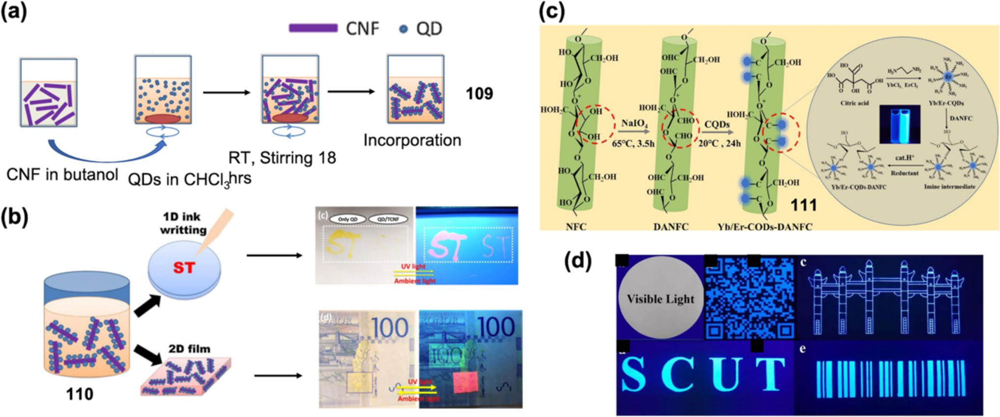

## Page 50

	
Advanced Composites and Hybrid Materials            (2025) 8:30 
   30  
Page 50 of 90
ions (Fig. 47b) and show selective quenching. The higher 
number of hydroxyl group on the surface of 120 and 121 
contributes negative charge on the surface, which indeed is 
crucial for attracting ­Fe3+ ions. The complexation between 
probes and ­Fe3+ led to the electron transfer phenomenon, 
resulting in fluorescence quenching of 120 and 121. The 
authors consider CDs 120 and 121 as cheap sources for the 
selective and sensitive detection of ­Fe3+ [112].
In 2022, Wu and their group developed a non-toxic fluo-
rescent molecularly imprinted hydrogel matrix 122 derived 
from cellulose nanocrystals and CDs for efficient sorption 
and sensitive detection of tetracycline (Fig. 47c). The spe-
cific molecular recognition sites in wood-derived cellulose 
and CDs of 122 are attributed to the excellent sorption 
and sensitive detection of tetracycline. The morphology, 
chemical structure, optical properties and non-cytotoxicity 
of 122 were investigated. The sorption capacity of 122 was 
found to be 544.4 mg/g. As depicted in Fig. 47d, cellulosic 
hydrogel CD 122 show excellent turn-off-based selectivity 
and sensitivity towards tetracycline. The detection limit of 
122 towards tetracycline was determined as 0.11 µg/L. The 
authors claim that material 122 is very cheap and can be 
utilised as a green adsorbent for removing antibiotics [113]. 
Recently, Xiao and co-workers developed fluorescent cel-
lulose nanocrystals with tunable emission wavelengths 
(Fig. 47e, f). The cellulose nanocrystals (CNCs) were com-
bined with CDs to form tunable emission materials 123, 
124 and 125. The CDs used in this work were synthesised 
from citric acid. The nanoscaffolds 123–125 reveal quantum 
yields of > 22%. The nanoprobe 123–125 shows high cell 
Fig. 44   a Chemical mechanism used for the synthesis of 113. b Writ-
ten patterns 113 for application in anti-counterfeiting notes. (Refer 
to the web version of this article for the legend colour). Reproduced 
from Ref. 107 with permission of Elsevier. c Chemical method for the 
synthesis of 116. d Fluorescence selectivity profile of 116 for tetracy-
cline. (Refer to the web version of this article for the legend colour). 
Reproduced from Ref. 108 with permission of Wiley

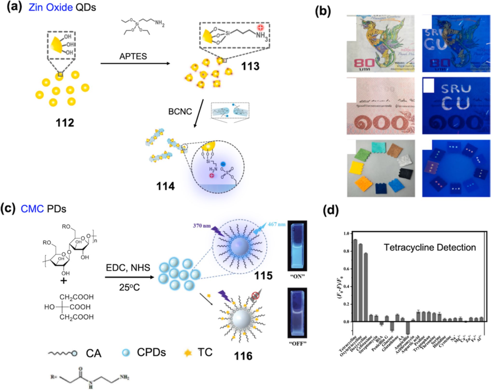

## Page 51

Advanced Composites and Hybrid Materials            (2025) 8:30 	
Page 51 of 90 
   30 
membrane penetration and is used for the imaging of multi-
plexed cytoplasm (Fig. 47 g) [114].
4  Cellulose‑derived polymeric materials 
(Cello‑Poly)
Polymers have different physicochemical properties; hence, 
they are useful in several applications. Polymers may appear 
in gel, solid, solution, nanoparticle or film form. Appropri-
ate modification of polymeric materials can make them 
applicable for specific tasks like the development of sen-
sor devices. The polymers applicable in sensor materials or 
devices include conducting polymers and their composites, 
molecular imprinted systems (MIPs) and hydrogels. Poly-
meric materials act as support for functionality immobilisa-
tion (e.g. fluorophores, dyes, metal nanoparticles). Moreo-
ver, there is a possibility of modifying the chemical tuning 
properties of polymeric-based sensors [261]. Currently, 
polymers derived from nature, i.e. natural polymers, are 
the talk of the town. Natural polymers are large molecules 
sourced from plants or animals and are employed in every 
field of biological and environmental importance (ailments, 
pharmaceutics, sensors, cosmetics and chemistry). As they 
are available from natural sources, these polymers are eco-
nomical, modifiable, readily available, tunable, biocompat-
ible and biodegradable. Natural polymers are derived from 
cellulose, glucomannan, hemicellulose, lignin, agar, starch, 
pectin, rosin, inulin and acacia gum [262]. Natural poly-
mers constitute different textures depending on the nature of 
the monomers used. For instance, carboxymethyl cellulose 
(CMC) is a water-soluble monomer, and owing to its hydro-
philicity, CMC forms a hydrogel in solution. This section 
will discuss natural cellulose–derived polymeric materials 
and their application in the optical chemosensing field.
4.1  Hydrogels (Cello‑HG)
Hydrogels are prepared from cellulose by utilizing chemi-
cal crosslinking, physical crosslinking and other polym-
erization techniques by applying a combinatorial approach 
[263, 264]. Hydrogels are known for their water insolubility 
attained due to their crosslinked structure and large molar 
mass. Hydrogels developed from cellulosic precursors have 
gained popularity as they can store considerable amounts of 
moisture inside their structures due to the presence of hydro-
philic cavities owing to functionalities like –OH, –COOH, 
–NH2, –CONH2 and ­SO3H. Moreover, high attention is paid 
to the production of cellulose polymers from biomass as 
they add biocompatibility and biodegradable properties. 
The dimensions of cellulosic hydrogels are higher than other 
types of polymeric gels. They have a diameter in the range 
of 5–50 nm [197]. Another similar gel category is aerogel, 
mainly renewable aerogel, also known as cellulose aerogel. 
Compared to other aerogels, those derived from cellulose 
are sustainable, inexpensive and eco-friendly. Nanocellulose 
aerogels are formed by the dispersion of nanocellulose par-
ticles in water using mechanical and ultrasonic techniques. 
Moreover, cellulose aerogels can be easily extracted from 
water sources and are more stable in water. It can be eas-
ily used as supporting materials owing to their high poros-
ity, low density, high strength, low cost, renewability, bio-
compatibility and large specific surface area [197]. In this 
section, we will introduce different cellulosic hydrogels 
and aerogels employed in fluorescence and colourimetric 
chemosensing.
Fig. 45   a Schematic example of generation of 117. b Application of 117 in anti-counterfeit printing. (Refer to the web version of this article for 
the legend colour). Reproduced from Ref. 109 with permission of ACS

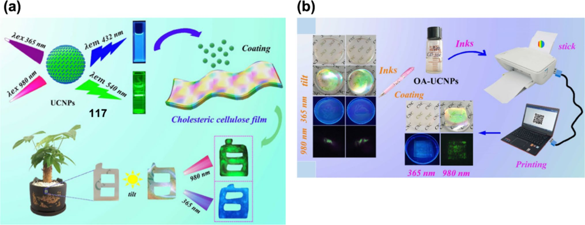

## Page 52

	
Advanced Composites and Hybrid Materials            (2025) 8:30 
   30  
Page 52 of 90
4.1.1  Fluorescence‑based hydrogels (Cello‑HG)
In 2017, Valcarcel and the group developed nanocellulosic 
hydrogels based on graphene QD 126 for the efficient detec-
tion of laccase. The fluorimetric platform is derived from 
sulfur and nitrogen-codoped graphene QD 126 dropped 
into the nanocellulosic hydrogel platform (Fig. 48a). The 
hydrogel matrix improves the fluorescence signal of 126 
and avoids their self-quenching. Moreover, it also stabi-
lises the fluorescence signal and improves the sensitivity 
of 126 towards laccase. The detection mechanism of 126 is 
owed to the non-covalent interactions between the sensor 
and the analyte. The non-covalent interaction between 126 
and laccase causes comprehensive quenching without peak 
shifts of 126 fluorescence using simple energy transfer. The 
detection limit of cellulosic-hydrogel matrix 126 for lac-
case is estimated as 0.048 U ­mL−1 with a recovery rate of 
86.2 − 94.1%. Using the straightforward strategy, the authors 
confirm that 126 can stabilise laccase and can be applied for 
the storage and recycling of enzymes [115]. In another work, 
Fig. 46   a Schematic diagram depicting the synthesis and detection 
mechanism of CDs 118 for ­Fe3+ and ­Mn2+. b Schematic of energy 
band structure and possible luminescence process for TEMPO-CDs 
118. c Visualisation of 118 for the selective detection of ­Fe3+ under 
UV lamp. (Refer to the web version of this article for the legend col-
our). Reproduced from Ref. 110 with permission of Springer. d Sche-
matic representation of detection mechanism of 119 for methyl par-
aoxon via both fluorescence and electrochemical techniques. e Naked 
eye, (top) and under UV light (bottom) images of 119 doped cellulose 
paper in the presence of methyl paraoxon. (Refer to the web version 
of this article for the legend colour). Reproduced from Ref. 111 with 
permission of ACS

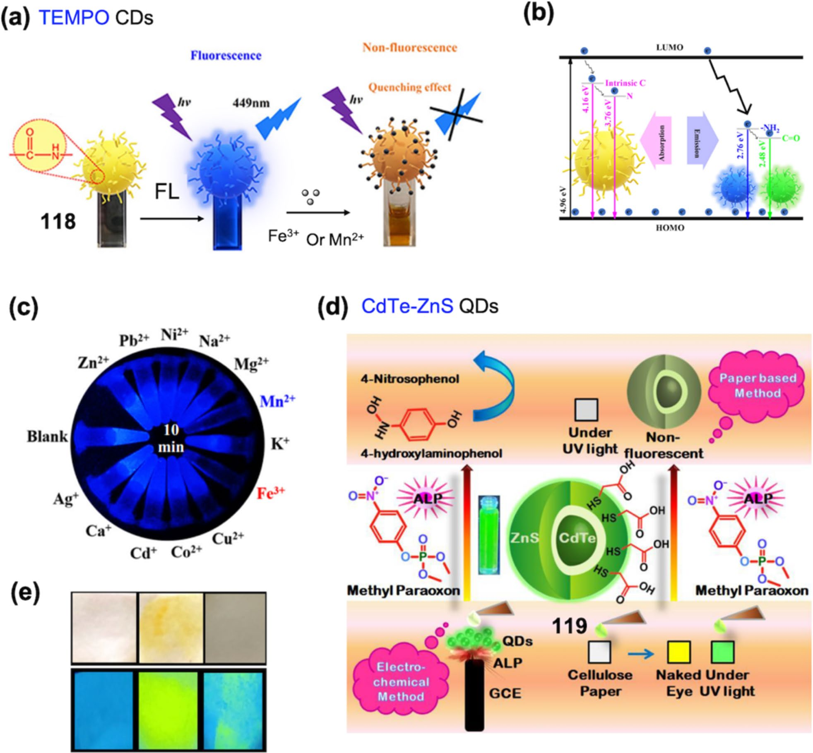

## Page 53

Advanced Composites and Hybrid Materials            (2025) 8:30 	
Page 53 of 90 
   30 
Wang and co-workers developed an all-biomass fluorescent 
hydrogel fabricated by the functionalization of alginate (Alg) 
and cellulose nanofibre (CNF) hydrogels with fluorescent 
carbon dots (CQDs) generated from xylose, glucose and 
glucosamine forming probe 127 applicable in biosensing. 
The CQDs used in probe 127 have dual functions in the 
composite hydrogels. CQDs endow good fluorescent char-
acter and enhance the mechanical properties of the hydrogel 
127 (Fig. 48b). The cellulosic hydrogel 127 was used for the 
detection of ­Fe3+ and gold nanoparticles (AuNPs). In case 
of ­Fe3+, the detection is attributed to the PET mechanism 
in 127. Moreover, the sensing property of 127 for ­Fe3+ is 
Fig. 47   a Synthesis of biomass-based QDs 120 and 121. b Quench-
ing mechanism of 120 and 121 for ­Fe3+ in the presence of different 
counter cations. (Refer to the web version of this article for the leg-
end colour). Reproduced from Ref. 112 with permission of Frontiers. 
c Chemical structure of wood-derived CD 122. d Selectivity profile 
of 122 for tetracycline. (Refer to the web version of this article for 
the legend colour). Reproduced from Ref. 113 with permission of 
Elsevier. e Preparation of materials 123–125. f Energy level diagrams 
for materials 123–125. g Imaging profile of 123–125 in HeLa cells. 
(Refer to the web version of this article for the legend colour). Repro-
duced from Ref. 114 with permission of Elsevier

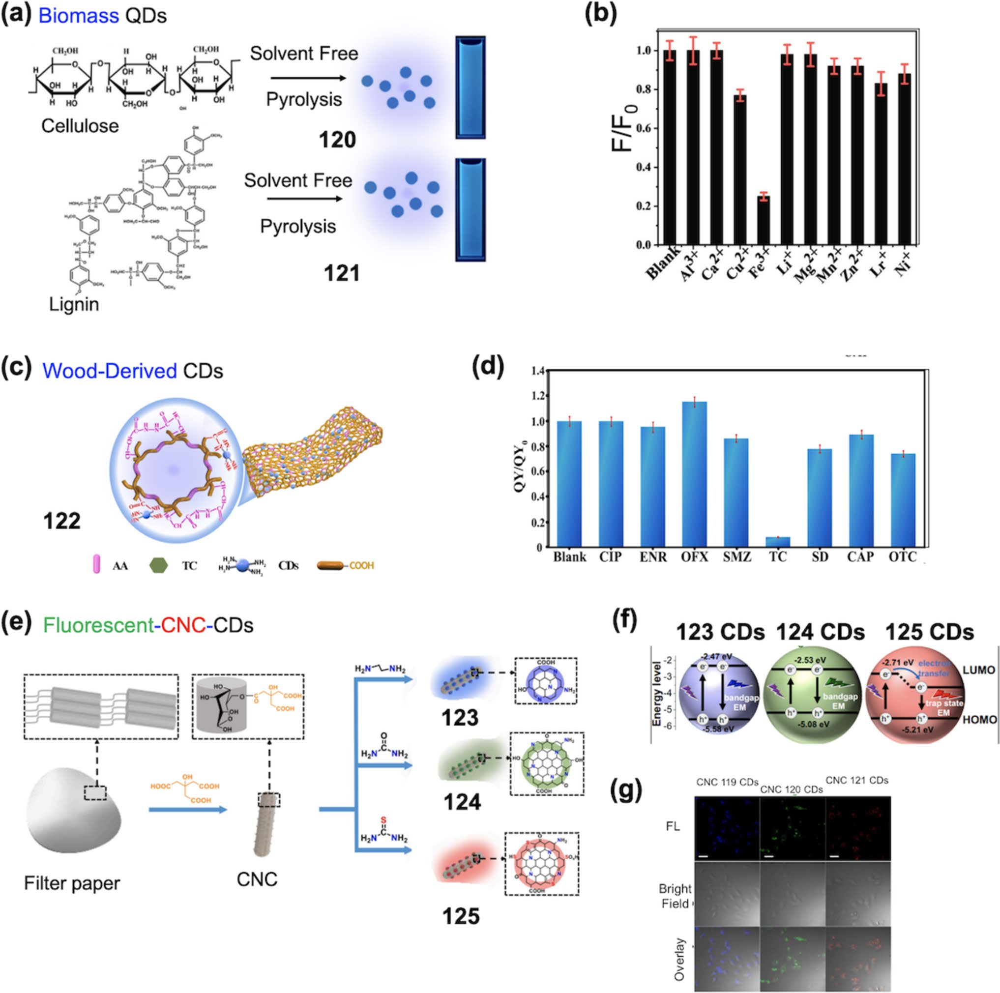

## Page 54

	
Advanced Composites and Hybrid Materials            (2025) 8:30 
   30  
Page 54 of 90
preserved in the all-biomass hydrogel core of 127. Further, 
rapid response fluorescence of 127 for ­Fe3+ is also accred-
ited to the efficient mass transfer enabled by the 3D porous 
structure of 127. On the other hand, fluorescence energy 
transfer mechanism (FRET) is responsible for the detection 
of AuNPs by 127. The authors claim that prepared cellulosic 
hydrogel 127 can be applied in biosensing, biological imag-
ing and biological monitoring fields [116].
Wu and co-workers in 2019 designed and created smart 
hydrogel based on CDs forming hydrogel nanocomposite 
128 for stable detection of ­Fe3+ ions. The cellulosic hydrogel 
material 128 is formed by the modification of CDs by poly-
ethylenimine (PEI) and then immersing it into microcrys-
talline cellulose (MCC) hydrogel (Fig. 48c). The hydrogel 
material 128 was spherical in shape and monodispersed in 
water with a quantum yield of 28%. Hydrogel 128 has high 
photostability, which prevents self-quenching of the probe. 
The authors reveal that fluorescent smart hydrogel 128 is an 
attractive solution for the detection of stable ­Fe3+ ion-sens-
ing applications. The cellulosic material 128 forms highly 
Fig. 48   a Chemical synthesis of graphene QDs based hydrogel 126. 
(Refer to the web version of this article for the legend colour). Repro-
duced from Ref. 115 with permission of Elsevier. b Synthesis of Alg-
inate hydrogel 127 for biosensing application. (Refer to the web ver-
sion of this article for the legend colour). Reproduced from Ref. 116 
with permission of Elsevier. c Synthesis and mechanism of 128 for 
detection of ­Fe3+. (Refer to the web version of this article for the leg-
end colour). Reproduced from Ref. 117 with permission of Elsevier. 
d Preparation of chitosan hydrogel 129. e Self-healing mechanism of 
129. (Refer to the web version of this article for the legend colour). 
Reproduced from Ref. 118 with permission of Elsevier

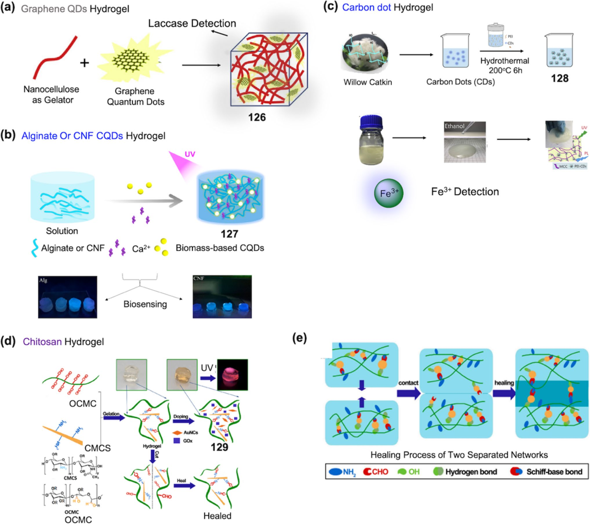

## Page 55

Advanced Composites and Hybrid Materials            (2025) 8:30 	
Page 55 of 90 
   30 
stable complex with ­Fe3+, when compared with the weaker 
complexation with other metal ions, leading to the selec-
tive detection of ­Fe3+ [117]. In another work, Zhao and the 
group developed a self-healing hydrogel 129 derived from 
carboxymethyl chitosan/oxidised carboxymethyl cellulose 
combined with fluorescent probes (Fig. 48d) and utilised it 
for the detection of glucose and also wound healing. Here, 
hydrogel material 129 consists of carboxymethyl chitosan/
oxidised carboxymethyl cellulose as the self-healing unit 
and is doped with gold nanoclusters and glucose oxidase 
as the sensory unit (Fig. 48e). Cellulosic hydrogel 129 can 
detect glucose with high sensitivity up to a detection limit of 
0.029 mM. Hydrogel 129 exhibited good biocompatibility 
with applicability in the detection of glucose in vitro and 
in vivo samples. As per the authors, cellulosic hydrogel 
material 129 can be used for the clinical detection of glucose 
and also in wound healing applications [118].
Pu and co-workers developed a cellulose-based hydrogel 
130 using carboxymethyl cellulose and CDs for application 
in information storage and fluorescent anti-counterfeiting. 
Figure 49 a depicts the synthetic mechanism involved in 
the generation of cellulosic hydrogel 130. The cellulosic 
hydrogel 130 displayed a bright blue emission under UV 
light, which got quenched in the presence of ­Fe3+ ions (exci-
tation = 340 nm and emission 460 nm (Fig. 49b)), thereby 
aiding in information storage and anti-counterfeiting. The 
fluorescence of 130 can be restored by the addition of ascor-
bic acid, improving the reusability of the material for infor-
mation storage and anti-counterfeiting. The authors predict 
a bright prospect for the application of 130 in recyclable 
information storage and anti-counterfeiting [119].
Later in the same year, Lu and co-workers developed 
fluorescent hydrogels 131 derived from oxidised carboxy-
methyl cellulose (Fig. 49c) and utilised it for the adsorp-
tion and detection of ­Ag+ (Fig. 49d). The –NH2, OH and 
–COOH groups in 131 form a strong binding with ­Ag+ ions 
via strong chelation. On forming complex with 131, the sil-
ver ions were reduced to metallic silver, which indeed is 
responsible for the fluorescence quenching. Hydrogel 131 
comes with sensing and self-healing properties. Cellulosic 
hydrogel material 131 can detect ­Ag+ as low as 3.798 µM. 
Moreover, the hydrogel 131 can heal itself without interfer-
ence from any external stimuli. Also, hydrogel material 131 
can be reused seven times without any loss in adsorption 
performance. The prepared hydrogel matrix 131 holds excel-
lent properties of self-healing, simultaneous adsorption and 
detection of heavy metal ions, and good mechanical strength, 
providing its capability for wastewater treatment [120]. In 
another work, Wu and co-workers utilised a hydrothermal 
synthetic approach for the synthesis of nanocellulose-based 
fluorescent hydrogel 132 for the detection of ­Hg2+ ions. 
The hydrogel material 132 was prepared by a one-pot syn-
thetic strategy from cellulose nanofibres, enabling the in situ 
formation of CQDs (Fig. 49e). The cellulosic hydrogel 132 
had a 3D network structure, and epichlorohydrin depicted 
positive effects on the mechanical properties of 132. Cel-
lulosic hydrogel 132 can detect ­Hg2+ in (Fig. 49f, g) in the 
concentration range of 0–300 mmol/L. The strong complexa-
tion of ­Hg2+ ions with 132 initiated the lowering of overall 
negative charge on the surface of 132. Moreover, the PET 
phenomenon in 132 was inhibited by the addition of ­Hg2+ 
ions, resulting in the electron transfer from 132 to ­Hg2+. The 
authors confirm that probe 132 can be used for various ion 
detection applications [121].
Wu and group developed a non-toxic chitosan-derived 
hydrogel 133 capable of strong adsorption and sensitive 
detection of antibiotic tetracycline. The chitosan hydrogel 
133 is developed using CNCs and CDs (Fig. 50a). In the 
presence of tetracycline, the hydrogel 133 exhibits an excel-
lent sorption capacity of 541.3 mg/g and sensitive detection 
ability in the linear range 1–200 mg/L and a detection limit 
of 0.12 µg/L (Fig. 50b). The selective quenching profile of 
133 for tetracycline is attributed to the decrease in absolute 
quantum yield of 133 only in the presence of tetracycline. 
The CNCs in 133 offered a skeleton structure for elevating 
the adsorption capacity, and the CDs served as remarkable 
fluorophore moiety for the selective and sensitive detection 
of tetracycline [122].
In 2023, Liu and co-workers constructed a multifunc-
tional polysaccharide-based aerogel for the efficient fluo-
rescent detection and removal of formaldehyde. The robust 
aerogel 134 consists of cotton cellulose and chitosan units 
(Fig. 51a). The aerogel 134 showed 600-fold fluorescence 
enhancement (F540/F450) under a formaldehyde atmosphere. 
The titration profile is depicted in Fig. 51b, from which the 
estimated detection limit of 134 towards formaldehyde is 
approximately 0.5 × ­10−7 M. The cellulosic aerogel 134 
could efficiently detect formaldehyde in live zebrafish with 
notable fluorescence changes [123].
Later in the same year, Yang and team developed stimuli-
responsive fluorescent hydrogels 135 derived from natural 
cellulose for off–on-off detection of ­Cu2+ and GSH. The 
fluorescent hydrogels 135 consist of cellulose, ionic liq-
uids and lanthanide complexes. The preparation of 135 was 
achieved by utilizing two steps. In the first step, cellulose 
was dissolved in 1-allyl-3-methylimidazolium chloride 
(AmimCl) via a dissolution-regeneration process. In the 
following step, lanthanide complexes are immersed into the 
earlier-mentioned aqueous solution. The lanthanide com-
plexes formed in this work utilised ­Eu3+/Tb3+ as the metal 
bed. In the presence of ­Cu2+, the fluorescent emission of 
135 is quenched, indicating the formation of ­Cu2+ complex. 
Further, upon the addition of GSH, the fluorescence inten-
sity of 135 is retained (Fig. 51c, d). In the case of ­Cu2+ 
detection, the coordination reaction between 135 and ­Cu2+ 
effectively decreases the energy transfer capacity from 135 

## Page 56

	
Advanced Composites and Hybrid Materials            (2025) 8:30 
   30  
Page 56 of 90
to ­Tb3+ ions, resulting in the fluorescence quenching. On 
the other hand, the chelation of copper by GSH leads to the 
recovery of fluorescence of probe 135. The authors consider 
135 as capable of usage as biocompatible and biodegradable 
off–on-off luminescence switches in aqueous medium [124]. 
Lin and team developed fluorescent starch-based hydrogel 
136 encompassed with cellulose nanofibrils and CDs for the 
simultaneous adsorption and detection of ­Pb2+ (Fig. 51e). 
Fig. 49   a Chemical synthesis of cellulosic CDs 130. b Emission pro-
file of 130 on excitation at 340 nm. (Refer to the web version of this 
article for the legend colour). Reproduced from Ref. 119 with permis-
sion of Springer. c Synthesis of oxidised CMC hydrogel 131. d Struc-
ture and detection mechanism of 131 for ­Ag+. (Refer to the web ver-
sion of this article for the legend colour). Reproduced from Ref. 120 
with permission of Elsevier. e Synthetic procedure for development 
of 132. f Changes in emission profile of 132 on addition of differ-
ent levels of ­Hg2+. g Titration profile of 132 in the presence of ­Hg2+. 
(Refer to the web version of this article for the legend colour). Repro-
duced from Ref. 121 with permission of Elsevier

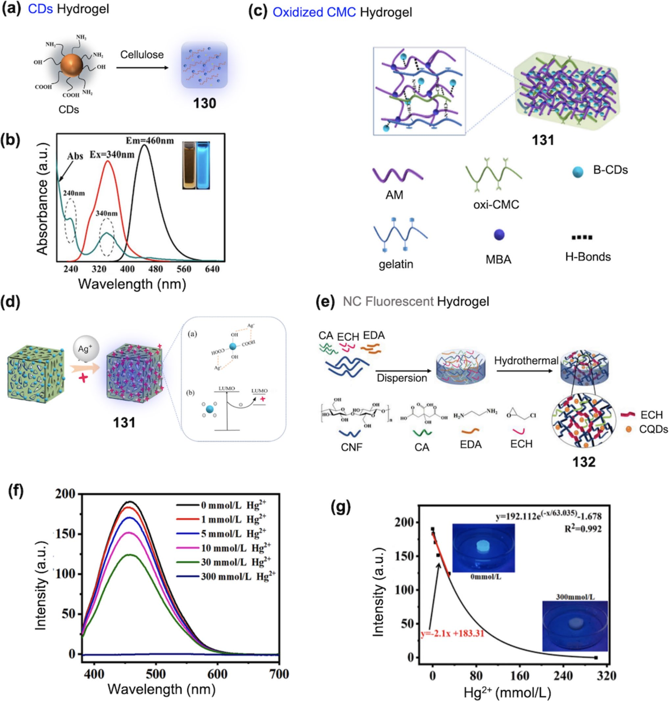

## Page 57

Advanced Composites and Hybrid Materials            (2025) 8:30 	
Page 57 of 90 
   30 
Natural materials like starch and cellulose nanofibrils were 
loaded with CDs for the fabrication of 136. In the pres-
ence of ­Pb2+, the emission intensity of 136 was quenched 
(Fig. 51f). On addition of ­Pb2+ to the probe, it attaches on 
the surface of 136 via electrostatic interaction and penetrates 
the 3D pores of 136 using iron transport channels, paving 
way for the selective quenching profile. The detection limit 
of 136 for ­Pb2+ was estimated as 0.06 µg/L and an adsorp-
tion capacity of 265.9 mg/g. The hydrogel 136 can be used 
for the real-time detection of ­Pb2+ [125].
4.1.2  Colourimetric‑based hydrogels (Cello‑HG)
In 2019, Wu and their group developed a colourimetric 
immune sensor based on Au@g-C3N4-doped sponge-like 
3D network cellulose hydrogel 137 for the selective detec-
tion of α-fetoprotein. In the mentioned system 137, AuNPs 
with a diameter of 18.5 nm were loaded on the g-C3N4 
nanosheets that were fixed in a 3D porous cellulose hydrogel 
and used as a binding site for antibody/antigen (Fig. 52a). In 
the presence of α-Fetoprotein, the AuNPs in 137 are cata-
lysed due to the reduction of 4-nitrophenol to 4-aminophenol 
(Fig. 52b). In the presence of α-fetoprotein, the colourimet-
ric immunoassay exhibited a linear relationship in the range 
of 0.1–10000 ng/mL and the detection limit of 0.46 ng/mL. 
The authors claim that the immune-sensor 137 showed good 
selectivity, repeatability and stability, which demonstrates 
applicability for practical diagnostic applications [126].
Cho and co-workers developed nanocellulose-based 
smart colourimetric hydrogel 138 integrated with antho-
cyanins for the sensitive detection of ammonia for moni-
toring pork freshness. Hydrogel 138 was prepared from 
TEMPO-oxidised cellulose nanofibril (TOCNF)-based 
hydrogels activated with different crosslinkers and 
anthocyanins attained from different sources (Fig. 52c). 
After several evaluations, ­Al3+ was used as the optimum 
crosslinker for TOCNF-based hydrogel 138. The cellu-
losic hydrogel 138 showed a critical colour change in the 
neutral pH range. The action of 138 on ­NH3 was nonlin-
ear, and the naked eye (Fig. 52c) and instrumental colour 
Fig. 50   a Chemical synthetic 
procedure for 133. b Naked 
eye detection of tetracycline by 
133 under UV lamp 365 nm. 
(Refer to the web version of this 
article for the legend colour). 
Reproduced from Ref. 122 with 
permission of Elsevier

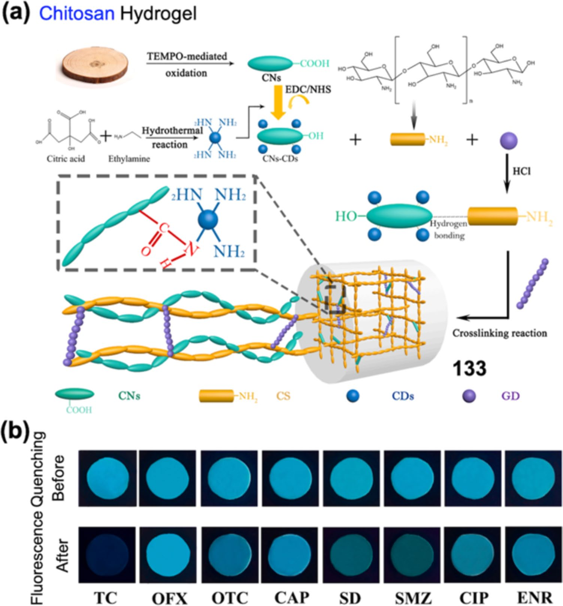

## Page 58

	
Advanced Composites and Hybrid Materials            (2025) 8:30 
   30  
Page 58 of 90
measurement–based limit of detection was estimated to be 
150 and 50 ppm, 150 and 50 ppm and 50 and 25 ppm for 
138 doped with Aronia, Liriope and red cabbage respec-
tively. The authors applied cellulosic hydrogel 138 for the 
qualitative and quantitative estimation of pork freshness 
[127].
4.2  Coordination network polymers (Cello‑CNP)
Cellulose comprises functional groups such as hydroxyl 
and carboxyl species, which enable the interaction with 
positively charged cations [265]. These interactions pave 
the way for the synthesis of cellulose-based coordination 
Fig. 51   a Procedure for the preparation of 134. b Titration profile of 
134 in the presence of varying amounts of HCHO. (Refer to the web 
version of this article for the legend colour). Reproduced from Ref. 
123 with permission of Elsevier. c Synthetic procedure and reversible 
detection mechanism of 135 for ­Cu2+ and GSH. d Naked eye visuali-
sation of ­Cu2+ and GSH using 135 doped cellulose test strips. (Refer 
to the web version of this article for the legend colour). Reproduced 
from Ref. 124 with permission of ACS. e Synthetic procedure for 
136. f Visual detection of ­Pb2+ under UV lamp 365 nm by utilising 
136. (Refer to the web version of this article for the legend colour). 
Reproduced from Ref. 125 with permission of Elsevier

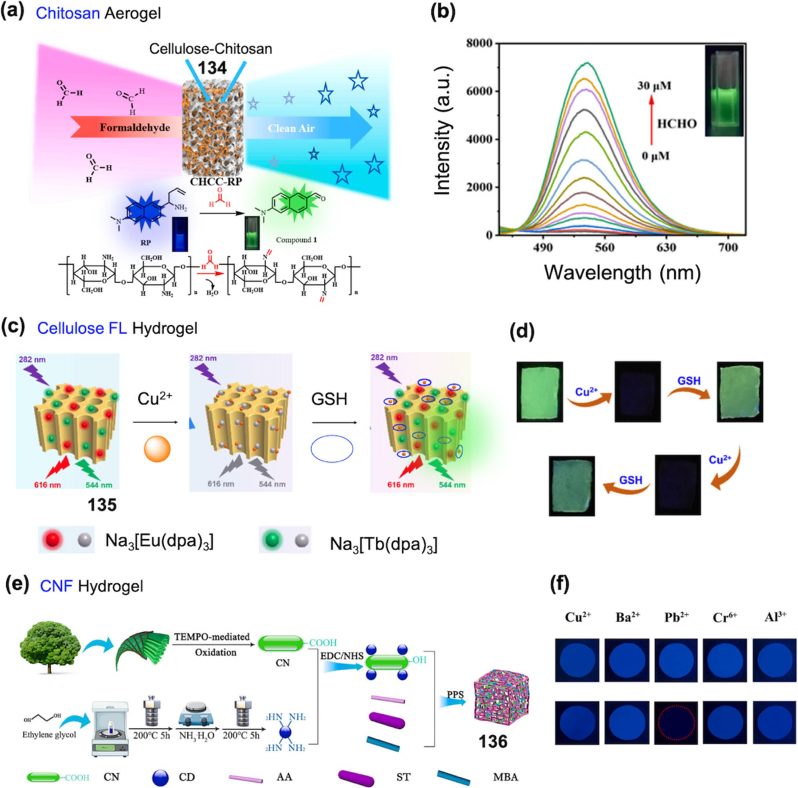

## Page 59

Advanced Composites and Hybrid Materials            (2025) 8:30 	
Page 59 of 90 
   30 
polymers. Reactive molecular dynamics simulations of the 
interaction of different metals with cellulose depict the 
formation of different materials. For instance, the interac-
tion between ­Cu2+ and TOCNF revealed that after adsorp-
tion onto the nanocellulose surface, ­Cu2+ ions formed 
nanoclusters and TOCNF-GO biohybrid [265, 266]. The 
conformational structure of cellulosic chains is modified 
by the inclusion of multivalent metal ions [267]. Moreo-
ver, zinc ions displayed a high propensity to form com-
plexes with the hydroxyl group and hemiacetal oxygen 
atom unit of cellulose. The synthesis of cellulose MOFs is 
achieved via the addition of metal salts and organic link-
ers to the cellulose matrix. Additionally, the involvement 
of sulphate [268], phosphorylated [269], xanthate [270] 
and carboxylate [271] increased the adsorption capacity 
of metals. Cellulose-based coordination network poly-
mers are hybrid materials. Synthesis of cellulose-derived 
coordination network polymers can be achieved by differ-
ent techniques including in situ and ex situ methods. The 
in situ technique includes the addition of MOF precursors, 
such as metal ions or linkers to the cellulosic-derived 
materials. The MOF substrates can be added to raw cel-
lulose or cellulose forms like aerogels and foams. Further, 
conventional techniques such as freeze-drying and casting 
are used to fabricate foams and aerogels. Another in situ 
method involves the reaction between MOF precursors 
and cellulose scaffolds. The ex situ method of synthesis 
involves the modification of cellulose fibres and cellulose 
form with the synthesised MOFs. Cellulosic coordination 
network polymers have appealing features like large spe-
cific surface area; enhanced electrochemical, mechanical 
and antibacterial properties and, most importantly, porous 
structure. Owing to these excellent features, Cello-CNP 
has found wide applications in sectors such as water reme-
diation [272], drug release [273], solar power generation 
[274], electromagnetic interference shielding [275], ther-
mal insulation and fire retardancy [276], information secu-
rity [277], air purification [278] and chemosensing. In this 
section, Cello-CNPs with applications in fluorescence and 
colourimetric optical sensing are discussed.
Fig. 52   a Procedure for the development of 137. b Time-based titra-
tion profile of 137 for explosive detection. (Refer to the web version 
of this article for the legend colour). Reproduced from Ref. 126 with 
permission of ACS. c Chemical structure of 138 for the detection of 
ammonia. d Visible changes in 138 after treating with ­NH3. (Refer 
to the web version of this article for the legend colour). Reproduced 
from Ref. 127 with permission of Elsevier

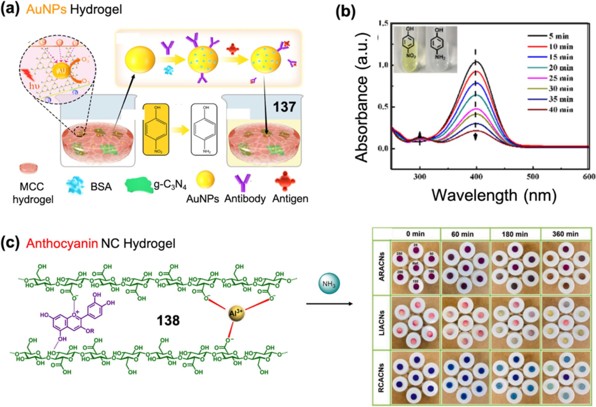

## Page 60

	
Advanced Composites and Hybrid Materials            (2025) 8:30 
   30  
Page 60 of 90
4.2.1  Fluorescence‑based coordination network polymers 
(Cello‑CNP)
Sweat components avail adequate amounts of potential bio-
markers that can indicate the health state of a subject. A 
fluorescent wearable platform for the non-invasive analysis 
of ­Cl− in sweat was developed. Yan et al. prepared a logic 
smart-device fabrication based on colour-adjustable lantha-
nide MOFs. The wearable ­Cl− monitoring platform 139 was 
generated using a simple ultrasonic technique for integrating 
a combination of flexible host material (cotton piece) and 
two fluorescent materials such as lanthanide MOFs DUT-
101 and ­Ag+/Eu3+@UiO-67 (Fig. 53a). Compared to large 
circuit boards, the device 139 is comfortable for human body 
contact and can be regularly worn. In the cellulose-MOF 
material 139, the two lanthanide-based fluorescent moieties 
afford high colour purity and measurement accuracy. From 
the two lanthanide moieties, DUT-101 represents the refer-
ence fluorescence centre and ­Ag+/Eu3+@UiO-67 acts as the 
working fluorescence centre (Fig. 53b). The cellulosic-MOF 
material 139 showed excellent selectivity with high sensi-
tivity for quantitative ­Cl− measurements. The efficacy and 
applicability of 139 for Cl– were also tested in real-time, on-
body tests with healthy human subjects. Moreover, a codec 
device was constructed by designing ­Cl− and fluorescence 
signals for the logic circuit, which is considered a mimetic 
“red-green indicator light” for testing its applicability in 
healthcare and sports [128]. In this review, we have noticed 
many cellulosic materials which are capable of detecting 
­Cu2+ ions. In another illustration, An and co-workers devel-
oped Eu-metal organic frameworks@ TEMPO-oxidised cel-
lulose nanofibril-based fluorescent film 142 for the detection 
of ­Cu2+ ions (Fig. 53c). The fabrication of 142 was achieved 
by the in situ synthesis in the hydroalcoholic medium. The 
cellulosic material 142 was characterised by using X-ray 
diffraction, scanning electron microscopy, Fourier transform 
infrared spectroscopy and fluorescence spectrometer, along 
a few more techniques. The authors claim that film 142 per-
formed a high quenching–based selectivity (Exi = 254 nm, 
Emi = 614 nm) towards ­Cu2+ ions in the presence of other 
interfering metal ions. However, from Fig. 53 d and e, it is 
noticed that there is clear interference from ­Zn2+, ­Na+, ­Ni2+, 
­Mg2+ and ­Ca2+ ions. The reason behind the interference is 
142 has high negative charge and so can attract different 
cations. Elevated quenching of 142 was noticed with the 
addition of increasing levels of ­Cu2+ ions. Moreover, cel-
lulosic material 142 developed a good linear relationship 
with ­Cu2+, which made its utility promising for detection in 
Fig. 53   a Reversible detection mechanism of ­Eu3+ and ­Ag+ by 139. 
b Preparation of wearable device using 139. (Refer to the web ver-
sion of this article for the legend colour). Reproduced from Ref. 128 
with permission of RSC. c Synthetic procedure for 142. d Quenching 
profile of 142 for ­Cu2+ in presence of other counter cations. e Visual 
detection of ­Cu2+ using 142 doped cellulose paper. (Refer to the web 
version of this article for the legend colour). Reproduced from Ref. 
128 with permission of Elsevier

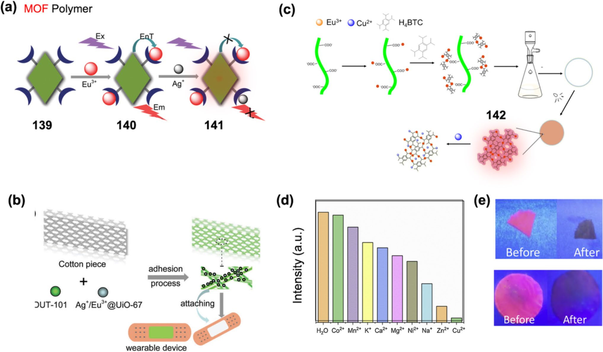

## Page 61

Advanced Composites and Hybrid Materials            (2025) 8:30 	
Page 61 of 90 
   30 
water bodies. However, as mentioned earlier, the report lacks 
selectivity and proof of concept in its claims [129].
In 2022, Neogi and his team introduced in situ fabricated 
MOF-cellulose composite 143 (Fig. 54a) as a ROS deactiva-
tor-convertor, fluoro switchable bi-phasic tweezers for free 
chlorine detoxification and size-exclusive catalytic insertion 
of aqueous ­H2O2. The chemo-robust and hydrogen-bonded 
framework 143 which encompassed free –NH2 moiety 
affixed pores that act as an ultra-fast and highly regenerable 
luminophore for the selective detection of hazardous ROS 
producers such as ­ClO− and ­H2O2 with a nanomolar level 
sensitivity. In the cello-MOF 143, bio-relevant antioxidant 
L-ascorbic acid delivers notable quenching of 3.5-fold to 
the probe along with bi-phasic colourimetric variation in 
the presence of ­ClO− (Fig. 54b). The on–off-on detection 
mechanism of 143 for ROS analytes was proved by density 
functional theory (DFT) calculations. The authors consider 
that cellulosic material 143 can perform as a smart com-
posite material for bimodal deactivation and conversion of 
ROS species. Moreover, the multi-cyclic alkene epoxidation 
by 143 proves its effectiveness for application in futuristic 
continuous flow reactors. MOF materials have been exces-
sively utilised as fluorescent probes for the detection of 
Cr(VI) [130]. Yilamz and group utilised a cellulose-based 
material for fabricating MOF probes 144 and 145 for the 
detection of Cr(VI) ions and investigation of their antimicro-
bial properties. Cellulosic materials 144 and 145 constitute 
two different MOF units, UiO-66 and ZIF-8, linked with 
1,8-naphthalimide, respectively (Fig. 54c). The 1,8-naph-
thalimide unit in 144 and 145 displays a significant selec-
tive quenching for Cr(VI) (Fig. 54d, e). Moreover, cellulosic 
materials 144 and 145 also contain ­Ag+, which gives the 
probe an effective hand for determining the antimicrobial 
properties. Probes 144 and 145 can detect Cr(VI) as low as 
1.07 µM. Moreover, the ­Ag+ capped 144 and 145 showed a 
significant antibacterial effect against E. coli at a MIC value 
of 0.0024 mg/mL [131]. Consumption of antibiotics is on a 
constant rise. Therefore, monitoring and detection of antibi-
otics such as ciprofloxacin is of great necessity.
Earlier in 2022, An et al. developed a Tb-coordination 
polymer-anchored nanocellulose composite film 146 for 
the selective and sensitive detection of antibiotic cipro-
floxacin. The nanocellulose composite film 146 was pre-
pared by the combination of terbium coordination polymer 
(Tb-AMP) and TEMPO-oxidised cellulose nanofibres, in 
aqueous media via the in situ synthetic route (Fig. 55a). 
In the presence of ciprofloxacin energy is supplied for 
terbium ion in 146 through antenna effect to attain green 
fluorescence under a 365-nm UV lamp (Fig. 55b). Probe 
146 shows high selectivity and sensitivity for detection of 
ciprofloxacin (Fig. 55c). Nanocellulosic material 146 can 
detect ciprofloxacin in a good linear range of 1–8 µM with 
a LOD determined at 0.0392 µM. The authors consider 146 
capable of the future quantitative colourimetric analysis of 
antibiotic pollutants [132]. In another illustration of Cr(VI) 
detection, Wu and the team utilised a bacterial cellulose-fab-
ricated Zr-MOF probe 147 (Fig. 55d). The Zr-MOF material 
showed strong aggregation-induced emission (AIE) when 
grown with bacterial cellulose. Cellulosic material 147 was 
formed by uniformly wrapping bacterial cellulose-abundant 
hydroxyl groups in the interior of the MOF layer. Cellulosic 
material 147 exhibited selective quenching–based detection 
Fig. 54   a Structure of MOF 143. b Selectivity plot of 143 towards 
anions. (Refer to the web version of this article for the legend colour). 
Reproduced from Ref. 130 with permission of RSC. c Construction 
of MOF material 144 used for the reversible detection of ­Ag+ and 
chromate. d Selectivity plot of 144 for anions. e Naked eye detection 
of anions under visible and UV light. (Refer to the web version of this 
article for the legend colour). Reproduced from Ref. 131 with permis-
sion of Elsevier

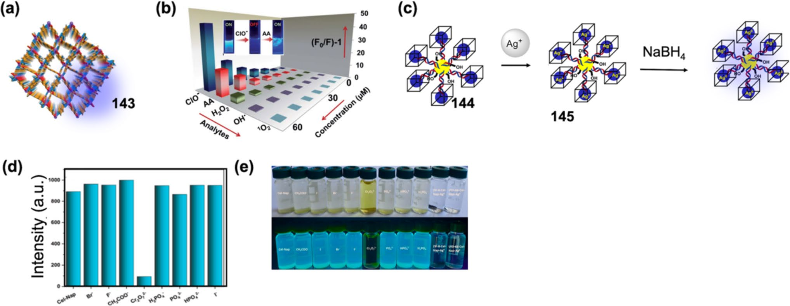

## Page 62

	
Advanced Composites and Hybrid Materials            (2025) 8:30 
   30  
Page 62 of 90
and enrichment of Cr(VI) with a high adsorption capacity 
of 90 mg/g (Fig. 55e, f). The abundant hydroxyl groups in 
147 allow the binding of Cr(VI), resulting in the fluores-
cence quenching effect. Probe 147 can detect Cr(VI) with 
an estimated LOD of 41.8 nM. Cellulosic material 147 can 
be utilised for the detection and adsorption of Cr(VI) in real 
time [133].
4.2.2  Colourimetric‑based coordination network polymers 
(Cello‑CNP)
In 2022, Yu and co-workers demonstrated the 3D print-
ing of MOFs-based ionogel (MIG) 149 for applicability 
as wearable sensors with colourimetric and mechanical 
responses (Fig. 55g). For this purpose, the 3D printing ink 
was prepared from a combination of deep eutectic solvents 
(DESs), cellulose nanocrystals (CNCs), MOF crystals and 
acrylamide. After printing, a second covalently crosslinked 
poly(acrylamide) network and solidification of MIG were 
achieved by a photopolymerization technique. Moreover, 
a porphyrinic Zr-based MOF, MOF-525, was utilised as 
a functional filler providing sharper colour changes when 
exposed to acidic compounds. The so-developed MOF 
material 149 was used as an auxetic sensor for the detec-
tion of human body movements [134]. Phenol is a chemical 
agent excessively utilised in different industries. As per the 
European community, the permissible limits for concentra-
tions of phenol in water should be below 1 mg/L. Wang 
et al. involved a MOF-based bimetallic oxide composite 
nanozyme fibre membrane for the colourimetric detection 
of phenol. For this purpose, the authors have used variable-
valence metal Co/Mn bimetallic MOF-74 as a precursor to 
generating a bimetallic oxide composite nanozyme with 
peroxidase-like activity.
Further, the developed nanozyme is combined with 
cellulose via suction filtration to form nanozyme fibre 
Fig. 55   a Synthetic procedure for 146. b Visual detection of cipro-
floxacin by 146 under UV lamp 365 nm. c Selectivity profile of 146 
for ciprofloxacin. (Refer to the web version of this article for the leg-
end colour). Reproduced from Ref. 132 with permission of Elsevier. 
d Synthetic track for zirconium-based MOF 147. e Naked eye detec-
tion profile of 147 for chromate. f Quenching efficiency of 147 for 
chromate in the presence of various anions. (Refer to the web version 
of this article for the legend colour). Reproduced from Ref. 133 with 
permission of Elsevier. g Synthetic procedure for preparing 148 and 
3d printing mechanism forming 149. (Refer to the web version of this 
article for the legend colour). Reproduced from Ref. 134 with permis-
sion of ACS

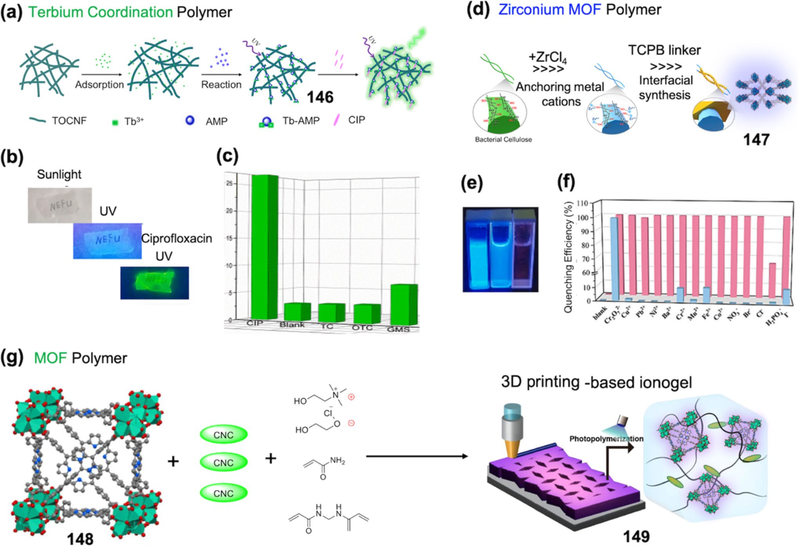

## Page 63

Advanced Composites and Hybrid Materials            (2025) 8:30 	
Page 63 of 90 
   30 
membrane (NFM) 150 (Fig. 56a). As depicted in Fig. 56 
b and c, the MOF-derived cellulosic membrane 150 was 
used for the selective absorbance and colourimetric detec-
tion of hazardous phenol. The developed membrane-based 
test strips 150 can detect phenol in a wide linear range 
from 0.5 to 500 µM with an LOD of 0.2 µM. The mem-
brane-based test strips 150 displayed excellent properties 
like porous nanostructures, efficient catalytic activity and 
surface physicochemical properties. Hence, the authors 
consider that the development of 150 will pave a new path 
for future high-performance in situ detection of phenol 
platforms [135].
4.3  Other polymers (Cello‑other‑poly)
Until now in this section on cellulose-based polymers 
(Cello-Poly), discussion related to reports on cellulose-
hydrogel (Cello-HG) and cellulose-coordination network 
polymers (Cello-CNP) and their application in optical 
chemosensing is pursued. However, there are many other 
cellulose-polymer interactions such as micelle, nanofi-
bre films, zwitterionic units, chiral molecules, proteins 
and organic molecules which are also utilised in optical 
chemosensing applications [279]. In this segment of the 
review, the mentioned cellulose-polymer interactions and 
their optical chemosensing application are examined.
4.3.1  Fluorescence‑based polymers (Cello‑other‑poly)
In another work, Kanoh et al. reported an illustration of chi-
ral fluorescent molecule-modified cellulose materials 152 for 
the detection of aromatic nitro-compounds exhibiting cen-
tral, axial and planar chirality. The cellulose-modified chiral 
probe 152 constitutes microcrystalline cellulose as the pre-
cursor, benzo[1,2-b:4,5-b′]dithiophene-based π-conjugated 
group as a fluorescent signalling unit adapted via a two-step 
polymer reaction, which includes cross-coupling and carba-
moylation reactions (Fig. 57a). In the presence of aromatic 
nitro compounds, the fluorescence of cellulose-modified 
chiral probe 152 is quenched. Probe 152 utilises an enan-
tioselective fluorescence response path for the selective 
detection of nitro aromatics. The detection of aromatic nitro 
compounds using 152 can also be visualised with the naked 
eye (Fig. 57b). This report was an excellent example of the 
applicability of cellulosic polymer material for the detection 
of aromatic nitrochiral compounds [136]. The substitution of 
protein on the nanocellulose paper surface was illustrated for 
the first time by Faccio et al. The authors utilised cyanobac-
terial C-phycocyanin as a protein unit and integrated it into 
the nanocellulose matrix forming 154 for further application 
in the detection of ­Cu2+ ions at the nano to micromolar level 
(Fig. 57c). Covalent coupling accompanied by physisorp-
tion between ­Cu2+ ions and 154 is responsible for the detec-
tion. Moreover, 154 was doped with red fluorescent copper 
Fig. 56   a Synthetic and detection mechanism of 150 for phenol. 
b Selectivity profile of 150 for phenol in the presence of different 
counter analytes. c Naked eye profile of 150 after addition of phenol. 
(Refer to the web version of this article for the legend colour). Repro-
duced from Ref. 135 with permission of Elsevier

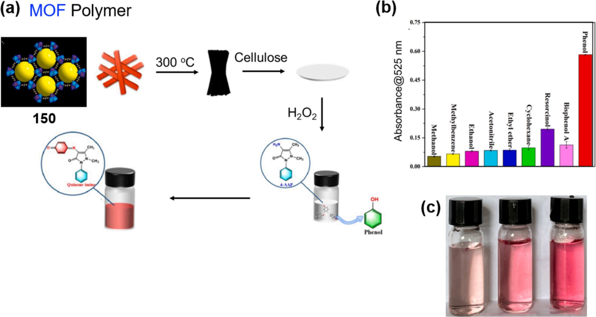

## Page 64

	
Advanced Composites and Hybrid Materials            (2025) 8:30 
   30  
Page 64 of 90
sensitive hybrid film. The nanocellulosic hybrid film 154 
can detect ­Cu2+ with an estimated LOD of 200 × ­10−9 M 
(Fig. 57d). The hybrid film 154 can be used for measuring 
­Cu2+ levels in a fluorimeter or a microarray laser scanner 
(Fig. 57e) [137].
In 2017, Chen et al. developed a cellulose-based material 
155 by using facile citric acid/cysteine (CCF) treatment. The 
advantage of using this method was that the alteration of cel-
lulose-based materials 155 could be accomplished without 
cellulose dissolution (Fig. 58a). Moreover, the mentioned 
route also enables preserving the original morphology of 
155. Additionally, CCF-modified cellulose material 155 
displays selective quenching and excellent UV absorption 
capacity. Hence, the authors consider cellulosic material 155 
can be employed in anti-counterfeiting, chemical shielding 
and UV shielding applications (Fig. 58b, c) [138].
Nishio and co-workers developed napthalimide-based 
fluorescent cellulose derivatives 156–161 for sensing of 
nitroaromatic compounds. For achieving materials 156–161, 
first, allyl cellulose was synthesised from cellulose in an 
aqueous solution consisting of NaOH/urea, with the simul-
taneous addition of amino ethanethiol (AET). Finally, 
napthalimide-derived fluorescent units were integrated by 
the reaction of AET-modified AC with 4-dimethylamine-
1,8-naphthalic anhydride (DMANA) (Fig. 59a). The struc-
tures of cellulosic materials 156–161were well characterised 
and further used for fluorescence quenching-based detection 
of 2,4,6-trinitrophenol (TNP) and 2,4-dinitrophenylhydra-
zine (DNH) (Fig. 59b, c). The authors predict that either the 
quenching occurs as a result of electron transfer from probe 
to nitroaromatics or due to resonance energy transfer (RET) 
mechanism. The estimated LODs of 156–161 for TNP and 
DNH were 2.5 × ­10−8 and 3.2 × ­10−8 mol/L, respectively. 
The authors claim that probes 156–161can be used for the 
detection of specific nitroaromatic entities in aqueous and 
nonaqueous media [139].
Organic polymers have found high weightage in the field 
of optical chemosensing. In 2018, Fragouli and their team 
developed photochromic paper indicators for the determi-
nation of acidic food spoilage. Cellulosic paper 162 was 
Fig. 57   a Chemical structure of 151 and 152. b, c Photophysical 
properties of 151 and 152. (Refer to the web version of this article 
for the legend colour). Reproduced from Ref. 136 with permission of 
RSC. d Procedure for preparing 153 and 154. e Testing of 153 and 
154 in human serum samples. (Refer to the web version of this article 
for the legend colour). Reproduced from Ref. 137 with permission of 
Wiley

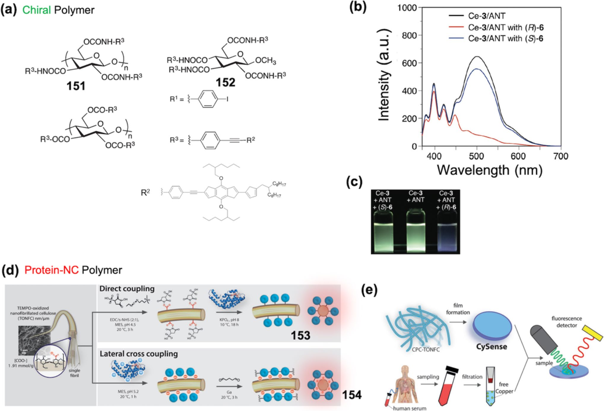

## Page 65

Advanced Composites and Hybrid Materials            (2025) 8:30 	
Page 65 of 90 
   30 
Fig. 58   a Complete preparation 
of cellulosic material 155. b 
Screen printing and writing of 
molecular using 155. c Colour 
ruler prepared using 155. (Refer 
to the web version of this 
article for the legend colour). 
Reproduced from Ref. 138 with 
permission of ACS
Fig. 59   a Synthetic route for 
preparation of cellulosic materi-
als 156–161. b Selectivity 
profile of 156 for nitroaromatic 
compounds. c Quenching profile 
for different nitroaromatics by 
156. (Refer to the web version 
of this article for the legend 
colour). Reproduced from Ref. 
139 with permission of ACS

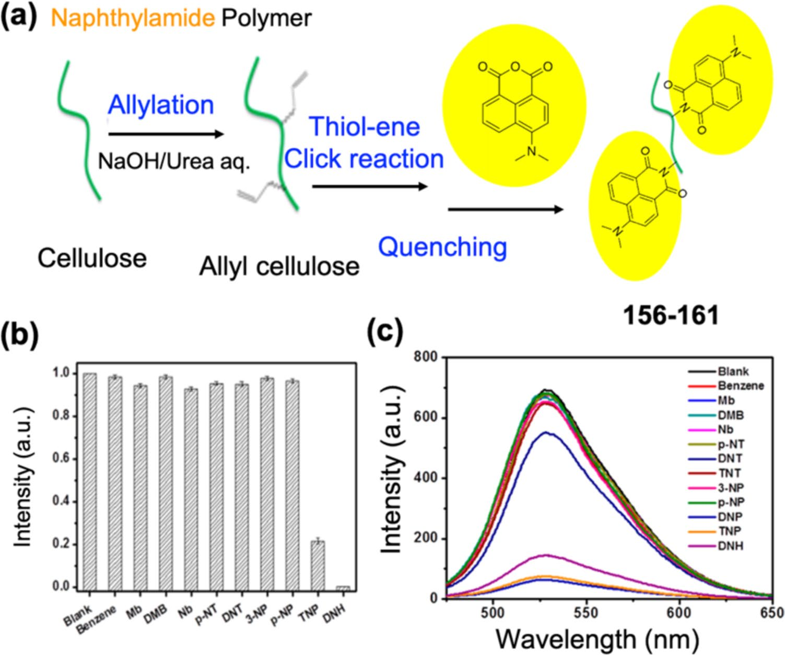

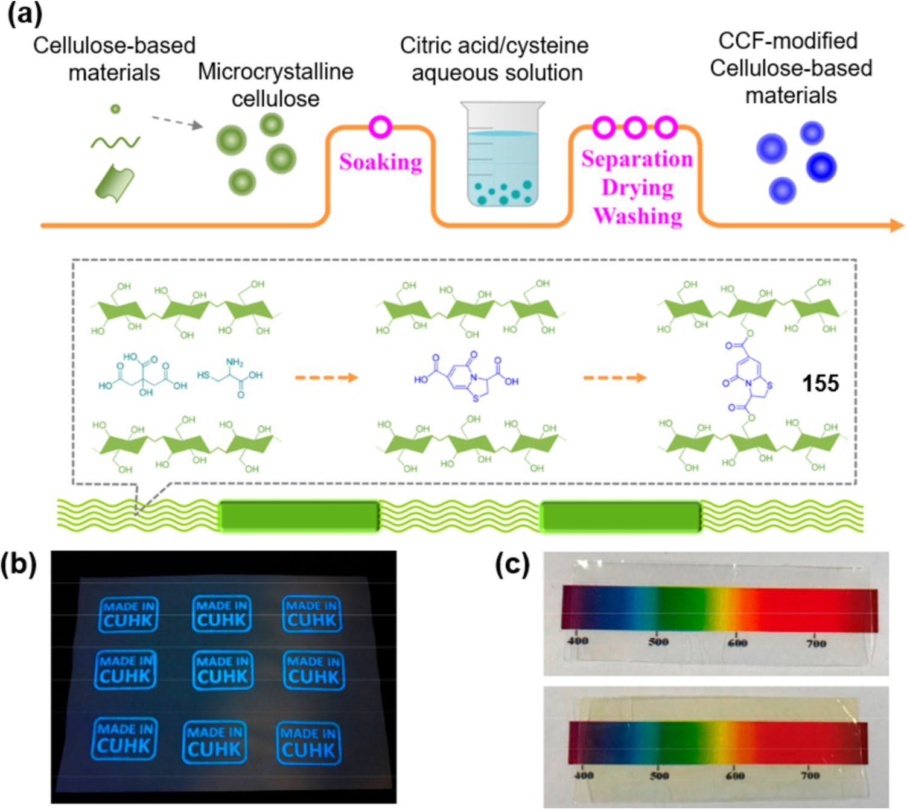

## Page 66

	
Advanced Composites and Hybrid Materials            (2025) 8:30 
   30  
Page 66 of 90
prepared by the incorporation of spiropyran-modified 
poly(2-hydroxyethyl methacrylate) via a noncovalent func-
tionalization onto the paper strip surface (Fig. 60a). In the 
presence of acidic vapours, i.e. spoiled food samples, the 
fluorescence of 162 is changed from pink to colourless 
(Fig. 60b, c). The naked-eye visualization of food spoilage is 
achieved using cellulosic papers 162. The authors have used 
the potential of cellulosic material 162 in food packaging 
and food spoilage sensors [140]. In the current review, we 
have come across many sensing materials for the detection 
of ­Fe3+ ions. A reduced form of ­Fe3+, i.e. is ­Fe2+, also plays 
a crucial role in many biological processes, and determining 
their concentrations in the human body is vital for human 
health. In 2018, Zhang et al. developed a cellulose-derived 
sensor encompassing phenanthroline for the highly selective 
and rapid naked-eye and fluorescent detection of ­Fe2+ ions. 
Cellulosic probe 164 constitutes of 1,10-phenanthroline-
5-amine (Phen) as fluorophore unit, cellulose acetate-based 
matrix and 4,4′-methylene diphenyl diisocyanate (MDI) as 
crosslinker (Fig. 60d). Cellulosic polymer 164 was capable 
of detecting ­Fe2+ via a chemical bonding strategy. High and 
rapid fluorescence quenching of 164 was achieved with the 
addition of ­Fe2+ (Fig. 60e). The limit of detection of cel-
lulosic material 164 for ­Fe2+ was estimated as 2.6 ppb. The 
visualization of ­Fe2+ using 177 was tested via printing, films 
and coating on glass (Fig. 60f).
The authors consider that the ­Fe2+ responsive material 
164 has huge potential in the detection and extraction of ­Fe2+ 
ions [141]. Later, in 2019, Kamel and co-workers introduced 
fluorescein-based chitosan nanoparticles and imprinted them 
Fig. 60   a Structure and synthetic procedure for preparing 162. b, c 
Colourimetric detection of acid vapours. (Refer to the web version 
of this article for the legend colour). Reproduced from Ref. 140 with 
permission of ACS. d Synthesis and fluorimetric detection mecha-
nism for 164. e Selectivity profile of 164 for ­Fe2+ in the presence 
of various cations. f Glass printing of 164 and applied in detection 
of ­Fe2+. (Refer to the web version of this article for the legend col-
our). Reproduced from Ref. 141 with permission of ACS. g Chemical 
structure of 166. h Fluorescence selectivity of 166 for aromatic mol-
ecules. (Refer to the web version of this article for the legend colour). 
Reproduced from Ref. 142 with permission of Springer

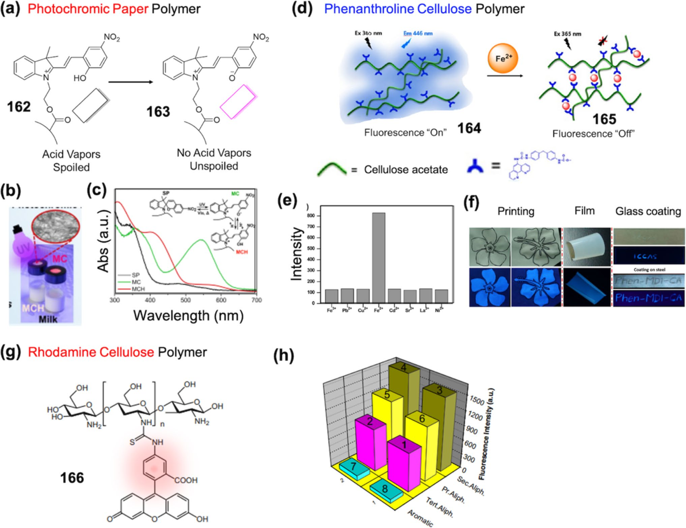

## Page 67

Advanced Composites and Hybrid Materials            (2025) 8:30 	
Page 67 of 90 
   30 
on cellulose strips for the naked eye and fluorescence-based 
detection of ammonia and amine vapours. Cellulose material 
166 was synthesised by appending fluorescein-modified chi-
tosan nanoparticles onto cellulose matrix (Fig. 60g). In the 
presence of alkaline species, the protonated portions of fluo-
resceins are deprotonated resulting in the turn-on emission 
(Fig. 60h). The readout limit of 166 for ammonia and amine 
vapours is determined as 280 ppm in a linear concentration 
range of 0.13–280 ppm. The cellulosic material 166 can be 
applied for the detection of ammonia and amine vapours in 
real samples [142].
A similar sensing application was pursued by Zhang 
et al. (2019), wherein they developed an amine-responsive 
cellulose-based ratiometric fluorescent material 167 for the 
real-time and visual determination of shrimp and crab fresh-
ness. Probe 167 constituted of an immobilisation of fluores-
cein isothiocyanate-based fluorophore indicator and proto-
porphyrin IX as internal reference onto cellulose acetate, 
respectively [143]. The blending of green-emitting cellulose 
fluorescein isothiocyanate and red-emitting protoporphyrin 
IX cellulose generated a series of dual-emissive fluorescent 
material 167 with varying ratios (Fig. 61a). In a sample 
when fluorescein isothiocyanate cellulose and protoporphy-
rin IX cellulose were blended in a 5:1 ratio, they emitted 
red fluorescence. However, when exposed to ammonia fluo-
rescein, isothiocyanate was deprived with a proton, a result 
of which the molecular structure of 167 changed causing 
green emission. Cellulosic material 167 displays a sensitive, 
colour responsive, linear and rapid response to ammonia 
within a range of 5.0 ppm to 2.5 × ­104 ppm. The authors have 
successfully employed 167 for high contrasting, low cost 
and rapid responsive detection of shrimp and crab spoilage 
(Fig. 61b). Later in 2021, Cheng and team utilised naphthal-
imide-based fluorescent molecules for modifying cellulose 
surface and applied in the detection of 2,4,6-trinitrophenol 
(TNP). In the process, etherification of cellulose led to the 
formation of ­BrCH2CH2NH2, –NH2 group bearing cellulose. 
Further, the formed –NH2 groups were reacted with bromo-
1,8-naphthalic anhydride forming a naphthalimide cellulose 
derivative. Moreover, three different recognition units were 
introduced by replacing the Br atoms forming cellulosic 
probes 168–170 (Fig. 61c). Cellulosic fluorophore 168–170 
showed selective fluorescence quenching when in contact 
with TNP (Fig. 61d). The LODs for 168–170 to TNP were 
Fig. 61   a Chemical structure of 167 and derivative. b Estimation of 
fish freshness using a combination of 167 and derivative. (Refer to 
the web version of this article for the legend colour). Reproduced 
from Ref. 143 with permission of Nature. c Chemical structure of 
168, 169 and 170. d Quenching-based selectivity profile of 168 for 
trinitrophenol. (Refer to the web version of this article for the legend 
colour). Reproduced from Ref. 144 with permission of Elsevier

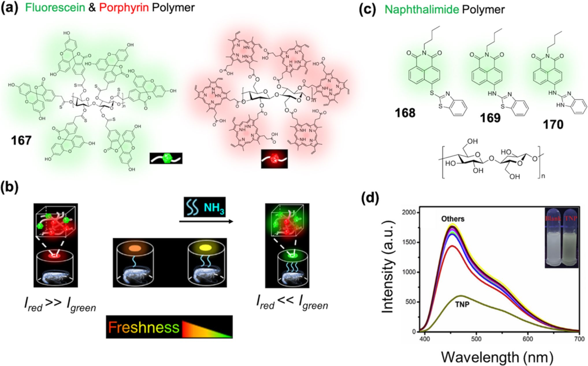

## Page 68

	
Advanced Composites and Hybrid Materials            (2025) 8:30 
   30  
Page 68 of 90
estimated as 0.52, 0.76 and 0.81 µM, respectively. The aim 
of the work was to develop a selective sensor for explosive 
TNP in real-time situations [144].
Liu et al. utilised an oxidation process and two consecu-
tive Schiff bases strategies for modifying the cellulose sur-
face with polyethylenimine (PEI) and salicylaldehyde form-
ing 174 (Fig. 62a). Microcrystalline cellulose was used as 
the cellulose unit in 174. Cellulose material 174 exhibited 
selective fluorescence quenching with ­Fe3+ even in the pres-
ence of different counter analytes. Moreover, a colourimetric 
change was also observed in the profile of 174 with ­Fe3+. 
The addition of ­Fe3+ to Salen molecule 174 aids in the for-
mation of a strong complex bond. Moreover, ­Fe3+ induces 
PET mechanism resulting in the fluorescence quenching of 
174. The fluorescence emission from green to quenched for 
174 to ­Fe3+ is also noticeable to the naked eye under the 
UV lamp (Fig. 62b, c). The detection limit of 174 to ­Fe3+ 
is determined as 0.01 ppm. The authors consider the poten-
tial of 174 to be used in the practical application of on-site 
­Fe3+ detection [145]. Yang and co-workers developed a 
pyrimidine-2-amine derivative-grafted cellulose ratiometric 
probe 177 for determining pH in extremely acidic media. As 
depicted in Fig. 62d, probe 177 was synthesised by grafting 
camphor-derived pyrimidine-2-amine onto dialdehyde cel-
lulose. Cellulosic material 177 can monitor extremely acidic 
conditions with a pKa of 1.57. On varying the pH of 177 
solutions from 6.86 to 1.04, a distinct red shift in fluores-
cence emission is noticed from 416 to 486 nm (Fig. 62e). 
Moreover, no interference was observed when treated with 
metal ions. The cellulosic probe 177 showed prominent sta-
bility, high selectivity, good repeatability and rapid response 
towards ­H+. The authors have tested the efficacy of cellu-
losic material 177 in highly acidic conditions like real vin-
egar samples [146].
In 2022, Yang et al. developed a cellulose-based fluo-
rescent probe 180 with carboxymethyl cellulose as the 
skeleton and 8-aminoquinoline as the fluorophore unit 
for selective, specific and sensitive detection of ­Cu2+ 
Fig. 62   a Chemical structure and synthesis of 174. b Visual detection 
of ­Fe3+ using 174 both colourimetrically and under UV light. c Fluo-
rescence selectivity profile of 174 for ­Fe3+. (Refer to the web version 
of this article for the legend colour). Reproduced from Ref. 145 with 
permission of Elsevier. d Chemical techniques and mechanism for the 
preparation of 177. e Changes in pH visualised on cellulose material. 
f Selectivity profile of 177 in presence of cations. (Refer to the web 
version of this article for the legend colour). Reproduced from Ref. 
146 with permission of Springer

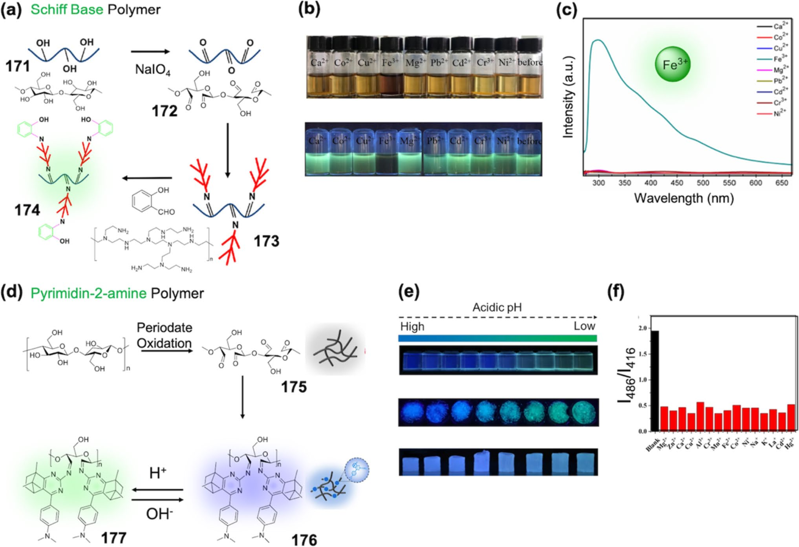

## Page 69

Advanced Composites and Hybrid Materials            (2025) 8:30 	
Page 69 of 90 
   30 
(Fig.  63a). Cellulosic material 180 displayed highly 
specific turn-off fluorescence response towards ­Cu2+ 
(Fig. 63b, c). Probe 180 has large oxygen functionality, 
which assists in the complexation with ­Cu2+ ions. Further, 
complexation with ­Cu2+ ions induce PET phenomenon in 
180. Moreover, coordination with copper generates a pla-
nar structured 180. All these reasons are attributed for 
the selective fluorescence quenching of ­Cu2+ by 180. The 
LOD of 180 to ­Cu2+ was calculated to be 6.4 × ­10−8 mol/
L−1. The authors used X-ray photoelectron spectroscopy 
(XPS) and density functional theory (DFT) techniques to 
determine the sensing detection mechanism. The authors 
have tested the efficacy of cellulosic material 180 for the 
detection of ­Cu2+ ions in real water samples [147].
In another work, Xu and co-workers developed cellulose-
based smart materials 181 for colourimetric and fluorescent 
detection of ­Cu2+ and ­Fe3+ ions and evaluated their appli-
cation in anti-counterfeiting applications. Cellulosic mate-
rial 181 was achieved by combining luminol (fluorophore 
unit) with 4,4′-methylene diphenyl diisocyanate (MDI) as 
the crosslinker (Fig. 63d). Addition of ­Cu2+ and ­Fe3+ to 
181 induced fluorescence quenching (Fig. 63e). Cellulosic 
material 181 can detect ­Cu2+ and ­Fe3+ as low as 56 ppb 
and 37 ppb in fluorescence mode. Probe 181 was modified 
into polymeric films for applicability in anti-counterfeiting 
experiments. The authors confirm that cellulosic material 
181 has outstanding biodegradability and renewability and is 
cost-effective and non-toxic [148]. Zhang et al. developed a 
Fig. 63   a Preparation method for 180. b Naked eye detection of ­Cu2+ 
by 180 under UV lamp 365 nm. c Interference-based selectivity pro-
file of 180 for ­Cu2+. (Refer to the web version of this article for the 
legend colour). Reproduced from Ref. 147 with permission of MDPI. 
d Detection mechanism of 181 for cations. e Visual selectivity pro-
file of 181 towards ­Cu2+ and ­Fe3+. (Refer to the web version of this 
article for the legend colour). Reproduced from Ref. 148 with permis-
sion of Elsevier. f Complete study of phosphorescence by 182. (Refer 
to the web version of this article for the legend colour). Reproduced 
from Ref. 149 with permission of Nature

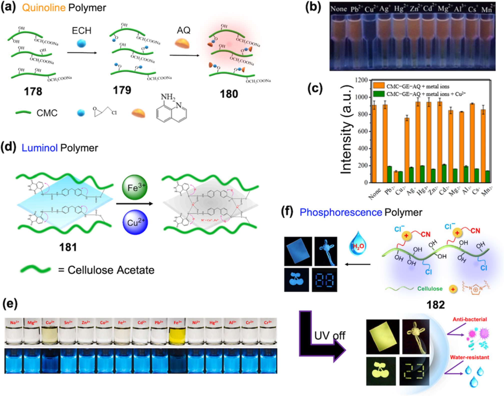

## Page 70

	
Advanced Composites and Hybrid Materials            (2025) 8:30 
   30  
Page 70 of 90
cellulose-based phosphorescent material 182 with excellent 
anti-bacterial, water-resistance and easy processability. The 
phosphorescent cationised cellulose derivative 182 was pre-
pared by introducing ionic structures, which include cyano-
methyl imidazolium cations and chloride anions, into the 
cellulose matrix. The phosphorescence of cellulosic material 
182 was achieved by intersystem crossing enabled by the 
cyano group and nitrogen element in imidazolium cations. 
The cations (chloride anions) in the cyano group undergo 
multiple hydrogen bonding and electrostatic attraction inter-
actions with the hydroxyl group in cellulose, forming 182 
and resulting in the effective inhibition of non-radiative tran-
sitions. The cellulose-based phosphorescent material can be 
easily modified into films, fibres, patterns and coatings by 
utilizing eco-friendly aqueous solution processing strategies. 
The authors have tested the worth of cellulosic material 182 
for antibacterial properties and water resistance (Fig. 63f) 
[149].
Formaldehyde (HCHO) is a simple reactive carbonyl 
compound that plays a crucial role in pathological processes 
as a biomarker. In living organisms, HCHO is exclusively 
linked to the synthesis of neurotransmitters and amino acids. 
Hence, it is important to monitor the levels of HCHO. Kong 
and co-workers introduced a cellulose-based fluorescent 
probe 183 for the quantitative detection of HCHO, aiding 
in the determination of spoilage of real food samples and 
bioimaging in living cells. In probe 183, cellulose is func-
tionalised with hydrazine naphthalimide (fluorophore unit) 
(Fig. 64a). In the presence of HCHO, cellulosic material 183 
exhibits a strong fluorescence turn-on response (Fig. 64b). 
Cellulosic material 183 can rapidly detect HCHO with 12.3-
fold increase in the emission intensity. The limit of detection 
(Fig. 64c) of 183 towards HCHO is calculated as 0.09 ppm. 
Probe 183 was used to estimate levels of HCHO in HepG2 
cells. Moreover, the efficacy of 183 test papers for HCHO 
was also tested in food and water samples (Fig. 64d) [150]. 
In another work, Yang and group introduced a coumarin-
grafted dialdehyde cellulose-based fluorescent material 
184 for the sensitive and selective detection of ­Fe3+ ions 
(Fig. 64e). Cellulosic material 184 was prepared by conden-
sation reaction between dialdehyde cellulose and coumarin 
derivative. In the presence of ­Fe3+ ions, the fluorescence 
Fig. 64   a Chemical structure of 183. b The changes of fluorescence 
spectra of probe 183 at different HCHO concentrations. c Colour 
change of the strips doped with 183 on treatment with different con-
centration gradients of HCHO. d Images for test paper application of 
183 to HCHO. (Refer to the web version of this article for the leg-
end colour). Reproduced from Ref. 150 with permission of Elsevier. 
e Chemical structure of 184 and fluorescence selective images of 184 
towards ­Fe3+. (Refer to the web version of this article for the legend 
colour). Reproduced from Ref. 151 with permission of Elsevier

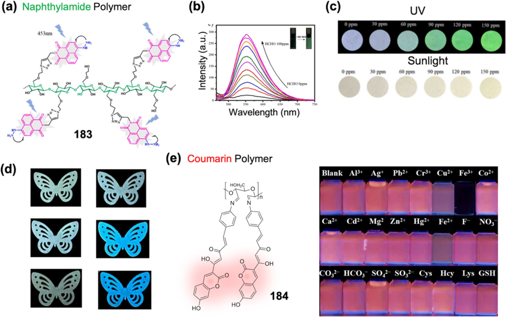

## Page 71

Advanced Composites and Hybrid Materials            (2025) 8:30 	
Page 71 of 90 
   30 
emission of 184 is quenched, with a naked eye colour change 
from pink to colourless under a UV lamp (Fig. 64e (right)). 
The quenching profile resulted from the complexation 
between 184 and ­Fe3+ inducing PET mechanism. The LOD 
of 184 to ­Fe3+ was estimated as 91.7 nM. The authors con-
sider coumarin-embedded cellulosic material 184 as capable 
of monitoring levels of ­Fe3+ in water samples [151].
In another illustration of coumarin cellulose interac-
tion, Yang et al. synthesised a coumarin-modified fluores-
cent cellulose probe for sensitive and selective detection of 
­CN− in food samples. Cellulosic material 185 (Fig. 65a) 
was synthesised by utilizing cellulose acetate as the skel-
eton matrix and the coumarin derivative as the fluorophore 
unit. The presence of ­CN− produced a fluorescence quench-
ing effect on 185 (Fig. 65b). The interaction between 185 
and ­CN− generates a new species, i.e. 185-CN−, which is 
non-fluorescent. Cellulosic material 185 can detect CN– as 
low as 5.8 × ­10−7 M, which is lower than the recommended 
limit of ­CN− by WHO in drinking water. The fluorescent cel-
lulosic film 185 was capable of detecting ­CN− in food sam-
ples like bitter almonds and germinated potatoes (Fig. 65c) 
[152]. In a crucial report, Zhu and co-workers developed a 
dual-responsive cellulose-based fluorescent material fabri-
cated 186 in a ­CO2 switchable solvent for multifunctional 
applications (Fig. 65d). Cellulosic material 186 was success-
fully grafted by using 7-hydroxy-4-trifluoromethyl coumarin 
(HFC) and poly (lactic acid) onto the cellulose backbone. 
Cellulose probe 186 showed effective quenching of fluores-
cence towards ­Fe3+ (Fig. 65e, f). As reported earlier here, 
also the binding of ­Fe3+ with 186 induces the PET mecha-
nism, leading to fluorescence quenching. The authors con-
sider cellulosic material 186 capable of real-time, accurate 
and visual monitoring levels of ­Fe3+ in aquatic products 
[153].
In the same year, Yang and the group utilised an efficient 
ethyl cellulose fluorescent probe 187 for quick detection of 
­Fe3+ and its multifaceted applications. The authors grafted 
flavanol on an ethyl cellulose bed to form 187 and applied 
it for the detection of ­Fe3+ ions (Fig. 66a). The addition 
of ­Fe3+ to cellulosic material 187 resulted in fluorescence 
quenching. Here also on complexation with ­Fe3+, PET phe-
nomenon is activated resulting in the fluorescence quench-
ing. The detection of ­Fe3+ by 187 can be visualised under a 
UV lamp (Fig. 66b). The detection limit of ­Fe3+ by 187. The 
LOD is determined as 2.65 × ­10−7 mol/L. The 187-loaded 
filter paper can be used for the estimation of ­Fe3+ in real 
water samples (Fig. 66b) [154].
In another illustration of cellulosic probes for the detec-
tion of ­Fe3+, Cheng and co-workers developed highly solu-
ble cellulose-derived fluorescent probes 188–190 for the 
simultaneous detection and removal of ­Fe3+. Cellulosic 
probes 188–190 were produced in different steps. In the 
first step, the hydroxyl group in glucose units was reacted 
with thionyl chloride to generate chloro-cellulose (Cell-Cl). 
In the second step, Cell-Cl was reacted with 2-mercapto-
benzothiazole, and ­CS2 paved the way for the creation of a 
cellulose-based macromolecular RAFT reagent (Cell-CTA). 
Finally, naphthalimide units, fluorescent monomers bearing 
Fig. 65   a Chemical structure of 
185. b Detection strategy used 
by 185 for estimating ­CN− in 
food samples. c Naked eye 
change in fluorescence of 185 in 
presence of ­CN−. (Refer to the 
web version of this article for 
the legend colour). Reproduced 
from Ref. 152 with permission 
of RSC. d Chemical structure of 
186. e Naked eye change in the 
profile of 186 coated cellulose 
paper in presence of ­Fe3+. f 
Quenching profile of 186 in the 
presence of ­Fe3+. (Refer to the 
web version of this article for 
the legend colour). Reproduced 
from Ref. 153 with permission 
of Elsevier

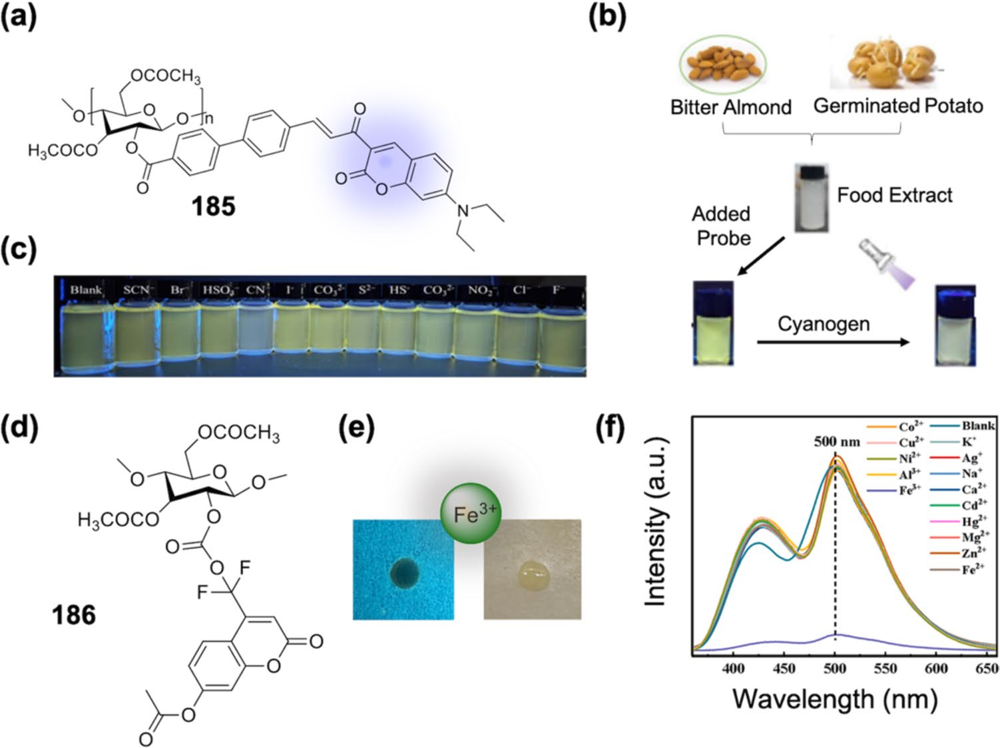

## Page 72

	
Advanced Composites and Hybrid Materials            (2025) 8:30 
   30  
Page 72 of 90
–C = C– and methacrylic acid were grafted on the cellulose 
chain via the RAFT polymerization technique forming 
188–190 (Fig. 66c). The soluble cellulose macromolecular 
materials 188–190 are capable of selectively recognizing 
­Fe3+ (fluorescence quenching) in pure water with excellent 
recyclability and regeneration (Fig. 66d). The modification 
of cellulose improves the hydrophilicity and introduces 
fluorophore unit while decreasing the crystallinity enabling 
solubility of 188–190 both in water and organic solvents. As 
per the authors, the cellulosic probe 188–190 can be utilised 
for the simultaneous detection and adsorption of ­Fe3+ ions 
in water [155].
Later in the same year, Cheng et al. doped cellulose sur-
face with fluorescent naphthalimide forming polymeric fluo-
rescent probes 191, 192 and 193. Figure 67 a depicts the 
solid emission images of probes 191–193 under a UV lamp. 
To attain products 191–193, at first esterification reaction 
between the –OH group of cellulose and acryloyl chloride 
was pursued. Further, using the thiol-ene click reaction, 
–C = C on cellulose, –SH on cysteamine and –NH2 groups at 
the chain ends were conferred on cellulose. This pre-treated 
cellulose was reacted with 4-bromo-1,8-naphthalene anhy-
dride derivatives forming 191–193. Cellulosic materials 
191–193 exhibit selective quenching in the presence of ­Fe2+ 
(Fig. 67b, c). Under basic conditions, the electron-donating 
nature of N atom of 191–193 is impaired by the –OH group, 
leading to the intramolecular charge transfer (ICT) phenom-
enon. However, on addition of ­Fe2+, the PET mechanism is 
induced in 191–193, causing fluorescence quenching. As the 
prepared probes 191–193 are fabricated into cellulose mem-
brane, their utility as a portable device is conceivable [156]. 
Mercurous ions ­(Hg+) are inorganic elements or simply inor-
ganic mercury that possess high-end neuro and nephrotox-
icity. Recently, in 2024, Cheng and co-workers introduced 
an organic-solvent-soluble cellulose doped with fluorescent 
polyurethanes and utilised it for the simultaneous detection 
and removal of ­Hg+ ions. In this study, the authors have 
integrated fluorophore naphthalimide into cellulose-based 
polyurethane films to generate 195 (Fig. 67d). Upon contact 
with mercurous ions ­(Hg+), the fluorescence profile of 195 
is quenched (Fig. 67e). ­Hg+ is considered to have strong 
electrophilicity as it is a Lewis acid. The lone pairs of N and 
O atoms in 195 interact with ­Hg+ forming strong binding. 
These result in the fluorescence quenching of 195 as ­Hg+ 
is a strong quencher. Moreover, 195 displays an adsorption 
capacity of 8.4 mg ­cm−2 for ­Hg+. The cellulosic film 195 
can be applied for monitoring and reducing the mercurous-
related environmental pollution [157].
In 2023, Shi and their team developed cellulose-based 
fluorescent films 196 and 197 with enamine bonds for 
applicability in anti-counterfeiting and UV shielding. The 
preparation of 196 and 197 was made possible in two steps 
Fig. 66   a Chemical structure of 187. b Naked eye selectivity of 187 
doped cellulose paper for ­Fe3+. (Refer to the web version of this arti-
cle for the legend colour). Reproduced from Ref. 154 with permission 
of Elsevier. c Chemical structure of napthalimide-cellulose molecules 
188–190. d Quenching profile of 190 for ­Fe3+ in the presence of vari-
ous counter analytes. (Refer to the web version of this article for the 
legend colour). Reproduced from Ref. 155 with permission of Else-
vier

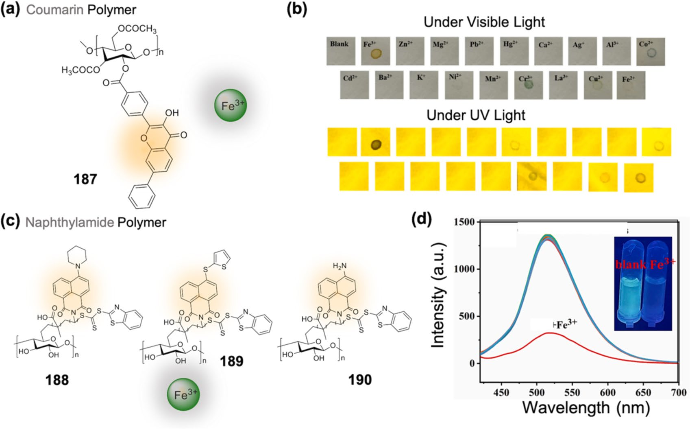

## Page 73

Advanced Composites and Hybrid Materials            (2025) 8:30 	
Page 73 of 90 
   30 
Fig. 67   a Chemical structure of cellulosic material 191–193. b Solid 
state emission profile of 191–193. c Quenching profile of 193 for 
­Fe3+ in presence of different counter cations. (Refer to the web ver-
sion of this article for the legend colour). Reproduced from Ref. 156 
with permission of Springer. d Chemical synthesis of cellulosic mate-
rial 195. e Quenching profile of 195 for ­Hg+ in the presence of other 
counter cations. (Refer to the web version of this article for the legend 
colour). Reproduced from Ref. 157 with permission of Elsevier
Fig. 68   a Chemical method for the synthesis of 196. b Mechanism 
for the detection of Cr(VI) by 196. c Cellulose film coated with 196 
used in anti-counterfeiting application. (Refer to the web version of 
this article for the legend colour). Reproduced from Ref. 158 with 
permission of RSC

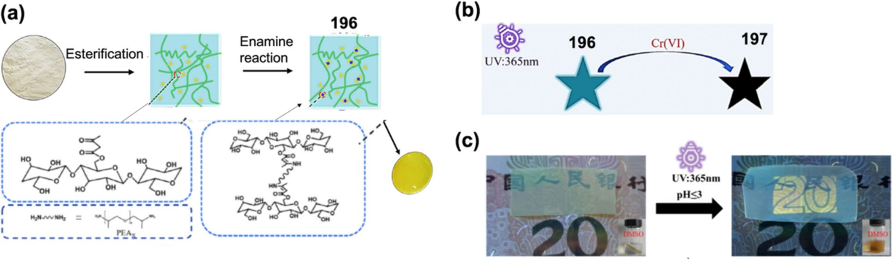

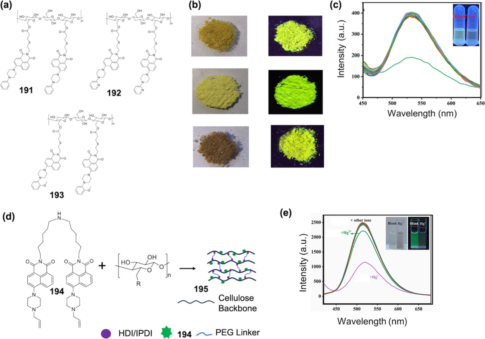

## Page 74

	
Advanced Composites and Hybrid Materials            (2025) 8:30 
   30  
Page 74 of 90
by grafting microcrystalline celluloses with acetoacetyl 
groups, followed by crosslinking with polyetherimide 
(Fig. 68a). The mechanical properties of 196 and 197 pol-
ymeric films are drastically improved by the crosslinking 
procedure. Moreover, the enamine bonds in 196 and 197 
help in inducing recyclability to the polymer films. The 
fluorescence of 196 and 197 got quenched in the presence 
of Cr(VI) solution (Fig. 68b). Further, the polymeric films 
196 and 197 can be utilised for anti-counterfeiting and UV 
shielding applications (Fig. 68c) [158].
In the same year (2023), Qin et al. developed dual-emit-
ting cellulose nanocrystal hybrid material 198. Product 
198 comes with circularly polarised luminescence and can 
be easily applied in anti-counterfeiting labels. Material 
198 constitutes lanthanide complexes as luminescent units 
and CNCs as chiral nematic moieties (Fig. 69a, b). The 
so-obtained 198 films show excellent broadband reflec-
tion across the visible spectrum. The so-mentioned feature 
is attributed to the chiral nematic domains from CNCs. 
The broad reflection band of 198 covers both green and 
red fluorescent emission centres and also generates cir-
cularly polarised luminescence emission (Fig. 69c). The 
CNC-based material 198 with tailored shapes is further 
employed as anti-counterfeit tags and decorative applica-
tions [159].
4.3.2  Colourimetric‑based polymers (Cello‑Other‑Poly)
There are very few illustrations of Cello-Other-Poly as col-
ourimetric chemosensors. Pangon and co-workers developed 
colourimetric probe 199 based on urethane-linked imida-
zole-cellulose microcrystals for the detection of different 
important metal ions. The surface modification of cellulose 
microcrystals (CMCs) was performed by using 1,1-carbonyl-
diimidazole and 1-(3-aminopropyl)imidazole, respectively, 
producing 199 (Fig. 70a, b). The colourimetric changes 
in the profile of 199 with different metal ions like ­Fe2+, 
­Fe3+, ­Co2+, ­Ni2+, ­Cu2+, ­Zn2+, ­Ag+ and ­Cd2+ are depicted 
in Fig. 70c. The presence of urethane linked- imidazole on 
cellulose is credited for the increased adsorption capacity of 
199 towards ­Zn2+ (3 times) and ­Ni2+ (23 times). The authors 
consider 199 to be capable of being utilised as sustainable 
bioadsorbents and sensing materials for metal separation and 
water purification [160]. Later in 2019, Liu and co-workers 
developed high-purity cellulose membrane 200 based on a 
sensitive enzyme colourimetric assay for the determination 
Fig. 69   a Chemical method to 
synthesise cellulose film 198. b 
Different moieties involved in 
the preparation of 198. c Photo 
switching ability of 198 in 
butterfly patterns. (Refer to the 
web version of this article for 
the legend colour). Reproduced 
from Ref. 159 with permission 
of Elsevier

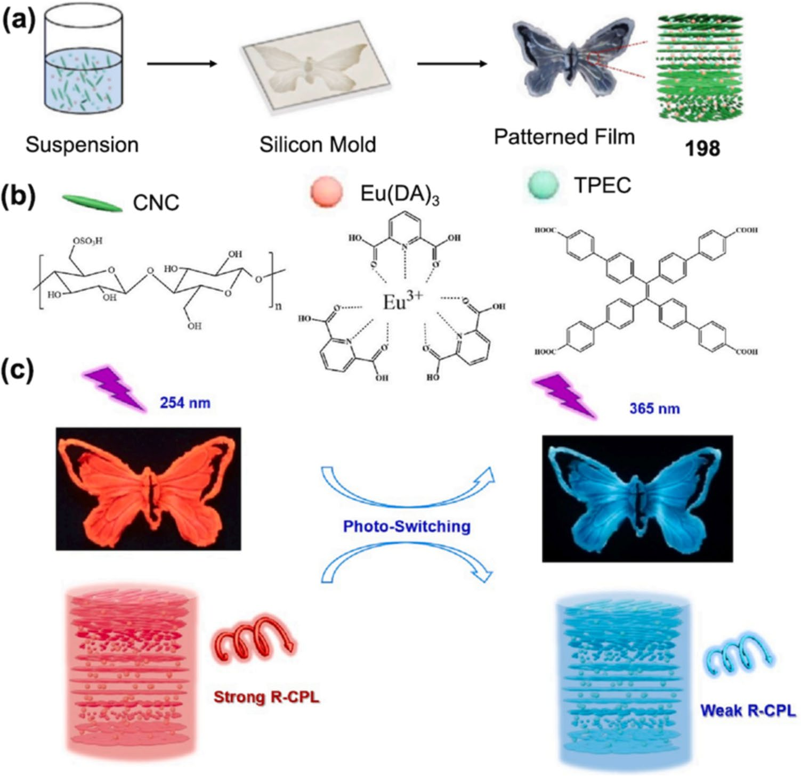

## Page 75

Advanced Composites and Hybrid Materials            (2025) 8:30 	
Page 75 of 90 
   30 
Fig. 70   a Synthesis route for preparation of 199. b Experimental 
setup for studying metal adsorption and sensing. c Images of 199 
after exposure to various metal ion solutions. (Refer to the web ver-
sion of this article for the legend colour). Reproduced from Ref. 160 
with permission of ACS. d Synthesis methodology for 200. e Detec-
tion mechanism of 200 towards glucose. f Selectivity profile of 200 
towards glucose in the presence of different counter analytes. (Refer 
to the web version of this article for the legend colour). Reproduced 
from Ref. 161 with permission of ACS

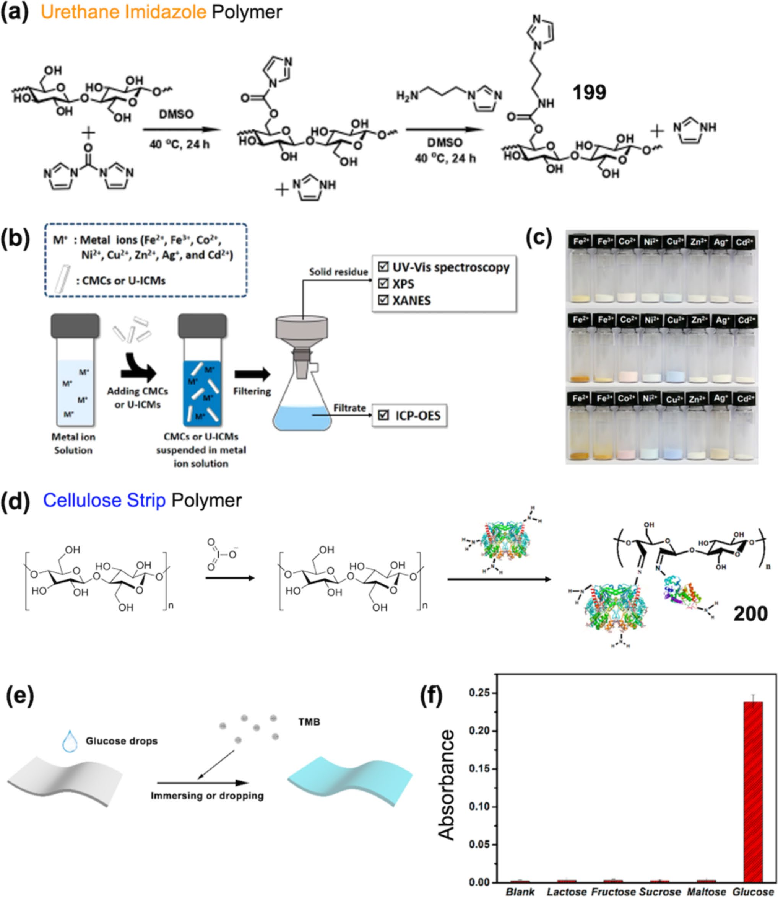

## Page 76

	
Advanced Composites and Hybrid Materials            (2025) 8:30 
   30  
Page 76 of 90
of low concentrations of glucose (Fig. 70d). At first, cellu-
lose was dissolved in NaOH/urea solution and then modified 
with sodium periodate oxidation technique resulting in the 
immobilization of glucose oxidase (GOx) and horseradish 
peroxidase (HRP) with Schiff-base (Fig. 70e). The enzy-
matic cellulosic probe 200 can selectively detect low con-
centrations of glucose (Fig. 70f). The sensing mechanism 
is as follows: in probe 200, the GOx unit can catalyse the 
oxidation of glucose forming ­H2O2. Further, the reaction of 
­H2O2 with 3,3’,5,5’-tetramethylbenzidine (TMB) under the 
oxidation of horseradish peroxidase yields a blue colour, 
indicating the presence of glucose. The LOD of 200 to glu-
cose was estimated as 0.45 nM in the linear range of 1 to 
11 nM. The authors consider that this work will provide a 
new strategy for the development of cellulose-based func-
tional materials applicable in biosensors, drug carriers and 
biomedicine [161].
In another work (2019), Wang and co-workers developed 
a biomass cellulose–derived simple colourimetric probe for 
in situ visual recognition of ­Cu2+ (Fig. 71a). Cellulosic mate-
rial 201 was synthesised by a Schiff base reaction between 
the aldehyde moieties in dialdehyde cellulose and the amino 
functionality of 2,6-pyridine dihydrazide. The as-prepared 
sensor 201 displayed a selective visual and colourimetric 
detection towards ­Cu2+. The visual detection limit of 201 
towards ­Cu2+ was estimated as ­10−7 mol/L (Fig. 71b). The 
detection of ­Cu2+ was attributed to the different functionali-
ties like –C = O, –NH and –NH2 in 201, also possessing a 
large external surface area, short transit distance and flex-
ibility. The cellulose grafted material 201 can be used for the 
in situ detection of ­Cu2+ ions [162]. In 2023, Zhang and co-
workers introduced a cellulose membrane–based nanozyme 
immobilization platform 202 for the colourimetric detection 
of hydrogen peroxide ­(H2O2) and uric acid (UA) (Fig. 71c). 
The cellulose membrane platform is immobilised with gold 
nanoclusters, which can mimic peroxidase and also catalyse 
the oxidation of 3,3′,5,5′-tetramethylbenzidine (TMB) by 
­H2O2.Cellulosic material 202 can detect ­H2O2 with a visual 
detection limit of 7 µM and uric acid in a concentration 
range of 50–500 µM. The development of cellulosic material 
202 provides new insights into the effective immobilization 
of enzymes on cellulose surfaces [163].
In 2021, Sarute et  al. utilised cellulose developed 
from recycled office waste and formed a colourimetric 
composite platform 203 for the colourimetric detection 
of food spoilage (Fig. 72a). The cellulose composite 203 
Fig. 71   a Synthetic profile of 
201 and detection mechanism of 
­Cu2+. b Colourimetric change in 
201 doped cellulose by chang-
ing pH. (Refer to the web ver-
sion of this article for the legend 
colour). Reproduced from Ref. 
162 with permission of Elsevier. 
c Complete procedure for the 
formation of 202. (Refer to the 
web version of this article for 
the legend colour). Reproduced 
from Ref. 163 with permission 
of Elsevier

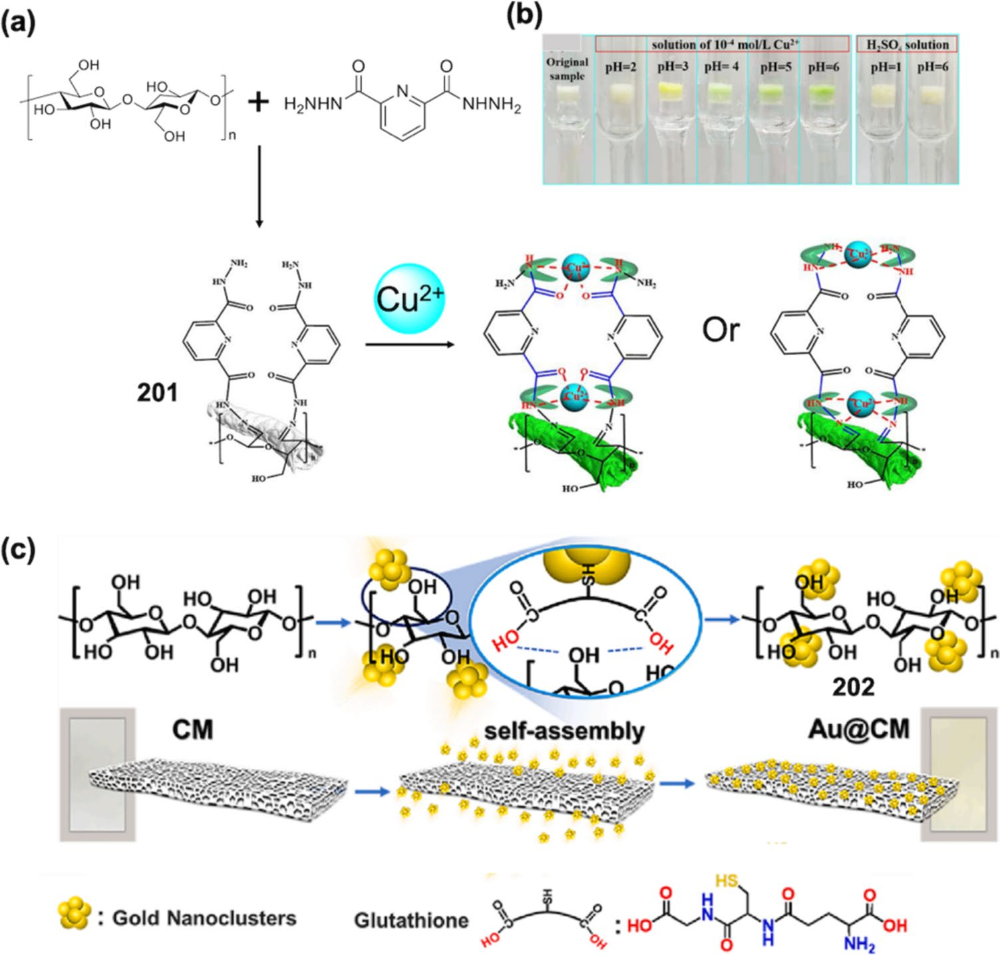

## Page 77

Advanced Composites and Hybrid Materials            (2025) 8:30 	
Page 77 of 90 
   30 
constituted of a dye methyl red and chitosan. The so-devel-
oped cellulose composite was capable of colourimetrically 
visualizing biogenic amines such as putrescine, cadaver-
ine, histamine and tyramine. Probe 203 can discriminate 
different biogenic amine vapours based on different detec-
tion times (Fig. 72b). In the presence of biogenic amine 
vapours, the colourimetric change in 203 was retained 
for 8 h. The authors consider cellulosic composite 203 
capable of determining food spoilage [164]. Qi and co-
workers introduced an efficient and portable cellulose-
based colourimetric test paper for metal ion detection. 
The authors have used a surface esterification approach for 
impending acetyl groups on the surface of cellulose fibres 
(Fig. 72c). Further, utilizing a paper-making process, the 
developed cellulose acetoacetate fibres were transformed 
into cellulose acetoacetate paper 204. The cellulosic paper 
204 is known to have robust mechanical properties, good 
thermal stability and rapid selectivity to ­Fe3+ and ­Cu2+. 
The acetoacetyl groups in 204 are coordinatively chelated 
with metal ions to form a six-membered ring aiding in the 
visual recognition of metal ions. The mechanism utilised 
in this work is promising for future applications. However, 
the selectivity profile is doubtful [165].
5  Future and challenges
In this section, we will review the future prospects and 
challenges in cellulosic materials as optical chemosensors.
Fig. 72   a Chemical proportions in the formation of 203. b Visible 
changes in the colour patterns of 203 doped cellulose in the presence 
of different biogenic amines. (Refer to the web version of this article 
for the legend colour). Reproduced from Ref. 164 with permission of 
Springer. c Preparation of 204 and its use in colourimetric detection 
of ­Fe3+ and ­Cu2+. (Refer to the web version of this article for the leg-
end colour). Reproduced from Ref. 165 with permission of Elsevier

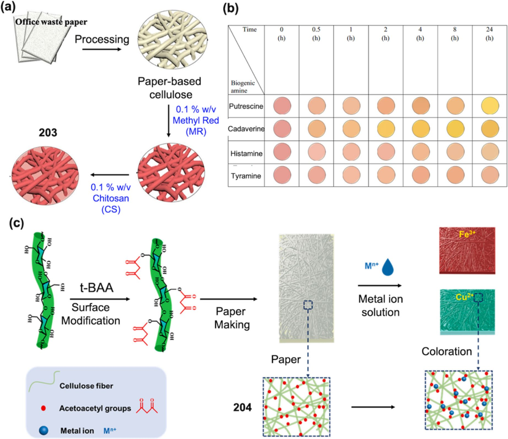

## Page 78

	
Advanced Composites and Hybrid Materials            (2025) 8:30 
   30  
Page 78 of 90
5.1  Future and challenges in cellulose‑derived 
organic materials (Cello‑Org)
Cellulose is a renewable, highly efficient, eco-friendly 
and low-cost material with remarkable adsorption 
efficiency. Cellulose consists of several –OH func-
tional groups that can be easily modified using differ-
ent organic molecules [187]. Organic molecule–based 
optical sensors can be either adsorbed on the surface of 
cellulose matrix like paper or can undergo reaction and 
form new colourimetric and fluorimetric templates. The 
so-mentioned features enable cellulosic material to act 
as template for holding organic dyes and fluorophores 
capable of usage as optical chemosensors. Adsorption 
of fluorophore and dyes on the surface of cellulose is 
related with different characteristics like the initial con-
centration of fluorophore, the dose of adsorbent, pH of 
the solution and temperature. However, to pursue proper 
integration of organic molecules on cellulose matrix, it is 
important to modify the cellulose surface with different 
functional groups.
1.	 Modifications of the cellulose matrix can help in the 
enhancement of adsorption capacity and reactive sites 
on the cellulose surface. For the real-time monitor-
ing of different toxic, hazardous environmental and 
biological materials, the organic fluorophore and col-
ourimetric dye embedded in the cellulose matrix is 
highly useful.
2.	 Cellulose-based organic materials can generate low-
cost, high-end and portable devices for the monitoring 
of different analytes. Generally, researchers employ 
cellulose papers for adsorbing fluorescent and colouri-
metric organic chemosensors and use it as dip-in device 
for real-time detection of analytes. However, in the 
absence of proper adsorption, some of the organic dyes 
are released into the water during real-time examina-
tions. Moreover, this leakage also reduces the efficacy of 
the developed sensor system. Hence, the actual reported 
LODs for probes cannot be achieved during real-time 
examination.
3.	 It is very important to fabricate organic dyes with cel-
lulose matrix by synthetic approach. Moreover, optimi-
zation of cellulose PAD matrix, repetitive deposition of 
sample onto cellulose substrate and preconcentration by 
solid-phase extraction can be used for the development 
of optical chemosensors.
4.	 New innovative techniques for modification of cel-
lulose surface and sequential integration of organic 
chromo and fluorophores should be ensured for 
enhancing the real-time applicability of optical che-
mosensors.
5.2  Future and challenges in cellulose‑derived 
nanomaterials (Cello‑Nano)
As discussed in the review, cellulose matrix displays high 
bio and haemocompatibility and good biodegradability. 
Moreover, cellulose materials show slow degradation both 
in vivo and in vitro. The mentioned property of cellulose 
makes it an excellent candidate for application in different 
scaffolds. Different chemical oxidation strategies on bac-
terial cellulose surfaces, such as TEMPO-mediated oxida-
tion [280], exposure to γ-radiation [281], periodate [280] or 
incorporation of an enzyme, can improve the degradability 
of cellulose [282]. Utilizing cellulose nanomaterials aids in 
the improvement of the mechanical strength of nanomateri-
als. The hydroxyl functional groups in cellulose induce high 
functionality, which is crucial for interfacial interactions 
during a composite formation. As discussed in this review, 
nanocellulose such as cellulose nanocrystals (CNCs) and 
cellulose nanofibres (CNFs) have been excessively employed 
for modifying organic dyes and different nanoparticles 
forming cellulosic hybrids. CNCs and CNFs have abundant 
hydroxyl groups, which aid in surface functionalization for 
applicability in optical chemosensing.
1.	 CNCs attain properties like high strength, high degree 
of crystallinity, high degree of hydrophilicity, hydro-
phobicity and self-affinity that are comparable to pure 
cellulose. Nevertheless, CNC inclusion and dispersion 
into polymeric systems are both vital and difficult.
2.	 It will be of great interest to study the hierarchical CNC 
structures for photonic applications. Aligned CNCs with 
the capability of detecting biomolecules and essential 
biomarkers should be explored. Moreover, the align-
ment of CNCs can be achieved by utilizing minimum 
resources.
3.	 Raw cellulose is extensively used for the preparation of 
carbon and quantum dots. However, the CDs and QDs 
developed from cellulose face the challenge of low lumi-
nescent intensity and quantum yield. This drawback of 
cellulose-generated CDs and QDs can be corrected by 
combining them with metallic and non-metallic heter-
oatoms.
4.	 Another drawback of CDs as fluorophores is their colour 
availability. Most of the developed CDs show blue and 
green emission; other less energy colours like orange 
and red are rarely produced. The focus should be on the 
development of cellulose-derived CDs, which can emit 
low energy emission frequencies of orange, pink and red 
for their applications in bioimaging.
5.	 There is room for the generation of high-performance 
cellulose-based fluorescence composites by the inno-
vation of high-quality CDs, with properties like high 
fluorescence at solid states, thermal activation resultant 

## Page 79

Advanced Composites and Hybrid Materials            (2025) 8:30 	
Page 79 of 90 
   30 
delayed fluorescence and room temperature phosphores-
cence.
6.	 Different dimensional cellulose-derived CDs should be 
prepared for improving energy consumption, decreased 
hydrophobicity and poor stability caution. CDs are eas-
ily detachable from the cellulose architecture. Hence, 
special attention should be paid to improving the attach-
ability of CDs to the cellulose surfaces.
7.	 Quantitative and strong binding between CDs and cel-
lulose should be promoted to maintain fluorescence 
stability even under the influence of diverse external 
environments.
8.	 It is very important to understand the underlying signifi-
cance of cellulose-based nanomaterials and accordingly 
modify them with different organic, inorganic and nano 
moieties for application in optical chemosensing.
5.3  Future and challenges in cellulose‑derived 
polymeric materials (Cello‑Poly)
In this review, we have noticed several polymer-cellulose 
(hydrogel, coordination networks, micelle and organic) 
interactions and their applications in optical chemosensing. 
In the case of cellulose hydrogels, it is easy to incorporate 
biological elements and analytes into its core. Hence, the 
usage of cellulose hydrogels in optical chemosensing has 
a very bright future. The hydrophilic hydroxyl groups in 
cellulose allow it to bind easily with different hydrogels and 
can increase the stability of synthesised hydrogels. Hydro-
gels synthesised from cellulose are promising soft matters 
that can accommodate many important species as a result 
enhancing their properties. Cellulose hydrogels can be used 
in the development of luminescent materials for packaging 
and anti-counterfeiting applications. Moreover, extensive 
application of cellulose hydrogels can be pursued for the 
design and development of 3D-printed optical chemosen-
sors. Cellulose hydrogels can also undergo trial for applica-
tion for real-time monitoring of relevant biological analytes. 
Cellulose hydrogels can also be fabricated into biodegrad-
able films for real-time sensing applications.
Cellulose is capable of usage as a binder, modulator and 
support for different polymeric materials. For instance, the 
TEMPO-cellulose nanofibrils changed the formation of 
nucleation and growth for MOF crystals [283]. Cellulose 
helps to improve the mechanical properties of coordination 
polymers like MOFs. It is very important to focus on syn-
thetic factors like synthesis, drying and others for improving 
the quality of generated cellulose MOFs. Loading coordi-
nation polymers into cellulose can add properties such as 
crystallinity, surface accessibility and high specific area 
to the composites. However, the hydrophilic nature of cel-
lulose increases the levels of moisture in the coordination 
polymer cellulose composite causing unstable mechanical 
and electrochemical properties. Templating issues related 
to MOF cellulose composites should be solved. However, 
coordination polymer cellulose composites are least used in 
optical chemosensing due to their quenching-based detec-
tion profiles.
1.	 Polymers can be incorporated into cellulose only if the 
moisture resistance profile of cellulose is improved. For 
this purpose, cellulosic materials can be modified by 
grafting long-chain aliphatic compounds to the surface.
2.	 Another approach is to use a chemical crosslinker resin 
capable of inducing hydrophobicity. Hydrophobic nano 
coating and hydrophobic plastic lamination can aid in 
elevating the hydrophobicity.
3.	 Improving the quality of cellulose-derived polymers will 
enhance their capability as optical chemosensors.
4.	 In the current review, we have noticed that most of the 
cellulose-derived or linked polymers have found appli-
cation in the optical sensing of metals, anions and a few 
other analytes. However, biologically important ana-
lytes like neurotransmitters, ROS and RSS species are 
ignored.
5.	 Cellulose-hydrogel hybrids have good bio-applicability 
and, hence, should be applied for the detection of bio-
logically relevant species. Further, explorations should 
be made to improve the strength, stability and applica-
bility of different cellulose polymer materials for utility 
in optical chemosensing.
6  Conclusion
In this review, we have summarised the research based on 
the synthesis of different cellulose-based materials and their 
applications in optical chemosensing. We expect that this 
review will be used as a concrete base for the future develop-
ment of cellulosic optical chemosensors. Most probably, cel-
lulose-based optical probes will gain very high significance 
in the fields of analyte detection, security printing and bio-
logical applications. However, a few points are to be consid-
ered for the future development of cellulosic materials. More 
use of natural cellulose should be made in the synthesis of 
cellulose-based chromo and fluorophores. Proper care must 
be taken to improve the quantum yield of fluorophores after 
combining with cellulose derivatives. The safety and lifetime 
of the cellulosic materials should be accurately investigated. 
The toxicity of such hybrid materials should be monitored. 
Besides the chemosensing of metallic and anionic analytes, 
researchers should pay additional focus to employ cellulosic 
materials for detection of pesticides and other biologically 
essential and important analytes. Although many cellulosic 
material entries for optical chemosensing are presented, 
more work is required to develop such optical chemosensors 

## Page 80

	
Advanced Composites and Hybrid Materials            (2025) 8:30 
   30  
Page 80 of 90
to enhance efficiency, portability, reduced cost and response 
time of cellulosic optical chemosensors. Finally, the current 
review will hold high importance for the readers, the broader 
scientific community and investigators working in the devel-
opment of optical chemosensors for large-scale applicability 
and real-time monitoring utilities. This review will yield at 
least a few novel cellulosic materials with excellent proper-
ties and applicability that will be prepared in the near future.
Abbreviations  AIE: Aggregation-induced emission; µ(PAD): Polysty-
rene-coated cellulose paper; CNF: Cellulose nanofibre; DCP: Diethyl 
chlorophosphite; LOD: Limit of detection; MCC: Microcrystalline cel-
lulose; MFC: Microfibrillated cellulose; CNC: Cellulose nanocrystals; 
CNPs: Carbon nanoparticles; DPA: Dipicolinic acid; UCPs: Upcon-
verting phosphors; LRET: Luminescence resonance energy transfer; 
BPM: Base pair mismatched; CF: Charge transfer; TCNQ: 7, 7, 8, 
8-Tetracyanoquino-dimethane; TCNB: 1,2,4,5-Tetracyano-benzene; 
TCNE: Tetracyano-ethylene; APTES: 3-Aminopropyl triethoxysi-
lane; CMC: Carboxymethyl cellulose; UCNPs: Up-converting nano-
particles; QC: Quaternised cellulose; SPOTPE: 1,1,2-Triphenyl-2-[4- 
(3-sulfonatopropoxyl)-phenyl]-ethene sodium salt; TEM: Transmission 
electron microscopy; ROS: Reactive oxygen species; LD: Levo-
dopa; DA: Dopamine; NAD: Nicotinamide adenine dinucleotide; 
NADH: Dihydronicotinamide adenine dinucleotide; CTAB: Cetyl-
trimethylammonium bromide; OP: Organophosphorous; TCh: Thio-
choline; TEMPO: 2,2,6,6-Tetramethylpiperidin-1-piperidinyloxy; 
EDTAD: Ethylenediaminetetraacetic dianhydride; AMC: 7-Amino-
4-methylcoumarin; TLm:  6-Thienyllumazine; ESPT:  Excited-
state proton transfer; BC: Bacterial cellulose; CDs: Carbon dots; 
QDs: Quantum dots; PDMS: Hybrid polydimethylsiloxane; CPDs: Car-
boxymethylcellulose-derived polymer dots; HG: Hydrogels; Alg: Alg-
inate; TOCNF: TEMPO-oxidised cellulose nanofibril; MOF: Metal 
organic frameworks; MIG: MOF-based ionogels; TNT: Trinitrotolu-
ene; DNT: Dinitrotoluene; MDI: 4,4′-Methylene diphenyl diisocyanate; 
XPS: X-ray photoelectron spectroscopy; DFT: Density functional 
theory; WHO: World Health Organisation; TMB: 3,3′,5,5′-Tetrameth-
ylbenzidine; GOx: Glucose oxidase; 7-AC: &-Acryloxycoumarin; 
COF: Coordination organic frameworks
Author contribution  Ratish R. Nair prepared the concept, complete 
draft, figure preparation and overview & editing. Joo Hee Hyun 
helped in figure preparation of cellulose-based nanoparticle, Jahyun 
Kim helped in figure preparation of cellulose-based polymers, Kyung 
Oh Jung performed useful discussions and gave views in conclusion. 
Dokyoung Kim concept preparation, funding acquisition, supervision, 
visualization, writing – review & editing. All authors reviewed the 
manuscript.
Funding  This work was supported by grants from the National 
Research Foundation (NRF) of Korea (2022-R1F1A1069954) and 
the Bio & Medical Technology Development Program of the NRF 
of Korea (2021-M3A9I5030523). This research was also supported 
by the Core Research Institute (CRI) Program, the Basic Science 
Research Program through the NRF of Korea, Ministry of Education 
(2018-R1A6A1A03025124).
Data availability  No datasets were generated or analysed during the 
current study.
Declarations 
Ethical approval  Not applicable.
Competing interests  The authors declare no competing interests.
Open Access  This article is licensed under a Creative Commons 
Attribution-NonCommercial-NoDerivatives 4.0 International License, 
which permits any non-commercial use, sharing, distribution and repro-
duction in any medium or format, as long as you give appropriate credit 
to the original author(s) and the source, provide a link to the Creative 
Commons licence, and indicate if you modified the licensed material. 
You do not have permission under this licence to share adapted material 
derived from this article or parts of it. The images or other third party 
material in this article are included in the article’s Creative Commons 
licence, unless indicated otherwise in a credit line to the material. If 
material is not included in the article’s Creative Commons licence and 
your intended use is not permitted by statutory regulation or exceeds 
the permitted use, you will need to obtain permission directly from 
the copyright holder. To view a copy of this licence, visit http://crea-
tivecommons.org/licenses/by-nc-nd/4.0/.
References
	 1.	 Klemm D, Heublein B, Fink H-P, Bohn A (2005) Cellulose: fas-
cinating biopolymer and sustainable raw material. Angew Chem 
Int Ed 44(22):3358–3393. https://​doi.​org/​10.​1002/​anie.​20046​
0587
	 2.	 Moon RJ, Martini A, Nairn J, Simonsen J, Youngblood J (2011) 
Cellulose nanomaterials review: structure, properties and nano-
composites. Chem Society Rev 40(7):3941–3994. https://​doi.​org/​
10.​1039/​C0CS0​0108B
	 3.	 Georgouvelas D, Jalvo B, Valencia L, Papawassiliou W, Pell AJ, 
Edlund U et al (2020) Residual lignin and zwitterionic polymer 
grafts on cellulose nanocrystals for antifouling and antibacterial 
applications. ACS Appl Polym Mater 2(8):3060–3071. https://​
doi.​org/​10.​1021/​acsapm.​0c002​12
	 4.	 Nasrollahzadeh M, Sajjadi M, Iravani S, Varma RS (2021) 
Starch, cellulose, pectin, gum, alginate, chitin and chitosan 
derived (nano)materials for sustainable water treatment: a review. 
Carbohyd Polym 251:116986. https://​doi.​org/​10.​1016/j.​carbp​ol.​
2020.​116986
	 5.	 Abdelhamid HN (2021) 8 - Self-decontaminating antimicrobial 
textiles. In: Mondal MIH (ed) Antimicrobial Textiles from Natu-
ral Resources. Woodhead Publishing, pp 259–294
	 6.	 Li X, Zhang X, Wang N, Chang H, Wang Y, Zhang Z (2019) 
Range-broadening ultraviolet-blocking regulation of cellulose 
nanopaper via surface self-absorption with poly(methyl meth-
acrylate)/avobenzone. ACS Appl Polym Mater 1(11):2981–2989. 
https://​doi.​org/​10.​1021/​acsapm.​9b006​86
	 7.	 Li H, He Y, Yang J, Wang X, Lan T, Peng L (2019) Fabrication 
of food-safe superhydrophobic cellulose paper with improved 
moisture and air barrier properties. Carbohyd Polym 211:22–30. 
https://​doi.​org/​10.​1016/j.​carbp​ol.​2019.​01.​107
	 8.	 Aguilar-Sanchez A, Jalvo B, Mautner A, Rissanen V, Kont-
turi KS, Abdelhamid HN et al (2021) Charged ultrafiltration 
membranes based on TEMPO-oxidized cellulose nanofi-
brils/poly(vinyl alcohol) antifouling coating. RSC Advances 
11(12):6859–6868. https://​doi.​org/​10.​1039/​D0RA1​0220B
	 9.	 Grishkewich N, Mohammed N, Tang J, Tam KC (2017) Recent 
advances in the application of cellulose nanocrystals. Curr Opin 
Colloid Interface Sci 29:32–45. https://​doi.​org/​10.​1016/j.​cocis.​
2017.​01.​005
	 10.	 Chen W, Yu H, Lee S-Y, Wei T, Li J, Fan Z (2018) Nanocel-
lulose: a promising nanomaterial for advanced electrochemical 
energy storage. Chem Society Rev 47(8):2837–2872. https://​doi.​
org/​10.​1039/​C7CS0​0790F

## Page 81

Advanced Composites and Hybrid Materials            (2025) 8:30 	
Page 81 of 90 
   30 
	 11.	 Chibac-Scutaru AL, Coseri S (2023) Advances in the use of 
cellulose-based proton exchange membranes in fuel cell tech-
nology: a review. Int J Biol Macromol 247:125810. https://​doi.​
org/​10.​1016/j.​ijbio​mac.​2023.​125810
	 12.	 Dias OAT, Konar S, Leão AL, Yang W, Tjong J, Sain M (2020) 
Current state of applications of nanocellulose in flexible energy 
and electronic devices. Front Chem 8:420
	 13.	 Chen S, Jiang J, Xu F, Gong S (2019) Crepe cellulose paper and 
nitrocellulose membrane-based triboelectric nanogenerators for 
energy harvesting and self-powered human-machine interaction. 
Nano Energy 61:69–77. https://​doi.​org/​10.​1016/j.​nanoen.​2019.​
04.​043
	 14.	 Pal RK, Goyal P, Sehgal S (2021) Effect of cellulose fibre based 
insulation on thermal performance of buildings. Mater Today: 
Proceedings 45:5778–5781. https://​doi.​org/​10.​1016/j.​matpr.​
2021.​02.​749
	 15.	 Valencia L, Kumar S, Jalvo B, Mautner A, Salazar-Alvarez G, 
Mathew AP (2018) Fully bio-based zwitterionic membranes 
with superior antifouling and antibacterial properties prepared 
via surface-initiated free-radical polymerization of poly(cysteine 
methacrylate). J Mater Chem A 6(34):16361–16370. https://​doi.​
org/​10.​1039/​C8TA0​6095A
	 16.	 Khine YY, Stenzel MH (2020) Surface modified cellulose nano-
materials: a source of non-spherical nanoparticles for drug deliv-
ery. Materials Horizons 7(7):1727–1758. https://​doi.​org/​10.​1039/​
C9MH0​1727E
	 17.	 Georgouvelas D, Abdelhamid HN, Li J, Edlund U, Mathew AP 
(2021) All-cellulose functional membranes for water treatment: 
adsorption of metal ions and catalytic decolorization of dyes. 
Carbohyd Polym 264:118044. https://​doi.​org/​10.​1016/j.​carbp​ol.​
2021.​118044
	 18.	 Bacakova L, Pajorova J, Bacakova M, Skogberg A, Kallio P, 
Kolarova K et al (2019) Versatile application of nanocellulose: 
from industry to skin tissue engineering and wound healing. 
Nanomaterials (Basel) 9(2):164. https://​doi.​org/​10.​3390/​nano9​
020164
	 19.	 Gorgieva S (2020) Bacterial cellulose as a versatile platform for 
research and development of biomedical materials. Processes 
8(5):624. https://​doi.​org/​10.​3390/​pr805​0624
	 20.	 Pang M, Huang Y, Meng F, Zhuang Y, Liu H, Du M et al (2020) 
Application of bacterial cellulose in skin and bone tissue engi-
neering. Eur Polymer J 122:109365. https://​doi.​org/​10.​1016/j.​
eurpo​lymj.​2019.​109365
	 21.	 van Zyl EM, Coburn JM (2019) Hierarchical structure of bacte-
rial-derived cellulose and its impact on biomedical applications. 
Curr Opin Chem Eng 24:122–130. https://​doi.​org/​10.​1016/j.​
coche.​2019.​04.​005
	 22.	 Zhang Z, Liu G, Li X, Zhang S, Lü X, Wang Y (2020) Design 
and synthesis of fluorescent nanocelluloses for sensing and bio-
imaging applications. ChemPlusChem 85(3):487–502. https://​
doi.​org/​10.​1002/​cplu.​20190​0746
	 23.	 Abdelhamid HN, Mathew AP (2022) Cellulose-based nanomate-
rials advance biomedicine: a review. Int J Mol Sci 23(10):5405. 
https://​doi.​org/​10.​3390/​ijms2​31054​05
	 24.	 Yang J, Li J (2018) Self-assembled cellulose materials for bio-
medicine: a review. Carbohyd Polym 181:264–274. https://​doi.​
org/​10.​1016/j.​carbp​ol.​2017.​10.​067
	 25.	 Nehra P, Chauhan RP (2021) Eco-friendly nanocellulose and 
its biomedical applications: current status and future prospect. J 
Biomater Sci Polym Ed 32(1):112–149. https://​doi.​org/​10.​1080/​
09205​063.​2020.​18177​06
	 26.	 Ullah S, Chen X (2020) Fabrication, applications and challenges 
of natural biomaterials in tissue engineering. Appl Mater Today 
20:100656. https://​doi.​org/​10.​1016/j.​apmt.​2020.​100656
	 27.	 Jorfi M, Foster EJ (2015) Recent advances in nanocellulose for 
biomedical applications. J Appl Polym Sci 132(14), https://​doi.​
org/​10.​1002/​app.​41719.
	 28.	 Long W, Ouyang H, Hu X, Liu M, Zhang X, Feng Y et al (2021) 
State-of-art review on preparation, surface functionalization and 
biomedical applications of cellulose nanocrystals-based materi-
als. Int J Biol Macromol 186:591–615. https://​doi.​org/​10.​1016/j.​
ijbio​mac.​2021.​07.​066
	 29.	 Sunasee R, Hemraz UD, Ckless K (2016) Cellulose nanocrystals: 
a versatile nanoplatform for emerging biomedical applications. 
Expert Opin Drug Deliv 13(9):1243–1256. https://​doi.​org/​10.​
1080/​17425​247.​2016.​11824​91
	 30.	 Derikvand F, Yin DT, Barrett R, Brumer H (2016) Cellulose-
based biosensors for esterase detection. Anal Chem 88(6):2989–
2993. https://​doi.​org/​10.​1021/​acs.​analc​hem.​5b046​61
	 31.	 Milindanuth P, Pisitsak P (2018) A novel colorimetric sensor 
based on rhodamine-B derivative and bacterial cellulose for the 
detection of Cu(II) ions in water. Mater Chem Phys 216:325–331. 
https://​doi.​org/​10.​1016/j.​match​emphys.​2018.​06.​003
	 32.	 Samanta S, Halder S, Dey P, Manna U, Ramesh A, Das G (2018) 
A ratiometric fluorogenic probe for the real-time detection of 
SO32− in aqueous medium: application in a cellulose paper 
based device and potential to sense SO32− in mitochondria. 
Analyst 143(1):250–257. https://​doi.​org/​10.​1039/​C7AN0​1368J
	 33.	 Chen L, Hu B, Zhang J, Zhang J, Huang S, Ren P et al (2019) A 
facile synthesis of 1,3,6,8-pyrenesulfonic acid tetrasodium salt 
as a hydrosoluble fluorescent ink for anti-counterfeiting appli-
cations. RSC Advances 9(1):476–481. https://​doi.​org/​10.​1039/​
C8RA0​9106D
	 34.	 Taweetanavanich T, Wanno B, Tuntulani T, Pulpoka B, Kaew-
tong C (2019) A pH optical and fluorescent sensor based on 
rhodamine modified on activated cellulose paper. J Chin Chem 
Soc 66(5):493–499. https://​doi.​org/​10.​1002/​jccs.​20180​0327
	 35.	 Saravana Kumar S, Selva Kumar R, Ashok Kumar SK (2020) An 
“Off-On-Off” type fluorescent chemosensor for the relay detec-
tion of Zn2+ and H2PO4− in aqueous environment. Inorg Chim 
Acta 502:119348. https://​doi.​org/​10.​1016/j.​ica.​2019.​119348
	 36.	 Nawaz H, Zhang J, Tian W, Jin K, Jia R, Yang T et al (2020) 
Cellulose-based fluorescent sensor for visual and versatile detec-
tion of amines and anions. J Hazard Mater 387:121719. https://​
doi.​org/​10.​1016/j.​jhazm​at.​2019.​121719
	 37.	 Oguz M, Kursunlu AN, Yilmaz M (2020) Low-cost and envi-
ronmentally sensitive fluorescent cellulose paper for naked-eye 
detection of Fe(III) in aqueous media. Dyes Pigm 173:107974. 
https://​doi.​org/​10.​1016/j.​dyepig.​2019.​107974
	 38.	 Zhang Y, Cui X, Wang X, Feng X, Cheng W, Xiong R et al 
(2023) Biomass-based indole derived fluorescence sensor com-
posited with cellulose paper: detection of picric acid in food and 
environment samples. Int J Biol Macromol 253:126963. https://​
doi.​org/​10.​1016/j.​ijbio​mac.​2023.​126963
	 39.	 Abdollahi A, Hanaei N, Rahmanidoust M, Dashti A (2023) Pho-
toluminescent Janus oxazolidine nanoparticles for development 
of organic light-emitting diodes, anticounterfeiting, information 
encryption, and optical detection of scratch. J Colloid Interface 
Sci 630:242–256. https://​doi.​org/​10.​1016/j.​jcis.​2022.​10.​013
	 40.	 Rull-Barrull J, d’Halluin M, Le Grognec E, Felpin F-X (2016) 
Chemically-modified cellulose paper as smart sensor device for 
colorimetric and optical detection of hydrogen sulfate in water. 
Chem Commun 52(12):2525–2528. https://​doi.​org/​10.​1039/​
C5CC0​9889K
	 41.	 Abou-Yousef H, Khattab TA, Youssef YA, Al-Balakocy N, 
Kamel S (2017) Novel cellulose-based halochromic test strips 
for naked-eye detection of alkaline vapors and analytes. Talanta 
170:137–145. https://​doi.​org/​10.​1016/j.​talan​ta.​2017.​04.​002

## Page 82

	
Advanced Composites and Hybrid Materials            (2025) 8:30 
   30  
Page 82 of 90
	 42.	 Patil P, Sehlangia S, Patil A, Pradeep C, Sahoo SK, Patil U 
(2019) A new phthalimide based chemosensor for selective 
spectrophotometric detection of Cu(II) from aqueous medium. 
Spectrochim Acta Part A Mol Biomol Spectrosc 220:117129. 
https://​doi.​org/​10.​1016/j.​saa.​2019.​05.​034
	 43.	 Fettouche S, Boukhriss A, Tahiri M, Cherkaoui O, Bazi F, 
Gmouh S (2019) Naked eye and selective detection of copper(II) 
in mixed aqueous media using a cellulose-based support. 
Chem Res Chin Univ 35(4):598–603. https://​doi.​org/​10.​1007/​
s40242-​019-​8313-4
	 44.	 Jeong E, Kim J-K, Jin J, Lee H-I (2022) Transparent nanocel-
lulose paper-based biodegradable colorimetric nerve agent detec-
tors. Carbohyd Polym 295:119845. https://​doi.​org/​10.​1016/j.​
carbp​ol.​2022.​119845
	 45.	 Zhang H, Xu Y, Xu Y, Lu J, Song X, Luo X (2023) An ingen-
ious cellulose membrane sensor design strategy for colorimet-
ric detection of Ag+/Hg2+ based on redox reaction. Talanta 
255:124209. https://​doi.​org/​10.​1016/j.​talan​ta.​2022.​124209
	 46.	 Nagai A, Miller JB, Du J, Kos P, Stefan MC, Siegwart DJ 
(2015) Correction: Biocompatible organic charge transfer 
complex nanoparticles based on a semi-crystalline cellulose 
template. Chem Commun 51(96):17178–17178. https://​doi.​org/​
10.​1039/​C5CC9​0504D
	 47.	 Wang F, Li W, Wang J, Ren J, Qu X (2015) Detection of telom-
erase on upconversion nanoparticle modified cellulose paper. 
Chem Commun 51(58):11630–11633. https://​doi.​org/​10.​1039/​
C5CC0​3902A
	 48.	 Xiong F, Han Y, Li G, Qin T, Wang S, Chu F (2016) Synthesis 
and characterization of renewable woody nanoparticles fluores-
cently labeled by pyrene. Ind Crops Prod 83:663–669. https://​
doi.​org/​10.​1016/j.​indcr​op.​2015.​12.​055
	 49.	 Bothra S, Upadhyay Y, Kumar R, Ashok Kumar SK, Sahoo 
SK (2017) Chemically modified cellulose strips with pyridoxal 
conjugated red fluorescent gold nanoclusters for nanomolar 
detection of mercuric ions. Biosens Bioelectron 90:329–335. 
https://​doi.​org/​10.​1016/j.​bios.​2016.​11.​066
	 50.	 Li G, Sun Y, Liu H (2018) Gold-carboxymethyl cellulose nano-
composites greenly synthesized for fluorescent sensitive detec-
tion of Hg(II). J Cluster Sci 29(1):177–184. https://​doi.​org/​10.​
1007/​s10876-​017-​1317-7
	 51.	 Ye J, Zhang M, Xiong J (2018) Fluorescence probe based car-
boxymethyl cellulose/Tb(III) nanocomposites for detection of 
Mn2+ with simpleness, rapidness and high sensitivity. Car-
bohyd Polym 190:156–161. https://​doi.​org/​10.​1016/j.​carbp​ol.​
2018.​02.​042
	 52.	 Fu AC, Hu Y, Zhao Z-H, Su R, Song Y, Zhu D (2018) Func-
tionalized paper microzone plate for colorimetry and up-con-
version fluorescence dual-mode detection of telomerase based 
on elongation and capturing amplification. Sens Actuators, B 
Chem 259:642–649. https://​doi.​org/​10.​1016/j.​snb.​2017.​12.​124
	 53.	 Patel R, Bothra S, Kumar R, Crisponi G, Sahoo SK (2018) 
Pyridoxamine driven selective turn-off detection of picric acid 
using glutathione stabilized fluorescent copper nanoclusters 
and its applications with chemically modified cellulose strips. 
Biosens Bioelectron 102:196–203. https://​doi.​org/​10.​1016/j.​
bios.​2017.​11.​031
	 54.	 Mu L, Shi L, Wang Y, Zhou Q, Ye J, Feng X (2018) Transpar-
ent luminescent nanopaper based on g-C3N4 nanosheet grafted 
oxidized cellulose nanofibrils with excellent thermal and 
mechanical properties. J Mater Chem C 6(46):12660–12667. 
https://​doi.​org/​10.​1039/​C8TC0​3812K
	 55.	 Wang H, Ye X, Zhou J (2019) Self-assembly fluorescent cati-
onic cellulose nanocomplex via electrostatic interaction for 
the detection of Fe(3+) ions. Nanomaterials (Basel) 9(2):279. 
https://​doi.​org/​10.​3390/​nano9​020279
	 56.	 Fu J, Zhu J, Tian Y, He K, Yu H, Chen L et al (2020) Green 
and transparent cellulose nanofiber substrate-supported lumi-
nescent gold nanoparticles: a stable and sensitive solid-state 
sensing membrane for Hg(II) detection. Sens Actuators, B 
Chem 319:128295. https://​doi.​org/​10.​1016/j.​snb.​2020.​128295
	 57.	 Delavari S, Ziadzade S, Keyvan Rad J, Hamrang V, Mahdavian 
AR (2020) Anticounterfeiting and photoluminescent cellulosic 
papers based on fluorescent acrylic copolymer nanoparticles 
containing coumarin. Carbohyd Polym 247:116756. https://​
doi.​org/​10.​1016/j.​carbp​ol.​2020.​116756
	 58.	 Bhamore JR, Gul AR, Chae W-S, Kim K-W, Lee JS, Park H 
et al (2020) One-pot fabrication of amino acid and peptide 
stabilized gold nanoclusters for the measurement of the lead 
in plasma samples using chemically modified cellulose paper. 
Sens Actuators, B Chem 322:128603. https://​doi.​org/​10.​1016/j.​
snb.​2020.​128603
	 59.	 Quan Z, Xue F, Li H, Chen Z, Wang L, Zhu H et al (2022) 
A bioinspired ratiometric fluorescence probe based on cellu-
lose nanocrystal-stabilized gold nanoclusters for live-cell and 
zebrafish imaging of highly reactive oxygen species. Chem Eng 
J 431:133954. https://​doi.​org/​10.​1016/j.​cej.​2021.​133954
	 60.	 Mahdavi M, Emadi H, Nabavi SR (2023) A bacterial cellulose-
based LiSrVO4:Eu3+ nanosensor platform for smartphone 
sensing of levodopa and dopamine: point-of-care diagnosis of 
Parkinson’s disease. Nanoscale Adv 5(18):4782–4797. https://​
doi.​org/​10.​1039/​D3NA0​0297G
	 61.	 You J, Hu H, Zhou J, Zhang L, Zhang Y, Kondo T (2013) Novel 
cellulose polyampholyte–gold nanoparticle-based colorimetric 
competition assay for the detection of cysteine and mercury(II). 
Langmuir 29(16):5085–5092. https://​doi.​org/​10.​1021/​la305​0913
	 62.	 Liang P, Yu H, Guntupalli B, Xiao Y (2015) Paper-based device 
for rapid visualization of NADH based on dissolution of gold 
nanoparticles. ACS Appl Mater Interfaces 7(27):15023–15030. 
https://​doi.​org/​10.​1021/​acsami.​5b041​04
	 63.	 Wu S, Li D, Gao Z, Wang J (2017) Controlled etching of gold 
nanorods by the Au(III)-CTAB complex, and its application to 
semi-quantitative visual determination of organophosphorus pes-
ticides. Microchim Acta 184(11):4383–4391. https://​doi.​org/​10.​
1007/​s00604-​017-​2468-9
	 64.	 Li J-J, Hou C-J, Huo D-Q, Shen C-H, Luo X-G, Fa H-B et al 
(2017) Detection of trace nickel ions with a colorimetric sensor 
based on indicator displacement mechanism. Sens Actuators, B 
Chem 241:1294–1302. https://​doi.​org/​10.​1016/j.​snb.​2016.​09.​191
	 65.	 Zor E (2018) Silver nanoparticles-embedded nanopaper as a col-
orimetric chiral sensing platform. Talanta 184:149–155. https://​
doi.​org/​10.​1016/j.​talan​ta.​2018.​02.​096
	 66.	 Bagheri N, Saraji M (2019) Combining gold nanoparticle-
based headspace single-drop microextraction and a paper-
based colorimetric assay for selenium determination. Anal 
Bioanal Chem 411(28):7441–7449. https://​doi.​org/​10.​1007/​
s00216-​019-​02106-4
	 67.	 Teodoro KBR, Migliorini FL, Christinelli WA, Correa DS (2019) 
Detection of hydrogen peroxide (H2O2) using a colorimetric sen-
sor based on cellulose nanowhiskers and silver nanoparticles. 
Carbohyd Polym 212:235–241. https://​doi.​org/​10.​1016/j.​carbp​
ol.​2019.​02.​053
	 68.	 Ali M, Khalid MAU, Shah I, Kim SW, Kim YS, Lim JH et al 
(2019) Paper-based selective and quantitative detection of uric 
acid using citrate-capped Pt nanoparticles (PtNPs) as a colori-
metric sensing probe through a simple and remote-based device. 
New J Chem 43(20):7636–7645. https://​doi.​org/​10.​1039/​C9NJ0​
1257E
	 69.	 Ganguly K, Patel DK, Dutta SD, Lim K-T (2021) TEMPO-cel-
lulose nanocrystal-capped gold nanoparticles for colorimetric 
detection of pathogenic DNA. ACS Omega 6(19):12424–12431. 
https://​doi.​org/​10.​1021/​acsom​ega.​1c003​59

## Page 83

Advanced Composites and Hybrid Materials            (2025) 8:30 	
Page 83 of 90 
   30 
	 70.	 Sanjabi S, Keyvan Rad J, Salehi-Mobarakeh H, Mahdavian AR 
(2024) Dual-chromic cellulose paper modified with nanocapsules 
containing leuco dye and spiropyran derivatives: a colorimetric 
portable chemosensor for detection of some heavy metal cations. 
J Environ Chem Eng 12(1):111724. https://​doi.​org/​10.​1016/j.​
jece.​2023.​111724
	 71.	 Grate JW, Mo K-F, Shin Y, Vasdekis A, Warner MG, Kelly RT 
et al (2015) Alexa Fluor-labeled fluorescent cellulose nanocrys-
tals for bioimaging solid cellulose in spatially structured micro-
environments. Bioconjug Chem 26(3):593–601. https://​doi.​org/​
10.​1021/​acs.​bioco​njchem.​5b000​48
	 72.	 Tang L, Li T, Zhuang S, Lu Q, Li P, Huang B (2016) Synthesis 
of pH-sensitive fluorescein grafted cellulose nanocrystals with 
an amino acid spacer. ACS Sustain Chem Eng 4(9):4842–4849. 
https://​doi.​org/​10.​1021/​acssu​schem​eng.​6b011​24
	 73.	 Gu Y, Wang M, Li G (2017) CNT-anchored cellulose fluores-
cent nanofiber membranes as a fluorescence sensor for Cu2+ and 
Cr3+. Analytical Methods 9(42):6044–6048. https://​doi.​org/​10.​
1039/​C7AY0​1994G
	 74.	 Chen J, Zhou Z, Chen Z, Yuan W, Li M (2017) A fluorescent 
nanoprobe based on cellulose nanocrystals with porphyrin pen-
dants for selective quantitative trace detection of Hg2+. New 
J Chem 41(18):10272–10280. https://​doi.​org/​10.​1039/​C7NJ0​
1263B
	 75.	 Zhang Y-J, Ma X-Z, Gan L, Xia T, Shen J, Huang J (2018) 
Fabrication of fluorescent cellulose nanocrystal via control-
lable chemical modification towards selective and quantitative 
detection of Cu(II) ion. Cellulose 25(10):5831–5842. https://​
doi.​org/​10.​1007/​s10570-​018-​1995-9
	 76.	 Chen H, Huang J, Hao B, Yang B, Chen S, Yang G et al (2019) 
Citrate-based fluorophore-modified cellulose nanocrystals as a 
biocompatible fluorescent probe for detecting ferric ions and 
intracellular imaging. Carbohyd Polym 224:115198. https://​
doi.​org/​10.​1016/j.​carbp​ol.​2019.​115198
	 77.	 Al-Shamsi N, Laptenok SP, Bufaroosha MS, Greish YE, Saleh 
NI (2019) Time-resolved photoluminescence of 6-thienyl-
lumazine fluorophores in cellulose acetate nanofibers for detec-
tion of mercury ions. Spectrochim Acta Part A Mol Biomol 
Spectrosc 222:117189. https://​doi.​org/​10.​1016/j.​saa.​2019.​
117189
	 78.	 Hou A, Chen H, Zheng C, Xie K, Gao A (2020) Assembly of a 
fluorescent chiral photonic crystal membrane and its sensitive 
responses to multiple signals induced by small molecules. ACS 
Nano 14(6):7380–7388. https://​doi.​org/​10.​1021/​acsna​no.​0c028​
83
	 79.	 Ye X, Kang Y, Zhou J (2020) Rhodamine labeled cellulose 
nanocrystals as selective “naked-eye” colorimetric and fluo-
rescence sensor for Hg2+ in aqueous solutions. Cellulose 
27(9):5197–5210. https://​doi.​org/​10.​1007/​s10570-​020-​03126-5
	 80.	 Patel I, Woodcock J, Beams R, Stranick SJ, Nieuwendaal R, Gil-
man JW et al (2021) Fluorescently labeled cellulose nanofib-
ers for environmental health and safety studies. Nanomaterials 
11(4):1015. https://​doi.​org/​10.​3390/​nano1​10410​15
	 81.	 Ye X, Zhang D, Wang S, Zhou P, Zhu P (2022) Fluorescent cel-
lulose nanocrystals based on AIE luminogen for rapid detection 
of Fe3+ in aqueous solutions. RSC Adv 12(38):24633–24639. 
https://​doi.​org/​10.​1039/​D2RA0​4272J
	 82.	 Tewatia P, Kumar V, Samota S, Singhal S, Kaushik A (2022) 
Sensing and annihilation of ultra-trace level arsenic (III) using 
fluoranthene decorated fluorescent nanofibrous cellulose probe. 
J Hazard Mater 424:127722. https://​doi.​org/​10.​1016/j.​jhazm​at.​
2021.​127722
	 83.	 Cai C, Wei Z, Huang Y, Wang P, Song J, Deng L et al (2021) 
“Rigid-stretchable” unity of shape memory composites with 
fluorescence via crystallinity tailoring for anti-counterfeiting 
application. Compos Sci Technol 201:108524. https://​doi.​org/​
10.​1016/j.​comps​citech.​2020.​108524
	 84.	 Zhang F, Li Q, Wang C, Wang D, Song M, Li Z et al (2022) 
Multimodal, convertible, and chiral optical films for anti-coun-
terfeiting labels. Adv Func Mater 32(33):2204487. https://​doi.​
org/​10.​1002/​adfm.​20220​4487
	 85.	 Jiang Y, Su W, Li G, Fu Y, Li Z, Qin M et al (2022) Highly strong 
luminescent chiral nematic cellulose nanocrystal/PEI composites 
for anticounterfeiting. Chem Eng J 430:132780. https://​doi.​org/​
10.​1016/j.​cej.​2021.​132780
	 86.	 Raj S, Shankaran DR (2016) Curcumin based biocompatible 
nanofibers for lead ion detection. Sens Actuators, B Chem 
226:318–325. https://​doi.​org/​10.​1016/j.​snb.​2015.​12.​006
	 87.	 Song W, Lee J-K, Gong MS, Heo K, Chung W-J, Lee BY (2018) 
Cellulose nanocrystal-based colored thin films for colorimet-
ric detection of aldehyde gases. ACS Appl Mater Interfaces 
10(12):10353–10361. https://​doi.​org/​10.​1021/​acsami.​7b197​38
	 88.	 Ram B, Chauhan GS, Mehta A, Gupta R, Chauhan K (2018) 
Spherical nanocellulose-based highly efficient and rapid multi-
functional naked-eye Cr(VI) ion chemosensor and adsorbent with 
mild antimicrobial properties. Chem Eng J 349:146–155. https://​
doi.​org/​10.​1016/j.​cej.​2018.​05.​085
	 89.	 Faham S, Golmohammadi H, Ghavami R, Khayatian G (2019) A 
nanocellulose-based colorimetric assay kit for smartphone sens-
ing of iron and iron-chelating deferoxamine drug in biofluids. 
Anal Chim Acta 1087:104–112. https://​doi.​org/​10.​1016/j.​aca.​
2019.​08.​056
	 90.	 Naghdi T, Golmohammadi H, Vosough M, Atashi M, Saeedi I, 
Maghsoudi MT (2019) Lab-on-nanopaper: an optical sensing 
bioplatform based on curcumin embedded in bacterial nanocel-
lulose as an albumin assay kit. Anal Chim Acta 1070:104–111. 
https://​doi.​org/​10.​1016/j.​aca.​2019.​04.​037
	 91.	 Wang C, Xu Z, Cheng H, Lin H, Humphrey MG, Zhang C (2015) 
A hydrothermal route to water-stable luminescent carbon dots as 
nanosensors for pH and temperature. Carbon 82:87–95. https://​
doi.​org/​10.​1016/j.​carbon.​2014.​10.​035
	 92.	 Ge Y, Chen S, Yang J, Wang B, Wang H (2015) Color-tunable 
luminescent CdTe quantum dot membranes based on bacte-
rial cellulose (BC) and application in ion detection. RSC Adv 
5(69):55756–55761. https://​doi.​org/​10.​1039/​C5RA0​8361C
	 93.	 Wang C, Wang C, Xu P, Li A, Chen Y, Zhuo K (2016) Synthesis 
of cellulose-derived carbon dots using acidic ionic liquid as a 
catalyst and its application for detection of Hg2+. J Mater Sci 
51(2):861–867. https://​doi.​org/​10.​1007/​s10853-​015-​9410-5
	 94.	 Yang G, Wan X, Su Y, Zeng X, Tang J (2016) Acidophilic 
S-doped carbon quantum dots derived from cellulose fib-
ers and their fluorescence sensing performance for metal ions 
in an extremely strong acid environment. J Mater Chem A 
4(33):12841–12849. https://​doi.​org/​10.​1039/​C6TA0​5943K
	 95.	 Das P, Krull UJ (2017) Detection of a cancer biomarker protein 
on modified cellulose paper by fluorescence using aptamer-linked 
quantum dots. Analyst 142(17):3132–3135. https://​doi.​org/​10.​
1039/​C7AN0​0624A
	 96.	 Lv P, Yao Y, Li D, Zhou H, Naeem MA, Feng Q et al (2017) Self-
assembly of nitrogen-doped carbon dots anchored on bacterial 
cellulose and their application in iron ion detection. Carbohyd 
Polym 172:93–101. https://​doi.​org/​10.​1016/j.​carbp​ol.​2017.​04.​
086
	 97.	 Cheng C, Xing M, Wu Q (2019) A universal facile synthesis of 
nitrogen and sulfur co-doped carbon dots from cellulose-based 
biowaste for fluorescent detection of Fe3+ ions and intracellular 
bioimaging. Mater Sci Eng, C 99:611–619. https://​doi.​org/​10.​
1016/j.​msec.​2019.​02.​003
	 98.	 Lv P, Zhou H, Mensah A, Feng Q, Lu K, Huang J et  al 
(2019) In  situ 3D bacterial cellulose/nitrogen-doped gra-
phene oxide quantum dot-based membrane fluorescent probes 

## Page 84

	
Advanced Composites and Hybrid Materials            (2025) 8:30 
   30  
Page 84 of 90
for aggregation-induced detection of iron ions. Cellulose 
26(10):6073–6086. https://​doi.​org/​10.​1007/​s10570-​019-​02476-z
	 99.	 Wu B, Zhu G, Dufresne A, Lin N (2019) Fluorescent aero-
gels based on chemical crosslinking between nanocellulose 
and carbon dots for optical sensor. ACS Appl Mater Interfaces 
11(17):16048–16058. https://​doi.​org/​10.​1021/​acsami.​9b027​54
	100.	 Yu S, Li W, Fujii Y, Omura T, Minami H (2019) Fluorescent 
spherical sponge cellulose sensors for highly selective and semi-
quantitative visual analysis: detection of Hg2+ and Cu2+ ions. 
ACS Sustain Chem Eng 7(23):19157–19166. https://​doi.​org/​10.​
1021/​acssu​schem​eng.​9b051​42
	101.	 Li W, Zhang X, Miao C, Li R, Ji Y (2020) Fluorescent paper–
based sensor based on carbon dots for detection of folic acid. 
Anal Bioanal Chem 412(12):2805–2813. https://​doi.​org/​10.​1007/​
s00216-​020-​02507-w
	102.	 Liu Z, Chen M, Guo Y, Zhou J, Shi Q, Sun R (2020) Oxidized 
nanocellulose facilitates preparing photoluminescent nitrogen-
doped fluorescent carbon dots for Fe3+ ions detection and bio-
imaging. Chem Eng J 384:123260. https://​doi.​org/​10.​1016/j.​cej.​
2019.​123260
	103.	 Jin K, Zhang J, Tian W, Ji X, Yu J, Zhang J (2020) Facile access 
to solid-state carbon dots with high luminescence efficiency and 
excellent formability via cellulose derivative coatings. ACS Sus-
tain Chem Eng 8(15):5937–5945. https://​doi.​org/​10.​1021/​acssu​
schem​eng.​0c002​37
	104.	 Zhao Y, Li J (2020) Unique and outstanding quantum dots (QD)/
tunicate cellulose nanofibrils (TCNF) nanohybrid platform mate-
rial for use as 1D ink and 2D film. Carbohyd Polym 242:116396. 
https://​doi.​org/​10.​1016/j.​carbp​ol.​2020.​116396
	105.	 Zhao Z, Guo Y, Zhang T, Ma J, Li H, Zhou J et al (2020) Prepara-
tion of carbon dots from waste cellulose diacetate as a sensor for 
tetracycline detection and fluorescence ink. Int J Biol Macromol 
164:4289–4298. https://​doi.​org/​10.​1016/j.​ijbio​mac.​2020.​08.​243
	106.	 Li P, Zeng J, Wang B, Cheng Z, Xu J, Gao W et al (2020) Water-
borne fluorescent dual anti-counterfeiting ink based on Yb/Er-
carbon quantum dots grafted with dialdehyde nano-fibrillated 
cellulose. Carbohyd Polym 247:116721. https://​doi.​org/​10.​
1016/j.​carbp​ol.​2020.​116721
	107.	 Ngoensawat U, Parnsubsakul A, Kaitphaiboonwet S, Wutikhun 
T, Sapcharoenkun C, Pienpinijtham P et al (2021) Luminescent 
nanohybrid of ZnO quantum dot and cellulose nanocrystal as 
anti-counterfeiting ink. Carbohyd Polym 262:117864. https://​doi.​
org/​10.​1016/j.​carbp​ol.​2021.​117864
	108.	 Zhang S, Wang Y, Yang G (2021) A facile strategy for the prep-
aration of carboxymethylcellulose-derived polymer dots and 
their application to detect tetracyclines. Macromol Chem Phys 
222(22):2100267. https://​doi.​org/​10.​1002/​macp.​20210​0267
	109.	 Dong Y, Zhao H, Wang S, Cheng Q, Liu S, Li Y (2022) Mul-
timode anticounterfeiting labels based on a flexible and water-
resistant NaGdF4Yb3+, Er3+@carbon dots chiral fluorescent 
cellulose film. ACS Appl Mater Interfaces 14(35):40313–40321. 
https://​doi.​org/​10.​1021/​acsami.​2c099​71
	110.	 Hu D, Lin K-H, Xu Y, Kajiyama M, Neves MA, Ogawa K et al 
(2021) Microwave-assisted synthesis of fluorescent carbon dots 
from nanocellulose for dual-metal ion-sensor probe: Fe (III) and 
Mn (II). Cellulose 28(15):9705–9724. https://​doi.​org/​10.​1007/​
s10570-​021-​04126-9
	111.	 Dewangan L, Korram J, Karbhal I, Nagwanshi R, Ghosh KK, 
Pervez S et al (2022) Alkaline phosphatase immobilized CdTe/
ZnS quantum dots for dual-purpose fluorescent and electro-
chemical detection of methyl paraoxon. Ind Eng Chem Res 
61(10):3636–3646. https://​doi.​org/​10.​1021/​acs.​iecr.​1c050​65
	112.	 Chen M, Zhai J, An Y, Li Y, Zheng Y, Tian H et al (2022) Sol-
vent-free pyrolysis strategy for the preparation of biomass car-
bon dots for the selective detection of Fe3+ ions. Front Chem 
10:940398
	113.	 Luo Q, He S, Huang Y, Lei Z, Qiao J, Li Q et al (2022) Non-
toxic fluorescent molecularly imprinted hydrogel based on 
wood-derived cellulose nanocrystals and carbon dots for efficient 
sorption and sensitive detection of tetracycline. Ind Crops Prod 
177:114528. https://​doi.​org/​10.​1016/j.​indcr​op.​2022.​114528
	114.	 Liang F, Liu Y, Sun J, Liu C, Deng C, Seidi F et al (2024) Facile 
preparation, optical mechanism elaboration, and bio-imaging 
application of fluorescent cellulose nanocrystals with tunable 
emission wavelength. Int J Biol Macromol 257:128648. https://​
doi.​org/​10.​1016/j.​ijbio​mac.​2023.​128648
	115.	 Ruiz-Palomero C, Benítez-Martínez S, Soriano ML, Valcárcel M 
(2017) Fluorescent nanocellulosic hydrogels based on graphene 
quantum dots for sensing laccase. Anal Chim Acta 974:93–99. 
https://​doi.​org/​10.​1016/j.​aca.​2017.​04.​018
	116.	 Wang Y, Liang Z, Su Z, Zhang K, Ren J, Sun R et al (2018) 
All-biomass fluorescent hydrogels based on biomass carbon dots 
and alginate/nanocellulose for biosensing. ACS Appl Bio Mater 
1(5):1398–1407. https://​doi.​org/​10.​1021/​acsabm.​8b003​48
	117.	 Cheng C, Xing M, Wu Q (2019) Green synthesis of fluorescent 
carbon dots/hydrogel nanocomposite with stable Fe3+ sens-
ing capability. J Alloy Compd 790:221–227. https://​doi.​org/​10.​
1016/j.​jallc​om.​2019.​03.​053
	118.	 Shen Y, Wang Z, Wang Y, Meng Z, Zhao Z (2021) A self-healing 
carboxymethyl chitosan/oxidized carboxymethyl cellulose hydro-
gel with fluorescent bioprobes for glucose detection. Carbohyd 
Polym 274:118642. https://​doi.​org/​10.​1016/j.​carbp​ol.​2021.​
118642
	119.	 Lv H, Wang S, Wang Z, Meng W, Han X, Pu J (2022) Fluo-
rescent cellulose-based hydrogel with carboxymethyl cellulose 
and carbon quantum dots for information storage and fluorescent 
anti-counterfeiting. Cellulose 29(11):6193–6204. https://​doi.​org/​
10.​1007/​s10570-​022-​04643-1
	120.	 He X, Jia H, Sun N, Hou M, Tan Z, Lu X (2022) Fluorescent 
hydrogels based on oxidized carboxymethyl cellulose with excel-
lent adsorption and sensing abilities for Ag+. Int J Biol Macro-
mol 213:955–966. https://​doi.​org/​10.​1016/j.​ijbio​mac.​2022.​06.​
029
	121.	 Cheng F, Zhang S, Zhang L, Sun J, Wu Y (2022) Hydrothermal 
synthesis of nanocellulose-based fluorescent hydrogel for mer-
cury ion detection. Colloids Surf, A 636:128149. https://​doi.​org/​
10.​1016/j.​colsu​rfa.​2021.​128149
	122.	 Luo Q, Ren T, Lei Z, Huang Y, Huang Y, Xu D et al (2022) Non-
toxic chitosan-based hydrogel with strong adsorption and sensi-
tive detection abilities for tetracycline. Chem Eng J 427:131738. 
https://​doi.​org/​10.​1016/j.​cej.​2021.​131738
	123.	 Zong P, Qin W, Luo J, Wang X, Bi J, Kong F et al (2023) Con-
struction of a multifunctional polysaccharide-based aerogel for 
highly efficient fluorescence detection and removal of formalde-
hyde. Sens Actuators, B Chem 380:133391. https://​doi.​org/​10.​
1016/j.​snb.​2023.​133391
	124.	 Zhao W, Li H, Chen Y, Yang D (2023) Cu2+-induced “off–on–
off” switching luminescence of cellulose-based luminescent 
hydrogels. ACS Sustainable Chem Eng 11(11):4509–4516. 
https://​doi.​org/​10.​1021/​acssu​schem​eng.​3c001​07
	125.	 Zhang Z, Huang Z, Qin D, Liu D, Guo X, Lin H (2024) Fluores-
cent starch-based hydrogel with cellulose nanofibrils and carbon 
dots for simultaneous adsorption and detection of Pb(II). Carbo-
hyd Polym 323:121427. https://​doi.​org/​10.​1016/j.​carbp​ol.​2023.​
121427
	126.	 Ma F, Yuan C-W, Liu J-N, Cao J-H, Wu D-Y (2019) Colorimet-
ric immunosensor based on Au@g-C3N4-doped spongelike 3D 
network cellulose hydrogels for detecting α- fetoprotein. ACS 
Appl Mater Interfaces 11(22):19902–19912. https://​doi.​org/​10.​
1021/​acsami.​9b067​69
	127.	 Pirayesh H, Park B-D, Khanjanzadeh H, Park H-J, Cho 
Y-J (2023) Nanocellulose-based ammonia sensitive smart 

## Page 85

Advanced Composites and Hybrid Materials            (2025) 8:30 	
Page 85 of 90 
   30 
colorimetric hydrogels integrated with anthocyanins to moni-
tor pork freshness. Food Control 147:109595. https://​doi.​org/​10.​
1016/j.​foodc​ont.​2022.​109595
	128.	 Xu X-Y, Yan B (2018) A fluorescent wearable platform for sweat 
Cl− analysis and logic smart-device fabrication based on color 
adjustable lanthanide MOFs. J Mater Chem C 6(7):1863–1869. 
https://​doi.​org/​10.​1039/​C7TC0​5204A
	129.	 Wang H, Pei Y, Qian X, An X (2020) Eu-metal organic frame-
work@TEMPO-oxidized cellulose nanofibrils photolumi-
nescence film for detecting copper ions. Carbohyd Polym 
236:116030. https://​doi.​org/​10.​1016/j.​carbp​ol.​2020.​116030
	130.	 Goswami R, Bankar BD, Rajput S, Seal N, Pillai RS, Biradar AV 
et al (2022) In situ fabricated MOF–cellulose composite as an 
advanced ROS deactivator-convertor: fluoroswitchable bi-phasic 
tweezers for free chlorine detoxification and size-exclusive cata-
lytic insertion of aqueous H2O2. J Mater Chem A 10(8):4316–
4332. https://​doi.​org/​10.​1039/​D1TA1​0504C
	131.	 Kayhan EY, Yildirim A, Kocer MB, Uysal A, Yilmaz M (2023) 
A cellulose-based material as a fluorescent sensor for Cr(VI) 
detection and investigation of antimicrobial properties of its 
encapsulated form in two different MOFs. Int J Biol Macromol 
240:124426. https://​doi.​org/​10.​1016/j.​ijbio​mac.​2023.​124426
	132.	 Wang H, Qian X, An X (2022) Tb-coordination polymer-
anchored nanocellulose composite film for selective and sen-
sitive detection of ciprofloxacin. Carbohyd Polym 287:119337. 
https://​doi.​org/​10.​1016/j.​carbp​ol.​2022.​119337
	133.	 Jiang S, Yan Z, Deng Y, Deng W, Xiao H, Wu W (2024) Fluo-
rescent bacterial cellulose@Zr-MOF via in-situ synthesis for 
efficient enrichment and sensitive detection of Cr(VI). Int J 
Biol Macromol 262:129854. https://​doi.​org/​10.​1016/j.​ijbio​
mac.​2024.​129854
	134.	 Pal S, Su Y-Z, Chen Y-W, Yu C-H, Kung C-W, Yu S-S (2022) 
3D printing of metal–organic framework-based ionogels: wear-
able sensors with colorimetric and mechanical responses. ACS 
Appl Mater Interfaces 14(24):28247–28257. https://​doi.​org/​10.​
1021/​acsami.​2c026​90
	135.	 Zhang K, Lu L, Liu Z, Cao X, Lv L, Xia J et al (2022) Metal-
organic frameworks-derived bimetallic oxide composite 
nanozyme fiber membrane and the application to colorimetric 
detection of phenol. Colloids Surf, A 650:129662. https://​doi.​
org/​10.​1016/j.​colsu​rfa.​2022.​129662
	136.	 Ikai T, Suzuki D, Shinohara K-I, Maeda K, Kanoh S (2017) 
A cellulose-based chiral fluorescent sensor for aromatic nitro 
compounds with central, axial and planar chirality. Polym 
Chem 8(14):2257–2265. https://​doi.​org/​10.​1039/​C7PY0​0285H
	137.	 Weishaupt R, Siqueira G, Schubert M, Kämpf MM, Zimmer-
mann T, Maniura-Weber K et al (2017) A protein-nanocellu-
lose paper for sensing copper ions at the nano- to micromolar 
level. Adv Func Mater 27(4):1604291. https://​doi.​org/​10.​1002/​
adfm.​20160​4291
	138.	 Chen H, Yan X, Feng Q, Zhao P, Xu X, Ng DHL et al (2017) 
Citric acid/cysteine-modified cellulose-based materials: 
green preparation and their applications in anticounterfeiting, 
chemical sensing, and UV shielding. ACS Sustain Chem Eng 
5(12):11387–11394. https://​doi.​org/​10.​1021/​acssu​schem​eng.​
7b024​73
	139.	 Hu H, Wang F, Yu L, Sugimura K, Zhou J, Nishio Y (2018) 
Synthesis of novel fluorescent cellulose derivatives and their 
applications in detection of nitroaromatic compounds. ACS 
Sustain Chem Eng 6(1):1436–1445. https://​doi.​org/​10.​1021/​
acssu​schem​eng.​7b038​55
	140.	 Genovese ME, Abraham S, Caputo G, Nanni G, Kumaran SK, 
Montemagno CD et al (2018) Photochromic paper indicators 
for acidic food spoilage detection. ACS Omega 3(10):13484–
13493. https://​doi.​org/​10.​1021/​acsom​ega.​8b025​70
	141.	 Nawaz H, Tian W, Zhang J, Jia R, Chen Z, Zhang J (2018) 
Cellulose-based sensor containing phenanthroline for the 
highly selective and rapid detectioN of Fe2+ ions with naked 
eye and fluorescent dual modes. ACS Appl Mater Interfaces 
10(2):2114–2121. https://​doi.​org/​10.​1021/​acsami.​7b173​42
	142.	 Khattab TA, Kassem NF, Adel AM, Kamel S (2019) Opti-
cal recognition of ammonia and amine vapor using “turn-on” 
fluorescent chitosan nanoparticles imprinted on cellulose 
strips. J Fluoresc 29(3):693–702. https://​doi.​org/​10.​1007/​
s10895-​019-​02381-5
	143.	 Jia R, Tian W, Bai H, Zhang J, Wang S, Zhang J (2019) 
Amine-responsive cellulose-based ratiometric fluorescent 
materials for real-time and visual detection of shrimp and crab 
freshness. Nat Commun 10(1):795. https://​doi.​org/​10.​1038/​
s41467-​019-​08675-3
	144.	 Jiao X, Li H, Cheng X (2021) Cellulose-based fluorescent mac-
romolecular sensors and their ability in 2, 4, 6-trinitrophenol 
detection. Materials Today Chem 22:100615. https://​doi.​org/​10.​
1016/j.​mtchem.​2021.​100615
	145.	 Fan J, Zhang S, Xu Y, Wei N, Wan B, Qian L et al (2020) A 
polyethylenimine/salicylaldehyde modified cellulose Schiff base 
for selective and sensitive Fe3+ detection. Carbohyd Polym 
228:115379. https://​doi.​org/​10.​1016/j.​carbp​ol.​2019.​115379
	146.	 Yin J, Zhang Y, Meng Z-Y, Li M-X, Zhao F, Wang S-F et al 
(2021) Pyrimidin-2-amine derivative-grafted cellulose ratio-
metric fluorescent probe for pH detection in extremely acidic 
media. Cellulose 28(16):10441–10455. https://​doi.​org/​10.​1007/​
s10570-​021-​04194-x
	147.	 Zhao F, Meng Z, Wang Z, Yang Y (2022) A new cellulose-based 
fluorescent probe for specific and sensitive detection of Cu(2+) 
and its applications in the analysis of environmental water. Poly-
mers (Basel) 14(11):2164. https://​doi.​org/​10.​3390/​polym​14112​
146
	148.	 Nawaz H, Chen S, Li X, Zhang X, Zhang X, Wang J-Q et al 
(2022) Cellulose-based environment-friendly smart materials for 
colorimetric and fluorescent detection of Cu2+/Fe3+ ions and 
their anti-counterfeiting applications. Chem Eng J 438:135595. 
https://​doi.​org/​10.​1016/j.​cej.​2022.​135595
	149.	 Zhang X, Cheng Y, You J, Zhang J, Yin C, Zhang J (2022) Ultra-
long phosphorescence cellulose with excellent anti-bacterial, 
water-resistant and ease-to-process performance. Nat Commun 
13(1):1117. https://​doi.​org/​10.​1038/​s41467-​022-​28759-x
	150.	 Xu Q, Sun H, Ren M, Kong F (2023) A novel cellulose-based 
fluorescent probe for the quantitative detection of HCHO in 
real food samples and living cells. Ind Crops Prod 204:117406. 
https://​doi.​org/​10.​1016/j.​indcr​op.​2023.​117406
	151.	 Wang X, Meng Z, Tian X, Kou J, Xu K, Wang Z et al (2023) 
A novel coumarin derivative-grafted dialdehyde cellulose-based 
fluorescent sensor for selective and sensitive detection of Fe3+. 
Spectrochim Acta Part A Mol Biomol Spectrosc 292:122378. 
https://​doi.​org/​10.​1016/j.​saa.​2023.​122378
	152.	 Kou J, Meng Z, Wang X, Wang Z, Yang Y (2023) A novel cou-
marin derivative-modified cellulose fluorescent probe for selec-
tive and sensitive detection of CN− in food samples. Anal Meth-
ods 15(13):1639–1648. https://​doi.​org/​10.​1039/​D2AY0​1886A
	153.	 Xu Y, Yu X, Chen M, Sun Y, Zhang W, Fang Y et al (2023) Dual 
responsive cellulose-based fluorescent material fabricated in a 
CO2 switchable solvent for multifunctional applications. Chem 
Eng J 477:147272. https://​doi.​org/​10.​1016/j.​cej.​2023.​147272
	154.	 Wu Y, Meng Z, Zhao F, Wang S, Wang Z, Yang Y (2023) An 
efficient ethylcellulose fluorescent probe for rapid detection of 
Fe3+ and its multi-functional applications. Spectrochim Acta 
Part A Mol Biomol Spectrosc 284:121767. https://​doi.​org/​10.​
1016/j.​saa.​2022.​121767
	155.	 Ma Y, Cheng X (2023) Readily soluble cellulose-based fluores-
cent probes for the detection and removal of Fe3+ ion. Int J Biol 

## Page 86

	
Advanced Composites and Hybrid Materials            (2025) 8:30 
   30  
Page 86 of 90
Macromol 253:127393. https://​doi.​org/​10.​1016/j.​ijbio​mac.​2023.​
127393
	156.	 Yun L, Cheng X (2023) Synthesis of fluorescent probes based on 
cellulose for Fe2+ recognition. Cellulose 30(2):933–951. https://​
doi.​org/​10.​1007/​s10570-​022-​04930-x
	157.	 Yun L, He J, Cheng X (2024) Synthesis of organic-solvent-
soluble cellulose and preparation of fluorescent polyurethanes 
for the detection and removal of Hg+ ions. Int J Biol Macromol 
254:127727. https://​doi.​org/​10.​1016/j.​ijbio​mac.​2023.​127727
	158.	 Qiao Y, Ma Y, Chen X, Guo W, Min Y, Fan J et al (2023) Cel-
lulose-based fluorescent films with anti-counterfeiting and UV 
shielding capabilities enabled by enamine bonds. Mater Adv 
4(14):2940–2949. https://​doi.​org/​10.​1039/​D3MA0​0132F
	159.	 Xing L, Li G, Sun Y, Wang X, Yuan Z, Fu Y et al (2023) Dual-
emitting cellulose nanocrystal hybrid materials with circularly 
polarized luminescence for anti-counterfeiting labels. Carbo-
hyd Polym 313:120856. https://​doi.​org/​10.​1016/j.​carbp​ol.​2023.​
120856
	160.	 Pramual K, Intasanta V, Chirachanchai S, Chanlek N, Kid-
khunthod P, Pangon A (2018) Urethane-linked imidazole-
cellulose microcrystals: synthesis and their dual functions in 
adsorption and naked eye sensing with colorimetric enhance-
ment of metal ions. ACS Sustain Chem Eng 6(3):3686–3695. 
https://​doi.​org/​10.​1021/​acssu​schem​eng.​7b040​28
	161.	 Luo X, Xia J, Jiang X, Yang M, Liu S (2019) Cellulose-based 
strips designed based on a sensitive enzyme colorimetric assay 
for the low concentration of glucose detection. Anal Chem 
91(24):15461–15468. https://​doi.​org/​10.​1021/​acs.​analc​hem.​
9b031​80
	162.	 Zhou S, He H, Guo W, Zhu H, Xue F, Cheng M et al (2019) 
Structural design of a high sensitivity biomass cellulose-based 
colorimetric sensor and its in situ visual recognition mecha-
nism for Cu2+. Carbohyd Polym 219:95–104. https://​doi.​org/​
10.​1016/j.​carbp​ol.​2019.​04.​094
	163.	 Wei Y, Lu J, Xu Y, Song X, Yu Y, Zhang H et al (2023) 
Nanozyme-immobilized cellulose membranes designed by a 
simple hydrogen bond-dominated for colorimetric detection 
of hydrogen peroxide and uric acid. Microchem J 193:109113. 
https://​doi.​org/​10.​1016/j.​microc.​2023.​109113
	164.	 Phookum T, Siripongpreda T, Rodthongkum N, Ummartyotin 
S (2021) Development of cellulose from recycled office waste 
paper-based composite as a platform for the colorimetric sen-
sor in food spoilage indicator. J Polym Res 28(11):416. https://​
doi.​org/​10.​1007/​s10965-​021-​02785-7
	165.	 Guo L, Liu H, Peng F, Qi H (2021) Efficient and portable 
cellulose-based colorimetric test paper for metal ion detection. 
Carbohyd Polym 274:118635. https://​doi.​org/​10.​1016/j.​carbp​
ol.​2021.​118635
	166.	 Zhang Y, He P, Luo M, Xu X, Dai G, Yang J (2020) Highly 
stretchable polymer/silver nanowires composite sensor for 
human health monitoring. Nano Res 13(4):919–926. https://​
doi.​org/​10.​1007/​s12274-​020-​2730-z
	167.	 Zhao G, Zhang X, Cui X, Wang S, Liu Z, Deng L et al (2018) 
Piezoelectric polyacrylonitrile nanofiber film-based dual-func-
tion self-powered flexible sensor. ACS Appl Mater Interfaces 
10(18):15855–15863. https://​doi.​org/​10.​1021/​acsami.​8b025​64
	168.	 Kano S, Kim K, Fujii M (2017) Fast-response and flexible 
nanocrystal-based humidity sensor for monitoring human res-
piration and water evaporation on skin. ACS Sensors 2(6):828–
833. https://​doi.​org/​10.​1021/​acsse​nsors.​7b001​99
	169.	 Li N, Jiang Y, Zhou C, Xiao Y, Meng B, Wang Z et al (2019) 
High-performance humidity sensor based on urchin-like com-
posite of Ti3C2 MXene-derived TiO2 nanowires. ACS Appl 
Mater Interfaces 11(41):38116–38125. https://​doi.​org/​10.​1021/​
acsami.​9b121​68
	170.	 Ma H, Liu Z, Lou J, Ding Q, Jiang Y, Li X et al (2023) Bacte-
rial cellulose/MWCNT coatings for highly sensitive and flex-
ible paper-based humidity sensors. Cellulose 30(2):1193–1204. 
https://​doi.​org/​10.​1007/​s10570-​022-​04960-5
	171.	 Lan L, Le X, Dong H, Xie J, Ying Y, Ping J (2020) One-step 
and large-scale fabrication of flexible and wearable humidity 
sensor based on laser-induced graphene for real-time track-
ing of plant transpiration at bio-interface. Biosens Bioelectron 
165:112360. https://​doi.​org/​10.​1016/j.​bios.​2020.​112360
	172.	 Chaudhary P, Maurya DK, Pandey A, Verma A, Tripathi 
RK, Kumar S et al (2022) Design and development of flex-
ible humidity sensor for baby diaper alarm: experimental and 
theoretical study. Sens Actuators, B Chem 350:130818. https://​
doi.​org/​10.​1016/j.​snb.​2021.​130818
	173.	 Wang Y, Hou S, Li T, Jin S, Shao Y, Yang H et al (2020) Flex-
ible capacitive humidity sensors based on ionic conductive 
wood-derived cellulose nanopapers. ACS Appl Mater Inter-
faces 12(37):41896–41904. https://​doi.​org/​10.​1021/​acsami.​
0c128​68
	174.	 Gabrielli V, Frasconi M (2022) Cellulose-based functional mate-
rials for sensing. Chemosensors 10(9):352. https://​doi.​org/​10.​
3390/​chemo​senso​rs100​90352
	175.	 Franco P, Senso A, Oliveros L, Minguillón C (2001) Cova-
lently bonded polysaccharide derivatives as chiral stationary 
phases in high-performance liquid chromatography. J Chro-
matogr A 906(1):155–170. https://​doi.​org/​10.​1016/​S0021-​
9673(00)​00531-8
	176.	 Sternberg R, Bindra DS, Wilson GS, Thevenot DR (1988) 
Covalent enzyme coupling on cellulose acetate membranes for 
glucose sensor development. Anal Chem 60(24):2781–2786. 
https://​doi.​org/​10.​1021/​ac001​75a028
	177.	 Edwards JV, Prevost N, Sethumadhavan K, Ullah A, Condon 
B (2013) Peptide conjugated cellulose nanocrystals with sen-
sitive human neutrophil elastase sensor activity. Cellulose 
20(3):1223–1235. https://​doi.​org/​10.​1007/​s10570-​013-​9901-y
	178.	 Orelma H, Teerinen T, Johansson L-S, Holappa S, Laine J 
(2012) CMC-modified cellulose biointerface for antibody con-
jugation. Biomacromol 13(4):1051–1058. https://​doi.​org/​10.​
1021/​bm201​771m
	179.	 Berlin P, Klemm D, Tiller J, Rieseler R (2000) A novel soluble 
aminocellulose derivative type: its transparent film-forming 
properties and its efficient coupling with enzyme proteins for 
biosensors. Macromol Chem Phys 201(15):2070–2082. https://​
doi.​org/​10.​1002/​1521-​3935(20001​001)​201:​15%​3c207​0::​AID-​
MACP2​070%​3e3.0.​CO;2-E
	180.	 Lee K-Y, Tammelin T, Schulfter K, Kiiskinen H, Samela J, 
Bismarck A (2012) High performance cellulose nanocompos-
ites: comparing the reinforcing ability of bacterial cellulose 
and nanofibrillated cellulose. ACS Appl Mater Interfaces 
4(8):4078–4086. https://​doi.​org/​10.​1021/​am300​852a
	181.	 Siqueira G, Bras J, Dufresne A (2010) Cellulosic bionanocom-
posites: a review of preparation, properties and applications. 
Polymers 2(4):728–765. https://​doi.​org/​10.​3390/​polym​20407​
28
	182.	 Golmohammadi H, Morales-Narváez E, Naghdi T, Merkoçi A 
(2017) Nanocellulose in sensing and biosensing. Chem Mater 
29(13):5426–5446. https://​doi.​org/​10.​1021/​acs.​chemm​ater.​
7b011​70
	183.	 Wang D, Yu H, Fan X, Gu J, Ye S, Yao J et al (2018) High 
aspect ratio carboxylated cellulose nanofibers cross-linked to 
robust aerogels for superabsorption–flocculants: paving way 
from nanoscale to macroscale. ACS Appl Mater Interfaces 
10(24):20755–20766. https://​doi.​org/​10.​1021/​acsami.​8b042​11
	184.	 Kontturi E, Laaksonen P, Linder MB, Nonappa Gröschel AH, 
Rojas OJ et al (2018) Advanced materials through assembly of 

## Page 87

Advanced Composites and Hybrid Materials            (2025) 8:30 	
Page 87 of 90 
   30 
nanocelluloses. Adv Mater 30(24):1703779. https://​doi.​org/​10.​
1002/​adma.​20170​3779
	185.	 Fei G, Wang Y, Wang H, Ma Y, Guo Q, Huang W et al (2019) 
Fabrication of bacterial cellulose/polyaniline nanocomposite 
paper with excellent conductivity, strength, and flexibility. 
ACS Sustain Chem Eng 7(9):8215–8225. https://​doi.​org/​10.​
1021/​acssu​schem​eng.​8b063​06
	186.	 Dai L, Wang Y, Zou X, Chen Z, Liu H, Ni Y (2020) Ultra-
sensitive physical, bio, and chemical sensors derived from 1-, 
2-, and 3-D nanocellulosic materials. Small 16(13):1906567. 
https://​doi.​org/​10.​1002/​smll.​20190​6567
	187.	 Ng H-M, Sin LT, Tee T-T, Bee S-T, Hui D, Low C-Y et al 
(2015) Extraction of cellulose nanocrystals from plant sources 
for application as reinforcing agent in polymers. Compos B 
Eng 75:176–200. https://​doi.​org/​10.​1016/j.​compo​sitesb.​2015.​
01.​008
	188.	 Avcioglu NH (2022) Bacterial cellulose: recent progress in pro-
duction and industrial applications. World J Microbiol Biotech-
nol 38(5):86. https://​doi.​org/​10.​1007/​s11274-​022-​03271-y
	189.	 Dandegaonkar G, Ahmed A, Sun L, Adak B, Mukhopadhyay S 
(2022) Cellulose based flexible and wearable sensors for health 
monitoring. Mater Adv 3(9):3766–3783. https://​doi.​org/​10.​1039/​
D1MA0​1210J
	190.	 Fan J, Zhang S, Li F, Shi J (2020) Cellulose-based sensors for 
metal ions detection. Cellulose 27(10):5477–5507. https://​doi.​
org/​10.​1007/​s10570-​020-​03158-x
	191.	 Abdelhamid HN, Mathew AP (2022) Cellulose–metal organic 
frameworks (CelloMOFs) hybrid materials and their multifaceted 
applications: a review. Coord Chem Rev 451:214263. https://​doi.​
org/​10.​1016/j.​ccr.​2021.​214263
	192.	 Pena-Pereira F, Lavilla I, de la Calle I, Romero V, Bendicho C 
(2023) Detection of gases and organic vapors by cellulose-based 
sensors. Anal Bioanal Chem 415(18):4039–4060. https://​doi.​org/​
10.​1007/​s00216-​023-​04649-z
	193.	 Prathapan R, Tabor RF, Garnier G, Hu J (2020) Recent progress 
in cellulose nanocrystal alignment and its applications. ACS 
Appl Bio Mater 3(4):1828–1844. https://​doi.​org/​10.​1021/​acs-
abm.​0c001​04
	194.	 Lu Y, Liu C, Mei C, Sun J, Lee J, Wu Q et al (2022) Recent 
advances in metal organic framework and cellulose nanomaterial 
composites. Coord Chem Rev 461:214496. https://​doi.​org/​10.​
1016/j.​ccr.​2022.​214496
	195.	 Huang L, Hu Q, Gao S, Liu W, Wei X (2023) Recent progress 
and applications of cellulose and its derivatives-based humidity 
sensors: a review. Carbohyd Polym 318:121139. https://​doi.​org/​
10.​1016/j.​carbp​ol.​2023.​121139
	196.	 Nawaz H, Zhang X, Chen S, You T, Xu F (2021) Recent studies 
on cellulose-based fluorescent smart materials and their applica-
tions: a comprehensive review. Carbohyd Polym 267:118135. 
https://​doi.​org/​10.​1016/j.​carbp​ol.​2021.​118135
	197.	 Carolin CF, Kamalesh T, Kumar PS, Hemavathy RV, Rangasamy 
G (2023) A critical review on sustainable cellulose materials 
and its multifaceted applications. Industrial Crops Products 
203:117221. https://​doi.​org/​10.​1016/j.​indcr​op.​2023.​117221
	198.	 Chang S, Weng Z, Zhang C, Jiang S, Duan G (2023) Cellu-
lose-based intelligent responsive materials: a review. Polymers 
15(19). https://​doi.​org/​10.​3390/​polym​15193​905
	199.	 Wang D-C, Lei S-N, Zhong S, Xiao X, Guo Q-H (2023) Cellu-
lose-based conductive materials for energy and sensing appli-
cations. Polymers 15(20):4159. https://​doi.​org/​10.​3390/​polym​
15204​159
	200.	 Ma H, Cheng Z, Li X, Li B, Fu Y, Jiang J (2023) Advances and 
challenges of cellulose functional materials in sensors. J Biore-
sources Bioproducts 8(1):15–32. https://​doi.​org/​10.​1016/j.​jobab.​
2022.​11.​001
	201.	 Singh S, Bhardwaj S, Tiwari P, Dev K, Ghosh K, Maji PK (2024) 
Recent advances in cellulose nanocrystals-based sensors: a 
review. Materials Advances 5(7):2622–2654. https://​doi.​org/​10.​
1039/​D3MA0​0601H
	202.	 Al-Saidi HM, Khan S (n.d.) A review on organic fluorimetric 
and colorimetric chemosensors for the detection of Ag(I) ions. 
Critical Rev Anal Chem 1–27, https://​doi.​org/​10.​1080/​10408​347.​
2022.​21335​61.
	203.	 Abu-Rayyan A, Ahmad I, Bahtiti NH, Muhmood T, Bondock S, 
Abohashrh M et al (2023) Recent progress in the development of 
organic chemosensors for formaldehyde detection. ACS Omega 
8(17):14859–14872. https://​doi.​org/​10.​1021/​acsom​ega.​2c077​24
	204.	 El-Sewify IM, Radwan A, Elghazawy NH, Fritzsche W, Azzazy 
HME (2022) Optical chemosensors for environmental monitor-
ing of toxic metals related to Alzheimer’s disease. RSC Adv 
12(50):32744–32755. https://​doi.​org/​10.​1039/​D2RA0​5384E
	205.	 Wu D, Sedgwick AC, Gunnlaugsson T, Akkaya EU, Yoon J, 
James TD (2017) Fluorescent chemosensors: the past, present 
and future. Chem Soc Rev 46(23):7105–7123. https://​doi.​org/​
10.​1039/​C7CS0​0240H
	206.	 Alyami AY (2023) Recent progress in organic fluorescence and 
colorimetric chemosensors for Cu2+ detection: a comprehensive 
review (2018–2023). Dyes Pigm 220:111740. https://​doi.​org/​10.​
1016/j.​dyepig.​2023.​111740
	207.	 Nair RR, Debnath S, Das S, Wakchaure P, Ganguly B, Chatter-
jee PB (2019) A highly selective turn-on biosensor for measur-
ing spermine/spermidine in human urine and blood. ACS Appl 
Bio Mater 2(6):2374–2387. https://​doi.​org/​10.​1021/​acsabm.​
9b000​84
	208.	 Nair RR, Raju M, Patel NP, Raval IH, Suresh E, Haldar S 
et al (2015) Naked eye instant reversible sensing of Cu2+ 
and its in situ imaging in live brine shrimp Artemia. Analyst 
140(16):5464–5468. https://​doi.​org/​10.​1039/​C5AN0​0957J
	209.	 Raju M, Nair RR, Raval IH, Haldar S, Chatterjee PB (2018) A 
water soluble Cu2+-specific colorimetric probe can also detect 
Zn2+ in live shrimp and aqueous environmental samples by fluo-
rescence channel. Sens Actuators, B Chem 260:364–370. https://​
doi.​org/​10.​1016/j.​snb.​2018.​01.​010
	210.	 Raju M, Nair RR, Raval IH, Haldar S, Chatterjee PB (2015) 
Reporting a new siderophore based Ca2+ selective chemosensor 
that works as a staining agent in the live organism Artemia. Ana-
lyst 140(22):7799–7809. https://​doi.​org/​10.​1039/​C5AN0​1733E
	211.	 Debnath S, Ghosh R, Nair RR, Pradhan D, Chatterjee PB (2022) 
Advances in the development of water-soluble fluorogenic probes 
for bioimaging of hypochlorite/hypochlorous acid in cells and 
organisms. ACS Omega 7(43):38122–38149. https://​doi.​org/​10.​
1021/​acsom​ega.​2c048​40
	212.	 Nair RR, Raju M, Bhai S, Raval IH, Haldar S, Ganguly B et al 
(2019) Estimation of bisulfate in edible plant foods, dog urine, 
and drugs: picomolar level detection and bio-imaging in living 
organisms. Analyst 144(19):5724–5737. https://​doi.​org/​10.​1039/​
C9AN0​1078E
	213.	 Mudhulkar R, Nair RR, Raval IH, Haldar S, Chatterjee PB 
(2017) Visualizing Zn2+ in living whole organism artemia by a 
natural fluorimetric intermediate siderophore. ChemistrySelect 
2(22):6407–6412. https://​doi.​org/​10.​1002/​slct.​20170​1071
	214.	 Nair RR, Raju M, Jana K, Mondal D, Suresh E, Ganguly B et al 
(2018) Instant detection of hydrogen cyanide gas and cyanide 
salts in solid matrices and water by using CuII and NiII com-
plexes of intramolecularly hydrogen bonded zwitterions. Chem 
- A Eur J 24(42):10721–10731. https://​doi.​org/​10.​1002/​chem.​
20180​0894
	215.	 Nair RR, An JM, Kim J, Kim D (2023) Review: recent progress 
in fluorescent molecular systems for the detection of disease-
related biomarkers in biofluids. Coord Chem Rev 494:215336. 
https://​doi.​org/​10.​1016/j.​ccr.​2023.​215336

## Page 88

	
Advanced Composites and Hybrid Materials            (2025) 8:30 
   30  
Page 88 of 90
	216.	 Nair RR, Raju M, Debnath S, Ghosh R, Chatterjee PB (2020) 
Concurrent detection and treatment of cyanide-contami-
nated water using mechanosynthesized receptors. Analyst 
145(16):5647–5656. https://​doi.​org/​10.​1039/​D0AN0​0449A
	217.	 Raju M, Patel TJ, Nair RR, Chatterjee PB (2016) Xanthurenic 
acid: a natural ionophore with high selectivity and sensitivity for 
potassium ions in an aqueous solution. New J Chem 40(3):1930–
1934. https://​doi.​org/​10.​1039/​C5NJ0​2540K
	218.	 Debnath S, Chatterjee PB (2022) Enantiopure chiroptical probes 
for circular dichroism and absorbance based detection of nerve 
gas simulants. Chem Commun 58(64):9006–9009. https://​doi.​
org/​10.​1039/​D2CC0​3392E
	219.	 Debnath S, Nair RR, Bhattacharya A, Ghosh R, Chatterjee PB 
(2021) Smartphone assisted chromogenic sensing of halogen-
ated solvents and monoaromatic hydrocarbons. Dyes Pigm 
196:109821. https://​doi.​org/​10.​1016/j.​dyepig.​2021.​109821
	220.	 Nair RR, Seo EW, Hong S, Jung KO, Kim D (2023) Pentafluor-
obenzene: promising applications in diagnostics and therapeu-
tics. ACS Appl Bio Mater 6(10):4081–4099. https://​doi.​org/​10.​
1021/​acsabm.​3c006​76
	221.	 Nair RR, Debnath S, Ghosh R, Bhattacharya A, Raju M, Chat-
terjee PB (2024) Label-free detection of unbound bilirubin and 
nitrophenol explosives in water by a mechanosynthesized dual 
functional zinc complex: recognition of picric acid in various 
common organic media. Chem - A Eur J 30(9):e202303068. 
https://​doi.​org/​10.​1002/​chem.​20230​3068
	222.	 Ghosh R, Nair RR, Ghosh S, Debnath S, Chatterjee PB (2024) 
A water-soluble wavy coordination polymer of Cu(II) as a turn-
on luminescent probe for histidine and histidine-rich proteins/
peptides. Inorg Chem 63(18):8320–8328. https://​doi.​org/​10.​
1021/​acs.​inorg​chem.​4c006​65
	223.	 Debnath S, Nair RR, Ghosh R, Kiranmai G, Radhakishan N, 
Nagesh N et al (2022) A unique water soluble probe for meas-
uring the cardiac marker homocysteine and its clinical valida-
tion. Chem Commun 58(66):9210–9213. https://​doi.​org/​10.​
1039/​D2CC0​1515C
	224.	 Nair RR, Jin JH, An JM, Kang J, Kim J, Jeong H et al (2024) 
Single-benzene-based fluorescent probe for the detection of 
inhale-toxic triphosgene and its practical applications. Dyes 
Pigm 228:112237. https://​doi.​org/​10.​1016/j.​dyepig.​2024.​
112237
	225.	 Das P, Ghosh A, Bhatt H, Das A (2012) A highly selective and 
dual responsive test paper sensor of Hg2+/Cr3+ for naked eye 
detection in neutral water. RSC Adv 2(9):3714–3721. https://​doi.​
org/​10.​1039/​C2RA0​0788F
	226.	 Xu LQ, Neoh K-G, Kang E-T, Fu GD (2013) Rhodamine deriva-
tive-modified filter papers for colorimetric and fluorescent detec-
tion of Hg2+ in aqueous media. J Mater Chem A 1(7):2526–
2532. https://​doi.​org/​10.​1039/​C2TA0​1072K
	227.	 Ashokkumar P, Weißhoff H, Kraus W, Rurack K (2014) Test-
strip-based fluorometric detection of fluoride in aqueous media 
with a BODIPY-linked hydrogen-bonding receptor. Angew Chem 
Int Ed 53(8):2225–2229. https://​doi.​org/​10.​1002/​anie.​20130​7848
	228.	 Ruan Z, Li C, Li J-R, Qin J, Li Z (2015) A relay strategy for the 
mercury (II) chemodosimeter with ultra-sensitivity as test strips. 
Sci Rep 5(1):15987. https://​doi.​org/​10.​1038/​srep1​5987
	229.	 Wang D-H, Zhang Y, Sun R, Zhao D-Z (2016) Dimethyl yellow-
based colorimetric chemosensors for “naked eye” detection of 
Cr3+ in aqueous media via test papers. RSC Adv 6(6):4640–
4646. https://​doi.​org/​10.​1039/​C5RA2​2127G
	230.	 Nair RR, Paul A, Raju M, Suresh E, Srivastava DN, Chatterjee 
PB (2017) Can mechanochemical synthesis be utilized in the pro-
gress of chemosensing technology? A case study with a series of 
Cu2+ selective receptors. Sens Actuators, B Chem 253:213–223. 
https://​doi.​org/​10.​1016/j.​snb.​2017.​06.​097
	231.	 Jarangdet T, Pratumyot K, Srikittiwanna K, Dungchai W, Ming-
vanish W, Techakriengkrai I et al (2018) A fluorometric paper-
based sensor array for the discrimination of volatile organic com-
pounds (VOCs) with novel salicylidene derivatives. Dyes Pigm 
159:378–383. https://​doi.​org/​10.​1016/j.​dyepig.​2018.​06.​044
	232.	 Sutariya PG, Soni H, Gandhi SA, Pandya A (2019) Luminescent 
behavior of pyrene-allied calix[4]arene for the highly pH-selec-
tive recognition and determination of Zn2+, Hg2+ and I−via the 
CHEF-PET mechanism: computational experiment and paper-
based device. New J Chem 43(25):9855–9864. https://​doi.​org/​
10.​1039/​C9NJ0​1388A
	233.	 Ramesh S, Kumaresan S (2021) A highly selective coumarin-
based chemosensor for naked-eye detection of cyanide anions via 
nucleophilic addition in pure aqueous environment. Microchem 
J 169:106584. https://​doi.​org/​10.​1016/j.​microc.​2021.​106584
	234.	 Kim NH, Kang RH, Kim D (2022) Pentafluoro-benzene function-
alized AIEgen: a highly sensitive and fast responsive fluorescent 
nanoprobe for the detection of gold ions. Dyes Pigm 198:110007. 
https://​doi.​org/​10.​1016/j.​dyepig.​2021.​110007
	235.	 Kang J, An JM, Seo EW, Lee J, Huh Y, Park C et al (2023) 
Single-benzene-based ratiometric fluorescent probe for hydrazine 
visualization. Dyes Pigm 218:111487. https://​doi.​org/​10.​1016/j.​
dyepig.​2023.​111487
	236.	 Chen X, Pradhan T, Wang F, Kim JS, Yoon J (2012) Fluores-
cent chemosensors based on spiroring-opening of xanthenes and 
related derivatives. Chem Rev 112(3):1910–1956. https://​doi.​org/​
10.​1021/​cr200​201z
	237.	 Zhu D, Liu B, Wei G (2021) Two-dimensional material-based 
colorimetric biosensors: a review. Biosensors 11(8):259. https://​
doi.​org/​10.​3390/​bios1​10802​59
	238.	 Xiao W, Luo Y, Zhang X, Huang J (2013) Highly sensitive 
colourimetric anion chemosensors fabricated by functional 
surface modification of natural cellulose substance. RSC Adv 
3(16):5318–5323. https://​doi.​org/​10.​1039/​C3RA0​0074E
	239.	 Swingler S, Gupta A, Gibson H, Kowalczuk M, Heaselgrave W, 
Radecka I (2021) Recent advances and applications of bacterial 
cellulose in biomedicine. Polymers (Basel) 13(3):412. https://​
doi.​org/​10.​3390/​polym​13030​412
	240.	 Martinez AW, Phillips ST, Butte MJ, Whitesides GM (2007) Pat-
terned paper as a platform for inexpensive, low-volume, portable 
bioassays. Angew Chem Int Ed 46(8):1318–1320. https://​doi.​org/​
10.​1002/​anie.​20060​3817
	241.	 Koppaka V, Thompson DC, Chen Y, Ellermann M, Nicolaou KC, 
Juvonen RO et al (2012) Aldehyde dehydrogenase inhibitors: 
a comprehensive review of the pharmacology, mechanism of 
action, substrate specificity, and clinical application. Pharmacol 
Rev 64(3):520–539. https://​doi.​org/​10.​1124/​pr.​111.​005538
	242.	 Kabir MM, Wang H, Lau KT, Cardona F (2012) Chemical treat-
ments on plant-based natural fibre reinforced polymer compos-
ites: an overview. Compos B Eng 43(7):2883–2892. https://​doi.​
org/​10.​1016/j.​compo​sitesb.​2012.​04.​053
	243.	 de Mesquita JP, Donnici CL, Pereira FV (2010) Biobased nano-
composites from layer-by-layer assembly of cellulose nanowhisk-
ers with chitosan. Biomacromol 11(2):473–480. https://​doi.​org/​
10.​1021/​bm901​1985

## Page 89

Advanced Composites and Hybrid Materials            (2025) 8:30 	
Page 89 of 90 
   30 
	244.	 Xue B, Yang Y, Sun Y, Fan J, Li X, Zhang Z (2019) Photolu-
minescent lignin hybridized carbon quantum dots composites 
for bioimaging applications. Int J Biol Macromol 122:954–961. 
https://​doi.​org/​10.​1016/j.​ijbio​mac.​2018.​11.​018
	245.	 Joshi PN, Mathias A, Mishra A (2018) Synthesis of ecofriendly 
fluorescent carbon dots and their biomedical and environmental 
applications. Mater Technol 33(10):672–680. https://​doi.​org/​10.​
1080/​10667​857.​2018.​14926​83
	246.	 Qin K, Zhang D, Ding Y, Zheng X, Xiang Y, Hua J et al (2020) 
Applications of hydrothermal synthesis of Escherichia coli 
derived carbon dots in in vitro and in vivo imaging and p-nitro-
phenol detection. Analyst 145(1):177–183. https://​doi.​org/​10.​
1039/​C9AN0​1753D
	247.	 Zhang M, Su R, Zhong J, Fei L, Cai W, Guan Q et al (2019) 
Red/orange dual-emissive carbon dots for pH sensing and cell 
imaging. Nano Res 12(4):815–821. https://​doi.​org/​10.​1007/​
s12274-​019-​2293-z
	248.	 Yang T, Huang J-L, Wang Y-T, Zheng A-Q, Shu Y, Wang J-H 
(2019) β-cyclodextrin-decorated carbon dots serve as nanocar-
riers for targeted drug delivery and controlled release. ChemNa-
noMat 5(4):479–487. https://​doi.​org/​10.​1002/​cnma.​20180​0528
	249.	 Han M, Zhu S, Lu S, Song Y, Feng T, Tao S et al (2018) Recent 
progress on the photocatalysis of carbon dots: classification, 
mechanism and applications. Nano Today 19:201–218. https://​
doi.​org/​10.​1016/j.​nantod.​2018.​02.​008
	250.	 Jana J, Lee HJ, Chung JS, Kim MH, Hur SH (2019) Blue emit-
ting nitrogen-doped carbon dots as a fluorescent probe for nitrite 
ion sensing and cell-imaging. Anal Chim Acta 1079:212–219. 
https://​doi.​org/​10.​1016/j.​aca.​2019.​06.​064
	251.	 Yuan F, Yuan T, Sui L, Wang Z, Xi Z, Li Y et al (2018) Engi-
neering triangular carbon quantum dots with unprecedented nar-
row bandwidth emission for multicolored LEDs. Nat Commun 
9(1):2249. https://​doi.​org/​10.​1038/​s41467-​018-​04635-5
	252.	 Hu C, Li M, Qiu J, Sun Y-P (2019) Design and fabrication of 
carbon dots for energy conversion and storage. Chem Society 
Rev 48(8):2315–2337. https://​doi.​org/​10.​1039/​C8CS0​0750K
	253.	 Joseph J, Anappara AA (2017) White-light-emitting carbon 
dots prepared by the electrochemical exfoliation of graphite. 
ChemPhysChem 18(3):292–298. https://​doi.​org/​10.​1002/​cphc.​
20160​1020
	254.	 Dey S, Govindaraj A, Biswas K, Rao CNR (2014) Luminescence 
properties of boron and nitrogen doped graphene quantum dots 
prepared from arc-discharge-generated doped graphene samples. 
Chem Phys Lett 595–596:203–208. https://​doi.​org/​10.​1016/j.​
cplett.​2014.​02.​012
	255.	 Nguyen V, Zhao N, Yan L, Zhong P, Nguyen VC, Le PH (2020) 
Double-pulse femtosecond laser ablation for synthesis of ultras-
mall carbon nanodots. Mater Res Express 7(1):015606. https://​
doi.​org/​10.​1088/​2053-​1591/​ab6124
	256.	 Hu Y, Wang Y, Wang C, Ye Y, Zhao H, Li J et al (2019) One-pot 
pyrolysis preparation of carbon dots as eco-friendly nanoaddi-
tives of water-based lubricants. Carbon 152:511–520. https://​doi.​
org/​10.​1016/j.​carbon.​2019.​06.​047
	257.	 Tabaraki R, Abdi O (2019) Microwave assisted synthesis of 
N-doped carbon dots: an easy, fast and cheap sensor for deter-
mination of aspartic acid in sport supplements. J Fluoresc 
29(3):751–756. https://​doi.​org/​10.​1007/​s10895-​019-​02387-z
	258.	 Huang H, Cui Y, Liu M, Chen J, Wan Q, Wen Y et al (2018) A 
one-step ultrasonic irradiation assisted strategy for the prepara-
tion of polymer-functionalized carbon quantum dots and their 
biological imaging. J Colloid Interface Sci 532:767–773. https://​
doi.​org/​10.​1016/j.​jcis.​2018.​07.​099
	259.	 Lu Z, Su T, Feng Y, Jiang S, Zhou C, Hong P et al (2019) Poten-
tial application of nitrogen-doped carbon quantum dots synthe-
sized by a solvothermal method for detecting silver ions in food 
packaging. Int J Environ Res Public Health 16(14):2518. https://​
doi.​org/​10.​3390/​ijerp​h1614​2518
	260.	 Yarur F, Macairan J-R, Naccache R (2019) Ratiometric detection 
of heavy metal ions using fluorescent carbon dots. Environ Sci: 
Nano 6(4):1121–1130. https://​doi.​org/​10.​1039/​C8EN0​1418C
	261.	 Cichosz S, Masek A, Zaborski M (2018) Polymer-based sensors: 
a review. Polym Testing 67:342–348. https://​doi.​org/​10.​1016/j.​
polym​ertes​ting.​2018.​03.​024
	262.	 Alberti G, Zanoni C, Losi V, Magnaghi LR, Biesuz R (2021) Cur-
rent trends in polymer based sensors. Chemosensors 9(5):108. 
https://​doi.​org/​10.​3390/​chemo​senso​rs905​0108
	263.	 Zainal SH, Mohd NH, Suhaili N, Anuar FH, Lazim AM, Otha-
man R (2021) Preparation of cellulose-based hydrogel: a review. 
J Market Res 10:935–952. https://​doi.​org/​10.​1016/j.​jmrt.​2020.​12.​
012
	264.	 Thivya P, Akalya S, Sinija VR (2022) A comprehensive review 
on cellulose-based hydrogel and its potential application in the 
food industry. Appl Food Res 2(2):100161. https://​doi.​org/​10.​
1016/j.​afres.​2022.​100161
	265.	 Zhu C, Monti S, Mathew AP (2020) Evaluation of nanocellulose 
interaction with water pollutants using nanocellulose colloidal 
probes and molecular dynamic simulations. Carbohyd Polym 
229:115510. https://​doi.​org/​10.​1016/j.​carbp​ol.​2019.​115510
	266.	 Zhu C, Monti S, Mathew AP (2018) Cellulose nanofiber–gra-
phene oxide biohybrids: disclosing the self-assembly and copper-
ion adsorption using advanced microscopy and ReaxFF simula-
tions. ACS Nano 12(7):7028–7038. https://​doi.​org/​10.​1021/​acsna​
no.​8b027​34
	267.	 Valencia L, Nomena EM, Monti S, Rosas-Arbelaez W, Mathew 
AP, Kumar S et al (2020) Multivalent ion-induced re-entrant 
transition of carboxylated cellulose nanofibrils and its influence 
on nanomaterials’ properties. Nanoscale 12(29):15652–15662. 
https://​doi.​org/​10.​1039/​D0NR0​2888F
	268.	 Liu P, Sehaqui H, Tingaut P, Wichser A, Oksman K, Mathew 
AP (2014) Cellulose and chitin nanomaterials for capturing 
silver ions (Ag+) from water via surface adsorption. Cellulose 
21(1):449–461. https://​doi.​org/​10.​1007/​s10570-​013-​0139-5
	269.	 Liu P, Borrell PF, Božič M, Kokol V, Oksman K, Mathew AP 
(2015) Nanocelluloses and their phosphorylated derivatives for 
selective adsorption of Ag+, Cu2+ and Fe3+ from industrial 
effluents. J Hazard Mater 294:177–185. https://​doi.​org/​10.​1016/j.​
jhazm​at.​2015.​04.​001
	270.	 Pillai SS, Deepa B, Abraham E, Girija N, Geetha P, Jacob L 
et al (2013) Biosorption of Cd(II) from aqueous solution using 
xanthated nano banana cellulose: equilibrium and kinetic studies. 
Ecotoxicol Environ Saf 98:352–360. https://​doi.​org/​10.​1016/j.​
ecoenv.​2013.​09.​003
	271.	 Yu X, Tong S, Ge M, Wu L, Zuo J, Cao C et al (2013) Adsorp-
tion of heavy metal ions from aqueous solution by carboxylated 
cellulose nanocrystals. J Environ Sci 25(5):933–943. https://​doi.​
org/​10.​1016/​S1001-​0742(12)​60145-4
	272.	 Li D, Tian X, Wang Z, Guan Z, Li X, Qiao H et al (2020) Multi-
functional adsorbent based on metal-organic framework modified 
bacterial cellulose/chitosan composite aerogel for high efficient 
removal of heavy metal ion and organic pollutant. Chem Eng J 
383:123127. https://​doi.​org/​10.​1016/j.​cej.​2019.​123127

## Page 90

	
Advanced Composites and Hybrid Materials            (2025) 8:30 
   30  
Page 90 of 90
	273.	 Liu Y, Huo Y, Fan Q, Li M, Liu H, Li B et al (2021) Cellulose 
nanofibrils composite hydrogel with polydopamine@zeolitic 
imidazolate framework-8 encapsulated in used as efficient vehi-
cles for controlled drug release. J Ind Eng Chem 102:343–350. 
https://​doi.​org/​10.​1016/j.​jiec.​2021.​07.​023
	274.	 Zhou S, Qiu Z, Strømme M, Xu C (2021) Solar-driven ionic 
power generation via a film of nanocellulose @ conductive 
metal–organic framework. Energy Environ Sci 14(2):900–905. 
https://​doi.​org/​10.​1039/​D0EE0​2730H
	275.	 Fei Y, Liang M, Zhou T, Chen Y, Zou H (2020) Unique carbon 
nanofiber@ Co/C aerogel derived bacterial cellulose embedded 
zeolitic imidazolate frameworks for high-performance electro-
magnetic interference shielding. Carbon 167:575–584. https://​
doi.​org/​10.​1016/j.​carbon.​2020.​06.​013
	276.	 Zhou S, Apostolopoulou-Kalkavoura V, Tavares da Costa MV, 
Bergström L, Strømme M, Xu C (2019) Elastic aerogels of cel-
lulose nanofibers@metal–organic frameworks for thermal insula-
tion and fire retardancy. Nano-Micro Letters 12(1):9. https://​doi.​
org/​10.​1007/​s40820-​019-​0343-4
	277.	 Zheng S, Liu S, Xiao B, Liu L, Wan X, Gong Y et al (2021) Inte-
grate nanoscale assembly and plasmonic resonance to enhance 
photoluminescence of cellulose nanocrystals for optical informa-
tion hiding and reading. Carbohyd Polym 253:117260. https://​
doi.​org/​10.​1016/j.​carbp​ol.​2020.​117260
	278.	 Ma S, Zhang M, Nie J, Tan J, Yang B, Song S (2019) Design 
of double-component metal–organic framework air filters with 
PM2.5 capture, gas adsorption and antibacterial capacities. Car-
bohyd Polym 203:415–422. https://​doi.​org/​10.​1016/j.​carbp​ol.​
2018.​09.​039
	279.	 Paria S, Maity P, Siddiqui R, Patra R, Maity SB, Jana A (2022) 
Nanostructured luminescent micelles: efficient “functional mate-
rials” for sensing nitroaromatic and nitramine explosives. Photo-
chem 2(1):32–57. https://​doi.​org/​10.​3390/​photo​chem2​010004
	280.	 Li J, Wan Y, Li L, Liang H, Wang J (2009) Preparation and char-
acterization of 2,3-dialdehyde bacterial cellulose for potential 
biodegradable tissue engineering scaffolds. Mater Sci Eng, C 
29(5):1635–1642. https://​doi.​org/​10.​1016/j.​msec.​2009.​01.​006
	281.	 Czaja W, Kyryliouk D, DePaula CA, Buechter DD (2014) 
Oxidation of γ-irradiated microbial cellulose results in biore-
sorbable, highly conformable biomaterial. J Appl Polym Sci 
131(6). https://​doi.​org/​10.​1002/​app.​39995.
	282.	 Hu Y, Catchmark JM (2011) In vitro biodegradability and 
mechanical properties of bioabsorbable bacterial cellulose incor-
porating cellulases. Acta Biomater 7(7):2835–2845. https://​doi.​
org/​10.​1016/j.​actbio.​2011.​03.​028
	283.	 Zhu L, Zong L, Wu X, Li M, Wang H, You J et al (2018) Shape-
able fibrous aerogels of metal–organic-frameworks templated with 
nanocellulose for rapid and large-capacity adsorption. ACS Nano 
12(5):4462–4468. https://​doi.​org/​10.​1021/​acsna​no.​8b005​66
Publisher's Note  Springer Nature remains neutral with regard to 
jurisdictional claims in published maps and institutional affiliations.
