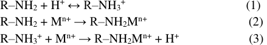
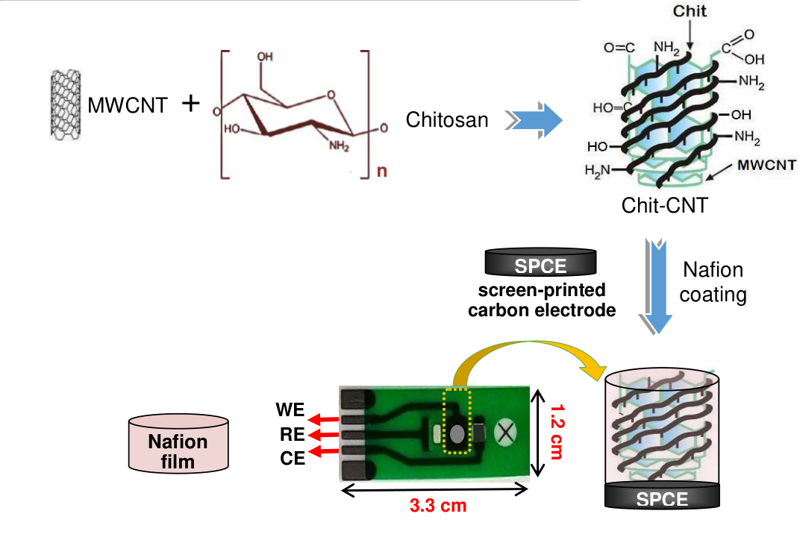
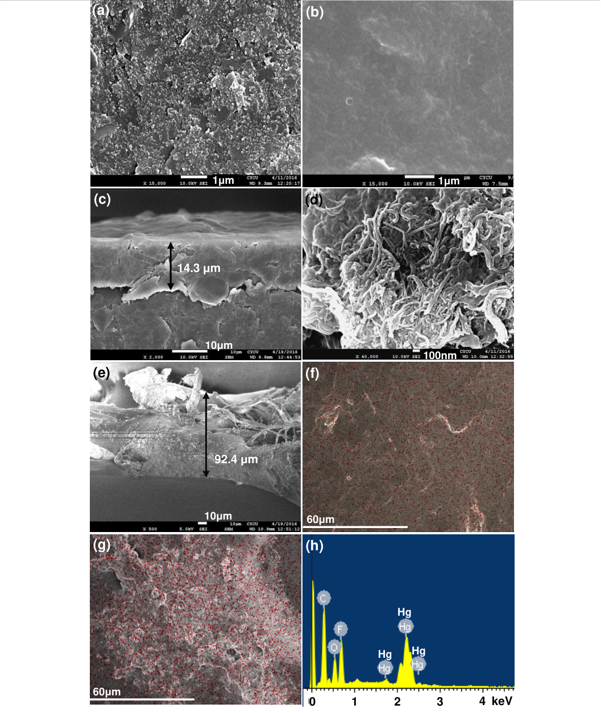
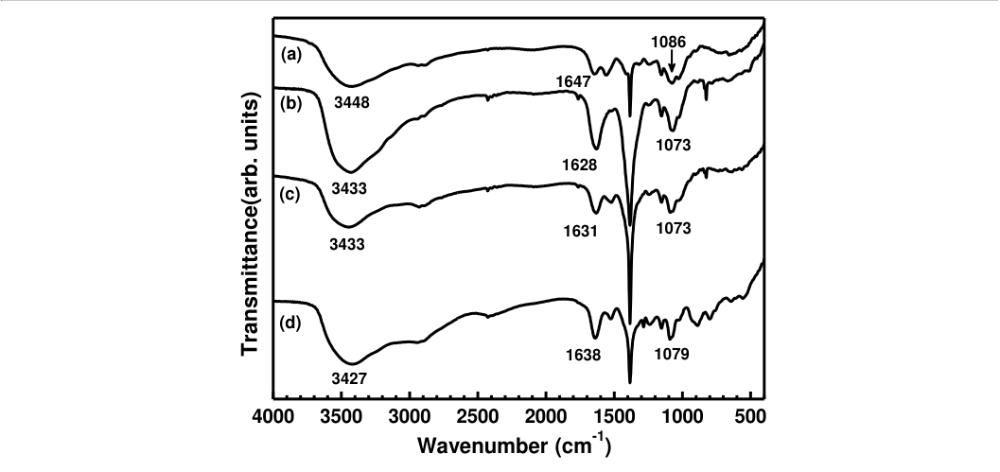
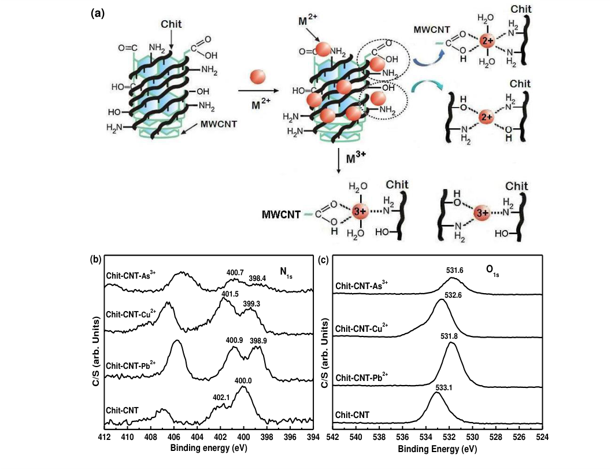
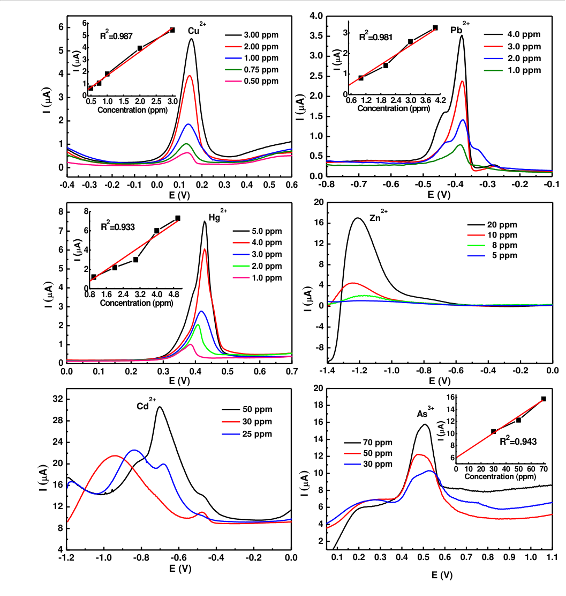
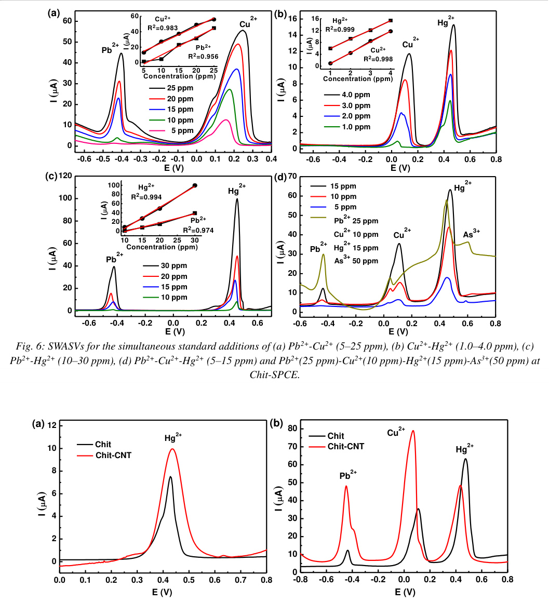
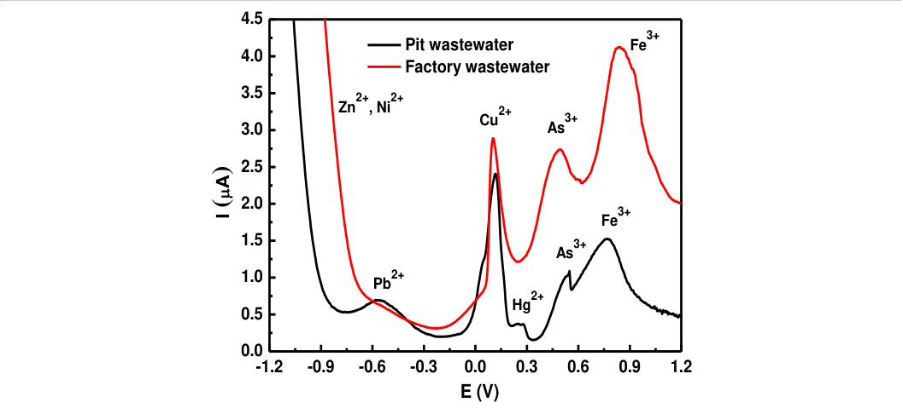

_**International Journal of Environment, Agriculture and Biotechnology (IJEAB)             Vol-3, Issue-1, Mar-Apr- 2018 http://dx.doi.org/10.22161/ijeab/3.2.1 ISSN: 2456-1878**_ 

# **A screen-printed carbon electrode modified with a chitosan-based film for** _**in situ**_ **heavy metal ions measurement** 

Kuo-Hui Wu[1,] *, Je-Chuang Wang[1] , Shin-Yi Yu[2] , Bing-De Yan[2] 

1Department of Chemical and Materials Engineering, Chung Cheng Institute of Technology, National Defense University, Taoyuan 335, Taiwan 

2Chemical Systems Research Division, Chung Shan Institute of Science and Technology, Taoyuan 335, Taiwan 

_**Abstract —** SEM images and FTIR data of the working electrode surface showed that M[n+] ions were adsorbed on chitosan (Chit) and crosslinked chitosan-carbon nanotube (Chit-CNT) films. XPS revealed that chelation of M[n+] ions with the –NH2/–OH groups from chitosan, –COOH group from carbon nanotubes, and aqua ligands represents a possible structure of the active M[n+] species in the Chit-based film. The electrochemical behaviors of the Chit-based film modified screen-printed carbon electrode (SPCE) were characterized for individual and simultaneous detection of Cu[2+] , Pb[2+] , Hg[2+] , Zn[2+] , Cd[2+] , and As[3+] ions. For individual detection, the concentration range was 0.50–3.00 ppm with a detection limit of 0.4 ppm for Cu[2+] ; 1.0–4.0 ppm with a detection limit of 0.5 ppm for Pb[2+] ; 1.0–5.0 ppm with a detection limit of 0.8 ppm for Hg[2+] . For simultaneous detection, the lab chip sensor was successfully used to determine the concentrations of Pb[2+] , Cu[2+] , Hg[2+] , and As[3+] ions simultaneously._ 

_**Keywords— Heavy metal ion, Lab chip sensor, Square-wave anodic stripping voltammetry, in situ measurement.**_ 

## **I. INTRODUCTION** 

In recent years, environmental contamination by heavy metals has gained much attention due to the significant impact on public health. Cu, Cd, Pb, Hg, Zn, and as are used in several industrial applications and are recognized as agents that present a toxic effect to humans and other living beings. These metals are well-known water pollutants, because they are toxic (even at trace levels), not biodegradable, and have long biological half-lives; hence, they tend to bio-accumulate in higher trophic levels of the food chain. Due to increasingly rigorous environmental regulations, the limits for heavy metals in drinking water and wastewater are becoming stricter [1]. 

Chitosan (Chit) is a biopolymer, a feature arising from the amino and hydroxyl groups present in its structure. Chit is suitable for use to remove heavy metal ions from wastewater, as its chemical groups can act as chelation sites [2, 3]. This characteristic can be employed for the 

development of electroanalytical procedures for the detection of heavy metal ions, for which Chit is employed as an electrode modifier, allowing adsorption of the metals ions, and thus improving the sensitivity of the method [4-6]. Furthermore, the useful characteristics of Chit in terms of electrochemistry for the design of modified electrodes include biocompatibility, a high mechanical strength, good adhesion on traditional electrochemical surfaces, and a relatively low cost, as it is a renewable resource [7-9]. On the other hand, it is well-known that carbon nanotubes (CNTs) exhibit many excellent electric properties, which make them ideal candidates for electrode materials for heavy metal detection. Normally, they act as an adsorbent/preconcentrator agent and a transducer platform. Numerous investigations have been carried out to explore the potential applications of CNTs, due to their advantages such as good conductivity, high electron transfer rates, high surface area and providing lower detection limits [10-13]. Chit was used as an electrode modifier in the cross-linked form, with CNTs employed as the crosslinking agents. We observed that the crosslinking treatment increased the number of free hydroxyl groups in the Chit and, thus, improved the adsorption of metallic cations on the electrode surface [14-16]. 

Many conventional methods, such as atomic absorption spectrometry (AAS) and inductively coupled plasma mass spectroscopy (ICP-MS), have been utilized for the measurement of heavy metals in the environment. However, these methods are limited in terms of their use for _in situ_ environmental screening because of the equipment size, cost, and analysis time [17]. Electrochemical techniques, in particular stripping analysis, have been widely studied in terms of their effectiveness for _in situ_ measurement of heavy metal ions [10,18]. In stripping analysis, heavy metal ions in the sample solution are identified and quantified by measuring the current generated at each reduction potential [19]. For real application, more and more heavy metal electrochemical sensors have been fabricated on screen-printed carbon electrodes (SPCEs) due to their inexpensiveness, portability and ease of mass production. 

**www.ijeab.com Page** | **308** 

_**International Journal of Environment, Agriculture and Biotechnology (IJEAB)             Vol-3, Issue-1, Mar-Apr- 2018 http://dx.doi.org/10.22161/ijeab/3.2.1 ISSN: 2456-1878**_ 

Furthermore, a desirable combination incorporating miniaturized on-chip electrochemical sensors with microfluidic components as a micro total analysis system or lab-on-a-chip device is achievable, and provides a good platform for chemical and biological analyses in a miniaturized format [20]. Polymer substrates, such as cyclic olefin copolymers, have been used as lab-on-a-chip materials instead of the traditional silicon and glass substrates owing to their favorable properties of biocompatibility, high optical transparency, and low cost [21]. 

The major achievement in this study was the development of a disposable heavy metal sensor with an on-chip planar polymer film (Chit and Chit-CNT) modified SPCE (working electrode), an integrated Ag/AgCl reference electrode, and microfluidic channels using standard screen-printing technology. The proposed sensor is very low in cost and suitable for mass production, has a small analytic consumption and low waste generation, a fast sensing time, and is simple to use. This sensor is also suited to fast _in situ_ environmental monitoring. Therefore, the main objective of this research was to study the selectivity of the Chit-based film modified SPCE for individual and simultaneous detection of Cu[2+] , Pb[2+] , Hg[2+] , Zn[2+] , Cd[2+] , and As[3+] ions in aqueous solutions. In addition, based on the results, an adsorption mechanism was proposed. We explored the adsorption properties of the biodegradable materials of Chit and Chit-CNT, which can be utilized for the detection of heavy metal ions in wastewater and groundwater. 

## **II. EXPERIMENTAL** 

## **2.1 Preparation of crosslinked Chit-CNT** 

Multi-walled carbon nanotubes (MWCNT; >95% carbon basis, 20–40 nm in diameter and 5–15 μm in length) were purchased from Aldrich. The MWCNT were submitted to an acid treatment to remove residual catalyst metal particles that remained from the synthesis process and to promote the generation of functional groups, such as carboxyl and hydroxyl groups, on the MWCNT surface [22]. Briefly, MWCNT were added to a 13 N HNO3 solution and maintained in a stainless Teflon-lined autoclave for 30 h at 100 °C. After this time, the MWCNT were separated from the solution by centrifugation and washed thoroughly with ultrapure water until a pH of approximately 6.0 was obtained. Finally, the MWCNT were dried at 120 °C for 5 h. Chit of molecular weight 1.9–3.1 × 10[5] g/mol and an 85% deacetylation degree was purchased from Acros. 2.0 g Chit were immersed in 100 mL of 0.17 mole acetic acid aqueous solution at 40 °C and maintained under constant stirring for 12 h. Preparation of Chit-CNT was performed by mixing functionalized MWCNT (40 mg) and Chit solution (20 mL) by stirring, resulting in a homogeneous solution. 

## **2.2 Electrode modification** 

Integrated SPCE sensors are based in most cases on a carbon working electrode, a carbon counter electrode, and a silver/silver chloride reference electrode. The SPCE was directly obtained by mass-production in-house via a multi-stage screen-printing process, and screens with appropriate stencil designs (100 per screen) were fabricated by a commercial firm. A photograph of the screen-printed three-electrode sensor is shown in Fig. 1. The entire chip size was 3.3 cm × 1.2 cm, and the circular reaction chamber had a 4.5-mm[2] working area and a depth of 100 μm. Then, the Chit solution or crosslinked Chit-CNT mixture solution was mixed with nafion solution (1 wt%), cast onto the SPCE surface, and dried in air. Nafion acted here as a binder to stabilize the modified species on the electrodes and as a permselective film to alleviate the interference of anions [23]. A schematic illustration of the preparation of the Chit-CNT film modified electrode is shown in Fig. 1. Furthermore, the Chit-based film modified SPCE was cleaned electrochemically by performing cyclic voltammetry for 10 cycles in the potential window -0.4 V to 1.0 V _vs_ . Ag/AgCl at a potential scan rate of 50 mVs[−1] in pH 7 phosphate buffer solution before each experiment, and served as an underlying substrate of the working electrode. **2.3 Experimental techniques** Pb[2+] , Cu[2+] , Hg[2+] , Cd[2+] , Zn[2+] , and As[3+] standard stock solutions (1000 ppm) were obtained from Aldrich and diluted with deionized water and a supporting electrolyte to the appropriate concentration. The supporting electrolyte used in the experiments was 0.2 M acetic acid solution, adjusted to pH 4.0 with ammonium acetate. Heavy metal-contaminated water samples were obtained from four different locations: 1,2–Groundwater was obtained from Pingtung and Taoyuan, Taiwan. 3–Factory wastewater was obtained from the industrial zone of Taoyuan, Taiwan. 4–Mine wastewater was obtained from Jinguashi Mine, New Taipei City, Taiwan. The water samples were extracted with acetic acid and the results of detection of heavy metal pollutants were compared with those obtained using an inductively-coupled plasma-mass spectrometer (ICP-MS, 7500ce). The morphology of the Chit-based film modified SPCE surface was observed using a scanning electron microscope (SEM, JSM-6330F) equipped with an energy-dispersive X-ray (EDX) microanalysis system. X-ray photoelectron spectroscopy (XPS, VG ESCALAB 250) was applied to determine the interactions between the organic functional groups in the Chit-CNT sorbent and the metals adsorbed. XPS spectra were obtained using monochromatized Al Kα radiation (1486.7 eV); the source was operated at 15 kV and 15 mA. Calibration of the binding energies (BEs) of the spectra was performed using the C1s peak of the aliphatic carbons at 284.6 eV. 

Anodic stripping voltammetry measurements were obtained using a conventional three-electrode cell with a CHI 660C electrochemical workstation. Square wave anodic stripping 

**www.ijeab.com Page** | **309** 

_**International Journal of Environment, Agriculture and Biotechnology (IJEAB)             Vol-3, Issue-1, Mar-Apr- 2018 http://dx.doi.org/10.22161/ijeab/3.2.1 ISSN: 2456-1878**_ 

voltammetry (SWASV) was used for the detection of metal ions at various concentrations. Studies were carried out by immersing the lab chip sensor into acetate buffers containing M[n+] standard solutions. The pre-concentration analysis of M[n+] proceeded in 6 ml 0.2 M pH 4.0 acetic buffer solution for 2 min while holding the electrode at -1.2 V and stirring the solution. The solutions were stirred during the pre-concentration step. After 30 s of equilibration, SWASV measurements were obtained in the potential range of -1.2 V to 1.2 V with a frequency of 50 Hz, an amplitude of 40 mV, and a potential step of 4 mV. 

## **III. RESULTS AND DISCUSSION** 

## **3.1 Morphology and characterization** 

The morphologies of the fracture and surface were observed by SEM, and the EDX mapping technique was used to determine the distributions of M[n+] ions in the Chit-based films. Fig. 2 presents SEM, Hg-mapping, and EDX images of the morphologies of the Chit-based film modified SPCE. It can be observed from Fig. 2a that the carbon layer was rough and exhibited irregular particles on the screen-printed electrode. Fig. 2b and 2c show that a smooth and dense thin film (14.3 μm) covered the surface of the SPCE coupled with nafion binder. The Chit surface had a membrane aspect and did not present porosity, which indicated that it was likely that it did not have diffusion problems, and thus the sorption process proceeded quickly. From the SEM images of the Chit-CNT film (Fig. 2d and 2e), it was clearly observed that Chit adhered uniformly to the wall of the MWCNT and fabricated a porous mesh structure. The Chit-CNT film was attached tightly to the SPCE surface and the film thickness was around 92.4 μm (Fig. 2e). Enlargement of the image revealed a highly porous structure of the material, indicating a large electroactive surface that involves fast electron transfer rates. However, the rough surface can also induce decreases in the homogeneity and reproducibility of the measurements performed between and within batches of sensors. As M[n+] ions were introduced, the surface became rougher and exhibited a heterogeneous morphology in the matrix. Moreover, the Hg-mapping and EDX images (Fig. 2f–h) indicated the presence of a significant amount of Hg[2+] ions in the matrix. The Hg[2+] ions were uniformly dispersed throughout the Chit-based films, thus providing the maximum surface area for the adsorption of Hg[2+] . 

Infrared analyses were performed on the Chit film before and after being in contact with Cu[2+] , Hg[2+] , and As[3+] solutions. These studies provided information regarding the functional groups and the interaction force present in the Chit film. Figure 3a shows the infrared spectrum of Chit: the bands at 3448, 1647, and 1086 cm[−1] are closely related to the N–H and O–H stretching, N–H bending, and C–OH stretching vibrations. The differences between the IR spectra of Chit before and after Cu[2+] , Hg[2+] , and As[3+] 

adsorption can be observed in Fig. 3b–d. It was seen that the bands at 3448, 1647, and 1086 cm[−1] were displaced to lower wavenumbers. This occurred because the vibrations of the O–H, N–H, and C–OH bonds were modified while forming bonds between O/N (by its free pair of electrons) and the metals. The IR spectrographs suggested that coordination complexes were formed between the Chit and the metals, which reduced the vibration intensity of the O–H, N–H, and C–OH bonds due to the molecular weight increase after M[n+] adsorption. 

## **3.2 Adsorption mechanism study by XPS** 

XPS studies performed on Chit previously loaded with metal ions (M[2+] ) indicated that the main complexing sites are the amines and secondary alcohol functional groups, as the –NH2 and –OH groups have a pair of electrons that can add themselves to a cation by coordinated covalent bonds. The attraction of the electron pair by the atom nucleus is stronger for oxygen, although on the other hand nitrogen has a greater tendency to donate its pair of electrons to a metal ion to form a complex through a coordinated covalent bond [24]. Similarly, CNTs, upon strong acid-based functionalization, have been reported to generate large amounts of several oxygen-rich functional groups, including carboxylic groups (–COOH), on their edge plane, and these carboxylic groups are well-known for their strong and stable functional M[2+] -carboxylic architectures owing to their rich coordination mode [14]. Complexes between metal ions (M[n+] ) and Chit/Chit-CNT were formed according to the mechanism illustrated in Fig. 4a. In this study, we inferred that these metals chelated with the –NH2/–OH groups from Chit and the –COOH group from CNTs, and a possible structure of the active M[n+] species in the Chit/Chit-CNT systems was proposed. 

Figure 4b–c show typical XPS spectra for the Chit-CNT film before and after Cu[2+] , Pb[2+] , and As[3+] adsorption. Before M[n+] adsorption, there were two peaks in the N1s spectra at binding energies (BEs) of approximately 400.0 and 402.1 eV (see Fig. 4b). These peaks were attributed to the N atoms in the R–NH2 and R–NH3[+] groups, respectively. In an acidic solution, the following chemical reactions may be proposed to account for the adsorption of M[n+] on Chit-CNT film: 

The reaction in eq. 1 indicates protonation and deprotonation of the amino groups in Chit. At pH 4.0, lower amino groups are protonated, thus resulting in larger amounts of –NH2 (400.0 eV) than –NH3[+] (402.1 eV) in the Chit-CNT film. When M[n+] ions were added to the solution, the reaction in eq. 2 started due to sharing of the lone pair of electrons from the nitrogen atom with a M[n+] ion, with a mechanism similar to that of the reaction shown in eq. 1. However, the binding of a M[n+] ion to a nitrogen atom can 

**www.ijeab.com Page** | **310** 

_**International Journal of Environment, Agriculture and Biotechnology (IJEAB)             Vol-3, Issue-1, Mar-Apr- 2018 http://dx.doi.org/10.22161/ijeab/3.2.1 ISSN: 2456-1878**_ 

be expected to be stronger than the binding of a H[+] to a nitrogen atom, as the electrical attraction force between the lone pair of electrons from the nitrogen atom and the M[n+] ion would be stronger than that of the nitrogen atom and the monovalent proton (H[+] ). This difference in the binding force drives the reaction in eq. 3 to take place through competitive adsorption of M[n+] over H[+] to the nitrogen atom, which may sometimes be considered as an ion exchange mechanism [25]. The reaction in eq. 3, however, can be expected to be slower than that in eq. 2, owing to the smaller attraction force between the N in R–NH3[+] and M[n+] as compared with the force between the N in R–NH2 and M[n+] . Therefore, the peak of –NH2 was of lower energy than that of –NH3[+] in the Chit-CNT-M[n+] system. After M[n+] adsorption, moreover, the BEs of R–NH2 and R–NH3[+] in Chit-CNT-M[n+] were smaller than those in Chit-CNT. This result indicated that the M[n+] ions were chelated with the R–NH2 and R–NH3[+] groups (R–NH2····M[n+] ), and the BEs of the N atoms in R–NH2 and R–NH3[+] were therefore weakened. 

In Fig. 4c, typical O1s XPS spectra of the Chit-CNT film with and without adsorbed M[n+] ions are presented. There was only one peak in the O1s spectrum, at a BE of approximately 533.1 eV, for Chit-CNT. This was attributed to the O atoms in the R–OH and R–COOH groups. During M[2+] ions adsorption, the O1s peak shifted towards a lower energy, and its structures were close to ([M(–NH2)2][2+] , 2OH[–] ) and ([M(–NH2)2][2+] , COOH, 2H2O). The M[2+] ion with four coordination, during formation of a coordination compound, reacted with two –NH2 amino groups and two –OH[–] groups or two water molecules [2]. Annamalai [14] proposed a six coordination model in which the M[2+] ion was attached to two –NH2 groups of Chit, one –COOH group of the CNTs and two water molecules. The As[3+] ion with three or five coordination, during formation of a coordination compound, reacted with two –NH2 groups and one –OH[–] group or one –COOH group, one –NH2 group and two water molecules. For M[n+] ion adsorption, the ΔBEs of the O1s bands of the –OH and/or –COOH groups were 1.5, 1.3, and 0.5 eV before and after As[3+] , Pb[2+] , and Cu[2+] adsorption, respectively. These shifts were all beyond 0.3 eV. Therefore, it could be concluded that the –OH and/or –COOH groups participated in As[3+] , Pb[2+] , and Cu[2+] adsorption on the Chit-CNT adsorbent. The ΔBEs of the N1s band of the –NH2 groups (400.0 eV) before and after As[3+] , Pb[2+] , and Cu[2+] adsorption were 1.6, 1.1, and 0.7 eV, respectively, and the ΔBEs of the N1s band of the –NH3[+] groups (402.1 eV) were 1.4, 1.2, and 0.6 eV, respectively. This indicated that –NH2 groups may be the main functional group responsible for M[n+] ion adsorption. Moreover, the ΔBEs of the O1s and N1s bands before and after M[n+] adsorption were in the order of As[3+] > Pb[2+] > Cu[2+] . This suggested that the interaction force of Chit-CNT with M[n+] ions was of the order As[3+] > Pb[2+] > Cu[2+] . 

## **3.3 Square wave stripping voltammetric behavior of M[n+] ions at the Chit-based film modified SPCE** 

## **3.3.1 Detection of single M[n+] ions by the Chit-SPCE** 

The SWASV signals of M[n+] ions at various concentrations measured by the Chit-SPCE sensor are shown in Fig. 5. For Cu[2+] , dissolution peaks were observed at 0.14 V in the 0.50–3.00 ppm concentration range. The plot of peak current as a function of ion concentration was linear over the whole range studied, and the regression coefficient ( _R_[2] ) was 0.987 (inset). Thus, the detection limit of Cu[2+] ions was deduced to be 0.4 ppm, at which the stripping peak current could still be resolved. Noticeably, a larger stripping peak was found for Cu[2+] , which showed a good electrocatalytic response to Cu[2+] . For Pb[2+] , dissolution peaks were observed at -0.38 V in the 1.0–4.0 ppm concentration range. The detection limit was calculated to be 0.5 ppm ( _R_[2] = 0.981) for Pb[2+] . Under the same experimental conditions, a small stripping peak at around -0.44 V was observed due to the strong complexing ability of Chit to Pb[2+] on the electrode surface, and the resistivity of Chit resulted in a poor current response. For Hg[2+] , dissolution peaks were observed at around 0.38–0.43 V in the 1.0–5.0 ppm concentration range. The detection limit was calculated to be 0.8 ppm ( _R_[2] = 0.933) for Hg[2+] . Moreover, there was a slight shift of the peaks towards higher values, which might be predicted by Nernst’s equation, as the concentration evolved. 

For the detection of individual Zn[2+] and Cd[2+] ions, the results showed SWASV peaks from -1.17 V to -1.24 V for Zn[2+] ions and from -0.70 V to -0.94 V for Cd[2+] ions, and analyses of Zn[2+] and Cd[2+] ions alone revealed an ill-defined stripping peak current. This was more pronounced for the lab chip sensor, for which the peaks were broader and without reproducibility. The result may be due to the existence of fissures between the Chit film and SPCE within batches of sensors, which induced an ohmic drop [26]. For As[3+] , dissolution peaks were observed at around 0.51 V in the 30–70 ppm concentration range. The calibration curve was linear in the concentration range, and the regression coefficient ( _R_[2] ) was 0.943. Thus, the detection limit of As[3+] ions was deduced to be 1.0 ppm, at which the stripping peak current could still be resolved. Noticeably, a broader stripping peak was found and the instrumental signal was significantly different to the background signal in the range of 0.0 V to 1.0 V, which showed a poor electrocatalytic response to As[3+] . Because elemental As is a very poor electrical conductor, the peak intensity of As[3+] was lower than those of the other metal ions. As can be observed from Fig. 5, the sensitivity for the detection of M[n+] ions was of the order Hg[2+] > Cu[2+] > Pb[2+] > As[3+] . This suggested that the interaction force of Chit with M[n+] ions was of the order As[3+] > Pb[2+] > Cu[2+] > Hg[2+] ; thus, the strength of the anodic redissolution signals for M[n+] ions was Hg[2+] > Cu[2+] > Pb[2+] > As[3+] . 

**www.ijeab.com Page** | **311** 

_**International Journal of Environment, Agriculture and Biotechnology (IJEAB)             Vol-3, Issue-1, Mar-Apr- 2018 http://dx.doi.org/10.22161/ijeab/3.2.1 ISSN: 2456-1878**_ 

## **3.3.2 Multiplexing detection of M[n+] ions at the Chit-based film modified SPCE** 

In order to evaluate whether the presence of several ions impacted on the stripping peaks obtained using the Chit-based film modified SPCE, we evaluated the simultaneous detection of Pb[2+] –Cu[2+] –Hg[2+] and Pb[2+] –Cu[2+] –Hg[2+] –As[3+] in the same solution (see Fig. 6). In the analysis of the Pb[2+] (5–25 ppm) and Cu[2+] (5–25 ppm) mixture, SWASV peaks at around –0.417 V ( _R_[2 ] = 0.956) and 0.212 V ( _R_[2 ] = 0.983) indicated the stripping of Pb[2+] and Cu[2+] , respectively. In the present case, Pb had the most negative standard potential, and tended to be deposited onto the Cu metal, which presented the highest potential and was deposited first. For the reverse process, Pb was then first reoxidized, leaving a partially-covered electrode of electrodeposited Cu, but a quantity remained and was dissolved simultaneously with the Cu at a higher potential. This explained why the Pb[2+] (from –0.425 to –0.403 V) and Cu[2+] (from 0.157 to 0.247 V) peaks were shifted toward more positive values when the amount of dissolved Pb[2+] –Cu[2+] increased (from 5 to 25 ppm) in the tested solution. This could be interpreted as the formation of a PbxCu solid solution thin film (x being the solubility of Pb into Cu under the conditions employed) [26]. Such formation of a binary compound also explained how the Chit-SPCE sensor accelerated the enrichment of Pb[2+] and Cu[2+] on the electrode surface. 

In Fig. 6b and 6c, for the Cu[2+] –Hg[2+] (1.0–4.0 ppm) and Pb[2+] –Hg[2+] (10–30 ppm) mixtures, SWASV peaks at potentials of −0.417 V ( _R_[2 ] = 0.974), 0.106 V ( _R_[2 ] = 0.998), and 0.425 V ( _R_[2 ] = 0.999) represented the stripping of Pb[2+] , Cu[2+] , and Hg[2+] , respectively. The results showed that the anodic peak current was different from that of the oxidation of Pb, Cu, and Hg, while the initial concentration was the same. This could be due to one or more of the following reasons. One reason for the difference could be the higher affinity between the modified electrode surface and Hg[2+] in comparison with that of Cu[2+] and Pb[2+] . It could also be related to the differences between the diffusion coefficients of Cu[2+] , Pb[2+] , and Hg[2+] . The kinetics of the complexation of cations with Schiff base at the electrode surface could also be responsible for the greater accumulation of Hg[2+] as compared with Cu[2+] and Pb[2+] [27]. These cases could lead to a higher peak current for Hg[2+] than for Cu[2+] and Pb[2+] . The SWASV responses resulting from the presence of these potentially interfering species were compared with those obtained for Cu[2+] , Pb[2+] , and Hg[2+] . It was clear that no interference occurred due to these species, which implied possible successful direct application of Chit-SPCE in real samples that contain common ions or species. 

SWASV responses of the Chit-SPCE sensor for the simultaneous detection of Pb[2+] , Cu[2+] , Hg[2+] , and As[3+] at successive increasing concentrations were as shown in Fig. 6d. The stripping peak potentials for Pb[2+] , Cu[2+] , Hg[2+] and 

As[3+] appeared at −0.417, 0.105, 0.459, and 0.625 V, respectively. The slight potential shift in comparison with the individual analyses might be caused by the complicated nature of the process of simultaneous electrode position of Cu, Hg, and As. The stripping peak currents of the three analytic ions (Pb[2+] , Cu[2+] , and Hg[2+] ) increased with increasing concentrations. Cu[2+] was affected by Pb[2+] and Hg[2+] in the simultaneous detection, which could be the reason for which the active sites of the Chit-SPCE during deposition of Cu[2+] were occupied by Pb[2+] or Hg[2+] preferentially. However, the separation between the voltammetric peaks was large enough, and simultaneous detection using the modified electrode was feasible. From the aforementioned simultaneous analysis results of the three heavy metal ions, it was observed that related parameters such as stripping peak currents and potentials changed with the presence of As[3+] ions. Mutual interference is a common problem in the detection of several metal ions simultaneously. We considered that this result could also be explained by the intermetallic compounds formed among the four target metal ions and competitive adsorption at the limited number of active sites at the Chit-SPCE surface. Thus, the proposed electrode was successfully applied for the determination of Pb[2+] , Cu[2+] , Hg[2+] and As[3+] ions simultaneously. 

The SWASV signals of M[n+] ions at the Chit-SPCE and Chit-CNT-SPCE sensors are shown in Fig. 7. Under the same experimental conditions, a larger stripping peak at around 0.448 V was found at the Chit-CNT-SPCE (Fig. 7a), which showed a good electrocatalytic response to Hg[2+] . The Chit-CNT component, with good conduction properties and a large surface area, was able to adsorb Hg[2+] from the bulk solution to the electrode surface, resulting in improvement of the stripping peak current. Figure 7b shows SWASV peaks from –0.447 V to –0.436 V, from 0.07 V to 0.110 V, and from 0.439 V to 0.474 V for the mixture of Pb[2+] , Cu[2+] , and Hg[2+] at the Chit-SPCE and Chit-CNT-SPCE. Analyses of the mixture of Pb[2+] , Cu[2+] , and Hg[2+] ions revealed a well-defined stripping peak current, as did analyses of the three ions alone. A slight shift in peak potential and a change in the relative peak current were observed for the Chit-CNT-SPCE as compared with the Chit-SPCE. This observation can be explained by the difference in diffusivity and the intermetallic compounds formed during the accumulation process of Pb[2+] , Cu[2+] , and Hg[2+] ions on the Chit and Chit-CNT film. 

**3.3.3 Detection of heavy metal ions in real water samples** 

In order to evaluate the feasibility of using the proposed sensor for _in situ_ measurement of heavy metals for environmental monitoring applications, water samples taken from groundwater and wastewater of factory and pit sites were analyzed using the lab chip sensor. The water samples had been filtered and acidified in the field and stored in a fridge. The water solution was evaporated to 

**www.ijeab.com Page** | **312** 

_**International Journal of Environment, Agriculture and Biotechnology (IJEAB)             Vol-3, Issue-1, Mar-Apr- 2018 http://dx.doi.org/10.22161/ijeab/3.2.1 ISSN: 2456-1878**_ 

almost a quarter of the original volume by heating. Then, the Chit-based film modified SPCE was immersed in the mixed solution directly to determine the M[n+] concentrations in the treated water sample. The total measurement duration for each sample was less than 3 min. 90 s was chosen as the deposition time, which was an optimized condition that balanced the detection time and the detection limit for this application. ICP-MS was used to verify the electrochemical data obtained from the real water samples using the lab chip sensor. 

According to the literature, Fig. 8 shows SWASV peaks of pit wastewater at –1.059 V for the mixture of Zn[2+] and Ni[2+] , –0.561 V for Pb[2+] , 0.115 V for Cu[2+] , 0.261 V for Hg[2+] , 0.535 V for As[3+] , and 0.770 V for Fe[3+] . The obtained peaks were of well-defined shapes with good reproducibility. The results obtained using the ICP-MS technique were Zn[2+] (64.1 ppm), Ni[2+] (30.5 ppm), Pb[2+] (2.24 ppm), Cu[2+] (37.0 ppm), Hg[2+] (1.25 ppm), As[3+] (3.81 ppm) and Fe[3+] (49.0 ppm). Moreover, SWASV peaks of factory wastewater were observed at –0.897 V for the mixture of Zn[2+] and Ni[2+] , 0.105 V for Cu[2+] , 0.491 V for As[3+] , and 0.834 V for Fe[3+] . The results obtained using the ICP-MS technique were Zn[2+] (150 ppm), Ni[2+] (8.92 ppm), Cu[2+] (52.3 ppm), As[3+] (13.4 ppm) and Fe[3+] (86.3 ppm). However, no signal was obtained for the groundwater, and the concentrations measured using the ICP-MS technique were below 0.1 ppm in all samples. The experiments were repeated three times with good reproducibility, and the results indicated that the proposed method was highly accurate with good reliability, and can be used for direct analysis of relevant real samples. 

## **IV. CONCLUSION** 

The use of a flexible Chit-based film to develop Chit-SPCE and Chit-CNT-SPCE lab chip sensors for individual Cu[2+] , Pb[2+] , Hg[2+] , Zn[2+] , Cd[2+] , and As[3+] ion detection, simultaneous detection of Pb[2+] –Cu[2+] , Cu[2+] –Hg[2+] , Pb[2+] –Hg[2+] , Pb[2+] –Cu[2+] –Hg[2+] , and Pb[2+] –Cu[2+] –Hg[2+] –As[3+] ions, and _in situ_ monitoring of heavy metals in real water samples was reported in this paper. XPS analysis revealed the occurrence of metal complexation to the carboxylic (–COOH), amino (–NH2), hydroxyl (–OH), and H2O groups in Chit-CNT, and chelation, ion exchange and electrostatic interaction formed the main adsorption mechanism. For individual detection, the detection limits were calculated to be 0.4, 0.5, 0.8, and 1.0 ppm for Cu[2+] , Pb[2+] , Hg[2+] , and As[3+] , respectively, and the detection sensitivity was of the order Hg[2+] > Cu[2+] > Pb[2+] > As[3+] . For simultaneous detection, the Chit-based film modified SPCE was successfully applied for the determination of Pb[2+] , Cu[2+] , Hg[2+] , and As[3+] ions simultaneously. A slight shift in the peak potential and a change in the relative peak current were observed for the Chit-CNT-SPCE sensor as compared with the Chit-SPCE sensor. This observation could be explained by the difference in diffusivity and the intermetallic compounds 

formed during the accumulation process of Pb[2+] , Cu[2+] , and Hg[2+] ions on the Chit and Chit-CNT films. Microfabrication technology was utilized in this study to realize a new fully-integrated sensor with a planar screen-printed carbon electrode and microfluidic channels. The low cost and non-toxic electrode materials render the sensor disposable, and the simple structure and detection scheme of the proposed sensor are especially suitable for applications such as detecting trace metals _in situ_ in environmental samples. 

## **ACKNOWLEDGMENTS** 

The authors thank the Ministry Science and Technology for supporting this work (MOST 105-2623-E-606-002-D). 

## **REFERENCES** 

- [1] T. Ndlovu, O.A. Arotiba, S. Sampath, R.W. Krause, B.B. Mamba, Electroanalysis of copper as a heavy metal pollutant in water using cobalt oxide modified exfoliated graphite electrode, Phys. Chem. Earth 50–52 (2012) 127–131. 

- [2] P. Huang, M. Cao, Q. Liu, Adsorption of chitosan on chalcopyrite and galena from aqueous suspensions, Colloids and Surfaces A: Physicochem. Eng. Aspects 409 (2012) 167–175. 

- [3] J.L. Wang, C. Chen, Chitosan-based biosorbents: Modification and application for biosorption of heavy metals and radionuclides, Bioresour. Technol. 160 (2014) 129–141. 

- [4] F.C. Vicentini, T.A. Silva, A. Pellatieri, B.C. Janegitz, O. Fatibello-Filho, R.C. Faria, Pb(II) determination in natural water using a carbon nanotubes paste electrode modified with crosslinked chitosan, Microchem. J. 116 (2014) 191–196. 

- [5] M. Ghalkhani, S. Shahrokhian, Adsorptive stripping differential pulse voltammetric determination of mebendazole at a graphene nanosheets and carbon nanospheres/chitosan modified glassy carbon electrode, Sens. Actuators B 185 (2013) 669–674. 

- [6] K.Z. Elwakeel, A.A. Atia, E. Guibal, Fast removal of uranium from aqueous solutions using tetraethylenepentamine modified magnetic chitosan resin, Bioresour. Technol. 160 (2014) 107–114. 

- [7] V.I. Paz Zaninia, R.E. Giménez, O.E. Linarez Pérez, B.A. López de Mishima, C.D. Borsarelli, Enhancement of amperometric response to tryptophan by proton relay effect of chitosan adsorbed on glassy carbon electrode, Sens. Actuators B 209 (2015) 391–398. 

- [8] X. Luo, J. Zeng, S.L. Liu, L.N. Zhang, An effective and recyclable adsorbent for the removal of heavy metal ions from aqueous system: Magnetic chitosan/cellulose microspheres, Bioresour. Technol. 194 (2015) 403–406. 

**www.ijeab.com Page** | **313** 

_**International Journal of Environment, Agriculture and Biotechnology (IJEAB)             Vol-3, Issue-1, Mar-Apr- 2018 http://dx.doi.org/10.22161/ijeab/3.2.1 ISSN: 2456-1878**_ 

- [9] V.S. Tran, H.H. Ngo, W.S. Guo, J. Zhang, S. Liang, C. Ton-That, X.B. Zhang,  Typical low cost biosorbents for adsorptive removal of specific organic pollutants from water, Bioresour. Technol. 182 (2015) 353–363. 

- [10] X.Y. Yu, T. Luo, Y.X. Zhang, Y. Jia, B.J. Zhu, X.C. Fu, J.H. Liu, X.J. Huang, Adsorption of lead(II) on O2-plasma-oxidized multiwalled carbon nanotubes: thermodynamics, kinetics, and desorption, ACS Appl. Mater. Interfaces 3 (2011) 2585–2593. 

- [11] M.P.N. Bui, C.A. Li, K.N. Han, X.H. Pham, G.H. Seong, Electrochemical determination of cadmium and lead on pristine single-walled carbon nanotube electrodes, Anal. Sci. 28 (2012) 699–704. 

- [12] S. Sadeghi, A. Garmroodi, A highly sensitive and selective electrochemical sensor for determination of Cr(VI) in the presence of Cr(III) using modified multi-walled carbon nanotubes/quercetin screen-printed electrode, Mater. Sci. Eng. C 33 (2013) 4972–4977. 

- [13] R. Das, S.B. Abd Hamid, M.E. Ali, A.F. Ismail, Multifunctional carbon nanotubes in water treatment: The present, past and future, Desalination 354 (2014) 160–179. 

- [14] S.K. Annamalai, B. Palani, K.C. Pillai, Highly stable and redox active nano copper species stabilized functionalized-multiwalled carbon nanotube/chitosan modified electrode for efficient hydrogen peroxide detection, Colloids Surf. A 395 (2012) 207–216. 

- [15] Y.G. Wang, L. Shi, L. Gao, Q. Wei, L.M. Cui, L.H. Hu, L.G. Yan, B. Du, The removal of lead ions from aqueous solution by using magnetic hydroxypropyl chitosan/oxidized multiwalled carbon nanotubes composites, J. Colloid Interface Sci. 451 (2015) 7–14. 

- [16] C. Jung, J.Y. Heo, J.H. Han, N.G. Her, S.J. Lee, J. Oh, J. Ryu, Y. Yoon, Hexavalent chromium removal by various adsorbents: Powdered activated carbon, chitosan, and single/multi-walled carbon nanotubes, Sep. Purif. Technol. 106 (2013) 63–71. 

- [17] Z. Zou, A. Jang, E. MacKnight, P.M. Wu, J. Do, P.L. Bishop, C.H. Ahn, Environmentally friendly disposable sensors with microfabricated on-chip planar bismuth electrode for in situ heavy metal ions measurement, Sens. Actuators B 134 (2008) 18–24. 

- [18] A. Bobrowski, A. Królicka, M. Maczuga, J. Zarębski, A novel screen-printed electrode modified with lead film foradsorptive stripping voltammetric determination of cobalt and nickel, Sens. Actuators B 191 (2014) 291– 297. 

- [19] T. Ndlovu, B.B. Mamba, S. Sampath, R.W. Krause, O.A. Arotib, Voltammetric detection of arsenic on a bismuth modified exfoliated graphite electrode, Electrochim. Acta 128 (2014) 48–53. 

- [20] L. Cui, J. Wu, H.X. Ju, Electrochemical sensing of heavy metal ions with inorganic, organic and bio-materials, Bioresour. Technol. 63 (2015) 276–286. 

- [21] W.S. Jung, A. Jang, P.L. Bishop, C.H. Ahn, A polymer lab chip sensor with microfabricated planar silver electrode for continuous and on-site heavy metal measurement, Sens. Actuators B 155 (2011) 145–153. 

- [22] G.G. Oliveira, D.C. Azzi, F.C. Vicentini, E.R. Sartori, O. Fatibello-Filho, Voltammetric determination of verapamil and propranolol using a glassy carbon electrode modified with functionalized multiwalled carbon nanotubes within a poly (allylamine hydrochloride) film, J. Electroanal. Chem. 708 (2013) 73–79. 

- [23] L. Chen, Z. Li, Y. Meng, P. Zhang, Z.H. Su, Y. Liu, Y. Huang, Y. Zhou, Q.G. Xie, S.Z. Yao, Sensitive square wave anodic stripping voltammetric determination of Cd[2+] and Pb[2+ ] ions at Bi/Nafion/overoxidized 2-mercaptoethanesulfonate-tethered polypyrrole/glassy carbon electrode, Sens. Actuators B 191 (2014) 94–101. 

- [24] J.R. Rangel-Mendez, R. Monroy-Zepeda, E. Leyva-Ramos, P.E. Diaz-Flores, K. Shirai,  Chitosan selectivity for removing cadmium (II), copper (II), and lead (II) from aqueous phase: pH and organic matter effect, J. Hazard. Mater. 162 (2009) 503–511. 

- [25] J. Li, B. Renbi, Mechanisms of lead adsorption on Chitosan/PVA hydrogel beads, Langmuir 18 (2002) 9765–9770. 

- [26] S.M. Seck, S.Charvet, M. Fall, E. Baudrin, M. Lejeune, M. Benlahsen, Detection of cadmium and copper cations using amorphous nitrogenated carbon thin film electrodes, Electroanalysis 24 (2012) 1839–1846. 

- [27] A. Afkhami, H. Bagheri, H. Khoshsafar, M. Saber-Tehrani, M. Tabatabaee, A. Shirzadmehr, Simultaneous trace-levels determination of Hg(II) and Pb(II) ions in various samples using a modified carbon paste electrode based on multi-walled carbon nanotubes and a new synthesized Schiff base, Anal. Chim. Acta 746 (2012) 98–106. 

**www.ijeab.com Page** | **314** 

_**International Journal of Environment, Agriculture and Biotechnology (IJEAB)             Vol-3, Issue-1, Mar-Apr- 2018 http://dx.doi.org/10.22161/ijeab/3.2.1 ISSN: 2456-1878**_ 

**----- Start of picture text -----** 
MWCNT  ＋ Chitosan n Chit-CNT SPCE Nafion screen-printed  coating carbon electrode WE RE Nafion film CE SPCE 3.3 cm 1.2 cm **----- End of picture text -----** 

_Fig. 1: Schematic illustration of the preparation of Chit-based films modified SPCE._ 

**www.ijeab.com Page** | **315** 

_**International Journal of Environment, Agriculture and Biotechnology (IJEAB)             Vol-3, Issue-1, Mar-Apr- 2018 http://dx.doi.org/10.22161/ijeab/3.2.1 ISSN: 2456-1878**_ 

**----- Start of picture text -----** 
(a) (b) 1μm 1μm (c) (d) 14.3 μm 10μm 100nm (e) (f) 92.4 μm 10μm 60μm (g) (h) Hg Hg  Hg 60μm 0  1  2  3  4  keV **----- End of picture text -----** 

_Fig.2: SEM photographs of (a) SPCE, (b) Chit-SPCE, (c) Chit-SPCE (fracture), (d) Chit-CNT-SPCE, (e) Chit-CNT-SPCE (fracture); SEM+Hg-mapping images of (f) Chit-SPCE, (g) Chit-CNT-SPCE, (h) EDX image of Chit-Hg[2+] ._ 

**www.ijeab.com Page** | **316** 

_**International Journal of Environment, Agriculture and Biotechnology (IJEAB)             Vol-3, Issue-1, Mar-Apr- 2018 http://dx.doi.org/10.22161/ijeab/3.2.1 ISSN: 2456-1878**_ 

**----- Start of picture text -----** 
1086 (a) 1647 (b) 3448 1073 1628 (c) 3433 1631 1073 3433 (d) 1638 1079 3427 4000 3500 3000 2500 2000 1500 1000 500 -1 Wavenumber (cm ) Transmittance(arb. units) **----- End of picture text -----** 

_Fig. 3: FTIR spectra of (a) Chit film, (b) Chit-Cu[2+] , (c) Chit-Hg[2+] ,_ 

_(d) Chit-As[3+] ._ 

**----- Start of picture text -----** 
(a) (b) (c) Chit-CNT-As3+ 400.7 398.4 N1s Chit-CNT-As3+ 531.6 O1s 401.5 532.6 399.3 Chit-CNT-Cu2+ Chit-CNT-Cu2+ 531.8 400.9 398.9 Chit-CNT-Pb2+ 400.0 Chit-CNT-Pb2+ 533.1 402.1 Chit-CNT Chit-CNT 412 410 408 406 404 402 400 398 396 394 542 540 538 536 534 532 530 528 526 524 Binding energy (eV) Binding Energy (eV) C/S (arb. Units) C/S (arb. Units) **----- End of picture text -----** 

_Fig.4: (a) Intermolecular complexes of Chit-CNT with metal ions in acidic solution, (b) N1s and (c) O1s XPS spectra of Chit-CNT before and after metal adsorption._ 

**www.ijeab.com Page** | **317** 

_**International Journal of Environment, Agriculture and Biotechnology (IJEAB)             Vol-3, Issue-1, Mar-Apr- 2018 http://dx.doi.org/10.22161/ijeab/3.2.1 ISSN: 2456-1878**_ 

**----- Start of picture text -----** 
4.0 6 65 R2=0.987 Cu2+ 3.00 ppm 3.5 3 R2=0.981 Pb2+  4.0 ppm 5 4 2.00 ppm 3.0 2  3.0 ppm 3 1.00 ppm  2.0 ppm 4 2 0.75 ppm 2.5 1  1.0 ppm 1 0.50 ppm 3 00.5 1.0 1.5 2.0 2.5 3.0 2.0 00.6 1.2 1.8 2.4 3.0 3.6 4.2 Concentration (ppm) Concentration (ppm) 1.5 2 1.0 1 0.5 0 0.0 -0.4 -0.3 -0.2 -0.1 0.0 0.1 0.2 0.3 0.4 0.5 0.6 -0.8 -0.7 -0.6 -0.5 -0.4 -0.3 -0.2 -0.1 E (V) E (V) 20 8 8 2+ 2+ 7 6 R2=0.933 Hg 5.0 ppm 16 Zn 20 ppm 10 ppm 6 4 4.0 ppm 12   8 ppm 3.0 ppm   5 ppm 5 2 2.0 ppm 8 1.0 ppm 4 0 4 0.8 1.6 2.4 3.2 4.0 4.8 3 Concentration (ppm) 0 2 -4 1 -8 0 0.0 0.1 0.2 0.3 0.4 0.5 0.6 0.7 -1.4 -1.2 -1.0 -0.8 -0.6 -0.4 -0.2 0.0 E (V) E (V) 20 32 2+ 16 Cd 50 ppm 18 As3+ 14 28 30 ppm 16 12 24 25 ppm 14 70 ppm 108 R [2] =0.943 12 50 ppm 6 20 30 ppm 0 10 20 30 40 50 60 70 10 Concentration (ppm) 16 8 12 6 4 8 2 4 -1.2 -1.0 -0.8 -0.6 -0.4 -0.2 0.0 0.1 0.2 0.3 0.4 0.5 0.6 0.7 0.8 0.9 1.0 1.1 E (V) E (V) )A (  I ) A  ( I ) A  ( I ) A  ( I ) A  ( I )A (I   )A (  I ) A  ( I ) A  ( I ) A  ( I **----- End of picture text -----** 

_Fig. 5: SWASVs of various M[n+] solutions at Chit-SPCE; inset: calibration plot for M[n+] detection._ 

**www.ijeab.com Page** | **318** 

_**International Journal of Environment, Agriculture and Biotechnology (IJEAB)             Vol-3, Issue-1, Mar-Apr- 2018 http://dx.doi.org/10.22161/ijeab/3.2.1 ISSN: 2456-1878**_ 

**----- Start of picture text -----** 
(a) 60 6040 R [2] Cu=0.983 [2+] Cu2+ (b) 1614 1612 R [2] Hg=0.999 [2+] Hg2+ 5040 Pb2+ 200 5Concentration (ppm)10 15 R20 [2] Pb=0.956 [2+] 25 1210 840 Concentration (ppm)1 2 R [2] 3Cu=0.998 [2+] 4 Cu2+ 30 8 25 ppm 4.0 ppm 20 ppm 6 20 3.0 ppm 15 ppm 4 2.0 ppm 10 ppm 10 1.0 ppm   5 ppm 2 0 0 -0.6 -0.5 -0.4 -0.3 -0.2 -0.1 0.0 0.1 0.2 0.3 0.4 -0.6 -0.4 -0.2 0.0 0.2 0.4 0.6 0.8 E (V) E (V) (c) 120100 10080 R [2] Hg=0.994 [2+] Hg2+ (d) 7060  15 pp 10 ppmm Hg2+ 60    5 ppm 40 50 80 20 Pb [2+] Pb [2+]  25 ppm 0 R [2] =0.974 40 Cu [2+]  10 ppm Cu2+ As [3+] 60 10Concentration (ppm)15 20 25 30 Pb2+ Hg [2+]  15 ppm 2+ 30 40 Pb 30 ppm As [3+]  50 ppm 20 20 ppm 20 15 ppm 10 10 ppm 0 0 -0.6 -0.4 -0.2 0.0 0.2 0.4 0.6 -0.6 -0.4 -0.2 0.0 0.2 0.4 0.6 0.8 E (V) E (V) Fig. 6: SWASVs for the simultaneous standard additions of (a) Pb [2+] -Cu [2+]  (5–25 ppm), (b) Cu [2+] -Hg [2+]  (1.0–4.0 ppm), (c) Pb [2+] -Hg [2+]  (10–30 ppm), (d) Pb [2+] -Cu [2+] -Hg [2+]  (5–15 ppm) and Pb [2+] (25 ppm)-Cu [2+] (10 ppm)-Hg [2+] (15 ppm)-As [3+] (50 ppm) at Chit-SPCE. (a) 12 (b) 80 2+ Hg2+ Chit Cu 10 Chit 70 Chit-CNT Hg2+ Chit-CNT 60 8 Pb2+ 50 6 40 4 30 2 20 10 0 0 0.0 0.1 0.2 0.3 0.4 0.5 0.6 0.7 0.8 -0.8 -0.6 -0.4 -0.2 0.0 0.2 0.4 0.6 0.8 E (V) E (V) A)  I ( ) A  ( I ) A  ( I ) A  ( I A)  I ( A)  I ( ) A  ( I ) A  ( I ) A  ( I **----- End of picture text -----** 

_Fig. 7: Comparison of Chit-SPCE and Chit-CNT-SPCE for the determination of (a) Hg[2+] (5ppm) and (b) Pb[2+] (15ppm), Cu[2+] (15ppm), Hg[2+] (15ppm)._ 

**www.ijeab.com Page** | **319** 

_**International Journal of Environment, Agriculture and Biotechnology (IJEAB)             Vol-3, Issue-1, Mar-Apr- 2018 http://dx.doi.org/10.22161/ijeab/3.2.1 ISSN: 2456-1878**_ 

**----- Start of picture text -----** 
4.5 3+ Pit wastewater Fe 4.0 Factory wastewater 3.5 2+ 2+ Zn , Ni 2+ Cu 3+ 3.0 As 2.5 2.0 3+ Fe 1.5 3+ As 1.0 2+ Pb 2+ Hg 0.5 0.0 -1.2 -0.9 -0.6 -0.3 0.0 0.3 0.6 0.9 1.2 E (V) ) A  ( I **----- End of picture text -----** 

_Fig. 8: SWASV determination of M[n+] in water samples at Chit-SPCE._ 

**www.ijeab.com Page** | **320** 

