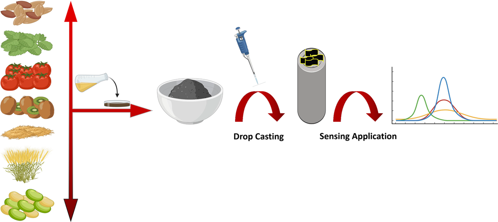
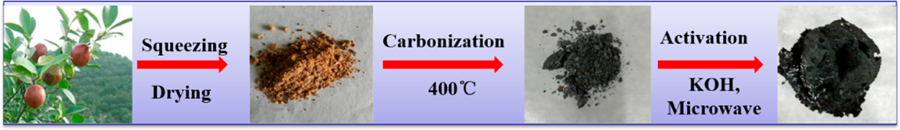
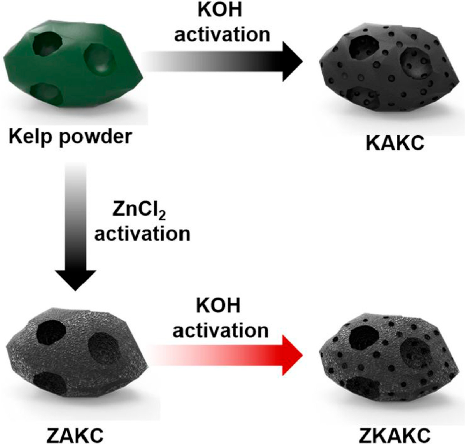
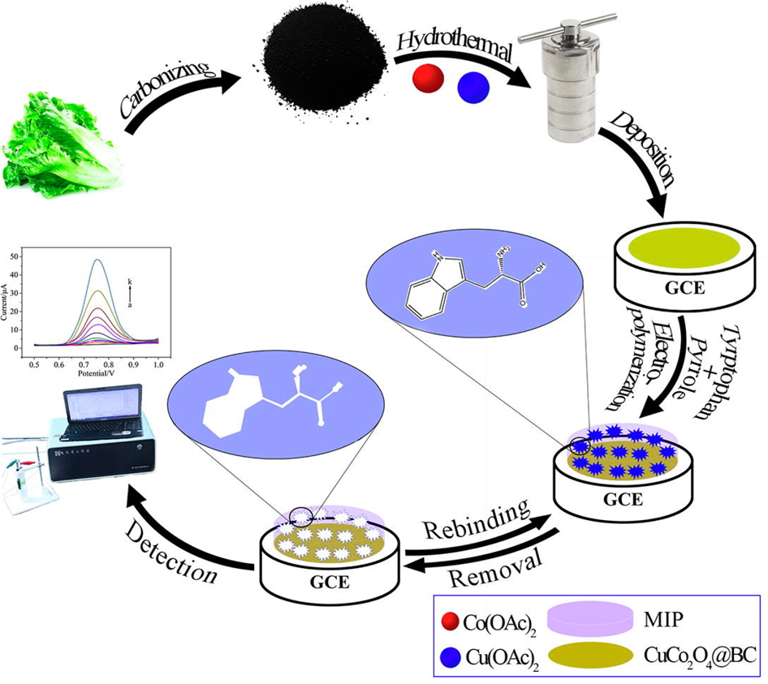
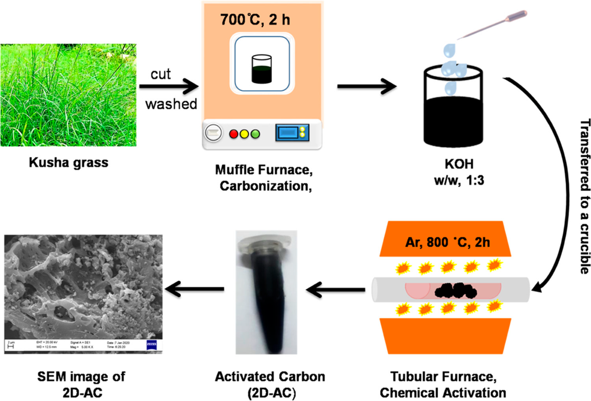
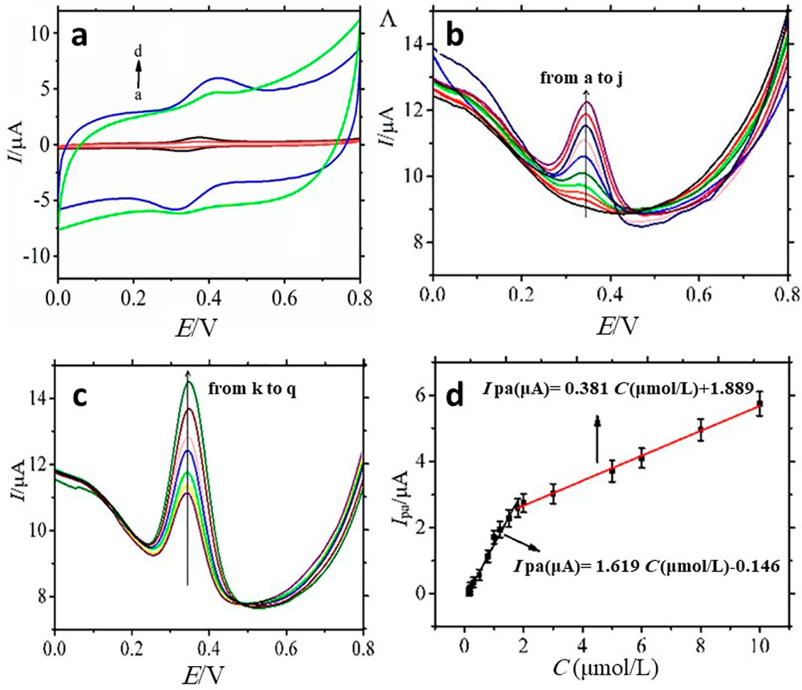
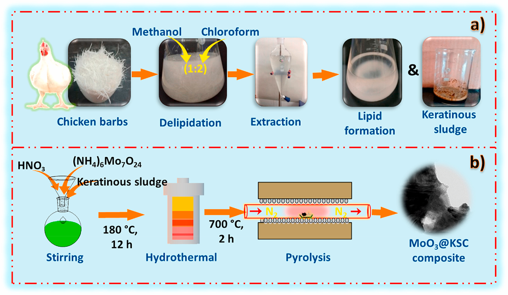

## Page 1

Biomass-Derived Carbon Materials as an Emerging Platform for
Advanced Electrochemical Sensors: Recent Advances and Future
Perspectives
Mohammad Mehmandoust, Guangli Li,* and Nevin Erk*
Cite This: Ind. Eng. Chem. Res. 2023, 62, 4628−4635
Read Online
ACCESS
Metrics & More
Article Recommendations
*
sı
Supporting Information
ABSTRACT: This review describes progress in the design and
synthesis of biomass-derived carbon materials with different
morphologies. It also covers respective composites and their
applications in the field of electrochemical sensing of (bio)
chemical species. Generally, carbon-based materials have paved the
way for advanced electrochemical sensing devices because of their
unique physical and chemical properties. Carbon materials are
typically created from chemical precursor materials; however,
researchers are increasingly focusing on fabricating carbon
materials from waste biomass resources due to economic and
environmental constraints. Compared with other carbon materials,
biomass-derived carbon materials (BCMs) are more environment-friendly with lower toxicity. In this review, we concentrated on
providing researchers with a complete overview to develop an alternative strategy to improve the sensitivity of electrochemical
sensors in actual samples by using numerous biomass-derived carbon-based materials modified electrodes. This review summarizes
the classification, synthesis methods, and electrochemical sensing applications of BCMs and their composite materials. The major
challenges in this field are outlined, and future research avenues for BCM-based electrochemical sensors are also highlighted.
1. INTRODUCTION
Nanocomposites and nanoparticles offer a wide range of
possible uses, including nanoelectronics, biomedicine, solar
energy, catalysts, and so on.1 Scientists must recognize that
agricultural waste biomass-assisted synthesis is a low-cost,
environmentally friendly, and renewable technique, implying
that agricultural wastes are appropriate renewable resources for
fabricating nanomaterials to replace harmful materials.2
Biobased economies and renewable biomass as raw materials
have been seen as long-term solutions to local and global
environmental concerns.3 Agricultural waste biomass, partic-
ularly lignocellulosic biomass (e.g., rice husk and walnut shell),
has received increasing attention as an inexpensive renewable
resource for producing fuels and, more recently, chemicals and
materials.4 Biomass materials derived from organisms,
including chitosan, cellulose, silk fibroin, collagen fiber, and
gelatin, are abundant and renewable natural macromolecular
compounds.5 These biomass materials possess outstanding
biocompatibility and biodegradability, but their thermal
stability and mechanical properties are relatively poor.6
Luckily, biomass materials include a lot of reactive groups,
including amino-, hydroxyl-, or carboxyl groups, which can be
further modified to improve their overall properties.7 In
addition, to improve performance and safety, the main
remaining challenges for the future development and wide-
spread use of biomass materials are reduction of production
and overall device costs, development of environmentally
friendly production processes, and recyclable large-scale
processing units.8
Electroanalytical chemistry has become a research hotspot in
analytical chemistry because of its inexpensive apparatus, high
sensitivity, good selectivity, and rapid response.9 As we all
know, bare electrodes often suffer from a narrow linear range,
an inadequate limit of detection (LOD), and poor sensitivity.10
Therefore, effectively immobilizing electroactive species on the
electrode surface has been a long-standing problem in
electroanalytical chemistry.11 Graphene, carbon nanotubes
(CNTs), and other carbon nanomaterials have been widely
used in electrode modification over the past decades, due to
their unique properties such as high electrical conductivity,
substantially large surface area, and strong catalytic activity.12
However, these materials tend to form close-packed structures
on the electrode surface, decreasing their specific surface area
and limiting mass transfer.13 More recently, sustainable
Special Issue: Nanobiomaterials for Biosensing and
Biodegradation
Received:
August 25, 2022
Revised:
December 8, 2022
Accepted:
December 9, 2022
Published: December 27, 2022
Review
pubs.acs.org/IECR
© 2022 The Authors. Published by
American Chemical Society
4628
https://doi.org/10.1021/acs.iecr.2c03058
Ind. Eng. Chem. Res. 2023, 62, 4628−4635
Downloaded via 113.185.75.57 on May 29, 2026 at 05:17:55 (UTC).
See https://pubs.acs.org/sharingguidelines for options on how to legitimately share published articles.

### Page Images

---

## Page 2

biomass-derived porous carbon has received growing attention
due to raw materials’ low cost and easy accessibility.14 The
biomass-derived porous carbon materials own more significant
pore volumes and a better-regulated microstructure, which
have become one of the most promising electrode materials for
diverse applications such as energy storage, sensors, and
wastewater treatment.15 Biomass-derived activated carbons
prepared by traditional pyrolysis and hydrothermal treatment
remain viable commercial alternatives because of their
cheapness and large-scale production capabilities.16
There have been several comprehensive reviews summariz-
ing the advances in the design, synthesis, characterization,
electrochemical behavior, and energy storage applications of
biomass-derived carbon materials (BCMs). However, there are
no dedicated reviews on BCM-based electrochemical sensors,
which have been fabricated by some groups over the past few
years. The rapid developments in this field provide a strong
impetus for writing a review on BCMs-based electrochemical
sensors. Therefore, we summarize the developments in BCMs-
based electrochemical sensors over the past five years.
2. CARBON-BASED MATERIALS
In the recent decade, research on carbon-based nanomaterials
has been a fast-growing academic field.17 The unique
characteristics and diversity of carbon-based structures and
the emergence of new opportunities in many subfields of
chemistry, physics, and engineering, subsequently provide the
impetus for creating several sectors.18 A wide range of water
pollutants, including hazardous metal ions, medicines,
pesticides, metalloids, and other inorganic and organic
compounds, can be adsorbed by carbon-based materials.19
No other element can produce as many different and distinct
shapes and properties as carbon, such as three-dimensional
(3D) diamond crystal and graphite, two-dimensional (2D)
graphene, one-dimensional (1D) CNTs, and zero-dimensional
(0D) fullerene molecules.20 Carbon materials outperform
many other materials in terms of hardness, optical qualities,
heat resistance, radiation characteristics, chemical resistance,
electrical conductivity, and surface and interface properties.
The synthesis of such carbon nanomaterials typically
involves several processes requiring the pretreatment of pricey
precursor feedstocks.21 Commercial and laboratory-scale
manufacturing of carbon forms such as carbon nanofibers,
carbon nanotubes, and fullerenes necessitates electrospinning,
carbonization, and plasma-enhanced chemical vapor deposi-
tion, all of which require the use of costly equipment.22
Graphene, which has a greater specific surface area than single-
walled carbon nanotubes (SWCNTs), is often produced by
chemical and mechanical exfoliation stages, epitaxial growth,
and chemical vapor deposition.23 Graphene is also poorly
dispersed in an aqueous solution. To form a stable and uniform
suspension, the surface of graphene is often further function-
alized with dispersion agents, including hydrophilic carboxyl
groups, alkylamines, and amphiphilic polymers. Hence,
significant efforts have been made to fabricate carbon-based
nanomaterials for sensor applications from renewable sources
via cost-effective methodologies.24 Biomass-derived carbon
materials are gaining appeal in this area due to abundant
bioprecursors and facile synthesis procedures, which greatly
reduce the cost of carbon-based electrochemical sensors.
BCMs are generally prepared by pyrolysis and hydrothermal
carbonization.
2.1. Classification of BCMs. 2.1.1. Zero-Dimensional
BCMs. 0D activated carbon nanospheres are a kind of popular
carbon material on account of their large accessible area, low
cost, and high charge capacity. The diameter of the biomass-
based spheres ranges between 50 and 500 nm and 1−5 μm.25
0D carbons such as fullerenes and carbon quantum dots
(CQDs) have been extensively utilized in various fields such as
water treatment,26 due to their mechanical robustness and
ability to restrict volumetric changes.27 Recently, 0D CQDs
have been designed to address the shortcomings of inorganic
quantum dots (QDs).28 Because of their high carbon content,
CQDs were successfully synthesized from biomass wastes
(agricultural residues, food waste, municipal solid waste,
etc.).29 However, the process of refining them from raw
biomass is time-consuming.
2.1.2. One-Dimensional BCMs. 1D BCMs are defined as
biomass that has a fibrous or tubular structure; the former
includes flax, ramie, and bacterial cellulose, while the latter
contains cotton, kapok, and willow catkins. So far, several
synthesis methods have been developed to obtain a variety of
1D BCMs. These 1D BCMs have demonstrated remarkable
electrochemical performance, which is ascribed to the fact that
the biomass carbon templates generally possess 1D fiber
morphology in the microstructure. This feature can be readily
inherited during the synthesis process. Due to the shape
anisotropy and high aspect ratio of this 1D structure, the
charge transportation rate can be facilitated along a radial
direction, and improved interfacial polarization can be
achieved as well.30 On the other hand, the porous walls of
carbon microtubes provide enough contact between the active
material and the electrolyte, which reduces ion diffusion length
and boosts electrochemical kinetics, eventually resulting in
outstanding rate capability and cycle stability. Furthermore,
hollow 1D carbon microtubes have great potential to be useful
substrates for developing diverse redox-reaction materials.
2.1.3. Two-Dimensional BCMs. 2D carbonaceous materials
with many sp2 hybridizations have high energy storage and
conversion potential because of their abundant active surface
edges and strong in-plane covalent bonding. Due to their large
specific surface area and good physical characteristics, 2D
carbon materials have received growing attention in the field of
electrochemical sensors in recent years.
2.1.4. Three-Dimensional BCMs. As is well-known, micro-
structures significantly impact the capacitive performances of
electrode materials for electrochemical approaches; as
dimensionality increases, more specific facets are exposed in
the electrolyte, increasing the specific surface area and
improving the capacitive capabilities. In light of this, a three-
dimensional structure with well-connected tiny and large pores
offers a continuous electron channel for efficient electrical
contact and thus accelerates ion transfer by shortening
diffusion paths; this is important for creating high-performance
electrode materials. As a result, 3D microstructures open up
new possibilities for the rational design and synthesis of
innovative architectures tailored to improve electrochemical
performance.
2.2. Synthesis Methods for BCMs. 2.2.1. Biomass
Pyrolysis. Pyrolysis, also referred to as thermochemical
conversion, is often used to produce carbon materials from
biomass. It is usually done using a flowing gas in the absence of
oxygen at high temperatures. Carbon backbones from biomass
sources can form amorphous or partially crystalline carbon
depending on the temperature, temperature ramping rate,
Industrial & Engineering Chemistry Research
pubs.acs.org/IECR
Review
https://doi.org/10.1021/acs.iecr.2c03058
Ind. Eng. Chem. Res. 2023, 62, 4628−4635
4629

---

## Page 3

particle size, and catalyst used in pyrolysis. In general, a low
heating rate favors char formation, and a high heating rate
facilitates the formation of volatile compounds.
2.2.2. Hydrothermal Carbonization. Hydrothermal carbon-
ization (HTC) is an innovative, low-cost, environmentally
friendly technique to fabricate functional carbon compounds
using carbon-rich precursors. HTC is typically performed at
low processing temperatures (<300 °C), with water as the
carbonization medium, and self-generated pressures. It is
feasible to modify the final morphology, porosity, and
physicochemical characteristics using colloid and polymer
science methods to fulfill the intended applications.31 During
HTC, soft biomass with less crystalline cellulose and low
molecular weight compounds were first broken down, followed
by the formation of certain globular biomass-derived carbon
composites with very tiny diameters and interstitial holes.
Carbonization temperature and residue time are two critical
aspects that directly determine whether HTC will succeed or
not.32
2.2.3. Physical and Chemical Activation. Activation is the
most practical method for increasing the surface area of BCMs
and adjusting the meso/micropore balance. The activation
strategies may be classified into three types based on the
activation mechanism: chemical activation, physical activation,
and self-activation.33 However, contrary to chemical and
physical methods, no additional activation materials are needed
for a self-activation approach, simplifying this method and
decreasing the cost.
The activation of carbon materials with gaseous agents such
as O2, CO2, or hot steam to form porous structures is
commonly referred to as physical activation. On the other
hand, chemical activation is related to specific chemical
activators (such as acid, alkali, or salt) functioning at high
temperatures ranging from 450 to 900 °C.34 Therefore,
different activation procedures mainly control pore distribu-
tions and electrochemical performances. However, high-
temperature activated carbon materials have superior elec-
tronic conductivity; nevertheless, high temperatures in steam-
activated activated carbon materials can degrade the biomass
precursor, reducing surface areas and pore content in the
resultant activated carbon materials. As a result, chemical
activation is more suitable for effective pore dispersion control
to avoid the collapse of pure biomass precursor structures.35
2.2.4. Template-Assisted Method. For the preparation of
graphene, natural 2D templates, metal oxides, and metal salts
have been employed as templates. These templates can be
removed by acid- or water-etching to generate high-quality
graphene.36 Metal salts like FeCl3 and NaCl are frequently
employed as templates to make graphene and graphene-like
carbons.37 Metal salts with a layered structure may have a small
gap between them. In addition to a single salt such as NaCl,
molten salts such as KCl/KNO3 are also employed as a
template for synthesizing G-carbons.38 At high temperatures,
molten salt is the equivalent of a liquid solvent, capable of
dissolving large amounts of raw materials and recrystallizing
the carbon source into its unique layered structure after
cooling. Nitrate combines with carbon to generate CO2, N2,
NO, and other gases at high temperatures, resulting in a greater
number of micropores and a larger specific surface area than
single salts.
2.2.5. Additive-Assisted Method. Although templating
methods (including soft-templating and hard-templating)
effectively produce controlled morphologies and porous
characteristics, they are costly and incompatible with
heteroatom doping.31 Additive-assisted pyrolysis combines
metal salts such as sodium, potassium, and calcium salts and
inorganic additives (i.e., zeolites and charcoal), offering
advantages over conventional pyrolysis. It may lower the
required operating temperature, cracking time, and solid
residue yield and increase waste cracking efficacy and pyrolysis
product quality.39
2.2.6. Microwave-Assisted Heating. Microwaves are
electromagnetic waves with wavelengths ranging from 1.0 to
1.0 mm and frequency ranging from 300 MHz to 300 GHz.
Microwaves were initially utilized in telecommunications, such
as radar and telephone technologies.40 Compared to conven-
tional heating, microwave heating is accelerated by dipole
rotation and internal ion conduction, and the direction of heat
transfer is opposite to that of regular heating. Consequently,
microwave heating solves the shortcomings of traditional
heating, such as increased heat loss, low energy efficiency, and
high cost. More importantly, selective heating characteristics of
microwave heating can enhance chemical reactions and
improve product quality.41 As a result, microwave-assisted
heating has recently gained popularity for biomass conversion
and material synthesis. For example, Bo et al. used a microwave
treatment to prepare a mesoporous carbon nanosheet with rich
pseudocapacitive groups from camellia oleifera biomass waste
(Figure 1).42 This method resulted in mesoporous carbon
nanosheets with a large surface area and a high oxygen content.
Furthermore, when compared to the usual activation
techniques developed from DAC-800, the resulting meso-
porous carbon nanosheets demonstrated a high specific
capacitance and good rate performance.
2.2.7. Ionothermal Carbonization. Another effective
technique for the synthesis of BCMs is ionothermal carbon-
ization, which allows for low-cost biomass conversion to useful
carbonaceous materials at relatively mild settings (180−220
°C).43 Moreover, numerous heteroatoms may be easily doped
into the final carbon framework.44 The ionothermal method
for converting biomass into carbons allows for the retention of
a high level of oxygen and nitrogen in the resultant materials.
Various forms of biomass, such as glucose, starch, lignocellu-
lose, bamboo, Moringa oleifera branches, and so on, have been
effectively employed as precursors for functional carbons using
the ionothermal approach.45 Pambel et al. recently proposed
an ionothermal synthesis technique to fabricate a series of
glucose-derived carbons with a tailored pore structure.46 The
Figure 1. Schematic diagram for the fabrication of mesoporous carbon nanosheets. Reproduced with permission from ref 42. Copyright 2019
Elsevier.
Industrial & Engineering Chemistry Research
pubs.acs.org/IECR
Review
https://doi.org/10.1021/acs.iecr.2c03058
Ind. Eng. Chem. Res. 2023, 62, 4628−4635
4630

### Page Images

---

## Page 4

as-obtained BCMs have significant total pore volumes (2160
m2 g−1 and 1.74 cm3 g−1). Xie et al. also disclosed the
ionothermal synthesis of carbon-based composites from
fructose in the iron-containing ionic liquid 1-butyl-3-
methylimidazolium tetrachloridoferrate(III), [Bmim][FeCl4]
acting as a solvent, catalyst, and template for product
production.47 The composites’ mesoporosity, high magnetic
moment, and huge specific surface area make them suitable for
magnetic separation water purification. The proposed process
proved to be flexible and scalable, paving the way for
ionothermal synthesis on a larger scale to manufacture
materials that, while not produced sustainably, are helpful for
water treatment, such as organic molecule removal.
3. BCMS FOR ELECTROCHEMICAL SENSING
APPLICATIONS
The development of BCMs has been a recent trend in the
design of electrochemical sensors. As shown in Table S1,
various BCMs have been used for this purpose and applied to
the detection of various analytes, with a special emphasis on
the detection and quantification of organic molecules, which
are commonly studied by electroanalytical groups worldwide
using other carbon-based electrodes as a proof-of-concept. We
believe this is due to the closeness between the physicochem-
ical and electrocatalytic characteristics of BCMs and the well-
known electrode utilized in research on these molecules.
Furthermore, some strategies for obtaining carbon materials
with desired properties for use in electroanalysis have been
employed, resulting in carbon materials with high electrical
conductivity and electrochemical activity due to the spatially
ordered porous structure, high graphitization, and doped
nitrogen, making BCMs appealing for the preparation of
electrochemical sensors. Indeed, the pyrolysis process is critical
for producing high-performance BCMs, and it is employed for
all the activities stated in Table S1.
Kim et al. proposed a two-step activation of BCMs,
including the initial activation of kelp powder with ZnCl2
followed by an activation step with KOH (Figure 2), for the
electrochemical determination of acetaminophen.48 The
resulting BCMs significantly enhanced the electroactive surface
area (from 0.061 to 0.122 cm2) and improved the electro-
chemical activity for acetaminophen determination. The as-
synthesized materials were modified on a glassy carbon
electrode (GCE) for acetaminophen determination in the
presence and absence of ascorbic acid and dopamine through a
differential pulse voltammetry (DPV) technique in 0.1 M
phosphate buffer saline (PBS, pH = 7.4). The proposed sensor
exhibited remarkable sensitivity toward acetaminophen deter-
mination with a rather wide linear detection range (0.02−20
μM) and a low LOD (0.004 μM). To our surprise, the LOD
for acetaminophen in the presence of dopamine and ascorbic
(0.007 μM) is comparable to that in PBS buffer, suggesting
good selectivity.
Chen et al. combined CuCo2O4/biomass-derived carbon
(CuCo2O4@BC) with molecularly imprinted polymer (MIP)
to fabricate a sensitive electrochemical sensor for detecting
tryptophan (Trp) in real samples. The BC and CuCo2O4 were
synthesized via pyrolyzing leaves of Lactuca sativa L. var.
ramosa Hort at 800 °C and hydrothermal method, respectively
(Figure 3).49 The MIP film was electropolymerized on the
surface of CuCo2O4@BC decorated GCE using Trp and
pyrrole as the template and monomer, respectively, forming
the specific recognition sites for binding Trp. The surface area
of the developed electrode was 0.17 cm2, which is 2.4 times
higher than that of bare GCE (0.07 cm2). Accordingly, the
MIP/CuCo2O4@BC/GCE showed superior electrocatalytic
activity for Trp, with two linear ranges from 0.01 to 1.0 μΜ
and from 1.0 to 40 μM and a low LOD of 0.003 μM.
Moreover, the selectivity of MIP/CuCo2O4@BC/GCE was
better than that of NIP/CuCo2O4@BC/GCE due to the
specific recognition capacity of the MIP. The proposed MIP/
CuCo2O4@BC/GCE could reliably detect Trp human serum
and urine as real samples with satisfactory recovery. The results
obtained by this sensor were also compared to high-
performance liquid chromatography (HPLC), demonstrating
promising prospects in the selective and sensitive determi-
nation of Trp in real samples.
Figure 2. Graphical illustration of the preparation of ZnCl2−KOH
activated kelp carbon (ZKAKC). Reproduced with permission from
ref 48. Copyright 2018 Elsevier.
Figure 3. Demonstration of the MIP/CuCo2O4@BC/GCE con-
struction process and electrochemical determination of Trp.
Reproduced with permission from ref 49. Copyright 2021 Elsevier.
Industrial & Engineering Chemistry Research
pubs.acs.org/IECR
Review
https://doi.org/10.1021/acs.iecr.2c03058
Ind. Eng. Chem. Res. 2023, 62, 4628−4635
4631

### Page Images

---

## Page 5

Nikhil et al. developed a low-cost and environment-friendly
2D activated carbon (AC) modified GCE (AC-GCE) for
electrochemical determination of roxarsone (ROX), an arsenic-
based medicine.50 Meso/microporous 2D-AC was prepared
from a natural biomass Desmostachya bipinnata through
chemical activation at 700.0 and 800 °C in the presence of
KOH (Figure 4). The as-obtained 2D-AC significantly boosted
the electrochemical response of ROX, mainly due to the large
surface area (0.075 cm2), which was about 1.44 times higher
than that of bare electrode, and faster electron transfer of 2D-
AC. As a result, the AC-GCE showed excellent sensing
performance toward ROX, with a wide linear response range of
0.76−474 μM and an LOD as low as 1.5 nM. Moreover, the
proposed AC-GCE works well in actual samples and on
disposable screen-printed carbon electrodes (SPCEs), demon-
strating tremendous application prospects in clinical diagnosis.
Niu et al. presented the preparation of biomass-derived
porous carbon (BPC) with rich 3D interconnected frameworks
by calcinating banyan leaves and its application for the
voltammetric determination of luteolin.51 Au nanoflakes
(AuNFs) were further decorated on BPC through the
hydrothermal approach to enhance electrochemical responses.
As shown in Figure 5a, Nafion-AuNFs-BPC/GCE exhibited
sharper oxidation and reduction peaks than bare and other
modified electrodes, indicating higher electroactivity of the
developed electrode. The effective area of Nafion-AuNFs-
BPC/GCE was 0.036 cm2, which was 1.54 times higher than
that of bare electrode. Moreover, the peak current increased
with increase in the luteolin concentration and showed two
linear ranges from 0.15 to 1.8 μM and from 1.8 to 10.0 μM
with a low LOD of 0.07 μM for luteolin determination (Figure
5b,c). Furthermore, the Duyi Wei capsule and human urine
were chosen as the real samples to assess the practical
application of Nafion-AuNFs-BPC/GCE. As shown in Table
S1, the recoveries are 97.0%−105% for the capsule samples
and 98.5%−106% for the human urine sample, with a low
relative standard deviation (RSD) of 5.00%, indicating
excellent reliability and practicability of the proposed sensor.
Ganesan et al. proposed the novel and green keratinous
sludge biomass-derived carbon-based molybdenum oxide
(KSC@MoO3) nanocomposite material through two-step
(hydrothermal and copyrolysis) procedures for a simultaneous
determination of hydroquinone (HQ) and catechol (CC).52
The valorization of chicken feather waste into lipids and
keratinous sludge biomass was examined, revealing the efficient
and sustainable conversion of chicken feather waste into high-
value lips for biofuel and nanomaterials for fabricating a low-
cost electrochemical sensor (Figure 6). The MoO3@KSC/SPE
showed sharp and well-defined anodic peaks with the highest
anodic peak current while the peak-to-peak separation was
remarkably decreased to 0.120 V (CC) and 0.141 V (HQ),
demonstrating outstanding electrocatalytic activity toward
electrocatalytic oxidation of CC and HQ. Furthermore, with
a linear concentration range of 5.0−176.8 M and low LODs of
0.063 and 0.059 μM for HQ and CC, the fabricated electrode
demonstrated exceptional electrochemical activity to deter-
mine HQ and CC, both independently and simultaneously. As
a result, this newly designed electrode has the potential to be
an outstanding sensor for practical use in the simultaneous
assessment of HQ and CC in environmental water samples.
4. CONCLUSION AND OUTLOOK
Biomass-derived carbon materials have emerged as attractive
materials for direct electrochemical sensing as well as robust
matrices or templates for synthesizing carbon-based materials
for electrochemical sensing. The most current methodologies
and advancements in developing biomass-derived carbon
compounds for electrochemical sensing are discussed in this
review. The composites based on biomass-derived carbon
components primarily concern improved electron conductivity,
specific surface area, and electrochemical sensing capabilities.
Biomass-derived carbon-based composites are suited for
electrochemical sensing because of their long-term stability,
environmental friendliness, sustainability, porous architectures,
high conductivity, hydrophobicity, and ease of modification.
On the other hand, other materials employed in electro-
chemical sensors have several disadvantages compared to
biomass-derived materials, including the unavoidable inad-
equacies of time-consuming, high-cost, or/and complicated
Figure 4. Synthesis procedure of 2D activated carbon using biomass.
Reproduced with permission from ref 50. Copyright 2022 ACS.
Figure 5. (a) CV curves for 5.0 μM luteolin at Nafion/GCE (curve
a), GCE (curve b), Nafion-BPC/GCE (curve c), and Nafion-AuNFs-
BPC/GCE (curve d) in 0.1 M PBS (pH = 6.0); DPVs recorded at
Nafion-AuNFs-BPC/GCE in the presence of luteolin solutions at
various concentrations (b) a−j: 0.0 to 1.8 μM; (c) k−q: 1.8 to 10.0
μM; (d) the corresponding calibration plot for luteolin. Reproduced
with permission from ref 51. Copyright 2021 Elsevier.
Industrial & Engineering Chemistry Research
pubs.acs.org/IECR
Review
https://doi.org/10.1021/acs.iecr.2c03058
Ind. Eng. Chem. Res. 2023, 62, 4628−4635
4632

### Page Images

---

## Page 6

procedures. Although substantial progress has been achieved in
developing biomass-derived carbon compounds for electro-
chemical sensors, several obstacles remain that restrict their
future applicability.
Most studies focus on nanostructured BCMs as a renewable
alternative to address environmental issues, which may be
attributed to their larger surface area and, in some cases, to
their smaller pore sizes.53 Hence, using nanosized BCMs may
be an interesting strategy for developing cost-effective and
highly efficient electrochemical sensors. Another feasible
strategy is the graphene-like material obtained through the
exfoliation of graphitized BCMs. The synthesis of graphene-
like BCMs or their derivatives from biowastes has also been
studied in more recent years. Graphene from BCMs may
possess inherent properties of graphene, including strong
mechanical strength, high electrical conductivity, large active
surface area, and favorable catalytic activity. Considering their
cost-effectiveness, eco-friendliness, and inherent properties,
graphene-like BCMs are expected to be an attractive alternative
for designing and fabricating new electrochemical sensors. As a
result, the green, cost-effective, and renewable preparation of
BCMs will be a talented material for the manufacture of
advanced sensors and biosensors.
■ASSOCIATED CONTENT
*
sı Supporting Information
The Supporting Information is available free of charge at
https://pubs.acs.org/doi/10.1021/acs.iecr.2c03058.
Applications of biomass-derived carbon materials-based
electrochemical sensors for various analyte determina-
tions (PDF)
■AUTHOR INFORMATION
Corresponding Authors
Guangli Li −Hunan Key Laboratory of Biomedical
Nanomaterials and Devices, College of Life Science and
Chemistry, Hunan University of Technology, Zhuzhou
412007, China; Email: guangli010@hut.edu.cn
Nevin Erk −Department of Analytical Chemistry, Ankara
University, Faculty of Pharmacy, 06560 Ankara, Turkey;
orcid.org/0000-0001-5366-9275; Email: erk@
pharmacy.ankara.edu.tr
Author
Mohammad Mehmandoust −Department of Analytical
Chemistry, Ankara University, Faculty of Pharmacy, 06560
Ankara, Turkey;
orcid.org/0000-0002-8545-0603
Complete contact information is available at:
https://pubs.acs.org/10.1021/acs.iecr.2c03058
Notes
The authors declare no competing financial interest.
■REFERENCES
(1) Kim, D. Y.; Kadam, A.; Shinde, S.; Saratale, R. G.; Patra, J.;
Ghodake, G. Recent developments in nanotechnology transforming
the agricultural sector: a transition replete with opportunities. Journal
of the Science of Food and Agriculture 2018, 98 (3), 849−864.
(2) Abd Elkodous, M.; Hamad, H. A.; Maksoud, M. I. A.; Ali, G. A.;
El Abboubi, M.; Bedir, A. G.; Eldeeb, A. A.; Ayed, A. A.; Gargar, Z.;
Zaki, F. S.; et al. Cutting-edge development in waste-recycled
nanomaterials for energy storage and conversion applications.
Nanotechnol. Rev. 2022, 11 (1), 2215−2294.
(3) Yana, S.; Nizar, M.; Irhamni; Mulyati, D. Biomass waste as a
renewable energy in developing bio-based economies in Indonesia: A
review. Renewable and Sustainable Energy Reviews 2022, 160,
No. 112268.
(4) He, C.; Tang, C.; Li, C.; Yuan, J.; Tran, K.-Q.; Bach, Q.-V.; Qiu,
R.; Yang, Y. Wet torrefaction of biomass for high quality solid fuel
production: A review. Renewable and Sustainable Energy Reviews 2018,
91, 259−271.
(5) Zhao, Y.; Qiu, Y.; Wang, H.; Chen, Y.; Jin, S.; Chen, S.
Preparation of nanofibers with renewable polymers and their
application in wound dressing. Int. J. Polym. Sci. 2016, 2016, 1.
(6) Wang, J.; Du, W.; Zhang, Z.; Gao, W.; Li, Z. Biomass/polyhedral
oligomeric silsesquioxane nanocomposites: Advances in preparation
strategies and performances. J. Appl. Polym. Sci. 2021, 138 (2),
No. 49641.
(7) Isikgor, F. H.; Becer, C. R. Lignocellulosic biomass: a sustainable
platform for the production of bio-based chemicals and polymers.
Polym. Chem. 2015, 6 (25), 4497−4559.
(8) Su, Z.; Yang, Y.; Huang, Q.; Chen, R.; Ge, W.; Fang, Z.; Huang,
F.; Wang, X. Designed biomass materials for “green” electronics: a
review of materials, fabrications, devices, and perspectives. Prog.
Mater. Sci. 2022, 125, 100917.
(9) Xie, Y.; Liu, T.; Chu, Z.; Jin, W. Recent advances in
electrochemical enzymatic biosensors based on regular nanostruc-
tured materials. J. Electroanal. Chem. 2021, 893, No. 115328.
Figure 6. (a) Isolation and separation of keratinous sludge from chicken feather waste and (b) synthesis of MoO3@KSC composite. Reproduced
with permission from ref 52. Copyright 2022 Elsevier.
Industrial & Engineering Chemistry Research
pubs.acs.org/IECR
Review
https://doi.org/10.1021/acs.iecr.2c03058
Ind. Eng. Chem. Res. 2023, 62, 4628−4635
4633

### Page Images

---

## Page 7

(10) Mehmandoust, M.; Soylak, M.; Erk, N. Innovative molecularly
imprinted electrochemical sensor for the nanomolar detection of
Tenofovir as an anti-HIV drug. Talanta 2023, 253, 123991.
(11) Erk, N.; Mehmandoust, M.; Soylak, M. Electrochemical Sensing
of Favipiravir with an Innovative Water-Dispersible Molecularly
Imprinted Polymer Based on the Bimetallic Metal-Organic Frame-
work: Comparison of Morphological Effects. Biosensors 2022, 12 (9),
769.
(12) Wang, Y.; Hu, S. Applications of carbon nanotubes and
graphene for electrochemical sensing of environmental pollutants. J.
Nanosci. Nanotechnol. 2016, 16 (8), 7852−7872.
(13) Song, Y.; Lu, X.; Li, Y.; Guo, Q.; Chen, S.; Mao, L.; Hou, H.;
Wang, L. Nitrogen-doped carbon nanotubes supported by macro-
porous carbon as an efficient enzymatic biosensing platform for
glucose. Anal. Chem. 2016, 88 (2), 1371−1377.
(14) Khan, A.; Senthil, R. A.; Pan, J.; Osman, S.; Sun, Y.; Shu, X. A
new biomass derived rod-like porous carbon from tea-waste as
inexpensive and sustainable energy material for advanced super-
capacitor application. Electrochim. Acta 2020, 335, 135588.
(15) Zhu, Y.; Chen, C.; Tian, M.; Chen, Y.; Yang, Y.; Gao, S. Self-
powered electro-Fenton degradation system using oxygen-containing
functional groups-rich biomass-derived carbon catalyst driven by 3D
printed flexible triboelectric nanogenerator. Nano Energy 2021, 83,
No. 105720.
(16) Qureshi, U.; Hameed, B.; Ahmed, M. Adsorption of endocrine
disrupting compounds and other emerging contaminants using
lignocellulosic biomass-derived porous carbons: A review. Journal of
Water Process Engineering 2020, 38, No. 101380.
(17) Ghorbani, M.; Seyedin, O.; Aghamohammadhassan, M.
Adsorptive removal of lead (II) ion from water and wastewater
media using carbon-based nanomaterials as unique sorbents: A
review. Journal of environmental management 2020, 254, No. 109814.
(18) Jagirani, M. S.; Soylak, M. A review: recent advances in solid
phase microextraction of toxic pollutants using nanotechnology
scenario. Microchem. J. 2020, 159, No. 105436.
(19) Wang, S.; Sun, H.; Ang, H.-M.; Tadé, M. O. Adsorptive
remediation of environmental pollutants using novel graphene-based
nanomaterials. Chemical engineering journal 2013, 226, 336−347.
(20) Gupta, N.; Rai, D. B.; Jangid, A. K.; Kulhari, H. A review of
theranostics applications and toxicities of carbon nanomaterials.
Current Drug Metabolism 2019, 20 (6), 506−532.
(21) Janas, D. From bio to nano: A review of sustainable methods of
synthesis of carbon nanotubes. Sustainability 2020, 12 (10), 4115.
(22) Gusain, R.; Kumar, N.; Ray, S. S. Recent advances in carbon
nanomaterial-based adsorbents for water purification. Coord. Chem.
Rev. 2020, 405, No. 213111.
(23) Yang, Z.; Tian, J.; Yin, Z.; Cui, C.; Qian, W.; Wei, F. Carbon
nanotube-and graphene-based nanomaterials and applications in high-
voltage supercapacitor: A review. Carbon 2019, 141, 467−480.
(24) Habila, M. A.; ALOthman, Z. A.; Al-Tamrah, S. A.; Ghafar, A.
A.; Soylak, M. Activated carbon from waste as an efficient adsorbent
for malathion for detection and removal purposes. Journal of Industrial
and Engineering Chemistry 2015, 32, 336−344.
(25) Wang, J.; Zhang, X.; Li, Z.; Ma, Y.; Ma, L. Recent progress of
biomass-derived carbon materials for supercapacitors. J. Power Sources
2020, 451, No. 227794.
(26) Jani, M.; Arcos-Pareja, J. A.; Ni, M. Engineered Zero-
Dimensional Fullerene/Carbon Dots-Polymer Based Nanocomposite
Membranes for Wastewater Treatment. Molecules 2020, 25 (21),
4934.
(27) Zhu, J.; Roscow, J.; Chandrasekaran, S.; Deng, L.; Zhang, P.;
He, T.; Wang, K.; Huang, L. Biomass-derived carbons for sodium-ion
batteries and sodium-ion capacitors. ChemSusChem 2020, 13 (6),
1275−1295.
(28) Thangaraj, B.; Solomon, P. R.; Chuangchote, S.; Wongyao, N.;
Surareungchai, W. Biomass-derived Carbon Quantum Dots−A
Review. Part 1: Preparation and Characterization. ChemBioEng.
Reviews 2021, 8 (4), 265−301.
(29) Hak, C. H.; Leong, K. H.; Chin, Y. H.; Saravanan, P.; Tan, S.
T.; Chong, W. C.; Sim, L. C. Water hyacinth derived carbon quantum
dots and g-C3N4 composites for sunlight driven photodegradation of
2, 4-dichlorophenol. SN Applied Sciences 2020, 2 (6), 1−14.
(30) Liang, H.; Liu, J.; Zhang, Y.; Luo, L.; Wu, H. Ultra-thin
broccoli-like SCFs@ TiO2 one-dimensional electromagnetic wave
absorbing material. Composites Part B: Engineering 2019, 178,
No. 107507.
(31) Deng, J.; Li, M.; Wang, Y. Biomass-derived carbon: synthesis
and applications in energy storage and conversion. Green Chem. 2016,
18 (18), 4824−4854.
(32) Wang, Y.; Zhang, M.; Shen, X.; Wang, H.; Wang, H.; Xia, K.;
Yin, Z.; Zhang, Y. Biomass-derived carbon materials: controllable
preparation and versatile applications. Small 2021, 17 (40),
No. 2008079.
(33) Wang, J.; Nie, P.; Ding, B.; Dong, S.; Hao, X.; Dou, H.; Zhang,
X. Biomass derived carbon for energy storage devices. Journal of
materials chemistry a 2017, 5 (6), 2411−2428.
(34) Tian, W.; Gao, Q.; Tan, Y.; Yang, K.; Zhu, L.; Yang, C.; Zhang,
H. Bio-inspired beehive-like hierarchical nanoporous carbon derived
from bamboo-based industrial by-product as a high performance
supercapacitor electrode material. Journal of Materials Chemistry A
2015, 3 (10), 5656−5664.
(35) Zhou, J.; Zhang, S.; Zhou, Y.-N.; Tang, W.; Yang, J.; Peng, C.;
Guo, Z. Biomass-derived carbon materials for high-performance
supercapacitors: current status and perspective. Electrochemical Energy
Reviews 2021, 4 (2), 219−248.
(36) Ouyang, D.-d.; Hu, L.-b.; Wang, G.; Dai, B.; Yu, F.; Zhang, L.-l.
A review of biomass-derived graphene and graphene-like carbons for
electrochemical energy storage and conversion. New Carbon Materials
2021, 36 (2), 350−372.
(37) Liu, B.; Yang, M.; Chen, H.; Liu, Y.; Yang, D.; Li, H. Graphene-
like porous carbon nanosheets derived from salvia splendens for high-
rate performance supercapacitors. J. Power Sources 2018, 397, 1−10.
(38) Jia, S.; Wei, J.; Meng, X.; Shao, Z. Facile and friendly
preparation of N/S Co-doped graphene-like carbon nanosheets with
hierarchical pore by molten salt for all-solid-state supercapacitor.
Electrochim. Acta 2020, 331, No. 135338.
(39) Wang, F.; Wang, P.; Raheem, A.; Ji, G.; Memon, M. Z.; Song,
Y.; Zhao, M. Enhancing hydrogen production from biomass pyrolysis
by dental-wastes-derived sodium zirconate. Int. J. Hydrogen Energy
2019, 44 (43), 23846−23855.
(40) Guiotoku, M.; Rambo, C.; Maia, C.; Hotza, D. Synthesis of
carbon-based materials by microwave-assisted hydrothermal process.
In Microwave heating; IntechOpen, 2011.
(41) Tsubaki, S.; Nakasako, Y.; Ohara, N.; Nishioka, M.; Fujii, S.;
Wada, Y. Ultra-fast pyrolysis of lignocellulose using highly tuned
microwaves: synergistic effect of a cylindrical cavity resonator and a
frequency-auto-tracking solid-state microwave generator. Green Chem.
2020, 22 (2), 342−351.
(42) Bo, X.; Xiang, K.; Zhang, Y.; Shen, Y.; Chen, S.; Wang, Y.; Xie,
M.; Guo, X. Microwave-assisted conversion of biomass wastes to
pseudocapacitive mesoporous carbon for high-performance super-
capacitor. Journal of Energy Chemistry 2019, 39, 1−7.
(43) Chang, Y.; Antonietti, M.; Fellinger, T. P. Synthesis of
nanostructured carbon through ionothermal carbonization of
common organic solvents and solutions. Angew. Chem., Int. Ed.
2015, 54 (18), 5507−5512.
(44) Cheng, P.; Li, T.; Yu, H.; Zhi, L.; Liu, Z.; Lei, Z. Biomass-
derived carbon fiber aerogel as a binder-free electrode for high-rate
supercapacitors. J. Phys. Chem. C 2016, 120 (4), 2079−2086.
(45) Liu, Y.; Huang, B.; Lin, X.; Xie, Z. Biomass-derived hierarchical
porous carbons: boosting the energy density of supercapacitors via an
ionothermal approach. Journal of Materials Chemistry A 2017, 5 (25),
13009−13018.
(46) Pampel, J.; Denton, C.; Fellinger, T.-P. Glucose derived
ionothermal carbons with tailor-made porosity. Carbon 2016, 107,
288−296.
Industrial & Engineering Chemistry Research
pubs.acs.org/IECR
Review
https://doi.org/10.1021/acs.iecr.2c03058
Ind. Eng. Chem. Res. 2023, 62, 4628−4635
4634

---

## Page 8

(47) Xie, Z.-L.; Huang, X.; Titirici, M.-M.; Taubert, A. Mesoporous
graphite nanoflakes via ionothermal carbonization of fructose and
their use in dye removal. RSC Adv. 2014, 4 (70), 37423−37430.
(48) Kim, D.; Kim, J. M.; Jeon, Y.; Lee, J.; Oh, J.; Hooch Antink, W.;
Kim, D.; Piao, Y. Novel two-step activation of biomass-derived carbon
for highly sensitive electrochemical determination of acetaminophen.
Sens. Actuators, B 2018, 259, 50−58.
(49) Chen, B.; Xie, Q.; Zhang, S.; Lin, L.; Zhang, Y.; Zhang, L.;
Jiang, Y.; Zhao, M. A novel electrochemical molecularly imprinted
senor based on CuCo2O4@ biomass derived carbon for sensitive
detection of tryptophan. J. Electroanal. Chem. 2021, 901, No. 115680.
(50) Nikhil; Srivastava, S.; Srivastava, A.; Srivastava, M.; Prakash, R.
Electrochemical Sensing of Roxarsone on Natural Biomass-Derived
Two-Dimensional Carbon Material as Promising Electrode Material.
ACS Omega 2022, 7 (3), 2908−2917.
(51) Niu, X.; Huang, Y.; Zhang, W.; Yan, L.; Wang, L.; Li, Z.; Sun,
W. Synthesis of gold nanoflakes decorated biomass-derived porous
carbon and its application in electrochemical sensing of luteolin. J.
Electroanal. Chem. 2021, 880, No. 114832.
(52) Ganesan, S.; Sivam, S.; Elancheziyan, M.; Senthilkumar, S.;
Ramakrishan, S. G.; Soundappan, T.; Ponnusamy, V. K. Novel
delipidated chicken feather waste-derived carbon-based molybdenum
oxide nanocomposite as efficient electrocatalyst for rapid detection of
hydroquinone and catechol in environmental waters. Environ. Pollut.
2022, 293, No. 118556.
(53) Alothman, Z. A.; Habila, M. A.; Moshab, M. S.; Al-Qahtani, K.
M.; AlMasoud, N.; Al-Senani, G. M.; Al-Kadhi, N. S. Fabrication of
renewable palm-pruning leaves based nano-composite for remediation
of heavy metals pollution. Arabian Journal of Chemistry 2020, 13 (4),
4936−4944.
Industrial & Engineering Chemistry Research
pubs.acs.org/IECR
Review
https://doi.org/10.1021/acs.iecr.2c03058
Ind. Eng. Chem. Res. 2023, 62, 4628−4635
4635

---

