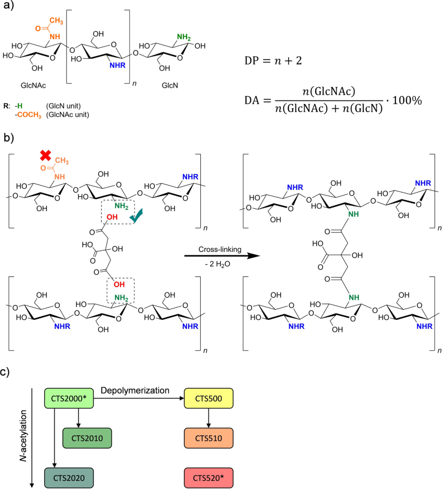
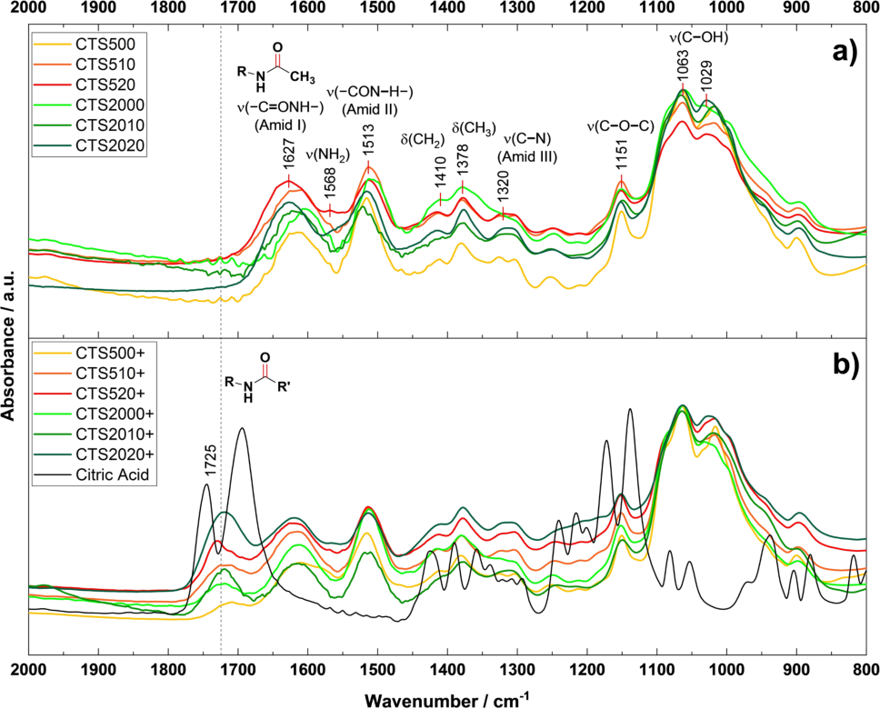
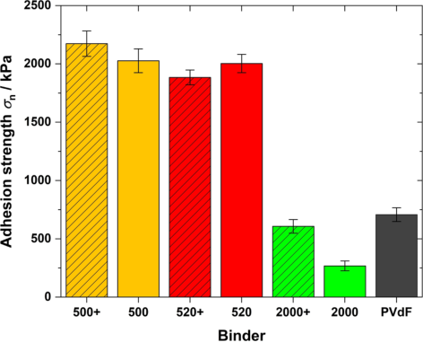
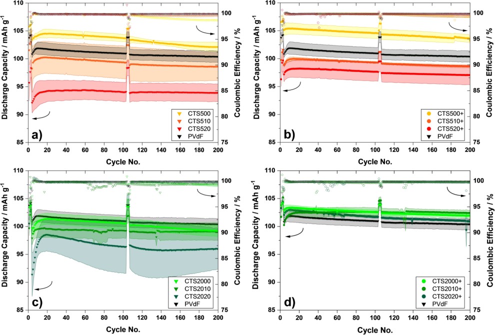
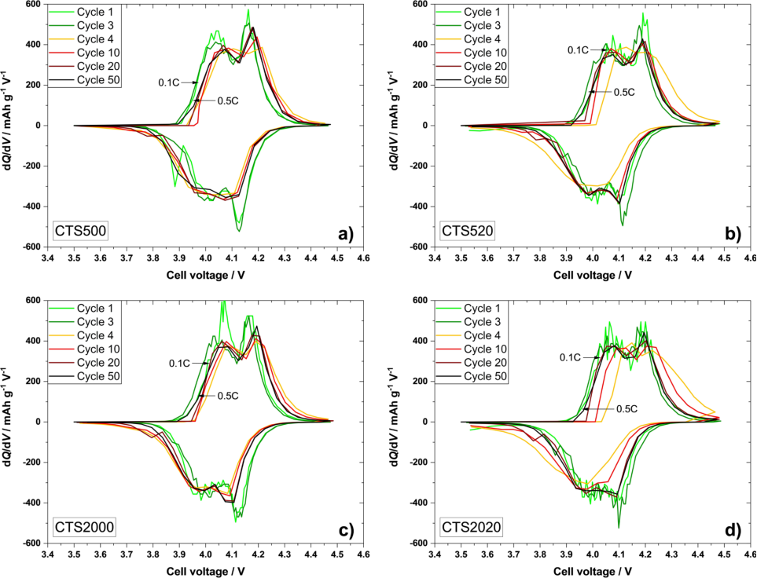
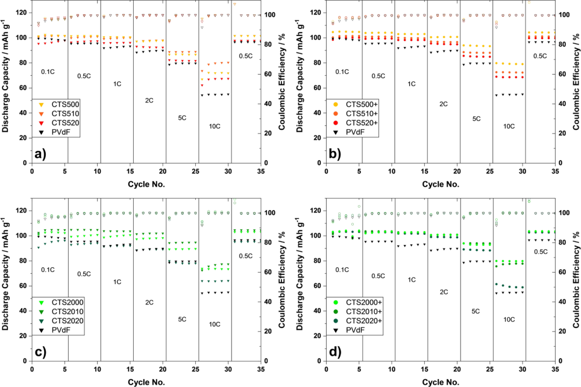
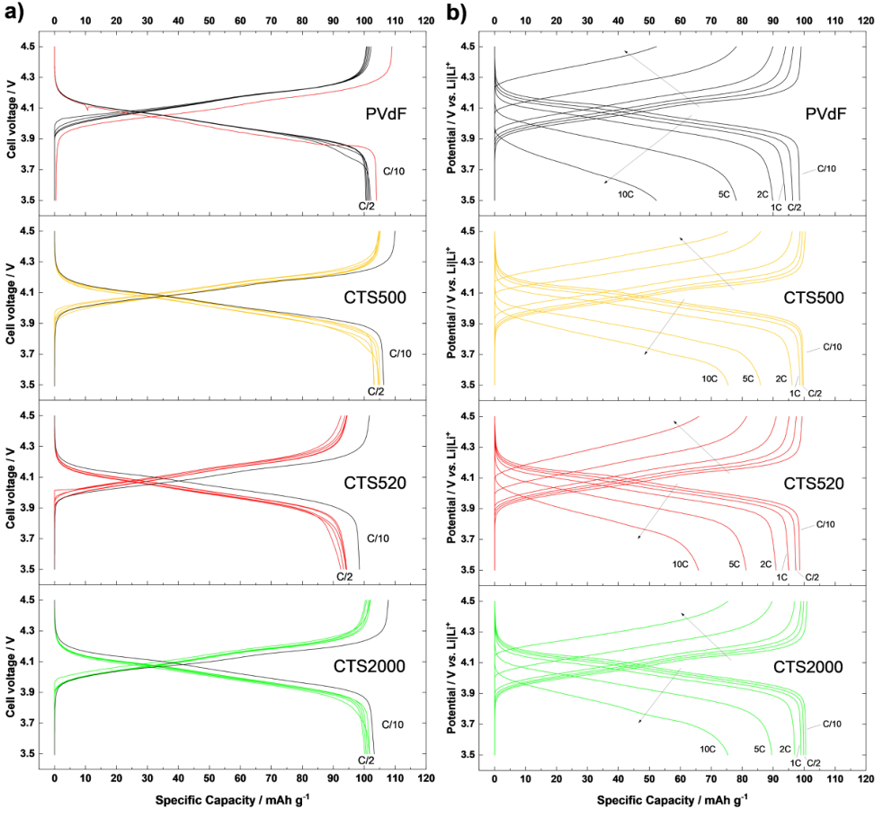

Research Article doi.org/10.1002/celc.202200600 

ChemElectroChem 

www.chemelectrochem.org 

# **Comparative Study on Chitosans as Green Binder Materials for LiMn O 2 4 Positive Electrodes in Lithium Ion Batteries** 

Sven Künne,[[a]] Frederik Püttmann,[[a]] Max Linhorst,[[b]] Bruno M. Moerschbacher,[[b]] Martin Winter,[[a, c]] Jie Li,*[[d]] and Tobias Placke*[[a]] 

The increasing demand for lithium ion batteries consequently involves research on environmentally benign materials and processing routes. Environmentally friendly cobalt-free, and fluorine-free electrodes processed without organic solvents were targeted as this approach combines high work safety and sustainability with good electrochemical performance. In this study, chitosan-based biopolymers were synthesized and systematically investigated for the first time as “green” binders for positive electrodes utilizing LiMn2O4 (LMO). In particular, chitosans with different specifically designed low and high degrees of polymerization (DP), each with comparable degree of acetylation (DA), revealed insights into the impact on the 

## **Introduction** 

The urgent demand for ramping up electro mobility and stationary energy storage due to the global climate crisis leads to an increased need for sustainable energy sources and storage technologies, especially in the form of rechargeable batteries. The capacity of lithium ion batteries (LIBs) put on the global market is forecasted to increase from 242 GWh (2020) over 991 GWh (2025) to 2,731 GWh for 2030,[[1]] as this battery technology exhibits outstanding key performance metrics in terms of high energy density and power density, long lifetime, high safety standards and low costs.[[2]] To cope with these demands, the LIB industry grows rapidly, followed by the increasing attention on the environmental impact of batteries, 

- [a] _S. Künne, F. Püttmann, Prof. M. Winter, Dr. T. Placke University of Münster MEET Battery Research Center, Institute of Physical Chemistry Corrensstraße 46, 48149 Münster, Germany E-mail: tobias.placke@uni-muenster.de_ 

- [b] _M. Linhorst, Prof. B. M. Moerschbacher University of Münster Institute for Plant Biology and Biotechnology Schlossplatz 8, 48143 Münster, Germany_ 

- [c] _Prof. M. Winter Helmholtz-Institute Münster, IEK-12 Forschungszentrum Jülich GmbH Corrensstraße 46, 48149 Münster, Germany_ 

- [d] _Dr. J. Li Department of Energy, Politecnico di Milano Via Lambruschini 4, 20156 Milano, Italy E-mail: jie1.li@polimi.it_ 

- Supporting information for this article is available on the WWW under https://doi.org/10.1002/celc.202200600 

- _© 2022 The Authors. ChemElectroChem published by Wiley-VCH GmbH. This is an open access article under the terms of the Creative Commons Attribution License, which permits use, distribution and reproduction in any medium, provided the original work is properly cited._ 

mechanical and electrochemical performance of LMO positive electrodes. Herein, low DP chitosan provided twice the adhesion strength compared to the state-of-the-art binder polyvinylidene difluoride (PVdF) in LMO electrodes, thus, showing the opportunity to reduce the binder content and increase the specific energy. Electrodes with DA _<_ 16% chitosan-based binder could deliver higher discharge capacities than cathodes using PVdF or chitosans with DA _>_ 16% in LMO j j Li metal cells. Cross-linking of chitosans with citric acid (CA) was demonstrated to significantly increase the discharge capacity up to 80 mAhg[�][1] at 10 C charge/discharge rate. which includes various aspects along the battery value circle, i.e., the raw materials and energy needed for production as well as waste produced and challenges in terms of 2[nd] life usage, disposal and/or recycling.[[3,4]] 

The substitution of non-environmentally friendly, hazardous and non-biodegradable battery cell compounds can provide improved work safety and decrease the battery’s environmental impact.[[5]] Though polyvinylidene difluoride (PVdF) as chemically inert, non-toxic fluoropolymer[[6]] with good electrochemical stability at high operation potentials has become the state-ofthe-art binder for various positive electrodes in LIB cells,[[7]] electrode processing involves dissolving PVdF in non-environmentally friendly and toxic solvents, such as _N_ -Methyl-2pyrrolidone (NMP).[[4,8,9]] Therefore, aqueous processing routes using water-soluble binders like poly(acrylic acid) (PAA),[[10]] gelatin,[[11]] styrene-butadiene rubber (SBR)[[12]] or sodium carboxymethyl cellulose (Na-CMC)[[13]] are widely investigated for negative as well as for positive electrodes. While aqueous processing has been established for graphite negative electrodes, it is more challenging for positive electrodes due to stability issues of the active materials and the aluminum current collector.[[9,14]] 

In 2013, Chai et al. introduced chitosan as an environmentally benign electrode binder for graphite anodes in LIB cells.[[15]] Chitosans consist of β-(1,4)-linked D-glucosamine (GlcN) and _N_ -acetyl-D-glucosamine (GlcNAc) units (Figure 1a). They are derivatives of the natural polymer chitin and are obtained via enzymatic[[16]] or chemical deacetylation[[17]] . While chitin is insoluble in water, chitosans are soluble in diluted acids at a pH _<_ 6.4 due to protonation of the amine groups of the GlcN units (Figure 1a).[[18]] Chitin is commonly known for its presence in exoskeletons in arthropods, which includes insects, arachnids or myriapods[[19]] and is obtained from crustaceans, insects and 

_ChemElectroChem_ **2022** , _9_ , e202200600 (1 of 12) 

© 2022 The Authors. ChemElectroChem published by Wiley-VCH GmbH 

Research Article doi.org/10.1002/celc.202200600 

ChemElectroChem 

**Figure 1.** Structure of chitosan and its building units, and definitions of the degree of polymerization (DP) and the degree of acetylation (DA) (a). Scheme for cross-linking reaction of chitosan and CA (b). Synthesis procedure for chitosan binders combining _N_ -acetylation and depolymerization to obtain a set of chitosan materials with different DA and DP (c). *Renamed commercial chitosan materials. 

microorganisms.[[20]] Its annual turnover is estimated to be in the range of 10[10] –10[11] metric tons.[[20]] The main source for chitin is waste of the marine food production, for example, shrimp, crab or krill shells processing, making chitin a highly abundant resource, as it is referred to as second most abundant biopolymer after cellulose, which comprises a comparable structure.[[21]] Besides the usage as binder material in LIB cells, chitosans with their non-toxic,[[22]] anti-bacterial,[[23]] anti-viral,[[24]] anti-allergen and biodegradable[[22]] properties are applicable in several areas such as healthcare, cosmetics and food industry or agriculture.[[22]] The relative quantity of GlcNAc units is expressed 

as degree of acetylation (DA) and is a decisive parameter for the solubility of chitosans, whereas also the pattern of acetylation (PA) can influence the solubility. In addition, crosslinking reactions between chitosan chains can be induced at the amine groups, thus forming covalent bonds for a binderactive material network exhibiting improved mechanical and electrochemical properties. 

The binding mechanism between PVdF chains, however, consists mostly of mechanical interlocking and van der Waals forces.[[25]] In 2016 Gao et al. used chitosan cross-linked with glutaraldehyde as electrode binder in antimony-based negative 

_ChemElectroChem_ **2022** , _9_ , e202200600 (2 of 12) 

© 2022 The Authors. ChemElectroChem published by Wiley-VCH GmbH 

Research Article doi.org/10.1002/celc.202200600 

ChemElectroChem 

electrodes and showed enhanced cycle life and improved Coulombic efficiency by better accommodating volume changes.[[26]] 

However, glutaraldehyde is highly toxic and environmentally unfriendly,[[27]] thus fails to meet the requirements for a sustainable binder system. Recently, chitosan was cross-linked with citric acid (CA) and employed with PAA as binder system for silicon/graphite negative electrodes.[[28]] Here, Zhao et al. stated that acetic acid residues from the solvent might remain in already dried samples and can react with the chitosan’s amine groups, leading to branching and less cross-linking of chitosan. CA is a tricarboxylic acid, which can react with amine groups of chitosans in a temperature-induced amine condensation, as reported by Kuenzel et al., when using chitosan/CA as binder for LiNi0.5Mn1.5O4 (LNMO)-based positive electrodes.[[29]] 

In this work, different chitosan materials as environmentally friendly binders in combination with LiMn2O4 (LMO) as sustainable positive electrode (cathode) active material were evaluated to understand the impact of the characteristics of the respective chitosan binders on their electrochemical cell performance. Therefore, chitosan materials with different degrees of acetylation (DA) and different degrees of polymerization (DP) were prepared from commercial sources. For preparation of LMO electrodes, the chitosan materials were also cross-linked, as illustrated in Figure 1b, to further improve the binding properties. The synthesized binders were thoroughly investigated by proton nuclear magnetic resonance spectroscopy ([1] H NMR), high-pressure size exclusion chromatography (HPSEC) and Fourier-transform infrared (FTIR) spectroscopy. As these manganese spinel-type cathode materials experience transition metal dissolution,[[30–33]] the impacts of the pH value and of the applied binders were analyzed via total reflection X-ray fluorescence spectroscopy (TXRF). LMO-based electrodes were also evaluated by adhesive strength measurements, mercury intrusion porosimetry and electrochemical investigations in LMO j j Li metal cells to determine the impact of chitosans and their DP and DA, as well as cross-linking on the electrochemical performance. An exact identification of the chitosan sample is crucial to ensure a valid replication of results, considering that even with only two different building units ( _N_ -acetyl-D-glucosamine and D-glucosamine) the properties of different chitosans can vary significantly. The acetylation pattern could also have a considerable impact on chitosans’ properties but will not be discussed in this work. 

## **Experimental Section** 

## **Electrode materials** 

LiMn2O4 (LMO) was purchased from Toda America (for further information see SI; Figure S1). Li metal foil (purity: battery grade; 500 μm in thickness) was obtained from Albemarle. Citric acid monohydrate (purity: 99.5 + %) was purchased from Alfa Aesar, carbon black conductive agent C-nergy[TM] Super C65 was obtained from Imerys Graphite & Carbon and polyvinylidene difluoride (PVdF, Solef 5130) was received from Solvay. Titanium foil was used as current collector (William Gregor Ltd; 25 μm thickness; grade 1). 

The materials were used without further purification or modification. Chitosan samples ‘CTS2000’ and ‘CTS520’ (Table 1) were purchased from Mahtani Chitosan Pvt. Ltd. as starting materials and _N_ -acetylated and/or depolymerized to obtain chitosan binders with desired DA and DP values according to Figure 1c. 

## **Chitosan materials and purification** 

The prepared binder materials were named according to the abbreviation CTSxxyy with ‘yy’ showing the approximate DA in percent, and ‘xx’ = 20 and 5, indicating a high and low DP, respectively. An overview of the chitosan materials and their structural properties used in this work is shown in Table 1. Initially, the commercial starting materials (‘CTS2000’ and ‘CTS520’, Mahtani Chitosan Pvt. Ltd., Veraval, Gujarat, India) were dissolved in 1% _v_ / _v_ hydrochloric acid (from 32% _m_ / _m_ , Carl Roth, purity: extra pure) and filtrated over mixed cellulose ester membranes (Merck, Millipore Type GSWP) with successively decreasing pore sizes (3 μm, 0.8 μm and 0.45 μm) for removal of impurities. After that, an ammonia solution (25% _m_ / _m_ ; Carl Roth, purity: extra pure) was added, until the chitosan precipitated. The precipitate was washed with deionized water until a neutral pH value was reached, followed by freeze drying. 

## **Depolymerization of chitosan** 

To obtain chitosan binders with desired DP, 2 g of the purified CTS2000 chitosan were dissolved in acetic acid (1 mol.-eq. regarding to GlcN-units) and after addition of 10 mg sodium nitrite (0.047 mol-eq. regarding to GlcN units; Carl Roth; purity: � 99%), dissolved in 1 mL deionized water, the solution was stirred for 7 hours. An ammonia solution (25% _m_ / _m_ ; Carl Roth) was added to precipitate the chitosan after the reaction. Thereafter, the precipitate was washed with deionized water until a neutral pH value was reached, followed by freeze drying, whereby the product CTS500 was obtained as white flakes. The mass average molecular weights ( _M_ w) and DP values were determined by size exclusion chromatography coupled to refractive index and multiple angle laser light scattering detection (SEC-MALLS-RI; see Figure S2 and Table S1). 

## _**N**_ **-acetylation of chitosan** 

For the follow-up acetylation reaction, 1.5 g chitosan (CTS500 and CTS2000, respectively (DA: 0)) were mixed with distilled water and acetic acid (Carl Roth, purity: 100%) (1 mol.-eq. regarding to GlcNunits) (see Figure 1c). Subsequently 1,2-propanediol (Carl Roth, purity: 99.5%) and acetic anhydride (Ac2O; see Table S2, Carl Roth, purity: _>_ 99%) were added and the solution was stirred for two hours at room temperature. Afterwards, an ammonia solution 

**Table 1.** Abbreviations and properties of chitosan materials determined by 1H NMR and HPSEC. 

||Name of sample CTS500 CTS510 CTS520 CTS2000 CTS2010 CTS2020 PVdF Solef® 5130|Degree of polymerization (DP) 458 699 518 1618 ~1618 ~1618 ~17180|Degree of acetylation (DA) [%] 1.7 6.5 18.6 1.7 9.4 16.5 –|Ø Molecular weight [kDa] 74 115 88 262 267 272 1100[a]|
|---|---|---|---|---|

[a] Average molecular weight from material data sheet. 

_ChemElectroChem_ **2022** , _9_ , e202200600 (3 of 12) 

© 2022 The Authors. ChemElectroChem published by Wiley-VCH GmbH 

Research Article doi.org/10.1002/celc.202200600 

ChemElectroChem 

(25% _m_ / _m_ , Carl Roth) was added until a neutral pH value was reached. Chitosans were precipitated with an acetone/water (80:20) solution, and the precipitates were washed several times with different acetone/water (80:20, 90:10, 100:0) solutions and afterwards dried under reduced pressure at 40 °C and subsequent freeze drying. 

## **LiMn2O4 electrode preparation** 

Electrode tapes for positive electrodes were coated with a mixture of 87 _m_ % LMO, 10 _m_ % of conductive carbon black agent and 3 _m_ % of the corresponding binder material. For PVdF-based electrodes, LMO, conductive carbon and PVdF were dry-mixed for 15 min at 15 Hz using a Swing Mill (MM 400; Retsch). Afterwards, _N_ -methyl-2pyrrolidone (NMP; Alfa Aesar; purity: 99 + %) was introduced to the mixture as solvent for PVdF, and mixed again for 30 min at 20 Hz and finally for 1 h at 30 Hz before casting onto titanium foil as current collector. The average active mass loading and areal capacity of the electrodes for constant current cycling studies was 4.1 � 0.2 mgcm[�][2] and 0.61 mAhcm[�][2] , respectively, while for rate capability studies the LMO electrodes having 3.6 � 0.2 mgcm[�][2] and 0.53 mAhcm[�][2] were used. The areal capacity is based on the theoretical specific capacity of LMO (148 mAhg[�][1] ). 

For chitosan-based LMO electrodes, chitosan was dissolved in 2% ( _m_ / _m_ ) acetic acid (from 100% _m_ / _m_ ; VWR; AnalaR NORMAPUR; purity: 100%) and optionally citric acid was added as cross-linker (CTS:CA, 9:1 _m_ / _m_ ). LMO and carbon black were dry-mixed using a swing mill for 15 min at 15 Hz. Subsequently, the chitosan solution was added and mixed for 30 min at 20 Hz, and finally for 1 h at 30 Hz before casting it on titanium foil as current collector. The average mass loading and areal capacity of the electrodes was 4.6 � 0.5 mgcm[�][2] and � 0.68 mAhcm[�][2] , respectively. Electrode pastes were applied using an automatic film applicator at a speed of 50 mms[�][1] . The electrode tapes were dried in an atmospheric oven at 80 °C overnight. All dried LMO electrodes were calendered to obtain electrode films with thicknesses of � 55 μm. Subsequently, electrode disks with a diameter of 12 mm were punched out and dried under reduced pressure for 24 h at 80 °C. 

## **Characterization of chitosan materials, cross-linked chitosans and LiMn2O4 electrodes** 

One-pulse 1H NMR experiments were carried out using a Bruker Avance II 400 spectrometer at 400 MHz with D2O as solvent to determine the DA values (Figure S3). Solid state[1] H NMR spectra of CTS500 and CTS500 + were recorded at 500 MHz with a Bruker Avance Neo spectrometer operating at 11.74 T (ν([1] H) = 500.39 MHz to confirm successful cross-linking (Figure S4). In addition, highpressure size exclusion chromatography (HPSEC) was performed to determine the chitosan’s DP (Figure S2). 

The effect of cross-linking on chitosans was also investigated via Fourier-transform infrared spectroscopy (FTIR). Therefore, samples with and without citric acid were dissolved and stirred in diluted (1% _m_ / _m_ ) hydrochloric acid solution (Merck, 1 M solution). The solutions were cast on watch glasses and dried at room temperature until films have formed. As reference measurement, citric acid was mortared and analyzed independently. Investigations were performed on a Bruker Vertex 70 IR spectrometer equipped with a MIR light source, KBr beam splitter and a deuterated L-alaninedoped triglycine sulfate (DLaTGS) detector with a KBr window. Measurements were conducted via attenuated total reflection (PLATINUM ATR, Bruker) setup. The collected spectra were averaged over 128 scans with an optical resolution of 2 cm[�][1] . 

The surface structure of the positive electrodes was investigated on a Carl Zeiss AURIGA field emission scanning electron microscope (FE-SEM). SEM images are shown in Figure S5 and Figure S6. 

The pore volume of LMO electrodes was investigated by mercury intrusion porosimetry (MIP). MIP was performed using a Pascal 140440 (Pressurization by Automatic Speed-up and Continuous Adjustment Logic) porosimeter (Thermo Fischer Scientific). MIP measurements were performed in a pressure range of 0.01 kPa to 400 MPa, whereas pore radii in the range of 300 μm to 1.8 nm can be determined. The SOL.I.D. software (SOLver of Intrusion Data, version 1.2.1) was used for evaluation of the mercury intrusion data. 

Adhesion strength measurements on LMO electrodes were carried out in a uniaxial material testing machine (Z2.5; Zwick Roell GmbH & Co. KG) via pull-off test. Two facing steel sample holders (surface area: 6.45 cm[2] per spot, 5 spots per sample) were prepared with double-sided adhesive tape (Tesafix 5696 extrastrong; Tesa) before electrode tapes were fixated onto the bottom holder. The upper sample holder was pressed against the bottom holder with a force of 2 kN for 60 seconds before it was moving upwards with a pull-off velocity of 100 mms[�][1] . In this procedure, the maximum tensile force is measured via a load cell, and the adhesion strength can be calculated by dividing the force by the surface area.[[34]] 

TXRF analysis was performed on a Bruker S2 PICOFOX to investigate manganese dissolution during electrode paste preparation. Further parameters and sample preparation conditions were applied according to Evertz et al.[[35]] Therefore, electrode pastes with aqueously processible binders CTS500 and Na-CMC (as reference) were prepared as above to study the influence of the binder and the pH on the transition metal dissolution behavior. In addition, an electrode paste consisting of only LMO and acetic acid was made as further reference. Another electrode paste was prepared following the PVdF-based preparation above with NMP to investigate the role of the solvent. These pastes were produced omitting the conductive agent but keeping the same ratio between binder and active material. The mixtures were then filtered and analyzed. 

## **Cell preparation and electrochemical characterization** 

Constant current cycling of LiMn2O4 j j Li metal cells was conducted on a Maccor Series 4000 automated test system (Maccor Inc.) at 20 °C in a cell voltage range of 3.5 to 4.5 V using coin cells (CR2032, Hohsen Corporation) in two-electrode configuration (full-cell setup). A (dis-)charge rate of 0.5 C was performed after three formation cycles at 0.1 C (1 C =^ 148 mAg[-1] ). A rest step of five minutes was applied after each cycle. For the positive electrode, LMO with chitosan or PVdF as binder was used, respectively, whereas Li metal (ø = 15 mm) functioned as negative electrode. As separator, a polypropylene fiber (Freudenberg FS2190; 6-layers) soaked with 150 μL electrolyte (ethylene carbonate (EC):ethyl methyl carbonate (EMC), 3:7 _m_ / _m_ , 1 M LiPF6 (BASF)) was applied. 

Constant current rate capability studies were performed in T-type cells (Swagelok®) in a three-electrode configuration (half-cell setup)[[31]] with (dis-)charge rates up to 10 C and a five-minute rest step after each cycle. Li metal was used as counter electrode (CE) as well as reference electrode (RE) combined with a FS2190 (6-layers) separator soaked with 120 μL electrolyte. At least three cells were evaluated for each electrode configuration to ensure a high reproducibility, as indicated by error bars in the respective figures. 

_ChemElectroChem_ **2022** , _9_ , e202200600 (4 of 12) 

© 2022 The Authors. ChemElectroChem published by Wiley-VCH GmbH 

Research Article doi.org/10.1002/celc.202200600 

ChemElectroChem 

## **Results and Discussion** 

## **Characterization of chitosan materials** 

The basic structural properties and the nomenclature of the investigated chitosan materials are shown in Table 1. DP and DA values were determined by HPSEC and[1] H NMR, respectively (see SI). Samples cross-linked with citric acid exhibit the same properties, and are marked with a “ + ” in the following work. 

Chitosan as biopolymer contains different functional groups that can be investigated via FTIR. Figure 2 shows FTIR spectra of pristine (a) and citric acid-treated (b) chitosan films. The presence of the _N_ -acetamide group is verified by bands from C=O stretching vibrations ( � 1627 cm[�][1] ), N� H bending (1513 cm[�][1] ) and C� N stretching of amides (1320 cm[�][1] ).[[32]] The primary amine should be observable by N� H bending at � 1570 cm[�][1[36,37]] Klicken oder tippen Sie hier, um Text einzugeben., but the band is probably overlapping with the C=O stretching seen at 1627 cm[�][1] , which is expected to be at 1650 cm[�][1] .[[32,36,37]] The CH2 bending and the CH3 symmetrical deformation are represented by bands at 1410 cm[�][1] (CH2) and 

1378 cm[�][1] (CH3), respectively.[[32,38]] The glycosidic linkage between the pyranose monomers (C� O� C bridge) is shown at 1151 cm[�][1] .[[36]] Further, bands at 1063 cm[-1] and 1029 cm[�][1] (C� O stretching) confirm the presence of secondary and primary hydroxyl groups in the chitosan structure, respectively.[[32,38]] In Figure 2b the FTIR spectra of the same chitosans treated with citric acid are shown, as well as of pure citric acid as reference. 

The dashed line shows the position of C=O stretching vibration (1725 cm[�][1] ),[[29]] indicating the formation of an _N_ - alkylamide (R� (HN� C=O)� R’) by cross-linking with citric acid on the free amine groups (� NH2). As citric acid does not display a band at this wavenumber, the new band arises rather because of a reaction than through plain mixing. Furthermore, a slight decrease of the band at 1625 cm[�][1] in relation to N� H bending (1525 cm[�][1] ) is observable. Assuming that this band is overlapping with the primary amine bending band, the decrease in intensity is plausible because the amine takes part in the condensation reaction. The absorbance at 1725 cm[�][1] increases with higher DA, indicating a higher degree of cross-linking, although the amount of potentially reactive sites decreases with higher DA. This behavior is seen for low DP and high DP 

**Figure 2.** ATR-FTIR spectra of chitosan samples (a) and chitosan samples (b) dissolved and dried with citric acid. The dashed line at 1725 cm[�][1] marks the band of _N_ -alkylamide groups, indicating successful cross-linking. 

_ChemElectroChem_ **2022** , _9_ , e202200600 (5 of 12) 

© 2022 The Authors. ChemElectroChem published by Wiley-VCH GmbH 

Research Article doi.org/10.1002/celc.202200600 

ChemElectroChem 

samples. Nevertheless, the results indicate the suggested crosslinking reaction of chitosan and, therefore, it can be assumed that the cross-linking was successful. 

## **Characterization of LMO positive electrodes** 

Acidic manganese dissolution and capacity loss during electrochemical cycling were shown for different cathode materials in previous works.[[30,39]] TXRF measurements were conducted to investigate the manganese dissolution during aqueous electrode paste preparation in comparison to NMP-based electrode processing, as shown in Table 2. The sample with NMP exhibits the lowest manganese loss, indicating no significant interaction between PVdF, NMP and the LMO active material. The electrode paste with only acetic acid solution as solvent shows four times the amount of manganese in solution than in NMP, suggesting that the acidic environment is responsible for dissolving Mn ions. The Na-CMC-based electrode paste shows a pH � 10, and experiences less manganese loss than in acetic acid, supporting the assumption of the harmful character of acid in the mixture. Unfortunately, chitosan-based samples experience the largest manganese loss. Due to the protonation of the amine groups for dissolving chitosan the pH is almost neutral. Hence, the manganese dissolution is most likely promoted by complexation by chitosan rather than acid-induced.[[40]] It must be considered, that the dissolved Mn ions are still present after casting and drying the electrode tapes, possibly dissolving again in the electrolyte, and subsequently precipitating on the negative electrode during cycling. 

The porosity of electrodes with selected binders was investigated by MIP. These specific electrodes were chosen assuming cross-linked high DP low DA (CTS2000 +) and low DP and high DA (CTS520) samples show the best and worst electrochemical performance, respectively, which will be discussed below. Correlations should be most obvious when choosing the most significant differences in material and electrochemical properties. The results of the measurements are shown in Figure S7 and Table S3 with PVdF as reference. The dry film thicknesses of the different electrodes are also summarized in Table S3. Overall, only minor differences are found for the different electrodes, so that neither changes of the DP nor DA values of chitosans have a significant impact on the electrodes’ porosity. 

The binder material must provide the ability to effectively fix the active material on the current collector. Therefore, the adhesive strength was measured to classify chitosans for this 

**Table 2.** Manganese loss of LMO electrodes during electrode paste preparation measured by TXRF. 

|Solvent Acetic acid (2%) Acetic acid (2%) Acetic acid (2%) NMP|Binder CTS500 Na-CMC – PVdF|pH value �6.7 �10 �5.4 –|Manganese concentration [mg L�1] 1611 292 476 120|Manganese mass loss [%] 1.21 0.22 0.36 0.09|
|---|---|---|---|---|

characteristic and to investigate the correlation between the chemical properties of the binder, the adhesive strength and, even beyond, the electrochemical performance. In general, the adhesion strength of a binder depends on its molecular weight, which can be expressed by the DP, and its functional groups, which are expressed by the DA. Therefore, CTS500, CTS520 and CTS2000 are compared here to investigate the influence of these parameters, while PVdF was used as reference. 

Figure 3 shows that low DP chitosan-based electrode tapes have the highest adhesion strength of � 2000 kPa. In contrast, the PVdF-based tape shows an adhesion strength of only � 700 kPa, while CTS2000-based electrodes withstand � 270 kPa. Furthermore, it is observable that electrode tapes containing cross-linked low DP chitosan do not differ significantly from their non-cross-linked counterparts, while crosslinked CTS2000 + doubles its adhesion strength to � 600 kPa. To get a clearer overview, the adhesion strength is plotted against the binders’ molecular weights in Figure S8. The results for the PVdF-based electrodes are in the same order of magnitude as found in literature[[34,41]] , however, applying slightly different parameters. 

The results of the adhesion strength measurements of chitosan-based electrode tapes are counterintuitive, as the low DP chitosans show much higher adhesion forces than high DP chitosan, whereas for PVdF-samples a higher _M_ w is beneficial.[[34]] The adhesion strength depends on the molecular weight, given by the polymer chain length, and the functional groups causing chemical interactions with the other (in)active materials. With a higher DP the proportion of van der Waals interactions should increase and less migration and demixing effects should lead to a higher volume fraction of binder at the current collector/ coating interface.[[34]] Results of chitosan binders show an opposite tendency, thus, in chitosans the binding mechanism might not follow this generic assumption. 

The total mass of chitosan binders in the electrode tapes are equal, so there should be roughly the same number of monomeric units. Polymers tend to entangle, which means that 

**Figure 3.** Adhesion strength measurements of selected chitosans and PVdF as binders for LMO electrodes on titanium foil. 

_ChemElectroChem_ **2022** , _9_ , e202200600 (6 of 12) 

© 2022 The Authors. ChemElectroChem published by Wiley-VCH GmbH 

Research Article doi.org/10.1002/celc.202200600 

ChemElectroChem 

for low DP chitosans there are more, but smaller entanglements in total and for high DP chitosans there are less, but larger entanglements in total. Assuming this, entanglements in low DP chitosans (e.g., CTS500) have a higher surface to volume ratio, meaning there are more free groups to interact with, and a higher probability of binding to the current collector surface. This could be one possible explanation for the low DP chitosan binders showing a higher adhesion strength than the high DP chitosan binders (Figure 3). 

By comparing the low DP chitosan binders, it can be observed that CTS500 with a lower DA has a slightly higher adhesion strength compared to CTS520. This could be due to the higher number of amine groups present or the absence of sterically hindering acetamide groups, although differences are not significant due to the standard deviation. As an outlook, a comparison with a much higher DA could help to determine, if there is a causality between the adhesion strength and the DA. 

Furthermore, the adhesion strength of the two low DP chitosans is more than twice as high as for PVdF-based electrodes. Since the adhesion strength of PVdF is already sufficiently high for most applications, it is possible to reduce the binder content ( _<_ 3 _m_ %) when using CTS500 or CTS520 to enhance the specific energy as well as decrease internal resistances. 

## **Charge/discharge cycling performance of LMO** j j **Li metal cells** 

The binders’ impact on the long-term cycling behavior is displayed by constant current cycling in Figure 4. Corresponding cell voltage profiles of selected LMO electrodes are shown in Figure 7a. Even though the theoretical capacity of LMO is 148 mAhg[�][1] , the practical capacity is lower and more likely ranging from 90 to 120 mAhg[�][1] depending on material/ electrode properties and the cycling conditions. 

PVdF-based electrodes were used as reference and deliver specific discharge capacities of � 100 mAhg[�][1] after 200 cycles. The initial Coulombic efficiency (ICE) is 96.1% and the continuously increasing Coulombic efficiency (CEff) of 99.9% (200[th] cycle) is the highest in this measurement (see also Figure S9). Despite that, PVdF-based and CTS2020-based electrodes exhibit the lowest voltage efficiencies (VEff; Figure S10) and the highest cell polarizations (ΔV; Figure S11), as well as ultimately lower energy efficiencies (EEff[42]) than all other crosslinked samples in this work (Figure S12). 

Constant current cycling measurements of pristine and cross-linked low DP chitosan-based electrodes are compared in Figure 4a and b, respectively. Most LMO j j Li metal cells show only minor capacity fading ( _<_ 2 mAhg[�][1] /200 cycles) and exhibit 

**Figure 4.** Discharge capacities and Coulombic efficiencies from constant current charge/discharge cycling of LMO j j Li metal cells (two-electrode configuration; coin cells). Pristine low and high DP chitosans (a, c): p, respectively and citric acid treated low and high DP chitosans (b, d), respectively, as binder materials in comparison to PVdF. Cell voltage range: 3.5–4.5 V. Charge/discharge rate: 0.1 C (cycles 1–3), 0.5 C from 4[th] cycle (1 C =^ 148 mAg[�][1] ). A ‘zoom-in’ of the Coulombic efficiency can be found in Figure S9. 

_ChemElectroChem_ **2022** , _9_ , e202200600 (7 of 12) 

© 2022 The Authors. ChemElectroChem published by Wiley-VCH GmbH 

Research Article doi.org/10.1002/celc.202200600 

ChemElectroChem 

good CEff ( _>_ 99.5%) after three formation cycles. CTS500-based electrodes show a discharge capacity of 102 mAhg[�][1] and an ICE of 96.5% and thus slightly better results than PVdF-based cathodes. CTS510 and CTS520-based cathodes deliver lower discharge capacities after 200 cycles (99 and 94 mAhg[�][1] , respectively) and lower ICEs (95.4% and 94.2%, respectively) compared to PVdF-based LMO electrodes. However, especially CTS520 shows a very high CEff with a small standard deviation (Figure S9), while low DA chitosan electrodes experience fading after about 100 cycles. This increased capacity fade might be due to the higher discharge capacity with low DA chitosans putting more stress on the LMO and Li metal electrodes and, therefore, decreasing the cell’s CEff. For all low DP chitosans a decrease in discharge capacity with increasing deacetylation degree is observed. These differences are also present in the initial discharge capacities accordingly. Chitosan cross-linking slightly increases the discharge capacities of CTS500 and CTS520 by 2–3 mAhg[�][1] and improves the standard deviation of CTS510 significantly. Nevertheless, ICEs for all cross-linked low DP chitosans are slightly decreased. 

Figure 4c and d depict the cycling stability for cathodes with high DP chitosans in comparison to PVdF-based cathodes. Chitosan-based electrodes show a similar behavior as the low DP chitosan in form of minor capacity fading ( _<_ 2 mAhg[�][1] /200 cycles), high CEff ( _>_ 99.5%) and the tendency of better performance with decreasing DA. However, with specific discharge capacities of 99 mAhg[�][1] (CTS2000), 98 mAhg[�][1] (CTS2010) and 96 mAhg[�][1] (CTS2020) after 200 cycles and ICEs of 95.8%, 91.9% and 92.7%, respectively, the results are worse than for PVdF. Cross-linking increases the discharge capacities by 3–5 mAhg[�][1] , respectively, so that all cross-linked high DP chitosans show higher discharge capacities than PVdF. The ICE of cathodes with CTS2000 + is slightly decreased in comparison with PVdF-based electrodes, while in case of CTS2010 + and CTS2020 + , the ICEs are increased by � 1–3%, respectively. Even with the manganese loss during preparation of chitosan-based electrodes, the discharge capacities are comparable to PVdF-based electrodes and can even be exceeded. 

It is remarkable that a higher DA value results in a lower specific discharge capacity, however, leading to higher CEff (Figure S9). This behavior is true for all constant current cycling measurements except for CTS2010 + . Different electrode parameters have an impact on the cell performance, such as the electrode porosity and pore size distribution, the binder coverage of active material particles, the wetting behavior of the electrode by the electrolyte, the overall distribution of binder and conductive carbon particles within the electrode and inner resistances that are especially present in the first cycles at elevated C-rates (see Figure 5). The decrease of these resistances is a kind of activation and is most prominent in the cycling of CTS510, CTS520 and CTS2020 electrodes. These cells reach their maximum capacity only in much later cycles compared to cells employing other chitosans (Figure 4). Also, the difference between the discharge capacity in the first cycle at 0.5 C and the maximum discharge capacity at 0.5 C indicates an evolution process. This activation is most pronounced for CTS2020 cathodes, although the real DA of CTS2020 is lower 

than of CTS520 (16.5% to 18.6%, see Table 1). Cross-linking decreases this activation time by delivering higher discharge capacities in the first cycle at 0.5 C (4[th] cycle). The assumption for this behavior is a better percolation of conductive carbon induced by the binder, in which overpotentials are reduced and the ionic and electronic conductivity is increased. Though the electronic/ionic conductivity of the binder can be of great interest when applied in high amounts, with 3 _m_ % binder content the impact of its conductivity on the composite electrode is rather negligible. Furthermore, cross-linking and the different structures and polarities of chitosans might influence the wettability of the electrodes by the electrolyte and enhance the ionic conductivity. Figure 5 exemplarily depicts d _Q_ /d _V_ vs. voltage plots of low and high DA chitosans and shows the evolution during cycling, indicating a detrimental effect of a high DA on the binders’ electrochemical performance. The d _Q_ /d _V_ vs. voltage plots of LMO j j Li metal cells using all other binder materials can be found in the supporting information (Figures S13–S15). 

In general, the d _Q_ /d _V_ vs. voltage profiles are similar for all cells with ongoing cycling. Two oxidation peaks during charge are typical for LMO positive electrodes.[[43]] Since no further redox peaks near the upper cut-off voltages appear, we conclude that all binders are electrochemically stable within the applied voltage range. The onset voltage of the delithiation/oxidation process during charging at 0.5 C decreases with increasing cycle number, while the onset of the lithiation/reduction process increases. This reduction of overvoltages is much more severe and longer lasting with DA20 than with DA0. Since CTS500based electrodes does not show any activation within the three formation cycles, it can be assumed that the inner resistances do not decrease faster than in CTS520-based electrodes but are rather already lower from the beginning on. This is supported by the cell polarization analysis (Figure S11), where samples with higher DA show higher polarizations. In this case the polarization is decreasing within the first 20 cycles and reflects the cell performances, though the polarization cannot solely explain the major capacity differences. The potential maxima of low DA samples lie close together and the oxidation peaks are more uniform over all cycles, indicating little rearrangement takes place and the reactive storage sites can be reached reversibly. The 4[th] cycle of the high DA samples shows a reversed intensity of the oxidation peaks and more dispersed maxima demonstrating kinetic inhibitions in the d _Q_ /d _V_ plots (Figure 5b, d). Furthermore, the reduction peaks merge suggesting overpotentials due to polarization through insufficient electronic/ionic conductivity and hardly accessible reaction sites. 

For all samples the redox peaks shift in opposite directions at an elevated C-rate showing lower and higher dis-/charging voltages, respectively, and therefore lower voltage efficiencies. Application of citric acid as cross-linker increases the voltage efficiency by both increasing the discharge voltage and decreasing the charge voltage slightly (Figure S10). PVdF-based electrodes deliver the highest CEff, and together with CTS2020based electrodes they exhibit the lowest VEff values and ultimately the lowest EEff in this work (Figure S12), though. 

_ChemElectroChem_ **2022** , _9_ , e202200600 (8 of 12) 

© 2022 The Authors. ChemElectroChem published by Wiley-VCH GmbH 

Research Article doi.org/10.1002/celc.202200600 

ChemElectroChem 

**Figure 5.** Differential capacity (dQ/dV) vs. voltage plots of chitosan-based LMO j j Li metal cells (two-electrode configuration; coin cells). CTS500 with DA: 1.7 (a). CTS520 with DA: 18.6 (b). CTS2000 with DA: 1.7 (c). CTS2020 with DA: 16.5 (d). Cell voltage range: 3.5–4.5 V. Charge/discharge rate: 0.1 C (cycles 1–3), 0.5 C from 4[th] cycle (1 C =^ 148 mAg[�][1] ). 

## **Charge/discharge rate performance of LMO** j j **Li metal cells** 

The different chitosan-based electrodes were evaluated in three-electrode cells regarding their rate capability (Figure 6). While PVdF-based cells deliver � 55 mAhg[�][1] at 10 C, all chitosan-based cells show superior specific capacities, even up to 80 mAhg[�][1] at 10 C. In addition, PVdF-based electrodes experience the highest polarization at 10 C as shown in the potential profiles (Figure 7b). Nevertheless, all binders can handle the electrochemical stress at high rates and show a stable performance in the subsequent cycles after applying higher currents. Potential profiles of all binders are presented in Figures S16–S18. Further, the CEff is very similar for all binders. Similar to the cycling stability measurements all rate capability investigations show that a DA _>_ 16% is detrimental for LMO electrodes (i.e., for CTS2020 and CTS520 samples; Table S2). However, the differences between DA0 and DA10 are not so distinct and only show up at higher C-rates. Here, non-crosslinked samples with DA10 show the highest discharge capacities at 10 C (Figure 6a, c), while for cross-linked samples DA0 exhibits the best results (Figure 6b, d). 

This is because cross-linking does hardly affect the DA10 samples’ performance in these measurements. In case of CTS510, cross-linking even lowers the average discharge capacity, however, the standard deviation is greatly decreased. Nevertheless, rate capability investigations show that LMO electrodes are positively impacted by the T-type cell format, probably arising from the lower pressure applied to the electrodes facilitating the activation mentioned above. 

This is also seen in dQ/dV plots comparing CTS500 and PVdF in coin cells and in T-type cells (Figure S19). As this benefit is less pronounced for PVdF-based electrodes, all chitosanbased cells deliver higher discharge capacities, here. Regarding the DP, a clear correlation between the molecular weight and electrochemical properties of chitosans in LMO electrodes cannot be confirmed. In comparison to PVdF, the _M_ w of the chitosans are quite similar, so a correlation might only be apparent with larger differences in their molecular weights. According to this work, it is more likely that an interaction of different factors determines the electrochemical performance of chitosan-based LMO electrodes, with the DA being the most influential parameter, here. Recently, Zou et al. reported on the improved rate capability and cycling stability of LMO electrodes 

_ChemElectroChem_ **2022** , _9_ , e202200600 (9 of 12) 

© 2022 The Authors. ChemElectroChem published by Wiley-VCH GmbH 

Research Article doi.org/10.1002/celc.202200600 

ChemElectroChem 

**Figure 6.** Discharge capacities and Coulombic efficiencies from charge/discharge rate capability investigations of LMO j j Li metal cells (three-electrode configuration; half-cell setup; RE: Li metal). Pristine low and high DP chitosans (a, c), respectively and citric acid treated low and high DP chitosans (b, d), respectively, as binder material in comparison to PVdF. Potential range (vs. RE): 3.5–4.5 V vs. Li j Li[+] . Charge/discharge rate: Variation from 0.1 C to 10 C (1 C = 148 mAg[�][1] ). 

based on the aqueous polymer binder polyethyleneimine (PEI) compared to PVdF-based LMO electrodes.[[44]] The improved performance was related to an more uniform binder distribution and higher Li[+] ion diffusion coefficient. However, a direct comparison to our work is hardly possible due to different electrode and cell parameters, such as an increased PEI binder content of 10 _m_ %. 

## **Conclusion** 

In this work, six different types of environmentally friendly chitosans with different degrees of polymerization (DP) and degrees of acetylation (DA) were systematically characterized and compared to a state-of-the-art PVdF binder in LiMn2O4 (LMO) positive electrodes. Adhesive strength tests showed that low DP chitosan-based electrodes provided adhesive strengths more than twice as high as PVdF or high DP chitosan-based cathodes. Though there was no clear correlation with electrochemical properties, this shows the opportunity to further reduce the binder content and increase the specific energy of chitosan-based electrodes. Chitosan-based electrode pastes displayed a higher manganese loss of LMO than PVdF-based ones, as detected by TXRF analysis, which seemed to be due to complexation of Mn ions by chitosan since the pH value had no 

such strong influence. Nevertheless, most chitosan-based cathodes delivered higher discharge capacities (up to 105 mAhg[�][1] at 0.1 C and 80 mAhg[�][1] at 10 C) and also higher energy efficiencies than PVdF-based cathodes in LMO j j Li metal cells. Coulombic efficiencies reach _>_ 99.8% (CTS520) after 200 cycles for chitosan cathodes and _>_ 99.9% for PVdF-based electrodes. Overall, the application of citric acid as cross-linker increases the electrochemical performance and decreases the activation significantly, probably by building up a better network of binder and conductive carbon and enhancing the electronic and ionic conductivity. Chitosan-based electrodes with a DA _<_ 16% show superior discharge capacities and reduced activation than high DA samples, whereas high DA samples exhibit higher Coulombic efficiencies, indicating an inversely proportional relation. In future studies, full-cell investigations should be conducted to exclude an impact of the Li metal negative electrodes. Superior electrochemical properties, the abandonment of fluorine from PVdF and the exchange of NMP with water as processing solvent show the high potential of biopolymeric binders like chitosans and opens a promising path towards more sustainable positive electrodes for lithium metal, lithium ion batteries and other battery systems. 

_ChemElectroChem_ **2022** , _9_ , e202200600 (10 of 12) 

© 2022 The Authors. ChemElectroChem published by Wiley-VCH GmbH 

Research Article doi.org/10.1002/celc.202200600 

ChemElectroChem 

**Figure 7.** Cell voltage profiles (a) from constant current charge/discharge cycling of selected LMO j j Li metal cells (two-electrode configuration; coin cells) showing cycles 1 (highlighted in a different color), 10, 50, 100, 150 and 200. Potential profiles (b) from charge/discharge rate capability investigations of selected LMO j j Li metal (three-electrode configuration; T-Cells; RE: Li metal). 

## _**Acknowledgements**_ 

## **Data Availability Statement** 

_The authors wish to thank the Ministry of Economic Affairs, Innovation, Digitalization and Energy of the State of North RhineWestphalia (MWIDE) for funding this work in the project “GrEEn” (313-W044 A). We also thank Constantin Lürenbaum for conducting TXRF measurements and Steffen Böckmann for providing solid state NMR spectra. Open Access funding enabled and organized by Projekt DEAL._ 

## _**Conflict of Interest**_ 

The authors declare no conflict of interest. 

The data that support the findings of this study are available from the corresponding author upon reasonable request. 

**Keywords:** aqueous electrode processing **·** chitosan **·** electrode binder **·** LiMn2O4 **·** lithium ion batteries 

- [1] Statista, “Estimated capacity of lithium-ion batteries placed on the global market in 2020 with forecast for 2021 through 2030 (in gigawatt hours)”, can be found under https://www.statista.com/statistics/ 1246914/capacity-of-lithium-ion-batteries-placed-on-the-global-market/ **2021** . 

- [2] a) “Battery Market Size, Share & Trends Analysis Report By Product (Lead Acid, Li-ion, Nickle Metal Hydride, Ni-cd), By Application 

_ChemElectroChem_ **2022** , _9_ , e202200600 (11 of 12) 

© 2022 The Authors. ChemElectroChem published by Wiley-VCH GmbH 

Research Article doi.org/10.1002/celc.202200600 

ChemElectroChem 

(Automotive, Industrial, Portable), By Region, and Segment Forecasts, 2020–2027”, can be found under https://www.grandviewresearch.com/ industry-analysis/battery-market; b) M. Winter, B. Barnett, K. Xu, _Chem. Rev._ **2018** ; c) R. Schmuch, R. Wagner, G. Hörpel, T. Placke, M. Winter, _Nat. Energy_ **2018** , _3_ , 267. 

- [3] a) J. F. Peters, M. Baumann, B. Zimmermann, J. Braun, M. Weil, _Renewable Sustainable Energy Rev._ **2017** , _67_ , 491; b) D. H. P. Kang, M. Chen, O. A. Ogunseitan, _Environ. Sci. Technol._ **2013** , _47_ , 5495. 

- [4] S. Dühnen, J. Betz, M. Kolek, R. Schmuch, M. Winter, T. Placke, _Small Methods_ **2020** , _4_ , 2070023. 

- [5] a) S. Jenu, I. Deviatkin, A. Hentunen, M. Myllysilta, S. Viik, M. Pihlatie, _J. Energy Storage_ **2020** , _27_ , 101023; b) D. Larcher, J.-M. Tarascon, _Nat. Chem._ **2015** , _7_ , 19. 

- [6] J. Inderherbergh, _Ferroelectrics_ **1991** , _115_ , 295. 

- [7] a) N. Choi, _J. Power Sources_ **2002** , _112_ , 61; b) D. Choi, D. Wang, V. V. Viswanathan, I.-T. Bae, W. Wang, Z. Nie, J.-G. Zhang, G. L. Graff, J. Liu, Z. Yang, _Electrochem. Commun._ **2010** , _12_ , 378; c) J. Chong, S. Xun, H. Zheng, X. Song, G. Liu, P. Ridgway, J. Q. Wang, V. S. Battaglia, _J. Power Sources_ **2011** , _196_ , 7707; d) A. Fedorková, R. Oriňáková, A. Oriňák, I. Talian, A. Heile, H.-D. Wiemhöfer, D. Kaniansky, H. F. Arlinghaus, _J. Power Sources_ **2010** , _195_ , 3907; e) G. Liu, H. Zheng, A. S. Simens, A. M. Minor, X. Song, V. S. Battaglia, _J. Electrochem. Soc. Interface_ **2007** , _154_ , A1129. 

- [8] GESTIS-Stoffdatenbank, “N-Methyl-2-pyrrolidon”, can be found under http://gestis.itrust.de/nxt/gateway.dll/gestis_de/013700.xml?f=templates$fn=default.htm$3.0. 

- [9] A. Kwade, W. Haselrieder, R. Leithoff, A. Modlinger, F. Dietrich, K. Droeder, _Nat. Energy_ **2018** , _3_ , 290. 

- [10] a) A. Magasinski, B. Zdyrko, I. Kovalenko, B. Hertzberg, R. Burtovyy, C. F. Huebner, T. F. Fuller, I. Luzinov, G. Yushin, _ACS Appl. Mater. Interfaces_ **2010** , _2_ , 3004; b) Z. P. Cai, Y. Liang, W. S. Li, L. D. Xing, Y. H. Liao, _J. Power Sources_ **2009** , _189_ , 547. 

- [11] a) M. Bele, M. Gaberscek, R. Dominko, _Carbon_ **2002** , _40_ , 1117; b) M. Gaberscek, M. Bele, J. Drofenik, _J. Power Sources_ **2001** , _97-98_ , 67; c) J. Drofenik, M. Gaberscek, R. Dominko, M. Bele, _J. Power Sources_ **2001** , _94_ , 97. 

- [12] a) H. Buqa, M. Holzapfel, F. Krumeich, C. Veit, P. Novák, _J. Power Sources_ **2006** , _161_ , 617; b) R. Zhang, X. Yang, D. Zhang, H. Qiu, Q. Fu, H. Na, Z. Guo, F. Du, G. Chen, Y. Wei, _J. Power Sources_ **2015** , _285_ , 227. 

- [13] a) L. Ibing, T. Gallasch, P. Schneider, P. Niehoff, A. Hintennach, M. Winter, F. M. Schappacher, _J. Power Sources_ **2019** , _423_ , 183; b) L. Qiu, Z. Shao, D. Wang, F. Wang, W. Wang, J. Wang, _Carbohydr. Polym._ **2014** , _112_ , 532; c) M. Hofmann, M. Kapuschinski, U. Guntow, G. A. Giffin, _J. Electrochem. Soc._ **2020** , _167_ , 140512; d) J. Li, R. Klöpsch, S. Nowak, M. Kunze, M. Winter, S. Passerini, _J. Power Sources_ **2011** , _196_ , 7687; e) J. Li, R. B. Lewis, J. R. Dahn, _Electrochem. Solid-State Lett._ **2007** , _10_ , A17. 

- [14] N. Loeffler, J. von Zamory, N. Laszczynski, I. Doberdo, G.-T. Kim, S. Passerini, _J. Power Sources_ **2014** , _248_ , 915. 

- [15] L. Chai, Q. Qu, L. Zhang, M. Shen, L. Zhang, H. Zheng, _Electrochim. Acta_ **2013** , _105_ , 378. 

   - [20] W. Arbia, L. Arbia, L. Adour, A. Amrane, _Food Technol. Biotechnol._ **2013** , _51_ , 12. 

   - [21] S. S. Silva, J. F. Mano, R. L. Reis, _Green Chem._ **2017** , _19_ , 1208. 

   - [22] M. Muthu, J. Gopal, S. Chun, A. J. P. Devadoss, N. Hasan, I. Sivanesan, _Antioxidants_ **2021** , _10_ , 228. 

   - [23] Z. Abedian, N. Jenabian, A. A. Moghadamnia, E. Zabihi, H. Tashakorian, M. Rajabnia, F. Sadighian, A. Bijani, _J. Conserv. Dent._ **2019** , _22_ , 169. 

   - [24] V. N. Davydova, V. P. Nagorskaya, V. I. Gorbach, A. A. Kalitnik, A. V. Reunov, T. F. Solov’eva, I. M. Ermak, _Appl. Biochem. Microbiol._ **2011** , _47_ , 103. 

   - [25] H. Chen, M. Ling, L. Hencz, H. Y. Ling, G. Li, Z. Lin, G. Liu, S. Zhang, _Chem. Rev._ **2018** , _118_ , 8936. 

   - [26] H. Gao, W. Zhou, J.-H. Jang, J. B. Goodenough, _Adv. Energy Mater._ **2016** , _6_ , 1502130. 

   - [27] Sigma Aldrich, “Sicherheitsdatenblatt: Glutaraldehyd”, can be found under https://www.sigmaaldrich.com/DE/de/sds/sial/340855?sdslanguage=de **2021** . 

   - [28] X. Zhao, C.-H. Yim, N. Du, Y. Abu-Lebdeh, _J. Electrochem. Soc._ **2018** , 165, A1110–A1121. 

   - [29] M. Kuenzel, R. Porhiel, D. Bresser, J. Asenbauer, P. Axmann, M. Wohlfahrt-Mehrens, S. Passerini, _Batteries & Supercaps_ **2020** , _3_ , 155. 

   - [30] J. Vetter, P. Novák, M. R. Wagner, C. Veit, K.-C. Möller, J. O. Besenhard, M. Winter, M. Wohlfahrt-Mehrens, C. Vogler, A. Hammouche, _J. Power Sources_ **2005** , _147_ , 269. 

   - [31] R. Nölle, K. Beltrop, F. Holtstiege, J. Kasnatscheew, T. Placke, M. Winter, _Mater. Today_ **2020** , _32_ , 131. 

   - [32] M. Fernandes Queiroz, K. Melo, D. Sabry, G. Sassaki, H. Rocha, _Mar. Drugs_ **2015** , _13_ , 141. 

   - [33] X. He, J. Wang, H. Jia, R. Kloepsch, H. Liu, K. Beltrop, J. Li, _J. Power Sources_ **2015** , _293_ , 306. 

   - [34] W. Haselrieder, B. Westphal, H. Bockholt, A. Diener, S. Höft, A. Kwade, _Int. J. Adhes. Adhes._ **2015** , _60_ , 1. 

   - [35] M. Evertz, F. Horsthemke, J. Kasnatscheew, M. Börner, M. Winter, S. Nowak, _J. Power Sources_ **2016** , _329_ , 364. 

   - [36] A. Pawlak, M. Mucha, _Thermochim. Acta_ **2003** , _396_ , 153. 

   - [37] S.-H. Lim, S. M. Hudson, _Carbohydr. Res._ **2004** , _339_ , 313. 

   - [38] C. Song, H. Yu, M. Zhang, Y. Yang, G. Zhang, _Int. J. Biol. Macromol._ **2013** , **60** , 347. 

   - [39] L. Hanf, J. Henschel, M. Diehl, M. Winter, S. Nowak, _Electrophoresis_ **2020** , _41_ , 697. 

   - [40] A. J. Varma, S. V. Deshpande, J. F. Kennedy, _Carbohydr. Polym._ **2004** , _55_ , 77. 

   - [41] C. Schilcher, C. Meyer, A. Kwade, _Energy Technol._ **2016** , _4_ , 1604. 

   - [42] P. Meister, H. Jia, J. Li, R. Kloepsch, M. Winter, T. Placke, _Chem. Mater._ **2016** , _28_ , 7203. 

   - [43] S. H. Park, H. S. Ahn, G. J. Park, J. Kim, Y. S. Lee, _Mater. Chem. Phys._ **2008** , _112_ , 696. 

   - [44] C. Zou, Y. Huang, L. Zhao, W. Ren, Z. Zhao, J. Liu, X. Li, M. Wang, B. Guo, Y. Lin, _ACS Appl. Mater. Interfaces_ **2022** , _14_ , 14226. 

- [16] A. Martinou, D. Kafetzopoulos, V. Bouriotis, _Carbohydr. Res._ **1995** , _273_ , 235. 

- [17] K. L. B. Chang, G. Tsai, J. Lee, W.-R. Fu, _Carbohydr. Res._ **1997** , _303_ , 327. 

- [18] C. Qin, H. Li, Q. Xiao, Y. Liu, J. Zhu, Y. Du, _Carbohydr. Polym._ **2006** , _63_ , 367. 

- [19] a) J. Ortega-Hernández, _Biol. Rev. Cambridge Philos. Soc._ **2016** , _91_ , 255; b) M. R. Smith, J. Ortega-Hernández, _Natur_ e **2014** , _514_ , 363. 

Manuscript received: May 30, 2022 Revised manuscript received: July 18, 2022 Accepted manuscript online: July 19, 2022 

_ChemElectroChem_ **2022** , _9_ , e202200600 (12 of 12) 

© 2022 The Authors. ChemElectroChem published by Wiley-VCH GmbH 

