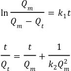
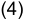
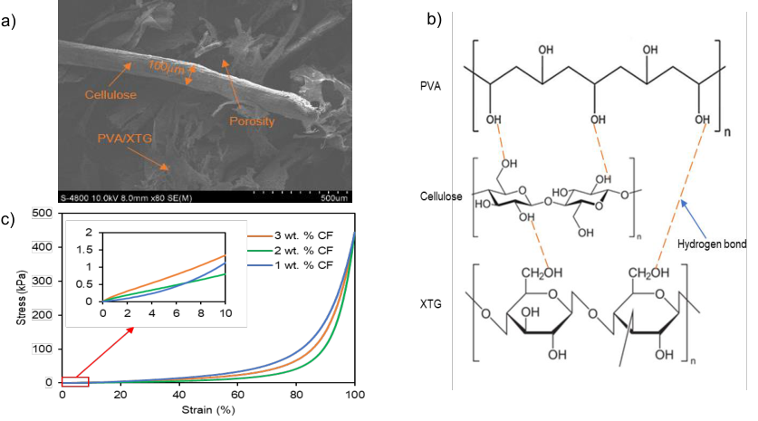
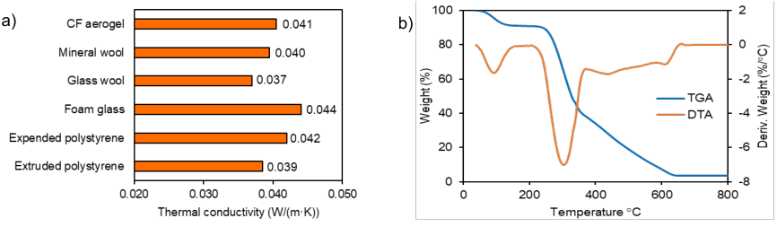
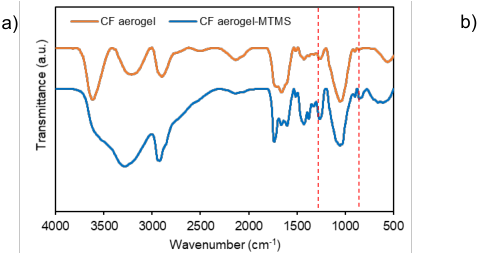
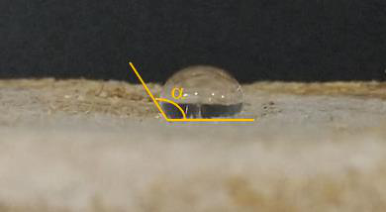
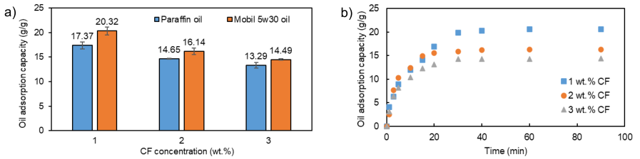

709 

## _**CHEMICAL ENGINEERING TRANSACTIONS**_ 

## _**VOL. 88, 2021**_ 

Guest Editors: Petar S. Varbanov, Yee Van Fan, Jiří J. Klemeš Copyright © 2021, AIDIC Servizi S.r.l. **ISBN** 978-88-95608-86-0; **ISSN** 2283-9216 

A publication of The Italian Association of Chemical Engineering Online at www.cetjournal.it 

DOI: 10.3303/CET2188118 

## Green Fabrication of Bio-based Aerogels from Coconut Coir for Heat Insulation and Oil Removal 

Kim H. Ho[a,b] , Phuong X. T. Nguyen[a,c] , Nga H. N. Do[a,b] , Kien A. Le[d] , Phung K. Le[a,b,] * a Refinery and Petrochemical Technology Research Center, Ho Chi Minh City University of Technology (HCMUT), 268 Ly Thuong Kiet Street, District 10, Ho Chi Minh City, Vietnam 

b Vietnam National University Ho Chi Minh City, Linh Trung Ward, Thu Duc District, Ho Chi Minh City, Vietnam 

> c Hong Bang International University (HIU), 215 Dien Bien Phu Street, Ward 15, Binh Thanh District, Ho Chi Minh City, Vietnam d Institute for Tropical Technology and Environmental Protection, 57A Truong Quoc Dung Street, Phu Nhuan District, Ho Chi Minh City, Vietnam phungle@hcmut.edu.vn 

Each year, the global annual production of coconut fibre (CF) is around 350×10[3] t, while they are utilized for fine art, fertilization, and animal feed. However, there have not seen many engineering applications to utilize these materials. The coir with high cellulose content of over 40 % has potential for high-value engineering applications like fabricating cellulose-based aerogels. Recently, the cellulose aerogel from CF was formed using a sol-gel method in an NaOH/Urea solution, with an anticipated completion time of 7 d due to the time required for gelation and solvent exchange, which might take up to 4 d. This demonstrates that the present approach is subject to several time limitations. To improve this, for the first time, a novel fabrication of aerogels from the CF with chemical pre-treatment in advance has been successfully developed by using polyvinyl alcohol (PVA) and xanthan gum (XTG) as biodegradable binders. The treated CFs are dispersed homogeneously into a PVA/XTG solution, followed by freeze-drying to remove water, leaving behind a highly porous called CF aerogel. The influences of CF content on CF aerogels' physical and mechanical characteristics, as well as oil adsorption and thermal conductivity, have all been thoroughly investigated. For oil removal, the fabricated CF aerogels are surface-modified with methyltrimethoxysilane (MTMS) to enhance their hydrophobicity. This method required 2 times less time and used fewer chemicals while retaining the same oil adsorption capabilities of up to 20 g/g as · previous CF aerogel and demonstrating additional good insulation of 0.040 W/(m K). Thus, this study provides 

a new novel approach to synthesize an oil-absorbing and insulating CF aerogel. 

## **1. Introduction** 

Water pollution is one of the worrying concerns in Vietnam and other developing countries, and over 7.3×10[6] barrels of oil have been released into natural aquatic habitats. There are numerous reasons for water pollution, including oil-contaminated wastewater from industrial zones, municipal sources, marine transport, and accidents (Karatum et al., 2016). Faced with those urgent situations, scientists in all over the world are focusing on developing advanced materials that are capable of handling environmental issues but are eco-friendly and affordable. Aerogel is one such material that attracts many researchers because of its remarkable properties such as ultra-low density (0.013-0.033 g/cm[3] ), high porosity (96.9-98.8 %), low thermal conductivity (0.030· 0.034 W/(m K)), and excellent adsorption (Luu et al., 2020). Thus, aerogel is an effective product for heat insulation in buildings. Besides, aerogel has proven its ability to clean oil spill thanks to its outstanding adsorption of nearly 40 times its weight (Do et al., 2020). Furthermore, the precursor to create aerogel is diverse from pure chemicals (synthetic polymer, silicon alkoxide) to agricultural waste which is mostly composed of cellulose. Coconut fibre (CF) is one of the potential raw materials to fabricate aerogels because its chemical composition contains 36-50 wt.% cellulose, 30-46 wt.% lignin, 10-20 wt.% hemicellulose, and 3-4 wt.% pectin (Adeniyi et al., 2019). The coir has several advantages such as low cost, abundancy, low density 1.12 ( g/cm[3] ), and excellent mechanical strength (tensile strength 178 MPa and tensile modulus 22.6 GPa) (Ogunbode et al., 2017). Currently, there is very little research on the synthesis of aerogel from CF. Specifically, Fauziyah et al. have successfully synthesized cellulose-based aerogels from CF using a sol-gel technique in a NaOH/Urea solution 

Paper Received: 19 June 2021; Revised: 27 July 2021; Accepted: 11 October 2021 Please cite this article as: Ho K.H., Nguyen P.X.T., Do N.H.N., Le K.A., Le P.K., 2021, Green Fabrication of Bio-based Aerogels from Coconut Coir for Heat Insulation and Oil Removal, Chemical Engineering Transactions, 88, 709-714  DOI:10.3303/CET2188118 

710 

for oil-spill cleanup (Fauziyah et al., 2019). However, implementing this method requires a lot of time (about 7 d), more chemicals (NaOH, Urea and C2H5OH) and a large amount of wastewater from solvent exchange needs to be treated before being discharged into the environment. In recent years, polyvinyl alcohol (PVA) has become a popular crosslinking agent used to synthesize cellulose aerogel. PVA helps stabilize fibers through hydrogen bonding between hydroxyl groups on PVA and cellulose (Do et al., 2020). This is a cost-effective method that is easy to implement, consumes less time and chemicals, especially without emitting any solvents into the environment. Therefore, this green synthesis method has also been mentioned in previous works to synthesize cellulose-based aerogels from various agro-waste such as pineapple leaf fibres (Luu et al., 2020), and rice straw (Tran et al., 2020), while CF has not yet been applied. However, the fabricated aerogels are hydrophilic, they are incapable of absorbing the oil in the water. Affordable methyltrimethoxysilane (MTMS) is consequently introduced as a coating agent to enhance their hydrophobicity (Feng et al., 2015). In this study, CF’s cellulosebased aerogels have been synthesized for the first time via physical cross-linking by utilizing a combination of PVA and xanthan gum (XTG), which is a sedimentation aid for uniform fiber distribution to solve the problem of CF sedimentation in the solution due to the density of CF being larger than 1 g/cm[3] – density of water. The CF aerogels are studied their morphology, chemical structure, physical and mechanical properties as well as thermal conductivity, where thermal conductivity is a criterion that has not been evaluated in prior research of CF aerogel. Finally, the developed aerogels are coated with MTMS to investigate their oil spill cleaning. 

## **2. Experiment** 

## **2.1 Materials and chemicals** 

Raw CFs are collected from the coconut processing factory in Ben Tre province, Viet Nam. Sodium hydroxide (NaOH), MTMS, XTG, and PVA flakes are purchased from Sigma-Aldrich. All the solutions are prepared in distilled water (DW). Motor oil 5w30 and paraffin oil used in adsorption test are purchased commercially. 

## **2.2 Pretreatment of CFs** 

The raw CFs are washed and ground into smaller fibres, roughly 125 m in diameter and about 5 mm in length. The ground CFs are then delignified by NaOH 6 % with a liquid-to-solid ratio of 20 mL/g at 90 C. The mixture is stirred continuously within 4 h at ambient condition. The obtained pulp is filtrated and washed by DW to remove the by-products such as excessive NaOH, lignin and hemicellulose. The wet pulp is dried at 80 C to constant weight. Finally, the dry pulp is milled to a smaller size (diameter of 50-125 m, length of about 1 mm) and used as a precursor for further cellulose aerogel synthesis. 

## **2.3 Fabrication method of the CF aerogels** 

The treated CFs at various contents of 1.0, 2.0, and 3.0 wt.% are dispersed into the binder solution containing 0.6 wt.% PVA and 0.3 wt.% XTG by a magnetic stirrer for 1 h at 30 C. After that, the mixture is sonicated for 30 min for homogenization and air removal. The obtained suspension is incubated at 70 C for 2 h to speed up the physical interaction among hydroxyl groups on the cross-linker PVA/XTG and treated CFs. Finally, the mixture of CFs/PVA/XTG is slowly frozen at -5 C for 24 h before being freeze-dried to create CF aerogels. 

## **2.4 Development of the hydrophobic CF aerogels** 

The synthesized CF aerogels are placed in an airtight box contatining a tiny, open vial of MTMS in advance. The box is capped and warmed in an oven at 70 C for 5 h to promote silanization of hydroxyl groups. After that, the excess MTMS is removed from the container in a fume hood, and the coated CF aerogels are collected for further investigation of oil adsorption. 

## **2.5 Characterization** 

Each prepared sample is measured its weight and volume to determine density. This sample density ( 𝜌𝑎 ) and the average density of components ( 𝜌𝑐 ) are used to determine the sample porosity () as shown in Eq(1). 

 = (1 −𝜌𝑎/𝜌𝑐) × 100 (1) 

Scanning electron microscopy (SEM Hitachi S4800) conducted at 5 kV is used to explore the morphologies of CF aerogels. Fourier-transform infrared spectroscopy (FTIR PerkinElmer Spectrum10.5.2) was used to examine the chemical structures of uncoated and MTMS coated samples across the wavenumber range of 400-4000 cm[-] 1. To evaluate the thermal stability of the aerogels, thermogravimetric analysis (TGA) and differential thermal analysis (DTA) are carried out by Labsys Evo (TG-DSC 1600 C) from Setaram (France). The samples are heated in the air to temperatures ranging 30 C to 800 C in air and then cooled to room temperature. 

711 

Thermal conductivities of CF aerogels are investigated by C-Therm TCi Thermal Conductivity Analyzer (CTherm Technologies, Fredericton, NB, Canada) at room temperature. Each sample is measured three times and an average value is calculated. The compressive moduli of the aerogels were measured using an Instron 5500 micrometer (Instron, Norwood, MA, USA). Specimens are loaded at a rate of 1.0 mm/min during the test. The hydrophobicity of CF aerogels after coating with MTMS is determined using a VCA Optima series (USA) water contact angle measurement device. The oil adsorption test is carried out in accordance with the ASTM F726-06 standard to determine their oil adsorption capability. CF aerogels with MTMS coating are weighed and soaked in paraffin oil (100 cSt, 40 C) and motor oil 5w30 (63.2 cSt, 40 C) for 2 h, respectively. After 2 h, the samples are taken out, drained to remove the excessive oil on their surface in 30 s, and weighed once more. Eq(2) is used to calculate the oil adsorption capacity of CF aerogels: 

## 𝑄𝑒 = (𝑚𝑒 −𝑚𝑖)/𝑚𝑖 

where 𝑄𝑒 (g/g) is the aerogel’s maximal oil adsorption capacity, 𝑚𝑖 (g) and 𝑚𝑒 (g) are its mass before and after the test. 

To investigate the kinetics of oil adsorption, the above experiment is conducted but the aerogel is taken out after 1, 3, 5, 10, 15, 20, 30, 40, 60 and 90 s, followed by determining its adsorption capacity. In Eqs(3) and (4), two typical pseudo-first and pseudo-second order models are tested to determine the appropriate one. 

By plotting ln 𝑄𝑚𝑄−𝑄𝑚 𝑡 against time, the slope of the best linear fit yields 𝑘1 value in Eq(3), while 𝑄𝑡𝑚 and 𝑘21𝑄𝑚2 in Eq(4) are determined by plotting 𝑄𝑡𝑡 against time. The oil adsorption capabilities of the aerogel are 𝑄𝑚 and 𝑄𝑡 , respectively, at equilibrium and at time t. 

## **3. Results and discussion** 

## **3.1 Morphologies and properties of the CF aerogels** 

**----- Start of picture text -----** 
a)  b) c) **----- End of picture text -----** 

_Figure 1: (a) Morphology of CF aerogel with (b) a proposed mechanism for creating CF aerogel, and (c) stress-strain curves of CF aerogels with increasing CF content._ 

712 

Figure 1 shows the morphologies of CF aerogel without discernible organization of CFs. The width of CFs is determined to be about 100 µm, this CFs is crosslinking with PVA/XTG co-crosslinker by hydrogen bonds, as observed in Figure 1b. Hydrogen bonds are formed among various hydroxyl functional groups on CF, PVA chains and XTG chains, implying that CF aerogels are self-assembled through hydrogen bonding. 

The effect of CF content on the physical parameters including density and porosity of CF aerogels are tabulated in Table 1. As can be seen, an increase in CF content from 1.0 wt.% to 3.0 wt.% causes the aerogels to be heavier and denser as evidenced by an increase their density from 0.028 to 0.045 g/cm[3] . However, an opposite trend is true for porosity because it decreases from 97.76 to 96.30 % with increasing CF content. It can be explained that when more fibers are present, the aerogel has fewer air pockets, and its structure becomes more packed. Nevertheless, higher CF content prevents the aerogel from shrinkage as well as keep its structure stable and durable. 

The compressive test is carried out to examine the durability of CF aerogels under a loading of 1 kN, and the results are displayed in Figure 1c and Table 1. Young’s modulus of CF aerogels is determined about 7.63-12.96 kPa indicating their good flexibility. When higher CF content is used, the Young’s modulus of CF aerogel increases as well. To the best of our knowledge, CFs tend to intertwine, thus increasing the hydrogen interaction among hydroxyl groups on fibers and binders. The higher CF content, the stronger the fiber network and hence, the more strength toward compression for the aerogel. When compared to other fiber-based aerogels, CF aerogels have a higher compressive modulus than PF aerogels (0.47-7.86 kPa) (Luu et al., 2020), and recycled polyethylene terephthalate aerogels (1.16-2.87 kPa) (Koh et al., 2018). 

_Table 1: Physical properties, mechanical strength, and thermal conductivity of cellulose-based aerogels with various CF contents._ 

|CF content|Density (g/cm3)|Porosity (%)|Compressive Young’s|Thermal conductivity|
|---|---|---|---|---|
|(wt.%)|||modulus(kPa)|(W/(m·K))|
|1.0|0.0280.001|97.760.08|7.630.35|0.0400.001|
|2.0|0.0370.001|97.750.11|10.940.14|0.0410.001|
|3.0|0.0450.002|96.300.18|12.960.07|0.0410.001|

## **3.2 Heat insulation and thermal stability of CF aerogels** 

CF aerogel is expected to have low thermal conductivity because of its porous structure containing countless pores. The results shown in Table 1 have proven this hypothesis with extremely low thermal conductivity of · 0.040-0.041 W/(m K). However, the CF content has slightly effect on the effective thermal conductivity as seen from Table 1. Consequently, when compared to the top five commercial products, CF aerogel is a potential choice for thermal insulation (Figure 2a). 

Thermal ability is one of the main properties that should be analyzed for heat insulation materials. TGA and DTA results of CF aerogels are illustrated in Figure 2b. As witnessed, a mass loss of 10 wt.% between 30 C and 170 C is due to moisture elimination of the CF aerogel. However, there is no mass loss in the range of 170-250 C. The next degradation is in 250-600 C because of destruction of fiber matrices and binders with the initial decomposition temperature of 250-300 C. Above 600 C, the sample is almost completely degraded and only 5 wt.% ash remains. 

**----- Start of picture text -----** 
a)  b) **----- End of picture text -----** 

_Figure 2: (a) Thermal conductivity of CF aerogels compared to that of top 5 commercial products, and (b) TGA and DTA graphs of the CF aerogel composed of 3.0 wt.% CF._ 

713 

## **3.3 Oil adsorption of modified CF aerogels** 

FTIR analysis is conducted on both uncoated and MTMS-coated CF aerogels in order to examine the surface properties. As illustrated in Figure 3a, the peaks at 3300 cm[-1] , 2920 cm[-1] , 2135 cm[- 1] , 1427 cm[-1] , 1377 cm[-1] , and 1050 cm[-1] are typical bands reported for cellulose chains (Liu et al., 2015). Additionally, the modified cellulose aerogels display peaks at 845 cm[-1 ] and 1261 cm[-1] . These are Si-O-Si and C-Si asymmetric stretching, respectively (Zhu et al., 2013). The silicon atoms come from -O-Si(CH3)3 groups, which replace the OH groups in silanization. The presence of such groups results in the hydrophobicity of the MTMS-coated CF aerogels.  Figure 3b confirms the hydrophobicity of modified aerogels with high WCA of approximately 135 . 

**----- Start of picture text -----** 
a)  b) **----- End of picture text -----** 

_Figure 3: (a) FTIR spectra of CF aerogel uncoated and coated with MTMS, and (b) its water contact angle (WCA)._ 

All surveyed CF aerogels are good oil spill sorbents, as Figure 4a shows reasonable oil adsorption capacities of 13.29-20.32 g/g. Because of the high porosity in CF aerogels, much oil can be trapped in their air pockets. Increasing CF content or the viscosity of oil significantly decreases the maximum oil adsorption capacity. Moreover, this maximum value of the CF aerogels is higher than that of rice straw aerogel (13 g/g) (Tran et al., 2020) and coir aerogel having NaOH/Urea cross-linking (18 g/g) (Fauziyah et al., 2019), and equivalent to that of polyurethane sorbents (21-23 g/g) (Li et al., 2015). 

**----- Start of picture text -----** 
a)  b) **----- End of picture text -----** 

_Figure 4: (a) Oil adsorption capacity of MTMS-coated CF aerogels with 5w30 and paraffin oils, and (b) their oil adsorption kinetics on 5w30 oil with increasing CF content._ 

5w30 motor oil is utilized to measure the adsorption capacity of CF aerogels over time in order to examine their oil adsorption kinetics. Figure 3b shows high affinity of the MTMS-coated CF aerogels with oil, as the sorption rates of all three aerogels are high, and the equilibria are reached within 40 s. This fast adsorption property of the CF aerogels can be attributed to their high porosity, their narrow pores, and large capillary force. CF aerogels with various fibre contents clearly show distinctive performance along with difference in their porosity. Two common models, a pseudo-first order and a pseudo-second order, are applied to study their adsorption kinetics. The R[2] and k values for both models are calculated and tabulated in Table 2. Since the pseudo-second order model’s R[2] values for CF aerogels are near to 1, it can be concluded that this is the appropriate model for oil adsorption kinetics of CF aerogels. 

714 

_Table 2. Analysis of oil adsorption kinetics of MTMS-coated CF aerogels following to the pseudo-first and pseudo-second order models._ 

|CF content(wt.%)||1.0|2.0|3.0|
|---|---|---|---|---|
|Pseudo-first order|R2 k1|0.9428 0.0738|0.8428 0.0621|0.8133 0.0590|
|Pseudo-second order|R2 k2|0.9957 0.0007|0.9982 0.0007|0.9988 0.0011|

## **4. Conclusions** 

For the first time, fiber-based aerogels have been successfully developed from CFs by using PVA and XTG as binders. The as-fabricated CF aerogels exhibit low density (0.028-0.045 g/cm[3] ), high porosity (96.03-97.76 %), a low thermal conductivity of 0.040-0.041 W/(m·K), and can adsorb oil nearly 20 times their weight and have proven their great potential in oil-spill cleaning up. Therefore, CF aerogels are evaluated as a versatile material from natural resources that is synthesized via an environmentally friendly route and has potential applications in the construction industry (moisture resistant insulation board) or in oil-spill treatment. Experiments on their adsorption of dye, heavy metal, and organic solvent should be conducted in the future to demonstrate the capability of CF aerogel in wastewater treatment, they should be further functionalized with amine groups to enhance their adsorption of dye, heavy metal, and organic solvents. 

## **Acknowledgement** 

We acknowledge the support of time and facilities from Ho Chi Minh City University of Technology (HCMUT), VNU-HCM for this study. 

## **References** 

- Adeniyi A. G., Onifade D. V., Ighalo J. O., Adeoye A. S., 2019, A review of coir fiber reinforced polymer composites, In Composites Part B: Engineering, Vol 176. DOI: 10.1016/j.compositesb.2019.107305 

- Do N. H. N., Luu T. P., Thai Q. B., Le D. K., Chau N. D. Q., Nguyen S. T., Le P. K., Phan T. N., Duong H. M., 2020, Advanced fabrication and application of pineapple aerogels from agricultural waste, Materials Technology, 35(11–12), 807–814. 

- Fauziyah M., Widiyastuti W., Balgis R., Setyawan H., 2019, Production of cellulose aerogels from coir fibers via an alkali–urea method for sorption applications, Cellulose, 26, 9583–9598. 

- Feng J., Nguyen S. T., Fan Z., Duong H. M., 2015, Advanced fabrication and oil absorption properties of superhydrophobic recycled cellulose aerogels, Chemical Engineering Journal, 270, 168–175. 

- Karatum O., Steiner S. A., Griffin J. S., Shi W., Plata D. L., 2016, Flexible, Mechanically Durable Aerogel Composites for Oil Capture and Recovery, ACS Applied Materials and Interfaces, 8(1), 215–224. 

- Koh H., Le D., Ng G., Zhang X., Phan T. N., Kureemun U., Duong H., 2018, Advanced Recycled Polyethylene Terephthalate Aerogels from Plastic Waste for Acoustic and Thermal Insulation Applications, Gels, 4(2), 43. 

- Li B., Liu X., Zhang X., Zou J., Chai W., Lou Y., 2015, Rapid adsorption for oil using superhydrophobic and superoleophilic polyurethane sponge, Journal of Chemical Technology and Biotechnology, 90(11), 2106– 2112. 

- Liu L., Gao Z. Y., Su X. P., Chen X., Jiang L., Yao J. M., 2015, Adsorption removal of dyes from single and binary solutions using a cellulose-based bioadsorbent, ACS Sustainable Chemistry and Engineering, 3(3), 432–442. 

- Luu T. P., Do N. H. N., Chau N. D. Q., Lai D. Q., Nguyen S. T., Le D. K., Thai Q. B., Le P. T. K., Duong H. M., 2020, Morphology control and advanced properties of bio-aerogels from pineapple leaf waste, Chemical Engineering Transactions, 78, 433–438. 

- Ogunbode E. B., Egba E. I., Olaiju O. A., Elnafaty A. S., Kawuwa S. A., 2017, Microstructure and mechanical properties of Green concrete composites containing coir fibre, Chemical Engineering Transactions, 61(November), 1879–1884. 

- Tran D. T., Nguyen S. T., Do N. D., Thai N. N. T., Thai Q. B., Huynh H. K. P., Nguyen V. T. T., Phan A. N., 2020, Green aerogels from rice straw for thermal, acoustic insulation and oil spill cleaning applications, Materials Chemistry and Physics, 253, 123363. 

- Zhu Q., Chu Y., Wang Z., Chen N., Lin L., Liu F., Pan Q., 2013, Robust superhydrophobic polyurethane sponge as a highly reusable oil-absorption material, Journal of Materials Chemistry A, 1(17), 5386–5393. 

