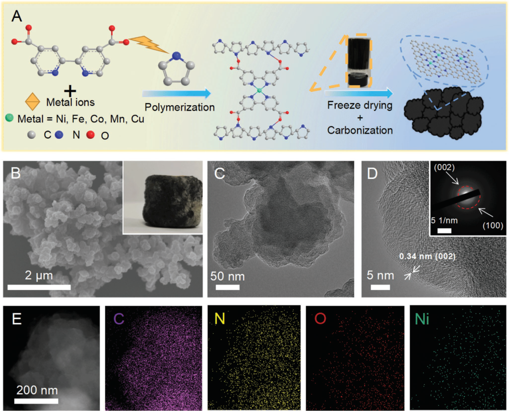
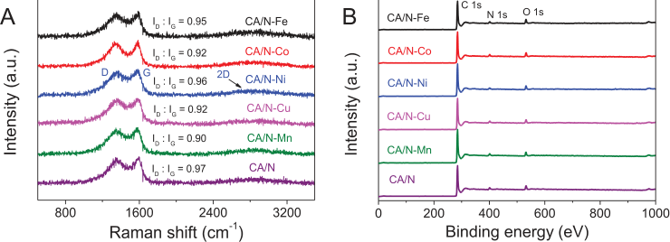
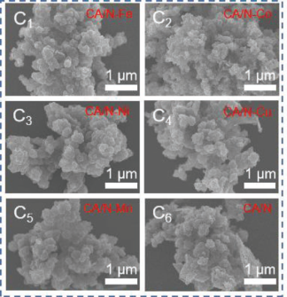
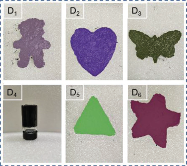
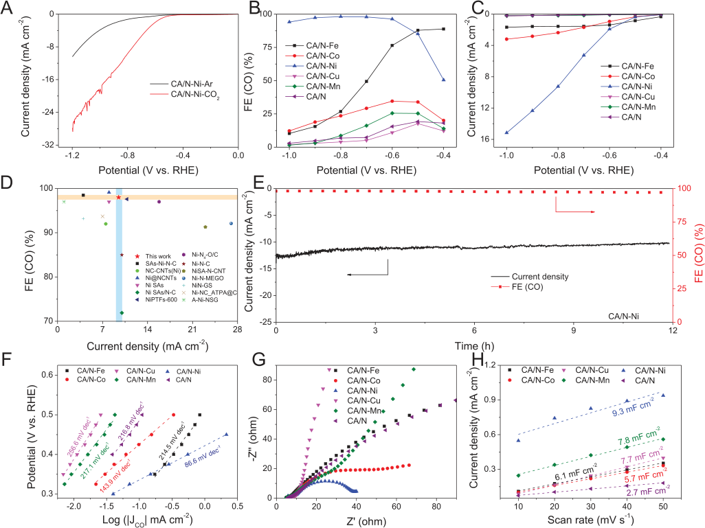
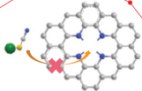
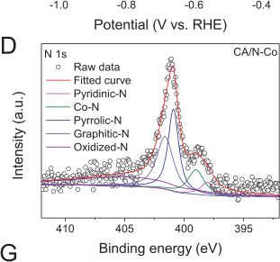
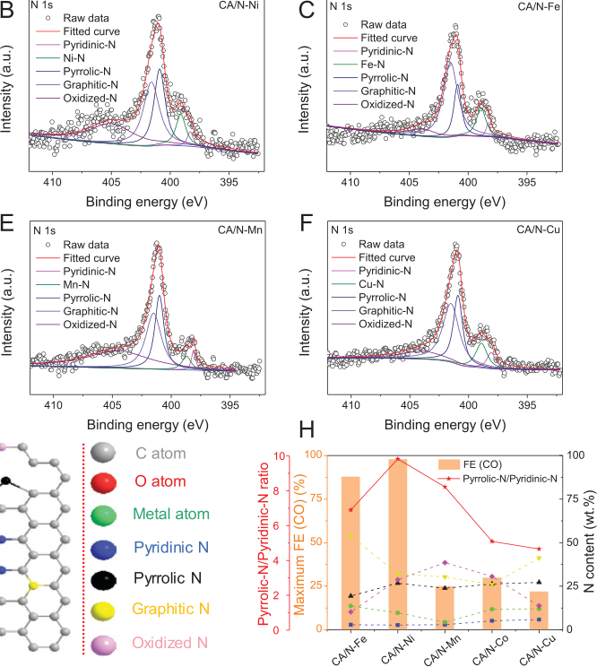
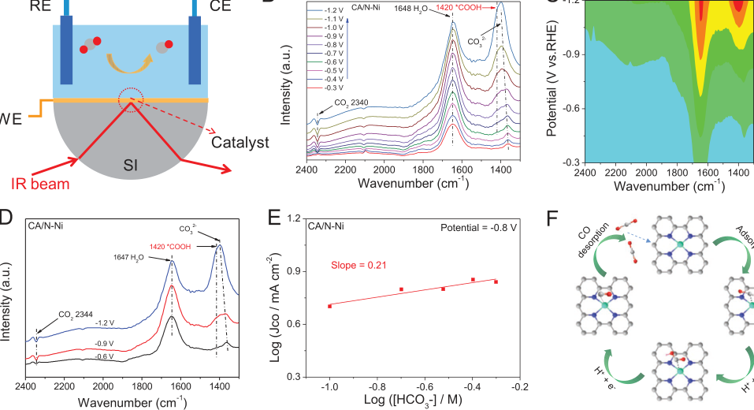
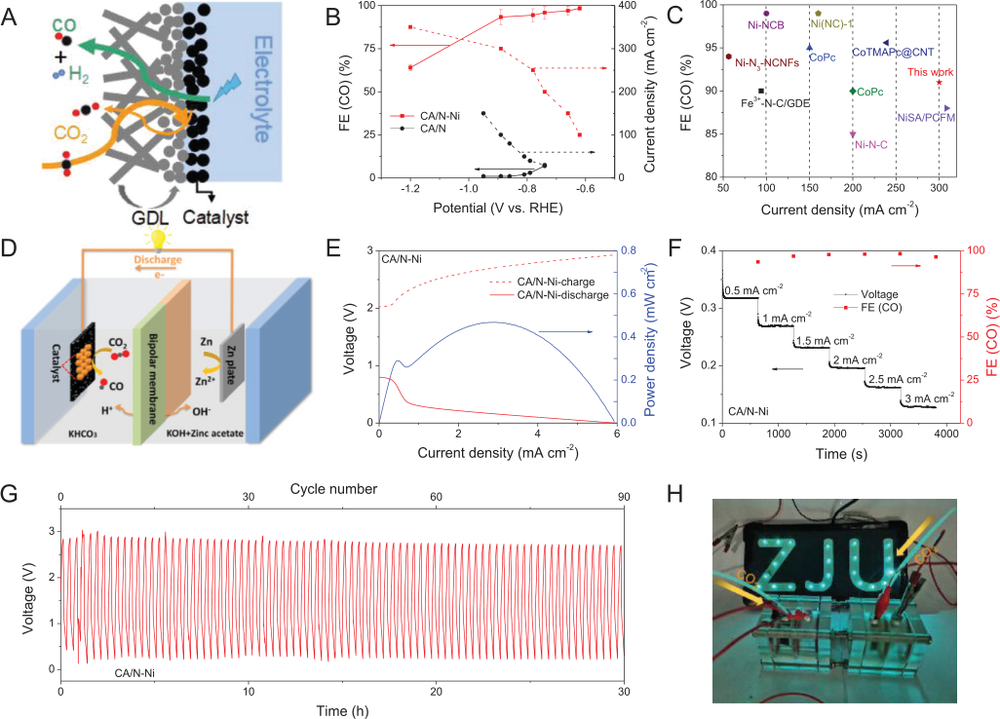

**ReseaRch aRticle** 

**www.afm-journal.de** 

## **Hierarchical Cross-Linked Carbon Aerogels with Transition Metal-Nitrogen Sites for Highly Efficient Industrial-Level CO Electroreduction 2** 

_Yikai Zhang, Xinyue Wang, Sixing Zheng, Bin Yang, Zhongjian Li, Jianguo Lu, Qinghua Zhang, Nadia Mohd. Adli, Lecheng Lei, Gang Wu, and Yang Hou*_ 

## **1. Introduction** 

**Developing highly efficient carbon aerogels (CA) electrocatalysts based on transition metal-nitrogen sites is critical for the CO2 electroreduction reaction (CO2RR). However, simultaneously achieving a high current density and high Faradaic efficiency (FE) still remains a big challenge. Herein, a series of unique 3D hierarchical cross-linked nanostructured CA with metal-nitrogen sites (M**  **N, M = Ni, Fe, Co, Mn, Cu) is developed for efficient CO2RR. An optimal CA/N-Ni aerogel, featured with unique hierarchical porous structure and highly exposed M-N sites, exhibits an unusual CO2RR activity with a CO FE of 98% at −0.8 V. Notably, an industrial current density of 300 mA cm[[−][2]][[2]] with a high FE of 91% is achieved on CA/N-Ni aerogel in a flow-cell reactor, which outperforms almost all previously reported M-N/carbon based catalysts. The CO2RR activity of different CA/N-M aerogels can be arranged as Ni, Fe, Co, Mn, and Cu from high to low. In situ spectroelectrochemistry analyses validate that the rate-determining step in the CO2RR is the formation of *COOH intermediate. A Zn**  **CO2 battery is further assembled with CA/N-Ni as the cathode, which shows a maximum power density of 0.5 mW cm[[−][2]][[2]] and a superior rechargeable stability.** 

Electrochemical CO2 reduction reactions (CO2RRs) powered by intermittent recurring energies have been identified one of the most promising ways to alleviate a series of environmental and energy **2RR. An RR. An** problems caused by excessive emission of CO2.[[1]] Nevertheless, slow interfacial molecular transport, low electron transfer, and undesired competing hydrogen evolu- **[[−][2]][[2]]** tion reaction are involved in the catalytic process that essentially limits its practical applications.[[2]] Considerable efforts have been devoted to developing highly efficient noble metal-based electrocatalysts as electrodes for CO2 electroreduction reaction (CO2RR) in aqueous solutions.[[3]] Unfortunately, these electrode materials usu- **[[−][2]][[2]] and** ally suffer from limited availability, high cost, and poor selectivity. To address these issues, transition metal-nitrogen-carbon (M-NC) catalysts have been recently explored used as efficient CO2RR electrocatalysts because of their preferable advantages, including earth-abundant elements distribution, low cost, and high intrinsic activity caused by its unique 3d electron orbitals.[[4]] However, until now, most of the reported M-NC catalysts still face the problems of ambiguous active center and uncontrollability of catalyst components (e.g., functionalized doping of heteroatom).[[5]] Moreover, due to the low solubility of CO2 in aqueous electrolyte and the small contact area between CO2 molecules and pores inside the catalyst, those reported current densities for CO2 conversion at high Faradaic efficiency (FE) of > 90% hardly satisfy the industrialrelevant current levels of > 100 mA cm[−][2] , and still needs further improvement.[[6]] For example, Jiao et al.[[7]] reported a universal synthetic strategy to synthesize a family of single-atom metal anchored N-doped carbon catalysts (M1NC; M = Fe, Co, Ni, and Cu) by the pyrolysis of M-PCN-222 followed by ZrO2 removal, where Ni1NC catalyst showed a 96.8% FE for CO − production at 0.8 V associated with a current density of 27 mA cm[−][2] via CO2RR. Wang et al.[[8]] reported a universal domino reaction strategy for mass production of M-SA/NC catalysts (M-SA = Fe, Co, Ni, Mn, Mo, Pd single atoms) by the ballmilling polyaniline with appropriate metal salt, in which the Ni-SA/CN exhibited a high current density of 213.2 mA cm[−][2] 

Y. Zhang, X. Wang, S. Zheng, B. Yang, Z. Li, Q. Zhang, L. Lei, Y. Hou Key Laboratory of Biomass Chemical Engineering of Ministry of Education College of Chemical and Biological Engineering Zhejiang University Hangzhou 310027, China E-mail: yhou@zju.edu.cn J. Lu State Key Laboratory of Silicon Materials School of Materials Science and Engineering Zhejiang University Hangzhou 310027, China N. Mohd. Adli, G. Wu Department of Chemical and Biological Engineering University at Buffalo The State University of New York Buffalo, NY 14260, USA L. Lei, Y. Hou Institute of Zhejiang University–Quzhou Quzhou 324000, China The ORCID identification number(s) for the author(s) of this article can be found under https://doi.org/10.1002/adfm.202104377. 

**DOI: 10.1002/adfm.202104377** 

**2104377 (1 of 10)** 

_Adv. Funct. Mater._ **2021** , 2104377 

© 2021 Wiley-VCH GmbH 

**www.afm-journal.de** 

**www.advancedsciencenews.com** 

with a 96.9% CO FE at −0.55 V for CO2RR. Although certain breakthroughs have been achieved in attaining industrial current density of > 100 mA cm[−][2] ,[[9]] it is still highly desirable but challenging to achieve a larger conversion efficiency at higher current density (e.g., ≥ 300 mA cm[−][2] ) for CO2RR. 

Recently, carbon aerogel, a hierarchical 3D porous network structure, has intrigued tremendous interests owing to their numerous advantages.[[10]] Carbon aerogels often possess highly exposed active sites, excellent electrolyte permeability and water wettability, and abundant interconnected channels of mass and electron, endowing their widely applications in multitudinous heterogeneous reactions.[[11]] This concept/architecture has provided new opportunities for exploring highly efficient carbonbased aerogels electrocatalysts for CO2RR catalysis. Although connecting carbon aerogels and metal-nitrogen (M-N)  structures is challenging from a synthetic point of view because of the difficulties in simultaneous stabilizing M-N atoms on carbon supports via chemical interaction[[12]] and inhibiting the metal agglomeration,[[13]] in comparison, it is more challenging to give a clear understanding of the catalytic sites' natures and performance trends of carbon aerogels with different M-N sites, thus enhancing the whole reaction efficiency and boosting catalyst development. Moreover, underlying catalytic mechanisms of CO2RR require further discussion. 

Herein, we develop a universal hydrogel–aerogel transformation strategy to synthesize a series of hierarchical cross-linked = nanostructured carbon aerogels with M-N sites (CA/N-M, M Ni, Fe, Co, Mn, and Cu). Profited by the 3D frameworks with interconnected channels and abundant isolated M-N sites, the newly developed CA/N-Ni aerogel presents a high CO selectivity of 98% at −0.8 V via CO2RR. In a flow-cell reactor, the asprepared CA/N-Ni aerogel even delivers a high current density of 300 mA cm[−][2] with a CO FE of 91%, which are not only tens of times higher than that of test in H-type cell (9.24 mA cm[−][2] ), but also exceed a majority of other reported M-N/carbon based electrocatalysts in CO2RR. Furthermore, the CO2RR activity of CA/N-M aerogels shows a negative correlation with different metals, following the order of CA/N-Cu < CA/N-Mn < CA/NCo < CA/N-Fe < CA/N-Ni. A series of designed experiments combined with structural characterizations unveil the NiN sites in the CA/NNi aerogel acted as CO2RR catalytic centers to promote the protonation of adsorbed CO2. The formation of *COOH intermediate is the rate-determining step toward CO generation, identified by in situ attenuated total reflectanceFourier transform infrared (ATR-FTIR). Further, the CA/N-Ni aerogel works as a cathode in a ZnCO2 battery and exhibits a power density reach up to 0.5 mW cm[−][2] with long-term durability of 30 h for CO production. 

## **2. Results and Discussion** 

The fabrication process of 3D CA/N-M aerogels (M = Ni, Fe, Co, Mn, and Cu) is illustrated in **Figure 1** A. The precursor of 3D CA/N-M hydrogel was synthesized by a chemical crosslinking interaction between polypyrrole (PPY) and 2,2′-bipyridine4,4′-dicarboxylic acid (BPDC) with M-N species. During the crosslinking reaction process, the metal ions could coordinate with the pyridinic-N of BPDC to form BPDC/M-N composite, as 

evidenced by ultraviolet–visible spectroscopy results (Figure S1, Supporting Information).[[11b,12]] The resulting BPDC/M-N composite was further cross-linked with PPY chains through hydrogen bonding and electrostatic interactions. As a result, the CA/N-M hydrogel with a 3D polymer network was obtained (Figure S2, Supporting Information).[[14]] After pyrolyzed at high temperature, the 3D CA/N-M hydrogel was transformed into 3D CA/N-M aerogel, as revealed by thermogravimetric analysis (TGA, Figure S3, Supporting Information). During the carbonized process, the PPY served as a 3D carbon skeleton to provide a significant carbon source for the formation of graphitized carbon structure, and the high content of N species in the hydrogel anchored with the metal atoms to form homogeneous M-N sites with temperature increasing; in this process, the hierarchical porous structure was gradually formed via a partial evaporation of N species.[[15]] Eventually, the cross-linked PPY chains combined with BPDC/M-N provided abundant channels after calcination for mass transport. The influence of pyrolysis temperatures (700 to 1000 °C), metal types (Ni, Fe, Co, Mn, and Cu), and corresponding metal amounts of CA/N-M aerogels on CO2RR activity were systematically explored (Figures S4–S7, Supporting Information). The optimized pyrolysis temperature and metal types/amounts were 1000 °C and Ni species with 0.09 mmol loading, respectively. Thus, the CA/N-Ni aerogel was selected as a representative example. 

Field-emission scanning electron microscopy (FESEM) image (Figure 1B) of CA/N-Ni aerogel showed a nanoparticlelike 3D cross-linked morphology, and no apparent changes in the morphology between CA/N-Ni hydrogel and CA/N-Ni aerogel (Figure S8, Supporting Information) were observed, indicating good structure stability of CA/N-Ni aerogel. Transmission electron microscopy (TEM) image of CA/N-Ni (Figure 1C) displayed a nano-crosslinked structure with an average diameter of ≈200 nm, and no obvious Ni nanoparticles were observed (Figure S9, Supporting Information). The high-resolution TEM (HRTEM) image for CA/N-Ni exhibited a lattice distance of 0.34 nm, which belonged to the (002) plane of graphitized carbon (Figure 1D and Figure S9, Supporting Information).[[16]] The partially graphitized nature of CA/N-Ni was further supported by corresponding selected area electron diffraction (SAED) pattern (inset of Figure 1D).[[17]] Energy-dispersive X-ray spectroscopy (EDX) images (Figure 1E) showed a homogeneous distribution of C, N, O, and Ni elements in CA/N-Ni aerogel, indicating the Ni species was uniformly dispersed in CA/N-Ni aerogel.[[18]] 

Following this universal hydrogel–aerogel transformation strategy, we successfully synthesized a series of CA/N-M aero= gels (M Ni, Fe, Co, Mn, and Cu). The preparation method of CA/N-M aerogels was similar to that for CA/N-Ni aerogel, except that other metal salts replaced the precursor of Ni species. X-ray diffraction (XRD) patterns of CA/N-M aerogels exhibited only two peaks centered at 26.2° and 44.0° belonging to the (002) and (100) planes of carbon (Figure S10, Supporting Information), and the diffraction peaks of corresponding metal nanoparticles were absent in all five patterns.[[19]] Additionally, Raman spectra of these CA/N-M aerogels showed two strong D and G bands at 1358 and 1585 cm[−][1] , respectively, associated with a weak 2D band at 2900 cm[−][1] ( **Figure 2** A). The ID: IG value of 0.96 for CA/N-Ni was similar to those values for CA/N-Fe 

**2104377 (2 of 10)** 

_Adv. Funct. Mater._ **2021** , 2104377 

© 2021 Wiley-VCH GmbH 

**www.afm-journal.de** 

**www.advancedsciencenews.com** 

**Figure 1.** A) Schematic illustration of the preparation process for CA/N-M aerogels, B) FESEM image of CA/N-Ni aerogel (inset: digital photo), C,D) TEM and HRTEM images of CA/N-Ni aerogel (inset: corresponding SAED pattern), E) EDX elemental distribution mappings of C, N, O, and Ni for CA/N-Ni aerogel. 

(0.95), CA/N-Co (0.92), CA/N-Mn (0.90), CA/N-Cu (0.92), and CA/N (0.97), respectively, indicating a limited graphitic carbon for all the investigated samples.[[20]] The contents of Ni, Fe, Co, Mn, and Cu species in these CA/N-M aerogels were determined to be 0.33, 0.28, 0.06, 0.21, and 0.18 wt%, respectively, according to the analysis of inductively coupled plasma optical emission spectrometry (ICP-OES). X-ray photoelectron spectroscopy (XPS) survey spectra (Figure 2B and Table S1, Supporting Information) and high-resolution XPS spectra of metals (Figures S11–S13, Supporting Information) for CA/N-M aerogels revealed the existences of metal (M = Ni, Fe, Co, Mn, and Cu), C, N, and O elements in the corresponding aerogels.[[21]] As shown in Figure 2C1–6, the FESEM images for CA/N-M aerogels showed similar morphologies of nano-crosslinked 3D networks with freeze-dried precursors, well supported by TEM imaging results (Figure S14, Supporting Information). Notably, the shapes of CA/N-M aerogels can be molded into all kinds of models, like a little bear, heart, butterfly, pillar, triangle, and 

star, etc., according to the superior processability of hydrogels (Figure 2D1–6 and Figure S15, Supporting Information), indicating a generality and superior flexibility for this synthesis strategy.[[11a,22]] 

Inspired by the results of the above structural characterizations, the tests of electrochemical CO2RR performances for CA/N-Ni aerogel were performed. By contrast, the CO2RR performances for other CA/N-M aerogels with different metals (Fe, Co, Mn, and Cu) were also tested. All potentials were converted versus the reversible hydrogen electrode (RHE) in this work. The gaseous and liquid products from CO2RR were analyzed by[1] H nuclear magnetic resonance spectroscopy (NMR) and online gas chromatography (GC) analysis. Only CO and H2 products can be detected without any liquid products, and the total FEs achieved ≈100% (Figures S16 and S17, Supporting Information). As displayed by linear sweep voltammetry (LSV) curves ( **Figure 3** A and Figure S18, Supporting Information), the investigated CA/N-Ni aerogel showed a much higher current density 

**2104377 (3 of 10)** 

_Adv. Funct. Mater._ **2021** , 2104377 

© 2021 Wiley-VCH GmbH 

**www.afm-journal.de** 

**www.advancedsciencenews.com** 

**Figure 2.** A) Normalized Raman spectra of CA/N-M and CA/N aerogels, B) XPS survey spectra of CA/N-M and CA/N aerogels, C1–6) FESEM images of CA/N-M and CA/N aerogels, D1–6) digital photos of different shapes of hydrogels. 

under CO2 atmosphere than that of under Ar flowing, which indicated the enhanced cathodic current density was mainly derived from CO2 reduction.[[23]] Figure 3B displayed the FEs for CA/N-M aerogels at different applied potentials. The results showed that the CA/N-Ni aerogel reached a maximal FE of 98% at −0.8 V, which was higher than those of CA/N-Fe (88% at − − − 0.5 V), CA/N-Co (30% at 0.6 V), CA/N-Mn (25% at 0.5 V), − and CA/N-Cu (22% at 0.5 V) for CO production, respectively, indicating a clear sequence of catalytic selectivity for five different M-N species in CO2RR. Besides, the CA/N-Ni aerogel can maintain over 90% CO FE in a wide potential range from −0.6 to −1.0 V, demonstrating the advantage of the CA/N-Ni aerogel with Ni-N sites.[[7]] The partial current densities of these CA/N-M aerogels for CO production were further calculated (Figure 3C). Among various investigated CA/N-M aerogels, the CA/N-Ni aerogel delivered the highest partial current density of −15.16 mA cm[−][2] at −1.0 V with a CO FE of 94%, ≈4.74-fold, 9.02-fold, 79.79-fold, and 65.91-fold enhancements concerning those of CA/N-Co (3.20 mA cm[−][2] ), CA/N-Fe (1.68 mA cm[−][2] ), CA/N-Mn (0.19 mA cm[−][2] ), and CA/N-Cu (0.23 mA cm[−][2] ) at the same applied potential, respectively, highlighting the superiority over CA/N-Ni aerogel. Such a holistic CO2RR performance for CA/N-Ni aerogel was remarkable comparing to those of reported Ni-N/carbon-based electrocatalysts (Figure 3D and Table S2, Supporting Information). The long-term stability for CA/N-M aerogels was further evaluated (Figure 3E and Figure S19, Supporting Information), especially, no apparent decline in both current density and CO FE was observed for 

− CA/N-Ni aerogel at 0.8 V after a continuous reaction of 12 h, which suggested superior durability. 

In order to elucidate the intrinsic catalytic activity of CA/N-M aerogels, the Tafel slope, electrochemical impedance spectroscopy (EIS), and electrochemical active surface area (ECSA) were measured. The CA/N-Ni aerogel delivered the lower Tafel slope of 86.6 mV dec[−][1] (Figure 3F) than other control CA/N-M aerogels (143.9 mV dec[−][1] for CA/N-Co, 214.5 mV dec[−][1] for CA/N-Fe, 217.1 mV dec[−][1] for CA/N-Mn, and 256.6 mV dec[−][1] for CA/N-Cu); it is noteworthy that this value of 86.6 mV dec[−][1] for CA/N-Ni aerogel was close to that of protontransfer process for CO2[−] to *COOH (60 mV dec[−][1] ),[[24]] demonstrating that the rate-determining step over CA/N-Ni aerogel is likely the protonation process from CO2[−] to *COOH formation (Figures S20 and S21, Supporting Information). The fast electron transfer process of CA/N-Ni aerogel was also confirmed by the analysis of EIS results (Figure 3G and Table S3, Supporting Information), in which the CA/N-Ni aerogel possessed the lowest charge-transfer resistance among all the CA/N-M aerogels, implying a fast charge transfer ability for CA/N-Ni.[[25]] The double-layer capacitance ( _C_ dl) as a reference of ECSA was calculated (Figure 3H and Figure S22, Supporting Information). The results showed that the CA/N-Ni aerogel had a much higher _C_ dl value of 9.3 mF cm[−][2] than other CA/N-M aerogels, demonstrating that the CA/N-Ni aerogel had the highest number of active sites, which agreed with its excellent CO2RR activity.[[26]] Based on the Tafel slope, EIS, and ECSA results, one can conclude that the highly exposed Ni-N sites anchored 

**2104377 (4 of 10)** 

_Adv. Funct. Mater._ **2021** , 2104377 

© 2021 Wiley-VCH GmbH 

**www.afm-journal.de** 

**www.advancedsciencenews.com** 

**Figure 3.** A) Polarization curves of CA/N-Ni aerogel under Ar and CO2 flowing in 0.5 m KHCO3 solution, B) CO FEs of CA/N-M and CA/N aerogels, C) CO partial current densities of CA/N-M and CA/N aerogels, D) comparison of CO2RR performance of CA/N-Ni aerogel with other reported Ni-N/ − carbon based catalysts, E) stability test of CA/N-Ni aerogel at 0.8 V and corresponding CO FE, F) Tafel slopes of CA/N-M and CA/N aerogels, G) Nyquist plots of CA/N-M and CA/N aerogels, H) _C_ dl values of CA/N-M and CA/N aerogels. 

on graphitized carbon layer contributed to the superb CO2RR activity of CA/N-Ni aerogel. 

To probe the actual active sites of CA/N-Ni aerogel, a control sample of CA/N aerogel was fabricated via the same procedure as CA/N-Ni aerogel except without metal precursor. The maximum CO FE and partial current density of CA/N aerogel were only 17% and 0.19 mA cm[−][2] (Figure 3B,C), respectively, much lower than those of CA/N-Ni aerogel (98% CO FE and −15.16 mA cm[−][2] ), indicating the NiN species played a catalytic role in promoting CO2 conversion. The role of NiN species was further confirmed by a typical SCN[−] poisoning experiment ( **Figure 4** A and Figure S23, Supporting Information), in which an apparent decrease in both CO FE and current density over CA/N-Ni aerogel was observed after adding 0.05 m KSCN into the electrolyte. Contrastingly, the CO FE and current density of CA/N aerogel did not incur any obvious variations after the KSCN introduction (Figure S24, Supporting Information); these results confirmed the pivotal role of NiN species as real active sites for CO2RR.[[15,18,20]] 

As previously reported,[[27]] the NiNC structure usually contains two types of active sites for electrocatalysis: NiN 

sites and metal-free pyrrolic/pyridinic N sites. Thus, the high-resolution N 1s XPS spectra of different CA/N-M aerogels were further analyzed to understand the nature of active sites of CA/N-Ni aerogel. As shown in Figure 4B–F, the highresolution N 1s XPS spectra of CA/N-M aerogels can be fitted into five different N types of pyridinic-N (398.3 eV), metal-N (399.1 eV), pyrrolic-N (400.9 eV), graphitic-N (401.6 eV), and oxidized-N (404.9 eV), respectively.[[28]] The corresponding five different types of N species in CA/N-M aerogels can be found in Figure 4G. We further calculated the ratios and contents of different types of N species in the CA/N-M aerogels, and the results were shown in Table S4, Supporting Information. The previous literature reported the crucial role of pyrrolic-N or pyridinic-N for reducing Gibbs free energy of CO2 conversion to COOH* by both theoretical and experimental studies.[[10a,27,29]] In our case, the results of XPS analysis showed that the CA/N-Ni aerogel had a higher content proportion of pyrrolicN/pyridinic-N (9.81) than the CA/N-Fe (6.88), CA/N-Co (5.07), CA/N-Mn (8.20), and CA/N-Cu (4.64) aerogels, respectively. In addition, the maximum CO FE of CA/N-M aerogels shared 

**2104377 (5 of 10)** 

_Adv. Funct. Mater._ **2021** , 2104377 

© 2021 Wiley-VCH GmbH 

**www.afm-journal.de** 

**www.advancedsciencenews.com** 

**Figure 4.** A) CO FEs of CA/N-Ni aerogel before and after poisoning experiments, B–F) high-resolution N 1s XPS spectra of CA/N-M aerogels, G) schematic illustration of five types of N species, H) the contents of fitted N species and ratios of pyrrolic-N/pyridinic-N for CA/N-M aerogels. 

a similar trend with the content ratio of pyrrolic-N/pyridinic-N (Figure 4H), which indicated that the high percentage of pyrrolic-N/pyridinic-N in the CA/N-Ni aerogel also played a role in its excellent activity. This can be attributed to fact that due to the unhybridized Pz orbital, the pyrrolic-N can induce a higher electron density than pyridinic-N in the N-doped carbon structure, which benefits for enhancing the ability of CO2 adsorption and electron transfer.[[30]] Based on the above analyses, one can infer  a synergistic effect of Ni N sites and pyrrolic-N/pyridinic-N sites over CA/N-Ni aerogel for promoting CO2RR. 

To gain further insight into the reaction pathway of CO2RR on CA/N-Ni aerogel, in situ ATR-FTIR measurement was employed ( **Figure 5** A). In Figure 5B,C, three positive peaks located at 1647, 1420, and 1395 cm[−][1] assigned to adsorbed H2O, *COOH intermediate, and CO3[2][−] species,[[31]] respectively, could be observed. The peak intensity of *COOH intermediate at 1420 cm[−][1] was gradually increased at different potentials from −0.6 to −1.2 V, and the characteristic peak of adsorbed CO2 located at 2344 cm[−][1] was constantly consumed in the same potential region. These can be clearly seen in the enlarged spectra shown in Figure 5D, which demonstrated that the formation of *COOH intermediate was the rate-determining step.[[31d]] The result is consistent well with the analysis of Tafel 

slopes (Figure 3F). In order to further explore the source of protons in the CO2RR, a series of electrochemical measurements were carried out for the CA/N-Ni aerogel via using KHCO3 electrolytes with different concentrations as proton donors (Figure S25, Supporting Information).[[32]] The calcu− lated CO partial current density at 0.8 V delivered a first-order dependence with the concentration of KHCO3 (Figure 5E), demonstrating that the proton to form *COOH intermediate was derived from KHCO3.[[32a]] This result also explained water enrichment and the formed CO3[2][−] species at ≈1395 cm[−][1] (Figure 5B).[[31c]] Therefore, a possible pathway for the CO2RR on CA/N-Ni aerogel was proposed (Figure 5F): 1) the CO2 is adsorbed on NiN sites to form CO2*; 2) the protonation of CO2* intermediate leads to the formation of COOH* further; 3) the formed COOH* intermediately undergoes a continuous protonation process (COOH* + H[+] + e[−] → CO* + H2O) to form adsorbed CO* intermediate, which finally desorbs from the surface of CA/N-Ni aerogel as CO product. 

In order to produce CO product via CO2RR at industrial current density for practical applications, a flow-cell reactor was assembled.[[33]] Considering the limited catalytic selectivity of CA/N-Fe, CA/N-Co, CA/N-Mn, and CA/N-Cu aerogels, the superb CA/N-Ni aerogel was selected as a typical sample to 

**2104377 (6 of 10)** 

_Adv. Funct. Mater._ **2021** , 2104377 

© 2021 Wiley-VCH GmbH 

**www.afm-journal.de** 

**www.advancedsciencenews.com** 

**Figure 5.** A) Schematic configuration of in situ ATR-FTIR test, B,C) in situ ATR-FTIR spectra and corresponding contour image of CA/N-Ni aerogel, D) in situ ATR-FTIR spectra of CA/N-Ni aerogel at −0.6, −0.9, and −1.2 V, E) CO partial current density of CA/N-Ni aerogel at different KHCO3 concentrations, F) a proposed catalytic mechanism of CA/N-M aerogel for CO2RR. 

evaluate its overall CO2RR performance. The configuration of the flow-cell reactor with a gas diffusion layer (GDL) loaded with catalyst was displayed in **Figure 6** A and Figure S26, Supporting Information. When compared to the CA/N aerogel, the CA/N-Ni aerogel still exhibited a much higher CO FE at the range of current densities from 100 to 300 mA cm[−][2] via CO2RR (Figure 6B), and the maximum CO FE of 91% can be obtained at the 300 mA cm[−][2] current density for CA/N-Ni aerogel, further highlighting the significance of NiN active sites.[[34]] Noteworthy, these CO FE and current density values measured with CA/N-Ni aerogel are significantly higher than that of most of the previously reported M-N/carbon based CO2RR catalysts (Figure 6C and Table S5, Supporting Information).[[6a]] Moreover, the results of the long-term durability test displayed slight changes in the applied potential on CA/N-Ni aerogel at high current densities from 100 to 300 mA cm[−][2] , indicating its good CO2RR stability (Figure S27, Supporting Information).[[34,35]] 

Inspired by the excellent CO2RR activity, a carbon paper coated with CA/N-Ni aerogel catalyst was selected as a catalytic cathode, and a Zn plate was used as anode for application studies in an aqueous ZnCO2 battery (Figure 6D). The 0.5 m KHCO3 and 6.0 m KOH with 0.2 m Zn(Ac)2 were used as anolyte and catholyte, respectively.[[17]] A bipolar membrane maintained the difference of pH values for the two compartments. During the discharge process, the CO2 is reduced to form CO in the CA/N-M aerogel cathode, and the Zn plate is oxidized to Zn[2][+] in the anode. During the charging process, the H2O is oxidized to O2 in the anode and the Zn[2][+] is reduced to Zn in the cathode.[[36]] As showed in Figure 6E and Figure S28, Supporting Information, the charge–discharge curves of CA/NNi aerogel exhibited the highest discharge current density and 

the highest power density of 0.5 mW cm[−][2] at 3.0 mA cm[−][2] among all the investigated samples, demonstrating a favorable activation for this ZnCO2 battery by CA/N-Ni aerogel. The corresponding CO FEs of CA/N-Ni aerogel with different current densities were measured in Figure 6F. The maximum CO FE of 98% suggested a high ZnCO2 battery performance. The rechargeable stability of the ZnCO2 battery was further tested for CA/N-Ni aerogel (Figure 6G), and no apparent decay in the voltage could be observed after long-term durability for 30 h (90 cycles), demonstrating its high durability during the charge–discharge process. Further, two Zn-CO2 batteries were assembled in series, which can power for light-emitting diodes continuously (Figure 6H), indicating the great potential of the ZnCO2 battery in energy output and conversion.[[16b]] 

## **3. Conclusion** 

In summary, we have synthesized a series of unique 3D = CA/N-M aerogels (M Ni, Fe, Co, Mn, and Cu) with hierarchical porous structure and largely exposed M-N sites by a freeze-drying and carbonization processes. The CA/N-Ni aerogel exhibited high intrinsic activity and selectivity for CO production with a 98% CO FE at −0.8 V in 0.5 m KHCO3 electrolyte. Using a flow-cell reactor, an industrial current density of 300 mA cm[−][2] with a high CO FE of 91% was achieved. Experimental investigations revealed that the highly exposed NiN sites was real active center in facilitating CO2 protonation and electron transfer, thus leading to a clear sequence of CO2RR activity as CA/N-Ni, CA/N-Fe, CA/N-Co, CA/N-Mn, CA/NCu, and CA/N from top to bottom. In situ ATR-FTIR analysis 

**2104377 (7 of 10)** 

_Adv. Funct. Mater._ **2021** , 2104377 

© 2021 Wiley-VCH GmbH 

**www.advancedsciencenews.com** 

**----- Start of picture text -----** 
www.afm-journal.de **----- End of picture text -----** 

**Figure 6.** A) Schematic configuration of a flow-cell reactor with a GDL loaded with catalyst, B) CO FEs and corresponding current densities of CA/N-Ni and CA/N aerogels in a flow-cell reactor, C) comparison of CO2RR performance of CA/N-Ni aerogel with other previously reported M-N/carbon based electrocatalysts in a flow-cell reactor, D) schematic configuration of ZnCO2 battery, which assembly carbon paper coated with CA/N-M catalyst in the CO2 bubbled electrolyte, E) polarization curves and power density of CA/N-Ni aerogel, F) CO FE and current density of CA/N-Ni aerogel in ZnCO2 battery, G) galvanostatic charge–discharge cycling curve of CA/N-Ni aerogel at 0.5 mA cm[−][2] , H) digital photo of light-driven by two ZnCO2 batteries. 

unveiled that the formation of *COOH intermediate was the rate-determining step. A ZnCO2 battery was conducted by using a CA/N-Ni cathode, which delivered a maximum power density of 0.5 mW cm[−][2] and long-term stability. Its unique 3D cross-linked structure presented in this work may play a guiding role in synthesizing other MNC aerogel-based catalysts and could be applied for other electrocatalytic reactions, including oxygen reduction, nitrogen reduction, and water electrolysis. 

## **4. Experimental Section** 

_Synthesis of CA/N-Ni Aerogel_ : The CA/N-Ni hydrogel was first prepared via an in situ polymerization method using the precursors of BPDC/Ni-N composite and pyrrole monomer. Typically, 0.264 g of BPDC was dissolved in 6.0 mL of NaOH solution as solution A. Then, 0.021 g of NiCl2 6H2O was dissolved in 1.0 mL of deionized water, and then added into the above solution A. During the process, an apparent color change was observed, indicating the successful formation of BPDC/Ni-N precursor. Next, 255 µL of pyrrole monomer was added 

into 3.0 mL of isopropanol solution as solution B, which was further mixed with the solution A to form solution C. Further, 0.082 g of ammonium persulfate was dissolved into 3.0 mL of deionized water, and then this mixture solution was added into solution C to trigger the polymerization reaction. After keeping at 4 °C in the fridge for 12 h, the CA/N-Ni hydrogel was obtained. The synthesized CA/N-Ni hydrogel was purified and washed with ethanol and deionized water three times. This purified CA/N-Ni hydrogel further underwent a process of freeze-drying under low pressure. After that, the obtained sample was transferred into a porcelain boat and heated to 1,000 °C with a rate of 5 °C min[−][1] , which was kept for 4 h in Ar atmosphere. The carbonized sample was added into 1.0 m H2SO4 solution and kept stirred for 12 h to remove metal impurities. The obtained sample was further dried at 60 °C under vacuum to form the final product of CA/N-Ni aerogel. 

_Characterization_ : The morphologies of as-prepared aerogels were studied by using TEM (Hitachi HT-7700), HRTEM (Tecnai G2F20 S-TWIN), and FESEM (SU8010). The crystal structures of as-prepared aerogels were tested on XRD (ZETIUM DY 2186, 4 KW). Raman spectra of as-prepared aerogels were performed by a Laser confocal Raman instrument (Horiba Jobin Yvon, LabRAM HR Evolution). The metal contents of as-prepared aerogels were tested by ICP-OES (Vista Axial). XPS of as-prepared aerogels were obtained by an Escalab 250 Xi system 

**2104377 (8 of 10)** 

_Adv. Funct. Mater._ **2021** , 2104377 

© 2021 Wiley-VCH GmbH 

**www.afm-journal.de** 

**www.advancedsciencenews.com** 

equipped with a microfocusing monochromatic Al K _α_ radiation. The specific surface area and pore size distribution data of as-prepared aerogels were obtained by the Brunauer–Emmett–Teller on AUTOSORBIQ-MP. The calcination process data of as-prepared aerogels were collected by TGA (TGA Q600). 

_Electrochemical Measurements_ : Electrochemical CO2RR tests were performed in a three-electrode H-type cell at an electrochemical working station (CHI 760E). This electrolytic cell was composed of two compartments, separated by Nafion 117 membrane. The reference electrode was an Ag/AgCl and the counter electrode was a Pt wire. The gas-tight compartments were occupied by 30 mL of 0.5 m KHCO3 solution, respectively, and then the CO2 (99.99%) gas was injected and kept a flow rate of 20 mL min[−][1] . After aerating for 30 min, the CO2 saturated electrolyte was formed. The LSV curves were tested at a potential range from 0 to −1.2 V with a scan rate of 5 mV s[−][1] . The ECSA was obtained from cyclic voltammetric curves at a potential range from 0.05 to 0.17 V. EIS measurements were − performed under 0.5 V and the frequency range was from 0.01 Hz to 100 KHz. The gas products were analyzed by an on-line GC with a thermal conductivity detector and a flame ionization detector. The liquid-phase products were characterized by[1] H NMR (Agilent DD2 600) using DMSO as an internal standard. All electrocatalysts are loaded onto the cathode to catalyze CO2 reduction to produce CO and by-product H2. 

For the test of the flow cell, a homemade three-electrode device was used, which was equipped with an Ag/AgCl as reference electrode, a Ni foam as counter electrode, and a GDL loaded with catalyst as the working electrode. The total size of GDL was 2.5 × 2.5 cm[−][2] , and the mass loading of the catalyst was 1.0 mg cm[−][2] . 1.0 m KHCO3 solutions were used as the electrolytes in anode and cathode compartments, respectively. The CO2 flowing rate was kept at 40 sccm using a mass flow controller. The electrolyte resistance between the reference electrode and working electrode was measured to be 7.0 Ω, and the practical potential underwent the computational correction to RHE. The gas products were analyzed by on-line GC. 

## **Keywords** 

carbon aerogels, CO2 electroreduction, cross-linked nanostructures, isolated MN sites, ZnCO2 batteries 

Received: May 8, 2021 Revised: July 18, 2021 Published online: 

- [1] a) S. Ren, D. Joulie, D. Salvatore, K. Torbensen, M. Wang, M. Robert, C. P. Berlinguette, _Science_ **2019** , _365_ , 367; b) J. Feng, H. Gao, L. Zheng, Z. Chen, S. Zeng, C. Jiang, H. Dong, L. Liu, S. Zhang, X. Zhang, _Nat. Commun._ **2020** , _11_ , 4341; c) X. Wang, X. Sang, C. L. Dong, S. Yao, L. Shuai, J. Lu, B. Yang, Z. Li, L. Lei, M. Qiu, L. Dai, Y. Hou, _Angew. Chem., Int. Ed._ **2021** , _60_ , 2. 

- [2] J. Choi, J. Kim, P. Wagner, S. Gambhir, R. Jalili, S. Byun, S. Sayyar, Y. M. Lee, D. R. MacFarlane, G. G. Wallace, D. L. Officer, _Energy Environ. Sci._ **2019** , _12_ , 747. 

- [3] N. Zhang, X. Zhang, L. Tao, P. Jiang, C. Ye, R. Lin, Z. Huang, A. Li, D. Pang, H. Yan, Y. Wang, P. Xu, S. An, Q. Zhang, L. Liu, S. Du, X. Han, D. Wang, Y. Li, _Angew. Chem., Int. Ed._ **2021** , _60_ , 6170. 

- [4] a) T. Wang, Q. Zhao, Y. Fu, C. Lei, B. Yang, Z. Li, L. Lei, G. Wu, Y. Hou, _Small Methods_ **2019** , _3_ , 1900210; b) X. Wang, Q. Zhao, B. Yang, Z. Li, Z. Bo, K. H. Lam, N. M. Adli, L. Lei, Z. Wen, G. Wu, Y. Hou, _J. Mater. Chem. A_ **2019** , _7_ , 25191. 

- [5] W. Zheng, Y. Wang, L. Shuai, X. Wang, F. He, C. Lei, Z. Li, B. Yang, L. Lei, C. Yuan, M. Qiu, Y. Hou, X. Feng, _Adv. Funct. Mater._ **2021** , _31_ , 2008146. 

- [6] a) T. Möller, W. Ju, A. Bagger, X. Wang, F. Luo, T. Ngo Thanh, A. S. Varela, J. Rossmeisl, P. Strasser, _Energy Environ. Sci._ **2019** , _12_ , 640; b) J. Gu, C. S. Hsu, L. Bai, H. M. Chen, X. Hu, _Science_ **2019** , _364_ , 1091. 

- [7] L. Jiao, W. Yang, G. Wan, R. Zhang, X. Zheng, H. Zhou, S. H. Yu, H. L. Jiang, _Angew. Chem., Int. Ed._ **2020** , _59_ , 20589. 

## **Supporting Information** 

Supporting Information is available from the Wiley Online Library or from the author. 

## **Acknowledgements** 

This work was supported by the National Natural Science Foundation of China (21922811, 21878270, and 21961160742), the Fundamental Research Funds for the Central Universities (2020XZZX002-09), the Zhejiang Provincial Natural Science Foundation of China (LR19B060002), the Leading Innovative and Entrepreneur Team Introduction Program of Zhejiang (2019R01006), Zhejiang Key Laboratory of Marine Materials and Protective Technologies (2020K10), Key Laboratory of Marine Materials and Related Technologies, CAS, and the Startup Foundation for Hundred-Talent Program of Zhejiang University. 

- [8] X. Wang, S. Ding, T. Yue, Y. Zhu, M. Fang, X. Li, G. Xiao, Y. Zhu, L. Dai, _Nano Energy_ **2021** , _82_ , 105689. 

- [9] C. F. Wen, F. Mao, Y. Liu, X. Y. Zhang, H. Q. Fu, L. R. Zheng, P. F. Liu, H. G. Yang, _ACS Catal._ **2019** , _10_ , 1086. 

- [10] a) C. Chen, X. Sun, X. Yan, Y. Wu, H. Liu, Q. Zhu, B. B. A. Bediako, B. Han, _Angew. Chem., Int. Ed._ **2020** , _59_ , 11123; b) Z. Fang, P. Li, G. Yu, _Adv. Mater._ **2020** , _32_ , 2003191. 

- [11] a) L. Pan, G. Yu, D. Zhai, H. R. Lee, W. Zhao, N. Liu, H. Wang, B. C. Tee, Y. Shi, Y. Cui, Z. Bao, _Proc. Natl. Acad. Sci. U. S. A._ **2012** , _109_ , 9287; b) P. Li, Z. Jin, Y. Qian, Z. Fang, D. Xiao, G. Yu, _ACS Energy Lett._ **2019** , _4_ , 1793. 

- [12] Y. Wang, Y. Shi, L. Pan, Y. Ding, Y. Zhao, Y. Li, Y. Shi, G. Yu, _Nano Lett._ **2015** , _15_ , 7736. 

- [13] Z. Li, D. He, X. Yan, S. Dai, S. Younan, Z. Ke, X. Pan, X. Xiao, H. Wu, J. Gu, _Angew. Chem., Int. Ed._ **2020** , _59_ , 18572. 

- [14] J. Yang, X. Wang, B. Li, L. Ma, L. Shi, Y. Xiong, H. Xu, _Adv. Funct. Mater._ **2017** , _27_ , 1606497. 

- [15] W. Ni, Z. Liu, Y. Zhang, C. Ma, H. Deng, S. Zhang, S. Wang, _Adv. Mater._ **2021** , _33_ , 2003238. 

## **Conflict of Interest** 

The authors declare no conflict of interest. 

- [16] a) Y. Li, J. Li, J. Huang, J. Chen, Y. Kong, B. Yang, Z. Li, L. Lei, G. Chai, Z. Wen, L. Dai, Y. Hou, _Angew. Chem., Int. Ed._ **2021** , _60_ , 9078; b) W. Zheng, F. Chen, Q. Zeng, Z. Li, B. Yang, L. Lei, Q. Zhang, F. He, X. Wu, Y. Hou, _Nano-Micro Lett._ **2020** , _12_ , 108. 

- [17] W. Zheng, J. Yang, H. Chen, Y. Hou, Q. Wang, M. Gu, F. He, Y. Xia, Z. Xia, Z. Li, B. Yang, L. Lei, C. Yuan, Q. He, M. Qiu, X. Feng, _Adv. Funct. Mater._ **2019** , _30_ , 1907685. 

## **Data Availability Statement** 

Research data are not shared. 

- [18] Z. Li, A. Cao, Q. Zheng, Y. Fu, T. Wang, K. T. Arul, J. L. Chen, B. Yang, N. M. Adli, L. Lei, C. L. Dong, J. Xiao, G. Wu, Y. Hou, _Adv. Mater._ **2021** , _33_ , 2005113. 

**2104377 (9 of 10)** 

_Adv. Funct. Mater._ **2021** , 2104377 

© 2021 Wiley-VCH GmbH 

**www.afm-journal.de** 

**www.advancedsciencenews.com** 

- [19] S. H. Feng, W. Z. Zheng, J. K. Zhu, Z. J. Li, B. Yang, Z. H. Wen, J. G. Lu, L. C. Lei, S. B. Wang, Y. Hou, _Appl. Catal., B_ **2020** , _270_ , 118908. 

- [20] X. Wang, Y. Wang, X. Sang, W. Zheng, S. Zhang, L. Shuai, B. Yang, Z. Li, J. Chen, L. Lei, N. M. Adli, M. K. H. Leung, M. Qiu, G. Wu, Y. Hou, _Angew. Chem., Int. Ed._ **2021** , _60_ , 4192. 

- [21] T. Wang, X. Sang, W. Zheng, B. Yang, S. Yao, C. Lei, Z. Li, Q. He, J. Lu, L. Lei, L. Dai, Y. Hou, _Adv. Mater._ **2020** , _32_ , 2002430. 

- [22] L. Li, Y. Zhang, H. Lu, Y. Wang, J. Xu, J. Zhu, C. Zhang, T. Liu, _Nat. Commun._ **2020** , _11_ , 62. 

- [23] a) Q. Fan, P. Hou, C. Choi, T. S. Wu, S. Hong, F. Li, Y. L. Soo, P. Kang, Y. Jung, Z. Sun, _Adv. Energy Mater._ **2019** , _10_ , 1903068; b) W. Zheng, C. Guo, J. Yang, F. He, B. Yang, Z. Li, L. Lei, J. Xiao, G. Wu, Y. Hou, _Carbon_ **2019** , _150_ , 52. 

- [24] Y. Chen, C. W. Li, M. W. Kanan, _J. Am. Chem. Soc._ **2012** , _134_ , 19969. 

- [25] M. Lu, M. Zhang, C. G. Liu, J. Liu, L. J. Shang, M. Wang, J. N. Chang, S. L. Li, Y. Q. Lan, _Angew. Chem., Int. Ed._ **2021** , _60_ , 4864. 

- [26] B. Zhang, J. Zhang, J. Shi, D. Tan, L. Liu, F. Zhang, C. Lu, Z. Su, X. Tan, X. Cheng, B. Han, L. Zheng, J. Zhang, _Nat. Commun._ **2019** , _10_ , 2980. 

- [27] D. M. Koshy, S. Chen, D. U. Lee, M. B. Stevens, A. M. Abdellah, S. M. Dull, G. Chen, D. Nordlund, A. Gallo, C. Hahn, D. C. Higgins, Z. Bao, T. F. Jaramillo, _Angew. Chem., Int. Ed._ **2020** , _59_ , 4043. 

- [28] Y. Hou, M. Qiu, M. G. Kim, P. Liu, G. Nam, T. Zhang, X. Zhuang, B. Yang, J. Cho, M. Chen, C. Yuan, L. Lei, X. Feng, _Nat. Commun._ **2019** , _10_ , 1392. 

- [29] L. Ye, Y. Ying, D. Sun, Z. Zhang, L. Fei, Z. Wen, J. Qiao, H. Huang, _Angew. Chem., Int. Ed._ **2020** , _59_ , 3244. 

- [30] C. Xu, A. Vasileff, D. Wang, B. Jin, Y. Zheng, S.-Z. Qiao, _Nanoscale Horiz._ **2019** , _4_ , 1411. 

- [31] a) W. Zhu, L. Zhang, S. Liu, A. Li, X. Yuan, C. Hu, G. Zhang, W. Deng, K. Zang, J. Luo, Y. Zhu, M. Gu, Z. J. Zhao, J. Gong, _Angew. Chem., Int. Ed._ **2020** , _59_ , 12664; b) J. Pei, T. Wang, R. Sui, X. Zhang, D. Zhou, F. Qin, X. Zhao, Q. Liu, W. Yan, J. Dong, L. Zheng, A. Li, J. Mao, W. Zhu, W. Chen, Z. Zhuang, _Energy Environ. Sci._ **2021** , _14_ 3019; c) C. H. Liu, Y. Wu, K. A. Sun, J. J. Fang, A. J. Huang, Y. Pan, W. O. Cheong, Z. W. Zhuang, Z. B. Zhuang, Q. H. Yuan, H. L. Xin, C. Zhang, J. W. Zhang, H. Xiao, C. Chen, Y. D. Li, _Chem_ **2021** , _7_ 1297; d) Z. Wu, H. Wu, W. Cai, Z. Wen, B. Jia, L. Wang, W. Jin, T. Ma, _Angew. Chem., Int. Ed._ **2021** , _60_ , 12554. 

- [32] a) J. Rosen, G. S. Hutchings, Q. Lu, S. Rivera, Y. Zhou, D. G. Vlachos, F. Jiao, _ACS Catal._ **2015** , _5_ , 4293; b) Y. Guo, Y. Wang, Y. Shen, Z. Cai, Z. Li, J. Liu, J. Chen, C. Xiao, H. Liu, W. Lin, C. Wang, _J. Am. Chem. Soc._ **2020** , _142_ , 21493. 

- [33] T. Zheng, K. Jiang, N. Ta, Y. Hu, J. Zeng, J. Liu, H. Wang, _Joule_ **2019** _3_ , 265. 

- [34] J. Su, J.-J. Zhang, J. Chen, Y. Song, L. Huang, M. Zhu, B. I. Yakobson, B. Z. Tang, R. Ye, _Energy Environ. Sci._ **2021** , _14_ , 483. 

- [35] K. Yang, R. Kas, W. A. Smith, T. Burdyny, _ACS Energy Lett._ **2020** , _6_ 33. 

- [36] X. Wang, J. Xie, M. A. Ghausi, J. Lv, Y. Huang, M. Wu, Y. Wang, J. Yao, _Adv. Mater._ **2019** , _31_ , 1807807. 

**2104377 (10 of 10)** 

_Adv. Funct. Mater._ **2021** , 2104377 

© 2021 Wiley-VCH GmbH 

