Research Article doi.org/10.1002/cssc.202400932 

ChemSusChem 

www.chemsuschem.org 

# **Lignin Nanofiber Flexible Carbon Aerogels for SelfStanding Supercapacitors** 

MiJung Cho,[[a, b]] Justine Yiu,[[a]] Li-Ting Lin,[[a]] Qi Hua,[[a]] Muzaffer A. Karaaslan,[[a]] and Scott Renneckar*[[a]] 

Renewable feedstocks are sought for clean technology applications, including energy storage applications. In this study, LignoForce™lignin, a biobased aromatic polymer commercially isolated from wood, was fractioned into two parts using acetone, and the resulting lignin fractions had distinct thermorheological behavior. These two fractionated lignins were combined in various ratios and transformed into nanofibers by electrospinning. Subsequently, electrospun fiber materials were disrupted by agitating the mats in water, and the materials were transformed into ultralight 3D aerogels through lyophilization and post-process controlled heating. Using only this combination of two fractions, the morphology of lignin nanofibers was tailored by heat treatment, resulting in lignin 

aerogels with high flexibility and significant shape recovery properties. Various microscale structures of lignin fibers impacted the resulting physical properties of the elastic aerogel materials, such as resilience, compressive strength, and electrical conductivity for the corresponding carbonized samples. By exploiting lignin’s sensitivity to heat and tailoring the thermal properties of the lignin through fractionation, the work provided an interesting path to form robust lignin-derived functional materials without any toxic chemical additives and significant ability to serve as free-standing electrodes with specific capacitance values better than some graphene-based supercapacitors. 

## **Introduction** 

High-performance energy storage devices are critical for a renewable energy transition to wind and solar energy. These devices include electrical batteries that involve storage and release of charge over sustained time periods. Complimenting this form of energy storage are supercapacitors that can rapidly both store and release charge for large bursts of power. These devices are helpful in power regeneration in automobiles and can also help promote the battery’s cycle life. As such, energy density is critical for supercapacitors, and state-of-the-art methods have investigated materials such as graphene to produce high-performance capacitors. Yet, these materials often have a significant environmental footprint from synthesis using chemical vapor deposition methods at high temperatures, potentially impacting their environmental footprint. Researchers have studied renewable feedstocks such as cellulose,[[1,2]] lignin,[[3,4]] and non-plant-based polysaccharides such as alginate 

[a] _Department of Wood Science, Advanced Renewable Materials Laboratory, University of British Columbia, Vancouver, BC, Canada_ 

- [b] _Department of Bioproducts and Biosystems, Aalto University, Espoo, Finland_ _**Correspondence:** Scott Renneckar, Department of Wood Science, Advanced Renewable Materials Laboratory, University of British Columbia, 2424 Main Mall, Vancouver, BC V6T 1Z4, Canada._ 

_Email: scott.renneckar@ubc.ca_ 

- _Supporting information for this article is available on the WWW under https://doi.org/10.1002/cssc.202400932_ 

- _© 2024 The Authors. ChemSusChem published by Wiley-VCH GmbH. This is an open access article under the terms of the Creative Commons Attribution Non-Commercial NoDerivs License, which permits use and distribution in any medium, provided the original work is properly cited, the use is noncommercial and no modifications or adaptations are made._ 

and chitosan[[5,6]] to lower the carbon footprint of energy storage devices. 

Lignin has unique thermal properties and can be considered a biopolymer with thermoplastic and thermoset characteristics.[[7,8]] This means some lignin can flow under elevated temperatures with liquid-like properties (thermoplastic) and/or lignin crosslinks into a solid (thermoset). When lignin is heated above its glass transition, it flows; however, if continued to be heated at elevated temperatures above 160 °C, lignin undergoes certain depolymerization and polymerization reactions that lead to the polymer chains bonding together. These reactions can enhance the mechanical performance of the materials. Further, the idea of lignin softening and flowing just enough to connect parts together (like solvent welding of PVC pipes) may be exploited to produce unique lignin-based materials. From this standpoint, discrete lignin fibers can become spot-welded together, forming fiber-based materials, and by tailoring the heating process, they can become permanently linked together. 

One potentially scalable approach to transforming lignin into flexible multifunctional materials is forming continuous nanofibers by electrospinning technology.[[9]] This technology pulls lignin filaments from solvent droplets toward a target. As the fiber jet accelerates, the fiber becomes elongated, and the diameter of the filament is typically a few hundred nanometers. The lignin fibers are deposited as a non-woven random mat or membrane. Due to their high surface area, low density, and tunable mechanical properties, electrospun lignin-based nanofibers have great potential for numerous applications, such as energy storage, filtration, adsorbents, and catalyst support.[[10]] Our group has recently reported on tuning the properties of lignin nanofibers by heat treatment, showing a remarkable 

_ChemSusChem_ **2025** , _18_ , e202400932 (1 of 10) 

© 2024 The Authors. ChemSusChem published by Wiley-VCH GmbH 

Research Article doi.org/10.1002/cssc.202400932 

ChemSusChem 

improvement in strength and modulus when the polymer chains become crosslinked.[[7]] One critical problem for these unique nanoscale materials is their assembly into two-dimensional membranes after electrospinning, limiting their use as bulk materials. The as-spun fibers can be readily broken into discrete high-aspect ratio fiber fragments in water. These fragmented fibers can be assembled into a homogeneous 3D structure with inter-connected voids without compromising their intrinsic properties, yielding multifunctional 3D bulk materials. These aerogel-like materials have extremely low density and high elastic resilience with shape memory after being compressed 60–80% of their original size. Nearly all lignin materials can be developed via sustainable chemistry (lignin and heat) and are potentially scalable, utilizing freeze-drying methods.[[11,12]] 

In this work, we further analyzed the feasibility of electrospinning with the degree of lignin purification, concentration of spinning solution, and PEO content of softwood kraft Lignoforce™lignin dopes to create uniform lignin-based nanofibers with smaller diameters for forming robust 3D aerogel materials after the previous work[[8]] Advancing this work, we used a simple solvent fractionation method to obtain two lignin fractions with differing thermal properties.[[8]] From these two lignin fractions, the glass transition temperatures were determined and used to prescribe the heating regime that allowed the formation of flexible 3-D aerogel from LignoForce™lignin by combining two lignin fractions with a specific ratio. Nanofibrous 3-D aerogels, thermally stabilized and carbonized, were evaluated for their mechanical performance based on the ratio of acetone soluble and insoluble lignin fractions. Carbonized samples were further tested for their energy storage properties, and their performance was related to the structure of lignin. Overall, this work provides a clear understanding of structure-property relationships for a key renewable material in a critical energy storage application. 

## **Experimental** 

create uniform 99 wt.% lignin fibers. The detailed solvent fractionation method was described in SI. Acetone soluble lignin (ASL) was mixed with acetone insoluble lignin (AISL) with various ratios from 0:100,10:90, 20:80, and 30:70 (ASL: AISL) in DMF with 25 wt.% total solid content in the spinning dope. All mixtures were heated at 80 °C in the oil bath for 2 hours under magnetic stirring. After 2 hours, the solution was placed in a 1 mL syringe equipped with a needle of 25 G size. Continuous lignin nanofibers were produced from the solution with a 0.01 mL/min feed speed, applied voltage of 20 kV, and 25 cm collecting distance, as described in the previous study from our group.[[8]] Electrospun fiber mats were stored in the vacuum desiccator until the preparation of aerogels. 

## _**Preparation of Lignin-Based Fibrous Ultra-Light Materials**_ 

As shown from the previous studies,[[12,13]] as-spun fibers were weighed and suspended in distilled water at different concentrations (0.3–0.5 wt. %). Short nanofiber dispersions in distilled water were prepared by vigorous vortex mixing for 1 min in 50 ml centrifuge tubes. The mixture was transferred into desired containers, frozen in liquid nitrogen for 10 minutes, and annealed at � 20 °C in a freezer for one hour. The frozen samples were then freeze-dried for 72 hours at � 50 °C under 0.03 mbar. 

## _**Preparation of Ultra-Light Materials by Heat Treatment**_ 

Ultra-light lignin-based fibrous materials were prepared by heating the collected freeze-dried samples to 225–250 °C at a heating rate of 5 °C/min and holding at 225–250 °C for 60 mins in air. Carbon samples were produced from the thermally stabilized samples, further heating the samples to 1000 °C at a heating rate of 10 °C/min under nitrogen flow and holding at 1000 °C for 60 mins in a tube furnace. The carbonized samples were activated with carbon dioxide (CO2) gas at 850 °C for 15 minutes at a 100 ml/min flow rate in a tube furnace. 

## **Materials** 

Amalin™softwood kraft lignin was kindly provided by the Hinton mill of West Fraser and recovered by the Lignoforce™ process. Polyethylene oxide (PEO, Mw = 1,000,000), ACS-grade acetone, and dimethyl formamide (DMF) were purchased from Sigma-Aldrich and used as received. 

## **Methods** 

## _**Electrospinning of Lignin-Based Nanofibers**_ 

As reported earlier,[[8]] lignin was dried, fractionated with acetone, and the recovered AISL spun into nanofibers. Up to 1 wt.% of polyethylene oxide (PEO by lignin dry weight) was added to help spin lignin into continuous fibers. Spinning conditions with the Lignoforce™lignin were investigated to 

## _**Scanning Electron Microscopy Observations**_ 

Microstructure and morphology of the lignin-based biopolymer and carbon samples were observed under SEM (Hitachi S3000 N VP-SEM and Helios NanoLab 650). Sliced sample pieces were mounted on the SEM holders with carbon tape and sputtercoated with gold for thermally stabilized samples. SEM images were collected at a 15 mm working distance with 1–5 kV accelerating voltage. Fiber diameters were measured from the SEM images with Image J software, and the average and standard deviation values were calculated from 50 measurements per sample. 

_ChemSusChem_ **2025** , _18_ , e202400932 (2 of 10) 

© 2024 The Authors. ChemSusChem published by Wiley-VCH GmbH 

Research Article doi.org/10.1002/cssc.202400932 

ChemSusChem 

## _**Compressive Mechanical Tests**_ 

The compressive mechanical properties of lignin-based ultralight materials were evaluated by TA Instruments Q800 DMA equipped with an 18 N load cell using parallel-plate compression clamps. Cyclic compression tests were performed by compressing and releasing the cylindrical samples (diameter ~6 mm) to ɛ = 45, 65, and 80% strains with a strain rate of 100 or 10% strain/min. 100% strain/min was applied for AIS 100 lignin-based samples. Samples consisted of two lignin mixtures tested at 10% strain/min. A pre-strain, 3%, was applied for all testing to enable uniform contact with compression clamps and the sample. Repeating cyclic compressive testing was conducted to measure the durability of the lightweight ligninbased materials to 60% strain before and after carbonization. 

## _**Electrochemical Tests for Supercapacitors**_ 

The electrochemical tests of the carbon aerogels and activated carbon aerogels were conducted as described in the previous work.[[4]] In short, the two identical pieces (0.5x0.5 cm[2] ) of carbonized samples were immersed in 1 M of H2SO4 as the aqueous electrolyte overnight. Then, two pieces of samples, self-standing and binder-free electrodes, were assembled between the PVDF separator and stainless-steel foil for current collectors. Cyclic Voltammetry (CV), galvanostatic charge-discharge (GCD) and electrochemical impedance spectroscopy (EIS) tests were performed using the Gamry Interface 1010 E potentiostat workstation with the operation potential from 0– 0.8 V. CV tests were conducted with 20 mV/s scan rate to measure performance of the carbon aerogel samples prepared with four different AIS/AS lignin ratio. Then, the highest performance from the CV test sample was selected to test with various scan rates from 5 to 200 mV/s. The GCD tests were conducted at 0.5 A/g current density with all carbon aerogel samples, then further tests were performed at 0.1, 0.5, and 1 A/ g, respectively, with a selected sample. EIS was measured in the frequency range of 10[�][1] to 10[6] Hz to understand the resistance of the electrode. 

The specific capacitance (Cs) of the electrode was calculated from the CV curve with Equation (1). 

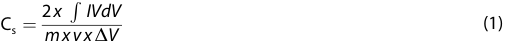

working electrodes and the operating voltage range, respectively. An example calculation was shown in the supporting information. 

The energy density (E; Wh/kg) and power density (P; W/kg) were calculated with Equations (3) and (4). 

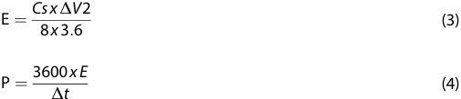

Where Cs, ΔV, Δt is the specific capacitance from the GCD curve, the operating voltage range and discharge time, respectively. 

## **Results and Discussion** 

## **Electrospinning of Acetone Insoluble Lignin** 

Solutions for electrospinning were prepared with 20, 23, 25, 27, 30, 35, and 40 wt.% concentrations of spinning dope in dimethylformamide. Below 20%, spinning dopes could not be spun into continuous fibers. Uniform fibers were readily formed with solution dope concentrations of 23, 25, 27, and 30 wt.% at 1 wt.% PEO loading relative to the lignin content. SEM images (Figure 1 a–d) of the resulting fiber samples showed a clear difference in diameter and uniformity amongst the different concentrations of lignin solution. The fibers spun from 25 wt.% solution produced the smallest fiber diameter (450 � 57 nm) compared with the other solutions, which resulted in fiber diameters of 523 � 72 nm for 23 wt.%, 817 � 112 nm for 27 wt.% and 815 � 184 nm for 30%. Typically, the fiber diameter scales with solution concentration; however, in this particular case, the 25 wt.% concentration stood out as an outlier, although it was consistently reproducible. Further studies investigated the effect of PEO amount (0.25, 0.5,0.75, and 1 wt. % based on the lignin dry weight) in the solution on dope spinnability and fiber size. Interestingly, the optical microscopy images (Figure S3) revealed that uniform fiber could be formed at all PEO contents. However, as shown in Figure 1e–g, more homogeneous fibers formed with the higher PEO amount in the spinning dope. Moreover, with this investigation, we observed the possibility of forming nanofibers consisting of 99 wt. % to 99.5 wt. % lignin. 

Where I, V, m, v, and ΔV are the current, potential, electrode mass, scan rate, and operating voltage window, respectively. 

The specific capacitance (Cs) for the electrode was also calculated from the discharge curve of the GCD tests by Equation (2). 

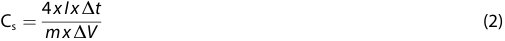

Where I, Δt, m, ΔV are the discharge current, the discharge time, and the total mass of the electrode materials in both 

## **Formation of 3D Structure of Lignin-Based Materials Impacted by Lignin Fiber Diameter** 

As previously published,[[12,13]] electrospun lignin fiber mats were dispersed in water with different weight concentrations from 0.1 to 1.0 w/v %, followed by 30 s vortex mixing at 3000 rpm. Vortex mixing vigorously agitates the suspended fiber mats; however, mixing for longer than 30 seconds resulted in the fragmentation of fibers into very small sizes that could not 

_ChemSusChem_ **2025** , _18_ , e202400932 (3 of 10) 

© 2024 The Authors. ChemSusChem published by Wiley-VCH GmbH 

Research Article doi.org/10.1002/cssc.202400932 

ChemSusChem 

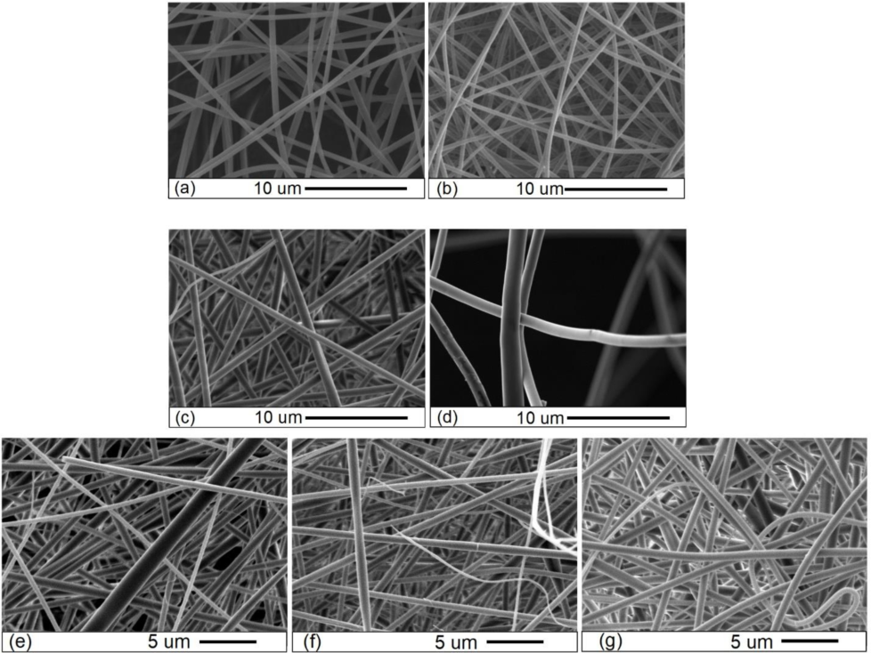

**Figure 1.** SEM images of electrospun of AIS lignin fibers with 1 wt % PEO loading. (a)-(d) Effects of solution concentration (23, 25, 27 and 30 wt.%). (e)–(g) Effect of PEO loading (0.5,0.75 and 1 wt.%) in a 25 wt.% lignin solution concentration. 

entangle (Figure S5). Suspensions of fragmented electrospun fibers were isolated from lignin mats formed at 25 and 27 wt.% solution with 1 wt.% PEO loading relative to lignin dry content. These samples were used to investigate the effect of fiber diameter on formation and the performance of the lignin-based fiber aerogel. The fiber aerogel from electrospun fibers of 27 wt.% solution spinning concentration and 0.1 and 0.5 wt.% fiber mat vortex concentration did not form 3D aerogel during transformation. After freeze-drying, the nanofibers collapsed 

during the heat treatment. SEM analysis revealed the formation of small spheres, approximately 16 to 50 μm in diameter, consisting of fiber aggregates (Figure 2). Further, aerogels prepared from 27 wt.% solution spinning concentration from a higher fiber slurry concentration (from 0.6 to 1.0 wt.%) could form aerogels but did not show shape recovery properties after heat treatment. This suggests that larger fiber diameters exhibited poor performance in forming lignin-based fibrous aerogels through the heat stabilization process. This data 

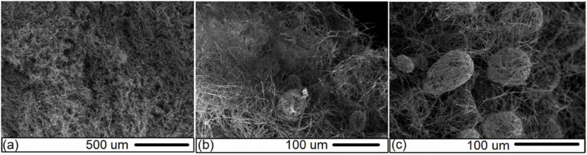

**Figure 2.** SEM images of spheres in aerogels prepared from 27 wt.% acetone insoluble lignin nanofibers(0.5 wt.% concentration). 

_ChemSusChem_ **2025** , _18_ , e202400932 (4 of 10) 

© 2024 The Authors. ChemSusChem published by Wiley-VCH GmbH 

Research Article doi.org/10.1002/cssc.202400932 

ChemSusChem 

indicates that the spinning conditions described above play a crucial role in controlling the fiber diameter, thereby influencing the subsequent ability of fibers to reform entangled networks at different concentrations. This fact is highlighted when compared to the previous studies, aerogels could be produced with nanofibers from 27 wt.% methanol fractionated softwood kraft lignin (Indulin AT) solution with 1 wt% PEO loading.[[12,13]] The nanofibers had an average diameter of 650 nm for previous work.[[12]] This study produced larger fibers from the LignoForce lignin with the same spinning solution concentration. Hence, lignin fiber-based aerogel fabrication must consider structure, processing, and property relationships to form robust samples; in other words, different lignin types need to be optimized for nanofiber aerogels. 

Further, work with fiber aerogels derived from 25 wt.% fibers with a smaller diameter than fibers from 27 wt% concentration showed stable 3D structures after freeze-drying and subsequent heat treatment. Both 0.3 and 0.5 wt./v % of fiber concentration were selected to produce lightweight and flexible materials. In Figure 4S, stabilized and carbonized fibers from 2D mat are shown to confirm no morphology changes before and after forming 3D aerogels. Figure 3 shows the aerogels produced from both fiber concentrations that were stabilized at 225 °C and then carbonized at 1000 °C. SEM images at low magnification revealed a ‘woolly’ and uniform structure where individual fiber fragments were connected to other fibers, making a continuous open cell network. 

It is evident that fiber diameter influenced the formation of aerogels. This is likely attributed to the reduced flexibility of fibers with increasing diameter, coupled with variations in the total available surface area for interactions. As a result, fibers with larger diameters were broken readily compared with those with smaller diameters after vortex mixing. This observation highlights two factors that likely impact the robustness of the 

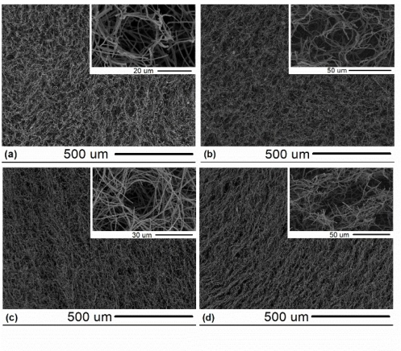

**Figure 3.** SEM images of aerogels (a)-(b) stabilized and (c)-(d) carbonized, produced from different concentrations. (a) and (c) from 0.3%, (b) and (d) from 0.5%. Insets show SEM images at higher magnification, revealing the open cell structure of the aerogels. 

material. Firstly, entanglement with fibers requires a critical length to maintain the 3D structure of lignin-based aerogels. Most likely, the short fiber fragments assembled around trapped micro-bubbles in the 27% concentration were too short to form an entangled network. Secondly, reducing the total number of fibers produced from the same weight concentration results in fewer interconnected struts, further affecting aerogel formation. 

## **Compression Tests** 

Compressive mechanical tests were performed to investigate the flexibility and elastic resilience of aerogels prepared from 0.3% and 0.5% AISL fiber suspension in water. Figure 4 shows the results of cyclic loading-unloading tests at 60% strain for 100 cycles. This test showed the mechanical durability and shape recovery properties of the nanofiber aerogel, revealing 

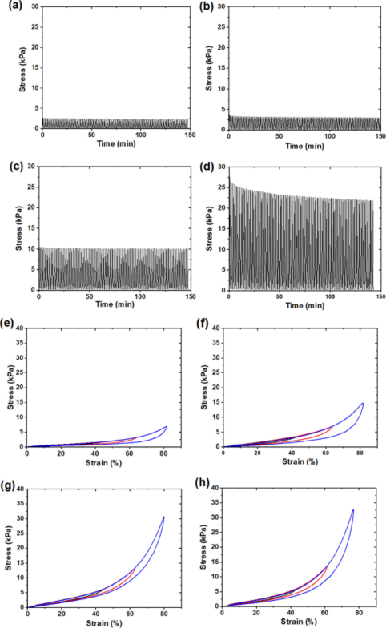

**Figure 4.** Cyclic compression properties of lignin-based nanofibrous aerogel showing the effects of fiber concentration and heat treatment. Stabilized (a,b,e,f) and (c,d,g,h) carbonized samples with 0.3 wt.% (a,c,e,g) and 0.5 wt.% (b,d,f,h) fiber concentration. (a–d) Compressive stress as a function of time during 100 loading-unloading cycles at 60% strain only. (e–f) Stress-strain curves as a function of different compressive strains at 40%(black), 60%(red), and 80%(blue). 

_ChemSusChem_ **2025** , _18_ , e202400932 (5 of 10) 

© 2024 The Authors. ChemSusChem published by Wiley-VCH GmbH 

Research Article doi.org/10.1002/cssc.202400932 

ChemSusChem 

no breakage of the samples. As shown in Figures 4(a)–(d), the concentration of the fiber suspension when making the aerogel influenced the mechanical properties at the same compressive strain. While the difference in compressive stress was marginal for the stabilized samples (2.3 kPa for 0.3% in Figure 4(a) vs. 3 kPa for 0.5% in Figure 4(b), the properties of carbonized aerogels exhibited significant enhancement with increasing fiber concentration. 

This result was especially noteworthy for the carbonized 0.5% aerogels, as shown in Figure 4(h), which had two times higher compressive stress than carbonized 0.3% aerogels shown in Figure 4(g) after 100 loading-unloading cycles (10 kPa vs 22 kPa). This demonstrated that the mechanical performance of aerogels readily scaled with density. It should be noted that there was 20.5% stress loss after 100 cycles (from 27 kPa to 22 kPa), suggesting some deformation of the sample’s internal structure in Figure 4(d). Unlike lignin-based electrospun carbonized nanofiber mats, which resemble two-dimensional paperlike substrates, the carbonized 3D structural materials exhibit highly flexible and elastic resilience properties.[[12,13]] Figure 4 (e)– (h) show the cyclic loading-unloading tests at large deformations (strain = 40%, 60%, and 80%). The area under the loading-unloading curves for the carbonized aerogels in Figures 4(g) and 4(h) was relatively smaller than the stabilized aerogels in Figures 4(e) and (f), indicating lower energy loss and higher elastic resilience for carbonized aerogels. The maximum stress at a given strain and modulus of the aerogels significantly increased after carbonization. For 0.3% samples, at 80% strain, the compressive stresses were 6.7 kPa for stabilized and 30 kPa for carbonized aerogels, in Figure 4(e) and (g), respectively. Previously, we have shown that carbonizing lignin electrospun fiber mats greatly enhance their mechanical properties.[[7]] This work with optimized LignoForce lignin fibers showed a much higher mechanical value than our previous work with carbonized aerogel samples with a similar bulk density (~12 mg/ cm[3] ).[[12,13]] Moreover, between the two carbonized samples, the modulus at an extensive deformation range (60–80% strain) showed a higher value, 124 kPa with 0.5% sample than 0.3%, 97.6 kPa for loading curves. Also, two stabilized samples showed significant differences in compressive stress at 63% compressive strain for loading-unloading results(red curves in Figure 4 (e) and (f). The 0.3% sample showed 2.97 kPa, but the 0.5% sample showed 6.69 kPa at the 63% strain. This result indicates that the concentration of aerogel preparation could tailor mechanical properties. 

## **Enhancing Fiber Aerogel Properties via Blends of Acetone Insoluble and Soluble Lignin** 

Another method to enhance the properties of the fiber aerogels is to have blends of two lignin fractions.[[13]] Even though many studies of technical lignin fractionation have been demonstrated with different solvents,[[14]] among the many organic solvents, acetone was applied to have two fractions of lignin in this study due to its efficiency and also low boiling points, which are essential in terms of energy-efficient solvent 

recovery[[8]] Acetone soluble lignin (ASL) was blended with acetone insoluble lignin (AISL) at three levels (AISL: ASL � 90:10, 80:20, 70:30 wt. %/%) and spun with 1% PEO at a solution concentration of 25%. ASL has a different molar mass,[[8]] so this material impacts solution viscosity and fiber diameter. Further, it should be noted that the hydrophobicity of the lignin samples changed with acetone-soluble lignin. As such, 100% ASL cannot be dispersed in water compared to the AISL counterpart. The dispersion of the fiber fractions after vigorous vortex mixing in a water droplet was investigated with light microscopy, and fibers became more clustered/less dispersed for the 70:30 suspensions (Figure S7). Even with the clustering, samples for all three compositions could readily form 3D fiber aerogels and retained their shape after heat treatment and carbonization when produced from a suspension of 0.5% fiber. Further hydrophobicity studies and related oil absorption tests are shown in the SI through Figure S6 and Table S3. 

In Figure 5, SEM images of fibers after heat treatment for the different combinations showed a small difference in fiber morphology compared to the 100% AISL sample (Figure 3 inset). Samples with blends of ASL had some distortion to the fiber shape and, in some cases, had partial fusion amongst groups of fibers (Figure 5). As shown in Table S1, the fractionated lignins showed different thermal and chemical properties. Fusion between fibers was expected because of the change in the glass transition temperature (Tg) of the blends due to the difference in two fractionated lignins, as shown in Figure S1 (b) and Table S1(ASL:108.5 °C and AISL: 197 °C). However, there was no apparent visual difference among samples of various ASL compositions, unlikely with previous work.[[13]] Interestingly, due to differences in Tg between ASL and AISL, the interconnected fiber structures were previously shown by mixing two lignins of AISL and ASL in methanol with a 70–30 ratio.[[13]] Further, while previous lignin blends could not retain their shape after heat treatment and only could form 3D nanofiber aerogels with the incorporation of cellulose nanocrystals in the spinning dope.[[13]] This work highlights that acetone fractionated Lignoforce lignin blends could make robust nanofiber aerogels without additives. This comparison highlights how both the lignin fractionation method and the lignin source can greatly impact the final structure and performance of the fibrous aerogel. 

AISL 100 and AISL: ASL 70:30 samples underwent mechanical compressive testing as a function of compressive strains up to 60% at room temperature shown in Figure 6 (a)–(d). Similar to other lignin nanofiber aerogel samples as shown in Figure 4, the compressive mechanical properties improved after carbonization. Moreover, hysteresis (the area between loading-unloading curves) was reduced, indicating lower energy loss and higher elastic resilience. Interestingly, the carbonized AISL70 aerogel sample exhibited remarkable properties; compressive stress increased three times higher (15 kPa) than that of the stabilized samples (4.6 kPa), and the mechanical response showed a minor change (14.3 kPa) even after undergoing 100 cyclic loading-unloading (Figure 6d). To further investigate the compressive mechanical properties, carbonized aerogel samples of AISL 100 and AISL70 fibers were subjected to various temperatures. For example, AISL70 carbon aerogel was sub- 

_ChemSusChem_ **2025** , _18_ , e202400932 (6 of 10) 

© 2024 The Authors. ChemSusChem published by Wiley-VCH GmbH 

Research Article doi.org/10.1002/cssc.202400932 

ChemSusChem 

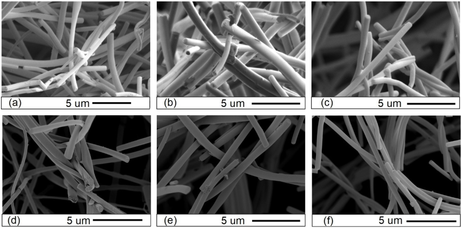

**Figure 5.** SEM images of nanofibrous aerogels from different ratio of AIS and AS lignin. (a)–(c): stabilized, (d)–(f): carbonized samples. (a), (d) AISL:ASL 90:10, (b), (e) AISL:ASL 80:20 and (c),(f) AISL:ASL 70:30 samples. 

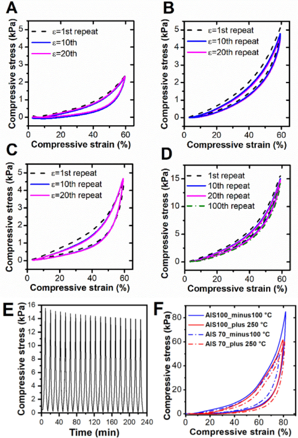

**Figure 6.** (a)–(d) Compressive stress-strain curves of (a) stabilized AIS 100, (b) carbonized AIS 100, (c) stabilized AIS 70, and (d) carbonized AIS 70 aerogels after cyclic compression tests at room temperature (e) Compressive stress as a function of time at 80 °C for carbonized AIS 70 aerogels. (f) Cyclic tests for ° ° carbonized AIS 100 and AIS70 aerogels at � 100 C and 250 C. 

jected to 20 cyclic compressive tests at 80 °C with 60% strain at a strain rate of 10%/min (Figure 6e). Remarkably, the compressive properties exhibited no significant change compared to tests conducted at room temperature (Figure 6(d), 15 kPa after the 20th cycle). Moreover, the cyclic loading-unloading tests at large deformations (up to 80%) were conducted at extreme temperatures, from cryo-temperatures of � 100 °C to temperatures of 250 °C, revealing that both AISL 100 and AISL70 carbon aerogels maintained their flexibility and elastic resilience under extreme conditions with compressive stress values of 50 to 80 kPa in Figure 6(f). 

## **Electrochemical Properties for Supercapacitors** 

Lignin-based fibrous flexible carbon aerogels (FCA) with different weight ratios of ASL and AISL were evaluated for electrochemical performances. A combination of tests was used to evaluate these FCA electrodes, including cyclic voltammetry (CV) and galvanic charge-discharge (GCD) tests in a symmetric two-electrode system. Figure 7(a) contains the CV curve of the FCAs at a 20 mV/s scan rate. The specific capacitance (Cs) can be obtained from the area of the CV curves. The values were different for the lignin AISL-ASL samples and the Cs of 100–0, 90–10, 80–20, and 70–30 FCA were 23.8, 52.3, 38.4, and 66.9 F/ g, respectively. The result indicated that FCAs with interconnected bonded structures could enhance electric capacitance. Especially, the 70–30 FCA exhibited a better quasirectangular shape and higher specific capacitance than the other samples, and it could be due to the interconnected bonded structure having more fiber-fiber junction of the 70–30 FCA. These connections can create more channels and networks for ion access and electron flow. Operation voltage was limited to 0.8 V due to the aqueous electrolyte used, but organic 

_ChemSusChem_ **2025** , _18_ , e202400932 (7 of 10) 

© 2024 The Authors. ChemSusChem published by Wiley-VCH GmbH 

Research Article doi.org/10.1002/cssc.202400932 

ChemSusChem 

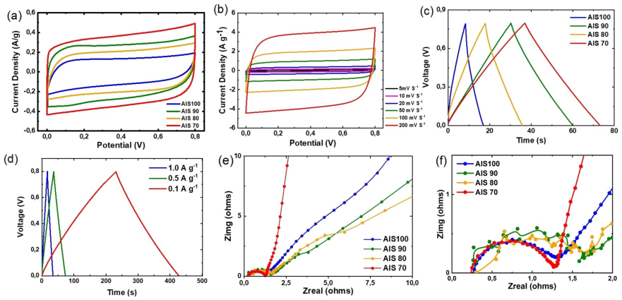

**Figure 7.** ( **a** ) CV curves of the FCAs at the 20 mVs[�][1] scan rate and ( **b** ) CV curves of AIS70 FCA with different scan rates ( **c** ) GCD curves of the FCAs at 0.5 Ag[�][1] current density and ( **d** ) GCD cures of the 70–30 FCA sample at different current densities ( **e** ) Nyquist plots of FCAs (f) The lower range (0–2 ohms) of Nyquist plots of (e) 

electrolytes can increase operation voltage to 2.4 V for coin cell systems for further testing and commercialization. 

Figure 7 (b) shows the CV curves of the 70–30 FCA at different scan rates from 5 to 200 mV/S. This test revealed that the increase in the scan rate did not affect the shape of the CV curves to a significant degree, and the 70–30 FCA could maintain the quasi-square shape even at a high scan rate of up to 200 mVs[�][1] , suggesting the electrochemical stability for the supercapacitor (SC). The Cs of the 70–30 FCA at 5, 10, 20, 50, 100, and 200 mVS[�][1] scan rates were 49.3, 56.5, 67.4, 74.7, 74.6, and 71.5 Fg[�][1] , respectively. In general, the specific capacitance tends to decrease with the increase of the scan rate due to the shorter ion migration time and a lower diffusion rate of ions allowed at a faster scan rate.[[15]] The Cs of the AISL-ASL 70–30 FCA sample reached the highest value, 74.7 Fg[�][1] at 50 mVS[�][1,] and had 95.7% capacitive retention at 200 mVS[�][1] , demonstrating an excellent fast charge-discharge capability. 

The GCD curves of the FCA samples at 0.5 A/g current density all showed the desired electric double-layer capacitor (EDLC) behavior of linear triangular shapes, as shown in Figure 7 (c). Cs values were calculated from discharged slopes. The values were 25.6, 77.9, 49, and 92.9 F/g for samples of AISL100, AISL90, AISL80, and AISL70, respectively. As the same trend of the CV tests, 70–30 FCA samples showed the highest specific capacitance. Further, the GCD curves of the 70–30 FCA at the different current densities are shown in Figure 7 (d). The results indicated that the 70–30 FCA sample could maintain the linear triangular shape at a high current density (1 A/g) with a faster chargedischarge rate. The specific capacitance can be obtained from the slope of the discharge curve, and the specific capacitances of 70–30 FCA are 100.4, 92.2, and 89.1 F/g at the current density of 0.1, 0.5, and 1 A/g, respectively. The specific capacitance of 70–30 FCA had an 89.7% capacitive retention when the current density increased from 0.1 to 1 A/g. Electrochemical impedance 

spectroscopy (EIS) tests were also conducted to understand the electrochemical kinetics of the FCA-based SC cell. Figure 7 (e) contains the Nyquist plot of FCA, and all the FCA samples exhibit a semicircle at the high-frequency range and a vertical line at the low-frequency range. The x-intercept of the Nyquist curve represents the equivalent series resistance (Res) of the SC, and the diameter of the semicircle means the charge-transfer resistance (Rct) from electrolytes moving through the electrodes. A smaller semicircle indicated higher ion migration rates and a vertical line in the low-frequency part showed better ion accessibility in the SC.[[16]] 

As shown in Figure 7 (e), the Res of the FCAs is in the range of 0.3 to 0.4 Ω. Although the Rct of the testing samples were similarly located in the range of 1–1.5 Ω, the 70–30 FCA electrode had a smaller _R_ ct (1.08 Ω) than the AISL 100 FCA electrode (1.20 Ω). All the samples had vertical tails at the lowfrequency range, demonstrating electrode materials’ ideal EDLC behavior.[[17,18]] Overall, these observations suggest a lower resistivity in 70–30 FCA than that of the other samples arising from the change in connections between the fibers in the aerogel. 

The carbonized aerogels were activated using CO2 gas at an elevated temperature to improve the energy storage properties further. The electrochemical performance of the activated FCA (AFCA) electrode was measured in the symmetric SC cell. Figure 8(a) revealed that all AFCA samples have quasi-rectangular CV curves at 20 mVS[�][1] scan rates, indicating a characteristic EDLC behavior. At the 20 mV/s scan rate, the specific capacitance of 100–0, 90–10, 80–20, and 70–30 AFCA obtained from CV curves were 121.4, 137.7, 131.2, and 136.0 F /g, respectively. The 70–30 AFCA had a better quasi-squire shape, while the 90–10 AFCA sample had a slightly higher specific capacitance. The ion transfer and charge storage ability of EDLC are known to be influenced by the micropores and mesopores 

_ChemSusChem_ **2025** , _18_ , e202400932 (8 of 10) 

© 2024 The Authors. ChemSusChem published by Wiley-VCH GmbH 

Research Article doi.org/10.1002/cssc.202400932 

ChemSusChem 

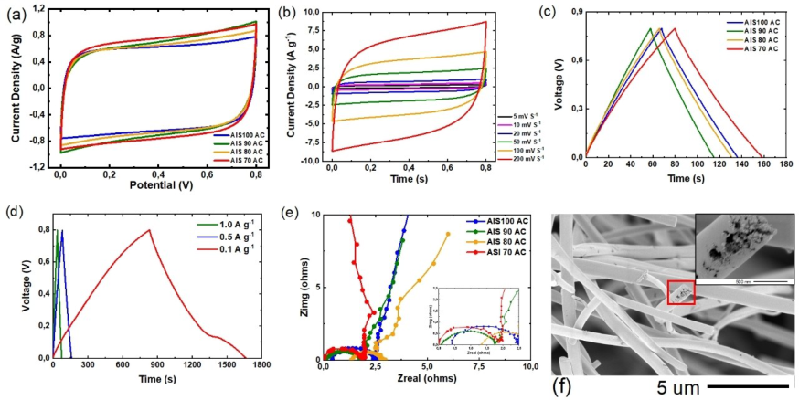

**Figure 8.** ( **a** ) CV curves of the AFCAs at the 20 mV/s scan rate and ( **b** ) CV curves of 70–30 AFCA with various scan rates; ( **c** ) GCD curves of the AFCAs at 0.5 Ag[�][1] current density and ( **d** ) GCD cures of the 70–30 AFCA sample at different current densities; ( **e** ) Nyquist plots of AFCAs (insert: a zoomed graph at range of 1–2 ohms) (f) SEM image of activated carbon fibers of aerogel (insert: a SEM image of cross-section of the activated fiber in large magnification of the red box). 

structure distribution in the materials.[[19]] During the activation process, forming porous structures on the fiber could further increase the surface area of AFCA. Moreover, the three-dimensional structure and interconnected bonding of the AFCAs also create various networks and shorten the ion-transport distance.[[20]] Consequently, AFCAs boost the specific capacitance after the activation. 

Figure 8(b) shows the CV curves of 70–30 AFCA at different scan rates. This series of tests demonstrated that the CV curves could maintain the symmetric quasi-square shape at a high scan rate, and the specific capacitances were 124.0, 126.3, 136.0, 140.7, 134.2, and 120.2 F/g at 5, 10, 20, 50, 100, and 200 mV/s, respectively. Again, the highest specific capacitance value was obtained at the 50 mV/s scan rate, and the specific capacitance had an 85.4% retention rate at a higher scan rate of 200 mV/s. 

As presented in Figure 8 (c), the GCD curves of AFCA samples at 0.5 A/g current density all indicated characteristic EDLC linear triangular shapes. The specific capacitance of 100– 0, 90–10, 80–20, and 70–30 at 0.5 A/g were 176.7, 239.0, 169.4, and 202.1 F/g, respectively. The specific capacitance of 90–10 and 70–30 AFCA is over 200 F/g and is comparable or superior to some previous research on porous 3D structured carbon materials derived from coal,[[20]] glucose,[[21]] bagasse,[[22]] carbon nanosheet,[[17]] chitin.[[23]] In particular, activated flexible carbon electrodes from squid gladius chitin showed 197–204 F/g specific capacitance in 1 M of H2SO4 after oxygen and nitrogendoped during activation. Figure 8 (d) shows the GCD curves of 70–30 AFCA at different current densities, and the 70–30 AFCA exhibited a specific capacitance of 322.1 F/g at 0.1 A/g, 202.0 F/ g at 0.5 A/g, and 189.6 F/g at 1 A/g. Samples of 70–30 and 90– 10 AFCA had outstanding energy and power densities of 

4.5 Wh/kg at 207.2 W/kg and 5.3 Wh/kg at 226.3 W/kg, respectively. 

Figure 8 (e) shows the EIS Nyquist plot of AFCAs. AFCA samples resulted in a semicircle at the high-frequency range and a vertical line at the low-frequency range. The Res of the AFCAs was in the range of 0.2 to 0.3 Ω, and the Rct of the testing samples was in the range of 1.6–2 Ω. The result indicated that 70–30 and 90–10 AFCAs had lower Res and Rct with better ion accessibilities than the other two samples. 

This work showed outstanding performance for supercapacitor applications using 99% lignin nanofibrous carbon aerogels as self-standing electrodes without any conductivity metal additives with a simple preparation method. 

## **Conclusions** 

Lignin was solvent fractionated with acetone, and samples with varying glass transition temperatures were mixed together to produce electrospun nanofibers with controlled thermal properties. Flexible lignin-based carbon aerogels were fabricated, and the electrochemical properties were characterized before and after activation as a function of the lignin blend composition. The flexible activated carbon fiber aerogels demonstrated excellent electrochemical performances with high specific capacitance over 200 Fg[�][1] , attributed to the 3D inter-connected structure with porous structure from tailored thermal properties combined with high surface area after activation. Lignin is a promising candidate as a binder-free, free-standing, and flexible electrode for supercapacitors in portable and wearable electronics, showing a path for advanced energy storage device applications. 

_ChemSusChem_ **2025** , _18_ , e202400932 (9 of 10) 

© 2024 The Authors. ChemSusChem published by Wiley-VCH GmbH 

Research Article doi.org/10.1002/cssc.202400932 

ChemSusChem 

## _**Acknowledgements**_ 

The research team would like to acknowledgement Hannah Wang and Catherine Wu for their help in preparing samples for electrospinning. The work was supported by the Advanced Renewable Materials Innovation Fund, sponsored by the Paul and Edwina Heller Memorial Fund. Additionally, the work was supported by the Canada Research Chairs Program, Tier 2, in Advanced Renewable Materials #950–232330. The project was also supported by the Alberta Bio Future program, administered by Alberta Innovates. 

- [5] F. Zou, T. Budtova, _Carbohydr. Polym._ **2021** , https://doi.org/10.1016/j. carbpol.2021.118130. 

- [6] Y. Liu, _et al., Sustainable Mater. Technol._ **2021** , https://doi.org/10.1016/j. susmat.2020.e00240. 

- [7] M. Cho, _et al., J. Mater. Sci._ **2017** , https://doi.org/10.1007/s10853–017– 1160–0. 

- [8] M. A. Karaaslan, _et al., ACS Sustainable Chem. Eng._ **2021** , https://doi.org/ 10.1021/acssuschemeng.0c07634. 

- [9] J. Doshi, D. H. Reneker, _J. Electrost._ **1995** , https://doi.org/10.1016/0304– 3886(95)00041–8. 

- [10] A. Greiner, J. H. Wendorff, _Angew. Chem. (Int. Ed. Eng.)_ **2007** , https://doi. org/10.1002/anie.200604646. 

- [11] Y. Si, _et al., Nat Commun_ **2014** , https://doi.org/10.1038/ncomms6802. 

- [12] M. Cho, _et al., J. Mater. Chem. A_ **2018** , https://doi.org/10.1039/ C8TA07802E. 

- [13] M. Cho, _et al., Macromol. Mater. Eng._ **2022** , https://doi.org/10.1002/ mame.202200052. 

## _**Conflict of Interests**_ 

The authors declare no conflict of interest. 

- [14] M. Gigli, C. Crestini, _Green Chem._ **2020** , https://doi.org/10.1039/ d0gc01606c. 

- [15] S. Zhang, N. Pan, _J. Mater. Chem. A_ **2013** , https://doi.org/10.1039/ c3ta11006k. 

- [16] R. Liu, _et al., RSC Adv._ **2015** , https://doi.org/10.1039/C4RA13720E. 

- [17] J. Shao, _et al., Electrochim. Acta_ **2016** , https://doi.org/https://doi.org/10. 1016/j.electacta.2016.11.037. 

## _**Data Availability Statement**_ 

The data that support the findings of this study are available from the corresponding author upon reasonable request. 

- [18] W.-L. Song, _et al., ACS Appl. Mater. Interfaces_ **2015** , https://doi.org/10. 1021/am508624x. 

- [19] H. Wang, _et al., Chem. Commun._ **2016** , https://doi.org/10.1039/ C6CC05911B. 

- [20] Y. Lv, _et al., Sci Rep_ **2020** , https://doi.org/10.1038/s41598–020–64020–5. 

- [21] J. Han, _et al., Electrochim. Acta_ **2017** , https://doi.org/https://doi.org/10. 1016/j.electacta.2017.11.146. 

**Keywords:** Lignin **·** Electrospinning **·** Nanofibrous aerogels **·** Carbon **·** Supercapacitors 

   - [22] P. Hao, _et al., Nanoscale._ **2014** , https://doi.org/10.1039/C4NR03574G. 

   - [23] C. J. Raj, _et al., J. Power Sources_ **2018** , https://doi.org/10.1016/j.jpowsour. 2018.03.038. 

- [1] B. Thomas, _et al., Nanomaterials (Basel)_ **2021** , https://doi.org/10.3390/ nano11030653. 

- [2] S. Geng, _et al., ACS Appl. Mater. Interfaces_ **2020** , https://doi.org/10.1021/ acsami.9b19955. 

- [3] X. Sun, _et al., RSC Adv._ **2021** , https://doi.org/10.1039/d1ra01754c. 

- [4] M. A. Karaaslan, _et al., Front. Mater._ **2022** , https://doi.org/10.3389/fmats. 2022.894061. 

Manuscript received: April 30, 2024 

- Revised manuscript received: August 28, 2024 

- Accepted manuscript online: September 20, 2024 Version of record online: November 7, 2024 

_ChemSusChem_ **2025** , _18_ , e202400932 (10 of 10) 

© 2024 The Authors. ChemSusChem published by Wiley-VCH GmbH 

