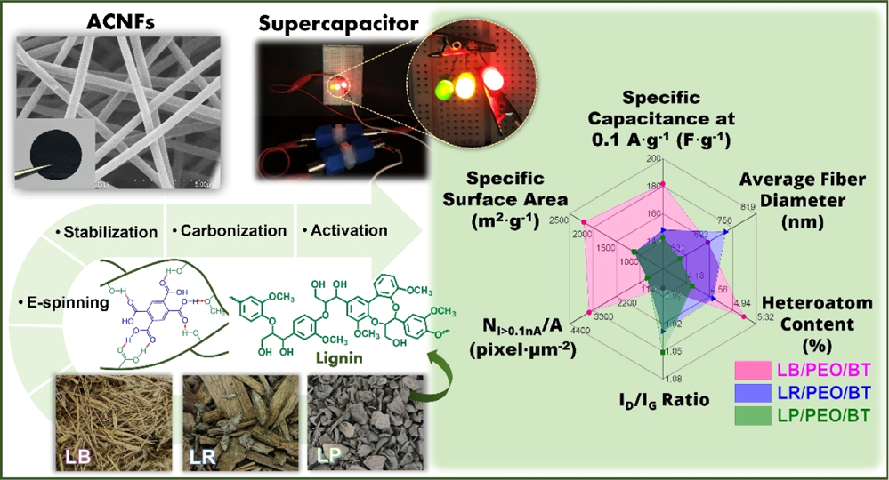
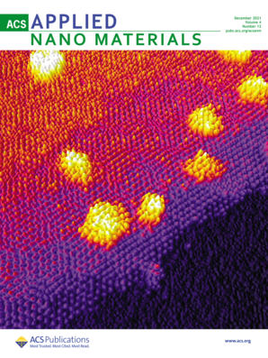
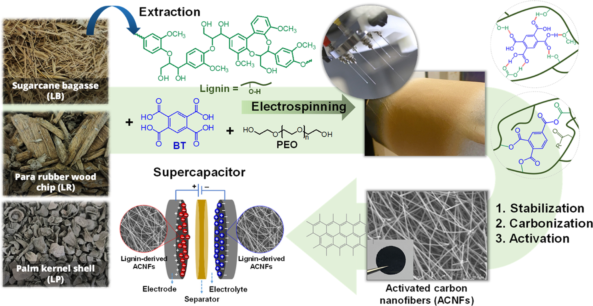
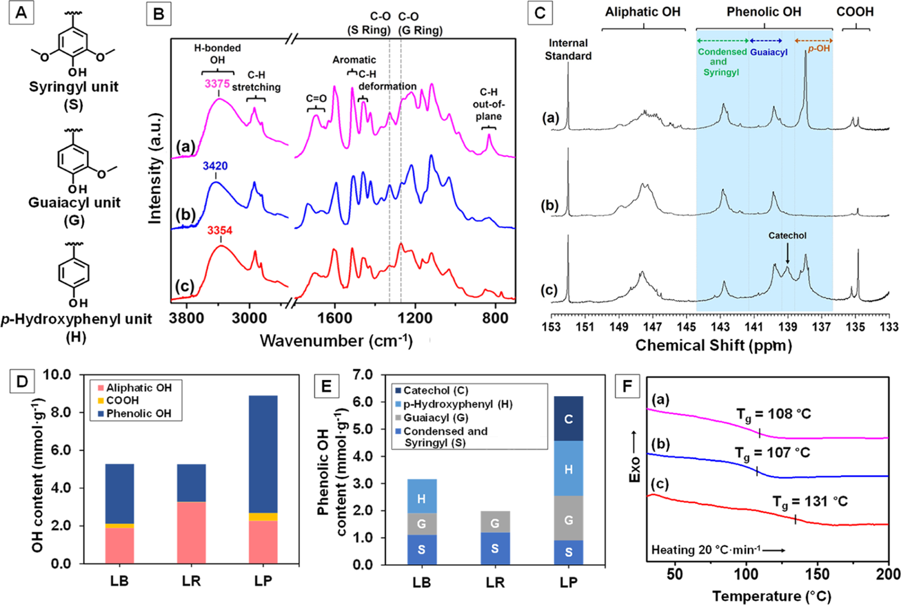
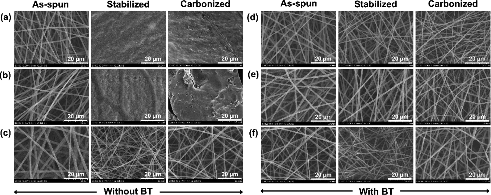
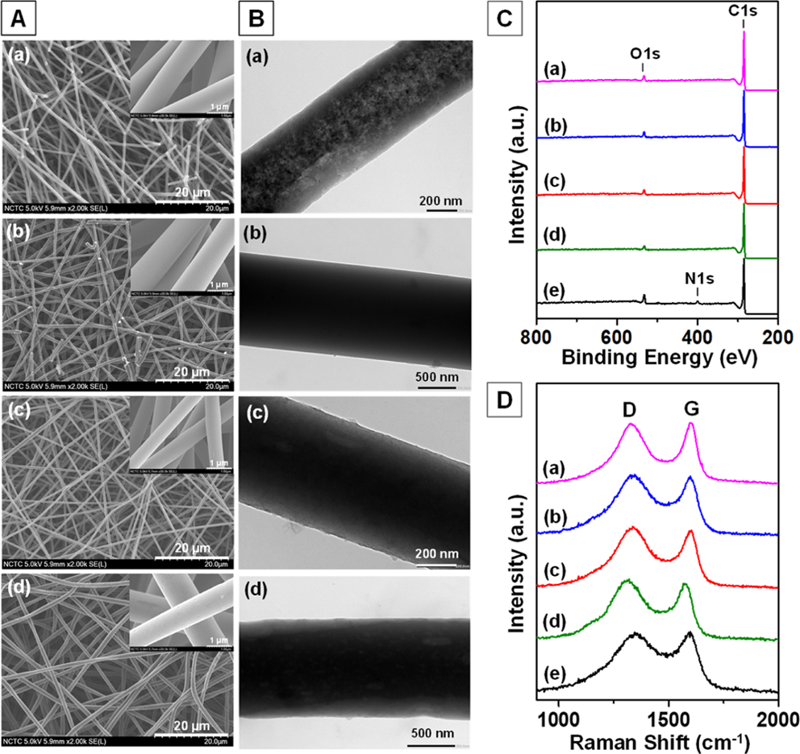
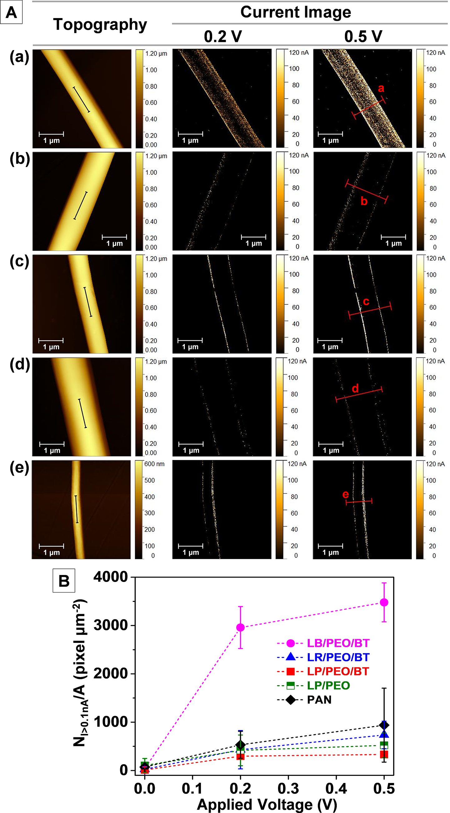
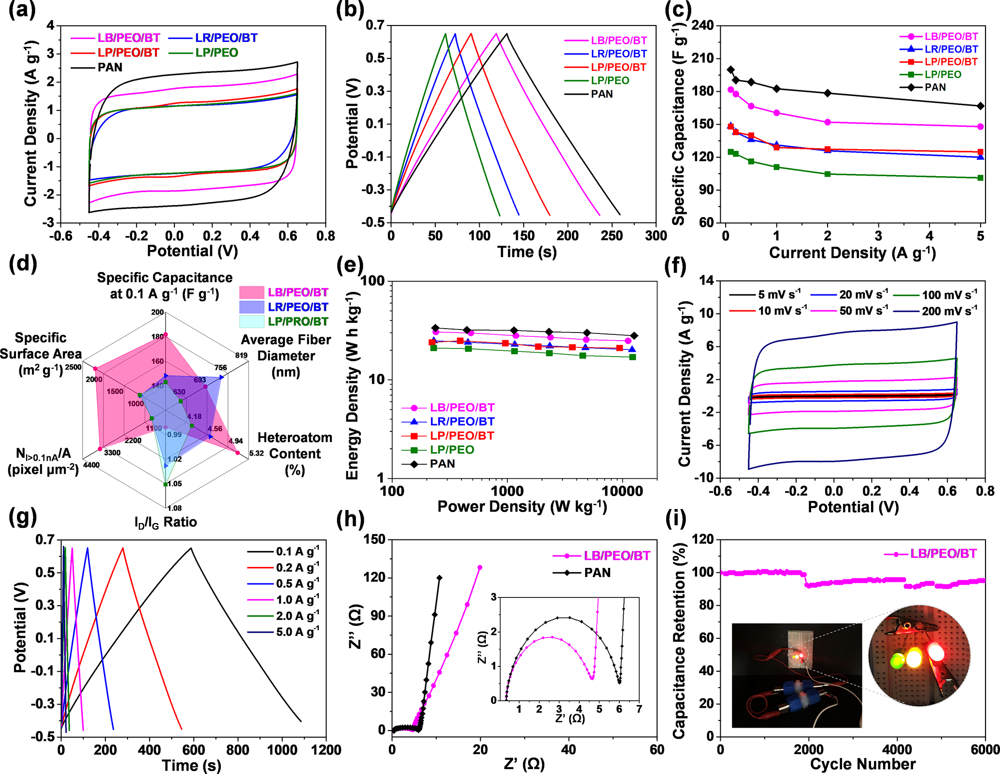

## Page 1

Stable Lignin-Rich Nanofibers for Binder-Free Carbon Electrodes in
Supercapacitors
Phakkhanan Khamnantha, Chanakran Homla-or, Khomson Suttisintong, Jedsada Manyam, Marisa Raita,
Verawat Champreda, Varol Intasanta, Hans-Jürgen Butt, Rüdiger Berger, and Autchara Pangon*
Cite This: ACS Appl. Nano Mater. 2021, 4, 13099−13111
Read Online
ACCESS
Metrics & More
Article Recommendations
*
sı
Supporting Information
ABSTRACT: In this work, 1,2,4,5-benzenetetracarboxylic acid
(BT) is used as a cross-linker to improve the oxidative
thermostabilization of lignin-rich nanofibers so that the activated
carbon nanofiber (ACNF) sheets can be prepared from lignins. As
sources, we used organosolv lignins from sugarcane bagasse (LB),
para rubber wood chip (LR), and palm kernel shell (LP). The
addition of BT imparts hydrogen bond interactions between BT
and lignin and increases the oxidation degree of lignin during the
stabilization, enabling retention of nanofiber morphology after heat
treatments. The preparation of activated carbon in the form of
nanofibers substantially enhances the specific surface area of the
materials when compared with the activated carbon powders from
pure lignins. The properties of the resulting ACNFs are influenced
by the structure and composition of lignins. With the synergistic effects of a small fiber diameter (688 ± 80 nm), a high content of
heteroatom (O atomic content ∼5.1%), a high graphitic carbon structure (ID/IG ratio ∼0.98), a high conductivity (NI>0.1nA/A ∼3479
± 404 pixel μm−2 at 0.5 V), and a high specific surface area (∼2195 m2 g−1), the ACNFs from LB show the highest specific
capacitance of 182 F g−1 (at a current density of 0.1 A g−1 in 1.0 M H2SO4 electrolyte) with good cycling stability (95.7%
capacitance retention after 6000 cycles). A maximum energy density of 31 W h kg−1 at a power density of 240 W kg−1 can be
achieved from the LB/PEO/BT ACNFs. Their performance is almost comparable to that of polyacrylonitrile ACNFs. These findings
demonstrate a simple and effective approach to produce lignin-based ACNFs from diverse biomass feedstock for sustainable
development of renewable materials for supercapacitor electrodes.
KEYWORDS: lignin, activated carbon nanofiber, crosslink, thermostabilization, carbon electrode, supercapacitor
■INTRODUCTION
Electrochemical devices are one of the crucial technologies for
energy storage. Among different types of electrochemical
energy storage devices, supercapacitors have gained attention
for an efficient delivery of electrical energy due to their high
power density, fast charge/discharge capability, superior
cycling stability, and safe operation.1,2 The working principle
of electrochemical double-layer capacitors (EDLCs) is based
on charge accumulation at electrode/electrolyte interfaces.
Thus, the efficiency of supercapacitors depends significantly on
properties of the electrode materials. The key requirements of
electrode materials are high specific surface area with an
appropriate pore structure,3−5 good electrical conductivity,6−8
and electrochemical stability.9,10 Numerous carbonaceous
materials, such as activated carbon,8,11 carbon nanotube,12
graphene,13,14 graphene quantum dots,15 carbon aerogel,16,17
and carbon nanofibers,17,18 have been used as active materials
for electrodes. Mostly, the active materials and other additives
in the form of powder require a binder to hold the materials in
the electrodes and on the collectors.19−21 However, many
commonly used binders, such as polytetrafluoroethylene and
poly(vinylidene fluoride), have high electrical resistivity.22−24
Therefore, the performance of the electrodes is lowered owing
to a reduction in accessible surface area for ion adsorption and
reduced electrical conductivity.
Among various types of active materials, porous carbon
nanofiber sheets offer a great potential for binder-free
electrodes because of their high specific surface area and
porosity, good electrical conductivity, and flexibility.25−28
Porous carbon nanofiber sheets are prepared in two main
steps: nanofiber fabrication of carbon precursors via electro-
spinning and heat treatments including stabilization, carbon-
ization, and activation. Polyacrylonitrile (PAN) is the most
Received:
August 24, 2021
Accepted:
November 4, 2021
Published: November 18, 2021
Article
www.acsanm.org
© 2021 American Chemical Society
13099
https://doi.org/10.1021/acsanm.1c02637
ACS Appl. Nano Mater. 2021, 4, 13099−13111
Downloaded via TSINGHUA UNIV on November 4, 2022 at 13:29:48 (UTC).
See https://pubs.acs.org/sharingguidelines for options on how to legitimately share published articles.

### Page Images

---

## Page 2

used precursor for carbon fibers due to its high carbon yield,
excellent spinnability, and good mechanical properties.29
However, PAN is from fossil fuel resources and expensive,
limiting its broad applications in energy storage.30,31
With growing demand of ecofriendly and renewable
materials, lignocellulosic biomass is of great interest as a
biobased precursor with low cost for carbon fibers. In fact,
lignocellulosic biomass can be directly used as a source for
carbon materials.32−34 However, cellulose has been widely
utilized in various industries such as paper, textile, cosmetic,
and pharmaceutical industries, whereas lignin is considered as
waste and still underutilized. Due to its aromatic structure with
high carbon content and availability, lignin is a good candidate
precursor for producing carbon fibers. Lignin is composed of
three main units: syringyl (S), guaiacyl (G), and p-
hydroxyphenyl (H). The structure of lignin depends on
many factors such as the plant, source, extraction procedure,
and environment.35 This variability leads to the variation in
properties of the resulting carbon materials.36−39 Although a
number of methods to produce activated carbon materials
from lignins have been reported for supercapacitor electro-
des,40,41 the conversion of lignin nanofibers into carbon fibers
while preserving their original shape remains challenging.
Thermostabilization is a key process to prevent fusion of the
material structure prior to subsequent carbonization. Thermo-
stabilization involves heating of the precursor in air in a
temperature range of 200−300 °C.42 During thermostabiliza-
tion, thermosetting properties are only achieved by providing
sufficient oxygen for changing the structure of lignin by bond
cleavage and oxidation including dehydration, cyclization, and
cross-linking.35,43,44 In some cases, the thermostabilization
process required from ∼7 h to more than 3 days depending on
the types of lignin and fiber compositions to achieve infusible
fibers.31,45−47 Therefore, various alternative approaches have
been studied to improve the stabilization of lignin fibers. Yue et
al. reported that short-time stabilization of organosolv
switchgrass lignin and hardwood lignin fibers via a two-step
heating process resulted in fused fiber bundles.48 After treating
with hydrochloric acid (HCl) gas in air and further
stabilization, the resulting fibers were infusible. Zhang et al.
successfully stabilized lignin fibers without fusion by a UV
treatment.49 The FTIR results indicated that UV treatment
increased the formation of carbonyl (CO) groups and led to
degradation of aromatic rings. However, the above two
methods required an additional step of either HCl or UV
pretreatment before thermostabilization.
To our idea, 1,2,4,5-benzenetetracarboxylic acid (BT), an
aromatic ring containing multicarboxylic acid moieties, is a
possible molecule to improve the thermostabilization of the
lignin-rich nanofibers via hydrogen bond interactions and
condensations between lignin and BT. Thus, in this study, we
use BT as a cross-linker to stabilize lignin-rich nanofibers. By
combining lignin with minor polyethylene oxide (PEO) in the
presence of BT, activated carbon nanofiber (ACNF) sheets
without fiber deformation can be achieved from a variety of
biomass feedstock (Scheme 1). The in situ cross-linking of
lignin by BT during thermostabilization makes this approach
simple and useful for the fabrication of ACNFs as binder-free
electrodes in supercapacitors.
■MATERIALS AND METHODS
Materials. Lignins from three different biomass feedstock (Table
S1), that is, sugarcane bagasse (LB), para rubber wood chip (LR), and
palm kernel shell (LP), were used as starting materials. LB represents
herbaceous biomass, while LR and LP are residues of dicot and
monocot plants, respectively. Sugarcane bagasse was obtained from
Mitr Phol Sugar Corp., Ltd., Thailand. Para rubber wood chip and
palm kernel shell were provided by Asia Biomass Co., Ltd., Thailand.
The lignins were extracted via the organosolv process using 70%
aqueous ethanol and precipitated by addition of water to the liquid
fractions. The extracted LB, LR, and LP powders were dried in a hot
Scheme 1. Schematic Illustration of the Preparation Process of ACNF Sheets from Stable Lignin-Rich Nanofibers for Binder-
Free Carbon Electrodes in Supercapacitors
ACS Applied Nano Materials
www.acsanm.org
Article
https://doi.org/10.1021/acsanm.1c02637
ACS Appl. Nano Mater. 2021, 4, 13099−13111
13100

### Page Images

---

## Page 3

air oven at 70 °C for 4 h before preparing electrospinning solutions.
PEO (Mw = 600 kg mol−1), BT, and PAN (Mw = 150 kg mol−1) were
purchased from Sigma-Aldrich. N,N-Dimethylformamide (DMF) was
purchased from Carlo Erba. All chemicals were used as received
without further purification.
Structural Characterization of Lignin. Attenuated total
reflectance−Fourier transform infrared (ATR−FTIR) spectra were
obtained using a Thermo Nicolet iS 5 FTIR spectrometer. The ATR−
FTIR data were collected at 128 scans with a resolution of 2 cm−1.
The quantitative 2D heteronuclear single quantum coherence (2D-
HSQC) nuclear magnetic resonance (NMR) and
31P NMR
measurements were conducted on a Bruker Ultra Shield AV-500.
2D-HSQC NMR was used to determine the S/G ratio of lignins. For
the 2D-HSQC measurement, dried lignin (50 mg) was dissolved in
DMSO-d6 (0.5 mL), and the experiment was performed according to
the previous method with minor modifications.50 The 2D-NMR
spectra were processed using the MestReNova program, and the S/G
ratio was calculated as reported by Wang et al.51 31P NMR was used
to quantitatively determine the amount and distribution of hydroxyl
groups in lignin isolated from different biomass feedstock. Sample
preparation for
31P NMR analysis was carried out as reported
elsewhere.52 Basically, lignin was phosphorylated with 2-chloro-
4,4,5,5-tetramethyl-1,3,2-dioxaphospholane (TMDP) to differentiate
different types of hydroxyl groups, which are aliphatic OH, carboxyl
OH (COOH), and phenolic OH including syringyl (S), guaiacyl (G),
and p-hydroxyphenyl (H) units (Figure 1A). In brief, lignin powder
was weighed (13.4−14.2 mg) and dissolved in DMF (79 μL). The
resulting brown solution was diluted with deuterated chloroform
solution (158 μL), followed by the serial addition of pyridine (53 μL),
N-hydroxy-5-norbornene-2,3-dicarboximide (4.5 mg mL−1) in 1.6:1.0
v/v pyridine/CDCl3 (105 μL), chromium (III) acetylacetonate (15.8
mg mL−1) in 1.6:1.0 v/v pyridine/CDCl3 (26 μL), and TMDP (79
μL). The resulting mixture was vigorously mixed using a vortex mixer.
Chromium (III) acetylacetonate was used as a relaxation reagent in
31P NMR analysis. The amount of different OH groups was evaluated
from the integral ratios using N-hydroxy-5-norbornene-2,3-dicarbox-
imide as an internal standard.
Preparation of Lignin-Rich Nanofibers by Electrospinning.
The electrospinning solutions were prepared by mixing LB, LR, and
LP powders with PEO in DMF at 45 wt % with a weight ratio of
lignin/PEO of 99:1. BT was added to the mixed solutions at 10 wt %
of lignin/PEO and mixed by stirring at 80 °C for 1 h. After cooling,
the mixed solutions were loaded into a syringe and extruded at a
constant flow rate of 0.1 mL h−1 per needle. The dc power was
applied between a needle and a rotating collector at a voltage of 7 kV.
The tip-to-collector distance was 15 cm. The electrospinning was
done at ambient temperature with a take-up speed of the collector of
100 rpm. The nanofibers containing LB, LR, and LP with 1 wt % PEO
are named as LB/PEO, LR/PEO, and LP/PEO, respectively. The LB/
PEO, LR/PEO, and LP/PEO nanofibers with 10 wt % BT are
denoted as LB/PEO/BT, LR/PEO/BT, and LP/PEO/BT, respec-
tively.
Conversion of Lignin Nanofibers to ACNFs by Heat
Treatments. Three methods were used to prepare ACNFs: (i)
stabilization in air by heating from 30 °C to 250 °C at a heating rate
of 0.5 °C min−1 and holding at 250 °C for 1 h; (ii) carbonization by
heating from 30 °C to 900 °C at a heating rate of 10 °C min−1 and
holding at 900 °C for 2 h under N2 flow (100 L h−1); (iii) activation
by raising the temperature from 30 °C to 900 °C at a heating rate of
10 °C min−1 and keeping isothermally at 900 °C for 15 min under N2
flow (100 L h−1) and for 1 h under CO2 flow (100 L h−1).
Materials Characterization. Differential scanning calorimetry
(DSC) thermograms were obtained using a NETZSCH DSC 214
Polyma. The DSC analysis was performed within the temperature
range of 0−200 °C with a heating−cooling−heating scan at a heating
rate of 20 °C min−1 under a nitrogen atmosphere. The glass transition
temperatures of the pristine lignins and nanofibers were evaluated
from the second heating scan. Thermogravimetric analysis (TGA) was
carried out on a Mettler Toledo STARe SYSTEM TGA/DSC 3+ at a
heating rate of 10 °C min−1 and a flow rate of N2 40 mL min−1.
Scanning electron microscopy (SEM) images were obtained using a
Hitachi S-3400N. For SEM, the samples were sputtered with Au at 15
mA for 90 s. Transmission electron microscopy (TEM) images were
acquired on a JEOL JEM-2100Plus electron microscope operating at
200 kV. X-ray diffraction (XRD) patterns were collected on a Bruker
D8 ADVANCE diffractometer with Cu Kα radiation. The XRD
measurement was carried out at a voltage of 40 kV and a current of 40
mA with a resolution of 0.02° 2θ and 0.5 s per step. Surface elemental
compositions were analyzed by using X-ray photoelectron spectros-
copy (XPS, Shimadzu AXIS Supra+). Raman spectra were recorded
Figure 1. (A) Three major aromatic units of lignins, (B) ATR−FTIR spectra, (C) 31P NMR spectra, (D) plot of OH content, and (E) plot of
phenolic OH content calculated from 31P NMR analysis, and (F) DSC thermograms of (a) LB, (b) LR, and (c) LP.
ACS Applied Nano Materials
www.acsanm.org
Article
https://doi.org/10.1021/acsanm.1c02637
ACS Appl. Nano Mater. 2021, 4, 13099−13111
13101

### Page Images

---

## Page 4

from 3200 to 870 cm−1 by using a NT-MDT NTEGRA Spectra
system with a green laser (λ = 532 nm). N2 adsorption−desorption
isotherms were analyzed on a Micromeritics 3Flex physisorption
instrument at 77 K. The samples were degassed under vacuum at 250
°C for 16 h before Brunauer−Emmett−Teller (BET) surface area
analysis.
Conductive atomic force microscopy (cAFM) measurement was
carried out on a JPK NanoWizard 3 in Quantitative Imaging (QI)
mode.53,54 The ACNFs were dispersed in ethanol. 10 μL of the
solutions was drop-cast on a 500 Å thick gold film that was evaporated
on a diced silicon wafer. To ensure good electrical contact, the gold
substrates were cleaned in oxygen plasma before sample casting. The
samples were dried at 120 °C under vacuum for 6 h prior to cAFM
scanning. The cAFM images were recorded using a PtIr-coated
electrically conductive probe (SCM-PIT-V2, Bruker). The cAFM
scanning parameters were set as follows: set point 25 nN, Z-length
2000 nm, pixel time 20 ms, scan size 4 × 4 μm2, and mapping
resolution 256 × 256 pixels. The cAFM data analysis was carried out
using Gwyddion (version 2.55).
Electrochemical Characterization. Electrochemical perform-
ance of the ACNF sheets including cyclic voltammetry (CV),
galvanostatic charge/discharge (GCD), and electrochemical impe-
dance spectroscopy (EIS) was measured on an Autolab PGSTAT12
potentiostat/galvanostat electrochemical system using two sym-
metrical electrode cells. The ACNF sheets were cut into a circular
shape with a diameter of 5 mm and assembled into the cell using
Whatman no.1 paper as a separator. H2SO4 solution (1.0 M) was used
as an electrolyte. The CV measurement was conducted at different
scan rates, that is, 5, 10, 20, 50, 100, and 200 mV s−1 within a voltage
range of −0.45 to +0.65 V. The GCD profiles were measured at
various current densities ranging from 0.1 to 5.0 A g−1. EIS analysis
was collected in a frequency range from 100 kHz to 0.1 Hz at an AC
amplitude of 10 mV. The specific capacitance of the two-electrode
system was calculated from the GCD curves using eq 1
=
× Δ
× Δ
C
I
t
m
V
4
s
(1)
where Cs is the gravimetric specific capacitance (F g−1), I is the
discharge current (A), Δt is the discharge time (s), m is the total mass
of the two-electrode materials (g), and ΔV is the discharge voltage
range (V).
The energy density and power density of the materials were
estimated by using
=
× Δ
×
E
C
V
2
3.6
s
2
(2)
=
×
Δ
P
E
t
3600
(3)
where E is the energy density (W h kg−1) and P is the power density
(W kg−1).
■RESULTS AND DISCUSSION
Compositions of Lignins Extracted from Different
Biomass Feedstock and Their Thermal Properties.
Figure 1B displays ATR−FTIR spectra of the pristine LB,
LR, and LP. The FTIR spectra of LB, LR, and LB show typical
absorption bands of lignin at ∼3600−3200 cm−1 (H-bonded
OH stretching in phenolic and aliphatic structures), ∼2940−
2840 cm−1 (asymmetric and symmetric C−H stretching in
methyl and methylene groups), ∼1730−1694 cm−1 (CO
stretching), ∼1513−1508 cm−1 (aromatic skeletal vibration),
∼1458−1456 cm−1 (C−H deformation in methyl and
methylene groups), and ∼850−830 cm−1 (C−H out-of-plane
deformation of aromatic rings).55,56 The OH stretching band
of LP and LB is broader than that of LR. As revealed by Kubo
et al.,55 the broader the OH stretching band, the more
extensive the hydrogen bonds due to various types of H-
bonded OH presenting in lignin. The H-bonded OH
stretching band of LP is centered at 3354 cm−1 while that of
LB and LR shifts to higher wavenumbers at 3375 and 3420
cm−1, respectively. This suggested that the hydrogen bond
interactions of LP were potentially stronger than those of LB
and LR, respectively.
To compare relative monomer compositions of each lignin,
syringyl/guaiacyl (S/G) ratios were estimated from the FTIR
and NMR data. For the FTIR spectra, the absorption bands at
∼1327−1326 and ∼1271−1258 cm−1 are assigned to C−O of
the S ring and G ring, respectively. The ratios of the C−O (S-
ring) peak intensity at ∼1327−1326 cm−1 relative to the C−O
(G-ring) peak intensity at ∼1271−1258 cm−1 were 0.77, 0.95,
and 0.62 for LB, LR, and LP, respectively. For the quantitative
2D-HSQC NMR analysis (Figure S1 in the Supporting
Information), the S/G ratios of the pristine LB, LR, and LP
are listed in Table 1. Similar tendency was observed for the
calculation based on 2D-HSQC NMR and FTIR, that is, the
S/G ratios were in the order of LR > LB > LP.
Figure 1C shows 31P NMR spectra of LB, LR, and LP with
peak assignments of various hydroxyl groups.52,57 Lignin is a
complex phenolic polymer consisting of various types of
hydroxyl groups including aliphatic OH, COOH, and phenolic
OH. After phosphorylation of OH groups with TMDP, the
amount of hydroxyl groups could be calculated from the
integrals of different OH groups in lignins divided by the
integral of the internal standard with accurate concentration in
relation to the mass of lignin powders. The contents of OH
groups calculated from 31P NMR analysis are summarized in
Table 1. The distribution of OH groups in each lignin is
plotted in Figure 1D. LP has a higher number of hydroxyl
groups than LB and LR. The phenolic OH is the major
component in LP (phenolic OH ∼70% of total OH) and LB
(phenolic OH ∼60% of total OH), whereas the aliphatic OH is
the main component in LR (aliphatic OH ∼62% of total OH).
A minor amount of the COOH group (0.3−4.7% of total OH)
is found in lignins. The COOH content of LP is greater than
that of LB and LR. Comparing the compositions of phenolic
OH (Figure 1E), it can be found that LB is composed of S, G,
and H units, whereas LR is composed of only S and G units.
LP contains 14.6% condensed and S units, 26.4% G unit, and
32.7% H unit including 26.3% catechol which is a
Table 1. S/G Ratios Estimated from 2D-HSQC NMR Results and Hydroxyl Group Contents of Lignins from Different Sources
Quantified by 31P NMR Analysis
hydroxyl group content
phenolic OH (mmol g−1)
sample
S/G ratio
aliphatic OH (mmol g−1)
COOH (mmol g−1)
condensed and syringyl
guaiacyl and catechol
p-OH
total
total OH (mmol g−1)
LB
3.6
1.90
0.22
1.12
0.79
1.25
3.16
5.28
LR
5.7
3.26
0.02
1.21
0.78
0.00
1.99
5.27
LP
0.5
2.28
0.42
0.91
3.27
2.03
6.21
8.91
ACS Applied Nano Materials
www.acsanm.org
Article
https://doi.org/10.1021/acsanm.1c02637
ACS Appl. Nano Mater. 2021, 4, 13099−13111
13102

---

## Page 5

demethylated unit of guaiacol. It was reported that the S/G
content of lignin had an influence on the properties of carbon
materials.36,38 Based on 31P NMR calculation, the S/G ratios of
LB, LR, and LP were 1.4, 1.6, and 0.6, respectively. Consistent
with the FTIR and 2D-HSQC NMR findings, the S/G ratio of
LR was greater than that of LB and LP, respectively.
The DSC thermograms of the pristine lignin powders are
displayed in Figure 1F. The inflection points are observed in
the temperature range of 107−131 °C, reflecting the glass
transition temperature (Tg) of lignin. The Tg of LP (131 °C) is
higher than that of LB (108 °C) and LR (107 °C),
respectively. The DSC results were in good agreement with
the findings from FTIR and NMR analyses. The stronger
hydrogen bond network accompanied by the lower S/G ratio
of LP, compared with the others, diminished the thermal
mobility of lignin, resulting in higher Tg. This is due to the fact
that the G unit with one methoxyl group has less free volume
than the S unit with two methoxyl groups. The lower the free
volume, the lower the thermal mobility.56
Activated Carbon Powders from Lignins. For compar-
ison, the organosolv lignin powders were heat-treated by using
the same thermal treatment processes (stabilization, carbon-
ization, and activation) as for the preparation of ACNFs.
Figure S2 shows SEM images of the pristine lignin powders
before and after stabilization, carbonization, and activation.
After heat treatments, LB and LR particles fused, resulting in a
homogeneous mass of carbon with a smooth surface. In
contrast, LP-derived activated carbon appeared as small
particles with a highly rough surface, similar to the precursor.
This might be due to the strong intermolecular hydrogen bond
interactions of LP, as proven by FTIR. As revealed by Kubo
and Kadla, hydrogen bonds had a vital role in thermal
stabilization of lignin.55 However, they found that the aliphatic
OH of lignin formed stronger and more complex hydrogen
bonds than the phenolic OH. In our case, although LP
contained lower aliphatic hydroxyl groups than LR, its
hydrogen bonds were stronger, resulting in the retention of
morphology of LP powder after thermal stabilization, carbon-
ization, and activation. In contrast, the fusible structures of LB
and LR with high S/G ratios were due to their weak
intermolecular hydrogen bonds and high thermal mobility
(low Tg).
The porosity of the activated carbon powders from different
lignins was characterized by N2 adsorption−desorption
isotherms at 77 K. All the activated carbon powders present
a steep increment of nitrogen uptake at low relative pressure
(P/P0), revealing a type I isotherm (Figure S3a). This
indicated the presence of microporous structures. The pore
size distribution in Figure S3b reveals that the pore size of all
samples is identical, that is, ∼0.5−0.8 nm. Other textural
properties of the lignin-derived activated carbon powders are
listed in Table S2. The specific surface area of the activated
carbon powders from LB, LR, and LP was 590, 534, and 453
m2 g−1, respectively. Their total pore volume was in the range
of 0.17−0.23 cm3 g−1 with a micropore volume of ∼95−100%
and a mesopore volume of ∼0−5%. It should be noted that
although LP exhibited separate small particles with a rough
surface after activation, its surface area and total pore volume
were lower than those of LB and LR.
Figure 2. SEM images of (a) LB/PEO, (b) LR/PEO, (c) LP/PEO, (d) LB/PEO/BT, (e) LR/PEO/BT, and (f) LP/PEO/BT nanofibers before
and after stabilization and carbonization.
Figure 3. (A) DSC, (B) TG, and (C) DTA thermograms of the as-spun lignin-rich nanofibers and (D) FTIR spectra of (a) LB/PEO, (b) LB/
PEO/BT, (c) LR/PEO, (d) LR/PEO/BT, (e) LP/PEO, and (f) LP/PEO/BT nanofibers after stabilization at 250 °C in air.
ACS Applied Nano Materials
www.acsanm.org
Article
https://doi.org/10.1021/acsanm.1c02637
ACS Appl. Nano Mater. 2021, 4, 13099−13111
13103

### Page Images

---

## Page 6

Electrospinning and Conversion of Lignin-Rich Nano-
fibers into Carbon Nanofibers. DMF is a good solvent for
organosolv lignin; therefore, it was used for preparing lignin
solutions for electrospinning. Because pure lignin solutions in
DMF at various concentrations were not spinnable, PEO as a
fiber-forming polymer was mixed to improve the spinnability
of lignin. Lignin/PEO blend nanofibers were successfully
prepared at different lignin/PEO ratios. 1 wt % of PEO in the
blends was the minimum content to allow fiber generation.
Therefore, lignin/PEO solutions with a weight ratio of lignin/
PEO for 99:1 were chosen for preparing all electrospun
nanofibers. Dry weight contents of the solutions were varied
from 30 to 50 wt %. Bead-free and continuous nanofibers
could be obtained from the solutions containing 45 wt % dry
weight contents of lignin/PEO (99:1). Figure 2a−c displays
the SEM images of LB/PEO, LR/PEO, and LP/PEO
nanofibers before and after stabilization and carbonization.
Similar to the lignin powders, after being stabilized at high
temperature, LB/PEO and LR/PEO nanofibers are fused
together, while fibrous structures of LP/PEO are preserved.
The carbon fibers obtained from LP/PEO are smooth and
uniform. The destroyed structures of LB/PEO and LR/PEO
nanofibers were due to the higher S/G ratio and weaker
hydrogen bonds of LB and LR compared to LP, resulting in
low Tg and fusion of LB/PEO and LR/PEO nanofibers. As
observed in the DSC thermograms (Figure 3A), Tgs of lignins
in LB/PEO, LR/PEO, and LP/PEO nanofibers appear at 122,
111, and 140 °C, respectively.
The LB/PEO/BT, LR/PEO/BT, and LP/PEO/BT nano-
fibers were successfully prepared by electrospinning. As
demonstrated in the SEM images (Figure 2d−f), the
nanofibrous structures of LB/PEO/BT, LR/PEO/BT, and
LP/PEO/BT are maintained after being subjected to thermo-
stabilization at 250 °C. After carbonization, the lignin
nanofiber sheets obtained dramatically shrank, but their fibrous
morphology under SEM observation remained substantially
unchanged. When combining with BT, the Tgs of lignins were
not detected up to 200 °C (Figure 3A). This result verified
that BT acted as a cross-linker to prevent thermal mobility or
softening of lignin and thus hindered the fusion of the
nanofibers during stabilization.
TGA was measured to study the effect of BT on the thermal
stability of lignins. There are three main degradation steps in
the temperature ranges of 50−110, 120−300, and >300 °C
(Figure 3B,C). The first weight loss at a temperature less than
110 °C was attributed to the evaporation of absorbed moisture.
The second weight losses at 120−300 °C were associated with
cleavage of α-/β-aryl-alkyl-ether linkages, dehydration of
aliphatic OH, condensation, and decarboxylation.58,59 In this
region, DTA peaks at 120−230 °C were clearly observed only
in LP/PEO and all lignin/PEO with BT. We speculated that
this might be due to the presence of COOH in lignin and BT,
accelerating cross-linking of lignins during oxidative thermo-
stabilization. However, the decomposition temperature of
lignins was slightly reduced when adding BT. The decom-
position at 300−600 °C was due to degradation of aromatics
and C−C bonds.
To clarify the influence of BT on the thermostabilization of
lignin, FTIR analysis of the lignin/PEO nanofibers both with
and without BT after being stabilized at 250 °C was
investigated. The adsorption band at 1716−1709 cm−1
corresponds to unconjugated CO stretching in ketones,
carbonyls, and ester groups, and the adsorption band at 1431−
1423 cm−1 corresponds to the aromatic ring vibration
combined with C−H in-plane deformation (Figure
3D).43,60,61 The intensity ratio of CO stretching at 1716−
1709 cm−1 and aromatic ring vibration/C−H deformation at
1431−1423 cm−1 (ICO/Iaromatic/C−H) was estimated. It was
revealed that the peak of the aromatic ring vibration and C−H
in-plane deformation at ∼1425 cm−1 was insignificantly
affected by stabilization at 250 °C.44,60 It was used as a
reference peak to compare the relative degree of oxidation
from the ICO/Iaromatic/C−H ratios of the fibers after
stabilization.60 The ICO/Iaromatic/C−H ratios of the stabilized
LB/PEO, LR/PEO, and LP/PEO were 1.09, 1.10, and 1.18,
respectively. Evidently, the addition of BT for 10 wt % in the
LB/PEO, LR/PEO, and LP/PEO led to an increase of ICO/
Iaromatic/C−H ratios up to 1.51, 1.19, and 1.33, respectively. This
result confirmed the contribution of BT to enhance the
formation of unconjugated CO bonds and improve the
oxidation degree of lignin during stabilization. In addition, the
appearance of the peak at ∼1770 cm−1 of the lignin/PEO/BT
indicated the formation of CO anhydrides by condensation
between COOH groups of lignin and BT.
Characterization of ACNFs. SEM and TEM were used to
investigate the morphologies and microstructures of the
ACNFs from different lignins. From the SEM images (Figure
4A), all ACNFs are relatively uniform and smooth. The
average fiber diameters of LB/PEO/BT, LR/PEO/BT, LP/
PEO/BT, and LP/PEO ACNFs were 688 ± 80, 736 ± 122,
613 ± 63, and 1012 ± 74 nm, respectively. The TEM images
(Figure 4B), in contrast, show a difference in LB/PEO/BT
ACNFs compared to the others. The LB/PEO/BT ACNFs
exhibit a highly interconnected porous morphology. The LP/
PEO/BT and LP/PEO ACNFs partially show isolated pores,
whereas a porous structure is rarely observed in LR/PEO/BT
ACNFs. The high-resolution TEM (HR-TEM) image and the
selected-area diffraction of the representative ACNFs from
lignin exhibit an amorphous carbon structure (Figure S4). In
agreement with the HR-TEM findings, the XRD patterns of
Figure 4. (A) SEM images, (B) TEM images, (C) XPS survey
spectra, and (D) Raman spectra of (a) LB/PEO/BT, (b) LR/PEO/
BT, (c) LP/PEO/BT, (d) LP/PEO, and (e) PAN ACNFs.
ACS Applied Nano Materials
www.acsanm.org
Article
https://doi.org/10.1021/acsanm.1c02637
ACS Appl. Nano Mater. 2021, 4, 13099−13111
13104

### Page Images

---

## Page 7

the lignin-based ACNFs show broad (002) and (100)
diffraction peaks at 23−26° and ∼43° 2θ (Figure S5),
confirming the amorphous character of turbostratic carbon.
For comparison, ACNFs from PAN, a commercial precursor
mostly used for carbon fiber production, were prepared by
using the same procedures as for ACNFs from lignins. The
fiber diameter of PAN ACNFs (216 ± 21 nm) is much smaller
than that of the lignin-based ACNFs (Figure S6 in the
Supporting Information).
Figure 4C displays the XPS survey spectra of LB/PEO/BT,
LR/PEO/BT, LP/PEO/BT, LP/PEO, and PAN ACNFs.
Their surface elemental compositions are summarized in
Table 2. The elemental compositions of lignin-based ACNFs
are different from those of PAN ACNFs. All ACNFs from
lignins contain carbon (C) and oxygen (O) elements on the
surface, while PAN ACNFs show the presence of additional
nitrogen (N). The carbon content of lignin-based ACNFs
(∼94.9−95.7%) is higher than that of the PAN ones
(∼87.0%). Inversely, the heteroatoms (O and N atoms) on
the fiber surface of PAN ACNFs are greater than those (O
atoms) on the lignin-based ACNFs.
Raman spectroscopy was used to study the structure and
graphitic quality of the ACNFs. The Raman spectra of all
samples display two typical broad peaks corresponding to D
and G bands of carbon (Figure 4D). The D band at ∼1349−
1331 cm−1 represents a disordered carbon structure (turbos-
tratic carbon structure), and the G band at 1600−1594 cm−1
represents the graphitic nature of sp2 carbon. The ID/IG are
estimated and summarized in Table 2, where ID and IG are the
intensities at D and G bands, respectively. The ID/IG ratio
indicated the disorder degree of carbon materials. The ID/IG
ratio of LB/PEO/BT (0.98) is similar to that of PAN ACNFs
(∼0.98) but lower than that of the others (∼1.03 to 1.06). The
lower the ID/IG ratio, the lower the disordering structure of
carbon, in other words, the higher the degree of carbon
structure ordering. Comparing LP/PEO and LP/PEO/BT, BT
incorporated in the lignin-rich nanofibers during electro-
spinning did not significantly affect elemental compositions
and the graphitic structure of the ACNFs.
To probe the conductance of individual ACNFs, we applied
cAFM (Figure 5a−e). For these experiments, fibers were
deposited onto gold substrates. We used Au substrates to
guarantee a good electrical contact to the fibers. Consistent
with the SEM results, the AFM topographic images of all
lignin-based ACNFs show fiber surfaces with a roughness of
4−17 nm determined by a line profile along the fiber at its top
side. Applying a positive voltage between the PtIr-coated tip
and the Au substrate resulted in an electrical current. We
expect that the fibers are orders of magnitude less electrically
conductive than the Au substrate. Thus, upon applying a
voltage between the tip and the Au substrate, it exceeds the
current limit of the tip apex and breaks the electrical contact.
Consequently, on the Au substrate, we detected no current at
all. However, a softer sample, where the tip indents deeper,
facilitates an electrical contact to the adjacent side wall coating
of the tip. In general, bright spots in the current images
indicate the areas of electrical currents. In particular, some
pixels appear white, indicating that the local current exceeds
the current limit of the electrical amplifier (>120 nA). A higher
current was typically measured at the edge of the fiber. We
attributed this higher current to an increase in the contact area
of the tip and the fiber. Here, not the tip is in contact with the
fiber but a larger portion of the tip’s side wall.
At a voltage of 0.5 V, the current image of LB/PEO/BT
ACNFs presents a uniform distribution of current signals
throughout the fiber surface (Figure 5A-line a). For all other
fibers, a higher current is located mainly at their edges (Figure
5A lines b−e). The uniform distribution of the current signals
on the surface of LB/PEO/BT ACNFs indicated continuous
conductive phases across the fibers. In order to compare local
electrical conductance of the individual single nanofibers, we
determined the number of the current signals >0.1 nA
(NI>0.1nA) and divided this number by the area of the fibers
(A). The ratios of NI>0.1nA/A were calculated from three
different fibers of each sample (Figure 5B). The cAFM results
unveiled that the ratio of NI>0.1nA/A for LB/PEO/BT was
much higher than that of PAN, LR/PEO/BT, LP/PEO, and
LP/PEO/BT, suggesting the highest electrical conductivity of
LB/PEO/BT. This conclusion was consistent with our Raman
spectroscopic data where the good electrical properties of LB/
PEO/BT were associated with a high content of ordered
graphitic carbon (low ID/IG ratio). Note that although PAN
and LB/PEO/BT ACNFs exhibited similar ID/IG ratios, PAN
ACNFs had lower electrical conductivity than LB/PEO/BT
ACNFs. This might be due to the high number of heteroatoms
in PAN ACNFs.
The N2 adsorption−desorption isotherms of the ACNFs at
77 K are presented in Figure 6a. LR/PEO/BT, LP/PEO/BT,
LP/PEO, and PAN ACNFs exhibit a typical type I isotherm
with a steep uptake of N2 at low relative pressure (P/P0 < 0.1)
and a plateau at P/P0 ∼0.1−1.0, similar to the activated carbon
from lignin powders (Figure S3 in the Supporting
Information). As demonstrated in Figure 6b, the pore sizes
of LR/PEO/BT, LP/PEO/BT, LP/PEO, and PAN ACNFs are
mainly distributed in the range of 0.5−0.8 nm with the
maximum pore size at ∼0.6 nm. For LB/PEO/BT, the N2
adsorption isotherm increased sharply at low relative pressure
(P/P0 < 0.1) and then continued to increase with a lower slope
Table 2. Surface Elemental Composition of ACNFs Estimated by XPS Analyses, ID/IG Ratio Evaluated from Raman Spectra,
and Textural Properties of ACNFs
surface elemental composition
(%)
ACNFs
C
O
N
ID/IG
SBETa (m2g−1)
Vtotalb (cm3 g−1)
Vmicroc (cm3 g−1)
Vmesod (cm3 g−1)
LB/PEO/BT
94.9
5.1
0
0.98
2195
1.41
0.78 (55.3%)
0.63 (44.7%)
LR/PEO/BT
95.4
4.6
0
1.03
1099
0.44
0.41 (93.2%)
0.03 (6.8%)
LP/PEO/BT
95.7
4.3
0
1.05
1120
0.50
0.41 (82.0%)
0.09 (18.0%)
LP/PEO
95.1
4.9
0
1.06
1198
0.50
0.43 (86.0%)
0.07 (14.0%)
PAN
87.0
7.9
5.1
0.98
1071
0.44
0.39 (88.6%)
0.05 (11.4%)
aSBET: BET surface area. bVtotal: total pore volume obtained from the sum of micropore and mesopore volumes. cVmicro: t-plot micropore volume.
dVmeso: BJH mesopore volume.
ACS Applied Nano Materials
www.acsanm.org
Article
https://doi.org/10.1021/acsanm.1c02637
ACS Appl. Nano Mater. 2021, 4, 13099−13111
13105

---

## Page 8

at medium and high relative pressure (P/P0 ∼0.2−1.0). This
shape indicated a coexistence of micropores, mesopores,
macropores, and external surface.62,63 Micropores with pore
sizes <2 nm and mesopores with pore sizes in the range of 2−
Figure 5. (A) Topography and current images of (a) LB/PEO/BT, (b) LR/PEO/BT, (c) LP/PEO/BT, (d) LP/PEO, and (e) PAN ACNFs at
voltages of 0.2 and 0.5 V and (B) plot of NI>0.1 nA/A as a function of applied voltage.
ACS Applied Nano Materials
www.acsanm.org
Article
https://doi.org/10.1021/acsanm.1c02637
ACS Appl. Nano Mater. 2021, 4, 13099−13111
13106

### Page Images

---

## Page 9

20 nm were indeed observed in the LB/PEO/BT ACNFs. The
specific surface area was calculated based on the BET method.
The mesopore volume and micropore volume were estimated
using Barrett−Joyner−Halenda (BJH) and t-plot methods,
respectively. The resulting specific surface area and pore
properties are summarized in Table 2. The specific surface
areas of the lignin-based ACNFs (1099−2195 m2 g−1) are
much higher than those of the activated carbon powders from
Figure 6. (a) N2 adsorption−desorption isotherms at 77 K and (b) pore size distribution of LB/PEO/BT, LR/PEO/BT, LP/PEO/BT, LP/PEO,
and PAN ACNFs.
Figure 7. (a) CV curves of ACNFs from lignins and PAN at 50 mV s−1 in a 1.0 M H2SO4 electrolyte, (b) GCD curves of all ACNF samples at 0.5 A
g−1, (c) plot of specific capacitance at different current densities, (d) radar plot of specific capacitance at a current density of 0.1 A g−1, average fiber
diameter, heteroatom content, ID/IG ratio, NI>0.1nA/A, and specific surface area for LB/PEO/BT, LR/PEO/BT, and LP/PEO/BT ACNFs, (e)
Ragone plot, (f) CV curves of LB/PEO/BT ACNFs at different scan rates, (g) GCD curves of LB/PEO/BT ACNFs at different current densities,
(h) Nyquist plot of LB/PEO/BT ACNFs and PAN ACNFs, and (i) cycle stability of LB/PEO/BT ACNFs at a current density of 0.1 A g−1. The
inset is photograph of red, yellow, and green light-emitting diodes power-supplied by a supercapacitor using LB/PEO/BT ACNFs as electrodes.
ACS Applied Nano Materials
www.acsanm.org
Article
https://doi.org/10.1021/acsanm.1c02637
ACS Appl. Nano Mater. 2021, 4, 13099−13111
13107

### Page Images

---

## Page 10

lignins (452−590 m2 g−1). Therefore, the preparation of
activated carbons in the form of nanofibers improved the
specific surface areas. The LB/PEO/BT ACNFs from high-
purity lignin have the highest specific surface area (2195 m2
g−1) and total pore volume (1.41 cm3 g−1). The specific surface
area of LR/PEO/BT, LP/PEO/BT, and LP/PEO ACNFs is in
the range of 1099−1198 m2 g−1, similar to that of PAN
ACNFs.
Unlike our findings, Han et al. reported that the activated
carbon from milled wood residues with a low lignin content
exhibited a higher specific surface area than the one with a high
lignin content due to chemical inertness of the aromatic-rich
structure of lignin.8 Therefore, this might be not only due to
purity of lignin contributed to the development of surface area
and carbon porosity but also due to other factors such as the
S/G ratio,8,36,38 PDI,8 and fiber diameter.63
The total pore volume of lignin-based ACNFs was in the
order of LB/PEO/BT > LP/PEO/BT ∼LP/PEO > LR/PEO/
BT. The micropore volumes of LB/PEO/BT, LR/PEO/BT,
LP/PEO/BT, LP/PEO, and PAN ACNFs are 0.78, 0.41, 0.41,
0.43, and 0.39 cm3 g−1, respectively, which are approximately
55.3, 93.2, 82.0, 86.0, and 88.6% of the total pore volumes.
Comparing LP/PEO/BT and LP/PEO, it seems likely that the
addition of BT for 10 wt % had no significant effect on the
surface area and total pore volume but slightly increased the
mesoporous volume fraction of the materials from 14 to 18%.
Electrochemical Performance. The electrochemical
performance of the lignin-based ACNFs from different biomass
feedstock was investigated for supercapacitor application. The
CV, GCD, and EIS profiles of PAN ACNFs were also analyzed
and reported as a reference material. The electrochemical
measurement was performed in a two-electrode cell using 1.0
M H2SO4 as an electrolyte. The CV profiles of all samples at a
scan rate of 50 mV s−1 and the GCD curves at a current
density of 0.5 A g−1 are presented in Figure 7a,b, respectively.
Similar to PAN ACNFs, all lignin-based ACNFs exhibit nearly
rectangular shapes of the CV curves and symmetric triangular
shapes of the GCD curves, indicative of dominant EDLC
behavior with superior charge/discharge reversibility. In the
potential range of −0.45 to +0.65 V, the CV curve of PAN
ACNFs displays a larger current density than that of lignin-
based ACNFs. For the ACNFs from lignins, LB/PEO/BT
exhibits a larger CV curve area than the other three samples,
suggesting a better charge storage capability. Likewise, LB/
PEO/BT shows a longer charge/discharge time than LP/
PEO/BT, LR/PEO/BT, and LP/PEO, respectively.
The specific capacitance (Cs) calculated from discharge
curves at various current densities is plotted in Figure 7c. At a
current density of 0.1 A g−1, the Cs of LB/PEO/BT, LR/PEO/
BT, LP/PEO/BT, and LP/PEO was 182, 148, 143, and 125 F
g−1, respectively, which were lower than that of the PAN
ACNFs (200 F g−1). The higher Cs of PAN ACNFs compared
to the lignin-based ACNFs was possibly due to the small
diameter of the fibers with nitrogen functionalization. As
revealed by Candelaria et al., the presence of N atoms
improved the wettability of the carbon, resulting in enhance-
ment of charge storage performance.64
Similar to that of PAN ACNFs, the Cs of lignin-based
ACNFs decreased with increasing current density, but it could
retain more than 80% capacitance at a current density as high
as 5.0 A g−1. In the entire current density ranging from 0.1 to
5.0 A g−1, LP/PEO/BT had higher specific capacitance than
LP/PEO. This revealed the role of BT in improving the
specific capacitance of the ACNFs from lignin precursors.
Comparing the ACNFs from lignins with 10 wt % BT, the
specific capacitance of LB/PEO/BT was higher than that of
LR/PEO/BT and LP/PEO/BT. Figure 7d shows a radar plot
summarizing various properties of the LB/PEO/BT, LR/
PEO/BT, and LP/PEO/BT ACNFs including specific
capacitance from electrochemical analysis, fiber diameter
from SEM images, heteroatom content from XPS, ID/IG ratio
from Raman spectroscopy, NI>0.1nA/A from cAFM, and specific
surface area from BET data. It was revealed that the highest
specific capacitance of LB/PEO/BT was possibly attributed to
many factors, that is, small fiber diameter, high content of
heteroatom, high graphitic carbon structure, high conductivity,
and high specific surface area. The Ragone plot demonstrating
energy density and power density of all ACNFs is shown in
Figure 7e. Among all lignin-based ACNFs, LB/PEO/BT
ACNFs exhibited the highest energy density of 31 W h kg−1
at a power density of 240 W kg−1, whereas PAN ACNFs
provided a maximum energy density of 34 W h kg−1 at a power
density of 238 W kg−1. Although LB/PEO/BT had lower
specific capacitance and energy density than PAN ACNFs, it
showed a great potential for electrochemical energy storage. As
illustrated in Figure 7f, almost rectangular CV curves of the
LB/PEO/BT ACNFs are maintained even upon increasing the
scan rates up to 200 mV s−1, revealing their excellent rate
capability and reversibility.65 The LB/PEO/BT ACNFs show
symmetric linear GCD curves with an insignificant IR drop at
different current densities (Figure 7g), suggesting excellent
capacitive performance with low cell resistance and good
charge/discharge reversibility.66,67
The Nyquist plot of lignin-based ACNFs and PAN ACNFs
shows a similar pattern with a semicircle in the high-frequency
region and a spike nearly parallel to the imaginary axis in the
low-frequency region (Figure 7h). At the highest frequency,
the intercept on the real axis reflects the bulk resistance (Rbulk),
that is, the sum of resistance of the bulk electrolyte, active
material, and current collector.68 The Rbulk values of both LB/
PEO/BT and PAN ACNFs were as small as 0.3 Ω, indicating
that the dominant electrical effect was from the electrolyte.
The semicircle represents an interfacial impedance that can be
associated with ion transport processes between the electrode
and the electrolyte described as the charge-transfer resistance
and the double-layer capacitance68,69 as well as the contact
impedance between the electrode and the current collector.69
Here, the diameter of a semicircle was simply estimated to be
the value of the interfacial resistance (Rinf).70 The Rinf value of
LB/PEO/BT ACNFs (4.4 Ω) was less than that of PAN
ACNFs (5.7 Ω), suggesting a slightly lower internal resistance
of the capacitor cell.70 At low frequency, a single vertical
straight line with no 45° slope confirmed EDLC behavior of
the electrodes. The nearly vertical lines at low frequency
suggested that the electrodes behaved close to an ideal EDLC.
The noticeable nonvertical spike in LB/PEO/BT could be
inherent to the relatively large pore resistance than that of
PAN ACNFs, probably due to the difference in the pore
structure.70
Figure 7i illustrates the cycling performance of the LB/
PEO/BT electrodes. The LB/PEO/BT ACNFs exhibited good
cyclability with a capacitance retention as high as 95.7% after
6000 cycles of charge/discharge testing at a current density of
0.1 A g−1. The slight reduction in retention capacitance was
due to the damage of the ACNFs after cycle testing (Figure
S7). The inset of Figure 7i demonstrates the application of LB/
ACS Applied Nano Materials
www.acsanm.org
Article
https://doi.org/10.1021/acsanm.1c02637
ACS Appl. Nano Mater. 2021, 4, 13099−13111
13108

---

## Page 11

PEO/BT ACNFs as binder-free electrodes for supercapacitors.
After charging, two symmetric cells with ∼40 mg of LB/PEO/
BT as electrodes and 1.0 M H2SO4 as an electrolyte could
deliver power to light up the red, yellow, and green diodes.
■CONCLUSIONS
The lignin-rich nanofibers from LB, LR, and LP were
successfully prepared via electrospinning with solid content
of lignins up to 99%. To improve the spinnability of lignin,
PEO was added. The difference in sources of lignin had no
significant effect on fiber spinnability in the presence of PEO.
The source, however, greatly influenced the thermal stability of
the nanofibers. The fibrous structures of LB/PEO and LR/
PEO were not stable at high temperature. In contrast, the LP/
PEO nanofibers could be stabilized and carbonized at 900 °C
while preserving their fibrous morphology. In this study, BT
was used as a cross-linker to improve the structural stability of
the lignin-rich nanofibers when heat-treated. Herein, the
ACNF sheets were successfully produced from LB/PEO,
LR/PEO, and LP/PEO nanofibers with 10 wt % of BT via
thermal stabilization, carbonization, and activation. BET
analysis revealed that the specific surface area of the ACNFs
from lignin-rich materials was ∼2−4 times higher than the
activated carbon powder from pure lignins. The addition of BT
not only prevented softening of lignins during oxidative
thermostabilization but also increased the specific capacitance
of the ACNFs. The composition, surface area and porosity,
graphitic carbon, electrical property, and electrochemical
performance of the ACNFs were different depending on the
source of lignin. Among all lignin-based ACNFs, due to small
size of the fibers, a high specific surface area, high contents of
graphitic carbon and heteroatoms, and high conductivity, LB/
PEO/BT exhibited the highest specific capacitance of 182 F
g−1 (at 0.1 A g−1 in 1.0 M H2SO4) which had 91% capability of
the ACNFs from PAN. The LB/PEO/BT ACNFs possessed
an excellent performance for supercapacitor applications with
their high energy density (31 W h kg−1 at a power density of
240 W kg−1) and outstanding cycling stability (95.7%
capacitance retention after 6000 cycles). The results
demonstrate that the LB/PEO/BT ACNFs can be applied as
binder-free electrodes for high-performance supercapacitors.
■ASSOCIATED CONTENT
*
sı Supporting Information
The Supporting Information is available free of charge at
https://pubs.acs.org/doi/10.1021/acsanm.1c02637.
Composition, ash content, weight-average molecular
weight (Mw), number-average molecular weight (Mn),
and polydispersity index (PDI) of organosolv lignins
from different sources; 2D-HSQC NMR spectra in
aromatic region of LB, LR, and LP showing correlation
signals of S2,6, S2,6′ , and G2 substructures; SEM images of
LB, LR, and LP powders before and after stabilization,
carbonization, and activation; N2 adsorption−desorption
isotherms at 77 K and pore size distribution of activated
carbon powders from LB, LR, and LP; Textural
properties of activated carbon powder from lignins;
HR-TEM image and selected-area diffraction of
representative LB/PEO/BT ACNFs; XRD patterns of
LB/PEO/BT, LR/PEO/BT, LP/PEO/BT, and LP/
PEO ACNFs; SEM image of ACNFs from PAN; and
SEM image of LB/PEO/BT nanofiber sheets after 6000
cycles of the charge/discharge test (PDF)
■AUTHOR INFORMATION
Corresponding Author
Autchara Pangon −National Nanotechnology Center
(NANOTEC), National Science and Technology
Development Agency, Pathumthani 12120, Thailand;
orcid.org/0000-0001-5486-2720; Phone: +66 (0) 2564
7100; Email: autchara@nanotec.or.th
Authors
Phakkhanan Khamnantha −National Nanotechnology
Center (NANOTEC), National Science and Technology
Development Agency, Pathumthani 12120, Thailand
Chanakran Homla-or −National Nanotechnology Center
(NANOTEC), National Science and Technology
Development Agency, Pathumthani 12120, Thailand
Khomson Suttisintong −National Nanotechnology Center
(NANOTEC), National Science and Technology
Development Agency, Pathumthani 12120, Thailand;
orcid.org/0000-0002-8797-6959
Jedsada Manyam −National Nanotechnology Center
(NANOTEC), National Science and Technology
Development Agency, Pathumthani 12120, Thailand
Marisa Raita −The Joint Graduate School for Energy and
Environment (JGSEE, King Mongkut’s University of
Technology Thonburi, Bangkok 10140, Thailand
Verawat Champreda −National Center for Genetic
Engineering and Biotechnology (BIOTEC), National Science
and Technology Development Agency, Pathumthani 12120,
Thailand
Varol Intasanta −National Nanotechnology Center
(NANOTEC), National Science and Technology
Development Agency, Pathumthani 12120, Thailand
Hans-Jürgen Butt −Max Planck Institute for Polymer
Research, Mainz 55128, Germany;
orcid.org/0000-0001-
5391-2618
Rüdiger Berger −Max Planck Institute for Polymer Research,
Mainz 55128, Germany;
orcid.org/0000-0002-4084-
0675
Complete contact information is available at:
https://pubs.acs.org/10.1021/acsanm.1c02637
Notes
The authors declare no competing financial interest.
■ACKNOWLEDGMENTS
This work was supported by the National Science and
Technology Development Agency (Integrated platform
project: P1851496), Thailand.
■REFERENCES
(1) Borenstein, A.; Hanna, O.; Attias, R.; Luski, S.; Brousse, T.;
Aurbach, D. Carbon-based composite materials for supercapacitor
electrodes: a review. J. Mater. Chem. A 2017, 5, 12653−12672.
(2) Zhang, L. L.; Zhao, X. S. Carbon-based materials as
supercapacitor electrodes. Chem. Soc. Rev. 2009, 38, 2520−2531.
(3) Sevilla, M.; Fuertes, A. B. Direct Synthesis of Highly Porous
Interconnected Carbon Nanosheets and Their Application as High-
Performance Supercapacitors. ACS Nano 2014, 8, 5069−5078.
(4) Yu, P.; Liang, Y.; Dong, H.; Hu, H.; Liu, S.; Peng, L.; Zheng, M.;
Xiao, Y.; Liu, Y. Rational Synthesis of Highly Porous Carbon from
ACS Applied Nano Materials
www.acsanm.org
Article
https://doi.org/10.1021/acsanm.1c02637
ACS Appl. Nano Mater. 2021, 4, 13099−13111
13109

---

## Page 12

Waste Bagasse for Advanced Supercapacitor Application. ACS
Sustainable Chem. Eng. 2018, 6, 15325−15332.
(5) Liu, Y.; Li, G.; Guo, Y.; Ying, Y.; Peng, X. Flexible and Binder-
Free Hierarchical Porous Carbon Film for Supercapacitor Electrodes
Derived from MOFs/CNT. ACS Appl. Mater. Interfaces 2017, 9,
14043−14050.
(6) Yang, I.; Yoo, J.; Kwon, D.; Choi, D.; Kim, M.-S.; Jung, J. C.
Improvement of a commercial activated carbon for organic electric
double-layer capacitors using a consecutive doping method. Carbon
2020, 160, 45−53.
(7) Zhou, Y.; Song, Z.; Hu, Q.; Zheng, Q.; Jiang, N.; Xie, F.; Jie, W.;
Xu, C.; Lin, D. Hierarchical nitrogen-doped porous carbon/carbon
nanotube composites for high-performance supercapacitor. Super-
lattices Microstruct. 2019, 130, 50−60.
(8) Han, J.; Jeong, S.-Y.; Lee, J. H.; Choi, J. W.; Lee, J.-W.; Roh, K.
C. Structural and Electrochemical Characteristics of Activated Carbon
Derived from Lignin-Rich Residue. ACS Sustainable Chem. Eng. 2019,
7, 2471−2482.
(9) Ma, Y.; Wu, D.; Wang, T.; Jia, D. Nitrogen, Phosphorus Co-
doped Carbon Obtained from Amino Acid Based Resin Xerogel as
Efficient Electrode for Supercapacitor. ACS Appl. Energy Mater. 2020,
3, 957−969.
(10) Li, Y.; Liu, S.; Liang, Y.; Xiao, Y.; Dong, H.; Zheng, M.; Hu, H.;
Liu, Y. Bark-Based 3D Porous Carbon Nanosheet with Ultrahigh
Surface Area for High Performance Supercapacitor Electrode
Material. ACS Sustainable Chem. Eng. 2019, 7, 13827−13835.
(11) Karnan, M.; Subramani, K.; Sudhan, N.; Ilayaraja, N.; Sathish,
M. Aloe vera Derived Activated High-Surface-Area Carbon for
Flexible and High-Energy Supercapacitors. ACS Appl. Mater. Interfaces
2016, 8, 35191−35202.
(12) Rangom, Y.; Tang, X.; Nazar, L. F. Carbon Nanotube-Based
Supercapacitors with Excellent ac Line Filtering and Rate Capability
via Improved Interfacial Impedance. ACS Nano 2015, 9, 7248−7255.
(13) Liu, C.; Yu, Z.; Neff, D.; Zhamu, A.; Jang, B. Z. Graphene-
Based Supercapacitor with an Ultrahigh Energy Density. Nano Lett.
2010, 10, 4863−4868.
(14) Ogata, C.; Kurogi, R.; Awaya, K.; Hatakeyama, K.; Taniguchi,
T.; Koinuma, M.; Matsumoto, Y. All-Graphene Oxide Flexible Solid-
State Supercapacitors with Enhanced Electrochemical Performance.
ACS Appl. Mater. Interfaces 2017, 9, 26151−26160.
(15) Shi, X.; Yin, Z.-Z.; Xu, J.; Li, S.; Wang, C.; Wang, B.; Qin, Y.;
Kong, Y. Preparation, characterization and the supercapacitive
behaviors of electrochemically reduced graphene quantum dots/
polypyrrole hybrids. Electrochim. Acta 2021, 385, 138435.
(16) Zhuo, H.; Hu, Y.; Chen, Z.; Zhong, L. Cellulose carbon
aerogel/PPy composites for high-performance supercapacitor. Carbo-
hydr. Polym. 2019, 215, 322−329.
(17) Simotwo, S. K.; Chinnam, P. R.; Wunder, S. L.; Kalra, V. Highly
Durable, Self-Standing Solid-State Supercapacitor Based on an Ionic
Liquid-Rich Ionogel and Porous Carbon Nanofiber Electrodes. ACS
Appl. Mater. Interfaces 2017, 9, 33749−33757.
(18) Zhao, J.; Zhu, J.; Li, Y.; Wang, L.; Dong, Y.; Jiang, Z.; Fan, C.;
Cao, Y.; Sheng, R.; Liu, A.; Zhang, S.; Song, H.; Jia, D.; Fan, Z.
Graphene Quantum Dot Reinforced Electrospun Carbon Nanofiber
Fabrics with High Surface Area for Ultrahigh Rate Supercapacitors.
ACS Appl. Mater. Interfaces 2020, 12, 11669−11678.
(19) Qin, F.; Tian, X.; Guo, Z.; Shen, W. Asphaltene-Based Porous
Carbon Nanosheet as Electrode for Supercapacitor. ACS Sustainable
Chem. Eng. 2018, 6, 15708−15719.
(20) Phiri, J.; Dou, J.; Vuorinen, T.; Gane, P. A. C.; Maloney, T. C.
Highly Porous Willow Wood-Derived Activated Carbon for High-
Performance Supercapacitor Electrodes. ACS Omega 2019, 4, 18108−
18117.
(21) Zhi, M.; Yang, F.; Meng, F.; Li, M.; Manivannan, A.; Wu, N.
Effects of Pore Structure on Performance of An Activated-Carbon
Supercapacitor Electrode Recycled from Scrap Waste Tires. ACS
Sustainable Chem. Eng. 2014, 2, 1592−1598.
(22) Mack, F.; Morawietz, T.; Hiesgen, R.; Kramer, D.; Gogel, V.;
Zeis, R. Influence of the polytetrafluoroethylene content on the
performance of high-temperature polymer electrolyte membrane fuel
cell electrodes. Int. J. Hydrogen Energy 2016, 41, 7475−7483.
(23) Lobato, J.; Cañizares, P.; Rodrigo, M. A.; Ruiz-López, C.;
Linares, J. J. Influence of the Teflon loading in the gas diffusion layer
of PBI-based PEM fuel cells. J. Appl. Electrochem. 2008, 38, 793−802.
(24) Watanabe, M.; Kanba, M.; Matsuda, H.; Tsunemi, K.;
Mizoguchi, K.; Tsuchida, E.; Shinohara, I. High lithium ionic
conductivity of polymeric solid electrolytes. Makromol. Chem. Rapid
Commun. 1981, 2, 741−744.
(25) Niu, H.; Zhou, H.; Lin, T. Electrospun carbon nanofibers as
electrode materials for supercapacitor applications. In Electrospun
Polymers and Composites; Dong, Y., Baji, A., Ramakrishna, S., Eds.;
Woodhead Publishing, 2021, pp 641−688.
(26) Tran, C.; Kalra, V. Fabrication of porous carbon nanofibers
with adjustable pore sizes as electrodes for supercapacitors. J. Power
Sources 2013, 235, 289−296.
(27) Yarova, S.; Jones, D.; Jaouen, F.; Cavaliere, S. Strategies to
Hierarchical Porosity in Carbon Nanofiber Webs for Electrochemical
Applications. Surfaces 2019, 2, 159−176.
(28) Liu, Y.; Zhou, J.; Chen, L.; Zhang, P.; Fu, W.; Zhao, H.; Ma, Y.;
Pan, X.; Zhang, Z.; Han, W.; Xie, E. Highly Flexible Freestanding
Porous Carbon Nanofibers for Electrodes Materials of High-
Performance All-Carbon Supercapacitors. ACS Appl. Mater. Interfaces
2015, 7, 23515−23520.
(29) Yadav, D.; Amini, F.; Ehrmann, A. Recent advances in carbon
nanofibers and their applications - A review. Eur. Polym. J. 2020, 138,
109963.
(30) Baker, D. A.; Rials, T. G. Recent advances in low-cost carbon
fiber manufacture from lignin. J. Appl. Polym. Sci. 2013, 130, 713−
728.
(31) Baker, D. A.; Gallego, N. C.; Baker, F. S. On the
characterization and spinning of an organic-purified lignin toward
the manufacture of low-cost carbon fiber. J. Appl. Polym. Sci. 2012,
124, 227−234.
(32) Intawin, P.; Sayed, F. N.; Pengpat, K.; Joyner, J.; Tiwary, C. S.;
Ajayan, P. M. Bio-Derived Hierarchical 3D Architecture from Seeds
for Supercapacitor Application. JOM 2017, 69, 1513−1518.
(33) Wang, L.; Su, B.; Zhao, X.; Li, X.; Han, S.; Jiang, J. Appropriate
Design of Electrode Material by Bio-Derived Nanopores Structure for
Symmetric Supercapacitors. Energy Fuels 2020, 34, 8956−8965.
(34) Bai, P.; Wei, S.; Lou, X.; Xu, L. An ultrasound-assisted approach
to bio-derived nanoporous carbons: disclosing a linear relationship
between effective micropores and capacitance. RSC Adv. 2019, 9,
31447−31459.
(35) Akpan, E. I. Chemistry and Structure of Lignin. In Sustainable
Lignin for Carbon Fibers: Principles, Techniques, and Applications;
Akpan, E. I., Adeosun, S. O., Eds.; Springer International Publishing:
Cham, 2019; pp 4−12.
(36) Li, W.; Zhang, Y.; Das, L.; Wang, Y.; Li, M.; Wanninayake, N.;
Pu, Y.; Kim, D. Y.; Cheng, Y.-T.; Ragauskas, A. J.; Shi, J. Linking
lignin source with structural and electrochemical properties of lignin-
derived carbon materials. RSC Adv. 2018, 8, 38721−38732.
(37) Schlee, P.; Hosseinaei, O.; O’ Keefe, C. A.; Mostazo-López, M.
J.; Cazorla-Amorós, D.; Herou, S.; Tomani, P.; Grey, C. P.; Titirici,
M.-M. Hardwood versus softwood Kraft lignin - precursor-product
relationships in the manufacture of porous carbon nanofibers for
supercapacitors. J. Mater. Chem. A 2020, 8, 23543−23554.
(38) Rowlandson, J. L.; Woodman, T. J.; Tennison, S. R.; Edler, K.
J.; Ting, P. V. Influence of Aromatic Structure on the Thermal
Behaviour of Lignin. Waste Biomass Valorization 2020, 11, 2863−
2876.
(39) Shanmuga Priya, M.; Divya, P.; Rajalakshmi, R. A review status
on characterization and electrochemical behaviour of biomass derived
carbon materials for energy storage supercapacitors. Sustainable Chem.
Pharm. 2020, 16, 100243.
(40) Chang, Z.-z.; Yu, B.-j.; Wang, C.-y. Lignin-derived hierarchical
porous carbon for high-performance supercapacitors. J. Solid State
Electrochem. 2016, 20, 1405−1412.
ACS Applied Nano Materials
www.acsanm.org
Article
https://doi.org/10.1021/acsanm.1c02637
ACS Appl. Nano Mater. 2021, 4, 13099−13111
13110

---

## Page 13

(41) Hu, S.; Hsieh, Y.-L. Lignin derived activated carbon particulates
as an electric supercapacitor: carbonization and activation on porous
structures and microstructures. RSC Adv. 2017, 7, 30459−30468.
(42) Fang, W.; Yang, S.; Wang, X.-L.; Yuan, T.-Q.; Sun, R.-C.
Manufacture and application of lignin-based carbon fibers (LCFs) and
lignin-based carbon nanofibers (LCNFs). Green Chem. 2017, 19,
1794−1827.
(43) Cho, M.; Ko, F. K.; Renneckar, S. Impact of Thermal Oxidative
Stabilization on the Performance of Lignin-Based Carbon Nanofiber
Mats. ACS Omega 2019, 4, 5345−5355.
(44) Byrne, N.; De Silva, R.; Ma, Y.; Sixta, H.; Hummel, M.
Enhanced stabilization of cellulose-lignin hybrid filaments for carbon
fiber production. Cellulose 2018, 25, 723−733.
(45) Ghosh, T.; Chen, J.; Kumar, A.; Tang, T.; Ayranci, C. Bio-
cleaning improves the mechanical properties of lignin-based carbon
fibers. RSC Adv. 2020, 10, 22983−22995.
(46) Ruiz-Rosas, R.; Bedia, J.; Lallave, M.; Loscertales, I. G.; Barrero,
A.; Rodríguez-Mirasol, J.; Cordero, T. The production of submicron
diameter carbon fibers by the electrospinning of lignin. Carbon 2010,
48, 696−705.
(47) García-Mateos, F. J.; Berenguer, R.; Valero-Romero, M. J.;
Rodríguez-Mirasol, J.; Cordero, T. Phosphorus functionalization for
the rapid preparation of highly nanoporous submicron-diameter
carbon fibers by electrospinning of lignin solutions. J. Mater. Chem. A
2018, 6, 1219−1233.
(48) Yue, Z.; Vakili, A.; Hosseinaei, O.; Harper, D. P. Lignin-based
carbon fibers: Accelerated stabilization of lignin fibers in the presence
of hydrogen chloride. J. Appl. Polym. Sci. 2017, 134, 45507.
(49) Zhang, M.; Jin, J.; Ogale, A. A. Carbon Fibers from UV-Assisted
Stabilization of Lignin-Based Precursors. Fibers 2015, 3, 184−196.
(50) Sun, S.-F.; Yang, H.-Y.; Yang, J.; Shi, Z.-J.; Deng, J. Revealing
the structural characteristics of lignin macromolecules from perennial
ryegrass during different integrated treatments. Int. J. Biol. Macromol.
2021, 178, 373−380.
(51) Wang, H.-M.; Wang, B.; Wen, J.-L.; Yuan, T.-Q.; Sun, R.-C.
Structural Characteristics of Lignin Macromolecules from Different
Eucalyptus Species. ACS Sustainable Chem. Eng. 2017, 5, 11618−
11627.
(52) Domínguez-Robles, J.; Tamminen, T.; Liitiä, T.; Peresin, M. S.;
Rodríguez, A.; Jääskeläinen, A.-S. Aqueous acetone fractionation of
kraft, organosolv and soda lignins. Int. J. Biol. Macromol. 2018, 106,
979−987.
(53) Ko, J.; Kim, Y.; Kang, J. S.; Berger, R.; Yoon, H.; Char, K.
Enhanced Vertical Charge Transport of Homo- and Blended
Semiconducting Polymers by Nanoconfinement. Adv. Mater. 2020,
32, 1908087.
(54) Klasen, A.; Baumli, P.; Sheng, Q.; Johannes, E.; Bretschneider,
S. A.; Hermes, I. M.; Bergmann, V. W.; Gort, C.; Axt, A.; Weber, S. A.
L.; Kim, H.; Butt, H.-J.; Tremel, W.; Berger, R. Removal of Surface
Oxygen Vacancies Increases Conductance Through TiO2 Thin Films
for Perovskite Solar Cells. J. Phys. Chem. C 2019, 123, 13458−13466.
(55) Kubo, S.; Kadla, J. F. Hydrogen Bonding in Lignin: A Fourier
Transform Infrared Model Compound Study. Biomacromolecules
2005, 6, 2815−2821.
(56) Hosseinaei, O.; Harper, D. P.; Bozell, J. J.; Rials, T. G. Role of
Physicochemical Structure of Organosolv Hardwood and Herbaceous
Lignins on Carbon Fiber Performance. ACS Sustainable Chem. Eng.
2016, 4, 5785−5798.
(57) Foston, M.; Nunnery, G. A.; Meng, X.; Sun, Q.; Baker, F. S.;
Ragauskas, A. NMR a critical tool to study the production of carbon
fiber from lignin. Carbon 2013, 52, 65−73.
(58) Scarica, C.; Suriano, R.; Levi, M.; Turri, S.; Griffini, G. Lignin
Functionalized with Succinic Anhydride as Building Block for
Biobased Thermosetting Polyester Coatings. ACS Sustainable Chem.
Eng. 2018, 6, 3392−3401.
(59) Wang, Y.-Y.; Li, M.; Wyman, C. E.; Cai, C. M.; Ragauskas, A. J.
Fast Fractionation of Technical Lignins by Organic Cosolvents. ACS
Sustainable Chem. Eng. 2018, 6, 6064−6072.
(60) Bengtsson, A.; Bengtsson, J.; Sedin, M.; Sjöholm, E. Carbon
Fibers from Lignin-Cellulose Precursors: Effect of Stabilization
Conditions. ACS Sustainable Chem. Eng. 2019, 7, 8440−8448.
(61) Norberg, I.; Nordström, Y.; Drougge, R.; Gellerstedt, G.;
Sjöholm, E. A new method for stabilizing softwood kraft lignin fibers
for carbon fiber production. J. Appl. Polym. Sci. 2013, 128, 3824−
3830.
(62) Moreno-Castilla, C.; Rivera-Utrilla, J.; Carrasco-Marín, F.;
López-Ramón, M. V. On the Carbon Dioxide and Benzene
Adsorption on Activated Carbons To Study Their Micropore
Structure. Langmuir 1997, 13, 5208−5210.
(63) Yang, J.; Wang, Y.; Luo, J.; Chen, L. Facile Preparation of Self-
Standing Hierarchical Porous Nitrogen-Doped Carbon Fibers for
Supercapacitors from Plant Protein-Lignin Electrospun Fibers. ACS
Omega 2018, 3, 4647−4656.
(64) Candelaria, S. L.; Garcia, B. B.; Liu, D.; Cao, G. Nitrogen
modification of highly porous carbon for improved supercapacitor
performance. J. Mater. Chem. 2012, 22, 9884−9889.
(65) Xuan, D.; Liu, J.; Wang, D.; Lu, Z.; Liu, Q.; Liu, Y.; Li, S.;
Zheng, Z. Facile Preparation of Low-Cost and Cross-Linked Carbon
Nanofibers Derived from PAN/PMMA/Lignin as Supercapacitor
Electrodes. Energy Fuels 2021, 35, 796−805.
(66) Wu, D.; Cheng, J.; Wang, T.; Liu, P.; Yang, L.; Jia, D. A Novel
Porous N- and S-Self-Doped Carbon Derived from Chinese Rice
Wine Lees as High-Performance Electrode Materials in a Super-
capacitor. ACS Sustainable Chem. Eng. 2019, 7, 12138−12147.
(67) Zhou, Y.; Jin, P.; Zhou, Y.; Zhu, Y. High-performance
symmetric supercapacitors based on carbon nanotube/graphite
nanofiber nanocomposites. Sci. Rep. 2018, 8, 9005.
(68) Jossen, A. Fundamentals of battery dynamics. J. Power Sources
2006, 154, 530−538.
(69) Orazem, M. E.; Tribollet, B. Electrochemical Impedance
Spectroscopy; John Wiley & Sons: Hoboken, 2008.
(70) Yoo, H. D.; Jang, J. H.; Ryu, J. H.; Park, Y.; Oh, S. M.
Impedance analysis of porous carbon electrodes to predict rate
capability of electric double-layer capacitors. J. Power Sources 2014,
267, 411−420.
ACS Applied Nano Materials
www.acsanm.org
Article
https://doi.org/10.1021/acsanm.1c02637
ACS Appl. Nano Mater. 2021, 4, 13099−13111
13111

---

