_**Khoa học Kỹ thuật và Công nghệ**_ 

# **Ảnh hưởng của phụ gia dẫn điện graphite đến khả năng điện hấp phụ NaCl của điện cực carbon hoạt tính** 

**Đường Quốc Lộ[1] , Huỳnh Lê Thanh Nguyên[1] , Trần Thanh Nhựt[1] , Nguyễn Thái Hoàng[1] , Nguyễn Thị Thơm[2] , Võ Thị Kiều Anh[2] , Đinh Thị Mai Thanh[2] , Nguyễn Thị Thu Trang[2] , Phạm Gia Vũ[2] , Trần Đại Lâm[2] , Phạm Thị Năm[2*] , Lê Viết Hải[1*]** 

_1Trường Đại học Khoa học Tự nhiên, Đại học Quốc gia TP Hồ Chí Minh,_ 

_2Viện Kỹ thuật nhiệt đới, Viện Hàn lâm Khoa học và Công nghệ Việt Nam_ 

Ngày nhận bài 5/6/2020; ngày chuyển phản biện 12/6/2020; ngày nhận phản biện 21/7/2020; ngày chấp nhận đăng 3/8/2020 

## _**Tóm tắt:**_ 

**Trong nghiên cứu này, nhóm tác giả chế tạo hệ điện cực composite xốp từ carbon hoạt tính biến tính (modified activated carbon - m-AC) và graphite ứng dụng làm vật liệu điện cực cho thiết bị khử mặn theo công nghệ điện dung khử ion (Capacitive Deionization, CDI). Vật liệu AC có nguồn gốc từ than gáo dừa Việt Nam được xử lý và biến tính với HNO3 giúp tăng độ xốp và diện tích bề mặt. Chất dẫn điện graphite đã được thêm vào trong thành phần của composite với mục đích làm tăng độ dẫn điện của điện cực composite, dẫn đến tăng khả năng điện hấp phụ muối của vật liệu. Các kết quả phân tích điện hóa cho thấy, quá trình hấp phụ muối của các điện cực composite diễn ra theo cơ chế điện dung. Giá trị điện dung riêng của vật liệu điện cực composite đạt 100,8 F/g với sự có mặt của 10% graphite. Dung lượng hấp phụ muối của hệ điện cực composite đạt 9,01 mg/g ở thế áp 1,2 V trong dung dịch NaCl 2000 ppm. Điện cực composite m-AC-graphite cho thấy tiềm năng ứng dụng trong lĩnh vực khử mặn theo công nghệ CDI.** 

_**Từ khóa:**_ **carbon hoạt tính, composite, công nghệ điện dung khử ion (CDI), điện hấp phụ, graphite.** _**Chỉ số phân loại:**_ **2.7** 

## Giới thiệu 

Ngày nay, nhu cầu sử dụng nước ngọt của con người ngày càng tăng do sự phát triển của các ngành nông nghiệp, công nghiệp và sự gia tăng dân số. Nhưng mực nước biển dâng cao do sự nóng lên toàn cầu kéo theo đó là sự xâm nhập mặn, cùng với sự ô nhiễm nguồn nước đáng báo động từ các hoạt động của con người ngày càng làm suy giảm mạnh các nguồn nước ngọt vốn đã rất ít ỏi trên trái đất. Khử mặn nước biển từ lâu đã được áp dụng để sản xuất nước ngọt phù hợp với các tiêu chuẩn nước sinh hoạt và tưới tiêu cho các khu vực khan hiếm nước. Vì vậy, việc nghiên cứu, phát triển các công nghệ khử mặn mới đang nhận được sự quan tâm của các nhà khoa học. Hiện nay, các công nghệ khử mặn phổ biến được sử dụng gồm chưng cất nước, thẩm thấu ngược RO (reverse osmosis) và điện thẩm tách ED (Electrodialysis) [1, 2]. Tuy nhiên, nhược điểm lớn nhất của các công nghệ trên là chi phí vận hành và bảo dưỡng cao, tiêu tốn nhiều năng lượng. Công nghệ điện dung khử ion CDI (Capacitive Deionization) với các ưu điểm nổi trội như không yêu cầu hóa chất trong quá trình khử muối và có khả năng tái sử dụng nhiều lần, không yêu cầu bơm cao áp hay lượng điện năng tiêu thụ lớn do đó tiết kiệm năng lượng, giảm chi phí vận hành, nên rất được quan tâm. Thiết bị CDI hoạt động theo nguyên lý tách các ion Na[+] , Cl[-] từ quá trình hấp phụ tĩnh điện khi điện cực tiếp xúc trực tiếp với nước, thay vì tách nước ra khỏi hỗn hợp ban đầu như các công nghệ chưng cất hay RO. Một trong những yêu cầu cơ bản trong việc phát triển công nghệ CDI là tạo ra vật liệu xốp có dung lượng hấp phụ cao và giá thành rẻ [3, 4]. 

Carbon hoạt tính (Actived carbon - AC) làm loại vật liệu gồm 

chủ yếu là nguyên tố carbon ở dạng vô định hình, thường được xử lý để có những lỗ rỗng bé, thể tích nhỏ để tăng diện tích bề mặt cho hấp phụ hoặc phản ứng hóa học. Diện tích bề mặt riêng của AC khoảng từ 500 đến 2500 m[2] /g. AC có khả năng hấp phụ tốt với các chất khí, chất lỏng, các phân tử hữu cơ, hơn nữa lại không có độc tính, do đó AC được ứng dụng rộng rãi trong lọc khí, lọc nước, xử lý chất thải, tinh chế quặng vàng, chiết kim loại và ứng dụng trong y tế  như sử dụng trong mặt nạ phòng độc và khẩu trang. 

Với nhiều tính năng nổi bật, AC được sử dụng làm nguyên liệu chính trong chế tạo các điện cực điện hóa có khả năng điện hấp phụ muối [5-11]. Năm 1966, Caudle và cộng sự lần đầu tiên đã sử dụng điện cực từ AC trong hệ thống khử nước mặn [12]. Để cải thiện khả năng dẫn điện cũng như nâng cao khả năng hấp phụ muối của điện cực AC, các nhà khoa học đã tiến hành phối trộn AC với một số loại carbon khác có độ dẫn điện cao hơn như acetylene black (than đen), than chì graphite, ống nano carbon (carbon nanotubes), graphene… Trong số các loại carbon nêu trên thì graphite là một trong những vật liệu dẫn điện hiệu quả nhất được sử dụng rộng rãi trong các thiết bị lưu trữ năng lượng như pin sơ cấp hay pin sạc Li-ion do có độ dẫn cao (2×10[5] S/m) và giá thành thấp [13-15]. Ngoài ra, graphite còn được sử dụng làm điện cực góp dòng trong hệ thống CDI do có tính trơ với môi trường nước muối. Hơn nữa, việc phối trộn graphite còn cải thiện độ dẫn điện của vật liệu, dẫn đến tăng khả năng điện hấp phụ muối trên về mặt AC. 

Trong nghiên cứu này, chúng tôi chế tạo điện cực composite AC-graphite trên cơ sở phối trộn AC có nguồn gốc từ gáo dừa tại tỉnh Trà Vinh và than chì graphite. Điện cực AC-graphite sẽ được 

> _* Tác giả liên hệ: Email: lvhai@hcmus.edu.vn; ptnam@itt.vast.vn_ 

64 

**62(11) 11.2020** 

_**Khoa học Kỹ thuật và Công nghệ**_ 

## **Effect of graphite conductor on NaCl electrosorption capacity of activated carbon electrode** 

## **Quoc Lo Duong[1] , Le Thanh Nguyen Huynh[1] ,** 

**Thanh Nhut Tran[1] , Thai Hoang Nguyen[1] ,** 

**Thi Thom Nguyen[2] , Thi Kieu Anh Vo[2] , Thi Mai Thanh Dinh[2] , Thi Thu Trang Nguyen[2] , Gia Vu Pham[2] , Dai Lam TranViet Hai Le[1*][2] , Thi Nam Pham[2*] ,** 

_1University of Science, Vietnam National University, Ho Chi Minh city 2Institute for Tropical Technology, Vietnam Academy of Science and Technology_ 

Received 5 June 2020; accepted 3 August 2020 

## _**Abstract:**_ 

**In this research, the porous composite electrode based on activated carbon and graphite was fabricated to apply as the electrode for desalination by Capacitive deionization technology (CDI). Activated carbon (AC) was derived from Vietnam coconut shell charcoal which was modified with HNO3 to increase its porosity and surface area. Graphite conductor was added to increase the electrical conductivity of the composite electrodes leading to the increased salt adsorption capacity of the material. The electrochemical analysis results showed that the salt adsorption process of the composite electrodes followed the capacitance mechanism. The specific capacitance value of the composite electrode materials reached 100.8 F/g in the presence of a 10% graphite. The salt adsorption capacity of the composite electrode system reached 9.01 mg/g at the applied potential of 1.2 V in a 2000 ppm NaCl solution. The study exhibited that m-ACgraphite composite electrodes are potential materials for desalination by CDI technology.** 

_**Keywords:**_ **activated carbon, Capacitive deionization technology (CDI), composite, electrosorption, graphite.** _**Classifcation number:**_ **2.7** 

nghiên cứu các tính chất hóa lý cũng như điện hóa để đánh giá khả năng hấp phụ điện hóa muối NaCl. 

## Thực nghiệm 

## _**Quá trình tiền xử lý và biến tính AC**_ 

AC thương mại của Công ty Trabaco (Việt Nam) là nguyên liệu có nguồn gốc từ gáo dừa, chứa nhiều kim loại và các tạp chất tan trong nước cũng như trong các dung môi hữu cơ khác. Do đó, AC phải được tiền xử lý với các dung môi như nước, ethanol và aceton để loại bỏ các thành phần tạp chất trước khi thực hiện các 

quá trình chế tạo điện cực. 

Trước tiên, 5 g than AC được ngâm trong hỗn hợp nước cất hai lần và ethanol (ChemsolVina, Việt Nam) với tỷ lệ 1:1 theo thể tích trong 3 giờ và kết hợp siêu âm 30 phút mỗi giờ để loại các thành phần hòa tan trong nước. AC sau khi ngâm được lọc áp suất thấp và tiếp tục ngâm trong acetone (ChemsolVina, Việt Nam) trong 24 giờ để loại bỏ các thành phần tan trong dung môi hữu cơ. Sau đó, AC được lọc áp suất thấp, sấy chân không ở 140[o] C qua đêm. Tiếp theo, AC tiếp tục được ngâm trong dung dịch HCl 1 M trong 16 giờ để loại bỏ các thành phần kim loại. Cuối cùng, sản phẩm sau ngâm được lọc áp suất thấp, rửa với nước cất hai lần đến pH trung tính và sấy khô ở 140[o] C trong chân không qua đêm. Quy trình tiền xử lý AC được chi tiết trong hình 1. 

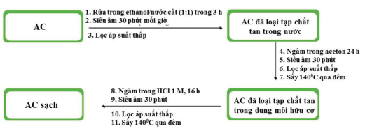

**Hình 1. Quy trình tiền xử lý AC.** 

Sau quá trình tiền xử lý, AC được biến tính với dung dịch HNO3 7% để tăng độ xốp cũng như các nhóm chức trên bề mặt. AC trong 8 giờ. Sau quá trình đun hoàn lưu, than được lọc rửa nhiều sau quá trình tiền xử lý được đun hoàn lưu với dung dịch HNO3 7% lần với nước cất và sấy ở 120[o] C trong 2 giờ thu được AC biến tính (m-AC). 

## _**Chế tạo điện cực m-AC-graphite**_ 

AC sau khi biến tính được phối trộn với graphite (MTI, USA) theo tỷ lệ khối lượng của graphite so với m-AC lần lượt là 1, 5 và 10%. Hệ chất kết dính sử dụng trong nghiên cứu này gồm poly(vinyl-alcol) (PVA, Sigma Aldrich, USA) và chất đóng rắn glutamic alhydride (GA, Sigma Aldrich, USA), tỷ lệ GA sử dụng là 5% theo khối lượng so với PVA. Tỷ lệ thành phần rắn so với chất kết dính là 9:1. Các thành phần AC, graphite, PVA và GA được phối trộn theo khối lượng cho ở bảng 1 hỗn hợp được bổ sung 10 gram nước cất hai lần. Hệ được khuấy trộn bằng máy đồng hóa với tốc độ 1200 vòng/phút và gia nhiệt ở 50[o] C trong 2 giờ sao cho hệ keo điện cực đồng nhất. Hệ điện cực m-AC-graphite được chế tạo bằng phương pháp gạt sử dụng doctor-blade với độ dày 200 μm trên nền graphite và giới hạn diện tích làm việc 1×1 cm[2] (Mineral Seal Corporation, USA). Màng điện cực sau đó được sấy chân không ở 100[o] C qua đêm. Khối lượng màng điện cực được xác định dựa vào khối lượng điện cực trước và sau khi phủ màng. 

**Bảng 1. Khối lượng của các thành phần trong hệ điện cực ACgraphite.** 

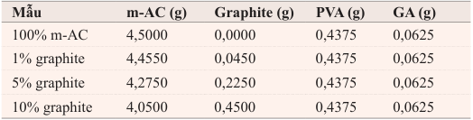

**----- Start of picture text -----** 
Mẫu m-AC (g) Graphite (g) PVA (g) GA (g) 100% m-AC 4,5000 0,0000 0,4375 0,0625 1% graphite 4,4550 0,0450 0,4375 0,0625 5% graphite 4,2750 0,2250 0,4375 0,0625 10% graphite 4,0500 0,4500 0,4375 0,0625 **----- End of picture text -----** 

65 

**62(11) 11.2020** 

_**Khoa học Kỹ thuật và Công nghệ**_ 

## _**Đánh giá các tính chất hóa lý của điện cực AC-graphite**_ 

Các nhóm chức đặc trưng của vật liệu AC trước và sau khi biến tính và vật liệu điện cực composite được phân tích bằng phương pháp quang phổ hồng ngoại biến đổi Fourier (Fourier Transform Infrared - FT-IR) trên thiết bị VERTEX 70 (Brucker, Germany). Hình thái học bề mặt của vật liệu được phân tích bằng phương pháp hiển vi điện tử quét (Scanning Electron Microscope - SEM) trên thiết bị JSM-6510LV (JOEL, Japan) ở 15 kV. Diện tích bề mặt và kích thước lỗ xốp của than AC trước và sau khi biến tính được đánh giá bằng phương pháp phân tích hấp phụ khí N77 K bằng thiết bị TriStar II-3000 analyzer (Micromeritics, USA).2 ở nhiệt độ 

Các tính chất điện hóa của điện cực được khảo sát trên hệ ba điện cực: điện cực làm việc là điện cực composite m-AC-graphite, điện cực so sánh Ag/AgCl (KCl 3,5 M) và điện cực đối Pt trong dung dịch điện ly NaCl 2000 ppm, sử dụng thiết bị BASi® Epsilon EW-4960 (BASi®, USA). Phương pháp quét thế vòng tuần hoàn được thực hiện trong khoảng điện thế từ -1 V đến +1 V (vs. Ag/ AgCl), tốc độ quét thế 20 mV/s. Giá trị điện dung riêng được tính từ đường cong CV được xác định dựa vào phương trình (1). 

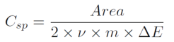

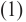

Trong đó, _Area_ là diện tích hình học của đường cong CV, _ν_ là tốc độ quét thế (V/s), _m_ là khối lượng vật liệu composite trên điện cực làm việc (g) và _ΔE_ là khoảng quét thế (V). 

Phương pháp áp thế cố định (Chronoamperometry) được thực hiện với thế áp đặt 1,2 V và 0 V (vs. Ag/AgCl) trong thời gian 900 giây. Độ hấp phụ muối (salt adsorption capacity, SAC) được xác định dựa vào phương trình (2). 

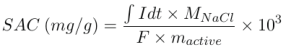

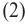

Trong đó, I là cường độ dòng điện của quá trình áp thế tại 1,2 V; F là hằng số Faraday (96485 C/mol); mactive là khối lượng vật liệu composite trên điện cực làm việc và MNaCl là khối lượng mol của NaCl (58 g/mol). 

## Kết quả và thảo luận 

## _**Đặc trưng của AC và AC biến tính**_ 

Phổ FT-IR của AC trước và sau biến tính (hình 2) cho thấy, dao động tại 3435 cm[-1] đặc trưng cho dao động của nhóm hydroxyl (-OH) trên bề mặt của than hoạt tính. Các pic hấp phụ tại 2920 cm[-1] , 2852 cm[-1] trong mẫu AC-HNO3 được quy cho sự dao động của các nhóm -CH3, -CH2, -CH sau khi phản ứng mở vòng xảy ra từ quá trình oxy hóa AC [16]. Vùng 1500-1750 cm[-1] bao gồm nhiều dải hấp phụ chồng lên nhau tập trung ở 1631cm[-1] và 1585 cm[-1] . Đỉnh 1630 cm[-1] được quy kết cho dao động của nhóm carbonyl liên hợp và dao động biến dạng của C=C trong vòng thơm. Với mẫu m-AC, các dải dao động nhỏ trong khoảng số sóng từ 1000 đến 1500 cm[-1] có thể xem là sự xuất hiện các nhóm -OH hay -COOH đặc trưng bởi dao động biến dạng của C=O tại 1120 cm[-1] [17]. Ngoài ra, trên phổ FT-IR còn xuất hiện pic ở số sóng 1585 cm[-1] và 1384 cm[-1 ] đặc - trưng cho dao động biến dạng của nhóm -NO3 [18]. Từ kết quả IR 

chức có chứa oxy trên bề mặt, dẫn đến sự phân tán tốt hơn của cho thấy quá trình hoạt hóa vật liệu với HNO3 đã tạo ra các nhóm m-AC trong dung môi cũng như trên nền PVA. 

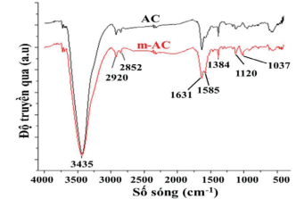

**Hình 2. Phổ FT-IR mẫu AC trước và sau khi biến tính với HNO3.** 

Đường cong hấp phụ - giải hấp khí N2 và phân bố kích thước hạt của AC trước và sau khi biến tính với HNO3 (hình 3) khá tương đồng và đặc trưng cho vật liệu có kích thước vi mao quản (microporous). Diện tích bề mặt tính theo BET của AC trước và sau biến tính có giá trị lần lượt là 951 và 1002 m[2] /g. Điều này cho thấy, quá trình tiền xử lý và biến tính với HNO3 ngoài loại bỏ các tạp chất còn giúp tăng diện tích bề mặt của AC. Kích thước lỗ xốp của AC trước và sau khi biến tính không có sự thay đổi đáng kể, kích thước lỗ xốp trung bình đạt 1,62 Å. 

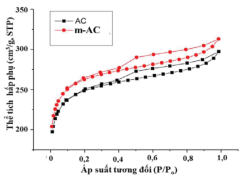

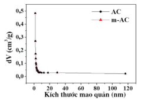

**Hình 3. Đường cong hấp phụ - giải hấp và phân bố kích thước mao quản của AC trước và sau khi biến tính trong môi trường khí N2.** 

## _**Chế tạo điện cực AC-graphite**_ 

Vật liệu than hoạt tính AC sau khi biến tính được chế tạo thành các điện cực với graphite và chất kết dính PVA-GA với tỷ lệ phối trộn được thể hiện ở bảng 1. Phổ FT-IR của ba điện cực composite m-AC-graphite ở 3 tỷ lệ phối trộn khác nhau (hình 4) cho thấy pic hấp phụ ở 3434 cm[-1] đặc trưng cho dao động của nhóm hydroxyl (-OH) trên bề mặt của than hoạt tính và nhóm -OH trong PVA. Các pic hấp phụ ở 2920 cm[-1] và 2852 cm[-1] đặc trưng cho dao động của nhóm -CH3, -CH2, và -CH [19]. Dao động biến dạng của C=O tại 1090 cm[-1] và dao động nhỏ ở khoảng số sóng 1330-1420 cm[-1] có thể là sự xuất hiện các nhóm -OH. Đỉnh hấp phụ ở 1570 cm[-1] được cho là dao động của nhóm carbonyl liên hợp và dao động biến dạng của C=C. Như vậy, điện cực được tạo thành vẫn giữ nguyên được các nhóm chức chứa oxy quan trọng, giúp tăng khả năng thấm ướt cũng như hấp phụ các ion trong quá trình điện hấp phụ muối. 

Ảnh SEM của m-AC và composite m-AC/graphite/PVA-GA với hàm lượng khác nhau của chất dẫn điện graphite được thể hiện trên hình 5. Như được quan sát trên ảnh SEM, m-AC và graphite 

66 

**62(11) 11.2020** 

_**Khoa học Kỹ thuật và Công nghệ**_ 

đã được kết nối với nhau bởi chất kết dính PVA-GA. Ảnh SEM cũng cho thấy điện cực composite chế tạo được có bề mặt xốp, nó hứa hẹn sẽ làm tăng khả năng hấp phụ của điện cực. 

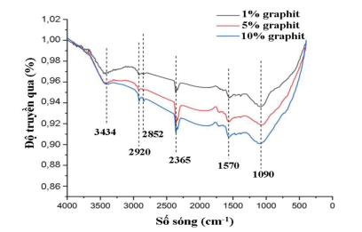

**Hình 4. Phổ FT-IR của ba mẫu điện cực với thành phần graphite 1, 5 và 10%.** 

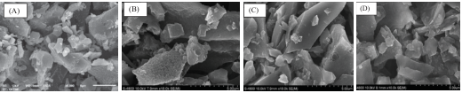

**----- Start of picture text -----** 
(A)  (B)  (C)  (D) **----- End of picture text -----** 

**Hình 5. Ảnh SEM của (A) m-AC và composite được chế tạo với hàm lượng khác nhau của graphite: (B) 1% graphite; (C) 5% graphite và (D) 10% graphite.** 

## _**Nghiên cứu tính chất điện hóa và khả năng hấp phụ muối**_ 

Trong quá trình điện hấp phụ muối trên bề mặt điện cực, giá trị điện dung riêng là một thông số quan trọng để đánh giá khả năng tạo lớp điện tích kép trên bề mặt điện cực. Giá trị điện dung riêng của các hệ điện cực được đánh giá thông qua phương pháp quét thế vòng tuần hoàn trong dung dịch điện ly NaCl 2000 ppm. Đường cong CV của các mẫu điện cực (hình 6) cho thấy quá trình điện hấp phụ diễn ra theo cơ chế điện dung, nghĩa là các ion di chuyển đến bề mặt điện cực trái dấu, hấp phụ lên bề mặt điện cực và tích điện mà không có quá trình trao đổi điện tử. Kết quả này phù hợp với các nghiên cứu trước đây về khả năng hấp phụ của vật liệu than hoạt tính. Ngoài ra, cấu trúc graphite là dạng lớp với khoảng cách các lớp lớn, các ion có khả năng đan xen vào giữa các lớp của graphite trong quá trình điện hấp phụ. Tuy nhiên, quan sát trên đường cong CV, chúng tôi nhận thấy việc bổ sung graphite không làm ảnh hưởng đến tính chất điện hấp phụ theo cơ chế điện dung của AC. 

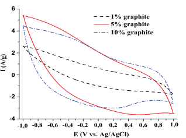

**----- Start of picture text -----** 
6  1% graphite  5% graphite 4  10% graphite 2 0 -2 -4 - 1,0 - 0,8 - 0,6 - 0,4 - 0,2 0,0 0,2 0,4 0,6 0,8 1,0 E (V vs. Ag/AgCl) I (A/g) **----- End of picture text -----** 

**Hình 6. Đường cong CV của các hệ điện cực trong dung dịch điện ly NaCl 2000 ppm với tốc độ quét thế 20 mV/s.** 

Kết quả điện dung riêng của các hệ điện cực tính từ đường cong CV theo phương trình (1) được cho trong bảng 2. Nhận thấy, quá trình biến tính bề mặt AC đã cải thiện được điện dung của AC, điện dung của hệ điện cực AC biến tính đạt giá trị 39,8 F/g. Ngoài ra, khi bổ sung thành phần graphite có độ dẫn điện cao cũng góp phần tăng điện dung của hệ điện cực. Giá trị điện dung riêng trung bình (tính cho năm mẫu) của hệ điện cực m-AC/graphite 1, 5 và 10% lần lượt là 31,3, 98,6 và 100,8 F/g. Như vậy graphite đóng vai trò là chất tăng cường điện dung bởi khả năng dẫn điện tốt, tăng cường tích điện ở vùng thế âm và không làm thay đổi cơ chế tích điện của AC. 

**Bảng 2. Giá trị điện dung riêng của các hệ điện cực khảo sát.** 

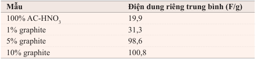

**----- Start of picture text -----** 
Mẫu Điện dung riêng trung bình (F/g) 100% AC-HNO3 19,9 1% graphite 31,3 5% graphite 98,6 10% graphite 100,8 **----- End of picture text -----** 

Ngoài giá trị điện dung riêng, giá trị độ hấp phụ muối là thông số quan trọng để đánh giá hiệu quả hấp phụ muối của các hệ điện cực. Các hệ điện cực được nghiên cứu khả năng điện hấp phụ - giải hấp ion trong dung dịch điện ly NaCl 2000 ppm trong điều kiện áp thế liên tục 1,2 V với thời gian 900 giây (quá trình điện hấp phụ ion lên bề mặt điện cực), sau đó đảo chiều với điện thế 0 V trong 900 giây (quá trình giải hấp ion ra khỏi bề mặt điện cực). Hình 7 là đồ thị điện hấp phụ - giải hấp ion của điện cực 1% graphite. Khi điện cực được áp thế 1,2 V, các ion Na[+] và Cl[-] di chuyển về các điện cực tích điện trái dấu và hấp phụ tại bề mặt điện cực. Quá trình hấp phụ diễn ra đi kèm với sự sụt giảm của cường độ dòng điện (quá trình tích điện). Khi cường độ dòng điện tiệm cận 0 chứng tỏ quá trình điện hấp phụ diễn ra bão hòa. Sau đó, tiến hành đảo thế tại điện thế 0 V, các ion tích điện trên bề mặt điện cực sẽ được giải phóng đi kèm với quá trình phóng điện. Khi quá trình phóng điện đạt giá trị tiệm cận 0 chứng tỏ các ion đã được giải hấp hoàn toàn khỏi bề mặt điện cực. 

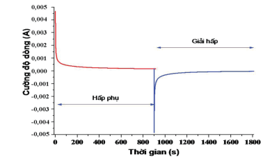

**Hình 7. Đồ thị điện hấp phụ - giải hấp của điên cực 1% graphite.** 

Hình 8 biểu diễn mối quan hệ của cường độ dòng điện theo thời gian của các hệ điện cực composite trong môi trường điện ly NaCl 2000 ppm tại điện thế áp đặt 1,2 V. Khi áp thế 1,2 V vào các điện cực, các điện cực đạt giá trị I cực đại lần lượt 4,67 mA (1% graphite), 4,65 mA (5% graphite) và 4,42 mA (10% graphite). Các điện cực đều có sự suy giảm điện thế nhanh trong khoảng 50 giây đầu tiên, tuy nhiên, điện cực composite với hàm lượng graphite 5 

67 

**62(11) 11.2020** 

_**Khoa học Kỹ thuật và Công nghệ**_ 

và 10% có sự suy giảm điện thế chậm hơn so với điện cực chứa 1% graphite. Kết quả này phù hợp với các giá trị điện dung riêng tính từ đường cong CV, cho thấy khả năng tích điện cao của điện cực có phụ gia graphite. Sau 400 giây, các điện cực đạt giá trị cường độ dòng tiệm cận 0 (dưới 0,5 mA), cho thấy quá trình hấp phụ đạt gần giá trị bão hòa. Đồng thời, hiệu suất Coulomb của quá trình hấp phụ - giải hấp của ion trên bề mặt điện cực được xác định dựa trên tỷ số của điện lượng tích điện và phóng điện của điện cực. Cả ba điện cực đều có giá trị hiệu suất Coulomb đạt giá trị gần 100%, cho thấy các quá trình hấp phụ - giải hấp của ion diễn ra thuận nghịch hoàn toàn. 

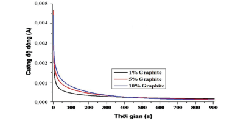

**Hình 8. Đồ thị so sánh quá trình điện hấp phụ các hệ điện cực trong dung dịch điện ly NaCl 2000 ppm tại thế áp đặt 1,2 V.** 

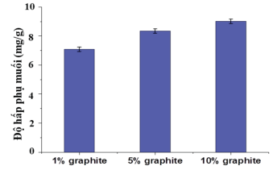

**Hình 9. Độ hấp phụ muối (mg/g) của các điện cực composite ACgraphite.** 

Độ hấp phụ muối được tính toán dựa vào đồ thị biến đổi dòng theo thời gian theo phương trình (2) cho giá trị độ hấp phụ muối trung bình (tính cho năm mẫu) của ba mẫu điện cực đạt giá trị lần lượt 7,08 mg/g (1% graphite), 8,35 mg/g (5% graphite) và 9,01 mg/g (10% graphite). Kết quả này (hình 9) cho thấy, sự có mặt của graphite không chỉ làm tăng điện dung của hệ điện cực, mà còn làm tăng khả năng điện hấp phụ muối trên bề mặt điện cực do graphite có thể làm tăng độ dẫn điện của điện cực. Giá trị dung lượng hấp phụ muối trong nghiên cứu này khá tương đồng với nghiên cứu của J. Kim và cộng sự với nguồn carbon hoạt tính từ vỏ trấu (8,09 mg/g) [20] và cao hơn nghiên cứu của Wang và cộng sự [21] (4,4 mg/g). 

## Kết luận 

Điện cực composite cho hệ khử mặn theo công nghệ CDI đã được chế tạo thành công từ carbon hoạt tính, graphite và chất kết dính PVA bằng phương pháp đúc bùn. Việc bổ sung thành phần graphite vào hệ điện cực composite m-AC-graphite đã làm tăng điện dung riêng của hệ điện cực và tăng khả năng hấp phụ các ion trên bề mặt. Hệ điện cực với 10% graphite cho kết quả tốt về giá trị điện dung riêng cũng như độ hấp thu muối đạt 9,01 mg/g. 

## LỜI CẢM ƠN 

Nghiên cứu này được tài trợ bởi Quỹ phát triển khoa học và công nghệ quốc gia (NAFOSTED) thông qua đề tài mã số 104.062019.325 và Bộ Khoa học và Công nghệ thông qua đề tài mã số KC.02.24/16-20. Các tác giả xin trân trọng cảm ơn. 

## TÀI LIỆU THAM KHẢO 

[1] S.F. Anis, R. Hashaikeh, N. Hilal (2019), “Functional materials in desalination: a review”, _Desalination_ , **468** , DOI: 10.1016/j.desal.2019.114077. 

[2] M. Qasim, M. Badrelzaman, N.N. Darwish, N.A. Darwish, N. Hilal (2019), “Reverse osmosis desalination: a state-of-the-art review”, _Desalination_ , **459** , pp.59-104. [3] Y. Oren (2008), “Capacitive deionization (CDI) for desalination and water treatment - past, present and future (a review)”, _Desalination_ , **228** , pp.10-29. 

[4] S.S. Gupta, M.R. Islam, T. Pradeep (2018), “Chapter 7: Capacitive Deionization (CDI): an alternative cost-efficient desalination technique”, _Advances in Water Purification Techniques: Meeting the Needs of Developed and Developing Countries,_ Elsevier, pp.165-202. 

[5] Z.H. Huang, Z. Yang, F. Kang, M. Inagaki (2017), “Carbon electrodes for capacitive deionization”, _J. Mater. Chem. A,_ **5** , pp.470-496. 

[6] A. Thamilselvan, A.S. Nesaraj, M. Noel (2016), “Review on carbon-based electrode materials for application in capacitive deionization process”, _Int. J. Environ. Sci. Technol.,_ **13** , pp.2961-2976. 

[7] Jae-Hwan Choi (2010), “Fabrication of a carbon electrode using activated carbon powder and application to the capacitive deionization process”, _Separation and Purification Technology_ , **70** , pp.362-366. 

[8] M.E. Suss, S. Porada, X. Sun, P.M. Biesheuvel, J. Yoon, V. Presser (2015), “Water desalination via capacitive deionization: what is it and what can we expect from it?”, _Energy Environ. Sci._ , **8,** pp.2296-2319. 

[9] C.J. Feng, Y.A. Chen, C.P. Yu, C.H. Hou (2018), “Highly porous activated carbon with multichanneled structure derived from loofa sponge as a capacitive electrode material for the deionization of brackish water”, _Chemosphere_ , **208** , pp.285-293. 

[10] Nei-Ling Liu, Shih-Han Sun, Chia-Hung Hou (2019), “Studying the electrosorption performance of activated carbon electrodes in batch-mode and singlepass capacitive deionization”, _Separation and Purification Technology_ , **215** , pp.403-409. 

[11] Zheng-Hong Huang, Zhiyu Yang, Feiyu Kang, Michio Inagaki (2016), “Carbon electrodes for capacitive deionization”, _J. Mater. Chem. A_ , DOI: 10.1039/ C6TA06733F. 

[12] D.D. Caudle, J.H. Tucker, J.L. Cooper, B.B. Arnold, A. Papastamataki (1966), “Electrochemical demineralization of water with carbon electrodes”, _Research Report._ 

[13] E. Frackowiak, F. Beguin (2001), “Carbon materials for the electrochemical storage of energy in capacitors”, _Carbon_ , **39** , pp.937-950. 

[14] S. Flandrois, B. Simon (1999), “Carbon materials for lithium-ion rechargeable batteries”, _Carbon_ , **37** , pp.165-180. 

[15] R.A. Buerschaper (1944), “Thermal and electrical conductivity of graphite and carbon at low temperatures”, _Journal of Applied Physics_ , **15** , pp.452-454. 

[16] J. Qiu, G. Wang, Y. Bao, D. Zeng, Y. Chen (2015), “Effect of oxidative modification of coal tar pitch-based mesoporous activated carbon on the adsorption of benzothiophene and dibenzothiophene”, _Fuel Processing Technology_ , **129** , pp.85-90. 

[17] N. Yanou Rachel, B. Abdelaziz, N. Julius Nsami, K. Daouda, Y. Abdelrani, L. Mehdi, L. Khalid, K.M. Joseph (2018), “Antibacterial properties of AgNO3-activated carbon composite on Escherichia coli: inhibition action”, _International Journal of Advanced Chemistry_ , **6** , p.46. 

[18] Y. Gokce, Z. Aktas (2014), “Nitric acid modification of activated carbon produced from waste tea and adsorption of methylene blue and phenol”, _Applied Surface Science_ , **313** , pp.352-359. 

[19] P. Meng, C. Chen, L. Yu, J. Li, W. Jiang (2000), “Crosslinking of PVA pervaporation membrane by maleic acid”, _Tsinghua Science and Technology,_ **5** , pp.172-175. 

[20] J. Kim, Y. Yi, D.H. Peck, S.H. Yoon, D.H. Jung, H.S. Park (2019), “Controlling hierarchical porous structures of rice-husk-derived carbons for improved capacitive deionization performance”, _Environ. Sci.: Nano.,_ **6** , pp.916-924. 

[21] GangWang, ChaoPan, LiupingWang, QiangDong, ChangYu, ZongbinZhao, JieshanQiu (2012), “Activated carbon nanofiber webs made by electrospinning for capacitive deionization”, _Electrochimica Acta_ , **69** , pp.65-70. 

68 

**62(11) 11.2020** 

