## Page 1

## Page 2

ANALYTICAL
ELECTROCHEMISTRY
SECOND EDITION

## Page 3

This page intentionally left blank

## Page 4

ANALYTICAL
ELECTROCHEMISTRY
Second Edition
JOSEPH WANG
WILEY-VCH
A JOHN WILEY & SONS, INC., PUBLICATION

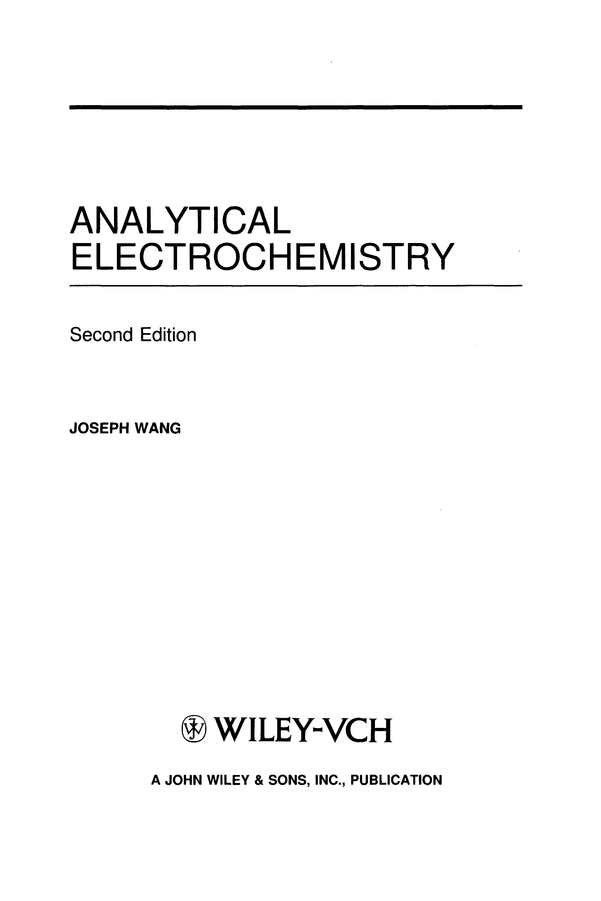

## Page 5

This book is printed on acid-free paper, (ro)
Copyright © 2000 by Wiley-VCH. All rights reserved.
Published simultaneously in Canada.
No part of this publication may be reproduced, stored in a retrieval system or transmitted in any
form or by any means, electronic, mechanical, photocopying, recording, scanning or otherwise,
except as permitted under Sections 107 or 108 of the 1976 United States Copyright Act, without
either the prior written permission of the Publisher, or authorization through payment of the
appropriate per-copy fee to the Copyright Clearance Center, 222 Rosewood Drive, Danvers, MA
01923, (978) 750-8400, fax (978) 750-4744. Requests to the Publisher for permission should be
addressed to the Permissions Department, John Wiley & Sons, Inc., 605 Third Avenue, New York,
NY 10148-0012, (212) 850-6011, fax (212) 850-6008, E-Mail: PERMREQ@WILEY.COM.
For ordering and customer service call, 1-800-CALL-WILEY.
Library of Congress Cataloging-in-Pubtication Data:
Wang, Joseph, 1948
Analytical electrochemistry / Joseph Wang.— 2nd ed.
p. cm.
Includes index.
ISBN 0471-28272-3 (Cloth : alk. paper)
1. Electrochemical analysis. I. Title.
QD115.W33 2000
543'.0871—<lc21 
99-089637
Printed in the United States of America.
10 9 8 7 6 5 4 3

## Page 6

Dedicated to the memory of my parents, Elka and Moshe Wang

## Page 7

This page intentionally left blank

## Page 8

CONTENTS
PREFACE 
xi
ABBREVIATIONS AND SYMBOLS 
xiii
1 
FUNDAMENTAL CONCEPTS 
1
1-1 Why Electroanalysis? / 1
1-2 Faradaic Processes / 3
1-2.1 Mass Transport-Controlled Reactions / 4
1-2.1.1 Potential Step Experiment / 
7
1-2.1.2 Potential-Sweep Experiments / 8
1-2.2 Reactions Controlled by the Rate of Electron Transfer / 11
1-2.2.1 Activated Complex Theory / 
16
1-3 The Electrical Double Layer / 18
1-4 Electrocapillary Effect / 22
Supplementary Reading / 25
References / 26
Questions / 26
2 STUDY OF ELECTRODE REACTIONS 
28
2-1 Cyclic Voltammetry / 28
2-1.1 Data Interpretation / 30
vii

## Page 9

VIII 
CONTENTS
2-1.1.1 Reversible Systems / 
31
2-1.1.2 Irreversible and Quasi-Reversible Systems / 
32
2-1.2 
Study of Reaction Mechanisms / 33
2-1.3 
Study of Adsorption Processes / 36
2-1.4 
Quantitative Applications / 39
2-2 Spectroelectrochemistry / 40
2-2.1 Experimental Arrangement / 40
2-2.2 Principles and Applications / 41
2-2.3 
Other Spectroelectrochemical and Spectroscopic Techniques / 44
2-3 Scanning Probe Microscopy / 46
2-3.1 
Scanning Tunneling Microscopy / 46
2-3.2 Atomic Force Microscopy / 47
2-3.3 
Scanning Electrochemical Microscopy / 49
2-4 Electrochemical Quartz Crystal Microbalance / 52
References / 54
Examples / 56
Questions / 59
3 CONTROLLED-POTENTIAL TECHNIQUES 
60
3-1 Chronoamperometry / 60
3-2 Polarography / 62
3-3 Pulse Voltammetry / 67
3-3.1 Normal-Pulse Voltammetry / 67
3-3.2 
Differential-Pulse Voltammetry / 68
3-3.3 
Square-Wave Voltammetry / 72
3-3.4 
Staircase Voltammetry / 74
3-4 AC Voltammetry / 74
3-5 Stripping Analysis / 75
3-5.1 
Anodic Stripping Voltammetry / 76
3-5.2 
Potentiometric Stripping Analysis / 79
3-5.3 
Adsorptive Stripping Voltammetry and Potentiometry / 80
3-5.4 
Cathodic Stripping Voltammetry / 82
3-5.5 Applications / 84
3-6 Flow Analysis / 84
3-6.1 
Principles / 87
3-6.2 
Cell Design / 88
3-6.3 Mass Transport and Current Response / 90
3-6.4 Detection Modes / 92

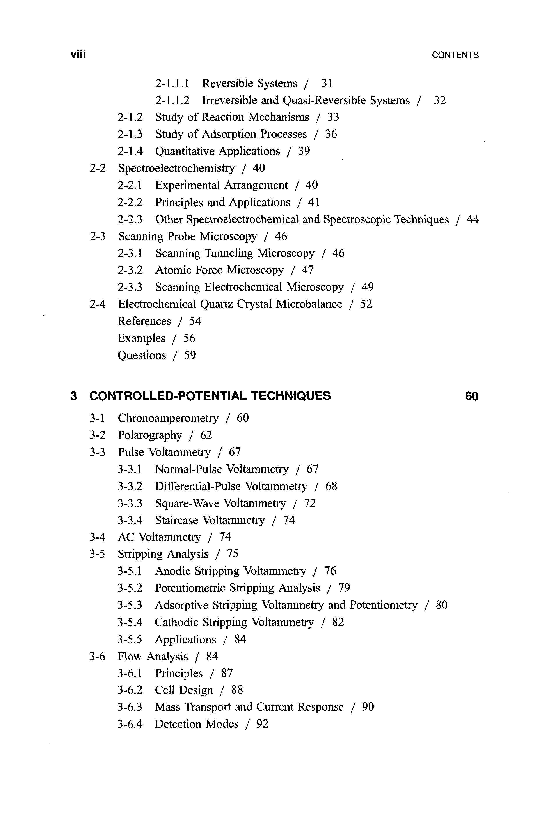

## Page 10

CONTENTS 
JX
References / 94
Examples / 96
Questions / 98
4 PRACTICAL CONSIDERATIONS 
100
4-1 Electrochemical Cells / 100
4-2 
Solvents and Supporting Electrolytes / 102
4-3 Oxygen Removal / 103
4-4 Instrumentation / 104
4-5 Working Electrodes / 107
4-5.1 Mercury Electrodes / 108
4-5.2 Solid Electrodes / 110
4-5.2.1 
Rotating Disk and Ring-Disk Electrodes / 
111
4-5.2.2 
Carbon Electrodes / 113
4-5.2.2.1 Glassy-Carbon Electrodes / 114
4-5.2.2.2 
Carbon-Paste Electrodes / 115
4-5.2.2.3 
Carbon-Fiber Electrodes / 115
4-5.2.3 
Metal Electrodes / 117
4-5.3 
Chemically Modified Electrodes / 118
4-5.3.1 
Self-Assembled Monolayers / 118
4-5.3.2 
Sol-Gel Encapsulation of Reactive Species / 
120
4-5.3.3 
Electrocatalytic Modified Electrodes / 121
4-5.3.4 Preconcentrating Electrodes / 
121
4-5.3.5 Permselective Coatings / 123
4-5.3.6 
Conducting Polymers / 124
4-5.4 Microelectrodes / 128
4-5.4.1 
Diffusion at Microelectrodes / 
129
4-5.4.2 Configurations of Microelectrodes / 130
4-5.4.3 
Composite Electrodes / 131
References / 135
Examples / 138
Questions / 138
5 POTENTIOMETRY 
140
5-1 Principles of Potentiometric Measurements / 140
5-2 Ion-Selective Electrodes / 147
5-2.1 Glass Electrodes / 147
5-2.1.1 pH Electrodes / 147

## Page 11

CONTENTS
5-2.1.2 Glass Electrodes for Other Cations / 
151
5-2.2 Liquid-Membrane Electrodes / 152
5-2.2.1 Ion-Exchanger Electrodes / 152
5-2.2.2 Neutral Carrier Electrodes / 
154
5-2.3 
Solid-State Electrodes / 156
5-2.4 
Coated-Wire Electrodes / 160
5-3 On-Line and In-Vivo Potentiometric Measurements / 161
References / 165
Examples / 167
Questions / 169
6 ELECTROCHEMICAL SENSORS 
171
6-1 Electrochemical Biosensors / 171
6-1.1 Enzyme-Based Electrodes / 172
6-1.1.1 Impractical and Theoretical Considerations / 
172
6-1.1.2 
Enzyme Electrodes of Analytical Significance / 
176
6-1.1.2.1 
Glucose Sensors / 176
6-1.1.2.2 
Ethanol Electrodes / 178
6-1.1.2.3 Urea Electrodes / 181
6-1.1.2.4 Toxin (Enzyme Inhibition) Biosensors / 181
6-1.1.3 Tissue and Bacteria Electrodes / 182
6-1.2 
Affinity Biosensors / 183
6-1.2.1 Immunosensors / 183
6-1.2.2 DNA Hybridization Biosensors / 185
6-1.2.3 Receptor-Based Sensors / 186
6-2 Gas Sensors / 188
6-2.1 
Carbon Dioxide Sensors / 189
6-2.2 
Oxygen Electrodes / 190
6-3 Solid-State Devices / 191
6-3.1 Microfabrication of Solid-State Sensor Assemblies / 193
6-3.2 Microfabrication Techniques / 193
6-4 
Sensor Arrays / 197
References / 198
Examples / 201
Questions / 202
INDEX 
205

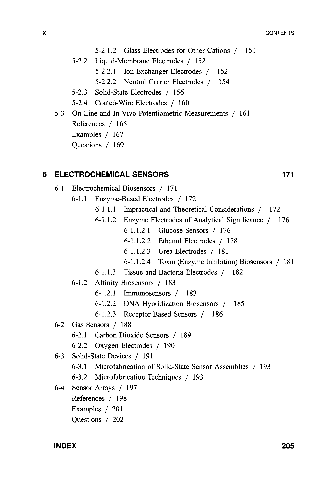

## Page 12

PREFACE
The goal of this textbook is to cover the full scope of modern electroanalytical
techniques and devices. The main emphasis is on electroanalysis, rather than
physical electrochemistry. The objective is to provide a sound understanding of
the fundamentals of electrode reactions and of the principles of electrochemical
methods, and to demonstrate their potential for solving real-life analytical problems.
Given the impressive progress in electroanalytical chemistry, and its growing impact
on analytical chemistry, this work offers also an up-to-date, easy-to-read presentation
of recent advances including new methodologies, sensors, detectors, and micro-
systems. The book is suitable for a graduate-level course in electroanalytical
chemistry or as a supplement to a high-level undergraduate course in instrumental
analysis. It should also be very useful to those considering the use of electroanalysis
in their laboratories.
The material is presented in six roughly equal chapters. The first chapter is
devoted to fundamental aspects of electrode reactions and the structure of the
interfacial region. Chapter 2 discusses the study of electrode reactions and high-
resolution surface characterization. Chapter 3 gives an overview of finite-current
controlled-potential techniques. Chapter 4 describes the electrochemical instrumen-
tation and electrode materials (including new modified and microelectrodes).
Chapter 5 deals with the principles of potentiometric measurements and various
classes of ion-selective electrodes, while Chapter 6 is devoted to the growing field of
chemical sensors (including modern biosensors, gas sensors, solid-state devices, and
sensor arrays). I have tried to provide numerous references to review literature at the
end of each chapter. By discussing the very latest advances, it is hoped to bridge the
common gap between recent research literature and standard textbooks.
XI

## Page 13

XH 
PREFACE
This second edition of Analytical Electrochemistry is extensively revised and
updated, and reflects the rapid growth of electroanalytical chemistry during the
1990s. It contains a number of new topics, including self-assembled monolayers,
DNA biosensors, sol-gel surface modification, detection for capillary electrophor-
esis, single molecule detection, and micromachined analyzers ("Lab-on-a-Chip").
Other topics such as the fundamentals of faradaic processes, principles of potentio-
metric measurements, spectroelectrochemistry, modified and microelectrodes, scan-
ning electron microscopy, electrical communication between redox enzymes and
electrodes, and enzyme and immunoelectrodes, have been greatly expanded. The
entire text has been updated to cover the very latest (as of 1999) developments in
electroanalytical chemistry. Numerous new worked examples and end-of-chapter
questions have been added to this edition. The organization of the book has been
changed somewhat, by moving the study of electrode reactions forward to Chapter 2.
In the five years since the first edition I received numerous suggestions, many of
which have been incorporated in the second edition.
Finally, I wish to thank my wife, Ruth, and my daughter, Sharon, for their love
and patience; the editorial and production staff of Wiley Inc. for their help and
support; and the numerous electrochemists across the globe who led to the advances
reported in this textbook. Thank you all!
Joseph Wang
Las Cruces, New Mexico, U.S.A.

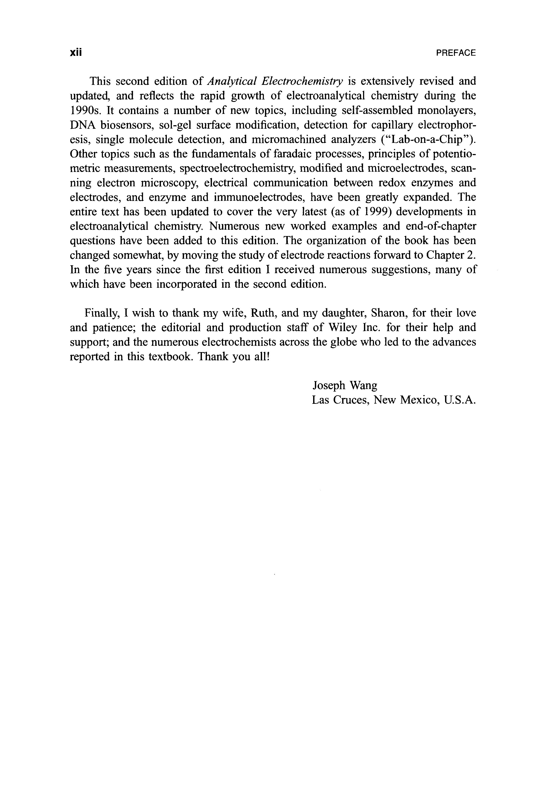

## Page 14

ABBREVIATIONS AND SYMBOLS
a 
Activity
A 
Absorbance
A 
Area of electrode
Ab 
Antibody
AdSV 
Adsorptive stripping voltammetry
AES 
Auger electron spectroscopy
AFM 
Atomic force microscopy
Ag 
Antigen
ASV 
Anodic stripping voltammetry
B
Adsorption coefficient
C 
Concentration
Cdl 
Differential capacitance
CHg 
Concentration in amalgam
CSV 
Cathodic stripping voltammetry
CWE 
Coated-wire electrode
CME 
Chemically modified electrode
CV 
Cyclic voltammetry
CZE 
Capillary zone electrophoresis
D 
Diffusion coefficient
DC 
Direct current
DNA 
Deoxyribonucleic acid
xiii

## Page 15

XIV
ABBREVIATIONS AND SYMBOLS
DME
DPV
EB
Ee
E°
E1/2
EP
EC
ECL
EQCM
ESCA
EXAFS
F
FET
FIA
/
A/
AG
AG*
Dropping mercury electrode
Differential pulse voltammetry
Potential (V)
Pulse amplitude; step height
Binding energy (in XPS)
Equilibrium potential
Standard electrode potential
Half wave potential
Peak potential
Potential of zero charge
Electrode process involving an electrochemical reaction followed by a
chemical step
Electrochemiluminescence
Electrochemical quartz crystal microbalance
Electron spectroscopy for chemical analysis
X-ray adsorption fine structure
Faraday constant
Field-effect transistor
Flow injection analysis
Activity coefficient; frequency
Frequency change (in EQCM)
Free energy
Free energy of activation
HMDE 
Hanging mercury drop electrode
i 
Electric current
ic 
Charging current
// 
Limiting current
/, 
Tunneling current
A/ 
Current difference
IHP 
Inner Helmholtz plane
IRS 
Internal reflectance spectroscopy
ISE 
Ion-selective electrode
ISFET 
Ion-selective field-effect transistor
J
Flux
Potentiometric selectivity coefficient
Standard rate constant
Michaelis-Menten constant; mass transport coefficient

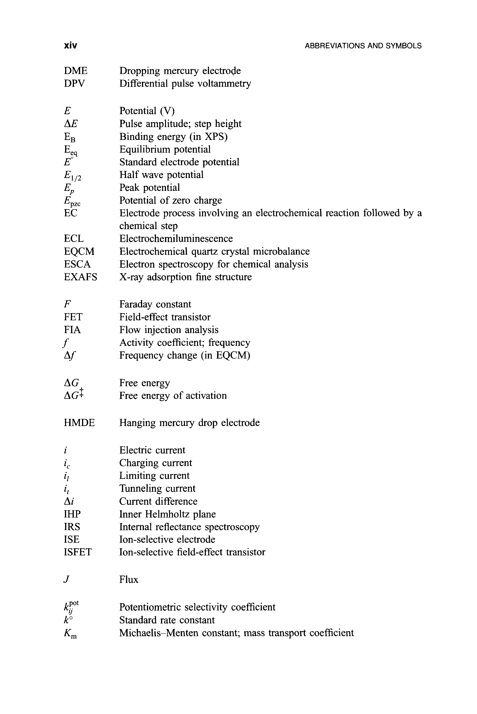

## Page 16

ABBREVIATIONS AND SYMBOLS
/ 
Film thickness
LCEC 
Liquid chromatography/electrochemistry
LEED 
Low-energy electron diffraction
m 
Mercury flow rate (in polarography); electron mass (in STM)
Am 
Mass charge (in EQCM)
M 
Mediator
MFE 
Mercury film electrode
N 
Collection efficiency
NADH 
Dihydronicotinamide adenine dinucleotide
n 
Number of electrons transferred
NP 
Normal pulse
O 
The oxidized species
OHP 
Outer Helmholtz plane
OTE 
Optically transparent electrode
PAD 
Pulsed amperometric detection
PSA 
Potentiometric stripping analysis
q 
Charge
QCM 
Quartz crystal microbalance
r 
distance; radius
R 
Resistance; gas constant
RDE 
Rotating disk electrode
Re 
Reynolds number
RRDE 
Rotating ring disk electrode
RVC 
Reticulated vitreous carbon
S 
Barrier width (in STM)
SAM 
Self-assembled monolayers
Sc 
Schmidt number
SECM 
Scanning electrochemical microscopy
SERS 
Surface enhanced Raman scattering
STM 
Scanning tunneling microscopy
SWV 
Square-wave voltammetry
T 
Temperature
t 
Time
td 
Deposition time
tm 
Transition time (in PSA)
xv
U
Flow rate, stirring rate

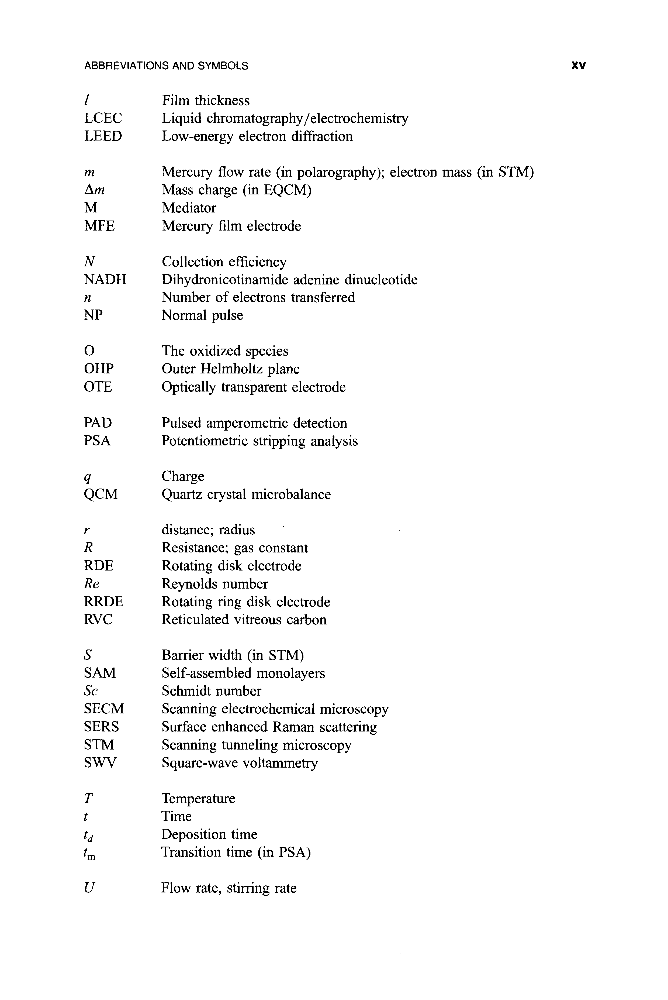

## Page 17

xvi
ABBREVIATIONS AND SYMBOLS
v 
Potential scan rate
FHg 
Volume of mercury electrode
^max 
Maximum rate
Wlj2 
Peak width (at half height)
WE 
Working electrode
WJD 
Wall jet detector
XPS 
X-ray photoelectron spectroscopy
a 
Transfer coefficient
F 
Surface coverage
e 
Dielectric constant; molar absorptivity
7 
Surface tension
(5 
Thickness of the diffusion layer
dH 
Thickness of the hydrodynamic boundary layer
rj 
Overvoltage
// 
Ionic strength
v 
Kinematic viscosity
co 
Angular velocity

## Page 18

ANALYTICAL
ELECTROCHEMISTRY
SECOND EDITION

## Page 19

This page intentionally left blank

## Page 20

CHAPTER 1
FUNDAMENTAL CONCEPTS
1-1 WHY ELECTROANALYSIS?
Electroanalytical techniques are concerned with the interplay between electricity and
chemistry, namely the measurements of electrical quantities, such as current,
potential, or charge, and their relationship to chemical parameters. Such use of
electrical measurements for analytical purposes has found a vast range of applica-
tions, including environmental monitoring, industrial quality control, and biomedical
analysis. Advances in the 1980s and 1990s—including the development of ultra-
microelectrodes, the design of tailored interfaces and molecular monolayers, the
coupling of biological components and electrochemical transducers, the synthesis of
ionophores and receptors containing cavities of molecular size, the development of
ultratrace voltammetric techniques or of high-resolution scanning probe microsco-
pies, and the microfabrication of molecular devices or efficient flow detectors—have
led to a substantial increase in the popularity of electroanalysis, and to its expansion
into new phases and environments. Indeed, electrochemical probes are receiving a
major share of the attention in the development of chemical sensors.
In contrast to many chemical measurements that involve homogeneous bulk
solutions, electrochemical processes take place at the electrode-solution interface.
The distinction between various electroanalytical techniques reflects the type of
electrical signal used for the quantitation. The two principal types of electroanaly-
tical measurements are potentiometric and potentiostatic. Both types require at least
two electrodes (conductors) and a contacting sample (electrolyte) solution, which
constitute the electrochemical cell. The electrode surface is thus a junction between
an ionic conductor and an electronic conductor. One of the two electrodes responds

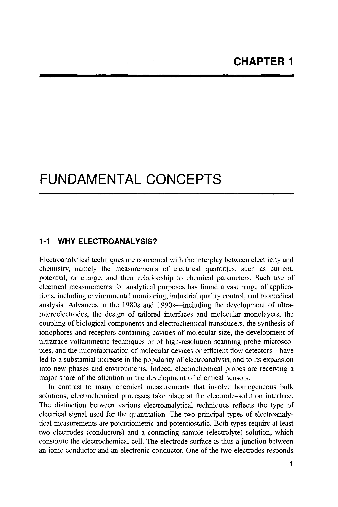

## Page 21

2 
FUNDAMENTAL CONCEPTS
to the target analyte(s) and is thus termed the indicator (or working) electrode. The
second one, termed the reference electrode, is of constant potential (that is,
independent of the properties of the solution). Electrochemical cells can be classified
as electrolytic (when they consume electricity from an external source) or galvanic
(if they are used to produce electrical energy).
Potentiometry (discussed in Chapter 5), which is of great practical importance, is
a static (zero current) technique in which the information about the sample
composition is obtained from measurement of the potential established across a
membrane. Different types of membrane materials, possessing different ion-recogni-
tion processes, have been developed to impart high selectivity. The resulting
potentiometric probes have thus been widely used for several decades for direct
monitoring of ionic species such as protons or calcium, fluoride, and potassium ions
in complex samples.
Controlled-potential (potentiostatic) techniques deal with the study of charge-
transfer processes at the electrode-solution interface, and are based on dynamic (no
zero current) situations. Here, the electrode potential is being used to derive an
electron-transfer reaction and the resultant current is measured. The role of the
potential is analogous to that of the wavelength in optical measurements. Such a
controllable parameter can be viewed as "electron pressure," which forces the
chemical species to gain or lose an electron (reduction or oxidation, respectively).
TABLE 1-1 Properties of Controlled-Potential Techniques
Technique"
DC polarography
NP polarography
DP polarography
DP voltammetry
SW polarography
AC polarography
Chronoamperometry
Cyclic voltammetry
Stripping voltammetry
Adsorptive stripping
voltammetry
Adsorptive stripping
voltammetry
Adsorptive-catalytic
stripping voltammetry
Working
Electrode*
DME
DME
DME
Solid
DME
DME
Stationary
Stationary
HMDE, MFE
HMDE
Solid
HMDE
Detection
Limit (M)
10-
 5
5xl(T 7
1(T8
5x 1(T7
1(T8
5x 1(T7
1(T5
1(T5
10- 10
10-
 10
io-9
10-
 12
Speed
(time per
cycle) (min)
3
3
3
3
0.1
1
0.1
0.1-2
3-6
2-5
4-5
2-5
Response
Shape
Wave
Wave
Peak
Peak
Peak
Peak
Transient
Peak
Peak
Peak
Peak
Peak
"DC = direct current; NP = normal pulse; DP = differential pulse; SW = square wave; AC = alternating
current.
*DME = dropping mercury electrode; HMDE = hanging mercury drop electrode; MFE = mercury film
electrode.

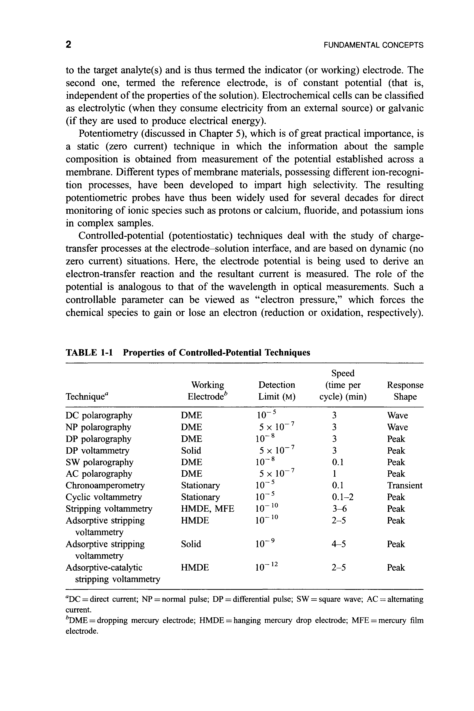

## Page 22

1-2 FARADAIC PROCESSES 
3
Accordingly, the resulting current reflects the rate at which electrons move across the
electrode-solution interface. Potentiostatic techniques can thus measure any chemi-
cal species that is electroactive, in other words, that can be made to reduce or
oxidize. Knowledge of the reactivity of functional group in a given compound can be
used to predict its electroactivity. Nonelectroactive compounds may also be detected
in connection with indirect or derivatization procedures.
The advantages of controlled-potential techniques include high sensitivity,
selectivity towards electroactive species, a wide linear range, portable and low-
cost instrumentation, speciation capability, and a wide range of electrodes that allow
assays of unusual environments. Several properties of these techniques are summar-
ized in Table 1-1. Extremely low (nanomolar) detection limits can be achieved with
very small sample volumes (5-20 ul), thus allowing the determination of analyte
amounts of 10~13 to 10~15mol on a routine basis. Improved selectivity may be
achieved via the coupling of controlled-potential schemes with chromatographic or
optical procedures.
This chapter attempts to give an overview of electrode processes, together with
discussion of electron transfer kinetics, mass transport, and the electrode—solution
interface.
1-2 FARADAIC PROCESSES
The objective of controlled-potential electroanalytical experiments is to obtain a
current response that is related to the concentration of the target analyte. This
objective is accomplished by monitoring the transfer of electron(s) during the redox
process of the analyte:
O + ne~^R 
(1-1)
where O and R are the oxidized and reduced forms, respectively, of the redox couple.
Such a reaction will occur in a potential region that makes the electron transfer
thermodynamically or kinetically favorable. For systems controlled by the laws of
thermodynamics, the potential of the electrode can be used to establish the
concentration of the electroactive species at the surface [Co(0, t) and CR(0, t)]
according to the Nernst equation:
where E° is the standard potential for the redox reaction, R is the universal gas
constant (8.314JKT1 mol"1), T is the Kelvin temperature, n is the number of
electrons transferred in the reaction, and F is the Faraday constant (96,487
coulombs). On the negative side of E°, the oxidized form thus tends to be reduced,
and the forward reaction (i.e., reduction) is more favorable. The current resulting
from a change in oxidation state of the electroactive species is termed the faradaic

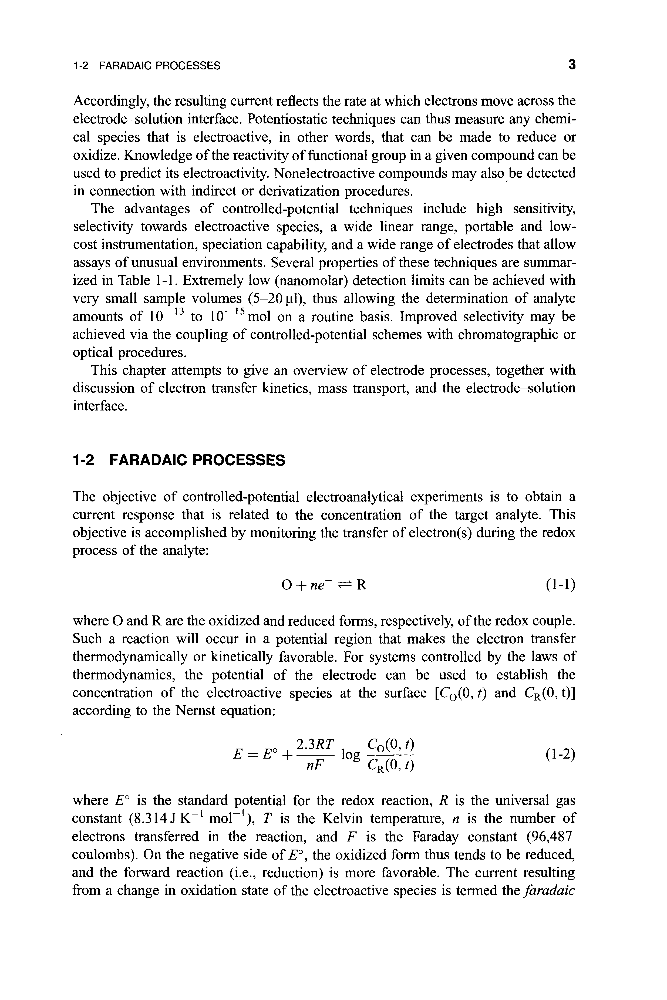

## Page 23

4 
FUNDAMENTAL CONCEPTS
current because it obeys Faraday's law (i.e. the reaction of 1 mole of substance
involves a change of n x 96,487 coulombs). The faradaic current is a direct measure
of the rate of the redox reaction. The resulting current-potential plot, known as the
voltammogram, is a display of current signal (vertical axis) versus the excitation
potential (horizontal axis). The exact shape and magnitude of the voltammetric
response is governed by the processes involved in the electrode reaction. The
total current is the summation of the faradaic currents for the sample and blank
solutions, as well as the nonfaradaic charging background current (discussed in
Section 1-3).
The pathway of the electrode reaction can be quite complicated, and takes place
in a sequence that involves several steps. The rate of such reactions is determined by
the slowest step in the sequence. Simple reactions involve only mass transport of the
electroactive species to the electrode surface, the electron transfer across the
interface, and the transport of the product back to the bulk solution. More complex
reactions include additional chemical and surface processes that precede or follow
the actual electron transfer. The net rate of the reaction, and hence the measured
current, may be limited either by mass transport of the reactant or by the rate of
electron transfer. The more sluggish process will be the rate-determining step.
Whether a given reaction is controlled by the mass transport or electron transfer is
usually determined by the type of compound being measured and by various
experimental conditions (electrode material, media, operating potential, mode of
mass transport, time scale, etc.). For a given system, the rate-determining step may
thus depend on the potential range under investigation. When the overall reaction is
controlled solely by the rate at which the electroactive species reach the surface (i.e.,
a facile electron transfer), the current is said to be mass transport-limited. Such
reactions are called nernstian or reversible, because they obey thermodynamic
relationships. Several important techniques (discussed in Chapter 4) rely on such
mass transport-limited conditions.
1-2.1 
Mass Transport-Controlled Reactions
Mass transport occurs by three different modes:
• Diffusion—the 
spontaneous movement under the influence of concentration
gradient (i.e., from regions of high concentration to regions of lower concen-
tration), aimed at minimizing concentration differences.
• Convection—transport to the electrode by a gross physical movement; such
fluid flow occurs with stirring or flow of the solution and with rotation or
vibration of the electrode (i.e., forced convection) or due to density gradients
(i.e., natural convection);
• Migration—movement of charged particles along an electrical field (i.e., the
charge is carried through the solution by ions according to their transference
number).
These modes of mass transport are illustrated in Figure 1-1.

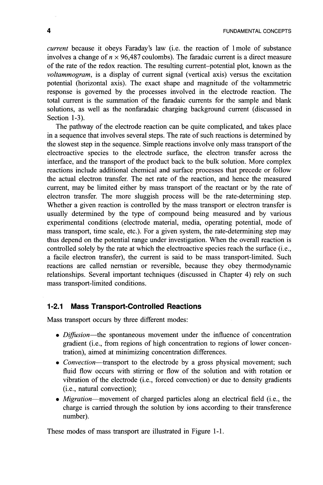

## Page 24

1-2 FARADAIC PROCESSES
~7\ Diffusion
—.—•—•-* -^ • •
—•
—. —- ^ • •
• —• 
—• ^ * * s •
Migration
Convection
FIGURE 1-1 The
reference 1.)
three modes of mass transport. (Reproduced with permission from
The flux (J) is a common measure of the rate of mass transport at a fixed point. It
is defined as the number of molecules penetrating a unit area of an imaginary plane
in a unit of time, and has the units of mol cm~2 s"1. The flux to the electrode is
described mathematically by a differential equation, known as the Nernst-Planck
equation, given here for one dimension:
J(x, f) = -D dC(x, t) 
zFDC 30(jt, 0
3x 
/?r 
3jc
C(x,t)V(x,t)
(1-3)
where D is the diffusion coefficient (cm 2 s ]), dC(x, t)/dx is the concentration
gradient (at distance jc and time t), d(f)(x, t)/dx is the potential gradient, z and C are
the charge and concentration, respectively, of the electroactive species, and V(x, t) is
the hydrodynamic velocity (in the x direction). In aqueous media, D usually ranges
between 10~5 and 10~6 cm~2 s"1. The current (i) is directly proportional to the flux:
i= -nFAJ
(1-4)

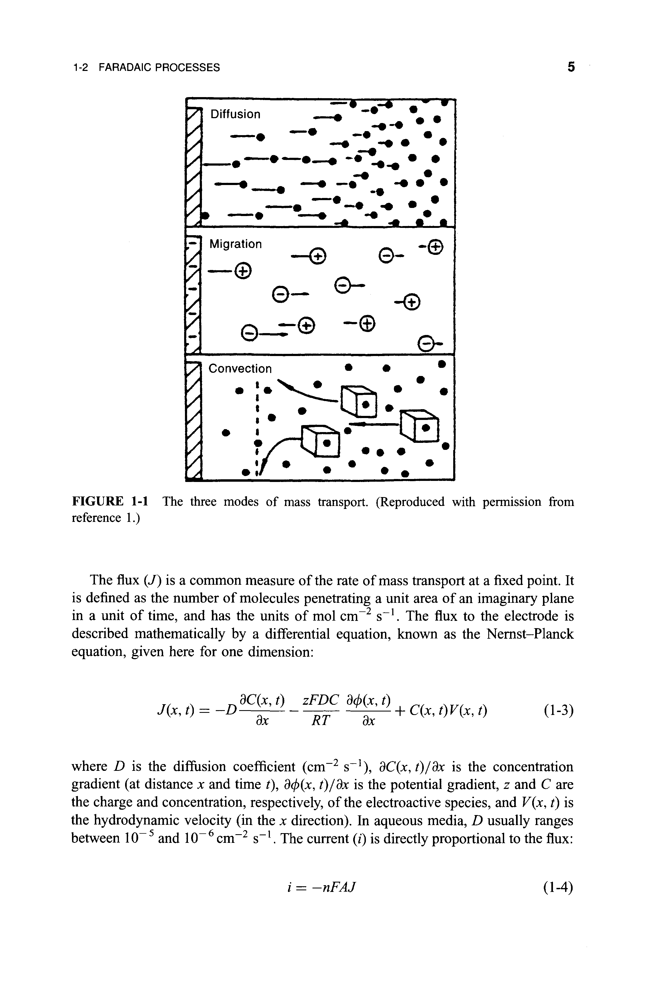

## Page 25

FUNDAMENTAL CONCEPTS
As indicated by equation (1-3), the situation is quite complex when the three
modes of mass transport occur simultaneously. This complication makes it difficult
to relate the current to the analyte concentration. The situation can be greatly
simplified by suppressing the electromigration or convection, through the addition of
excess inert salt or use of a quiescent solution, respectively. Under these conditions,
the movement of the electroactive species is limited by diffusion. The reaction
occurring at the surface of the electrode generates a concentration gradient adjacent
to the surface, which in turn gives rise to a diffusional flux. Equations governing
diffusion processes are thus relevant to many electroanalytical procedures.
According to Pick's first law, the rate of diffusion (i.e., the flux) is directly
proportional to the slope of the concentration gradient:
J(x, i) = -D dC(x, t)
dx
(1-5)
Combination of equations (1-4) and (1-5) yields a general expression for the current
response:
/ = nFAD dC(x, t)
dx
(1-6)
Hence, the current (at any time) is proportional to the concentration gradient of the
electroactive species. As indicated by the above equations, the diffusional flux is
time dependent. Such dependence is described by Pick's second law (for linear
diffusion):
dC(x, /)
Hi~
— D
, t)
dx2
(1-7)
This equation reflects the rate of change with time of the concentration between
parallel planes at points x and (x + dx) (which is equal to the difference in flux at the
two planes). Pick's second law is valid for the conditions assumed, namely planes
parallel to one another and perpendicular to the direction of diffusion, i.e., conditions
of linear diffusion. In contrast, for the case of diffusion toward a spherical electrode
(where the lines of flux are not parallel but are perpendicular to segments of the
sphere), Pick's second law has the form
dt
82C 
2 dC
(1-8)
where r is the distance from the center of the electrode. Overall, Pick's laws describe
the flux and the concentration of the electroactive species as functions of position
and time. The solution of these partial differential equations usually requires the
application of a (Laplace transformation) mathematical method. The Laplace
transformation is of great value for such applications, as it enables the conversion

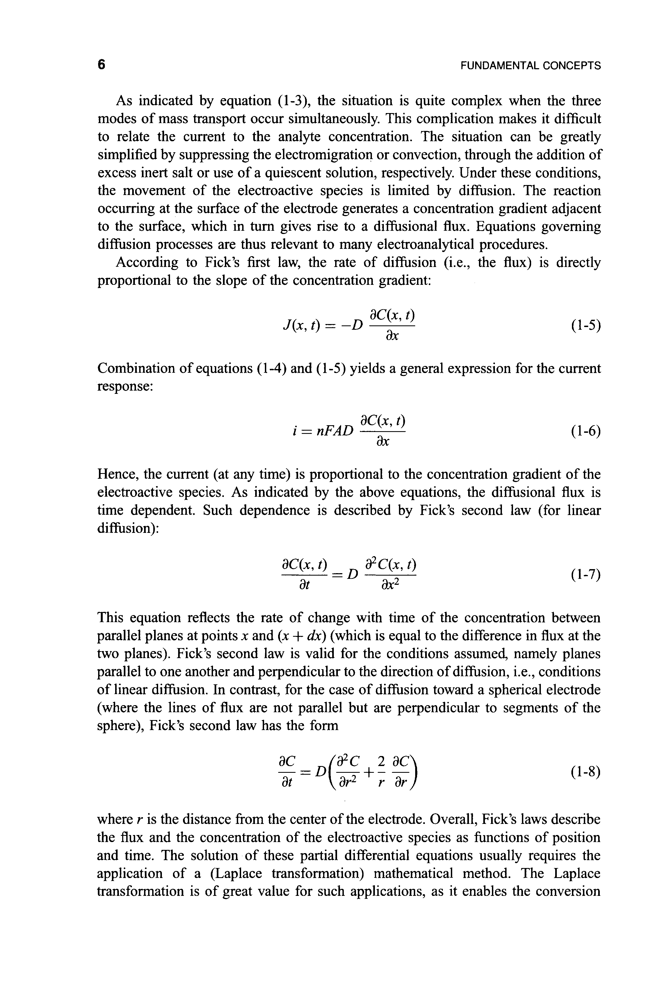

## Page 26

1-2 FARADAIC PROCESSES 
7
of the problem into a domain where a simpler mathematical manipulation is
possible. Details of use of the Laplace transformation are beyond the scope of
this text, and can be found in reference 2. The establishment of proper initial and
boundary conditions (which depend upon the specific experiment) is also essential
for this treatment. The current-concentration-time relationships that result from
such treatment will be described below for several relevant experiments.
1-2.1.1 Potential-Step Experiment 
Let us see, for example, what happens in
a potential-step experiment involving the reduction of O to R, a potential value
corresponding to complete reduction of O, a quiescent solution, and a planar
electrode imbedded in a planar insulator. (Only O is initially present in solution.)
The current-time relationship during such an experiment can be understood from the
resulting concentration-time profiles. Since the surface concentration of O is zero at
the new potential, a concentration gradient is established near the surface. The region
within which the solution is depleted of O is known as the diffusion layer, and its
thickness is given by 6. The concentration gradient is steep at first, and the diffusion
layer is thin (see Figure 1-2, for t }). As time goes by, the diffusion layer expands (to
<52 and <53 at t2 and t3\ and hence the concentration gradient decreases.
Initial and boundary conditions in such experiment include Co(x, 0) = Co(b)
(i.e., at t = 0, the concentration is uniform throughout the system and equal to the
bulk concentration; CQ(b)\ Co(0, f) = 0 for t > 0 (i.e., at later times the surface
concentration is zero); and Co(jc, 0) -> Co(b) as x -> oo (i.e., the concentration
increases as the distance from the electrode increases). Solution of Pick's laws (for
$3 
Distance from
electrode surface
FIGURE 1-2 Concentration profiles for different times t after the start of a potential-step
experiment.

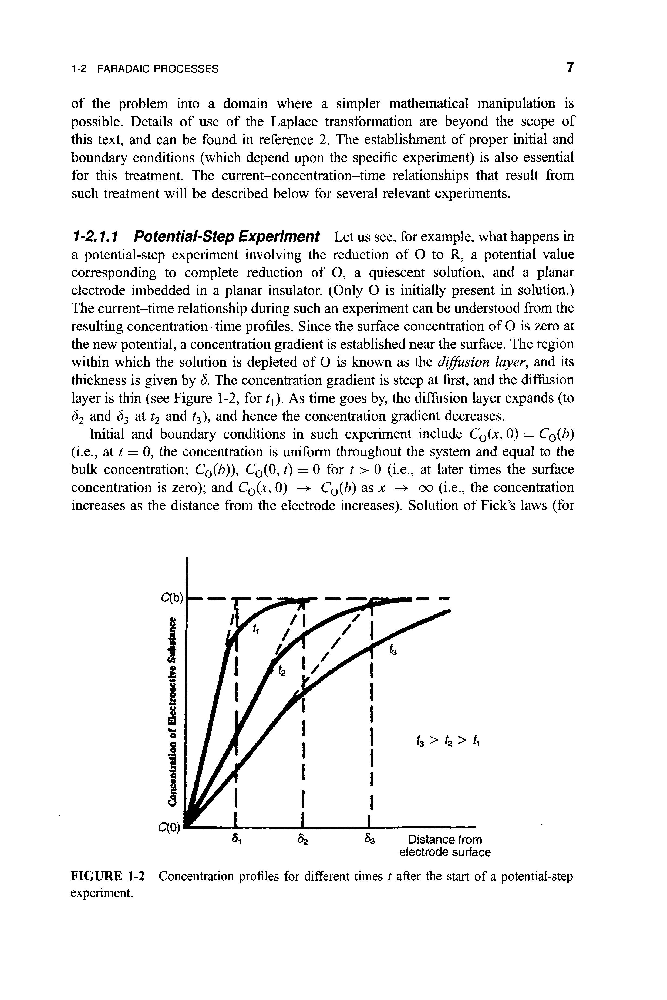

## Page 27

8 
FUNDAMENTAL CONCEPTS
linear diffusion, i.e., a planar electrode) for these conditions results in a time-
dependent concentration profile,
C0(x, 0 - C0(b)(l - erfpf/(4ZV)1/2]} 
(1-9)
whose derivative with respect to x gives the concentration gradient at the surface,
f = 7^T 
(MO
when substituted into equation (1-6) leads to the well-known Cottrell equation:
... 
nFAD0C0(b)
(nD0t)1
a-")
That is, the current decreases in proportion to the square root of time, with (nDot)l/2
corresponding to the diffusion layer thickness.
Solving equation (1-8) (using Laplace transform techniques) yields the time
evolution of the current of a spherical electrode:
.,„ _ nFAD0C0(b) 
i nFAD0C0
The current response of a spherical electrode following a potential step thus contains
time-dependent and time-independent terms, reflecting the planar and spherical
diffusional fields, respectively (Figure 1-3), becoming time independent at long time
scales. As expected from equation (1-12), the change from one regime to another is
strongly dependent upon the radius of the electrode. The unique mass transport
properties of ultramicroelectrodes (discussed in Section 4-5.4) are attributed to the
shrinkage of the electrode radius.
1-2.1.2 Potential-Sweep Experiments 
Let us move to a voltammetric
experiment involving a linear potential scan, the reduction of O to R and a quiescent
solution. The slope of the concentration gradient is given by (Co(b, t) — Co(0, i))/d
where Co(b, t) and Co(0, t) are the bulk and surface concentrations of O. The
change in the slope, and hence the resulting current, is due to changes of both
C0(0, t) and 5. First, as the potential is scanned negatively, and approaches the
standard potential (E°) of the couple, the surface concentration rapidly decreases
in accordance to the Nernst equation (equation 1-2). For example, at a potential
equal to E° the concentration ratio is unity (Co(0, f)/CR(0, t) — 1). For a potential
59 mV more negative than E°, 
CR(0, f) 
is present at 
10-fold 
excess
(C0(0, O/CR(O, 0 = 1/10, /i = 1). The decrease in Co(0,f) is coupled with an
increase in the diffusion layer thickness, which dominates the change in the slope
after Co(0, t) approaches zero. The net result is a peak-shaped voltammogram. Such

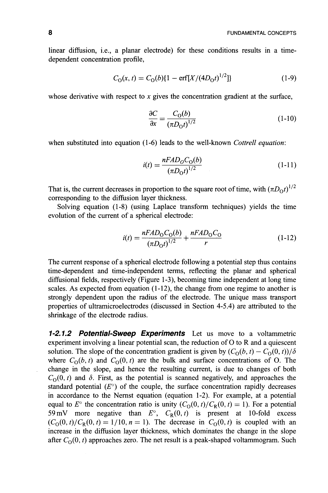

## Page 28

1-2 
FARADAIC PROCESSES
FIGURE 1-3 Planar (a) and spherical (b) difrusional fields at spherical electrodes.
current-potential curves and the corresponding concentration-distance profiles (for
selected potentials along the scan) are shown in Figure 1-4. As will be discussed in
Section 4-5.4, shrinking the electrode dimension to the micrometer domain results in
a sigmoidal-shaped voltammetric response under quiescent conditions, characteristic
of the different (radial) diffusional field and higher flux of electroactive species of
ultramicroelectrodes.
118 59 
0 
-59 -118
n(E-E°) mV
Distance
FIGURE 1-4 Concentration profiles (left) for different potentials during a linear sweep
voltammetric experiment in unstirred solution. The resulting voltammogram is shown on the
right, along with the points corresponding to each concentration gradient. (Reproduced with
permission from reference 1.)

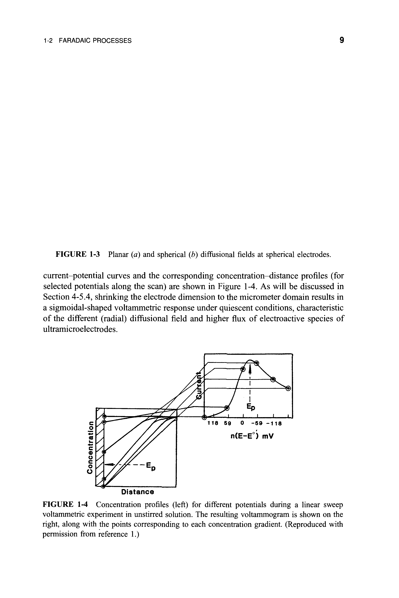

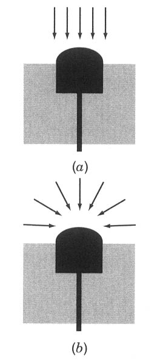

## Page 29

10
FUNDAMENTAL CONCEPTS
Let us see now what happens in a similar linear scan voltammetric experiment,
but utilizing a stirred solution. Under these conditions, the bulk concentration
(Co(b, t)) is maintained at a distance 6 by the stirring. It is not influenced by the
surface electron transfer reaction (as long as the ratio of electrode area to solution
volume 
is 
small). 
The 
slope 
of 
the 
concentration-distance 
profile
[(Co(b, i) — Co(0, t))/5\ is thus determined solely by the change in the surface
concentration (Co(0, ?))• Hence, the decrease in Co(0, t) during the potential scan
(around E°) results in a sharp rise in the current. When a potential more negative
than E° by 118 mV is reached, Co(0, i) approaches zero, and a limiting current (/,) is
achieved:
nFAD0C0(b, t)
(1-13)
The resulting voltammogram thus has a sigmoidal (wave) shape. If the stirring
rate (t/) is increased, the diffusion layer thickness becomes thinner, according to
(1-14)
where B and a are constants for a given system. As a result, the concentration
gradient becomes steeper (see Figure 1-5, curve b), thereby increasing the limiting
current. Similar considerations apply to other forced convection systems, e.g., those
relying on solution flow or electrode rotation (see Sections 3-6 and 4-5, respec-
tively). For all of these hydrodynamic systems, the sensitivity of the measurement
can be enhanced by increasing the convection rate.
Initially it was assumed that no solution movement occurs within the diffusion
layer. Actually, a velocity gradient exists in a layer, termed the hydrodynamic
boundary layer (or the Prandtl layer), where the fluid velocity increases from zero at
the interface to the constant bulk value (C7). The thickness of the hydrodynamic
layer, 5H., is related to that of the diffusion layer:
1/3
-I 
&H 
(1-15)
where v is the kinematic viscosity. In aqueous media (with v ~ 10 2 cm2 s l and
D ~ 10~5 cm2 s"1), 6ff is ~ 10-fold larger than S, indicating negligible convection
within the diffusion layer (Figure 1 -6). The above discussion applies to other forced
convection systems, such as flow detectors or rotating electrodes (see Sections 3-6
and 4-5, respectively). 6 values of 10—50 um and 100-150 urn are common for
electrode rotation and solution stirring, respectively. Additional means for enhancing
the mass transport and thinning the diffusion layer, including the use of power
ultrasound, heated electrodes, or laser activation, are currently being studied (3,4a).
These methods may simultaneously minimize surface fouling effects, as desired for
retaining surface reactivity.

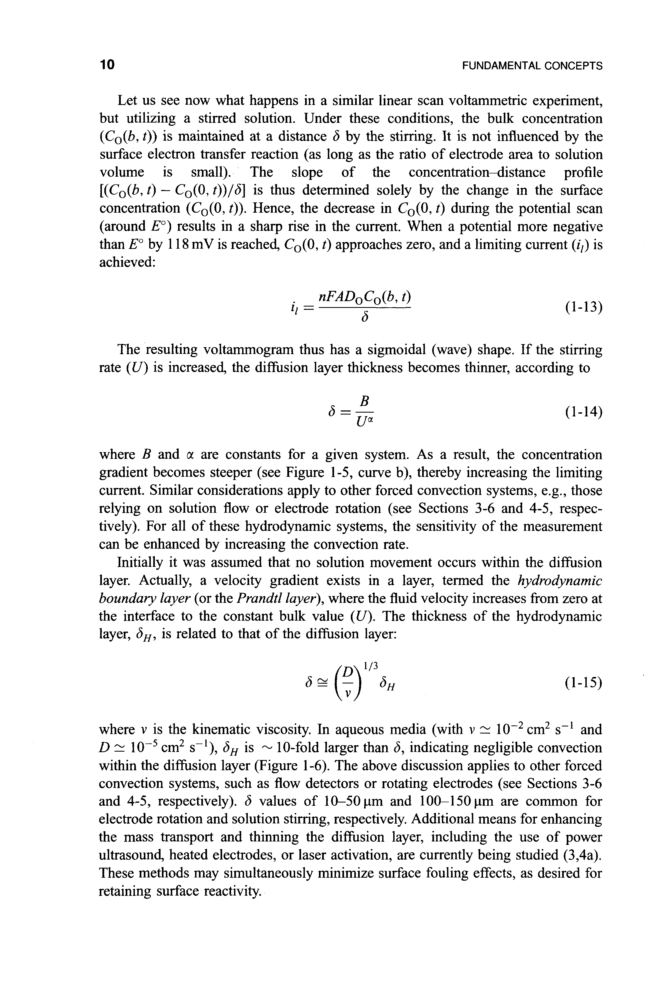

## Page 30

1-2 FARADAIC PROCESSES
11
Distance
FIGURE 1-5 Concentration profiles for two rates of convection transport: low (curve a) and
high (curve b).
1-2.2 Reactions Controlled by the Rate of Electron Transfer
In this section we consider experiments in which the current is controlled by the rate
of electron transfer (i.e., reactions with sufficiently fast mass transport). The current-
potential relationship for such reactions is different from those discussed (above) for
mass transport-controlled reactions.
distance
FIGURE 1-6 The hydrodynamic boundary (Prandtl) layer. Also shown (as dotted line), is
the diffusion layer.

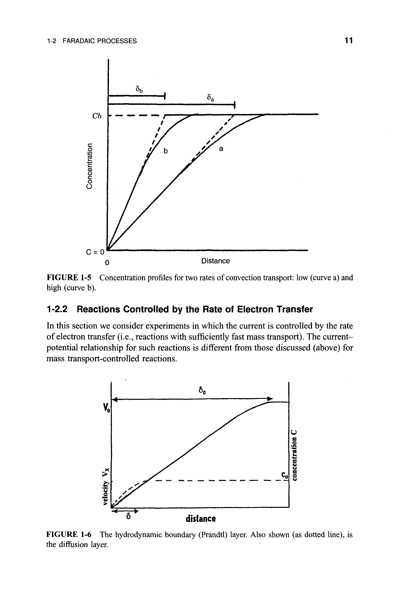

## Page 31

12
FUNDAMENTAL CONCEPTS
Consider again the electron-transfer reaction: O + ne ^ R; the actual electron
transfer step involves transfer of the electron between the conduction band of the
electrode and a molecular orbital of O or R (e.g., for a reduction, from the
conduction band into an unoccupied orbital in O). The rate of the forward
(reduction) reaction, Vf, is first order in O:
while that of the reversed (oxidation) reaction Vb, is first order in R:
(1-16)
(1-17)
where kj- and kb are the forward and backward heterogeneous rate constants,
respectively. These constants depend upon the operating potential according to the
following exponential relationships:
kf = k° exp[-a«F(£ - E°}/RT]
kb = k° exp[(l - oi)nF(E - E°)/RT]
(1-18)
(1-19)
where k° is the standard heterogeneous rate constant, and a is the transfer coefficient.
The value of k° (in cm s~') reflects the reaction between the particular reactant and
the electrode material used. The value of a (between zero and unity) reflects the
symmetry of the free energy curve (with respect to the reactants and products). For
symmetric curves, a will be close to 0.5; a is a measure of the fraction of energy that
is put into the system that is actually used to lower the activation energy (see
discussion in Section 1-2.2.1). Overall, equations (1-18) and (1-19) indicate that by
changing the applied potential we influence kf and kb in an exponential fashion.
Positive and negative potentials thus speed up the oxidation and reduction reactions,
respectively. For an oxidation, the energy of the electrons in the donor orbital of R
must be equal or higher than the energy of electrons in the electrode. For reduction,
the energy of the electrons in the electrode must be higher than their energy in the
receptor orbital of R.
Since the net reaction rate is
^net =Vf-Vb= ^C0(0, 0 - kbCR(0, f) 
(1-20)
and as the forward and backward currents are proportional to Vf and Vb, respectively,
(1-21)
ib=nFAVb 
(1-22)

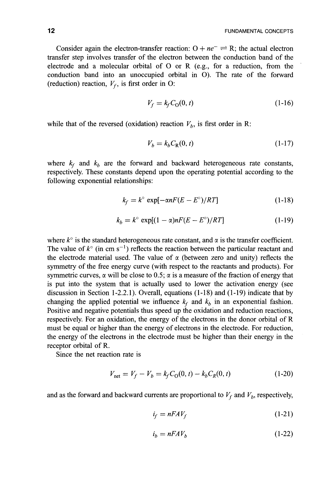

## Page 32

1-2 
FARADAIC PROCESSES
13
the overall current is given by the difference between the currents due to the forward
and backward reactions:
'net = '/ - k = nFA(kfC0(Q, i) - *6CR(0, *)] 
(1-23)
By substituting the expressions for kf and kb (equations 1-17 and 1-18), one obtains
i = nFAk°[C0(Q, 0 exp[-omF(E - E°)/RT]
- CR(0, 0 exp[(l - OL)nF(E - E°)/RT]}
(1-24)
which describes the current-potential relationship for reactions controlled by the rate
of electron transfer. Note that the net current depends on both the operating potential
and the surface concentration of each form of the redox couple. For example, Figure
1-7 displays the current-potential dependence for the case where Co(0, i) = CR(0, i)
and a = 0.50. Large negative potentials accelerate the movement of charge in the
cathodic direction, and also decelerate the charge movement in the opposite
direction. As a result the anodic current component becomes negligible and the
net current merges with the cathodic component. The acceleration and deceleration
of the cathodic and anodic currents are not necessarily as symmetric as depicted in
Figure 1-7, and would differ for a values different than 0.5. Similarly, no cathodic
current contribution is observed at sufficiently large positive potentials.
When E = Eeq, no net current is flowing. This situation, however, is dynamic,
with continuous movement of charge carriers in both directions, and equal opposing
anodic and cathodic current components. The absolute magnitude of these compo-
FIGURE 1-7 Current-potential curve for the system O + ne ^ R, assuming that electron-
transfer is rate limiting, Co = CR, and a = 0.5. The dotted lines show the cathodic (/c) and
anodic (za) components.

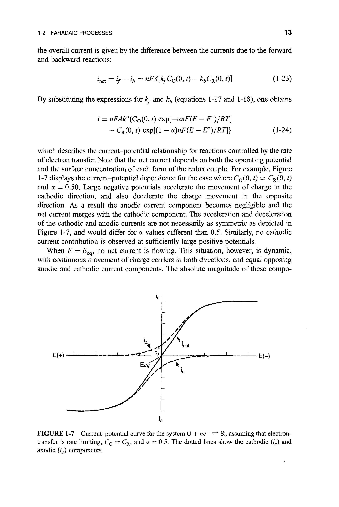

## Page 33

14
FUNDAMENTAL CONCEPTS
nents at £eq is the exchange current (z'0) which is directly proportional to the standard
rate constant:
z' — L — z' — nFAk°C
(1-25)
where ic and ia are the cathodic and anodic components, respectively.
The exchange current density for common redox couples (at room temperature)
can range from 10~ 6 uA cm~2 to A cm~2. Equation (1-24) can be written in terms of
the exchange current to give the Butler-Volmer equation:
- exp[(l - a)nFri/RT]}
(1-26)
where rj = E — Eeq is called the overvoltage (i.e., the extra potential beyond the
equilibration potential leading to a net current z). The overvoltage is always denned
with respect to a specific reaction, for which the equilibrium potential is known.
Equation (1-26) can be used for extracting information on z'0 and a, which are
important kinetic parameters. For sufficiently large overvoltages (r\ > 118 mV/n),
one of the exponential terms in equation (1-26) will be negligible compared with the
other. For example, at large negative overpotentials, ic ^> ia and equation (1-26)
becomes
and hence we get
z = z'0 
exp(—anFr]/RT)
In z = In z'0 — owFrj/RT
(1-27)
(1-28)
This logarithmic current-potential dependence was derived by Tafel, and is known
as the Tafel equation. By plotting log z vs. r\ one obtains the Tafel plots for the
cathodic and anodic branches of the current-overvoltage curve (Figure 1-8). Such
plots are linear only at high values of overpotentials; severe deviations from linearity
are observed as r\ approaches zero. Extrapolation of the linear portions of these plots
to the zero overvoltage gives an intercept that corresponds to log z'0; the slope can be
used to obtain the value of the transfer coefficient a. Another form of the Tafel
equation is obtained by rearrangement of equation (1-28):
r\ = a — b log z
(1-29)
with b, the Tafel slope, having the value of 2.303 RT/xnF. For a = 0.5 and n = 1,
this corresponds to 118 mV (at 25 °C). Equation (1-29) indicates that the application
of small potentials (beyond the equilibrium potential) can increase the current by
many orders of magnitude. In practice, however, the current could not rise to an
infinite value due to restrictions from the rate at which the reactant reaches the
surface. (Recall that the rate-determining step depends upon the potential region.)

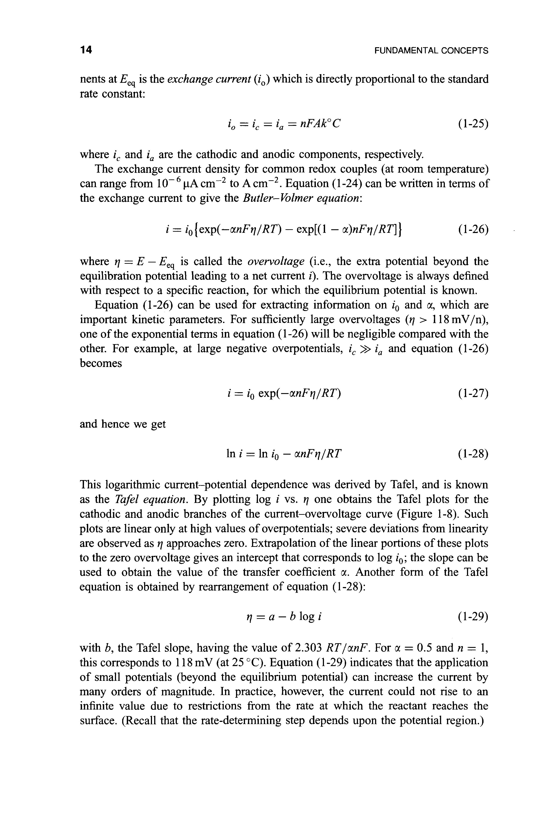

## Page 34

1-2 FARADAIC PROCESSES
15
i_
-200
i
-100
log (i/i0)
1-
100 
200
77 /mV
FIGURE 1-8 Tafel plots for the cathodic and anodic branches of the current-potential
curve.
For small departures from E°, the exponential term in equation (1-27) may be
linearized and the current is approximately proportional to rj:
i = IQ nFf]/RT
(1-30)
Hence, the net current is directly proportional to the overvoltage in a narrow
potential range near E°.
Note also that when znet = 0 (i.e., when E = Eeq) one can obtain the following
from equation (1-24):
C0(0, t) exp[-a«F(£eq - E°)/RT] = CR(0, 0 exp[(l - a)«F(£eq - E°)/RT] (1-31)
Rearrangement of equation (1-31) yields the exponential form of the Nernst
equation:
C0(0.t)
CR(0,t) = 
Qxp[nF(EeQ-E°)/RT]
(1-32)
expected for equilibrium conditions.
The equilibrium potential for a given reaction is related to the formal potential:
£eq = E° + (23RT/nF) log Q
(1-33)
where Q is the equilibrium ratio function (i.e., ratio of the equilibrium concentra-
tions).

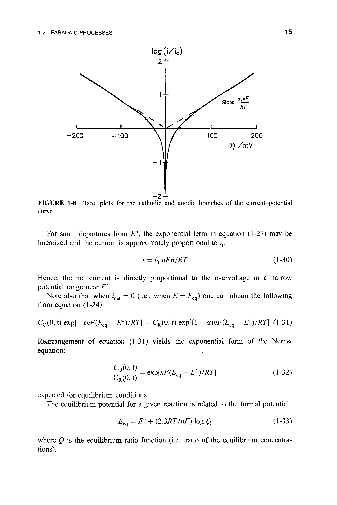

## Page 35

16
FUNDAMENTAL CONCEPTS
1-2.2.1 Activated Complex Theory 
The effect of the operating potential
upon the rate constants (equations 1-18 and 1-19) can be understood in terms of the
free energy barrier. Figure 1-9 shows a typical Morse potential energy curve for the
reaction: O + ne~ ^ R, at an inert metallic electrode (with O and R being soluble).
Because of the somewhat different structures of O and R, there is a barrier to
electron transfer (associated with changes in bond lengths and bond angles). In order
for the transition from the oxidized form to occur, it is thus necessary to overcome
the free energy of activation, AG*. The frequency with which the electron crosses the
energy barrier as it moves from the electrode to O (i.e., the rate constant) is given by
(1-34)
Any alteration in AG* will thus affect the rate of the reaction. If AG* is increased,
the reaction rate will decrease. At equilibrium, the cathodic and anodic activation
energies are equal (AG* 0 = AG* 0) and the probability of electron transfer is the
Reaction coordinate
FIGURE 1-9 Free energy curve for a redox process at a potential more positive than the
equilibrium value.

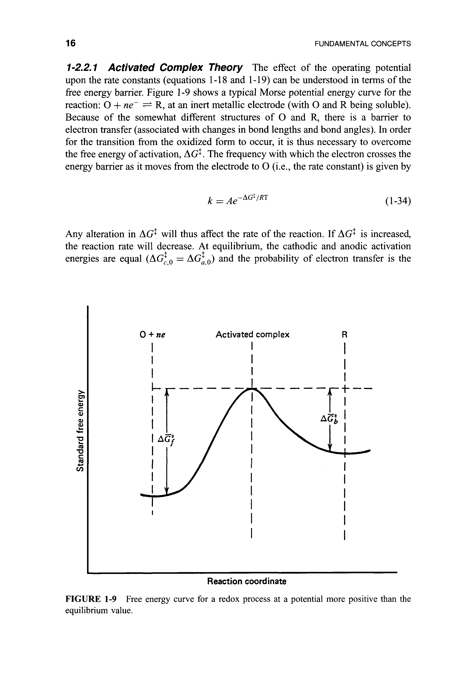

## Page 36

1-2 FARADAIC PROCESSES
17
same in both directions. A, known as the frequency factor, is given as a simple
function of the Boltzmann constant k' and the Planck constant, h:
A =
~h
(1-35)
Now let us discuss nonequilibirum situations. By varying the potential of the
working electrode, we can influence the free energy of its resident electrons, thus
making one reaction more favorable. For example, a potential shift E from the
equilibrium value moves the O + ne~ curve up or down by (/> = —nFE. The dotted
line in Figure 1-10 displays such a change for the case of a positive E. Under this
condition the barrier for reduction, AC/I, is larger than AG* 0. A careful study of the
new curve reveals that only a fraction (a) of the energy shift </> is actually used to
increase the activation energy barrier, and hence to accelerate the rate of the reaction.
Based on the symmetry of the two potential curves, this fraction (the transfer
coefficient) can range from zero to unity. Measured values of a in aqueous solutions
have ranged from 0.2 to 0.8. The term a is thus a measure of the symmetry of the
activation energy barrier. An a value of 0.5 indicates that the activated complex is
exactly halfway between the reagents and products on the reaction coordinate (i.e.,
t
Free
energy
Reaction coordinate
FIGURE 1-10 
Effect of a change in the applied potential on the free energies of activation
for reduction and oxidation.

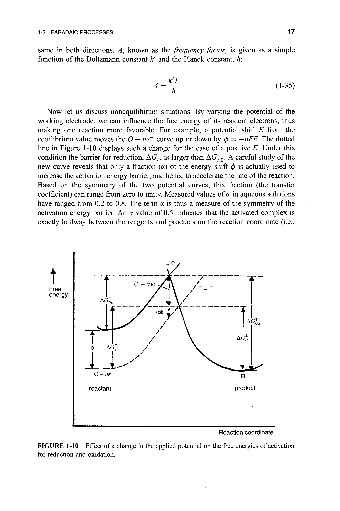

## Page 37

18 
FUNDAMENTAL CONCEPTS
an idealized curve). Values of a close to 0.5 are common for metallic electrodes with
a simple electron transfer process. The barrier for reduction at E is thus given by
AGj = AGJ0 + anFE 
(1-36)
Similarly, examination of the figure reveals also that the new barrier for oxidation,
AG| is lower than AG* 0:
AGj = AG*>0 - (1 - *)nFE 
(1-37)
By substituting the expressions for AG* (equations 1-36 and 1-37) in equation
(1-34), we obtain for reduction
kf=A exp[-AG* 0/RT] exp[-anFE/RT] 
(1-38)
and for oxidation
kb = A exp[-AGj 0/RT] exp[(l - a)nFE/RT] 
(1-39)
The first two factors in equations (1-38) and (1-39) are independent of the potential,
and thus these equations can be rewritten as
kf = kf exp[-anFE/RT] 
(1 -40)
kb = k°b exp[( 1 - a)nFE/RT] 
(1-41)
When the electrode is at equilibrium with the solution, and when the surface
concentrations of O and R are the same, E = E°, and kf and kb are equal:
kf exp[-anFE/RT] = k°b exp[(l - a)nFE/RT] = k° 
(1-42)
and correspond to the standard rate constant k°. By substituting for kf and k% (using
equation 1-42) in equations (1-40) and (1-41), one obtains equations (1-18) and
(1-19) (which describe the effect of the operating potential upon the rate constants).
1-3 THE ELECTRICAL DOUBLE LAYER
The electrical double layer is the array of charged particles and/or oriented dipoles
that exists at every material interface. In electrochemistry, such a layer reflects the
ionic zones formed in the solution to compensate for the excess of charge on the
electrode (qe). A positively charged electrode thus attracts a layer of negative ions
(and vice versa). Since the interface must be neutral, qe + qs = 0 (where qs is the
charge of the ions in the nearby solution). Accordingly, such a counterlayer is made

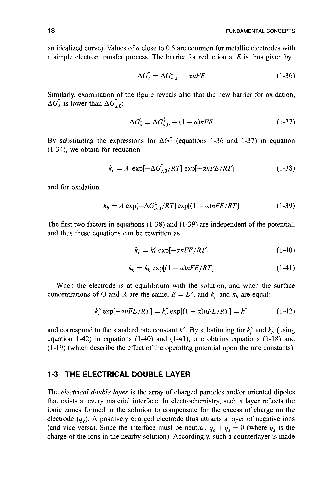

## Page 38

1-3 THE ELECTRICAL DOUBLE LAYER
19
— i— 
— • ~~ 
~~
IMP
FIGURE 1-11 
Schematic representation of the electrical double layer. IHP = inner
Helmholtz plane; OHP = outer Helmoltz plane.
of ions of opposite sign to that of the electrode. As illustrated in Figure 1-11 the
electrical double layer has a complex structure of several distinct parts.
The inner layer (closest to the electrode), known as the inner Helmholtz plane
(IHP), contains solvent molecules and specifically adsorbed ions (which are not fully
solvated). It is defined by the locus of points for the specifically adsorbed ions. The
next layer, the outer Helmholtz plane (OHP), reflects the imaginary plane passing
through the center of solvated ions at their closest approach to the surface. The
solvated ions are nonspecifically adsorbed and are attracted to the surface by long-
range coulombic forces. Both Helmholtz layers represent the compact layer. Such a
compact layer of charges is strongly held by the electrode and can survive even when
the electrode is pulled out of the solution. The Helmholtz model does not take into
account the thermal motion of ions, which loosens them from the compact layer.
The outer layer (beyond the compact layer), referred to as the diffuse layer (or
Gouy layer), is a three-dimensional region of scattered ions, which extends from the
OHP into the bulk solution. Such an ionic distribution reflects the counterbalance
between ordering forces of the electrical field and the disorder caused by a random
thermal motion. Based on the equilibrium between these two opposing effects, the
concentration of ionic species at a given distance from the surface, C(x), decays
exponentially with the ratio between the electrostatic energy (zF<l>) and the thermal
energy (RT), in accordance with the Boltzmann equation:
C(x) = C(0) exp(-
(1-43)
The total charge of the compact and diffuse layers equals (and is opposite in sign to)
the net charge on the electrode side. The potential-distance profile across the double-

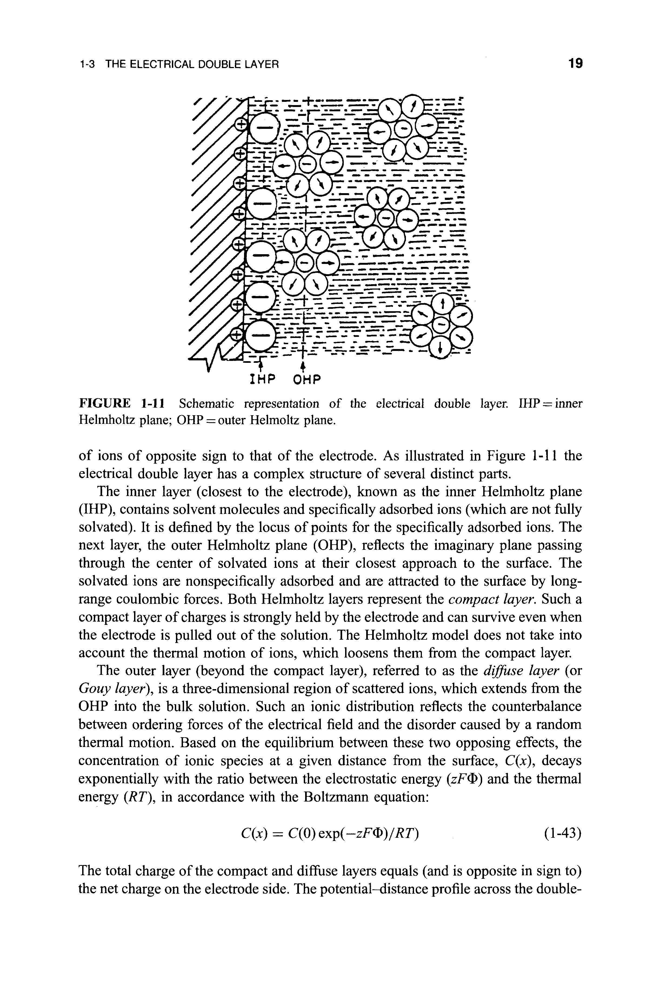

## Page 39

20
FUNDAMENTAL CONCEPTS
layer region involves two segments, with a linear increase up to the OHP and an
exponential increase within the diffuse layer. These potential drops are displayed in
Figure 1-12. Depending upon the ionic strength, the thickness of the double layer
may extend to more than lOnm.
The electrical double layer resembles an ordinary (parallel-plate) capacitor. For an
ideal capacitor, the charge (q) is directly proportional to the potential difference:
= CE
(1-44)
where C is the capacitance (in farads, F), the ratio of the charge stored to the applied
potential. The potential-charge relationship for the electrical double layer is
= Cd\A(E —
(1-45)
where Cdl is the capacitance per unit area and Epzc is the potential of zero charge
(i.e., where the sign of the electrode charge reverses and no net charge exists in the
double layer). Cdl values are usually in the range 10-40 uF cm~2.
The capacitance of the double layer consists of combination of the capacitance of
the compact layer in series with that of the diffuse layer. For two capacitors in series,
the total capacitance is given by
Helmholtz
layer
_L 
J_
CH 
CG
Diffuse
layer
(1-46)
Outer
Helmholtz
plane
FIGURE 1-12 Variation of the potential across the electrical double layer.

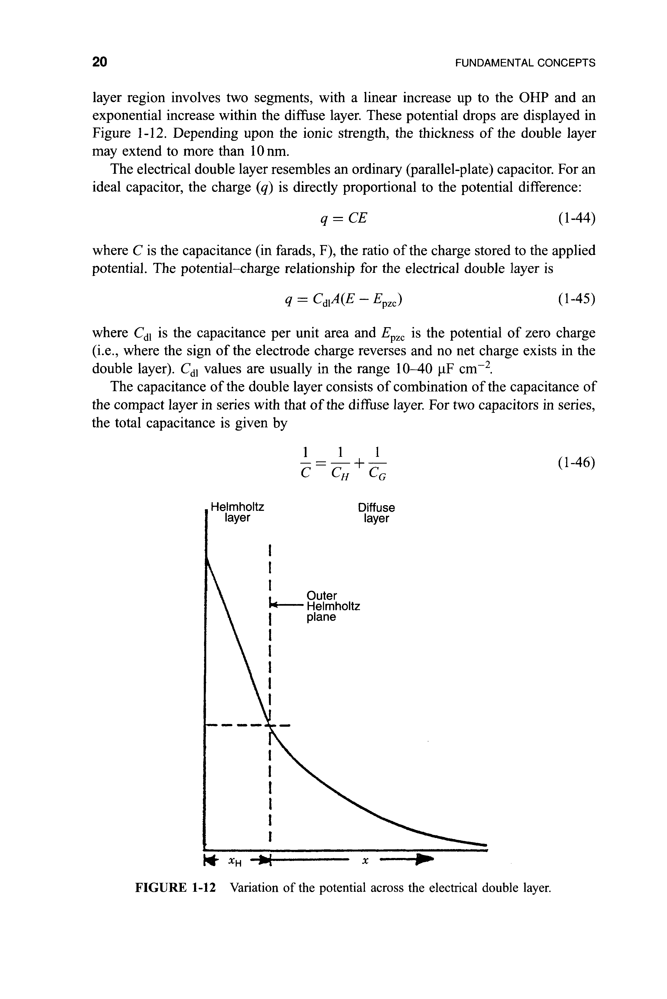

## Page 40

1-3 THE ELECTRICAL DOUBLE LAYER 
21
where CH and CG represent that capacitance of the compact and diffuse layers,
respectively. The smaller of these capacitances determines the observed behavior. By
analogy with a parallel-plate (ideal) capacitor, CH is given by
where d is the distance between the plates and & the dielectric constant (e = 78 for
water at room temperature.) Accordingly, CH increases with decreasing separation
between the electrode surface and the counterionic layer, as well as with increasing
dielectric constant of the intervening medium. The value of CG is strongly affected
by the electrolyte concentration; the compact layer is largely independent of the
concentration. For example, at sufficiently high electrolyte concentration, most of the
charge is confined near the Helmholz plane, and little is scattered diffusely into the
solution (i.e., the diffuse double layer becomes small). Under these conditions,
\/CH » 1/CG, 1/C ~ l/Cff 
or C ~ CH. In contrast, for dilute solutions, CG is
very small (compared to C//) and C ~ CG.
Figure 1-13 displays the experimental dependence of the double-layer capacitance
upon the applied potential and electrolyte concentration. As expected for the
parallel-plate model, the capacitance is nearly independent of the potential or
concentration over several hundreds of millivolts. Nevertheless, a sharp dip in the
capacitance is observed (around —0.5V; i.e., the Epzc) with dilute solutions,
reflecting the contribution of the diffuse layer. Comparison of the double layer
with the parallel-plate capacitor is thus most appropriate at high electrolyte
concentrations (i.e., when C ~ CH).
The charging of the double layer is responsible for the background (residual)
current known as the charging current, which limits the detectability of controlled-
potential techniques. Such a charging process is nonfamdaic because electrons are
not transferred across the electrode-solution interface. It occurs when a potential is
applied across the double layer, or when the electrode area or capacitances are
changing. Note that the current is the time derivative of the charge. Hence, when
such processes occur, a residual current flows based on the differential equation
dq 
dE 
dA 
dCdl
~dt^ 
dl 
~dt 
Cdi(£-Vc)-^- + A(E-Epzc) 
—
where dE/dt and dA/dt are the potential scan rate and rate of area change,
respectively. The second term is applicable to the dropping mercury electrode
(discussed in Section 4-2). The term dC^/dt is important when adsorption processes
change the double-layer capacitance.
Alternately, for potential-step experiments (e.g., chronoamperometry, see Section
3-1), the charging current is the same as that obtained when a potential step is
applied to a series RC circuit:
(1.49)

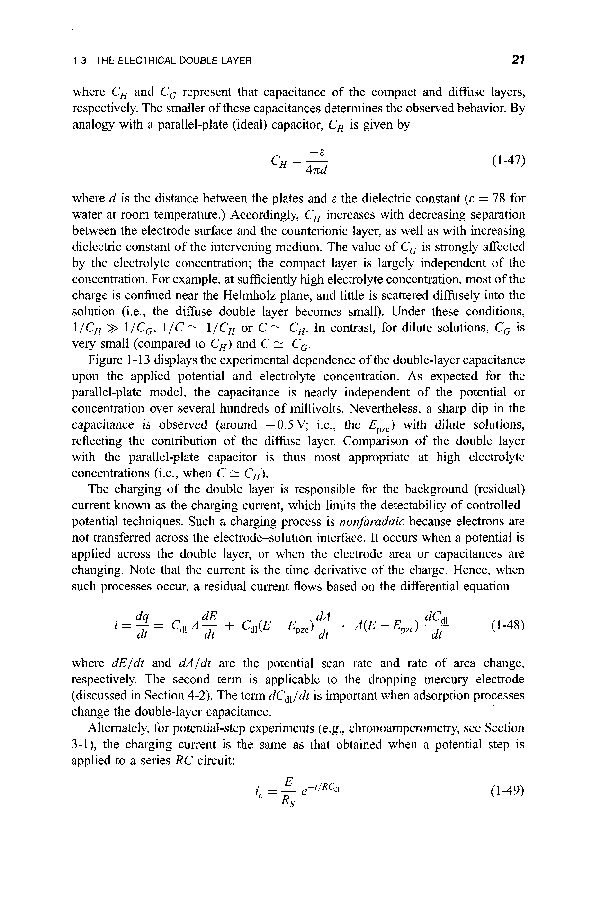

## Page 41

22
FUNDAMENTAL CONCEPTS
40
32
24
Q.
tOo
I 
I I 
I 
I
I 
I 
I 
I 
I 
I
0.001 M
I
I
I
1
0.4 
O.O 
-0.4 
-0.8 
-1.2
Potential (V vs NCE)
-1.6
-2.0
FIGURE 1-13 
Double-layer capacitance of a mercury drop electrode in NaF solutions of
different concentrations. (Reproduced with permission from reference 5.)
that is, the current decreases exponentially with time. E is the magnitude of the
potential step, while Rs is the (uncompensated) solution resistance.
Equation (1-48) can be used for calculating the double-layer capacitance of solid
electrodes. By recording linear scan voltammograms at different scan rates (using the
supporting electrolyte solution), and plotting the charging current (at a given
potential) versus the scan rate, one obtains a straight line with slope corresponding
to Cdl A.
Measurements of the double-layer capacitance provide valuable insights into
adsorption and desorption processes, as well as into the structure of film-modified
electrodes (6).
Further discussion of the electrical double layer can be found in several reviews
(5,7-11).
1-4 ELECTROCAPILLARY EFFECT
Electrocapillarity is the study of the interfacial tension as a function of the electrode
potential. Such a study can provide useful insight into the structure and properties of

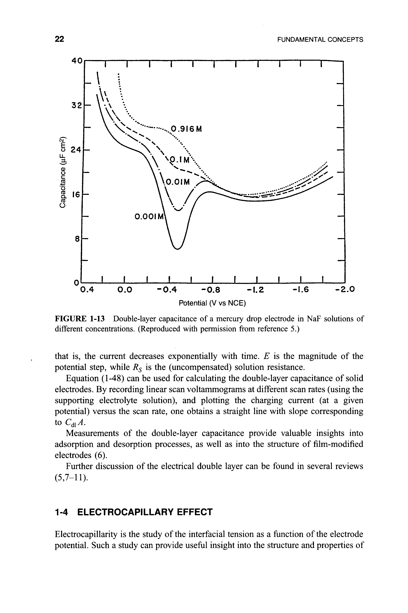

## Page 42

1-4 ELECTROCAPILLARY EFFECT
23
the electrical double layer. The influence of the electrode-solution potential
difference upon the surface tension (y) is particularly pronounced at nonrigid
electrodes (such as the dropping mercury electrode discussed in Section 4-5). A
plot of the surface tension versus the potential (like those shown in Figure 1-14), is
called an electrocapillary curve.
The excess charge on the electrode can be obtained from the slope of the
electrocapillary curve (at any potential), by the Lippman equation:
(1-50)
const, pressure
The more highly charged the interface becomes, the more the charges repel each
other, thereby decreasing the cohesive forces, lowering the surface tension, and
flattening the mercury drop. The second differential of the electrocapillary plot gives
directly the differential capacitance of the double layer:
dE
2
= -<-dl
(1-51)
Hence, the differential capacitance represents the slope of the plot of q vs. E.
An important point of the electrocapillary curve is its maximum. Such maximum
value of y, obtained when q = 0, corresponds to the potential of zero charge (Epzc).
The surface tension is a maximum because on the uncharged surface there is no
repulsion between like charges. The charge on the electrode changes its sign after the
0-40
0-35
0-30
0-25
0-5 
0-0
E-Epzc(V)
-0-5
FIGURE 1-14 Electrocapillary curve (surface tension y vs. potential).

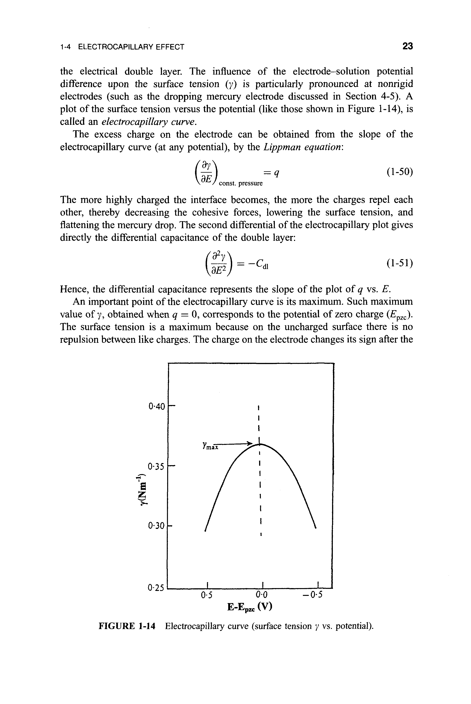

## Page 43

24
FUNDAMENTAL CONCEPTS
420
380
.2340
0)
Isoo
•go>
260
_c
0.8 
0.4
-0.4 
-0.8 
-1.2
E-E2(V)
FIGURE 1-15 Electrocapillary curves for different electrolytes showing the relative
strength of specific adsorption. (Reproduced with permission from reference 5.)
potential passes through the Epzc. Experimental electrocapillary curves have a nearly
parabolic shape around Epzc. Such a parabolic shape corresponds to a linear change
of the charge with the potential. The deviation from a parabolic shape depends on
the solution composition, particularly on the nature of the anions present in the
electrolyte. In particular, specific interaction of various anions (e.g., halides) with the
14
13
o
•fsa.
Q
Q
12
ao
04
12
FIGURE 1-16 Electrocapillary curves of background (•), ethynylestradiol (•), /?-estradiol
(A) and morgestrel (^). (Reproduced with permission from reference 12.)

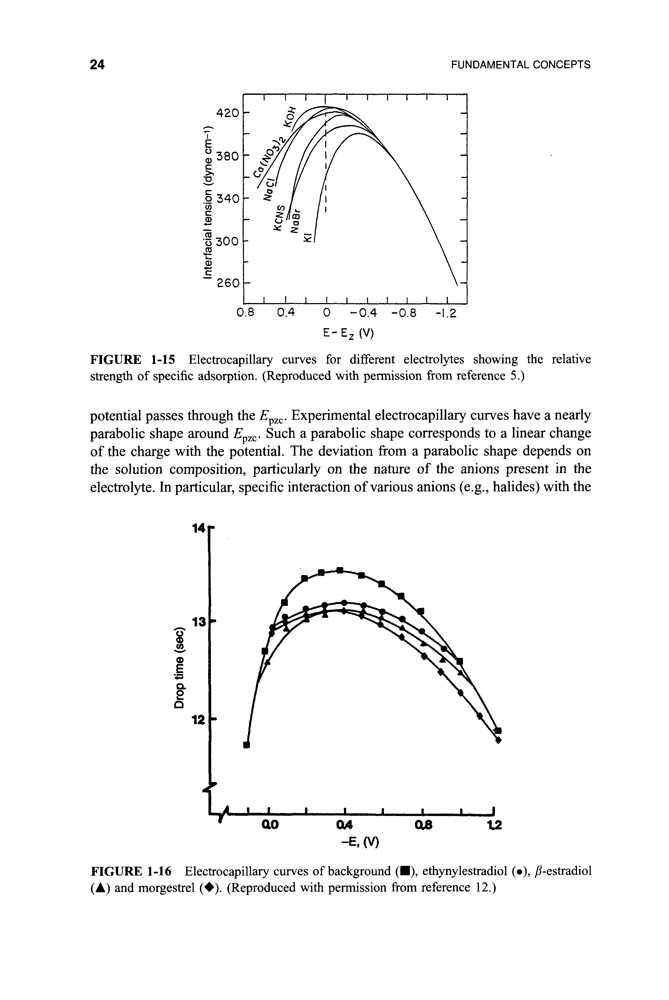

## Page 44

SUPPLEMENTARY READING 
25
mercury surface, occurring at positive potentials, causes deviations from parabolic
behavior (with shifts of Epzc to more cathodic potentials). As shown in Figure 1-15,
the change in the surface tension, and the negative shift in the Epzc, increase in the
order: I~ > Br~ > CNS~ > NOJ > OH~. (These changes are expected from the
strength of the specific adsorption.) Such ions can be specifically adsorbed because
they are not solvated. Inorganic cations, in contrast, are less specifically adsorbed
(because they are usually hydrated). Similarly, blockage of the surface by a neutral
adsorbate often causes depressions in the surface tension in the vicinity of £pzc
(Figure 1-16). Note the reduced dependence of y on the potential around this
potential. At more positive or negative potentials, such adsorbates are displaced from
the surface by oriented water molecules. The electrocapillary approach is not
suitable for measuring the Epzc of solid (i.e., rigid) electrodes.
SUPPLEMENTARY READING
Several international journals bring together papers and reviews covering innova-
tions and trends in the field of electroanalytical chemistry:
Bioelectrochemistry and Bioenergetics
Biosensors and Bioelectronics
Electroanalysis
Q&ctrochimica Acta
Jov**al of Applied Electrochemistry
Journt'to If Electroanctlytical and teterfacial Electrochemistry
Journal c-f </v Electrochemical Society
Langmuir
Sensors and Actuators
Useful information can be found in many prominent journals that cater to all
branches of analytical chemistry including The Analyst, Analytica Chimica Acta,
Analytical Chemistry, Talanta, Analytical Letters, and Fresenius Zeitschrift fiir
Analytical Chemie. Biennial reviews published in the June issue of Analytical
Chemistry offer comprehensive summaries of fundamental and practical research
work.
Many textbooks and reference works dealing with various aspects of electro-
analytical chemistry have been published in recent decades. Some of these are given
below as suggestions for additional reading, in alphabetic order:
W.J. Albery, Electrode Kinetics, Clarendon Press, Oxford, 1975.
A.J. Bard and L. Faulkner, Electrochemical Methods, Wiley, New York, 1980.
J.M. Bockris and A. Reddy, Modern Electrochemistry, Vol. 1,2, Plenum Press, New York, 1970.
A.M. Bond, Modern Polarographic Methods in Analytical Chemistry, Dekker, New York,
1980.

## Page 45

26
FUNDAMENTAL CONCEPTS
C. Brett and A.M. Oliveira Brett, Electrochemistry: Principles, Methods and Applications,
Oxford University Press, Oxford, 1993.
D. Diamond, Chemical and Biological Sensors, Wiley, New York, 1998.
E. Gileadi, Electrode Kinetics, VCH Publishers, New York, 1993.
P. Kissinger and W. Heineman, Laboratory Techniques in Electroanalytical Chemistry, (2nd
ed.), Dekker, New York, 1996.
J. Janata, Principles of Chemical Sensors, Plenum Press, New York, 1989.
J. Koryta and J. Dvorak, Principles of Electrochemistry, Wiley, Chichester, 1987.
P. Rieger, Electrochemistry, Prentice-Hall, Englewood Cliffs, NJ, 1987.
D. Sawyer and J. Roberts, Experimental Electrochemistry for Chemists, Wiley, New York,
1974.
M. Smyth and J. Vos, Analytical Voltammetry, Elsevier, Amsterdam, 1992.
A.P. Turner, I. Karube and G. Wilson, Biosensors, Oxford University Press, Oxford, 1987.
J. Wang, Electroanalytical Techniques in Clinical Chemistry and Laboratory Medicine, VCH
Publishers, New York, 1988.
REFERENCES
1. J.R. Maloy, J. Chem. Educ., 60, 285 (1983).
2. M.G. Smith, Laplace Transform Theory, Van Nostrand, London, 1966.
3. R.G. Compton, J. Eklund, and F. Marken, Electroanalysis, 9, 509 (1997).
4. P. Grundler, and A. Kirbs, Electroanalysis, 11, 223 (1999).
4a. J. Alden, and R.G. Compton, Anal. Chem., 72, 198A (2000).
5. D. Grahame, Chem. Rev. 41, 441 (1947).
6. A. Swietlow, M. Skoog, and G. Johansson, Electroanalysis, 4, 921 (1992).
7. D.C. Grahame, Annu. Rev. Phys. Chem., 6, 337 (1955).
8. D. Mohilner, Electroanal. Chem., 1, 241 (1966).
9. O'M. Bockris, M.A. Devanathan, and K. Muller, Proc. R. Soc., 55, A274 (1963).
10. R. Parsons,./ Electrochem. Soc., 127, 176C (1980).
11. H.B. Mark, Analyst 115, 667 (1990).
12. A.M. Bond, I. Heritage, and M. Briggs, Langmuir, 1, 110 (1985).
Questions
1. Show or draw the concentration profile/gradient near the electrode surface
during a linear scan voltammetric experiment in stirred a solution. (Use 5-6
potentials on both sides of E°.) Show also the resulting voltammogram,
along with points for each concentration gradient (in a manner analogous to
Figure 1-4).
2. Describe and draw clearly the structure of the electrical double layer (with its

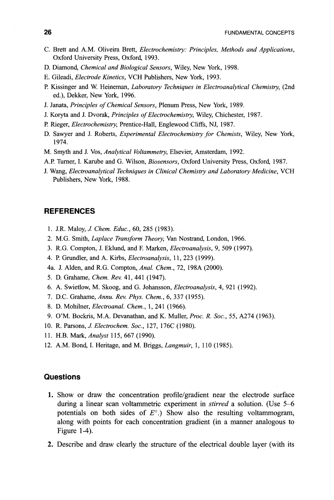

## Page 46

Questions 
27
several distinct parts).
3. Use the activated complex theory for explaining clearly how the applied
potential affects the rate constant of an electron-transfer reaction. Draw free
energy curves and use proper equations for your explanation.
4. Use equations to demonstrate how an increase of the stirring rate will effect the
mass transport-controlled limiting current.
5. Derive the Nernst equation from the Butler-Volmer equation.
6. Explain clearly why polyanionic DNA molecules adsorb onto electrode surfaces
at potentials more positive than Epzc, and suggest a protocol for desorbing them
back to the solution.
7. Which experimental conditions assure that the movement of the electroactive
species is limited by diffusion? How do these conditions suppress the migration
and convection effects?
8. Explain clearly the reason for the peaked response of linear sweep voltammetric
experiments involving a planar macrodisk electrode and a quiescent solution.
9. The net current flowing at the equilibrium potential is zero, yet this is a dynamic
situation with equal opposing cathodic and anodic current components (whose
absolute value is r'0). Suggest an experimental route for estimating the value of
'o-
10. Explain clearly why only a fraction of the energy shift (associated with a
potential shift) is used for increasing the activation energy barrier.

## Page 47

CHAPTER 2
STUDY OF ELECTRODE REACTIONS
2-1 CYCLIC VOLTAMMETRY
Cyclic vojtammetry is the most widely used technique for acquiring qualitative
information about electrochemical reactions. The power of cyclic voltammetry
results from its ability to rapidly provide considerable information on the thermo-
dynamics of redox processes, on the kinetics of heterogeneous electron-transfer
reactions, and on coupled chemical reactions or adsorption processes. Cyclic
voltammetry is often the first experiment performed in an electroanalytical study.
In particular, it offers a rapid location of redox potentials of the electroactive species,
and convenient evaluation of the effect of media upon the redox process.
Cyclic voltammetry consists of scanning linearly the potential of a stationary
working electrode (in an unstirred solution) using a triangular potential waveform
(Figure 2-1). Depending on the information sought, single or multiple cycles can be
used. During the potential sweep, the potentiostat measures the current resulting
from the applied potential. The resulting plot of current versus potential is termed a
cyclic voltammogram. The cyclic voltammogram is a complicated, time-dependent
function of a large number of physical and chemical parameters.
Figure 2-2 illustrates the expected response of a reversible redox couple during a
single potential cycle. It is assumed that only the oxidized form O is present initially.
Thus, a negative-going potential scan is chosen for the first half-cycle, starting from
a value where no reduction occurs. As the applied potential approaches the
characteristic E° for the redox process, a cathodic current begins to increase, until
a peak is reached. After traversing the potential region in which the reduction
process takes place (at least 90/« mV beyond the peak), the direction of the potential
28

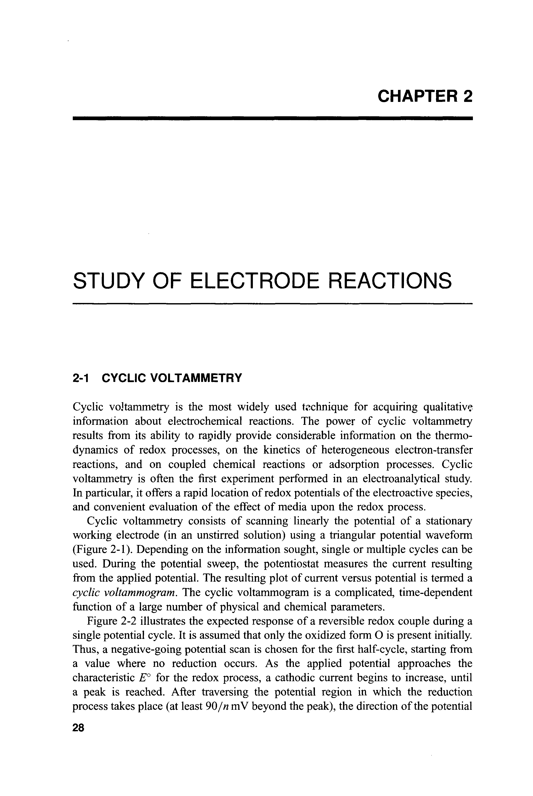

## Page 48

2-1 
CYCLIC VOLTAMMETRY
Cycle 1 
—|
-Efin
co
4-<
O
D.
^initial
29
SWITCHING
POTENTIAL
Time
FIGURE 2-1 Potential-time excitation signal in cyclic voltammetric experiment.
sweep is reversed. During the reverse scan, R molecules (generated in the forward
half cycle, and accumulated near the surface) are reoxidized back to O and an anodic
peak results.
The characteristic peaks in the cyclic voltammogram are caused by the formation
of the diffusion layer near the electrode surface. These can best be understood by
carefully examining the concentration-distance profiles during the potential sweep
(see Section 1-2.1.2). For example, Figure 2-3 illustrates four concentration
gradients for the reactant and product at different times corresponding to (a) the
initial potential value, (b) and (d) the formal potential of the couple (during the
forward and reversed scans, respectively), and (c) to the achievement of a zero
reactant surface concentration. Note that the continuous change in the surface
concentration is coupled with an expansion of the diffusion layer thickness (as
o
reverse scan
FIGURE 2-2
Potential
Typical cyclic voltammogram for a reversible O + ne~
R redox process.

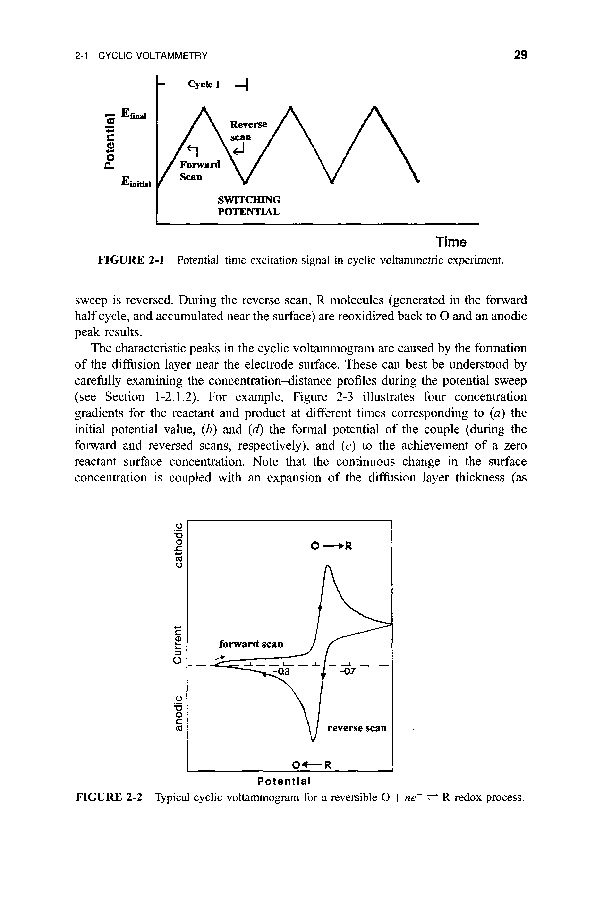

## Page 49

30
STUDY OF ELECTRODE REACTIONS
(a)
(d)
FIGURE 2-3 Concentration distribution of the oxidized and reduced forms of the redox
couple at different times during a cyclic voltammetric experiment corresponding to the initial
potential (a), to the formal potential of the couple during the forward and reversed scans (b, d),
and to the achievement of a zero reactant surface concentration (c).
expected in quiescent solutions). The resulting current peaks thus reflect the
continuous change of the concentration gradient with the time. Hence, the increase
to the peak current corresponds to the achievement of diffusion control, while the
current drop (beyond the peak) exhibits a t~l/2 dependence (independent of the
applied potential). For the above reasons, the reversal current has the same shape as
the forward one. As will be discussed in Chapter 4, the use of ultramicroelectrodes—
for which the mass transport process is dominated by radial (rather than linear)
diffusion—results in a sigmoidal-shaped cyclic voltammogram.
2-1.1 
Data Interpretation
The cyclic voltammogram is characterized by several important parameters. Four of
these observables, the two peak currents and two peak potentials, provide the basis
for the diagnostics developed by Nicholson and Shain (1) for analyzing the cyclic
voltammetric response.

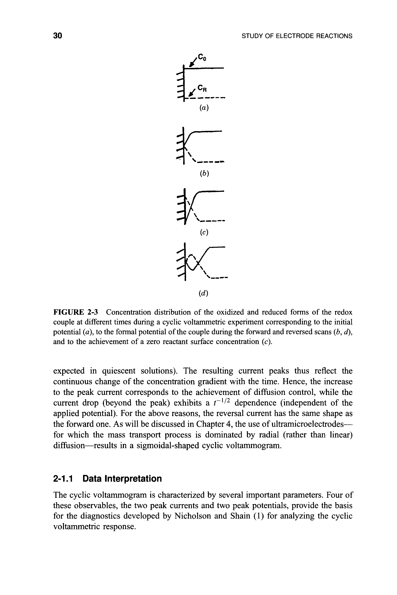

## Page 50

2-1 CYCLIC VOLTAMMETRY 
31
2-1.1.1 Reversible Systems 
The peak current for a reversible couple (at
25°C), is given by the Randies— Sevcik equation:
ip = (2.69 x vx5) n3/2ACDl/2 vl/2 
(2-1)
j?
where n is the number of electrons, A is the electrode area (in cm2), C is the
concentration (in mol cm"3), D is the diffusion coefficient (in cm2 s"1), and v is the
scan rate (in V s"1). Accordingly, the current is directly proportional to concentra-
tion and increases with the square root of the scan rate. The ratio of the reverse-to-
forward peak currents, ip^r/ipj, is unity for a simple reversible couple. As will be
discussed in the following sections, this peak ratio can be strongly affected by
chemical reactions coupled to the redox process. The current peaks are commonly
measured by extrapolating the preceding baseline current.
The position of the peaks on the potential axis (Ep) is related to the formal
potential of the redox process. The formal potential for a reversible couple is
centered between Ep a and Ep<c:
F
The separation between the peak potentials (for a reversible couple) is given by
V 
(2-3)
Thus, the peak separation can be used to determine the number of electrons
transferred, and as a criterion for a Nernstian behavior. Accordingly, a fast one-
electron process exhibits a AEp of about 59 mV Both the cathodic and anodic peak
potentials are independent of the scan rate. It is possible to relate the half-peak
potential (Ep/2, where the current is half of the peak current) to the polarographic
half- wave potential, El/2'-
V 
(2-4)
(The sign is positive for a reduction j_ocess.)
For multielectron-transfer (reversible) processes, the cyclic voltammogram
consists of several distinct peaks if the E° values for the individual steps are
successively higher and are well separated. An example of such a mechanism is the
six-step reduction of the fullerenes C60 and C70 to yield the hexaanion products C^j"
and CJQ. Such six successive reduction peaks are observed in Figure 2-4.
The situation is very different when the redox reaction is slow or coupled with a
chemical reaction. Indeed, it is these "nonideal" processes that are usually of
greatest chemical interest and for which the diagnostic power of cyclic voltammetry
is most useful. Such information is usually obtained by comparing the experimental

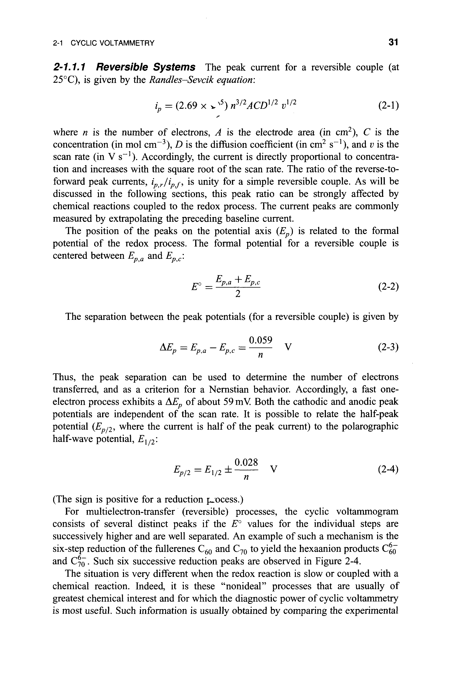

## Page 51

32
STUDY OF ELECTRODE REACTIONS
-60
-1.0
-2.0
-3.0
-1.0 
-2.0
Potential (V vs Fc/Fc+)
-3.0
FIGURE 2-4 Cyclic voltammetry of C60 and C70
(Reproduced with permission from reference 2.)
in an acetonitrile-toluene solution.
voltammograms with those derived from theoretical (simulated) ones (1). Proper
compensation of the ohmic drop (see Section 4-4) is crucial for such diagnostic
applications of cyclic voltammetry.
2-1.1.2 Irreversible and Quasi-Reversible Systems For irreversible
processes (those with sluggish electron exchange), the individual peaks are reduced
in size and widely separated (Figure 2-5, curve A). Totally irreversible systems are
characterized by a shift of the peak potential with the scan rate:
E -£•-
~
"
0.78 - In
1/2"
(2-5)
where a is the transfer coefficient and na is the number of electrons involved in the
charge-transfer step. Thus, Ep occurs at potentials higher than E°, with the over-
potential related to k° and a. Independent of the value k°, such peak displacement
can be compensated by an appropriate change of the scan rate. The peak potential
and the half-peak potential (at 25°C) will differ by 48/anmV Hence, the voltam-
mogram becomes more drawn-out as an decreases.

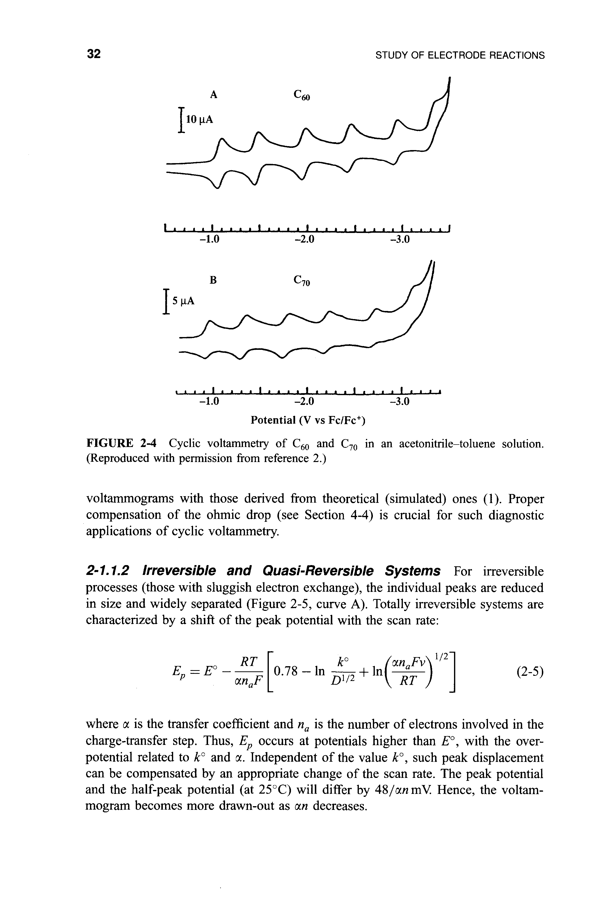

## Page 52

2-1 
CYCLIC VOLTAMMETRY
33
FIGURE 2-5 Cyclic voltammograms for irreversible (curve A) and quasi-reversible (curve
B) redox processes.
The peak current, given by
L = (2.99 x 
\05)n(amay/2ACDl/2vl/2
(2-6)
is still proportional to the bulk concentration, but will be lower in height (depending
upon the value of a). Assuming a value of 0.5, the ratio of the reversible-to-
irreversible current peaks is 1.27 (i.e., the peak current for the irreversible process is
about 80% of the peak for a reversible one).
For quasi-reversible systems (with 10"1 > A:
0 > 10~5cms~1) the current is
controlled by both the charge transfer and mass transport. The shape of the cyclic
voltarnmogram is a function of k°/^/naD (where a — nFv/RT). As k°/*JnaD
increases, the process approaches the reversible case. For small values of
k°/^/naD (i.e., at very fast v) the system exhibits an irreversible behavior. Overall,
the voltammograms of a quasi-reversible system are more drawn-out and exhibit a
larger separation in peak potentials compared to those of a reversible system (Figure
2-5, curve B).
2-1.2 Study of Reaction Mechanisms
One of the most important applications of cyclic voltammetry is for qualitative
diagnosis of chemical reactions that precede or succeed the redox process (1). Such
reaction mechanisms are commonly classified by using the letters E and C (for the
redox and chemical steps, respectively) in the order of the steps in the reaction
scheme. The occurrence of such chemical reactions, which directly affect the
available surface concentration of the electroactive species, is common to redox
processes of many important organic and inorganic compounds. Changes in the
shape of the cyclic voltarnmogram, resulting from the chemical competition for the
electrochemical reactant or product, can be extremely useful for elucidating these
reaction pathways and for providing reliable chemical information about reactive
intermediates.

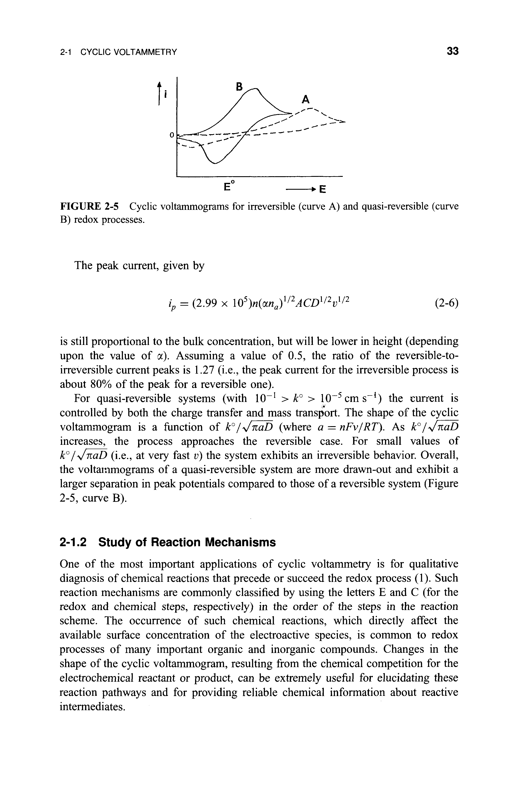

## Page 53

34
STUDY OF ELECTRODE REACTIONS
For example, when the redox system is perturbed by a following chemical
reaction, that is, an EC mechanism,
O
ne'
(2-7)
the cyclic voltammogram will exhibit a smaller reverse peak (because the product R
is chemically removed from the surface). The peak ratio ip>r/ipj will thus be smaller
than unity; the exact value of the peak ratio can be used to estimated the rate constant
of the chemical step. In the extreme case, the chemical reaction may be so fast that
all of R will be converted to Z, and no reverse peak will be observed. A classic
example of such an EC mechanism is the oxidation of the drug chlorpromazine to
form a radical cation that reacts with water to give an electroinactive sulfoxide.
Ligand exchange reactions (e.g., of iron porphyrin complexes) occurring after
electron transfer represent another example of such a mechanism.
Additional information on the rates of these (and other) coupled chemical
reactions can be achieved by changing the scan rate (i.e., adjusting the experimental
time scale). In particular, the scan rate controls the time spent between the switching
potential and the peak potential (during which the chemical reaction occurs). Hence,
as illustrated in Figure 2-6, i is the ratio of the rate constant (of the chemical step) to
the scan rate, which controls the peak ratio. Most useful information is obtained
when the reaction time lies within the experimental time scale. For scan rates
between 0.02 and 200V s"1 (common with conventional electrodes), the accessible
180
120
60 
0
(E-EV2)n(mV)
180
FIGURE 2-6 
Cyclic voltammograms for a reversible electron transfer followed by an
irreversible step for various ratios of chemical rate constant to scan rate, k/a, where
a — nFv/RT. (Reproduced with permission from reference 1.)

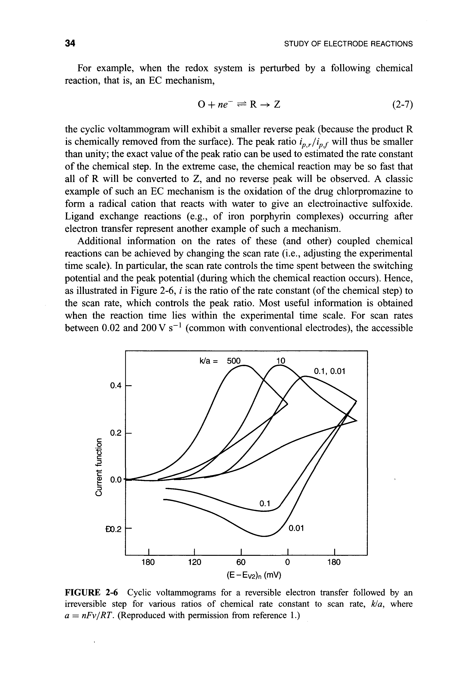

## Page 54

2-1 CYCLIC VOLTAMMETRY 
35
time scale is around 0.1-1000ms. Ultramicroelectrodes (discussed in Section 4-5.4)
offer the use of much faster scan rates and hence the possibility of shifting the upper
limit of follow-up rate constants measurable by cyclic voltammetry (3). For example,
highly reactive species generated by the electron transfer, and living for 25 ns can be
detected using a scan rate of 106 V s"1. A wide variety of fast reactions (including
isomerization and dimerization) can thus be probed. The extraction of such
information commonly requires background subtraction to correct for the large
charging current contribution associated with ultrafast scan rates.
A special case of the EC mechanism is the catalytic regeneration of O during the
chemical step:
O + ne~ ^ R 
(2-8)
R + A ^ O 
(2-9)
An example of such a catalytic EC process is the oxidation of dopamine in the
presence of ascorbic acid (4). The dopamine quinone formed in the redox step is
reduced back to dopamine by the ascorbate ion. The peak ratio for such a catalytic
reaction is always unity.
Other reaction mechanisms can be elucidated in a similar fashion. For example,
for a CE mechanism, where a slow chemical reaction precedes the electron transfer,
the ratio of ip,r/ipj is generally larger than unity, and approaches unity as the scan
rate decreases. The reverse peak is usually not affected by the coupled reaction,
while the forward peak is no longer proportional to the square root of the scan rate.
ECE processes, with a chemical step being interposed between electron transfer
steps,
O{-\-ne~ ^ Rj -> O2+ne~-+ R2 
(2-10)
are also easily explored by cyclic voltammetry, because the two redox couples can be
observed separately. The rate constant of the chemical step can thus be estimated
from the relative sizes of the two cyclic voltammetric peaks.
Many anodic oxidations involve an ECE pathway. For example, the neurotrans-
mitter epinephrine can be oxidized to its quinone, which proceeds via cyclization to
leukoadrenochrome. The latter can rapidly undergo electron transfer to form
adrenochrome (5). The electrochemical oxidation of aniline is another classical
example of an ECE pathway (6). The cation radical thus formed rapidly undergoes a
dimerization reaction to yield an easily oxidized /7-aminodiphenylamine product.
Another example (of industrial relevance) is the reductive coupling of activated
olefins to yield a radical anion, which reacts with the parent olefin to give a reducible
dimer (7). If the chemical step is very fast (in comparison to the electron-transfer
process), the system will behave as an EE mechanism (of two successive charge-
transfer steps). Table 2-1 summarizes common electrochemical mechanisms invol-
ving coupled chemical reactions. Powerful cyclic voltammetric computational
simulators, exploring the behavior of virtually any user-specific mechanism, have

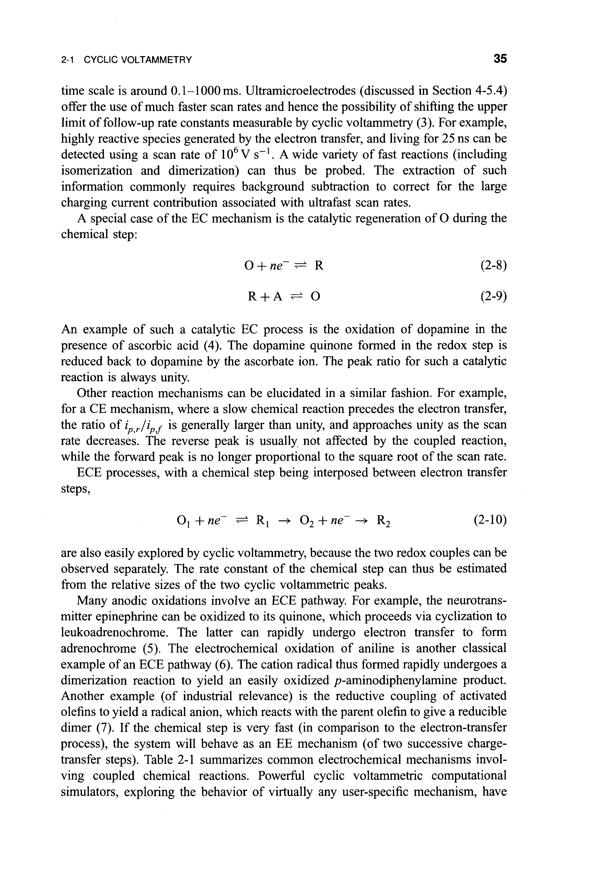

## Page 55

36
STUDY OF ELECTRODE REACTIONS
TABLE 2-1 Electrochemical Mechanisms Involving Coupled Chemical Reactions
1. Reversible electron transfer, no chemical complications:
O + ne~ ^ R
2. Reversible electron transfer followed by a reversible chemical reaction, ErCr mechanism:
O + ne~ ^ R
R ^ Z
*-.
3. Reversible electron transfer followed by an irreversible chemical reaction, ErCj mechanism:
O + ne~ ^ R
4. Reversible chemical reaction preceding a reversible electron transfer, CrEr mechanism:
k,
Z^O
*-i
O + ne~ ^ R
5. Reversible chemical reaction preceding an irreversible electron transfer, CrE{ mechanism:
6. Reversible electron transfer followed by an irreversible regeneration of starting materials,
catalytic mechanism:
O + ne~ ^ R
7. Irreversible electron transfer followed by an irreversible regeneration of starting material:
O + ne~ ^ R
8. Multiple electron transfer with intervening chemical reaction — ECE mechanism
O + n^- ^ R 
R ^ Y
Y + n2e~ ^ Z
Adapted with permission from reference 88.
been developed (9). Such simulated voltammograms can be compared with and
fitted to the experimental ones. The new software also provides movie-like
presentations of the corresponding continuous changes in the concentration profiles.
2-1.3 Study of Adsorption Processes
Cyclic voltammetry can also be used for evaluating the interfacial behavior of
electroactive compounds. Both the reactant and the product can be involved in an

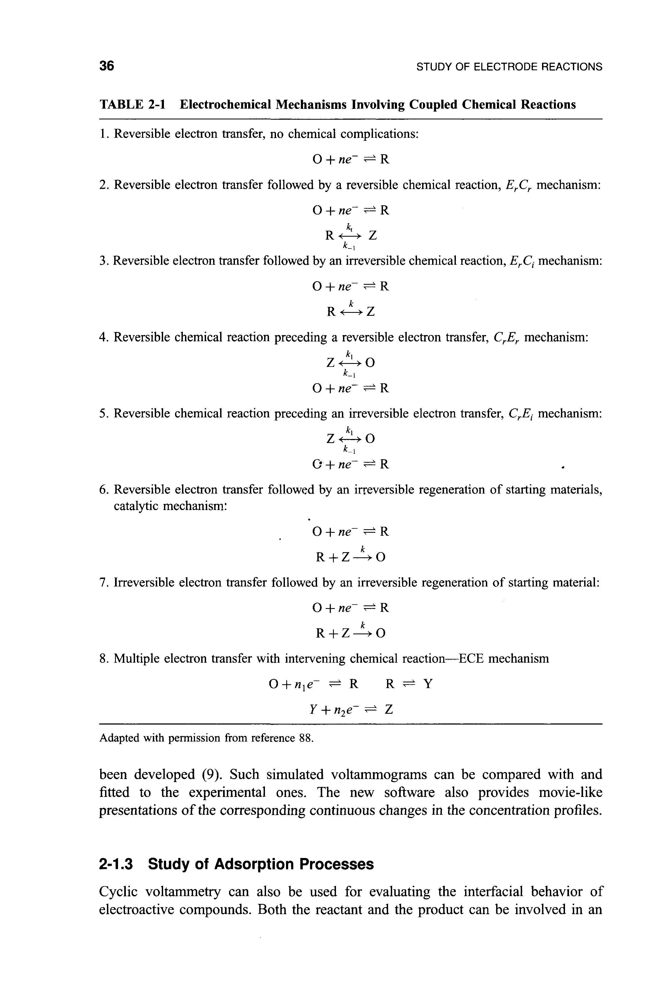

## Page 56

2-1 CYCLIC VOLTAMMETRY
37
adsorption-desorption process. Such interfacial behavior can occur in studies of
numerous organic compounds, as well as of metal complexes (if the ligand is
specifically adsorbed). For example, Figure 2-7 illustrates repetitive cyclic voltam-
mograms, at the hanging mercury drop electrode, for riboflavin in a sodium
hydroxide solution. A gradual increase of the cathodic and anodic peak currents
is observed, indicating progressive adsorptive accumulation at the surface. Note also
that the separation between the peak potentials is smaller than expected for solution-
phase processes. Indeed, ideal Nernstian behavior of surface-confined nonreacting
species is manifested by symmetrical cyclic voltammetric peaks (AEp = 0), and a
peak half-width of 90.6/n mV (Figure 2-8). The peak current is directly proportional
to the surface coverage (F) and potential scan rate:
n2F2YAv
4RT
(2-11)
Recall that Nernstian behavior of diffusing species yields a y1/2 dependence. In
practice, the ideal behavior is approached for relatively slow scan rates, and
for an adsorbed layer that shows no intermolecular interactions and fast electron
transfers.
The peak area at saturation (i.e., the quantity of charge consumed during the
reduction or adsorption of the adsorbed layer) can be used to calculate the surface
coverage:
Q = nFAY
(2-12)
This can be used for calculating the area occupied by the adsorbed molecule and
hence to predict its orientation on the surface. The surface coverage is commonly
-0.2
-0.1
O.I
0.2
-O.2
-O.8
-O.4 
-O.6
E(V)
FIGURE 2-7 
Repetitive cyclic voltammograms for 1 x 10~6 M riboflavin in a 1 mM sodium
hydroxide solution. (Reproduced with permission from reference 10.)

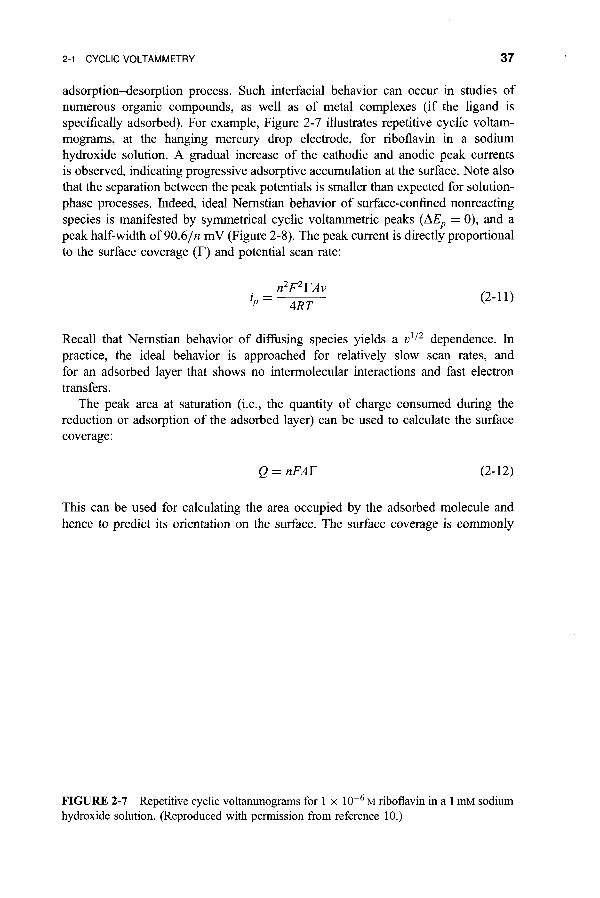

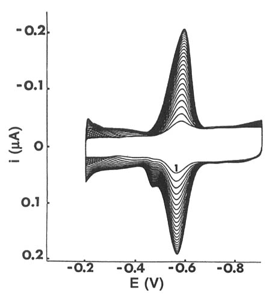

## Page 57

38
STUDY OF ELECTRODE REACTIONS
+ 100 
0 
-100
+50 
-50
n(E-E' 
_),mV
5>URF
FIGURE 2-8 Ideal cyclic voltammetric behavior for a surface layer on an electrode. The
surface coverage, F, can be obtained from the area under the peak. (Reproduced with
permission from reference 11.)
related to the bulk concentration via the adsorption isotherm. One of the most
frequently used at present is the Langmuir isotherm:
BC
l+BCj
(2-13)
where Ym is the surface concentration corresponding to a monolayer coverage
(mol cm~2), and B is the adsorption coefficient. A linearized isotherm, F = TmBC,
is obtained for low adsorbate concentrations (i.e., when 1 ^> BC}. The Langmuir
isotherm is applicable to a monolayer coverage and assumes that there are no
interactions between adsorbed species. Other isotherms (e.g., those of Frumkin or
Temkin) take such interactions into account. Indeed, the Langmuir isotherm is a
special case of the Frumkin isotherm when there are no interactions.
When either the reactant (O) or product (R) is adsorbed (but not both), one
expects to observe a postpeak or prepeak, respectively (at potentials more negative
or positive than the diffusion-controlled peak).
Equations have been derived for less ideal situations, involving quasi-reversible and
irreversible adsorbing electroactive molecules and different strengths of adsorption

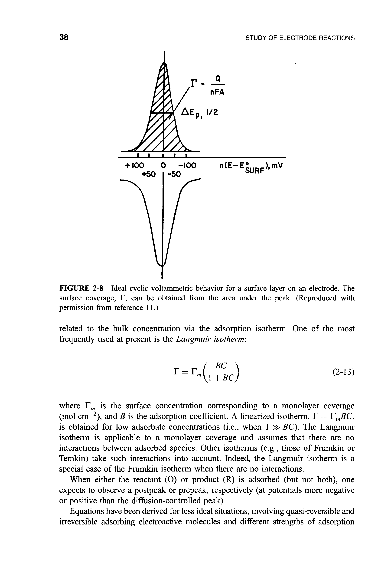

## Page 58

2-1 CYCLIC VOLTAMMETRY
39
0 
0.5
Potential (V)
FIGURE 2-9 Repetitive cyclic voltammograms illustrating the continuous growth of
polyaniline on a platinum surface.
of the reactant and product (11-14). The rates of fast adsorption processes can be
characterized by high-speed cyclic voltammetry at ultramicroelectrodes (15).
Two general models can describe the kinetics of adsorption. The first involves fast
adsorption with mass transport control, while the other involves kinetic control of
the system. Under the latter (and Langmuirian) conditions, the surface coverage of
the adsorbate at time t, rt, is given by.
(2-14)
where Ye is the surface coverage and k' is the adsorption rate constant.
The behavior and performance of chemically modified electrodes based on
surface-confined redox modifiers and conducting polymers (Chapter 4) can also
be investigated by cyclic voltammetry, in a manner similar to that for adsorbed
species. For example, Figure 2-9 illustrates the use of cyclic voltammetry for in-situ
probing of the growth of an electropolymerized film. Changes in the cyclic
voltammetric response of a redox marker (e.g., ferrocyanide) are commonly
employed for probing the blocking/barrier properties of insulating films (such as
self-assembled monolayers).
2-1.4 
Quantitative Applications
Cyclic voltammetry can also be useful for quantitative purposes, based on measure-
ments of the peak current (equation 2-1). Such quantitative applications require the
establishment of the proper baseline. For neighboring peaks (of a mixture), the
baseline for the second peak is obtained by extrapolating the current decay of the

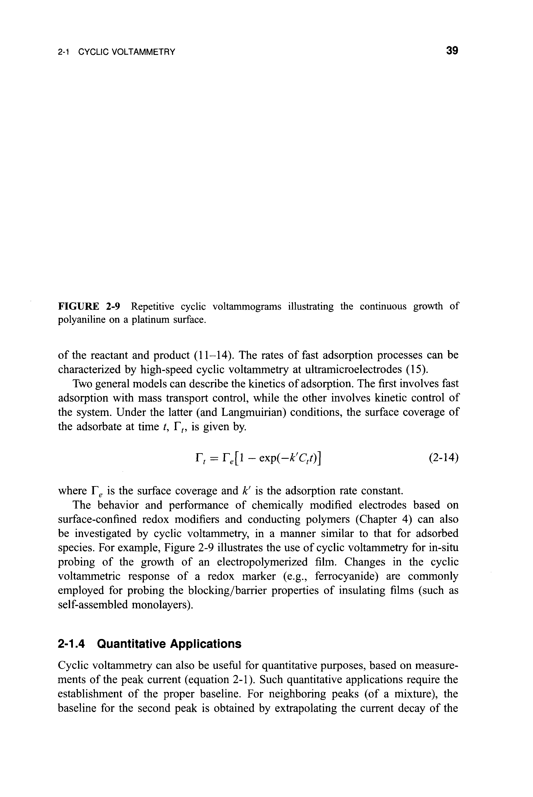

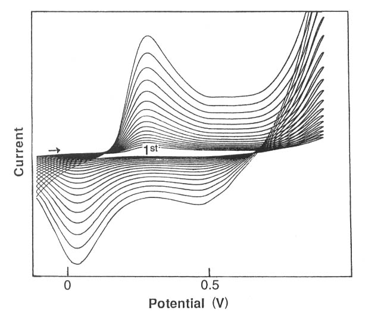

## Page 59

40
STUDY OF ELECTRODE REACTIONS
first one (in accordance with t 1//2). Background reactions, primarily those asso-
ciated with the double-layer charging and redox-surface processes, limit the detec-
tion limit to around the 1 x 10~5M level. Background-subtracted cyclic
voltammetry can be employed for measuring lower concentrations (16). In particular,
fast-scan 
(lOOOVs"1) background-subtracted cyclic voltammetry is seeing
increased use for the in-vivo monitoring of neurotransmitters (such as dopamine
or serotonin) in the brain. Such coupling of digital background subtraction and fast
voltammetric measurements provides the subsecond temporal resolution necessary
for detecting dynamic concentration changes in the micromolar range occurring in
the extracellular environment of the brain. The good temporal and chemical
resolution of such in-vivo cyclic voltammetric experiments offers improved under-
standing of the chemistry of the brain. These repetitive scanning in-vivo experiments
generate large quantities of data that are best represented as three-dimensional
(potential, current, time) color contour images (17). For example, the temporal
release of dopamine following electrical stimulation is evidenced from the rapid
increase in color around its peak potential. The ultrafast scanning also eliminates
interferences from adsorption processes and chemical reactions that are coupled to
the primary oxidation reaction of catecholamine neurotransmitters (18):
O
He
+ 2H + 2e
(2-15)
For more detailed information on the theory of cyclic voltammetry, and the
interpretation of cyclic voltammograms, see references (1,7,19,20).
2-2 
SPECTROELECTROCHEMISTRY
The coupling of optical and electrochemical methods—spectroelectrochemistry—
has been employed for over two decades to investigate a wide variety of inorganic,
organic, and biological redox systems (21,22). Such a combination of electroche-
mical perturbations with the molecular specificity of optical monitoring successfully
addresses the limited structural information available from the current response. It
can be extremely useful for the elucidation of reaction mechanisms, and for the
delineation of kinetic and thermodynamic parameters. A variety of informative
optical methods have thus been coupled with electrochemical techniques. While the
following sections will focus primarily on transmission/absorption UV-visible
spectroscopic procedures, powerful spectroelectrochemical data can be obtained in
reflectance experiments (in which the light beam is reflected from the electrode
surface), using vibrational spectroscopic investigations, as well as from lumines-
cence and scattering spectrochemical studies.
2-2.1 
Experimental Arrangement
Optically transparent electrodes (OTEs), which enable light to be passed through
their surface and the adjacent solution, are the keys for performing transmission

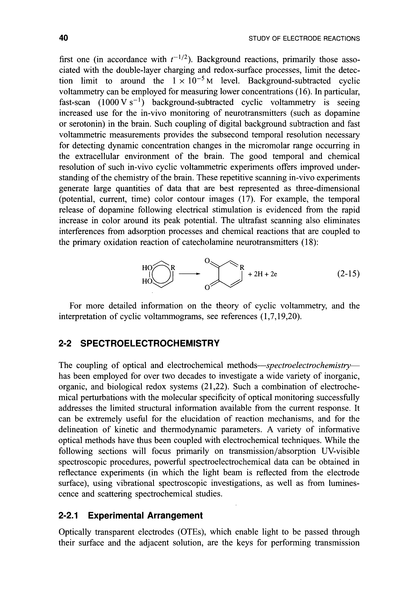

## Page 60

2-2 
SPECTROELECTROCHEMISTRY
41
Photon beam ••••^^^^^^^^^ Detector
reference and auxiliary
electrodes 
V\
FIGURE 2-10 Thin-layer spectroelectrochemical cell. OTE = optically transparent electrode.
spectroelectrochemical experiments. One type of OTE consists of a metal (gold,
silver, nickel) micromesh containing small (10-30um) holes, which couples good
optical transmission (over 50%) with good electrical conductivity. Such a minigrid is
usually sandwiched between two microscopic slides, which form a thin-layer cell
(Figure 2-10). The resulting chamber, containing the electroactive species in
solution, contacts a larger container that holds the reference and auxiliary electrodes.
The OTE is placed in the spectrophotometer so that the optical beam is passed
directly through the transparent electrode and the solution. The working volume of
the cell is only 30-50 uL, and complete electrolysis of the solute requires only 30-
60s. Alternately, the OTE may consist of a thin (100-5000 A) film of a metal (e.g.,
gold or platinum) or a semiconductor (e.g., tin oxide), deposited on a transparent
material such as quartz or glass substrate. The film thickness is often selected as a
compromise between its electrical conductivity and optical transmission.
Improvements in cell designs have been reported in recent years, including the
use of fiber optics for the illumination and collection of light near electrode surfaces
(23), the fabrication of long-path-length OTEs via drilling of a small hole through a
solid conducting material for sensitive optical monitoring of weakly absorbing
species (24,25), and the incorporation of open porous materials (particularly
reticulated vitreous carbon) within a thin-layer compartment (26).
2-2.2 
Principles and Applications
The primary advantage -of spectroelectrochemistry is the cross-correlation of
information from the simultaneous electrochemical and optical measurements. In
a typical experiment, one measures absorption changes resulting from species
produced (or consumed) in the redox process. The change in absorbance is related
to concentration and optical path length. Careful evaluation of the temporal
absorbance response (A-t curve) during the electrochemical generation (or consump-
tion) of an optically active species can yield extremely useful insights on reaction

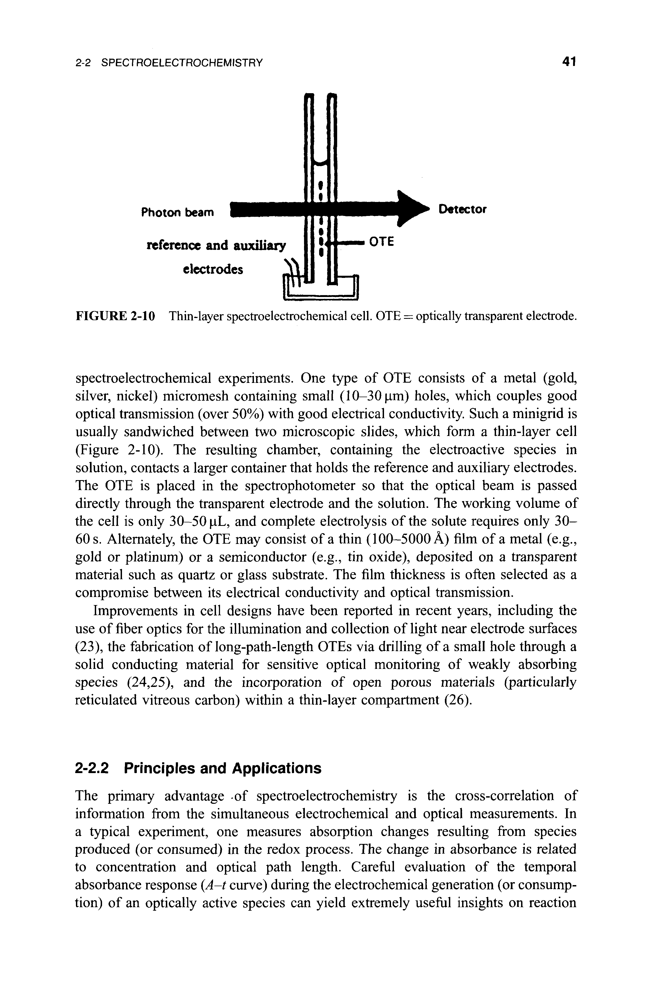

## Page 61

42
STUDY OF ELECTRODE REACTIONS
mechanisms and kinetics. Such experiments are particularly useful when the reactant
and product have sufficiently different spectra.
Consider, for example, the general redox process:
ne~
R
(2-16)
When the potential of the OTE is stepped to a value such that reaction (2-16)
proceeds at a diffusion-controlled rate, the time-dependent absorbance of R is given
by
rl/2
(2-17)
where eR is the molar absorptivity of R and Do and Co are the diffusion coefficient
and concentration of O, respectively. Hence, A increases linearly with the square root
of time (t}/2), reflecting the continuous generation of R at a rate determined by the
diffusion of O to the surface. Equation (2-17) is valid when the generated species is
stable. However, when R is a short-lived species (i.e., in an EC mechanism), the
absorbance response will be smaller than that expected from equation (2-17). The
rate constant for its decomposition reaction can thus be calculated from the decrease
in the absorbance. Many other reaction mechanisms can be studied in a similar
fashion from the deviation of the A—t curve from the shape predicted by equation
(2-17). Such a potential-step experiment is known as chronoabsorptometry.
Thin-layer spectroelectrochemistry can be extremely useful for measuring the
formal redox potential (E°) and n values. This is accomplished by spectrally
determining the concentration ratio of oxidized to reduced ([O]/[R]) species at
each applied potential (from the absorbance ratio at the appropriate wavelengths).
Since bulk electrolysis is achieved within a few seconds (under thin-layer condi-
tions), the whole solution rapidly reaches an equilibrium with each applied potential
(in accordance to the Nernst equation). For example, Figure 2-11 shows spectra for
the complex [Tc(dmpe)2Br2] + in dimethylformamide using a series of potentials
[dmpe is l,2-bis(dimethylphosphine)ethane]. The logarithm of the resulting concen-
tration ratio ([O]/[R]) can be plotted against the applied potential to yield a straight
line, with an intercept corresponding to the formal potential. The slope of this
Nernstian plot (0.059/« V) can be used to determine the value of n.
Besides potential-step experiments, it is possible to employ linear potential scan
perturbations of an OTE (27). This voltabsorptometric approach results in an optical
analogue of a voltammetric experiment. A dA/dE vs. E plot (obtained by differ-
entiating the absorbance of the reaction product with respect to the changing
potential) is morphologically identical to the voltammetric response for the redox
process (Figure 2-12). Depending upon the molar absorptivity of the monitored
species, the derivative optical response may afford a more sensitive tool than the
voltammetric one. This concept is also not prone to charging-current background
contributions and holds considerable promise for mechanism diagnosis and kinetic
characterization of coupled chemical reactions.

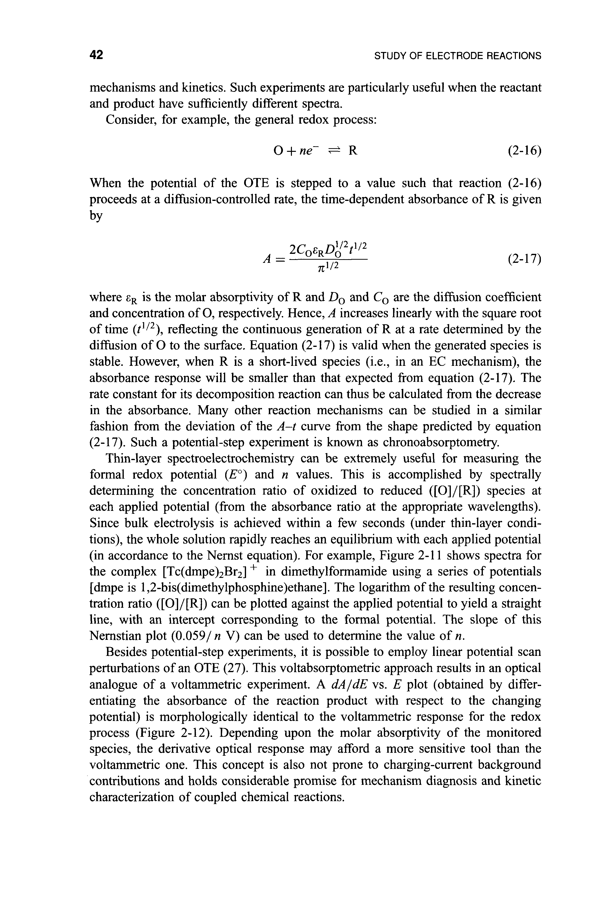

## Page 62

2-2 
SPECTROELECTROCHEMISTRY
43
450 
500
Wavelength (nm)
550
FIGURE 2-11 Spectra for a series of applied potentials (mV vs. Ag/AgCl) during thin-
layer spectroelectrochemical experiment on 1.04 x 10~3 M [Tc(III)(dmpe)2Br2]+. Medium is
dimethylformamide containing 0.5M TEAP = tetraethylammonium perchlorate. (Reproduced
with permission from reference 27.)
>
<
LU
-300
-500 
-700
E (mV vs SCE)
-900
FIGURE 2-12 
Plot ofdA/dt vs. E for 1.55 x 10~3 M methyl viologen at tin oxide optically
transparent electrode, using scan rates of (A) 25, (B) 50, (C) 97.2 and (D) 265 mVs"1.
(Reproduced with permission from reference 28.)

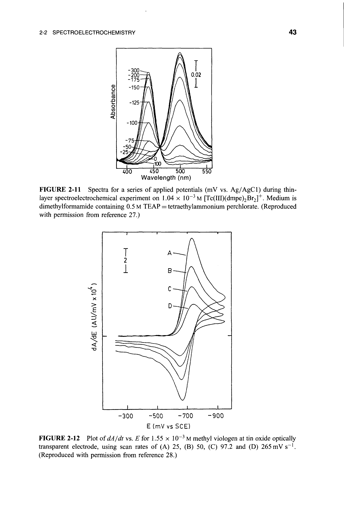

## Page 63

44
STUDY OF ELECTRODE REACTIONS
Spectroelectrochemical experiments can be used to probe various adsorp-
tion/desorption processes. In particular, changes in the absorbance accruing from
such processes can be probed utilizing the large ratio of surface area to solution
volume of OTEs with long optical path length (29). Additional information on such
processes can be obtained from the Raman Spectroelectrochemical experiments
described later.
In addition to transmission experiments, it is possible to use more sensitive
reflectance protocols. In particular, in internal reflectance spectroscopy (IRS) the
light beam is introduced to the electrode at an angle, and the spectrum is recorded
from the reflected beam at the solid-solution interface. Prisms are used to allow the
radiation enter and leave. In addition to its higher sensitivity, IRS is less prone to
solution resistance effects.
Infrared Spectroelectrochemical methods, particularly those based on Fourier
transform infrared (FTIR) spectroscopy can provide structural information that UV-
visible absorbance techniques do not. FTIR spectroelectrochemistry has thus been
fruitful in the characterization of reactions occurring on electrode surfaces. The
technique requires very thin cells to overcome solvent absorption problems.
Besides its widespread use for investigating the mechanism of redox processes,
spectroelectrochemistry can be useful for analytical purposes. In particular, the
simultaneous profiling of optical and electrochemical properties can enhance the
overall selectivity of different sensing (30) and detection (31) applications. Such
coupling of two modes of selectivity is facilitated by the judicious choice of the
operating potential and wavelength.
2-2.3 
Other Spectroelectrochemical and Spectroscopic Techniques
In addition to UV-visible absorption measurements, other spectroscopic techniques
can be used for monitoring the dynamics of electrochemical events or the fate of
electrogenerated species. Particularly informative are the couplings of electrochem-
istry with electron spin resonance, nuclear magnetic resonance, and mass spectro-
scopy. A variety of specially designed cells have been constructed to facilitate such
studies, and several reviews have been published (32-36). Electrochemilumines-
cence (ECL) is another useful technique for studying the fate of electrogenerated
radicals that emit light. It involves the formation of light-emitting excited-state
species as a result of fast and highly energetic electron-transfer reactions of reactants
formed electrochemically (37,38). Various organic and inorganic substances (e.g.,
polycyclic hydrocarbons, nitro compounds, luminol, Ru(bpy)3+) can produce ECL
upon electron transfer from electrodes, in connection with the formation of radical
ions. The electrogenerated radicals behave as very strong redox agents, and their
reactions with each other or with other substances are sufficiently energetic to be
able to populate excited states. ECL experiments are usually carried out by recording
the spectra of the emitted light using a deoxygenated nonaqueous medium (e.g.,
highly purified acetonitrile or dimethylformamide). Analytical applications of ECL
relying on the linear dependence of the ECL intensity and the reactant concentration
have also been realized (39).

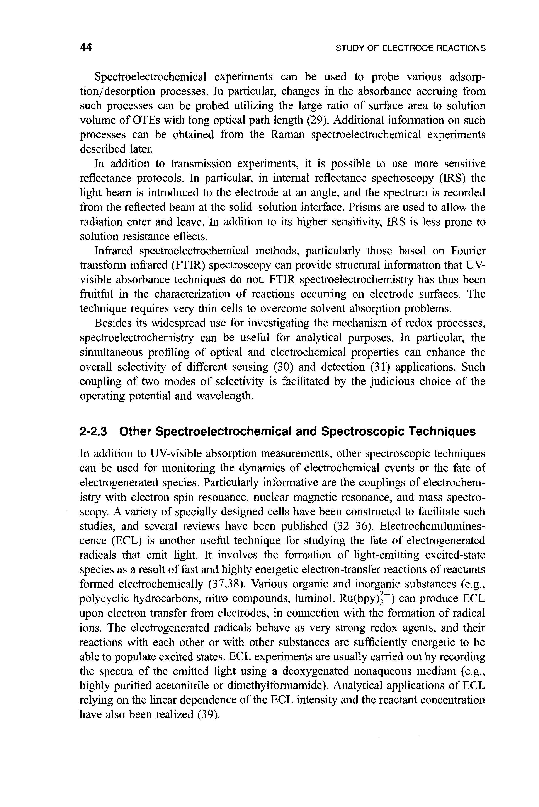

## Page 64

2-2 SPECTROELECTROCHEMISTRY 
45
Additional spectroscopic techniques can be used for probing the molecular
structure of electrode-solution interfaces, as desired for understanding the funda-
mentals of electrode surfaces. The focus of these surface techniques is the
correlation of the surface structure with electrochemical reactivity. Such surface-
sensitive analytical tools can be classified as in-situ or ex-situ. In particular, the high
sensitivity of molecular vibrations to the chemical environment has led to the
widespread use of vibrational spectroscopies, such as surface enhanced Raman
scattering (SERS), for monitoring the surface composition before, during, and after
the electrochemical experiment. In these experiments, a small fraction of the photons
exchange energy with the sample and are inelastically scattered, with a change of
their wavelength characteristic of the energy change. Such Raman scattering effect
can be enhanced by factors of up to 108 when the compound is adsorbed on the
metallic surface (40). The enhancement process is believed to result from the
combination of several electromagnetic and chemical effects between the molecule
and the metal surface. Since this scattering efficiency increases dramatically in the
adsorbate state, Raman spectroelectrochemistry has been used primarily for inves-
tigating species adsorbed on electrodes (41). Another powerful in-situ structural
characterization technique, X-ray adsorption fine structure (EXAFS), refers to the
modulation in the X-ray adsorption coefficient beyond the adsorption edge. Readers
interested in these in-situ techniques are referred to a monograph (42). Scanning
electron microscopy (SEM) represents another widely used technique for obtaining
ex-situ information on the surface morphology and chemical composition (see, for
example, Figure 4-17).
Other powerful ex-situ techniques are based on the detection of charged particles
derived from or interacting with the surface. Among these are low-energy electron
diffraction (LEED), Auger electron spectroscopy (AES), and X-ray photoelectron
spectroscopy (XPS), which are carried out in ultrahigh vacuum (UHV). In LEED,
electrons directed at the sample at low energies (20-200 eV) are diffracted to
produce a pattern unique to each substrate and adsorbed layer. In AES, electron
bombardment creates a vacancy in the electronic level close to the nucleus. This
vacancy is filled by an electron coming from another electronic level, with the excess
energy being dissipated through ejection of a secondary electron (an Auger
electron). The resulting energy spectrum consists of Auger peaks that are unique
to each element. XPS (also known as ESC A for electron spectroscopy for chemical
analysis) can also provide atomic information about the surface region. In this
technique, electrons are emitted from the sample upon its irradiation with mono-
chromatic X rays. The photon energy is related to the ionization (binding) energy EB,
i.e., the energy required to remove the electron from the initial state. Most elements
(with the exception of hydrogen and helium) produce XPS signals with distinct EB.
In view of the limited penetration of X rays into solids, the technique gives useful
information about surface structures or layers. The appearance of new XPS peaks
can thus be extremely useful for studies of modified electrodes. The reliability of
information gained by such ex-situ analysis depends on knowledge of what happens
during vacuum exposure. Uncertainties associated with potential loss of material
during such exposure have led to renewed emphasis on direct (in-situ) probes.

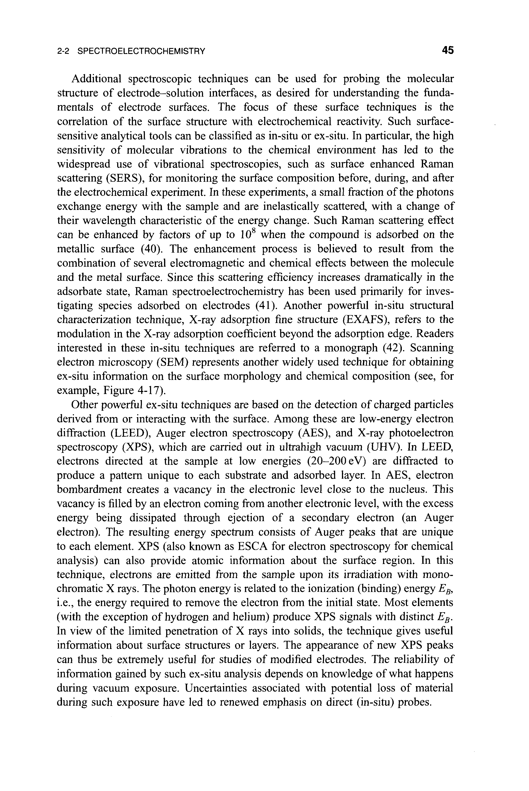

## Page 65

46 
STUDY OF ELECTRODE REACTIONS
2-3 SCANNING PROBE MICROSCOPY
The recently developed scanning probe microscopies (SPM) promise to revolu-
tionize the understanding of electrode processes. The purpose of this family of
microscopes is to acquire high-resolution data of surface properties. The various
scanning probe microscopies have similar subcomponents but different sensing
probes. These high-resolution microscopies rely on sensing the interactions between
a probe tip and the target surface while scanning the tip across the surface. Different
types of interactions can be sensed by the tip to yield different imaging signals. Such
signals are displayed as gray-scale portraits, reflecting the extent of the tip-surface
interaction. With microcomputers, the image processing becomes possible in very
short times. Among the various scanning probe microscopies, scanning tunneling
microscopy, atomic force microscopy, and scanning electrochemical microscopy
have been useful for imaging electrode surfaces directly (under potential control),
and have thus dramatically improved the understanding of electrode reactions.
2-3.1 
Scanning Tunneling Microscopy
Scanning tunneling microscopy (STM) has revolutionized the field of surface
science by allowing the direct imaging of surfaces on the atomic scale. The scanning
tunneling microscope consists of a very sharp metallic tip that is moved over the
surface of interest with a ceramic piezoelectric translator. The basis for its operation
is the electron tunneling between the metal tip and the sample surface. The tunneling
current (/,) that flows when a voltage is applied between the sample and the tip is
extremely sensitive to the sample-tip separation. In the simplest one-dimensional
treatment /, is given by
(2-18)
where S is the barrier width (equivalent to the shortest distance between the sample
surface and the end of the tip), h is the Planck constant, m is the electron mass, and (/>
is the barrier height (equivalent to the local work function). In practice, /, can change
by a factor of 2 or more with a change of the tip-sample separation of only 1 A.
Accordingly, it tends to vary with the sample topography.
Although much of the early STM work has focused on investigating surfaces in
vacuum, recent work has demonstrated that surface images can also be obtained in
liquid and air. In particular, the STM probing of electrode-electrolyte interfaces has
attracted considerable attention (43-45). The ability of STM to offer structural
information at the atomic level makes it highly suitable for in-situ studies of time-
dependent electrochemical processes, such as corrosion, electrodeposition, adsorp-
tion, as well as surface modification, passivation, and activation. For example, Figure
2-13 shows a representative three-dimensional STM view of an electrochemically
pretreated glassy carbon electrode, while Figure 2-14 illustrates a STM image of a
spontaneously adsorbed alkanethiol monolayer on a gold surface. Useful insights
into the structural-preparation relationships of conducting polymers can also be

## Page 66

2-3 SCANNING PROBE MICROSCOPY
47
FIGURE 2-13 
STM image of an electrochemically activated glassy-carbon surface.
(Reproduced with permission from reference 46.)
achieved by monitoring the growth of such films under different conditions (48). In
addition to topographic information, the high sensitivity of the tunneling current to
changes in the local work function (i.e., surface conductivity) offers a distinct
visualization of composite electrode surfaces (49).
The recent introduction of commercial STM machines incorporating a potentio-
stat and an electrochemical cell has greatly facilitated in-situ investigations of
electrochemical processes. A block diagram of such a STM/electrochemical
system is shown in Figure 2-15. Coupled with powerful software, such instruments
allow the simultaneous acquisition and display of the electrochemical and topo-
graphic data. Extremely useful insights can thus be obtained by correlating the
surface microstructures and the electrochemical reactivity. The interpretation of
STM images requires extreme caution, and the tip should be shielded properly (from
the electrolyte) to minimize the stray capacitance. Nevertheless the powerful
coupling of STM and electrochemical systems offers many exciting future oppor-
tunities.
2-3.2 
Atomic Force Microscopy
Atomic force microscopy (AFM) has become a standard technique for high-
resolution imaging of the topography of surfaces. It enables one to see nanoscopic

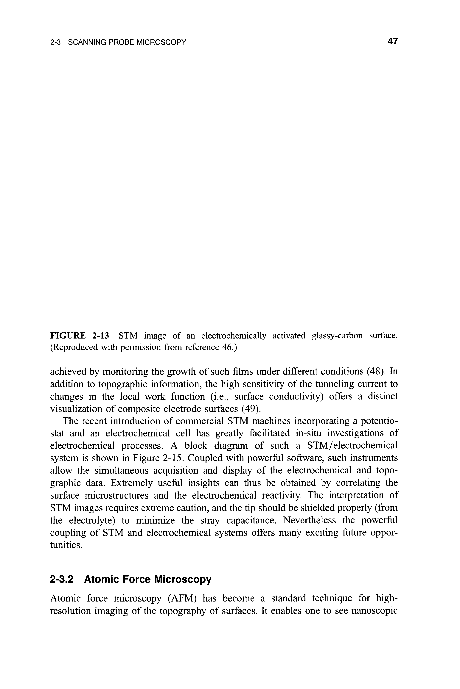

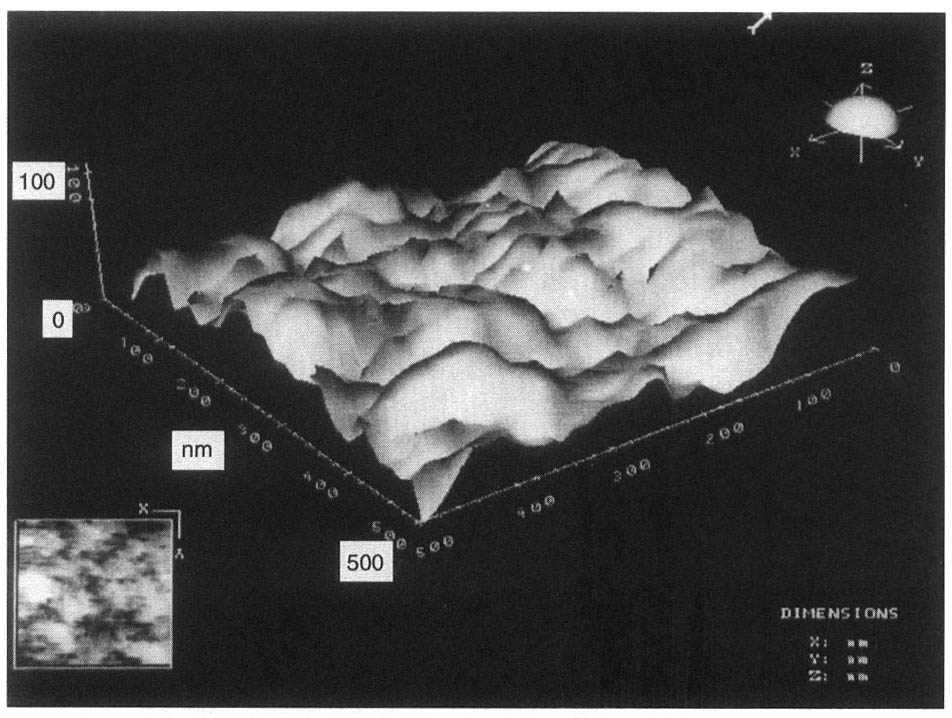

## Page 67

48
STUDY OF ELECTRODE REACTIONS
FIGURE 2-14 
STM images of (a) 7.7 nm x 7.7 nm and (b) 2.65 nm x 2.65 nm sections of
an ethanethiolate monolayer on a gold film, (c) Contours of the image along the lines a and b
in (b). (Reproduced with permission from reference 47.)

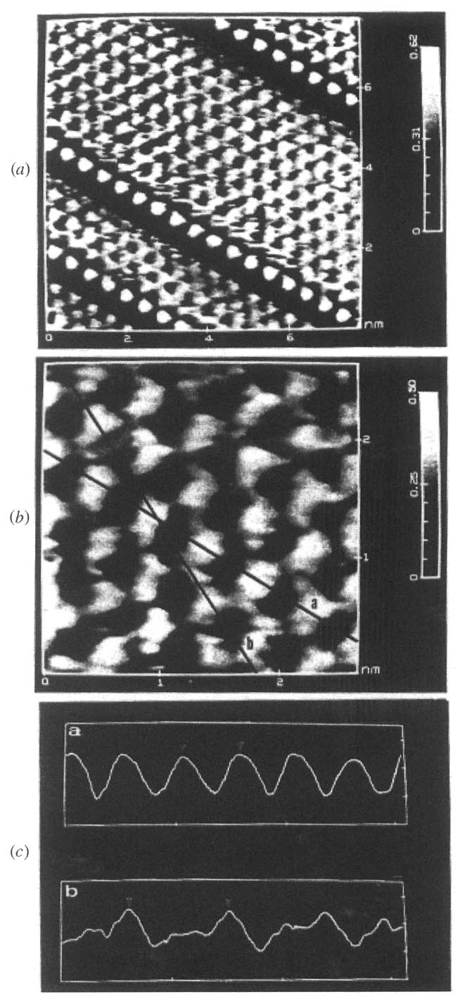

## Page 68

2-3 SCANNING PROBE MICROSCOPY
49
Tunnelling
current
amplifier
Reference electrode
FIGURE 2-15 Design of a system for in-situ electrochemical scanning tunneling microscopy.
surface features while the electrode is under potential control. This powerful probe
microscopy operates by measuring the force between the probe and the sample (50).
This force is attributed to repulsion generated by the overlap of the electron cloud at
the probe tip with the electron cloud of surface atoms. It depends in part on the
nature of the electrode, the distance between the electrode and the tip, any surface
contamination, and the tip geometry. The interaction of the force fields is sensed by a
cantilever beam, to which the tip is attached. An image (revealing individual atoms)
is created as the probe is translated across the surface. Such images can be formed by
constant-force or constant-height modes (with known or measured deflections of the
cantilever, respectively). Since AFM does not involve passage of current between the
tip and the surface, it is useful for exploring both insulating and conducting regions.
2-3.3 
Scanning Electrochemical Microscopy
The scanning tunneling microscope (STM) has led to several other variants (51).
Particularly attractive for electrochemical studies is scanning electrochemical micro-
scopy (SECM) (52-55). In SECM, faradaic currents at an ultramicroelectrode tip are
measured while the tip is moved (by a piezoelectric controller) in close proximity to
a substrate surface that is immersed in a solution containing an electroactive species
(Figure 2-16). These tip currents are a function of the conductivity and chemical
nature of the substrate, as well as of the tip-substrate distance. The images thus
obtained offer valuable insights into the microdistribution of the electrochemical and
chemical activity, as well as the substrate topography. A wide range of important
applications involving different electrochemical systems has been developed.
The most common version of SECM, the feedback mode, involves recycling of
an electroactive material between the tip and substrate surfaces (Figure 2-17). When
the microelectrode is distant from the surface by several electrode diameters, a
steady-state current iT<00 is observed at the tip (a). When the tip is brought near a
conductive substrate (held at sufficiently positive potential), the tip-generated
product R can be oxidized back to O, and the tip current will be greater than iT>00
(b). In contrast, when the tip passes over an insulating region (on the substrate),
diffusion to the tip is hindered, and the feedback current diminishes (c). For example,
Figure 2-18 displays a two-dimensional scan of a gold minigrid surface. The

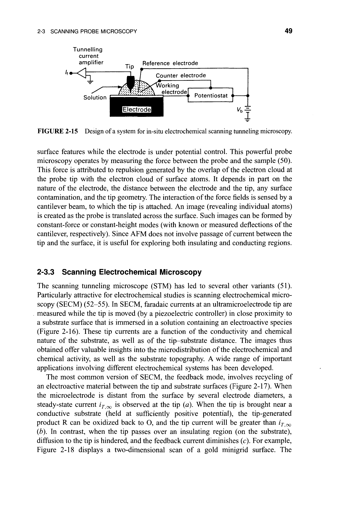

## Page 69

50
STUDY OF ELECTRODE REACTIONS
FIGURE 2-16 Design of a scanning electrochemical microscope. (Reproduced with
permission from reference 56.)
conducting gold lines are clearly observed from the enhanced recycling current.
Alternately, in the collection mode, the tip is used only as a detector of species
generated at the substrate. The distribution of the electrochemical activity of the
surface can thus be mapped. The submicrometer resolution of SECM images is
controlled by the size and shape of the tip, and it can be further improved by using
digital image processing techniques. However, unlike in STM or AFM, atomic
resolution cannot be achieved in SECM. Scanning electrochemical microscopy can
also be used to investigate heterogeneous reaction kinetics. This is accomplished by
forming a twin-electrode thin layer between the tip and a conducting substrate. Such
a configuration induces high rates of mass transfer and leads to tip currents limited
by the intrinsic electron-transfer rates. The volume reduction has also been exploited
for electrochemical studies at the level of single molecules that allow the elucidation
of new effects that are not apparent in experiments involving a large number of
molecules (58). For this purpose, the tip is insulated (e.g., with a wax) to trap the
single molecule in a tiny pocket (e.g., Figure 2-19).
Scanning electrochemical microscopy can also be applied to study localized
biological activity, as desired, for example, for in-situ characterization of biosensors
(59,60). In this mode, the tip is used to probe the biological generation or
consumption of electroactive species, for example, the product of an enzymatic
surface reaction. The utility of potentiometric (pH-selective) tips has also been

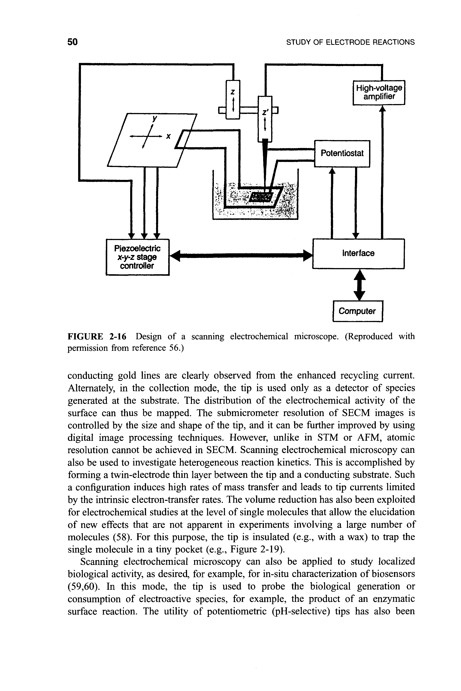

## Page 70

2-3 SCANNING PROBE MICROSCOPY
51
UME
UME
(a) iT>0= 4nFDca
Conductive substrate
(b) i
UME
Insulating substrate
(c) iT < iTi0a
FIGURE 2-17 Principles of SECM. (a) Tip far from the substrate surface; diffusion of O
leads to steady-state current, (b) Tip near a conductive substrate; positive feedback of O. (c)
Tip near the insulating substrate; hindered diffusion of O. c = concentration; a = radius of tip.
(Reproduced with permission from reference 55.)
documented recently for imaging pH profiles such as those generated by enzymatic
(urease) reactions (61). These and other (62) potentiometric tips are expected to
probe different reactions that are not accessible with voltammetric tips, e.g.,
determining local concentrations of electroinactive species. Double-barreled tips,
integrating the working and reference microelectrodes, are preferred for such
potentiometric imaging. Unlike their voltammetric counterparts, potentiometric
tips serve as purely passive sensors. In addition to its extensive use for surface
characterization, SECM has been used as a microfabrication tool (63), with its tip
acting as an electrochemical "pen" or "eraser." Various electrochemical processes
(e.g., electroplating, etching) can thus be carried out at high resolution while moving

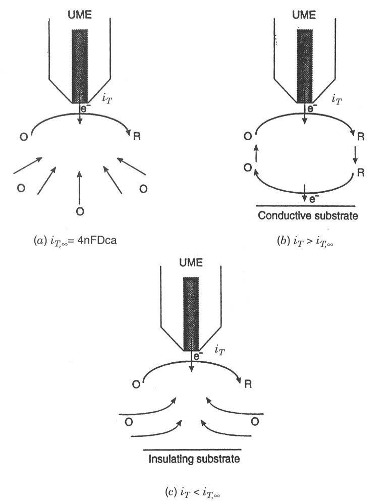

## Page 71

52
STUDY OF ELECTRODE REACTIONS
X
X
80
Y(um)
FIGURE 2-18 
SECM image of a gold minigrid surface. (Reproduced with permission from
reference 57.)
wax
sheath
FIGURE 2-19 
Single-molecule detection with SECM. Molecule A is trapped between the
tip and the surface. (Reproduced with permission from reference 58.)
the tip over the substrate surface. Recently introduced commercial SECM instru-
ments (64) will undoubtedly increase the scope and power of SECM.
2-4 ELECTROCHEMICAL QUARTZ CRYSTAL MICROBALANCE
The electrochemical quartz crystal microbalance (EQCM) is a powerful tool for
elucidating interfacial reactions based on the simultaneous measurement of electro-
chemical parameters and mass changes at electrode surfaces. The microbalance is
based on a quartz crystal wafer, which is sandwiched between two electrodes, used
to induce an electric field (Figure 2-20). The field produces a mechanical oscillation

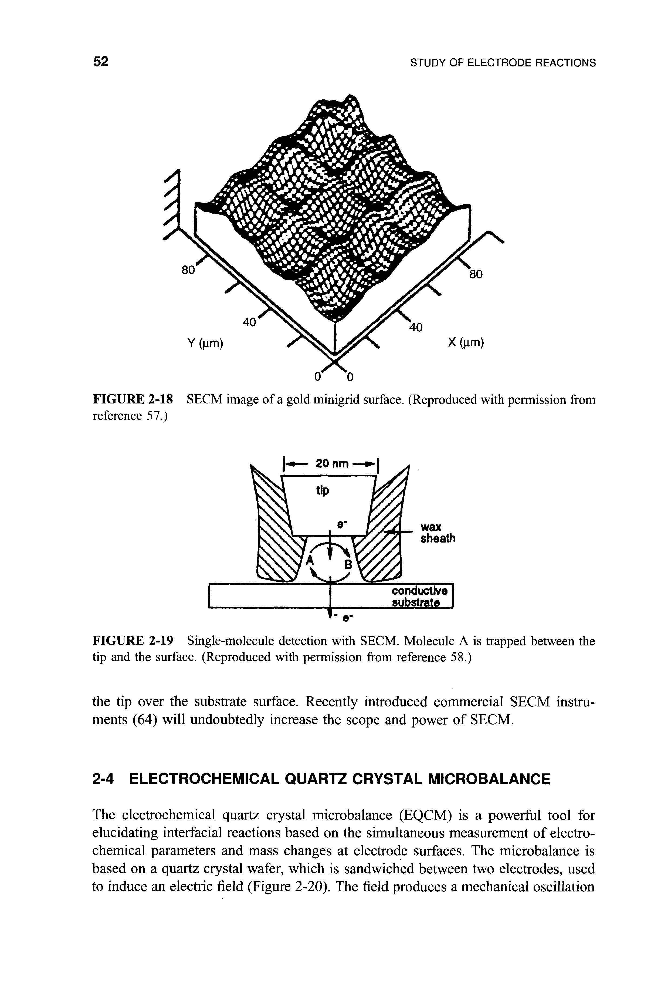

## Page 72

2-4 ELECTROCHEMICAL QUARTZ CRYSTAL MICROBALANCE 
53
FIGURE 2-20 
The quartz crystal microbalance: a, the quartz crystal; b, the gold electrode; c
and d, connecting metal wires; e, the base.
in the bulk of the wafer. Surface reactions involving minor mass changes can cause
perturbation of the resonant frequency of the crystal oscillator. The frequency
change (A/) is related to the mass change (Aw) according to the Sauerbrey equation:
A/ = —2 Amn/Q /'A^fjlp 
(2-19)
where n is the overtone number, /0 is the base resonant frequency of the crystal
(prior to the mass change), A is the area (cm2), [i is the shear modulus of quartz
(2.95 x 1011 g cm"1 s"1), and p is the density of quartz (2.65 g cm"3). As expected
from the negative sign, decreases in mass correspond to increases in frequency and
vice versa. The Sauerbrey equation forms the basis for the excellent mass sensitivity
of the EQCM. In-situ mass changes of 1 ng cm"2 can thus be detected. Such high
sensitivity and in-situ capability represent the major advantages of EQCM experi-
ments.
The EQCM is very useful for probing processes that occur uniformly across the
surface. Numerous surface reactions have been investigated, including deposition or
dissolution of surface layers and various uptake processes (such as doping/undoping
of conducting polymers or ion-exchange reactions at polymer films). Such changes
can be probed using various controlled-potential or controlled-current experiments.
In these experiments, one of the electrodes (on the wafer) contacts the solution and
serves as the working electrode in the electrochemical cell, to allow simultaneous
frequency and current measurements. For example, Figure 2-21 displays the
frequency (mass) versus potential profiles, and the corresponding cyclic voltammo-
grams, during the uptake of a multiply charged complex ion at an ion exchanger-
coated electrode. Other useful examples of probing the uptake of mobile species by
polymer-coated electrodes have been given by Hillman et al. (66). Application of the
Sauerbrey equation to the study of polymeric films in solutions requires adherence to
the rigid film approximation (i.e., behavior of an elastic, solvent-free thin layer).

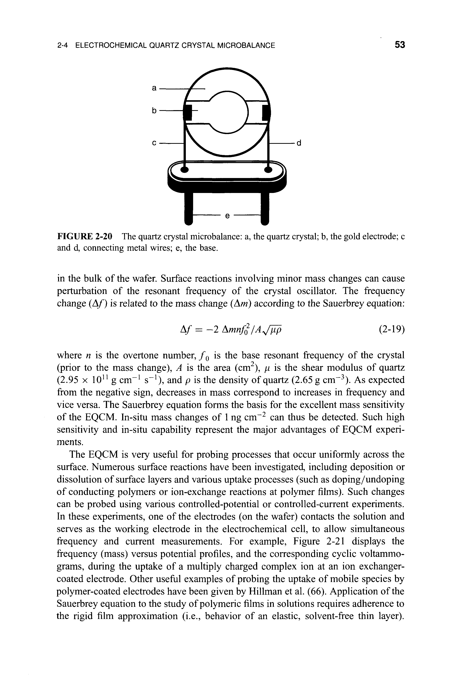

## Page 73

54
STUDY OF ELECTRODE REACTIONS
0.4mA
300 
0 
-300 
-600
E(mV)(vs.Ag/AgCI)
900
FIGURE 2-21 
EQCM (a) and cyclic voltammetry (b) profiles at an ion exchanger-coated
electrode in the presence of 6 x 10~3M Ru(NH3)6Cl6. (Reproduced with permission from
reference 65.)
Such approximation is valid when the thickness of the polymeric layer is small
compared to the thickness of the crystal, and the measured frequency change is small
with respect to the resonant frequency of the unloaded crystal. Mass changes up to
0.05% of the crystal mass commonly meet this approximation. In the absence of
molecular specificity, EQCM cannot be used for molecular-level characterization of
surfaces. Electrochemical quartz crystal microbalance devices also hold promise for
the task of affinity-based chemical sensing, as they allow simultaneous measure-
ments of both the mass and the current. The principles and capabilities of EQCM
have been reviewed (67,68). The combination of EQCM with scanning electro-
chemical microscopy has also been reported recently for studying the dissolution
and etching of various thin films (69). The recent development of a multichannel
quartz crystal microbalance (70), based on arrays of resonators, should further
enhance the scope and power of EQCM.
REFERENCES
1. R.S. Nicholson and I. Shain, Anal. Chem., 36, 706 (1964).
2. L. Echegoyen, and L.E. Echegoyen, Ace. Chem. Res., 31, 593 (1998).
3. C.P. Andrieux, P. Hapiot, and J.M. Saveant, Electroanalysis, 2, 183 (1990).

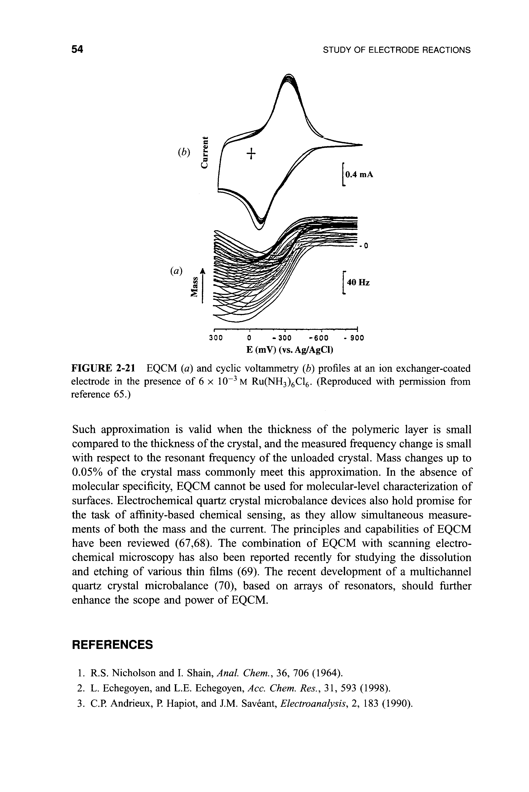

## Page 74

REFERENCES 
55
4. M.B. Gelbert, and D.J. Curran, Anal. Chem., 58, 1028 (1986).
5. M.D. Hawley, S.V Tatawawdi, S Piekarski, and R.N. Adams, J. Am. Chem. Soc., 89, 447
(1967).
6. D.M. Mohilner, R.N. Adams and W.R. Argersinger, J. Am. Chem. Soc., 84, 3816 (1962).
7. D. Evans, Ace. Chem. Res., 10, 313 (1977).
8. G. Mabbott, J. Chem. Educ., 60, 697 (1983).
9. M. Rudolph, D. Reddy and S.W. Feldberg, Anal Chem., 66, 589A (1994).
10. J. Wang, D.B. Luo, P.A.M. Farias and J.S. Mahmoud, Anal. Chem., 57, 158 (1985).
11. P.J. Pearce and A.J. Bard, J. Electroanal. Chem., 114, 89 (1980).
12. R.H. Wopschall and I. Shain, Anal. Chem., 39, 1514 (1967).
13. M. Sluyters-Rehbach and J.R. Sluyter, J. Electroanal. Chem., 65, 831 (1975).
14. A.P. Brown and F.C. Anson, Anal Chem., 49, 1589 (1977).
15. J. Stamford, P. Hurst, W. Kuhr and R.M. Wightman, J. Electroanal. Chem., 265, 291
(1989).
16. J. Baur, E. Kristensen, L. May, D. Wiedemann and R.M. Wightman, Anal Chem., 60, 1268
(1988).
17. D. Michael, E. Travis and R.M. Wightman, Anal. Chem., 70, 586A (1998).
18. B. Jackson, S. Dietz and R.M. Wightman, Anal Chem., 67, 1115 (1995).
19. J. Heinze, Angew. Chem. (Int. Ed. Engl), 23, 831 (1984).
20. R.P. Baldwin, K. Ravichandran and R.K. Johnson, J. Chem. Educ., 61, 820 (1984).
21. T. Kuwana and W. Heineman, Ace. Chem. Res., 9, 241 (1976).
22. W. Heineman, F. Hawkridge and H. Blount, "Spectroelectrochemistry at Optically
Transparent Electrodes" in A.J. Bard, Ed., Electroanalytical Chemistry, Vol. 13, Marcel
Dekker, New York, 1986.
23. D.A. Van Dyke and H.Y. Cheng, Anal. Chem., 60, 1256 (1988).
24. M. Porter and T. Kuwana, Anal Chem., 56, 529 (1984).
25. J. Brewster and J.L. Anderson, Anal Chem., 54, 2560 (1982).
26. V Norvell and G. Mamantov, Anal. Chem., 49, 1470 (1977).
27. W.R. Heineman, J. Chem. Educ., 60, 305 (1983).
28. E. Bancroft, J. Sidwell and H. Blount, Anal Chem., 53, 1390 (1981).
29. Y.P. Gui, M. Porter and T. Kuwana, Anal. Chem., 57, 1474 (1985).
30. Y. Shi, A. Slaterbeck, C. Seliskar and W.R. Heineman, Anal. Chem., 69, 3676 (1997).
31. H.D. Dewald and J. Wang, Anal Chim. Acta, 166, 163 (1984).
32. R.N. Bagchi, A.M. Bond and F. Scholz, Electroanalysis, 1, 1 (1989).
33. J.A. Richards and D.H. Evans, Anal. Chem., 47, 964 (1965).
34. H. Chang, D.C. Johnson and R.S. Houk, Trends Anal. Chem., 8, 328 (1989).
35. M.C. Regino and A. Brajter-Toth, Anal. Chem., 69, 5067 (1997).
36. Y. Tong, E. Oldfield and A. Wieckowski, Anal. Chem., 70, 518A (1998).
37. L Faulkner and A.J. Bard, "Electrochemiluminescence" in A.J. Bard, Ed., Electroanaly-
tical Chemistry, Vol. 10, Marcel Dekker, New York, 1977.
38. J.G. Velasco, Electroanalysis, 3, 261 (1991).
39. A.W. Knight and G. Greenway, Analyst, 119, 879 (1994).
40. D. Jeanmarie and R. Van Duyne, J. Electroanal. Chem., 84, 1 (1977).

## Page 75

56
STUDY OF ELECTRODE REACTIONS
41. R.L. McCreery and R.T. Packard, Anal. Chem., 61, 775A (1989).
42. H.D. Abruna, Electrochemical Interfaces, VCH Publishers, New York, 1991.
43. A.J. Arvia, Surface Science, 181, 78 (1987).
44. T.R. Cataldi, I. Blackham, A. Briggs, J. Pethica and H.A. Hill, J. Electroanal. Chem., 290,
1 (1990).
45. J. Wang, Analyst, 117, 1231 (1992).
46. J. Wang, T. Martinez, D. Yaniv and L.D. McCormick, J. Electroanal. Chem., 278, 379
(1990).
47. C. Widrig, C. Alves and M. Porter, J. Am. Chem. Soc., 113, 2805 (1991).
48. T. Kim, H. Yang and A. Bard, J. Electrochem. Soc., 138, L71 (1991).
49. J. Wang, T. Martinez, D. Yaniv and L.D. McCormick, J. Electroanal. Chem., 286, 265
(1990).
50. H. Hansma, A. Weisenhorm, A. Edmundson, H. Gaub and P. Hansma, Clin. Chem., 37,
1497 (1991).
51. H. Wickramaasinghe, Scientific American, 98 (Oct. 1989).
52. R. Engstrom and C. Pharr, Anal. Chem., 61, 1099A (1989).
53. A.J. Bard, G. Denuault, C. Lee, D. Mandler and D. Wipf, Ace. Chem. Res., 23 (1990) 357.
54. M.V Mirkin, Anal. Chem., 68, 177A (1996).
55. M. Area, A.J. Bard, B. Horrocks, T. Richards and D. Treichel, Analyst, 119, 719 (1994)
56. H. Liu, F. Fan, C. Lin and A.J. Bard, J. Am. Chem. Soc., 108, 3838 (1986).
57. J. Kwak and A.J. Bard, Anal. Chem., 61, 1794 (1989).
58. F. Fan, J. Kwak and A.J. Bard, J. Am. Chem. Soc., 118, 9669 (1996).
59. J. Wang, L. Wu and R. Li, J. Electroanal. Chem., 272, 285 (1989).
60. D. Pierce, P. Unwin and A.J. Bard, Anal. Chem., 64, 1795 (1992).
61. B. Horrocks, M. Mirkin, D. Pierce, A.J. Bard, G. Nagy and K. Toth,^«o/. Chem., 65, 1304
(1993).
62. C. Wei, A.J. Bard, G. Nagy and K. Toth, Anal. Chem., 67, 1346 (1995).
63. W. Nowall, D. Wipf and W.G. Kuhr, Anal. Chem., 70, 2601 (1998).
64. "Scanning Electrochemical Microscope", CH Instruments, 1998.
65. S. Basak, C. Bose and K. Rajeshwar, Anal. Chem., 64, 1813 (1992).
66. A.R. Hillman, D. Loveday, M. Swann, S. Bruckenstein and C.P. Wildle, Analyst, 117,1251
(1992).
67. M. Deakin and D. Buttry, Anal. Chem., 61, 1147A (1989).
68. M.D. Ward and D.A. Buttry, Science, 249, 1000 (1990).
69. D. Cliffel and A.J. Bard, Anal. Chem., 70, 1993 (1998).
70. T. Tatsuma, Y. Watanabe, N. Oyama, K. Kiakizaki and M. Haba, Anal. Chem., 71, 3632
(1999).
EXAMPLES
Example 2-1 The reversible oxidation of dopamine (DA) is a two-electron
process. A cyclic voltammetric anodic peak current of 2.2 uA is observed for a

## Page 76

EXAMPLES
57
0.4 mM solution of dopamine in phosphate buffer at a glassy carbon disk electrode of
2.6 mm2 area with a scan rate of 25 mV s"1. What will ip be for v = 100 mV s"1 and
1.2mMDA?
Solution 
From equation (2-1):
ip = kCvl/2 
2.2 = k 0.4(25)1/2 
A: =1.1
Under the new experimental conditions, ip is given by
ip = 1.1 x 1.2 x (100)1/2 = 13.2 uA
Example 2-2 The following cyclic voltammogram was recorded for a reversible
couple: Calculate the number of electrons transferred and the formal potential for the
couple.
0
I 
1 
1 
t
0.8 
06 
04
Potential (V vs SCE)
Solution 
From equation (2-3),
n = 0.059/A£0 = 0.059/(0.555 - 0.495) = 0.983 =• 1.0
The formal potential can be calculated from equation (2-2):
£° = (0.555 + 0.495)/2 = 0.525 V
Example 2-3 The electropolymeric growth of 2 ng polyphenol onto a gold QCM
crystal A = 1 cm2;^, = 5 MHz) resulted in a frequency change of 12 Hz. Calculate
the frequency change associated with the deposition of 4 ng polyphenol onto a
0.5cm2 crystal (/0 = 8 MHz).

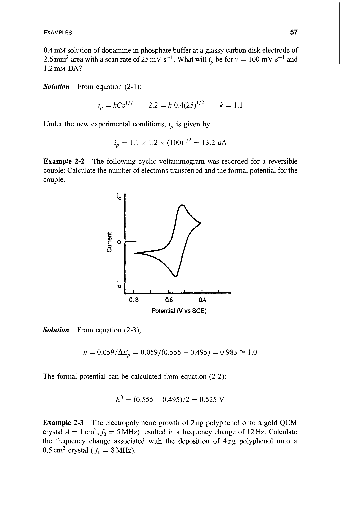

## Page 77

58 
STUDY OF ELECTRODE REACTIONS
Solution 
From equation (2-19)
A/ = -K kmft/A
5 = -K2x52/l 
K=-0.l
Under the new experimental conditions, A/ is given by
A/ = -(-0.1) x 4 x 82/0.5 = 51.2 Hz
Example 2-4 A potential-step spectroelectrochemistry experiment using a reactant
concentration of 2 mM generated a product with an absorbance (sampled after 25 s)
of 0.8. Calculate the reactant concentration that yielded an absorbance of 0.4 upon
sampling at 16s.
Solution 
From equation (2-17),
A = KCGtl/2 
0.8 = ^T2(25)1/2 
K = 0.08
Accordingly,
0.4 = 0.08C0(16)1/2 
C0 = 5mM
QUESTIONS
1. Explain and demonstrate clearly how spectroelectrochemistry can provide useful
information about a reaction mechanism involving a redox process followed by
a chemical reaction (EC mechanism), involving decomposition of the reaction
product. Draw an absorbance-time plot for different rate constants of the
decomposition reaction.
2. Which voltammetric technique can be used for estimating the surface coverage
of an adsorbed molecule? How?
3. Draw an EQCM (mass-potential) profile for a metal deposition-stripping
process during a cycling voltammetric scanning.
4. A cyclic-voltammetric peak current of 12.5 uA was observed for the reversible
reduction of a 1.5 mM lead solution using a 1.2mm-diameter disk electrode and
a SOmVs"1 scan rate. Calculate the lead concentration that yields a peak
current of 20.2 uA at 250 mV s"1.
5. Explain clearly how SECM images the microdistribution of the electrochemical
activity of composite electrode materials.

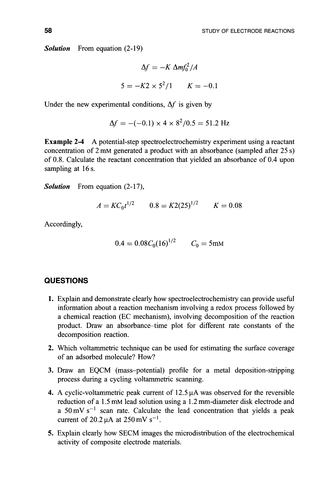

## Page 78

QUESTIONS 
59
6. Describe clearly how thin-layer spectroelectrochemistry is used for measuring
the values of E° and n.
7. Summarize the different features of the cyclic voltammogramic response for
reversible and quasi-reversible systems.
8. Explain the use of cyclic voltammetry for estimating the values of E° and n for a
reversible system.
9. What is the reason for the gradual increase of the cathodic and anodic cyclic-
voltammetric peak currents observed upon repetitive scanning?
10. How would you use EQCM for elucidating the electrostatic desorption of
anionic DNA molecules from gold electrodes?
11. Propose a SECM experiment for mapping the distribution of an oxidase enzyme
within a carbon composite surface. (Note that the enzyme generates hydrogen
peroxide in the presence of its substrate and oxygen.)
12. How does the increase of the scan rate affect the ratio of peak currents
(backward/forward) in a cyclic voltammetric experiment involving a redox
process followed by a chemical reaction?

## Page 79

CHAPTER 3
CONTROLLED-POTENTIAL
TECHNIQUES
The basis of all controlled-potential techniques is the measurement of the current
response to an applied potential. There exist a multitude of potential excitations,
including a ramp, potential steps, pulse trains, a sine wave, and various combinations
thereof. The present chapter reviews those techniques that are widely used.
3-1 
CHRONOAMPEROMETRY
Chronoamperometry involves stepping the potential of the working electrode from a
value at which no faradaic reaction occurs to a potential at which the surface
concentration of the electroactive species is effectively zero (Figure 3-la). A
stationary working electrode and unstirred solution are used. The resulting
current-time dependence is monitored. As mass transport under these conditions
is solely by diffusion, the current-time curve reflects the change in the concentration
gradient in the vicinity of the surface (recall Section 1.2). This involves a gradual
expansion of the diffusion layer associated with the depletion of the reactant, and
hence decreased slope of the concentration profile as time progresses (see Figure
3-lb). Accordingly, the current (at a planar electrode) decays with time (Figure
3-lc), as given by the Cottrell equation:
(3-1)
Such an itl/2 constancy is often termed "Cottrell behavior." Deviations from such
behavior occur at long times (usually over 100 s) as a result of natural convection
60

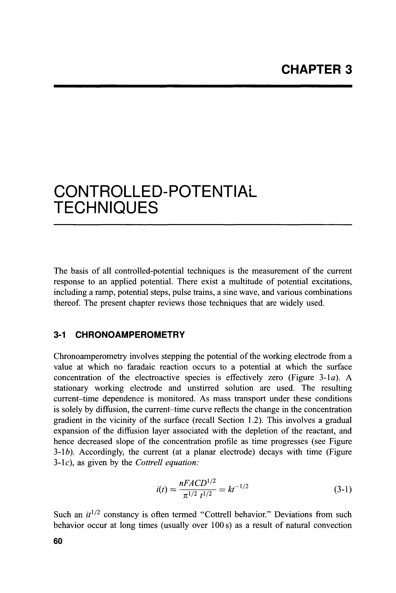

## Page 80

3-1 CHRONOAMPEROMETRY
61
(a)
Time
(b)
o
O
increasing
time
Distance (x)
Time
FIGURE 3-1 Chronoamperometric experiment: (a) potential-time waveform; (b) change of
concentration profiles with time; (c) the resulting current-time response.
effects, or when using microelectrodes with high perimeter-to-area ratios (see
Section 4-5.4). In the latter case, a time-independent current (proportional to the
concentration) is obtained for t > 0.1 s due to a large radial diffusion contribution.
Similar considerations apply to spherical electrodes whose current response follow-
ing a potential step contains a time-dependent and time-independent terms (equation
1-12). Recall also that for small values of t (t <50ms) the chronoamperometric
signal contains a background contribution of the charging current (equation 1-49).
Additional transient background contributions (associated with surface redox reac-
tions) are common to solid-electrode chronamperometric experiments.
Chronoamperometry is often used for measuring the diffusion coefficient of
electroactive species or the surface area of the working electrode. Analytical
applications of chronoamperometry (e.g., in-vivo bioanalysis) rely on pulsing of
the potential of the working electrode repetitively at fixed time intervals. Chron-
oamperometry can also be applied to the study of mechanisms of electrode
processes. Particularly attractive for this task are reversal double-step chronoam-
perometric experiments (where the second step is used to probe the fate of a species
generated in the first step).
The potential-step experiment can also be used to record the charge versus time
dependence. This is accomplished by integrating the current resulting from the

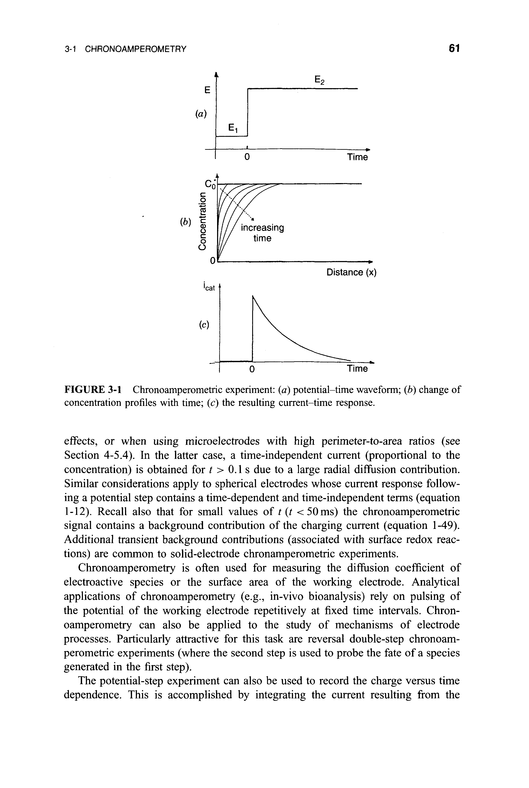

## Page 81

62
CONTROLLED-POTENTIAL TECHNIQUES
potential step. Such a charge measurement procedure, known as chronocoulometry,
is particularly useful for measuring the quantity of adsorbed reactants (because of the
ability to separate the charges produced by the adsorbed and solution species). A
plot of the charge (Q) vs. t1/2 yields an intercept at t = 0 that corresponds to the sum
of the charge due to the reaction of the adsorbed species and the double-layer
charging. The former can be estimated by subtracting the intercept obtained in an
identical experiment carried out in the blank solution.
3-2 POLAROGRAPHY
Polarography is a subclass of voltammetry in which the working electrode is the
dropping mercury electrode (DME). Because of the special properties of this
electrode, particularly its renewable surface and wide cathodic potential range (see
Section 4-5 for details), polarography has been widely used for the determination of
many important reducible species. This classical technique was invented by J.
Heyrovsky in Czechoslovakia in 1922, and had an enormous impact on the progress
of electroanalysis (through many subsequent developments). Accordingly, Heyr-
ovsky was awarded the 1959 Nobel Prize in Chemistry.
The excitation signal used in conventional (DC) polarography is a linearly
increasing potential ramp. For a reduction, the initial potential is selected so that
the reaction of interest does not take place. The potential is then scanned
cathodically while the current is measured. The current is proportional to the
slope of the concentration-distance profile (see Section 1-2.1.2). At a sufficiently
negative potential, reduction of the analyte commences, the concentration gradient
increases, and the current rises rapidly to its limiting (diffusion-controlled) value. At
this plateau, any analyte particle that arrives at the electrode surface instantaneously
undergoes an electron-transfer reaction, and the maximum rate of diffusion is
achieved. The resulting polarographic wave is shown in Figure 3-2. The current
oscillations reflect the growth and fall of the individual drops.
To derive the expression for the current response, one must account for the
variation of the drop area with time:
4nd
2/3
=0.85(m02/3
(3-2)
where t is the time and m and d are the mass flow rate and density of mercury,
respectively. By substituting the surface area (from equation 3-2) into the Cottrell
equation (equation 3-1), and replacing D by 1/3D (to account for the compression of
the diffusion layer by the expanding drop), we obtain the Ilkovic equation for the
limiting diffusion current (1):
= 708«£>1/2m2/V/6C
(3-3)
Here, id will have units of amperes (A) when D is in cm2 s , m is in g s , Ms in
seconds and C is in mol cnT3. This expression represents the current at the end of

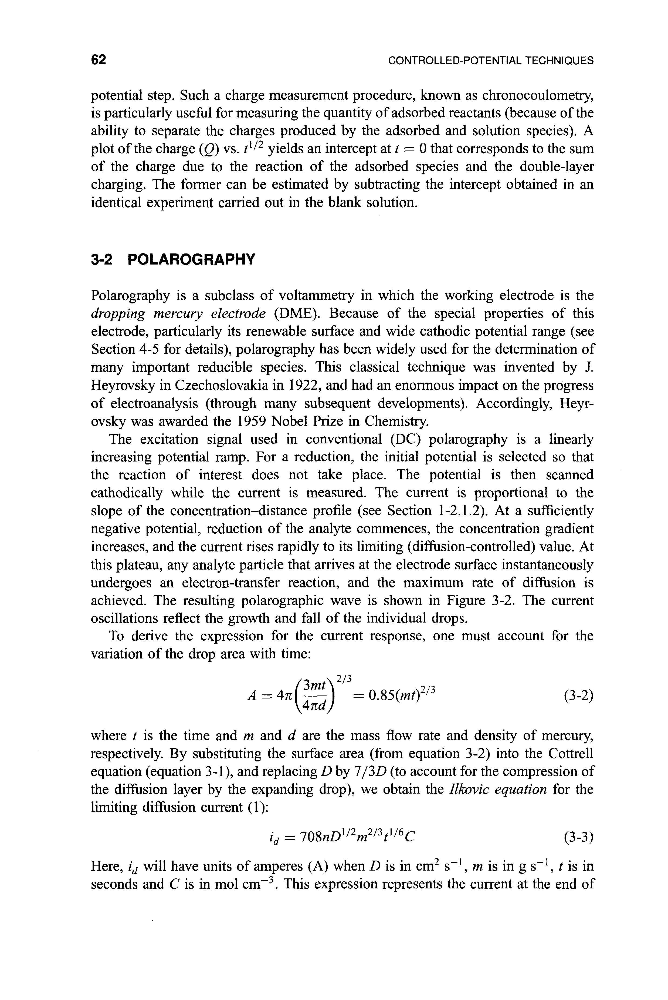

## Page 82

3-2 POLAROGRAPHY
20
63
3.
*->awu
Ui
3
<J
0-
I 
1 
I 
I 
1 
I 
I 
I 
I
0
-1.2
-0.6
Potential (V)
FIGURE 3-2 
Polarograms for 1 M hydrochloric acid (Curve A) and 4 x 10~4 M Cd+2 in 1 M
hydrochloric acid B. id represents the limiting current; El/2 is the half-wave potential.
the drop life. The average current over the drop life is obtained by integrating the
current over this time period:
= 607«£>1/2m2/V/6C
(3-4)
To determine the diffusion current, it is necessary to subtract the residual current.
This can be achieved by extrapolating the residual current prior to the wave or by
recording the response of the deaerated supporting electrolyte (blank) solution.
Addition of a standard or a calibration curve are often used for quantitation.
Polarograms to be compared for this purpose must be recorded in the same way.
The potential at which the current is one-half of its limiting value is called the
half-wave potential, E1/2. The half-wave potential (for electrochemically reversible
couples) is related to the formal potential, E°, of the electroactive species according
to
P" 
770 
I -"••*
KT
—
(3-5)
where DR and Do, are the diffusion coefficients of the reduced and oxidized forms of
the electroactive species, respectively. Because of the similarity in the diffusion
coefficients, the half-wave potential is usually similar to the formal potential. Thus,
the half-wave potential, which is a characteristic of a particular species in a given
supporting electrolyte solution, is independent of the concentration of that species.
Therefore, by measuring the half-wave potential, one can identify the species
responsible for an unknown polarographic wave. Typical half-wave potentials for

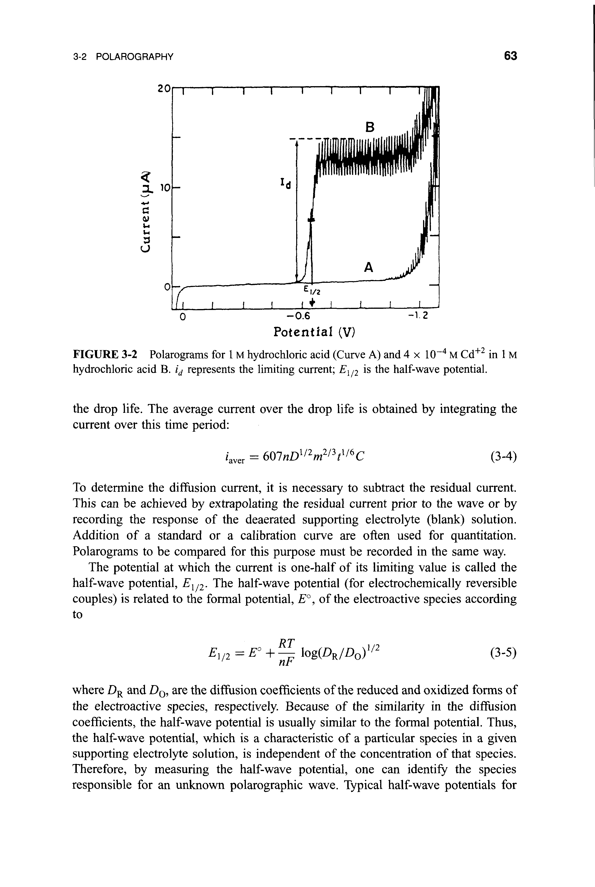

## Page 83

64 
CONTROLLED-POTENTIAL TECHNIQUES 
TABLE 3-1 Functional Groups Reducible at the Dropping Mercury Electrode 
Class of Compound 
Functional Group 
E,,,(V)a 
A20 
Carbon-carbon double bondb 
Carbon-carbon triple bondb 
C arbony 1 
Disulfide 
Nitro 
Organic halides 
Quinone 
-N=N- 
-c=c- 
-C&- 
,c=o 
\ 
s-s 
NO2 
C-X (X=Br, C1, I) 
c=o 
- 0.4 
- 2.3 
- 2.3 
- 2.2 
- 0.3 
- 0.9 
- 1.5 
-0.1 
Against the saturated calomel electrode at pH 7. 
Conjugated with a similar bond or with an aromatic ring. 
several reducible organic functionalities common in organic compounds are given in 
Table 3- 1. Compounds containing these functionalities are ideal candidates for 
polarographic measurements. (Additional oxidizable compounds can be measured 
using solid-electrode voltammetric protocols.) Since neutral compounds are 
involved, such organic polarographic reductions commonly involve hydrogen ions. 
Such reactions can be represented as 
(3-6) 
R + nH+ + ne- + RH, 
where R and RH, are oxidized and reduced forms of the organic molecule. For such 
processes, the half-wave potential will be a function of pH (with a negative shift of 
about 59mVln for each unit increase in pH, due to decreasing availability of 
protons). Thus, in organic polarography, good buffering is vital for generating 
reproducible results. Reactions of organic compounds are also often slower and more 
complex than those of inorganic cations. 
For the reduction of metal complexes, the half-wave potential is shifted to more 
negative potentials (vs. the true metal ion), reflecting the additional energy required 
for the decomposition of the complex. Consider the reversible reduction of a 
hypothetical metal complex, ML,: 
ML, + ne- + Hg + M(Hg) +pL 
(3-7) 
where L is the free ligand and p is the stoichiometric number. (The charges are 
omitted for simplicity.) The difference between the half-wave potential for the 
complexed and uncomplexed metal ion is given by (2): 

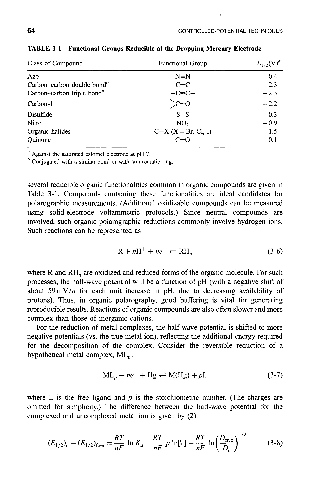

## Page 84

3-2 POLAROGRAPHY 
65
where Kd is the formation constant. The stoichiometric number can thus be
computed from the slope of a plot of (E1/2)c vs. In [L]. It is possible to exploit
equation (3-8) to improve the resolution between two neighboring polarographic
waves, based on a careful choice of the ligand and its concentration.
For reversible systems (with fast electron-transfer kinetics), the shape of the
polarographic wave can be described by the Heyrovsky-Ilkovic equation:
nF-> 
' ' 
(3-9)
It follows from equation (3-9) that a plot of E vs. log[(id — i)/i] should yield a
straight line with a slope of 0.059/« at 25°C. Such a plot offers a convenient method
for the determination of n. In addition, the intercept of this line will be the half-wave
potential. Another way to estimate n is to measure (£3/4 — £1/4), which corresponds
to 56.4/nmV for a reversible system. (£3/4 and El/4 are the potentials for which
/ = 0.75id and / = 0.25id, respectively.) It should be emphasized that many polaro-
graphic processes, especially those of organic compounds, are not reversible. For
those that depart from reversibility, the wave is "drawn out," with the current not
rising steeply, as is shown in Figure 3-2. The shape of the polarographic respose for
an irreversible reduction process is given by
where a is the transfer coefficient and kj- is the rate constant of the forward reaction.
In a few instances, the polarographic wave is accompanied by a large peak (where
the current rises to a maximum before returning to the expected diffusion current
plateau). Such an undesired peak, known as the polarographic maximum, is
attributed to a hydrodynamic flow of the solution around the expanding mercury
drop, and can be suppressed by adding a small amount of a surface-active material
(such as Triton X-100).
When the sample solution contains more than one reducible species, diffusion
currents resulting from each of them are observed. The heights of the successive
waves can be used to measure the individual analytes, provided there is a reasonable
difference (>0.2V) between the half-wave potentials. The baseline for measuring
the limiting current of the second species is obtained by extrapolation of the limiting
current of the first process. With a potential window of about 2 V, five to seven
individual polarographic waves might be observed. Solution parameters, such as the
pH or concentration of complexing agents, can be manipulated to deliberately shift
the peak potential and hence improve the resolution of two successive waves.
Successive waves are observed also for samples containing a single analyte that
undergoes reduction in two or more steps (e.g., 1,4-benzodiazepine or tetracycline).
The background (residual) current that flows in the absence of the electroactive
species of interest is composed of contributions due to double-layer charging process
and redox reactions of impurities, as well as of the solvent, electrolyte, or electrode.

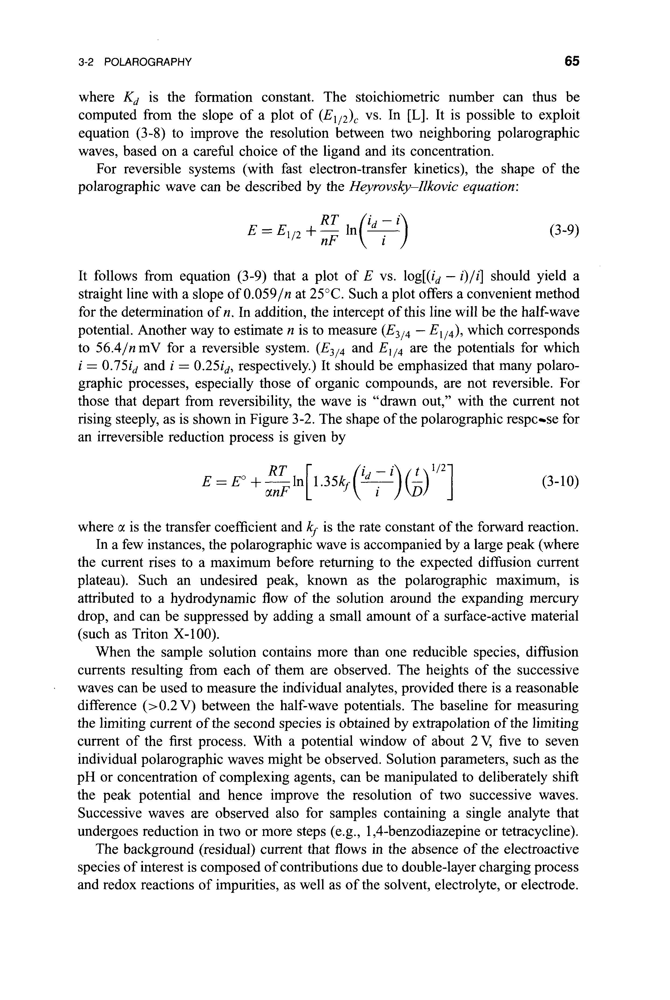

## Page 85

66
CONTROLLED-POTENTIAL TECHNIQUES
The latter processes (e.g., hydrogen evolution and mercury oxidation) are those that
limit the working potential range. In acidic solutions, the negative background limit
shifts by approximately 59mV per pH unit to more positive potentials with
decreasing pH. Within the working potential window, the charging current is the
major component of the background (which limits the detection limit). It is the
current required to charge the electrode-solution interface (which acts as a capacitor)
upon changing the potential or the electrode area (see Section 1-3). Thus, the
charging current is present in all conventional polarographic experiments, regardless
of the purity of reagents. Because of the negligible potential change during the drop
life, the charging associated with the potential scan can be ignored. The value of the
polarographic charging current thus depends on the time change of the electrode
area:
dq
dt
dA_
~di
(3-11)
By substituting the derivative of the area with time (from equation 3-2) one obtains
ic = 0.00567(£ - £pzc)Cdlm2/3 r1/3 
(3-12)
Hence, the charging current decreases during the drop life, while the diffusion
current increases (Figure 3-3):
wo =
(3-13)
The analytical significance of the charging current depends upon how large it is
relative to the diffusion current of interest. When the analyte concentration is in the
range 10~4 to 10~2M, the current is mostly faradaic, and a well-defined polaro-
graphic wave is obtained. However, at low concentrations of the analyte, the
charging current contribution becomes comparable to the analytical signal, and
the measurement becomes impossible. The charging current thus limits the detection
B
0
1
2
t/td
FIGURE 3-3 Variation of the charging (curve A) and diffusion currents (curves B) during
the lifetime of a drop.

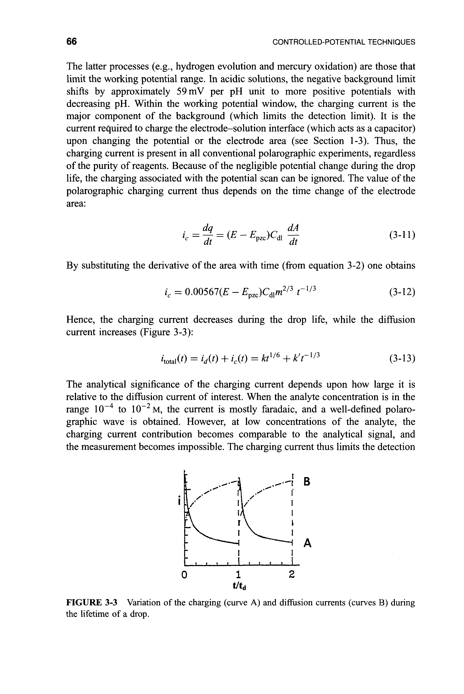

## Page 86

3-3 
PULSE VOLTAMMETRY 
67
limit of classical polarography to the 5 x 10~6 to 1 x 10~5M region. Lower
detection limits are obtained for analytes with redox potentials closer to Epzc, i.e.,
when ic approaches its smaller value, (equation 3-11). Advanced (pulse) polaro-
graphic techniques, discussed in Section 3-3, offer lower detection limits by taking
advantage of the different time dependences of the analytical and charging currents
(equation 3-13). Such developments have led to a decrease in the utility of DC
polarography.
3-3 PULSE VOLTAMMETRY
Pulse voltammetric techniques, introduced by Barker and Jenkin (3), are aimed at
lowering the detection limits of voltammetric measurements. By substantially
increasing the ratio between the faradaic and nonfaradaic currents, such techniques
permit convenient quantitation down to the 10~8 M concentration level. Because of
their greatly improved performance, modern pulse techniques have largely
supplanted classical polarography in the analytical laboratory. The various pulse
techniques are all based on a sampled current potential-step (chronoamperometric)
experiment. A sequence of such potential steps, each with a duration of about 50 ms,
is applied to the working electrode. After the potential is stepped, the charging
current decays rapidly (exponentially) to a negligible value (equation 1-49), while
the faradaic current decays more slowly. Thus, by sampling the current late in the
pulse life, an effective discrimination against the charging current is achieved.
The difference between the various pulse voltammetric techniques is the excita-
tion waveform and the current sampling regime. With both normal-pulse and
differential-pulse voltammetry, one potential pulse is applied for each drop of
mercury when the DME is used. (Both techniques can also be used at solid
electrodes.) By controlling the drop time (with a mechanical knocker), the pulse
is synchronized with the maximum growth of the mercury drop. At this point, near
the end of the drop lifetime, the faradaic current reaches its maximum value, while
the contribution of the charging current is minimal (based on the time dependence of
the components).
3-3.1 
Normal-Pulse Voltammetry
Normal-pulse voltammetry consists of a series of pulses of increasing amplitude
applied to successive drops at a preselected time near the end of each drop lifetime
(4). Such a normal-pulse train is shown in Figure 3-4. Between the pulses, the
electrode is kept at a constant (base) potential at which no reaction of the analyte
occurs. The amplitude of the pulse increases linearly with each drop. The current is
measured about 40 ms after the pulse is applied, at which time the contribution of the
charging current is nearly zero. In addition, because of the short pulse duration, the
diffusion layer is thinner than that in DC polarography (i.e., there is larger flux of

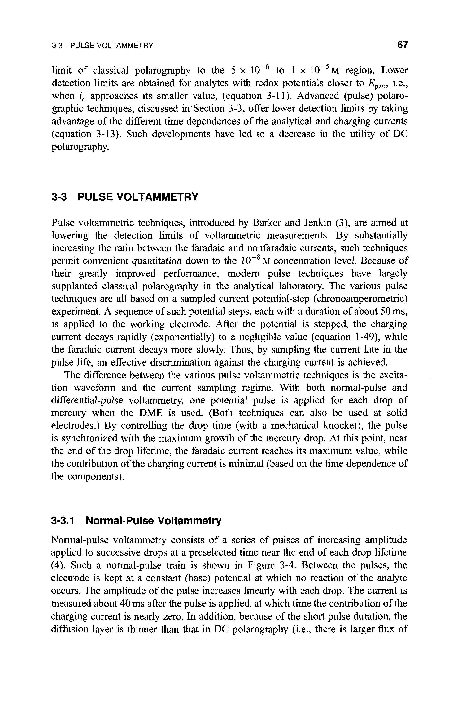

## Page 87

68
CONTROLLED-POTENTIAL TECHNIQUES
E,,
16.7 ms—I i~—
50
ms
Time
Drop fall
FIGURE 3-4 
Excitation signal for normal pulse voltammetry.
analyte) and hence the faradaic current is increased. The resulting voltammogram
has a sigmoidal shape, with a limiting current given by a modified Cottrell equation:
(3-14)
where tm is the time after application of the pulse at which the current is sampled.
This current can be compared to that measured in DC polarography:
ll,NF
1/2
(3-15)
This ratio predicts that normal-pulse polarography will be 5 to 10 times more
sensitive than DC polarography (for typical values of td and tm\ Normal-pulse
polarography may also be advantageous when using solid electrodes. In particular,
by maintaining a low initial potential during most of the operation, it is possible to
alleviate surface fouling problems (due to adsorbed reaction products).
A related technique, reverse-pulse voltammetry, has a pulse sequence that is a
mirror image of that of normal-pulse voltammetry (5). In this case, the initial
potential is on the plateau of the wave (i.e., where reduction occurs), and a series of
positive-going pulses of decreasing amplitude is applied.
3-3.2 
Differential-Pulse Voltammetry
Differential-pulse voltammetry is an extremely useful technique for measuring trace
levels of organic and inorganic species. In differential-pulse voltammetry, fixed-
magnitude pulses—superimposed on a linear potential ramp—are applied to the
working electrode at a time just before the end of the drop (Figure 3-5). The current

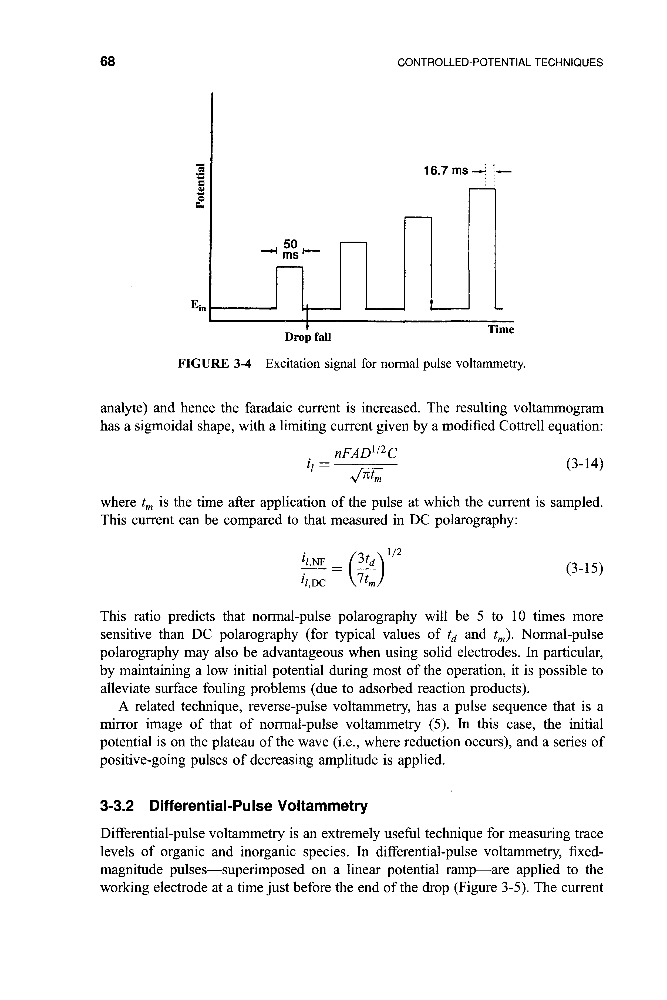

## Page 88

3-3 
PULSE VOLTAMMETRY
69
is sampled twice, just before the pulse application (at 1) and again late in the pulse
life (after ~40 ms, at 2, when the charging current has decayed). The first current is
instrumentally subtracted from the second, and this current difference [Az =
i(t2) — i(ti)] is plotted versus the applied potential. The resulting differential pulse
voltammogram consists of current peaks, the height of which is directly proportional
to the concentration of the corresponding analytes:
\ -a
l+ff
(3-16)
where a = e\p[(nF/RT)(AE/2)]. 
(AE is the pulse amplitude.) The maximum value
of the quotient (1 — o")/(l + er), obtained for large pulse amplitudes, is unity (6).
The peak potential (Ep) can be used to identify the species, as it occurs near the
polarographic half-wave potential:
(3-17)
The differential-pulse operation results in a very effective correction of the
charging background current. The charging-current contribution to the differential
current is negligible, as described by
AL ~ -0.00567C,
m2/3r1/3
(3-18)
where C, is the integral capacitance. Such a background contribution is smaller by
more than an order of magnitude than the charging current of normal-pulse
voltammetry. Accordingly, differential pulse voltammetry allows measurements at
concentrations as low as 1(T8M (about 1 |ig L"1). The improved detectability over
DC polarography is demonstrated in Figure 3-6, which compares the response of the
two techniques for the antibiotic chloramphenicol present at the 1.3 x 10~5 M level.
Similarly, the improvements over normal-pulse polarography are illustrated in Figure
3-7.
Q5-5S
soms
AE
Time
FIGURE 3-5 
Excitation signal for differential-pulse voltammetry.

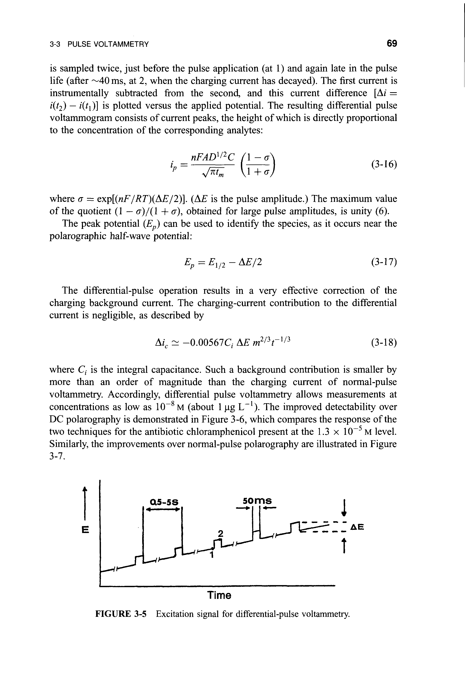

## Page 89

70
CONTROLLED-POTENTIAL TECHNIQUES
-02 -O.3 -O.4 -OS -06 -07 -08 -O9 -10 -1.1
0 
-0.1
-1.4 -15
Potential (V vs. SCE)
(a)
-01 -O2 -0.3 -04 -0.5 -06 -07 -OS -O 9 -IO -II 
-12 -1.3 -14 -1
Potential (V vs. SCE)
(b)
FIGURE 3-6 
Differential pulse (a) and DC (b) polarograms for a 1.3 x 1(T5 M chloram-
phenicol solution. (Reproduced with permission from reference 7.)

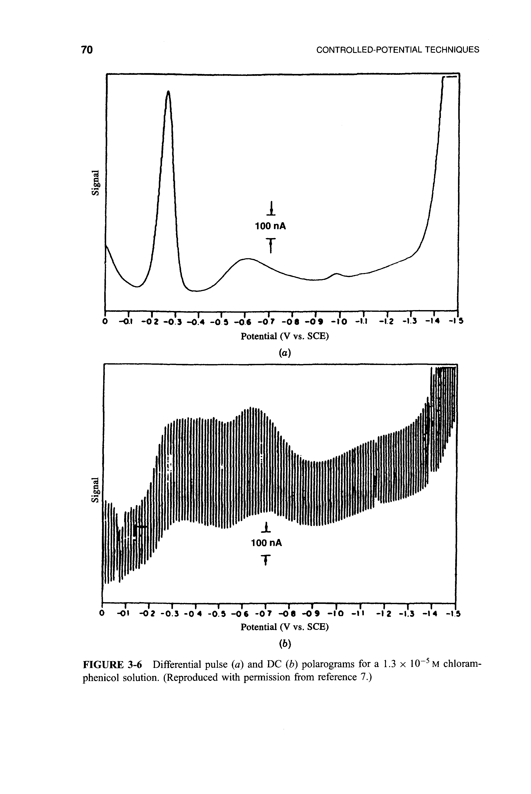

## Page 90

3-3 
PULSE VOLTAMMETRY
71
Potential
FIGURE 3-7 Normal-pulse (curve A) and differential-pulse (curve B) polarograms for a
mixture of 1 mg L~l cadmium and lead ions. The electrolyte is 0.1 M HNO3.
The peak-shaped response of differential-pulse measurements results in improved
resolution between two species with similar redox potentials. In various situations,
peaks separated by 50 mV may be measured. Such quantitation depends not only
upon the corresponding peak potentials but also on the widths of the peak. The width
of the peak (at half-height) is related to the electron stoichiometry:
3.52RT
nF
(3-19)
and thus corresponds to 30.1 mV for n — 1 (at 25°C). The peak-shaped response,
coupled with the flat background current, makes the technique particularly useful for
analysis of mixtures.
The selection of the pulse amplitude and potential scan rate usually requires a
trade-off among sensitivity, resolution, and speed. For example, larger pulse
amplitudes result in larger and broader peaks. Pulse amplitudes of 25-50 mV,
coupled with a 5 mV s"1 scan rate, are commonly employed. Irreversible redox
systems result in lower and broader current peaks (i.e., inferior sensitivity and
resolution) compared with those predicted for reversible systems (6). In addition to
improvements in sensitivity and resolution, the technique can provide information
about the chemical form in which the analyte appears (oxidation states, complexa-
tion, etc.).

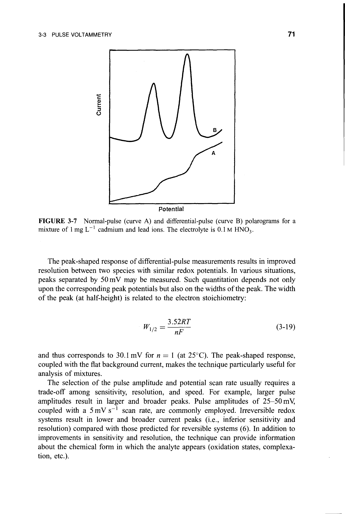

## Page 91

72
CONTROLLED-POTENTIAL TECHNIQUES
3-3.3 
Square-Wave Voltammetry
Square-wave voltammetry is a large-amplitude differential technique in which a
waveform composed of a symmetrical square wave, superimposed on a base
staircase potential, is applied to the working electrode (8) (Figure 3-8). The current
is sampled twice during each square-wave cycle, once at the end of the forward pulse
(at t }) and once at the end of the reverse pulse (at t2). Since the square-wave
modulation amplitude is very large, the reverse pulses cause the reverse reaction of
the product (of the forward pulse). The difference between the two measurements is
plotted versus the base staircase potential. A dimensionless plot of the theoretical
forward, reverse, and difference currents is given in Figure 3-9 for a rapid reversible
redox system. The resulting peak-shaped voltammogram is symmetrical about the
half-wave potential, and the peak current is proportional to the concentration.
Excellent sensitivity accrues from the fact that the net current is larger than either
the forward or reverse components (since it is the difference between them); the
sensitivity is higher than that of differential pulse polarography (in which the reverse
current is not used). Coupled with the effective discrimination against the charging
background current, very low detection limits near 1 x 10~8M can be attained.
Comparison of square-wave and differential pulse voltammetry for reversible and
irreversible cases indicated that the square-wave currents are 4 and 3.3 times higher,
respectively, than the analogous differential-pulse response (10).
jj
§.
Esw
Td
Time
FIGURE 3-8 
Square-wave waveform showing the amplitude, Esw; step height, A£; square-
wave period, T; delay time, Td; and current measurement times, 1 and 2. (Reproduced with
permission from reference 9.)

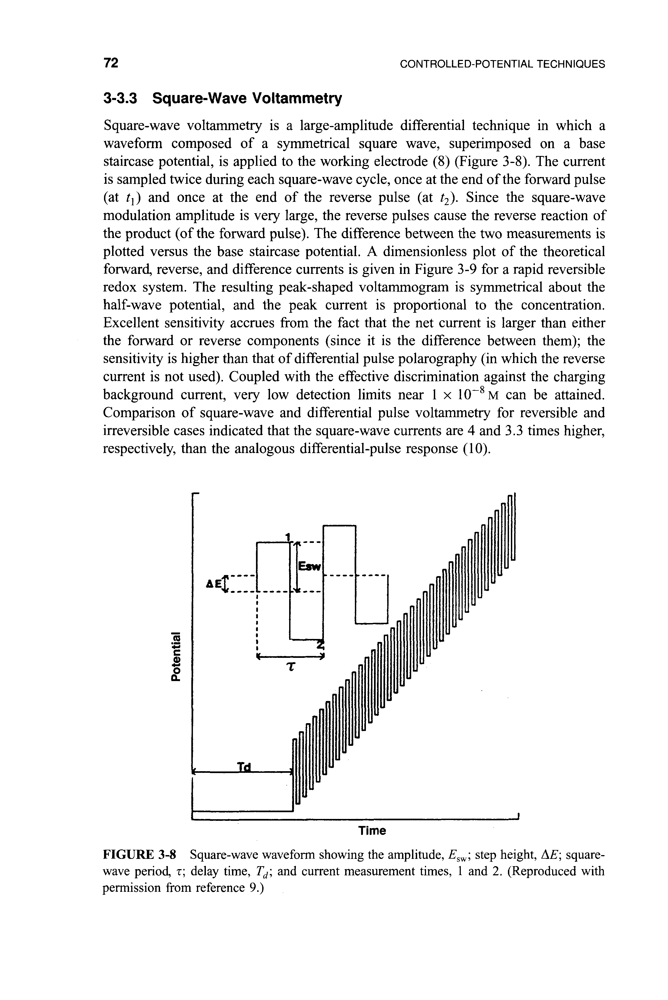

## Page 92

3-3 
PULSE VOLTAMMETRY
73
-5
ZOO
100
-300 
-ZOO
(E-E1/2)(mV)
-3DO 
-4OO 
-5DD
FIGURE 3-9 
Square-wave voltammograms for reversible electron transfer. Curve A:
forward current. Curve B: reverse current. Curve C: net current. (Reproduced with permission
from reference 9.)
The major advantage of square-wave voltammetry is its speed. The effective scan
rate is given by/ &ES. The term/ is square-wave frequency (in Hz) and &ES is the
step height. Frequencies of 1 to 100 cycles per second permit the use of extremely
fast potential scan rates. For example, if AES = lOmV and / = 50 Hz, then the
effective scan rate is 0.5 V s"1. As a result, the analysis time is drastically reduced; a
complete voltammogram can be recorded within a few seconds, as compared with
about 2-3 minutes in differential-pulse voltammetry. Because of the fast scan rates,
the entire voltammogram is recorded on a single mercury drop. Hence, such an
operation consumes few drops (compared to other pulse techniques). The inherent
speed of square-wave voltammetry can greatly increase sample throughputs in batch
(11) and flow (12) analytical operations. In addition, square-wave voltammetric
detection for liquid chromatography and capillary electrophoresis can be used to

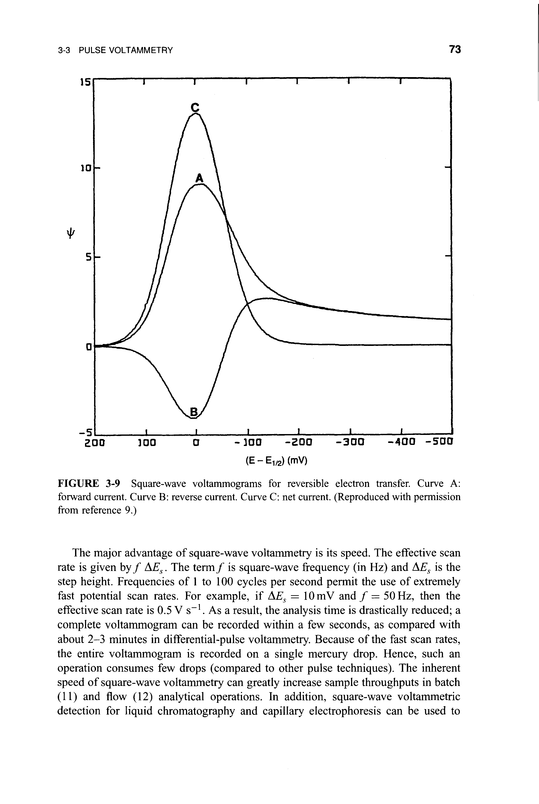

## Page 93

74
CONTROLLED-POTENTIAL TECHNIQUES
Time
FIGURE 3-10 
Potential-time waveform used in staircase voltammetry.
resolve coeluting or comigrating species and assist in the peak identification (13,
14). Kinetic studies can also benefit from the rapid scanning capability and the
reversal nature of square-wave voltammetry.
3-3.4 
Staircase Voltammetry
Staircase voltammetry has been proposed as a useful tool for rejecting the back-
ground charging current. The potential—time waveform involves successive potential
steps of MOmV height and about 50ms duration (Figure 3-10). The current is
sampled at the end of each step, where the charging current has decayed to a
negligible value. Hence, this waveform couples the discrimination against the
charging current with the experimental speed of linear-scan voltammetry. Such an
operation results in a peak-shaped current response, similar to that of linear-scan
experiments. Indeed, as the steps become smaller, the equations for the staircase
voltammetric response converge with those of linear-scan voltammetry (1.5). As
such, staircase voltammetry can be considered as the digital version of linear-scan
voltammetry. Similarly, cyclic staircase voltammetric experiments, in which the
direction of the potential steps is reversed at a switching potential, result in a
voltammetric response resembling that of cyclic voltammetry (but with a much-
reduced charging-current contribution).
3-4 AC VOLTAMMETRY
Alternating current (AC) voltammetry is a frequency-domain technique that involves
the superimposition of a small-amplitude AC voltage on a linear ramp (Figure 3-11).
Usually the alternating potential has a frequency of 50—100 Hz and an amplitude of
10-20mV The AC signal thus causes a perturbation in the surface concentration,
around the concentration maintained by the DC potential ramp. The resulting AC
current is displayed versus the potential. Such a voltammogram shows a peak, the
potential of which is the same as the polarographic half-wave potential. (In this
region the sinusoid has maximum impact on the surface concentration, i.e., on the

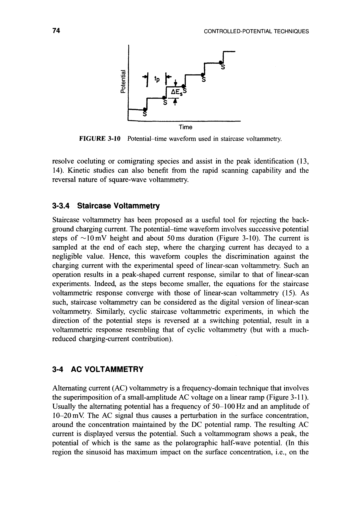

## Page 94

3-5 STRIPPING ANALYSIS 
75
Time
FIGURE 3-11 Potential-time waveform used in alternating current (AC) voltammetry.
current.) For a reversible system, such a response is actually the derivative of the DC
polarographic response. The height of the AC voltammetric peak is proportional to
the concentration of the analyte and, for a reversible reaction, to the square root of
the frequency (co):
> 
4R
The term A£ is the amplitude. The peak width is independent of the AC frequency,
andis90.4/AzmV(at25°C).
The detection of the AC component allows one to separate the contributions of
the faradaic and charging currents. The former is phase shifted 45° relative to the
applied sinusoidal potential, while the background component is 90° out of phase.
The charging current is thus rejected using a phase- sensitive lock-in amplifier (able
to separate the in-phase and out-of-phase current components). As a result,
reversible electrode reactions yield a detection limit around 5 x 10~7M.
Substantial loss in sensitivity is expected for analytes with slow electron-transfer
kinetics. This may be advantageous for measurements of species with fast electron-
transfer kinetics in the presence of a species (e.g., dissolved oxygen) that is
irreversible. (For the same reason, the technique is very useful for the study of
electron processes.) Theoretical discussions on AC voltammetry are available in the
literature (16-18).
3-5 STRIPPING ANALYSIS
Stripping analysis is an extremely sensitive electrochemical technique for measuring
trace metals (19,20). Its remarkable sensitivity is attributed to the combination of an
effective preconcentration step with advanced measurement procedures that generate
an extremely favorable signal-to-background ratio. Since the metals are precon-
centrated into the electrode by factors of 100 to 1000, detection limits are lowered
by 2 to 3 orders of magnitude compared to solution-phase voltammetric measure-
ments. Hence, four to six metals can be measured simultaneously in various
matrices at concentration levels down to 10~10M, utilizing relatively inexpensive

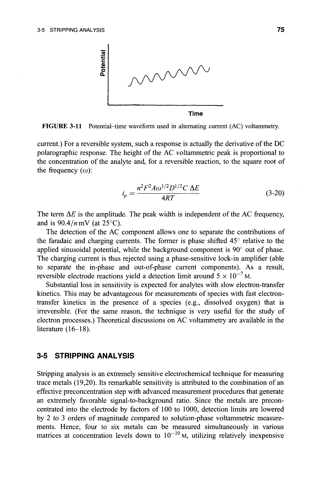

## Page 95

76
CONTROLLED-POTENTIAL TECHNIQUES
instrumentation. The ability to obtain such low detection limits depends strongly on
the degree to which contamination can be minimized. Expertise in ultratrace
chemistry is required.
Essentially, stripping analysis is a two-step technique. The first, or deposition,
step involves the electrolytic deposition of a small portion of the metal ions in
solution into the mercury electrode to preconcentrate the metals. This is followed by
the stripping step (the measurement step), which involves the dissolution (stripping)
of the deposit. Different versions of stripping analysis can be employed, depending
upon the nature of the deposition and measurement steps.
3-5.1 
Anodic Stripping Voltammetry
Anodic stripping voltammetry (ASV) is the most widely used form of stripping
analysis. In this case, the metals are preconcentrated by electrodeposition into a
small-volume mercury electrode (a thin mercury film or a hanging mercury drop).
The preconcentration is done by cathodic deposition at a controlled time and
potential. The deposition potential is usually 0.3-0.5 V more negative than E° for
the least easily reduced metal ion to be determined. The metal ions reach the
mercury electrode by diffusion and convection, where they are reduced and
concentrated as amalgams:
ne~ + Hg -> M(Hg)
(3-21)
The convective transport is achieved by electrode rotation or stirring of the
solution (in conjunction with the mercury film electrode) or by stirring of the
solution (when using the hanging mercury drop electrode). Quiescent solutions can
be used when using mercury ultramicroelectrodes. The duration of the deposition
step is selected according to the concentration level of the metal ions in question,
from less than 0.5 min at the 10~7 M level to about 20 min at the 10~10 M level. The
concentration of the metal in the amalgam, CHg, is given by Faraday's law:
(3-22)
Hg
where // is the limiting current for the deposition of the metal, td is the length of the
deposition period, and KHg is the volume of the mercury electrode. The deposition
current is related to the flux of the metal ion at the surface. The total amount of metal
plated represents a small (but reproducible) fraction of the metal present in the bulk
solution.
Following the preselected time of the deposition, the forced convection is
stopped, and the potential is scanned anodically, either linearly or in a more sensitive
potential-time (pulse) waveform that discriminates against the charging background
current (usually square-wave or differential-pulse ramps). Such pulse excitations also
offer reduced oxygen interferences and analyte replating, respectively. During this

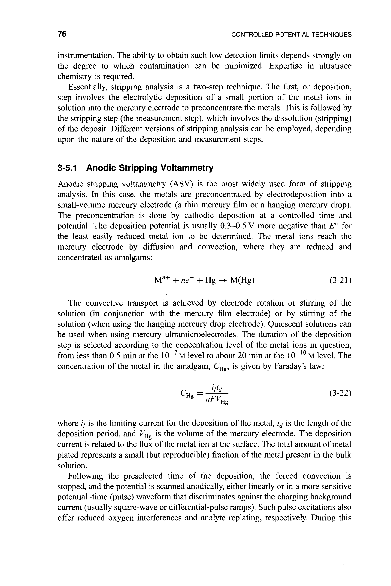

## Page 96

3-5 STRIPPING ANALYSIS
77
anodic scan, the amalgamated metals are reoxidized, stripped out of the electrode (in
an order that is a function of each metal standard potential), and a current flows:
M(Hg)
ne
Hg
(3-23)
The potential-time sequence used in ASV, along with the resulting stripping
voltammogram, is shown in Figure 3-12. The voltammetric peak reflects the time-
dependent concentration gradient of the metal in the mercury electrode during the
potential scan. Peak potentials serve to identify the metals in the sample. The peak
current depends upon various parameters of the deposition and stripping steps, as
well as on the characteristics of the metal ion and the electrode geometry. For
example, for a mercury film electrode, the peak current is given by
2HRT
(3-24)
where A and / are the area and thickness, respectively, of the film and v is the
potential scan rate (during the stripping). The corresponding concentration profile in
the film and nearby solution is displayed in Figure 3-13. (For very thin mercury
films, diffusion in the film can be ignored and the peak current is directly
proportional to the scan rate.) For the hanging mercury drop, the following
expression describes the stripping peak current:
ip = 2.72 x 105 n3/2ADl/2vl/2CHg
(3-25)
0 Accumulation step
ne~->M
Stripping step
M -* IS/T" + ne'
Potential
FIGURE 3-12 Anodic stripping voltammetry: the potential-time waveform (a), along with
the resulting voltammogram (b).

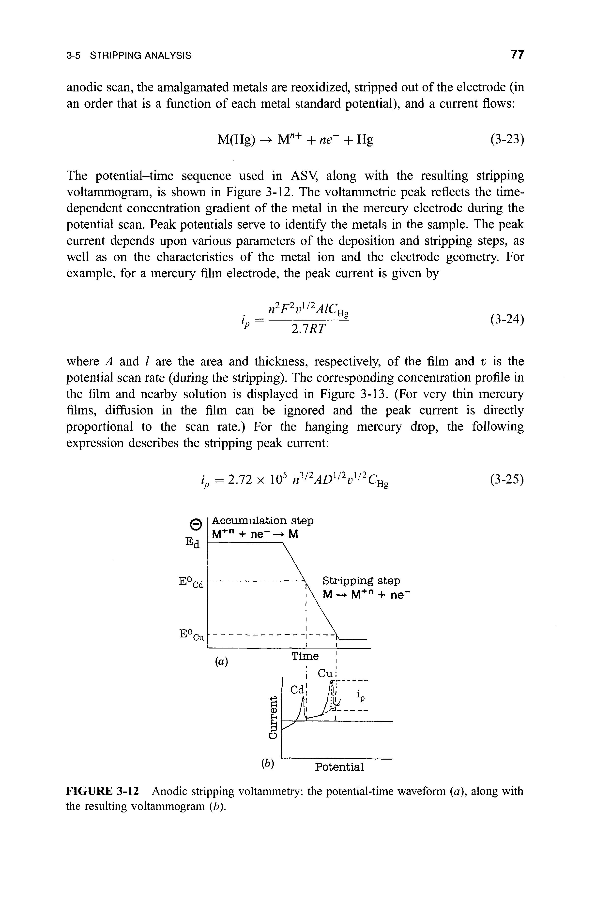

## Page 97

78
CONTROLLED-POTENTIAL TECHNIQUES
Support
CM(x,t)
Hg
Solution
M(Hg) — M+" + Hg + ne-
C*M+n
x = 0
Distance
FIGURE 3-13 Concentration gradient of the metal in the mercury film electrode and nearby
solution during the stripping step.
DEPOSITION
POTENTIAL
0.2
-0.2 
-0.4 
-0.6
Potential (V)
-OB
FIGURE 3-14 Stripping voltammograms for 2 x 1(T7 M Cu2+, Pb2+, In3+ and Cd2+ at the
mercury film (A) and hanging mercury drop (B) electrodes. (Reproduced with permission
from reference 21.)

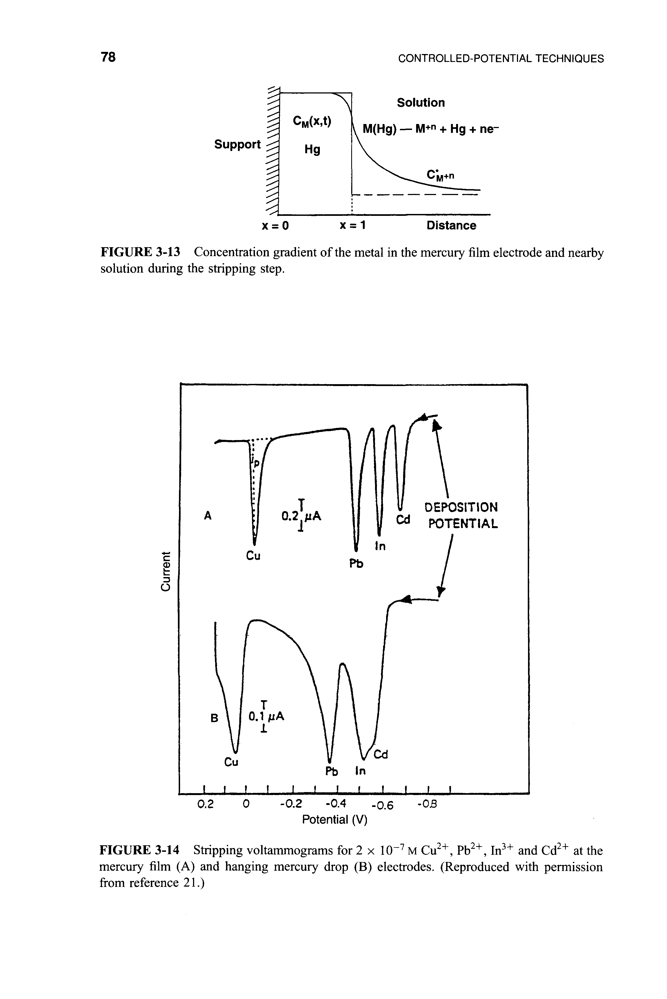

## Page 98

3-5 STRIPPING ANALYSIS 
79
The mercury film electrode has a higher surface-to-volume ratio than the hanging
mercury drop electrode and consequently offers a more efficient preconcentration
and higher sensitivity (equations 3-22 through 3-25). In addition, the total exhaus-
tion of thin mercury films results in sharper peaks and hence improved peak
resolution in multicomponent analysis (Figure 3-14).
The major types of interferences in ASV procedures are overlapping stripping
peaks caused by a similarity in the oxidation potentials (e.g., of the Pb, Tl, Cd, Sn or
Bi, Cu, Sb groups), the presence of surface-active organic compounds that adsorb on
the mercury electrode and inhibit the metal deposition, and the formation of
intermetallic compounds (e.g., Cu-Zn) which affects the peak size and position.
Knowledge of these interferences can allow prevention through adequate attention to
key operations.
Improved signal-to-background characteristics can be achieved using dual-work-
ing-electrode techniques, such as ASV with collection or subtractive ASV (but at the
expense of more complex instrumentation).
Other versions of stripping analysis, including potentiometric stripping, adsorp-
tive stripping, and cathodic stripping schemes, have been developed to further
expand its scope and power.
3-5.2 
Potentiometric Stripping Analysis
Potentiometric stripping analysis (PSA), known also as stripping potentiometry,
differs from ASV in the method used for stripping the amalgamated metals (22). In
this case, the potentiostatic control is disconnected following the preconcentration,
and the concentrated metals are reoxidized by an oxidizing agent [such as O2 or
Hg(II)] that is present in the solution:
M(Hg) + oxidant -* Mn+ 
(3-26)
A stirred solution is also used during the stripping step to facilitate the transport of
the oxidant. Alternately, the oxidation can be carried out by passing a constant
anodic current through the electrode. During the oxidation step, the variation of the
working electrode potential is recorded, and a stripping curve, like the one shown in
Figure 3-15a, is obtained. When the oxidation potential of a given metal is reached,
the potential scan is slowed down as the oxidant (or current) is used for its stripping.
A sharp potential step thus accompanies the depletion of each metal from the
electrode. The resulting potentiogram thus consists of stripping plateaus, as in a
redox titration curve. The transition time needed for the oxidation of a given metal,
tu, is a quantitative measure of the sample concentration of the metal:
tu oc CM«+^/Cox 
(3-27)
where Cox is the concentration of the oxidant. Hence, the signal may be increased
by decreasing the oxidant concentration. The qualitative identification relies on

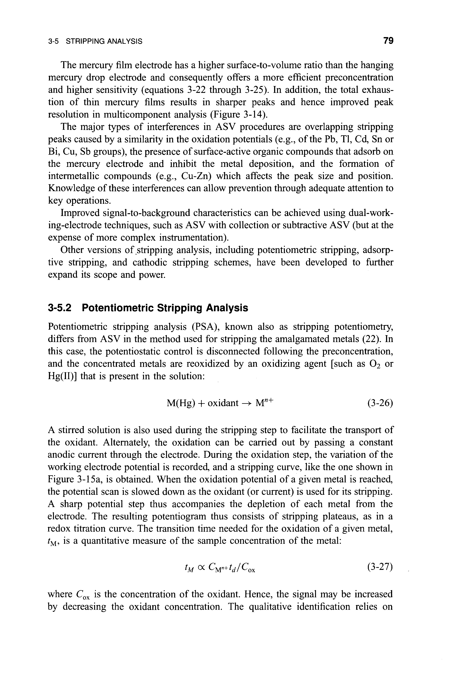

## Page 99

80
CONTROLLED-POTENTIAL TECHNIQUES
-1.2-
-1.0-
-0.8-
-0.6-
E vs SCE
.Sn
Cd
3-
2-
1-
0-
dt/dE 
Arbitrary scale
-1.4 
-1.0 
-0.6 E vs SCE
(b)
FIGURE 3-15 
Stripping potentiograms for a solution containing 100 ug L"1 tin, cadmium,
and lead; 80 s accumulation at — 1.40 V Original (a) and differential (b) displays. (Reproduced
with permission from reference 22.).
potential measurements (in accordance with the Nernst equation for the amalga-
mated metal):
nF 
[M(Hg)]
(3-28)
where E° denotes the standard potential for the redox couple M"+/M(Hg).
Modern PSA instruments use microcomputers to register fast stripping events and
to convert the wave-shaped response to a more convenient peak over a flat baseline.
Such a differential display of dt/dE vs. E is shown in Figure 3-156. The use of
nondeaerated samples represents an important advantage of PSA (over analogous
ASV schemes), particularly in connection with field applications. In addition, such
potential-time measurements eliminate the need for amplification when microelec-
trodes are concerned. By obviating the need for stirring or deoxygenating the
solution, the coupling of PSA with microelectrodes permits convenient trace analysis
of very small (5 uL) samples. PSA is also less susceptible to interfering surfactant
effects, and hence can simplify the pretreatment of biological samples. A more
detailed treatment of the theoretical foundation of PSA is given in reference 22.
About 20 amalgam-forming metals, including Pb, Sn, Cu, Zn, Cd, Bi, Sb, Tl, Ga,
In and Mn, are easily measurable by stripping strategies (ASV and PSA) based on
cathodic deposition onto mercury electrodes. Additional metals, such as Se, Hg, Ag,
Te and As are measurable at bare solid electrodes such as carbon or gold.
3-5.3 
Adsorptive Stripping Voltammetry and Potentiometry
Adsorptive stripping analysis greatly enhances the scope of stripping measurements
toward numerous trace elements (23,24). This relatively new strategy involves the

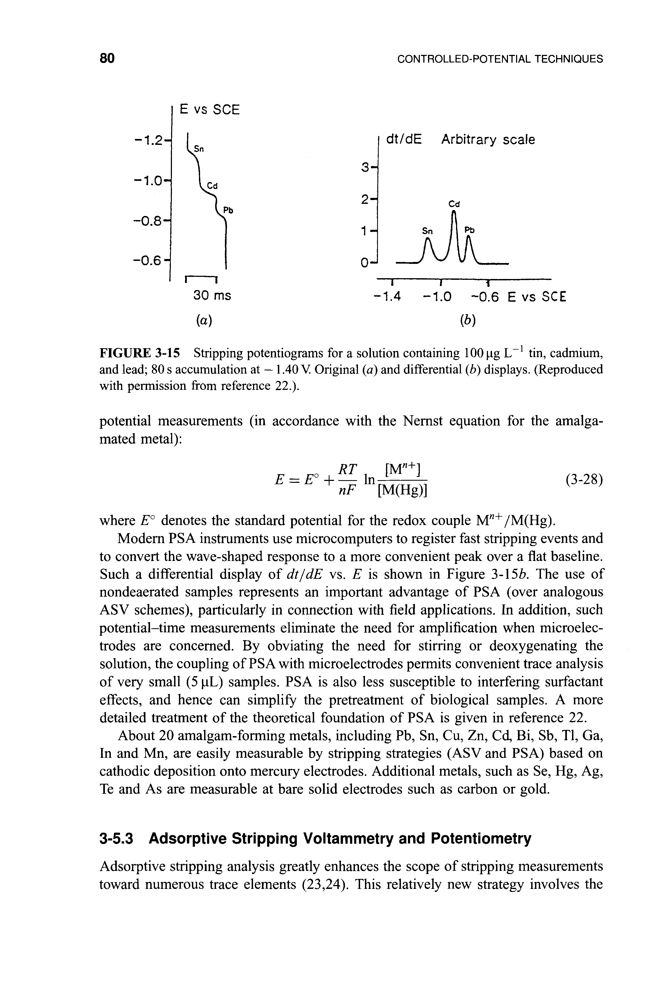

## Page 100

3-5 STRIPPING ANALYSIS 
81
formation, adsorptive accumulation, and reduction of a surface-active complex of
the metal (Figure 3-16). Both voltammetric and potentiometric stripping schemes,
with a negative-going potential scan or constant cathodic current, respectively, can
be employed for measuring the adsorbed complex. Most procedures involve the
reduction of the metal in the adsorbed complex (although it is possible also to exploit
the reduction of the ligand). The response of the surface-confined species is directly
related to its surface concentration, with the adsorption isotherm (commonly that of
Langmuir, discussed in Section 2-1), providing the relationship between the surface
and bulk concentrations of the adsorbate. As a result, calibration curves display
nonlinearity at high concentrations. The maximum adsorption density is related to
the size of the adsorbed complex, and to its surface concentration.
Short adsorption times (1-5 min) result in a very effective interfacial accumula-
tion. The reduction step is also very efficient as the entire collected complex is
reduced. Such a combination thus results in extremely low detection limits (10~10-
10~nM) for important metals, including chromium, uranium, vanadium, iron,
aluminum or molybdenum. Even lower levels, for example 10~12M of platinum
or titanium, can be measured by coupling the adsorption accumulation with catalytic
reactions. In this case, the response of the accumulated complex is greatly amplified
through a catalytic cycle, for example, in the presence of an oxidant. The adsorptive
approach may also offer improvements in selectivity or sensitivity for metals (e.g.,
tin, nickel) that are also measurable by conventional stripping analysis. Examples of
adsorptive stripping schemes for measuring trace metals are listed in Table 3-2. All
procedures rely on a judicious choice of the chelating agent. The resulting complex
should be surface active and electroactive; in addition, selective complexation can be
used to enhance the overall selectivity.
Besides trace metals, adsorptive stripping voltammetry has been shown to be
highly suitable for measuring organic compounds (including cardiac or anticancer
drugs, nucleic acids, vitamins, and pesticides) that exhibit surface-active properties.
Accumulation 
Stripping
©
Mn+ + nl_-»MLn 
MLnads
I
MLn -> Ml_n,ads
T.
Time
FIGURE 3-16 
Accumulation and stripping steps in adsorptive stripping measurements of a
metal ion (M"+) in the presence of an appropriate chelating agent (L).

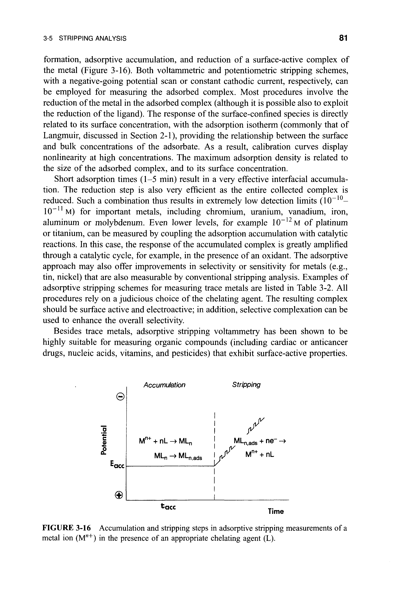

## Page 101

82
CONTROLLED-POTENTIAL TECHNIQUES
TABLE 3-2 
Common Adsorptive Stripping Schemes for Measurement of Trace Metals
Metal
Al
Be
Co
Cr
Fe
Mn
Mo
Ni
Pt
Sn
Ti
U
V
Complexing Agent
Dihydroxyanthraquinone-
sulfonic acid
Thorin
Nioxime
Diethylenetriamine-Pentaacetic
acid
Solochrome violet RS
Eriochrome Black T
Oxine
Dimethylglyoxime
Formazone
Tropolone
Mandelic acid
Oxine
Catechol
Supporting
Electrolyte
BES buffer
Ammonia buffer
Hepes buffer
Acetate buffer
Acetate buffer
Pipes buffer
Hydrochloric acid
Ammonia buffer
Sulfuric acid
Acetate buffer
Potassium chlorate
Pipes buffer
Pipes buffer
Detection
Limit, (M)
1 x 1(T9
3 x 1(T9
6 x 10-12
4 x 1(T10
7 x 1CT10
6 x 10-'°
1 x 10-'°
1 x 1(T10
1 x ID'12
2 x 1(T10
7 x 1(T12
2 x 10-'°
1 x KT10
Reference
25
26
27
28
29
30
31
32
33
34
35
36
37
Depending on their redox activity, the quantitation of the adsorbed organic
compounds may proceed through oxidation or reduction. For example, modern
adsorptive stripping voltammetric and potentiometric methods represent highly
sensitive tools for detecting ultratrace levels of nucleic acids. Figure 3-17 displays
the adsorptive stripping potentiometric response of the carbon paste electrode for
0.5 ppm calf-thymus DNA following different adsorption times. Note the rapid
increase of the oxidation peak (of the guanine nucleobase) upon extending the
accumulation period. Nonelectroactive macromolecules may also be determined
following their interfacial accumulation from tensammetric peaks (resulting from
their adsorption-desorption mechanism).
3-5.4 
Cathodic Stripping Voltammetry
Cathodic stripping voltammetry (CSV) is the "mirror image" of ASV It involves
anodic deposition of the analyte, followed by stripping in a negative-going potential
scan:
deposition
+ Hg s 
HgA + ne
stripping
(3-29)
The resulting reduction peak current provides the desired quantitative information.
Cathodic stripping voltammetry is used to measure a wide range of organic and
inorganic compounds capable of forming insoluble salts with mercury. Among these
are various thiols or penicillins, as well as halide ions, cyanide, and sulfide. Highly

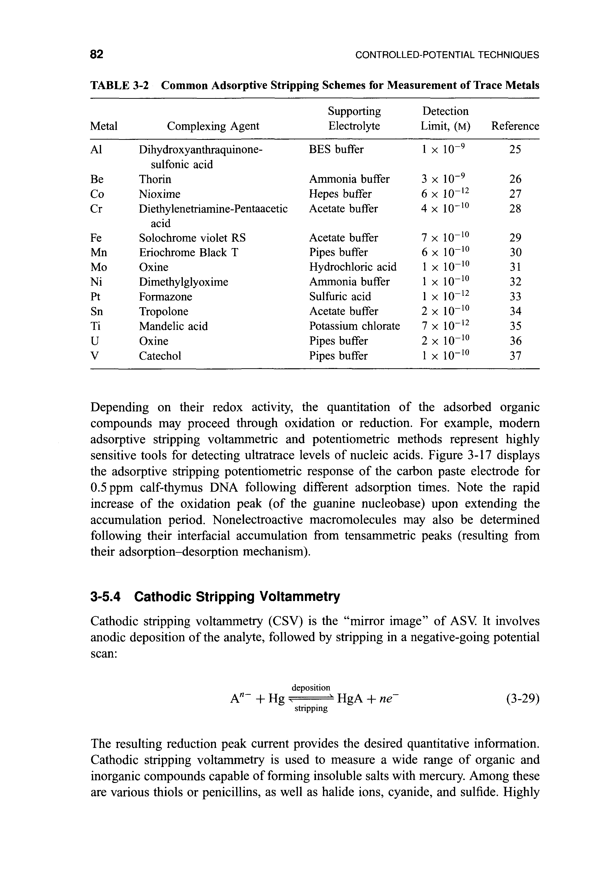

## Page 102

3-5 STRIPPING ANALYSIS
83
60-
cc
£40-
s 
.
•a
 2°-
«s
0 
100 
200
Deposition time (sec)
1.2
0.6
Potential (V)
FIGURE 3-17 
Adsorptive stripping potentiograms for 0.5 ppm calf-thymus DNA following
different adsorption times of 1-1 50s (curves a-f) (Reproduced with permission from
reference 38.)
sensitive measurements can thus be performed, as illustrated in Figure 3-18 for the
direct determination of subnanomolar concentrations of iodide in seawater.
Anions (e.g., halides) that form insoluble silver salts can be measured at a rotating
silver disk electrode. In this, the deposition and stripping steps involve the reaction
X" = cr,Br
(3-30)
Copper-based electrodes can also be employed for the same task.

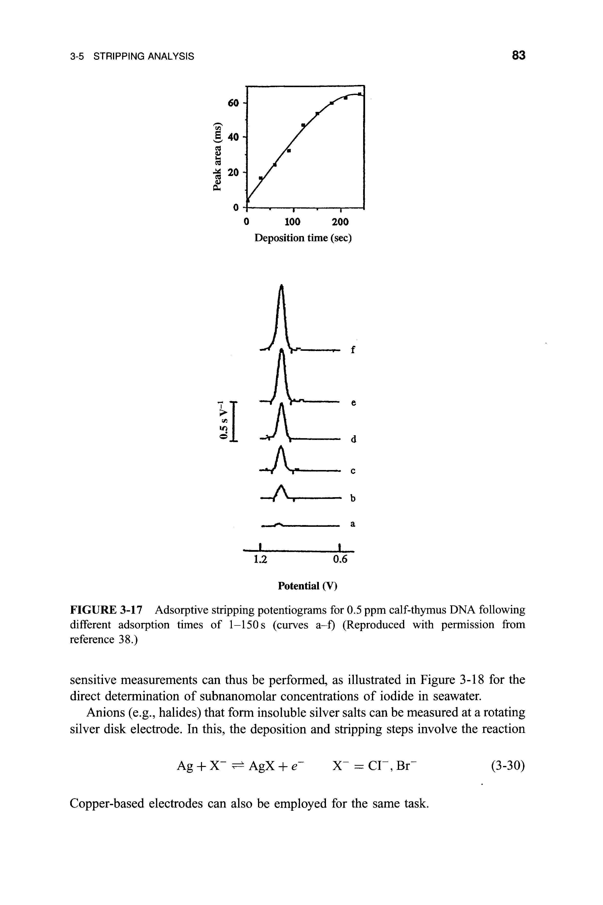

## Page 103

84
CONTROLLED-POTENTIAL TECHNIQUES
-2.0
FIGURE 3-18 Stripping voltammograms for trace iodide in seawater. (Reproduced with
permission from reference 39.)
3-5.5 
Applications
The remarkable sensitivity, broad scope, and low cost of stripping analysis have led
to its application in a large number of analytical problems. As illustrated in Figure
3-19, over 30 trace elements can conveniently be measured in various matrices by
the various versions of stripping analysis. The technique has thus proved useful for
the determination of numerous trace metals in environmental, industrial, and clinical
samples, as well as for assays of foodstuffs, beverages, gunshot residues, and
pharmaceutical formulations. Selected applications are listed in Table 3-3. Figure
3-20 displays adsorptive stripping voltammograms for chromium in various envir-
onmental (soil and ground water) samples from contaminated nuclear energy sites.
Stripping analysis has also been an important technique for screening for blood lead
in children (46). Many other unique applications of stripping analysis have been
reported, including studies of metal speciation (oxidation state, metal-ligand inter-
actions) in natural waters, on-line monitoring of industrial processes, in-situ
oceanographic surveys, or remote environmental sensing (40,55,56).
3-6 
FLOW ANALYSIS
An electrochemical detector uses the electrochemical properties of target analytes for
their determination in a flowing stream. While parameters such as current, potential,

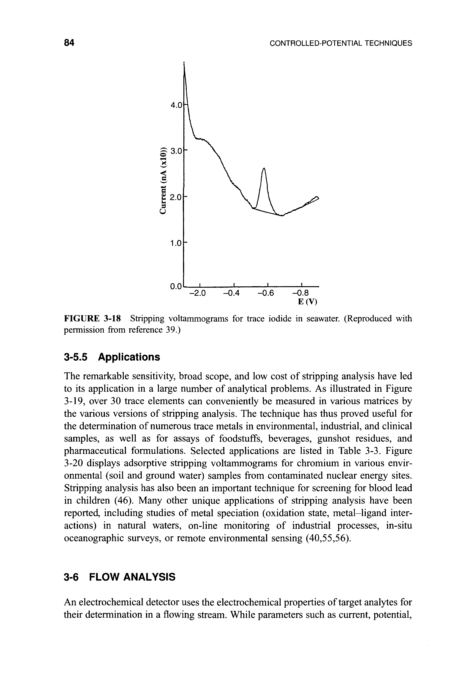

## Page 104

3-6 
FLOW ANALYSIS
85
ASV :
preconcentration
0
stripping
M
M
M
ACSV: 
+>* ML* ML.
sensitivity 
symbols
0.1 nM
FIGURE 3-19 
Elements measured by conventional ASV •, and adsorptive stripping
schemes with reduction of the element in the complex ^, reduction of the ligand m, or
catalytic process ^. (Reproduced with permission from reference 40.)
TABLE 3-3 
Representative Applications of Stripping Analysis
Metal
Antimony
Cadmium
Chromium
Cobalt
Copper
Iodide
Iron
Lead
Lead
Mercury
Nickel
Platinum
Selenium
Thallium
Titanium
Uranium
Zinc
Sample Matrix
Gunshot residue
Lake water
Soil
Sea water
Steel
Sea water
Wine
Blood
Paint
Fish
Plant leaves
Gasoline
Soil
Urine
Sea water
Ground water
Eye tissue
Stripping Mode
ASV
ASV
AdSV
AdSV
ASV
CSV
AdSV
PSA
ASV
ASV
AdSV
AdSV
CSV
ASV
AdSV
AdSV
ASV
Working Electrode
MFE
MFE
HMDE
HMDE
HMDE
HMDE
HMDE
MFE
Au
HMDE
HMDE
HMDE
HMDE
HMDE
HMDE
HMDE
Reference
41
42
43
27
44
39
45
46
47
48
49
50
51
52
35
53
54

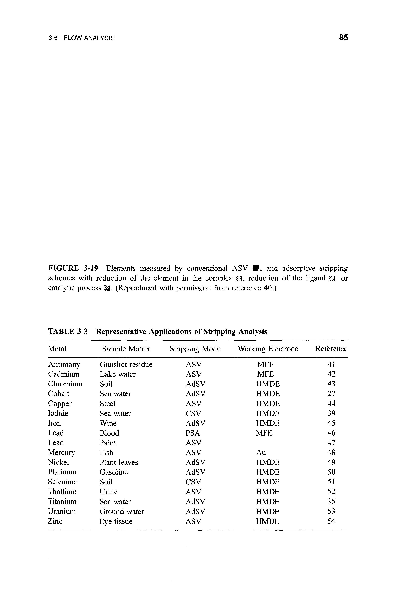

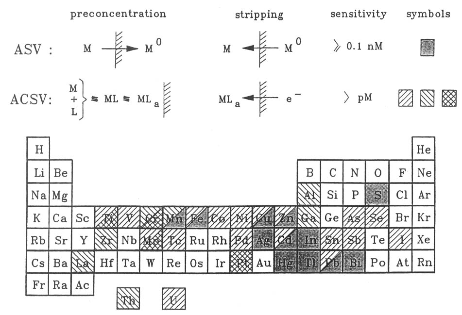

## Page 105

86
CONTROLLED-POTENTIAL TECHNIQUES
U
(a)
-0.7 
3515 Tl
-0.7 
3)79 -LI -1.3
(b)
50 nA
200 nA
Potential (V)
FIGURE 3-20 
Adsorptive stripping voltammograms of chromium in ground water (a) and
soil (b) samples, using cupferron as a chelating agent, (a) Curve a, response for electrolyte;
Curve b, same as a but after spiking 20 uL of the sample (500-fold dilution); curves c and d,
same as b, but after additions of 0.1 ug L"1 chromium; 20 s adsorption, (b) Curve a, response
for the electrolyte; curve b, same as a but after spiking 5 uL"1 of the soil extract (2000-fold
dilution); curves c and d, same as b but after additions of 0.5 uL~l chromium; 15 s adsorption.
(Reproduced with permission from reference 43.)
conductivity, and capacitance can be monitored by various electrochemical detec-
tors, our discussion will focus primarily on the most popular constant-potential
measurements. Controlled-potential detectors are ideally suited for monitoring
analytes that are electroactive at modest potentials. Such devices are characterized
by a remarkable sensitivity (down to the picogram level), high selectivity (toward
electroactive species), wide linear range, low dead volumes, fast response, and
relatively simple and inexpensive instrumentation. Such detectors are commonly
used in many clinical, environmental, and industrial laboratories in connection with
automated flow systems (e.g., flow injection analyzers) or separation techniques
(particularly liquid chromatography and more recently capillary zone electrophoresis
and on-line microdialysis). Such coupling with advanced separation steps allows
electroanalysis to address highly complex samples.

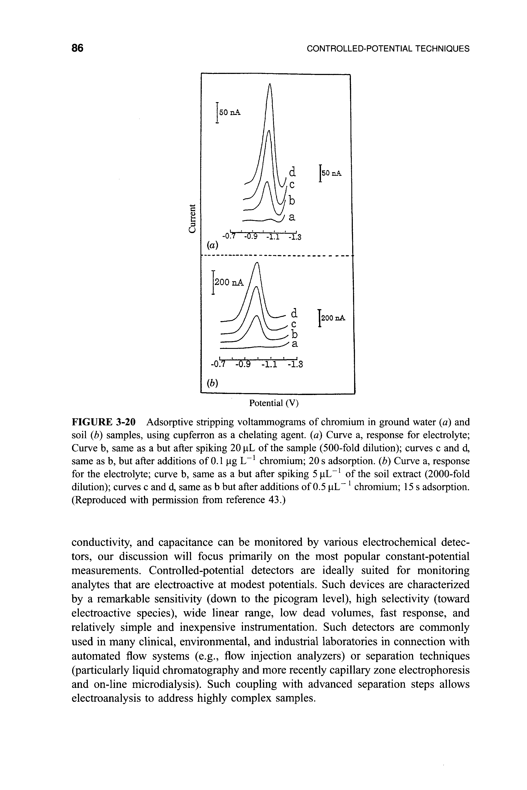

## Page 106

3-6 
FLOW ANALYSIS
87
3-6.1 
Principles
Electrochemical detection is usually performed by controlling the potential of the
working electrode at a fixed value (corresponding to the limiting current plateau
region of the compounds of interest) and monitoring the current as a function of
time. The current response thus generated reflects the concentration profiles of these
compounds as they pass through the detector. Detection for liquid chromatography
or flow injection systems results in sharp current peaks (reflecting the passage of the
eluted analyte or sample zone, respectively). Accordingly, the magnitude of the peak
current serves as a measure of the concentration. Typical response peaks recorded
during an automated flow injection operation are displayed in Figure 3-21. The
current peaks are superimposed on a constant background current (caused by redox
reactions of the mobile phase or carrier solutions). Larger background currents,
expected at high potentials, result in increased (flow rate-dependent) noise level. In
particular, the cathodic detection of reducible species is hampered by the presence of
traces of oxygen in the flowing solution. Such background noise is strongly
influenced by the pulsation of the pump.
The applied potential affects not only the sensitivity and signal-to-noise char-
acteristics but also the selectivity of amperometric measurements. In general, a lower
potential is more selective, and a higher one more universal. Thus, compounds
undergoing redox potentials at lower potentials can be detected with greater
selectivity. The selection of the applied potential relies on the construction of
20 nA
JV Jv
h 
g 
f
'U1AM
e 
d 
c 
b 
a
Time
FIGURE 3-21 
Typical amperometric readout during automated flow injection assays of
ethanol at an enzyme carbon-paste electrode. Peaks a through h: 2 x 10~5 M to 1.6 x 10~4 M
ethanol.

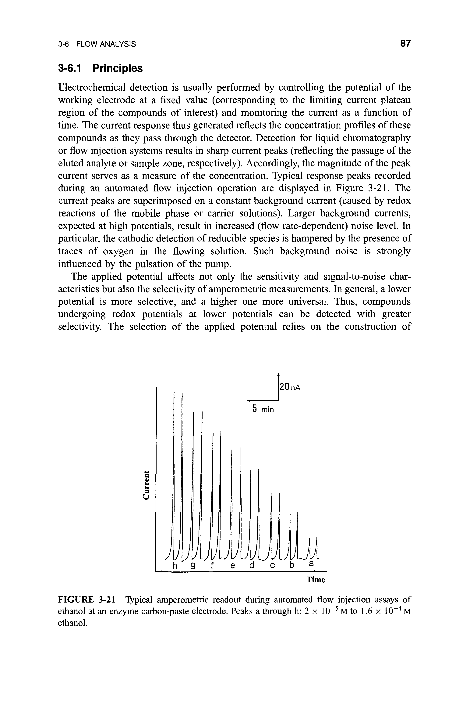

## Page 107

88
CONTROLLED-POTENTIAL TECHNIQUES
hydrodynamic voltammograms. These can be obtained by making repeated flow
injections of the analyte solution while recording the current at different potentials.
The resulting voltammogram has a characteristic wave (sigmoidal) shape. Although
it is common to operate the detector on the limiting-current plateau region, a
lowering of the operating potential (to the rising portion of the wave) can be used to
improve the selectivity and lower the detection limit. Comparison of hydrodynamic
voltammograms for the sample and standard solutions can provide important
qualitative information.
Depending on their conversion efficiency, electrochemical detectors can be
divided into two categories: those that electrolyze only a negligible fraction (0.1-
5%) of the electroactive species passing through the detector (amperometric
detectors), and those for which the conversion efficiency approaches 100% (coulo-
merric detectors). Unfortunately, the increased conversion efficiency of the analyte is
accompanied by a similar increase for the electrolyte (background) reactions, and no
lowering of detection limits is realized.
3-6.2 
Cell Design
A wide range of cell designs have been used for electrochemical monitoring of
flowing streams. The cell design must fulfill the requirements of high signal-to-noise
ratio, low dead volume, well-defined hydrodynamics, small ohmic drop, and ease of
construction and maintenance (polishing). In addition, the reference and counter
electrodes should be located on the downstream side of the working electrode, so
that reaction products at the counter electrode or leakage from the reference
electrode do not interfere with the working electrode.
The most widely used amperometric detectors are based on the thin-layer and
wall-jet configurations (Figure 3-22). The thin-layer cell relies on a thin layer of
solution that flows parallel to the planar electrode surface, which is imbedded in a
inleU
t outlet
inlet
outlet •
^.outlet
FIGURE 3-22 
Common detector configurations: (a) thin-layer (channel) and (b) wall-jet
flow cells. WE = working electrode.

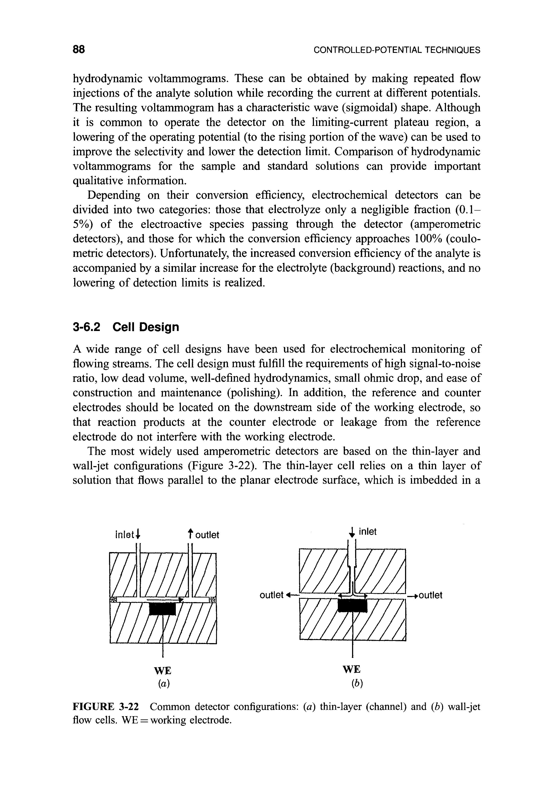

## Page 108

3-6 
FLOW ANALYSIS
89
rectangular channel. The flow channel is formed by two plastic blocks pressing a
thin Teflon gasket, which defines the very small dead volume (~1 uL). In the wall-jet
design, the stream flows from a nozzle perpendicularly onto a flat electrode surface
(the wall), and then spreads radially over the surface. The electrode diameter is
significantly larger than that of the nozzle inlet. Since the jet remains intact up to
quite large inlet-electrode separations, it is possible to employ large-volume wall-jet
detectors that offer decreased sensitivity to the properties of the mobile phase and
simplified fabrication.
It is possible to employ detectors with solutions flowing over a static mercury
drop electrode or a carbon-fiber microelectrode, or to use flow-through electrodes,
with the electrode simply an open tube or porous matrix. The latter can offer
complete electrolysis, that is coulometric detection. The extremely small dimensions
of ultramicroelectrodes (discussed in Section 4-5.4) offer the advantages of flow rate
independence (and hence a low noise level) and operation in nonconductive mobile
phases (such as those of normal-phase chromatography or supercritical fluid
chromatography). Ultramicroelectrodes can also greatly benefit modern microse-
paration techniques such as open-tubular liquid chromatography or capillary zone
electrophoresis (CZE) (57). For example, cylindrical-shaped carbon or copper fibers
can be inserted into the end of the capillary electrophoresis separation capillary (e.g.,
Figure 3-23). Such alignment of the working electrode with the end of the capillary
represents a challenge in combining electrochemistry with CZE.
CZE has recently established itself as an important separation tool due to its
impressive separation power. Since CZE separations rely on the application of strong
electric fields for separating the analytes, it is essential to isolate the low detection
potential from the high voltage (10-30 kV) used to affect the separation (59, 59a).
This can be accomplished by using a decoupling device (e.g., Nafion joint, porous
glass) or via end-column detection (i.e., placement of the detector opposite to the
capillary outlet in a wall-jet configuration). The latter relies on the dramatic drop of
the potential across small capillaries (of 25 urn or less). The distance between the
detector and the capillary outlet should be as short as possible, as needed for
///// 
/f/////////////////////////////S////1
\"""
POTENTIOSTAT
Y/7//77/7/7////A
FIGURE 3-23 Schematic of a carbon-fiber amperometric detector for capillary electro-
phoresis: A, fused silica capillary; B, eluent drop; C, stainless steel plate; RE, reference
electrode; WE, working electrode, AE, auxiliary electrode. (Reproduced with permission from
reference 58.)

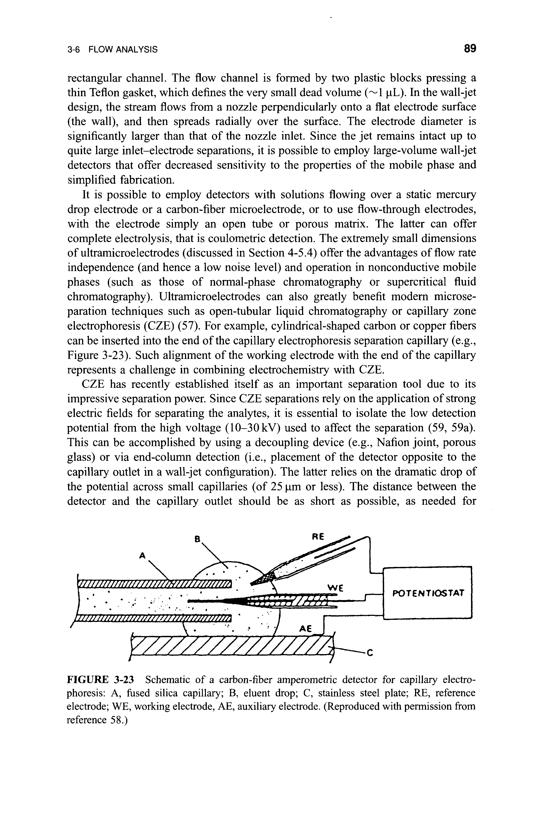

## Page 109

90
CONTROLLED-POTENTIAL TECHNIQUES
minimizing postcapillary zone broadening. Figure 3-24 depicts a typical end-column
electropherogram for femtomole quantities of dopamine, isoproterenol, and catechol.
Microfabricated electrochemical detectors are also being developed for on-chip
integration with microscale separation systems, such as capillary electrophoresis (61,
61a), and for other chip-based analytical microsystems (e.g., "Lab-on-a-Chip")
discussed in Section 6-3. Since the sensitivity of electrochemical detection is not
compromised by the low volumes used in CZE systems, extremely low mass
detection limits (in the attomole range) can be obtained. Such high sensitivity
toward easily oxidizable or reducible analytes rivals that of laser-induced fluores-
cence (which is currently the method of choice for most CZE applications), and
makes CZE/electrochemistry an ideal tool for assay of many small-volume samples.
3-6.3 
Mass Transport and Current Response
Well-defined hydrodynamic conditions, with high rate of mass transport, are
essential for successful use of electrochemical detectors. Based on the Nernst
approximate approach, the thickness of the diffusion layer (<5) is empirically related
to the solution flow rate (U) via
(3-31)
where B and a are constants for a given set of conditions, with a ranging between
0.33 and 1.0. By substituting equation (3-31) in the general current response for
100 PA
2
4
6
8
Time (min)
FIGURE 3-24 
Electrophoretic separation of catechols with end-column detection. Detec-
tion potential, +0.8V; separation capillary, 20 kV The peaks correspond to 4.6 fmol
dopamine (1), 4.1 fmol isoproterenol (2), and 2.7 fmol catechol (3). (Reproduced with
permission from reference 60.)

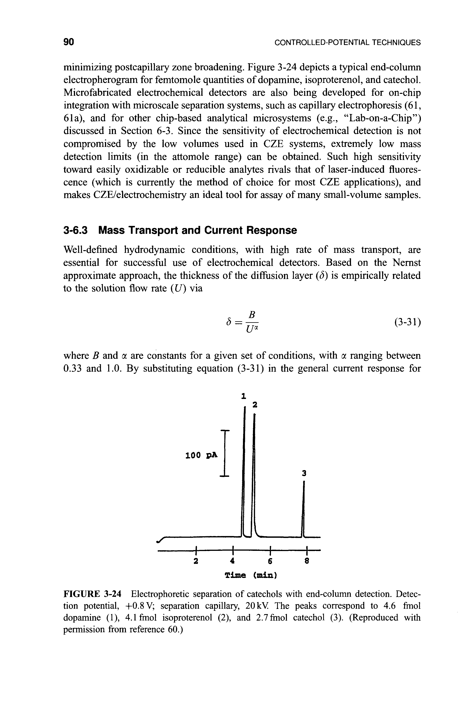

## Page 110

3-6 
FLOW ANALYSIS 
91
mass transport controlled reactions (// = nFADC/S), one obtains the limiting steady-
state response of flow-through electrodes:
i, = nFAKmCU* 
(3-32)
where Km is the mass-transport coefficient (D/B).
A more rigorous treatment takes into account the hydrodynamic characteristics of
the flowing solution. Expressions for the limiting currents (under steady-state
conditions) have been derived for various electrodes geometries by solving the
three-dimensional convective diffusion equation:
(3-33)
x
dt 
dx2 
d2 
dz2 
dx
The resulting equations, arrived at by setting appropriate initial and boundary
conditions (depending on the particular electrode), are given in Table 3-4.
A generalized equation for the limiting-current response of different detectors,
based on the dimensionless Reynolds (Re) and Schmidt (Sc) numbers has been
derived by Hanekamp and co-workers (62):
i, = nkFCD(Scfb(Ref 
(3-34)
where A: is a dimensionless constant and b is the characteristic electrode width.
In the case of coulometric detectors (with complete electrolysis), the limiting
current is given by Faraday's law:
// = nFCU 
(3-35)
TABLE 3-4 The Limiting-Current Response of Various
Flow-Through Electrodes
Electrode Geometry 
Limiting Current Equation
Tubular 
i = 1.61 nFC(DA/r)2/3U1^
Planar (parallel 
flow) 
i = 0.68 nFCD2^v-l/6(A/b)l/2U1/2
Thin-layer cell 
i = 1.47 nFC(DA/b)2'* Ul/3
Planar (perpendicular) 
i = O.QOSnFCD2/^-1/6^3/4!*1/2
Wall-jet detector 
i = 0.898«FCD2/3v-5/12a-1/2^3/8t/3/4
a = diameter 
of 
inlet; 
A = electrode 
area; 
b = channel 
height;
C = concentration (HIM); F=Faraday constant; D — diffusion coefficient;
v = kinematic viscosity; r = radius of tubular electrode; U= average
volume flow rate; u — velocity (cm s-1); n — number of electrons.
Adapted from reference 62.

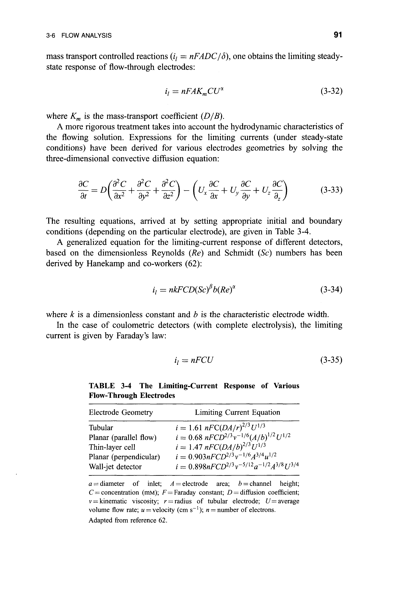

## Page 111

92
CONTROLLED-POTENTIAL TECHNIQUES
3-6.4 
Detection Modes
The simplest, and by far the most common, detection scheme is the measurement of
the current at a constant potential. Such fixed-potential amperometric measurements
have the advantage of being free of double-layer charging and surface-transient
effects. As a result, extremely low detection limits—on the order of 1-100 pg (about
10~14 moles of analyte)—can be achieved. In various situations, however, it may be
desirable to change the potential during the detection (scan, pulse, etc.).
Potential-scanning detectors can increase the information content over that of
fixed-potential operation. By rapidly recording numerous voltammograms during the
elution, one obtains a three-dimensional detector response of the current against
potential and time. Such addition of the redox potential selectivity can offer
immediate identification of eluting peaks, and helps in resolving chromatographi-
cally coeluting components. Different approaches to swept-potential detectors based
on square-wave voltammetry (13,14) or phase-sensitive AC voltammetry (63) have
been reported. The greater selectivity of potential-scanning detection is accompanied
by higher detection limits (versus fixed-potential amperometry), because of the
additional background current associated with the potential scan.
Pulsed amperometric detection (PAD), introduced by Johnson and LaCourse (64,
65) has greatly enhanced the scope of liquid chromatography/electrochemistry (66).
This detection mode overcomes the problem of loss of activity of noble metal
electrodes associated with the fixed-potential detection of compounds such as
carbohydrates, alcohols, amino acids, or aldehydes. Pulsed amperometric detection
couples the process of anodic detection with anodic cleaning and cathodic reactiva-
tion of a noble metal electrode, thus assuring a continuously cleaned and active
0.8 -
0
0)
0.0 -
ui
-0.8 --
o Cleaning
1 1
£3 Cleaning
120 
240 
0
Time (ms)
FIGURE 3-25 
Triple-pulse amperometric waveform.
120

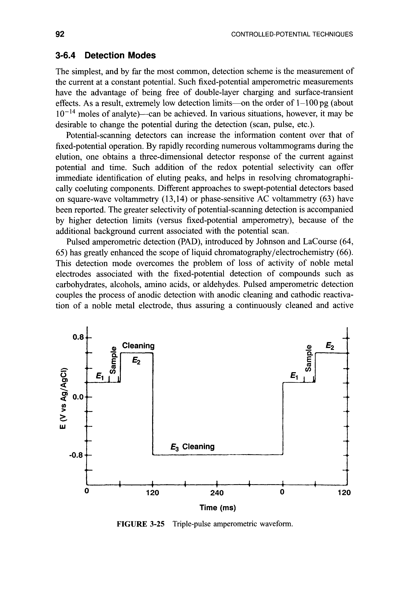

## Page 112

3-6 
FLOW ANALYSIS
93
surface. This is usually accomplished with a three-step potential waveform,
combining anodic and cathodic polarizations (e.g., Figure 3-25). The analytical
response results primarily from adsorbed analyte, with detection limits approaching
50ng (for 50uL samples). Other automated multistep potential waveforms are
possible. Such waveforms are commonly executed at a frequency of 1-2 Hz, in
connection with gold or platinum working electrodes.
The power of electrochemical detection can be improved by using more than one
working electrode (67). Different strategies, based primarily on dual-electrode
detection, can thus be employed. For example, in the series mode (Figure 3-26a)
the first upstream electrode can be used to generate an electroactive species that is
more easily detected at the downstream electrode. Discrimination against
compounds with irreversible redox chemistry can also be achieved. Significantly
improved qualitative information can be achieved using a parallel (side-by-side)
dual-electrode configuration (Figure 3-266). Two simultaneous chromatograms can
be generated by holding these electrodes at different potentials. The current ratios at
these two potential settings provide real-time "fingerprints" of the eluting peaks.
Such ratio values are compared with those of standards to confirm the peak identity.
Further improvements in the information content can be achieved using multi-
channel amperometric detection (analogous to diode array optical detection) (68).
For example, Figure 3-27 displays a three-dimensional chromatogram for a mixture
of several biologically significant compounds at a 16-electrode detector array. By
rapidly applying a five-potential sequence to the individual electrodes, an 80-channel
chromatographic detection can be obtained. Such an electrochemical profile across
Series
Parallel adjacent
(b)
FIGURE 3-26 
Dual-electrode thin-layer detector configurations for operation in the series
(a) and parallel (b) amperometric modes.

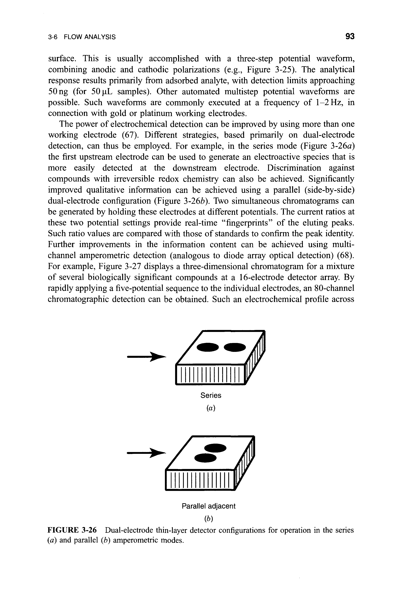

## Page 113

94
CONTROLLED-POTENTIAL TECHNIQUES
5-HIAA
AA
DOPAC
NE
E(Vvs SCE)
- 0.290
0.250
Time (sec)
FIGURE 3-27 Three-dimensional chromatogram for oxidizable biological compounds at a
multichannel amperometric detection system, consisting of an array of 16 carbon-paste
electrodes held at different potentials. AA = ascorbic acid; NE = norepinephrine; DOPAC =
3,4-dihydroxyphenylacetic acid; 5-HIAA = 5-hydroxyindole-3-acetic acid; DA = dopamine;
HVA = homovanillic acid. (Reproduced with permission from reference 68.)
the array provides confirmation of peak purity and improved identification of target
analytes. Additional information can be achieved by using arrays comprising
different electrode materials (see Section 6-4). For a more detailed description of
on-line electrochemical detectors, the reader is referred to a monograph by Stulik
and Pacakova (69). Comparison of various commercial detectors is also available
(70).
REFERENCES
1. D. Ilkovic, Coll. Czech. Chem. Commun, 64, 498 (1934).
2. J. Lingane, Chem. Rev. 29, 1 (1941).
3. G.C. Barker and I.L. Jenkin, Analyst, 77, 685 (1952).
4. G.C. Barker and A.W. Gardner, Z. Anal. Chem., 173, 79 (1960).
5. J. Osteryoung and E Kirowa-Eisner, Anal. Chem., 52, 62 (1980).
6. E.P. Parry and R.A. Osteryoung, Anal. Chem., 37, 1634 (1964).
7. J.B. Flato, Anal. Chem., 44, 75A (1972).
8. J. Osteryoung and R.A. Osteryoung, Anal. Chem., 57, 101A (1985).
9. J.J. O'Dea, J. Osteryoung and R.A. Osteryoung, Anal. Chem., 53, 695 (1981).
10. S. Borman, Anal. Chem., 54, 698A (1982).

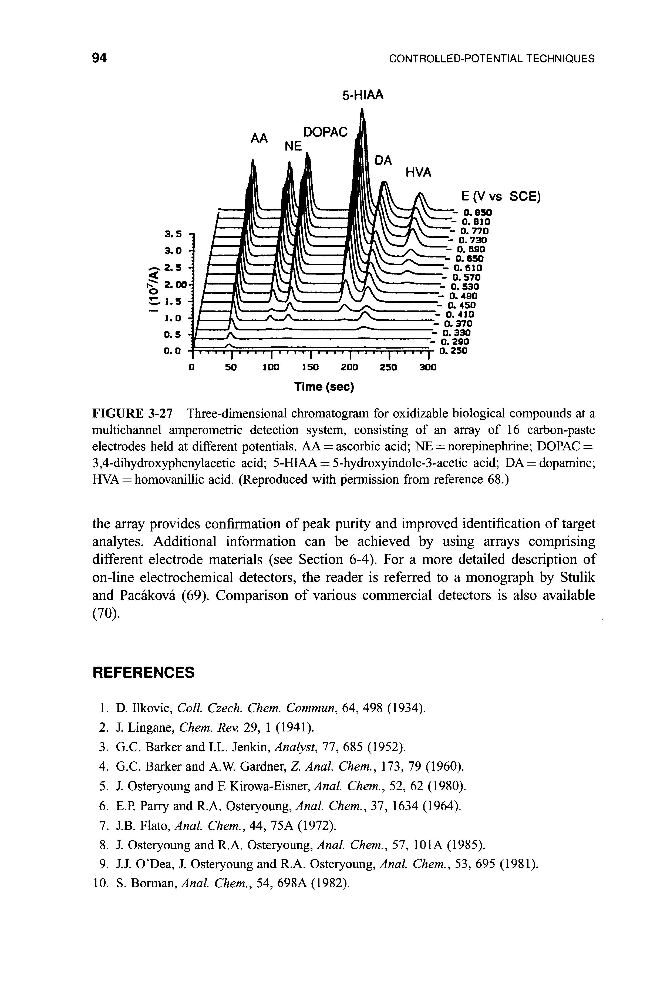

## Page 114

REFERENCES 
95
11. C. Yarnitzky, Anal. Chem., 57, 2011 (1985).
12. J. Wang, E. Ou/iel, C. Yarnitzky and M Ariel, Anal. Chim. Acta, 102, 99 (1978).
13. R. Samuelsson, J.J. O'Dea and J. Osteryoung, Anal. Chem., 52, 2215 (1980).
14. G.C. Gerhardt, R.M. Cassidy and A.S. Baranski, Anal. Chem., 70, 2167 (1998).
15. S. Stefani and R Seeber, Anal. Chem., 54, 2524 (1982).
16. B. Breyer and H Bauer, Rev. Polarogr, 8, 157 (1960).
17. D.E. Smith, CRC Crit. Rev. Anal. Chem., 2, 247 (1971).
18. B. Breyer and H Bauer, Alternating Current Polarography and Tensammetry, Wiley-
Interscience, New York, 1963.
19. J. Wang, Stripping Analysis: Principles, Instrumentation and Applications, VCH Publish-
ers, Deerfield Beach, FL, 1985.
20. T.R. Copeland and R.K. Skogerboe, Anal. Chem., 46, 1257A (1974).
21. T.M. Florence, J. Electroanal. Chem., 27, 273 (1970).
22. D. Jagner, Trends Anal. Chem. 2(3), 53 (1983).
23. J. Wang, "Voltammetry after Nonelectrolytic Proconcentration," in A.J. Bard Ed.,
Electroanalytical Chemistry, Vol. 16, p. 1, Marcel Dekker, New York, 1989.
24. C.M.G. van den Berg, Anal. Chim. Acta, 250, 265 (1991).
25. C.M.G. van den Berg, K. Murphy and J.P. Riley, Anal. Chim. Acta, 188, 177 (1986).
26. J. Wang and T. Baomin, Anal. Chim. Acta, 270, 137 (1992).
27. J.R. Donat and K.W. Bruland, Anal. Chem., 60, 240 (1988).
28. J. Golimowski, P. Valenta and H.W Nurnberg, Fres. Z. Anal. Chem., 322, 315 (1985).
29. J. Wang and J.S. Mahmoud, Fres. Z. Anal. Chem., 327, 789 (1987).
30. J. Wang and J.S. Mahmoud, J. Electroanal Chem., 208, 383 (1986).
31. C.M.C. van den Berg, Anal. Chem., 57, 1532 (1985).
32. B. Pihlar, P. Valenta and H.W. Niirnberg, Fres. Z. Anal. Chem., 307, 337 (1981).
33. J. Wang, J. Zadeii and M.S. Lin, J. Electroanal. Chem., 237, 281 (1987).
34. J. Wang and J. Zadeii, Talanta, 34, 909 (1987).
35. K. Yokoi and C.M.C. van den Berg, Anal. Chim. Acta, 245, 167 (1991).
36. C.M.G. van den Berg and N. Nimmo, Anal. Chem., 59, 269 (1987).
37. C.M.G. van den Berg, Anal. Chem., 56, 2383 (1984).
38. J. Wang, X. Cai, C. Jonsson and M Balakrishan, Electroanalysis, 8, 20 (1996).
39. G.W. Luther, C. Swartz and W Ullman, Anal. Chem., 60, 1721 (1988).
40. M. Tercier and J Buffle, Electroanalysis, 5, 187 (1993).
41. N.K. Komanur and G.W. van Loon, Talanta, 24, 184 (1977).
42. J. Poldoski and G Glass, Anal Chim. Acta, 101, 79 (1978).
43. J. Wang, J. Lu and K Olsen, Analyst, 117, 1913 (1992).
44. S. Gottesfeld and M Ariel, J. Electroanal Chem., 9, 112 (1965).
45. J. Wang and S Mannino, Analyst, 114, 643 (1989).
46. P. Ostapczuk, Clin. Chem., 38, 1995 (1992).
47. P. Lai and K Fung, Analyst, 103, 1244 (1978).
48. J. Golimoski and I Gustavsson, Fres. Z. Anal Chem., 317, 484 (1984).
49. S.B. Adeloju, A.M. Bond and M.H. Briggs, Anal. Chim. Acta, 164, 181 (1984).

## Page 115

96
CONTROLLED-POTENTIAL TECHNIQUES
50. K. Hoppstock and M Michulitz, Anal. Chim. Acta, 350, 135 (1997).
51. S. Forbes, G. Bound and T West, Talanta, 26, 473 (1979).
52. D.I. Levit, Anal. Chem., 45, 1291 (1973).
53. J. Wang, R. Setiadji, L. Chen, J. Lu and S Morton, Electroanalysis, 4, 161 (1992).
54. T. Williams, O. Foy and C Benson, Anal Chim. Acta, 75, 250 (1975).
55. T.M. Florence, Analyst, 111, 489 (1986).
56. J. Wang, Analyst, 119, 763 (1994).
57. A.G. Ewing, J.M. Mesaros and P.P. Gavin, Anal Chem., 66, 527A (1994).
58. P. Curry, C. Engstrom and A Ewing, Electroanalysis, 3, 587 (1991).
59. L.A. Holland and S.M. Lunte, Anal Commun., 35, 1H (1998).
59a. T. Kappes and P. Hanser, Electroanalysis, 3, 165 (2000).
60. S. Sloss, A.G. Ewing, Anal Chem., 63, 577 (1993).
61. A. Woolley, K. Lao, A. Glazer and R Mathies, Anal. Chem., 70, 684 (1998).
61a. J. Wang, B. Tian and E. Sahlin, Anal Chem., 71, 5436(1999).
62. H.B. Hanekamp, P. Box and R.W. Frei, Trends Anal. Chem., 1, 135 (1982).
63. A. Trojanek and H.G. De Jong, Anal Chim. Acta, 141, 115 (1982).
64. D.C. Johnson and W.R. LaCourse, Anal Chem., 62, 589A (1990).
65. D.C. Johnson and W.R. LaCourse, Electroanalysis, 4, 367 (1992).
66. W.R. LaCourse, Pulsed Electrochemical Detection in HPLC, Wiley, New York, 1997.
67. D.A. Roston, R.E. Shoup and PT. Kissinger, Anal Chem., 54, 1417A (1982).
68. J. Hoogvliet, J. Reijn and W van Bennekom, Anal Chem., 63, 2418 (1991).
69. K. Stulik and V Pacakova, Electroanalytical Measurements in Flowing Liquids, Ellis
Horwood, Chichester, 1987.
70. M. Warner, Anal Chem., 66, 601A (1994).
EXAMPLES
Example 3-1 
Voltammogram (a) was obtained for adsorptive stripping measure-
ments of Fe(III) in sea water. Voltammograms (b) and (c) show successive standard
additions of 4 ppb Fe(III). Find the concentration of Fe(III) in the sample.
06V
-07V
-0.9V
Solution 
The resulting current peaks lead to the following standards additions plot:

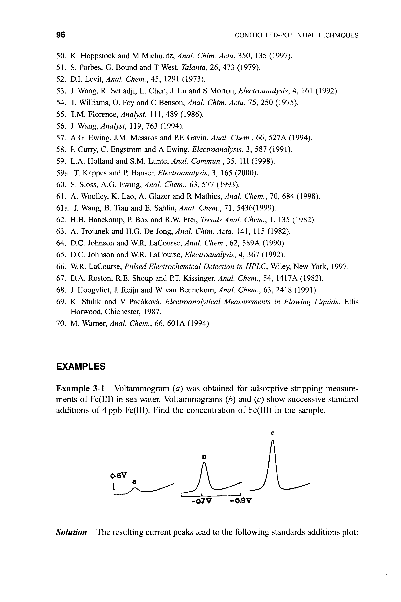

## Page 116

EXAMPLES
97
50
<
25
4
oonc..PPb
8
From which an Fe(III) concentration of 1.47 ppb can be obtained for the sample.
Example 3-2 
Calculate the limiting current that would be expected from the
reduction of 2 x 10~4M Pb2+, using the DME characteristics m — 2.0mg s"1 and
t = 4s. The diffusion coefficient of Pb2+ is 1.01 x 1(T5 cm2 s"1.
Solution 
The lead reduction is a two-reduction process:
Pb2+ + 2e~ ^ Pb
Hence, from the Ilkovic equation, (equation 3.3), we obtain
id = 708 x 2 x (1.01 x 10~5)1/2(2.0)2/3 x 41/6 x 0.2. = 1.81 uA
Example 3-3 
Draw clearly the DC polarographic response for a mixture contain-
ing 3 mM Cu2+, 2 mM Zn2+ and 1 mM Cd2+. The half-wave potentials for the Cu, Zn
and Cd ions are -0.12 V,-0.95 V and-0.62 V, respectively.
Solution
Zn
Cd
Cu
-0.5
-1.0 
E,V

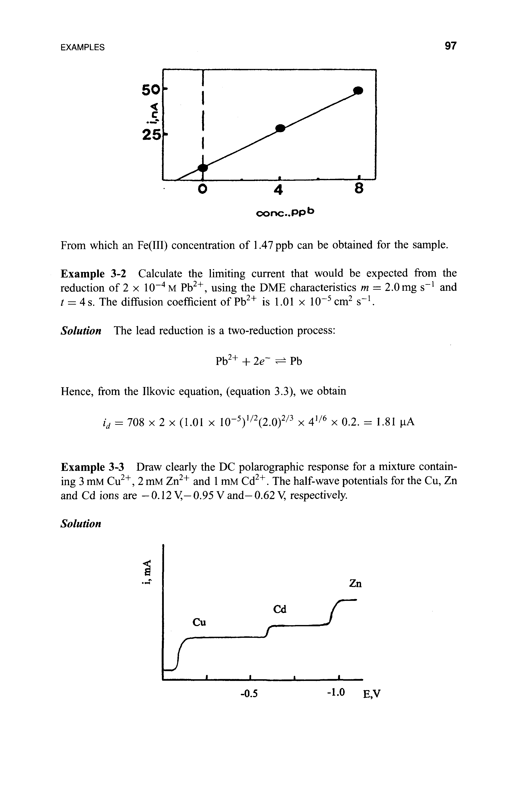

## Page 117

98
CONTROLLED-POTENTIAL TECHNIQUES
Example 3-4 A sample containing cadmium gives a polarographic reduction
current of 6.0uA. The current increases to 9 and 12uA upon increasing the
cadmium concentration in two steps of 2mM each. Calculate the cadmium
concentration in the original sample.
Solution
6=KC
to yield a C value of 4 mM.
Example 3-5 Polarogram A was obtained for a 10 mL lead-containing sample. The
limiting current increased (to B) after adding 100 uL of a 0.10M lead standard to the
10ml sample. Calculate the original lead concentration in the sample.
B
A
-0.4
-0.8
E,V
Solution 
The sample lead ion yielded a limiting current of 13 (iA (A). The current
increases by 8.5 |iA upon spiking the sample with 1 mM lead standard (considering
the 1:100 dilution; B - A).
// = KC 
8.5 = K(l mM) 
K=*.s
13.5. = 8.5.C,
C,sample
sample
= 1.53 mM
Example 3-6 Flow analysis of a urine sample at a thin-layer amperometric
detector, with a flow rate of 1.25rnL min"1, yielded a limiting current value of
1.6 uA for its unknown uric acid content. A larger current of 2.4 uA was observed
for a sample containing 1 x 10~4 M uric acid and flowing at a rate of 0.9 mL min"1.
Calculate the original concentration of uric acid in the sample.

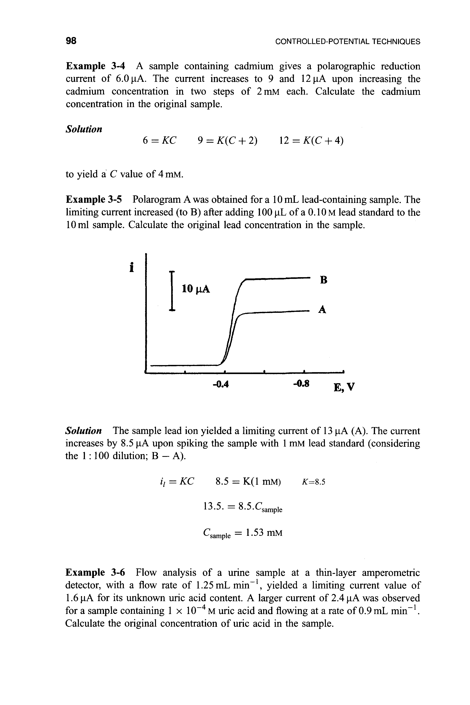

## Page 118

QUESTIONS 
99
Solution From Table 3-4:
2.4. = K(\ x 10~4)0.91/3 
A: = 2.49 x 104
1.6 = 2.49x 104(C)1.251/3
C = 6 x 10~5M
QUESTIONS
1. Describe clearly the principle and operation of potentiometric stripping analysis
(PSA). How it is differed from anodic stripping voltammetry (ASV)? What is
the quantitative signal? What is its advantage over ASV?
2. Draw clearly schematic diagrams of a thin-layer flow detector utilizing (1) single
working electrode, and (2) dual electrode. Explain how the latter improves the
power and information content.
3. Describe and draw clearly the waveform employed in square-wave voltammetry.
Explain how the current is measured.
4. Describe clearly the use of polarographic analysis for obtaining the values of the
formation constant and stoichiometric number of metal complexes.
5. Describe clearly the challenges of interfacing electrochemical detectors to
capillary electrophoresis separation systems. How can these challenges be
overcome?
6. Explain clearly how and why the coupling of stripping voltammetry to a
differential pulse waveform can enhance the power of stripping measurements
of trace metals.
7. Select an electroanalytical technique most suitable for detecting trace levels of
nickel in ground water. Justify this choice.
8. A liquid chromatographic experiment resulted in the same retention time for the
electroactive compounds A and B. Which electrochemical detection scheme
would offer a selective detection of the two coeluting analytes? Explain your
selection. (E°A = +0.43 V; ££ = +0.77 V.)
9. Use the adsorption theory (of Section 2-1-3) to explain why adsorptive stripping
voltammetry results in nonlinear calibration plots.
10. Derive the Cottrell equation by combining Pick's first law of diffusion with the
time-dependent change of the concentration gradient during a potential-step
experiment.

## Page 119

CHAPTER 4
PRACTICAL CONSIDERATIONS
The basic instrumentation required for controlled-potential experiments is rela-
tively inexpensive and readily available commercially. The basic necessities include
a cell (with a three-electrode system), a voltammetric analyzer (consisting of a
potentiostatic circuitry and a voltage ramp generator), and an X-Y-t recorder (or
plotter). Modern voltammetric analyzers are versatile enough to perform many
modes of operation. Depending upon the specific experiment, other components may
be required. For example, a faradaic cage is desired for work with ultramicroelec-
trodes. The system should be located in a room free from major electrical
interferences, vibrations, and drastic fluctuations in temperature.
4-1 ELECTROCHEMICAL CELLS
Three-electrode cells (e.g., Figure 4-1) are commonly used in controlled-potential
experiments. The cell is usually a covered beaker of 5-50 mL volume, and contains
the three electrodes (working, reference, and auxiliary), which are immersed in the
sample solution. While the working electrode is the electrode at which the reaction
of interest occurs, the reference electrode provides a stable and reproducible
potential (independent of the sample composition), against which the potential of
the working electrode is compared. Such "buffering" against potential changes is
achieved by a constant composition of both forms of its redox couple, for example,
Ag/AgCl or Hg/Hg2Cl2, as with the commonly used silver-silver chloride and the
saturated calomel reference electrodes, respectively. To minimize contamination of
the sample solution, the reference electrode may be insulated from the sample
100

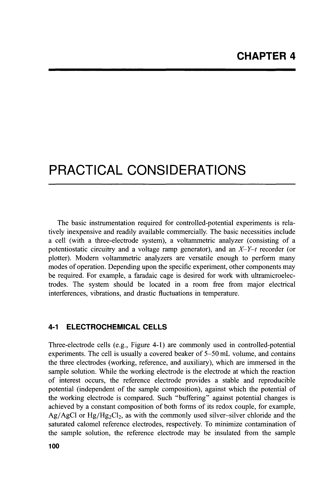

## Page 120

4-1 
ELECTROCHEMICAL CELLS
101
c.e.w.e.
-N,
FIGURE 4-1 
Schematic diagram of a cell for voltammetric measurements: w.e., working
electrode; r.e., reference electrode; c.e., counter electrode. The electrodes are inserted through
holes in the cell cover.
FIGURE 4-2 A complete cell stand. (Courtesy of BAS Inc.)

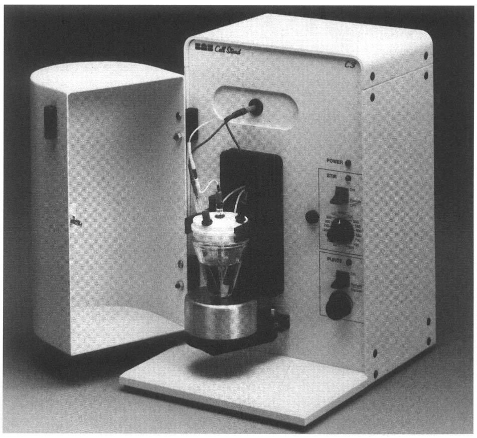

## Page 121

102
PRACTICAL CONSIDERATIONS
through an intermediate bridge. An inert conducting material, such as platinum wire
or graphite rod, is usually used as the current-carrying auxiliary electrode. Attention
should be given to the relative position of these electrodes, and to their proper
connection to the electrochemical analyzer (see Section 4-4). The three electrodes, as
well as the tube used for bubbling the deoxygenating gas (see Section 4-3), are
supported in five holes in the cell cover. Complete systems, integrating the three-
electrode cell, built-in gas control, and magnetic stirrer, along with proper cover, are
available commercially (e.g., Figure 4-2).
The exact cell design and the material used for its construction are selected
according to the experiment at hand and the nature of the sample. The various
designs differ with respect to size, temperature-control capability, stirring require-
ment, shape, or number of cell compartments. Various micro cells with 20-500 uL
volumes can be used when the sample volume is limited. Particularly attractive are
thin-layer cells in which the entire sample is confined within a thin layer (less than
lOum thick) at the electrode surface (1). Smaller sample volumes can be accom-
modated in connection with ultramicroelectrodes (discussed in Section 4-4) and
advanced microfabrication processes (discussed in Section 6-3). In particular,
lithographically fabricated picoliter microvials (2) hold great promise for assays of
ultrasmall environments (e.g., single-cell systems). Specially designed flow cells
(discussed in Section 3-6) are used for on-line applications. Glass is commonly used
as the cell material because of its low cost, transparency, chemical inertness, and
impermeability. Teflon and quartz represent other possible cell materials. The cell
cover can be constructed of any suitable material that is inert to the sample. Accurate
temperature control is readily achieved by immersing or jacketing the cell in a
constant-temperature bath.
4-2 SOLVENTS AND SUPPORTING ELECTROLYTES
Electrochemical measurements are commonly carried out in a medium that consists
of solvent containing a supporting electrolyte. The choice of the solvent is dictated
primarily by the solubility of the analyte and its redox activity, and by solvent
properties such as the electrical conductivity, electrochemical activity, and chemical
reactivity. The solvent should not react with the analyte (or products) and should not
undergo electrochemical reactions over a wide potential range.
While water has been used as a solvent more than any other media, nonaqueous
solvents [e.g., acetonitrile, propylene carbonate, dimethylformamide (DMF),
dimethyl sulfoxide (DMSO), or methanol] have also frequently been used. Mixed
solvents may also be considered for certain applications. Double-distilled water is
adequate for most work in aqueous media. Triple-distilled water is often required
when trace (stripping) analysis is concerned. Organic solvents often require drying
or purification procedures. These and other solvent-related considerations have been
reviewed by Mann (3).
Supporting electrolytes are required in controlled-potential experiments to
decrease the resistance of the solution, to eliminate electromigration effects, and
to maintain a constant ionic strength (i.e., "swamping out" the effect of variable

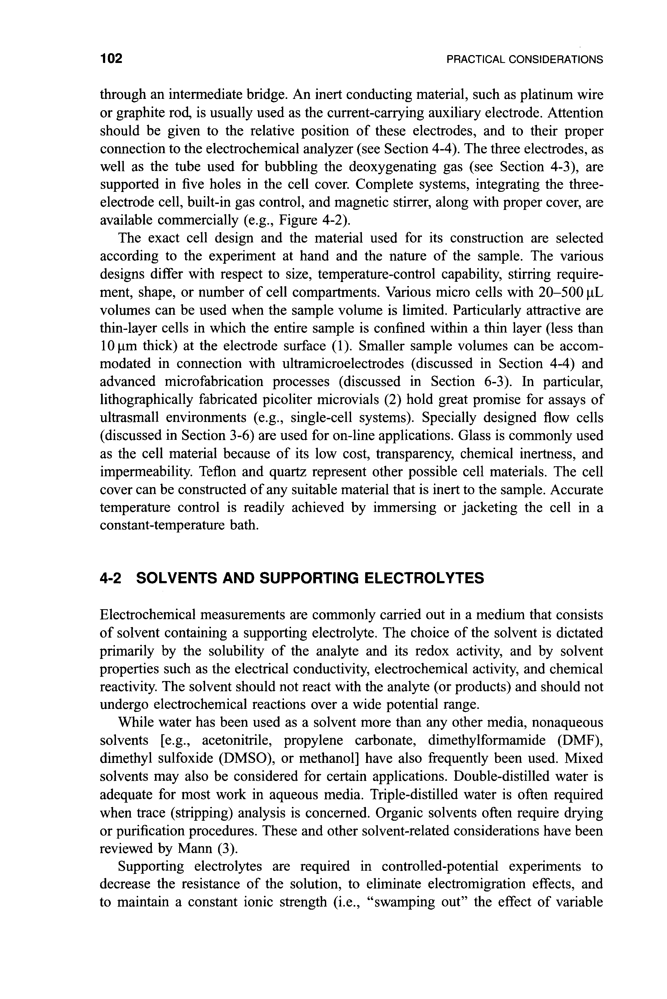

## Page 122

4-3 OXYGEN REMOVAL 
103
amounts of naturally occurring electrolyte). The inert supporting electrolyte may be
an inorganic salt, a mineral acid, or a buffer. While potassium chloride or nitrate,
ammonium chloride, sodium hydroxide, or hydrochloric acid are widely used when
using water as a solvent, tetraalkylammonium salts are often employed in organic
media. Buffer systems (such as acetate, phosphate, or citrate) are used when a pH
control is essential. The composition of the electrolyte may affect the selectivity of
voltammetric measurements. For example, the tendency of most electrolytes to
complex metal ions can benefit the analysis of mixtures of metals. In addition,
masking agents [such as ethylenediaminetetraacetic acid (EDTA)] may be added to
"remove" undesired interferences. The supporting electrolyte should be prepared
from highly purified reagents, and should not be easily oxidized or reduced. The
usual electrolyte concentration range is 0.1-1.0 M, in other words, in large excess of
the concentration of all electroactive species. Significantly lower levels can be
employed in connection with ultramicro working electrodes (see Section 4-5.4).
4-3 OXYGEN REMOVAL
The electrochemical reduction of oxygen usually proceeds via two well-separated
two-electron steps. The first step corresponds to the formation of hydrogen peroxide:
O2 + 2H+ + 2e~ -> H202 
(4-1)
and the second step corresponds to the reduction of the peroxide:
H202 + 2H+ + 2e~ -> 2H2O 
(4-2)
The half-wave potentials of these steps are approximately —0.1 and — 0.9 V (versus the
saturated calomel electrode). The exact stoichiometry of these steps is dependent on the
medium. The large background current accruing from this stepwise oxygen reduction
interferes with the measurement of many reducible analytes. In addition, the products
of the oxygen reduction may affect the electrochemical process under investigation.
A variety of methods have been used for the removal of dissolved oxygen (4). The
most common method has been purging with an inert gas (usually purified nitrogen)
for 4-8 min prior to recording of the voltammogram. Longer purge times may be
required for large sample volumes or for trace measurements. To prevent oxygen
from reentering, the cell should be blanketed with the gas while the voltammogram
is being recorded. Passage of the gas through a water-containing presaturator is
desirable to avoid evaporation. The deaeration step, while time consuming, is quite
effective and suitable for batch analysis. (The only exception is work with micro-
samples, where deoxygenation may lead to errors caused by the evaporation of
solvent or loss of volatile compounds.)
Other methods have been developed for the removal of oxygen (particularly from
flowing streams). These include the use of electrochemical or chemical (zinc)
scrubbers, nitrogen-activated nebulizers, and chemical reduction (by addition of
sodium sulfite or ascorbic acid). Alternately, it may be useful to employ voltam-

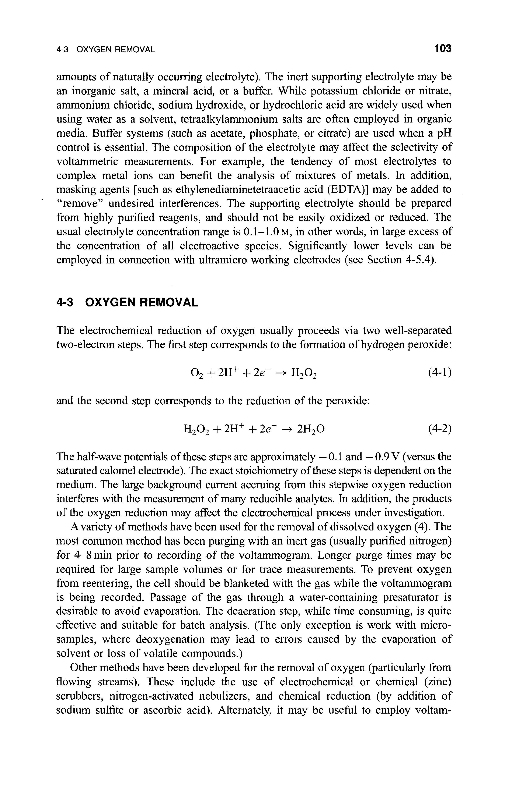

## Page 123

104
PRACTICAL CONSIDERATIONS
metric methods that are less prone to oxygen interference. The background
connection capability of modem (computerized) instruments is also effective for
work in the presence of dissolved oxygen.
4-4 INSTRUMENTATION
Rapid advances in microelectronics, and in particular the introduction of operational
amplifiers, have led to major changes in elecrroanalytical instrumentation. Tiny and
inexpensive integrated circuits can now perform many functions that previously
required very large instruments. Such trends have been reviewed recently (5).
Various voltammetric analyzers are now available commercially from different
sources (Table 4-1) at relatively modest prices (ranging from $5,000 to $25,000 in
1999). Such instruments consist of two circuits: a polarizing circuit that applies the
potential to the cell, and a measuring circuit that monitors the cell current. The
characteristic of modern voltammetric analyzers is the potentiostatic control of the
working electrode, which minimizes errors from cell resistance (i.e., poorly defined
voltammograms with lower current response and shifted and broadened peaks).
Equation 4-3 explains the cause for this ohmic distortion:
app
(4-3)
where iR is the ohmic potential drop.
TABLE 4-1 
Suppliers of Voltammetric Analyzers
Supplier
Address
Analytical Instrument Systems
Bioanalytical Systems
Cypress
CH Instruments
ECO Chemie
EG&G PAR
ESA
Metrohm
Radiometer/Tacussel
Solartron
P.O. Box 458, Flemington, NJ 08822, U.S.A.
www.aishome.com
2701 Kent Ave., W. Lafayette, IN 47906, U.S.A.
www.bioanalytical .com
P.O. Box 3931, Lawrence, KS 66044, U.S.A.
www.cypresshome.com
3700 Tennison Hill Dr., Austin, TX 78733, U.S.A.
chinstr@worldnet.att.net
P.O. Box 85163, 3508 AD Utrecht, The Netherlands
autolab@ecochemie.nl
www.brinkmann.com
801 S. Illinois Ave, Oak Ridge, TN, 37830, U.S.A.
www.egg.inc.com/par
45 Wiggins Ave., Bedford, MA 01730, U.S.A.
CH-9109 Herisau, Switzerland
www.brinkmann.com
27 rue d'Alscace, F-69627 Villeurbanne, France
Analytical@clevelandOH. com
964 Marcon Blvd., Allentown, PA 18103, USA
www.solartron.com

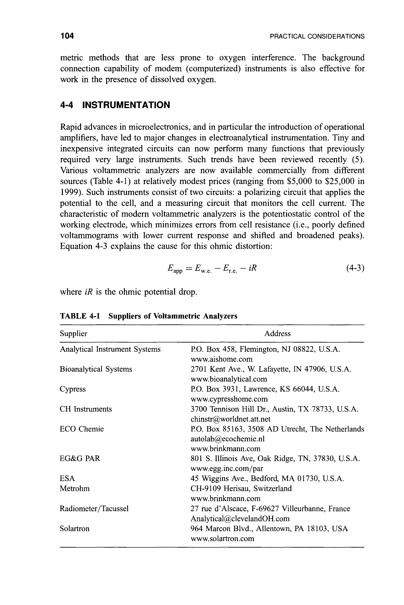

## Page 124

4-4 
INSTRUMENTATION
105
The potentiostatic control, aimed at compensating a major fraction of the cell
resistance, is accomplished with a three-electrode system and a combination of
operational amplifiers and feedback loops (Figure 4-3). Here, the reference electrode
is placed as close as possible to the working electrode and is connected to the
instrument through a high-resistance circuit that draws no current from it. Because
the flow cannot occur through the reference electrode, a current-carrying auxiliary
(counter) electrode is placed in the solution to complete the current path. Hence, the
current flows through the solution between the working and the auxiliary electrodes.
Symmetry in the placement of these electrodes is important for the assumption that
the current paths from all points on the working electrode are equivalent. Because no
current passes through the reference electrode and because of its position close to the
working electrode, the potential drop caused by the cell resistance (iR) is minimized.
If the potential sensed by the reference electrode is less than the desired value, the
operational amplifier control loop provides a corrective potential. By adding an
operational amplifier current-to-voltage converter (called a "current follower") to the
working electrode, it is possible to measure the current without disturbing the
controlled parameters. The instrument also includes a ramp generator to produce
various regularly changing potential waveforms.
As was pointed out earlier, effective potential control requires very close proximity
between the working and reference electrodes. This can be accomplished using a
specially designed bridge of the reference electrode, known as a Luggin probe. The
tip of this bridge should be placed as close as twice its diameter to the working
electrode. A smaller distance will result in blockage (shielding) of the current path
and hence a nonhomogeneous current density. The Luggin bridge should also not
interfere with the convective transport toward the surface of the working electrode.
It should be pointed out that not all of the iR drop is removed by the potentiostatic
control. Some fraction, called iRu (where Ru is the uncompensated solution
resistance between the reference and working electrodes) will still be included in
the measured potential. This component may be significantly large when resistive
nonaqueous media are used, and thus may lead to severe distortion of the
Current
amplifier
Readout
APPL
Working electrode
Counter electrode
Scan
amplifier
FIGURE 4-3 Schematic diagram of a three-electrode potentiostat.

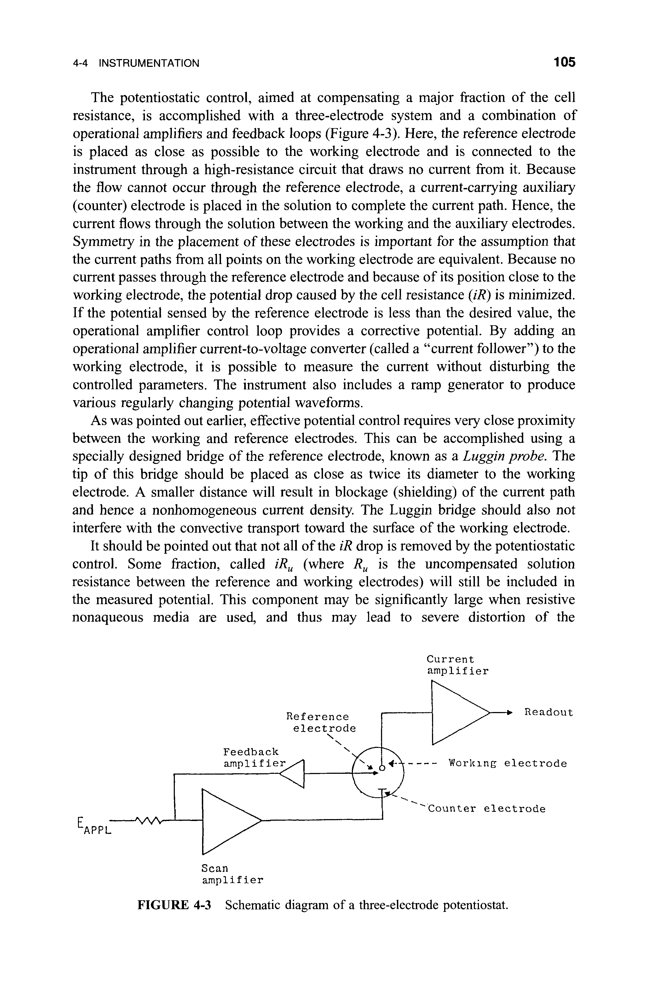

## Page 125

106
PRACTICAL CONSIDERATIONS
voltammetric reponse. Many modem instruments, however, automatically subtract
(compensate) the iRu drop from the potential signal given to the potentiostat via an
appropriate positive feedback.
Bipotentiostats, offering simultaneous control of two working electrodes (e.g.,
ring-disk) are also available. Such instruments consist of a conventional potentiostat
with a second voltage-control circuit. Multipotentiostats, controlling more than two
working electrodes, have also been described (6). The development of ultramicroe-
lectrodes, with their very small currents (and thus negligible iR losses even when R is
large), allows the use of simplified, two-electrode, potential control (see Section
4-5.4). In contrast, ultramicroelectrode work requires efficient current-measurement
circuitry to differentiate between the faradaic response and the extraneous electronic
noise and for handling low currents down to the picoamp range. Other considerations
for the noise reduction involve the grounding and shielding of the instrument and cell.
The advent of inexpensive computing power has changed dramatically the way
voltammetric measurements are controlled and data are acquired and manipulated.
Computer-controlled instruments, available from most manufacturers (5), provide
flexibility and sophistication in the execution of a great variety of modes. In
principle, any potential waveform that can be defined mathematically can be applied
with commands given through a keyboard. Such instruments offer various data-
processing options, including autoranging, blank subtraction, noise reduction, curve
smoothing, differentiation, integration, and peak search. The entire voltammogram
can be presented as a plot or printout (of the current-potential values). In addition,
computer control has allowed automation of voltammetric experiments and hence
has greatly improved the speed and precision of the measurement. Since the
electrochemical cell is an analog element, and computers work only in the digital
domain, analog-to-digital (A/D) and digital-to-analog (D/A) converters are used to
interface between the two. Unattended operation has been accomplished through the
coupling of autosamplers and microprocessor-controlled instruments (e.g., Figure
FIGURE 4-4 Microprocessor-controlled voltammetric analyzer, in connection with an
autosampler. (Courtesy of Metrohm Inc.)

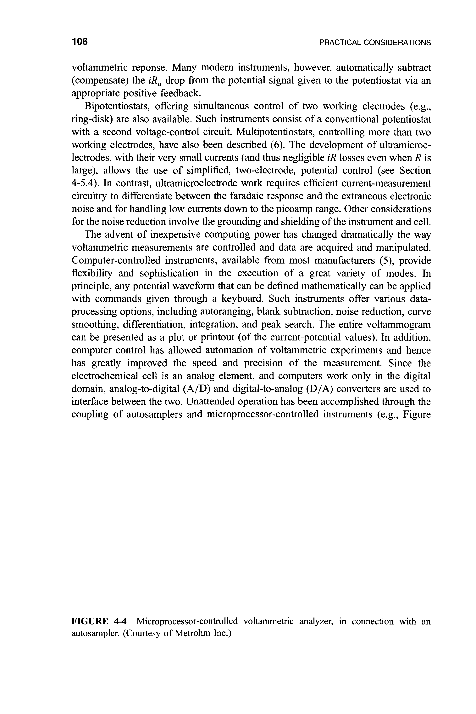

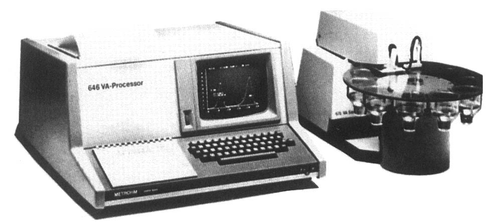

## Page 126

4-5 WORKING ELECTRODES
107
4-4). The autosampler can accommodate over 100 samples, as well as relevant
standard solutions. Such coupling can also address the preliminary stages of sample
preparation (as dictated by the nature of the sample). The role of computers in
electroanalytical measurements and in the development of "smarter" analyzers has
been reviewed by Bond (7) and He et al. (8).
The nature of electrochemical instruments makes them very attractive for
decentralized testing. For example, compact, battery-operated voltammetric analy-
zers, developed for on-site measurements of metals (9,10), readily address the
growing needs for field-based environmental studies. Similarly, portable (hand-held)
instruments are being designed for decentralized clinical testing (11).
4-5 WORKING ELECTRODES
The performance of the voltammetric procedure is strongly influenced by the
material of the working electrode. The working electrode should provide high
signal-to-noise characteristics, as well as a reproducible response. Thus, its selection
depends primarily on two factors: the redox behavior of the target analyte and the
background current over the potential region required for the measurement. Other
considerations include the potential window, electrical conductivity, surface repro-
ducibility, mechanical properties, cost, availability, and toxicity. A range of materials
have found application as working electrodes for electroanalysis. The most popular
are those involving mercury, carbon, or noble metals (particularly platinum and
gold). Figure 4-5 displays the accessible potential window of these electrodes in
various solutions. The geometry of these electrodes must also be considered.
P. I 
t_ 
1 1 \4 u cn
Pt < 
\ 
' 
\ \ M H2oU4
L 
t 
.
-
M
M NoQH
l 
1 1 M H , SO,
| 
" 
1 ' jrl 
'^'-'v"4
1 
"| 1 11 KCI
HS ] 
| 
i 1 M MaOH
L 
i 
-j 0 1 1-f i
(
| 
| 1 M HCI04
i 
| 0 1 M KCI
t
i
t
i
i
Et4NOH
+2 
+1 
0 
-1 
-2
Potential (V vs SCE)
FIGURE 4-5 Accessible potential window of platinum, mercury, and carbon electrodes in
various supporting electrolytes.

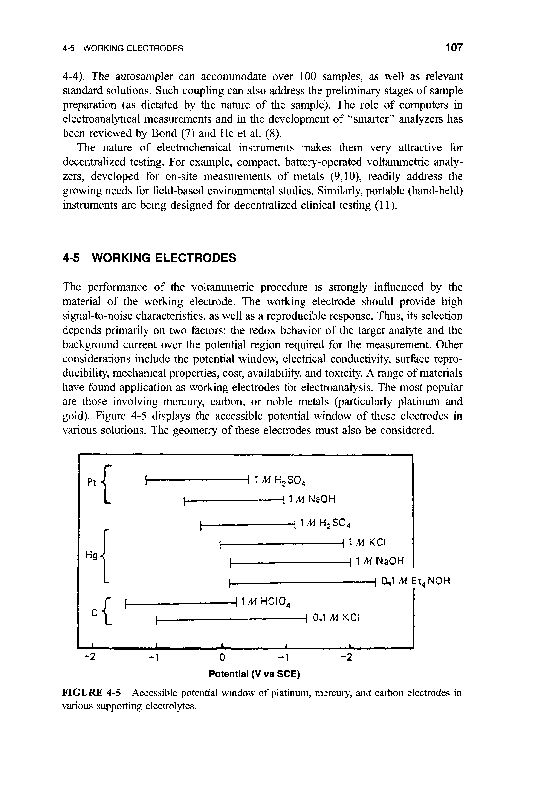

## Page 127

108
PRACTICAL CONSIDERATIONS
4-5.1 
Mercury Electrodes
Mercury is a very attractive choice of electrode material because it has a high
hydrogen overvoltage that greatly extends the cathodic potential window (compared
to solid electrode materials) and possesses a highly reproducible, readily renewable,
and smooth surface. In electrochemical terms, its roughness factor equals unity (i.e.,
identical geometrical and actual surface areas). Disadvantages of the use of mercury
are its limited anodic range (due to the oxidation of mercury) and its toxicity.
There are several types of mercury electrodes. Of these, the dropping mercury
electrode (DME), the hanging mercury drop electrode (HMDE), and mercury film
electrode (MFE) are the most frequently used.
The DME, used in polarography (Section 3-2) and for electrocapillary studies
(Section 1-4), consists of glass capillary tubing, 12-20 cm in length with an internal
diameter of 30-50 urn, connected by a flexible tube to an elevated reservoir of
mercury (Figure 4-6). Electrical contact is made through a wire inserted into the
mercury reservoir. Mercury flows by gravity through the capillary at a steady rate,
emerging from its tip as continuously growing drops. By adjusting the height of the
mercury column, one may vary the drop time; the lifetime of the drop is typically
2-6 s. Such continuous exposure of fresh spherical drops eliminates passivation
problems that may occur at stable solid electrodes. The key to successful operation
of the DME is proper maintenance of its capillary (which prevents air bubbles,
Clamp—
Hg reservoir
Electrical
contact
Auxilliary
electrode
FIGURE 4-6 The dropping mercury electrode.

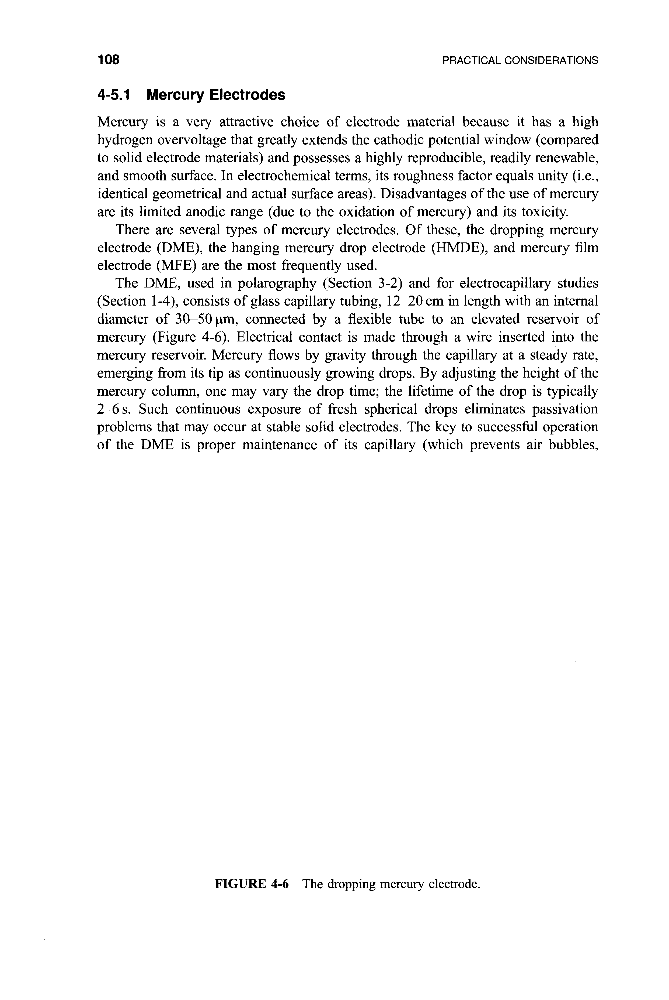

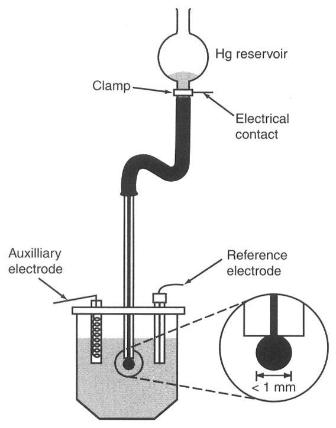

## Page 128

4-5 WORKING ELECTRODES
109
solution creeping, and accumulation of dirt). More elaborate DMEs, based on a
mechanical drop detachment after reproducible time intervals, are used for pulse
polarography.
The hanging mercury drop electrode is a popular working electrode for stripping
analysis and cyclic voltammetry. In this configuration, stationary mercury drops are
displaced from a reservoir through a vertical capillary. Early (Kemula-type) HMDE
designs relied on mechanical extrusion (by a micrometer-driven syringe) from a
reservoir through a capillary (12). The mercury reservoir should be completely filled
with mercury; air must be fully eliminated. Modern HMDEs (particularly with the
Model 303 of EG&G PAR, shown in Figure 4-7) employ electronic control of the
drop formation, which offers improved reproducibility and stability (13). For this
purpose, a solenoid-activated valve dispenses the mercury rapidly, with the drop size
being controlled by the time during which the valve is opened. A wide-bore capillary
allows a mercury drop to be grown very rapidly when the valve is opened. Three
valve opening times produce drops that are described as small, medium, or large.
Since the potential scan is accomplished after the valve has been closed (i.e., with a
stationary electrode), charging-current contributions due to drop growth are elimi-
nated. All the components of this electrode, including the mercury reservoir, are
contained in a compact unit. Such a commercial probe allows the conversion from
FIGURE 4-7 The static mercury drop electrode and its cell stand.

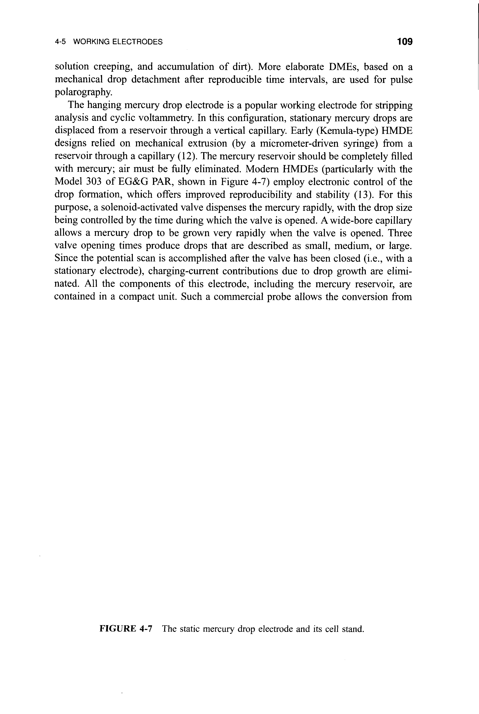

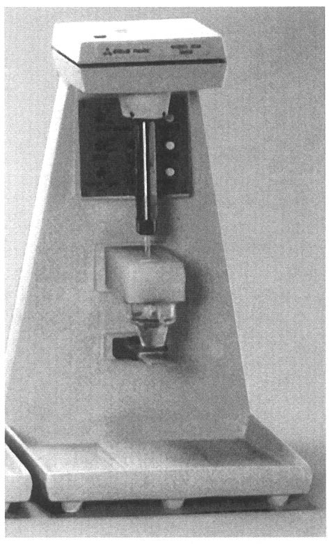

## Page 129

110
PRACTICAL CONSIDERATIONS
the HMDE to DME by operation of a single switch. When used in the DME mode, it
exhibits a very rapid growth to a given area, which then remains constant (as desired
for minimizing charging-current contributions). The performance of HMDEs can be
improved by siliconizing the interior bore of the capillary.
Several mercury electrodes combine the features of the DME and HMDE. In
particular, one employs a narrow-bore capillary that produces DMEs with drop lives
of 50-70 s (14). Another involves a controlled-growth mercury drop (15). For this
purpose, a fast-response valve offers a wide range of drop sizes and a slowly (step-
by-step) growing drop.
The mercury film electrode, used for stripping analysis or flow amperometry,
consists of a very thin (10-100 jam) layer of mercury covering a conducting support.
Because of the adherent oxide films on metal surfaces, and the interaction of metals
with mercury, glassy carbon is most often used as a substrate for the MFE. The
mercury film formed on a glassy carbon support is actually composed of many
droplets. As a result of not being a pure mercury surface, such film electrodes exhibit
a lower hydrogen overvoltage and higher background currents. Another useful
substrate for the MFE is iridium (because of its very low solubility in mercury and
the excellent adherence of the resulting film). Mercury film electrodes are commonly
preplated by cathodic deposition from a mercuric nitrate solution. An in-situ-plated
MFE is often employed during stripping analysis (16). This electrode is prepared by
simultaneous deposition of the mercury and the measured metals. Most commonly, a
disk-shaped carbon electrode is used to support the mercury film. Mercury film
ultramicroelectrodes, based on coverage of carbon fiber or carbon microdisk
surfaces, have also received increasing attention in recent years.
4-5.2 Solid Electrodes
The limited anodic potential range of mercury electrodes has precluded their utility
for monitoring oxidizable compounds. Accordingly, solid electrodes with extended
anodic potential windows have attracted considerable analytical interest. Of the
many different solid materials that can be used as working electrodes, the most often
used are carbon, platinum, and gold. Silver, nickel, and copper can also be used for
specific applications. A monograph by Adams (17) is highly recommended for a
detailed description of solid-electrode electrochemistry.
An important factor in using solid electrodes is the dependence of the response on
the surface state of the electrode. Accordingly, the use of such electrodes requires
precise electrode pretreatment and polishing to obtain reproducible results. The
nature of these pretreatment steps depends on the materials involved. Mechanical
polishing (to a smooth finish) and potential cycling are commonly used for metal
electrodes, while various chemical, electrochemical, or thermal surface procedures
are added for activating carbon-based electrodes. Unlike mercury electrodes, solid
electrodes present a heterogeneous surface with respect to the electrochemical
activity (18). Such surface heterogeneity leads to deviations from the behavior
expected for homogeneous surfaces.

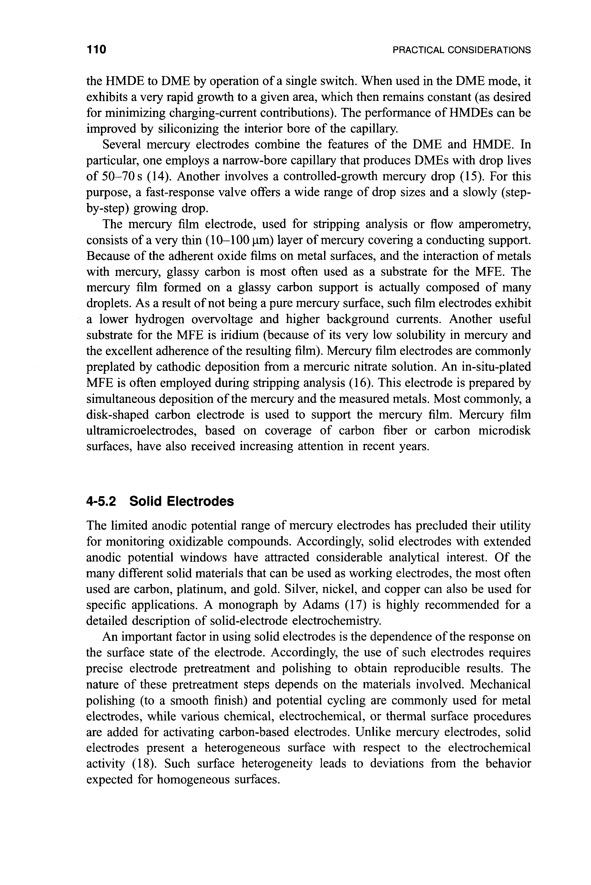

## Page 130

4-5 WORKING ELECTRODES
111
Solid electrodes can be stationary or rotating, usually in a planar disk config-
uration. Such electrodes consist of a short cylindrical rod of the electrode material
embedded in a tightly fitting tube of an insulating material (Teflon, Kel-F, etc.). The
construction of a typical disk electrode is illustrated in Figure 4-8. It is essential to
avoid crevices between the sleeve and the electrode materials, and thus to prevent
solution creeping (and an increased background response). Electrical contact is made
at the rear face. Disk solid electrodes are also widely employed in flow analysis in
connection with thin-layer or wall-jet detectors (see Section 3-6). Growing attention
is being given to other configurations of solid electrodes, including various
ultramicroelectrodes (Section 4-5.4) and microfabricated screen-printed strips or
silicon-based thin-film chips (Section 6-5).
4-5.2.1 Rotating Disk and Ring-Disk Electrodes The rotating disk elec-
trode (RDE) is vertically mounted in the shaft of a synchronous controllable-speed
motor and rotated with constant angular velocity (co) about an axis perpendicular to
the plain disk surface (Figure 4-9a). (co = 2nf, where/ is the rotation speed in rps.)
As a result of this motion, the fluid in an adjacent layer develops a radial velocity
that moves it away from the disk center. This fluid is replenished by a flow normal to
the surface. Hence, the RDE can be viewed as a pump that draws a fresh solution up
from the bulk solution. Under laminar flow conditions (usually up to about
4000 rpm), the thickness of the diffusion layer decreases with increasing electrode
angular velocity according to
(4-4)
where v is the kinematic viscosity (defined as the viscosity divided by the density in
cm2 s~'). Rotation speeds of 100-4000 rpm thus correspond to d values in the
5-50 urn range. Equation (4-4) suggests that the thickness of the diffusion layer is
contact
plastic tube —>
sealant 
cylindrical rod
FIGURE 4-8 
Construction of a typical disk electrode.

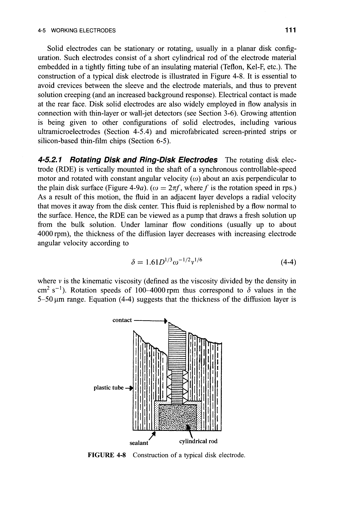

## Page 131

112
PRACTICAL CONSIDERATIONS
Disk
Side view
' Conductor
Insulator (Teflon)
Bottom view
(a) 
(6)
FIGURE 4-9 
(a) Rotating disk and (b) ring-disk electrodes.
independent of the disk diameter, that is, a uniform layer across the surface. The
limiting current (for a reversible system) is thus proportional to the square root of the
angular velocity, as described by the Levich equation:
(4-5)
An increase in co from 400 to 1600 rpm thus results in a twofold increase of the
signal. A deviation from linearity of a plot of z/ vs. co1/2 suggests some kinetic
limitations. In addition, at very low rotation speeds (0-100 rpm), a slight upward
bend is observed due to contribution by natural convection. The voltammetric wave
has a sigmoidal shape; for reversible systems it is identical to that common in DC
polarography (described in Section 3-2), and independent of co.
For quasi-reversible systems the limiting current is controlled by both mass
transport and charge transfer:
i, = nFADC l.61
D
(4-6)

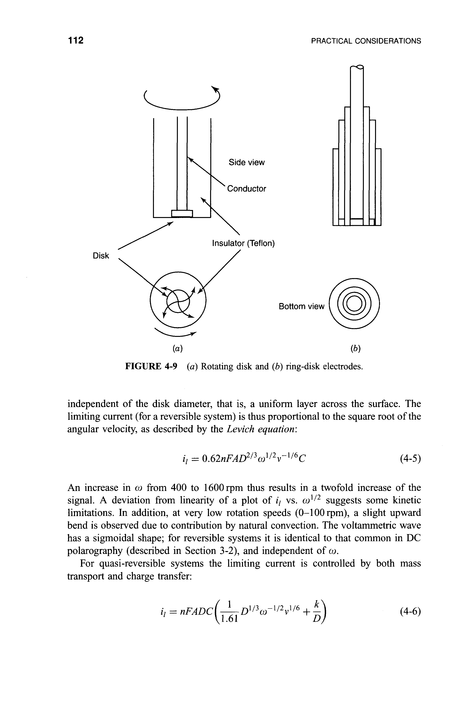

## Page 132

4-5 
WORKING ELECTRODES 
113
where k is the specific heterogeneous rate constant. In the limit of purely kinetically
controlled process (k < 10~6ms~1) the current becomes independent of the
rotation speed:
i, = nFAkC 
(4-7)
Overall, the RDE provides an efficient and reproducible mass transport and hence
the analytical measurement can be made with high sensitivity and precision. Such
well-defined behavior greatly simplifies the interpretation of the measurement. The
convective nature of the electrode results also in very short response times. The
detection limits can be lowered via periodic changes in the rotation speed and
isolation of small mass transport-dependent currents from simultaneously flowing
surface-controlled background currents. Sinusoidal or square-wave modulations of
the rotation speed are particularly attractive for this task. The rotation-speed
dependence of the limiting current (equation 4-5) can also be used for calculating
the diffusion coefficient or the surface area. Further details on the RDE can be found
in Adam's book (17).
An extension of the RDE involves an addition of a concentric-ring electrode
surrounding the disk (and separated from it by a small insulating gap) (19). The
resulting rotating ring-disk electrode (RRDE), shown in Figure 4-9b, has been
extremely useful for elucidating various electrode mechanisms (through generation
and detection reactions at the disk and ring, respectively). Because of the electrode
rotation, the product of the disk reaction is hydrodynamically transported across the
insulating gap toward the ring where it can be detected. Such "collection"
experiments rely on measurements of the collection efficiency (TV), which is the
ratio of the ring and disk currents:
N = -iR/iD 
(4-8)
and corresponds to the fraction of the species generated at the disk that is detected at
the ring. (The negative sign arises from the fact that the currents pass in opposite
directions.) Hence, the "collection" current is proportional to the "generation"
current. The value of N reflects the dimensions of the electrodes and the gap. Such
experiments are particularly useful for detecting short-lived intermediate species,
generated at the disk and consumed before reaching the ring (i.e., EC mechanism).
Such consumption during the disk-to-ring transition time results in current ratios
smaller than the "geometric" TV. The RRDE has also been useful for studying ion
transport (doping/undoping) in conducting polymer films.
4-5.2.2 Carbon Electrodes 
Solid electrodes based on carbon are currently in
widespread use in electroanalysis, primarily because of their broad potential window,
low background current, rich surface chemistry, low cost, chemical inertness, and
suitability for various sensing and detection applications. In contrast, electron-
transfer rates observed at carbon surfaces are often slower than those observed at
metal electrodes. The electron-transfer reactivity is strongly affected by the origin

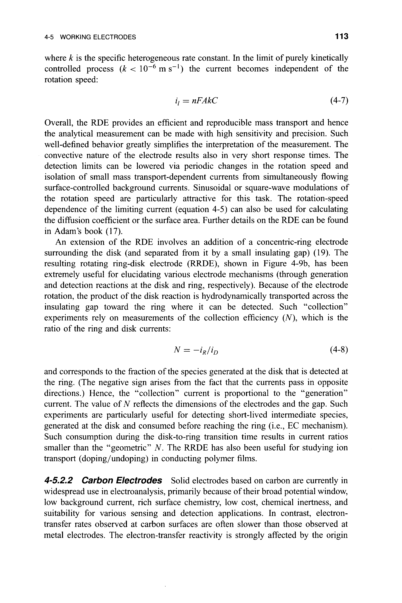

## Page 133

114
PRACTICAL CONSIDERATIONS
and history of the carbon surface (20,21). While all common carbon electrode
materials share the basic structure of a six-membered aromatic ring and sp2 bonding,
they differ in the relative density of the edge and basal planes at their surfaces. The
edge orientation is more reactive than the graphite basal plane toward electron
transfer and adsorption. Materials with different edge-to-basal plane ratios thus
display different electron-transfer kinetics for a given redox analyte. The edge
orientation also displays undesirably high background contributions. A variety of
electrode pretreatment procedures have been proposed to increase the electron-
transfer rates. The type of carbon, as well as the pretreatment method, thus has a
profound effect upon the analytical performance. The most popular carbon electrode
materials are those involving glassy carbon, carbon paste, carbon fiber, screen-
printed carbon strips, carbon films, or other carbon composites (e.g., graphite epoxy,
wax-impregnated graphite, Kelgraf). The properties of different types of carbon
electrodes are discussed below.
4-5.2.2.1 Glassy-Carbon Electrodes Glassy (or "vitreous") carbon has been
very popular because of its excellent mechanical and electrical properties, wide
potential window, chemical inertness (solvent resistance), and relatively reproducible
performance. The material is prepared by means of a carefully controlled heating
program of a premodeled polymeric (phenol-formaldehyde) resin body in an inert
atmosphere (22). The carbonization process is carried out very slowly over the 300-
1200°C temperature range to insure the elimination of oxygen, nitrogen, and
hydrogen. The structure of glassy carbon involves thin, tangled ribbons of cross-
linked graphite-like sheets. Because of its high density and small pore size, no
impregnating procedure is required. However, a surface pretreatment is usually
employed to create active and reproducible glassy-carbon electrodes and to enhance
their analytical performance (18,23). Such pretreatment is usually achieved by
polishing (to a shiny "mirror-like" appearance) with successively smaller alumina
particles (down to 0.05 uin) on a polishing cloth. The electrode should then be rinsed
with deionized water before use. Additional activation steps, such as electrochemi-
cal, chemical, heat, or laser treatments, have also been used to enhance the
performance. The improved electron-transfer reactivity has been attributed to the
removal of surface contaminants, exposure of fresh carbon edges, and an increase in
the density of surface oxygen groups (which act as interfacial surface mediators).
Several reviews provide more information on the physical and electrochemical
properties of glassy-carbon electrodes (20,24).
A similar, but highly porous, vitreous carbon material—reticulated vitreous
carbon (RVC)—has found widespread application for flow analysis and spectro-
electrochemistry (25). As shown in Figure 4-10, RVC is an open-pore ("sponge-
like") material; such a network combines the electrochemical properties of glassy
carbon with many structural and hydrodynamic advantages. These include a very
high surface area (~ 66 cm2 cm~3 for the 100-ppi grade), 90-97% void volume, and
a low resistance to fluid flow.

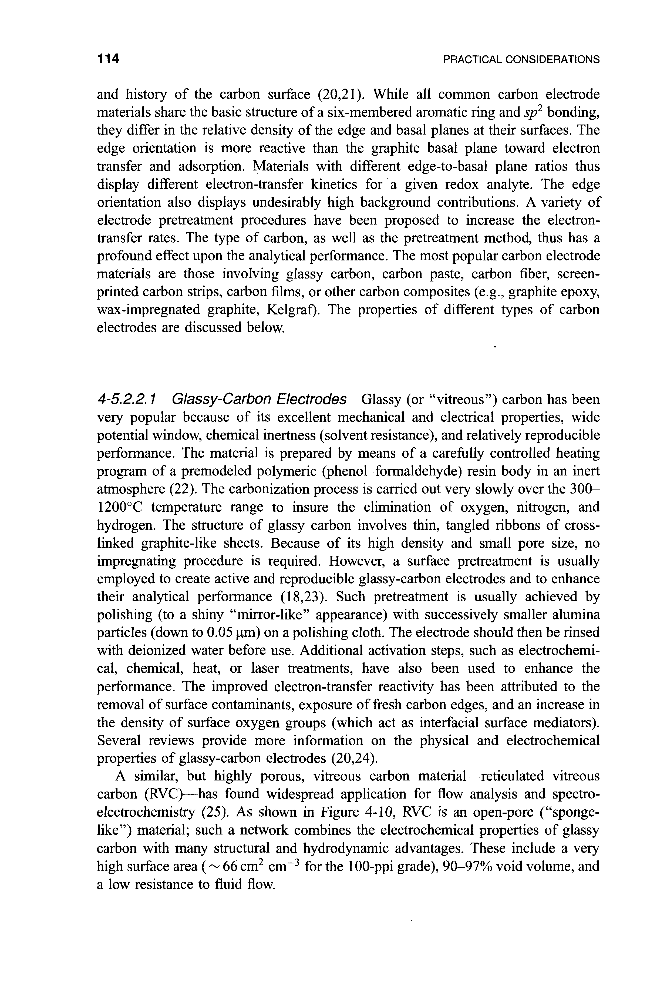

## Page 134

4-5 WORKING ELECTRODES 
115
FIGURE 4-10 
The open-pore structure of reticulated vitreous carbon.
4-5.2.2.2 Carbon-Paste Electrodes 
Carbon-paste electrodes, which use
graphite powder mixed with various water-immiscible organic binders (pasting
liquids), offer an easily renewable and modified surface, low cost, and very low
background current contributions (26-28). A wide choice of pasting liquids is
possible, but practical considerations of low volatility, purity, and economy narrow
the choice to a few. These include Nujol (mineral oil), paraffin oil, silicone grease,
and bromonaphthalene. The first appears to perform the best. The paste composition
strongly affects the electrode reactivity, with increase in the pasting-liquid content
decreasing electron-transfer rates, as well as the background-current contributions
(28). In the absence of pasting liquid, the dry graphite electrode yields very rapid
electron-transfer rates (approaching those of metallic surfaces). Despite their
growing popularity, the exact behavior of carbon-paste electrodes is not fully
understood. It is possible that some of the electrochemistry observed at these
electrodes involves permeation of the pasting liquid layer by the electroactive
species (i.e., solvent extraction). Carbon paste represents a convenient matrix for
the incorporation of appropriate modifying moieties (29). The modifier is simply
mixed together with the graphite/binder paste (with no need to devise individualized
attachment schemes for each modifier). Enzyme-containing carbon pastes have been
used as fast-responding reagentless biosensors (see Chapter 6). A disadvantage of
carbon pastes is the tendency of the organic binder to dissolve in solutions
containing an appreciable fraction of organic solvent.
4-5.2.2.3 Carbon-Fiber Electrodes The growing interest in ultramicroelec-
trodes (Section 4-5.4) has led to widespread use of carbon fibers in electroanalysis.
Such materials are produced, mainly in connection with the preparation of high-
strength composites, by high-temperature pyrolysis of polymer textiles or via

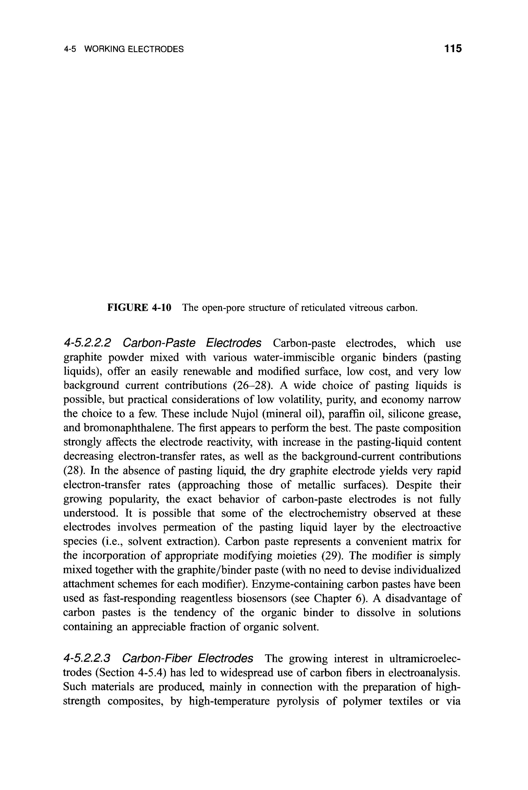

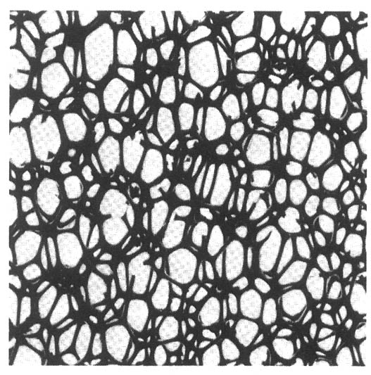

## Page 135

116
PRACTICAL CONSIDERATIONS
catalytic chemical vapor deposition. Different carbon fiber micro structures are
available, depending upon the manufacturing process. They can be classified into
three broad categories, namely, low-, medium-, and high-modulus types. The last
type is most suitable for electrochemical studies because of its well-ordered
graphite-like structure and low porosity (30). Improved electron transfer perfor-
mance can be achieved by various electrode pretreatments, particularly "mild" and
"strong" electrochemical activations, or heat treatment (31). Most electroanalytical
applications rely on fibers of 5-20 um diameter that provide the desired radial
diffusion. Such fibers are typically mounted at the tip of a pulled glass capillary with
epoxy adhesive, and are used in cylindrical or disk configurations. Precautions
should be taken not to contaminate the carbon surface with the epoxy. The main
advantage of carbon-fiber microelectrodes is their small size (5-30 um diameter for
commercially available fibers), which makes, them very attractive for anodic
measurements in various microenvironments—for example, the detection of neuro-
transmitter release in the extracellular space of the brain. Nanometer-sized carbon
fibers can be prepared by etching the fiber in flame or under ion beam (e.g., Figure 4-
11). The various electroanalytical applications of carbon fibers have been reviewed
by Edmonds (32).
200 nm
FIGURE 4-11 
Scanning electron image of a carbon-fiber electrode.

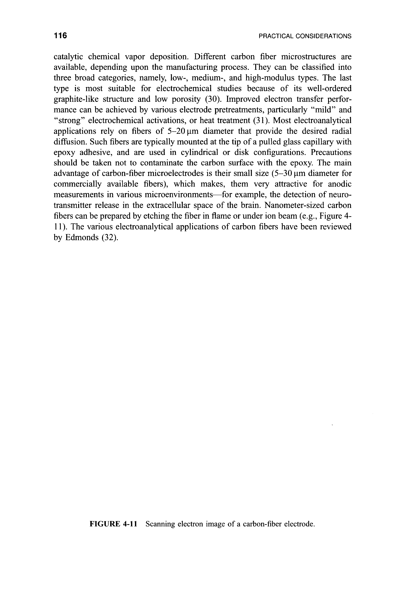

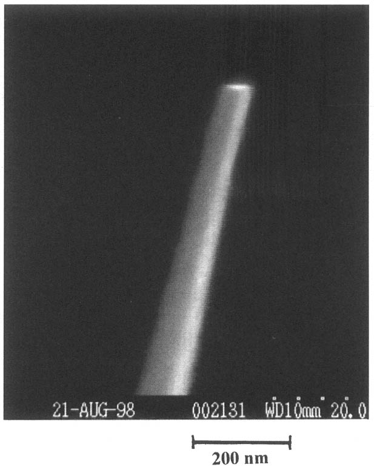

## Page 136

4-5 WORKING ELECTRODES
117
4-5.2.3 Metal Electrodes 
While a wide choice of noble metals is available,
platinum and gold are the most widely used metallic electrodes. Such electrodes
offer a very favorable electron-transfer kinetics and a large anodic potential range. In
contrast, the low hydrogen overvoltage at these electrode limits the cathodic
potential window (to the — 0.2 to —0.5V region, depending upon the pH). More
problematic are the high background currents associated with the formation of
surface-oxide or adsorbed hydrogen layers (e.g., Figure 4-12). Such films can also
strongly alter the kinetics of the electrode reaction, leading to irreproducible data.
These difficulties can be addressed with a pulse potential (cleaning/reactivation)
cycle, as common in flow amperometry (34). The surface layers problem is less
severe in nonaqueous media where noble metals are often an ideal choice. Compared
to platinum electrodes, gold ones are more inert, and hence are less prone to the
formation of stable oxide films or surface contamination. Gold electrodes are also
widely used as substrates for self-assembled organosulfur monolayers or for
stripping measurements of trace metals (Sections 4-5.3 and 3.5). Other metals,
such as copper, nickel, or silver have been used as electrode materials in connection
with specific applications, such as the detection of amino acids or carbohydrates in
BROAD
REGION
1.5
1.0
Qo
'/QH
0.5
1.0 
1.2
Potential (V)
Figure 4-12 
Current-potential curve for a platinum electrode in 0.5 M H2SO4. Regions of
oxide formation (Q^) and reduction (Qc) as well as formation, of hydrogen (Hc) and its
oxidation (H^) are indicated. (Reproduced with permission from reference 33.)

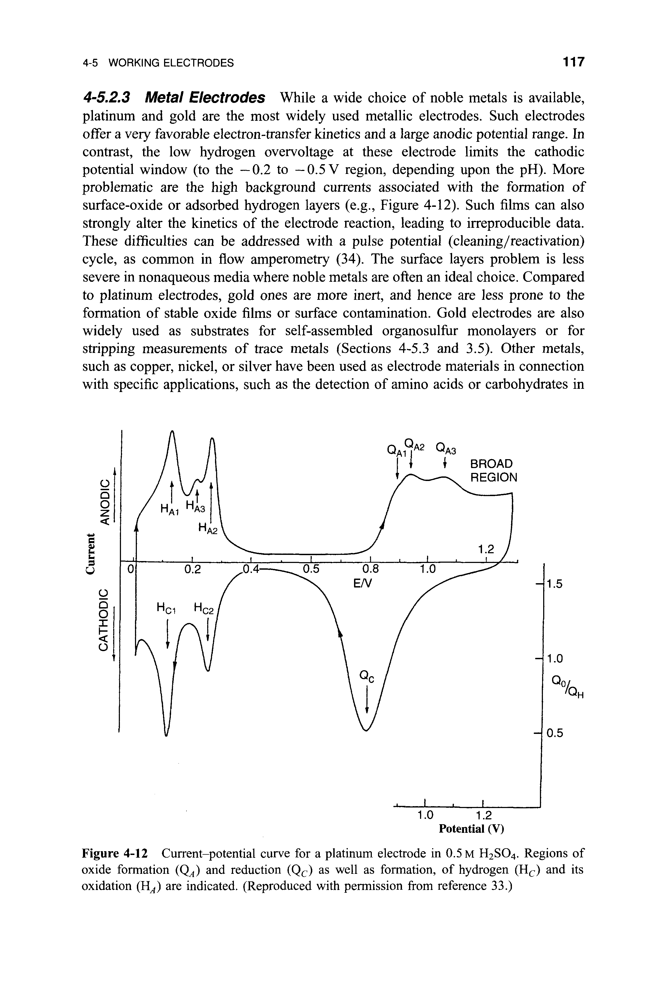

## Page 137

118 
PRACTICAL CONSIDERATIONS
alkaline medium (copper and nickel) and of cyanide or sulfur compounds (silver).
Unlike platinum or gold electrodes, the copper electrode offers a stable response for
carbohydrates at constant potential.
4-5.3 
Chemically Modified Electrodes
Chemically modified electrodes (CMEs) represent a modem approach to electrode
systems. These rely on the placement of a reagent onto the surface, to impart the
behavior of that reagent to the modified surface. Such deliberate alteration of
electrode surfaces can thus meet the needs of many electroanalytical problems,
and may form the basis for new analytical applications and different sensing devices.
There are various ways in which CMEs can benefit analytical applications. These
include acceleration of electron-transfer reactions, preferential accumulation, or
selective membrane permeation. Such steps can impart higher selectivity, sensitivity,
or stability to electrochemical devices. These analytical applications and improve-
ments have been extensively reviewed (35-37). Many other important applications,
including electrochromic display devices, controlled release of drugs, electrosynth-
esis, and corrosion protection, should also benefit from the rational design of
electrode surfaces.
One of the most common approaches for incorporating a modifier onto the
surface has been coverage with an appropriate polymer film. Polymer modified
electrodes are often prepared by casting a solution containing the dissolved polymer
onto the surface and allowing the solvent to evaporate, or via electropolymerization
in the presence of the dissolved monomer. The latter offers precise control of the film
thickness (and often the morphology) and is particularly attractive in connection
with miniaturized sensor surfaces. The structures of some common polymeric
coatings are shown in Figure 4-13. For example, the Dupont Nafion perfluorinated
sulfonated cation exchanger (a) has been widely used as an electrode modifier due to
its attractive permselective, ion-exchange, and antifouling properties (see examples
below). Additional advantages can be obtained by coupling two (or more) polymers
in a mixed or multilayer configuration. Other useful modification schemes include
bulk modification of composite carbon materials, covalent (chemical) attachment,
sol-gel encapsulation, physical adsorption, and spontaneous chemisorption.
4-5.3.1 Self-Assembled Monolayers 
Spontaneously adsorbed monolayers
of n-alkanethiols (X(CH2)nSH with n > 10) on gold surfaces, based on the strong
interaction between gold and sulfur, are particularly well-suited for controlling and
manipulating the reactivity at the interface. Such monolayers are commonly formed
by immersing the gold electrode overnight in ethanolic solutions containing
millimolar concentrations of the alkanethiol. The formation of self-assembled
organosulfur monolayers (SAMs) has attracted considerable attention due to its
many potential scientific and technological applications (38^40). In addition to
fundamental studies on the structure of such monolayers and long-range electron
transfer, such applications include chemical sensors and biosensors, information
storage devices, or lithography.

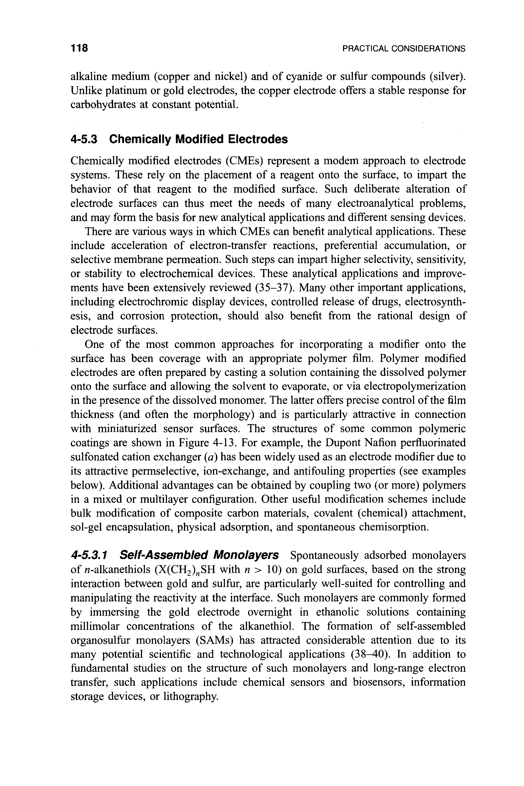

## Page 138

4-5 WORKING ELECTRODES
119
-KCF2 -
CF - CF2
CF2
CF-CF3
O - CF2CF2SO3H
•CH2- CH
FIGURE 4-13 Structures of common polymeric coatings: (a) Nation, (b) polyvinyllferro-
cene; (c) polyvinylpyridine; (d) polypyrrole.
Cleavage of the S-H bond is central to this monolayer formation:
RSH + Au ^ RS-Au + e~ + H+
(4-9)
Van-der Waals forces between the methylene groups orient the monolayer. Such a
self-assembly process thus results in well-organized and stable monolayers, with the
hydrocarbon tails packed parallel to each other, tilted at ~ 30° relative to the surface
normal (Figure 4-14). The closely-packed pinhole-free films (surface coverage of
~9 x 10~10mol cm~2) block transport of species to the underlying gold surface.
The packing and order are influenced by factors such as the chain length, nature of
the end group, nature of the solvent, immersion time, and substrate morphology.
Increasingly disordered structures with lower packing density and coverage are
observed upon decreasing the chain length (n < 10). These and other structural
disorders and defects (e.g., pinholes) often lead to degraded performance. Coas-
sembled monolayers, formed from mixtures of alkanethiols, can offer compositional

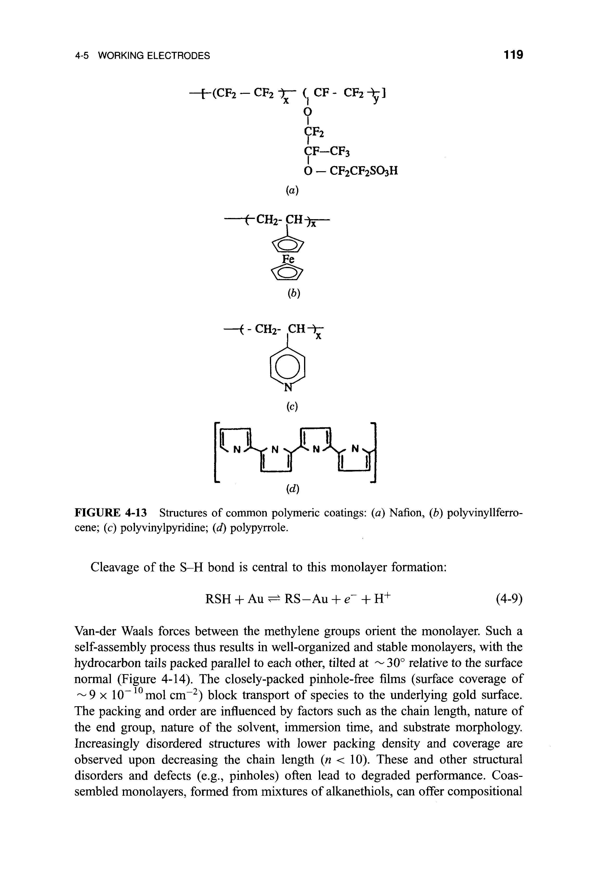

## Page 139

120
PRACTICAL CONSIDERATIONS
Liquid
Substrate
1
End group
Organic chain
Head group
FIGURE 4-14 
Formation of a self-assembled monolayer at a gold sustrate. (Reproduced
with permission from reference 38.)
and topographical variations in the film architecture. The novelty of using SAMs
stems from their ability to be further modified into chemically or biologically
reactive surface layers (via covalent coupling of different materials to the functional
end group, X). This use of SAMs for anchoring various functionalities can impart
specific interactions essential for various sensing applications (see Chapter 6). These
applications can benefit from the use of mixed SAMs that minimize steric hindrance
effects. The high degree of order has also allowed detailed structure-function
relationships to be developed for various electron-transfer processes. Other highly
ordered films, such as of alkyl siloxane, can be formed on metal oxide surfaces
(particularly SiO2).
4-5.3.2 Sol-Gel Encapsulation of Reactive Species 
Another new and
attractive route for tailoring electrode surfaces involves the low-temperature encap-
sulation of recognition species within sol-gel films (41,42). Such ceramic films are
prepared by the hydrolysis of an alkoxide precursor such as, Si(OCH3)4 under acidic
or basic condensation, followed by polycondensation of the hydroxylated monomer
to form a three-dimensional interconnected porous network. The resulting porous
glass-like material can physically retain the desired modifier but permits its
interaction with the analyte -that diffuses into the matrix. Besides their ability to
entrap the modifier, sol-gel processes offer tunability of the physical characteristics

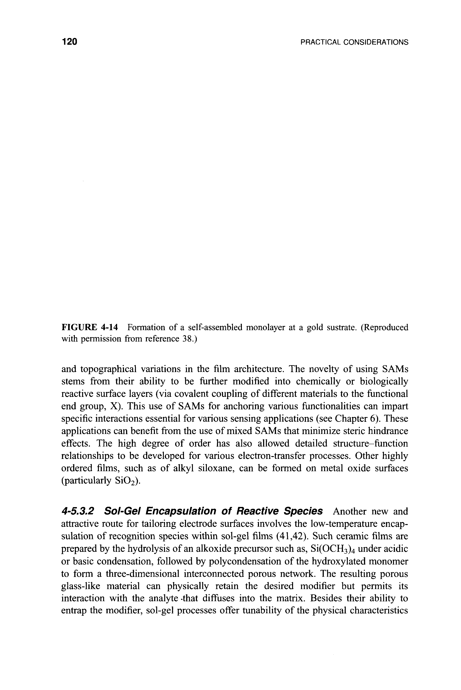

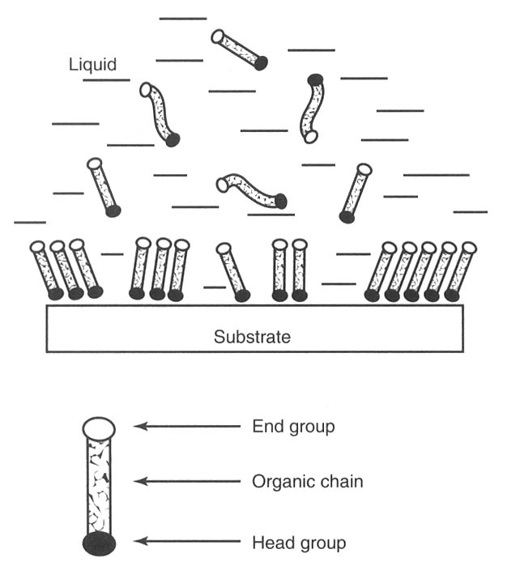

## Page 140

4-5 WORKING ELECTRODES 
121
(e.g., porosity), thermal stability, and mechanical rigidity. Sol-gel-derived composite
electrodes have also been prepared by dispersing carbon or gold powders in the
initial sol-gel mixture (43,44).
4-5.3.3 Electrocatalytic Modified Electrodes 
Often the desired redox
reaction at the bare electrode involves slow electron-transfer kinetics and therefore
occurs at an appreciable rate only at potentials substantially higher than its
thermodynamic redox potential. Such reactions can be catalyzed by attaching to
the surface a suitable electron transfer mediator (45,46). Knowledge of homoge-
neous solution kinetics is often used to select the surface-bound catalyst. The
function of the mediator is to facilitate the charge transfer between the analyte and
the electrode. In most cases the mediated reaction sequence (e.g., for a reduction
process) can be described by
Mox + «£T^Mred 
(4-10)
Mred + Aox^Mox + Ared 
(4-11)
where M represents the mediator and A the analyte. Hence, the electron transfer
takes place between the electrode and mediator and not directly between the
electrode and analyte. The active form of the catalyst is electrochemically regener-
ated. The net results of this electron shuttling are a lowering of the overvoltage to the
formal potential of the mediator and an increase in current density. The efficiency of
the electrocatalytic process also depends upon the actual distance between the bound
redox site and the surface (since the electron-transfer rate decreases exponentially
when the electron-tunneling distance is increased).
The improvements in sensitivity and selectivity that accrue from electrocatalytic
CMEs have been illustrated for numerous analytical problems, including the
biosensing of dihydronicotinamide-adenine dinucleotide (NADH) at a Meldola-
Blue coated electrode (47), the liquid-chromatographic amperometric detection of
thiols at cobalt-phthalcocyanine-coated electrodes (48), detection of nitric oxide
release from a single cell by a porphyrin-based microsensor (49), and flow-injection
measurements of carbohydrates at ruthenium dioxide containing carbon-paste
detectors (50). Cyclic voltammograms for various carbohydrates at the ruthenium
dioxide carbon-paste electrodes are shown in Figure 4-15. As expected for redox
mediation, the peaks of the surface-bound ruthenium species (dotted lines) increase
upon addition of the carbohydrate analytes (solid lines). Figure 4-16 illustrates the
electrocatalytic scheme involved in the detection of NADH. The implications of this
scheme for various biosensors are discussed in Section 6-1.
4-5.3.4 Preconcentrating Electrodes 
Preconcentrating CMEs, with sur-
faces designed for reacting and binding of target analytes, hold great promise for
chemical sensing (51-54). The concept is analogous to stripping voltammetric
schemes, with the target analyte being preferentially partitioned from the dilute
sample into the preconcentrating surface layer, and subsequently being reduced or

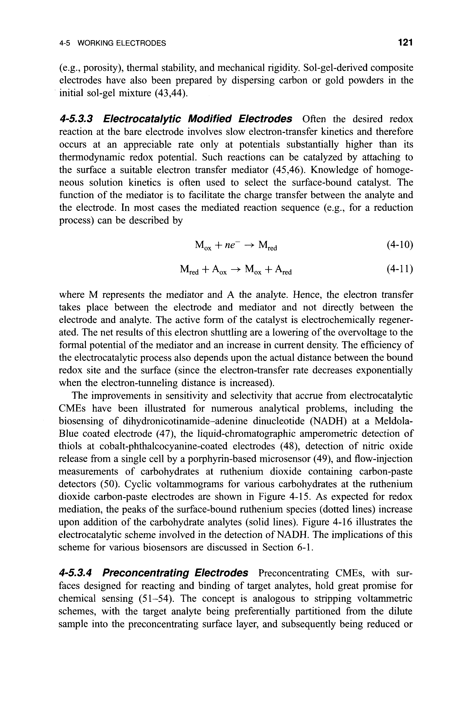

## Page 141

122
PRACTICAL CONSIDERATIONS
0.6
O2
-O2 O.6
Potential (V)
O2
.02
-3,
FIGURE 4-15 Cyclic voltammograms for 1.5 x 10 
M ribose (a), glucose (b), galactose
(c), and fructose (d) recorded at a RuO2-modified carbon-paste electrode. Dotted lines were
obtained in carbohydrate-free solutions. (Reproduced with permission from reference 50.)
oxidized during a potential scan. Unlike conventional stripping procedures, the
preconcentration step is nonelectrolytic. Most preconcentrating CMEs employ
electrostatic binding or coordination reactions for collecting the analyte. Schemes
based on hydrophobic partition into a lipid coating or covalent reactions have also
been reported. The preconcentrating agent may be incorporated within the interior of
a carbon-paste matrix or via functionalized polymeric and alkanethiol films. For
example, as shown in Figure 4-17, ligand centers can covalently bind to a polymer
backbone on the electrode to effectively accumulate and measure target metals. The
major requirements for a successful analytical use of preconcentrating electrodes are
strong and selective binding, prevention of saturation, and convenient surface
regeneration. Following the accumulation, the electrode can be transferred to more
suitable solutions that facilitate the measurement and "cleaning" steps.
Practical examples of using preconcentrating CMEs include the use of a mixed
2,9-dimethyl-l,10-phenanthroline/carbon-paste electrode for trace measurements of
copper (55), the use of clay-containing carbon pastes for voltammetric measure-
ments of iron (56), the use of polyelectrolyte coatings for the uptake and
NAD+> 
xM r e dx 
^ \\ 
^ ^ ^ s
( 
) ( 
fc—•** 
2e^\\ electrode
VNADH ' ^ Mn^H+ \\V\\ \\
FIGURE 4-16 
Electrocatalytic detection of NADH.

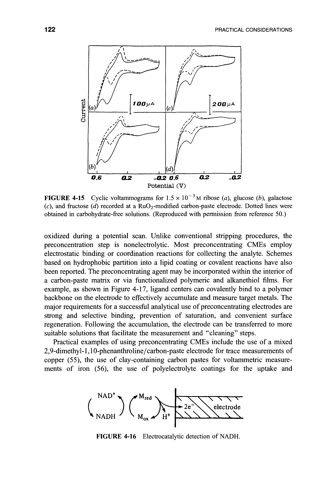

## Page 142

4-5 WORKING ELECTRODES
123
M(n-x)+
Red
FIGURE 4-17 Preconcentrating surfaces based on covalent binding of the ligand to a
polymer backbone. Q = charge; A = electrode area; F = surface coverage. (Reproduced with
permission from reference 52.)
voltammetry of multiply charged metal complexes (57,58), the use of surface-bound
crown ethers and cryptands for trace measurements of lead (59), ion-exchange
voltammetric measurements of lanthanide ions at a Nafion-coated electrode (60), the
collection of ultratrace cadmium onto mercaptocarboxylie-acid monolayers (61), and
the quantitation of nickel at porphyrin-coated electrodes (62).
4-5.3.5 Permselective Coatings Permselective coatings offer to bring
higher selectivity and stability to electrochemical devices. This is accomplished
by exclusion from the surface of unwanted matrix constituents, while allowing
transport of the target analyte. Different avenues for controlling the access to the
surface have been proposed, based on different transport mechanisms. These include
the use of size-exclusion poly(l,2-diaminobenzene) films (63), charge-exclusion
ionomeric Nafion coatings (64), hydrophobic lipid (65) or alkylthiols (66) layers, or
bifunctional (mixed) coatings (67). Such anti-interference membrane barriers offer
an effective separation step (in situ on the surface), and hence protect the surface
against adsorption of large macromolecules or minimize overlapping signals from
undesired electroactive interferences. For example, the poly(l,2-diaminobenzene)-
coated flow detector rapidly responds to the small hydrogen peroxide molecule, but
not to the larger ascorbic acid, uric acid, or cysteine species (Figure 4-18). Note also

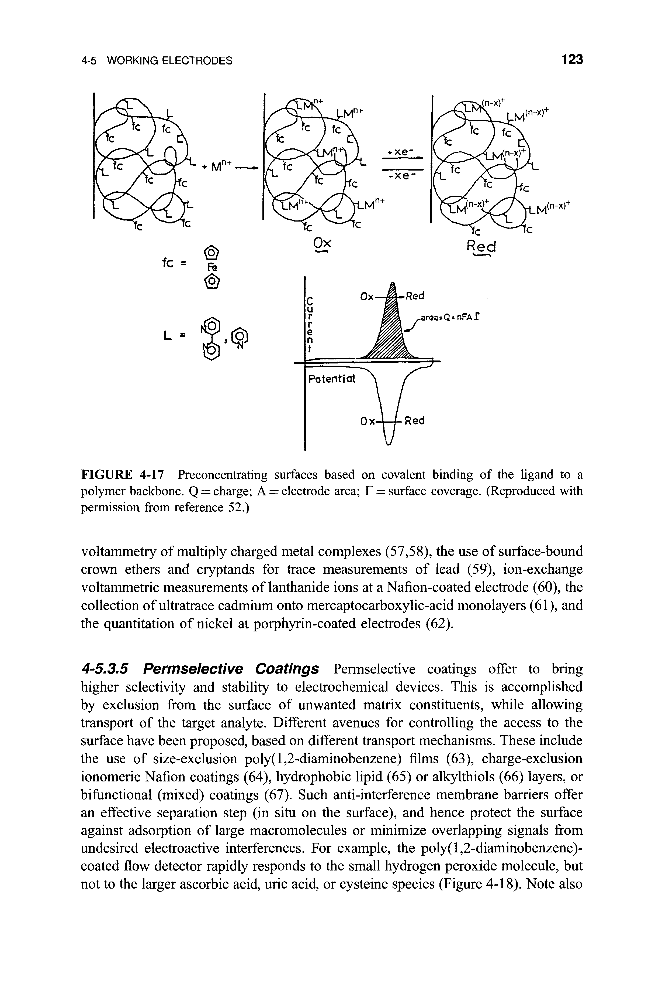

## Page 143

124
PRACTICAL CONSIDERATIONS
the protection from foulants present in the serum sample. Such size-exclusion
(sieving) properties are attributed to the morphology of electropolymerized films
(Figure 4-19). Similarly, Nafion-coated microelectrodes are often used for in-vivo
monitoring of cationic neurotransmitters (e.g., dopamine) in the presence of
otherwise interfering ascorbic acid (64). Such anionic interference is excluded
from the surface through electrostatic repulsion with the negatively charged
sulfonated groups (Figure 4-20). Examples of these and other discriminative films
are given in Table 4-2.
4-5.3.6 Conducting Polymers 
Electronically conducting polymers (such as
polypyrrole, polythiophene, and polyaniline) have attracted considerable attention
due to their ability to switch reversibly between the positively charged conductive
state and a neutral, essentially insulating, form and to incorporate and expel anionic
species (from and to the surrounding solution), upon oxidation or reduction:
P
+A
(4-12)
where P and A represent the polymer and the "dopant" anion, respectively. The
latter serves to maintain the electrical neutrality, that is, to counterbalance the
positive charge of the polymer backbone. The electrical conductivity of these films,
which originates from the electronic structure of their polymeric backbone (i.e.,
electron hopping involving the delocalized n electrons), thus varies with the applied
potential. The structure of common conducting polymers, and their conductivity
ranges (from the undoped to doped states) are displayed in Figure 4-21. The redox
25 JJA
2OO
Time (sec)
FIGURE 4-18 Permselective coatings: flow injection response of a poly(l,2-diaminoben-
zene)-coated electrode to the following: a, hydrogen peroxide (1 mM); b, ascorbic acid (1 mM);
c, uric acid (1 mM); d, L-cysteine (1 mM); and e, control human serum. (Reproduced with
permission from reference 63.)

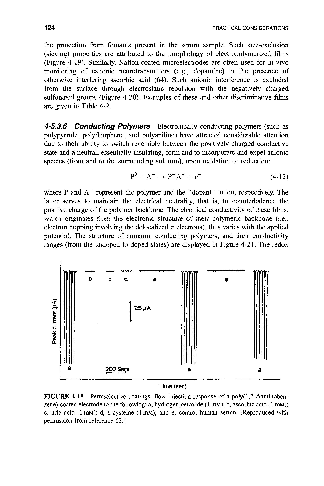

## Page 144

4-5 WORKING ELECTRODES
125
FIGURE 4-19 
Scanning electron micrograph of a polyaniline-coated electrode.
FIGURE 4-20 
Use of negatively charged polymeric films for excluding anionic interfer-
ences.

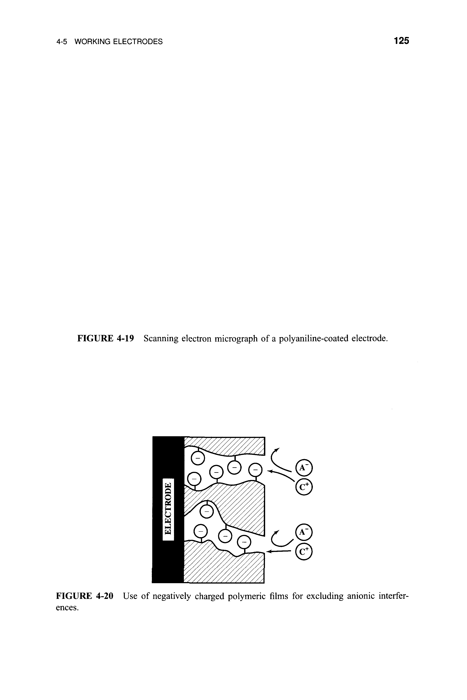

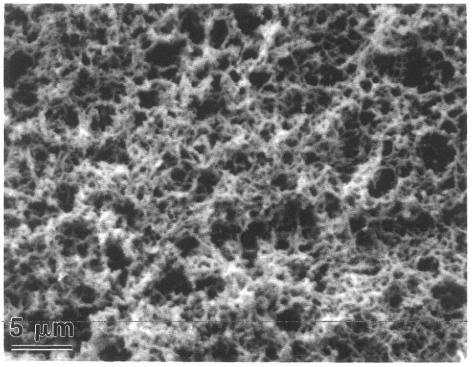

## Page 145

126
PRACTICAL CONSIDERATIONS
TABLE 4-2 Commonly Used Membrane Barriers
Transport Mechanism
Membrane Barrier
Reference
Size exclusion
Hydrophobic barriers
Charge exclusion
Mixed control
Cellulose acetate
Poly( 1 ,2-diaminobenzene)
Polyphenol
Phospholipid
Self-assembled thiols
Nafion
Poly(ester-sulfonic acid)
Self-assembled thioctic acid
Cellulose acetate/Nafion
68
63
69
65
66
64
70
71
67
changes (equation 4-12) are not localized at a specific center, but rather delocalized
over a number of conducting polymer groups.
These polymers are readily prepared by in-situ electropolymerization (from the
monomer solution). The oxidation of the monomer proceeds according to
yfl
+
•A
(4-13)
X=NH (polypyrrole)
S (polythiophene)
O (polyfuran)
Often the first step in the electropolymerization process is the electrooxidative
formation of a radical cation from the starting monomer. This step is commonly
followed by a dimerization process, followed by further oxidation and coupling
reactions. Well-adhered films can thus be formed on the surface in galvanostatic,
potentiostatic, or multi scan experiments. The behavior of electropolymerized films
can be controlled by the polymerization conditions, including the electrolyte
(particularly the nature and level of the anion serving as the dopant), solvent,
monomer concentration, applied potential or current, and duration. The dynamics of
the redox switching reaction (equation 4-12) strongly depend upon the ionic fluxes
that accompany the process. The tight entrapment of large anionic dopants (e.g.,
polyelectrolytes) precludes their removal from the film, and hence the charge
compensation is dominated by the movement of a "pseudo-dopant" cation.
Changes in the polymer properties can be induced by attaching various chemical
or biological functionalities to the monomer prior to polymerization. It is possible
also to impart molecular recognition or electrocatalytic action via the incorporation
of functional dopants (e.g., complexing agents or an electron-transfer mediator).
Hence, conducting polymers can act as efficient molecular interfaces between
recognition elements and electrode transducers. The unique physical and chemical

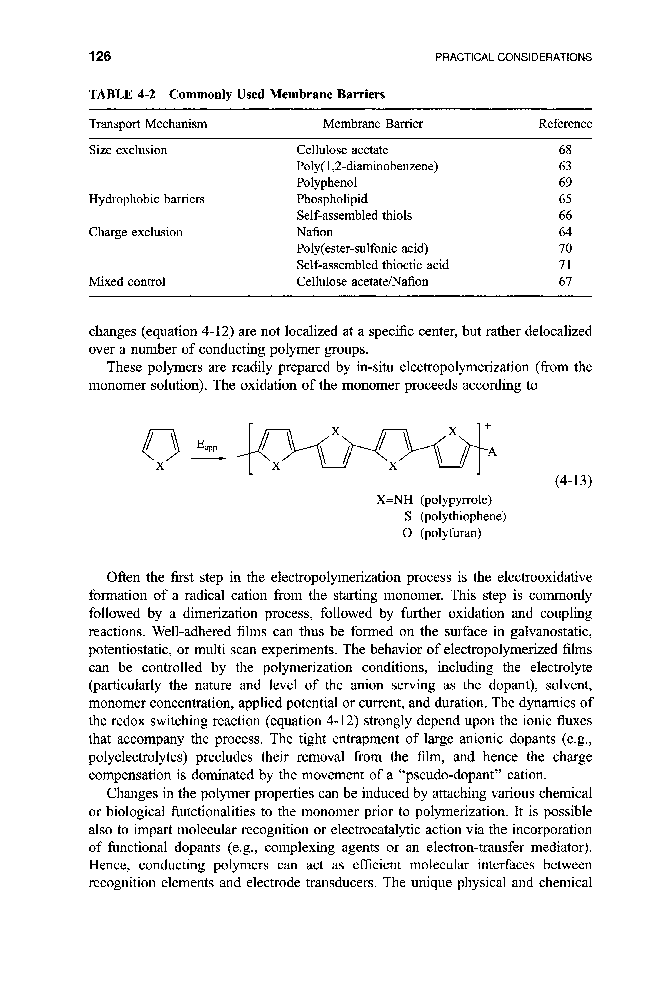

## Page 146

4-5 WORKING ELECTRODES
127
Copper _i>.
Iron — •-
Bismuth — -
Doped 
!•
Germanium 
\
L
Silicon —
Polyethylene — •-
Nylon — —
rio6 
Poiy 
po|yac
'p-phenylene)
•IO4 
t
r-L— k .
•id2
•i
-io-2
•icr*
.JQ-6 
^
ru
i (p-ph
suifi
i
r\
f\O/^X 
_
•10*8
-10-10
tn-12
•10 *^
•10'14
•y
snylene
de)
i
etylene
PolythioDhene
Polypy
j
Polyaniline
(C=C)X ;
1
i
rrole j
L
iff"
K^:T
i
h^V^w '
rr.H^N~
KQ/^5^
f
.10-16 
PPP 
1
i
P/
i i *
H
i
i
PPy
l
,
•^x
r
PTh
\H\
PPS
•10-18
a (ohm*1 cm'1)
FIGURE 4-21 Conductivity range of common conducting polymers, along with their
chemical structure. (Reproduced with permission from reference 72.)
properties of conducting polymers, and particularly the controllable and dramatic
change in electrical conductivity and rapid exchange of the doping ion, offer diverse
electrochemical applications, including batteries, fuel cells, corrosion protection, or
chemical sensing (73). The latter include amperometric flow detection of none-
lectroactive ions, solid-state gas sensing, entrapment/attachment and stabilization of
biological entities, direct monitoring of biological interactions (e.g., DNA hybridiza-
tion), electrochemical control of membrane permeability, sensor arrays based on
multiple films, new potentiometric recognition of ions, preconcentration/stripping of
trace metals, and controlled release of chemicals. For example, Figure 4-22 shows
typical flow injection peaks for submillimolar concentrations of carbonate ions
(utilizing the doping-updoping of the polypyrrole-based detector). Such anodic
FIGURE 4-22 Typical response of polypyrrole detector to carbonate (S^ 1 x 10 4M;
S2, 2.5 x 10~4M; S3, 5 x 10~4M) based on the doping-undoping process. (Reproduced
with permission from reference 74.)

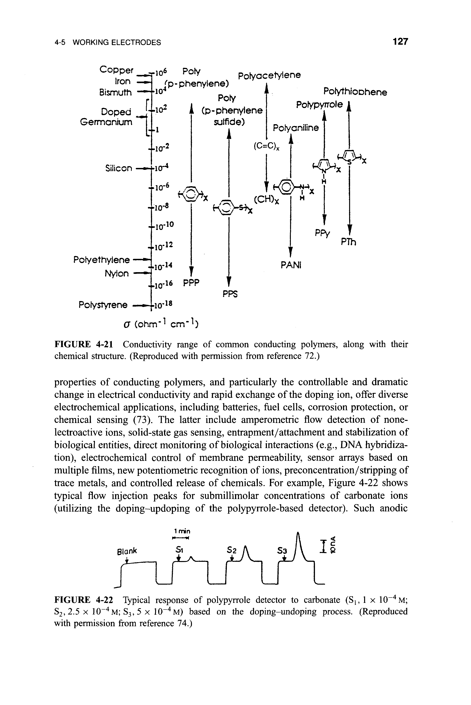

## Page 147

128
PRACTICAL CONSIDERATIONS
peaks reflect the passage of the carbonate anions [which are capable of penetrating
into the film, equation (4-12)] over the surface. These and other analytical
opportunities have been reviewed by Ivaska (75), Wallace (76), and Bidan (72).
The widespread use of polypyrrole is attributed to its electropolymerization from
aqueous media at neutral pH (which allows the entrapment of a wide range of
dopants). Other films are more limited in this regard. For example, thiophene is
soluble only in organic solvents, and aniline in acidic media. The electropolymer-
ization growth can also lead to nonconducting, self-limiting films, which are often
used as permselective/protective layers (Section 4-5.3.5) or for the physical
entrapment of biomolecules (Chapter 6).
4-5.4 
Microelectrodes
Miniaturization is a growing trend in the field of analytical chemistry. The
miniaturization of working electrodes not only has obvious practical advantages,
but also opens some fundamentally new possibilities (77-79). The term "micro-
electrode" is reserved here for electrodes with at least one dimension not greater
than 25 jim.
Such dimensions offer obvious analytical advantages, including the exploration
of microscopic domains, measurements of local concentration profiles, detection in
microflow systems or within very narrow electrophoresis capillaries, and analysis of
very small (microliter) sample volumes. Particularly fascinating are recent studies
aimed at time-resolved probing of dynamic processes (e.g., secretion of chemical
messengers) in single cells (80), the in-vivo monitoring of neurochemical events
(e.g., stimulated dopamine release), and the use of nanoscopic electrode tips for
single molecule detection (81) or high-resolution spatial characterization of surfaces
(see Section 2-3). Figure 4-23 illustrates the use of a carbon-fiber microelectrode for
measuring the vesicular release of dopamine following cellular stimulation.
CARBON FIBER
ELECTRODE
STIMULATION
PIPETTE
CELL BODY
FIGURE 4-23 Experimental setup for monitoring dopamine release by exocytosis, from a
cell body. The microelectrode and glass capillary (containing the chemical stimulant) are
micromanipulated up to the cell body. (Reproduced with permission from reference 82.)

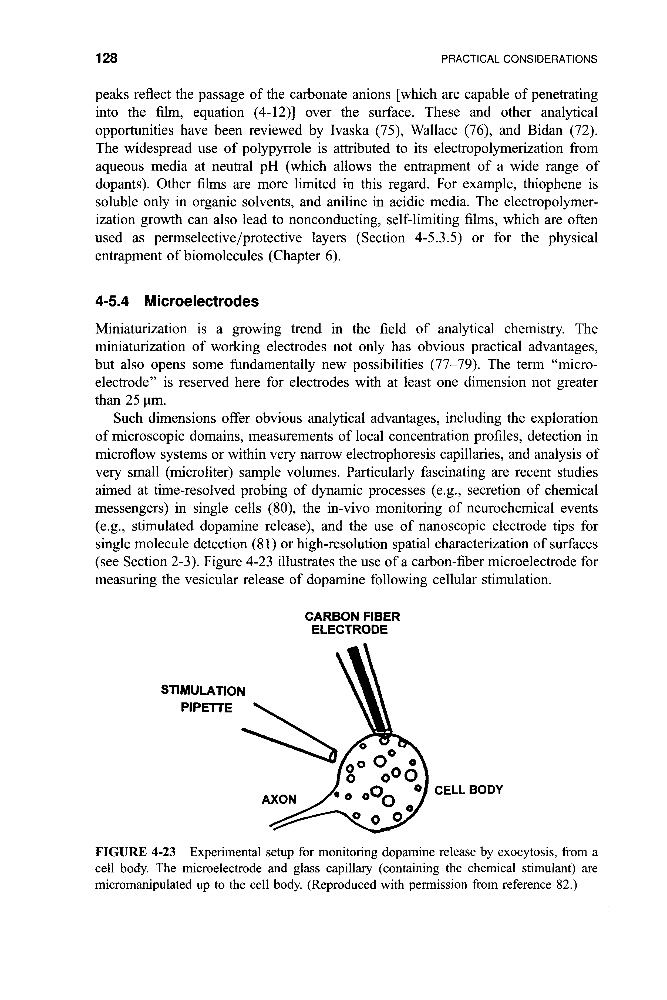

## Page 148

4-5 WORKING ELECTRODES 
129
Microelectrodes exhibit several other attractive and important properties that have
expanded the possibilities of electrochemistry:
• Because of the very small total currents at microelectrodes, it is possible to
work in highly resistive solutions that would develop large ohmic (//?) drops
with conventional electrodes. The decreased ohmic distortions allow electro-
chemical measurements to be made in new and unique chemical environments
that are not amenable to macroscopic electrodes. Microelectrode experiments
have thus been reported in low-dielectric solvents (e.g., benzene, toluene),
frozen acetonitrile, low-temperature glasses, gaseous and solid phases, super-
critical carbon dioxide, ionically conductive polymers, oil-based lubricants,
and milk. In addition, more traditional systems can be studied with little or no
deliberately added supporting electrolyte, and with two-electrode systems. The
use of electrolyte-free organic media can greatly extend the electrochemical
potential window, thus allowing studies of species with very high oxidation
potentials. Acetonitrile, for example, can be used to about 4 V (versus a silver
reference electrode), making possible studies of short-chain alkanes.
• The greatly reduced double-layer capacitance of microelectrodes, associated
with their small area, results in electrochemical cells with small RC time
constants. For example, for a microdisk the RC time constant is proportional to
the radius of the electrode. The small RC constants allow high-speed voltam-
metric experiments to be performed on the microsecond time scale (scan rates
higher than 106 V s"1) and hence to probe the kinetics of very fast electron-
transfer and coupling-chemical reactions (83), or the dynamic of processes
such as exocytosis (e.g., Figure 4-23). More discussion of such high-speed
experiments is given in Section 2-1.
• Enhanced rates of mass transport of electroactive species accrue from the radial
(nonplanar) diffusion to the edges of microelectrodes. Such "edge effects"
contribute significantly to the overall diffusion current. The rate of mass
transport to and from the electrode (and hence the current density) increases
as the electrode size decreases. As a consequence of the increase in mass-
transport rates and the reduced charging currents, microelectrodes exhibit
excellent signal-to-background characteristics in comparison to their larger
counterparts. In addition, steady-state or quasi-steady-state currents are rapidly
attained, and the contribution of convective transport is negligible. The fact that
redox reactions that are limited by mass transport at macroscopic electrodes
become limited by the rate of electron transfer can also benefit many kinetic
studies.
4-5.4.1 
Diffusion at Microelectrodes 
The total diffusion-limited current is
composed of the planar flux and radial flux diffusion components:
*total — 'planar + Radial 
(4-14)

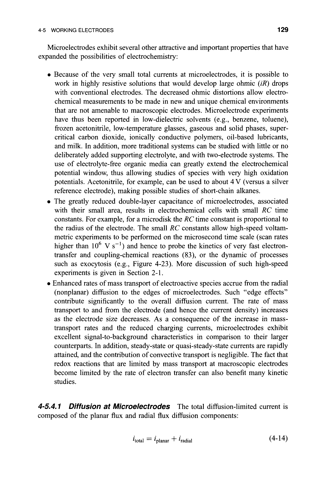

## Page 149

130
PRACTICAL CONSIDERATIONS
For disk, spherical, and hemispherical geometries, the general expression for the
radial component in equation (4-14) is given by
'radial = arnFDC
(4-15)
where r is the electrode radius and a is a function of the electrode geometry. For
disks, spheres, and hemispheres the a values are equal to 4, 4n, and 2n, respectively.
Such radial diffusion leads to a larger flux at the perimeter of the electrode than at
the center, and hence to a nonuniform current density.
The extent to which the planar or radial component dominates depends on the
relative dimensions of the electrode and the diffusion layer, as expressed by the
dimensionless parameter Dt/r^ where t is the electrolysis time and rQ is the smallest
dimension of the electrode (84). For large (> 1) values ofDt/r-Q (i.e., diffusion layer
thickness that exceeds the size of the electrode), the current approaches steady state,
and sigmoidal voltammograms are observed. In contrast, planar diffusion dominates
at small values oiDt/r^, and a peak-shaped behavior is observed. Hence, depending
on the time scale of the experiment (i.e., the scan rate), the same electrode may
exhibit peak-shaped or sigmoidal voltammograms (e.g., Figure 4-24). Similarly, in
chronoamperometric experiments, a modified Cottrell equation predicts that a
steady-state current is reached rapidly after the potential step (e.g., within
~ 10ms and 1.3s for 1 um and 10 um diameter disks, respectively). The change
from semi-infinite planar diffusion to semi-infinite hemispherical diffusion, asso-
ciated with the decrease in the electrode dimension, is illustrated in Figure 4-25,
which displays computed concentration profiles for a given time after the start of a
chronoamperometric experiment at a disk with different radii.
4-5.4.2 Configurations of Microelectrodes 
Electrodes of different materi-
als have been miniaturized in many geometrical shapes (Figure 4-26), with the
common characteristic that the electrode dimension is significantly smaller than the
diffusion layer at the surface (for ordinary voltammetric time scales, e.g., 1-1 Os).
The most commonly used is a circular conductor (of around 10 um diameter),
embedded in an insulating plane (the so-called microdisk electrode) (a). Other
common geometries include the microring (b), microcylinder (c), microhemisphere
(d), or microband (e) electrodes. Cylinder and band (line) microelectrodes, which
can be several millimeters long, yield larger (and hence more easily measured)
currents, while maintaining an enhanced diffusional flux. Band electrodes of
nanoscopic dimensions can be fabricated by sealing ("sandwiching") ultrathin
carbon and metal films between insulating supports and polishing one end of the
sandwich, or via photolithographic deposition of a thin metal film on an insulating
substrate. The fabrication of most microelectrode geometries (with the exception of
microcylinders) is technically demanding. Special attention should be given to
proper sealing (between the active surface and insulating sheath) to assure good
performance and to minimize stray capacitances. Fine metal (Pt, Au, Ir) wires,
carbon fibers, or thin metal films are commonly used for these preparations.
Molecular (nanometer)-sized electrodes being developed in several laboratories

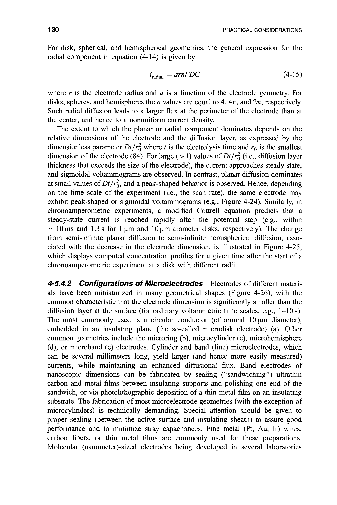

## Page 150

4-5 WORKING ELECTRODES
,-1
131
u = 10mVs
v = 100 mVs-i
-ai 
ai 
oj 
as as 
-03 
-0.1 
0.1 
QJ 
as oe
E (vs. Ag/AgCI) (V) 
- 
£ (vs. Ag/AgCl)(V)
i?=1 Vs'1
= 10 Vs-i
-ai 
0.1 
oj 
0.5 o*
r 
"i 
1 
1 
1 
1 
1 
1
-o.i 
c.i 
oj 
as as
E(vs. Ag/AgCi)(V)
E (vs. Ag/AgCI)(V)
FIGURE 4-24 Cyclic voltammograms for the oxidation of ferrocene at a 6 um platinum
microdisk at different scan rates. (Reproduced with permission from reference 84.)
(85) should offer additional spatial and temporal advantages, including a closer look
at interfacial chemistry processes. The construction of such nanoscopic electrodes is
even more challenging than that of their microscopic counterparts (86).
4-5.4.3 Composite Electrodes 
Composite electrodes couple the advantages
of single microelectrode systems with significantly higher currents due to larger
surface areas (86). Such electrodes thus address instrumental difficulties of monitor-
ing the extremely small (subnanoampere) currents at single microelectrodes. The
surfaces of composite electrodes consist of uniform (array) or random (ensemble)
dispersions of a conductor region within a continuous insulating matrix (Figure
4-27). Examples of arrays include closely spaced microdisks or interdigitated
microband electrodes (e.g. Figure 4-28). Lithographic techniques are often used
for fabricating such arrays (with various patterning), allowing precise control of the
spacing (88). Ensembles can be fabricated by mixing or pressing a powdered

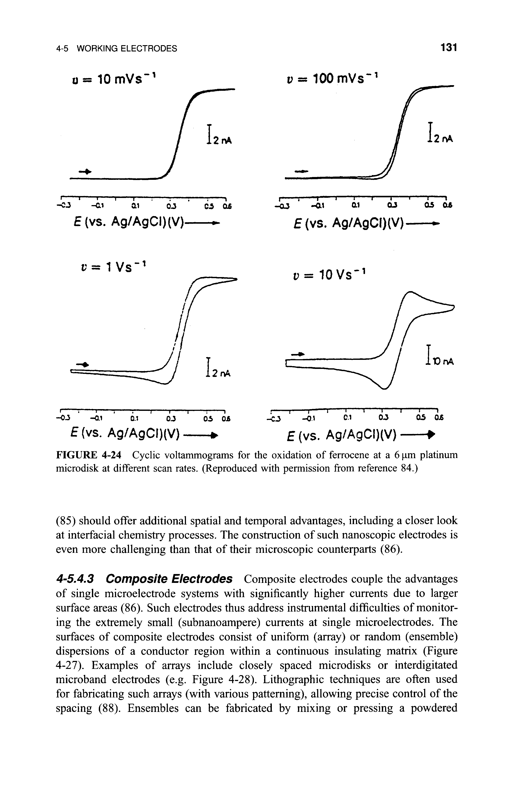

## Page 151

132
PRACTICAL CONSIDERATIONS
100
x/pm
50
rn = 3x 10~3m
100
50
0.5 
1.0
rlr0
0.5 
1.0
r/rn 
-
rQ = 3x10~ 5m
FIGURE 4-25 Normalized calculated concentration profiles for disk electrodes with
different radii (r0), one second after start of a chronoamperometric experiment. (Reproduced
with permission from reference 84.)
conductor with an insulator [e.g. Kel-F/graphite (89)], by impregnation of a porous
conductor with an insulator [e.g., microcellular carbon/epoxy (90)], embedding
carbon fibers in an insulating epoxy (91), or via deposition of a metal conductor into
the pores of a microporous host membrane (92).
As long as there is a negligible overlap of the diffusion layers from adjacent sites
(i.e., so long as each member maintains its own radial diffusional field), the current
of a composite electrode is the sum of currents of the individual sites. At sufficiently
long times, the diffusion layers overlap, and the electrode behaves as though its
entire geometric surface were active. For example, a slow scanning cyclic voltam-
metric experiment displays a current peak proportional to the total geometric area.
The exact time scale for the change from isolated to merged diffusion layers depends
on the spacing between the individual electrodes and their size. Larger distances and

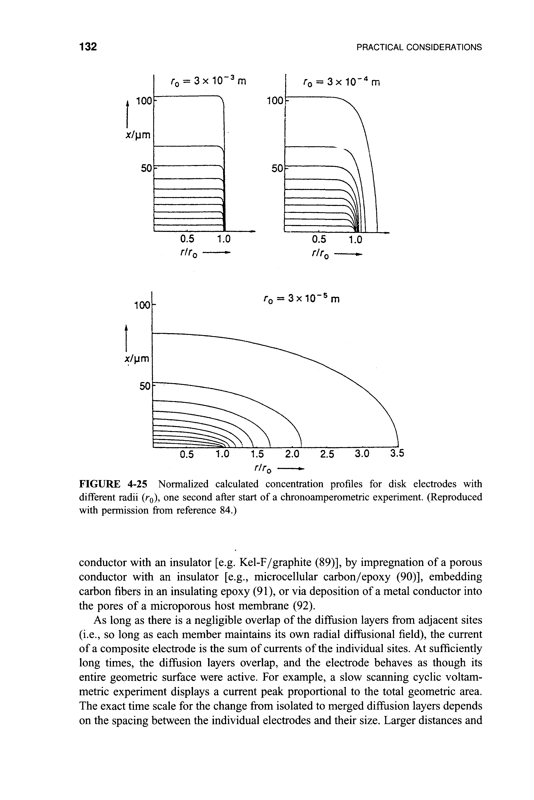

## Page 152

4-5 WORKING ELECTRODES
133
(a)
(b)
I 
1
(d)
FIGURE 4-26 
Common configurations of microelectrodes. a, disk; 6, ring; c, cylinder;
d, hemisphere; e, line (bond); / = length, w = width, r = radius.
FIGURE 4-27 
Classification of composite electrodes used in controlled-potential electro-
chemical techniques. (Reproduced with permission from reference 87.)
i t i i i i
(a) 
(6)
FIGURE 4-28 
Schematic representation of an interdigitated microarray electrode (a) and
closely-spaced microdisk electrodes (b).

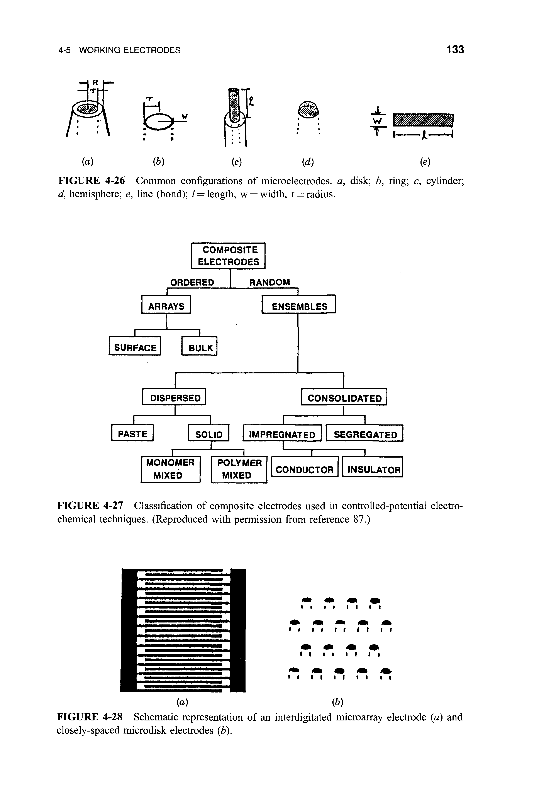

## Page 153

134
PRACTICAL CONSIDERATIONS
100
80-
60-
40-
20-
FIGURE 4-29 Cottrell plot of the chronoamperometric response for 1 x 10 3M
Ru(NH3)6
3 + at a Kel-F/gold composite electrode. Points are experimental data, the solid
line is the least-squares fit to theory. Dashed lines are theoretical Cottrell plots for a
macroelectrode with active area equal to the active area of the composite (curve a) and to
the geometric area of the composite (curve b). (Reproduced with permission from reference
87.)
40
20
0
o
-20
-0.3 
0 
0.3 
0.6
E (V vs SCE)
FIGURE 4-30 
Cyclic voltammogram for ferrocene at a 3 um width, 2 um gap interdigitated
microband (solid line). The dotted line represents the current of the collector electrode held at
a potential of —0.1 V (Reproduced with permission from reference 95.)

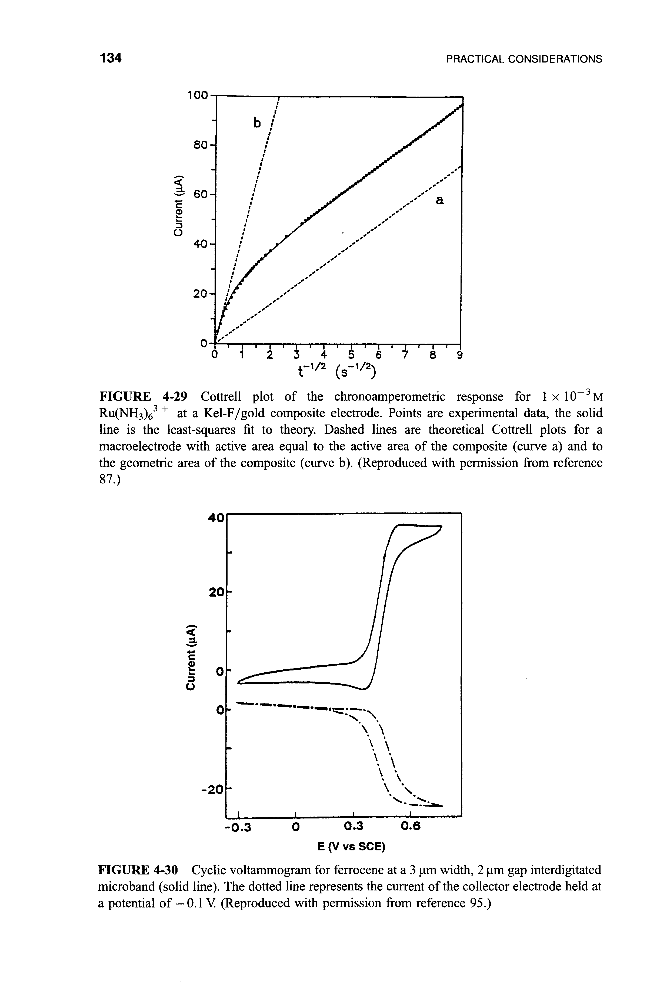

## Page 154

4-5 WORKING ELECTRODES 
135
smaller dimensions are preferred. Chronoamperometric experiments, such as the one
shown in Figure 4-29, can be used to estimate the transition between these time
regimes, and the fraction of the conductive surface in accordance with the theoretical
model (93). In addition to their large collective current, enhanced signal-to-noise
ratios, and flow-rate independence (in the flow detection), composite electrodes hold
great promise for incorporating appropriate modifiers within the bulk of the
composite matrix.
Closely spaced band electrodes (pairs or triples), with each electrode within the
diffusion layer of the other, can be used for studying reactions in a manner analogous
to ring-disk generation-collection and redox recycling experiments (94,95). Unlike
with rotating ring-disk electrodes, the product of the reaction at the collector
electrode can diffuse back across the narrow gap to the generator electrode to
give higher collection efficiencies (and hence sensitivity). A typical generation-
collection experiment at such an array is illustrated in Figure 4-30. The covering of
such closely spaced microelectrodes with conducting polymers can form the basis
for novel microelectronic (transistor-like) sensing devices (see Chapter 6). The
properties and applications of interdigitated arrays of microband electrodes have
been reviewed (96).
REFERENCES
1. T.P. DeAngelis, R.E. Bond, E.E. Brooks, and W.R. Heineman. Anal. Chem., 49, 1792
(1977).
2. R. Clark and A.G. Ewing. Anal. Chem., 70, 1119 (1998).
3. C.K. Mann, in A.J. Bard, Ed., Electroanalytical Chemistry, Vol. 3, p. 57, Marcel Dekker,
New York, 1969.
4. G.G. Wallace, Trends Anal. Chem., 4, 145 (1985).
5. A. Newman, Anal. Chem., 69, 369A (1997).
6. T. Matsue, A. Aoki, E. Ando, and I. Uchida. Anal. Chem., 62, 409 (1990).
7. A.M. Bond, Modern Polarographic Methods in Analytical Chemistry, Marcel Dekker, New
York, 1980.
8. P. He, J. Avery, and L.R. Faulkner, Anal. Chem., 54, 1314 (1982).
9. A.M. Bond, D. Luscombe, S.N. Tan, and F.L Walter, Electroanalysis, 2, 195 (1990).
10. J. Wang, Analyst, 119, 763 (1994).
11. K.A. Erickson and P. Wilding, din. Chem., 39, 283 (1993).
12. W. Kemula, and K. Kublik, Anal Chim. Acta, 18, 104 (1958).
13. W. Peterson, Am. Lab., 12, 69 (1979).
14. G. Macchi, J. Electroanal. Chem., 9, 290 (1965).
15. Z. Kowalski, K. Wang, R. Osteryoung, and J. Osteryoung. Anal. Chem., 59, 2216 (1987).
16. T.M. Florence, J. Electroanal. Chem., 27, 273 (1970).
17. R.N. Adams, Electrochemistry at Solid Electrodes, Marcel Dekker, New York, 1969.
18. R.C. Engstrom, Anal. Chem., 54, 2310 (1982).
19. WJ Albery and M. Hitchman, Ring-Disk Electrodes, Clarendon Press, Oxford, 1971.

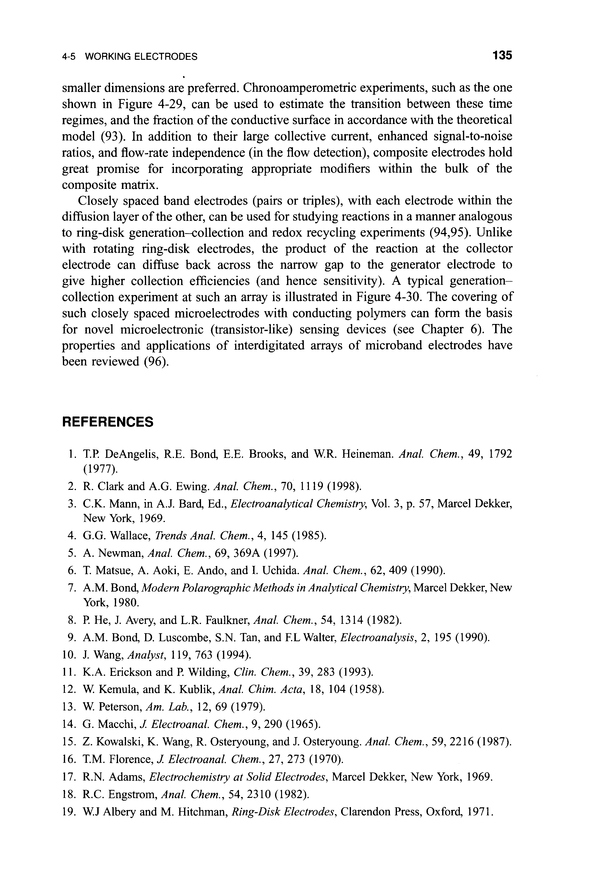

## Page 155

136
PRACTICAL CONSIDERATIONS
20. R.L. McCreery, "Carbon Electrodes: Structural Effects on Electron Transfer Kinetics," in
A.J. Bard, Ed., Electroanalytical Chemistry, Vol 18, Marcel Dekker, New York, 1991.
21. P. Chen and R.L. McCreery, Anal Chem., 68, 3958 (1996).
22. J.C. Bokros, Carbon, 15, 355 .(1977).
23. D. Pagan, I. Hu, and T. Kuwana, Anal. Chem., 57, 2759 (1985).
24. W.E. van der Linden and J.W. Dicker, Anal. Chim. Acta, 119, 1 (1980).
25. J. Wang, Electrochim. Acta, 26, 1721 (1981).
26. C. Olson and R.N. Adams, Anal. Chim. Acta, 22, 582 (1960).
27. C. Urbaniczky and K. Lundsrrom, J. Electroanal Chem., 176, 169 (1984).
28. M. Rice, Z. Galus, and R.N. Adams, J. Electroanal Chem., 143, 89 (1983).
29. K. Kalcher, Electroanalysis, 2, 419 (1990).
30. E. Csoregi, L. Gorton, and G. Marko-Varga, Anal. Chim. Acta, 273, 59 (1993).
31. J. Feng, M. Brazell, K. Renner, R. Kasser, andR.N. Adams, Anal. Chem., 59,1863 (1987).
32. T. Edmonds, Anal Chim. Acta, 175, 1 (1985).
33. H. Kozlowska, B. Conway, and W. Sharp, J. Electroanal. Chem., 43, 9 (1973).
34. D.C. Johnson and W. LaCourse, Anal. Chem., 62, 589A (1990).
35. R.W. Murray, A.G. Ewing, and R.A. Durst, Anal. Chem., 59, 379A (1987).
36. J. Wang, Electroanalysis, 3, 255 (1991).
37. R.P. Baldwin and K.N. Thomsen, Talanta, 38, 1 (1991).
38. C. Zhong and M.D. Porter, Anal. Chem., 67, 709A (1995).
39. C. Bain and G. Whitsides, Angew. Chem. Int. Ed. Eng., 28(4), 506 (1989).
40. D. Mandler, and I. Turyan, Electroanalysis, 8, 207 (1996).
41. O. Lev, M. Tsionsky, I. Rabinovich, V Glezer, S. Sampath, I. Pankratov, and J. Gun. Anal.
Chem., 67, 22A (1995).
42. M. Petit-Dominquez, H. Shen, W.R. Heineman, and C.J. Seliskar, Anal. Chem., 69, 703
(1997).
43. M. Tsionsky, G. Gun, V Glezer, and O Lev, Anal. Chem., 66, 1747 (1994).
44. J. Wang and P. Pamidi, Anal Chem., 69, 4490 (1997).
45. J. Zak and T. Kuwana, J. Electroanal. Chem., 150, 645 (1983).
46. J. Cox, R. Jaworski, and P. Kulesza, Electroanalysis, 3, 869 (1991).
47. LJ. Gorton, Chem. Soc. Faradays Trans., 82, 1245 (1986).
48. M. Halbert and R. Baldwin, Anal. Chem., 57, 591 (1985).
49. T. Malinski and Z. Taha, Nature, 358, 676 (1992).
50. J. Wang and Z. Taha, Anal Chem., 62, 1413 (1990).
51. J. Wang, "Voltammetry after Nonelectrolytic Preconcentration," in A.J. Bard, Ed.,
Electroanalytical Chemistry, Vol. 16, p. 1, Marcel Dekker, New York, 1989.
52. A. Guadalupe and H. Abruna, Anal. Chem., 57, 142 (1985).
53. D.W. Arrigan, Analyst, 119, 1953 (1994).
54. P. Ugo and L.M. Moreto, Electroanalysis, 7, 1105 (1995).
55. S. Prabhu, R. Baldwin, and L. Kryger, Anal Chem., 59, 1074 (1987).
56. J. Wang and T. Martinez, Electroanalysis, 1, 167 (1989).
57. N. Oyama and F.C. Anson, Anal Chem., 52, 1192 (1980).

## Page 156

4-5 WORKING ELECTRODES 
137
58. J. Wang and Z. Lu, J. Electroanal. Chem., 266, 287 (1989).
59. S. Prabhu, R. Baldwin, and L. Kryger, Electroanalysis, 1,13 (1989).
60. P. Ugo, B. Ballarin, S. Daniele, and G. Mazzocchin, Anal Chim. Acta, 244, 29 (1991).
61. I. Turyan and D. Mandler, Anal. Chem., 66, 58 (1994).
62. T. Malinski, A. Ciszewski, J. Fish, and L. Czuchajowski, Anal Chem., 62, 909 (1990).
63. S.V Sasso, R. Pierce, R. Walla and A. Yacynych, Anal Chem., 62, 1111 (1990).
64. G. Nagy, G. Gerhardt, A. Oke, M. Rice, and R.N. Adams, J. Electroanal Chem., 188, 85
(1985).
65. J. Wang and Z. Lu, Anal Chem., 62, 826 (1990).
66. J. Wang, H. Wu, and L. Angnes, Anal Chem., 65, 1893 (1993).
67. J. Wang and P. Tuzhi, Anal Chem., 58, 3257 (1986).
68. G. Sirtampalam and G. Wilson, Anal. Chem., 55, 1608 (1983).
69. T. Ohsaka, T. Hirokawa, H. Miyamoto, and N. Oyama, Anal Chem., 59, 1758 (1987).
70. J. Wang and T. Golden, Anal Chem., 61, 1397 (1989).
71. Q. Cheng and A. Brajter-Toth, Anal Chem., 64, 1998 (1992).
72. G. Bidan, Sensors and Actuators B, 6, 45 (1992).
73. M. Kanatzidis, Chem. Eng. News, Dec. 3, 36 (1990).
74. T. Ikariyama and W.R. Heineman, Anal. Chem., 58, 1803 (1986).
75. A. Ivaska, Electroanalysis, 3, 247 (1991).
76. P. Teasdale and G. Wallace, Analyst, 118, 329 (1993).
77. R.M. Wightman, Science, 240, 415 (1988).
78. R.M. Wighrman, Anal. Chem., 53, 1125A (1981).
79. A.M. Bond, Analyst, 119, RI (1994).
80. R. Kennedy, L. Huang, M. Atkinson, and P. Dush, Anal. Chem., 65, 1882 (1993).
81. F. Fan, J. Kwak, and AJ. Bard, J. Am. Chem. Soc., 118, 9669 (1996).
82. B.B. Anderson and A.G. Ewing, J. Pharm. Biomed. Anal, 19, 15 (1999).
83. C.P. Andrieux, P. Hapiot, and J.M. Saveant, Electroanalysis, 2, 183 (1990).
84. J. Heinze, Angew. Chem. (Eng. Ed.), 32, 1268 (1993).
85. R. Penner, N. Lewis, Chem. Industry, Nov. 4, 788 (1991).
86. Y. Shao, M.V Mirkin, G. Fish, S. Kokotov, D. Palankar, and A. Lewis, Anal Chem., 69,
1627 (1997).
87. D.E. Tallman and S.L. Petersen, Electroanalysis, 2, 499 (1990).
88. W Thormann, P. van den Bosch, and A.M. Bond, Anal Chem., 57, 2764 (1985).
89. D.E. Weisshaar and D.E. Tallman, Anal Chem., 55, 1146 (1983).
90. J. Wang, A. Brennsteiner, and A.P. Sylwester, Anal Chem., 62, 1102 (1990).
91. R. Deutscher and S. Fletcher, J. Electroanal Chem., 239, 17 (1988).
92. R.M. Penner and C.R. Martin Anal. Chem., 59, 2625 (1987).
93. T. Gueshi, K. Tokuda, and H. Matsuda, J. Electroanal Chem., 89, 247 (1978).
94. AJ. Bard, J. Crayton, G. Kittlesen, T. Shea, and M.S. Wrighton, Anal Chem., 58, 2321
(1986).
95. O. Niwa, M. Morita, and H. Tabei, Anal Chem., 62, 447 (1990).
96. O Niwa, Electroanalysis, 1, 606 (1995).

## Page 157

138 
PRACTICAL CONSIDERATIONS
Examples
Example 4-1 A rotating ring-disk electrode (1600rpm) yields a disk current of
12.3uA for the oxidation of a 2 x l O ~ 3 M potassium ferrocyanide solution.
Calculate the reduction current observed at the surrounding ring using a
6x 10~3M potassium ferrocyanide solution and a rotation speed of 2500 rpm
(#=0.33).
Solution 
From the Levich equation, (4-5), one can calculate first the disk current
under the new conditions:
iD 
Kx(6x 10~3) x (2500)1/2
12.3 
K x (2 x 10-3) x (1600)1/2
/D = 46.125^A
Then, from equation (4-8), we can solve for the ring current:
iR = -NiD = -0.33 x 12.125 = -15.221/zA
Example 4-2 A rotating mercury film electrode (2mm diameter) yielded a
stripping peak current of 2.2 uA for a 1 x 10~8M lead(II) solution following a
3 min deposition at — 1.0 V with a 1600 rpm rotation. Calculate the peak current for
a 2.5 x 10~8M lead(II) solution following a 2 min deposition with a 2500 rpm
rotation.
Solution
2.2=Kx(lx 10~8) x 3 x (1600)1/2
K= 1.83 x 106
ip = 1.83 x 106 (2.5 x 10~8) x 2 x (2500)1/2 
ip = 4.6 //A
QUESTIONS
1. What are the advantages of using ultramicroelectrodes for electrochemical
measurements?
2. Explain clearly how chemically modified electrodes can benefit electrochemical
measurements?

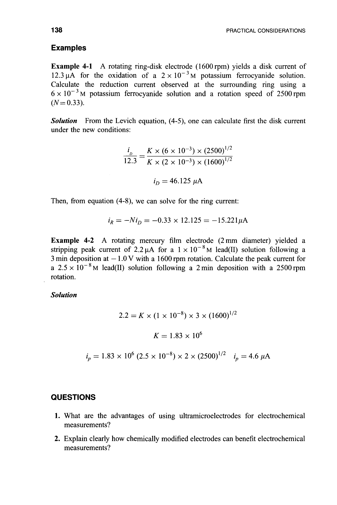

## Page 158

QUESTIONS 
139
3. Explain clearly why a carbon composite disk electrode offers improved signal-
to-background characteristics compared to a carbon disk electrode of the same
geometric area.
4. Describe clearly why the oxidation of polypyrrole film results in the uptake of
an anion from the surrounding solution.
5. Derive the Levich equation for the limiting current at the rotating disk electrode
[based on combining equations (4-4) and (1-12)].
6. How can you use the rotating ring disk electrode for detecting short-lived
intermediate species?
7. Explain clearly why effective compensation of the ohmic drop is essential for
diagnostic applications of cyclic voltammetry (e.g., estimating n from A£^).
8. Describe the rationale of using electrodes coated with Nation films for selective
detection of the cationic neurotransmitter dopamine in the presence of the
common interference from anionic ascorbic acid.
9. Explain the reason for including the time-consuming oxygen removal step in
pulse-polarographic measurements of tin ion in juice samples.
10. Explain clearly why and how a change of the scan rate affects the shape of the
cyclic voltammetric response of an ultramicroelectrode.
11. Propose a modified electrode surface suitable for detecting in-situ micromolar
concentrations of ferric ion in an industrial stream. What are the challenges of
such in-situ monitoring?

## Page 159

CHAPTER 5
POTENTIOMETRY
5-1 PRINCIPLES OF POTENTIOMETRIC MEASUREMENTS
In potentiometry, information on the composition of a sample is obtained through
the potential appearing between two electrodes. Potentiometry is a classical
analytical technique with roots before the turn of the twentieth century. However,
the rapid development of new selective electrodes and more sensitive and stable
electronic components over the last 25 years of the twentieth century has expanded
tremendously the range of analytical applications of potentiometric measurements.
Selective potentiometric electrodes are currently widely used in many fields,
including clinical diagnostics, industrial process control, environmental monitoring,
and physiology. The speed with which this field has developed is a measure of the
degree to which potentiometric measurements meet the need of the analytical
chemist for rapid, low-cost, and accurate analysis. In this chapter, the principles of
direct potentiometric measurements, based on ion-selective electrodes, will be
described. (The second major aspect of potentiometry, the so-called potentiometric
titrations, will not be covered.) General books devoted exclusively to direct
potentiometry may be found in references 1 to 5.
The equipment required for direct potentiometric measurements includes an ion-
selective electrode (ISE), a reference electrode, and a potential-measuring device (a
pH/millivolt meter that can read 0.2 mV or better) (Figure 5-1). Conventional
voltmeters cannot be used because only very small currents are allowed to be
drawn. The ion-selective electrode is an indicator electrode capable of selectively
measuring the activity of a particular ionic species. Such electrodes exhibit a fast
response and a wide linear range, are not affected by color or turbidity, are not
140

## Page 160

5-1 
PRINCIPLES OF POTENTIOMETRIC MEASUREMENTS
141
Reference
Electrode
Rcf. Bridge
Solution
Ag/AgCl
Emem|
^i(sample)
Working
Electrode
Internal
Solution
ISE Membrane
FIGURE 5-1 
Schematic diagram of an electrochemical cell for potentiometric measure-
ments.
destructive, and are very inexpensive. Ion-selective electrodes can be assembled
conveniently in a variety of shapes and sizes. Specially designed cells allow flow or
microliter analyses (see, for example, Section 5-3).
Ion-selective electrodes are mainly membrane-based devices, consisting of
permselective ion-conducting materials, which separate the sample from the inside
of the electrode. On the inside is a filling solution containing the ion of interest at a
constant activity. The membrane is usually nonporous, water insoluble, and
mechanically stable. The composition of the membrane is designed to yield a
potential that is primarily due to the ion of interest (via selective binding processes,
e.g., ion exchange, which occur at the membrane-solution interface). The trick is to
find a membrane that will selectively bind the analyte ions, leaving co-ions behind.
Membrane materials, possessing different ion-recognition properties, have thus been
developed to impart high selectivity (see Section 5-2). The detailed theory of the
processes at the interface of these membranes, which generate the potential, is
available elsewhere (6-8). Thermodynamic arguments, which will not be elaborated
here, tell us that the gradient of activity across the membrane (of the analyte ions in
the outer and inner solutions) produces a gradient of free energy:
AG = -RT In
nple \
^z.int.soln/
(5-1)
where R is the universal gas constant (8.134JKT1 moP1) and T is the absolute
temperature. The potential produced across the membrane corresponds to this free
energy difference:
(5-2)
nF 
V*;,int.soln

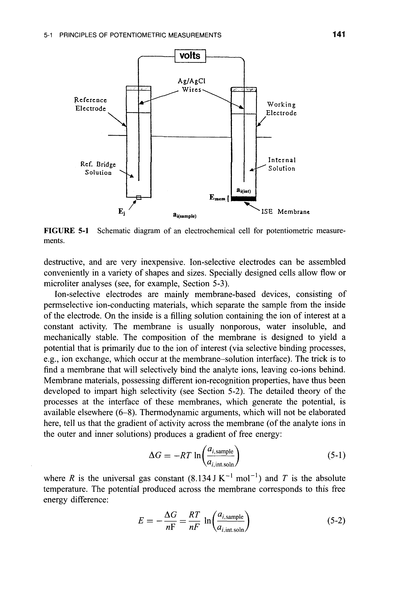

## Page 161

142
POTENTIOMETRY
Such a potential arises whenever the membrane separates two solutions of different
ion activity (Figure 5-2). The ion-recognition (binding) event generates a phase
boundary potential at the membrane-sample interface. Another phase boundary
potential is developed at the inner surface of the membrane (at the membrane-filling
solution interface). The membrane potential corresponds to the potential difference
across the membrane. The resulting potential of the ion-selective electrode, which
reflects the unequal distribution of the analyte ions across the boundary, is generally
monitored relative to the potential of a reference electrode. Since the potential of the
reference electrode is fixed, and the activity of the ion in the inner solution is
constant, the measured cell potential reflects the potential of the ISE, and can thus be
related to the activity of the target ion in the sample solution. Ideally, the response of
the ISE should obey equation (5-3):
(2.303RT/ztF) log at
(5-3)
where E is the potential, and z; and at are the ionic charge and activity, respectively,
of the ion. The constant K includes all sample-independent potential contributions,
which depend upon various factors (influenced by the specific design of the ISE).
Equation (5-3) predicts that the electrode potential is proportional to the logarithm of
the activity of the ion monitored. For example, at room temperature a 59.1mV
change in the electrode potential should result from a 10-fold change in the activity
of a monovalent ion (z — 1). Similar changes in the activity of a divalent ion should
result in a 29.6mV change of the potential. A 1 mV change in the potential
E = RT/nF
M
INTERNAL
SOLUTION
*i, inner soln
SAMPLE
SOLUTION
FIGURE 5-2 Membrane potential reflects the gradient of activity of the analyte ion in the
inner and outer (sample) solutions.

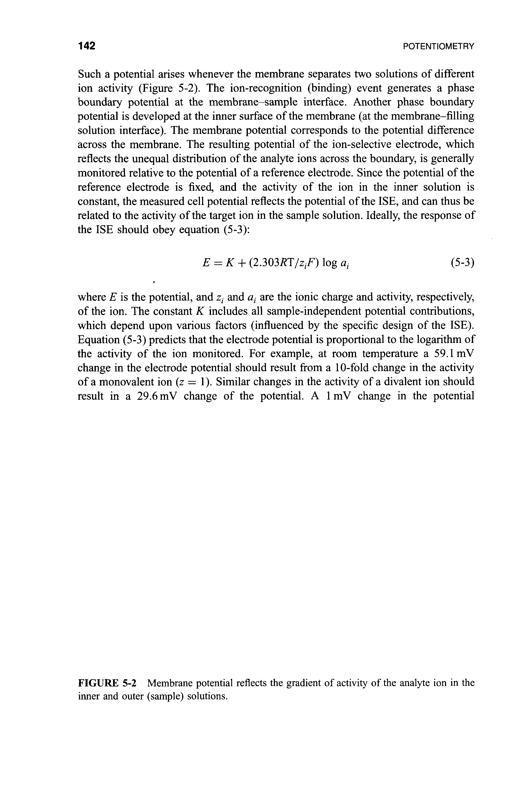

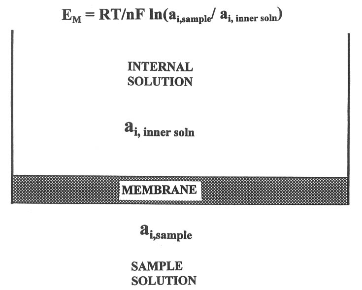

## Page 162

5-1 
PRINCIPLES OF POTENTIOMETRIC MEASUREMENTS 
143
corresponds to 4% and 8% changes in the activity of monovalent and divalent ions,
respectively. The term "Nernstian" behavior is used to characterize such behavior. In
contrast, when the slope of the electrode response is significantly smaller than
59.1/z,-, the electrode is characterized by a sub-Nernstian behavior.
It should be noted again that ISEs sense the activity, rather than the concentration
of ions in solution. The term "activity" is used to denote the effective (active)
concentration of the ion. The difference between concentration and activity arises
because of ionic interactions (with oppositely charged ions) that reduce the effective
concentration of the ion. The activity of an ion i in solution is related to its
concentration, ct, by
*,- =fci 
(5-4)
where fi is the activity coefficient. The activity coefficient depends on the types of
ions present and on the total ionic strength of the solution. The activity coefficient is
given by the Debye—Huckel equation:
log^ = " ' 
(at25°C) 
(5-5)
where JJL is the ionic strength. The activity coefficient thus approaches unity (i.e.,
a( = Cf) in very dilute solutions. The departure from unity increases as the charge of
the ion increases.
Equation (5-3) has been written on the assumption that the electrode responds
only to the ion of interest, i. In practice, no electrode responds exclusively to the ion
specified. The actual response of the electrode in a binary mixture of the primary and
interfering ions (/ and j, respectively) is given by the Nikolskii-Eisenman equation
(9):
E = K + (2.303tfT/z;F) log(a, + kyd/Zj) 
(5-6)
where ky is the selectivity coefficient, a quantitative measure of the electrode ability
to discriminate against the interfering ion (i.e., a measure of the relative affinity of
ions i and j toward the ion-selective membrane). For example, if an electrode is 50
times more responsive to i than toy, ky has a value of 0.02. A ky of 1.0 corresponds
to a similar response for both ions. When ky ^> 1 , then the ISE responds better to the
interfering ion j than to the target ion /. Usually, ky is smaller than 1, which means
that the ISE responds more selectively to the target ion. The lower the value of £„,
£
the more selective is the electrode. Selectivity coefficients lower than 10~ have
been achieved for several electrodes. For an ideally selective electrode, ky would
equal zero (i.e., no interference). Obviously, the error in the activity a, due to the
interference ofy would also depend upon their relative levels. The term z,-/zy- corrects
for a possible charge difference between the target and interfering ions. Normally,
the most serious interferences have the same charge as the primary ion, so that

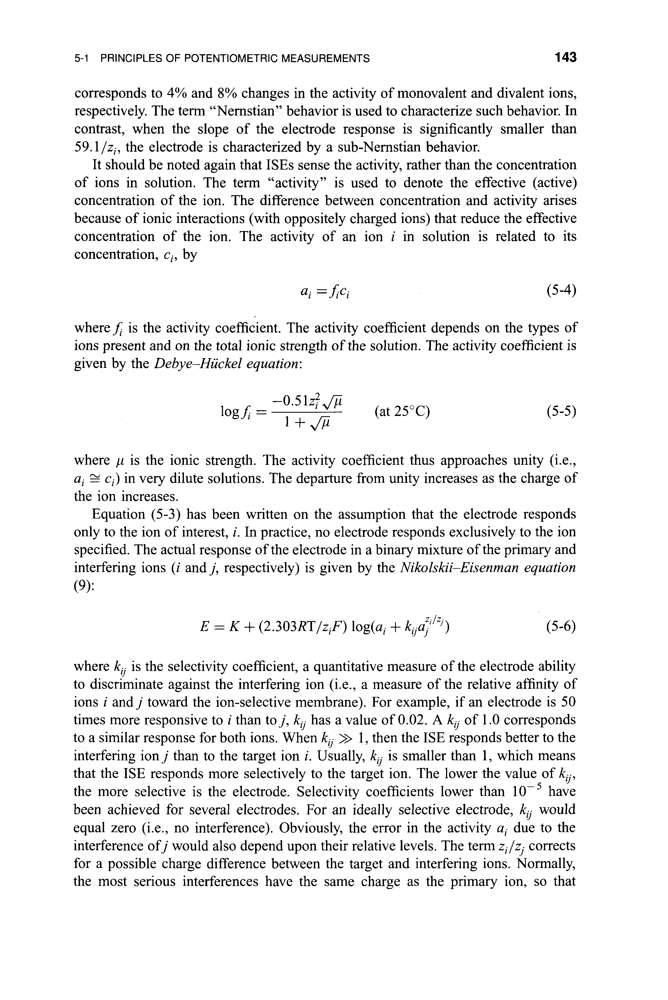

## Page 163

144
POTENTIOMETRY
zt/Zj = 1. In practice, the contribution of all interfering ions present in the sample
matrix (^kjjaj/Zj) 
should be included in the Nikolskii-Eisenman equation. For
example, for a sodium electrode immersed in a mixture of sodium, potassium, and
lithium, the response is given by
?
log(aNa
(5-7)
Accordingly, an ISE displays a selective response when the activity of the primary
ion is much larger than the summation term of the interferents; that is, when
ai ^ H kya-
 
z> • Under this condition, the effect of interfering ions is negligible, and
changes in the measured potential can be related with confidence to variations in the
activity of the target ion. The selectivity coefficients thus serve as guidelines of how
far a given ISE should be applicable for a particular analytical problem. Nonselective
ISEs are rarely useful for real-life applications (with the exception of their
combination with the operation of ISE arrays; see Section 6-4). In reality, equations
with more than two components are rarely used. Deviations from the Nikolski-
Eisenman equation have been reported for various situations (particularly for
mixtures of ions of different charge, in the case of non-Nernstian behavior of
interfering ions, and due to the concentration dependence of ky).
It is important for the analytical chemist to realize the selectivity coefficient of a
particular electrode. Various methods have been suggested for determining the
selectivity coefficient, including the fixed-interference method, separate-solution
method, and the fixed primary-ion method (10,11). The most popular fixed-
interference method involves two solutions, one containing a constant concentration
of the interfering ion and the second containing a zero concentration. Also popular is
the separate-solution method, which involves the preparation of calibration curves
for each ion. As selectivity is a complex function of the membrane composition and
the experimental design, the values of selectivity coefficients should be regarded as
operationally defined (i.e., valid for the particular set of conditions used for their
determination).
Usually the analytical chemist needs to determine the concentration of the ion of
interest rather than its activity. The obvious approach for converting potentiometric
measurements from activity to concentration is to make use of an empirical
calibration curve, such as the one shown in Figure 5-3. Electrode potentials of
standard solutions are thus measured and plotted (on semilog paper) versus the
concentration. Since the ionic strength of the sample is usually unknown, it is often
useful to add a high concentration of an electrolyte to the standards and the sample
to maintain about the same ionic strength (i.e., the same activity coefficient). The
ionic-strength adjuster is usually a buffer (since pH control is also desired for most
ISEs). The empirical calibration plot thus yields results in terms of concentration.
Theoretically, such a plot should yield a straight line with a slope of approximately
59/z,- mV (Nernstian slope). Detection by means of ion-selective electrodes may be
performed over an exceedingly broad concentration range, which, for certain
electrodes, may embrace five orders of magnitude. In practice, the usable range

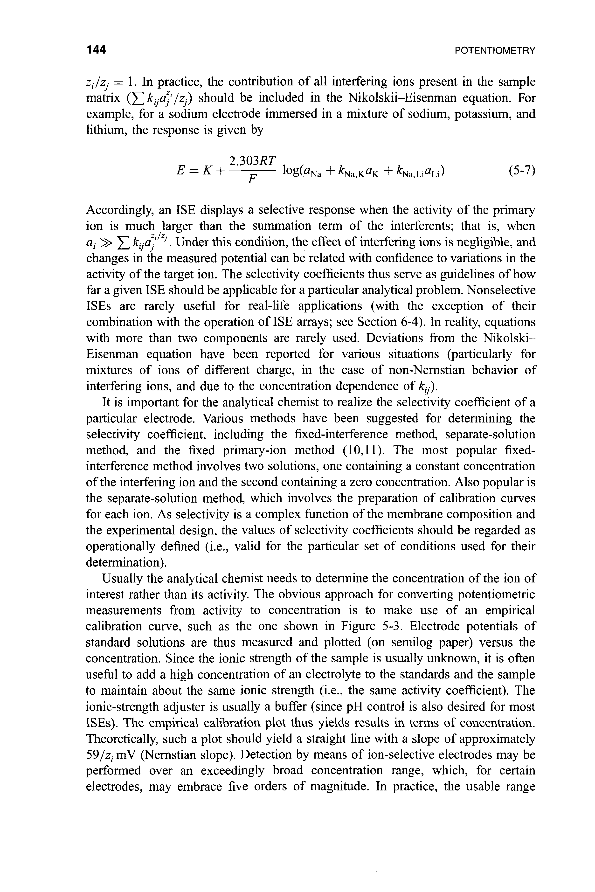

## Page 164

5-1 
PRINCIPLES OF POTENTIOMETRIC MEASUREMENTS
145
0 -
+ 40 -
+ 80 -
E +120 -
!s
c| +160 -
Q.
+ 200 -H
+ 240 -
Tenfold Change
I
59 mV I
<
10-6 
10-5 
10-4 
10-3 
10-2
mole (L-1)
FIGURE 5-3 Typical calibration plot for a monovalent ion.
depends on other ions in the solution. Departure from linearity is commonly
observed at low concentrations (about 10~5-10~6M) due to the presence of
coexisting ions (equation 5-6). The extent of the departure depends on the selectivity
coefficient as well as upon the level of the interfering ion (Figure 5-4). The detection
limit for the analyte ion is defined by
(5-8)
and corresponds to the activity of i at the intersection of the asymptotes in the E vs.
log at calibration plot, that is, where the extrapolated linear and zero-slope segments
meet (12) (see Figure 5-5). It is only when the plot becomes almost horizontal that
the activity measurement becomes impossible. At high concentrations of the ions of
interest, interference by species of opposite charge [not described by equation (5-6)]
may lead to deviation from the linear electrode response.
The logarithmic response of ISEs can cause major accuracy problems. Very small
uncertainties in the measured cell potential can cause large errors. (Recall that an

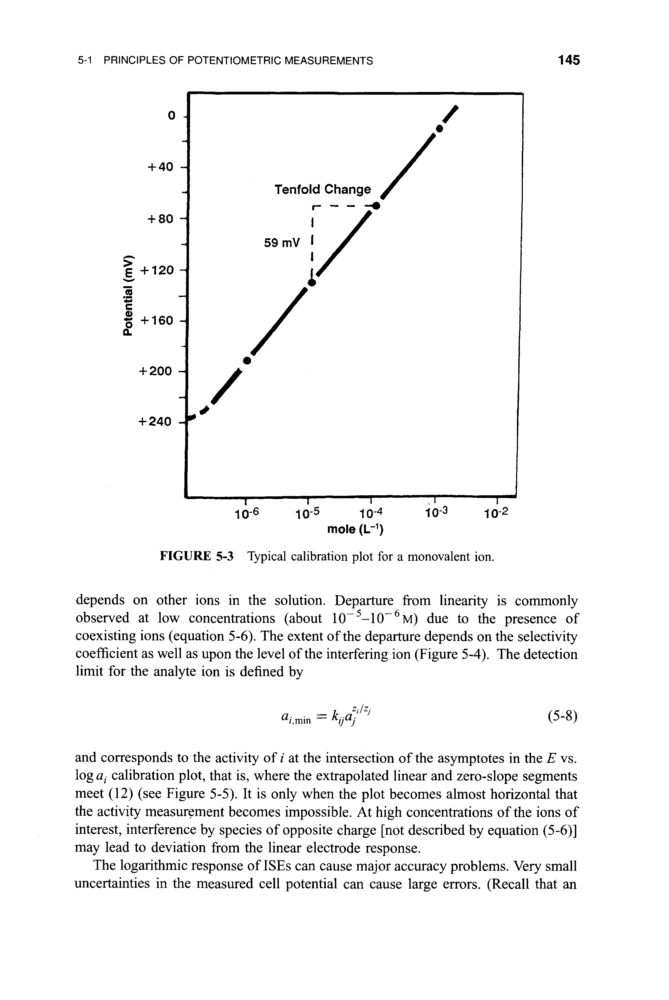

## Page 165

146
POTENTIOMETRY
10"
10"
10'
10"
10"
Activity (M)
FIGURE 5-4 The potential response of an ion-selective electrode versus activity of ion / in
the presence of different levels of an interfering ion j.
uncertainty of ± 1 mV corresponds to a relative error of about 4% in the
concentration of a monovalent ion.) Since potential measurements seldom have
better than 0.1 mV uncertainty, the best measurements of monovalent ions are limited
to about 0.4% relative concentration error. In many practical situations, the error is
significantly larger. The main source of error in potentiometric measurements is
-log a
FIGURE 5-5 Determination of the detection limit of an ion-selective electrode. (Repro-
duced with permission from reference 12.)

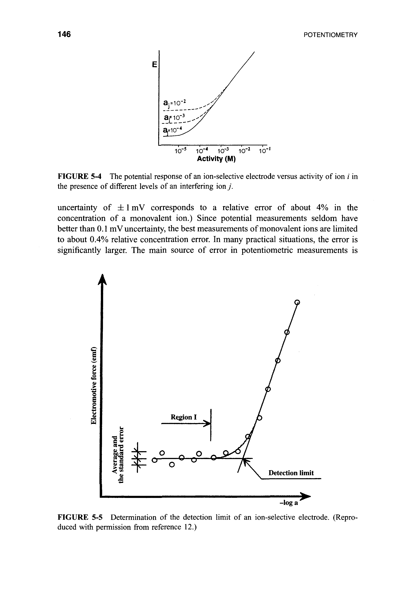

## Page 166

5-2 ION-SELECTIVE ELECTRODES 
147
actually not the ISE but rather changes in the reference electrode junction potential,
that is, the potential difference generated between the reference electrolyte and
sample solution. The junction potential is caused by an unequal distribution of
anions and cations across the boundary between two dissimilar electrolyte solutions
(which results in ion movement at different rates). When the two solutions differ
only in the electrolyte concentration, the liquid junction potential is proportional to
the difference in transference numbers of the positive and negative -ions and to the
logarithm of the ratio of the ions on both sides of the junction:
* = 
,-,).n2 
(5-9,
Changes in the reference electrode junction potential result from differences in the
composition of the sample and standard solutions (e.g., upon switching from whole
blood samples to aqueous calibrants). One approach to alleviate this problem is to
use an intermediate salt bridge, with a solution (in the bridge) of ions of nearly equal
mobility (e.g., concentrated KC1). Standard solutions with an electrolyte composi-
tion similar to that of the sample are also desirable. These precautions, however, will
not eliminate the problem completely. Other approaches to address this and other
changes in the cell constant have been reviewed (13).
5-2 ION-SELECTIVE ELECTRODES
The discussion of Section 5-1 clearly illustrates that the most important response
characteristic of an ISE is selectivity. Depending on the nature of the membrane
material used to impart the desired selectivity, ISEs can be divided into three groups:
glass, liquid, or solid electrodes. More than two dozen ISEs are commercially
available and are widely used (although many more have been reported in the
literature). Such electrodes are produced by firms such as Orion Research, Radio-
meter, Corning Glass, Beckman, Hitachi, or Sensorex.
5-2.1 
Glass Electrodes
Glass electrodes are responsive to univalent cations. The selectivity for these cations
is achieved by varying the composition of a thin ion-sensitive glass membrane.
5-2.1.1 pH Electrodes The most common potentiometric device is the pH
electrode. This electrode has been widely used for pH measurements for several
decades. Besides use for direct pH measurements, the pH glass electrode is
commonly employed as the transducer in various gas and biocatalytic sensors,
involving proton-generating or proton-consuming reactions (see Chapter 6). Its
remarkable success is attributed to its outstanding analytical performance, and in
particular its extremely high selectivity for hydrogen ions, its remarkably broad
response range, and to its fast and stable response. The phenomenon of glass

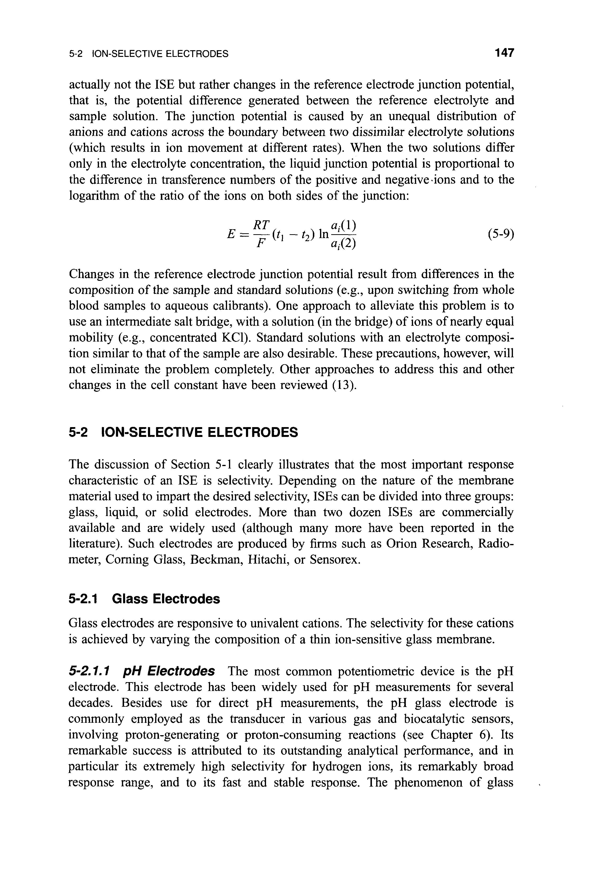

## Page 167

148
POTENTIOMETRY
selectivity was reported by Cremer in 1906 (14). Glass pH electrodes of different
configurations and dimensions have been in routine use for over six decades since
their commercial introduction by A. Beckman. A schematic of a commonly used
configuration is shown in Figure 5-6. This consists of a thin pH-sensitive glass
membrane sealed to the bottom of an ordinary glass tube. The composition of the
glass membrane is carefully controlled. Usually, it consists of a three-dimensional
silicate network, with negatively charged oxygen atoms available for coordinating
cations of suitable size. Some of the more popular glasses have three-component
compositions of 72% SiO2-22% Na2O-6% CaO or 80% SiO2-10% Li2O-10%
CaO. Inside the glass bulb are a dilute hydrochloric acid solution and a silver wire
coated with a layer of silver chloride. The electrode is immersed in the solution
whose pH is to be measured, and connected to an external reference electrode. (In
the so-called combination electrode, the external reference electrode is combined
with the ion-selective electrode into one body.) The rapid equilibrium established
Internal
filling solution
(0.1 MHCI)
Thin glass
membrane
Ag wire
FIGURE 5-6 A glass pH electrode.

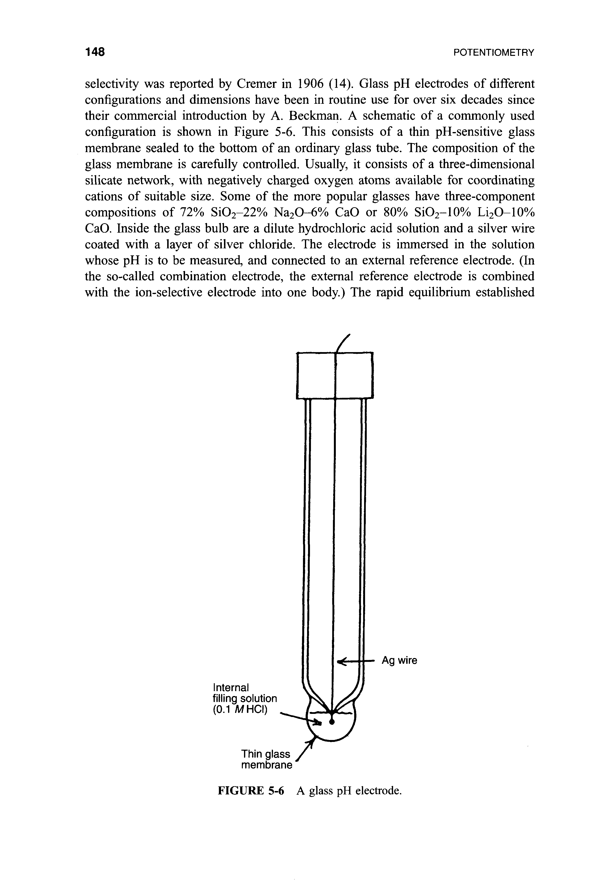

## Page 168

5-2 
ION-SELECTIVE ELECTRODES 
149
across the glass membrane, with respect to the hydrogen ions in the inner and outer
solutions, produces a potential:
(5-10)
The potential of the electrode is registered with respect to the external reference
electrode. Hence, the cell potential (at 25°C and after introducing the definition of
pH) follows the relation
^ceii = K' + 0.059pH 
(5-11)
The measured potential is thus a linear function of pH; an extremely wide (10-14
decades) linear range is obtained, with calibration plots yielding a slope of 59 mV
per pH unit. The overall mechanism of the response is complex. The selective
response is attributed to the ion-exchange properties of the glass surface, and in
particular the replacement of sodium ions associated with the silicate groups in the
glass by protons:
Najass + H30+ln ^ Na+oln + H3Og
+
lass 
(5-12)
The theory of the response mechanism has been thoroughly discussed (15).
The user must be alert to some shortcomings of the glass pH electrode. For
example, in solutions of pH 11 or more, the electrode shows a so-called alkaline
error in which it responds also to changes in the level of alkali metal ions
(particularly sodium):
£cell = K + 0.059 log([H30+] + £H,Na[Na+]) 
(5-13)
As a result, the pH reading is lower than the true value (Figure 5-7). This error is
greatly reduced if the sodium oxide in the glass is replaced by lithium oxide. Still,
even with new glass formulations (with A:HNa < 10~10), errors can be appreciable
when measurements are carried out in highly basic solutions (e.g., NaOH). Many
glass electrodes also exhibit erroneous results in highly acidic solutions (pH < 0.5);
the so-called acid error yields higher pH readings than the true value (Figure 5-7).
Before the pH electrode is used, it should be calibrated using two (or more)
buffers of known pH. Many standard buffers are commercially available, with an
accuracy of ± 0.01 pH unit. Calibration must be performed at the same temperature
at which the measurement will be made; care must be taken to match the temperature
of samples and standards. The exact procedure depends on the model of pH meter
used. Modern pH meters, such as the one shown in Figure 5-8, are microcomputer
controlled, and allow double-point calibration, slope calculation, temperature adjust-
ment, and accuracy to ± 0.001 pH unit, all with few basic steps. The electrode must

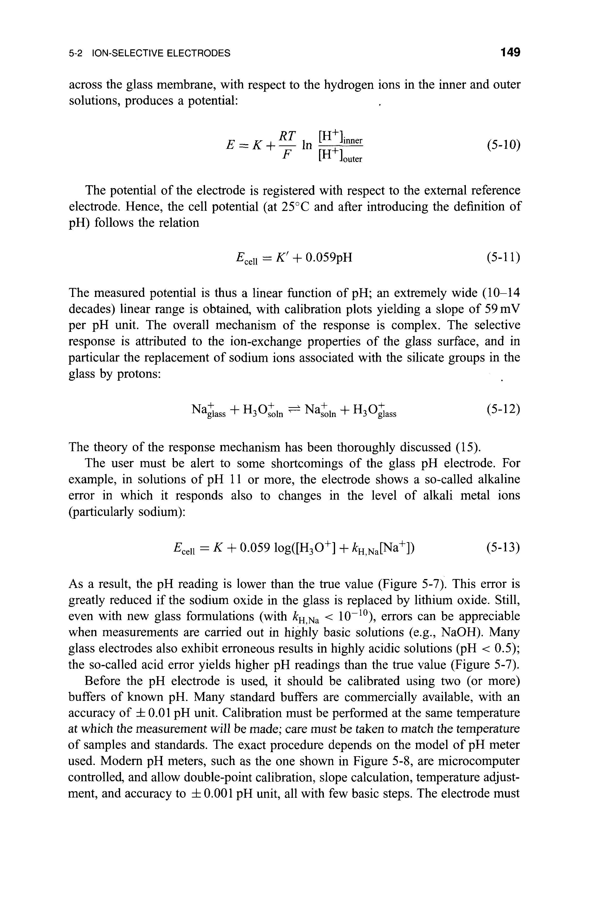

## Page 169

150
POTENTIOMETRY
-1.0 i-
|-0.5
LLJ
0.5
_A
fI 
I I I I
J 
I
- 2 0 
2 
4 
6 
8 10 12 14
pH
FIGURE 5-7 The alkaline and acid errors of several glass pH electrodes. A, Corning
015/H2SO4; B, Corning 015/HC1; C, Corning 015/1 M Na + ; D, Beckman-GP/1 M Na+; E,
L&N BlackDot/lM Na+; F, Beckman E/IM Na+; G, Ross electrode. (Reproduced with
permission from reference 16.)
FIGURE 5-8 A modern microprocessor-controlled pH meter.

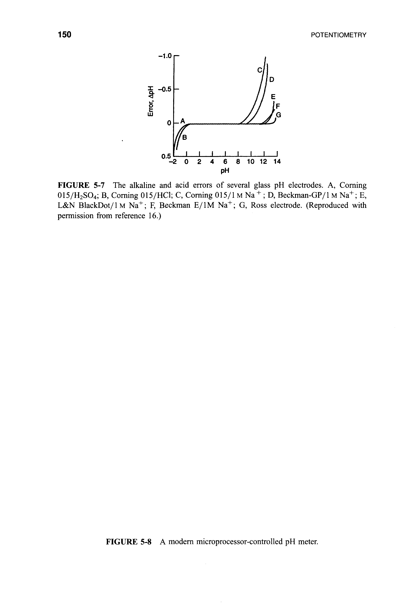

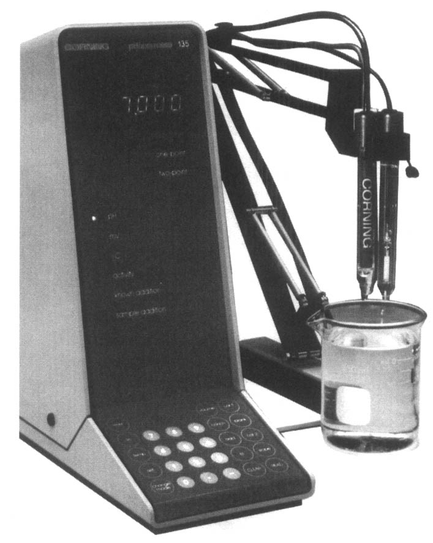

## Page 170

5-2 
ION-SELECTIVE ELECTRODES 
151
be stored in an aqueous solution when not in use, so that the hydrated gel layer of the
glass does not dry out. A highly stable response can thus be obtained over long time
periods. As with other ion-selective electrodes, the operator should consult the
manufacturer's instructions for proper use. Commercial glass electrodes are remark-
ably robust and, with proper care, will last for more than a year. Proper maintenance
of the reference electrode is also essential to minimize errors.
Measurements of pH can also be performed using other types of potentiometric
sensors. Non-glass electrodes offer various advantages for certain pH measurements
(particularly intravascular and intraluminal clinical applications, food assays, and
operation in fluoride media), including ease of preparation, low electrical resistance,
and safety in handling. The most common examples are the quinhydrone electrode
(in which the response is due to a proton-transfer redox reaction of the quinone-
hydroquinone couple), and the antimony electrode (based on the redox reaction
between antimony and antimony oxide involving protons). Other metal-metal oxide
couples, such as palladium-palladium oxide, have been applied for pH measure-
ments. Membrane electrodes based on various neutral hydrogen ion carriers (e.g.
tridodecylamine) can also be employed (17). The resulting electrodes exhibit
excellent selectivity, reproducibility, and accuracy, but their dynamic range is
inferior to that of glass electrodes. (The dynamic range appears to depend on
the acidity constant of the incorporated ionophore.) New pH sensors based on
new glass compositions or non-glass formulations are currently being developed
in various laboratories. While such electrodes may be useful for specific applica-
tions, glass electrodes are likely to remain the choice for routine analytical
applications.
5-2.1.2 Glass Electrodes for Other Cations From the early days of glass
pH electrodes, it was noticed that alkaline solutions display some interference on the
pH response. Deliberate changes in the chemical composition of the glass membrane
(along with replacements of the internal filling solution) have thus led to electrodes
responsive to monovalent cations other than hydrogen, including sodium, ammo-
nium, and potassium (15). This usually involves the addition of B2C>3 or A12O3 to
sodium silicate glasses, to produce anionic sites of appropriate charge and geometry
on the outer layer of the glass surface. For example, the sodium- and ammonium-
selective glasses have the compositions 11% Na2O-18% A12O3-71% SiO2 and 27%
Na2O-^% Al2O3-69% SiO2, respectively. Unlike sodium silicate glasses (used for
pH measurements), these sodium aluminosilicate glasses possess what may be
termed AlOSiO" sites with a weaker electrostatic field strength and a marked
preference for cations other than protons. The overall mechanism of the electrode
response is complex but involves a combination of surface ion-exchange and
ion-diffusion steps. To further minimize interference from hydrogen ions, it is
desirable to use solutions with pH values higher than 5. Improved mechanical and
electrical properties can he achieved using more complex glasses containing various
additives.

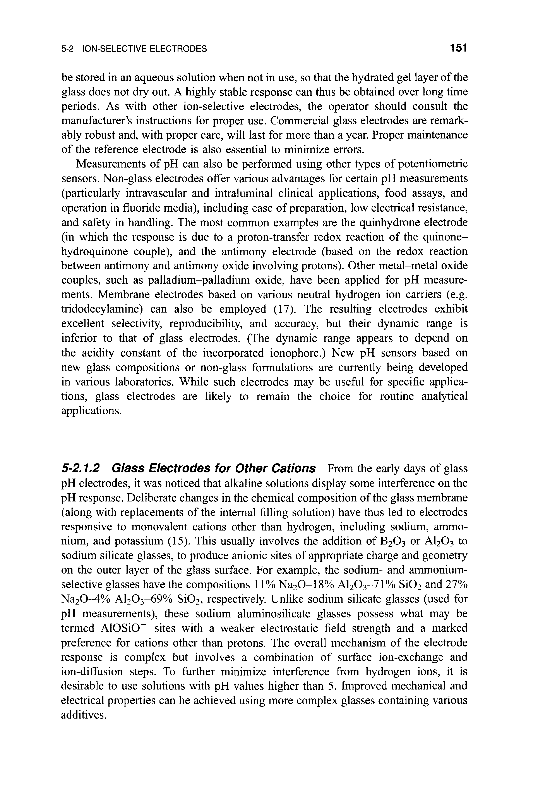

## Page 171

152 
POTENTIOMETRY
5-2.2 
Liquid-Membrane Electrodes
Liquid-membrane type ISEs, based on water-immiscible liquid substances impreg-
nated in a polymeric membrane, are widely used for direct potentiometric measure-
ments (17,18). Such ISEs are particularly important because they permit direct
measurements of several polyvalent cations as well as certain anions. The polymeric
membrane [commonly made of plasticized poly(vinyl chloride) (PVC)] separates the
test solution from the inner compartment, containing a standard solution of the target
ion (into which a silver/silver chloride wire is dipped). The filling solution usually
contains a chloride salt of the primary ion, as desired for establishing the potential of
the internal silver/silver chloride wire electrode. The membrane-active (recognition)
component can be a liquid ion exchanger or a neutral macrocyclic compound. The
selective extraction of the target ion at the sample/membrane interface creates the
electrochemical phase boundary potential. The membranes are commonly prepared
by dissolving the recognition element, a plasticizer (e.g., o-nitrophenyl ether) that
provides the properties of liquid phase, and the PVC in a solvent such as
tetrahydrofuran. (The recognition element is usually present in 1-3% amount.)
Slow evaporation of the solvent over 1-2 days leaves a flexible membrane of 10-
100 um thickness, which can be cut (with a cork borer) and mounted on the end of
plastic tube. The ion-discriminating ability (and hence the selectivity coefficient)
depend not only upon the nature of the recognition element but also upon the exact
membrane composition, including the membrane solvent and the nature and content
of the plasticizer. The extraction properties of the membrane can be further improved
by adding ion-pairing agents to the plasticizer. The PVC matrix provides mechanical
strength and permits diffusion of analytes to the recognition sites. The hydrophobic
nature of the membrane prevents leaching of the sensing element and the plasticizer
into the aqueous sample solution, and thus extends the operational lifetime. In
contrast, release of the primary ion (from the inner solution) leads to its higher
activity at the layer adjacent to the membrane (relative to the bulk sample), and
hence to increased detection limits of carrier-based liquid-membrane electrodes (19).
Such a localized accumulation of ions makes it impossible to measure dilute
samples. By choosing an internal electrolyte with low activity of the primary ion
and preventing its leakage, it is possible to greatly lower the detection limits by up to
six orders of magnitude down to the picomolar range (20). Active research in various
laboratories is elucidating these interfacial ion fluxes in connection with the
development of potentiometric sensors for trace analysis. Lowering of the detection
limits would require careful attention to the selectivity of the resulting ISE. The
selectivity of most ISEs is currently not sufficient to reach the picomolar level.
5-2.2.1 Ion-Exchanger Electrodes 
One of the most successful liquid-
membrane electrodes is selective toward calcium. Such an electrode relies on the
ability of phosphate ions to form stable complexes with the calcium ion. It uses a
liquid cation exchanger, consisting of an aliphatic diester of phosphoric acid
[(RO)2PO^ with R groups in the C8-Ci6 range] that possesses high affinity for
calcium ions. The ion exchanger is held in a porous, plastic filter membrane that

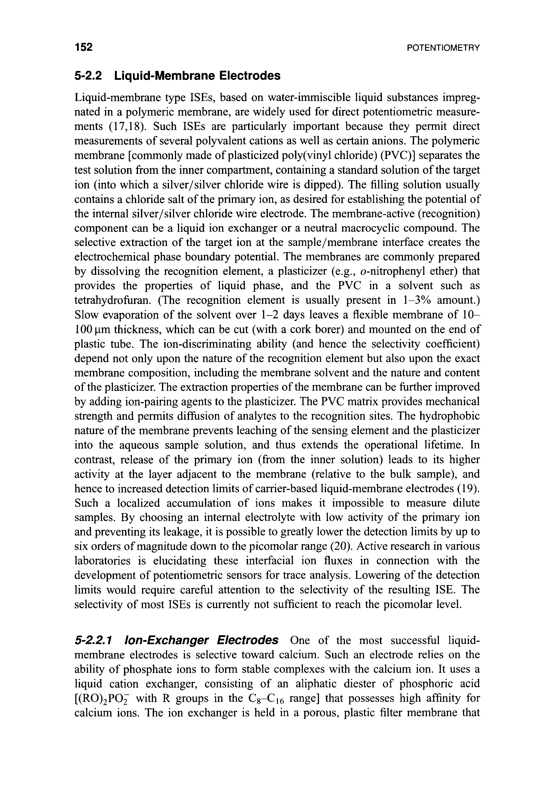

## Page 172

5-2 ION-SELECTIVE ELECTRODES
153
separates the test solution from the inner compartment, containing a standard
calcium chloride solution (Figure 5-9). The preferential uptake of calcium ions
into the membrane can thus be represented as
Ca2
[(RO)2P02]2Ca
(5-14)
The resulting cell potential is given by
0.059 ,
+ -—— log aca
(5-15)
Calcium activities as low as 5 x 10 7M can be measured, with selectivity coeffi-
cients KCaMg and KCaK of 0.02 and 0.001, respectively. Such potential response is
independent of the pH over the pH range from 5.5 to 11.0. Above pH 11, Ca(OH)+
is formed, while below pH 5.5, protons interfere. Because of its attractive response
characteristics, the calcium ISE has proved to be a valuable tool for the determina-
tion of calcium ion activity in various biological fluids.
Liquid anion exchangers, such as lipophilic quaternary ammonium salts (e.g.,
Figure 5-10) or phosphonium salts, have been employed for the preparation of
anion-selective sensors. The resulting ISEs usually lack an anion-recognition
function, and hence display anion selectivity corresponding to the anion partition
into the supporting hydrophobic membrane. This gives rise to the following order of
selectivities, which is known as the Hofmeister 
series: large liphophilic
anions > ClO^ > 10^ > SCN~ > I~ > NO^ > Br~ > CI~ > HCO^ > H2PO^; that
is, maximum response to lipophilic anions (21). Accordingly, several commercial
sensors (e.g., NO^~ "selective" electrodes) based on ion-exchange type membranes,
suffer interference from liphohilic anions (e.g., ClO^"). Useful electrodes for nitrate
(22), thiocyanate (23), and chloride (24) ions have been developed. Sensors
responsive to anionic macromolecules have also been developed despite the greater
Internal
reference solution
of calcium chloride
Silver-silver chloride,
reference electrode
Reservoir containing
liquid ion-exchanger
Porous
membrane
Liquid-membrane
Ca2 + electrode
FIGURE 5-9 
Schematic diagram of a calcium ion-selective electrode.

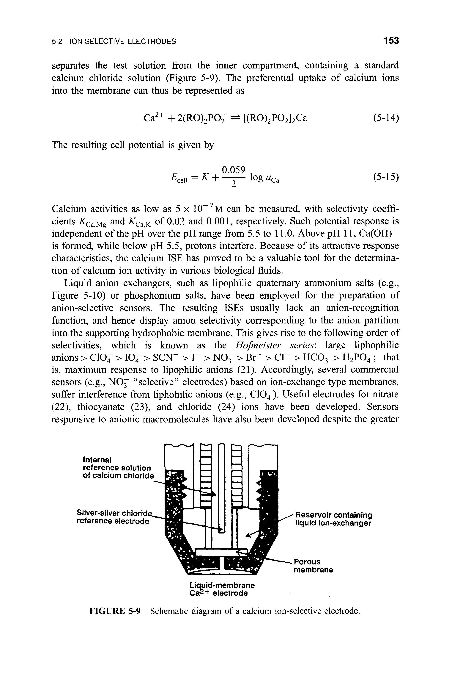

## Page 173

154
POTENTIOMETRY
FIGURE 5-10 
A quaternary alkyl ammonium chloride.
difficulty in identifying appropriate membrane chemistry that yields a significant and
selective response (25,26). A very successful example is the use of the quaternary
ammonium salt tridodecylmethylammonium chloride (TDMAC) for detecting the
clinically-important drug heparin (25). Apparently, the polyionic heparin is favorably
extracted into the membrane through ion-pairing interaction with the positively
charged nitrogen atoms (Figure 5-11). The extraction process results in a steady-state
change in the phase boundary potential at the membrane-sample interface. Analo-
gous potentiometric measurements of other macromolecular polyanionic species
have also been reported (26). Ion-exchange electrodes sensitive to large organic
cations have also been described. For example, PVC membranes containing
dinonylnaphthalenesulfonic acid (DNNS) have been used for the detection of
drugs of abuse (e.g., opiate alkaloids) (27). Such organic-responsive electrodes,
however, lack sufficient selectivity and are limited to simple samples such as
pharmaceutical formulations.
5-2.2.2 Neutral Carrier Electrodes In addition to charged liquid ion exchan-
gers, liquid-membrane electrodes often rely on the use of complex-forming neutral
carriers. Much effort has been devoted to the isolation or synthesis of compounds
containing cavities of molecular dimensions. Such use of chemical recognition
principles has made an enormous impact upon widespread acceptance of ISEs. The
resulting neutral carriers can be natural macrocyclic molecules or synthetic crown
heparin
FIGURE 5-11 The recognition process occurring at the TDMAC/PVC membrane/ sample
interface used for measurements of heparin. (Reproduced with permission from reference 26.)

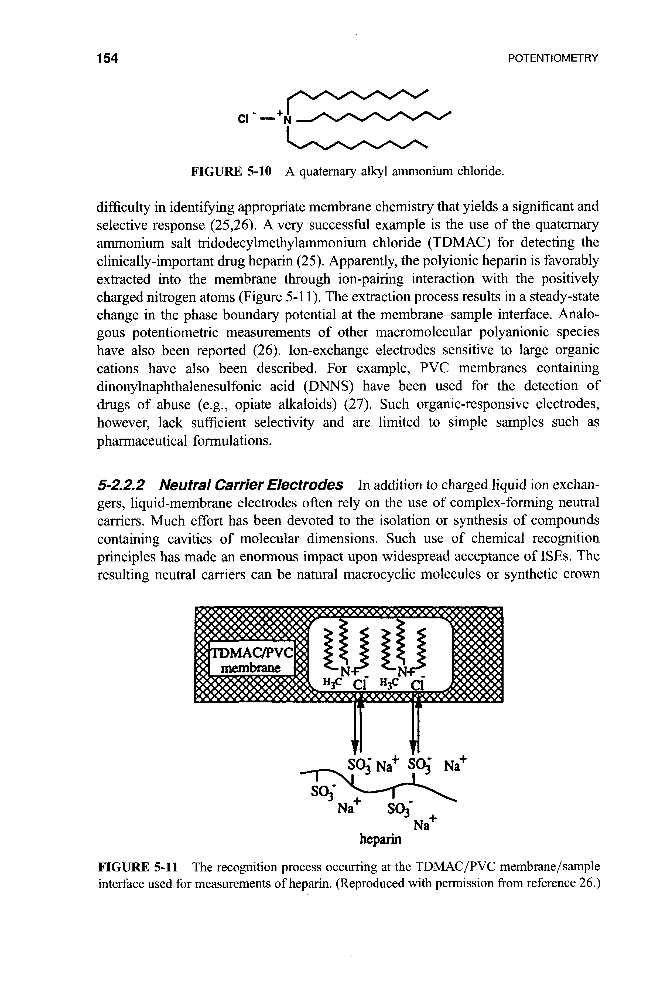

## Page 174

5-2 ION-SELECTIVE ELECTRODES 
155
compounds (e.g., tailor-made cyclic polyethers) capable to envelop various target
ions in their pocket. Electron-donor atoms, present in the polar host cavity, further
facilitate and influence the interaction with the target ion. For example, while
oxygen-containing crown ethers form stable complexes with alkali or alkaline earth
metals, sulfur-containing ones are best suited for binding heavy metals. The extent of
this interaction is determined by the "best-fit" mechanism, with larger ions not able
to fit the molecular cavity while smaller ones are weakly coordinated. Often, a
subunit group is added to the crown compound to impart higher selectivity (through
steric or blockage effects) and improved lipophilicity. The ion recognition process is
thus influenced by the cavity (ring) size, the number and positioning of the electron-
donor atoms, and the nature of the subunit. For example, 
14-crown-4-ether
compounds (i.e., 4 oxygens in a 14-atom ring) offer selective recognition of lithium.
Overall, these ionophores serve as reversible and reusable binding reagents that
selectively extract the target analyte into the membrane. Such a binding event creates
the phase boundary potential at the membrane-sample interface. To assure reversible
binding, it is essential to keep the free energy of activation of the analyte-ionophore
reaction sufficiently small (28). Molecular modeling techniques are being used to
guide the design of ionophores toward target analytes. The specific design takes into
consideration the selectivity demands imposed by clinical or environmental samples.
A host of carriers, with a wide variety of ion selectivities, have been proposed for
this task. Most of them have been used for the recognition of alkali and alkaline
earth metal cations (e.g., clinically relevant electrolytes). A classical example is the
cyclic depsipeptide valinomycin (Figure 5-12), used as the basis for the widely used
ISE for potassium ion (29). This doughnut-shaped molecule has an electron-rich
pocket in the center into which potassium ions are selectively extracted. For
example, the electrode exhibits a selectivity for K+ over Na+ of approximately
5000. The basis for the selectivity seems to be the fit between the size of the
potassium ion (radius 1.3 3 A) and the volume of the internal cavity of the
macrocyclic molecule. The hydrophobic side chains of valinomycin stretch into
the lipophilic part of the membrane. In addition to its excellent selectivity, the
electrode is well behaved and has a wide working pH range. Strongly acidic media
can be employed because the electrode is 18,000 times more responsive to K+ than
to H+. A Nernstian response to potassium ion activities, with a slope of 59 mV per
pK+, is commonly observed from 10~6 to lO^M. Such attractive performance
characteristics have made the valinomycin ISE extremely popular for clinical
analysis (with 200 million assays of blood potassium being carried out annually
in the United States using this device).
Many other cyclic and noncyclic organic carriers with remarkable ion selectivities
have been used successfully as active hosts of various liquid membrane electrodes.
These include the 14-crown-4-ether for lithium (30); 16-crown-5 derivatives for
sodium; bis-benzo-18-crown-6 ether for cesium; the ionophore ETH 1001 [(/?,/?)-
A^,Arl-bis(ll-ethoxycarbonyl)undecyl-A^,A^1-4,5-tetramethyl-3,6-dioxaoctanediamide]
for calcium; the natural macrocyclics nonactin and monensin for ammonia and
sodium (31), respectively; the ionophore ETH 1117 for magnesium; calixarene
derivatives for sodium (32); and macrocyclic thioethers for mercury and silver (33).

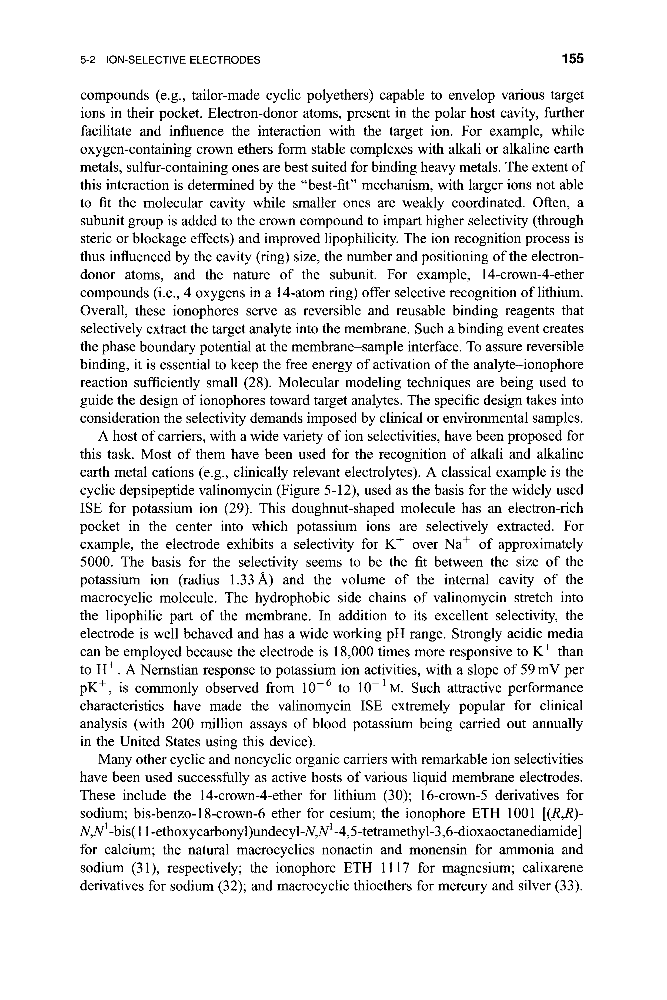

## Page 175

156
POTENTIOMETRY
^n 
. »
l\ / \
I 
(~ 
C
R'.
\
-C-H
NH 
«j
NH
/
,CH
R'
CH
NH'
O 
c<
• — CH-'
C ——
•~~~
CH
\
R'
»/ 
« 
NH
CH 
^0
O 
I
R'
FIGURE 5-12 Valinomycin.
Some common ionophores used for sensing different cations are displayed in Figure
5-13. The development of highly selective lithium electrodes for clinical monitoring
of psychiatric patients (receiving lithium-based drugs) has been particularly challen-
ging considering the large sodium interference. Similarly, highly selective iono-
phores for sodium are needed for addressing the large excess of potassium in the
intracellular fluid.
Anion-selective liquid-membrane electrodes have also been developed based on
the coordination of the anionic guest to host materials, such as metallophorphyrin or
hydrophobic vitamin B^ derivatives, alkyltin compounds or macrocyclic poly-
amines (34-38) (Figure 5-14). Such biomimetically designed ionophores offer
effective sensing of inorganic and organic anions, such as thiocyanate, carbonate,
salicylate, phosphate, or adenosine nucleotides. Unlike anion-exchanger electrodes,
these anion sensors display selectivity patterns greatly different from the Hofmeister
sequence (due to the direct interaction of the host with the specific anion). Often, this
interaction involves an exchange of the coordinated anion at the metal center of the
organometallic ionophore with the target anion in the sample solution. Useful
reviews describe in detail individual carrier-based ISEs, (according to the analyte
for which they were developed) and their practical limits. (39,39a). Many exciting
developments based on novel host-guest chemistry (e.g., recognition by steric
shapes) are anticipated.
5-2.3 
Solid-State Electrodes
Considerable work has been devoted to the development of solid membranes that are
selective primarily to anions. The solid-state membrane can be made of single

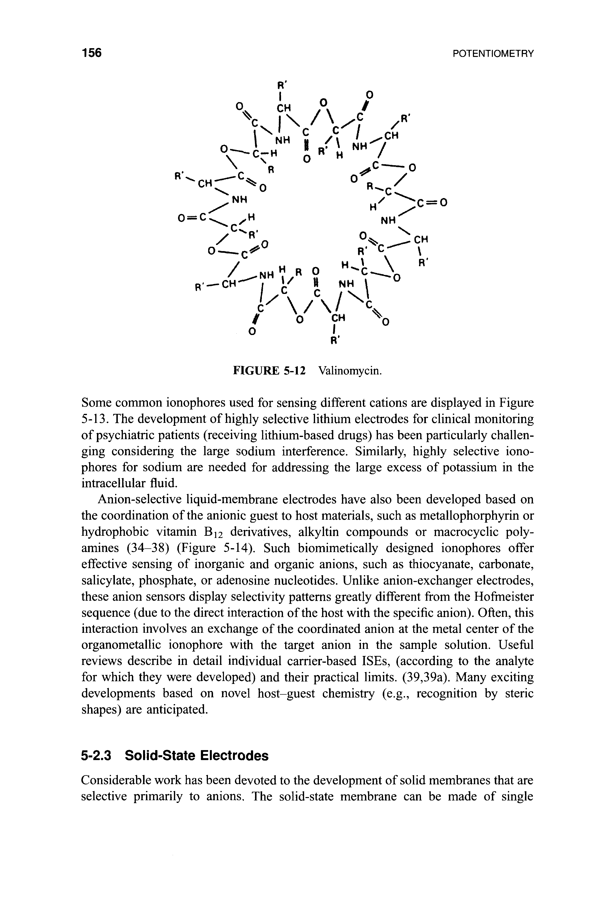

## Page 176

5-2 
ION-SELECTIVE ELECTRODES 
157
R1 = R2 = R3 = RA = CH3 
NONACTIN 
2_
MONACTIN
R
1 = R3=CH3 
R2=R4=C2H5 
DINACT1N 
L 
\ 
' 
M9
O 
ETH1117
TRINACTIN
= R2 _ R3 = RA = C2H5 
TETRANACTIN 6_
FIGURE 5-13 Structures of neutral carriers used in liquid-membrane ion-selective
electrodes.
crystals, polycrystalline pellets, or mixed crystals. The resulting solid-state
membrane electrodes have found use in a great number of analytical applications.
An example of a very successful solid-state sensor is the fluoride ion-selective
electrode. This single-crystal device is by far the most successful anion-selective
electrode. It consists of a LaF3 crystal and an internal electrolyte solution (consisting
of 0.1 M NaF and 0.1 M KC1, and containing the Ag/AgCl wire). The LaF3 crystal is
doped with EuF2 to provide vacancies ("holes") at anionic sites (Figure 5-15). Since
each EuF2 introduces only two F~ instead of three, there is a vacant fluoride site for
each EuF2 added. Such a solid-state membrane derives its selectivity from restriction
of the movement of all ions, except the fluoride of interest. The latter moves by
migration through the crystal lattice (by jumping from one vacancy defect to
another), thus establishing the desired potential difference. A Nernstian response
£ = £-0.059 logaF- 
(5-16)
is obtained down to about 10~ 6 M. The only interfering ion (due to similarity in size
and charge) is OH~, for which the selectivity coefficient (Kf-/OH-) is O.I. Hence, the
electrode is limited to use over the pH range 0-8.5. Other halide ions are
considerably larger than F~ and so do not interfere. The electrode exhibits at least
a 1000: 1 preference for fluoride over chloride or bromide ions. In acidic solutions
(pH < ~ 4) the fluoride activity is less than the formal concentration (due to the
formation of HF).

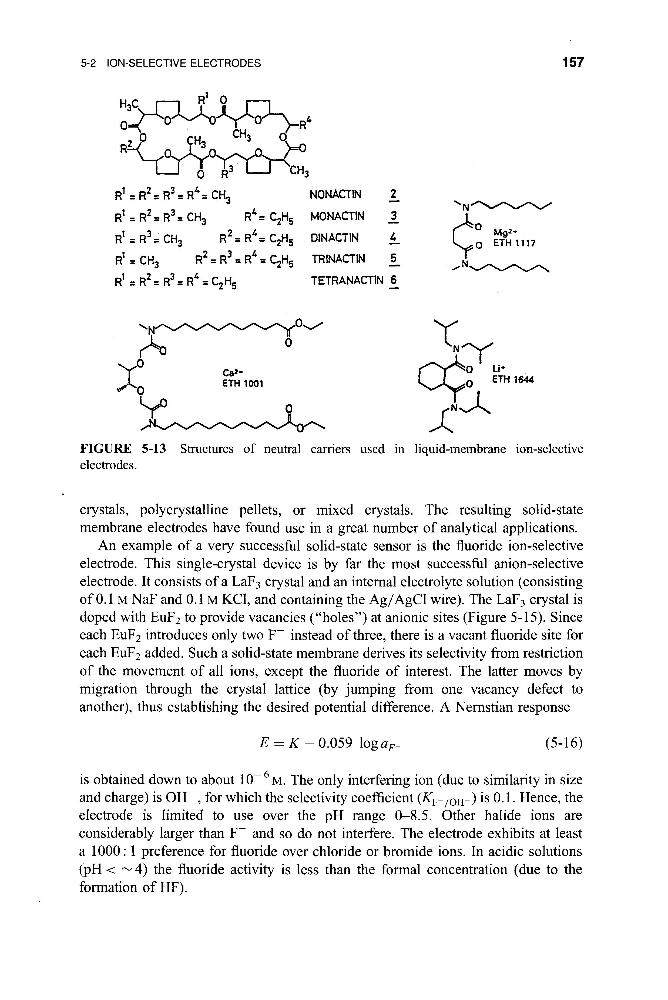

## Page 177

158
POTENTIOMETRY
H3CO7C
HqC
C02CH3
(b)
(c)
CicHo
r—NH 
HN—\
NH 
HN
(d)
FIGURE 5-14 
Structures of some chemical species useful for designing anion-selective
electrodes: (a) Mn(III) porphyrin; (b) vitamin B12 derivative; (c) tri-n-octyltin chloride; (d)
lipophilic polyamine macrocyclic compound.

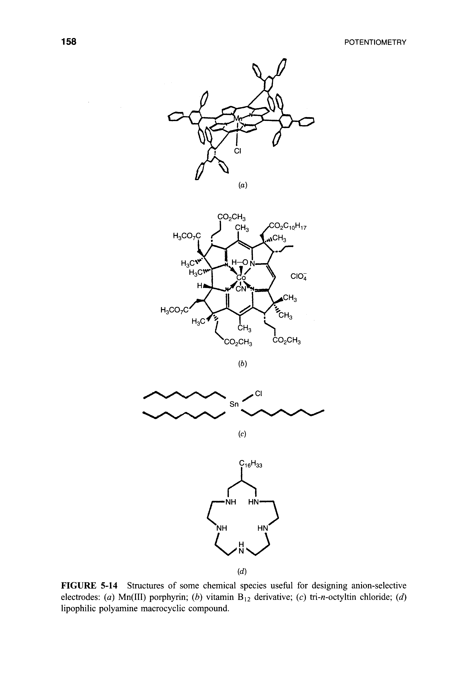

## Page 178

5-2 ION-SELECTIVE ELECTRODES
159
oo
Eua
-• o
FIGURE 5-15 
Migration of the fluoride ion through the LaF3 lattice (doped with EuF2).
The vacancies created within the crystal cause jumping of neighboring F~ into the vacancy.
Other useful solid-state electrodes are based on silver compounds (particularly
silver sulfide). Silver sulfide is an ionic conductor, in which silver ions are the
mobile ions. Mixed pellets containing Ag2S-AgX (where X = Cl, Br, I, SCN) have
been successfully used for the determination of one of these particular anions. The
behavior of these electrodes is determined primarily by the solubility products
involved. The relative solubility products of various ions with Ag+ thus dictate the
selectivity (i.e., 
ky = ^sp(AgO/^sp(Ag/))- Consequently, the iodide 
electrode
(membrane of Ag2S/AgI) displays high selectivity over Br~ and Cl~. In contrast,
the chloride electrode suffers from severe interference from Br~~ and I~. Similarly,
mixtures of silver sulfide with CdS, CuS, or PbS provide membranes that are
responsive to Cd2+, Cu2+, or Pb2+, respectively. A limitation of these mixed-salt
electrodes is that the solubility of the second salt must be much larger than that of
silver sulfide. A silver sulfide membrane by itself responds to either S2~ or Ag+
ions, down to the 10~8M level.
Sensors for various halide ions can also be prepared by suspending the
corresponding silver halide in an inert support material, such as silicone rubber
(40). Such support material provides a flexible, heterogeneous membrane with
resistance to cracking and swelling. The resulting membrane is called a hetero-
geneous or precipitate-impregnated membrane. For example, a chloride-selective
electrode is based on a heterogeneous membrane prepared by polymerizing mono-
meric silicone rubber in the presence of an equal weight of silver chloride particles.
A 0.5 mm thick disk of this heterogeneous membrane is sealed to the bottom of a
glass tube; potassium chloride and a silver wire are placed in the tube. The
sensitivity of the electrode is limited by the solubility of silver chloride. Chloride
concentrations from 5 x 10~5 to l.OM can be measured. Such an electrode operates
over the pH range 2-12, and at temperatures between 5 and 5000°C. Ion-selective
electrodes for thiocyanate (SCN") or cyanide (CN~) can be prepared in a similar
fashion. Such electrodes rely on a "corrosion" reaction between the silver halide
(AgX) and the target ion, for example:
AgX + 2OST -> Ag(CN) j + X
(5-17)

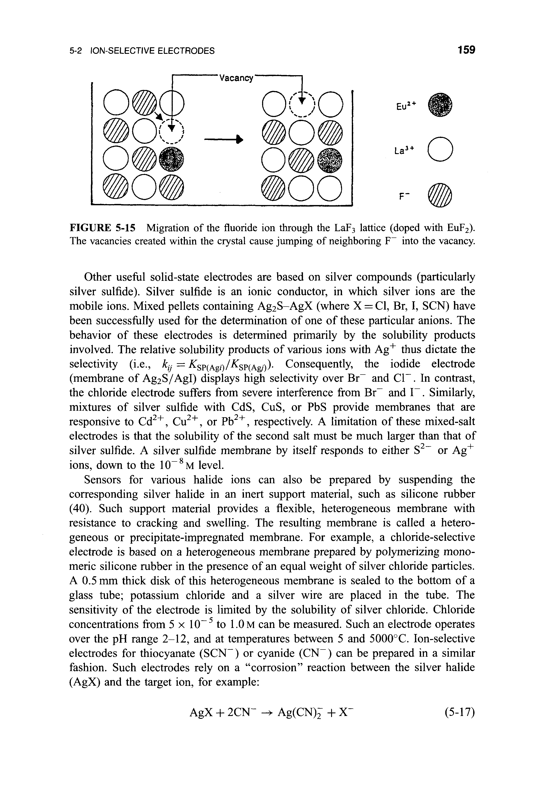

## Page 179

160
POTENTIOMETRY
(Safety considerations dictate that cyanide measurements should be carried out in
strongly basic media.) The interference mechanism with silver-based solid-state ISEs
differs from that of ISEs described earlier. Depending on the KSP value, an excess of
the interfering ion may result in its deposition as silver salt on the membrane surface.
Removal of the interfering film (by scrubbing) is thus required to restore the
electrode activity. Table 5-1 lists some solid-state electrodes from a commercial
source, along with their dynamic range and major interferences.
5-2.4 
Coated-Wire Electrodes
Coated-wire electrodes (CWEs), introduced by Freiser in the mid-1970s, are
prepared by coating an appropriate polymeric film directly onto a conductor
(Figure 5-16). The ion-responsive membrane is commonly based on poly(vinyl
chloride), while the conductor can be metallic (Pt, Ag, Cu) or graphite-based of any
conventional shape such as wire or disk. The conductor is usually dipped in a
solution of PVC and the active substance, and the resulting film is allowed to air dry.
Other polymers and modified polymers, including poly(acrylic acid) and modified
poly(vinylbenzyl chloride) can also be useful for various applications. In addition to
the miniaturization capability, CWEs are extremely simple, inexpensive, and easy to
prepare and function well over the lO"5-!*)"1]^ concentration range. The exact
mechanism of the behavior of the CWE continues to be a mystery, in view of the lack
of internal reference components. Coated-wire electrodes may suffer from reprodu-
cibility and long-term stability (drifting potential) problems. Nevertheless, such
devices have been found useful for various important applications, provided the
electrodes are calibrated periodically. Determinations of basic drugs (e.g., cocaine,
methodone) (42), amino acids (43), potassium, and sodium (44) represent some of
the useful applications of CWE. New concepts for preparing CWEs appear to
improve their analytical performance, particularly with respect to stability and
TABLE 5-1 
Characteristics of Solid-State Crystalline Electrodes3
Analyte Ion
sr
Cd2+
cr
Cu2+
CN"
F"r
Pb2+
Concentration Range (M)
10° to 5x 10~6
10" ' to 1 x 10"7
10° to 5x 10~5
10~ ' to 1 xlO~ 8
10"2to 1 x 10"6
Saturated to 1 x 10~6
10° to 5 x 10" 8
10" * to I x l O " 6
Major Interferences
CN~,r, S2~
Fe2+,Pb2+,Hg2+,Ag+,Cu2+
CN-,r,Br, S
2~
Hg2+, Ag+, Cd2+
s2-
OH-
Hg2+, Ag+, Cu2+
+ 2 -
Ag+/S
SCN"
Ag +
S2": -10° to I x 10"
10° to 1 xlO" 6
Hg2+
"From Orion Guide to Ion Analysis, Orion Research, Cambridge, MA, 1983. With permission.

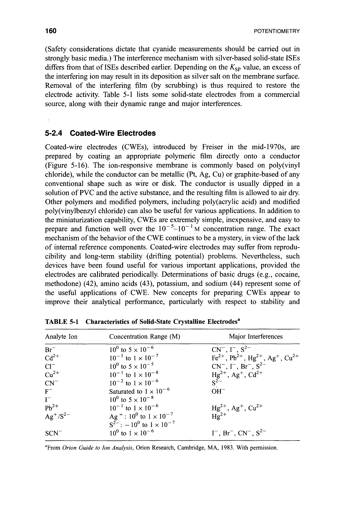

## Page 180

5-3 ON-LINE AND IN-VIVO POTENTIOMETRIC MEASUREMENTS
161
BNC Connector
Parafllm" 
Seal
Coaxial Cable
Outer Conductor
Inner Insulator
Inner Conductor
Ion Selective PVC Bead
FIGURE 5-16 Coated-wire ion-selective electrode. (Reproduced with permission from
reference 41.)
reproducibility. The principles and applications of CWEs have been reviewed (4).
The possibility of eliminating the internal filling solution is receiving considerable
interest in connection with mass production of potentiometric sensors and sensor
arrays (see Section 6-3.2).
5-3 ON-LINE AND IN-VIVO POTENTIOMETRIC MEASUREMENTS
Various on-line monitoring systems can benefit from the inherent specificity, wide
scope, dynamic behavior, and simplicity of ISEs. In particular, ISEs have become
widely used as detectors in high-speed automated flow analyzers, such as air-
segmented or flow injection systems (45,46). For example, Figure 5-17 shows the
flow injection determination of physiologically important potassium in serum, using
a tubular potassium selective electrode, at a rate of 100 samples per hour. Even
higher throughputs, reaching 360 samples per hour, have been employed in
connection with air-segmented flow systems (48). Such analyzers are now being

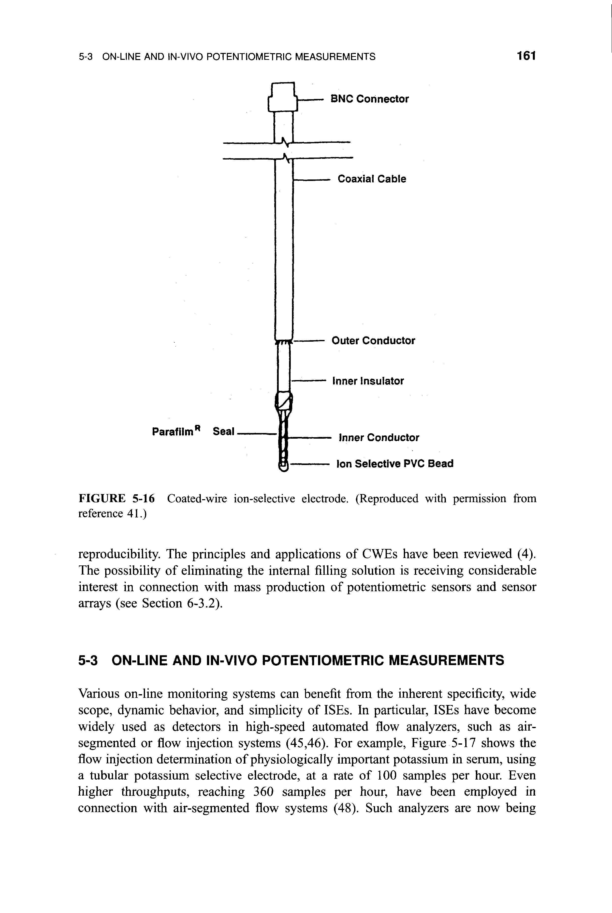

## Page 181

162
POTENTIOMETRY
1.0
0.8
0.6
0.4 
»•'
0.2
0.1
I
•
30 mV
um 
1
2.5
mln
I)
uwuipi flVVtllMUUU «L_
FIGURE 5-17 Flow injection potentiometric determination of potassium in serum. (Repro-
duced with permission from reference 47.)
routinely employed in most hospitals for the high-speed determination of physio-
logically important cationic electrolytes (e.g., K+, Na+, Ca2+, Mg2+, and H+) or
anions (e.g. CP) in body fluids. The corresponding ISEs are usually placed in
series, along the flow channel. Additional advantages accrue from the coupling of
arrays of potentiometric detectors with chemometric (statistical) procedures (see
Section 6-4). The transient nature of flow-injection potentiometric measurements
(e.g., Figure 5-17) nicely addresses the potential-drift problem common to analogous
batch measurements. It can also be exploited for enhancing the selectivity by
operating under kinetic (rather than equilibrium) control. Improved selectivity can
also be achieved by deliberately adding the interfering ion to the flow-injection
carrier solution. Several designs of low-volume potentiometric flow detectors have
been reported (47,48). The simplest design consists of an ISE fitted tightly with a
plastic cap, with an inlet and outlet for the flowing stream (Figure 5-18). The
reference electrode is usually placed downstream from the ISE. It can also be
immersed in a parallel (potassium chloride) flowing stream. Other common detector
designs include the flow-through tubular ISE (used in Figure 5-17), and tangential or
wall-jet ISEs. Multi-ion detectors, based on ion-sensitive field-effect transistors
(discussed in Section 6-3) have been combined with miniaturized micromachined
flow-injection systems (50). Such coupling offers improved response times and
reduced consumption of samples and reagents.
In addition to automated analysis, ISEs can be used to detect ionic species in
chromatographic effluents. Particularly powerful is the coupling of modern ion

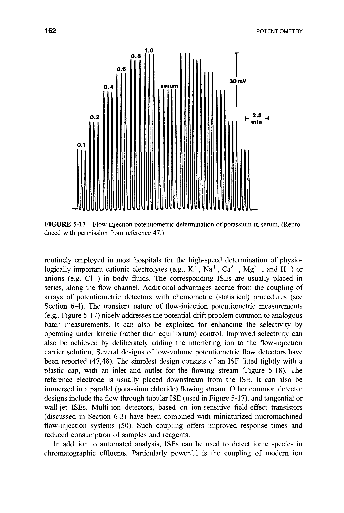

## Page 182

5-3 ON-LINE AND IN-VIVO POTENTIOMETRIC MEASUREMENTS
163
FIGURE 5-18 Flow-through potentiometric cell-cap design. A, reference electrode; B,
iodide electrode; C, flow-through cap; D, inlet; E, outlet. (Reproduced with permission from
reference 49.)
chromatography with potentiometric detection (51). Similarly, liquid-membrane
microelectrodes have been used as small-dead-volume detectors in open tubular
column liquid chromatography (52). Miniaturization has also permitted the recent
adaptation of ISEs as on-column detectors for capillary zone electrophoresis in
connection with femtoliter detection volumes (53,54). The small dimensions in
capillary electrophoresis require proper attention to the positioning of the ISE
detector. Both micropipette and coated-wire ISEs have been useful for this task, with
the latter offering a simplified electrode alignment (54). Micropipette ISEs have also
been used as tips in scanning electrochemical microscopy (55; see Section 2-3). The
suitability to miniaturization is attributed to the fact that the potentiometric signal
does not depend on the sensing area; but further miniaturization of ISEs to the
nanometer domain is limited by the electrical resistance of the bulk liquid
membrane.
Potentiometric microelectrodes are very suitable for in-vivo real-time clinical
monitoring of blood electrolytes, intracellular studies, in-situ environmental surveil-
lance or industrial process control. For example, Simon's group described the utility
of a system for on-line measurements of blood potassium ion concentration during
an open-heart surgery (56); Buck and co-workers (57) reported on the use of flexible
planar electrode arrays for the simultaneous in-vivo monitoring of the pH and
potassium ion in the porcine beating heart during acute ischemia (Figure 5-19).

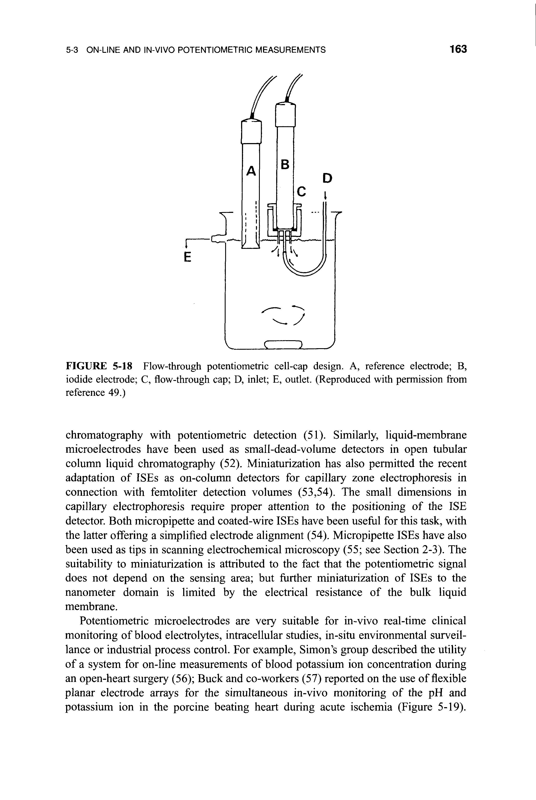

## Page 183

164
POTENTIOMETRY
(a)
(b)
10.00
«.00-
0.00-
2 
7.00-
6.00 H
6.00-
4.00-
3.00
7.50
0.0
2.0
4.0 
6.0 
8.0
Time (min)
10.0
FIGURE 5-19 
(a) Placement of the two pH and two potassium sensors (0.5 mm diameter)
in the porcine heart, (b) Recorded fall in the pH and increased potassium activity LAD = left
anterior descending coronory artery. (Reproduced with permission from reference 57.)
Miniaturized catheter-type ISE sensors, such as the implantable probe shown in
Figure 5-20 represent the preferred approach for routine clinical in-vivo monitoring
of blood electrolytes. For these intravascular measurements the reference electrode
is placed outside the artery (in the external arm of the catheter), thus obviat-
ing biocompatability and drift problems associated with its direct contact with the
blood.

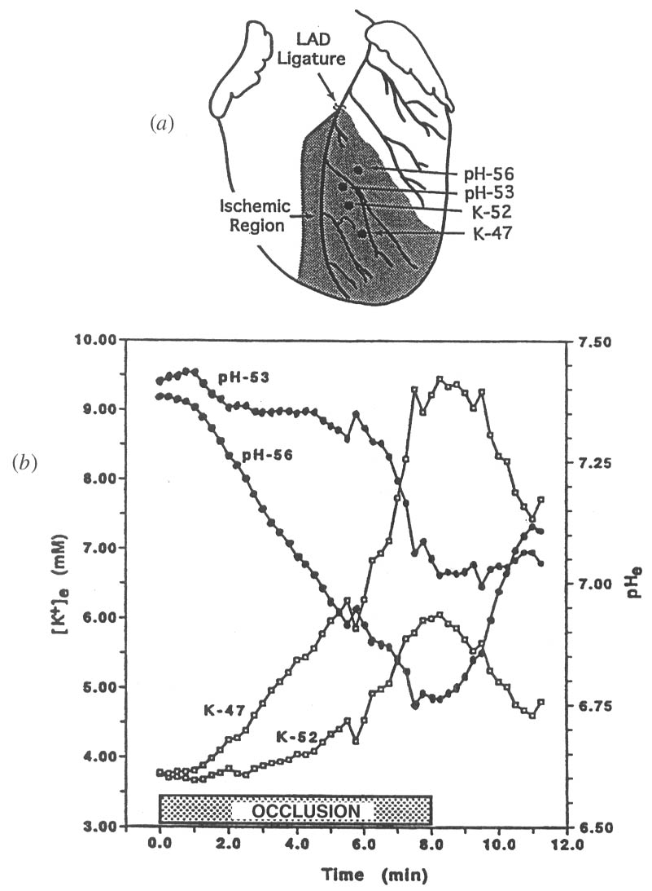

## Page 184

REFERENCES
165
External Reference
Electrode
Bridge
Electrolyte
Rush
Ag/AgC! Reference Wire
Catheter Guide
PVC Tubing
Porous Ceramic Frit
PVC Ion Selective
Membrane
FIGURE 5-20 Miniaturized ISE catheter sensor for continuous monitoring of blood
electrolytes. (Reproduced with permission from reference 58.)
REFERENCES
1. J. Koryta, Ions, Electrodes and Membranes, Wiley, New York, 1982.
2. W.E. Morf, The Principles of Ion-Selective Electrodes and of Membrane Transport,
Elsevier, Amsterdam, 1981.
3. A.K. Covington, Ed., Ion-Selective Electrode Methodology, CRC Press, Boca Raton, FL,
1979.
4. H. Freiser, Ed., Ion Selective Electrodes in Analytical Chemistry, Vol. 1 and 2, Plenum
Press, New York, 1978 and 1980.
5. N. Lakshminarayanaiah, Membrane Electrodes, Academic Press, New York, 1976.
6. P.P. Buck, CRC Crit. Rev. Anal. Chem., 5, 323 (1976).
7. D. Ammann, W. Morf, P. Anker, P. Meier, E. Pret, and W. Simon, Ion Sel. Electrode Rev., 5,
3 (1983).
8. A.K. Covington, CRC Crit. Rev. Anal. Chem., 3, 355 (1974).
9. B.P. Nikolskii, Acta Physiochim. U.S.S.R., 1, 597 (1937).

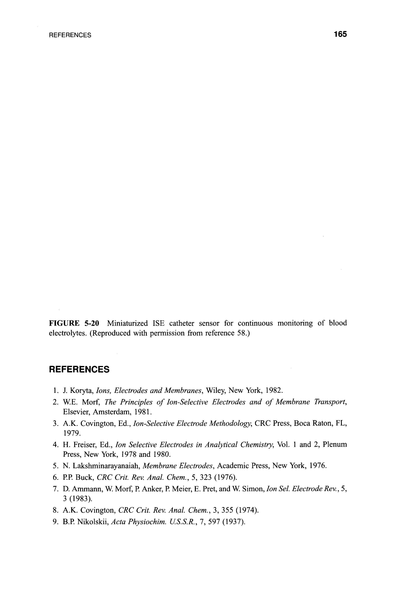

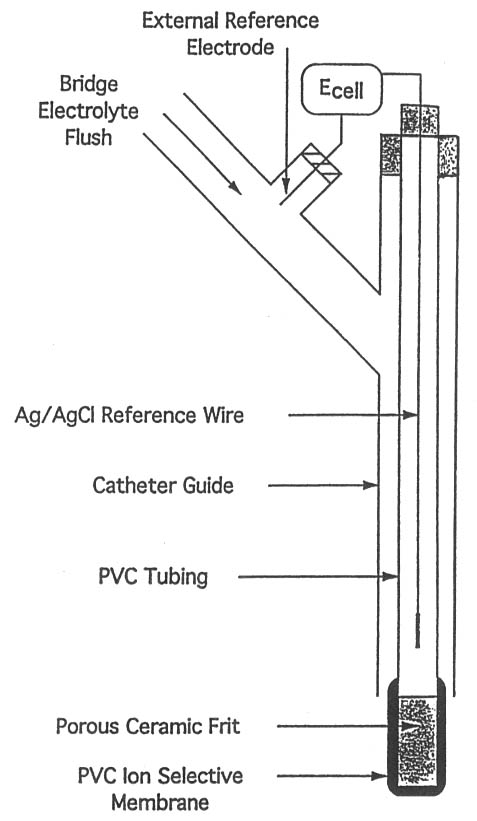

## Page 185

166
POTENTIOMETRY
10. Y. Umezawa, Ed., Handbook of Ion-Selective Electrodes: Selectivity Coefficients, 
CRC
Press, Boca Raton, FL, 1990.
11. E. Bakker, Electroanalysis, 9, 7 (1997).
12. R.P. Buck and E. Lindner, Pure Appl. Chem., 66, 2527 (1995).
13. A. Lewenstam, M. Maj-Zurawska, and A. Hulanicki, Electroanalysis, 3, 727 (1991).
14. M. Cremer, Z. Biol. (Munich), 47, 562 (1906).
15. G. Eisenman, Ed., Glass Electrodes for Hydrogen and Other Cations, Marcel Dekker, New
York, 1976.
16. R.G. Bates, Determination ofpH: Theory and Practice, Wiley, New York, 1973.
17. P. Anker, D. Ammann, and W. Simon, Mikrochim, Acta, I, 237 (1983).
18. U. Oesch, D. Ammann, and W. Simon, Clin. Chem., 38, 1448 (1986).
19. S. Mathison, and E. Bakker, Anal. Chem., 70, 303 (1998).
20. T. Sokalski, A. Ceresa, T. Zwicki, and E. Pretsch, J. Am. Chem. Soc., 119, 11347 (1997).
21. F. Hofhieister, Arch. Exp. Pathol Pharmakol, 24, 247 (1888).
22. A. Hulanicki, M. Maj-Zurawska, and R. Lewandowski, Anal. Chim. Acta, 98, 151 (1978).
23. C.J. Coetzee and H. Freiser, Anal. Chem., 40, 207 (1968).
24. J.L. Walker, Anal. Chem., 43, 89A (1971).
25. S. Ma, V Yang, and M. Meyerhoff, Anal Chem., 64, 694 (1992).
26. B. Fu, E. Bakker, J. Yum, E. Wang, V Yang, and M.E. Meyerhoff, Electroanalysis, 7, 823
(1995).
27. C.R. Martin, and H. Freiser, Anal Chem., 52, 562 (1980).
28. E. Pretsch, M. Badertscher, M. Welti, T. Maruizumi, W. Morf, and W. Simon, Pure Appl.
Chem., 60, 567 (1988).
29. WE. Morf, D. Ammann, and W. Simon, Chimica, 28, 65 (1974).
30. V Gadzekpo, J. Hungerford, A. Kadry, Y. Ibrahim, and G. Christian, Anal Chem., 57, 493
(1985).
31. O. Kedem, E. Loebel, and M. Furmansky, Gen. Ojfenbar, No. 2027128 (1970).
32. A. Cadogan, D. Diamond, M. Smyth, M. Deasy, A. McKervey, and S. Harris, Analyst, 114,
1551 (1989).
33. Z. Brzozka, P. Cobben, D. Reinhaudt, J. Edema, J. Buter, and R. Kellogg, Anal. Chim.
Acta, 273, 1139(1993).
34. U. Wuthier, H. Viet Pham, R. Zund, D. Welti, R.J. Funck, A. Bezegh, D. Ammann,
E. Pretsch, and W. Simon, Anal Chem., 56, 535 (1984).
35. K. Tohda, M. Tange, K. Odashima, Y. Umezawa, H. Furuta, and J. Sessler, Anal. Chem.,
64, 960 (1992).
36. S. Park, W. Matuszewski, M. Meyerhoff, Y. Liu, and K. Kadish, Electroanalysis, 3, 909
(1991).
37. S. Glazier and M. Arnold, Anal Chem., 63, 754 (1991).
38. Q. Chang, S.B. Park, D. Kliza, G.S. Cha, H. Yim, and M.E. Meyerhoff, Amer. Lab, Nov.,
10 (1990).
39. P. Buhlmann, E. Pretsch, and E. Bakker, Chem. Rev., 98, 1593 (1998).
39a. E. Bakker, P. Buhlmann, and E. Pretsch, Electroanalysis 11, 915 (1999).
40. E. Pungor and K. Toth, Pure Appl. Chem., 31, 521 (1972).

## Page 186

EXAMPLES 
167
41. C.R. Martin and H. Freiser, J. Chem. Educ., 57, 152 (1980).
42. L. Cunningham and H. Freiser, Anal. Chim. Acta, 139, 97 (1982).
43. H. James, G. Carmack, and H. Freiser, Anal. Chem., 44, 856 (1972).
44. H. Tamura, K. Kimura, and T. Shono, Anal. Chem., 54, 1224 (1982).
45. K. Toth, J. Fucsko, E. Lindner, Z. Feher, and E. Pungor, Anal. Chim. Acta, 179,359 (1986).
46. M. Trojanowich, and W. Matuszewski, Anal. Chim. Acta, 138, 71 (1982).
47. M.E. Meyerhoff and P.M. Kovach, J. Chem. Educ., 60, 766 (1983).
48. PS. Alexander and P. Seegopaul, Anal Chem., 52, 2403 (1980).
49. R. Llenado and G.A. Rechnitz, Anal. Chem., 45, 2165 (1973).
50. B. van der School, S. Jeanneret, A. van den Berg, and N. de Rooji, Anal. Methods Instrum.,
1, 38 (1993).
51. I. Isildak and A. Covington, Electroanalysis, 5, 815 (1993).
52. A. Manz and W. Simon, J. Chromatogr. Sci., 21, 326 (1983).
53. A. Nann, I. Silverstri, and W. Simon, Anal. Chem., 65, 1662 (1993).
54. T. Kappes and PC. Hauser, Anal. Chem., 70, 2487 (1998).
55. K. Toth, G. Nagy, C. Wei, and A.J. Bard, Electroanalysis, 7, 801 (1995).
56. H.F. Osswald, R. Asper, W. Dimai, and W. Simon, Clin. Chem., 25, 39 (1979).
57. R.P. Buck, V Cosorfet, E. Lindner, S. Ufer, M. Madaras, T. Johnson, R. Ash, and
M. Neuman, Electroanalysis, 1, 846 (1995).
58. C. Espadas-Torre, M. Telting-Diaz, and M.E. Meyerhoff, Interface, Spring Issue, 41
(1995).
EXAMPLES
Example 5-1 
Calculate the relative error (in proton concentration) that would
occur if the pH of a 1 x 10~2M NaOH solution were measured with a pH glass
electrode (&HNa = 10~10; assuming activity coefficient of 1.0).
Solution 
The concentration of the interfering sodium ion is 1 x 10 ~ 2 M, while
that of the target proton is
[H+] = KJ[OIT] = 10-14/10~2 = 1 x 10~12M
From equation (5.6), we thus obtain
£cell =K + 0.059log[l x 10"12 + 10"10 x (1 x 10~2)]
The relative error in concentration is thus
[10~10 x (1 x 10"2)/10~12] x 100 = 100%

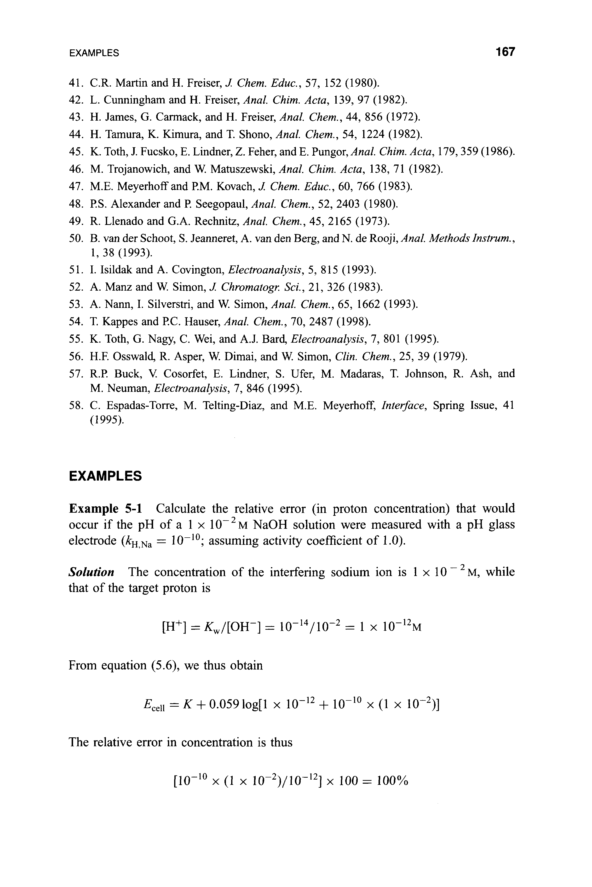

## Page 187

168
POTENTIOMETRY
Example 5-2 The following potentials were observed for a calcium electrode
immersed in standard calcium solutions:
[Ca2+M 
£(mV)
1 x 1(T5 
100
1x10~ 4 
129
1 x 10"3 
158
What potential is expected for a calcium concentration of 5 x 1CP4M? (Assume
activity coefficient of 1.0.)
Solution 
Plotting E vs. log[Ca2+] gives a straight line with a slope of 29 mV/
decade and an intercept of 245 mV A calcium concentration of 5 x 10~4M thus
yields:
E = K + 29 log [5 x 10~4] = 245 - 95.7 = 149.3 mV
EXAMPLE 5-3 Calculate the error in millivolts that would occur if a solution
containing 5 x 10~5MF~ (pH 10) were measured with a fluoride ISE.
(*F,OH=0.1)
Solution 
The concentration of the interfering hydroxyl ion at pH=10 can be
obtained:
[OH-] =
= io-14/io-'° = io-4 M
From equation (5.4) we obtain:
= K- 0.059 log(5 x 10~5 + 0.1 x 10~4) =K + 0.249
In the absence of hydroxyl ion:
£cell =K- 0.059 log(5 x IO"5) =K + 0.254
Therefore the error in mV is
Error = K + 249 - (K + 254) = -5 mV

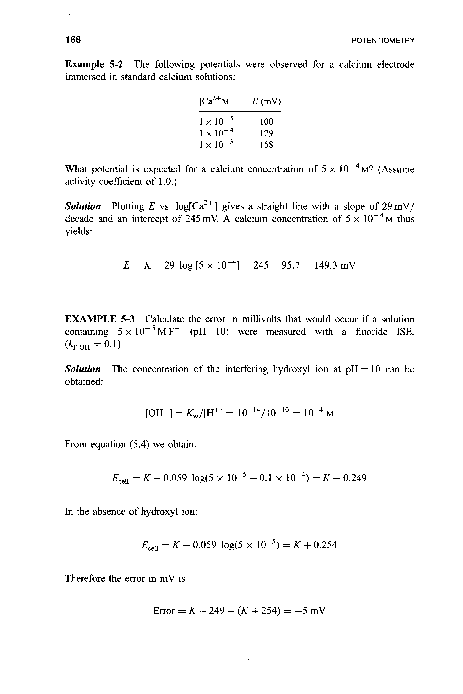

## Page 188

QUESTIONS 
169
Example 5-4 A student calibrated a Mg2+ ion-selective electrode using two
standard solutions at 25°C and constant ionic strength. He obtained the following
results:
[Mg+2] (M) 
£(mV)
1 x1(T j 
142
1 x10~4 
113
What is the concentration of the test solution that gave a potential reading of 125 mV
under the same conditions?
Solution 
Plotting E vs. log[Mg2+] gives a straight line; the magnesium concen-
tration (2.6 x 1CT4M) corresponding to the 125mV reading can be read directly
from the axis.
EXAMPLE 5-5 Calculate the error caused by sodium ion, aNa = 0.01, in the
measurement of lithium, au — 0.01, using a lithium ion-selective electrode
*UN. = 0-06
Solution 
From equation (5.6), we obtain
E = K + 0.059 logfO.OOl + 0.06(0.01)] =K-Q.\65V
Without sodium the potential is
E = K + 0.059 log(O.OOl) = K - 0.177 V
Thus
Error = (0.012/0.177) x 100 = 6.8%
QUESTIONS
1. Discuss clearly the structural requirements for designing selective ionophores
for ISE work. Give examples of such structures.
2. Explain clearly (using equations) why a highly selective ISE is not always
sufficient for accurate potentiometric measurements.
3. Explain how the ion-recognition event is translated to the response of the
corresponding ISE.
4. Explain clearly (using equations) why the sodium ISE is more sensitive than the
calcium one.
5. Describe the source of errors in pH measurements using the glass pH electrode.

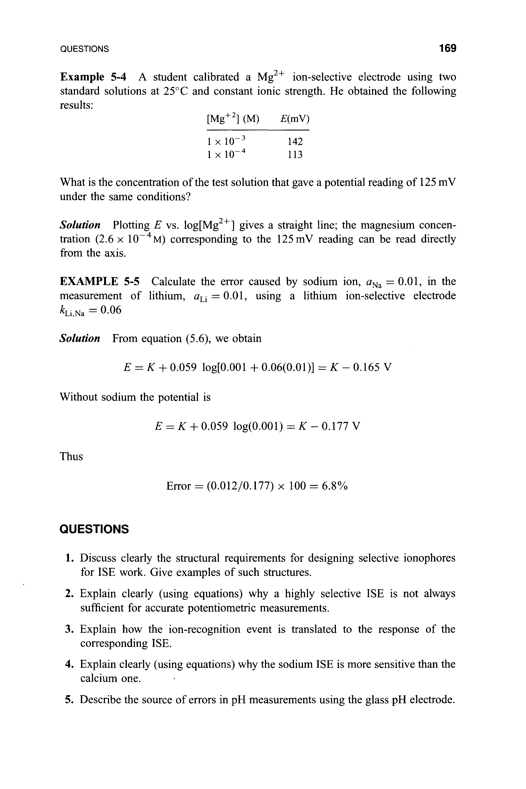

## Page 189

170
POTENTIOMETRY
6. Describe the response mechanism of the fluoride ion-selective electrode.
Explain clearly why the OH~ is the major interfering ion in F~ ISE measure-
ments.
7. Discuss the significance of the selectivity coefficient of an ISE. How would you
determine its value?
8. Give example of a successful ISE for measuring a macromolecular polyanionic
compound.
9. Use the Nikolskii-Eisenman equation to explain why lowering of the detection
limits requires careful attention to the selectivity of the resulting ISE.
10. Explain clearly how the presence of magnesium ion can influence the response
of the calcium ISE.
11. By how many millivolts will the potential of a calcium ISE change if the
electrode is removed from a 1 x 10~3M CaCl2 solution and placed in
1 x 10~3MCaCl2?
12. Explain clearly why small uncertainties in the measured cell potential can cause
large errors in the response of ISEs.
13. Discuss the major sources of errors in potentiometric measurements.

## Page 190

CHAPTER 6
ELECTROCHEMICAL SENSORS
A chemical sensor is a small device that can be used for direct measurement of the
analyte in the sample matrix. Ideally, such a device is capable of responding
continuously and reversibly and does not perturb the sample. By combining the
sample handling and measurement steps, sensors eliminate the need for sample
collection and preparation. Chemical sensors consist of a transduction element
covered with a chemical or biological recognition layer. This layer interacts with the
target analyte and the chemical changes resulting from this interaction are translated
by the transduction element into electrical signals.
The development of chemical sensors is currently one of the most active areas of
analytical research. Electrochemical sensors represent an important subclass of
chemical sensors in which an electrode is used as the transduction element. Such
devices hold a leading position among sensors presently available, have reached the
commercial stage, and have found a vast range of important applications in the fields
of clinical, industrial, environmental, and agricultural analyses. The field of sensors
is interdisciplinary and future advances are likely to derive from progress in several
disciplines. Research into electrochemical sensors is proceeding in a number of
directions, as described in the following sections. The first group of electrochemical
sensors, the potentiometric ion-selective electrodes (based on "ionic receptors"), has
been described in Chapter 5.
6-1 
ELECTROCHEMICAL BIOSENSORS
Electrochemical biosensors combine the analytical power of electrochemical tech-
niques with the specificity of biological recognition processes. The aim is to
171

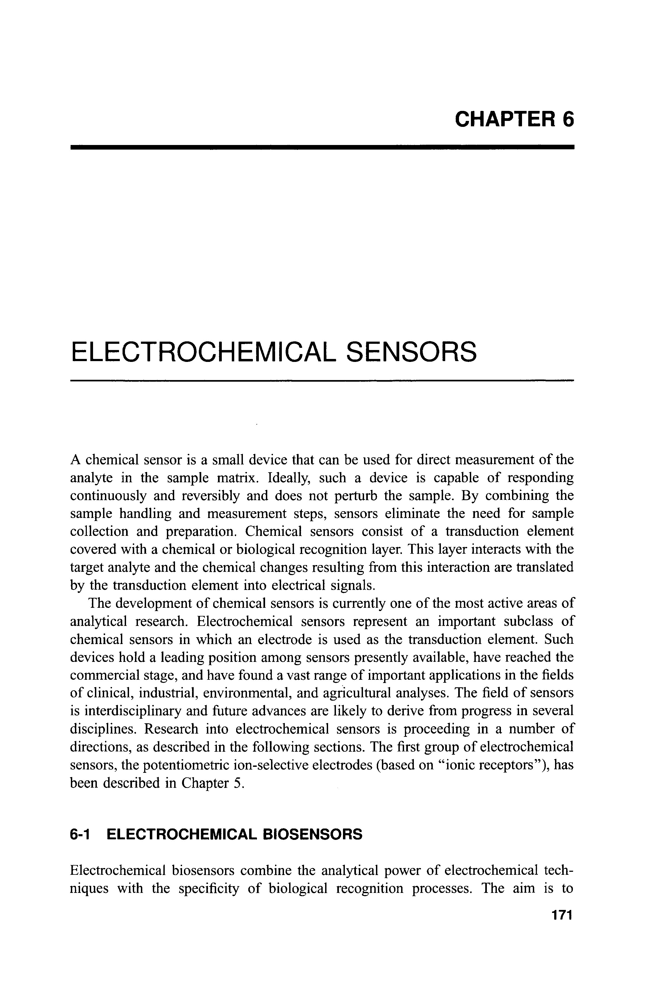

## Page 191

172
ELECTROCHEMICAL SENSORS
biologically produce an electrical signal that relates to the concentration of an
analyte. For this purpose, a biospecific reagent is either immobilized or retained at a
suitable electrode, which converts the biological recognition event into a quantitative
amperometric or potentiometric response. Such biocomponent-electrode combina-
tions offer new and powerful analytical tools that are applicable to many challenging
problems. A level of sophistication and state-of-the art technology are commonly
employed to produce easy-to-use, compact, and inexpensive devices. Advances in
electrochemical biosensors are progressing in different directions. Two general
categories of electrochemical biosensors may be distinguished, depending on the
nature of the biological recognition process: biocatalytic devices (utilizing enzymes,
cells, or tissues as immobilized biocomponents) and affinity sensors (based on
antibodies, membrane receptors, or nucleic acids).
6-1.1 Enzyme-Based Electrodes
Enzymes are proteins that catalyze chemical reactions in living systems. Such
catalysts are not only efficient but are also extremely selective. Hence, enzymes
combine the recognition and amplification steps, as needed for many sensing
applications.
Enzyme electrodes are based on the coupling of a layer of an enzyme with an
appropriate electrode. Such electrodes combine the specificity of the enzyme for its
substrate with the analytical power of electrochemical devices. As a result of this
coupling, enzyme electrodes have been shown to be extremely useful for monitoring
a wide variety of substrates of analytical importance in clinical, environmental, and
food samples.
6-1.1.1 Impractical and Theoretical Considerations The operation of an
enzyme electrode is illustrated in Figure 6-1. The immobilized enzyme layer is
chosen to catalyze a reaction, which generates or consumes a detectable species:
S + C
Enzyme
P + C'
(6-1)
where S and C are the substrate and coreactant (cofactor), and P and C' are the
corresponding products. The choice of the sensing electrode depends primarily upon
the enzymatic system employed. For example, amperometric probes are highly
suitable when oxidase or dehydrogenase enzymes (generating electrooxidizable
peroxide or NADH species) are employed, pH-glass electrodes are used for
enzymatic pathways that result in a change in pH, while gas (carbon dioxide)
potentiometric devices will be the choice when decarboxylase enzymes are used.
The success of the enzyme electrode depends, in part, on the immobilization of
the enzyme layer. The objective is to provide intimate contact between the enzyme
and the sensing surface while maintaining (and even improving) the enzyme
stability. Several physical and chemical schemes can thus be used to immobilize
the enzyme onto the electrode. The simplest approach is to entrap a solution of the

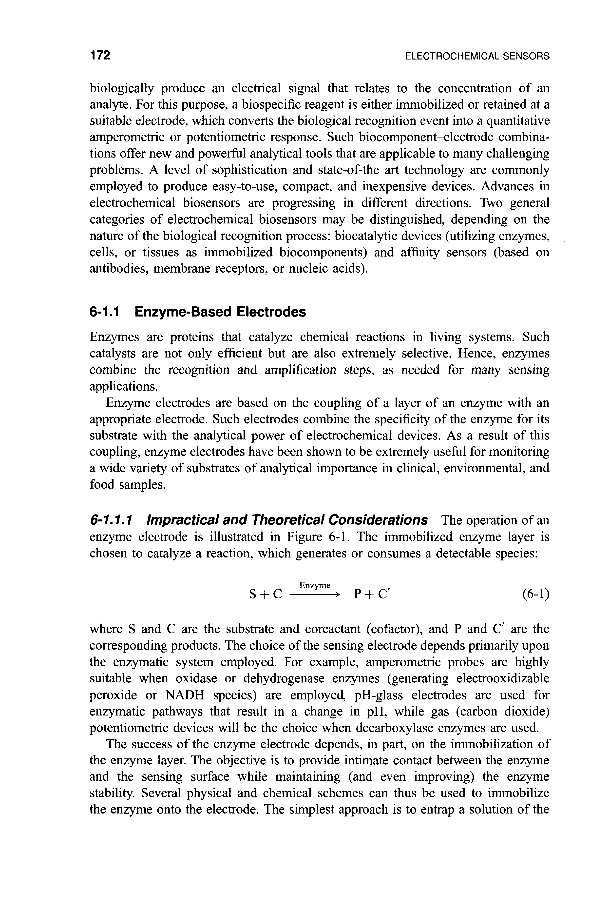

## Page 192

6-1 
ELECTROCHEMICAL BIOSENSORS
173
Electrode
Blocatalytlc
Layer
/•
S + C
p+c'
Bulk Solution
FIGURE 6-1 Enzyme electrode based on a biocatalytic layer immobilized on an electrode
transducer.
enzyme between the electrode and a dialysis membrane. Alternately, polymeric films
(e.g., polypyrrole, Nation) may be used to entrap the enzyme (via casting or
electropolymerization). Additional improvements can be achieved by combining
several membranes and/or coatings. Figure 6-2 displays a useful yet simple
immobilization based on trapping the enzyme between an inner cellulose acetate
film and a collagen or polycarbonate membrane, cast at the tip of an amperometric
transducer. Such coverage with a membrane or coating serves also to extend the
linear range (via reduction of the local substrate concentration) and to reject potential
interferences (e.g., coexisting electroactive species or proteins). In chemical immo-
bilization methods, the enzyme is attached to the surface by means of a covalent
coupling through a cross-linking agent (e.g., glutaraldehyde, amide). Covalent
coupling may be combined with the use of functionalized thiolated monolayers
for assembling multilayer enzyme networks on electrode surfaces (2). Other useful
enzyme immobilization schemes include entrapment within a thick gel layer, low-
temperature encapsulation onto sol-gel films, adsorption onto a graphite surface,
incorporation (by mixing) within the bulk of three-dimensional carbon-paste or
graphite-epoxy matrices (3,4), or electrochemical codeposition of the enzyme and
catalytic metal particles (e.g., Pt, Rh). Such codeposition, as well as electropolymer-
ization processes, are particularly suited for localizing the enzyme onto miniaturized
sensor surfaces (5,6). The electropolymerization route can be accomplished by
entrapping the enzyme within the growing film or anchoring it covalently to the
monomer prior to the film deposition. These avenues can also reduce interferences
and fouling of the resulting biosensors. The mixed-enzyme/carbon-paste immobili-
zation strategy is attractive for many routine applications as it couples the advantages
of versatility (controlled doping of several modifiers, e.g., enzyme, cofactor
mediator), speed (due to close proximity of biocatalytic and sensing sites, and
absence of membrane barriers), ease of fabrication, and renewability.

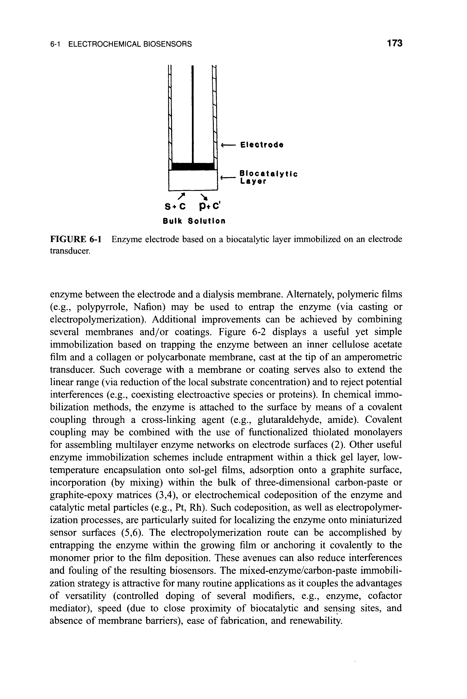

## Page 193

174
ELECTROCHEMICAL SENSORS
Platinum anode
Silver cathode
Electrode body
CA solution
Thin CA
layer
Drop of
enzyme solution
Outer
membrane
FIGURE 6-2 Steps in the preparation of an amperometric enzyme electrode with simple
enzyme immobilization by trapping between an inner cellulose acetate and outer collagen
membrane, cast on the electrode body. (Reproduced with permission from reference 1.)
The immobilization procedure may alter the behavior of the enzyme (compared to
its behavior in homogeneous solution). For example, the apparent parameters of an
enzyme-catalyzed reaction (optimum temperature or pH, maximum velocity, etc.)
may all be changed when an enzyme is immobilized. Improved stability may also
accrue from the minimization of enzyme unfolding associated with the immobiliza-
tion step. Overall, careful engineering of the enzyme microenvironment (on the
surface) can be used to greatly enhance the sensor performance. More information
on enzyme immobilization schemes can be found in several reviews (7,8).
The response characteristics of enzyme electrodes depend on many variables, and
an understanding of the theoretical basis of their function would help to improve
their performance. Enzymatic reactions involving a single substrate can be formu-
lated in a general way as
E + S
ES
E + P
(6-2)
In this mechanism, the substrate S combines with the enzyme E to form an
intermediate complex ES, which subsequently breaks down into products P and

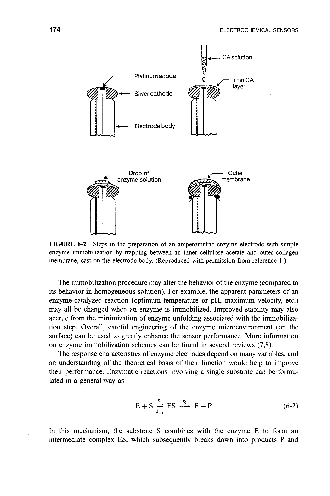

## Page 194

6-1 ELECTROCHEMICAL BIOSENSORS
175
liberates the enzyme. At a fixed enzyme concentration, the rate v of the enzyme-
catalyzed reaction is given by the Michaelis-Menten equation:
V —
[S])
(6-3)
where Km is the Michaelis-Menten constant and Vm is the maximum rate of the
reaction. The term Km corresponds to the substrate concentration for which the rate
is equal to half of Vm. In the construction of enzyme electrodes, it is desirable to
obtain the highest Vm and the lowest Km. Figure 6-3 shows the dependence of the
reaction rate upon substrate concentration, together with the parameters Km and Vm.
The initial rate increases with substrate, until a nonlimiting excess of substrate is
reached, after which additional substrate causes no further increase in the rate.
Hence, a leveling-off of calibration curves is expected at substrate concentrations
above the Km of the enzyme. Accordingly, low Km values—while offering higher
sensitivity—result in a narrower linear range (which reflects the saturation of the
enzyme). The above discussion assumes that the reaction obeys the Michaelis-
Menten kinetics theory. Experimentally, the linear range may exceed the concentra-
tion corresponding to Km, because the local substrate concentration in the electrode
containment region is often less than the bulk concentration (as common with
amperometric probes coated with diffusion-limiting membranes). The level of the
cosubstrate (coreactant) may also influence the linear range [through stoichiometric
limitation of equation (6-1)].
Improved sensitivity and scope can be achieved by coupling two (or more)
enzymatic reactions in a chain, cycling, or catalytic mechanism (9). For example, a
considerable enhancement of the sensitivity of enzyme electrodes can be achieved by
enzymatic recycling of the analyte in two-enzyme systems. Such an amplification
ANALYTICALLY USEFUL
REGION FOR ENZYME
DETERMINATION S » Km
ANALYTICALLY USEFUL
REGION FOR SUBSTRATE
DETERMINATION S « K
Substrate molarity (S)
FIGURE 6-3 Dependence of the velocity of an enzyme-catalyzed reaction upon the
substrate concentration (at a constant level of enzyme activity).

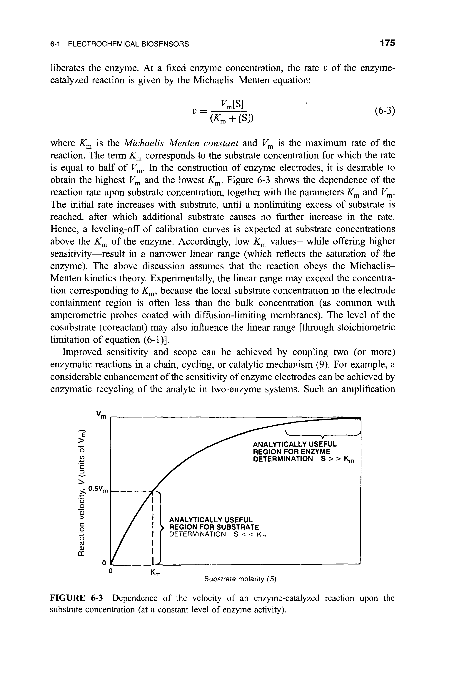

## Page 195

176
ELECTROCHEMICAL 
SENSORS
scheme generates more than a stoichiometric amount of product and hence large
analytical signals for low levels of the analyte. In addition, a second enzyme can be
used to generate a detectable (electroactive) species, from a nonelectroactive product
of the first reaction.
6-1.1.2 Enzyme Electrodes of Analytical Significance
6-1.1.2.1 Glucose Sensors The determination of glucose in blood plays a
crucial role in the diagnosis and therapy of diabetes. Electrochemical biosensors for
glucose play a key role in this direction. The glucose amperometric sensor,
developed by Updike and Hicks (10), represents the first reported use of an
enzyme electrode. The electrode is commonly based on the entrapment of glucose
oxidase (GOx) between polyurethene and permselective membranes on a platinum
working electrode (Figure 6-4). The liberation of hydrogen peroxide in the enzy-
matic reaction
glucose oxidase
Glucose + O2
gluconic acid + H2O2
(6-4)
platinum
cathode
Reaction 4
Reaction 2
Cellulose acetate
membrane
Reaction 1
silver anode
Reaction 3
immobilized 
/
enzyme 
Policarbonate
membrane
O-ring
/
Glucose
Reaction 1
Glucose + 02 
0xidagQ 
- H202 + Gl"conic
enzyme 
acid
H2O2
AgCI + e
Reaction 2
Platinum
anode
Reaction 3
Silver
O2 + 2H+ + 2e"
Age + CI"
reference
Reaction 4
.,,+ ^ 
Auxiliary
4H + O2 
* 
2H2O - 4e-
electrode
FIGURE 6-4 
Schematic of a "first-generation" glucose biosensor (based on a probe
manufactured by YSI Inc.).

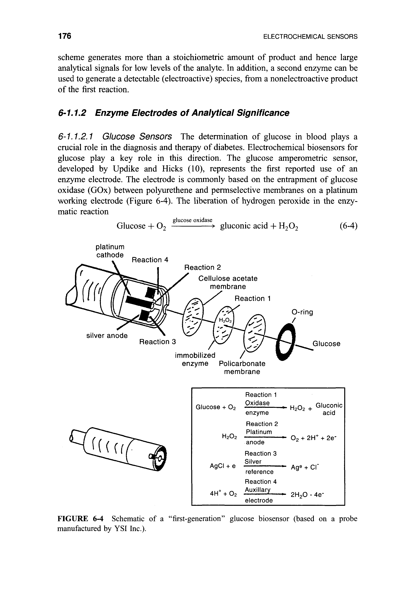

## Page 196

6-1 
ELECTROCHEMICAL BIOSENSORS 
177
can be monitored amperometrically at the platinum surface:
H202 e^^02 + 2H++2e- 
(6-5)
The multilayer membrane coverage (Figure 6-4) improves the relative surface
availability of oxygen (by decreasing the ratio of glucose/oxygen flux) and excludes
potential interferences (common at the potentials used for detecting the peroxide
product). The enzymatic reaction can also he followed by monitoring the consump-
tion of the oxygen cofactor.
Further improvements can be achieved by replacing the oxygen with a non-
physiological (synthetic) electron acceptor, which is able to shuttle electrons from
the flavin redox center of the enzyme to the surface of the working electrode.
Glucose oxidase (and other oxidoreductase enzymes) do not directly transfer
electrons to conventional electrodes because their redox center is surrounded by a
thick protein layer. This insulating shell introduces a spatial separation of the
electron donor-acceptor pair, and hence an intrinsic barrier to direct electron
transfer, in accordance with the distance dependence of the electron transfer rate
(11):
where AG and /I correspond to the free and reorganization energies accompanying
the electron transfer, respectively, and d is the actual electron transfer distance.
As a result of using artificial (diffusional) electron-carrying mediators, measure-
ments become insensitive to oxygen fluctuations and can be carried out at lower
potentials that do not provoke interfering reactions from coexisting electroactive
species (Figure 6-5). Many organic and organometallic redox compounds have been
considered for this role of enzyme mediator. Some common examples are displayed
in Figure 6-6. In particular, ferrocene derivatives (e.g., Figure 6-6a) have been very
successful for shuttling electrons from glucose oxidase to the electrode by the
following scheme:
Glucose + GOx(ox) -> gluconic acid 4- GOx(red) 
(6-7)
G0x(red) + 2M(OX) -> G0x(ox) + 2M(red) + 2H+ 
(6-8)
2M(red)^2M(ox)+2e- 
(6-9)
where M(OX) and M(red) are the oxidized and reduced forms of the mediator. This
chemistry has led to the development of a pen-sized meter for personal glucose
monitoring in a single drop of blood. Such rapid (~30s) self-testing assays
commonly rely on a chronoapmerometric operation (e.g., Example 6-1). The
single-use disposable strips used with this device are made of poly(vinyl chloride)
and a screen-printed carbon electrode containing a mixture of glucose oxidase and

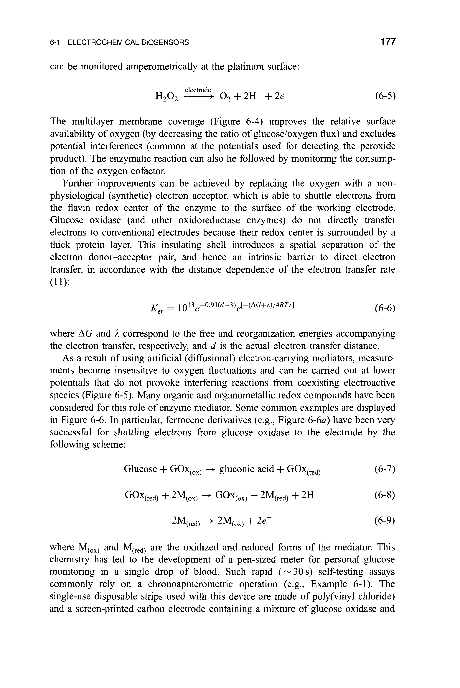

## Page 197

178
ELECTROCHEMICAL SENSORS
MecU
Substrate
Product
Electrode
surface
FIGURE 6-5 
"Second-generation" enzyme electrode: sequence of events that occur in a
mediated system. (Reproduced with permission from reference 12.)
the mediator (Figure 6-7). The screen-printing technology used for mass-scale
production of this and similar biosensors is discussed in Section 6-3. Other classes
of promising mediators for glucose oxidase are quinone derivatives, ruthenium
complexes, ferricyanide, phenothiazine compounds, and organic conducting salts
(particularly tetrathiafulvalene-tetracyanoquinodimethane, TTF-TCNQ). An elegant
nondiffusional route for establishing electrical communication between GOx and the
electrode is to "wire" the enzyme to the surface with a long polymer having a dense
array of electron relays [e.g., osmium(bipyridyl) bound to poly(vinylpyridine);
Figure 6-8 (14)]. Such a polymeric chain is flexible enough to fold along the
enzyme structure. The resulting three-dimensional redox-polymer/enzyme network
offers high current outputs and stabilizes the mediator to the surface. An even more
elegant possibility is chemical modification of the enzyme with the redox-active
mediator (15). Glucose electrodes of extremely efficient electrical communication
with the electrode can be generated by the enzyme reconstitution process (16). For
this purpose, the flavin active center of GOx is removed to allow positioning of the
electron-mediating ferrocene unit prior to the reconstitution of the enzyme (Figure
6-9). The challenges in establishing electrical communication between redox
enzymes and electrode surfaces have been reviewed (2,17). Ultimately, these and
similar developments would lead to invasive (needle-type) and noninvasive devices
for continuous real-time monitoring of glucose (18). Such probes would offer a tight
control of diabetes, in connection with an alarm detecting hypo- or hyperglycemia or
a future closed-loop insulin-releasing system (i.e., artificial pancreas).
6-1.1.2.2 Ethanol Electrodes The reliable sensing of ethanol is of great
significance in various disciplines. The enzymatic reaction of ethanol with the
cofactor nicotinamide-adenine dinucleotide (NAD+), in the presence of alcohol
dehydrogenase (ADH)
C2H5OH + NAD+ ™ C2H5O + NADH 
(6-10)

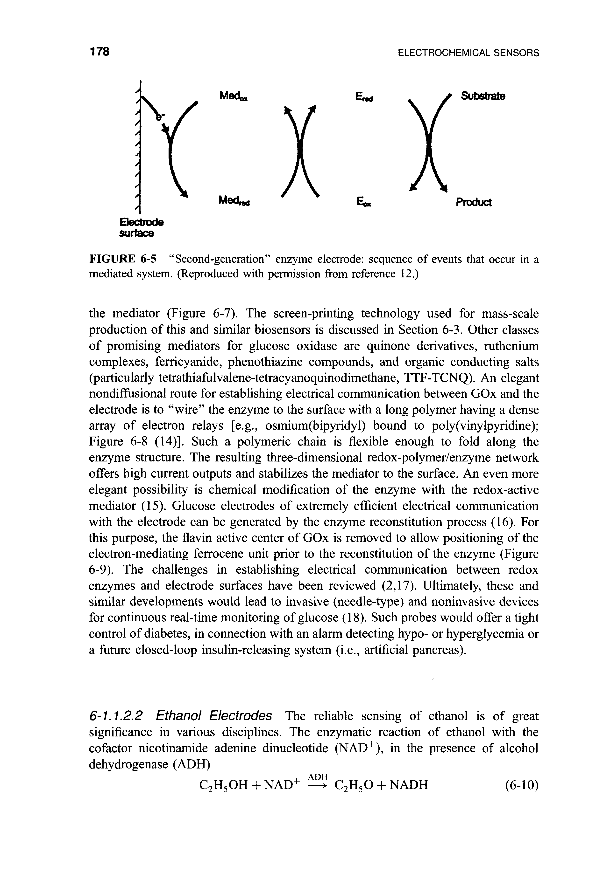

## Page 198

6-1 
ELECTROCHEMICAL BIOSENSORS
179
(a)
(b)
FIGURE 6-6 
Chemical structure of some common redox mediators: (a) dimethyl ferrocene;
(b) tetrathiafulvalene; (c) tetracyanoquinodimethane; (d) Meldola Blue.
PVC substrate
Conductive
silver track
Working
electrode
Conductive
carbon track
Dielectric
layer
Ag-AgCI reference
electrode
FIGURE 6-7 
Schematic representation of a disposable glucose sensor strip. (Reproduced
with permission from reference 13.)

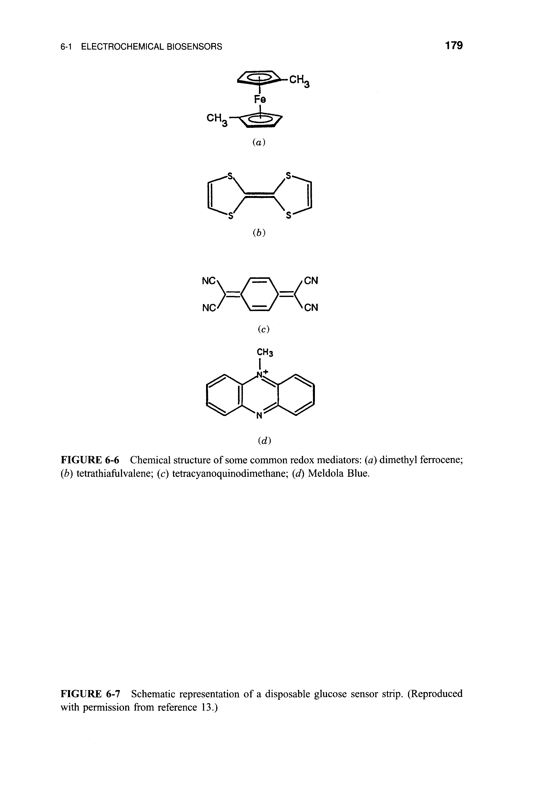

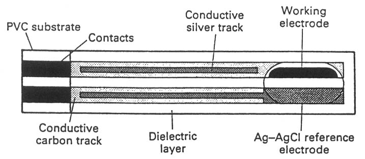

## Page 199

180
ELECTROCHEMICAL SENSORS
0
OS*2"3
(bpy)2C!
FIGURE 6-8 Composition of an electron-relaying redox polymer used for "wiring"
enzymes to electrode transducer. (Reproduced with permission from reference 14.)
serves as a basis of amperometric sensors for ethanol (19). Reagentless devices
based on the coimmobilization of ADH and NAD+ to various carbon or platinum
anodes are employed (e.g., Figure 6-10). NAD+ is regenerated electrochemically by
oxidation of the NADH, and the resulting anodic current is measured:
NADH -» NAD+ + 2e~ + H"
(6-H)
To circumvent high overvoltage and fouling problems encountered with the direct
oxidation of NADH at conventional electrode (equation 6-11), much work has been
devoted to the development of modified electrodes with catalytic properties for
glucose
gluconic acid
FIGURE 6-9 Electrical contact of a flavoenzyme by its reconstitution with a relay-FAD
semisynthetic cofactor. Fc = ferrocene. (Reproduced with permission from reference 2.)

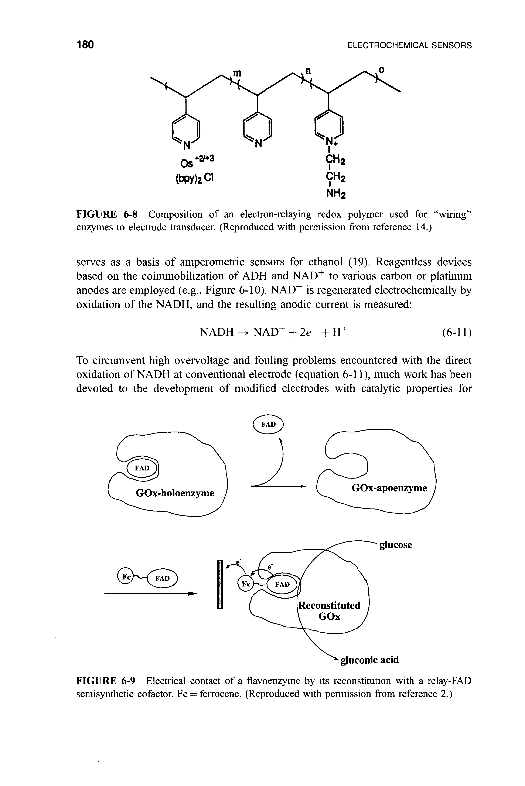

## Page 200

6-1 
ELECTROCHEMICAL BIOSENSORS 
181
\ \ \ \ \
Electrode
\ \ \ \ \
IP*
Containment 
NAD* 
NADH
Region 
\ 
ADH
Sample
Solution 
CHjCHjOH 
CH,CHO
FIGURE 6-10 
Reagentless ethanol bioelectrode.
NADH. Immobilized redox mediators, such as the phenoxazine Meldola Blue or
phenothiazine compounds, have been particularly useful for this purpose (20) (see
also Figure 4-12). Such mediation should be useful for many other dehydrogenase-
based biosensors. High sensitivity and speed are indicated from the flow-injection
response of Figure 3-21. The challenges of NADH detection and the development of
dehydrogenase biosensors have been reviewed (21). Alcohol biosensing can also be
accomplished in the presence of alcohol oxidase, based on measurements of the
liberated peroxide product.
6-1.1.2.3 Urea Electrodes The physiologically important substrate urea can be
sensed based on the following urease-catalyzed reaction:
NH2CONH2 + 2H20 + H+ - 
2NH+ + HCC^ 
(6-12)
The sensor is an ammonium ion-selective electrode surrounded by a gel impregnated
with the enzyme urease (Figure 6-11) (22). The generated ammonium ions are
detected after 30-60 s to reach a steady-state potential. Alternately, the changes in
the proton concentration can be probed with glass pH or other pH-sensitive
electrodes. As expected for potentiometric probes, the potential is a linear function
of the logarithm of the urea concentration in the sample solution.
Enzyme electrodes for other substrates of analytical significance have been
developed. Representative examples are listed in Table 6-1. Further advances in
enzyme technology, and particularly the isolation of new and more stable enzymes,
should enhance the development of new biocatalytic sensors. New opportunities
(particularly assays of new environments or monitoring of hydrophobic analytes)
derive from the finding that enzymes can maintain their biocatalytic activity in
organic solvents (31,32).
6.1.1.2.4 
Toxin (Enzyme Inhibition) Biosensors Enzyme affectors (inhibitors
and activators) that influence the rate of biocatalytic reactions can also be measured.
Sensing probes for organophosphate and carbamate pesticides, for the respiratory

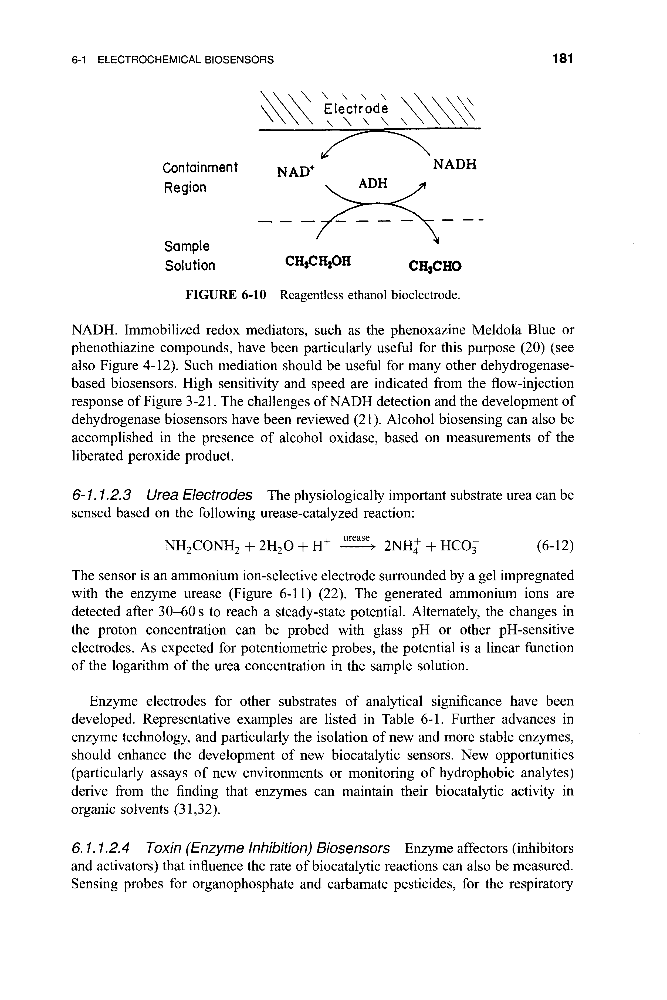

## Page 201

182
ELECTROCHEMICAL SENSORS
Internal
Reference
Electrode
Ion-Selective
Membrane
Reference
Solution
Enzyme-Matrix
Layer
Substrate
FIGURE 6-11 
Urea electrode, based on the immobilization of urease onto an ammonium
ion-selective electrode.
poisons cyanide or azide, or for toxic metals have been developed using enzymes
such as acetylcholinesterase, horseradish peroxidase, or tyrosinase (33,34). The
analytical information is commonly obtained from the decreased electrochemical
response to the corresponding substrate (associated with the inhibitor-enzyme
interaction). Pesticide measurements with cholinesterase systems often employ a
bienzyme cholinesterase/choline oxidase system, in connection to amperometric
monitoring of the liberated peroxide species. Changes in the substrate response can
also be exploited for measuring the activity of enzymes.
6-1.1.3 Tissue and Bacteria Electrodes The limited stability of isolated
enzymes, and the fact that some enzymes are expensive or even unavailable in the
pure state, has prompted the use of cellular materials (plant tissues, bacterial cells,
etc.) as a source for enzymatic activity (35). For example, banana tissue (which is
rich with polyphenol oxidase) can be incorporated by mixing within the carbon paste
TABLE 6-1 
Some Common Enzyme Electrodes
Measured Species
Cholesterol
Creatinine
Lactate
Penicillin
Phenol
Salicylate
Uric acid
Enzyme
Cholesterol oxidase
Creatinase
Lactate dehydrogenase
Lactate oxidase
Penicillinase
Tyrosinase
Salicylate hydroxylase
Unease
Detected
Species
02
NH3
NADH
H202
H+
Quinone
CO2
CO2
Type of sensing
Amperometric
Potentiometric
Amperometric
Amperometric
Potentiometric
Amperometric
Potentiometric
Potentiometric
gas
gas
gas
sensing
sensing
sensing
Reference
23
24
25
26
27
28
29
30

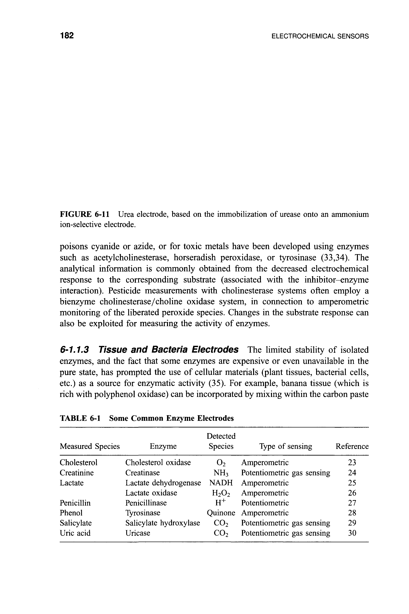

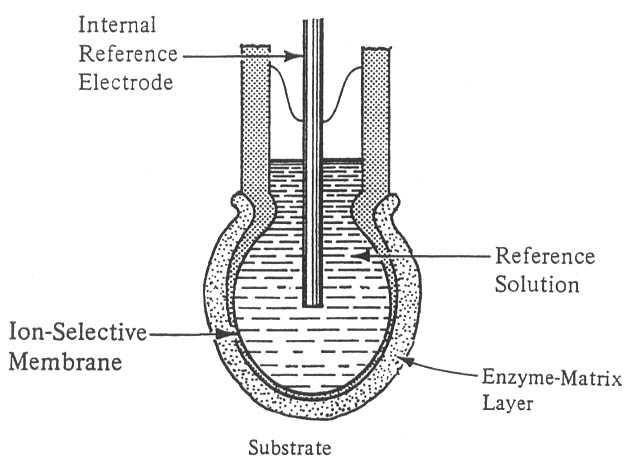

## Page 202

6-1 ELECTROCHEMICAL BIOSENSORS
183
Banana
Dopamine
quinone
FIGURE 6-12 The mixed tissue (banana) carbon-paste 
sensor for dopamine.
i = polyphenol oxidase. (Reproduced with permission from reference 36.)
PPO
matrix to yield a fast-responding and sensitive dopamine sensor (Figure 6-12). These
biocatalytic electrodes function in a manner similar to that of conventional enzyme
electrodes (i.e., enzymes present in the tissue or cell produce or consume a
detectable species).
Other useful sensors rely on the coupling of microorganisms and electrochemical
transducers. Changes in the respiration activity of the microorganism, induced by the
target analyte, result in decreased surface concentration of electroactive metabolites
(e.g., oxygen), which can be detected by the transducer.
6-1.2 Affinity Biosensors
Affinity sensors exploit selective binding of certain biomolecules (e.g., antibodies,
receptors, or polynucleotides) toward specific target species. The biomolecular
recognition process is governed primarily by the shape and size of the receptor
pocket and the ligand of interest (the analyte). An associative process of this kind is
governed by thermodynamic considerations (in contrast to the kinetic control
exhibited by biocatalytic systems). The high specificity and affinity of these
biochemical binding reactions lead to highly selective and sensitive sensing devices.
As will be shown in the following sections, electrochemical transducers are very
suitable for detecting these molecular recognition events. Such devices rely on
measuring the electrochemical signals resulting from the binding process. Another
type of interaction, the hybridization of two complementary DNA strands, can also
be probed and used for sequence-selective biosensing of DNA. Such detection of
specific DNA sequence, although still in its infancy, holds great promise for
diagnosing infectious or genetic diseases.
6-1.2.1 Immunosensors 
Most reported affinity biosensors are based on
immunological reactions involving the shape recognition of the antigen (Ag) by
the antibody (Ab) binding site to form the antibody/antigen (AbAg) complex:
Ab + Ag ^ AbAg
(6-13)

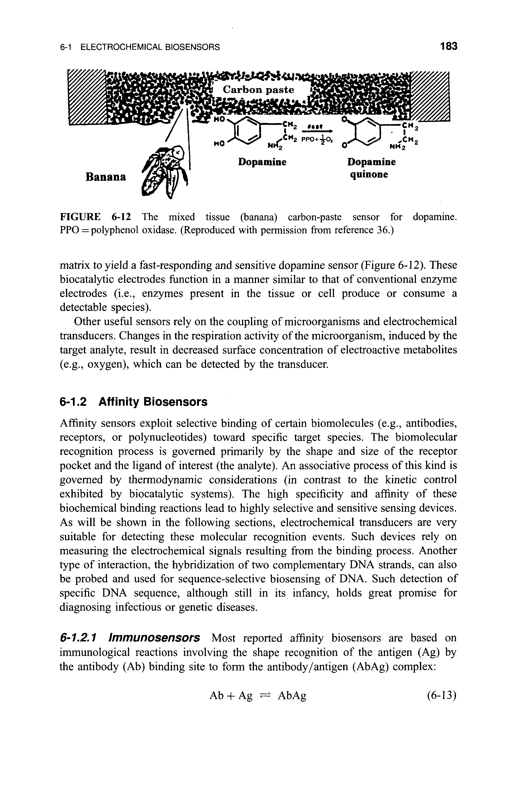

## Page 203

184
ELECTROCHEMICAL SENSORS
The antibody is a globular protein produced by an organism to bind to foreign
molecules (i.e., antigens) and mark them for elimination from the organism. The
remarkable selectivity of antibodies is based on the stereospecificity of the binding
site for the antigen, and is reflected by large binding constants (ranging from 105 to
109L moP1). Antibody preparations may be monoclonal or polyclonal. The former
are produced by a single clone of antibody-producing cells, and thus have the same
affinity. Polyclonal antibodies, in contrast, are cheaper but possess varying affinities.
Electrochemical immunosensors, combining specific immunoreactions with elec-
trochemical transduction, have gained considerable attention in recent years (37-41).
Such sensors are based on labeling of the antibody (or antigen) with an enzyme that
acts on a substrate and generates an electroactive product that can be detected
amperometrically. Enzyme immunosensors can employ competitive or sandwich
modes of operation (Figure 6-13). In competitive-type sensors, the sample antigen
(analyte) competes with an enzyme-labeled antigen for antibody-binding sites on a
membrane held on an amperometric or potentiometric sensing probe. After the
reaction is complete, the sensor is washed to remove unreacted components. The
probe is then placed in a solution containing the substrate for the enzyme, and the
product or reactant of the biocatalytic reaction is measured. Due to the competitive
nature of the assay, the measurement signal is inversely proportional to the
concentration of the analyte in the sample. Several enzymes, such as alkaline
phosphatase, peroxidase, or catalase, have been particularly useful for this task.
Sandwich-type sensors are applicable for measuring large antigens that are
capable of binding two different antibodies. Such sensors utilize an antibody that
binds the analyte-antigen, which then binds an enzyme-labeled second antibody.
After removal of the nonspecifically adsorbed label, the probe is placed into the
substrate-containing solution, and the extent of the enzymatic reaction is monitored
Membrane
Labeled
Antibody
Competitive
A n t i b o d y
M e m b r a n e
A n t i g e n
FIGURE 6-13 Enzyme immunosensors based on the competitive or sandwich modes of
operation. (Reproduced with permission from reference 40.)

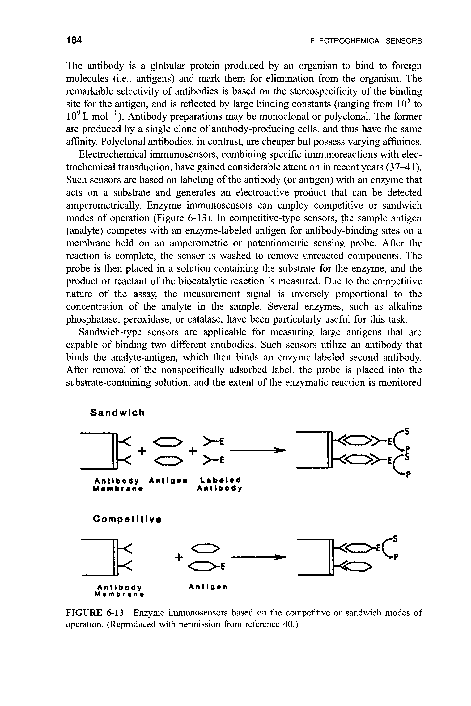

## Page 204

6-1 
ELECTROCHEMICAL BIOSENSORS 
185
electrochemically. Other types of immunosensors based on labeling the antigen or
antibody with an electroactive tag (e.g., a heavy metal), label-free capacitance
measurements, immobilizing antigen-carrier conjugates at the tip of potentiometric
electrodes, or amplifying the antigen-antibody complex equilibrium by liposome
lysis are also being explored.
Instead of immobilizing the antibody onto the transducer, it is possible to use a
bare (amperometric or potentiometric) electrode for probing enzyme immunoassay
reactions (42). In this case, the content of the immunoassay reaction vessel is
injected to an appropriate flow system containing an electrochemical detector, or the
electrode can be inserted into the reaction vessel. Remarkably low (femtomolar)
detection limits have been reported in connection with the use of the alkaline
phosphatase label (43,44). This enzyme catalyzes the hydrolysis of phosphate esters
to liberate easily oxidizable phenolic products.
6-1.2.2 DNA Hybridization Biosensors Nucleic acid recognition layers can
be combined with electrochemical transducers to form new and important types of
affinity biosensors. The use of nucleic acid recognition layers represents a relatively
new and exciting area in biosensor technology. In particular, DNA hybridization
biosensors offer considerable promise for obtaining sequence-specific information in
a simpler, faster and cheaper manner, compared to traditional hybridization assays.
Such new strategies hold enormous potential for clinical diagnosis of genetic or
infectious diseases, for the detection of food-contaminating organisms, for environ-
mental monitoring, or for criminal investigations.
The basis for these devices is the Watson-Crick DNA base pairing. Accordingly,
these sensors rely on the immobilization of a relatively short (20^10 bases) single-
stranded DNA sequence (the "probe") on the transducer surface, which upon
hybridization to a specific complementary region of the target DNA gives rises to
an electrical signal. Several studies have demonstrated the utility of electroactive
indicators for monitoring the hybridization event (45). Such redox-active compounds
have a much larger affinity for the resulting target:probe duplex (compared to their
affinity for the probe alone). Their association with the surface duplex thus results in
an increased electrochemical response. For example, Figure 6-14 displays the
increased response of the Co(phen)3~3 indicator as recorded at a probe-coated strip
electrode upon increasing the concentration of the E. coli DNA sequence. Control of
the probe immobilization and of the hybridization conditions (e.g., ionic strength,
temperature, time) is crucial for attaining high sensitivity and selectivity (including
the detection of single point mutations). Sequence-specific electrochemical biosen-
sors based on new innovative detection strategies are being developed for direct
electrical detection of the hybridization event. These include the use of enzyme
labels or indicator-free measurements (relying on the intrinsic electroactivity of
DNA, on changes in interfacial properties, or on the conductivity of a DNA-
functionalized electropolymerized film). Ultimately, these developments will lead to
the introduction of miniaturized (on-chip) sensor arrays, containing numerous
microelectrodes (each coated with a different oligonucleotide probe) for the
simultaneous hybridization detection of multiple DNA sequences. The new gene

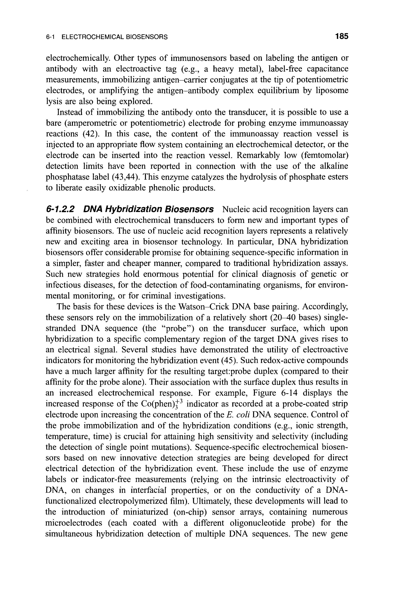

## Page 205

186
ELECTROCHEMICAL SENSORS
0.2 s/V
0.4 
-0.2
Potential (V)
FIGURE 6-14 
DNA hybridization biosensors: detection of DNA sequences from the E. coli
pathogen. Chronopotentiometric response of the redox indicator upon increasing the target
concentration in 1.0|ig/ml steps (a-c), in connection with a 2min hybridization time.
(Reproduced with permission from reference 46.)
chips would integrate a microfluidic network—essential for performing all the steps
of the bioassay (see Section 6-3.2)—with the detection process, and would thus
address the growing demands for shrinking DNA diagnostics in accordance with
market needs in the twenty-first century.
Other modes of DNA interactions (besides base-pair recognition) can be used for
the development of electrochemical DNA biosensors. In particular, dsDNA-modified
electrodes can be designed for detecting small molecules (e.g., drugs or carcinogens)
interacting with the immobilized nucleic acid layer (47,48). The intercalative
accumulation of these molecules onto the surface-confined DNA layer can be
used for their measurements at trace levels, in a manner analogous to the
preconcentration/voltammetric schemes described in Section 4-5.3.4. In addition,
the sensitivity of the intrinsic redox signals of DNA to its structure and conformation
offers considerable opportunities for nucleic acid research, including the sensing of
DNA damage.
6-1.2.3 Receptor-Based Sensors Another new and promising avenue of
sensing is the use of chemoreceptors as biological recognition elements. Receptors
are protein molecules embedded in the cellular membrane that specifically bind to
target analytes. The receptor-analyte (host-guest) binding can trigger specific
cellular events, such as modulation of the membrane permeability or activation of
certain enzymes, that translate the chemical interaction to electrical signals. For
example, ion-channel sensors utilizing receptors in a bilayer lipid membrane couple
the specific binding process with intense signal amplification (49-51), attributed to
the opening/closing switching of the ion flux through the membrane (Figure 6-15).
A single selective binding event between the membrane receptor and the target
analyte can thus result in an increase of the transmembrane conduction that involves
thousands of ions. Unlike most antibody binding (aimed at specific substances),

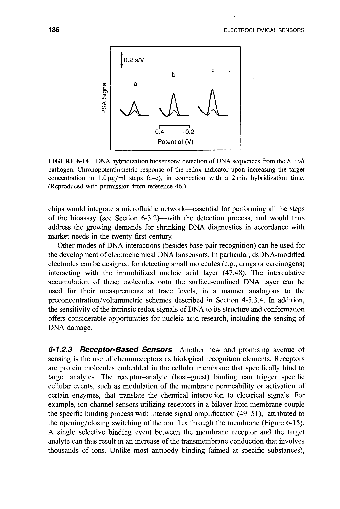

## Page 206

6-1 ELECTROCHEMICAL BIOSENSORS
187
Electrode
Guest
Cation
Marker
Ion
Electrode
B
B
S
FIGURE 6-15 Schematic representation of the ion permeability modulation for cation-
responsive voltammetric sensors based on negatively charged lipid membranes. Complexation
of the guest cation to the phospholipid receptors causes an increase of the permeability for the
anionic marker ion. (Reproduced with permission from reference 49.)
receptors tend to bind to classes of substances (possessing common chemical
properties that dictate the binding affinity). Accordingly, receptor-based biosensors
are usually class-specific devices.
Instead of isolating, stabilizing, and immobilizing chemoreceptors onto electro-
des, it is possible to use intact biological sensing structures for determining relevant
chemical stimulants (52,53). This novel concept was illustrated with antennule
structures of the blue crab. Such structures are part of the crab's food-locating
system, and thus can be exploited for the determination of amino acids. Similarly,
various drugs can be monitored based on their stimulation of nerve fibers in the
crayfish walking leg. A flow cell based on such a neuronal sensor is shown in Figure
6-16. Such a sensor responds to stimulant compounds at extremely low levels (down
to 10~I5 M!), with very short response times. The relationship between the response
frequency (R) and the stimulant concentration (C) is given by
R = 1 +
(6-14)
where Rmm is the maximum response frequency, n is a cooperativity factor between
receptors, and K is a constant.
In addition to the use of bioreceptors, it is possible to design artificial molecules
that mimic bioreceptor functions (51). Such artificial receptors (hosts) can be
tailored for a wide range of guest stimulants. For example, cyclodextrin derivatives
have been used to provide a shape-discrimination effect in connection with ion-
channel sensors (54). The receptors are incorporated within artificial lipid
membranes, prepared by the Langmuir-Blodgett (LB) deposition method on the
transducer surface. The LB method (which involves a transfer of a monomolecular
film from an air-water interface onto the electrode surface) results in thin organic
films that can be organized into multilayer molecular assemblies one monolayer at a
time. Artificial sensor arrays (emulating biological sensory systems, e.g., the human
nose) are also being explored in various laboratories (55) (see Section 6-4). High
sensitivity and selectivity can be achieved also by using the receptor recognition
process as an in-situ preconcentration step (56).

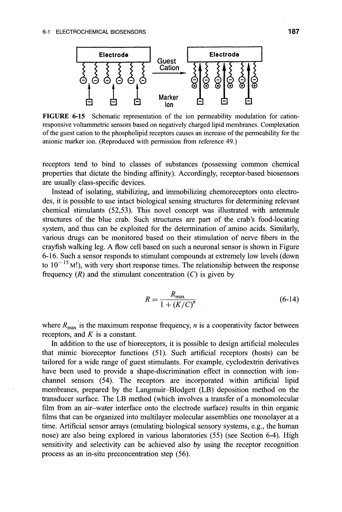

## Page 207

188
ELECTROCHEMICAL SENSORS
Artwwiul* 
Stndng tip
FIGURE 6-16 Neuronal sensing: top view of a flow cell with mounted antennule and the
various electrode connections. (Reproduced with permission from reference 52.)
6-2 GAS SENSORS
Real-time monitoring of gases, such as carbon dioxide, oxygen, and ammonia, is of
great importance in many practical environmental, clinical, and industrial situations.
Gas-sensing electrodes are highly selective devices for measuring dissolved gases.
They are reliable and simple and exhibit excellent selectivity, but tend to have
relatively slow response times (particularly as the limit of detection is approached).
Gas sensors usually incorporate a conventional ion-selective electrode surrounded
by a thin film of an intermediate electrolyte solution and enclosed by a gas-
permeable membrane. An internal "reference electrode is usually included, so that
the sensor represents a complete electrochemical cell. The gas of interest in the
sample solution diffuses through the membrane and comes to equilibrium with the
internal electrolyte solution. In the internal compartment, between the membrane
and the ion-selective electrode, the gas undergoes a chemical reaction, consuming or
forming an ion to be detected by the ion-selective electrode. (Protonation equilibria
in conjunction with a pH electrode are most common.) Since the local activity of this
ion is proportional to the amount of gas dissolved in the sample, the electrode
response is directly related to the concentration of the gas in the sample. The
response is usually linear over a range of typically four orders of magnitude; the
upper limit is determined by the concentration of the inner electrolyte solution. The
permeable membrane is the key to the electrode's gas selectivity. Two types of
polymeric material, microporous and homogeneous, are used to form the gas-
permeable membrane. Typically, such hydrophobic membranes are 0.01-0.1mm
thick and are impermeable to water or ions. Hence, gas-sensing probes exhibit

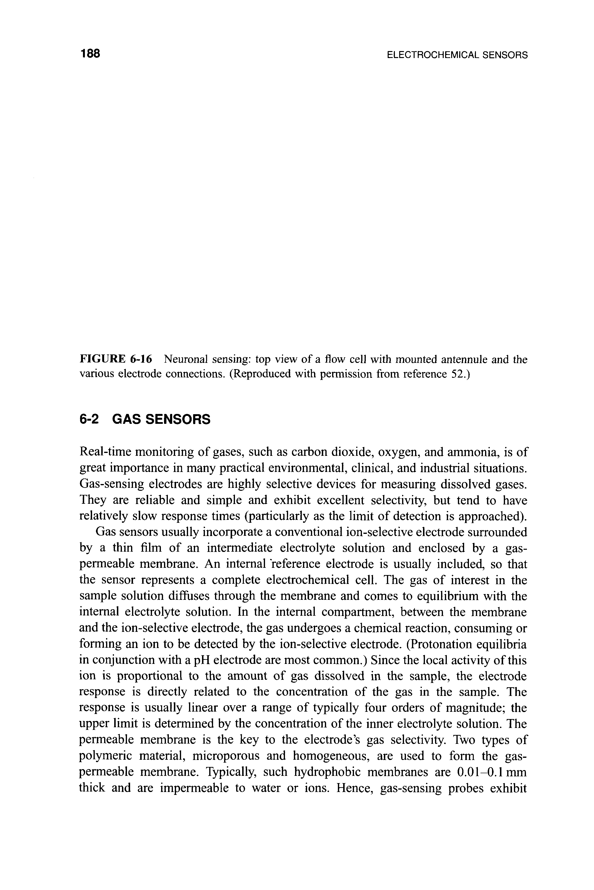

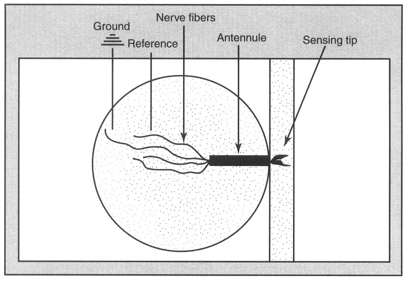

## Page 208

6-2 GAS SENSORS 
189
excellent selectivity, compared with many ion-selective electrodes. Besides the
membrane, the response characteristics are often affected by the composition of
the internal solution and the geometric variables (57). Amperometric gas sensors
based on different configurations have also been developed in recent years. Such
developments have been reviewed (58).
6-2.1 
Carbon Dioxide Sensors
Carbon dioxide devices were originally developed by Severinghaus and Bradley (59)
to measure the partial pressure of carbon dioxide in blood. This electrode, still in use
today (in various automated systems for blood gas analysis), consists of an ordinary
glass pH electrode covered by a carbon dioxide membrane, usually silicone, with an
electrolyte (sodium bicarbonate-sodium chloride) solution entrapped between them
(Figure 6-17). When carbon dioxide from the outer sample diffuses through the
semipermeable membrane, it lowers the pH of the inner solution:
CO2 + H2O -> HCO3- + H+ 
(6-15)
Such changes in the pH are sensed by the inner glass electrode. The overall cell
potential is thus determined by the carbon dioxide concentration in the sample:
RT
E = K + — ln[C02] 
(6-16)
F
A Nernstian response of 59 mV per decade change in concentration is commonly
observed (at 25°C). Relation to the partial pressure carbon dioxide is accomplished
by the use of Henry's law. A catheter sensor configuration has been developed for in-
vivo monitoring of blood carbon dioxide (61).
By using different membranes, it is possible to obtain potentiometric sensors for
gases such as sulfur dioxide or nitrogen dioxide. Such sensors employ similar (acid-
base) or other equilibrium processes. These devices, along with their equilibrium
processes and internal electrodes, are summarized in Table 6-2. Membrane coverage
Isolate 
React 
Detect
H2O
Gas-permeable
membrane 
Thin buner 
pH/reference ISE
layer
FIGURE 6-17 
Schematic of the potentiometric sensor for carbon dioxide. (Reproduced
with permission from reference 60.)

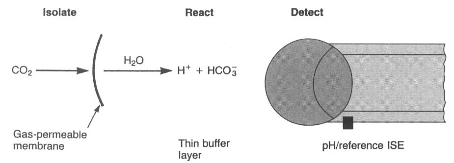

## Page 209

190 
ELECTROCHEMICAL SENSORS
TABLE 6-2 Potentiometric Gas Sensors
Target Gas 
Equilibrium Process 
Sensing Electrode
CO2
NO2
SO2
H2S
HF
CO2 + H2O ^ HCOJ + H+
2NO2+H2O ^ NOJ+NO2-+2H+
SO2 + H2O ^ HSOJ + H+
H e — ^ TLJ+ _i O^ —
2o 
^ — zn 
~r j
HF ^ H
+ + F-
H+, COf-
H+
H+
S2-,H+
F~,H
+
of other ion-selective electrodes (e.g., chloride) can be used for the sensing of other
gases (e.g., chlorine).
6-2.2 
Oxygen Electrodes
While most gas sensors rely on potentiometric detection, the important oxygen probe
is based on amperometric measurements. In particular, membrane-covered oxygen
probes based on the design of Clark et al. (62) have found acceptance for many
applications. The sensor is based on a pair of electrodes immersed in an electrolyte
solution and separated from the test solution by a gas-permeable hydrophobic
membrane (Figure 6-18). The membrane is usually made of Teflon, silicon rubber, or
polyethylene, while the electrolyte is a solution of potassium chloride and buffer.
Oxygen diffuses through the membrane and is reduced at the surface of the sensing
electrode. The resulting electrolytic current is proportional to the rate of diffusion of
oxygen to the cathode, and hence to the partial pressure of oxygen in the sample.
Such an electrode thus displays a linear response in contrast to the logarithmic
dependence of most gas sensors (discussed in Section 6-2.1). The actual potential
applied at the cathode (with respect to the anode/reference electrode) depends on the
particular design. Cathodes made of platinum, gold, or silver are commonly
incorporated in different commercial probes. The applied potential usually maintains
the cathode on the diffusion-limited plateau region for the oxygen reduction process.
Isolate 
Detect
anode 
Pt cathode
Gas-permeable 
Supporting 
Polarographic
membrane 
electrotype 
electrodes
FIGURE 6-18 
Membrane-covered oxygen probe based on the Clark electrode. (Reproduced
with permission from reference 60.)

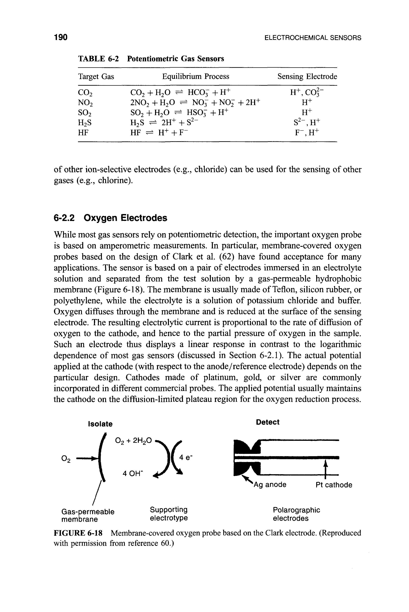

## Page 210

6-3 SOLID-STATE DEVICES 
191
Periodic calibration is desired for addressing slow drifts. This is usually accom-
plished by exposure to samples with known oxygen content, for example, with air
assumed 20.93% O2. The response lime of the electrode is generally larger when
changing from a high Fo to a low Po , compared with a change in the opposite
direction.
Membraneless oxygen sensors based on solid-state technology have also been
reported. For example, coverage of a Y2C>3-doped ZrC>2 disk with porous platinum
electrodes results in a selective sensor, based on the coupling of the oxygen
reduction process and the preferential transport of the oxide ion product through
vacancies in the doped crystal (63). For this purpose, one of the platinum electrodes
is exposed to the unknown gas while the second one is exposed to the reference gas.
Such potentiometric sensors commonly operate at high temperatures, and are widely
used in the automotive industry for controlling the ratio of air/fuel (with an annual
worldwide market exceeding 150 million dollars).
Other useful gas sensors include the potentiometric ammonia (64) or hydrogen
cyanide probes (65), and amperometric carbon monoxide (66) and nitrogen dioxide
(67) devices. The hydrogen cyanide probe is an example of a modern device that
relies on changes in the conductivity of electropolymerized film (polyaniline) in the
presence of a given gas.
6-3 SOLID-STATE DEVICES
The integration of chemically sensitive membranes with solid-state electronics has
led to the evolution of miniaturized, mass-produced potentiometric probes known as
ion-selective field-effect transistors (ISFETs). The development of ISFETs is a
logical extension of coated-wire electrodes (described in Section 5-2.4). The
construction of ISFETs is based on the technology used to fabricate microelectronic
chips. Ion-selective field-effect transistors incorporate the ion-sensing membrane
directly on the gate area of a field-effect transistor (FET) (Figure 6-19). The FET is a
solid-state device that exhibits high input impedance and low output impedance and
is therefore capable of monitoring charge build-up on the ion-sensing membrane. As
the charge density on this membrane changes because of interaction with the ions in
solution, a drain current flows between the source and drain of the transistor. The
increased voltage needed to bring the current back to its initial value represents the
response. (This is commonly accomplished by placing the ISFET in a feedback
loop.) From the standpoint of change in drain current as a result of change in activity
of the ion of interest, the ISFET response is governed by the same Nernstian
relationship (and the selectivity limitation) that characterizes conventional ion-
selective electrodes.
Such sensors utilizing solid-state electronics have significant advantages. The
actual sensing area is very small. Hence, a single miniaturized solid-state chip could
contain multiple gates and be used to sense several ions simultaneously. Other
advantages include the in-situ impedance transformation and the ability for
temperature and noise compensation. While the concept of the ISFET is very

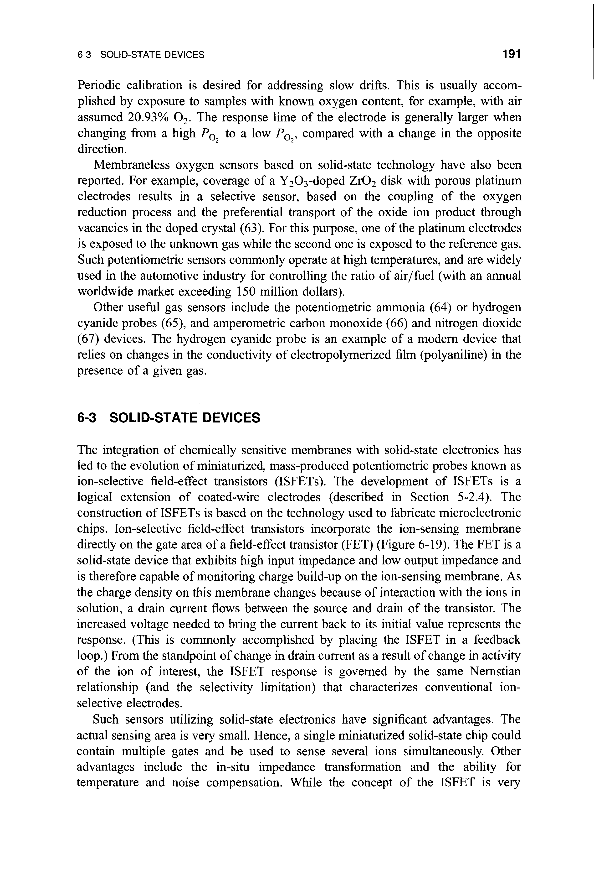

## Page 211

192
ELECTROCHEMICAL SENSORS
Protective coat
Metal contact 
>s
Si3N4
SiO2 insulators
Reference
electrode
sensing layer
liquid
Source
Drain
p-Si
Base
FIGURE 6-19 An ion-selective field-effect transistor.
exciting and intriguing, problems with stability and encapsulation still need to be
solved before such devices reach the truly practical stage. One problem is the
detachment of PVC-type ion-sensing membranes from the gates of FETs. This can
be minimized by suspending a polyimide mesh over the gate (68); the polymer film
thus becomes anchored in place by the mesh.
The coating on the gate is the key to the analytical chemistry that the ISFET can
perform. Ion-selective field-effect transistors based on various ion-responsive layers
have been developed. Among these are a sodium ISFET based on the synthetic
sodium carrier ETH 227, an ammonium ISFET utilizing monactin-nonactin (69),
and a chloride ISFET prepared by laying a membrane of methyltridodecylammo-
nium chloride on a silicon nitride gate (70). Ion-selective field-effect transistors that
are not covered with an ion-responsive membrane can be used directly as pH
sensors. The silicon nitride coating on the transistor is itself sensitive to hydrogen
ions (through its own surface properties) and develops phase boundary potentials
proportional to the logarithm of the hydrogen ion activity in the contacting solution.
The ability to sense several ions was illustrated using a quadruple-function ISFET
probe that simultaneously monitored potassium, sodium, calcium, and pH in whole
blood samples (71). Ion-selective field-effect transistors can be combined with
various biological agents, such as enzymes or antigens, to form effective biosensors.
The biological recognition process results in modulation of the gate voltage, and thus
controls the drain current. For example, an enzyme field-effect transistor (ENFET)

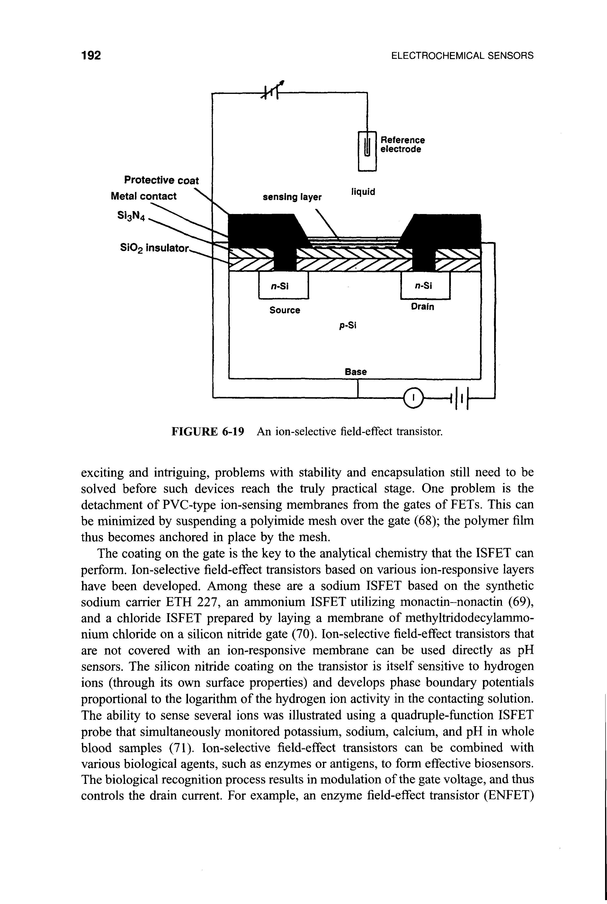

## Page 212

6-3 SOLID-STATE DEVICES 
193
was developed for continuous monitoring of glucose in body fluids (72). The theory
and mode of operation of ISFETs have been reviewed (73).
6-3.1 
Microfabrication of Solid-State Sensor Assemblies
Other miniaturized solid-state sensors can be fabricated by coupling microelec-
tronics and chemically sensitive layers. In particular, Wrighton and co-workers (74)
fabricated diode and transistor structures by combining a conducting polymer with
lithographically defined interdigitated microarray electrodes. Such devices have been
responsive to redox species such as oxygen or hydrogen. Interesting biosensing
applications of this molecular electronic switching device involved the addition of an
enzyme layer (75,76). Changes in the conductivity of the polymer resulting from pH
changes (associated with the enzymatic reaction) have been exploited for monitoring
the corresponding substrate (e.g., Figure 6-20). Miniaturized and disposable
amperometric biosensors can be achieved by coupling microfabricated oxygen
electrodes with various biocomponents (77).
6-3.2 
Microfabrication Techniques
Microfabrication technology has made a considerable impact on the miniaturization
of electrochemical sensors and systems. Such technology allows replacement of
traditional bulky electrodes and "beaker-type" cells with mass-producible, easy-to-
use sensor strips. These strips can be considered as disposable electrochemical cells
onto which the sample droplet is placed. The development of microfabricated
electrochemical systems has the potential to revolutionize the field of electroanaly-
tical chemistry.
^±S6 
' 
—V^Pt electrode
VD ID
Polypyrrole
fa ^ ^
Penicillin
^-
pH decrease
Low conductivity 
in the membrane 
H'9n conductivity
(Small ID) 
(Large ID)
FIGURE 6-20 Configuration of a penicillin sensor based on an microarray electrode coated
with a pH-responsive polypyrrole. VG = gate voltage; VD = drain voltage; ID = drain current;
PS = potentiostat; CE and RE = counter and reference electrodes, respectively. (Reproduced
with permission from reference 76.)

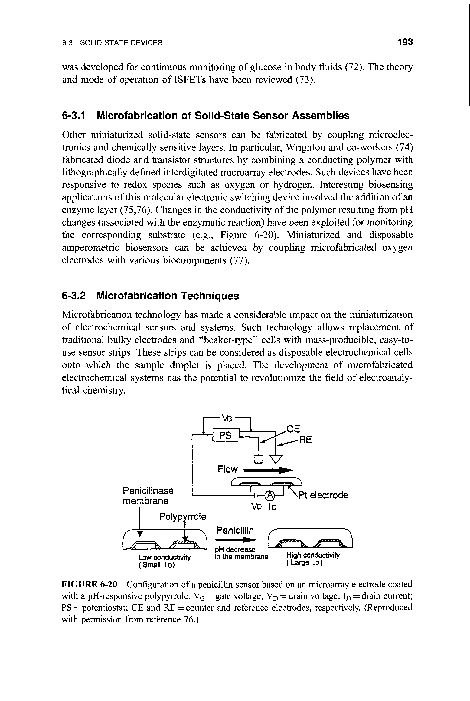

## Page 213

194
ELECTROCHEMICAL SENSORS
The thin-film lithographic approach can be used for producing small (micro-
meter) dimension electrodes on silicon wafers (e.g. Figure 4-24) This technology
couples various processes (based on electronic integrated circuit manufacturing),
including vapor deposition of a thin metal film, its coverage with a UV-sensitive
photoresist, photolithographic patterning (using an appropriate mask and UV
radiation), removal of the exposed photopolymerized soluble zone of the photoresist
with a developer, and chemical or plasma etching (78). Three-electrode micro-
systems can thus be readily prepared on a planar silicon wafer. This lithographic
approach represents an attractive route for the production of sensor arrays. For
example Figure 6-21 displays a multiple-analyte sensor array, commonly used for
point-of-care clinical assays of small blood droplets (79).
Microfabricated electrodes can be integrated with other silicon microstructures
(including micropumps, microchannels, mixing chambers, or valves) to produce
complete miniaturized analytical systems (80). Due to their fluid manipulation
capability such micromachined systems hold great promise for performing all the
steps of a chemical or biological assay (including the sample preparatory steps,
analytical reactions, separation and detection) on a single microchip platform. Such
on-chip integration of the sample manipulations offers greatly improved efficiency
with respect to sample size, reagent/solvent consumption, and response time, and
should find use in numerous analytical applications. Eventually this would enable
NH} Selective
Membrane
Immobilized
urease
AgCI
Ground
Insulated signal line
Electrical contact
Biosensor Chip
FIGURE 6-21 
A silicon-based sensor array for monitoring various blood electrolytes,
gases, and metabolites. (Courtesy of i-STAT Co.)

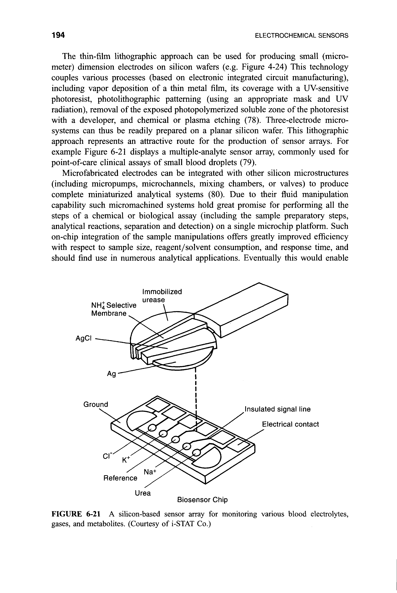

## Page 214

6-3 SOLID-STATE DEVICES
195
the laboratory to be transported to the sample. A range of assays have already been
adapted to the microchip format. These possibilities have led to the concepts of
uTAS (micro-total analytical systems) and "Lab-on-a-Chip", which are hot topics of
analytical chemistry. The extremely small dimensions of electrochemical detectors,
coupled with their remarkable sensitivity and compatibility with microfabrication
technologies, make them very suitable for adaptation for "Lab-on-a-Chip" analytical
microsystems. Microsystems relying on electrosmotic flow obviate the needs for
pumps or valves but require proper attention to the decoupling of the detector
potential from the high voltage used to control the microfluidics. Such precise fluid
control is accomplished by regulating the applied potentials at the terminus of each
channel of the microchip (81). The channel networks of these chips include mixing
tees and cross intersections for mixing reagents and injecting samples with high
reproducibility (e.g., Figure 6-22). Particularly powerful is the use of electrochemical
detectors for monitoring on-chip electric-field-driven separations (see Section 3-6).
Large-scale sensor fabrication can be accomplished not only by lithographic
techniques but also using modern screen-printing (thick-film) processes (82,83). The
screen-printing technology relies on printing patterns of conductors and insulators
onto the surface of planar (plastic or ceramic) substrates. Various conducting and
insulating ink materials are available for this task. The screen-printing process
involves several steps (as illustrated in Figure 6-23 for the fabrication of carbon
electrodes), including placement of the ink onto a patterned screen or stencil,
followed by forcing it through the screen with the aid of a squeegee, and
drying/curing the printed patterns. Such a process yields mass-producible (uniform
substrate 
buffer
i—*
It
Mixing-tee
enzyme
Mixing
Channel
Reaction
Channel
inhibitor
10mm
Glass
Substrate
FIGURE 6-22 Schematic of a microchip system for enzymatic assays. The channels
terminate at reservoirs containing the indicated solutions. (Reproduced with permission
from reference 81.)

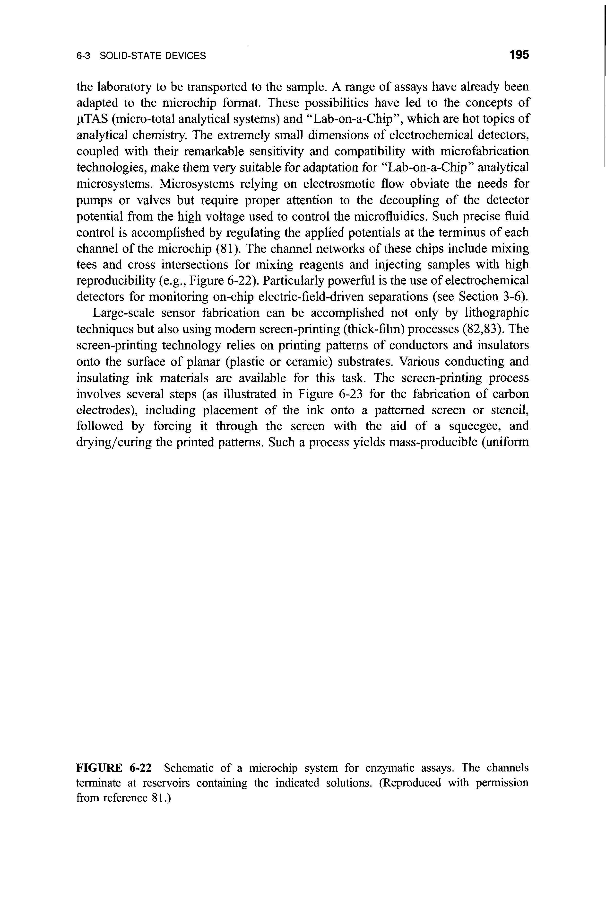

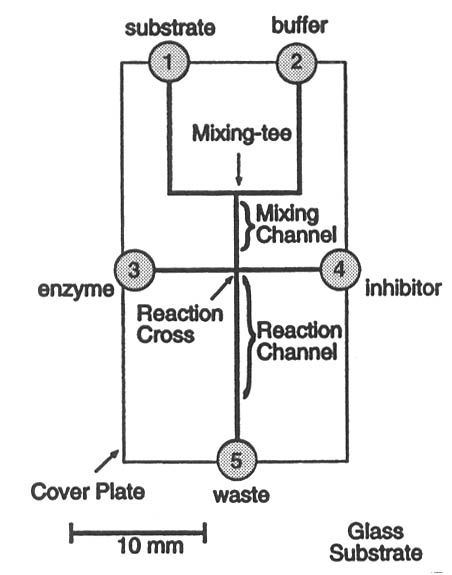

## Page 215

196
ELECTROCHEMICAL SENSORS
(a)
Hinge
Screen
PVC support
(b)
Squeegee
FIGURE 6-23 
Steps involved in the screen-printing process: (a) deposit the graphite
suspension onto the screen; (b) load the screen mesh with the graphite; (c) force the graphite
onto the substrate. (Reproduced with permission from reference 83.)
and disposable) electrodes of different shapes or sizes, similar to the glucose strip
shown in Figure 6-7. The electrochemical reactivity and overall performance of
screen-printed electrodes are dependent upon the composition of the ink employed
and on the printing and curing conditions (e.g., pressure, temperature). Disposable
potentiometric sensors can be fabricated by combination of ion-selective polymeric
membranes with dry reagent films. Such disposable ion-selective electrode slides
require microliter (10-50uL) sample volumes, and are ideally suited for various
decentralized applications. Mass-produced potentiometric sensor arrays are also
being developed in connection with future high-speed clinical analyzers. These are
being combined with advanced materials (e.g., hydrogels) that obviate the need for
internal filling solutions (common to ISE sensors; see Chapter 5). The screen-

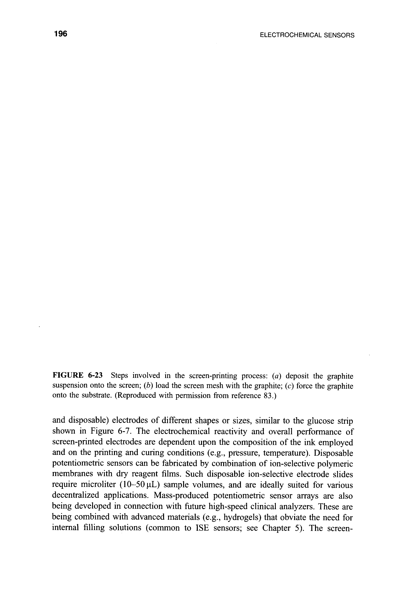

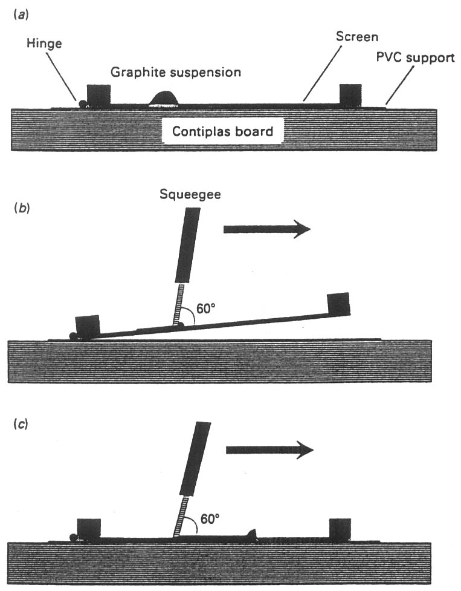

## Page 216

6-4 SENSOR ARRAYS
197
printing technology requires lower capital and production costs than the thin-film
lithographic approach, but is limited to electrode structures larger than 100 um. It is
also possible to fabricate electrochemical devices combining the thin- and thick-film
processes.
6-4 SENSOR ARRAYS
So far we have discussed the one-sensor/one-analyte approach. However, arrays of
independent electrodes can offer much more analytical information and thus hold a
great potential for many practical applications. These include the development of
"intelligent sensing systems" capable of responding to changes in the chemical
environment of the array.
The use of multielectrode arrays takes advantage of the partial selectivity of an
individual electrode by combining several electrodes and examining the relative
responses of all the sensors together. The array's response for each analyte thus
corresponds to a fingerprint pattern (e.g., Figure 6-24). In addition, the coupling of
multielectrode arrays with a chemometric (multivariate calibration) approach allows
analysis of a mixture of analytes. Two calibration techniques, partial least squares
and multiple linear regression, are particularly useful for this task. High stability,
rather than selectivity, is the primary concern in the operation of electrode arrays.
Various types of multielectrode arrays can be employed. For example, potentio-
metric electrode arrays exploit the fact that ion-selective electrodes respond to some
degree to a range of ions (85-87). The first potentiometric array was described by
Otto and Thomas (85). Diamond and co-workers have illustrated the utility of an
array comprising of three highly selective electrodes and one sparingly selective
electrode (87). Arrays of highly selective potentiometric electrodes can also be
OO.B
glucose
lactose
ribose
maltose
Sensors
FIGURE 6-24 
Response pattern of an amperometric sensor array for various carbohydrates.
The array comprised carbon-paste electrodes doped with CoO (1), Cu2O (2), NiO (3) and
(4). (Reproduced with permission from reference 84.)

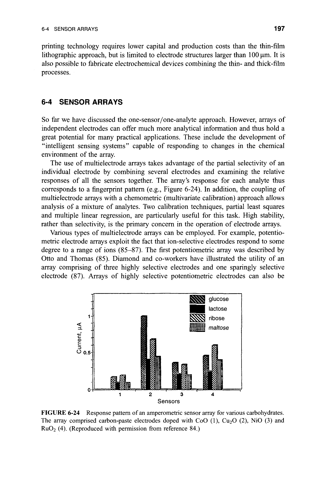

## Page 217

198
ELECTROCHEMICAL SENSORS
Sensor
array
Transducer
Processor
(Tin oxide,
polymer)
(Current
to voltage
amp +
A/D converter)
(Microprocessor)
FIGURE 6-25 
The flow of information in the array-based artificial nose. (Reproduced with
permission from reference 94.)
useful when high-speed analysis is required (88). Arrays of voltammetric electrodes
can be based on the use of different electrode materials (89) or catalytic surface
modifiers (84) (with different voltammetric characteristics), on the use of partially
selective coated electrodes (each covered with a different permselective film) (90), or
on the use of different operating potentials or surface pretreatments (91,92).
Microlithographic techniques are often used for the construction of such ampero-
metric array electrodes, with multielectrode potentiostats controlling the potentials of
the individual electrodes. A single (common) reference electrode is normally used
with these arrays. Novel arrays of polymeric chemoresistors or metal oxide sensors
have been used in connection with computer-assisted pattern-recognition algorithms
for monitoring the flavor of beers (93) or for detecting various odorants (94).
Changes in the resistivity of a series of conducting polymers upon the adsorption of
different volatile compounds have been particularly useful for creating the response
patterns. The distinct yet partially overlapping signals are achieved by preparing the
individual polymers from modified monomer units or with different counter ions
(dopants). Such arrays serve as electronic analogues for the human nose. The
information flow in such arrays is displayed in Figure 6-25. Practical applications of
electrode arrays have been facilitated by the availability of inexpensive multichannel
data-acquisition cards for personal computers. The development of sensor arrays has
been reviewed by Diamond (95). New advances are expected based on the
development of user-friendly software, of new statistical tools, and of novel
sensor fabrication technology.
REFERENCES
1. G. Sittamplam and G.S. Wilson, J. Chem. Educ., 59, 70 (1982).
2. I. Willner, E. Katz, and B. Willner, Electroanalysis, 9, 965 (1997).
3. L. Gorton, Electroanalysis, 7, 23 (1995).

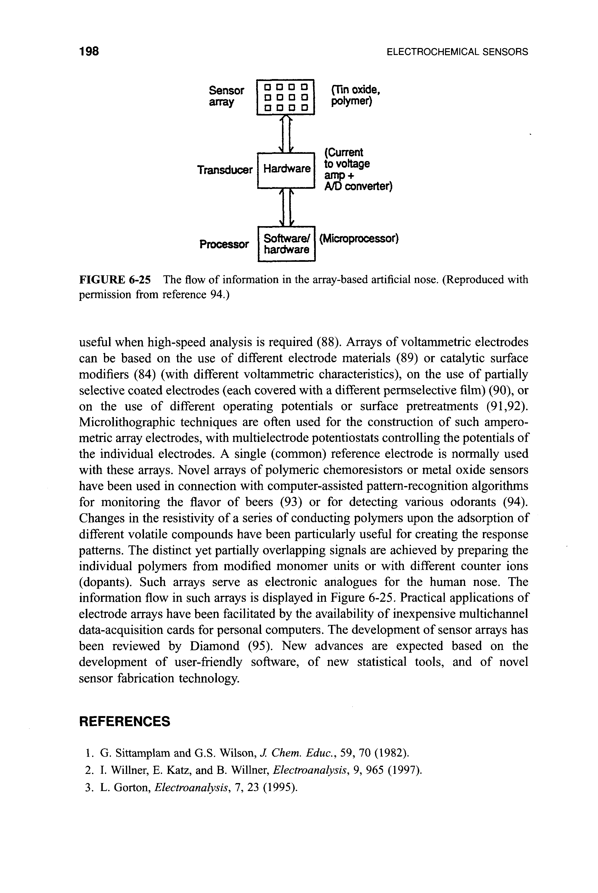

## Page 218

REFERENCES 
199
4. S. Algeret, Analyst, 121, 175 (1996).
5. J. Wang and L. Angnes, Anal. Chem., 64, 456 (1992).
6. P.N. Bartlett and J.M. Cooper, J. Electroanal Chem., 362, 1 (1993).
7. D.N. Gray, M.H. Keyes, and B. Watson, Anal. Chem., 49, 1067A (1977).
8. H.H. Weetall, Anal. Chem., 46, 602A (1974).
9. X. Yang, G. Johansson, D. Pfeiffer, and F. Scheller, Electroanalysis, 3, 659 (1991).
10. S.J. Updike and G.P. Hicks, Nature, 214, 986 (1967).
11. R.A. Marcus and N. Sutin, Biochim. Biophys. Acta, 811, 265 (1985).
12. J.E. Frew and H.A.O. Hill, Anal. Chem., 59, 933A (1987).
13. M.J. Green and P.I. Hilditch, Anal. Proc., 28, 374 (1991).
14. M. Vreeke, R. Maidan, and AJ. Heller, Anal. Chem., 64, 3085 (1992).
15. Y. Degani and A. Heller, J. Phys. Chem., 91, 1285 (1987).
16. A. Riklin, E. Katz, I. Willner, A. Stacker, and A. Buckmann, Nature, 367, 672 (1995).
17. A. Guindilis, P. Atanasov, and E. Wilkins, Electroanalysis, 9, 661 (1997).
18. C. Henry, Anal. Chem., 70, 594A (1998).
19. A. Malinauskas and J. Kulys, Anal. Chim. Acta, 98, 31 (1978).
20. L. Gorton, J. Chem. Soc. Faraday Trans., 82, 1245 (1986).
21. M. Lobo, A. Miranda, and P. Tunon, Electroanalysis, 9, 191 (1997).
22. G.G. Guilbault and J.G. Montalvo, J. Am. Chem. Soc., 92, 2533 (1970).
23. G.F. Hall and A.P.F. Turner, Anal. Lett., 24, 1375 (1991).
24. H. Thompson and G.A. Rechnitz, Anal. Chem., 46, 246 (1974).
25. W.J. Blaedel and R.A. Jenkins, Anal. Chem., 48, 1240 (1976).
26. D. Pfeiffer, K. Setz, T. Schulmeister, F. Scheller, H. Lueck, and D. Pfeiffer, Biosensors
Bioelectron., 1, 661 (1992).
27. G.J. Papariello, A.K. Mukherji, and C.M. Shearer, Anal. Chem., 45, 790 (1973).
28. G. Hall, D. Best, and A.F. Turner, Anal. Chim. Acta, 213, 113 (1988).
29. P. Seegopaul and G.A. Rechnitz, Anal. Chem., 56, 852 (1984).
30. T. Kawashima and G.A. Rechnitz, Anal. Chim. Acta, 83, 9 (1976).
31. S. Saini, G. Hall, M. Downs, and A.F. Turner, Anal. Chim. Acta, 249, 1 (1991).
32. J. Wang, Talanta, 40, 1905 (1993).
33. J. Besombes, S. Cosiner, P. Labbe, and G. Reverdy, Anal. Chim. Acta, 311, 255 (1995).
34. J. Marty, D. Garcia, and R. Rouillon, Trends Anal. Chem., 14, 329 (1995).
35. G.A. Rechnitz, Science, 214, 287 (1981).
36. J. Wang and M.S. Lin, Anal. Chem., 60, 1545 (1988).
37. M. Aizawa, A. Moricka, and S. Suzuki, Anal Chim. Acta, 115, 61 (1980).
38. P. Skladal, Electroanalysis, 9, 737 (1997).
39. I. Rosen, and J. Rishpon, J. Electroanal. Chem., 258, 27 (1989).
40. R.K. Kobos, Trends Anal. Chem., 6, 6 (1987).
41. S. Kaku, S. Nakanishi, and K. Horiguchi, Anal. Chim. Acta, 225, 283 (1989).
42. WR. Heineman and H. Halsall, Anal. Chem., 57, 1321A (1985).
43. C. Bauer, A. Eremenko, E. Forster, F. Bier, A. Makower, B. Halsall, W. Heineman, and
F. Scheller, Anal Chem., 68, 2453 (1996).

## Page 219

200 
ELECTROCHEMICAL SENSORS
44. O. Bagel, B. Limoges, B. Schollhorn, and C. Degrand, Anal. Chem., 69, 4688 (1997).
45. S.R. Mikkelsen, Electroanalysis, 8, 15 (1996).
46. J. Wang, G. Rivas, and X. Cai, Electroanalysis, 9, 395 (1997).
47. M. Yang, M. McGovern, and M. Thompson, Anal. Chim. Acta, 346, 259 (1997).
48. J. Wang, G. Rivas, D. Luo, X. Cai, N. Dontha, P. Farias, and H. Shirashi, Anal. Chem., 68,
4365 (1996).
49. S. Nagase, M. Kataoka, R. Naganawa, R. Komatsu, K. Odashimo, and Y. Umezawa, Anal.
Chem., 62, 1252 (1990).
50. I. Krull, D. Nikolelis, J. Brennan, R. Brown, M. Thompson, V Ghaemmaghami, and
K. Kallury, Anal. Proc., 26, 370 (1991).
51. K. Odashima, M. Sugawara, and Y. Umezawa, Trends Anal. Chem., 10, 207 (1991).
52. R.M. Buch and G.A. Rechnitz Anal. Chem., 61, 533A (1989).
53. D. Leech and G.A. Rechnitz, Electroanalysis, 5, 103 (1993).
54. K. Odashima, M. Kotato, M. Sugawara, and Y. Umezawa, Anal Chem., 65, 927 (1993).
55. K.C. Persaud, Anal. Proc., 28, 339 (1991).
56. J. Wang, Y. Lin, A. Eremenko, I. Kurochkin, and M. Mineyeva, Anal. Chem., 65, 513 (1993).
57. J.W Ross, J. Riseman, and J. Kruger, Pure Appl Chem., 36, 473 (1973).
58. Z. Gao, W. Buttner, and J. Stetter, Electroanalysis, 4, 253 (1990).
59. J.W Severinghaus and A.F. Bradley, J. Appl. Physiol, 13, 515 (1957).
60. J.D. Czaban, Anal. Chem., 57, 345A (1985).
61. W. Opdycke and M.E. Meyerhoff, Anal. Chem., 58, 950 (1986).
62. L.C. Clark, R. Wolf, D. Granger, and Z. Taylor, J. Appl. Physiol., 9, 689 (1953).
63. NASA Technical Briefs, 9, 105 (1985).
64. M.E. Meyerhoff, Anal Chem., 52, 1532 (1980).
65. J. Langmaier and J. Janata, Anal. Chem., 64, 523 (1992).
66. X. Xing and C.C. Liu, Electroanalysis, 3, 111 (1991).
67. S. Chang and J. Stetter, Electroanalysis, 2, 359 (1990).
68. G. Blackburn and J. Janata, J. Electrochem. Soc., 129, 2580 (1982).
69. V Oesch, S. Caras, and J. Janata, Anal. Chem., 53, 1983 (1981).
70. TV Zhukova, Zavod. Lab., 50, 18 (1984); Chem. Abstr., 101, 221484S (1984).
71. A. Sibbard, A.K. Covington, and R.F. Carter, Clin. Chem., 30, 135 (1984).
72. J. Kimura, J Electrochem. Soc., 136, 1744 (1989).
73. J. Janata and R.J. Huber, lon-Sel. Electrode Rev., 1,31 (1979).
74. G. Kittlesen, H. White, and M. Wrighton, J. Am. Chem. Soc., 106, 7389 (1984).
75. P.N. Bartlett, and P. Birkin, Anal. Chem., 65, 1118 (1993).
76. M. Nishizawa, T. Matsue, and I. Uchida, Anal. Chem., 64, 2642 (1992).
77. H. Suzuki, E. Tamiya, and I. Karube, Electroanalysis, 3, 53 (1991).
78. G. Fiaccabrino and M. Koudelka-Hep, Electroanalysis, 10, 217 (1998).
79. K. Erickson and P. Wilding, Clin. Chem., 39, 283 (1993).
80. G. Kovacs, K. Peterson, and M Albin, Anal Chem., 68, 407A (1996).
81. A. Hadd, D. Raymond, J. Halliwell, S. Jacobson, and J.M. Ramsey, Anal Chem., 69, 3407
(1997).

## Page 220

EXAMPLES
201
82. D. Craston, C. Jones, D. Williams, and N. El Murr, Talanta, 38, 17 (1991).
83. S. Wring and J. Hart, Analyst, 117, 1281 (1992).
84. Q. Chen, J. Wang, G.D. Rayson, B. Tian, and Y. Lin, Anal. Chem., 65, 251 (1993).
85. M. Otto and J.D.R. Thomas, Anal. Chem., 57, 2647 (1985).
86. K. Beebe, D. Verz, J. Sandifer, and B. Kowalski, Anal. Chem., 60, 66 (1988).
87. R.J. Forster, F. Regan, and D. Diamond, Anal. Chem., 63, 876 (1991).
88. D. Diamond, J. Lu, Q. Chen, and J. Wang, Anal. Chim. Acta, 281, 629 (1993).
89. R.S. Glass, S.P. Perone, and D.R. Ciarlo, Anal. Chem., 62, 1914 (1990).
90. J. Wang, G.D. Rayson, Z. Lu, and H. Wu, Anal. Chem., 62, 1924 (1990).
91. J. Stetter, PC. Jurs, and S.L. Rose, Anal. Chem., 58, 860 (1986).
92. P. Fielden and T. McCreedy, Anal. Chim. Acta, 273, 111 (1993).
93. T. Pearce, J. Gardner, S. Freil, P. Bartlett, and N. Blair, Analyst, 118, 371 (1993).
94. A. Newman, Anal Chem., 63, 586A (1991).
95. D. Diamond, Electroanalysis, 5, 795 (1993).
EXAMPLES
Example 6-1 
Chronoamperogram a was obtained for the biosensing of glucose in
whole blood. Subsequent standard additions of 1 x 10~3M glucose yielded the
chronoamperograms b to d. Find the concentration of glucose in the sample.
Solution 
The resulting current transients (sampled after 2 min) lead to the follow-
ing standards additions plot:
-
3
-
2
-
1
0
1
2
3
4
Concentration/mM
From which a glucose concentration of 2.4 mM can be obtained for the sample.

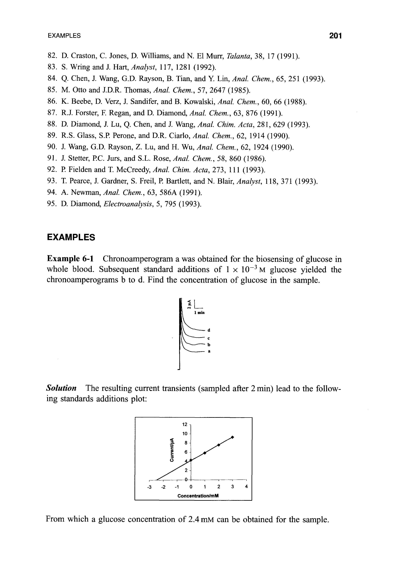

## Page 221

202
ELECTROCHEMICAL SENSORS
Example 6-2 The following standard addition plot was obtained for a competitive
electrochemical enzyme immunoassay of the pesticide 2,4-D. A ground water
sample (diluted 1:20 was subsequently assayed by the same protocol to yield a
current signal of 65 nA. Calculate the concentration of 2,4-D in the original sample.
100 
1000 
10000
Log< 2.4D, no'mL)
Solution The response of the diluted sample corresponds to 50 ng mL ! 2,4-D.
Considering the 20-fold dilution, the original sample concentration corresponds to
l.OugmL"1.
QUESTIONS
1. Describe different schemes for immobilizing enzymes onto electrode transdu-
cers.
2. How would you extend the linear range of calibration plots based on the use of
enzyme electrodes?
3. Describe a biosensing protocol for detecting mutations in DNA samples.
4. Suggest an enzyme electrode-based procedure for detecting organophosphate
pesticides.
5. Describe various routes for facilitating the electrical communication between the
redox center of glucose oxidase and an electrode surface.
6. Describe the major problems encountered in the detection of the NADH product
of dehydrogenase-based amperometric biosensors. Discuss a common approach
to circumvent these problems.
7. What are the improvements associated with performing analytical procedures on
a microchip platform?
8. Give example of an enzyme electrode based on an ion-selective electrode
transducer. What is the relationship between the substrate concentration and the
potential response?

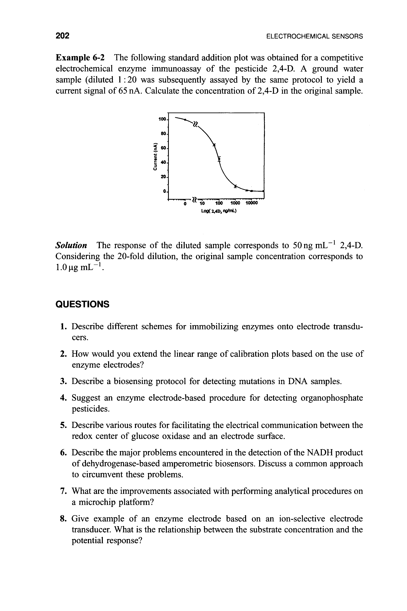

## Page 222

QUESTIONS 
203
9. Explain clearly how the use of enzymes can enhance the power of electro-
chemical immuno sensors.
10. Explain clearly why and how the response of glucose oxidase-based enzyme
electrodes is influenced by fluctuations in the oxygen tension.
11. Use equations to explain why and how an increase in the sensitivity of an
enzyme electrode is often coupled to a narrower linear range.
12. Explain clearly why highly selective individual electrodes are not desired for the
operation of sensor arrays.
13. Discuss the major sources of errors in amperometric monitoring of blood
glucose.

## Page 223

This page intentionally left blank

## Page 224

INDEX
Absorbance, 41
AC voltammetry, 74
Acid error, 149
Activation step, 114, 116
Activated complex, 16
Activity, 143
Activity coefficient, 143
Adsorption isotherm, 38
Adsorption processes, 21, 25, 36, 81
Adsorption kinetics, 39
Adsorptive stripping voltammetry, 2, 80
Affinity sensors, 172, 183
Alcohols, 178
Alcohol dehydrogenase, 178
Alkaline error, 149
Alkaline phosphatase, 185
Alkanethiols, 46, 123
Alkoxide precursor, 120
Amino acids, 92, 187
Ammonium sensor, 181, 182
Amperometric sensors, 172
Aniline, 35, 39
Anion selective electrodes, 156, 158
Anodic stripping voltammetry, 76
Antibody, 183
Antimony, 85
Arrays, 131, 162, 185, 187, 194, 198
Artificial nose, 198
Atomic force microscopy, 47
Auger electron spectroscopy, 45
Auxiliary electrode, 102
Azide, 182
Background current, 21, 65
Background subtraction, 40, 106
Bacteria electrode, 182
Band microelectrodes, 130, 135
Beryllium, 82
Bienzyme electrodes, 175
Biocatalytic devices, 172
Biological recognition, 171
Biosensors, 50, 171
Bipotentiostat, 106
Blood electrolyte, 165
Boltzmann equation, 19
Brain analysis, 40, 116
Butler-Volmer equation, 14
Cadmium, 85
Calcium electrode, 152
Capacitance, 20, 21, 22, 129
Capacitor, 20
Calixarine, 155
Capillary electrophoresis, detector, 89, 163
Carbohydrates, 92, 121, 197
Carbon dioxide electrode, 188
Carbon electrodes, 113
Carbon fiber electrodes, 89, 110, 115, 128
205

## Page 225

206
INDEX
Carbon paste electrodes, 115, 122, 173,
197
Carbonate, 127
Catalysis, 81
Catechol, 82, 90
Catheter-type sensor, 164
Cathodic stripping voltammetry, 82
Cells, 100, 101
Charging current, 21, 42, 66, 69, 74, 75,
109
Chemically modified electrodes, 39, 118
Chemometrics, 197
Chemoreceptor, 187
Chip, 194, 195
Chloramphenicol, 70
Chloride electrode, 159
Chlorpromazine, 34
Cholesterol, 182
Cholinesterase, 182
Chromium, 85, 86
Chronoabsorptometry, 42
Chronoamperometry, 21, 60, 130, 135, 132,
177
Chronocoulometry, 62
Clark electrode, 190
Coated wire electrodes, 160
Cobalt, 82, 85
Cobalt phthalocyanine, 121
Collection efficiency, 113, 135
Collection experiments, 113
Combination electrode, 148
Compact layer, 19
Composite electrodes, 47, 114, 133
Computer control, 80, 106
Concentration profile, 7, 9, 11, 29, 36, 87,
132
Concentration gradient, 7, 9, 11, 78,
Conducting polymers, 113, 124, 127, 193,
198
Controlled potential techniques, 3, 60
Convection, 4, 10, 11
Copper, 122
Copper electrode, 117
Cottrell equation, 8, 60, 68, 130, 134
Coulometric detectors, 88
Coupled chemical reactions, 33, 34, 36
Creatinine, 182
Crown ethers, 123, 155
Current, 3, 5, 6, 60
Cyanide electrode, 159, 182
Cyclic voltammetry, 28, 53, 131, 132
Cyclic staircase voltammetry, 74
Cyclodextrins, 187
Cylinder electrode, 130, 133
Data processing, 80, 106
Debye Huckel equation, 143
Dehydrogenase, 172, 178, 181
Deoxygenation, 80, 102, 103
Deposition, 76, 79
Detection limit, 3, 4, 67, 92, 145, 146
Detection modes, 92
Detectors, 84, 161, 162
Diabetes, 178
Differential pulse polarography, 68,
Diffusion, 4, 8, 129
Diffuse layer, 19
Diffusion layer, 7, 29, 90, 130, 132
Dimethylglyoxime, 82
Disposable sensors, 179, 196
DNA, 83, 183, 185
DNA biosensors, 127, 185
DNA damage, 186
Dopamine, 35, 124, 128, 183
Doping/undoping, 53, 113, 127
Dropping mercury electrode, 62, 108
Drugs, 81, 118, 160
Dual electrode detection, 93
EC mechanism, 34, 42, 113
E. Coli, 186
Edge effect, 129
Edge orientation, 114
Electrical communication, 178
Electrical double layer, 18, 19
Electrical wiring, 178
Electrocapillary, 22
Electrocatalysis, 121
Electrochemical quartz crystal,
microbalance, 52
Electrochemiluminescence, 44
Electrodes, 1, 107
Electrode pretreatment, 46, 110, 114
Electrolytes, 162
Electron transfer, 3, 11
Electropolymerization, 39, 126, 128, 173,
185, 191
Electroosmotic flow, 195
End column detection, 89
Energy barrier, 16
Enzyme electrodes, 172, 174
Enzyme immunoassays, 185
Enzyme inhibition, 181
Enzyme reconstitution, 178
Enzyme wiring, 178
Equilibrium potential, 15
Ethanol electrodes, 87, 178
Exchange current, 14

## Page 226

INDEX
Exocytosis, 128
Faradaic processes, 3
Faraday's Law, 76, 91
Ferrocenes, 134, 177, 178
Pick's law, 6
Field effect transistor, 191
Flow analysis, 84, 161
Flow detectors, 88, 162
Flow injection analysis, 86, 87, 127, 161
Flow-through electrodes, 91
Fluoride electrode, 157
Fluid manipulations, 194
Flux, 5, 6, 9, 129
Formation constant, 65
Free energy curves, 16
Frumkin isotherm, 38
Fullerenes, 31
Gas sensors, 127, 188
Gasoline, 85
Gene chips, 183
Generation-collection experiments, 135
Glass electrode, 147, 181
Glass membrane, 148, 151
Glassy carbon electrodes, 46, 110, 114
Glucose oxidase, 176
Glucose sensors, 176
Gold electrodes, 117, 118
Gouy layer, 19
Graphite epoxy, 114
Groundwater, 86
Halide ions, 83, 159
Half-wave potential, 63
Hanging mercury drop electrode, 109
Heavy metal analysis, 75, 82
Helmholz layer, 19
Hemisphere electrode, 130, 133
Heparin, 154
Heterogeneous rate constants, 12, 113
Hofmeister sequence, 153
Hybridization, 183, 185
Hydrodynamic boundary layer, 10
Hydrodynamic modulation, 113
Hydrodynamic voltammetry, 90
Hydrodynamic voltammogram, 88
Hydrogen evolution, 117
Hydrogen overvoltage, 110, 117
Hydrogen peroxide, 123, 176
207
Ilkovic equation, 62
Immobilization, , enzyme, 172
Immunoassays, 185
Immunosensors, 183
Infrared spectroelectrochemistry, 44
Instrumentation, 104
Insulin release, 178
Interdigitated electrodes, 131, 133, 135
Intermediate, 113
Intermetallic compounds, 79
In vivo monitoring, 40, 124, 128, 163, 164
Iodide, 83, 84, 159
Ion channel sensors, 186
Ion exchanger electrodes, 152
Ion selective electrodes, 140, 171, 197
lonophore, 155, 156
iR drop, 104, 129
Indium, 110
Iron, 85, 122
Irreversible processes, 32, 33, 71
Isotherm, 38, 81
Kinematic viscosity, 10, 111
Kinetics, 50, 129
Lab-on-a-chip, 90, 195
Lactate, 182
Langmuir-Blodgett films, 187
Langmuir isotherm, 38, 81
Laplace transormation, 6, 7
Lead, 84, 85
LEED, 45
Levich equation, 112
Ligand-modified electrode, 122
Liquid chromatography, detection, 86, 163
Liquid junction potential, 147
Liquid membranes, 152
Lipidfilm, 123, 126, 187
Lippman equation, 23
Lithium electrode, 156
Literature, 25
Lithography, 102, 131, 194
Luggin capillary, 105
Macrocyclic compounds, 155
Magnesium, 155
Mass measurements, 52
Mass transport, 4, 5
Mechanism, 33, 36, 40
Mediator, 177, 178
MeldolaBlue, 121, 179

## Page 227

208
INDEX
Membrane, 141, 178
Mercury electrodes, 62, 108
Mercury film electrode, 76, 110
Metals, 75, 81
Metal complexes, 64
Methyl viologen, 43
Michaelis-Menten kinetics, 175
Microbalance, 52, 53
Microcells, 102
Microchip, 194, 195
Microelectrodes, 30, 35, 49, 80, 102, 163
Microfabrication, 51, 90, 193
Microfluidics, 186, 195
Micromachining, 162, 194
Microorganisms, 183
Microsystems, 195
Migration, 4
Miniaturization, 128, 163, 193
Minigrid electrode, 41, 52
Mixed-salt electrodes, 159
Modified electrodes, 118, 121
Monensin, 155
Monolayers, 117, 118, 173
Multichannel electrodes, 93, 94
Multipotentiostat, 106, 198
Mutation detection, 185
NADH, 121, 122, 180
Nafion coating, 118, 123, 124, 126
Nanometer electrodes, 116, 128
Nemst equation, 3, 15, 80
Nernstian behavior, 143
Nernst Planck equation, 5
Neuronal sensors, 188
Neurotransmitters, 40, 116, 124
Neutral carrier electrodes, 154
Nickel, 123
Nikolskii-Eisenman equation, 143
Nitric oxide, 121
Nonactin, 157
Nonfaradaic processes, 21
Normal pulse voltammetry, 67
Nucleic acids, 82, 185
Ohmic drop, 32, 88, 105, 129
Operational amplifier, 105
Optically transparent electrode, 40
Organic-phase biosensors, 181
Organic solvents, 102
Organosulfur monolayers, 118
Overvoltage, 14, 121
Oxygen, 75, 87, 103, 177, 190, 193
Oxygen functionalities, 114
Penicillin, 82, 193
Permselective coatings, 123, 128
Pesticides, 181
pH electrode, 147, 172, 181
Phenol, 182
Photolitography, 194
Picoliter analysis, 102
Platinum, 81, 85
Platinum electrodes, 117
Polarography, 62
Polarographic maxima, 65
Polyaniline, 39, 124, 125, 191
Poly(diaminobenzene), 123, 124
Poly(ester sulfonic acid), 126
Polymer modified electrodes, 51, 118, 124
Polypyrrole, 124, 127, 128, 193
Poly vinyl ferrocene, 119
Polyvinyl pyridine, 119, 178
Porous electrode, 41, 114
Porphyrin coating, 123
Potassium, 155, 162, 163, 164
Potential, 2, 140
Potential of zero charge, 20, 23, 25, 66
Potential scanning detector, 92
Potential step, 7, 42, 60
Potential window, 107, 108
Potentiometry, 2, 140
Potentiometric stripping analysis, 79
Potentiostat, 104, 105
Preconcentrating surfaces, 121
Preconcentration step, 121
Pretreatment, 110, 116
Pulsed amperometric detection, 92
Pulse voltammetry, 67
Quasi-reversible systems, 32
Quaternary ammonium salts, 153
Quinhydrone electrode, 151
Radical ions, 33, 44
Raman spectroelectrochemistry, 45
Randles-Sevcik equation, 31
Rate constant, 12, 18
Rate determining step, 4, 14
Reaction mechanism, 33, 36, 113
Reaction pathway, 4, 33
Reaction rate, 12
Receptor-based sensors, 186
Redox recycling, 135

## Page 228

INDEX
209
Redox switching, 126
Reference electrodes, 100, 105, 142
Reflectance spectroscopy, 44
Resistance, 22, 105
Resolution 50, 71
Reverse pulse polarography, 68
Reversible systems, 4, 31
Reticulated vitreous carbon, 114, 115
Riboflavin, 37
Rigid film approximation, 53
Rotating disk electrode, 111
Rotating ring disk electrode, 113
Ruthenium dioxide, 121
Salicylate, 182
Sauebrey equation, 53
Scanning electrochemical microscopy, 49,
163
Scanning electron microscopy, 125
Scanning probe microscopy, 46
Scanning tunneling microscopy, 46
Screen-printing technology, 111, 177, 178,
195
Seawater, 85
Sequence-specific biosensor, 183, 185
Selectivity, 92, 143, 147, 155
Selectivity coefficient, 143
Self-assembled monolayers, 39, 118
Selenium, 85
Sensor, 171
Silver halide, 159
Simulation, 35
Single molecule detection, 52, 128
Size exclusion films, 123
Sodium, 155
Sodium-silicate glass, 151
Sol-gel films, 120, 173
Solid electrodes, 110
Solid state devices, 160
Solvents, 102
Speciation, 84
Spectroelectrochemistry, 40
Spherical electrode, 6, 8, 9, 61
Square-wave voltammetry, 72, 92
Staircase voltammetry, 74
Standard potential, 3
Standard rate constant, 12, 18
Stripping analysis, 75, 79, 110
Supporting electrolyte, 102
Surface-active agents, 79
Surface active material, 79, 81
Surface characterization, 45, 46
Surface coverage, 37
Surface enhanced Raman scattering, 45
Surface tension, 23, 25
Tafel equation, 14
Tafel plot, 15
Tetrathiafulvalene, 179
Thallium, 85
Thin layer cell, 88, 93, 102
Thin layer Spectroelectrochemistry, 41
Thiols, 121
Titanium, 82
Tissue electrodes, 182
Toxin biosensors, 181
Trace analysis, 75
Transference number, 147
Transducer, 171
Transfer coefficient, 14, 32
Transition time, 79
Triton X-100, 65
Tubular electrode, 91, 161
Tunneling current, 46
Tyrosinase, 118
Uncompensated resistance, 105
Ultramicroelectrodes, 35, 115, 128
Uranium, 85
Urea electrodes, 181
Urease, 181
Uric acid, 182
Valinomycin, 155, 156
Vitamin B12, 156
Voltammetric analyzers, 104
Voltammetry, 8, 62
Wall-jet detector, 88, 89, 162
Whole cell sensors, 182
Working electrodes, 2, 107
XPS, 45
Zinc, 85

