## Page 1

DƯƠNG QUANG PHÙNG
M
ậ
t  
ó
ớ
 p
J
u
ic
m
j p
h
á
p
.
NHẢ XUẤT BẢN ĐẠI HỌC sư PHẠM

## Page 2

PGS.TS. DƯƠNG QUANG PHÙNG
MỘT SÔ PHƯƠNG PHÁP 
■ 
PHÂN TÍCH ĐIỆN HOÁ
NHÀ XUẤT BẢN ĐẠI HỌC SƯPHẠM

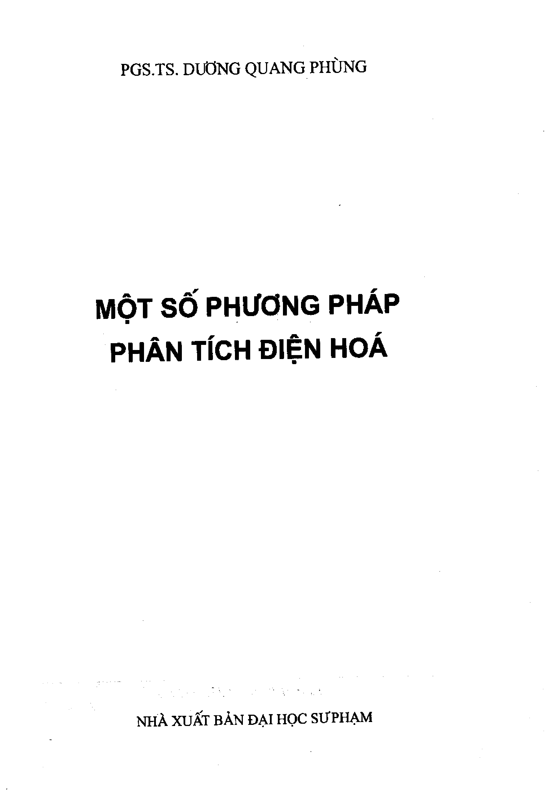

## Page 3

MỤC LỤC
Trang
Lời nói đẩu......................................................................................................7
Chương 1. Khái niệm cơ bản, kiến thức cơ sở, các quy luật cúa phương pháp 
phân tích điện hoá......................................................................... 11
1. Phản ứng điện hoá.............................................................................................11
2. H ệđiệnhoá.......................................................................... ..................,...........12
3. Pin điện và bình điện hoá..................................................................................13
4. Bước nhảy thế và lớp điện k é p ................................................... í.................15
5. Sự phân cực của điện cực.......................................................................................................
6. Thế điện cực .............................................. ...................... ........................................................
7. Thế điện cực hay thế điện cực cân bằng............................................................. ...22
8. Điện cực..................................................................................................................23
9. Chất điện li trơ, chất điện hoạt vậ khoảng điện hoạt...................................67
Chương 2. Phương phép phân tích điện thế, chuẩn độ đo thế........ ........... 71
Mỏ đ ầu......... .................... ............................;........... :.........-......... ............. " ...... 71
1. Các điều kiện cần thiết cho phép chuẩn độ đo thế.......................................71
2. Phân loại phương pháp chuẩn đọ đo thế........... ............................ 
J 2
3. Dụng cụ, thiết bị và cách tiến hành........................... ...................... ............. 72
4. Cách xác định điểm tưang đương............................................................. ........73
5. Một số phương pháp chuẩn độ đo thế...............................................................78
6. Tiêu chuẩn hoá pH và các phương pháp xác định........................................108
Bài tập chương 2...................................................................................................... 114
Chương 3. Phương pháp phân tích điện phân............................................. 117
1. Các hiện tượng xảy ra trong quá trình điện phàn....................................... 117
2. Các định luật về điện phân............................................................................... 123
3. Quá th ế.............................................................................................................. .125
4. Điều kiện tách các chất ỏ điện cực bằng điện phân.................................... 136
ạ

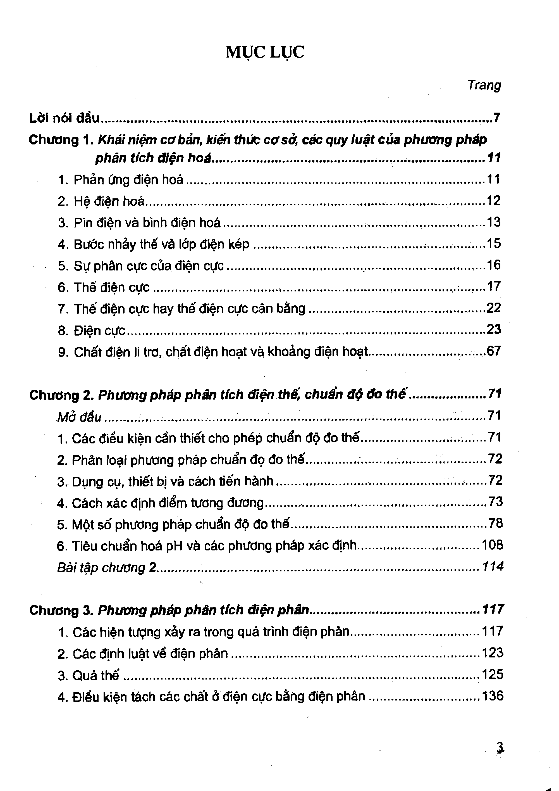

## Page 4

9
5. Các yếu tố ảnh hưởng đến quá trình điện p h â n ...........................................143
6. Các phưdng pháp điện phân................................... ......................................... 148
7. Nội điện phân (sự tự điện phân hay điện phân bên trong)......................... 154
Bài tập chương 3 ....................................................................................................158
... í •' •
Chương 4. Phương pháp phân tích cục 
............ .......... ............... 165
1. Nguyên tắc ........................................................................................................165
' 
2. Dòng khuếch tản ........ ..................................................... ..................................................
1 
3. Các yếu tố ảnh hưông đến dòng khuếch tán................................................173
4. Phương trình sóng cực phổ thuận nghịch............................................... ......178
" 
5. Gách thể hiện đường cong (sóng) cực phổ..................................................192
^ 
6. ứng dụng của phương pháp cực phổ........................................... ..............194
Bải tập chương 4 .................................. ................................ ..................................214
Chương 5. Giới thiệu sơ lược phương pháp phân tích điện hoá hiện đại
von-ampe hoà ta n .......................................................................219
'ĩ' 
1. Những hạn Chế của phUững pháp cực phổ cổ đỉển................................219
"■ s 
2. Phương pháp von-am pe hoà tan (Stripping vontammetry)......................220
; 
3. Các loại phản ứng dùng để kết tủa lảm giàu.............................................227
4. Thiết bị đo dòng hoà tan (von-ampe hoà tan).......................................... ..233
Tàl liệu tham khảo....................... ...... .......... .............................................. 238
Phụ lục............................. .......................................................... ................241
ị<'■< ...
■ I
t sr;; M'iii : : 
Vị.;:: ii-\ìO t' ĨỄri.,''
4

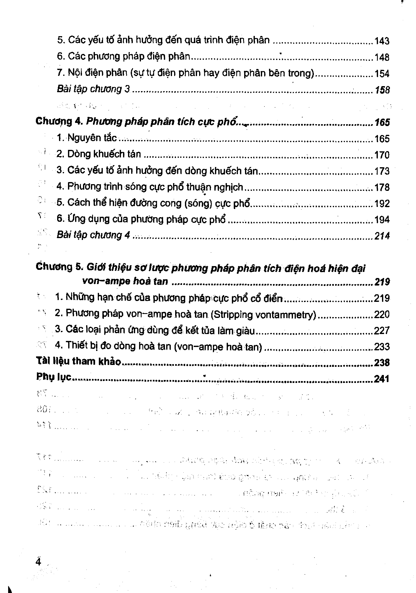

## Page 5

CÁC KÍ HIỆU VIẾT TẮT 
SỬ DỤNG TRONG GIÁO TRÌNH
Kí hiệu
Tên
Kí hiệu
Tên
A
Ampe
^Kt
thế khuếch tán (V, mV)
A
hằng số kinh nghiệm
®Tu d
thế của tụ điện (V, mV)
a
hoạt độ
Edđ
thế của dung dịch trồng lớp 
điộn kép (V, mV)
B
hằng số kinh nghiệm
F
hằng số điên tích Faraday: 
96500 c/e
c
hằng số kinh nghiệm
fi
hê số hoat đô
c
dung tích tụ điện
(i)
hoatđô 
-
c
nồng độ (mol//)
[i]
nồng độ cân bằng (M, ion-g/0
D
hệ số khuếch tán (cm2/giây)
h
chiều cao đường cong cực phổ 
(mA, mm)
ri
chiều dày tụ điện (mm) hay 
khoảng cách hai bản tụ điện
^Hg
chiều cao cột thủy ngân (mm)
*
e
electron
ií
mật độ dòng (mA/cm2)
E
thế điộn cực (V, mV)
ic
mật độ dòng catot (mA/cm2)
Eq,
, thế điên cuc cân bằng (V, 
mV) ■ 
' 
. „
mật độ dòng anot (mA/cm2)
E°
thế oxi hoá -  khử tiêu chuẩn 
(V, mV)
^Tr.đ
dòng traữđổi (A, mA)
E°'
thế oxi hoá -  khử tiêu chuẩn 
thực (V) 
.
^Kt
dòng kỊiuếch tán (A, m A)
E]/2
thế nửa sóng (V, mV)
^Gh
dòng giới hạn (A, mA)
Esđd
sức điện động (V, m V)
^(Gh)tb
dọng giới hạn trụng blnh (A,
mẠ) 
:
Erd
thế tai điểm tương đương (V, 
mV)
I
lực ion
^TR.Tđ
thế trước tương đương (V, 
mV)
k
hằng số tốc độ
E-STd
thế sau tương đương (V, mV)
X
hệ số Ilkovic
5

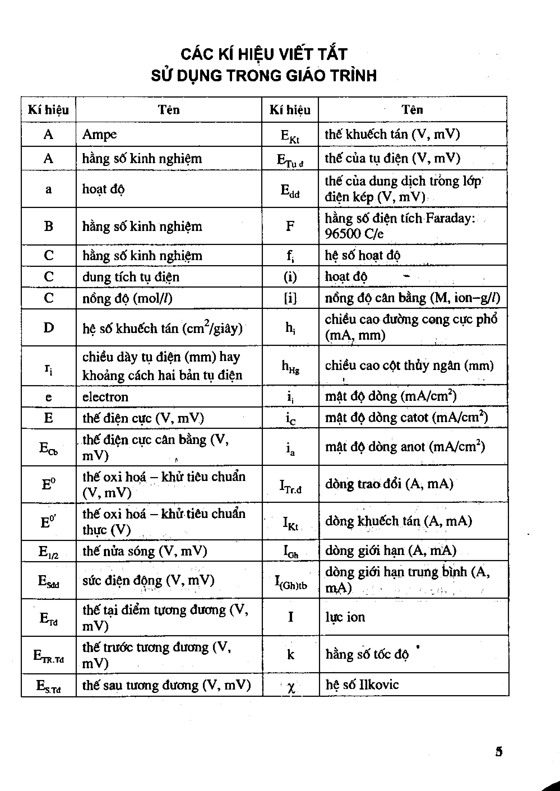

## Page 6

Kí hiệu
Tên
Kí hiệu
Tên
Kcb
hằng số cân bằng
VTđ
thể tích tương đương (ml)
L
linh độ của ion
VT,Tđ
thể tích trước tương đương 
(ml)
m
tốc đô chảy của giọt Hg 
(g/giây)
V S.Td
thể tích sau tương đương (ml)
n
số electron
z
số điên tích ion
q
điện tích của tụ điện
a
hệ số chuyển điện tích
Q
điện luợng (Ampe.giây)
a
kí hiệu góc
u
tốc độ điện chuyển
a
độ điện ỉi
u
điện áp đặt từ nguồn vào; 
sức điên đông cua hê điên hoá 
(V, mV)
e
hằng số điện môi
' r ■
bán kính giọt Hg (mm, um)
Pph
hằng số bền của phức
Tc
bán kính trong của mao quản 
(mm, jLim)
a
chiều dày lớp khuếch tán
R
hằng số khí: S^H Jm or'.K "1
n
quá thế (V, mV)
R,
điện trò (Q)
Tie
quá thê cutot Iuớn luôn âm (V, 
mV) 
•
s
diện tích bề rnặt điện cực 
(mm2) 
.
n,
C|iiá thế anot luôn luôn đương 
(V, mV)
t
, chu kì giọt Hg (giây)
'Hxt
q u á  thế nồng độ (V, mV)
V
tốc độ di chuyển
ĩl»Uitih
quá thệ' kết tinh (V, mV)
V
hệ số hợp thức trong phản ứng 
hoá bọc
nK(
quá thế khuếch tán (V, mV)
V
Von ..
npư
quá thế phản ứng (V, mV)
V
thể tích giọt Hg (mm3)
ĐI
đương lượng (M/n)
6

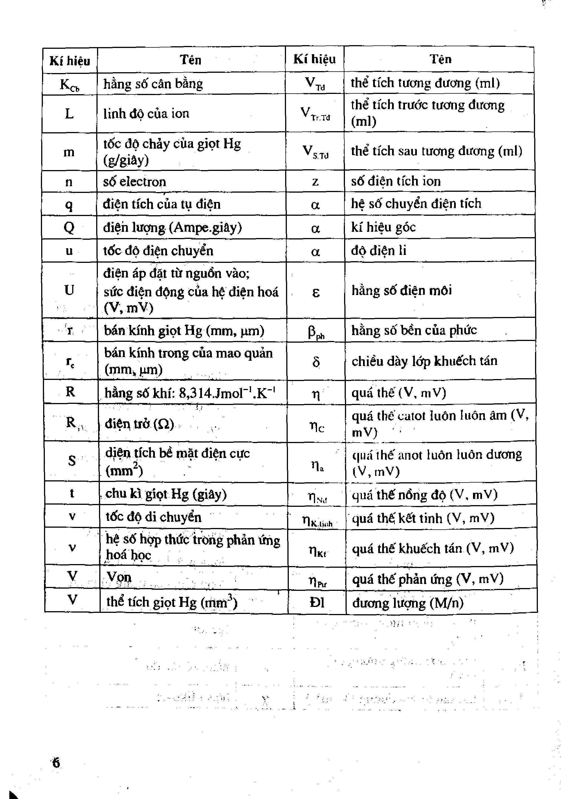

## Page 7

LỜI NÓI ĐẦU
Hoá học phân tích là một ngành khoa học nghiên cứu tìm ra các phương phấp 
xác định thành phần định tính và định lượng các cấu tử, chất trong nhóm, trong họ 
và trong hỗn hợp của chúng.
Trước khi phân tích định lượng người ta tiến hành phân tích định tính. Xác 
định thành phần định tính trong hỗn hợp thường sử dụng các phương pháp như nhỏ 
giọt (phương pháp H-,S hay phương pháp axit -  bazơ), phương pháp phát xạ bán 
định lượng, phương pháp dựa vào thế bán sóng trong phương pháp cực phổ.
Sau khi phân tích định tính để biết chắc chắn trong hỗn hợp có chứa các 
nguyên tố, chất cụ thể thì việc phân tích định lượng được tiến hành nhằm xác định 
hàm lượng của từng chất có trong hỗn hợp. Để thực hiộn được điều đó, người ta sử 
dụng các phương phặp phân tích hoá họp vạ các phương pháp công cụ (lí -  hoá). 
.
Các phượng pháp phân tích hoá học thường dùng: phân tích thể tích và phương 
pháp khối lượng. Các phương pháp này thường sử dụng các dụng cụ đơn giản nhu 
pipet, buret; đặc biột là độ chính xác của phương pháp dựa vào sụ thay đổi màu đột 
ngột của chỉ thị nên chỉ xác định được nổng đô của các chất lớn hơn 10"3M. 
Phương pháp phân tích hoá học ra đời trước các phương pháp phân tích khác nên 
được gọi là phương pháp vổ điển. Song song với sự phát triển của các ngành khoa 
học, công nghệ và nền kinh tế ngày càng phát triển, các sản phẩm mới được sản 
xuất hàng loạt vì vậy yêu cầu phải có các phương pháp phân tích mới cỏ khả năng 
đánh giá chất lượng của sản phẩm trước khi xuất xưởng, đó là phương pháp phân 
tích công cụ. Các phương pháp hày có khả năng xác định nồng độ của các chất có 
trong hỗn hợp nhỏ hơn 10'3M và đạt độ chính xác thoả đáng. Các phương pháp 
phân tích cồng cụ ngăy càng được hoàn thiện và phát triển, có liên quan mật thiết 
với các thành tựu midi của vật lí, hoẩ lí thực nghiệm, vói sự ra đời và phát triển của 
hgănh công nghiệp chế tạo thiết bị nguồn chiếu sáng, ghi, đò chính xác các chất 
có hàm lượng nhỏ và một phần đóng góp đáng kể là máy tính điện tử có phẩn 
mềm điéu khiển quá trình đo và xử lí, Uru giữ kôt quả đo.
Các phản ứng hoá học được sử dụng trong phương pháp, phân tích công, cụ 
(lí -  hoạ) bạợ giờ cũng kèm theo sự thạy đổi rpột số tính chất vật lí của hệ. Ví dụ: 
Phản ứng ịđìện Ịioậ Jìựn thay đôi thế diện cực của dung dịch. Trong phương pháp 
đo quạng, ví dụ: phận ứng tạo phức giữa niken(II) với thuốc thủt đimetyỉglioxim 
làm thay đổi tính chất hấp thụ ánh sáng của dung dịch. 
_ 
! ,
7
A

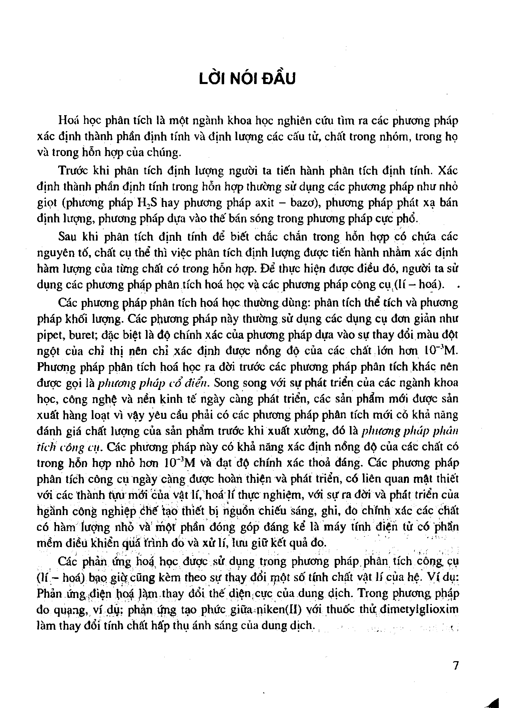

## Page 8

Các phương pháp phân tích công cụ thường được chia thành ba nhóm chính 
như sau:
-  Các phương pháp tách (gồm phương pháp tách bằng sắc kí và chiết bằng 
<Jung môi hữu cơ).
-  Các phương pháp quang học (gồm phương pháp đo quang phân tử và 
phưong pháp đo quang nguyên tủ).
-  Các phương pháp phản tích điện hoá: được chia thành 2 nhóm lán:
(ỉ) Nhỏm các phương pháp dựa trên quá trình điện cực {thường là phản ứng 
oxi hoắ 
khử của chất điện hoạt và điện cực)
Các phương pháp thuộc nhóm này rất phong phú. Nhóm nãy được chia thành 
hai phân nhóm: phân nhóm các phương pháp trong đó phản ứng điện cực ở trạng 
thái cân bằng (dòng bằng không) và phân nhóm dựa trên sự điện phân (dòng khác 
không). Phân nhóm thứ hai này gồm một số lớn các phương pháp điện hoá trong 
đó có nhóm các phương pháp hiên đại có đô nhạy cao đang được ứng dụng rất 
rộng rãi.
(2) Nhỗnt các phương pháp không đùng các phản ứng điện cực
Các phương pháp thuộc nhóm hai là các phương pháp cổ điển có giới hạn phát 
hiện nồng đờ xác đinh được khá cao hhưng lại có nhược điểm chủ yếu là tính chọn 
lọc rất kém do đó ít được sử dụng trong thực tiễn phân tích.
Trong giai đoạri hiên nay, trong số các phừơrig pháp đuợc phân loại trên, các 
phương pháp sau đây được coi là các phương pháp mũi nhọn của phân tích điện hoá:
-  Các phương pháp điện thế dùng các điện cực chọn lọc ion.
-  Cảc phương pháp cực phổ hiện đại, đặc biệt là cực phổ xung và xung vi phân.
-  Các phương pháp điện hoá hoà tan.
Người tạ ứng dụng các phương pháp trên vào phương pháp sắc kí lỏng và phân 
tích dòng chảy (HẠ), dừng chúng làm các loại detector.
Gịáo trình "Một số phương pháp phán tích điện hoú" là một phần trong 
chương trình "Các phượng pháp phận tích lí ~ hoáM đã giảng dạy cho sinh viện 
khoa Hoá học các trường Đại học Sư phạm. Hà Nội vặ Ẹ)ại học Khoạ học TỊr nhịên 
ĐHQG Hà N ội tit nhiều năm nay. Vì mục đích của hại trường khác nhau nôn cơ sở 
lí thuyết và úng dụng của các phương pháp khi trình bậy trong giáo trình cũng 
khác nhau. Để thực hiện nhiộm vụ đa đạng hoá mô hình đào tạo đa ngành đa nghề 
và phục vụ cho đào tạo Cử nhân sư phạm, Cử tihân ngoài sư phạm và đào tạo theo 
hệ Từ xa vóí thời lượng 3 đơn VỊ học trình tương ứng vdi 45 tiết (nay là đào tậo 
theo tín chỉ: 2 tín chì tương đưong 30 giờ), chúng tôi tập trung trình bày vào 
5 chương cơ bản, thông dụng và cập nhật đang được giảng' đáý trong các tụiờng 
Đại học trong iuróc và trên thế giới là: 
• 
1

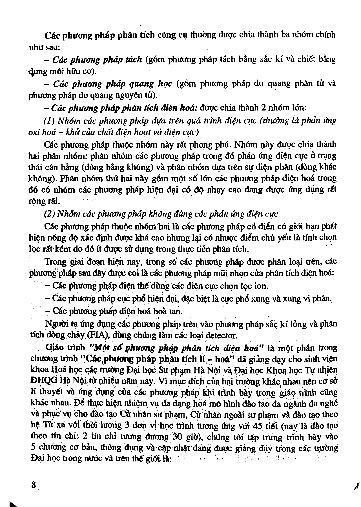

## Page 9

Chương ỉ: Khái niệm cơ bản, các quy luật và kiến thức cơ sờ của phương pháp 
phân tích điện hoá.
Chương 2: Phương pháp chuẩn độ đo thế.
Chương 3: Phương pháp phân tích bằng điộn phân.
Chương 4: Phương pháp phân tích cực phổ.
Chương 5: Giới thiệu sơ lược phương pháp phân tích điện hoá hiện đại von- 
ampe hoà tan.
Trong mỗi chương có trình bày khái niệm cơ bản, các quy luật và kiến thức 
cơ sở của từng phương pháp. Đặc biệt chúng tôi đưa vào sau từng phần lí thuyết 
cơ sở là:
1. Những ví đụ được tính toán cụ thể chính xác để sinh viên tham khảo, học 
tập sau đó áp dụng vào làm bài tập ở cuối mỗi chương.
2. Các bài huớng dẫn thí nghiệm cụ thể và được tính toán đến kết quả cuối 
cùng để cho sinh viên và một số cán bộ của các khoa Hoá học một số trường mới 
thành lập tham khảo thiết kế bài thí nghiệm thực hành cho khoa mình.
3. Các bài thí nghiệm cụ thể ứng dụng phương pháp đường chuẩn và thêm 
chuẩn để xác định hàm lượng các chất phân tích. Kết quả thực nghiệm được hướng 
dẫn đánh giá bằng toán học thống kê, đường chuẩn và đường hồi quy thêm chuẩn 
được hướng đẫn cụ thể bằng các phương pháp tính tay, phần mềm Excel hay phần 
mềm lập sẵn bằng ngôn ngữ Pascal để tham khảo.
4. Trong Chương 4: Phương phấp phân tích cực phổ đã trình bày chi tiết, ứng 
dụng của phương pháp này vào xác định số electron tham gia phản ứng điện cực và 
phản ứng là thuận nghịch hay không, xác đinh số phối tử tham gia vào tạo phức và 
xác ítình hằng số bển bằng phương pháp cực phổ thay cho phương pháp đo quang.
Giáo trình này cung cấp kiến thức cơ bản nhất về phân tích điện hoá cho sinh 
viên khoa Hoá học các trường, đặc biệt đối với sinh viên nhận để tài thực nghiệm 
theo chuyên ngành điện hoá, hiểu được những kiến thúc cơ bản nhất của mỗi 
phương pháp, biết ứng đụng vào thực tế tiến hành thí nghiệm phân tích một đối 
tượng cụ thể. Ngoài ra, giáo dinh còn dừng làm tài liệu tham khảo cho các sinh 
viên, học viên Cao học khi thực hiện đề tài nghiên cứu khoa học trong lĩnh vực 
điện hoá.
Tác giả mong nhận được nhiều góp ý, sửa chữa, bổ sung của các thầy cô, các 
bạn đồng nghiệp và các em sinh viên để lần tái bản tới, giáo trình có chất lượng 
tốt hơn. Mọi sự góp ý và bổ sung xin gọi đến số: 04.37546266, hoặc 
01234748268, hoặc gửi theo địa chỉ e-mail: phungdqsp@yahoo.com.vn.
Tác giả
9

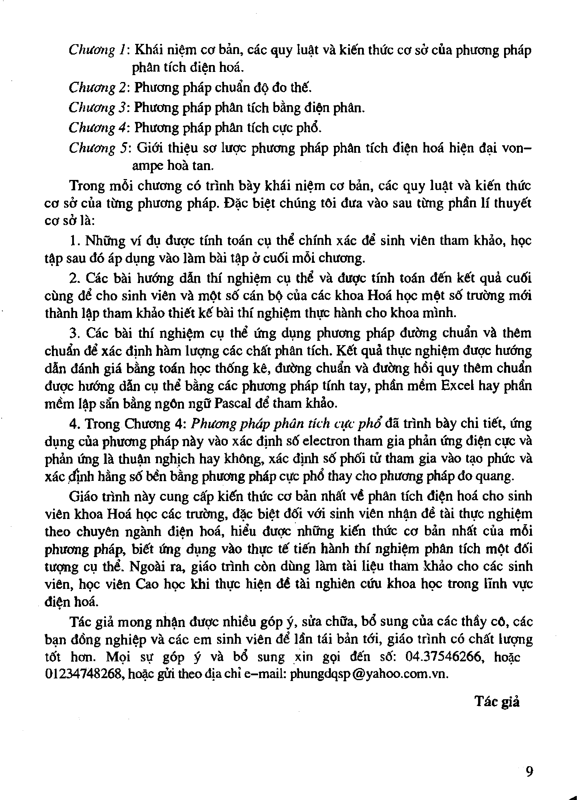

## Page 10

Chương 1
KHÁI NIỆM Cơ BẢN, KIẾN THỨC cơ sở, CÁC QUY LUẬT 
CỦA PHƯƠNG PHÁP PHÂN TÍCH ĐIỆN HOÁ
■
Để học tập, nghiên cứu, ứng dụng phương pháp vào thực tế, phải nắm chắc cơ 
sở, nguyên tắc của từng phương pháp phân tích điện hoá. Sau đây là tóm tắt một số 
khái niệm cơ bản, các quy luật và kiến thức điện hoá làm cơ sở lí thuyết cho các 
phương pháp này.
1. Phản ứng điện hoá
Nếu nhỏ từ từ dung dịch KMn04 0, IM vào dung dịch FeS04 Ọ,lM trong 
H2S04 sẽ xảy ra phản ứng oxi hoá -  khử có nghĩa là các phản ứng có sự trao đổi 
electron:
l x M n 0 4 +5e + 8H* —  
Mir* 
+ 4H :0  
(l)
5x Fe2* 
~  
Feĩ+ + e 
, 
(2)
M n 04 (l) + 5Fe2+p> + 8H+ 
Mn2+ (2) + 5Fe'v (1) + 4HịO 
(3)
' Ox(|) + Kh(2) 
—  Ox(2) +Khm 
(3’)
Trong nửa phản ứng (1), chất 0X1 hoá nhận electron còn gọi [à chất bị khử. 
Trong nửa phản ứng (2), chất khử cho electron gọi là chất bị oxi hoá.
Các phản ứng oxi hoá -  khử có thể xảy ra theo hai cách:
a. 
Nếu cho trực tiếp chất khử (2) vào chất oxL hoá (1), các electron sẽ chuyển 
trực tiếp từ chất khử (2) sang chất oxi hoá ( 1) là phạn ứng oxi hoá -  khử trong 
trường hợp này gọi là phản ứng hoú .học (không điộn hoá).
Phản íũĩg oxi hoậ -  khửhoá học (không điộn hòá) có những dặc điểm như sau:
-  Phản ứng luồn luôn kèm theo sự tỏa nhiệt hoặc thu nhiệf mà không kèm 
theo sự sinh ra hoặc tiêu thụ điện năng.
-  Sự trao đổi electron trực tiếp giữa các phần tử cùa chất oxi hoá và chất khử, 
có nghĩa là quãng đưcmg mà electron vượt qua í à rất ngắn.
-  §ự trao đổi electron vượt qua Ịà rất ngạn của .dung dịch và sự chuyển dời
electron là không định hướng mà Ịà hỗn độn trọng toàn bộ môi trường phản ứng.
11

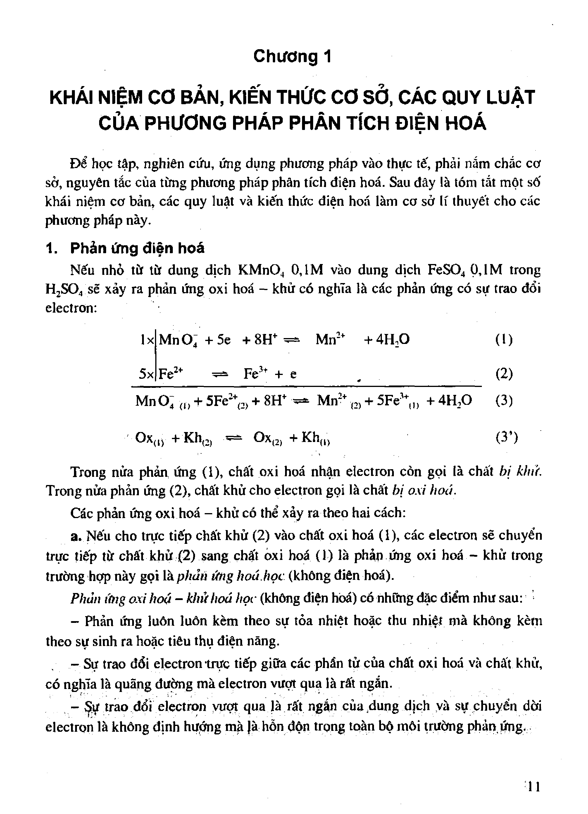

## Page 11

b. 
Có thể thiết lập những điểu kiện để cho các electron chuyển từ chất khử (2) 
sang châ't oxi hoá (1) thông qua dây dẫn.
Phản ứng (3) có thể thực hiện theo kiểu điện hoá bằng cách tách 2 dung dịch 
FeS04 và KMn04 chứa trong 2 cốc khác nhau hoặc ngăn cách bằng một màng 
ngăn xốp, hai điện cực platin được nhúng vào 2 cốc (hai ngăn) và nối với nhau 
bằng một dây dẫn kim loại (Al, Cu), hai dung dịch được nối với nhau thòng qua 
cầu nối (xem hình 1.1).
Hình 1.1. Phản ứng MnO; + 5Feỉ+ + 8hf Mn2* + 5Fe3* + 4H20  theo kiểu điện hoá
a) Khõng cò màng ngăn 
b) Có màng ngăn
Như vậy các phản úng oxi hoá -  khử xảy ra theo kiểu điện hoá là các phản 
ứng oxi hoá -  khử gắn liên yới sự sinh ra hoặc tiêu thụ điộn năng.
Phản úng oxi hoả -  khử xảy rà theo kiểu điện hoá cần có những điểu kiộn sau:
-  Có sự trao đổi electron gián tiếp thông qua dây dẫn kim loại.
-  Phải có sự ngẫn cách về mặt không gian giữa chất oxi hoầ và khử.
-  Phải có hai thanh kim loại nhúng vào 2 dung dịch chất oxì hoá và chất khử 
và một dây dẫn nối từ thanh kim lòại này sang thaiih kim loại kia để tạo điều kiện 
cho sự trao đổi electron giữa chất oxi hoá và chất khử; giữa hai dung dịch phải 
được nối với nhau bằng cầụ Ị1ỐÍ chất điện li.
2. Hô điên hoá
• 
■
Một hệ điện hoá bao gồm:
-  Các chất tham gia phản ứng nhưtMnOỊ + 5Fe2++ 8FP ^  Mn2* + SPe3*-*- 4H20
-  Các chất tham gia phản óng điện hoá có thể ò trong dung dich, là chất rắn 
hoặc chất khí. Thường cho thêm chất điện lí C& nồng độ lớn hơn từ 50 Tần nồng 
chất điện hoạt (phári tích) nhằứì đảm bảơ tính dẵh đỉện tốt.
12

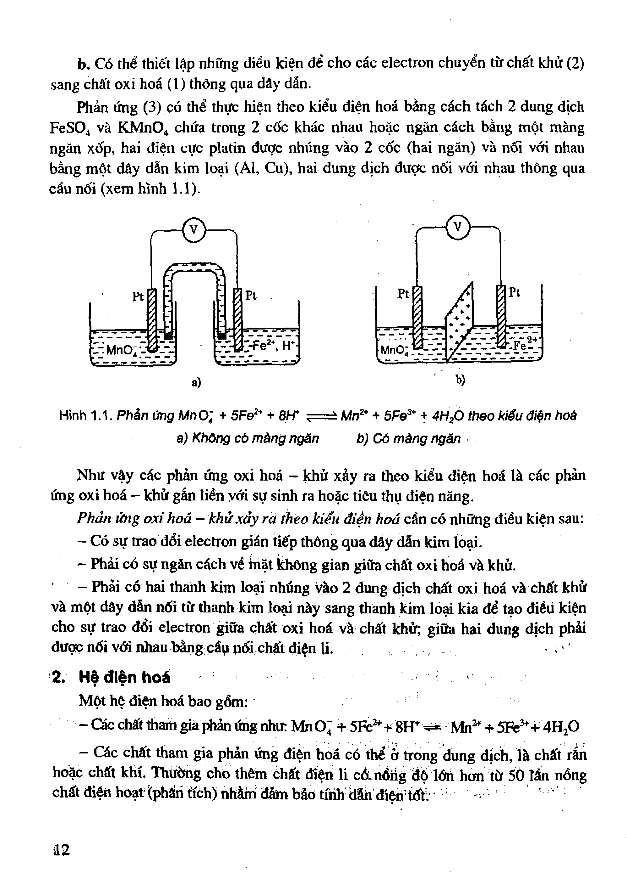

## Page 12

-  Hai điện cực đảm bảo cho sự trao đổi electron giữa các chất tham gia phản 
ứng bị ngăn cách và chuyển dòng electron ra mạch ngoài. Mạch ngoài thường 
dùng là một dầy dẫn kim loại (nhôm, đồng) được nối giữa hai cực.
-  Cầu nối giữa hai dung dịch chứa các chất tham gia phản ớng điện hoá.
3. 
Pin điên và bình điên hoá
* 
•
Hai hệ điện hoá là pin điện và bình điện hoá là khác nhau.
3.1. Pin điện
Pin điện hoặc nguyên tố (ỉiện hoá (ganvanic) là hệ điện hoá sản ra điộn năng 
nhờ các phản ứng điện hoá. Trong pin điện, điện cực cho electron ra mạch ngoài là 
điện cực ủm, điện cực nhận electron ở mạch ngoài là điện cực dương.
Nguyên tố điộn hoá hay ganvanic là một hệ gồm hai điện cực ghép với nhau 
nhúng trong 2 dung dịch điộn li có màng ngăn xốp (hình 1.2) hay cầu nối chất 
điện li.
s...
V
KCI
Dung dịch 
ZnS04
Điện cục 
Cu
Dung dịch 
CuSỌ4
Z n,,, ^  Zn2+,^  + 2e 
Cu2+,.n + 2e —  Cu
ựiỉ)^ ^  
(r)
Hoạt độ Zn2*= 1,00 
Hoạt độ Cu2+= ! ,00
Hình 1.2. Cấu tạo của nguyén tố điện hoá
Theo cấu tạo trên, một nguyên tố điện hoá được kí hiộu như sau:
Nếu không nối 2 điện cực Với nhaù thì nguyên tố điện hoá không hoạt động, 
trên 2 điện cực xảy ra cấc cẵn bằrig; cân bằng của mỏi điện eực phụ thuộc vàơ
13

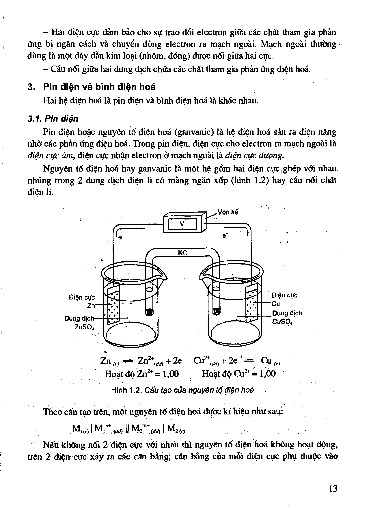

## Page 13

kim loại Mj, M-, và hoạt độ của các ion M,n+và M:n+trong mồi dung dịch. Các quá 
trình ở mỗi điện cực sẽ đạt đến cân bằng, đó cũng là các cân bằng động. Nếu nôi 
các điện cực với nhau, cân bằng sẽ bị phá vỡ, dòng điện sẽ chạy từ điện cực của 
kim loại hoạt động mạnh sang điện cực của kim loại kém hoạt động hơn. Ví dụ: 
nếu M| là Zn, Mn là Cu thì có:
(-) Znf„ Ị Zn2l  Cu-+| Cu,„ (+)
và ở đây electron sẽ từ điện cực Zn chuyển sang điện cực Cu. Do cân bằng bị phá 
vỡ, ở điện cực Zn, các nguyên tử Zn kim loại lại tan ra theo phản ứng:
Znữ(r> ^  Zn2+W) + 2e 
(a)
Ở cực Cu, các ion Cu2+ nhận được electron từ điệrì cực trở thành kim loại Cu 
bám vào điện cực theo phản ứng:
Cu2V „+ 2e ^  Cu°fr, 
(b)
Do hai quá trình (a) và (b) này làm nổng độ của 2 ion Zn2+, Cu2+ trong dung 
địch bị thay đổi, thế của điện cực Zn tăng lên, thế của điện cực Cu giảm xuống, 
đến khi nào giá trị của chúng bằng nhau và cường độ dòng điện được thiết lập 
bằng 0 (mất dòng). Lúc này, cân bằng mới trên 2 cực được thiết lập ứng với giá trị 
nhất định của nồng đố cấc ion Zn2+ và Cu2+ trong dung dịch. Như vậy khi một 
nguyên tố điện hoá hoạt động, các dung dịch chất điện li và thế cân bàng của diện 
cực bị thay đổi và các điện cựq bị phân cựe (thành 1 điện cực âm, 1 điện cực 
dương), trong mạch xuất hiện dộng điện.
3.2. Bình điện hoá
Bình điện hoa là hệ điên hoá tiêu thụ điện năng từ bên ngoài. Trong binh điện 
hoá, điộn cực nhận electron từ các phân tử hoặc ion tham gia phản ứng điện hoá là 
cực dương, điện cực kia là điộn cực âm. Vì sự nhường electron ỉà sự oxi hoá và sự 
nhận electron là sự khử, cho nên người ta thường định nghĩa: ,
Aìĩot là điện cực mà tại đó xay ra sự 0X1 jhqá (chất khử nhường electron thực 
hiện quá trình oxi hoá) cồn ca tot mà điện cực tại đổ xảy ra sự khử (chất oxi hoá 
nhận electron thưc hiệÂ quá trình khử).
Như vậy trong quá trình điện phân, anot Ịà cưc dương (+), catot là cực âm (-) 
còn ờ pin điộn thì ngược lại, anot ỉà cực (-), catotìà cực (+).
Vì vậy khi nói cực dương hay cực âm thì cần dỉỉ rõ đó là điện 'cực trong pin 
diệu hay trong bình điện phâru Đệ tránh nhầỉp lẫn, trong điện họấ chỉ dùng khái 
niệm anot và catot mà khôug, qói cực dựơng.hay cực ậm. Cực âm cùa bình điện
ẠA

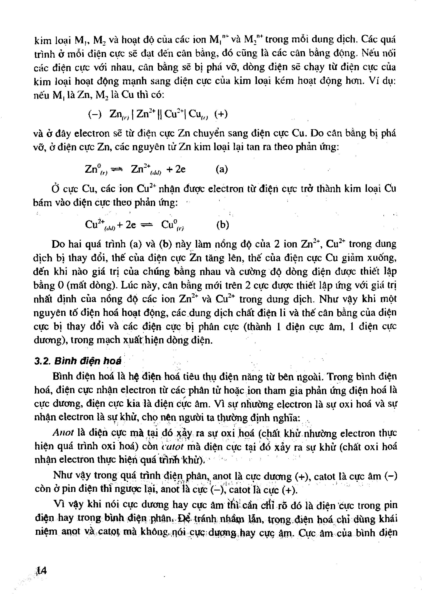

## Page 14

phan khi thì dóng vai trò là catot khi thì là anot tùy thuộc vào quá trình xảy ra trên 
điện cực là khử hay oxi hoá.
4. Bước nhảy thế và lớp điện kép
Khi nhúng một thanh kim loại vào dung dịch chất điên li luôn luôn xuất hiện 
hiệu điện thế (bước nhảy thế) và được gọi là thê'điện cực, nó là thế điện cực cân 
bằng. Thế điện cực cân bằng của điện cực xuất hiện là do sự xuất hiện của lớp điện 
kép trên ranh giới tiếp xúc giữa kim loại làm điện cực và đung địch chất điện li. 
Có thể coi lớp điện kép như một tụ điên mà một bản của nó ]à bề mặt kim loại còn 
bản kia là lớp dung địch sát bề mặt điện cực và có điện tích trái dấu. Hiệu điện thế 
giữa 2 bản tụ điện chính là thế điện cực Ccln bằng.
Vào năm 1953, nhà khoa học Helmholtz đưa ra mô hình tụ điộn phẳng. Ống 
coi lớp điện kép có thể như một tụ điện phẳng mà một bản tụ đi qua các điện tích 
trên bề mặt điện cực, bản tụ kia đi qua trung tàm các ion bị hút vào gần sát 
điện cực.
a) cặu tạo lỡp điện kép của Helmholtz 
b) Sự biến thiên thế trong Ịốp điện kép
Hình 1.3. Lốp điện kép
Như vậy khừàng cách giữa hại bản tụ điện là bằng bán kính ion, / = Tị. Sự biến 
thiên thế trong Ịớp điện kép là tuyến tính. Nếu q là điện tích củạ tụ điện thì qTụd là 
điện tích phía điện cực và 
là điện tích, phía dung dịch. Ta có:
Gọi G là dung tích của tụ điện thì điện tích q dủa nó tỉ lộ thuận vói c  và thế 
hiệu giữa hai bản tụ E ^ị và E^: 
,
4 = C(ETui!- E dd).
hS

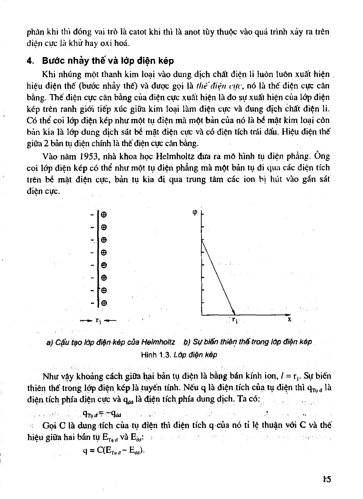

## Page 15

Thồng thường Edd được coi là bằng không nên: 
q = C.E*d
với 
c = — —
4?rd
Dung tích trung bình của tụ điện ưên cực giọt thuỷ ngân vào khoảng 
20fiF/cm2. Khoảng cách giữa hai bản tụ d « ĩj vào khoảng 10'8cm, hằng số điộn 
môi (g) tính được khoảng chừng từ 2 đến 5. Điều đó nói lên rằng tụ điện được nhổi 
bởi các phân tử nước sắp xếp chặt chẽ tới mức bão hoà điện môi.
5. Sự phân cực của điện cực
Ở trạng thái cân bằng, mật độ dòng điện trên cực i = 0 và điện Cực nhận điện 
thế Ecb được biểu diễn bằng phương trình Nèrrtst.
Nếu bằng cách nào đó ta ỉàm chò điện Cực mất cân bằng, ví dụ thay đổi nổng 
độ hoặc đặt điện thế khác Ecb vào cục, thì một dòng điện sẽ chạy qua điộn cực và 
điện cực sẽ nhận một giá trị thế mới Ej khác Etb. Khi thế điộn cục là Ej khác E*, 
ngưòi ta nói rằng điện cực bị phân cực.
Sự phân cực của điện cực được định nghĩa bctì công thức:
E - E .- E *
Ví dụ: Khi nguyên tố điện hoá hoạt động, trong hai điộn cực của chúng sẽ có 
một điện cực có dư electron và điện cực kia thiếu elecữon do đó gây ra sự phân 
cực của các điên cực. Cực đư electron là cực âm, cực thiếu electron là cực dương. 
Ví dụ trong nguyên tố điện hoá của cặp Zn Ị Cu thì cực Zn là cực âm (catot), cực 
Cu là cực dương (anot). Trong điều kiện nhu thế, nếu đặt vào 2 cực đó một thế 
phù hợp thì các quá trình điện hoá sẽ xảy ra liên tục trên bề mặt mỗi cực và thế 
xuất hiện, đường cong dòng I và thế Et (đường dòng thế hay đưômg phân cực). 
Giữa Eị và I có một mối quán hệ chặt chẽ, quan hệ hàm biến: E, là hàm của I và 
ngược lại.
Nhiéu phương pháp phân tích điộn hoá là dựa trên cơ sở của dòng thế này. 
Đường dòng thế nhận được khi đo sự thay đổi dòng ờ trong bình nguyên tố điện 
hoá và dốtíg này là hàm số của thế (E|) (hìtìtì 1.4). Đường đòng thế cho biết hệ đó 
là thuận nghịch (hệ nhanh) Hày bất thuậli nghịch (hộ chậm). Ở các hệ nhanh chỉ 
cần một sự thay đổi rất nhỏ của thế có nghĩa là thế điện cực lệch khỏi thế điện cực 
câm bằng một giá trị rất nhỏ thì cân 'bằng đã bị phá vỡ hoặc theo chiều catot hoặc 
theo chiều anot. Những hệ loại này cân bằng được thiết lập rất nhanh và ổn,đinh.
16

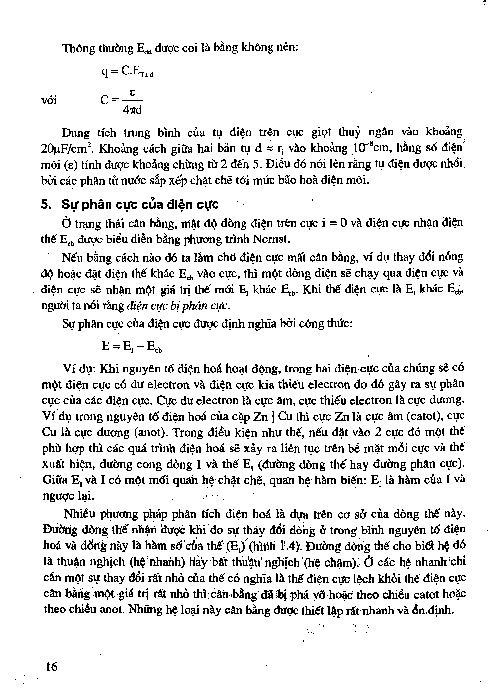

## Page 16

Hlnh 1.4. Các dạng đường dòng thố 
a) Hệ nhanh 
b) Hộ chậm.
6. 
Thế điện cực
6.1. Cách xác định thế điện cục, dấu của thế điện cục
Khi nhúng một thanh kim loại vào dung dịch chứa ỉon của nó, chẳng hạn 
nhúng thanh Zn vào dung dịch muối Zn thì trên ranh giới kim loại và dung dịch sẽ 
xuất hiện một giá trị điộn thế nào đó do trên ranh giới kim loại và dung dịch xuất 
hiộn một lớp điện kép. 
,
Xét điộn cực kẽm kim loại nhúng trong dung dịch muối ZnCl2 hoặc ZnS04. 
Hoá thế của iọn trong kim Ịoại là một đại lượng cò định, khi T = const. Còn hoá 
thế của ion kẽm trong dung địch muối của nó phụ thuộc vào nổng độ của dung 
dịch. Giả sử muối kẽm trong dung dịch có nồng độ sao cho hoá thế của ion kẽm 
trọng dung dịch nhỏ hơn hoá thế của ion kẽm trong kim loại. Trong lúc đó, các ion 
Zn2+ trong kim ỉoại kẽm sẽ đi vào dung dịch một cách tự diễn biến, có nghĩa là 
kẽm kim loại bị tan vào trong dung dịch:
ZlV H N  Zn2++2e
Các electron ở lại trong thanh kim loại cho nên thanh kim loại mang điện tích 
âm. Do lực hút tĩnh diện, kẽm kim ỉơại mang điện tích âm sẽ lôi kéo các ion dương 
Zn2+vừa mới tan lại gần jnó. Như vậy có hai quá trình:
-  Quá trình ion Zn2+ tách khòi nguyên tử Zn để đi vào dung dịch để lại
electron trên bề mặt thanh Zn. 
,
-  Ion Zn2+ từ đung dịch tiến đến bề mặt mạng lưới Zn kim loại, nhận electron
thành nguyên tử Zn trung hoà. 
1 
!
17

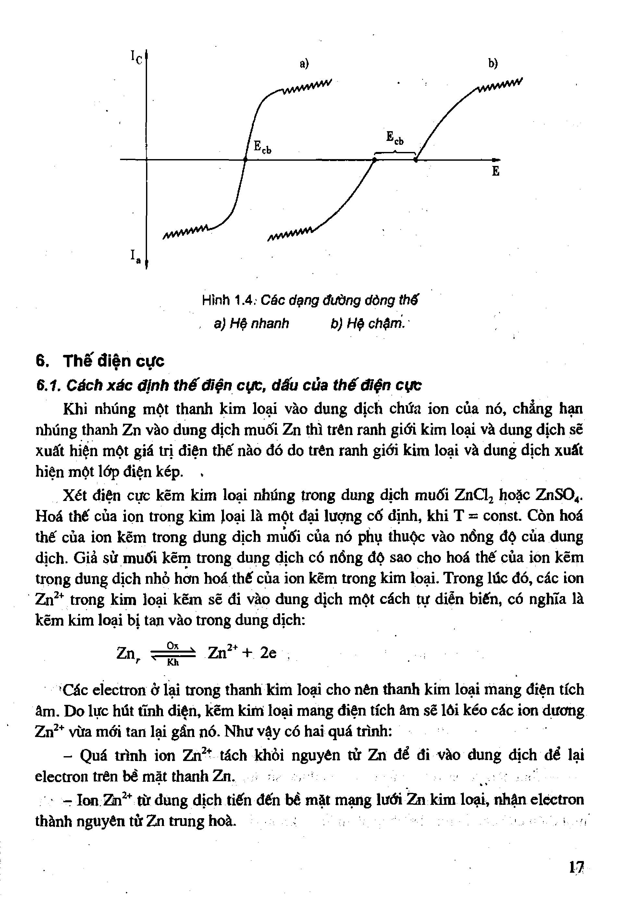

## Page 17

Khi hai tốc độ của hai quá trình này cân bằng nhau thì lớp điện kép được tạo 
ra và càn bằng này tạo ra thế điện cực. Thế điện cực dặc trưng cho khả nâng oxi 
Uoủ -  khử của cặp io/1 kìm loại Ị kim loại (Zn:+ I Zn). Thế diện cực phụ thuộc vào 
bản chất của kim loại mà bề mặt của nó tích điện âm hay dương. Nói chung, các 
kim loại hoạt động hoá học mạnh thường bề mặt có điện tích àm như: Zn, Al, Fe. 
Với các kim loại hoạt động hoá học kém như: Cu, Ag, Hg,... thì bề mặt thường 
tích điện dương.
Khi nhúng một thanh (bản) kim loại quý và trơ như Pt, Au vào dung dịch của 
mội hệ oxi hoá -  khử liên hợp, ví dụ 2 muối FeClj I FeCl2, vì trong trường hợp này 
mạng lưói kim loại của điện cực có cấu trúc bền vững và trơ, nên các ion kim loại 
của điện cực không thể tan vào dung dịch được. Trong các trường hợp này, cực 
kim loại quý đóng vai trò là nguồn cấp electron và các phần tử (các chất) oxi hoá 
hay khử có trong dung địch sẽ trao đổi electron với điện cực. Trong ví dụ hệ 
Fe3+/Fe2+, thì Fe3+lấy electron của điện cực Pt theo cân bằng:
Fe,+ + e 
Fe2+ 
(a)
Lúc đầu quá trình khử ion Fe3+ về Fe:+ có tốc độ lớn hơn quá trình oxi hoá ion 
Fe2+ lên ion Fe3+ nên điện cực mất nhiều electron, điện cực Pt có điện tích dương, 
còn lớp dung dịch ở bề mặt điện cực có điện tích âm. Ví dụ số lượng ion c r  hơn 
ion Fe2+. Khi đạt đến cân bằng của 2 quá trình trên (a) thì điện tích không đổi. Lúc 
này, điộn cực cho một thế cân bằng của điện cực. Giá trị tuyệt đối của thế cãn 
bằng của một điện cực là một đại íượng không thể đo trực tiếp được. Bầng thực 
nghiệm chỉ có thể nhận được thể cân bằng của một nguyên tố điện hoá gổtn 2 điện 
cực, trong đó có một cực so sánh có thế khống đổi (có thế = 0, cũng có thể có một 
giá trị thế nhất địĩih âm hãy dương nhưng không đổi). Vì thế, đ ể .xác định thế cân 
bang của một điện cực, người tư phái chọn mật điện cực chuẩn vờ điện cực này 
quy định có thế bâng không. Cực chuẩrí này là điện cực hiđro tiêu chuẩn, có sơ đớ 
như sau:
H+ (Hoạt độ: (H+) = 1,0) I (H,) (p = 1 atm) PtM
Giá trị thế của các điện cực khác đều được đem so sánh với cưc hiđro tiêu 
chuẩn này và giậ trị ithế cân bằng của một cực là phụ thuộc vào:
-  Bản chất của kim loại làm điện cực;
-  Nộng độ của chất tham gia vào cân bằng xảy ra trên bề mặt điện cực;
-  Chất nền và bản chất của chất nền được sử đụng. 
• i 
V
Thế điện cực bằng sứe điện động của một pin gổm một điện cực íkhảo sát và 
một điện cực chuẩn (có thể chấp nhận bằng khổng). ; 
' 
J 
,
18

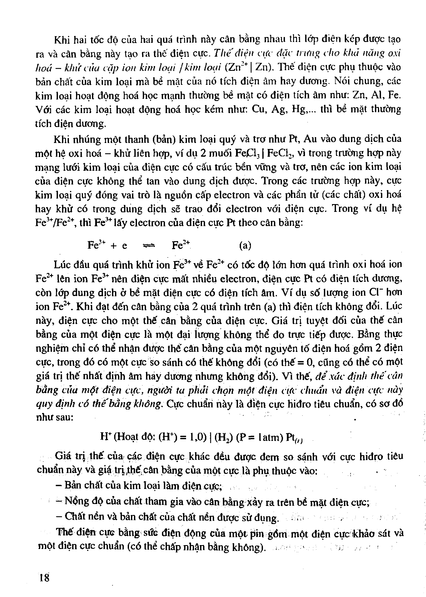

## Page 18

Ví dụ: Người ta không thể đo được thế của điện cực kẽm và điện cực hiđro, 
nhưng có thể đo được sức điện động của pin được ghép bời hai điện cực này.
Pt (H2) I H+II Zn2+ I Zn 
Sơ đồ này là kí hiệu của pin được trình bày ở hình 1.5.
(1.1)
Hình 1.5. Pin 2H* Ịh2 -  Zn2* i Zn
Theo quy ước, sức điên động của pin bằng thế của điộn cực bên phải trừ đi thế 
của điện cực bên trái là điện cực hiđro:
E** = Ep - E Tr
^Sdd — ^Zn2VZn 
^2H+/Hj
Cũng theo quy ưỏc, ở điện cực phải xảy ra quá trình khử và ờ điện cực trái xảy 
ra quá trình oxi hoá.
Như vậy quá trình xảy ra trong pin điện là:
Zn2+ + 2e ^  
Zn
H, 
^  
2H*
2H* ^  
2H* + 2e
H, + Zn 
—  
2H+ + Zn
Nếu quy ước thế của điện cực hiđro trong điều kiộn chuẩn PH = 1 atm, (H+) =
là E 2»-,H,=0 <hì:E- =
EL .a.-
Như vậy, thế điện cực của điện cực kẽm được chấp nhận bậng sức điộn động 
của pin (1.1), nếu điện cực kẽm trong điều kiộn chuẩn hoạt độ: (Zn) = 1, thì sức 
điện động đo được gọi là thế điện cực tiêu chuẩn của điện cực kẽm
19

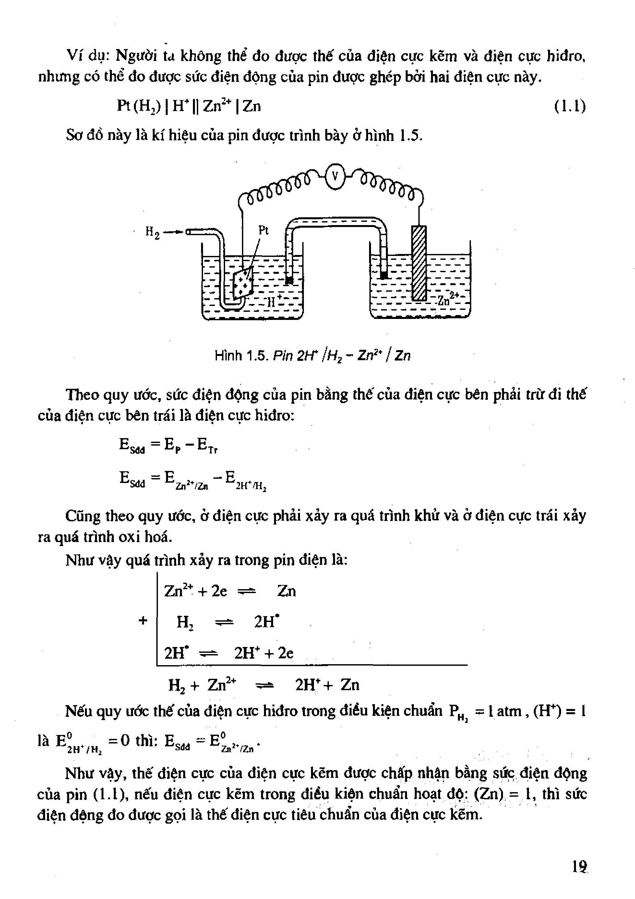

## Page 19

Tóm lại thế điện cực của một cặp oxi hoá -  khử Ịù sức điện động của pin tạo 
bởi điện cực của hệ oxỉ hoá -  khử đó với điện cực hiđro chuẩn theo quỵ ước điện 
cực hiđro chuẩn đặt ở bên trái và điện cực oxi hoả -  khử liên quan đặt ỏ bên phải.
Dấu của thế điện cực được chấp nhận là dương nếu điện cực hiđro là điộn cực 
âm và điện cực bên phải (điộn cực oxi hoá -  khử) là đương. Ta thấy rằng trong pin 
điện: điện cực mang dấu dương là điện cực có dòng electron chuyển đến nó, còn 
điện cực mang dấu âm là điện cực sản sinh ra electron. Điểu đó có nghĩa là thế 
điện cực mang dấu dương nếu chiều dòng điện mạch ngoài đi từ phải sang trái và 
ngược lại. Hay chiều phản ứng thực tế trùng vói chiều của phản ứng quy ưóc thì 
thế điộn cực mang dấu dương và ngược lại.
Trong ví dụ trên, sức điện động của pin đo được là -0,76V , khi hoạt độ của 
Zn2+ trong dung dịch bằng đơn vị và vì điện cực kẽm là điện cực âm và điện cực 
hiđro là điộn cục dương nên:
6.2. Sự Hên hệ giữa thế và hoạt độ -  Phương trình Nernst
Khả năng oxi hoá -  khử của các chất phụ thuộc vào thế oxi hoá -  khử của các 
cặp oxi hoá -  khử chứ không phụ thuộc vào thế điện cực tiêu chuẩn. Mối liên hệ 
giữa thế oxi hoá -  khử và hoạt độ của các dung dịch được biểu diễn qua phương 
trình Nem’st:
E° 
7 = -0,76V.
Zn /Zn
Ox + ne ^  Kh
(1.2)
^Ox/Kh
E,'Qx/Kh
(1.3)
(1.4)
ở đây E° là thế điộn cực chuẩn;
:í’L íi ĩầ s^fclectrbn tỉraò đổi; 
u
(ì) là chỉ hoạt cfộ cỗa cấu tử (các chẵt)
í
■ I
í- -V
20

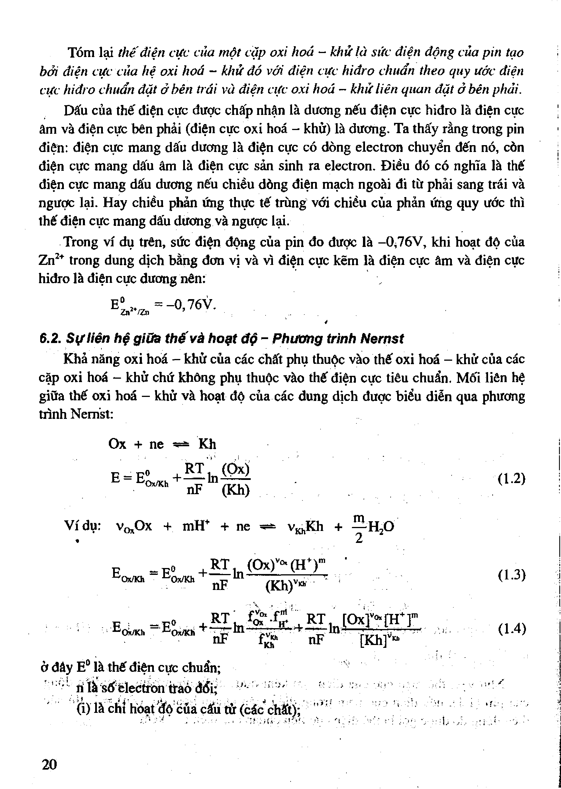

## Page 20

[ i ] là chỉ nồng độ cân bằng của cấu tử (các chất);
f, là hệ số hoạt độ, phụ thuộc vào lực ion trong dung dịch theo công thức
Đơbai -  Huckel: lg f = —~^~r=
1 + BaVĨ
+ C.I 
(1.5)
a là bán kính ion hặđrat hoá; A, B, c  là các hằng số kinh nghiệm:
I là lực ión của dung dịch; I = 
;
Z, là điện tích của cấu tử i.
Từ các biểu thứe trên có thể viết:
(
1
.6 )
^
 
nF 
[Kh]vKh
TJT 
f  v0* f m
với 
E ' - E *  
+ S .b ,-ậx ỊÉ . 
, (1.7)
°*™* 
nỊ7
1Lr 
Kh
E0* là thế tiêu chuẩn thực, áp đụng cho từng trưòng hợp cụ thể (E 05 phụ thuộc 
vào điều kiện thí nghiệm cụ thể nhự: pH, lực ion, môi trường thiết lập lực ion...);
R = 8,3145 J.mor'.K"1; 
độ K = t°c + 273;
F là số Faraday: 96500 c  (culong).mol"1; 
n là số electron tham gia phản ứng và ìn A -  2,303.1gA.
Trong các phương trình trên, hoạt độ của các chất rắn và dung môi nguyên 
chất thường được chấp nhận bằng 1; hoạt độ của chất khí được thay bằng áp suất 
riêng phần của nó.
Ví dụ: Đối với điện cực c r  ỊAgCl, Ag:
Phản ứng điộn cực: AgClw + e r------ Ag + c r
DT 
1
E = Ei n/A + ■— -ln—-— 
(1.8)
AgCỈ/Ag 
p  
( C T )
Còn đối với điện cực hidro: H+Ị (H2) Pt ... 
.
Phản ứng điện cực: 2H+ + 2e V. —*■ H2
Thế điện cực: E = E°h*/h 
(1.9) trong đópH íà áp suất riêng
2 
2 F  
P h,
phần của H2.
21

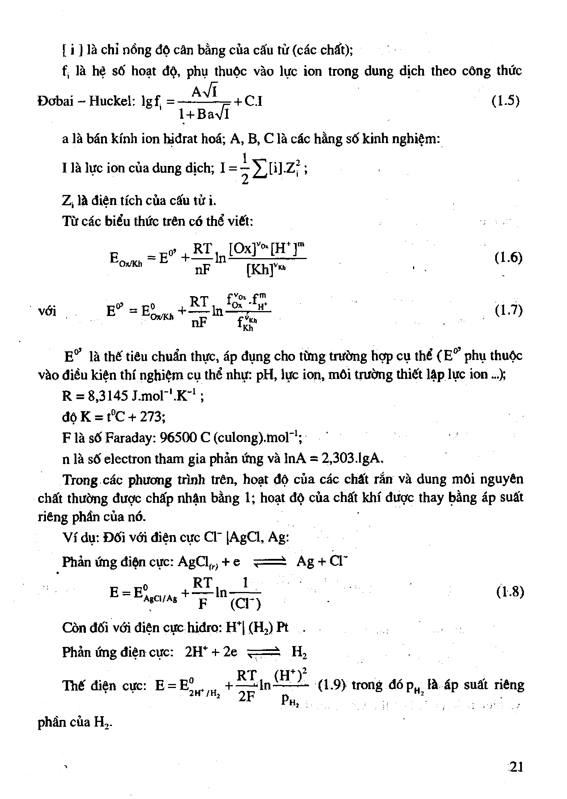

## Page 21

7. Thế điện cực hay thế điện cực cân bằng
Nếu trong hệ xảy ra phản ứng oxi hoá -  khử thuận nghịch, ở nhiệt độ và áp 
suất không đổi và ờ trạng thái cân bằng:
vaA + vbB ^  vcC + VpD 
Biểu diễn của biến thiên năng lượng tự do là:
Theo quy ước V (hộ số hợp thức hay tỉ lượng) âm với các chất tham gia 
phản ứng; V đương với các chất tạo thành sau phản ứng (sản phẩm).
Chúng ta đã biết:
với K là hằng số cân bằng của phản ứng đã cho.
Nhu vậy, biến thiên năng lượng tự đo của hệ có thể biểu điễn bàng biểu thức:
Nếu phản ứng trên được tiến hành bằng con đường điên hoá thì:
AG = -nFESđđ
trong đó AG là biến thiên thế đẳng áp của hệ.
Với 
A G °=-nFE ^,
trong đó Egaa là sức điện đông của pin điện; 
là sứt điện động tiêu chuẩn, từ 
biểu thức ( 1.12) có thể viết:
= 5 > ,n ? + R T 2 > r
(1.10)
2 v ,n ? = A G ° = -R T lnK
AG0 = -R T ln K + 2 ln (i)r
(1.12)
hoặc 
EMa=EỊ|M+;
E 
= E° +
^S đ đ  
Sdđ ^
nF ~ (C)£ (D)£d
(1.13)
Vì ưong hệ điện hoá phản ứng trên gồhvhai nửa phản ứng:
vAA + n e ^  vcC 
(a) (sự khử)
VbB ^  
vdĐ + ne (b) (sự oxi hoá) 
;
và biểu thức (1.13) có thể viết dưới dạng:
22

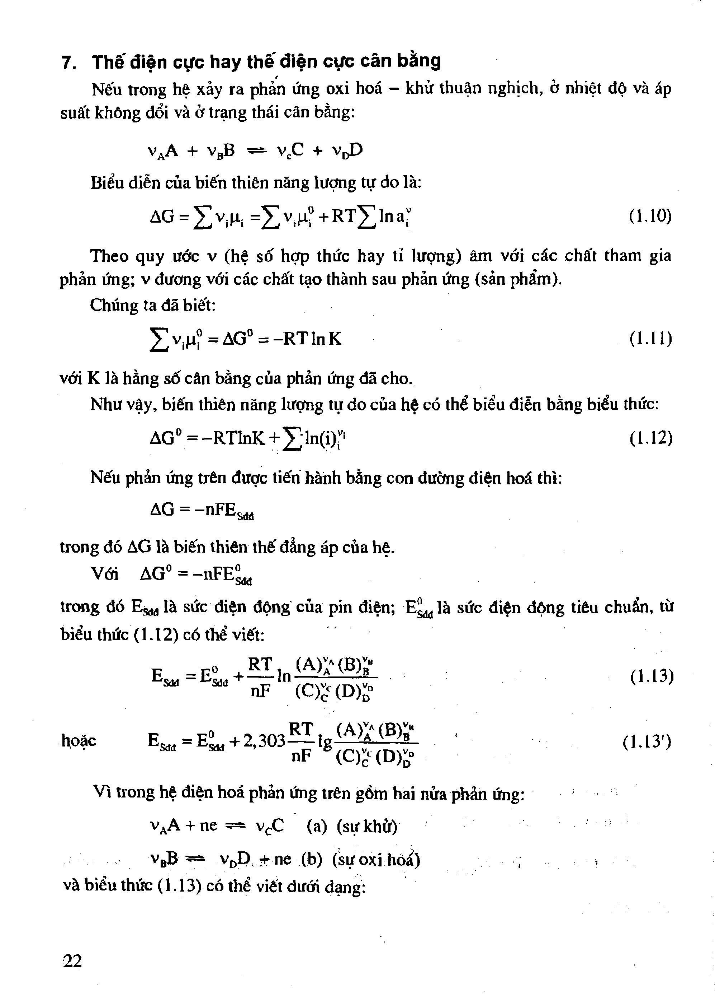

## Page 22

(
E 
-
nF 
(C)£-
nF 
(B)Ia
(1.14)
'B y
vói 
e ^ ^
e j - e ;
Số hạng đẩu trong biểu thức (1.14) chính là sự biến thiên của năng lượng ĩự do 
cua nửa phản ứng (a). Điện cực ở đó xảy ra nửa phản ứng (a) là catot.
^
i
E« + ỉĩ ln^
| =Ec 
nF 
c 
nF 
(C X?
Ec là thế điện cực catot và E° là thế điện cực tiêu chuẩn catot.
Tương tự ta có:
J ^ E
»  + R I ,ne
|  = Ei
nF 
nF 
(B)gH
Trong đó Ea là thế điện cực anot và E° là thế điện cực tiêu chuẩn anot.
Hiệu của thế điện cực catot và thế điên cực anot gọi là sức điện động của hệ 
điện ỉioá:
^Sdđ = Ec ~ Ẹ, 
(115)
Theo quy ước Ec mang dấu dương, Ea mang dẩu âm.
Các đại lượng E° và E° là điện thế oxi hoá tiêu chuẩn của các cặp D/B và
A/C tương ứng. Chúng đặc trưng cho độ mạnh của các cặp oxi hoá -  khủ và phụ 
thuộc vào bản chất của các cặp oxi hoá -  khử, phụ thuộc nhiệt độ và những điều 
kiện tiến hành phản ứng.
Điộn thế oxi hoá -  khử tiêu chuẩn của một cặp oxi hoá -  khử là thế điện tực 
cân bằng của cặp đó khi biểu thức trong ỉogarit bằng đơn vị.
và
EC=E° + ỊỊl'i n ^ £ -  = E“ + —  lnl,0 = E° 
c 
c 
iiF 
ÍC);y 
c 
nF 
c
E = E°+ —
l n ^ ^  = Ea° + - ^ ln l,0  = E° 
s 
8 
nF 
(B)'B 
a 
nF
(1.16)
(1.17)
8. Điện cực
Có nhiều cách phân loại điện cực khác nhau, nhưng phổ biến nhất là phấn loại 
điện ( ực theatìiục đích sử ilụnạụcổ các loại điện cực so sánh, chỉ thị, phụ trợ,... 
Ví dụ sử dụrtg điện cực Ag, AgCIỊCr làm điện cực so sánh thì gọi điện cực bạc -
23

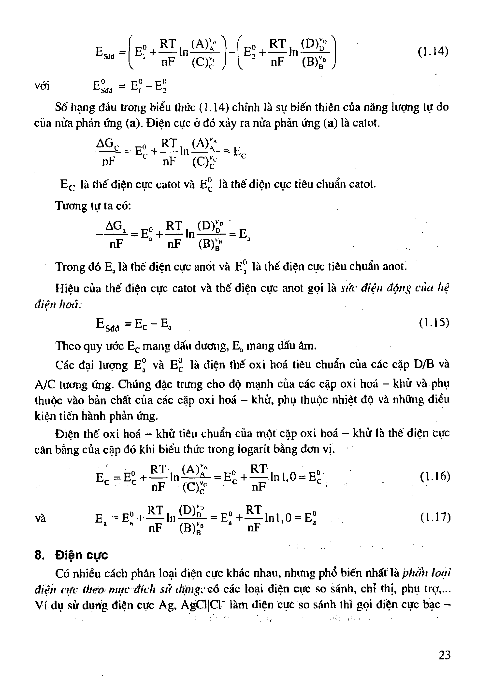

## Page 23

bạc clorua là điên cực so sánh. Còn sử dụng điện cực này làm điện cực chỉ thị để 
xác định nồng độ ion bạc trong phép đo khác thì gọi là điện cực chỉ thị. Muốn đo 
được sức điện động (Sđđ) của mạch thì cần ít nhất hai loại điện cực: điện cực so 
sánh và điện cực chỉ thị.
Điện cực là hệ nối tiếp nhau của các pha dẫn điện, trong đó pha đầu tiên là 
một kim loại, còn pha kia là dung dịch chất điện li.
I I K d ^ l H g P i l H g
Việc phân chia ra các loại điện cực chỉ mang tính chất tương đối bởi vì một 
điện cực chỉ thị cũng có thể sử dụng làm điện cực so sánh, tùy thuộc mục đích sử 
dụng. Điện ọực Ag, AgG (bạc -  bạc clorua) làm điện cực so sánh khi cố định 
nồng độ anion c r , mặt khác có thể sử dụng điện cực này làm điộn cực chỉ thị 
trong phương pháp chuẩn độ điộn thế, để xác định nổng độ G" thay cho phương 
pháp chuẩn độ đo thể tích (Mohr) khó phát hiện ra điểm tương đương.
Ví dụ: Điện cực đom-giản nhất là một hệ gồm một thanh hay bản kìm ỉoại (Zn) 
nhúng vào dung dịch muối của nó (ZnS04 0,1M):
Zn2+1 Zn
-  Một thanh hay một bản kim loại quý (Au, Pt) được nhúng vào hỗn hợp dang 
dịch chứa hệ oxi hoá -  khử liên hợp (Fe'+ [Fe3+);
II Fe2* I Fe^l Au 
. 
-
-  Điộn cực khí là những hệ gồm bản Pt, được phủ một lớp bồt (muội) Pt (để 
hấp phụ khí lên bề mặt) được nhúng vào đung dịch bãò hoà khí (H2) và chứa ion 
của nó (H+):
IIH+1 (H2) Pt
-  Điện cực là một hệ gồm một bản kim loại (Ag) được phủ lên bề mặt một lớp 
muối khó tan của nó, muối nàý lại nằm cân bằng yới dung địch chứa anion của 
nó (CT):
II C r|A g C l|A g  
’
Và nhiều điộn cực khác nữa.
ỊỊ.1. Điện cục 50 sánh
Điện cực so sánh là loại điện cực có thế không thay đổỉ trong suốt quá . trình đo 
và không phụ thuộc vào thànb phần của dung d|ph đo. Thế của điện cực được 
chuẩn hoá chính xác theo điện cực hiđro tiêu chuẩn.
24

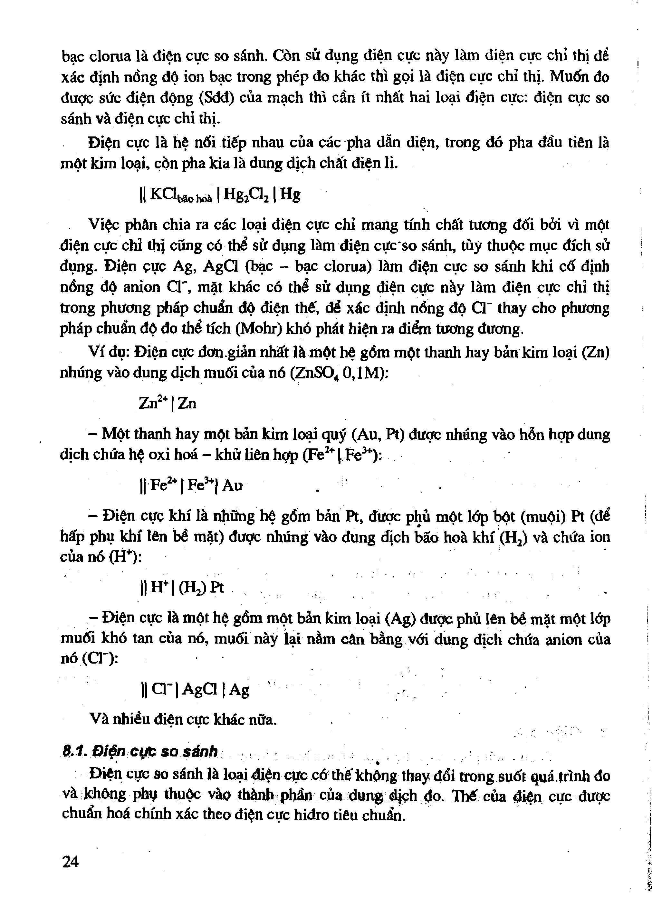

## Page 24

Yêu cầu đối với điện cực so sánh:
ỉ. Phản ứng điộn cực phải hoàn toàn thuận nghịch.
2. Điện cực ít bị phân cực nghĩa là thế của nó ít bị thay đổi hoặc thay đổi trong 
phạm vi sai số cho phép khi có dòng điện đi qua.
3. Phải có độ ỉặp lại cao và dễ bảo quản, nghĩa là để lâu điện cực mới mang rạ 
sử dụng vẫn cho kết quả đo có độ lặp lại tốt và thế ổn định ngay cả đo trong các 
điều kiện khác nhau.
Một số điện cực so sánh thường được sử dụng như sau:
8.1.1. Điện cực bạc -  bạc clorua (Ag, AgCI/Cí)
Cấu tạo: Gồm một đây bạc hay platin được mạ bạc kim loại sau đó được phủ 
một lớp AgCl nằm cân bằng với Q " (K ơ  hoặc HC1). v ề mặt điện hoá, cực bạc -  
bạc clorua là một nửa pin, được biểu diễn bằng sơ đổ:
CT ( H \ K ) I AgCl I Ag
Phản ứng điện cực: ÁgCI + e ^ 
-  Ag + c r
Thểcủà điện cực được xác định theo phương trình Nernst:
E = E° 
Aa+— ln -J— = E“ 
ln(cr) (t.18)
AgCI/Ag 
^
 
J 
AgCI/Ag 
n F
TTiế tiêu chuẩn của điện cực bạc -  bạc clorua 
được xác định bằng cách ghép vứi điện cực hiđro 
tiêu chuẩrì và bằng sức điện động của mạch pin:
Pt ( H2) I H \ c r  I AgQ I Ag
PH = latmI (H+) = 1, (CT) = 1 ion-gỊl I
Ở25°C:
E Aga/Ag =  0.2224-0,059.1g (CT)
(1.19)
Như vậy thế cân bằng của điộn cực bạc -  bạc 
clorua phụ thuộc vào hệ số hoật độ hoặc nồng độ 
clorua. Muốn sử dụng điện cực bạc -  bạc clorua 
làm điện cực so sánh phải giữ hoạt độ hay nồng 
độ cân bằng và hệ số hồạt độ cố định.
* 
Ưu điểm'. Sử dụng điện cực trong các phép đo khồng cầu nối, có độ íặp lại 
cựa các lần đo cao, kích thước nhỏ bé, dễ chế tạo.
Hình 1.6. Cấu tạo của điện cực 
bạc -  bạc clorua
25

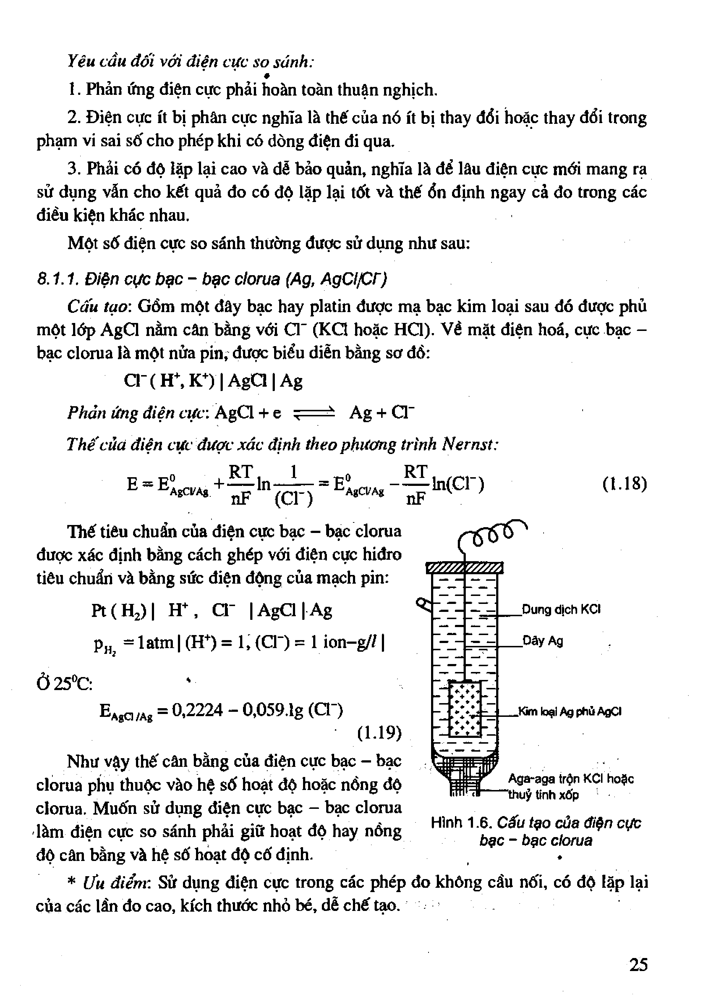

## Page 25

’7
* 
Nhược điểtìK Khi sử dụng điện cực bạc -  bạc clorua làm điện cực so sánh 
phải thêm vào dung dịch đó một lượng ion ơ ~ để điện cực làm việc được, dẫn đến 
có thể làm thay đổi hệ nghiên cứu.
8.1.2. Điện cực calomen (Hg, Hg2c i2/c r)
Cấu tạo'. Gồm một bình hoặc bầu thủy tinh, trong có chứa thủy ngân và một 
lượng nhò calomen (Hg2Cl-,), một dây platìn cắm trực tiếp vào thủy ngân để đẫn 
điện tốt. Đặt toàn bộ trong dung dịch KC1. Để giữ cho KC1 khỏi chảy ra, người ta 
đùng nút thủy tinh xốp hoặc bằng than tinh khiết. Cũng có thể không cho calomen 
(HgiCL) ngay từ đầu vào điện cực mà trước khi dùng 
đầu, chỉ cần phân cực ở 
thế dương khoảng 10 phút là calomen tạo thành trong điệ*ỊỊ cực (như hình l .7).
Hg và Hg2CI2
-Dung dịch KCI 0,1M
Kiểu I
hoăc bão hoà
Đẩu than hoặc thủy 
-tinh xốp để cắm vào 
dung dịch đo
Dung dịch KCI 0,1M 
"hoặc bão hoà
Hg và Hg2CI2
Đầu than hoặc thủy 
tinh xốp để cám vào 
'dung dịch đo
Kiểub
Nemst:
Hình 1.7. Cấu tạo của điện cực calomen 
Sơ đổ của điện cực như sau:
c r ( K +)|H g 2ci2|H g
Phản ứng điện cực:
Hg2a 2^ + 2e ^  2Hg + 2Cl- 
Khi phản ứng ở trạng thái cân bằng, thế đỉệri cực tuân theo phượng trình
ở 25°c ta có:
p 
_ p o , 
, RT, 
1 
_ pũ 
RT 
_ "
ECal 
Hg,n,'2Hjj + 2P 
^ligjCV’Hg 
P ln(Cl )
ECat = 0,2678-0,059 lg(Cr)
( 1.20)
(1.21)
26

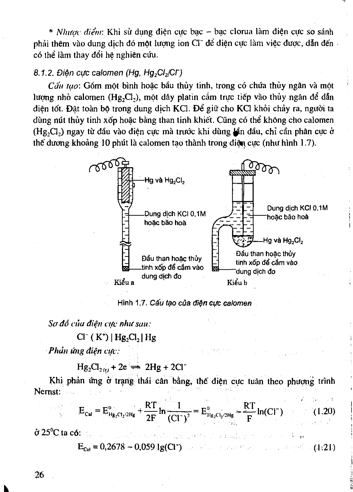

## Page 26

Thế của điộn cực calomen phụ thuộc vào hoạt độ hay hệ số hoạt độ và nổng đô 
của c r  (xem bảng 1.1). Muốn sử dụng điện cực calomen làm điện cực so sánh 
phải cố định hoạt độ của Cl”.
Khi dùng dung dịch KC1 0,10M cô' định, thi ECa, = 0,3356 V ờ 25°c, latm.
Khi dùng dung dịch KC1 0,10M cô' định, thì ECal = 0,3351 V ở 30°c, latm.
Khi dùng dung dịch KG bão hoà (4,3M) thì gọi là điện cực calomen bão hoà
0,2444V, 25 c, latm.
Bảng 1.1. Thế của 2 toại điện cực so sánh thường dùng
Nhiêt đô
(°C)
Thế điện cựcE(V) 
của điện cực calomen
Thế địện cực E (V) 
của điện cực bạc -  bạc clorua
KC1 
bâo hoà
KC1
3,5M
KC1
0,1M
KCl
bảo hoà
KCI
3,5M
KC1
0,1M
15
0,2510
0,256
0,3370
0,2090
0,212
0,225
20
0,2480
0,255
0,3359
0,2040
0,208
0,221
25
0,2444
0,250
0,3356
0,1990
0,205
0,217
30
0,2410
0,248
0,3351
0,1940
0,201
0,212
35
0,2376
0,245
0,3344
0,1890
0,197
0,208
Từ bảng l . 1 cho thấy nồng độ của dung dịch điện li KQ có ảnh hưcmg đến thế 
của điện cực. Nói chung ở nồng độ bão hoà, thế điện cực là nhỏ nhất và thế của 
điện cực giảm khi nhiệt độ tăng.
* Ưu điểm: Điện cực calomen là loại điện cực thông dụng, phản ứng điện cực 
rất thuận nghịch, ít bị phân cực khi có dòng điện đi qua, thế có độ'lăp cao, đễ 
bảo quản.
* Nhược điểnr. Sử dụng điện cực calomen bão hoà trong các phép đo có cầu 
nối làm xuất hiộn thế tyìuếch tán.
-
 Thế khuếch tán
Trong thực tế không đo được trực tiếp độ lớn của bước nhảy thế hay thế điên 
cực cân bang của ion kim loại Ị kim loại (Zn2+1 Zn) mà chỉ có thể đo gián tiếp qua 
sức điện động của một hệ bao gồm hai cặp oxi hoá -  khử.
Ví dụ : Pin điện gồm hai điện cực (hay hai hán pin nối với nhau). Nối điện cực 
hiđro với điện cực hạc -  bạc clorua được một pin điện:
Pt (H,) I ir , G" I AgCI, Ag 
. 
.
27

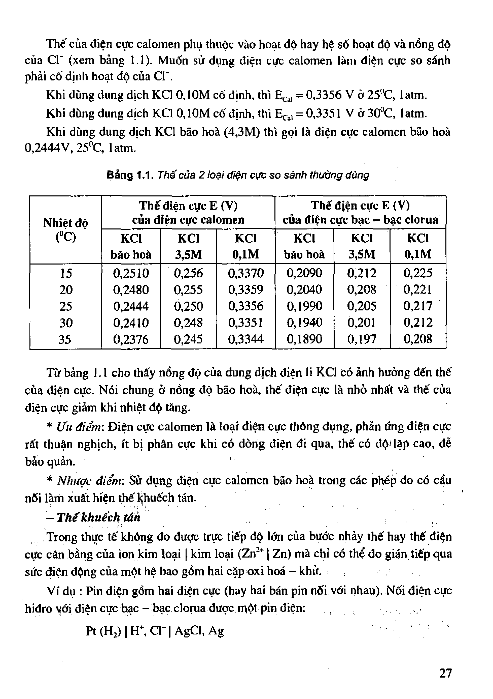

## Page 27

Nếu dùng hai đung dịch chất điện li khác nhau, phải dùng cầu nối để ngăn 
ngừa sự trộn lẫn do hiện tưọmg khuếch tán:
Pt (H2) I H+ II Zn2+1 Zn
Dung địch (1) 
HCI C, (mol/J)
"Dung dịch (2) 
HCI C2 '(molII)
Hay pin Daniele -  Jacobi:
Cu I CuS04 IIKC1 bão hoà Ị| ZnS041 Zn
Trong đó |: không cầu nối; ||: có cầu nối.
Khi sử dụng điện cực so sánh (calomen) vào việc đo thế phải dùng cầu nối 
(muối) để nối điên cực với dung dịch đo. Cầu nối thường chứa dung dịch muối trơ 
bão hoà hoặc ở một nồng độ nhất định nào đó 
khi cầu nối tiếp xúc với các
đung dịch ỉỏng khác loại sẽ xuất hiện thế lỏng gọi là thế khuếch tán (EịỊt) không 
mong muốn.
Để hiểu bản chất của thế khuếch tán, 
xét hai dung dịch HC1 có nồng độ khác 
nhau tiếp xúc với nhau. Dung dịch (1) có 
nồng độ (Cj) lổn hơn, bắt đầu khuếch tán 
sang dung dịch (2) có nồng độ C, nhỏ hơn 
(xem hình 1.8).
Vì linh độ và nồng độ của ion H+ dung 
dịch (1) lớn hơn ion c r  dung dịch (2) nên 
trong một khoảng thời gian nhất định sẽ có 
nhiều ion H+ từ dung dịch (1) khuếch tận 
sang dung dịch (2) hơn là ion c r . Kết quả 
là xuất hiện một lớp rất mỏng tích điện (như hình 1.8). Do đó xuất hiện một chênh 
lệch điện thế dẫn đến làm chậm tốc độ di chuyển của các Ịon H+ và thúc đẩy tốc 
độ của các ion Cl . Cuối cùng tốc độ chuyển động của các cạtion (H+) và anion 
(CT) trờ nên bằng nhau và sự khuếch tán của chất điộn giải từ đung dịch đặc 
sang dung dịch loãng giống như sự khuếch tán của các phần tir H ơ  khống phân 
li. Khi đó, hệ đạt trạng thái dừng. Sự chênh lệch điện thế củà lớp mổng đuợc gọi 
là thế khuếch tán, kí hiệu EKt. Nguyên nhân gây ía thế khuếch tần là cátíòn (H+) 
và anion (CT) có linh độ và nồng độ khác nhau.
Thế khuếch tân xuut hiện trong những trường hợp sau■ 
' 
‘
Hai đung địch chứa cùng chất điện li có nồng độ khấc nhau (Q: HCl 1,0M; 
C,: HCi 0,ỈM);
Hình 1.8. Sự hình thành thế khuếch tàn
28

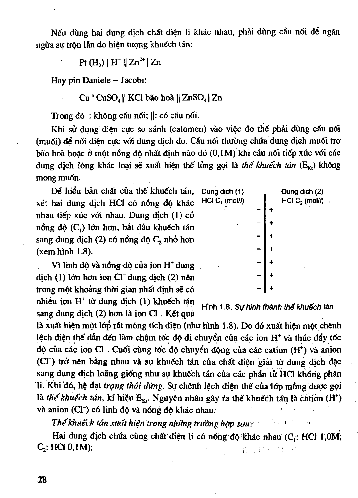

## Page 28

Hai dung dịch chất điên li khác nhau.nhimg có cùng nồng độ (C,: HC1 0,lM;
c,: H2S040,1M);
Hai dung dịch chất điện li khác nhau, có nồng độ khác nhau (C,: H ơ  0,1M; 
Q: NaNOj Com).
Hai nhà khoa học Plank và Henderson đã nghiên cứu vể sự xuất hiện của thế 
này và trong các thông báo của mình đã giải thích một các định lượng về thế 
khuếch tán và đưa ra giả thuyết:
Linh độ của ion không phụ thuộc vào nồng độ và bản chất của dung môi và 
không thay đổi khi di chuyển từ dung dịch này sang dung dịch khác.
Các ion chỉ tồn tại ờ trong một lớp rất mỏng gọi là lớp chuyển. Thành phần 
thay đổi liên tục từ dung dịch ( 1) sang dung dịch (2) trong lớp chuyển.
Xuất phát từ những giả thuyết trên, hai nhà khoa học trên đã tính toán thế 
khuếch tán dưới dạng:
Ek = - ——■ 
ln—  
(1.22)
Kt 
nF L_ + L+ 
c 2
Đối với dung địch (1) và đung địch (2) chứa cùng chất điện giải (HC1) nhưng 
nồng độ khác nhau (C, khác Cj) thì thế khuếch tán phụ thuộc vào linh độ của 
cation và anion và bằng:
= - ^ . í n ^ ± ^  
(1.23)
Kt 
nF 
L ^ + L . 
trong đó L + và L_ là linh độ của cation và anion.
Đối với hai dung dịch (1, 2) chứa hai chất điện giải khác nhau (dung dịch 
(1): HC1; dung dịch (2): H2S04) nhưng có nồng độ như nhau (0,1M) thì thế khuếch 
tán chỉ phụ thuộc vào linh độ của cation và anỉon.
Trên đây hai tác giả mói chỉ đưa ra giả thuyết, còn thực tế cho thấy thế khuếch 
tán phụ thuộc vào rất nhiều yếu tố, cho đến nay vẫn chưa xác định được chính xác 
giá trị này cho nên khi đo thế của mạch, người ta gộp cả giá trị thế khuếch tán vào 
súc điện động đo được. Ví dụ: Xác định pH của dung địch X dùng điện cực so sánh 
là caỉomen và điện cực chỉ thị ỉà điện cực hiđro. Sơ đổ mạch đo cồ cầu nối như sau:
Pt (H2) ị dd X, pHx IIKC1 bão hoà Ị Hg2Cl21 Hg 
thì thế đo được:
= ^Cai+ ^Kt ~ Eh<X) 
( ỉ .24)
Quá trình thực nghiệm thấy giá trị thế khuếch tári có thể đạt tới vằi chục 
milivơn và vượt quá sai số cho phép của các phép xác định chính xác thế của dung 
dịch đo, và từ giá trị thế đo được nếu tính các giá trị tiếp theo như nồng độ các
29

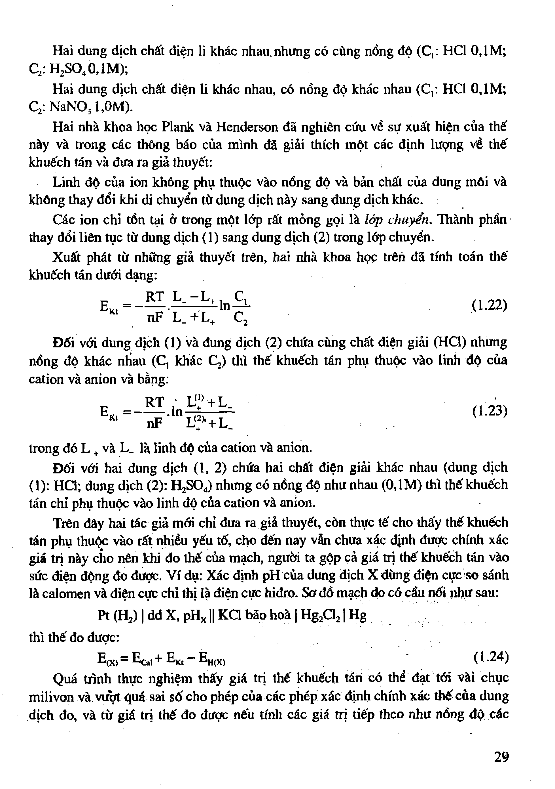

## Page 29

cấu tử, pH,... có trong dung dịch đo cũng sẽ mắc sai số lớn. Như vậy xuất hiện thế 
khuếch tán không có lợi cho phân tích. Người ta không thể loại trừ được thế 
khuếch tán tuyệt đối mà chỉ có thể làm giảm đến giá trị nhỏ nhất dẫn đến sai số 
mắc phải sẽ nhỏ nhất; thường tiến hành theo các cách sau:
-  Cho vào cầu nối dung dịch muối trơ như KC1 hoặc KNOj có nồng độ lớn 
hơn khoảng 50 lãn nồng độ của dung dịch chất điện hoạt hay chất nghiên cứu cần 
đo có thể giảm được thế khuếch tán còn 5 đến lOmV.
-  Đặt hnột cầu nối hình chữ u giữa hai đung dịch thì xuất hiộn giữa hai đung 
dịch hai thế khuếch tán có dấu ngược nhau dẫn đến triệt tiêu nhau và làm giảm thế 
khuếch tán chung.
-  Cho vào cầu nối hỗn hợp của nhiều muối trơ. Ví dụ: Cho hỗn hợp dung dịch 
NaCl và NH4NO3 có tổng linh độ cation bằng tổng linh độ anion: 
(Ln , + Lnh, = Lcr + Lno_ ) thì thế khuếch tán sẽ bị triệt tiêu.
8.1.3. Điện cực thủy ngàn -  thủy ngân(l) sunfat (Hg, Hg2S 04/ S O f")
Cấu tạo'. Tương tự như điện cực calomen, nhưng khác ở chỗ dung dịch 
Hg2S04, K2S04 hoặc Na2S04 có nồng độ xác định hoặc muối bão hoà.
Sơ đồ điện cực: sc>4~ I Hg2S041 Hg
Phải ì ứng điện cực: Hg2S 04 fyị + 26=?= 2Hg° + SO;;"
Thê điện cực được tính theo phương trình Nernst:
Trong đó E°BíClí/2Hg =0,6156V ; 25°c
Thế của điên cực phụ thuộc vào hoạt độ (nồng độ) của SO4' .
Sử. dụng: Sử dụng điện cực trong cậc trường, hợp đo tránh ion clorua.
8.14. Điện cực chì -  chỉ sun fat (Pb, PbS04/ SO*~) 
.
Cấu tạo'. Tương tự như điộn cực calomen 
S 0 24~ (H+, K+, Na+) Ị Pbsa ị Pb
Phản m g điện cực: PbS04 (r) + 2e ^  Pb° + SO4"
Khi phản ứng ở trạng thái cân'bằng, thế điện cực được tuân theo phương trình
F = F° 
I 
In 
— pQ
^ H fc/S H g  ^  n p  111 (SO2-) 
HjỊiClj/2Hg
E = 0,6156 -  0,0295.ig( S O f )
(1.25)
(1.26)
Nemst
30

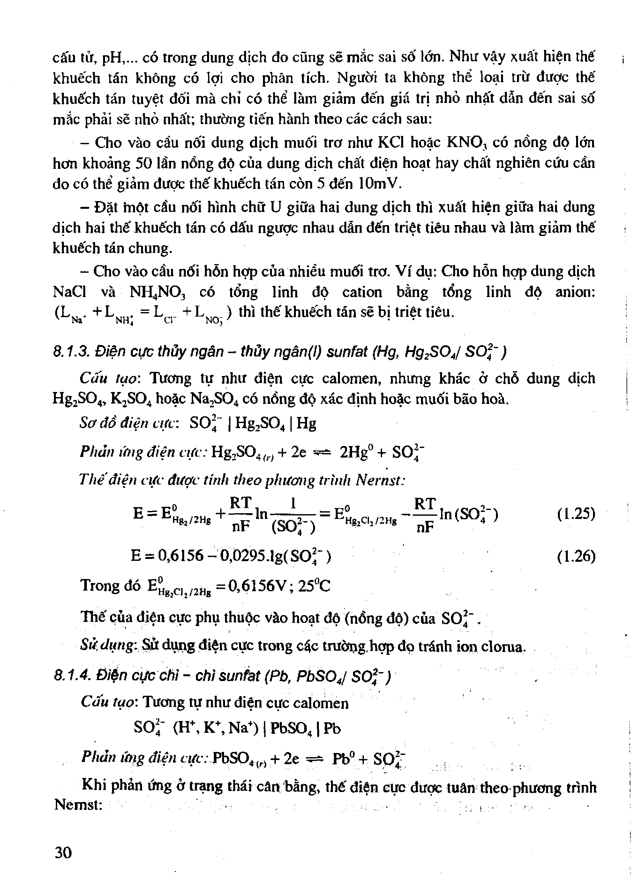

## Page 30

E.* = E
^
 1" T iir -  -  E0^
 - 5 1  In (SO;-) 
( 1.27)
nF 
(SO;; ) 
nF
Ở 25flC: 
Eo, = -0,356 -  0,0295 lg( SO;~) 
(1.28)
8.1.5. Điện cực hiđro
Cấu tạo: Cấu tạo cùa điện 
cực gồm một ống thủy tinh, 
trong đó để một dây platin nối 
với một bản platin, bản có diện 
tích cỡ lcm2, được phủ một lớp 
bôt plat in đen (platin adam). Tất 
cả được nhúng chìm một nửa 
vào dung dịch H2S04 có hoạt độ 
(H+) = l. Nửa kia của bản 
platin được bão hoà khí hiđro 
(H2) nhờ mòt đường ống dẫn 
khí H, từ nguồn hiđro đảm bảo
Dây platin
Bản platin mỏng
Dung dịch HjSO* 1M
Bột platin đen (adam)
-*—Ống dẫn khí H2
áp suất khí hiđro là latm. Bề
mặt platin xốp hấp phụ khí 
Hình 1.9. Cẩu tạo của điện cực hiđro tiêu chuẩn
hiđro, có khả năng tinh chuyển
phân tử hiđro thành nguyên tử đã hoạt hoá {H*) và tham gia phản ứng điện cực. 
Điộn cực có cấu tạo như vậy gọi là điện cực hìđro tiêu chuẩn.
Sơ đồ: H+1 Pt -  đen (Hị)
Phản ứỉìg điện cực:
Bột platin được phủ trên bề mặt điện cực làm chất xúc tác cho hai quá trình 
của phản ứng trên. Ngoài ra, platin là chất hấp phụ có khả năng giữ hiđro trên bề 
mặt điộn cực để phản ứng xảy ra nhanh hơn. (Riêng với điện cực hìđro viết theo 
quủ trình oxì hoứ Vỉ' theo quy ước điện cực ìùđro bao giờ cũng dặt ở bên trái).
Thế (cân bằng) của điộn cực theo quy ước:
2H* 
2H+ + 2e
H2
2H+ + 2e
31

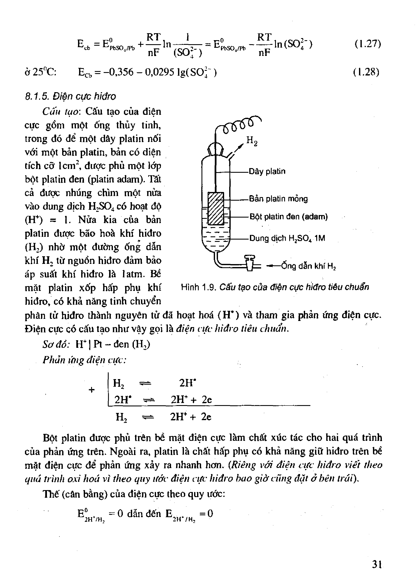

## Page 31

Nếu hoạt đô của ion Hf khác 1 và áp suất của khí hiđro khác 1 atm thì điện 
cực hiđro trờ thành điện cực chỉ thị cho ion H+ {xét điện cực chí thị trong các 
phần stiù).
8.2. Điện cục chỉ thị
Định nghĩa: Điện cực chỉ thị là những điện cực có thế phụ thuộc vào hoạt đô 
của chất nghiên cứu. Hay nói một cách khác là những điộn cực làm việc thuận 
nghịch với chất cần xác định.
Một số điện cực so sánh cũng có thể sử dụng làm điện cực chỉ thị, ví dụ như 
điện cực hiđro, điện cực calomen. Những điện cực sử dụng làm điện cực chỉ thị 
phải thòa mãn các yêu cầu sau đây:
1. Có cấu tạo, thiết bị đơn giản để thuận tiện cho việc sử dụng và bảo quản;
2. Thế được thiết lập nhanh, có độ lặp lại cao, sử dụng được nhiều lần đo;-
3. Thế của điện cực phải tuân theo phương trình Nemst, nghĩa là thế của nó 
phải thuận nghịch với chất cần nghiên cứu, như vây thế của điện cực phải là hàm 
số của hoạt độ của chất cần nghiên cứu.
Điện cực chỉ thị được chia thành những loại như sau:
8.2.1. Điện Cực trơ
Định nghĩa: Điên cực trơ là điện cực không có phản ứng điện hoá xảy ra mà 
kim loại làm nhiệm vụ chuyển electron. Trong môi trường oxi hoá yếu có thể sử 
dụng các kim loại Ag, Hg, Mo, w.„; còn trong môi trường oxi hoá mạnh phải sử 
dụng các kim loại quý: Au, Pt hoặc than chì Điện cực trơ được sử dụng để đo thế 
của hộ oxi hoá -  khử.
'Ví dụ: điện cực Pt được nhúng trong dung dịch oxi hoá — khử của hệ 
Ce(IV)/Ce(m). 
;
Phản ứng điện cực:
Ce^ + e —  Ce3* 
E ^ /C^ = 1 ,3 2 V  
.
Thế của điện cực đừợc xác đinh:
32

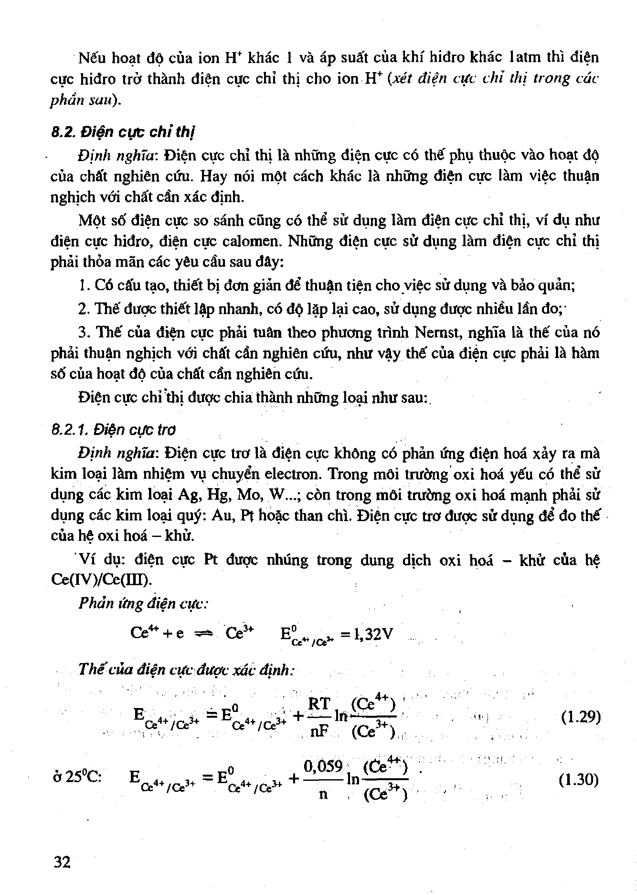

## Page 32

Loại điện cực này sử dụng để đo thế trong phương pháp chuẩn độ oxi hoá -  
khử. Ví dụ chuẩn đô Fe2+ bằng Ce4+, phản ứng chuẩn độ xảy ra như sau:
Fe2+ 
^  
Fe^ + e 
(1)
Ce4+ + e ^  
Ce^ 
(2)
Fe2+ + Ce4* ^  F ^  + Cc3*
Thế của điộn cực được xác định:
-  Trước điểm tương đương tính theo phản ứng (1) và:
(1.31)
-  Tại điểm tương đương: Exd
(1.32)
2
-  Sau điểm tương đương tính theo phản ứng (2) và:
8.2.2. Điện cực kim loại
Người ta chia điện cực kim loại (đây là cách gọi tên theo vật liêu sử dụng để 
chế tạo điện cực) thành ba loại:
8.2.2.1. 
Điện cực loại 1
Điện cực kim loại là các điộn cục có khả năng cho hay nhận electron (Cu, Zn, 
F e ,...). Điộn cực kim loại này dùng để theo dõi hay xác định nổng độ của các ion 
kim loại trong dùng dịch.
Ví dụ điện cực Cu ta có:
Sơ đổ biểu diễn: 
Cu2+|Cu
Phần ứng điện cực: 
Cu2+(dJ) + 2e ^  Cu(r)
Cân bằng này xác định thế của điộn cực và thế của điộn cực đứờc tính theo 
phương trình Nemst:
(1-34)
ở 25°c có thể viết:
33

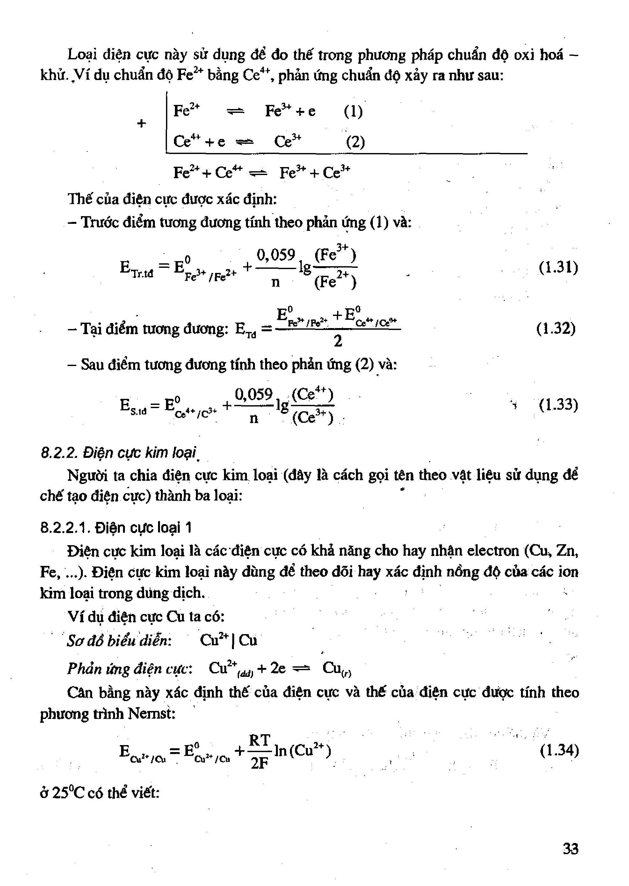

## Page 33

W
=
E^ ,a ,+2f £|s(Cu!*> = °-34+0'0295IS(CV‘>
= 0,34+0,0295 lg (f^j. .[Cu2+ ]) 
(1.35)
Thế của điện cực phụ thuộc vào hoạt độ hay nồng độ của đồng(II).
8.2.2.2. Điện cực loại 2
Cấu tạo của điện cực loại này gồm một thanh kim loại nhúng trong đung dịch 
muối khó tan của nó. Ví dụ: điộn cực bạc -  bạc clorua (Ag, AgClỊG"); thủy ngân
-  calomen (Hg, Hg2Cl2|CT). Điện cực loại này được sử dụng để nghiên cứu xác 
định các ion.
Hg2a 2 + 2e ^  2 U g \} + 2C1- 
E°HgiCli,Hg = 0,21V
Quá trình điện hoá trên bề mặt điên cực có liên quan chặt chẽ đến các cân 
bằng điện hoá trên. Phư&ng trình tính thế điện cực được tính theo phương trình 
Nemst:
8.2.2.3..Điện cực loại 3
Điện cực loại này là điện cực của các kim loại như thanh kim loại (Ag, Hg) 
được nhúng trong dung dịch chất tạo phức. Nó được dùng để nghiên cứu xác định 
gián tiếp nồng độ các kim ỉoại qua hợp chất phức của nó. Ví dụ điộn cực thuỷ 
ngân khi có lượng nhỏ complexonat thuỷ ngân (Hg, HgY2-/ Ỵ4") để xác định nổng 
độ canxiỢI) trong dung dịch phức Ca -  H2Y2\  Xác định thế điện cực ở đây là cân
bằng: 
.
Sơ đồ: CT(H\ K+)|AgCl|Ag và CT( K+)ỊHg2Cl2|Hg 
Phẩn ứng điện cực:
AgCÌ(r) ^  Afyr) + a -  + e 
^Ẵg/Aga = °,244V
'Ag/Agơ
CôY2- 
Ca^ + y 4-
Và thế của điộn cực chỉ thị loại này là:
0,059 
r '4... 
n 
Y
(1.37)
34

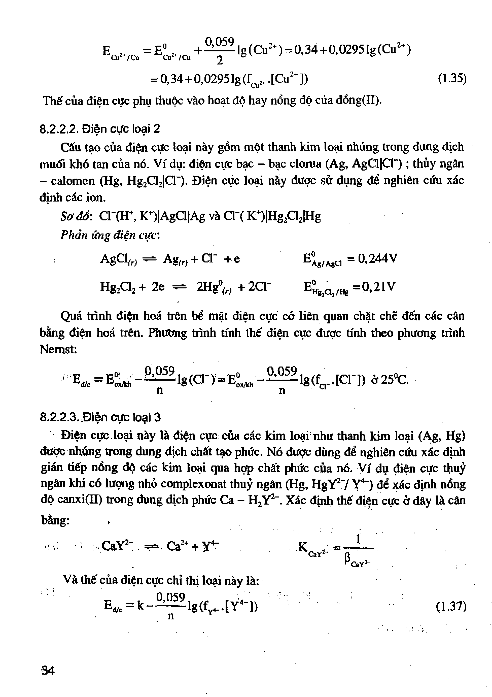

## Page 34

(1.38)
là hằng số tạo phức; p^yi- là hằng số bền của phức.
8.2.2.4. Điện cực oxi hoá -  khử
Có một vài nhà nghiên cứu điện hoá lại gọi tên điện cực kim loại loại 1 theo 
cách sử đụng điện cực trong quá trình chuẩn độ xảy ra phản ứng oxi -  hoá khử.
Điện cực trơ (oxi hoá -  khử) là các kim loại trơ như: Pt, Au, Ag, Pd, Hg, c... 
Các quá trình điện'hoá (oxi hoá -  khử) xảy ra trên bể mặt điện cục. Điện cực là 
chất cho hay nhận electron của phản ứng điện hoá trên bề mặt điện cực.
Ví dụ điện cực Ag+Ị Ag:
Phản ứng điện cực: 
Ag+,+ e 
„ 
Ag°
Thế cân bằng được tính theo phương trình Nemst:
Ea -/a =0,779+0,0591g(Ag+) = 0,779 + 0,0591g(fAg+.[Ag+]) (1.40) 
Vói điện cực Hg:
Cấu tạo: gổm bình hình chữ Ư được nạp thủy ngân tinh khiết vào một nhấnh, 
sau đó nhúng bình chữ u vào trong dung dịch complexonat thủy ngân HgY2-. 
Điện cực này có thể dùng làm điện cực chỉ thị đối vói nồng đô của EDTA. Khi đó 
phản ứng điện cực diễn ra:
HgY2" + 2e 
Hg° + Y4'
Thế điện cực cằn bằng được tính theo phương trình Nemst:
RT
(1.39)
ở 25°C:
E,HgYa_ /HgY5'
(MỊ)
Ở 25°C: EHgYỉ_/Hg =  EƠ 2.
HgY /Hg
(1.42)
Trong đó:
E° 
2-
HgY2"/H g + 0,02951g-^—
V
(1.43)
35

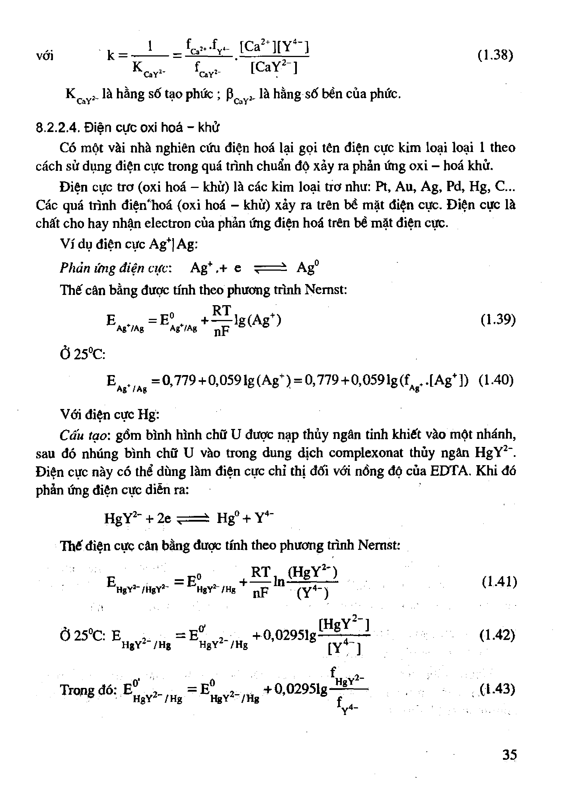

## Page 35

8.2.3. Các điện cực chỉ thị axit -  bazơ
Điộn cực chỉ thị axit -  bazơ còn được gọi là điện cực chỉ thị để đo pH.
Các điện cực loại này làm việc thuận nghịch với ion H \ nên các điện cực axit
— bazơ được sử dụng để đo pH của dung dịch nghiên cứu.
Thuộc loại này gồm có các điện cực sau:
8.2.3.1. 
Điện cực hiđro
Cấu tạo, tính chất xem mục 8.1.5.
Sử dụng điện cực hiđro làm điện cực chỉ thị cho ion H+ khi hoạt độ của ion H+ 
khác 1 và áp suất riêng phần của khí hiđro khác latm.
Sơ đồ của điện cực: H+ I (H2) Pt
Phản ứng điện hoá: 2H+ + 2e V ■ . — H2
Thế của điện cực được xác định bằng phương trình Nemst:
Thế của điện cực phụ thuộc vào hoạt độ của ion hiđro và áp suất của khí hiđro, 
khi mà áp suất P H = latm và ờ 25° c  ta có:
Nếu sử dụng điện cực đo ờ điều kiện áp suất của hiđro khác 1 thì cần phải 
hiệu chỉnh.
ưu điểm: Điên cục hiđro có tính thuận nghịch tốt và có độ lặp lại cao.
Nhược điểm: Thiết bị phức tạp, thế thiết lập chậm, đẽ bị ngô độc, ... Chính vì 
vậy chỉ sử đụng điện cục hiđro đo pH khi trong dung địch không có chất òxi hoá 
mạnh như K2Cr20 7, KMn04, HM03... và sử dụng khí hiđro thật tinh khiết 
(99,9999%) sẽ tránh được sự cố nổ điện cực khi khí hiđro có chứa tạp chất.
8,2.3.2. Điện cực angtimon —angtimon(lll) hiđroxit (Sb,Sb(SOH)3))
Sử dụng loại điện cực này như sau:
Nhúng điện cực Sb vào nước, khi đó trên bề mặt điện cực sẽ tự tạo ra màng 
Sb(OH)j khó tan trong khoảng pH = -3 ^ 8 , nhận được một điện cực angtimon — 
angtimon(IH) hiđroxit.
E.
(1.45)
(1.44)
= -0»059pH
(1.46)
36

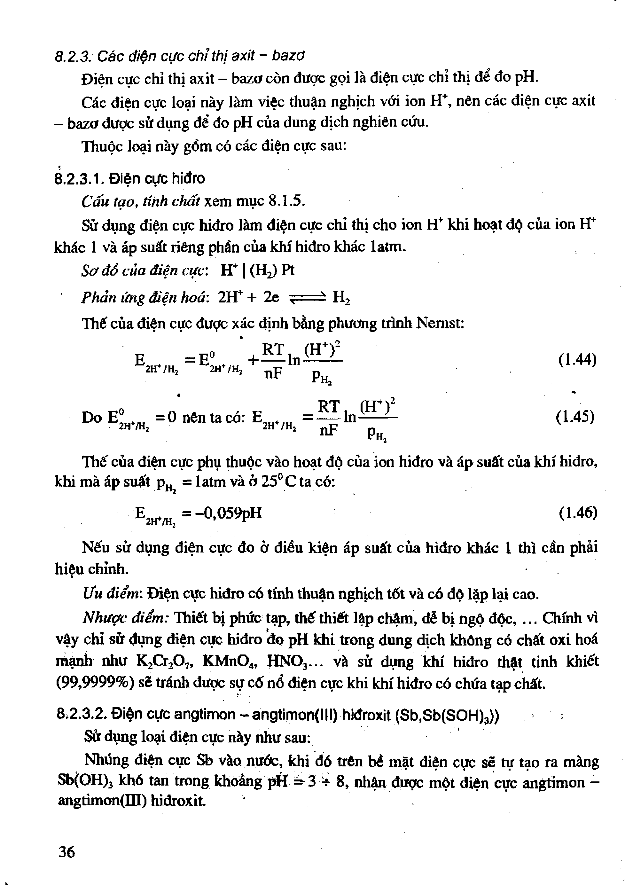

## Page 36

Sơ đồ điện cực: Sb(OH)31 Sb
Phản ứng điện cực: Sb(OH)j + 3H+ + 3e ^  Sb° + 3H-.0 
Thế điện cực cân bằng được xác định theo phương trình Nemst:
E 
= E ° 
, RT 
(S b (O H ),)q ư  
•
Sb(OH)j/Sb 
^ S b ( 0 H)3/Sb T  n p  111 
' 
V1 - * * ';
ở 25°C: Ewm wil = E°w olva, -0,059pH  
_ 
(1.48)
Điện cực angtimon — angtimon(in) hiđroxit điện sử dụng để đo pH trong 
khoảng từ 2 đến 8.
8.2.3.3. Điện cực quinhiđron
Cấu tạo: Thành phần cấu tạo của điện cực quinhiđron gồm một thanh platin 
nhúng trong dung dịch nghiên cứụ, trong dung dịch nghiên cứu đã có sẵn hỗn hợp 
của quinhiđron (QF^Oj) và hiđroquinon: QH4(OH)2 vói tỉ lệ sô' mol là 1 : 1. 
Quinhiđron là một hệ oxi hữá -  khử thuận nghịch và có ion hiđro tham gia.
Sơ đồ điện cực quinhiđron: H2Q I Q (Pt)
Phản ứng điện cực:
C6H40 2 + 2H+ + 2e 
C6H4(OH)2
Viết tắt: Q + 2H+ + 2e 
H2Q
Thế điện cực cân bằng được xác định theo phương trình Nemst:
Ew„,«=E“ÍHlQ+2f
? lgí^
1 
Ố25»c 
(1.49)
Ew w =E0Q,„,Q+^ f £|8ĩJ ^ +^ f E,S ^ +°.05918(H*) 
c-50)
Trong đó [Q], [H2Q] là nồng đô cân bằng của quinon và hiđroquinon; 
fQ và fH Q là hệ số hoạt đô của quinon và hiđroquinon.
Vì độ tan của quỉnon và hiđroquinon trong môi trường axit rất bé, nên có thể 
coi [Q] = [H2Q] thì khi đó số hạng thứ hai bằng không. Mặt khác, lực ion của 
dung dịch tương đối bé nên có thể châp nhận fQ = fH Q = 1 dẫn đến số hạng thứ
ba bằng không.
Vì vậy phương trình tính thế của điện cực chỉ còn:
37

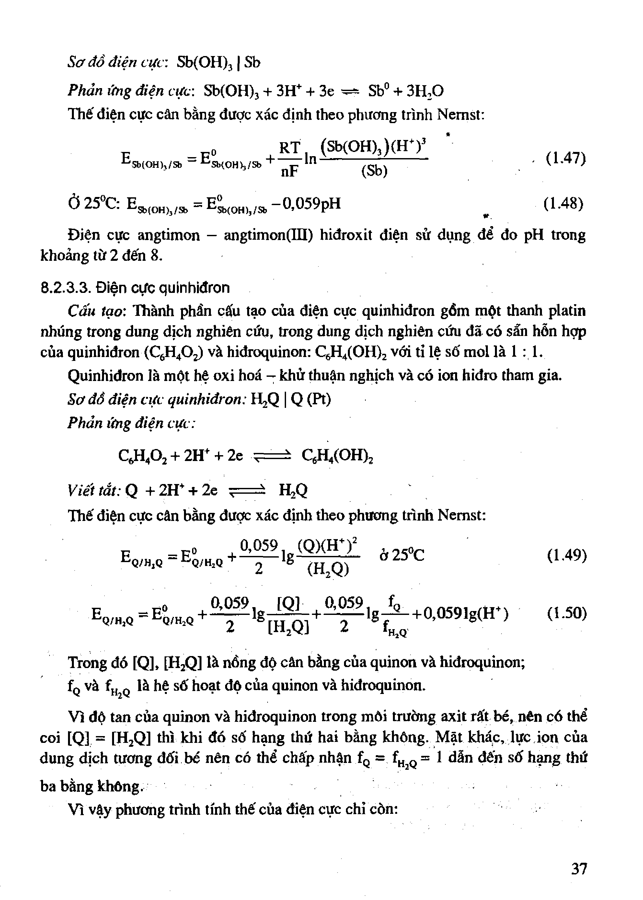

## Page 37

*W =E Ỉ,H K +aQ59|8(ir > 
(1.50
=>E q/k,q = E”,HiQ-0,059PH 
(I 52)
Như vậy điện cực: quinhiđron làm việc thuận nghịch vối ion H+. Thế tiêu
chuẩn của điện cực là sức điện đông của pin:
Pt (H2) I H+( H+) = 1; PHj=latm Ị| Q IH2Q Ị Pt
ở 25°C: 
Eq/h q =0,669V 
(1.53) 
!
ưu điểm: Điện cực quinhiđron đơn giản, thế được thiết lập nhanh và ổn định.
Sử dụng: Xác định pH của đung dịch nghiên cứu và đặc biệt thích hợp khi xác 
định pH trong phép chuẩn độ axit bazơ bằng phương pháp chuẩn độ điện thế ở 
pH < 8.
Nhược điểm:
-  Không làm việc được ờ môi trường có pH > 8 bời vì:
H2Qw 
H2Qw  
2H+ + Q2-
Nếu pH > 8 nghĩa là [OH~] tăng làm cho [H+] giảm dản đến cân bằng chuyển 
dịch sang phải phá vỡ điều kiện ban đầu là chấp nhận [Q] = [H2Q].
Còn pH > 9 thì oxi của không khí sẽ oxi hoá một phẩn H2Q thành Q cũng dẫn 
đến phá vỡ điều kiện [Q] = [H2Q] và nồng độ của muối trơ tăng lên cũng dẫn đến 
[Q] i  [H2QJ> 
.
-  Cách tiến hành xác định pH của dung địch nghiên cứu: Hoà vào đung dịch 
đo một lượng nhỏ quìnhiđron và đo thế của đung địch bằng điện cực platin hoặc 
vàng; chính vì cho thêm vào dung dịch nghiên cứu một lượng quinhiđron dẫn đến 
phản ứng phụ làm sai lệch kết quả đo.
-  Không xác định được thế hoặc pH của Gác dung dịch chứa chất oxi hoá 
mạnh: HNOj, KMn04, K2Cr20 7... và những chất có khả năng hấp phụ quinon, 
hiđroquinon.
8.2.3.4. 
Điện cực màng
Điện cục màng gổm hai loại:, các loại điện cực chỉ thị pH (đo pH) và các loại 
điện cực chọn ỉọc ion. Trong các loại điện cực này, quầ trình điện hờá xảy ra trên 
màng của điộn cực. Màng của điện cực có thể là màng rắn hay màng lỏng; màng 
rắn dang được chế tạo và sử dụng.rộng rãi. Một trong các điện cực. chỉ thị pH dùng 
để đo pH là điện cực thuỷ tinh.
38

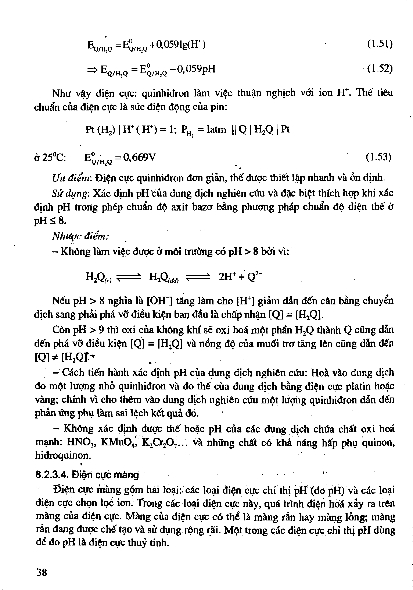

## Page 38

a. Điện cực thuỷ tinh
Điện cực thuỷ tinh làm việc theo cơ chế trao đổi ion ở màng điện cực. Các ion 
chuyển từ pha này sang pha khác mà không có sự thu nhận electron.
— Thành phần và cấu tạo của điện cực thuỷ tỉnh 
Cấu tạo: Cấu tạo của điện cực thuỷ tinh gồm 3 phần:
+ Thân điện cực: Thân điện cực được chế tạò bằng một loại thuỷ tinh thường 
có nhiệt độ nóng chảy ỏf 550°c.
+ Điện cực trong: Điện cực trong là điện cực so sánh, được nhúng vào trong 
dung dịch có thành phần không đổi. Có thể dùng một trong hai loại điện cực 
so sánh là điện cực bạc -  bạc clorua hay điện cực calomen bão hoà.
+ Bâu cùa điện cực: Bầu của điện cực thuỷ tinh lã phần quàn trọng nhất của 
điện cực, được chế fao bằng lòậi thuỷ tinh đặc biệt, làm việc thuặn nghịch với ion 
H+ trong đung dịch cần xác định. Bề dăy củà bầu kHọảng 55 -  130jxtĩl. 'Thủy tỉnh 
làm bẩu thiiỷ tinh chứa khoảng 17 -  32% M jO, 3 -  16% MO và 60 -  72% Si02 
với M' íà kim loại kiếm: Nà, K, Li; M lầ kim loại kiềm thổ: Ca, Ẹta, Sr. 
' !
Người ta chế lạo bầu điện cực thuỷ tinh theo ỵêu cầu về nhiệt độ vãi khoanjg 
pH của dung dịch nghiên cứu cần đo. 
^ 
‘ 
'
Ví dụ: Đo pH của dung dịch nghiên cứu có pH = £) -  9 và t° < 50°c ,tht 
điện cực .lliụỷ tinh chế tạo từ thuỷ tinh QP ipac: Inness 
Dolẹ qó,t|iàíỊỈx phần ậốỊn: 
22% Na20 , 6% CaQ và 72% Si02. Còn đo ở pH = 1 -  12,5 và t° = 50 
100°ẹ pbạị
39

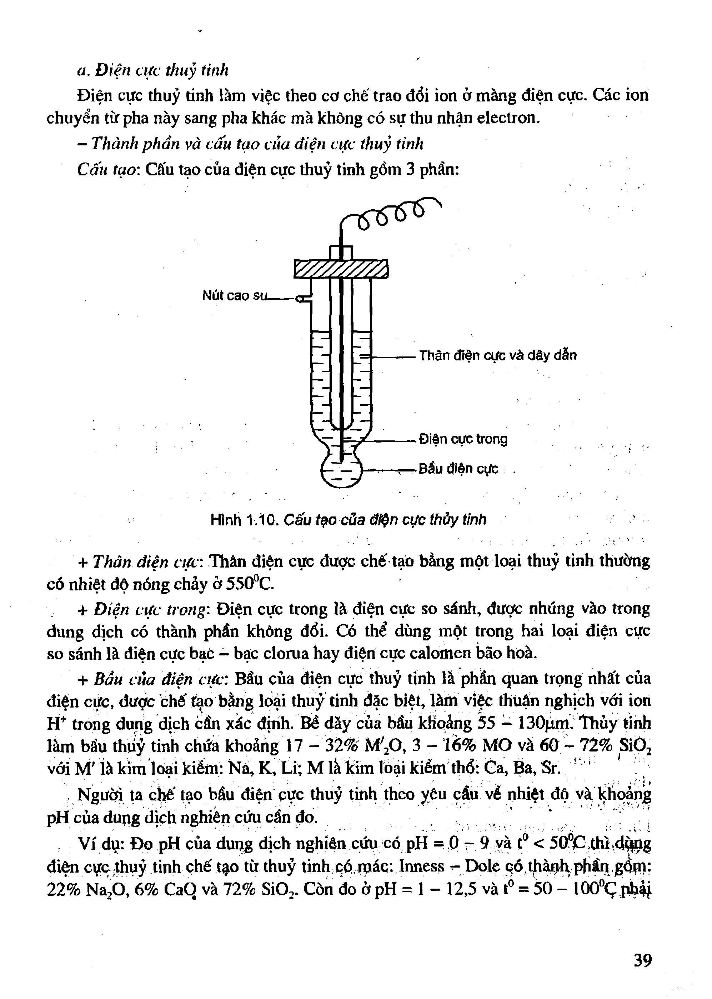

## Page 39

dùng điện cựe thuỷ tinh chế tạo từ loại thuỷ tinh 17 p của Liên Xô (cũ) chứa 24% 
ụ20 , 3% CaO, 4%La20 3 và 69% Si02. Loại điện cực này chịu nhiệt tốt và có độ 
nhạy tương đới cao.
Tính chất và sự hoạt động màng của bẩu điên cực thuỷ tinh là yếu tố quyết 
định tính chất của điện cực. Dung dịch điện hoá ưong bầu thuỷ tinh gồm có dung 
dịch H ơ  0,1M (IM) và khí H2 (P = latm) nếu là điện cực Pt. Nhưng nếu là điộn 
cực bạc thì không có khí H2.
Bầu trong màng 
Pt (hay Ag) IHC10,1M (IM) I PH = latm
Lớp màng 
thuỷ tính
Dung địch đo trong 
nước pHx
■2
E| 
Ej
Hình 1.11. Sơ đổ của điện cực thủy tinfi
— Tính chất của điện cực thuỷ tinh:
+ Thếcủa điện cực:
Luôn bảo quản điên cực thuỷ tinh bằng cách ngâm trong nước cất để cho 
màng điệri cực không bị khô có thể lăm việc thuận nghịch với ion H+. Theo các tài 
liộu cho biết cứ lcm 3 thuỷ tinh hấp phụ cỡ 50 đến lOOmg nưóc.
Khi nhúng điện cực thuỷ tinh trong nưóc một thctì gian ngắn, các phân tử dung 
môi sẽ thẩm thấu qua bẻ mặt của khung mạng silicat, làm cho bầu của điện cực 
trương phồng lên. Khi đó các ion trọng khung mạng silicat ờ bề mặt bầu thuỷ tinh 
sẽ trở lên hiđrat hoá và sẽ có khả năng trao đổi vói các proton ở trong dung dịch 
.cần đo:
* 
•• 
M ^  + H ^  
M V +H *r,
+ Phản ứng xảy ra trên bề mặt của bắtí điện cực thuỷ tinh:
Mặt ngoài phản ứng với dung dịch bên ngoài, mặt trong phản ứng với dung 
dịch bên trong. Giữa hai lớp trong với dung dịch bên trong, ngoài với dung dịch 
ỊỊgoài (dung dịch đo) se suất hiện một buộc nhảy thế. Bước nhảy thế này được xác 
định bằng điện cục trong bẫu. Các ion cổ điện tích lớn hơn 1 (Ca2+, Ẹa2+...) sẽ bị 
giữ lại trên khung mạng của bầu thuỷ tinh và không tham gia vào phản ứng trao 
đổi ion, chỉ có các ion Li+, Na+ tham gia phản ứng trao đổi ion trên bề mạt bên 
ữong bẩu và bên ĩigoàỉ bầu thuỷ tinh đã được híđràt hoá xảy ra liên tục cho đến 
khi tất cả các tâm trưóe đây của ion Li+ (hay Na*j được thay thế bằng các íon H+. 
Lớp thuỷ tình của bầu không đửợe hiđrat hoá sẽ không có quá trình trao đổi íon 
rtày và Lì+ (Na+)ở trong bầu thuỷ tinh khdng được hiđrat hoá không bị thay thế bởi 
ionH+. 
-  - ' -  
' 
> 
■■
40

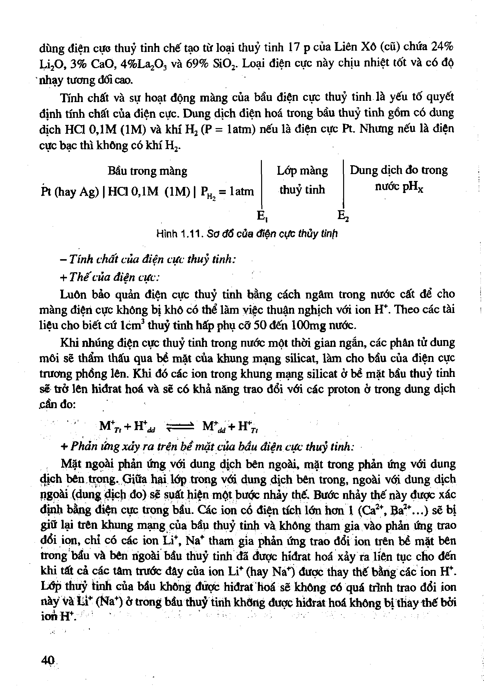

## Page 40

h ;
Hj'
h ;m
Dung dịch
Lóp thuỷ tinh
Lớp thuỷ tinh I
trong HC1
hiđrat hoá ở
Lớp thuỷ
hiđrat hoá bề Ị
0,1M
bề mặt trong
tinh khô
mặt bên Ị
bẩu thuỷ tinh
ngoài bầu Ị
r
thuỷ tinh ị
ir
h ;
Dung dịch bên 
ngoài
(đung dịch đo) 
M* (Na , K*, Li+)
Bể mặt ngăn cách 1 
có thế Eị
Bề iríặt ngăn cách 2 
có thế E,
ỊJ+
n Hdd) T l(Tt)
n 2(rtó) 
2(Tt) '<r~
u+/ 
I U + 
•rl2(ít/) ^ 
2(TfJ
Hình 1.12, Sơ đổ mặí cắf òẩu điện cực thuỷ tinh đã được hiđrat hoá ,
Thế của điên cực thuỷ tinh (thế tổng cộng) xuất hiện là do:
-  Có sự khác nhau giữa các thế trên bề mặt ngãn cách hai pha; các thế này có 
liên quan đến quá trình trao đổi ion ở các lớp hiđrat hoá mặt ưong và mặt ngoài 
cùa bầu thuỷ tinh.
-  Thế khuếch tán tổng xuất hiện là do mức độ linh độ khác nhau của proton và 
các iơn liti (hay natri, kali,.. .)• Nếu như các proton trao đổi hoàn toàn với ion kim 
loại trên bề mặt bầu thuỷ tinh của điện cực ở cả hai mặt trong và ngoài, nếu chấp 
nhận hai bể mặt có cấu tạo (dày, mỏng) là hoàn toàn như nhau thì có thổ chấp 
nhận hai thế khuếch tán đó bằng nhau và triệt tiêu cho nhau, khi ấy thế tổng cộng 
của điộn cục thuỷ tinh sẽ bằng tổng hai thế xuất hiện trên hai bé mặt ngăn cách hai 
pha là Et và Ejt
En = Eị + E2 
(1.54)
Dựa vào các kết qụả nghiên cứu, xác định, tính toán được bằng nhiệt động 
học: thế ở bề mặt ngăn cách hai pha được thể hiện bằng số hoạt độ ion H+ ở bên 
phải bề mặt với hoạt độ ion H+ ờ bên trái bề mặt bầu thuỷ tinh, vậy ta có:
' 
( 1 .5 5 ) 
"  
nF 
(H ), 
nF 
(iry , 
nF 
(H*),(H*K
(H+)j, (H+)2 là hoạt độ của ion H+ ờ bề mặt ngăn cách (1) và (2);
, (H)Ị, (H)'2 là hoạt độ của ion H+ ờ bề mặt ngãn cách trong của các 
lóp hiđrat
hoá (1) và (2). Nếu như (H+y ở các bề mặt ngăn cách được hiđrat hoá (1) và (2)
là như nhau thì:
41

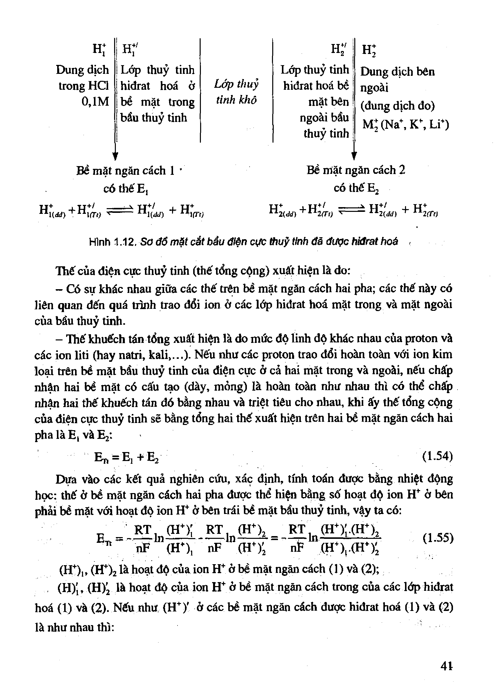

## Page 41

E , , ~ H h i £ £  
(,.56)
F 
(H*),
Từ cỏng thức này cho thấy thế tổng cộng trên bề mặt phân cách hai pha chỉ 
phụ thuộc vào hoạt độ của ion hiđro ở hai dung dịch tiếp xúc (dung dịch trong bẩu 
và ngoài bầu thuỷ tinh) với bầu thuỷ tinh của điện cực. Nếu chấp nhận (H+) -  hoạt 
độ của dung địch chứa trong bầu thuỷ tinh của điện cực là không đổi thì sẽ có:
— _ RT 
1 
RT 
+. 
n
E = - —- I n — ^-----—~ln(H )2 
(1.57)
11 
F 
(H )j 
F 
2
E71= k - ^ l n ( H +)2 
(1.58)
F
trong đó 
k = - ^ - l n — -—  
(1.59)
F 
(H ),
Nếu trong dung dịch đo (2) có chứa ion M+ (Na+, K+, Li+) thì xẫy ra phản ứng 
trao đổi:
(H+)'m) + ( M+)w  —  (M+>;m + ( H+U  Ko, 
thì phương trình trên phải kổ đến hoạt độ của ion M+ ưong dung dịch (2); khi đó:
E.n = k - ^ l n [ ( H +)2 + k.(M+)2] 
(1.60)
F
Trong đó k là hê số tỉ lộ được gọi là hệ số lựa chọn
Linh đô M+ trong màng 
..
k ------ -— :— ------ —--------  
(1.61)
Linh độ H trong màng
Phương trình này cho thấy rõ linh độ của ion ờ trong màng của bầu thuỷ tinh 
là yếu tố quyết định tính chọn lọc của điện cực. Nếu k.(M+>2 «  (H+)2 thì điện cực 
dùng để đo pH, ở 25°c với k là hằng số thì có:
En = k + 0,059pH 
(1.62)
Như vậy với bất kì sự thaỵ đổi như thế nào của thế điện cực thuỷ tinh đều có 
sự liên quan tới sự thay đổi thế trên bề mặt ngăn cách giữa bề mặt ngoài của bầu 
đã được hiđrat hoá cùa điện cực và dung dịch cần xác định pH. Hay nói một cách 
khác, thế của điộn cực thuỷ tinh là hàm số của nồng độ ĩon H+ Vă công thức 
En = k + 0,059pH cũng chứng tố điện cực thuỷ tinh lầm việc thuận nghịch với ion 
hiđro. Chính vì điện cực thủy tinh có đặc tính này nên sử dụng để xác đinh pH của 
dung địch nghiên cứu.
42

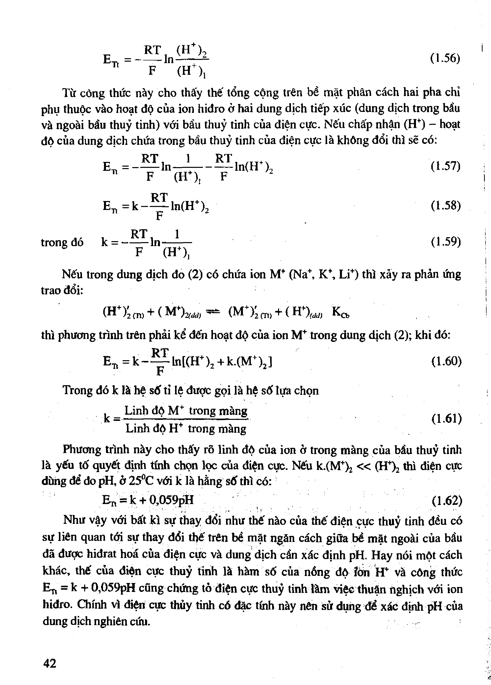

## Page 42

Sơ đồ biểu diễn khi đo pH của điện cực thuỷ tinh khi sử dụng điện cực ừong là 
bạc -  bạc clorua (Ag, AgClịG') và điện cực so sánh là calomen:
Ag, AgQ IHC10,1 MI Thuỷ tinh I dung dịch X IIKC1 (bão hoà) I Hg2Cl21 Hg
Cần lưu ý rằng khi dùng điện cực thuỷ tinh để đo pH thì ion cản trở chính là 
Na+. Vật liệu để chế tạo điện cực thuỷ tinh nếu có hàm lượng Li20  lớn thường ít bị 
cản trở hơn ion Na+ và được dùng để đo pH đến 12.
Từ (1.60) cho thấy, nếu k.(M+)2 »  (FT)2 thì điộn cực dùng để đo ion kìm loậi 
M+(pM)khiđó:
Eđc = k + 0,059pM 
Ở25°c 
(1.63)
Các điện cực thuỷ tinh dùng để xác định nổng độ của Na+, K+, Li+ và Ag+ vể 
hình thức giống hột điện cực thuỷ tinh dùng để đo pH, nhung khác ở chỗ là chất 
liệu thuỷ tinh giàu Na+, K+ hoặc Li* và dung dịch chứa trong bầu ĩhuỷ tinh là NaCl
0,1M hoặc KC1 0,1M- Bảng 1.2 trình bày một số điện cực thuỷ tinh chọn lọc síir 
dụng để xác định nồng độ một số ion kim loại.
Bảng 1.2. Đặc điểm phàn tích cõa các điện cực thuỷ tình chọn lọc 
với các ion kim loại kiềm và bạc
Thứ
tự
Thành phần thuỷ tinh 
(% moi)
Cation 
xác định
Độ chọn lọc
Ghi chú
1
15% u 20; 0,25% A120 3; 
60% Si02
Li+
^Na, Li= 3
^K. Nù = 1000
Xác định Li khi 
có mặt Na+, H+
2
11 % MazO; 18% A 1A ; 
71% Si02
Na+
^K, Na = 2800 
pH = 11 và 
^Na, K = 300
Xác định đến 
pNa = 5
3
10,4% Li20; 22,6% A120 3; 
67% SiOj
Na+
kK.Na= 10000, 
pH = 7
Rất chọn lọc
4
27% Na20; 5% A120 3; 
68% S i0 2
K+
^Na, K = 20
pK = 4
5
28,8 % Na20; 19,1 % A120 3; 
52*1% Si02
Ag+
kH.Ag= 10.000
độ nhạy cao
6
11% Na20; 18,0% Al20,; 
71% Si02
: . Ag+ ; J ^Ag,Na >1000
ít chọn lọc với 
ÌotiÂg+nhưng 
tin cậy hơn
43

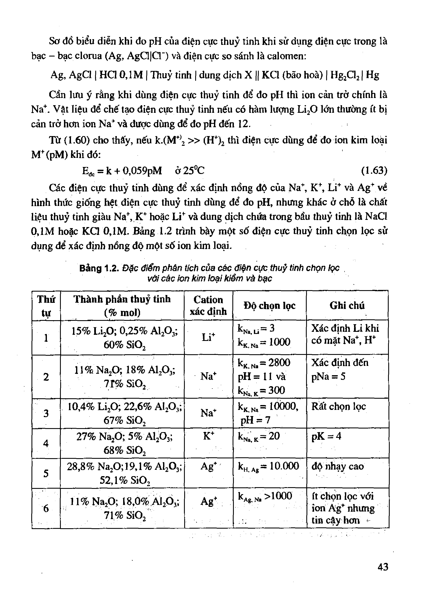

## Page 43

Điện cực thuỷ tinh như đã trình bày ở trên là điện cực đcm. Khoảng 15 năm trở 
lại đây nhiều hãng sản suất máy pH, như TOA (Nhật) đã tung ra thị trường loại 
điện cực thuỷ tinh kép. Điộn cực kép là điện cực đo pH có ghép cả điện cực so 
sánh và điện cực chỉ thị thành một điện cực duy nhất.
-  Điện trớ của điện cực thuỷ tinh:
Điện trở của điện cực thuỷ tinh rất lớn, dao động trong khoảng từ 10 -ỉ- 50jxQ 
cho nên dẫn điện kém. Điện ưở của điện cực thuỷ tinh phụ thuộc vào kích thước 
của bầu điện cực, bề dày của màng thuỷ tinh và thành phần của màng thuỷ tinh khi 
chế tạo điện cực. Bề dày của bầu điện cực thuỷ tinh rất mỏng, nằm trong khoảng 
55 -í- 130 micron met (um).
Điện ưở của điện cực thuỷ tinh lớn, cho nên khi dùng điện cực thuỷ tinh để đo 
pH của các dung dịch nghiên cứu người ta không thể sử dụng điện thế kế bình 
thường mà phải dùng điện thế kế có điện trở trong (nội) lổn, thường là các máy đo 
Ị>H (pH — meter) do Trung Quốc sản xuất vào những năm 1970 có đèn điện tử to 
và cổng kềnh. Ngày nay, cùng với sự phát triển mạnh mẽ của ngành công nghệ 
điện tử các máy đo pH ra đời với các mạch bán dẫn cộng với màn tinh thể lỏng rất 
gọn, nhẹ và rất thuận tiện như máy đo pH do hãng TOA (Nhật) sản xuất và nhiều 
hãng khác thì vấn đề điộn trở lứn của điện cực thuỷ tinh không ảnh hưởng gì lớn 
đến các phép đo pH.
— Thếbất đôĩ:
Thí nghiệm: Lấy chính xác 10ml dung dịch HG 0,1M cho vào cốc, nhúng 
điộn cực bạc -  bạc clonia vào dung dịch làm điện cực so sánh và điện cực thuỷ 
tinh làm điện cực chỉ thị thì thấy vỏn kế chỉ khác không. Như vậy thí nghiệm trên 
cho thấy dù dung dịch trong bầu thuỷ tinh (H a  0,1M) hoàn toàn đổng nhất với 
dung dịch bên ngoài (HC1 0,1M) thì giữa điện cực trong tà điện cực bạc -  bạc 
clorua và điện cực so sánh cũng Ịà điện cực bạc -  bạc clorua vẫn xuất hiện một 
hiộu điện thế AE (như hình 1.13); AE = E *- E-j« ỊOmV gọi là th ế bất đôi. Sơ đổ 
mạch đo có thể tóm tắt như sau:
Ag I AgCl, HC10,IM I Thuỷ tinh I H a 0,1 M, AgCl I Ag.
Giá trị thế bất đối phụ thuộc vào từng điện cực, thời giạn đo và tuổi (thời gian 
sử dụng) của điện cực.
Nguyên nhân xuất hiện thế bất dối là:
+ Do sự khác nhau ít nhiều giữa hai lớp màng (trong và ngoài) của bầu điện 
cực, cho nên chúng sẽ hoạt động trao đổi khác nhau, ngáy từ lúc chế tạo, sản xuất.
+ Do sự mất nước ở bề mặt trương của bầu thuỷ tinh. Có thể để lâu ngày mới 
đô hay do tiếp xúc với các chất hút nước mạnh.
44

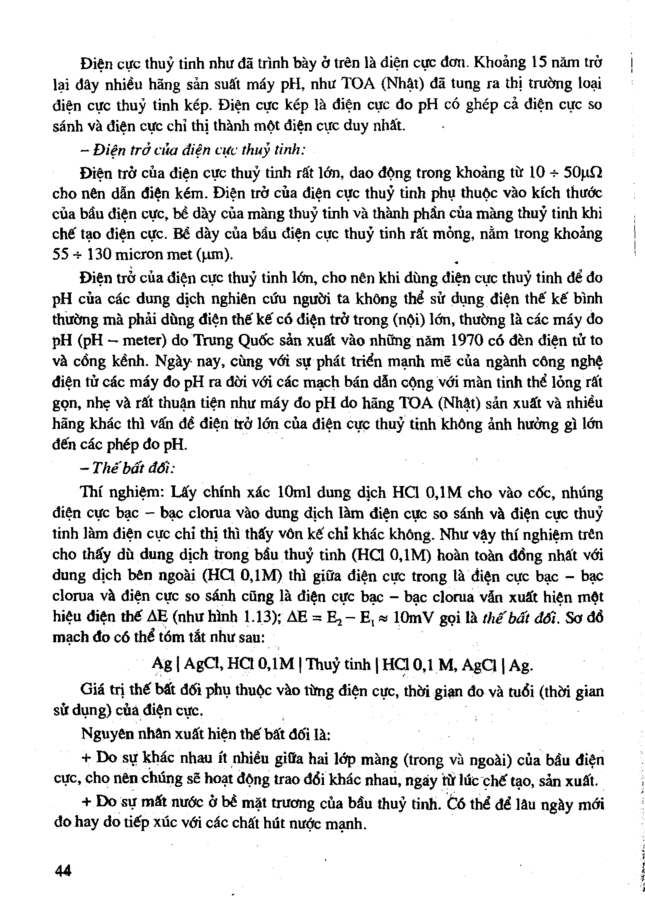

## Page 44

+ Bầu điện cực bị tổn thương do va chạm cơ học hay đo lâu trong môi trường 
kiểm bị OH" ăn mòn làm cho độ dày của màng thay đổi.
+ Bầu thuỷ tinh của điện cực mất khả năng trao đổi ion do bề mặt hấp phụ các 
chất hoạt đông bề mặt.
Hình 1.13. Sơ đổ đo thế bất đối
1. Dung àịch HCi ữ,1M 
2. Điện cực so sánh (điậrì cực bạc -  bạc clorua)
3. Điện cục thuỷ tinh 
4. Vôn kế
Khắc phục:
Để hạri chế điện thế bất đối xứng gây sai lệch cho các phép đo, ta cẫn chuẩn 
hoá điộn cực trước khi dùng. Để chuẩn hoá, người ta dùng một dung dịch ngoài có 
cùng nồng độ với dung dịch trong của điện cực, đo. thế dung dịch này và dùng 
núm vặn bố trí ữên máy đo pH để bổ chính thế bất đối xứng (vặn cho kim điộn kế 
về không) và không được thay đổi vị trí của núm vặn ừong suốt quá trình đo. Lần 
đo khác, lại phải chuẩn hoá nhu trên trước khi đo pH của dung dịch nghiên cứu.
— Sai số trong các phép đo pH:
Điên cực thụỷ tinh có quạ trình ừaọ đổi ion rất thuận nghịch, thế thiết lập 
nhanh làm việc được cà trong các môi trường có chất oxi hoá mạnh, các chất khí 
hoà tan và ngay cả trong dung dịch đục hoặc keo. Điện cực thuỷ tinh ít bị cản trờ 
bởi các cản trở từ bên ngoài, các nhiễu ít hơn so với các điện cực khác khi sử dụng 
để đo pH của dung dịch nghiên cứu (ví dụ như điện cực hiđro). Ngoài những ưu 
điểm trên của điện cực thuỷ tinh, còn có một số hạn chế Sáu:
+ Có sai số kiêm:
Khi dung điện cực đo pH của đung dịch nghiên cứu có Itíôi trường kiểm và 
kiềm mạnh, điện cực thủỷ tinh mắc sai số kiểm. Giá trị pH đo được sẽ rihố hơn giá 
trị thực của dung địch nghiên cứu một giá trị nhô nào đó và giá tiỊ riày tăng khỉ pH 
của dung dịch cần đo tăng.
45

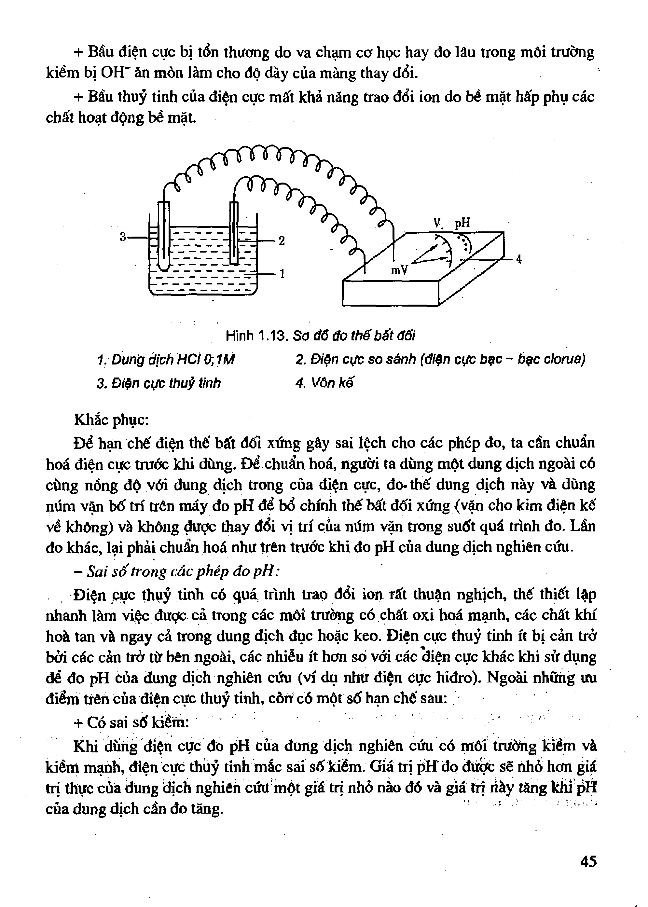

## Page 45

Nguyên nhân gây ra sai số kiềm có thể là do:
Sự có mặt các cation kiềm, nhất là ion Na+ cạnh tranh với ion H+ để trờ thành 
các tâm trao đổi ion trên bề mặt của lớp gen hiđrat, do đó làm thay đổi thế trên bề 
mặt ngăn cách giữa hai pha: lớp thuỷ tinh hiđrat hoá ở bề mặt bên ngoài bầu và 
dung dịch bên ngoài.
Sai số kiềm nhiều hay ít phụ thuộc vào bản chất, nồng độ của các cation trao 
đổi, nhiệt đô và thành phần của thuỷ tinh.
Ví dụ: Loại thuỷ tinh có 22% NazO, 6% CaO và 72% Si02, ưong một thời 
gian rất dài được sử dụng nhiều nhất để chế tạo các điện cực thuỷ tinh để xác định 
pH. Điộn cực loại này được sử dụng đo pH từ 1 -  9 ờ nhiệt độ phòng. Nhưng ở 
25°c đo pH trong môi trường có NaOH IM thì sai số mắc phải phụ thuộc vào pH 
của dung địch đo như sau:
Bảng 1.3. Sai số kiềm cõa điện Cực thõy tinh mắc phải
Thứ tự
pH của dung dịch đo
Sai số mắc phải đơn vị pH
1
10
0,2
2
12
1,0
3
14
2,5
Sai số trẽn mắc phải có thể giảm đi nếu đo trong môi trường Li* IM.
Khoảng 20 năm trở lại đây, các nhà nghiên cứu trong lĩnh vục này cho biết 
nếu thay NazO trong thành phần của thuỷ linh bằng liti oxit (Li20 ) thi sai số kiềm 
Sẽ giảm đáng kể. Ví dụ: Nếu sử dụng loại thuỷ tỉnh 10% Li20 , 10% CaO và 80% 
Si02 thì sai số kiềm mắc phải khoang 0,2 đơn vị ở pH = Í3 -  14 trong môi trường 
NaOH IM.
Ngày nay, phần lớn người ta sử dụng loại thuỷ tỉnh có Li20  để chế tạo điện 
cực đo pH cho phép đo pH đếni 14 vẫn đạt được độ chíiih xác thoả đáng.
+ Sai số axitt
Điện cực thuỷ tinh đôi khi cụng xuất hiện sai số axit, Sai số axit là sai số 
ngược với sai số kiềm. Nếu sử dụng điộn cực thuỷ tinh đo pH trong môi ưường axit 
mạnh, thì giá trị pH đo đuạc lớn hơn giá trị pH có thục của dung dịch đo.
Nguyên nhân gây rạ sai số axit cho đến nay vẫn chưa được làm sáng tỏ, nhưng 
sai số axit mắc phải khi đo dung dịch có pH = 1 là rất nhỏ yà không (Ịáíig kể, do 
đó ngụyêỊì nhậii qụa sai số axit cung khộng qụạn trọng trong các ph,ép đo pH cụa 
dung dịch nghiên cứu.
46

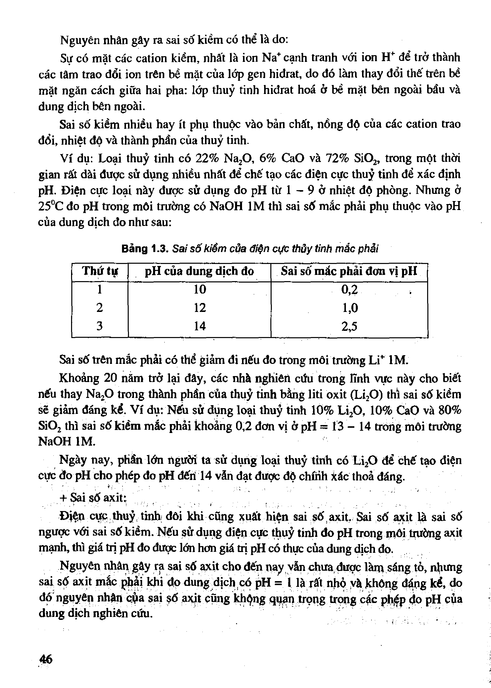

## Page 46

b. Điện cực màng chọn lọc ìon
Điện cực chọn lọc ion là các điện cực màng, mới xuất hiện từ những năm 1950 
đến nay. Tính đến năm 1983 đă có tới trên 5.000 công trình công bố về chế tạo ra 
các loại điện cực chọn lọc mới, hoàn thiện các loại điện cực chọn lọc ion đã có, 
nâng cao tính chọn lọc của các điện cực đã chế tạo, nghiên cứu chế tạo các loại vi 
điộn cực và các loại điộn cực mới mở rộng phạm vi ứng dụng của chúng. Ngoài ra, 
đến nay đã có trên 25 cuốn sách chuyên khảo thông báo vể các loại điện cực chọn 
lọc ion và các tạp chí quốc tế Anaỉitica Chimica Acta, Analytical Chemistry đăng 
tải những bài tổng quan về các loại điện cực này. Từ năm 1979, cứ nửa năm lại có 
một số tạp chí chuyên khảo về điện cực chọn lọc ion "Ion -  selective Electrode 
Reviews". Hiện nay có trên 40 loại điộn cực chọn lọc ion, đã tạo ra một hướng 
nghiên cứu mói quan trọng phát triển của phương pháp phân tích điện thế trong 
các phép đo điện thế trực tiếp.
Các loại điện cực chọn lọc ion được sử dụng nhiều nhất trong các lĩnh vực công 
nghiệp, điều trá thiên nhiên, sinh học, y học, pháp y và bảo vệ môi trường sống.
(ỉ) Điện cực chọn lọc ìon
Cấu tạo của các loại điện cực màng chọn lọc ion có thể gồm 3 phần: thân điện 
cực, dây dẫn và màng điện cực.
Thân điện cực bên trong chứa dung dịch chất điện li có thành phẩn và nồng độ 
xác định (dung dịch 1). Đầu mút của cực có gắn màng chọn lọc ion (có thể là 
màng rắn hoặc màng lỏng). Bên trong của thân điện cực có một cực so sánh được 
nhúng vào dung dịch 1 (như hình 1.14).
Dây dẫn
Thân điện cực
Điện cụt so sánh (1)
Dung dịch trong (í)
inmnmmffibl——  Màng chọn lọc ion
Hình 1.14. Cấu tạo cùa điện cục chọn lọc iơn.
47

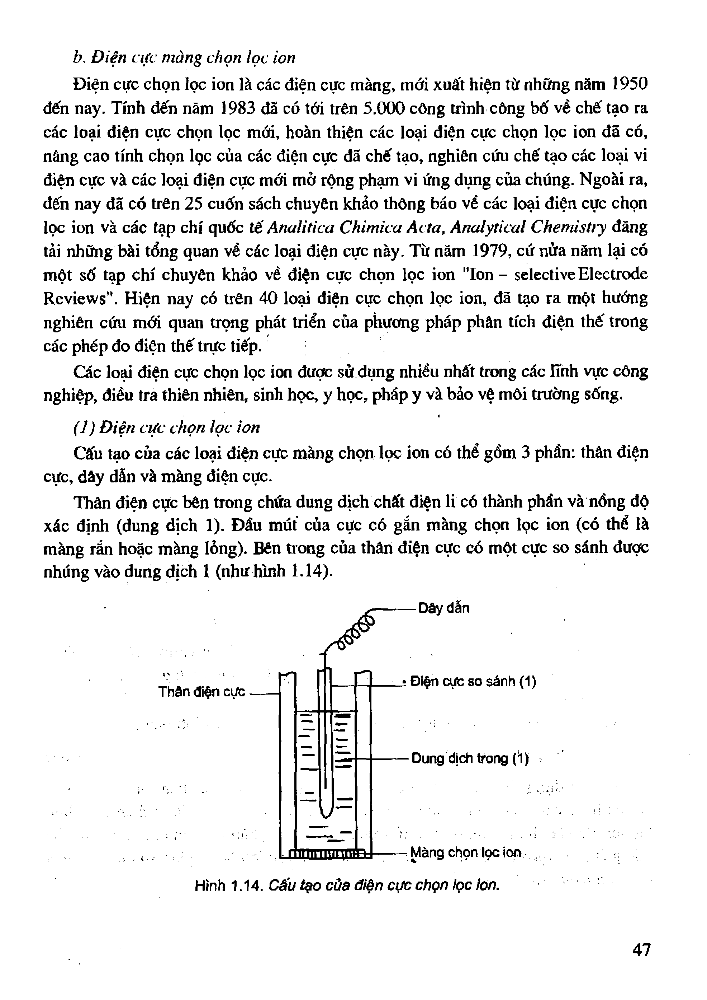

## Page 47

(2) Sơ đồ hệ điện hoá đo thê của điện cực chọn lọc ion 
Muốn xác định nồng độ của một ion nào đó, ta phải nhúng 2 điện cực so sánh 
và một điện cực chọn lọc với ion đó, dựa vào thế đo được từ đó suy ra nổng độ của 
ion đó (như hình ỉ. 15).
Để tiộn theo dõi có thể mô tả sơ đồ hộ điện hoá đo thế của điện cực chọn lọc 
ion như sau:
Điện cực 
so sánh ( 1)
Dung dịch (1) 
(dung dịch 
trong)
Điện cực 
so sánh (2)
Dung dịch (2)
Màng 
(dung dịch 
phân tích)
E, 
En, 
Em 
V
Để hiểu được điện cực màng chọn lọc ion và ứng dụng chúng vàò các phép 
xác định nồng độ của các ỉon trong dung dịch nghiên cứu, chúng ta cẩn phải xét 
các vấn đề sau: 
'
Sức điện động của các nguyên tố điộn hoá này được xác định bằng :
Esdd= E2 + Em — Ej • 
(1.64)
Khi sử dụng điộn cực so sánh (1) và (2) (hình 1.15) ỉà' điện cực bạc -  bạc 
clorua hoặc calomen có thế xác đỉnh và không đổi, vì vậy khi dùng điện cực chọn 
lọc ion để xác định nồng độ cấu tử trong dung dịch phân tích thì chỉ có giá trị thế 
màng (Em) là quyết định. Thế của điện cực chọn lọc ion bằng tổng số thế của điện 
cực bền trong và thể màng:
48

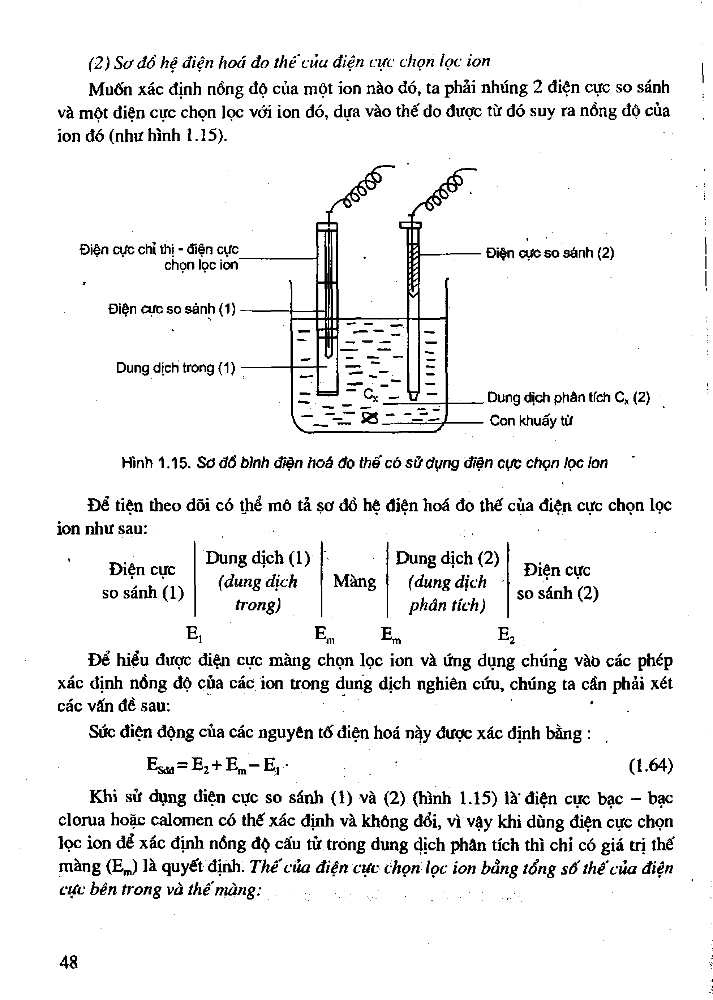

## Page 48

Epccl! — E
-
2
+
(1. 65)'
Trong trưòmg hợp đem giản nhất là nhúng điện cực màng chọn lọc ion vào 
dung dịch nghiên cứu thì màng chỉ ngăn cách 2 dung địch trong và ngoài. Dung 
dịch ngoài là dung dịch nghiên cựu chỉ chứa ion cần xác'định là X và trong cả hai 
dung dịch đó không có ion khác ảnh hưởng đến thế màng. Trong trường hợp này 
thế màng được quyết định duy nhất là ion X và thế màng được quyết định bằng:
Em= - ^ l n ^ ĩ i ^  
(1.66)
m 
nF 
(X)(2)
Trong đó n là số điện tích của ion X;
(X), và (X)2 là hoạt độ của X trong dung dịch 1 và 2.
Phương trình (1.66) trùng với phương trình Nemst đối vói thế của nguyên tố 
nồng độ không có dòng. Thế của điộn cực ion chọn lọc bằng:
E Đccii =  c o n st +  ^ ỉ- ln (x )(2) 
O -6 7 )
nr
EDsdi = const + M Ể£ig(X ) 
à 25°c
n
(1.68)
=> lg(X) = (EĐccli - c o n s t ) ^  
(1.69)
Biết được n và đo được 
có thể tính được hóạt độ, từ hoạt độ tính đượe
khi biết được hộ số hoạt đô (fx).
í  
(X)''
nồng độ cùa iott eần xác định c x = 
-
fx
Trong phương trình (1.69) giá trị const hoàn toàn khổng phụ thúộc vào hoạt đô 
của ion cẩn xác định trong dung dịch phân tích, vậy :
= —
Ig(X>,2) 
(1.70)
n
Nếu như trong đung dịch phân tích có thêm ion cải! (C) thì khi xác định hoạt
độ của ion X, ta cần phải tính đến hoạt độ của ion cản, khi đó thế màng của điộn
cực chọn lọc ion sẽ là:
E = H i n (X)ffl-tkX'C-(£ y
 
(1/71)
"  
nF
49

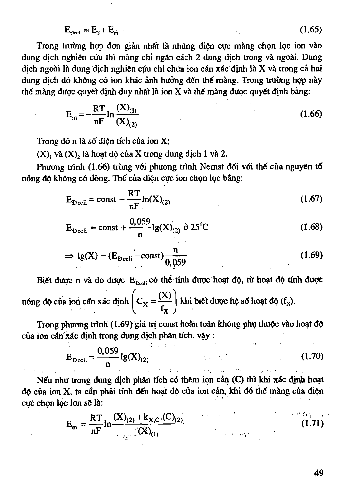

## Page 49

Thế của điện cực chọn lọc ion được thể hiện bằng phương trình Nicolxki:
EĐcclí = const ~ ~  ln{(X)(2) + k x>c-(C)(2)]
ED rf =const + ° ^ l g [ ( X ) (2, + k x,c .(C)(c)] Ở25°c 
n
(1.72)
Trong đó kxc là hệ số chọn lọc của điện cực cho ion c  đối vối ion cần xác 
định X (xem hình 1.16).
Hình 11.16. Đường biểu ơiẽn sự phụ thuộc EĐccll vào hoạt độ cũa ion cần xác đinh X*
(trong đó kXrC.(C)(V = 1(r* vàn= 1).
Hệ số chọn lọc là hàm số của các cấu fừ có mặt ữong dung dịch nghiên cứu sẽ 
giúp ngưòd đo định hưỏng được ảnh hưởng của các ion cản trở tới viộc xác định 
nồng độ của các ion trong mẫu phân tích. Theo phương trình (1.66), thế của điện 
cực chọn lọc ion cho biết hoạt độ của ion cần xác định chứ không phải trực tiếp 
nổng độ của nó. Nhưng có thể tính được nồng độ khi biết hệ số hoạt độ.
Trong thực tế thường thấy xảy ra 2 tnròng hợp:
1. 
Hoạt độ của ion ảnh hưởng không đáng kể so vói hoạt độ eủa ion cần 
xác định:
1 * kx,C'(C)(2) <-<' 
thì phương trình (1.72) trỏ thành (1.68):
C 
0,059,
Đccli =  const +  - ĩ— — lg(X)(2)
0,059
n
lg(X)(2)
(1.73)
(1.74)
50
I

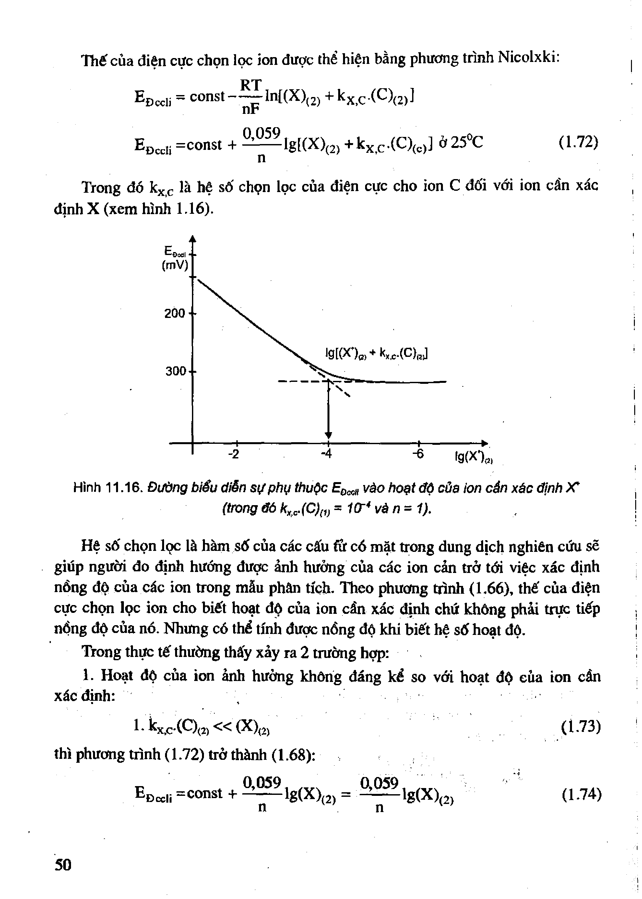

## Page 50

Sự phụ thuộc E0cclj vào lg(X)(2) được biểu diễn như đổ thị hình 1.17.
Hình 1.17. Sự phụ thuộc Em, vào hoạt độ cõa ion cần xác định
Từ đồ thị tính được:
= E2(Đccii) - Ei(ĐgỊỊ) = Ễ
M
 = 
ở25°c 
(1.75)
lg(X)(2) -lg (X )(1) 
Alg(X) 
n
Đại lượng này được gọi là hệ số góc Nernst.
Trường hợp này, cho đến nay trong thục tế chỉ oó duy nhất điện cực bạc sunfiia 
(Ag2S) có được tính chất lí tưởng chỉ chọn lọc đối vói càtion (Ag*) hoặc anion (S2-). 
Còn đại đa số các điện cực đều bị ảnh hưởng bỏi hoạt độ cùa các ion cản.
■ 
2. kxc.(Q (2) »  (X)(2) 
' 
(1.76)
Trong trưòtìg hơp này xảy ra thì phương trình thế của đỉộn cục chọri lọc ion 
như sau:
EB«„ -  —
lg(C)(2) 
(1.77)
Trên đây là các vấn đề lí thuyết của điện cực chọn (lọc ion vể khía cạnh động 
học của thế màng và chỉ kể tới yếu tố ảnh hưcmg của động học khi xét đến thế 
khúéch tán trong màng. Khi nghiên cứu lí thuyết về các loại thế cùa điện cực: chọn 
lọc ion gặp rất nhiều khó khăn VI nhiều khi có một số đại lượng điện hoá, cho đến 
nay vẫn chựa xác định được (linh độ, hoạt độ của các ion trong các pha và các đại 
lượng này phụ thủộc vào những yếu tố nào).
(3} Phân loại điện cựt chọn lọc.ion 
.
Cổ 3 loại điện cực chọn lọc ion;

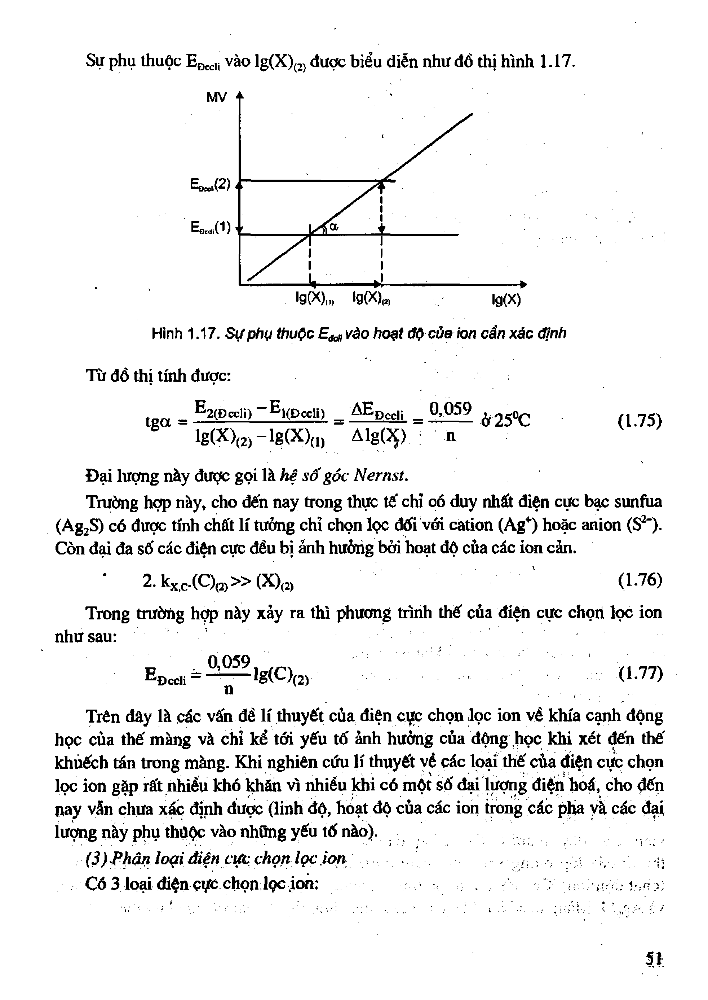

## Page 51

1. Điện cực dùng màng rắn và màng thuỷ tinh.
2. Điện cực dùng màng lỏng:
a. Màng lỏng chứa ion tan có khả năng trao đổi ion.
b. Màng lòng chứa chất mang ion tan.
3. Điện cực chọn lọc phân tử khí.
-
 Điện cực dàng màng rắn
Cấu tạo của điện cực màng rắn: Các màng rắn có thể là các màng đổng thể 
hoặc dị thể, cấu tạo như hình 1.18.
Hình 1.18. Nguyên tẳc, cấu tạo cũa điện cực chọn lọc ion có ỳẳn màng rắn
Hoạt động, của điện cựẹ màng rạn phụ thuộc vào kĩ thuật, chất lượng gắn 
màng vào cực. Ngưòi ta phải tiến hành gắn màng sao cho màng rắn được gắn vào 
điộn cực thật kín để màng có khả năng ngăn hoàn toàn dung địch chứa trong điộn 
cực với dung dịch bên ngoài cực. Để gắn màng thường dùng vật ,liệu bằng nhựa 
epoxi, teflon, PVC.
Mắhg rắh cũng dừợc chia thành 2 hai nhồm: màng đổng thể và mấng dị thể.
Màng đổng thể thuộng được chẾ tạo từ các loại đơn tinh thể (LaF3, AgQ, 
ẢgBr, Agi, ‘ẠgS), các muối chảy đă bị đốing cứng (Ag2S + CuS), các muối ở dạng 
tột (À gtì, íỉaSỚ4) đã đửợc nén, ép ổ áp suất rất cao 7 + 20!l08Pa để tạo thành 
viên, Gần đây người ta thông báo đã chế ỉạo thàiih công các lốại màng rắn đổng 
thể từ các lớp mỏng vật liệu màng được kết tủa trẽn' các chất dẫn itmthíchhợp 
(chất độn ion). Các chất độn íon thường được sử dụng là Ag2S,í AljSBr, Ag„IlsP20 7 
và AgjSI. Màng cùa bầu điộn cực thuỷ tính cũrig thuộc loại màng đổng thể.
52

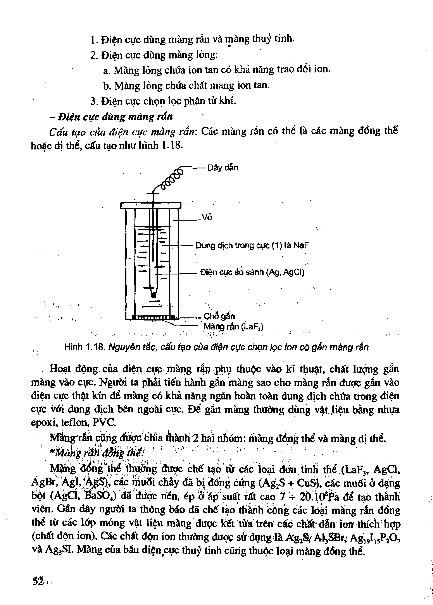

## Page 52

* Màng rắn dị thể: 
'
Chế tạo màng rắn dị thể bằng cách đưa tinh thể chất có hoạt tính điộn eực 
(LaF3, AgCl,...) vào khung tạo màng thích hợp như cao su silicon hoặc PVG.
Buchamen và Seago đã tiến hành điều chế các màng chứa bạc halògenua 
(AgCl, AgBr, Agl) bằng phương pháp như sau: Trộn bạc halógeriua với cáo su 
silicon ờ dạng bột rổi cho bột này vào giữa đĩa được làm bằng polietilen và thân 
bằng PVC, sau đó nén thành tám. Còn một cách khác chế tạo mạng A g ơ  bằrig 
cách đưa kết ỉủa này vào polime chịu nhiột hoặc khung p v c Tổi ép ở nhiệt độ 
130°c dưới áp suất 1 -ỉ-3.107Pa để tạo thành tấm. Cuối cùrtg là tạo dáng của màng 
sao cho phù hợp để gắn vào điện cực. ' 
<
Tírìh chất của điện cực màng rẩn
Quá trình điện hoá (trao đổi) xảy ra quả lóp màng trao đổi'hầy.' Nhìri'vào cấu 
tạo điộn cực cho thấy màng phải có chứả các ion củà chất cần xác"định;! mổi một 
điện cực chỉ sử dụng để xác định nồng độ một ion của một nguyên tố. Ví dự: 
1 !
-  Xác định nồng đô F* đùng màng là LaF3 trong PVC hoặc silicon,.
-  Xác định nồng đô Ag+ dùng màng là; Ag2S trong PVc.
-  Xác định nồng độ Cu2* dùng màng là CuS trong PVC.
Trong tính thể LaFj, các ioníT dễ đàng di chuyển trong các lồ trống cụa.mang 
tinh thể. Lỗ trống trên mặt màng phỉ tiếp nhận các ion florua. Các ion khác F“ 
không được chấp nhận do kích thước hoặc điộn tích Ịchác F~. ĐỊôn ẹực chọn lọc 
florua có độ chọn lọc cao, cho phép xác định nồng độ florua từ 10' 1 đến 10_âM, ion 
OH" trong dung dịch phân tích là ion cản duy nhất. Điện cựe này làm viộc tốt nhất 
ờ giá trị pH từ 5,0 đến 5,5. Nếu môi trường quá axit sẽ xảy ra sự tạo phức giữa F" 
và H+. Thế thiết lập nhạnh, có thể đọc kết quả đo sau vài giây. Trong dung dịch 
phân tích nếu có mặt của các thuốc thử như xitrat, photphát, hiđrocacbonat,... có 
khả năng tạo phức với La3+ thì thế thiết lập chậm, phép đo sẽ lâu hơn. Điệrt trở cửa 
điện cực thấp do linh độ của ion F" trong tinh thể lớn. Độ dẫn điện của LaF3 tốt.
-  Chế tạo điện cực rắn có màng đổng thể rất khổ khẩn, chỉ có phòng thí
nghiệm có chuyên môn sâu và công nghệ hiện đại mới chế tạo được, còn điện cực 
rẳn có gắn màng dị thể thì phòng thí nghiệm phân tích bình thương cũng có thể 
chế tạo và sản xuất được. 
V;
Thế của điện cực màng rắn
Màng rắn cũng có hai loại: màng rắn có thế khuếch tán và không có thế 
khuếch tán. Màng rắn phát sinh ra thế khuếch tán có phương trình tĩnh thế rẩ't phức 
tạp và ít sử dụng trong thực tế phân tích.
53

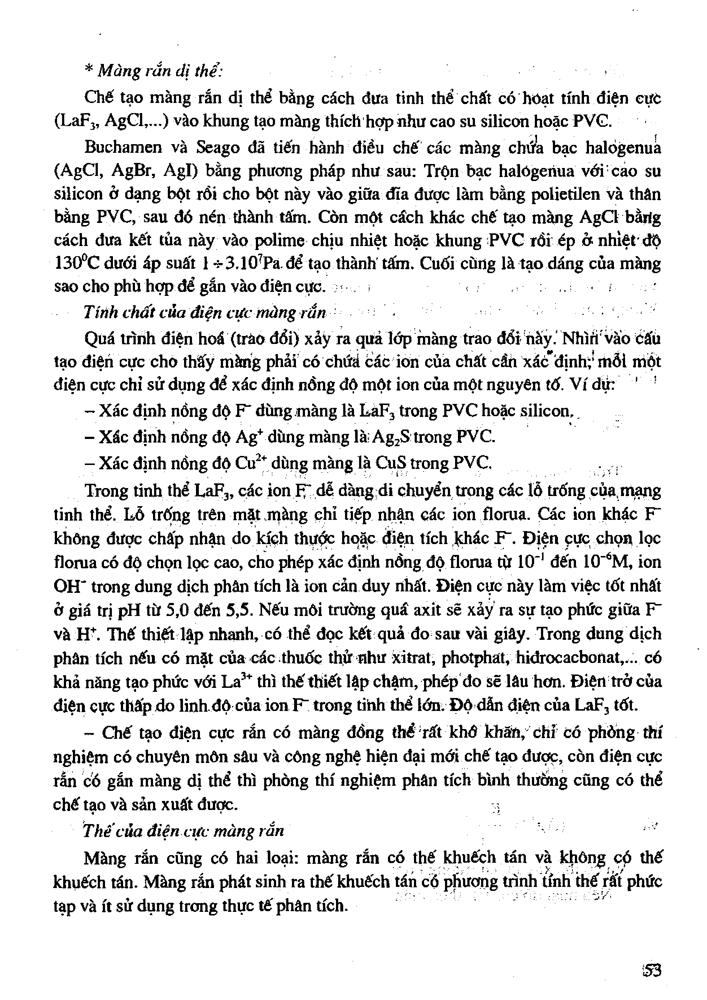

## Page 53

Các màng không có thế khuếch tán ỉà các màng chứa lóp muối khó tan nằm 
cân bằng với dung dịch chứa cation và anion của nó. Ví dụ điển hình thuộc Loại 
màng này là bạc halogenua (AgQ, AgBr, Agl) trong đung dịch chứa các ạnion 
halogẹnua (CT, Br", I~) hoặc chứa cation bạc (Ag+).
Sau đây ta xẹm xét từng loại màng cụ thể:
-  Màng chọn lọc anion: Trong trường hợp này, thế màng phụ thuộc vào hoạt 
độ anỉon trong dung dịch còn Ag+ đóng vai trò chất mang điện tích trong màng. 
Xét trường hợp màng rắn được chế tạo từ muối khó tan Agl, màng này ngăn hai 
đung dịch có nồng đô r  khác nhau Cị và Q . Vì có sự chênh lộch về nồng độ mà 
xuất hiện thế màng. Vì ở bên trong màng không xảy ra sự thay đổi chất, nên 
không xuất hiện thế khuếch tán. Khi trao đổi ion giữa màng và dung dịch đạt tới 
trạng thái căn bằng thì các hoá thế bằng nhau. Xụất phát từ các phương trình tính 
các đạị lượng của hoá thế, ngưòã tạ thiết lập được phương trình tính thế màng 
như sau :
B„=^„=E(2)-Ero- ~
taE Ì!U _ ^ £ ig E k  Ở25°c 
(1.78)
nF 
(I )(2) 
n 
(I )(2)
Trong trưòng hợp này thế màng có giá trị nhu hiệu thế của hai dung địch (2) 
và' ( 1) trong nguyên tố nồng độ có hai điện cực so sánh (có thế xác định và cố định).
-  Màng chọn lọc cation: Phương trình biểu diễn thế màng cũng có dạng tương 
tự như đối vối màng chọn lộc anion, nhung khác về hoạt độ:
E 
J M K 9 , (Ag^jo ở250c 
<1.79)
n 
(Ag )(2)
Trong cả hai loại màng rắn chọn lọc anion và cation, thế màng có giá trị như 
hiệu thế của hai dung dịch (2) và ( 1) trong nguyên tố nồng độ có hai điện cực so 
sánh khác nhau nhưng có thế xác định và cố định.
Nếu trong dung dịch nghiên cứu chứa thêm anion thứ hai, ví dụ ơ “ cũng tạo
bợp chất khó tan vái cation Ag+ thì ta có:
■ 
(^ * ) = ^ ( ểr f  
' 
■ 
<180>
và 
(A g ì 
Kjr r ỉ- 
.
.
.
 
(1.81)
Và có thổ xảy ra hai tnròng hợp:
-  Nếu hoạt độ của Q “ thoả mãn:

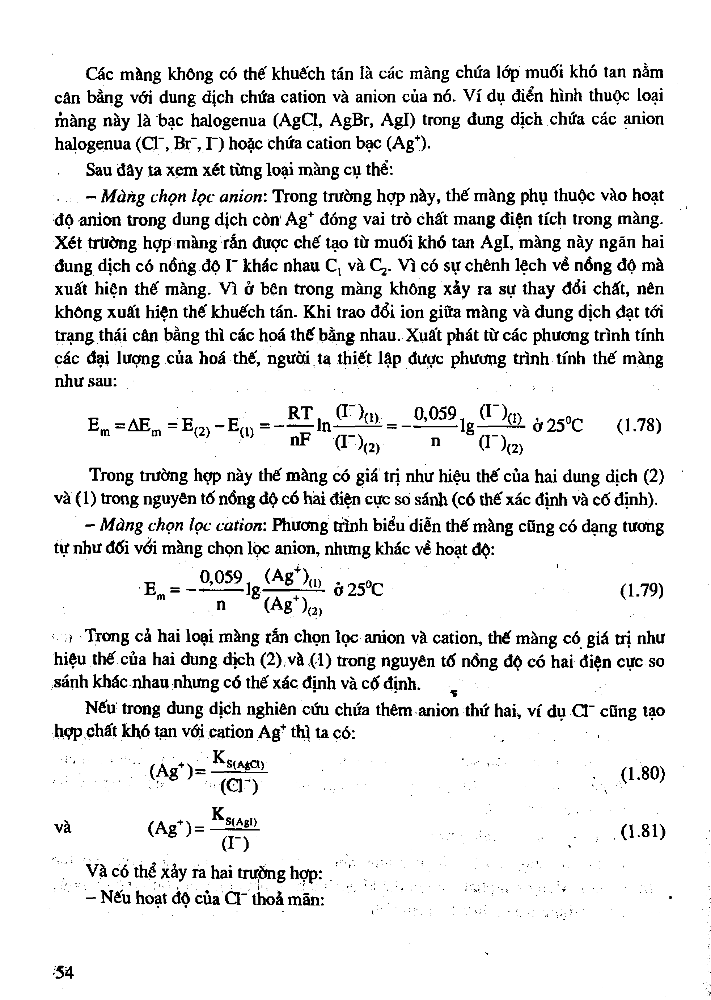

## Page 54

( c r ) < Ks~AgCI
KS-AgI
IQ -1 0
(r )  = ^
( D
 = io 6(i-)
(1.82)
(1.83)
thì sự có mặt của c r  không ảnh hường đến thế măng.
-  Nếu hoạt độ của cr thoả mãn:
(cr )> 
(D = lĩ!ị(i-) = 10‘(D
S(Agl) 
1 0
thì Agl trong lớp bề mặt của màng sẽ chuyển thành AgCl và hệ mới được hình 
thành theo sơ đồ:
(V \2), (CO(2) I AgCl I Agl I (Cl-)(1) 
a  
ộ
ở đây (2) chi dung dịch phân tích.
Thế màng trong trường hợp này được biểu diễn bằng phừơng trình:
RT J Ks(Agq)-(d )<ĩ>
K S(Agl) . ( n (1)
<Cl-)(2rlơ
d")(
(1.84)
(1.85)
10' 10 (CT)
ở 25°C: 
E = -0,0591g------^  = -0,0591g
s 10r16.ơ")(1)
Trong đó Ks(Asa) và Ks(Agl) là tích số tan của AgCl và Agl.
Có thể minh hoạ ảnh hưởng của c r  ở những hoạt độ khác nhau đến viộc xác 
định nổng độ của r  bằng đường chuẩn ưên hình 1.19.
E ,(m V )„
100mV - ■
4 
6 
8 
10 
Hg(I)
Hình 1.19. Sự phụ thuộc thế màng vào hoạt độ r ỏ các hoạt độ khàc nhau cũa cr. 
Đường----- là theo ti thuyết. Đường —  là thao thực nghiệm.
55

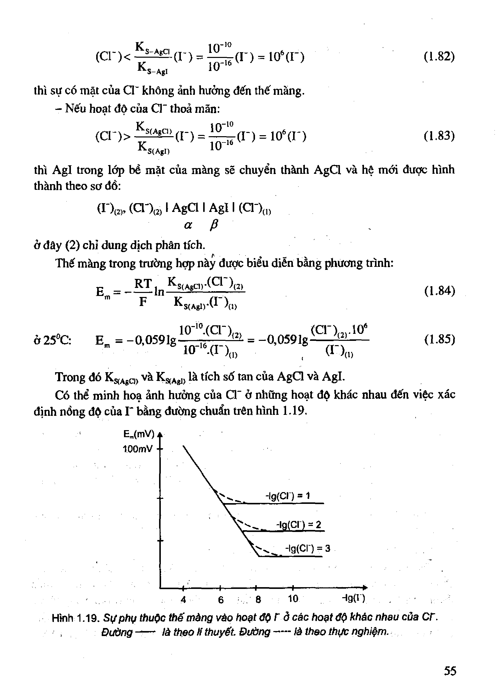

## Page 55

-
 Điện cực dùng màng lỏng
Điộn cực màng lỏng có hai kiểu khác nhau:
Màng kiểu 1: Màng kiểu 1 như hình 1.20 dưới đây:
Dây dẫn
" I f E p E —
-Vò
Điện cực trong
-  (điện cục so sánh Ag, AgCl) 
_ Dung dich chất trao đổi ion 
hay chầt lién kết ion
Dung dịch trong điện cực
Màng xốp
Hình 1.20. Điện cực dùng màng lỏng
Cho dung dịch chất trao đổi ion hoặc {liên kết ion) vào ngăn sát với thành vỏ 
điện cực, dung dịch này tiếp xúc với màng mỏng xốp ở cuối cực. Màng xốp được 
chế tạo bằng teflon xốp, dùng làm màng ngăn dung địch bên trong điộri cực và 
dung địch nghiên cứu.
Nhược điểm của điện cực màng lỏng kiểu 1 (hình 1.20): Điện cực chế tạo 
xong đem sử dụng lúc đầu thì tốt, nếu sử dụng lâu ngày thì điện cục trao đổi ion 
không tốt vì dung dịch trao đổì ion trong cực bị mất đần đi do thẩm thấu qua màng 
ngăn xốp vào dung địch nghiên cớu dẫn tới kết quả đo thế không chính xác. Chính 
vì những lí do trên mà ngày nay người ta ít chế tạo điện cực kiểu 1 mà chuyển 
sang chế tạo điện cực kiểu 2.
Màng kiểu 2: Màng kiểu 2 là màng polime -  dung môi hay còn gọi là màng 
khung PVC.
Chế tạo màng chứa ion tan có khả năng trao đổi ỉon:
Shakaye và các cộng sự ỉần đầu tiên chế tạo loại màng này để gắn vào điện cực 
chọn lọc đối vói ion canxi (Ca2+). Cách tiến hành như sau: Đưa dung dịch 
theonyltrifluoraxeton trong tributylphotphat (dung dịch traọ đổi ion) vào màng PVG
Moady và TTiomas đã đưa ra phương pháp chế tạo Tĩiàng điện cực như sau: 
Điều chế hỗn hợp gồm 0,4 gam dung địch trao đổi ion (AgCl) và 0,17 gam pvc
56

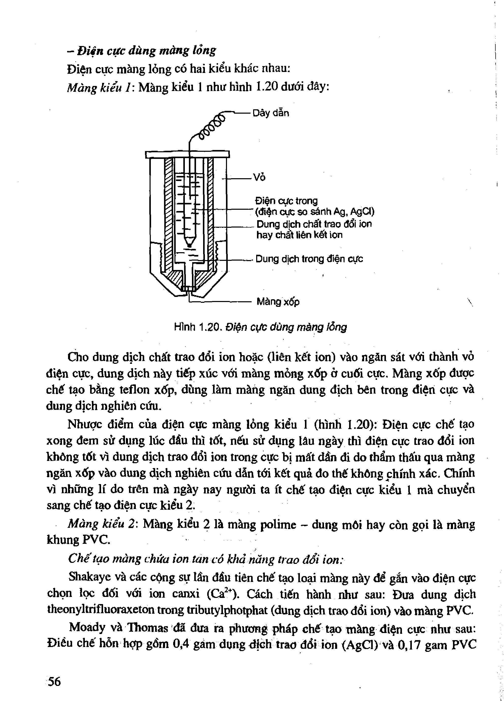

## Page 56

trong 6ml tetrahidrofuran. Mặt khác chuẩn bị một miếng kính mỏng sạch, khô, đặt 
lên trên mặt kính mỡt khuôn bằng thuỷ. tinh hình trụ rỗng có thành mỏng cỡ 
1 * 2mm, chiều cao 3cm, đường kính từ 3 -7- 3,5cm. Sau đó đổ toàn bộ hỗn hợp lỏng 
vừa điều chế được ở trên vào khuổn cẩn thận, láng đều để hỗn hợp tạo một lớp đều 
ưong vòng tròn của khuôn. Để yên ở nhiệt độ phòng và đậy lên trên khuôn một tò 
giấy lọc. Sau khoảng 2 - 3  ngày hỗn hợp trong khuôn sẽ khô, nhấc khuôn ra thu 
được một màng có chiều dày cỡ 0,2mm, từ màng này có thể cắt được những miếng 
màng nhỏ hơn có đường kính khoảng 5mm để gắn vào thân các điện cực chọn lọc 
ion. Cũng có thể thay dung môi tetrahidrofuran bằng các đung môi khác như 
xiclohexanon. Chất dính thương dùng là PVC trong tetrahidrofuran để gắn màng 
vào ống PVC, sau đó lồng ống thủy tinh vào trong ống PVC là được một thân điện 
cực có màng. Rót dung dịch bên trong cực vào ống thủỵ tinh và đặt vào đó một 
điện cực so sánh là có được một điện cực chọn lọc ion.
C hế tạo màng chửa chất mang trung tính:
Kedem và các công tác viên của ông đã chế tạo được một ioại màng lỏng mới 
với quy trình chế tạo như sau: Đầu tiên trộn dung dịch axetát xeníulozơ trong 
axeton với dung dịch chất mang thích hợp vào đimetylsebacat, sau đố đổ hỗn hợp 
mới tạo thành lên bề mặt một tấm kính mỏng, khi dung môi bay hari hết, màng sẽ 
khô, thu được màng trong đó chất mang ion được phân bố rất đểu trong màng 
mỏng và mềm. Vì phức cation củạ chất mang ion, ví dụ phức kali của valinomyxin 
tích điện dương nên phải chọn polimẹ tích diện âm.
Tính chất của điện cực màng lỏng
Màng lỏng cũng cọ tính chất tương tự như loậi mẳng rắn, ngoài ra còn có một 
số tính chất sau:
Đối với loại màng ỉỏrtg kiểu 1 là loại màng làm bằhg teflon xốp có nhiệm vụ 
ngăn dung dịch bên trong điộn cực không chõ thẩm thấu sang dùng dịch nghiên 
cứu. Nhưng tuổi thọ loại điện cực này ngắn vì vậy người ta ít chế tạo. Màng kiểu 2 
mềm rất thuận tiện cho việc gắn vào thân điện cực dễ dàng, có khả năng ngăn cách 
một cách hoàn hảo giữa dung địch bên trong điện cực và dung dịch nghiên cứu. 
Khi màng hỏng có thể thay bằng một màng mới một cách dễ dàng.
Tính chất của chất trao đổi ion (hay liên kết ion): Chất trao đổi ỉon hay liên 
kết ion là phân tử hữu cợ lớn, có khả năng trao đổi hoặc liên kết với ion cần xác 
định trong dung dịch nghiên cứu, không tan trong nước nhưng tan tốt trong dung 
môi hữu cơ. Durrg môi hữu cơ phải không trộn lẫn vói nựóc. Chất trao đổi ion hay 
liên kết ion có thể ờ dạng dung dịch, cũng có thổ là thành phần củạjnột màng rắn 
hay còn gọi là “màng lỏng”. Ví dụ:
57

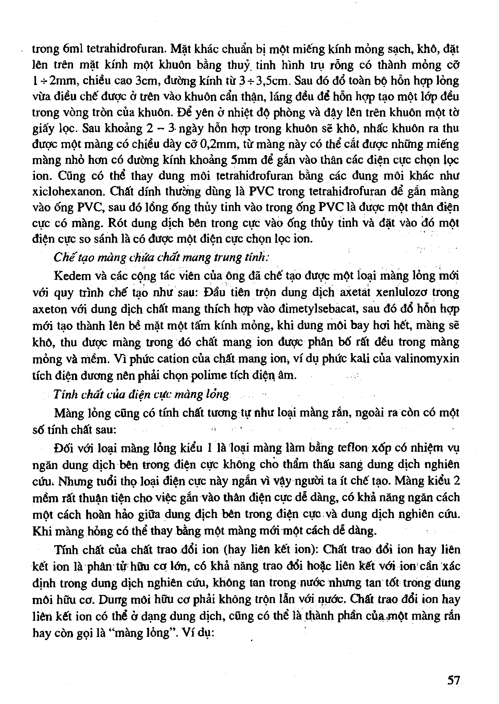

## Page 57

ỉ) Điện cực chọn lọc ion dorua: Dùng hiđroxyl tetraankyl amonium 
[(CgH^NOH] trong toluen làm chất trao đổi ion, dung dịch bên trong là KC1. 
Dùng để xác định anion clòrua (Cl_) trong dung dịch nghiên cứu. Phản ứng trao 
đổi giữa c r  trong mẫu phân tích vói OH" trong hiđroxyl tetraankyl amonium:
[(c 8Hn)4NOH ] + c r  —  [(Q H I7)4NC1 ] + OH.
2) Điện cực chọn lọc ìon Cơ2": Hoà tan axit đi-2-etylhexyl photphoric trong 
hỗn hợp dung môi hữu cơ làm chất liên kết ion (mang ion). Có thể dùng axit oleic 
5% trong nitrobenzen (hoặc clorofom, đicloetan, octanol, decanol) làm chất íiên 
kết ion vói Ca2+ và Na+.
Màng xốp ở đây có nhiệm vụ ngăn không cho các dung dịch trong điện cực đi 
ra, vì màng có tính chất rất xốp cho nên có khả năng hấp thụ lượng rất lón dung 
môi hữu cơ (nitrobenzen hoặc clorofom...) mới đạt bão hoà. Tính chọn lọc của 
điện cực ờ chỗ axit đi-2-etylhexyl photphoric tạo phức chỉ với Ca2+ mà không tạo 
phức vói Na+, Mg2+... có mặt đổng thời với Ca2+ ừong dung địch nghiên cứu. 
Nhưng có mặt anion CIO” thì gây cản trở.
Thế của điện cực màng lỏng
ỉ) Điện Cực có màng lỏng chứa ion tan có khả năng trao đổi ion
Các màng loại này chứa các ion rất kị nưóc (ion trao đổi ion) và ion cần xác 
định trái dấu (ion đối). Tính chất của màng điện cực phụ thuộc vào hệ số phân bố 
của muối chứa ion trao đổi ion và ion cẩn xác định giữa các dung địch phân tích 
trong pha nước và dung môi của màng, phụ thuộc vào sự tạo các cặp ion trong 
màng. Ngoài ra, tính chất của màng còn phụ thuộc vào nhiều yếu tố khác phức tạp 
hơn như ion ngăn cản có thể thẩm thấu vào màng đến mức độ nào. Một số loại ion 
trao đổi trong màng có làm phát sinh thế khuếch tán đến mức độ nào.
Sau đây xem xét trường hợp đơn giản nhất: là trong màng chỉ có sự hoà tan 
một muối MX (A gơ). X" (CT) là anion có khả năng trao đổi ion vói ion có hoá trị
1 và M+ (Ag+) là cation hoá trị 1 cần xác định. Cần lưu ý là trong màng không có 
thế khuếch tán và khi đó thế màng được xác định bởi các hiện tượng xảy ra trên 
ranh giới màng và dung địch nưổc eủa chất điên li. Để cho màng có thể sử dụng 
làm màng của điện cực chọn lạc với ion M+ (Ag+) trong khoảng rất rộng hoạt độ 
của nộ thì hệ số phân bố kịrtx cần phải thoả mãn:
kMX=ex 
, 
(1.86)
58

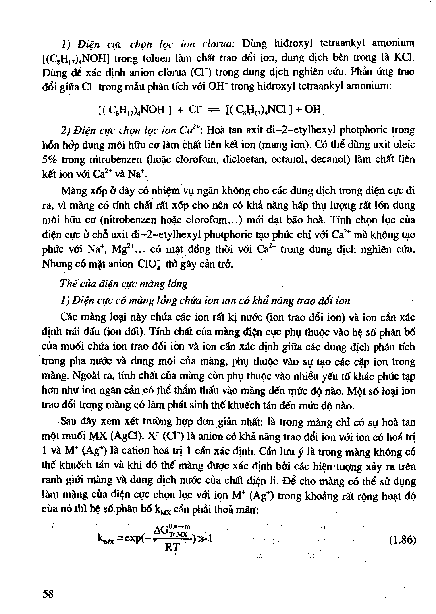

## Page 58

Trong đó 
là năng lượng chuẩn Gibbs chuyển muối MX từ nước (n)
vào giữa màng (m).
Vì cation M+ là ìon ưa nước, anion X' là ion trao đổi rất kị nước, nên các năng
lượng Gibbs của chúng phải thỏa mãn điều kiộn:
AGxix m «  -AG0—  
(1.87)
Hiệu thế trên ranh giới pha giữa màng và dung dịch 1 (dung dịch trong cực)
được xác định bằng phương tíình:
A”E = -A ”E° + —
. 
(í.88)
2 
« 
(M )(2)
Cũng xảy ra sự trao đổi tương tự trên ranh giới pha giữa của màng này và dung 
dịch 2 (dung dịch nghiên cứu) và hiệu thế trên ranh giới này được xác định:
A2mE = - A2mE ^ + —
O- 89)
2. 
. 
2 M 
F 
(M ')(m)
Như vậy thệ' màng chung được xác định bằng hiộu số:
E m=A™E-A;"E=—
l n ^ ^  = - —
(1. 90)
m 
2 
1 
F 
(M )(1) 
F 
(M ) (2J
Đối với ion cần xác định có điện tích (hoá trị) khác 1, kí hiệu n+ trong đó 
n = 1, 2, 3... thì phương trình trên có dạng:
nF 
(M )(2)
Phương trình này trùng với phương trình Nemst đối vói thế của nguyên tố 
nồng độ không có dòng. Thế của ìon chọn lọc bằng:
E ^ h = 0,059 lg(Mn+)(2) ở 25°c 
(1.92)
Trong đó Mn+ cũng có thể là anion (X“).
Đo được thế điện cực chọn lọc ion sẽ tính được hoạt độ, biết được hệ số hoạt 
độ tính được nồng độ của ion trong dung dịch nghiên cứu.
Sau đây ta xét trường hợp trong đung địch phãn tích ngoài ion cần xác định 
M+ còn có ion ảnh hưởng đến việc xác định nồng của M+ là c* và giả thiết:
-  Cả 2 ion M+ và C* không tạo cặp ion vói ioh trao đổi ion X".
59

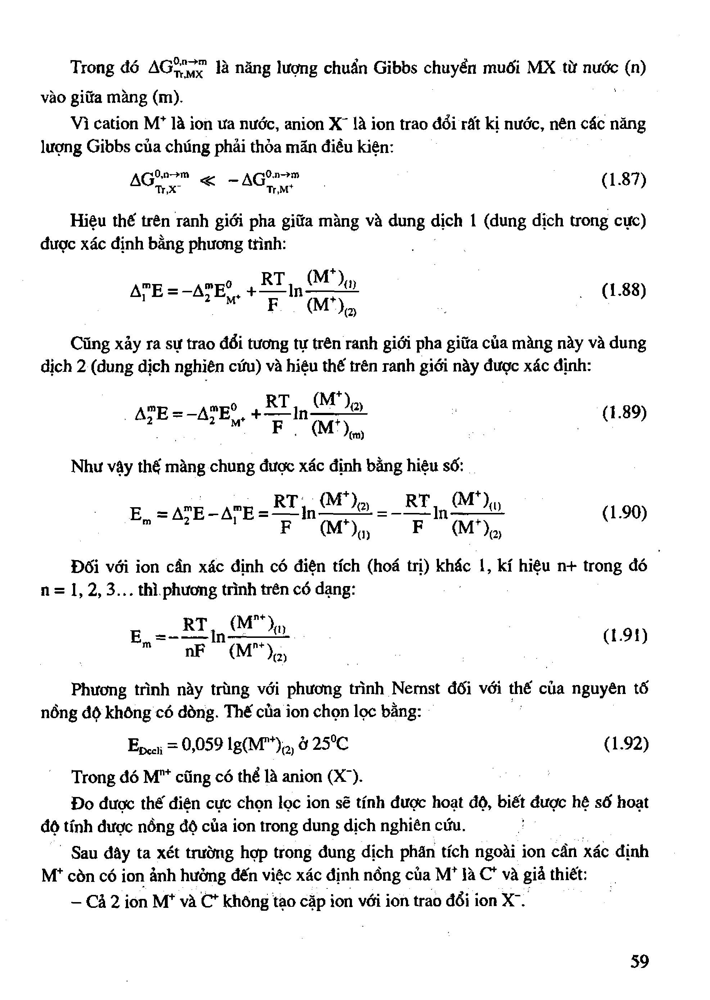

## Page 59

-  
Linh độ của M+ và c  bằng nhau dẫn đến trong màng không có thế
khuếch tán.
Ảnh hưởng của ion C" ở chỗ nó có thể đẩy ion cần xác định khỏi pha màng 
bằng phản ứng trao đổi ion như sau:
K-Tr.d
Tìieo định luật tác dụng khối lượng ta có:
(M+y
c
\
Kjrd 
(M+L.(C+)2
(1.93)
Nổng độ của các ion ữao đổi trong màng có quan hệ:
c.
Mc->
(1.94)
ở đây c° là nồng đô của ion trao đổi ion trong màng.
Từ (1.90), (1.94) rút ra được biểu thức của c  * và c  
và từ các biểu thức đó
Noi)
cùng các phương trình trên và với phương ừình (1.88) thiết lập được thế màng.
-  Hiệu thế trên ranh giói pha giữa màng và dung dịch trong cực (1):
(1.95)
-  Cũng tương tự như vây, hiệu thế giữa màng và dung dịch nghiên cứu bằng:
DT
A“E = -A nmEũM^ ^ I n
S u
K „d.(C+)2
F 
. c°
-  Thế màng chung (mặt ngoài và mặt trong của màng) đuơc xác định bằng:
(1.96)
RT 
(M"%, + (^ )K „ ,,.(C 0 2
E = A ™E -A 7E=:iiiln.................. £- ----- ------_ _
F  
(M %
 
.
v ì 
.
Trong đó: Ỹ~  KTr d = kM. c„ (hệ số chọn lọc)
■ 
^ c- /  
' 
"
Thế của điện cục chọn lọc ion được tính theo phương trinh Nikolxki:
(1.97)
(1.98)
60

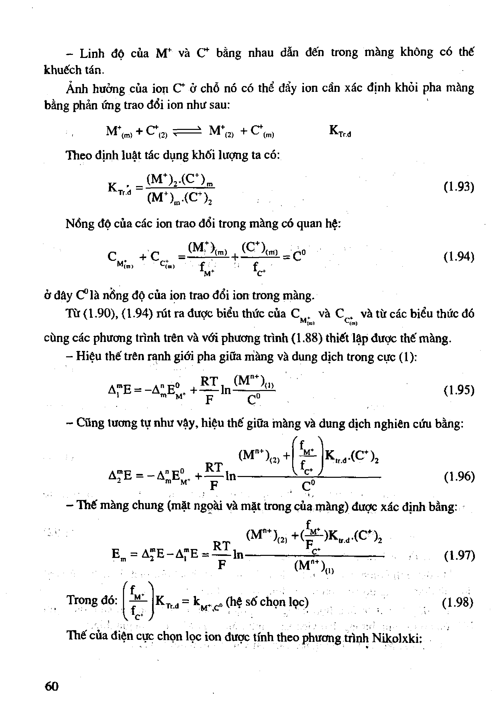

## Page 60

E Đcc)i = const +
(1-99)
Có thể đo được 
và biết được hệ số hoạt độ của c*, nồng độ của ion cản 
(C*), có thể tính được hoạt độ của ion cần xác định (M+), sau đó tính được nồng độ 
M+ khi biết hệ số hoạt độ(f ,) .
Nếu ion trao đổi ion của màng tạo từng cãp ion với cả 2 ion M+ và c* thì hộ số 
chọn lọc sẽ còn phụ thuộc vào hằng số cân bằng (trao đổi ion) tạo nên cầc cặp
Trong đó K^x và K^x là hằng số cân bằng thông thường- 
Nếu ion ảnh hưỏng có điện tích n > 2+ thì thiết lập phương trình tính thế của 
điộn cực chọn lọc ion rất phức tạp, nhưng cuối cùng cũng thiết lập được dạng của 
phương trình Nikolxki như sau:
Phương trình này cũng có thể sử đụng tính nồng độ của ion M+ trong dung 
dịch nghiên cứu khi có mặt của ion c * .
2) Điện cực màng chứa chất ỉỉên kêì ỉon
Xét trường hợp màng lỏng trong đó hoà tan phức của ion cần xác định M+ 
(Ca2+) với chắt mang ion (thuốc thử tạo phửc) X (axit đi-2-etylhexyl photphoric), 
trong phức cứ một ion M+ liên kết với một phân tử X. Phức có độ bền đủ lớn 
(Pmx ) để nồng độ các ion tự do có thể bỏ qua so yới nồng độ của ion đã tham gia
vào tạo phức. Nồng độ của ion cần xác định (M+) được cố định bời nồng độ của 
anion (A") rất kị nước; nồng độ của anion này trong các dung dịch nưóe mà nó 
tiếp xúc với màng có thể bỏ qua. Nồng độ tủa chất mang ion trong nước cũng bỏ 
qua được vì nó là chất rất kị nước. Nhờ vậy sẽ có hai trường hợp xảy ra:
— Trong màng chi có phức (M -  X) không có chất mang ion dư (X);
— Trong màng cớ phúc (M — X) và có dư chất mang ion (X)-
a. 
Trường hợp thử nhất trong màng chỉ có phức (M -  X) không có chất mang 
ỉon dư (X)
Nếu gọi Pmx là hằng số bển của phức MX+ trong pha màng, c° là nồng độ của 
muối phức của chất mang ion với ion M+ và của anion A", thế màng với đung dịch 
( 1) bên trong điện cực được biểu diẻn bằng phương trình:
MX, c x
( 1.100)
EđccII = const + ^ l g [ ( M * ) (i,+ k  
(C”*)121] ở 25°c. 
(1.101)
n 
-
61

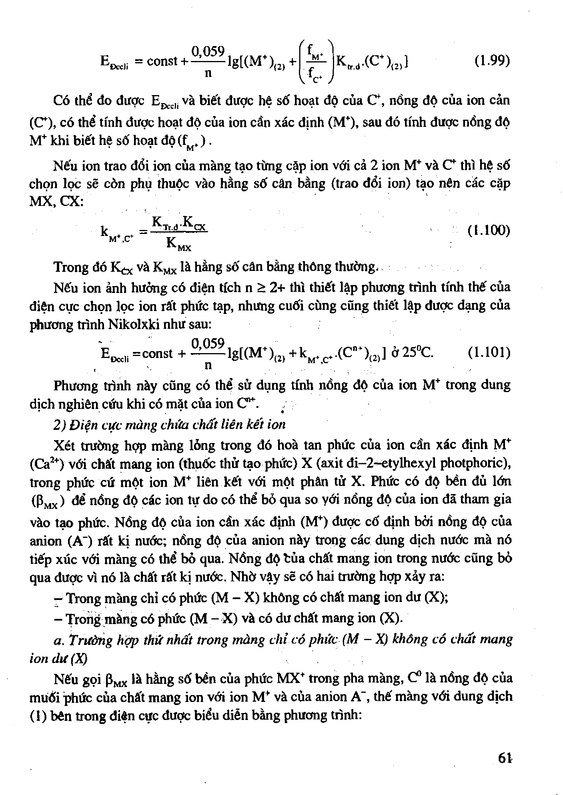

## Page 61

L
pMX+ )
(1.102)
DT 
RT
A"E = -A E :.E ^+ + ^ -lg (M +)(1)- ^ l n
Thế màng chung có dạng như phương trình (1.90):
E > = _ B ĩ ln^
k  
" 
F 
(M)„
Trường hợp trong màng sinh ra cặp ion giữa phức mang điộn tích dương 
MX* với anion mang điộn tích, âm A”, nếu dung môi cho màng là chất ít phân 
cực. Trong trường hợp này phương trình Nemst biểu diễn đối với điện cực chọn 
lọc ion không thay đổi nhiều, chỉ thay đổi trong thành phần hằng số của phương 
trình (1.99).
Nếu như trong trường hợp nồng độ của cặp ion MA nhò hơn rất nhiều nổng độ 
của cặp ion MXA thì phương trình thế màng có dạng:
A?E = -A E ^ + - - y  lg(M
^ f2 f 
f 
M* 
MX* 
MXA
f f 
X 
A '
K 1 
K 
MX * 
MXA J
(1.103)
Nếu như trong dung dịch nghiên cứu có thêm ion cản (C-) thì phutmg trình có dạng:
RT
a ;e = - a ^e ° , +
1 
m M+ 
2F
in(M+)fn + ^
V
 .KT, d(C)
+ —ĩrln
2F
c+
RT,_
+~T-ln
2F
'Tr.đ' '(1)
( W x
c°f + .f 
,
M 
MX )
(1.104)
Trong đó hộ số chọn lọc bằng:
^M+,C+
Iwy f , 
f 
.
V MX 
c 
cx+ J
Kyr.d (C)(1) — ■
k + + 
M JC
\2
flex
VPmX V  fcx+ J
1
o 
f  
f 
^ (r  
PCX 
M+ 
MX+
PCX 
M ■ 
MX 
,pwx fc- fcx+ ;
(1.105)
62

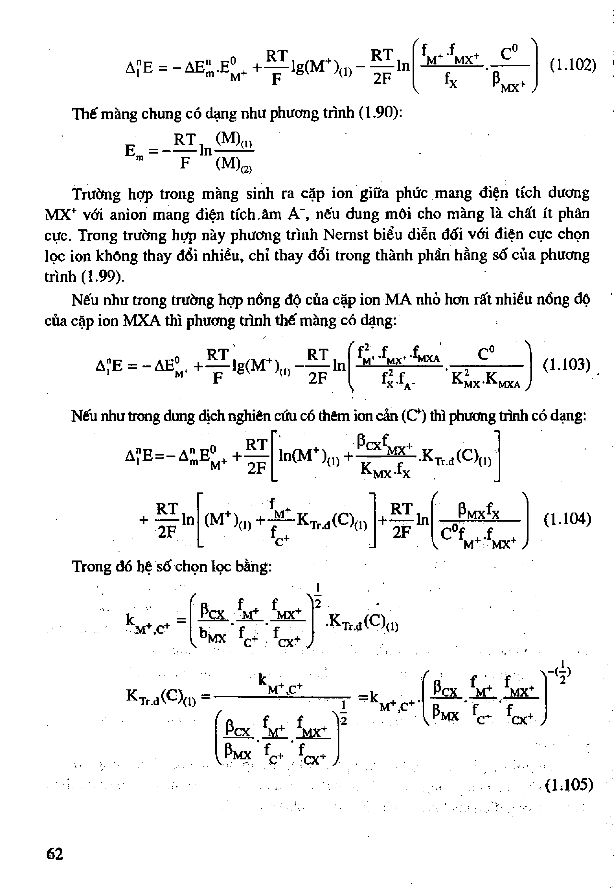

## Page 62

b. Trường hợp thứ hai trong màng có phức (M -  X) và có dư chất mang ìon (X) 
Nếu như trong màng có lượng dư chất mang ion (cho dư thuốc thử tạo phức rất 
nhiểu so với ion trung tâm M+ thì lượng thuốc thử X tham gia vào tạo phức không 
đáng kể dẫn đến nổng độ chất mang không đổi). Phương trình biểu diễn thế màng 
trở nên phức tạp hơn nhưng vẫn có dạng chung như phương trình (1.91).
Nếu trường hợp ion cần xác định có điện tích +2 như Ca2+ và các kim loại 
kiềm thổ khác (M2+) và ion ảnh hưòng có điện tích +1 (Na+). Phương trình 
Nikolxki đối với thế điện cực chọn lọc ion có dạng:
Eđcciì = const + ~ ln [ ( M +)2 + Km2+c+.(C+)] 
(1.106)
Trong đó hộ số chọn lọc:
2
(P ^ +-Cv+Pcv..CÌ).KẪrđ 
k 2+ ,.(C »)=  
* 
2 
* 
,  
(1.107)
2C°.((ÌMX.CX+PMXÍ.C |)
Trong bảng 1.4 dưới đây trình bày các đặc điểm phân tích của một số điện cực 
chọn lọc ion.
Bảng 1.4. Cấc điện cực chọn lọc ion để xấc định một số ion
1. Màng muối kết tủa
TT
Tính chất 
của màng
lon cẩn 
xác 
đỉnh
Khoảng nồng 
đô tuyến tính
(M)
Khoảng pH 
tối ưu
lon
cản
lgkM,c 
(Hệ số 
chọn lọc)
1
Kết tủa AgQ
c r
1 -ỉ- 5.10_ÍM.
, 2 + 11
CiO l~ 
Pof
coị-
-4 ,3
-3,9
-4 ,2
2
Kết tủa ẠgBr
Br~
1 -r 5.10_5M
2 + 1 2
SCN' 
• 
S*'
-3,0
-10,0
•
3
Kết tủa Agl
r
1 
5.10"7M
3-r 12
Br"
Q “
F
sasr
- 4
-5,4
-5,3
0,0
4
Kết tủa Ag2S
s 2-
CN"
r
anion
khác
-3,2
-7,8
-10,7
63

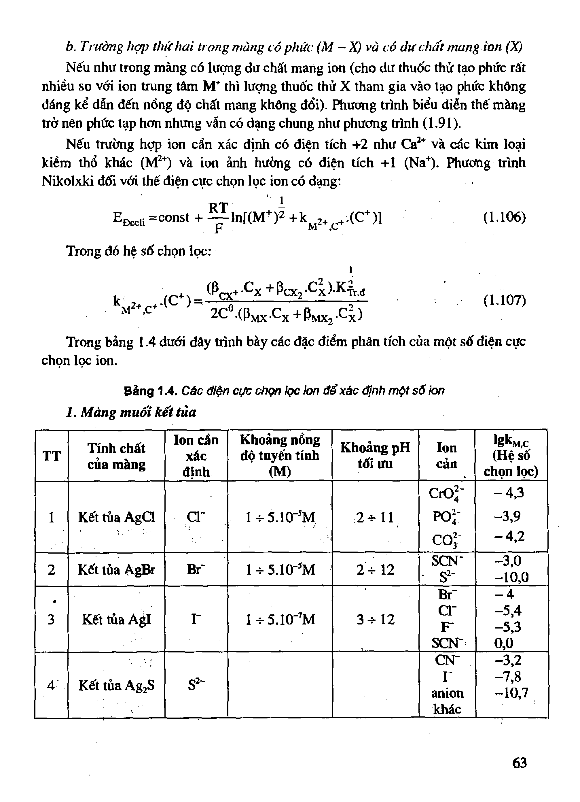

## Page 63

2. Màng hỗn hợp muối
TT
Tên của màng
Ion cần 
xác định
lon cản
(Hệ số chọn lọc)
1
Hỗn hợp muối AgBr + Ag2S
Br'
2
Hỗn hợp muối Ag2S + AgCl
Ag+
3
Hỗn hợp muối Ag2S + CuS
Cu2+
4
Hỗn hợp muối Ag2S + PbS
Pb2+
C1'
-3
5
Hỗn hợp muối Agzs + CdS
Cd2+
6
Hỗn hợp muối Ag2S +AgCN
CN"
7
Hỗn hợp muối LaF3 + CaF2
F
3, Màng đơn tinh thể
TT
Tên của màng
lon cần 
xác định
lon cản
lgKw,C
(Hệ số chọn lọc)
OH-
- 1,1
1
Tinh thể AgCl
CT
Br'
2,9
r
4,1
Tinh thể LaF3
F
Tinh thể AgBr
Br“
OH'
- 1,0
Tinh thể Agl
r
Tinh thể Ag2S
s 2'
4.  Màng lỏng
TT
Tên của 
màng
ỉon cần 
xácriịnh
Khoảng nồng độ 
tuyến tính (M)
Khoảng pH 
tôi ưu
lon cản
lgkM,c 
(hệ số 
chọn lọc)
1
Orion
n o ;
J  -
10-' -ỉ- IQ-S
t
3*10
CIO-
I -
Br ■
NOj
HCO3
c r
coị-
3
1,3
-0,9.
-1,4
- 2,0
;-2,4
-3,7
64

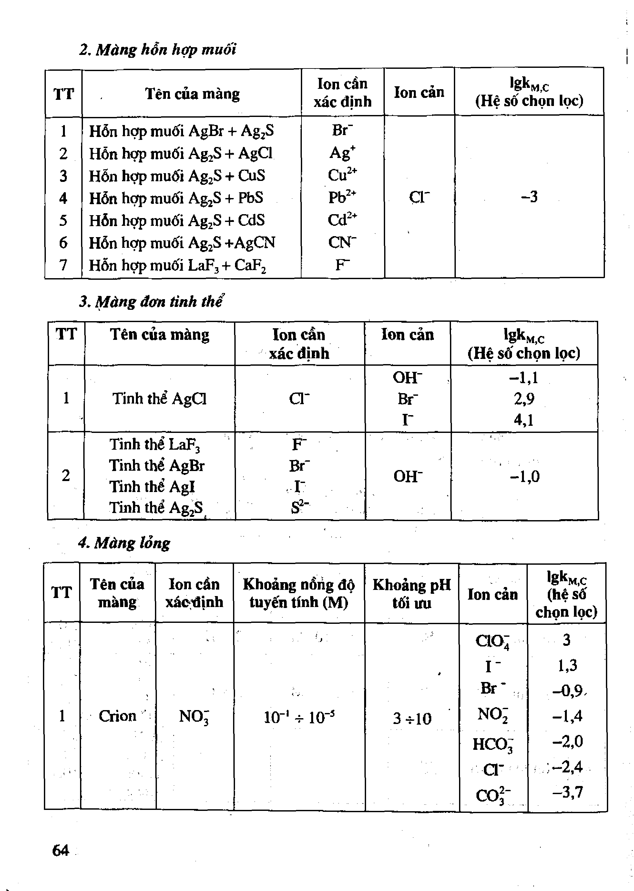

## Page 64

TT
Tên của 
màng
lon cần 
xác định
Khoảng nồng độ 
tuyến tính (M)
Khoảng 
pH tối ƯU
lon cản
lgkM,c 
(hệ số 
chọn lọc)
2
Ca2+
10'1 -ỉ- 1(T5
6 -S-8
Na+
K+
Mg2+
-1,7 
-1,7 
, 
- 1 3
3
Ba2+
10“' -ỉ-10’5
6 -ỉ- 8
n h ; , cs2+
Na , K+
Ca2+, Li+ 
Si^ .íT
-2,5
-2,5
-3,7
-1,5
-
 Điện cực chọn lạc phán tả khí
Cấu tạo: Điệri cực chọn lọc vói phân tử khí gồm có các bô phận như trong
hình 1.21.
■Vỏ ngoài 
Yếu tố so sánh
■Thân trong 
Đúng dịch trong
Gioăng 
'hẳn đậm
Bộ phận nhạy 
Màng
Hình 1.21. Cấu tạo câa điện cực chọn lọc phârựử khí
Nguyên tắc làm việc: Điện cực này làm việc dựa trên nguyên tắc cân bằiig 
được thiết lập nhanh trên màng thấm khí được ngăn cách giữa 2 dung dịch trong và 
ngờài màng. Chất khí ở dung dịch bên trong tham gia phản ứng hoá học sinh ra hoặc 
tiêu thu một ion nào đó; ion này được xác định (đo) bằng điện cực chọn lọc ion.
Ví dụ: j >iện cục S 0 2 nhậy vói khí suníurơ được hoà tan tròng durig dịch. Khí 
S02 khuếch tán qua mẳng cho đến lúc đạt cân bằng ở dung địch trong. Khí S02 
phản ứng với H20  theo phản ứng:
65

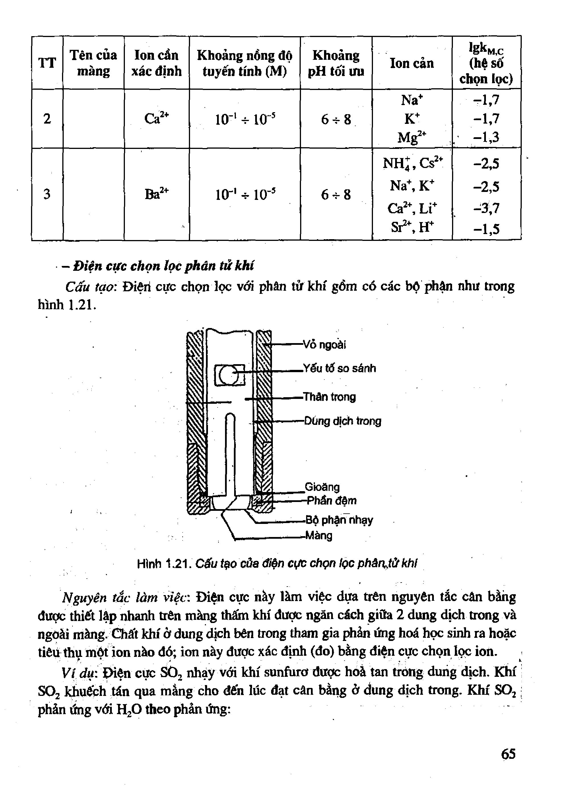

## Page 65

so2 + 2H2o 
hso; + H3o +
H30 + 
H+ + H20
Ion H+ được xác định (đo) bằng điện cực thủy tinh đặt ở ngay sau màng.
Vì lượng HjO (H+) sinh ra tỉ lệ với nồng độ S02 nên thế cân bằng của điện cực 
được xác định theo biểu thức:
ECb = K +0,059ỉg[S02] 
(1.108)
Biết Ea  dễ dàng tính nồng độ của khí suníurơ:
lg[S02] = ^
— ^  ở25°C,KlàhằngsỐ 
(1.109)
Người ta cũng tiến hành tương tự như trên để chế tạo các điện cực đo khí đuợe 
trình bày ưong bảng 1.5.
Bảng 1.5. Một số loại điện cực chọn lọc với khí
TT
Điện cực
Khí
khuếch
tán
Phản ứng xảy ra ở 
dung dịch bên trong
> :
lon 
sình ra 
tỉ lệ với 
nồng 
độ khí
Điên CƯC đ o  v à 
thế điện cực 
của nó
«
1
S 02
1
s ạ
s o 2+ h 20  —  h 3o + + HSO~
H3cr 
hay H+
Thủy tinh 
Ecb= K  + 
0,0591g[S02]
2
n o 2+ n o
n o 2
2NCX, + 3H20  ^  NO' + NOT 
+ 2H30 +
h 3o +
hay H+
Thủy tinh 
~ 
Ecb= K  + 
O ^ lg lN C y
3
n h 3
n h 3
n h 3 + h 20  
NH; + OH"
OHT
Thủy tinh 
Ecb= K  + 
0,0591g[NHjJ
4
, H2S 
'
h 2S
'! •
■ ỉ '1'■ - ịf.
H2S + 2HjO ^  s2- + 2HjO+
s 2'
J h.íy. ■
Điên cực màng 
muối AgjS 
hoặc A g Ầ 
" Ề■b=K +
, 0,0591g[S2-]
66

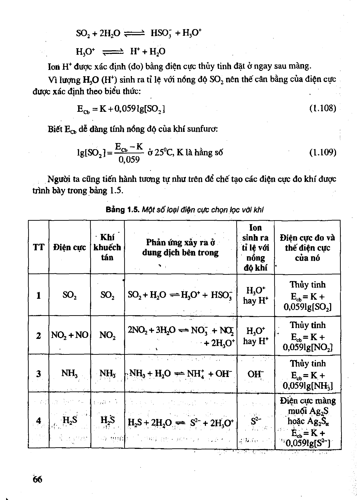

## Page 66

TT
Điện cực
Khí
khuếch
tán
Phản ứng xảy ra ở 
dung dịch bên trong
Ion 
sinh ra 
tỉ lệ với 
nồng 
độ khí
Điện cực đo và 
thế điện cực 
của nó
5
CN“,
HCN
HCN
2HCN + Ag+^
. Ag(CN)" + 2H+
H+
Thủy tinh 
Ecb= K  + 
0,0591g[HCN]
6
HCOj;
CO32-
c o 2
c o 2 + h 2o  —  1T +  HCO3
H+
Thủy tinh 
Eeb-K  + 
0,0591g[CC>2]
7
X2(ạ?,
Bt2, I2)
^ 2» ®*2>
I2
X2 + H20  ^  2H++XO' +
X-
H+, X"
Thủy tính 
Ecb=K + 
0,0591g[X-] 
hoăc màng tinh 
thể AgX
9. Chất điện li trớ, chất điện hoạt và khoảng điện hoạt
Dung mồi cũng cỏ thể tham gia phản ứng điện phân: Nước ỉà dung môi được 
sử dụng nhiều nhất, nước tinh khiết có thể điộn phân. Cấc phân tử dung môi là 
nước có thể đóng vai trò là chất khử hoặc chất oxi hoá,
ở catot nước bị khử ở thế khá âm, phản ứng xảy ra như sau:
2HzO + 2e ^  H2 + 20H “ (môi trường trung tính hoặc kiềm)
2H+ + 2e ^  H2 
(mỏi trường axit)
Trong trường hợp nước là chất bị điện phân chúih thì dòng catot tăng nhanh và 
đạt giá trị rất lớn, không có giới hạn.
Ở anot nước bị oxi hoá, phản ứng xảy ra như sau:
2H20  ^  0 2 + 4H+ + 4c 
(môi trường trung tính hoặc axit)
40H “ ^  0 2 + 2HzO + 4e (môi trưòng kiềm)
Cũng nhừ dòng catot của nước khi điện phân, dòng ariót rất lớn và không có 
giới hạn. Trong thực tế hai đòng catot, anot (trục turig) thẳng góc vái trục thế' (trục 
hoành); khoảng cách giữa hai dòng này tạo nên một khoảng cách gọi là khôãng 
điện hoại của nước (hình 1.22).
67

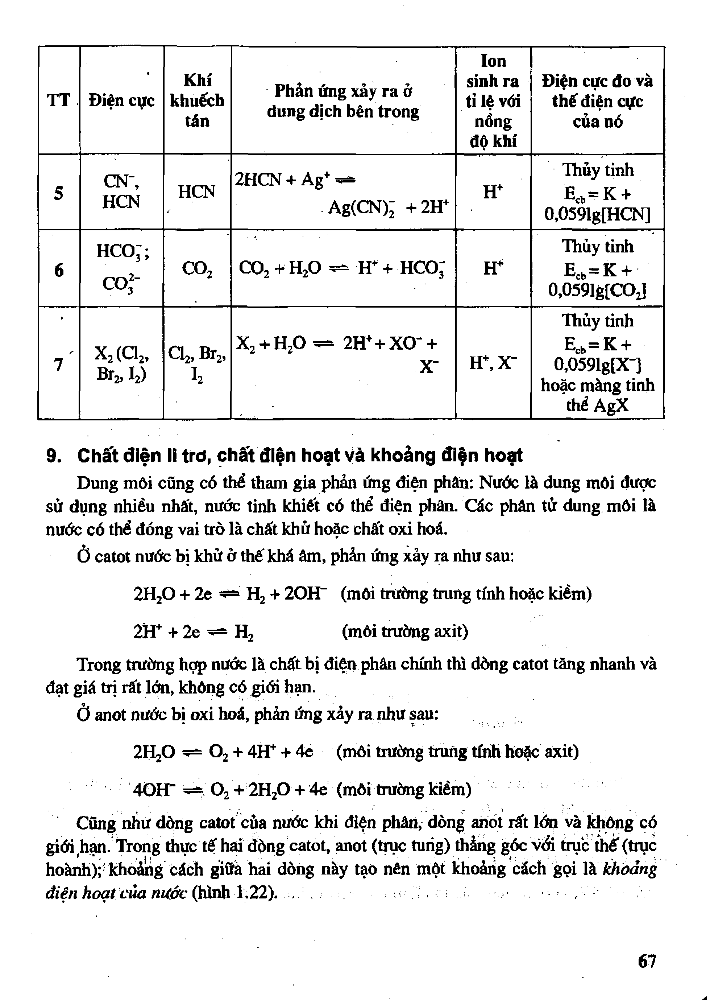

## Page 67

Khoảng điện hoạt là khoảng thế được giới hạn bời hai ranh giới mà người 
nghiên cứu không thể vượt qua. Xuất phát từ đó người ta chỉ có thể nghiên cứu 
điện hoá đứợc trong khoảng điộn hoạt có giá trị mới có ý nghĩa khoa học.
Khoảng điện hoạt cụa các dung mồi khác nhau thì khác nhau; mỗi một dung 
dịch có một khoảng điện hoạt phụ thuộc vào bản chất của chất điện li trơ và bản 
chất của điện cực sử dụng.
Nếu chất điện li trơ trong đung dịch chứa ion NH4, Na+ thì khoảng điện hoạt
thu được chỉ đến (“ 1,8V) hoặc (-1,9V) vì ở các thế này ion kim loại kiềm phóng
điện (Na+ + le ^  Na). Trơng môi trưòng axit, khoảng điện hoạt kết thúc ở thế 
dương hơn. Ví dụ nồng độ H+ 0, IM. ,
Hỉnh 1.22. Đường dòng thế và khoảng điện hoạt
1. Khoảng điện hoạt của nưỡc.
2. Đối vối điện cực Hg:
a. NaCI, KCI... trong môt trường trung tinh hoặc kiềm- 0,1 + -2,ov.
b. NaCI + NH4+ trong môi trường trung tính hoặc kiềm -0,1 + -t,8V.
c. H* 0,1 M có -0,1 + -0,7V
3. Đối với điện cực Pt, than... 1,15 -i- -1 ,0V. 
<
Nếu dùng điện cực thuỷ ngân: khoảng điện hoạt bắt đầụ từ -0,1 V, vì ờ thế này
thuỷ ngân bị tan ra (Hạ =** Hg2+ + 2e). Trong môi trường trung tính hoặc kiềm 
khoảng điện hoạt kết thúc ở — 2,0V, nếu điên cực tỊiuỷ ngân được nhúng trong 
dung'dịch chất điện li trơ chứa ion NHJ, Na* thì điểm kết thúc bị thu .hẹp lại chị
đến - 1 ,8V, vì ờ thế này các ion kim loại kiềm phóng điện (Ná* + è =^r- N a).
68

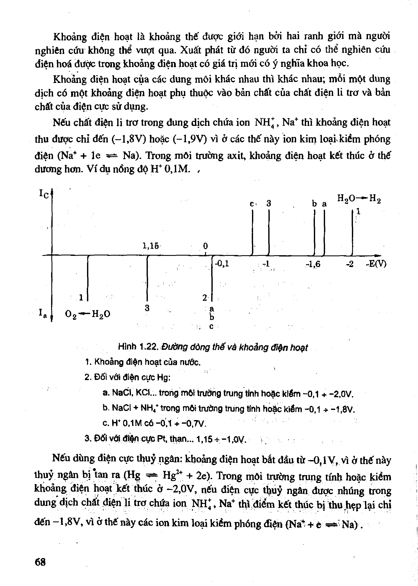

## Page 68

Trong môi trường axit, khoảng điện hoạt kết thúc ở thế đương hơn (Ek lhúc > 
-1,8V ). Ví dụ với nồng độ H+ 0,1M thì khoảng điện hoạt kết thúc ở thế -0,7V  
(-0,7V > -1,8V ).
Nếu dùng điện cực than thuỷ tinh, điện cục graphit hoặc điện cực platin: 
khoấng điộn hoạt được trải đài từ +1,5V đến -1,0V. Biên giới phía phải (-1,0V) 
phụ thuộc vào môi trường (pH) và điộn cực sử dụng, có thể phải thu hẹp lại.
Các nhà điện hoá định nghĩa:
-  Chất điện hoạt: là những chất có đường dòng thế nằm trong khoảng điện 
hoạt được nghiên cứu.
-  Chất không điện hoat hoặc chất điện li trơ: là những chất có đường dòng thế 
nằm ngoài khoảng điộn hoạt đang được nghiên cứu.
69

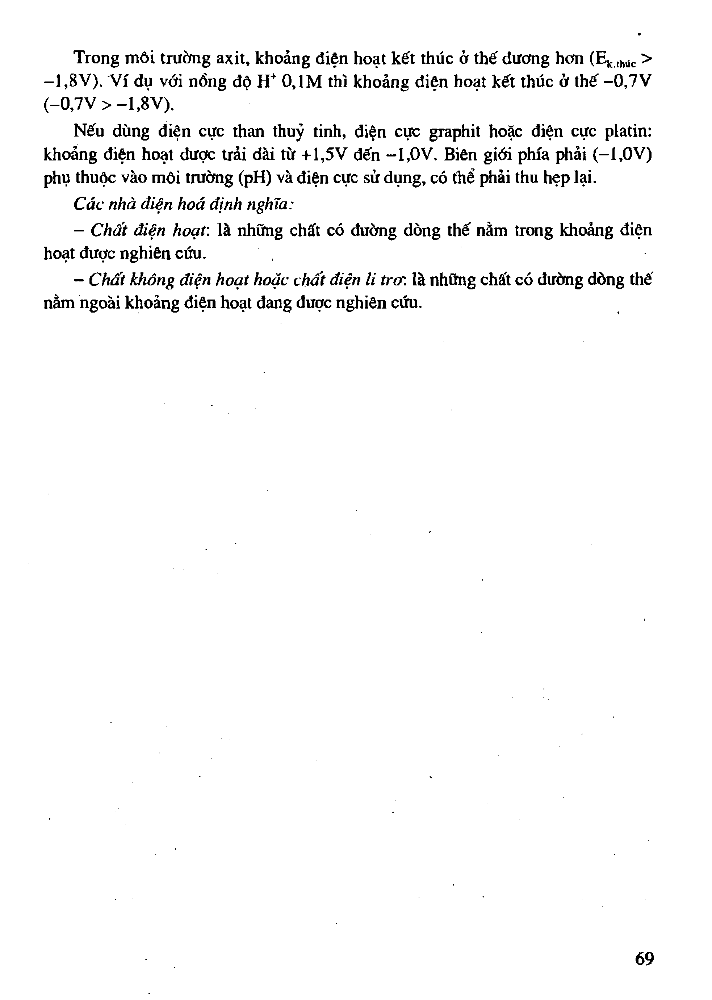

## Page 69

Chương 2
PHƯƠNG PHÁP PHÂN TÍCH ĐIỆN THẾ,
CHUẨN ĐỘ ĐO THẾ
Mồ đầu
Nội dung cơ bản của phương pháp chuẩn độ thể tích ỉà sử dụng mắt để nhận 
biết sự đổi màu đột ngột của chất chỉ thị màu để phát hiện ra điểm dừng chuẩn độ, 
đo thể tích thuốc thử tiêu tốn'. Dựa vào thể tích tương đương tính được nồng độ của 
dung dịch cấn xác định.
Phương pháp chuẩn độ đo thể tích có nhũng hạn chế sau:
-  Đôi khi không chọn được chỉ thị màu thích hợp để xác định điểm tương 
tương đối với một số hộ chuẩn độ đo thể tích hoặc chọn được chỉ thị nhưng cố chỉ 
số chuẩn độ (pT) khác xa vói pH tương đương dẫn đến sai số lán. Một vài trường 
hợp không chọn được chỉ thị phù họp phải sử dụng “dụng địch đối chúng”.
-  Dùng mắt để nhận biết, cho nên mắt không đù nhạy để nhận ra sự đổi màu 
của các hệ có màu mạnh. Ngoài ra cấu tạo của mắt mỗi người khồng giống nhau 
dẫn đến phát hiện sự dổi màu đột ngột của chất chỉ thị theo sự chủ quan của mỗi 
người, dẫn đến đo thể tích tương đương sẽ khác nhau và xác định nồng độ cửa 
dung dịch nghiên cứu sẽ khác nhau.
-  Phương pháp đo thể tích chỉ xác định được nồng độ lớn hơn 10_3M.
Chính vì có những hạn chế trên của phương pháp chuẩn độ thể tích mà các nhà 
nghiên cứu đã tìm ra phương pháp đo thế. Phương pháp chuẩn độ đo thế đã khắc 
phục được những hạn chế của phương pháp đo thể tích. Phương pháp chúẩn độ đo 
thế có khả năng thục hiện hầu hết những phép chuẩn độ trong phương pháp đo thể 
tích. Phương pháp đo điện thế đặc biệt im vỉệt đđi với đung dịch đục, cò màu sẫm 
và nồng ầộ của chất cần xác đinh nhỏ tới cỡ 10"5M. 
’ 
'
1. Các điều kiện cấn thiết cho phép chuẩn độ đo thế
Muốrt thực hiộn phép chuẩn độ đo thế cần phải có những điều kiêri sau:
1. Phải có một phần umg hoá học định lượng xảy ra giữa thuốc thử với dựng 
dịch chuẩn độ. Phản ứng này phải xảy ra nhanh, hoàn toàn và đúng với hệ số họp thúc.
2. Phăi chộn được diên cực chỉ thị thích hợp.
3. Phậĩ có ít nhất 1 phản ứng chỉ thị. Phản ứng chỉ thị phai ià hệ nhanh, 
có ngtiĩa iă phản ứng điện tióẩ xầy ra trên bề mặt điện cực chỉ thị, nhưng lượng
71

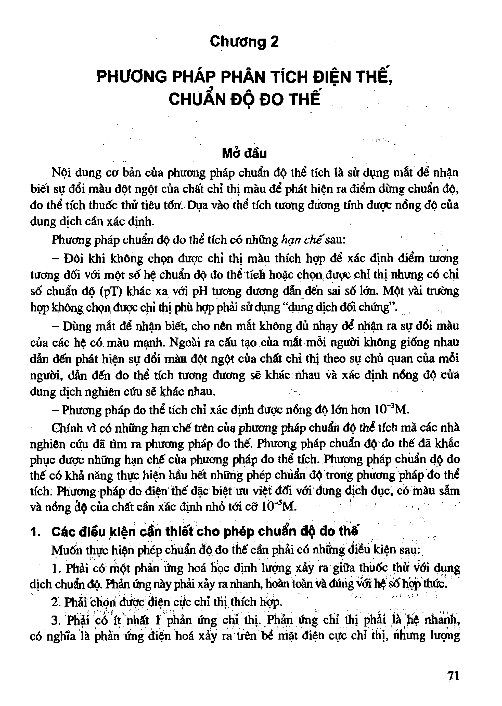

## Page 70

chất tham gia vào phản ứng chỉ thị phải nhỏ hơn rất nhiều so với lượng chất tham 
gia vào phản úng chuẩn độ.
4. 
Phép chụẩn dô phải có bước nhảy pH hay thế trên đường chuẩn độ 
pH = fiV^) hoặc E = fCV-n-). Birớc nhảy thế phải có đô lớn đủ phát hiện (cd vài 
chục milivon) để đảm bảo thế lón hơn thế khuếch tán trong điều kiện chuẩn độ.
Nếu chất tham gia phản ứng chỉ thị là thuốc thử hoặc chất cần xác định nồng 
đô hay sản phẩm của phản ứng giữa thuốc thử và chất cần xác định thì thế đo được 
sẽ thay đổi trong suốt quá trình thêm dần thể tích thuốc thử vào dung dịch chất cần 
xầc định nổng độ. Điểm tương đương được xác đinh dựa vào một trong các đổ thị
sau: E «  f  (V „), 
= f(V „ > ,-£ §  = f<V£) hoặcpH = f(V „), ^
 = f (VTT>.
AV 
AV 
AV
= 
).
A y 2  
H  v T T /‘
2. Phân loại phương pháp chuẩn độ đo thế
Phương pháp chuẩn độ điện thế là đo thế (sức điện động) của nguyên tố 
ganvani trong dung địch chúẩn độ khi thêm dần từng phẩn thuốc thử (chất chuẩn) 
vào. Giá trị thế này ờ gần điểm tương đương tương đối lớn cho nên sai số mắc phải 
nhỏ, đẫn đến phương pháp có đô chính xác cao. Ngoài ra, khi chuẩn độ đo thế 
không cần biết giá trị thế điện cực so sánh và sự thay đổi thế khuếch tán lỏng. 
Phương pháp chuẩn độ đo thế được chia thành 2 loại:
1. Chuẩn độ đo thế khi cường độ đòng bằng không (I = 0) ỉà phương phấp 
phổ biến.
2. Chuẩn độ đo thế khi cường đô dòng không đổi và khác không. Phương pháp 
này ít được sử dụng.
3. Dụng cụ, thiết bị và cách tiến hành
Để thực hiện chuẩn độ thfeo phương pháp đo thế cần phải cót 3 bộ phận, trong 
mỗi bộ phạn có các dụng cụ sauĩ
1. Cốc chuẩn độ chứa đung dịch chất cần xác định nổng đổ.
2. Bộ điên cực gồm hại điện cực, một diện cực so sánh và một điện Cực chỉ thị.
3. Máy: gồm có máy khuấy từ và máy pH-meter vừa cồ thang đo pH (vạch 
trên) vừa có thang đo thế (vạch dưới).
Ngoài ra còn có buret chứa dung dịch thuốc thử (dung dịph chuẩn), cốc để 
cãm điện cực so sánh và cẩu nối chứa muối trơ KC1 hoặc KNOj trong aga — aga 
(thạch). Thiết bị để thực hiên phép chuẩn đô đo thế đựợc trình bấý trong hình 2.1.
72

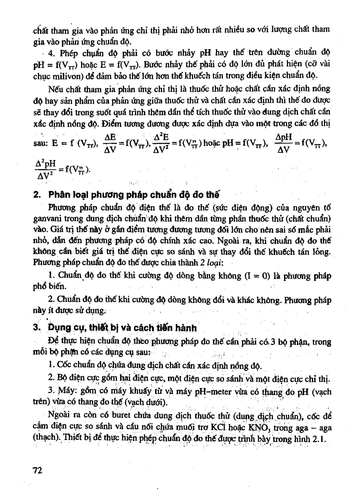

## Page 71

Hình 2.1. Thiết bị để chuển độ đo thế 
1. Cốc chuẩn độ 
1'. Cóc để điện cực so sánh 
2. Điện cục chỉ thị
2’. Điện cực so sánh 3. Máy khuấy từ 
3. Máy đo pH
4. Buret 
5. Cầu nối chứa muối KNOj
Cách tiến hành: Dùng pipet lấy chính xác Vml dung địch nghiên cứu cần xác 
định nồng độ cho vào cốc chuẩn độ (1) và lấy V'mí đung dịch K N03 0,1M cho 
vào cốc hai (1’) Đặt cốc chuẩn độ lên máy khuấy, nhẹ nhàng thả con từ vào cốc 
chuẩn độ. Cắm 2 chốt nối dậy dẬn của 2 điện cực vặo máy đo pH. Bật máy đo, đọc 
giá trị pH hoặc thế khi chưa cho thuốc thử vào, Sau đó cứ sau mỗi lần cho từng 
Vml dung dịch thuốc thử vào dung dịch nghiện cứu, bật máy khuấy từ cho khuấy 
cỡ 1 -  2 phút tất máy khuấy, 
đọc và ghi giá trị pH hoặc thế (E) trên thang của máy
đo pH theo giá trị thể tích thuốc thử thêm vào.
Chú ỷ: Lúc đầu tạ cho đụng dịch thuốc thử nhanh, từng ml mỗi lẫn, đến gẩn 
điểm tương đương cho từng ít một cỡ 0,1 ml và phải đợi (khuấy cho đều) để cân 
bằng được thiết lập ổn đỊoh sẽ cho giá trị pH hoặc thế điện cực khồng đổi (độ lệch 
khỡng lớn hơn vài milivon trong một phút).
4. 
Cách xác đỊnh điểm tưdng đương
Để xác định điểm tương đương trong chuẩn độ đo thế có thổ sử dụng các 
phương pháp sau:
-  Phương pháp đồ thị;
-  Phương pháp giải tích.
73

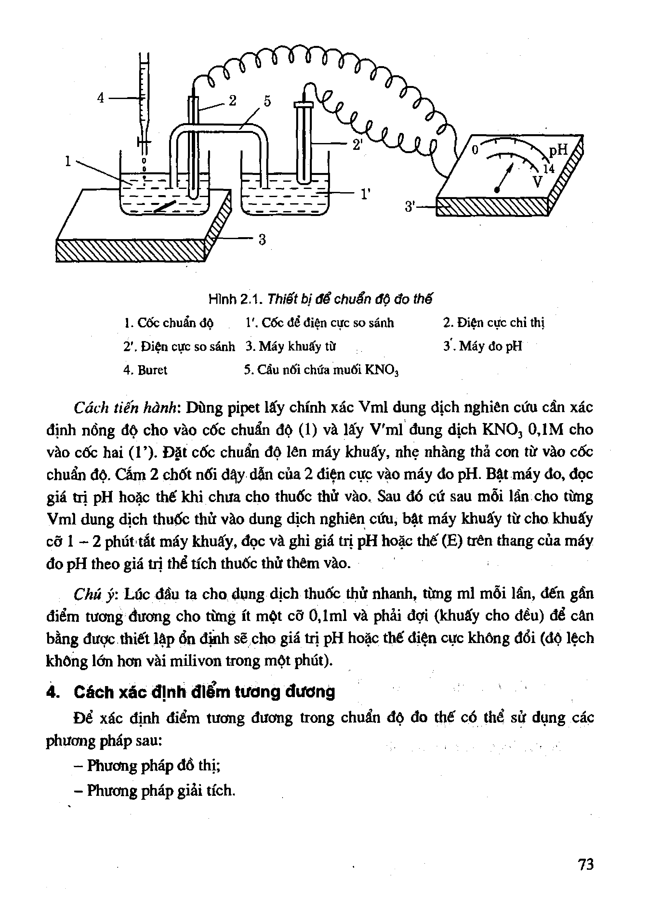

## Page 72

4.1. Xác định thể tích tương đuơng bàng phương pháp đổ thị
Trong phương pháp đồ thị, xác định điểm tương đương có thể sử dụng 1 trong
3 cách sau:
4.1.1. Xác định ỉhể tích tương đương qua điềm uốn E(pH) = tịV-rr)
Người ta vẽ đồ thị thể hiộn sự phụ thuộc E (hoặc pH) vào V thuốc thử, có 
nghĩa E(pH) là hàm số của thể tích V-PJ-: E(pH) = fiVpj.) (hình 2.2):
E(raV)
Hình 2,2. Sự phụ thuộc E hoặc pH vào thể tích cửa thuổc thử Vjt
Trên đường chũẩrí độ thể hiện sự phụ thuộc pH hay thế (E) của điện cực chỉ 
thị vàó thể tích thuốc thử thấy xuất hiện điểm uốn; ở tại điểm này sự thay đổi pH 
hay thế theo thể tích thuốc thủ đạt cực đại. Điểm tương đương (thể tích tương 
đương) ò tại đây được xác định bằng cách từ điểm uốn kẻ đường thẳng song song 
vói trục tung, cắt trục hoành (V^) ờ vị trí thể tích tương đương (VTđ).
4.1.2. Xác đinh thể tích toong đương qua cực trị của đường —  hoặc o m  = fiV jr)
Dựa vào kết quả chùẩri độ trên, ngứời ta tính AV, AE ApH, hoăc V \
^77 - Sau đó vẽ đồ thị -ệỀ. hoặc 
là sợ thay đổi của thế hay (pH) vào thể tích 
pH 
AV 
AV
từng phần của thuốc thử.
Đổ thị được thể hiện ỏ hình 2.3:
74

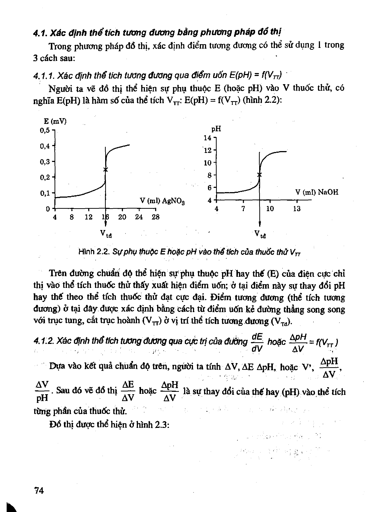

## Page 73

Hình 2.3. Sự phụ thuộc —  hoặc 
vào thể tích từng phần cỏa thuốc thử
Xác định VTd tương đương bằng cách kẻ 2 đường tiếp tuyến với hai phía của 
cạnh hình chuông, hai tiếp tuyến hày cắt nhau tại điểm a. Từ a kẻ đường thẳng 
song song với trục tung cắt trục hoành (V-rj.) ở b. Điểm b chính là giá trị VTd.
Hình 2.4. Sự phụ thuộc —  hoặc - ^ 7  vào V thuốc thử, hay đường cong Gran 
A E 
ApH
Nhà nghiên cứu G. Gran thay đồ thi 
bằng —  hoãc 
bằng
AV 
AE 
AV 
ApH
Sự thay đổi từng phẫn của thuốc thử trên thế (E) hay pH vào thể tích của thuốc thử,
được thể hiện trên hình 2.4. Đường cong này được mang tên ông là đường cong
Gran. Cơ sờ củả đường cong này là dựa vào hiệri tứợng trước và sau điểm tương
ẠV ',ịr 
AV 
v  
■
đương trong chuẩn độ đo thế giá trị -7—hoặc —
phụ thuộc tuyến tính vào sự
”  
• ■ 
T' 
: ĩ ’ 
- 
- 
A I? 
■' * 
A n U
75

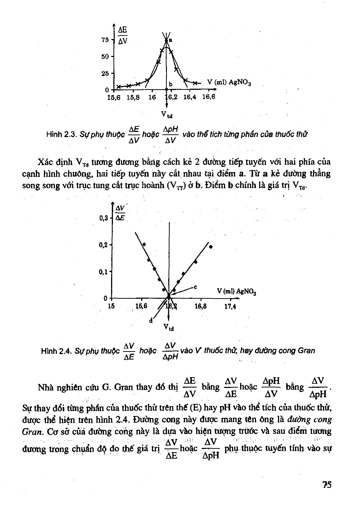

## Page 74

thay đổi thể tích dung địch thuốc thử. Từ các kết quả thực nghiệm đo được, tính
các giá tri —
, Vfj., sau đó thể hiên sư phụ thuộc này ưên đồ thị, thu được 2 
AE
đuờng thẳng, hai đường này sẽ cắt nhau tại một điểm (c). Từ c kẻ đường thảng song 
song vói trục tung, cắt trục hoành tại vị trí (d) ứng với giá trị VTđ.
Sử đụng đường cong Gran để xác định thể tích tương đương vì xác định theo 
kiểu này có độ chính xác cao, ngoài ra không đòi hỏi phải chuẩn độ đến điểm 
tương đương (ví gần điểm tương đương có sự trôi thế là do cân bằng ở đây thiết lập 
rất chậm).
A 2E
4.1.3, Xác định thể tích tuong đuong qua đường tiệm cận cửa đường — -  = f(V-fj )
Lấy đạo hàm bậc hai của 
hoặc 
sẽ được — 
(hoặc ^ -^ r ) vàớ
AV 
AV 
AV2 
AV
V^J.; trên đồ thị sẽ cố hai đường cong đối xứng nhau qua trục hoành. Thể tích
thuốc thử tại điểm tương đương chính là đường thẳng tiệm cận song song với trục 
tung, cách đều hai điểm a, b của 2 đường cong cắt trục hoành ở điểm c. Đó chính 
là giá trị VXđ được thể hiện trên hình 2.5.
ẾỀ.
AV2
Hình 2.5. Sự phụ thuộc 
hoặc 
vào (V” = V)
: 
. 
AV 
. . ■ AVW  
,
Nhược điện cỏa phương pháp xác định VT(J bằng đổ thị là mang tính, chất chủ 
quan vì từ đồ thị dóng xuống trục hoành tìm điểm cất chính là điểm tương đương -  
tương ứng với thể tích tường dượng. Độ chính xác củầ giá trị thể tích tươrig diiơn£
76

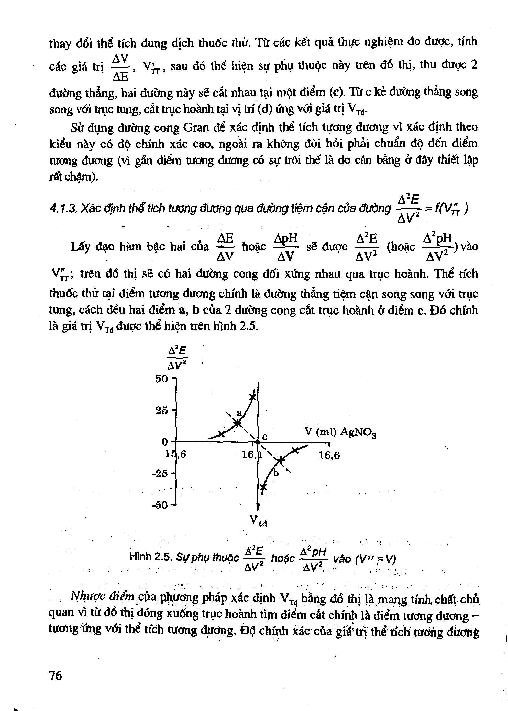

## Page 75

phụ thuộc vào người vẽ và cách vẽ đồ thị. Nhiẽu sinh viên trong cùng một nhóm 
thí nghiệm vẽ đồ thị với cùng một số liệu sẽ cho kết quả VTd khác nhau. Nhưng sự 
sai khác về thể tích không lớn lắm cũng không đáng kể, có thể chấp nhân được.
4.2. Xác định thế tích tương đương bằng phương pháp giải tích
Nội dung của phương pháp này dựa vào kết quả đo được bằng thực nghiêm
sau đó tính AV, AE, V’, 
và 
hoăc ^ ^  ... kẻ bảng như sau:
AV 
AV 
AV 
5
TT
V
AV
E(pH)
AE(ApH)
V + V
Y> _  n 
»1+1 
2
AE
AV
V’ + V’
■y-n _ n 
n+1 . 
2
a2e
AV*
Trong đó:
AV=Vn+1-V n;A E = E n+1- E n;ApH = pHn+1-p H n
A E _ En+1- £ n ;V , 
v n+v. 
AV 
V ^ - Y
n+1
a 2e
AV*
n+l 
'n
f AE^ị
à v
2
AE^
/j
n+l
AV
V' + v ' , 
với V ’ = -aZ_Is±L s  V
Nhìn vào các giá tri tính được trong bảng ta thấy cờ sở của phương pháp khi 
A2E
đao hàm bâc hai (---- - )  của đừờng chuẩn đô sẽ đat giá tri bặng không thì tnrôe và
AV
sau điểm đạo hằm bậc hai bằng không đó đạo hàm bậc hai đổi dấu (có dấu khác 
nhau). Điểm này chính là điểm tương ứng với giá trị đạo hàm bậc nhất có giá trị 
ÀZE
cực đại và — Z- -  0 , đó chính là thể tích thuốc thử (Vtt) tương ứng với điểm tương 
AV
đương gọi là VTd. 
i
Giá trị VTđ được tính theo công thức sau:

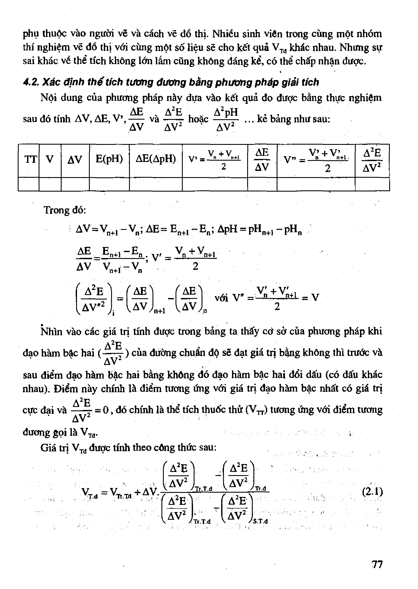

## Page 76

Phương pháp xác định thể tích tương đương bằng phương pháp tính toán mang 
tính khách quan hơn phương pháp đó thị, nhưng phức tạp do phải tính toán nhiểu
A2E
giá trị để nội suy tới thể tích tương ứng với 
— = 0 . Ngoài ra, nhược điểm của 
|
phương pháp này là điểm tương đương của phép chùẩn độ trùng vái cực trị trên đồ 
i
thi 
= fCVjr) 
chỉ 
đúng 
cho 
trường 
hợp 
chuẩn 
độ 
đối 
xứng.
AV
Ví dụ chuẩn độ Fe2+ bằng Ce4* hoặc c r  (Br, I') bằng Ag+ vì chúng có phản ứng 
chuẩn độ xảy ra vói các hệ số hợp thức 1 : 1. Trong các trường hợp chuẩn độ 
không đối xứng (hệ số hợp thức không bằng nhau) như chuẩn độ Fe2* bằng M n04
hoặc Fe2+ bằng Cr20^' vì chúng có đường cong chuẩn độ không đối xứng dẫn đến
AE
điểm tương đương không trùng với điểm cue đaỉ trên đồ th ì-----= fCV-rj.). Nhưng
AV
sư khác nhau giữa giá tri thế khi 
đat cưc đai và giá tri thế tai điểm tương
đương (tính theo lí thuyết) là không đáng kể, cho nên có thể bỏ qua.
Bằng phương pháp đổ thị hoặc tính toán xác đinh điểm tương đương tính được 
giá trị thể tích tương đương ( VT đ) của thuốc thử (dung dịch chuẩn), từ đó dễ dàng
tính nồng độ của dung địch nghiên cứu, xuất phát từ quy tắc đưong lượng:
Sđl (X) = Sđl OT) => C” = í 2 N;v a 2rr 
(2.2)
Vx
5. Một số phương pháp chuẩn độ đo thế
Người ta thường sử dụng 4 loại phản ứng sail đậy trong phương pháp chuẩn độ 
do thế:
1. Axit -bazơ 
2. Phức chất
3. O xihoá-khử 
4 itếttủa
Sau đây xét từng trường hợp cụ thể và chi tiết.
5.1, Chuẩn độ axit-bazơ
Phương pháp chuẩn độ đỉện thế ạxit — báiơ đượe sử dụng nhiẻu nhất trong các 
loại chuẩn độ đo thế khác, sử đụng trong cạc môi trưòng không nước và trong dung 
dịch có màu đậm và cả các dung dich có đố dục cao là nhở vào ưu thế của điên cực 
thuỷ tinh, điện Cực calomen và tnáy đo pH. Giữa giá trị pH của dung địch nghiẽn 
cứu và thế của điện cực chỉ thị (hỉđro, thúỷ tính, ...) có sự phụ thuộc tuyến tính.
78

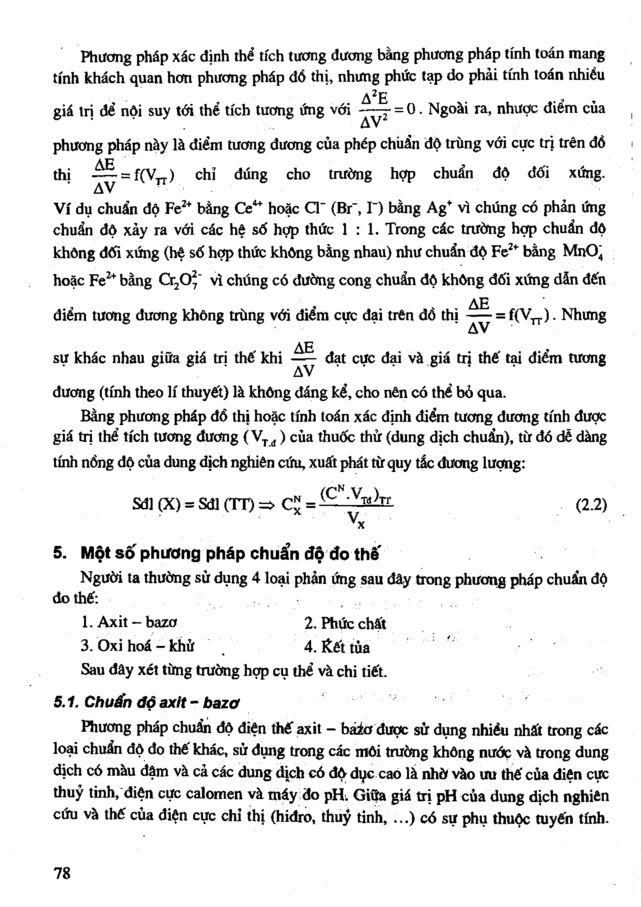

## Page 77

Các dụng cụ sử dụng để đo pH trong phương pháp chuẩn đô đo điện thế axit -  
bazơ đều được hỉệu chỉnh trực tiếp theo đơn vị pH. Trong phương pháp chuẩn độ 
này, người ta thường đo, ghi giá trị pH phụ thuộc vào lượng chất chuẩn (thể tích 
dung dịch thuốc thử chuẩn) sau khi đã thêm vào hơn là theo dõi sự thay đổi thế 
của điộn cực sau khi đã thêm thuốc thử chuẩn vào.
5.1.1. Điều kiện đ ể chuần độ axit -  bazơ bằng phương pháp đo thế
Sử dụng phương pháp đo thế để chuẩn độ axit mạnh, bazơ manh, axit yếu, 
bazơ yếu, đa axit và đa bazơ. Cũng như phương pháp chuẩn độ đo thể tích độ 
chính xác của phương pháp phụ thuộc vào nồng độ (Q  và hằng số phân li axit (KJ 
hay hằng số phân li bazơ (Kb), nhưng đối với phương pháp chuẩn độ đo thế nếu 
KC = 10“u sai số mắc phải cỡ 3% và KC = 10' 10 sai số mắc phải cỡ 0,3%. Nếu như 
chuẩn độ axit axetic (pKa = 4,76) thì có thể chuẩn độ đến nồng độ 10-5 * ÌO^M 
vẫn đảm bảo độ chính xác, còn đối với đa ạxit như HjP04 có pK( = 2,23;
pK2 = 7,21; pKj = 12,32, nếu theo điều kiên 
— > 5 ) thì đối với axit H3P04 sẽ
PKn+i
thoả mãn, như vậy cỏ thể chuẩn độ chính xác từng nấc riêng rẽ axit H3PO4. Một 
điều đáng quan tâm ố đãy ĩà có thể chuẩn độ axit H3F 04 được cả đến nấc ba
(•£^2- = 5,11 > 5 ,0 ) mà điều này phương pháp.chuẩn đô đo thể tích không tiến 
pK3
hành được.
-  Phản ứng chuẩn độ: 
H+ + OH" ^  HzO
-  Điện cực th ỉ thị: Có thể sử dụng một trong các lóại điện cực sau: điện cực 
thủy tinh, hiđro, quinhiđron và điện cực SbỊSb20 3.
-  Phản ứng chỉ thị ỉà: 
2H+ + 2e —  
H2 
rất nhanh
Hdbdgdiek 
^  
rát nhanh
5.1.2. Bẩn chất cõa bước nhảy thế khi chuẩn độ axit -  bẩzờ dừng điện cực ch ỉ thị 
là điện cực hiđro hoặc thùy tinh
Mặc dầu trong phương pháp chuẩn đô đo thế đối yới trường hợp ạxit r- bazơ 
ngườị tạ đọ, ghi giá trị pH phụ thuộc vào thể tích dung dịch thuốc thử chuẩn thêm 
vào hơn là giá tộ pH theo sự thay đổi thế của điộn cực, nhựng vẫn cần phải làm .rõ 
bản chất cùa bước nhảy, thế qua việc nghiên cứu sự biến thiên của các đường dòng 
thế trong quá trình chuẩn độ. Dựa vào sự biến thiên của các dưỜỊig nặy sẽ biết 
được giá trị bưóc nhảy thế bằng hiệu điện thế của các cặp đường nào
79

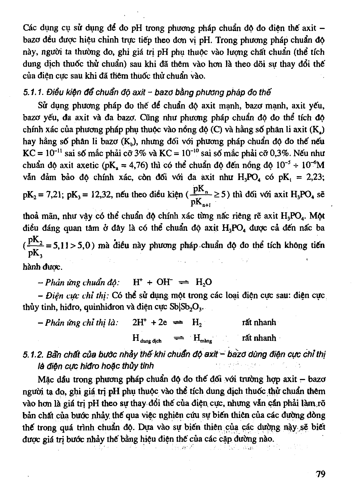

## Page 78

Ví dụ: Chuẩn độ 10,0ml dung dịch ax.it axetic (HAc) c* bằng dung địch chuẩn 
NaOH lCT’M. Dùng điện cực so sánh là calomen bão hòa và điộn cực chỉ thị là 
điộn cực hiđro, haì điện cực này được nối vào máy đo pH.
1 Sau khi đo, ghi đuợc các giá trị dòng phụ thuộc vào thế trong quá trình chuẩn 
độ, sự biến thiên của các đường dòng thế được biểu diên như hình 2.6.
2H+ + 2e—-Ho
/
- 0-
-<»>■
2H20 —- H2 + 20H" 
__)
- &
E,7'
r
■<§>-T
/
-E
H+ — H2 
H2 + 20H '— H20 + 2e
Hình 2.6. Sựbỉến thiôn các đuờng dòng thế khi thêm NaOH vào HAc
-Trưởc điểm tương đương:
+ Phản ứng chuẩn độ\ HAc + NaOH “  NaAc + HaO
Tại thời điểm trước tương đương thường thiếu thuốc thử NaOH, dư HAc
HAc ^  
H+ + Ac” Ka = 10-4'76
Lúc này hệ gồm có: H+, HAc, H20 , Na+, Ac".
+ Đo được thể cân bằng E j ,  E2, EịCÚa hệ:
2H+ + 2e ^  
H2 
Eu .3 = 0,0591g[H+]
Trong đó Ej là thế cân bằng ứng với hộ dư 0,1% H+, 
: .
—  Tại điểm tương đương:
+ Phản ửng chuẩn độ: HAe + NaOH
(2.3)
+ rhán ưng chuân độ: HAc + NaOH 
NaAc + H20
Có bao nhiêu số đương lượng cửa HAc tác dụng vừá đủ với bấỷ nhiêu số 
đương lượng eủá NaOH, Kệlúc này chỉ có HzO, Na+, A<r.
Khổng đo được thế càn bằng và hếu cố ậùăược cữhg không ổn định.
-  Saù điểm tương đưởng: 
; 
<
+ Phản ứng chuẩn độ: HAc + NaOH ^  
NaÀc + H20
80

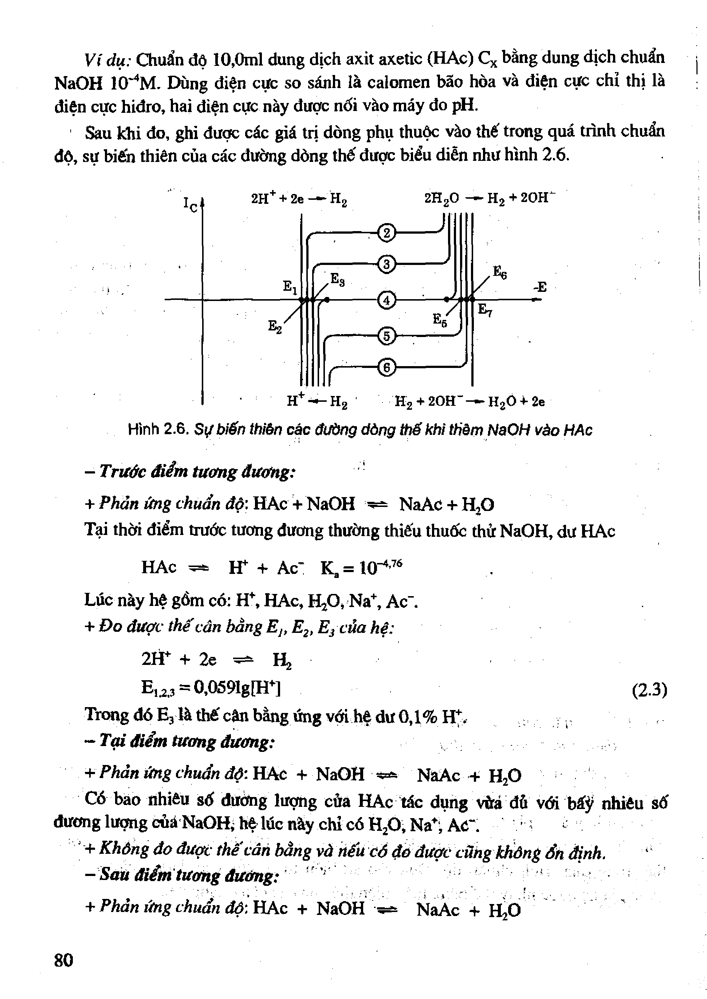

## Page 79

Sau điểm tương đương HAc đã hết, dư NaOH:
NaOH 
-> Na* + OH"
Hệ lúc này gồm có OH', H2Ọ, Na+, Ac".
+ Đo được thế cân bằng Eị, E6, E7 của hệ rất nhanh:
20H" + H2 —  
2H20  + 2e
Ej. 6,7 = ~0,0591g[OH~] 
(2.4)
Trong đó Ej là thế cân bằng ứng với hệ dư 0,1 % OH".
Vậy bản chất của bước nhảy thế trong trường hợp này là hiệu điện thế của sự 
biến thiên đường dòng thế Ej và E3:
AE= E5- E 3 
(2.5)
5.1,3. Ví dụ chuẩn độ axỉt axetic bằng NaOH
5.1.3.1.Cảch tiến hành
Chuẩn độ 10,0ml axit axetic (HAc) bằng NaOH 0,01N. Chọn điện cực kép 
bên trong gồm 2 diện cực, điện cực so sánh là điện cực calomen và điện cực chỉ thị 
là điên cưc thủy tinh. Nhúng điên cực kép vào đung dịch HAc cần chuẩn độ. Nối 
điện cực kép với máy đơ pH do hẫng Toa (Nhật Bản) sản xuất vói màn hình tình 
thể lỏng (hiộn số), bật máy khuấy từ và tiến hành chuắn độ. Kết quả đo và tính
toán các giá trị được thể hiện trong bảng 2.1. (77i/ nghiệm này được thực hiện tại
phòng thí nghiêm Hoá Phân tích Trường ĐHSP Hà Nội tháng 1 1 Ị 2007).
Bàng 2.1. Kết quả chuẩn độ đo thế (pH) xác định nổng độ HAc bằng NaOH 0,01 M
TT
V|M«oH
AV
pH
ÃpH
V'
ApH
AV
AV
ApH
V"
A2pH
AV2
(2)
(3)
(4)
(5)
(6)
(7)
(8)
(9)
(10)
1
0
3,37
2
7,8
5,86
0,2
0,15
7,9
0,75
ỉ 333
3
*1
II
6,01
II
£
V'= 8,0
0,05
0,2
0,16
8J
0,80
125
4
8,2
6,17
8,2
0,45
0,2
0,25
8,3
1J5
0,8
5
8,4
6,41
8,4
235
0,2
0,71
8 £
3,55
0,282
81

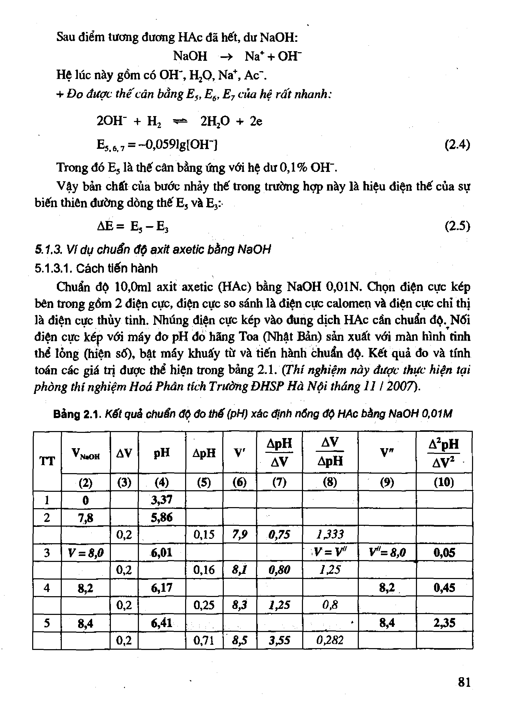

## Page 80

TT
VNaoH
AV
pH
ApH
V'
ApH
AV
AV
ApH
V"
A2pH
AV2
(2)
(3)
(4)
(5)
(6)
(7)
(8)
(9)
(10)
6
8,6
7,12
8,6
8,0
0,2
2,31
8,7
11,55
0,087
7
8,8
9,43
8,8
- 8,2
0,2
0,67
3J5
0299
8
9,0
10,10
9,2
-2,05
1
1,30
9,5
IJÕ
0,769
9
10
11,40
10
-0,95
1
0,35
10,5
0,35
2,875
10
11
11,751
11
-0,18
1
-r. 0,17
llyS
0,17
5,822
11
12
11,92
4___------
5.1.3.2. Cách xác địhh điểm tương đương bằng phương pháp chuẩn độ điện thế 
Có thể xác định điệm tương đưcmg trong chuẩn độ axit -  bazơ bằng phương 
pháp đồ thị và phương pháp giải tích.
a. Xác định V tương đương thẹo phương pháp đổ thị
-  Dựa vào điểm uốn của đường cong pH = fCV-rr)
Vẽ sự phụ thuộc pH ở cột 4 vào VNa0H ồf cột 2 được:
82

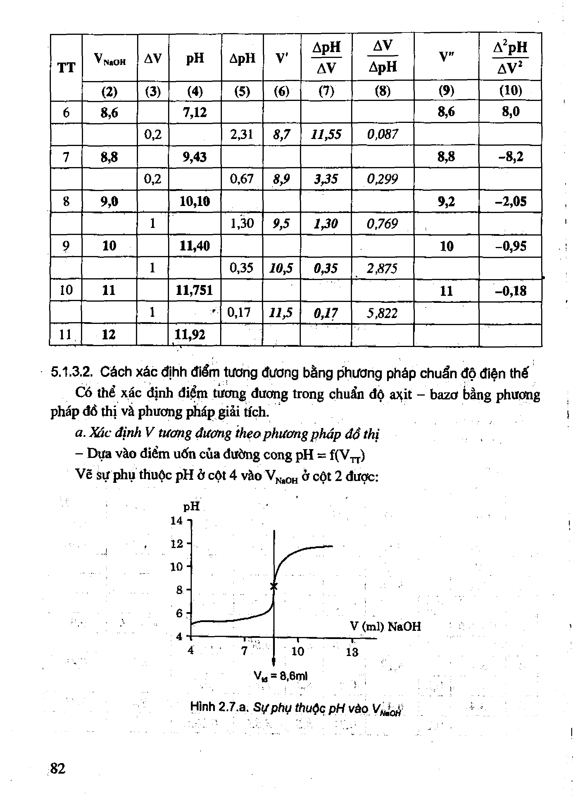

## Page 81

Xác định điểm urơng đương (thể tích tương đương) bằng cách từ điểm uốn kẻ 
đường thẳng song song với trục tung, cát trục hoành (VNa0H) ở vị trí 8,6ml -  đó 
chính là thể tích tương đương (VTđ = 8,6ml).
-  Dưa vào cưc tri của 
= f(V’ 
:
ĩ 
ẠV 
NíOH'
Vẽ sự phụ thuộc -^ 9- ờ cột (7) vào 
ờ cột (6) được:
ApH
Hình 2.7. b. Sự phụ thuộc 
vào V^0H
Xác định v „  tương đưcmg bằng cách kẻ đường tiếp tuyến với hai phía của 2 
cạnh hình chuông, hai tiếp tuyến này cắt nhau tại điểm a. Từ a kẻ đường thảng 
song song với trục tung cắt trục hoành (VTđ) ở 8,65ml. Điểm 8,65ml chính là giá 
trị VTđ = 8,65ml.
-  Sử dụng đưởng cong Gran
Thường sử dụng đường cong Gran để xác định điểm tương đương từ đó tính VTd.
AV
Vẽ sư phu thuồc — — ở côt (8) vào 
ở côt (6) đươc đổ thi như Hình 2.7c.
ApH 
'
Xác định VTd tương đương bằng cách kẻ 2 đường thẳng, hai đường này sẽ cắt 
nhau tại một điểm (c). Từ c kẻ đưèmg thẳng song song vói trục tung, cắt trục hoành 
tại vị trí 8,65ml, đó chính là VTđ = 8,65ml.
83

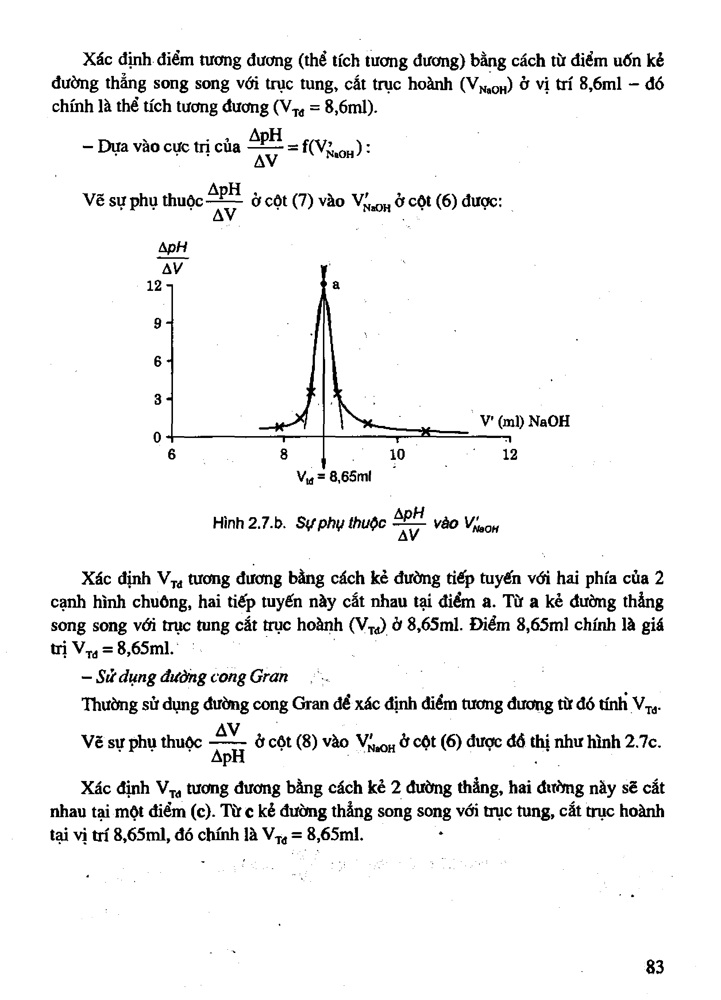

## Page 82

AV
ẠpH
Hình 2.7.C. Sự phụ thuộc 
vào V^aOH
-  Dựa vào đường tiệm cân của 4 r ỉr  = *fY«w = V NaOH) :
AV
Vẽ sư phu thuốc -  
ở côt (ỈO) vào VNaOH ở côt (9) đươc: 
AV
A2pH
AV2
Hình 2.7.Ú. Sự phụ thuộc 
vào V^OH
84

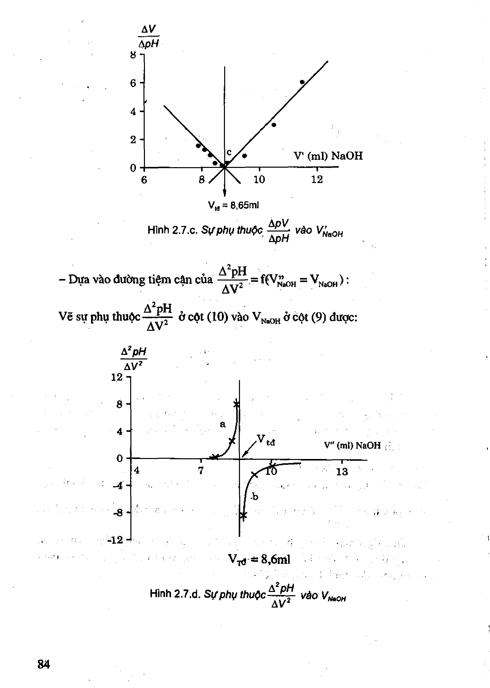

## Page 83

Xác định VTđ tương đương bằng cách kẻ đường thẳng tiệm cận song song với 
trục tung, cách đều hai đường cong a và b cắt trục hoành ở điểm 8,6ml. Đó chính 
là giá trị VTd = 8,6ml.
b. Xác định điểm tương đương theo phương pháp giải tích 
'
Để xác định chính xác V tương đương có thể sử dụng phương pháp giải tích 
như sau:
— Tính các đại lượng biển thiên:
'M O  
^ PHn+Ị~PHn
- av’Jvn 
vn+1-vn
( ApH )  
PH2 -pH ,
l AV JV| 
Ỹ2 -Vj
í  a 2^ĩ t \  
/ ẫ
-  Tính biến thiên:
'à y K ) 
AV )N+l 
V ÂvJN
Trong dó
và
ApHi = pHB-pHn_1 
, a v J n 
Vn-V n.v
ApH^ 
pHn+1 -p H n 
AV )M 
VntI -  vn
A2pH"Ị 
/  ApHÌ 
ị ApHÌ
AV J„ I AV ị
Trong đó:
AV
^ApHÌ _ pH; -p H t
AvJ, 
v2-vr -
{ Ar.uA
và
ApH
AV J
pH3 -p H 2 
V3-V ,
(2.6)
(2.7)
(2.8) 
(2.9)
(2.10)
(2.11)
(2.12)
(2.13)
-  Điểm tương đương đựợc xạc định bằng phương pháp "Nội suy" tới thể tích
tương úng: 
y 
'
-  Tính VNaOH tại điểm tương đương theo phương pháp giải tích và tính nồng độ 
của axit axetic:
TínhvNaQH tại điểm tường ấứơng:
Nội suy VNapH tương đương nằm trong khoảng 8,60 -* 8,80ml, thì “ Ụ2~ = 0 
và đổi dấu:
85

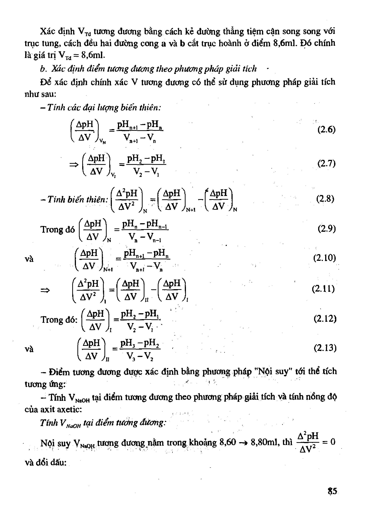

## Page 84

V, = 8,60ml
^A2pHN
AV2
= 8,0 ;
v 7 = 8,80ml r-»
A2pH
AV2
=
- 8,2
/7
úng với sự biến thiên V5 -» V7 : 0,20ml
Thì biến thiên
A2pH
AV2
í2.
là 8,0 — (- 8,2) = 16,20
8,0
= 0,2.
16,2
Vây AVX = ? để 
= 8,0 -ỉ- 0,0; AV„ = AV 
• 
.x 
AV 
x 
8 ,0 - ( - 8,2)
ÀVX = 0,2.0,4938 = 0,09876ml« 0,099ml;
VTd = v 6 + AVX = 8,6 + 0,099 = 8,699ml
Hoặc: — — • = 0, trước và sau điểm tương đương có sự đổi đấu.
, Tính V^JongduongNaOH = ?
tỉ
V ^ g toon* NaOH tai thời điểm ----- — = 0. Như vây VTđ nằm trong khoảng 2
AV
giá tiị.từ +8 đến -8,2 (6 -»  7) tuơng ứng với thể tích từ 8,6ml đến 8,8ml thì giá trị
— 2— đổi dấu, vây áp dung công thức tính:
ÀV
(  A2pH
VT . V
+ A
v l ^  
T" 
8 
V p H
AV2
\
k [av2 JT.d
/6
A pH 
AV2
(2.14)
^Tiwng*«ng(NtóH) — 8,60+0,2.’ 
’ 
= 8,699ml
o,0 - ( - 8,2)
lĩnh liổng độ của axit axetic:
r  
_ ^T.d-^NaOH _ 8,699.0,15 
n
CHjCOOH 
r j  
-  —  
— -------- =  ỵ,
vrw ríVìH 
IU
1305M
CHjCOOH
Đáp sổ: VT d = 8,699ml« 8jÒml; C = 0,1305M
86

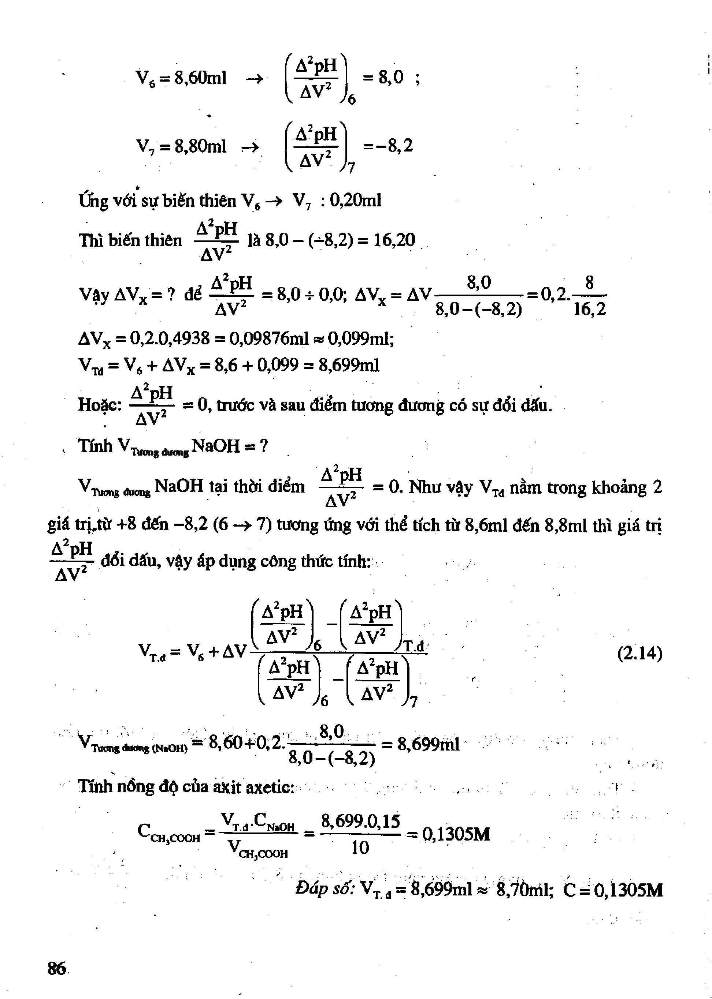

## Page 85

5.2. Chuẩn độ tạo phúc chất
5.2.1. Nội dung
Phối tử etylenđiamintetraaxetic (kí hiệu là EDTA hay H4Y) ít tan trong nước, 
vì vây thường dùng dưới dạng muối đinatri Na2H2Y, gọi là complexon III (nhưng 
vẫn quen được gọi là EDTA).
Etylenđiamintetraaxetic tạo phức có độ bền cao với các ion kim loại một, hai, 
ba, bốn... điện tích. Trong hầu hết các phản ứng tạo phức xảy ra theo tỉ lộ ion kim 
loại: phối tử = 1 : 1 . Rất tiếc rằng số các chất chỉ thí kim loại (như eriocrom đen T, 
murexit) không có nhiều. Nhiểu trường hợp chuẩn độ thể tích bằng phựơng pháp 
chuẩn độ phức chất để xác định nổng độ của các ion kim loại không chọn được chỉ 
thị kim loại thích hợp thì người ta chuyển sang sử dụng phương pháp chuẩn độ đo 
thế. Như vậy chỉ thị điện thế đã cho phép mờ rộng phạm vi ứng dụng của phương 
pháp chuẩn độ tạo phức.
Trong trường hợp tất cả các chất tham gia phản ứng là chất khồng điện hoạt, 
nhưng phối từ tham gia phản ứng với một chất thứ hai tạo thành sản phẩm của 
phản ứng. Sản phẩm tạo thành này ìà chất điện hoạt, phản ứng phụ này xảy ra sau 
phản ứng chính.
Ví dụ ỉ: Chuẩn độ AI3+ bằng NaF:
Khi cho thuốc thử NaF xuống Al3+ xảy ra phản ứng chuẩn độ:
AI* + 6F- —  
A lFf 
JS^ =1020'67
Nhưng cả Al3*, F~, AlFg~ có trong dung dịch chuẩn độ đểu khống có tính hoạt
động điện hoá. Để có thể chuẩn độ đo thế được, xác định nồng độ của Al3+ thì 
người ta phải cho thêm một lượng nhỏ iơn Fe3+ vào đung dịch chứa A p  trước khi 
chuẩn đô bằng NaF. Ion Fe3+ là chất điện hoạt, ngoài ra ion Fe3+ có khả năng tạo 
phúc với p  tạo thành phức FeF63‘ (
=
 1Ọ16,1) kém bền hơn A1F63" (0 AH£ = 1Ọ;0,Í7)
nên điộn thế của dung dịch chỉ biến đổi bắt đẩu từ điểm tương đương.
-  Trong trưòng hợp chuẩn đô này có thể dùng điện cực chỉ thị là điện cực 
niàng chọn tốc ion F" hòặc diộn cực platin.
— Khi cho NaF xúống dung dịch chuẩn độ thì thứ tự xẳy ra như sàuí
Trước tiên phản ứng với Al3+ trước sàùđến với Fe3+ vì hằng số bển của phức 
Âl3+ với F" lổri ttơn Fe^ vói F".
Al3+ + 6F  ^  
A lF f 
ậ Ị = 1 0 -  
-  :
Trước điểm tương đương đường chuẩn độ nằm ngang vì nóng đô «ủa, Fe3 li 
không thay đổi.

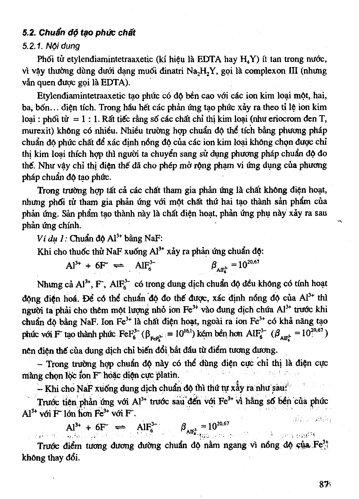

## Page 86

-  Tại điểm tương đương A p  đã hết (tạo phức AlFg3" ). Nếu cho dư một giọt 
; 
NaF xảy ra phản ứng:
Fe3+ + 6 F  —  
FeF^ 
|SFeJt =101W
Như vậy phản ứng chỉ thị là sau điểm tương đương.
-  Sau điểm tuaftg đương:
FeFg3- + e ^  
Feỉ+ + 6F
TTieo phản ứng này thì sau điểm tương đương, nồng độ của Fe^ giảm đột ngột 
dẫn đến đường chuẩn độ có dạng đi xuống như hình 2.8.
Hlnh 2.8. Đường chuẩn độ AP* (khi có Fe3*) bằng NaF
Ví dụ 2: Chuẩn độ hỗi) hợp chứa ion kịm loại M2+ và M3+ bằng EDTA. Khi 
cho dung dịch EDTA vào dung dịch chuẩn độ chứa M2+ và M3+ xảy ra phản ứng 
chuẩn độ:
■ *
M2+ + HjY2" ^  
MY2- + 2H+
M3* + H2Y2- 
^  MY- + 2H+
■*
Để ngăn ngừa sự tạo phức hidroxo kim loại ờ pH chuẩn độ thường thêm đủ 
dung dịch đệm vào dung dịch chuẩn độ để tạp phức tương đối yếu với ion kim loại 
cần chuẩn độ. Ví dụ, dùng hỗn hợp đệm NH3 + NH4G  đổ duy trì pH = 10 khi 
chuẩn độ cẩc ion Zn2+, Cu2+ và Ni2* để giữ các ion này trọng dung dịch ồ dạng 
phức amin.
Phản ứng chỉ thị: Đa số các cặp M27M° và M^/M0 đều là hệ chậm nên không 
thể chuẩn độ đo thế được. 
-■
88

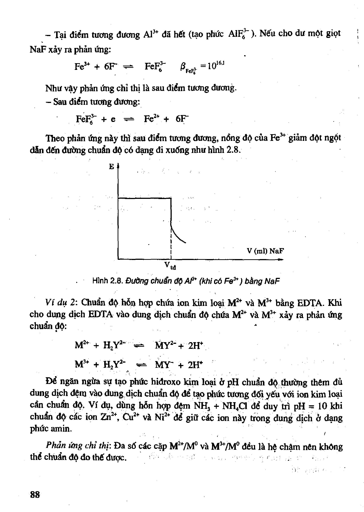

## Page 87

Để có thể chuẩn độ tạo phức được người ta dùng điện cực thuỷ ngân có sẵn 
. bên trong điện cực môt lượng nhỏ complexenat thuỷ ngân làm điện cực chỉ thị 
cho ion Y4'.
-  Từ trên buret cho từng giọt H2Y2_ xuống dung dịch chuẩn độ, xảy ra 
phản ứng:
M2+ + H2Y2- —  
MY2' + 2H+
M3+ + H2Y2' ^  
MY" + 2H+
Hg2* + H2Y2- —  
HgY2- + 2H+
Trước điểm tương đương, hộ chỉ thị là:
Hg2f + 2e 
—  
Hg°
-  Khi trong dung dịch nồng độ M2+, M3+ và Hg2* đã giảm đáng kể, thêm 1 giọt 
H2Y2- vào dung dịch chuẩn đô như vậy H2Y2- đã đu so với thuỷ ngân, thì hệ chỉ 
thị là:
1 Hg° 
—  
Hg2+ + 2e 
Hg2+ + Y4- —  
HgY2*
Hg° + Y4" ^  
HgY2’ + 2e
Ta thấy phương pháp chuẩn độ phức chất bằng đo thế có khả năng thực hiện 
hầu hết những chuẩn độ phức chất trong phương pháp đo thể tích.
5.2.2. Bản chẩt cùa bưòc nhảy thế
Bản chất của bước nhảy thế khi chuẩn độ tạo phức dùng điện cực thuỷ ngân 
khi có lượng nhỏ compĩexonat thuỷ ngân là điện cục chỉ thị cho ion Y*~. 
Ví dụ chuẩn độ ion Hg2+ bằng H2Y2~, phản ứng chuẩn độ xảỵ ra:
Hg2+ + H2Y2" ^  HgY2" + 2H+
Sự biến thiên các đường dòng thế trong quá trình chuẩn độ Hg2* bằng EDTA 
sử dụng điện cực thuỷ ngân có lượng nhỏ complexonat thuỷ ngân được trình bày 
trên hình 2.9.
89

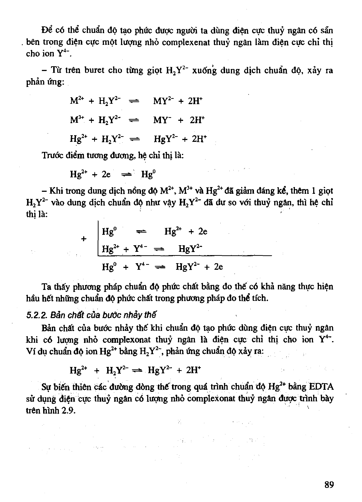

## Page 88

Hình 2.9. Sự biến thiên các đường dòng thế 
trong quá trình chuẩn độ Hg2* bằng EDTA
■ 
—Trước điểm tương đương hệ chỉ thị ỉà:
Hg2+ + 2e 
Hg°
Đo được thế cân bằng của hệ Hg^/Hg0 là các thế Et, E2, E3.
-  Tại điểm tương đương: '
Tương tự như mọi chuẩn độ khác, không thể đo được thế cân bằng vì không ổn định.
-  Sau điểm tương đương:
Khi các ion kim loại đã hết, EDTA đã du so với thuỷ ngân thì hệ chỉ thị là:
Hg° + Y4- 
HgY2" + 2e
-  Bước nhảy thế xảy ra khi chuyển từ hệ Hg2+/Hg° sang hệ HgY27Hg° trên 
hình 2.9:
. A E ~Ẹ5- E 3; 
(2.15)
5.3. Chuẩn âộoxi hoả ~ khử
5.3.1. Nội dung 
’
Trong trường hợp chuẩn đô oxị hoá -  khử, phản ứng chuẩn độ phải là phản 
ứng tổ hợp từ hai nửa phản ứng điện hoá: nửa phản úng oxi ho4 và nửạ phản ứng 
khử hoặc ngược lại:
OX. + ne 
^  
Kh,
+ 
2 
Khị 
^  OX2 +ne 
OX, + Kh, 
^  
OX2 + Kh2
9Ữ*

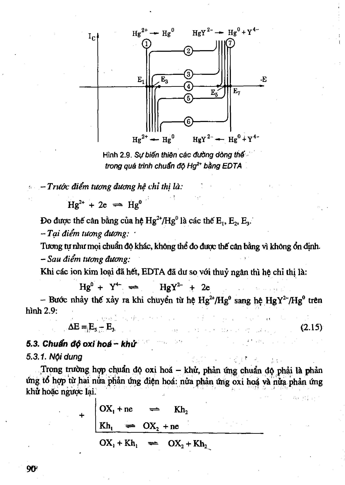

## Page 89

-  Điện cực chỉ thị: điện cực trơ như điện cực vàng, platin, palađi hay than chì.
-  Điện cực so sánh', điện cực calomen.
Nếu ion CT không ảnh hưởng đến phản ứng oxi hoá -  khử thì có thể nhúng bộ 
điện cực (so sánh vấ chỉ thị) trực tiếp vào dung dịch chuẩn độ. Còn nếu ion c r  
tham gia vào phản ứng oxi hoá -  khử phải sử dụng cầu nối chứa muối KNOj hay 
một loại điộn cực thích hợp khác.
5.3.2. Bản chất
Ví dụ: Chuẩn độ v°ml đung dịch sắt(n) sunfat FeS04 có C°Mbằng dung dịch 
chuẩn xeri sunfat Ce(S04)2 CM thì hết V ml.
Khi nhô từ trên buret từng giọt Ce(S04)2 xuống dung địch chứa Fe2* trong 
H2S04 im  thì xảy ra:
-P hản ứng chuẩn độ: Fe2+ + Ce* ^  Fe3+ + Ce3+
Đây là phản ứng chuẩn độ là phản ứng hoá học xảy ra nhanh vì hai hệ 
Fe37Fe2+ và Ce^/Ce3* là hệ nhanh đối với điện cực platin.
-Trước điểm tương đương:
Thành phần trong dung dịch chuẩn độ có: Fe2+, Fe3+ và Ce3*, điện cực chỉ thị 
nhanh chóng đạt tới giá tậ cân bằng và ổn định, được xác định bằng phương trình 
Nẽmst đối với căp Fe37Fe2+:
Ea = E '„ ;K,.+Q ,0 6 1 g Ị^j Hay
• 
Ea>=
E
^
+ 0,061gỊ'? ^
r] à 3 ơ t  
(2.16)
Trong đó:
c\ỉ 
c°vữ-CV
[F ^ ] = t ^ ]  = c a „
=
^
;  
=
ở khu vực gần sát truớc điểm tương đương tíủ nồng độ íon Fe2+ vô cùng bé và 
ion Fe2+ không còn hoạt tính điộn hoá nữa. Các ioii Fe3+ và Ce^ là những ion có 
trọng dung dịch với nổng độ lớn, đo đó người ta sẽ đo được thế "hỗn hợp" khồng 
Ổn định. Còn ở khu vực gần sát ngay sau điểm tương đương, thế đo được cũng là 
thế "hỗn lìợp" vì lúc này nồng độ Ce4* vô cùng nhò.
Thế hồn hợp không ổn định phụ thuộc vào trạng thái vật lí và bản chất vật liệu 
sử dựng để chế tạo điện cực, nói chung không đo được.
91

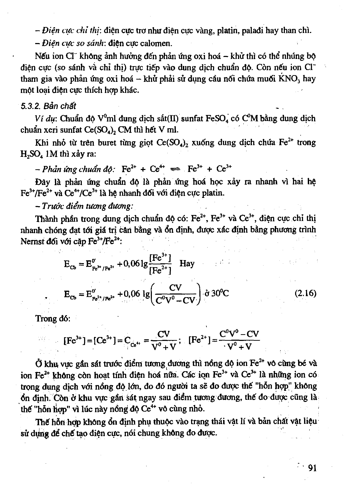

## Page 90

-  Tại điểm tương đương:
Thành phần chủ yếu trong dung dịch chuẩn độ là Fe3*, Ce3+ và một lượng nhỏ 
Ce4+ và Fe . Trong đó [Fe3+] = [Ce3+] và [Ce4+] = [Fe2+] vậy có:
F °' 
4-F°'
T7 
F c ^ /F c 2* 
C rw /Ce>
Tđ = ----- -------------
(2.17)
-  Sau điểm tương đương:
Ngoài Fe3+, Ce5* trong dung dịch còn có lượng dư ion Ce4+ khá lớn do đó đo 
được thế cân bằng ổn định:
[Ce4+]
E^=Ề?'
+0,061g
[Ce ]
Hay 
Ecb = E ^ /Qsw +0,06Ịg rc v - c ° y
lO-i rO
c°v
ò 30°c
(2.18)
Trong dó: [Ce4+] = C V -C UV
; [Ce3+] = [Fe*] =
c yv
v °+ v  
’ ‘ 
' 
J 
v °+ v
Ngườỉ ta tính được sự biến đổi điện thế 0X1 hoá -  khử trong quá trình chuẩn độ 
100ml dung dịch FeS04 bằng Ce(S04)2 ÌO^M trong H2S04 ÍM sử dụng phương 
trình: (2.16), (2.17) và (2.18) tính được các giá trị thế phụ thuộc vào thể tích 
Ce(S04)2 được ghi trong bảng 2.2.
Bảng 2.2. Chuẩn độ 100ml dung dịch FeS04 bằng Ce(SOJj 1CT4M trong H2S04 1M
Vml C e(S04)2
Công thức tính điện thế dung dịch
E (V )
0
0,62
50
90
99
E a = < „ ,* „  +0,06 l g l g l
0,68
0,736
0,797
99,9
100
E°’ 
4>Eọ'
£  
_ 
Fe^/Fe1* 
Ce^/Ce* 
Xí 
2
0,857
1,06
100,1 
' 
101 
110
En . = B
^ + 0, « S l g g ^
1,263 
1,322 
; 
1,381
120
ị - , 1 
... . 
. 
. .. ,
L,399
92

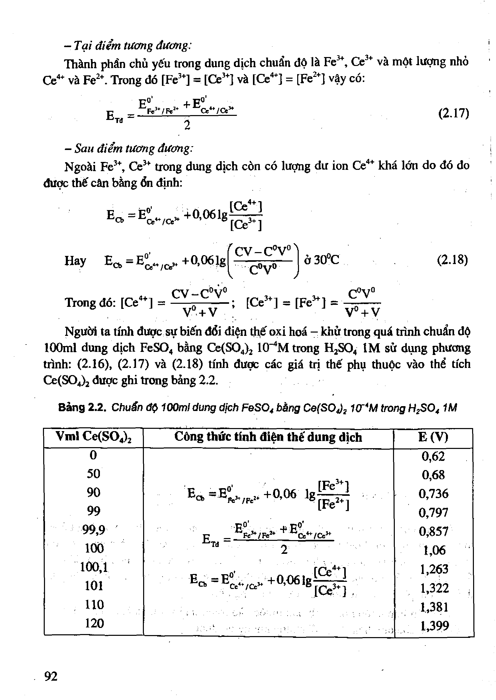

## Page 91

Trong đó E° là thế tiêu chuẩn thực.
Đường cong chuẩn độ điện thế oxi hoá -  khử ion Fe2+ bằng Ce4+ được thể hiộn 
trên hình 2.10.
Hỉnh 2.10. Dạng đường cong chuẩn độ Fe2* bằng Ce**
Đoạn chấm chấm (1, 2) trên đường cong chuẩn đô tương ứng với khu vực thế 
hỗn hợp, trên thực tế không đo được.
Nhưng trong thục tế không ảnh Ịiưởng gì tớị việc xác định điểm tương đương 
ương phép chuẩn độ đo thế vì khi chuẩn độ bằng dung dịch không loãng quá thì 
chỉ cần thêm một giọt thuốc thử thì thế của dung dịch chuẩn độ nhảy vọt từ điểm B 
đến điểm A. Dạng đường cong chuẩn độ cũng tương tự như ữong các phương pháp 
chuẩn độ khác.
5.4. Chuẩn độ két tủa
5A. 1. Nội dung
Phương pháp điện thế được sử dụng để chuẩn độ kết tủa các cation Ag+, Hg2+, 
Pb2+, Zn2+,... bằng dung dịch chuẩn là anion: c r, Br“, rySCNV" và ngược lại có 
thể .chuẩn độ các anion bằng các cation.
Phương pháp chuẩn độ đo thế có tạo kết tủa ưu việt hơn hẳn phương pháp 
chuẩn độ đo thể tích khi xác định các anion như cr, Br“, I", SCN" vì xác định 
điểm cuối chuẩn độ ổó xuất hiện kết tủa đỏ nâu Ag2Cr04 không rõ dẫn đến sai 
số lớn.
ị
-  
Điện cực chỉ thị:
+ Điện cực kim loại, được chế tạo tờ kim loại mà cation của nó tham gia phản 
ứng với thuốc thử tạo kết tủa (Ag, Hg, Zn.. .)-
+ Điện cực màng chọn lọc ion đối với ion cần xác định.
93

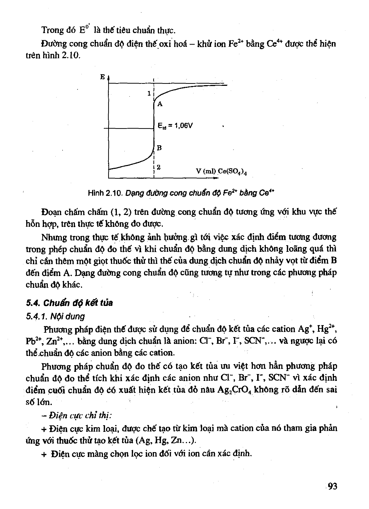

## Page 92

-  Điện cực so sánh:
+ Điện cực calomen bão hoà (cầu nối chứa muối K N03 bão hoà để tránh 
anion Cl”)-
Ví dụ ỉ: Chuẩn độ 10ml dung dịch N aơ  bằng AgN03 l(r3M dùng điện cục 
so sánh là calomen bão hoà, điện cực chỉ thị là bạc -  bạc clorua.
-  Khi cho một lượng nhỏ AgNÕ3 xuống dung dịch NaX (NaCl) xảy ra 
phản ứng:
Ag* + X - =  
AgX 
^sỈAgX) 
(219)
Ag* + a -  =  
AgCi ị 
K;JAga) 
(2.20)
-  Phấn ứng chỉ thi: 
'
AgX + e — Ag + X 
^Agx/AR 
■ 
(2.21)
Àgd + e •--- 
Ag + c r ^Ẳga/Ag = 0.2222V 
(2.22)
-  Thế của điện cực chỉ thị được tính theo phương trình Nemst:
(2.23)
Hay 
^Agd/Ag ~ ^Afd/A( 
—^-hl(í’l ) 
(2.24)
Theo quy tắc tích số tan: (Ag+) (X-) = KS(AgX) 
(2.25)
I 
‘ 
I 
• 
. • •
R itr a :(X ) = if iS 2 , 
(226)
(Ag+) 
, 
, 
,
Thay (2.26) vào (2.23) ta được:
^AgX/Ag = EẲgX/Ag +
4 Ẽh « ỉi
nF 
Ks 
nF 
Ks 
nF 
A® 
nF
-É**,*, + ffW A g ĩl 
: 
! (2.27)
■ 
■> 
.Viv,
•' ’ 
i' 1 ♦ 
ĩ: -* 
1 
..'(1- 1 ’ J *' í
m

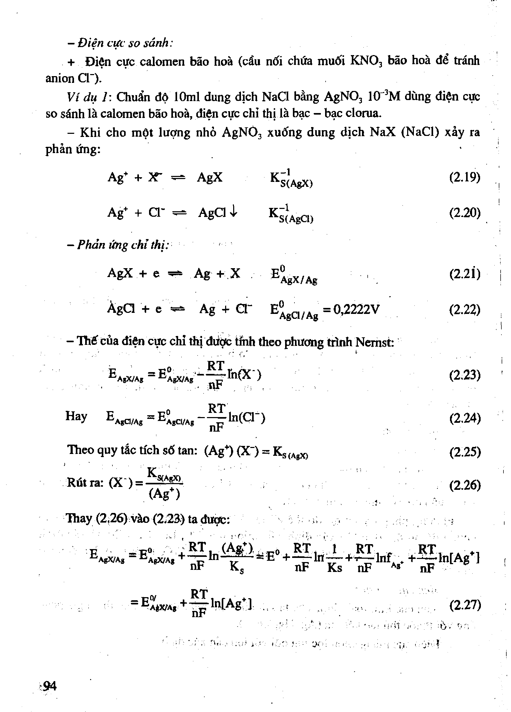

## Page 93

-  Tính nồng độ cân bằng [Ag+Ỉ:
Giả sử nồng độ ban đáu của Ag+ là c  moi// và của halogenua là X mol// Ca có: 
Ag+ 
+ X- ^  
AgX i
Ví dụ 2: Trường hợp ngược lại: Chuẩn độ lOml dung dịch A gN 03 bằng dung 
dịch X (X: c r , Br", I~) 10-ỈM dùng điện cực so sánh là calqmen bão hoà, điện cực 
chỉ thị bạc -  bạc(I) (Ag, Ag+) hoặc bạc -  bạc clorua' (Ag, AgQ).
-  Khi nhỏ từng giọt NaX xuống dung dịch AgN 03 xảy ra phản ứng:
Ag* + X' 
^  A gX ị
-  Phản ứng chỉ thị:
Ag+ + e ^  
Ag 
(Dùng điộn cực chỉ thị bạc ^ bạc(I)) 
(2.30)
-  Hoặc có thể là:
AgX + e —  Ag + X" (Dùng điện cực chỉ thị bạc -  bạc clorua) (2.31)
Giả sử điện cực chỉ thị là bạc -  bạc(I) thì phản ứng chỉ thị sẽ là phản ứng
(2.30).
ơ  
c  
X
[] 
C - X  + x 
X
X
X
Vậy [Ag+] = c  -  X + X
(2.28)
(2.29)
(2.32)
(2.33)
R T 1 r*
+ —Ị~ln[Ag ]
(2.34)
(2.35)

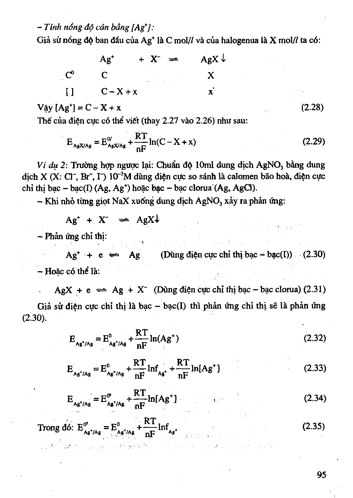

## Page 94

Thay (2.28) vào (2.34) được thế điện cực bạc -  bạc(I) theo phương trình 
Nemst: 
. 
I
E t 
=E°’ ♦ 
+ —
ln(C -X  + x) 
(2.36)
Ag /A g 
Ag /Ag 
n p
* Nếu bỏ qua các thế khuếch tán thì sức điện động của pin có thể viết 
dưới đạng:
E 
=E  
- E  . 
(2.37) 
I
nSdđ " “ a,*/** 
“ ca 
' 
.
Như vậy khi chuẩn độ A gN 03 bằng NaX:
E™ = E '. )AI+ 0,06lg(A g*)-E rj( 
ờ30°c . 
(2.38)
Ngược lại nếu chuẩn độ NaX bằng AgN03:
=Ej>I,(As-9,061g(a-)-Eá 
0 30^0 
(2.39) 
Ị
Hoặc 
Ejjj — EAgX/Ag -  Epgj 
(2.40)
Trong công thức (2.38) và (2.39) cho ta thấy: E^gX/Ag, E* * 
và E 0,1 là hằng
số. Vậy giữa giá trị ]g(CT) hay lg(Ag+) và sức điện động của pin (Esu), được tạo 
bởi 2 điện cực bên trong quá trình chuẩn độ, có sự phụ thuộc tuyến tính. Nếu thể 
hiện sự phụ thuộc giữa sức điện động và thể tích dung dịch chất chuẩn sử dụng khi 
chuẩn độ trên hình 2.11, sẽ thu được dạng đường cong chuẩn đô:
1. Đường chuển độ NaX bằng AgN 03 
2. Đường chuẩn độ AgNOj bằng NaX
96

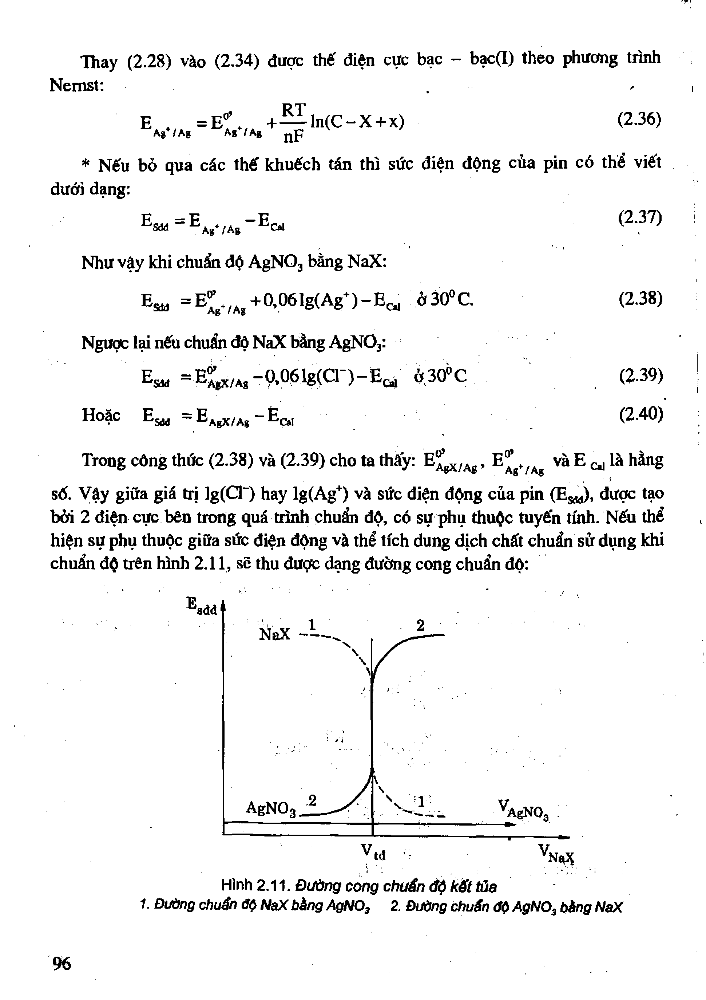

## Page 95

5.4.2. Bản chất cứa bước nhảy thế
Bản chất của bước nhảy thế khi chuẩn độ AgNOj bằng NaCl khi chọn điện cực 
chỉ thị là bạc -  bạc(I), điện cực so sánh là điện cực calomen bão hoà: Nhúng đỉện 
cực chỉ thị vào dung dịch AgN03 cần chuẩn độ, nhúng điộn cực so sánh vào cốc 2 
(xem hình 2.1), nối hai điộn cực với máy đo thế, bật máy khuấy từ và tiến hành 
chuẩn đô.
Hình 2.12. Sự biến thiên cửa đường dòhg thế trong quâ trình chuẩn độ AgN03 bằng NaCI 
Đường ỉ: Khi V 
= 0 , đường biểu diễn dòng anot và catot của hộ rất nhanh
Ag+ + e ^  Ag.0. V ì trong dung dịch chưa chuẩn độ chỉ có nồng độ Ag+ rất lán, 
ta không thấy dòng giói hạn anot và catot. Thế đo được là Ej, là thế cân bằng của 
điện cực bạc nhúng vào dung dịch Ag+ có nồng độ ban đầu là c°.
Đường 2: Đã có 99% Ag+ đã phản ứng với c r  tạo kết tủa AgCl. Dòng catot 
khi đó bị giới hạn do trong dung dịch có một lirợng chất điện li trơ (NaN03 vì 
chuẩn độ AgNOs bằng NaCl). Khi đỗ dòng anot ngược lại, không bị giói hạn, đo 
được thế Ej.’TM Ẹ^có giá trị âm hơn thếEị, theo phương trình Nemst (2.34):
■ ị1(! 7 : 
: rì/
là do nồng độ của Ag+ đã bị giảm đi 99% ữong quá trình chuẩn độ. : 
'
Đường 3: Có 99,9% lượng Ag+ đã tham gia phản ứng kết tủa với c r , đo 
được thế Ej. "Hìế E3 âm hởn thế E2 đo ĩiổng độ Ạg+ tiếp tực giâm trong quá 
trình chuẩn độ.
97

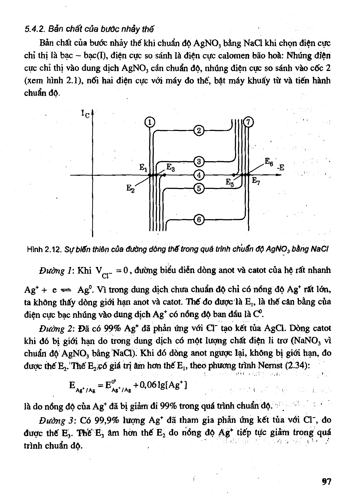

## Page 96

Đường 4: Là đường của điểm tương đương, đã có 100% lượng Ag+ đã bị kết 
tủa hết. Trong dung dịch chuẩn độ lúc này chỉ còn AgCl nằm cân bằng trên điện 
cực Ag, Ạg+, dẫn đến tạo ra hệ AgCl/Ag° là hệ rất chậm. Trên đường dòng thế có
2 phần:
Anot: Ag° 
—  Ag++ e
Catot: AgO + e ^  
Ag+ + Q '
Xuất phát từ 2 điểm cách xa nhau thì không thể đo được thế cân bằng tại điểm
tương đương của phép chuẩn độ. Như vậy cách tính toán như phần trên chỉ có tính
chất lí thuyết.
Đường 5 và 6: N aơ  thêm vào dung dịch dư, ta có hệ AgQ/Ag° + Cl" là hệ 
rất nhanh, vì AgCl là chất rắn, dòng catot không có giới hạn. Dòng anot có là đo 
phản ứng:
Ag° + c r — AgG + e 
Có thế cân bằng: Ẹa  = E ^+/A -  0,061g[CT] 
(2.41)
bị giới hạn do nồng độ Q ” nhỏ (dư ít). Nếu khi dư 0,1% c r  như vậy đã chuyển
sang đo thế cân bằng của một hộ mới. Đó là hệ AgCl/Ag + c r . Thế được xác 
định:
- . ^
7 = ^ , 0 - + 0 *06ỉg[Ag+] 
(2.42)
Trong khi đó, trước điểm tương đương, thế cân bằng của hệ Ag+/Ag xác định 
bằng: E ,„ = E " i Mi-0 ,0 6 lg ia -] 
(2.43)
Bước nhảy thế được xác đinh bằng: ẠE = E5 -  Ej 
(2.44)
Có nghĩa là ứng với 2 điểm thiếu và thừa 0,1% thuốc thử.
Bản chất của bước nhảy thế Ịà sự chuyển thế cân bằng của hộ này sang thế cân 
bằng cùạ hộ khạc. Sự khác biệt của thế oxi hoá -  khử tiêu chuẩn thực của hai hệ 
càng lớn thì bưóc nhảy thế khi chuẩn độ càng nhiều
5.4.3. Xác đinh điểm tương đương
5.4.3.1. 
Xác định điểm tương theo phương pháp đồ thị 
V
. 
-  Dựa vàọ điện uến cảạđưậng cong E-=-f (Vn); 
;
Vẽ Sự phụ thụộc Ẹ ò biểu thức @09); hoặc,(2,36) yàp th í ựqh Xỷ có thể là 
AgNOj hoặc NaCl (xem hình 2.13):

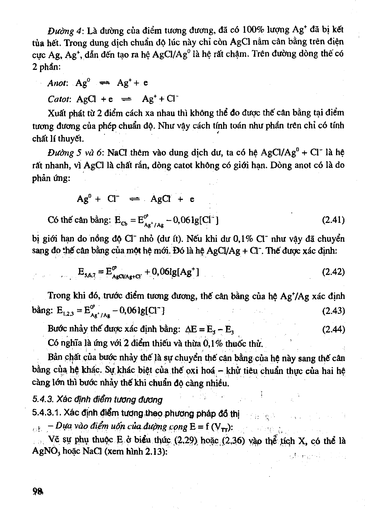

## Page 97

Hinh 2.13. Sự phụ thuộc E vào f(X) 
d"Et
-  Dựa vào cực trị của —  = f(VM„v) :
• 
dV 
N
Lấy đạo hàm bậc một dE theo X của phương trình (2.29) hoặc (2.36) ta được:
dX 
F (C -X  + x)
Tlieo quy tắc tích số tan:
K W )= [A g +]íX-] 
(2.46)
Trong đó 
= Ks(AgX).fA\.f x! là tích số tan điểu kiện hay tích số tan đối
với nồng độ. Thay (2.28) vào (2.46) được:
^s(AgX) = (C -  X + x)(X) 
(2.47)
Và lấy đạo hàm bậc 1 của dX theo dx của phương trình (2.47) được:
(_1+^L )x + (C -  X + X)—
= 0 
dX 
dX
d x  . 
_  
„  
x 
_  
d x  
X
——(x + C - X  + x) = X 
=> — - = -------— —  
(2.48)
dX 
dX 
C -X + 2 x
Thay (2.48) vào (2.45) được:
/
1 , 
X 
x 
.-C + X -2 x  + x.
dE 
RT ( 
i : - x , Ị 
RT ỵ c - X + 2x 
I  
. .. .
dX 
F 
(C -X  + x) 
F 
(C -X  + x) 
:
$9

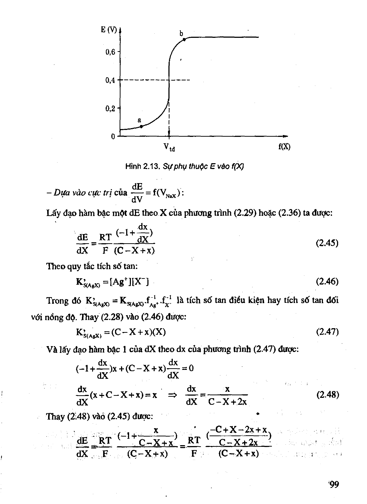

## Page 98

dE _ RT 
-(C -X  + x) 
RT 
1
d x  ~ F 
(C -X  + 2x)(C -X  + x) ' 
F C -X  + 2x 
dE
(2.49)
Vẽ đổ thi biểu thức —— = f(X) sẽ có cưc tri tai điểm tương đương khi c  = X 
dX
dE
cỏ nghĩa là —  = 0 khi X = c  (xem hình 2.14): 
dX
dE
d2E
-  Dựa vào đường tiệm cân của —— = f(X) :
dx
Lấy đạo hàm tiếp phương trình (2.49) được đạo hàm bậc hai đối với E: ^
d E _ RT 
dX2 “ F
f 
, 
2dx 
-1  +  -
—
 
dX
(C -X + 2x)2
(2.50)
(2.51)
thay (2.48) vào (2.50) đươc: ỂlL  = _ j * l f _ ( C _,x > 
Ỵ
■ 
đ x  
f
U c - X  + 2x)J
d2E *
Vẽ sự phụ thuộc 
vào thể tích của thuốc thử X' ta thu được 2 đường cong.
Thể tích tương đương là điểm trên trục hoành, được xác định bằng cách kẻ đường 
thẳng tiệm cận song song vói trục tung, đưòhg thẳng này cách đểu hai đường 
cong, cắt trục hoành ở đâu, đó chính là giá trị của thể tích tương đương:
Ìâỡ

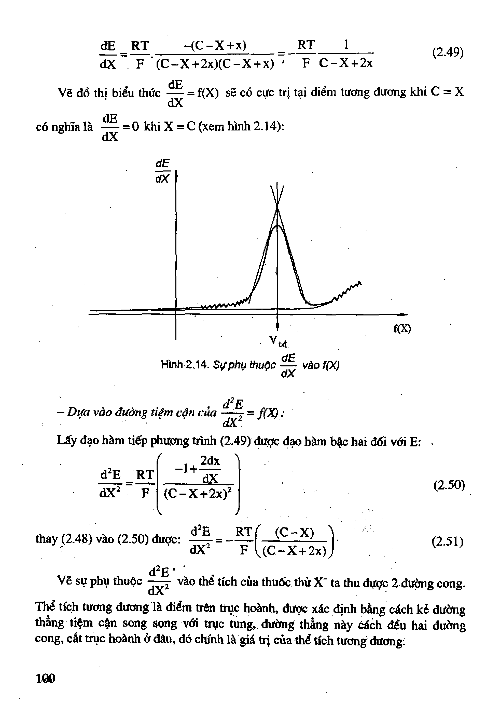

## Page 99

5.4.3.2. Xác định điểm tượng đương, theo phương pháp giải tích
Để xác định thể tích tương đương theo phương pháp tính toán, cũng tương tự 
như trường hợp chuẩn đô đo thế đối với axit -  bazơ nhưng không phải là pH mầ 
là E.
Trên đây là trình bày việc tính toán và xác định điểm tương đương theo lí 
thuyết. Sau đây ta sẽ xét cụ thể một trường hợp xác định thể tích tương đương dựa 
vào kết quả đo thế (E) trong suốt quá trình thêm dần thuốc thử (X) vào dung dịch 
chuẩn độ.
5.4.4. Ví dụ xác định nồng độ NaCI bằng chuẩn độ điện thế bằng AgN03
5.4.4.1. Cách tiến hành
Chuẩn độ 25ml N aơ  Cỵ bằng AgN03 0,2314N. Chọn điện cực chỉ thị là điện 
cực Ag, Ag+, điộn cực so sánh là điện cực oalomen bẵo hòa. Nhúng hai điện cực 
vào đung dịch NaQ cần chuẩn đô. Nối hai điộn cực vổi máy đo thế, bật máy 
khuấy từ và tiến hành chuẩn độ Kết quả đo và tính toán các giá trị được thể hiện 
trong bảng 2.3. (Số liệu này được ỉấy trong tạp chí "Gran G. Acta. Chim. Stand* 4, 
599,1950").
Bảng 2.3. Kết quả đo được và tính toân các giá trị khi chuẩn độ NaCI bằng AgN03
TT
Vn»OH
AV
E
AE
V'
AE'
AV
AV
AE
V”
A2E
AV2
(2)
(3)
(4)
(5)
(6)
(7)
(8)
(9)
(10)
1
0
0,063
2
15,60
0,161
•
15,65
5,0
020
3
15,70
0,166
•
0,10
Ọ,007
15,75
7,0
0,143
4
V = 15,8
0,173
í'
V = V ”
V” = 15,80
+2
0,10
0,009
15,85
9,0
0,111
5
15,90
0,182
15,90
+5
0,10
0,014
15,95
14
0,071
6
16.00,
0,196
16,00
+15
0,10
0,029
16,05
29
0,034
7
16,10
0,225
16,1
, +35
0,064
16,15
64
0,016
101

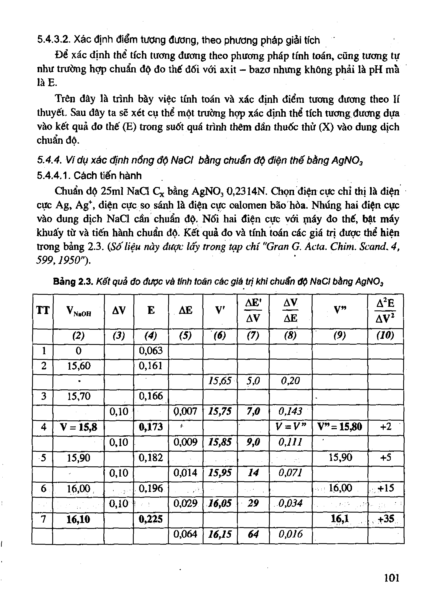

## Page 100

TT
VnsOH
AV
E
AE
V'
AE'
AV
AV
AE
V”
A2E
AV2
(2)
(3)
(4)
(5)
(6)
(7)
(8)
(9)
(10)
8
16,20
0,289
16,20
-34
0,03
16,25
30
0,033
9
16,30
0,319
16,3
-14
0,016
16,35
16
0,063
10
16,40
0,335
16,40
-5
0,011
16,45
11
0,091
11
16,50
0,346
5 4.4.2. Cách xác định điểm tương đương bằng phương pháp chuẩn độ điện thế 
a. Xác định V tương đương theo phương pháp đồ thị
-  Dựa vào điểm uôh của đường cong E ^/(V jy)
Vẽ sự phụ thuộc E ở cột (4) vào VAgNO ở cột (2) được;
E (mV)
Hình 2.Ị5 a. Sự phụ thuộc E vào VAgNŨ3
Xác định V tương đương bằng cách từ điểm uốn củâ đường cong kẻ đưòng 
thẳng song song với trục tung, cắt trục hoành ở VAgN0 = 1 6 ,1 2 m lđó chính là thể
tích tương đương.
102

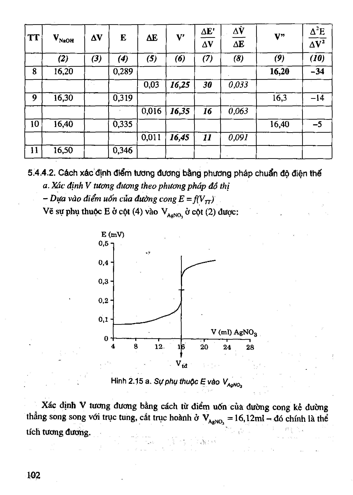

## Page 101

-  Dựa vào cực trị của —  = f(Vl 
)
Ạy 
■>' AgNOj /
AE
Vẽ sự phụ thuộc-----ở cột (7) vào 
N0 ở cột (6) được:
AE
AV
Hình 2.15b. Sự phụ thuộc 
vào V^sNOj
Từ điểm cực đại (max) của pic kẻ đường song song với trục tung, cắt trục 
hoành ở VTd = 16,15ml.
Đường cong Gran được sử dụng để xác định điểm tương đương, từ đó tính VTd.
Vẽ sự phụ thuộc 
ờ cộỉ (8) vào V^sN0 ở cột (6) đìĩợc:
103

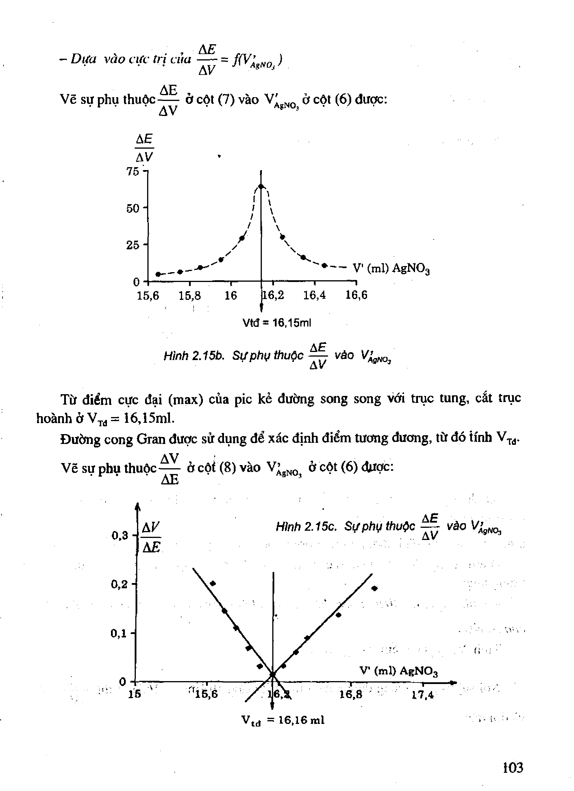

## Page 102

Kẻ hai đưòng thẳng, hai đường này cắt nhau tai 1 điểm, từ điểm này kẻ đường 
thẳng song song với trục tung, cắt trục hoành tại điểm VTd = 16,16ml.
_ 
ÁZE
-  Dựa vảo đường tiệm cận của — 7 = f(y^No, ) '■
à2E
Vẽ sự phụ thuộc — 2 ở cột (10) vào V”gN0 ở côt (9) được:
AV 
*
A2£
_ẠVJ 
50 1
2 5 -
0
lí
-25- 
-50 -
I*
//.
,6
—r~ 
16,1
V" (ml) A g N 0 3
16,6
4t
Hình 2.15d. Sự phụ thuộc 
vảo V„*g«Q
AV*
Kẻ đường thẳng song song với trục tung cách đều 2 đường cong ở 2 phía và 
cắt trục hoành ố VT(J = 16,15ml.
5.4.4.2. Xậc định định điểm tương đương theo phương pháp giải tích
Điểm tương đương đượe xác định bằng phương pháp “nội suy” tói thể tích 
tương ứng:
-  
Tính V^ọ^tại điểm tương đương theo phương pháp giải tích và tính nồng độ 
củaAgNOỳ 
^
Tính VAgNƠ3 tài điểm tương đương:
' 
â2e
Nội suy VAgN0 tương đương nằm trong khoảng lộ,lm l -> 16,2mĩ, thì — J =  0
AV
và đổi dấu.
m

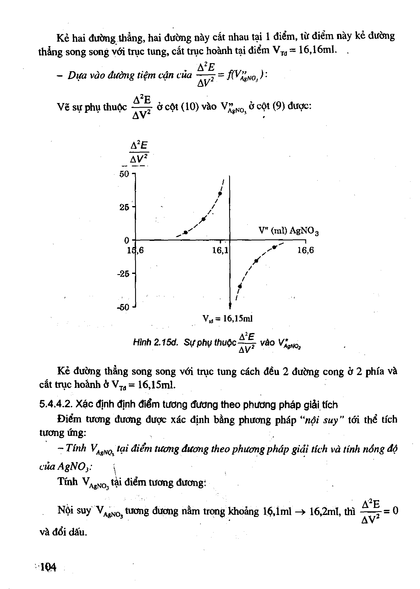

## Page 103

v7 = 16,1ml
Vg = 16,2ml
{ A2E^
vAV2,
= +35
{ A2pH^ 
AV2
= -34
úng với sự biến thiên V7 —> v8: 0,10ml
Thì biến thiên A2E
là 35 -(-3 4 ) = 69
AVZ
A*E
Vây AVX = ? 
để - - - f  = 35,0*0,0
J  
X 
ẠV
AVX = AV.
35 0 
35
-------------------0 ,1 .— = 0,1.0,507
35,0 -(-3 4 ,0  
69
AVX = 0,1.0, 507 = Ọ,0507ml* 0,05 iml 
VTđ = v7 + AVX = 16,1 + 0,051 = 16,151(ml)
A2E
Hoặc:-----Y = 0 , ưưóc và sau điểm tương đương có sự đổi dấu.
Tính VT.d AgNQ3 = ?
(2.52)
A2E
VTđ AgNOj tại thời điểm -----2 = 0- Như vậy VTđ nằm trong khoảng 2 giá trị
từ +35 đến -34 (7 -> 8) tương ứng với thể tích từ 16,1 ml đến 16,2ml thì giá trị: 
A2E
-— Y đổi dấu, vậy áp dụng công thức tính:
V =  V, + AV-
Trt 
*
í a2e ì
/
a2e ì
Uv2J7
a v 2Jr.đ
Ị a 2e
\
ị á 2E N
Uv* ỉ
Uv2,8
Vfe(AgNQ,)= 16,<10+0,1.
35,0
35,0-(-34,0)
= 16,10+0,051 = 16,151ml 
(2.53)
105

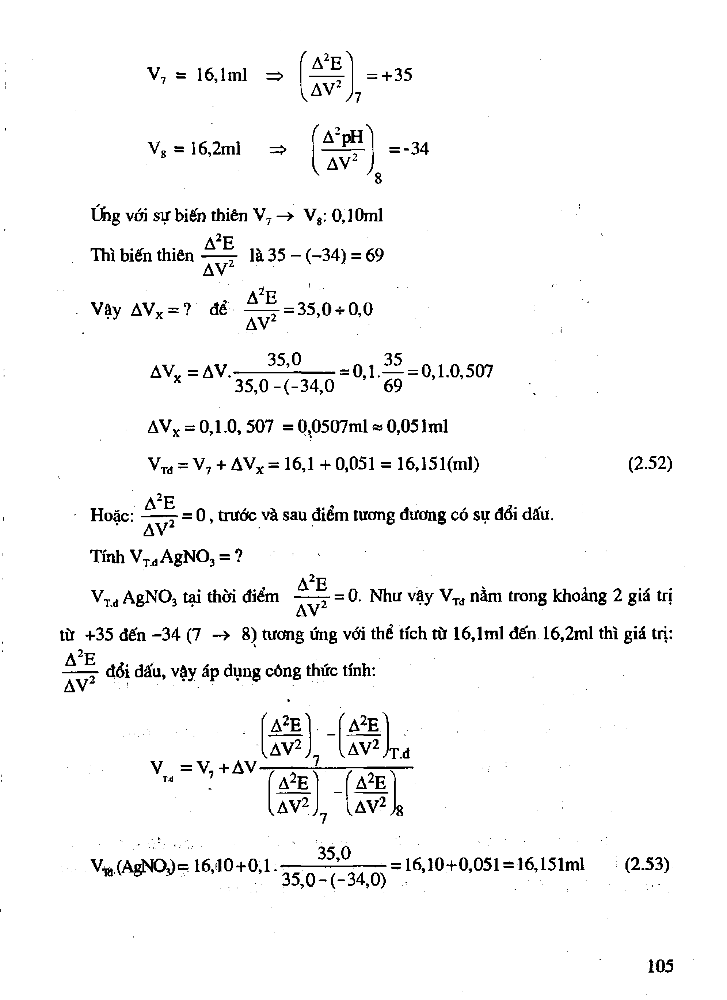

## Page 104

Tính nồng độ của NaCl:
c  
_  Yi£ _CASm  = ------18,151.0,23 14 _  = 0> 14949 g 0> 1495 N 
(2.54)
V 
25
NaCl 
J
Vậy: VT d = 16,151ml; C = 0,1495N tương đương với 3,737mmol NaQ
5.4.5. Trường hợp chuẩn độ hỗn hợp halogenua
Ví dụ: Chuẩn độ 25ml dung dịch chứa Cl", Br~, I' bằng AgNOj 10"3M.
Dựa vào kết quả đo thế (E) trong quá trình thêm dần dung dịch thuốc thử 
AgN03 và sẽ đồ thị thể hiện sự phụ thuôc thế (E) vào thể tích AgNOj thêm vào 
trong quá trình chuẩn độ. Khi halogenua nào tạò kết tủa vód Ag+ có tích số tan nhỏ 
nhất sẽ xảy ra phản ứng trước, sau đến các halogenua tiếp theo.
Vây theo Ihứ tự: K ,,„) = 10 “ < Ka w ) = L<rlu 
< KSAja) = 10-'°
Phản úng chuẩn đô:
I- + 
Ag+ —  A g lị 
Kĩ(‘AsIJ = 10'« 
' 
(2.55)
Br- + Ag* —  
AgBr l  
K-sỊiiBr, = 10,ỈJ 
(2.56)
C1-+ Ag* —  A g C li 
K ^ ,  = 10” 
(2.57)-
Nhìn vào đồ thị ta thấy đưòng cong chuẩn đô có dạng từng nấc:
Nấc 1 ứng với khi chuẩn độ I~;
Nấc 2 ứng với khi chuẩn độ Br“;
Nấc 3 ứng với khi chuẩn độ c r.
Xác định thể tích, tương đương tương 
tự như trên. Từ điểm uốn của từng bậc
thang kẻ đường song song với trục tung cắt trục hoành ở điểm là thể tích tương
đương (A gN 03) ứng với từng haỉogenua (hình 2.16).
— Chuẩn đô Zn2+ bằng thuốc thử kali feroxianua: tạo thành kết tủa trắng xanh 
2Zn2++ [Fe(CN)45-] 
^  Zn2[Fe(CN)6] ị 
(2.58)
lon Zn2+, [Fe(CN)JJ là những chất không điện hoạt.
Muốn chuẩn độ đo thế để xác định nồng độ Zn2+ bằng chuẩn đô kết tủa với 
thuốc thử kali feroxianua, ngưòi ta phải cho thêm một lượng xác định kali 
ferixianua (K3[Fe(CN)6]) vào đung dịch chuẩn độ ngay từ đầu.
106

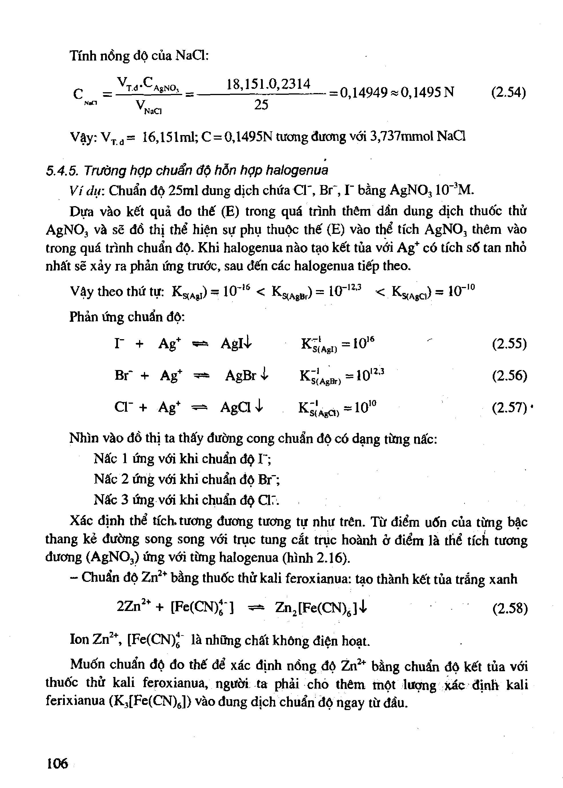

## Page 105

Trước điểm tương đương:
2Zn2+ 
+Fe(CN)fi4- 
—  
Zn2[Fe(CN)6] ị 
(2.59)
Vì có lượng Fe(CN)j~ trong dung dịch chuẩn độ sẽ có:
Phản ứng chỉ thị:
Fc(C N £  
+ e 
—  Fe(CN)64' 
(2.60)
Sau điểm tượng đương:
Khi Zn2+ đã hết, cho dư 1 giọt K4[Fe(CN)6] thì có phản ứng chỉ thị:
Fe(CN)f ^  
Fe(CN)^ + e 
(2.61)
Phựcmg trình tính thế (E) trong quá trình thêm đần thuốc thử kali feroxianua 
vào dutíg dịch chuẩn độ được áp dụng phương trình Nemst đối với phản ứng (2.60) 
hoặc (2.61.) như sau:
RT 
[Fe(CNỆ]
^nrè<đN:tỳrFe(CN)b 
np 
[Fe(CN)f]
E = E° 
...... „4- + —
ln[Fe(CN)g”]-^ in [F e (C N )^ ] 
(2.62)
^  
[Fe(CN^ ]/[Pe(CN)^ ] 
n F  
n F
Nhtrban đầu đã nói cho một lượng KjfFe(CN)ft] xác định có nghĩa là:
Fe(CN)g' = const = a 
(2.63)
Vậy có thể viết:
107

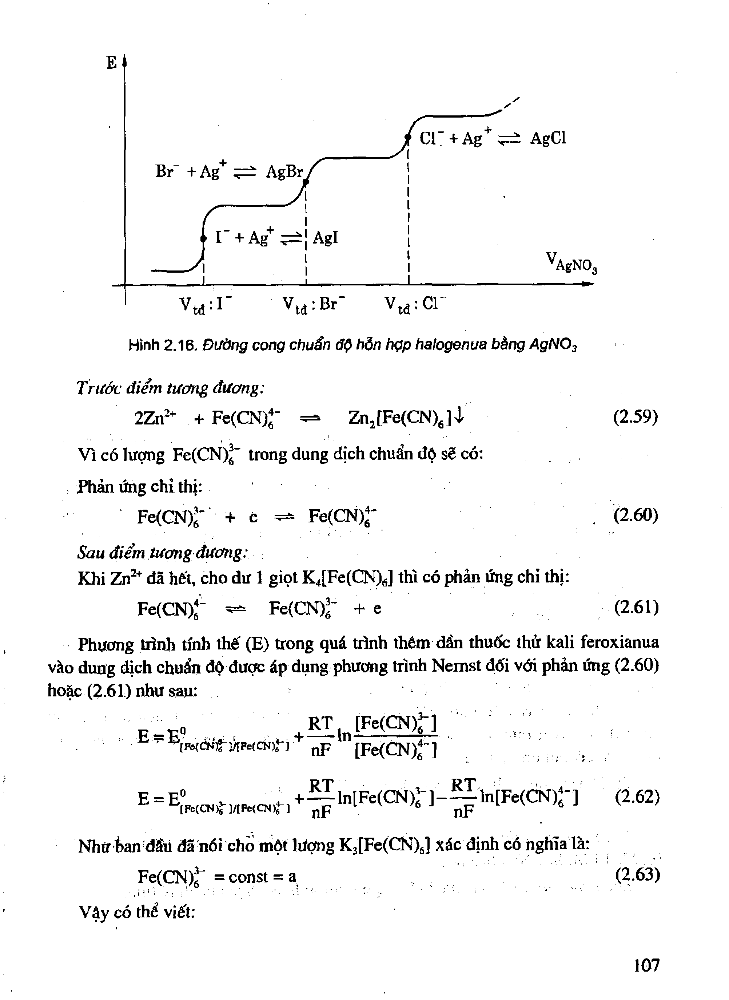

## Page 106

E = E° 
v 
4 + a - — ln[Fe(CN)64-] 
(2.64)
[F e(C N )f]/[F e< C N £-l 
p  
L 
' 6  J
Nhìn vào công thức (2.64) cho thấy thế của đung địch chuẩn độ phụ thuộc vào 
thể tích (nồng độ) kali feroxianua cho vào.
[Fe(CN)*-] = í ^ g
^  
(2.65)
6 
[Zn ]
thay (2.64), (2.65) vào (2.62) được:
E = E° 
v 
4_ + a - ^ l n K s + ^ ^ ln [Z n 2*] 
(2.66)
Hoăc: 
E = E°’ + —
ln[Zn2+] 
(2.67)
F
RT 
'
Trong dó: £«• =E»WCT(irim(CN)ri+a - ^ - l „ k s 
(2.68)
Từ (2.67) cho thấy thế phụ thuộc vào nồng độ của chất cần xác định (nồng độ 
của ion kẽm Zn2+).
Cũng như các phương pháp chuẩn đô khác, sau khi đã đo được thế của dung 
dịch chuẩn độ phụ thuộc vào nồng đô của chất cần chuẩn độ hoặc thể tích (nồng 
độ) của thuốc thủ thêm dần vào trong quá trình chuẩn độ, tiếp theo thể hiện chúng 
lên đồ thị để xác định V tương đương theo phương pháp đổ 'thị hoặc tính toán.
6. Tiêu chuẩn hoá pH và các phương pháp xác định 
6.1'Tiêu chuấn hoápH
Phương pháp điộn thế được dùng để đo thế (E), ngoài ra còn ứng dụng quan 
ưọỉig của phương pháp này để đo pH của các dung dịch trong quá trình chuẩn độ 
hay các dung dịch nghiên cứu (chính vì vậy người ta đã sản xuất các loại máy đo 
pH có khả năng vừa đo được pH (vạch trên) vừa đo được thế E (vạch dưới)). Các 
phép đo pH đều dựa trên việc đo sức điện động của pin nguyện' tố điộn hoá với 
mạch đo có cầu nối như sau:
Pt (H2) I dung dịch X jỊ KG bão hoà I Hg2Cl2 t Hg
^Kt 
Eq,)
Điện cực so sánh: Điộn cực bạc -  bạc clorua hay calomẹn tĩong dung dịch
0,1M; 1,0M; hay KC1 bão hoà.
Điện cực chỉ thị: Điện cực hỉđro, quinhiđron hoặc điện cực thuỷ tinh.
108

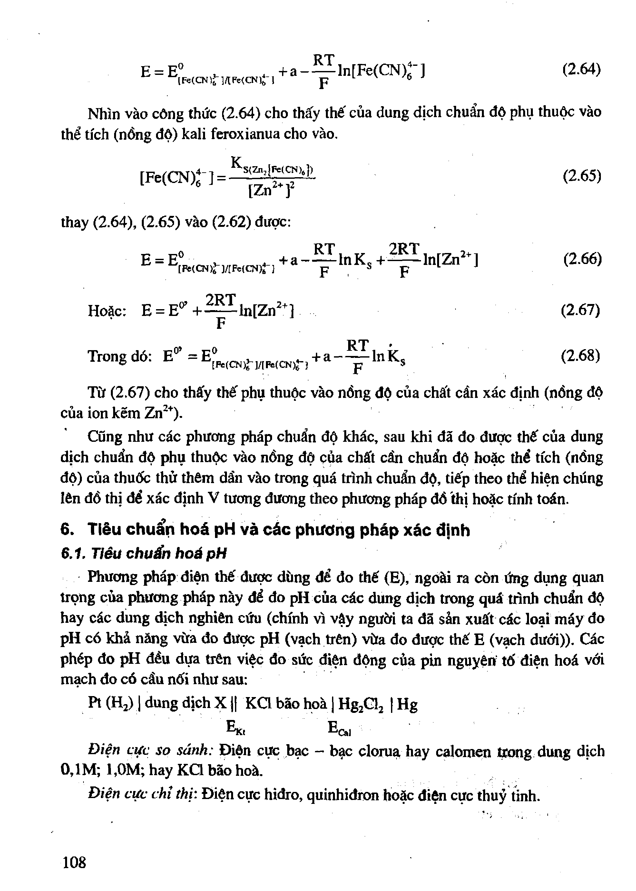

## Page 107

Sức điện động của pin được tính:
Esdd = Ep — Ep, — (Eqj| + E J  — EHj
(2.69)
-lg(H +)
=
„,íEc°i+^Kt)JF 
(2.70)
2303.RT
Khi hê số hoat đô của hiđro f „ = 1 có thể viết:
* 
H
pH = -E&m — ^Ecal ị ^Ki ^ — 
(2.71)
2,303-RT
Từ (2.71) cho thấy hoạt độ của ion hiđro hay pH của dung dịch X phụ thuộc 
vào sức điện đông của pin nguyên tố điện hoá đó và giá trị Eq,! + Ek, gọi là thế 
chuẩn của pin nguyên tố điện hoã, Như vậy muốn xác định được pH của dung 
dịch X theo giá trị sức điện động của pin, thì nhất thiết phải xác định được giá trị 
ECal + EKt. Giá trị EKl cho đến náy chưa xác định được, nhưng người ta biết rất rõ 
tính chất của EKt, nó có giá trị thay đổi và phụ thuộc vào pH của dung dịch. 
Vì vậy khi đo, Ek, được gộp vào cùng với giá trị Ecu- Tổng (Ed + E J  có những 
tính chất sau:
-  TTiế chuẩn của nguyên tố này (E&| + Ek,(1)) khác với thế chuẩn của pin
nguyên tố điện hoá khác (Eai + Eị^Z)) mặc dù có cấu trúc hoàn toàn giống nhau vì:
-  Phụ thuộc vào pH của dung dịch;
-  Thay đổi theo thời gian.
Để có 'thể đo được pH chính xác của dung dịch X có phương pháp gọi là 
“chuẩn hoá lại mấy" bằng dung dịch chuẩn (thường là dung dịch đệm có pH cố 
định và chính xác) trưóc khi đo dung địch nghiên cứu.
Cơ sở của phương pháp này nhứ sau:
Lợi dụng tính chất của “thế chuẩn (EClJ + EKl) ” phụ thuộc vào pH, vây pH cố 
định dẫn đến (Eq* + Ejo) cố định. 'Hến hành đo đung dịch đệm có pH cố đỉnh, ví 
dụ pH = 4,01 dùng núm vặn điều ehỉnh (có-sẵn trên máy đó pH) sao>cho kim điện 
kế chỉ đúng giá trị pH của dung dịch độm bằng 4,01 (trong suốt quá trình đo pH 
không được chạm vào núm điều chỉnh pH). Như vậy pH cố định dẫn đến gỉá trị 
(Ecb + Ek,) sẽ eốđịnh. 
I 
f
-  Giá trị Ejjh của pin với dung dịch đêm chuẩn được xác định bằng:
'ì l A - J  D T
E ^ = E ^  + E’Kl+^ P ± - PHd 
(2.72)
109

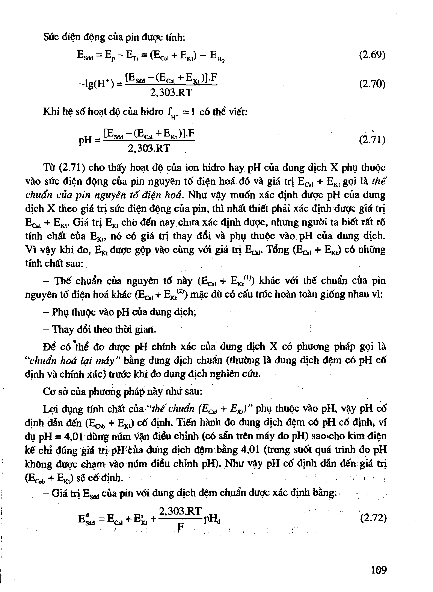

## Page 108

Sau đó đưa dung dịch chuẩn ra, rửa điện cực bằng nước cất 2 lần, dùng giấy 
mềm thấm hết các giọt nước đọng trên điện cực. Đưa dung dịch nghiên cứu vào 
đo, khi này:
Y 
^ 
. 2,303.RT
+ 
p 
pHx 
v(2.73)
vì (Eca +  E*,) = (E c  + EKt) (đã được chuẩn bằng nhau).
Tổ hợp (2.68) và (2.69) rút ra:
(2-74>
-  Muốn có giá trị pH đo được chính xác phải có nhiều dung dịch đệm có pH 
chuẩn (chính xác) để chuẩn hoá máy đo pH vì pH của dung dịch đệm chuẩn này 
càng gần với giá trị pHx cần đo bao nhiêu thì E ’Ktcàng gần với EKt (Efc, = EKt), có
nghĩa là mỗi một khoảng pH (axit, trung tính và bazơ) phải có dung dịch độm 
chuẩn có pH chính xác để chuẩn hoá pH của máy trước khi đo dung dịch nghiên cứu. 
Hiện nay Quốc tế công nhận các dung dịch đệm sau đây có pH chuẩn ờ 25°c là:
1. Dung địch kali tetraoxalat KH3{Ci04)2 0,05M có pH = 1,68.
2. Dung dịch kali hỉđrophtáiat QH50 4K 0,05M có pH = 4,01.
3. Hỗn hợp dung dịch KH2P 04 0,025M + Na5HP04 0,025M có pH a 6,86.
4. Dung dịch borax Na2B40 7.10H20  0,025M có pH = 9,18.
Ví dụ: Cân chính xác 0,6804 gạm KHjPQ4 hoà tan bằng nước và định mức vào 
bình lOOml đuợc đung dịch có 0,05M và cân chính xác 0,7098 gam Na2HP0 4 hoà 
tan bằng nước cất và cũng định mức yào bình 100ml sẽ có Na2HPQ4 0,05M. Trộn 
2 dung dịch này với cùng thể tích thu được hỗn hợp dung dịch KHjPO.^ 0,025M + 
Na2HP04 0,025M có pH = 6,86 ở 25°c.
6.2. Gàc phương pháp xác định pH
Muốn xát định pH của dung dịch nghiên cứu người ta dùng mạch đo gồm 
điện cực so sánh là điện cực calomen,(có nồng độ 0,01 M; 0TlM hay KQ bão hoà) 
và điện cục chỉ thị làm vĩệc thuận nghịch vcã ion hiđro (điện cực hidro, điện cực 
quinhiđron hay điộn cực thuỷ tinh). Sau đây xét một vài trường hợp cụ thể:
6.2.1. Sử dụng điện cục hiđro
-  Mạch đo được sử dụng: 
' A
Pt (Hj) I Dung dịch đo pHx IIKC1 bẵo hoà Ị Hg2a 21 Hg 
(2.75)
110

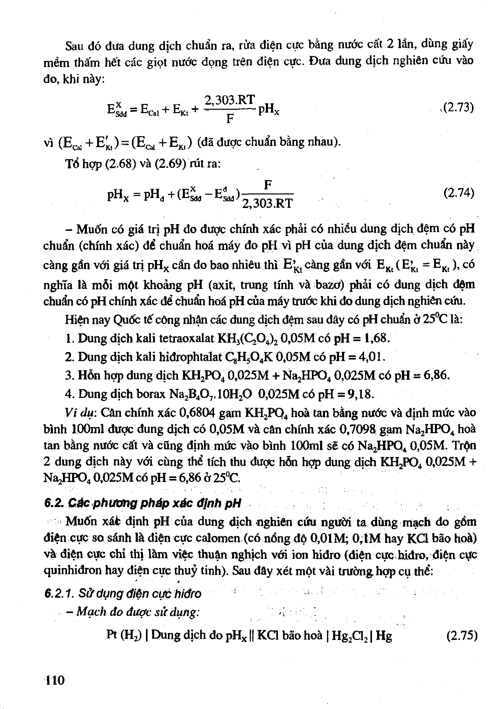

## Page 109

-  Cách tiến hành:
Ví dụ đưa cốc đựng dung dịch đệm có pH = 6,86 vào giá đỡ, hạ giá kẹp bộ 
điện cực để bộ điện cực nhúng vào dung dịch đệm đến ngập bầu điện cực, bật máy 
khuấy từ, bạt núm pH, vặn núm điều chỉnh kim điện kế về vị trí pH = 6,86. Đợi 
1 - 2  phút kim điện kế vẫn chỉ ở pH = 6,86 chuyển sang bạt núm đo thế (E).
Để cho kim điện kế ổn định ghi giá trị sức điện động khi đo dung dịch đệm.
E L = E Cal+E ’t - E đH 
(2.76)
Nâng kẹp giá bộ điện cực lên, dùng nước cất rửa điện cực, lấy giấy mềm thấm 
những giọt nước còn đọng lại trên điện cực. Cho cốc đựng đung dịch cần đo pH 
vào hạ giá đỡ bô điện cục xuống ngập bầu điện cực, bật núm đo thế (E) đọc giá trị 
sức điện động: 
E^J = 
+ EỊa -  E„ 
(2.77)
Từ (2.76) rút ra được: 
E^, + E^, = 
+ EdH 
(2.78)
Cũng từ (2.77) ta có: 
+ E’Kt = E^jđ + E„ 
(2.79)
Vì đã chuẩn hoá cho nên: E^ị + E’Kt = E^, + EKt
nên ta có: 
E*đ + E„ = E^j + E„ 
(2.80)
Eh = E ^ + E - - E ^  
(2.81)
Ta đã biết: 
—
ln(H+)x 
(2.82)
F 
'
E t=  —  ln(H+ý 
(2 83)
F
Thay (2.82), (2.83) vào (2.80) được:
r •
^ ln (H * )x = E iM,- E Í ,+ ^ ln ( H * ) ' 
(2.84)
F 
F
Thay các giá trị và đổi logarit tự nhiên sang logarit thập phâíi và ở 25°c có
'p H x =pH 4 + 5 %
- ^  
(2.85)
1 
x 
1 
đ 
0,059 
, 
,
6.2.2. Sử dụng điện cực quinhiđron
Sơ đổ mạch đo: 
Ị 
,
Pt I Q, H2Q| Dung dịch đo pHx II KCỈ bão hoà ị Hg2ơ ,  I Hg 
(2.86)
111

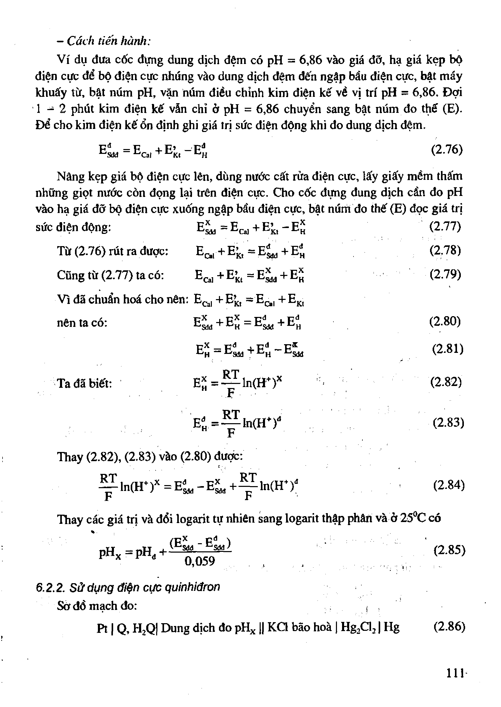

## Page 110

Biện luận tương tự như trường hợp 6.2.1, chỉ thay điện cực chỉ thị hiđro bằng 
điộn cực quinhiđron và pH của dung dịch cần xác định theo công thức (2.85).
Ví dụ: Tính pH của dung dịch X, khi đo sức điện động của dung dịch này với 
mạch đo (2.75) được 
= -0,2015V thay dung dịch X bằng dung dịch đệm có
pHđ = 4,01; đo được 
= -0 ,2264V, đều ở 30°c.
Áp dụng công thức (2.75) tính được: 
'
+ -a2Ọ15± Ọ^264 
!
x 
0,06
Ổ. 2.3. Sử dụng điện cực thuỷ tinh 
Sơ đồ mạch đo:
Điộn cực thuỷ tinh I Dung dịch đo, pHx IIKG bão hoà I Hg2Cl2 1 Hg 
(2.87)
Khi dùng mạch đo này để xác định pH của đung dịch X thì sức điện động 
I
được xác định như sau: 
1
^Sdd = Ecaj + EKt — ETIpC) = a +b.pHx 
(2.88)
Vây 
pHx = E“ « ~ a 
(2.89)
b
Từ (2.88) cho thấy muốn xác đinh được pHx cần phải xác định được a và b. 
I
Về mặt toán học phải có 2 phương trình với hai ẩn số a và b mới giải đuợc. Để giải 
quyết vấn đề này về mặt thực nghiệm hoá học sẽ dùng 2 dung địch đệm có pH 
chính xác để chuẩn hoá điện cực thụỷ tinh với điều kiện:
-  Các dung dịch đệm có pHd gần vói giá trị pHx của dung địch cẩn xác định.
-  Chọn 2 dung dịch đệm thoả mãn điều kiện: pH,j(1) < pHx < pH jj2)
Đo sức điộn động của Iíiạch (2.87) với dung dịch đệm (1) được:
E «> = a + b.pHJ(l) 
(2.90)
(2.91)
(2.92)
112«
Vối đệm (2) được:
E ^ = a  + b.pHd(ĩ)
Rút b từ phương trình (2.90) và (2.91) được:
■pdt1) _ p đ(2)
-  
SJd 
E-Sdd
P^d(l) - P^đ{2)

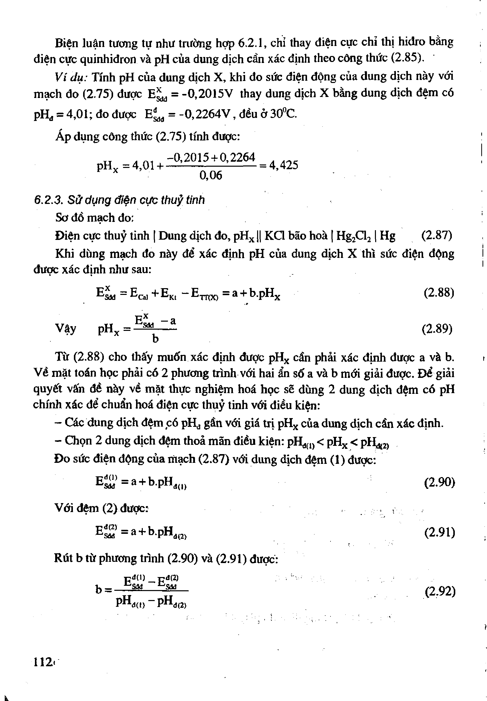

## Page 111

Thay b vào công thức và tính được a:
T3đ(l) 
xjd(2)
(2.93)
Thay a vào b vào (2.89) được:
-cd(t) 
r;d<2)
nu  ____________ r 
I
(2.94)
p^d(l) 
p^d(2)
Ví dụ: Để đo được pHx của dung dịch nghiên cứu, trưóc khi đo tiến hành 
chuẩn hoá máy bằng 2 dung dịch đệm với mạch đo (2.87) kết quả như sau:
Với dung địch đệm (1) có pHđ(1) = 6,85, đo được 
=0,4528V
Với dung dịch đệm (2) pHd(2) = 9,18, đo được Ea£  = 0,7186V
Và khi đo dung dịch X được sức điộn động Ex = 0,6092V, các phép đo đéu 
thực hiện ở 30°c.
-  Tính b theo công thức (2.92) được:
b ĩ; 0,4528 -  0,7186= : f t j g 8 =0 
6,86-9,18 
-2,5 ,
Thay giá trị b vào (2.93) tính được a:
a = Ed(l)-b.pH d(1) = 0,4528 -  0,10632.6,86 = -  0,2766
Thay a vào b vào (2.94) tính:
Thoả mãn điều kiện:
pH^ị) = 6,86 <pHx = 8,33 < pH^) = 9,18
Ngoài các phương pháp xác định pH cùa dùng địch nghiên cứa bàng phương 
pháp đo thế còn có thể xác định pH bằng phương pháp đo màu.
113

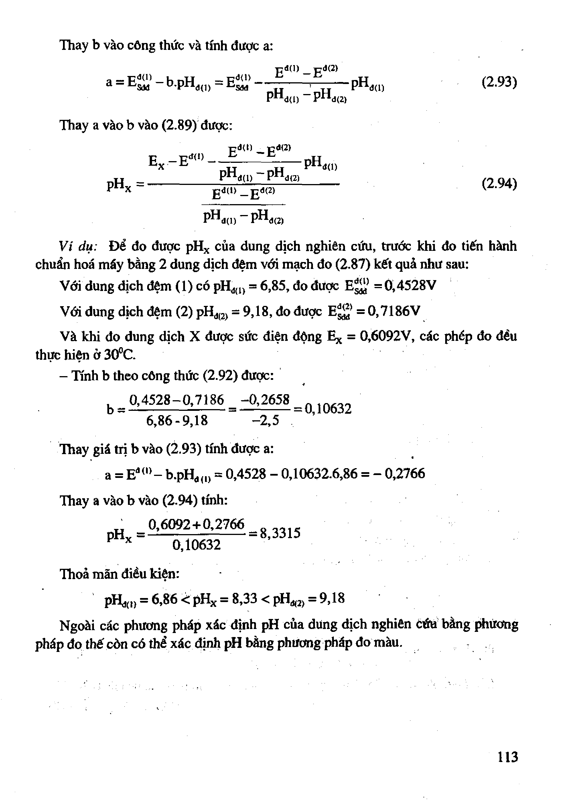

## Page 112

BÀỈ TẬP CHƯƠNG 2
1. Biết rằng khi ngưèri ta chuẩn độ 10,0mì dung địch axit axetic bằng NaOH thì 
hết 14ml NaOH 0,220M bằng phương pháp chuẩn độ điện thế với điộn cực so 
sánh là calomen bão hoà và điộn cực chỉ thị là quinhidron.
Hãy xác định thế của điện cực quinhiđron ở các thời điểm sau:
a. Chuẩn độ hết 70% axit axetic (có và không kể đến sự thay đổi thể tích).
b. Tại thời điểm tương đương.
Cho biết Ở3Ơ>C: E ^ 2Q = 0,689V; E0^
 =0,224V ; p K ^  = 4,76.
Đáp số: a) 0,3864 V; b) 0J62V
2. Hãy tính tích số tan của bạc clorua (KstAgct)) ở 25°c. Cho biết thế của điện cực
bạc nhúng trong trong dung dịch bão hoà bạc clorua bằng 0,518V so vói điện 
cực hiđro. Cho b iết: 
= 0,22Ỷ.
Đáp số: Ks= 7 ,9ỉ.l0'il.
3. Cho biết sức điện động của mạch: Pt (H2) I đd đo II KC3 IM I Hg2Cl2 1 Hg ờ 
25°c là 0,57 IV. Hãy tính pH của đung dịch đo.,
Cho b iết: Ece,omen = 0,282V.
Đáp số: pH = 4,9.
4. Người ta đo pH của các dung dịch amoni clorna dùng hai dung dịch đệm đã 
biết trước pH chính xác và khi đo:
-  Dung dịch đệm 1 có pHj = 4,0 thì đo được sức điện động: Ej., = 0,270V
-  Dung dịch đệm 2 có pH2 = 6,70 đo được sức điện động: 
ÍS 0,450V
-  Dung dịch X (NHƠ) có pHx = ? đo được sức điệu động: Ex= 0,360V. Hỏi:
a. Dùng loại điện cực gì làm điện cực so sánh và chĩ Ịhị?
b. Tứih nổng độ mol// ban đẩu của NH4Q . Cho b iết: pK 
+ =9,24
NH^
Đáp sấ: 1Q~IA6M = 0,0346M.
5. Hãy xậc định sức điện động của pin điện sau ờ 30° C: 
, ị
_ „  , 
, 
. I TrộnlOmlNaOH 0,Ũ2M " 
^
Pt, H3(p = latm) 
_ 
, 
KClbẵo hòa Hg2Cl, I Hg
với 40mỉ HCN 5.10 M
Cho biêh pKHCN = 9,35. Thế điộn cực của điện cực calomen bão hữà là: 0,242V.
Đáp sổ: Em  -  0,7373V
114

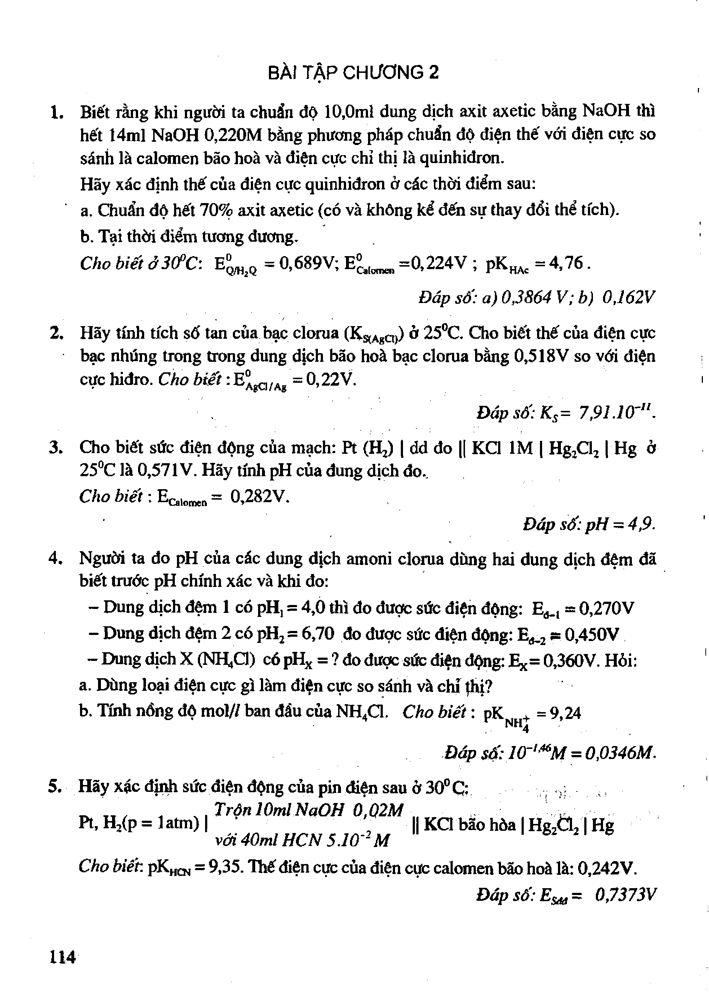

## Page 113

6. Hãy tính các đại lượng biến thiên cho kết quả chuẩn độ 100ml dung dịch 
SnCl2 bằng Fe2(S04)3 0,0050M sử dụng mạch đo:
Pt I Sn2+ Ị| KC1 bão hoà I Hg2Cl21 Hg
và tính VTđ của Fe2(S04)3 nếu kết quả đo được như sau:
TT
V
 (ml)
AV
E(V)
AE
AE
ầV
V
a2e
AV2 ,
1
99,5
15
2
99,7
-1,5
3
99,9
-39
4
100,1
-104,0
5
100,3
-134,0
6
100,5
-154
Đápsô':Vrđ=99j988mỉ
7. Để xác định pH của dung dịch X theo phương pháp điện thế, người ta tiến ■ 
hành như sau:
Khi chuẩn độ 10,0ml dung địch CH3COOH bàiig dung dịch chuẩn NaOH
0,150M thì thu được các kết quả như sau:
TT
^NaOH (ml)
AV
pH
ApH
ApH
4 V
V
A2pH
AV2
1
8,72
7,512
2
8,82
7,652
?
3,8
3
8,92
7,830
?
3,2
4
9,02
8,040
?
—0,8
5
9,12
8,242
?
- 2,1
6
9,22
8,423
?
a. Hãy điền cấc số íiệu còn thiếu vào cột — — (vị trí có đấu ?).
m

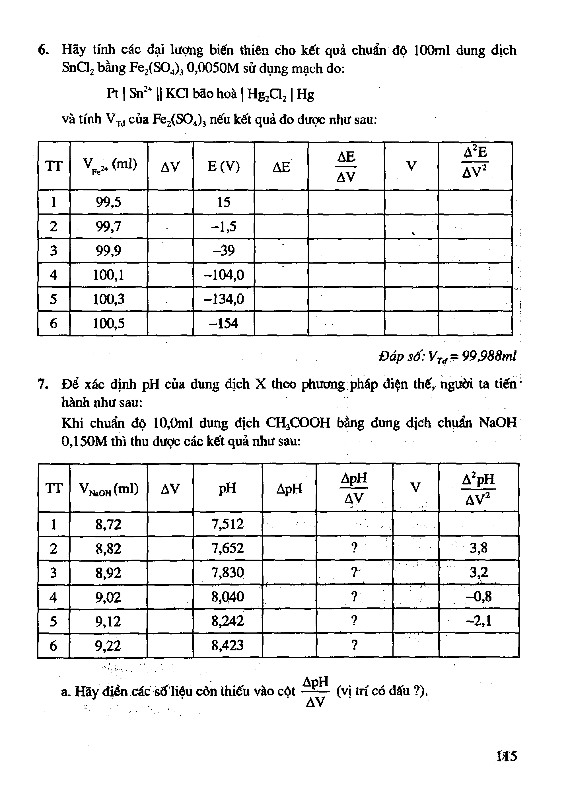

## Page 114

b. Tính VNa0H tại điểm tương đuơng theo phương pháp giải tích và tính nồng 
độ của axit axetic.
Đáp số: VT đim,g = 9,0mỉ; c  -  0,135M
8. Chuẩn độ I0,0ml dung dịch HA bằng dung dịch NaOH 0,0010M.
Dùng pin điện sau đây.
Pt, Hz I Dd HA + Dd NaOH IIKC1 bão hòa I Hg2Cl2 1 Hg 
Kết quả chuẩn độ được như sau:
TT
^NaOH (ml)
AV
pH
ApH
ApH
AV
V
A2pH
AV2
1
Ị 9,5
9,14
|2
19,6
9,234
3
19,7
9,347
4
19,8
.9,497
,
5
19,9
9,677
6
20,0
9,897
7
20,10
10,097
8
20,20
10,279
9
20,30
10,429
*
10
20,40
10,567
Hãy tính:
1. Nồng độ moi// của HA.
2. Hãy tính sức điện động (E) của pin diện:
a. Khi thêm 20,0mt NaOH.
b. Tại điểm tương đương.
e. Nếu cho rằng pKHA < 5 thì sai hay đúng? Vì sao?
Cho: ECa| + Ekj =: 0,2440V ở nhiệt độ phòng thí nghiộm
^Ig...=0,059151g...
Đáp số: Ị. CHA = 0,0019964M;
- 
. 2. a) 0,S294V; h) 0 Ã 2 4 ỵ;
f 
c) Sai vìpK  ~ 8,86 >5.

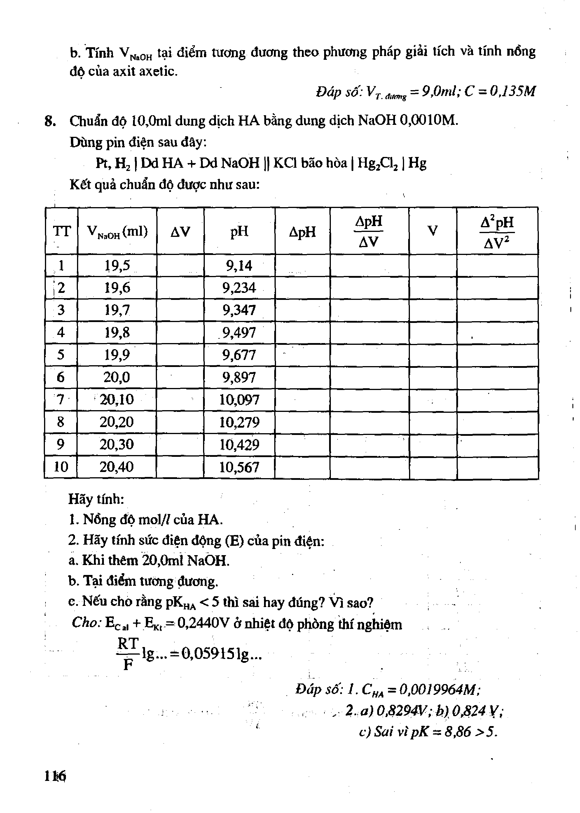

## Page 115

Chương 3
PHƯƠNG PHÁP PHÂN TÍCH ĐIỆN PHÂN
*
1. Các hiện tượng xảy ra trong quá trình điện phân
Giả sử cộ một nguỵên tố điộn hoá hai cực Zn và Cu được nhúng vào dung dịch 
muối của nó như đã mô tả ở phần trên (hình 1.2), nhưng không nối hai cục Zn và 
Cu với nhau bằng dây dẫn, mà nối hai cực Zn và Cu với một nguồn điộn một 
chiều: cực catot (Zn) nối với cực âm (-), cực anot (Cu) nối với dương (+) thì trên 
hai cực cũng xảy ra quá trình điện cực, nhung ngược với các qụá trình đã nói ờ 
phần trên khi nguyên tố ganvanic hoạt động.
Trong trường hợp này, ở bên cực Zn (-), xảy ra quá trình khử chất oxi hoá: 
các chất oxi hoá của dung dịch sẽ nhận electron từ điện cực và trở thành dạng 
khử liên hợp. Trong trường hợp cự thể náy các ion Zn7+ từ trong lòng dung dịch 
đi đến catot nhận electron từ điện cực, bị khử về dạng khử liên hợp ịkim lọại Zn) 
bám vào catot.
Bên cực Cu (+), xảy ra quá trình oxi hoá chất khử: các chặt khử nhường 
electron cho điộn cực và trở thành dạng oxi hoá liên hợp. Trong trường Ịiợp cu thể 
này kim loại đồng bị tan ra và các ion cứ* khuếch tán từ bề mat điên cực vào 
trong ỉòng dung dịch. 
■ 
.
Catot (-): 
Anot (+):
Zn2+ + 2e ^  
Zn° 
Cu° ^  Cu2+ + 2e
Thế cân bằng ở các cực ữong trường hợp này cũng bị thay đổi.
Trong điện phân, quá trình xảy ra ở các điộn cực là rất phức tạp (gồm nhiều 
quá trình thành phần xảy ra trên bề mặt các cực và trong dung dịch xung quanh 
nó. Các quá trình này được gọi là quá trình điện cực. Thường chia qụá trình điộn 
phân thành ba ‘giai đoạn sau:
(1) Sự chuyển các chất điện hoạt đến bề mặt điộn cực
Trọng diều kiên thực nghiêm đã chọn, chất điện li trơ là chất không tham gia 
phản ứng điện hoá, còn chất điên hoạt là chất có khả năng tham gia phản ứng điện 
hoá ở điện cực. Ví dụ các ỉon Cu2+, Zn2+... trong cạc ví dụ trên là chất điện hoạt 
chuyển từ trong lòng dung địch đến điện cực.
(2) Phản ứng điện cực (cồn được gọi la phản ứng chuyển điện tích)
Là quá trình trao đổi elecưon giữa các phần tử của chất điện hoạt với điện cực. 
Phản ứng diễn ra với một tốc độ xác định. Có thổ có một số giai đoạn trung gian 
và phản ứng phụ cùng xảy ra vối phản ứng chính.
117

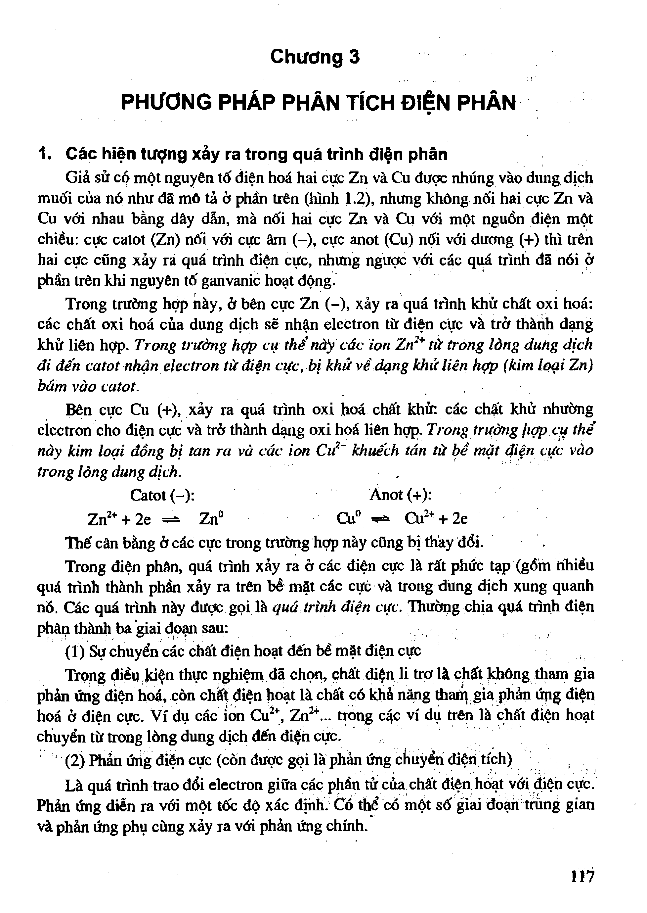

## Page 116

(3) Sự chuyển các sản phẩm của phản ứng ra khỏi điện cực.
Thông thường có 2 giai đoạn chính trong trong quá trình điện phân là vận 
chuyển chất điện hoạt đến điện cực và trao đổi electron với điện cục. Ngoài hai 
quá trình này còn có thể có các phản ứng hoá học xảy ra trước hoặc sau sự trao đổi 
electron. Trong một số trường hợp đặc biệt, quá trình điện cực còn phức tạp hơn 
nhiều do còn có các quá trình khác ngoài các quấ trình kể trên. Ví dụ như phản 
ứng hoá học của các chất cố trong dung địch, trong đó có chất điện hoạt tham gia. 
Các chất điộn hoạt hoặc sản phẩm của phản ứng điộn cực hấp phụ lên bề mặt điện 
cực, ngoài ra còn có các phản úng xúc tác khác...
Người ta có thể giải thích được quá trình điện hoá và sự phân cực khi đã biết 
được giai đoạn điện hoá chậm nhất. Sau đây xét một số ví dụ cụ thể:
Vi dụ ỉ : Điện phân dung địch Cu(N03)2 bằng các điộn cực platin, có các giai 
đoạn xảy ra trong dung dịch và catot:
-  Vận chuyển ion Cu2+đến bề mặt điện cực.
-  Sự trao đổi electron của các ion đổng với điện cực: Cu2* + 2e ^  Cu 
•
-  Sự khuếch tán (xâm nhập) của các nguyên tử đổng vào mạng lưới tinh thể.
Ví dụ 2: Điộn phân đung dịch A gN 03 dùng điện cực bạc kim loại. Sự kết tủa
bạc trên catot bạc có thể chia thành 3 giai đoạn:
-  Vận chuyển các ion Ag+ đến bề mặt điện cực.
-  Sự trao đổi electron của các ion bạc với điộn cục: Ag+ + e ^  Ag
-  Các nguyên tử bạc (khuếch tán) xâm nhập vào mạng lưới tinh thể.
Ví dụ 3: Điộn phân dung dịch chứa Fẹ3+ dùng điện cực platỉn, có thể gồm 3 
giai đoạn liên tiếp:
-  Vận chuyển các ion Fe3+ đến bể mặt điện cực.
-  Các ion Fe^ ừão đổi electron vớrđiộn cực: Fe3* + e  ^
-  Vân chuyển sản phẩm (Fe2+) cùa phản ứng từ bề mặt điện cực vào trong lòng 
dung dịch.
Ví dụ 4: Điệri phân dbng dịbh chứa ion phúc [AịffCN)2r  bằng điện cực bạc 
kim loại! Sựkếttủabạc trên tatotbặc òố thểchiàthàiứí 3 giai đoai: 
■
-  Vân chuyển các lòn phửc tớí sát t>ể mật điện cực.
-  Sự phóng điện^ùa ion phức. Sự phóng điện này xảy ra rất phức tạp, giả thiết 
có thể một trong ba cơ chế sau cổ thể xảy ra:
(1) 
SÌỊ phói>g điện trực tiếp cùa iốn phức: 
,
H8

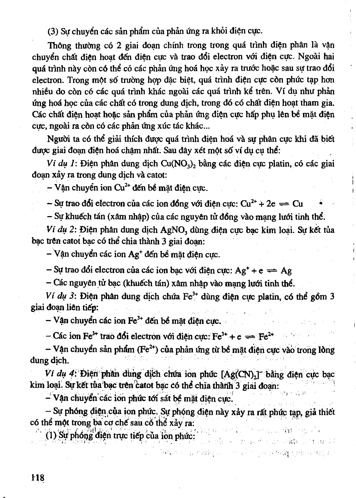

## Page 117

[AgíCN)^- + e ** 
Ag° + 2CN"
(2) Trước khi phóng điện, ion phức phân li môt phần bằng phản ứng hoá học 
thuần túy: [Ag(CN)2r  
— [Ag(CN)]0 + CN~
Sau đó phóng điện:
[Ag(CN)]0 + e ^  Ag° + CN-
(3) Trước khi phóng điện ion phúc phân li hoàn toàn:
[Ag(CN)J- ^  Ag+ +2CN-
Sau đó mới phóng điện:
Ag+ + e 
Ag°
-  Các nguyên tử bạc khưếch tán (xâm nhập) vào mạng lưới tinh thể (thông 
thường thì các nguyẽn tử bạc sẽ xâm nhập vào vị trí có mức năng lượng thấp nhẵt 
vì ờ vị trí nàỹ là bền vững nhất). Vị trí bền vững thường là các góc cạnh trên bề 
mặt điện cực bạc.
-  Vân chuyển các atìion CN' vào trong lòng dung dịch.
Ví dụ 5: Điện phân đung dịch chứa anion c r  trên anot platin:
2CT 
a 2 + 
2e
Có thể chia thành 4 giai đoạn:
-  Vận chuyển các anion ơ"đến bể mặt điộn cực anot.
-  Sự trao đổị electron của CTvới điện cực: 2Cl~ ^  Cl2 + 
2e
-  Sự lièn kết ẹác nguyêp tử clo thành phân tử.
-  Sự vận chuyển phâri tử clo từ bề mặt điện cực vào trong lòng dung dịch.
Để biểu thị tốc độ của quá trình điện cục quy ưóc đùng đại ỉượng mật độ dòng, 
nhung trong thục tế hay sử đụng cường độ dòng và để nghiên cứu quá trình điện 
cực thường vẽ đựờng biểu diẽn sự phụ thuộc giữa cường độ đòng vào thế điện cực 
dược phân cực. Đưòng biểu diễn sự phụ thuộc đó được gọi là đường phân cực hoặc 
đường dòng -  thế hoặc đường von-ampe.
Khi nghiên cứu quá trinh điện cực cần phải:
-  Xác định được quá trình thành phần nào xảy ra chậm nhất. Khi nghiên cứu
tốc đô cửa qụá trình điên cuc phu thuôc vào tốc độ củạ quá trình íiào đó thì về mặt
lí thuyết phải gỉả thiết tốc độ cùa quá trình khác là vô cùng lớn, còn về mặt thực 
nghiệm phải tìm rihững điều kiện để thục hiện được cổe giả thiết đó.
119

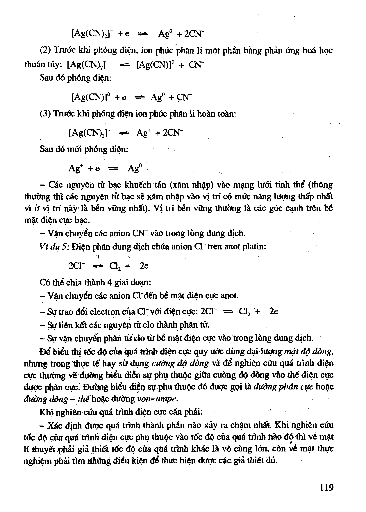

## Page 118

-  Chú ý đến sự tồn tại của lớp điện kép. Muốn nghiên cứu chính xác quá trình 
điộìi cực cần phải kể đến thế trong lớp điện kép thay đổi cùng với sự thay đổi các 
ị 
điều kiện trong hệ;
-  Cho thêm vào dung dịch nghiên cứu một lượng dư chất điện li ừơ.
Sau đây xét từng trường hợp một cách cụ thề.
1.1. Các quá trinh vận chuyến chất điện hoạt diên cực
Các quá trình chuyển chất điện hoạt đến bề mặt điộn cực và đưa sản phẩm của 
phản ứng điện cực ra khỏi lớp bề mặt điện cực xảy ra rất nhanh, nhanh hơn rất 
nhiéu so vdi tốc độ phản ứng điộn cực. Trong trường hợp này khổng bao giờ xảy ra 
tình ttạng thay đổi lớn về nồng độ ở lóp gần cực trong quá trình điện phân, nghĩa 
là nồng độ ở bề mặt cực và trong lòng dung dịch là đổng nhất (vì quá trình vận 
chuyển chất là vô hạn và có thể so sánh được với tốc độ của phản ứng điện cực, thì 
nổng độ của chất điện hoạt ở bẻ mặt điện cực sẽ thay đổi so với nổng đô của nó 
i
trong lòng dung dịch) và vì không thể đo được nồng đồ ở bề mặt điện cực, nên 
!
phải tính từ nổng độ trong lòng dung dịch đã biết dựa vào các định luật của sự 
chuyển chất.
Chất có thể được chuyển từ trong lòng dung dịch đến điện cực bằng các con 
đường sau:
a. Bằng sự điện chuyển (sự di chuyển các phần tử tích điện); 
'
b. Bằng sự đối lưu;
c. Bằng sự khuếch tán.
1.1.1. Sự điện chuyền
Khi điộn phân có sự di dhuỳển chất xảy ra là do có ỉực hút tĩnh điện của các 
điộn cực với các phẩn tử tích điện có trống dung dịch. Hay nói môt cách khác, các 
j 
phần tử tích diện chuyển động dưới tác dụng của điện trường.
Sự xuất hiện điện chuyển gầy cản trở cho quá trình điện phân. Khổng thể 
loại trừ được hết mà chỉ có-thể hạn chế nó đến mức nhỏ nhất bằng cách trưóe khi 
điện phân người ta cho thêm vào dung dịch nghiên cứu một lượng dư chất điện li 
trơ (lớn hơn từ 50 lẩn nồng độ của chất điện hoật trô lên). Dư chất điện li trơ có 
tác dụng: 
“  Giữ cho không đổi hệ số khuếch tán (D = const) của chất điện hoạt trong 
quá trình điện phân.
-  Nồng độ chất điện hoạt trong quá trình điện phân ỉà nhỏ không đáng kể so 
với nồng độ cùa chất điện li trờ. Có thể thay hoạt độ bằng nồng độ củà chất điện
hoạt và trong đa số trường hợp có thể bỏ qua được độ giảm thế (IR). 
i
120

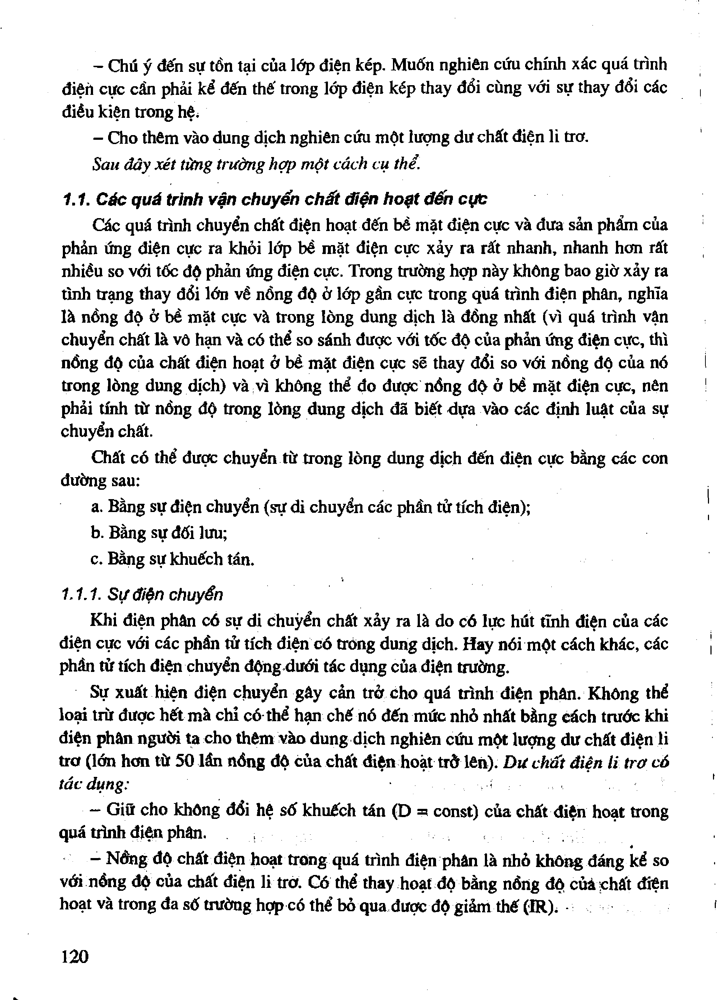

## Page 119

-  Điện trường nói chung là không đổi và điện trường chủ yếu được tạo nên là 
đo ion chất điện li trơ dẫn đến thế của lớp điện kép có giá trị gần như không thay 
đổi và đa số trường hợp bỏ qua đuợe thế có trong lớp điện kép.
Chính vì vậy, khi có dư lượng lớn chất điện li trơ sự chuyển chất điên hoạt chỉ 
còn do sự khuếch tán và đối lưu thực hiện.
1.1.2. Sự đối lưu
Có sự chuyển chất bằng đối lưu khi điện phân là dó có các phản ứng điện hoá 
xảy ra ở điện cực làm giảm nồng độ chất điện hoạt dẫn đến các vị trí trong dung 
dịch điện phân có:
-  Sự khác nhau về tỉ trọng củá các chất điện hoạt ở các vị trí khác nhau trorig 
dung dịch. Hay nói một cách khác, sự chuyển động cùa các vật chất gây nèn do có
A
gradien khối lượng riêng của chất trong dung dịch (— ) hoặc do khuấy cơ học.
ổx
-  Chênh lệch về nhiệt độ.
Chuyển động đối lưu không xảy rá ở sát điện cực mà cách một khoảng cách 
rất nhỏ (ỡx).
Muốn cho chuyển chất điên hoạt đến điện cực nhanh phải:
-  Khuấy trôn dung dịch điện phân.
-  Quay cực.
1.1.3. Sự khuếch tán
Có sự khuếch tán là do có sự chênh lệch vể nồng độ ờ các vị trí khác nhau 
trong bình điện phân. Trong quá trình điện phân, khi mà phản ứng điện hoá xảy ra 
có sự giảm nồng độ chất điện hòạt ở lớp sát điện cực một cách đột ngột, dẫn đến 
có sự chênh lệch về nồng độ cho nên có sự chuyển dời các phần tử của chất điện 
hoạt, có nghĩa là có sự khuếch tán từ trong lòng đung dịch (có nồng độ cao) đến bề 
mặt điện cực (có nồng độ thấp). Như vậy quá trình chuyển chất là do sự chênh
ổc
lêch về nồng đô (gradien ĩiổng đô: — ). Hoăc sư chuyển dời các phần tử mang
ôx 
, ■
điện hay khổng mang điện dưới tác dụng của gradien hoạt hoá (phản ứng chuyển 
từ dạng này sang dạng khác cần tiêu tốn năng lượng hoạt hoá).
Không cần phải hạn chế vì có sự khuếch tán chỉ cổ lợi cho quá trình điện 
phân, khi dó điện phân sẽ nhanh hơn.
Quá, trình, điện cục đượp quyết định bằng sự chuyển chất được chià làm hai 
trường hợp:
12Ỉ

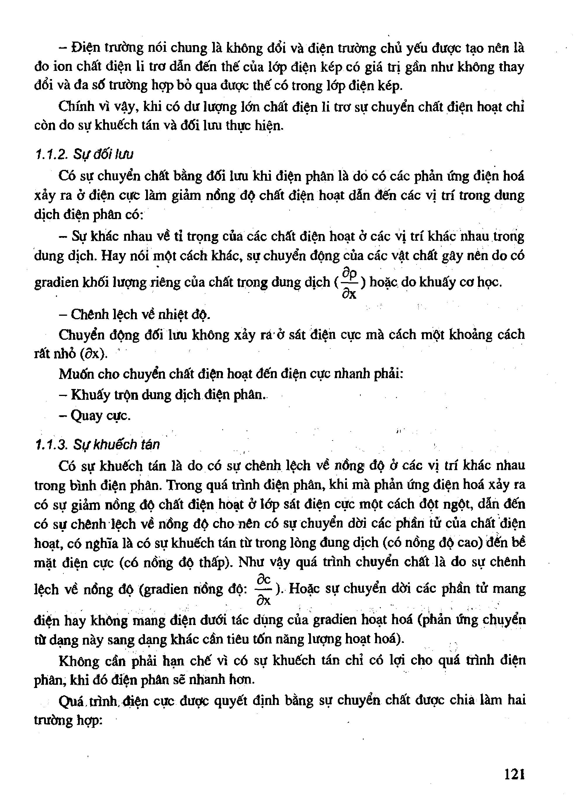

## Page 120

(1) Quá trình Ổn định (hoặc thường nói hệ ở trạng thái dừng) là quá trình trong 
Ị 
đó gradien nồng độ trong dung dịch luôn luôn không đổi, nên dòng điện phân 
cũng như thế điện cực không bị thay đổi theo thời gian và có thể đo trực tiếp sự 
phụ thuộc của dòng vào thế điện cục.
dc
Quá trình điên cưc ổn định được đặc trưng bằng điều kiện: —  = 0
ỡt 
I
Điều kiện này được thực hiện bằng cách khuấy đung dịch để bổ sung cho chất 
điện hoạt bị giảm do phản ứng ở bề mặt điện cực, còn trong trưòng hợp điện cực 
! 
có kích thước rất nhỏ nhúng trong dung dịch có thể tích lớn thì sụ thay đổi nồng 
độ ở bể mặt điện cực được bổ sung bằng sự khuếch tán chất điện hoạt đến điện 
cực. Trong trường hợp này dòng điện sau một thời gian xác định bị giảm xụống 
đến giá trị xác định khác không.
Trong các quá trình điện cực ổn định, ở xung quanh cực có một sự phân bố ổn 
ì
định nồng độ chất điện hoạt. 
I
(2) Quá trình không ổn định là quá trình trong đó gradien uổng độ của 
chất
trong dung dịch thay đổi theo thời gian, nên cả dòng và thế điện cực cùng là 
hàm
của thời gian.
ổc
Các quá trình điộn cực không ổn đinh được đăc trưng bằng điều kiên: —  * 0
dt 
I
Tức là gradien nồng độ của chất điện hoạt thay đổi theo thời gian. Để mô tả 
các quá trình điộn cực ữong trường hợp này, người ta phải dùng phương trình mô
tả sự khuếch tán động củà Fick (phương trình thứ hai mố tả sự khuếch tán).
1.2. Phần útĩg điện cục (phản ứng chuyển điện tích)
Các phần tử của chất điện hoạt chuyển đến catot và anot sẽ tham gia phản 
úng 
I
với điện cực:
Ởcatot: 
ở anot:
Ox, + ne 
—  Khí 
Kh2 ** Ox2 + 2e
V í dụ điện phân dung dịch ZnS04 trong HCI04 1,0M, các phản ứng xảy ra ờ 
điện cực: 
i ■ 1 ■ ■■ 
: 
í
ởcatot: 
ở anot:
Zn2+ + 2e 
Zn 
2SOJ- 
~  
S p Ị-  + 2e
. 2HT + 2e ^  H2 
2H20  
^  4H* +Oa +4e
122

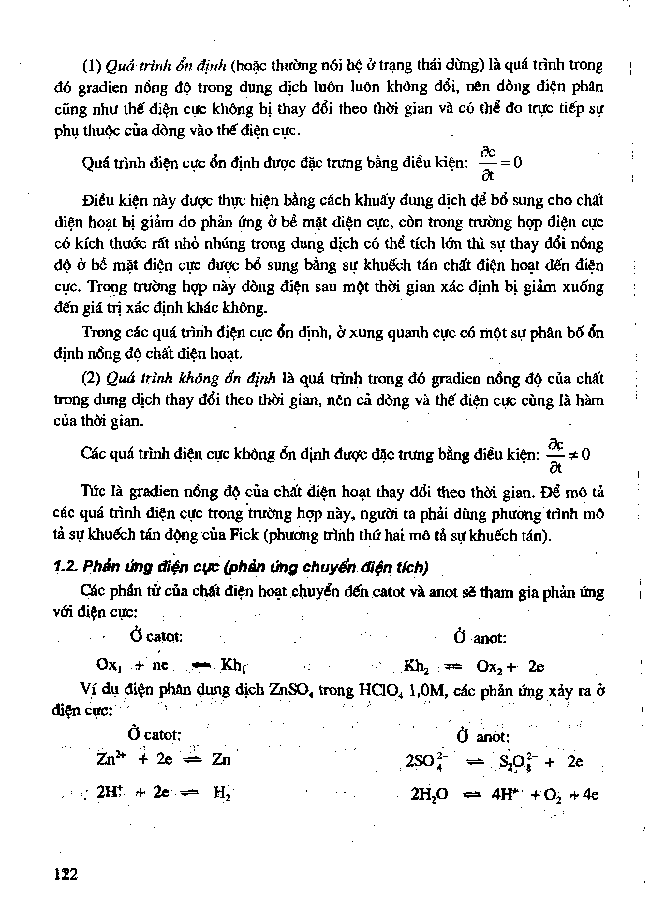

## Page 121

1.3. Sự chuyển các sản phẩm hoà tan của phân ứng điện cực ra khỏi lớp
sát cụt
Nếu sử đụng điện cực rắn thì sản phẩm sẽ được kết tủa trên bề mặt điện cực 
rắn là kim loại có mạng lưới tinh thể hoàn chỉnh. Còn nếu sử dụng điện cực giọt 
thủy ngân thì kim loại được kết tủa trên bề mặt giọt thủy ngân dẫn đến tạo thành 
sản phẩm là hỗn hống. Xem ví dụ ờ phần 4.2.
2. Các định luật vể điện phân
Nhà khoa học Michael Faraday (người Anh) đã nhiểu năm nghiên cứu về hiện 
tượng điện phân. Theo lí thuyết của ông, điện lượng đi qua dung dịch điện phân 
được xác định bằng công thức:
Q =  Jl,dt => Q = I,.t 
(3 .Ị)
0
Trong đó Q là điện lượng; t là thời gian điện phân; It là cường đô dòng
T 
n.F.S.D ^
(3.2)
Vậy: 
Q
=
^
. Cl.t 
; 
(3.3)
Trong quá trình điên phân, nồng đỏ chất điện hoạt (Cj) giảm, dẫn đến cường 
độ dòng giăm.
Trong phân tích khối lượng, điện phân thường được sử đụng để tách từng chất 
có trong hỗn hợp dung dịch bằng cách giữ thế không đổi thì cường đồ dòng giảm 
theo thời gian. Cưòng độ dòng giảm theo biểu thức của định luật:
I ,= I m.1 0 A ' 
(3.4)
Trong đó IM là cường độ dòng ban đầu; It là cường độ dòng tại thòi điểm t;
A = 0,43.s.-5i 
(3.5)
n là số electron trao đổi; F là hằng số Faraday (culong); s là diện tích bề mặt điộn 
cục (cm2); D là hệ số khuếch tán (cm2/giây); Cj là nồng độ chất cần tách bằng điện 
phân (mol//); V là thể tích dung dịch đem điện phân; ơ là bề dày cùa lóp khuốch 
tán; a là đại lượng khôrtg đổi nằm trong khoảng: 0 < a < 1. 
* 
' V 
-
Quặ ừìnhí điện phân được xem là kết Ịhúc khi cường độ đòng cuối: 
J 
...
1 «  = lò X
 hoặc IM  = I0-JI„ 
<3 «
123

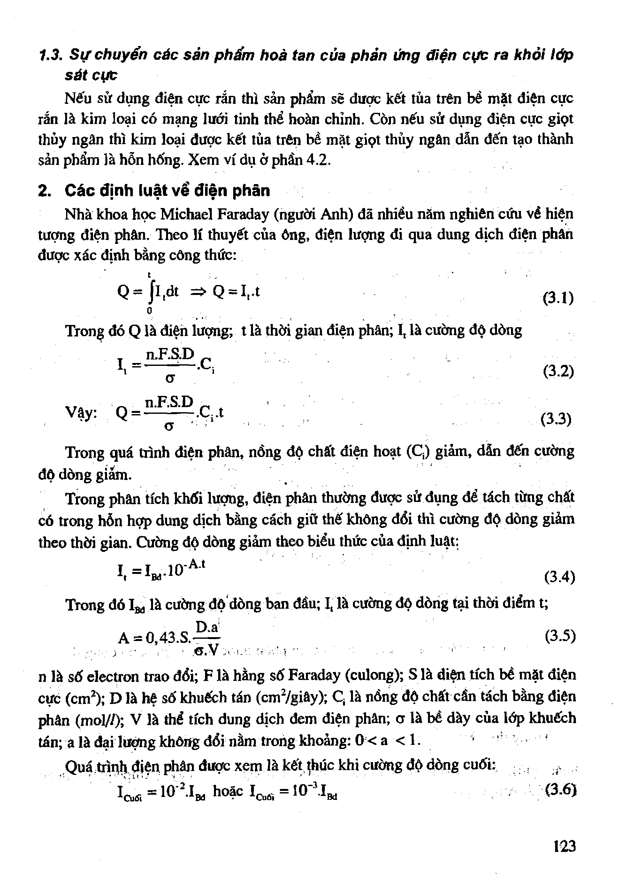

## Page 122

I
Theo công thức (3.5), để cho A tăng cần phải giảm thể tích (V) chứa dung 
dịch điện phân và tăng diộn tích (S) bề mặt điện cực và giảm bể dày của lớp 
' 
khuếch tán (ơ ) bằng cách khuấy mạnh dung dịch điện phân. Giá trị A tăng, dẫn 
đến thời gian càng ngắn lại để đạt được cưòng độ ICu6i = 10 3.IM. 
1
Đó là các dự đoán lí thuyết theo các định luật điện phân về kết thúc điện phân 
có nghĩa là tách hết chất cần phân tích được bám vào điện cực. Còn trong thực tế 
phải kiểm tra hàm lượng còn hay điện phân hết bằng các phản ứng đậc trưng. 
Ngoài ra, Michael Faraday đã tìm ra mối liên hệ chặt chẽ giữa lượng chất tách ra ở 
điện cực và điện lượng đi qua dung dịch điện phân và ông đã công thức hoá nó 
thành các định luật:
Định luật 1: Lượng chất giải phóng ra ở mỗi điện cực tỉ iệ thuận với điện 
lượng đi qua đung dịch điện phân.
Ví dụ 1: Điện phân dung dịch CuS04 trong môi trường axit thu được 2 gam 
đổng tách ra ở catot thì tiêu tốn điện lượng là Q (6031,125) culong cho đi qua 
dung dịch điện phân. Còn nếu cho 2Q (12062,5) culong đi qua dung dịch điện 
phân sẽ tách đuợc lượng đồng ở catot gấp hai lần 2g.2 = 4g.
Định luật 2: Trong điện phân nếu tiêu tốn cùng một điện lượng như nhau sẽ 
giải phóng ra ỏ điện cực cùng một số đương lượng như nhau đối với bất kì chất 
nào tham gia điện phân.
Ví dụ 2: Nếu điện phân từng dung dịch HC1, CuS04, C dơ2 đều cần đùng cho 
mỗi dung dịch một điện lượng như nhau là 2 culong thì sẽ giải phóng ra một số 
đương iứạng như nhau hay một lượng H2, G 2, Cu, Cd, Br2, 0 2 tỉ lệ với đương lượng 
của chúng hoặc theo tỉ lệ sau:
_ Khối lượng mol nguyên tử (M)
1,00797 . 35,53 , 63,54 . 112,41 _ 79,909 15,994 
, (3‘7)
1 
: 
1 
2 
: 
2 
1 
■ 
2 
■
Số gam được tách ra ở điện cực khi điộn phân được biểu diễn bằng công thức:
Đ ilit y  V V 
f ■ 
■
a = —=— 
(gam) 
, 
(3.8)
r *
■ 
"
Trong đó : ĐI =
I là cường độ dòng (Ampe); tlà thời gian điện phân (giây
hoặc giờ); F là hằng số Faraday 96500 culong.moĩ' 1 hay (Anìpe.giây) hoặc 
F »  26,8 Ampe.giò. 
'
124

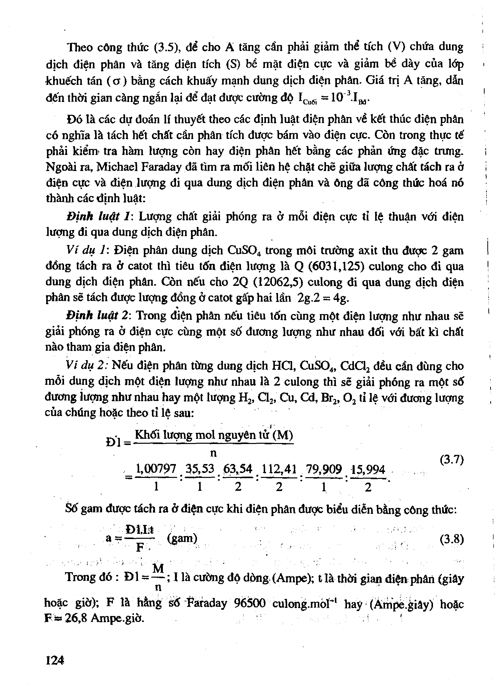

## Page 123

3. Quá thế
Quá thế là sự lệch khỏi giá trị thế cân bằng của điện cực hay là lượng thế dư so 
với thế cân bằng cần phải thiết lập trên mỗi điện cực lượng điện có thể đi qua dung 
dịch với cường độ dòng xác định. Quá thế được kí hiệu là TI-
3.1. Quá thế nồng độ ịĩ]NJ
Quá thế nổng độ xảy ra khi vận chuyển chất điện hoạt tới điện cực hoặc ra 
khỏi điện cực diễn ra với tốc độ chậm hơn tốc độ củẩ phản ứng chuyển điện tích, 
vì vậy có sự chênh lệch nồng độ ờ ranh giới điện cực -  dung dịch và trong lòng 
dung dịch. Nếu chất được vận chuyển đến bề mặt điện cực bằng khuếch tán thì 
quá thế được gọi là quá thệ khuếch tán. Còn nếu vận chuyển chất đến hoặc ra khỏi 
điện cực được thục hiện bằng phản ứng hoá học xảy ra trước hoặc sạu đó thì quá thế 
nồng độ được gọi là quá thế phản ứng.
3.1.1. Quả thế khuếch tán (ĩ]Kt)
Quá thế khuếch tán xuất hiện khi chuyển chất đến bề mặt điện cực bằng con 
đường khuếch tán bị chậm lại. Trong thực tế khi điện phân thì sự khuếch tán chất 
đến điộn cực bao giổ cũng bị kim hãm, bời vì khóng bao giờ có khuếch tán rihanh 
vô cùng.
Xét trường hợp điện phân dung dịch Cu(NOs)2:
Ở catot có phản ứng:
Cu2+ + 2e ^  Cu
Dùng hai điện cực bạc kim loại tinh khiết nhúng vào dung dịch Cu(NOj)2 và 
nối 2 cực với nguồn điện một chiều. Sẽ có dòng điện chạy qua dung dịch với 
cường độ dòng (I). Trong thời gian t, tiêu tốn một điện lượng Q = I.F đi qua dung 
dịch điện phân và có:
Trong thòi gian t, số tải t+ moi Cu2+ được chuyển tới iđiện cực do điện chuyển 
làm cho nồng độ Cu2* tăng lên với tốc độ
(3.9)
Nồng đô của ion Cu2+ ờ catot giảm với tốc độ - .  Ta có:
I I  
t 
F
(3.10)
(3.1»
125

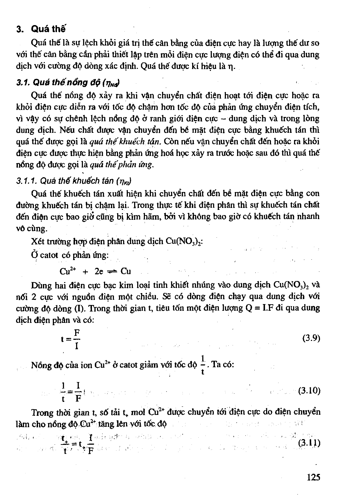

## Page 124

trong đó t+ là số tải của ion Cu2+. Số tải luôn luôn nhỏ hom 1 nên sự diện chuyển
không thể bù đắp đù lượng Cu2* bị điện phân. Điều đó dẫn đến nồng độ Cu2+ ở bề
mặt điộn cực giảm đi, ta thấy nồng độ Cu2+ ở bể mặt điện cực ([Cu2+]b) nhỏ hơn
nồng độ Cu2+ ở trong lòng dung dịch ([Cu2+]dd) và nếu quan sát theo gradien thì
õc 
„
thấy gradien nồng đô — sẽ khác không. Đây là điểu kiên để xuất hiên sư vân
ôx
chuyển chất bằng khuếch tán. Tốc độ vận chuyển bằng khuếch tán bằng:
VB = - D . s ậ 
(3.12)
ổx
Sự điện phân vẫn xảy ra đều đặn và tốc độ tiêu hao ion Cu24 ở bể mặt điện cực 
phải bằng tốc độ vân chuyển nó bằng điện chuyển và khuếch tán đến điộn cực, 
nghĩa là:
t —-D .S — = — 
(3.13)
F 
9x 
F
Trạng thái này gọi là trạng thái dừng. Trạng thái dừng là trạng thái động. 
Nồng độ đ6ng(n) ở sát bề mặt điện cực {[Cu2+]b) ở trạng thái dùng nhỏ hơn nổng 
độ của nó ở trong lòng dung dịch ([Cu2*]^) và trở lên hằng định hoặc hầu như 
hằng định trong trạng thái dừng, ở catot được xem như ở trạng thái cân bằng 
tương ứng với giá trị nồng độ mới [Cu2*]*1 có thế cân bằng (Eq) và nồng đô [Cu2+]b 
có thể dừng (Ed) tương úng. Theo phương trình Nemst:
Ecb= E ° + ~ ln (C u 2+)dd 
(3.14)
nF
E j= E °+  —
ln(Cu2+)b 
(3.15)
nF
Theo đinh nghĩa ta có quá thế khuếch tán bằng:
*1m-c = Ed - B a  =  —  
: 
' (3.16
6 
a  
nF 
[Cu ]
- 
Nếu chấp nhận hộ số hoạt độ bằng 1 thì hoạt độ bằng nồng độ cân bằng:
(Cìi2T  = [Cu2^  và (Cu2+)b = [Cu2*)b
Từ phương trình tính quá thế trên (3.16) cho thấy quá thế phụ thuộc vàd 
nồng độ của chất điện hoạt, nhưng chưa cho thấy sự phụ thuộc của dòng vào thế. 
Để tìm được mối quan hệ giữa dòng và thế người ta phải dựà vào thuyết của
Ì26

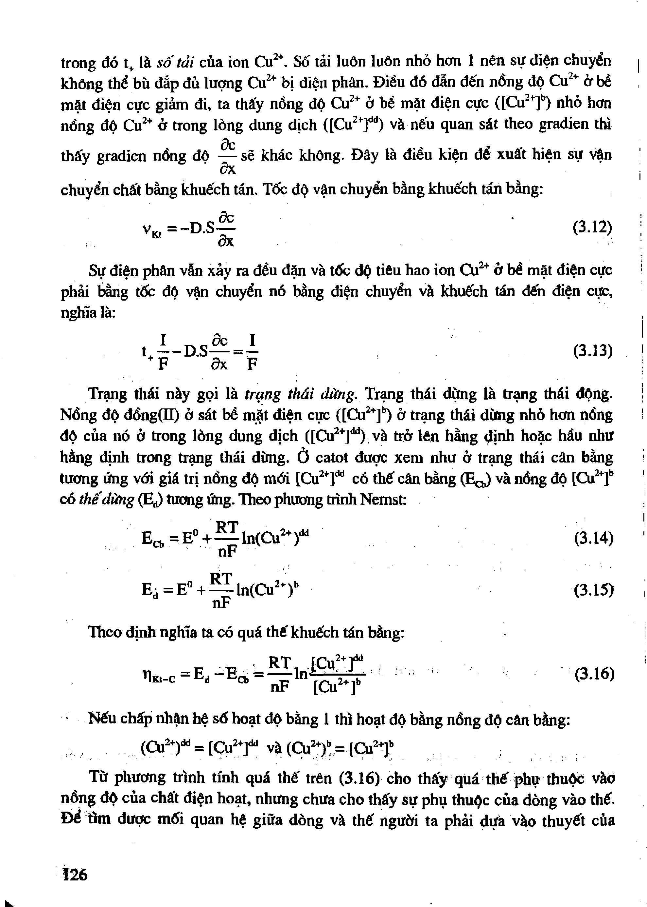

## Page 125

Nemst. Lớp Nernst là lóp chất lỏng ngay sát bề mặt điện cực có chiều dày rất 
mỏng (SN). Theo quan điểm Nemst ta có:
-  Trong lóp điện kép, sự biến thiên nồng độ chất được coi là tuyến tính.
• 
-  Sự chuyển động của dung dịch không xảy ra ở trong lớp Nemst, cho nên 
không ảnh hưởng đến lớp Nemst.
[Cu2+lb - [Cu2+ldd
-  Trong lớp Nemst, gradien nồng đô đươc tính bằng----------------------- -ch o
ÕN
fCu2+idd - rC ii2+ib
quá trình catot trong đó: [Cu2+]b < [Cu2+]dd và ------------ --------- — cho quá trình
ỖN
anot trong đó: [Cu2*]*1 < [Cu2+]b, như vây — luôn lưôn âm.
ổx
Áp dụng thuyết lớp của Nemst cho trường hợp điện phân Cu(N03)2 ờ trạng 
thái đừng ta có (tương tự phương trình 3.13):
t+I _ D.s I C ụ^ | C ụ^  
I 
+ F 
ÔN 
F
=> [Cu2+]b=[Cu2+r - ~ ^
. ĩ  = ĨCu3+T?<i- f c ^ . i c 
(3.18)
F.D.S 
D.F
I „
Rút ic ra được:
I
Trong đó ic = — là mật độ dòng catot.
s
it = F J ) - L
!
g
!
M
 
(3.19)
I - t + 
ÔN
Thay [Cu2+]b ở (3.18) vào phương trình (3.16) ta được phương trình tính quá 
thế khuếch tán phụ thuộc vào nồng độ chất oxi hoá ([Cu2+](ld):
T1jctc=— iníl---- (3.20)
,|CtC 
nF 
V 
n:F.Đ.[Cu2+f* 
J 
'
Tương tự cũng có phương trình tính quá thế khuếch tán anot phụ thuộc vào 
nồng độ chất khử ([Cu2*]") vì ([Cu1*]*1) chất oxi hoá bằng ([Cu2*]") chất khử.
? ^lK,*a 
nF 
1, 
n.F.D.[Cu ] 
: )  . 
r : : s 
. 
.
ỉ 27

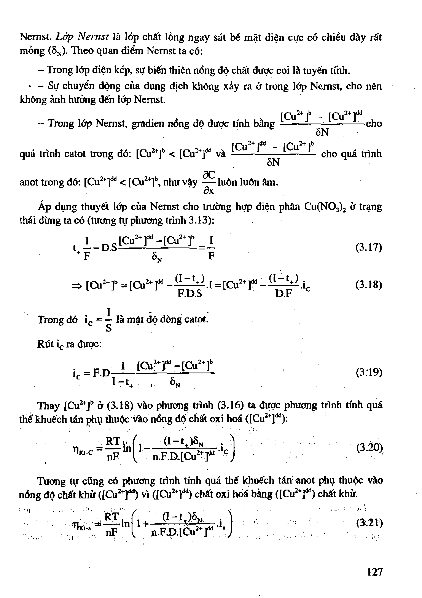

## Page 126

Phương trình viết chung cho cả quá thế catot và anot:
*lKt = —
ln(l±k.i) 
(3.22)
nF
Trong đó c  là nồng độ dạng oxi hoá hoặc dạng khử; k = ^  
(3.23)
nF.D.C
Dấu (-) trường hợp quá thế khuếch tán catot và dấu (+) là trường hợp quá thế 
khuếch tán anot.
Từ trường hợp cụ thể trên suy ra trường hợp tổng quát chung cho mọi trường 
hợp điện phân:
Nếu có phản ứng điện phân xảy ra ở điộn cực:
Vqx-Ox + ne ^  v^.Kh 
Thế cân bằng theo phương trình Nemst:
„  
^ 0 . RT, [O x^ r-
E“ =E +^Fln| Ì 4 ^  
( 3 -2 4 )
E a=E o + R T ta^
 
(3.25)
nF 
[Khbr
RT 
| ([Ox]b/[Qx]dd)v°- 
nF 
([Ox]b/[Ox]dd)VfU‘ 
RT
r|Kt = —-ln (l±  k.i) vàkn hư (3.23). 
nF
Nếu tăng dần mật độ dòng (i), quá thế khuếch tán (ĩ]K[) tảng đần và tích (k.i)
sẽ tiến dần tới 1. Nếu tiếp tục tăng mật độ dòng thì quá thế khuếch tán catot sẽ tiến 
dẩn tới dương vô cùng.
Từ phương trình (3.22) và (3.18) cho thấy kti = 1 thì [Ox]b = 0; ([Cu2+]b = 0), 
nghĩa là trong iớp Nemst nồng độ chất 0X1 hoá bằng không. Bắt đẩu từ thòri điểm 
này, cường độ dòng hoà tan phụ thuộc vào tóc đô và chuyển chất đến điện cực. 
Mật độ dòng lúc này được gọi là mật độ đòng giới hạn catot.
i ^ n F D — Ị—
c  
(3.27)
Nếu thêm một luợng lón chất điện li trơ vào dung dịch nghiên cứu, có thể bỏ qua 
số tải của ion điện hoạt (vì số tải xấp xỉ bằrig không). Lúc này dòng giới hạn được 
gọi là dòng khuếch tần giói hạn nhu trong phừcmg pháp cực phổ thường tiến hành.
128

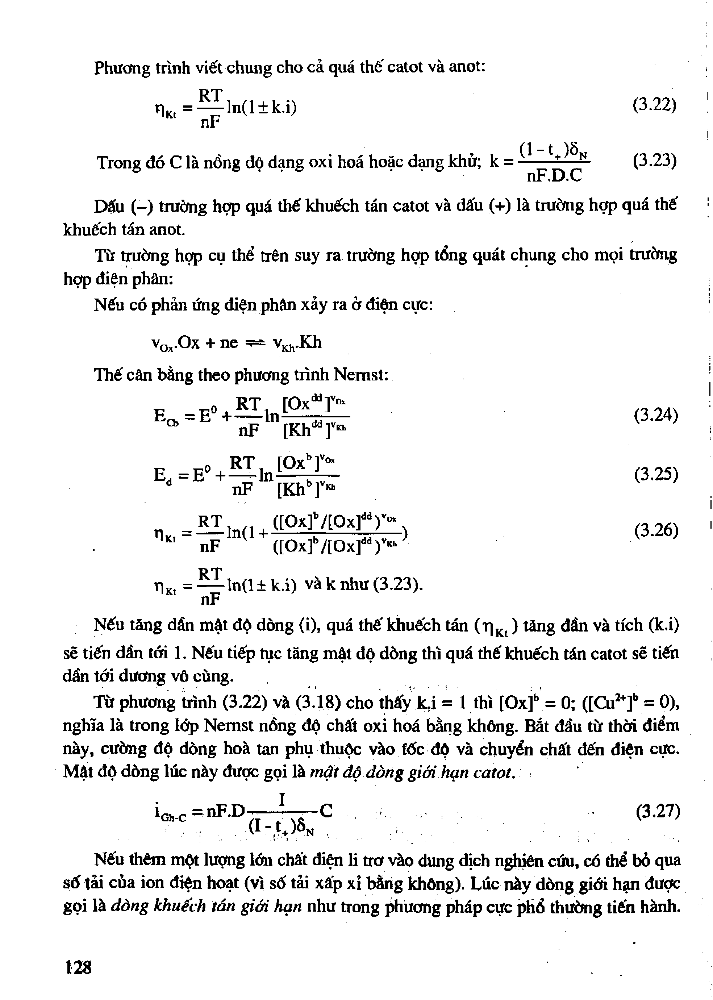

## Page 127

Trong khi đó dòng anot không đạt tới giá trị giới hạn khi k.ig w 1. Xem đường biểu 
điễn dòng giới hạn trên hình 3.1.
Hình 3.1. Đường dòng thế catot và anot trường hợp điện phàn AgN03 
dùng hai điện cực bạc kim loại.
3.1.2. Quà thế phản ứng (TỊ P J
Trước hoặc sau giai đoạn trao đổi elecưon của chất, điện hoạt với điện cực thì 
có phản ứng hoá học thuần túy xảy ra; thường thì các phản ứng này xảy. ra chậm 
nên quyết định tốc độ của quá trình điện hoá.
Xét phản ứng điện hoá sau: A + ne ^  D 
(3.28)
Phản ứng này có kèm một phần của phản ứng hoá học thuần túy: trưóc và sau 
sự trao đổi electron.
-  Trước sự trao đổi electron: A 
B 
(3.29)
-  Phản ứng trao đổi electron: B + ne ^  c  
(3.30)
-  Sau trao đổi electron: 
c  ^  D 
(3.31)
Người ta coi phản ứng (3.29) là phản ứng bậc một có kjCA = k2CB? trong đó kl?
k2 là các hằng số tốc độ, có đơn vị là 1/mol.giây hoặc 1/giây (l.mol^giây-1 hoặc 
giây-1). Lại giả thiết rằng phản ứng ưao đổi electron (3.30) và phản ứng (3.31) xảy 
xa nhanh vô cùng và chỉ CQ phản ứng (3.29) là phản ứng xảy ra chậm nhất và quyết 
định tốc độ của quá trình điện hoá.
Đối với phản ứng (3.28), có thể viết theo phương trình Nemst:
ECb = E0 + ^ l n ^  
(3.32)
nF 
[D]
129

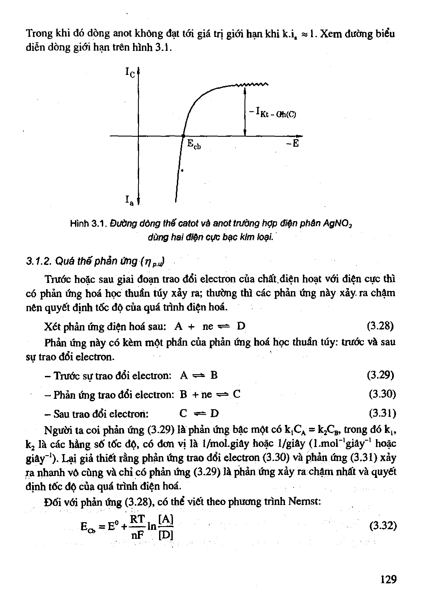

## Page 128

Ed = E ^ + ^ l n ^ r ^  
(3.35)
Hoăc biểu diễn dưới dang: Eq, =E° + —— lnj—ị— 
(3.33)
nF 
[DJ K.
Trong đó K = —  = 
(3.34)
k2 
[A]
Khi trong hệ có đòng chạy qua, thì B tham gia phản ứng (3.30), một phần chất 
B chuyển sang c , dẫn đến nồng độ của nó ở sát bề mặt điện cực trờ thành [B]b. 
Vậy ở trạng thái dừng ta có:
RT1 [B]b 1 
nF n [D] K 
Theo định nghĩa về quá thế:
ri^ = Ed -  Eq, = ^
 ln 
(r|^ là quá thế phản ứng) 
(3.36)
^ 
nF 
[B]
3.3.2. Quá thế điện hoá hay quả thế hoạt hoá (ĩ]Hh)
Loại quá thế này xuất hiện là do phản ứng chuyển điện tích (nghĩa là phản 
ứng chuyển từ dạng này sang dạng khác của chất điện hoạt) xảy ra chậm so với tốc 
độ của quá trình điện hoá chung của hê, do đó cần tiêu thụ năng lượng điện hoá.
Xét phản ứng xảy ra ở trên ranh giới điện cực và dung dịch:
Ox + ne 
Kh 
(3.37)
Tốc độ của phản ứng catoí (Ic) và anot (Ia) theo định luật động học được xác 
đinh bằng phương trình:
Ic = nFkt[Ox]exp ——
^ 
(3.38)
\ 
KI 
/
I. = nFkz[Kh]=xpp l  ~ a^ ' R E ) l . 
(3-35)
Trong đó [Ox] và [Kh] là nồng độ cân bằng của dặng oxi hoá vằ dạng khử; E 
là thế điện cực, a  là hộ số chuyển điện tích; kị và k2 là hằng số tốc độ của phản 
ứng catot và anot tương ứng.
Quy ưóc Ic < 0 và Ị, > 0. Dấu + và đấu -  ở phần số mũ thể hiện hiộu điện thế 
E thúc đẩy phản ứng này và kìm hãm phản ứng kia.
Dòng điện một chiều có tính chất cộng tính nên có thể viết:
130

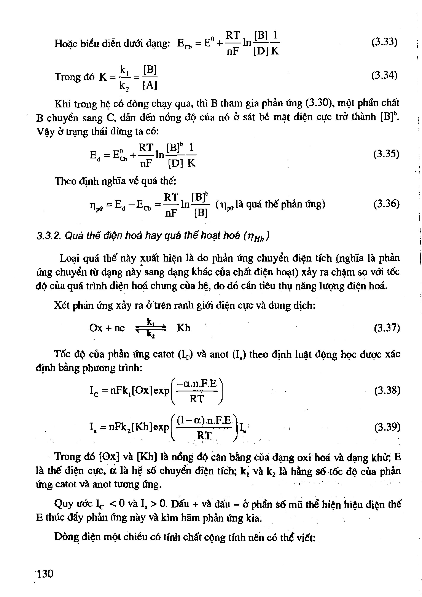

## Page 129

^
 =|lc| + |Ia| = - n F |kl i ° X]eXP^::~
~
j  + k2[Kh]eXp [ (1 
a ) n F E
RT 
Jj
(3.40)
Nếu thế điện cực là thế cân bằng thì ITổng = 0 và Ic = Ia =ITt đ.
* 
T-1 
_ í -ot-n.REf- ^ _ f(l-a )
K a =nFk1[Ox]exp ---- i^ _ S L j = nFk2[Kh]exp^------ J
(3.41)
Trong đó ITr đ là dòng trao dổi, phụ thuộc vào bản chất, nồng độ của dạng oxi 
hoá -  khử và bản chất của điện cực sử dụng.
Kết hợp giữa (3.38), (3.39) và (3.41) rút ra:
lc 
(3.42)
và 
I. = W e x p ((' - £ p - ® - >  
(3.43)
u ,  = ' V , texp(-~
^
^ - )  + e x p ( £ ^ p ^ ) ]  
(3.44)
Trong đó Tifjj, lằquá thế điện hoá hay hoạt hoá.
* Ta thấy phương trình Nemst trong phương trình (3.41):
„  
RT, k, 
RT 
[Oxl 
RT 
RT 
[Ox|
E~. = —r * l n ~ + —
= —~ l n K + —£-ln— -  
a  
nF 
k2 
nF 
[Kh] 
. nF 
nF 
[Kh]
= E °+ — In—
 
(3.45)
nF 
[Kh]
Thể hiện, phương trình (3.42), (3.43) và (3.44) trên cùng một hệ tọa độ, thụ 
đuợc 3 đường cong thể hiện sự phụ thuộc dòng vào thế như trong hình 3.2.
Từ đồ thị cho thấy thế cân bằng, quá thế hoạt hoá bằng không và ở điểm đó 
l y  = Iâ = ITl(t. Như vậy ở thế cân bằng dòng bằng không, dòng catot yằ dòpg anot 
cộ giá trị \ậag nhau nhưng ngược dấu,.đậy chính Ịà dòng trao đổi (Iju)..Khi đó 
dong catot và dòng anot vẫn chạy nhưng hai phản ứng này chạy ngiHjte chiéụ nhau, 
có tốc độ như nhau.
.131

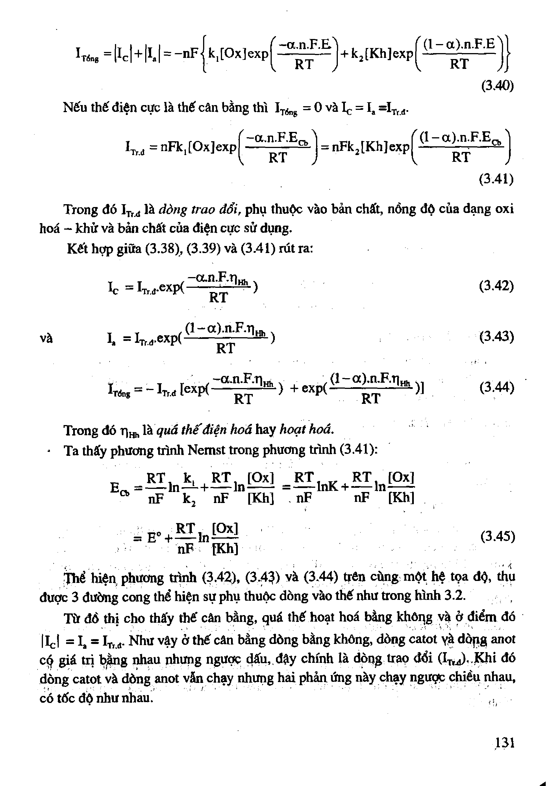

## Page 130

Hình 3.2. Đường dòng thế 
a- Catot; b- Anot và c- Caiot-anot.
3.3. Quá thế kết tinh (T}Ktlnh)
Quá thế kết tính thường xuất hiện khi kết tủa kim loại trôn catot xảy ra chậm. 
Quá trình diện kết tủa xảỵ ra rất phúc tạp và theo nhiều giãi đoạn khác nhau. 
Thỏng thường có hai cơ chế xảy ra:
3.3.1. lon kim loại đầu tiên bị hấp phụ lên trên bề m ặt điện cực:
M"+ 
-► 
M"% 
,  . ,
Trước hoặc sau sự hấp phụ có thể loại bỏ ỉớp vỏ hiđrat, sau đó ion kim loại 
phóng điện:
M"+hp 
+ ne 
^  
M°
Khi có thuận lợi về mặt năng lượng thì nguyên tử mới tạo thành sẽ tương tác 
với các nguyên từ xung quanh và tạo nên mầm tính thể. Nếu vị trí của nguyên từ 
kim loại khổng thích hợp nó sẽ di chuyển trên bề mặt điộn cực catot cho tởi khi 
riào rơi vào vi trí có mức nẵiig lứỢng thích hợp thì nó rihặp vàò mạng lứới tinh thể
ở đó. 
' 
■■■ 
‘ 
! 
-M *■
3.3. 2. /òn kim loại bị hấp phụ vả di chuyển ngáy sau đô môi thực hiện phản ứng
ừctođổiiòn 
'■ 
- 
; 
I
Bẳn chất cữà quá thếkết tiiđi (
là tjuắ tình 1^0 mầm tinh ttìể. Sự lổki lên
của các tỉnh tírể trongquẩ tìnhđỉén k ầ t&a tíêrì bế mặt điện cực đưạc mirửi hoạ như 
hình 3.3.
Í32

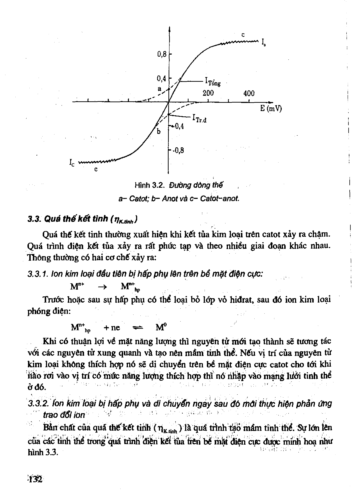

## Page 131

C.1)v.i-i f
■ "jị-
Hình 3.3. Quả trình hình thành mầm kết tinh
133

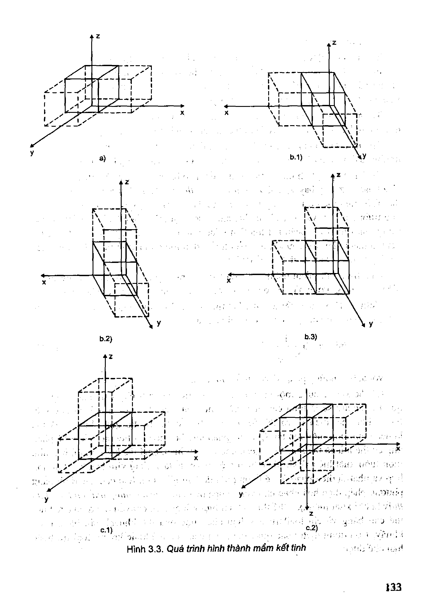

## Page 132

Nhìn vào hình vẽ ta thấy:
Trường hợp a) khi nguyên tử kim loại mới hình thành tiếp xúc với một nguyên 
tử kim loại khác nằm ở phía dưới nó. Tinh thể không phát triển được theo trục z 
nhưng nó lại tiếp xúc với 2 nguyên tử kim loại nằm ở bên cạnh nó theo trục  X và y. 
Liên kết trong trường hợp năy ỉà liên kết yếu.
Trường hợp b) nguyên tử kim loại mới được hình thành liên kết được với hai 
nguyên tử liền kề với nó. Liên kết như thế này mạnh hơn trường hợp a).
Trường hợp c) khi nguyên tử kim loại mới hình thành liên kết được với ba nguyên 
tử*kim loại ở cạnh nó. Trưòng hợp này năng lượng liên kết tăng lên rất mạnh.
Trường hợp c) tinh thể có thể phát triển theo ba hướng X, y và 2 (theo trục X, y 
và z hoặc X, z và y hay y, X và z) — gọi là tinh thể ba chiều, Trường hợp tinh thể có 
thể phát triển theo trục X và y (hoặc X và z hay y và z) tạo nên tinh thể hai chiều 
như trường hợp a) và b). Tinh thể hai chiều dễ hình thành hơn loại ba chiều, vì thế 
trong quá trìrih điện phân kết tủa làm giàu trên bề mặt điện cực thì tinh thể tníớc 
hết tạo thành đơn lớp sau khi đã hoàn thành đan ỉóp thì lại phủ thêm lớp tiếp theo 
ỉên lớp trước và tạo thành kết tuả đa lớp.
Quá trình tạo thănlr mầm của tinh thể xảy ra chậm đòi hỏi thêm năng lượng 
điện hoá; năng lượng này lấy ở thế điện cực vì vậy xuất hiộn quá thế kết tinh.
Volmẹr đã nghiên cứu quá thế kết tinh và đã tìm ra mối quan hệ giữa quá thế 
kết tinh yà mật độ dòng (i) theo công thức sau:
Ini = a - b — -—  
(3.46)
'HK.IÍnh
với a, b là những hằng số của mỗi kim lòại.
Có thể xảy ra cùng một lúc nhiều quá thế trong quá trình điện phân. Như vậy 
quá thế chung sẽ là tổng các quá thế. Khi thêm vào đung dịch nghiên cứu một 
lượng lớn chất điộn li trơ thì dòng điộn chuyển có thể bỏ qua ntìung quá thế 
khuếch tán luồn luôn tổn tại. Quá thếj)hản ứng hoá học thì tùy theo từng hệ phản 
úng cụ thể mà có thể xuất hiên hoặc không xuất hiện. Quá thế kết tinh thi hầu như 
luôn luôn xuất hiện vì khí thực hiện điộn phân để tách tùng kim loại ra khỏi hỗn 
hợp và nhất là điện phân ở thế không đổi để làm giàu kim loại cẩn xác định bằng 
phương pháp điện hoẩ khác như von-ampe hoà tan. Điểm chung nhất có thể nhận 
thấy là khi xuất hiộn quá thế thì có hiện tượng làm dịch chuyển thế điện cực khỏi 
thế cân bằng và chỉ loại trừ hay hạn chế được quá thế .khuếch tán bằng cách 
khuấy, trộn dung dịch hoặc quay cực, còn các quá thế khác khổng loại trừ hoặc 
hận chế được.
134

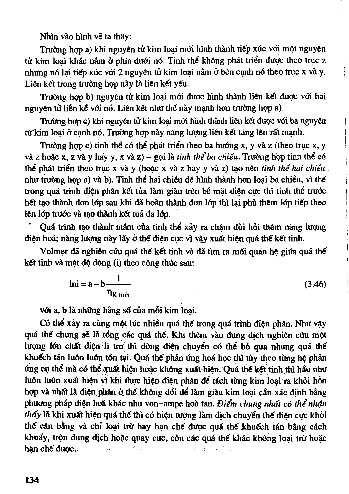

## Page 133

3.4. Các yếu tố ảnh huởng đến quá thế
Mật độ dòng ảnh hưởng rất lớn đến quá thế; mật độ dòng càng lớn thì quá thế 
càng lớn.
Trong dung dịch nghiên cứu có nhiều cấu tử (tạp chất) ảnh hưởng đến quá thế 
lớn hơn trong dung dịch có ít cấu tử.
Trạng thái và bề mặt của diện cực ảnh hưỏng đến quá thế. Khi dùng cùng một 
loại điện cực được chế tạo từ một nguyên liệu thì quá thế trên điện cực có bề mặt 
xốp có quá thế nhỏ hơn trên bề mặt điện cực phẳng. Ngoài ra, nhiệt độ cũng ảnh 
hưởng đến quá thế: Giá trị quá thế giảm 3mV khi nhiệt độ của dung dịch nghiên 
cứu khi điện phân tăng thêm l°c. Nhưng không thể tăng nhiệt độ của dung dịch 
điện phân lên quá 80°c, vì nếu quá nhiệt độ này, dung dịch bay hơi kéo theo một 
lượng chất cẫn tách bằng điộn phân, dẫn đến sai số lớn.
Cần phải chú ý rằng trước khi tiến hành xác định nồng độ của ion kim loại nào 
bằng phương pháp khối lượng bằng điên phân thì phải tìm hiểu qua thế à bảng ưa 
cứu trong các sách chuyên khảo điộn hoá để lựa chọn môi trường, điểu kiện, điộn 
cực. Ví dụ: Quá thế của hiđro trên điện cực catot platin là -0,024V (mật đô dòng 
lmA/cm2) nên nếu điện phân trong môi trường axit sẽ không tách được Fe3+, Fe2+, 
Co2+, Zn2+, Cr3+, Cd2\  Ni2\  Pb2+, Mn2+, Sn2+... ta phải chuyển sang dùng điện cực 
catot thủy ngân có quá thế nhỏ hơn -0,879V (mật độ dòng lmA/cm2) mới có thể 
tách bằng điện phân các kim loại kể trên. Ngoài ra, ưu điểm của điộn cực thủy 
ngân là có thể tạo thành hỗn hống với nhiểu kim loậị. Tách trong trường hợp này 
là tách kim loại đã được hoà tan trong thủy ngân tạo thành hỗn hống mà không 
chuyển vào dung dịch nữa. Sau đó cho thủy ngân bay hơi sẽ thu được các kim loại 
quý tinh khiết như vàng, bạcL.
Ví dụ: Điện phân dung dịch NiCl2 10~2M trong môi trường HƠO4 10 *M dùng 
điện cực platin phẳng (TJU =: -0,024 V) ở 30°c. 
^
Ở catot (-) có: 
Ni2* + 2e 
^  Ni 
và 
2H+ + 2e 
^  H2f
Ta xét xem niken có tách ra ở catot trước hay hiđro?
DT 
n rws
Eo,™ -  E ^ )NI 
- E ^ m + ^ 1 « 1 0 -2 = -0,233.-0,06 = -0,2?3V
Eả>(Ni) = Ea>(Ni) ~ -0,293V
*
135

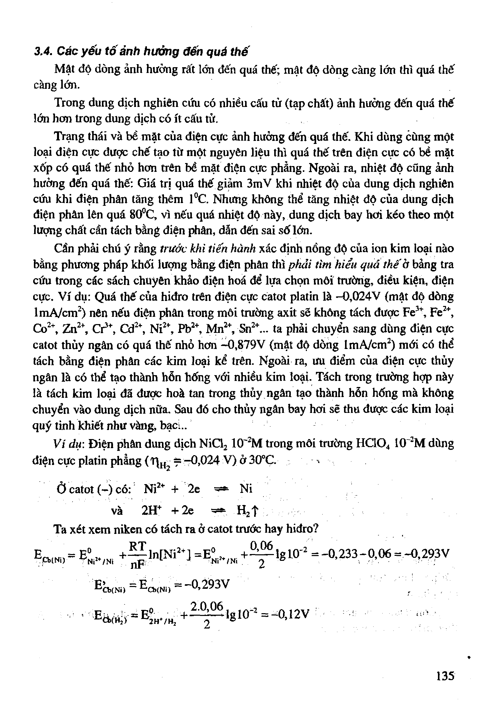

## Page 134

E ỉw , > = E cb(Hi>+n = -0 ,12 -  0,024 = -0,144V
Vậy 
E ^ ,  -  -0,144 V 
» - 0 ,290V
ở catot H2 tách ra trước niken.
Nếu thay catot platin bằng catot thủy ngân thì quá thế của hiđro trên điện cực 
thủy ngân (T|H = -0,879V) với mật độ dòng lmA/cm2 thì sẽ có:
E ^(H2) = 
+ TỊ = -0,12+ (-0,879) = -0,999V
Tacó E’Cb(Ni)= -0,293V > E ’a>(Hj)= -0,999V .
Vậy ở catot sẽ có niken tách ra trước hiđro.
Ni2+ + 2e 
^  Ni 
Sau đó: 
Ni 
+ 
Hg ^  Ni(Hg) (Hỗn hống)
-  
Nếu điộn phân thấy khí hiđro thoát rạ ở catot thì đậ điện phân hết niken 
chưa?
Khi hỉđro thoát ra ờ catot thì
E’o »  = -0,999 = -0 ,2 3 3 + 5 |Ẻlg [N i2*]
-0,999 + 0,233 
■
1 
-  
0,03 
= ~25’53
[NÌ2+]=  10"25-53M « 1 0 ^ M . ,
Vậy niken đẵ được tách ra hoàn toàn ở catot thủy ngân khi có khí hiđro 
thoát ra.
4. Điểu kiện tách các chất ậ điện cực bằng điện phân
Nếu nhúng 2 điện cực pỉatin vào dung dịch điện phân là N iQ 2 trong môi 
trường dư CN~ và pH = 8, nối hai điện cục platin với nguồn điện một chiều, lúc 
này ở catot sẽ có sự khử Ni2+ thành Ni kim loại:
Ni2+ + 2e 
• Ni 
(3.47)
Phản ứng nấy diẻn ra ở ranh giói của hai pha rắn (bể mặt điện cực) tiếp xúc 
với pha lòng (dung dịch điện phân) và niken được tách ra bám vàq bề mặt điện 
cực platin.
Còn ờ anot các anion c r  đựợc vận chuyển tới và nhường electron cho điên cực 
thục hiện quá trình oxi hoá:
136

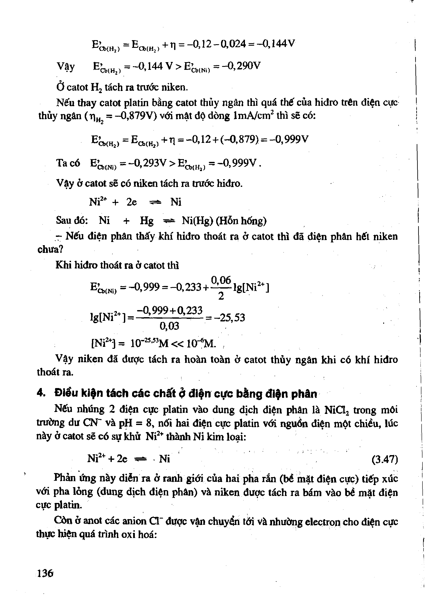

## Page 135

2CT — a 2+2e 
(3.48)
Ở mỗi điện cực đều hình thành cặp oxi hoá -  khử và thế cân bằng của chúng 
được tính theo phương trình Nemst.
Ở catot thế cân bằng được xác định bằng:
RT
Ecwno = E Ni, /Ni =E °iJVNi + ^ ln [ N i2+] 
(3.49)
Ở anot: 
= En 
+ — \ n - ^ Y  
(3.50)
Cb(CL ) 
CI2 / 2 C1 
2 F  
[ c
r f
Khi áp đặt từ nguồn lấy từ bên ngoài vào sẽ được chia làm hai phần là thế 
catot và thế anot:
, U = E ,- E C 
(3.51)
Như vậy để có phản ứng (3.47), ta phải đạt vào catot một thế có giá trị 
Ec < 
thì cân bằng của hệ bị phá vỡ (dịch khỏi vị trí cân bằng) và xảy ra
phản ứng (3.47) theo hướng thiết lập lại cân bằng tức là theo hướng từ trái sang 
phải, để chp 
giảm dần để đạt đến giá tộ Ec. Còn ỏ.anot muốn có phản ứng
(3.48) xảy ra thì E > Ech(C]) đẫn đến cân bằng sẽ chuyển dịch theo hướng tạo ra
khí cụ thoát lên, để cho 
tăng lên đạt đến giá trị Ea.
Nghiên cứu quá trình điên phân và tìm hiểu điều kiện để cho quá trình điện 
phãn có thể xảy ra được (có nghĩa là để có dòng điện đi qua được hộ), người ta 
chia ra hai trường hợp:
4.1. Truứng hợp đơtt giần (không kể đến quá thế)
Trong trường hợp này giả thiết các quá trình vận chuyển các ion và phần tử 
mang điộn hoặc không mang điện đến bề ạiặt điộn cực và các phản ứng điện hoá 
xảy ra trên bề mật điện cực xảy rạ với vận tốc vô cùng lớn thì đồng thời phải có 
hai điéu kiên:
Be S ^cbfNiy 
E* > Ecb(ci) 
‘ 
(3.52)
Khí đó điện áp tác dụng từ nguồn ở bên ngoài vào: 
.
Ụ 
Ẹẹ) > 
Ecb(Ni)) 
(3.53)
137

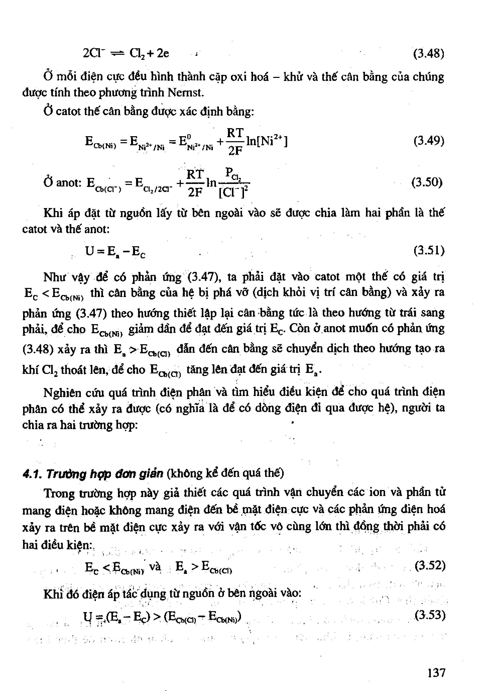

## Page 136

Để thực hiện quá trình điện phân cần có bình điện phân và các đây dẫn điện từ 
nguồn vào điện cực, chúng có giá trị điện trở nhất định. Vậy khi tính điện áp từ 
nguồn bên ngoài vào phải kể thêm giá trị điện trở này thì mới có dòng điện đi qua 
hệ và có quá trình điện phân diễn ra được. Vậy thế áp đặt vào phải bằng:
Trong đó: I là cường độ dòng (ampe); R là điện trở của bình điện phân và dây 
dẫn (Ohm); IR là gọi là độ sụt thế ôm Ưong dung dịch; (Ec^ci) -  EcttNi)) gọi là điện 
úp phân cực hay còn gọi là sức điện động cân bằng ngược.
Nếu nối hai cực vói nhau bằng một dây dăn ngay sau khi điện phân kết thúc 
thì sẽ tạo thành một pin ganvanic và có dòng điện đi ngược chiều với dòng điện 
khi điộn phân. {Chính vì sức điện động ngược này mà sinh viên tiến hành thực 
nghiệm điện phân xong không được ngắt nguồn điện ngay mà phải nàng giá kẹp 
hai điện cực lên khỏi dung dịch điện phản, rửa điện cực bằng nước cất 2 - 3  lần sau đó 
mói được ngắt mạch).
4.2. Trường hợp có kế đến quá thế
Trong thực tế khi điện phân có thể xảy ra một, hai hoặc cả ba giai đoạn trong 
quá trình điện phân bị kìm hãm và xảy ra không phải với tốc đô vô cùng lớn. 
Chính vì vậy, muốn có quá trình điện phân xảy ra được cần phải áp đặt vào 2 cục 
một điộn áp lớn hơn nhiều so với thế cân bằng.
Như vậy để có quá trình điện phân xảy ra đuợc thì điện áp cần áp đặt vào hai 
điện cực phải bằng:
Trong đ ó : E’ =  (Ea +  TỊa) ; E’c =  (Ec +  T]c) 
(3.57)
TỊ, là quá thế anot có giẵ trị dương; 
1 
I
T|c là quá thế catot luôn luôn có giá trị âm. 
'
(Các giá trị quá thế này thường có trong các bảng tra cứu về điên hoá) 
Ị
Người ta dự đoán được phản ứng xảy ra ở các cực khi điộn phân, từ đó sử dụng 
điện phân để tách chất hoặc xác định nồng độ của từng chất có ưong hỗn hợp chứa 
I
nhiểu chất. Chính vì vậy, cần phải nắm được một số tính chất sau: 
'
Trong dung dịch có nhiều chất oxi hoá -  khử cùhg có mặt thì tất cả những 
chất có khả năng bị khử đều có thể đến catot (-) nhận electron để thực hiện
u  — (Ea 
Ec) > (ECb(CI) 
Ec^i,) + IR
(3.54)
Ư = (Ea + Tia) - ( E c + Tic) + IR 
U = E ’ - E ’ =IR
a
(3.55)
(3.56)
138

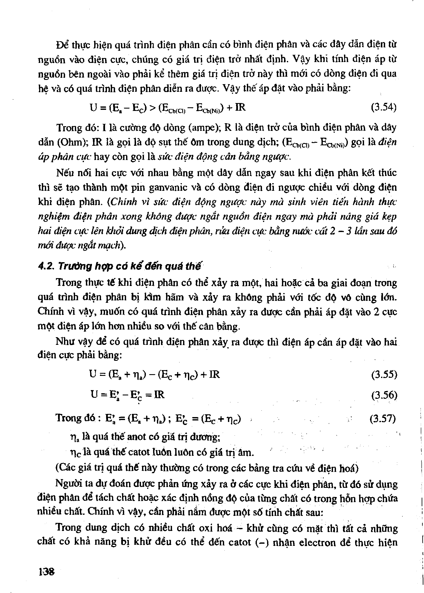

## Page 137

phản ứng (Ox + ne ^  Kh). Còn các chất có khả năng bị oxi hoá đều có thể đến 
anot (+) để nhường electron cho điện cực để thực hiện phản ứng (Kh ^  Ox + ne).
-  Chất nào có thế oxi hoá -  khử lớn nhất sẽ bị khử trước ở catot. Ngược lại 
chất nào có thế oxi hoá -  khử nhỏ nhất sẽ bị oxi hoá ưước ở anot.
-  Tất cả các chất như cation, anion, phân tử trung hoà hay phân tử mang điện 
tích dương hoặc âm đểu có thể tham gia phản ứng ở catot hoặc anot.
-  Các chất tham gia phản ứng điện phân có thể là chất tan (phân tử hay ion) 
hay kim loại dùng để chế tạo điện cực. Ví dụ như điện cực Ag: anot được chế tạo 
từ kim loại Ag khi điện phân: Ag 
Ag+ + e.
-  Dung môi cũng có thể tham gia phản ứng điện phân: nước là dung môi được 
sử dụng nhiều nhất, nước tinh khiết có thể điện phân. Các phân tử dung môi là 
nước, có thể đóng vai trò là chất oxi hoá hoặc chất khử.
Ở catot nước bị khử ở thế khá âm, phản ứng xảy ra:
2H20  + 2e ^  H2 + 20H" (môi trường trung tính hoặc kiềm)
2H+ + 2e 
H2 
(môi trường axit)
Trong trường hợp chất bị điện phân chính là nước nên dòng catot tăng nhanh 
và đạt giá trị rất lớn, khỏng có giới hạn.
Ở anot nước bị oxi hoá, phản ứng xảy ra:
2H20  ^  Oọ + 4H+ 
+ 4e 
(mỗi trường trung tính hoặc axit)
40H ' ^  0 2 + 2HjO + 4e 
(mòi trường kiềm)
Như vậy, quan niệm chất diện hoạt, chất không điộn hoạt hoặc chất điện li trơ 
là hoàn toàn tuơng đối, phụ thuộc vào thành phần dung dịch và bản chất của điộn 
cực đem dùng.
Từ những quan niộm đưa ra ờ trên có thể dự đoán được phản ứng nào thực tế
xảy ra ở điện cực catot và anot đầu tiôn khi tiến hành điện phân tách, xác định
nồng độ từng chất có trong hỗn hợp dung địch chứa nhiều chất. 
1
Ví dụ i: Điện phân dung dịch chứa hỗn hợp CdS04 0,1M và CdS04 0,1M 
trong mồi trường axit peclorìc HC104 0,1M dùng điện cực platin kim loại ở 30ĐC.
Khi điện phân:
Ở catot (-):
Cd2+ + 2ẹ 
Cd ; ECb(Cd) = -0 ,4 0 2 + ^
 lg[Cd2* ] = -0.432V
139

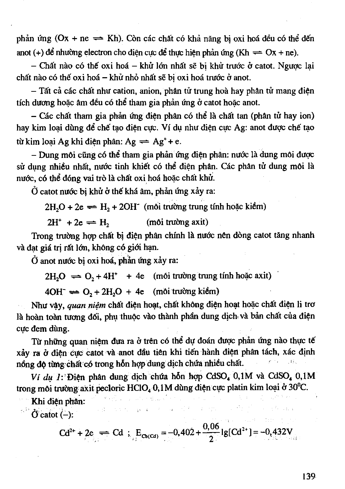

## Page 138

Ni2+ + 2e —  Ni 
; 
= -0 ,2 3 3 + ^ I g [ N i 2+] =-0,263V
H+ + 2e — H2 
; E^H , = 0 + ^ l g [ H +]2 = -0,06V
Zr
B’ckh,, = Ew „,, + n„,(B> = -0,06 V + (-0,478 V) = -0,538V
Vậy ECb(Nj) > 
> E ^(H j , ở catot niken được tách ra đầu tiên.
Ở anot (+):
SO;- —  S2Og2- + 2e ; 
E 
= Eũ , _  + —
lg
4 
2 8 
’ 
Cb(SOỈ ) 
SjOỈ /soỉ 
2 
[SO ]
2H, 0  — 0 2T + 4H+ + 4e ; E
^ ,  =E»t,ỉlli0 + 5 ^ I g [ H 'r
Nếu chấp nhận [S2Og- ] « [SO^ ] vì nó rất nhỏ.
E 
=2 ov
Cb(SOỈ-) 
A Ư V
ECb(HỉO)= U 3 + 0 ,0 6 1 g l0 -1= U 7 V
Vậy 
0) < ECb(S0í_) ở anot nước lại bị oxi hoá trưóc tiên.
Phản ứng xảy ra khi điộn phân:
2Ni2+ + 2H20  ^  2Ni- + 0 2 + 4H+
Muốn cho phản ứng điện phân trên thực hiộn được thì phải đạt điộn áp từ 
nguồn bên ngoàỉ và thoả mãn điều kiộn:
(Ea -  Ec )>  1,17 -  (-0,432) = 1,602V
Các chất được tạo thành trong quạ trình điộn phân có thể kết tủa trôn bề mặt 
điện cực hoặc thoát ra dưới dạng khí hay có thể là chất tan ngay vào tiong dung 
dịch. Nếu chất tạo thành là kim loại thì nó sẽ phủ lên bề mặt của điện cực.
Người ta thấy rằng thẹo thời gian diện phân, nồng độ chất tham gia vào phản 
I
ứng điện phân giảm đẩn, dẫn đến thế cân bằng của nó cũng giảm đần (theo phương 
'
trình Nemst). Ví dụ điện phân đến khi nồng độ niken còn lại 2,3442.10"7M thl thế 
cân bằng giảm xuống còn bao nhiêu? 
!
Tính được: 
= - ( U 3 3 + ^ lg 2 ,3 4 4 2 .ì( r 7 = -0,432V
MỌ

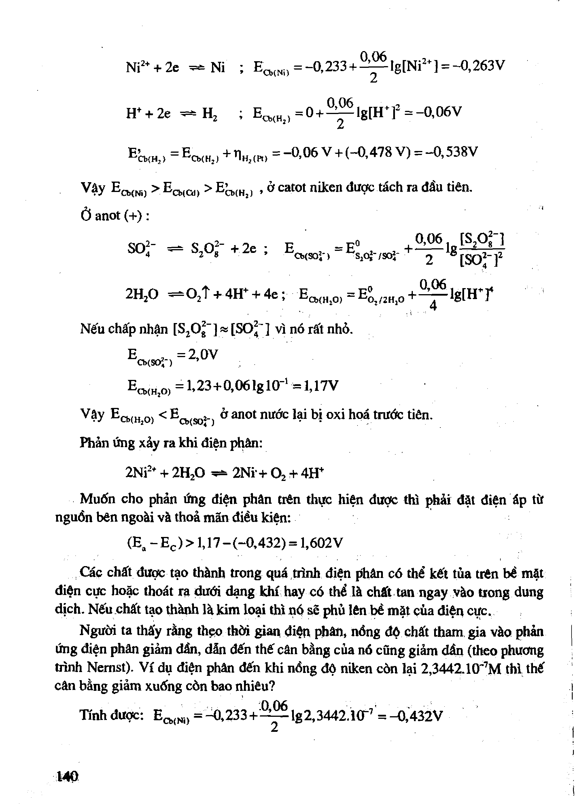

## Page 139

Nếu giảm đến giá trị thế cân bằng này thì sẽ xảy ra sự khử cadimi(II) đổng 
thcri với niken(IĨ) (lúc này nồng độ của niken(n) < ÌO^M coi như còn lại không 
đáng kể)
2Ni2+ + 2H20  —  2Ni + 0 2 + 4H+ 
2Cđ2+ + 2H20  ^  2Cd + 0 2 + 4H+
Nếu cứ tiếp tục điện phân thì nồng độ niken(II) và cadimi(II) giảm và kéo theo 
thế cân bằng của nó giảm và giảm đến đúng giá trị thế cân bằng cùa hiđro. Vậy 
khi điộn phân đến khi có khí hiđro thoát ra ở catot thì đã tách được hoàn toàn 
cadimi (n) chưa?
Theo phương trình Nemst:
-0,539V  = -0,402+ —
lg[Cd2+] => lg[Cd2+] = 
137-2 = -4,57
2 
0,06
[ca2+] = 10'4’57 = 2,6915.10-5M > ÌO^M
Vậy khi có khí hỉđro thoát ra ờ catot thì chưa tách đụợc hoàn toàn cadimi(n)
Cd2+ + 2e —  Cd 
; E ^ 1+/a=-0,402V
H* + 2 e ~ H ,  
; E ^ /Hỉ= 0 (0V
Trong quá trình điện phân thế cân bằng sẽ giảm nếu chất oxi hoá bị khử và thế 
sẽ tăng khi chất khử bị oxi hoá.
Ngoài ra, khi điện phân một số chất bị khử ở catot lại bị tan vào dung dịch 
đang điộn phân, sau đó lại chuyển đến anot để bị oxi hoá hay ngược lại. Ví dụ khi 
điện phân ion Sn4+ (hoặc Feỉ+, Co3*, PtClg'...) bị khử ờ catot thành Sn2+, ion Sn2+
lại chuyển sang anot và bị oxi hòá tại anot thành Sn4+. Quá trình này lặp đi lặp lại 
nhiểu lần như thế. Muốn tránh hiện tượng điện phân vòng này, phải tiến hành điện 
phân có màng ngăn.
Ví dụ 2: Điên phân 50ml dung dịch Cu(C104)2 0,020M trong dung dịch HCIO4 
0,0150M dùng điện cực platin với cường độ dòng 0,2ị0A.
a. Hãy tính điện áp tối thiểu để quá trình điện phân xảy ra được.
b. Tinh số gam của đổng tách ra ỏ catot sau 12 phút điện phân.
c. Tính pH của dung dịch trưóc và saú khi điện phân 12 phứt!
141

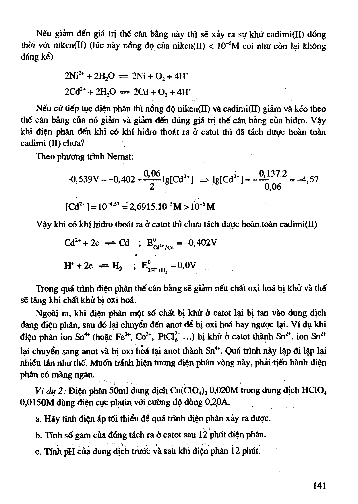

## Page 140

Chobiểv. E^J>/Cu = 0,34V ; 
= l,23V; 
-0,0680V
Điện trờ của bình điộn phân R = l,50fì ; MCu = 64 ở 25°c :
jỉco(p.) = “ °>0015VíPhỉ = latm ;p 02 =latm ;JíOjtPt) = 0,4780V
Lời giải:
a. 
Cu(C104)2 
Cu2+ + 2 0 0 -  ; 
HC104 
-> 
H+ + C104- 
0,02 
0,02 
0,04 
0,015 
0,015
-  ở catot (-):
Cu2+ + 2e->  Cu 
(1)
Ecwc»> = E0 + M ^ I g [ C u 2+] = 0 ,3 4 + ^ —
 lg2.10*a = 0,2898 (V)
2H+ + 2c -> H2 
(2)
= E ° + ^ ^ lg [ H +]2 =0i0 + ^ ^ lg ( l,5 .1 0 -2)2 =^0,1076(V)
* Có kể đến quá thế:
E £ , = E^C) + ^CU = 0,2898 + (-0,0015) = 0,2884(V ),
E'(H2) = E^ h 2, + ”h2 = -0,1076 -  0,068 = -0,1756 (V) 
Tac6: E £ > E *
Vậy ở catot xảy ra phản ứng (1) khửCi?+ thành Cu kim loại.
-  Ở anot (+): 
;.■■■■■
2H20  -+ 0 2 + 4H+ + 4e
= 1,23 + 0,059 lg l,5.10 2 =1,2238 (V) 
Eh:o=Eícb(h2o)+tìoj =1,2238 +0,478 = 1,6003 (V)
Điện áp tối thiểu phải đặt vào hai điện cực:
u = E"0 -E£ t  IR = 1,6033 - 0,2884 + 0,20.1,5 = 1,6149(V)

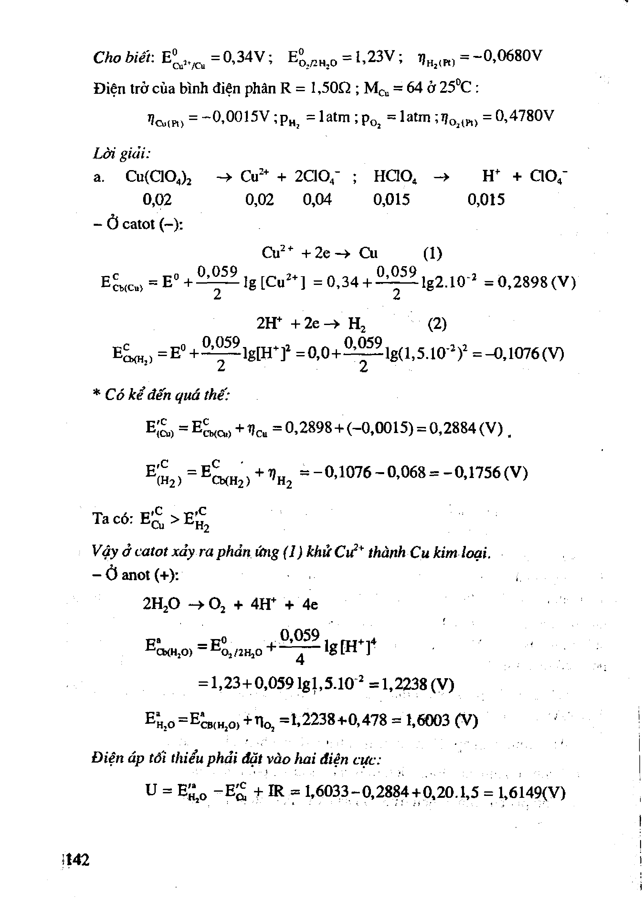

## Page 141

b. Tính số gam của đồng tách ra ờcatot:
a . 
. m ld l^ x ĩx t 
6 4 x 0 ,2 x  12x60 _ n n, 77< ĩfv 
®:l,nC,1 
96500 
2x96500 
’ 
s
c. Tính pH sau khi điện phân:
c  
a l0CK) . ° - 04775x1000 = 0,0149(M)
™l/( 
64x50
Theo phản ứng:
2C u (a04)2 + 2H20  ->> 2Cu + 4H" + 4 Q 0 4 + 0 3
thì H+ sinh ra sau điện phân phải gấp đôi lượng đồng đã bị điện phân:
= 2.0,0149 = 0,p298M.
Vậy 
C+H = c u  + Csinhra = 0,015 + 0,0298 = 0.0448M.
pHSauđ.ph = -lg[H+] = -lg4,48.1(r2 = 2 -0 ,6 5 1 3  = 1,3487 
pH1^ cđ.ph = -lgl,5.Í0-2= 1,824« 1,82.
5. Các yếu tô' ảnh hưỏng đến quá trình điện phân
Trong hoá học phân tích, điộn phân được sử dụng để xác định nồng độ các 
chất bằng phương pháp khối lượng. Để có được'kết quả chính xác cần phải tách 
hết chất và chất tách được phải sạch (chứa một lượng tạp chất không đáng kể). 
Nhung trong thực tế điện phân, ngoài phấn ứng chính xảy ra còn cỏ những phản 
ứng phụ không mong muốn cùng xảy ra làm ảnh hưởng đến kết quả phân tích. 
Việc xác định rõ các yếu tố ảnh hưởng và tìm cách hạn chế là rất quan trọng.
5.1. Ảnh hưởng của tốc độ khuấy Ưộrt
Để tiết kiệríi thời gian điộn phân, biện pháp khuấy và nâng nhiệt độ thứừng sử 
dụng để tăng tốc độ vận chuyển ehất điệri hoạt bang đối lưu đến bề mặt điện cực 
nhanh hơn tlẫn đến tốc độ điện phân nhanh;
-  Khuấy dung địch khi điện phân bằng máy khuấy từ hoặc quay cực, nhưng 
phổ biến nhất là khuấy từ.
-  Nhiệt độ dung dịch điện phân trước khi điện phân hoặc vừa điện phân vừa 
nâng nhiệt độ lốn đến 40 -ỉ- 80 c . Không nâng nhiệt, độ lên quá 80°c, vì lúc đó
143

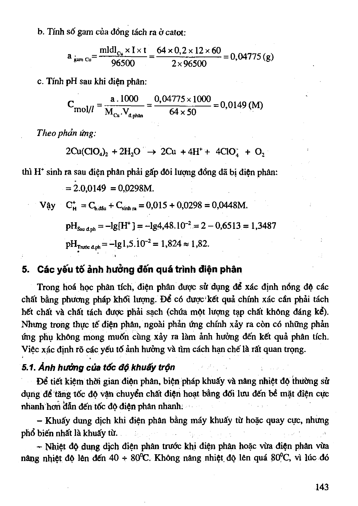

## Page 142

dung dịch điện phân (thuòng có axit) sẽ bốc hơi đồng thòi lôi cuốn theo ít nhiều 
chất cần định lượng bằng điện phân, dẫn đến sai số lớn. Ví dụ khi điện phân dung 
dịch SnCl4 chứa 0,2 gam kim loại thiếc có khuấy với cường độ dòng 1,5 -ỉ- 1,7A và 
ở nhiệt độ thường thì mất 70 phút điện phân. Nhưng nếu điện phân dung dịch 
SnCl4 ở điều kiện như trên nhưng ở nhiệt độ 40°c thì chỉ mất 30 phút, như vậy đã, 
tiết kiệm được thời gian và điện nàng.
5.2. Ảnh hưởng cứa các phản úng phụ
Thường thấy có hai trường hợp ảnh hưởng của phản ứng phụ:
-  Ảnh hưởng của phản ứng phụ tnrc tiếp tói phản ứng chính ở điên cưc. Ví du 
điện phân tách các kim loại từ các dung dịch muối của nó trong mỏi trường axit.
Ở catot, ngoài phản ứng chính tách kim loại M"* + ne ^  m 4s còn có phản ứng
phụ thoát khí híđro : 2H+ + 2e ^  H2T. 
i!
-  Ảnh hưởng của phản ứng phụ tới việc tách sản phẩm chính trên điện cực.
Ví dụ ỉ : Khi dùng phương pháp điện phân tách lấy các kim loại từ các muối 
halogen của nó (MX2 : C uơ2; CdQ2...) dùng điện cực platỉn thì ở anot (+) có khí 
clo thoát ra sẽ ăn mòn anot tạo thành axit cloroplatinic H2PtCl6: (Pt + 2C12 + 2H+ + 
2Cl" —> H2PtCl6), ion PtQg' chuyển vào dung dịch và khuếch tán tói catot và bị
khử tại đó thành kim loại (PtClg' + 4e —> Pt + 6C1“). Platin bám vào cùng với đồng
(Cu2+ + 2e ^  Cuị) làm kết quả xác định lượng kim loại đồng lón hơn so với hàm 
lượng thực tế có trong dung địch, dẫn đến kết quả xác định đổng mắc sai số lớn.
-  Trong một số trường hợp ion kim loại bị khử từng nấc ờ catot tạo thành sản 
phẩm trung gian, sản phẩm này khuếch tán sang anot bị oxỉ hoá và sản phẩm ỉại 
khuếch tán đến catot. Như vậy xảy ra quá trình oxi hoá -  khử tuần hoàn, dẫn đến 
không những làm tiêu hao điện năng vô ích mà còn ảnh hường đến việc tách kim 
loại ờ điện cục.
Ví dụ 2: Khi điộn phân dung dịch chứa các ion Cd2+ và Sn4^ (Fe3*, Co3*, Sb5*...). ở 
catot Sn4* bị khử trước tạo thành Sn2+ và ion Sn2* khuếch tán đến anot và bị oxi hòá 
thành Sn4*, ion Sn4* lại vòng về eatpt nhận electron từ điện cực. Như vậy tạp thành 
qụá trình oxi hoá -k h ử tuần hoàn,, ảnh hưởng đến quá trình tách cađimi ở catọt.
Một số biộn pháp loại trừ hoặc tránh ảnh hựởng cản trở của các phản ứng phụ 
như sau:
• • ' • 
■ 
-1T. ! .. Ị 
: : v 
•;
5.2.1. Thêm một số chất phụ để ngăn phản ứng cản trở 
> 
. !
-  Khỉ thềm các chất phụ vào dung địch điện phârt, các chất phự bị khử ờ catot 
hoặc bị oxi hóá ở anot và các phản ứng khử, oxi hoá này xảy ra một cắch dẻ dàng
*44

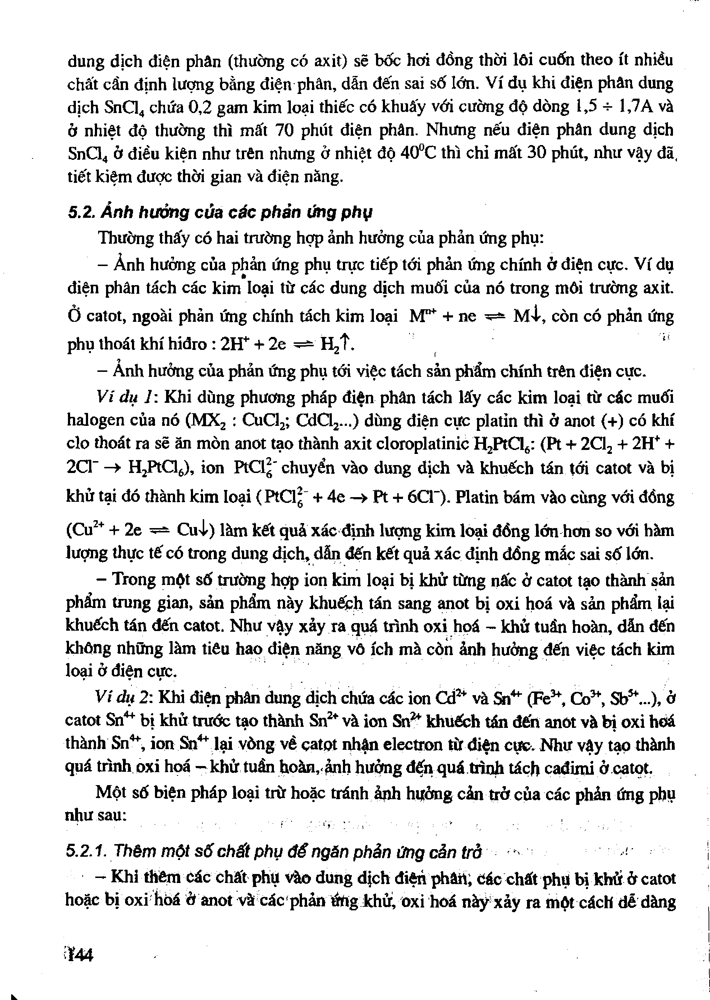

## Page 143

hơn phản ứng cản trờ, có nghĩa là phải xảy ra phản ứng trước phản ứng cản trờ. 
Các chất phụ thêm vào được gọi là chất chống phán cực.
-  Sản phẩm của phản ứng với chất chống phân cực tạo thành không có hại
(ảnh hường) đến sản phẩm của phản ứng chính. Có hai loại chất chống phân 
cực.
Chất chống phân cực cho thêm vào dung dịch trước khi điện phân để tránh (hạn
chế) phản ứng cản. trở ở catot -  gọi là chất chổng phân cực catot. Trường hợp 
ngược lại gọi là chất chống phản cực anot. Ví dụ : Khi điện phán tách kim loại 
(Cd) từ các dung dịch muối của (CdCl2) trong môi trường axit xảy ra:
-  Phản ứng chính: Cd2+ + 2ẹ ^  Cd.
-  Phản ứng phụ cản trở: 2H+ + 2e ^  H2T
Khí hiđro thóát ra sẽ phủ mất một phẩn điện cửc, do đó kim loại Cd tách ra sẽ 
chỉ tập trung ở các phần bể mặt chưa bị hiđro chiếm chố (tự đo), như vậy dẫn đến 
sự tách kết tủa cađimi không đều. Lúc đầu như vậy, nhưng sự điện phân tách Cd 
vản diễn ra và sự kết tủa vân tiếp tục phát triển mạnh về phía diộn tích trống ở bề 
mặt điộn cực và kết tủa tiếp tục phát triển manh ò chỗ “nhô lên”, dẫn đến khuynh 
hướng kết tùa tạo thành có hình que không dính chặt vào với lớp kết tủa trước. Kết 
thúc điện phân, khi rửa kết tủa sẽ rơị vãi một phần dẫn đến kết quả phân tích xác 
định hàm lượng kim loại Cd mắc sai số lớn. Để tránh phản ứng cản trở tạo thành 
hiđro, người ta cho thêm NO“ vào đung dịch. NO3 có thế oxi hoá cao hơn hiđro
(E° 
=0,308V), dễ bị khủ hơn ÌOIỊ H+ và khi bị khử thì tạo thành sản phẩm là
v 
NO3 /NH 4  
7  
* 
■ 
* 
. 
r
ion NH4, không ảnh hưởng gì đến kết tủa Cd bám vào điện cực catot:
NO3- + 10H+ + 8e —  NH; + 3H20  
E°0j/nh+ = 0,308V
^
G0 ^CMNOị/NHÍ) '3>^Cb{2H',7HJ)
Ở đay ion NOj gọi là chất chống phân cực catot.
Khi điện phân dung dịch có chứa ơ" (HO, MClj, MQ...), để tránh phản ứng 
oxi hoá ion Q - ờ anot Pt, khí clo tạo ra ăn mòn điện cực platin tạo thành PtQg*...
đẫn đến phản ứng oxị h o á k h ử tuần hoàn, làm cho kết quả phân, tích mắc sai số 
lớn Ngoài ra, clo bay ra môi trường ảnh hưởng đến sức khoẻ của cộng đồng 
(người dân sống gần khu có bể mạ hay điộn phân).
Để tránh -phản ứng oxi hoá ion c r  ở anot, thường thêm vào dung dịch điện 
phân dung dịch hidrazin hoặc hiđroxylamin. vì các chất này dễ bị khử hơn anion 
Q “ (xảỵ ra trước Q 7) và sản Ịđìẩm phản ứng oxi hoá của chúng là N2 hoặc N201à 
không có hại;
145

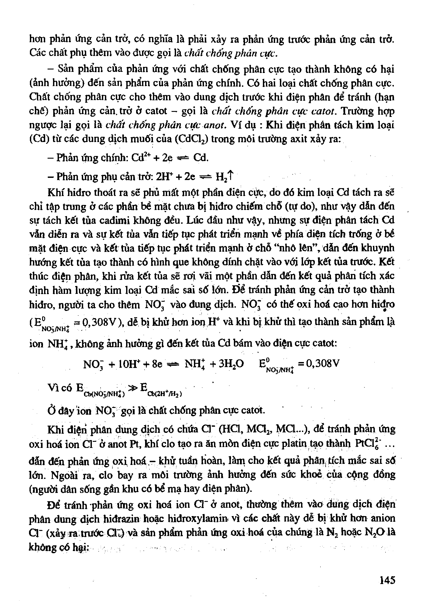

## Page 144

N2H; ^ N 2 + 5H+ + 4e
2NH2OH ***** N20  + 4H+ + H20  + 4e 
2 C r ^ C l2 + 2e 
E° 
= 1,36V
i 
C12/2CT
VÌCÓ: Ea,(N2/N2HỊ)< E cb(a2y2a-) và Ecb(N2(V2NH1ÕH) < Ecb^na-,
Ở đây hidrazin hoặc hiđroxylamin là chất chống phân cực anot.
3.5.2.2. Điện phân có rnàng ngăn để ngăn cản ảnh hưởng của phản ứng phụ
-  Trường hợp điện phân CuCl2 để tách đổng, để ngăn c r  chuyển sang anot, ăn 
mòn anot làm bằng platin, người ta dùng màng ngăn và dẫn khí cụ vào bể đựng 
dung dịch NaOH tạo thành nước Javen ( ơ 2 + 2NaOH —> NaCl + NaQO + H20), 
dùng làm thuốc tẩy, để tẩy các chất bẩn và chủ yếu là mực trẽn giấy cũ, dùng giấy 
vào tái sản xuất giấy.
-  Trường hợp điện phân Sn4+, Fe3+, Co34... dùng màng ngăn để ngăn cản Sn2+, 
Fe2+, Co2* không pho khuếch tán về anot, tạo thành quá trình oxi hoá -  khử 
tuần hoàn.
3.5.2.3. Thay đổi một số điểu kiện hoá học trong dung dịch chất điện phân
Việc thay đổi pH trong dung dịch chất 'điện phân ỉà để tránh H2 thoát ra trước 
hoặc đồng thời với kim loại cần tách. Ví dụ không tách các kim loại bàng điện 
phân dung địch chứa Ti3+ (E ^ +/T( --1 ,6 3 V ), Mn2+ (E ^ 2+/Mn = -U 9 V )I  Zn2+
<E; U z „ = ^ 76V>’ 
Fe2+ 
( E k ^ - Í U S V ) ,
Nị2+ 
= -0.233V ), Sn2+ (E 0^
 =-0,141 V ), Pb2+ (E 0^
 =-0,126V ),
FeH (E p3+/F = -0,036V )... trong môi trưòng axit, mà phải chuyển sang môi
trường bazơ có pH > 8. Khi đó H2 sẽ được tách ra ở catot sau khi tách kim loại, 
nhưng còn tùy thuộc vào nồng độ của các kim loại và quá thế thoát ra ở điện cực 
đuợc chế tạo từ kim loại nào. Cho nên trước khi điên phân tách kim loại, rất cần , 
phẳi dự đoán và tính toán.
Ngoài ra cũng có thể thay điện cực ở catot làm bằng platin bằng điện cực khác 
như đồng, thủy ngân...
5.3. 
Ảnh huvng của chất tạo phút
Khi cho thuộc thử có khả năng tạo phức vào dung địch điện phân có chứa các 
ion kim loại, dẫn đến có sạtạo phức. Sự tạo phức này làm giảm nồng độ tự-do cùa 
ion kim loại và do đó làm giảm thế cân bằng (theo phuơng trình Nemst). Nói cách
Ỉ46

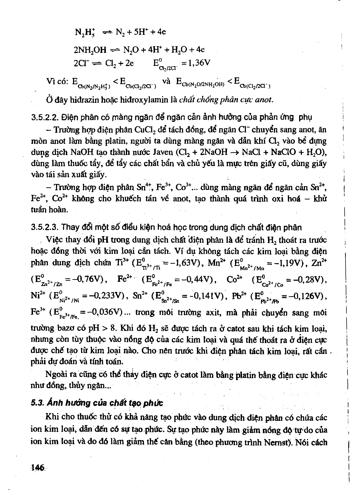

## Page 145

khác, khi có sự tạo phức làm chuyển dịch thế cân bằng theo chiều âm (E q ,,^  < 
Ecb crự do))- Sự chuyển dịch này khác nhau tùy theo quan hệ giữa đô bền của phức 
kim loại với phối tử. Nếu phức tạo thành có hằng số bền càng lớn chuyển dịch’ 
càng nhiều. Ví dụ phức Ag(NH3)t có lgp2 = 7,24 nhỏ hơn lg|52 = 19,85 củá phức
Ag(CN)j, nếu khi điện phân thế cân bằng trong trường hợp phức của xianuạ với
bạc(I) chuyển địch về phía âm nhiều hơn. Ngoài ra, một phối tử có khả năng tạọ 
phức với nhiều ion kim loại, nhưng có độ bền khác nhau. Lợi dụng tính chất này, 
người ta sử dụng các chất tạọ phức để tách bằng điện phần cấc kim loại có trong 
hỗn hợp. Ví dụ cho chất tạo phứÈ là NaCN yàọ hỗn hợp duiỊg dịch có Ạu3*, Ag* và 
Cu2\  đem điộn phân sẽ tách được Ag đầu tiên, sau đó đến Cu yà cụối cùng là Ạu 
vì Eo, 
> Ecb.tm*-**,) > Eo, (Paving) do có sự tạo phức làm dịch chuyển thế
cân bằng về phía thế âm hơn, nhưng sự chuyển dịch này khác nhau. Sự chuyển 
dịch thế cân bằng của phức Ag+ ít hơn phức Cu2+ và phức Cu+ lại ít hợn phức Ạu^; 
vì phức A g(Q í>2 có lgP2 = 19,85 nhò hơn lgp4 = 30,3 của phức Cu(CN)^ yà nhả 
hơn lgp4 = 56,0 của Au(CN)^. (Chú ý Cu2'1'trong môi truòng NaCN bị khử xuống 
Cu+trước khi điện phân). 
, - 
• ị
Qua các ví dụ ở trên cho thấy tniốc khi tách từng kim loạị có trong hỗn hợp 
các ion kim loại bằng điện phân cố cho thêm phối tử có khả năng tạo phức, 
phải nghiên cứu kĩ nên dùng phối tử nào, phù hợp với từng đối tượng hỗn hợp 
dung dịch chứa những loại ion kim loại nào cho phù hợp, sau đó mới tiếạ hành 
thực nghiệm.
Ngoài ra, tốc độ trao đổi ẹỊecừon của ion kim loại và ion phức có thể khác 
nhau yà trong thực tế tách kim loại ỏ dạng phức thuận tiện hơn việc tách kim loại ở 
dạng ion hiđrat hoắ (ion tụ do). Ví dụ, khi điện phân bạc từ dung dịch AgNQ3 ở 
mật độ dộng bé thì thu được kết tủa ở dạng hạt to hoặc có thể ờ dạng hìph quẹ, có 
thể thấy ,<Ịệ dàng tỈRỊg tinh thể một. -ííhưng nếu điện phân 
dung ứịch phức' 
Ag(CN)j 
kết tủạ thu được rất mịn, dính chặt và sậng ỳón%. Chính vì vậy
phương pháp mạ-điện.ỉà trường hợp .riêng của phương pháp điện phán, 4ùy: thuộc 
vào mục đích. Nếu mục. đích là tách, xác định nồng độ của chất hoặc tách lấý kim 
loại quý thì phèi dừng điện phân đến hết chất, còn mục đích là bao hockim loại 
bằng lớp mòng kim loại khác để tránh ăn mòn điện boá ví đụ như Tĩiạ ghiđôrng, 
vành xe đạp, xe máy, ô tô... bằng một lởp niken từ dung dịch phức của nó mới đảm 
bảo dính chặt, mịn và bóng. Các quy trình công nghệ mạ của các nước đểu được giữ
147

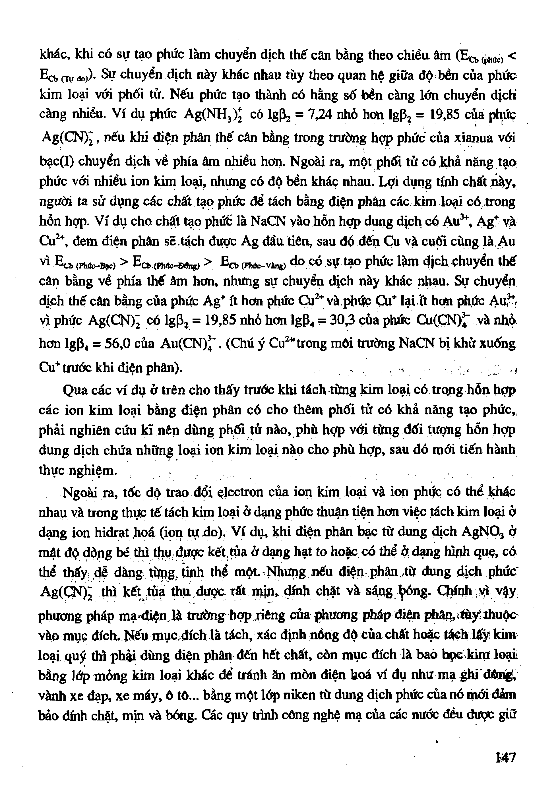

## Page 146

bí mật, có công bố trên các tạp chí chuyên ngành chỉ là những nguyên tắc chung 
chung. Công nghệ mạ cho đến ngày nay phát triển rất mạnh, không chi mạ trên kim 
loại mà mạ mang tính chất trang trí trên giấy, gốm sứ, gỗ,...
5.4. Ânh hưởng đến dạng kết tủa điện phân
Tròng phân tích điện phân, điều quan trọng nhất là phải tách được hoàn toàn 
kìm lòại ra khỏi hỗn hợp ở điện cực và kết tủa kim loại tách ra phải không được 
mất mát trong quá trình xử lí (rủa, sấy khô, cân) thì mới có kết quả phân tích chính 
xác. Kim loại tách ra có thể ở dạrtg bột, hạt to hoặc tirih thể hặt nhỏ. Dạng kết tủa 
tách ra bám vào điện cực phụ thuộc vào nhiều yếu tố. Một trong những yếu tố 
quan trọng nhất là mật độ dòng. Nếu điện phân ở mật độ dõng lớri và có khí hiđro 
thoát ra đồng ttìờỉ với kim loại thì kết tủa tách ra sẽ ở dạng bột xốp, không dính 
chạt vào điộn cực. Chính vì vậy khi điên phân, phải chọn được điểu kiện điện phân 
tối ưu như mật độ dòng phù hợp, riếu điện phân ở môi trường axií thí trước khi 
điện phân phải cho chất chống phân cực hoặc chuyển sang điện phân ở môi trường 
có pH lổm...
6. Các phương pháp điện phân
6. í. Điện phân ở cường độ dòng không đổi
6.1.1. Thiết bị
Gồm một bô nguồn (nguồii đổi chiều hoặc acquy) B để cung cấp nguổn điộn 
một chiều, ampe kế A để theo đổi dòng điộn chạy qtìa hai cực, vôn kế V để theo 
dõi nguồn điện cung cấp từ ngoài vào, một bộ biến trở R thay đổi điện trở để có 
thể giữ cho cường độ dòng không đổi trong suốt quá trình điện phân và bình điộn 
phân c  chứa dung dịch cẩn điộn phân và điện cực. Bình điện phân được đặt trong ổ 
điện phâri, dưới ổ điện phân có một-bộ phận điẻú khiển nhiệt độ, giữa ổ điện phân 
và bô phận điều khiển nhiệt độ có bộ phận cách điện. Độ phận diều khiển nhiệt độ 
vừa có khả năng duy trì nhiệt độ đến nhiệt độ mong muốn edit có từ tính để khuấy 
dung dịch khi điộn phán. Điện cực sử (dụng thường dùng điên cực platin, trong đó 
catot thường làm dưới dạng lưới để tăng diện tích tiếp XÚG, điện Cực phụ thưòng 
làm từ dây platin. Trước khi điện phân phải rửa sạch điệrv cực platin bằng axit 
H N03 loãng (2M), sau đó rửa bằng nước cất, sấy khô, và cân trước khi sử dụng 
(hành 3,4). 
- f' 
■ 
; -ú 
■-
%,

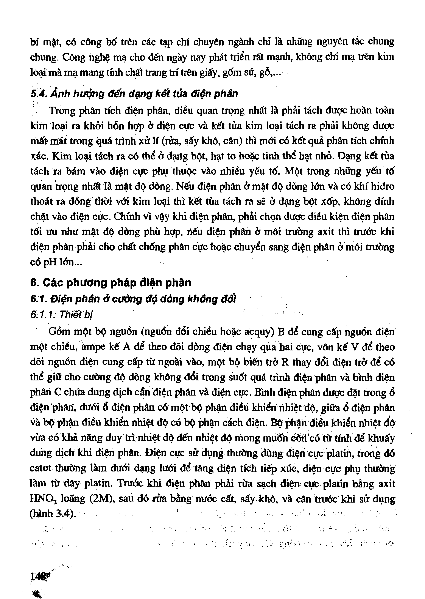

## Page 147

B
Acquy + 
-
|| ||—
<£>
R
AAAA/VWV
0
1
+
e 1= 
c[ 3 K (Kẹp)
{
Anot
c
— — Catot
CuS04 f h 2s o 4, h n o 3
Hlnh 3.4. Sơ đố máy điện phân ỏ cườrig độ ơònợ không đổi.
í"
6.1.2. Các bước tiến hành 
.
6.1.2.1. Chuẩn bị dung dịch điện phân 
s
Lấy chính xác thể tích dung dịch cần điện phân cho vào bình điỘỊi phân, cho
axit hoặc bazơ để điéu chỉnh môi trường điện phân; thêm chất phụ (chống phân 
cực) vào dung dịch điện phân để hạn chế phản ứng phụ,... 
‘ ỉ
Sau đó đặt bình điện phân đun nóng trên bếp điện cho đến 50 -  60°c. 
‘
Đặt bình điện phân vào ổ điện phân.
6.1.2.2. Tiến hành điện phân 
Mắc điộn cực và thử cực.
Xoay núm vặn điều khiển biến trờ R sap cho kim ampe kế chỉ đúng vào giá trị. 
mình cần.
6.1.2. 3. Kết thúc điện phân
Trước khi dừng điện phân phải kiểm ưa để đảm bảo tách hết chất p điện cực. 
Thử ion điện phân còn lại bằng phấn ứng nhỏ giọt dùng các phấn ứng đặc trưng ví 
dụ điên phân tách đổng dùng thuốc thử kali íeroxianụa, tách niken dùng đimẹtylglioxiiĩỊ, 
tách cadimi dùng natri sunfua.. (chứ ý chỉ lấy 2 đến 3 giọt vì nêu chưa hết sẽ gây 
sai số). . 
■ ' 
ị 
' 
■
Sau khi điện phân xong, nhấc điện cực ra khỏi dung dịch điện phân và chỉ ngắt 
điện sau khi đã rửa sạch điộn cực bằng nước cất, để tránh hoà tan kết tủa kim loại 
trờ lại. 
■
140

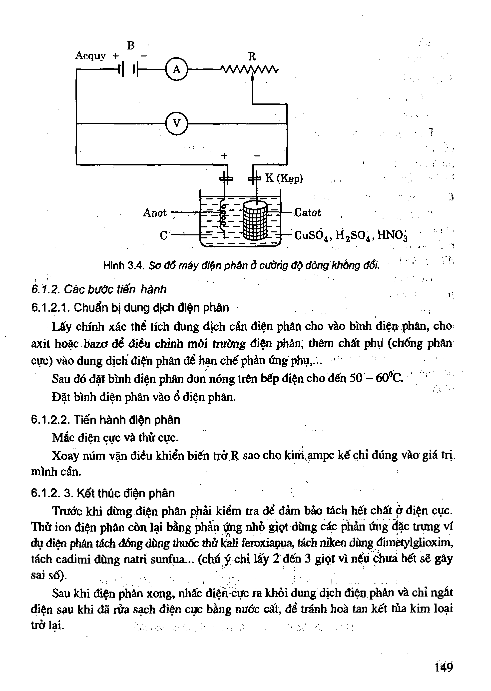

## Page 148

Sấy khô rồi cân, tính khối lượng kết tủa kim loai đã tách được và nồng độ ion 
kim loại có trong mẫu đem xác định.
6.1.3. Tinh toàn xữ lí, báo cá o kếtq u ả
— Ghi các kết quả điện phân.
-  So sánh kết quả vói phương pháp khác (chuẩn độ đo thể tích).
Phương pháp điện phân ở cường độ dòng không đổi là phương pháp điện phân 
cổ điển, chỉ sử dụng khi đã biết chắc trong dung dịch chỉ có một ion kim loại và 
muốn tách bằng điộn phân để tinh chế lại; không sử dụng được khi tách từng kim 
loại từ hỗn hợp các ion kim loại.
6.2. Điện phân ở thếkhông đổi
Phương pháp điện phân ờ cường độ dòng không đổi có nhược điểm là thiếu 
chọn lọc bởi vì để giữ cho cường độ dòng không đổi thì phải tâng thế dẫn đến có 
thể xảy ra quá trình khử các ỉon kim loại khác cùng có mặt trong dung dịch khi 
điên phân hoặc có thể hiđrọ thoát ra.
Để khắc phục nhược điểm này, người ta nghiên cứu tìm ra phương pháp điện 
phân ở thế không đổi. '
Thiết bị điện phân về cơ bản giống như sơ đổ thiết bị điện phân ở cường độ 
dòng không đổi, chỉ có khác là lắp thêm một điện cục phụ trợ và nối điện cực này 
với điện cực chỉnh (ví dụ catot) qua một điện thế kế. Trong quá trình điện phân thế 
ồ điện cực chính văn được giữ không đổi (theo dõi qua điện thế kế) bằng cách thay 
dổi thế qua biến trò R. Trong khỉ đó thế sẽ thay đổi ở.điện cực phụ trợ, nhu sơ đổ ở 
hình 3.5.
Acquy
AAMA/WV
eỊ» 
4 f K (Kạp)'
Điện 
thế kế
Catot
Điộn cực phụ trợ'
Anot 
*
Hình 3.5. Sơ đổ máy điện phân ỏ thế không đổi
trợ 
— T-
A T lrtf '
2+ /1,2+ „ 2+ ™ 2+ 
Cu , Cd , Zn , Pb
H+, NOâ
• I
Ị5Ọ

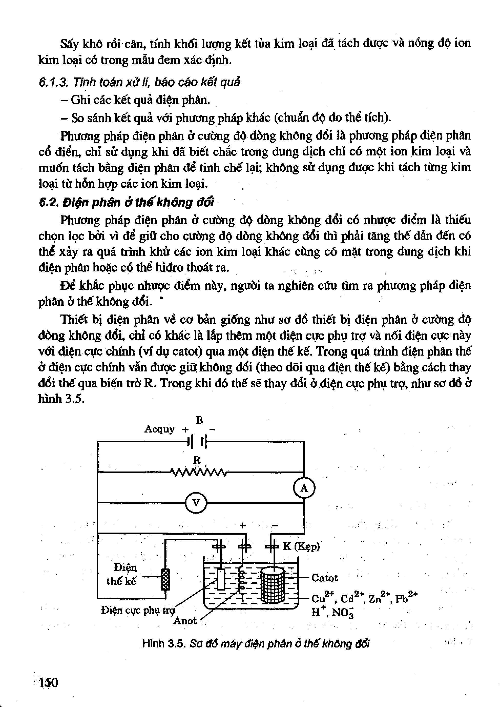

## Page 149

Phương pháp điện phân ở thế cố định có ưu điểm là cho phép tách được các 
kim loại khác nhau ở trong cùng dung dịch.
Ví dụ 1: Hãy tính toán điều kiện điện phàn tách Au từ dung dịch chứa Au3+ 
10'3M và Cu2+ 0,2M.
Muốn tách Au cần khống chế sao cho: 
< Ec < EAu.
Giả thiết việc tách vàng được coi là hoàn toàn khi nồng độ của Au3+ chỉ còn lại
bằng 0,01% nồng độ ban đẩu, lúc đó: [Au3+] = —
.lo -3 = l<r7(M)
AuCl^ + 3e ^  Au + 40"
=■ 
+ ^ ' 8 1 0 - ’ = 0,99 -0 ,1 4  = 0,85 (V)
Mặt khác: Cu2+ + 2e =5^  Cu
=• Ecb(Co) = 
+^ - ' 8 2-10"‘ = 0,34 -0,021 = 0,319 (V)
Vậy muốn tách hoàn toàn Au ra khòi hỗn hợp trên phải khống chế thế catot 
trong quá trình điện phân sao cho: 0,319V < Ẹc < 0,85V. Muốn vậy, phải kiểm tra 
chặt chẽ thế catot trong suốt quá trình điện phân.
Ví dụ 2: Tiến hành thực nghiệm tách và xác định nổng độ Cu2+ trong dung 
dịch CuS04 bằng điện phân ờ cường độ dòng không đổi. Các bước tiến hành 
như sau:
ỉ. Các bước tiến hành thí nghiệm 
a - Chuẩn bị dung dịch điện phân:
Dùng pipet lấy chính xác 10ml dung dịch CuS04 Cx, thêm 5mỉ HNOj 2M và 
3ml H2S04 (1 : 4), thêm nước cất vào cốc đã chứa dung điện phân cho đến cách 
miệng cốc lcm. Sau đố đặt cốc đun nóng trên bếp điện cho đến 50 -  60°c. Nhấc 
cốc đặt vào Ổ diộn phân của mẩy điện phân
b - Tiêh hậnh điện phân: Kẹp hai đầu của hai điện cục platin với hai cực 
nguồn của máy điện phân. Hối hai cực vói nguồn điộn xồng, tiếp theo là thử cực: 
lấy một tờ giấy lọc chiểu rộng khoảng 4cm, chiều dài 10cm, tẩm ướt bằng KC1 
0,1M và phenolphtalein 1%. Sau đó đưa tờ giấy từ dưới lên tiếp xúc vổi hái cực và 
bạt nguồn điện. Nếu thấy cỏ vành màu hồng ở chỗ tiếp xúc giữa đìộn Cực lưổí 
platin vối giấy chứng tỏ đã mắc đúng eực. Lúc đó ở cực lưới là cực âm xảy ra phản 
ứng sau:
151

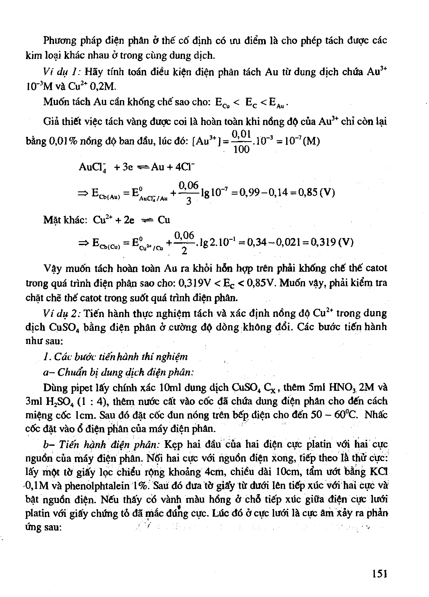

## Page 150

2H20  + 2e —  H2 + OH" làm giấy tẩm phenolphtalein có màu hổng.
Thử cực xong, hạ giá đã kẹp hai điện xuống cốc điện phân sao cho ngập 
lưới platin.
-  Xoay núm vặn điều khiển cường độ đòng sao cho kim điện kế chỉ 0,3A 
'(I = 0,3A) khi đó nếu nhìn vào von kế chỉ thế: u  = 2 -  2,2V, điện phân trong 
khoảng 1 giờ 20 phút. Sau đó tiến hành tftư đã điện phân hết Cu2+ chưa, cách thử 
như sau: Dùrig công tơ hút hoặc pipet lấy cỡ 2 -  3 giọt dung dịch điện phân cho 
vào ống nghiệm con, thêm 5 giọt dung dịch đệm axetat (axit axetic + natri axetat 
có pH = 4 -  5) và 3 giọt dung dịch K4[Fe(CN)6] 0,1M. Nếu còn Cu2+ sẽ có kết tủa 
màu nâu Cu2[Fe(CN)6]4':
2Cu2+ + [Fe(CN)É]4- ^  Cu2[Fe(CN)6] ị (nâu).
c— Kết thúc điện phân:
Sau khi đã thử thấy hết Cu2+, khổng tắt điện, nâng giá điện cực lên cao, tiến 
hành rửa hai điộn cực bằng cách chuẩn bị 3 cốc nước cất, đưa lần lượt ba cốc nước 
cất từ dưới lên vào rủa các điộn cực. Sau đó tắt điện, tháo điện cực ra khỏi giá.
Chú ý: Trong quá trình điện phân nhớ bật các nút đun nóng và nút khuấy từ 
trên máy điên phân để quá trình điện phân xảy ra nhanh hơn. Sau khi tháo điện Cực 
ra, rửa điện cực lưới platin có đồng bám vào bằng axeton (dùng cổng tơ hút phun). 
Sau đó hơ cao trên bếp điộn cho đến khô, để nguội và mang cân. Hiệu ứọrig lượng 
của lưới platin trước và sau khi điện phân cho biết lượng đổng đã tách được bằng 
điện phân. Sau khi cân xong điộn cực, hoà tan đồng bám vào lưới điện cực trong 
HNOj 1 :1  đã đun nóng trước trên bếp điộn, sau đó rửa lưới điện cực bằng nước 
cất, cuối cùng rửa bằng axeton và sấy khô.
-  Thí nghiệm để so sánh kết quả bằng phương pháp chuẩn độ phức chất:
Dung pipet lấy chính xác 10ml dung dịch CuS04 Cx (đã lấy để điện phân) cho
vào bình chuẩn độ, thêm từng giọt dung dịch amoniac (NH3) 6M cho đến khi xuất 
hiện kết tủa và kết tủa tạn ra thêm tiếp 3 giot NH3 nữạ. Pha ioãng dung dịch bằng 
30 -  40ml nước cất (nếu đục lại thêm amonỉac cho đến tan) Cho bằng hạt gạo chi 
thị murcxit (1% murexit + 99% NaCl rắn), lắc cho tan chí thị, lúc nạy dung dịch 
có màu vàng tối. Sau đó đem hỗn hợp dung dịch đi chuẩn độ bằng dụng dịch 
EDTA 0,05M cho đến khi dung dịch chuyển từ màu vàng sang tím hoa cà thì dừng, 
đọc và ghi thể tích EDTA đã tiêu thụ (làm hai lần để lấy V ).
m

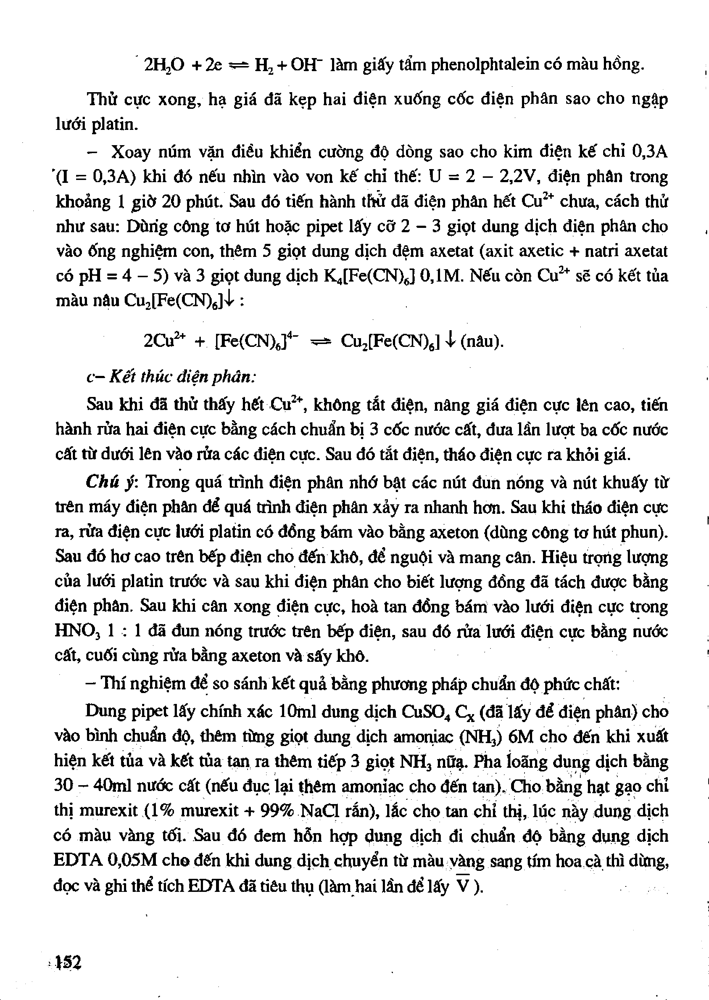

## Page 151

2 . Tíìĩh toán xử ỉí, báo cáo kết quả 
a - Kết quả điện phân:
aj là khối lượng của lưới platin trước khi điện phân, a2 là khối lượng của lưới 
platin sau khi điện phân. Số gam của Cu xác định được bằng phương pháp khối 
lượng qua điện phân:
g, = a2 -  aj = 7,5765 -  7,5127 = 0,0638 gam
b. So sánh kết quả với phương pháp khác (chuẩn độ đo thể tích)
-  Nếu đem so sánh vói số gain Cu ban đầu (0,064g) thì sai số tương đối mắc phải:
q % =  - ’° 6 4 ~- ,063- .100% = 0,31%
Ml 
0,064
-  Đổi ra nồng độ mòựl của CuS04
0,0638.1000 =a09969M 
4 
10.64
-  Nếu đem so sánh vói nồng độ ban đẩu (0,1 OM) thì sai số tương đối mắc phải:
% = O10_a09969 100% = 031%
41 
0,10
-  K ết quả chuẩn đ ộ th ể tích: V edta =  —1 ——ĩ- =  9 ,9 6  +  9 ,9 7  _  9 7965m l
2 
2
-  Tính ra nồng độ moựl của CuS04
C" 
= (2.0,05M.9,96_5 ) ^  = 0 Q9965M 
10.2 
.
-  Nếu đem so sánh với nồng độ ban đầu thì sai số tựơng đối mắc phải:
q % = °’10~Ọi09?— ,100%=0,3S%
41 
040
-  Số gam cũa đổng ưorig 10ml dung dịch CuS04 xác định bằng chuẩn độ là:
CM 
10M 
Ị000 
.
í 53

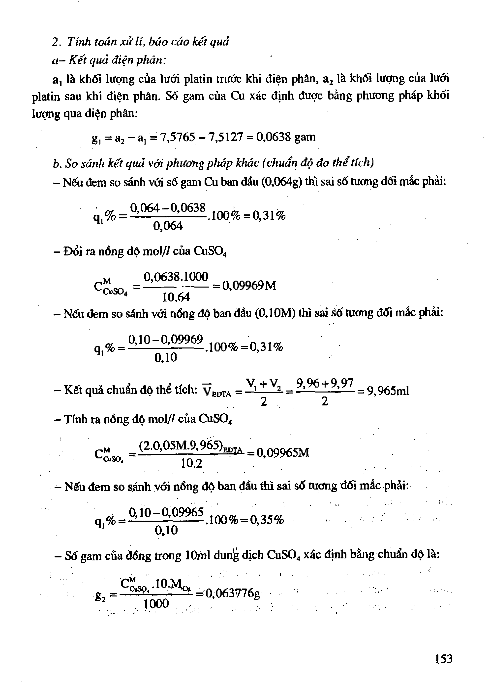

## Page 152

-  Nếu đem so sánh với số gam Cu ban đầu thí sai số tương đối mắc phải:
q2% =
0,064 -  0,063776
0,064
.100% = 0,35 %
So sánh thấy g[ (0,0638g) lớn hơn g2 (0,063776g), như vậy tách bằng điện 
phân gần như triệt để. Qua thí nghiệm thực hành này cho thấy có thể dùng phương 
pháp điện phân để tách được chất và xác định nồng độ trong dung dịch bằng 
phương pháp khối lượng.
7. Nội điện phân (sự tự điện phân hay điện phân bên trong)
Khi nhúng thanh kim loại hoạt đông manh (Zn) vào dung dịch muối của kim 
loại hoạt đông yếu hơn (CuS04), sau một thời gian thấy trên bề mặt của kim loại 
hoạt động mạnh phủ một lóp bột kim ỉoại hoạt động yếu hơn bám vào (hình 3.6).
- Thanh kim loại Zn sạch
Dung dịch CuS04, HjSO,
Hình 3.6. Bỉnh điện hoá nội điện phồn
Như vậy trong pin điện hay nguyên tố điện hoá kín không cần có nguồn điộn áp 
đặt từ bên ngoài vào vẫn tách được kim loại hoạt động yếu hơn là do năng lượng 
của nguyên tố điện hoá. Như đã trình bày ò phần 3,2 Chương 1, đối với pin điện 
ngược vói quá trình điện phân anot là cực âm (-), catot là cực dương (+). Anot 
chính là thanh kim ỉoại Zn, cation Cu2+ khuếch tán 4ếp anot nhân electron ưở 
thành kim loại bám vào thanh kẽm theo phản ứng:
Z n^j + Cu2" ^  Zn2+ + Cụ(rfn) 
K =  101272 Ở30°c
Trước khi cân bằng được thiết lập, trên thực tế thực nghiệm cho thấy hẩu hết 
cation Cu^^được tách khỏi dung dịch, bám vào thanh 2n (àriot). Hiện tượng này 
được gọi ỉà sự nội điện phân (sự tự điện phân hay điện phân bên trong).
m
k.

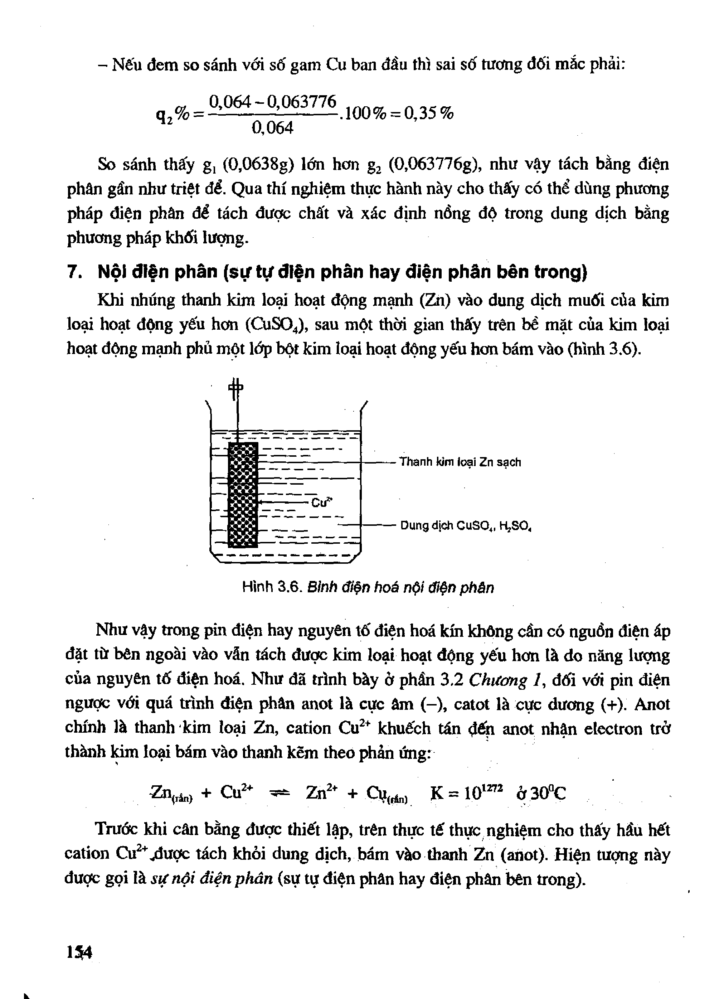

## Page 153

Để ứng dụng hiện tượng nội điện phân vào phép phân tích điện phân khối 
lượng, thiết bị được lắp đặt như hình 3.7.
Hình 3.7. Thiết bị sử dụng để tách kim loại bằng phương phắp nội điện phản
1. Kẹp thanh kim lóại 
1’. Kẹp điện Cực lưới Pt
2. Thanh kim loại Zn sạch 
2’. Điện cực lưỡi Pt
3.KCI2M.H* 
3’.H2S041M,HN031M,CuS0«Cx = ?
4. 
Con khuấy từ 
5. Dãy dẫn điện 
6. Công tắc diện
Thiết bị nội điện phân gồm 2 bình điện hoá, bình a chứa dung dịch chất điện 
giải trơ KC1 trong môi trường axit, thanh kim loại hoạt động mạnh hơn (Zn) sạch 
được nhúng vào dung dịch này làm anot.
Bình b cbứa dung dịch muối của kim loại hoạt động yếu hơn cần xác định 
nồng độ bằng nội điện phân khối lượng. Ví dụ lấy chính xác Vml G 1SO4 Cx, 2ml 
H2SỚ4 im , 2ml HNO3 IM. Nhúng điện cực lưới platin đã được cân trước bì 
(go gam) chìm hẳn lưới điện cục vào dung dịch nội điện phân, bật công tắc cho 
liền mạch, từ lúc này'nội điộn phân được bắt đầu cho đến khi tách hoàn toàn Cu2+ 
khỏi dung dịch. Sau thời gian nội điện phân khoảng 1' giờ, thử xem trong dung 
dịch lượng Cu2* .dã. hết chưa và các bước tiếp theo như ví dụ 2 phần 6.2 chương 3.
, í Cho đến nay người ta nghiên cứu, tách định lượng thành công và Gông bố mộc 
số kim loại được tách đinh lượng ờ anot (-) ghi trong bảng 3.6.
155

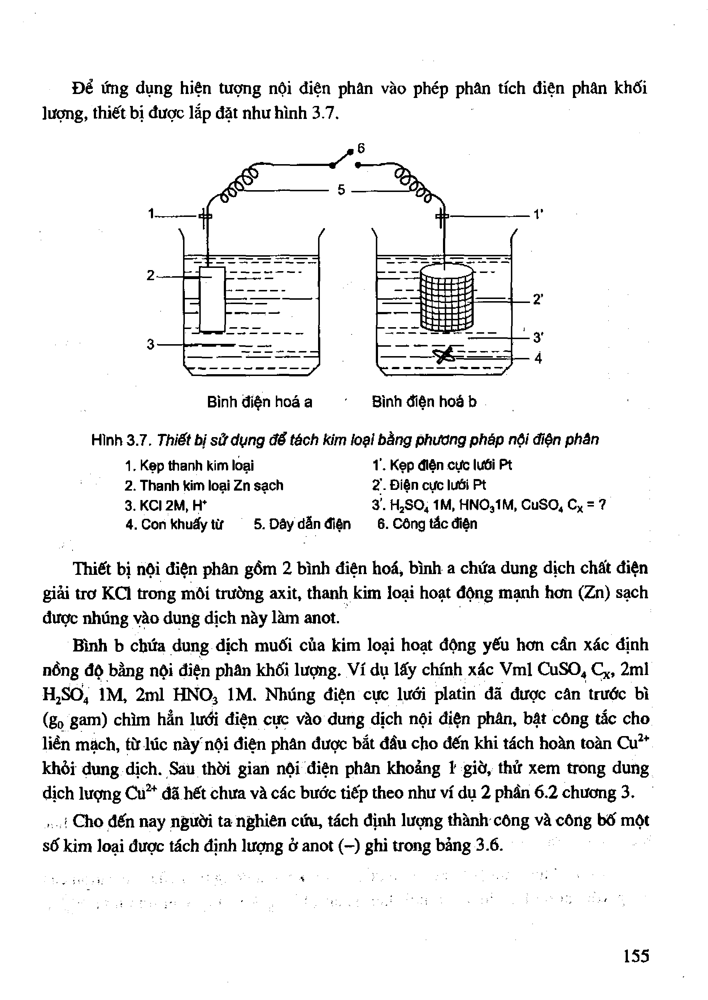

## Page 154

Bảng 3.6. ứng dụng thành cõng sự nội điện phân tách được một số kim lọệi
TT
Kim loại xác định
Kim loại cản trở 
không ảnh hưởng
Anot
1
Ag : e v m * = ° ’79v
Cu ; K  »,r. = 0,34V
’ 
Cir /Cu
F e;E ° 
= -0,036V
Fe /Fe
N i;E ° ' 
= -0,233V
Ni /Ni
Zn ; E° , 
=-0,76V
Zn /Zn
Cu, CuS04 
E° _ 
=0,34V
Cu 
/Cu
2
C u ; E k /Oi=0,34V
Zn ; E° , 
= -0,76V
Zn /2n
N i ; E ^ /Ni=-0,233V
Zn, ZnCl2
E° _ 
= -0,76V
Zn 
/Zn
3
B i; E°BiOVBi =0,32V 
«
M g ; E ^ /Mg=-2,37V
Mg, MgCU 
F° 
= -2  37V
Mg1+/Mg
4
P b--E°^pb= - 0’126V
Zn ; E° - 
= -0,76V
Zn /Zn
Zn, ZnƠ2
E° - 
= -0,76V
Zn 
/Zn
5
N i;E °Ni, /Ni= ^ 2 3 3 V
Mg ;E° 2 
= -2,37V 
Mjr /Mg
Mg, MgS04 
E 
- 
= -2,37V
Mậ /Mg
6
c ° ;  E°co-/co= 0 ’33V
M g ;E ° 2+ 
= -2 ?37V
Mg /Mg
Mg, NHíCl, HC1 
E 
2 
= -2,37V
Mg 
/Mg
7
C d ; E ^ / a =-0,402V
Zn ; E° - 
= -0,76V
Zn 
/Zn
Mg ;E° 2 
= -2,37 V
Mgz+/Mg
Zn, ZnCl2
E° . 
= ~0,76V
Zn 
/2n
i i '
8
Zn;
E° 2+ 
= -0,76V
2n ỉ 2xi
Mg;
E 
,+ 
=-2,37V  
.
Mg 
/Mg
Mg, NH4CI, HƠI: 
'
E° •' 
= -2,37 V - 
.Mg 
/Mg 
ị
Muốn tách được sản phẩm ở anot bằng phuơng pháp nôi điện phân phảrthực 
hiện một số điều kiện sau:
-  
Chọn được anot (—) thích hợp để loại trừ kết tủa đồng thời của các cation cản 
cùng với cation kim loại cần nội điện phân (E “ Kh kim loại cản nhỏ hơn E ^ h

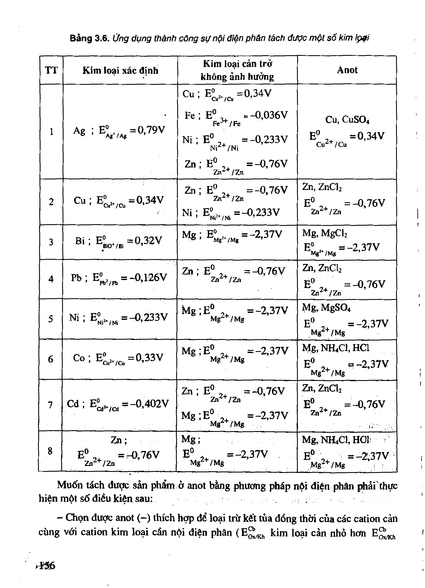

## Page 155

cùa kim loại cần tách bằng nội điện phân hoặc 
kim loại cản nhỏ hơn
của kim loại cẩn tách bằng nội điện phân).
-  Kim loại làm anot phải có 
nhỏ hơn 
của kim loại cần tách bằng
nội điộn phân hay c E^xyTCh nhỏ hơn 
cùa kim loại cần tách bằng nội điện phân).
-  Bình điện hoá phải có điện trở nhỏ (ER nhỏ) để thực hiện nội điện phân nhanh.
Phương pháp nội điện phản cỏ những ưu điểm sau:
-  Không cần khống chế thế catot như phương pháp điộn phân thông thường.
-  Có độ chọn lọc cao, ví đụ nếu chọn Pb làm anot để tách Cu2+ trong C11SO4 sẽ 
loại trừ ảnh hưởng cản trở của tất cả các kim loại có thế E^/Kh<
« E° 2t/pb = - 0 ,126V. Như vậy sự có mặt của Nì2+, Cd2+, Zn2+ và Mg2+ cùng 
với Cu2+ sẽ không ảnh hưởng.
Ngoài những ưu điểm trên, phương pháp còn có những nhược điềm sựu:
-  Tốc độ tách kết tủa ở anot rất chậm, phải kéó dài vài giờ mới tách hết kim 
loại, chỉ thích hợp với công nghệ mạ kim loại quý lên các đồ trang sức.
-  Tốc độ nội điên phân chậm là do ma sát trong của nguyên tố điện hoá lớn và 
điện trở bình điện hoá lón. Để khắc phục cần nghiẽn cứu chế tạo thiết bị sao cho 
bình điện hoá có điện trở tối thiểu nhất (IR bé nhất).
*
-  Ngoài ra sử dụng các điện cực có diện tích bề mặt lốn kết hợp với tăng nhiệt . 
độ đến 40 -  50°c trước khi nối mạch nội điện phân, khuấy trộn bằng quay cực hay 
khuấy từ và thêm chất điộn giải trơ vào dung địch nội điện phân với nồng độ lớn 
hơn từ 50 lẫn ưở lên so với nồng độ chất nội điện phân.
157

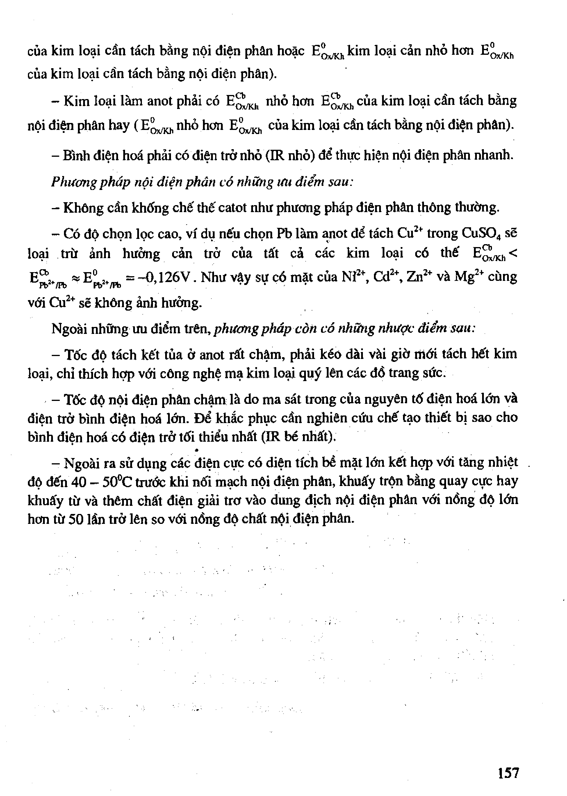

## Page 156

BÀI TẬP CHƯƠNG 3
1. 
a. Tính điện áp phân cực của đung dịch Ag2S04 0,0IM trong H2S041,0M.
b. Nếu chuyển hết ion bạc vào phức nồng độ cân bằng của nó sau khi kết tủa 
còn l(r 10 ion-g// thì lúc đó thế phân cực của nó giảm bao nhiêu von và bao 
nhiêu lần? Giả thiết trong suốt quá trình điện phân nồng độ [H+] = 2 ion-g//.
c. Khi H2 có thoát ra, trưóc đó bạc bị kết tủa hoàn toàn hay không?
Cho biết:
E°Ae+,Ag = 0 ’80V; 
EJ,;2IV>=1,23V; 
Tio,™ =0,40V ; t,HỉÌpo=-0,50V
Đáp số: a .u  -  0,9578V có kể đến quá thể.
b. Giảm: 0,69 -  ỒẻlO = 0,48 (V); 0,69 : 0 2 ỉ = 3 2 9  lần.
c. Bạc đã kết tủa hoàn toàn [Ag+ Ị = 10 ~22 ỉon-gH.
2. Thế của hỗn hống magie (Mg) với thuỷ ngân trong dung địch MgS04 
0,0010M, nồng đô 
-  10" ion-g// là -1,46V
Tính nồng độ [Mg2+] khi bắt đầu có H2 thoát ra.
Cho biết: E^ /2H20 =1,50V; TiH2(Hg) = -1 ,0 V .
Đáp sổ: [M £+]  = J0~7-4 = 3,98.10^ ion-g/l.
3. Điện phân dung địch Pb(C104)2 1,0M trong H Q 04 1,0M bằng hai điện cực Pt.
a. Hãy tính điện áp đặt vào hai cực để có điện phân xảy ra.
b. Tính điện áp cần đặt vào 2 cực khi điộn phân dung dịch Pb(Q04)2 
0,00010M trong dung dịch đệm có pH = 5.
Cho biết ờ 25°C: E jJ+/pb= -0,13V ;E ^/2H2o>=l,23V;
nPb(Pi) = -0,0002V; tìh2(P0 = -0,0010V; ilo2(Pt) = 0,478V.
Đáp số: a. Hiđro bị điện phân trước u  = 1,709V.
b. Chì bị điện phân trước V -  Ỉ,6612V.
4. Hãy thiết lập điều kiện tách Ag từ dung dịch chứa AgN 03 0,01M và CuS04 
2M. Giả thiết việc tách bạc được xem như hoàn toàn khi nồng độ của bạc còn 
lại 0,01 % của nồng độ ban đầu.
Chobiết: E° 
A =0,779V;E° ỉf „ =0,34V Ở25oC.
Ag / Ag 
- 
* 
Cu 
/C u 
1
Đáp sô':ECu -  0J49 V < u  < E Ag = 0,425V.
158

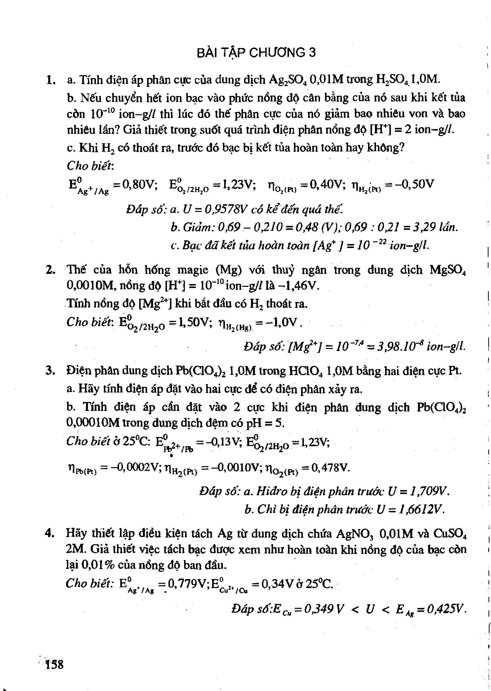

## Page 157

5. Điện phân đung dịch CuS04 0,05M trong môi trường H2S04 0,50M dùng điện 
cực platin.
a. Tính điện áp tối thiểu phải đặt lên hai điện cực để xảy ra điộn phân được.
b. Nếu kết thúc điện phân khi nồng độ đồng chỉ còn 0,01% so vófi nồng độ ban 
đầu thì điện áp đặt vào hai cực khi điện phân lúc này bằng bao nhiêu? Biết rằng 
nồng độ ion H+ trong dung dịch thay đổi không đáng kể. Độ giảm thế (IR) của 
bình điện phân là 0,50V.
Cho biết ơ25°C:
EL’*,o. =°.34V ;E » !Í2Hi0 = ụ23V ;nHiW) = -0,30V ; n0,m> =0,50V .
Đ á p si':a .U = I.9 2 8 V ; b:U = 2,046V .
6. Điện phân hỗn hợp đung địch chứa Cu(NÓ3)2 0,1 OM , Cd(N03)? 0,1 OM trong 
dung dịch KCN 0,40M thì thế cân bằng của điện cực Cu2*/ Cu băng -0,97V và 
thế cân bằng của điện cực Cd2+/ Cd bằng -0,87V.
a. Khi không có KCN có thể điện phân, tách hoàn toàn Cu2+ khi có Cd2+ được 
không?
b. Kim loại nào sể tách ra trước khi có KCN 0,40M?
c. Tính nổng độ ion Cd2+ ừong dung đích KCN 0,40M khi thế cân bằng catot 
bằng -0,97V. Giả thiết tất cả Cd2+ có trong dung dịch dưới dạng Cd(CN)ỉ~ và 
nồng độ KCN được giữ cố định trong suốt thòri gian điện phân.
Cho biết â25°C: E % . 
= -0,43V.
Cd2+/Cd
Đáp số: 
a. [Cu2Ỷ] = Ỉ0~27I< 10~7 ỉon-glỉ.
b. Cadimi tách ra trước đồng.
c. [C d(C N )/’J = Ỉ0r4 j=5,0.1(rĩ ion-gỉl > ìừ* ion-g/l.
7. 
1) Điện phân dung dịch chứa CuSÓ4 0,10M và CoS04 0,1OM trong axit H2S04
0,5M, dùng điện cực Pt với dòng điện I = 0,20A.
à. Viết các phản ứng xảy Tà ở các điện cực và tírih điộn áp phân cực (điện trở
của bình điện phân bằng 1,25fí).
b. Có thể tách ion Cu2* ra khỏi Co2* được không?
2) Nếu điện phân duiig dịch CuS04 0,10M và C0SO4 0,!0M có chứa NaCN 
1,0M thì kim loại nào sẽ tách ra truớc? Biết thế cân bằng của đổng trong NaCN 
bằng -0,90V và của coban là -0,75V. Có thể tách coban ra khỏi đồng được 
khồng nếu tất cả íon Co2+ trong dung địch tồn tại đưối dạng phức Co(CN)4" và 
nồng độ NaCN được giữ cố 4ịnh bằng IM trong thòi gian điện phân?
159

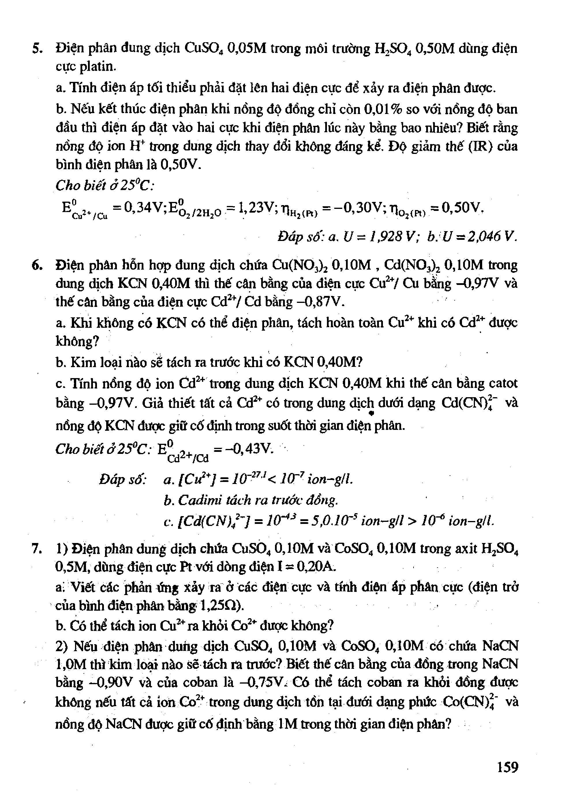

## Page 158

Chobiểtở25°C. E ^ 2+/c = -0,28V , ÍJ0 (pt)=0,52V ; 
l Ị^ )  = -l,O V . 
Coi tách hoàn toàn khi nồng độ ion kim loại còn lại < 1CT6 ion-g/ /. Đối với 
H2S04 có K = 10~2.
Đáp số: ] ) a . h =  0,32M thì: Ỉ,6603V hoặc h = 0,5ỈM thì: ỉ ,6723V.
b. 
Tách được [Cu2+J= 10~22,oi ion-gU.
2) [ Co(CN); Ị = 10-*J = 7,94.10 ion-gìỉ < lơ *  ion-gỉl.
8. 
1) Điện phân dung địch chứa CuS04 0 ,10M và CdS04 0,1OM trong axit H2S04
0,5M ờ 25°c, dùng điện cực Pt vói đòng điện I = 0,20A.
a. Viết các phản ứng xảy ra ở các điện cực và tính điện áp đặt vào hai cực đẻ 
có điện phân xảy ra (điện trở của bình điện phân bằng 1,2Q).
b. Có thể tách ion Cu2+ra khỏi Cđ2+ được không?
2) Nếu điện phân dung dịch CũS04 0,1OM và CdS04 0,1OM có chứa NaCN 
•
1,0M thì kim loại nào sẽ tách ra trước? Biết thế cân bằng của đồng bằng 
-0,96V  và của cadimi là -0,77V. Có thể tách cadimi ra khỏi đổng được không 
nếu tất cả ion Cd2+ trong dung dịch tổn tại dưới dạng phức Cd(CN)4_ và nồng 
độ NaCN được giữ cố định bằng IM trong thời gian điện phân?
Cho biết ở 25°C:
E° 2 
= 0,34V ; 
E° 
, = - 0 ,402V ; E° 
o = 1,23 V
Cuz+/Cu 
Cdz+/Cđ
^CuCPt) ” “ 0,0545V; ĩJcd(pị) = —0,0085V ; ĩ?o2(Pt) ~0,52V Ị í?H2(Pt) = -1,0V.
Coi tách hoàn toàn khi nồng độ ion kim loại còn lại < .10-6 ion-g//. Đối vói 
H2S04 có pK = 2.
Đáp số: ỉ) a. 0,256V > -  0,440V; b. Tách được [Cu2*] = 10-246 ion-gỉl
2) ỊCdịCN)l~]  — ỊQr7,44 =3,63.10~8 Ịon-gH < 10^  ion-gỉl.
9. Cho dòng điộn đi qua durig dịch điộn phân gồm: Zn(C10J2 0,10M và 
Pb(C104)2 0,0IM trong dung địch đệm có pH = 4. Dùng hai điện cực platin.
a. Viết các phương trình phản ứng xảy ra ở hai điện cực, dự đoán hiện tượng 
xảy ra.
b. Nếu kết thức điên phân khỉ {Pb2+] = 1CT4 ion-g// thì điện áp táộ dụng lên hai 
điện cực phải bằng bao nhiêu? (Coi diện trờ của bình điện phân và quá thế 
không thay đổi trong quá trình điện phân).
c. Khi khí Hj thoát ra thì chì đẵ tách ra hơàn toàn chưa?
Tại thời điểm đó chì đã tách ra được bao nhiêu %?
160

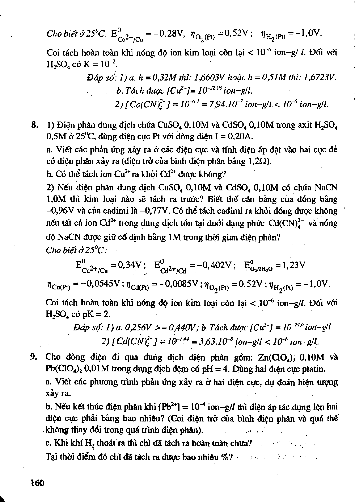

## Page 159

d. Tĩnh thời gian điện phân, khi ngừng điện phân ở catot, lượng chì tách ra 
được0,414g.
Cho biết: Pb = 207; độ giảm thế của bình điộn phân là 0,35V; I = 0,2A và ở 
2500 
= - ° ’13V’ E!Uzn = -0 .7 6 V ;,h ,«  = -0,0297V;
w >  = -0 ,0 0 0 5 V ;E ^ H2O= l,23V ; 
= -0,0006V ;
. 
=:° ’478V'
Đáp sổ: a. Thứ tự điện phản: chỉ, hiđro, kẽm; b. 2,0705V;
c. Chì chưa tách ra hoàn toàn [Pb2+] = ÌOT4,66 ỉon-g/i;
d. 32 phút lồ giây.
10. Cho dòng điện 0,3A đi qua dung dịch điện phân gồm: Cd(Q 04)2 0,10M; 
Zn(Q 04)2 0,10M ; Pb(C104)2 0,01M trong đung dịch được duy trì ở pH = 4. 
Dùng hai điện cực platin.
a. Từ các phản ứng xảy ra ò hai điện cực, hãy dự đoán hiện tượng xảy ra.
b. Nếu dừng điện phân khi [Pb2+] = 10"3 ion-g// thì điện áp tác dụng lên hai 
điện cực phải bằng bao nhiêu? (Cơí điện trở cỏa bình điên phân và kết quá thế 
không thay đổi trong quá trình điện phân).
c. Xác định nồng độ [Pb2+] .
d. Tính lượng chì tách ra ở catot khi điện phân được 40 phút.
Cho biết Ở25°C:
= - ° ’13V; 
=-0*76V ;1ĨH2(PO =-0,0297V ;
V *,(*) = -0,0005V; 
= -0.402V; Vzn(Pl) = -0,0006V;
^Pb(Pt) = -0,0005V;E°w
 =1,23V;
E°2H*/H = 0’° ^ ; í?o2(Pt) =0, 478V;
=
 -0.0006V;TỊc m ) = -0,0085V.
Đáp số: a, Thứ tự điện phân: chì, hiđro, cađìmi, kẽm; b. Ỉ,69ỈV
c. Tách chì hoàn toàn [Pb2+J = Ỉ0~í9lion-gll; ậ. 0,7722g.
11. Điện phân dung dịch Pb(G04)2 1,0M giữa hai điện cực platin.
a. Trong môi trường H Q 04 1,0M. Viết các phản ứng xảy ra ợ điộn cực. Tính 
điện áp đặc vào hai cực để cố điện phân xảy ra.
b. Tính pH tối thiểu cần thiết lập để điộn phân đung địch Pb(Ci04)21,0M trên
161

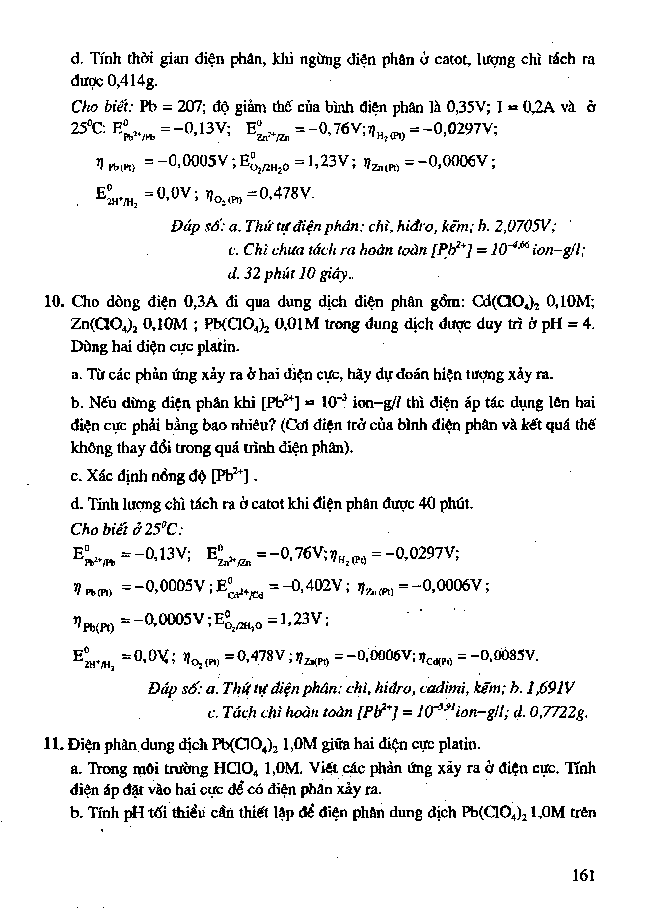

## Page 160

sao cho ion Pb 2+ kết tủa hoàn toàn ở catot (Coi nồng độ của chì bằng 10 6 ion 
-g// mà không có hiđro thoát ra).
E°2/2H20 =1,23V; 
t1cvpi) =50>43V ;ti1Wi) =-0,0012V ; 
E 2HVH2= ° ’0 V ;ĩ1hj(p ,,= -0,0680V.
Đáp số: a. u  = 1,728 V; b. pH = 5,2237
12. Cho đung dịoh có chứa hỗn hợp AgN03 0,110M và Cu(N03)2 1,100M.
a. Hãy tính thế tác dụng lên điện cực để đồng không tách ra được
b. Tính nồng độ của ion kim loại bạc trong dung dịch tại thời điểm đó.
c. Tính thế phải thiết lập để kết tủa được 98,99% bạc.
Cho biết: E° 2. 
= 0,34V ; E°A +IA = 0,78V
Cu2+/Cu 
Ag+/Ag
Đáp số: a. Ec > ECu = 0,34ỈV. b. [Ag+]  = l€ r M = 3,63.10r* ion-g/l.
* ■ . 
c.E Catot = 0,606V.
13. Điộn phân 100ml dung dịch A gQ 04 0,030M khi có H Q 04 0,0IM dùng điện 
eực platin phẳng và có I = 0,30A.
a. Tính điộn áp tối thiểu để có quá trình điện phân.
b. Tính lượng sản phẩm tách ra tại catot nếu thời gian điện phân ỉà 10 phút.
c. Tính pH của đung dịch sau khi điện phân 10 phút.
Cho biết: Điộn trở của bình điện phân là 1,7Q; Ag = 108.
E Ẵg+/Ag = ° - 8 0 V ; E ỉi(Hí ũ = 1 ,2 3 V ;  ÍOi(R) = 0 ,4 7 8 V ; í/ Hj(Pi) = - 0 , 0 6 8 V .
Đáp số: a . U = U 9  V; b. 0,1996 g; c. pH = IM -
14. Người ta điện phân lOOml dung dịch Fe(N03)3 0.022M trong HNO3 0,02M 
dùng điộn cực pỉatin với cường độ dòng I = 0,20A.
a. Hãy tính điện áp tối thiểu để có quá trình điện phân.
b. Tính số gam của Fe tách ra ở catot sau 13 phút điện phân.
c. Tinh pH của dung dịch trước và sau khi điện phân ỉ 3 phút.
Cho biết. Điện trở của bình điện phân là 1,42Q; Fe = 56; ở t = 2 5 °c:
EỈU /Fe 88 ■-a °3 6 0 V  ; E^2/2H20 = 1,23V ; r,0ỉ(Pt)-0,478V
tIh2{P0 = -0,068V ; riFe(Pl) = -0,00í2V ; Po2 = latm; pHỉ = 1 atm.
Đáp số: a. ư  = 1,9596 V; 2. 0,030ỉ8 g; c. pHTr = 1,699 ; p ỉỉSau = IJ595.
162

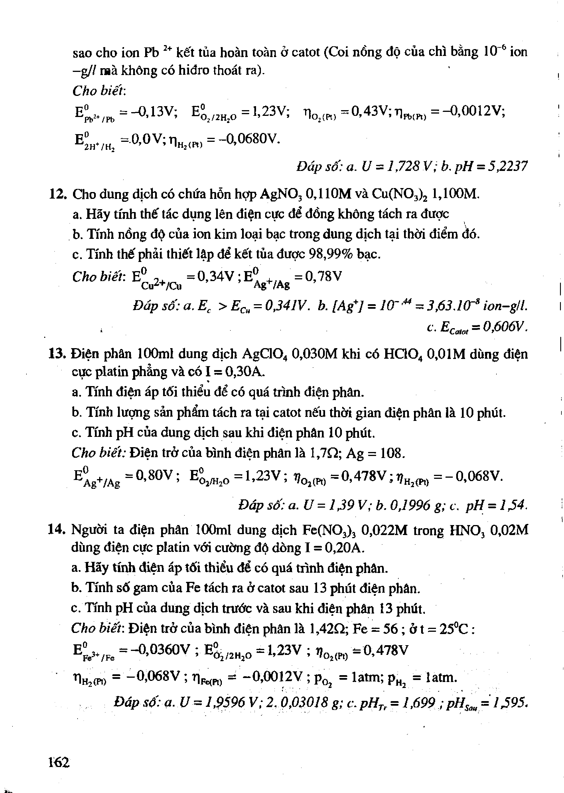

## Page 161

15. Người ta điộn phân 100ml dung dịch Fe(N03)3 0,012M trong HNOj 0,015M 
dùng điện cực platin với cưòng độ dòng I = 0,15A.
a. Hãy tính điện áp tối thiểu để có quá trình điện phân.
b. Nếu đo pH của dung dịch đang điộn phân được giá tộ bằng 1,60 thì đã điộn 
phân tách được bao nhiêu gam sắt và đã điộn phân được bao nhiêu thòi gian ? 
Cho biết'. Điện trở của bình điện phân là 1,40Q; Fe = 5 6 ; t = 25°c.
E Fe3+ ,F. = • ^ 0360V ỉ E o2/2H2o = 1.23V ; VoAn) = 0,478V
TlH2<Ft) = -0 ,0 6 8 V ; TỊp^pụ = -0 ,0 0 1 2 V ; Po2 = latm; P h2 = latm .
Đáp sổ: a. U— ỉ ,885V;
b. 0,018853 g; 650 giây tương ứng: 10 phút 50 giây.
163

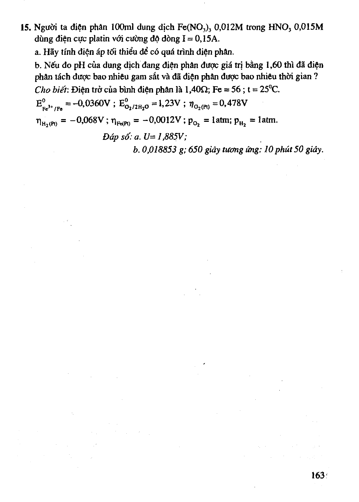

## Page 162

Chương 4
PHƯƠNG PHÁP PHÂN TÍCH cực PHổ
■
Heyrovsky phát minh ra phương pháp phân tích cực phổ vào nărrí ỉ922; ông 
được nhận giải thưởng Nobel Hoá học năm 1959. Đây là một phương pháp sâu sắc 
về mặt lí thuyết và được ứng dụng rộng rãi về mặt thực tiên, đặc biệt là hoá học 
phân tích, uú điểm cơ bản của phương pháp cực phổ là với thiết bị tương đối đơn 
giản, thao tác không phức tạp có thể phân tích nhanh, nhạỵ, chính xác hàng loạt 
hợp chất vô cơ và hữu cơ mà không cần tách riêng chúng khỏi các thành phần hổn 
hợp. Trong nghiên cứu điện hoá, cực phổ là một phương pháp đứng đầu. Ngày 
nay, phương phập cực phổ đã đi sâu vào các ngành Vật lí, Sinh học, Địa .lí -  địa 
chất, Môi trường, Y dược học, Pháp y,... 
. 
'
1. Nguyên tắc
Phương pháp phân tích cực phổ dựa trên quá trình phân cực trên catot giọt 
thuỷ ngân. Dựa trên nguyên tắc này, năm 1922, Heyrovsky Tà Kuta đã chế tạo ra 
máy cực phổ đầu;tiên có các bộ phận như sau:
1.1. Sơ đổ, cấu tạo các bộ phận của máy cục phổ cố điển (hình 4.1)
Cũng như các phương pháp điện hoá khác luôn luôn có ba bỏ phận:
Binh điện hoá: Chứa chất cần điện phân có nổng độ rất nhỏ cỡ tò 10~3 đến 1ÍT6 
móị/l, trong đó cần có mặt chất điện li trơ có ‘hổng độ lón hơn ít nhất 50 lần nổng 
độ chất điện phân để đảm bảo quá trình khuếch tán của chất điện phân tới điộn cực 
làm việc và được cắm vào bình điện phân một bộ điện cực.
Bộ điện cực: Gồm một điện cực so sánh ỉà điện cực không bị phân cực: điện 
cực đáy thủy ngân, điện cực calomen hoặc điộn cực bạc-bạc clorua. Để iàm điện 
cực so sánh, ngưòi ta dùng anot thuỷ ngân, gồm một lớp thuỷ ngân đặt trong bình 
điện phân có chứa nồng độ lớn ion c r . Diện tích bề mặt anot lộn gấp hàng trăm 
lần diện tích bề mặt caỉỡt Điện cực kia là điện cực làm việc (chỉ thị) là điện cục bị 
phân cực, có diộn tích bề mặt rất nhỏ, tính bằng một vài mm2.-Cựe phổ tíổ điển 
dùng điện cực giọt thủy ngàn làm catot. 
'. • 
f
Điện Cực giọtrthừy ngân: Gồm phần cơ bản là một maờ quản được chế tạo từ 
thủy tinh có ehiềứ đàỉ từ 10'đến I2cm với đường kính trong khoảng 0;05mm đến
0,06mm, một bầu thủy ngân và dây polietilen dày, chắc dùng để nối bầư thảy ngân 
với mao quận. Bầu thủy ngân được kẹp chắc lên giá. Dây polietilen cho phép'nâng 
bầu Ịèn hoặc hạ xuống để điẻu ehình chiều cao cột tihủy ngân. Oriều cao cột thủy
165

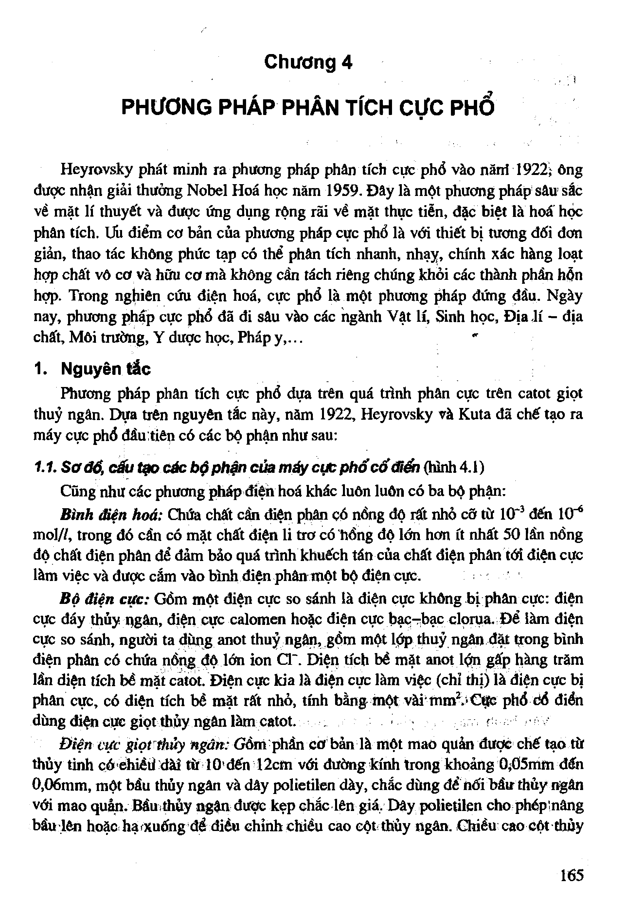

## Page 163

ngân được tính từ mặt thoáng của thủy ngân trong bầu tới đầu mút mao quản. 
Thường chiều cao cột thủy ngân được điều chỉnh để được chu kì giọt từ 3 đến 5 
giây/giọt. Giữa đây polietilen và mao quản thuờng lắp một khoá thủy tình tốt để 
khoá thủy ngăn khi không đo cực phổ. Khoá thủy tinh nên lắp gần mao quản để 
khi khoá, thủy ngân chỉ còn chảy tiếp một ít giọt.
Bộ phận máy đo, ghi: Bao gồm một nguồn điện một chiều được cung cấp từ 
aquy từ o v  đến -2V , một dây điộn trở rất chính xác hay biến trở R, một vpn kế và 
điộn kế nhạy đến lCr9A.
A
Hình 4.1. Sơ đổ nguyên tắc cứa máy cục phổ
1. Bình điện hoá chứa dung dịch CuCI2
KCI 0,01 M;
2. Mao quản (thủy tinh I = 10 -ỉ-12 cm) catot giọt Hg; 
■ 
i
3. Dây polietilan dẫn Hg; 
Ị
4. Bẩu thủy tinh đựng Hg; 
5. cầu  nối chửa KCI 0,1 M;
. 6. Binh đựng Hg sạch làm điện cực anot đáy; 
7. Acquy;
8. Biến trô R; 
9. Von kế; 
10. Ampe kế.
1.2. Nội dung cúa phương pháp
Vận hành máy cực phổ rấ^đơn giản: Dòng diện từ acquy (7) với điện áp từ 
Ị
0,2 -ỉ- 2V đi qua một biến trờ R, nhờ biến trở R có thể lựa chọn thế E cần thiết để 
đưa vào bình điện phân. Thế được đọc chính xác trên vôn kế (9), dòng được theo 
i
dõi ởampe kế (10).
<Nội dung của phương pháp cực phổ là theo dõi sự phụ thuộc đòng I vào sự biến 
I
thiên thế E theo õhiều âm dần (gọi là quét thế với lốc độ biến dổi thế 0,1 v/giây)

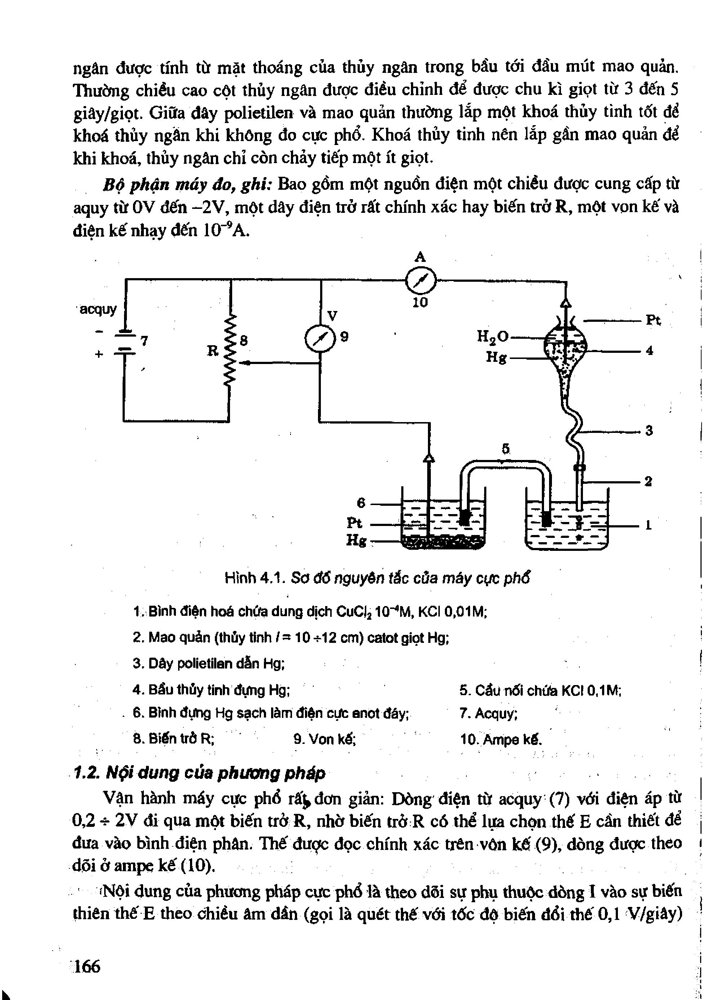

## Page 164

và ghi sự thay đổi cường độ dòng đọc trên ampe kế, trong quá trình điện phân khi 
các chất chuyển đến điện cực chỉ bằng khụếch tán. Máy cực phổ lúc mới ra đời thì 
đo từng điểm, các máy thế hệ sau có bộ ghi tín hiệu tự động cho phép thu được cực 
phổ đồ, như biểu diễn trên hình 4.2. Nếu dung dịch chỉ chứa chất điện li trơ (gọi là 
nền), đường cong I = f(E) có dạng như đường 1, gọi là đường nền. Đường nền là 
đường hầu như thẳng ở một khoảng thế rộng, đoạn cuối dòng tăng mạnh, đó là sự 
phân hủy của cation nền, ví dụ nền là dung dịch KC1, kim loại kiềm: K+ + e —> K° 
(Hg°) ở -2,0V. Với môi nền, bắt đầu là sự phân hủy của dung môi (thường là 
nước) và kết thúc là sự phóng điện của cation nền, thường là cation kim loại kiềm. 
Đó là khoảng điện hoạt của nền, phụ thuộc vào bản chất nền, pH và điện cực làm 
việc đã chọn.
Nếu ngoài chất điện li trơ dung dịch cồn có thêm một chất điện hoạt, ví dụ 
như ion Cu2+, bình điện phân được đuổi hết sạch khí Oxi.
Khi điện phân, điện áp tác dụng u  gồm các thành phần:
u  = È3 -  Ec + IR 
(4.1)
Điện trở của hệ không đáng kể vì nồng độ chất điện li trơ trong bình điộn phân 
tương đối lổm nên độ giảm thế IR thường không đáng kể.
Diộn tích anot rất lớn nên mật độ dòng anot rất bé và khi thay đổi điộn áp u  
trong giới hạn nhất định thì mật độ dòrig anot coi như không đổi và do đó thế anot 
(Ea) hầu như không thay đổi. Trái lại, do diộn tích của catot rất bé, mật độ dòng 
catot lớn. Vì vậy có (hể coi toàn bộ đỉện áp tiêu thụ cho quá trình phân cực ò  catot:
u -  -  Ec. 
(4.2)
Ngược lại, nếu sử dụng quá trình phân cực ồ anot là điộn cực giọt thủy ngân 
thì u  = Ea (4.3), nhưng ít được sử dụng.
Người ta nhận được đường cong có dạng như đường 2, gọi là đường cong cực 
phổ hay sóng cực phổ (hình 4.2).
p-h 
,
Hình 4 2. Đường cong cực phổ (sóng) của CuCI2 10r4M trong KCI 0,01 M
167

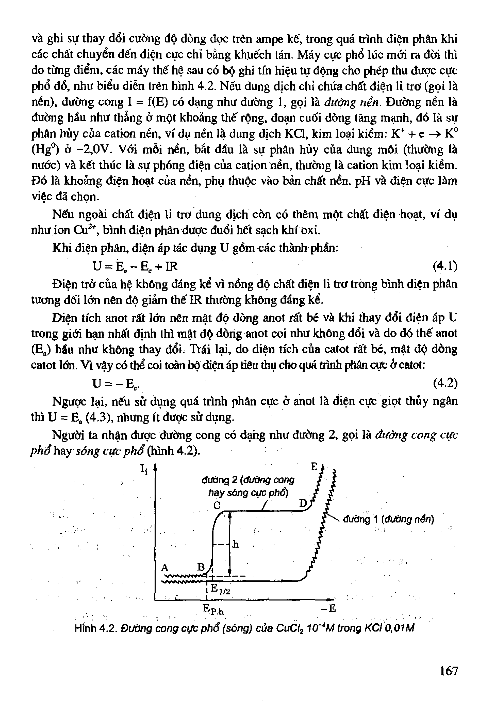

## Page 165

Trên đường cong (sóng) cực phổ ta thấy:
Đoạn AB: Dòng bằng không (theo lí thuyết), lúc này ion Cu2+ chưa có đỏ 
năng lượng hoạt hoá để vượt qua hàng rào năng lượng và trao đổi electron với điện 
cực giọt thủy ngân. TTiực tế phần AB không nằm ngang mà có hưỏng tăng dần 
theo chiều thế âm vì có dòng dư. Dòng dư xuất hiện ỉà do những nguyên nhân sau:
a. Do có một phần rất nhỏ ion Cu2+ ngẫu nhiên có đủ năng lượng hoạt hoá đi 
vào Ưao đổi electron với điện cục và đo có sự khử các tạp chất có thể có trong 
đung dịch (ví dụ Cd2+, Fe3+ hoặc oxi).
b. Do sự tích điện lớp điện kép ờ bề mặt giọt thuỷ ngân dẫn đến luôn luôn có 
dòng tụ điện.
Dòng dư có giá trị không lón lắm, vào cỡ 10"7A.
Đoạn BC: Dòng tăng đột ngột, bắt đầu từ thế Eph phần lớn ion Cu2+ đạt đủ 
năng lượng hoạt hoá và sự trao đổi electron trở nên mạnh mẽ: Cu2+ + 2e —» Cu(Hg), 
Epj, gọi là thế phân hủy của ion Cu2+, phụ thuộc vào bản chất của chất điện hoạt, 
bản chất của điện cực làm việc, nổng độ và phụ thuộc vào phương pháp đo.
Đoạn CD: Dòng không tăng nữa, đồ thị nằm ngang.
Khi tăng thế catot theo chiều âm lên tói giá trị thế khử của ion Cu2+ thì cường 
độ đòng điện tăng vọt ỉên. Do trong dung dịch có mặt lượng lớn chất điộn li trơ 
KC1, các ion K \ c r  nằm trên bề mặt điện cực giọt, không tham gia phản ứng điện 
hoá và tạo thành lóp điện kép có tác dụng chắn điộn trường. Nhờ vậy các ion chất 
điện hoạt Cu2+ chuyển tỏi điện cực chỉ bằng khuếch tán. Tổc độ khụếch tán tỉ lệ 
với građien nồng độ dung dịch, tức là hiệu nổng độ của Cu2+ ở trong dung dịch và 
ở trên bề mặt điện cực. Khi đạt tới thế khử của ion Cu2+ thì bắt đầu xảy ra phản
ứng điện hoá: Cu2* + 2e + Hg =5=^ Cu(Hg). Nồng độ ion Cu2+ trên bề mặt điện cực 
giảm xuống, tốc độ khuếch tán tăng lên và cưỉmg đô dòng tăng lên (phần BC). 
Nồng đô ion kim loại ở bề mặt điện cực nhanh chóng giảm xuống đến giá trị bằng 
không, Lúc đó tốc độ khuếch tán đạt tới giá trị cực đại và tỉ lệ với nồng độ ion 
trong đung dịch. Vì vây cường độ dòng đạt tới giá trị cực đại, đại lượng này được 
gọi là dòng khuếch tán giới hạn (IK(_gh) (phần CD của đường cong). Đó chính là 
dòng bị gidi hạn do khuếch tán chậm quan sát được khi nghiên cứu về đường đòng 
thế trong trường hợp tốc độ khuếch tán chất điộn cực bị hạn chế. Khi tiếp tục tăng 
thế thì cường độ dòng hầu như không đổi nữa.
Đoạn ĐE: Dòng tăng vọt là do sự khử của cation nền: Nếu cứ tiếp tục tăng thế 
theo chiều âm cho đến khi thế catot đạt tới -2,0V  thì một lần nữa lại có sự tăng vọt
cường độ dòng do sự khử ion K+ trong dung dịch: K+ + e + Hg ~  K(Hg).
168

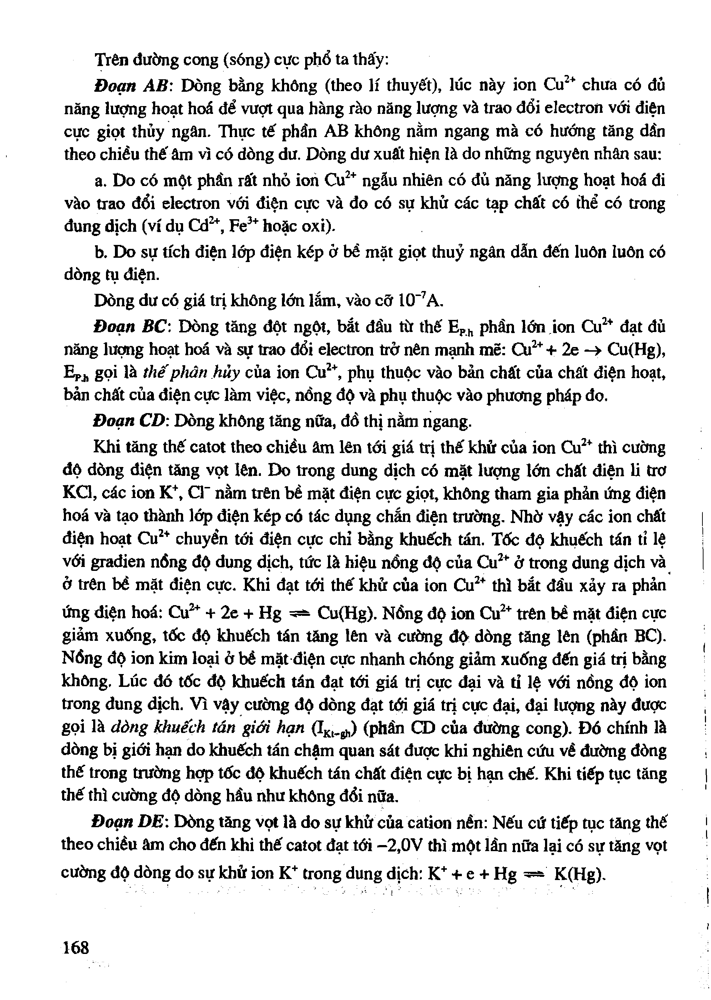

## Page 166

Trong khi đó ở anot: 2Hg + 2C1" =5=  Hg2ơ 2 + 2e tạo thành calomen trên bề 
mặt điện cực và hình thành điện cực calomen. Thế cân bằng ở anot chính là thế 
cân bằng của điện cực calomen có giá trị phụ thuộc vào nồng độ của c r  trong 
dung dịch.
Chú ý: Kim loại đồng tạo thành ở catot dưới dạng hỗn hống khi rơi xuống anot
theo giọt thuỷ ngân thì lại bị oxi hoá ữở lại: Cu(Hg) ^  Cu2+ + Hg + 2e và một 
lần nữa ion Cu2* lại chuyển vào dung dịch quay về catot tạo thành chu trình oxi 
hoá -  khử tuần hoàn. Nếu trường hợp không đùng nền là KC1 mà là K N03, 
NaC104 thì không có c r  và mỗi lần đo lại đổ mất một lượng thủy ngân sạch. Để 
khắc phục hiện tượng trên, người ta cho thủy ngân sạch vào môt bình làm điện cực 
anot đáy và cho dung dịch nền là KQ vào sau đó dùng cầu nối chứa muối nối sang 
bình điện phân chứa dung dịch chất điện hoạt và điện cực catot giọt thủy ngân.
Khi tăng nồng độ ion Cu2\  thế phân hủy chuyển dịch càng lớn, thế phân hủy 
càng dương và thu được một bộ cáe đường cong, nhưng tất cả các đường cong này 
đều đối xứng với một thế trung bình gọi là thế nửa sóng, kí hiệu El/2 (hình 4.3).
Hình 4.3. Thế phân hủy (EPh) và nởa sóng (E1/2) 
đường (1)< c ^ ,  đường (2) < 
đường (3)
Thế nửa sóng là thế tại điểm giữa của sóng eực phổ ứng với — IKt-sh- Thế nửa
sóng khồng phụ thuộc vào nồng độ, hằng số mao quản và độ nhạy củạ máy mà chỉ 
phụ thuộc vàọ bản chất qụạ chất điện hoạt. Khi tặng nồng độ chất điện hoạt thì thế 
phân hủy tip nên dương hơn nhưng thế nửa sóng vẫn không đổi. Thế nửa sónạ là 
dại lượng đặc trưng định tính, của chất tham gia phản ứng điện cực trọng dung
169

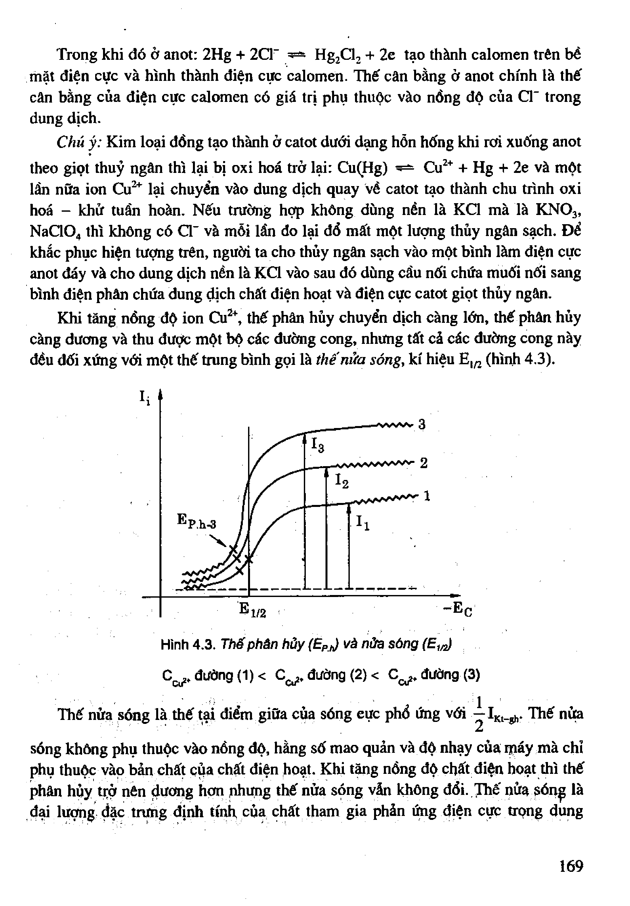

## Page 167

dịch. Dựa vào tính chất này để phân tích định tính bằng phương pháp cực phổ. 
Muốn xác định chính xác Eị/2 của hai sóng phải có thế nửa sóng cách xa nhau lớn 
hơn 0,200V. Thế nửa sóng thay đổi tùy theo môi trường của đung địch. Ví dụ xem 
bảng 4.1.
Bẳng 4.1. Thế nửa sóng của một số ion trong các mõi trường khác nhau
Môỉ trường
Thê nửa sóng (E1/2)
Cu2*
Pb2+
Cd2+
Zn2f
Trung tính
-0,31
-0,40
-0,61
-0,995
Đệm HAc + Ac"
-0,28
-0,382
-0,63
-1,05
Đệm NH; + NH3
-0,203
-0,47
-0,77
-1,32
Đệm NH3 + HAc
-0,25
-0,47
-0,63
-1,05
Florua
-0,90
-0,45
-0,65
-1,17
Tatrat
—0,1
-0,60
-0,90
-
Lợi dụng tính chất này người ta có thể nhận biết các chất điện hoạt mà thế nửa 
sóng của chúng rất gần nhau, bằng cách thay đổi môi truờng của dung dịch. Ví dụ, 
không thể nhận biết các ion Zn2+ và Ni2+ trong môi trường trung tính vì thế nửa 
sóng của chúng rất gần nhau:
= E i,2c J * r Ei«Ni’*) = -0,995+ 1,1 = |0,105|V <0,2V (4.4) khòng xác 
định được. Nếu chuyển sang môi trường amoniac thì nhận biết được vì
^
 
= -1,36 + 1,05 = Ịo,29|V > 0,2V. 
(4.5)
Chiều cao đưòng cong cực phổ (sóng), trong trường hợp lí tưởng là khoảng 
cách giữa hai đoạn AB và CD. Chiều cao sóng cực phổ tỉ lệ vối nồng độ của chất 
làm xuất hiện đường cong (sóng) cực phổ. Hkovic đã tìm ra mối quan hộ giữa hai 
đại lượng này bằng công thức:
I, = X-Q 
(4.6)
với lị là đòng khuếch tán giới hạn, Cj là nồng độ chất điện hoạt và X là hệ số 
Ilkovic. Đây là cơ sở để phân tích định lượng bằng phương pháp cực phổ.
2. Dòng khuếch tán
Trong phương pháp cực phổ có nhiều loại đòng {đòng điện chuýển, tụ điên, 
hấp phụ, động học và dòng xúc tác), đối với trườhg hợp sử dụng điện cực giọt thủy 
ngân rơi là điện cực hình cầu động vì trong qúá trình đo riố lớn dần cho đến khi

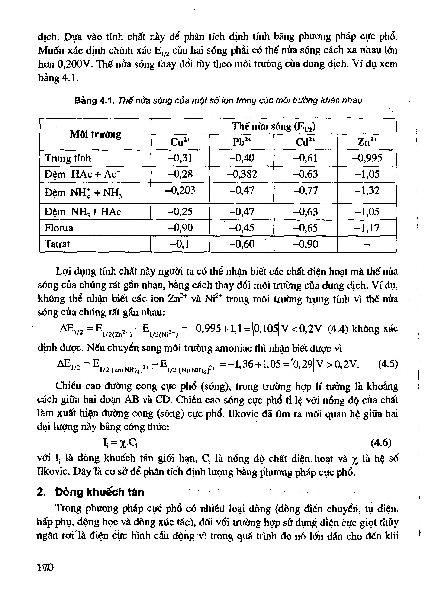

## Page 168

đạt đến sức căng bề mặt cực đại thì giọt rơi. Trong trường hợp này Hkovic đã đi 
tìm mối quan hệ giữa dòng khuếch tán với nồng độ của chất điện hoạt trong quá 
trình điện phân nhữ sau:
Dkovic đã kết hợp giữa điện cực phẳng tĩnh với điện cực giọt thủy ngân hình 
cầu lớn dần có thêm bán kính r của giọt để giải bài toán này.
Cưòng độ dòng I trên điện cực phẳng ở trạng thái dừng tỉ lệ với hệ số khuếch 
tán D, điện tích bề mặt điện cực và gradien nồng độ:
I = nFDS—  
õt
(4.7)
õc
Ở đây —  là sư biến thiên nồng đô chất oxi hoá ờ thời điểm t theo khoảng 
õt
cách X từ dung dịch đến điện cực.
Trong trường hợp này Hkovic giải phương trình đối với điộn cực hình cầu động 
như điện cực giọt thủy ngân:
ị õc^
_  Õ2C 
õc
D —T ~ v —  
ổr 
ổr
(4.8)
Trong đó r là khoảng cách từ một điểm đang quan sát tới tâm điện cực hình 
cẩu và V là tốc độ lớn lên của giọt thuỷ ngân, đổng thòi cũng là tốc độ bị đẩy lùi 
của lớp dung dịch kế sát bề mặt. Vì tốc độ này ngược chiều với tốc độ khuếch tán 
chất đến bề mặt điện cực nên V mang dấu âm. Hkovic cũng chứng minh rằng:
V - - ỈỊ
3 t
Thay (4.9) vào (4.8) được:
_ ổ c 
2.r õc 
D —f + — —  
õr 
3.t ổr
V
(4.9)
(4.10)
Để giải phương trình (4.10) cần các điều kiện là:
Điểu kiộn đầu: t = 0, X = 0 dẫn đến Cx , = CBd và điều kiện biên: t > 0, X = 0 thì
Ở đây c x, là nồng đô chất oxi hoá ờ thời điểm t và khoảng cách từ trong lòng 
dung dịch đến bế mặt điện cực là x;
Cg j là nồng độ chất oxi hoá ban đầu có trong dụng dịch điện phân;
CBin là nồng độ chất oxi hoá trên bề mặt điện cực. 
,
Với các điều kiện như vậy, giải ra được:
171

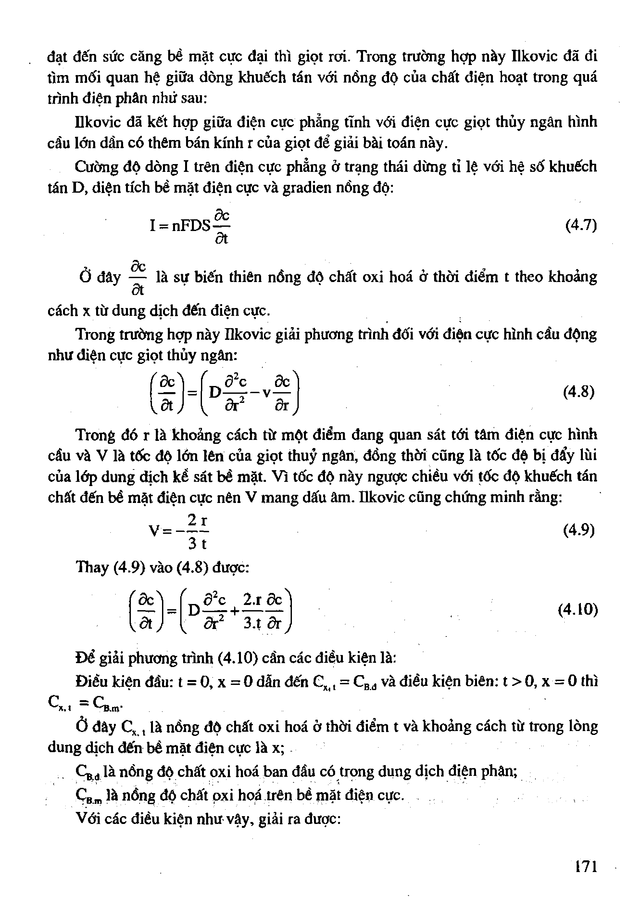

## Page 169

f ^ y _ c B.m- c , d
[ d i )  
7 (3 :7)rcDt 
Thay (4.11) vào (4.7) được:
(4.11)
I = n F S .D -B-m -^-d-
yj( 3 :7)7ĩDt
(4.12)
trong đó bề mặt hoạt động của giọt thuỷ ngân được tính bằng: 
s, = 0,85.t2/W /3
(4.13)
ta được phương trình dòng khuếch tán tức thời:
I = 0,732 nFD'^.m^t1^
 -  Q .m)
(4.14)
đối với chất oxi hoá khuếch tán đến điện cực giọt Hg; còn đối vói trường hợp chất 
khử thì ngược lại: (Can -  CM).
Với F = 96480 culong, D có thứ nguyên là cm2/giây, m là gam/giây, t là giây 
và c  là mol/cm3 (mói/Ị) thì dòng điện (I) sẽ có thứ nguyên là ampe.
Vì bề mặt hoạt động của giọt thuỷ ngân liên tục thay đổi theo thời gian và 
tăng từ giá trị không đến cực đại với chu là giọt t) và sự khuếch tán không phải là 
hoàn toàn ở trạng thái dừng, nên đại lượng dòng khuếch tán giới hạn sẽ thay đổi 
theo thòi gian, theo định luật parabôn với chi số luỹ thừa 1/6 như trôn hình 4.4.
Hình 4.4. Sự phụ thuộc dòng giói hạn theo thời gian vôi sự thay đổi bể mặt giọt thùỳ ngân.
Khi đo cường độ đống bằng điện kế với chu kì dao động 4 -  8 giây thì có thể 
thu được đường cong cường độ dòng khuếch tán trung bình theo lí thuyết (lK,-u)
-1 
lKT(sM-max
172

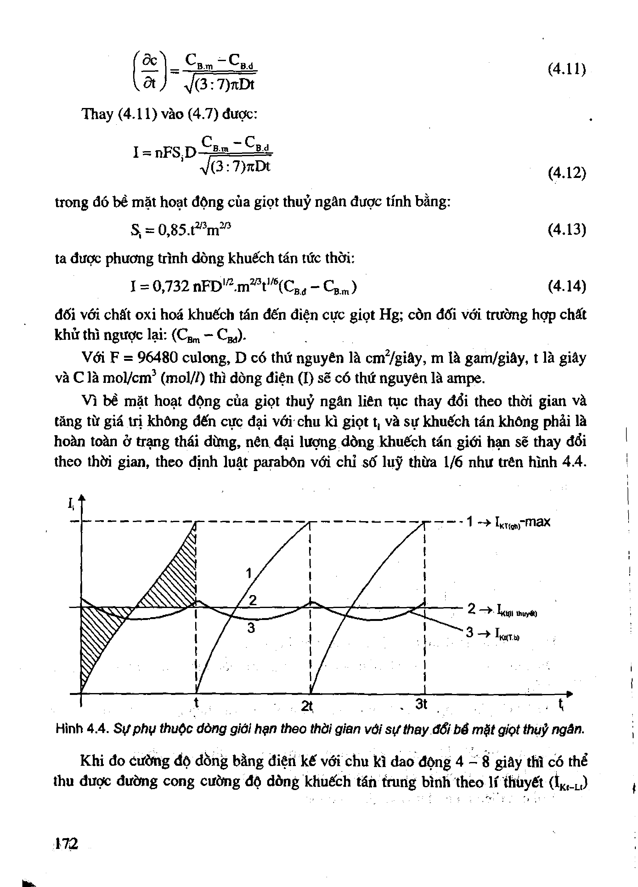

## Page 170

(đường 2). Giá trị của cưòng đô dòng khuếch tán trung bình lịct-Tb (đường 3) được 
kẻ sao cho diện tích hai phẩn gạch chéo ờ trên và dưới đường thẳng là bằng nhau 
và bằng:
ĩ = ; J Idt= l u -*■ ĩ = 0.627 nFDl/2mĩ/3tl/6.(CBd -C Bnl) 
(4.15)
Khi tăng thế âm đủ lớn CB m = 0 thì dòng tức thì đạt tới dòng khuếch tán giới 
hạn Ijc-gh, có nghĩa là chất oxi hoá (Cịjđ) khuếch tán đến cực bao nhiêu thì lập tức 
bị khử thành kim loại bấy nhiêu (CB m) và kim loại khuếch tán vào trong lòng giọt 
thủy ngân bấy nhiêu (CB m = 0) và tạo thành hỗn hống. (Biểu diễn nồng độ ở 
thời điểm nào thì cuối cùng cũng bằng nồng độ có trong dung dịch phân tích bị 
khử hoặc bị oxi hoá hết mới đạt tới dòng khuếch tán giới hạn cho nên có thể viết 
CB đ= C). Khi đó có phương trình mang tên Dkovic:
W
^ ^ n F D V t ^ . C  
(4.16)
hay Ija-gh = ốO S n ư V Y ^ .C  
(4.17)
Trong một thí nghiệm cụ thể, hệ số khuếch tán thường được giữ không đổi 
(D = const với thành phần dung dịch và nhiệt độ) và sử dụng một mao quản để cho 
= const thì có thể viết:
1= x.c 
(4.18)
trong đó 
X =0,627 nH y'W 'V '6 
(4.19)
hoặc 
X = 605 n D 'W
*  
(4.20)
X được gọi là hệ số Iỉkoviv. Đây là phương trình cơ bản để sử dụng phân tích 
định lượng bằng phương pháp cực phổ. Trong thực tế phân tích, có hai cách áp dụng 
phương trình này là phương pháp đường chuẩn và thêm chuẩn.
3. Các yếu tố ảnh hưỏng đến dòng khuếch tán
3.1. .Sự phụ thuộc cửa chiểu cạo đuởng cong (sóng) cục phổ vào chiểu cao 
cột thủy ngân
Tốc độ chảy của thủy ngăn tỉ lệ vói chiều cao cột thủy ngân:
m =k.hHg 
(4.21)
và chu kì giọt tỉ lệ nghịch vói chiều cao cột thủy ngân:
t = k ~ .  
(4.22)
173

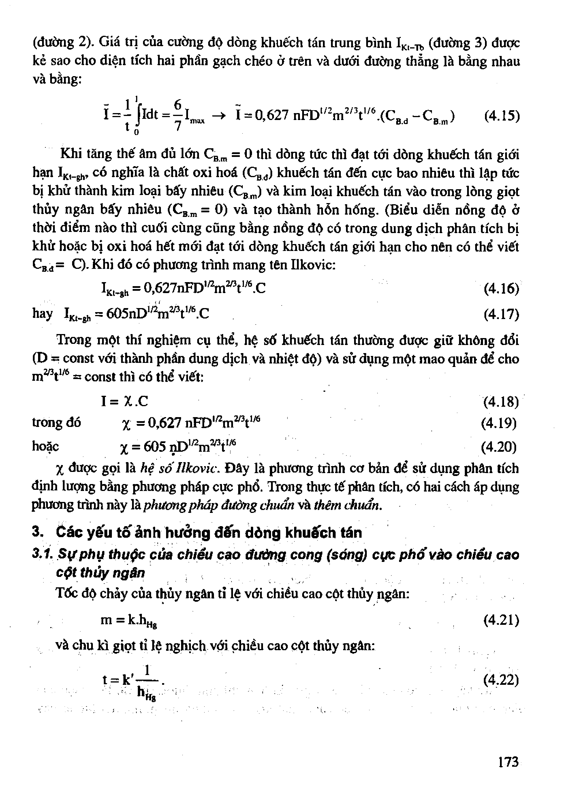

## Page 171

Còn dòng khuếch tán giới hạn tỉ lệ với m2/3tl/6 nghĩa là tỉ lệ vói tần số bậc hai 
của chiều cao hHg:
(k, V, k;/ là những hệ số tỉ lệ).
Nếu thay đổi chiêu cao của cột thủy ngân, thí dụ ở 16cm, 25cm, 36cm, 49cm, 
64cm... để ghi cực phổ một dung dịch sẽ thu được những chiểu cao sóng biến thiên 
tuyến tính với 
, đổ thị It -  hHg sẽ là một đường thẳng.
Chiểu cao dòng khuếch tán giới hạn tỉ lệ tuyến tính với căn bậc hai của chiều 
cao cột thủy ngân là một tiêu chuẩn để xác định sóng cực phổ được quyết định bởi 
quá trình khuếch tán.
3.2. Ảnh huởng của nhiệt độ, chu ki tới chiểu cao sóng cục phổ
Chu kì giọt (t) phụ thuộc vào mao quản, chiều cao cột thủy ngân và thế điện 
cực. Nếu không thay mao quản và chiều cao cột thủy ngân thì chu kì giọt chỉ phụ 
thuộc thế điện cực. Chu kì giọt sẽ cực đại ở điểm không điện mao quản và ngày 
càng nhỏ khi xa đần điểm không điện mao quản. Nhưng với một sóng cực phổ 
thường, người ta chỉ ghi trong khoảng thế khoảng thế hẹp từ 0,5V đến 0,6V, như 
vậy sự biến đổi của t là không đáng kể và có thể bỏ qua.
Nhiệt độ ảnh hưởng chủ yếu tói tốc độ chảy của thủy ngần (m) và hệ số 
khuếch tán (D) của chất điện hoạt. Nhiệt độ ảnh hưởng đến chiéu cao sóng là khá 
lớn, khoảng 1,6% đến 1,7% trên độ. Với những phép đo chứih xác bình điộn phấn 
cần phải được điều nhiệt.
3.3. Hằng số mao quản của điện cục
Dòng khuếch tán (IKt) phụ thuộc vào tốc độ chảy của thuỷ ngân (m) và chu kì 
giọt (t), mà các đại lượng này phụ thuộc vào hằng số mao quản (đường kính trong 
và đò dài của mao quản). Nếu cố định hằng số mao quản thì m và í chỉ còn phụ 
thuộc chiều cao của cột thuỷ ngân. Nếu cố định chế độ làm viộc của điộn cực thì 
phương trình (4.9) có dạng:
Nghĩa là cường độ dòng khuếch tán giới hạn tỉ lệ với nồng độ vã hệ số X, trong 
đó: X, như (4.19).
Tuy vậy, tốc đô chảy và chu kì giọt không chỉ phụ thuộc chế độ làm việc của 
điện cực mà còn phụ thuộc sức câng mặt ngoài cùa thuỷ ngân, mà đại lượng này
(4.23)
^Kt-gh -  x-c
(4.24)
174

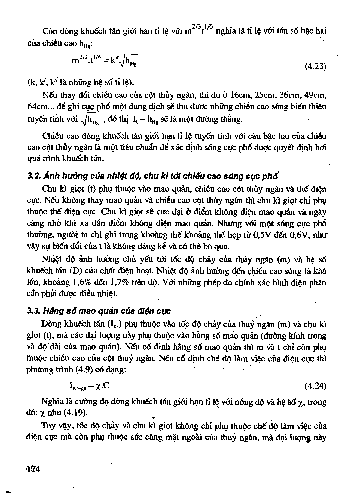

## Page 172

lại phụ thuộc vào thế. Vì vậy, nghiêm ngặt mà nói thì hằng số X trong phương 
trình (4.24) phụ thuộc vào thế tác dụng lên điện cực và trong các phép đo chính 
xác phải kể đến sự phụ thuộc này.
3.4. Dòng dư
Như đã trình bày ở trên, trong trường hợp chưa đạt đến thế khử của chất điện 
hoạt, nhưng trên đường cong cực phổ vẫn xuất hiện dòng dư đo sự khử các tạp chất 
trong dung dịch, do sự tích điện của lớp điện kép trên bề mặt giọt thuỷ ngân. Sự 
xuất hiện dòng dư gây khó khăn cho việc xác định độ cao của sóng cực phổ, tức là 
dỏng khuếch tán. Trong trường hợp có đòng dư cần phải xác định độ cao của sóng 
thep một phương phấp thống nhất để tránh sai số.
3.5. Thành phẩn và chất điện li trơ
Chất điện li trơ (chất nền, phông) đóng vai trò quan trọng vì:
a. Làm giảm điện trở của dung dịch và do đó làm giảm thế ôm (IR) xuống 
mức thấp nhất. Nồng đò của chất điện li trơ phải có vào khoảng 0,1M.
b. Ngăn sự điện chuyển của chất điện hoạt (aiíion hoặc cation) tới điộn cực và 
do đó có thể đo được đòng khuếch tán thật. Muốn vậy nồng độ nền phải lớn gấp từ 
50 lần nồng độ chất điện hoạt. Các ion của nền không được phản ứng với Hg; 
cation nền phải bị khử ở thế càng âm càng tốt.
c. Các ion của nền có thể tạo phức vái ion của chất điộn hoạt, dẫn đến làm 
chuyển địch thế nửa sóng của ion chất điện hoạt hoặc có thể làm thay đổi hệ số 
khuếch tán của nó. Ví đụ, hệ số khuếch tán của ion Pb(n) trong dung dịch NaOH 
IM bé hơn đến 17% so vói trong dung dịch H N 03 IM, là do ion HPbOj có kích
thước lớn hờn ion Pb(N03)+. Để làm nền người ta thường dùng: các clorua, clorat, 
peclorat kiềm và kiềm thổ, các sunfat kim loại kiêm, các cacbonat kali, natri, các 
bazơ amoni bậc 4 và các muối của chúng. Khi dùng các hiđroxit kim loại kiểm, 
nhất là LiOH, muối lìti làm nện cớ thể tăng vùng thế khử đến -2V , còn khi đùng 
các muối amọnỉ bậc 4 có thể tăng đến -2,6V  (so vối điện cực calamen bão hoà).
3.6. Cổc phán ùhg điện cục Cẩn trở
ở điều kiện bình thưòng (nhiệt độ và áp suất khí quyển), lượng oxi hoà tan 
trong nước khoảng 8 —» 10mg// hay 2,5 —>ầ 3,1.10^M. Chính vì vậy, dung dịch cực 
phổ luồn chứa một lượng oxi có nguồn gốc từ nước, không khí. Trốn điộn cực giọt 
thuỷ ngân, 0X1 dễ bị ldìử và cho hai sóng câíot:
0 2 + 2H20  + 2e ^  H20 2 + 20H “ 
(a)
0 2 + 2H ,0 + 4 e 4 0 H -  
(b)
175

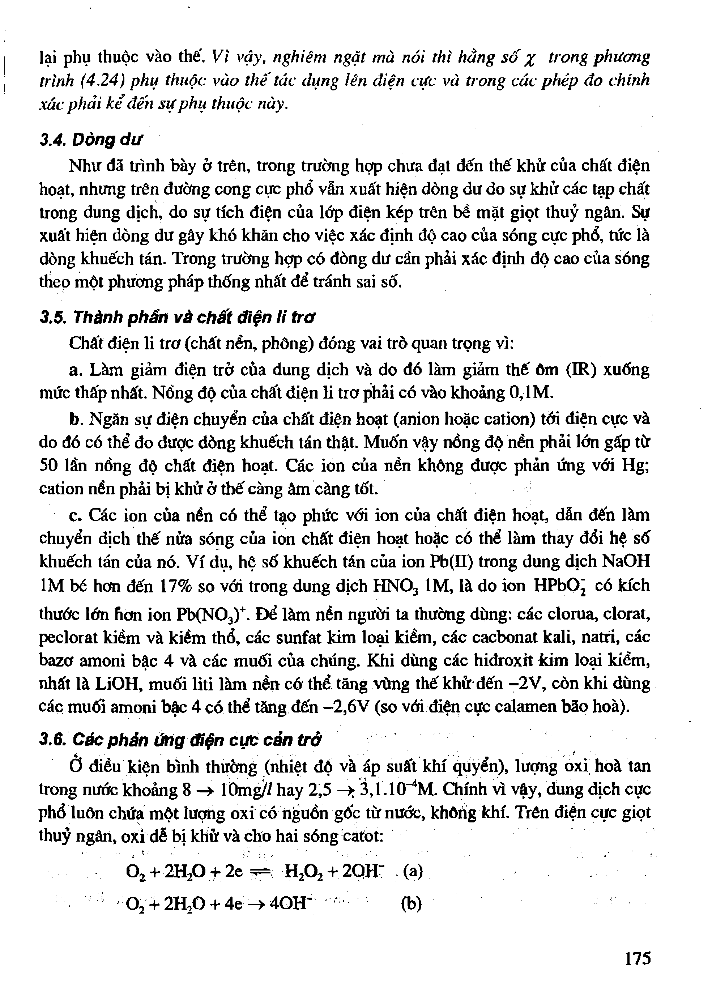

## Page 173

Hoặc trong môi trường axit: 0 2 + 4H+ + 4e —> 2HzO
Phản ứng (a) là thuận nghịch nhưng khó có thể xác định được E1/2 v't không 
quan sát được chân sóng, chỉ thấy rằng sóng đã có từ thế OV*(so với điện cực 
calomen bão hoà). Đây là sóng gây ảnh hưởng cản trở nhiều nhất. Phản ứng (b) là 
bất thuận nghịch, cho một sóng cực phổ ở thế xung quanh -1,0V  (so với điện cục 
calomen bão hoà). Trong khi sóng thứ nhất gây cản trờ nặng nề, lấn át hay che mất 
tất cả các sóng xuất hiộn từ o v  đến -2V  (trùng với hầu hết thế khử của các ion 
kim loại) thì sóng thứ hai gây cản trở ít hơn, tạo nên sóng khỏng rõ rệt quanh tljế 
điện cực -1,0V. Chính vì vây, tnróc khi đo cực phổ cần phải đuổi hết oxi hoà tan 
trong dung dịch nghiên cứu. Để đuổi oxi có hai cách: dùng khí trơ và dùng natri 
sunfit. Khí trơ thường được đùng là nitơ, hiđro, argon hay khí cacbonic. Khí có thể 
được lấy từ bom khí hoặc tự điều chế, vói thể tích dung địch tờ 15ml đến 20ml thì 
thời gian sục khí vào dung dịch thường là 10 4- 20 phút. Thể tích dung dịch càng 
nhiều, thời gian đuổi oxi càng phải dài.
Trong môi trường kiềm yếu, nhất là trong dung dịch amoniac loãng hoặc trong 
đung dịch đệm amonỉ có pH từ 8 đến 10 có thể dùng natri sunfit “tươi” rắn 
(0,5 đến l,0g NạjS03 cho 20ml đung dịch) hoặc dung dịch natri sunfit bão hoà 
mới điều chế để đuổi oxi. Trong những điều kiện này ion sunfit không bị khử trên 
bề mặt điện cực giọt thuỷ ngân. Ngoài natậ sunfit, có thể dùng những chất khác, 
ví dụ me toi, để đuổi oxi. Cần lưu ý là Ní^sc^ và các chất khác đem dùng không 
dược gây phản ứng hoá học với dung dịch đo cực phổ và với kim loại thủy ngân.
3.7. Cụt đại
Trên sóng cực phổ, cực đại thường xuất hiện khi dòng tăng mạnh vượt quá giá 
trị giới hạn rồi sau đó giảm đột ngột hoặc giảm từ từ. Cực đại cực phổ liên quan 
đến quá trình điện cực, thông thường có sự vận chuyển mạnh mẽ chất đến điộn 
cực, làm cho chất điện hoạt khác quá nhiều so vói trường hợp khuếch tán thồng 
thường. Cực đại cực phổ được chia làm hai trường hợp:
Trường hợp thứ nhất gọi là cục đại loại một, đứợc quan sát thấy khi dòng 
khuếch tán giới hạn đang lên, có dạng rất nhọn và cao, thường xuất hiện ở các 
dung dịch loãng. Cực đại loại hai, thường xuất hiện ò vùng điên thế đã đạt dòng 
khuếch tán giới hạn, cực dại thường thấp, tù và ít khí trờ về giá trị ban đầu.
Cực đại loại một: thưòng xuất hiện trong đung địch loãng của nền (đường ỉ) 
khi oxi hoá và khử các cation, aníon và phân tử trung tính trong các dung dịch 
nước và không nước. Nguyên nhân xuất hiện cực đại loại 1 là do sự hấp phụ các 
ìon lên trên bê mặt giọt thuỷ ngãn. Khi đặt thế lên điện cực thì trên bể mặt giọt 
thuỷ ngân xuất hiện một điện trường không đồng nhất làm thúc đẩy sự hấp phụ

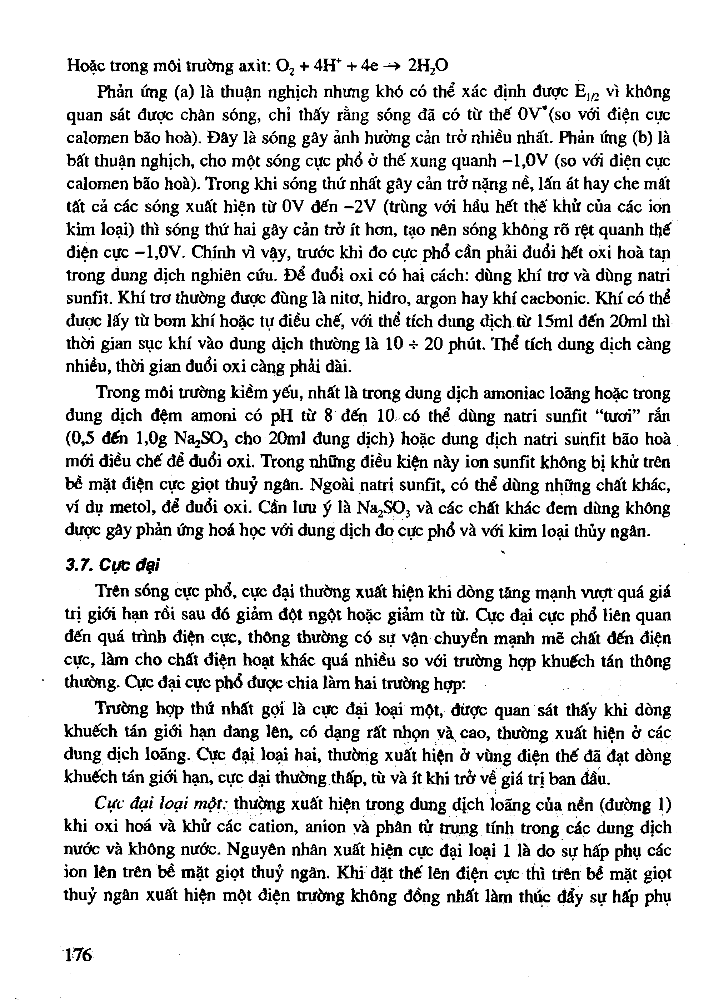

## Page 174

cation và phân tử lưỡng cực của nước. Bời vì ngay từ đầu tốc đô hấp phụ đã vượt 
quá tốc độ phóng điện các ion trên bề mặt giọt đã có một nồng độ đư chất điện 
hoạt và do đó khi đạt đến thế của phản ứng điện hoá thì dòng sẽ lớn hơn dòng giới 
hạn. Sự chuyển động tiếp tuyến của thuỷ ngân ữên bề mặt giọt đo sự chảy nhanh 
quá thuỷ ngân từ mao quản vào giọt và sự phân cực không đều của giọt thuỷ ngân 
do sự phân bố không đều dòng trên mặt giọt đóng vai trò quan ừọng ừong sự xuất 
hiện cực đại loại một. Mật độ dòng phân cực ở phần dưód giọt lớn hom ờ phần trên 
do hiộu ứng chuẩn của mao quản. Do đó có sự phân bố thế không đểu ốr các phần 
bề mặt hoạt đông của giọt dẫn đến sự khác nhau về sức căng mặt ngoài trên cẩc 
phần khác nhau của giọt và đó là nguyên nhân chuyển động cua thuý ngân trong 
giọt từ vùng có sức cáng bề mặt ngoài bé (mở rộng bể mặt) sang vùng có sức căng 
mặt ngoài lớn (ép bề mặt).
Khắc phục: Để tránh cực đại thường thêm các chất hoạt đông bề mặt (như 
gelatin, trilon-X-100, poliacrylamit và các chất mậu như metyl đỏ) vàọ dung 4ịch 
trước khi đo cực phổ.
Khi thêm chất hoạt động bể ĩĩíặt vào đung dịch, chất này bị hấp phụ trên điện 
cực giọt thuỷ ngân, làm hạ thấp một nhánh hóặc cả đường cong điện mao quản, 
san bằng sự chênh lệch về sức căng bề mặt của giọt thuỷ ngân, do đổ loại trừ được 
cực đại ỉoại niột cực phổ. 
' ,
Cực đại loại hai: Cực đại loại 2 xuất hiộn trên sóng cực phổ catot cung như 
ariòt, thừòhg với nồng độ nền lớn hơn 0,1M. Nó xuất hiện khi sóng cực phổ đã đạt 
đòrig khuếch tán giới hạn. 
i 
ĩ 
(í
Đối với cực đại loại 2, tốc độ chảy GỦa thuỷ ngân trong mao quản là yếu tố 
quyết định, xuất hiện khi tốc độ chảy của thuỷ ngân vượt quá 2mg/giây. Cực đại 
loại 2 không quan sát thấy khi dừng điên cực giọt tĩnh hoặc điộn cực rắn. Dvorak

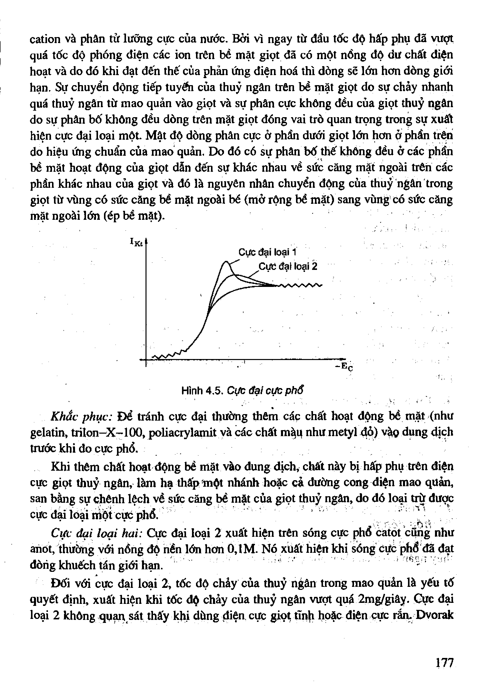

## Page 175

đã thấy rằng độ cao của cực đại loại 2 tỉ lệ với tích m7/6tl/6, nghĩa là tỉ lệ thuân với 
chiều cao cột thuỷ ngân.
Sự tăng đòng khuếch tán giới hạn do cực đại loại 2 là đo sự chuyển động của lớp 
dung dịch bao quanh giọt thuỷ ngâh. Hướng của chuyển động là không đổi: từ phía 
dưới giọt lên phía mao quản. Sự chảy của thuỷ ngân trong mao quản gây ra sự 
chuyển đồng ở bề mặt giọt và lớp dung dịch kề cân cũng chuyển động theo. Ở thế 
không điện mao quản chuyển động này là mãnh liệt nhất, càng xa thế không thì 
chuyển động càng yếu dần. Như vậy, nguyên nhân của cực đại loại 2 là thuần tuỷ 
thưỷ động lực học mà không liên quan đển phản ứng điện hoẩ xảy ra trẽn điện cực.
Khắc phụt;: Giảm tốc cỊộ chảy của thuỷ ngân bằng cách hạ thấp chiều cao cột 
thuỷ ngân có thể loại trừ được cực đại loại 2. Cho thêm chất hoạt động bề mặt vào 
dung dịch trước khi đo cực phổ, chất hoạt động bề mặt cíĩng có tác dụng đối với 
cực đại loại 2. Khi có chất hoạt động bề mặt, dòng của cực đại loại 2 giảm bót ở 
nơi mà chất hoạt động bề mặt bị hấp phụ. Khi chất hoạt động bề mặt được giải hấp 
thì dòng của cực đại loại 2 lại tăng lên.
Cực đai loại một và loại hai xuất hiện đồng thời: Trong những điều kiện thuận 
lợi, cả cực đại loại một và loại hai thường xuất hiện. Điều kiện cơ bản là tốc độ 
chảy của thuỷ ngân đủ cao. Sau khi đạt cực đại loại một cao và nhọn thì đến cực 
đại loại hai thấp và tù. Trong trường hợp này để khấc phục cẩn thêm chất hoạt 
động bề mặt vào đung dịch, đổng thời hạ thấp chiều cao cột thuỷ ngân cũng như 
giảm bớt nồng độ nền.
4. Phương trình sóng cực phổ thuận nghịch
Xét các truòng hợp khi các quá ttình cục phổ xảy ra trên điện cực giọt thủy 
ngâíi là thuận nghịch, nghĩa là các quá trình ứng vói điều kiện: Cân bằng giữa dạng 
oxi hoá và dạng khử của chất điện hoạt thiết lập nhanh, thế điện Cực tuân theo 
phương trìtìh Nemst, đại lượng cường độ dòng chỉ phụ thuộc tốc độ khuếeh tán của 
các chift điện hòạttừdung dịch tới điện cục và từđiộn cực đi vào đung dịch.
4.1. Trường hợp khửion kim loại đến kim toại tan trong .thủy ngân (tạo 
hận hống)
{i Giả sử trong dung dịch ta có iọn kim loại 
bị khứ trên bề mặt điệacực giọt 
thuy ngân tạo thành hỗn hống M(Hg) theo phương trình phản ứng sau:
. 
M"+ + ne 
Hg ^  
M(Hg) 
(4.25)
Các quá ứtnh xầy ra: 7 
; 
' 
V 
.
-  Các iòn M ^ khuẽch tẩrí tìr dung dịch đến lớp sất bề íriặt điện cực.

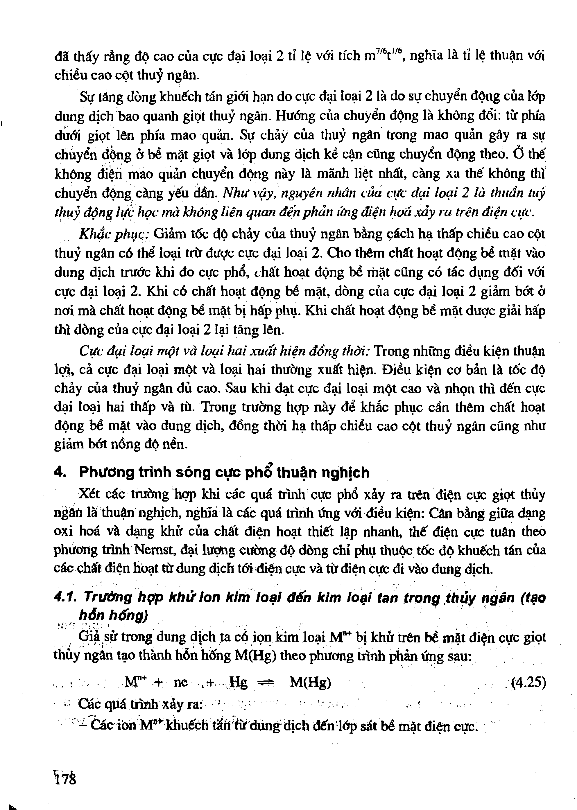

## Page 176

I 
-  Các ion M”+ bị khử thành kim loại M.
! 
-  Các nguyên tử kim loại M khuếch tán từ bề mặt vào trong lòng giọt thủy ngân.
TTĩế điộn cực giọt thủy ngân được xác định bằng phương trình Nemst:
E = E V  
(4.26)
/M (Hg) 
n F  
( M ) h h
Trong đó: (Hg) là hoạt độ của kim loại thủy ngân;
(M"+)b là hoạt độ của ion M"+ ở trên bể mặt điện cực;
(MXh là hoạt độ của kim loại M trong hỗn hống.
Thay hoạt độ bằng nồng độ cân bằng của ion M"+ và M vào phương trình
(4.26) ta được:
. RT1_tMp^]b
E = E° 
^ + — ln(Hg)+—
l n - ^ + —
l n ^ —^  
(4.27)
M /M<Hg) 
nF 
nF 
fMih 
nF 
ỊM]^
Ở đây: f n+ là chỉ hệ số hoạt đô của iơn kim loại (chất điên hoạt) trên bề mặt
M (b) 
• 
• 
■ 
V 
•
điên cực;
fM là hệ số hoạt độ của kim loại M ừong hỗn hống;
(M^X là hoạt độ của ion kim loại (chất điện hoạt) trên bể mặt điên cực; 
[M]hh là nồng độ của kim loại ữong hỗn hống.
Trong phương trình (4.26) và (4.27),E^„/M(Hg) là thế điện cục tiêu chuẩn của
hỗn hống và có nghĩa là súc điện động của mạch
Pt(Hz)|H +O T )=l, pH I Mn+ ị M(Hg) ở trong điều kiộn:
___ ____________ = 1 
(4.28)
.  
; 
•
Lượng hỗn hống tạo thành quá ít, chính vì vậy có thể C01 hoạt độ cua thủy 
ngân (Hg) là một giá trị không đổi (hằng định); khi đó biểu thức (4.27) có thể viết 
dưới dạng sau: ■ 
V
E = 6 + M to^ V » +M lnM
! i  
(4.29)
nF 
fM|ưi 
nF 
[M U
■ -1 - . 
RT :í: 
^
V 
;  
(4.30)
179

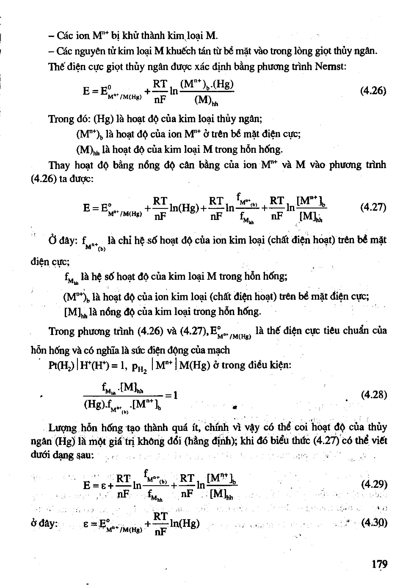

## Page 177

Cường độ đòng I tỉ lê với tốc đô dòng khuếch tán Mn+ từ trong dung dịch đến 
bề mặt điện cực, nên ta có:
It= V +([Mn+]dd-[Mn+]b) 
(4.31)
ở đâỳ X nt là hệ số của ion M"+ trong dung dịch. Khi [M^]b = 0 thl I, = I^gh, ta có:
^Kt-gh =  X Mn + '[ M
Thay (4.32) vào (4.31):
It 3  ^Kt-gh — XMn+-[M ]b
[Mn+]b
XMn+
Mặt khác, cường đô dòng cũng tỉ lệ vái tốc độ dòng khuếch tán kim loại M từ 
trên bề mặt điện cực vào trong lòng giọt thuỷ ngân tạo thành hỗn hống nên:
(4.35)
Khi nồng độ của kim loại M trên hề mặt giọt thủy ngân [M]b được chuyển hết 
vào trong lòng giọt tạo thành hỗn hống thì có thể coi bằng không ([M]b = 0), nên 
ta có:
= XvKhhrí^lhh 
(4.36)
= * [M k = -^ - 
’ 
(4.37)
Xmo*) 
"
Trong đó: IKt-sh là dòng khuếch tán giói hạn; 
ĩ, là dòng khuéch tán tức thì ờ thời điểm t;
là.bộ số phụ thuộc vào hệsốỉệiuếphtán của ion kim ioại ừong đungdịch;
XM(hh)là h ệ số p h ụ th u ộc v ào  h ệ số k h uốch tá n  của k im  loại tro n g  h ỗn  hđrtg: 
'
(Ví dụ: 
(4.38) -  từ phương trình ỊỊkovic cho thấy rằng trong
điều kiộn cố định có thể kể đến yếu tỐ D1/2*- phụ thuộc vàỏ tính chất của dung
dịch và mòi tnròng -  phụ thuộc vào tính chất của cạpilia. Iịt, = ỵ.c  có nghĩa là giá
trị dòng khuếch tán tí lệ thuận với nồng độ cửa chất cực phổ Hẹ số tỉ [ộ trong 
*
(4.32)
(4.33)
(4.34)
«80

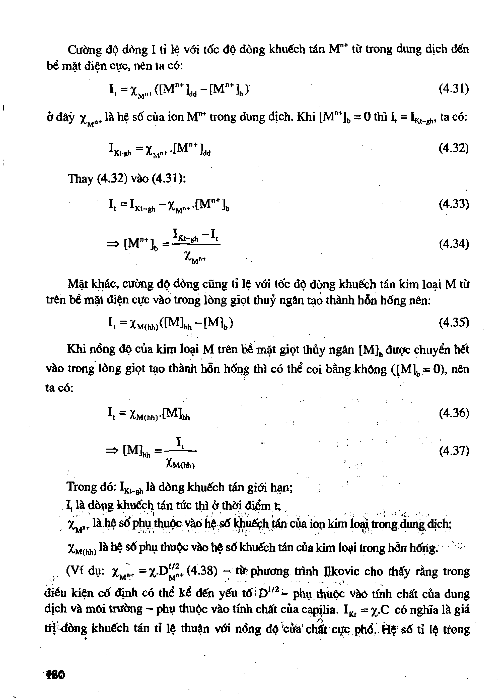

## Page 178

phương trình Ilkovic được kí hiệu là X, để tránh nhầm lẫn với K của hằng số cân 
bằng trong sức điện động của mạch đo).
Thay (4.34) và (4.37) vào (4.29) được:
E = e + —
l n - ^ -  + —  ln ^ ìa ^ + —
in IKt-fh - 1., 
39)
nF 
fM(„ 
"F 
V *  
nF
và phương trình sóng cực phổ thuận nghịch có thể viết:
E = EƠ>+ —
(4. 40) 
nF 
I,
ởđiy: 
E ° ' = e + —
l n - ^ + —
(4.41)
nF 
fM(„ 
"P
Trong thực tế thường tiến hành đo cực phổ trong dung dich có thành phần ion 
(phông) không đổi. Vì vậy có thể coi hộ số hoạt độ (f n+ ) và hệ số XM„<- không
đổi, tức là có thể coi E0' là không đổi. Nếu khi I, = Kt-8h thì E = E1/2. TTiay
2
I, = rc*-*1* vào (4.41), ta có:
E1/2=E° ' =e +—
(4.42) 
nF 
fM(wl) 
nF 
V
Thay E°' = E, n vào (4.40) đươc E = E1/2 + —
i n - ^ c í l  
(4 .43)
nF 
It
Để xác định số electron trao đổi trong phản ứng điện cực n và kiểm tra tính 
thuận nghịch của phản ứng điện hoá, người ta dựa vào việc phân tích logarit đường 
cong (sóng) cực phổ. Phương trình (4.43) có thể viết dưói dạng:
E = 
lg 
t  E1/2 Ò 30°c 
(4.44)
n 
^Ki-gh
Qiiét thế theo chiều âm nẽn E và E(/2 luốữiuôn âín riêri có thể viết:
' ■ 
I ^ a °
v
 
'■ 
, ; K. ; 
•• 
: 
Á  
■ 
' C4.45)
n  
Kl-gh 
*t
181
I

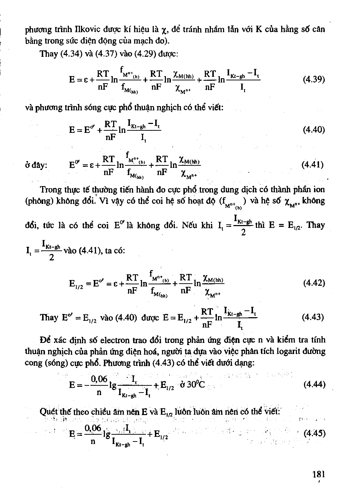

## Page 179

yx = a.Cx + b 
(4.46)
Nếu vẽ đường cong (-Ej) là hàm số của lg-----—----- sẽ nhân được một đường
^Kl-gh
i 
. . ____* 
,
1X 
. _ 
0,06 
0,06 
0,06
I 
thang mà hệ số góc là: a = tga=-^—  =>n = - 1—  = —-— .
ị 
n
a
 
tga
Trong đó: E|/2 là thế nửa sóng (bán sóng); E0/ là thế tiêu chuẩn thực, phụ thuộc 
vào điều kiện thí nghiệm như môi trường nển, pH, lực ion...
Từ công thức (4.42) cho thấy thế nửa sóng không phụ thuộc nổng độ của 
chất điện hoạt tham vào phản ứng khử cực mà chỉ phụ thuộc bản chất các ion 
kim loại bị khử, điều kiộn thực nghiệm (thành phẩn ion của dung dịch đo, tính 
chất điộn cực).
Nếu tiến hành đo cường độ dòng (Ij) phụ thuộc vào sự biến thiên của thế (-Ej) 
của dung dịch chứa nhiều ion như Fb2\  Zn2+ và Mn2+ trong môi trưòng nền H ơ  
và KG ở pH « 2, ta sẽ thu được đường cong cực phổ như hình 4.6.
Hình 4.6. Đường cong cực phổ của ơung dịch chứa Pb2\  Zỉf* và Mn** 
trong nền (KCI + HCI), p H - 2
Nếu áp đặt điện áp phù hợp từ nguổn vào hai điện cực thì sẽ có sự khuếch tán 
các ion kim loại đến bề mặt điện cực giọt thủy ngân để nhận electron từ điện cục. 
Mới đầu sẽ có phản ứng khử Pb2+ thành Pb, sau đó sệ khử Zn2* thành ịZn, tiếp theo 
sau Mn2+ thành Mn vì:
182

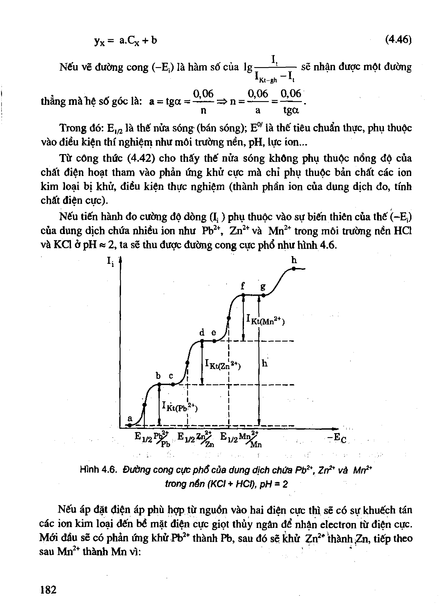

## Page 180

E l;., 
= -0,126V >E° 2+ 
= -0,76V  >E° 2 
= -1,18V . (4.47)
Pb2+/Pb 
Zn 
/2 n  
’ 
Mn2*/M n 
v 
y
Từ vị trí a ứng với giá trị thế ờ trục hoành bắt đẩu xảy ra phản ứng khử Pb2+:
Pb2+ + 2e + Hg —  Pb(Hg) 
(4.48)
dẫn đến dòng tăng vọt, đến điểm b ứng với sự khử của ion Pb2+ đã hết và dòng đạt tới 
cực đại (giới hạn), có nghĩa là I, = 
= const vì I(Kl_sh)pb2+ = x|1jĩ+.[Fb2+].
Từ điểm c cường độ dòng tăng lên do phản ứng:
Zn2+ + 2e + Hg —  Zn(Hg) 
(4-49)
(xảy ra cùng với phản ứng 4.48), cho đến điểm d. Trong khoảng thế từ d cho đến
e, phần đòng dư so với dòng khuếch tán 
là do sự khuếch tán chỉ của mội
mình ion Zn2+ tới bé mặt điện cực giọt và từ d cho đến e thì dòng khuếch tán của 
Zn2+ 
đat 
tới 
dòng 
giới 
han 
I ,= I  
2t = const 
và 
bằng
(Kt-gh)Zn 
;
I(Kt-gh) 
2* -  X 2* [Zn2+] . Dòng tổng cộng trong dãy thế từ d cho đến e là tổng của 
hai dòng khuếch tán của Pb2* và Zn2+.
Trong khoảng dãy thế ở trục hoành ứng với các điểm trên đường cong từ e đến
f qua điểm h tương ứng: 
Mn2+ + 2e + Hg Mn(Hg) 
(4.50)
Trong dãy thế ứng với trục hoành tương ứng với điểm f đến g trên đường cong, 
phần dòng dư so với tổng dòng khuếch tán của Pb2+ và Zn2+ là do có sự khuếch tán 
của ion Mn2+ tái bề mặt điện cực giọt thủy ngân và tham gia phản ứng. Độ lớn của 
dòng khuếch tán của ion Mn2* bằng:
W g h W  = *Mn2+,lIV*n2* 1 
, 
*4 5 1 ^
ở các điểm trên đường cong cực phổ có các giá trị dòng tương ứng vối thế 
như sau: 
. 
.... 
.,;
Tại điểm X: 
ị ,
E .=  -0.-1!V  
(4.52)
Tại điểm Y: 
- ■' V ■ ■ 
:.> •
,  
=> E ,„= -0,995V  
' 
: 
(4.53)
Tại điểm Z: 
, 
; -‘ í ;
" 
í; i ; = 'f c ) pl!. + ( W ) ^  +tơK;)M„í. =*e;b=.-i,3«3v -'(4.54)
183

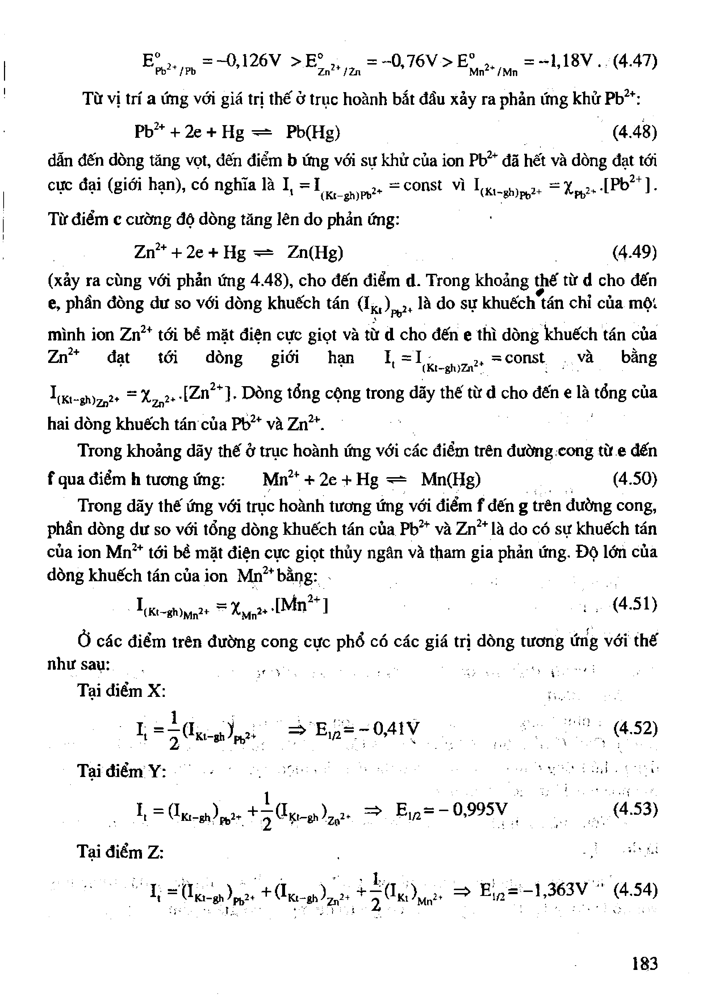

## Page 181

4.2. Khử ion kim loại tớí kim loại không tan trong Hg
Đối với trường hợp ion kim loại bị khử thành kim loại*không tan được trong 
thủy ngân theo phản úng: M"+ + ne 
M. 
(4.55)
Phương trình sọng cực phổ viết theo phương trình Nemst có dạng:
E = E° n+ 
+ —
ln ỈM^ dđ) + —
ìnạ^ 
(4.56)
^ 
nF 
%. + 
nF
M 
(dd)
Hoặc có thể viết: 
E = E0' + Í Ĩ  ln(IKt_  - 1,). 
(4.57)
nF
Đây là phương trình sóng cực phổ trên catot viết cho phưcmg trình khử ion kim 
Ịoại thành kim loại không tan trong thủy ngân.
RT
f
T r o n g d f c E ^ E ^ + ^ - l n - ^  
(4.58)
M01 (dd)
f „+ là hệ số hoạt độ của ion kim loại M”+ trong dung dịch; X „+ 
là hệ số 
củả ion này ưong dung dịch
Tương tự như các trường hợp trên, khi đòng tức thì It= h^L => E = Ew,
ở đây: 
Eỉ/2 = E ° ' + ~ l n Ì ^  
(4.59)
■ 
1/2 
nF 
2
Theo phương trình (4.59), thì thế nửa sóng (E1/2) không những phụ thuộc vào 
bản chất ion kim loại mà còn phụ thuộc vào nổng độ của ion Mn+ có mặt trong 
dung dịch vì IKí_gh= x M„+[Mn+{ d.
4.3. Quá trình khửion kim ioại từhoổ trị cao xuống thếp dẩn và tốn tại trong 
dung dịch
Nếu như trong dung dịch chứa các ion đa hoá trị như các ion kim loại Fe2+ 
(Fe3+), Co2+ (Co3+), Sb3+ ( Sb5*), Ce3+ ( Ce4* )... vừa tồn tại ở dạng oxi hoá vừa ờ 
dạng khử trong dung dịch, tùy theo thế đạt vào điộn cực mà có thể xảy ra quá trình 
oxi hoá hay khử các ion kim loại.
-  Nếu quá trình khử xảy ra: Co3* + e ^  Co2* thì đòng đặc trưng ứng với nó 
là dòng If.
-  Nếu xảy ra quá trình oxi hoá iọrt Co2+ ^  
Co3+ + e thì dòng đặc trưng ứng 
với nó là dồng Ia. Theo quy ưóc Ic có giá trị dương, Ia có giá trị âm.
Ì84

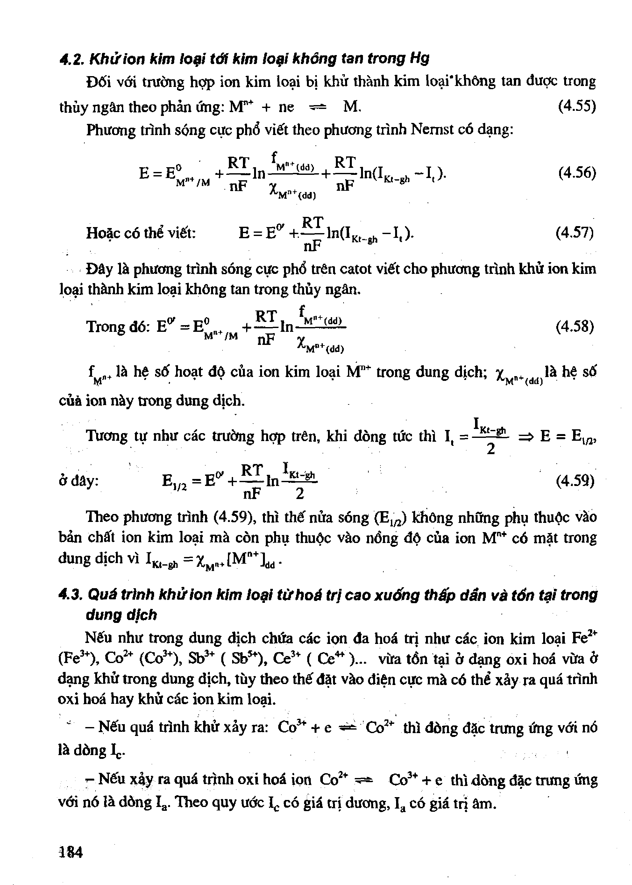

## Page 182

Ví dụ: Nếu có phản ứng xảy ra trên điện cực giọt thủy ngân Co3+ + e ^  Co2+ 
(4.60) có thể chia quá trình xảy ra ở trên,điện cực thủy ngân thành các giai đoạn sau:
-  Giai đoạn ỉ: Sự khuếch tán ion Co3+ đến điện cực (catot) (-).
-  Giai đoạn 2: lon Co3+ tham gia phản ứng trên điện cực (sự khử ion Co3+ 
xuống Co2+ trên bề mặt điện cực).
-  Giai đoạn 3: Sự khuếch tán ion Co2+ từ bề mặt điện cực trở vào dung dịch. 
Thế điện cực giọt thủy ngân được ộặc trưng bằng phương trình Nemst:
R T , (Co3+)b
'CoJ+/Cc/ 
+
E = E° 
2. + —
lĩT  V
 
(4.61)
n /c° 
F 
(Co )b
Cường độ dòng (I) tỉ lệ vói tốc độ khuếch tán ion Co3+ từ trong lòng dung dịch 
đến sát bể mặt điện cực và ion Co2+ khuếch tán từ lớp sát bề mặt điện cực vào 
ừong dung dịch, nên ta có:
I,= X ^ .([C o 3*]Jđ-[C o>*]b) 
(4.62)
Cứ có bao nhiêu ion Co3+ đến sát bề mặt điện cực và bị khử hết thành Co2+, 
có nghĩa là [Co3+]b = 0 thì I( = IKt-gh<c)" đây là cường độ dòng khuếch tán giới hận 
catot:
ỈKt-ghío = 
[c °ỉ+ Idd - thay vào (4-62) ta có:
“  ^Kt-gh(C) “ X ^ + 't C o  
] b
=> [Co3+]b 
(4.63)
M ặtkh ác:I,=Xcòĩ.([Co2+]b-[C o2+]dđ) 
, 
(4.64)
Khi Co2* chuyển hết vào dung dịch, thì [Co2+]b = 0 , dẫn đến dòng khuếch tán 
tức thì (It) trở thành dòng khuếch tắn giới hạn anot:. 
thay
vào (4.64) ta có: 
/  
"
It =XCũí+-[Co2+]b- x Co2+[Co2+]đđ= x o>2+.[Co2+]b+ IKt.gh(a)
r 
[Cd2+]b 
: 
(4.6^)
^Co2+ 
! ' : 
■
Thay (4.63) và (4.65) vào (4.61) ta có:

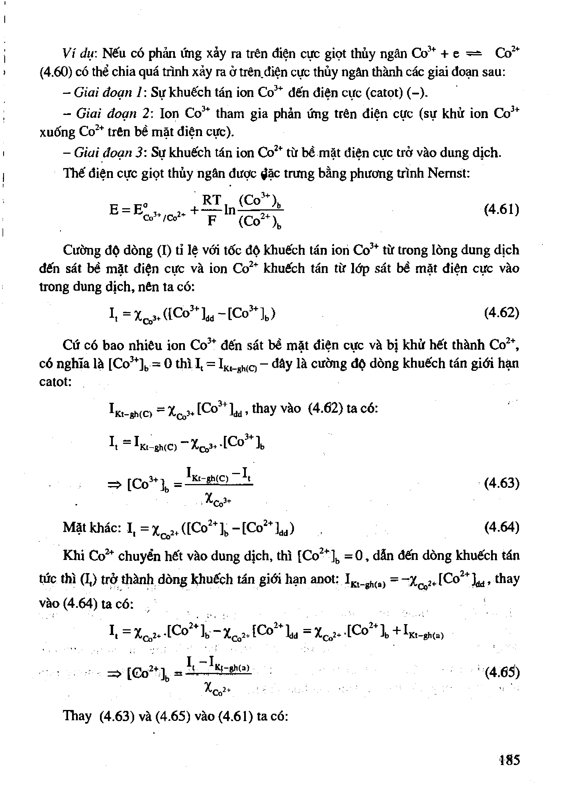

## Page 183

E = E%. 
i( + ỉl i „ Ì £ . + ỉĩ i „ * a ỉl .  + * ĩ toiS iS 2 _ L
0 ,3 .,Co*. 
F  
,  
p  
p  
I f _ W
)
(4.66)
-,0' 
RT 1 
^KI-gh(C) 
If
Hoặc 
E = E° + —
In 
—  
(4.67)
F 
I -I .
r  
At 
Kt-gh(a)
Trongđó: 
E°'=E% + 
2+ + — lni ĩ l + —
ln -^ £ - 
(4.68)
0 
C o r /Co 
F  
f 
F  
V
r  
Co2+ 
r  
Co3+
Khi dòng tức thì bằng một nửa tổng hai dòng catot và anot giới hạn:
J  = g p -gM Q + W c)) 5 thay vào (4 66) được; 
2
+ R t, f,-„3+ 
R T , X^„3+
Co 
A'CoJ+
E = E1/a =E °’ =E° 
,+ + (4.69
Từ công thức (4.69) cho thấy thế nửa sóng không phụ thuộc vào nổng đô của 
các dạng oxi hoá và khử. Trong trường hợp đặc biột khi trong dung dịch không có 
ion Co2+ chỉ có ion Co3* có nghĩa là [Co3+] = 0, dẫn đến IKi-gh(a) = 0 thì biểu thức 
(4.67) có dạng:
E = E°' + —
ln h lzÉÍSllh. 
(4.70)
F 
I,
Trường hợp ngược lại trong dung dịch không có ion Co3* chỉ có ion Coỉ+ có 
nghĩa là [Co3+] = 0 dẫn đến IKt-gh(o = 0 thì biểu thức (4.67) có dạng khác:
D T  
T
E = E °'+—
ln------- ^-----  
(4.71)
F 
I - I
1 
Kt—gh(à) 
'
Cũng tương tự khi dòng tức thì bằng một nửa đòng catot giới hạn
(It -  K^gh(C)) hoặc bằng một nửa dòng anot giới hạn (It = 
) thì thế nửa
2 
2
sóng E1/2 = E0' . Như vậy, từ các biểu thức trên cho thấy thế nửa sóng của các
dung dịch Co1+, Co2+ và hỗn hợp (Co3*, Co2+) đểu như nhau và' đều không phụ 
thuộc vào nồng độ cùa các dạng oxi hoá và khử.
m

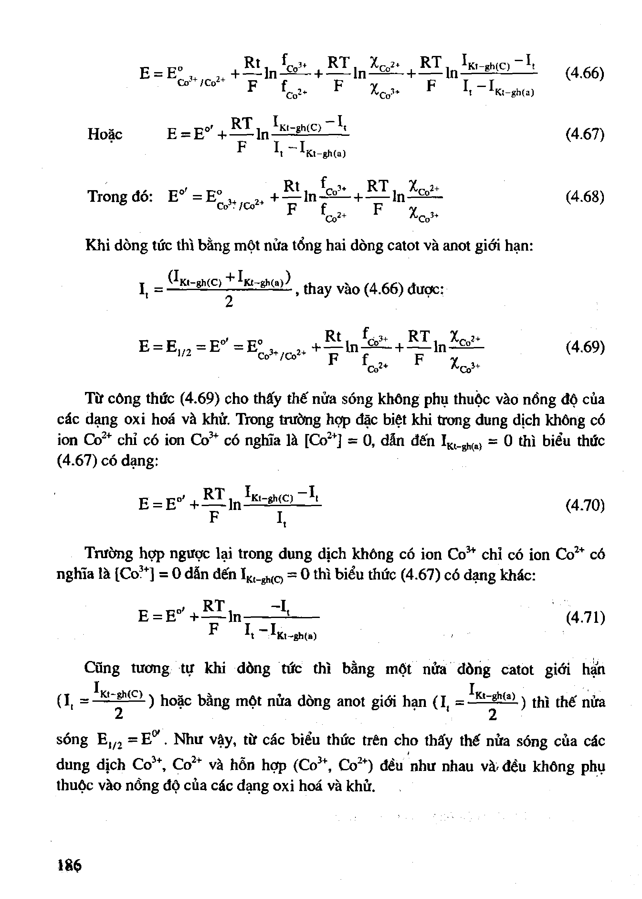

## Page 184

4.4. Sựkhửion phút
Trong nhiều trường hợp người ta tiến hành khử ion kim loại dưới dạng phức, VI 
có sự tạo phức cho nên nổng độ ion kim loại trong dung dịch giảm, do đó thế cân 
bằng chuyển dịch về phía âm. Quá trình này phụ thuộc vào độ bền của phức chất 
và bản chất của phối từ.
Phức càng bền thì thế chuyển dịch về phía càng âm. Trong phân tích ứng dụng 
hiộu ứng này để tách các cation từ hỗn hợp cation.
Ví đụ: Trong dung địch chứa ion Tì+ và Pb2+, E1/2 của hai ion cần tách phải lớn 
hơn 0,20V (200mV) thì mới có thể tách sóng cực phổ của chúng ra khỏi nhau 
đuợc. Nếu so sánh E1/2 của chúng gần nhau: thế nửa sóng của TIYn(Hg) là 
-0,48V rất gần với thế nửa sóng của Pb27Pb(Hg) = -0,38V, trong môi trường 
KC1, không thể tách hai phổ đồ chúng rời khỏi nhau để xác định bằng phương 
pháp cực phổ được.
Trong thực tế để xác định nồng độ TT và Pb2+ có trong hổn hợp Tl+ và Pb2+ 
người ta dùng phương pháp cực phổ tiến hành trong môi trường kiềm NaOH, khi 
đó chì(n) tổn tại dưới dạng HPbOị cổ thế nửa sóng của HPb02/Pb(Hg) bằng
-0,755V và ta sẽ thu đựợc hai sóng của TT và HPb o , ờ xa nhau;
ÀEi/2 = -0,75 -  (-0,48) = I -0,265 IV > 0,200V, như vậy thỏa mãn điều kiộn.
187

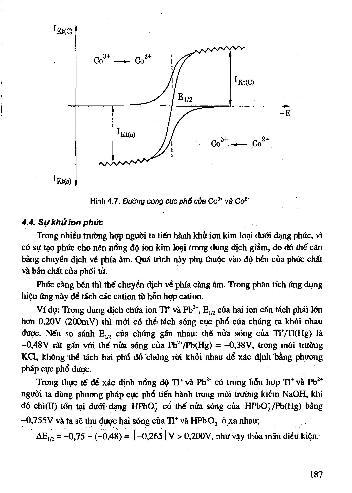

## Page 185

Xây đựng phương trình sóng cực phổ thuận nghịch trong trường hợp khử ion 
phức như sau:
Giả sử cho vào dung dịch chứa Mn+ (Cu2+, Co2+, Cd2+, Ni2+...) phối tử X6" 
(NH3) với Cỵ (CNH ) »  c  n+ (C 2+) tạo thành với ion Mn+ (Cu2+ ) ion phức
MXp(r,-pb)+ (Cu(NH3)^+ ), ion này có khả nàng bị khử trên điện cực giọt thủy ngân 
tạo thành hỗn hống theo phương trình phản ứng sau:
Cu2+ + 
4NH3 
—  
Cu(NH3);+ p4 vái CNH » c  ĩ+ 
(4.72)
Các quá trình xảy ra ở catot như sau:
-  Khuếch tán Cu{NH3)*+ từ dung dịch đến điện cực.
-  Sự khử ion phức thành ion kim loại đổng:
Cu(NH3);+ + 2e +H g —  Cu(Hg) + 4NH3 
(4.73)
Quá trình trên có thể chia ra 2 giai đoạn:
-  Sự phân li của ion phức thành các ion đơn giản:
Cu(NH3) f  —  Cu2+ + 4NH3 
(4.74)
-  Ion kim loại bị khử trên điện cực giọt thủy ngân và tạo thành hỗn hống:
Cu2+ + 2e + Hg ^  
Cu(Hg) 
(4.75)
-  Khuếch tán kim loại đổng vào trong lòng giọt thủy ngân.
Thế của điộn cực giọt thủy ngân trong trường hợp này có dạng tương tự như
(4.26):
E = E .  
...... . RT ln <
^
W
 
(4.76)
Cu2 Ạm h s ) , 
2 F  
( C u ) ^  
' 
K
Trong trường hơp này cần phải tính hoạt, độ của Ịon kim tự do phụ thuộc vào 
đô bển của phức.
Theo định luật tác dụng khối lượng :
,, 
(Cu(NH.)r) 
(C u(N H ,)f)
=* <Cu 
pTftfflj)4 
■ 
■ 
<4-77)
Thay hoạt độ bằng nồng đô cân bằng vào (4.77) đuợc kết quả, thay vào (4.76) 
tađuợc: 
' 
'
188

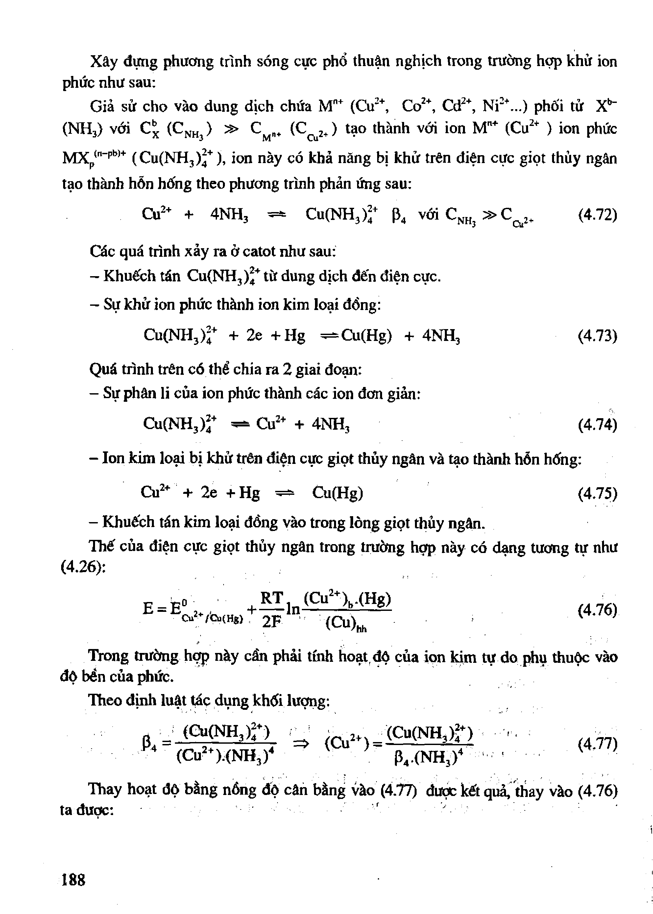

## Page 186

E . p  
+ —
ln(Hg)+—
l n ^ ^  = E+—
In 
(Cu(NHf
 \ 4 
(4.78,
2F 
2F 
(CuV  
2F 
^.(C uV IN H ,)^
E = £ + RT 
f h(br[Cu(NH,)*+]h
_ _ l n ________ ph(b) L 
“ V  
3->4 Jb________ 
( 4  7 9 )
2F 
P .4 „ u„[Cu]hl,.f, NHj(W.[NH3rb
E = £ + 5 I ln_
%
^
+ 5 I ,  
' + 5 I , „  
*
2F 
W r f V w  
2F 
»« 
2F 
[NHs t  2F 
[CuJU
(4.80)
Cường độ đòng tỉ lệ với tốc độ dòng khuếch tán của ion phức từ dung dịch đến 
điện cực và tỉ lệ vối tốc độ khuếch tán kim loại Cu từ bề mặt vào trong giọt thùy 
ngân (hỗn hống), nên ta có:
It = Xph([Cu(NH3)ỉ+]dđ-[C ufN H 3) f ] b) 
(4.81)
Khi [ Cu(NH3)^+ ]b = 0 thì cường độ đòng đạt tói đòng khuếch tán giới hạn (Iia.gh):
W
 = Xph[Cu(NH3)ỉ+]dd 
(4.82)
Thay (4.82) vào (4.81): I, = IKt^  -  Xph[Cu(NH,)r ]b
=»[Cu(NH3) f ] b = ĨKt' ^ ~ 1, 
(4.83)
^ph
Mặt khác cường độ dòng tỉ lệ với tốc độ khuếch tán kim loại từ bể mặt điện 
cực vào trong lòng giọt thủy ngân:
I.= XcuOMÍtCuU-ICuU 
(4.84)
Khi mà có bao nhiêu kim loại đồng trên bể mặt giọt thủy ngân chuyển hết vào
trong lòng giọt thủy ngân tạo thành hỗn hống có nghĩa là [Cu]b = 0, thì dòng
khuếch tán tức thì chỉ còn: 
f ỉ
li= XcufliwK^Oflih) 
: 
' 
(4.85)
= > I C u U ----- —
 
(4-86)
Xcu(hh) 
V
Thay (4.83) và (4.86) vào (4.80) ta được: 
„.
•i:' ị ; ■' 
_ ; 
Ị
189

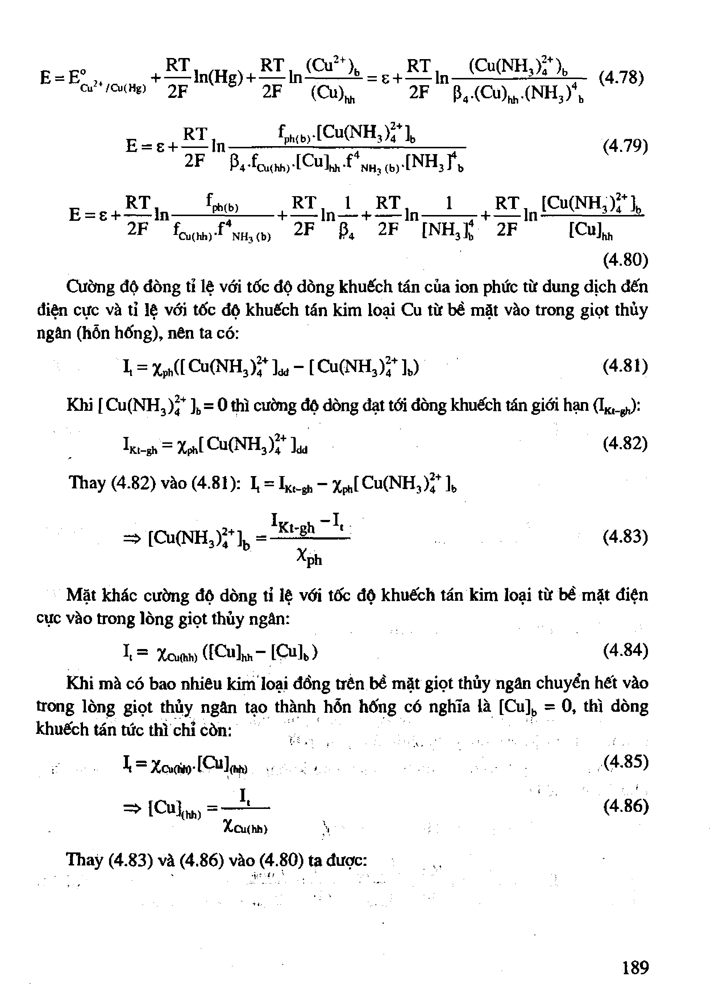

## Page 187

E = 6 + 5 ĩ i n _____________+ H i n lc« « + B I i n ±
2F 
íũ.<hwf NH3 (b) 
2F 
5Cph 
2F 
p*
, * l ln 
1 
A
b
^
ỈL
2F 
[NH3Í  
2F 
It
(4.87)
Hoặc:
E * e + —
in— %
_ + —
l n ^ ! i > - ^ l n p 4 
2F 
2F 
Xph 
2F
- 4 —
ln[NH3]b + —
In 
2F 
3b 2F 
It
(4.88)
Nếu điều kiện thí nghiệm và thành phần của dung dịch nghiên cứu được giữ 
không đổi thì:
13—nO1 
RT. n 
A RT — 
RT 
^Kt-gh— 
(A qo\
cu(NHj)2+/cu(Hg) 
2F 
4 
2F n NHj 
2F n— ĩ
với [NH3] = Cnh
Trong đó: Eff 
,+ 
= £ + —
In-----(4.90)
6  
Cu(NH3^ /Cu(Hg) 
2F 
f 
f4 .. .. 
2F 
Y
^
 
Cu(hh) 
NHj (b) 
'í'1 
Xph
Khi dòng tức thì bằng một nửa dòng khuếch tán giới hạn (It = 
■~8h- ) (4.91)
thay (4.91) vào (4.89) thì E chuyển thành E1/2:
R T
(4.92)
c  
_  cO 1 
1 
o  
A 
1 
'
E V2 -  
Qi(NH3)ỉ+/Qi(Hg) "  n F  
“ 4  2 F  l n C NH3
Phươiig trình (4.92) cho thấy El/2 khồiig phụ thuộc vào nồng độ ion kim loại 
nhưng phụ thuộc vào nồng độ phối tử (ligan) NH3.
Trong trường hợp dung địch nghiên cứu không có phối tử NHj thì phản ứng 
khử ở catot sẽ là:
Cu2+ +2e + Hg ^  Cu(Hg).

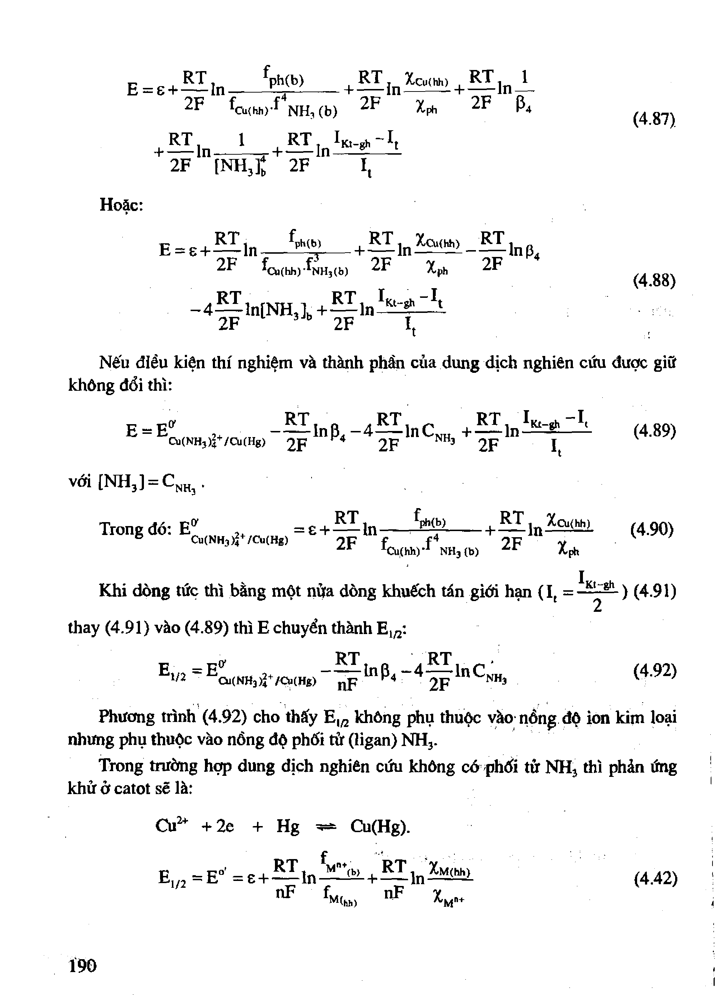

## Page 188

fM"V, = fo.ỉ+(b> và Xw{hh) = Xc“<*w vào (4.42) được:
E i/2 = £ + —
ta XOKWO. 
(4.93)
1/2
íhh) 
/vCu':
2F 
foi{hM 
2F 
tr
Vậy hiêu của (4.92) và (4.93) bằng:
^ 1 / 2  =  ( ^ 1 / 2  )ph 
( ^ 1 /2  ^tự do-trần
= e+ — ln-----% *-----+—
lnp4- 4 — l nCNH - £
2F 
ícu(hh)* 
n h3 (b) 
2F 
Xph 
2F 2F nh’
- Ịg l n ^ 2^  -j*Ịlrt-Xcu(hh) 
(4 94)
, 2F 
2F 
Xa,-
R T j  
^ “(hh) '^PW^Cu^t,, 
R T j  
Xcu(Hh)-%C||2+
ícu(hh)'^ NHj{b) 
2 F  
Xcú<hh)-5Cph
RT
RT
2 F lnP4 - 4 ^ , n C NHi
R T  
W ) - fQ.í+(11) 
R T 1 ■ Xq.ĩ* 
R T  
. R T  
ÁE.„ = --£-ln— V —-  ' + —f - ln - 5*-— -~£-lnB4- 4 —£-lnCNH 
(4.95) 
'• 
2F 
f 4NH3(b) 
2F 
Xph 
2F 
2F 
nh>
-  
Thông thưcmg trong một thí nghiộm nghiên cứu cụ thể tiến hành ở điều kiện 
thực nghiệm không đổi (lực ion, pH, phối tử tạo phức...) suy ra thành phần dung 
dịch không đổi dẫn đến: i f ^  = fm} = f* = 1; X 
= Xph thí (4.95) chỉ còn:
AE1/2 = - ^ l n P 4- 4 ^ 1 n C NH3 
(4.96)
Nếu thể hiện ờ dạng tổng quát: 
.
RT 
RT
A E ^ - ^ l n f t - p ^ l r i C ^  
(4.97)
Trong thực tế phức của đa số các ion kim loại với pác phối tử vô cơ hoặc hữu 
cạcó hằỊig số bền lớn hơn 1 rất nhiều. Cho nện biểu thức (4.96) cho thấy p4 »  Ị 
dẫ» đến. AE|/2 < 0 yà-sự tạp phức làm chuyển dịch thế nửat sóng theo chiều ầm. Tùy 
theo bản chất của ion kim;loại và phối tử mà hằng số bền của phức lạo thành là
191

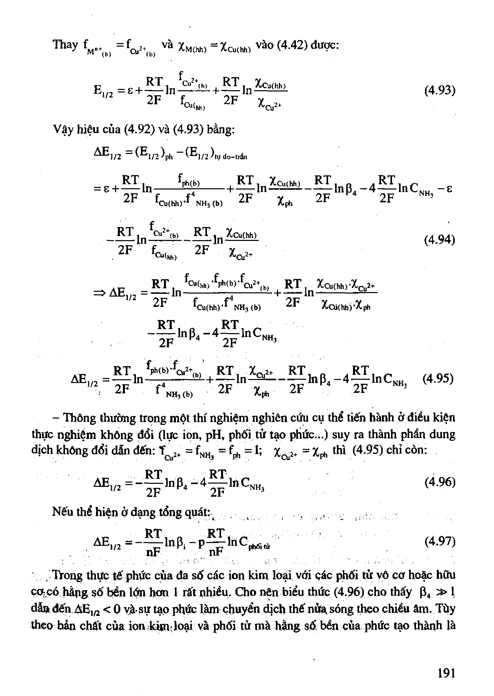

## Page 189

khác nhau, do đó độ chuyển dịch cũng khác nhau tùy thuộc vào bản chất iori kim 
loại và phối tử. Tính chất này được dùng để tách các kim loại có thế nửa sóng gần 
nhau để xác định nồng độ của chúng.
Để tiện cho việc tính toán người ta chuyển sang logarit thập phân và ở nhiệt độ 
cố định (ví dụ 30°C) được:
AE„2 = - p —
I g C ^ - ^ i g P ,  
(4.98)
n 
1 
n
í ^
-  = -P -l8 Cpha,t4 -lg P 1 
(4.99)
Vì E0/2) của lẩn thêm phối tử lần sau < E(l/2) lần trước, vậy có thể viết:
~ ^ 0 0 6 2’ = ~p'lgCphđi* ” I g h 0 ặc : n<H)6 i  = p'lg ° * * tử + lfiPi 
(4-100)
=>yxs a *C>c+b 
với a = p, Cx 
và b -  lgp ị.
Biểu thức (4.100) rất thuận tiện cho nghiên cứu sự tạo thành phức chất trong 
dung dịch, ví dụ như xác định số phối tử (p) tham gia vào tạo phức hay thành 
phần của phức, hằng số bền của phức (Pj) bằng phựơng pháp cực phổ đối với các 
phức không mang màu mà phương pháp đo quang không thể thực hiộn được.
Với điều kiện nồng độ của phối tử dư rất nhiều so với ion trung tâm và khi đó 
có thể chấp nhận nồng độ cân bằng, bằng nồng độ ban đầu ([Cphrt tJ = Cph(Si ri). Nếu 
không thấy có sự phụ thuộc tuyến tính giữa sự chuyển dịch thế nửa sóng vào nồng 
độ phối tủ thêm vào thì trong hệ có mặt các quá trình tạo phức khác, phức tạp hơn 
nhiều so với giả thiết ban đầu chỉ tạo thành một phức duy nhất. Thông thường xấy 
ra hiện tượng này cũng có thể có sự tạo phức tùng nấc trong hệ (được nghiên cứu 
trong các học phần tiếp theo).
5. Cách thể hiện đuờng cong (sóng) cực phế
Có hai cách thể hiện (vẽ) đường cong cực phổ.
5.1. Thể hiện tên đồ thi sự phụ thuộc cường độ đòng vào thế (I = f(-E)Ị
Cho biển thiên thế E (quét thế vốỉ 0,1 v/giãy) theo chiều âm đần đồiíg tKời đo 
cường độ dòng li- Tiến hành đo từng điểm sau đó thể hiện lên đồ thị trục tung là 
gíá; trị Ij, trục hoành Ià -E;; nối cấc điểm với nhau thu đuợc cạc phổ đổ hay đưòng 
cóng cực phổ hoặc sống cực phổ. Cắc máy cực phổ ngày nay có lắp bộ phận ghi
192

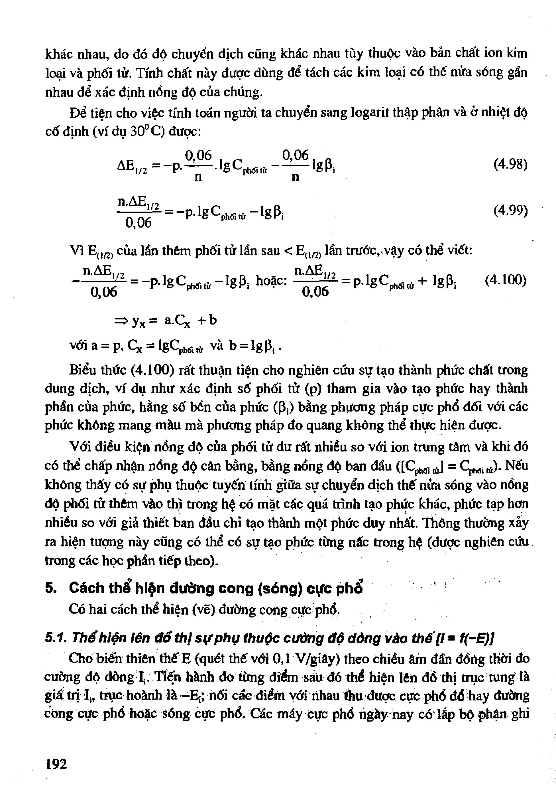

## Page 190

tín hiệu tự động, chỉ cần ra lệnh máy tính sẽ hiển thị cực phổ đồ ra màn hình như 
biểu diễn trên đường (1), (2) trong hình 4.8. Phương pháp này được gọi là phương 
pháp cực phổ trực tiếp (thường). Cực phổ đổ thu được từ phương pháp trực tiếp 
cho biết điểm uốn chính là Eị/2, chiều cao của dòng khuếch tán được tính từ đường 
nền đến dòng khuếch tán giới hạn.
5.2. Thể hiện lên đổ thỉ phụ thuộc —  vào -E (Cụtĩ phổ vi phần)
uE
Đồ thi biểu điễn su phu thuôc —  vào -E  (đường (3), hình 4.8) thu đươc cưc
dE
phổ đồ gọi là cực phổ vi phân.
Từ (4.43) ta có: E - E 1/2 = —
l n ( V - l)  
(4.101)
= > I = ------------~
r - ------- 
(4.102)
l + e x p [^ (E -E I/2»
Lấy đạo hàm (4.102) của I đối vớiE:
_  ^ K texP’k-(E ~ ^ 1/2) 
ị* jQ g\
dE 
[l+ ex p k tE -E ,^ )]2
At 
ỊiF
ơ  đây đặt k = 
, và lấy đạo hàm bậc hai được:
RT
i !  = I . k 2 expk(E- E ị,2){2expk(E-  E „2) - j l  + expk(E- E ƯĨ)]} 
dE3 
“  
|Ị+ ex p k (E -E l/1) f
KhiE = E1B U ủ^ = O v à i |  = - - J | j;III1=max 
(4.105)
Thế E tương ứng với giá trị cực đại của đạo hàm '4— chính ỉà„ giá trị thế nửa'
dE
sóng Ẹ1/2, giá trị thế này chỉ ptìụ thuộc vào bản chất của chất cần xậc định, chiềư
cao của cưc đai —  tai thế nửa sóng Eyn tỉ lê với cường độ dòng khuếch lán giới 
dE 
■
hạn (IKHCh) và do đó nó cũng tỉ lệ vói nồng độ chất điện hoạt (chất cần xác định •
nồng độ) trong dung dịch.
Phương pháp cực phổ Vi’ phân ứu điếm hơn hẳn phương phấp, íửc phổ trục1 tiếp
trong một số Irứờng tìợp cho phép xẩc định được cád chẩt có thế nửa sóng gầri
, ỉ 93

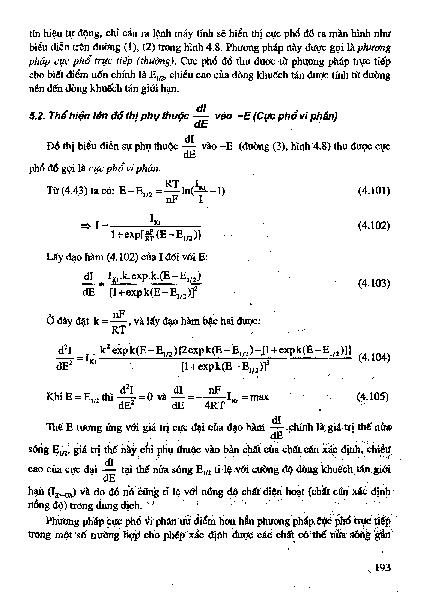

## Page 191

nhau, khi đó nếu đùng phương pháp cực phổ trực tiếp thì không thể thấy rõ các 
điểm uốn riêng lẻ trên sóng.
Ví dụ: Trên nền KNOj 2M có thể xác dính riêng rẽ Pb2+ có thế nửa sóng 
Em = -0,44V  và TT có thế nửa sóng Ew = -0,50V. Như vậy có thế xác định được 
khi thế nửa sóng chĩ khác nhau 0,060V hoặc trên nền KQ 0,1M có thể xác định 
riêng rè Zn2+ (El/2 = -1,00V) và Ni2* (El/2 = -1,085V) có thế nửa sóng chỉ khác 
nhau chỉ 0,085V (hình 4.8).
Hình 4.8. (1) Cực phổ đổ trực tiếp của một chất
(2) Cực phổ đổ trực tiếp của hai chất cố thế nửa sóng gần nhau
(3) Cực phô đổ vi phân của hai chất có thế nửa sóng gần nhau
Phương pháp vi sai còn có ưu điểm là có thể xác định chính xác cực đại đạo 
di
hàm —  không bi ảnh hường của dòng dư. 
dE
6. ứng dụng của phương pháp cực phổ
Phương pháp phân tích cực phổ có thể xác (iịnh hầu hết các chất vô cơ và rất 
nhiều chất hữu oớ có khả năng bị khử ò catot hoặc bị oxí hoá ở anot, các chất có 
thể tồn tại ờ dạng ion hoặc dạng phân tử. 
í
Người ta ứng dụng phép phân tích cực phổ vào nghiên cứu và phân tích xác 
định hàm lượng cấc chất trong hầu hết các ĩĩnh vực và cáp ngành như kiểm tra chất 
lựqnig .sản phẩm tnrôc khi xuất xưộng ví 4ụ như.B,, Ba, B6 .; trong ngành dược, xác 
định hàm lương các kiĩri loại nặng ựọDậ.nưdíc sinh hoạt trpng lĩnh vực môi tmờng.
m

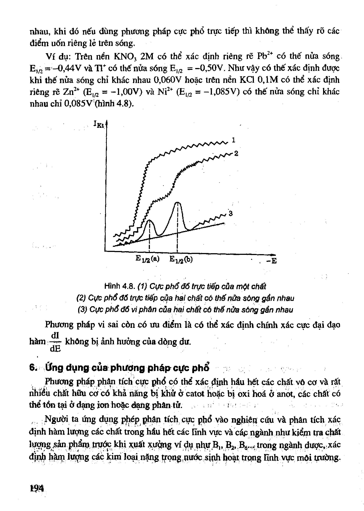

## Page 192

Xác định các độc tố như asen, kim loại nặng trong rượu, bia, trong lương thực, 
thục phẩm và trong máu, trong gan liên quan đến an toàn thực phẩm và pháp y...
Ngoài lĩnh vực phân tích ra, phương pháp cực phổ cũng được ứng ^.ạng để 
nghiên cứu trong các lĩnh vực khác như động hoá hoc, cơ chế của các phản ứng 
môi tìm ra, sự chuyển dịch các cân bằng, sự hấp phụ đặc biệt là sự hấp phụ của các 
phối tử hữu cơ cho thêm vào khi điộn phân. Nghiên cứu cấu tạo của các chất hữu 
cơ mới tổng hợp được, xác định số phối tử, thành phần và hằng số bền của của 
phức chất tạo thành trong dung dịch, đâc biệt là phức không màu, không thể xác 
định bằng phương pháp đo quang.
Phương pháp phân tích cực phổ được ứng dụng trong hầu hết các ngành vì 
phương pháp có độ nhạy cao có thể phát hiện tói nồng độ ÌO^M và có độ chọn lọc 
cao (có-độ phân giải lớn) có nghĩa là có khả năng tách cực phổ đổ của các nguyên 
tố'có tính chất gần giống nhau rất tốt (xác định được khi thế nửa sóng của chúng 
cách xa nhau từ 0,2V). Ngoài ra phương pháp với thiết bị tương đốì đom giản thao 
tác không phức tạp, thể tích dung dịch mẫu cẫn rất ít. Trohg thực hành nghiên cứu 
có thể sử dụng các chất oxi hoá hoặc khử có nổng đổ từ 10"s đến ÌO^M, nhưng 
thường dùng nhất là các chất có nồng độ từ 1CT3 đến ltn^M sẽ mắc sai số ít hơn.
Sau đây sẽ trình bày chi tiết một số ứng dụng cụ thể của phương pháp cục phổ.
6.1. Phân tích định tinh bằng phương pháp cục phổ
Trong phân tích định tính saụ khi đo, vẽ đường, cong (sóng) cực phổ và dựa 
vào đó xác định thế nửa sóng, tra bảng để tìm xem nguyên tố nào có chế nửa sóng 
tương ứng vói thế tìm được trên nền đã chọn. Để xác định thế nửa sóng, kéo dài 
các phần đưòng thẳng a và b trước và sau sóng trên đưòng cong cực phổ, sau đó kẻ 
một đường thẳng chia dôi khoảng cách giữa chúng. Giao điểm của đường c nặy 
với đường cong d chiếu xuống trục hoảnh sẽ cho thế nửa sóng. Thế nửa sóng 
thường được đo so sánh với điện cực Sữ sánh không phân cực như điện cực 
calomen bão hoà. 
* 
'
Hiện nay trong các mẩy cực phổ đa năng đã cài sẵn các phần mềm xắc định 
điềm uốn của đường cong cực phiổ I = f(-E), đỉnh pỉc của đựờng cực phổ vi phân
-7-  = f(-E ) tương óng với thế nừa sóng (Ẹịo). Sau khi máy vẽ xong, người do ra 
dE
lệnh cho mầy'tfnh Ấằc đính đỉểnti ứốii (thế iiửa sóng)v Máý tính rất nhanh cỀoríg 
cho kết quả ra màn hình, ngưòi đo ra lệnh tiếp: Các thế nửa sóng xác định đtrợc
195

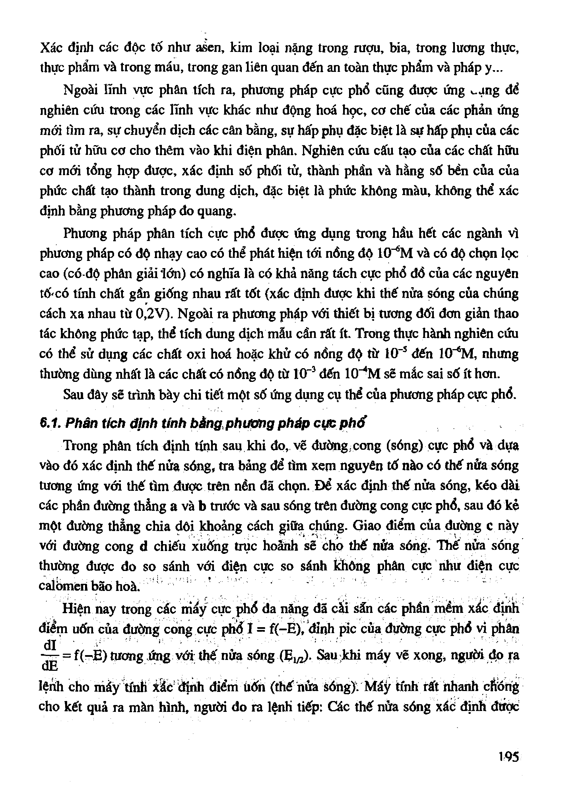

## Page 193

tương ứng với ion nào. Máy sẽ tìm trong thư viộn của phần mềm và trả lời kết quả 
ra màn hình trong một vài giây, không phải xác định thủ công như trên rất thiếu 
chính xác và không khách quan. Nhờ có tính ưu việt như trên, phương pháp cực 
phổ có thể thay thế phương pháp cổ điển (bằng nhỏ giọt như phương pháp H3S hay 
axit -  bazơ) xác định định tính các chất có trong dung dịch.
Hình 4.9. Xác định thế nửa sóng (E1/2)
Để xác định chính xác thế nửa sóng phải tìm mọi cách loại trừ cực đại, đuổi 
hết oxi -tan trong dung dịch righiên cữu Ịíằngkhí trơ, loại chất cản trờ (đến dưới 
giới hạn ảnh hưởng) có thế nửa sóng gần vói thế nửa Bóng của chất cần xác định 
bằng cách che, chiết loại chất cản trở hoặc chuyển chất cản trở vào phức có thế 
nửa sóng âm hớh nhiều sọ với chất cẩn xác định. Ngoài ra còn phải loại trừ dòng 
tụ điện.
6.2. Phăn tích định lượng bàng phương pháp cục phổ
6. 2.1. Phương pháp đường chuẩn
Tiến hành đo, vẽ đường cong cục phổ của một dãy dung dịch chuẩn cọ thành 
phẩn giống nhau và vối nồng độ chất cần xác định tăng dần, sau đó xác định chiều 
cao của các đường cong (sóng) cực phổ thu được và vẽ đường chuẩn thể hiộn sự 
phụ thuộc Ij (hi) vào Cj. Dựa vào đường chuẩn này người ta xác định nổng độ chất 
cần xác định trong dung dịch X, sáu khi đã đo độ cao của đường cong (sóng) cực 
phổ Ivcủa dung dfch này (X) trong cùng điều kiộn thực nghiệm như khi đo với các 
dung dịcKchuẩn.
196

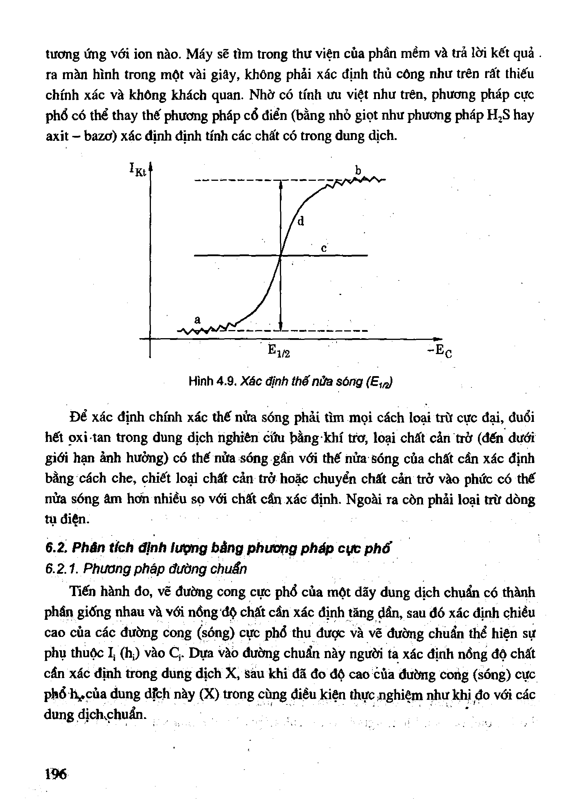

## Page 194

Ví dụ: Xác định nồng độ đồng(II) bằng phương pháp đường chuẩn-cực phổ
ỉ-  Cách tiến hành
a. Pha thang chuẩn:
Dùng pipet lấy chính xác 2, 3, 4, 5, 6, 7 và 8ml dung dịch chứa Cu2+ 4.10"5M 
cho vào 7 bình định mức có dung tích 50ml thêm dung dịch đệm (NHtQ + NH3)
0,5 M, pH = 9-^10 (đùng làm nền) đến vạch định mức, lắc lã cho đều dung dịch.
b. Pha dung dịch nghiên cứu:
Dùng pipet cũng lấy chính xác 3,5ml dung dịch nghiên cứu chứa Cu2+ cho 
vào bình định mức 50ml, cũng định mức bằng đung dịch đệm như trên đến vạch 
định mức.
c. Vẽ phổ đồ cực phổ:
Rót lẩn lượt các dung dịch vào cốc, đo cực phổ. Cho 0,5g Ní^sc^ (môi trưòng 
kiềm cho NajSC^ tươi để đuổi oxi: N^SOj + 1/20; —► Na2S04) tinh thể lắc kĩ đến 
khi tan hết, thêm tiếp 1 - 2  giọt gelatin 0,5%. Đo một dãy dung dịch chuẩn trước, 
sau đó đo dung dịch nghiên cứu. Ghi cực phổ đồ bằng phương pháp vi phân ở độ 
nhạy 12.10"9 trong khoảng thế +0,2V + -2V  trên máy cực phổ O H -102- do 
Hungari sản xuất hoặc 797 VA Computrace. Dựa vào cực phổ đổ lấy thước đo 
chiều cao của từng sóng cực phổ. Các kết quả đo và tính toán đuợc ghi trong bảng
4.2.
Bảng 4.2. Sự phụ thuộc chiều cao ơòng khuếch tẩn (hj vào nồng độ đổng(ll)
Bình
V (ml)
C(.105M trong 50mỉ
C,.106M
h, (mm)
1
2
8
1,6
1,2
2
3
12
2,4
1,9
3
4
16
3,2
2,45
4
5
20
4,0
3,20
5
6 
-
24
4,8
3,85
6
7 
...
28
5,6
4,50
7
8
32
6,4 
.
5,10
2 -  Tìm phượng trình đường, chuẩn bằng vẽ đồ thị
Dựa vào kết quả đo được chiều cao của pic cực phổ đổ vi phân vào nồng độ 
đồng(II) chuẩn, vẽ đồ thị trên giấy kẻ ô vuông hoặc trên máy vi tính đã có sẵn 
phần mềm Excel, đồ thị được thể hiện như hình 4.10.
197

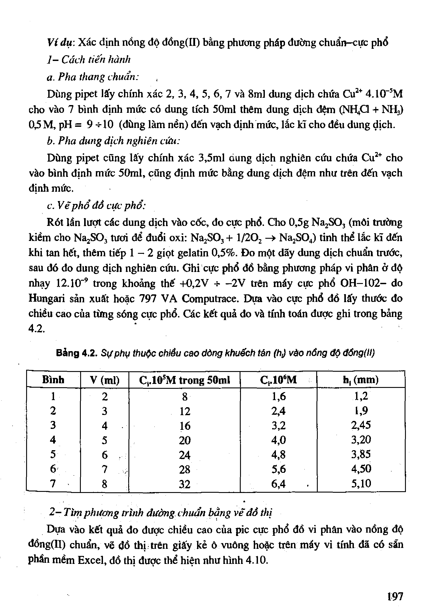

## Page 195

hi (mm)
' Hình 4.1 ũ. Sự phụ thuộc hị vào 
3 - Tìm phương trình đưởng chuẩn bằng xử lí thống kề
a. 
Sử dụng máy tính cầm tay tính toán xử lí số liộu theo phương pháp hồi quy
tính theo cách kẻ bảng sau:
Bảng 4.3. Cốc kết quả được xử lí thống kỗ
Bình
Vml
C|.10+s/50
C|.10*M
CJ.1011
h, (mm)
Cj.hi.106
1
2
8
1,6
2,56
1,2
1,92
2
3
12
2,4
5,76
1,9
4,56
3
4
16
3,2
10,24
2,45
7,84
4
5
20
4,0
16,60
3,20
12,8
5
6
24
4,8
23,04
3,85
18,48
6
7
28
5,6
31,36
4,50
25,20
7
8
32
6,4
40,96
5,10
32,64
n = 7
IC , = 28
IC  2 = 
130^52 10"12
B v =
' 22,2
103,44.10"*
và (£Cj)2 = 784.10 12, thay các số liệu vào công thức sau tính a và b
198

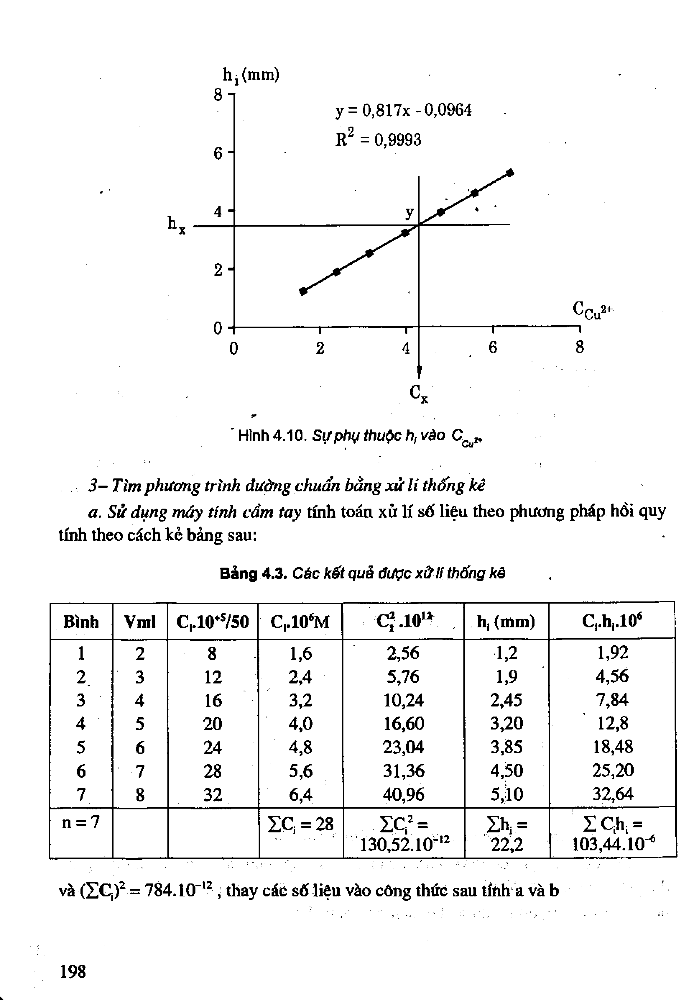

## Page 196

Aa 
nSCj.h'-ZCj.Zhj 
a '  A " 
nSCf-CSCj)2
= 790496,7603;
(4.106)
(4.107)
Thay a và b vào được phương trình đường chuẩn: 
tV a , - = 7W 497-Cc , - +0-W‘M
(4.108)
b. 
Vẽ và xử ỉí thống kê các số liệu theo phương pháp hồi quy tuyến tính trên 
phẩnmềmExcel 
'
Mờ phần mềm Excel, nhập các số liệu Cj, hj và thực hiện một yài thaọ tác sẽ 
nhận được phương trình hồi.quy tuyến tính -  đó chính là phương trình đường chuẩn:
V. Bằng xử lí thống kê các số liệu theo phương pháp hồi quy tuyến tírth đã 
được lập trình theo ngôn ngữ Pascal (Xem chương trình tính’ở phần 12 -  Phụ lục) 
Bật máy tính, mở NG, mở chương trình đã lập sẵn, nhập các số liêu Cị Và h; và 
thực hiện mộĩ vài thao tác sẽ nhận được phương trình đửòng chuẩn:
h _ 2f.= (817000± 244600).c 2+ + (0,0964± 0,0547) 
(4.109)
Chú ý: Các phương pháp khác nhau xử lí, xác định được a và b khác nhau 
nhưng không đáng kể, có thể chấp nhận được.
h 
=817000.c 2++ 0,0964
X -C u 
Q i 
’
y = 0.817x-0.0964
-  0.9993
4 -
c đỒngỢI).e6
i
0
0
2
4
6 
8
Hình 4.11. Sự phụ thuộc hỊ vào nồng độ đổng(ll).
199

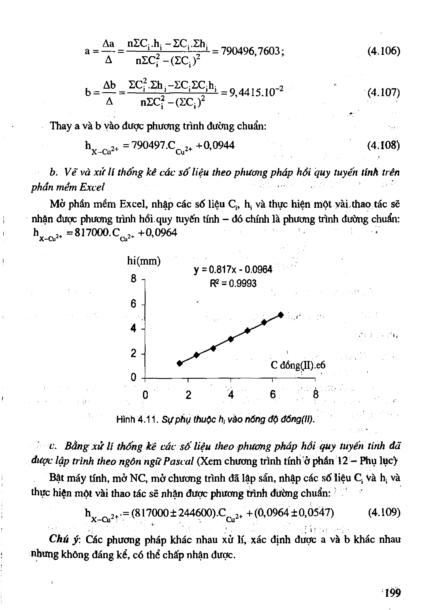

## Page 197

4 - Xác định nồng độ đồngịll)
Xác định nồng độ đồng(II) bằng một ữong các cách sau:
a. Bằng đồ thị:
Đo, vẽ đồ thị nhu hình 4.10. Từ giá trị hx trên trục tung kẻ đường song song 
với trục hoành cắt đường chuẩn ở y, từ y kẻ đường thẳng song song với trục tung 
cắt trục hoành ở đâu, vị trí đó chính là Cx. Cách này không khách quan, những 
người khác nhau có cùng số liệu Cj và hj, vẽ đồ thị, xác định sẽ cho kết quả khác 
nhau, chính vì vậy phương pháp này ít được sử dụng.
b. Bằng cách tính thống kê:
Hiông dụng nhất là xủ lí thống kê (khắc phục được nhược điểm trên) tìm được 
phương trình đường chuẩn với các hộ số a và b, sẽ tính được nổng độ của dung
dịch nghiên cứu như sau: hx = a.Cx + b => Cx = 
k 
(4.109)
a
Thay hx =3,5 vào (4.108) tính được:
3 5 - 9  4415 10"3
C = - ’ -  ’ 
-  
■ -4,41565.10 M. 
(4.110)
°* . 
790496,7603
Còn thay h* vào (1.109) được 
= 4,27217. ÌO^M (4.111)
817000
Tĩnh 
theo hai cách cho kết quả khác nhau không nhiểu có thể chấp 
nhân được.
6.2.2. Phương pháp mẫu tiêu chuổn
1. Cách tiêh hành;
Đo, vẽ đưòng cong cực phổ của dung dịch tiêu chuẩn (TC) có Cjc (mol// hoặc 
mg/o đo chiểu cao được hTC (mA hoặc mtn), Vẽ đường cong cực phổ của dung 
dịch nghiên cứu X có Cjj (mol//, mg//) đo chiều cao được hx (mA, mm).
2. Điều kiện:
Cùng điều kiện thực nghiộm. nhu nhau (nền, thể tích dung dịch, pH, khoảng 
quét thế, tốc độ quét thế...).
3. Cách tính:
Ví dụ Crc = 4.10-5M, đo được: hTC = 7,6mA 
Cx = ? đo được: hx = 12,2mA
Xuất phát từ tỉ lệ: 
= 
c v =9.tqK  = ± l2 y ì2il  = 6,421 Ì.IO^M
CTC 
hTC 
hTC 
7*6
V 
(4.112)
<200

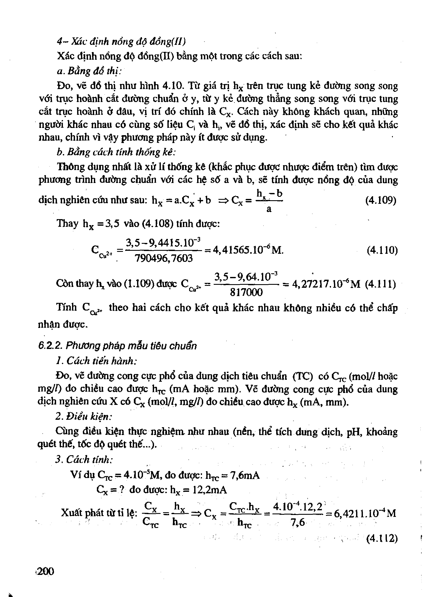

## Page 198

Chú ý: Để xác định chính xác độ cao của đường cong (sóng) cực phổ, người ta 
vẽ đường cong (sóng) cực phổ của dung dịch nền nguyên chất, sau đó vẽ đường 
cong (sóng) cực phổ của dung dịch chứa nền và chất điện hoạt ờ cùng một giá trị 
thế (trong khu vực dòng khuếch tán giới hạn), xác định độ cao của sóng như là 
hiệu giữa đòng khuếch tán giói hạn của dung dịch nghiên cứu và dòng của nền. 
Phương pháp này ít được sử dụng vì chỉ so sánh hai dung dịch, mắc sai số lớn 
không xử lí được bằng thống kê.
6.2.3. Phương pháp thêm chuẩn
Cơ sở lí thuyết của phương pháp:
Chuẩn bị hai binh định mức y  = 25ml sạch. Cho vào hai bình cùng một lượng 
dung dịch ( v° mi) nghiên cứu có nồng độ Cx-
Bình 2: Thêm vào một lượng v c dung dịch chuẩn của chất phân tích (C °) Sau
đó cho phối tử, dung dịch nền ở điều kiện tối ưu như nhau (chỉnh pH đến pH cần 
đo) và định mức tới vạch bình đinh mức.
Với bình ỉ : ta CÓCX -  
(4.113) (V: Thể tích của bình định mức)
c 0 v ° 4-r ĩ  v°
Với bình 2: Cx+c = 
c '—  = CX+C c 
(4.114)
Đo chiếu cao của dòng khuếch tán của bình 1 và bình 2 vói cùng điều kiện 
tối ựu:
Bình ỉ: IX = K.CX
Bình 2: Ix+C= K.Q+C =K.(CX + Cc)
Chia (4.115) và (4.116) từng vế cho nhau ta được:
Ix _ 
c x 
£  _ Ix-Cẹ
^x+c 
^■'X + c  c 
Ix+C — Ix
Điều kiện; Cần chọn v c sao cho độ cao sóng cực phổ Ix+C gấp đôi so với dung 
dịch phân tích Ix thì kết quả phân tích mắc sai số ít.
Chú ý: Nếu như dung dịch cần xác định có nồng .độ nhỏ thì tiến hành ngược 
lại, nghía là lấy v c trước sau đó thêm v x. Phương pháp thêm chỉ áp dụng được 
trong khu vực nồng độ có sự phụ thuộc tuyến tính giữa Ij và Q.
Ví dụ: Xác định hàm lượng nitrit bằng phương pháp thêm chuẩn trong mẫu 
tự tạo.
(4.115)
(4.116)
(4.117)
201

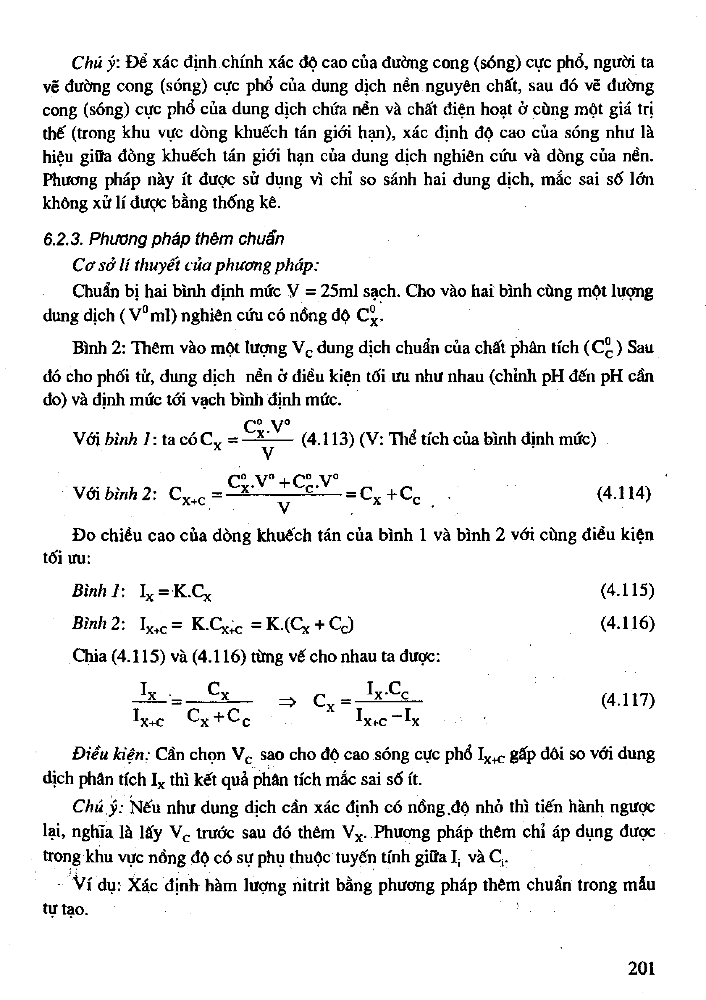

## Page 199

Nhằm mục đích kiểm tra độ chính xác của phương pháp thêm chuẩn, đa dạng 
hoá các phương pháp xác định nitrit trong nước, chúng tôi tiến hành xác định nitrit 
trong mẫu tự tạo.
1. Cách tiến hành:
Chuẩn bị 3 bình định mức 25ml và cho v° và v° ml dung dịch chuẩn NaN02 
ÌO^M theo bảng 4.4.
Bảng 4.4. Thể tích NaN02 1&AMcho vào mỗi bình
Bình
V" .ml 
(ÌO^M)
Cx.105 
cho vào
v “.ml
(ÌO^M)
Cc.10s
I,
Cx.lí^xác 
định được
Sai số tuơng 
đối (q%)
1
3,75
1.5
0,0
0,0
0,536
; 1,463
2,45
2
3,75
1,5
1,0
0,40
0,676
3
3,75
1,5
2,0
0,80
0,828
Tiếp theo điều chỉnh đến pH — 1,5 (tối ưu) bằng CH3COOH 98% và địrih mức 
đến vạch bằng nước cất hai lần. Sau đó, đem đo, vẽ đường cực phổ xung vi phân 
của từng bình trên máy cưc phổ vạn năng VA Computrace ở điều kiộn tối ưu. Xác 
định chiếu cao của pic cực phổ xung vi phân, từ các giá trị chiều cao của pic cực 
phổ xung vi phân (Ip_j) tương ứng với mỗi nổng đô (Cj) trong dung dịch, rồi vẽ đồ 
thị Ip_j phụ thuộc vào nồng độ Cj.
2. Tìm phương trình đường thêm chuẩn bằng phương pháp xử lí thống kê
a. 
Sử dụng máy tính cầm tay tính toán xử lí số liệu bằng phương pháp hồi 
quy tính theo cách kê bảng sau.
Tương tự như phương pháp xử lí đường chuẩn. Các kết quả được xử lí thống kê 
thể hiộn trong bảng 4.5.
Bảng 4.5. Các kết quả được xử tí thống kỗ
ÍT
c ,2.1010
I,(mA)
C^Ij.lO5
1
0,0
0,536
0,0
0,0
2
0,4
0,676 
:
0,16
0,2704
3
0,8
0,828
0,64
0,6624
n = 3
s q  = 1,2.10"S
ZCj2 = 0,8.10-10
21; = 2,04
IQ I, = 0,9328.10 5
và (SCj )2 = 1,44.10' 10
202

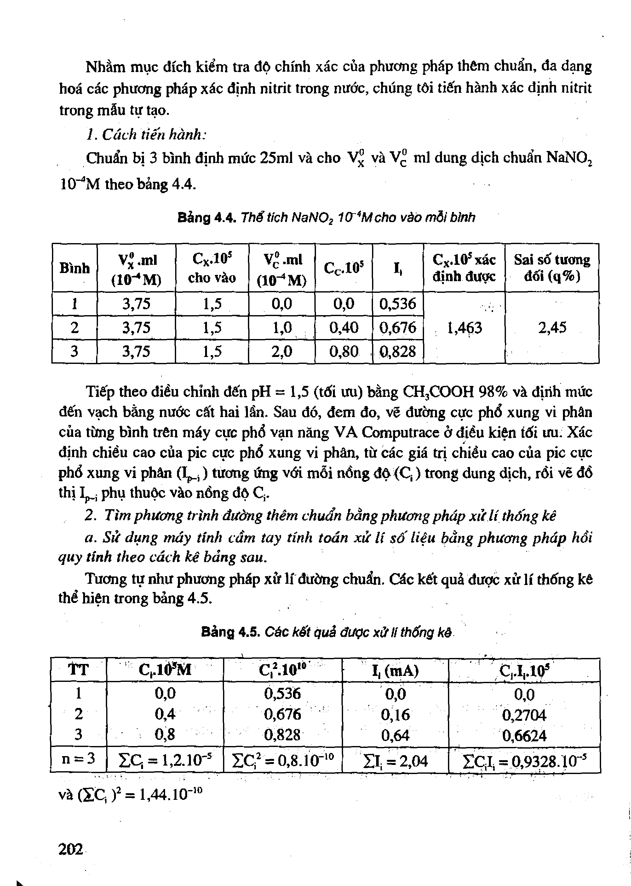

## Page 200

Thay các giá trị vào công thức (4.106), (4.107) tính được: a = 0,365.10s và 
b = 0,534. Thay a và b vào phương trình trên được:
I 
= a.c + b = 0,356.105.c 
+0,534 
(4.118)
NOj 
NOj
b. 
Vẽ và xử lí thống kê các số liệu các phương pháp hồi quy tuyêh tính trên 
phần mềm Excel:
Dựa vào kết quả đo được chiều cao của pic cực phổ xung vi phân vào nổng độ 
' nitrit chuẩn, chúng tôi vẽ đồ thị trên giấy kẻ ô vuông hoặc trên máy vi tính đã có 
sẵn phần mềm Excel. Đồ thị được thể hiện trên hình 4.12.
Bảng 4.6. Sự phụ thuộc lpjC cực phổ xung vi phàn vào nống độ dung dịch chuẩn thêm vào
TT
C| (chuẩn).10SM
Ip_, (mA)
1
0,0
0,536
2
0,40
0,676
3
0,80
0,828
Ip -ch u ân
c. 
Bẳng xử lí thôhg kề cắc số liệu bằng phương pháp hồi quy tuyến tính đã 
được lập trình theo ngôn ngữ Pascal (Xem chương tính ở phân 12 -  Phil lục)
Bật máy tính, mở NC, mở chương trình đã lập sẵn, nhập các số liệu Cj-, lị và 
thực hiện một vài thao tác sẽ nhận được phương trình đưòng chuẩn:
203

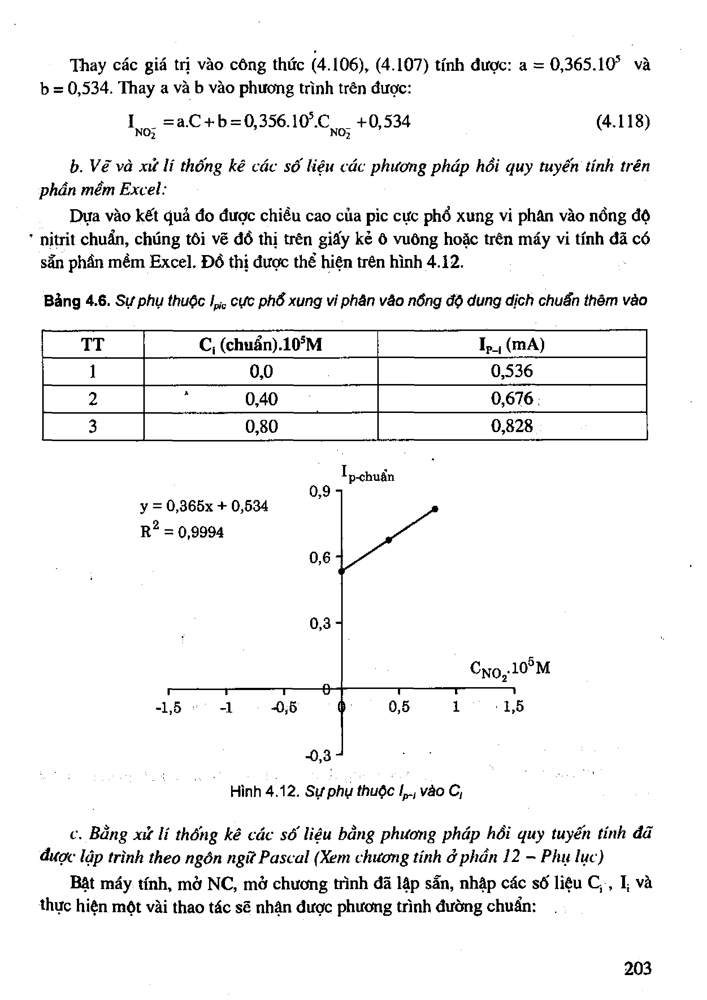

## Page 201

I _ =(0,356±0,037). 105.C 
_+(0,534±0,019)
(4.119)
3. Xác định nồng độ nitrit
a. Cách 1 bằng đồ thị:
Đo, vẽ đổ thị như hình 4.13, sau đó kéo dài đường thêm chuẩn xuống phía trục
hoằnh cắt trục hoành ở chỗ nào chỗ đó chính là c  
hoặc từ điểm 0 của trục tọa
n o2
đô kẻ đ ư ờn g  thẳng X song song vói đường thêm chuẩn Ip_i = f(Cị) và từ a (đư ờng 
ch u ẩn  c ắt trục  tu n g ) k ẻ đ ư ờn g  th ằn g  y  so n g  so n g  với trục h o à n h  c ắt đ ư ờn g  X ở b và 
từ b kẻ đường thẳng z song song với trục tung cắt cắt trục hoành ở c. Độ dài từ 0 
đến c chính là c  _ (Xem ữên hình 4.13 và kết quả trong bảng 4.6). Cách này đoc
NƯ2
giá tri cắt ở trục hoành không chính xác, không khách quan ít được sử dụng.
^p-chuẩn
0,9 1
y = 0,365x + 0,534 
R2 = 0,9994
0,6 -
b
X
y
z
CNO!.106M
/
s
y
s
s
'  
0,3 -
/
s
s
X
y
s
a
/
/
/
/
/
/
s'
s
s
s
/
s
1 
1" 
T" 
Q,-"
c 
-1,5 
-1 
-0,5 
1
-0,3-
ế 
1...... '1
) 
0,5 
1 
l, i c
Hình 4.13. Xác định nồng độ nitrit bằng đô thị.
ị>. Cách 2:
Thay các giá trị Cc; Ix; Ix+C vào công thức (4.117) tính được kết quả ghi trong 
bảng 4.7;
204

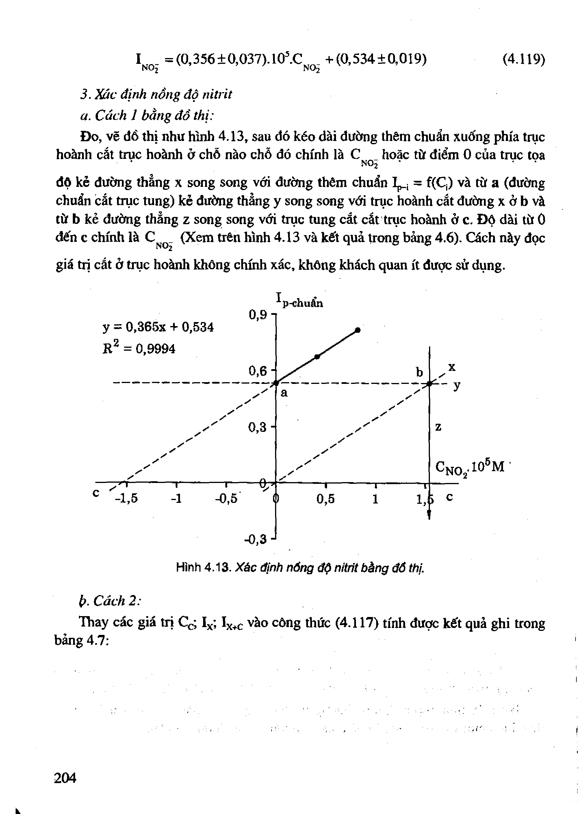

## Page 202

Bảng 4.7. Tinh nổng độ NaNOĩ vá sai số tương đối
Bình
v° 
(ml) 
ho vào
c x.10s
Cho
vào
v°
;c'
(ml).
Cc.105
ỈXtC
Ix+C-  Ix
Cx.105
xác
định
được
Sai
số
tưong
đối
(q%)
]
3,75
1,5
0,0
0,0
II
o
Ix = 0,536
2
3,75
1,5
1,0
0,40
0,676
0,676 -  0,536 
= 0,140
1,5314
2,09
3
3,75
1,5
2,0
0,80
0,828
0,828 -  0,536 
= 0,292
1,4685
2,10
c. Cách 3:
Cho phương trình đuòng thêm chuẩn I 
(4.119) bằng khống (0) và giải tìm
NOi
O ^ S .ltf.C  
+0,534 = 0
NO ị 
’
Ị-b| = J-Ọ534L = 463 10, M .
N°ỉ 
a 
0,365.10s
Sai số giữa ỉượng nitrìt cho vào và xác định được là: 
(1,5-1,463)-10"5
q% = -
1,5.10
-5
-.Ị00% = 2,45%
(4.120)
(4.121)
(4.122)
Như vậy sai số nhỏ hơn 2,5% có thể chấp nhận được.
Tất cả các máy cực phổ đa năng hiện có trong các phòng thí nghiệm đã được 
cài phần mém xử lí thống kê số liệu đo đường thêm chuẩn như vừa trình bày 
nhưng có thêm phần mềm tính lại nồng độ khi cho thêm thể tích chất chuẩn và khi 
lấy kết quả sẽ thây đổ'thị như hình 4.13.
Như vậy. Phương pháp đường chuẩn cổ những ưu điểm sau:
-  Có thể loại trừ được những sai số bất thường do ngưòi ta đã tính toán theo 
phương pháp hồi quy tuyến tính (bình phương tối thiểu) và do đó đường chuẩn thu 
được là đường trung bình.
-  Khi cần phân tích hàng loạt mẫu có thành phần tương tự nhau thì phương pháp 
đường chuẩn tỏ rõ ưu việt lă nhanh và tốn ít hòá ổhất hơn phương pháp thêm chuẩn.

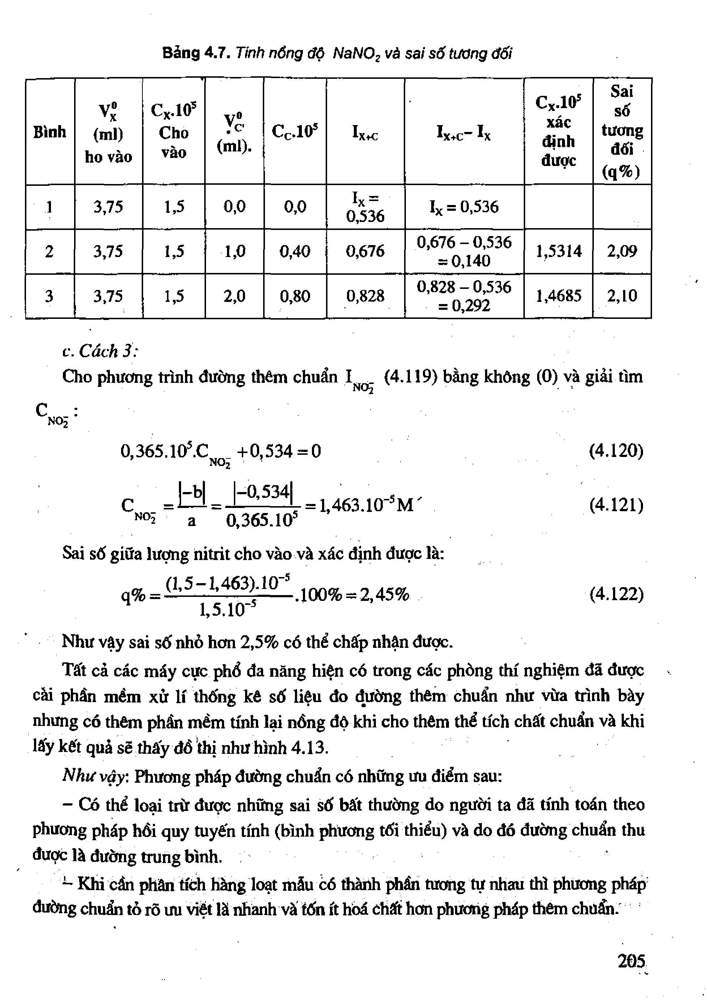

## Page 203

Phương pháp thêm chuẩn có ưu điểm nổi bật là thành phần dung dịch trước và 
sau khi thêm là hoàn toàn đồng nhất có nghĩa là loại được sai số do nền gây nên. 
Ngoài ra phương pháp thêm chuẩn nhanh hơn phương pháp đường chuẩn khi phân 
tích hàng loạt mẫu có thành phần khác nhau, nhưng cần chú ý sai số mắc phải. Chỉ 
những quy trình phân tích thật ổn định mới có thể dùng phương pháp thêm chuẩn.
Để khắc phục sai sót trong khi tiến hành bằng phương pháp thêm có thể thêm 
hai hoặc ba lần, sau đó sử dụng phần mềm Excel, nhập các số liệu Xj, y; và thực 
hiện một vài thao tác sẽ nhân được phương trình hổi quy tuyến" tính: yx = a. Cx + b,
xác định nồng độ chất cần phân tích như cách 3 trên. Hình 4.13 mô tả cách thêm 
hai ỉẩn.
6.3. Xác định số electron trao đổi (n) trong phần úng điện cục và kiểm tra 
tính thuận nghịch của phán úng đỉện hoá
6.3.1. Cách tiến hành
Lấy một bình định mức cho vào lượng Cu2+ và lượng N-etyl izatin p - metyl 
semicacbazon sao cho sau khi định mức có nồng độ 1,6.10 5M và lượng N-etyl 
izatin p-metyl semicacbazon 1,0.10'4, 10% etanol, đệm axetat natri có pH = 6,0; 
lực ion bằng 0,030. Chuyển toàn bộ hỗn hợp dung dịch vào bình điện phân, thêm 3 
giọt gelatin 0,1%, sục khí nitơ 20 phút. Ghi cực phổ đổ bằng phương pháp vi phân 
ở độ nhạy 12.10' 9 ừong khoảng thế +0,2 — -2V  trên máy cực phổ O H -102- do 
Hungari sản xuất hoặc 797 VA Computrace. Các kết quả đo và tính chiểu cao 
sóng cực phổ phụ thuộc vào thế ghi trong bảng 4.8.
Bảng 4.8. Sự phụ chiều cao sông cực phổ vào hiệu thế (Eị -  Em )
lị (mm)
15,0
20,0
30
,40
52,5
86,85
91,23
94,62
lg i 
- I
Gh
-0,778
-0,628
-0,398
- 0,211
0,0
0,68
0,82
0,96
(Er E1/2)V
0.Í80
0,195
0,200
0,210
0,220
.0,225
0,230
0,240
ở đây Ic, = 105mm và E1/2= -0,08V
6.3. 2. X ử lí s ố liệu và tỉnh số electron trao đổị
Để xác định số elecưon trao đổi n trong phần ứng điện cực và kiểm , trạ tính 
thuận nghịclí của phản ứng điện hoá, người ta dựa vào việc phâi\ tích logarit đường 
cong (sóng) cực phổ, Phượng trìọb (4.43) có thể viết dưới dạng: 
; 
,
206

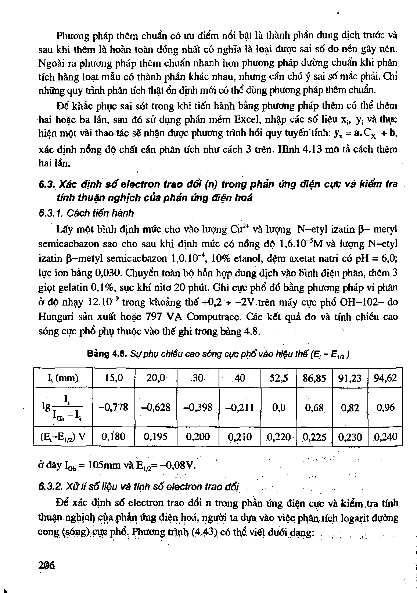

## Page 204

;E
3 T
= m 6-(E' " Ei'2)
K t(G h) 
t 
v , l / 0
yx — a.Cx + b
l . C á c h ỉ:
Sử đụng máy tírih cầm tay tính toán xử lí số liệu theo phương pháp hổi quy 
tính theo cách kẻ bảng sau:
Bảng 4.9. Cắc kết quả được xử li thống kẽ
TT
k ~  -II
E. 
E]/2
'
I 
- I
Gh 
4i
■Vi
c,
■cỉ
1
-0,778
0,180
0,0324
-0,14004
2
-0,628
0,195
0,0384
-0,1225
3
-0,398
0,200
0,0400
-0,0796
4
- 0,211
0,210
0,0441
-0,0443
5
- 0,0
0,220
0,0484 ;
0
6
0,68
0,225
0,0506
0,1530
7
0,82
0,230
0,0529
0,1883
8
0,96
0,240
0,0576
0,2304
n = 8
1 *  = 0,445
ZC| = 1,7
I Q 2 = 0,364
ZCj.yj = 0,1853
Thay các giá trị vào cồng thức (4.106), (4.107) tính được: a = 32,9818 và b =
6,9528. Thay a và b vào phương trình trên được:
lg— iu ^ c = 3 2 ,9 8 1 8 .(E i - E 1/2)-6,9528 
. ( , (4.124)
^Kt(Gh) —
2. Cách 2:
Bật máy tính, mở phần mềm Excel nhập các giá trị: lg-— —----- , ( E i -  Eiỵ2)
. . . ■ 
«• 
ỈKt(Gh)” ^t 
•
và thực hiện vài thao tác sẽ nhận được phucmg trình đường thẳng:

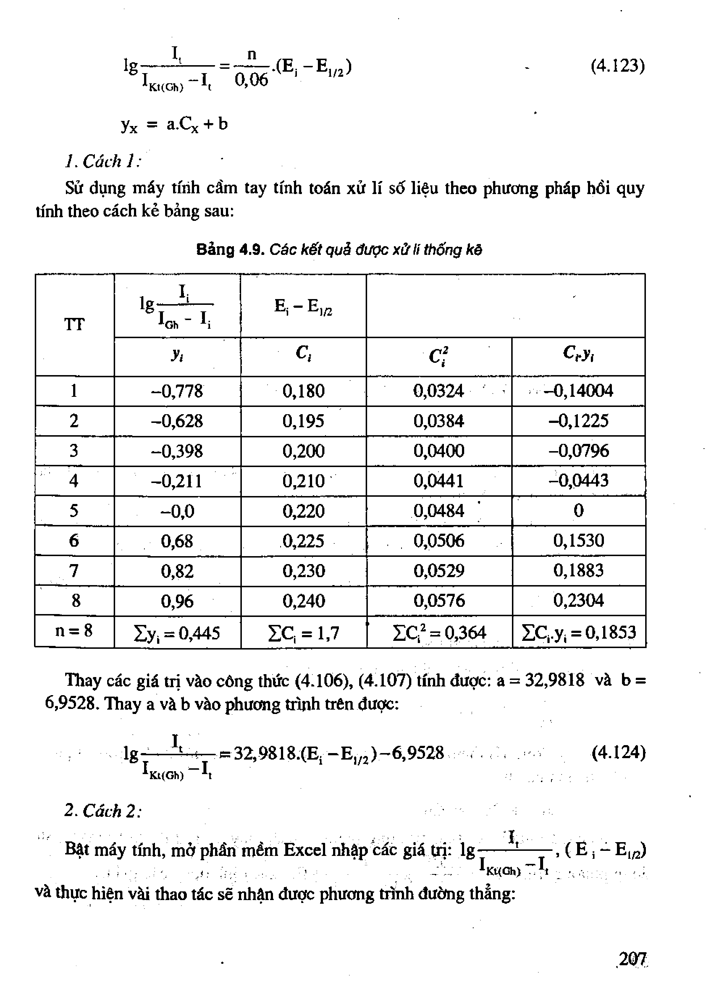

## Page 205

Ig
^Kt(Gh)
= 32,51 .(Ej -  EU2) -6,8527 (4.125) (hình 4.14)
y = 3 2 ,5 1 x - 6,8527
(E -E ^v
0,25
Hỉnh 4.14. Sự phụ thuộc lg
^Kt-gh ~ h
Váo hiệu thế (E, -  Eịa )
3. Cách 3 :
Mặt khác xử lí thống kê các số liệu theo phương pháp hổi quy tuyến tính đã 
được lập trình theo ngôn ngữ Pascal:
Bật máy tính, mở NC, mở chương trình đã lập sẵn, nhập các số liệu Cj và lị và 
thực hiện một vài thao tác sẽ nhận được phương trình tỉường thẳng tuyến tính:
lg ----- L----- = (32,510 ± 9,588).(E; -  EI/2) -  (6,8527 ± 2,045) 
(1.126)
Ijct-gh “ It
6.3.3. Xác định s ố electron trao đổi
Dựa phương trình đưòng chuẩn có hệ số góc là: 
n
0,06
= a = tga
n = 0,06.32,51 = 1,951» 2.
Như vậy đồng(n) tham gia vào phản ứng điện cực trao đổi 2 electron và phản 
ứng là thuận nghịch:
Cu2+ + 2e ^  Cu
Tomes là người đầu tiên sử dụng phương pháp này và sau đó là Linganẹ, sử
+ E1/2 xác định được các giá trị:
dụng phương trình: Eị = —
n
ÍK i-g h )
208

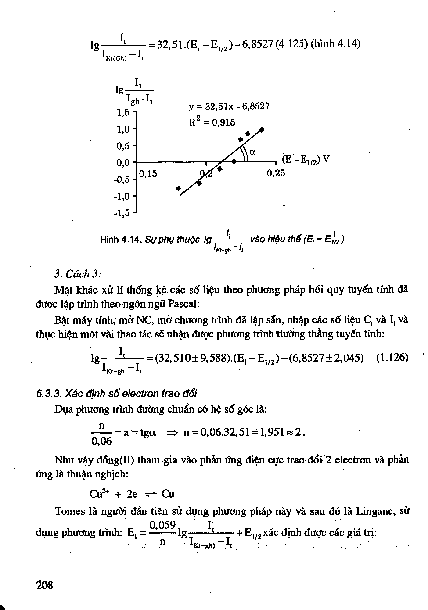

## Page 206

0,059 
_  
0,059 
0,059
tga = a = ——— => 
n = ——— = 
- 
;
=> 
n =
n 
a 
tga
trong đó tg Ơ ra if "n + là 0  n^Q r.iia c H~+ là ft ÍÌ9Q và r iia  ĩn 3''' là n n i o f t '
0,0196
6.4. Xác định số phối tử(p) và hằng số bển của phúc
6.4.1. Cẩch tiến hành
6.4.1.1. Xác định giá trị thế nửa sóng của ion đổng tự do
Cho vào bình định mức Cu2+ sao cho sau khi định mức có nồng độ 1,0.1(T5M, 
10% etanol, lượng đệm axetat natri có pH = 6,0 vào bình định mức sao cho dung 
dịch có lực ion bằng 0,030. Thêm nước cất hai lẩn đến vạch định mức. Chuyển 
toàn bộ hồn hợp dung địch vào bình điện phân, thêm 3 giọt gelatin 0,1%, sục khí 
nitơ 20 phút. Ghi cực phổ đồ bằng phương pháp vi phân ở độ nhạy 12.10-9 trong 
khoảng thế +0,2 + -2V  trên máy cực phổ O H -102- do Hungari sản xuất hoặc 797 
VA Computrace. Từ đường cong cực phổ (sống) xác định được E!/2(Td) = -0,080V 
của íon đơn (trần hoặc tự do) trong HẢc + NaAc có pH = 6,0.
6.4.1.2. Xác định giá trị thế nửa sóng của phức
Lấy một dãy bình định mức đánh số thứ tự. Cho vào bình 1: lượng Cu2+ và 
lượng N-etyl izatin p-mety] semicacbazon (HR) sao cho sau khi định mức có 
nồng độ 1,0.10-5M và lượng N-etyl izatin p-metyl semicacbazon 1,4.1 O'4, 10% 
etanol, lượng đệm axetat natri có pH = 6,0 vào bình định múc sao cho đung dịch 
có lực ion bằng 0,030. Thêm nước cất hai lần đến vạch định mức.
Cho vào các bình 2, 3 . . n có lượng Cu1+, etanol, đệm để thiết lập lực ion như 
bình 1, còn lượng N-etyl izatin 
metyl semicacbazon tăng dần: Ì^-IO^M;
1,8.1 CT*M; 2,0.10-*M.
định mức đến vạch.
Chuyển toàn bộ hỗn hợp đung dịch của từng bình định mức vào bình điện 
phân, thêm 3 giọt gelatin 0,1%, sục khí nitơ 20 phút. Ghi cực phổ đồ bằng phương 
pháp vi phân ở đô nhạy 12.10"’ trong khoảng thế +0,2 -ỉ- - 2V trên máy cực phổ 
OH—102— do Hungari sẩn xuất hoậc 797 VA Computrace. Các kết quả đo và tính 
giá trị chuyển dịch thế nura sóng và quá trình chuyển địch sổng cực phổ vi sai khi 
thêm N-tetyl izatin p-metyl semicacbazon vào dùng dịch CuCl2 được ghi trong 
bảng 4.10 và hình 4.15.
209

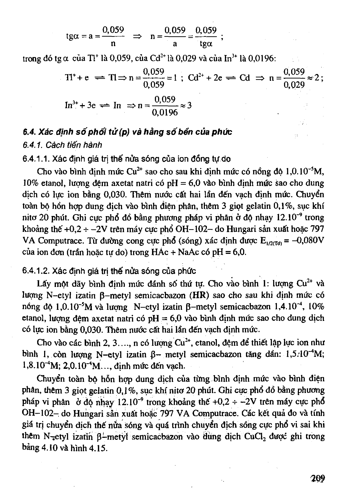

## Page 207

Bảng 4.10. Sự chuyển dịch thế nửa sóng cùa phức giữa ion đồng(ll) với N-etyl izatin 
f}-metyl semicacbazon vào nồng độ HR (Emd) = -0,080V; lực ion I = 0,030)
Cị.104 M
1,40
1,50
1,80
2,0
2,50
2,80
3,00
-IgC
3,8539
3,8239
3,7447
3,6990
3,6021
3,5528
3,5229
”E1/2(ph)
0,289
0,290
0,293
0,295
0,297
0,299
0,300
—AE1/2
0,209
0,210
0,213
0,210
0,217
0,219
0,220
nAE1/2
0,06
6,9667
7,000
7,10
7,1667
7,2333
7,3
7,3333
Hìrth 4115. Sự chuyển dịch sóng cực phổ vi phàn khì thêm HR vào dunỹ dịch CuCtị
ỏ p H - 6; 1-0,03.
Bửiờng ỉ: CuCI2 10'5Mnển NaAc.
Đttờtig 2: CuQj 10"5M nền NaAc + HR 1,4.1 <r*M.
Dường 3: CuCl2 10_SM nền NaAc + HR 1,5.10“’M.
Đường 4: CuCl3 10'5M nền NaAc + HR 1,8.1Ọ^M.
Đường 5: CuGỊ2 10"5Mnển NaAc + HR 2,0.10^ .

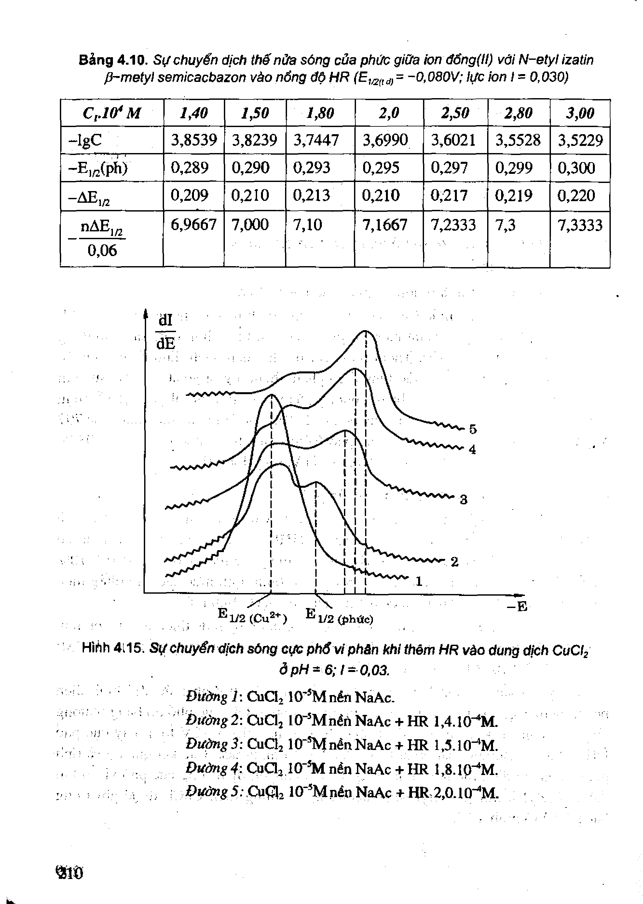

## Page 208

6.4.2. Xác định số phối tử và hằng số bền của phức
Sau khi thu được các thông số của phức bằng thực nghiộm, số phổi tử và hằng 
số bển của phức được xác định dựa vào công thức:
- i W
= ' pIgC ^ “ - Ig|S" 
< 4 ' I 2
7
)
vậy có thể viết: ĩ ^
' 2 = p .lgC |Wi,ử+ IgP, 
(4.128)
yx = a.Cx + b 
với a = p, Cx = lgCphỂitử và b = lgp;
Thể hiên 
phu thuôc vào IgCpKíi ử trên đổ thi sẽ thu đươc đường tuyến
0,06
tính. Dựa vào đường thẳng tuyến tính tính được tang của góc lệch, thay vào cổng 
thức tính được số phối tử: p = tga và từ lg pj = b từ đó xác định hằng số bền của
phức (lgpi). Để thực hiộn điều này có thể sử đụng một trong các cách sau:
ì.Cách 1:
Sử dụng máy tính cầm tay tính toạn xử lí đường thẳng theo phưcmg pháp hồi 
quy tính theo cách kẻ bảng sau:
Bảng 4.11. Các kết quẳ được xử lí thống kê
TT
-nAE1/2/0,06
-lgC
' ÍQ)2
c  ^
y>
Cj
1
6,9667
3,8539
14,8525
26,8470
2
7,000
3,8239
14,6222
26,7673
3
7,10
3,7447
14,0228
26,5874
4
7,1667
3,6990
13,6828
26,5096
5
7,2333
3,6021
12,9751
26,0551
6
3,5528
12,6224
25,9354
7
7,3333
3,5229
12,4108
25,8334
n = 7
£ *  = 50,1
XQ = 25,7993
ẺCi2 = 95,1884
iQ y i = 184,5362
211

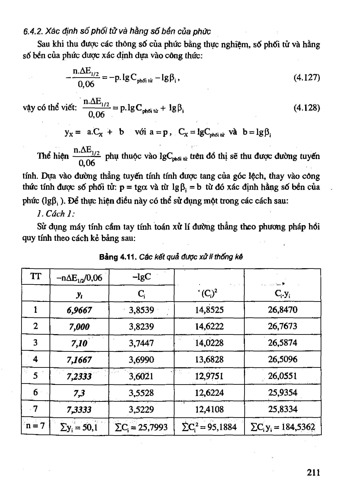

## Page 209

và (ICi)2 = 665,6038.
Thay các giá trị vào công thức (4.106), (4.107) tính được: a = 1,1069 và b =
11,236. Thay a và b vào phương trình trên được:
= 1,11. lg C ^ *  + 11,236 
(4.129)
2. Cách 2:
n.AEw,
Bât máy tính, mở phần mềm Excel nhâp các giá trì:--------— , lgCphrfj ri và thực hiẻn
0,06
mỏt vài thao tác sẽ nhãn đưoc đường thẳng 
~ ^ l/2 = l,0863.1gC . &ứ + 11,161 (4.130)
0,06
(hình 4.16).
-nAEi/2
Hỉnh 4.16. Sựbiếnthiỗn thể phụ thuộc vào nồng độ của phối tử.
3 . Cách 3 :
Mặt khác xử lí thống kê đựcmg thẳng theo phương pháp hồi quy tuyến tính đã 
được lập trinh theo ngồn ngữ Pascal:
* 
n AR
Bật máy tính, mở NC mở chương trình đã lập, nhập các số liệu: —— —
và lgCllhỏi tù thực hiện một vài thao tác sẽ nhận được phương trình đưcmg thẳng 
túyến tính: 
‘
112

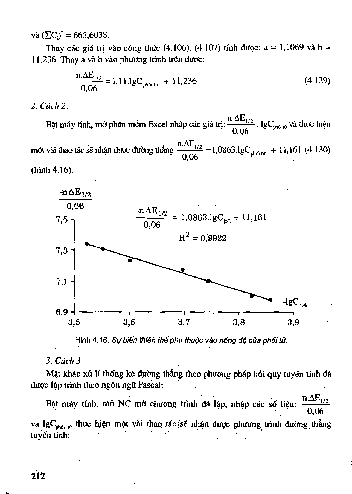

## Page 210

n.AE.,1
- ± = ^ -  = U ,086±0,l06).lgC pMit4 + (ll, 161 + 0,389)
(4.31)
Phản ứng tạo phức xảy ra giữa đồng(II) với N-etyl izatin p-metyl 
semicacbazon như sau:
Cu2+ + HR + 2X' ^  [CuHRX2] 
pc HRX = 10'116 =1,445.1012
Như vậy số phối tử: p = a = tg a = 1,0863 ~ 1,0 và hằng số bền của phức:
Is PcuHRXj = k = 11’ 
.
ưu điểm: Phương pháp cực phổ xác định được các thỏng số định lượng cùa 
các phức không mang màu như thành phần phức (số phổi tử), hằng số bển và hằng 
số bển từng nấc mà phương pháp đo quang không thực hiện được.
6.5. Chuẩn độ phân cụt (chuẩn độ đo ampe)
Trong chuẩn đồ phân cực (ampe) người ta theo dõi sự thay đổi cuờng độ dòng 
(I) trong quá trình thêm dần thuốc thử vào dung dịch chuẩn độ. Điểu kiện đậ 
chuẩn độ phân cực phải có các quá trình xảy ra như sau:
-  Phản ứng chuẩn độ xảy ra hoàn toàn giữa chất xác định và thuốc thử.
-  Phản ứng điện hoá chỉ thị xảy ra ở các bề mặt điện cực trong phản ứng chính 
của phép chuẩn độ.
Thường thường chuẩn độ có thể tiến hành khi sử dụng một điện cực chỉ thị. 
Điộn cực chỉ thị có thể là điện cực giọt thuỷ ngân, điộn cực platin, điện cực than 
chì,...
Đường cong chuẩn độ được xây dựng thể hiện sự phụ thuộc cường độ dòng 
vàò thể tích thuốc thử: I -  fiVpj.). Điểm tương đương là điểiĩl hai đường thẳng cắt 
nhau. Để ghi cường đô đòng I thường phải cố định thế điện cực trong khoảng thế 
ứng với phần giới hạn của đòng khuếch tán, bời vì khi ấy mới có sự phụ thuộc 
tuyến tính giữa cường độ dòng vớị nồng độ. Phương pháp chuẩn độ phân cực hay 
ampe là một trong ứng đụng phương pháp cực phổ dùng điện cực giọt thủy ngân 
chỉ mang tính chất minh họa lí thuyết còn trong thực tế phân tích ít được sử dụng.
213

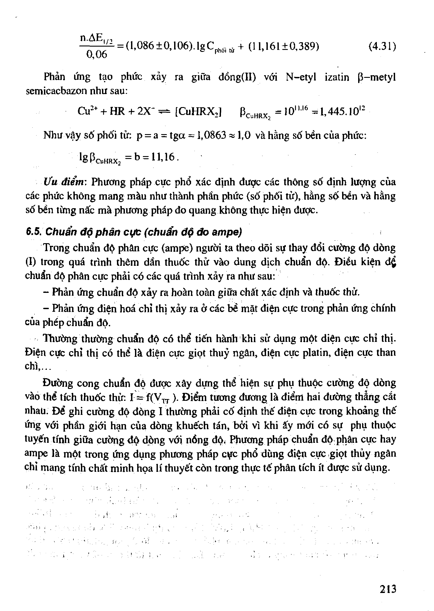

## Page 211

BÀI TẬP CHƯƠNG 4
1. Để xác định hàm lượng đổng có trong quặng chứa đổng người ta cân 0,125g 
quặng hoà tan trong axit sau đó định mức vào bình định mức 500ml. Dùng 
pipet lấy chính xác 2,0ml dung dịch mẫu cho vào bình định mức lOOml định 
mức bằng (NH3 + NH4C1) 1,0M đến vạch định mức. Rót dung dịch phức 
amoniacat đồng vào bình đo cực phổ, thêm vào đó 2 giọt gelatin 0,5%, đuổi 
oxi ữong 10 phút bằng cách sục' khí nitơ. Đặt thế quét từ 0 đến -2V . 
Bật máy đo và vẽ sóng cực phổ (I -  E) sau đó đo chiều cao sóng cực phổ 
được hx = Ix = 0,275A. Mặt khác người ta pha thang chuẩn với nồng độ của 
đổng(II) đã biết chính xác và tiến hành tạo phức, đo, vẽ và xác định chiều cao 
sóng cực phổ cùng điều kiện với dung dịch mẫu thì ứng vói mỗi nồng độ dung 
địch chuẩn có chiều cao sóng cực phổ được ghi trong bảng dưới đây:
Thuốc thử
1
2
3
4
5
6
7
8 
•
C 2t .1 0 5M
Cu"
1,11
1,665
2,22
3,33
4,44
5,55
6,66
7,77
hx=Ix=(A )
0,032
0,055
0,085
0,145
0,200
0,25
0,310
0,355
Hãy tính hàm lượng % Cu có ừong qặng chứa đổng. Cho biết Cu -  64.
Đáp sổ: 7722%
2. Khi đo sóng cực phổ của các mẫu chuẩn của thép chứa Cu2+ thu được kết quả 
như sau:
Số thứ tự mẫu
1
2
3
4
5
'Hàm lượng đồng %
0,1
0,19
0,32
0,41
0,54
Độ cao sóng, mm
6
12
20
26
35
Hãy tính hàm lượng % của đồng trong mẫu thép X biết rằng độ cao sóng cực 
phổ đo trong cùng điều kiện như trên là 15mm.
Đáp số: 0,23%
3. Để xác định hàm lượng cađimi có trong quăng chứa cadimi người ta cân
0,2186g quặng hoà tan Ưong axit sau đó định mức vào bình định mức 500ml. 
Dùng pịpet lấy chính xác 2,0ml dung dịch mẫu cho vào bình định mức 100ml 
định mức bằng (NHị + NH4CI) 1,0M đến vạch định mức. Rót dung dịch phút 
amoniacat cađimi vào bình đo cực phổ, thêm vào đó 2 giọt gelatin 0,5%, đuổi 
oxi trong 10 phút bằng cách sục nitơ. Đặt thế quét từ 0 đến -2V . Bật máy đo
214

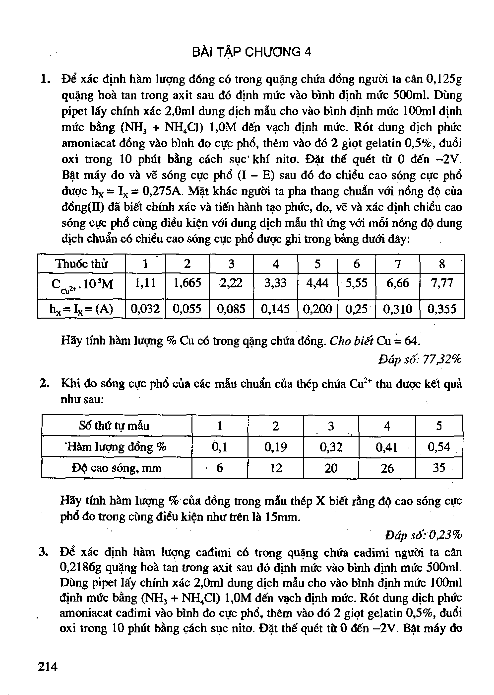

## Page 212

và vẽ sóng cực phổ (I -  E) sau đó đo chiều cao sóng cực phổ được 
Ix =’0,213A- Mặt khác, người ta pha thang chuẩn với nổng độ của cađimi(U) 
đã biết chính xác và tiến hành tạo phức, đo, vẽ và xác định chiều cao sóng cực 
phổ cùng điều kiện với dung dịch raẫụ thì ứng với inỗi nồng độ dung địch 
chuẩn có chiều cao sóng cực phổ được ghi troag bảng dưới đây:
Thuốc thử
1
2
3
4
5
6
7
c 2+.105m
Cu
1,762
2,353
3,416
4,581
5,(555
6,738
7,898
hx= Ix =(A )
0,063
0,092
0,163
0,238
0,275
0,342
0,375
Hãy tính hàm lượng % Cđ có trong quặng chứạ cađimi.
Cho biết: Cd = 112,4. 
Đáp số: 57^1%
4. Để xác định hàm lượng cobạn trong muối Co(NOj)2 bị chảy nước bằng phương 
' pháp thêm chuẩìi ừong phướng pháp cực phổ, người ta tiến Hành như sàu:
-  cấn 0,1004 gam Co(NOj)2 bị chảy nước hoà tan bằng axit loãng và định 
mức bằng nước cất hai lần váo bình 250 ml. Lấy chính xác 5,00ml pha loãng 
bằng nươc cất hai lần thành 200ml -  gọi là đung dịch mẫu X.
-  Mặt khấc hoằ tan 0,1012 g CoO (tinh khiết phân tích) bằng axit, sau đó pha 
loãng bằng nước cất hai lẩn và định mức vào bình 200ml. Lấy chính xác 
l,00ml pha loãng thành ÍỜOml -  gợi là đung dịch chuẩn c.
-  Lấy chính xác 5,00ml dung dịch mẫu X cho vào bình định mức 50mli Thêm 
2ml dung địch nền KC1 3M, 2ml HQ IM và định mức bằng nưóc cất hai lẫn 
đến vạch định mức. Sạu đó rót toàn bộ dung dịch vào cốc điện phân, đặt các 
điều kiện tối liu dho quấ trình điện phân để phân tích cực phổ, đuổi oxiV chơ 
máy quét phổ đồ (ĩ theo -E). Dựa vào cực phổ đổ đo chiều cao dòng khuếch 
tán.đựợc Ịx = 0,254mA.
-  Mặt khác lấy chính xác 5,00ml đurig dịch mẫu X và 5,00ml dung địch 
chuẩn c  cho vào bình định mức 50ml. Thêm 2ml dung địch nền KC1 3M, 2ml
- H ơ  IM và “định mức bằng nước cất hai lần đến vạch định riiức. Sau đó rót 
toàn bộ dung dịch vào'tốc diện ỊỈhân, đặt các điềứ kiộn tối ưu cho qíiá trình 
điện phân để phân tích cực phổ, đuổi oxi, cho máy quét phổ đổ (I theo -E). 
Dựa vào cực phổ đồ đo <điiều cao dòng khuếch tán dược: IX+C=?Q,í>12mA.
-  Tính hàm lương % Có Cố tròng mủốỉ Go(N0 3)2 bị chảy tìước1.
Cho biết: Co = 58,9; N =  14; 0 = 1 6 . 
ị'■■ ■, r ) -
( 
Đáp số: 39,02% Co
2Ỉ5

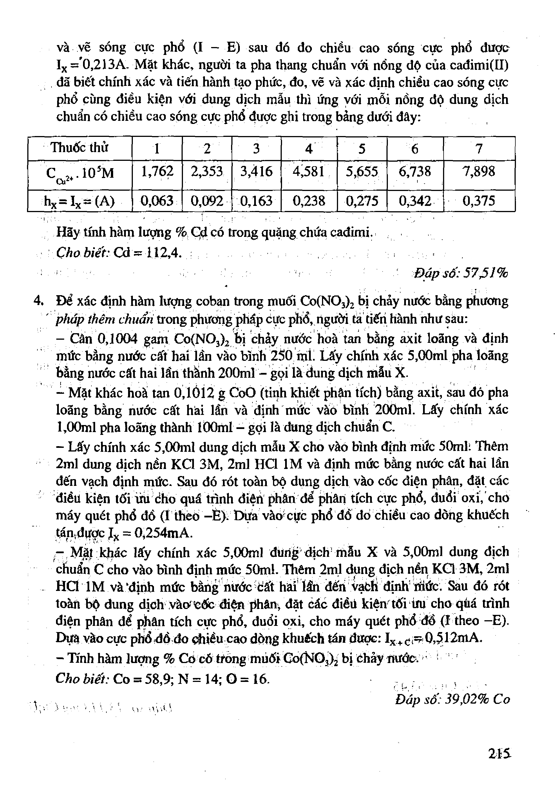

## Page 213

5. Để xác định hàm lượng chì trong muối PbS04 có lẫn tạp chất bằng phương 
pháp thêm chuẩn trong phương pháp cực phổ, người ta tiến hành như sau:
-  Cân 2,0512 gam PbS04 có lẫn tạp chất hoà tan bằng axit loãng và định mức 
bằng nước cất hai lẩn vào bình 500ml. Lấy chính xác l,00ml pha loãng bằng 
nưóc cất hai lần thành 200ml -  gọi là dung dịch mẫu X.
-  Mặt khác hoà tan 0,125g PbO (Tinh khiết phân tích) bằng axit, sau đó pha 
loãng bằng nước cất hai lần và định mức vào bình 200 ml. Lấy chính xác 
2,00ml pha loãng thành lOOml -  gọi là dung dịch chuẩn c.
-  Lấy chính xác 5,00ml dung dịch mẫu X cho vào bình định mức 50ml, Thêm 
5ml dung địch đệm axit axetic và natri axetat, pH = 5 để làm nền, định mức 
bằng nước cất hai lần đến vạch định mức. Sau đó rót toàn bộ dung dịch vào 
cốc điện phân, đãt các điều kiên tối ưu cho quá trình đo cực phổ, đuổi oxi, cho 
máy quét phổ đồ (I theo -E). Dựa vào cực phổ đồ đo chiều cao dòng khuếch 
tán được Ix = 0,350mA.
-  Mặt khác lấy chính xác 5,00ml dung dịch mẫu X và 5,00ml dung dịch 
chuẩn c  cho vào bình định mức 50ml. Thêm 5ml dung dịch đệm axit axetic và 
natri axetat, pH = 5 để làm nền, định mức bằng nước cất hai lần đến vạch định 
mức. Sau đó rót toàn bộ dung dịch vào cốc điện phân, đặt các điều kiện tối ưu 
cho quá trình đo cực phổ, đuổi oxi, cho máy quét phổ đổ (I theo -E). Dựa vào 
cực phổ đồ đo chiểu cao dòng khuếch tán được Ix+C = 0,715m A.
-  Tính hàm lượng % Pb có trong muối PbS04 có lẫn tạp chất.
Cho biết: Pb = 207,8 = 3 2 ,0 =  16.
Đ ầpsấ: 54,20% Pb
6. Hãy thiết lập và xác định nồng độ của ion Cu2+ (mol//) và (mg/o có trong dung 
dịch mẫu nghiên cứu, dựa trên kết quả thựẹ nghiệm sau:
Stt
Dung dịch đo
Dòng đo ở 
-0,23V; fịA
1
Dung dịch: 25,0ml HCI 3M pha ỉoãng 50,0mỊ
2,5 .
2
Dung dịch: 25,Oml H ơ  3M + 15ml dung dịch mầu pha 
loãng 50,0ml 
: 
;
33,5
3
Đung dịch: 25,0ml HG1 3M + 15m! đong dịch mẫu + 
5,0ml dung dịch Cụ2+ S.IO^M pha loãng 50,Oml
58,5
Biết: Cu = 63,45
Đáp số: Ị3,113 ỉỉiq Ctt/I

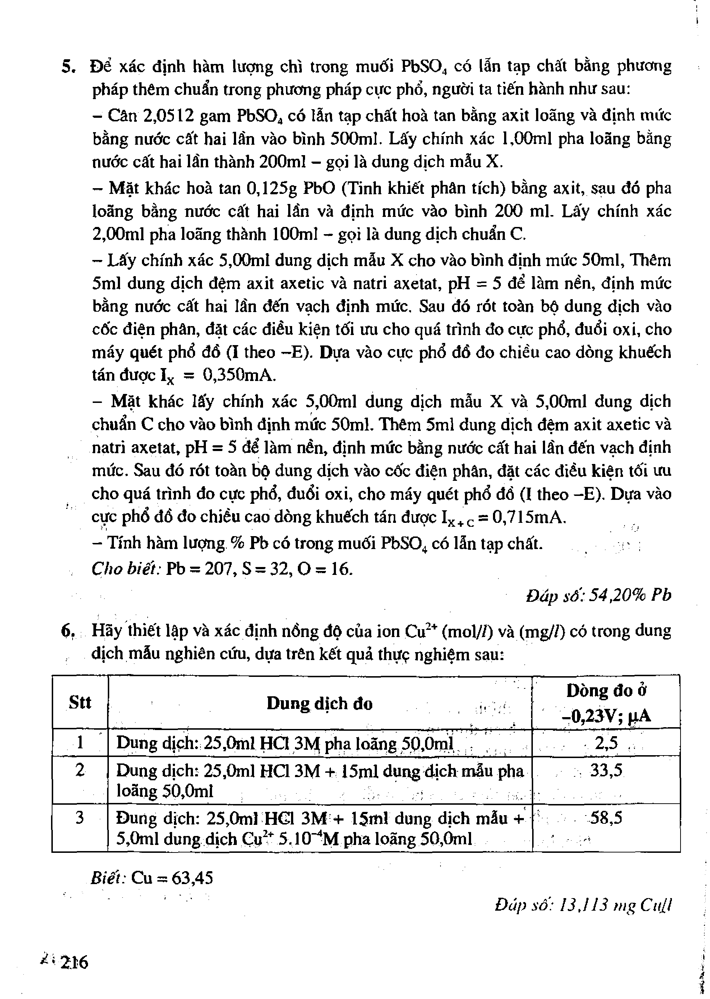

## Page 214

7. Để xác định hàm lượng sắt trong muối Fe„(S04), bị chảy nước bằng phương 
pháp thêm chuẩn trong phương pháp cực phổ vi phân, người ta tiến hành 
nhu sau:
-  Cân 2,985 gam Fe2(S04)3 bị chảy nước hoà tan bằng axit và định mức bẳng 
nước cất hai lần vào bình 250ml. Lấy chính xác l,00ml pha loãng nước cất hai 
lần thành l OOml -  gọi là dung dịch mẫu X.
-  Mặt khác hoà tan 0,3200g Fe2Oj (Tinh khiết phân tích) bằng axit, sau đó 
định mức vào bình 200ml. Lấy chính xác 2,50ml pha loãng thành 100ml -  gọi 
là dung dịch chuẩn c.
-  Lấy chính xác 5,00ml dung dịch mẫu X cho vào bình định mức 25ml. Thêm 
2ml dung dịch nển KC1 3M, 2ml HC1 IM và định mức bằng nước cấĩ hai lần 
đến vạch định mức. Sau đó rót toàn bộ dung dịch vào cốc điện phân, đạt các 
điểu kiện tối ưu cho quá trình đo, đuổi oxi, cho máy quét phổ đổ cực phổ vi
phân ( ~ t h e o  -E ) và đo chiều cao dòng khuếch tán ứng với thế E = -1,8 ± 
dE
0,1V được Ix = 0,312mA.
-  Mặt khác lấy chính xác 5,00ml dung dịch mẫu X và 6,5ml dung dịch chuẩn 
c  cho vào bình định mức 25ml. Thêm 2ml đung địch nển KC1 3M, 2ml HC1 
IM và định mức bằng nước cất hai lần đến vạch định mức. Sau đó rót toàn bộ 
dung dịch vào cốc điện phân, đặt các điều kiên tối ưu cho quá trình đo, đuổi
oxi, cho máy quét phổ đồ cưc phổ vi sai (— theo -E ) và đo chiều cao dòng
dE
khuếch tán ở thế E = -1,8 ± 0,1V được Ix+C = 0,675mA.
-  Tính hàm lượng % Fe có trong muối chảy nước.
Cho biết: Fe = 56, s  = 32, o  = 16
Đáp số: 26,20% Fe
8. Người ta nung chảy 0,2000 gam quặng chứa A120 3 và 5% nước với Na2COv 
Sau 1 giờ sẽ tạo ra aluminat natri (NaAlO,), đem hỗn hợp ra cho dung dịch 
H ơ  để chuyển aluminat natri hoàn toàn hành thành dung dịch Al3+ và pha 
loãng vào bình định mức 200,00ml -  gọi là dung dịch mẫu X. Để xác định 
Al1+ người ta tiến hành như sau:
-  Lấy 20,00ml dung dịch mẫu X cho vào bình định mức 50ml. Thêm 2ml 
dung dịch nền KC1 3M, 2ml HC1 1M và định mức bằng nước cất hai lần đến 
vạch định mức. Sau đó rót toàn bộ dung dịch vào cốc điện phân, đặt các điều
217

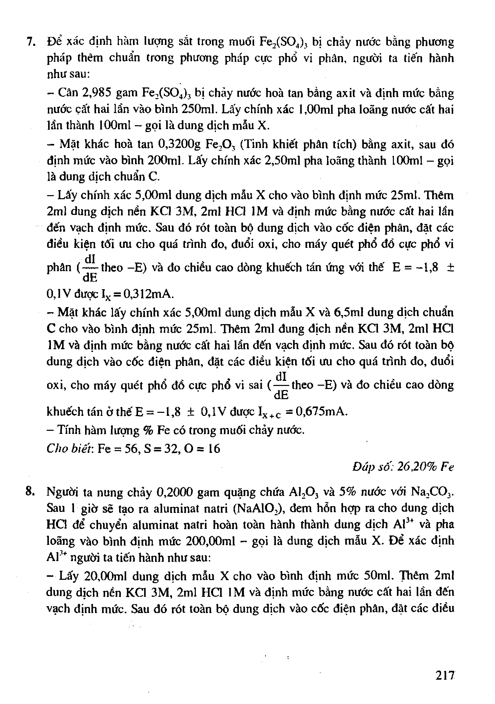

## Page 215

kiên tối ưu cho quá trình đo, cho máy quét phổ đồ cưc phổ vi sai (— theo -E)
dE
và đo chiều cao dòng khuếch tán ứng với thế E = -1,7 ± 0,1V, được dòng 
khuếch tán Ix = 0,250mA.
-  Lấy 20,00ml dung dịch mẫu X, thêm 5,00ml dung dịch chuẩn A1C1, 5.10_4M 
cho vào bình định mức 50ml, Thêm 2ml dung dịch nền KC1 3M, 2mỉ HG IM 
và định mức bằng nước cất hai lần đến vạch định mức. Sau đó rót toàn bộ 
đung dịch vào cốc điộn phân, đặt các điểu kiện tối ưu cho quá trình đo và đuổi
di
oxi, cho máy quét phổ đổ cưc phổ vi phân (— theo -E) và đo chiều cáo dòng
dE
khuếch tán ở thế E =-1,7 ± 0,1 V, được Ix+C = 0,550mA.
Hãy viết phương trình phản ứng xảy ra và tính hàm lượng % AI trong mẫu khan. 
Cho biết: A 1 = 27.
Đáp số: 0J0%  Aỉ
. .... 
y. {
ỈC m í H i . : l i :  i r : 
r  
-'ỉ
í: f i í V  : . 0 ị- í "  - , ì b ' ( Ị Í Í ; Ị/ ) J  l i i / K Ỉ
M r í í: í ■ 
ị,ỉ
■ /  
. 
Ị f n  ■ ■' u  t .  
V 1
. 'liV 
• 
; ’ 
i:
2Ỉ8

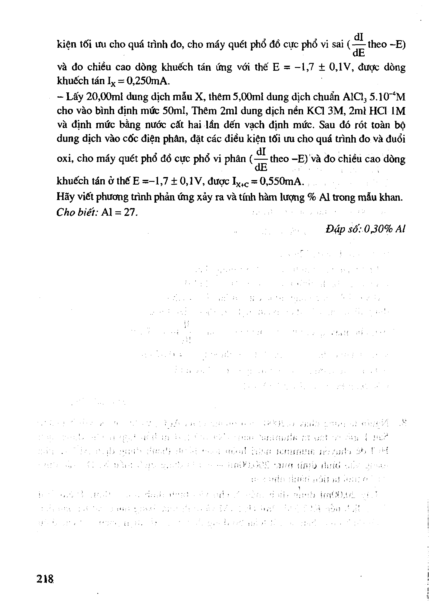

## Page 216

Chương 5
GIỚI THIỆU Sơ LƯỢC PHƯƠNG PHÁP PHÂN TÍCH 
ĐIỆN HOÁ HIỆN ĐẠI VON-AMPE HOÀ TAN 
• 
■ 
*
1. Những hạn chế của phương pháp cực phổ cổ điển
Các phương pháp phân tích định lượng {phương pháp đường chuẩn, thêm 
chuẩn) các chất theo phương pháp cực phổ cổ điển đều dựa vào phương trình Hkovic 
Phương pháp phân tích cực phổ cổ điển bị hạn chế về độ nhạy và độ chọn lọc 
không cao. Khi thực hiện các phép phân tích trực tiếp những đối tượng phức tạp và 
xác định lượng vết thì độ nhạy của phương pháp cực phổ cổ điển chỉ đạt cỡ 10"6 M 
(Cx > 10~6M). Khi vẽ đường cong cực phổ đồ thể hiện sự phụ thuộc dòng vào th ế:
I = f(-E) hoặc —  = f(-E ) của dung dịch chứa nhiều cấu tử đẻu có tính khử cực
thì thấy chúng có tính cộng tính: đường cong cực phổ chổng lên nhau như những 
bậc thang. Do đó khó có khả năng xác định được hai sóng cực phổ có thế nửa sóng 
của chúng khác nhau ít hơn (AElfl = E 1/2(2) -  E1/3(jj) < lOOmV và nhất là khi chúng
c  
10 „
có màt với tỉ lê lớn hơn— = — . Độ chọn lọc trong trường hợp tối ưu (AEl/z
Cj 
1
khoảng lOOmV với thể tích 100ml).
Chính vì vậy khi phân tích những đối tượng phức tạp, cách khắc phục tốt nhất 
là tách để tăng tính chọn lọc, sau đó làm giàu để tăng nồng độ (Q  chất phân tích 
có tròng mẫu nên gây nhiều phức tạp. Mất chất trong quá trình tách dẫn đến sai số 
lớn. Phải tiến hành nhiều công đoạn cho nên tiêu tốn nhiều thòi gian.
Phương pháp cực phổ cổ điển còn có những hạn chế vừa nêu trên mà trải qua 
nhiều thập kỷ qua, các nhà khoa học trong lĩnh vực phân tích -  cực phổ đã nghiên 
cứu và đã đề xuất được nhiều con đường khác nhau íihằm tăng độ nhạy và độ chọn 
lọc của phương pháp. Các con đường này tập trang vào 3 hướng chính sau:
1. 
Úng dụng triột để những thành tựu của kĩ thuật điện tử và tự đông hoá để 
chế tạo máy cực phổ, tìm ÍỈỈỌÌ cách loại trừ dòng tụ điện như vậy sẽ nâng cao đượe 
tỉ số tín hiệu đo so với tín hiệu nhỉễu (1^ > Inhiiu). Như vậy bằng cách này có thể 
tăng độ nhạy đến khoảng 100 lần và tăng độ chọn lọc 50.000 lắn '(tỉ số có thể đạt 
được tín hiệu nhíễu/tĩn hiệu đo = 50.000 lần). Kết hợp với quá trìrih làm giàu chất
219

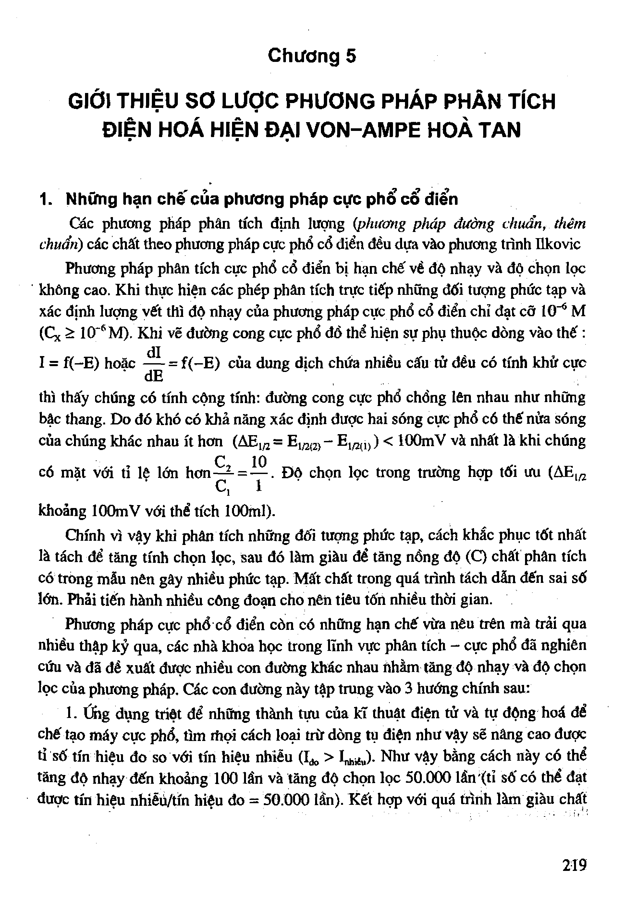

## Page 217

(điện hoạt) phân tích trên bề mặt điện cực bằng con đường điện phân hoặc X.ÚC tác 
có thể đạt đô nhạy 1(TI0M và độ chọn lọc 50.000 lẩn.
2. LàrrTỊịiàu chất phân tích trên bể mặt điện cực bằng phản ứng khử hoặc oxi 
hoá để kết tủa chất cần phân tích lên bề mặt điện cực, sau đó hoà tan sản phẩm 
kết tủa và ghi tín hiệu hoà tan là nhóm phương pháp cực phổ hoà tan -  von- 
ưmpe hoà tan.
3. Làm giàu chất điộn hoạt trong lớp phản ứng điện cực bằng phản ứng xúc tác 
(hoặc hấp phụ, hoặc cả xúc tác kết hợp với hấp phụ) -  Phương pháp cực phổ đòng 
xúc tác.
2. Phương pháp von-ampe hoà tan (Stripping Vontammetry)
Phương pháp von-ampe hoà tan là phân nhóm trong nhóm điện hoá hoà tan. 
Trong điện hoá thì điện phân là phương pháp làm giàu tốt nhất. Bằng phương pháp 
này có thể tập trung một lượng lớn chất lên trên bề mặt điện cực. Nồng độ các chất 
trên bề mặt điện cực lớn hơn nồng độ các chất đó trong dung dịch rất nhiều. Sự kết 
hợp giữa cực phổ, điện phân làm giàu và quá trình hoà tan kết tủa là nguyên tắc cơ 
bản của phương pháp von-ampe hoà tan.
2.1. Nguyên tắc của phương pháp
Để thực hiện phân tích theo phương pháp von-ampe hoà tan cần:
1. Máy cực phổ tự kí để theo dõi dòng hoà tan khi đặt tốc độ quét thế và thay 
đổi các thông số tự động cho giai đoạn hoà tan.
2. Bình điện hoá được cấm 3 loại điện cực vào nó.
3. Máy in lazer để in các kết quả phổ đồ và các giá trị dòng, thế ...
Tiến hành phân tích theo phương pháp von—ampe hoà tan có nghĩa là đo 
cường độ dòng hoà tan của kết tủa trên điện cực hoặc trong hỗn hống phụ thuộc 
tốc độ quét thế. Quá trình phân tích theo phương pháp von-ampe họà tan gôm các 
giai đoạn sau: giai đoạn làm giàu, giai đoạn dìmg và giai đoạn hoà tan (đó là 
nguyên tắc chung của phương pháp điện hoá hoà tan).
2.1.1. Giai đoạn một: điện phân làm giàu
Áp đạt vào điện cực ồ thế thích hợp và không đổi (E = const) trong suốt quá 
trình điện, phân. Thường 'thường người ta chọn-Eđp ứng với đòng giới hạn khuếch 
tán của chất điện hoạt (phân tích), ở thế này chỉ một số tối thiểu các chất bị khử 
hoặc bị oxi hoá trên điện cực, dẫn đến có kết quả chính xác. Phải khuấy suốt trong 
quá trìnỊi điộn phân. Nếu dùng điện cực rắn đĩa quay thì cho cưc quay với tốc độ 
không đổi từ 1000 -  4000 vòng/phút. Nếu dùng điện cực rắn tĩnh hoặc điện cực 
thuỷ ngân thì dùng khuấy từ với tốc độ không đổi.
220

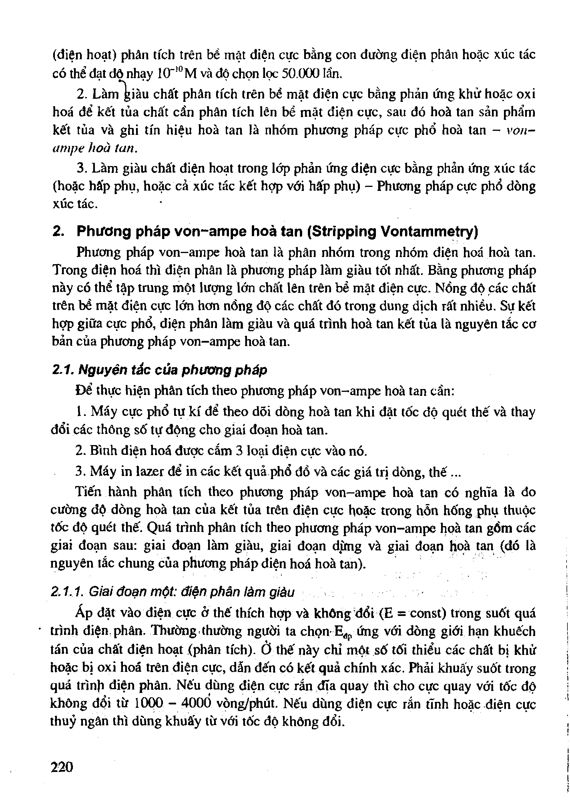

## Page 218

Trong phương pháp von~ampe hoà tan anot để chọn thế điện phân làm giàu 
(Eđp), người ta dựa vào phương trình Nernst hoặc một cách gần đúng dựa vào 
giá trị thế bán sóng (E|/2) trên sóng cực phổ của chất phân tích. Ở đây Edr được 
chọn phải âm hơn so với Eịp. Hoặc dùng phương trình đường cong cực phổ 
dòng một chiều và thế bán sóng của mỗi nguyên tò dể tìm ra thế điện phân 
thích hợp.
Phương trình biểu diễn mối quan hệ giữa dòng và thế có dạng:
ĩ —ĩ
E d „ = E ,/2+ —
l n ^
— ^  
(5. 1)
dp 
1/2 
n F  
J
Trong đó:
Eđp là thế điện phân;
E1/2 là thế bán sóng của chất khử cực;
F là hằng số Faraday;
I, ĩà cường dô đòng khuếch tán tức thì;
IKt là cường độ dòng khuếch tán giới hạn; 
n là số electron tham gia phản ứng điên hoá;
R là hằng số khí;
T là nhiệt độ tuyệt đối.
Nếu lấy giá trị thế điện phân mà tại đó lị = 99% IKt hay lị =0,99IK( thì từ 
phương trình (5.1) có thể tính được thế điên phân theo cổng thức:
_ 
_ 
0 12
(5-2)
n
Từ phương trình (5.2), ta thấy rằng chỉ cần thế điện phân âm hơn thế bán sóng 
0 12
một giá trị là ——  (V) thì giá trị của dòng đã đạt được giá trị cường độ dòng 
n
khuếch tán giới hạn. Mặt khác, khi số electron tham gia phản ứng kết tủa càng lớn 
thì sự chênh lệch giữa Edp và E,,, càng nhỏ.
, 
Tùy vậy, trong thực tế thế điộn phân không phải lúc nào cũng được xác định 
theo phương trình trên mà cồn phụ thuộc vàọ sự có mật của các ion khác hoặc vào 
bản chất của dung dịch nền. Cho nện phải khảo sát thế điộn phần cho mỗi trường 
hợp cụ thể trong thực nghiệm để tìm thế điện phân là giàu tối ưu.
Ví dụ: Đường cong cực phổ cổ điển (dòng một chiều) của dung địch CuCl2
5.10"5M, nền KQ 0, í M thể hiện trên h ìn h  5.1.
221

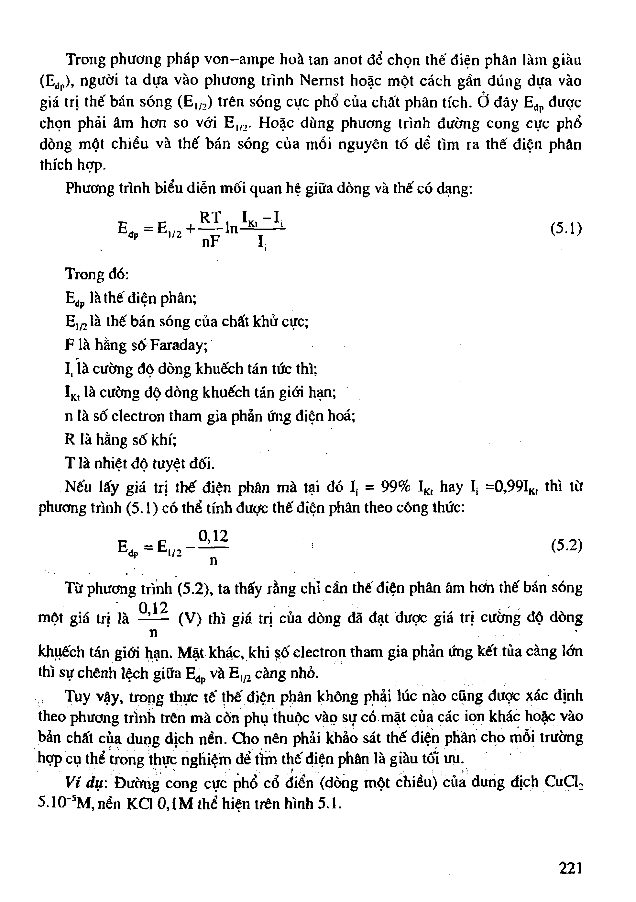

## Page 219

401 Ip (nA)
Hình 5.1. Sự phụ thuộc /, váo thế (-E)
Ví dụ chọn thế điện phân dựa vào đường cong cực phổ cổ điển:
E i. = E , „ + H
lnÍKLZÍL 
»  
K,«  
nF 
Ị
RT 
1 -0  99
Khi I. = 99%.IKt => E. = E1/2 + ^ l n -  
—
‘ 
1/2 
nF 
0,99
.T, 
. 0 . 0 6 ^ - ^  
^ 
2.0,06 
„ 
0,12
^ 
1/2 
lg 0 ,0 1 -E 1/2 
— Ej/2 
(5-3)
n 
n 
n
Cho Et/21CU*/C«) = -° ’3Ỉ5V trong nền HCl 0,1M, KC1 0,1M và pH = 2,2 
Thay E1/2(ũ)ĩ+/Cu) = -0 ,3 15V vào (5.3) được ^  Edp = -0 ,3 1 5 -0 ,0 6  = -  0,375V
-  Thế điện phân (Edp) đặt âm hơn thế bán sóng trong cực phổ cổ điển (E1/2).
2.1.2. Giai đoạn hai: dừng
-  Giai đoạn ngắn từ 15 -  60 giâý, trong giai đoạn này‘ngừng quay cực, ngừng 
khuấy, thế điện phân vẫn giữ nguyên.
Nếụ đùng điện cực giọt thuỷ ngán tĩnh hòặc điện Cực màng Hg thì thời gian 
dừng trong khoảng thời gian 30 -  60 ạiây.
-  Mục đích để lượng kim loại đã được điện phân sẽ phân bố đều trong hỗn 
hống hoặc trên toàn bộ bề điện cực để khi hoà tan sẽ có dòng hoà tan đều và 
ổn định.
222

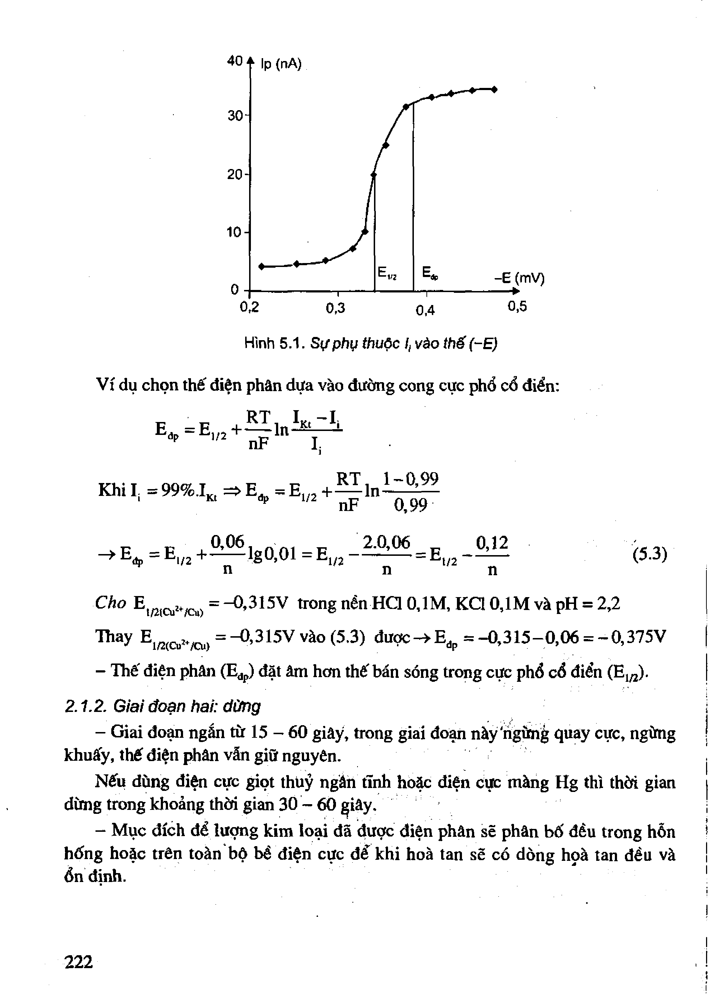

## Page 220

2.1.3. Giai đoạn ba: hoà tan
Hoà tan chất phân tích kết tủa làm giàu khỏi bề mặt điện cực làm việc bằng 
cách quét thế theo một chiều xác định (anot hoặc catot) đồng thời ghi đường von- 
ampe hoà tan bằng một ld thuật điện hoá nào đó.
-  Tốc độ quét thế khi hoà tan thường lón từ 20 đến* lOOmV/giây. Nếu tốc độ 
quét thế chậm thì tín hiệu thu được pic thường có dạng tù và trải rộng vì điộn 
lượng dùng để điện phân chính là bằng diện tích nằm giữa pic và đường nển.
-  Nếu điện phân là quá trình khử catot ở thế không đổi (Edp= const), khi hoà 
tan quét thế vái tốc độ không đổi và đủ lớn từ 20 -  50mV/giây từ giá trị Edp vé 
phía các giá trị dương (+) hơn. Như vậy, quá trình hoà tan là quá trình anot. 
Phương pháp này được gọi là von-ampe hoà tan anot (Anodic stripping 
vontammetry — ASV).
Trường hợp ngược lại nếu điện phân là quá trình oxi hoá anot chất phân tích 
để kết tủa lên bẻ mặt điện cục thì quá trình phân cực hoà tan là quá trình catot -  
von-ampe hoà tan catot (Catodic stripping vontammetry -  CSV) (hình 5.2).
a- Phương phấp von—ampe hoà tan anot b- Phương pháp von—ampe hỏà tan catoĩ 
Hình 5.2. Đường hoà tan: trên đường cong cực phổ dòng một chiều, 
dưới đường von-ampe hoè tan
223

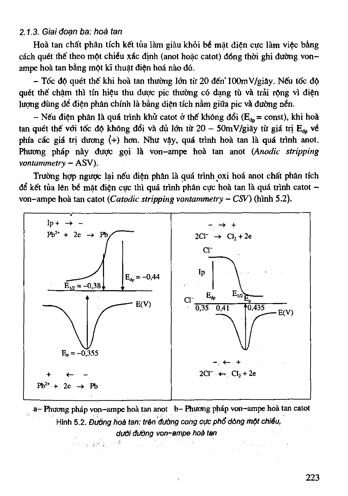

## Page 221

-  
Trên đường von-ampe hoà tan xuất hiện pic của chất cần phân tích, xác 
định nồng độ. Thế ứng với cực đại của pic (Hpic) và chiều cao của pic (dòng hoà 
tan cực đại) (Ipic) phụ thuộc vào nhiêu yếu tố nhưng trong điều kiện tối ưu và giữ 
không đổi một số yếu tố thì Epic có tính chất đặc trưng cho bản chất của chất 
phân tích, người ta ứng dụng tính chất này để phân tích định tinh. Dòng hoà tan 
(Ipic) phụ thuộc vào nồng độ của chất cần phân tích xác định, ứng dụng để phân 
tích đinh lượng.
Brainina đã nghiên cứu lí thuyết của quá trình hoà tan này và thiết lập được 
phương trình biểu diễn sự phụ thuộc dòng cực đại (ỉpjc) và thệ' ứng với đỉnh pic 
(Epic) đối với cả hai quá trình hoà tan thuận nghịch:
a. Hoà tan (kết tủa trên điện cực đĩa) được thực hiện khi quay cực:
Từ phương trình (5.4), (5.5) cho thấy khi ta cô' định các thông số: nhiệt độ (t), 
hệ số khuếch tán (D), diện tích bề mặt điện cực (S), tốc độ quay cực (©); tốc độ 
quét thế (V), bề dàỵ của lớp khuếch tán (ô)... và các điều kiện thực nghiệm như 
dung địch nền, pH, lực ion... thì dòng hoà tan (Ipic) chỉ phụ thuộc vào nồng độ của 
chất cần phân tích xác định:
Ví dụ tính Epiv khi sử dụng điện cực đĩa rắn:
Cho E
, ^
 = -0,315V nền HC10,1M, KC10,1M và pH = 2,2, E; = -0,200V 
và E2 = -0,250V
Thay các giá trị E)/2(Cu2vCu) = -0 ,3 15V, Eị, E2 vào (5.7) tính được:
1 c b
(5.4)
Hoà tan (kết tủa trên điện eực tĩnh) không khuấy dung dịch:
(5.5)
Ipic(X) = K. Cx
với K lạ'hệ số tỉ lệ.
Thế ứng với dòng hoà tan (Ipic) có giá trị bằng: 
AE 
=
 
/2 ~
 2
(5.7)
(5.6)
224

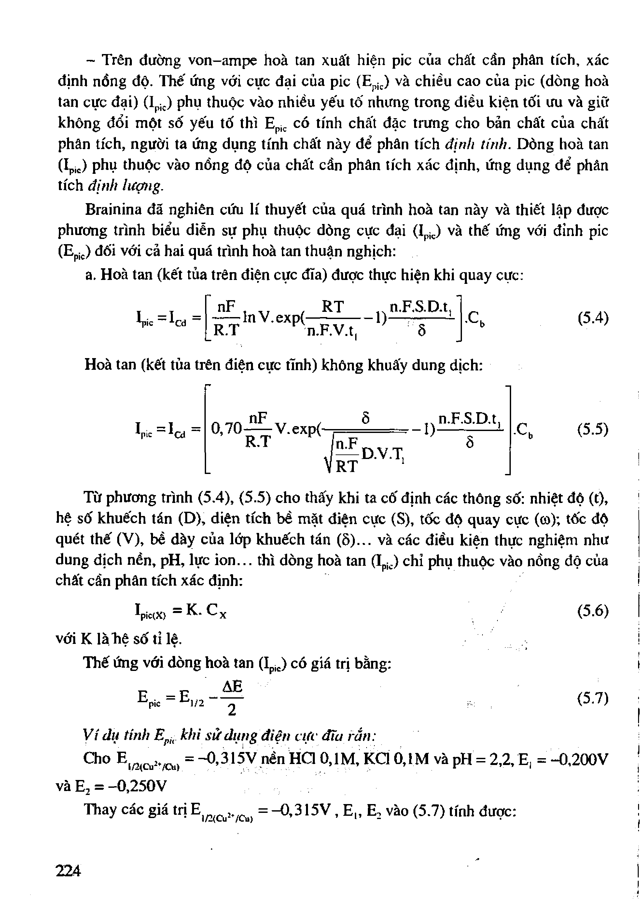

## Page 222

-»• E*,o,-, = E"2 - - ' 2S0 j  ° '200) = -0,315+0,025 = -0,290V
Lund và Onshus đã thiết lập được phương trình của Ipic và Epic khi hoà tan các 
chất trên điện cực giọt thuỷ ngân treo (HMDE) sử dụng kĩ thuật xung vi phân:
Ipic = k.n2.r.AE.V1/2.t.C 
(5.8!)
Trong đó: k là hằng số, ti là số electron trao đổi, r là bán kính giọt thủy ngân, 
AE là biên độ xung, V là tốc đô quét thế, t là thòi gian điện phân và thế đỉnh Ép* và 
cường độ dòng hoà tan Ipic phụ thuộc vào các yếu tố như : nền điện li, pH, chất tạo 
phức, bản chất điện cực làm việc, kĩ thuật ghi đưòng von-ampe hoà tan. Tất cả các 
thông số trên được giữ cố định trong một thí nghiệm cụ thể thì Ipie chỉ tỉ lộ thuận 
với nồng độ chất xác định trong dung dịch như phương trình (5.6) và:
E 
= E  
- 1  
(5 9)
c 
Ư2 
U nF 
2 
p.y)
Ví dụ tính Epíc khi sử dụng điộn cực giọt thủy ngân tteo:
T^
. T 
^  
R T, 1-0,75 
AE 
. , RT 
AE
Khi I  =0,75.Ik, =>E . = E .„ + --V ln — — ----------- = E1/2 + l ,l ——— —
pi‘ 
1/2 
nF 
0,75 
2 
1/2 
nF 
2
Thay các giá trịE1/2 
= -0 ,3 15V, Eị, E2, T, n, F vào (5.9) tính được:
n.F 
2 
n
E 
= -0,315 -  0,0143 + 0,025 = -0 ,3045V
picíCu 
)
Như vậy, đo và ghi cường độ dòng pic (IpjC) phụ thuộc vào nồng đô chất trong 
dung dịch. Nếu tất cạ các yếu tố ảnh hưởng cố định, có thể xác định nồng độ các 
chất bằng phương pháp đường chuẩní hoặc thêm chuẩn (trong khoảng nổng độ 
tuyến tính với dòng hoà tan).
2.2. Điện cục sử dụng trong phương pháp von-ampe hoà tan
Trong phương pháp phân tích von-ampe hoà tan, thường cắm vào bình điện 
phân chứa dung dịch phân tích 3 loại điện cực sau:
2.2.1. Điện cục so sánh: thưòng là điộn cực calỏmen bão hoà hoặc điện cực bạc -  
bạc clorua. Điện cực so sánh phải có thế không đổi (thay đổi không đáng kể) trong 
suốt quá trình làm việc. Đặc biột khi tiến hành liên tiếp các thực nghiệm trong đó 
thời giạn đỉện phân dài. Để đảm bảo thế không đối, người ta chế tạo điện cực so
225

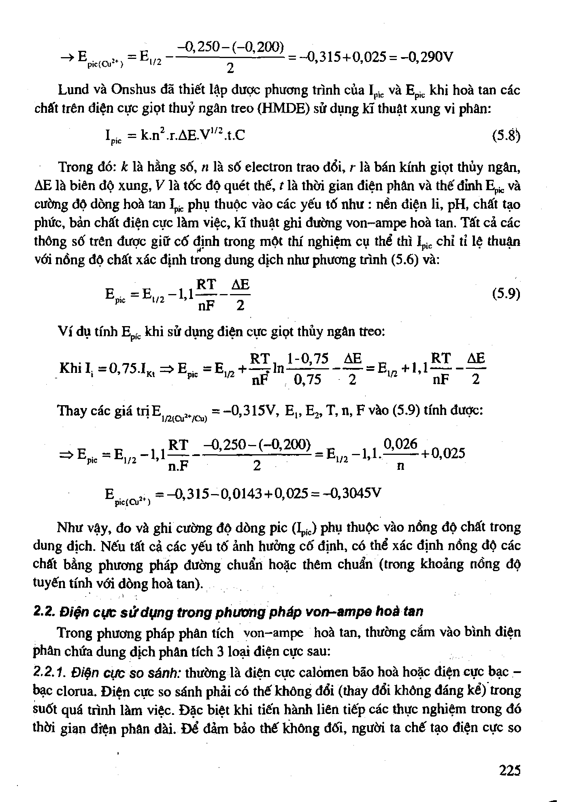

## Page 223

sấnh có diên tích bể măt đủ lớn để mât đô dòng qua cưc đủ nhỏ (i = —) (I là
s
cường độ dòng: mA; s  là diện tích bể mặt của điện cực: cm :; i là mật độ dòng).
2.2.2. Điện cực phụ trợ: thường là điện cực platin (Pt). Người ta lắp thêm điện cực 
phụ trợ vào để khi điện phân đảm bào giữ cho thế không đổi (U = const) ở giai 
đoạn điện phân làm giàu, đê cho thế chỉ thay đổi ở điện cực phụ trợ.
2.2.3. Điện cực làm việc: là loại điện cực trên đó xảy ra phản ứng kết tủa chẫt cần 
phân tích dưói dạng kim loại hoặc hỗn hống hay hợp chất khó tan. Điện cực loại 
này gồm 3 loại điện cực chính sau:
2.2.3.1. Điện cực giọt thuỷ ngân tĩnh có hai ỉoại điện cực ờ dạng giọt treo hoặc 
ngồi (có kích thước nhỏ như giọt Hg trong cực phổ cổ điển).
2.2.3.2. Điện cực rắn hình đĩa quay: được chế tạo từ kim loại trợ (Au, Ag, Pt), 
than (cacbon) thuỷ tinh, graphit (than -  cacbon) có tẩm paraphin và bột than 
(cacbon) nhão nhồi vào ống vật liệu trơ.
2.2.3.3. Điện cực màng thuỷ ngân phủ trên bề mặt điện cực rắn trơ.
2.3. Các phương pháp theo dõi hay ghi đường hoà tan
-  Quá trình điện hoá đo được trong quá trình hoà tan (dòng, thời gian, điện 
lượng...) ở điều kiện tối ưu sẽ tỉ lệ thuận với nồng độ chất điện hoạt (phân tích), 
dựa vào tính chất này để định lượng các chất.
— Các bước tiến hành hoà tan kết tủa: Quét thế ngược với chiều điện phân làm 
giàu, ghi đường hoà tan, đo cường độ dòng hoà tan phụ thuộc tuyến tính vào nồng 
độ, xây dựng đưcmg chuẩn từ đó tính được nồng độ chất phân tích:
!h. = 
=> Im = a.cx => IHr = a.Cx + b 
Cx = ĩ Hl(X1 
-  
(5.10)
a
Các phương pháp theo dõi quá trình hoà tán được trình bày ở bảng 4.1:
Bảng 5.1. Các phương phảp theo dõi quá trình hoà tan
Phương pháp
Hàm theo dõi
Dạng đường cong 
hoà tan
Định lượng
2.3.1. Von -  
Ampe hoà tan
I = f(E)
I /
Á
A  
I 
/ \
> E
Icd = K.C
Cx = W ) " b (51l)
a
226

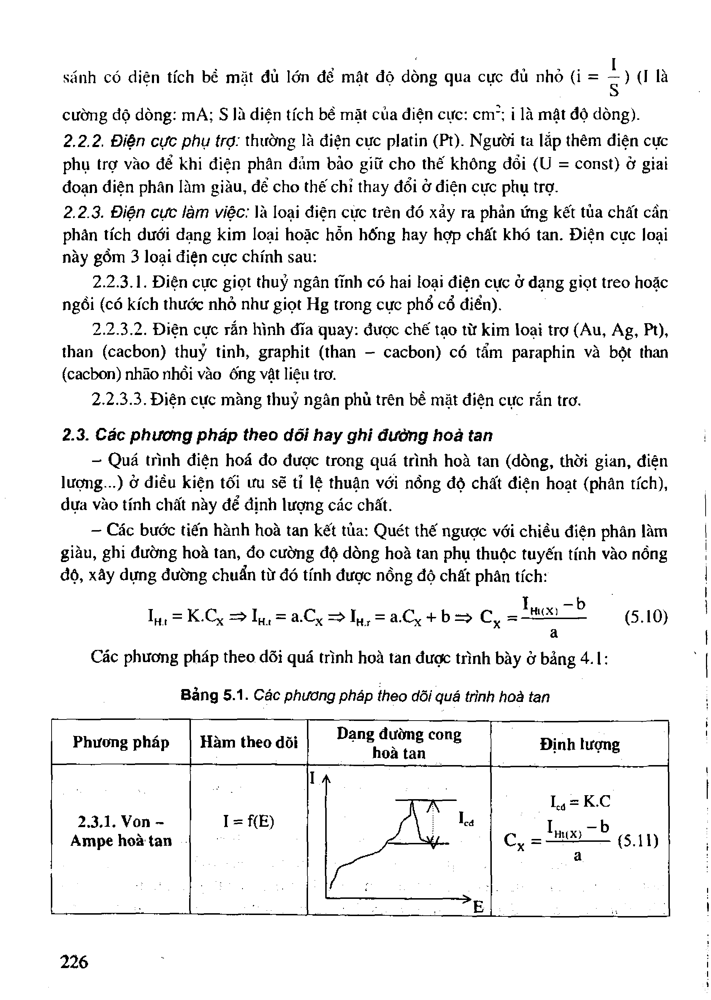

## Page 224

2.3.6. Cực phổ dao động:
/ dE^ phụ thuộc vào thế:
Đo tỉ số
V dt
ẹ= f ( - E )  
dt
(5.16)
Trong các phuơng pháp theo dõi, ghi đường hoà tan trên thường sử dụng 
phương pháp 2.3.1, 2.3.2 và 2.3.5 còn phương pháp 2.3.6 ít sử dụng.
3. Các loại phản ứng dùng dể kết tủa làm giàu
Các lòại phản ứng sử dụng để kết tủa làm giàu chất eần phân tích rất phong 
phú. Có thể kể ra các loại chính sau:
227

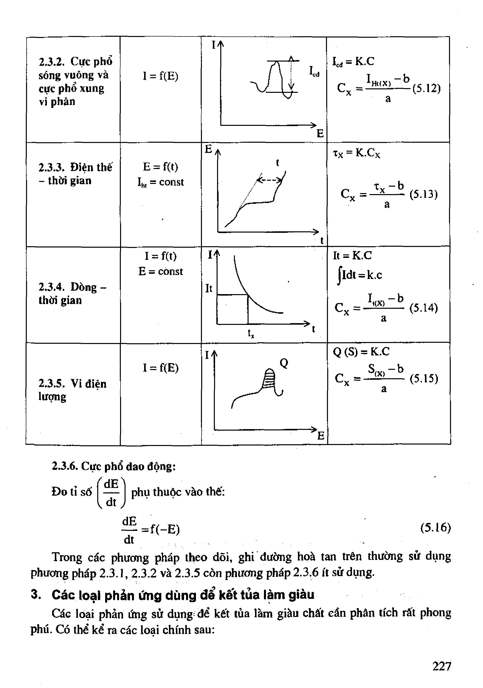

## Page 225

3.1. Phẩn útig khử ion kim loại trên catot thuỷngân hoặc màng thuỷ ngồn:
lon kim loại có thể ở đạng hiđrat hoá Cu(OH)^+ hoặc ion phứcQHNH,)^, 
kim loại (Cu, Pb, Zn, Cd, Sb, Sn, TL.) dễ tạo hỗn hống với Hg.
a. Quá trình làm giàu ở catot (-), quét thếị+) -> ị-):
-  lon trần: Mn+ + ne + Hg —» M(Hg) 4'
Cu2+ + 2e + Hg -4 Cu(Hg) i  
~ lon phức hiđroxo: Cu(OH)*+ -> Cu2+ + nH20  
Cu2+ + 2e + Hg 
Cu(Hg) ị
-  Hoặc ion dưói đạng phức: Cu(NH3 )^+ —> Cu24" + 4NH3
Cu2+ + 2e + Hg -► Cu(Hg) ị
b. Quá trình hoà tan ờ anot (+), quét thế(-)-> (+ ):
Cu(Hg) ị —> Cu'+ Hg 
Cu -* Cu2t (d2) + 2e
3.2. Phản ứng khử các iort kim loại thành kim loại trên bề mặt điện cục 
rắn trơ
a. Quá trình làm giàu ở cực catot (-):
Mn+ + ne -*  M 
Cu2+ + 2e —y Cu 
Hg2* + 2e 
Hg 
Ngay cả vàng: Au3+ + 3e —> Au
-  Phản ứng này được sử dụng để kết tủa làm giàu một số lớn các ion kim loại, 
kể cả các ion kim loại tạo được hỗn hống và không tạo hỗn hống với Hg, kể cả 
A u^vàH g2*.
b. Quá trình hoà tan ở anot (+), quét th ế(- ) —> (+):
M -> M™- + ne 
Cu -> Cu2+ + 2e
. ỵ
3.3. Phản úng để xác định anion và ìon kim loại đa hoá trị
3.3.1. Phản ứng giữa anión (An~) với cation của điệh cực bị tan ra
Dùng điện cực bạc để xác định Iượrig vết các anion -  halogềnua (CT, Br“, r, 
SCN"). Quá trình điện phân làm giàu ở điện èực anot làm bằng Ag bị lán tạo 
thành cation Ag+ sau đó kết hợp với Cl. tạo thàah kết tủa AgCl trên bề mặt điện 
cực anot (+).
m

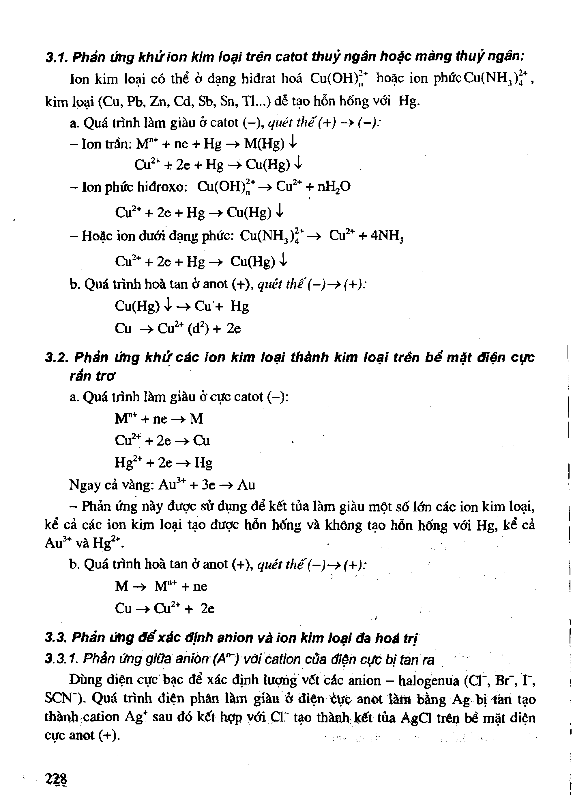

## Page 226

-  Điện phân anot (+), quét thế ị-) —>(+):
M 
đ*nrhan" > Mn+ + ne 
hoặc 
Ag 
điệnphan-  > Ag++ e 
M n+ + A ™- _ p.ư. hóa học... ^  Agm\
 ị 
hoặc 
Ag+ + c r  
P U h-^ -hOC ' 
> AgClị
-  Quá trình hoà tan catot (-), đảo cực anot thành catot, quét thé'(+)—> (-):
A gC ll 
Ag+ + c r
Ag+ + e 
điệaPhan - > Ag
Ag+Ơ  + e => Ag + a
Hoặc với ion nào đó có ừong dung dịch ngoài Q~.
3.3.2. Phản ứng giữa thuốc thử hữu cơ với ion kim loại 
đa hoá trị: (Co2+, Co3+,
Fe2+, Fe3+, Sn2+, Sn^, Sb3+, Sb5\  Ce3+, Ce*\..)
Khi điện phân làm giàu, nguời ta oxi hoá hoặc khử ion kim loại trên điộn cực 
thành ion M(n+m)+ hay M(T,-m)+, ion này tạo kết tủa khó tan ngay trên bể mặt điện cực 
với ion OH" hoặc với thuốc thử HR cho thêm vào truóc khi điện phân.
a. Phản ứng tạo kết tủa hiđroxìt khó tan với OH~
Quá trình làm giàu là tiến hành phản ứng điện cực à thế không đổi để khử 
hoặc oxi hoá ion có hoá trị thay đổi khi có mặt anion (OH_) có khả năng tạo với 
sản phẩm của phản ứng điện cực hợp chất khó tan trên bề mặt điện cực làm việc.
Người ta chọn pH thích hợp để ion cần xác định M"+ (Co2*) không bị thuỷ 
phân, trong khi đó M(n+m)+ (Co3+) bị thuỷ phân và kết tủa dưới dạng hiđroxit, thì có 
thể xác định ion Mn+ (Co2+) bằng phương pháp von ampe hoà tan catot (-) theo 2 
giai đoạn sau:
-  Giai đoạn làm giàu:
Thực hiện quá trình anot (+), quét thế từ (—) —> (+)
jY|n+ 
dp.p.u điẹn cực... 
) 
Ịyj(n +m>* +  m e
C e 3+ 
dp-p-ưđìộnggẹ... > C e ^  +  e
Phản ứng hoá họp xảy ra :
M<-m»+(n +m )OH 
P « W - ■> M(OH)(n+mrV 
:
Ce4* + 40H" —p-ưháahl*-- > Ce(OH)4 ị (trên điện cực làm việc)
— Giai đoạn hoà tan :
Là quá trình catot (-), quét thế từ (+) —» (-) vé phía cực catot
M(OH)(n+m) ị 
M<n *m)' + (n + tn) OH' hoăc Ce(OH)4 ị -> Ce4* + 40H"
M (n+n” 
+  m e  
dp-p^itacưt... 
M m+ h o ạc  
C e4+ + e  
dp.p.ư dito cực,.^ > 0 *3+
Í29

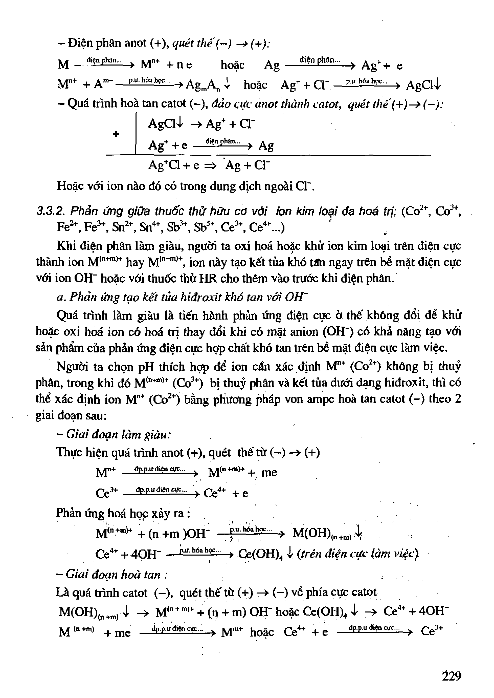

## Page 227

Ví dụ: Làm giàu và xác định các nguyên tố đa hoá trị dưới dạng kết tủa 
hiđroxit khó tan:
-  Nguyên tắc:
Chọn pH thích hợp để Mn+ (Mn2+) không bị thuỷ phân, nhưng 
(Mn4+) bị 
thuỷ phân và kết tủa dưới dạng hiđroxit: M(OH)(n+in) -l; Mn(OH)4ị thì có thể xác 
định được hàm lượng 
(Mn4+) bằng phương pháp von ampe hoà tan catot (-) 
theo 2 giai đoạn sau:
-  Giai đoạn lảm giàu:
Thực hiện quá trình anot (+), quét thế từ (-) —> (+)
NT 
> M»+"»* + me hoặc Mn2+ - > E -ưd*ncg,- > Mn4+ + 2e
Phản ứng hoá học xảy ra:
M(n+m* + (n +m )OH- . 
> M(OH)(n+m| i
Mn4+ + 40H ' - Pưhfrh?c- -> Mn(OH)4 ị (trên điện cực làm việc)
-  Giai đoạn hoã tan :
Thực hiện quá trình catot (-), quét thế từ (+) —> (-) về phía cực catot: 
M(OH)(n+m)ị 
-> 
M(n + m)+ + (n + m) OH“
M
(n +m)+
+ me
M(OH)(n +m)ị + me 
Mm+ + (n + m) OH"
Hay
Mn(OH)4 ị 
Mn4+ 
+ 2e
Mn + 40H ‘
đp.p.ư điện cực...
Mn.2+
Mn(OH)4 ị +2e 
Mn2+ + 40H “
b. 
Phản ứng tạo hợp chất khó tun với thnấc thửhữit cơ 
Quá trình làm giàu ỉà tiến hành phản ứng điện cực ở thế không đổi để khử 
hoặc oxi hoá ion có hoá trị thay đổi khi có mặt thuốc thử hữu cơ (HR)
Điện phân: ờ điện cực (-) hoặc (+) Mn+ ± me 
d>
cực" 
> M (n±m>
-  Ở anot (+): 
Co2" —1
> Co3++ e
Sau đó tạo thành màng khó tan trên bể mặt điện cực:
M<n±m> + (n+m),RH 
> M R ị + (n+ m) H+
230

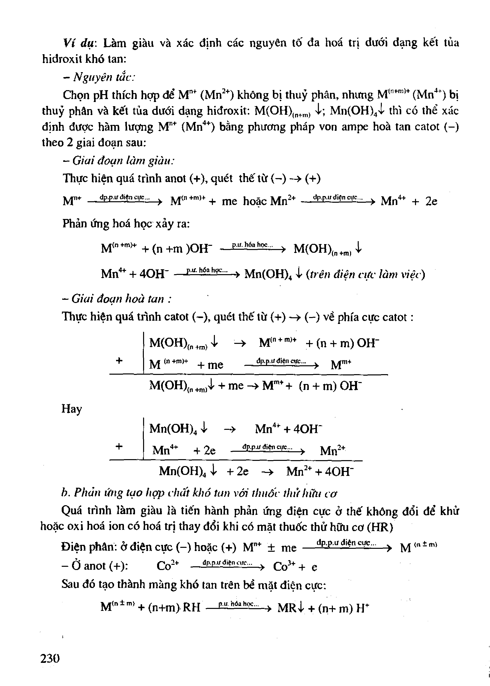

## Page 228

Nếu M"1 + m> = Co3+ tạo thành màng khó tan trên bề mặt điện cực:
Co,+ + 3RH 
p Jh,v 
> C0R3 ị + 3H+
Ví dự'. Để xác định Co:+ người ta oxi hoá nó trên điện cực trong mói trường
(NH4+ 0,05M + NH, 0,4 M) thành Co3+, Cou kết tủa với thuốc thử 1- nitrozo-2-
naphtol (RH) tạo thành màng khó tan trên bề mặt điện cực:
-  Điện phân ở anot {+), quét thê’(-) —> (+):
Co2+
dp.p.ưdiện cực.. * Co + e
Co3+ + 3RH p i, h6ahM- - » 3H+ + C oR ,ị bám trên anot
Hoà tan catot (-), đảo cực anot thành catot, quét thế (+) —> (-): 
CoR3ị -> Go3+ + 3 R"
Coỉ+ + 3 e ^  Co
CoRj X + 3e —> Co 'i' + 3R 
Bằng cách làm giàu này có thể xác định:
-  Lượng vết Sbí+ bằng thuốc thử Rodamin c  (R+X~):
+ Điện phân ở anot (+), quét thế ị-) 
(+):
Sb3+ 
đp.p.ư điện cực... 
> Sb5+ +  3e
Sb5+ + 5RX 
5R+ + SbX5l  bám trên anot 
+ Hoà tan catot (-), đảo cực anot thành catoí, quét thế (+) 
SbRs ị 
Sb5+ + 5X '
Sb5* + 5e 
Sb
(-):
SbX5ị + 5c 
Hỏn lan p.ưđiện CƯC^ > sb ị + 5 x _
Đo dòng hoà tan tỉ lệ thuận với lượng SbX, có nghĩa là tỉ lệ thuận với nồng độ 
Sb3+. Như vậy xác định được nồng độ của Sbỉ+ (C to*) trong mẫu phân tích.
'  Xác định lượng vêft iođua (I‘) cũng với thuốc thử Rodamiri c  
+ Điện phân làm giàu ở catot (-), quét thế(+) —> (-):
H ợp  ch ất c h ứa  I2: I2 +  2e — đp-p-ư diện cục... 
^ 2[-
r  chuyển vào trong dung dịch tác dụng với thuốc thử Rodamin c  (cho vào 
dung dịch trước khi điện phân) tạo thành sản phẩm bám vào điện cực:
r  + R+X_ 
X~ +■ RI i  bám vào điện cực
231

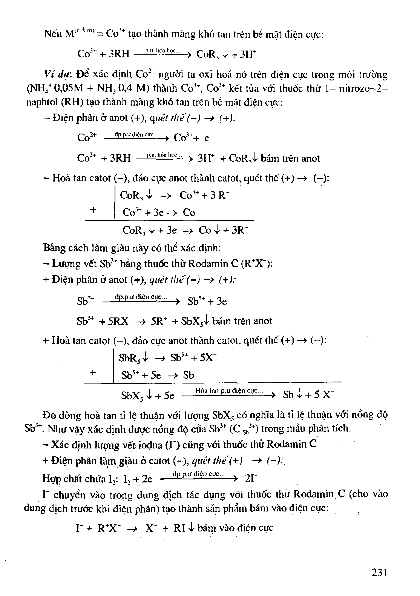

## Page 229

+ Hoà tan chất đã được làm giàu ở anot (+), đào cực catot thành anot: 
Quét thế(—)—>(+):
-  ở Aniot (+):
2RI ị -> 2R+ + 2 r
21 —> 
I2 + 2e
2RI ị 
Hòạlanp.ưđiệnẹưc... > 2R++ I2 + 2e
Đo dòng hoà tan tỉ lệ thuận với lượng RI có nghĩa là tỉ lệ thuận với r  dẫn đến 
xác định được nồng độ của I”(C _)trong mẫu phân tích.
3.4. Phản úng giữa thuốc thửhũu cơ vừa tạo phúc với ion cần xác định 
vừa hấp phụ trên điện cục ở thếxấc định
Sử dụng cả hai hiộn tượng hấp phụ điện hoầ và tạo phức của các chất cần xác 
định với thuốc thử trên bề mặt điộn cực làm việc.
Ví dạ 1: Thuốc thử cồ khả năng hấp phụ lên bề mặt điện cực ở một thế xác 
định, sau đó thuốc thử tạo phức với chất cần xác định làm giàu tập trung nó trên bể 
mặt điện cực.
Điện phân ở thế khồng đổi xác định:
R  
—Hấp £hụ điện hóa. 
> 
ở t h ế k h ô n g  đ ổi (E  =  c o n s t)
-  Ở anot (+):
Đimetylglyoxim: 2H2Dim — Hấ^ h- - -nhóa - > 2H+ + 2HDim-( Rhp) 
Sau đỏ: Rhp + M"* ■ 
—nứn8h6a^ -  > 
(RM“%
2(HDim%  + M"+ 
~
ản-frBh- hpc- > (M íH D im )^ + 2H+
Với Niỉ+: 2H2Dim + NiI+ 
- ânứn^h6ahọc - > [Ni(HĐim)2]hp + 2H+
Với Fe2+: 2H2Dim + Fe2* 
- ảnứn?hóahọc"' > [Fe(HDim)2]hp + 2H+
Với Co2+: 2H2Dim + Co2+ — —  ^ hó- ọc - > [C oíH D im )^ + 2H+
-  
Hoà tan catot (-), đảo cực anot thành caíot: tiến hành hoấ tan điện hoá chất 
được hấp phụ làm giàu bàng cách quét thế từ (+) 
(-) để đo dòng điện hoà tan Ix
tỉ lệ thuận với Cphức 
CkimtoỊi cần xác định:
(RMn+)hp + ne ,  Hòạ.an^ư^ncực... > ư  + R.
232

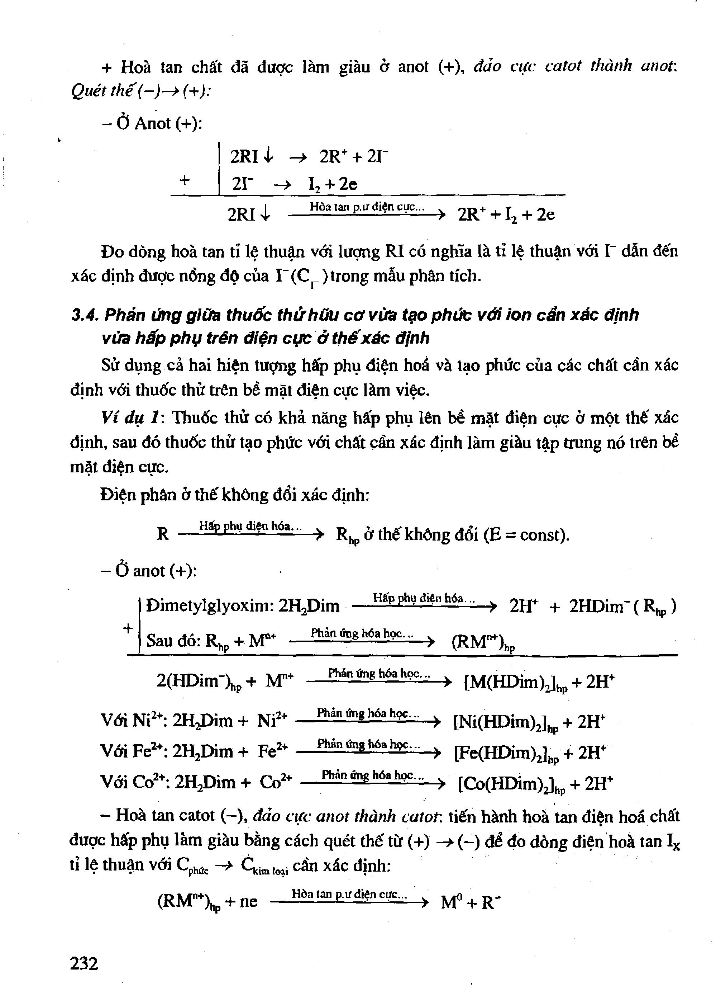

## Page 230

Ví dụ:
[Ni(HDim)2]hp -► Ni2+ + 2HDinT
1VT''>+ , o 
Hòatanp.ưdiẽncưc... 
. 
XT.f)
Ni 
+ 2e ------------ —------- -----> Ni
[N i(H D im )2]hp +  2e 
. Hòatanp.ưdiẹncực... > N ị0 +  2  tID im -
V7 dạ 2: Cho ion cần xác định Co2+, Ni2+ tạo phức với thuốc thử 
đimetylglycoxim (H2Dim) hoặc bidipyriđin hay pyrocatechin. Các phức tạo thành 
bị hấp phụ lên bề mặt giọt thuỷ ngân ở thế điện phân cố định và xác định:
-  Cho Co2+ tao phức với thuốc thử: Co2* + tiJDim —ỷ CoịtìDirrt)2 + 2H*
-  Sau đố cho chất hấp phụ bị điện phân ỉàm giàu ở thểxác định trên anot ị+).
-  Đảo cực anot thành catot, hoà tan [Co(HDim)2Jhp trên catot bảng cách 
quét thế từ (+ )-> (-):
[Co(HDim)2]hp -> Co2+ + 2HDirrT 
Co2+ + 2e 
Hòalan_điệnháa_^ > Cq0
[Ni{HDim)2]hp + 2e 
H6a tan điện —
Co0 + 2HDim-
Đo được dòng điện hoà tan Ix tỉ lệ thuận với Cphfc, Cphúc tỉ lệ thuận với Q.im toại- 
Từ đó tính được nồng độ ion kim loại cần xác định,
— 
Sự làm giàu bảng hấp phụ phụ thuộc vào rất nhiều yếu tố: nhiệt độ, pH của 
dung dịch, chất dùng làm điện cực.
4. 
Thiết bị đo dòng hoà tan (von-ampe hoà tan)
Sử dụng các máy cực phổ cổ điển do tổn tại dòng tụ điộn trong dung dịch điện 
phân mà giới hạn nồng độ xác định được bằng dòng khuếch tán chỉ đạt cỡ 10 5 
đến 10-5M.
Dùng các máy cực phổ hiộn đại như cực phổ sóng vuông, cực phổ xung vi 
phân có ưu điểm là loại trừ được dòng tụ điện trong dung dịch điộn phân khi đo 
dòng điện phân chất phân tích (chất khít cực) đẩ làm tăng một cách đáng kể độ 
nhạy cửa phương pháp nhưng chĩ đạt tới giã trị nlO"7M đối vối đa số các chất và 
đến nlO_8M đối với một vài chất có quá trình điện hoá thuận nghịch
Do yêu cầu thục tế cùrig với sự phát triển các ngành kinh tế, khoa học kĩ thuật, 
bảo vệ môi trường, lâm sàrig, an toàn thực phẩm và pháp y,... đỗi hỏi có phương 
pháp phân tích định lượng chính xác cảc chất cố nồng độ cức nhỏ cỡ vài 
nanogam// (10-6 g11) đặc biệt các tạp chất có trong vật liêu siêu đẫn, các kim loại 
nặng trong nước uông, nước sinh hoạt, các đột tố trong thực phẩm, tôm cá,... mà
233

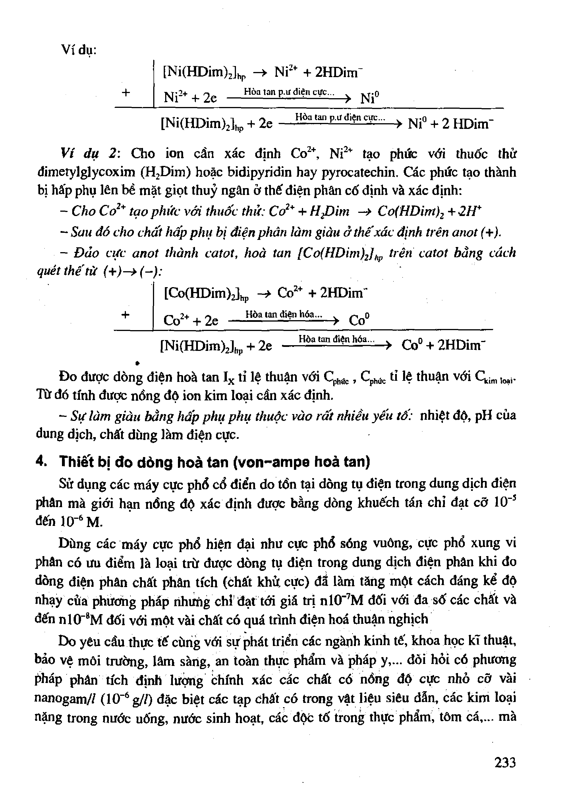

## Page 231

phương phííp cực phổ chưa đáp ứng được. Đổ đáp ứng thực tế yêu cầu, các nhà 
khoa học nghiên cứu chế tạo và đă đưa ra hàng loạt các phương pháp phân tích 
còng cụ như:
-  Phương pháp hấp thụ nguyên từ.
-  Phương pháp quang phổ phát xạ plasma.
-  Phương pháp huỳnh quang tia X và phương pháp kích hoạt nưtron có độ 
nhạy cao nhưng đòi hỏi các phòng thí nghiệm có kinh phí lớn vì các thiết bị rất đắt 
tiền, thao tác phân tích rất phức tạp.
-  Trong điện hoá, điện phân là phương pháp làm giàu tốt và triệt để. Bằng 
cách này nếu điện phân một dung dịch rất loãng ví dụ như các muối kim loại nặng 
nồng độ nhỏ hơn 10"8M thì nồng độ kim loại được kết tủa trên bề mặt điện cực 
trong pha rắn trở lên vô cùng lớn, cỡ hàng trăm, hàng nghìn lần. Các nhà khoa học 
kết hợp phương pháp điện phân để làm giàu cực phổ và các phương pháp điộn hoá 
khác chế tạo ra những máy cực phổ đa năng như 757 và 797 VA Computrace nhỏ 
gọn, như hình 4.3.
Hình 5.3. Máy phân tích cực phổ đa năng 797 VA Computrace
-  
Tất cả các phép đo, ghi dòng von-ampe hoà tan được thực hiện trên máy 
phân tích cực phổ đa chức năng 797 VA Computrace do hãng Metrohm (Thụy so 
sản xuất, vối hệ 3 điện cực:
1. Điện cực làm việc (WE): Điện cực giọt thuỷ ngân treo (HDME), trên đó 
xảy ra quá trình làm giàu và hoà tan chất cẩn phân tích.
2. Điện cực so sánh (RE): Ag, AgCl/Cl", luôn được bảo quản trong dung dịch 
KC1 bão hoà.
3. Điện cực phụ trợ (AE): Điện cực Pt
23.4

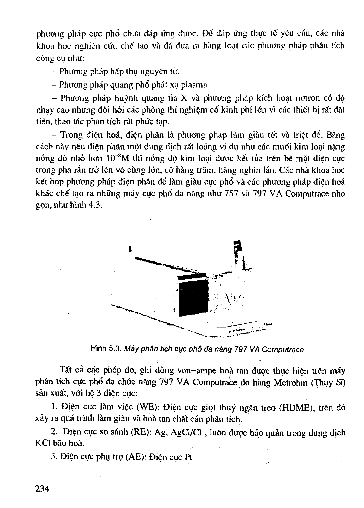

## Page 232

4. Bình điện phân: Có dung tích 50ml, được chê tạo từ thủy tinh thạch..anh. 
Nắp bình có cấu tạo thích hợp đê dẫn khí trơ (Ar hoặc N3) nhằm duòi oxi hoỉi Um 
trong dung dịch đo và có một motor nhỏ gắn với que khuấy đê khuấy trộn đều 
dung dịch đo. Bình điện phàn được gắn các bộ phận: nấp giá đậy, bình đo, diện cực 
làm việc, điện cực so sánh, điện cục phụ trợ, ống dẫn khí và que khưây.
5. Máy vi tính Pentium 4 dùng để điều khiển thiết bị, đo, ghi và xử lí kết quả. 
Mọi thông số đo đểu được nhập từ bàn phím. Khi không đo, máy tính có thể thực 
hiện mọi chức năng khác của một máy vi tính cá nhân thông thường.
6. Máy in HP Lazer Jet 1020 dùng để in các đữ liệu kết quả, thông số phép đo, 
thao tác tiến hành phép đo, ghi chú, đường chuẩn, giản đổ von-ampe lnùi tun,.,, 
sau khi đo, ghi xong. Cách tiến hành phép đo như sơ đồ khôi tronsz hình 5.4.
Hình 5.4. Sơ đổ của phép đo von-ampe hoà tan trèn mày cục phổ đa năng
235

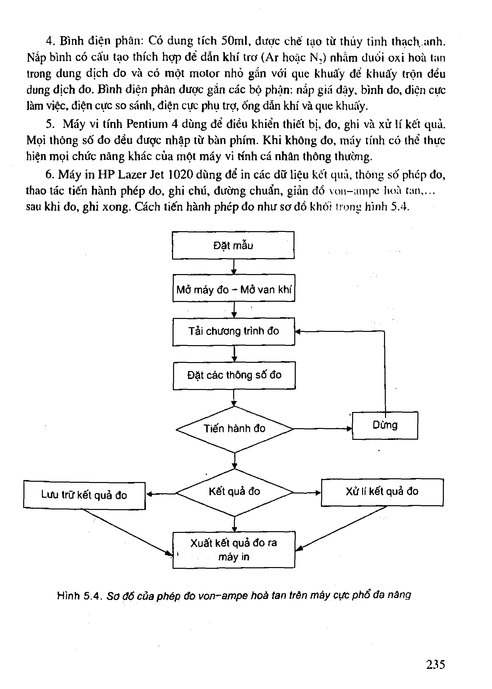

## Page 233

-  Độ lặp lại của phép đo
Độ lặp lại của phép đo rất tốt, ví dụ tiến hành ghi đường von-ampe hoà tan 
DP-ASV 10 lần của dung dịch Zn2+, Cd2+, Pb2+ và Cu2+ có mặt đổng thời với cùng 
nồng độ (0,012mg//) trong dung dịch đệm (NH4Àc + HAc) 0, IM, vái điểu kiộn tối 
ưu và thông số ghi trong bảng 5.2.
Bảng 5.2. Các thõng số đo và điều kiện tổí ưu
Điện cực làm việc
HMDE
Thời gian đuổi oxi
I80s
Chế đô đo
DP
Thời gian cân bằng
20s
Kích thước giọt
4
pH của dung dịch
3,6
Tốc độ khuấy
2000
Thời gian đặt xung
0,04s
Thế điện phân làm giàu
-  1,3V
Tốc độ quét
0,02V/s
Thời gian điện phân
180s
Khoảng quét thế
-1,3 -T 0,2V
Kết quả (sau khi đã hiệu chỉnh mẫu trắng) thể hiện trong hình 5.5 và kết quả 
xác định độ lặp ghi bảng 5.3.
236

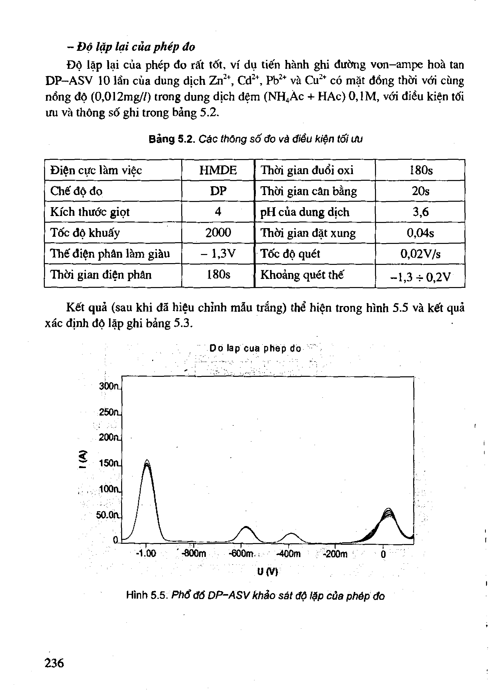

## Page 234

Bảng 5.3. Đánh giá độ lặp lại của phép đo
Số
lần
đo
Zn2+
ca2+
Pb2+
Cu2+
Ep (V)
Ip(nA)
EP(V)
Ip(nA)
EP(V)
Ip(nA)
EP(V)
ựn A )
1
-0,961
132,2
-0,544
28,52
-0,354
28,52
0,051
50,7
2
-0,961
133,2
-0,544
28,32
-0,354
28,32
0,051
72,9
3
-0,961
131,2
-0,544
27,92
-0,354
27,92
0,051
69,7
4
-0,967
133,2
-0,552
28,52
-0,366
28,52
0,045
68,4
5
-0,973
128,2
-0,542
27,72
-0,372
27,72
0,0426
63,3
6
-0,959
130,2
0,561
28,02
-0,383
28,02
0,047
61,6
7
-0,964
119,2
-0,539
26,32
-0,348
26,32
0,048
55,4
8
-0,969
118,2
-€,566
26,42
0,3503
26,42
0,044
53,4
9
-0,957
128,2
-0,556
27,82
0,346
27,82
0,049
54,3
10
-0,971
124,2
-0,538
27,02
0,354
27,02
0,042
50,4
Vớị:
Zn2+
câ2+
Pb2+
Cu2+
Giá tộ trung bình
127,8
54,1
27.7
60
Độ lệch chuẩn s
5,52
1,48
0,81
8,3
Độ lệch chuẩn giá trị trung bình
1,75
0,47
0,26
2,62
Sai sổ tương đối q%
3,09
1,95
2,1
9,88
Kết quả cho thấy phép đo có độ lặp lại rất tốt.
Znĩ+
Cd2+
Pb2t
Cu2+
Giới hạn phát hiệỉì LOĐ của
1,42. Kr’M* 4,43.10^°M
7,1U0-10M
1,28.10'^
Giới hạn định lượng 
LOQ cùa
4,73.1ơ_9M
1,48.10
2,37.1(T9M
4,27.10-^
Phương pháp von-ampe hoà tan xung vi phân với điộn cực giọt thủy ngân treo . 
cố khả năng xác định đổng thòi nhiều nguyên tố và có độ nhạy rất030 (n.10-10) và độ 
chọn lọc cao có thể xác định được thế ứng với hai pic nhỏ hơn 0,05V 
(-0,961 + 0,544 = 0,417V) nhất là khi chúng có mặt đổng thời với tỉ lộ lớn.
237

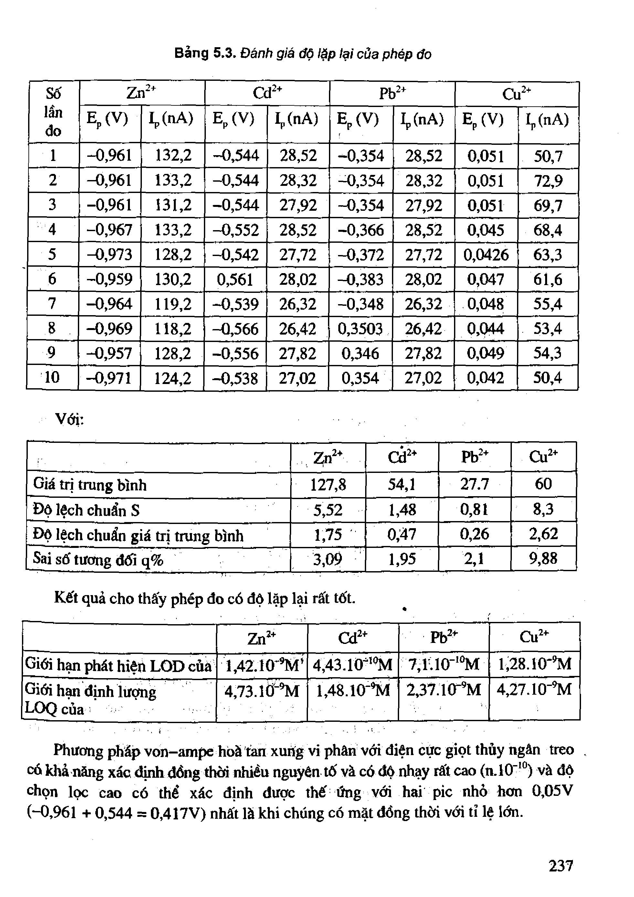

## Page 235

TÀI LIỆU THAM KHẢO
1. 
Dương Quang Phùng. Luận vãn sau đại học ”Nghiên a'fit phức mới giữa Cu2+ 
và N-ưnkyl izutin -  [ -  (S) (O)-ankylJ- semicacbazon bằng phương pháp cực 
ph ổ”. Viện Khoa học Việt Nam -  Khoa Hoá học trường ĐHSP Hà Nội, 1980.
2. Doerffel K. Thống kê trong ỈIOÚ phân tích. NXB ĐH và THCN. Hà Nội, 1983.
3. 
Huỳnh Văn Trung, Đỗ Quý Son. Xiỉ lí thống kê các sô liệu thực nghiệm 
trong hoú học. NXB Khoa học và kĩ thuật, 2006.
4. 
Dương Quang Phùng. Nghiên í thí cức phức chất của kìm ỉoại chuyển với 
fi-tfiiosernicacbazon izatin. Tạp chí Hoá học Viên khoa học Viột Nam. T. 25, 
N e.4, tr.4-7, 1987.
5. 
Dương Quang Phùng. Xức định hầỉìg sô'bền nhiệt động của phức đồtìgịỉỉ) với 
p~ịS)-(o)~ankyỉ-semicacbuzon N—unkyỉ izatin từ cúc giú trị đo được bảng 
phương pháp cực phổ. Thông báo khoa học Hoá học trường ĐHSP Hà Nội 1. 
SỔD,tr. 91-98* 1988.
5. 
Dương Quang Phùng, Trần Quang Hải. Nghiên cứit xác định hàm ỈKỢìig ion 
kim ìoại nặỉig (Cdz+, Pb2*, Ciỉỉ+, Zn2*) trong nước, vật rắn ỉơ lửiìg vù bùn ờ hồ 
nuôi cá (ịuận Hoàng Mai Hù Nội bằng phương pháp von -  (Wipe hoả ta/ỉ. Tạp 
chí Hoá học, T. 47 (2A), Tr. 132 -  136, 2009 .
6 . Từ Vọng Nghi, Trần Chương Huyến, Phạm Luận. Cơ sâ lí thuyết một số 
phương pháp phàn tích điện hoá hiện đại, Hà Nội, 1990.
7. Nguyễn Tỉnh Dung, Lê Thị Vinh, Trần Thị Yến, Đỗ Văn Huẻ. Một sô'
phươtìg pháp phân tích li hoá. Khoa Hoá học trường ĐHSP thành phố Hồ Chí 
I
Minh, 1995* 
I
8 . Nguyễn Việt Huyến. Cơ sở cúc pìutơttg pháp phân rích điện hoá. Đại học
Quốc gia Hà Nội, 1999. 
I
9. Dương Quang Phùng, Dương Thị Thu Hiền. Nghiên cứii tìm cúc điều kiện 
tối ưit đ ể xúc định hàm iỉỉợng ì on ìùtrit (NO 2) trong quá trình xử li nước bằng
phươtĩg pháp vực phổ xung vi phân. Kỉ yếu Hội thảo "Nâng cao chất lượng 
1
nghiên cứu khoa học và đào tạo giáo viên hoá học trong giai đoạn mới" -  Tạp 
chí Khoa học ĐHSP Hà Nội ISSN 0868 -  3719, Hà Nội -  10/2006.
10. Douglas A. Skoog, James L. Leary. Principles of Instrumental Analysis. 
* 
Saunder College. Publishing, 199 i.
238

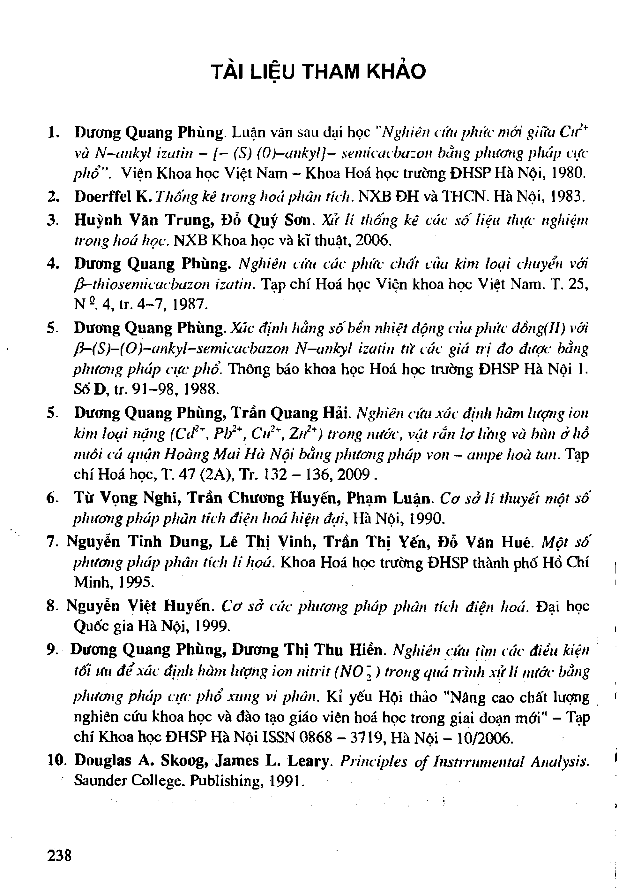

## Page 236

11. Dennis G. Fetters, John M. Hayes and Gary M. Hieftile. Chemical 
Separations anti Measurements. Theory and Practice of Analytical Chemistry. 
Saunders Golden Series, 1978.
12. Wang J. Stripping Analysis, VCH Publishers, Inc. 1985.
13. Hobart H. Willard, Lunne L. Merrit J r ., John A. Dean, Fromk A. Settle 
Jr. Instrumental Methods of Analysis. Wadsworth Publishing Company, 7lh 
Edition, 1988.
14. Kennedy J. H. Analytical Chemistry Principles. 2nd edition Saunders College. 
Publishing, New York, 1990.
15. Keraley D. and Haines p. J. Analytical Chemistry. Oakland Analytical 
Services, Farham, u k  The INSTANT NOTES Series, Serier Editor B. D. 
Hames, First Pulbished, 2002.
16. Polarographic Determination of Ammonium and Nitrite. N°. 127/1 e, 
Application Bulletin, Metrolm Ltd, 2004.
17. A. Ali Ensafi, T. Khayamian, A. Benvidi and E. Mirmomtaz,
Simultaneous Determination of Copper, Lead and Cadmium by Cathodic 
Adsorptive Stripping Voltammetry Using Artificial Neural Network Anaiytìcư. 
Chimica. Acta, volume 5611 pp. 225 -  232, 2006.
18. J. Limson, Tebello Nyokong. Substituted Catechols as Coniple.xing Agents 
for the Determination of Bismuth, Lead, Copper and Cadmium by Adsortive 
Stripping Voltummetry, Analytica Chimica Acta, 344, pp. 87 -  95, 1997.
19. M. Cecilia Vargas Mamani, Luiz Manoel Aleixo, Monica Ferreira de 
Abreu and Susanne Rath. Simultaneous Determination of Cadmium and 
Lead in Medicinal Plants by Anodic Stripping Voitummetry, Journal of 
Pharmaceutical and Biomedical Analysis, Volume 37, pp. 709 -  713, 2005.
20. M. G. Paneli, Avoulgaropoulos. Application of Adsorptive Stripping 
Voltamnieiry on the Determination of Trace and Ultratrace Metals 
Electrouìiaỉysis -  Anưỉyticu . Chimica. Acta, pp. 355 -  373, 1993.
21. P. L. Bailey. Analysis with Ion -  selective Electrodes, Heyden, London, 
1976.
22. K. Camman. Working with Ion -  selective Electrodes, Spriner -  verlag, 
Berlin, 1979.
23. J. Koryia. Anal. Chim. Acta. N° 139, ], 1982.
24. R. K. Buck. Chim. Acta. N° 50, 17 R, 1978.
239

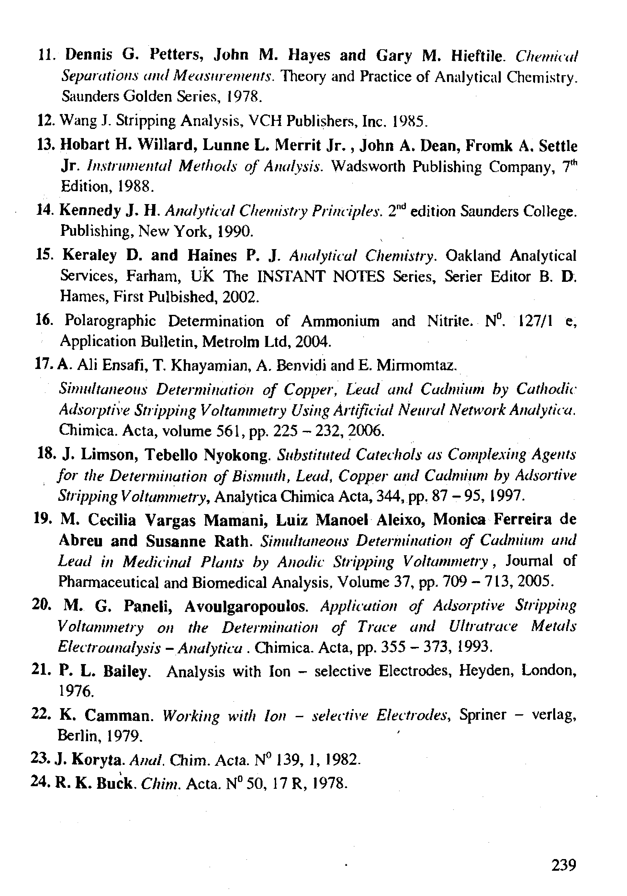

## Page 237

25. 
3bi0Hr 
KyaHr 
O ynr. 
K,oopòuHaụuoHHbie 
coedmenwi 
nepexoỞHbix 
MemcuiJioe 
c 
Ịỳ-muo-u 
ceMUKap6a30H0MU 
HeKfOmopbix 
u3amuH0e. 
ữỉỉc c e p T a im s n a  coHCKaHHe yneHOH CTeneHH K aH /uw aTa XHMHHecKHX 
HayK. KniHHHẽB -  1984.
26. HoBaKOBCKHÌí M. c . Uaốopamopnbie paỗombt no XUMUU KOMruieKCHbix 
COeÒmeHUŨ. H3aaTeJlbCTBO “XapbKOBCKHH y HHBepCHTÊT” . XapbKOBCKHỈÍ,
c 152 -  156,1972.
27. Jlypbe K). K>. CnpaeoHHUK no ananumuHecKHOu XUMUU. H3flaTejibCTBO 
“Xhmhs”. MocKBa, 1971.
28. JIfljiHKOB JO. c . 0U3UKO -  xuMmecque Memodbi anajiu3a. PĨ3/ỉaTejibCTB0 
“Xhmha”. MocKBa, 1965.
29. 
r eHpoBCKHÌỈ H. , K yra fL  Ocuoeu nompoapaộuu. PĨ3ZiaTejĩbCTBO “Mnp”. 
MocKBa, c.l 18 -  334,1965.
30. 
EejyrjiMH B. JX. ĩlonHpoepaộim e XUMUU u mexnomzuu nojiimepoe. 
H3flaTeJIBCTBO “XapbKOBCKHH yHHBCpCHTeT”. XapBKOBCKHH, c. 58 -  74,
1963.
31. 
JIhjihkob JO. c . , EyjiaTOB M. H ., Eoaro B. H ., KpaHHH c . B. 3adaHHUK 
no ỘU3UKO — ximunecKUM  M emodaM  ancuim a. M3flaTejibCTB0 “Xmmhh” . 
MocKBa, 1972.
32. 
3ojiotob K). a . OnepKU anmumuHecKHoủ XUMUU. PỈ3,naTejibCTBO “Xhmh»”. 
MocKBa, 1974.
33. 
CaMycb H. M. , IỊaHKOB B. H. , 3biOHr Kyaur OyHr. Hccjiedoeanue 
peaKụuu 
mepM0Jiu3a 
KOopờimaụuoHHbix 
coeduHeuuu 
HeKomoptax 
d-3jieMeHTn08 c P~ceMUKap6a30H0MU 
mamuna u 5-6poM~u3amuna. 
AKẾựỊeMHfl HayK C C C P. ^ y p H a ji HeopraHHHecKoỉí XHMHH. Tom 3 1 , Bbin. 1,
c. 101 -  105,1986.
240

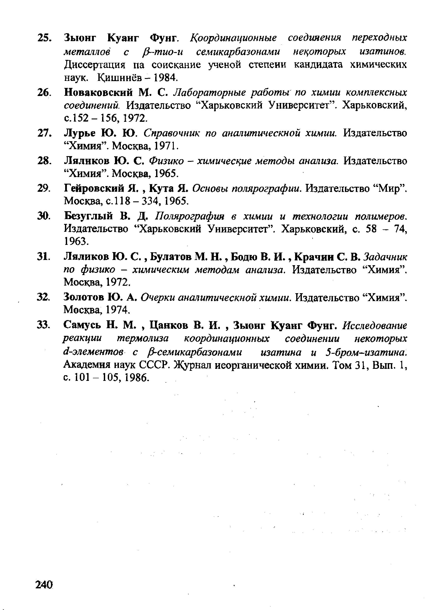

## Page 238

PHỤ LỤC 
■ 
•
Bảng 1. Quá thế của hiđro trên một số điện cực khác nhau
Điện cực
Quá thế (V) ở mật độ dòng (mA/cm2)
1
10
100
1000
Ag
0,475
0,762
0,875
1,089
Au
0,241
0,390
0,588
0,798
Bi
0,780
1,050
1,140
1,230
Cu
0,479
0,584
0,801
1,254
Graphit
0,600
0,779
0,977
1,220
Ni
0,563
0,747
1,048
1,241
Pt mạ Pt
0,001
0,0297
0,041
0,50;
Pt phẳng
0,024
0,068
0,30
1,00
Hg
0,879
1,00
1,070
1,115
Bảng 2. Quá thế của oxi từ dung dịch axit sunfunc 1,0N trên điện cực Pt và Ag
Điện cực
Quá thế (V) ở mật độ dòng (mA/cm2)
0,01
0,1
1
10*
100
1000
PtmạPt
0,315
0,478
0,478
0,478
0,50
Ọ,52
Pt phẳng
0,26
0,32
0,43
0,478
0,507
0,40
Au
0,73
0,82
0,86
0,93
1,00
1,08
Bảng 3. Thế tiêu chuẩn và logarìt hằng số càn bằng của một số nõa phản ứng oxl hoá -  khử
Nguyên tố
Phương trình nửa phản ứng
Efl, V
lgK
Ag
Ag+ + e —► Ạg
0,7994
13,5
AI
Al^ + 3e -V AI
- 1,66
- 8ự
r
Ba
Ba2+ +;2e -> Ba
-2,90
-98,1
Ca
Ca3+ + 2e-> C a
-2,87
-97
Cd
Cd2+ + 2e -> Cd
-0,402
-13,6
Co
Co(OH>3 + e -> Co(OH)2 + OH" 
Co + e -+ Co2+
Co2* + 2e —y Go
0,17 
’ 
1,84 . 
-0,28
2,87
31,11
‘-9,5

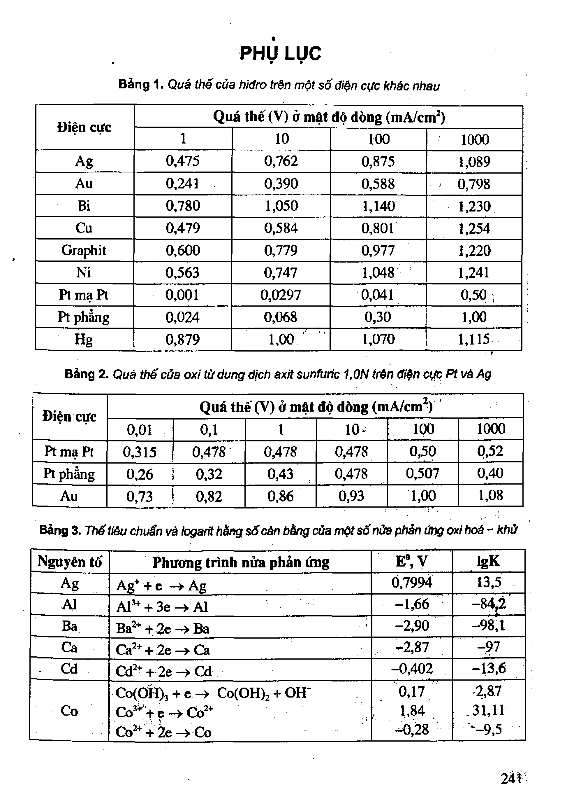

## Page 239

Nguyên tố
Phương trình nửa phản ứng
E°, V
IgK
Cr
Cr20 ‘- + 14H+ + 6e -> 2Cr3+ + 7H20
Cr + e ^  Cr+
Cr* + e 
Cr 
Cr+ + 2e —► Cr
CrO*' + 4H20  + 3e 
Cr(OH)3 + 50H"
1,33
-0,41
-0,74
-0,91
-0,18
135
-6,9
-37,7
-30,8
-6,9
Cu
Cu2+ + 2e —> Cu 
Cu+ + e —> Cu 
Cu2+ + e -> Cu+ 
Cu2+ + r  + e 
Cui
0,337
0,521
0,153
0,86
11,4
8,8
2,59
14,50
Fe
Fe3+ + e 
Fe2+
Fe3+ + 3e -> Fe 
Fe2+ + 2e -> Fe 
Fe(CN)f + e -> Fe(CN) 6~
0,771
-0,036
-0,440
0,356
13
-1,82
-14,87
6,03
H
2H+ + 2e ^  H2
0,000
0,00
Hg
Hg2* + 2e —» Hg 
Hg 2+ + 2e -> 2Hg 
2Hg2+ + 2e -> Hg 2+ .
0,85
0,792
0,907
28.70 
26,78
30.70
Mn
MnO ; + 8H+ + 5e 
Mn2+ + 4H20
M nó 42- + 8H+ + 4e -► Mn2+ + 4H20
MnO“ + e -» MnO^
M n02 + 4H+ + 2e ^  Mn2+ + 2H20  
Mní+ + e -» Mn2*
Mn2+ + 2e -> Mn
1.51 
1,74
0,564
1,23
1.51 
-1,18
127.6
117.7
9.5 
41,6
25.5 
-40,0
Pb
Pbơ2 + 4H+ + 2e -> Pb2+ + 2H20  
Pb2+ + 2e 
Pb
1,455
-0,126
49,2
-4,26
Zn
Zn2+ + 2e —> Zn
-0,76
-25,7
Au
Au3+ + 2e -> Au+ 
Au3*- + 3e -> Au 
Au+ + e -> Au
ỉ,41 
1,50 
1,68
24T

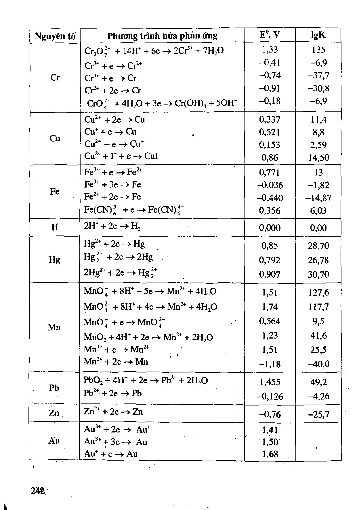

## Page 240

Nguyên tố
Phương trình nửa phản ứng
Eu, V
IgK
AuBrj + e —► Au + 2Br
0,96
AuBr^ + 2e —> AuBrĩ + 2Br'
0,82
AuBr” + 3e -> Au + 4Br'
0,87
Au(CN) 2 + e -> Au + CN-
-0,61
AuQ “ + e —> Au + 2CT
1,11
Au
AuCỈ 4 + 2e —> A uơ 7 "t" 2C1
0,93
AuCỈ" + 3e -> Au + 4C1”
0,99
H2AuO 3 +  H20  + 3e -> Au + 40H “
0,7
Au(SCN) ■ + e -> Au + 2SCN"
0,69
Au(SCN); + 2e -> Au(SCN); + 2SCN"
0,64
Au(SCN)” + 3e -» Au + 4SCN'
0,66
Bảng 4. Thế nửa sóng của các chất vô cơ (so vói điện cực calomen băo hoà)
TT
lon
Nền
Trạng thái 
oxi hoá
-E ,« (V)
1
Cu2+
KC1 0,1M
2 -» 0
0,34
2
Pb2+
KC10,1M
2 -» 0
0,41
3
C(p
KC10,1 M
2 —> 0
0,601
4
Zn2*
KC1 0,1M
2 -» 0
0,995
5
Mn-+
KC1 0,1M
2 - + 0
1,363
6
Al3+
KC1 0,1M
2 - > 0
1,70
7.
Fe3+
KC10,1M
2 -» 0
1,80
8
Hh+ (H ,0+)
KC1 0,1 M, KCì03 0,1M
1 —^ 0
1,58
9
K+aq
MedNCl 0,1M; Me4NOH 0,1M
l - > 0
2,128
10
Li+aq
Me<NQ 0,1M; Me4NOH 0,1M
1 -> 0
2,345
11
Na+aq
Me4NCl 0,1M; Me4NOH 0,1M
1 -> 0
2,104
12
Tl+aq
N aN03 0,1M; KCI 0,1M
1 - » 0
0,3545
13
TTaq
NaNO, IM
l - > 0  .
0,479
243

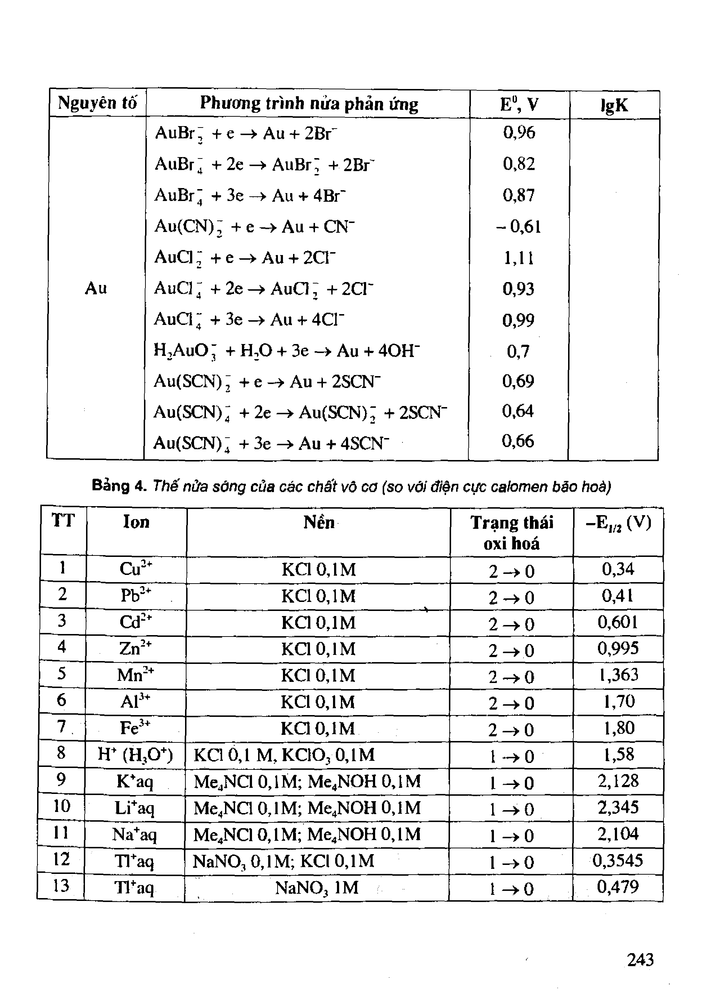

## Page 241

Bảng 5. Thế nửa sóng của các chất vỗ co (so với điện Cực calomel bão hoà)
TT
lon
Nền
Trạng 
thái oxi 
hoá
-E tó(V)
1.1
Aỉ3+
KQ 0,1M
2 - ^ 0
ỉ,70
1.2
Al3+
Li2S04 0,5M
3 -> 0
1,8
2
As(V)
HQ 11,5M
5 —V 0
-
3.1
As(m)
H2S041M trong keo gelatin 
0,01%
3 -» 0
0,7
3.2
As(ni)
H2S041M trong keo gelatin 
0,01%
0 —> "3
1,0
3.3
As(m)
HQ IM
3 -> 0
0,4
3.4
As(m)
HQ IM
0 -> -3
0,6
3.5
As(ffl)
NaOH 0,1M
3 —>5
0,15
4
Au(CN) ■
KCN 0,1M
l -> 0
1,4
5.1
BiO"
H N 03 im  + gelatin 0,01%
3 - » 0
0,01
5.2
BiO"
HC1 IM + gelatin 0,01 %
3 —> 0
0,09
6.1
Cd2+
H Q 04 im  + gelatin 0,01%
2 - » 0
0,62
6.2
Cd2+
H2S04 0,5M
2 —> 0
0,59
6.3
Cđ2+
r~ 
k n o 3 0,1 m
2 —> 0
0,58
ế.4
cd(ci)
KCỈ 0,1M
2 -> 0
0,601
6.5
Cd(NH3) f
NH4a  1,0M + NH3 1,0M
2 ~ > 0
0,81
6.6
Cd(CN)*-
KCN 1.0M
2 -> 0
1,2
7
Ce4*
h 2s o 4o ,im
4 -> 3
0,71
8.1
Co3+
KQ 1,0M
3 -> 2
0,20
8.1’
Co2+
KQ 1,0M
2 -» 0
1,23
8.2
Co(NH3) 62+
k 2s o 4g ,im
3 -> 2
0,46
8.3
C o(N H ^+
K a  1,0M
3 -> 2
0,20
8.4
Co(NH3)g+
NaOH 0,5M
3 
2
0,35
244

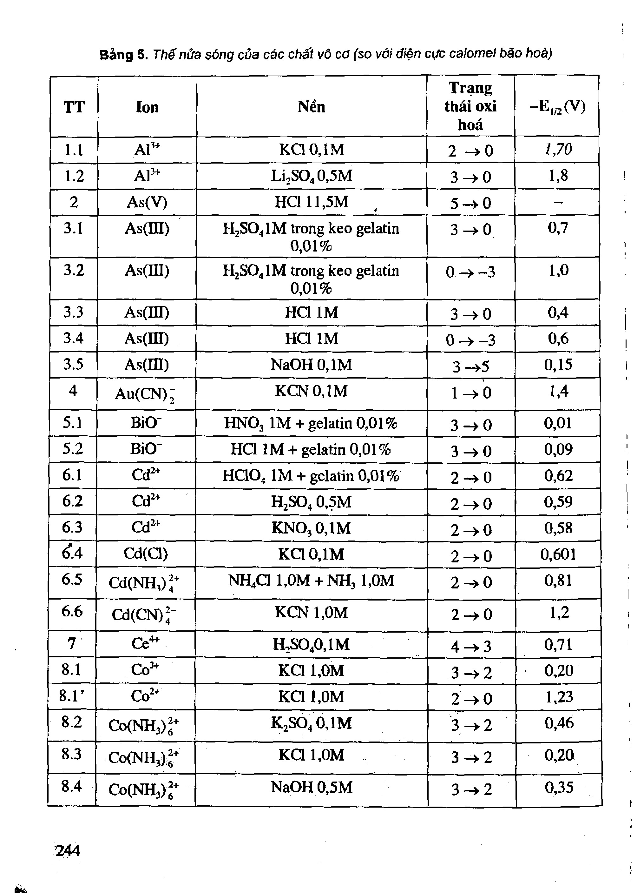

## Page 242

TT
Ion
Nền
Trạng 
thái 0\i 
'hoá
-E W(V)
8.5
Co2+
K2S040,5M
2 -* 0
1,43
8.6
Co(NH3)^+
NH3l,OM + NH4CI 0,05M
2 
0
1,45
9.1
Cr3+
k 2so 4i ,om
3 -> 2
1,03
9.1'
Cr3+
k 2so 4i ,om
2 -» 0
1,63
9.2
Cr(CN) I'
KCN 1,0M
3 -* 2
1,38
9.3
Cr(NH3) f
NH31,0 m  +n h 4q  1,0M
3 —^ 2
1,42
10.1
Cu2+
KQ 0,1M
2 
0
0,34
10.2
Cu2+
KCU.OM
2 - * l
0,00
10.3
Cu2+
K Q1,0M
1 —> 0
0,2a
10.4
Cu(SCN)
KSCN 0,1M
2 
1 ■
0,02
10.5
Cu(SCN)
KSCN 0,1M
1 .^ 0
0,39
10.6
Cu(SCN)
KSCN 1,0M
2 -> 0
0,62
• 10.7
Cu(NH3) f
N l^ a  0,1M + NH3 0,1M
2 -> 0
1,25
10.8
Cu2+
CHjCOONa 1,0 M; pH = 4,7
2 
0
0,08
11.1
Fe3+
KC1 0,1M
2 -» 0
1,80
11.2
F e(C A )j-
Na2C ,040,2M; pH = 4LỊ5
3‘-> 2
0,24
11.3
Fe(Htactr)
NaTactr 0,5M; pH = 5,8
3 -> 2
(Ú 7
11.4
Fe(Htactr)
NaTactr 0,5M; pH = 5,8
2 -> 0
1,50
11.5
Fe(CN>r
H2S04 0,5M 
*
3 -> 2 
,
+0,24
12.1
Ga3-
k n o 3o, i m
3 -> 0
1,12
12.2
G aFr
Na2F20,lM  '
3-> 0
1,42
12.3
Ga(NH3) 
~
NH3 1,0M + NH4CI 1,ỒM
3 -> 0
1,58
12.4
Ge^CX)
NIlj 1,0M + NH4Ơ  0,1M
4 -> 0
1,4
13.1
Hg2*
KNO3 0.1M
2 -» 0
+0,15
13.2
Hg2a 2
N^SO, 0,1M + H2S0410'1M
0 ^ 1
+0,27
245

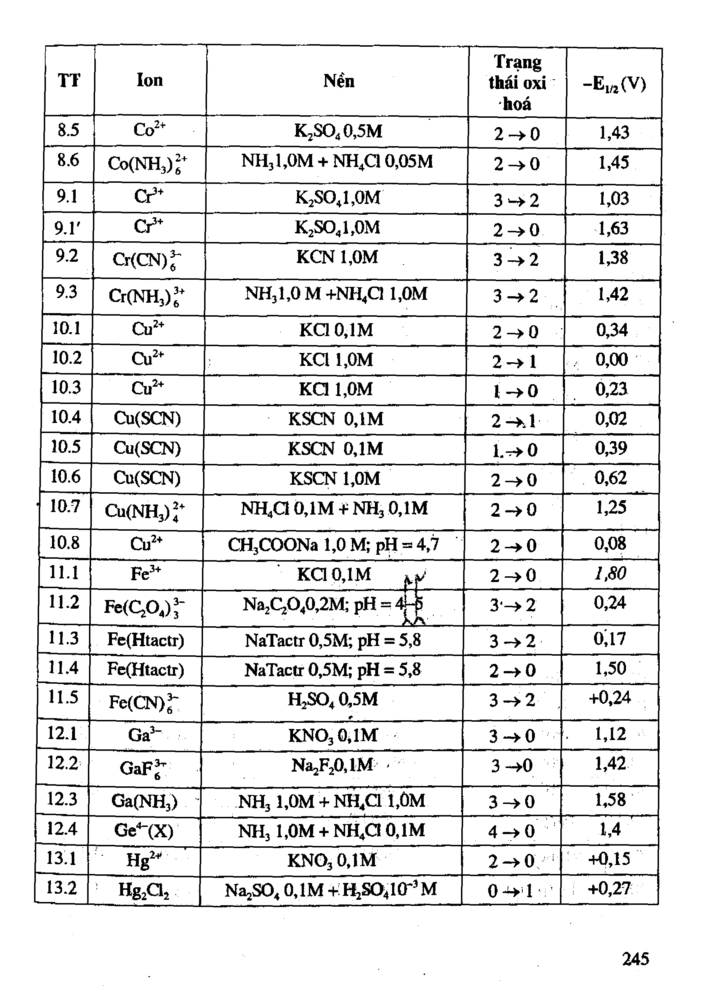

## Page 243

TT
Ion
•
Nển
Trạng 
thái oxi 
hơá
-E 1/2(V)
14.1
Itr +
h :s o 4 + HNO/+ HC104
3 —> 0
1,0
14.2
In(Cl)
KC1 1,0M
3 ^ 0
0,61
.15.1
ior
KC1 0,2M
5 
-1
1,23
15.2
h
HQ 0,1M -  Pt
0 -> 1
+0,75
15.3
I '
HC1 0,1M -  Pt
1 -> 0
+0,48
16.1
Mrr+
KC1 0 ,1M
2 -» 0
1,48
16.2
Mn2+
KSCN 0,1M
2 —»0
1,50
16.3
Mn2+
NH? 1,0M + NH4C1 1,0M
2 -* 0
1,65
17.1
M oo;
H2S04 0,5M
6 
5
0,29
17.1'
M oo;
H2S04 0,5M
5 -> 3
0,84
17.2
Moo;
HC1 1,0M
6 —» 5
0,14
17.2'
M oo;
H a l f0M
5 
3
0,53
18.1
Ni2+
KQ 1M
2 —» 0
1,085
18.2
Ni3+
HC103; pH = 0-5-2
2 -> 0
1,1
18.3
Ni2+
NR, 1,0M
2 -> 0
1,05
18.4
Ni2+
NH4C1 1,0M
2 
0
1,09
18.5
Ni2+
NH-,1,0M + NH4C1 0,1M
2 -> 0
1,13
18,6
Ni(CN);-
KCN 0,1M
2 - » 0
1,42
19.1
Nb3+
KC1 0,1M; pH = 2,6
5-> ?
1,3
19.2
N b ĩ+
HQ 12M
3 -» 5
0,32
2 0 . 1
Pb-+
KC1 0,1M
2 —> 0
0,41
2 0 . 2
Pb2+
NaNO, 2M
2 - > 0
0,44
20.3
&IJ+
NaNQ30,lM
2 —> 0
0,38
20.4
P b O Ị-
NạOH 0 ,1M
2 - > 0
0,7
20.5
HPbO-
NaOH 0, Ị M
2 —» 0  
,
0,755
2 0 . 6
Pb(phức)
KSCN 0;1M
2 - > 0
0,38

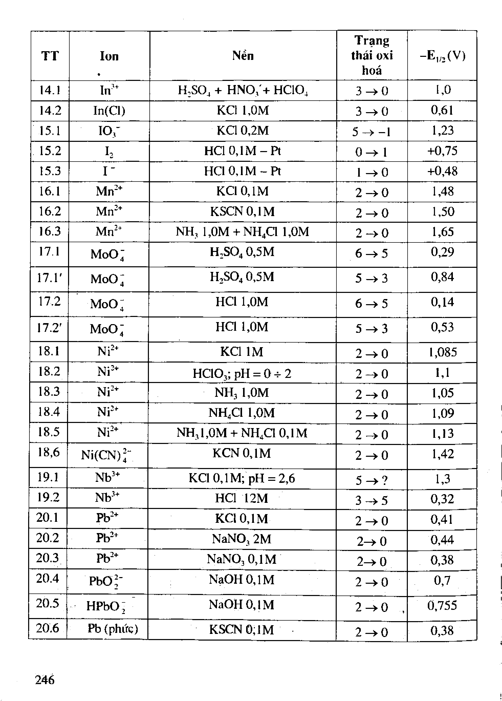

## Page 244

TT
Ion
Nền
T rạng 
thái oxì 
hoá
- E W(V)
20.7
Pb (phức)
Na4P20 7 0,1M
2 - > 0
- 0,69
20.8
Pb (phức)
CH.COOH 0,4M; pH = 4,7
2 ^ 0
0,43
20.9
Pb (phức)
H2C ,0 4 i M; pH = 7,4 -  10,7
2 
0
0,58
21.1
Pd2+
KOH, NaOH 2M
2 
0
1,41
22.1
Pd(NH_0;+
NHj 1,0M + NH4CI 1,0M
2 - > 0
0,72
22.2
Pd(CN) l~
KCN 1,0M
2 —► 0
1,77
23.1
R e o ;
KC1 2,0M
r ^ ỉ
1,41
23.2
ReCl^-
HC1 2,4M
4 -> 3
0,53
23.3
ReBr3
h c io 42,om
3 -> 2
0,28
24.1
Rh(NH3) j+
NH, 1,0M + NH4C1 l,0M
3 -> 1
0,93
25.1
SbO ;
HNO3 i,0M
3 - > 0
0,30
25.2
Sb5+
HC1 0,5M
3 - > 0
0,18
25.3
SbO ;
N aO H O JM
3 ~ > 5  
'
0,34
25.4
Sbo;
N aO H O JM
3 -> 0
1,07
26*
SeO;-
NH4C] 0 ,1M; pH = 6,8
4 ^ 2
1,50
26.1
SnCl 3~
H Q  1.ƠM
4->2
0,25
26.2
SnCl 1~
HC1 1,0M
2->0
' 
0,52
26.3
Sn"+
H3SO42,0M
2 —>0
0,46
26.4
SaOị-
NaOH 1,0M
2 —» 4
0,73
26.5
S n o r
NaOH 1,0M
2 ■-> 0
; 
1,22
26,6
Sn2+
CHjCOONa 0,4M; pH = 4,6
2 —> 4
0,17 •
26.7
Sn2+
CH3COONa 0,4M; pH = 4,6
2 —> 0 '
0,50
27.1 •
Ta5'
HC1 G,9M 
■
5 - > 0
1,16
27.2
Ta5+
N aN O ,2M
5 —> 0 
;
0,50
28. r
T c O f
N aO H O JM
6 -> 2  ">41
1,66 '
247

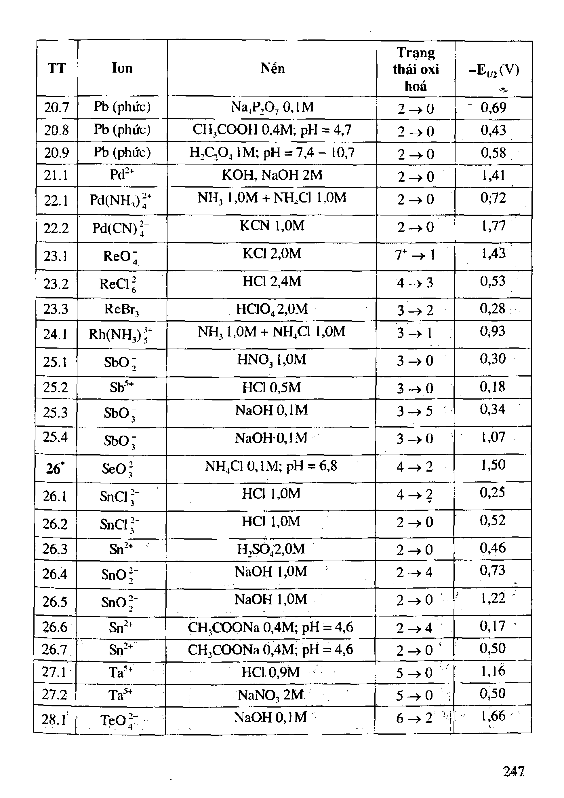

## Page 245

TT
Ion
Nền
Trạng 
thái oxi 
hoá
-E W(V)
28.2
TeOỈ'
n h 3o ,im + n h ; 0,1M
6  
2
1,34
28.3
TeO 3'
NaOH 0,1M
4 -> 2
1 , 2 2
28.3
TeO*-
NH3 1,0M + n h ; 1,0M
4 
0
0,67
29.1
TiOf
H2S04 0,6M
4 —» 3
0,79
29.2
0to1
H2C2040,2M;pH= 1,2
4 —► 3
0,30
29.3
Ti^íphức)
Citrat
4-* 3
0,37
29.4
Ti4+(phức)
Tactrat
4 -> 3
0,38
30*
TT
Tactrat
l - > 0
0,48
30.1
H+
KG 0,ỈM + NaN030,lM
1 - > 0
0,46
30.2
H+
NajSOAlM
1 —> 0
0,47
30.3
H+
NH3(),1M -N H ;o,1M
1 —> 0
0,46
30.4
H+
KOH 0,ỈM
1 - > 0
0,74
31.1
c o 2-
HQ0,1M
6  -> 5
0,17
31.1V
c o 2-
HQ 0,1M
5->3
0,82
31.2
coị-
CH3COOH; pH = 4,7
6->5
0,45
32.1
Li3*
HQ 0,1M -  KC1 0,9M
4 -> 3
0 , 8 8
33.1
«
v o ;
H2S040,5M
5->4
-
33.1'
v o ;
H2S040,5M
4 -> 3
0,98
&3.2\a- v °3
NH31,0M-NH} 1,0M
5 -> 4
0,97
33.2'
VO,-.
NH51,0M -  n h ; 1,0M
4 -> 3
1,26
33.3
v o 2+
,, 
H2S04 0,5M
4 
2
0,85
33.4
v o 2+
NaOH 2,0M
4->5
0,44
33.5
v o 2+
n h 3i,om + n h ; 1,0M
4 -> 5
0,32
33.6
v 3+
H2S040,5M, HC11,0M
3 ->• 2
0,51
33.7
V(SCN)
KSCN1,0M
3 —> 2
0,46

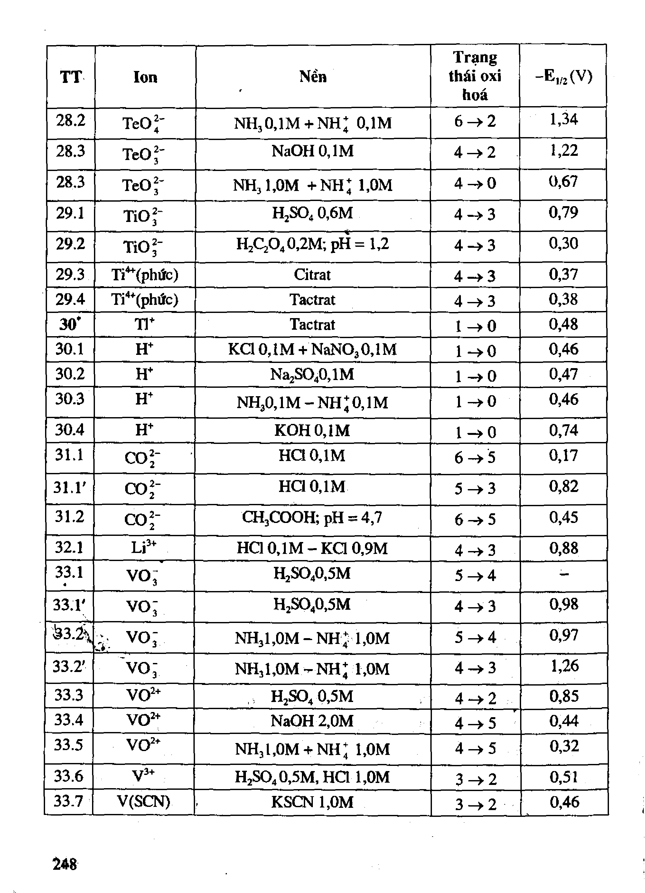

## Page 246

TT
lon
Nền
Trạng 
thái oxỉ 
hoá
-E tó(V)
33.8
v(CA)s
K2C,O4 l,0M;pH = 4,5
3 
2
1,13
34.1
Zn2+
Na2S040,lM
2 -> 0
1,00
34.2
Zn2+
K N 03 l,OM
2 
0
1,12
34.3
Zn2+
CH3COONa l,OM; pH = 4,7
2 -» 0
1,04
34.4
Zn2+
KCl IM
2 -> 0
1,00
34.5
Z n 02'
NaOH 0,1M
2 
0
1,38
34.6
Zn(SCX)
KSCN l,OM
2 ^ 0
1,04
34.7
Zn(NHj)
NH31,0M -  n h ;  0,2M
2 -» 0
1,33
35.1
ZrQ2+
KC1 0,1M; pH = 3,0
4 -> 0
1,65
Báng 6. Thế nữa sóng của một số chất hũV cơ (so với điện cục calomel bão hoà)
TT
lon
Nền
pH
-E^CV)
1.1
Vitamin B)
PO4” (sóng xủc tác)
7,2
1,26
1.2
Vitamin B)
đệm xaronsena' (sóng anot)
11,0
0,38
1.3
Vitamin B,
LiOHO,l M
0,46
2.1
Vitamin B2
PO*-
7,2
0,40
3.1
Vitamin B6
Me4NBr
1,96
4.1
Vitamin Bc
Đệm axetat
7,6
0,73
5.1
Vitamin B,2
Đệm axetat (sóng xúc tác)
4,7
1,66
6.1
Vitamin c
PO l" (sóng anot)
7,0
0,02
7.1
Vitamin E
axetar+Anilin+ H Q O 4
3,6
+0,29
(sóng anot)
»
8.1
Vitamin Kj
KC1 + izopropanol
0,54
9.1
Vitamin Kj
Đệm axetat
6,3
0,07
10
Alizarin
Borax +1 % etanol
8
0,73
11
0,87
11
Nitrobenzol
glixerín
10
0,27
249

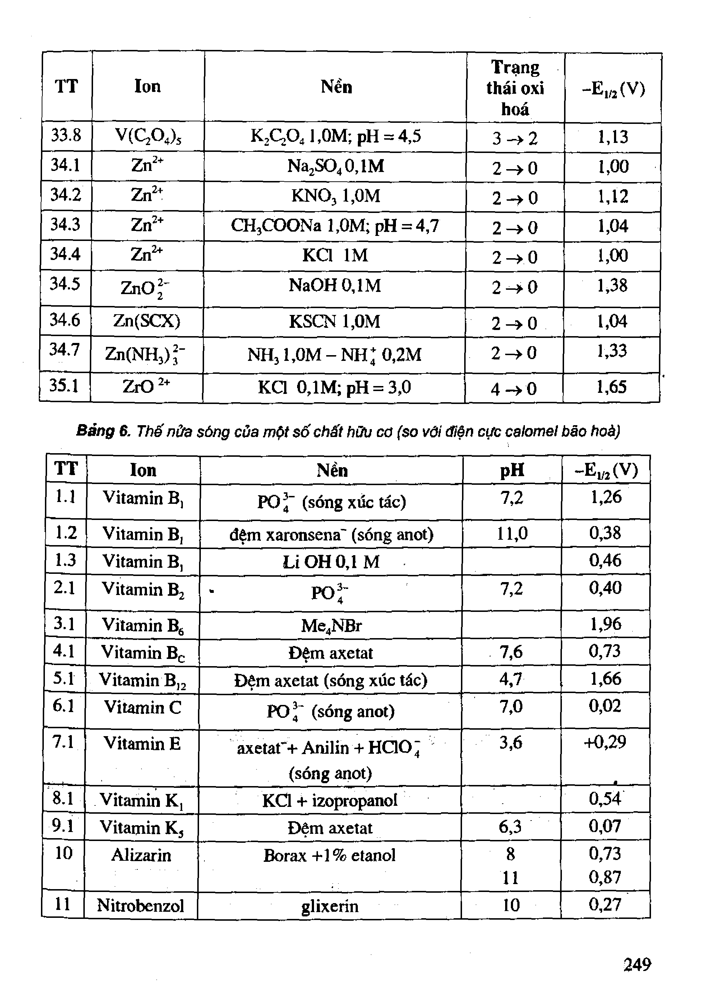

## Page 247

TT
lon
Nền
pH
>
rì
íù1
12
Khinol-
PO^-
6,67
+0,03
hydrokhinol
13
Metyl xanh
PO4 + 1% etanol
7,0
0,12
4,9
0,15
9,24
0,30
14
DDT
Me4NBr 0,1M + 80% etanol
0,80
7.1. Hàng $ố không bền của một số phức giữa cation kìm loại với phối tử vô cơ
Ghi chú: 
FeCl 4 
FeCl3 + c r  
k4
FeClj -» F ed  2 + c r  
kj
FeCi; 
FeCl2+ + c r  
k2
FeCl2+ 
Fe3+ + c r  
k,
Hằng số không bền:
,, _[Fỷ*][Cl-}, ..[ftCY2*] [ « - ] . 
, 
[f«c£][cn. 
, 
[ f tỌ,] [ C n
[ 
^, 
) 
"y 
5 M ~~ 
« Ka — ■
[Fecfi] 
[FeC%] 
{FeCÌ2} 
[FeC!Ị]
, 
_[Fe^][Cr]\ 
, 
[Feì+][CrÝ . 
r 
ự^ } [ c r } 4 
, 
[F e a r e r ]
1.2 -  
r z  
“  
> 
* 1 ,2 ,3 ”  
~
T
---------ĩ 
*1 2 3 4  ~ ~  
_  
— — 'í 
« 4 = -----------  
 
[FeC%} 
[FeC%] 
[FeCrậ] 
[FeCỈỊ]
Hằng số bển:
p\ = —  ; 
^ 2 = 7 ----I  , T ; 
/?3 = 7 ------~ 1 7  T ~i 
/* 4 = 7 --------3 7  T~T~r
«1 
«12 — *1.«2 
*1,2,3 ~*1 '*2'*3 1 2 3 4 — ] «^2 3 4
Bảng 7.2. Phức vói phối tửamoniac (NH-J
Cation
pK,
pK u
PKIJJ
P ^ 1 , U 4
P^1.2.M,5
pK 1,2,3,4,5,6
Lực ỉon
Ag*
3,32
7,24
-
-
-
—
0
Au+
7
27
-
-
-
-
?
Air+
?
ọ
9
30
-
-
7
250

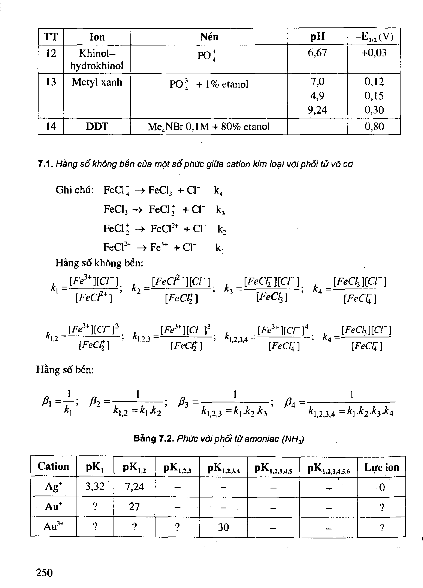

## Page 248

Cation
pK,
pKu
pKi.z,
PKU..M
PK|,Z.V4.5
4.5,6
Lực ion
Cd:t
2,51
4,47
5,77
6,56
6,26
4,56
0
Co2+
1,99
3,50
4,43
5,07
5,13
4,39
0
Co1+
7,3
14,0
20,1
25,7
30,8
35,21
2
Cu+
5,93
10,86
-
-
-
-  ■
2
Cu2+
3,99
7,33
10,06
12,03
11,43
8.9
0
Fe2+
1,4
2,2
?
3,7
-
—
0
Hg2+
8,8
17,5
18,5
19,3
-
_
2
Mg2+
0.23
0,08
-0,34
“ 1,04
-1,99
-3,29
2
Mn2+
0,8
1,3
?
?
9
9(?)
2
Ni2+
2,67
4,79
6,40
7,47
8,10
8,01
0
Zn2+
2,18
4,43
6,74
8,70
- '
-
0
Bảng 8. Phức với phối tử bromua (Bf)
Cation
pK,
pKw
PKW
P K I*M
pKlv2,.}..i,5
pKllW«,í
Lực
ỉọn
Ag*
4,38*
7,34
8,00
8,73.
-
0
Au+
7
12,46
-
-
-
-
?
Au3+
7
9
?
31,5
-
-
7
Cd2+
2,23
3,00*
2,83
2,93
—
-
0
Co2+
-2,80
-
-
-  .
-
-
7
Cu+
?
5,92
-
-
-
. -
0
Cu2*
-0,03
7
-
-
-
-
0
Fe3+
0,55
0,82
-
“ .
-
-
0
Hg2+
9,05
17,33’
19,74
21,00
-
■ -
0,5
Pb2+
2,23
3,00*
2,83
2,93
- ■.
-
0
Ni2+
- 0,12
-3,24*
?
- 8,12
-
-
7
Zn2+
- 0,8
- 2,2* ;
-2,9
-2,5
-
-  ■
0

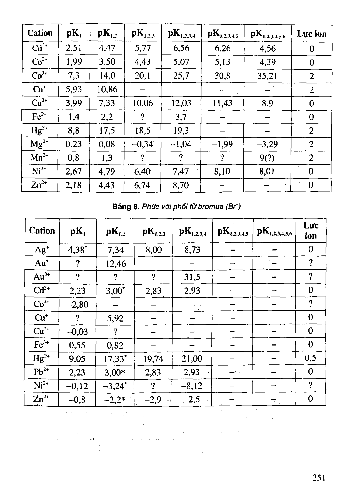

## Page 249

Bảng 9. Phức với phối tửnitrit (N0Ĩ )
Cation
pK,
pK'u
PKUJ
p^ l ,2,3,4
P^I.2,3,4,5,6
Lực
ỉon
Ag+
1,88*
2,83
-
-
-
-
?
Cd2+
1,80
3,01*
3,81
3,1
-
-
3
Cu2+
1,26
1,56*
1,16
-
-
-
5
Hg2+
?
?
?
13,54
-
-
?
Bảng 10. Phức với phổi tử thioxianua (SCN~)
Cation
pK r
pKw
PK|,2,3,4
PK 1.2.3,4,5
PKlA3AS,6
Lực
ioii
Ag+
4,75*
8,23
9,45
9,67
-  ■
-
0
Au+
?
25
-
-
-
-
?
Au3+
?
?
?
42,00
42,00
42,04
0
Cd2+
1,74
2,33*
~2
~3
-
-
0,1
Co2+
3,0
3,0*
2,3
2,2
-
-
7
Cu+
?
12,11
9,90
10,05
9,59
9,27
0
Cu2+
2,30
3,65*
5,19
6,52
—
-
0
Fe2+
0,95
0,07*
-
-
-
7
Fei+
3,03
4,33
4,63*
4,53
4,23
3,23
0
Hg2+
?
17,47*
19,15
19,77
-
-
?
Pb2+
1,09
2,52*
?
0,85
?
-0,30
?
Zn2+
1,7
2,1*
2,2
3,7
-
-
0,1
Zn(OH)*
2,01*
?
2,66
—
-
-
17
Bảng 11. Phức với phối tử sunfat (SO l~ )
Cation
pK,
pKI>2
pKj.2,3
P K i ,  23,4,5
V^-\XiAS,6
Lực
ion
Ag+
0,23
0,28
-
-
—
-
3
Cđ2+ .
2,31*
?
?
-
-
-
0
Co2+
2,47*
-
-
-
-
—
0
252

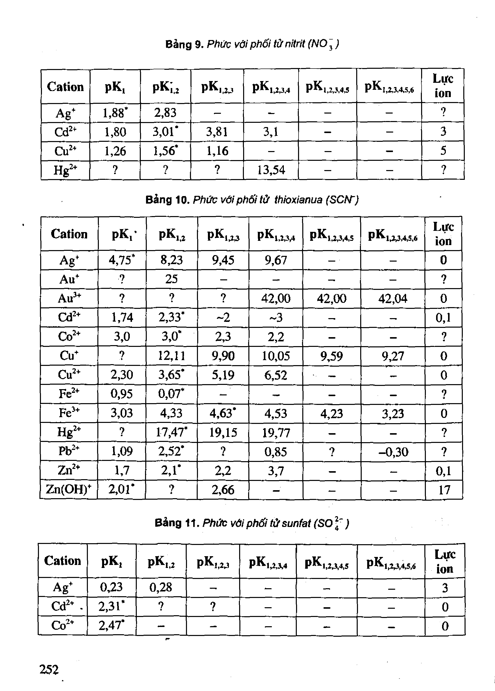

## Page 250

Cation
pK,
pK1>2
pKl,W
PKj, 2,3,4
PKi.2,3,4,5
PK|, 23,4,5,6
Lực
ỉon
Co*
1,34
-
-
-
-
-
2,7
Cu2+
2,36*
?
-
-
-
-
0
Fe2*
2,30*
-
-
-
-
-
0
Fe3+
4,18
7,4
-
-
-
-
0
H g f
1,30*
2,40
-
-
-
-
0,5
Hg2+
1,34
2,3
-
-
-
-
0,5
Pb2+
3,7*
-
-
-
-
-
0
Zn2+
2,34
—
-
-
-
0
12. Sử dụng phần mềm Pascal
Chương trình xác định phương trình hồi quy tuyến tính biểu diễn sự phụ thuộc 
hx=aCx + b, theo ngôn ngữ lập trình Pascal 
Program hqtt;
{begin Y =A .C x+ b) 
uses crt;
type m = array [1..50] of real;
var A l, c l, A, c, AC, cc, ALt, HALT: m;
THALT, so, sx, sy, TA, TC, TAC,TCC,D,DA,DB,X,Y,Tak:REAL;
i, k: integer; 
' 
•
ten: string[10];
Procedure nhapsolieu; 
var fntext;
Begin
clrscr;
Write('Hay nhap vao ten File ket qua1); readln(ten); 
write(’ k = '); read(k); write(’Tak ='); read(tak); 
assign(fr, 'solieudo.dat'); 
reset(fr); 
fori := 1 tok d o read(fr, Al[i]); 
for i := 1 to k do read(fr, Cl[i]);
253

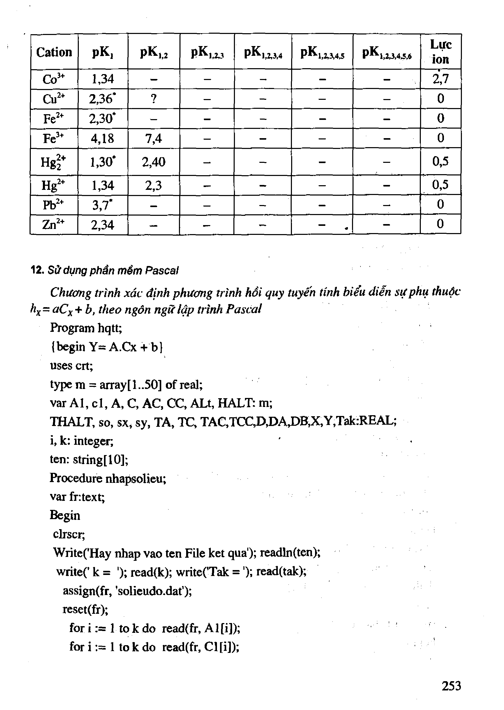

## Page 251

closc(fr);
For i := 1 to k do 
begin
a[i] := a l|i|;
c[i] := c 1 [i] * le-5 ;
end;
End;
Procedure Tinh;
Begin
For i:=l to k do 
begin
AC[i]:=A[ij* Cfi];
CC[i]:=C[i]*C[i];
end;
TA:=0; TC:= 0; TAC:=0; TCC:= 0;
For i:= 1 to k do 
Begin
TA:= TA + A[il; TC:=TC + C[i];
TCC := TCC + CC[i]; TAC :=TAC + ACỊÌ]; 
end;
D:= k*TCC-TC*TC; DA:=TA*TCC-TC*TAC; Db:=k*TAC -  TA*TC; 
x:= DA/D; y:=DB/D; 
thalt:= 0;
writelnC ta=',ta: 10,' tc=',tc: 10,' tac=’,tac: 10,' lcc=’,tcc: 10,' r>=’,d: 10,
' Da=',da: 10,’ Db=',db: 10); readln;
For ì:= 1 to k do 
begin
A L t[i]:=x+ y*C[i];
HALT[i]:=(ALt[i] — A[i]>; 
thalt := thalt + halt[i]*haltfi|; 
end;
so := sqrt(thalt/(k-2)); 
begin
254

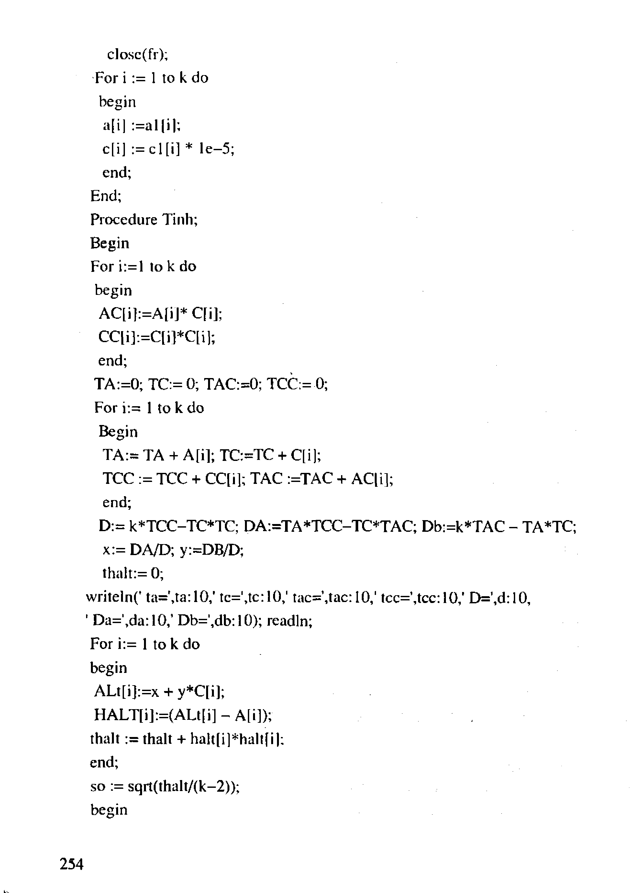

## Page 252

sy:= so* sqrt(k/abs(D)); 
sx:= so*sqrt(TCC/abs(D)); 
end;
END;
Procedure ghi;
Varf:text;
Begin
clrscr;
Assign(f, ten);
Rewrite(f); Ị append(f);}
Writeln(f,' 
Phuong trinh hoi quy tuyen tinh');
Writeln(f,' 
su phu thuoc A = x*c + y ');
Writeln(f,’
--------------------------------------------------------- r-----------------------------’);
Writeln(f; 
I k I c* lE+5 I 
A I ALt I Alt -  A J );
Writeln(f,'
I----------------_
_
------------------------------------------------------------------------------------------ —
r);
For i := ] to k do 
begin
ỉf halifij > 0  then
Wriieln(F,'l 
I \cl[i]:8:4,' I V’,A[il:5:4,' I ',AltíiJ:8:4,ĩ; ,Halt[i]: 10:6,1’);
Writeln(F,'l ',1:3; I ',clfi]:8:4,' I V\A[j]:5:4i' I ',Altíil:8:4,T,' '.Haltli]: 10:6,T); 
in
end; end; 
begin 
Writeln(f,'
-----_____----------------------------;--------------------------- - ------------ -);
write)n(f,'thalt = 
thalí: 12:10);
Writeln(f,'D =', D,'DA = ’, D A ,'DB =', DB);
Writeln(f,'so = 
So:7:5,' sx = 
sx:7:5, 'sy = 
sy:7:5);
Writeln(f; A= (’,y: l0:3,,+’,sy*tak:)0:4,rc + c,x: !0:3,v, sx*tak:l0:4/y);
255

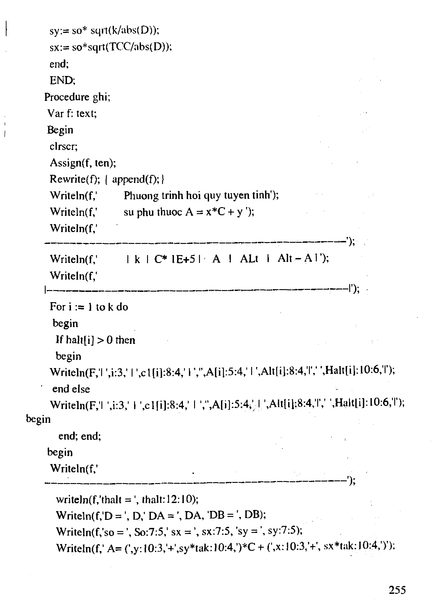

## Page 253

end;
Gose(f);
END;
PROCEDURE TTNH2;
BEGIN
For i:=l to k do 
begin
AC[i]:=A[i]*C[i];
CC[i]:=C[i]*C[i];
end;
TA:=0; TC:=0; TAC:=0;TCC:=0;
For i:=l to k do 
begin
TA:=TA+A[i]; TC:=TC+C[i];
TCC:=TCC+CC[i]; TAC:=TAC+AC[i]; 
end;
D:=k*TCC-TC*TC; DA:=TA*TCC-TC*TAC; DB:=k*TAC-TA*TC;
x:=tac/tcc; y:=DB/D;
thalt:=0 ;
For i:=l to k do 
begin
ALt[i]:= x*C[i];
HALT[i]:=(ALt[i]-A[i]);
THALT:= THALT+ HALT[i]*HALT[i]; 
end;
so:=sqrt(THALT/(k-l)); 
begin
sx:=so*sqrt(k/abs(D));
end;
END;
PROCEDURE GHI2;
VAR F:TEXT;
BEGIN
256

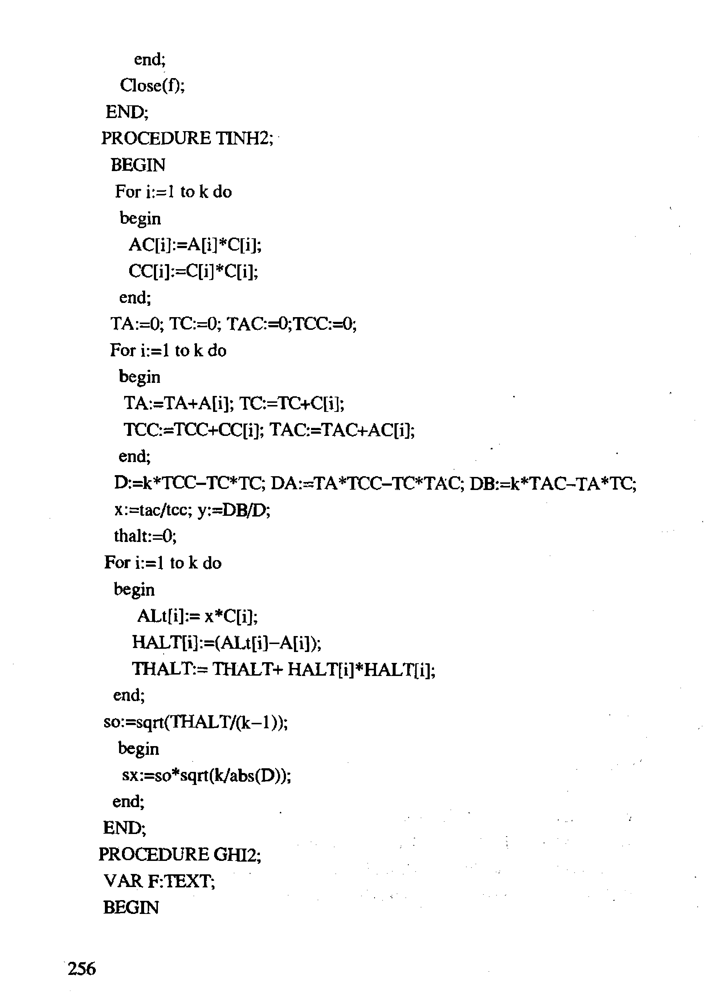

## Page 254

clrscr;
Assign(F,ten);
(*Rewrite(F);*) append(f); 
writeln(f,' 
Phuong trinh hoi quy tuyen tinh');
writeln(f,’ 
su phu thuoc A=f(C)');
writeln(f,'
-------------------------------------------------------------------------------------------------------------------------
WRITEln(F/ 
I k I C*lE+5 I 
A 
I Alt I Alt-A 
I'); 
writeln(f,'
---------------------------------------------------------------------------------------- -----------------—
For i:=l to k do 
begin 
if halt[i]>0 then 
begin
writeln(F,r,i:3,, l ,,cl[i]:8:4,'IV ',A[i]:5:4;i’?
ALT[i]:5:4,’ I 7  ’,HALT[i]:7:6,' Ị'); 
end else 
begin
w riteln(F/l\i:3;i\cl[i]:8:4/IV  \A [i]:5:4/r,
ALT[i]:5:4,’! V ',HALT[i]:7:6,' I'); 
end; end; 
begin 
writeln(f,'
----------------- ------------------------------------------------------------- ---------------------------------------
WRITELN(F,' THALT= ’,THALT:12:10); 
writeln(fs' so=’,So:7:5,’ Sx=',sx:7:5 );
^v^itèln(F,’A=(',x:8:5,, + ’,sx*Tak:8:5,')*C'); 
end;
Qose(F);
END;
BEGIN
nhapsolieu;
257

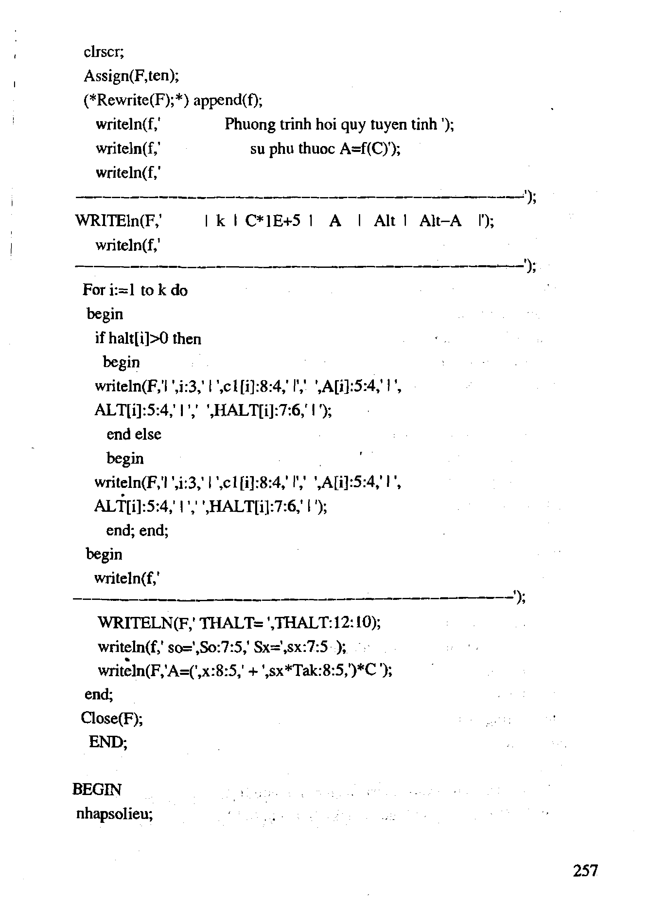

## Page 255

linh; ghi;
Ùnh2;
ghi2;
readln;
end.
13. Chương trình tính giá trị trung bình và kiểm tra đường chuẩn, theo ngôn ngữ lập trình 
pascal
(* C:\P-TKSS\turbo\phunghs.pas 
Tinh X = X trung binh + -  sx trung binh*tak 
Mo NC Vao P—TKSS Danh them turbo Danh Enter,Enter,
Enter:Ra man hinh mau xanh
Nhan F3, Nhan tab, dung mui ten chuyen ve ten chuong trinh:
Cho vao ten VD: phunghs.pas Danh enter ra chuong trinh 
Nhan Ctr + F9: Ra chuong trinh de nhap so lieu 
n=... t= ....
Danh ten file ket qua do minh dat vao (chi duoi 8 ki tu co cham doc)
X I ,.....X2 Nhap nguyen so. Nhap xọng danh enter:Ra ket qua
Thoat khoi chuong trinh:
Nhan Alt + X: Thoat khoi chuong trinh 
Nhan FlOrThoat khoi NC *) 
program Tinhso; 
uses crt;
Var
x: array[1..20j of real;
y,xtb,tak,s, gtthuc,saisotd,sstdthuc,ttn : real; 
n,i: integer; 
f,fdata: text; 
ten : string [10] ;
Procedure nhap;
Begin
Write(' Hay nhap vao gia tri cua n = '); readln(n);
W rite('Nhap hang so Student tak = ’); readln(tak);
258

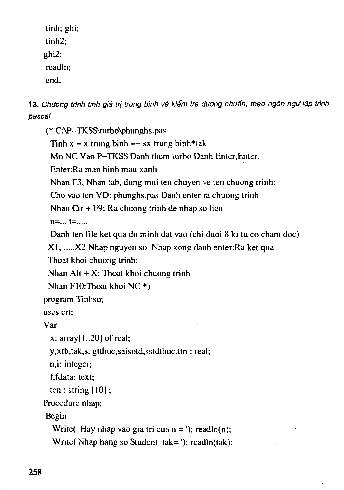

## Page 256

WrilelnC Hay nhap vao gia tri cua X ’); 
assign(fdata,'solieudo.dat'); reset(fdata); 
for i := 1 to n do
begin read(fdata,x[i]);Write('x[’,x [ i ] : 5 : 3 ) ;  end; 
close(fdata);readln;
End;
BEGIN
clrscr;
nhap;
Writeln('Nhap hang ten file ket qua (< hon 10 ki tu duoi mo rong .doc)'); 
readln(ten);
y:=0;
assign(f,ten); rewrite(f); 
writeln(f,' 
Ket qua tinh la:');
writeln(f/STT: 
x[i] 
: (X[i]-Xtb)');
for i:=l to n dơ 
begin
y:= y + x[i]; 
end;
xtb:=y/n; y:=0 ;
■ for i:=l to n do 
begin
y:= y+ sqr(x[i]-xtb);
writeln(f,i:3,’ : \X[i]:15:5/ : ’,(x[i]-xtb):15); 
end;
s:=y/(n-l );write('s2=',s: 15); 
writeln(f,' Tbcua X = ',xtb:15:5,' + - ',sqrt(s/n)*tak:15:5); 
saisotd:=sqrt(s/n)*tak/xtb* 100; 
writeln(f,' Do lech chuan s = ',s: 15:5); 
writeln(f,' Do lech gia tri trung binh Sxtb = \sqrt(s/n): 15:5); 
writeỉn(f,' Sai so tuong đoi q% = ’,saisotd:15:5,’ %’); 
writeC Nhap gia tri thuc cua X = ’); readln(gtthuc); 
write(f,'Nhap gia tri thuc cua X = \gtthuc:15:5);
259

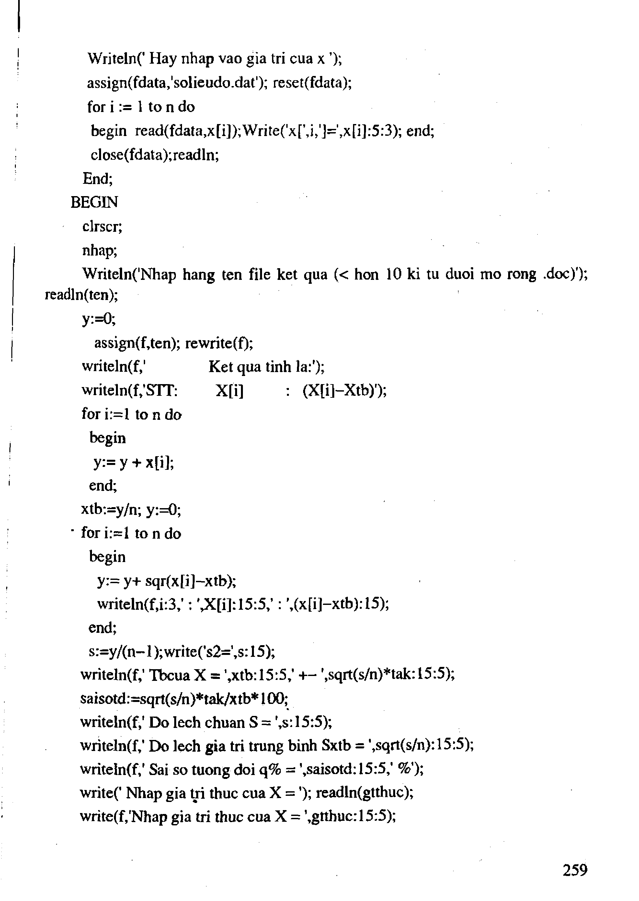

## Page 257

sstdthuc:=abs(x'tb-gtthuc)/xtb* 100;
writeln(f,'Sai so tuong doi giua li thuyet va thuc nghiem:’);
write ln(f,'qlt % = ',sstdthuc:15:5);
ttn:=abs(xtb-gtthuc)/sqrt(s/n);
write!n(f,’Hang so Student thuc nghiem: ttn = ’,ttn:15:5); 
writeln(’Nhap hang so Student tra bang tak = '); readln(tak); 
writeln(f,'Hang so Student li thuyet: tak = ',tak:15:5);
If ttn < tak then
write(f,' Su khac nhau giua li thuyet va thuc nghiem chi la ngau nhien') 
else
write(f,’ Su khac nhau giua li thuyet va thuc nghiem la khong ngau nhien'); 
close(f); readln;

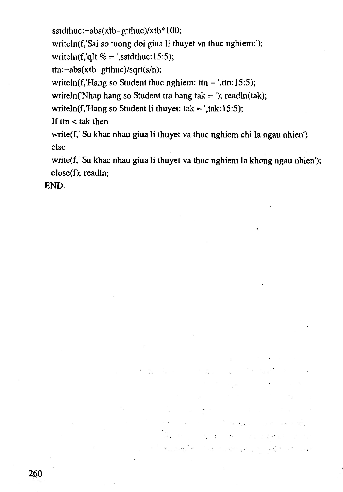

## Page 258

Chịu trách nhiệm xuất bản: 
Giám đốc Đinh Ngọc Bảo 
Tổng biên tập Lê A
Hội đồng thẩm định: 
PGS.TS. Trần Thị Hồng Vân 
PGS.TS. Trần Vãn Chung 
TS. Đặng Xuân Thư
Biên tập nội đung:
Phạm Hồng Bắc
Kĩ thuật vi tính:
Đào Phương Duyến
Trình bày bìa:
Phạm Việt Quang
MẬT SỐ PHƯDNG PHẤP PHÂN TÍCH ĐIỆN HÓA
In 1.000 cuốn, khổ 17x24cm, tại Công ty cổ phần KOV
Giấy ĐKXB số : 18 - 2009/CXB/555 - 47/Đ'HSP, kí ngày 29/12/2008.
In xong và nộp lưu chiểu tháng 7 năm 2009.

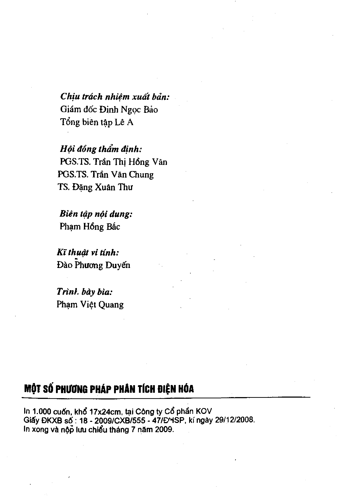
