_Review_ 

## **Advances in Manufacturing Composite Carbon Nanofiber-Based Aerogels** 

## **Yong X. Gan[1,] * and Jeremy B. Gan[2]** 

- 1 Department of Mechanical Engineering, California State Polytechnic University Pomona, 3801 W Temple Avenue, Pomona, CA 91768, USA 

- 2 Department of Chemical and Biomolecular Engineering, University of California Los Angeles, 405 Hilgard Ave, Los Angeles, CA 90095, USA; jeremygan49@ucla.edu 

- Correspondence: yxgan@cpp.edu; Tel.: +1-909-869-2388; Fax: +1-909-869-4341 

## Received: 25 May 2020; Accepted: 14 June 2020; Published: 16 June 2020 

��������� **�������** 

**Abstract:** This article provides an overview on manufacturing composite carbon nanofiber-based aerogels through freeze casting technology. As known, freeze casting is a relatively new manufacturing technique for generating highly porous structures. During the process, deep cooling is used first to rapidly solidify a well-dispersed slurry. Then, vacuum drying is conducted to sublimate the solvent. This allows the creation of highly porous materials. Although the freeze casting technique was initially developed for porous ceramics processing, it has found various applications, especially for making aerogels. Aerogels are highly porous materials with extremely high volume of free spaces, which contributes to the characteristics of high porosity, ultralight, large specific surface area, huge interface area, and in addition, super low thermal conductivity. Recently, carbon nanofiber aerogels have been studied to achieve exceptional properties of high stiffness, flame-retardant and thermal-insulating. The freeze casting technology has been reported for preparing carbon nanofiber composite aerogels for energy storage, energy conversion, water purification, catalysis, fire prevention etc. This review deals with freeze casting carbon nanofiber composite materials consisting of functional nanoparticles with exceptional properties. The content of this review article is organized as follows. The first part will introduce the general freeze casting manufacturing technology of aerogels with the emphasis on how to use the technology to make nanoparticle-containing composite carbon nanofiber aerogels. Then, modeling and characterization of the freeze cast particle-containing carbon nanofibers will be presented with an emphasis on modeling the thermal conductivity and electrical conductivity of the carbon nanofiber network aerogels. After that, the applications of the carbon nanofiber aerogels will be described. Examples of energy converters, supercapacitors, secondary battery electrodes, dye absorbents, sensors, and catalysts made from composite carbon nanofiber aerogels will be shown. Finally, the perspectives to future work will be presented. 

**Keywords:** composite carbon nanofiber; manufacturing technology; freeze casting; heat transfer; nanofiber network; thermal conductivity; electrical conductivity; modeling; energy storage; energy conversion; adsorption; water purification; sensing; catalysis 

## **1. Introduction** 

As synthetic ultralight porous materials, aerogels were first reported by Kistler [1,2] in the early 1930s. The rebirth of aerogels in the late 1970s was due to the more efficient processing techniques. Recently, aerogels have caught increasing interest because of their multiple functions. The unique structure of aerogels is derived from gels where the major component as a liquid phase is replaced by a gas through evaporation or sublimation. Such a phase substitution without causing obvious shrinkage results in solid materials containing one or more constituents. That is why extremely high 

_J. Compos. Sci._ **2020** , _4_ , 73; doi:10.3390/jcs4020073 

www.mdpi.com/journal/jcs 

2 of 40 

_J. Compos. Sci._ **2020** , _4_ , 73 

interface/surface area can be obtained in aerogels. Consequently, the resulted extremely low densities and very low thermal conductivity become the intrinsic properties of aerogels. Since aerogels can be made from a variety of chemical compounds, it is possible to have composite aerogels. Therefore, the concept of aerogels is not just limited to the traditional context of solid air. It indeed extends to nanofiber reinforced three-dimensional (3D) porous structures as shown in [3]. Nanoparticles, for example Fe3O4, were also embedded into carbon nanofibers to form composite aerogels as high capacity energy storage materials to make anodes for lithium-ion batteries [4]. The pores in aerogels become numerous light scatters in the materials. This allows special optical property, for example refraction anisotropy, associated with the different types of material used and the variation in the size and content of pores. No wonder aerogels get the nicknames of frozen smoke, solid smoke, solid cloud, blue smoke, etc. The colors and translucent nature of aerogels depend on the way light scatters in the materials. Unlike other aerogels, carbon-based aerogels developed in the late 1980s show black color. The strong absorption of light by carbon is the major reason for such optical behavior. This review article deals with recent development of composite carbon nanofiber aerogels. The processing and manufacturing technologies of aerogels will be introduced first. Various materials for making carbon nanofiber aerogels will be discussed. Characterization and modeling the performance of composite carbon nanofiber aerogels will be presented. Typical applications including energy conversion and storage, absorption, sensing, and catalysis will be discussed. 

## **2. Aerogel Processing and Manufacturing Technology** 

An intuitive way of making aerogels such as silica gels is through the natural evaporation of solvent under atmospheric pressure. The natural evaporation or drying process is simple and easy to implement. However, the drying process is extremely time consuming. Sometimes it may take weeks to complete. Besides that, the solid frameworks tend to shrink during the solvent evaporation. To overcome the shortcomings, aerogels are produced by extracting the liquid component of a gel through supercritical drying. This allows the liquid to be removed quickly without causing the solid matrix in the gel to collapse from the long-time capillary action, as would happen with the conventionally used natural evaporation. In the papers published by Kistler in 1931 [1], the supercritical drying process was used to make the first silica-based aerogel. To avoid a direct phase change, the temperature and pressure were increased to force the ethanol solvent into a supercritical fluid state. By dropping the pressure, Kistler was able to instantly gasify and remove the ethanol liquid inside the silica aerogel [2]. During the drying process of the aerogel, the liquid surrounding the silica network is completely removed and replaced with air, while keeping the aerogel intact. Therefore, supercritical fluid drying can prevent damage to the delicate three-dimensional silica network. 

While this can be done with pure ethanol, the high temperatures and pressures impose dangerous processing conditions. Supercritical carbon dioxide, scCO2, has a relatively mild supercritical point at 304.25 K (31.1[◦] C) and 73.9 bar (7.39 MPa) [5,6], as can be seen from Figure 1 [5]. Therefore, carbon dioxide has been used as one of the most popular materials for the supercritical drying. It must be also indicated that CO2 is inert, non-flammable, non-toxic, and cost-effective as compared with other fluids, such as methanol and ethanol [7]. The low viscosity and high diffusivity of CO2 ensue the quick removal of the supercritical fluid from the three-dimensional gel frameworks. Thus, a safer, lower temperature and pressure method involving a solvent exchange by a CO2-miscible fluid has been used extensively. This method is typically carried out by exchanging the initial aqueous pore liquid for a CO2-miscible liquid such as methanol, ethanol, 2-methoxyethanol and 2-ethoxyethanol [8]. Then, pressure can be gradually increased to a suitable level and allows to sustain the infusion of liquid carbon dioxide through the pores in the aerogels. Then, the temperature can be increased to bring the carbon dioxide above its critical point. An alternative to this process involves the direct injection of supercritical carbon dioxide into a pressure vessel containing aerogels. The end result of either process exchanges the initial liquid from gels with carbon dioxide, without causing the gel structure to collapse or lose volume significantly. 

3 of 40 

_J. Compos. Sci._ **2020** , _4_ , 73 

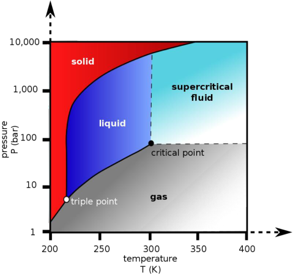

**Figure 1.** Carbon dioxide phase diagram showing the critical point. Reproduced under the terms and conditions of the liberal Creative Commons Attribution 4.0 International (CC BY) license from [5]. Copyright ©2019 The Authors. 

Matsuyama et al. [9] performed comparative studies of freeze drying and supercritical drying for making Ag nanoparticle-loaded cellulose nanofiber aerogels. To make aqueous cellulose nanofiber hydrogel solution, a wood pulp suspension was grinded several times. Ethanol was used several times to replace the occluded solvent. To replace ethanol, CO2 was pumped into the top of a high-pressure vessel holding the cellulose nanofiber gel. This process lasted for 3 h at a pressure of 20 MPa and temperature of 373 K. The extracted ethanol with CO2 was discharged at a rate of 2.0 mL/min. Following the scCO2 drying procedure, the vessel was slowly depressurized to ambient atmospheric pressure over approximately 30 min and the aerogel samples were taken out. For the cellulose aerogel obtained by conventional drying, it was obtained by the direct drying at 373 K on a Teflon plate. Structure analysis showed that the conventional drying resulted in sheet-like aerogels, while the scCO2 drying generated lightweight sponge-like aerogels. 

In addition to liquid exchange coupled with supercritical drying, freeze casting followed by vacuum drying has been studied extensively to avoid using the high pressure in the supercritical drying process. As shown by the unary phase diagram in Figure 2 [6], the supercritical drying allows the gel to convert into aerogel at a higher temperature and much higher pressure conditions than the freeze drying. In freeze drying, the gel is cooled down rapidly to achieve a deep frozen state first. Then the liquid in the frozen gel sublimates to form a porous aerogel. Deep cooling can be realized by using a refrigerator or liquid nitrogen vessel. The sublimation is performed under controlled vacuum conditions. Wang et al. [10] made cellulose nanofiber aerogels by freeze drying the gels at −60[◦] C. Exceptional mechanical and thermal-insulating properties were obtained. 

In the work performed by Yu et al. [11], silica aerogels were blended with polyacrylonitrile polymer to make composite nanofibers for adsorption of volatile organic compounds. The processing flowchart is shown in Figure 3 [11]. Various amounts of porous silica aerogel nanoparticles were added into polyacrylonitrile (PAN) and N, N-dimethylformamide (DMF) solution. Composite PAN nanofibers with surface decorated silica aerogel were obtained by electropinning. After that, the DMF solvent was air dried for 12 h in an oven at 60[◦] C. Since the natural drying caused a partial loss in volume, the electrospun nanofibers only formed loose membranes as can be seen from the images in the right hand side part of Figure 3 [11]. Therefore, it is difficult for this method generate robust 3D aerogels with ordered structures. 

4 of 40 

_J. Compos. Sci._ **2020** , _4_ , 73 

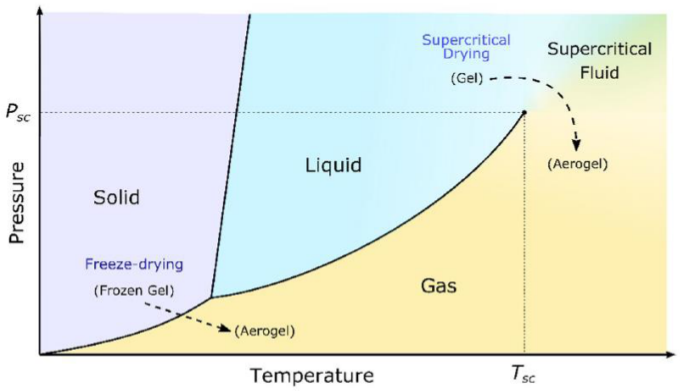

**Figure 2.** A unary phase diagram showing the temperature conditions for supercritical fluid drying and freeze drying. _Psc_ defines the supercritical pressure and _Tsc_ represents the supercritical temperature in the diagram. Reproduced under the terms and conditions of the liberal Creative Commons Attribution 4.0 International (CC BY) license from [6]. Copyright ©2019 The Authors. 

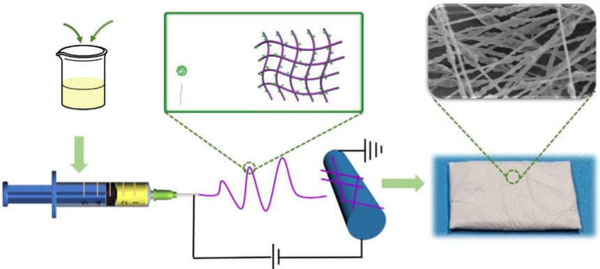

**Figure 3.** The schematic and images of SiO2 aerogel modified polyacrylonitrile nanofiber membranes. Reprinted with permission from [11]. Copyright © 2020 Elsevier B.V. 

Freeze drying, on the other hand, is found effective on making 3D ordered assemblies as shown in [12,13]. Figure 4 schematically shows the processing flowchart and the aerogels prepared by the vacuum freeze drying technology in the paper published by Qiu et al. [12]. In the left part of the figure, cellulose nanofibers peeled from wood were shown. The electrospun PAN nanofibers were modified by the amination reaction with polyethylenimine (PEI) at 130[◦] C for 6 h under magnetic stirring. After that, the surface modified PAN nanofibers were mixed with the cellulose nanofibers, which allows the hydrogen bond formation between the two polymer nanofibers. PAN has good mechanical properties. It can make the cellulose aerogel very robust. As a result, the stable three-dimensional fibrous assemblies can be obtained. Such composite fibrous aerogels were used as the templates for holding the photocatalyst derived from the metalorganic compound: ZIF-67, i.e., zeolitic imidazolate framework-67, or 2-methylimidazole cobalt salt. As is known, ZIF-67 is one of the most important metal-organic frameworks (MOFs) with high porosity and high surface area. In such a metalorganic substance, the cobalt metal is bonded to organic ligands, making it a promising candidate for gas absorption and photocatalysis. The left hand side part of Figure 4 illustrates the freeze drying process 

5 of 40 

_J. Compos. Sci._ **2020** , _4_ , 73 

and shows the image of generated 3D fibrous aerogel product. On the right hand side of Figure 4, how to use the aerogel to make the catalyst support is demonstrated. The PAN and cellulose nanofibers were mixed and processed with cobalt and molybdenum compounds to make the aerogels using the vacuum freezing and drying technology. The photocatalytic activities of the catalyst containing composite aerogels were characterized in view of water remediation including Cr (VI) concentration reduction, hydrogen generation, and disinfection of _E. coli_ and _S. aureus_ under ultraviolet (UV) light. 

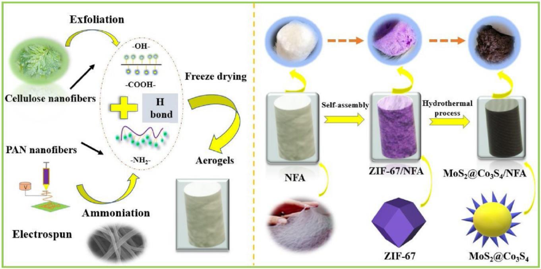

**Figure 4.** Three-dimensional fibrous aerogel assemblies made by vacuum freeze drying technology and their application for photocatalyst support. NFA means nanofiber aerogels. ZIF-67 stands for the zeolitic imidazolate framework-67, or 2-methylimidazole cobalt salt. Reprinted with permission from [12]. Copyright © 2019 Elsevier B.V. 

Another advantage of freeze processing is that the unidirectional solidification of solvents allows to prepare highly porous, anisotropic, regularly aligned cell-wall structured aerogels. Examples of nanocellulose-based aerogels were given in the work performed by Wei et al. [13]. To prepare the aerogels, an aqueous cellulose nanofiber dispersion with a solid content of 1 wt % was mechanically separated from birch pulp using a grinder. In a typical case, 62 g of 1 wt % cellulose nanofiber aqueous suspension was mixed with 0.03 g of 1,2,3,4-butanetetracarboxylic acid cross-linker by stirring for 1 h at the room temperature. The mixture was then frozen in a unidirectional way at a cooling rate of −5 K/min using a freeze-casting setup as schematically shown in Figure 5 [13]. The cast was freeze-dried for 72 h at a pressure of 0.064 mbar to form aerogels. Crosslinking was performed by the esterification 

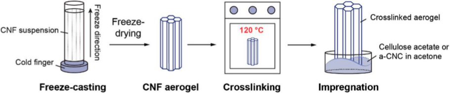

**Figure 5.** Sketches showing the process of unidirectional freeze casting followed by freeze drying to make the acetate-functionalized nanocellulose aerogels for CO2 adsorption. Reproduced under the terms and conditions of the liberal Creative Commons Attribution 4.0 International (CC BY) license from [13]. Published by Springer. Copyright ©2020 The Authors. 

6 of 40 

_J. Compos. Sci._ **2020** , _4_ , 73 

During unidirectional freezing of water, the ice front velocity could affect the structure of the aerogels. Earlier work performed by Deville et al. [14] revealed that the higher the speed of ice front, the smaller the separation between the obtained laminates observed in the structure of composites. Figure 6 from [13] shows the scanning electron microscopic (SEM) images of cellulose nanofiber aerogel, cellulose nanofiber aerogel impregnated with small amount of cellulose acetate, cellulose nanofiber aerogel impregnated with large amount of cellulose acetate, and cellulose nanofiber aerogel impregnated with cellulose nanocrystals. The cross-section of the samples perpendicular to the freezing direction shows the hexagonal cells in images ( **ai** )–( **di** ) in Figure 6, while the cross-section of the specimens parallel to the freezing direction reveals the laminar structure as shown by the two sets of images ( **aii** )–( **dii** ) and ( **aiii** )–( **diii** ) in Figure 6. 

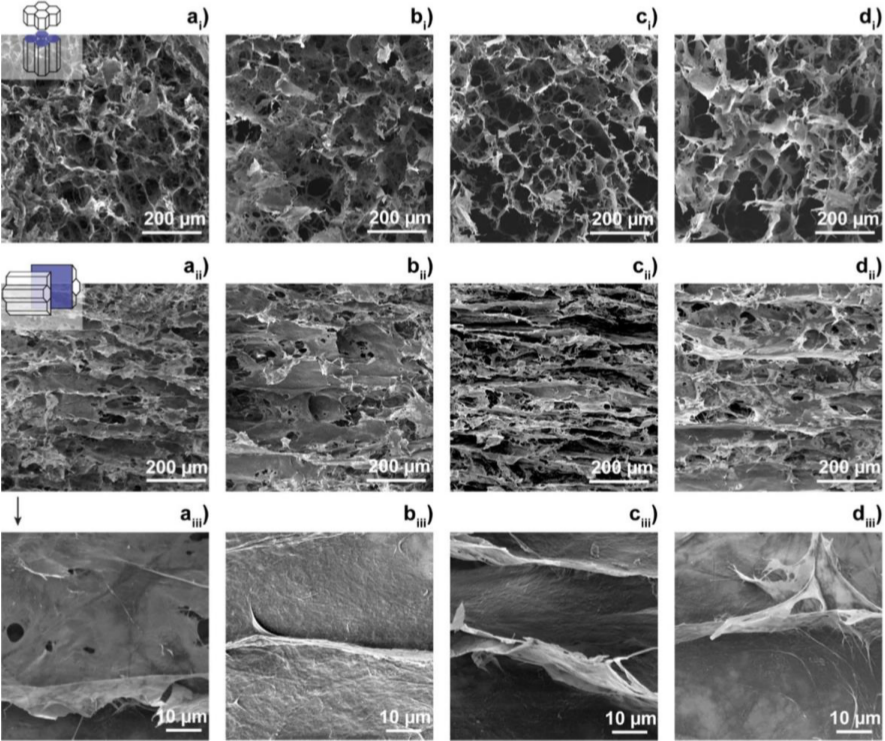

**Figure 6.** Scanning electron microscopic (SEM) images of ( **a** ) cellulose nanofiber aerogel, ( **b** ) cellulose nanofiber aerogel impregnated with a small content of cellulose acetate, ( **c** ) cellulose nanofiber aerogel impregnated with a high content of cellulose acetate, and ( **d** ) cellulose nanofiber aerogel impregnated with cellulose nanocrystals. ( **ai** – **di** ): the cross-section of the samples perpendicular to the freezing direction, ( **aii** – **dii** ): the cross-section of the samples parallel to the freezing direction. ( **aiii** – **diii** ): magnified images of the samples from the parallel cross section. Reproduced under the terms and conditions of the liberal Creative Commons Attribution 4.0 International (CC BY) license from [13]. Published by Springer. Copyright ©2020 The Authors. 

## **3. Materials and Manufacturing Processes for Composite Carbon Nanofiber Aerogels** 

Carbon aerogels, for example the resorcinol-formaldehyde aerogel, can be made in the similar ways as discussed in the previous section. Carbon aerogels could be prepared from the precursor (resorcinol-formaldehyde) aerogel by pyrolysis in inert gas atmosphere, leaving a frame of carbon. 

7 of 40 

_J. Compos. Sci._ **2020** , _4_ , 73 

Carbon aerogels are manufactured into porous blocks, powders, or composite sheets. Specifically, carbon nanofiber aerogels consist of nanofiber networks as the support. The nanofibers may contain several materials with various chemical formulae and different structures. Additives have been successful incorporated into carbon nanofibers to achieve required properties of the aerogels for wide applications. Composite carbon nanofiber aerogels have been made using a variety of continuous and discontinuous reinforcements. The high strength and high modulus ceramic fibers have been considered to reinforce aerogel composites with significantly enhanced mechanical properties. Impregnated silicon oxide coating has been proposed to improve the high temperature resistance of carbon nanofiber-based aerogels. In this section, the emphasis will be placed on the materials and manufacturing processes for composite carbon nanofiber aerogels. 

## _3.1. Polyacrylonitrile (PAN) Derived Composite Carbon Nanofiber Aerogels_ 

Electrospun polyacrylonitrile (PAN) nanofibers can be readily converted into carbon nanofibers with designed functionalities [15]. In the stabilizing temperatures ranging from 225 to 300[◦] C, the PAN molecule can cyclize and transform into a non-meltable ladder structure, which is the original of high strength for the nanofiber. Zhang et al. [16] made a polyacrylonitrile (PAN) and polyvinylpyrrolidone (PVP)-derived composite carbon nanofiber aerogel as the anode material for supercapacitors. Co3O4 was loaded into the aerogel for cathode material application. The freeze casting and drying process for the aerogel formation is illustrated in Figure 7 [16]. The starting materials, PAN/PVP nanofiber membranes, were prepared by electrospinning the homogeneous solutions with 1 g of PAN, 9 mL of DMF, and different amounts of PVP (0.5, 1, and 2 g). PAN-based nanofiber membranes (1 g for each sample) were cut into small pieces and dispersed in 100 mL water/tertbutanol with a volume ratio of 3:1. Uniform nanofiber slurries were made by a homogenizer running at 10,000 rpm for 20 min. The slurries were frozen in a mold at −80[◦] C. Then, freeze-drying was conducted for 48 h to produce the PAN/PVP aerogels with varied PVP contents. 

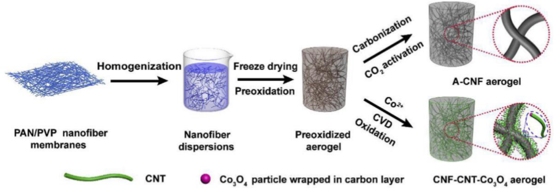

**Figure 7.** Schematic of making composite carbon nanofiber aerogel anode and Co3O4 containing aerogel cathode materials. Reprinted with permission from [16]. Copyright © 2019 Elsevier B.V. 

To obtain carbon nanofibers, oxidation/stabilization followed by carbonization was carried out. The PAN/PVP aerogels with various PVP contents were oxidized at 240[◦] C for 1 h, and carbonized in nitrogen at 700, 800, 900, and 1000[◦] C for 2 h to generate carbon nanofiber (CNF) aerogels. Since PVP is a water solvable polymer, it serves as an adhesive or “solder” to “weld” adjacent nanofibers as shown by the images in Figure 8a,b. It must be indicated that PVP tends to decompose at elevated temperatures. That is why pore formation occurred after the carbonization at high temperatures as shown in a magnified image in Figure 8c. The element distribution of the nanofiber was analyzed by energy dispersive X-ray diffraction spectroscopy. The surface mapping result is shown in Figure 8d, revealing the two major elements of C and N at the fiber surface. 

8 of 40 

_J. Compos. Sci._ **2020** , _4_ , 73 

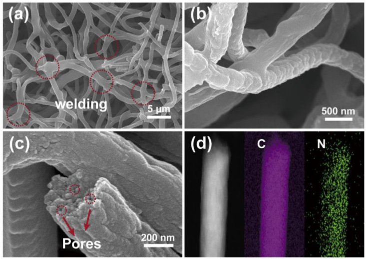

**Figure 8.** Images and composition of the composite carbon nanofiber aerogel: ( **a** – **c** ) SEM images, ( **d** ) composition. Reprinted with permission from [16]. Copyright © 2019 Elsevier B.V. 

The prepared carbon nanofiber aerogel was activated in CO2 at a high temperature and the obtained activated carbon nanofiber aerogel (A-CNF aerogel as shown in Figure 7) was tested as the anode material for supercapacitors [16]. For cathode material preparation, the sol-gel approach followed by chemical vapor deposition (CVD) was applied to make a carbon nanofiber (CNF)-carbon nanotube (CNT)-Co3O4 nanoparticle hybrid aerogel as illustrated in the lower right part of Figure 7. In brief, the pre-oxidized PAN/PVP aerogel was immersed in an aqueous solution of Co(NO3)2 6H2O with the selected concentration of 0.03, 0.06, or 0.09 M for 2 h. After being soaked with cobalt salt, the aerogel was under freeze-drying for 48 h. The resultant aerogel was then thermally annealed at 450[◦] C for 1 h in H2/Ar mixed gas stream (with a flow rate ratio of 10 sccm/100 sccm) to reduce the Co ions to metallic Co and partially carbonize the PAN/PVP nanofibers. To grow carbon nanotubes (CNTs) at the surface of the partially carbonized nanofibers, a chemical vapor deposition (CVD) treatment on the composite nanofiber aerogel was implemented at 700[◦] C for 15 min in a gas stream containing the mixture of C2H2 (with a flow rate of 50 sccm), H2 (at a flow rate of 10 sccm) and Ar (with a flow rate of 100 sccm). The full carbonization was completed by the heat treatment at 900[◦] C for 1 h in argon gas stream with the flow rate of 100 sccm) to generate the carbon nanofiber (CNF)-carbon nanotube (CNT)-cobalt (Co) aerogel. This aerogel was oxidized at 300[◦] C for 3 h in air to generate the final product: CNF-CNT-Co3O4 aerogel cathode material. It was found that the fully carbonized nanofiber aerogels are much more conductive than those nanofiber aerogels just heat treated below 700[◦] C [16]. PAN is so important for carbon fiber production. As a linear molecular chain polymer, polyacrylonitrile (PAN) can generate crosslinking through chemical reactions during the stabilization and carbonization processes, as shown by Cipriani et al. through the X-Ray Diffraction (XRD), Fourier Transform Infrared Spectroscopy (FTIR), and Raman Spectroscopy studies of specimens under various heat treatment temperature conditions [17]. Schierholz et al. [18] used the in-situ transmission electron microscopy (TEM) to examine the structural evolution of an electrospun PAN fiber at various temperatures. Changes in fiber diameter and surface morphology of the nanofiber were observed at the temperatures of 250[◦] C, 600[◦] C, 800[◦] C and 1000[◦] C in the imaging mode. In the concomitant high resolution TEM and electron diffraction mode, roughening of the surface morphology and formation of turbostratic carbon with increasing carbonization temperature at identical locations were shown. 

9 of 40 

_J. Compos. Sci._ **2020** , _4_ , 73 

Differential scanning calorimetry (DSC) experiment showed a broad exothermic peak at 308[◦] C in the stabilized PAN fiber, indicating the initial cyclization of the structure at such a temperature [19]. This temperature is slightly lower than the melting temperature of PAN (317[◦] C), but much higher than the glass transition temperature of PAN, which is 107.2[◦] C as determined by the dynamic mechanical analysis (DMA) [20]. 

The studies of heat treatment on PAN can be divided into two major categories, i.e., low temperature oxidation and/or stabilization [21–25] and high temperature carbonization [26–29]. The low temperature oxidation of PAN can be realized in the temperature range from room temperature up to 300[◦] C [21,22]. The temperature range for the pre-carbonization of PAN-based carbon fiber is from 350[◦] C to 600[◦] C [23]. High temperature carbonization is typically performed by heat treatment in the temperature range from 800[◦] C to 1300[◦] C. Graphitization of the fiber is conducted in the temperature range from 1300[◦] C up to 2100[◦] C [24]. The change in structure of PAN can be affected by various factors. The stereoregularity of the PAN precursor is one of the most important structural parameters, because the spatial alignment of the nitrile groups determines how active they are in the cyclization reactions during the thermal oxidative stabilization (TOS) process. The more stereoregular of the PAN (co)polymer precursors, the higher the extents of cyclization, resulting in higher concentrations of cyclized rings [12]. The tensile strength and modulus of the PAN fiber decrease after oxidation and stabilization but then increase after the low temperature carbonization. The oxidation and stabilization in the temperature range from 225[◦] C to 255[◦] C caused tensile strength and modulus to decrease from 0.51 GPa to 0.27 GPa and from 10.11 GPa to 8.97 GPa, respectively. After carbonization, the strength and modulus increased to 1.24 GPa and 69.39 GPa, respectively [22]. Jing et al. [23] studied the structure evolution chemistry and mechanism during the pre-carbonization of PAN-based fiber in the temperature range of 350~600[◦] C. In the temperature range from 300[◦] C to 450[◦] C, the stabilized fiber started the cross-linking and aromatization and gave off heat. In the temperature range from 450[◦] C to 550[◦] C, active calcination occurred. After calcination, the fiber has the fully developed aromatization structure. The size of the aromatized rings is smaller than that of the rings before calcination. Multiple steps of low temperature stabilization could improve the strength of the carbon fiber. As an example, the PAN precursor was first stabilized at 120[◦] C for 30 days followed by the second treatment in a multiple zone furnace with the zone temperatures at 200[◦] C, 225[◦] C, 250[◦] C, and 275[◦] C. After stabilized for 40 min, the fiber was fully carbonized in nitrogen in the temperature range from 900[◦] C to 1300[◦] C. The tensile strength tested was 17% higher than that of the fiber being regularly stabilized [25]. 

Blending a thermally less-stable polymer, for example polymethyl methacrylate (PMMA), into olyacrylonitrile (PAN) prior to carbonization changed the physical and chemical properties of the carbon fiber after high temperature heat treatment [26]. This is because the fusion of PMMA into PAN caused the expansion of the structure. Adding PMMA facilitates pore formation through the vaporizing and releasing the high temperature decomposed products. Joo et al. [27] made preliminary studies of carbon films from PMMA-PAN blends. The carbon films showed the structures with specific surface textures. The phenomenon is due to the electro-hydrodynamic instability of the interface between PMMA and PAN in the electric field during the precursor film formation. PMMA and PAN have different dielectric constants. The electric susceptibility of PAN/PMMA and the polymer blend/air interfaces along the electric field changes. This allowed some of the special pattern to form in the PAN and PMMA polymer blends. Nitrogen blowing core-shell drops of PMMA and PAN coupled with electrospinning was performed to make multilayered polymer fiber with PMMA core and PAN sheath [28]. The subsequent heat treatment caused the total removal of the core and carbonization of the sheath. Finally, carbon tubes with an inner diameter of 50–150 nm and outer diameter of 400–600 nm, and the fiber mats were obtained. Emulsion polymerization of PMMA and PAN was used to prepare PMMA core/PAN shell particles [29]. The PMMA/PAN composite particles were stabilized in air at 250[◦] C and then carbonized in nitrogen at 1000[◦] C during which the PMMA cores turned into pores and the PAN shells were converted into carbon shells. Hollow carbon nanospheres (HCNs) were obtained by cracking the carbon shells. 

10 of 40 

_J. Compos. Sci._ **2020** , _4_ , 73 

PAN fibers have found various applications as new structural or functional materials [30–36]. Li et al. [30] made porous carbon nanofiber derived from immiscible PAN/PMMA for high-performance lithium-sulfur batteries. The porous carbon nanofibers (PCNFs) served as coating layers on a glass fiber (GF) separator to block polysulfide diffusion in Li-S batteries. The polyacrylonitrile (PAN)/polymethyl methacrylate (PMMA) blends were electrospun and followed by heat treatment, during which PAN was converted to carbon while PMMA was decomposed to generate small open pores in the carbon nanofiber matrix. In the review given by Gong et al. [31], it is described that the carbon precursor (PAN) can be pre-organized into a well-defined nanostructure through phase-separation-driven self-assembly induced by the presence of a sacrificial immiscible block such as butyl acrylate and methyl methacrylate. Upon pyrolysis, the PAN domains were converted into graphitic carbon, whereas the sacrificial phase was volatilized. The requirement for pore formation is that the PAN domains keep their cyclic, ladder, and eventually crosslinked structures upon heat treatment. It is also demonstrated that even before the heat treatment, the electrospun PMMA/PAN blend polymer fiber mat has 10% higher porosity than the pure PAN fiber mat [32]. The stabilization of PAN can be done mainly by heat treatment in air [33]. The pre-heat treatment irradiation of PAN can promote the crosslinking of the polymer and thus shorten the time and/or lower the onset temperature for cyclization and aromatization [34]. On the contrary, to ensure high mechanical strength of the carbonized fiber, pure PAN is used as the precursor and the pore formation should be avoided. The homogeneous cross-section is the preferred nanofiber structure. The failure prone shell-core structure should be avoided because the core-shell feature is taken as a major structural weakness in high strength nanofibers [35]. However, to increase the toughness of nanofibers, creating nanoscale interfaces by polymer blends is proposed [36]. 

In the work by Xu et al. [37], a PMMA-PAN based fiber was made first by electrospinning. Then, the polymer nanofiber was heat treated at various temperatures in Ar atmosphere to get the partially carbonized nanofiber. The effect of pyrolysis temperature on the electrical conductive behavior and photosensitivity of the carbon based nanofiber was studied. The electrical resistance was measured using an electrochemical analyzer and the conductance of the fiber was determined. Scanning electron microscopy (SEM) was used to examine the difference in the structure and morphological features for the fiber before and after calcination. The activation energy of carbonization was calculated. The incorporation of PMMA into PAN changed the morphology of the spun fiber by increasing both the connectivity of fiber filament and the size of the fiber. The PMMA polymer demonstrated a similar behavior as the case for PVP in PAN [16]. The phase separation of PAN and PMMA led to the instability of the PAN/PMMA and polymer/air interfaces, which promoted the fiber developing surface roughness. From the stabilized state (250[◦] C) to the moderate carbonized state (650[◦] C), the size of the fiber sprinkled by more than 50% due to the development of the ladder and ring structures. The higher the calcination temperature, the more conductive of the fiber is. Two stages of reaction kinetics were seen. In the low to medium temperature range, the fiber started oxidation and structure stabilization (Stage I). Carbonization begun at 450[◦] C. At a higher temperature, the pyrolysis entered Stage II, which is the carbonization. The carbonization reaction was described by the Arrhenius law in the temperature range from 450[◦] C to 800[◦] C. In this temperature range, the activation energy for the carbonization reaction is determined as 118 kJ/mol. The carbon-based nanofiber heat treated below 650 ◦C is highly sensitive to the illumination of visible light. The open circuit potential versus time plot showed an increase in voltage for the light ON phase and a decrease in voltage for the OFF period, indicating the typical electron-hole pair generation and recombination features. With the increase in the calcination temperature, the photosensitivity of the fiber varies. The partially carbonized fiber obtained around 600[◦] C reveals the biggest photonic response, which is due to the well-developed aromatic ring structure during the pyrolysis. The conjugated structure caused the localized electrons being excited effectively by photon energy. Therefore, the optical switching behavior was confirmed. At a higher heat treatment temperature of 650[◦] C, the decrease in the activities of the out-of-plane triazine rings increased the in-plane electron mobility, which promoted the fast recombination of the photon excited electron-hole pairs. Thus, the photosensitivity of the carbonized fiber at this temperature dropped 

11 of 40 

_J. Compos. Sci._ **2020** , _4_ , 73 

almost ten times. At an even higher temperature of 800[◦] C, the completion of carbonization allowed the photon induced electrons to move freely in the fiber. No wonder that the photosensitivity disappeared if the pyrolysis temperature is too high. The carbon-based nanofiber heat treated below 650[◦] C has the potential for building sensors due to its flexibility and high sensitivity. In addition, it is relatively inexpensive for production. The PAN-PMMA derived carbon fiber could also find application for electric power generation due to the demonstrated photovoltaic property. 

In addition to carbon nanotubes, graphene sheets were incorporated into carbon nanofiber-based aerogels to generate spatial separation effect and to further increase the surface area. Kshetri et al. [38] made a ternary graphene–carbon nanofibers–carbon nanotube aerogel with high surface area for supercapacitance application. Figure 9 [38] shows the schematic of processing the aerogel. There are several steps for the aerogel formation. First, a PAN nanofiber mat was made through the single-nozzle electrospinning on a thin aluminum sheet wrapped on a drum rotating at 900 rpm [39]. Then the PAN fiber mat was cut into small pieces for impregnation with graphene oxide (GO) which was made through the exfoliation of graphite flakes [40]. About 0.05 g of GO and 0.05 g of cut PAN nanofiber mat were dispersed in a plastic tube containing 15 mL of deionized (DI) water. Sonicating the solution for 1 h was performed to generate a homogeneous PAN-GO gelation. 

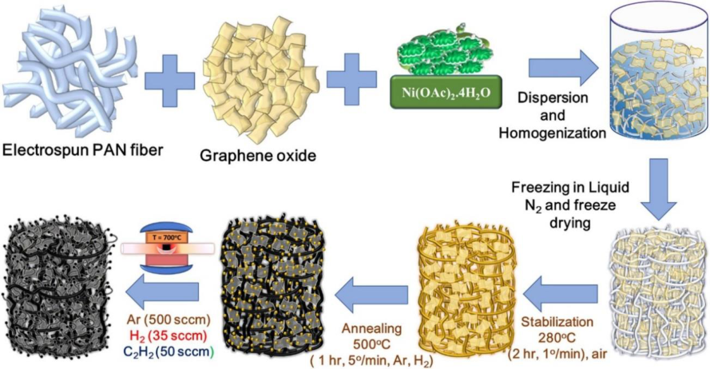

**Figure 9.** Schematic of making graphene and nanotube containing composite carbon nanofiber aerogel. Reprinted with permission from [38]. Copyright © 2019 Elsevier B.V. 

After that, a 10 wt % of nickel acetate solution was added to the PAN-GO gel solution for the deposition of the Ni-based catalyst for carbon nanotube preparation in the subsequent process. The solution was frozen in a plastic conical tube by slowly dipping in liquid nitrogen followed by freeze-drying in a dryer to obtain the Ni compound coated PAN-GO aerogel. Next, the processed Ni salt containing PAN-GO aerogel was stabilized by converting the linear structure of the PAN into ladder structure through dehydrogenation and cyclization [41,42]. The stabilized Ni compound containing PAN-GO aerogel was further treated at 500[◦] C in the atmosphere filled with hydrogen (H2) and argon (Ar) to reduce the nickel salt into metallic nickel nanoparticles. Following that, the temperature was raised to 700[◦] C to generate multi-walled carbon nanotube by purging acetylene (C2H2) at the rate of 50 sccm. It is noted that acetylene has been widely used as a very efficient carbon source for making multi-walled CNTs at low temperatures [43]. Within a time period of 1 to 10 min, the ternary (CNT, GO, and CNF) aerogel was obtained. Such an aerogel product was considered as a preferable negative electrode material for constructing a new hybrid supercapacitor device. 

12 of 40 

_J. Compos. Sci._ **2020** , _4_ , 73 

The electrospun PAN nanofibers can be directly collected in a solvent (water) containing the oxidized graphene suspension [44]. As shown in Figure 10 [44], the graphene oxide (GO) can wrap the PAN nanofiber strands nicely. After freeze drying, the nanofiber (NF)–graphene oxide (GO) aerogels (As) named as “NF/GOAs” can be produced. The pre-oxidation and carbonization procedures allowed the conversion of PAN polymer nanofibers to carbon nanofibers (CNF). Therefore, the final product: carbon nanofiber/graphene oxide aerogels “CNF/GOAs” can be obtained. Such aerogels show strong oil adsorption performance as demonstrated in [44]. 

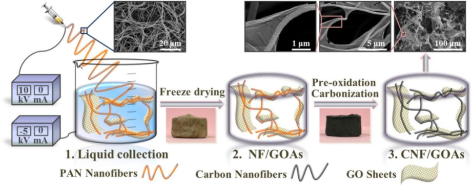

**Figure 10.** Electrospinning polyacrylonitrile (PAN) polymer nanofiber in graphene oxide (GO) solution to make carbon nanofiber/GO aerogel. Reproduced under the terms and conditions of the liberal Creative Commons Attribution 4.0 International (CC BY) license from [44]. Published by Elsevier B.V., Copyright ©2019 The Authors. 

## _3.2. Cellulose (CE) Based Composite Carbon Nanofiber Aerogels_ 

Cellulose is the most abundant of all naturally occurring organic compounds. Cellulose has a complex carbohydrate or polysaccharide structure which contains 3000 or more glucose units. The cell walls of plants are made of cellulose. The basic structural component of vegetable, cotton, and wood are cellulose. Among the three products, cotton has the highest content of cellulose. Approximately 90% of cotton is cellulose. About 50% of wood and 33% of all vegetable matter are cellulose. While cellulose is a basic structural material of most plants, it can also be generated by certain types of bacteria. Bacterial cellulose is defined as an organic compound with the same formula of (C6H10O5)n as the naturally produced cellulose. 

Sriplai et al. [45] reported their work on making magnetic bacterial cellulose (BC) and carbon nanofiber aerogels by a simple process of immersion followed by pyrolysis. The raw material of BC used was extracted from coconut gel cubes. The bacterial cellulose (BC)/Fe3O4 aerogel was manufactured by immersing the BC hydrogel in a commercially available ferrofluid. Then freeze drying was used to obtain the BC/Fe3O4 aerogel. Finally, to make the carbon nanofiber (CNF)/Fe3O4 nanoparticle composite aerogel, the BC/Fe3O4 aerogel was annealed at 600[◦] C for 2 h in an Ar atmosphere. This allows the BC nanofiber to convert into carbon nanofiber. Fauziyah et al. [46] also used coconut product, the coir fiber, to generate cellulose aerogel by the alkali-urea method. Applications for water, oil, and methylene blue adsorption were demonstrated. 

In reference [47], cellulose acetate aerogels (CAs) were prepared by freeze-drying combined with high temperature carbonization in nitrogen using wood cellulose as the starting material. The effect of carbonization temperature on the internal structures of the aerogels including the nanoplate and nanofiber structures was investigated. The decrease in the total volume of aerogels and the shrinkage in the size of nanofibers in the CAs were observed with the increase in carbonization temperature, as can be seen from the schematic and micrographs in Figure 11 [47]. The carbonization temperature of 

13 of 40 

_J. Compos. Sci._ **2020** , _4_ , 73 

800[◦] C is considered to be the optimum condition under which the highest specific surface area (SSA) and total pore volume of CAs were achieved. 

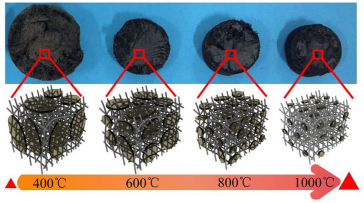

**Figure 11.** Schematic and optical micrographs showing the effect of carbonization temperature on the structures of carbonized cellulose nanofibril aerogels for supercapacitor applications. Reprinted with permission from [47]. Copyright ©2019 American Chemical Society. 

Zeolitic imidazolate frameworks (ZIFs) can be assembled in cellulose aerogels as shown in [48]. Specifically, the 2-methylimidazole zinc salt, ZIF-8 with an empirical formula of C8H10N4Zn and molecular weight of 228, was added into bacterial cellulose (BC) aerogels as illustrated by Figure 12 [48]. The aerogel processing involves the simple self-assembling procedure followed by freeze drying at low temperatures, and carbonization at elevated temperatures. As a result, a relatively low cost, highly porous, ultralight, three-dimensional (3D) interconnected N-doped carbon nanofiber (NCNF) aerogel with a silk cocoon-like node network was obtained. It was observed that during the carbonization of BC@ZIF8 hybrid aerogels, numerous micro- and mesoporous carbon-based substructures generated as electrical charge storage nodes. It was also found that the original shape and structure of the ZIF8 nanocrystals were kept. The BC is converted into the highly conductive carbon nanofibers. The carbon nanofibers as the 3D interconnected frameworks with a silk cocoon-like node morphology were revealed by several high-resolution scanning electron microscopic (SEM) images [48]. The obtained NCNF aerogels are highly porous while retaining the structure and shape of the ZIF8 nanocrystals after the high-temperature carbonization treatment. That is why the produced NCNF aerogels consist of highly conductive carbon nanofibers and large amount of micro- and mesoporous carbon nanoparticles came from the carbonized ZIF-8 (C-ZIF-8). These carbon particles were connected with each other by the carbonized bacteria cellulose (C-BC) nanofibers. It is noted that no signal of Zn species appeared in the elemental analysis data, indicating that the resultant carbon nanofiber aerogel does not contain detectable amount of Zn [48]. Therefore, the Zn specie played the role of sacrificial agent. The presence of Zn in the ZIF8 particles helped create the porous structure of the aerogel from the removal of Zn during carbonization through thermal evaporation. 

In the work performed by Yang et al. [49], a softwood bleached kraft pulp was used to generate carbon nanofibers. The nanofibers were wrapped by oxidized graphene. The oxidized cellulose nanofibril and graphene oxide (GO) were taken as the precursors. A facile ion-exchange process followed by freeze-drying was used for preparing the carbon nanofiber/graphene oxide aerogel. The carbonization temperatures used were 750 and 1100[◦] C in an argon atmosphere. Figure 13 from [49] shows the SEM images of carbon nanofiber/graphene oxide aerogels with different compositions treated at two different temperatures. The fiber network and the GO can be seen in these images. 

14 of 40 

_J. Compos. Sci._ **2020** , _4_ , 73 

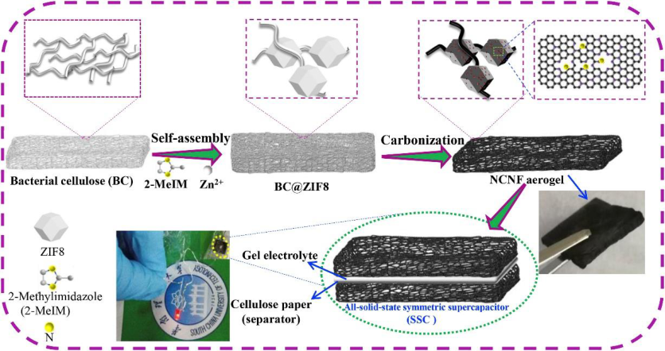

**Figure 12.** Manufacturing process for a supercapacitor using N-doped carbon nanofiber (NCNF) aerogels from cellulose. Reprinted with permission from [48]. Copyright © 2019 Elsevier Ltd. 

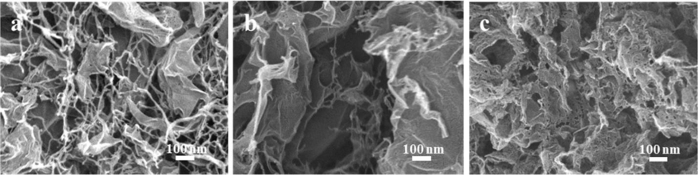

**Figure 13.** SEM images of carbon nanofiber/graphene oxide aerogels with different compositions treated at two different temperatures: ( **a** ) nanofiber: GO = 9:1, heat treated at 750[◦] C, ( **b** ) nanofiber: GO = 8:2, heat treated at 750[◦] C, ( **c** ) nanofiber: GO = 9:1, heat treated at 1100[◦] C. Reprinted with permission from [49]. Copyright ©2019 American Chemical Society. 

## _3.3. Alginate Derived Composite Carbon Nanofiber Aerogels_ 

Alginate has been proposed as a sustainable precursor to make carbon nanofiber aerogels [50,51]. Alginate is known as a naturally occurring anionic polymer typically obtained from brown seaweed. Its unique biophysical properties are highly valuable in the development of functional food products. It has also been extensively investigated and used for many biomedical applications. Alginate is low toxic and has good biocompatibility. Mild gelation occurs by addition of cations such as Na[+] , Ca[2][+] , and Fe[3][+] . Liu et al. [50] prepared FeS nanoparticle (NP) loaded three-dimensional (3D) composite carbon nanofiber aerogels (CNA) using Fe-alginate aerogels as the renewable precursor. Figure 14 [50] schematically illustrates the process of synthesizing FeS nanoparticle containing composite carbon nanofiber aerogels from the alginate salt precursor. Briefly, a solution of 1 wt % sodium alginate was injected into the 2.5 wt % ferric chloride hexahydrate aqueous solution using a syringe needle and stirred for 30 min to promote the gelation via Fe-ion crosslinking. The obtained gel was separated from the solution and washed several times with distilled water. After freeze-drying, the gel was dehydrated and formed a 3D alginate aerogel. After that, the aerogel was carbonized at 800[◦] C for 2 h in Ar. Next, the sample was mixed with sulfur and kept at 600[◦] C for 2 h. Under such conditions, sulfur sublimated, got infiltrated into the 3D nanofiber framework, and reacted with Fe ion to generate FeS nanoparticles within the carbon nanofiber aerogel. 

15 of 40 

_J. Compos. Sci._ **2020** , _4_ , 73 

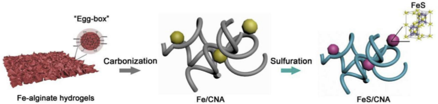

**Figure 14.** Schematic of the synthesis process of FeS nanoparticle-loaded carbon nanofiber aerogel from alginate salt. Reprinted with permission from [50]. Copyright © 2019 Elsevier B.V. 

In addition to sulfur sublimation as shown in [50], thioacetamide (TAA) decomposition was used to supply the sulfur source for FeS nanoparticle formation during the pyrolysis of the Fe alginate aerogel [51]. N-doping the alginate derived carbon nanofiber aerogel was realized using an ammonium atmosphere during the pyrolysis as illustrated in the same paper [51]. 

## _3.4. Biomass_ / _Renewable Resources Derived Composite Carbon Nanofiber Aerogels_ 

Renewable sources such as sugar, orange peel, wood, algae, chitosan etc. have been studied as the raw materials for aerogels [52–55]. Litts et al. [52] reported the work on composite carbon aerogels made from carbon nanotube, graphene oxide, and carbonized sucrose and acacia gum (gum arabic). Figure 15 from [52] schematically illustrates the process of making composite carbon aerogels. To grow the aerogel, a spontaneous, exothermic reaction was initiated by adding 93% sulfuric acid into the vials. The dehydration of the major composition C12H22O11 in sucrose and gum arabic by H2SO4 resulted in the carbonization. It was found that the carbon-based composite aerogels were very effective on adsorption of organic pollutants in water. Chitosan is another sugar used for making aerogels as shown in [53]. As a linear polysaccharide composed of randomly distributed β-linked D-glucosamine and N-acetyl-D-glucosamine, chitosan can be obtained from the hard outer skeleton of shellfish, including crab, lobster, and shrimp. It is used for medicine to treat obesity, high cholesterol, etc. Takeshita et al. [53,54] produced crosslinked chitosan aerogels via supercritical carbon dioxide drying. The obtained aerogels have the homogeneous nanofibrous structure with mesopores. Although the carbonization of chitosan aerogels is not reported in their papers, it might be possible to take chitosan as the precursor for making carbonized aerogels. 

## _3.5. Template Derived Composite Carbon Nanofiber Aerogels_ 

Nanofiber generation by self-assembling molecules in solution has been investigated by the use of some organics. One of the organic semiconductors, perylene tetracarboxyldiimide (PTCDI), is such an intriguing material. It has caught considerable attention in the research community due to the high electron affinity and ability to self-assemble into nanofibers [56,57]. The self-assembled nanofibers can be used as the templates or precursors for manufacturing carbon nanofiber aerogels through high temperature pyrolysis reactions. Liu et al. [56] studied the self-assembly of the perylene tetracarboxyldiimide in water. At room the temperature, the suspension in solution aggregated to produce gel fibers. After the gelation, freeze-drying, and carbonization through the high temperature pyrolysis in argon gas, three-dimensional (3D) carbon nanofiber aerogels were obtained. The carbon nanofibers (CNFs) entangled each other. The diameter of the carbon nanofibers is in the range from 20 to 50 nm. Doping the CNFs with N and Sn elements were performed as well. The aerogels were characterized for supercapacitor application. In order to further increase the surface area, a non-ionic surfactant (Pluronics F-127) was added during the self-assembling process. 

16 of 40 

_J. Compos. Sci._ **2020** , _4_ , 73 

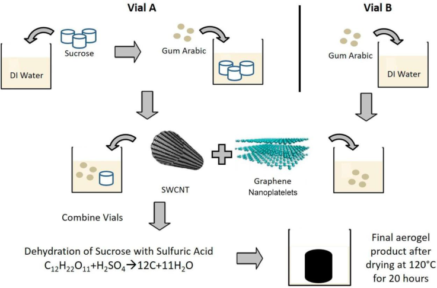

**Figure 15.** Schematic showing the process of making carbon-nanomaterial-based aerogel from carbon nanotube, graphene oxide, and carbonized sucrose and acacia gum. Reprinted with permission from [52]. Copyright ©2018 American Chemical Society. 

Recently, Turner et al. [57] also used the self-assembling method for producing highly crystalline or graphitized carbon nanofiber aerogels as can be schematically shown in Figure 16 which is adopted from [57]. First, perylene-3,4,9,10-tetracarboxylic diimide (PTCDI) nanofiber aerogels were generated by preparing a suspension of perylene-3,4,9,10-tetracarboxylic dianhydride (PTCDA) in water with the concentration of PTCDA as 10 wt %. Next, ammonium solution with NH4OH to H2O volume ratio of 1:6 was added. After that, the suspension was poured into disk molds for gelation. By keeping gelation for 24 h, PTCDI nanofiber hydrogels were obtained at 80[◦] C. Then the water solvent was removed without surface tension by supercritical drying using CO2. This allows the aerogel formation. Freeze-drying was found also effective for yielding PTCDI nanofiber aerogels. Carbon nanofiber (CNF) aerogels were made by pyrolysis of PTCDI nanofiber aerogels in inert atmosphere. Two temperature conditions were used in pyrolysis. The annealing at 1050[◦] C for 3 h in Ar allowed to generate low crystallinity CNF. Subsequent heat treatment at an even higher temperature of 2000[◦] C in He for 2 h produced the highly crystalline CNF aerogels. 

In literature [57], incorporating metal salts into the PTCDA suspension during self-assembling and gelation was also performed. Generally, the addition of a metal salt, for example nickel chloride, can generate metallic nickel catalyst during pyrolysis in inert gas to increase the catalytic activity upon the formation of composite carbon nanofiber aerogels. Metal ions can react with PTCDA and lead to metal directed self-assembly of PTCDI. The obtained products are named as M-PTCDI aerogels. The annealing temperatures was found critical for synthesizing graphitized aerogels containing metal nanoparticles. Aerogels with no trace of metal can also be produced as long as the pyrolysis temperature is high enough. Turner et al. [57] illustrated the synthesis and characterization of nickel directed assembly of CNF aerogels (Ni-CNF aerogels) by adding NiCl2 into the PTCDA suspension. It was also shown that gold, cobalt, iron, and palladium could be used as well for metal-directed assembly. Upon gelation of the PTCDA suspension in the presence of NiCl2, a dark-red hydrogel was obtained. Then the gel underwent supercritical drying to form the Ni-PTCDI aerogel. Scanning electron microscopic (SEM), energy dispersive spectroscopic (EDS), and transmission electron microscopic (TEM) analysis revealed the structure and chemical composition of the M-PTCDI and heat-treated aerogels (M-CNF). The results are shown in Figure 17 [57]. The SEM image in Figure 17a reveals that Ni salt directed assembly results in an extremely dense nanofiber network in which nanofibers are closely 

17 of 40 

_J. Compos. Sci._ **2020** , _4_ , 73 

packed in a bush-like morphology and many nanofibers originate from the same point. The EDS confirms the presence of nickel and chlorine in the M-PTCDI aerogels after supercritical drying as can be seen from Figure 17b. Using TEM, M-PTCDI nanofibers are observed with widths around 100–200 nm and predominantly smooth edges as revealed by Figure 17c. After pyrolysis at 1050[◦] C, the SEM image in Figure 17d illustrates that the nanofibers are more irregular and have more curvature after annealing. The composition analyzed using EDS shows the presence of nickel and the elimination of chlorine in the aerogel as can be seen from Figure 17e. Early work performed by Xia et al. [58] described Ni nanoparticle deposition from 0.3 M NiCl2·6H2O precursor solution containing aqueous ammonia and ammonium bicarbonate. At elevated temperatures and in inert and/or reducing gas such as hydrogen, the NiCl2 salt reduces to form Ni nanoparticles, while chlorine is released as HCl gas during the pyrolysis in the atmosphere containing hydrogen [58], i.e., 

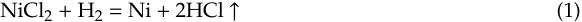

TEM imaging confirms the formation of Ni nanoparticles with an approximate diameter of 20 nm, and assembly directly on CNFs as illustrated by Figure 17f. Some Ni nanoparticles contain carbon shells and some areas are made of hollow onions, in which graphitic shells catalytically grow and redeposit prior to nickel evaporation. Nickel is commonly used as a chemical vapor deposition substrate during graphene growth due to its excellent catalytic behavior [59]. Thus, it is expected that nickel plays a catalytic role for the growth of additional carbon structures during the heat treatment. Hollow carbon onions are the major features observed. However, CNF aerogels synthesized using HAuCl4 exhibit additional branching and assembly of Au nanoparticles [57]. Since the upper heat treatment of 2000[◦] C is over the melting point of Ni (1450[◦] C), a highly crystalline and fully graphitic CNF aerogel was obtained with the unique nanoscale morphology as shown by the SEM image in Figure 17g. The 2000[◦] C treated Ni-CNF aerogel maintained the nanofiber morphology of the Ni-PTCDI and Ni-CNF 1050[◦] C aerogel precursors. The EDS as shown in Figure 17h confirms that the nickel has completely evaporated and none remains after treatment at 2000[◦] C. The TEM analysis reveals the evolution of nanoscale morphology as the result of the Ni-directed assembly. Before pyrolysis, a platelet type morphology was observed in the NiCl2-containing precursor nanofibers as shown in Figure 17c. While the pyrolysis at 1050[◦] C allows the nickel nanoparticle to form in the Ni-CNF aerogels. At the temperature as high as 2000[◦] C, carbon atoms can diffuse and changed into the irregular structure as seen in Figure 17i. The irregularity results in an increased number of defects and creates additional active sites for catalysis as reported in [60,61]. Such a morphology also allows larger surface area for more gas storage in the nanofibers. The high crystallinity from graphitization increases the stability of the CNFs. Turner et al. [57] also studied the gold, cobalt, palladium, and iron directed assembly and revealed other nanoscale morphologies including nanoflowers, nanoleaflets, and nanofibers of different widths. The obtained aerogels contain a broad range of compositions controlled by the pyrolysis treatment temperature. This approach can load metal ions directly within the PTCDI organic semiconductor to form the M-PTCDI aerogel. By the heat treatment at the intermediate temperature, a composite carbon nanofiber aerogel, M-CNF-1050, with metal nanoparticles assembled on the low crystallinity graphitic assemblies can be obtained. After the higher temperature pyrolysis, the aerogel was entirely transformed to M-CNF-2000, the highly crystalline graphitic assemblies. It has been reported that the hybrid structures of plasmonic metals and organic semiconductor molecules possess unique optoelectronic properties [62]. They show the plasmon-enhanced behavior in photocatalytic and solar energy applications [63]. The heat treatment at 1050[◦] C leads to the formation of metal nanoparticles assembled on carbon nanofibers, which allows the composite carbon nanofibers to have enhanced electrocatalytic activity, gas sensing performance, and lithium storage capacity [64–68]. If necessary, the metal nanoparticles can be completely eliminated to generate various nanoscale structures within the highly crystalline graphitized carbon nanofiber aerogels by the heat treatment at higher temperature of 2000[◦] C. 

18 of 40 

_J. Compos. Sci._ **2020** , _4_ , 73 

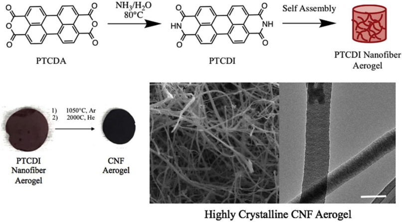

**Figure 16.** Schematic of perylene tetracarboxyldiimide (PTCDI) self-assembling in water and two-step pyrolysis for crystalline carbon nanofiber aerogel formation. Reprinted with permission from [57]. Copyright © 2019 Elsevier Ltd. 

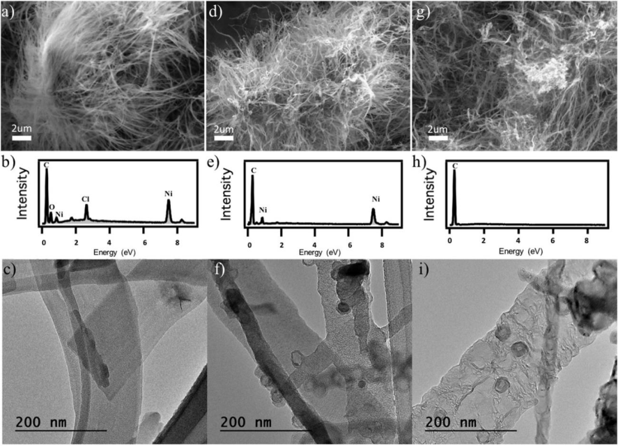

**Figure 17.** SEM images, EDS spectra and TEM images of ( **a** – **c** ) Ni-PTCDI aerogel, ( **d** – **f** ) Ni-CNF aerogel treated at 1050[◦] C, ( **g** – **i** ) Ni-CNF aerogel treated at 2000[◦] C, respectively. Reprinted with permission from [57]. Copyright © 2019 Elsevier Ltd. 

19 of 40 

_J. Compos. Sci._ **2020** , _4_ , 73 

## **4. Modeling and Characterization** 

## _4.1. Modeling the Distribution of Particles in Composite Carbon Nanofibers_ 

For co-electrospinning particle-polymer slurries, the biggest challenge is how to disperse the particles uniformly into the polymer nanofibers. Typically, nanoparticles tend to form aggregates or clusters in microfibers and nanofibers. To avoid this problem, the AC and DC power sources should be connected in parallel with each other for the electrospinning. Early experimental studies show that during the particle/polymer co-electrospinning, fluctuating electric forces on the particles could promote the uniform distribution of the particles in the polymer nanofibers. This indicates that the self-assembly of particles occurs under the lateral fluctuating electric field. The following modelling work is presented to understand the self-assembling induced homogenization phenomena. The analytical model as described here could guide the manufacturing process by selecting proper parameters for controlling the content and distribution of the particles in the polymer nanofibers as the precursors for making composite carbon nanofiber aerogels. 

From the theory for dielectrophoresis of electrorheological suspensions subjected to non-uniform electric fields [69–73], the motion of particles under the actions from fluctuating electric fields can be modelled as follows: 

For simplicity, we assume one dimensional motion of the slurry and define the positive _x_ -axis along the longitudinal direction of the electrospinning jet. The electric potential as a time dependent function, ϕ( _x_ , _t_ ), is related to the electric field intensity, _**E**_ , by its gradient, i.e., 

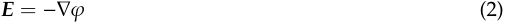

From experiments, the electric field with a spatially varying phase can be determined by the applying voltages with different phases to the jet and the fiber collector. The real part ϕ1 and the imaginary part ϕ2 of the electric potential, can be obtained by solving the Laplace’s equations: 

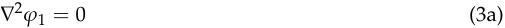

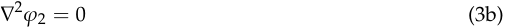

According to Jones [74], the dipole moment of the polarized _i_ th particle, _**p** i_ , in the fluctuating electric field with a frequency of ω is expressed as: 

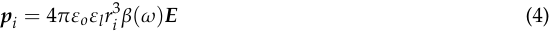

where _ri_ is the radius of the _i_ th oxide particle, ε _o_ is the permittivity of the vacuum, ε _l_ is the permittivity of the polymer fluid, β(ω) is the frequency-dependent Clausius–Mossotti factor which is given by: 

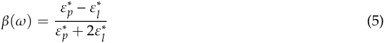

where ε[∗] _p_[is the complex permittivity of the oxide particle and][ ε][∗] _l_[is the complex permittivity of the] polymer fluid. 

The time-averaged dielectrophoretic force acting on an isolated particle, which arises due to the spatial nonuniformity of the electric field, can be given in terms of the electric potential: 

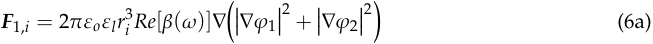

and the force due to the spatial phase variation of the electric field is given by: 

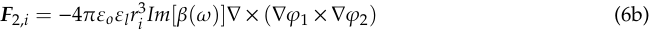

20 of 40 

_J. Compos. Sci._ **2020** , _4_ , 73 

where _Re_ [·] is the real part and _Im_ [·] is the imaginary part. 

The time-averaged interaction force between the _i_ th and _j_ th oxide particle may be computed following the analysis as presented in [73]: 

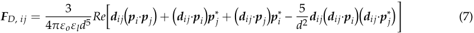

where _**p** i_ denotes the dipole moment of particle _i_ and _**d** ij_ is the displacement vector in the direction connecting the center of the _i_ th particle to the center of the _j_ th particle. The net electrostatic interaction force acting on the _i_ th particle is the sum of the interaction forces with all other particles and is given by 

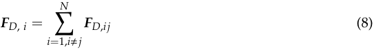

where _N_ is the number of particles. The total electrostatic force: _**F** E_ , _i_ acting on the _i_ th particle is given by the vector addition of the dielectrophoretic and particle-particle interaction forces, i.e., 

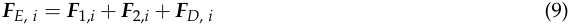

In addition to the electrostatic forces, the particle also experiences an electrostatic torque: _**T** E,i_ whose time average is given by 

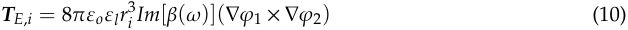

Once the electric force _**F** E,i_ , and the electrostatic torque _**T** E,i_ are found, it is readily to determine the translational velocity of the _i_ th particle _**V** i_ and its rotational velocity **Ω** _i_ using the impulse and momentum principles. The velocity of the liquid jet _**V** l_ can also be determined by the continuity and Navier–Stokes equations. Due to the spatial nonuniformity of the electric field, the phase variation of the electric field, it is predicted that the relative velocity between the _i_ th and _j_ th particles _**V** rel_ = _**V** i_ − _**V** j_ should have a non-zero solution. This indicates that with the separation between any of the two particles increases with the electrospinning injection time _t_ . From the above framework, the quantitative results can be obtained to understand the self-assembling or spatial separation of particles in precursor fibers. 

## _4.2. Modeling the Transport Behavior of the Composite Nanofiber Aerogels_ 

The thermal and electrical conductivities of the particle filled micro/nanofiber networks can be analysed using the general formula: 

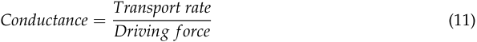

From this general formula, the thermal conductivity, κ, can be calculated from the ratio of transport rate, i.e., the heat _Q_ flowing through the cross section area _Az_ , to the driving force (∆ _T[e]_ ), which is the temperature difference as marked in Figure 18a [75]. For calculating the electric conductivity, σ, the transport rate should be replaced by the electrical current density _J_ crossing area _Az_ , and the driving force should be replaced by the electrical potential difference ∆ _V[e]_ in Figure 18a. Therefore, 

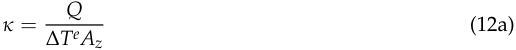

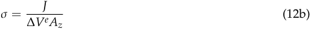

21 of 40 

_J. Compos. Sci._ **2020** , _4_ , 73 

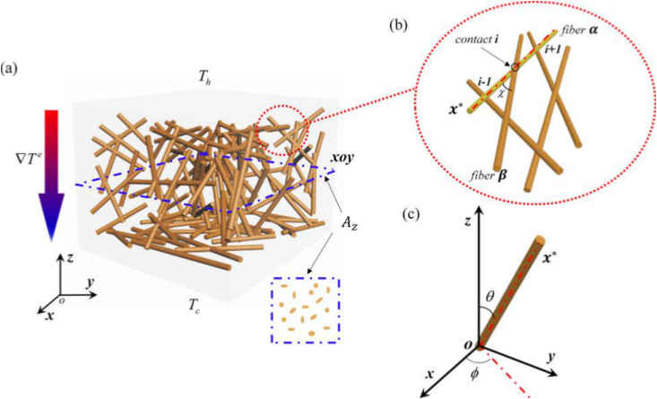

**Figure 18.** Schematic of nanofiber networks and coordinate systems for modeling: ( **a** ) 3D nanofiber networks; ( **b** ) contacts in nanofiber networks; ( **c** ) coordinates for analysis. Reproduced under the terms and conditions of the liberal Creative Commons Attribution 4.0 International (CC BY) license from [75]. Published by AIP Publishing, Copyright ©2018 The Authors. 

The thermal conductivity estimation can be carried out following the formulism as described by Zhao et al. [75]. The heat flow _Q_ can be computed as the summation of the heat flow through each individual nanofiber across _Az_ in the _z_ -direction. Similarly, the current density _J_ can be expressed by the summation of the electric current flowing through every fiber. 

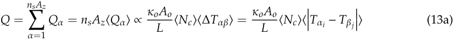

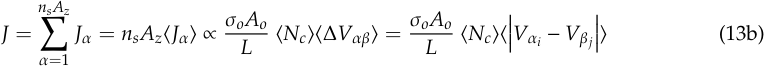

Referring to the schematic of the contacts in Figure 18b, α _i_ is the _i_ th contact along nanofiber α, β _j_ refers to the _j_ th contact along nanofiber β, κ _o_ is the thermal conductivity of an individual fiber, _Ao_ is the cross section area of the single fiber. σ _o_ is the conductivity of the single fiber, _L_ is the average length of the fiber, < _Nc_ > is the average of _Nc_ , which is defined as the number of contacts of a nanofiber with orientation distribution (θ, φ) [76]. The angles of θ and φ are shown in the coordinates as illustrated in Figure 18c. _ns_ is the areal number density of the nanofibers penetrating the cross-section _Az_ with the direction of θ = 0 [77]. 

From Equations (12) and (13), the relative thermal and electrical conductivities can be found as: 

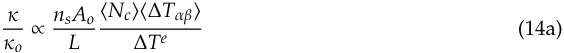

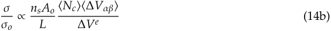

The average number of contacts can be estimated by modifying the Pan’s statistical method [76]. For a 3D random network, the average contact number is calculated as: 

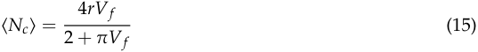

22 of 40 

_J. Compos. Sci._ **2020** , _4_ , 73 

where _r_ is the average aspect ratio of the micro/nanofibers. The areal number density for a 3D random network, _ns_ , is estimated as [75]: 

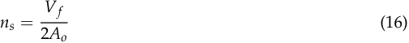

_Vf_ is the fiber volume fraction. In the case that fibers are aligned in one direction, _ns_ = _VAof_[.] Based on the analytical modelling, those important structure and property parameters associated with the composite carbon nanofiber aerogels can be obtained. Especially, the relative thermal conductivity and electrical conductivity will be determined by the above models. Some of the parameters related to the single micro- nanofiber including the thermal conductivity of an individual fiber κ _o_ , the cross section area of the single fiber _Ao_ , and the electrical conductivity of an individual fiber σ _o_ can be measured by a conductive atomic force microscopy. 

## _4.3. Thermoelectric Property Measurement and Transport Behavior Characterization_ 

The Seebeck coefficients of the particle/carbon fiber aerogel specimens can be measured experimentally. Before the test, the composite nanofiber aerogels were attached to the platform with a Peltier device. During the Seebeck coefficient measurement, the two ends of samples were bonded to two separate wires with the Ag-based conductive adhesive, which allowed high electrical conductivity at the connections. Then, one end of the specimens as the hot end was heated up by the Peltier device to a designated temperature, the other end as the cold end was kept in the air at the ambient temperature of 20[◦] C. The hot end temperature ranges from 20[◦] C to 650[◦] C. The Seebeck coefficient _S_ can be calculated by the ratio of ∆ _V_ /∆ _T_ . ∆ _V_ represents the voltage difference between the hot and cold ends. ∆ _T_ is the temperature difference between the two ends. In addition, quantum Hall effect was investigated to understand the size dependent thermoelectric behavior of the oxide/nanofiber composite aerogels. A Hall-effect measurement apparatus was used to measure the Hall voltage _VH_ . The Hall-effect measurement results were used to determine the charge carrier density and the electron mobility, which allowed the study on the electron mobility and transport behavior in the composite nanofiber aerogels. 

Theoretical studies for establishing the necessary Seebeck coefficient model was conducted to understand why the thermoelectric property of the composite aerogel materials can be enhanced. As the start point, the Culter-Mott formula [78] which was initially developed for degenerated semiconductors was used to estimate the Seebeck coefficient of the particle-containing composite carbon nanofiber aerogel _S_ , i.e., 

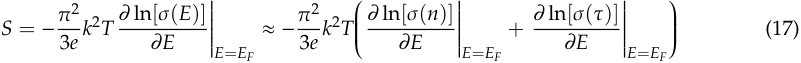

where, _k_ is the Boltzmann constant, σ the conductivity, _e_ the absolute value of the electron charge, _n_ the density of charge carriers, τ the scattering time and _EF_ the Fermi energy. Since both _p_ -type and _n_ -type oxides are used, the charge carriers in the interface are either holes or electrons. The composite carbon nanofiber aerogel materials as prepared are in 3D network form; the carrier concentration per unit interface area can be approximately by: 

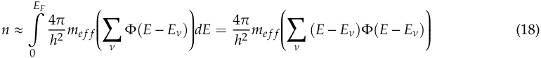

23 of 40 

_J. Compos. Sci._ **2020** , _4_ , 73 

where, ν is the index of the discrete 3D energy levels, Φ the Heaviside step function whose value is zero for negative argument and equals to 1 for positive argument, _me_ ff the effective mass of the charge carriers, _E_ ν the ν-th energy level. _E_ ν can be determined as: 

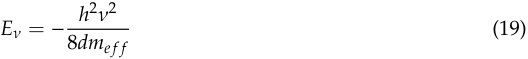

where, _d_ is the diameter of the particles. From the above analysis, it is clear that in order to increase the Seebeck coefficient, both conductivity σ, and scattering time τ should be increased. The smaller the diameter of the particles, the higher the absolute value of _E_ ν is. Therefore, it is necessary to make very fine nanoparticles because the finer the nanoparticles, the bigger the interface area, the longer the scattering time in addition to a larger absolute value of _E_ ν. By changing the diameters of the particles and the carbon nanofibers ranging from several nm to hundreds of nm using the approaches as previously shown in [79–81], the conductivity σ, the scattering time τ, and the ν-th energy level _E_ ν was calculated and compared with experimental measurement results. Based on the comparative studies, necessary modification on the model were made. 

## _4.4. Electrical and Thermal Conductivity Measurement_ 

Electrical and thermal conductive properties were characterized to evaluate the energy conversion effectiveness of the composite carbon nanofiber aerogels. A system containing the TD-8561 thermal conductivity apparatus purchased from PASCO Scientific was set up to measure the thermal conductivity of the aerogel composites (κ). A GLX Xplorer data acquisition unit connected to an _I_ - _V_ sensor and two temperature sensors was used to measure the electrical conductivity (σ), and to calculate the thermopower factor ( _U_ = _S_[2] σ). Electrical conductivity maps at micro- and/or nanoscale were obtained using an Innova Conductive AFM made by Bruker. Based on the thermal and electrical measurements, the thermoelectric figure of merit, _zT_ , was calculated using the formula, _zT_ = (σ _S_[2] _T_ )/κ. Both κ and σ measurement results can be used to validate the analytical models as shown by Equation (14a,b). The thermoelectric energy conversion efficiency can be calculated from the figure of merit data. Whether the incorporation of different oxide nanoparticles into the carbon nanofibers increases the thermopower factor and the figure of merit or not was studied. The effect of carbonization temperature on the electrical and thermal properties of the aerogel composites was examined as well. 

## _4.5. E_ ff _ect of Particle on the Carbonization Kinetics of Carbon Nanofibers_ 

Xu et al. [37] reported that the carbonization of the PAN-derived nanofibers can be viewed as a thermally activated process. The kinetics of carbonization can be described by the Arrhenius relation, i.e., 

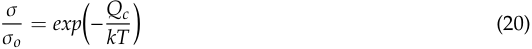

where _Qc_ is the activation energy for carbonization; σ is the electrical conductivity of the fiber at the given temperature _T_ ; _k_ is the Boltzmann constant; and σ _o_ is a constant related to the material. Taking logarithm on both sides the above Equation (20) and rearranging the terms yield: 

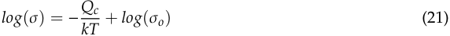

Equation (21) gives a straight line between log (σ) and 1/ _T_ . From the slope of this line, the activation energy for carbonization can be calculated. It is interesting to observe the pyrolysis from the initial carbonization at 450[◦] C to the fast carbonization at 850[◦] C within the whole heat treatment temperature range to understand the kinetics of the carbon nanofiber formation from the PAN polymer. The data of logarithmic conductivity, log (σ), and the reciprocal of temperature, 1/ _T_ , were obtained for composite carbon fibers with and without nanoparticle addition. The data points were fitted linearly and the line 

24 of 40 

_J. Compos. Sci._ **2020** , _4_ , 73 

equations were obtained. From the slopes of the straight lines, the activation energy values for the carbonization of pure carbon nanofiber and the particle-containing carbon nanofiber were determined. By comparing the date, it is helpful for understanding whether the existence of the particles impedes the carbonization or promotes the carbonization. 

## **5. Applications** 

Thanks to their highly porous structure and strong adsorptive property, Aerogels have found wide applications such as dye removal [82], oil adsorption [83,84], chromium (VI) removal [85], oil/water separation [86,87], and protein separation [88]. Some aerogels show unique microwave absorption behavior which allows them to have the electromagnetic interference shielding function as illustrated in [89–92]. Solar steam generation is also a field where aerogels play important role [93,94]. Through some special processes such as in-situ polymerization [95], surface-oxidation [96], coating [97], additive incorporation [98,99], the aerogels can be made with ultrahigh specific area for large capacitance and tunable properties [97], good electrochemical performances [95], and robust for reinforcement in composites [99]. Mechanics-related applications are also reported. For example, a temperature invariant superelastic and fatigue resistant aerogel was reported [100]. The applications for strain and/or pressure sensing based on aerogels can also be found [101–103]. Through the unidirectional freeze drying, a so-called directional strain sensor was build based on the anisotropic properties of the aerogels [101]. In reference [102], generating stress sensitive electricity was realized in the silver nanoparticle loaded cellulose nanofiber aerogel. The aerogel was used as a “self-reporting” smart material. In addition, the mechanoresponsive conductivity of aerogels was tested and validated, which provides another working mechanisms for aerogel pressure sensors [103]. Exploring for aerogels with multiple functions has been carried out as well [104–106]. In the flowing subsections, some typical applications of composite carbon nanofiber aerogels for energy storage, purification, and catalysis will be presented. Some other less common uses will be briefly discussed. 

## _5.1. Supercapacitors_ 

Extensive research on energy storage using aerogels has been performed as can be seen from recently published papers [107–144]. Polymer derived aerogels for energy storage and environmental protection were briefly introduced in [107]. Aerogels for the energy storage applications research lies in two big categories: capacitors [108–120] and batteries [121–138]. The discussion on carbon nanofiber aerogels for supercapacitor application is presented here first. Yang et al. [108] prepared hierarchically porous carbon nanofiber aerogel for high performance supercapacitor application. A carbon nanofiber aerogel framework was constructed by self-assembling the building-blocks of nanofibrillated cellulose into controlled macro and mesoporous architecture. By activating the carbon and creating micropores, the specific surface area reached 1726 m[2] /g. The aerogel-based supercapacitor showed both high specific capacitance of 169 F/g and good capacitance retention during the long-term charge-discharge. This work demonstrates an example for using a renewable carbon source to generate extremely porous carbon aerogels with high charge storage capability. 

In power and electronics units, high-frequency (HF) supercapacitors or electrochemical capacitors (ECs) working in the frequency range from several hundreds to thousands Hz are critical components for alternating current (AC) line filtering. Traditionally, bulky aluminum electrolytic capacitors (AECs) were used to build the current line filters. However, AECs have limited capacitance densities. The substitution of conventional capacitor materials with highly conductive graphene oxide and freestanding cross-linked carbon nanofibers (CCNFs) derived from bacterial cellulose was studied because of the large surface area being offered [109]. In addition, the good electrochemical properties of the carbon based capacitors demonstrated preliminary success of the carbon nanofiber devices in line filtering and pulse power storage applications. Islam et al. [112,113] made experimental studies on carbon nanofiber aerogels converted from bacterial cellulose for high frequency (kHz) AC-supercapacitors. First, cellulose nanofiber aerogels were synthesized using the microbe fermentation 

25 of 40 

_J. Compos. Sci._ **2020** , _4_ , 73 

process. Then, rapid plasma pyrolysis of the cellulose aerogels into carbon nanofiber aerogels was conducted. The capacitance density was found about 450 F/m[2] in an aqueous electrolyte. An organic electrolyte was also used to test the performance of the capacitors for operation in a larger potential window of over 3 V. 

To further increase the capacitance density of aerogels, Wan et al. [110] found that a core-sheath composite nanostructure made of MnO2 nanoribbons and cotton-derived carbon fibers can be spirally wound into asymmetric supercapacitors with a high areal specific capacitance of 2020 F/m[2] . Even higher areal capacitance of 10,125 F/m[2] was achieved in a new Ti3C2 aerogel [114]. As a promising negative electrode material for asymmetric supercapacitors, the Ti3C2 aerogel structure has a large specific surface area of 176.3 m[2] /g. Composite carbon nanofiber aerogels produced from low-cost bacterial cellulose and loaded with Ni/MnO2/Ni(OH)2 were prepared for supercapacitor electrodes [111]. A specific capacitance of 109 F/g was achieved. An energy density of 9.4 Wh/kg and a power density of 4 kW/kg were measured. The electrodes demonstrated good stability with high cycles of charging-discharging. The new aerogel materials are applicable for flexible supercapacitors. As a demonstration, a prototype power supply for a LED light was made. 

In the work performed by Lai et al. [115], an electrospun nanofiber supported carbon aerogel was made for building asymmetric supercapacitors. The carbon aerogel with a unique cellular structure was made through the freeze drying process and demonstrated the properties of large internal surface area, small pore size, and high mechanical strength. It consists of electrospun one-dimensional carbon nanofibers derived from oxidized polyacrylonitrile (o-PAN) and two-dimensional carbon sheets originating from polyimide (PI). Due to the low density and enhanced mechanical strength through the interconnection of o-PAN and PI (oPP), the carbon aerogel becomes the template for the in situ growth of MnO2 nanosheets to generate the oPP@MnO2 hybrid carbon aerogel. The oPP@MnO2 composite aerogel showed extraordinary electrochemical characteristics with a maximum specific capacitance of 1066 F/g, which is closed to the theoretical value of MnO2 (1370 F/g). An asymmetric supercapacitor assembled from oPP@MnO2 and activated oPP (A-oPP) possesses a high energy density of up to 30.3 Wh/kg which is about three times of that reported for cellulose derived composite carbon fiber aerogels [111]. Comparing with those capacitors made from organic based nanomaterials such as PEDOT [116] and polyaniline [117], the supercapacitors fabricated by composite carbon nanofiber aerogels are expected better temperature stability. The sources for carbon nanofibers in the supercapacitors could be from other renewable substances for example potato starch [119]. In addition to MnO2 and graphene oxide [118], some other oxides like V2O5 may be used for making the high surface area nanosheets to decorate the carbon substrate as shown earlier in [120]. 

## _5.2. Secondary Batteries_ 

Composite carbon nanofiber aerogels can be found in four types of secondary batteries, lithium ion battery [123,124,128,137–140], lithium-sulfur battery [121,122,129,131,133,143,144], sodium ion battery [125,126], and zinc-air battery [136]. The improvement and performance of these batteries due to the application of carbon aerogels are discussed as follows: 

Zhang et al. [123] made an anode of lithium-ion batteries by an integrated approach of coaxial electrospinning, oil extraction and carbonization. The anode consists of hollow Mo2C@C core-shell nanofibers. As the starting materials, polyacrylonitrile (PAN, MW = 150,000), N,N-dimethyl formamide (DMF, 99.5%), mineral oil, phosphomolybdic acid (H3PO4·12MoO3, PMoA) and cyclohexane. Oil@PMoA/PAN nanofibers were prepared by coaxial electrospinning. The polymer was dissolved in DMF to obtain a 15 wt % solution and PMoA was added into the solution to obtain the electrospinning precursor solution (PMoA/PAN). PMoA/PAN was poured into the external syringe pump channel, while the mineral oil was added into the core syringe pump channel. The diameter of the outer pinhole was 1.4 mm and the inner pinhole was 0.7 mm. The inner needle tip protruded approximately 0.3 mm from the outer pin tip. The flow rate of the oil was optimized as 0.2 mL/h. The polymer solution was injected at 0.4 mL/h. The syringe needle tip was connected to the positive electrode of the high-voltage 

26 of 40 

_J. Compos. Sci._ **2020** , _4_ , 73 

DC power supply. The negative electrode was connected to a coated aluminum foil as the fiber collector. The voltage used for the coaxial electrospinning was 12 kV. The distance between the syringe tip and collector was 150 mm. The collected fibers were immersed completely in the cyclohexane for 24 h to extract oil and then placed in a clean tray for natural drying at room temperature overnight. Hollow Mo2C@C/NFs were obtained by stabilization of PMoA/PAN nanofibers at 280[◦] C in air for 1 h and carbonization in a tube furnace at 800[◦] C for 3 h in an atmosphere consisting of 5% H2 and 95% N2. After that, a Li-ion battery anode was made from the composite nanofibers. Electrochemical tests revealed that the anode has a high discharge capacity of 1176.3 mAh/g. An extraordinary long-term cycling performance with a capacity of 674.4 mAh/g was achieved. In addition to the PAN derived carbon nanofibers, nanocellulose was used in the 3D printed high-performance lithium metal microbatteries [124]. 

To make aerogel based lithium battery electrodes, attapulgite (AT), a clay mineral that contains aluminum silicate with a porous structure, was dropped into polyvinyl alcohol (PVA) aqueous solution to form a water suspension. After dried, the AT/PVA was added into 5% polyacrylonitrile (PAN) N,N-dimethylacetamide (DMAc) solution to form an attapulgite (AT)/polyacrylonitrile (PAN) aerogel precursor [128]. Then the precursor was freeze drying to generate an aerogel. The PAN in the aerogel was stabilized via oxidation at 300[◦] C in air and then carbonized at 800[◦] C in nitrogen. It is shown that the natural porous AT in the carbonized nanofibers can provide high specific capacity. It is also found that PAN can increase the mechanical strength and enhance the electrochemical conductivity. The method allows the in-situ formation of the continuous carbonized phase network structure, which prevents large volume expansion and improves the electrochemical performance of the battery electrodes. Hydrothermal processing followed by freeze-drying was performed to make cobalt carbonate and cobalt oxide nanoneedle-graphene aerogel composite anodes for high performance Li-ion batteries [137]. The network structure provided high conductivity and low charge transfer resistance, which is considered as the reason for the high rate performance of the electrodes. 

In [139], three-dimensional (3D) carbon nanofiber (CNF) aerogels with hierarchical porosity were prepared. The aerogels were heavily doped with nitrogen through pyrolysis of bamboo cellulose. The uniqueness of the work lies in assembling the bamboo-derived cellulose nanofibers to make aerogels with controlled porosity. The hierarchical porous structure of the aerogels provided abundant chemical reaction sites. In addition, the three-dimensional electron and ion transport pathways in the aerogel anode enhanced the performance of the lithium-ion batteries. It is found that the N-doped CNF aerogel containing 50 nm thick nanofibers has a high reversible capacity of 630.7 mAh/g. Sides et al. [138] used the template method to prepare nanofiber and nanotube lithium-ion battery electrodes. The electrodes were composed of carbon, LiMn2O4, V2O5, tin, TiO2, and TiS2. A template-free method was used by Xu et al. [140] to make a new carbon nanofiber with high specific surface area and good electrocatalytic properties for the oxygen reduction reaction (ORR). Co-doping the carbon nanofibers with nitrogen and phosphorus simultaneously was performed. The carbon nanofibers were processed via pyrolysis of polyaniline aerogel. A nonaqueous Li-O2 battery with a specific capacity as high as 12,607 mA h/g was constructed by using the doped carbon nanofiber aerogel supported by Ni foam. The electrode showed a lower overpotential than pure carbon. 

Compared with the lithium-ion batteries, lithium–sulfur (Li-S) batteries using elemental sulfur as a cathode material. Due to the high theoretical specific capacity and theoretical energy density of 1675 mAh/g and 2600 Wh/kg of Li-S batteries, they caught great interest of researchers. Wu et al. [121] used co-doped three-dimensional (3D) reduced graphene oxide as a sulfur host material. The hydrothermally synthesized Co-Ni-S compound was intercalated into the 3D reduced graphene to make the cathode for Li-S batteries. A high specific capacity of 1430 mAh/g was achieved for the Li-S batteries. In the paper published by Zhu et al. [122], biomass waste was converted to a valuable nitrogen and boron dual-doped carbon aerogel for high performance lithium-sulfur batteries. Pomelo peel was used as the raw material for making the boron and nitrogen doped carbon aerogel. An integrated method of hydrothermal synthesis, freeze drying, and pyrolysis carbonization 

27 of 40 

_J. Compos. Sci._ **2020** , _4_ , 73 

at 800[◦] C was applied to generate the carbon aerogel for battery electrode manufacturing. This work provides an economic, environment-benign, sustainable way to make high performance lithium sulfur batteries. In addition to making the electrode, the sustainable and environmentally friendly carbon aerogel was used to fabricate modified separators in Li-S batteries [129]. 

There are other types of materials studied for hosting sulfur. For example, cellulose derived carbon nanofibers [131], graphitic carbon nitride, [133], filamentous fungi [143]. To address the insulating issue of sulfur species, carbonaceous materials have been studied to create conductive matrices with good physical anchoring and chemical binding behavior. A crosslinked carbon nanofiber aerogel with extremely low density was made from pyrolysis of bacterial cellulose (BC) aerogel and the aerogel was examined for sulfur cathodes [131]. The cathode showed strong absorption of catholyte. An initial capacity of 1360 mAh/g was achieved. The Li-S batteries exhibited excellent cycling stability. After charging-discharging 200 cycles, 76% of the initial capacity was kept. Wutthiprom et al. [133] used 3D N-doped graphene aerogel as a sulfur host and graphitic carbon nitride paper as an interlayer in Li-S batteries. Sulfur was loaded into a conductive 3D nitrogen-doped reduced graphene oxide aerogel to reduce the volume change and increase the conductivity. The graphitic carbon nitride was coated on flexible and conductive carbon fiber paper. The coated paper was inserted between the cathode and the polymer to trap the soluble polysulfides. The Li-S batteries showed a specific capacity of 1271 mAh/g. Zhang et al. [143] described a new sustainable microorganism-based route for making the carbon fiber monolith or aerogel using filamentous fungi as the feedstock. By controlling the filtration and drying, fungi aerogel was formed. The pyrolysis in an inert atmosphere allowed the aerogel to change into carbon fiber monolith or aerogel with a conductivity of higher than 1 S/cm. The carbon fiber aerogel synthesized at 800[◦] C was doped by N (∼2.4 at%) and O (∼1.3 at%). The two doped aerogels displayed a BET surface area of ∼305 and ∼20 m[2] /g, respectively. Mesopores and macropores were detected in the carbon aerogel. The carbon fiber monolith/aerogel was studied for application in lithium-sulphur (Li-S) batteries. 

Li et al. [144] prepared carbon nanoribbon aerogels from the calcination of bacterial cellulose aerogels. A gel-based sulfur cathode was made with high sulfur content and loading. The N- and O-doping was achieved intrinsically. Due to the physical and chemical confinement of soluble sulfide compounds into the carbon nanostructures, both the sulfur content and the loading are increased. Besides that, the carbon nanoribbon aerogel provided conductive paths. One of the problems dealing with how to increase the specific capacity of the batteries could be resolved by using the carbon based aerogels. The cell was tested and satisfactory performance was revealed. It was found that with a sulfur loading of 6.4 mg/cm[2] and a sulfur content of 90% at the entire electrode including the current collector, a capacity as high as 943 mAh/g was obtained. The corresponding areal capacity/density is 5.9 mAh/cm[2] . The result validates that the carbon aerogel based cathode structure can hold a large amount of sulfur and relieve the shuttle effect of the lithium polysulfide. 

Due to the abundance and low cost of sodium resource, sodium-ion batteries have been studied recently [125,126]. Compared to the commercial Li batteries, Na[+] has a larger radius than Li[+] . This affects the mass transport and storage in the electrochemical process. Na[+] moves slower than Li[+] in electrolytes, which negatively affects the charge-discharge and storage performance of the sodium ion batteries (SIBs). Development of carbonaceous anode materials to enhance the Na[+] storage has been performed. Lv et al. [125] made a composite consisting of ultrafine FeSe nanoparticles and carbon ∼ nanofiber aerogel as anode material for SIBs. The ultra-small ( 5 nm) FeSe nanoparticles were uniformly embedded into the carbon nanofibers. The nanofibers were interconnected to form a three-dimensional (3D) structure, which allowed the aerogel to have a large surface area, high conductivity, and robust structural stability. 

Yang et al. [126] used a hierarchical carbon@SnS2 aerogel for sodium ion storage because of its unique “skeleton/skin” architecture. This aerogel provides several advantages. First, the carbon nanofiber/graphene skeleton provides unimpeded pathways for the rapid transfer of electrons, while the thin SnS2 skin can provide a great number of active sites for sodium ion storage. Second, the porous 

28 of 40 

_J. Compos. Sci._ **2020** , _4_ , 73 

structure of the aerogel ensures a rapid penetration of electrolyte and can further accommodate the volume expansion of active SnS2 nanoflakes. Third, the intermediate product of Na15Sn4 alloy contributes greatly to the sodium ion storage performance of the aerogel. The excellent electrochemical performances along with the unique structural make this aerogel suitable for the anode in SIBs. The process started with the reaction of SnCl4·5H2O (1.403 g; 4 mmol) and 1.203 g thioacetamide (16 mmol) into deionized water (40 mL) under strong stirring. After the solution soaked into the aerogel made from carbon nanofiber and graphene, hydrothermal reaction at 160[◦] C for 12 h was carried out. Finally, the heat treatment in Ar at 400[◦] C for 2 h allowed the formation of the SnS2 nanoflake-containing aerogel. 

Zinc-air batteries are powered by oxidizing zinc with oxygen from the air. They have high energy densities and are relatively inexpensive to produce. The size of the Zn-air batteries could be very small as the button cells for hearing aids. It could be very large as those used for electric vehicle propulsion and grid-scale energy storage. Liang et al. [136] reported a highly active nitrogen-doped carbon nanofiber (N-CNF) aerogel made from the direct pyrolysis of a cheap, green, and mass-producible biomass, i.e., bacterial cellulose, followed by NH3 activation. It was tested as a cathode material in zinc air batteries for metal-free oxygen reduction reaction (ORR) catalysis. The N-CNF aerogel has the three-dimensional nanofiber network of bacterial cellulose and meanwhile possess high density of N-containing active sites and high BET surface area (916 m[2] /g). Such N-CNF aerogel shows strong ORR activities, high selectivity, and good stability in alkaline media. The ORR activity of N-CNF aerogel is better than that of NH3-treated carbon blacks, carbon nanotubes, reduced graphene oxide aerogels, and most of the reported metal-free catalysts. 

## _5.3. Water Purification_ 

There are various technologies for water purification. Capacitive deionization (CDI) is one of them. It works by deionizing water through the application of an electrical potential difference over two electrodes. In most cases the electrodes are made of porous carbon and composite carbon nanofiber materials [145–160]. Capacitive deionization is considered as a promising technology for water treatment with the high efficiency, low capital cost, and environmental friendliness. Nevertheless, the limitation of this technology comes from the complex fabrication process of the capacitive deionization electrodes. In [145], a facile and general method to prepare free-standing electrodes with an excellent electrosorption performance was reported for capacitive deionization. First, electrospinning nanofibers loaded with zinc-based nanoparticles was performed. After that, pyrolysis of the nanofibers generated the nitrogen-doped composite carbon nanofibers with high conductivity and high surface areas. The carbon nanofibers were used to make the free-standing electrodes. The salt adsorption capacity of the electrodes was found to be 43.3 mg/g at 1.4 V in a 1.0 g/L NaCl aqueous solution. It is believed that the composite carbon nanofiber electrodes prepared by electrospinning and pyrolysis have the potential for developing a large scale capacitive deionization technology. In the work performed by Zhu et al. [146], nitrogen-doped carbon nanofiber aerogels (N-CNFA) were successfully made by freeze-drying and thermal treatment of bacterial cellulose in NH3 atmosphere. Nitrogen adsorption-desorption isotherms show that nitrogen doping can significantly increase the specific surface area as also reported in [154]. 

Reduced graphene oxide (GO) nanosheets can be incorporated into carbon nanofibers or activated carbons mainly through the electrospinning process [147,148,151,152]. The addition of carbon nanotubes (CNTs) in the aerogel electrodes was also reported [155,156]. The electrodes were able to capture both anions and cations [156]. It was also reported that CNT and GO were added together into the electrodes [159]. The incorporation of graphene sheets and/or carbon nanotubes can significantly increase the capacitive deionization capability due to the significant increase in the surface area and active sites. The electrospinning technique was improved by adding activation salt such as ZnCl2 [153] and applying ultrasonic vibration [151]. Special structures like multi-channeled nanofibers [155], or hierarchical pores [160] were successfully made for increasing the electrosorption ability of the 

29 of 40 

_J. Compos. Sci._ **2020** , _4_ , 73 

carbon nanofiber electrodes. Although Ag2O loaded organic aerogel was tried to remove halogen ions, for example: I[−] , from water, activated carbon electrodes with micropores are confirmed to be able to adsorb F[−] [149]. Ground water cleaning using the carbon based aerogels was also reported [150]. 

## _5.4. Catalysis_ 

The catalysis property of aerogels has been demonstrated in various ways [136,161–164]. Carbon nanofibers are typically used as a catalyst carrier or substrate for supporting precious metal catalysts. Liu et al. [161] dispersed small Pt nanoparticles (NPs) on chitin aerogel derived N doped ultra-thin composite carbon nanofibers for hydrogen generation catalysis. The Pt-loaded chitin aerogel derived N-doped ultra-thin carbon nanofibers (NCN-Pt) was made by an integrated process combining adsorbing, freeze-drying and pyrolysis. The increase in the carbonization temperature ranging from 800 to 1000[◦] C caused the change in the average diameter of Pt NPs from 2.85 nm to 4.5 nm. The unique three-dimensional mesoporous ultra-fine nanofiber network can protect the Pt NPs from aggregation, resulting in abundant active sites. In addition to Pt, Pd nanoparticles were loaded into carbon nanofibers through electrospinning and showed strong electrocatalytic activities towards hydrogen peroxide reduction [64] and methanol electro-oxidation [65]. 

To reduce the use or even replace noble metals such as Pt, Rh, and Pd, cobalt nanoparticle-loaded carbon nanofiber aerogels were studied for oxygen reduction [162]. Interestingly, as a metal-free catalyst, doped carbon fiber aerogels have found potential applications. For example, in the work performed by Liang et al. [136], a bacterial cellulose (BC) was made into aerogel first. After pyrolysis and annealing in ammonia, a derived carbon nanofiber aerogel doped with nitrogen was obtained. The whole process is demonstrated briefly in Figure 19 [136]. The solution containing bacterial cellulose was frozen in liquid nitrogen (−196[◦] C) and then freeze-dried in a bulk tray dryer. Solvent sublimation was done at a temperature of −50[◦] C and a pressure of 0.04 mbar. The dried BC aerogel was carbonized at 800[◦] C in N2 flow to generate a black carbon nanofiber (CNF) aerogel. Then, nitrogen doping was conducted by annealing the CNF aerogel at 700–900[◦] C for 1 h in NH3 atmosphere. The final product of N-doped carbon nanofiber aerogel was tested as a metal-free electrocatalyst. It is confirmed that the aerogel is indeed effective on oxygen reduction reaction (ORR) catalysis when used as the cathode material for the zinc-air battery. N-doped carbon nanofiber aerogels have been investigated as metal-free catalysts for oxygen reduction as well in [163,164]. 

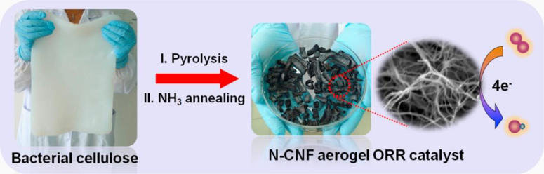

**Figure 19.** Optical pictures (left and middle) and SEM image (right) showing the procedures for making a nitrogen doped carbon nanofiber aerogel as a metal-free catalyst for oxygen reduction reaction catalysis in zinc-air battery. Reprinted with permission from [136]. Copyright © 2014 Elsevier Ltd. 

## **6. Perspectives to Challenges, Opportunities, and Future Directions** 

Carbon nanofiber (CNF) aerogels are actively researched advanced materials that have found many applications in various fields especially in the energy and environment domains [165–167]. Current knowledge of carbon nanofiber aerogel manufacturing allow us to select proper processing parameters for controlling the structures and properties as well as the carbon yield rate of the final products. For example, adding some carbon generation promoters such as ammonium chloride can effectively 

30 of 40 

_J. Compos. Sci._ **2020** , _4_ , 73 

increase the carbon yield from cellulose as reported by Pajarito et al. [165]. From the perspective of materials design, there are many opportunities of exploring new carbon aerogels. Light weight carbon aerogels [168], carbon nanofiber aerogel/polymer flexible thin films [169] are some of the newly developed products. New processing methods are also under active researching. The bottom-up additive manufacturing technique, atomic layer deposition, was used for inorganic hollow nanotube aerogel preparation using nanocellulose templates [170]. The high-temperature carbothermal reaction approach was found in making carbon nanofiber/silica aerogel composites [171]. Surface-enhanced herringbone graphitic carbon nanofibers (GCNF) using Si(OMe)4, have been successfully prepared by the sol-gel processing technique. Following the sol-gel process, supercritical CO2 drying was conducted. Heat treatment on the GCNF/silica aerogel composites to 1650[◦] C in the Ar atmosphere with the controlled partial pressure triggered the carbothermal reaction between the silica aerogel matrix and the carbon nanofiber to form SiC/silica nanocomposites. The SiC phase is present as nearly spherical nanoparticles, having an average diameter of 8 nm. This work provides a method for the preparation of high temperature-resistant aerogels. 

There are many challenges and opportunities in carbon nanofiber aerogel processing and characterization. First of all, how to align the nanofibers in a controlled way is one of the challenges. Nearfield electrospinning, self-assembling, and 3D printing could be the possible solutions. Aligning the fibers in a regular way is meaningful for the enhancement of load carrying capability and increasing the mass transfer rate of ions in the aerogels. Another issue is how to make the aerogel manufacturing process scalable. Currently, the aerogel frozen and vacuum drying to remove solvents are at the lab scale. There is not much experience in large scale productions. Is the aerogel still uniform at a large scale? How can we simplify the energy intensive processes? 

A lack of in-depth understanding of the interface structure impedes our ability to design lighter and stronger composite carbon nanofiber aerogels. Although many existing tools—such as scanning electron microscopy (SEM), transmission electron microscopy (TEM), and atomic force microscopy (AFM)—have been extensively used for the structural assessment of composite materials [172], in-situ studies of the interfaces, contact points, network nodes in carbon nanofiber aerogels are needed to interrogate the local, small scale properties. New characterization techniques including in-situ TEM, conductive AFM, and nano-indentation could help obtain useful structural, physical and mechanical information of composite carbon nanofiber aerogels for functional applications. 

From a mechanics point of view, the damage of composite carbon nanofiber aerogels under various loading modes has been much less studied. Collapse of the fiber network and fatigue crack propagation under cyclic thermal and/or mechanical loading are to be studied in order to design high-performance structural composite carbon fiber aerogels. 

## **7. Concluding Remarks** 

Composite carbon nanofiber aerogels are new materials characterized by having a high specific area, high porosity, and being lightweight. Their multiple functions can be obtained through the compositional selection of the incorporated components, structural design, and fiber surface modifications. Freeze-casting and drying followed by high temperature pyrolysis are the major procedures for the preparation of carbon nanofiber aerogels. The carbon fiber precursors include synthesized polymers and naturally grown matters including woods, bamboo, seaweed, cellulose, and fruit peels. The synthesized polymers are selected from those high percentage carbon yielding ones under pyrolysis such as phenolic resin, pitch, polyacrylonitrile, cellulose acetate, and polyimide. If electrospinning is used for making the precursor nanofibers, the spinning capability of the polymers should be considered. Doping carbon nanofiber aerogels with nitrogen, boron, sulfur have been performed to increase the surface area and electrical conductivity. Incorporating oxide, sulfide, and selenide nanomaterials into carbon nanofibers to form functional aerogels have been carried out as well. Various metallic nanoparticles including Pt, Pd, Co and Ag are successfully embedded into carbon nanofiber aerogels to increase their catalysis activities and enhanced their conductive behavior. 

31 of 40 

_J. Compos. Sci._ **2020** , _4_ , 73 

Many advanced manufacturing technologies have been used to make composite carbon nanofiber aerogels. Self-assembling, templating, atomic layer deposition, chemical vapor deposition, hydrothermal synthesis, and controlled combustion have been investigated for the aerogel formation. While freeze drying, supercritical drying are used to be the mature methods for fiber network fabrication, 3D-printing could be applied for producing aerogels. Among various technologies, freeze-casting and drying, 3D printing, self-assembling, and template impregnation offer the capability of directionally controlled growth of aerogels. These approaches allow the production of oriented and aligned porous structures. In seeking for low cost resources of carbon nanofiber aerogels, cellulose has the significant advantage because cellulose nanofibers are abundant and renewable from biomass, animal, and bacteria sources. The morphology of carbon nanofibers in aerogels can be controlled by adding spacers and removable components to increase the porosity and surface roughness. Two-dimensional nanomaterials are incorporated into carbon nanofiber aerogels to form composites. Reduced graphene oxide sheets have caught big interest in aerogel production due to the unique mechanical, physical, and chemical properties especially the high electrical and thermal conductivities and hydrophobicity. Other 2D nanomaterials such as boron nitride and molybdenum disulfide are also used. 

Composite carbon nanofiber aerogels have found practical applications in various fields. In the field of energy storage and conversion, supercapacitors, fuel cells, rechargeable batteries are some of the typical examples. The ultrahigh porosity and the capability of incorporating electrically conductive nanomaterials such as carbon nanotubes, reduced graphene, cobalt carbonate, and many other inorganic 2D nanomaterials including oxides, sulfides, and selenides open the door for the design on more efficient sodium and lithium ion batteries with even larger energy density and better stability. 

For environmental applications, carbon nanofiber-based aerogels show strong affinity to organic dyes, oils, and metalorganic compounds in wastewater effectively. The incorporation of hydrophobic polymers and surfactants into the aerogels along with the surface and chemical modification can enhance their adsorption ability. In addition, the conductive behavior of the porous carbon nanofibers allows the aerogels to be made as efficient capacitive deionization electrodes for water purification. Catalysis is another wide open field where carbon nanofiber aerogels find their roles. Both noble metals such as Pt and Pd, and transition metals such as Fe and Co nanoparticle-loaded carbon nanofiber aerogels, are used as the catalysts for hydrogen generation or oxygen reduction reactions. With the application of additive manufacturing and other innovative manufacturing technologies, it is also possible to develop flexible sensors for mechanical response detection and health monitoring. 

**Author Contributions:** The authors contributed equally to the manuscript preparation. All authors have read and agreed to the published version of the manuscript. 

**Funding:** No funding support was received for publishing this review paper. 

## **References** 

1. Kistler, S.S. Coherent expanded aerogels and jellies. _Nature_ **1931** , _127_ , 741. [CrossRef] 

2. Kistler, S.S. Coherent expanded aerogels. _J. Phys. Chem._ **1932** , _36_ , 52–64. [CrossRef] 

3. Khalily, M.A.; Eren, H.; Akbayrak, S.; Susapto, H.H.; Biyikli, N.; Ozkar, S.; Guler, M.O. Facile synthesis of three-dimensional Pt-TiO2 nano-networks: A highly active catalyst for the hydrolytic dehydrogenation of ammonia-borane. _Angew. Chem. Int. Ed._ **2016** , _55_ , 12257–12261. [CrossRef] [PubMed] 

4. Liu, Y.; Chen, J.S.; Liu, Z.K.; Xu, H.Y.; Zheng, Y.H.; Zhong, J.S.; Yang, Q.L.; Tian, H.F.; Shi, Z.Q.; Yao, J.L.; et al. Facile fabrication of Fe3O4 nanoparticle/carbon nanofiber aerogel from Fe-ion cross-linked cellulose nanofibrils as anode for lithium-ion battery with superhigh capacity. _J. Alloys Compd._ **2020** , _829_ , 154541. [CrossRef] 

5. Finney, B.; Jacobs, M. Commons, Image: Carbon Dioxide Pressure-Temperature Phase Diagram.jpg, CC0. Available online: https://commons.wikimedia.org/w/index.php?curid=4315735 (accessed on 12 May 2019). 

32 of 40 

_J. Compos. Sci._ **2020** , _4_ , 73 

6. Barrios, E.; Fox, D.; Sip, Y.Y.L.; Catarata, R.; Calderon, J.E.; Azim, N.; Afrin, S.; Zhang, Z.Y.; Zhai, L. Nanomaterials in advanced, high-performance aerogel composites: A review. _Polymers_ **2019** , _11_ , 726. [CrossRef] [PubMed] 

7. Beckman, E.J. Supercritical or near-critical CO2 in green chemical synthesis and processing. _J. Supercrit. Fluids_ **2004** , _28_ , 121–191. [CrossRef] 

8. Joung, S.N.; Yoo, C.W.; Shin, H.Y.; Kim, S.Y.; Yoo, K.-P.; Lee, C.S.; Huh, W.S. Measurements and correlation of high-pressure VLE of binary CO2–alcohol systems (methanol, ethanol, 2-methoxyethanol and 2-ethoxyethanol). _Fluid Phase Equilib._ **2001** , _185_ , 219–230. [CrossRef] 

9. Matsuyama, K.; Morotomi, K.; Inoue, S.; Nakashima, M.; Nakashima, H.; Okuyama, T.; Kato, T.; Muto, H.; Sugiyama, H. Antibacterial and antifungal properties of Ag nanoparticle-loaded cellulose nanofiber aerogels prepared by supercritical CO2 drying. _J. Supercrit. Fluids_ **2019** , _143_ , 1–7. [CrossRef] 

10. Wang, D.; Peng, H.Y.; Yu, B.; Zhou, K.Q.; Pan, H.F.; Zhang, L.P.; Li, M.; Liu, M.M.; Tian, A.L.; Fu, S.H. Biomimetic structural cellulose nanofiber aerogels with exceptional mechanical, flame-retardant and thermal-insulating properties. _Chem. Eng. J._ **2020** , _389_ , 124449. [CrossRef] 

11. Yu, Y.X.; Ma, Q.Y.; Zhang, J.B.; Liu, G.B. Electrospun SiO2 aerogel/polyacrylonitrile composited nanofibers with enhanced adsorption performance of volatile organic compounds. _Appl. Surf. Sci._ **2020** , _512_ , 145697. [CrossRef] 

12. Qiu, J.L.; Zheng, W.T.; Yuan, R.R.; Yue, C.L.; Li, D.W.; Liu, F.Q.; Zhu, J.J. A novel 3D nanofibrous aerogel-based MoS2@Co3S4 heterojunction photocatalyst for water remediation and hydrogen evolution under simulated solar irradiation. _Appl. Catal. B-Environ._ **2020** , _264_ , 118514. [CrossRef] 

13. Wei, J.Y.; Geng, S.Y.; Hedlund, J.; Oksman, K. Lightweight, flexible, and multifunctional anisotropic nanocellulose-based aerogels for CO2 adsorption. _Cellulose_ **2020** , _27_ , 2695–2707. [CrossRef] 

14. Deville, S.; Saiz, E.; Nalla, R.K.; Tomsia, A.P. Freezing as a path to build complex composites. _Science_ **2006** , _311_ , 515–518. [CrossRef] [PubMed] 

15. Gan, Y.X.; Yu, C.; Panahi, N.; Gan, J.B.; Cheng, W. Processing iron oxide nanoparticle-loaded composite carbon fiber and the photosensitivity characterization. _Fibers_ **2019** , _7_ , 25. [CrossRef] 

16. Zhang, M.; Yang, D.Z.; Zhang, S.Y.; Xu, T.; Shi, Y.Z.; Liu, Y.X.; Chang, W.; Yu, Z.Z. Elastic and hierarchical carbon nanofiber aerogels and their hybrids with carbon nanotubes and cobalt oxide nanoparticles for high-performance asymmetric supercapacitors. _Carbon_ **2020** , _158_ , 873–884. [CrossRef] 

17. Cipriani, E.; Zanetti, M.; Bracco, P.; Brunella, V.; Luda, M.P.; Costa, L. Crosslinking and carbonization processes in PAN films and nanofibers. _Polym. Degrad. Stab._ **2016** , _123_ , 178–188. [CrossRef] 

18. Schierholz, R.; Kroger, D.; Weinrich, H.; Gehring, M.; Tempel, H.; Kungl, H.; Mayer, J.; Eichel, R.A. The carbonization of polyacrylonitrile-derived electrospun carbon nanofibers studied by in situ transmission electron microscopy. _RSC Adv._ **2019** , _9_ , 6267–6277. [CrossRef] 

19. Alarifi, I.M.; Khan, W.S.; Asmatulu, R. Synthesis of electrospun polyacrylonitrile-derived carbon fibers and comparison of properties with bulk form. _PLoS ONE_ **2018** , _13_ , e0201345. [CrossRef] [PubMed] 

20. Alarifi, I.M.; Alharbi, A.; Khan, W.S.; Rahman, A.S.; Asmatulu, R. Mechanical and thermal properties of carbonized PAN nanofibers cohesively attached to surface of carbon fiber reinforced composites. _Macromol. Symp._ **2016** , _365_ , 140–150. [CrossRef] 

21. Ghorpade, R.V.; Cho, D.W.; Hong, S.C. Effect of controlled tacticity of polyacrylonitrile (co)polymers on their thermal oxidative stabilization behaviors and the properties of resulting carbon films. _Carbon_ **2017** , _121_ , 502–511. [CrossRef] 

22. Hameed, N.; Sharp, J.; Nunna, S.; Creighton, C.; Magniez, K.; Jyotishkumar, P.; Salim, N.V.; Fox, B. Structural transformation of polyacrylonitrile fibers during stabilization and low temperature carbonization. _Polym. Degrad. Stab._ **2016** , _128_ , 39–45. [CrossRef] 

23. Jing, M.; Wang, C.G.; Wang, Q.; Bai, Y.J.; Zhu, B. Chemical structure evolution and mechanism during pre-carbonization of PAN-based stabilized fiber in the temperature range of 350–600[◦] C. _Polym. Degrad. Stab._ **2007** , _92_ , 1737–1742. [CrossRef] 

24. Zhang, Y.; Tajaddod, N.; Song, K.; Minus, M.L. Low temperature graphitization of interphase polyacrylonitrile (PAN). _Carbon_ **2015** , _91_ , 479–493. [CrossRef] 

25. Chai, X.; Mi, H.; Zhu, C.; He, C.; Xu, J.; Zhou, X.; Liu, J. Low-temperature thermal stabilization of polyacrylontrile-based precursor fibers towards efficient preparation of carbon fibers with improved mechanical properties. _Polymer_ **2015** , _76_ , 131–139. [CrossRef] 

33 of 40 

_J. Compos. Sci._ **2020** , _4_ , 73 

26. Korobeinyk, A.V.; Whitby, R.L.D.; Mikhalovsky, S.V. High temperature oxidative resistance of polyacrylonitrile-methylmethacrylate copolymer powder converting to a carbonized monolith. _Europ. Polym. J._ **2012** , _48_ , 97–104. [CrossRef] 

27. Joo, S.; Park, J.Y.; Seo, S.; Moon, S.; Lee, K.J.; An, J.; Lee, C.S.; Bae, J. Study on peculiar carbon pattern formation from polymer blend thin films under electric fields. _Thin Solid Film._ **2018** , _660_ , 846–851. [CrossRef] 

28. Sinha-Ray, S.; Yarin, A.L.; Pourdeyhimi, B. The production of 100/400 nm inner/outer diameter carbon tubes by solution blowing and carbonization of core–shell nanofibers. _Carbon_ **2010** , _48_ , 3575–3578. [CrossRef] 

29. Yang, G.Z.; Xu, R.S.; Chen, M.; Wang, X.; Ling, L.C.; Zhang, R.; Yang, J.H. Hollow carbon nanospheres prepared by carbonizing polymethylmethacrylate/polyacrylonitrile core/shell polymer particles. _New Carbon Mater._ **2008** , _23_ , 205–208. [CrossRef] 

30. Li, Y.; Zhu, J.; Zhu, P.; Yan, C.; Jia, H.; Kiyak, Y.; Zang, J.; He, J.; Dirican, M.; Zhang, X. Glass fiber separator coated by porous carbon nanofiber derived from immiscible PAN/PMMA for high-performance lithium-sulfur batteries. _J. Memb. Sci._ **2018** , _552_ , 31–42. [CrossRef] 

31. Gong, J.; Chen, X.; Tang, T. Recent progress in controlled carbonization of (waste) polymers. _Progr. Polym. Sci._ **2019** , _94_ , 1–32. [CrossRef] 

32. Rao, M.; Geng, X.; Liao, Y.; Hu, S.; Li, W. Preparation and performance of gel polymer electrolyte based on electrospun polymer membrane and ionic liquid for lithium ion battery. _J. Memb. Sci_ **2012** , _399–400_ , 37–42. [CrossRef] 

33. Nataraj, S.K.; Yang, K.S.; Aminabhavi, T.M. Polyacrylonitrile-based nanofibers-A state-of-the-art review. _Progr. Polym. Sci._ **2012** , _37_ , 487–513. [CrossRef] 

34. Liu, W.; Wang, W.; Xing, Z.; Qi, Y.; Wu, G. Radiation-induced crosslinking of polyacrylonitrile fibers and the subsequent regulative effect on the peroxidation process. _Rad. Phys. Chem._ **2012** , _81_ , 622–627. [CrossRef] 

35. Arshad, S.N.; Naraghi, M.; Chasiotis, I. Strong carbon nanofibers from electrospun polyacrylonitrile. _Carbon_ **2011** , _49_ , 1710–1719. [CrossRef] 

36. Lin, S.; Cai, Q.; Ji, J.; Sui, G.; Yu, Y.; Yang, X.; Ma, Q.; Wei, Y.; Deng, X. Electrospun nanofiber reinforced and toughened composites through in situ nano-interface formation. _Comp. Sci. Technol._ **2008** , _68_ , 3322–3329. [CrossRef] 

37. Xu, T.; Nguyen, A.; Rosas, N.; Flores, I.; Chen, C.; Gan, J.B.; Hamdan, A.S.; Gan, Y.X. Effect of pyrolysis temperature on the electrical property and photosensitivity of a PAN-PMMA derived carbon fiber. _ChemEngineering_ **2019** , _3_ , 86. [CrossRef] 

38. Kshetri, T.; Tran, D.T.; Nguyen, D.C.; Kim, N.H.; Lau, K.T.; Lee, J.H. Ternary graphene-carbon nanofibers-carbon nanotubes structure for hybrid supercapacitor. _Chem. Eng. J._ **2020** , _380_ , 122543. [CrossRef] 

39. Kshetri, T.; Thanh, T.D.; Singh, S.B.; Kim, N.H.; Lee, J.H. Hierarchical material of carbon nanotubes grown on carbon nanofibers for high performance electrochemical capacitor. _Chem. Eng. J._ **2018** , _345_ , 39–47. [CrossRef] 

40. Hummers, W.S.; Offeman, R.E. Preparation of graphitic oxide. _J. Am. Chem. Soc._ **1958** , _80_ , 1339. [CrossRef] 

41. Rahaman, M.S.A.; Ismail, A.F.; Mustafa, A. A review of heat treatment on polyacrylonitrile fiber. _Polym. Degrad. Stab._ **2007** , _92_ , 1421–1432. [CrossRef] 

42. Dalton, S.; Heatley, F.; Budd, P.M. Thermal stabilization of polyacrylonitrile fibres. _Polymer_ **1999** , _40_ , 5531–5543. [CrossRef] 

43. Kumar, M.; Ando, Y. Chemical vapor deposition of carbon nanotubes: A review on growth mechanism and mass production. _J. Nanosci. Nanotechnol._ **2010** , _10_ , 3739–3758. [CrossRef] [PubMed] 

44. Lin, Y.Z.; Zhong, L.B.; Dou, S.; Shao, Z.D.; Liu, Q.; Zheng, Y.M. Facile synthesis of electrospun carbon nanofiber/graphene oxide composite aerogels for high efficiency oils absorption. _Environ. Int._ **2019** , _128_ , 37–45. [CrossRef] [PubMed] 

45. Sriplai, N.; Mongkolthanaruk, W.; Eichhorn, S.J.; Pinitsoontorn, S. Magnetic bacterial cellulose and carbon nanofiber aerogel by simple immersion and pyrolysis. _J. Mater. Sci._ **2020** , _55_ , 4113–4126. [CrossRef] 

46. Fauziyah, M.; Widiyastuti, W.; Balgis, R.; Setyawan, H. Production of cellulose aerogels from coir fibers via an alkali-urea method for sorption applications. _Cellulose_ **2019** , _26_ , 9583–9598. [CrossRef] 

47. Zhang, Z.; Li, L.; Qing, Y.; Lu, X.H.; Wu, Y.Q.; Yan, N.; Yang, W. Manipulation of nanoplate structures in carbonized cellulose nanofibril aerogel for high-performance supercapacitor. _J. Phys. Chem. C_ **2019** , _123_ , 23374–23381. [CrossRef] 

34 of 40 

_J. Compos. Sci._ **2020** , _4_ , 73 

48. Chen, H.; Liu, T.; Mau, J.R.; Zhang, W.J.; Jiang, Z.J.; Liu, J.; Huang, J.L.; Liu, M.L. Free-standing N-self-doped carbon nanofiber aerogels for high-performance all-solid-state supercapacitors. _Nano Energy_ **2019** , _63_ , 103836. [CrossRef] 

49. Yang, Q.L.; Yang, J.W.; Gao, Z.D.F.; Li, B.; Xiong, C.X. Carbonized cellulose nanofibril/graphene oxide composite aerogels for high-performance supercapacitors. _ACS Appl. Energy Mater._ **2020** , _3_ , 1145–1151. [CrossRef] 

50. Liu, H.L.; Lv, C.X.; Chen, S.; Song, X.Y.; Liu, B.H.; Sun, J.; Zhang, H.W.; Yang, D.J.; She, X.L.; Zhao, X.L. Fe-alginate biomass-derived FeS/3D interconnected carbon nanofiber aerogels as anodes for high performance sodium-ion batteries. _J. Alloys Compd._ **2019** , _795_ , 54–59. [CrossRef] 

51. Lv, C.X.; Xu, W.J.; Liu, H.L.; Zhang, L.X.; Chen, S.; Yang, X.F.; Xu, X.J.; Yang, D.J. 3D sulfur and nitrogen codoped carbon nanofiber aerogels with optimized electronic structure and enlarged interlayer spacing boost potassium-ion storage. _Small_ **2019** , _15_ , 1900816. [CrossRef] 

52. Litts, B.S.; Eddy, M.K.; Zaretzky, P.M.; Ferguson, N.N.; Dichiara, A.B.; Rogers, R.E. Construction of a carbon nanomaterial-based nanocomposite aerogel for the removal of organic compounds from water. _ACS Appl. Nano Mater._ **2018** , _1_ , 4127–4134. [CrossRef] 

53. Takeshita, S.; Akasaka, S.; Yoda, S. Structural and acoustic properties of transparent chitosan aerogel. _Mater. Lett._ **2019** , _254_ , 258–261. [CrossRef] 

54. Takeshita, S.; Yoda, S. Chitosan aerogels: Transparent, flexible thermal insulators. _Chem. Mater._ **2015** , _27_ , 7569–7572. [CrossRef] 

55. Kharissova, O.V.; Torres, C.E.I.; Gonzalez, L.T.; Kharisov, B.I. All-carbon hybrid aerogels: Synthesis, properties, and applications. _Ind. Eng. Chem. Res._ **2019** , _58_ , 16258–16286. [CrossRef] 

56. Liu, X.; Roberts, A.; Ahmed, A.; Wang, Z.; Li, X.; Zhang, H. Carbon nanofibers by pyrolysis of self-assembled perylene diimide derivative gels as supercapacitor electrode materials. _J. Mater. Chem. A_ **2015** , _3_ , 15513–15522. [CrossRef] 

57. Turner, S.; Shevitski, B.; Long, H.; Lorenzo, M.; Marquez, J.; Aloni, S.; Altoe, V.; Worsley, M.A.; Zettl, A. Self-assembly and metal-directed assembly of organic semiconductor aerogels and conductive carbon nanofiber aerogels with controllable nanoscale morphologies. _Carbon_ **2019** , _153_ , 648–656. [CrossRef] 

58. Xia, B.; Lenggoro, I.W.; Okuyama, K. Preparation of Ni particles by ultrasonic spray pyrolysis of NiCl2·6H2O precursor containing ammonia. _J. Mater. Sci._ **2001** , _36_ , 1701–1705. [CrossRef] 

59. Obraztsov, A.N. Making graphene on a large scale. _Nat. Nanotechnol._ **2009** , _4_ , 212–213. [CrossRef] 

60. Ortiz-Medina, J.; Wang, Z.; Cruz-Silva, R.; Morelos-Gomez, A.; Wang, F.; Yao, X.; Terrones, M.; Endo, M. Defect engineering and surface functionalization of nanocarbons for metal-free catalysis. _Adv. Mater_ **2019** , 1805717. [CrossRef] 

61. Jiang, Y.; Yang, L.; Sun, T.; Zhao, J.; Lyu, Z.; Zhuo, O.; Wang, X.; Wu, Q.; Ma, J.; Hu, Z. Significant contribution of intrinsic carbon defects to oxygen reduction activity. _ACS Catal._ **2015** , _5_ , 6707–6712. [CrossRef] 

62. Gao, H.; Liu, C.; Jeong, H.E.; Yang, P. Plasmon-enhanced photocatalytic activity of iron oxide on gold nanopillars. _ACS Nano_ **2012** , _6_ , 234–240. [CrossRef] [PubMed] 

63. Sheehan, S.W.; Noh, H.; Brudvig, G.W.; Cao, H.; Schmuttenmaer, C.A. Plasmonic enhancement of dye-sensitized solar cells using coreeshelleshell nanostructures. _J. Phys. Chem. C_ **2013** , _117_ , 927–934. [CrossRef] 

64. Huang, J.S.; Wang, D.W.; Hou, H.Q.; You, T.Y. Electrospun palladium nanoparticle-loaded carbon nanofibers and their electrocatalytic activities towards hydrogen peroxide and NADH. _Adv. Funct. Mater._ **2008** , _18_ , 441–448. [CrossRef] 

65. Guo, Q.H.; Huang, J.S.; You, T.Y. Electrospun palladium nanoparticle-loaded carbon nanofiber for methanol electro-oxidation. _Chin. J. Anal. Chem._ **2013** , _41_ , 210–214. [CrossRef] 

66. Oh, H.-S.; Kim, H. Efficient synthesis of Pt nanoparticles supported on hydrophobic graphitized carbon nanofibers for electrocatalysts using noncovalent functionalization. _Adv. Funct. Mater._ **2011** , _21_ , 3954–3960. [CrossRef] 

67. Zhang, G.; Wu, H.B.; Hoster, H.E.; Lou, X.W. Strongly coupled carbon nanofiber-metal oxide coaxial nanocables with enhanced lithium storage properties. _Energy Environ. Sci._ **2014** , _7_ , 302–305. [CrossRef] 

68. Yang, D.-J.; Kamienchick, I.; Youn, D.Y.; Rothschild, A.; Kim, I.-D. Ultrasensitive and highly selective gas sensors based on electrospun SnO2 nanofibers modified by Pd loading. _Adv. Funct. Mater._ **2010** , _20_ , 4258–4264. [CrossRef] 

35 of 40 

_J. Compos. Sci._ **2020** , _4_ , 73 

69. Janjua, M.; Nudurupati, S.; Singh, P.; Aubry, N. Electric field-induced self-assembly of micro- and nanoparticles of various shapes at two-fluid interfaces. _Electrophoresis_ **2011** , _32_ , 518–526. [CrossRef] 

70. Hwang, K.; Singh, P.; Aubry, N. Destabilization of Pickering emulsions using external electric fields. _Electrophoresis_ **2010** , _31_ , 850–859. [CrossRef] 

71. Kadaksham, J.; Singh, P.; Aubry, N. Manipulation of particles using dielectrophoresis. _Mech. Res. Comm._ **2006** , _33_ , 108–122. [CrossRef] 

72. Kadaksham, A.T.J.; Singh, P.; Aubry, N. Dielectrophoresis of nanoparticles. _Electrophoresis_ **2004** , _25_ , 3625–3632. [CrossRef] [PubMed] 

73. Aubry, N.; Singh, P. Influence of particle-particle interactions and particles rotational motion in traveling wave dielectrophoresis. _Electrophoresis_ **2006** , _27_ , 703–715. [CrossRef] [PubMed] 

74. Jones, T.B. _Electromechanics of Particles_ ; Cambridge University Press: Cambridge, UK, 1995. 

75. Zhao, X.P.; Huang, C.L.; Liu, Q.K.; Smalyukh, I.I.; Yang, R.G. Thermal conductivity model for nanofiber networks. _J. Appl. Phys._ **2018** , _123_ , 085103. [CrossRef] 

76. Pan, N. A modified analysis of the microstructural characteristics of general fiber assemblies. _Text. Res. J._ **1993** , _63_ , 336–345. [CrossRef] 

77. Pan, N.; Gibson, P. _Thermal and Moisture Transport in Fibrous Materials_ ; CRC Press: Boca Raton, FL, USA; Woodhead Publishing: Cambridge, UK, 2006; pp. 3–41. 

78. Mott, N.F. _Conduction in Non-Crystalline Materials_ ; Clarendon: Oxford, UK, 1987; p. 53. 

79. Gan, Y.X.; Chen, A.D.; Gan, R.N.; Hamdan, A.S. Energy conversion behaviors of antimony telluride particle loaded partially carbonized nanofiber composite mat manufactured by electrohydrodynamic casting. _Microelectron. Eng._ **2017** , _181_ , 16–21. [CrossRef] 

80. Yuan, L.; Wei, X.; Martinez, J.P.; Yu, C.; Panahi, N.; Gan, J.B.; Zhang, Y.; Gan, Y.X. Reaction spinning titanium dioxide particle-coated carbon fiber for photoelectric energy conversion. _Fibers_ **2019** , _7_ , 49. [CrossRef] 

81. Kansara, S.; Patel, S.; Gan, Y.X.; Jaimes, G.; Gan, J.B. Dye adsorption and electrical property of oxide-loaded carbon fiber made by electrospinning and hydrothermal treatment. _Fibers_ **2019** , _7_ , 74. [CrossRef] 

82. Arabkhani, P.; Asfaram, A. Development of a novel three-dimensional magnetic polymer aerogel as an efficient adsorbent for malachite green removal. _J. Hazard. Mater._ **2020** , _384_ , 121394. [CrossRef] 

83. Wu, H.Y.; Wang, Z.M.; Kumagai, A.; Endo, T. Amphiphilic cellulose nanofiber-interwoven graphene aerogel monolith for dyes and silicon oil removal. _Comp. Sci. Technol._ **2019** , _171_ , 190–198. [CrossRef] 

84. Zhou, L.J.; Zhai, S.C.; Chen, Y.M.; Xu, Z.Y. Anisotropic cellulose nanofibers/polyvinyl alcohol/graphene aerogels fabricated by directional freeze-drying as effective oil adsorbents. _Polymers_ **2019** , _11_ , 712. [CrossRef] 

85. He, X.; Cheng, L.; Wang, Y.R.; Zhao, J.Q.; Zhang, W.; Lu, C.H. Aerogels from quaternary ammonium-functionalized cellulose nanofibers for rapid removal of Cr(VI) from water. _Carbohydr. Polym._ **2014** , _111_ , 683–687. [CrossRef] [PubMed] 

86. Baig, N.; Alghunaimi, F.I.; Saleh, T.A. Hydrophobic and oleophilic carbon nanofiber impregnated styrofoam for oil and water separation: A green technology. _Chem. Eng. J._ **2019** , _360_ , 1613–1622. [CrossRef] 

87. Xiao, J.L.; Lv, W.Y.; Song, Y.H.; Zheng, Q. Graphene/nanofiber aerogels: Performance regulation towards multiple applications in dye adsorption and oil/water separation. _Chem. Eng. J._ **2018** , _338_ , 202–210. [CrossRef] 

88. Fu, Q.X.; Liu, L.F.; Si, Y.; Yu, J.Y.; Ding, B. Shapeable, underwater superelastic, and highly phosphorylated nanofibrous aerogels for large-capacity and high-throughput protein separation. _ACS Appl. Mater. Int._ **2019** , _11_ , 44874–44885. [CrossRef] 

89. Zhan, Z.Y.; Song, Q.C.; Zhou, Z.H.; Lu, C.H. Ultrastrong and conductive MXene/cellulose nanofiber films enhanced by hierarchical nano-architecture and interfacial interaction for flexible electromagnetic interference shielding. _J. Mater. Chem. C_ **2019** , _7_ , 9820–9829. [CrossRef] 

90. Pitkanen, O.; Tolvanen, J.; Szenti, I.; Kukovecz, A.; Hannu, J.; Jantunen, H.; Kordas, K. Lightweight hierarchical carbon nanocomposites with highly efficient and tunable electromagnetic interference shielding properties. _ACS Appl. Mater. Interf._ **2019** , _11_ , 19331–19338. [CrossRef] 

91. Lv, J.; Gu, W.H.; Cui, X.Q.; Dai, S.S.; Zhang, B.S.; Ji, G.B. Nanofiber network with adjustable nanostructure controlled by PVP content for an excellent microwave absorption. _Sci. Rep._ **2019** , _9_ , 4271. [CrossRef] 

92. Hong, X.H.; Chung, D.D.L. Carbon nanofiber mats for electromagnetic interference shielding. _Carbon_ **2017** , _111_ , 529–537. [CrossRef] 

36 of 40 

_J. Compos. Sci._ **2020** , _4_ , 73 

93. Xu, W.Z.; Xing, Y.; Liu, J.; Wu, H.P.; Cuo, Y.; Li, D.W.; Guo, D.Y.; Li, C.R.; Liu, A.P.; Bai, H. Efficient water transport and solar steam generation via radially, hierarchically structured aerogels. _ACS Nano_ **2019** , _13_ , 7930–7938. [CrossRef] 

94. Jiang, F.; Liu, H.; Li, Y.; Kuang, Y.D.; Xu, X.; Chen, C.J.; Huang, H.; Jia, C.; Zhao, X.P.; Hitz, E.; et al. Lightweight, mesoporous, and highly absorptive all-nanofiber aerogel for efficient solar steam generation. _ACS Appl. Mater. Interf._ **2018** , _10_ , 1104–1112. [CrossRef] 

95. Chen, Z.R.; Wei, C.; Gong, Y.Y.; Lv, J.; Xu, Z.H.; Hu, J.Y.; Du, L.L. Preparation and electrochemical performances of cellulose nanofiber/graphene nanosheet/polyaniline composite film via in-situ polymerization. _Int. J. Electrochem. Sci._ **2017** , _12_ , 6662–6675. [CrossRef] 

96. Isogai, A. Structural characterization and modifications of surface-oxidized cellulose nanofiber. _J. Jpn. Pet. Inst._ **2015** , _58_ , 365–375. [CrossRef] 

97. Liu, Q.Z.; Jing, S.S.; Wang, S.; Zhuo, H.; Zhong, L.X.; Peng, X.W.; Sun, R.C. Flexible nanocomposites with ultrahigh specific area capacitance and tunable properties based on a cellulose derived nanofiber-carbon sheet framework coated with polyaniline. _J. Mater. Chem. A_ **2016** , _4_ , 13352–13362. [CrossRef] 

98. Boday, D.J.; Muriithi, B.; Stover, R.J.; Loy, D.A. Polyaniline nanofiber-silica composite aerogels. _J. Non-Cryst. Solids_ **2012** , _358_ , 1575–1580. [CrossRef] 

99. Dourani, A.; Haghgoo, M.; Hamadanian, M. Multi-walled carbon nanotube and carbon nanofiber/polyacrylonitrile aerogel scaffolds for enhanced epoxy resins. _Comp. Part B Eng._ **2019** , _176_ , 107299. [CrossRef] 

100. Li, C.; Ding, Y.W.; Hu, B.C.; Wu, Z.Y.; Gao, H.L.; Liang, H.W.; Chen, J.F.; Yu, S.H. Temperature-invariant superelastic and fatigue resistant carbon nanofiber aerogels. _Adv. Mater._ **2020** , _32_ , 1904331. [CrossRef] 

101. Wang, C.; Pan, Z.Z.; Lv, W.; Liu, B.L.; Wei, J.; Lv, X.H.; Luo, Y.; Nishihara, H.; Yang, Q.H. A directional strain sensor based on anisotropic microhoneycomb cellulose nanofiber-carbon nanotube hybrid aerogels prepared by unidirectional freeze drying. _Small_ **2019** , _15_ , 1805363. [CrossRef] 

102. Yao, Q.F.; Fan, B.T.; Xiong, Y.; Wang, C.; Wang, H.W.; Jin, C.D.; Sun, Q.F. Stress sensitive electricity based on Ag/cellulose nanofiber aerogel for self-reporting. _Carbohydr. Polym._ **2017** , _168_ , 265–273. [CrossRef] 

103. Wang, M.; Anoshkin, I.V.; Nasibulin, A.G.; Korhonen, J.T.; Seitsonen, J.; Pere, J.; Kauppinen, E.I.; Ras, R.H.A.; Ikkala, O. Modifying native nanocellulose aerogels with carbon nanotubes for mechanoresponsive conductivity and pressure sensing. _Adv. Mater._ **2013** , _25_ , 2428–2432. [CrossRef] 

104. Hu, P.Y.; Lyu, J.; Fu, C.; Gong, W.B.; Liao, J.H.; Lu, W.B.; Chen, Y.P.; Zhang, X.T. Multifunctional aramid nanofiber/carbon nanotube hybrid aerogel films. _ACS Nano_ **2020** , _14_ , 688–697. [CrossRef] 

105. Wu, Z.Y.; Liang, H.W.; Chen, L.F.; Hu, B.C.; Yu, S.H. Bacterial cellulose: A robust platform for design of three dimensional carbon-based functional nanomaterials. _Accounts Chem. Res._ **2016** , _49_ , 96–105. [CrossRef] [PubMed] 

106. Li, C.; Wu, Z.Y.; Liang, H.W.; Chen, J.F.; Yu, S.H. Ultralight multifunctional carbon-based aerogels by combining graphene oxide and bacterial cellulose. _Small_ **2017** , _13_ , 1700453. [CrossRef] [PubMed] 

107. Lai, F.L. Electrospun carbon nanofiber aerogel meets polyimide-derived carbon sheets: A rational structural design for environmental protection and energy storage. _Abstr. Pap. Am. Chem. Soc._ **2016** , _252_ , 493. 

108. Yang, X.; Kong, L.Y.; Ma, J.F.; Liu, X.G. Facile construction of hierarchically porous carbon nanofiber aerogel for high-performance supercapacitor. _J. Appl. Electrochem._ **2019** , _49_ , 241–250. [CrossRef] 

109. Li, W.Y.; Islam, N.; Ren, G.F.; Li, S.Q.; Fan, Z.Y. AC-filtering supercapacitors based on edge oriented vertical graphene and cross-linked carbon nanofiber. _Materials_ **2019** , _12_ , 604. [CrossRef] [PubMed] 

110. Wan, C.C.; Jiao, Y.; Liang, D.X.; Wu, Y.Q.; Li, J. A high-performance, all-textile and spirally wound asymmetric supercapacitors based on core-sheath structured MnO2 nanoribbons and cotton-derived carbon cloth. _Electrochim. Acta_ **2018** , _285_ , 262–271. [CrossRef] 

111. Wang, Y.; Wang, Y.C.; Jiang, L. Freestanding carbon aerogels produced from bacterial cellulose and its Ni/MnO2/Ni(OH)2 decoration for supercapacitor electrodes. _J. Appl. Electrochem._ **2018** , _48_ , 495–507. [CrossRef] 

112. Islam, N.; Hoque, M.N.F.; Zu, Y.J.; Wang, S.; Fan, Z.Y. Carbon nanofiber aerogel converted from bacterial cellulose for kilohertz AC-supercapacitors. _MRS Adv._ **2018** , _3_ , 855–860. [CrossRef] 

113. Islam, N.; Li, S.Q.; Ren, G.F.; Zu, Y.J.; Warzywoda, J.; Wang, S.; Fan, Z.Y. High-frequency electrochemical capacitors based on plasma pyrolyzed bacterial cellulose aerogel for current ripple filtering and pulse energy storage. _Nano Energy_ **2017** , _40_ , 107–114. [CrossRef] 

37 of 40 

_J. Compos. Sci._ **2020** , _4_ , 73 

114. Li, L.; Zhang, M.Y.; Zhang, X.T.; Zhang, Z.G. New Ti3C2 aerogel as promising negative electrode materials for asymmetric supercapacitors. _J. Power Sources_ **2017** , _364_ , 234–241. [CrossRef] 

115. Lai, F.L.; Huang, Y.P.; Zuo, L.Z.; Gu, H.H.; Miao, Y.E.; Liu, T.X. Electrospun nanofiber-supported carbon aerogel as a versatile platform toward asymmetric supercapacitors. _J. Mater. Chem. A_ **2016** , _4_ , 15861–15869. [CrossRef] 

116. Guo, C.X.; Yilmaz, G.; Chen, S.C.; Chen, S.F.; Lu, X.M. Hierarchical nanocomposite composed of layered V2O5/PEDOT/MnO2 nanosheets for high-performance asymmetric supercapacitors. _Nano Energy_ **2015** , _12_ , 76–87. [CrossRef] 

117. Yang, F.; Xu, M.W.; Bao, S.J.; Wei, H.; Chai, H. Self-assembled hierarchical graphene/polyaniline hybrid aerogels for electrochemical capacitive energy storage. _Electrochim. Acta_ **2014** , _137_ , 381–387. [CrossRef] 

118. Gao, K.Z.; Shao, Z.Q.; Li, J.; Wang, X.; Peng, X.Q.; Wang, W.J.; Wang, F.J. Cellulose nanofiber-graphene all solid-state flexible supercapacitors. _J. Mater. Chem. A_ **2013** , _1_ , 63–67. [CrossRef] 

119. Li, Q.Q.; Liu, F.; Zhang, L.; Nelson, B.J.; Zhang, S.H.; Ma, C.; Tao, X.Y.; Cheng, J.P.; Zhang, X.B. In situ construction of potato starch based carbon nanofiber/activated carbon hybrid structure for high-performance electrical double layer capacitor. _J. Power Sources_ **2012** , _207_ , 199–204. [CrossRef] 

120. Ghosh, A.; Ra, E.J.; Jin, M.; Jeong, H.K.; Kim, T.H.; Biswas, C.; Lee, Y.H. High pseudocapacitance from ultrathin V2O5 films electrodeposited on self-standing carbon-nanofiber paper. _Adv. Funct. Mater._ **2011** , _21_ , 2541–2547. [CrossRef] 

121. Wu, P.; Hu, H.Y.; Xie, N.; Wang, C.; Wu, F.; Pan, M.; Li, H.F.; Wang, X.D.; Zeng, Z.L.; Deng, S.G.; et al. A N-doped graphene-cobalt nickel sulfide aerogel as a sulfur host for lithium-sulfur batteries. _RSC Adv._ **2019** , _9_ , 32247–32257. [CrossRef] 

122. Zhu, L.; Jiang, H.T.; Ran, W.X.; You, L.J.; Yao, S.S.; Shen, X.Q.; Tu, F.Y. Turning biomass waste to a valuable nitrogen and boron dual-doped carbon aerogel for high performance lithium-sulfur batteries. _Appl. Surf. Sci._ **2019** , _489_ , 154–164. [CrossRef] 

123. Zhang, M.; Huang, X.X.; Xin, H.L.; Li, D.Z.; Zhao, Y.; Shi, L.D.; Lin, Y.M.; Yu, J.L.; Yu, Z.Q.; Zhu, C.Z.; et al. Coaxial electrospinning synthesis hollow Mo2C@C core-shell nanofibers for high-performance and long-term lithium-ion batteries. _Appl. Surf. Sci._ **2019** , _473_ , 352–358. [CrossRef] 

124. Cao, D.X.; Xing, Y.J.; Tantratian, K.; Wang, X.; Ma, Y.; Mukhopadhyay, A.; Cheng, Z.; Zhang, Q.; Jiao, Y.C.; Chen, L.; et al. 3D printed high-performance lithium metal microbatteries enabled by nanocellulose. _Adv. Mater._ **2019** , _31_ , 1807313. [CrossRef] 

125. Lv, C.X.; Liu, H.L.; Li, D.H.; Chen, S.; Zhang, H.W.; She, X.L.; Guo, X.X.; Yang, D.J. Ultrafine FeSe nanoparticles embedded into 3D carbon nanofiber aerogels with FeSe/Carbon interface for efficient and long-life sodium storage. _Carbon_ **2019** , _143_ , 106–115. [CrossRef] 

126. Yang, Z.Y.; Zhang, P.; Wang, J.; Yan, Y.; Yu, Y.; Wang, Q.H.; Liu, M.K. Hierarchical carbon@SnS2 aerogel with “skeleton/skin” architectures as a high-capacity, high-rate capability and long cycle life anode for sodium ion storage. _ACS Appl. Mater. Interfaces_ **2018** , _10_ , 37434–37444. [CrossRef] [PubMed] 

127. Zhao, C.T.; Yu, C.; Li, S.F.; Guo, W.; Zhao, Y.; Dong, Q.; Lin, X.T.; Song, Z.X.; Tan, X.Y.; Wang, C.H.; et al. Ultrahigh-capacity and long-life lithium-metal batteries enabled by engineering carbon nanofiber-stabilized graphene aerogel film host. _Small_ **2018** , _14_ , 1803310. [CrossRef] [PubMed] 

128. Lan, Y.; Chen, D.J. Fabrication of nano-sized attapulgite-based aerogels as anode material for lithium ion batteries. _J. Mater. Sci._ **2018** , _53_ , 2054–2064. [CrossRef] 

129. Zhu, L.; You, L.J.; Zhu, P.H.; Shen, X.Q.; Yang, L.Z.; Xiao, K.S. High performance lithium-sulfur batteries with a sustainable and environmentally friendly carbon aerogel modified separator. _ACS Sustain. Chem. Eng._ **2018** , _6_ , 248–257. [CrossRef] 

130. Kong, X.L.; Lu, Y.; Ye, G.C.; Li, D.H.; Sun, J.; Yang, D.J.; Yin, Y.F. Nanofibrillated cellulose derived hierarchical porous carbon aerogels: Efficient anode material for lithium ion battery. _Chem. J. Chin. Univ. Chin._ **2017** , _38_ , 1941–1946. [CrossRef] 

131. Li, S.Q.; Warzywoda, J.; Wang, S.; Ren, G.F.; Fan, Z.Y. Bacterial cellulose derived carbon nanofiber aerogel with lithium polysulfide catholyte for lithium-sulfur batteries. _Carbon_ **2017** , _124_ , 212–218. [CrossRef] 

132. Cui, J.; Yao, S.S.; Huang, J.Q.; Qin, L.; Chong, W.G.; Sadighi, Z.; Huang, J.Q.; Wang, Z.Y.; Kim, J.K. Sb-doped SnO2/graphene-CNT aerogels for high performance Li-ion and Na-ion battery anodes. _Energy Storage Mater._ **2017** , _9_ , 85–95. [CrossRef] 

38 of 40 

_J. Compos. Sci._ **2020** , _4_ , 73 

133. Wutthiprom, J.; Phattharasupakun, N.; Khuntilo, J.; Maihom, T.; Limtrakul, J.; Sawangphruk, M. Collaborative design of Li-S batteries using 3D N-doped graphene aerogel as a sulfur host and graphitic carbon nitride paper as an interlayer. _Sus. Energy Fuels_ **2017** , _1_ , 1759–1765. [CrossRef] 

134. Wan, Y.Z.; Yang, Z.W.; Xiong, G.Y.; Guo, R.S.; Liu, Z.; Luo, H.L. Anchoring Fe3O4 nanoparticles on three-dimensional carbon nanofibers toward flexible high-performance anodes for lithium-ion batteries. _J. Power Sources_ **2015** , _294_ , 414–419. [CrossRef] 

135. Wan, Y.Z.; Yang, Z.W.; Xiong, G.Y.; Luo, H.L. A general strategy of decorating 3D carbon nanofiber aerogels derived from bacterial cellulose with nano-Fe3O4 for high-performance flexible and binder-free lithium-ion battery anodes. _J. Mater. Chem. A_ **2015** , _3_ , 15386–15393. [CrossRef] 

136. Liang, H.W.; Wu, Z.Y.; Chen, L.F.; Li, C.; Yu, S.H. Bacterial cellulose derived nitrogen-doped carbon nanofiber aerogel: An efficient metal-free oxygen reduction electrocatalyst for zinc-air battery. _Nano Energy_ **2015** , _11_ , 366–376. [CrossRef] 

137. Garakani, M.A.; Abouali, S.; Zhang, B.; Takagi, C.A.; Xu, Z.L.; Huang, J.Q.; Huang, J.Q.; Kim, J.K. Cobalt carbonate/and cobalt oxide/graphene aerogel composite anodes for high performance Li-ion batteries. _ACS Appl. Mater. Interf._ **2014** , _6_ , 18971–18980. [CrossRef] [PubMed] 

138. Sides, C.R.; Li, N.C.; Patrissi, C.J.; Scrosati, B.; Martin, C.R. Nanoscale materials for lithium-ion batteries. _MRS Bull._ **2002** , _27_ , 604–607. [CrossRef] 

139. Ye, G.C.; Zhu, X.Y.; Chen, S.; Li, D.H.; Yin, Y.F.; Lu, Y.; Komarneni, S.; Yang, D.J. Nanoscale engineering of nitrogen-doped carbon nanofiber aerogels for enhanced lithium ion storage. _J. Mater. Chem. A_ **2017** , _5_ , 8247–8254. [CrossRef] 

140. Xu, C.Y.; Dai, J.C.; Teng, X.G.; Zhu, Y.M. Preparation of a new carbon nanofiber as a high-capacity air electrode for nonaqueous lithium-oxygen batteries. _Chemcatchem_ **2016** , _8_ , 3725–3731. [CrossRef] 

141. Bian, Z.H.; Xu, Y.; Yuan, T.; Peng, C.X.; Pang, Y.P.; Yang, J.H.; Zheng, S.Y. Hierarchically designed CNF/S-Cu/CNF nonwoven electrode as free-standing cathode for lithium-sulfur batteries. _Batter. Supercaps_ **2019** , _2_ , 560–567. [CrossRef] 

142. Li, D.H.; Wang, Y.; Sun, Y.Y.; Lu, Y.; Chen, S.; Wang, B.B.; Zhang, H.W.; Xia, Y.Z.; Yang, D.J. Turning gelidium amansii residue into nitrogen-doped carbon nanofiber aerogel for enhanced multiple energy storage. _Carbon_ **2018** , _137_ , 31–40. [CrossRef] 

143. Zhang, L.Y.; Wang, Y.Y.; Peng, B.; Yu, W.T.; Wang, H.Y.; Wang, T.; Deng, B.W.; Chai, L.Y.; Zhang, K.; Wang, J.X. Preparation of a macroscopic, robust carbon-fiber monolith from filamentous fungi and its application in Li-S batteries. _Green Chem._ **2014** , _16_ , 3926–3934. [CrossRef] 

144. Li, S.Q.; Mou, T.; Ren, G.F.; Warzywoda, J.; Wei, Z.D.; Wang, B.; Fan, Z.Y. Gel based sulfur cathodes with a high sulfur content and large mass loading for high-performance lithium-sulfur batteries. _J. Mater. Chem. A_ **2017** , _5_ , 1650–1657. [CrossRef] 

145. Ding, M.; Bannuru, K.K.R.; Wang, Y.; Guo, L.; Baji, A.; Yang, H.Y. Free-standing electrodes derived from metal-organic frameworks/nanofibers hybrids for membrane capacitive deionization. _Adv. Mater. Technol._ **2018** , _3_ , 1800135. [CrossRef] 

146. Zhu, G.; Wang, H.Y.; Xu, H.F.; Zhang, L. Enhanced capacitive deionization by nitrogen-doped porous carbon nanofiber aerogel derived from bacterial-cellulose. _J. Electroanalyt. Chem._ **2018** , _822_ , 81–88. [CrossRef] 

147. Luo, G.M.; Wang, Y.Z.; Gao, L.X.; Zhang, D.Q.; Lin, T. Graphene bonded carbon nanofiber aerogels with high capacitive deionization capability. _Electrochim. Acta_ **2018** , _260_ , 656–663. [CrossRef] 

148. Liu, X.; Chen, T.; Qiao, W.C.; Wang, Z.; Yu, L. Fabrication of graphene/activated carbon nanofiber composites for high performance capacitive deionization. _J. Taiwan Inst. Chem. Eng._ **2017** , _72_ , 213–219. [CrossRef] 

149. Li, Y.Z.; Jiang, Y.P.; Wang, T.J.; Zhang, C.; Wang, H.F. Performance of fluoride electrosorption using micropore-dominant activated carbon as an electrode. _Separat. Purif. Technol._ **2017** , _172_ , 415–421. [CrossRef] 

150. Kohli, D.K.; Bhartiya, S.; Singh, A.; Singh, R.; Singh, M.K.; Gupta, P.K. Capacitive deionization of ground water using carbon aerogel based electrodes. _Desalinat. Water Treat._ **2016** , _57_ , 26871–26879. [CrossRef] 

151. Wang, G.; Dong, Q.; Wu, T.T.; Zhan, F.; Zhou, M.; Qiu, J.S. Ultrasound-assisted preparation of electrospun carbon fiber/graphene electrodes for capacitive deionization: Importance and unique role of electrical conductivity. _Carbon_ **2016** , _103_ , 311–317. [CrossRef] 

152. Dong, Q.; Wang, G.; Qian, B.Q.; Hu, C.; Wang, Y.W.; Qiu, J.S. Electrospun composites made of reduced graphene oxide and activated carbon nanofibers for capacitive deionization. _Electrochim. Acta_ **2014** , _137_ , 388–394. [CrossRef] 

39 of 40 

_J. Compos. Sci._ **2020** , _4_ , 73 

153. Liu, J.Y.; Wang, S.P.; Yang, J.M.; Liao, J.J.; Lu, M.; Pan, H.J.; An, L. ZnCl2 activated electrospun carbon nanofiber for capacitive desalination. _Desalination_ **2014** , _344_ , 446–453. [CrossRef] 

154. Meng, F.L.; Li, L.; Wu, Z.; Zhong, H.X.; Li, J.C.; Yan, J.M. Facile preparation of N-doped carbon nanofiber aerogels from bacterial cellulose as an efficient oxygen reduction reaction electrocatalyst. _Chin. J. Catal._ **2014** , _35_ , 877–883. [CrossRef] 

155. El-Deen, A.G.; Barakat, N.A.M.; Khalil, K.A.; Kim, H.Y. Development of multi-channel carbon nanofibers as effective electrosorptive electrodes for a capacitive deionization process. _J. Mater. Chem. A_ **2013** , _1_ , 11001–11010. [CrossRef] 

156. Nie, C.Y.; Zhan, Y.K.; Pan, L.K.; Li, H.B.; Sun, Z. Electrosorption of different cations and anions with membrane capacitive deionization based on carbon nanotube/nanofiber electrodes and ion-exchange membranes. _Desalinat. Water Treat._ **2011** , _30_ , 266–271. [CrossRef] 

157. Wang, X.Z.; Pan, L.K.; Li, M.G.; Chen, Y.W.; Cheng, R.M.; Huang, S.M.; Sun, Z. Effect of acetylene flow rate on electrosorption capacity of carbon nanotube and nanofiber composite film electrodes. _Surf. Rev. Lett._ **2007** , _14_ , 135–139. [CrossRef] 

158. Gao, R.N.; Lu, Y.; Xiao, S.L.; Li, J. Facile fabrication of nanofibrillated chitin/Ag2O heterostructured aerogels with high iodine capture efficiency. _Sci. Rep._ **2017** , _7_ , 4303. [CrossRef] 

159. Xu, X.T.; Liu, Y.; Lu, T.; Sun, Z.; Chua, D.H.C.; Pan, L.K. Rational design and fabrication of graphene/carbon nanotubes hybrid sponge for high-performance capacitive deionization. _J. Mater. Chem. A_ **2015** , _3_ , 13418–13425. [CrossRef] 

160. Wang, G.; Dong, Q.; Ling, Z.; Pan, C.; Yu, C.; Qiu, J.S. Hierarchical activated carbon nanofiber webs with tuned structure fabricated by electrospinning for capacitive deionization. _J. Mater. Chem._ **2012** , _22_ , 21819–21823. [CrossRef] 

161. Liu, W.J.; Zhu, H.; Ying, L.R.; Zhu, Z.F.; Li, H.N.; Lu, S.L.; Duan, F.; Du, M.L. In situ synthesis of small Pt nanoparticles on chitin aerogel derived N doped ultra-thin carbon nanofibers for superior hydrogen evolution catalysis. _New J. Chem._ **2019** , _43_ , 16490–16496. [CrossRef] 

162. Zhou, Y.; Cheng, Q.Q.; Huang, Q.H.; Zou, Z.Q.; Yan, L.M.; Yang, H. Highly dispersed cobalt-nitrogen co-doped carbon nanofiber as oxygen reduction reaction catalyst. _Acta Phys. Chim. Sin._ **2017** , _33_ , 1429–1435. [CrossRef] 

163. Li, R.C.; Shao, X.F.; Li, S.S.; Cheng, P.P.; Hu, Z.X.; Yuan, D.S. Metal-free N-doped carbon nanofibers as an efficient catalyst for oxygen reduction reactions in alkaline and acid media. _Nanotechnology_ **2016** , _27_ , 505402. [CrossRef] 

164. Kolla, P.; Lai, C.L.; Mishra, S.; Fong, H.; Rhine, W.; Smirnova, A. CVD grown CNTs within iron modified and graphitized carbon aerogel as durable oxygen reduction catalysts in acidic medium. _Carbon_ **2014** , _79_ , 518–528. [CrossRef] 

165. Pajarito, B.B.; Llorens, C.; Tsuzuki, T. Effects of ammonium chloride on the yield of carbon nanofiber aerogels derived from cellulose nanofibrils. _Cellulose_ **2019** , _26_ , 7727–7740. [CrossRef] 

166. Simon-Herrero, C.; Caminero-Huertas, S.; Romero, A.; Valverde, J.L.; Sanchez-Silva, L. Effects of freeze-drying conditions on aerogel properties. _J. Mater. Sci._ **2016** , _51_ , 8977–8985. [CrossRef] 

167. Sufiani, O.; Elisadiki, J.; Machunda, R.L.; Jande, Y.A.C. Modification strategies to enhance electrosorption performance of activated carbon electrodes for capacitive deionization applications. _J. Electroanalyt. Chem._ **2019** , _848_ , 113328. [CrossRef] 

168. White, R.J.; Brun, N.; Budarin, V.L.; Clark, J.H.; Titirici, M.M. Always look on the ‘light’ side of life: Sustainable carbon aerogels. _Chemsuschem_ **2014** , _7_ , 670–689. [CrossRef] [PubMed] 

169. Vivod, S.L.; Meador, M.A.B.; Cakmak, M.; Guo, H.Q. Carbon nanofiber/polyimide aerogel thin films. _Abstr. Paper Am. Chem. Soc._ **2011** , _242_ , 338-POLY. 

170. Korhonen, J.T.; Hiekkataipale, P.; Malm, J.; Karppinen, M.; Ikkala, O.; Ras, R.H.A. Inorganic hollow nanotube aerogels by atomic layer deposition onto native nanocellulose templates. _ACS Nano_ **2011** , _5_ , 1967–1974. [CrossRef] 

40 of 40 

_J. Compos. Sci._ **2020** , _4_ , 73 

171. Lu, W.J.; Steigerwalt, E.S.; Moore, J.T.; Sullivan, L.M.; Collins, W.E.; Lukehart, C.M. Carbothermal transformation of a graphitic carbon nanofiber/silica aerogel composite to a SiC/silica nanocomposite. _J. Nanosci. Nanotechnol._ **2004** , _4_ , 803–808. [CrossRef] 

172. Gan, Y.X. Structural assessment of nanocomposites. _Micron_ **2012** , _43_ , 782–817. [CrossRef] 

© 2020 by the authors. Licensee MDPI, Basel, Switzerland. This article is an open access article distributed under the terms and conditions of the Creative Commons Attribution (CC BY) license (http://creativecommons.org/licenses/by/4.0/). 

