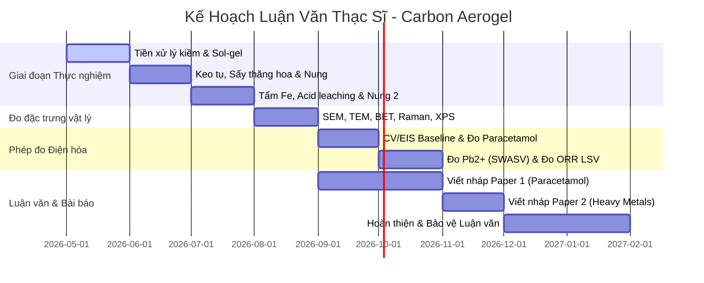

# 5_Project_Timeline_and_Publication_Strategy.md — Lộ Trình Nghiên Cứu & Chiến Lược Công Bố Khoa Học

> [!NOTE]
> * Quy trình liên hợp chế tạo: [1_Active_Protocol_Synthesis.md](file:///D:/1%20Master's%20Ana%20Chem/1%20Master's%20thesis/Carbon%20Aerogel/1%20SOPs/1_Active_Protocol_Synthesis.md)  
> * Quy trình liên hợp đo đạc: [2_Active_Protocol_Electrochemistry.md](file:///D:/1%20Master's%20Ana%20Chem/1%20Master's%20thesis/Carbon%20Aerogel/1%20SOPs/2_Active_Protocol_Electrochemistry.md)
> * Cơ sở lý thuyết: [3_Literature_Review_and_Gap_Analysis.md](file:///D:/1%20Master's%20Ana%20Chem/1%20Master's%20thesis/Carbon%20Aerogel/1%20SOPs/3_Literature_Review_and_Gap_Analysis.md)

---

## 1. LỘ TRÌNH TRIỂN KHAI LUẬN VĂN THẠC SĨ ĐIỆN HÓA (12-Month Thesis Roadmap)

Lộ trình được thiết kế nhằm tối ưu hóa thời gian thực nghiệm tại phòng thí nghiệm chuyên ngành điện hóa và bảo vệ luận văn thạc sĩ đúng hạn:

---

## 2. CHIẾN LƯỢC CÔNG BỐ BÀI BÁO QUỐC TẾ (Publication Strategy)

*Đề tài nghiên cứu điện hóa được phân tách một cách khoa học thành **2 bài báo quốc tế độc lập** nhằm khai thác tối đa tính mới và phân chia quyền lợi tác giả hợp lý:*

### 2.1 Bài báo 1 — Ứng dụng cảm biến điện hóa đo Paracetamol (DPV)
*   **Vật liệu nền:** N-CA-700 (Carbon aerogel chỉ doping Nitơ nung ở 700 °C hệ amoniac).
*   **Ứng dụng điện hóa:** Phân tích paracetamol bằng kỹ thuật Von-Ampe vi phân xung (DPV) sử dụng binder Nafion 0.25%.
*   **Phân vai tác giả:**
    *   *Tác giả chính (First Author):* Bạn cùng lớp (Người hỗ trợ thu thập dữ liệu đo paracetamol).
    *   *Đồng tác giả (Co-author):* **Nhật** (Người chế tạo và tối ưu hóa vật liệu carbon aerogel từ xơ dừa Bến Tre).
    *   *Tác giả liên hệ/Hướng dẫn (Corresponding Author):* Giảng viên hướng dẫn (GVHD).
*   **Mục tiêu phân khúc:** Tạp chí ISI/Scopus nhóm **Q3 hoặc Q4** (làm bản lề tích lũy điểm phản biện nhanh).

### 2.2 Bài báo 2 — Cảm biến điện hóa siêu nhạy đo Pb²⁺ (SWASV) kết hợp xúc tác ORR
*   **Vật liệu nền:** Fe/N-CA-800/800 (Carbon aerogel co-doped Fe/N nung 800 °C, tẩm Fe, leaching HCl và nung lại ở 800 °C).
*   **Ứng dụng điện hóa:** Phân tích đồng thời kim loại nặng Pb2+ bằng sóng vuông hòa tan (SWASV) sử dụng binder Chitosan 1%, kết hợp phép đo đối chứng động học xúc tác ORR trong KOH 0.1M làm "Proof of Concept" chứng minh cấu trúc coordinated Fe-N₄.
*   **Phân vai tác giả:**
    *   *Tác giả chính & Tác giả liên hệ (First & Co-corresponding Author):* **Nhật** (Đảm nhiệm 100% phần thiết kế vật liệu Fe-N₄, đo đạc điện hóa nâng cao và viết nháp bài báo).
    *   *Đồng tác giả (2nd Author):* Bạn cùng lớp.
    *   *Tác giả hướng dẫn (Last Author):* Giảng viên hướng dẫn (GVHD).
*   **Mục tiêu phân khúc:** Tạp chí uy tín cao nhóm **Q1 hoặc Q2** (Khẳng định giá trị khoa học cốt lõi của hướng xúc tác đơn nguyên tử Fe-Nₓ trong điện phân tích từ sinh khối).

### 2.3 Chiến lược tránh bị cướp tính mới (Scoop Prevention)
> [!IMPORTANT]
> Do mẫu vật liệu **Fe/N-CA** có giá trị khoa học và độ mới cao hơn hẳn mẫu **N-CA**, việc quản lý thời gian nộp bài báo phải được tính toán kỹ:
> 1. **Phương án A:** Thực hiện viết nháp song song cả 2 bài. **Nộp bài báo 2 (Q1/Q2 - Sắt/Nitơ) trước** bài báo 1 khoảng 2–4 tuần.
> 2. **Phương án B:** Nộp đồng thời cả hai bài vào các hệ thống tạp chí khác nhau của cùng nhà xuất bản (ví dụ Elsevier hoặc Springer) để đảm bảo hai ban biên tập độc lập và ngày nhận bài (Received Date) trùng nhau, tránh việc bài N-CA công bố trước làm giảm tính mới về mặt phương pháp của bài Fe/N-CA.

---

## 3. DỰ TOÁN NGÂN SÁCH & ĐỊA ĐIỂM ĐO MẪU TẠI TP.HCM (Budget & Equipment Locations)

### 3.1 Địa điểm đo đạc đề xuất ở TP.HCM

| Kỹ thuật đặc trưng | Địa điểm thực hiện đề xuất | Chi phí ước tính (VND/mẫu) | Mục tiêu ghi nhận dữ liệu |
| :--- | :--- | :---: | :--- |
| **SEM - EDX** | Phòng thí nghiệm Trung tâm - Đại học Công nghiệp TPHCM (IUH) hoặc ĐH Bách Khoa TPHCM | 300,000 – 500,000 | Ảnh vách cấu trúc tổ ong + Bản đồ phân bố nguyên tố thô C, N, O. |
| **HR-TEM** | Viện Công nghệ Nano (INT) - ĐHQG TPHCM | 1,200,000 – 1,800,000 | Ảnh lá carbon mỏng + Xác nhận không tụ hạt sắt kim loại thô. |
| **BET (N₂ 77K)** | Khoa Kỹ thuật Hóa học - ĐH Bách Khoa TPHCM hoặc ĐH Khoa học Tự nhiên TPHCM | 600,000 – 800,000 | Diện tích S_BET và phân bố thể tích lỗ xốp BJH. |
| **Raman** | Viện Vật lý TP.HCM hoặc ĐH Khoa học Tự nhiên TPHCM | 250,000 – 350,000 | Tỷ lệ I_D/I_G xác định cấu trúc defect carbon. |
| **XPS** | Trung tâm Phân tích Quốc gia (hoặc gửi mẫu dịch vụ sang Đài Loan/Hàn Quốc) | 1,800,000 – 2,500,000 | Định lượng nguyên tố Nitơ/Sắt + Trích xuất dạng pyridinic-N và liên kết Fe-Nₓ. |
| **XRD** | Khoa Vật lý - ĐH Khoa học Tự nhiên TPHCM hoặc ĐH Sư phạm TPHCM | 150,000 – 250,000 | Đỉnh rộng carbon (002) và (100). |

### 3.2 Chiến lược tối ưu hóa chi phí
* **Chiến lược gửi mẫu BET:** Chỉ đo BET đối với 2 mẫu đại diện ưu tú nhất (N-CA-700 tối ưu và Fe/N-CA-800 tối ưu) sau khi đã vượt qua vòng lọc điện hóa CV/EIS nền. Không đo BET tràn lan các mẫu khảo sát trung gian.
* **Chiến lược đo XPS:** Đo XPS là đắt đỏ nhất. Bắt buộc phải đo Raman trước, nếu mẫu nào có tỷ lệ I_D/I_G nằm ngoài dải vàng 0.9 - 1.2 thì tuyệt đối không gửi đi đo XPS để tránh lãng phí ngân sách.
