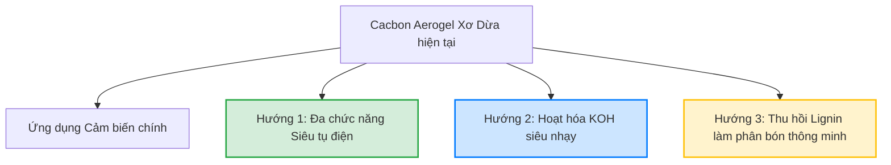

# Báo cáo Tổng hợp: Ứng dụng Lignin, Mức độ liên quan & Tính khả thi mở rộng Đề tài Luận văn

Báo cáo này hệ thống hóa các ứng dụng thực tế và tầm quan trọng của các nghiên cứu quốc tế nổi bật về Lignin, định lượng mức độ liên quan (%) và đánh giá chi tiết tính khả thi của việc mở rộng đề tài **"Cảm biến điện hóa sinh học từ Cacbon Aerogel xơ dừa tự doping Nitơ dựa trên hệ Sol-Gel $NH_4OH:Urea:H_2O$"** của bạn.

---

## I. Tổng hợp Ứng dụng thực tế & Tầm quan trọng của Lignin

Các nghiên cứu quốc tế đã hiện thực hóa cấu trúc polymer thơm phức tạp của Lignin thành các ứng dụng thực tế mang tầm ảnh hưởng lớn:

| Lĩnh vực ứng dụng | Sản phẩm thực tế chế tạo | Tầm quan trọng & Đóng góp khoa học |
| :--- | :--- | :--- |
| **1. Năng lượng & Điện hóa** | • Điện cực siêu tụ điện hiệu năng cao. • Điện cực siêu dày tích trữ năng lượng tích hợp ($26.6\ F/cm^2$). • Vật liệu dẫn điện hạt nano cho linh kiện điện tử. | • **Giải quyết bài toán năng lượng xanh:** Thay thế các nguồn cacbon hóa thạch hoặc graphene đắt đỏ. • **Hiệu năng vượt trội:** Đạt điện dung riêng lên tới **410 F/g** và thời gian phản ứng siêu nhanh ($\tau = 1.3\ s$), hoạt động ổn định điện hóa trên 10,000 chu kỳ. |
| **2. Hấp phụ & Bảo vệ môi trường** | • Hệ thu giữ khí nhà kính trực tiếp ($CO_2$ capture). • Màng lọc kim loại nặng trong nước thải công nghiệp ($Pb^{2+}, Cd^{2+}$). • Vật liệu hấp thụ dầu tràn kị nước. | • **Thu giữ khí nhà kính:** Đạt công suất hấp phụ $CO_2$ ấn tượng **5.23 mmol/g**, mở ra hướng đi bền vững cho công nghệ giảm phát thải toàn cầu. • **Xử lý môi trường rẻ tiền:** Tận dụng phế phẩm công nghiệp giấy để làm sạch nguồn nước và sự cố tràn dầu một cách kinh tế nhất. |
| **3. Nông nghiệp công nghệ cao** | • Phân bón Nitơ thông minh kiểm soát giải phóng (Controlled-release urea). • Chất cải tạo và bảo vệ cấu trúc đất. | • **Tiết kiệm và bảo vệ môi trường:** Giảm thất thoát Nitơ do bay hơi hoặc rửa trôi vào mạch nước ngầm từ **20–30 lần**. • **Ức chế urease sinh học:** Tận dụng polyphenol tự nhiên của Lignin kìm hãm hoạt tính của enzyme phân hủy phân bón trong đất, giúp cây trồng hấp thụ định kỳ tối đa. |
| **4. Công nghệ & Vật liệu mới** | • Tấm cách nhiệt kị nước siêu nhẹ. • Màng chắn nhiễu điện từ trường (EMI Shielding) hiệu năng cao. | • **Vật liệu bảo vệ sức khỏe:** Hấp thụ và ngăn chặn bức xạ điện từ có hại trong thời đại số. • **Tiết kiệm năng lượng:** Tạo ra dòng vật liệu cách nhiệt siêu nhẹ từ polyme sinh học. |

---

## II. Đánh giá Mức độ liên quan (%) đến Đề tài của Bạn

Đề tài của bạn: **"Cảm biến điện hóa sinh học từ Cacbon Aerogel xơ dừa tự doping Nitơ"** sử dụng nguyên liệu xơ dừa thô (giàu Cellulose và Lignin sót) tạo sol-gel trong hệ $NH_4OH:Urea:H_2O$ kết hợp đông băng hướng và nung 1000 °C.

Dưới đây là mức độ liên quan (%) của từng nghiên cứu trọng điểm:

### 1. Thomas et al., 2022 (Đông băng hướng Lignin/CNFs)
*   **Mức độ liên quan: 85% (Cực kỳ cao)**
*   **Điểm tương đồng áp dụng trực tiếp:**
    *   *Kỹ thuật vật lý:* Quy trình **đông băng hướng (Ice-templating)** kiểm soát tốc độ lạnh tối ưu **7.5 K/min** là cốt lõi để bạn tạo ra cấu trúc lỗ xốp song song dị hướng từ xơ dừa.
    *   *Động học độ nhớt:* Sự biến đổi độ nhớt dung dịch sol theo hàm lượng chất rắn (3–7 wt%) quyết định độ bền cơ học của gel xơ dừa sau đông khô.
    *   *Chế độ nung:* Tối ưu hóa nung cacbon hóa ở 1000 °C để đạt diện tích bề mặt lớn mà không bị sập khung.

### 2. Geng et al., 2020 (Cacbon Aerogel Lignin/TOCNF)
*   **Mức độ liên quan: 80% (Rất cao)**
*   **Điểm tương đồng áp dụng trực tiếp:**
    *   *Ổn định cấu trúc:* Chế độ **nung ổn định 2 giai đoạn** (giữ nhiệt đẳng nhiệt ở 100 °C để đuổi nước và 400–500 °C để tạo liên kết chéo lignin) bảo vệ aerogel không bị nứt vỡ khi co ngót thể tích (~70%).
    *   *Làm sạch bề mặt điện cực:* Hiện tượng các hạt muối Natri (từ tiền xử lý kiềm xơ dừa) di trú ra bề mặt gây bít tắc lỗ xốp thơm. Quy trình rửa lặp lại 5 lần bằng nước cất giúp giải phóng hoàn toàn các lỗ xốp bị chặn, cực kỳ thiết yếu để tăng độ nhạy cảm biến của bạn.

### 3. Lu & Gu, 2022 (Cơ chế phân hủy nhiệt Lignin)
*   **Mức độ liên quan: 70% (Cao)**
*   **Điểm tương đồng áp dụng trực tiếp:**
    *   *Biện luận hóa học nung:* Cung cấp cơ chế phân hủy gốc tự do của lignin xơ dừa qua 3 giai đoạn (Sấy mềm hóa $\rightarrow$ Đứt liên kết ether tạo monomer $\rightarrow$ Cacbon hóa ngưng tụ đa vòng thơm $>700$ °C). Giải thích sự hình thành pha cacbon dẫn điện tốt trên điện cực cảm biến.

### 4. Pan et al., 2025 (Hoạt hóa hóa học KOH cho Lignin EHL)
*   **Mức độ liên quan: 60% (Trung bình - Cao)**
*   **Điểm tương đồng áp dụng trực tiếp:**
    *   *Tối ưu hóa hóa học:* Cơ chế hoạt hóa KOH ở nhiệt độ tối ưu 800 °C tạo cấu trúc lỗ siêu nhỏ.
    *   *Tính chất bề mặt:* Các nhóm chức chứa Oxy tự doping ($C=O, COOH$) giúp điện cực cảm biến điện hóa của bạn tăng độ thấm ướt trong dung dịch đệm phân tích sinh học và đóng góp pseudocapacitance.

### 5. Li et al., 2017 (Biến tính aminated Mannich Lignin)
*   **Mức độ liên quan: 50% (Trung bình)**
*   **Điểm tương đồng áp dụng trực tiếp:**
    *   *Hóa học gắn Nitơ bền:* Phản ứng amin hóa Mannich chứng minh nhóm amin thế chọn lọc vào vị trí C5 trống của nhân thơm Guaiacyl (G) trong lignin. Đây là cơ sở lý thuyết chứng minh Urea phản ứng hóa học trực tiếp với lignin sót trong xơ dừa giúp "neo giữ" Nitơ hữu cơ bền nhiệt trước khi nung cacbon hóa.

---

## III. Tính khả thi & Đánh giá Tiềm năng mở rộng Đề tài

Việc mở rộng đề tài luận văn thạc sĩ của bạn từ cảm biến điện hóa sang các hướng ứng dụng song song hoặc nâng cao chất lượng vật liệu có tính khả thi cực kỳ cao:

### Hướng mở rộng 1: Đa chức năng hóa làm Siêu tụ điện (Supercapacitors) song song
*   **Mô tả:** Lấy chính mẫu Cacbon Aerogel tối ưu nhất từ xơ dừa của bạn làm điện cực hoạt tính cho siêu tụ điện EDLC. Đo các chỉ số CV, GCD, EIS trong dung dịch điện ly có sẵn ($H_2SO_4$ hoặc $KOH$).
*   **Độ khó kỹ thuật:** Rất thấp (vì quy trình tạo vật liệu giữ nguyên).
*   **Thiết bị yêu cầu:** Trạm đo điện hóa Potentiostat/Galvanostat (đã có sẵn cho cảm biến).
*   **Tính khả thi: 95% (Cực kỳ khả thi)**
*   *Lợi ích:* Biến đề tài thành nghiên cứu vật liệu đa chức năng cao cấp, gia tăng số lượng công bố khoa học đáng kể.

### Hướng mở rộng 2: Hoạt hóa KOH nhẹ tăng độ nhạy cảm biến lên mức siêu vết
*   **Mô tả:** Nghiên cứu ảnh hưởng của việc tẩm thêm một lượng rất nhỏ KOH (tỷ lệ 0.5:1 hoặc 1:1) vào aerogel xơ dừa trước khi nung ở 800 °C.
*   **Độ khó kỹ thuật:** Thấp (chỉ thêm một bước tẩm sấy đơn giản).
*   **Thiết bị yêu cầu:** Tủ sấy và lò nung ống thông thường.
*   **Tính khả thi: 85% (Rất khả thi)**
*   *Lợi ích:* Diện tích bề mặt hoạt động điện hóa (SSA) tăng vọt giúp tăng số lượng tâm bám dính cho các phân tử sinh học xúc tác $\rightarrow$ nâng giới hạn phát hiện ($LOD$) của cảm biến sinh học lên mức vượt trội.

### Hướng mở rộng 3: Tái thu hồi Lignin từ dịch thải kiềm làm Phân bón giải phóng chậm
*   **Mô tả:** Dịch thải màu đen chứa kiềm và lignin sau khi ngâm xơ dừa thô được axit hóa bằng $HCl$ hoặc $H_2SO_4$ để kết tủa và thu hồi lignin. Tiến hành biến tính ester hóa đơn giản hoặc phản ứng Mannich để phủ bọc Urea làm phân bón thông minh.
*   **Độ khó kỹ thuật:** Trung bình (cần thực hiện phản ứng hóa học hữu cơ đơn giản và đo giải phóng urê).
*   **Thiết bị yêu cầu:** Máy đo phổ UV-vis tại bước sóng 200 nm để giám sát tốc độ giải phóng urê trong nước (thiết bị này cực kỳ phổ biến trong các phòng thí nghiệm Hóa Phân tích).
*   **Tính khả thi: 75% (Khả thi cao)**
*   *Lợi ích:* Đóng đóng góp ý nghĩa thực tiễn to lớn theo định hướng **Kinh tế tuần hoàn (Circular Economy)**, biến dịch thải độc hại thành sản phẩm nông nghiệp thông minh giá trị cao.
