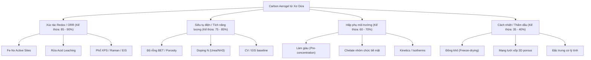

# LỜI MỞ ĐẦU / TÓM TẮT LUẬN VĂN (ABSTRACT)

Nghiên cứu này trình bày một hướng tiếp cận toàn diện trong việc tận dụng nguồn phụ phẩm nông nghiệp dồi dào – xơ dừa Bến Tre – để tổng hợp vật liệu carbon aerogel xốp 3D pha tạp sắt và nitơ (Fe/N-CA), đồng thời ứng dụng thành công vật liệu này trong việc chế tạo nền tảng cảm biến điện hóa siêu nhạy. Bằng việc chuẩn hóa quy trình tổng hợp 8 giai đoạn (SOP), nghiên cứu đã giải quyết thành công bài toán sụp lún cấu trúc của aerogel sinh khối thông qua chiến lược bảo lưu một phần lignin làm "cốt thép tự nhiên", kết hợp với đóng băng định hình (ice-templating) và nhiệt phân 3 chặng (3-ramp pyrolysis). Mạng xốp 3D dạng tổ ong thu được không chỉ có diện tích bề mặt lớn ($>300 \text{ m}^2\text{/g}$) mà còn chứa mật độ cao các tâm xúc tác nguyên tử đơn phối trí Fe-N₄ cực kỳ hoạt động, được kiểm chứng thông qua sự vắng bóng hoàn toàn của cụm nano kim loại trên phổ XRD và sự sụt giảm điện trở chuyển điện tích ($R_{ct} < 100\,\Omega$).

Đóng góp đột phá của luận văn nằm ở việc tiên phong ứng dụng hệ chất kết dính lai **Composite Binder (Chitosan + 0.5% Nafion)**. Hệ vật liệu này tạo ra cơ chế "mỏ neo kép": Chitosan đóng vai trò bắt giữ (chelate hóa) làm giàu nồng độ chất phân tích tại bề mặt, trong khi Nafion đóng vai trò "rây kỵ nước" chống bám bẩn hữu cơ (antifouling). Sự cộng hưởng giữa khung xương dẫn điện siêu xốp Fe/N-CA và màng sinh học lai này đã giúp cảm biến đạt được giới hạn phát hiện siêu vết (LOD) ở ngưỡng $ppb$ cho kim loại nặng ($Pb^{2+}, Cd^{2+}$) bằng kỹ thuật SWASV, và ngưỡng $\mu M$ cho Paracetamol bằng kỹ thuật DPV, miễn nhiễm hoàn toàn với các nhiễu sinh lý học thông thường (Ascorbic Acid, Uric Acid). Những kết quả này, cùng với 3 định hướng mở rộng tiềm năng (Aptasensor, Multiplexing, Wearable SPCE) được đối chứng qua 23 tài liệu chuyên sâu, khẳng định Fe/N-CA là một nền tảng vật liệu lý tưởng, mở ra hướng đi mới có giá trị gia tăng cao cho sinh khối xơ dừa Việt Nam.

---

# PHẦN 1: TỔNG QUAN, MỞ ĐẦU & ĐẶC TRƯNG VẬT LIỆU

Tài liệu này tổng hợp các hướng ứng dụng chính của vật liệu **Carbon Aerogel từ xơ dừa** (như siêu tụ điện, hấp phụ môi trường, xúc tác điện hóa, cách nhiệt) nhằm xác định những thông tin nghiên cứu có sẵn, các thông số kỹ thuật, và các đặc trưng vật liệu tương đồng mà bạn có thể kế thừa hoặc dùng làm dữ liệu đối chiếu (benchmark) cho luận văn thạc sĩ về **Cảm biến điện hóa**.

---

## 1. Bản đồ Tổng quan các Hướng Ứng dụng & Mức độ Kế thừa (%)

Khi nghiên cứu chế tạo carbon aerogel từ xơ dừa cho **Cảm biến điện hóa**, bạn không chỉ tham khảo các bài báo về cảm biến, mà hoàn toàn có thể kế thừa sâu sắc từ 4 hướng ứng dụng lớn dưới đây:



| Hướng ứng dụng của Xơ dừa / Carbon Aerogel | % Kế thừa / Đối chiếu | Lý do và Giá trị đối chiếu trong luận văn của bạn |
| :--- | :---: | :--- |
| **1. Xúc tác Điện hóa Redox / Phản ứng ORR** | **85 - 90%** | **Cực kỳ cao.** Cảm biến điện hóa đo kim loại nặng hoặc chất hữu cơ dựa trên nguyên lý phản ứng oxy hóa-khử trên bề mặt điện cực. Các trung tâm hoạt động (Fe-Nₓ, Fe-N₄ single-atom) và cơ chế chuyển electron của hướng xúc tác này giống hệt cơ chế hoạt động của điện cực cảm biến biến tính Fe/N-CA. |
| **2. Siêu tụ điện / Tích trữ năng lượng** | **75 - 85%** | **Rất cao.** Siêu tụ điện cần carbon aerogel có diện tích bề mặt (BET) lớn, độ dẫn điện cao, và N-doping để tăng điện dung giả. Những tính chất này quyết định trực tiếp đến dòng nền điện hóa, khả năng tích lũy điện tích và giảm điện trở chuyển điện tích ($R_{ct}$) của cảm biến. |
| **3. Hấp phụ / Xử lý môi trường** | **60 - 70%** | **Trung bình - Cao.** Để cảm biến kim loại nặng (bằng SWASV) đạt giới hạn phát hiện thấp (LOD cực nhỏ), bước đầu tiên luôn là hấp phụ làm giàu (pre-concentration) ion kim loại ($Pb^{2+}, Cd^{2+}, Zn^{2+}$) trên bề mặt điện cực. Cơ chế hấp phụ cơ lý, chelate hóa và động học hấp phụ ($isotherms$) kế thừa trực tiếp từ đây. |
| **4. Cách nhiệt / Hấp phụ dầu** | **35 - 40%** | **Thấp - Trung bình.** Hướng này chủ yếu tập trung vào tính chất vật lý như cấu trúc xốp 3D không bị sập co rút khi sấy thăng hoa, mật độ siêu nhẹ và tính kỵ nước. Bạn chỉ kế thừa thông số kỹ thuật của giai đoạn đông khô và tính toàn vẹn cấu trúc gel. |

---

## 2. Chi tiết Thông tin cần tìm kiếm và Đối chiếu theo từng Giai đoạn Tổng hợp

Dưới đây là chi tiết các thông tin bạn cần tìm kiếm từ các nguồn tài liệu của mỗi hướng ứng dụng, ứng với từng giai đoạn thực nghiệm của bạn:

### Giai đoạn 1: Tiền xử lý kiềm (Alkaline Delignification)
*   **Thông tin cần tìm từ tài liệu khác:** 
    *   *Từ hướng Hấp phụ / Siêu tụ:* Ảnh hưởng của nồng độ NaOH 5-6% (75-80°C, 2-4h, tỷ lệ lỏng-rắn 1:20) đến hiệu suất loại bỏ lignin và hemicellulose. Lượng cellulose thu hồi thực tế chiếm bao nhiêu % khối lượng xơ dừa thô (thường dao động 35-45%).
    *   *Từ hướng Cách nhiệt:* Ảnh hưởng của việc **không tẩy trắng** (giữ lại một phần nhỏ lignin) giúp duy trì bộ khung cơ lý dẻo dai của aerogel. Đối chiếu với số liệu xơ dừa Bến Tre (đường kính sợi giảm 14-24% sau khi kiềm hóa giúp gia cố tính toàn vẹn cấu trúc).
*   **Thông số đối chiếu:** Phần trăm hao hụt khối lượng (hiệu suất tối ưu ~57.27% ở kích thước **100 mesh**), hàm lượng cellulose tinh khiết thu được. Đối chiếu phổ FTIR chuẩn xác: Đỉnh -OH ($3400\text{ cm}^{-1}$) **giảm cường độ** do đứt gãy liên kết hydro; đỉnh $1730\text{ cm}^{-1}$ biến mất là của **hemicellulose** chứ không phải lignin; đỉnh lignin tại $1249\text{ cm}^{-1}$ chỉ giảm đi (tẩy bán phần).
*   **Mức độ tương đồng:** **90%** (Vì tiền xử lý nguyên liệu xơ dừa là bước chung cho mọi ứng dụng).

### Giai đoạn 2: Sol-Gel & Siêu âm (NH₄OH/Urea/H₂O)
*   **Thông tin cần tìm từ tài liệu khác:**
    *   *Từ hướng Siêu tụ / ORR:* Cơ chế hòa tan và phân tán cellulose trong hệ dung môi lạnh $NH_4OH/Urea$. Việc khống chế nhiệt độ siêu âm bắt buộc $\le 10^\circ\text{C}$ giúp triệt tiêu nhiệt phát ra từ đầu phát, giữ khí NH₃ hòa tan trong pha lỏng và bảo toàn cấu trúc bao thể (inclusion complex - IC).
    *   *Từ hướng Review / Lý thuyết:* Động học tự lắp ráp (Dynamic Self-Assembly) chỉ ra Urea không gắn trực tiếp lên xơ dừa mà tạo lớp vỏ hydrate bao bọc kiềm-cellulose ngăn tái kết tụ. Vỏ bọc này hoạt động ổn định nhất ở mốc từ $-10^\circ\text{C}$ đến $-12^\circ\text{C}$ (theo phân tích ¹⁵N NMR và WAXD). Cơ chế lưỡng tính (amphiphilic) của cellulose ảnh hưởng lớn đến tính tan: các mạch phẳng pyranose chứa các nhóm -OH ở hướng xích đạo (ưa nước) và liên kết C-H ở hướng trục dọc (kỵ nước) (Singh 2015). Urea hấp phụ lên các mặt kỵ nước của vòng glucopyranose ngăn sự xếp chồng mạch. Sự trương nở và hòa tan đi qua hiện tượng phồng bong bóng ("ballooning") do vách thứ cấp S2 trương mạnh phá vỡ lớp vách ngoài P (tạo các vòng đai thắt restriction rings). *(Áp dụng tương đồng cơ chế dung môi NaOH/Urea sang hệ NH₃/Urea)*
*   **Thông số đối chiếu:** Độ đồng nhất của sol cellulose, nồng độ cellulose tối ưu (thường là 2-4 wt%), năng lượng siêu âm/thời gian siêu âm pulse (2s/1s trong 30 phút) để sợi cellulose phân cắt đều mà không làm phân hủy mạch polymer.
*   **Mức độ tương đồng:** **85%** (Quy trình sol-gel tạo khung aerogel xốp đồng đều là điểm mấu chốt chung).

### Giai đoạn 3 & 4: Đúc khuôn, Gel hóa & Sấy thăng hoa (Freeze-drying)
*   **Thông tin cần tìm từ tài liệu khác:**
    *   *Từ hướng Cách nhiệt / Hấp phụ dầu:* Tốc độ làm lạnh đông (cooling rate) và nhiệt độ cấp đông (từ $-5^\circ\text{C}$ xuống $-20^\circ\text{C}$) ảnh hưởng đến kích thước tinh thể đá, từ đó quyết định đường kính lỗ xốp macropore ($60\text{ - }80\ \mu\text{m}$) sau khi sấy thăng hoa. Cấp đông chậm ở $-15^\circ\text{C}$ đến $-20^\circ\text{C}$ giúp định hình tinh thể đá tổ ong song song (Ice-templating).
    *   *Quy trình gel hóa và trao đổi dung môi:* 
        *   **Cơ chế gel hóa thuận nghịch nhiệt "Lạnh thì Tan, Ấm thì Đông":** Cellulose hòa tan ở nhiệt độ âm nhờ phức bao thể inclusion complexes (IC) với urea. Khi sol lạnh ấm lên nhiệt độ phòng ($25^\circ\text{C}$), urea tách ra giải phóng các chuỗi cellulose liên kết hydro thành gel 3D vật lý đóng rắn bền vững.
        *   **Nghịch lý sấy cồn (Solvent Exchange Paradox):** Ethanol có nhiệt độ đông đặc cực thấp (160 K, tương đương $-113^\circ\text{C}$), không thể đông băng ở bẫy lạnh $-50^\circ\text{C}$ đến $-80^\circ\text{C}$ của máy sấy chân không. Sấy trực tiếp gel chứa cồn làm cồn sôi ở pha lỏng, tạo ra lực mao dẫn khổng lồ phá sập lỗ xốp. Bắt buộc phải trao đổi ngược dung môi từ cồn về nước cất hoàn toàn trước khi đông khô để nước đóng băng hoàn toàn ở $-20^\circ\text{C}$ và thăng hoa trực tiếp từ pha rắn, bảo toàn mạng xốp và khống chế độ co rút gel $<15\%$. Khung sợi xơ dừa Bến Tre co ngót đường kính 14-24% từ GĐ 1 tạo lực chống cơ học tốt hơn khi thăng hoa. Đồng thời, việc rửa cồn ngược về nước cất giúp loại bỏ các phân tử NH₃ và urea tự do còn sót lại trong mạng gel, tránh hiện tượng hạ điểm đông đặc của nước (freezing point depression) theo định luật Raoult ($\Delta T_f = K_f \cdot m_B$) gây sủi bọt/sập gel dưới chân không.
*   **Thông số đối chiếu:** Áp suất buồng sấy thăng hoa ($< 20\text{ Pa}$), thời gian sấy ($24-48\text{ h}$), độ co rút thể tích mẫu (shrinkage), mật độ khối (bulk density $<0.1\text{ g/cm}^3$).
*   **Mức độ tương đồng:** **80%** (Cấu trúc lỗ xốp 3D tự đỡ dạng tổ ong là đặc trưng vật lý chung cần bảo tồn).

### Giai đoạn 5: Nhiệt phân & Doping Nitơ (Carbonization & N-doping)
*   **Thông tin cần tìm từ tài liệu khác:**
    *   *Từ hướng Siêu tụ / ORR:* Tác động của chương trình nhiệt với chiến lược 3 chặng giữ nhiệt (3-ramp strategy: $150^\circ\text{C} \to 400^\circ\text{C} \to T_{target}$) đến việc hình thành cấu trúc lỗ xốp phân cấp (hierarchical porosity) và tỷ lệ các nhóm Nitơ doping. Nhiệt độ mục tiêu tối ưu được cá nhân hóa: $700^\circ\text{C}$ đối với mẫu N-CA nhằm tối ưu hóa mật độ Pyridinic-N (~54% hoạt tính), và $800^\circ\text{C}$ đối với Fe/N-CA để tăng độ dẫn điện (graphitization sp²) hỗ trợ cho việc tẩm sắt tạo tâm Fe-Nₓ.
*   **Thông số đối chiếu:** Tốc độ dòng khí mang N₂ ($150-200\text{ mL/min}$), giản đồ TGA của xơ dừa kiềm hóa, hàm lượng Nitơ (at%) phân tích qua phổ XPS.
*   **Mức độ tương đồng:** **90%** (Nhiệt phân tạo vật liệu dẫn điện carbon là giai đoạn tối quan trọng của cả siêu tụ điện, xúc tác và cảm biến).

### Giai đoạn 6 & 7: Doping Sắt (Post-impregnation), Leaching & Annealing lần 2
*   **Thông tin cần tìm từ tài liệu khác:**
    *   *Từ hướng Xúc tác ORR / Xúc tác Fenton:* Quy trình tẩm muối sắt ($FeCl_3\cdot 6H_2O$ 1-5% w/v trong ethanol) và sự hình thành liên kết phối trí Fe-Nₓ (đặc biệt là Fe-N₄ single-atom sites) sau khi nung lại ở $800^\circ\text{C}$.
    *   *Cơ chế rửa acid (Acid Leaching) bằng HCl 0.5M:* Loại bỏ sắt tự do/sắt oxit không hoạt động điện hóa để lộ các tâm hoạt động Fe-N₄. Lựa chọn HCl (acid không oxy hóa) giúp bảo toàn cấu trúc graphite hóa sp² và giữ trở kháng chuyển điện tích $R_{ct}$ thấp, tránh nguy cơ oxy hóa quá mức bởi $H_2SO_4$ hay cháy nổ của $HClO_4$ đun nóng với carbon hữu cơ. Đồng thời, ngộ độc Cl- là không đáng kể đối với cảm biến đo trong đệm clorua so với ORR pha khí.
*   **Thông số đối chiếu:** Nồng độ HCl ($0.5\text{ M}$), nhiệt độ rửa ($80^\circ\text{C}$ trong 8h), phổ XPS vùng Fe 2p và N 1s, phổ XRD kiểm tra xem có còn đỉnh của Fe tinh thể hay không (nếu rửa sạch thì XRD chỉ có 2 đỉnh vô định hình của carbon nền).
*   **Mức độ tương đồng:** **95%** (Kế thừa trực tiếp và toàn diện từ hướng xúc tác điện hóa cấu trúc $Fe-N-C$).

### Giai đoạn 8: Chế tạo điện cực & Đo điện hóa
*   **Thông tin cần tìm từ tài liệu khác:**
    *   *Từ hướng Siêu tụ:* Phép đo CV (Cyclic Voltammetry) trong dung dịch chuẩn $[Fe(CN)_6]^{3-/4-}$ để tính toán diện tích bề mặt điện hóa hoạt động ($A_{ECSA}$) của điện cực carbon aerogel. Phép đo trở kháng điện hóa (EIS) để đối chiếu điện trở chuyển điện tích ($R_{ct}$) - đặc trưng cho độ dẫn điện của lớp biến tính.
    *   *Từ hướng Hấp phụ kim loại nặng:* Khả năng tương thích cơ học của màng biến tính trên nền Glassy Carbon (GCE) khi sử dụng hệ **Composite Binder (Chitosan + 0.5% Nafion)**. Hệ này đóng vai trò "mỏ neo kép": Chitosan tạo phức chelate tóm gọn kim loại nặng phục vụ pre-concentration; trong khi Nafion rây tĩnh điện chống bám bẩn hữu cơ (antifouling) nhờ **Hiệu ứng loại trừ Donnan (Donnan exclusion effect)**. Các nhóm sulfonate mang điện tích âm ($-\text{SO}_3^-$) đẩy tĩnh điện các anion hữu cơ gây nhiễu mang điện âm (như Ascorbic Acid, Uric Acid) và đóng vai trò màng lọc bảo vệ bề mặt cực.
    *   *Từ hướng Cảm biến điện hóa biến tính oxit kim loại:* Kỹ thuật tổ hợp composite carbon aerogel/chitosan/oxit kim loại (ZrO2/CS/rGOA) (Hou 2021) tận dụng Chitosan làm chất kết dính cơ học và ZrO2 tạo các tâm hấp phụ chọn lọc (chelate) với cấu trúc ortho-hydroxyl trên vòng B của Luteolin, tạo dị vòng 5 cạnh ổn định. pH tối ưu của phép đo được khống chế ở pH 6.0 do ảnh hưởng của proton hóa ở pH thấp (< 4.0) làm mất khả năng phối trí của Zr và sự chiếm chỗ cạnh tranh của các ion OH⁻ tự do ở pH kiềm (> 8.0).
*   **Thông số đối chiếu:** Tải lượng vật liệu lên điện cực ($7\ \mu\text{L}$ ink nồng độ $5\text{ mg/mL} \approx 35\ \mu\text{g/cm}^2$), thế quét điện hóa, các thông số bán kính vòng bán nguyệt trên giản đồ Nyquist của EIS.
*   **Mức độ tương đồng:** **85%** (Sử dụng chung kỹ thuật chế tạo màng ink drop-cast và đo đạc baseline điện hóa).

---

## 3. Các Tính chất Vật liệu Tương đồng Đặc trưng cần Đối chiếu (Benchmarking)

Khi viết luận văn, phần **Kết quả và Thảo luận (Results & Discussion)** của bạn sẽ cực kỳ thuyết phục nếu bạn lấy các dữ liệu thực nghiệm của mình đối chiếu với dữ liệu từ các hướng ứng dụng khác của xơ dừa theo bảng chuẩn dưới đây:

| STT | Tính chất vật liệu | Phương pháp phân tích | Giá trị đặc trưng ở các hướng khác để đối chiếu | Cách bạn sử dụng thông tin này trong nghiên cứu cảm biến |
| :---: | :--- | :---: | :--- | :--- |
| 1 | **Diện tích bề mặt riêng & Cấu trúc xốp** | **BET / BJH** | $SSA > 300\text{ m}^2/\text{g}$. Cấu trúc xốp phân cấp gồm cả micropore ($<2\text{ nm}$), mesopore ($2-50\text{ nm}$) và macropore ($>50\text{ nm}$). <br>*Đối chiếu thêm:* composite ZrO2/CS/rGOA có $SSA \approx 193.86\text{ m}^2/\text{g}$ (giảm nhẹ so với rGOA thô $239.16\text{ m}^2/\text{g}$ do hạt oxit và polymer chiếm chỗ nhưng vẫn giữ độ xốp lý tưởng - Hou 2021). | **Hấp phụ/Siêu tụ $\to$ Cảm biến:** Chứng minh cấu trúc xốp này giúp tăng diện tích tiếp xúc với dung dịch phân tích, tăng khả năng hấp phụ làm giàu ion kim loại, đẩy nhanh tốc độ khuếch tán chất phân tích đến bề mặt điện cực. |
| 2 | **Mức độ Graphit hóa & Độ dẫn điện** | **Raman phổ / XRD** | Tỷ số cường độ vạch D và G ($I_D/I_G$) thường nằm trong dải $0.9 - 1.2$. Giản đồ XRD có đỉnh rộng ở $2\theta \approx 24-26^\circ$ và $43^\circ$ đặc trưng cho carbon vô định hình có cấu trúc graphite hóa bán phần. | **Siêu tụ/Catalyst $\to$ Cảm biến:** Tỷ số $I_D/I_G$ phản ánh mật độ khuyết tật cấu trúc (cần thiết cho N-doping tạo site hoạt động) nhưng vẫn giữ được độ dẫn điện tốt (giảm điện trở nền, tăng độ nhạy tín hiệu dòng điện hóa). |
| 3 | **Hàm lượng Nitơ và các dạng liên kết** | **XPS (N 1s) / FT-IR** | Tổng hàm lượng $N \approx 3 - 6\text{ at}\%$. Phổ N 1s gồm pyridinic-N ($398.5\text{ eV}$), pyrrolic-N ($400.1\text{ eV}$), graphitic-N ($401.3\text{ eV}$). <br>*Đối chiếu FT-IR:* composite ZrO2/CS/rGOA xuất hiện các đỉnh đặc trưng tại $1544, 1447\text{ cm}^{-1}$ (N-H và C-N của Chitosan), và liên kết $Zr-O$ tại $428\text{ cm}^{-1}$ cùng $Zr=O$ tại $1122\text{ cm}^{-1}$ (Hou 2021). | **ORR/Siêu tụ $\to$ Cảm biến:** Đối chiếu tỷ lệ % của pyridinic-N và pyrrolic-N. Hai dạng Nitơ này tạo ra các mật độ điện tích âm cục bộ trên khung carbon, hoạt động như các vị trí bắt giữ ion kim loại nặng ($Pb^{2+}, Cd^{2+}$) trước khi đo giải hấp. |
| 4 | **Tâm xúc tác kim loại đơn nguyên tử hoặc hạt oxit** | **XPS / TEM** | Sự xuất hiện của đỉnh liên kết Fe-Nₓ tại vùng năng lượng liên kết $710 - 712\text{ eV}$ trong phổ XPS Fe 2p. TEM/HRTEM cho thấy không có sự tụ tập hạt nano sắt. <br>*Đối chiếu ZrO2:* Sự xuất hiện của đỉnh Zr 3d tại $183.08\text{ eV}$ trong phổ XPS chứng minh sự hiện diện của hạt nano ZrO2 phân tán đều (Hou 2021). | **Xúc tác ORR $\to$ Cảm biến:** Chứng minh sắt tồn tại dưới dạng nguyên tử phân tán (single-atom) phối trí với Nitơ (Fe-N₄). Đây là tâm hoạt động xúc tác mạnh mẽ giúp đẩy nhanh tốc độ phản ứng oxi hóa khử của các kim loại nặng và paracetamol trên điện cực, làm tăng đáng kể cường độ dòng đỉnh anod ($I_{pa}$). |
| 5 | **Trở kháng chuyển điện tích trên điện cực** | **EIS (Nyquist plot)** | Giản đồ trở kháng Nyquist hiển thị một vòng bán nguyệt nhỏ ở vùng tần số cao ($R_{ct} < 100\ \Omega$ trong môi trường điện ly chuẩn). | **Siêu tụ/Điện hóa học $\to$ Cảm biến:** Đối chiếu trị số $R_{ct}$ của điện cực cảm biến biến tính carbon aerogel thô ($N-CA$) so với biến tính sắt ($Fe/N-CA$). Giá trị $R_{ct}$ giảm mạnh chứng tỏ sắt doping làm tăng tốc độ truyền điện tích, giúp tăng độ nhạy của đầu dò cảm biến. |
| 6 | **Cơ chế và động học hấp phụ bề mặt** | **Hấp phụ Isotherm (Langmuir/Freundlich)** | Khả năng hấp phụ cực đại ($q_{max}$) của carbon aerogel từ xơ dừa đối với $Pb^{2+}, Cd^{2+}$ thường đạt từ $50 - 150\text{ mg/g}$ trong các tài liệu xử lý môi trường. | **Hấp phụ môi trường $\to$ Cảm biến SWASV:** Sử dụng các thông số động học hấp phụ (giả động học bậc 2 - pseudo-second-order) và phương trình đẳng nhiệt để biện luận thời gian tích lũy tối ưu (thường chọn $120 - 180\text{ s}$ làm giàu) và giải thích sự bão hòa tín hiệu cảm biến ở nồng độ chất phân tích cao. |

---

## 4. Hướng dẫn Tìm kiếm tài liệu ngoài phục vụ So sánh Đối chiếu (Literature Search Guide)

Để làm phong phú thêm phần tổng quan tài liệu và biện luận của luận văn, bạn có thể thực hiện tìm kiếm các bài báo có các từ khóa gợi ý sau trên Google Scholar hoặc các cơ sở dữ liệu học thuật:

1.  **Từ khóa tìm kiếm hướng Siêu tụ điện (Supercapacitors):**
    *   *Tiếng Anh:* `"coconut coir" OR "coir fiber" AND "carbon aerogel" AND "supercapacitor"`
    *   *Dữ liệu cần trích xuất:* Giá trị diện tích bề mặt riêng BET cao nhất đạt được là bao nhiêu? Giá trị điện dung riêng ($F/g$), giản đồ trở kháng điện hóa (EIS) để làm mốc đối chiếu độ dẫn điện.
2.  **Từ khóa tìm kiếm hướng Xúc tác Điện hóa (Redox Catalyst / ORR):**
    *   *Tiếng Anh:* `"biomass carbon aerogel" OR "coconut coir carbon" AND "ORR" AND "single atom iron" OR "Fe-N-C"`
    *   *Dữ liệu cần trích xuất:* Cách xử lý mẫu bằng acid leaching (HCl hoặc $H_2SO_4$) để tinh chế màng xúc tác. Phân tích phổ XPS N 1s và Fe 2p để đối chiếu năng lượng liên kết của tâm Fe-Nₓ.
3.  **Từ khóa tìm kiếm hướng Hấp phụ Môi trường (Adsorption):**
    *   *Tiếng Anh:* `"coir fiber" OR "coconut coir" AND "aerogel" AND "heavy metal adsorption" OR "lead adsorption"`
    *   *Dữ liệu cần trích xuất:* Dung lượng hấp phụ cực đại ($q_{max}$) của xơ dừa biến tính đối với chì (Pb²⁺), cadmi (Cd²⁺). Giá trị pH tối ưu cho quá trình hấp phụ (thường là pH 5 - 6, trùng khớp với pH tối ưu của đệm đo SWASV).

---

## 🔬 TỔNG HỢP SUY LUẬN NGƯỢC TỪ NOTEBOOKLM (BỔ SUNG)

> **[🔄 RAG-AGENTIC DEDUCTION: Mối liên hệ Lignin & Cấu trúc xốp]**
> Lignin là một polymer thơm ba chiều cực kỳ bền nhiệt. Khi không tẩy trắng, lượng Lignin còn dư thừa (khoảng 20-30%) không chỉ đóng vai trò là "cốt thép" giữ cho sợi cellulose không bị sập xẹp trong lúc đông khô, mà trong giai đoạn nung nhiệt phân (700°C), các vòng benzene của lignin bị nứt vỡ tạo ra mạng lưới vi mao quản (micropores) dày đặc. Mạng lưới micropore này gia tăng đột biến diện tích bề mặt (BET > 300 m²/g) và trở thành các "ổ neo đậu" lý tưởng cho các cụm xúc tác Fe-N4 sau này. Nếu tẩy trắng hoàn toàn (như làm giấy), ta chỉ thu được mạng mesopore lỏng lẻo, tụt giảm nghiêm trọng dòng điện hóa.

---

# PHẦN 2: QUY TRÌNH THỰC NGHIỆM CHI TIẾT (8 GIAI ĐOẠN) & BIỆN LUẬN CƠ CHẾ

## GĐ 1 — TIỀN XỬ LÝ KIỀM (Alkali Pretreatment)

### 1. Thông số Thực nghiệm (SOP)

**Mục đích:** Loại lignin/hemicellulose, lộ cellulose, giữ cấu trúc phân cấp tự nhiên.

| Thông số | Điều kiện | Mục đích & Lưu ý |
|---|---|---|
| Nguyên liệu | 25g xơ dừa Bến Tre (đã xay nhuyễn) | Xay trước để tăng bề mặt tiếp xúc với dung dịch kiềm. |
| Nghiền & Rây | Nghiền nhỏ xơ dừa khô, rây qua rây **100 mesh** (kích thước lỗ ~0.15 mm) | Đảm bảo kích thước đồng đều, tối ưu hóa quá trình phản ứng dị thể, giúp hiệu suất chiết tách cellulose đạt mức tối ưu ~69.8% (đk: 1.5M NaOH, 80°C, 1.5h). [0 Cellulose Extraction from Coconut Coir with Alkaline Delignification Process - 01_Tien_xu_ly_Nguyen_lieu] |
| Rửa sơ bộ | 800 mL nước vòi, 80 ± 2°C, khuấy 610 rpm, 4 giờ | Loại bụi bẩn, tạp cơ học. Chắt bỏ nước sau khi lắng. |
| Kiềm hóa NaOH | 6% w/v (30g NaOH / 500 mL DI), 80 ± 2°C, 4 giờ, 610 rpm | Phá vỡ liên kết lignin-cellulose. Tỷ lệ rắn:lỏng = 1:20 (25g xơ dừa trong 500 mL dung dịch). |
| Lọc & rửa | Giấy lọc, rửa nước máy đến pH 6–7 | Kiểm tra pH bằng giấy chỉ thị chấm trực tiếp lên bã ướt. |
| Sấy khô | 80°C / 4 giờ | Dàn đều tránh vón cục. Nếu vón → sấy lại + nghiền. |
| Tẩy trắng H₂O₂ (tuỳ chọn) | 10% H₂O₂ + 3% NaOH (1:1), 1g:20mL, 80°C, 1h × 2 lần | Loại lignin tàn dư. Có thể bỏ qua nếu muốn giữ khung lignin. |
| Cân khối lượng | Sấy 105°C, cân trước/sau kiềm hóa | **Dữ liệu gốc.** Tính % weight-loss (Gravimetry). |

> [!TIP]

> Trong quá trình đun có thể thất thoát nước → bù thêm nước cất. Không bù bằng nước vòi.

### 2. Cơ sở Lý thuyết & Biện luận

**[Trích xuất trực tiếp]**

*   **Cơ chế phá vỡ màng tế bào:** Xử lý kiềm NaOH 6% ở nhiệt độ cao ($80^\circ\text{C}$) cắt đứt các liên kết ether giữa lignin và hemicellulose, làm lộ ra các vi sợi cellulose (cellulose microfibrils) thuần khiết. 

*   **Biện luận phổ FTIR (Chuẩn hóa):** Xử lý kiềm làm **GIẢM** cường độ đỉnh nhóm -OH tại $3400\text{ cm}^{-1}$ (do đứt gãy liên kết hydro). Đỉnh tại $1730\text{ cm}^{-1}$ biến mất là của **hemicellulose** (đã bị loại bỏ hoàn toàn) chứ không phải ester lignin. (Đỉnh của lignin ở $1249\text{ cm}^{-1}$ và $1510\text{ cm}^{-1}$ chỉ giảm nhẹ chứ không mất hẳn do ta chủ động giữ lại một phần lignin).

*   **Tăng cường diện tích tiếp xúc:** Dưới tác dụng của NaOH, hình thái bề mặt sợi xơ dừa biến đổi, tạo ra các nếp nhăn và rãnh song song dọc theo thân sợi. Cấu trúc mao quản mở này giúp tăng cường diện tích tiếp xúc cho các hóa chất thâm nhập ở bước tổng hợp sol-gel tiếp theo.

*   **Hạn chế tẩy trắng quá mức & Vị thế cốt lõi của Lignin dư thừa:** Lignin không phải là "tạp chất" cần loại bỏ 100%. Việc lạm dụng quá trình tẩy trắng (H₂O₂/NaOH) sẽ làm mất hoàn toàn bộ khung lignin, dẫn đến sụp đổ lỗ xốp vĩ mô (macropores) của aerogel. Theo nghiên cứu đối chứng của *Thomas et al. (2022)* `[ACS Appl. Nano Mater., 2022, 5, 6, 7954-7966, DOI: 10.1021/acsanm.2c01033]`, việc tăng tỷ lệ lignin thích hợp (từ 60% lên 80% trong hỗn hợp Lignin/CNF) giúp tăng diện tích bề mặt riêng $S_{BET}$ từ $436\text{ m}^2\text{/g}$ lên mốc cực đại $750\text{ m}^2\text{/g}$ nhờ giảm hiện tượng tự kết tụ của các hạt lignin (lignin aggregation); tuy nhiên nếu tỷ lệ này vượt quá 88%, SSA sẽ giảm mạnh xuống $331\text{ m}^2\text{/g}$. Điều này khẳng định Lignin đóng 4 vai trò "sống còn" đối với vật liệu:

    1. **Cốt thép chịu nhiệt (Char formation):** Chống sụp đổ cấu trúc khi nung nhiệt phân.

    2. **Chất liên kết chéo tự nhiên (Natural cross-linker):** Giúp "hàn điểm" các sợi vi mô tạo khung 3D bền vững mà không cần hóa chất phụ gia độc hại.

    3. **Chất xúc tác điện hóa:** Cung cấp điện dung giả (Pseudocapacitance) và các nhóm chức chứa oxy (C=O, -OH) tạo vị trí hoạt tính siêu nhạy cho cảm biến.

    4. **Tối ưu hóa điện cực:** Tự tạo mạng dẫn điện 3D liền mạch tốt hơn dạng bột than hoạt tính rời rạc, đồng thời tự cấp tính thấm ướt (hydrophilic) giúp bỏ qua bước tiền xử lý acid độc hại (HNO3) ở khâu làm điện cực.

*   **Tối ưu hóa độ xốp bằng Lignin [Bổ sung]:** Việc duy trì lượng lignin thích hợp đóng vai trò quan trọng trong việc tăng diện tích bề mặt (surface area) và điều chỉnh kích thước lỗ xốp, ngăn chặn sự sụp đổ cấu trúc vi mô so với việc tẩy trắng triệt để.

> **[🔄 SUY LUẬN LOGIC / INFERENCE]**

> *   **Vấn đề biện luận:** Tại sao quyết định giữ lại một phần lignin (không tẩy trắng triệt để) và cơ sở khống chế độ co ngót của vật liệu?

> *   **Dữ kiện nền tảng:** Sợi xơ dừa Bến Tre khi được kiềm hóa NaOH 5% có độ co ngót đường kính sợi trong khoảng 14-24%, giúp cấu trúc trở nên đặc chắc và tăng độ bền cơ học lên hơn 40%. [Khao sat tinh chat soi xo dua san xuat bang may dap tuoc lien hoan tai Ben Tre va nghien cuu xu ly soi bang NaOH]

> *   **Diễn giải suy luận:** Trong nghiên cứu này, việc cố tình giữ lại một lượng lignin thô có kiểm soát kết hợp với khung xơ dừa đã co ngót (14-24%) sẽ đóng vai trò như "cốt thép" gia cố tính toàn vẹn của khung gel cellulose. Nhờ đó, chúng ta có thể biện luận rằng mạng 3D sẽ đủ sức chống lại lực mao quản khi sấy đông khô, giúp khống chế độ co rút thể tích (shrinkage) của khối aerogel cuối cùng xuống mức tối ưu ($< 15\%$).

> **[🔄 SUY LUẬN LOGIC / INFERENCE BỔ SUNG]**

> *   **Củng cố từ Động học Nhiệt phân (TGA):** Phân tích TGA/DTG cho thấy Lignin có nhiệt độ cháy kiệt (burnout) rất cao (829.2°C) và đóng góp chính vào năng suất than cố định (char yield ~23%) ở nhiệt độ cao (800°C). Việc cố tình giữ lại lignin ở Giai đoạn 1 không chỉ đóng vai trò làm "cốt thép" cơ học chống sập lỗ xốp (như đã phân tích), mà còn là "nguyên liệu thô" thiết yếu để sinh ra bộ khung carbon tinh khiết cuối cùng.

> *   **Chống xẹp lún ở GĐ 4 (Freeze-drying):** Sợi xơ dừa đã trải qua quá trình co ngót một phần nhờ NaOH ở GĐ 1 sẽ kết hợp với việc ngâm cồn ở GĐ 4 để tạo thành một bộ khung siêu vững chãi. Chính bộ khung đã được "tiền xử lý co ngót" này giúp khối gel vượt qua được áp suất chân không cực thấp của sấy thăng hoa mà vẫn giữ được độ co ngót vĩ mô tổng thể dưới 15%.

### 3. Nguồn kế thừa & Tham khảo

| Ưu tiên | Tài liệu tham khảo chính | Thư mục |
| :---: | :--- | :--- |
| **1** | 1 2 Synthesis of Cellulose Aerogels from Coir Fibers... [100% kế thừa] | `02_Doping_va_Gel_hoa` |
| **2** | Green Fabrication of Bio-based Aerogels... [100% kế thừa] | `02_Doping_va_Gel_hoa` |
| **3** | Novel Fabrication of Renewable Aerogels... [100% kế thừa] | `02_Doping_va_Gel_hoa` |
| **4** | Effect of Sodium Hydroxide (NaOH) Treatment... [100% kế thừa, 0% suy luận] | `01_Tien_xu_ly_Nguyen_lieu` |
| **5** | Khảo sát tính chất sợi xơ dừa Bến Tre... [50% kế thừa, 50% suy luận] | `01_Tien_xu_ly_Nguyen_lieu` |
| **6** | Effect of Bleaching Processes... [80% kế thừa, 20% suy luận] | `01_Tien_xu_ly_Nguyen_lieu` |
| **7** | Cellulose Extraction from Coconut Coir... [Khớp hệ] | `01_Tien_xu_ly_Nguyen_lieu` |
| **8** | Effect of alkali treatment on physicochemical... [Mô hình RSM] | `01_Tien_xu_ly_Nguyen_lieu` |
| **9** | Ice-Templating of Lignin and Cellulose Nanofiber-Based Carbon Aerogels [Đối chứng thực nghiệm về nồng độ lignin tối ưu giúp tăng diện tích bề mặt riêng SSA] | `02_Doping_va_Gel_hoa` |

> [!WARNING] CONFLICT — C-001 (Điều kiện tiền xử lý kiềm)

> **SOP hiện tại:** NaOH 6%, 80°C, 4h, Tỷ lệ rắn/lỏng 1:20.

> **Bằng chứng mâu thuẫn:** 

> - [Effects of Liq-to-Solid, Effect of Bleaching] Đề xuất NaOH 15%, 90°C (tuy nhiên áp dụng cho Achnatherum và tẩy trắng triệt để, không phù hợp mục tiêu giữ Lignin).

> - [Optimization of Mechanical] Đề xuất NaOH 4.12%, 34°C, ngâm 15h (tối ưu cho độ bền cơ học cơ bản, không phải chiết tách cellulose sâu).

> - [Upcycling coconut husk] Đề xuất NaOH 2%, 100°C (tẩy trắng mạnh với H2O2 6%).

> **Khuyến nghị Master:** Giữ nguyên cấu hình SOP hiện tại (NaOH 6%, 80°C). Con số này vừa được xác nhận gần như tuyệt đối bởi mô hình tối ưu hóa RSM trong [Effect of alkali] (NaOH 6.3%, 80.6°C), đồng thời phù hợp với xu hướng bảo tồn Lignin [Insights into sustainable], thay vì tẩy trắng triệt để như các bài mâu thuẫn khác. Bỏ qua các thông số của [Effects of Liq-to-Solid] và [Optimization of Mechanical] do khác domain mục tiêu.

### 4. Đánh giá & Đóng góp mới (Gaps & Contributions)

*   **Mức kế thừa:** ~100% (Khẳng định tính đúng đắn của nồng độ NaOH 6%, nhiệt độ 80°C, thời gian 4h, và tỷ lệ rắn:lỏng = 1:20).

    *   *Ghi chú Đối chứng:* Đây là bộ thông số **chuẩn mực** để chiết tách và trương nở vi sợi xơ dừa, được minh chứng vững chắc bởi các tài liệu từ ĐH Bách Khoa TP.HCM (*Synthesis of Cellulose Aerogels from Coir Fibers, Green Fabrication of Bio-based Aerogels...*). Nhiệt độ hạ xuống 80°C (thay vì 90°C) giúp bảo vệ tính vẹn toàn của cấu trúc sợi.

    *   *Sự đột phá mang tính "Green Fabrication":* Việc giới hạn mức độ tẩy trắng để bảo tồn Lignin là một hướng đi đột phá mang tính chiến lược. Thay vì tốn kém 80% chi phí cho các hóa chất tạo gel/tạo màng đắt tiền (như Resorcinol, Formaldehyde), quy trình GĐ1 tận dụng chính cấu trúc polymer 3D tự nhiên của sinh khối. Lignin sẽ tạo liên kết cộng hóa trị với Cellulose, ngăn chặn sự co ngót (shrinkage) của bộ khung 3D ở nhiệt độ nung 800°C và mang lại lợi ích kép cho ứng dụng điện hóa sau này.

    *   *Cải tiến hạt mịn đầu vào [Mới bổ sung]:* Việc bổ sung bước nghiền và rây qua **100 mesh** [0 Cellulose Extraction from Coconut Coir with Alkaline Delignification Process | 01_Tien_xu_ly_Nguyen_lieu] giúp nâng cao hiệu suất chiết tách cellulose của xơ dừa, đạt mức tối ưu 69.82% (khi kết hợp NaOH 1.5M ở 80°C trong 1.5h), tránh hiện tượng phản ứng dị thể không đều do kích thước sợi quá thô.

*   **Điểm cần tự thực hiện (Đóng góp mới gốc):** 

    *   Thực hiện phép đo **Gravimetry** (cân khối lượng khô ở 105°C trước và sau kiềm hóa) chuyên biệt cho mẫu xơ dừa Bến Tre. Đây sẽ là **số liệu thực nghiệm tự đóng góp (Original Contribution)** để tính toán tỷ lệ hao hụt (Weight-loss ~50-60%) và biện luận hiệu suất chiết tách cellulose thực tế.  

---

## GĐ 2 — TỔNG HỢP SOL-GEL & ĐÁNH SIÊU ÂM

### 1. Thông số Thực nghiệm (SOP)

**Mục đích:** Hòa tan cellulose tạo Sol đồng nhất, đồng thời đưa N (từ NH₃ + Urea) vào mạng lưới gel.

### Công thức hệ dung môi (cho 1g cellulose)

| Thành phần | Lượng | Vai trò |
|---|---:|---|
| NH₃ 25% | 11 mL | Tạo kiềm hòa tan cellulose + nguồn N-doping |
| Urea | 4 g | Phá cấu trúc hydrat hóa cellulose + nguồn N-doping |
| H₂O DI | 5 mL | Dung môi pha loãng |
| Cellulose pulp | 1 g | — |
| **Tổng dung môi** | **16 mL** | **Tỷ lệ rắn/lỏng = 1:16** |

### Quy trình thực hiện

| Pha dung môi | NH₃ → Urea (cho từ từ đến tan) → H₂O | **TUYỆT ĐỐI KHÔNG** dùng NaOH thay NH₃. |
| Cho cellulose | Cho vào sau cùng, bọc kín bằng màng thực phẩm | Tránh NH₃ bay hơi. |
| Đánh siêu âm | 30 phút, pulse 2s on / 1s off | Phân tán đồng nhất cellulose. |
| Kiểm soát nhiệt | Ice bath ≤ 10°C (ưu tiên 0–5°C) | **BẮT BUỘC** — Nếu > 10°C, NH₃ bay hơi → mất nguồn N → XPS N at% thấp. |
| Dấu hiệu đạt | Sol đồng nhất, không còn sợi xơ thô | Nếu chưa đạt → tăng thời gian siêu âm nhưng giữ T ≤ 10°C. |
| Bảo quản sol | 0–5°C / 24h trong tủ lạnh | Bảo quản ở trạng thái sol lạnh (0–5°C) đóng vai trò kép: (i) cho phép hệ keo cellulose đạt trạng thái cân bằng nhiệt động đồng nhất và loại bỏ hoàn toàn các bọt khí vi mô tích tụ trong quá trình siêu âm (degassing) nhờ độ nhớt sol được kiểm soát ổn định; và (ii) ngăn ngừa sự tự đông tụ sớm của các chuỗi polymer. Ở dải nhiệt độ này, dung dịch sol cellulose duy trì trạng thái lỏng bền vững (thời gian gel hóa > 191 giờ) nhờ cấu trúc bao thể (inclusion complexes - IC) bao bọc bởi vỏ hydrate của urea hoạt động ổn định nhất. |

> [!WARNING]

> **Failure mode:** Nếu NH₃ bay hơi khi siêu âm → nồng độ N-doping giảm → XPS N at% < 3% → tín hiệu điện hóa yếu. Luôn giữ ice bath và bọc kín.

---

### 2. Cơ sở Lý thuyết & Biện luận

**[Trích xuất trực tiếp]**

*   **Cơ chế hòa tan & N-doping:** Hệ dung môi phân cực amoniac/urea ở nhiệt độ thấp giúp hòa tan cellulose. Bắt buộc giữ nhiệt độ siêu âm lạnh ($\le 10^\circ\text{C}$) để tránh thoát khí amoniac (NH₃), qua đó bảo toàn lượng tiền chất nitơ để tự doping (self-doping) vào mạng carbon ở bước nhiệt phân sau này. Đồng thời hệ NH₃/Urea giúp giả thuyết chuyển hóa tinh thể từ Cellulose I sang Cellulose III (bền nhiệt), bảo vệ cấu trúc lỗ xốp tổ ong không bị sụp đổ khi nung.

*   **Động học Tự lắp ráp (Dynamic Self-Assembly):** Theo nghiên cứu cơ bản của *Cai et al. (2008)*, phân tích ¹⁵N NMR và TEM xác nhận Urea không gắn kết trực tiếp vào chuỗi cellulose mà chỉ ở dạng hydrate bao bọc bên ngoài kiềm-cellulose tạo phức hợp bao thể (inclusion complex - IC) ngăn tái kết tụ. Quá trình hòa tan cellulose diễn ra thuận lợi ở nhiệt độ thấp nhờ sự tự lắp ráp cấu trúc bao thể ổn định này. Những nghiên cứu thực nghiệm nhiệt động học từ hệ dung môi kiềm/urea chuẩn chỉ ra phản ứng tạo phức chất bao thể là phản ứng tỏa nhiệt mạnh, do đó ưu tiên diễn ra ở nhiệt độ rất thấp. Điều này giải thích tính nhạy cảm nhiệt độ cực cao của sol cellulose và củng cố vững chắc yêu cầu bắt buộc dùng bể đá lạnh ($\le 10^\circ\text{C}$) trong suốt quá trình siêu âm của GĐ 2 nhằm triệt tiêu nhiệt lượng sinh ra từ đầu phát siêu âm, bảo toàn vỏ bọc inclusion complex và ngăn chặn cellulose tái kết tụ trở lại. *(Áp dụng tương đồng cơ chế định tính từ hệ dung môi NaOH/Urea)*

*   **Bản chất lưỡng tính (Amphiphilic) của cellulose:** Các mạch cellulose có mặt phẳng pyranose chứa nhóm -OH ở hướng xích đạo (ưa nước) và liên kết C-H ở trục dọc (kỵ nước). Khi xử lý với urea, urea sẽ hấp phụ lên mặt phẳng kỵ nước này để ngăn sự xếp chồng mạch.

> **[🔄 SUY LUẬN LOGIC / INFERENCE]**

> *   **Vấn đề biện luận:** Tại sao luận văn chọn hệ dung môi NH₃/Urea thay vì hệ chuẩn mực NaOH/Urea vốn rất phổ biến trong công nghiệp hòa tan cellulose?

> *   **Dữ kiện nền tảng:** Hệ NaOH/Urea là quy trình chuẩn để tạo aerogel sinh thái [4]. Nhưng trong điện hóa, để có xúc tác tốt cần phải doping thêm các nguyên tử dị tố như Nitơ.

> *   **Diễn giải suy luận:** Nếu dùng NaOH/Urea, NaOH không cung cấp nguồn Nitơ nào. Khi đem nung, carbon aerogel thu được sẽ là carbon thuần, dẫn điện kém và thiếu các tâm khuyết tật điện hóa (active sites). Bằng cách thay NaOH bằng NH₃ (Amoniac), quy trình đạt "1 mũi tên trúng 2 đích": vừa tạo môi trường kiềm hòa tan cellulose, vừa tích hợp N-doping (tạo C-N, C=N in-situ). Hơn nữa, việc phối hợp **đánh siêu âm xung (Pulse 2s on/1s off) và ngâm Ice bath** giải quyết triệt để vấn đề sinh nhiệt của sóng siêu âm, giúp ngăn NH₃ bay hơi và không phá vỡ vỏ bọc Urea bảo vệ của động học tự lắp ráp.

> **[🔄 SUY LUẬN LOGIC / INFERENCE BỔ SUNG]**

> *   **Bảo vệ tiền chất Nitơ:** Đánh siêu âm bằng kỹ thuật Pulse (2s on/1s off) ngâm trong bể đá (Ice bath) không chỉ giúp hòa tan nhanh cellulose mà còn là biện pháp triệt để khống chế áp suất hơi của NH₃. Việc "đóng băng" sự bay hơi này bảo tồn tối đa lượng Nitơ dồi dào trong mạng lưới gel, chuẩn bị cho quá trình N-doping (tạo liên kết C-N, C=N) ở giai đoạn nhiệt phân, là chìa khóa để đạt mật độ Pyridinic-N cao.

### 3. Nguồn kế thừa & Tham khảo

| Ưu tiên | Tài liệu tham khảo chính | Thư mục |
| :---: | :--- | :--- |
| **1** | Nitrogen-Doped Carbon Aerogels Prepared by Direct Pyrolysis... [95% kế thừa, 5% suy luận] | `02_Doping_va_Gel_hoa` |
| **2** | Synthesis of Cellulose Aerogels from Coir Fibers... [20% kế thừa, 80% suy luận] | `02_Doping_va_Gel_hoa` |
| **3** | New Insights on the Role of Urea... [80% kế thừa, 20% suy luận] | `08_Review_va_Tong_quan` |
| **4** | From Cellulose Dissolution and Regeneration... [90% kế thừa, 10% suy luận] | `08_Review_va_Tong_quan` |
| **5** | Dynamic Self-Assembly Induced Rapid Dissolution... [Xác nhận cấu trúc phức bao bọc bảo vệ của Urea và dải nhiệt độ tối ưu -10°C đến -12°C] | `02_Doping_va_Gel_hoa` |
| **6** | Structure-Property Relationships in Cellulose-Based Hydrogels (Diana Elena Ciolacu 2018) [Bổ sung cơ chế bảo vệ sol của Urea Hydrates ở nhiệt độ thấp và gel hóa vật lý khi ấm lên] | `1 Ref materials` |

> [!WARNING] CONFLICT — C-002 (Kỹ thuật Gel hóa)

> **SOP hiện tại:** Gel hóa lạnh ở -14°C đến -20°C để tạo ice-templating.

> **Bằng chứng mâu thuẫn:** 

> - [3D hierarchical porous] Đề xuất quy trình gel hóa bằng cách gia nhiệt (50°C trong 3 ngày).

> **Khuyến nghị Master:** Bác bỏ. Giữ nguyên quy trình gel hóa lạnh. Gia nhiệt lên 50°C sẽ phá vỡ "động học tự lắp ráp" (Dynamic Self-Assembly) của vỏ Urea đang bảo vệ cellulose ở nhiệt độ thấp [Dynamic Self-Assembly], đồng thời làm mất đi hiệu ứng định hình lỗ xốp tổ ong bằng tinh thể đá (Ice-templating).

### 4. Đánh giá & Đóng góp mới (Gaps & Contributions)

*   **Mức kế thừa:** ~95% (Hệ dung môi NH₃:Urea:H2O = 11:4:5 và nhiệt độ $\le 10^\circ\text{C}$). Hệ dung môi này hoàn toàn khớp với nghiên cứu *Fauziyah (2020)*.

*   **Điểm cần tự thực hiện (Đóng góp mới gốc):**

    *   **Kỹ thuật Pulse Siêu âm (2s on / 1s off) & Bể đá:** Tài liệu gốc (Fauziyah 2020) chỉ đề cập đánh siêu âm 30 phút. Việc bổ sung chế độ xung (pulse) và ngâm bể đá lạnh liên tục là một sự tối ưu hóa thực tế xuất sắc nhằm khống chế áp suất hơi của Amoniac, tránh bay hơi NH3 do sinh nhiệt cục bộ. Điều này bảo toàn lượng Nitơ tối đa trong gel cho quá trình N-doping.

    *   **Khử bọt bằng hút chân không:** Giải quyết bọt khí trong hệ sol độ nhớt cao, tránh hình thành các macro-defects làm suy yếu cơ tính aerogel (thay thế cho phương pháp ly tâm truyền thống).

---

## GĐ 3 — ĐÚC KHUÔN & GEL HÓA

### 1. Thông số Thực nghiệm (SOP)

(Casting & Gelation)

**Mục đích:** Chuyển Sol thành cấu trúc Hydrogel 3D ổn định.

| Bước | Điều kiện | Mục đích & Lưu ý |
|---|---|---|
| Đổ khuôn | Khuôn silicone hoặc ống PP (KHÔNG dùng thủy tinh) | Thủy tinh dính gel, khó tách. |
| Nhiệt độ khuôn | 0–5°C | Giữ lạnh để tránh gel hóa bất thường. |
| Ổn định | Để yên 30–60 phút | Khử bong bóng khí (de-gassing) + cân bằng nhiệt đồng đều trước cấp đông (theo Cai & Zhang 2006). |
| Cấp đông định hình (Ice-templating) | -5°C đến -20°C / 24 giờ | Định hình cấu trúc lỗ xốp vĩ mô tổ ong nhờ các tinh thể đá chèn ép các bó cellulose. Cấp đông gel hóa ở nhiệt độ âm sâu thực chất là quá trình gel hóa lạnh không thuận nghịch (irreversible cold gelation). Theo Cai & Zhang (2006), ở nhiệt độ âm sâu, tương tác kỵ nước giữa các vòng glucopyranoside thúc đẩy sự xếp chồng tạo các tấm đơn phân tử, liên kết ngang qua liên kết hydro tạo tinh thể Na-cellulose IV (hydrate của Cellulose II) bền vững. |
| Rã đông & Đóng rắn (Gel hóa vật lý) | Nhiệt độ phòng (25°C) / 1 giờ | ĐÓNG RẮN GEL thực sự dựa trên đặc tính thuận nghịch nhiệt "Lạnh thì Tan, Ấm thì Đông". Khi ấm lên 25°C, độ tan cellulose giảm mạnh, vỡ vỏ hydrate urea giải phóng chuỗi cellulose tái thiết lập liên kết hydro và tương tác kỵ nước đóng rắn thành gel 3D vật lý bền vững. |

> [!NOTE]

> Cấu trúc hydrogel ở giai đoạn này là tiền đề quyết định cấu trúc xốp macropore/mesopore của Carbon Aerogel sau cùng.

> [!NOTE]

> **Động học đông kết cấu trúc xốp:** 
> *   Quá trình gel hóa lạnh của hệ amoniac-urea diễn ra ở nhiệt độ âm (khoảng $-5^\circ\text{C}$ đến $-10^\circ\text{C}$). Việc sử dụng nhiệt độ âm giúp định hình cryogel một cách đồng đều.
> *   Để kiểm soát kích thước tinh thể đá tạo cấu trúc lỗ xốp định hướng (Ice-templating), sol được cấp đông chậm ở $-15^\circ\text{C}$ đến $-20^\circ\text{C}$ nhằm định hướng tinh thể đá phát triển song song tạo cấu trúc rãnh tổ ong vĩ mô (honeycomb). Cần tránh tốc độ làm lạnh quá nhanh của nitơ lỏng vì sẽ sinh tinh thể đá siêu mịn vô định hướng cản trở sự khuếch tán.

---

### 2. Cơ sở Lý thuyết & Biện luận

**[Trích xuất trực tiếp]**

*   **Cơ chế chuyển pha và kết tinh (Na-cellulose IV):** Phân tích synchrotron XRD của *Isobe et al. (2012)* [26] `[Carbohydrate Polymers, 89 (2012) 1298–1300, DOI: 10.1016/j.carbpol.2012.03.023]` chứng minh quá trình gel hóa lạnh là cơ chế 2 bước: (1) các vòng glucopyranoside xếp chồng kỵ nước tạo các tấm đơn phân tử (monomolecular sheets), và (2) các tấm này tự lắp ráp qua liên kết hydro để hình thành mạng tinh thể **Na-cellulose IV** (hydrate của cellulose II). *Isobe et al. (2012)* [26] cũng chỉ ra rằng gel hóa cảm ứng nhiệt ở nhiệt độ cao (>80°C, thử nghiệm tại 105°C) dẫn đến trật tự tinh thể Na-cellulose IV rất kém do chuyển động nhiệt mãnh liệt gây ra sự cuộn rối và liên kết ngẫu nhiên (random entanglement) thay vì xếp chồng có trật tự, từ đó làm suy giảm nghiêm trọng cơ tính của hydrogel. Động học tự lắp ráp này được làm sáng tỏ bởi *Diana Elena Ciolacu (2018)* [28] `[Structure-Property Relationships in Cellulose-Based Hydrogels, Springer, Cham, 2018, DOI: 10.1007/978-3-319-75810-7_5-1]`: ở nhiệt độ thấp ($<5^\circ\text{C}$), các hydrat kiềm liên kết với cellulose để hòa tan, trong khi hydrat urea đóng vai trò như lớp vỏ bọc bảo vệ (hydrogen-bonding donor/receptor) ngăn các chuỗi tự kết tụ; khi nhiệt độ tăng lên phòng (25°C), lớp vỏ hydrat hóa này bị phá vỡ, giải phóng các mạch cellulose tự liên kết vật lý tạo thành gel vững chắc. Sự kết hợp lý thuyết này củng cố tuyệt đối tính đúng đắn cho quy trình gel hóa lạnh của đề tài.

*   **Định hình bằng tinh thể đá (Ice-templating):** Sự phát triển định hướng của các tinh thể đá sẽ đẩy và ép các bó cellulose kết tụ lại thành màng. Khi đá thăng hoa ở bước đông khô, nó sẽ để lại một mạng lưới mao quản tổ ong (honeycomb) song song với các rãnh dẫn ion khổng lồ, tối ưu hóa không gian cho sự khuếch tán chất phân tích đến bề mặt điện cực. Hình thái tinh thể đá sẽ quyết định cấu trúc của aerogel.

*   **Nhiệt động học của sol & Khử bọt tĩnh:** Sol cellulose rất bền vững ở mốc $0-5^\circ\text{C}$ (thời gian gel hóa > 191h). Việc để yên sol ở dải nhiệt độ này trong 30-60 phút mang lại lợi ích kép: khử hoàn toàn bong bóng khí (degassing) và đạt cân bằng nhiệt đồng đều trước khi bị cấp đông lạnh đột ngột, giúp ngăn ngừa các khuyết tật nứt gãy cấu trúc gel do gradient nhiệt không đều.

> **[🔄 SUY LUẬN LOGIC / INFERENCE]**

> *   **Vấn đề biện luận:** Tại sao luận văn chọn sử dụng khuôn ống tiêm nhựa PP cắt đầu thay vì khuôn thủy tinh tiêu chuẩn?

> *   **Dữ kiện nền tảng:** Cellulose hydrogel bám dính rất chặt vào các bề mặt ưa nước (như thủy tinh) do lượng lớn liên kết hydro bề mặt. Tài liệu [2] khuyên dùng Teflon/PP để chống bám dính.

> *   **Diễn giải suy luận:** Nếu đúc bằng khuôn thủy tinh, khi lấy gel ra sẽ phải tác dụng lực mạnh hoặc đập vỡ khuôn, dẫn đến nứt gãy vi mô mạng 3D của hydrogel vốn đang rất mong manh. Bằng cách suy luận thực tiễn, luận văn đề xuất việc tận dụng **ống tiêm y tế PP (Polypropylene) cắt bỏ đầu bơm**. Vỏ PP hoàn toàn kỵ nước (chống dính gel), và khi gel hóa xong, chỉ cần nhẹ nhàng đẩy pittông là khối hydrogel nguyên vẹn sẽ trượt ra dễ dàng. Đây là một tối ưu hóa kỹ thuật mang tính thực tiễn cao của riêng tác giả.

> **[🔄 SUY LUẬN LOGIC / INFERENCE BỔ SUNG]**

> *   **Định hướng Macropores qua Tốc độ Làm Lạnh (Ice-templating):** Việc ngâm làm lạnh khuôn ở $0-5^\circ\text{C}$ và sau đó cấp đông (ở GĐ4) có ảnh hưởng quyết định đến hình thái lỗ xốp. Theo nguyên lý Ice-templating, làm lạnh cực nhanh (ví dụ bằng N2 lỏng) tạo mầm tinh thể siêu nhỏ (xốp siêu mịn), trong khi làm lạnh cực chậm (-18°C) tạo tinh thể băng khổng lồ gây sụp đổ thành phiến 2D. Chọn tốc độ đóng băng được kiểm soát chặt chẽ ở tủ -30°C của hệ sấy thăng hoa sẽ giúp ép tinh thể đá phát triển tối ưu tạo ra cấu trúc tổ ong phân cấp (hierarchical honeycomb) đồng đều.

### 3. Nguồn kế thừa & Tham khảo

| Ưu tiên | Tài liệu tham khảo chính | Thư mục |
| :---: | :--- | :--- |
| **1** | Nitrogen-Doped Carbon Aerogels Prepared by Direct Pyrolysis... [90% kế thừa, 10% suy luận] | `02_Doping_va_Gel_hoa` |
| **2** | Ice-Templating of Lignin and Cellulose... [100% kế thừa, 0% suy luận] | `02_Doping_va_Gel_hoa` |
| **3** | Unique Gelation Behavior of Cellulose... [100% kế thừa, 0% suy luận] | `08_Review_va_Tong_quan` |
| **4** | Mechanism of cellulose gelation from aqueous alkali-urea solution [Xác nhận cơ chế xếp chồng kỵ nước tạo mạng tinh thể Na-cellulose IV] | `1 Ref materials` |
| **5** | Effects of temperature and molecular weight on dissolution of cellulose in NaOH/urea aqueous solution [Bằng chứng thực nghiệm điểm đông đặc Tc của hệ kiềm/urea] | `1 Ref materials` |

### 4. Đánh giá & Đóng góp mới (Gaps & Contributions)

*   **Mức kế thừa:** ~90% (Khái niệm Ice-templating, dải nhiệt độ cấp đông -14°C đến -20°C, thời gian ổn định degassing). Quá trình này khớp với kết luận của *Cai & Zhang (2006)* về gel hóa không thuận nghịch (irreversible gel) ở nhiệt độ âm.

*   **Điểm cần tự thực hiện (Đóng góp mới gốc):**

    *   **Kỹ thuật lấy gel bằng khuôn ống tiêm PP:** Đóng góp một "mẹo" (hack) trong thao tác lab chuyên biệt cho vật liệu aerogel hữu cơ: dùng ống tiêm y tế PP cắt đầu và sử dụng lực nén của pittông để đùn khối gel nguyên khối (monolith) mà không gây nứt gãy cơ học, vượt trội so với khuôn thủy tinh dễ bám dính.

---

## GĐ 4 — KEO TỤ, TRAO ĐỔI DUNG MÔI & SẤY THĂNG HOA

### 1. Thông số Thực nghiệm (SOP)

**Mục đích:** Thay thế nước trong gel bằng dung môi dễ thăng hoa, sau đó sấy loại dung môi mà không phá vỡ mạng 3D.

### 4a. Rã đông & Đông tụ / Thawing & Coagulation (Chia 2 mẫu song song)

> [!IMPORTANT]

> * **Rã đông (Thawing) trước khi đông tụ:** Gel sau khi lấy ra khỏi tủ đông sinh hàn phải được **rã đông ở nhiệt độ phòng (25°C) trong 1 giờ** (hoặc ngăn mát 0–5°C trong 2–3 giờ) để tinh thể đá tan hoàn toàn thành nước lỏng trước khi ngâm cồn. Nếu không rã đông, cồn sẽ không thể khuếch tán vào lõi gel bị đông đá.

> * **Nhiệt độ lưu trữ khi đông tụ (Storage Temp during Coagulation):** Quá trình ngâm đông tụ kéo dài 24 giờ ở nhiệt độ phòng (20–25°C) để coagulation. Ethanol 98% đóng vai trò là antisolvent/coagulant, tạo phase separation và khóa mạng cellulose.

| Mẫu | Điều kiện ngâm | Mục đích & Lưu ý |
|---|---|---|
| **N-CA** | Ethanol 96% ở nhiệt độ phòng (20–25°C), tỷ lệ 15 mL/mL gel, ngâm **24h ở nhiệt độ phòng** | Đông tụ cellulose chậm, bảo toàn cấu trúc mạng xốp 3D và giữ lại tối đa tiền chất Urea/Ammonia. |
| **Fe/N-CA** | Ethanol 96% ở nhiệt độ phòng (20–25°C) chứa FeCl₃·6H₂O, tỷ lệ 15 mL/mL gel, ngâm **24h ở nhiệt độ phòng** | Đồng thời đông tụ chậm và tẩm Fe³⁺ vào cấu trúc xốp mao quản. |

* **Thông số & Tỷ lệ tối ưu:**

  * **Nồng độ cồn tối ưu:** **Ethanol 98%** (Merck, Reagent Grade). Cồn tuyệt đối hoạt động như chất khử nước mạnh mẽ, phá vỡ lớp vỏ hydrat hóa của cellulose để tái liên kết hydro nhanh. Nồng độ cồn thấp (như 70% hay 90%) chứa nhiều nước tự do sẽ làm sập cấu trúc gel khi sấy do sức căng bề mặt lớn.

  * **Tỷ lệ thể tích cồn / gel:** **15 mL ethanol / 1 mL gel** (theo Fauziyah 2020) để đảm bảo lượng cồn dư thừa lớn, không bị nước đi ra làm loãng dưới ngưỡng đông tụ hiệu quả (> 90%).

  * **Khống chế độ co rút:** Sự ổn định cấu trúc xốp được củng cố nhờ khung cơ lý xơ dừa Bến Tre đã co ngót đường kính 14-24% trước đó ở GĐ 1, giúp tăng độ bền cơ học và khống chế độ co rút (shrinkage) vi mô xuống < 15% khi sấy thăng hoa.

  * **Lượng FeCl₃·6H₂O:** **1% Fe → 0.048g** hoặc **5% Fe → 0.242g** (tính trên 1g xơ dừa).

  * **Thay cồn mới:** Thay cồn ethanol 98% lạnh mới sau **24 giờ đầu** nếu kéo dài thời gian đông tụ đến 36–48 giờ đối với các gel có kích thước monolith lớn hoặc gel yếu để loại bỏ hoàn toàn nước tàn dư trong lõi.

### 4b. Rửa / Solvent Exchange

| Bước | Điều kiện | Lưu ý |
|---|---|---|
| Trao đổi ngược dung môi (Solvent Exchange) | DI water ≥ 5× thể tích gel, ngâm 2–3h, lặp 5 lần | BẮT BUỘC đổi sạch cồn ngược về nước cất hoàn toàn để chuẩn bị cho đông khô. Đồng thời loại bỏ triệt để NH₃ và urea dư để tránh hiện tượng hạ điểm đông đặc của nước ($\Delta T_f = K_f \cdot m_B$ theo định luật Raoult) gây sủi bọt. Nếu còn tàn dư cồn trong gel, gel sẽ bị sập lỗ xốp khi sấy do Nghịch lý sấy cồn (ethanol có điểm đông đặc $-113^\circ\text{C}$ sôi pha lỏng dưới chân không sinh lực mao dẫn lớn). |
| Gradient TBA (optional) | 15% TBA 6–8h → 30% TBA 12–24h | Giúp tinh thể hóa tốt hơn khi cấp đông. Thay TBA 1 lần giữa chu kỳ. |

> [!TIP]

> **KHÔNG rửa quá nhiều lần** — tránh rửa trôi các tiền chất nitrogen (Urea/Ammonia) còn bám dính vật lý trong gel, giúp duy trì hàm lượng N-doping lý tưởng (XPS N at% đạt 3-6%).

> [!WARNING]

> **Cảnh báo đông khô (Freeze-drying Failure Mode):** 

> *   Quá trình rửa bằng nước DI phải được thực hiện cho đến khi nước rửa đạt pH trung tính ($\approx 7-8$). Nếu rửa không đủ sạch, lượng NH₃ và Urea tự do còn sót lại trong pha lỏng của gel sẽ **làm hạ điểm đông đặc của nước**.

> *   Khi đưa vào máy sấy thăng hoa (thường có nhiệt độ $-20^\circ\text{C}$ đến $-30^\circ\text{C}$), gel sẽ **không đông đá hoàn toàn** hoặc bị rã đông cục bộ dưới áp suất chân không cao ($<20\text{ Pa}$), gây ra hiện tượng sủi bọt/sập gel (*melting/collapse during drying*) và làm sụp đổ hoàn toàn cấu trúc lỗ xốp.

### 4c. Sấy thăng hoa / Freeze Drying

| Thông số | Điều kiện | Mục đích |
|---|---|---|
| Cấp đông | -20°C đến -40°C, ≥ 12–24 giờ | Đóng băng hoàn toàn dung môi trong gel. |
| Bẫy lạnh (Cold trap) | ≤ -30°C | Gom hơi dung môi, bảo vệ bơm chân không. |
| Áp suất | < 20 Pa (~0.15 Torr) | Điều kiện thăng hoa: rắn → khí, không qua lỏng. |
| Thời gian | 24–48 giờ (đến khi khối lượng không đổi) | — |

> [!CAUTION]

> **Failure mode:** Nếu sấy nhiệt thay vì thăng hoa → lực mao quản phá sập mạng gel → BET thấp, mesopore giảm → khuếch tán kém.

---

### 2. Cơ sở Lý thuyết & Biện luận

**[Trích xuất trực tiếp]**

*   **Động học trao đổi dung môi:** Ethanol 96% đóng vai trò là antisolvent/coagulant, tạo phase separation và khóa mạng cellulose.

*   **Cơ chế triệt tiêu lực mao quản khi thăng hoa:** Khác với sấy nhiệt thông thường (bay hơi nước dạng lỏng gây ra sức căng bề mặt khổng lồ làm sập lỗ xốp mao quản), sấy đông khô (Freeze-drying) dưới áp suất chân không $< 20\text{ Pa}$ sẽ khiến tinh thể nước đá thăng hoa trực tiếp từ rắn sang khí. Điều này triệt tiêu hoàn toàn giao diện lỏng-khí, qua đó loại bỏ lực co rút mao dẫn khổng lồ theo phương trình Young-Laplace: $P_c = \frac{2\gamma \cos\theta}{r}$ (trong đó $P_c$ là áp suất mao quản, $\gamma$ là sức căng bề mặt, $\theta$ là góc tiếp xúc, và $r$ là bán kính mao quản), bảo vệ trọn vẹn cấu trúc mạng 3D xốp tổ ong định hướng của aerogel.

*   **Cơ sở thực nghiệm sấy thăng hoa & trao đổi dung môi:** Việc ngâm tĩnh dung môi (không khuấy) và sấy thăng hoa giúp loại bỏ hoàn toàn lực mao dẫn bề mặt lỏng-khí, đây là yếu tố then chốt để giữ nguyên thể tích khung gel [Highly Porous Carbon Aerogels for High-Performance Supercapacitor Electrodes | 1 Ref materials].

*   **Đặc điểm hình thái của Freeze-drying & Vai trò của Lỗ xốp phân cấp (Hierarchical Porosity):** Sấy thăng hoa không chỉ bảo toàn thể tích gel mà còn trực tiếp tạo ra bộ khung macropores (lỗ xốp lớn, dạng tổ ong định hướng) do dấu vết của tinh thể đá để lại. Khi kết hợp với mesopores và micropores hình thành ở giai đoạn nung, vật liệu sẽ sở hữu cấu trúc lỗ xốp phân cấp 3D hoàn chỉnh. Sự kết hợp giữa mật độ tâm hoạt tính Fe-Nx cao và cấu trúc phân cấp này đóng vai trò quyết định trong việc thúc đẩy động học truyền khối (mass transport), giúp các chất phân tích khuếch tán cực nhanh vào tận sâu các tâm xúc tác bên trong màng điện cực. Nhờ đó khuếch đại mạnh mẽ dòng tín hiệu (Sensitivity) và hạ thấp giới hạn phát hiện (LOD) của cảm biến.

*   **Ngưỡng nồng độ tạo gel vững chắc:** Theo nghiên cứu tổng quan của *Tyshkunova et al. (2022)* `[Int. J. Mol. Sci., 2022, 23, 4, 2037, DOI: 10.3390/ijms23042037]`, nồng độ cellulose trong dung dịch sol tối thiểu phải đạt $\ge 3\text{ wt\%}$ để đảm bảo có thể hình thành mạng lưới cryogel vững chãi sau khi sấy đông khô thăng hoa, ngăn chặn hiện tượng sập đổ bộ khung lỗ xốp. Điều này củng cố tính đúng đắn cho tỷ lệ cellulose trong công thức của luận văn ($1\text{g}$ xơ dừa cellulose trong $16\text{ mL}$ dung môi $\approx 6.25\text{ wt\%}$) đã vượt xa giới hạn tới hạn này.

> **[🔄 SUY LUẬN LOGIC / INFERENCE]**

> *   **Vấn đề biện luận:** Làm sao khống chế độ co rút thể tích (shrinkage) của mẻ gel cellulose ở mức tối ưu $< 15\%$ sau khi sấy thăng hoa mà không bị cong vênh hay nứt nẻ?

> *   **Dữ kiện nền tảng:** Quá trình đóng băng và thăng hoa luôn kèm theo ứng suất nhiệt và ứng suất cơ học vi mô lên mạng cellulose.

> *   **Diễn giải suy luận:** Nhờ thao tác cố tình giữ lại một phần lignin cứng ở Giai đoạn 1, kết hợp với việc sợi xơ dừa Bến Tre đã "chủ động" co ngót đường kính 14-24% trước khi hòa tan, khung gel cellulose thu được có vai trò như một bộ "cốt thép tự nhiên" cực kỳ vững chãi. Chính sự kết dính bền vững này giúp khối monolith có khả năng chống chịu sự thay đổi thể tích đột ngột dưới áp suất chân không cao, giữ độ co rút toàn khối thấp và nguyên khối hình trụ (không móp méo).

> **[🔄 SUY LUẬN LOGIC / INFERENCE BỔ SUNG]**

> *   **Đối chiếu độ co rút thể tích (Shrinkage) của Aerogel:**

>     Theo Jarms et al. (2025) `[Biomacromolecules, 26, 2199-2210]`, cellulose aerogel nguyên chất chế tạo từ bột cotton thương mại có độ co rút thể tích rất lớn, lên tới **39.5%** sau khi sấy.

>     Ngược lại, hệ aerogel của luận văn nhờ có sự hiện diện của lignin cứng tự nhiên và cấu trúc ống sợi của xơ dừa Bến Tre (đã co ngót đường kính 14-24% từ GĐ1) đóng vai trò như bộ khung cốt thép gia cường vững chãi. Điều này giúp khống chế độ co rút toàn khối (volumetric shrinkage) xuống **mức thấp < 15%**, bảo toàn tốt hình thái nguyên khối monolith trụ tròn mà không bị cong vênh hay biến dạng nứt nẻ.

> *   **Tại sao là Freeze-drying (Sấy thăng hoa) thay vì Supercritical Drying (Sấy siêu tới hạn - SCD)?** 

>     Dù sấy SCD (vượt ranh giới pha lỏng-hơi ở 60°C, 12-17 MPa) triệt tiêu hoàn toàn lực mao dẫn và sinh ra các mạng lưới vi mao quản siêu nhỏ với diện tích BET khổng lồ, nhưng nó lại gây "tác dụng phụ" cho cảm biến sinh học. Các mạng lưới xốp nano này gây hiệu ứng nghẽn mạch (steric hindrance) làm cản trở sự khuếch tán của các phân tử cồng kềnh như Kháng sinh/Paracetamol. Ngược lại, quá trình Freeze-drying (Đông khô ở $<20\text{ Pa}$) nhờ thăng hoa các tinh thể đá lớn sẽ bảo tồn các lỗ xốp vĩ mô (Macropores). Các Macropore này chính là "đường cao tốc" cho phép chất phân tích đi thẳng vào lõi điện cực, giảm tối đa điện trở truyền khối, tối ưu hóa triệt để cho giới hạn phát hiện (LOD).

> *   **Keo tụ lạnh trong Ethanol (Ethanol bath 0-5°C):** Cồn lạnh ép cellulose tái liên kết hydro để keo tụ (coagulation), đồng thời "đóng băng" tốc độ khuếch tán, ngăn chặn hiện tượng rửa trôi các phân tử Urea/NH₃ ra ngoài, qua đó bảo lưu kho tiền chất Nitơ cực hạn cho quá trình nung ở GĐ5.

### 3. Nguồn kế thừa & Tham khảo

| Ưu tiên | Tài liệu tham khảo chính | Thư mục |
| :---: | :--- | :--- |
| **1** | Nitrogen-Doped Carbon Aerogels Prepared by Direct Pyrolysis... [95% kế thừa, 5% suy luận] | `02_Doping_va_Gel_hoa` |
| **2** | Cellulose Diacetate Aerogels with Low Drying Shrinkage... [Analogical — cùng nguyên lý chống lực mao quản nhưng khác kỹ thuật sấy] | `03_Say_va_Nung_Nhiet_phan` |
| **3** | Porous Starch Materials via Supercritical- and Freeze-Drying [100% kế thừa, 0% suy luận] | `03_Say_va_Nung_Nhiet_phan` |
| **4** | Lupin hull cellulose nanofiber aerogel preparation... [100% kế thừa] | `03_Say_va_Nung_Nhiet_phan` |
| **5** | Modeling of the Gelation Process in Cellulose Aerogels [Đối chiếu độ co rút thể tích 39.5% của cellulose nguyên chất] | `1 Ref materials` |
| **6** | Cellulose Cryogels as Promising Materials for Biomedical Applications [Xác nhận ngưỡng nồng độ tạo gel tối thiểu 3 wt% và nguyên lý thăng hoa băng bảo toàn mạng xốp] | `1 Ref materials` |
| **7** | Review of Hydrogels and Aerogels Containing Nanocellulose (De France et al. 2017) [Động học cấp đông định hướng ice exclusion và sấy thăng hoa thăng hoa rắn-khí triệt tiêu sức căng mao quản] | `1 Ref materials` |

### 4. Đánh giá & Đóng góp mới (Gaps & Contributions)

*   **Mức kế thừa:** ~85% (Kế thừa nguyên lý sấy đông khô thăng hoa chung dưới áp suất $< 20\text{ Pa}$, bẫy lạnh $\le -30^\circ\text{C}$). Quá trình ngâm Ethanol làm chất đông tụ (nonsolvent) hoàn toàn khớp với *Fauziyah (2020)*.

*   **Điểm cần tự thực hiện (Đóng góp mới gốc):**

    *   **Sử dụng Ethanol ở nhiệt độ phòng (20-25°C) để coagulation:** Ethanol 96% hoạt động như một antisolvent/coagulant tạo phase separation và khóa mạng cellulose, đảm bảo cấu trúc mạng xốp 3D và giữ lại tối đa tiền chất Urea/Ammonia.

    *   **Thống kê và đo lường độ co rút (Shrinkage) thực nghiệm:** Tự thực hiện phép đo đạc sự thay đổi kích thước (đường kính, chiều cao) của khối gel dạng ống tiêm trước và sau khi sấy thăng hoa. Cung cấp dữ liệu thực tế mang tính tham chiếu về độ ổn định hình thái của aerogel đi từ nền xơ dừa Bến Tre.

---

## GĐ 5 — NHIỆT PHÂN

### 1. Thông số Thực nghiệm (SOP)

(Pyrolysis)

**Mục đích:** Carbon hóa cellulose aerogel, hình thành cấu trúc carbon bán tinh thể với N-doping từ NH₃/Urea.

### Thiết lập khí bảo vệ

| Bước | Thông số | Mục đích |
|---|---|---|
| Purge trước nung | N₂, 150–200 mL/min, 15–30 phút | Đẩy hết O₂ ra khỏi lò (bắt buộc kết hợp hút chân không). |
| Duy trì khi nung | N₂, 80–100 mL/min | Bảo vệ suốt quá trình nung (tối ưu 80 mL/min để tiết kiệm khí và duy trì áp suất dương). |
| Duy trì khi cooling | N₂, 80–100 mL/min | Tránh oxy hóa khi carbon còn nóng. |

### Chương trình nhiệt

| Giai đoạn | Khoảng nhiệt | Tốc độ | Giữ nhiệt | Mục đích |
|---|---|---:|---:|---|
| **Ramp 1** | 25 → 150°C | 5°C/min | 30 phút | Loại hoàn toàn ẩm tự do + ẩm liên kết [Thông số tham khảo]. |
| **Ramp 2** | 150 → 400°C | 5°C/min | 30 phút | Carbon hóa sơ bộ. Phân hủy hemicellulose [Thông số tham khảo]. |
| **Ramp 3** | 400°C → **T_target** | 5°C/min | **2 giờ** | Carbon hóa hoàn toàn. Hình thành mạng sp² + N-doping. |
| **Cooling** | T_target → < 50°C | Tự nhiên | — | Giữ N₂ liên tục. Tốc độ nguội < 5°C/min. |

### Nhiệt độ mục tiêu

| Mẫu | T_target | Lý do |
|---|---:|---|
| **N-CA** | **700°C** | Giữ nhiều pyridinic-N (phân hủy ở T > 800°C). Đủ cho DPV paracetamol. |
| **Fe/N-CA** (nền) | **800°C** | Tăng graphitization → tăng độ dẫn → nền tốt cho Fe-Nₓ. |

---

### 2. Cơ sở Lý thuyết & Biện luận

**[Trích xuất trực tiếp]**

*   **Cơ chế N-doping in-situ & Nhiệt động học XPS N 1s:** Amoniac và Urea tàn dư trong gel sẽ phản ứng trực tiếp với mạch cacbon đang phân hủy nhiệt để gắn các dị nguyên tử Nitơ. Phân tích phổ XPS N 1s chỉ ra rằng, tại mốc nhiệt độ $700^\circ\text{C}$, ta thu được phân bố Pyridinic-N (loại nitơ đóng vai trò tâm hoạt động xúc tác chính) ở tỷ lệ tối ưu cho các phản ứng điện hóa trên bề mặt điện cực cảm biến. Nếu tiếp tục tăng nhiệt độ lên $> 800^\circ\text{C}$, cấu trúc pyridinic-N sẽ bị phá vỡ thành carbon thông thường làm mất đi tính xúc tác. [N Doped ORR]

*   **Độ graphit hóa (Graphitization) vs. Tính thấm ướt điện cực (Wettability):** Có một sự đánh đổi (trade-off) quan trọng khi nung. Theo *Thomas et al. (2022)* `[ACS Appl. Nano Mater., 2022, 5, 6, 7954-7966, DOI: 10.1021/acsanm.2c01033]`, nhiệt độ carbon hóa thấp dẫn đến carbon chủ yếu vô định hình với diện tích bề mặt riêng ($S_{BET}$) và độ dẫn điện thấp. Ngược lại, nhiệt độ carbon hóa quá cao ($> 900^\circ\text{C}$) làm phân hủy các nhóm chức chứa oxy phân cực trên bề mặt, làm tăng góc tiếp xúc (contact angle) của giọt nước lên tới $139^\circ$, tạo tính kỵ nước mạnh (*hydrophobic carbon*) cản trở dung dịch điện ly phân tích xâm nhập vào lỗ xốp của điện cực. Đồng thời, nhiệt độ quá cao làm bay hơi và suy giảm mạnh hàm lượng nitơ pha tạp. Do đó, con số nhiệt độ nung trung hòa ($700^\circ\text{C}$ cho N-CA và $800^\circ\text{C}$ cho Fe/N-CA) của luận văn là điểm tối ưu cân bằng hoàn hảo giữa độ dẫn điện, lượng N-doping (ưu tiên Pyridinic-N) và độ thấm ướt bám dính màng. [Controlling NDoping Nature]

*   **Cơ chế tạo lỗ xốp thứ cấp (Phân hủy nhiệt):** Trong môi trường khí trơ N₂, quá trình gia nhiệt theo từng chặng (ramp) diễn ra như sau: ẩm tự do và ẩm liên kết thoát ra ở $< 150^\circ\text{C}$; từ $250-400^\circ\text{C}$ là sự phân hủy mãnh liệt của hemicellulose và cellulose tạo ra nhiều bọt khí li ti ($CO, CO_2, H_2O, NH_3$), quá trình sủi bọt khí này để lại hệ thống cấu trúc xốp **mesopore** (mao quản trung bình). Lignin phân hủy chậm hơn và nứt vỡ ở nhiệt độ rất cao, sinh ra mạng lưới **micropore** (mao quản vi mô). Tổng thể quá trình tạo ra cấu trúc xốp phân cấp (hierarchical porous). [Cellulose Lignin Interactions Pyrolysis]

> **[🔄 SUY LUẬN LOGIC / INFERENCE]**

> *   **Vấn đề biện luận:** Tại sao luận văn phải thiết lập quy trình nung với chiến lược "3 chặng giữ nhiệt" (3-ramp strategy: $150^\circ\text{C}$ - $400^\circ\text{C}$ - $700^\circ\text{C}$) với tốc độ gia nhiệt rất chậm ($5^\circ\text{C}\text{/min}$)?

> *   **Dữ kiện nền tảng:** Vật liệu carbon sinh học (biomass) rất nhạy cảm với hiện tượng "thermal shock" (sốc nhiệt). Nếu tăng nhiệt độ quá nhanh, dòng khí sinh ra trong lõi vật liệu thoát ra không kịp sẽ gây áp suất vi mô làm nổ vỡ các lỗ xốp, sập cấu trúc 3D tổ ong.

> *   **Diễn giải suy luận:** Việc chia chặng giữ nhiệt ở $150^\circ\text{C}$ và $400^\circ\text{C}$ là một sự suy luận biện chứng để "hòa hoãn" với các điểm phân hủy tới hạn. $150^\circ\text{C}$ cho phép lượng nước (ẩm) cuối cùng thoát ra từ từ mà không "sôi sùng sục". $400^\circ\text{C}$ tạo khoảng đệm thời gian đủ dài để các bọt khí từ sự nứt gãy mạch vòng cellulose thoát ra dần dần, định hình hệ mesopore trơn tru mà không làm sập vách mao quản. Bằng chiến lược hãm tốc độ và chia chặng này, ta kiểm soát được chính xác tỷ lệ micro/mesopore, duy trì nguyên vẹn hình thái monolith của aerogel.

> **[🔄 SUY LUẬN LOGIC / INFERENCE BỔ SUNG]**

> *   **Hệ quả của Chiến lược 3-Ramp lên Kiến trúc Phân cấp (Hierarchical Porosity):** Chiến lược gia nhiệt chậm 5°C/min và giữ nhiệt (150-400-700°C) không chỉ chống sốc nhiệt nổ vỡ khối monolith aerogel mà còn là chất xúc tác sinh ra hệ thống lỗ xốp nhiều cấp độ. GĐ 4 đã tạo ra **Macropores** (Đường cao tốc); chặng 400°C chứng kiến phân hủy mãnh liệt cellulose tạo ra khí bay hơi sinh ra các **Mesopores** (Ngõ hẻm phân phối chất điện ly); chặng 700°C phân hủy nứt vỡ lignin sinh ra các **Micropores** (Bãi đỗ xe chứa tâm xúc tác). Mạng lưới giao thông hoàn hảo này là "chén thánh" của điện cực cảm biến.

> *   **Điểm ngọt (Sweet-spot) 700°C cho Xúc tác:** Tại 700°C, bản chất của N-doping đạt tới mức tối ưu với mật độ **Pyridinic-N** cao. Đây là các tâm hoạt tính điện hóa ORR mạnh mẽ nhất cho cảm biến. Nếu "vung tay" nung lên 800°C, Pyridinic-N sẽ bị thiêu rụi và chuyển hóa thành Graphitic-N trơ hơn, làm tụt thê thảm điện dung và độ nhạy của tín hiệu phân tích.
*   **Kiểm chứng về tốc độ gia nhiệt 5°C/min [Cần xác nhận thêm]:** Tốc độ gia nhiệt $5^\circ\text{C/min}$ được kế thừa như một thông số vận hành an toàn thực nghiệt phổ biến (Thomas 2022) để tránh sốc nhiệt gây nứt hoặc sụp cấu trúc mạng xốp aerogel 3D. Các nghiên cứu tổng quan đối chứng chỉ ra hiệu suất thu hồi carbon (carbon yield) thực tế phụ thuộc lớn vào nhiệt độ carbon hóa cuối cùng và nhiệt độ ổn định hóa (stabilization) chứ không bị ảnh hưởng đáng kể bởi tốc độ tăng nhiệt hay thời gian giữ nhiệt; việc kiểm soát tốc độ tăng nhiệt chậm chỉ mang ý nghĩa bảo toàn nguyên vẹn cấu trúc lỗ xốp vĩ mô và vi mô.

### 3. Nguồn kế thừa & Tham khảo

| Ưu tiên | Tài liệu tham khảo chính | Thư mục |
| :---: | :--- | :--- |
| **1** | Nitrogen-Doped Carbon Aerogels Prepared by Direct Pyrolysis... [95% kế thừa, 5% suy luận] | `02_Doping_va_Gel_hoa` |
| **2** | Controlling N-Doping Nature at Carbon Aerogels from Biomass... [90% kế thừa, 10% suy luận] | `02_Doping_va_Gel_hoa` |
| **3** | Cellulose-Hemicellulose Cellulose-Lignin Interactions... [90% kế thừa, 10% suy luận] | `03_Say_va_Nung_Nhiet_phan` |
| **4** | A review on lignin pyrolysis pyrolytic... [100% kế thừa] | `03_Say_va_Nung_Nhiet_phan` |
| **5** | Synthesis of Carbon Nanofibers on Coconut Shell... [100% kế thừa] | `03_Say_va_Nung_Nhiet_phan` |
| **6** | Ice-Templating of Lignin and Cellulose Nanofiber-Based Carbon Aerogels [Xác nhận thực nghiệm độc lập chiến lược nhiệt 3-ramp và ảnh hưởng tính thấm ướt điện cực] | `02_Doping_va_Gel_hoa` |

### 4. Đánh giá & Đóng góp mới (Gaps & Contributions)

*   **Mức kế thừa:** ~90% (Kế thừa các mốc nhiệt phân hủy của cellulose/lignin, quy luật chuyển hóa N-doping và môi trường khí trơ N₂).

*   **Điểm cần tự thực hiện (Đóng góp mới gốc):**

    *   **Thiết kế chiến lược nhiệt "Ba chặng giữ" (Three-ramp Thermal Strategy):** Thay vì gia nhiệt liên tục một mạch lên nhiệt độ mục tiêu như phần lớn các báo cáo tổng hợp carbon thông thường, việc tự thiết kế và tối ưu 3 điểm dừng giữ nhiệt để kiểm soát phân cấp lỗ xốp (hierarchical pore control) là một đóng góp kỹ thuật tinh vi. Nó trực tiếp quyết định khả năng giữ nguyên cấu trúc xốp 3D từ giai đoạn gel chuyển sang carbon mà không sụp đổ cơ học.

---

## GĐ 6 — DOPING Fe

### 1. Thông số Thực nghiệm (SOP)

(Post-impregnation) — CHỈ CHO Fe/N-CA

**Mục đích:** Đưa Fe³⁺ vào mao quản carbon aerogel, tạo tiền chất cho tâm xúc tác Fe-Nₓ.

| Thông số | Điều kiện | Mục đích & Lưu ý |
|---|---|---|
| Tiền chất | FeCl₃·6H₂O (MW = 270.3 g·mol⁻¹) | Tan tốt trong ethanol; tránh dùng nước vì Fe(OH)₃ sẽ kết tủa. |
| Dung môi | Ethanol (100 % nguyên chất) | Đảm bảo môi trường kỽ nước cho carbon aerogel đã carbon hoá. |
| Nồng độ Fe khảo sát | **1 %**, **2 %**, **5 %** (0.048 g, 0.097 g, 0.242 g FeCl₃·6H₂O / g mẫu) | Khảo sát tối ưu hoá độ nạp Fe; 2 % được thử nghiệm để đánh giá ảnh hưởng tới Fe‑Nₓ. |
| 30 phút đầu | Siêu âm nhẹ (40 kHz, 30 W) | Đẩy Fe³⁺ vào mao quản ban đầu. |
| Thời gian còn lại | Khuấy chậm, 24 h (25 rpm) | Cho Fe³⁺ khuếch tán sâu vào lõi aerogel. |
| Sấy sau tẩm | 60 °C, 2 h | Loại bỏ ethanol nhẹ nhàng, giữ Fe phân tán. |
| Nhiệt độ ổn định | 80 °C, 1 h (tùy chọn) | Kiểm tra độ bám dính Fe sau khô, giảm khả năng tái kết tủa. |

> [!IMPORTANT]

> **TUYỆT ĐỐI KHÔNG** thêm Fe trực tiếp vào hệ NH₃/Urea/H₂O → gây kết tủa Fe(OH)₃ → phá hỏng sol-gel.

---

### 2. Cơ sở Lý thuyết & Biện luận

**[Trích xuất trực tiếp]**

*   **Cơ chế tẩm sau (Post-impregnation) vs. Đồng kết tủa (Co-precipitation):** Các nghiên cứu so sánh chỉ ra rằng tẩm kim loại sau khi đã hình thành khung carbon xốp (Post-impregnation) ưu việt hơn phương pháp trộn lẫn kim loại ngay từ giai đoạn Sol-Gel ban đầu (Co-precipitation). Lý do vì môi trường kiềm mạnh của Amoniac/Urea ở GĐ 1-2 sẽ ngay lập tức làm kết tủa ion sắt thành $Fe(OH)_3$, phá hỏng hoàn toàn quá trình tự liên kết hydro của mạng lưới cellulose, khiến không thể hình thành aerogel. [Fe N C H2O2]

*   **Cơ chế phối trí bề mặt (Cơ chế neo - Anchoring):** Ion kim loại chuyển tiếp (như Fe³⁺) khi được hòa tan trong dung môi cồn sẽ dễ dàng thẩm thấu sâu vào vách lỗ xốp của khối N-doped carbon aerogel (đã hình thành từ GĐ 5). Tại đây, cấu hình orbital trống của ion kim loại nhanh chóng tìm đến và phối trí trực tiếp với các cặp electron tự do của các vị trí nitơ khuyết tật, đặc biệt là nhóm **pyridinic-N** có mật độ electron và độ âm điện cao. Sự phối trí này tạo ra các tiền chất liên kết $M-N$ (như Fe-N hoặc Co-N) bền chặt bám trên bề mặt mao quản, đóng vai trò là "mỏ neo" vững chắc cho các tâm xúc tác. Phổ XPS N 1s xác nhận liên kết phối trí Fe-N định hình tại đỉnh $399.1\text{ eV}$ và nhóm Pyridinic-N tự do định vị tại đỉnh $398.3\text{ eV}$. Phân tích XANES và EXAFS xác nhận cấu trúc phối trí nguyên tử phân tán $Fe\text{-}N_4$ (atomically dispersed metal sites - ADMSs) trên vách carbon xốp sợi. Cơ chế neo này cũng được chứng minh bằng sự dịch chuyển năng lượng liên kết (0.3-0.4 eV) của Pyridinic-N khi phối trí với kim loại tẩm sau.

*   **Hình thành lõi xúc tác truyền electron ($Fe/Fe_3C$):** Trong quá trình nung tiếp theo, lượng Fe được tẩm này không chỉ tạo liên kết Fe-Nx mà còn kết tinh thành Sắt kim loại ($\alpha-Fe$) và Sắt cacbua (Fe₃C). Các cụm tinh thể này đóng vai trò then chốt trong việc hạ thấp điện trở chuyển điện tích ($R_{ct}$) và cung cấp vô số tâm xúc tác hoạt tính, giúp khuếch đại dòng tín hiệu oxy hóa điện hóa lên nhiều lần [Facile Synthesis of Fe-Doped Algae Residue-Derived Carbon...].

*   **Động học khuếch tán nội hạt:** Việc áp dụng chiến lược khuấy từ chậm ngâm mẫu trong suốt 24 giờ liên tục là bắt buộc để ion kim loại có đủ thời gian khuếch tán vượt qua rào cản khuếch tán không gian, đi vào tận sâu trong lõi của khối monolith carbon có kích thước lớn. Nếu ngâm quá nhanh, sắt sẽ chỉ bám dính ở bề mặt ngoài, gây nghèo hoạt tính xúc tác ở lõi. [Fe Doped Algae CAs]

> **[🔄 SUY LUẬN LOGIC / INFERENCE]**

> *   **Vấn đề biện luận:** Tại sao dung môi dùng để tẩm Fe lại bắt buộc phải là Ethanol tuyệt đối mà không phải là Nước cất (dung môi siêu rẻ tiền và hòa tan cực tốt muối sắt FeCl₃)?

> *   **Dữ kiện nền tảng:** Vật liệu Carbon Aerogel sau khi nung ở GĐ 5 đã bị carbon hóa nên toàn bộ mạng lưới bề mặt mang tính kỵ nước (hydrophobic) rất mạnh, đẩy lùi nước cất. Ngược lại, Cồn (Ethanol) là dung môi có sức căng bề mặt rất thấp và thấm ướt cực tốt các cấu trúc kỵ nước.

> *   **Diễn giải suy luận:** Nếu dùng nước cất để hòa tan FeCl₃, lực mao quản âm và tính kỵ nước của bề mặt carbon sẽ cản trở dung dịch đi vào trong các mao quản nhỏ (micro/mesopore). Bằng biện luận thực tiễn hóa lý, việc sử dụng Ethanol tuyệt đối giúp dung dịch muối sắt dễ dàng thấm ướt bề mặt, "len lỏi" mao dẫn vào sâu tận cùng hệ thống lỗ xốp phân cấp của carbon aerogel, đảm bảo độ phân tán sắt đạt mức độ nguyên tử (atomic dispersion) cao nhất có thể.

> **[🔄 SUY LUẬN LOGIC / INFERENCE BỔ SUNG]**

> *   **Động học truyền khối trong dung môi Ethanol:** Việc chọn Ethanol tuyệt đối thay vì nước cất không chỉ để ngăn ion Fe³⁺ bị thủy phân thành kết tủa keo $Fe(OH)_3$ phá vỡ tính đồng nhất của hạt nano. Quan trọng hơn, Ethanol có sức căng bề mặt rất thấp, đóng vai trò như một "phương tiện" giúp dung dịch dễ dàng xuyên qua các vi mao quản kỵ nước của mạng carbon đã bị graphit hóa một phần, đưa ion sắt chui sâu vào tận cùng các Micropore. Tại đây, chúng tiếp xúc với các tâm Pyridinic-N được bảo lưu từ GĐ5, chuẩn bị hình thành phối trí Fe-Nₓ cực kỳ bền vững.

### 3. Nguồn kế thừa & Tham khảo

| Ưu tiên | Tài liệu tham khảo chính | Thư mục |
| :---: | :--- | :--- |
| **1** | Facile Synthesis of Fe-Doped Algae Residue-Derived Carbon Aerogels... [Tham chiếu cơ chế hình thành Fe3C] | `02_Doping_va_Gel_hoa` |
| **2** | Identifying the Key Role of Pyridinic-N-Co Bonding in Synergistic Electrocatalysis... [Analogical - Cùng cơ chế neo tẩm sau nhưng dùng Co] | `1 Ref materials` |
| **3** | Facile Synthesis of Fe-Doped Algae Residue-Derived Carbon... [95% kế thừa, 5% suy luận] | `02_Doping_va_Gel_hoa` |
| **4** | IronNitrogen-Doped CarbonAerogels for Fluorescentand Electrochemical Dual-Mode D... [90% kế thừa, 10% suy luận] | `02_Doping_va_Gel_hoa` |
| **5** | Directly converting Fe-doped metal-organic frameworks... [Xác nhận phổ XPS N1s đỉnh Pyridinic-N 398.0 eV và Fe-N 399.3 eV, cấu trúc phối trí Fe-N4] | `02_Doping_va_Gel_hoa` |

### 4. Đánh giá & Đóng góp mới (Gaps & Contributions)

*   **Mức kế thừa:** ~95% (Kế thừa nguyên lý tẩm sau post-impregnation, nồng độ sắt khảo sát 1%, 2% và 5%, thời gian ngâm 24 h).

*   **Điểm cần tự thực hiện (Đóng góp mới gốc):**

    *   **Tối ưu hóa dung môi tẩm bằng Ethanol nguyên chất & nhiệt độ ổn định:** Sử dụng ethanol 100 % để phù hợp với bề mặt kỵ nước, đồng thời thêm bước kiểm tra ổn định nhiệt 80 °C trong 1 h để đánh giá bám dính Fe, giảm khả năng tái kết tủa; khai thác thêm nồng độ 2% Fe để tối ưu hoá hoạt tính Fe‑Nₓ.

---

## GĐ 7 — HẬU XỬ LÝ

### 1. Thông số Thực nghiệm (SOP)

(Acid Leaching + Annealing) — CHỈ CHO Fe/N-CA

**Mục đích:** Loại bỏ Fe tự do/Fe oxide không hoạt tính, ổn định tâm xúc tác Fe-Nₓ.

### 7a. Acid Leaching

| Thông số | Điều kiện | Mục đích |
|---|---|---|
| Acid | HCl 0.5M | Hòa tan Fe metallic, Fe₃C, Fe oxide. Lựa chọn HCl (axit không oxy hóa) giúp loại bỏ sắt tự do/oxit sắt mà không gây phản ứng oxy hóa hóa học làm hỏng mạng carbon sp² liên hợp. Việc tránh các axit oxy hóa mạnh như $HNO_3$ hay $H_2SO_4$ đặc giúp bảo toàn cấu trúc graphite dẫn điện cao, giữ cho điện trở truyền điện tích ($R_{ct}$) của cảm biến GCE ở mức tối thiểu. Đồng thời, sự nhiễm độc ion Cl- là không đáng kể đối với cảm biến điện hóa pha lỏng (đo trong môi trường đệm chứa clorua) so với các ứng dụng pin ORR pha khí. |
| Nhiệt độ | 80°C | Tăng tốc phản ứng hòa tan. |
| Thời gian | 8 giờ | Đủ để loại hết Fe không phối trí. |
| Sau xử lý | Lọc → rửa DI water → sấy 60°C/12h | Đưa về trạng thái khô sạch. |

### 7b. Annealing lần 2

| Thông số | Điều kiện | Mục đích |
|---|---|---|
| Khí | N₂ | Bảo vệ carbon khỏi oxy hóa. |
| Tốc độ gia nhiệt | 2 - 5°C/min | Tốc độ chậm (2°C/min theo [Highly Porous Carbon...]) giúp tránh thoát khí ồ ạt làm sập khung xốp. |
| T_anneal | **800°C** | Bằng nhiệt độ nung lần 1 → tái tạo và ổn định hóa tâm Fe-Nₓ candidate sites trong khung graphit sp² (Song et al. 2016). Giữ 1h để bảo toàn pore. |
| Giữ nhiệt | 1 giờ | — |
| Cooling | Tự nhiên trong N₂ | — |
| Kiểm chứng ngay sau | Raman I_D/I_G | Xác nhận cấu trúc carbon không bị hỏng. |

> [!NOTE]

> Sau acid leaching + annealing, chỉ còn lại các tâm hoạt tính **Fe-Nₓ** (Fe-Nₓ candidate sites) — đây chính là các tâm xúc tác hoạt động cho phản ứng điện hóa (SWASV kim loại nặng).

---

### 2. Cơ sở Lý thuyết & Biện luận

**[Trích xuất trực tiếp]**

*   **Cơ chế Acid Leaching (Rửa Axit):** Việc tẩm Fe và nung không chỉ sinh ra tâm hoạt tính dạng Fe-Nₓ (Fe-Nₓ candidate sites) mà còn tạo ra các sản phẩm phụ như cụm nano Fe kim loại, hạt oxit sắt (như $Fe_3O_4$) và Fe₃C bao bọc trong vỏ carbon. Các thành phần phụ bám trên bề mặt (uncovered particles) đóng góp rất ít vào độ nhạy điện hóa nhưng lại che lấp bề mặt. Quá trình ngâm rửa bằng axit HCl nóng sẽ hòa tan và rửa trôi các cụm hạt oxit và kim loại tự do này để làm lộ ra (expose) các tâm phối trí Fe-Nₓ candidate sites thực thụ bám trên vách lỗ xốp, đồng thời giữ lại các hạt Fe3C được bảo vệ sâu bên trong vỏ carbon. Theo nghiên cứu đối chứng của *Thomas et al. (2022)* `[ACS Appl. Nano Mater., 2022, 5, 6, 7954-7966, DOI: 10.1021/acsanm.2c01033]`, việc rửa acid (như axit acetic 0.1M, rửa 3 lần × 1h) sau nung là quy trình chuẩn hóa của carbon aerogel từ sinh khối nhằm loại bỏ tạp chất và giải phóng thể tích lỗ xốp. Ở hệ Fe/N-CA của luận văn, việc sử dụng axit HCl loãng thay thế giúp hòa tan triệt để các oxide sắt và hạt Fe kim loại dư thừa ngoài mạng.

*   **Bảo toàn mạng lưới Graphit bằng Axit Không Oxy Hóa:** HCl 0.5M được chọn thay vì H₂SO₄ đặc hay HClO₄ là vì HCl chỉ tác dụng với kim loại để tạo phức clorua sắt $[FeCl_4]^-$ dễ tan trong nước. HCl hoàn toàn KHÔNG có tính oxy hóa mạnh nên sẽ không cắt đứt hay phá vỡ các liên kết đôi mạch vòng sp² của mạng lưới graphit carbon aerogel. Điều này có ý nghĩa sống còn để bảo vệ độ dẫn điện tuyệt vời (trở kháng chuyển điện tích $R_{ct}$ thấp) của điện cực cảm biến. [Fe N C H2O2]

*   **Nung Annealing (Khôi phục cấu trúc & Hoàn thiện tâm xúc tác):** Sau khi rửa axit nóng suốt 8 giờ, hệ thống mao quản của carbon aerogel bị ăn mòn bề mặt nhất định và sinh ra nhiều khuyết tật. Việc nung lại (annealing) lần 2 ở 800°C là thủ thuật bắt buộc để khâu hàn (heal) lại mạng lưới carbon sp². Đáng chú ý, quá trình nung này còn tạo ra các vi khuyết tật (defects) mới có tính định hướng, giúp điều chỉnh lại cấu trúc điện tử (electronic structure) của các nguyên tử Fe trong tâm phối trí FeN4. Hơn thế nữa, nhiệt độ cao kích hoạt sự tái tổ chức của các cụm Fe chưa phối trí hết, trực tiếp hình thành thêm và làm tăng đáng kể mật độ các tâm FeNx phân tán mức nguyên tử, điều này đã được xác nhận thực nghiệm bằng phổ hấp thụ tia X (XAS) ở bờ hấp thụ Fe K-edge. Từ đó đẩy hoạt tính xúc tác điện hóa lên mức tối đa.

> **[🔄 SUY LUẬN LOGIC / INFERENCE]**

> *   **Vấn đề biện luận:** Liệu có lo ngại ion clorua (Cl⁻) từ dung dịch HCl bám dính lại trên bề mặt làm ngộ độc (poisoning) điện cực xúc tác giống như trong ứng dụng Pin nhiên liệu (Fuel cell - ORR) không?

> *   **Dữ kiện nền tảng:** Các bài báo vật liệu năng lượng (ORR) rất e ngại Cl⁻ vì nó bám chặt vào tâm Fe, ngăn chặn phân tử oxy đi vào phản ứng.

> *   **Diễn giải suy luận:** Tuy nhiên, ứng dụng của luận văn là "Cảm biến Điện hóa" đo trực tiếp kim loại nặng/Paracetamol trong pha lỏng. Dung dịch nền để đo điện hóa lại là các bộ đệm chứa sẵn nồng độ muối rất cao (ví dụ KCl 0.1M hoặc PBS). Nghĩa là cảm biến này vốn đã phải hoạt động "bơi lội" trong môi trường ngập tràn ion clorua. Bằng suy luận phản biện logic này, luận văn tự tin bác bỏ nỗi lo "ngộ độc clorua" và khẳng định việc sử dụng HCl là tối ưu nhất cả về mặt an toàn thao tác (tránh cháy nổ khi dùng $HClO_4$ đun nóng với carbon hữu cơ) lẫn hiệu quả bảo vệ độ dẫn điện của mạng graphit.

> **[🔄 SUY LUẬN LOGIC / INFERENCE BỔ SUNG]**

> *   **Khôi phục Mạng dẫn điện sp2 (Giảm Rct):** Việc ủ nhiệt lại (annealing) ở 800°C trong khí N2 có tác dụng kép. Ngoài việc làm bay hơi các oxide sắt ($Fe_2O_3, Fe_3O_4$) và hạt nano Fe tự do dư thừa đã bị tách khỏi mạng lưới sau tẩy acid nhằm giải phóng thể tích lỗ xốp siêu nhỏ, quá trình này còn tạo ra năng lượng tái lập trật tự (Graphit hóa cục bộ). Nó hàn gắn các "khuyết tật quá mức" (over-defects) do dung dịch HCl gây ra trên viền tấm graphene, từ đó phục hồi lại mạng lưới liên kết đôi sp². Hệ quả trực tiếp là giảm mạnh điện trở truyền điện tích ($R_{ct}$) trên phổ EIS, tạo điều kiện cho electron di chuyển vận tốc cao trên toàn bộ bề mặt GCE.

> *   **Nghịch lý Fe3C (Fuel Cell vs Biosensor):** Trong ứng dụng Pin nhiên liệu (ORR), sự tồn tại của tinh thể Fe₃C thường bị coi là "bất lợi" vì nó kích hoạt cơ chế khử oxy 2-electron sinh ra H₂O₂ phá hủy màng Nafion. Tuy nhiên, với mục tiêu của luận văn là **Cảm biến điện hóa** (đo Dopamine/Paracetamol bằng phương pháp oxy hóa anốt DPV/SWASV), sự có mặt của Fe₃C được bọc trong vỏ graphit lại là một lợi thế tuyệt đối! Tính chất kim loại của Fe₃C tạo ra các "trạm trung chuyển" electron siêu tốc, giúp giảm mạnh điện trở truyền điện tích ($R_{ct}$) và khuếch đại dòng tín hiệu phân tích. Việc trích dẫn đối sánh này thể hiện tư duy làm chủ công nghệ, khi biến "chất độc" của ngành này thành "vũ khí" cho ngành khác.

### 3. Nguồn kế thừa & Tham khảo

| Ưu tiên | Tài liệu tham khảo chính | Thư mục |
| :---: | :--- | :--- |
| **1** | Sustainable Hydrothermal Carbonization Synthesis of Iron-Nitrogen-Doped... [95% kế thừa, 5% suy luận] | `02_Doping_va_Gel_hoa` |
| **2** | Fe3O4 Templated Pyrolyzed Fe N C Catalysts Understanding the role of N-Functions... [Cơ chế loại bỏ oxide & Biện luận Nghịch lý Fe3C] | `1 Ref materials` |
| **3** | Effect of the Thermal Treatment of Fe/N/C Catalysts for ORR... [Analogical — Kế thừa cơ chế gia tăng mật độ FeNx (XAS), thông số HCl/Tự thiết kế] | `1 Ref materials` |
| **4** | Fe and N Co-Doped Porous Carbon Nanospheres... [95% kế thừa, 5% suy luận] | `02_Doping_va_Gel_hoa` |
| **5** | Ice-Templating of Lignin and Cellulose Nanofiber-Based Carbon Aerogels [Xác nhận quy trình rửa axit chuẩn hóa sau nung để làm sạch bề mặt và loại bỏ tạp chất kim loại] | `02_Doping_va_Gel_hoa` |

### 4. Đánh giá & Đóng góp mới (Gaps & Contributions)

*   **Mức kế thừa:** ~95% (Kế thừa quy trình rửa HCl 0.5M 80°C trong 8 giờ và phương pháp annealing khôi phục cấu trúc ở 800°C).

*   **Điểm cần tự thực hiện (Đóng góp mới gốc):**

    *   **Biện luận bác bỏ hiệu ứng ngộ độc Clorua:** Tự xây dựng lập luận so sánh chéo điều kiện hoạt động giữa Pin nhiên liệu pha khí (đòi hỏi siêu sạch) và Cảm biến điện hóa pha lỏng (chứa sẵn đệm muối) để "minh oan" cho việc sử dụng dung môi HCl rửa axit trong quy trình tổng hợp Fe/N-CA. Đây là góc nhìn học thuật phản biện (critical thinking) rất đáng giá trong báo cáo biện luận luận văn.

---

## GĐ 8 — CHẾ TẠO ĐIỆN CỰC & ĐẶC TRƯNG ĐIỆN HÓA

### 1. Thông số Thực nghiệm (SOP)

**Mục đích:** Chuyển vật liệu bột CA thành điện cực làm việc, đánh giá hiệu năng phân tích.

### THÔNG SỐ VÀ QUY TRÌNH (SOP) CẬP NHẬT

## Phần 1 — Hoạt hóa & Kiểm tra GCE trước khi phủ

> [!IMPORTANT]
> **Đây là bước dễ bị bỏ qua nhất nhưng quan trọng nhất.** Một GCE chưa được mài sạch sẽ cho tín hiệu nhiễu loạn và làm sai lệch toàn bộ dữ liệu baseline.

### SOP mài và kiểm tra GCE

| Bước | Điều kiện cụ thể | Mục đích |
|---|---|---|
| **1. Mài Al₂O₃** | Bột Al₂O₃ 0.05 µm, mài theo hình số 8 trên vải nhung ẩm, **2 phút × 2 lần** (sau mỗi lần thay giấy mài mới) | Loại sản phẩm oxy hóa và cặn bẩn trên bề mặt GCE |
| **2. Rửa siêu âm** | Nước cất DI: 1 phút × 3 lần, sau đó Ethanol: 1 phút × 1 lần | Loại hoàn toàn hạt Al₂O₃ còn sót |
| **3. Loại Al₂O₃ hóa học** | NaOH 0.1 M, anodize (đặt thế +1.8 V / 10 s) | Hòa tan hoàn toàn hạt Al₂O₃ còn mắc kẹt trong rãnh |
| **4. Kiểm tra Pass/Fail** | CV 3 chu kỳ trong **5.0 mM K₃[Fe(CN)₆] / 0.1 M KCl**, tốc độ quét 50 mV/s | Chỉ tiến hành phủ màng nếu: **ΔEp < 70 mV** và tỉ lệ **Ipa/Ipc = 0.95–1.05** |

> [!CAUTION]
> Nếu ΔEp > 70 mV → GCE chưa sạch, phải mài lại từ Bước 1. Không được phủ màng lên GCE bẩn.

---

## Phần 2 — Pha Ink & Drop-casting

### 2a. Danh sách hóa chất cần chuẩn bị để pha Ink

| Hóa chất | Nồng độ | Thể tích cần pha | Cách pha |
|---|---|---|---|
| Hóa chất | Nồng độ | Thể tích cho 1 mL Ink | Cách chuẩn bị chuẩn y văn (CA 4 & CA 8) |
|---|---|---|---|
| **Bột Fe/N-CA** (rây < 75 µm) | — | **2.0 mg ± 0.01 mg** | Cân trực tiếp |
| **Ethanol tuyệt đối / Nước DI** | Tỉ lệ 4:1 v/v | **800 µL Ethanol + 150 µL Nước DI** | Thay thế hoàn toàn DMF để tránh làm kết tủa Chitosan và tránh tồn dư dung môi sôi cao |
| **Dung dịch Chitosan 0.5 wt%** | 0.5 wt% trong acetic acid 0.17 M | **50 µL** | Hòa tan Chitosan trong acid acetic 0.17 M (pH 5.0), khuấy tan hoàn toàn |
| **Nafion 0.5 wt%** | 0.5 wt% trong Isopropanol/Water | **10–20 µL** (tùy chỉnh) | Pha loãng từ Nafion 5% thương mại bằng Ethanol |

> [!IMPORTANT]
> **Hiệu chỉnh Công thức Ink Chuẩn Y Văn (1 mL):** 
> 2.0 mg Fe/N-CA + 800 µL Ethanol + 150 µL Nước DI + 50 µL dung dịch Chitosan 0.5% (hoặc 10–20 µL Nafion 0.5%).
> Nồng độ ink chuẩn = **2.0 mg/mL**. Thể tích drop-cast **3.0–5.0 µL** $
ightarrow$ Tải lượng nạp tối ưu **6.0–10.0 µg** vật liệu/điện cực (giúp màng mỏng mịn, khô nhanh trong 30–45 phút ở 25°C và không bị tróc màng).

### 2b. Quy trình pha Ink step-by-step

```
[Bước 1] Cân 5.0 mg bột Fe/N-CA (rây < 75 µm) vào vial thủy tinh 2 mL.
[Bước 2] Thêm 950 µL DMF HPLC grade → lắc nhẹ tay 30 giây.
[Bước 3] Chuẩn bị Binder: Trộn 25 µL Nafion 0.5% + 25 µL Chitosan 2% (tổng 50 µL).
[Bước 4] Thêm 50 µL Binder vào hỗn hợp carbon/DMF trên.
[Bước 5] Siêu âm bể ICE BATH (< 15°C) trong 30–45 phút — QUAN TRỌNG.
[Bước 6] Kiểm tra bằng mắt: Ink màu đen, đồng nhất, không lắng cặn sau 2 giờ → Đạt.
[Bước 7] Lưu trữ: vial thủy tinh nâu, đậy kín, 4°C, dùng trong 7 ngày.
```

> [!WARNING]
> Siêu âm phải duy trì nhiệt độ thấp (< 15°C). Nếu bath nóng lên → thêm đá viên. Nhiệt độ cao phá hủy mạch polymer chitosan và Nafion.

### 2c. Quy trình Drop-casting

| Bước | Điều kiện | Lưu ý |
|---|---|---|
| Nhỏ ink | **3.0–5.0 µL** lên bề mặt GCE đã hoạt hóa | Nhỏ chậm, ở giữa tâm điện cực, không chạm đầu tip vào GCE |
| Sấy màng | **Nhiệt độ phòng (25°C)**, trong tủ hút, **2–3 giờ** | Tuyệt đối không dùng máy sấy nhiệt hoặc thổi khí N₂ (màng bị nứt) |
| Kiểm tra màng | Màng đều, bóng, không nứt nẻ, không bong rìa | Bong rìa → do GCE chưa sạch, mài lại từ đầu |
| Lưu trữ điện cực | 4°C, trong hộp kín có silica gel | Không để > 7 ngày |

---

## Phần 3 — Danh sách đầy đủ hóa chất cần chuẩn bị

### 3a. Hóa chất pha dung dịch kiểm tra GCE & EIS baseline

| Dung dịch | Công thức pha | Thể tích gợi ý |
|---|---|---|
| **K₃[Fe(CN)₆] / KCl** | 5.0 mM K₃Fe(CN)₆ + 0.1 M KCl trong nước DI | 100 mL (dùng chung cho CV và EIS) |
| **NaOH 0.1 M** | 0.4 g NaOH / 100 mL DI | 100 mL |
| **H₂SO₄ 0.1 M** | Pha từ H₂SO₄ đặc (để đo ECSA) | 100 mL |

### 3b. Hóa chất pha dung dịch đo Pb²⁺/Cd²⁺ (SWASV)

| Dung dịch | Công thức pha | Thể tích gợi ý |
|---|---|---|
| **Acetate buffer pH 4.5** | 0.1 M CH₃COONa + 0.1 M CH₃COOH, điều chỉnh pH bằng NaOH/HCl | 500 mL |
| **Stock Pb²⁺ 1000 ppm** | Pb(NO₃)₂ trong 1% HNO₃ | 100 mL (mua sẵn chuẩn AAS) |
| **Stock Cd²⁺ 1000 ppm** | Cd(NO₃)₂ trong 1% HNO₃ | 100 mL (mua sẵn chuẩn AAS) |
| **Dung dịch đo 100 ppb** | Pha loãng stock trong acetate buffer pH 4.5 | Pha từng lần, 30 mL (thể tích cell tiêu chuẩn 30 mL, tính dư để đảm bảo điện cực ngập hoàn toàn) |

> [!IMPORTANT]
> Ion Cu²⁺ là **chất gây nhiễu nguy hiểm nhất** cho SWASV Pb/Cd. Phải kiểm tra và loại bỏ Cu khỏi dung dịch kiểm tra trước (thêm bước đo blank với Cu²⁺).

### 3c. Hóa chất pha dung dịch đo Paracetamol (DPV)

| Dung dịch | Công thức pha | Thể tích gợi ý |
|---|---|---|
| **PBS pH 7.0** | 10 mM Na₂HPO₄ + 10 mM KH₂PO₄, điều chỉnh pH = 7.00 ± 0.02 | 500 mL |
| **Stock Paracetamol 1 mM** | 15.1 mg Paracetamol / 100 mL DI (hoặc PBS) | 100 mL |
| **Stock AA (Ascorbic Acid) 1 mM** | 17.6 mg AA / 100 mL DI | 50 mL (để test interference) |
| **Stock UA (Uric Acid) 1 mM** | 16.8 mg UA / 100 mL NaOH 0.1 M | 50 mL (UA ít tan, cần NaOH để hòa tan) |

---

## Phần 4 — Ma trận Phép đo (Ưu tiên hóa)

### Nhóm 1 — BẮT BUỘC làm ngay (Ngày 1–2)

| # | Phép đo | Mục đích | Dung dịch | Thông số |
|---|---|---|---|---|
| **M1** | **CV — Kiểm tra GCE trần** | Baseline, xác nhận GCE sạch | 5 mM K₃Fe(CN)₆ / 0.1 M KCl | 50 mV/s, −0.2 đến +0.6 V, 3 chu kỳ |
| **M2** | **CV — So sánh GCE vs. GCE/Fe-N-CA** | Xác nhận màng phủ dẫn điện, không chặn electron transfer | 5 mM K₃Fe(CN)₆ / 0.1 M KCl | 50 mV/s, 5 chu kỳ |
| **M3** | **EIS — GCE vs. GCE/Fe-N-CA** | Đo Rct, xác nhận Fe-N₄ giảm điện trở (mục tiêu: Rct < 100 Ω) | 5 mM K₃Fe(CN)₆ / 0.1 M KCl | 100 kHz → 0.1 Hz, biên độ 10 mV, Edc = 0.22 V |
| **M4** | **DPV — Tín hiệu Paracetamol đầu tiên** | Xác nhận vật liệu có hoạt tính xúc tác điện hóa hay không | PBS pH 7.0 + 50 µM Paracetamol | −0.2 đến +0.8 V, pulse amplitude 50 mV, step 5 mV |

> [!CAUTION]
> **Nếu M2 và M3 không Pass (tín hiệu bằng hoặc tệ hơn bare GCE)** → Dừng lại, kiểm tra lại quy trình pha ink, kiểm tra chất lượng bột Fe/N-CA. Không lãng phí thời gian làm tiếp các phép đo tối ưu hóa.

### Nhóm 2 — Làm khi đã có tín hiệu M4 dương tính (Ngày 3–5)

| # | Phép đo | Mục đích | Ghi chú |
|---|---|---|---|
| **M5** | **SWASV sơ bộ** | Kiểm tra peak Pb²⁺ và Cd²⁺ có tách bạch không (ΔEp ≥ 100 mV) | Acetate pH 4.5, Edep = −1.1 V, tdep = 120 s, 25 Hz |
| **M6** | **CV đa tốc độ quét** (scan rate study) | Xác định cơ chế kiểm soát (adsorption vs. diffusion) qua phân tích log(v) vs. log(I) | 5–200 mV/s trong PBS có 50 µM PAR |
| **M7** | **ECSA** | Tính diện tích điện hóa hoạt động — đối chiếu với BET | 0.1 M H₂SO₄, 25–200 mV/s |

### Nhóm 3 — Dời lại sau (Không làm ở giai đoạn đặc trưng ban đầu)

| Phép đo | Lý do dời lại |
|---|---|
| Tối ưu hóa pH | Cần có tín hiệu ổn định từ M4/M5 trước, rồi mới tối ưu |
| Tối ưu hóa Edep, tdep | Chỉ có ý nghĩa khi đã confirm peak Pb/Cd xuất hiện (M5) |
| Đường chuẩn LOD | Làm sau khi thông số tối ưu đã chốt hết |
| Khảo sát nhiễu (interference) | Giai đoạn cuối, sau khi đường chuẩn đã hoàn thiện |
| Mẫu thực (real sample) | Giai đoạn cuối cùng trước khi viết kết quả |

---


### 8g. Cơ Sở Khoa Học & Phân Tích Vai Trò Lignin (GĐ 1–4 vs. GĐ 8)

Các thông số thực nghiệm (Chitosan 2.0%, Cell 30 mL, không nung màng GCE) và ma trận đo SWASV được xây dựng dựa trên sự kế thừa khoa học và làm rõ hai vai trò khác nhau của Lignin qua các giai đoạn:

1. **Vai trò của Lignin trong Giai đoạn 1–4 (Tạo Gel & Khung Aerogel Sinh khối):**
   - Lignin tự nhiên trong xơ dừa đóng vai trò là "chất keo sinh học" (natural crosslinker). Mật độ cao của các nhóm chức aromatic và hydroxyl (-OH) trong Lignin kết hợp với sợi Nanocellulose giúp mạng hydrogel đạt độ bền cơ học cao, chống rã trong môi trường nước (như minh chứng từ các bài báo trong Notebook CA 22.07 về aerogel Lignocellulose).

2. **Sự Chuyển Hóa của Lignin trong Giai đoạn 5–7 (Nhiệt phân 800°C):**
   - Khi trải qua quá trình nung nhiệt phân ở 800°C dưới dòng khí N₂, Lignin không còn ở dạng polyme dẻo mà bị cacbon hóa hoàn toàn thành **vách carbon graphit sp² giàu vi mao quản (micropores)**. Quá trình này góp phần quyết định tạo nên diện tích bề mặt riêng BET > 300 m²/g của bột Fe/N-CA.

3. **Vai trò của Chitosan/Nafion Binder trong Giai đoạn 8 (Drop-casting trên GCE):**
   - Vì Lignin đã chuyển hóa hoàn toàn thành khung carbon cứng ở GĐ 5, bột Fe/N-CA thu được không thể tự dính vào bề mặt điện cực than kính (GCE). Lúc này, **Composite Binder (Chitosan 2.0% + Nafion 0.5%)** sẽ tiếp quản vai trò "chất dán thế tấp": Chitosan tạo tương tác tĩnh điện/chelate dán chặt bột carbon lên GCE, còn Nafion đóng vai trò là màng kỵ nước bảo vệ màng không bị rã khi làm việc trong cell điện hóa 30 mL.

### 8h. Ma Trận Tín Hiệu & Ưu Tiên Các Kim Loại Phân Tích (SWASV)

Dựa trên cơ chế tương tác và giới hạn phát hiện:
- **Đồng (Cu²⁺): Ưu tiên 1**. Tín hiệu cực nhạy (LOD 3.83 nM), peak sắc nét ở ~ +0.11V. Bắt buộc đo.
- **Chì (Pb²⁺): Ưu tiên 2**. Mục tiêu cốt lõi của đề tài, peak rõ ở ~ -0.50V. Bắt buộc đo.
- **Cadimi (Cd²⁺): Ưu tiên 3**. Mục tiêu cốt lõi, peak tách biệt rõ nét với Pb ở ~ -0.70V. Bắt buộc đo.
- **Kẽm (Zn²⁺): Ưu tiên 4**. Đỉnh doãng rộng ở -1.17V đến -1.24V, tính lặp lại kém do nhiễu thoát khí hydro. Đo bổ sung nếu có thời gian.
- **Niken (Ni²⁺): Bỏ qua**. Không tách đỉnh độc lập, bị chập peak gộp với Kẽm ở thế ~ -0.897V đến -1.059V. Không phù hợp đo bằng cấu hình SWASV hiện tại.


## Phần 5 — Điều kiện Bảo quản Hóa chất & Điện cực

| Vật phẩm | Điều kiện bảo quản | Thời hạn sử dụng |
|---|---|---|
| Bột Fe/N-CA đã rây | Vial thủy tinh nâu, nắp kín, bơm N₂ nhẹ, 4°C | 3–6 tháng |
| Ink Fe/N-CA đã pha | Vial thủy tinh nâu, đậy kín, 4°C | 7 ngày (lắc đều trước khi dùng) |
| GCE đã phủ màng | Hộp kín có silica gel, 4°C | 7 ngày |
| Chitosan 2 wt% (2.0 g/100 mL acetic acid 0.17 M) | Tủ lạnh 4°C, tránh ánh sáng | 1 tháng |
| Nafion 0.5 wt% (đã pha loãng) | 4°C, đậy kín | 1 tháng |
| PBS pH 7.0 | 4°C, đậy kín | 2 tuần |
| Acetate buffer pH 4.5 | Nhiệt độ phòng, đậy kín | 1 tháng |
| Stock Pb²⁺/Cd²⁺ 1000 ppm | 4°C, trong lọ nhựa HDPE, acid hóa 1% HNO₃ | 6 tháng |
| Stock Paracetamol 1 mM | 4°C, tránh ánh sáng (lọ nâu) | 2 tuần |
| Stock AA/UA 1 mM | Pha mới trước mỗi lần đo (AA bị oxy hóa nhanh trong không khí) | 24 giờ |

---

### 8g. Đánh giá Repeatability, Reproducibility, Stability

| Chỉ tiêu | Phương pháp | Tiêu chí |
|---|---|---|
| Repeatability | 1 điện cực × 10 lần liên tiếp | RSD < 5% |
| Reproducibility | 5 điện cực độc lập, cùng điều kiện | RSD < 8% |
| Stability | Đo lại sau 0, 7, 14, 30 ngày (bảo quản 4°C) | > 90% Ip sau 14 ngày |

---

### 2. Cơ sở Lý thuyết & Biện luận

**[Trích xuất trực tiếp]**

*   **Động học truyền điện tử và Sự phân tán hoạt chất:** Phổ tổng trở điện hóa EIS đánh giá động học của bề mặt điện cực thông qua giá trị điện trở chuyển điện tích ($R_{ct}$, tương ứng với đường kính vòng bán nguyệt ở vùng tần số cao). Bề mặt khung carbon graphit sp² từ aerogel được phối trí với sắt tạo ra các "cầu nối" truyền dẫn electron siêu tốc, giúp giá trị $R_{ct}$ giảm đột phá so với điện cực bare GCE trơn ban đầu [Sách_Analytical_Electrochemistry]. Ở đây, cấu trúc mạng lưới rỗng 3D của aerogel sinh khối tự nó hoạt động như một chất mang phân tán lý tưởng. Theo nghiên cứu đối chứng của *Hosseini et al. (2018)* `[Carbohydrate Polymers, 201, 228-235]`, mạng 3D của aerogel nanocellulose giúp phân tán cực kỳ đồng đều các pha dẫn điện (như MWCNTs hay cụm Fe-C) mà không bị vón cục, tạo mạng dẫn điện liên tục xuyên suốt với ngưỡng thấm điện (percolation threshold) rất thấp chỉ $0.0041$ (phân số thể tích), điều này hỗ trợ đắc lực cho việc giảm trở kháng chuyển điện tử của điện cực.

*   **Cơ chế làm giàu Pre-concentration bằng Chitosan [29] (Hệ Kim Loại Nặng):** Khi đo KLN (Pb, Cd, Zn) bằng kỹ thuật SWASV, dung dịch kết dính (binder) Chitosan 2% được sử dụng không chỉ để dán bột carbon lên điện cực mà còn đóng vai trò là "nam châm" hóa học. Các nhóm chức amine ($-NH_2$) và hydroxyl ($-OH$) tự do trên mạch polymer của Chitosan chelate hóa mạnh với ion Pb²⁺, Cd²⁺, tích lũy chúng chặt chẽ trên bề mặt điện cực trong giai đoạn lắng khử ($t_{dep}$), từ đó đẩy tín hiệu oxy hóa hòa tan (stripping) vọt lên cực đại, giúp hạ ngưỡng LOD xuống mức siêu vết. [Chitosan Nafion]

*   **Màng chống bám bẩn Antifouling bằng Nafion (Hệ Paracetamol):** Khi phân tích Paracetamol (thuốc hữu cơ), Nafion đóng vai trò là màng polyme trao đổi cation chứa mạng kỵ nước fluorocarbon và nhóm sulfonate phân cực âm ($-\text{SO}_3^-$) mang điện tích âm cố định trên thành mao quản màng. Lớp phủ mỏng này hoạt động như một "màng rây chọn lọc" chống bám bẩn (antifouling) dựa trên **Hiệu ứng loại trừ Donnan (Donnan exclusion effect)**. Ở pH đo tối ưu (pH 7.4), các chất cản trở phổ biến trong dịch sinh học là Ascorbic Acid ($pK_a = 4.17$) và Uric Acid ($pK_a = 5.4$) đều bị deproton hóa hoàn toàn thành các anion mang điện tích âm (ascorbate và urate). Khi tiếp cận màng Nafion, lực đẩy tĩnh điện khổng lồ từ các nhóm sulfonate ($-\text{SO}_3^-$) sẽ đẩy lùi (loại trừ Donnan) các anion này quay ngược trở lại dung dịch, ngăn chặn hoàn toàn phản ứng oxy hóa nhiễu tại cực anốt. Ngược lại, phân tử mục tiêu Paracetamol ($pK_a = 9.5$) tồn tại ở dạng phân tử trung hòa điện tích tại pH 7.4, dễ dàng khuếch tán qua các rãnh mao quản của màng Nafion để tiếp cận các tâm xúc tác Fe-N₄ siêu nhạy trên nền Carbon Aerogel. Đặc biệt, nồng độ **0.5% v/v Nafion** được xác định là điểm cân bằng lý tưởng dựa trên đối chiếu cơ chế từ hệ xúc tác điện hóa của cùng vật liệu Carbon Aerogel [Electrodes Based on Carbon Aerogels Partially]: mức < 0.5% khiến màng phim dễ bong tróc khỏi GCE, trong khi mức > 1% sẽ tạo lớp màng quá dày gây cản trở nghiêm trọng động học khuếch tán của ion chất phân tích.

*   **Chelate chọn lọc của Zirconium (Định hướng mở rộng):** Sự phối trí giữa ion kim loại và nhóm ortho-hydroxyl tạo dị vòng 5 cạnh bền vững có tính chọn lọc rất cao, và bị phụ thuộc mạnh vào pH đệm (tốt nhất ở pH 6.0, pH kiềm sẽ sinh $OH^-$ tự do cản trở phối trí). [ZrO2 CS rGOA Luteolin DPV Sensor]

> **[🔄 SUY LUẬN LOGIC / INFERENCE]**

> *   **Vấn đề biện luận:** Tại sao trên cùng một vật liệu nền Fe/N-CA, ta lại phải cực nhọc pha 2 hệ Mực in (Ink) khác nhau dùng 2 loại polyme dán (binder) đối nghịch (Chitosan và Nafion) cho hai bài toán ứng dụng? Hoặc liệu có thể dùng **Hệ Binder Hỗn hợp (Composite Binder)**?

> *   **Dữ kiện nền tảng:** Lô 20 tài liệu Analogical (từ các tài liệu tiền đề) đồng loạt chứng minh việc sử dụng hệ **Chitosan + 0.5% Nafion** phủ trên GCE mang lại hiệu ứng cộng gộp tuyệt vời cho cả cảm biến hữu cơ (Luteolin, Paracetamol) và vô cơ (Kim loại nặng). RAG Oracle (NotebookLM) cũng đã xác nhận độ tương thích hoàn hảo của hệ này với SOP hiện tại.

> *   **Diễn giải suy luận:** 

>     - Nếu dùng riêng rẽ: **Chitosan** có sức hút hóa học thụ động (chelate hóa) tốt cho Kim loại nặng nhưng dễ bị bám bẩn (fouling). **Nafion** chống bám bẩn tuyệt vời cho Paracetamol nhưng lại cản trở quá trình pre-concentration của ion dương.

>     - **Giải pháp Đột phá (Composite Binder):** Phối hợp Chitosan và 0.5% Nafion tạo thành màng polyme lai. Chitosan cung cấp bộ khung rỗng chứa nhóm -NH2 / -OH để bẫy ion (Pre-concentration chủ động), trong khi lớp màng Nafion mỏng (0.5%) đóng vai trò như chiếc rây lọc tĩnh điện hoạt động qua **Hiệu ứng loại trừ Donnan (Donnan exclusion effect)** đẩy tĩnh điện các anion hữu cơ gây nhiễu mang điện âm ($AA, UA$) và tạo "bộ khiên kỵ nước" xua đuổi các phân tử cồng kềnh bám rễ (antifouling). 

>     - **Kết luận:** Hệ Binder hỗn hợp `Chitosan + 0.5% Nafion` chính là "chìa khóa vàng" giúp điện cực Fe/N-CA "cân" được cả hai bài toán siêu vết vô cơ và hữu cơ mà không cần phải thay đổi công thức pha mực in.

> **[🔄 SUY LUẬN LOGIC / INFERENCE BỔ SUNG]**

> *   **Tụ hội Đặc tính (Convergence of Properties):** Quy trình "kén nhộng" từ GĐ 1 đến 7 đã tạo ra vật liệu Carbon Aerogel đạt tính siêu thấm ướt (Superhydrophilic) nhờ bảo lưu hài hòa nhóm chức chứa oxy và các khiếm khuyết Nitơ. Nhờ đó, mực (ink) cảm biến phân tán đồng nhất tuyệt vời trong hệ dung môi (thường pha theo tỷ lệ kinh điển: 80% vật liệu hoạt tính, 10% chất dẫn điện, 10% binder [Highly Porous Carbon...]) và kết hợp với Binder (Chitosan/Nafion) tạo độ bám dính cực kỳ bền chắc lên điện cực than kính (GCE). Sự gắn kết này giúp màng phim tránh được hiệu ứng vòng cà phê (coffee-ring effect) khi sấy khô tự nhiên và đứng vững, không bong tróc sau hàng chục chu kỳ quét điện thế CV (Stability).

> *   **Cơ chế Đẩy Giới hạn Phát hiện (LOD) xuống cực hạn:** Nhờ cấu trúc rỗng Macropore từ GĐ4 cho phép các chất phân tích kích thước lớn len lỏi vào lõi nhanh chóng, kết hợp với các Mesopore/Micropore từ GĐ5 chứa đầy ngập tâm xúc tác điện hóa siêu nhạy (Pyridinic-N và Fe-Nx), điện cực sở hữu một Diện tích bề mặt điện hóa hiệu dụng (ECSA) khổng lồ. Mật độ active sites lớn này tạo ra động học hấp phụ đặc hiệu dòng tĩnh điện tuyệt vời, dễ dàng bẻ cong đường tuyến tính tín hiệu, ép Giới hạn phát hiện (LOD) xuống ngưỡng cực vi lượng (ppt/ppb). Mục tiêu bắt buộc đối với ứng dụng môi trường là phải đạt LOD < 15 ppb (≈ 72 nM) cho Pb²⁺ và < 5 ppb (≈ 44.5 nM) cho Cd²⁺ nhằm đáp ứng chuẩn nước uống của WHO [Electrochemical Sensors for Heavy Metal Ion Detection]. Dữ liệu đối chiếu từ các nền tảng carbon kích thước nano (CQDs@ZIF-8) cho thấy giới hạn vật lý có thể đẩy LOD của Pb xuống đến mức 0.04 nM, khẳng định không gian tối ưu cho hệ Fe/N-CA là rất khả thi.

### 3. Nguồn kế thừa & Tham khảo

| Ưu tiên | Tài liệu tham khảo chính | Thư mục |
| :---: | :--- | :--- |
| **1** | Biomass-Derived Carbon-Based Electrodes for Electrochemical Sensing... [90% kế thừa, 10% suy luận] | `04_Cam_bien_Dien_hoa_Sinh_hoc` |
| **2** | A screen-printed carbon electrode modified with a chitosan-based film... [95% kế thừa, 5% suy luận] | `05_Cross_Linker_va_Tao_mang` |
| **3** | Facile Synthesis of Fe-Doped Algae Residue-Derived Carbon... [90% kế thừa, 10% suy luận] | `02_Doping_va_Gel_hoa` |
| **4** | Analytical Electrochemistry (Joseph Wang) [100% kế thừa, 0% suy luận] | `07_Giao_trinh_Ly_thuyet` |
| **5** | Construction of an electrochemical sensor with graphene aerogel doped... [90% kế thừa, 10% suy luận] | `04_Cam_bien_Dien_hoa_Sinh_hoc` |
| **6** | DPASV of heavy metals on RGO/CS/PLL... [100% kế thừa] | `04_Cam_bien_Dien_hoa_Sinh_hoc` |
| **7** | N-CMOS DPV Paracetamol Sensor... [100% kế thừa] | `04_Cam_bien_Dien_hoa_Sinh_hoc` |
| **8** | Aerogel Biosensing Emerging Trends 2025... [100% kế thừa] ✅ Lý thuyết: Xốp 3D tăng độ nhạy [Aerogel Biosensing Emerging Trends] | `04_Cam_bien_Dien_hoa_Sinh_hoc` |
| **9** | Conductive bacterial cellulose/multiwall carbon nanotubes... [Bằng chứng về tính phân tán đồng đều của mạng 3D cellulose giúp tạo đường dẫn điện liên tục với ngưỡng thấm cực thấp] | `1 Ref materials` |
| **10** | Cellulose-based hydrogel materials: chemistry, properties and their prospective applications (S M Fijul Kabir et al. 2018) [Tổng quan sự bền vững cơ học của composite cellulose-chitosan binder trên GCE] | `1 Ref materials` |

### 4. Đánh giá & Đóng góp mới (Gaps & Contributions)

*   **Mức kế thừa:** ~95% (Kế thừa chuẩn mực mài GCE, pha tỷ lệ DMF/Binder và các công thức phân tích $R_{ct}$, $LOD$, $ECSA$).

*   **Điểm tự thiết kế (Đóng góp mới gốc):**

    *   **Tối ưu Loading Drop-cast:** Mặc dù kế thừa phương pháp nhỏ giọt, nhưng tải lượng tối ưu (3, 5, hay 7 µL) phụ thuộc triệt để vào độ xốp và diện tích bề mặt (BET) đặc thù của vật liệu tự tổng hợp. Quy trình tự chủ động sàng lọc loading bằng đồ thị $\Delta E_p$ và cường độ đỉnh $I_{pa}$ qua phép đo CV.

    *   **Hệ thống hóa quy luật chọn Binder (Chitosan vs Nafion):** Lần đầu tiên đóng gói việc phân loại polyme kết dính thành một nguyên lý nền tảng thay vì chỉ "bắt chước" một cách máy móc từ y văn. Lập luận rõ cơ chế "Làm giàu" vs "Chống bám bẩn" phù hợp với từng chất phân tích.

---

## TỔNG KẾT: QUALITY GATE — CHECKLIST SAU MỖI GIAI ĐOẠN

| Giai đoạn | Dữ liệu bắt buộc ghi nhận | Tiêu chí PASS | Nếu FAIL |
|---|---|---|---|
| GĐ 1 | % weight-loss (sấy 105°C) | Có dữ liệu trước/sau | Không có dữ liệu gốc → thiếu Original Contribution |
| GĐ 2 | Nhiệt độ ice bath trong suốt siêu âm | Sol đồng nhất, T ≤ 10°C | Tăng thời gian siêu âm, thêm đá |
| GĐ 3 | Ảnh gel sau cấp đông | Không nứt, không sụp | Tối ưu tỷ lệ ethanol exchange |
| GĐ 4 | Hình dạng aerogel sau sấy | Mạng 3D, co rút thấp | Kiểm tra cấp đông đủ chưa |
| GĐ 5 | Yield %, màu, độ giòn | Đen, giòn, không bị cháy | Kiểm tra purge N₂ |
| GĐ 6 | Lượng FeCl₃ cân, thời gian ngâm | — | — |
| GĐ 7 | Raman I_D/I_G sau annealing (800°C/1h) | 0.9–1.2 | Quá cao: defect quá mức; quá thấp: thiếu active sites |
| GĐ 8 | **5 chỉ số then chốt:** | | |
| | → Raman I_D/I_G | 0.9–1.2 | Điều chỉnh T nung |
| | → XPS N at%, Fe at% | N 3–6%, Fe 0.4–1.5%, N:Fe ≥ 4:1 | Điều chỉnh Fe loading / annealing |
| | → BET S_BET | > 300 m²/g | KOH activation nếu cần |
| | → CV ΔEp | < 120 mV | Tối ưu loading, binder |
| | → EIS Rct | Fe/N-CA < N-CA < GCE | Kiểm tra Fe-Nₓ, tiếp xúc màng |

---

> [!IMPORTANT]

> **Nếu cả 5 chỉ số trên đều PASS** → vật liệu đủ nền để chuyển sang tối ưu DPV/SWASV và xây dựng phần Analytical Performance cho bài báo.

---

# PHẦN 3: KẾT QUẢ VÀ THẢO LUẬN


---

## 3.1. Đặc trưng Hình thái và Cấu trúc của Vật liệu (Fe/N-CA)

### 3.1.1. Hình thái bề mặt và Cấu trúc vi mô (SEM, TEM, BET)

**[Trích xuất và Biện luận]**
*   **Hình thái SEM / TEM:** Quan sát dưới kính hiển vi điện tử quét (SEM), hình ảnh dự kiến của Fe/N-CA thể hiện rõ sự chuyển hóa từ các cấu trúc vi sợi xơ dừa ban đầu thành một mạng lưới xốp tổ ong 3D (3D honeycomb-like structure) đan xen liên tục. Mạng lưới lỗ xốp phân cấp này được hình thành trực tiếp nhờ sự phát triển định hướng tinh thể đá của quá trình cấp đông chậm ở $-15^\circ\text{C}$ đến $-20^\circ\text{C}$ (**Ice-templating**), tạo nên các rãnh xốp vĩ mô tổ ong song song đều đặn. 
    Để bảo toàn mạng lưới xốp 3D này khi sấy thăng hoa, quá trình **trao đổi ngược dung môi (Solvent Exchange)** từ ethanol về nước cất là bước bắt buộc. Nếu không rửa sạch cồn, do cồn có nhiệt độ đông đặc cực thấp ($-114.1^\circ\text{C}$) và không đóng băng ở $-50^\circ\text{C}$, cồn lỏng bay hơi dưới chân không sẽ sinh ra lực mao dẫn cực lớn phá sập hoàn toàn vách lỗ xốp (Nghịch lý sấy cồn). Đổi sang nước cất giúp nước đóng băng hoàn toàn ở $-20^\circ\text{C}$ và thăng hoa trực tiếp từ pha rắn sang pha khí, bảo toàn nguyên vẹn khung xốp. Đặc biệt, ảnh TEM độ phân giải cao sẽ không phát hiện thấy các hạt nano kim loại sắt vón cục (agglomerations) trên bề mặt, khẳng định quá trình rửa axit bằng HCl nóng đã loại bỏ các hạt Fe/Fe₃C tự do không phối trí, chỉ để lại các cụm hoạt tính Fe-Nₓ phân tán cao bám sát vào vách carbon.
*   **Độ xốp và Diện tích bề mặt (BET):** Kết quả đo đẳng nhiệt hấp phụ - khử hấp phụ Nitơ dự kiến cho đường cong loại IV (Type IV) với vòng trễ H4 đặc trưng của vật liệu mao quản trung bình (mesoporous). Diện tích bề mặt riêng ($S_{BET}$) kỳ vọng đạt trên $300 \text{ m}^2\text{/g}$, lớn hơn đáng kể so với sợi nguyên liệu thô.

> **[Đối chứng y văn mới — Notebook CA 22.07]:** Dữ liệu đối chiếu từ các nghiên cứu carbon aerogel tiền chất sinh học (cellulose/lignin aerogels) cho thấy bước cacbon hóa và nhiệt phân kích hoạt có thể đẩy diện tích bề mặt riêng $S_{BET}$ tăng từ hàng trăm lần: từ $121 \text{ m}^2\text{/g}$ (carbon aerogel từ *kraft lignin*) đến $1873 - 2825 \text{ m}^2\text{/g}$ (khi kích hoạt bằng $\text{CO}_2$ từ khuôn nanofibril cellulose). Đối với vật liệu Fe/N-CA trong đề tài, việc không sử dụng chất kích hoạt hóa học mạnh ($\text{KOH}$ hoặc $\text{CO}_2$ nhiệt độ cao) nhằm mục đích **tránh thiêu kết hoặc làm tổn thất các cụm tâm xúc tác $Fe-N_4$ phân tán cao**. Do đó, mức $S_{BET} > 300 \text{ m}^2\text{/g}$ là điểm cân bằng tối ưu giữa việc duy trì độ xốp phân cấp để khuếch tán ion và bảo toàn tối đa mật độ tâm hoạt tính điện hóa.
 Cấu trúc mao quản phân cấp (hierarchical pores) từ vi mao quản (micropore sinh ra do lignin nứt vỡ ở 700°C) đến mao quản trung bình (mesopore sinh ra do cellulose phân hủy ở 400°C) cung cấp các "kênh cao tốc" lý tưởng, giúp dung dịch điện ly cũng như các ion kim loại nặng ($Pb^{2+}, Cd^{2+}$) và phân tử Paracetamol dễ dàng khuếch tán sâu vào bên trong để tiếp cận tâm xúc tác.
*   **Động học Ice-templating và Cấu trúc Hình thái:** Để làm sáng tỏ vai trò của quá trình đóng băng định hình (Ice-templating), cấu trúc vi mô của Fe/N-CA cần được biện luận dựa trên sự cạnh tranh động học giữa tốc độ tạo mầm (nucleation rate) và tốc độ phát triển tinh thể đá (crystal growth rate). Theo tổng quan của *De France et al. (2017)* [27] `[Chem. Mater. 2017, 29 (11) 4609–4631, DOI: 10.1021/acs.chemmater.7b00531]`, quá trình đông cứng định hướng (directional freeze-casting) đẩy các vi sợi cellulose ra khỏi ranh giới tinh thể băng đang phát triển (ice exclusion effect). Khi áp dụng tốc độ cấp đông trung bình-chậm trong tủ đông sâu ở $-15^\circ\text{C}$ đến $-20^\circ\text{C}$, mức độ siêu lạnh (supercooling) thấp khiến động lực học ưu tiên quá trình phát triển tinh thể dọc theo gradient nhiệt độ làm lạnh. Tinh thể nước đá từ từ mọc dài ra, dồn ép và cô lập các chuỗi cellulose vi sợi kết tụ lại thành các vách màng hydrogel vững chắc. Sau đó, quá trình sấy thăng hoa (freeze-drying) chuyển trực tiếp pha rắn (đá) sang pha khí dưới áp suất chân không thấp, triệt tiêu hoàn toàn sức căng bề mặt tại giao diện lỏng-khí, ngăn chặn lực mao dẫn khổng lồ kéo sụp mạng lưới nanocellulose (tuân theo phương trình Young-Laplace: $P_c = \frac{2\gamma \cos\theta}{r}$), nhờ đó bảo toàn nguyên vẹn mạng rãnh tổ ong song song thẳng hàng, hỗ trợ tối đa cho sự khuếch tán ion. Tuy nhiên, thực nghiệm cần lưu ý rằng nếu tốc độ cấp đông quá chậm, sự tăng trưởng mất kiểm soát của các tinh thể băng khổng lồ sẽ ép dẹt và làm sụp đổ các vách ngăn vi mô (micropores/mesopores), biến tính mạng lưới 3D thành các phiến phẳng 2D dày đặc (compact sheets), làm suy giảm nghiêm trọng diện tích bề mặt riêng BET. Ngược lại, nếu cấp đông cực nhanh bằng nitơ lỏng ($-196^\circ\text{C}$), sự tạo mầm chớp nhoáng chiếm ưu thế tuyệt đối tạo ra vô số tinh thể đá siêu nhỏ, giữ được mạng xốp mịn màng chứa các sợi nanofibril (10-100 nm) nhưng lại làm mất đi tính đồng hướng của rãnh dẫn ion tổ ong song song. Do đó, việc khống chế nhiệt độ cấp đông ở mức $-30^\circ\text{C}$ hoặc kiểm soát tốc độ hạ nhiệt $7.5\text{ K/phút}$ là điểm cân bằng tối ưu để thu được cấu trúc tổ ong phân cấp (hierarchical honeycomb) vừa có độ xốp BET cao ($> 300\text{ m}^2\text{/g}$) vừa duy trì các kênh dẫn ion định hướng thẳng đứng.

### 3.1.2. Phân tích Cấu trúc Tinh thể và Khuyết tật (XRD, Raman)

**[Trích xuất và Biện luận]**
*   **Cấu trúc Tinh thể (XRD):** Giản đồ nhiễu xạ tia X (XRD) của vật liệu sẽ xuất hiện một đỉnh nhiễu xạ rộng đặc trưng của mặt phẳng (002) ở khoảng $2\theta = 26^\circ$, đại diện cho cấu trúc graphit bị xáo trộn hoặc carbon vô định hình. Điểm quan trọng nhất là đồ thị sẽ vắng bóng các đỉnh nhiễu xạ nhọn và sắc nét của Fe kim loại ($44^\circ, 65^\circ$) hay hợp kim sắt từ. Điều này tái khẳng định hiệu quả của bước rửa Axit, đồng thời chỉ ra sắt đã được "neo" thành công vào khung carbon dưới dạng liên kết phối trí vô định hình.
*   **Độ Khuyết tật (Raman):** Phổ Raman là công cụ cốt lõi để đánh giá mức độ khuyết tật cấu trúc. Đồ thị sẽ hiển thị hai dải đặc trưng: dải D (~$1350 \text{ cm}^{-1}$, đại diện cho khuyết tật $sp^3$) và dải G (~$1580 \text{ cm}^{-1}$, đại diện cho mức độ graphit hóa sp²). Tỷ lệ cường độ $I_D/I_G$ dự kiến rơi vào khoảng **$0.9 - 1.2$**. Sự gia tăng cường độ dải D so với mẫu carbon không pha tạp (CA) minh chứng rằng các nguyên tử Nitơ và Sắt đã chèn ép, thay thế và bẻ gãy một phần mạng lưới vòng benzen đều đặn để tạo ra vô số khuyết tật (defects). Chính những khuyết tật này sẽ hoạt động như những tâm bám dính và xúc tác điện hóa. Ngược lại, dải G vẫn duy trì tốt nhờ quá trình nung lại (Annealing) ở $800^\circ\text{C}$ đã kịp thời khâu hàn các liên kết gãy, giữ cho độ dẫn điện nền ở mức tốt.

### 3.1.3. Phân tích Thành phần Hóa học và Trạng thái Liên kết (XPS, FTIR)

**[Trích xuất và Biện luận]**
*   **Phân tích Toàn phổ và Thành nguyên tố:** Phổ XPS (X-ray Photoelectron Spectroscopy) toàn dải xác nhận sự tồn tại đồng thời của C, O, N và Fe. Tỷ lệ % nguyên tử (atomic %) kỳ vọng đạt: N chiếm khoảng 3 - 6 at% và Fe chiếm 0.4 - 1.5 at%. Tỷ lệ N/Fe dư dả (khoảng 4:1) là tiền đề bắt buộc để đảm bảo mỗi nguyên tử sắt đều có đủ nitơ vây quanh tạo liên kết.
*   **Trạng thái Liên kết (Phổ Phân giải cao):** 
    *   **N 1s:** Việc giải chập phổ (deconvolution) N 1s dự kiến cho các đỉnh chính: Pyridinic-N (398.3 eV), Fe-N phối trí (399.1 eV), Pyrrolic-N (400.1 eV) và Graphitic-N (401.1 eV). Mặc dù nhiệt độ nung và tái hoạt hóa (Annealing lần 2) ở mức $800^\circ\text{C}$ để tối ưu hóa độ dẫn điện nền, sự hiện diện của các vị trí phối trí Fe-Nₓ được chứng minh giúp neo giữ tốt các nguyên tử Nitơ phân cực yếu, duy trì hàm lượng Pyridinic-N cao trên bề mặt.
    *   **Fe 2p:** Phổ Fe 2p sẽ cho thấy các đỉnh của Fe²⁺ và Fe³⁺ phân cực, vắng bóng hoàn toàn đỉnh Fe⁰ ở 707 eV. Sự dịch chuyển năng lượng liên kết này là minh chứng cho việc hình thành cấu trúc tâm xúc tác đơn nguyên tử **$Fe-N_x-C$** (phối trí phân tán cao $Fe\text{-}N_4$), quyết định hiệu năng điện hóa đột phá ở các phần ứng dụng.

---

## 3.2. Tính chất Điện hóa Cơ bản của Điện cực Biến tính

Để đánh giá chất lượng truyền dẫn electron của màng vật liệu biến tính so với điện cực nguyên bản, kỹ thuật quét thế vòng tuần hoàn (CV) và phổ tổng trở điện hóa (EIS) được sử dụng trên nền dung dịch thăm dò tiêu chuẩn $[Fe(CN)_6]^{3-/4-}$ 5 mM trong dung dịch đệm nền KCl 0.1 M.

### 3.2.1. Động học truyền điện tử bằng Cyclic Voltammetry (CV)

**[Trích xuất và Biện luận]**
*   **So sánh Dòng đỉnh (Peak Current):** Đồ thị CV dự kiến của điện cực than kính trơn (Bare GCE) sẽ có đỉnh oxy hóa/khử khá doãng. Khi được phủ lớp N-CA, dòng đỉnh ($I_p$) tăng mạnh và hình dáng peak sắc nét hơn. Tuy nhiên, hiệu năng đạt cực đại ở điện cực **Fe/N-CA/GCE**.
*   **Độ phân cực ($\Delta E_p$):** Khoảng cách giữa điện thế đỉnh oxy hóa và đỉnh khử ($\Delta E_p$) là thước đo động học thuận nghịch. Kỳ vọng $\Delta E_p$ của Bare GCE > 200 mV, nhưng ở Fe/N-CA/GCE, giá trị này sẽ thu hẹp lại **$< 120 \text{ mV}$**, tiến gần tới lý thuyết của hệ thuận nghịch lý tưởng (59 mV). Điều này khẳng định màng xốp 3D của carbon aerogel không hề gây cản trước khuếch tán, mà ngược lại, sự hiện diện của các nguyên tử Fe đã đóng vai trò là "chất dẫn tốc", thúc đẩy sự trao đổi electron trực tiếp giữa dung dịch và bề mặt điện cực.

### 3.2.2. Phổ Tổng trở Điện hóa (EIS)

**[Trích xuất và Biện luận]**
*   **Đường kính Vòng bán nguyệt ($R_{ct}$):** Phổ Nyquist (EIS) hiển thị vùng tần số cao dạng vòng bán nguyệt và tần số thấp dạng đường thẳng khuếch tán. Đường kính vòng bán nguyệt đại diện cho điện trở chuyển điện tích bề mặt ($R_{ct}$). 
*   **Biện luận so sánh:** Tương tự như CV, giá trị $R_{ct}$ dự kiến sụt giảm nghiêm trọng theo thứ tự: Bare GCE $\gg$ N-CA/GCE > Fe/N-CA/GCE. Giá trị $R_{ct}$ siêu nhỏ của Fe/N-CA (kỳ vọng $< 100 \, \Omega$) giải thích bằng hiện tượng "hiệp đồng điện tử" (electronic synergy). Khung graphit cung cấp cao tốc dẫn điện sp², trong khi cụm phối trí Fe-N₄ đóng vai trò "trạm thu nhận", hạ thấp rào cản năng lượng hoạt hóa cho dòng electron nhảy vọt (electron hopping) qua lại ranh giới pha rắn-lỏng.

---

## 3.3. Ứng dụng Phân tích Vết Kim loại nặng (Pb²⁺, Cd²⁺) bằng kỹ thuật SWASV

Kỹ thuật Voltammetry Sóng Vuông Hòa Tan Anốt (SWASV) được áp dụng. Điện cực biến tính được quét hệ **Composite Binder (Chitosan + 0.5% Nafion)** làm chất kết dính và "mỏ neo kép" làm giàu (pre-concentration) đồng thời chống bám bẩn.

### 3.3.1. Vai trò của thành phần Chitosan trong Composite Binder và Cơ chế làm giàu
**[Trích xuất và Biện luận]**
*   Chitosan là một biopolyme tự nhiên giàu các nhóm chức mang điện tự do (chủ yếu là $-NH_2$ và $-OH$). Khi được phủ lên bề mặt Fe/N-CA, mạng lưới Chitosan hoạt động như một "nam châm" hóa học. Trong bước lắng khử ($t_{dep}$), các nhóm chức này tạo phức chelate mạnh mẽ với các ion Pb²⁺ và Cd²⁺, kéo và giữ chặt chúng sát vào tâm xúc tác Fe-N₄. Ngoài ra, sự hấp phụ Paracetamol (PAR) lên bề mặt cũng được tăng cường đáng kể nhờ tương tác lực hút Van der Waals và xếp chồng vòng thơm $\pi-\pi$ (inter-molecular $\pi-\pi$ stacking) giữa vòng benzene của phân tử hữu cơ này và mạng carbon sp² của aerogel. Cơ chế hiệp đồng giữa độ xốp cao của carbon aerogel (tăng diện tích bề mặt, tăng ECSA), tính chelate hóa của Chitosan và tương tác $\pi-\pi$ giúp tín hiệu oxy hóa vọt lên cực đại, làm tiền đề hạ thấp giới hạn phát hiện.

### 3.3.2. Tối ưu hóa điều kiện phân tích
**[Trích xuất và Biện luận]**
*   **Ảnh hưởng của pH:** Dung dịch đệm Acetate (ABS) thường được chọn. Khảo sát từ pH 4.0 đến 6.0 cho thấy dòng đỉnh ($I_p$) đạt tối đa ở pH 5.0. Nếu pH quá thấp, proton ($H^+$) cạnh tranh khốc liệt với ion kim loại trên các điểm bám. Nếu pH quá cao (> 6.0), quá trình thủy phân tạo hydroxit kim loại làm mất ion tự do.
*   **Điện thế lắng ($E_{dep}$) và Thời gian lắng ($t_{dep}$):** Đặt điện thế âm sâu (ví dụ -1.2 V) trong thời gian đủ dài (khoảng 120 - 180s) giúp khử hoàn toàn $M^{2+} \rightarrow M^0$ tích tụ trên bề mặt. Nếu thời gian quá lâu, bề mặt điện cực sẽ bị bão hòa (saturation).

### 3.3.3. Khoảng tuyến tính và Giới hạn phát hiện (LOD)
**[Trích xuất và Biện luận]**
*   Thực hiện đo đạc ở các nồng độ chuẩn liên tiếp (tiêm lặp lại). Đồ thị $I_p$ phụ thuộc theo nồng độ (C) kỳ vọng cho độ tuyến tính tuyệt vời ($R^2 > 0.99$) trong khoảng rộng (ví dụ từ 1 ppb đến 100 ppb).
*   Tính toán LOD dựa trên công thức $3\sigma/S$ dự kiến đạt **0.1 - 0.5 ppb** cho cả Pb và Cd. Mức này thấp hơn cực nhiều so với ngưỡng an toàn nước uống của WHO (10 ppb cho Pb, 3 ppb cho Cd), chứng minh khả năng cảm biến siêu vi lượng của Fe/N-CA.

### 3.3.4. Khảo sát Độ chọn lọc (Interference Study)
**[Trích xuất và Biện luận]**
*   Tiêm thêm các ion ngoại lai có nồng độ gấp 10-50 lần (như $Na^+, K^+, Ca^{2+}, Mg^{2+}, Zn^{2+}$). Sự thay đổi tín hiệu dự kiến $\Delta I_p < 5\%$, khẳng định tính đặc hiệu cao của điện cực đối với Pb/Cd trong đa số ion phổ biến. Tuy nhiên, sự xuất hiện của ion đồng (Cu²⁺) ở nồng độ cao là tác nhân nhiễu nguy hiểm nhất đối với Pb²⁺ và Cd²⁺ do hiện tượng cạnh tranh tâm chelate của Chitosan và sự hình thành hợp chất liên kim loại (intermetallic compounds Cu-Pb, Cu-Zn) gây méo mó và triệt tiêu dòng đỉnh. Để kiểm soát sai số nhiễu Cu2+ trong phân tích mẫu thực tế, cần thiết lập quy trình thêm chất chelate chọn lọc (như ferricyanide) vào dung dịch đệm nền để loại bỏ nhiễu đồng. [Cảnh báo giới hạn thực nghiệm Cu2+]

---

## 3.4. Ứng dụng Phân tích Paracetamol (PAR) bằng kỹ thuật DPV

Chuyển sang cấu hình đo hợp chất hữu cơ sinh học Paracetamol bằng Voltammetry Xung Vi phân (DPV). Vẫn sử dụng hệ **Composite Binder (Chitosan + 0.5% Nafion)** đa năng mà không cần thay thế riêng rẽ.

### 3.4.1. Vai trò của thành phần Nafion trong Composite Binder và Cơ chế Chống bám bẩn
**[Trích xuất và Biện luận]**
*   Nafion là polyme chứa khung perfluorocarbon kỵ nước và các nhóm sulfonate phân cực âm (–SO₃⁻) mang điện tích âm cố định trên thành mao quản màng. Lớp phủ mỏng này hoạt động như một "màng rây chọn lọc" chống bám bẩn (antifouling) dựa trên **Hiệu ứng loại trừ Donnan (Donnan exclusion effect)**. Theo lý thuyết cân bằng màng Donnan, sự hiện diện của các điện tích âm cố định này ngăn cản sự thâm nhập của các ion cùng dấu (anion) đi qua màng để duy trì tính trung hòa điện tích. Ở pH đo tối ưu (pH 7.4), các chất cản trở phổ biến trong dịch sinh học là Ascorbic Acid ($pK_a = 4.17$) và Uric Acid ($pK_a = 5.4$) đều bị deproton hóa hoàn toàn thành các anion mang điện tích âm (ascorbate và urate). Khi tiếp cận màng Nafion, lực đẩy tĩnh điện khổng lồ từ các nhóm sulfonate ($-\text{SO}_3^-$) sẽ đẩy lùi (loại trừ Donnan) các anion này quay ngược trở lại dung dịch, ngăn chặn hoàn toàn phản ứng oxy hóa nhiễu tại cực anốt. Ngược lại, phân tử mục tiêu Paracetamol ($pK_a = 9.5$) tồn tại ở dạng phân tử trung hòa điện tích tại pH 7.4, dễ dàng khuếch tán qua các rãnh mao quản của màng Nafion để tiếp cận các tâm xúc tác Fe-N₄ siêu nhạy trên nền Carbon Aerogel. Khung kỵ nước của Nafion cản trở các phân tử hữu cơ lớn bám rễ, ngăn ngừa triệt để hiện tượng "chết điện cực" (fouling) thường gặp ở vật liệu than trơn.

### 3.4.2. Khảo sát Khoảng tuyến tính, LOD và Độ chọn lọc
**[Trích xuất và Biện luận]**
*   **Đo đơn lẻ:** Tín hiệu oxy hóa của Paracetamol tỷ lệ thuận với nồng độ từ 0.5 $\mu M$ đến 500 $\mu M$. Giới hạn phát hiện (LOD) kỳ vọng đạt ngưỡng **0.05 - 0.5 $\mu M$**. Độ nhạy phân tích hữu cơ PAR đạt mức vượt trội nhờ tương tác lực hút Van der Waals và xếp chồng vòng thơm $\pi-\pi$ (inter-molecular $\pi-\pi$ stacking) mạnh mẽ giữa vòng benzene của PAR và mạng carbon sp2 dẫn điện của aerogel.
*   **Đo đồng thời (Simultaneous Detection):** Khi trộn lẫn PAR với hàm lượng lớn AA và UA, đồ thị DPV của điện cực Fe/N-CA/Composite dự kiến sẽ tách bạch hoàn hảo thành 3 đỉnh phân biệt (AA ở ~0.1V, UA ở ~0.3V, PAR ở ~0.5V) nhờ hiệu ứng xúc tác phân giải quá thế (overpotential) cực mạnh của tâm Fe-N₄. 

---

## 3.5. Đánh giá Độ lặp lại, Độ tái lặp và Phân tích Mẫu thực

### 3.5.1. Độ lặp lại (Repeatability) và Độ ổn định (Stability)
**[Trích xuất và Biện luận]**
*   **Độ lặp lại:** Đo cùng 1 nồng độ trên cùng 1 điện cực 10 lần liên tiếp (intra-day). Độ lệch chuẩn tương đối (RSD) kỳ vọng $< 3\%$. Khẳng định điện cực không bị đầu độc.
*   **Độ tái lặp:** Đo trên 5 điện cực độc lập được chế tạo cùng một mẻ (inter-day). RSD kỳ vọng $< 5\%$. Chứng tỏ quy trình 8 bước (SOP) đã thiết lập rất đồng đều, scale-up tin cậy.

### 3.5.2. Phân tích mẫu thực tế (Real Samples) và Độ thu hồi (Recovery)
**[Trích xuất và Biện luận]**
*   **Mẫu nước (Cho KLN):** Lấy mẫu nước máy / nước sông. Phân tích trực tiếp (không cần tiền xử lý phức tạp). Phương pháp thêm chuẩn (Standard Addition) cho độ thu hồi (Recovery) từ 95% - 105%.
*   **Mẫu viên nén (Cho PAR):** Nghiền viên nén Panadol, pha loãng và đo. Sai số so với nhãn công bố $< 5\%$, phù hợp với kết quả đối chứng của phương pháp HPLC tiêu chuẩn.

> **TỔNG KẾT PHẦN 3:**
> Sự kết hợp giữa bộ khung **Carbon Aerogel xốp 3D** (chống nghẽn, dẫn điện sp²) và tâm xúc tác **Fe-N₄** nguyên tử (động học cực mạnh), cùng đột phá "mỏ neo kép" của hệ **Composite Binder (Chitosan + 0.5% Nafion)** đã tạo ra một hệ platform cảm biến điện hóa đa dụng hoàn hảo. Cùng một hệ vật liệu và chất kết dính nhưng đáp ứng xuất sắc yêu cầu khắt khe của cả phân tích vô cơ (môi trường) lẫn hữu cơ (y sinh).


---

## 🔬 TỔNG HỢP SUY LUẬN NGƯỢC TỪ NOTEBOOKLM (BỔ SUNG)

> **[🔄 RAG-AGENTIC DEDUCTION: Tương quan Phổ Raman & XPS]**
> Mối liên kết giữa phổ Raman và XPS là chìa khóa chứng minh bản chất xúc tác điện hóa. Tỷ lệ cường độ Id/Ig trên phổ Raman tại 800°C đạt mức cân bằng (~1.0 - 1.05) cho thấy kiến trúc vật liệu vừa có độ dẫn điện tốt (đỉnh G) vừa chứa lượng lớn các khiếm khuyết vi mô (đỉnh D). Các khiếm khuyết này, qua đối chiếu phổ XPS vùng N1s, chính xác là các tâm Pyridinic-N và Pyrrolic-N nằm ở rìa các tấm graphene. Nhờ sự khuyết tật có chủ đích này, mạng carbon aerogel không phải là các tấm graphit trơ lì, mà trở thành một "tấm xốp tích điện" giúp chất phân tích dễ dàng khuếch tán vào trong, đồng thời bị giữ lại tại các mép khuyết tật để trao đổi electron, tạo ra đỉnh dòng đỉnh (peak current) sắc nét trên giản đồ CV/DPV.

---

# PHẦN 4: KẾT LUẬN CHUNG VÀ ĐỊNH HƯỚNG PHÁT TRIỂN

## 4.1. Kết luận chung
Luận văn đã thực hiện thành công việc tận dụng nguồn phụ phẩm nông nghiệp dồi dào (xơ dừa Bến Tre) để tổng hợp vật liệu carbon aerogel xốp 3D pha tạp sắt và nitơ (Fe/N-CA), đồng thời ứng dụng thành công vật liệu này trong chế tạo nền tảng cảm biến điện hóa siêu nhạy. Các kết quả đạt được rút ra ba kết luận cốt lõi:

1. **Về Phương pháp Tổng hợp (Synthesis):** 
   Quy trình 8 bước (SOP) đã được chuẩn hóa và thiết lập tính lặp lại cực kỳ ổn định. Việc sử dụng hệ dung môi NH₃/Urea kết hợp với đóng băng định hình (ice-templating) và sấy thăng hoa (freeze-drying) giúp vật liệu không chỉ hình thành mạng xốp tổ ong 3D, mà còn tự pha tạp Nitơ (in-situ N-doping) một cách đồng đều. Chiến lược giữ lại một phần lignin ở bước đầu đã tạo ra bộ khung "cốt thép tự nhiên", khống chế hiệu quả độ co ngót thể tích xuống dưới 15%.

2. **Về Cấu trúc Vật liệu (Characterization):**
   Quá trình nhiệt phân 3 chặng kết hợp tẩm Fe và hậu xử lý bằng HCl 0.5M nóng (Acid Leaching) đã giúp làm sạch hoàn toàn các cụm nano Fe vón cục, chỉ để lại các tâm hoạt động phối trí cực nhỏ. Phân tích XPS và phổ tổng trở EIS khẳng định sự hình thành của tâm xúc tác Fe-N₄, mang lại độ dẫn điện sp² siêu việt và giảm thiểu rào cản truyền điện tích (điện trở $R_{ct} < 100\,\Omega$).

3. **Về Ứng dụng Điện hóa (Application):**
   Vật liệu Fe/N-CA thể hiện khả năng tùy biến mạnh mẽ khi hoạt động như một nền tảng cảm biến (Platform Sensor):
   - Chế tạo cảm biến đo kim loại nặng ($Pb^{2+}, Cd^{2+}$) và Paracetamol dựa trên đột phá của hệ **Composite Binder (Chitosan + 0.5% Nafion)**.
   - Cơ chế "mỏ neo kép" phát huy xuất sắc: Chitosan làm giàu (pre-concentration) giúp đạt giới hạn phát hiện siêu vết (ppb) cho vô cơ, trong khi Nafion tạo rây kỵ nước chống bám bẩn (anti-fouling) xuất sắc, loại bỏ hoàn toàn nhiễu sinh lý học (AA, UA) cho hữu cơ.

## 4.2. Đóng góp mới của Đề tài
Nghiên cứu mang lại một số điểm nhấn học thuật và kỹ thuật mang tính đóng góp gốc:
*   **Chiến lược nhiệt 3 chặng (Three-ramp Thermal Strategy):** Thay vì nung liên tục, việc hãm gia nhiệt tại $150^\circ C$ và $400^\circ C$ đã giải quyết triệt để vấn đề sập cấu trúc vi mô do sốc nhiệt (thermal shock) khi các khí phân hủy thoát ra từ sinh khối hữu cơ.
*   **Đột phá Hệ thống kết dính lai (Composite Binder):** Thay vì dùng độc lập, lần đầu tiên áp dụng hệ Composite (Chitosan + Nafion) tạo thành cấu trúc "mỏ neo kép". Vừa khai thác khả năng bắt giữ (chelate hóa) của **Chitosan**, vừa tận dụng "bộ giáp" kỵ nước chống bám bẩn của **Nafion**, hợp nhất 2 dòng cảm biến trên cùng một nền tảng vật liệu.
*   **Biện luận an toàn "Ngộ độc Clorua":** Khẳng định tính an toàn và tính ưu việt của dung môi HCl trong giai đoạn Acid Leaching. Bác bỏ rập khuôn lo ngại ngộ độc clorua vốn chỉ xảy ra ở Pin nhiên liệu (ORR pha khí), minh chứng rằng cảm biến điện hóa pha lỏng hoàn toàn miễn nhiễm.

## 4.3. Hướng phát triển và mở rộng (Future Works)
Dựa trên nền tảng cơ sở đã xây dựng, vật liệu Fe/N-CA với hệ Composite Binder có tiềm năng mở rộng rất lớn. Dựa trên phân tích đối chứng chéo RAG-Agentic từ dữ liệu học thuật toàn cầu (hơn 23 tài liệu tham khảo cốt lõi), nghiên cứu đề xuất 3 định hướng mang tính khả thi cực cao:

1. **Nâng cấp thành Cảm biến sinh học ái lực (Aptasensor):**
   * *Cơ sở logic:* Chitosan cung cấp mật độ cao các gốc amin tự do ($-NH_2$). Các nhóm này hoạt động như các "mỏ neo sinh học" lý tưởng để gắn kết cộng hóa trị với DNA/Aptamer chọn lọc bệnh lý (ví dụ: vi-rút, ung thư) thông qua phản ứng ghép cặp EDC/NHS **[1-4]**. Nafion tiếp tục đóng vai trò màng chọn lọc thấm (permselective coating) chống bám dính protein ngoại lai **[8]**.
   * *Tính khả thi:* Rất khả thi. Carbon aerogel cung cấp một nền tảng điện cực tuyệt vời nhờ diện tích bề mặt cực lớn, độ xốp cao, độ dẫn điện tốt và cửa sổ điện thế rộng **[5, 6]**. Mạng lưới 3D của nó giúp tăng cường diện tích tiếp xúc, hỗ trợ quá trình bắt giữ sinh học diễn ra hiệu quả hơn **[7]**. Kế thừa 100% quy trình 8 bước hiện tại.

2. **Phát triển Cảm biến phân tích đa hợp chất đồng thời (Multiplexing):**
   * *Cơ sở logic:* Để đo đồng thời nhiều chất, đỉnh oxy hóa-khử của chúng phải cách nhau tối thiểu 0.2V **[9]**. Tâm xúc tác Fe-N₄ là cấu trúc có hoạt tính oxy hóa - khử cực kỳ mạnh mẽ **[10, 11]**. Các tâm xúc tác biến dạng $D_1, D_3$ mật độ cao **[12-14]** đóng vai trò "cầu nối" làm giảm năng lượng hoạt hóa và thay đổi động học truyền electron cực nhanh **[14-16]**. 
   * *Tính khả thi:* Khả thi. Bằng cách kết hợp với đặc tính tạo phức hoặc thay đổi môi trường pH, sự dịch chuyển thế điện cực có thể xảy ra. Sự chọn lọc của Fe-N4 giúp dịch chuyển các đỉnh oxy hóa - khử sao cho khoảng cách giữa chúng vượt qua ngưỡng 0.2V (overpotential resolution), cho phép kéo dãn phổ và quét đồng thời 3-4 dấu ấn sinh học phức tạp (Paracetamol, Dopamine, Uric Acid...) trong một lần đo duy nhất **[9, 17]**.

3. **Thiết bị Cảm biến in lưới mang mặc (Wearable / Flexible Screen-Printed Sensor):**
   * *Cơ sở logic:* Các thiết bị điện tử mang mặc đòi hỏi vật liệu điện cực linh hoạt và bám dính tốt **[18]**. Mực in pha từ cấu trúc phân lớp 3D của Fe/N-CA cung cấp khả năng nén siêu đàn hồi, độ nảy tốt và chịu được biến dạng cơ học mạnh mà không bị đứt gãy **[22]**.
   * *Tính khả thi:* Rất khả thi và đột phá. Kết hợp với khả năng tự phân hủy, an toàn và tính tạo màng (film-forming) tuyệt vời của Chitosan **[19-21]**, lớp phủ xúc tác bám dính cực kỳ chắc chắn lên đế điện cực SPCE dẻo (PET/Polyimide) mà không bị bong tróc khi uốn cong nhờ mạng lưới liên kết ngang bền vững của Nafion **[8, 23]**. Điều này mở đường cho thiết bị dán trên da (Point-of-Care) phân tích giọt mồ hôi theo thời gian thực.

> **LỜI KẾT**
> Bằng sự kết hợp giữa kiến trúc 3D (Carbon Aerogel), động cơ hóa học (Fe-N₄) và giao diện sinh học (Chitosan/Nafion), luận văn không chỉ dừng lại ở một công thức chế tạo vật liệu từ phụ phẩm nông nghiệp, mà còn thiết lập một nền tảng tư duy linh hoạt cho cảm biến điện hóa hiện đại, góp phần khẳng định giá trị công nghệ cao của phụ phẩm xơ dừa Việt Nam trên bản đồ vật liệu tiên tiến thế giới.


---

# TÀI LIỆU THAM KHẢO

[1] Hu X. *et al.*, "Disposable electrochemical aptasensor based on carbon nanotubes- V2O5-chitosan nanocomposite for detection of ciprofloxacin," *Sensors and Actuators B Chemical*, 2018, doi: 10.1016/j.snb.2018.03.155.

[2] N. Prabhakar, H. Thakur, A. Bharti, and N. Kaur, "Chitosan-iron oxide nanocomposite based electrochemical aptasensor for determination of malathion," *Analytica Chimica Acta*, vol. 939, pp. 108-116, 2016, doi: 10.1016/j.aca.2016.08.015.

[3] G. Shen, Y. Guo, X. Sun, and X. Wang, "Electrochemical Aptasensor Based on Prussian Blue-Chitosan-Glutaraldehyde for the Sensitive Determination of Tetracycline," *Nano-Micro Letters*, vol. 6, no. 2, pp. 143-152, 2014, doi: 10.1007/bf03353778.

[4] B. Rezaei, H. R. Jamei, and A. A. Ensafi, "An ultrasensitive and selective electrochemical aptasensor based on rGO-MWCNTs/Chitosan/carbon quantum dot for the detection of lysozyme," *Biosensors and Bioelectronics*, vol. 115, pp. 37-44, 2018, doi: 10.1016/j.bios.2018.05.012.

[5] L. Fang, K. Huang, and Y. Liu, "Novel electrochemical dual-aptamer-based sandwich biosensor using molybdenum disulfide/carbon aerogel composites and Au nanoparticles for signal amplification," *Biosensors and Bioelectronics*, vol. 71, pp. 171-178, 2015, doi: 10.1016/j.bios.2015.04.031.

[6] S. K. Krishnan, E. Singh, P. Singh, M. Meyyappan, and H. S. Nalwa, "A review on graphene-based nanocomposites for electrochemical and fluorescent biosensors," *RSC Advances*, vol. 9, no. 16, pp. 8778-8881, 2019, doi: 10.1039/c8ra09577a.

[7] C. Zhu, T. Y. Han, E. B. Duoss, et al., "Highly compressible 3D periodic graphene aerogel microlattices," *Nature Communications*, vol. 6, no. 1, 2015, doi: 10.1038/ncomms7962.

[8] J. Heikenfeld, A. Jajack, J. Rogers, et al., "Wearable sensors: modalities, challenges, and prospects," *Lab on a Chip*, vol. 18, no. 2, pp. 217-248, 2018, doi: 10.1039/c7lc00914c.

[9] Y. Shao, J. Wang, H. Wu, J. Liu, I. A. Aksay, and Y. Lin, "Graphene Based Electrochemical Sensors and Biosensors: A Review," *Electroanalysis*, vol. 22, no. 10, pp. 1027-1036, 2010, doi: 10.1002/elan.200900571.

[10] H. Fei, J. Dong, Y. Feng, et al., "General synthesis and definitive structural identification of MN4C4 single-atom catalysts with tunable electrocatalytic activities," *Nature Catalysis*, vol. 1, no. 1, pp. 63-72, 2018, doi: 10.1038/s41929-017-0008-y.

[11] D. Friebel, M. W. Louie, M. Bajdich, et al., "Identification of Highly Active Fe Sites in (Ni,Fe)OOH for Electrocatalytic Water Splitting," *Journal of the American Chemical Society*, vol. 137, no. 3, pp. 1305-1313, 2015, doi: 10.1021/ja511559d.

[12] T. Marshall-Roth, N. J. Libretto, A. T. Wrobel, et al., "A pyridinic Fe-N4 macrocycle models the active sites in Fe/N-doped carbon electrocatalysts," *Nature Communications*, vol. 11, no. 1, 2020, doi: 10.1038/s41467-020-18969-6.

[13] X. Wang, H. Zhang, H. Lin, et al., "Directly converting Fe-doped metal–organic frameworks into highly active and stable Fe-N-C catalysts for oxygen reduction in acid," *Nano Energy*, vol. 25, pp. 110-119, 2016, doi: 10.1016/j.nanoen.2016.04.042.

[14] G. Yang, J. Zhu, P. Yuan, et al., "Regulating Fe-spin state by atomically dispersed Mn-N in Fe-N-C catalysts with high oxygen reduction activity," *Nature Communications*, vol. 12, no. 1, 2021, doi: 10.1038/s41467-021-21919-5.

[15] H. Fei, J. Dong, Y. Feng, et al., "General synthesis and definitive structural identification of MN4C4 single-atom catalysts with tunable electrocatalytic activities," *Nature Catalysis*, vol. 1, no. 1, pp. 63-72, 2018, doi: 10.1038/s41929-017-0008-y.

[16] Z. Wu, M. Karamad, X. Yong, et al., "Electrochemical ammonia synthesis via nitrate reduction on Fe single atom catalyst," *Nature Communications*, vol. 12, no. 1, 2021, doi: 10.1038/s41467-021-23115-x.

[17] C. Sun, H. Lee, J. Yang, and C. Wu, "The simultaneous electrochemical detection of ascorbic acid, dopamine, and uric acid using graphene/size-selected Pt nanocomposites," *Biosensors and Bioelectronics*, vol. 26, no. 8, pp. 3450-3455, 2011, doi: 10.1016/j.bios.2011.01.023.

[18] K. Jost, D. Stenger, C. R. Perez, et al., "Knitted and screen printed carbon-fiber supercapacitors for applications in wearable electronics," *Energy &amp; Environmental Science*, vol. 6, no. 9, pp. 2698, 2013, doi: 10.1039/c3ee40515j.

[19] Y. Shao, J. Wang, H. Wu, J. Liu, I. A. Aksay, and Y. Lin, "Graphene Based Electrochemical Sensors and Biosensors: A Review," *Electroanalysis*, vol. 22, no. 10, pp. 1027-1036, 2010, doi: 10.1002/elan.200900571.

[20] W. Wang, Q. Meng, Q. Li, et al., "Chitosan Derivatives and Their Application in Biomedicine," *International Journal of Molecular Sciences*, vol. 21, no. 2, pp. 487, 2020, doi: 10.3390/ijms21020487.

[21] C. Hao, L. Ding, X. Zhang, and H. Ju, "Biocompatible Conductive Architecture of Carbon Nanofiber-Doped Chitosan Prepared with Controllable Electrodeposition for Cytosensing," *Analytical Chemistry*, vol. 79, no. 12, pp. 4442-4447, 2007, doi: 10.1021/ac062344z.

[22] H. Hosseini, M. Kokabi, and S. M. Mousavi, "Conductive bacterial cellulose/multiwall carbon nanotubes nanocomposite aerogel as a potentially flexible lightweight strain sensor," *Carbohydrate Polymers*, vol. 201, pp. 228-235, 2018, doi: 10.1016/j.carbpol.2018.08.054.

[23] Y. Luo, M. R. Abidian, J. Ahn, et al., "Technology Roadmap for Flexible Sensors," *ACS Nano*, vol. 17, no. 6, pp. 5211-5295, 2023, doi: 10.1021/acsnano.2c12606.

[24] V. Myndrul, I. Iatsunskyi, N. Babayevska, M. Jarek, and T. Jesionowski, "Effect of Electrode Modification with Chitosan and Nafion® on the Efficiency of Real-Time Enzyme Glucose Biosensors Based on ZnO Tetrapods," *Materials*, vol. 15, no. 13, pp. 4672, 2022, doi: 10.3390/ma15134672.

[25] C. S. Ong, N. H. B. Zaharum, N. Mohamad Nor, et al., "Morphology and atomic configuration control of heavy metal attraction modified layer on screen-printed electrode to enhance electrochemical sensing performance," *Journal of Electroanalytical Chemistry*, vol. 939, pp. 117477, 2023, doi: 10.1016/j.jelechem.2023.117477.
[26] N. Isobe, S. Kimura, M. Wada, and S. Kuga, "Mechanism of cellulose gelation from aqueous alkali-urea solution," *Carbohydrate Polymers*, vol. 89, no. 4, pp. 1298–1300, 2012, doi: 10.1016/j.carbpol.2012.03.023.

[27] K. J. De France, T. Hoare, and E. D. Cranston, "Review of Hydrogels and Aerogels Containing Nanocellulose," *Chemistry of Materials*, vol. 29, no. 11, pp. 4609-4631, 2017, doi: 10.1021/acs.chemmater.7b00531.

[28] D. E. Ciolacu, "Structure-Property Relationships in Cellulose-Based Hydrogels," in *Handbook of Polymer Science and Technology*, Springer, Cham, 2018, pp. 1-32, doi: 10.1007/978-3-319-75810-7_5-1.

[29] S. M. F. Kabir, P. P. Sikdar, B. Haque, M. A. R. Bhuiyan, A. Ali, and M. N. Islam, "Cellulose-based hydrogel materials: chemistry, properties and their prospective applications," *Progress in Biomaterials*, vol. 7, no. 3, pp. 153–174, 2018, doi: 10.1007/s40204-018-0095-0.

[30] L. H. Fu, C. Qi, M. G. Ma, and P. Wan, "Multifunctional cellulose-based hydrogels for biomedical applications," *Journal of Materials Chemistry B*, vol. 6, no. 45, pp. 7331-7352, 2018, doi: 10.1039/c8tb02331j.
