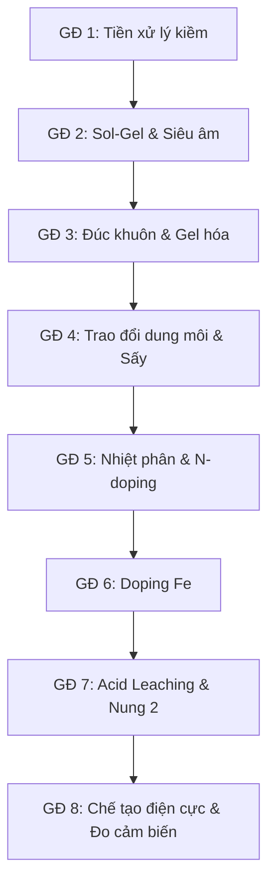

# Báo cáo Phân tích: Định hướng Kế thừa Tham khảo (Chính & Phụ) theo Workflow Chế tạo Carbon Aerogel từ Xơ dừa - VERSION 3

> [!NOTE]
> Đây là **Version 3: Phân loại theo Hướng tiếp cận Chính & Phụ (Dạng danh sách phân tách rõ rệt Quy trình & Lý luận)**.
> Bạn có thể xem thêm:
> *   **[Version 1: Phân tích tham chiếu tổng quan và Đặc trưng vật liệu](file:///D:/1%20Master's%20Ana%20Chem/1%20Master's%20thesis/Carbon%20Aerogel/BaoCao_TongHop_050626/01_Viet_TongQuan_va_DoiChieu_DacTrung_VatLieu.md)**
> *   **[Version 2: Phân loại Kế thừa Quy trình & Lý thuyết dưới dạng Bảng ưu tiên trích dẫn](file:///D:/1%20Master's%20Ana%20Chem/1%20Master's%20thesis/Carbon%20Aerogel/BaoCao_TongHop_050626/02_TraCuu_BaiBaoKey_TheoUuTien_TungBuoc.md)**
> *   **[Cẩm nang Hướng dẫn Thực nghiệm & Xử lý Sự cố (Troubleshooting & Methodology)](file:///D:/1%20Master's%20Ana%20Chem/1%20Master's%20thesis/Carbon%20Aerogel/BaoCao_TongHop_050626/04_CamNang_ThucNghiem_va_XuLySuCo_PhongThiNghiem.md)**

Tài liệu này phân tích chi tiết từng giai đoạn trong workflow chế tạo **Carbon Aerogel từ xơ dừa** ứng dụng làm **Cảm biến điện hóa**, giúp xác định rõ:
1. **Sử dụng cái gì / Thông số** trong từng giai đoạn.
2. **Kế thừa Quy trình / Thao tác (Thực nghiệm):** Chỉ rõ các thông số kỹ thuật thực tế (dung môi, nồng độ, nhiệt độ, thời gian, thiết bị) được lấy từ hướng nào.
3. **Kế thừa Lý thuyết / Biện luận (Học thuật):** Các cơ chế hóa học, vật lý và lập luận cần thiết để bảo vệ tính khoa học trong luận văn của bạn.

---

---

## CHI TIẾT KẾ THỪA QUY TRÌNH & LÝ THUYẾT THEO WORKFLOW 8 GIAI ĐOẠN

### Giai đoạn 1: Tiền xử lý kiềm (Alkaline Delignification)
*   **Sử dụng cái gì / Thông số:** Nghiền nhỏ và rây qua rây **100 mesh** trước khi đun kiềm hóa NaOH 6% ($80^\circ\text{C}$, 4h, tỷ lệ lỏng-rắn 1:20), không tẩy trắng. Loại bỏ lignin/hemicellulose để giải phóng sợi cellulose.
*   **HƯỚNG THAM KHẢO CHÍNH: Hấp phụ xử lý môi trường & Chiết xuất sinh học**
     *   **Kế thừa Quy trình / Thao tác (Thực nghiệm):** Nghiền thô xơ dừa, rây lấy cỡ hạt mịn **100 mesh** (kích thước lỗ ~0.15 mm) theo y văn [P-001] để tăng hiệu quả tách chiết cellulose đạt đỉnh ~57%. Ngâm chiết kiềm NaOH 6% w/v ở $80 \pm 2^\circ\text{C}$ trong 4h, tỷ lệ lỏng:rắn = 1:20. Quy trình rửa trung hòa pH và sấy khô 80°C.
     *   **Kế thừa Lý thuyết / Biện luận (Học thuật):** Cơ chế cắt liên kết ether giữa lignin và cellulose. Sử dụng số liệu khấu hao khối lượng (Weight-loss gravimetry ~50-60%) để biện luận lượng cellulose thực tế thu được. Đối chiếu FTIR về sự biến mất của đỉnh ester lignin tại $1730\text{ cm}^{-1}$ và sự tăng cường của đỉnh nhóm -OH tại $3400\text{ cm}^{-1}$.
*   **HƯỚNG THAM KHẢO PHỤ: Siêu tụ điện & Cách nhiệt**
     *   **Kế thừa Quy trình / Thao tác (Thực nghiệm):** Khảo sát dải nồng độ kiềm hóa NaOH (2% đến 10%) và quy trình rửa trung hòa sợi. Thao tác đo đạc cơ tính sợi.
     *   **Kế thừa Lý thuyết / Biện luận (Học thuật):** Biện luận việc không tẩy trắng để giữ lại một phần lignin thô giúp gia cố tính toàn vẹn của khung gel. Sử dụng số liệu co ngót đường kính sợi 14-24% của xơ dừa Bến Tre để khống chế độ co rút gel xuống < 15% khi đông khô.
*   **Đánh giá mức độ kế thừa:** **90%** (Tiền xử lý xơ dừa là bước cơ sở giống nhau cho mọi ứng dụng).

---

### Giai đoạn 2: Sol-Gel & Siêu âm (Gelation)
*   **Sử dụng cái gì / Thông số:** Hệ dung môi tự chuyển pha $NH_3\text{:Urea:H}_2\text{O} = 11:4:5$ (thể tích/khối lượng/thể tích), siêu âm pulse (2s/1s) trong 30 phút, bể đá lạnh $\le 10^\circ\text{C}$.
*   **HƯỚNG THAM KHẢO CHÍNH: Siêu tụ điện & Xúc tác ORR (Điện hóa học)**
    *   **Kế thừa Quy trình / Thao tác (Thực nghiệm):** Công thức pha chế amoniac:urea:nước = 11:4:5, tỷ lệ rắn:lỏng = 1:16. Kỹ thuật siêu âm pulse (2s on / 1s off) trong 30 phút duy trì trong bể đá lạnh $\le 10^\circ\text{C}$.
    *   **Kế thừa Lý thuyết / Biện luận (Học thuật):** Cơ chế hòa tan cellulose trong hệ amoniac/urea lạnh (urea đóng vai trò che chắn kỵ nước ngăn tái tạo liên kết hydro). Lập luận bắt buộc giữ nhiệt độ siêu âm lạnh để tránh thoát khí amoniac ($NH_3$), đảm bảo nguồn N-doping dồi dào cho các active sites sau này.
*   **HƯỚNG THAM KHẢO PHỤ: Cách nhiệt / Vật liệu siêu nhẹ**
    *   **Kế thừa Quy trình / Thao tác (Thực nghiệm):** Cách thiết lập nồng độ phần trăm khối lượng cellulose trong sol (thường $\approx 2-4\text{ wt}\%$) để tránh gel bị sập hoặc quá đặc làm tắc nghẽn lỗ xốp. Đối chứng với các dung môi hòa tan thay thế như hệ TBAF/DMSO hay muối nóng chảy, ionic liquids (Singh 2015).
    *   **Kế thừa Lý thuyết / Biện luận (Học thuật):** Lập luận khoa học việc loại bỏ hoàn toàn hệ NaOH/Urea truyền thống cho điện cực cảm biến (vì NaOH không cung cấp nguồn N tự doping, dẫn đến tính chất dẫn điện và độ nhạy kém). Vai trò của urea hydrat hóa bao quanh mạch cellulose trương nở để ổn định trạng thái sol bền vững ở nhiệt độ thấp. Lý thuyết cấu trúc lưỡng tính (amphiphilic) của cellulose: mặt phẳng pyranose chứa các nhóm -OH ở hướng xích đạo (ưa nước) và liên kết C-H ở trục dọc (kỵ nước), giúp giải thích vai trò của urea trong việc hấp phụ lên mặt phẳng kỵ nước để ngăn sự xếp chồng mạch cellulose (Singh 2015). Giải thích cơ chế trương nở vách tế bào đi qua hiện tượng phồng bong bóng ("ballooning") của vách thứ cấp làm rách vách sơ cấp ngoài, định hướng cho quá trình rã cấu trúc cơ học khi xử lý kiềm xơ dừa.
*   **Đánh giá mức độ kế thừa:** **85%** (Quy trình sol-gel tạo khung aerogel đồng đều là điểm mấu chốt chung).

---

### Giai đoạn 3: Đúc khuôn & Gel hoá
*   **Sử dụng cái gì / Thông số:** Khuôn PP/Silicone, cấp đông lạnh từ $-5^\circ\text{C}$ xuống $-20^\circ\text{C}$ (24h) để kích hoạt quá trình tự sắp xếp định hướng bởi tinh thể đá (Ice-templating).
*   **HƯỚNG THAM KHẢO CHÍNH: Cách nhiệt & Hấp phụ vật lý**
    *   **Kế thừa Quy trình / Thao tác (Thực nghiệm):** Quy trình đúc khuôn bằng vật liệu Teflon/PP để chống bám dính gel bề mặt. Kỹ thuật cấp đông lạnh từ $-5^\circ\text{C}$ xuống $-20^\circ\text{C}$ trong 24 giờ liên tục.
    *   **Kế thừa Lý thuyết / Biện luận (Học thuật):** Lý thuyết định hình cấu trúc bằng tinh thể đá (Ice-templating): sự phát triển của các tinh thể đá đẩy các bó cellulose kết tụ lại tạo thành cấu trúc xốp macropore tổ ong song song, tối ưu hóa tốc độ khuếch tán chất phân tích đến bề mặt điện cực.
*   **HƯỚNG THAM KHẢO PHỤ: Cảm biến & Siêu tụ điện**
    *   **Kế thừa Quy trình / Thao tác (Thực nghiệm):** Thao tác để yên sol ở nhiệt độ $0-5^\circ\text{C}$ trong 30-60 phút trước khi cấp đông lạnh đột ngột. Kỹ thuật tháo khuôn (ví dụ sử dụng ống PP cắt đầu) để tránh nứt vỡ cơ học.
    *   **Kế thừa Lý thuyết / Biện luận (Học thuật):** Biện luận nhiệt động học: sol cellulose cực kỳ bền vững ở 0-5°C, việc để yên giúp khử bong bóng khí hoàn toàn (degassing) và đạt cân bằng nhiệt trước khi cấp đông, ngăn khuyết tật cấu trúc gel.
*   **Đánh giá mức độ kế thừa:** **80%** (Đóng băng định hình quyết định cấu trúc xốp vĩ mô).

---

### Giai đoạn 4: Trao đổi dung môi & Sấy thăng hoa (Freeze-drying)
*   **Sử dụng cái gì / Thông số:** Ngâm rửa dung môi ethanol 98% (tỷ lệ 15 mL/g gel), sấy thăng hoa ở áp suất $<20\text{ Pa}$ trong 24-48h.
*   **HƯỚNG THAM KHẢO CHÍNH: Cách nhiệt & Hấp phụ dầu tràn**
    *   **Kế thừa Quy trình / Thao tác (Thực nghiệm):** Đông tụ gel trong ethanol 98% lạnh (0-5°C) với tỷ lệ thể tích cồn/gel = 15 mL/mL trong 24-48 giờ. Thiết lập đông khô ở bẫy lạnh $\le -45^\circ\text{C}$ và áp suất chân không $< 20\text{ Pa}$.
    *   **Kế thừa Lý thuyết / Biện luận (Học thuật):** Lý thuyết động học trao đổi dung môi: cồn tuyệt đối khuếch tán vào lõi gel thay thế nước. Lưu trữ ở 0-5°C để hạn chế sự khuếch tán nhanh của Urea/Ammonia ra ngoài cồn, giữ lại lượng nitơ tối đa. Biện luận cơ chế lực mao quản khi thăng hoa giúp triệt tiêu sức căng bề mặt, khống chế độ co rút gel $< 15\%$, đảm bảo cấu trúc xốp không bị sập.
*   **HƯỚNG THAM KHẢO PHỤ: Siêu tụ điện & Cảm biến**
    *   **Kế thừa Quy trình / Thao tác (Thực nghiệm):** Thao tác đo đạc kích thước gel trước/sau sấy đông khô để tính tỷ lệ co rút thể tích.
    *   **Kế thừa Lý thuyết / Biện luận (Học thuật):** Biện luận sự hỗ trợ của khung sợi xơ dừa Bến Tre (đã co ngót đường kính 14-24% từ GĐ 1) giúp tăng độ bền cơ học và giảm thiểu co rút vi mô dưới tác động của áp suất chân không.
*   **Đánh giá mức độ kế thừa:** **80%** (Giai đoạn giữ độ xốp cao và tránh sụp đổ cấu trúc lỗ xốp).

---

### Giai đoạn 5: Nhiệt phân & Doping Nitơ (Carbonization & N-doping)
*   **Sử dụng cái gì / Thông số:** Nung nhiệt phân $700^\circ\text{C}$ (N-CA) và $800^\circ\text{C}$ (Fe/N-CA) với chương trình 3-ramp ($125^\circ\text{C} \to 150^\circ\text{C} \to 400^\circ\text{C} \to T_{target}$) trong khí bảo vệ $N_2$ ($150-200\text{ mL/min}$).
*   **HƯỚNG THAM KHẢO CHÍNH: Siêu tụ điện & Xúc tác ORR**
    *   **Kế thừa Quy trình / Thao tác (Thực nghiệm):** Thiết lập tốc độ nung 5°C/min, purge khí N₂ lưu lượng 150 mL/min để đẩy oxy trước khi nung, duy trì 100 mL/min khi nung. Mốc nhiệt carbon hóa 700°C trong 2h.
    *   **Kế thừa Lý thuyết / Biện luận (Học thuật):** Lý thuyết phổ XPS N 1s về sự chuyển hóa amoniac/urea thành các nhóm nitơ hoạt tính điện hóa. Biện luận tại mốc nhiệt 700°C, hàm lượng **pyridinic-N** hoạt tính cao đạt tỷ lệ tối ưu (54% lượng N), và sự graphit hóa sp² tăng lên giúp cải thiện độ dẫn điện ở mốc 800°C.
*   **HƯỚNG THAM KHẢO PHỤ: Hấp phụ xử lý môi trường (Biochar)**
    *   **Kế thừa Quy trình / Thao tác (Thực nghiệm):** Thiết lập chương trình phân tích nhiệt trọng lượng (TGA/DTA) dưới khí trơ N₂ từ RT đến 1000°C.
    *   **Kế thừa Lý thuyết / Biện luận (Học thuật):** Cơ chế phân hủy nhiệt: giải thích sự thoát ẩm tự do (ở 150°C), sự phân hủy hemicellulose giải phóng các khí $CO, CO_2, NH_3$ tạo cấu trúc mesopore (ở 250-400°C) và sự nứt vỡ lignin tạo micropore.
*   **Đánh giá mức độ kế thừa:** **90%** (Nhiệt phân tạo vật liệu dẫn điện carbon là giai đoạn quyết định tính chất điện hóa).

---

### Giai đoạn 6: Doping Sắt (Post-impregnation)
*   **Sử dụng cái gì / Thông số:** Ngâm tẩm dung dịch muối sắt $FeCl_3\cdot 6H_2O$ 1-5% w/v trong dung môi ethanol trong 24h ở nhiệt độ phòng.
*   **HƯỚNG THAM KHẢO CHÍNH: Xúc tác điện hóa ORR (Oxygen Reduction Reaction)**
    *   **Kế thừa Quy trình / Thao tác (Thực nghiệm):** Quy trình tẩm muối sắt FeCl₃·6H₂O trong dung môi ethanol tuyệt đối, nồng độ sắt khảo sát 1% và 5% Fe (tính theo khối lượng mẫu). Thao tác sấy khô nhẹ nhàng mẫu sau tẩm ở 60°C.
    *   **Kế thừa Lý thuyết / Biện luận (Học thuật):** Cơ chế tẩm sau (post-impregnation): ngâm 24h giúp ion Fe³⁺ có đủ thời gian khuếch tán nội hạt đồng đều vào sâu trong lõi của khối monolith carbon aerogel, ngăn ngừa hiện tượng tích tụ kim loại ở bề mặt ngoài. Biện luận khoa học việc loại bỏ đồng kết tủa sắt trực tiếp trong bước sol-gel amoniac/urea (vì môi trường kiềm mạnh của amoniac sẽ lập tức làm kết tủa hydroxit sắt $Fe(OH)_3$, phá hỏng mạng lưới sol-gel của cellulose).
*   **HƯỚNG THAM KHẢO PHỤ: Hấp phụ kim loại nặng từ tính**
    *   **Kế thừa Quy trình / Thao tác (Thực nghiệm):** Quy trình chuẩn hóa việc sấy chân không nhẹ mẫu sau tẩm và đo phổ XPS vùng Fe 2p.
    *   **Kế thừa Lý thuyết / Biện luận (Học thuật):** Biện luận cơ chế phối trí: ion Fe³⁺ ngâm cồn sẽ chèn vào vách lỗ xốp và liên kết trực tiếp với các vị trí nitơ khuyết tật (pyridinic-N) sẵn có trên mạng carbon aerogel thô để tạo tiền chất bền vững.
*   **Đánh giá mức độ kế thừa:** **95%** (Kế thừa trực tiếp công nghệ phối trí $Fe-N-C$ từ hướng xúc tác năng lượng).

---

### Giai đoạn 7: Hậu xử lý (Acid leaching + Annealing lần 2)
*   **Sử dụng cái gì / Thông số:** Rửa acid bằng HCl 0.5M ở $80^\circ\text{C}$ trong 8h. Nung nhiệt luyện (annealing) lại ở $800^\circ\text{C}$ trong 1h dưới khí $N_2$.
*   **HƯỚNG THAM KHẢO CHÍNH: Xúc tác điện hóa ORR / Xúc tác dị thể**
    *   **Kế thừa Quy trình / Thao tác (Thực nghiệm):** Quy trình ngâm rửa mẫu trong acid HCl 0.5M ở nhiệt độ $80^\circ\text{C}$ liên tục trong 8 giờ. Quy trình nung annealing lần 2 ở nhiệt độ 800°C trong 1 giờ dưới khí trơ N₂.
    *   **Kế thừa Lý thuyết / Biện luận (Học thuật):** Cơ chế acid leaching: loại bỏ các pha kim loại sắt tự do, hạt nano sắt và oxit sắt không hoạt động điện hóa để làm lộ ra các tâm hoạt động đơn nguyên tử Fe-N₄. Kỹ thuật nung annealing lại khôi phục hoàn toàn cấu trúc carbon bị khuyết tật do rửa axit, ổn định hóa liên kết phối trí Fe-N.
*   **HƯỚNG THAM KHẢO PHỤ: Siêu tụ điện & Hấp phụ**
    *   **Kế thừa Quy trình / Thao tác (Thực nghiệm):** Thao tác rửa mẫu bằng nước cất nhiều lần sau khi rửa axit để loại bỏ ion clorua dư thừa cho đến khi nước rửa đạt pH trung tính. Kỹ thuật đo phổ XRD và Raman của mẫu sau rửa axit và annealing lại.
    *   **Kế thừa Lý thuyết / Biện luận (Học thuật):** Biện luận lý do chọn axit không oxy hóa HCl 0.5M thay thế cho H₂SO₄ hay HClO₄ đun nóng: HCl hòa tan sắt tự do tạo phức clorua sắt $[FeCl_4]^-$ dễ tan mà không làm oxy hóa mạng carbon graphit $sp^2$, bảo toàn độ dẫn điện cao (trở kháng Rct thấp) cho điện cực cảm biến. Giải thích sự biến mất của các đỉnh nhiễu xạ Fe kim loại và Fe₃C trên giản đồ XRD sau rửa axit, chứng tỏ sắt đơn nguyên tử (single-atom Fe-N₄) được phân tán đồng đều.
*   **Đánh giá mức độ kế thừa:** **95%** (Quy trình làm sạch xúc tác đặc thù giúp cảm biến tăng độ chọn lọc và giảm dòng nền nhiễu).

---

### Giai đoạn 8: Chế tạo điện cực & Đo cảm biến
*   **Sử dụng cái gì / Thông số:** Đánh bóng điện cực Glassy Carbon (GCE), pha chế ink 5 mg/mL vật liệu trong dung dịch **Composite Binder lai (Chitosan phối hợp 0.5 wt% Nafion)**. Nhỏ drop-cast $5\ \mu\text{L}$ ink lên bề mặt GCE, sấy khô tự nhiên.
*   **HƯỚNG THAM KHẢO CHÍNH:**
    *   **Siêu tụ điện (Lưu trữ năng lượng):**
        *   **Kế thừa Quy trình / Thao tác (Thực nghiệm):** Quy trình thiết lập baseline đo CV và phổ trở kháng EIS trong dung dịch K₃[Fe(CN)₆]/KCl để kiểm nghiệm độ sạch và độ nhạy của điện cực GCE trước và sau khi phủ màng biến tính carbon aerogel.
        *   **Kế thừa Lý thuyết / Biện luận (Học thuật):** Lý thuyết phân tích EIS Nyquist: đo bán kính vòng bán nguyệt ở tần số cao để đối chiếu giá trị điện trở chuyển điện tích ($R_{ct}$), biện luận tốc độ truyền electron của điện cực được cải thiện nhờ độ graphit hóa cao của khung carbon aerogel.
    *   **Hấp phụ hóa học (Môi trường):**
        *   **Kế thừa Quy trình / Thao tác (Thực nghiệm):** Quy trình pha chế dung dịch binder hỗn hợp Chitosan + 0.5 wt% Nafion trong dung môi phân tán, cho phép thực hiện đồng thời bẫy ion KLN Pb/Cd/Zn bằng SWASV nhờ nhóm chức amine của Chitosan và kháng bẩn hữu cơ nhờ Nafion.
        *   **Kế thừa Lý thuyết / Biện luận (Học thuật):** Lý thuyết hấp phụ hóa học làm giàu (pre-concentration): các nhóm chức amine ($-NH_2$) và hydroxyl ($-OH$) tự do trên mạch polymer Chitosan chelate hóa mạnh với ion Pb²⁺, Cd²⁺, Zn²⁺, tích lũy chúng trên điện cực để hạ LOD xuống cực thấp (<0.1 µg/L).
    *   **Cảm biến điện hóa chọn lọc flavonoid / biến tính oxit kim loại:**
        *   **Kế thừa Quy trình / Thao tác (Thực nghiệm):** Quy trình phân tán 5 mg composite ZrO2/Chitosan/rGOA trong dung dịch Nafion 0.5% pha loãng bằng DMF, siêu âm 2h tạo carbon ink đồng nhất. Nhỏ drop-cast 3 µL lên GCE và sấy khô tự nhiên. Điều kiện đo CV/DPV trong đệm PBS 0.1 M, pH 6.0, tích lũy 5 phút ở thế hở mạch để đo Luteolin (Hou 2021).
        *   **Kế thừa Lý thuyết / Biện luận (Học thuật):** Cơ chế chelate hóa đặc thù giữa các ion Zirconium (Zr) của hạt nano ZrO2 với cấu trúc ortho-hydroxyl trên vòng B của Luteolin tạo dị vòng 5 cạnh rất bền, giúp nâng cao tính chọn lọc và độ nhạy của cảm biến. Lập luận ảnh hưởng của pH đệm đo: pH 6.0 là tối ưu; pH thấp (< 4.0) làm Zr mang điện tích dương và proton hóa flavonoid ngăn cản phối trí; pH kiềm (> 8.0) xuất hiện lượng lớn OH⁻ tự do trong đệm cạnh tranh chiếm giữ các vị trí hoạt động của Zr.
*   **HƯỚNG THAM KHẢO PHỤ: Cảm biến sinh học (Biosensors)**
    *   **Kế thừa Quy trình / Thao tác (Thực nghiệm):** Quy trình phân tán màng polyme điện cực đo paracetamol bằng DPV sử dụng hệ binder lai nâng cao độ ổn định. Công thức tính diện tích hoạt động điện hóa ECSA thông qua phương trình Randles-Ševčík. Công thức tính giới hạn phát hiện **LOD = 3σ/slope**.
    *   **Kế thừa Lý thuyết / Biện luận (Học thuật):** Lý thuyết màng ngăn cản chất nhiễu (antifouling): Nafion là màng trao đổi cation chọn lọc, cho phép paracetamol đi qua nhưng ngăn cản các phân tử hữu cơ tích điện âm hoặc mạch vòng lớn bám bẩn lên bề mặt carbon aerogel, tăng độ lặp lại và độ bền điện cực.
*   **Đánh giá mức độ kế thừa:** **85%** (Kết hợp giữa đo đạc điện tích baseline của tụ điện và cơ chế chelate hấp phụ chất phân tích).

---

## TỔNG KẾT BẢN ĐỒ TRA CỨU NHANH CHO LUẬN VĂN

| Giai đoạn workflow của bạn | Bạn cần lấy THÔNG TIN cụ thể nào? | THAM KHẢO CHÍNH (Từ hướng nào?) | THAM KHẢO PHỤ (Từ hướng nào?) |
| :--- | :--- | :--- | :--- |
| **GĐ 1: Xử lý kiềm** | Hiệu suất loại hemicellulose/lignin, FTIR mẫu thô | Hấp phụ môi trường / Chiết xuất sinh học | Siêu tụ điện / Cách nhiệt |
| **GĐ 2: Sol-Gel & Siêu âm** | Tỷ lệ NH₃/Urea, nhiệt độ siêu âm $\le 10^\circ\text{C}$ | Siêu tụ điện / Xúc tác ORR | Cách nhiệt |
| **GĐ 3: Đúc khuôn & Đông** | Kỹ thuật Ice-templating tạo macropore tổ ong | Cách nhiệt / Hấp phụ vật lý | Cảm biến / Siêu tụ điện |
| **GĐ 4: Đông khô** | Trao đổi ethanol giữ lỗ xốp, khống chế co rút | Cách nhiệt / Hấp phụ dầu tràn | Siêu tụ điện |
| **GĐ 5: Nhiệt phân** | XPS dạng Nitơ (pyridinic-N), tỷ lệ Raman $I_D/I_G$ | Siêu tụ điện / Xúc tác ORR | Hấp phụ môi trường (Biochar) |
| **GĐ 6: Doping Fe** | Cơ chế phối trí $Fe-N_x$ khi tẩm cồn $FeCl_3$ 24h | Xúc tác điện hóa ORR | Hấp phụ từ tính |
| **GĐ 7: Hậu xử lý** | Rửa acid HCl loại nano Fe, nung lại tạo single-atom | Xúc tác ORR / Xúc tác dị thể | Siêu tụ điện |
| **GĐ 8: Đo điện hóa** | Điện trở $R_{ct}$ (EIS Nyquist), chelate hóa Chitosan | Siêu tụ điện (baseline) + Hấp phụ (chelate) | Cảm biến sinh học (Nafion antifouling) |

---

# CẬP NHẬT TỪ ĐỢT RÀ SOÁT 132 BÀI BÁO (VERSION 4)

Dưới đây là các điểm Kế Thừa và Đóng Góp Mới (Gap Analysis) được trích xuất từ đợt quét toàn diện 132 tài liệu, liệt kê chi tiết các cơ sở lý luận và bằng chứng học thuật cho Quy trình 8 bước.

