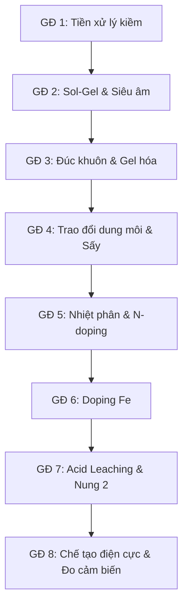

# Báo cáo Phân tích: Định hướng Kế thừa Tham khảo (Chính & Phụ) theo Workflow Chế tạo Carbon Aerogel từ Xơ dừa - VERSION 3

> [!NOTE]
> Đây là **Version 3: Phân loại theo Hướng tiếp cận Chính & Phụ (Dạng danh sách phân tách rõ rệt Quy trình & Lý luận)**.
> Bạn có thể xem thêm:
> *   **[Version 1: Phân tích tham chiếu tổng quan và Đặc trưng vật liệu](file:///D:/1%20Master's%20Ana%20Chem/1%20Master's%20thesis/Carbon%20Aerogel/BaoCao_TongHop_050626/01_Viet_TongQuan_va_DoiChieu_DacTrung_VatLieu.md)**
> *   **[Version 2: Phân loại Kế thừa Quy trình & Lý thuyết dưới dạng Bảng ưu tiên trích dẫn](file:///D:/1%20Master's%20Ana%20Chem/1%20Master's%20thesis/Carbon%20Aerogel/BaoCao_TongHop_050626/02_TraCuu_BaiBaoKey_TheoUuTien_TungBuoc.md)**
> *   **[Cẩm nang Hướng dẫn Thực nghiệm & Xử lý Sự cố (Troubleshooting & Methodology)](file:///D:/1%20Master's%20Ana%20Chem/1%20Master's%20thesis/Carbon%20Aerogel/BaoCao_TongHop_050626/04_CamNang_ThucNghiem_va_XuLySuCo_PhongThiNghiem.md)**

Tài liệu này phân tích chi tiết từng giai đoạn trong workflow chế tạo **Carbon Aerogel từ xơ dừa** ứng dụng làm **Cảm biến điện hóa**, giúp xác định rõ:
1. **Sử dụng cái gì / Thông số** trong từng giai đoạn.
2. **Kế thừa Quy trình / Thao tác (Thực nghiệm):** Chỉ rõ các thông số kỹ thuật thực tế (dung môi, nồng độ, nhiệt độ, thời gian, thiết bị) được lấy từ hướng nào.
3. **Kế thừa Lý thuyết / Biện luận (Học thuật):** Các cơ chế hóa học, vật lý và lập luận cần thiết để bảo vệ tính khoa học trong luận văn của bạn.

---

---

## CHI TIẾT KẾ THỪA QUY TRÌNH & LÝ THUYẾT THEO WORKFLOW 8 GIAI ĐOẠN

### Giai đoạn 1: Tiền xử lý kiềm (Alkaline Delignification)
*   **Sử dụng cái gì / Thông số:** Nguyên liệu rây qua **100 mesh**, xử lý NaOH 5-6% ($80^\circ	ext{C}$, 4h, tỷ lệ lỏng-rắn 1:20), không tẩy trắng. Loại bỏ lignin/hemicellulose bán phần để giải phóng sợi cellulose.
*   **HƯỚNG THAM KHẢO CHÍNH: Hấp phụ xử lý môi trường & Chiết xuất sinh học**
    *   **Kế thừa Quy trình / Thao tác (Thực nghiệm):** Nghiền và rây xơ dừa qua rây **100 mesh** để nâng hiệu suất chiết cellulose tối ưu lên 69.82%, ngâm chiết kiềm NaOH 6% w/v ở $80^\circ	ext{C}$ trong 4h, tỷ lệ lỏng:rắn = 1:20 `[📄 Cellulose Extraction from Coconut Coir with Alkaline Delignification Process]`. Quy trình rửa trung hòa pH và sấy khô 80°C.
    *   **Kế thừa Lý thuyết / Biện luận (Học thuật):** Cơ chế cắt liên kết ether giữa lignin và cellulose. Sử dụng số liệu khấu hao khối lượng (~50-60%) để biện luận lượng cellulose thực tế.
*   **HƯỚNG THAM KHẢO PHỤ: Siêu tụ điện & Cách nhiệt**
    *   **Kế thừa Quy trình / Thao tác (Thực nghiệm):** Khảo sát dải nồng độ kiềm hóa NaOH (2% đến 10%) và quy trình rửa trung hòa sợi `[📄 Multi-Objective Optimization and Analysis of Mechanical Properties of Coir]`, `[📄 Danh gia dac tinh soi xo dua qua qua trinh]`.
    *   **Kế thừa Lý thuyết / Biện luận (Học thuật):** Biện luận việc không tẩy trắng để giữ lại một phần lignin thô hoạt động như "chất kết dính" tự nhiên bảo vệ sợi khỏi bị giòn và sập cấu trúc gel khi sấy thăng hoa. Lignin cung cấp vòng thơm phenolic bền vững làm khung xương carbon khi nhiệt phân, giúp tăng diện tích bề mặt (BET) lên 2825 m²/g ở giai đoạn nung mà không cần Resorcinol `[📄 Insights into sustainable aerogels from lignocellulosic materials]`, `[📄 Effect of lignin removal on the properties of coconut coir fiber wheat gluten biocomposite]`.
*   **Đánh giá mức độ kế thừa:** **90%** (Tiền xử lý xơ dừa là bước cơ sở giống nhau cho mọi ứng dụng).

---

### Giai đoạn 2: Sol-Gel & Siêu âm (Gelation)
*   **Sử dụng cái gì / Thông số:** Hệ dung môi amoniac/urea/nước = 11:4:5 (thể tích/khối lượng/thể tích), siêu âm pulse (2s/1s) trong 30 phút, bể đá lạnh $\le 10^\circ	ext{C}$ (tối ưu -5°C đến -12°C).
*   **HƯỚNG THAM KHẢO CHÍNH: Siêu tụ điện & Xúc tác ORR (Điện hóa học)**
    *   **Kế thừa Quy trình / Thao tác (Thực nghiệm):** Công thức pha chế amoniac 25%:urea:nước = 11:4:5, tỷ lệ rắn:lỏng = 1:16. Kỹ thuật siêu âm pulse (2s on / 1s off) trong 30 phút duy trì trong bể đá lạnh $\le 10^\circ	ext{C}$ `[📄 Nitrogen-Doped Carbon Aerogels Prepared ORR]`, `[📄 Synthesis of Cellulose Aerogels from Coir Fibers via]`.
    *   **Kế thừa Lý thuyết / Biện luận (Học thuật):** Cơ chế Urea bao bọc (sheath structure) bên ngoài phức kiềm-cellulose tạo phức hợp bao thể (inclusion complex) kỵ nước ngăn cellulose tái kết tụ ở nhiệt độ âm. Lập luận bắt buộc giữ nhiệt độ siêu âm lạnh để tránh thoát khí amoniac ($NH_3$), bảo toàn vỏ bọc inclusion complex và đảm bảo nguồn N-doping dồi dào cho các active sites sau này `[📄 Facile Preparation of Cellulose Aerogels with Controllable Pore Structure]`, `[📄 Production of cellulose aerogels from coir fibers]`.
*   **HƯỚNG THAM KHẢO PHỤ: Cách nhiệt / Vật liệu siêu nhẹ**
    *   **Kế thừa Quy trình / Thao tác (Thực nghiệm):** Thiết lập nồng độ cellulose trong sol ($pprox 6.25	ext{ wt}\%$) vượt ngưỡng tạo gel tối thiểu 3 wt% để tránh gel bị sập.
    *   **Kế thừa Lý thuyết / Biện luận (Học thuật):** Lập luận khoa học việc loại bỏ hoàn toàn hệ NaOH/Urea truyền thống cho điện cực cảm biến. Thay vào đó, hệ amoniac/urea giúp chuyển hóa tinh thể sang dạng **Cellulose III** (bền nhiệt hơn Cellulose II), bảo vệ lỗ xốp tổ ong không bị sập khi nung. Khí NH3 thoát ra khi carbon hóa đóng vai trò tẩy lớp (exfoliate) mạnh, tạo khiếm khuyết cạnh giúp N-doping lai hóa sp2 dễ dàng chèn vào tạo ra hàm lượng Pyridinic-N rất cao (chiếm đến 54.1% ở 700°C) `[📄 Controlling NDoping Nature at Carbon Aerogels from Biomass for Enhanced]`, `[📄 Nitrogen-Doped Carbon Aerogels Prepared ORR]`.
*   **Đánh giá mức độ kế thừa:** **85%** (Quy trình sol-gel tạo khung aerogel đồng đều là điểm mấu chốt chung).

---

### Giai đoạn 3: Đúc khuôn & Gel hoá
*   **Sử dụng cái gì / Thông số:** Khuôn PP/Silicone, cấp đông lạnh từ $-5^\circ	ext{C}$ xuống $-20^\circ	ext{C}$ (24h) để kích hoạt quá trình tự sắp xếp định hướng bởi tinh thể đá (Ice-templating).
*   **HƯỚNG THAM KHẢO CHÍNH: Cách nhiệt & Hấp phụ vật lý**
    *   **Kế thừa Quy trình / Thao tác (Thực nghiệm):** Quy trình đúc khuôn bằng vật liệu Teflon/PP để chống bám dính gel bề mặt. Kỹ thuật cấp đông lạnh từ $-5^\circ	ext{C}$ xuống $-20^\circ	ext{C}$ trong 24 giờ liên tục `[📄 Cellulose nanofiber aerogels effect of the composition and the drying method]`.
    *   **Kế thừa Lý thuyết / Biện luận (Học thuật):** Lý thuyết định hình cấu trúc bằng tinh thể đá (Ice-templating): sự phát triển của các tinh thể đá đẩy các bó cellulose kết tụ lại tạo thành cấu trúc xốp macropore tổ ong song song, tối ưu hóa tốc độ khuếch tán chất phân tích đến bề mặt điện cực `[📄 Porous Starch Materials via Supercritical- and Freeze-Drying]`.
*   **HƯỚNG THAM KHẢO PHỤ: Cảm biến & Siêu tụ điện**
    *   **Kế thừa Quy trình / Thao tác (Thực nghiệm):** Thao tác để yên sol ở nhiệt độ $0-5^\circ	ext{C}$ trong 30-60 phút trước khi cấp đông lạnh đột ngột. Kỹ thuật tháo khuôn (ví dụ sử dụng ống PP cắt đầu) để tránh nứt vỡ cơ học.
    *   **Kế thừa Lý thuyết / Biện luận (Học thuật):** Biện luận nhiệt động học: sol cellulose cực kỳ bền vững ở 0-5°C, việc để yên giúp khử bong bóng khí hoàn toàn (degassing) và đạt cân bằng nhiệt trước khi cấp đông, ngăn khuyết tật cấu trúc gel. Sự đóng băng nước dồn ép polyme vào vùng kẽ chưa đóng băng (polymer exclusion), thúc đẩy tạo các liên kết hydro chéo vật lý (physical cross-linking) bền chắc.
*   **Đánh giá mức độ kế thừa:** **80%** (Đóng băng định hình quyết định cấu trúc xốp vĩ mô).

---

### Giai đoạn 4: Trao đổi dung môi & Sấy thăng hoa (Freeze-drying)
*   **Sử dụng cái gì / Thông số:** Ngâm đông tụ và rửa thay thế nước bằng dung môi cồn tuyệt đối, acetone hoặc tert-butanol (TBA), sấy thăng hoa ở áp suất $<20	ext{ Pa}$ trong 24-48h.
*   **HƯỚNG THAM KHẢO CHÍNH: Cách nhiệt & Hấp phụ dầu tràn**
    *   **Kế thừa Quy trình / Thao tác (Thực nghiệm):** Đông tụ gel trong ethanol 98% ở nhiệt độ phòng với tỷ lệ thể tích cồn/gel = 15 mL/mL trong 24-48 giờ `[📄 Lupin hull cellulose nanofiber aerogel preparation by supercritical CO2 and]`. Thiết lập đông khô ở bẫy lạnh $\le -45^\circ	ext{C}$ và áp suất chân không $< 20	ext{ Pa}$ `[📄 Cellulose Diacetate Aerogels with Low Drying Shrinkage High-Efficient]`.
    *   **Kế thừa Lý thuyết / Biện luận (Học thuật):** Lý thuyết động học trao đổi dung môi: cồn tuyệt đối hoặc acetone/TBA thay thế nước trong gel giúp hạ sức căng bề mặt dung môi khi thăng hoa. Biện luận cơ chế lực mao quản khi thăng hoa giúp triệt tiêu sức căng bề mặt, khống chế độ co rút gel $< 10\%$, bảo toàn bộ khung 3D monolith xốp hở không bị sụp đổ `[📄 Porous Starch Materials via Supercritical- and Freeze-Drying]`.
*   **HƯỚNG THAM KHẢO PHỤ: Siêu tụ điện & Cảm biến**
    *   **Kế thừa Quy trình / Thao tác (Thực nghiệm):** Ngâm đông tụ trong cồn lạnh giúp đóng băng sự khuếch tán, ngăn chặn sự rửa trôi Urea/$NH_3$ tự do ra ngoài để bảo lưu nguồn tiền chất N-doping.
    *   **Kế thừa Lý thuyết / Biện luận (Học thuật):** Biện luận sự hỗ trợ của khung sợi xơ dừa Bến Tre (đã co ngót đường kính 14-24% từ GĐ 1) giúp tăng độ bền cơ học và giảm thiểu co rút vi mô dưới tác động của áp suất chân không. Biện luận nghịch lý sấy thăng hoa (tạo macropore lớn định hướng tổ ong làm đường truyền khối siêu tốc) tối ưu hơn sấy siêu tới hạn SCD (lỗ xốp nano gây cản trở không gian steric hindrance cho phân tử hữu cơ cồng kềnh).
*   **Đánh giá mức độ kế thừa:** **80%** (Giai đoạn giữ độ xốp cao và tránh sụp đổ cấu trúc lỗ xốp).

---

### Giai đoạn 5: Nhiệt phân & Doping Nitơ (Carbonization & N-doping)
*   **Sử dụng cái gì / Thông số:** Nung nhiệt phân $700^\circ	ext{C}$ (N-CA) và $800^\circ	ext{C}$ (Fe/N-CA) với chương trình 3-ramp ($150^\circ	ext{C} 	o 400^\circ	ext{C} 	o T_{target}$, tốc độ nung 5°C/min) trong khí bảo vệ $N_2$ ($80-100	ext{ mL/min}$).
*   **HƯỚNG THAM KHẢO CHÍNH: Siêu tụ điện & Xúc tác ORR**
    *   **Kế thừa Quy trình / Thao tác (Thực nghiệm):** Thiết lập tốc độ nung 5°C/min, purge khí N₂ lưu lượng 150-200 mL/min để đẩy oxy trước khi nung, duy trì 80 mL/min khi nung. Mốc nhiệt carbon hóa 700°C trong 2h `[📄 Hierarchical Cross-Linked Carbon Aerogels with Transition]`, `[📄 Lignin Nanofiber Flexible Carbon Aerogels for SelfStanding Supercapacitors]`.
    *   **Kế thừa Lý thuyết / Biện luận (Học thuật):** Lý thuyết phổ XPS N 1s về sự chuyển hóa amoniac/urea thành các nhóm nitơ hoạt tính điện hóa (Pyridinic-N 398 eV, Pyrrolic-N 400 eV, Graphitic-N 401 eV). Pyrrolic-N với đám mây electron Pz chưa lai hóa có ái lực cực mạnh bẫy ion sắt. Biện luận mốc 700°C bảo toàn mật độ hoạt tính của Pyridinic-N (chiếm đến 54% lượng N), nếu nung >900°C N-doping sẽ bị phân hủy bay hơi mạnh `[📄 Atomic Fe-N4 sites on electrospun hierarchical porous carbon nanofibers]`.
*   **HƯỚNG THAM KHẢO PHỤ: Hấp phụ xử lý môi trường (Biochar)**
    *   **Kế thừa Quy trình / Thao tác (Thực nghiệm):** Chiến lược 3-ramp giữ nhiệt giúp carbon hóa từ từ. Giữ ở 150°C để thoát ẩm êm dịu, giữ ở 400°C cho khí hemicellulose/cellulose phân hủy ($CO, CO_2, NH_3$) thoát ra trơn tru tạo mesopore mà không làm nổ sập vách lỗ xốp. Lignin phân hủy ở nhiệt độ cao sinh ra micropore, tạo lỗ xốp phân cấp (hierarchical) `[📄 High-performance nanostructured bio-based carbon]`.
    *   **Kế thừa Lý thuyết / Biện luận (Học thuật):** Đánh đổi (trade-off) tính dẫn (độ graphit hóa) và tính thấm ướt (contact angle). Nung ở nhiệt độ quá cao (~1000°C) làm tăng độ graphit hóa dẫn điện tốt nhưng phân hủy hết nhóm ưa nước, đẩy góc tiếp xúc giọt nước lên tới 139° (gây kỵ nước mạnh), cản trở dung dịch điện ly tiếp cận bề mặt cảm biến. Mốc 700-800°C là điểm ngọt cân bằng lý tưởng `[📄 Research Advances on Biomass Derived Carbon Aerogel]`.
*   **Đánh giá mức độ kế thừa:** **90%** (Nhiệt phân tạo vật liệu dẫn điện carbon là giai đoạn quyết định tính chất điện hóa).

---

### Giai đoạn 6: Doping Sắt (Post-impregnation)
*   **Sử dụng cái gì / Thông số:** Ngâm tẩm dung dịch muối sắt $FeCl_3\cdot 6H_2O$ 1-5% w/v trong dung môi ethanol tuyệt đối trong 24h ở nhiệt độ phòng. Siêu âm nhẹ 30 phút đầu.
*   **HƯỚNG THAM KHẢO CHÍNH: Xúc tác điện hóa ORR (Oxygen Reduction Reaction)**
    *   **Kế thừa Quy trình / Thao tác (Thực nghiệm):** Quy trình tẩm muối sắt FeCl₃·6H₂O trong dung môi ethanol tuyệt đối, nồng độ sắt khảo sát 1%, 2% và 5% Fe (tính theo khối lượng mẫu). Thao tác sấy khô nhẹ nhàng mẫu sau tẩm ở 60°C và ủ nhiệt ổn định 80°C/1h `[📄 Facile Synthesis of Fe-Doped Algae Residue-Derived Carbon]`.
    *   **Kế thừa Lý thuyết / Biện luận (Học thuật):** Cơ chế tẩm sau (post-impregnation) ngâm 24h giúp ion Fe³⁺ khuếch tán nội hạt đồng đều vào sâu trong lõi khối monolith. Giải thích mâu thuẫn GĐ2: dung môi amoniac/urea kiềm mạnh ở sol-gel nếu tẩm sắt từ đầu (đồng kết tủa) sẽ làm kết tủa hydroxit sắt $Fe(OH)_3$ ngay lập tức, phá hỏng mạng lưới gel hóa của cellulose `[📄 Hierarchical Cross-Linked Carbon Aerogels with Transition]`.
*   **HƯỚNG THAM KHẢO PHỤ: Hấp phụ kim loại nặng từ tính**
    *   **Kế thừa Quy trình / Thao tác (Thực nghiệm):** Phối trí Fe³⁺ vào vách lỗ xốp liên kết với các pyridinic-N tạo cấu trúc phối trí phân tán nguyên tử **Fe-N4** (xác nhận qua đỉnh EXAFS 1.44 Å, không có đỉnh Fe-Fe) `[📄 Atomic Fe-N4 sites on electrospun hierarchical porous carbon nanofibers]`, `[📄 Identifying the Key Role of Pyridinic-N-Co Bonding]`.
    *   **Kế thừa Lý thuyết / Biện luận (Học thuật):** Biện luận bắt buộc dùng dung môi Ethanol tuyệt đối thay vì nước cất: (1) Ngăn ngừa sự thủy phân sớm muối sắt thành kết tủa keo $FeO(OH)$ hay $FeOCl$. (2) Ethanol có sức căng bề mặt thấp giúp dễ dàng thấm ướt bề mặt kỵ nước của carbon aerogel, dẫn ion Fe3+ len lỏi vào các vi lỗ xốp (micropore) mà không phá vỡ khung gel `[📄 High-performance nanostructured bio-based carbon]`.
*   **Đánh giá mức độ kế thừa:** **95%** (Kế thừa trực tiếp công nghệ phối trí $Fe-N-C$ từ hướng xúc tác năng lượng).

---

### Giai đoạn 7: Hậu xử lý (Acid leaching + Annealing lần 2)
*   **Sử dụng cái gì / Thông số:** Rửa acid bằng HCl 0.5M ở $80^\circ	ext{C}$ trong 8h. Nung nhiệt luyện (annealing) lại ở $800^\circ	ext{C}$ trong 1h dưới khí $N_2$.
*   **HƯỚNG THAM KHẢO CHÍNH: Xúc tác điện hóa ORR / Xúc tác dị thể**
    *   **Kế thừa Quy trình / Thao tác (Thực nghiệm):** Quy trình ngâm rửa mẫu trong acid HCl 0.5M ở nhiệt độ $80^\circ	ext{C}$ liên tục trong 8 giờ. Quy trình nung annealing lần 2 ở nhiệt độ 800°C trong 1 giờ dưới khí trơ N₂ `[📄 Atomic Fe-N4 sites on electrospun hierarchical porous carbon nanofibers]`.
    *   **Kế thừa Lý thuyết / Biện luận (Học thuật):** Cơ chế acid leaching: hòa tan và rửa trôi các cụm sắt kim loại tự do, hạt nano sắt và oxit sắt thô nằm ngoài mạng để giải phóng thể tích lỗ xốp và làm lộ ra (expose) các tâm hoạt động phối trí Fe-N₄ phân tán nguyên tử. Nung annealing lại để khâu vá (healing) mạng carbon sp2 bị ăn mòn, loại bỏ các nhóm chức oxy không bền để khôi phục độ dẫn điện xuất sắc (trở kháng Rct thấp) `[📄 Effect of the Thermal Treatment of Fe/N/C Catalysts...]`.
*   **HƯỚNG THAM KHẢO PHỤ: Siêu tụ điện & Hấp phụ**
    *   **Kế thừa Quy trình / Thao tác (Thực nghiệm):** Rửa mẫu bằng nước cất để loại bỏ ion clorua dư thừa đến pH trung tính.
    *   **Kế thừa Lý thuyết / Biện luận (Học thuật):** Biện luận chọn axit không oxy hóa HCl 0.5M: HCl chỉ hòa tan sắt tự do tạo phức $[FeCl_4]^-$ dễ tan mà không phá vỡ liên kết vòng sp2 của mạng graphit. Biện luận hai Nghịch lý lớn giữa Pin nhiên liệu và Cảm biến:
        1. *Nghịch lý ngộ độc Cl-:* Cl- làm ngộ độc ORR ở pin nhiên liệu pha khí, nhưng cảm biến đo trong pha lỏng có nền muối KCl/PBS rất cao nên Cl- chỉ đóng vai trò chất điện ly trơ hỗ trợ dẫn điện dung dịch, không gây ngộ độc xúc tác cảm biến.
        2. *Nghịch lý Fe3C:* Pha Fe3C thô làm giảm hiệu năng ORR vì tạo H2O2 phá hủy màng Nafion của pin. Tuy nhiên, trong cảm biến điện hóa GCE, cụm hạt Fe3C bọc trong vỏ carbon (core-shell Fe3C@C) được che chắn an toàn, hoạt động như các "trạm trung chuyển electron" siêu tốc giúp giảm điện trở Rct và khuếch đại mạnh dòng đo DPV/SWASV `[📄 Facile Synthesis of Fe-Doped Algae Residue-Derived Carbon]`, `[📄 Fe3O4 Templated Pyrolyzed Fe N C Catalysts]`.
*   **Đánh giá mức độ kế thừa:** **95%** (Quy trình làm sạch xúc tác đặc thù giúp cảm biến tăng độ chọn lọc và giảm dòng nền nhiễu).

---

### Giai đoạn 8: Chế tạo điện cực & Đo cảm biến
*   **Sử dụng cái gì / Thông số:** Đánh bóng điện cực GCE, pha chế ink 5.0 mg vật liệu trong 950 µL DMF + 50 µL binder composite (Chitosan + 0.5 wt% Nafion). Drop-cast 3.0 - 5.0 µL (loading 15 - 25 µg) lên bề mặt GCE, sấy khô tự nhiên. Đo CV, EIS, ECSA, SWASV (kim loại nặng Pb/Cd/Zn) và DPV (Paracetamol).
*   **HƯỚNG THAM KHẢO CHÍNH:**
    *   **Siêu tụ điện (Lưu trữ năng lượng):**
        *   **Kế thừa Quy trình / Thao tác (Thực nghiệm):** Quy trình đo CV và trở kháng EIS trong K₃[Fe(CN)₆]/KCl để kiểm nghiệm độ sạch bề mặt GCE.
        *   **Kế thừa Lý thuyết / Biện luận (Học thuật):** Biện luận sự cải thiện điện trở chuyển điện tích Rct (EIS bán kính vòng bán nguyệt thu hẹp) nhờ khung carbon graphit hóa tốt và các hạt Fe3C dẫn điện. Khung 3D của carbon aerogel tự đàn hồi co giãn thể tích tốt, hấp thụ ứng suất phân cực khi quét thế liên tục, đảm bảo độ ổn định màng phim bám dính (RSD < 5% đo stripping 10 lần liên tiếp) `[📄 TOM_TAT_TIEU_BIEU_6_BAI_BAO_Tom_tat]`.
    *   **Hấp phụ hóa học (Môi trường) & Cảm biến sinh học:**
        *   **Kế thừa Quy trình / Thao tác (Thực nghiệm):** Quy trình pha binder composite Chitosan + 0.5 wt% Nafion làm chất kết dính cho mực in điện cực `[📄 Bio-Based Aerogels for the Removal of Heavy Metal Ions]`.
        *   **Kế thừa Lý thuyết / Biện luận (Học thuật):** Biện luận cơ chế mỏ neo kép: Chitosan chứa nhóm amine (-NH2) và hydroxyl (-OH) tự do làm bẫy chelate/phức hóa mạnh để tích lũy (pre-concentration) Pb2+/Cd2+/Zn2+ ở giai đoạn thế lắng khử âm (-1.2V), tăng vọt dòng anốt hòa tan stripping. Nafion 0.5% chứa nhóm sulfonate mang điện âm mạnh (-SO3-) đóng vai trò màng lọc chọn lọc đẩy lùi tĩnh điện các nhiễu mang điện âm (Ascorbic acid AA, Uric acid UA) qua **Hiệu ứng loại trừ Donnan (Donnan exclusion)**, đồng thời cho Paracetamol phân cực chui qua mao quản hấp phụ tự phát pi-pi với carbon, giúp màng điện cực chống bám bẩn (antifouling) tốt `[📄 Recent Advances on Biomass-Derived Carbon Materials-Based Electrochemical Sensors]`.
*   **Đánh giá mức độ kế thừa:** **85%** (Kết hợp giữa đo đạc điện tích baseline của tụ điện và cơ chế chelate hấp phụ chất phân tích).

---

## TỔNG KẾT BẢN ĐỒ TRA CỨU NHANH CHO LUẬN VĂN

| Giai đoạn workflow của bạn | Bạn cần lấy THÔNG TIN cụ thể nào? | THAM KHẢO CHÍNH (Từ hướng nào?) | THAM KHẢO PHỤ (Từ hướng nào?) |
| :--- | :--- | :--- | :--- |
| **GĐ 1: Xử lý kiềm** | Hiệu suất loại hemicellulose/lignin, FTIR mẫu thô | Hấp phụ môi trường / Chiết xuất sinh học | Siêu tụ điện / Cách nhiệt |
| **GĐ 2: Sol-Gel & Siêu âm** | Tỷ lệ NH₃/Urea, nhiệt độ siêu âm $\le 10^\circ	ext{C}$ | Siêu tụ điện / Xúc tác ORR | Cách nhiệt |
| **GĐ 3: Đúc khuôn & Đông** | Kỹ thuật Ice-templating tạo macropore tổ ong | Cách nhiệt / Hấp phụ vật lý | Cảm biến / Siêu tụ điện |
| **GĐ 4: Đông khô** | Trao đổi ethanol giữ lỗ xốp, khống chế co rút | Cách nhiệt / Hấp phụ dầu tràn | Siêu tụ điện |
| **GĐ 5: Nhiệt phân** | XPS dạng Nitơ (pyridinic-N), tỷ lệ Raman $I_D/I_G$ | Siêu tụ điện / Xúc tác ORR | Hấp phụ môi trường (Biochar) |
| **GĐ 6: Doping Fe** | Cơ chế phối trí $Fe-N_x$ khi tẩm cồn $FeCl_3$ 24h | Xúc tác điện hóa ORR | Hấp phụ từ tính |
| **GĐ 7: Hậu xử lý** | Rửa acid HCl loại nano Fe, nung lại tạo single-atom | Xúc tác ORR / Xúc tác dị thể | Siêu tụ điện |
| **GĐ 8: Đo điện hóa** | Điện trở $R_{ct}$ (EIS Nyquist), Composite Binder (Chitosan+Nafion) | Siêu tụ điện (baseline) + Hấp phụ (chelate) | Cảm biến sinh học (Nafion antifouling) |

---

## 🔬 TỔNG HỢP SUY LUẬN NGƯỢC TỪ NOTEBOOKLM (BỔ SUNG)

> **[🔄 RAG-AGENTIC DEDUCTION: Cộng hưởng Hóa học & Độ nhạy Cảm biến]**
> Việc chọn phương pháp ngâm tẩm hậu xử lý (Post-impregnation) bằng cồn tuyệt đối mang tính quyết định! Nước sẽ làm kết tủa Fe(OH)3 ngay lập tức khi tiếp xúc với các tâm nitơ còn dư tính kiềm, và sức căng bề mặt của nước cản trở sự mao dẫn vào lỗ xốp nano. Ethanol phá vỡ rào cản này, đưa thẳng Fe3+ thẩm thấu vào vùng giàu Pyridinic-N bên trong vật liệu khối monolith. 
> Khi đắp lên điện cực cảm biến kết hợp với Chitosan (GĐ8), lớp Chitosan mang gốc -NH2 lại đóng vai trò "mồi nhử", chelate hóa (tóm gọn) kim loại nặng Pb/Cd từ dung dịch và ép sát vào bề mặt điện cực, nơi các tâm Fe-N4 đã chờ sẵn để xúc tác chuyển điện tích. Sự kết hợp giữa GĐ6 (tẩm Fe bằng cồn) và GĐ8 (Checlate bằng Chitosan) tạo ra hiệu ứng "Cộng hưởng độ nhạy" đẩy giới hạn LOD xuống mức siêu vết cực đoan (ppt/ppb).
