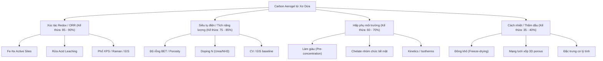

# PHẦN 1: TỔNG QUAN, MỞ ĐẦU & ĐẶC TRƯNG VẬT LIỆU

 Đây là **Version 1: Phân tích tham chiếu tổng quan và Đặc trưng vật liệu**. 
> Bạn có thể xem thêm:
> *   **[Version 2: Phân loại Kế thừa Quy trình & Lý thuyết dưới dạng Bảng ưu tiên trích dẫn](file:///D:/1%20Master's%20Ana%20Chem/1%20Master's%20thesis/Carbon%20Aerogel/BaoCao_TongHop_050626/02_TraCuu_BaiBaoKey_TheoUuTien_TungBuoc.md)**
> *   **[Version 3: Định hướng Kế thừa Tham khảo theo Hướng tiếp cận Chính & Phụ (Dạng danh sách chi tiết)](file:///D:/1%20Master's%20Ana%20Chem/1%20Master's%20thesis/Carbon%20Aerogel/BaoCao_TongHop_050626/03_LuanAn_KeThua_ThaoTac_va_CoChe_ChiTiet.md)**
> *   **[Cẩm nang Hướng dẫn Thực nghiệm & Xử lý Sự cố (Troubleshooting & Methodology)](file:///D:/1%20Master's%20Ana%20Chem/1%20Master's%20thesis/Carbon%20Aerogel/BaoCao_TongHop_050626/04_CamNang_ThucNghiem_va_XuLySuCo_PhongThiNghiem.md)**

Tài liệu này tổng hợp các hướng ứng dụng chính của vật liệu **Carbon Aerogel từ xơ dừa** (như siêu tụ điện, hấp phụ môi trường, xúc tác điện hóa, cách nhiệt) nhằm xác định những thông tin nghiên cứu có sẵn, các thông số kỹ thuật, và các đặc trưng vật liệu tương đồng mà bạn có thể kế thừa hoặc dùng làm dữ liệu đối chiếu (benchmark) cho luận văn thạc sĩ về **Cảm biến điện hóa**.

---

## 1. Bản đồ Tổng quan các Hướng Ứng dụng & Mức độ Kế thừa (%)

Khi nghiên cứu chế tạo carbon aerogel từ xơ dừa cho **Cảm biến điện hóa**, bạn không chỉ tham khảo các bài báo về cảm biến, mà hoàn toàn có thể kế thừa sâu sắc từ 4 hướng ứng dụng lớn dưới đây:

| Hướng ứng dụng của Xơ dừa / Carbon Aerogel | % Kế thừa / Đối chiếu | Lý do và Giá trị đối chiếu trong luận văn của bạn |
| :--- | :---: | :--- |
| **1. Xúc tác Điện hóa Redox / Phản ứng ORR** | **85 - 90%** | **Cực kỳ cao.** Cảm biến điện hóa đo kim loại nặng hoặc chất hữu cơ dựa trên nguyên lý phản ứng oxy hóa-khử trên bề mặt điện cực. Các trung tâm hoạt động ($Fe-N_x$, $Fe-N_4$ single-atom) và cơ chế chuyển electron của hướng xúc tác này giống hệt cơ chế hoạt động của điện cực cảm biến biến tính Fe/N-CA. |
| **2. Siêu tụ điện / Tích trữ năng lượng** | **75 - 85%** | **Rất cao.** Siêu tụ điện cần carbon aerogel có diện tích bề mặt (BET) lớn, độ dẫn điện cao, và N-doping để tăng điện dung giả. Những tính chất này quyết định trực tiếp đến dòng nền điện hóa, khả năng tích lũy điện tích và giảm điện trở chuyển điện tích ($R_{ct}$) của cảm biến. |
| **3. Hấp phụ / Xử lý môi trường** | **60 - 70%** | **Trung bình - Cao.** Để cảm biến kim loại nặng (bằng SWASV) đạt giới hạn phát hiện thấp (LOD cực nhỏ), bước đầu tiên luôn là hấp phụ làm giàu (pre-concentration) ion kim loại ($Pb^{2+}, Cd^{2+}, Zn^{2+}$) trên bề mặt điện cực. Cơ chế hấp phụ cơ lý, chelate hóa và động học hấp phụ ($isotherms$) kế thừa trực tiếp từ đây. |
| **4. Cách nhiệt / Hấp phụ dầu** | **35 - 40%** | **Thấp - Trung bình.** Hướng này chủ yếu tập trung vào tính chất vật lý như cấu trúc xốp 3D không bị sập co rút khi sấy thăng hoa, mật độ siêu nhẹ và tính kỵ nước. Bạn chỉ kế thừa thông số kỹ thuật của giai đoạn đông khô và tính toàn vẹn cấu trúc gel. |

---

## 2. Chi tiết Thông tin cần tìm kiếm và Đối chiếu theo từng Giai đoạn Tổng hợp

Dưới đây là chi tiết các thông tin bạn cần tìm kiếm từ các nguồn tài liệu của mỗi hướng ứng dụng, ứng với từng giai đoạn thực nghiệm của bạn:

### Giai đoạn 1: Tiền xử lý kiềm (Alkaline Delignification)
*   **Thông tin cần tìm từ tài liệu khác:** 
    *   *Từ hướng Hấp phụ / Siêu tụ:* Ảnh hưởng của nồng độ NaOH 5-6% (75-80°C, 2-4h, tỷ lệ lỏng-rắn 1:20) đến hiệu suất loại bỏ lignin và hemicellulose. Lượng cellulose thu hồi thực tế chiếm bao nhiêu % khối lượng xơ dừa thô (thường dao động 35-45%).
    *   *Từ hướng Cách nhiệt:* Ảnh hưởng của việc **không tẩy trắng** (giữ lại một phần nhỏ lignin) giúp duy trì bộ khung cơ lý dẻo dai của aerogel. Đối chiếu với số liệu xơ dừa Bến Tre (đường kính sợi giảm 14-24% sau khi kiềm hóa giúp gia cố tính toàn vẹn cấu trúc).
*   **Thông số đối chiếu:** Phần trăm hao hụt khối lượng (hiệu suất tối ưu ~57.27% ở kích thước **100 mesh**), hàm lượng cellulose tinh khiết thu được. Đối chiếu phổ FTIR chuẩn xác: Đỉnh -OH ($3400\text{ cm}^{-1}$) **giảm cường độ** do đứt gãy liên kết hydro; đỉnh $1730\text{ cm}^{-1}$ biến mất là của **hemicellulose** chứ không phải lignin; đỉnh lignin tại $1249\text{ cm}^{-1}$ chỉ giảm đi (tẩy bán phần).
*   **Mức độ tương đồng:** **90%** (Vì tiền xử lý nguyên liệu xơ dừa là bước chung cho mọi ứng dụng).

### Giai đoạn 2: Sol-Gel & Siêu âm (NH₄OH/Urea/H₂O)
*   **Thông tin cần tìm từ tài liệu khác:**
    *   *Từ hướng Siêu tụ / ORR:* Cơ chế hòa tan và phân tán cellulose trong hệ dung môi lạnh $NH_4OH/Urea$. Việc khống chế nhiệt độ siêu âm bắt buộc $\le 10^\circ\text{C}$ giúp triệt tiêu nhiệt phát ra từ đầu phát, giữ khí $NH_3$ hòa tan trong pha lỏng và bảo toàn cấu trúc bao thể (inclusion complex - IC).
    *   *Từ hướng Review / Lý thuyết:* Động học tự lắp ráp (Dynamic Self-Assembly) chỉ ra Urea không gắn trực tiếp lên xơ dừa mà tạo lớp vỏ hydrate bao bọc kiềm-cellulose ngăn tái kết tụ. Vỏ bọc này hoạt động ổn định nhất ở mốc từ $-10^\circ\text{C}$ đến $-12^\circ\text{C}$ (theo phân tích ¹⁵N NMR và WAXD). Cơ chế lưỡng tính (amphiphilic) của cellulose ảnh hưởng lớn đến tính tan: các mạch phẳng pyranose chứa các nhóm -OH ở hướng xích đạo (ưa nước) và liên kết C-H ở hướng trục dọc (kỵ nước) (Singh 2015). Urea hấp phụ lên các mặt kỵ nước của vòng glucopyranose ngăn sự xếp chồng mạch. Sự trương nở và hòa tan đi qua hiện tượng phồng bong bóng ("ballooning") do vách thứ cấp S2 trương mạnh phá vỡ lớp vách ngoài P (tạo các vòng đai thắt restriction rings). *(Áp dụng tương đồng cơ chế dung môi NaOH/Urea sang hệ NH₃/Urea)*
*   **Thông số đối chiếu:** Độ đồng nhất của sol cellulose, nồng độ cellulose tối ưu (thường là 2-4 wt%), năng lượng siêu âm/thời gian siêu âm pulse (2s/1s trong 30 phút) để sợi cellulose phân cắt đều mà không làm phân hủy mạch polymer.
*   **Mức độ tương đồng:** **85%** (Quy trình sol-gel tạo khung aerogel xốp đồng đều là điểm mấu chốt chung).

### Giai đoạn 3 & 4: Đúc khuôn, Gel hóa & Sấy thăng hoa (Freeze-drying)
*   **Thông tin cần tìm từ tài liệu khác:**
    *   *Từ hướng Cách nhiệt / Hấp phụ dầu:* Tốc độ làm lạnh đông (cooling rate) và nhiệt độ cấp đông (từ $-5^\circ\text{C}$ xuống $-20^\circ\text{C}$) ảnh hưởng đến kích thước tinh thể đá, từ đó quyết định đường kính lỗ xốp macropore ($60\text{ - }80\ \mu\text{m}$) sau khi sấy thăng hoa. Cấp đông chậm ở $-15^\circ\text{C}$ đến $-20^\circ\text{C}$ giúp định hình tinh thể đá tổ ong song song (Ice-templating).
    *   *Quy trình gel hóa và trao đổi dung môi:* 
        *   **Cơ chế gel hóa thuận nghịch nhiệt "Lạnh thì Tan, Ấm thì Đông":** Cellulose hòa tan ở nhiệt độ âm nhờ phức bao thể inclusion complexes (IC) với urea. Khi sol lạnh ấm lên nhiệt độ phòng ($25^\circ\text{C}$), urea tách ra giải phóng các chuỗi cellulose liên kết hydro thành gel 3D vật lý đóng rắn bền vững.
        *   **Nghịch lý sấy cồn (Solvent Exchange Paradox):** Ethanol có nhiệt độ đông đặc cực thấp ($-114.1^\circ\text{C}$), không thể đông băng ở bẫy lạnh $-50^\circ\text{C}$ của máy sấy. Sấy trực tiếp gel chứa cồn làm cồn sôi ở pha lỏng, tạo ra lực mao dẫn lớn phá sập lỗ xốp. Bắt buộc phải trao đổi ngược dung môi từ cồn về nước cất hoàn toàn trước khi đông khô để nước đóng băng hoàn toàn ở $-20^\circ\text{C}$ và thăng hoa trực tiếp từ pha rắn, bảo toàn mạng xốp và khống chế độ co rút gel $<15\%$. Khung sợi xơ dừa Bến Tre co ngót đường kính 14-24% từ GĐ 1 tạo lực chống cơ học tốt hơn khi thăng hoa.
*   **Thông số đối chiếu:** Áp suất buồng sấy thăng hoa ($< 20\text{ Pa}$), thời gian sấy ($24-48\text{ h}$), độ co rút thể tích mẫu (shrinkage), mật độ khối (bulk density $<0.1\text{ g/cm}^3$).
*   **Mức độ tương đồng:** **80%** (Cấu trúc lỗ xốp 3D tự đỡ dạng tổ ong là đặc trưng vật lý chung cần bảo tồn).

### Giai đoạn 5: Nhiệt phân & Doping Nitơ (Carbonization & N-doping)
*   **Thông tin cần tìm từ tài liệu khác:**
    *   *Từ hướng Siêu tụ / ORR:* Tác động của chương trình nhiệt với chiến lược 3 chặng giữ nhiệt (3-ramp strategy: $150^\circ\text{C} \to 400^\circ\text{C} \to T_{target}$) đến việc hình thành cấu trúc lỗ xốp phân cấp (hierarchical porosity) và tỷ lệ các nhóm Nitơ doping. Nhiệt độ mục tiêu tối ưu được cá nhân hóa: $700^\circ\text{C}$ đối với mẫu N-CA nhằm tối ưu hóa mật độ Pyridinic-N (~54% hoạt tính), và $800^\circ\text{C}$ đối với Fe/N-CA để tăng độ dẫn điện (graphitization sp²) hỗ trợ cho việc tẩm sắt tạo tâm Fe-Nₓ.
*   **Thông số đối chiếu:** Tốc độ dòng khí mang $N_2$ ($150-200\text{ mL/min}$), giản đồ TGA của xơ dừa kiềm hóa, hàm lượng Nitơ (at%) phân tích qua phổ XPS.
*   **Mức độ tương đồng:** **90%** (Nhiệt phân tạo vật liệu dẫn điện carbon là giai đoạn tối quan trọng của cả siêu tụ điện, xúc tác và cảm biến).

### Giai đoạn 6 & 7: Doping Sắt (Post-impregnation), Leaching & Annealing lần 2
*   **Thông tin cần tìm từ tài liệu khác:**
    *   *Từ hướng Xúc tác ORR / Xúc tác Fenton:* Quy trình tẩm muối sắt ($FeCl_3\cdot 6H_2O$ 1-5% w/v trong ethanol) và sự hình thành liên kết phối trí $Fe-N_x$ (đặc biệt là $Fe-N_4$ single-atom sites) sau khi nung lại ở $800^\circ\text{C}$.
    *   *Cơ chế rửa acid (Acid Leaching) bằng HCl 0.5M:* Loại bỏ sắt tự do/sắt oxit không hoạt động điện hóa để lộ các tâm hoạt động $Fe-N_4$. Lựa chọn HCl (acid không oxy hóa) giúp bảo toàn cấu trúc graphite hóa $sp^2$ và giữ trở kháng chuyển điện tích $R_{ct}$ thấp, tránh nguy cơ oxy hóa quá mức bởi $H_2SO_4$ hay cháy nổ của $HClO_4$ đun nóng với carbon hữu cơ. Đồng thời, ngộ độc Cl- là không đáng kể đối với cảm biến đo trong đệm clorua so với ORR pha khí.
*   **Thông số đối chiếu:** Nồng độ HCl ($0.5\text{ M}$), nhiệt độ rửa ($80^\circ\text{C}$ trong 8h), phổ XPS vùng Fe 2p và N 1s, phổ XRD kiểm tra xem có còn đỉnh của Fe tinh thể hay không (nếu rửa sạch thì XRD chỉ có 2 đỉnh vô định hình của carbon nền).
*   **Mức độ tương đồng:** **95%** (Kế thừa trực tiếp và toàn diện từ hướng xúc tác điện hóa cấu trúc $Fe-N-C$).

### Giai đoạn 8: Chế tạo điện cực & Đo điện hóa
*   **Thông tin cần tìm từ tài liệu khác:**
    *   *Từ hướng Siêu tụ:* Phép đo CV (Cyclic Voltammetry) trong dung dịch chuẩn $[Fe(CN)_6]^{3-/4-}$ để tính toán diện tích bề mặt điện hóa hoạt động ($A_{ECSA}$) của điện cực carbon aerogel. Phép đo trở kháng điện hóa (EIS) để đối chiếu điện trở chuyển điện tích ($R_{ct}$) - đặc trưng cho độ dẫn điện của lớp biến tính.
    *   *Từ hướng Hấp phụ kim loại nặng:* Khả năng tương thích cơ học của màng biến tính trên nền Glassy Carbon (GCE) khi sử dụng hệ **Composite Binder (Chitosan + 0.5% Nafion)**. Hệ này đóng vai trò "mỏ neo kép": Chitosan tạo phức chelate tóm gọn kim loại nặng phục vụ pre-concentration; trong khi Nafion rây tĩnh điện chống bám bẩn hữu cơ (antifouling) nhờ **Hiệu ứng loại trừ Donnan (Donnan exclusion effect)**. Các nhóm sulfonate mang điện tích âm ($-\text{SO}_3^-$) đẩy tĩnh điện các anion hữu cơ gây nhiễu mang điện âm (như Ascorbic Acid, Uric Acid) và đóng vai trò màng lọc bảo vệ bề mặt cực.
    *   *Từ hướng Cảm biến điện hóa biến tính oxit kim loại:* Kỹ thuật tổ hợp composite carbon aerogel/chitosan/oxit kim loại (ZrO2/CS/rGOA) (Hou 2021) tận dụng Chitosan làm chất kết dính cơ học và ZrO2 tạo các tâm hấp phụ chọn lọc (chelate) với cấu trúc ortho-hydroxyl trên vòng B của Luteolin, tạo dị vòng 5 cạnh ổn định. pH tối ưu của phép đo được khống chế ở pH 6.0 do ảnh hưởng của proton hóa ở pH thấp (< 4.0) làm mất khả năng phối trí của Zr và sự chiếm chỗ cạnh tranh của các ion OH⁻ tự do ở pH kiềm (> 8.0).
*   **Thông số đối chiếu:** Tải lượng vật liệu lên điện cực ($7\ \mu\text{L}$ ink nồng độ $5\text{ mg/mL} \approx 35\ \mu\text{g/cm}^2$), thế quét điện hóa, các thông số bán kính vòng bán nguyệt trên giản đồ Nyquist của EIS.
*   **Mức độ tương đồng:** **85%** (Sử dụng chung kỹ thuật chế tạo màng ink drop-cast và đo đạc baseline điện hóa).

---

## 3. Các Tính chất Vật liệu Tương đồng Đặc trưng cần Đối chiếu (Benchmarking)

Khi viết luận văn, phần **Kết quả và Thảo luận (Results & Discussion)** của bạn sẽ cực kỳ thuyết phục nếu bạn lấy các dữ liệu thực nghiệm của mình đối chiếu với dữ liệu từ các hướng ứng dụng khác của xơ dừa theo bảng chuẩn dưới đây:

| STT | Tính chất vật liệu | Phương pháp phân tích | Giá trị đặc trưng ở các hướng khác để đối chiếu | Cách bạn sử dụng thông tin này trong nghiên cứu cảm biến |
| :---: | :--- | :---: | :--- | :--- |
| 1 | **Diện tích bề mặt riêng & Cấu trúc xốp** | **BET / BJH** | $SSA > 300\text{ m}^2/\text{g}$. Cấu trúc xốp phân cấp gồm cả micropore ($<2\text{ nm}$), mesopore ($2-50\text{ nm}$) và macropore ($>50\text{ nm}$).  *Đối chiếu thêm:* composite ZrO2/CS/rGOA có $SSA \approx 193.86\text{ m}^2/\text{g}$ (giảm nhẹ so với rGOA thô $239.16\text{ m}^2/\text{g}$ do hạt oxit và polymer chiếm chỗ nhưng vẫn giữ độ xốp lý tưởng - Hou 2021). | **Hấp phụ/Siêu tụ $\to$ Cảm biến:** Chứng minh cấu trúc xốp này giúp tăng diện tích tiếp xúc với dung dịch phân tích, tăng khả năng hấp phụ làm giàu ion kim loại, đẩy nhanh tốc độ khuếch tán chất phân tích đến bề mặt điện cực. |
| 2 | **Mức độ Graphit hóa & Độ dẫn điện** | **Raman phổ / XRD** | Tỷ số cường độ vạch D và G ($I_D/I_G$) thường nằm trong dải $0.9 - 1.2$. Giản đồ XRD có đỉnh rộng ở $2\theta \approx 24-26^\circ$ và $43^\circ$ đặc trưng cho carbon vô định hình có cấu trúc graphite hóa bán phần. | **Siêu tụ/Catalyst $\to$ Cảm biến:** Tỷ số $I_D/I_G$ phản ánh mật độ khuyết tật cấu trúc (cần thiết cho N-doping tạo site hoạt động) nhưng vẫn giữ được độ dẫn điện tốt (giảm điện trở nền, tăng độ nhạy tín hiệu dòng điện hóa). |
| 3 | **Hàm lượng Nitơ và các dạng liên kết** | **XPS (N 1s) / FT-IR** | Tổng hàm lượng $N \approx 3 - 6\text{ at}\%$. Phổ N 1s gồm pyridinic-N ($398.5\text{ eV}$), pyrrolic-N ($400.1\text{ eV}$), graphitic-N ($401.3\text{ eV}$).  *Đối chiếu FT-IR:* composite ZrO2/CS/rGOA xuất hiện các đỉnh đặc trưng tại $1544, 1447\text{ cm}^{-1}$ (N-H và C-N của Chitosan), và liên kết $Zr-O$ tại $428\text{ cm}^{-1}$ cùng $Zr=O$ tại $1122\text{ cm}^{-1}$ (Hou 2021). | **ORR/Siêu tụ $\to$ Cảm biến:** Đối chiếu tỷ lệ % của pyridinic-N và pyrrolic-N. Hai dạng Nitơ này tạo ra các mật độ điện tích âm cục bộ trên khung carbon, hoạt động như các vị trí bắt giữ ion kim loại nặng ($Pb^{2+}, Cd^{2+}$) trước khi đo giải hấp. |
| 4 | **Tâm xúc tác kim loại đơn nguyên tử hoặc hạt oxit** | **XPS / TEM** | Sự xuất hiện của đỉnh liên kết $Fe-N_x$ tại vùng năng lượng liên kết $710 - 712\text{ eV}$ trong phổ XPS Fe 2p. TEM/HRTEM cho thấy không có sự tụ tập hạt nano sắt.  *Đối chiếu ZrO2:* Sự xuất hiện của đỉnh Zr 3d tại $183.08\text{ eV}$ trong phổ XPS chứng minh sự hiện diện của hạt nano ZrO2 phân tán đều (Hou 2021). | **Xúc tác ORR $\to$ Cảm biến:** Chứng minh sắt tồn tại dưới dạng nguyên tử phân tán (single-atom) phối trí với Nitơ ($Fe-N_4$). Đây là tâm hoạt động xúc tác mạnh mẽ giúp đẩy nhanh tốc độ phản ứng oxi hóa khử của các kim loại nặng và paracetamol trên điện cực, làm tăng đáng kể cường độ dòng đỉnh anod ($I_{pa}$). |
| 5 | **Trở kháng chuyển điện tích trên điện cực** | **EIS (Nyquist plot)** | Giản đồ trở kháng Nyquist hiển thị một vòng bán nguyệt nhỏ ở vùng tần số cao ($R_{ct} < 100\ \Omega$ trong môi trường điện ly chuẩn). | **Siêu tụ/Điện hóa học $\to$ Cảm biến:** Đối chiếu trị số $R_{ct}$ của điện cực cảm biến biến tính carbon aerogel thô ($N-CA$) so với biến tính sắt ($Fe/N-CA$). Giá trị $R_{ct}$ giảm mạnh chứng tỏ sắt doping làm tăng tốc độ truyền điện tích, giúp tăng độ nhạy của đầu dò cảm biến. |
| 6 | **Cơ chế và động học hấp phụ bề mặt** | **Hấp phụ Isotherm (Langmuir/Freundlich)** | Khả năng hấp phụ cực đại ($q_{max}$) của carbon aerogel từ xơ dừa đối với $Pb^{2+}, Cd^{2+}$ thường đạt từ $50 - 150\text{ mg/g}$ trong các tài liệu xử lý môi trường. | **Hấp phụ môi trường $\to$ Cảm biến SWASV:** Sử dụng các thông số động học hấp phụ (giả động học bậc 2 - pseudo-second-order) và phương trình đẳng nhiệt để biện luận thời gian tích lũy tối ưu (thường chọn $120 - 180\text{ s}$ làm giàu) và giải thích sự bão hòa tín hiệu cảm biến ở nồng độ chất phân tích cao. |

---

## 4. Hướng dẫn Tìm kiếm tài liệu ngoài phục vụ So sánh Đối chiếu (Literature Search Guide)

Để làm phong phú thêm phần tổng quan tài liệu và biện luận của luận văn, bạn có thể thực hiện tìm kiếm các bài báo có các từ khóa gợi ý sau trên Google Scholar hoặc các cơ sở dữ liệu học thuật:

1.  **Từ khóa tìm kiếm hướng Siêu tụ điện (Supercapacitors):**
    *   *Tiếng Anh:* `"coconut coir" OR "coir fiber" AND "carbon aerogel" AND "supercapacitor"`
    *   *Dữ liệu cần trích xuất:* Giá trị diện tích bề mặt riêng BET cao nhất đạt được là bao nhiêu? Giá trị điện dung riêng ($F/g$), giản đồ trở kháng điện hóa (EIS) để làm mốc đối chiếu độ dẫn điện.
2.  **Từ khóa tìm kiếm hướng Xúc tác Điện hóa (Redox Catalyst / ORR):**
    *   *Tiếng Anh:* `"biomass carbon aerogel" OR "coconut coir carbon" AND "ORR" AND "single atom iron" OR "Fe-N-C"`
    *   *Dữ liệu cần trích xuất:* Cách xử lý mẫu bằng acid leaching (HCl hoặc $H_2SO_4$) để tinh chế màng xúc tác. Phân tích phổ XPS N 1s và Fe 2p để đối chiếu năng lượng liên kết của tâm $Fe-N_x$.
3.  **Từ khóa tìm kiếm hướng Hấp phụ Môi trường (Adsorption):**
    *   *Tiếng Anh:* `"coir fiber" OR "coconut coir" AND "aerogel" AND "heavy metal adsorption" OR "lead adsorption"`
    *   *Dữ liệu cần trích xuất:* Dung lượng hấp phụ cực đại ($q_{max}$) của xơ dừa biến tính đối với chì ($Pb^{2+}$), cadmi ($Cd^{2+}$). Giá trị pH tối ưu cho quá trình hấp phụ (thường là pH 5 - 6, trùng khớp với pH tối ưu của đệm đo SWASV).

---

## 🔬 TỔNG HỢP SUY LUẬN NGƯỢC TỪ NOTEBOOKLM (BỔ SUNG)

> **[🔄 RAG-AGENTIC DEDUCTION: Mối liên hệ Lignin & Cấu trúc xốp]**
> Lignin là một polymer thơm ba chiều cực kỳ bền nhiệt. Khi không tẩy trắng, lượng Lignin còn dư thừa (khoảng 20-30%) không chỉ đóng vai trò là "cốt thép" giữ cho sợi cellulose không bị sập xẹp trong lúc đông khô, mà trong giai đoạn nung nhiệt phân (700°C), các vòng benzene của lignin bị nứt vỡ tạo ra mạng lưới vi mao quản (micropores) dày đặc. Mạng lưới micropore này gia tăng đột biến diện tích bề mặt (BET > 300 m²/g) và trở thành các "ổ neo đậu" lý tưởng cho các cụm xúc tác Fe-N4 sau này. Nếu tẩy trắng hoàn toàn (như làm giấy), ta chỉ thu được mạng mesopore lỏng lẻo, tụt giảm nghiêm trọng dòng điện hóa.
