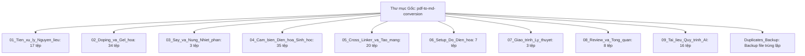

# 📄 Đề Tài LVTN: Quy trình C.A - Hóa Phân Tích

Đây là kho chứa (repository) quản lý toàn bộ dữ liệu, quy trình phân tích, tài liệu khoa học số hóa và mã nguồn hỗ trợ tự động hóa số liệu cho Đề tài Thạc sĩ Hóa Phân Tích.

---

## 🏛️ Sơ Đồ Thư Viện Tài Liệu Khoa Học Số Hóa (Digital Library)

Toàn bộ **142 tài liệu PDF khoa học độc bản** liên quan đến Carbon Aerogel và Điện hóa đã được số hóa hoàn toàn sang định dạng Markdown (`.md`), trích xuất toàn bộ hình ảnh đi kèm, tự động phân loại học thuật dựa trên nội dung thực tế (Abstract/Conclusion) và sắp xếp đồng bộ vào **9 phân khu chuyên biệt** dưới đây:

### 📂 Cấu trúc thư mục mới:



### 🏷️ Chi tiết các Nhóm học thuật:

1. **[01_Tien_xu_ly_Nguyen_lieu](file:///D:/1%20Master's%20Ana%20Chem/1%20Master's%20thesis/Carbon%20Aerogel/1%20Ref%20materials/01_Tien_xu_ly_Nguyen_lieu)** (17 tệp)
   > Chứa các nghiên cứu về xử lý xơ dừa, kiềm hóa bằng NaOH, tẩy trắng (bleaching), tách lignin và cellulose từ sinh khối.
2. **[02_Doping_va_Gel_hoa](file:///D:/1%20Master's%20Ana%20Chem/1%20Master's%20thesis/Carbon%20Aerogel/1%20Ref%20materials/02_Doping_va_Gel_hoa)** (34 tệp)
   > Chứa các bài báo về quá trình sol-gel, tạo hydrogel/aerogel từ cellulose, phản ứng doping dị tố (N, Fe, S, P) vào cấu trúc carbon.
3. **[03_Say_va_Nung_Nhiet_phan](file:///D:/1%20Master's%20Ana%20Chem/1%20Master's%20thesis/Carbon%20Aerogel/1%20Ref%20materials/03_Say_va_Nung_Nhiet_phan)** (3 tệp)
   > Tập trung vào các quy trình sấy siêu tới hạn (supercritical drying), sấy đông khô (freeze drying) và nung nhiệt phân (pyrolysis) để carbon hóa gel.
4. **[04_Cam_bien_Dien_hoa_Sinh_hoc](file:///D:/1%20Master's%20Ana%20Chem/1%20Master's%20thesis/Carbon%20Aerogel/1%20Ref%20materials/04_Cam_bien_Dien_hoa_Sinh_hoc)** (35 tệp)
   > Ứng dụng carbon aerogel làm điện cực cảm biến sinh học để phát hiện kim loại nặng, glucose, dopamine, p-nitrophenol, v.v.
5. **[05_Cross_Linker_va_Tao_mang](file:///D:/1%20Master's%20Ana%20Chem/1%20Master's%20thesis/Carbon%20Aerogel/1%20Ref%20materials/05_Cross_Linker_va_Tao_mang)** (20 tệp)
   > Nghiên cứu về chất liên kết chéo, chế tạo màng composite điện cực, PVDF binder, và chitosan composite.
6. **[06_Setup_Do_Dien_hoa](file:///D:/1%20Master's%20Ana%20Chem/1%20Master's%20thesis/Carbon%20Aerogel/1%20Ref%20materials/06_Setup_Do_Dien_hoa)** (7 tệp)
   > Hướng dẫn chuẩn bị điện cực đo, lắp đặt hệ thống đo Fenton điện hóa, hoặc đo điện hấp phụ (electrosorption).
7. **[07_Giao_trinh_Ly_thuyet](file:///D:/1%20Master's%20Ana%20Chem/1%20Master's%20thesis/Carbon%20Aerogel/1%20Ref%20materials/07_Giao_trinh_Ly_thuyet)** (3 tệp)
   > Các cuốn sách, giáo trình kinh định về phương pháp phân tích điện hóa và lý thuyết nền tảng (như sách của Dương Quảng Phùng, Bard & Faulkner).
8. **[08_Review_va_Tong_quan](file:///D:/1%20Master's%20Ana%20Chem/1%20Master's%20thesis/Carbon%20Aerogel/1%20Ref%20materials/08_Review_va_Tong_quan)** (8 tệp)
   > Các bài báo tổng quan (Review) học thuật cao cấp về carbon aerogel và ứng dụng của chúng trong các lĩnh vực khác nhau.
9. **[09_Tai_lieu_Quy_trinh_AI](file:///D:/1%20Master's%20Ana%20Chem/1%20Master's%20thesis/Carbon%20Aerogel/1%20Ref%20materials/09_Tai_lieu_Quy_trinh_AI)** (16 tệp)
   > Tập hợp các quy trình phân tích chi tiết từng giai đoạn được tối ưu hóa từ phản hồi của Claude và ChatGPT.

* **[Duplicates_Backup](file:///D:/1%20Master's%20Ana%20Chem/1%20Master's%20thesis/Carbon%20Aerogel/Duplicates_Backup)**
  > Thư mục lưu trữ an toàn các tệp PDF trùng lặp tuyệt đối (đã loại bỏ để tránh gây loãng dữ liệu chính).

---

## 📖 Hướng dẫn Đọc và Xem hình ảnh trong File Markdown số hóa

* Mỗi file PDF gốc hiện đi kèm với một file Markdown cùng tên (ví dụ: `bai_bao.pdf` và `bai_bao.md`).
* Đi kèm với file `.md` là thư mục `bai_bao_images/` chứa toàn bộ hình ảnh, đồ thị, sơ đồ được trích xuất trực tiếp.
* **Cách xem tốt nhất:** Mở thư mục này bằng **VS Code** hoặc **Obsidian**, nhấn tổ hợp phím `Ctrl + Shift + V` trên file `.md` để kích hoạt chế độ Preview Markdown. Hình ảnh sẽ tự động hiển thị rất đẹp mắt và đúng vị trí!

---

## 🛠 Hướng dẫn cho người cộng tác

Để đồng bộ và làm việc hiệu quả nhất, chúng tôi sử dụng hệ sinh thái **Visual Studio Code + Git + AI (Claude/Copilot)**. 

### Bước 1: Clone Repository
Tải thư mục này về máy của bạn:
```bash
git clone <URL_CỦA_REPO_NÀY>
```

### Bước 2: Cài đặt Visual Studio Code và Tiện ích mở rộng
Hãy chắc chắn bạn đã cài đặt Visual Studio Code. Khi mở thư mục này trong VS Code, hãy cài đặt các Extension sau để có trải nghiệm giống nhau:
1. **GitHub Copilot** (`GitHub.copilot`) - Hỗ trợ gợi ý code và phân tích.
2. **GitLens** (`eamodio.gitlens`) - Giúp theo dõi lịch sử chỉnh sửa tài liệu.

### Bước 3: Đóng góp
- Cập nhật dữ liệu từ trên mạng về máy: `git pull`
- Lưu thay đổi của bạn: `git commit -am "Mô tả cập nhật"`
- Đẩy lên cho mọi người cùng thấy: `git push`
