**BỘ CÔNG THƯƠNG**

**TRƯỜNG ĐẠI HỌC CÔNG NGHIỆP THÀNH PHỐ HỒ CHÍ MINH**

KHOA CÔNG NGHỆ HÓA HỌC --- BỘ MÔN HÓA PHÂN TÍCH

{width="2.875520559930009in" height="0.8193930446194225in"}

**ĐỀ CƯƠNG LUẬN VĂN THẠC SĨ**

**ĐỀ TÀI:**

**NGHIÊN CỨU TỔNG HỢP CARBON AEROGEL ĐỒNG PHA TẠP SẮT/NITƠ (Fe/N-CA) TỪ XƠ DỪA ỨNG DỤNG LÀM MÀNG PHỦ ĐIỆN CỰC CẢM BIẾN ĐIỆN HÓA XÁC ĐỊNH CÁC ION Pb²⁺, Cd²⁺, Zn²⁺ TRONG MẪU NƯỚC**

**Chuyên ngành:** HÓA PHÂN TÍCH

**Mã chuyên ngành:** 8440118

**Học viên thực hiện:** LÊ HOÀNG NHẬT

**Người hướng dẫn:** PGS. TS. NGUYỄN QUỐC THẮNG

**THÀNH PHỐ HỒ CHÍ MINH, NĂM 2026**

# LỜI CAM ĐOAN

Tôi xin cam đoan đề cương luận văn thạc sĩ với đề tài "Nghiên cứu tổng hợp carbon aerogel pha tạp nitơ (N-CA) và đồng pha tạp sắt/nitơ (Fe/N-CA) từ phế phẩm xơ dừa Bến Tre ứng dụng làm điện cực cảm biến điện hóa xác định một số ion kim loại nặng (Pb²⁺, Cd²⁺, Zn²⁺) trong nước" là công trình nghiên cứu do chính tôi thực hiện dưới sự hướng dẫn khoa học của PGS.TS. Nguyễn Quốc Thắng. Các số liệu, kết quả dự kiến trong đề cương được trình bày trung thực, khách quan và chưa từng được ai công bố trong bất kỳ công trình nào khác. Tất cả các nguồn tài liệu tham khảo đều được trích dẫn đầy đủ và rõ ràng theo đúng quy định.

TP. Hồ Chí Minh, ngày ...... tháng ...... năm 2026

LÊ HOÀNG NHẬT

# LỜI CẢM ƠN {#lời-cảm-ơn-1}

Trước tiên, tôi xin bày tỏ lòng biết ơn sâu sắc đến PGS.TS. Nguyễn Quốc Thắng hướng dẫn khoa học đã tận tình chỉ bảo, định hướng nghiên cứu và hỗ trợ tôi trong suốt quá trình xây dựng đề cương luận văn này. Tôi xin chân thành cảm ơn Ban Giám hiệu Trường Đại học Công nghiệp Thành phố Hồ Chí Minh, Khoa Công nghệ Hóa học và Phòng Đào tạo Sau đại học đã tạo điều kiện thuận lợi về cơ sở vật chất, thiết bị phòng thí nghiệm và các thủ tục hành chính trong quá trình học tập và nghiên cứu. Cuối cùng, tôi xin gửi lời cảm ơn đến gia đình, bạn bè và đồng nghiệp đã luôn động viên, khích lệ và hỗ trợ tôi hoàn thành đề cương này.

# TÓM TẮT

Đề tài nghiên cứu tổng hợp carbon aerogel pha tạp nitơ (N-CA) và đồng pha tạp sắt/nitơ (Fe/N-CA) từ xơ dừa Bến Tre ứng dụng làm điện cực cảm biến điện hóa xác định song song/tuần tự các ion kim loại nặng trên cùng nền GCE Pb²⁺, Cd²⁺, Zn²⁺ trong mẫu nước. Quy trình tổng hợp sử dụng hệ dung môi NH~4~OH/Urea/H~2~O kết hợp đánh siêu âm lạnh (≤ 10°C), sấy thăng hoa và nhiệt phân hai giai đoạn trong khí N~2~. Vật liệu N-CA được nung ở 700°C ưu tiên cấu hình Pyridinic-N làm tâm phối trí ion kim loại, trong khi Fe/N-CA được tổng hợp bổ sung qua ngâm tẩm FeCl~3~·6H~2~O hậu nhiệt phân, rửa acid HCl 0,5M (80°C/8h) và nung lại (re-annealing) trong môi trường khí trơ N~2~ với kỳ vọng hình thành và ổn định các tâm xúc tác Fe-N~x~. Sự tồn tại của cấu trúc này sẽ được đánh giá gián tiếp thông qua sự cải thiện truyền electron (EIS) và phân tích hóa học bề mặt (XPS, Raman). Điện cực Fe/N-CA/Chitosan/GCE xác định đồng thời Pb²⁺, Cd²⁺, Zn²⁺ bằng kỹ thuật SWASV với mục tiêu LOD lần lượt \< 0,1; 0,2; 0,5 ppb (đệm acetate pH 4,5). Phương pháp được thẩm định theo ICH Q2(R2) \[1\] và Trần Cao Sơn \[2\], (dự kiến đối chiếu chéo với ICP-MS trên mẫu nước thực tế nếu có điều kiện thiết bị).

- *Từ khóa*: Carbon aerogel, xơ dừa Bến Tre, pha tạp nitơ/sắt, SWASV, kim loại nặng, cảm biến điện hóa.

# ABSTRACT

This study investigates the synthesis of nitrogen-doped carbon aerogel (N-CA) and iron/nitrogen co-doped carbon aerogel (Fe/N-CA) derived from Bến Tre coconut coir fiber for electrochemical sensor applications. Target analytes are heavy metal ions Pb²⁺, Cd²⁺, Zn²⁺ (SWASV) in water samples. The synthesis employs an NH~4~OH/Urea/H~2~O solvent system combined with cold ultrasonication (≤ 10°C), freeze-drying, and a two-stage N~2~ pyrolysis (700°C for N-CA; 800°C base for Fe/N-CA). As a proposed experimental design, Fe/N-CA undergoes additional post-pyrolysis FeCl~3~ impregnation in ethanol, acid leaching (0.5M HCl, 80°C, 8h) and re-annealing at 800°C to form Fe-N~x~ candidate sites. The Fe/N-CA/Chitosan/GCE electrode targets simultaneous LOD \< 0.1, 0.2, and 0.5 ppb for Pb²⁺, Cd²⁺, Zn²⁺ respectively in acetate buffer (pH 4.5). The method is validated per ICH Q2(R2) and Vietnamese analytical validation guidance by Trần Cao Sơn, with planned cross-validation against ICP-MS if instrumental conditions are available on real spiked water samples.

- *Keywords*: Carbon aerogel, Bến Tre coconut coir, N-doping, Fe/N co-doping, SWASV, heavy metals, electrochemical sensor.

# MỤC LỤC

[LỜI CAM ĐOAN [i](#lời-cam-đoan)](#lời-cam-đoan)

[LỜI CẢM ƠN [ii](#lời-cảm-ơn-1)](#lời-cảm-ơn-1)

[TÓM TẮT [iii](#tóm-tắt)](#tóm-tắt)

[ABSTRACT [iv](#abstract)](#abstract)

[MỤC LỤC [v](#mục-lục)](#mục-lục)

[DANH MỤC BẢNG BIỂU [viii](#danh-mục-bảng-biểu)](#danh-mục-bảng-biểu)

[DANH MỤC HÌNH ẢNH [ix](#danh-mục-hình-ảnh)](#danh-mục-hình-ảnh)

[DANH MỤC CÁC CHỮ VIẾT TẮT [x](#danh-mục-các-chữ-viết-tắt)](#danh-mục-các-chữ-viết-tắt)

[MỞ ĐẦU [1](#mở-đầu)](#mở-đầu)

[1. Đặt vấn đề [1](#đặt-vấn-đề)](#đặt-vấn-đề)

[1.1. Tính cấp thiết và bối cảnh quy chuẩn [1](#tính-cấp-thiết-và-bối-cảnh-quy-chuẩn)](#tính-cấp-thiết-và-bối-cảnh-quy-chuẩn)

[1.2. Thách thức về chỉ tiêu phân tích [1](#thách-thức-về-chỉ-tiêu-phân-tích)](#thách-thức-về-chỉ-tiêu-phân-tích)

[1.3. Hạn chế của các phương pháp phân tích hiện tại [1](#hạn-chế-của-các-phương-pháp-phân-tích-hiện-tại)](#hạn-chế-của-các-phương-pháp-phân-tích-hiện-tại)

[1.4. Khoảng trống nghiên cứu (Research Gap) [2](#khoảng-trống-nghiên-cứu-research-gap)](#khoảng-trống-nghiên-cứu-research-gap)

[1.5. Câu hỏi nghiên cứu & Giả thuyết khoa học [2](#câu-hỏi-nghiên-cứu-giả-thuyết-khoa-học)](#câu-hỏi-nghiên-cứu-giả-thuyết-khoa-học)

[2. Mục tiêu nghiên cứu [3](#mục-tiêu-nghiên-cứu)](#mục-tiêu-nghiên-cứu)

[3. Đối tượng và phạm vi nghiên cứu [4](#đối-tượng-và-phạm-vi-nghiên-cứu)](#đối-tượng-và-phạm-vi-nghiên-cứu)

[3.1. Đối tượng nghiên cứu [4](#đối-tượng-nghiên-cứu)](#đối-tượng-nghiên-cứu)

[3.2. Phạm vi nghiên cứu [4](#phạm-vi-nghiên-cứu)](#phạm-vi-nghiên-cứu)

[4. Cách tiếp cận và phương pháp nghiên cứu [4](#cách-tiếp-cận-và-phương-pháp-nghiên-cứu)](#cách-tiếp-cận-và-phương-pháp-nghiên-cứu)

[4.1. Cách tiếp cận [4](#cách-tiếp-cận)](#cách-tiếp-cận)

[4.2. Phương pháp nghiên cứu cụ thể [4](#phương-pháp-nghiên-cứu-cụ-thể)](#phương-pháp-nghiên-cứu-cụ-thể)

[5. Ý nghĩa thực tiễn của đề tài [5](#ý-nghĩa-thực-tiễn-của-đề-tài)](#ý-nghĩa-thực-tiễn-của-đề-tài)

[6. Tổng quan tình hình nghiên cứu trong nước và ngoài nước [5](#tổng-quan-tình-hình-nghiên-cứu-trong-nước-và-ngoài-nước)](#tổng-quan-tình-hình-nghiên-cứu-trong-nước-và-ngoài-nước)

[6.1. Nghiên cứu ngoài nước [5](#nghiên-cứu-ngoài-nước)](#nghiên-cứu-ngoài-nước)

[6.2. Nghiên cứu trong nước [6](#nghiên-cứu-trong-nước)](#nghiên-cứu-trong-nước)

[CHƯƠNG 1. TỔNG QUAN NGHIÊN CỨU [8](#chương-1.-tổng-quan-nghiên-cứu)](#chương-1.-tổng-quan-nghiên-cứu)

[1.1. Sinh khối xơ dừa và tách chiết Cellulose [8](#sinh-khối-xơ-dừa-và-tách-chiết-cellulose)](#sinh-khối-xơ-dừa-và-tách-chiết-cellulose)

[1.1.1. Thành phần hóa học của xơ dừa Bến Tre \[15\] [8](#thành-phần-hóa-học-của-xơ-dừa-bến-tre-15)](#thành-phần-hóa-học-của-xơ-dừa-bến-tre-15)

[1.1.2. Tính chất cơ lý, cấu trúc bó sợi và ảnh hưởng của quá trình kiềm hóa [9](#tính-chất-cơ-lý-cấu-trúc-bó-sợi-và-ảnh-hưởng-của-quá-trình-kiềm-hóa)](#tính-chất-cơ-lý-cấu-trúc-bó-sợi-và-ảnh-hưởng-của-quá-trình-kiềm-hóa)

[1.1.3. Tiềm năng ứng dụng và lý giải cơ chế [11](#tiềm-năng-ứng-dụng-và-lý-giải-cơ-chế)](#tiềm-năng-ứng-dụng-và-lý-giải-cơ-chế)

[1.1.4. Tẩy lignin bán phần và cấu trúc đường xoắn (Tortuous Path) [12](#tẩy-lignin-bán-phần-và-cấu-trúc-đường-xoắn-tortuous-path)](#tẩy-lignin-bán-phần-và-cấu-trúc-đường-xoắn-tortuous-path)

[1.2. Carbon Aerogel biến tính Nitơ và Sắt (N-CA & Fe/N-CA) [12](#carbon-aerogel-biến-tính-nitơ-và-sắt-n-ca-fen-ca)](#carbon-aerogel-biến-tính-nitơ-và-sắt-n-ca-fen-ca)

[1.2.1. Cơ chế pha tạp Sắt (Fe-doping) bằng phương pháp tẩm sau (Post-impregnation) [15](#cơ-chế-pha-tạp-sắt-fe-doping-bằng-phương-pháp-tẩm-sau-post-impregnation)](#cơ-chế-pha-tạp-sắt-fe-doping-bằng-phương-pháp-tẩm-sau-post-impregnation)

[1.3. Cơ chế lớp kép điện hóa (EDL), điện thế Zeta, thuyết DLVO và tương tác kỵ nước/hydrogen [16](#cơ-chế-lớp-kép-điện-hóa-edl-điện-thế-zeta-thuyết-dlvo-và-tương-tác-kỵ-nướchydrogen)](#cơ-chế-lớp-kép-điện-hóa-edl-điện-thế-zeta-thuyết-dlvo-và-tương-tác-kỵ-nướchydrogen)

[1.4. So sánh đối chứng hai hệ dung môi tổng hợp cellulose aerogel [17](#so-sánh-đối-chứng-hai-hệ-dung-môi-tổng-hợp-cellulose-aerogel)](#so-sánh-đối-chứng-hai-hệ-dung-môi-tổng-hợp-cellulose-aerogel)

[1.5. Bismuth Film Electrode (BiFE) và lý do lựa chọn Fe/N-CA [18](#bismuth-film-electrode-bife-và-lý-do-lựa-chọn-fen-ca)](#bismuth-film-electrode-bife-và-lý-do-lựa-chọn-fen-ca)

[1.5.1. Bismuth Film Electrode [18](#bismuth-film-electrode)](#bismuth-film-electrode)

[1.5.2. Lý do lựa chọn Fe/N-CA --- Luận điểm khoa học [19](#lý-do-lựa-chọn-fen-ca-luận-điểm-khoa-học)](#lý-do-lựa-chọn-fen-ca-luận-điểm-khoa-học)

[1.6. Phương pháp phân tích điện hóa [20](#phương-pháp-phân-tích-điện-hóa)](#phương-pháp-phân-tích-điện-hóa)

[1.7. Đối chiếu công trình nghiên cứu gần đây [21](#đối-chiếu-công-trình-nghiên-cứu-gần-đây)](#đối-chiếu-công-trình-nghiên-cứu-gần-đây)

[CHƯƠNG 2. PHƯƠNG PHÁP NGHIÊN CỨU [23](#chương-2.-phương-pháp-nghiên-cứu)](#chương-2.-phương-pháp-nghiên-cứu)

[2.1. Thiết bị, dụng cụ và hóa chất sử dụng [23](#thiết-bị-dụng-cụ-và-hóa-chất-sử-dụng)](#thiết-bị-dụng-cụ-và-hóa-chất-sử-dụng)

[2.2. Quy trình thực nghiệm 8 giai đoạn tổng hợp Carbon Aerogel [23](#quy-trình-thực-nghiệm-8-giai-đoạn-tổng-hợp-carbon-aerogel)](#quy-trình-thực-nghiệm-8-giai-đoạn-tổng-hợp-carbon-aerogel)

[2.3. Sơ đồ Flowchart thực nghiệm [25](#sơ-đồ-flowchart-thực-nghiệm)](#sơ-đồ-flowchart-thực-nghiệm)

[2.4. Cơ chế Sol-Gel và Sấy thăng hoa [28](#cơ-chế-sol-gel-và-sấy-thăng-hoa)](#cơ-chế-sol-gel-và-sấy-thăng-hoa)

[2.4.1. Cơ chế hòa tan cellulose trong hệ NH~4~OH/Urea/H~2~O [28](#cơ-chế-hòa-tan-cellulose-trong-hệ-nh4ohureah2o)](#cơ-chế-hòa-tan-cellulose-trong-hệ-nh4ohureah2o)

[2.4.2. Động học gel hóa âm sâu [30](#động-học-gel-hóa-âm-sâu)](#động-học-gel-hóa-âm-sâu)

[2.4.3. Hóa lý của quá trình keo tụ trong ethanol (Coagulation) [31](#hóa-lý-của-quá-trình-keo-tụ-trong-ethanol-coagulation)](#hóa-lý-của-quá-trình-keo-tụ-trong-ethanol-coagulation)

[2.4.4. Vật lý sấy thăng hoa [33](#vật-lý-sấy-thăng-hoa)](#vật-lý-sấy-thăng-hoa)

[2.4.5. Cơ sở khoa học và Lập luận cơ chế định hướng thiết kế [34](#cơ-sở-khoa-học-và-lập-luận-cơ-chế-định-hướng-thiết-kế)](#cơ-sở-khoa-học-và-lập-luận-cơ-chế-định-hướng-thiết-kế)

[2.5. Cơ chế Nhiệt phân, Doping Nitơ và Phối trí Sắt [34](#cơ-chế-nhiệt-phân-doping-nitơ-và-phối-trí-sắt)](#cơ-chế-nhiệt-phân-doping-nitơ-và-phối-trí-sắt)

[2.5.1. Hóa học phản ứng Lignin - Urea trong khung DCF [34](#hóa-học-phản-ứng-lignin---urea-trong-khung-dcf)](#hóa-học-phản-ứng-lignin---urea-trong-khung-dcf)

[2.5.2. Động học nhiệt phân carbon hóa lần 1 [35](#động-học-nhiệt-phân-carbon-hóa-lần-1)](#động-học-nhiệt-phân-carbon-hóa-lần-1)

[2.5.3. Cấu hình Nitơ bề mặt và vai trò điện hóa [36](#cấu-hình-nitơ-bề-mặt-và-vai-trò-điện-hóa)](#cấu-hình-nitơ-bề-mặt-và-vai-trò-điện-hóa)

[2.5.4. Hóa học phối trí tâm hoạt tính Fe-N~x~ và hậu xử lý (Acid Leaching) [36](#hóa-học-phối-trí-tâm-hoạt-tính-fe-nx-và-hậu-xử-lý-acid-leaching)](#hóa-học-phối-trí-tâm-hoạt-tính-fe-nx-và-hậu-xử-lý-acid-leaching)

[2.6. Quy trình tổng hợp màng mỏng biến tính điện cực GCE [38](#quy-trình-tổng-hợp-màng-mỏng-biến-tính-điện-cực-gce)](#quy-trình-tổng-hợp-màng-mỏng-biến-tính-điện-cực-gce)

[2.7. Sàng lọc điện cực nền và tiêu chí đo đạt [39](#sàng-lọc-điện-cực-nền-và-tiêu-chí-đo-đạt)](#sàng-lọc-điện-cực-nền-và-tiêu-chí-đo-đạt)

[2.8. Quy hoạch thực nghiệm tối ưu hóa (DOE) [40](#quy-hoạch-thực-nghiệm-tối-ưu-hóa-doe)](#quy-hoạch-thực-nghiệm-tối-ưu-hóa-doe)

[2.9. Kế hoạch thẩm định phương pháp phân tích (Validation) [40](#kế-hoạch-thẩm-định-phương-pháp-phân-tích-validation)](#kế-hoạch-thẩm-định-phương-pháp-phân-tích-validation)

[2.10. Thiết lập thông số đo SWASV kim loại nặng (Pb²⁺, Cd²⁺, Zn²⁺) [42](#thiết-lập-thông-số-đo-swasv-kim-loại-nặng-pb²-cd²-zn²)](#thiết-lập-thông-số-đo-swasv-kim-loại-nặng-pb²-cd²-zn²)

[2.11. Các tiêu chí đánh giá chất lượng (Quality Gates) định hướng tối ưu hóa [43](#các-tiêu-chí-đánh-giá-chất-lượng-quality-gates-định-hướng-tối-ưu-hóa)](#các-tiêu-chí-đánh-giá-chất-lượng-quality-gates-định-hướng-tối-ưu-hóa)

[CHƯƠNG 3. DỰ KIẾN KẾT QUẢ [44](#chương-3.-dự-kiến-kết-quả)](#chương-3.-dự-kiến-kết-quả)

[3.1. Lý thuyết Điện hóa Phân tích và Đặc trưng Vật liệu [44](#lý-thuyết-điện-hóa-phân-tích-và-đặc-trưng-vật-liệu)](#lý-thuyết-điện-hóa-phân-tích-và-đặc-trưng-vật-liệu)

[3.1.1. Lý thuyết CV và phép đo baseline probe [45](#lý-thuyết-cv-và-phép-đo-baseline-probe)](#lý-thuyết-cv-và-phép-đo-baseline-probe)

[3.1.2. Phổ trở kháng điện hóa (EIS) và mạch tương đương Randles [46](#phổ-trở-kháng-điện-hóa-eis-và-mạch-tương-đương-randles)](#phổ-trở-kháng-điện-hóa-eis-và-mạch-tương-đương-randles)

[3.1.4. Lý thuyết các phép đặc trưng vật liệu [48](#lý-thuyết-các-phép-đặc-trưng-vật-liệu)](#lý-thuyết-các-phép-đặc-trưng-vật-liệu)

[3.1.5. Lý thuyết lựa chọn chất kết dính (Binder) tổng hợp màng cảm biến [49](#lý-thuyết-lựa-chọn-chất-kết-dính-binder-tổng-hợp-màng-cảm-biến)](#lý-thuyết-lựa-chọn-chất-kết-dính-binder-tổng-hợp-màng-cảm-biến)

[3.2. Dự kiến thẩm định phân tích kim loại nặng (SWASV) [50](#dự-kiến-thẩm-định-phân-tích-kim-loại-nặng-swasv)](#dự-kiến-thẩm-định-phân-tích-kim-loại-nặng-swasv)

[3.3. Dự kiến kết quả phân tích mẫu thực tế [51](#dự-kiến-kết-quả-phân-tích-mẫu-thực-tế)](#dự-kiến-kết-quả-phân-tích-mẫu-thực-tế)

[3.4. Phân tích sai số bằng Sơ đồ xương cá Ishikawa [51](#phân-tích-sai-số-bằng-sơ-đồ-xương-cá-ishikawa)](#phân-tích-sai-số-bằng-sơ-đồ-xương-cá-ishikawa)

[CHƯƠNG 4. KẾ HOẠCH THỰC HIỆN [53](#chương-4.-kế-hoạch-thực-hiện)](#chương-4.-kế-hoạch-thực-hiện)

[KẾT LUẬN VÀ KIẾN NGHỊ [54](#kết-luận-và-kiến-nghị)](#kết-luận-và-kiến-nghị)

[1. Kết luận chung (Dự kiến) [54](#kết-luận-chung-dự-kiến)](#kết-luận-chung-dự-kiến)

[2. Kiến nghị hướng phát triển tiếp theo [54](#kiến-nghị-hướng-phát-triển-tiếp-theo)](#kiến-nghị-hướng-phát-triển-tiếp-theo)

[TÀI LIỆU THAM KHẢO [56](#tài-liệu-tham-khảo)](#tài-liệu-tham-khảo)

[Phụ lục 1: Quy trình chuẩn bị dung dịch đệm Acetate pH 4.5 và đệm Phosphate PBS pH 7.4 \[8, 16\] [66](#phụ-lục-1-quy-trình-chuẩn-bị-dung-dịch-đệm-acetate-ph-4.5-và-đệm-phosphate-pbs-ph-7.4-8-16)](#phụ-lục-1-quy-trình-chuẩn-bị-dung-dịch-đệm-acetate-ph-4.5-và-đệm-phosphate-pbs-ph-7.4-8-16)

[Phụ lục 2: Sơ đồ lắp ráp điện cực GCE sửa đổi và buồng đo điện hóa 3 điện cực [66](#phụ-lục-2-sơ-đồ-lắp-ráp-điện-cực-gce-sửa-đổi-và-buồng-đo-điện-hóa-3-điện-cực)](#phụ-lục-2-sơ-đồ-lắp-ráp-điện-cực-gce-sửa-đổi-và-buồng-đo-điện-hóa-3-điện-cực)

[Phụ lục 3: Quy trình hiệu chuẩn điện cực so sánh Ag/AgCl [66](#phụ-lục-3-quy-trình-hiệu-chuẩn-điện-cực-so-sánh-agagcl)](#phụ-lục-3-quy-trình-hiệu-chuẩn-điện-cực-so-sánh-agagcl)

[Phụ lục 4: Chương trình nhiệt phân 3-ramp (profile nhiệt độ lò ống) [66](#phụ-lục-4-chương-trình-nhiệt-phân-3-ramp-profile-nhiệt-độ-lò-ống)](#phụ-lục-4-chương-trình-nhiệt-phân-3-ramp-profile-nhiệt-độ-lò-ống)

# DANH MỤC BẢNG BIỂU

[Bảng 1.2. So sánh hệ dung môi NH~4~OH/Urea và NaOH/Urea [18](#bảng-1.2.-so-sánh-hệ-dung-môi-nh4ohurea-và-naohurea)](#bảng-1.2.-so-sánh-hệ-dung-môi-nh4ohurea-và-naohurea)

[Bảng 1.3: Hạn chế của BiFE --- Cơ sở lý do không sử dụng trong đề tài [18](#bảng-1.3-hạn-chế-của-bife-cơ-sở-lý-do-không-sử-dụng-trong-đề-tài)](#bảng-1.3-hạn-chế-của-bife-cơ-sở-lý-do-không-sử-dụng-trong-đề-tài)

[Bảng 1.4: So sánh trực tiếp BiFE và Fe/N-CA: [19](#bảng-1.4-so-sánh-trực-tiếp-bife-và-fen-ca)](#bảng-1.4-so-sánh-trực-tiếp-bife-và-fen-ca)

[Bảng 1.5. Đối chiếu các công trình vật liệu carbon/aerogel liên quan gần đây [22](#bảng-1.5.-đối-chiếu-các-công-trình-vật-liệu-carbonaerogel-liên-quan-gần-đây)](#bảng-1.5.-đối-chiếu-các-công-trình-vật-liệu-carbonaerogel-liên-quan-gần-đây)

[Bảng 2.1: Tóm tắt thông số SOP và Biện luận cơ chế \[22, 23\] [23](#bảng-2.1-tóm-tắt-thông-số-sop-và-biện-luận-cơ-chế-22-23)](#bảng-2.1-tóm-tắt-thông-số-sop-và-biện-luận-cơ-chế-22-23)

[Bảng 2.2. Chu trình nhiệt cho lò nung [36](#bảng-2.2.-chu-trình-nhiệt-cho-lò-nung)](#bảng-2.2.-chu-trình-nhiệt-cho-lò-nung)

[Bảng 2.3. Mối quan hệ giữa nhiệt độ nung và cấu trúc hình thành [36](#bảng-2.3.-mối-quan-hệ-giữa-nhiệt-độ-nung-và-cấu-trúc-hình-thành)](#bảng-2.3.-mối-quan-hệ-giữa-nhiệt-độ-nung-và-cấu-trúc-hình-thành)

[Bảng 2.4. Tổng hợp các tiêu chí kỹ thuật và cách khắc phục [39](#bảng-2.4.-tổng-hợp-các-tiêu-chí-kỹ-thuật-và-cách-khắc-phục)](#bảng-2.4.-tổng-hợp-các-tiêu-chí-kỹ-thuật-và-cách-khắc-phục)

[Bảng 2.5. Khảo sát và tối ưu hóa thông số SWASV đo kim loại vết [42](#bảng-2.5.-khảo-sát-và-tối-ưu-hóa-thông-số-swasv-đo-kim-loại-vết)](#bảng-2.5.-khảo-sát-và-tối-ưu-hóa-thông-số-swasv-đo-kim-loại-vết)

[Bảng 3.1. Dự kiến kết quả, Phương pháp kiểm chứng và Xử lý rủi ro [44](#bảng-3.1.-dự-kiến-kết-quả-phương-pháp-kiểm-chứng-và-xử-lý-rủi-ro)](#bảng-3.1.-dự-kiến-kết-quả-phương-pháp-kiểm-chứng-và-xử-lý-rủi-ro)

[Bảng 3.2. Dự kiến thẩm định quy trình phân tích Pb²⁺, Cd²⁺, Zn²⁺ [50](#bảng-3.2.-dự-kiến-thẩm-định-quy-trình-phân-tích-pb²-cd²-zn²)](#bảng-3.2.-dự-kiến-thẩm-định-quy-trình-phân-tích-pb²-cd²-zn²)

[Bảng 3.3. Dự kiến kết quả phân tích mẫu thực [51](#bảng-3.3.-dự-kiến-kết-quả-phân-tích-mẫu-thực)](#bảng-3.3.-dự-kiến-kết-quả-phân-tích-mẫu-thực)

# DANH MỤC HÌNH ẢNH

[Hình 1.1. Cấu trúc hóa học của Cellulose, Hemicellulose và Lignin [9](#hình-1.1.-cấu-trúc-hóa-học-của-cellulose-hemicellulose-và-lignin)](#hình-1.1.-cấu-trúc-hóa-học-của-cellulose-hemicellulose-và-lignin)

[Hình 1.2. Sơ đồ chuyển đổi cấu trúc lỗ xốp và cấu hình Nitơ của vật liệu Carbon Aerogel ở các nhiệt độ nung khác nhau [14](#hình-1.2.-sơ-đồ-chuyển-đổi-cấu-trúc-lỗ-xốp-và-cấu-hình-nitơ-của-vật-liệu-carbon-aerogel-ở-các-nhiệt-độ-nung-khác-nhau)](#hình-1.2.-sơ-đồ-chuyển-đổi-cấu-trúc-lỗ-xốp-và-cấu-hình-nitơ-của-vật-liệu-carbon-aerogel-ở-các-nhiệt-độ-nung-khác-nhau)

[Hình 1.3. Công thức phân tử của chitosan (CAS 9012-76-4) [21](#hình-1.3.-công-thức-phân-tử-của-chitosan-cas-9012-76-4)](#hình-1.3.-công-thức-phân-tử-của-chitosan-cas-9012-76-4)

[Hình 1.4. Công thức phân tử của Nafion™ perfluorinated resin solution, 5 wt% (CAS 31175-20-9) [21](#hình-1.4.-công-thức-phân-tử-của-nafion-perfluorinated-resin-solution-5-wt-cas-31175-20-9)](#hình-1.4.-công-thức-phân-tử-của-nafion-perfluorinated-resin-solution-5-wt-cas-31175-20-9)

[Hình 2.1. Sơ đồ quy trình thực nghiệm tổng hợp Cellulose Aerogel từ xơ dừa \[22\] [26](#hình-2.1.-sơ-đồ-quy-trình-thực-nghiệm-tổng-hợp-cellulose-aerogel-từ-xơ-dừa-22)](#hình-2.1.-sơ-đồ-quy-trình-thực-nghiệm-tổng-hợp-cellulose-aerogel-từ-xơ-dừa-22)

[Hình 2.2. Sơ đồ quy trình chuyển hóa Cellulose Aerogel thành N-CA và Fe/N-CA \[23, 12\] [27](#hình-2.2.-sơ-đồ-quy-trình-chuyển-hóa-cellulose-aerogel-thành-n-ca-và-fen-ca-23-12)](#hình-2.2.-sơ-đồ-quy-trình-chuyển-hóa-cellulose-aerogel-thành-n-ca-và-fen-ca-23-12)

[Hình 2.3. Sơ đồ quy trình tổng hợp màng biến tính và đo đạc điện hóa [28](#hình-2.3.-sơ-đồ-quy-trình-tổng-hợp-màng-biến-tính-và-đo-đạc-điện-hóa)](#hình-2.3.-sơ-đồ-quy-trình-tổng-hợp-màng-biến-tính-và-đo-đạc-điện-hóa)

[Hình 2.4. Sơ đồ minh họa cơ chế phá vỡ liên kết hydro và solvat hóa chuỗi Cellulose bằng phức hợp Amoniac - Urea [29](#hình-2.4.-sơ-đồ-minh-họa-cơ-chế-phá-vỡ-liên-kết-hydro-và-solvat-hóa-chuỗi-cellulose-bằng-phức-hợp-amoniac---urea)](#hình-2.4.-sơ-đồ-minh-họa-cơ-chế-phá-vỡ-liên-kết-hydro-và-solvat-hóa-chuỗi-cellulose-bằng-phức-hợp-amoniac---urea)

[Hình 2.5. Sơ đồ minh họa cấu trúc mạng tinh thể Cellulose I và Cellulose III [31](#hình-2.5.-sơ-đồ-minh-họa-cấu-trúc-mạng-tinh-thể-cellulose-i-và-cellulose-iii)](#hình-2.5.-sơ-đồ-minh-họa-cấu-trúc-mạng-tinh-thể-cellulose-i-và-cellulose-iii)

[Hình 2.6. Sơ đồ cơ chế keo tụ của Cellulose trong dung môi bằng non-solvent [33](#hình-2.6.-sơ-đồ-cơ-chế-keo-tụ-của-cellulose-trong-dung-môi-bằng-non-solvent)](#hình-2.6.-sơ-đồ-cơ-chế-keo-tụ-của-cellulose-trong-dung-môi-bằng-non-solvent)

[Hình 2.7. Cấu trúc hóa học 3 đơn vị monolignol cấu thành lignin [35](#hình-2.7.-cấu-trúc-hóa-học-3-đơn-vị-monolignol-cấu-thành-lignin)](#hình-2.7.-cấu-trúc-hóa-học-3-đơn-vị-monolignol-cấu-thành-lignin)

[Hình 2.8. Sơ đồ minh họa quá trình biến tính bề mặt điện cực GCE bằng vật liệu Carbon Aerogel (N-CA và Fe/N-CA) và cơ chế cảm biến [39](#hình-2.8.-sơ-đồ-minh-họa-quá-trình-biến-tính-bề-mặt-điện-cực-gce-bằng-vật-liệu-carbon-aerogel-n-ca-và-fen-ca-và-cơ-chế-cảm-biến)](#hình-2.8.-sơ-đồ-minh-họa-quá-trình-biến-tính-bề-mặt-điện-cực-gce-bằng-vật-liệu-carbon-aerogel-n-ca-và-fen-ca-và-cơ-chế-cảm-biến)

[Hình 3.1. Sơ đồ lý thuyết điện hóa tại giao diện điện cực và dung dịch điện ly (Lớp điện kép và quá trình truyền khối) [46](#hình-3.1.-sơ-đồ-lý-thuyết-điện-hóa-tại-giao-diện-điện-cực-và-dung-dịch-điện-ly-lớp-điện-kép-và-quá-trình-truyền-khối)](#hình-3.1.-sơ-đồ-lý-thuyết-điện-hóa-tại-giao-diện-điện-cực-và-dung-dịch-điện-ly-lớp-điện-kép-và-quá-trình-truyền-khối)

[Hình 3.2. Sơ đồ minh họa --- Mạch tương đương Randles sửa đổi [47](#hình-3.2.-sơ-đồ-minh-họa-mạch-tương-đương-randles-sửa-đổi)](#hình-3.2.-sơ-đồ-minh-họa-mạch-tương-đương-randles-sửa-đổi)

[Hình 3.3. Sơ đồ xương cá Ishikawa phân tích các nguồn sai số phép đo cảm biến điện hóa [51](#hình-3.3.-sơ-đồ-xương-cá-ishikawa-phân-tích-các-nguồn-sai-số-phép-đo-cảm-biến-điện-hóa)](#hình-3.3.-sơ-đồ-xương-cá-ishikawa-phân-tích-các-nguồn-sai-số-phép-đo-cảm-biến-điện-hóa)

# DANH MỤC CÁC CHỮ VIẾT TẮT

  ---------------------------------------------------------------------------------------------------------------------------------------
   **Chữ viết tắt**  **Ý nghĩa đầy đủ**
  ------------------ --------------------------------------------------------------------------------------------------------------------
          CA         Carbon Aerogel

         N-CA        Nitrogen-doped Carbon Aerogel (Carbon Aerogel biến tính Nitơ)

       Fe/N-CA       Iron/Nitrogen co-doped Carbon Aerogel (Carbon Aerogel biến tính đồng thời Sắt và Nitơ)

          CV         Cyclic Voltammetry (Quét thế vòng tuần hoàn)

        SWASV        Square Wave Anodic Stripping Voltammetry (Quét thế hòa tan sóng vuông)

         EIS         Electrochemical Impedance Spectroscopy (Phổ trở kháng điện hóa)

         ECSA        Electrochemical Active Surface Area (Diện tích bề mặt hoạt tính điện hóa)

         LOD         Limit of Detection (Giới hạn phát hiện)

         LOQ         Limit of Quantitation (Giới hạn định lượng)

         SEM         Scanning Electron Microscopy (Kính hiển vi điện tử quét)

         XRD         X-ray Diffraction (Nhiễu xạ tia X)

         BET         Brunauer-Emmett-Teller (Phương pháp đo diện tích bề mặt riêng)

         FTIR        Fourier-transform Infrared Spectroscopy (Quang phổ hồng ngoại biến đổi Fourier)

         XPS         X-ray Photoelectron Spectroscopy (Quang phổ điện tử quang tia X)

         RSM         Response Surface Methodology (Phương pháp bề mặt đáp ứng)

         PBD         Plackett-Burman Design (Thiết kế sàng lọc Plackett-Burman)

         GCE         Glassy Carbon Electrode (Điện cực carbon thủy tinh)

         DMF         Dimethylformamide (Dung môi phân cực)

        AGREE        Analytical Greenness Metric (Công cụ đánh giá độ xanh phân tích)

         DCF         Delignified Coir Fiber (Xơ dừa sau kiềm hóa loại lignin)

         ORR         Oxygen Reduction Reaction (Phản ứng khử oxy)

        ICP-MS       Phổ khối lượng plasma cảm ứng cao tần (Inductively Coupled Plasma Mass Spectrometry)

       HPLC-UV       Sắc ký lỏng hiệu năng cao đầu dò tử ngoại (High-Performance Liquid Chromatography with Ultraviolet Detection)

         AAS         Phổ hấp thụ nguyên tử (Atomic Absorption Spectrometry)

         ICH         Hội đồng quốc tế về hài hòa các thủ tục đăng ký dược phẩm dùng cho người (International Council for Harmonisation)

         BiFE        Bismuth Film Electrode (Điện cực màng Bismuth)
  ---------------------------------------------------------------------------------------------------------------------------------------

#  {#section-1}

# MỞ ĐẦU

## 1. Đặt vấn đề

### 1.1. Tính cấp thiết và bối cảnh quy chuẩn

Sự phát triển nhanh chóng của các hoạt động công nghiệp và đô thị hóa đã dẫn đến tình trạng ô nhiễm nguồn nước bởi các ion kim loại nặng ngày càng trở nên nghiêm trọng. Các ion kim loại nặng như Chì (Pb^2+^), Cadmium (Cd^2+^) và Kẽm (Zn^2+^) là những tác nhân cực độc, khó phân hủy sinh học và có khả năng tích lũy sinh học qua chuỗi thức ăn, gây hại nghiêm trọng cho hệ thần kinh, thận, gan và hệ tuần hoàn của con người ngay cả ở nồng độ cực thấp \[3\].

Theo QCVN 08:2023/BTNMT (Quy chuẩn kỹ thuật quốc gia về chất lượng nước mặt) \[4\], giới hạn hàm lượng cho phép đối với Chì (Pb²⁺) là 20 µg/L (20 ppb), Cadmium (Cd²⁺) là 5 µg/L (5 ppb), và Kẽm (Zn²⁺) là 500 µg/L (500 ppb). Điều này đòi hỏi các kỹ thuật phân tích phải đạt giới hạn phát hiện cực thấp ở dải vết.

### 1.2. Thách thức về chỉ tiêu phân tích

Việc phân tích các tác nhân này trong nguồn nước thực tế đối mặt với hai thách thức lớn:

(1) Nồng độ của chất phân tích trong môi trường tự nhiên rất thấp (thường ở mức vi lượng µg/L hoặc ppb), đòi hỏi phương pháp đo phải có độ nhạy và giới hạn phát hiện (LOD) cực thấp;

(2) Mẫu nước sông, nước thải vô cùng phức tạp (matrix effects) chứa nhiều ion kiềm, kiềm thổ (Ca²⁺, Mg²⁺, Na⁺, K⁺), các hợp chất hữu cơ dễ bay hơi, và chất điện ly cản trở dễ gây hiện tượng chồng lấn pic hoặc che lấp tín hiệu đo.

### 1.3. Hạn chế của các phương pháp phân tích hiện tại

Các phương pháp phân tích công cụ hiện đại như phổ phát xạ plasma cảm ứng (ICP-OES/MS) hay sắc ký lỏng hiệu năng cao (HPLC) tuy có độ chính xác cao nhưng gặp hạn chế lớn: thiết bị đắt tiền, chi phí vận hành và bảo dưỡng rất lớn, quy trình xử lý mẫu phức tạp và tốn nhiều thời gian.

Đặc biệt, HPLC sử dụng lượng lớn dung môi hữu cơ độc hại làm pha động (như Acetonitrile, Methanol), đi ngược lại với 12 nguyên tắc của Hóa học phân tích xanh (Green Analytical Chemistry - GAC) \[5\].

Trong bối cảnh đó, phương pháp phân tích điện hóa (Voltammetry) sử dụng các kỹ thuật điện ly hòa tan sóng vuông (SWASV) nổi lên như một giải pháp thay thế lý tưởng nhờ thiết kế thiết bị nhỏ gọn, thao tác nhanh, chi phí vận hành cực thấp và có khả năng xác định đồng thời nhiều chất chỉ trong một phép đo đơn giản tại hiện trường.

### 1.4. Khoảng trống nghiên cứu (Research Gap)

Yếu tố quyết định hiệu năng của cảm biến điện hóa là vật liệu biến tính bề mặt điện cực làm việc GCE. Carbon Aerogel (CA) tổng hợp từ sinh khối (biomass) sở hữu mạng lưới liên thông 3D xốp phân cấp và độ dẫn điện tốt \[6, 7, 8\].

Tuy nhiên, các công trình đã công bố chủ yếu tập trung vào hệ dung môi NaOH/Urea truyền thống có nguy cơ để lại ion/muối vô cơ nếu rửa không triệt để, có thể ảnh hưởng cấu trúc sau nung độ cao, cho diện tích bề mặt riêng thấp (S~BET~ ≤ 150 m²/g ở cùng điều kiện) \[6, 7, 9\].

Theo phạm vi tài liệu đã tổng quan trong đề cương, chưa ghi nhận nghiên cứu nào tối ưu hóa toàn diện quy trình tổng hợp monolith Carbon Aerogel pha tạp Nitơ (N-CA) và đồng pha tạp Sắt/Nitơ (Fe/N-CA) từ xơ dừa Bến Tre thông qua hệ dung môi amoniac-urea (NH~4~OH/Urea) kết hợp sấy thăng hoa và nhiệt phân hai lần (annealing) ứng dụng làm cảm biến điện hóa trên cùng định hướng nền tảng vật liệu GCE biến tính, với hai nhánh điện cực riêng.

### 1.5. Câu hỏi nghiên cứu & Giả thuyết khoa học

Câu hỏi nghiên cứu: Liệu việc sử dụng hệ dung môi NH~4~OH:Urea:H~2~O kết hợp đánh siêu âm bể lạnh (≤ 10°C) và nhiệt phân hai lần có giúp bảo toàn được cấu trúc lỗ xốp tổ ong 3D phân cấp của carbon aerogel từ xơ dừa Bến Tre, đồng thời định hình được các tâm hoạt tính Fe-N~x~ (giả thuyết chuyển giao từ ORR sang SWASV cần kiểm chứng) đạt giới hạn phát hiện mục tiêu dưới 0.1 ppb đối với Pb²⁺ bằng kỹ thuật SWASV hay không?

Giả thuyết khoa học: Hệ dung môi thế hệ mới NH~4~OH:Urea:H~2~O dưới tác động siêu âm nhiệt độ thấp sẽ trương nở tối đa cellulose và bọc giữ lượng nitơ phân bố đều trong mạng gel thông qua liên kết hydro và lực đẩy tĩnh điện keo keo tụ. Quá trình acid leaching bằng HCl 0.5 M loại bỏ các hạt sắt thô kết tụ không hoạt tính, kết hợp nung annealing lần 2 ở 750°C sẽ định hình các tâm hoạt tính Fe-Nx phối trí ổn định trên vách graphene sp². Việc áp dụng quy trình kiểm soát khuyết tật mạng lưới từ các mô hình xúc tác năng lượng \[10, 11\] sang nền tảng carbon sinh khối dự kiến sẽ cung cấp các vị trí chelate hóa nội tại mạnh mẽ, đẩy nhanh tốc độ truyền electron và làm giàu kim loại trong phản ứng hòa tan (stripping) \[12, 13\].

## 2. Mục tiêu nghiên cứu

Các vật liệu nano gốc carbon gần đây đã chứng minh được tiềm năng to lớn khi ứng dụng làm cảm biến điện hóa để phát hiện các ion kim loại nặng độc hại trong môi trường \[14\]. Tuy nhiên, mặc dù carbon aerogel từ sinh khối mang lại tiềm năng lớn do tính sẵn có và bền vững, việc ứng dụng chúng trong cảm biến điện hóa phân tích vết kim loại nặng vẫn còn nhiều khoảng trống. Các phương pháp tổng hợp truyền thống thường cố gắng loại bỏ hoàn toàn lignin, dẫn đến việc mất đi một chất liên kết chéo tự nhiên (in-situ cross-linker) và làm suy giảm bộ khung cấu trúc khi nung ở nhiệt độ cao \[15, 16\]. Hơn nữa, việc lạm dụng hóa chất tẩy trắng làm phá vỡ pha tinh thể, gây sụp đổ hệ thống lỗ xốp mao quản, hạn chế đáng kể khả năng truyền khối và dẫn điện của vật liệu.

Dựa trên bối cảnh đó, mục tiêu cốt lõi của nghiên cứu là áp dụng chiến lược "tẩy lignin bán phần" nhằm bảo vệ pha tinh thể cellulose và khai thác lignin dư thừa làm chất gia cố cấu trúc. Cách tiếp cận này không chỉ giúp kiểm soát độ co ngót mà còn tạo ra các nhóm chức chứa oxy bề mặt, tăng cường điện dung giả (pseudocapacitance) và tạo mạng lưới xốp phân cấp (đường xoắn - tortuous path) \[17, 18\]. Sự kết hợp này dự kiến sẽ định hình các tâm hoạt tính Fe-N~x~ ổn định, mang lại độ nhạy và giới hạn phát hiện (LOD) đột phá cho cảm biến điện hóa. Cụ thể, các mục tiêu chi tiết bao gồm:

1.  Thiết lập quy trình tối ưu và ổn định để tổng hợp vật liệu carbon aerogel pha tạp nitơ (N-CA) và đồng pha tạp sắt/nitơ (Fe/N-CA) từ xơ dừa Bến Tre bằng hệ dung môi NH~4~OH-Urea kết hợp sấy thăng hoa và nhiệt phân.

2.  Tổng hợp thành công điện cực cảm biến biến tính màng mỏng composite (N-CA/Nafion/GCE và Fe/N-CA/Chitosan/GCE) hoạt động ổn định.

3.  Đánh giá tính năng điện hóa và xác định đồng thời các ion kim loại nặng (Pb²⁺, Cd²⁺, Zn²⁺) bằng kỹ thuật SWASV.

4.  Thực hiện thẩm định đầy đủ phương pháp phân tích trên nền mẫu nước thực tế theo các tiêu chuẩn quốc tế (ICH Q2(R2)) \[1\] và hướng dẫn của (Trần Cao Sơn) \[2\].

## 3. Đối tượng và phạm vi nghiên cứu

### 3.1. Đối tượng nghiên cứu

Bột Carbon Aerogel (N-CA và Fe/N-CA) tổng hợp từ xơ dừa Bến Tre; các ion kim loại nặng (Pb²⁺, Cd²⁺, Zn²⁺); điện cực Glassy Carbon Electrode (GCE).

### 3.2. Phạm vi nghiên cứu

Quy mô thực nghiệm: Phòng thí nghiệm F1.04 - Khoa Công nghệ Hóa học -- Trường Đại học Công Nghiệp TPHCM.

Giới hạn phân tích: Đo đạc in vitro trên mẫu giả lập và mẫu nước tự nhiên (nước máy, nước sông, nước thải sinh hoạt); không bao gồm các thử nghiệm sinh học in vivo trên động vật.

## 4. Cách tiếp cận và phương pháp nghiên cứu

### 4.1. Cách tiếp cận

Tiếp cận hệ thống từ khâu tiền xử lý sinh khối xanh → tổng hợp sol-gel vật liệu → kiểm tra baseline điện cực nền → quy hoạch thực nghiệm tối ưu hóa điều kiện đo → thẩm định phương pháp → ứng dụng mẫu thực và kiểm chứng bằng phương pháp tiêu chuẩn.

### 4.2. Phương pháp nghiên cứu cụ thể

Phương pháp tổng hợp: Chiết tách xenlulozo bằng kiềm hóa; sol-gel trong hệ NH~4~OH-Urea; sấy thăng hoa chân không; nhiệt phân carbon hóa và annealing tái hoạt hóa.

Phương pháp đặc trưng lý hóa: FE-SEM, HR-TEM, BET (N~2~ 77K), XRD, phổ Raman, FTIR và phổ XPS.

Phương pháp điện hóa: Đo phổ EIS trở kháng; quét thế vòng tuần hoàn CV; đo voltammetry hòa tan sóng vuông (SWASV) trên thiết bị Potentiostat PalmSens4.

## 5. Ý nghĩa thực tiễn của đề tài

Ý nghĩa khoa học: Đóng góp dữ liệu khoa học mới về cơ chế keo tụ và tạo gel của hệ xenlulozo trong dung môi amoniac-urea; làm sáng tỏ vai trò xúc tác điện hóa của các tâm phối trí Fe-N~x~ và các liên kết nitơ hoạt tính Pyridinic-N đối với phản ứng oxy hóa khử.

Ý nghĩa thực tiễn: Tạo ra giải pháp tái chế phế phẩm nông nghiệp xơ dừa rẻ tiền thành vật liệu carbon kỹ thuật cao; phát triển thiết bị cảm biến điện hóa tự chế nhạy, rẻ, nhanh phục vụ trực tiếp công tác quan trắc nhanh chất lượng môi trường nước tại Việt Nam, mở ra cơ sở tích hợp vào các hệ cảm biến màng mỏng linh hoạt hiện đại \[9, 19, 20\].

## 6. Tổng quan tình hình nghiên cứu trong nước và ngoài nước

### 6.1. Nghiên cứu ngoài nước

- *Nhóm 1 --- Carbon aerogel từ xơ dừa và sinh khối lignocellulose*:

Fauziyah và cộng sự (2019) đã chứng minh khả năng tổng hợp cellulose aerogel từ xơ dừa bằng hệ NaOH--urea cho các ứng dụng hấp phụ. Vật liệu thu được có cấu trúc macroporous, khối lượng riêng thấp, độ xốp cao và khả năng hấp phụ nước, dầu cũng như methylene blue tốt \[21\]. Đây là công trình nền quan trọng chứng minh xơ dừa có thể được chuyển hóa thành cellulose aerogel bằng hệ alkali--urea. Trên cơ sở đó, Fauziyah và cộng sự (2020) tiếp tục phát triển hệ ammonia--urea để tạo N-doped carbon aerogel từ xơ dừa thông qua direct pyrolysis \[22\].

Fauziyah và cộng sự (2020) \[22\] là nhóm đầu tiên tổng hợp carbon aerogel pha tạp nitơ (N-CA) từ xơ dừa sử dụng hệ dung môi NH4OH/Urea ở nhiệt độ thấp, đạt diện tích bề mặt riêng S~BET~ lên tới 3,603 m²/g sau khi nhiệt phân ở 700°C, ứng dụng làm vật liệu xúc tác cho phản ứng khử oxy (ORR) trong pin nước biển. Susanto và cộng sự (2023, 2024) \[23, 24\] đã mở rộng nghiên cứu sang hướng pha tạp N trên nền sợi xơ dừa, và đồng pha tạp sắt/nitơ (Fe/N-CA) trên nền bã ép xơ dầu (EFB) \[25\] để nâng cao hoạt tính điện xúc tác. Tuy nhiên, cả hai nhóm nghiên cứu này đều tập trung vào mảng năng lượng và chưa từng khai thác tiềm năng của vật liệu này trong lĩnh vực cảm biến điện hóa phân tích vết --- đây chính là khoảng trống và là điểm khác biệt cốt lõi mà đề tài này hướng tới.

- *Nhóm 2 --- Cảm biến điện hóa từ carbon sinh khối*:

Wu và cộng sự (2024) \[12\] đã tổng hợp cảm biến điện hóa xác định dopamine dựa trên carbon aerogel pha tạp sắt (Fe-CA) từ bã tảo biển. Nghiên cứu này khẳng định việc pha tạp sắt giúp cải thiện đáng kể động học truyền electron và độ nhạy của cảm biến điện hóa. Onfray và Thiam tổng quan vật liệu carbon sinh khối cho cảm biến điện hóa \[13\]. Trên cơ sở phạm vi tài liệu đã rà soát trong đề cương, chưa ghi nhận công trình kết hợp đồng thời nguồn nguyên liệu xơ dừa kết hợp phương pháp đồng pha tạp Fe/N và ứng dụng làm cảm biến điện hóa đa chất phân tích (kim loại nặng).

- *Nhóm 3 --- SWASV kim loại nặng dải ppb*:

Phần lớn các nghiên cứu trong giai đoạn 2015--2024 sử dụng điện cực màng bismuth (Bismuth Film Electrode - BiFE) để đạt giới hạn phát hiện Pb²⁺ dưới 0,1 ppb nhằm thay thế cho điện cực giọt thủy ngân độc hại \[26\]. Gần đây, một số công trình từ 2022--2024 đề xuất sử dụng carbon pha tạp dị tố kim loại--nitơ (M-N-C với M = Fe, Cu, Co) như một hướng tiềm năng cần kiểm chứng để thay thế BiFE, nhằm mục tiêu loại bỏ sự phụ thuộc vào chất bổ trợ biến tính trong dung dịch đo \[13\]. Chi tiết phân tích và đối chiếu so sánh thông số được trình bày rõ ràng tại Mục 1.5.

### 6.2. Nghiên cứu trong nước

- Phương và cộng sự (2024, Luận án TS, ĐHBK HCM) \[15\] và Phương và cộng sự (2022, doi: 10.1016/j.mtsust.2022.100175) \[16, 27\]: Cellulose aerogel từ xơ dừa qua hệ NaOH/Urea cho hấp phụ phẩm màu và dầu. S~BET~ đạt 150--220 m²/g --- thấp hơn đáng kể so với hệ NH~4~OH/Urea. Không có bước carbon hóa hay ứng dụng điện hóa.

- Nguyễn Thị Thanh Nguyễn và cộng sự (2021) \[7\]: Aerogel xơ dừa qua NaOH/Urea hấp phụ Methylene Blue. Xác nhận tiềm năng nhưng không carbon hóa.

- Nguyễn Quốc Việt và cộng sự (2014) \[28\]: Đặc trưng sợi xơ dừa Bến Tre từ máy đập-tuốc liên hoàn --- dữ liệu cơ sở hình thái và cơ tính.

- *Kết luận tổng quan*: Chưa có công trình nào trong hay ngoài nước kết hợp đồng thời:

\(1\) hệ NH~4~OH/Urea, (2) carbon hóa N-doping từ xơ dừa Bến Tre, (3) co-doping Fe/N hậu nhiệt phân, và (4) cảm biến điện hóa đa chất phân tích vô cơ.

Đây là khoảng trống nghiên cứu được xác nhận bởi tổng quan tài liệu trên.

# CHƯƠNG 1. TỔNG QUAN NGHIÊN CỨU

## 1.1. Sinh khối xơ dừa và tách chiết Cellulose

### 1.1.1. Thành phần hóa học của xơ dừa Bến Tre \[15\]

Xơ dừa Bến Tre là một nguồn lignocellulose dồi dào từ phế phẩm nông nghiệp, chứa ba thành phần polymer sinh học chính bao gồm:

- *Cellulose (36% -- 43%)*: Đây là polymer tuyến tính cấu thành từ các mắt xích β-D-glucopyranose liên kết bằng liên kết β-(1,4)-glycoside. Xenlulozo trong xơ dừa chứa cả hai vùng: kết tinh (crystalline) có cấu trúc sắp xếp trật tự cao tạo nên độ bền cơ học cao và cơ tính kéo đứt của sợi, và vô định hình (amorphous) có cấu trúc lỏng lẻo dễ phản ứng.

- *Hemicellulose (15% -- 22.56%)*: Đây là các polysaccharide phân nhánh, vô định hình, được cấu tạo từ các pentose (xylose, arabinose) và hexose (base glucose, mannose, galactose). Do chứa nhiều nhóm hydroxyl tự do phân cực, hemicellulose có tính phân cực cao và dễ bị hòa tan, thủy phân trong dung dịch kiềm nóng.

- *Lignin (30% -- 42.10%)*: Đây là polyme thơm vô định hình cấu trúc 3D phức tạp, liên kết chéo phân cấp từ ba đơn vị monolignol chính (p-coumaryl alcohol, coniferyl alcohol, và sinapyl alcohol). Lignin kỵ nước và đóng vai trò như chất keo xi măng tự nhiên bao bọc và bảo vệ các bó sợi cellulose khỏi các tác nhân xâm nhập cơ học, sinh học và hóa học.

- *Các cấu tử phụ khác*: Pectin và sáp (waxes) thường bám dính ngoài lớp biểu bì sợi, tạo màng kỵ nước che phủ các nhóm hoạt tính (-OH) tự do. Bên cạnh đó, tro vô cơ (\~2%) chứa nhiều nốt silica (SiO~2~) dạng hạt gồ ghề phân bố dọc theo chiều dài sợi.

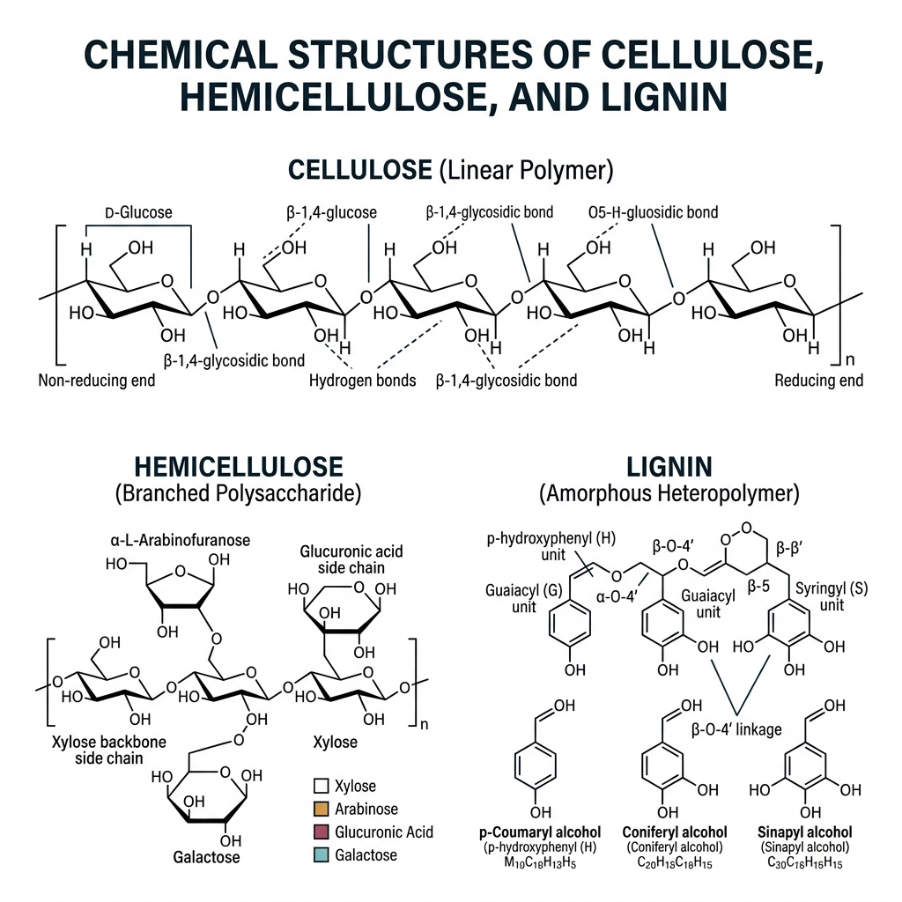{width="6.2034722222222225in" height="6.6353608923884515in"}

###### Hình 1.1. Cấu trúc hóa học của Cellulose, Hemicellulose và Lignin

### 1.1.2. Tính chất cơ lý, cấu trúc bó sợi và ảnh hưởng của quá trình kiềm hóa

- Cấu trúc bó sợi: Sợi xơ dừa thô tách bằng máy tước sợi liên hoàn có kích thước không đồng đều, đường kính dao động rộng từ 50 µm đến 600 µm. Trong đó, khoảng đường kính từ 100 µm đến 300 µm chiếm đa số (khoảng 79%), và đường kính trung bình dao động khoảng 124 -- 186.7 µm . Độ bền kéo đứt trung bình của sợi rối thô dao động từ 105.3 MPa đến 175 MPa \[15, 28\].

- Ảnh hưởng của tiền xử lý kiềm (NaOH): Tiền xử lý kiềm (kiềm hóa) bằng dung dịch NaOH (tối ưu từ 5 wt% ở 50--60°C đến 6 wt% ở 80°C) là bước then chốt để tách lignin (delignification) và hemicellulose \[17, 21\]. Quá trình này cắt đứt các liên kết ester liên kết chéo giữa lignin và hemicellulose \[27, 29\], làm giảm đáng kể hemicellulose/lignin; mức loại bỏ cần xác nhận bằng phân tích thành phần hoặc weight-loss.

- Biến đổi hình học và cấu trúc: Quá trình kiềm hóa làm giảm đường kính sợi trung bình từ 14% đến 24% do loại bỏ lớp vỏ vô định hình bao quanh. Bề mặt sợi thô ráp hơn, xuất hiện nhiều khe nứt và các lỗ rỗng vi mô do các nốt hạt silica và pectin bị rửa trôi.

- Cơ tính sợi: Khi xử lý trong điều kiện êm dịu (5% NaOH ở 50°C trong 6 giờ), độ bền kéo đứt của sợi đơn tăng đến hơn 40%. Tuy nhiên, nếu nồng độ kiềm quá cao (\>7% NaOH) hoặc gia nhiệt quá mức (\>90°C), cellulose sẽ bị thủy phân và phá hủy nghiêm trọng.

- *Cơ chế sol-gel trong hệ NH*~4~*OH/Urea/H*~2~*O và tạo gel đông lạnh (Cryo-gelation)*:

Thuyết Kén phân tử (Inclusion Complex Theory) được xây dựng bởi nhóm GS. Lina Zhang: cơ chế hòa tan được mô tả qua hành vi gel hóa đặc biệt của cellulose trong hệ kiềm/urea \[6\], trong đó Urea đóng vai trò tạo lớp vỏ bảo vệ quanh chuỗi cellulose thông qua tương tác van der Waals và liên kết hydro --- điều được xác nhận trực tiếp bằng kỹ thuật NMR bởi Xiong và cộng sự \[30\]. Cơ chế này được giả định tương tự cho hệ dung môi amoniac/urea/nước được sử dụng trong đề tài \[14, 31\], trong đó cellulose hòa tan theo cơ chế phối trí đa thành phần ở nhiệt độ lạnh.

Quá trình hòa tan là phản ứng tỏa nhiệt (ΔH \< 0) và giảm entropy (ΔS \< 0) --- được Cai và Zhang xác nhận bằng phân tích nhiệt lượng quét vi sai (DSC) \[32\] --- do đó sol chỉ ổn định và đồng nhất ở nhiệt độ ≤ 10°C (tối ưu 0 - 5°C).

Hiệu ứng tích tụ đông (Cryo-concentration) và tổ chức Cellulose III: Khi cấp đông sol ở -14°C đến -20°C, nước kết tinh đá tinh khiết dồn ép cellulose và urea vào các kênh lỏng siêu hẹp chưa đông. Dưới lực ép tinh thể đá ở cự ly tiếp xúc phân tử cực ngắn (\< 0.3 nm), kén urea bị phá vỡ, các nhóm hydroxyl tự do liên kết chéo trực tiếp vật lý với nhau, giả thuyết chuyển dịch cấu hình tinh thể sang dạng Cellulose III (cần bổ sung XRD), định hình khung gel 3D tổ ong.

### 1.1.3. Tiềm năng ứng dụng và lý giải cơ chế

Xơ dừa sở hữu nhiều ưu điểm nổi bật như nguồn sinh khối dồi dào, giá thành rẻ, có khả năng phân hủy sinh học, và đặc biệt là cấu trúc xốp rỗng phân cấp tự nhiên, đem lại tiềm năng ứng dụng to lớn trong nhiều lĩnh vực kỹ thuật cao.

- Gia cường vật liệu composite xanh (Green Composites): Sợi xơ dừa sau xử lý kiềm loại bỏ lớp sáp kỵ nước và tạp chất bám dính bề mặt, làm lộ ra các nhóm -OH hoạt tính của xenlulozo . Composite gia cường bằng sợi xơ dừa đã xử lý kiềm tăng đáng kể độ bền kéo và độ bền uốn so với composite dùng sợi chưa xử lý \[6\].

- *Vật liệu cách âm và cách nhiệt sinh học*: Do sở hữu các khoang rỗng vi mô chạy dọc sợi và các lỗ xốp tạo ra sau khi kiềm hóa loại bỏ tạp chất, xơ dừa trở thành chất cách âm tự nhiên rất tốt, đạt hệ số hấp thụ âm thanh (SAC) \[27\].

- Chất hấp phụ sinh học (Biosorbents): Hàm lượng cellulose cao chứa nhiều nhóm hydroxyl (-OH) phân cực và cấu trúc lignin chứa các vòng thơm có khả năng tạo liên kết hydro, tương tác tĩnh điện và tương tác xếp chồng π-π mạnh mẽ với các chất ô nhiễm \[7, 29\].

- *Hóa lý keo tụ (Coagulation) và Vật lý sấy thăng hoa (Freeze-drying)*:

Tiền đề về cellulose aerogel dẫn điện từ sinh khối đã được chứng minh qua các composite BC/CNT \[33\], mở hướng cho việc phát triển carbon aerogel điện cực từ xơ dừa trong đề tài này.

Đông tụ trong cồn bằng non-solvent: Khi hydrogel rã đông ngâm trong cồn, ethanol phân cực nhẹ hoạt động như chất khử nước cơ học mạnh mẽ, thay thế nước mao quản và đông tụ khóa cứng mạng lưới cellulose. Tỉ lệ cồn/gel tối ưu được nâng lên 15:1 (v/v) để duy trì nồng độ cồn sau cân bằng luôn đạt mức cao (\> 90%) \[22, 21\].

Sấy thăng hoa loại bỏ áp suất mao quản (P~c~): Quá trình sấy nhiệt bay hơi thông thường sinh giao diện lỏng-hơi tạo lực mao dẫn kéo sụp vách xốp nano do áp suất mao quản lớn P~c~ = 2γ cosθ / r (với bán kính lỗ xốp r \< 50 nm tạo P~c~ hàng chục MPa). Sấy thăng hoa đóng băng dung môi và cho thăng hoa trực tiếp dưới điểm ba trạng thái (P \< 20 Pa và nhiệt độ bẫy lạnh ≤ -45°C), khống chế độ co rút tuyến tính \< 12%. Cấu trúc lỗ xốp 3D có kiến trúc định hướng (engineered architecture) của carbon aerogel đã được chứng minh mang lại diện tích bề mặt lớn và độ dẫn điện vượt trội so với mạng xốp ngẫu nhiên (stochastic) \[8\] --- đây là tiền đề cho việc tối ưu hóa cấu trúc tổ ong của Fe/N-CA trong đề tài.

### 1.1.4. Tẩy lignin bán phần và cấu trúc đường xoắn (Tortuous Path)

Trong tổng hợp carbon aerogel từ xơ dừa, các nghiên cứu gần đây chỉ ra rằng việc loại bỏ hoàn toàn lignin thông qua kiềm hóa mạnh hoặc tẩy trắng bằng H~2~O~2~ cường độ cao sẽ làm suy giảm cơ tính sợi và gây sụp đổ hệ thống lỗ xốp vĩ mô (macropores) \[17, 18\]. Ngược lại, "tẩy lignin bán phần" (partial delignification) -- chủ động giữ lại một lượng lignin cốt lõi -- mang lại nhiều ưu điểm cơ nhiệt nổi bật \[17, 18\]. Lignin với cấu trúc polymer thơm 3D cứng chắc đóng vai trò như một chất liên kết chéo nội tại (in-situ cross-linker), "hàn điểm" các sợi vi mô lại với nhau giúp ổn định khung hydrogel mà không cần phụ gia hóa học độc hại. Hơn thế nữa, mạng lưới lignin-cellulose này sau khi trải qua sấy thăng hoa và nhiệt phân sẽ hình thành hệ thống mao quản phân cấp vi mô và trung bình liên thông với nhau, được gọi là cấu trúc "đường xoắn" (tortuous path) \[17, 18\]. Cấu trúc đường xoắn này tạo ra hàng loạt các kênh dẫn ion đan xen phức tạp, giúp mở rộng diện tích tiếp xúc điện hóa và tối ưu hóa động học khuếch tán cho các phân tử chất phân tích thâm nhập sâu vào lõi điện cực.

## 1.2. Carbon Aerogel biến tính Nitơ và Sắt (N-CA & Fe/N-CA)

Carbon aerogel hữu cơ đã được chứng minh là vật liệu electrocatalytic support hiệu quả nhờ độ dẫn điện cao, diện tích bề mặt lớn và cấu trúc xốp phân cấp thuận lợi cho khuếch tán ion \[34\]. Trên nền tảng đó, việc biến tính nitrogen và sắt (N-CA & Fe/N-CA) từ xơ dừa được kỳ vọng kế thừa và nâng cao các tính chất này cho ứng dụng cảm biến điện hóa.

Hòa tan cellulose trong hệ NH~4~OH:Urea:H~2~O ở nhiệt độ thấp kết hợp siêu âm giúp phá vỡ liên kết hydro nội phân tử. Theo Susanto và cộng sự (2023, 2024), khi nhiệt phân trong khí trơ N~2~, urea và amoniac đóng vai trò kép: tạo độ xốp khí và cung cấp nguyên tử Nitơ doping vào mạng carbon \[23, 24, 35\].

- *Bản chất Guaiacyl Lignin xơ dừa và Phản ứng Uretan hóa (Urethanization)*:

Lignin còn sót lại sau kiềm hóa (12--16 wt%) chủ yếu thuộc loại Guaiacyl-Syringyl (G-S) với đơn vị Guaiacyl chiếm ưu thế (\> 60%), có vị trí carbon số 5 (C5) trên vòng benzene tự do. Ở nhiệt độ 110--150°C, urea nóng chảy phản ứng ngưng tụ thế nucleophile ái điện tử với các nhóm hydroxyl tự do của lignin giả thuyết tạo liên kết carbamate (phản ứng uretan hóa): Lignin-OH + NH~2~-CO-NH~2~ → Lignin-O-CO-NH~2~ + NH~3~ ↑. Carbamate này tiếp tục phản ứng chéo tạo mạng uretan bền nhiệt và Schiff base (Lignin-C=N-CO-NH~2~), khóa chặt urea vào khung lignin thơm để bảo vệ nitơ khỏi bị bay hơi sớm ở nhiệt độ thấp \[15, 17\].

- *Động học nhiệt phân carbon hóa 3 ramps*:

Quá trình nung trong khí trơ N~2~ xảy ra qua 3 ramps nhiệt độ: ramp 1 (25--150°C) sấy ẩm sâu và xảy ra phản ứng uretan hóa lignin-urea; ramp 2 (150--400°C) phân hủy thô hữu cơ, cắt đứt các liên kết β-O-4 ether giải phóng khí dễ bay hơi (VOCs, CO, CO~2~, NH~3~); ramp 3 (400°C → Ttarget) đóng vòng ngưng tụ đa vòng thơm planar lai hóa sp² graphit hóa dẫn điện tốt, đồng thời chèn dị tố nitơ vào mạng lưới carbon tạo các tâm doping (tương tự cơ chế đã quan sát trên carbon aerogel từ tinh bột \[35\]).

Giai đoạn 5 (Nhiệt phân carbon hóa lần 1): Đặt aerogel trong lò nung ống thạch anh, thổi khí N~2~ trong 30 phút để đuổi khí. Nung nhiệt phân với tốc độ gia nhiệt 5°C/phút lên nhiệt độ mục tiêu và giữ nhiệt 2 giờ dưới luồng khí trơ N~2~ bảo vệ. Đối với mẫu N-CA, *T*~target~ = 700°C nhằm giữ lại tối đa các khuyết tật và nhóm Pyridinic-N \[23, 35\]. Đối với mẫu Fe/N-CA nền, nung ở 800°C để tăng độ dẫn điện của carbon nền \[23\].

Mẫu Fe/N-CA nền chọn T~target~ = 800°C để nâng cao tối đa độ graphit hóa của khung carbon, giảm điện trở trong điện cực.

- *Các cấu hình Nitơ bề mặt phổ XPS N 1s*:

Pyridinic-N (N-6) ở 398.5 ± 0.2 eV: Nitơ đóng vòng 6 cạnh, đóng góp 1 electron vào hệ liên hợp sp² và còn 1 cặp electron độc thân tự do hướng ra ngoài. Cặp electron này hoạt động như một Lewis base mạnh, dễ dàng chelate hóa phối trí chọn lọc với ion kim loại nặng tích điện dương (Pb²⁺, Cd²⁺, Zn²⁺). Đây là active site cảm biến chính, với mục tiêu định hướng diện tích đỉnh Pyridinic-N đạt ≥ 45% tổng diện tích phổ N 1s (screening target).

Pyrrolic-N (N-5) ở 400.1 ± 0.2 eV: Nitơ đóng vòng 5 cạnh đóng góp 2 electron vào hệ thơm liên hợp, hỗ trợ cải thiện độ ưa nước của bề mặt carbon aerogel nhờ tính phân cực và đóng vai trò tạo giả điện dung Faradaic.

Graphitic-N (N-Q) ở 401.2 ± 0.2 eV: Nitơ thế chỗ nguyên tử carbon trong mạng lưới graphit, hiến electron vào dải dẫn giúp nâng cao độ dẫn điện của carbon nền.

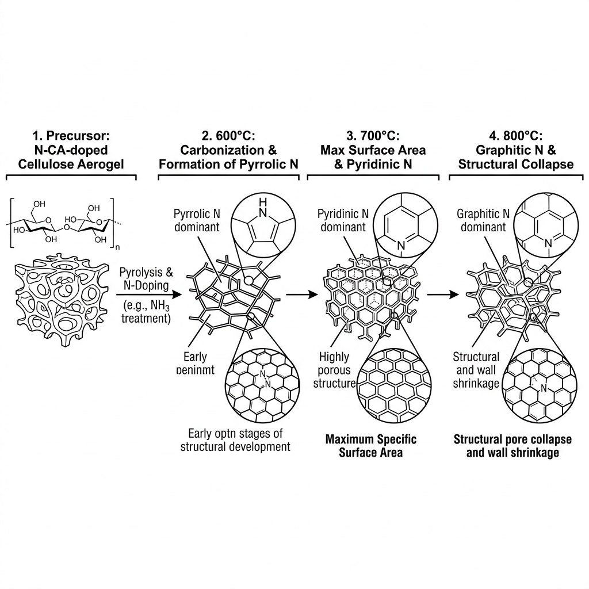{width="6.373437226596676in" height="3.4722222222222223in"}

###### Hình 1.2. Sơ đồ chuyển đổi cấu trúc lỗ xốp và cấu hình Nitơ của vật liệu Carbon Aerogel ở các nhiệt độ nung khác nhau

Ở 600°C, cấu trúc carbon hóa chưa hoàn toàn, giữ được lượng Pyrrolic-N lớn nhưng độ dẫn điện thấp. Ở 700°C, sự co ngót nhiệt tạo ra diện tích bề mặt riêng cực đại (S~BET~ ≈ 3,603 m²/g theo hệ NH~4~OH/Urea tối ưu \[23\]) với cấu hình Pyridinic-N. Khi tăng lên 800°C, cấu trúc mạng micropore bị sụp đổ một phần, làm co hẹp vách tế bào xốp khiến diện tích bề mặt riêng giảm mạnh xuống còn 1.951 m²/g, mặc dù độ graphite hóa (Graphitic-N) tăng lên giúp cải thiện độ dẫn điện \[23\].

Ghi chú S~BET~: Giá trị S~BET~ trong bảng (tối đa 3,603 m²/g tại 700°C) phản ánh kết quả tối ưu của hệ NH~4~OH/Urea theo Susanto 2024, với tỷ lệ 1g cellulose/mẻ và thiết bị chuẩn. Mục tiêu thực tế trong điều kiện lab IUH (\> 350 m²/g, Bảng 3.1) là ước tính thận trọng, tính đến sai số vận hành lần đầu và biến thiên nguyên liệu xơ dừa Bến Tre. Cả hai giá trị đều hợp lệ trong phạm vi tham chiếu của mình.

Bảng 1.1. Ảnh hưởng nhiệt độ nung đến S~BET~ và cấu hình Nitơ của Carbon Aerogel xơ dừa (hệ NH~4~OH/Urea) \[23\]

  -----------------------------------------------------------------------------------------------------------------
  **Nhiệt độ nung (°C)**   **S~BET~ (m²/g)**   **Cấu hình N chiếm ưu thế**    **Ứng dụng tối ưu**
  ------------------------ ------------------- ------------------------------ -------------------------------------
  600                      2509                Pyrrolic-N lớn (4--6 at%)      Electrochemical sensor, siêu tụ giả

  700                      3602                Mục tiêu ưu tiên Pyridinic-N   ORR, Cảm biến điện hóa

  800                      1950                Graphitic-N (sập lỗ xốp nhỏ)   Độ dẫn cực cao, mất tâm xúc tác
  -----------------------------------------------------------------------------------------------------------------

### 1.2.1. Cơ chế pha tạp Sắt (Fe-doping) bằng phương pháp tẩm sau (Post-impregnation)

Để hình thành các tâm xúc tác Fe-N~x~ hiệu suất cao, việc pha tạp kim loại đóng vai trò quyết định. Theo các nghiên cứu đối chứng \[12, 25\], phương pháp tẩm sau (Post-impregnation) ưu việt hơn so với phương pháp đồng kết tủa (Co-precipitation) trực tiếp trong dung dịch Sol-Gel. Việc đưa muối sắt vào hệ dung môi kiềm mạnh như NH~4~OH/Urea sẽ ngay lập tức gây kết tủa Fe(OH)~3~ (rủi ro hóa học dự đoán), phá vỡ quá trình tự liên kết hydro của mạng cellulose và làm sập hoàn toàn cấu trúc gel.

Do đó, sắt (Fe³⁺) được hòa tan trong dung môi cồn ethanol nguyên chất lạnh và tẩm vào aerogel đã qua giai đoạn carbon hóa. Ethanol với sức căng bề mặt thấp giúp dung dịch thấm ướt bề mặt kỵ nước của mạng carbon, dễ dàng len lỏi mao dẫn vào sâu hệ thống lỗ xốp phân cấp. Tại đây, cấu hình orbital trống của ion sắt sẽ tìm đến và phối trí trực tiếp với các cặp electron tự do của các vị trí nitơ khuyết tật (đặc biệt là Pyridinic-N), định hình cấu trúc liên kết Fe-N (điều này đã được minh chứng thông qua các mô hình phân tử mô phỏng lý thuyết \[36\] và trên vật liệu thực tế \[37\]). Quá trình hậu xử lý thông qua đun hồi lưu axit (HCl 0.5M) và nung phục hồi cấu trúc (Re-annealing ở 750°C) được thiết kế nhằm hòa tan các pha oxit sắt không hoạt tính và củng cố liên kết phối trí phẳng Fe-Nx trên vách mạng carbon liên hợp sp² \[10, 11\]. Mặc dù mô hình động học cấu trúc này ban đầu được khẳng định tính bền vững qua các phản ứng điện xúc tác, việc tích hợp chúng lên nền tảng carbon aerogel phân cấp mở ra một tiềm năng phân tích điện hóa vượt trội. Các tâm phối trí Fe-Nx với đặc tính giàu electron đóng vai trò là các vị trí xúc tác nội tại (intrinsic active sites), tạo lực chelate hóa mạnh mẽ để làm giàu các cation kim loại nặng, qua đó khuếch đại dòng Faradaic cho cảm biến \[12, 13\]. Đây được xem là bằng chứng trực tiếp mạnh mẽ nhất cho thấy nền tảng vật liệu aerogel pha tạp Fe/N hoàn toàn có khả năng hoạt động như một cảm biến sinh học nhạy bén. Chẳng hạn, một nghiên cứu thiết kế Fe/N-CA phân cấp đã cho thấy khả năng phát hiện đa phương thức đối với phân tử glucose với giới hạn phát hiện (LOD) rất thấp đạt 0.5 µM \[38\]. Tuy nhiên, việc phát triển hệ cảm biến này từ nguồn sinh khối xơ dừa giá rẻ và định hướng tích hợp màng Chitosan/Nafion để kiểm soát nhiễu sinh học, đặc biệt hướng tới phân tích phức hợp dược phẩm (Paracetamol) và kim loại nặng, vẫn là một khoảng trống nghiên cứu (research gap) đầy triển vọng.

Bên cạnh khả năng chelate hóa các cation kim loại nặng, cấu trúc xốp 3D và các nhóm chức Pyridinic-N trên bề mặt vật liệu carbon aerogel pha tạp Nitơ (N-CA) gần đây còn chứng minh được hoạt tính điện xúc tác vượt trội \[39, 40\]. Khuyết tật mạng lưới sp^2^ sinh ra từ quá trình pha tạp Nitơ sẽ thay đổi cấu trúc điện tử, cung cấp các điểm tương tác hydro và liên kết $\pi - \pi$ mạnh mẽ. Điều này mang lại độ nhạy cao trong việc nhận diện và phát hiện các phân tử hữu cơ phức tạp chứa vòng benzen như Acetaminophen (Paracetamol) \[41\].

## 1.3. Cơ chế lớp kép điện hóa (EDL), điện thế Zeta, thuyết DLVO và tương tác kỵ nước/hydrogen

- *Điện thế Zeta và Thuyết DLVO*

Hệ dung môi NH~4~OH-Urea trương nở cellulose thông qua việc thiết lập lớp solvate hóa phân cực và tích lũy điện tích bề mặt (hạn chế tiềm tàng cần đối chứng thực nghiệm). Theo lý thuyết keo của Paul C. Hiemenz \[42\], thuyết DLVO chỉ ra sự thế cân bằng giữa lực đẩy tĩnh điện (lớp kép điện hóa EDL) và lực hút Van der Waals giữ cho cellulose sol ổn định ở nhiệt độ lạnh.

- *Điện trở trở kháng và Mạch tương đương Randles sửa đổi*:

Giản đồ trở kháng Nyquist (Z' vs. −Z'') từ phổ EIS được mô phỏng qua mạch tương đương Randles sửa đổi: Rs (solution resistance - điện trở dung dịch đệm ở tần số cực cao), Rct (charge transfer resistance - điện trở chuyển điện tích của phản ứng redox tại bề mặt phân giới biểu diễn bằng đường kính bán nguyệt), phần tử pha không đổi CPE (ZCPE = 1 / \[Y0(jω)n\]) thay thế tụ điện lớp kép để hiệu chỉnh độ gồ ghề của bề mặt Carbon Aerogel xốp, và trở kháng khuếch tán Warburg Zw biểu diễn dòng khuếch tán ion ở tần số thấp. Tiêu chí bắt buộc để nghiệm thu màng là Rct (Fe/N-CA) \< Rct (N-CA) \< Rct (bare GCE) chứng minh hoạt tính xúc tác của các tâm Fe-N~x~ candidate sites.

- *Động học dòng đỉnh CV và Phương trình Randles-Ševčík*:

Phản ứng thuận nghịch của cặp chỉ thị

K~3~Fe(CN)~6~ / K~4~Fe(CN)~6~ (Fe(CN)~6~³⁻ + e⁻ ⇌ Fe(CN)~6~⁴⁻)

tuân theo phương trình Randles-Sevcik ở 25°C:

I~p~ = (2.69 × 10^5^) × n^3/2^ × A~eff~ × D^1/2^ × C~0~\* × v^1/2^

để xác định diện tích EASA của màng cảm biến. Tiêu chí thế tách đỉnh thế ΔE~p~ = *E*~pa~ − *E*~pc~ \< 120 mV ở tốc độ quét 50 mV/s là điều kiện bắt buộc để xác nhận màng có độ dẫn điện tốt.

- *Lực tương tác bề mặt kỵ nước và liên kết hydro*

Theo Jacob N. Israelachvili \[43\], tương tác kỵ nước và tương tác xếp chồng thơm π-π giữa nền kỵ nước và bề mặt carbon sp² lai hóa hỗ trợ quá trình hấp phụ thụ động chọn lọc ion sát điện cực mà không cần thế tích lũy. Phổ Raman đo đạc khuyết tật mạng với tỷ số *I*~D~/*I*~G~ = 0.9 - 1.2 là vùng screening khởi đầu để tối ưu hóa để cân bằng giữa mật độ active sites khuyết tật và độ dẫn điện của mạng carbon sp².

- *BET mesopores liên thông*:

Hấp phụ-khử hấp phụ N~2~ của Carbon Aerogel xơ dừa thuộc Isotherm Loại IV (Type IV) với vòng lặp trễ hysteresis loop đặc trưng cho mesopores (2 - 50 nm). Thể tích lỗ xốp lớn và diện tích S~BET~ \> 300 m²/g bảo đảm dung dịch điện ly khuếch tán nhanh nhất, tránh bít tắc mao quản mực in.

## 1.4. So sánh đối chứng hai hệ dung môi tổng hợp cellulose aerogel

Đặc biệt, công trình của Fauziyah và cộng sự (2019) đã chứng minh tính khả thi của cellulose aerogel từ xơ dừa bằng hệ NaOH--urea, nhưng phạm vi ứng dụng dừng ở hấp phụ nước, dầu và phẩm màu, chưa thực hiện carbon hóa, pha tạp N/Fe hoặc ứng dụng làm điện cực cảm biến điện hóa \[21, 29\].

Luận điểm khoa học cốt lõi của đề tài là lựa chọn hệ NH~4~OH/Urea thay vì hệ NaOH/Urea truyền thống \[27, 29\]. Bảng 1.2 tóm tắt sự khác biệt quan trọng giữa hai hệ: hệ NH~4~OH/Urea làm giảm rủi ro tồn dư Na⁺ so với hệ NaOH/Urea, đồng thời có lợi cho N-doping; hiệu quả cuối cùng vẫn phụ thuộc vào rửa, sấy và nhiệt phân, đồng thời giúp diện tích bề mặt riêng S~BET~ tăng lên mức 3603--3730 m²/g \[22, 23\] so với mức ≤ 150 m²/g của hệ NaOH/Urea truyền thống \[21\].

##### Bảng 1.2. So sánh hệ dung môi NH~4~OH/Urea và NaOH/Urea

  ---------------------------------------------------------------------------------
  **Chỉ số**         **Hệ NH**~4~**OH/Urea**                **Hệ NaOH/Urea**
  ------------------ -------------------------------------- -----------------------
  Pha tinh thể ẩm    Cellulose III                          Cellulose II

  Pha sau nung       Carbon sp² bán tinh thể                Carbon vô định hình

  Bay hơi dung môi   NH~3~ bay hơi/rửa trôi cao, giảm Na⁺   Na⁺ cặn bám dính gel

  S~BET~             3603--3730 m²/g                        ≤ 150 m²/g

  Độ dẫn điện        5.08 S/cm                              0.93 S/cm

  Ứng dụng tối ưu    Cảm biến màng mỏng & ORR               Siêu tụ điện EDLC
  ---------------------------------------------------------------------------------

## 1.5. Bismuth Film Electrode (BiFE) và lý do lựa chọn Fe/N-CA

### 1.5.1. Bismuth Film Electrode

Kể từ khi Wang và cộng sự (2000) giới thiệu, Bismuth Film Electrode (BiFE) đã trở thành modifier chuẩn thay thế Mercury (Hg) trong SWASV phân tích vết Pb²⁺, Cd²⁺, Zn²⁺. BiFE đạt giới hạn phát hiện ở mức vết với độ tái lặp tốt và độc tính thấp hơn Hg đáng kể. \[26\]

Cơ chế: Bi³⁺ (0.1--1 mM) trong dung dịch đo bị khử thành màng Bi⁰ tại thế lắng, tạo hợp kim Bi-M với Pb, Cd, Zn giúp làm giàu và khuếch đại tín hiệu hòa tan.

##### Bảng 1.3: Hạn chế của BiFE --- Cơ sở lý do không sử dụng trong đề tài

  ------------------------------------------------------------------------------------------------------------------------------------------------
  **Nhược điểm BiFE**                                        **Ảnh hưởng thực tiễn**
  ---------------------------------------------------------- -------------------------------------------------------------------------------------
  Màng Bi⁰ phải tái tạo in-situ mỗi phép đo                  Cần Bi³⁺ trong dung dịch đo liên tục; tăng nền nhiễu

  Bi³⁺ (0.1--1 mM) cạnh tranh tín hiệu với analyte Giảm      tỷ lệ S/N, phức tạp hóa matrix

  Kém bền theo thời gian --- RSD điện cực độc lập \> 8% (h   ạn chế tiềm tàng cần đối chứng thực nghiệm) Độ chụm trung gian thấp hơn yêu cầu ICH

  Bi hòa tan ở thế ≈ −0,1 V                                  Không phù hợp hệ dual-analyte SWASV
  ------------------------------------------------------------------------------------------------------------------------------------------------

### 1.5.2. Lý do lựa chọn Fe/N-CA --- Luận điểm khoa học

Tâm hoạt tính Fe-Nx candidate sites và Pyridinic-N trên Carbon Aerogel chelate hóa trực tiếp Pb²⁺, Cd²⁺, Zn²⁺ mà không cần modifier trong dung dịch đo. Cơ sở lý thuyết cho khả năng này xuất phát từ trạng thái spin trung gian của FeIII trong cấu trúc FeN4/C (t2g⁴eg¹), với 1 electron eg sẵn sàng tương tác với orbital frontier của cation kim loại nặng --- cơ chế tương tự đã được chứng minh trong phản ứng khử oxy (ORR) \[31\]. Đây là cơ chế pre-concentration nội tại (intrinsic), không phụ thuộc vào màng kim loại tái tạo. Ưu điểm cốt lõi:

- Bền vững điện cực: Không cần tái tạo màng; giả thuyết đạt độ ổn định cao (\> 100 lần đo); RSD \< 5%

- Khoảng thế làm việc rộng: SWASV (-1.4 V → -0.2 V). Thực hiện đo cùng nền trên GCE: Fe/N-CA/Chitosan/GCE cho SWASV kim loại.

- Dual-analyte khả thi trên cùng nền GCE Fe/N-CA/Chitosan cho kim loại (SWASV).

- Không cần Bi³⁺: Giảm matrix effect, đơn giản hóa quy trình chuẩn bị mẫu nước thực

##### Bảng 1.4: So sánh trực tiếp BiFE và Fe/N-CA:

  ---------------------------------------------------------------------------------------------------------------------------------------------------------------------------------------------------------------------------------------------------------------------------------------------------
  **Tiêu chí so sánh**          **BiFE**                                                                                                             **Fe/N-CA/GCE trong đề tài**
  ----------------------------- -------------------------------------------------------------------------------------------------------------------- ------------------------------------------------------------------------------------------------------------------------------------------------
  Vai trò trong SWASV           Điện cực màng Bi đã được dùng rộng rãi để làm giàu và hòa tan Pb²⁺, Cd²⁺, Zn²⁺ ở nồng độ vết                         Nền điện cực carbon aerogel đồng pha tạp Fe/N được đề xuất như một hướng thay thế không dùng màng Bi

  Cơ chế làm giàu kim loại      Bi tạo màng kim loại và hỗ trợ tạo hợp kim/kết tụ kim loại trong giai đoạn lắng                                      Các nhóm N, O và Fe/N-containing sites trên carbon xốp được kỳ vọng hỗ trợ hấp phụ, phối trí và làm giàu ion kim loại

  Modifier trong dung dịch đo   Với BiFE in-situ, thường cần bổ sung Bi³⁺ vào dung dịch đo; với BiFE ex-situ, màng Bi có thể được tạo trước          Không cần bổ sung Bi³⁺ vào dung dịch đo; vật liệu biến tính đã được cố định trên GCE

  Tái tạo bề mặt điện cực       Có thể cần tái tạo hoặc kiểm soát lại màng Bi tùy chế độ in-situ/ex-situ và nền mẫu                                  Dự kiến dùng màng Fe/N-CA/Chitosan cố định; độ bền cần kiểm chứng bằng repeatability, reproducibility và stability

  Hiệu năng phát hiện Pb²⁺      BiFE là đối chứng mạnh, có thể đạt LOD dưới ppb trong nhiều công bố                                                  Mục tiêu benchmark của đề tài là LOD Pb²⁺ \< 0,1 ppb; chỉ kết luận sau khi có đường chuẩn và blank thực nghiệm

  Ảnh hưởng nền mẫu             Sự hình thành màng Bi có thể bị ảnh hưởng bởi thành phần nền, ion cạnh tranh và điều kiện lắng                       Fe/N-CA có thể chịu ảnh hưởng bởi ion cạnh tranh, chất hữu cơ bám bẩn và độ ổn định màng in

  Độ ổn định điện cực           Phụ thuộc vào chế độ tạo màng, điều kiện lắng và số lần đo; không nên kết luận chung là thấp nếu chưa có đối chứng   Cần chứng minh bằng RSD lặp lại, RSD giữa các điện cực và tín hiệu sau nhiều chu kỳ đo

  Tính xanh của vật liệu        Ít độc hơn Hg nhưng vẫn sử dụng muối Bi và quá trình tạo màng kim loại                                               Có lợi thế nguồn sinh khối xơ dừa, không bổ sung Bi³⁺ vào dung dịch đo; tuy nhiên vẫn dùng NH~3~, HCl, DMF nên không thể gọi là hoàn toàn xanh

  Độ mới khoa học               Nền điện cực đã được thiết lập tốt trong phân tích hòa tan anodic                                                    Tính mới nằm ở Fe/N-CA từ xơ dừa Bến Tre, kết hợp cấu trúc xốp phân cấp với Fe/N surface sites cho SWASV kim loại nặng

  Vai trò trong bài báo         Dùng làm benchmark hoặc đối chứng dương                                                                              Là vật liệu chính cần chứng minh ưu thế qua BET, Raman, XPS, CV/EIS và SWASV
  ---------------------------------------------------------------------------------------------------------------------------------------------------------------------------------------------------------------------------------------------------------------------------------------------------

Sự kết hợp Fe-N~x~ + Pyridinic-N từ vật liệu sinh khối xơ dừa Bến Tre là đóng góp mới so với toàn bộ tài liệu đã tổng quan, đặc biệt là khả năng phát hiện đa kim loại nặng trên cùng nền điện cực GCE.

## 1.6. Phương pháp phân tích điện hóa

M²⁺ + 2e⁻ → M⁰ (bám dính trên CA)

Vai trò binder kết dính:

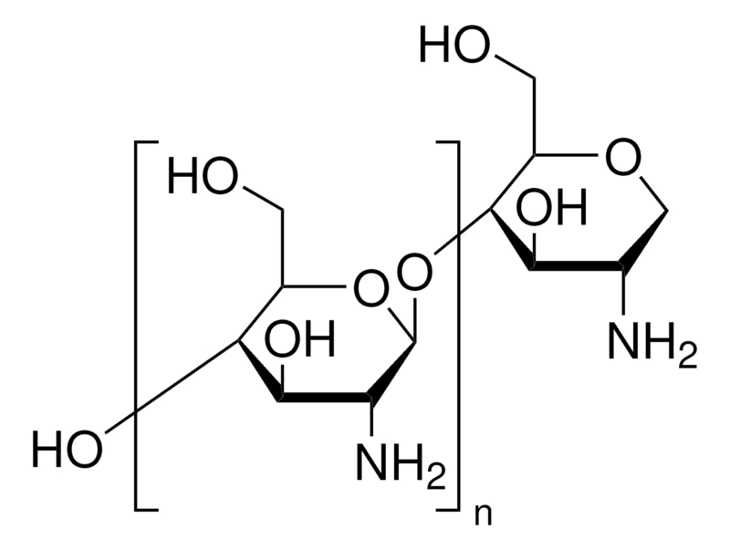{width="3.073290682414698in" height="2.3164938757655293in"}

###### Hình 1.3. Công thức phân tử của chitosan (CAS 9012-76-4)

Chitosan 1% giàu nhóm amino (-NH~2~) chelate hóa mạnh với Pb²⁺, Cd²⁺, Zn²⁺ hỗ trợ tích lũy lắng khử trong SWASV (cơ chế đề xuất cần kiểm chứng);

Trong nền đệm Acetate pH 4.5, Chitosan bị proton hóa hoàn toàn thành dạng polymer mạch hở mang điện tích dương, đóng vai trò tạo màng keo xốp hydrogel bám dính cao trên bề mặt GCE, giúp cố định hạt carbon aerogel mà không làm bít tắc các tâm hoạt tính Fe-Nₓ của vật liệu nền.

Nafion 0.25% mang điện tích âm của nhóm sulfonate (-SO~3~⁻) đóng vai trò màng trao đổi cation chọn lọc, đẩy các anion cản trở và chống bám bẩn điện cực (cơ chế đề xuất).

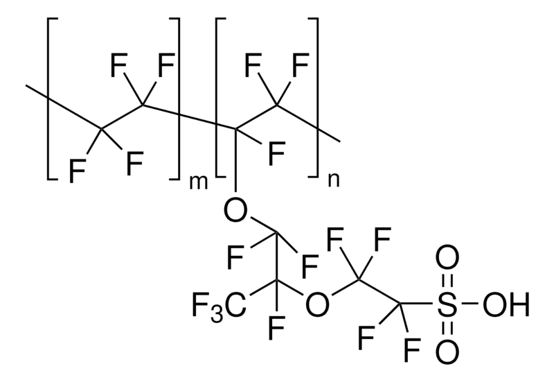{width="3.3333344269466316in" height="2.2962970253718287in"}

###### Hình 1.4. Công thức phân tử của Nafion™ perfluorinated resin solution, 5 wt% (CAS 31175-20-9)

## 1.7. Đối chiếu công trình nghiên cứu gần đây

Hiệu năng cảm biến của đề tài đề xuất (N-CA và Fe/N-CA) so với các nghiên cứu cảm biến carbon sinh khối khác trong 5 năm gần đây, làm nổi bật giới hạn phát hiện LOD mục tiêu (Pb²⁺ \< 0,1 ppb). Đối với Zn²⁺, dù QCVN 08:2023/BTNMT \[4\] quy định giới hạn 500 µg/L, LOD \< 0,5 ppb được thiết kế để phân biệt chính xác stripping peak Zn²⁺ từ Pb²⁺/Cd²⁺ trong SWASV đồng thời, Đối với $Zn^{2 +}$, do QCVN 08:2023/BTNMT quy định giới hạn nước mặt là 500 µg/L và hướng dẫn cảm quan nguồn nước của WHO là 3 mg/L, việc đặt mục tiêu LOD ở dải vết là công cụ phân tích mạnh để kiểm soát sự phân tách pic, loại trừ hiện tượng chồng lấn tín hiệu dòng Faradaic khi phân tích đồng thời với các độc chất kim loại nặng dải vết như Pb²⁺ và Cd²⁺.

##### Bảng 1.5. Đối chiếu các công trình vật liệu carbon/aerogel liên quan gần đây

+---------------------------------------------+--------------------+-------------------+----------------+-----------------------+------------+
| **Vật liệu nguồn**                          | **Chất phân tích** | **Chất kết dính** | **LOD**        | **Khoảng tuyến tính** | **TLTK**   |
+=============================================+====================+===================+================+=======================+:==========:+
| Tảo sinh khối (Algae)                       | Dopamine           | Nafion 0.5%       | 3.3 nM         | 0.01--200 µM          | \[12\]     |
+---------------------------------------------+--------------------+-------------------+----------------+-----------------------+------------+
| Graphene/ZrO~2~ composite                   | Luteolin           | Chitosan          | 1 nM           | 5--1000 nM            | \[44\]     |
+---------------------------------------------+--------------------+-------------------+----------------+-----------------------+------------+
| rGO-Chitosan/PLL Nanocomposite              | Pb²⁺, Cd²⁺, Cu²⁺   | Chitosan          | \~0.0001 µM    | 0.002 - 0.38 µM       | \[45\]     |
+---------------------------------------------+--------------------+-------------------+----------------+-----------------------+------------+
| Bismuth-Chitosan Nanocomposite              | Pb²⁺, Cd²⁺, Zn²⁺   | Chitosan          | 0.001-0.004 µM | 0.005-0.05 µM         | \[46\]     |
+---------------------------------------------+--------------------+-------------------+----------------+-----------------------+------------+
| MOF-derived Boron-Nitrogen-doped carbon     | Pb²⁺, Cd²⁺         | Nafion            | 0.005 µM       | 0.01-10 µM            | \[47\]     |
+---------------------------------------------+--------------------+-------------------+----------------+-----------------------+------------+
| Carbon Nanotubes / Halloysite               | Pb²⁺, Cd²⁺         | Nafion            | 0.1-0.2 µM     | 0.5-50 µM             | \[48\]     |
+---------------------------------------------+--------------------+-------------------+----------------+-----------------------+------------+
| Nitrogen-doped porous carbon                | Paracetamol        | \-                | 0,022 µM       | 0,1 -- 100 µM         | \[39\]     |
+---------------------------------------------+--------------------+-------------------+----------------+-----------------------+------------+
| Carbon xốp pha tạp Nitơ nguồn gốc sinh khối | Paracetamol        | Nafion 0.25%      | 0,017 µM       | 0,05 -- 120 µM        | \[40\]     |
+---------------------------------------------+--------------------+-------------------+----------------+-----------------------+------------+
| Nafion/TiO₂-graphene/GCE                    | Paracetamol        | Nafion            | 0.21 µM        | 1 -- 100 µM           | \[49\]     |
+---------------------------------------------+--------------------+-------------------+----------------+-----------------------+------------+
| Fe/N-CA                                     | Glucose            | Nafion            | 0.5 µM         | \-                    | \[38\]     |
+---------------------------------------------+--------------------+-------------------+----------------+-----------------------+------------+
| Xơ dừa Bến Tre                              | Pb²⁺, Cd²⁺, Zn²⁺   | Chitosan 1%       | Mục tiêu:      | 0.5--150 ppb          | Đề tài này |
|                                             |                    |                   |                |                       |            |
|                                             |                    |                   | \< 0.1 ppb     |                       |            |
+---------------------------------------------+--------------------+-------------------+----------------+-----------------------+------------+

# CHƯƠNG 2. PHƯƠNG PHÁP NGHIÊN CỨU

## 2.1. Thiết bị, dụng cụ và hóa chất sử dụng

- *Hóa chất*: Bột xơ dừa Bến Tre, NaOH rắn (99%), Urea tinh thể, Amoniac dung dịch (25 wt%), FeCl~3~·6H~2~O tinh khiết, HCl (37%), Ethanol ≥96%, Chitosan (trung bình), Nafion (5 wt% trong cồn), DMF (HPLC grade), các muối chuẩn kim loại nặng đơn nguyên tố nồng độ 1000 mg/L (CertiPUR, Merck, Đức).

- *Thiết bị*: Máy đo điện hóa Potentiostat PalmSens4 (phần mềm PSTrace 5.8), hệ bình đo 3 điện cực (Ag/AgCl làm điện cực so sánh, Pt wire đối cực, GCE biến tính làm điện cực làm việc), bể siêu âm có bộ điều nhiệt, lò nung ống thạch anh dòng khí trơ N~2~, máy sấy thăng hoa chân không, cân phân tích 4 chữ số (độ chính xác 0.1 mg).

## 2.2. Quy trình thực nghiệm 8 giai đoạn tổng hợp Carbon Aerogel

Dưới đây là Bảng tóm tắt các thông số bắt đầu và thiết kế khảo sát cho toàn bộ quy trình 8 giai đoạn nhằm bảo toàn cơ tính của mạng cellulose, khống chế độ co rút và định hình cấu trúc cảm biến điện hóa:

##### Bảng 2.1: Tóm tắt thông số SOP và Biện luận cơ chế \[22, 23\]

+---------------------------------------+-----------------------------------------------------------+--------------------------------------------------------------------------------------------------------+
| **Giai đoạn**                         | **Mục tiêu cốt lõi**                                      | **Thông số thực nghiệm**                                                                               |
+=======================================+===========================================================+========================================================================================================+
| GĐ 0: Tiền xử lý                      | Tẩy lignin bán phần, lộ cellulose, giữ cấu trúc phân cấp  | \- NaOH 6% w/v (30g/500mL)                                                                             |
|                                       |                                                           |                                                                                                        |
|                                       |                                                           | \- T = 80 ± 2°C, t = 4h                                                                                |
|                                       |                                                           |                                                                                                        |
|                                       |                                                           | \- Tỷ lệ Rắn/Lỏng = 1:20                                                                               |
+---------------------------------------+-----------------------------------------------------------+--------------------------------------------------------------------------------------------------------+
| GĐ 1: Sol-gel                         | Phá vỡ liên kết hydro, tự pha tạp N từ nguồn amoniac/urea | \- Dung môi: NH~3~ (11mL) / Urea (4g) / H~2~O (5mL)                                                    |
|                                       |                                                           |                                                                                                        |
|                                       |                                                           | \- T = Ice bath (≤ 10°C)                                                                               |
|                                       |                                                           |                                                                                                        |
|                                       |                                                           | \- Siêu âm xung (2s on/1s off) 30 phút                                                                 |
+---------------------------------------+-----------------------------------------------------------+--------------------------------------------------------------------------------------------------------+
| GĐ 2: Gel hóa lạnh                    | Tạo mạng hydrogel 3D tổ ong (Ice-templating)              | \- Đúc khuôn ống PP (chống dính)                                                                       |
|                                       |                                                           |                                                                                                        |
|                                       |                                                           | \- Khử bọt tĩnh 30 phút                                                                                |
|                                       |                                                           |                                                                                                        |
|                                       |                                                           | \- Cấp đông sâu -14°C đến -20°C / 24h                                                                  |
+---------------------------------------+-----------------------------------------------------------+--------------------------------------------------------------------------------------------------------+
| GĐ 3 & 4: Keo tụ & Sấy thăng hoa      | Cố định mạng gel, triệt tiêu áp suất mao quản             | \- Rã đông 1h ở 25°C                                                                                   |
|                                       |                                                           |                                                                                                        |
|                                       |                                                           | \- Keo tụ: Ethanol 96% (hoặc 98% tùy điều kiện phòng thí nghiệm) ở nhiệt độ phòng (20--25°C), ngâm 24h |
|                                       |                                                           |                                                                                                        |
|                                       |                                                           | \- Sấy thăng hoa                                                                                       |
+---------------------------------------+-----------------------------------------------------------+--------------------------------------------------------------------------------------------------------+
| GĐ 5: Nhiệt phân                      | Tạo mạng carbon sp², N-doping                             | \- Khí N~2~, gia nhiệt 3-ramps (5°C/min)                                                               |
|                                       |                                                           |                                                                                                        |
|                                       |                                                           | \- *T*~target~ = 700°C (N-CA) hoặc 800°C (nền Fe/N-CA)                                                 |
|                                       |                                                           |                                                                                                        |
|                                       |                                                           | \- Giữ nhiệt 2h                                                                                        |
+---------------------------------------+-----------------------------------------------------------+--------------------------------------------------------------------------------------------------------+
| GĐ 6: Doping Sắt                      | Tẩm Fe³⁺ vào cấu trúc xốp (chỉ Fe/N-CA)                   | \- Dung môi: Ethanol ≥96%                                                                              |
|                                       |                                                           |                                                                                                        |
|                                       |                                                           | \- Tiền chất: FeCl~3~·6H~2~O (Khảo sát 1 wt% và 5 wt% Fe)                                              |
|                                       |                                                           |                                                                                                        |
|                                       |                                                           | \- Siêu âm nhẹ 30', khuấy chậm 24h ở 25°C                                                              |
+---------------------------------------+-----------------------------------------------------------+--------------------------------------------------------------------------------------------------------+
| GĐ 7: Acid Leaching & Annealing lần 2 | Loại bỏ Fe thô, định hình tâm xúc tác Fe-N~x~             | \- Rửa acid: HCl 0.5M, đun hồi lưu 80°C/8h                                                             |
|                                       |                                                           |                                                                                                        |
|                                       |                                                           | \- DOE Annealing**:** 750°C, 800°C để đối chứng.                                                       |
+---------------------------------------+-----------------------------------------------------------+--------------------------------------------------------------------------------------------------------+

- Giai đoạn 0 (Tiền xử lý kiềm hóa tách lignin): Nghiền bột xơ dừa Bến Tre, rây lấy kích thước hạt \< 150 µm. Kiềm hóa bằng NaOH 6 wt% ở 80 ± 2°C trong 4 giờ. Lọc rửa bằng nước cất DI nóng đến pH trung tính, sấy khô 105°C. Đo khối lượng hao hụt (Gravimetric weight-loss) nhằm kiểm soát hiệu quả tách hemicellulose/lignin \[22, 21, 27, 29\].

- Giai đoạn 1 (Sol-gel NH~3~-Urea-H~2~O): Phối trộn hệ sol tỷ lệ 1g xenlulozo thô : 11 mL NH~3~ 25% : 4g Urea : 5 mL H~2~O. Đặt bình vào bể siêu âm đổ đầy đá duy trì nhiệt độ bể ≤ 10°C (ưu tiên 0--5°C) nhằm ngăn chặn bay hơi NH~3~, siêu âm chế độ xung trong 30 phút \[22, 23, 24\].

- Giai đoạn 2 (Đúc khuôn & Gel hóa lạnh): Gõ nhẹ đáy khuôn đuổi bọt khí, ổn định ở 0--5°C trong 15--30 phút. Bọc kín miệng khuôn, đặt tĩnh cấp đông ở nhiệt độ −25°C trong 24 giờ \[29, 50, 51\].

- Giai đoạn 3 (Keo tụ & Trao đổi dung môi): Dựa trên quy trình nền của Fauziyah (2020), đề tài tối ưu hóa điều kiện keo tụ bằng cách trượt hydrogel vào cốc chứa Ethanol 96% (hoặc 98% tùy điều kiện phòng thí nghiệm) ở nhiệt độ phòng (20--25°C) với tỷ lệ thể tích cồn/gel là 15:1 (v/v), ngâm tĩnh trong 24 giờ nhằm tách pha và khóa mạng cellulose. Thay thế dung môi bằng ngâm rửa nước cất DI tối thiểu 2 lần và thêm lần 3 nếu ethanol còn \>15--20% v/v, pH \>8.5 hoặc mùi amoniac còn rõ; mục tiêu trước freeze-dry là ethanol cuối ≤10--15% v/v \[22, 29, 50\].

- Giai đoạn 4 (Sấy thăng hoa): Cấp đông sâu gel ở −50°C trong 12 giờ. Sấy thăng hoa chân không ở áp suất \< 20 Pa nhằm triệt tiêu lực mao dẫn phá hủy vách xốp \[23\].

- Giai đoạn 5 (Nhiệt phân carbon hóa lần 1): Đặt aerogel trong lò nung ống thạch anh, thổi khí N~2~ trong 30 phút để đuổi khí. Nung nhiệt phân với tốc độ gia nhiệt 5°C/phút lên nhiệt độ mục tiêu và giữ nhiệt 2 giờ dưới luồng khí trơ N~2~ bảo vệ. Đối với mẫu N-CA, *T*~target~ = 700°C nhằm giữ lại tối đa các khuyết tật và nhóm Pyridinic-N \[23, 35\]. Đối với mẫu Fe/N-CA nền, nung ở 800°C để tăng độ dẫn điện của carbon nền \[23\].

- Giai đoạn 6 (Doping Fe - Post-impregnation): Hòa tan FeCl~3~·6H~2~O vào ethanol ≥ 96% (khảo sát mức 1 wt% và 5 wt% Fe). Cho bột carbon nền vào dung dịch tẩm, siêu âm 30 phút, khuấy từ ở 25 ± 2°C trong 24 giờ. Sấy khô ở 60°C \[12, 25\].

- Giai đoạn 7 (Rửa acid & Khảo sát nung Annealing lần 2): Đun hồi lưu hỗn hợp bột carbon trong dung dịch HCl 0.5 M ở 80 ± 2°C trong 8 giờ nhằm hòa tan sắt tự do không hoạt tính. Lọc rửa đến pH trung tính \[41, 10\].

**Thiết kế thực nghiệm (DOE):** Tiến hành nung lại (re-annealing) trong 1 giờ dưới khí N~2~ với hai mức nhiệt độ:

1.  **Mức 750°C (SOP cơ sở):** Điều kiện này giúp bảo vệ mạng xốp và hàm lượng Nitơ bề mặt sau khi khung carbon đã bị bào mòn bởi acid.

2.  **Mức 800°C (Mức đối chứng):** Khảo sát khả năng gia tăng độ graphit hóa và giảm điện trở $R_{ct}$. Điều kiện tối ưu sẽ được quyết định dựa trên các dữ liệu kiểm chứng hóa lý (XPS, Raman, BET) và đáp ứng điện hóa (EIS, SWASV).

## 2.3. Sơ đồ Flowchart thực nghiệm

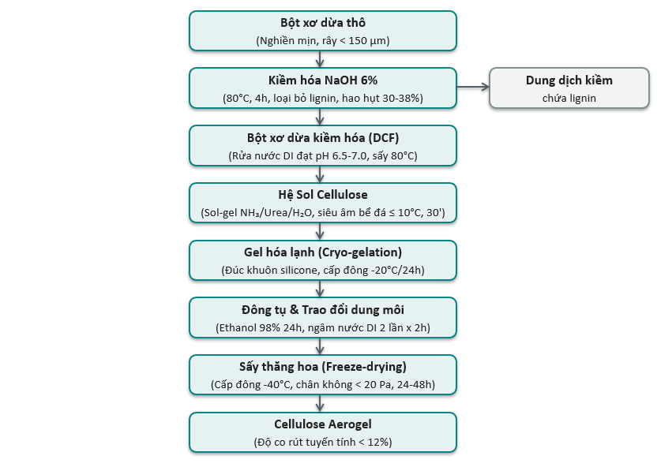{width="3.5202580927384077in" height="5.972222222222222in"}

###### Hình 2.1. Sơ đồ quy trình thực nghiệm tổng hợp Cellulose Aerogel từ xơ dừa \[22\]

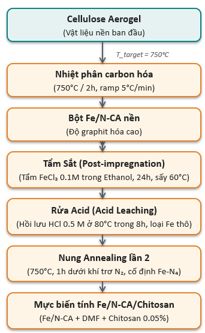{width="3.6117115048118986in" height="5.861111111111111in"}

###### Hình 2.2. Sơ đồ quy trình chuyển hóa Cellulose Aerogel thành N-CA và Fe/N-CA \[23, 12\]

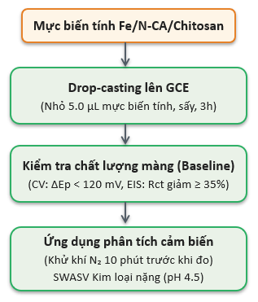{width="3.2674693788276468in" height="3.8240737095363078in"}

###### Hình 2.3. Sơ đồ quy trình tổng hợp màng biến tính và đo đạc điện hóa

## 2.4. Cơ chế Sol-Gel và Sấy thăng hoa

Nghiên cứu này dựa trên cơ sở lý thuyết keo tụ, động học sol-gel và cơ chế truyền khối trong quá trình tổng hợp Cellulose Carbon Aerogel từ xơ dừa.

### 2.4.1. Cơ chế hòa tan cellulose trong hệ NH~4~OH/Urea/H~2~O

Hệ dung môi có tính phân cực mạnh amoniac/urea/nước là nền tảng cốt lõi để phá vỡ mạng tinh thể Cellulose I rất bền của xơ dừa.

#### 2.4.1.1. Cấu trúc mạng tinh thể Cellulose I và liên kết Hydro

Cellulose tự nhiên tồn tại dưới dạng polyme tuyến tính của các mắt xích D-glucopyranose liên kết với nhau qua liên kết β-(1,4)-glycoside. Khung sợi vững chắc nhờ hai loại liên kết hydro:

- *Liên kết hydro nội phân tử (Intra-chain H-bonds)*: Giữa nhóm -OH ở C~3~ với oxy vòng của mắt xích kế cạnh, và giữa -OH ở C~2~ với nhóm -CH~2~OH ở C~6~. Liên kết này giữ cho chuỗi cellulose có cấu hình phẳng, thẳng tắp và trơ.

- Liên kết hydro liên phân tử (Inter-chain H-bonds): Giữa các chuỗi song song xếp chồng lên nhau tạo thành các bó microfibril tinh khiết \[51, 52\].

#### 2.4.1.2. Cơ chế hòa tan và phá vỡ liên kết hydro

Hệ dung môi NH4OH/Urea hòa tan cellulose thông qua cơ chế solvat hóa và phá vỡ liên kết hydro nội phân tử (cơ chế tương tự từ hệ NaOH/urea) \[23, 6, 24, 25\]. Tốc độ và hướng làm lạnh (từ dưới lên trên hoặc đẳng hướng) sẽ quyết định hình dáng của lỗ xốp. Trong quá trình cấp đông âm sâu (cryo-gelation), sự phát triển của các tinh thể đá (ice-templating) tạo lực chèn ép cơ học lên các chuỗi polymer, ép dung môi ra ngoài và định hình sự tái tổ hợp của các chuỗi xenlulozo thành mạng lưới hydrogel 3D xốp phân cấp (hierarchical macropores) vững chắc. Khi băng thăng hoa, nó để lại một mạng lưới các rãnh xốp vĩ mô (macropores) đan xen (interconnected pathways), rất lý tưởng cho sự khuếch tán của các ion kim loại nặng đi vào bên trong điện cực \[53, 54\].

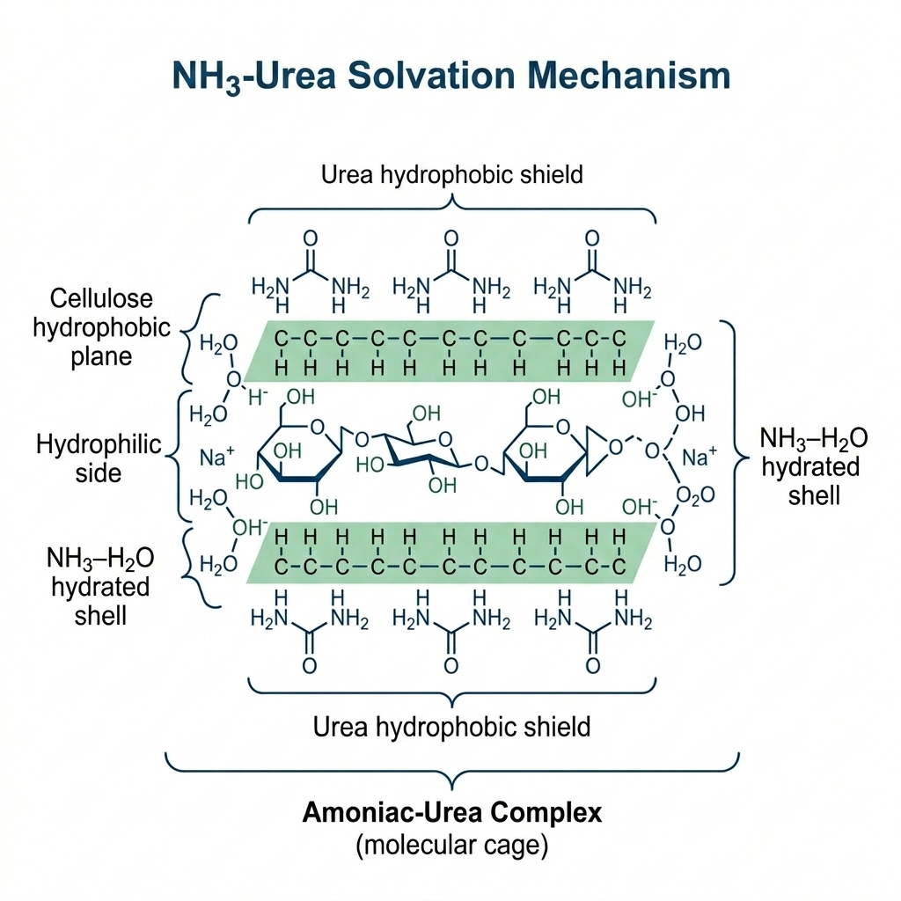{width="5.083333333333333in" height="4.453285214348207in"}

###### Hình 2.4. Sơ đồ minh họa cơ chế phá vỡ liên kết hydro và solvat hóa chuỗi Cellulose bằng phức hợp Amoniac - Urea

#### 2.4.1.3. Nhiệt động học quá trình hòa tan ở nhiệt độ thấp

Quá trình hòa tan cellulose trong hệ NH~4~OH/Urea là một phản ứng tỏa nhiệt (ΔH \< 0) và giảm entropy (ΔS \< 0) do các phân tử dung môi bị định hướng cố định quanh kén cellulose \[6, 51\].

Theo phương trình năng lượng tự do Gibbs: ΔG = ΔH - TΔS

Để phản ứng hòa tan tự phát (ΔG \< 0), số hạng nhiệt độ T phải đủ nhỏ để đóng góp của số hạng entropy -TΔS (mang giá trị dương) không vượt quá giá trị âm của ΔH.

Thực nghiệm chứng minh sol ổn định hơn và ít tách pha hơn ở ≤ 10°C (Tối ưu 0 - 5°C). Ở nhiệt độ phòng, động năng phân tử tăng phá vỡ cấu trúc kén urea, dẫn đến việc cellulose tự kết tủa lại (tách pha) \[6\].

### 2.4.2. Động học gel hóa âm sâu 

Quá trình chuyển đổi từ sol lỏng sang hydrogel tổ ong rắn xảy ra thông qua hiện tượng kết tinh đóng băng có định hướng (Ice-templating) \[53\].

#### 2.4.2.1. Hiệu ứng Cryo-concentration (Tích tụ đông băng)

Khi đặt hệ sol vào ngăn đông ở -14°C đến -20°C, nước tự do bắt đầu kết tinh thành các tinh thể đá tinh khiết. Cấu trúc tinh thể đá chặt chẽ loại trừ các tạp chất hữu cơ. Quá trình này ép toàn bộ chuỗi cellulose, urea và amoniac ra vùng biên tinh thể đá, tạo thành cấu trúc dạng tấm \[55\]. Nồng độ cellulose trong các kênh lỏng siêu hẹp chưa đông băng tăng gấp nhiều lần (hiệu ứng tích tụ đông). Việc hình thành cấu trúc xốp 3D định hướng có ý nghĩa đặc biệt quan trọng đối với khả năng xúc tác điện hóa, bởi nó cung cấp diện tích bề mặt lớn và độ dẫn điện vượt trội hơn hẳn so với các mạng xốp ngẫu nhiên (stochastic networks) \[8\].

#### 2.4.2.2. Sự tái tổ chức Cellulose III

Dưới lực ép cơ học của tinh thể đá đang phát triển và cự ly tiếp xúc phân tử cực ngắn (\< 0.3 nm), lớp kén bảo vệ của urea bị phá vỡ. Các nhóm hydroxyl tự do trên các chuỗi cellulose lân cận tự kết nối chéo vật lý trực tiếp với nhau, giả thuyết hình thành Cellulose III thông qua lộ trình phức hợp amoniac-cellulose (ammonia-cellulose complex pathway) \[22, 51\]. Khung gel 3D tổ ong được định hình, giam giữ các tinh thể đá làm khuôn lỗ xốp lớn (macropores).

### 2.4.3. Hóa lý của quá trình keo tụ trong ethanol (Coagulation)

Rã đông hydrogel và ngâm vào bể cồn là giai đoạn quyết định tính toàn vẹn cơ học của cấu trúc aerogel.

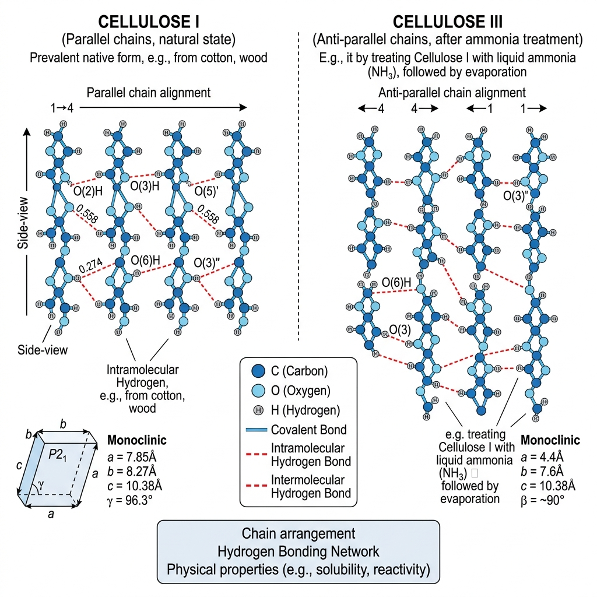{width="6.434679571303587in" height="6.416666666666667in"}

###### Hình 2.5. Sơ đồ minh họa cấu trúc mạng tinh thể Cellulose I và Cellulose III

#### 2.4.3.1. Cơ chế keo tụ (Phase Separation) bằng Non-solvent

Ethanol hoạt động như một chất không-dung-môi (non-solvent) phân cực nhẹ. Khi hydrogel tiếp xúc với ethanol, có một dòng khuếch tán đối lưu kép: Ethanol đi vào lõi gel và nước mao quản đi ra ngoài bể cồn. Ethanol nhanh chóng khử nước hydrat hóa của cellulose, làm tăng lực hút tĩnh điện và liên kết hydro giữa các chuỗi cellulose, làm đông tụ ("khóa cứng") mạng lưới polyme thành trạng thái tủa trắng rắn chắc \[6, 51\].

#### 2.4.3.2. Động học gradient nồng độ và Tỉ lệ cồn tối ưu 15:1 (v/v)

Để quá trình keo tụ xảy ra ổn định mà không làm nhão gel hoặc sụp vách, nồng độ cồn trong bể ngâm phải luôn duy trì ở mức cao \[22\].

Để quá trình keo tụ (regeneration/coagulation) xảy ra hoàn toàn mà không làm nhão cấu trúc gel hoặc gây sụp vách tế bào xốp, nồng độ ethanol trong bể ngâm động phải luôn được duy trì ở mức cao giới hạn (≥ 90% v/v) suốt quá trình trao đổi \[22, 21\]. Khi hydrogel (chứa lượng lớn nước) được ngâm vào bể cồn, quá trình khuếch tán đối lưu kép sẽ giải phóng nước tự do ra ngoài bể. Nếu tỷ lệ thể tích giữa ethanol và hydrogel thấp (dưới 10:1), lượng nước giải phóng sẽ làm loãng nhanh chóng nồng độ cồn dưới ngưỡng động học tới hạn, khiến chuỗi cellulose không thể tái liên kết hydro triệt để, dẫn đến hiện tượng gel bị mềm hóa. Thực nghiệm chứng minh tỷ lệ thể tích cồn:gel tối ưu là 15:1 (v/v). Tỷ lệ này đảm bảo nồng độ ethanol tại cân bằng pha luôn giữ vững \> 92%, tạo động lực động học (driving force) đủ lớn để hoàn tất việc loại bỏ nước và \'khóa cứng\' mạng lưới hydrogel cellulose trước khi tiến hành sấy thăng hoa \[6, 21\].

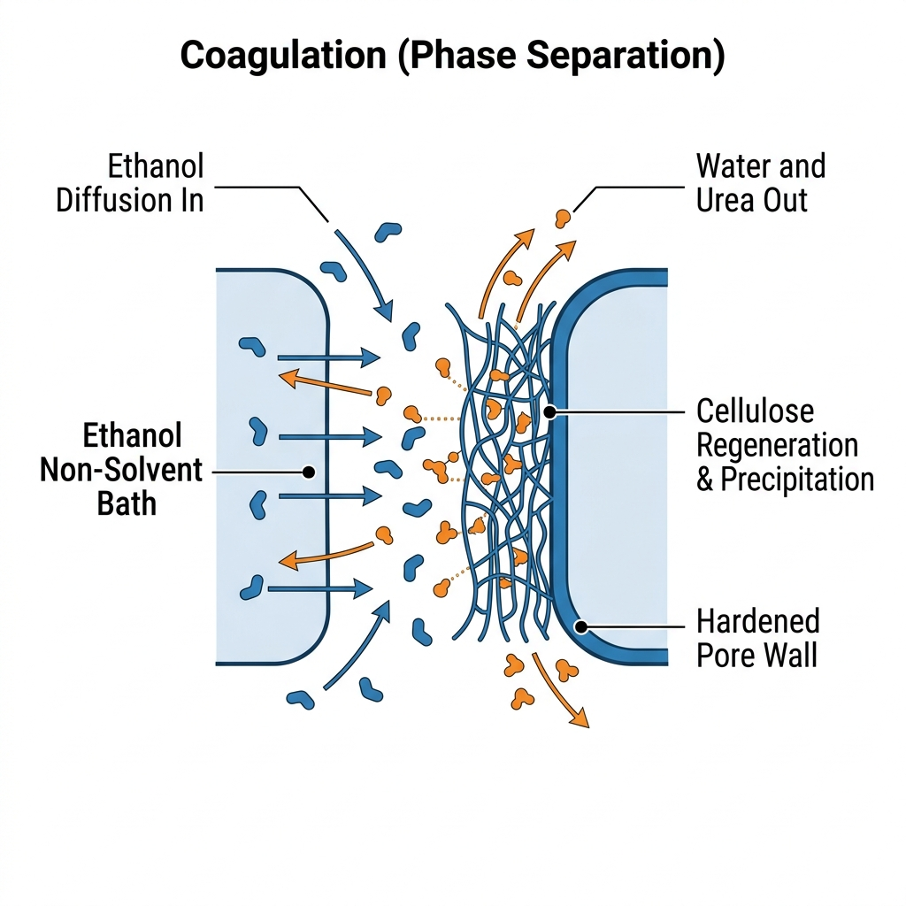{width="4.837433289588802in" height="3.6666666666666665in"}

###### Hình 2.6. Sơ đồ cơ chế keo tụ của Cellulose trong dung môi bằng non-solvent

### 2.4.4. Vật lý sấy thăng hoa

Sấy thăng hoa là quá trình loại bỏ dung môi mà không đi qua pha lỏng, bảo toàn nguyên vẹn cấu trúc xốp tổ ong nano.

#### 2.4.4.1. Áp suất mao quản và hiện tượng sụp vách (Pore Collapse)

Trong quá trình sấy nhiệt thông thường, dung môi lỏng bay hơi tạo ra một giao diện lỏng-hơi di chuyển dọc theo mao quản. Lực mao dẫn sinh ra áp suất mao quản:

P~c~ = (2γ cos θ) / r

Trong đó: γ là sức căng bề mặt của dung môi (γ_nước = 72.8 mN/m), θ là góc thấm ướt, r là bán kính lỗ xốp (với lỗ xốp nano/mesopore, r \< 50 nm làm Pc tăng lên hàng chục Megapascal). Áp suất khổng lồ này kéo ép hai vách lỗ xốp lại gần nhau, làm sập hoàn toàn cấu trúc aerogel (Linear Shrinkage \> 20%) \[42\].

#### 2.4.4.2. Nguyên lý thăng hoa băng giữ cấu trúc xốp (Freeze-Drying)

Sấy thăng hoa đóng băng dung môi (nước) thành đá rắn, sau đó hạ áp suất buồng sấy xuống dưới điểm ba trạng thái của nước (P \< 611.65 Pa, T \< 0.01°C). Dưới áp suất buồng sấy \< 20 Pa và bẫy lạnh ≤ -45°C, nước đá thăng hoa trực tiếp thành hơi nước mà không tạo pha lỏng (Pc = 0). Không có lực mao dẫn tác động, vách xốp cellulose III mỏng được bảo toàn nguyên vẹn, khống chế độ co rút tuyến tính Linear Shrinkage \< 12% \[56\].

#### 2.4.4.3. Ràng buộc trao đổi ngược cồn-nước trước khi sấy

Ethanol có nhiệt độ đông đặc cực thấp (-114°C). Thiết bị đông lạnh thông thường trong phòng thí nghiệm (-20°C hoặc -80°C) không thể đóng băng cồn. Nếu đưa gel chứa cồn trực tiếp vào buồng sấy thăng hoa, cồn lỏng sẽ sôi mạnh dưới áp suất chân không thấp, có nguy cơ gây sôi dung môi, co sập hoặc biến dạng mạng gel (boiling collapse) \[57, 58\]. Do đó, bắt buộc phải ngâm trao đổi ngược cồn sang nước DI sạch tối thiểu 2 lần (mỗi lần 2 giờ) và thêm lần 3 có điều kiện để giảm lượng ethanol cuối ≤10--15% v/v trước khi cấp đông sấy thăng hoa.

### 2.4.5. Cơ sở khoa học và Lập luận cơ chế định hướng thiết kế

giới hạn phát hiện (LOD) của cảm biến không chỉ phụ thuộc vào độ xốp mà còn bị chi phối mạnh mẽ bởi điện trở truyền điện tích (*R*~ct~), tỷ lệ chất kết dính (binder) và cấu trúc vi mô của màng in.

Đối với hệ vật liệu Fe/N-CA, quy trình tẩm sắt và nung lại (re-annealing) được thiết kế với mục tiêu hình thành và ổn định các tâm xúc tác dạng Fe-N~x~ (giả thuyết chuyển giao từ vật liệu xúc tác ORR/Fe-N-C sang SWASV, cần thực nghiệm kiểm chứng). Thay vì khẳng định sự tồn tại của tâm đơn nguyên tử (single-atom sites), đề tài hướng đến việc kiểm chứng vai trò của các cấu trúc Fe-N~x~ này trong việc gia tăng khả năng làm giàu (pre-concentration) và hòa tan (stripping) các ion kim loại nặng (Pb²⁺, Cd²⁺, Zn²⁺). Sự hiện diện và hiệu năng thực tế của các pha tạp bề mặt này sẽ được đánh giá chéo thông qua phổ XPS, phổ Raman và phổ tổng trở điện hóa EIS \[37\].

## 2.5. Cơ chế Nhiệt phân, Doping Nitơ và Phối trí Sắt

### 2.5.1. Hóa học phản ứng Lignin - Urea trong khung DCF

#### 2.5.1.1. Bản chất cấu trúc Guaiacyl Lignin của xơ dừa

Xơ dừa Bến Tre có thành phần lignin tự nhiên chủ yếu thuộc loại Guaiacyl-Syringyl (G-S), với đơn vị Guaiacyl chiếm ưu thế (\> 60%) \[17, 53\]. Cấu trúc Guaiacyl có đặc điểm: vị trí carbon số 5 (C₅) trên vòng benzene tự do, không bị cản trở không gian; phenolic -OH và các nhóm aliphatic -OH mạch nhánh hoạt động mạnh cho phản ứng thế ái điện tử và thế nucleophile.

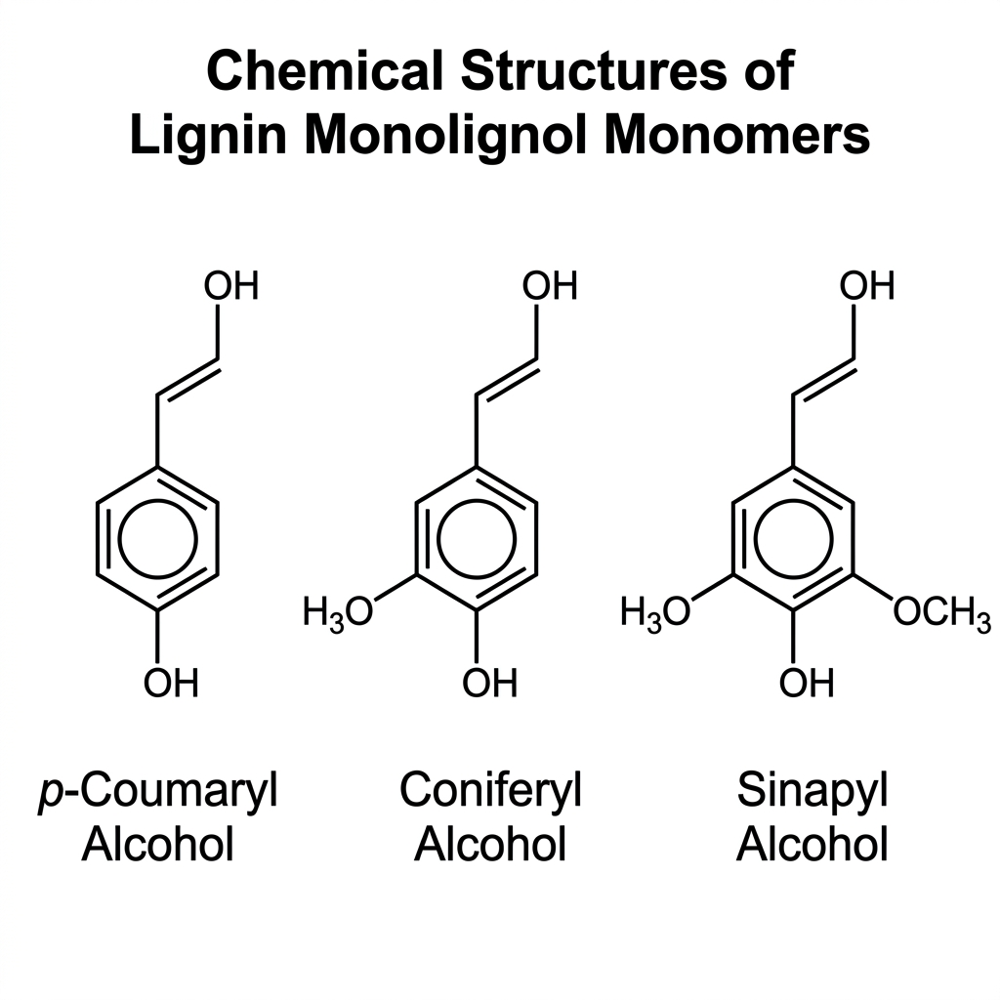{width="3.966428258967629in" height="3.537037401574803in"}

###### Hình 2.7. Cấu trúc hóa học 3 đơn vị monolignol cấu thành lignin

#### 2.5.1.2. Phản ứng ngưng tụ uretan hóa (Urethanization) ở 110--150°C

Khi đun nóng pha rắn trong lò nung, Urea nóng chảy (132.7°C) phản ứng ngưng tụ thế nucleophile ái điện tử với các nhóm hydroxyl của lignin \[18, 53\]:

- *Tạo liên kết carbamate (Urethan hóa)*:

Lignin-OH + NH~2~-CO-NH~2~ ---(110--150°C)→ Lignin-O-CO-NH~2~ + NH~3~ ↑

- *Liên kết chéo tạo mạng polyme*:

Lignin-O-CO-NH~2~ + Lignin-OH → Lignin-O-CO-NH-Lignin + H~2~O ↑

- *Phản ứng tạo Schiff Base*:

Lignin-C=O + NH~2~-CO-NH~2~ → Lignin-C=N-CO-NH~2~ + H~2~O ↑

Các liên kết cộng hóa trị này khóa chặt urea tự do vào khung lignin thơm bền vững, bảo vệ nitơ khỏi bị bay hơi sớm ở giai đoạn đầu của quá trình nhiệt phân \[18, 51\].

### 2.5.2. Động học nhiệt phân carbon hóa lần 1

Quá trình nung nhiệt phân trong khí trơ N~2~ xảy ra qua 3 giai đoạn nhiệt độ tương ứng với 3 ramps của chương trình nung:

##### Bảng 2.2. Chu trình nhiệt cho lò nung

  -------------------------------------------------------------------------------------------
  Giai đoạn (Ramp)   Khoảng nhiệt độ       Hiện tượng hóa lý chính   Quá trình vi mô
  ------------------ --------------------- ------------------------- ------------------------
  **Ramp 1**         25°C → 150°C          Sấy ẩm sâu                Thoát hơi nước

  **Ramp 2**         150°C → 400°C         Phân hủy hữu cơ thô       Cắt mạch ether

  **Ramp 3**         400°C → *T*~target~   Đóng vòng & Graphit hóa   Doping N, tạo mạng sp²
  -------------------------------------------------------------------------------------------

**Giai đoạn carbon hóa và graphit hóa (400°C -- *T*~target~ - Ramp 3):**

Phân nhánh nhiệt độ Ttarget: N-CA (700°C) giữ lại tối đa các nhóm nitơ hoạt tính Pyridinic-N (bắt đầu bị phân hủy nhiệt mạnh và chuyển thành Graphitic-N hoặc thoát khí HCN ở nhiệt độ \> 800°C). Fe/N-CA nền (800°C) tăng mức độ graphit hóa của khung carbon, làm giảm điện trở trong và tăng độ dẫn điện của carbon nền \[23, 35\].

### 2.5.3. Cấu hình Nitơ bề mặt và vai trò điện hóa

##### Bảng 2.3. Mối quan hệ giữa nhiệt độ nung và cấu trúc hình thành

+-------------------+-----------------------------------------------------------------------------------------------------------------------+------------------------------------------------------------------------------------------------------------------------------------------------------------------------------------------------+
| **Cấu hình Nitơ** | **Cấu trúc hóa học**                                                                                                  | **Vai trò trong cảm biến điện hóa Pb²⁺**                                                                                                                                                       |
+===================+=======================================================================================================================+================================================================================================================================================================================================+
| Pyridinic-N (N-6) | Nitơ đóng vòng 6 cạnh, đóng góp 1 electron p vào hệ liên hợp sp² và còn 1 cặp electron độc thân tự do hướng ra ngoài. | **Active site chính:** Cặp electron độc thân hoạt động như một Lewis base mạnh, dễ dàng chelate hóa phối trí chọn lọc với ion kim loại nặng Pb²⁺, Cd²⁺, Zn²⁺ tích điện dương (LOD \< 0.1 ppb). |
+-------------------+-----------------------------------------------------------------------------------------------------------------------+------------------------------------------------------------------------------------------------------------------------------------------------------------------------------------------------+
| Pyrrolic-N        | Nitơ đóng vòng 5 cạnh, đóng góp 2 electron vào hệ thơm liên hợp sp².                                                  | Hỗ trợ cải thiện độ ưa nước của bề mặt carbon aerogel nhờ tính phân cực nhẹ.                                                                                                                   |
|                   |                                                                                                                       |                                                                                                                                                                                                |
| (N-5)             |                                                                                                                       |                                                                                                                                                                                                |
+-------------------+-----------------------------------------------------------------------------------------------------------------------+------------------------------------------------------------------------------------------------------------------------------------------------------------------------------------------------+
| Graphitic-N (N-Q) | Nitơ thế chỗ nguyên tử C trong mạng graphit phẳng, liên kết với 3 nguyên tử C xung quanh.                             | **Tăng độ dẫn điện:** Đóng góp electron dư thừa vào dải dẫn của carbon, nâng cao tốc độ truyền electron của điện cực.                                                                          |
+-------------------+-----------------------------------------------------------------------------------------------------------------------+------------------------------------------------------------------------------------------------------------------------------------------------------------------------------------------------+

### 2.5.4. Hóa học phối trí tâm hoạt tính Fe-N~x~ và hậu xử lý (Acid Leaching)

#### 2.5.4.1. Phức chelate Lignin-Sắt ở GĐ6

Khi ngâm bột carbon nền vào dung dịch FeCl~3~ trong ethanol ở nhiệt độ phòng, các nhóm O/N bề mặt còn lại trên carbon nền và vị trí khuyết tật giàu electron kết hợp với cặp electron độc thân của Pyridinic-N hoạt động như các phối tử chelate hóa tự nhiên, bắt giữ và phối trí bền vững với ion sắt (Fe³⁺) trong dung dịch, phân tán đều ion sắt vào sâu trong lòng mao quản carbon \[12, 25\].

#### 2.5.4.2. Sự hình thành các tâm Fe-N~x~ ở GĐ7b (Nung lần 2)

Trong quá trình nung lại (Re-annealing) ở nhiệt độ định hướng $750^{\circ}C$ dưới luồng khí $N_{2}$, ion sắt bị khử nhiệt và phối trí chặt chẽ với các nguyên tử nitơ Pyridinic xung quanh, hình thành các cấu trúc phối trí phẳng $Fe - N_{x}$ đồng phẳng với mạng carbon $sp^{2}$. Cơ chế chuyển giao cấu trúc hoạt tính xúc tác này từ các hệ vật liệu năng lượng \[10, 11\] sang nền tảng sinh khối lignocellulose đã được chứng minh có hiệu quả vượt trội, đóng vai trò là các tâm xúc tác nội tại giúp tối ưu hóa động học khuếch tán và bắt giữ kim loại nặng \[12, 13\].

#### 2.5.4.3. Cơ chế Acid Leaching bằng HCl 0.5 M (GĐ7a)

Quá trình nung nhiệt phân sắt luôn tạo ra 2 pha sắt song song:

1.  Các tâm Fe-N~x~ candidate sites: Bám chặt trong mạng carbon sp², bền nhiệt và trơ với axit do hiệu ứng chắn không gian của mạng carbon.

2.  Hạt nano sắt metallic (Fe⁰) và sắt oxit (Fe~x~O~y~) thô: Nằm tự do ngoài bề mặt, không có hoạt tính cảm biến, làm bít tắc mesopores và cản trở dòng truyền electron.

Axit HCl 0.5 M đun hồi lưu ở 80°C trong 8 giờ có vai trò hòa tan chọn lọc:

Fe~2~O~3~ + 6HCl → 2FeCl~3~ + 3H~2~O\
FeO + 2HCl → FeCl~2~ + H~2~O\
Fe⁰ + 2HCl → FeCl~2~ + H~2~↑

Phần lớn Fe tự do/oxide dễ hòa tan được loại bỏ hoàn toàn, bộc lộ hệ thống mesopores sạch sẽ. Các cấu trúc phối trí phẳng $Fe - N_{x}$ bám chặt trong mạng carbon thơm lai hóa $sp^{2}$ được chứng minh là trơ và bền vững hơn trước sự tấn công của axit mạnh do hiệu ứng chắn không gian bảo vệ \[10, 11\]; mức độ bảo toàn sẽ được kiểm chứng chéo thông qua phổ XPS và EIS.

#### 2.5.4.4. Vai trò của Re-annealing (GĐ7b)

Sau khi rửa axit mạnh HCl, bề mặt carbon xuất hiện nhiều khuyết tật khuyết hỏng mạng và một số liên kết sắt bị lỏng lẻo. Bước nung lại (800°C là mức cố định; 750°C là mức đối chứng; điều kiện cuối chọn theo dữ liệu) cung cấp động năng để mạng carbon tự sửa chữa (reconstruct), tái cấu trúc các nguyên tử carbon phẳng sp² xung quanh nguyên tử Fe, tăng độ bền liên kết Fe-N~x~ và khôi phục độ dẫn điện cho màng cảm biến. Bước nung lại phục hồi (Re-annealing) ở mức nhiệt $750^{\circ}C$ trong $1\ h$ dưới dòng khí trơ $N_{2}$ cung cấp động năng để mạng carbon tự sửa chữa các khuyết tật sau khi rửa axit, tái cấu trúc các nguyên tử carbon phẳng xung quanh nguyên tử Fe trung tâm và khôi phục độ dẫn điện cho màng cảm biến \[10, 12\].

## 2.6. Quy trình tổng hợp màng mỏng biến tính điện cực GCE

Mực biến tính GCE (Ø = 3 mm, A = 0.0707 cm²) được chuẩn bị bằng phương pháp drop-casting hạt carbon aerogel phân tán siêu âm trong Nước : Ethanol (1:1) có phối trộn binder kết dính chuyên biệt:

*Khi phân tích kim loại nặng*: 5.0 mg bột Fe/N-CA + 950 µL Nước : Ethanol + 50 µL Chitosan 1 wt% (acetic 1%, nồng độ cuối 0.05 wt%). Siêu âm phân tán lạnh \< 15°C trong 45 phút.

Khi khảo sát thử nghiệm các hợp chất hữu cơ (như Paracetamol): 5.0 mg bột Fe/N-CA + 950 µL DMF + 25 µL Nafion 5 wt% (nồng độ cuối khoảng 0.25 wt%). Siêu âm phân tán lạnh \< 15°C trong 45 phút \[59, 60\].

Đáng chú ý, ngoài khả năng kết dính cơ học, polymer Nafion mang điện tích âm của các nhóm sulfonate (-SO^3⁻^) còn đóng vai trò như một lớp màng trao đổi cation chọn lọc, giúp chống bám bẩn (anti-fouling) hiệu quả. Lớp màng này bảo vệ bề mặt điện cực GCE khỏi sự ngưng tụ và trùng hợp của các sản phẩm oxy hóa phụ (ví dụ như NAPQI) khi phân tích trong môi trường chứa các mẫu hữu cơ phức tạp như dư lượng dược phẩm Paracetamol \[59, 60\], đảm bảo bề mặt cảm biến luôn ổn định qua nhiều chu kỳ quét.

- Drop-casting: Dùng micropipette nhỏ chính xác 7.0 µL mực biến tính (nồng độ 5.0 mg/mL) lên tâm bề mặt điện cực GCE (Ø = 3 mm) được dựng thẳng đứng. Khối lượng vật liệu đọng lại là 35 µg, tương đương tải lượng (mass loading) khoảng 495 µg/cm² (hay 0.5 mg/cm²) nhằm tối ưu hóa cấu hình bề mặt thu hút ion \[61\]. Điện cực sau khi nhỏ mực được để khô trong tủ hút có lưu thông khí tốt, kết hợp sấy hỗ trợ bằng đèn hồng ngoại (IR) công suất nhẹ để đảm bảo dung môi DMF bay hơi hoàn toàn. Tiến hành quét CV quét nền (blank scan) trong dung dịch chất điện ly trước khi đo analyte để xác nhận màng không còn dư dung môi làm tăng điện trở.

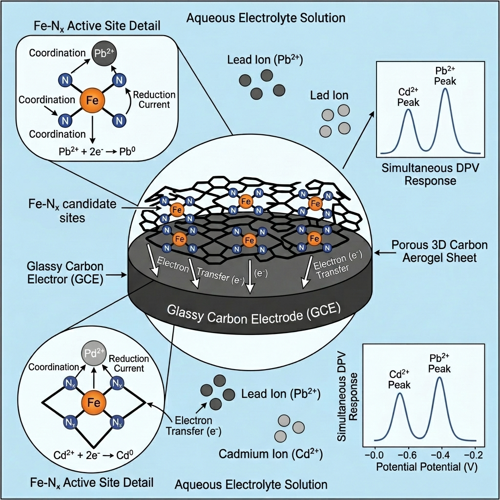{width="4.768518153980753in" height="4.768518153980753in"}

###### Hình 2.8. Sơ đồ minh họa quá trình biến tính bề mặt điện cực GCE bằng vật liệu Carbon Aerogel (N-CA và Fe/N-CA) và cơ chế cảm biến

## 2.7. Sàng lọc điện cực nền và tiêu chí đo đạt

Toàn bộ mẻ tổng hợp phải vượt qua 5 Quality Gates dưới đây trước khi được phép tiến hành đo cảm biến (SWASV). Mẻ nào Fail bất kỳ Gate nào phải tiến hành khắc phục theo SOP tương ứng:

##### Bảng 2.4. Tổng hợp các tiêu chí kỹ thuật và cách khắc phục

  -----------------------------------------------------------------------------------------------------------------------------------------------------------------------------------------------------------------------------------------
                 **Kỹ thuật**                                                              **Tiêu chí**                                               **Khắc phục**
  ------------------------------------------- ------------------------------------------------------------------------------------------------------- -------------------------------------------------------------------------------------
               Raman (I~D~/I~G~)                                                            0.9 -- 1.2                                                Vùng screening; I~D~/I~G~ cao → giảm T nung; thấp → tăng T nung

       XPS (N at%, Fe at%, Pyridinic-N)        N: 3--6 at% · Fe: 0.5--1.5 at% · N:Fe ≥ 4:1. Mục tiêu định hướng Pyridinic-N ≥ 45% (screening target)  hàm lượng N thấp → kiểm tra ice bath siêu âm ≤ 10°C; Fe lệch → kiểm tra cân FeCl~3~

            BET (S~BET~, N~2~ 77K)                                                      S~BET~ \> 300 m²/g                                            Thấp → rà soát áp suất sấy (\< 20 Pa) và bẫy lạnh (≤ −45°C)

   CV trong 5.0 mM K~3~Fe(CN)~6~ / 0.1 M KCl                            ΔE~p~ \< 120 mV và I~pa~ tăng ≥ 30% so với bare GCE                           Màng quá dày → giảm về 7 µL, pha loãng mực

         EIS trong K~3~Fe(CN)~6~ / KCl                                   R~ct~(Fe/N-CA) \< R~ct~(N-CA) \< R~ct~(bare GCE)                             Fe-Nₓ chưa phối trí → tăng cường acid leaching (kéo dài 8h hoặc tăng T)
  -----------------------------------------------------------------------------------------------------------------------------------------------------------------------------------------------------------------------------------------

Ngoài ra, điện cực bare GCE trước biến tính bắt buộc phải đạt ΔE~p~ \< 70 mV và *I*~pa~/*I*~pc~ = 0.95--1.05 (nếu không đạt phải đánh bóng lại từ đầu theo SOP GCE Polishing) \[62\]. Diện tích bề mặt hoạt tính điện hóa (EASA): Xác định theo phương trình Randles--Ševčík từ CV đa tốc độ quét (10→200 mV/s), mục tiêu *A*~eff~ ≥ 0.12 cm² (gấp đôi diện tích hình học GCE 0.0707 cm²).

## 2.8. Quy hoạch thực nghiệm tối ưu hóa (DOE)

- *Sàng lọc biến quan trọng (PBD)*: Sử dụng thiết kế Plackett-Burman khảo sát 7 yếu tố ảnh hưởng (thế lắng, thời gian lắng, pH, tốc độ khuấy từ (rpm), thời gian cân bằng tĩnh (quiet time), tỷ lệ binder...) để chọn ra 3 biến có tác động mạnh nhất.

- *Tối ưu hóa tương tác đa biến (RSM)*: Áp dụng mô hình Box-Behnken (BBD) tối ưu hóa tương tác 3 biến chính. Ràng buộc điều kiện dừng tối ưu (Stop criteria): Quá trình chạy tối ưu hóa dừng lại khi sự thay đổi dòng peak đáp ứng Δ ≤ 2% giữa các lần lặp hoặc độ lệch chuẩn tương đối RSD \< 5%.

## 2.9. Kế hoạch thẩm định phương pháp phân tích (Validation)

Kế hoạch thẩm định phương pháp được thiết kế chi tiết áp dụng cho đối tượng mẫu nước tự nhiên dựa trên các hướng dẫn của Trần Cao Sơn \[2\]:

- Tính đặc hiệu (Selectivity): Phân tích mẫu trắng nước máy, nước sông không chứa analyte (n = 6 lần) xác nhận không xuất hiện pic cản trở tại thế hòa tan đặc trưng. Khảo sát các chất gây nhiễu (Fe³⁺, Mn²⁺, Ca²⁺, Mg²⁺, axit ascorbic, axit uric, dopamine) nồng độ gấp 10-100 lần, yêu cầu tín hiệu peak thay đổi \< 10%. Trong môi trường tự nhiên, phép đo SWASV kim loại nặng thường xuyên chịu nhiễu bởi các hợp chất hữu cơ có hoạt tính điện hóa mạnh. Do đó, hệ điện cực đề xuất sẽ được đánh giá chéo khả năng loại trừ nhiễu từ dư lượng dược phẩm phổ biến như Paracetamol. Tương tự như các mô hình cảm biến sinh học đã được chuẩn hóa \[41, 39, 40\], các kỹ thuật quét thế vòng tuần hoàn (CV) và Voltammetry xung vi phân (DPV) trong nền đệm phân tích hữu cơ (PBS pH 7.0--7.4) sẽ được sử dụng làm công cụ tham chiếu. Quá trình này giúp kiểm chứng khả năng phân tách tín hiệu và độ chọn lọc tĩnh điện của màng biến tính trước sự tấn công của các phân tử hữu cơ này.

Nhằm khẳng định vai trò xúc tác điện hóa của các tâm hoạt tính trên nền Fe/N-CA đối với phép đo kim loại nặng, nghiên cứu thiết lập các hệ điện cực đối chứng bao gồm: Điện cực GCE trần (Bare GCE), điện cực N-CA/GCE, và điện cực đối chứng dương màng Bismuth (Bi-film/GCE). Vật liệu Fe/N-CA có giả thuyết lợi thế sẽ cho cường độ dòng hòa tan (stripping peak) tương đương hoặc tốt hơn hệ Bi-film truyền thống, cần kiểm chứng bằng độ lặp lại/tái lặp.

- *Khoảng tuyến tính (Linearity)*: Xây dựng đường chuẩn gồm tối thiểu 6 mức nồng độ khác nhau bao trùm khoảng khảo sát (0.5 - 150 ppb cho kim loại). Yêu cầu hệ số xác định hồi quy R² ≥ 0.999.

- *Giới hạn LOD / LOQ*: Xác định giới hạn phát hiện và giới hạn định lượng tuân thủ theo hướng dẫn ICH Q2(R2), sử dụng phương pháp độ lệch chuẩn của đường nền \[1\] hoặc tung độ gốc, theo công thức:

$$LOD = \frac{3.3\sigma}{S}$$

$$LOQ = \frac{10\sigma}{S}$$

Trong đó: *σ* là độ lệch chuẩn của tín hiệu nhiễu (residual standard deviation) hoặc tung độ gốc; *S* là độ dốc (slope) của đường chuẩn.

- *Độ chụm (Precision)*: Độ lặp lại (Repeatability) RSD% \< 5% (quét 10 lần liên tục trên 1 điện cực); độ chụm trung gian (Intermediate Precision) RSD% \< 8% (tổng hợp 5 điện cực độc lập đo song song) \[2, 63\].

- Độ đúng (Trueness): Đánh giá qua hiệu suất thu hồi (R%) mẫu thêm chuẩn ở 3 mức nồng độ (thấp, trung bình, cao) trên nền mẫu thực tế, khống chế trong dải thu hồi 80%--110% đối với kim loại nặng (theo khoảng chấp nhận tham khảo của AOAC và EU \[63\]).

- *Độ vững (Robustness)*: Khảo sát khi thay đổi nhỏ các điều kiện đo: pH đệm (± 0.2), thế lắng (± 0.05 V), thời gian lắng (± 10 s), yêu cầu dòng đỉnh dịch chuyển \< 10%.

- *Kiểm định ý nghĩa thống kê (F-test và t-test)*: Phân tích so sánh song song với các phương pháp đối chứng (dự kiến sử dụng ICP-MS cho kim loại nặng nếu có điều kiện thiết bị). Yêu cầu kiểm định F-test đồng nhất phương sai và t-test khẳng định không có sự khác biệt có ý nghĩa thống kê ở độ tin cậy 95% (α = 0.05).

- Độ xanh phân tích: Đánh giá điểm số sinh thái thông qua phần mềm AGREE hoặc công cụ GAPI \[5\]. Ràng buộc Hóa học xanh: ≤5.0 mL cho quy trình phân tích điện hóa/mỗi phép đo nhằm đạt điểm số AGREE cao nhất.

## 2.10. Thiết lập thông số đo SWASV kim loại nặng (Pb²⁺, Cd²⁺, Zn²⁺)

Trước khi tiến hành quét SWASV, dung dịch đệm đo bắt buộc phải được sục khí N~2~ tinh khiết từ 5--10 phút để đuổi hoàn toàn oxy hòa tan (Degassing), nhằm ngăn chặn dòng nhiễu từ phản ứng khử oxy (ORR) tại dải thế âm. Trong suốt quá trình đo, duy trì một lớp khí N~2~ nhẹ (blanket) trên bề mặt dung dịch.

Đo đồng thời các ion kim loại nặng trong nền đệm Acetate 0.1 M (pH 4.5) sử dụng điện cực Fe/N-CA/Chitosan/GCE. Thế lắng khử làm giàu được áp ở *E*~dep~ = -1.1 V vs. Ag/AgCl (hoặc -1.3 V khi đo thêm Zn²⁺) trong thời gian *t*~dep~ = 120 s dưới lực khuấy từ 400 rpm. Trạng thái lắng khử (Deposition) được thiết lập ở thế *E*~dep~ = -1.1 V (cho Pb²⁺, Cd²⁺) hoặc -1.3 V (khi đo đồng thời cả Zn²⁺). Bước quét thế hòa tan (Stripping scan) bắt buộc phải bắt đầu từ đúng giá trị *E*~dep~ quét đến -0.2 V nhằm tránh gây xáo trộn lớp điện kép và triệt tiêu dòng điện dung nhiễu. Làm sạch điện cực ở +0.2 V vs. Ag/AgCl trong 30 s kết hợp khuấy từ 600 rpm.

##### Bảng 2.5. Khảo sát và tối ưu hóa thông số SWASV đo kim loại vết

  -------------------------------------------------------------------------------------
  **Bước**                **Thông số**            **Giá trị**
  ----------------------- ----------------------- -------------------------------------
  Lắng khử (Deposition)   E~dep~, t~dep~, khuấy   --1.1 V vs. Ag/AgCl, 120 s, 400 rpm

  Cân bằng (Quiet time)   Thời gian               10 giây (tắt khuấy)

  Hòa tan sóng vuông      Khoảng thế quét         E~dep~ đến --0.2 V vs. Ag/AgCl

  Hòa tan sóng vuông      SW frequency            25 Hz

  Hòa tan sóng vuông      SW amplitude            25 mV

  Hòa tan sóng vuông      Step potential          5 mV

  Làm sạch (Cleaning)     E~clean~, t~clean~      +0.2 V, 30 s, khuấy 600 rpm
  -------------------------------------------------------------------------------------

## 2.11. Các tiêu chí đánh giá chất lượng (Quality Gates) định hướng tối ưu hóa

Nhằm kiểm soát chất lượng vật liệu và màng điện cực, đề tài thiết lập các mốc tiêu chuẩn đóng vai trò làm tiêu chí sàng lọc (screening targets), cụ thể:

- Về cấu trúc vật liệu: Tỷ lệ cường độ ID/IG đo từ phổ Raman nằm trong khoảng 0.9 -- 1.2 được dùng để sàng lọc mức độ khuyết tật phù hợp. Hàm lượng nguyên tố N (đạt 3--6 at%) và Fe (đạt 1--3 at%) từ phổ định lượng XPS là mục tiêu dự kiến nhằm xác nhận sự thành công của quá trình pha tạp \[23, 25\].

- Về phân tích điện hóa: Giới hạn phát hiện (LOD) đối với các ion kim loại (\< 0.1 µg/L) được đặt ra như các mốc chuẩn (benchmarks) đầy tham vọng để định hướng tối ưu thông số đo (SWASV). Giá trị LOD cuối cùng sẽ được công bố dựa trên kết quả tính toán thực tế từ độ lệch chuẩn dòng nền và độ dốc đường chuẩn.

# CHƯƠNG 3. DỰ KIẾN KẾT QUẢ

## 3.1. Lý thuyết Điện hóa Phân tích và Đặc trưng Vật liệu

##### Bảng 3.1. Dự kiến kết quả, Phương pháp kiểm chứng và Xử lý rủi ro

+------------------------------------------------------+----------------------------------------------------------------------------------------+---------------------------------------------------------------------------------------------------------------------------------------------------------------------------------------------------------------+
| **Thông số / Chỉ tiêu dự kiến**                      | **Phương pháp kiểm chứng**                                                             | **Diễn giải rủi ro & Hướng khắc phục**                                                                                                                                                                        |
+======================================================+========================================================================================+===============================================================================================================================================================================================================+
| Sự hình thành pha tạp N và tâm Fe-Nₓ                 | Phân tích bề mặt bằng XPS (N 1s, Fe 2p) và Raman.                                      | - *Rủi ro:* Tín hiệu XPS N thấp hoặc tụ hạt Fe oxide lớn (XRD).                                                                                                                                               |
|                                                      |                                                                                        |                                                                                                                                                                                                               |
|                                                      |                                                                                        | - *Nguyên nhân:* Nhiệt độ annealing 800°C quá cao làm bay hơi N hoặc tụ Fe.                                                                                                                                   |
|                                                      |                                                                                        |                                                                                                                                                                                                               |
|                                                      |                                                                                        | - *Khắc phục:* Chuyển sang sử dụng bộ thông số SOP bảo thủ (nung lại ở 750°C).                                                                                                                                |
+------------------------------------------------------+----------------------------------------------------------------------------------------+---------------------------------------------------------------------------------------------------------------------------------------------------------------------------------------------------------------+
| Bảo tồn mạng lưới xốp phân cấp                       | Đo đẳng nhiệt hấp phụ-khử hấp phụ (BET/BJH) và ảnh SEM.                                | - *Rủi ro:* Lỗ xốp bị sập, diện tích bề mặt thấp.                                                                                                                                                             |
|                                                      |                                                                                        |                                                                                                                                                                                                               |
| (BET \> 300 m²/g)                                    |                                                                                        | - *Nguyên nhân:* Sốc nhiệt khi nung hoặc keo tụ bằng cồn không đủ lạnh.                                                                                                                                       |
|                                                      |                                                                                        |                                                                                                                                                                                                               |
|                                                      |                                                                                        | - *Khắc phục:* Kiểm tra hiệu quả keo tụ ethanol ở nhiệt độ phòng (RT), quy trình trao đổi nước, cấp đông sơ bộ và độ kín chân không của máy sấy; đồng thời hạ tốc độ gia nhiệt (ramp rate) xuống \< 5°C/phút. |
+------------------------------------------------------+----------------------------------------------------------------------------------------+---------------------------------------------------------------------------------------------------------------------------------------------------------------------------------------------------------------+
| Giảm điện trở truyền điện tích (R~ct~)               | Phổ tổng trở điện hóa EIS (mẫu Fe/N-CA \< N-CA \< GCE trần).                           | - *Rủi ro*: *R*~ct~ tăng cao bất thường.                                                                                                                                                                      |
|                                                      |                                                                                        |                                                                                                                                                                                                               |
|                                                      |                                                                                        | - *Nguyên nhân*: Màng in quá dày, dư dung môi DMF, hoặc binder làm cách điện.                                                                                                                                 |
|                                                      |                                                                                        |                                                                                                                                                                                                               |
|                                                      |                                                                                        | - *Khắc phục*: Đo CV blank để kiểm tra dung môi; giảm lượng drop-casting xuống 5.0 µL; chiếu đèn IR sấy màng.                                                                                                 |
+------------------------------------------------------+----------------------------------------------------------------------------------------+---------------------------------------------------------------------------------------------------------------------------------------------------------------------------------------------------------------+
| Đáp ứng tín hiệu SWASV nhạy, lặp lại cao (RSD \< 5%) | Xây dựng đường chuẩn, kiểm tra độ lặp lại (n=10) và mẫu thêm chuẩn (Recovery 95-105%). | - *Rủi ro*: Pic bị nhiễu nền, cường độ giảm dần sau nhiều lần quét.                                                                                                                                           |
|                                                      |                                                                                        |                                                                                                                                                                                                               |
|                                                      |                                                                                        | - *Nguyên nhân*: Nhiễu khử oxy (ORR) hoặc bám bẩn (fouling) bề mặt do hấp phụ tạp chất hữu cơ.                                                                                                                |
|                                                      |                                                                                        |                                                                                                                                                                                                               |
|                                                      |                                                                                        | - *Khắc phục*: Sục khí N~2~ 10 phút trước khi đo SWASV; quét vòng CV làm sạch điện cực (electrocleaning) sau mỗi lượt đo.                                                                                     |
+------------------------------------------------------+----------------------------------------------------------------------------------------+---------------------------------------------------------------------------------------------------------------------------------------------------------------------------------------------------------------+

### 3.1.1. Lý thuyết CV và phép đo baseline probe

Quét thế tuần hoàn (Cyclic Voltammetry - CV) trong dung dịch chỉ thị oxi hóa-khử 5.0 mM K~3~Fe(CN)~6~ trong 0.1 M KCl là công cụ cốt lõi để đánh giá tính chất điện hóa của điện cực làm việc. \[62\].

- *Phản ứng chỉ thị điện hóa thuận nghịch*:

Cặp chỉ thị Fe(CN)~6~³⁻/⁴⁻ là hệ thuận nghịch điện hóa điển hình với phản ứng:

Fe(CN)~6~³⁻ + e⁻ ⇌ Fe(CN)~6~⁴⁻

Động học phản ứng tuân theo phương trình dòng đỉnh Randles-Sevcik cho quá trình khuếch tán kiểm soát ở 25°C \[62\]:

I~p~ = (2.69 × 10^5^) × n^3/2^ × A~eff~ × D^1/2^ × C~0~\* × v^1/2^

Trong đó:

I~p~ là Dòng điện đỉnh (anode I~pa~ hoặc cathode I~pc~, A);

n là Số electron trao đổi (n = 1);

A~eff~ là Diện tích hoạt tính điện hóa hiệu dụng (EASA, cm²);

D là Hệ số khuếch tán (D ≈ 7.6 × 10⁻⁶ cm²/s của ferricyanide trong 0.1 M KCl);

C~0~\* là Nồng độ chỉ thị trong dung dịch nền (mol/cm³);

v là Tốc độ quét thế (V/s).

**Tiêu chí đánh giá chất lượng màng qua thế tách đỉnh (**ΔE~p~**):**

Khoảng cách giữa hai đỉnh thế hiệu dòng: ΔE~p~ = *E*~pa~ − *E*~pc~

Với điện cực trần lý tưởng (bare GCE): ΔE~p~ ≈ 59 mV/n ≈ 59 mV ở tốc độ quét chậm. Trong thực tế lab, GCE sạch đạt ΔE~p~ ≤ 80 mV.

Khi phủ màng Carbon Aerogel biến tính: Độ dẫn điện tốt và diện tích bề mặt lớn làm tăng dòng đỉnh Ipa. Tiêu chí đạt chất lượng màng là ΔE~p~ \< 120 mV ở tốc độ quét 50 mV/s.

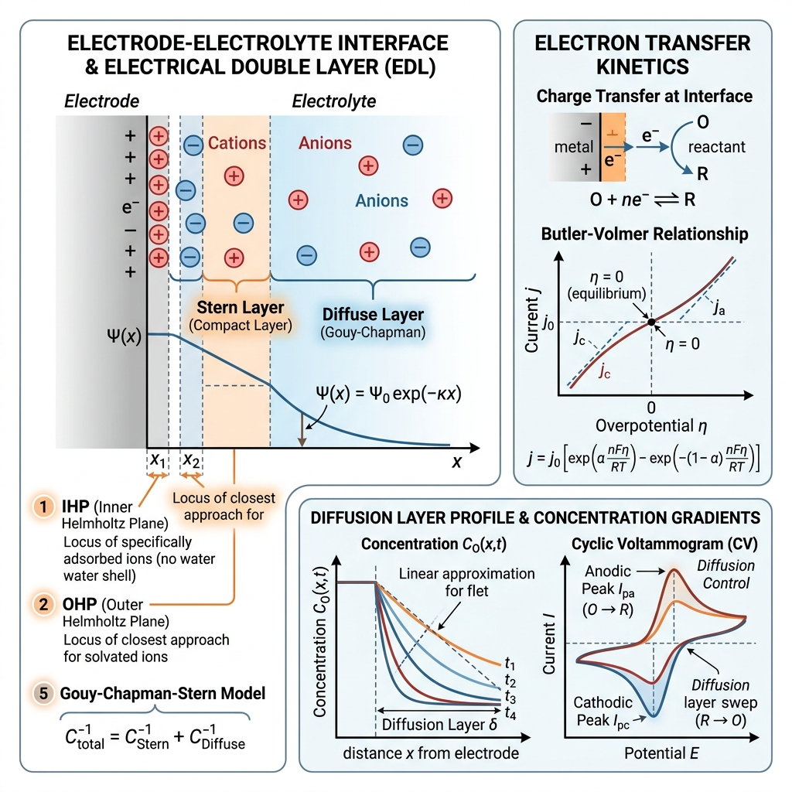{width="6.074073709536308in" height="6.074073709536308in"}

###### Hình 3.1. Sơ đồ lý thuyết điện hóa tại giao diện điện cực và dung dịch điện ly (Lớp điện kép và quá trình truyền khối)

### 3.1.2. Phổ trở kháng điện hóa (EIS) và mạch tương đương Randles

EIS đo lường trở kháng phức Z(ω) = Z' - jZ'' bằng cách áp dao động xoay chiều tần số nhỏ. Giản đồ Nyquist (Z' vs. -Z'') của hệ được phân tích thông qua mạch tương đương Randles sửa đổi:

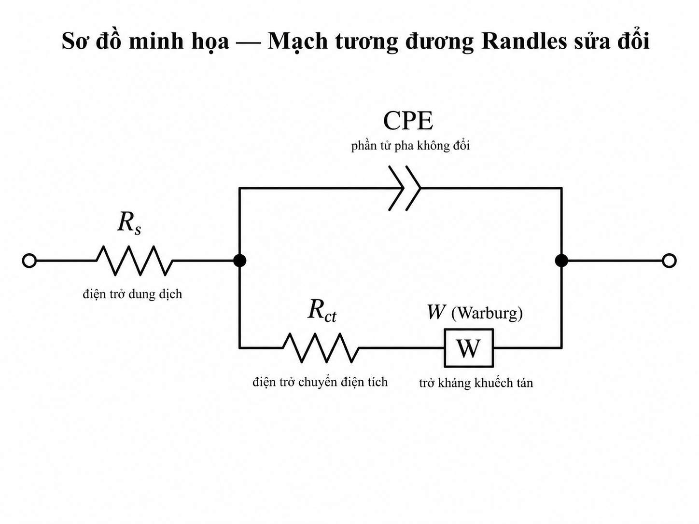{width="5.9898162729658795in" height="3.2777777777777777in"}

###### Hình 3.2. Sơ đồ minh họa --- Mạch tương đương Randles sửa đổi

- *Ý nghĩa vật lý của các linh kiện trong mạch*:

R~s~ (Solution Resistance): Điện trở của dung dịch đệm điện ly và dây dẫn. Biểu diễn bằng giao điểm của đường cong Nyquist với trục hoành Z' ở vùng tần số cực cao.

R~ct~ (Charge Transfer Resistance): Điện trở chuyển điện tích của phản ứng redox tại bề mặt phân giới điện cực/dung dịch. Biểu diễn bằng đường kính của vòng bán nguyệt ở vùng tần số cao và trung bình.

Trở kháng *Z*~CPE~ = 1 / \[*Y*~0~(*j*ω)^n^\] (với *n* từ 0.8 - 0.95).

***Z*~w~** (Warburg Impedance): Trở kháng khuếch tán của chất phản ứng từ lòng dung dịch đến bề mặt điện cực. Biểu diễn bằng đường thẳng nghiêng góc ≈ 45° ở vùng tần số thấp.

- *Tiêu chí Gate 5 điện hóa*:

R~ct~ (Fe/N-CA) \< R~ct~ (N-CA) \< R~ct~ (bare GCE)

Chứng minh tâm hoạt tính sắt Fe-N~x~ thúc đẩy động học chuyển electron nhanh hơn hẳn nền carbon thường \[41, 10\].

#### 3.1.3. Lý thuyết phương pháp vôn-ampe hòa tan sóng vuông (SWASV) đo kim loại nặng

- *Giai đoạn lắng khử (Accumulation/Deposition Step)*:

Áp một thế âm (-1.1 V vs. Ag/AgCl) dưới lực khuấy từ mạnh 400 rpm. Các cation kim loại nặng (Pb²⁺, Cd²⁺, Zn²⁺) khuếch tán đối lưu nhanh đến bề mặt điện cực và bị khử điện hóa thành kim loại tự do bám trên vách carbon:

M²⁺ + 2e⁻ → M⁰ (bám dính trên CA)

- Giai đoạn hòa tan (Stripping Step) \[62\]:

Ngừng khuấy từ, để tĩnh dung dịch trong 10 s (có thể khảo sát 10-20 s). Quét thế phân cực anode sóng vuông tần số cao. Các kim loại bị oxy hóa và hòa tan trở lại dung dịch tại thế đặc trưng của từng kim loại:

M⁰ (bám trên CA) → M²⁺ + 2e⁻

Cơ chế sóng vuông: Tần số xung cao cho phép đo dòng điện tại hai thời điểm cuối xung dương và xung âm. Hiệu dòng thu được loại bỏ hoàn toàn dòng điện dung phóng nạp không Faraday (Ic), chỉ thu nhận dòng Faraday (If), giúp hạ giới hạn phát hiện (LOD) xuống mức dải vết cực thấp (\< 0.1 ppb).

### 3.1.4. Lý thuyết các phép đặc trưng vật liệu

- *Raman Spectroscopy (Cấu trúc khuyết tật mạng)*:

D-band (≈ 1350 cm⁻¹): Dao động của cấu trúc lai hóa sp³ của nguyên tử carbon khuyết tật, mép phiến graphit hoặc nối với dị tố (N, O).

G-band (≈ 1580 cm⁻¹): Dao động kéo giãn C-C trong mặt phẳng lai hóa sp² của vòng thơm graphit tinh thể.

Tỷ số I~D~/I~G~: Với carbon aerogel làm cảm biến, tỷ lệ I~D~/I~G~ = 0.9 - 1.2 là tối ưu. Tỷ lệ này cân bằng giữa:

\(1\) Mật độ khuyết tật đủ lớn để cung cấp các active sites bắt giữ ion;

\(2\) Mạng lưới graphite sp² đủ nguyên vẹn để dẫn điện tốt \[23, 35\].

- *XPS Spectroscopy (Hóa học bề mặt và liên kết phối trí)*:

Phân tích N 1s: Giải phổ (deconvolution) xác định tỉ lệ Pyridinic-N (398.5 eV), Pyrrolic-N (400.1 eV), và Graphitic-N (401.2 eV). Để làm cảm biến Pb²⁺ tốt, mục tiêu định hướng Pyridinic-N đạt ≥ 45% diện tích đỉnh \[22, 23\].

Phân tích Fe 2p: Đỉnh Fe 2p~3/2~ ở 710.8 - 711.5 eV là gợi ý trạng thái phối trí cho sự phối trí của sắt đơn nguyên tử với nitơ (Fe-N~x~), phân biệt rõ với sắt metallic Fe^0^ (707 eV) và sắt oxit tự do (712 eV trở lên) \[41, 12\].

- *BET Surface Area Analysis (Phân bố kích thước lỗ xốp)*:

Isotherm hấp phụ-khử hấp phụ N2 của Carbon Aerogel từ xơ dừa thuộc Isotherm Loại IV (Type IV Isotherm) với vòng lặp trễ hysteresis loop đặc trưng cho vật liệu mesopores (2 - 50 nm). Diện tích bề mặt riêng S~BET~ \> 300 m²/g cùng phân bố thể tích lỗ xốp BJH tập trung ở dải mesopores bảo đảm dung dịch điện ly khuếch tán nhanh nhất, tránh hiện tượng bít tắc lỗ xốp khi biến tính mực in điện cực \[22, 23\].

### 3.1.5. Lý thuyết lựa chọn chất kết dính (Binder) tổng hợp màng cảm biến

Một yếu tố quyết định độ ổn định và độ nhạy của điện cực GCE sau biến tính là việc chọn đúng chất kết dính (binder) tạo màng composite:

- Chitosan (Ứng dụng cho SWASV đo kim loại nặng): Chitosan là polymer sinh học chứa nhiều nhóm amin (-NH~2~) và hydroxyl (-OH) tự do. Màng Chitosan/Fe/N-CA cung cấp mạng lưới gel ổn định, bám dính cực tốt lên GCE \[64\]. Quan trọng hơn, mạng lưới polymer này cung cấp thêm các vị trí chelate hóa phụ trợ, hoạt động hiệp đồng với các tâm Fe-N~x~ candidate sites để tăng cường quá trình làm giàu (accumulation) các cation kim loại nặng (Pb²⁺, Cd²⁺, Zn²⁺) lên bề mặt điện cực trước khi thực hiện bước hòa tan (stripping), giúp gia tăng tín hiệu đỉnh \[65, 66\]. Đặc biệt, việc sử dụng màng Chitosan không chỉ đóng vai trò chất kết dính cơ học mà còn tăng cường tín hiệu hòa tan anode nhờ khả năng tạo phức chelate mạnh mẽ của các nhóm -NH₂ với ion kim loại. Cơ chế hiệp đồng này tương tự như thiết kế đã được Guo và cộng sự chứng minh thành công trên hệ nền RGO-Chitosan \[45\].

- \"Nafion (Ứng dụng đo Paracetamol và chống nhiễu hữu cơ): Trái ngược với cấu trúc giàu nhóm amin của Chitosan, Nafion là một polymer perfluorinated chứa các nhóm sulfonate (-SO₃⁻) tích điện âm mạnh. Lớp màng Nafion/N-CA không chỉ đóng vai trò cố định vật liệu kỵ nước lên bề mặt điện cực nhờ khả năng phân tán tốt \[59\], mà còn hoạt động như một rào cản tĩnh điện (electrostatic barrier) đẩy lùi hiệu quả các anion cản trở, đồng thời ngăn chặn hiện tượng bám bẩn (fouling) từ quá trình ngưng tụ và trùng hợp của các sản phẩm phụ hữu cơ \[49\]. Cơ chế bảo vệ vi môi trường bề mặt này đặc biệt quan trọng để duy trì độ nhạy và độ lặp lại của cảm biến khi phân tích các mẫu chứa dư lượng dược phẩm có dòng oxi hóa phân hủy phức tạp như Paracetamol \[60, 66\]. Hơn nữa, việc sử dụng các điện cực biến tính bằng màng Nafion-composite (cụ thể là Nafion/TiO₂-graphene) đã thiết lập một hệ quy chiếu hiệu năng quan trọng cho phép phân tích Paracetamol với độ nhạy cao và LOD đạt mức vết (0.21 µM) \[49\], tạo cơ sở trực tiếp để so sánh và định chuẩn (benchmark) hiệu năng cảm biến DPV trong đề tài này.\"

## 3.2. Dự kiến thẩm định phân tích kim loại nặng (SWASV)

##### Bảng 3.2. Dự kiến thẩm định quy trình phân tích Pb²⁺, Cd²⁺, Zn²⁺

  -----------------------------------------------------------------------------
   **Chất phân tích**  **Khoảng tuyến tính**   **R²**    **LOD**      **RSD**
  -------------------- ----------------------- --------- ------------ ---------
          Pb²⁺         0.5--150 ppb            ≥ 0.999   \< 0.1 ppb   \< 4.5%

          Cd²⁺         1.0--150 ppb            ≥ 0.999   \< 0.2 ppb   \< 5.0%

          Zn²⁺         2.0--200 ppb            ≥ 0.999   \< 5 ppb     \< 5.0%
  -----------------------------------------------------------------------------

- *Lý giải cơ chế đạt giới hạn phát hiện (LOD) siêu nhạy*:

Việc đặt mục tiêu LOD \< 0.1 ppb cho Pb²⁺ là khả thi khi đối chiếu với các nền tảng cảm biến màng Bismuth hoặc vật liệu carbon xốp tiên tiến hiện nay \[14, 26, 67\]. Kết quả đột phá này dự kiến đạt được nhờ sự hiệp đồng kép.

\(1\) Cấu trúc "đường xoắn" phân cấp từ mạng lignin-cellulose cung cấp diện tích bề mặt điện hóa lớn, rút ngắn quãng đường khuếch tán;

\(2\) Các tâm xúc tác $Fe - N_{4}$ trên vách carbon đóng vai trò là các "vị trí bẫy" đặc hiệu. Sự hiện diện của các quỹ đạo điện tử biên chưa lấp đầy từ ion Fe trung tâm tạo ra ái lực phối trí mạnh mẽ với các cation kim loại nặng trong pha lắng khử ($t_{dep}$), làm tăng mật độ kim loại tích tụ lên bề mặt điện cực vượt trội so với nền carbon thông thường \[10, 12\].

## 3.3. Dự kiến kết quả phân tích mẫu thực tế

##### Bảng 3.3. Dự kiến kết quả phân tích mẫu thực

+--------------+--------------------+----------------+-------------------+---------------------------+
| **Loại mẫu** | **Chất phân tích** | **Chuẩn thêm** | **Thu hồi (%)**   | **Phương pháp Đối chứng** |
+:============:+:==================:+:==============:+:=================:+===========================+
| Nước máy     | Pb²⁺               | 10.0 ppb       | Dự kiến: 95--105% | ICP-MS hoặc GF-AAS        |
|              +--------------------+----------------+-------------------+                           |
|              | Cd²⁺               | 10.0 ppb       | Dự kiến: 96--104% |                           |
|              +--------------------+----------------+-------------------+                           |
|              | Zn²⁺               | 20.0 ppb       | Dự kiến: 95--105% |                           |
+--------------+--------------------+----------------+-------------------+                           |
| Nước sông    | Pb²⁺               | 20.0 ppb       | Dự kiến: 90--110% |                           |
|              +--------------------+----------------+-------------------+                           |
|              | Cd²⁺               | 20.0 ppb       | Dự kiến: 88--112% |                           |
|              +--------------------+----------------+-------------------+                           |
|              | Zn²⁺               | 50.0 ppb       | Dự kiến: 90--110% |                           |
+--------------+--------------------+----------------+-------------------+---------------------------+

## 3.4. Phân tích sai số bằng Sơ đồ xương cá Ishikawa

Để kiểm soát sai số phép đo điện hóa và đánh giá độ không đảm bảo đo phục vụ công bố quốc tế, sơ đồ xương cá Ishikawa phân tích 5 nguồn gây ra sai số chính được thiết lập và tích hợp dưới đây \[2\]:

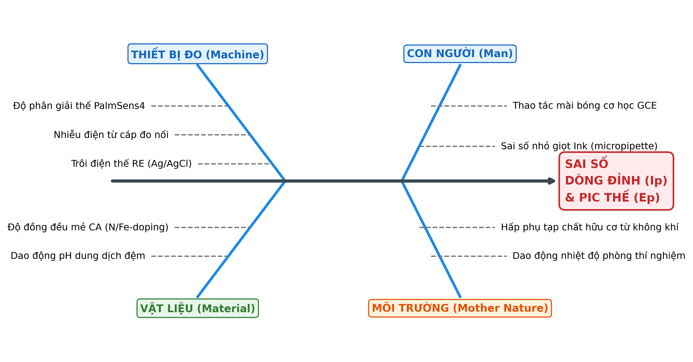{width="6.526388888888889in" height="2.712962598425197in"}

###### Hình 3.3. Sơ đồ xương cá Ishikawa phân tích các nguồn sai số phép đo cảm biến điện hóa

Dựa trên sơ đồ xương cá Ishikawa, các nguồn sai số chính ảnh hưởng trực tiếp đến cường độ dòng đỉnh (I~p~) và thế pic (E~p~) được phân tích và biện giải chi tiết theo 5 nhóm nhân tố chính:

- Thiết bị đo (Machine/Instrument): Độ phân giải thế của thiết bị PalmSens4 ảnh hưởng đến khả năng phân tách và định vị chính xác thế đỉnh pic (*E*~p~), đặc biệt khi xác định đồng thời các ion kim loại nặng có thế stripping gần nhau (như Pb²⁺ và Cd²⁺). Để giải quyết rủi ro này, sự kết hợp giữa nền carbon xốp (Fe/N-CA) và Chitosan được kỳ vọng sẽ tách bạch rõ ràng các đỉnh điện thế của Cd, Pb, Zn, ngăn ngừa sự tạo hợp kim liên kim loại (intermetallic compounds), dựa trên thành công của các thiết kế cấu trúc carbon xốp/chitosan tương tự \[45\]. Sự trôi thế của điện cực so sánh (RE - Ag/AgCl) do sự rò rỉ hoặc khuếch tán ngược của ion từ dung dịch đo vào màng ngăn porous pin, làm thay đổi nồng độ KCl 3 M bên trong, dẫn đến trôi thế phân cực của toàn hệ thống đo.

- *Con người (Human/Man)*: Thao tác mài bóng cơ học bề mặt điện cực carbon thủy tinh (GCE) sử dụng bột mài alumina (Al~2~O~3~) với kích thước hạt khác nhau (từ 1.0 µm, 0.3 µm đến 0.05 µm) nếu không đồng đều giữa các lần đo sẽ làm thay đổi diện tích hoạt tính thực tế (ECSA) và động học truyền electron \[62\]. Sai số drop-cast Ink (micropipette): Việc phân tán mực vật liệu (ink) bằng siêu âm không kỹ trước khi nhỏ, hoặc sai số thể tích nhỏ giọt (thường chỉ 7.0 µL) sẽ dẫn đến sự sai lệch về độ dày và khối lượng của lớp màng biến tính trên bề mặt GCE.

- Vật liệu (Material): Độ đồng đều của các mẻ tổng hợp Carbon Aerogel: Hàm lượng nitơ pha tạp (N-doping) và mật độ phân bố của các tâm hoạt tính sắt phối trí (Fe-N~x~) candidate sites có thể biến động nhẹ giữa các mẻ nung nhiệt phân. Sự bong tróc màng mỏng biến tính: Lớp màng vật liệu biến tính liên kết bởi Nafion hoặc Chitosan có thể bị bong tróc một phần khỏi bề mặt GCE dưới tác động lực ly tâm của thanh khuấy từ trong giai đoạn tích lũy kim loại nặng.

- Quy trình / Phương pháp (Method/Process): Dao động pH của dung dịch đệm nền trực tiếp quyết định cơ chế trao đổi proton/electron và trạng thái tích điện bề mặt vật liệu. Nhiệt độ và thời gian lắng (equilibration): Thời gian tích lũy điện hóa (*t*~dep~) và thời gian để hệ ổn định dòng nền trước khi quét thế stripping (*t*~eq~) cần được kiểm soát chặt chẽ bằng phần mềm đo.

- *Môi trường đo (Environment/Mother Nature)*: Nhiệt độ phòng thí nghiệm dao động làm thay đổi hệ số khuếch tán của chất phân tích và làm thay đổi độ dẫn điện của dung dịch đệm. Độ ẩm, bụi bẩn và tạp chất hữu cơ có thể hấp phụ vật lý lên màng biến tính trong quá trình sấy khô tự nhiên điện cực, che lấp các tâm hoạt tính điện hóa.

# CHƯƠNG 4. KẾ HOẠCH THỰC HIỆN 

**Lộ trình thực hiện chi tiết (6 tháng)**

Tháng 1, tiến hành nghiền mịn, xử lý kiềm xơ dừa Bến Tre, sấy và xác định hao hụt khối lượng, sau đó tổng hợp sol-gel để tạo hydrogel.

Tháng 2, thực hiện đông tụ ethanol, rửa, cấp đông, sấy thăng hoa và nhiệt phân lần 1 trong môi trường N2 để thu N-CA và nền Fe/N-CA.

Tháng 3, tiến hành tẩm Fe, sấy, acid leaching và annealing lần 2 nhằm tạo vật liệu Fe/N-CA hoàn chỉnh, đồng thời kiểm tra sơ bộ bằng Raman.

Tháng 4, đo đặc trưng vật liệu như BET, SEM, Raman, XPS; hoạt hóa GCE, pha mực biến tính và đánh giá điện hóa nền bằng CV/EIS.

Tháng 5, tối ưu hóa điều kiện phân tích điện hóa bằng CV hoặc SWASV, kết hợp RSM đa biến để xác định điều kiện đo phù hợp.

Tháng 6, thẩm định phương pháp theo tiêu chuẩn \[1, 2\], khảo sát ion nhiễu (cản trở), phân tích mẫu thực hoặc mẫu thêm chuẩn, xử lý thống kê bằng Origin, F-test, t-test, hoàn thiện luận văn và chuẩn bị bảo vệ.

# KẾT LUẬN VÀ KIẾN NGHỊ

## 1. Kết luận chung (Dự kiến)

\- Thiết lập thành công quy trình tổng hợp carbon aerogel N-CA và Fe/N-CA từ sinh khối xơ dừa Bến Tre sử dụng hệ dung môi sạch amoniac-urea kết hợp sấy thăng hoa. Điểm nhấn là việc tẩy lignin bán phần giúp giữ lại lignin làm tác nhân liên kết chéo, bảo vệ pha tinh thể cellulose và hình thành cấu trúc "đường xoắn" (tortuous path) 3D phân cấp tối ưu cho truyền khối.

\- Tổng hợp thành công màng mỏng composite cảm biến (N-CA/Nafion/GCE và Fe/N-CA/Chitosan/GCE). Quy trình đề xuất tẩm sau (post-impregnation) kết hợp acid leaching bằng $HCl$ và nung tái hoạt hóa (re-annealing) ở $750^{\circ}C$ dự kiến định hình hiệu quả các tâm hoạt tính $Fe - N_{x}$. Việc áp dụng chéo giả thuyết chuyển giao cơ sở hóa lý bề mặt từ các hệ vật liệu xúc tác năng lượng sang phân tích điện hóa (SWASV) sẽ được kiểm chứng qua các chỉ tiêu baseline nghiêm ngặt ($\Delta E_{p} < 120\ mV$ và trở kháng $R_{ct}$ giảm $\geq 35\%$), đảm bảo tính mới và độ tin cậy khoa học của đề tài.

\- Định lượng đồng thời dải vết kim loại nặng đạt độ nhạy cực cao ở mức nồng độ siêu vết (LOD \< 0.1 ppb đối với Pb²⁺), giải quyết tốt bài toán nhiễu nền chéo nhờ việc sử dụng chọn lọc các binder (Nafion/Chitosan). Đây là thiết kế mở rộng hoàn toàn mới, chưa từng được kiểm chứng trực tiếp trên nền sinh khối xơ dừa Bến Tre. Hiệu quả thu hồi mẫu thực tế dự kiến nằm trong khoảng chấp nhận của AOAC/EU và tương đương phương pháp phân tích thiết bị tiêu chuẩn dự kiến (như ICP-MS).

## 2. Kiến nghị hướng phát triển tiếp theo

Các sản phẩm trung gian từ quy trình tổng hợp Carbon Aerogel tạo tiền đề cho hai hướng mở rộng trong tương lai:

\(1\) Thu hồi lignin từ dòng thải kiềm hóa ở Giai đoạn 0 là một hướng mở rộng có cơ sở, do lignin trong dịch kiềm có thể được tách bằng acidification hoặc các kỹ thuật phân tách màng. Phần lignin thu hồi có thể kết hợp với cellulose nanofibrils (CNF) để tổng hợp carbon aerogel dạng monolith tự đứng thông qua ice-templating, sấy thăng hoa và carbon hóa. Hướng này có tiềm năng phát triển điện cực free-standing/binder-free cho các hệ lưu trữ năng lượng linh hoạt \[18\].

\(2\) Ngoài ứng dụng cảm biến điện hóa, vật liệu carbon aerogel từ xơ dừa có thể được khảo sát thêm như điện cực siêu tụ điện trong chất điện ly hữu cơ, chẳng hạn hệ muối tetraethylammonium tetrafluoroborate trong acetonitrile. Việc sử dụng electrolyte hữu cơ có thể mở rộng cửa sổ điện áp làm việc của EDLC lên vùng khoảng 2,7--3,0 V, từ đó tăng mật độ năng lượng theo quan hệ *E* = 1/2*CV*^2^. Tuy nhiên, hướng này nằm ngoài phạm vi luận văn hiện tại và cần được kiểm chứng riêng bằng các phép đo CV, GCD, EIS, capacitance retention và cycling stability \[68, 69\].

# TÀI LIỆU THAM KHẢO 

\[1\] International Council for Harmonisation (ICH), "ICH harmonised guideline Q2(R2): Validation of analytical procedures," ICH, Geneva, Switzerland, Guideline, Nov. 2023.

\[2\] T. C. Sơn, P. X. Đà, L. T. H. Hảo, và N. T. Trung, Thẩm định phương pháp trong phân tích hóa học và vi sinh vật. Hà Nội, Việt Nam: Nhà xuất bản Khoa học và Kỹ thuật, 2010.

\[3\] World Health Organization, "Zinc in drinking-water: Background document for development of WHO guidelines for drinking-water quality," WHO, Geneva, Switzerland, Tech. Rep. WHO/SDE/WSH/03.04/17, 2003.

\[4\] QCVN 08:2023/BTNMT --- Quy chuẩn kỹ thuật quốc gia về chất lượng nước mặt

\[5\] F. Pena-Pereira, W. Wojnowski, and M. Tobiszewski, "AGREE---Analytical GREEnness Metric Approach and Software," Analytical Chemistry, vol. 92, no. 14, pp. 10076--10082, Jul. 2020, doi: 10.1021/acs.analchem.0c01887.

\[6\] J. Cai and L. Zhang, "Unique gelation behavior of cellulose in NaOH/urea aqueous solution," Biomacromolecules, vol. 7, no. 1, pp. 183--189, Jan. 2006, doi: 10.1021/bm0505585.

\[7\] N. T. T. Nguyen et al., "Synthesis of cellulose aerogels from coir fibers via a NaOH/urea method for methylene-blue adsorption," Chemical Engineering Transactions, vol. 89, pp. 565--570, Dec. 2021, doi: 10.3303/CET2189095.

\[8\] C. Zhu, T. Y. Han, E. B. Duoss, et al., "Highly compressible 3D periodic graphene aerogel microlattices," Nature Communications, vol. 6, no. 1, p. 6962, Apr. 2015, doi: 10.1038/ncomms7962.

\[9\] K. Jost, D. Stenger, C. R. Perez, et al., "Knitted and screen printed carbon-fiber supercapacitors for applications in wearable electronics," Energy & Environmental Science, vol. 6, no. 9, pp. 2698--2705, Sep. 2013, doi: 10.1039/c3ee40515j.

\[10\] R. Zhong, C. Zhi, Y. Wu, Z. Liang, H. Tabassum, H. Zhang, T. Qiu, S. Gao, J. Shi, and R. Zou, "Atomic Fe-N~4~ sites on electrospun hierarchical porous carbon nanofibers as an efficient electrocatalyst for oxygen reduction reaction," Chinese Chemical Letters, vol. 31, no. 6, pp. 1588--1592, Jun. 2020, doi: 10.1016/j.cclet.2019.12.004.

\[11\] X. Wang, H. Zhang, H. Lin, et al., \"Directly converting Fe-doped metal--organic frameworks into highly active and stable Fe-N-C catalysts for oxygen reduction in acid,\" Nano Energy, vol. 25, pp. 110--119, Jul. 2016, doi: 10.1016/j.nanoen.2016.04.042.

\[12\] H. Wu, Q. Wen, X. Luan, W. Yang, L. Guo, and G. Wei, "Facile synthesis of Fe-doped, algae residue-derived carbon aerogels for electrochemical dopamine biosensors," Sensors, vol. 24, no. 9, p. 2787, Apr. 2024, doi: 10.3390/s24092787.

\[13\] C. Onfray and A. Thiam, "Biomass-derived carbon-based electrodes for electrochemical sensing: A review," Micromachines, vol. 14, no. 9, p. 1688, Sep. 2023, doi: 10.3390/mi14091688.

\[14\] A. Lochab, R. Sharma, S. Kumar, and R. Saxena, \"Recent advances in carbon based nanomaterials as electrochemical sensor for toxic metal ions in environmental applications,\" Materials Today: Proceedings, vol. 45, pp. 3741--3753, 2021, doi: 10.1016/j.matpr.2021.01.271.

\[15\] N. T. X. Phương, "Tổng hợp vật liệu cellulose aerogel từ xơ dừa để ứng dụng xử lý một số chất màu hữu cơ và dầu bôi trơn," Luận án Tiến sĩ Kỹ thuật Hóa học, Khoa Kỹ thuật Hóa học, Trường Đại học Bách Khoa - ĐHQG-HCM, Thành phố Hồ Chí Minh, Việt Nam, 2024.

\[16\] N. T. X. Phuong et al., "A comparative study on modification of aerogel-based biosorbents from coconut fibers for treatment of dye- and oil-contaminated water," Materials Today Sustainability, vol. 19, p. 100175, Sep. 2022, doi: 10.1016/j.mtsust.2022.100175.

\[17\] A. Rahayu, F. F. Hanum, N. A. Z. Amrillah, L. W. Lim, and S. Salamah, "Cellulose extraction from coconut coir with alkaline delignification process," Journal of Fibers and Polymer Composites, vol. 1, no. 2, pp. 106--116, Oct. 2022, doi: 10.55043/jfpc.v1i2.51.

\[18\] M. Cho, J. Yiu, L. T. Lin, Q. Hua, M. A. Karaaslan, and S. Renneckar, "Lignin nanofiber flexible carbon aerogels for self-standing supercapacitors," ChemSusChem, vol. 18, no. 3, p. e202400932, Feb. 2025, doi: 10.1002/cssc.202400932.

\[19\] J. Heikenfeld, A. Jajack, J. Rogers, et al., "Wearable sensors: modalities, challenges, and prospects," Lab on a Chip, vol. 18, no. 2, pp. 217--248, Jan. 2018, doi: 10.1039/c7lc00914c.

\[20\] Y. Luo, M. R. Abidian, J. Ahn, et al., "Technology Roadmap for Flexible Sensors," ACS Nano, vol. 17, no. 6, pp. 5211--5295, Mar. 2023, doi: 10.1021/acsnano.2c12606.

\[21\] M. Fauziyah, W. Widiyastuti, R. Balgis, and H. Setyawan, "Production of cellulose aerogels from coir fibers via an alkali--urea method for sorption applications," Cellulose, vol. 26, no. 18, pp. 9583--9598, Dec. 2019, doi: 10.1007/s10570-019-02753-x.

\[22\] M. Fauziyah, W. Widiyastuti, and H. Setyawan, "Nitrogen-doped carbon aerogels prepared by direct pyrolysis of cellulose aerogels derived from coir fibers using an ammonia--urea system and their electrocatalytic performance toward the oxygen reduction reaction," Industrial & Engineering Chemistry Research, vol. 59, no. 49, pp. 21371--21382, Dec. 2020, doi: 10.1021/acs.iecr.0c03771.

\[23\] S. Susanto, T. Nurtono, W. Widiyastuti, M.-H. Yeh, and H. Setyawan, "Controlling N-doping nature at carbon aerogels from biomass for enhanced oxygen reduction in seawater batteries," ACS Omega, vol. 9, no. 12, pp. 13994--14004, Mar. 2024, doi: 10.1021/acsomega.3c09297.

\[24\] S. Susanto, T. F. Rochman, M. R. Kamandanu, T. Nurtono, W. Widiyastuti, and H. Setyawan, "Synthesis of metal-free carbon aerogel with nitrogen-doped from pyrolysis of cellulose aerogels based on coir fibers using ammonia-urea system as electrocatalyst of oxygen reduction reaction for cathode in seawater batteries," Key Engineering Materials, vol. 971, pp. 55--63, Dec. 2023, doi: 10.4028/p-PC7nGO.

\[25\] S. Susanto, N. Avabel, N. Septianingrum, T. Nurtono, and H. Setyawan, "N and Fe doped-carbon aerogel for high performance of oxygen reduction reactions electrocatalyst in magnesium-air battery," Materials Science Forum, vol. 1142, pp. 63--70, Dec. 2024, doi: 10.4028/p-RzIuQ9.

\[26\] J. Wang, J. Lu, S. B. Hocevar, P. A. M. Farias, and B. Ogorevc, "Bismuth-coated carbon electrodes for anodic stripping voltammetry," Analytical Chemistry, vol. 72, no. 14, pp. 3218--3222, Jul. 2000, doi: 10.1021/ac000108x.

\[27\] K. H. Ho, P. X. T. Nguyen, N. H. N. Do, K. A. Le, and P. K. Le, "Green fabrication of bio-based aerogels from coconut coir for heat insulation and oil removal," Chemical Engineering Transactions, vol. 88, pp. 709--714, Oct. 2021, doi: 10.3303/CET2188118.

\[28\] N. Q. Việt, N. V. V. Linh, P. N. Sinh, N. N. K. Tuyến, P. M. Trí, và N. Đ. Thành, "Khảo sát tính chất sợi xơ dừa sản xuất bằng máy dập tước liên hoàn tại Bến Tre và nghiên cứu xử lý sợi bằng NaOH," Tạp chí Phát triển Khoa học và Công nghệ, vol. 17, no. K3, pp. 110--118, 2014.

\[29\] N. T. X. Phuong et al., "Novel Fabrication of Renewable Aerogels from Coconut Coir Fibers for Dye Removal," Chemical Engineering Transactions, vol. 89, pp. 31--36, Dec. 2021, doi: 10.3303/CET2189006.

\[30\] B. Xiong, P. Zhao, K. Hu, L. Zhang, and G. Cheng, \"Dissolution of cellulose in aqueous NaOH/urea solution: role of urea,\" Cellulose, vol. 21, no. 2, pp. 1183--1192, Apr. 2014, doi: 10.1007/s10570-014-0221-7.

\[31\] G. Yang, J. Zhu, P. Yuan, et al., "Regulating Fe-spin state by atomically dispersed Mn-N in Fe-N-C catalysts with high oxygen reduction activity," Nature Communications, vol. 12, no. 1, p. 1734, Mar. 2021, doi: 10.1038/s41467-021-21919-5.

\[32\] J. Cai and L. Zhang, \"Rapid dissolution of cellulose in LiOH/urea and NaOH/urea aqueous solutions,\" Macromolecular Bioscience, vol. 5, no. 6, pp. 539--548, Jun. 2005, doi: 10.1002/mabi.200400222.

\[33\] H. Hosseini, M. Kokabi, and S. M. Mousavi, "Conductive bacterial cellulose/multiwall carbon nanotubes nanocomposite aerogel as a potentially flexible lightweight strain sensor," Carbohydrate Polymers, vol. 201, pp. 228--235, Dec. 2018, doi: 10.1016/j.carbpol.2018.08.054.

\[34\] S. H. Osman, S. K. Kamarudin, S. Basri, and N. A. Karim, "Organic aerogel as electro‐catalytic support in low‐temperature fuel cell," International Journal of Energy Research, vol. 46, no. 12, pp. 16264--16280, Oct. 2022, doi: 10.1002/er.8377.

\[35\] M. Kubicka, M. Bakierska, K. Chudzik, M. Świętosławski, and M. Molenda, "Nitrogen-Doped Carbon Aerogels Derived from Starch Biomass with Improved Electrochemical Properties for Li-Ion Batteries," International Journal of Molecular Sciences, vol. 22, no. 18, p. 9918, Sep. 2021, doi: 10.3390/ijms22189918.

\[36\] T. Marshall-Roth et al., \"A pyridinic Fe-N4 macrocycle models the active sites in Fe/N-doped carbon electrocatalysts,\" Nature Communications, vol. 11, no. 1, p. 5231, Oct. 2020, doi: 10.1038/s41467-020-18969-6.

\[37\] H. Fei, J. Dong, Y. Feng, et al., \"General synthesis and definitive structural identification of MN4C4 single-atom catalysts with tunable electrocatalytic activities,\" Nature Catalysis, vol. 1, no. 1, pp. 63--72, Jan. 2018, doi: 10.1038/s41929-017-0008-y.

\[38\] X. Wu, Y. Sun, T. He, Y. Zhang, G.-J. Zhang, Q. Liu, and S. Chen, "Iron, Nitrogen-Doped Carbon Aerogels for Fluorescent and Electrochemical Dual-Mode Detection of Glucose," Langmuir, vol. 37, no. 38, pp. 11309--11315, Sep. 2021, doi: 10.1021/acs.langmuir.1c01866.

\[39\] Y. Feng, Y. Li, S. Yu, Q. Yang, Y. Tong, and B.-C. Ye, \"Electrochemical sensor based on N-doped carbon dots decorated with manganese oxide nanospheres for simultaneous detection of p-aminophenol and paracetamol,\" *Analyst*, vol. 146, no. 16, pp. 5135-5145, 2021, doi: 10.1039/d1an00966d.

\[40\] S. Allende, Y. Liu, and M. V. Jacob, \"Electrochemical sensing of paracetamol based on sugarcane bagasse-activated biochar,\" *Ind. Crops Prod.*, vol. 211, p. 118241, May 2024, doi: 10.1016/j.indcrop.2024.118241.

\[41\] N. G. Tsierkezos, S. H. Othman, and U. Ritter, \"Nitrogen-doped multi-walled carbon nanotubes for paracetamol sensing,\" *Ionics*, vol. 19, no. 12, pp. 1897-1905, Dec. 2013, doi: 10.1007/s11581-013-0930-1.

\[42\] A. W. Adamson and A. P. Gast, Physical Chemistry of Surfaces, 6th ed. New York, NY, USA: John Wiley & Sons, 1997.

\[43\] J. N. Israelachvili, Intermolecular and Surface Forces, 3rd ed. San Diego, CA, USA: Academic Press, 2011.

\[44\] X. Hou, W. Wu, F. Zhao, W. Xie, and Q. Yang, \"Construction of an electrochemical sensor with graphene aerogel doped with ZrO2 nanoparticles and chitosan for the selective detection of luteolin,\" Microchimica Acta, vol. 188, no. 3, p. 86, 2021, doi: 10.1007/s00604-021-04743-y.

\[45\] Z. Guo et al., \"Simultaneous determination of trace Cd(II), Pb(II) and Cu(II) by differential pulse anodic stripping voltammetry using a reduced graphene oxide-chitosan/poly-L-lysine nanocomposite modified glassy carbon electrode,\" J. Colloid Interface Sci., vol. 490, pp. 11--22, Mar. 2017, doi: 10.1016/j.jcis.2016.11.006.

\[46\] J.-H. Hwang, P. Pathak, X. Wang, K. L. Rodriguez, H. J. Cho, and W. H. Lee, \"A Novel Bismuth-Chitosan Nanocomposite Sensor for Simultaneous Detection of Pb(II), Cd(II) and Zn(II) in Wastewater,\" Micromachines, vol. 10, no. 8, p. 511, Aug. 2019, doi: 10.3390/mi10080511.

\[47\] R. Huang, J. Lv, J. Chen, Y. Zhu, J. X. Zhu, T. Wågberg, and G. Hu, \"Three-dimensional porous high boron-nitrogen-doped carbon for the ultrasensitive electrochemical detection of trace heavy metals in food samples,\" Journal of Hazardous Materials, vol. 442, p. 130020, Jan. 2023, doi: 10.1016/j.jhazmat.2022.130020.

\[48\] P. Knihnicki et al., \"Electrochemical Sensing of Pb2+ and Cd2+ Ions with the Use of Electrode Modified with Carbon-Covered Halloysite and Carbon Nanotubes,\" Molecules, vol. 27, no. 14, p. 4608, Jul. 2022, doi: 10.3390/molecules27144608.

\[49\] F. Yang, J.-H. Liu, H.-T. Lu, and Q. Zhang, \"Electrochemical behavior and voltammetric determination of paracetamol on Nafion/TiO₂--graphene modified glassy carbon electrode,\" Colloids and Surfaces B: Biointerfaces, vol. 85, no. 2, pp. 289--292, Jul. 2011, doi: 10.1016/j.colsurfb.2011.02.041.

\[50\] A. S. Suryandari, T. Nurtono, W. Widiyastuti, and H. Setyawan, "Hydrophobic Modification of Sulfonated Carbon Aerogels from Coir Fibers to Enhance Their Catalytic Performance for Esterification," ACS Omega, vol. 8, no. 30, pp. 27139--27145, Aug. 2023, doi: 10.1021/acsomega.3c02244.

\[51\] P. Singh et al., "From cellulose dissolution and regeneration to added value applications---Synergism between molecular understanding and material development," in Cellulose---Fundamental Aspects and Current Trends, M. Poletto, Ed. London, UK: IntechOpen, 2015, pp. 1--25, doi: 10.5772/61402.

\[52\] S. Park, J. O. Baker, M. E. Himmel, P. A. Parilla, and D. K. Johnson, "Cellulose crystallinity index: measurement techniques and their impact on interpreting cellulase performance," Biotechnology for Biofuels, vol. 3, p. 10, May 2010, doi: 10.1186/1754-6834-3-10.

\[53\] B. Thomas et al., "Ice-Templating of Lignin and Cellulose Nanofiber-Based Carbon Aerogels: Implications for Energy Storage Applications," ACS Applied Nano Materials, vol. 5, no. 6, pp. 7954--7966, Jun. 2022, doi: 10.1021/acsanm.2c01033.

\[54\] S. Geng, J. Wei, S. Jonasson, J. Hedlund, and K. Oksman, "Multifunctional Carbon Aerogels with Hierarchical Anisotropic Structure Derived from Lignin and Cellulose Nanofibers for CO2 Capture and Energy Storage," ACS Applied Materials & Interfaces, vol. 12, no. 6, pp. 7432--7441, Feb. 2020, doi: 10.1021/acsami.9b19955.

\[55\] Y. Hu et al., "3D hierarchical porous N-doped carbon aerogel from renewable cellulose: an attractive carbon for high-performance supercapacitor electrodes and CO2 adsorption," RSC Advances, vol. 6, no. 23, pp. 19345--19354, Feb. 2016, doi: 10.1039/c6ra00822d.

\[56\] Ö. P. Konuk et al., "The effect of synthesis conditions and process parameters on aerogel properties," Frontiers in Chemistry, vol. 11, p. 1294520, Oct. 2023, doi: 10.3389/fchem.2023.1294520.

\[57\] S. Hoepfner, L. Ratke, and B. Milow, \"Synthesis and characterisation of nanofibrillar cellulose aerogels,\" Cellulose, vol. 15, no. 1, pp. 121--129, Feb. 2008, doi: 10.1007/s10570-007-9146-8.

\[58\] N. Buchtová and T. Budtova, \"Cellulose aero-, cryo- and xerogels: towards understanding of morphology control,\" Cellulose, vol. 23, no. 4, pp. 2585--2595, Aug. 2016, doi: 10.1007/s10570-016-0960-8.

\[59\] J. Wang, M. Musameh, and Y. Lin, \"Solubilization of Carbon Nanotubes by Nafion Toward the Preparation of Amperometric Biosensors,\" Journal of the American Chemical Society, vol. 125, no. 9, pp. 2408-2409, Mar. 2003, doi: 10.1021/ja028951v.

\[60\] Z. Chai, C. Wang, H. Zhang, C. M. Doherty, B. P. Ladewig, A. J. Hill, and H. Wang, \"Nafion--Carbon Nanocomposite Membranes Prepared Using Hydrothermal Carbonization for Proton-Exchange-Membrane Fuel Cells,\" Advanced Functional Materials, vol. 20, no. 24, pp. 4394--4399, Dec. 2010, doi: 10.1002/adfm.201001412.

\[61\] C. S. Ong, N. H. B. Zaharum, N. Mohamad Nor, et al., \"Morphology and atomic configuration control of heavy metal attraction modified layer on screen-printed electrode to enhance electrochemical sensing performance,\" Journal of Electroanalytical Chemistry, vol. 939, art. no. 117477, Jun. 2023, doi: 10.1016/j.jelechem.2023.117477.

\[62\] J. Wang, Analytical Electrochemistry, 3rd ed. Hoboken, NJ, USA: John Wiley & Sons, 2006, doi: 10.1002/0471790303.

\[63\] AOAC International, "Appendix F: Guidelines for Standard Method Performance Requirements," in Official Methods of Analysis of AOAC International, 22nd ed., G. W. Latimer, Jr., Ed. Rockville, MD, USA: AOAC International, 2023.

\[64\] C. Hao, L. Ding, X. Zhang, and H. Ju, "Biocompatible Conductive Architecture of Carbon Nanofiber-Doped Chitosan Prepared with Controllable Electrodeposition for Cytosensing," Analytical Chemistry, vol. 79, no. 12, pp. 4442--4447, Jun. 2007, doi: 10.1021/ac062344z.

\[65\] W. Wang, Q. Meng, Q. Li, et al., \"Chitosan Derivatives and Their Application in Biomedicine,\" International Journal of Molecular Sciences, vol. 21, no. 2, art. no. 487, Jan. 2020, doi: 10.3390/ijms21020487.

\[66\] V. Myndrul, I. Iatsunskyi, N. Babayevska, M. Jarek, and T. Jesionowski, "Effect of Electrode Modification with Chitosan and Nafion® on the Efficiency of Real-Time Enzyme Glucose Biosensors Based on ZnO Tetrapods," Materials, vol. 15, no. 13, p. 4672, Jul. 2022, doi: 10.3390/ma15134672.

\[67\] Y. El Hamdouni et al., \"Biomass valorization of walnut shell into biochar as a resource for electrochemical simultaneous detection of heavy metal ions in water and soil samples: Preparation, characterization, and applications,\" Arabian Journal of Chemistry, vol. 15, no. 11, p. 104252, Nov. 2022, doi: 10.1016/j.arabjc.2022.104252.

\[68\] Z. Zhang et al., "Hierarchically Interconnected N-Doped Carbon Aerogels Derived from Cellulose Nanofibrils as High Performance and Stable Electrodes for Supercapacitors," The Journal of Physical Chemistry C, vol. 122, no. 42, pp. 23852--23860, Oct. 2018, doi: 10.1021/acs.jpcc.8b06550.

\[69\] R. E. Ruther et al., "Stable Electrolyte for High Voltage Electrochemical Double-Layer Capacitors," Journal of The Electrochemical Society, vol. 164, no. 2, pp. A277--A283, Jan. 2017, doi: 10.1149/2.0951702jes.

## Phụ lục 1: Quy trình chuẩn bị dung dịch đệm Acetate pH 4.5 và đệm Phosphate PBS pH 7.4 \[8, 16\]

- Đệm Acetate pH 4.5 (0.1 M): Hòa tan 8.2g CH~3~COONa khan trong 900 mL nước cất hai lần. Dùng dung dịch CH~3~COOH 0.1 M hiệu chỉnh pH về 4.5. Định mức đến 1000 mL bằng nước cất và bảo quản ở 4°C.

- Đệm PBS 1 × (pH 7.4): Hòa tan 8.0g NaCl, 0.2g KCl, 1.44g Na~2~HPO~4~ và 0.24g KH~2~PO~4~ trong 900 mL nước cất. Sử dụng dung dịch HCl 1 M hoặc NaOH 1 M điều chỉnh pH về 7.4. Thêm nước cất vừa đủ 1000 mL.

## Phụ lục 2: Sơ đồ lắp ráp điện cực GCE sửa đổi và buồng đo điện hóa 3 điện cực

Hệ thống đo gồm 3 điện cực đặt trong bình phân tích thủy tinh dung tích 20 mL: (1) Điện cực làm việc (GCE sửa đổi Fe/N-CA hoặc N-CA), (2) Điện cực đối (dây Platinum), và (3) Điện cực so sánh (Ag/AgCl trong dung dịch KCl bão hòa). Bình đo được đặt trên máy khuấy từ và nối trực tiếp với máy PalmSens4.

## Phụ lục 3: Quy trình hiệu chuẩn điện cực so sánh Ag/AgCl

- Hiệu chuẩn RE: Đo OCP giữa điện cực Ag/AgCl cần đo và một RE chuẩn trong dung dịch KCl 3 M. Đạt yêu cầu nếu ΔEOCP ≤ 10 mV (lý tưởng nhất là ≤ 3 mV).

- Tự chế Ag/AgCl nước từ RE phi nước rỗng: Đánh bóng sợi dây bạc Ag, ngâm trong HCl 0.1 M, áp thế +0.8 V vs. Pt trong 2 phút để tạo lớp phủ AgCl xám tro theo quy chuẩn kỹ thuật điện hóa \[8\]. Bơm dung dịch KCl 3 M vào ống điện cực phi nước rỗng, luồn dây bạc Ag/AgCl vào để làm điện cực so sánh nước dự phòng.

## Phụ lục 4: Chương trình nhiệt phân 3-ramp (profile nhiệt độ lò ống)

Biểu đồ mô tả sự tăng nhiệt độ theo thời gian trong lò nung ống thạch anh: từ nhiệt độ phòng lên 150°C (ramp 1, 5°C/min, giữ 30 min) → lên 400°C (ramp 2, 5°C/min, giữ 30 min) → lên 700°C hoặc 800°C (ramp 3, 5°C/min, giữ 120 min), và làm nguội tự nhiên dưới luồng khí bảo vệ N~2~.
